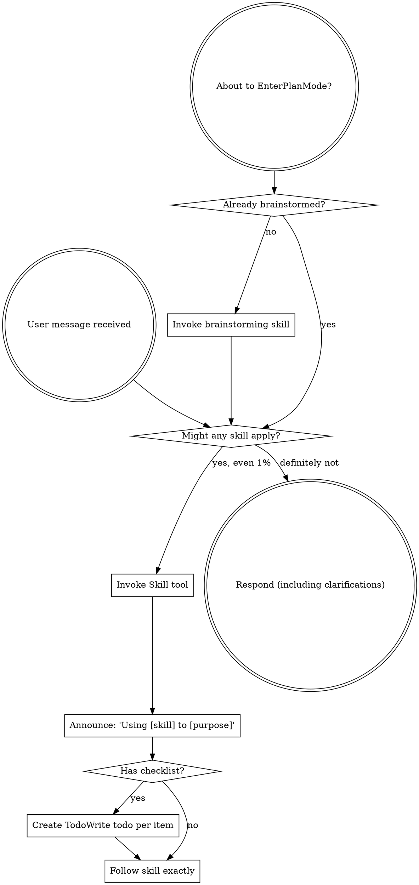
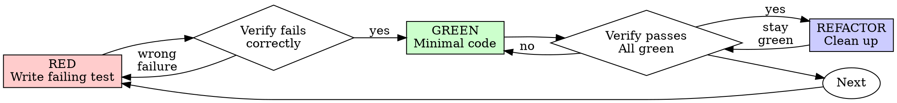
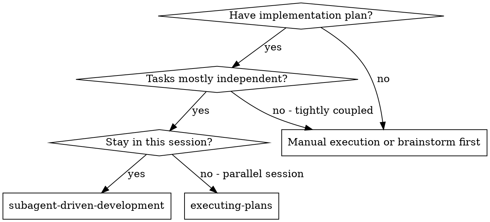
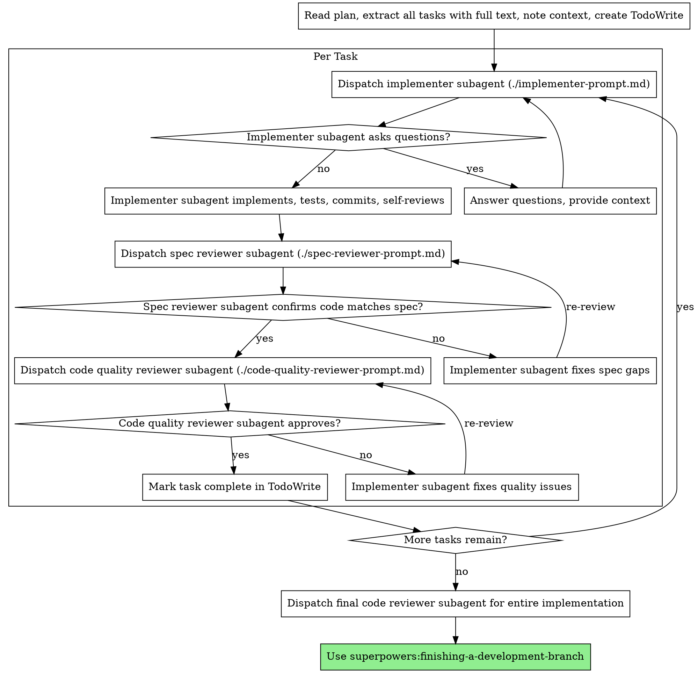

# Codex session 019f1339-02fd-7fc2-9c98-4d9547b6aaaf

- Started: `2026-06-29T11:52:16.347Z`
- Working directory: `D:\100XH100`
- Originator: `Codex Desktop`
- Codex CLI: `0.142.2`
- Source log: `C:\Users\Иван Литвак\.codex\sessions\2026\06\29\rollout-2026-06-29T14-52-16-019f1339-02fd-7fc2-9c98-4d9547b6aaaf.jsonl`
- Entries: user=6, assistant=140, tool calls=166, tool outputs=166

This is a chronological export of the user/assistant conversation and tool activity. Internal system/developer instructions and token accounting are intentionally excluded. Secret-shaped values are redacted; oversized tool outputs retain their beginning and end with the omitted character count.

## 1. User

Time: `2026-06-29T11:52:27.010Z` · source line `4`

```text
# AGENTS.md instructions for D:\100XH100

<INSTRUCTIONS>
# Project Agent Rules

## Operating Rule
- Read `AGENTS.md` before project edits.
- Update `memory/CHANGELOG.md` after meaningful code, config, or architecture changes.
- Update `memory/PROMPTS.md` with user prompts that define requirements.
- Store test outputs, logs, and verification notes under `test_results/`.
- Prefer agent-centered code: explicit contracts, deterministic tests, small files, low hidden state.

## Architecture Source
- Primary architecture contract: `ARCHITECTURE_NEED.md`.
- Current Stream 4 implementation rule: use threshold + compact + CUB/fixed-temp sort/reduce + compact; do not use Stream 4 hash-table dedup.

## Implementation Guardrails
- `State128` logical bytes are `v[0..119]`.
- `State128` padding bytes are `v[120..127]`.
- Persistent frontier padding must be zero.
- `FinalResponse` may temporarily store `target_local_idx` in `v[120..123]`.
- `Hash128` is one logical 128-bit key stored as `{lo, hi}`.
- `CandidateMeta` must remain 32 bytes and 32-byte aligned.
- Stream 3 payload id must be original candidate id, not compact index.
- Stream 4 must not apply shard top-k or semantic shard cap.

</INSTRUCTIONS>
<environment_context>
  <cwd>D:\100XH100</cwd>
  <shell>powershell</shell>
  <current_date>2026-06-29</current_date>
  <timezone>Europe/Moscow</timezone>
  <filesystem><workspace_roots><root>D:\100XH100</root></workspace_roots><permission_profile type="managed"><file_system type="restricted"><entry access="read"><special>:root</special></entry><entry access="write"><path>D:\100XH100</path></entry><entry access="write"><special>:slash_tmp</special></entry><entry access="write"><special>:tmpdir</special></entry><entry access="read"><path>D:\100XH100\.git</path></entry><entry access="read"><path>D:\100XH100\.agents</path></entry><entry access="read"><path>D:\100XH100\.codex</path></entry></file_system></permission_profile></filesystem>
</environment_context>
```

## 2. User

Time: `2026-06-29T11:52:27.024Z` · source line `6`

```text
You are Worker 1 in a subagent-driven workflow. Work ONLY in this isolated worktree: D:\100XH100\.worktrees\stream1-piece-transformer

You are not alone in the codebase. Do not revert edits made by others. Do not touch files outside your assigned scope. Do not make broad refactors.

Project rules:
- Read AGENTS.md before edits.
- Update memory/CHANGELOG.md after meaningful code/config/architecture changes.
- Update memory/PROMPTS.md only if you introduce or clarify a user requirement; for this task, do not add a new prompt unless needed.
- Store test/verification notes under test_results/ if you run meaningful checks.
- Guardrails: State128 logical bytes v[0..119], padding v[120..127]; do not alter Stream2/3/4/5 behavior.

Assigned task: Task 1 from docs/superpowers/plans/2026-06-29-stream1-piece-transformer.md: Add Tagged Stream1 Model Config.

Scope you may edit:
- src/config.hpp
- src/config.cpp
- tests/contract_tests.cpp
- memory/CHANGELOG.md
- optionally test_results/stream1_piece_transformer_task1_*.md

Do NOT edit:
- cuda/*
- tools/*
- CMakeLists.txt
- stream1 weights

Task details:
1. Add a contract test `test_stream1_backend_row_modes()` to tests/contract_tests.cpp. It should verify:
   - MLP backend + output_dim=1 uses child rows and rows_per_parent == MOVE_COUNT.
   - Piece transformer backend + output_dim=MOVE_COUNT uses parent rows and rows_per_parent == 1.
   - Transformer config sample sets num_pieces=50, max_piece_size=3, seq_len=51, d_model=256, nhead=8, head_dim=32, transformer_layers=4, ff_dim=1024.
2. Add backend constants to src/config.hpp:
   - STREAM1_BACKEND_MLP = 0
   - STREAM1_BACKEND_PIECE_TRANSFORMER = 1
3. Extend Stream1ModelConfig with `backend` defaulting to MLP and transformer metadata fields defaulting to 0:
   - num_pieces, max_piece_size, seq_len, d_model, nhead, head_dim, transformer_layers, ff_dim.
   Keep all existing MLP defaults unchanged.
4. Make stream1_uses_child_rows() backend-aware in src/config.cpp: transformer always returns false; MLP keeps old behavior based on output_dim == STREAM1_SINGLE_SCORE_OUTPUT_DIM.
5. Build/run contract_tests if possible. If build environment is unavailable, run the smallest available syntax/static check and report exactly what was/was not verified.
6. Update memory/CHANGELOG.md with a concise note.
7. Commit ONLY your assigned changes on branch codex/stream1-piece-transformer with message: `Add tagged Stream1 backend config`.

Return status as one of: DONE, DONE_WITH_CONCERNS, NEEDS_CONTEXT, BLOCKED. Include changed files, test commands/output summary, and commit SHA if committed.
```

## 3. Codex

Time: `2026-06-29T11:52:43.835Z` · source line `9`

```text
I’ll work inside the assigned worktree only. I’m going to load the required workflow skills and then read the project rules before touching files.
```

## 4. Tool call: `exec_command`

Time: `2026-06-29T11:52:43.920Z` · source line `11`

```text
{"cmd":"Get-Content -LiteralPath 'C:\\Users\\Иван Литвак\\.codex\\plugins\\cache\\openai-curated-remote\\superpowers\\5.1.4\\skills\\using-superpowers\\SKILL.md'","workdir":"D:\\100XH100\\.worktrees\\stream1-piece-transformer","yield_time_ms":10000,"max_output_tokens":20000}
```

## 5. Tool call: `exec_command`

Time: `2026-06-29T11:52:43.964Z` · source line `12`

```text
{"cmd":"Get-Content -LiteralPath 'C:\\Users\\Иван Литвак\\.codex\\plugins\\cache\\openai-curated-remote\\superpowers\\5.1.4\\skills\\test-driven-development\\SKILL.md'","workdir":"D:\\100XH100\\.worktrees\\stream1-piece-transformer","yield_time_ms":10000,"max_output_tokens":20000}
```

## 6. Tool output

Time: `2026-06-29T11:52:44.648Z` · source line `13`

````text
Chunk ID: cd8cde
Wall time: 0.2891 seconds
Process exited with code 0
Original token count: 1393
Output:
---
name: using-superpowers
description: Use when starting any conversation - establishes how to find and use skills, requiring Skill tool invocation before ANY response including clarifying questions
---

<SUBAGENT-STOP>
If you were dispatched as a subagent to execute a specific task, skip this skill.
</SUBAGENT-STOP>

<EXTREMELY-IMPORTANT>
If you think there is even a 1% chance a skill might apply to what you are doing, you ABSOLUTELY MUST invoke the skill.

IF A SKILL APPLIES TO YOUR TASK, YOU DO NOT HAVE A CHOICE. YOU MUST USE IT.

This is not negotiable. This is not optional. You cannot rationalize your way out of this.
</EXTREMELY-IMPORTANT>

## Instruction Priority

Superpowers skills override default system prompt behavior, but **user instructions always take precedence**:

1. **User's explicit instructions** (CLAUDE.md, GEMINI.md, AGENTS.md, direct requests) — highest priority
2. **Superpowers skills** — override default system behavior where they conflict
3. **Default system prompt** — lowest priority

If CLAUDE.md, GEMINI.md, or AGENTS.md says "don't use TDD" and a skill says "always use TDD," follow the user's instructions. The user is in control.

## How to Access Skills

**In Claude Code:** Use the `Skill` tool. When you invoke a skill, its content is loaded and presented to you—follow it directly. Never use the Read tool on skill files.

**In Copilot CLI:** Use the `skill` tool. Skills are auto-discovered from installed plugins. The `skill` tool works the same as Claude Code's `Skill` tool.

**In Gemini CLI:** Skills activate via the `activate_skill` tool. Gemini loads skill metadata at session start and activates the full content on demand.

**In other environments:** Check your platform's documentation for how skills are loaded.

## Platform Adaptation

Skills use Claude Code tool names. Non-CC platforms: see `references/copilot-tools.md` (Copilot CLI), `references/codex-tools.md` (Codex) for tool equivalents. Gemini CLI users get the tool mapping loaded automatically via GEMINI.md.

# Using Skills

## The Rule

**Invoke relevant or requested skills BEFORE any response or action.** Even a 1% chance a skill might apply means that you should invoke the skill to check. If an invoked skill turns out to be wrong for the situation, you don't need to use it.



## Red Flags

These thoughts mean STOP—you're rationalizing:

| Thought | Reality |
|---------|---------|
| "This is just a simple question" | Questions are tasks. Check for skills. |
| "I need more context first" | Skill check comes BEFORE clarifying questions. |
| "Let me explore the codebase first" | Skills tell you HOW to explore. Check first. |
| "I can check git/files quickly" | Files lack conversation context. Check for skills. |
| "Let me gather information first" | Skills tell you HOW to gather information. |
| "This doesn't need a formal skill" | If a skill exists, use it. |
| "I remember this skill" | Skills evolve. Read current version. |
| "This doesn't count as a task" | Action = task. Check for skills. |
| "The skill is overkill" | Simple things become complex. Use it. |
| "I'll just do this one thing first" | Check BEFORE doing anything. |
| "This feels productive" | Undisciplined action wastes time. Skills prevent this. |
| "I know what that means" | Knowing the concept в‰  using the skill. Invoke it. |

## Skill Priority

When multiple skills could apply, use this order:

1. **Process skills first** (brainstorming, debugging) - these determine HOW to approach the task
2. **Implementation skills second** (frontend-design, mcp-builder) - these guide execution

"Let's build X" в†’ brainstorming first, then implementation skills.
"Fix this bug" в†’ debugging first, then domain-specific skills.

## Skill Types

**Rigid** (TDD, debugging): Follow exactly. Don't adapt away discipline.

**Flexible** (patterns): Adapt principles to context.

The skill itself tells you which.

## User Instructions

Instructions say WHAT, not HOW. "Add X" or "Fix Y" doesn't mean skip workflows.

````

## 7. Tool output

Time: `2026-06-29T11:52:44.690Z` · source line `14`

````text
Chunk ID: 57134a
Wall time: 0.3216 seconds
Process exited with code 0
Original token count: 2565
Output:
---
name: test-driven-development
description: Use when implementing any feature or bugfix, before writing implementation code
---

# Test-Driven Development (TDD)

## Overview

Write the test first. Watch it fail. Write minimal code to pass.

**Core principle:** If you didn't watch the test fail, you don't know if it tests the right thing.

**Violating the letter of the rules is violating the spirit of the rules.**

## When to Use

**Always:**
- New features
- Bug fixes
- Refactoring
- Behavior changes

**Exceptions (ask your human partner):**
- Throwaway prototypes
- Generated code
- Configuration files

Thinking "skip TDD just this once"? Stop. That's rationalization.

## The Iron Law

```
NO PRODUCTION CODE WITHOUT A FAILING TEST FIRST
```

Write code before the test? Delete it. Start over.

**No exceptions:**
- Don't keep it as "reference"
- Don't "adapt" it while writing tests
- Don't look at it
- Delete means delete

Implement fresh from tests. Period.

## Red-Green-Refactor



### RED - Write Failing Test

Write one minimal test showing what should happen.

<Good>
```typescript
test('retries failed operations 3 times', async () => {
  let attempts = 0;
  const operation = () => {
    attempts++;
    if (attempts < 3) throw new Error('fail');
    return 'success';
  };

  const result = await retryOperation(operation);

  expect(result).toBe('success');
  expect(attempts).toBe(3);
});
```
Clear name, tests real behavior, one thing
</Good>

<Bad>
```typescript
test('retry works', async () => {
  const mock = jest.fn()
    .mockRejectedValueOnce(new Error())
    .mockRejectedValueOnce(new Error())
    .mockResolvedValueOnce('success');
  await retryOperation(mock);
  expect(mock).toHaveBeenCalledTimes(3);
});
```
Vague name, tests mock not code
</Bad>

**Requirements:**
- One behavior
- Clear name
- Real code (no mocks unless unavoidable)

### Verify RED - Watch It Fail

**MANDATORY. Never skip.**

```bash
npm test path/to/test.test.ts
```

Confirm:
- Test fails (not errors)
- Failure message is expected
- Fails because feature missing (not typos)

**Test passes?** You're testing existing behavior. Fix test.

**Test errors?** Fix error, re-run until it fails correctly.

### GREEN - Minimal Code

Write simplest code to pass the test.

<Good>
```typescript
async function retryOperation<T>(fn: () => Promise<T>): Promise<T> {
  for (let i = 0; i < 3; i++) {
    try {
      return await fn();
    } catch (e) {
      if (i === 2) throw e;
    }
  }
  throw new Error('unreachable');
}
```
Just enough to pass
</Good>

<Bad>
```typescript
async function retryOperation<T>(
  fn: () => Promise<T>,
  options?: {
    maxRetries?: number;
    backoff?: 'linear' | 'exponential';
    onRetry?: (attempt: number) => void;
  }
): Promise<T> {
  // YAGNI
}
```
Over-engineered
</Bad>

Don't add features, refactor other code, or "improve" beyond the test.

### Verify GREEN - Watch It Pass

**MANDATORY.**

```bash
npm test path/to/test.test.ts
```

Confirm:
- Test passes
- Other tests still pass
- Output pristine (no errors, warnings)

**Test fails?** Fix code, not test.

**Other tests fail?** Fix now.

### REFACTOR - Clean Up

After green only:
- Remove duplication
- Improve names
- Extract helpers

Keep tests green. Don't add behavior.

### Repeat

Next failing test for next feature.

## Good Tests

| Quality | Good | Bad |
|---------|------|-----|
| **Minimal** | One thing. "and" in name? Split it. | `test('validates email and domain and whitespace')` |
| **Clear** | Name describes behavior | `test('test1')` |
| **Shows intent** | Demonstrates desired API | Obscures what code should do |

## Why Order Matters

**"I'll write tests after to verify it works"**

Tests written after code pass immediately. Passing immediately proves nothing:
- Might test wrong thing
- Might test implementation, not behavior
- Might miss edge cases you forgot
- You never saw it catch the bug

Test-first forces you to see the test fail, proving it actually tests something.

**"I already manually tested all the edge cases"**

Manual testing is ad-hoc. You think you tested everything but:
- No record of what you tested
- Can't re-run when code changes
- Easy to forget cases under pressure
- "It worked when I tried it" в‰  comprehensive

Automated tests are systematic. They run the same way every time.

**"Deleting X hours of work is wasteful"**

Sunk cost fallacy. The time is already gone. Your choice now:
- Delete and rewrite with TDD (X more hours, high confidence)
- Keep it and add tests after (30 min, low confidence, likely bugs)

The "waste" is keeping code you can't trust. Working code without real tests is technical debt.

**"TDD is dogmatic, being pragmatic means adapting"**

TDD IS pragmatic:
- Finds bugs before commit (faster than debugging after)
- Prevents regressions (tests catch breaks immediately)
- Documents behavior (tests show how to use code)
- Enables refactoring (change freely, tests catch breaks)

"Pragmatic" shortcuts = debugging in production = slower.

**"Tests after achieve the same goals - it's spirit not ritual"**

No. Tests-after answer "What does this do?" Tests-first answer "What should this do?"

Tests-after are biased by your implementation. You test what you built, not what's required. You verify remembered edge cases, not discovered ones.

Tests-first force edge case discovery before implementing. Tests-after verify you remembered everything (you didn't).

30 minutes of tests after в‰  TDD. You get coverage, lose proof tests work.

## Common Rationalizations

| Excuse | Reality |
|--------|---------|
| "Too simple to test" | Simple code breaks. Test takes 30 seconds. |
| "I'll test after" | Tests passing immediately prove nothing. |
| "Tests after achieve same goals" | Tests-after = "what does this do?" Tests-first = "what should this do?" |
| "Already manually tested" | Ad-hoc в‰  systematic. No record, can't re-run. |
| "Deleting X hours is wasteful" | Sunk cost fallacy. Keeping unverified code is technical debt. |
| "Keep as reference, write tests first" | You'll adapt it. That's testing after. Delete means delete. |
| "Need to explore first" | Fine. Throw away exploration, start with TDD. |
| "Test hard = design unclear" | Listen to test. Hard to test = hard to use. |
| "TDD will slow me down" | TDD faster than debugging. Pragmatic = test-first. |
| "Manual test faster" | Manual doesn't prove edge cases. You'll re-test every change. |
| "Existing code has no tests" | You're improving it. Add tests for existing code. |

## Red Flags - STOP and Start Over

- Code before test
- Test after implementation
- Test passes immediately
- Can't explain why test failed
- Tests added "later"
- Rationalizing "just this once"
- "I already manually tested it"
- "Tests after achieve the same purpose"
- "It's about spirit not ritual"
- "Keep as reference" or "adapt existing code"
- "Already spent X hours, deleting is wasteful"
- "TDD is dogmatic, I'm being pragmatic"
- "This is different because..."

**All of these mean: Delete code. Start over with TDD.**

## Example: Bug Fix

**Bug:** Empty email accepted

**RED**
```typescript
test('rejects empty email', async () => {
  const result = await submitForm({ email: '' });
  expect(result.error).toBe('Email required');
});
```

**Verify RED**
```bash
$ npm test
FAIL: expected 'Email required', got undefined
```

**GREEN**
```typescript
function submitForm(data: FormData) {
  if (!data.email?.trim()) {
    return { error: 'Email required' };
  }
  // ...
}
```

**Verify GREEN**
```bash
$ npm test
PASS
```

**REFACTOR**
Extract validation for multiple fields if needed.

## Verification Checklist

Before marking work complete:

- [ ] Every new function/method has a test
- [ ] Watched each test fail before implementing
- [ ] Each test failed for expected reason (feature missing, not typo)
- [ ] Wrote minimal code to pass each test
- [ ] All tests pass
- [ ] Output pristine (no errors, warnings)
- [ ] Tests use real code (mocks only if unavoidable)
- [ ] Edge cases and errors covered

Can't check all boxes? You skipped TDD. Start over.

## When Stuck

| Problem | Solution |
|---------|----------|
| Don't know how to test | Write wished-for API. Write assertion first. Ask your human partner. |
| Test too complicated | Design too complicated. Simplify interface. |
| Must mock everything | Code too coupled. Use dependency injection. |
| Test setup huge | Extract helpers. Still complex? Simplify design. |

## Debugging Integration

Bug found? Write failing test reproducing it. Follow TDD cycle. Test proves fix and prevents regression.

Never fix bugs without a test.

## Testing Anti-Patterns

When adding mocks or test utilities, read @testing-anti-patterns.md to avoid common pitfalls:
- Testing mock behavior instead of real behavior
- Adding test-only methods to production classes
- Mocking without understanding dependencies

## Final Rule

```
Production code в†’ test exists and failed first
Otherwise в†’ not TDD
```

No exceptions without your human partner's permission.

````

## 8. Codex

Time: `2026-06-29T11:52:54.107Z` · source line `17`

```text
Using `test-driven-development` for this change: I’ll add the contract test first, run it to see the expected failure, then implement the config changes. The general superpowers starter says to skip itself for dispatched subagents, so I’m following the task-specific workflow.
```

## 9. Codex

Time: `2026-06-29T11:52:54.118Z` · source line `18`

```text
Using `test-driven-development` for this change: I’ll add the contract test first, run it to see the expected failure, then implement the config changes. The general superpowers starter says to skip itself for dispatched subagents, so I’m following the task-specific workflow.
```

## 10. Tool call: `exec_command`

Time: `2026-06-29T11:52:54.118Z` · source line `19`

```text
{"cmd":"Get-Content -LiteralPath 'D:\\100XH100\\.worktrees\\stream1-piece-transformer\\AGENTS.md'","workdir":"D:\\100XH100\\.worktrees\\stream1-piece-transformer","yield_time_ms":10000,"max_output_tokens":20000}
```

## 11. Tool call: `exec_command`

Time: `2026-06-29T11:52:54.119Z` · source line `20`

```text
{"cmd":"git status --short --branch","workdir":"D:\\100XH100\\.worktrees\\stream1-piece-transformer","yield_time_ms":10000,"max_output_tokens":20000}
```

## 12. Tool call: `exec_command`

Time: `2026-06-29T11:52:54.119Z` · source line `21`

```text
{"cmd":"Get-Content -LiteralPath 'D:\\100XH100\\.worktrees\\stream1-piece-transformer\\docs\\superpowers\\plans\\2026-06-29-stream1-piece-transformer.md'","workdir":"D:\\100XH100\\.worktrees\\stream1-piece-transformer","yield_time_ms":10000,"max_output_tokens":20000}
```

## 13. Tool output

Time: `2026-06-29T11:52:55.045Z` · source line `22`

```text
Chunk ID: e403a0
Wall time: 0.2812 seconds
Process exited with code 0
Original token count: 290
Output:
# Project Agent Rules

## Operating Rule
- Read `AGENTS.md` before project edits.
- Update `memory/CHANGELOG.md` after meaningful code, config, or architecture changes.
- Update `memory/PROMPTS.md` with user prompts that define requirements.
- Store test outputs, logs, and verification notes under `test_results/`.
- Prefer agent-centered code: explicit contracts, deterministic tests, small files, low hidden state.

## Architecture Source
- Primary architecture contract: `ARCHITECTURE_NEED.md`.
- Current Stream 4 implementation rule: use threshold + compact + CUB/fixed-temp sort/reduce + compact; do not use Stream 4 hash-table dedup.

## Implementation Guardrails
- `State128` logical bytes are `v[0..119]`.
- `State128` padding bytes are `v[120..127]`.
- Persistent frontier padding must be zero.
- `FinalResponse` may temporarily store `target_local_idx` in `v[120..123]`.
- `Hash128` is one logical 128-bit key stored as `{lo, hi}`.
- `CandidateMeta` must remain 32 bytes and 32-byte aligned.
- Stream 3 payload id must be original candidate id, not compact index.
- Stream 4 must not apply shard top-k or semantic shard cap.

```

## 14. Tool output

Time: `2026-06-29T11:52:56.119Z` · source line `23`

```text
Chunk ID: 2d91fe
Wall time: 1.3647 seconds
Process exited with code 0
Original token count: 11
Output:
## codex/stream1-piece-transformer
?? docs/

```

## 15. Tool output

Time: `2026-06-29T11:52:56.119Z` · source line `24`

````text
Chunk ID: 59a4a3
Wall time: 0.3540 seconds
Process exited with code 0
Original token count: 3894
Output:
# Stream1 Piece Transformer Implementation Plan

> **For agentic workers:** REQUIRED SUB-SKILL: Use superpowers:subagent-driven-development (recommended) or superpowers:executing-plans to implement this plan task-by-task. Steps use checkbox (`- [ ]`) syntax for tracking.

**Goal:** Add an explicit `piece_transformer` Stream1 backend so the existing beam search can run the Kaggle Megaminx Q-transformer model with `output_dim == MOVE_COUNT` on small 2xT4 smoke runs first, without breaking the current MLP backend.

**Architecture:** Keep the MLP Stream1 path intact and add a separate transformer backend selected from `manifest.json`. The transformer path exports Kaggle's fast-form input embedding (`fast_slot_projected` and `fast_piece_static`), runs standalone CUDA correctness tests against a PyTorch reference, then wires the backend into dispatcher graph capture only after the standalone tests pass.

**Tech Stack:** C++20, CUDA 17, CUTLASS GEMM path, Python/PyTorch exporter/reference generation, Kaggle CLI for 2xT4 smoke validation.

---

## File Structure

- Modify `src/config.hpp` and `src/config.cpp`: add explicit Stream1 backend enum and transformer dimensions while preserving MLP defaults.
- Modify `tools/export_stream1_transformer.py`: keep automatic manifest generation and add reference-vector export support for tests.
- Create `tools/stream1_transformer_weight_io.hpp`: load/upload transformer weights and allocate transformer scratch independently of `tools/stream1_weight_io.hpp`.
- Create `cuda/stream1_transformer.hpp` and `cuda/stream1_transformer.cu`: standalone transformer Stream1 forward that writes `score_ring[parent * MOVE_COUNT + move]`.
- Modify `cuda/dispatcher.hpp` and `cuda/dispatcher.cu`: store a tagged Stream1 runtime and dispatch either MLP or transformer inside the existing graph capture.
- Modify `cuda/runtime_config.cpp`: estimate transformer weights/scratch separately.
- Modify `tools/production_runner.cu`: load tagged model config, print backend-specific diagnostics, allocate the correct weights/scratch, and free them safely.
- Create `tests/stream1_transformer_cuda_tests.cu`: deterministic CUDA tests using exported reference vectors.
- Modify `CMakeLists.txt`: add transformer CUDA source and test executable.
- Create `kaggle_t4_transformer_smoke/`: private Kaggle package for 2xT4 small-beam validation after local/Docker tests pass.
- Update `memory/PROMPTS.md`, `memory/CHANGELOG.md`, and `test_results/` notes for each meaningful implementation milestone.

---

### Task 1: Add Tagged Stream1 Model Config

**Files:**
- Modify: `src/config.hpp`
- Modify: `src/config.cpp`
- Test: `tests/contract_tests.cpp`

- [ ] **Step 1: Add a failing config contract test**

Add this test to `tests/contract_tests.cpp` near the other config contracts:

```cpp
void test_stream1_backend_row_modes() {
    Stream1ModelConfig mlp;
    mlp.backend = STREAM1_BACKEND_MLP;
    mlp.output_dim = STREAM1_SINGLE_SCORE_OUTPUT_DIM;
    if (!stream1_uses_child_rows(mlp) || stream1_rows_per_parent(mlp) != MOVE_COUNT) {
        throw std::runtime_error("MLP one-output backend must use child rows");
    }

    Stream1ModelConfig transformer;
    transformer.backend = STREAM1_BACKEND_PIECE_TRANSFORMER;
    transformer.output_dim = static_cast<std::uint32_t>(MOVE_COUNT);
    transformer.num_pieces = 50;
    transformer.max_piece_size = 3;
    transformer.seq_len = 51;
    transformer.d_model = 256;
    transformer.nhead = 8;
    transformer.head_dim = 32;
    transformer.transformer_layers = 4;
    transformer.ff_dim = 1024;
    if (stream1_uses_child_rows(transformer) || stream1_rows_per_parent(transformer) != 1U) {
        throw std::runtime_error("piece_transformer backend must use parent rows");
    }
}
```

Call it from `main()`:

```cpp
test_stream1_backend_row_modes();
```

- [ ] **Step 2: Run the contract test and verify it fails**

Run:

```bash
cmake --build build-gpu-dev-cutlass --target contract_tests
./build-gpu-dev-cutlass/contract_tests
```

Expected: compile failure because `STREAM1_BACKEND_PIECE_TRANSFORMER` and transformer fields do not exist.

- [ ] **Step 3: Add backend fields without changing MLP defaults**

In `src/config.hpp`, add:

```cpp
inline constexpr std::uint32_t STREAM1_BACKEND_MLP = 0;
inline constexpr std::uint32_t STREAM1_BACKEND_PIECE_TRANSFORMER = 1;
```

Extend `Stream1ModelConfig`:

```cpp
struct Stream1ModelConfig {
    std::uint32_t backend = STREAM1_BACKEND_MLP;
    std::uint32_t state_len = static_cast<std::uint32_t>(STATE_LEN);
    std::uint32_t num_classes = static_cast<std::uint32_t>(STATE_LEN);
    std::uint32_t hidden1 = 1536;
    std::uint32_t hidden2 = 512;
    std::uint32_t residual_count = 2;
    std::uint32_t output_dim = static_cast<std::uint32_t>(MOVE_COUNT);
    std::uint32_t dtype = STREAM1_DTYPE_FP16;
    std::uint32_t normalization = STREAM1_NORM_NONE;
    std::uint32_t num_pieces = 0;
    std::uint32_t max_piece_size = 0;
    std::uint32_t seq_len = 0;
    std::uint32_t d_model = 0;
    std::uint32_t nhead = 0;
    std::uint32_t head_dim = 0;
    std::uint32_t transformer_layers = 0;
    std::uint32_t ff_dim = 0;
};
```

- [ ] **Step 4: Make row-mode helpers backend-aware**

In `src/config.cpp`:

```cpp
bool stream1_uses_child_rows(const Stream1ModelConfig& model) {
    if (model.backend == STREAM1_BACKEND_PIECE_TRANSFORMER) {
        return false;
    }
    return model.output_dim == STREAM1_SINGLE_SCORE_OUTPUT_DIM;
}
```

- [ ] **Step 5: Verify existing tests still pass**

Run:

```bash
cmake --build build-gpu-dev-cutlass --target contract_tests
./build-gpu-dev-cutlass/contract_tests
```

Expected: pass.

---

### Task 2: Parse Transformer Manifest Without Breaking MLP Loader

**Files:**
- Modify: `tools/stream1_weight_io.hpp`
- Test: `tests/contract_tests.cpp`

- [ ] **Step 1: Add backend name helper**

Add to `tools/stream1_weight_io.hpp`:

```cpp
inline const char* stream1_backend_name(const Stream1ModelConfig& model) {
    return model.backend == STREAM1_BACKEND_PIECE_TRANSFORMER ? "piece_transformer" : "mlp";
}
```

- [ ] **Step 2: Extend `load_stream1_manifest()` parsing**

Parse `backend`, defaulting to `mlp`. For `piece_transformer`, parse `num_pieces`, `max_piece_size`, `seq_len`, `d_model`, `nhead`, `head_dim`, `num_layers`, and `ff_dim`. For `mlp`, keep the current hidden/residual fields exactly as they are.

- [ ] **Step 3: Split validation by backend**

MLP validation must remain current behavior. Transformer validation must require `state_len == STATE_LEN`, `output_dim == MOVE_COUNT`, `seq_len == num_pieces + 1`, `d_model % nhead == 0`, `head_dim == d_model / nhead`, `num_pieces > 0`, `max_piece_size > 0`, `transformer_layers > 0`, and `ff_dim > 0`.

- [ ] **Step 4: Verify MLP manifest still loads**

Run:

```bash
cmake --build build-gpu-dev-cutlass --target stream_benchmark
BEAM_WEIGHT_DIR=stream1_weights ./build-gpu-dev-cutlass/stream_benchmark
```

Expected: existing MLP benchmark starts and prints `stream1_model_output_dim`.

---

### Task 3: Export Deterministic Transformer Reference Vectors

**Files:**
- Modify: `tools/export_stream1_transformer.py`
- Create: `test_results/stream1_transformer_reference/README.md`
- Test: generated reference under `test_results/stream1_transformer_reference/`

- [ ] **Step 1: Add exporter arguments**

Add `--reference-out`, `--reference-count`, and `--reference-seed` to `tools/export_stream1.py` and `tools/export_stream1_transformer.py`.

- [ ] **Step 2: Add reference generation after writing weights**

When `reference_out` is set, instantiate the Kaggle model from metadata, load the checkpoint, enable fast inference, generate deterministic permutation states, and write JSON with `states`, `scores_fp32`, and metadata. The states must be generated with `torch.randperm(state_len, generator=g)` so they stay valid Megaminx-like permutations.

- [ ] **Step 3: Export fp16 T4 weights and reference locally**

Run:

```bash
python tools/export_stream1.py \
  --weights C:/tmp/megaminx_qtransformer/megaminx-transformer/weights/p900-t000-q-rw-sym_1782210824_best.pth \
  --out test_results/stream1_transformer_reference/weights_fp16 \
  --dtype fp16 \
  --format piece-transformer \
  --metadata C:/tmp/megaminx_qtransformer/megaminx-transformer/logs/model_p900-t000-q-rw-sym_1782210824.json \
  --generators C:/tmp/megaminx_qtransformer/megaminx-transformer/generators/p900.json \
  --source-root C:/tmp/megaminx_qtransformer/megaminx-transformer \
  --reference-out test_results/stream1_transformer_reference/reference.json \
  --reference-count 32
```

Expected: `manifest.json` says `backend=piece_transformer`, `output_dim=24`, `seq_len=51`.

---

### Task 4: Add Transformer Weight Loader And Scratch Arena

**Files:**
- Create: `tools/stream1_transformer_weight_io.hpp`
- Modify: `tools/production_runner.cu`
- Test: `tests/stream1_transformer_cuda_tests.cu`

- [ ] **Step 1: Create host/device structs**

Create independent transformer host/device structs. Do not add transformer tensors to the MLP `HostWeightBytes` struct. Required groups are fast input tensors, input/output LayerNorm tensors, per-block attention/FFN tensors, output head tensors, and small integer piece metadata.

- [ ] **Step 2: Load exact file sizes from manifest**

Required sizes:

```text
fast_slot_projected = max_piece_size * num_classes * d_model
fast_piece_static = num_pieces * d_model
cls_token = d_model
qkv_weight = d_model * 3*d_model
ff1_weight = d_model * ff_dim
ff2_weight = ff_dim * d_model
output_weight = d_model * output_dim
piece_positions = num_pieces * max_piece_size * sizeof(int16_t)
piece_mask = num_pieces * max_piece_size * sizeof(uint8_t)
```

- [ ] **Step 3: Allocate correctness-first scratch per lane**

Allocate `tokens_a`, `tokens_b`, `qkv`, `attn`, `ff_hidden`, and `scores`. This is the correctness form for small `BEAM_B_MICRO`; later optimization can reuse buffers more aggressively.

---

### Task 5: Implement Standalone Transformer Forward

**Files:**
- Create: `cuda/stream1_transformer.hpp`
- Create: `cuda/stream1_transformer.cu`
- Modify: `CMakeLists.txt`
- Test: `tests/stream1_transformer_cuda_tests.cu`

- [ ] **Step 1: Add public CUDA entrypoint**

Expose `stream1_transformer_inference_cuda(...)` taking current frontier states, parent base/count, transformer view/scratch, score ring, `b_micro`, and CUDA stream.

- [ ] **Step 2: Implement input token build kernel**

The kernel must read only `State128.v[0..119]` and build `CLS + 50 piece tokens` using `fast_piece_static`, `fast_slot_projected`, `piece_positions`, and `piece_mask`.

- [ ] **Step 3: Implement LayerNorm kernels**

Use fp32 reductions over `d_model=256` with epsilon `1e-5`, matching PyTorch LayerNorm.

- [ ] **Step 4: Use CUTLASS linear helper for GEMMs**

Reuse `stream1_cutlass_linear_cuda()` for QKV, attention output projection, FFN up/down, and output head.

- [ ] **Step 5: Implement attention and SiLU kernels**

Attention is per `(row, head, query_token)` over `seq_len=51` with scale `1/sqrt(head_dim)`. SiLU is `x / (1 + exp(-x))`.

- [ ] **Step 6: Add CUDA reference test**

`tests/stream1_transformer_cuda_tests.cu` loads exported weights and `reference.json`, runs the CUDA entrypoint, and compares `score_ring` against `q_to_score_key(reference_score)` with tolerance `<= 2` score keys for fp16 T4.

---

### Task 6: Wire Transformer Backend Into Production Runner

**Files:**
- Modify: `tools/production_runner.cu`
- Modify: `cuda/dispatcher.hpp`
- Modify: `cuda/dispatcher.cu`
- Modify: `cuda/runtime_config.cpp`
- Test: `tests/dispatcher_cuda_tests.cu`

- [ ] **Step 1: Replace single MLP-only runtime fields with tagged runtime**

Add `backend`, `mlp_view`, `transformer_view`, `mlp_scratch_lanes`, and `transformer_scratch_lanes` to dispatcher network state.

- [ ] **Step 2: Dispatch explicitly in graph capture**

Inside graph capture, call exactly one of `stream1_inference_cutlass_cuda()` or `stream1_transformer_inference_cuda()` based on `network.backend`. Unknown backend is a fatal error. There is no fallback.

- [ ] **Step 3: Load weights by backend in `production_runner`**

Call `load_stream1_manifest(weight_dir)` first, then branch into MLP or transformer loader/allocation. Keep both weight/scratch lifetimes valid until after dispatcher execution.

- [ ] **Step 4: Update memory estimator**

Make `estimate_stream1_weight_bytes()` and `estimate_stream1_scratch_bytes()` switch by backend. The first transformer estimate should match the correctness-first scratch allocation exactly.

- [ ] **Step 5: Verify MLP runner still works**

Run existing small MLP smoke and confirm it prints `stream1_backend=mlp` and reaches the same early depth behavior as before.

---

### Task 7: Docker/Kaggle 2xT4 Small-Beam Smoke

**Files:**
- Create: `kaggle_t4_transformer_smoke/kernel-metadata.json`
- Create: `kaggle_t4_transformer_smoke/t4-transformer-beam-smoke.ipynb`
- Create: `test_results/stream1_transformer_kaggle_smoke_YYYY-MM-DD.md`

- [ ] **Step 1: Build Docker correctness locally**

Run:

```bash
docker run --rm --gpus all -v D:/100XH100:/workspace -w /workspace gpu-dev-cutlass-nsight bash -lc \
  'cmake -S . -B build-transformer-smoke -DBEAM_CUDA_ARCHITECTURES=75 -DCUTLASS_DIR=${CUTLASS_DIR:-/opt/cutlass} &&
   cmake --build build-transformer-smoke --target stream1_transformer_cuda_tests -j &&
   ./build-transformer-smoke/stream1_transformer_cuda_tests'
```

Expected: `stream1_transformer_cuda_tests_passed=1`.

- [ ] **Step 2: Create Kaggle package**

Use a private kernel `trydotatwo/cayley-beam-transformer-2xt4-smoke` with competition source `cayley-py-megaminx` and model source `vladkuznetsov266/megaminx-qtransformer-1782210824/PyTorch/default/1`.

- [ ] **Step 3: Notebook build/run parameters**

Use first smoke parameters:

```bash
BEAM_GLOBAL_BEAM_WIDTH=1048576
BEAM_DEPTH_LIMIT=3
BEAM_B_MICRO=512
BEAM_STREAM1_CONCURRENCY=1
BEAM_STREAM3_RING_SLOTS=2
TORCHRUN_NPROC_PER_NODE=2
BEAM_WEIGHT_DIR=/kaggle/working/stream1_transformer_weights_fp16
```

- [ ] **Step 4: Push and monitor Kaggle**

Run:

```bash
kaggle kernels push -p kaggle_t4_transformer_smoke
kaggle kernels status trydotatwo/cayley-beam-transformer-2xt4-smoke
```

Expected: kernel reaches `COMPLETE` or gives a concrete CUDA/runtime error with logs.

- [ ] **Step 5: Record verification**

Write a test result note with kernel version, status, backend, beam, depth, `B_MICRO`, `nproc_per_node`, and key log lines.

---

## Self-Review

**Spec coverage:** The plan covers a separate transformer Stream1 backend, automatic manifest-based dimensions, preservation of the existing MLP path, standalone correctness before dispatcher wiring, and a final 2xT4 small-beam Kaggle smoke.

**Placeholder scan:** No implementation step is delegated to an undefined fallback. The only deliberately non-final part is the transformer scratch layout, explicitly marked as correctness-first and bounded by small `BEAM_B_MICRO`.

**Type consistency:** The backend enum, `Stream1ModelConfig` transformer fields, `Stream1TransformerView`, and `Stream1TransformerScratchView` are named consistently across loader, CUDA entrypoint, dispatcher, runner, and tests.

````

## 16. Codex

Time: `2026-06-29T11:52:59.062Z` · source line `27`

```text
The local plan explicitly requires the subagent-driven workflow skill, so I’m loading that now before continuing with the task checklist.
```

## 17. Tool call: `exec_command`

Time: `2026-06-29T11:53:01.026Z` · source line `29`

```text
{"cmd":"Get-Content -LiteralPath 'C:\\Users\\Иван Литвак\\.codex\\plugins\\cache\\openai-curated-remote\\superpowers\\5.1.4\\skills\\subagent-driven-development\\SKILL.md'","workdir":"D:\\100XH100\\.worktrees\\stream1-piece-transformer","yield_time_ms":10000,"max_output_tokens":20000}
```

## 18. Tool output

Time: `2026-06-29T11:53:02.116Z` · source line `30`

````text
Chunk ID: aef9e8
Wall time: 0.3490 seconds
Process exited with code 0
Original token count: 3217
Output:
---
name: subagent-driven-development
description: Use when executing implementation plans with independent tasks in the current session
---

# Subagent-Driven Development

Execute plan by dispatching fresh subagent per task, with two-stage review after each: spec compliance review first, then code quality review.

**Why subagents:** You delegate tasks to specialized agents with isolated context. By precisely crafting their instructions and context, you ensure they stay focused and succeed at their task. They should never inherit your session's context or history — you construct exactly what they need. This also preserves your own context for coordination work.

**Core principle:** Fresh subagent per task + two-stage review (spec then quality) = high quality, fast iteration

**Continuous execution:** Do not pause to check in with your human partner between tasks. Execute all tasks from the plan without stopping. The only reasons to stop are: BLOCKED status you cannot resolve, ambiguity that genuinely prevents progress, or all tasks complete. "Should I continue?" prompts and progress summaries waste their time — they asked you to execute the plan, so execute it.

## When to Use



**vs. Executing Plans (parallel session):**
- Same session (no context switch)
- Fresh subagent per task (no context pollution)
- Two-stage review after each task: spec compliance first, then code quality
- Faster iteration (no human-in-loop between tasks)

## The Process



## Model Selection

Use the least powerful model that can handle each role to conserve cost and increase speed.

**Mechanical implementation tasks** (isolated functions, clear specs, 1-2 files): use a fast, cheap model. Most implementation tasks are mechanical when the plan is well-specified.

**Integration and judgment tasks** (multi-file coordination, pattern matching, debugging): use a standard model.

**Architecture, design, and review tasks**: use the most capable available model.

**Task complexity signals:**
- Touches 1-2 files with a complete spec в†’ cheap model
- Touches multiple files with integration concerns в†’ standard model
- Requires design judgment or broad codebase understanding в†’ most capable model

## Handling Implementer Status

Implementer subagents report one of four statuses. Handle each appropriately:

**DONE:** Proceed to spec compliance review.

**DONE_WITH_CONCERNS:** The implementer completed the work but flagged doubts. Read the concerns before proceeding. If the concerns are about correctness or scope, address them before review. If they're observations (e.g., "this file is getting large"), note them and proceed to review.

**NEEDS_CONTEXT:** The implementer needs information that wasn't provided. Provide the missing context and re-dispatch.

**BLOCKED:** The implementer cannot complete the task. Assess the blocker:
1. If it's a context problem, provide more context and re-dispatch with the same model
2. If the task requires more reasoning, re-dispatch with a more capable model
3. If the task is too large, break it into smaller pieces
4. If the plan itself is wrong, escalate to the human

**Never** ignore an escalation or force the same model to retry without changes. If the implementer said it's stuck, something needs to change.

## Prompt Templates

- `./implementer-prompt.md` - Dispatch implementer subagent
- `./spec-reviewer-prompt.md` - Dispatch spec compliance reviewer subagent
- `./code-quality-reviewer-prompt.md` - Dispatch code quality reviewer subagent

## Example Workflow

```
You: I'm using Subagent-Driven Development to execute this plan.

[Read plan file once: docs/superpowers/plans/feature-plan.md]
[Extract all 5 tasks with full text and context]
[Create TodoWrite with all tasks]

Task 1: Hook installation script

[Get Task 1 text and context (already extracted)]
[Dispatch implementation subagent with full task text + context]

Implementer: "Before I begin - should the hook be installed at user or system level?"

You: "User level (~/.config/superpowers/hooks/)"

Implementer: "Got it. Implementing now..."
[Later] Implementer:
  - Implemented install-hook command
  - Added tests, 5/5 passing
  - Self-review: Found I missed --force flag, added it
  - Committed

[Dispatch spec compliance reviewer]
Spec reviewer: вњ… Spec compliant - all requirements met, nothing extra

[Get git SHAs, dispatch code quality reviewer]
Code reviewer: Strengths: Good test coverage, clean. Issues: None. Approved.

[Mark Task 1 complete]

Task 2: Recovery modes

[Get Task 2 text and context (already extracted)]
[Dispatch implementation subagent with full task text + context]

Implementer: [No questions, proceeds]
Implementer:
  - Added verify/repair modes
  - 8/8 tests passing
  - Self-review: All good
  - Committed

[Dispatch spec compliance reviewer]
Spec reviewer: вќЊ Issues:
  - Missing: Progress reporting (spec says "report every 100 items")
  - Extra: Added --json flag (not requested)

[Implementer fixes issues]
Implementer: Removed --json flag, added progress reporting

[Spec reviewer reviews again]
Spec reviewer: вњ… Spec compliant now

[Dispatch code quality reviewer]
Code reviewer: Strengths: Solid. Issues (Important): Magic number (100)

[Implementer fixes]
Implementer: Extracted PROGRESS_INTERVAL constant

[Code reviewer reviews again]
Code reviewer: вњ… Approved

[Mark Task 2 complete]

...

[After all tasks]
[Dispatch final code-reviewer]
Final reviewer: All requirements met, ready to merge

Done!
```

## Advantages

**vs. Manual execution:**
- Subagents follow TDD naturally
- Fresh context per task (no confusion)
- Parallel-safe (subagents don't interfere)
- Subagent can ask questions (before AND during work)

**vs. Executing Plans:**
- Same session (no handoff)
- Continuous progress (no waiting)
- Review checkpoints automatic

**Efficiency gains:**
- No file reading overhead (controller provides full text)
- Controller curates exactly what context is needed
- Subagent gets complete information upfront
- Questions surfaced before work begins (not after)

**Quality gates:**
- Self-review catches issues before handoff
- Two-stage review: spec compliance, then code quality
- Review loops ensure fixes actually work
- Spec compliance prevents over/under-building
- Code quality ensures implementation is well-built

**Cost:**
- More subagent invocations (implementer + 2 reviewers per task)
- Controller does more prep work (extracting all tasks upfront)
- Review loops add iterations
- But catches issues early (cheaper than debugging later)

## Red Flags

**Never:**
- Start implementation on main/master branch without explicit user consent
- Skip reviews (spec compliance OR code quality)
- Proceed with unfixed issues
- Dispatch multiple implementation subagents in parallel (conflicts)
- Make subagent read plan file (provide full text instead)
- Skip scene-setting context (subagent needs to understand where task fits)
- Ignore subagent questions (answer before letting them proceed)
- Accept "close enough" on spec compliance (spec reviewer found issues = not done)
- Skip review loops (reviewer found issues = implementer fixes = review again)
- Let implementer self-review replace actual review (both are needed)
- **Start code quality review before spec compliance is вњ…** (wrong order)
- Move to next task while either review has open issues

**If subagent asks questions:**
- Answer clearly and completely
- Provide additional context if needed
- Don't rush them into implementation

**If reviewer finds issues:**
- Implementer (same subagent) fixes them
- Reviewer reviews again
- Repeat until approved
- Don't skip the re-review

**If subagent fails task:**
- Dispatch fix subagent with specific instructions
- Don't try to fix manually (context pollution)

## Integration

**Required workflow skills:**
- **superpowers:using-git-worktrees** - Ensures isolated workspace (creates one or verifies existing)
- **superpowers:writing-plans** - Creates the plan this skill executes
- **superpowers:requesting-code-review** - Code review template for reviewer subagents
- **superpowers:finishing-a-development-branch** - Complete development after all tasks

**Subagents should use:**
- **superpowers:test-driven-development** - Subagents follow TDD for each task

**Alternative workflow:**
- **superpowers:executing-plans** - Use for parallel session instead of same-session execution

````

## 19. Codex

Time: `2026-06-29T11:53:14.373Z` · source line `33`

```text
I’m treating this as the implementer role for Task 1, since the user already dispatched this worker into an isolated worktree. Next I’m checking the existing config contracts and helper implementations so the test lands in the local style.
```

## 20. Codex

Time: `2026-06-29T11:53:14.388Z` · source line `34`

```text
I’m treating this as the implementer role for Task 1, since the user already dispatched this worker into an isolated worktree. Next I’m checking the existing config contracts and helper implementations so the test lands in the local style.
```

## 21. Tool call: `exec_command`

Time: `2026-06-29T11:53:14.388Z` · source line `35`

```text
{"cmd":"Get-Content -LiteralPath 'D:\\100XH100\\.worktrees\\stream1-piece-transformer\\src\\config.hpp'","workdir":"D:\\100XH100\\.worktrees\\stream1-piece-transformer","yield_time_ms":10000,"max_output_tokens":20000}
```

## 22. Tool call: `exec_command`

Time: `2026-06-29T11:53:14.388Z` · source line `36`

```text
{"cmd":"Get-Content -LiteralPath 'D:\\100XH100\\.worktrees\\stream1-piece-transformer\\src\\config.cpp'","workdir":"D:\\100XH100\\.worktrees\\stream1-piece-transformer","yield_time_ms":10000,"max_output_tokens":20000}
```

## 23. Tool call: `exec_command`

Time: `2026-06-29T11:53:14.389Z` · source line `37`

```text
{"cmd":"Get-Content -LiteralPath 'D:\\100XH100\\.worktrees\\stream1-piece-transformer\\tests\\contract_tests.cpp'","workdir":"D:\\100XH100\\.worktrees\\stream1-piece-transformer","yield_time_ms":10000,"max_output_tokens":30000}
```

## 24. Tool call: `exec_command`

Time: `2026-06-29T11:53:14.389Z` · source line `38`

```text
{"cmd":"Get-Content -LiteralPath 'D:\\100XH100\\.worktrees\\stream1-piece-transformer\\memory\\CHANGELOG.md'","workdir":"D:\\100XH100\\.worktrees\\stream1-piece-transformer","yield_time_ms":10000,"max_output_tokens":20000}
```

## 25. Tool output

Time: `2026-06-29T11:53:15.005Z` · source line `39`

```text
Chunk ID: 884dc4
Wall time: 0.3787 seconds
Process exited with code 0
Original token count: 1021
Output:
#pragma once

#include <cstddef>
#include <cstdint>
#include <limits>

namespace beam {

inline constexpr std::size_t STATE_LEN = BEAM_STATE_LOGICAL_BYTES;
inline constexpr std::size_t STATE_STORAGE_LEN = BEAM_STATE_PHYSICAL_BYTES;
inline constexpr std::size_t STATE_ALIGNMENT = BEAM_STATE_ALIGNMENT;
inline constexpr std::size_t STATE_VALUE_PAD = 128;
inline constexpr std::size_t MOVE_COUNT = BEAM_MOVE_COUNT;
inline constexpr std::size_t FINAL_RESPONSE_TARGET_LOCAL_IDX_OFFSET = STATE_LEN;
static_assert(STATE_LEN > 0);
static_assert(MOVE_COUNT > 0);
static_assert(MOVE_COUNT <= 255);
static_assert(STATE_STORAGE_LEN >= STATE_LEN);
static_assert(STATE_ALIGNMENT == 16 || STATE_ALIGNMENT == 32 || STATE_ALIGNMENT == 64);
static_assert(STATE_STORAGE_LEN % STATE_ALIGNMENT == 0);
static_assert(STATE_STORAGE_LEN >= STATE_LEN + sizeof(std::uint32_t), "FinalResponse requires 4 padding bytes");
static_assert(STATE_VALUE_PAD <= 256);
inline constexpr std::uint32_t STREAM1_SINGLE_SCORE_OUTPUT_DIM = 1;
inline constexpr std::uint32_t STREAM1_DTYPE_FP16 = 0;
inline constexpr std::uint32_t STREAM1_DTYPE_BF16 = 1;
inline constexpr std::uint32_t STREAM1_NORM_NONE = 0;
inline constexpr std::uint32_t STREAM1_NORM_LAYERNORM = 1;
inline constexpr float STREAM1_SINGLE_OUTPUT_SCORE_OFFSET = 3.0f;

inline constexpr float SCORE_MAX_Q = 300.0f;
inline constexpr std::uint32_t SCORE_SCALE = 1024;
inline constexpr std::uint32_t SCORE_MAX_KEY = static_cast<std::uint32_t>(SCORE_MAX_Q) * SCORE_SCALE;
inline constexpr std::uint32_t SCORE_BIN_COUNT = SCORE_MAX_KEY + 1;
inline constexpr std::uint32_t GOAL_SCORE_KEY = 0;
inline constexpr std::uint32_t UINT32_THRESHOLD_MAX = std::numeric_limits<std::uint32_t>::max();

struct Stream1ModelConfig {
    std::uint32_t state_len = static_cast<std::uint32_t>(STATE_LEN);
    std::uint32_t num_classes = static_cast<std::uint32_t>(STATE_LEN);
    std::uint32_t hidden1 = 1536;
    std::uint32_t hidden2 = 512;
    std::uint32_t residual_count = 2;
    std::uint32_t output_dim = static_cast<std::uint32_t>(MOVE_COUNT);
    std::uint32_t dtype = STREAM1_DTYPE_FP16;
    std::uint32_t normalization = STREAM1_NORM_NONE;
};

struct RuntimeConfig {
    std::uint32_t b_micro = 256;
    std::uint32_t inference_parallelism = 1;
    std::uint32_t stream3_batch_candidates = 256 * static_cast<std::uint32_t>(MOVE_COUNT);
    std::uint32_t stream4_batch_candidates = 65536;
    std::uint32_t stream4_trigger_candidates = 65536;
    std::uint32_t stream4_batch_alignment = 1024;
    std::uint32_t stream4_active_sort_slots = 1;
    std::uint32_t ring_count = 4;
    std::uint32_t world_size = 1;
    std::uint32_t local_rank = 0;
    std::uint32_t shard_count = 64;
    std::uint32_t shard_buffer_count = 2;
    std::uint32_t shard_capacity_candidates = 131072;
    std::uint32_t shard_capacity_scale_ppm = 1'250'000;
    std::uint32_t global_spill_capacity = 1 << 20;
    std::uint32_t global_spill_scale_ppm = 2'000'000;
    std::uint32_t stream5_recv_capacity_scale_ppm = 2'000'000;
    std::uint32_t final_materialize_chunk_candidates = 0;
    std::uint32_t final_materialize_exchange_scale_ppm = 2'000'000;
    std::uint64_t user_global_beam_width = 1'000'000;
    std::uint32_t global_threshold_update_period_shards = 64;
    std::uint32_t solved_result_capacity = 1024;
};

struct DerivedConfig {
    std::uint32_t ring_slot_count = 0;
    std::uint64_t beam_width_alignment = 0;
    std::uint64_t global_beam_width_effective = 0;
};

bool stream1_uses_child_rows(const Stream1ModelConfig& model);
std::uint32_t stream1_rows_per_parent(const Stream1ModelConfig& model);
std::uint32_t stream1_parent_batch_from_row_budget(std::uint32_t row_budget, const Stream1ModelConfig& model);
std::uint64_t stream1_inference_rows(std::uint32_t parent_batch, const Stream1ModelConfig& model);
std::uint64_t round_up(std::uint64_t value, std::uint64_t alignment);
DerivedConfig derive_config(const RuntimeConfig& config);
std::uint32_t q_to_score_key(float q);

} // namespace beam

```

## 26. Tool output

Time: `2026-06-29T11:53:15.005Z` · source line `40`

```text
Chunk ID: 3f2ab8
Wall time: 0.3613 seconds
Process exited with code 0
Original token count: 640
Output:
#include "config.hpp"

#include <algorithm>
#include <cmath>
#include <stdexcept>

namespace beam {

bool stream1_uses_child_rows(const Stream1ModelConfig& model) {
    return model.output_dim == STREAM1_SINGLE_SCORE_OUTPUT_DIM;
}

std::uint32_t stream1_rows_per_parent(const Stream1ModelConfig& model) {
    return stream1_uses_child_rows(model) ? static_cast<std::uint32_t>(MOVE_COUNT) : 1U;
}

std::uint32_t stream1_parent_batch_from_row_budget(std::uint32_t row_budget, const Stream1ModelConfig& model) {
    const std::uint32_t rows_per_parent = stream1_rows_per_parent(model);
    if (row_budget < rows_per_parent) {
        throw std::invalid_argument("BEAM_B_MICRO row budget is smaller than one Stream1 parent expansion");
    }
    return row_budget / rows_per_parent;
}

std::uint64_t stream1_inference_rows(std::uint32_t parent_batch, const Stream1ModelConfig& model) {
    return static_cast<std::uint64_t>(parent_batch) * stream1_rows_per_parent(model);
}

std::uint64_t round_up(std::uint64_t value, std::uint64_t alignment) {
    if (alignment == 0) {
        return value;
    }
    const std::uint64_t remainder = value % alignment;
    return remainder == 0 ? value : value + alignment - remainder;
}

DerivedConfig derive_config(const RuntimeConfig& config) {
    DerivedConfig derived;
    const std::uint32_t candidates_per_slot = config.b_micro * static_cast<std::uint32_t>(MOVE_COUNT);
    if (candidates_per_slot == 0U || config.stream3_batch_candidates % candidates_per_slot != 0U) {
        throw std::invalid_argument("STREAM3_BATCH_CANDIDATES must be divisible by B_MICRO * MOVE_COUNT");
    }
    derived.ring_slot_count = config.stream3_batch_candidates / candidates_per_slot;
    if (config.inference_parallelism == 0U ||
        config.inference_parallelism > derived.ring_slot_count) {
        throw std::invalid_argument("STREAM1_CONCURRENCY must be in [1, RING_SLOT_COUNT]");
    }
    derived.beam_width_alignment =
        static_cast<std::uint64_t>(config.world_size) *
        static_cast<std::uint64_t>(config.shard_count) *
        static_cast<std::uint64_t>(config.stream4_batch_alignment);
    derived.global_beam_width_effective = round_up(config.user_global_beam_width, derived.beam_width_alignment);
    return derived;
}

std::uint32_t q_to_score_key(float q) {
    const float clamped = std::min(std::max(q, 0.0f), SCORE_MAX_Q);
    return static_cast<std::uint32_t>(std::lround(clamped * static_cast<float>(SCORE_SCALE)));
}

} // namespace beam

```

## 27. Tool output

Time: `2026-06-29T11:53:15.005Z` · source line `41`

```text
Chunk ID: 34bcf8
Wall time: 0.3565 seconds
Process exited with code 0
Original token count: 1149
Output:
#include "config.hpp"
#include "frontier_cpu.hpp"

#include <filesystem>
#include <fstream>
#include <iostream>
#include <stdexcept>

using namespace beam;

namespace {

void require(bool condition, const char* message) {
    if (!condition) {
        throw std::runtime_error(message);
    }
}

Generator identity_generator() {
    Generator generator{};
    for (std::size_t i = 0; i < STATE_STORAGE_LEN; ++i) {
        generator[i] = static_cast<std::uint8_t>(i);
    }
    return generator;
}

Generator swap01_generator() {
    Generator generator = identity_generator();
    generator[0] = 1;
    generator[1] = 0;
    return generator;
}

} // namespace

int main() {
    std::filesystem::create_directories("test_results");
    std::ofstream report("test_results/contract_tests_2026-05-20.md");
    report << "# Contract Tests 2026-05-20\n\n";

    RuntimeConfig config;
    config.user_global_beam_width = 1000;
    config.world_size = 2;
    config.shard_count = 8;
    config.stream4_batch_alignment = 16;
    const DerivedConfig derived = derive_config(config);
    require(derived.ring_slot_count == config.stream3_batch_candidates / (config.b_micro * MOVE_COUNT), "ring_slot_count formula failed");
    require(derived.beam_width_alignment == 256, "beam_width_alignment formula failed");
    require(derived.global_beam_width_effective == 1024, "effective beam width formula failed");
    report << "- config_derivation=pass\n";

    require(q_to_score_key(-5.0f) == 0, "negative score clamp failed");
    require(q_to_score_key(300.5f) == SCORE_MAX_KEY, "max score clamp failed");
    require(q_to_score_key(1.5f) == 1536, "score rounding failed");
    report << "- score_quantization=pass\n";

    State128 state = make_state128(std::vector<std::uint8_t>(STATE_LEN, 7));
    require(padding_is_zero(state), "state padding must be zero");
    final_response_set_target_local_idx(state, 0x44332211);
    require(final_response_get_target_local_idx(state) == 0x44332211, "final response byte-pack failed");
    clear_state_padding(state);
    require(padding_is_zero(state), "padding cleanup failed");
    report << "- final_response_padding=pass\n";

    const auto zobrist = make_deterministic_zobrist(42);
    Hash128 h1 = hash_state(state, zobrist);
    state.v[STATE_LEN] = 99;
    state.v[STATE_STORAGE_LEN - 1] = 123;
    Hash128 h2 = hash_state(state, zobrist);
    require(h1 == h2, "padding must not influence hash");
    clear_state_padding(state);
    report << "- hash_padding_invariant=pass\n";

    CandidateMeta a{Hash128{1, 2}, 5, 10, pack_route(0, 0, 3)};
    CandidateMeta b{Hash128{1, 2}, 4, 10, pack_route(0, 0, 4)};
    CandidateMeta c{Hash128{3, 2}, 6, 9, pack_route(0, 0, 5)};
    auto deduped = stream4_threshold_sort_dedup({a, b, c}, 10);
    require(deduped.size() == 2, "stream4 dedup size failed");
    require(deduped[0].parent_idx == 4, "stream4 deterministic tie-break failed");
    report << "- stream4_threshold_sort_dedup=pass\n";

    std::vector<Stream3CandidateInput> s3input{
        {Hash128{7, 1}, 5, 10, 100, 1},
        {Hash128{7, 1}, 3, 99, 101, 2},
        {Hash128{8, 1}, 11, 12, 102, 3},
    };
    auto split = stream3_threshold_dedup_split(s3input, 10, 0, 2);
    require(split.local_pending.size() + split.remote_send.size() == 1, "stream3 threshold/dedup failed");
    const CandidateMeta s3meta = split.local_pending.empty() ? split.remote_send.front() : split.local_pending.front();
    require(s3meta.score_key == 3, "stream3 min stream3_val score failed");
    require(s3meta.parent_idx == 101, "stream3 payload restore failed");
    report << "- stream3_threshold_dedup_split=pass\n";

    State128 central{};
    for (std::size_t i = 0; i < STATE_LEN; ++i) {
        central.v[i] = static_cast<std::uint8_t>(i);
    }
    clear_state_padding(central);
    State128 start = central;
    start.v[0] = 1;
    start.v[1] = 0;
    std::vector<Generator> generators{identity_generator(), swap01_generator()};
    CpuDepthResult depth = expand_depth_cpu_reference({start}, generators, central, zobrist, UINT32_THRESHOLD_MAX, 8);
    require(depth.solved, "cpu reference must detect solved child");
    require(!depth.next_frontier.empty(), "cpu reference next frontier empty");
    require(padding_is_zero(depth.next_frontier.front()), "cpu reference persistent padding failed");
    report << "- cpu_reference_depth=pass\n";

    report << "\nstatus=pass\n";
    std::cout << "contract_tests=pass\n";
    return 0;
}

```

## 28. Tool output

Time: `2026-06-29T11:53:15.152Z` · source line `42`

Oversized output: `8211` characters omitted from the middle.

```text
Chunk ID: 20804a
Wall time: 0.5162 seconds
Process exited with code 0
Original token count: 45991
Output:
Warning: truncated output (original token count: 45991)
Total output lines: 745

# Changelog

## 2026-06-20
- Added `BEAM_SOLVE_BUCKET_MODE` for ordinary solve-to-center runs that keep
  searching after the first hit. Stream2 can now record solved candidates
  without setting `stop_flag`; the runner completes the hit depth, completes
  `BEAM_SOLVE_BUCKET_EXTRA_DEPTHS` more depths, gathers solved buckets from all
  ranks, reconstructs every stored solution, and writes per-length summaries.
- Added `hpc/ihes_cube_model/ihes_solve_bucket.sh`, a 8-GPU IHES launcher that
  selects known length-23 puzzles from `solv_uniq.csv`, runs original and
  reflected solve-bucket passes, and writes a compact TSV with the best found
  original-facing solution for each variant.
- Changed resident solution-repair task ordering to process higher puzzle ids
  first. Parsed solution rows are now stably sorted by descending `puzzle_id`,
  so `1000, 999, ...` are prioritized while preserving per-puzzle solution
  order.
- Added an explicit `BEAM_STREAM1_MODE=uniform` runtime mode for repair/debug
  runs. In this mode Stream1 model inference is not launched; the captured
  ring-slot graph fills the score ring with zero scores so selection behaves as
  an unscored BFS frontier subject only to the configured beam width and
  dedup/final materialization.
- Fixed distributed repair result reconstruction so rank 0 is always the
  reconstruction controller after a global solved stop. Previously rank 0 could
  write `segment_solved=1` with `segment_len=-1` when another rank owned the
  solved candidate, which made resident repair TSV aggregation report false
  misses or false deltas.

## 2026-06-13
- Made the path-trace debugger rank-aware for distributed runs. After each
  local prefix scan, ranks exchange tiny debug packets with NCCL so only the
  rank that owns the tracked prefix continues issuing the next tracked move.
- Fixed the path-trace prefinal hash scanner to store its temporary block
  indices in the survivor-sized final select scratch instead of the final
  request buffer, which is not a valid scratch target on the multi-rank final
  materialization path.
- Made MEPhI CMake debug flags in `mephi_8xa100_common.sh` overridable from
  the SLURM environment, so path tracing can be compiled for targeted
  diagnostics without changing the default fast launcher behavior.
- Added the `+3.0` score offset for Stream1 single-output model quantization so
  models trained with outputs starting at `-3` are shifted into the nonnegative
  runtime score-key range before clamping.
- Enabled the non-LayerNorm Stream1 CUTLASS runtime path to consume bf16
  exported weights. The post-GEMM bias/ReLU and residual add kernels now use
  dtype-aware scalar loads/stores, while the existing fp16 half2 fast path is
  unchanged.
- Added an early SM80+ guard for bf16 Stream1 inference so bf16 runs fail
  before kernel launch on GPUs that cannot execute the CUTLASS bf16 path.

## 2026-06-12
- Started compile-time puzzle state specialization. CMake now infers
  `BEAM_STATE_LOGICAL_BYTES` from `data/puzzle_info.json` by default, computes
  aligned `BEAM_STATE_PHYSICAL_BYTES`, and passes state size/alignment into all
  targets as compile definitions.
- Replaced the fixed `State128` storage definition with a configurable
  `StatePacked` alias, while preserving the existing `State128` type name for
  incremental compatibility. Final-response temporary metadata now uses the
  first padding bytes after `STATE_LEN` instead of hard-coded `v[120]`.
- Made final materialization state buffers align to `alignof(State128)` /
  `alignof(FinalResponse)`, and made the old batchnorm-folded Stream1 exporter
  accept configurable `--num-classes`.
- Added a CMake-script state-sizing smoke check that verifies the current
  megaminx shape remains `120` logical bytes / `128` physical bytes and that
  exact-alignment state lengths still reserve padding for finalization metadata.
- Extended compile-time puzzle specialization to infer `BEAM_MOVE_COUNT` from
  `puzzle_info.json`, keeping megaminx at 24 moves and allowing IHES cube to
  compile with 18 moves.
- Made `production_runner` read generators/move names from either the old
  `actions`/`names` JSON or top-level `generators` JSON, and added
  `BEAM_GENERATOR_PATH` so non-megaminx runs can use `data/puzzle_info.json`
  directly.
- Added `hpc/ihes_cube_smoke/`, a GitHub-tracked MEPhI SLURM smoke package for
  `cayleypy-ihes-cube`. It downloads Kaggle data, creates dummy 1-output fp16
  weights, compiles with `STATE_LEN=72` / `MOVE_COUNT=18`, and runs a tiny
  single-GPU pipeline check.
- Standardized tracked HPC SLURM scripts to a `24:00:00` walltime and documented
  dependency-based IHES smoke submission so new checks can wait for existing
  jobs instead of cancelling them.

## 2026-06-11
- Added `hpc/portable_8xa100_80gb/`, a portable 8xA100 80GB SLURM launch
  package for `BEAM_WIDTH=1400000000` with `SHARD_COUNT=64`. The launcher runs
  the full original-plus-reflected solve workflow and uses per-job build/history
  directories to avoid cross-job collisions.
- Made `hpc/mephi_8xa100_common.sh` support both the MEPhI `workdir/repo`
  layout and a normal cloned repository root, while keeping cleanup constrained
  to known build/history child directories.
- Made NCCL include/library paths auto-detect from the active venv's
  `nvidia.nccl` package unless explicitly provided.
- Changed `hpc/solve_then_reflect.sh` to source its common script from explicit
  `BEAM_COMMON_SH` when provided; no fallback path is used.
- Ignored portable run artifacts (`build-a100*`, `history*`) and `core.*`
  dumps in `.gitignore`.

## 2026-06-05
- Prepared Kaggle and Molab experiment artifacts for GitHub publication:
  updated the main Kaggle notebooks for multi-model Stream1 test selection,
  added torchrun Kaggle package variants, added Molab probe scripts, and
  preserved local push snapshot folders for reproducibility.
- Updated MEPhI 8xA100 launch/tuning defaults to use the cluster-measured
  Stream1 winner: `BEAM_B_MICRO=8192`, `BEAM_STREAM1_CONCURRENCY=8`, and
  `BEAM_STREAM3_RING_SLOTS=8`. The staged and Cartesian tuners now default the
  Stream3 ring-slot sweep to `8`, and tuner launchers clamp ring slots upward
  when a sourced `best_stream1.env` requests higher Stream1 concurrency.
- Reduced MEPhI tuning SLURM time limits in the repository to `02:00:00` for
  `tune_8xa100_staged.sh` and `tune_8xa100_pipeline.sh`.

## 2026-06-04
- Added `hpc/tune_8xa100_staged.sh`, a staged MEPhI tuner that optimizes one
  parameter family at a time instead of running the full Cartesian pipeline
  sweep. The stages are shard count, Stream3 ring slots, Stream4 batch,
  Stream4 trigger multiplier, final materialization chunk, and final exchange
  scale; each stage writes the current best config to `logs/best_pipeline.env`.
- Added `BEAM_FINAL_MATERIALIZE_EXCHANGE_SCALE_PPM` and changed final
  materialization exchange slot sizing from `final_chunk * WORLD_SIZE` to
  `max(final_chunk, final_chunk * scale_ppm / 1e6)`. The final exchange path
  still exchanges counts first and fails before payload copy if actual receive
  totals exceed the scaled slot capacity. MEPhI defaults use `1200000`.
- Changed the MEPhI pipeline tuning default final materialization sweep to
  `65536 131072 262144 524288` so `best_pipeline.env` selects a measured
  memory/speed tradeoff instead of preserving the old Stream3-sized final
  chunk by default. Verified shell syntax with Docker `bash:5.2`.
- Added `BEAM_FINAL_MATERIALIZE_CHUNK_CANDIDATES` to decouple final materialization chunk capacity from `STREAM3_BATCH_CANDIDATES`. The default `0` preserves the old behavior; MEPhI pipeline tuning can now sweep `FINAL_MATERIALIZE_CHUNK_SWEEP`, records `final_chunk` in the summary, and writes the winning value into `best_pipeline.env`.
- Prepared MEPhI HPC 8xA100 SLURM launch artifacts for the multi-GPU
  `production_runner` beam search: `hpc/start_8xa100_beamsearch.sh`,
  `hpc/README_8xa100.md`, and verification note
  `test_results/mephi_8xa100_launch_prep_2026-06-04.md`. The script targets
  `puzzle=992`, `depth=80`, global `beam=260000000`, `WORLD_SIZE=8`,
  `sm_80`, K1 radius `5`, static-hybrid history, and torchrun `--no-python`.
  Per MEPhI rules, no hidden cluster submission was performed; submission must
  go through the visible `ssh mephi` -> `ssh basis` gateway with
  `sbatch -p kaf12 start.sh`.
- Updated the MEPhI 8xA100 script per user follow-up: initial run depth is now
  `12`, and the script clones/updates GitHub
  `https://github.com/TryDotAtwo/MultiGPUBeamSearch.git` branch `main` into
  the job directory before building.
- Added guarded cleanup to the MEPhI script: it removes only the resolved
  per-job build directory, removes the resolved per-job history directory only
  on successful completion, keeps history after failures, and never touches the
  repository, logs, SLURM output, prediction stats, or shared CUTLASS checkout.
  After cluster validation, the script now uses `#SBATCH --ntasks=1`,
  `#SBATCH --gres=gpu:8`, and `#SBATCH --cpus-per-task=8`, and avoids all
  network operations inside the compute job because `t2n1` cannot resolve
  `github.com`; repo/CUTLASS preparation is done from the visible `basis`
  shell before `sbatch`.

## 2026-06-03
- Added optional Stream3 raw prediction score statistics behind
  `BEAM_PREDICT_STATS_VERBOSE`. The Stream3 graph can now collect per-depth
  score histograms directly from `score_ring` using CUB sort/reduce, without
  touching Stream1 or Stream2. Runner logs min/p01/p05/mean/p50/p95/p99/max,
  frontier min/mean, threshold, and optional JSONL output via
  `BEAM_PREDICT_STATS_PATH`. Verified with Docker `production_runner` build and
  a small GPU smoke where `hist_count` matched raw generated counts.
- Launched Molab puzzle 992 with beam 250M, depth 80, `BEAM_SOLVED_NEIGHBORHOOD_RADIUS=5`,
  and `BEAM_HISTORY_MODE=static_hybrid` using 96 GiB RAM plus 192 GiB disk history budget.
  The initial cwd error for `stream1_weights/manifest.json` was corrected by running from
  `/tmp/molab_beam_100m24/repo`; the rerun reached full 250M frontier and completed depth 7.
- Recorded a clean native `sm_120` Molab run of puzzle 992 with beam 250M to
  depth 10 and measured full-frontier steps around 52.5s/depth.
- Captured measured Molab resources: 160 GiB RAM available, clean 95.59 GiB
  VRAM, and large notebook/disk mounts available.
- Estimated depth-80 static-hybrid history budget for beam 250M at about
  263.74 GiB total history, with a practical split of 96-112 GiB RAM plus disk
  spill.
- Ran molab GPU Stream1-like 24-output benchmark after user switched compute to
  NVIDIA RTX PRO 6000 Blackwell Server Edition. PyTorch/CUDA scored
  `100,000,008` move candidates from `4,166,667` random parent states in
  `6.415419008s` (`15.587M candidate scores/s`) with `811,996,672` bytes peak
  PyTorch CUDA allocation. C++/CUDA `production_runner` was not built because
  the molab GPU runtime still lacked `nvcc`, `cmake`, and `ninja`. Report saved
  as `test_results/molab_100m24_stream1_benchmark_2026-06-03.md`.
- Added `molab/` workspace with molab-specific README and probe scripts for
  runtime/GPU inspection and project sanity checks.
- Extended `molab/probe_cell.py` to report cgroup CPU/RAM quota and run
  CPU-only `contract_tests`/`history_tests` when CUDA tooling is unavailable.
- Probed signed-in molab runtime. Current notebook session was CPU-only:
  `nvidia-smi`, `nvcc`, `cmake`, and `ninja` were unavailable, and
  `torch.cuda.device_count()` was `0`.
- Ran CPU-side project checks on molab from public GitHub clone
  `04cb391 Fix Stream3 and Stream4 batch capacity guard`:
  `contract_tests=pass` and `history_tests=pass`.
- Recorded molab runtime findings and command outputs in
  `test_results/molab_runtime_probe_2026-06-03.md`.

## 2026-05-20
- Created agent memory files and project rules.
- Added C++20 reference implementation for architecture contracts, state operations, Hash128, Stream 3 dedup, Stream 4 fixed-capacity dedup, thresholding, and CPU frontier expansion.
- Added contract test executable writing verification artifacts to `test_results/`.
- Added Docker GPU test scaffold, CUDA targets, Stream 2 hash/goal kernel, Stream 3 threshold/pack kernel, Stream 4 small fixed-capacity dedup kernel, and per-stream CUDA tests.
- Added Stream 5 single-rank exchange contract kernel and final materialization contract kernel with Docker GPU tests.
- Added Stream 1 deterministic CUDA score contract and stitched single-rank CUDA test covering Stream 1, Stream 2, Stream 3 compact, Stream 4 dedup, and final materialization.
- Ran Docker GPU test suite on local RTX 3070: 8/8 tests passed.
- Recorded benchmark blocker: real 100-puzzle depth=100 beam=2**22 run cannot be executed from current contract-kernel scaffold because production solver runner, CUTLASS Stream 1 inference, production Stream 3/4 hot paths, dispatcher, and history reconstruction are not implemented.
- Added PyTorch Q-model benchmark runner based on the standalone notebook and Docker Compose `q-benchmark` service for the requested first-100-puzzles depth=100 beam=2**22 run.
- Enforced fail-fast benchmark behavior: CUDA required, `nvidia-smi` required, no fallback memory reporting. Added `nsight-profile` Docker Compose service using `nsys profile` only.

## 2026-05-22
- Recorded user requirement: no fallback paths in code or benchmark/profiling flow; missing CUDA/Nsight/Docker dependency must fail fast.
- Docker cleanup executed after user request to delete excess Docker storage and keep one CayleyBeam100H100-related image. Post-cleanup inspection shows Docker images=0, containers=0, volumes=0, Docker size=12.29kB.
- Important incident: intended kept image `cayley-beam-h100:latest` is not present after cleanup. Next Docker work must rebuild or restore a single explicit work image before GPU tests/profiling.
- Updated Docker setup toward a single work image `cayley-beam-h100:latest`: unified `Dockerfile` now targets PyTorch CUDA devel plus CMake/Ninja/Nsight Systems CLI; `docker-compose.yml` services now reference the single image tag.
- Added `benchmarks/beam_benchmark.py`, changed benchmark logs to `[beam_search]`, removed Torch profiler code path, and kept profiling responsibility in external `nsys profile` only.
- Verification: `benchmarks/beam_benchmark.py` syntax compiled via Python `compile(...)` without writing bytecode. Docker GPU verification remains blocked because Docker base image pull/build timed out and no Docker image exists locally.
- Replaced CUDA Stream 4 serial small contract kernel with a parallel fixed-capacity GPU hash-table implementation using caller-provided table scratch (`Hash128` keys, `CandidateMeta` values, state words, overflow flag). Semantics preserved: threshold before insert, dedup by `Hash128`, best `CandidateMeta` by `score_key`, tie-break by `parent_idx` then `route_packed`, no shard top-k.
- Extended Stream 4 CUDA test and stitched CUDA test to call the fixed-capacity Stream 4 API and verify overflow flag behavior. Local build verification remains blocked by missing local CUDA toolset and missing Docker image.
- Selected shared GPU Docker image name `gpu-dev-nsight-pytorch-cu128:2026-05-22` and updated Docker Compose services to use it. Dockerfile now requires PyTorch CUDA devel, CMake, Ninja, Nsight Systems CLI (`nsys`), and Nsight Compute CLI (`ncu`) with fail-fast command checks during image build.
- Documented Nsight workflow: use `nsys profile` first for timeline/bottlenecks, then `ncu` only on selected hot kernels. Build at

[... 8211 characters omitted from oversized tool output ...]

, a lightweight solution-length comparison CLI. It compares move counts only, without puzzle validation, from a baseline submission CSV against either another submission CSV or `solve_then_reflect` SLURM logs; output includes old length, new length, delta, source, solution, and an aggregate delta/improved/equal/worsened summary.
- Extended Stream1 model support for Artgor-style `ResMLPDistance` exports. `tools/export_stream1_mlp.py` now supports `--format resmlp-layernorm` and `--dtype fp16|bf16`, folds the embedding plus first linear layer into the existing position-class input table, exports LayerNorm parameters, and writes manifests with `normalization=layernorm`. Stream1 runtime manifests now accept `dtype=bf16` and optional LayerNorm metadata, and the main CUTLASS Stream1 path inserts LayerNorm kernels between GEMM stages when required while preserving the existing no-LayerNorm fp16 behavior. The LayerNorm input path keeps folded input pre-bias and applies `input_bias` only inside LayerNorm to match PyTorch `Linear -> LayerNorm -> ReLU` semantics; the existing fp16 no-LayerNorm folded-input path keeps `half2` bias/weight reads.
- Downloaded Kaggle checkpoint `artgor/megaminx-tpu-artifacts:m_az_v4_v_only.pt`, exported it as repository weights under `stream1_weights_artgor_bf16/` using `--format resmlp-layernorm --dtype bf16`, and prepared it for MEPhI 8xA100 puzzle `991` runs. `hpc/mephi_8xa100_common.sh` now respects a caller-provided `BEAM_WEIGHT_DIR`, so cluster jobs can select the Artgor weights without replacing the default `stream1_weights` directory.
- Fixed MEPhI shell-side Stream1 row budgeting for `output_dim=1` models. The C++ runtime already converts `BEAM_B_MICRO` from a row budget to an effective parent batch via `stream1_parent_batch_from_row_budget`; the MEPhI shell derivation now mirrors that by reading the selected weight manifest, deriving `BEAM_PARENT_BATCH_EFFECTIVE=BEAM_B_MICRO/24` for one-output models, and using that value for `STREAM3_BATCH_CANDIDATES`/preflight logs. This prevents Artgor one-output runs from allocating Stream1 buffers as if `BEAM_B_MICRO` were still a parent count.
- Added `hpc/solve_reflected_only.sh`, a 24-hour MEPhI SLURM script that takes `ORIGINAL_SOLUTION`, writes only the reflected synthetic puzzle, solves that reflected puzzle, and prints the inverted reflected candidate for the original puzzle. This avoids re-solving the original when a valid original solution is already available from rank logs.
- Added an IHES cube MEPhI launcher under `hpc/ihes_cube_model/`. It expects a real `.pth` model at `/mnt/pool/6/vokirova/beam8a100/ihes_cube_model/model.pth`, exports it to `stream1_weights_ihes_bf16` with `--format batchnorm-folded --dtype bf16 --num-classes 72`, compiles `production_runner` with `BEAM_PUZZLE_INFO_JSON` pointing at IHES `puzzle_info.json`, and runs through the existing 8xA100 torchrun path. `hpc/mephi_8xa100_common.sh` now passes optional `BEAM_PUZZLE_INFO_JSON` into CMake and derives one-output Stream1 row budgeting from the active puzzle move count rather than hardcoding 24 moves, so IHES 18-move puzzles get correct `BEAM_PARENT_BATCH_EFFECTIVE` and `STREAM3_BATCH_CANDIDATES`.
- Published the IHES model checkpoint as GitHub Release asset `ihes-p888-model/p888-t000_1778521793_e32692.pth` and updated `hpc/ihes_cube_model/ihes_cube_model.sh` to download it automatically into `model.pth` when absent. The script prefers `gh release download` and falls back to a Python GitHub API download so cluster runs remain GitHub-driven without committing the 61 MB binary into git history.
- Restored the shared MEPhI common script's default `CUTLASS_DIR` to `/mnt/pool/3/vokirova/cutlass`, matching the existing MEPhI setup docs and older launcher. The previous `${REPO_DIR}/external/cutlass` default was wrong for this repository because `external/` is ignored and CUTLASS is not a git submodule.
- Split IHES cluster setup from compute launch. `hpc/ihes_cube_model/prepare_ihes_cube_model.sh` now performs the GitHub release model download, Kaggle IHES data download, and bf16 Stream1 weight export from the visible `basis` shell before `sbatch`. `hpc/ihes_cube_model/ihes_cube_model.sh` now mirrors the megaminx launch rule: it performs no network downloads inside the SLURM compute job, only validates prepared `model.pth`, IHES data, and exported weights before compiling/running. Docker `bash -n` passed for the prepare/start/common scripts, and grep confirmed network download commands are absent from the SLURM script.
- Uploaded `cayleypy-ihes-cube.zip` to the same GitHub Release as the IHES model and removed Kaggle CLI usage from `hpc/ihes_cube_model/prepare_ihes_cube_model.sh`. IHES data preparation is now GitHub-only: the prepare script downloads `cayleypy-ihes-cube.zip` from release `ihes-p888-model`, unzips it locally under the job directory, and then exports Stream1 weights. Verification confirmed the release has both assets and `prepare.sh` contains no Kaggle download command.
- Added TensorOp alignment padding to the BatchNorm-folded Stream1 exporter. Hidden dimensions are rounded up to multiples of 8 in exported weights/manifests while original dimensions are recorded as `original_hd1/original_hd2`; padded channels use zero weights and zero biases so model outputs are unchanged. The IHES p888 model now exports as `hd1=2560` and `hd2=224` from original `2556/218`. `prepare_ihes_cube_model.sh` now re-exports existing weights when a stale manifest has non-8-aligned hidden sizes.
- Fixed the IHES path-trace prefinal debug scanner after the distributed tracker reached depth 1 but crashed while logging an invalid best candidate. The debug-only survivor scan now carries `best_score`, `best_index`, and `best_candidate` together during block reduction, and `production_runner` guards debug `move_name` logging against invalid unpacked move ids. This changes only diagnostics; the search pipeline, Stream3/Stream4 data flow, and finalization architecture are unchanged.
- Added a debug-only IHES tracked-path host check. When `BEAM_DEBUG_PATH_TRACE` and `BEAM_TRACK_SOLUTION_PATH` are enabled, `production_runner` now prints whether the tracked final host state equals `central_state`, whether tracked/central padding bytes are zero, whether final and central hashes match, and whether the final hash exists in the host solved-neighborhood map. This is diagnostic only and does not change search, scoring, buffering, or solved detection.
- Fixed IHES data path selection in cluster runs. `production_runner` now reads `puzzle_info.json` from `BEAM_PUZZLE_INFO_JSON` and `test.csv` from `BEAM_TEST_CSV` when provided, falling back to repository `data/` for existing Megaminx runs. The IHES launcher exports `BEAM_TEST_CSV="${DATA_DIR}/test.csv"` so generators, central state, and initial puzzle rows all come from the same IHES data directory.
- Added `hpc/ihes_cube_model/ihes_solve_then_reflect.sh`, an IHES-specific MEPhI SLURM wrapper that uses the prepared IHES model/weight directories, copies IHES data into a per-job `data-${SLURM_JOB_ID}` directory, solves the original puzzle, writes a reflected synthetic puzzle into that per-job `test.csv`, solves the reflected puzzle, and prints the inverted reflected candidate for the original. The wrapper keeps the existing CUDA solver architecture unchanged and only adds shell/Python orchestration around the two standard `production_runner` launches.
- Replaced the root `README.md` scaffold text with a user-facing run guide that
  explains generic 1-GPU execution, multi-GPU `torchrun`, SLURM cluster launch
  patterns, IHES data/model setup, Kaggle notebook usage, logs, cleanup, and
  development tests without relying on site-specific cluster rules.
- Added host-side segment repair support. `production_runner` now accepts
  `BEAM_START_STATE_TEXT`/`BEAM_START_STATE_FILE` and
  `BEAM_TARGET_STATE_TEXT`/`BEAM_TARGET_STATE_FILE`; K1 solved-neighborhood BFS
  builds from the target override, while default behavior still targets the
  central state. Added `tools/generate_segment_repair_jobs.py` to turn existing
  solution paths into synthetic start/target repair jobs, and
  `hpc/ihes_cube_model/ihes_segment_repair.sh` to run one IHES repair row and
  print the spliced candidate.
- Updated the segment repair generator so the default repair window can be
  derived from beam width: `search_depth = max d where move_count**d <=
  beam_width`, and `window = K1 + search_depth`. This matches the intended
  BFS-like depth where the beam can hold the complete frontier layer.
- Extended IHES segment repair into a per-solution workflow. The generator now
  writes `solution_jobs.csv` plus segment rows keyed by `solution_job_id`, with
  block stepping by `K1 + search_depth` by default and optional diversity
  windows via `--search-depths 1-7`. Added
  `hpc/ihes_cube_model/ihes_solution_repair.sh`, where one SLURM array task
  repairs one original solution: it compiles once, runs all segments for that
  solution sequentially, records segment metadata, stitches candidates per
  repair depth, and prints the best candidate.
- Added the IHES unique-solutions input file
  `hpc/ihes_cube_model/solv_uniq.csv` so cluster repair jobs can be prepared
  through GitHub without manually uploading the Telegram copy.
- Added `SOLUTION_ROW_OFFSET` support to
  `hpc/ihes_cube_model/ihes_solution_repair.sh` so MEPhI SLURM chunks can use
  array indices `0-999` repeatedly while selecting later rows from
  `solution_repair_solutions.csv`.
- Added prebuilt IHES repair runner support. `prepare_ihes_prebuilt_runner.sh`
  builds one stable `production_runner` under `prebuilt-a100-ihes`, and
  `ihes_solution_repair.sh` can reuse it through `BEAM_PREBUILT_RUNNER` instead
  of running CMake/NVCC inside every solution-repair array task.
- Added an explicit IHES solution repair execution mode switch:
  `BEAM_SOLUTION_REPAIR_MODE=plan` runs all segments through one outer
  `torchrun`, while `BEAM_SOLUTION_REPAIR_MODE=legacy` preserves the previous
  one-`torchrun`-per-segment behavior. Unknown modes fail immediately; there is
  no automatic fallback.
- Added `run_solution_repair_plan.sh` and common `beam_torchrun_segment_plan`
  orchestration so plan mode runs the whole segment list inside one outer
  distributed launch. Both plan and legacy modes now set
  `BEAM_HISTORY_DISK_PATH` per segment so history directories remain isolated;
  plan mode leaves cleanup to the existing job-level safe cleanup after the
  outer distributed run exits.
- Fixed plan-mode launcher execution by invoking `run_solution_repair_plan.sh`
  through `/bin/bash` inside the distributed wrapper, so it does not depend on
  the repository file executable bit after `git fetch/reset`.
- Added `hpc/ihes_cube_model/prepare_solution_repair_single_window.sh` for the
  current IHES repair workflow. It prepares `solution_repair_*` CSV files with
  exactly one block window, `window = K1 + 7` by default, instead of generating
  the previous diversity sweep over `K1+1..K1+7`.
- Replaced the plan-mode repair launcher internals with a native lightweight
  rank launcher while leaving legacy mode on `torchrun`. Plan mode now starts
  `WORLD_SIZE_EFFECTIVE` shell ranks directly with `RANK`, `LOCAL_RANK`, and
  `WORLD_SIZE` set, writes only rank 0 to the main log, and stores nonzero ranks
  under the existing rank log directory.
- Added an explicit `BEAM_SOLUTION_REPAIR_MODE=legacy_native` mode for the
  current IHES solution repair workflow. It keeps the per-segment legacy
  execution model, but launches each segment through a lightweight native
  8-rank shell launcher instead of `torchrun`; existing `legacy` and `plan`
  modes are unchanged.
- Added a dedicated resident IHES solution-repair mode. `production_runner`
  now supports `BEAM_REPAIR_SOLUTIONS_CSV`, builds block segment tasks directly
  from `solv_uniq.csv` plus `BEAM_TEST_CSV`, and runs them in one process/rank
  group while reusing CUDA/NCCL/model/static allocations. The solved-neighborhood
  device table now has a stable arena path: later segment targets rebuild the
  CPU K1 table and overwrite the same device pointers, so CUDA graph templates
  can be reused as long as the radius/bucket/slot shape stays fixed. Added
  `BEAM_SOLUTION_REPAIR_MODE=resident` to `hpc/ihes_cube_model/ihes_solution_repair.sh`
  to launch this path and write a per-segment TSV.
- Fixed resident repair input parsing for the actual `solv_uniq.csv` format,
  which is a JSON object mapping puzzle ids to arrays of solution paths, not
  only a two-column CSV.
- Fixed resident repair stable solved-neighborhood reuse across target states.
  Subsequent K1 tables are now packed into the first segment's fixed bucket
  count so CUDA graph templates can keep the same device pointers and bucket
  mask even when a later target has a slightly different deduplicated entry
  count.
- Added resident repair CPU K1 prefetching. In resident mode a bounded host RAM
  queue now prepares solved-neighborhood K1 tables for upcoming segment tasks
  while the GPU is solving the current one. `BEAM_REPAIR_K1_PREFETCH_TASKS`
  controls the number of ready tasks kept in RAM, defaulting to 10; `0`
  disables it. The stable device arena remains a single table, with a small
  configurable bucket-count reserve via `BEAM_REPAIR_K1_STABLE_BUCKET_SCALE_PPM`.

- Fixed IHES solve-bucket reflected aggregation safety. The wrapper now normalizes each known path orientation against the original puzzle before reflected-state synthesis, and validates every found path against the original puzzle before writing aggregate improvements, preventing false reflected improvements from mixed-orientation solv_uniq.csv entries.

- Added hpc/ihes_cube_model/ihes_solve_bucket_from_scratch.sh, an IHES bucket workflow that uses solv_uniq.csv only to select puzzle ids with baseline lengths 23,24, solves original states from scratch, stores all bucket solutions, and only runs reflected buckets from actually found original solutions until a shorter-than-baseline solution is found.

- Improved hpc/ihes_cube_model/ihes_solve_bucket_from_scratch.sh resume behavior and reflected-source deduplication. Reflected sources are now deduplicated by the reflected state hash, not just by identical path text; stable FRESH_RUN_TAG output/progress files prevent result truncation on restart; original and reflected done markers let a restarted job continue the current puzzle instead of re-running completed sources.

- Added optional public results publishing to hpc/ihes_cube_model/ihes_solve_bucket_from_scratch.sh. When PUBLISH_RESULTS_REPO_URL or an existing PUBLISH_RESULTS_DIR checkout is configured, each completed puzzle writes per-puzzle solutions.tsv, unique_solutions.tsv, metadata.env, summary.md, plus global IHES index/improvements TSV files and commits/pushes them to the separate results repository. The solver/CUDA architecture is unchanged; publishing is best-effort so completed local logs are retained if GitHub auth or network fails. Verification note: test_results/ihes_bucket_public_results_publish_2026-06-26.md.

- Updated IHES fresh bucket array documentation to use one shared precompiled production_runner. The documented flow submits prepare_ihes_prebuilt_runner.sh first, then submits the puzzle array with --dependency=afterok:<prebuild_job> and BEAM_PREBUILT_RUNNER=/mnt/pool/6/vokirova/beam8a100/ihes_cube_model/prebuilt-a100-ihes/production_runner so each one-puzzle task reuses the same binary instead of rebuilding.

- Fixed IHES live results publishing index generation after raw/backfill metadata added extra keys. The fresh bucket publisher now includes variants/source_files columns in data/ihes_cube/index.tsv and filters metadata rows to declared fields before writing index/improvements, so older per-puzzle metadata cannot crash publishing.

```

## 29. Codex

Time: `2026-06-29T11:53:20.975Z` · source line `45`

```text
I found the row-mode helper is currently only `output_dim`-based, and the contract test file uses simple `require()` checks in `main()`. I’m adding the new contract function first, then I’ll run the target to confirm the missing constants/fields fail as expected.
```

## 30. Codex

Time: `2026-06-29T11:53:20.982Z` · source line `46`

```text
I found the row-mode helper is currently only `output_dim`-based, and the contract test file uses simple `require()` checks in `main()`. I’m adding the new contract function first, then I’ll run the target to confirm the missing constants/fields fail as expected.
```

## 31. Tool call: `apply_patch`

Time: `2026-06-29T11:53:27.349Z` · source line `47`

```text
*** Begin Patch
*** Update File: D:\100XH100\.worktrees\stream1-piece-transformer\tests\contract_tests.cpp
@@
 Generator swap01_generator() {
     Generator generator = identity_generator();
     generator[0] = 1;
     generator[1] = 0;
     return generator;
 }
 
+void test_stream1_backend_row_modes() {
+    Stream1ModelConfig mlp;
+    mlp.backend = STREAM1_BACKEND_MLP;
+    mlp.output_dim = STREAM1_SINGLE_SCORE_OUTPUT_DIM;
+    if (!stream1_uses_child_rows(mlp) || stream1_rows_per_parent(mlp) != MOVE_COUNT) {
+        throw std::runtime_error("MLP one-output backend must use child rows");
+    }
+
+    Stream1ModelConfig transformer;
+    transformer.backend = STREAM1_BACKEND_PIECE_TRANSFORMER;
+    transformer.output_dim = static_cast<std::uint32_t>(MOVE_COUNT);
+    transformer.num_pieces = 50;
+    transformer.max_piece_size = 3;
+    transformer.seq_len = 51;
+    transformer.d_model = 256;
+    transformer.nhead = 8;
+    transformer.head_dim = 32;
+    transformer.transformer_layers = 4;
+    transformer.ff_dim = 1024;
+    if (stream1_uses_child_rows(transformer) || stream1_rows_per_parent(transformer) != 1U) {
+        throw std::runtime_error("piece_transformer backend must use parent rows");
+    }
+}
+
 } // namespace
 
 int main() {
@@
     report << "- score_quantization=pass\n";
+
+    test_stream1_backend_row_modes();
+    report << "- stream1_backend_row_modes=pass\n";
 
     State128 state = make_state128(std::vector<std::uint8_t>(STATE_LEN, 7));
*** End Patch

```

## 32. Tool output

Time: `2026-06-29T11:53:27.375Z` · source line `48`

```text
apply_patch verification failed: Failed to read file to update D:\100XH100\.worktrees\stream1-piece-transformer\tests\contract_tests.cpp: failed to prepare fs sandbox: failed to prepare windows sandbox wrapper: windows unelevated restricted-token sandbox cannot enforce split writable root sets directly; refusing to run unsandboxed
```

## 33. Codex

Time: `2026-06-29T11:53:33.338Z` · source line `51`

```text
`apply_patch` hit a Windows sandbox wrapper limitation while trying to edit inside the assigned writable worktree. I’m going to use a small PowerShell edit with escalation so the change stays scoped to the allowed files.
```

## 34. Tool call: `exec_command`

Time: `2026-06-29T11:53:47.476Z` · source line `53`

```text
{"cmd":"$path = 'D:\\100XH100\\.worktrees\\stream1-piece-transformer\\tests\\contract_tests.cpp'\n$text = Get-Content -LiteralPath $path -Raw\n$old = @'\nGenerator swap01_generator() {\n    Generator generator = identity_generator();\n    generator[0] = 1;\n    generator[1] = 0;\n    return generator;\n}\n\n} // namespace\n'@\n$new = @'\nGenerator swap01_generator() {\n    Generator generator = identity_generator();\n    generator[0] = 1;\n    generator[1] = 0;\n    return generator;\n}\n\nvoid test_stream1_backend_row_modes() {\n    Stream1ModelConfig mlp;\n    mlp.backend = STREAM1_BACKEND_MLP;\n    mlp.output_dim = STREAM1_SINGLE_SCORE_OUTPUT_DIM;\n    if (!stream1_uses_child_rows(mlp) || stream1_rows_per_parent(mlp) != MOVE_COUNT) {\n        throw std::runtime_error(\"MLP one-output backend must use child rows\");\n    }\n\n    Stream1ModelConfig transformer;\n    transformer.backend = STREAM1_BACKEND_PIECE_TRANSFORMER;\n    transformer.output_dim = static_cast<std::uint32_t>(MOVE_COUNT);\n    transformer.num_pieces = 50;\n    transformer.max_piece_size = 3;\n    transformer.seq_len = 51;\n    transformer.d_model = 256;\n    transformer.nhead = 8;\n    transformer.head_dim = 32;\n    transformer.transformer_layers = 4;\n    transformer.ff_dim = 1024;\n    if (stream1_uses_child_rows(transformer) || stream1_rows_per_parent(transformer) != 1U) {\n        throw std::runtime_error(\"piece_transformer backend must use parent rows\");\n    }\n}\n\n} // namespace\n'@\nif (-not $text.Contains($old)) { throw 'Insertion point not found for helper' }\n$text = $text.Replace($old, $new)\n$oldCall = @'\n    require(q_to_score_key(1.5f) == 1536, \"score rounding failed\");\n    report << \"- score_quantization=pass\\n\";\n\n    State128 state = make_state128(std::vector<std::uint8_t>(STATE_LEN, 7));\n'@\n$newCall = @'\n    require(q_to_score_key(1.5f) == 1536, \"score rounding failed\");\n    report << \"- score_quantization=pass\\n\";\n\n    test_stream1_backend_row_modes();\n    report << \"- stream1_backend_row_modes=pass\\n\";\n\n    State128 state = make_state128(std::vector<std::uint8_t>(STATE_LEN, 7));\n'@\nif (-not $text.Contains($oldCall)) { throw 'Insertion point not found for call' }\n$text = $text.Replace($oldCall, $newCall)\nSet-Content -LiteralPath $path -Value $text -NoNewline","workdir":"D:\\100XH100\\.worktrees\\stream1-piece-transformer","sandbox_permissions":"require_escalated","justification":"apply_patch cannot run under the Windows restricted-token sandbox; this edits only the assigned test file in the isolated worktree.","yield_time_ms":10000,"max_output_tokens":20000}
```

## 35. Tool output

Time: `2026-06-29T11:53:54.695Z` · source line `54`

```text
Chunk ID: 17795b
Wall time: 0.2299 seconds
Process exited with code 0
Original token count: 0
Output:

```

## 36. Codex

Time: `2026-06-29T11:53:58.325Z` · source line `57`

```text
The failing contract test is now in place. I’m building the `contract_tests` target next to verify the expected red state before adding production code.
```

## 37. Tool call: `exec_command`

Time: `2026-06-29T11:53:59.420Z` · source line `59`

```text
{"cmd":"cmake --build build-gpu-dev-cutlass --target contract_tests","workdir":"D:\\100XH100\\.worktrees\\stream1-piece-transformer","yield_time_ms":30000,"max_output_tokens":30000}
```

## 38. Tool output

Time: `2026-06-29T11:54:01.085Z` · source line `60`

```text
Chunk ID: 971361
Wall time: 1.4426 seconds
Process exited with code 1
Original token count: 25
Output:
Error: D:/100XH100/.worktrees/stream1-piece-transformer/build-gpu-dev-cutlass is not a directory

```

## 39. Codex

Time: `2026-06-29T11:54:08.537Z` · source line `63`

```text
The plan’s build directory does not exist in this worktree, so I can’t use that exact red-check command yet. I’m checking available build/test entry points and will use the smallest viable local check.
```

## 40. Codex

Time: `2026-06-29T11:54:08.548Z` · source line `64`

```text
The plan’s build directory does not exist in this worktree, so I can’t use that exact red-check command yet. I’m checking available build/test entry points and will use the smallest viable local check.
```

## 41. Tool call: `exec_command`

Time: `2026-06-29T11:54:08.563Z` · source line `65`

```text
{"cmd":"Get-ChildItem -LiteralPath 'D:\\100XH100\\.worktrees\\stream1-piece-transformer' -Directory | Select-Object -ExpandProperty Name","workdir":"D:\\100XH100\\.worktrees\\stream1-piece-transformer","yield_time_ms":10000,"max_output_tokens":20000}
```

## 42. Tool call: `exec_command`

Time: `2026-06-29T11:54:08.563Z` · source line `66`

```text
{"cmd":"rg --files -g 'CMakePresets.json' -g 'CMakeLists.txt' -g '*contract*'","workdir":"D:\\100XH100\\.worktrees\\stream1-piece-transformer","yield_time_ms":10000,"max_output_tokens":20000}
```

## 43. Tool call: `exec_command`

Time: `2026-06-29T11:54:08.564Z` · source line `67`

```text
{"cmd":"git diff -- tests/contract_tests.cpp","workdir":"D:\\100XH100\\.worktrees\\stream1-piece-transformer","yield_time_ms":10000,"max_output_tokens":20000}
```

## 44. Tool output

Time: `2026-06-29T11:54:10.581Z` · source line `68`

```text
Chunk ID: 9dfa22
Wall time: 0.5446 seconds
Process exited with code 0
Original token count: 60
Output:
cmake
cuda
data
docs
FullBeamNice
hpc
kaggle
kaggle_t4_torchrun
kaggle_torchrun
memory
molab
prompt_history
src
stream1_weights
stream1_weights_artgor_bf16
tests
test_results
tools
_push_final_chunk
_push_staged_tuner

```

## 45. Tool output

Time: `2026-06-29T11:54:10.582Z` · source line `69`

```text
Chunk ID: 54d8be
Wall time: 0.3749 seconds
Process exited with code 0
Original token count: 49
Output:
tests\contract_tests.cpp
_push_staged_tuner\CMakeLists.txt
_push_final_chunk\CMakeLists.txt
CMakeLists.txt
_push_final_chunk\tests\contract_tests.cpp
_push_staged_tuner\tests\contract_tests.cpp

```

## 46. Tool output

Time: `2026-06-29T11:54:10.582Z` · source line `70`

```text
Chunk ID: 70fd28
Wall time: 0.4181 seconds
Process exited with code 0
Original token count: 422
Output:
diff --git a/tests/contract_tests.cpp b/tests/contract_tests.cpp
index 6cfb164..9ad36c5 100644
--- a/tests/contract_tests.cpp
+++ b/tests/contract_tests.cpp
@@ -31,6 +31,30 @@ Generator swap01_generator() {
     return generator;
 }
 
+void test_stream1_backend_row_modes() {
+    Stream1ModelConfig mlp;
+    mlp.backend = STREAM1_BACKEND_MLP;
+    mlp.output_dim = STREAM1_SINGLE_SCORE_OUTPUT_DIM;
+    if (!stream1_uses_child_rows(mlp) || stream1_rows_per_parent(mlp) != MOVE_COUNT) {
+        throw std::runtime_error("MLP one-output backend must use child rows");
+    }
+
+    Stream1ModelConfig transformer;
+    transformer.backend = STREAM1_BACKEND_PIECE_TRANSFORMER;
+    transformer.output_dim = static_cast<std::uint32_t>(MOVE_COUNT);
+    transformer.num_pieces = 50;
+    transformer.max_piece_size = 3;
+    transformer.seq_len = 51;
+    transformer.d_model = 256;
+    transformer.nhead = 8;
+    transformer.head_dim = 32;
+    transformer.transformer_layers = 4;
+    transformer.ff_dim = 1024;
+    if (stream1_uses_child_rows(transformer) || stream1_rows_per_parent(transformer) != 1U) {
+        throw std::runtime_error("piece_transformer backend must use parent rows");
+    }
+}
+
 } // namespace
 
 int main() {
@@ -54,6 +78,9 @@ int main() {
     require(q_to_score_key(1.5f) == 1536, "score rounding failed");
     report << "- score_quantization=pass\n";
 
+    test_stream1_backend_row_modes();
+    report << "- stream1_backend_row_modes=pass\n";
+
     State128 state = make_state128(std::vector<std::uint8_t>(STATE_LEN, 7));
     require(padding_is_zero(state), "state padding must be zero");
     final_response_set_target_local_idx(state, 0x44332211);

```

## 47. Codex

Time: `2026-06-29T11:54:31.515Z` · source line `73`

```text
There is no existing `build-gpu-dev-cutlass` directory, so I’m configuring a local build directory for this worktree and using the same `contract_tests` target. That should still prove the contract failure without touching project files outside scope.
```

## 48. Tool call: `exec_command`

Time: `2026-06-29T11:54:32.564Z` · source line `75`

```text
{"cmd":"cmake -S . -B build-contract-tests","workdir":"D:\\100XH100\\.worktrees\\stream1-piece-transformer","yield_time_ms":30000,"max_output_tokens":30000}
```

## 49. Tool output

Time: `2026-06-29T11:54:39.958Z` · source line `76`

```text
Chunk ID: 6ac604
Wall time: 7.0496 seconds
Process exited with code 1
Original token count: 966
Output:
-- Building for: Visual Studio 17 2022
-- Beam state logical bytes: 120
-- Beam state physical bytes: 128
-- Beam state alignment: 16
-- Beam move count: 24
-- Selecting Windows SDK version 10.0.26100.0 to target Windows 10.0.26200.
CMake Error at CMakeLists.txt:9 (project):
  Failed to run MSBuild command:

    C:/Program Files (x86)/Microsoft Visual Studio/2022/BuildTools/MSBuild/Current/Bin/amd64/MSBuild.exe

  to get the value of VCTargetsPath:

    Версия MSBuild 17.14.40+3e7442088 для .NET Framework
    Сборка начата 29.06.2026 14:54:34.
    
    Проект "D:\100XH100\.worktrees\stream1-piece-transformer\build-contract-tests\CMakeFiles\3.29.3\VCTargetsPath.vcxproj" в узле 1 (целевые объекты по умолчанию).
    PrepareForBuild:
      Создание каталога "VCTargetsPath\x64\Debug\".
      Структурированный вывод включен. Форматирование диагностики компилятора будет отражать иерархию ошибок. Подробнее см. https://aka.ms/cpp/structured-output.
      Создание каталога "D:\100XH100\.worktrees\stream1-piece-transformer\build-contract-tests\CMakeFiles\3.29.3\x64\Debug\".
      Создание каталога "VCTargetsPath\x64\Debug\VCTargetsPath.tlog\".
    InitializeBuildStatus:
      Создание "VCTargetsPath\x64\Debug\VCTargetsPath.tlog\unsuccessfulbuild", так как было задано "AlwaysCreate".
      Обращение к "VCTargetsPath\x64\Debug\VCTargetsPath.tlog\unsuccessfulbuild".
    PostBuildEvent:
      echo VCTargetsPath=C:\Program Files (x86)\Microsoft Visual Studio\2022\BuildTools\MSBuild\Microsoft\VC\v170\
      :VCEnd
      VCTargetsPath=C:\Program Files (x86)\Microsoft Visual Studio\2022\BuildTools\MSBuild\Microsoft\VC\v170\
    FinalizeBuildStatus:
      Файл "VCTargetsPath\x64\Debug\VCTargetsPath.tlog\unsuccessfulbuild" удаляется.
    C:\Program Files (x86)\Microsoft Visual Studio\2022\BuildTools\MSBuild\Microsoft\VC\v170\Microsoft.CppBuild.targets(413,5): error MSB3061: не удается удалить файл "VCTargetsPath\x64\Debug\VCTargetsPath.tlog\unsuccessfulbuild". Отказано в доступе по пути "D:\100XH100\.worktrees\stream1-piece-transformer\build-contract-tests\CMakeFiles\3.29.3\VCTargetsPath\x64\Debug\VCTargetsPath.tlog\unsuccessfulbuild".  [D:\100XH100\.worktrees\stream1-piece-transformer\build-contract-tests\CMakeFiles\3.29.3\VCTargetsPath.vcxproj]
    Сборка проекта "D:\100XH100\.worktrees\stream1-piece-transformer\build-contract-tests\CMakeFiles\3.29.3\VCTargetsPath.vcxproj" завершена (целевые объекты по умолчанию) с ошибкой.
    
    Ошибка сборки.
    
    "D:\100XH100\.worktrees\stream1-piece-transformer\build-contract-tests\CMakeFiles\3.29.3\VCTargetsPath.vcxproj" (целевой объект по умолчанию) (1) ->
    (Целевой объект FinalizeBuildStatus) -> 
      C:\Program Files (x86)\Microsoft Visual Studio\2022\BuildTools\MSBuild\Microsoft\VC\v170\Microsoft.CppBuild.targets(413,5): error MSB3061: не удается удалить файл "VCTargetsPath\x64\Debug\VCTargetsPath.tlog\unsuccessfulbuild". Отказано в доступе по пути "D:\100XH100\.worktrees\stream1-piece-transformer\build-contract-tests\CMakeFiles\3.29.3\VCTargetsPath\x64\Debug\VCTargetsPath.tlog\unsuccessfulbuild".  [D:\100XH100\.worktrees\stream1-piece-transformer\build-contract-tests\CMakeFiles\3.29.3\VCTargetsPath.vcxproj]
    
        Предупреждений: 0
        Ошибок: 1
    
    Прошло времени 00:00:00.79
    

  Exit code: 1


-- Configuring incomplete, errors occurred!

```

## 50. Codex

Time: `2026-06-29T11:54:43.698Z` · source line `79`

```text
CMake configuration failed because MSBuild could not delete a generated temp file under the sandbox, not because of the new test. I’m rerunning the configure/build steps with escalation to get a real compiler result.
```

## 51. Tool call: `exec_command`

Time: `2026-06-29T11:54:45.386Z` · source line `81`

```text
{"cmd":"cmake -S . -B build-contract-tests","workdir":"D:\\100XH100\\.worktrees\\stream1-piece-transformer","sandbox_permissions":"require_escalated","justification":"CMake/MSBuild writes and deletes generated build files in the worktree; sandbox blocked MSBuild file cleanup, so escalation is needed for a real build result.","yield_time_ms":30000,"max_output_tokens":30000}
```

## 52. Tool output

Time: `2026-06-29T11:54:55.198Z` · source line `82`

```text
Chunk ID: a68540
Wall time: 6.3123 seconds
Process exited with code 1
Original token count: 222
Output:
-- Building for: Visual Studio 17 2022
-- Beam state logical bytes: 120
-- Beam state physical bytes: 128
-- Beam state alignment: 16
-- Beam move count: 24
-- Selecting Windows SDK version 10.0.26100.0 to target Windows 10.0.26200.
-- The CXX compiler identification is MSVC 19.44.35227.0
CMake Error at C:/Program Files/CMake/share/cmake-3.29/Modules/CMakeDetermineCompilerId.cmake:563 (message):
  No CUDA toolset found.
Call Stack (most recent call first):
  C:/Program Files/CMake/share/cmake-3.29/Modules/CMakeDetermineCompilerId.cmake:8 (CMAKE_DETERMINE_COMPILER_ID_BUILD)
  C:/Program Files/CMake/share/cmake-3.29/Modules/CMakeDetermineCompilerId.cmake:53 (__determine_compiler_id_test)
  C:/Program Files/CMake/share/cmake-3.29/Modules/CMakeDetermineCUDACompiler.cmake:131 (CMAKE_DETERMINE_COMPILER_ID)
  CMakeLists.txt:9 (project)


-- Configuring incomplete, errors occurred!

```

## 53. Tool call: `exec_command`

Time: `2026-06-29T11:55:02.131Z` · source line `85`

```text
{"cmd":"where.exe cl","workdir":"D:\\100XH100\\.worktrees\\stream1-piece-transformer","yield_time_ms":10000,"max_output_tokens":20000}
```

## 54. Tool output

Time: `2026-06-29T11:55:03.178Z` · source line `86`

```text
Chunk ID: e8c8fb
Wall time: 0.6559 seconds
Process exited with code 1
Original token count: 14
Output:
INFO: Could not find files for the given pattern(s).

```

## 55. Codex

Time: `2026-06-29T11:55:23.179Z` · source line `89`

```text
The full CMake project requires a CUDA toolset that is not installed here. To keep the TDD loop meaningful, I’m compiling just `tests/contract_tests.cpp` as an object with MSVC and the project compile definitions, which is enough to prove the new config API is missing.
```

## 56. Tool call: `exec_command`

Time: `2026-06-29T11:55:26.569Z` · source line `91`

```text
{"cmd":"cmd /c \"\"C:\\Program Files (x86)\\Microsoft Visual Studio\\2022\\BuildTools\\Common7\\Tools\\VsDevCmd.bat\" -arch=x64 >NUL && cl /nologo /std:c++20 /EHsc /I src /DBEAM_STATE_LOGICAL_BYTES=120 /DBEAM_STATE_PHYSICAL_BYTES=128 /DBEAM_STATE_ALIGNMENT=16 /DBEAM_MOVE_COUNT=24 /c tests\\contract_tests.cpp /Fo:test_results\\contract_tests_red.obj\"","workdir":"D:\\100XH100\\.worktrees\\stream1-piece-transformer","sandbox_permissions":"require_escalated","justification":"Need MSVC developer environment and object output under test_results to verify the failing contract compile without CUDA CMake configuration.","yield_time_ms":30000,"max_output_tokens":30000}
```

## 57. Tool output

Time: `2026-06-29T11:55:35.117Z` · source line `92`

```text
Chunk ID: 53b326
Wall time: 1.0181 seconds
Process exited with code 1
Original token count: 124
Output:
x86 : The term 'x86' is not recognized as the name of a cmdlet, function, script file, or operable program. Check the s
pelling of the name, or if a path was included, verify that the path is correct and try again.
At line:2 char:28
+ cmd /c ""C:\Program Files (x86)\Microsoft Visual Studio\2022\BuildToo ...
+                            ~~~
    + CategoryInfo          : ObjectNotFound: (x86:String) [], CommandNotFoundException
    + FullyQualifiedErrorId : CommandNotFoundException
 

```

## 58. Tool call: `exec_command`

Time: `2026-06-29T11:55:46.564Z` · source line `95`

```text
{"cmd":"& cmd.exe /d /s /c '\"C:\\Program Files (x86)\\Microsoft Visual Studio\\2022\\BuildTools\\Common7\\Tools\\VsDevCmd.bat\" -arch=x64 >NUL && cl /nologo /std:c++20 /EHsc /I src /DBEAM_STATE_LOGICAL_BYTES=120 /DBEAM_STATE_PHYSICAL_BYTES=128 /DBEAM_STATE_ALIGNMENT=16 /DBEAM_MOVE_COUNT=24 /c tests\\contract_tests.cpp /Fo:test_results\\contract_tests_red.obj'","workdir":"D:\\100XH100\\.worktrees\\stream1-piece-transformer","sandbox_permissions":"require_escalated","justification":"Need MSVC developer environment and object output under test_results to verify the failing contract compile without CUDA CMake configuration.","yield_time_ms":30000,"max_output_tokens":30000}
```

## 59. Tool output

Time: `2026-06-29T11:55:59.824Z` · source line `96`

```text
Chunk ID: 34b950
Wall time: 10.5904 seconds
Process exited with code 1
Original token count: 573
Output:
contract_tests.cpp
tests\contract_tests.cpp(36): error C2039: "backend": не является членом "beam::Stream1ModelConfig".
src\config.hpp(37): note:  см. объявление "beam::Stream1ModelConfig"
tests\contract_tests.cpp(36): error C2065: STREAM1_BACKEND_MLP: необъявленный идентификатор
tests\contract_tests.cpp(43): error C2039: "backend": не является членом "beam::Stream1ModelConfig".
src\config.hpp(37): note:  см. объявление "beam::Stream1ModelConfig"
tests\contract_tests.cpp(43): error C2065: STREAM1_BACKEND_PIECE_TRANSFORMER: необъявленный идентификатор
tests\contract_tests.cpp(45): error C2039: "num_pieces": не является членом "beam::Stream1ModelConfig".
src\config.hpp(37): note:  см. объявление "beam::Stream1ModelConfig"
tests\contract_tests.cpp(46): error C2039: "max_piece_size": не является членом "beam::Stream1ModelConfig".
src\config.hpp(37): note:  см. объявление "beam::Stream1ModelConfig"
tests\contract_tests.cpp(47): error C2039: "seq_len": не является членом "beam::Stream1ModelConfig".
src\config.hpp(37): note:  см. объявление "beam::Stream1ModelConfig"
tests\contract_tests.cpp(48): error C2039: "d_model": не является членом "beam::Stream1ModelConfig".
src\config.hpp(37): note:  см. объявление "beam::Stream1ModelConfig"
tests\contract_tests.cpp(49): error C2039: "nhead": не является членом "beam::Stream1ModelConfig".
src\config.hpp(37): note:  см. объявление "beam::Stream1ModelConfig"
tests\contract_tests.cpp(50): error C2039: "head_dim": не является членом "beam::Stream1ModelConfig".
src\config.hpp(37): note:  см. объявление "beam::Stream1ModelConfig"
tests\contract_tests.cpp(51): error C2039: "transformer_layers": не является членом "beam::Stream1ModelConfig".
src\config.hpp(37): note:  см. объявление "beam::Stream1ModelConfig"
tests\contract_tests.cpp(52): error C2039: "ff_dim": не является членом "beam::Stream1ModelConfig".
src\config.hpp(37): note:  см. объявление "beam::Stream1ModelConfig"

```

## 60. Codex

Time: `2026-06-29T11:56:03.932Z` · source line `99`

```text
The red check failed for the intended reason: `Stream1ModelConfig` has no `backend` or transformer metadata yet, and the backend constants are undeclared. I’m adding the minimal config fields and backend-aware row-mode logic now.
```

## 61. Tool call: `exec_command`

Time: `2026-06-29T11:56:21.626Z` · source line `101`

```text
{"cmd":"$path = 'D:\\100XH100\\.worktrees\\stream1-piece-transformer\\src\\config.hpp'\n$text = Get-Content -LiteralPath $path -Raw\n$oldConstants = @'\ninline constexpr std::uint32_t STREAM1_SINGLE_SCORE_OUTPUT_DIM = 1;\ninline constexpr std::uint32_t STREAM1_DTYPE_FP16 = 0;\n'@\n$newConstants = @'\ninline constexpr std::uint32_t STREAM1_SINGLE_SCORE_OUTPUT_DIM = 1;\ninline constexpr std::uint32_t STREAM1_BACKEND_MLP = 0;\ninline constexpr std::uint32_t STREAM1_BACKEND_PIECE_TRANSFORMER = 1;\ninline constexpr std::uint32_t STREAM1_DTYPE_FP16 = 0;\n'@\nif (-not $text.Contains($oldConstants)) { throw 'Constant insertion point not found' }\n$text = $text.Replace($oldConstants, $newConstants)\n$oldStruct = @'\nstruct Stream1ModelConfig {\n    std::uint32_t state_len = static_cast<std::uint32_t>(STATE_LEN);\n    std::uint32_t num_classes = static_cast<std::uint32_t>(STATE_LEN);\n    std::uint32_t hidden1 = 1536;\n    std::uint32_t hidden2 = 512;\n    std::uint32_t residual_count = 2;\n    std::uint32_t output_dim = static_cast<std::uint32_t>(MOVE_COUNT);\n    std::uint32_t dtype = STREAM1_DTYPE_FP16;\n    std::uint32_t normalization = STREAM1_NORM_NONE;\n};\n'@\n$newStruct = @'\nstruct Stream1ModelConfig {\n    std::uint32_t backend = STREAM1_BACKEND_MLP;\n    std::uint32_t state_len = static_cast<std::uint32_t>(STATE_LEN);\n    std::uint32_t num_classes = static_cast<std::uint32_t>(STATE_LEN);\n    std::uint32_t hidden1 = 1536;\n    std::uint32_t hidden2 = 512;\n    std::uint32_t residual_count = 2;\n    std::uint32_t output_dim = static_cast<std::uint32_t>(MOVE_COUNT);\n    std::uint32_t dtype = STREAM1_DTYPE_FP16;\n    std::uint32_t normalization = STREAM1_NORM_NONE;\n    std::uint32_t num_pieces = 0;\n    std::uint32_t max_piece_size = 0;\n    std::uint32_t seq_len = 0;\n    std::uint32_t d_model = 0;\n    std::uint32_t nhead = 0;\n    std::uint32_t head_dim = 0;\n    std::uint32_t transformer_layers = 0;\n    std::uint32_t ff_dim = 0;\n};\n'@\nif (-not $text.Contains($oldStruct)) { throw 'Stream1ModelConfig block not found' }\n$text = $text.Replace($oldStruct, $newStruct)\nSet-Content -LiteralPath $path -Value $text -NoNewline\n\n$cppPath = 'D:\\100XH100\\.worktrees\\stream1-piece-transformer\\src\\config.cpp'\n$cpp = Get-Content -LiteralPath $cppPath -Raw\n$oldFn = @'\nbool stream1_uses_child_rows(const Stream1ModelConfig& model) {\n    return model.output_dim == STREAM1_SINGLE_SCORE_OUTPUT_DIM;\n}\n'@\n$newFn = @'\nbool stream1_uses_child_rows(const Stream1ModelConfig& model) {\n    if (model.backend == STREAM1_BACKEND_PIECE_TRANSFORMER) {\n        return false;\n    }\n    return model.output_dim == STREAM1_SINGLE_SCORE_OUTPUT_DIM;\n}\n'@\nif (-not $cpp.Contains($oldFn)) { throw 'stream1_uses_child_rows block not found' }\n$cpp = $cpp.Replace($oldFn, $newFn)\nSet-Content -LiteralPath $cppPath -Value $cpp -NoNewline","workdir":"D:\\100XH100\\.worktrees\\stream1-piece-transformer","sandbox_permissions":"require_escalated","justification":"apply_patch cannot run under the Windows restricted-token sandbox; this edits only assigned config files in the isolated worktree.","yield_time_ms":10000,"max_output_tokens":20000}
```

## 62. Tool output

Time: `2026-06-29T11:57:02.979Z` · source line `102`

```text
Chunk ID: 4ce8c4
Wall time: 0.3353 seconds
Process exited with code 0
Original token count: 0
Output:

```

## 63. Codex

Time: `2026-06-29T11:57:09.063Z` · source line `105`

```text
The config changes are in place. Since the CUDA CMake project cannot configure on this machine, I’m using MSVC directly to compile and link the CPU contract test with the needed source files, then I’ll run that executable.
```

## 64. Codex

Time: `2026-06-29T11:57:09.072Z` · source line `106`

```text
The config changes are in place. Since the CUDA CMake project cannot configure on this machine, I’m using MSVC directly to compile and link the CPU contract test with the needed source files, then I’ll run that executable.
```

## 65. Tool call: `exec_command`

Time: `2026-06-29T11:57:16.461Z` · source line `107`

```text
{"cmd":"& cmd.exe /d /s /c '\"C:\\Program Files (x86)\\Microsoft Visual Studio\\2022\\BuildTools\\Common7\\Tools\\VsDevCmd.bat\" -arch=x64 >NUL && cl /nologo /std:c++20 /EHsc /I src /DBEAM_STATE_LOGICAL_BYTES=120 /DBEAM_STATE_PHYSICAL_BYTES=128 /DBEAM_STATE_ALIGNMENT=16 /DBEAM_MOVE_COUNT=24 tests\\contract_tests.cpp src\\config.cpp src\\frontier_cpu.cpp /Fe:test_results\\contract_tests_stream1_task1.exe'","workdir":"D:\\100XH100\\.worktrees\\stream1-piece-transformer","sandbox_permissions":"require_escalated","justification":"Need MSVC developer environment and test_results outputs to verify contract tests without CUDA CMake configuration.","yield_time_ms":30000,"max_output_tokens":30000}
```

## 66. Tool output

Time: `2026-06-29T11:57:31.158Z` · source line `108`

```text
Chunk ID: 6549ae
Wall time: 12.0417 seconds
Process exited with code 1
Original token count: 2292
Output:
contract_tests.cpp
config.cpp
frontier_cpu.cpp
Создание кода...
contract_tests.obj : error LNK2019: ссылка на неразрешенный внешний символ "unsigned int __cdecl beam::pack_route(unsigned short,unsigned char,unsigned char)" (?pack_route@beam@@YAIGEE@Z) в функции main.
frontier_cpu.obj : error LNK2001: неразрешенный внешний символ "unsigned int __cdecl beam::pack_route(unsigned short,unsigned char,unsigned char)" (?pack_route@beam@@YAIGEE@Z).
contract_tests.obj : error LNK2019: ссылка на неразрешенный внешний символ "struct beam::Hash128 __cdecl beam::hash_state(struct beam::StatePacked const &,class std::array<class std::array<struct beam::Hash128,128>,128> const &)" (?hash_state@beam@@YA?AUHash128@1@AEBUStatePacked@1@AEBV?$array@V?$array@UHash128@beam@@$0IA@@std@@$0IA@@std@@@Z) в функции main.
frontier_cpu.obj : error LNK2001: неразрешенный внешний символ "struct beam::Hash128 __cdecl beam::hash_state(struct beam::StatePacked const &,class std::array<class std::array<struct beam::Hash128,128>,128> const &)" (?hash_state@beam@@YA?AUHash128@1@AEBUStatePacked@1@AEBV?$array@V?$array@UHash128@beam@@$0IA@@std@@$0IA@@std@@@Z).
contract_tests.obj : error LNK2019: ссылка на неразрешенный внешний символ "class std::array<class std::array<struct beam::Hash128,128>,128> __cdecl beam::make_deterministic_zobrist(unsigned __int64)" (?make_deterministic_zobrist@beam@@YA?AV?$array@V?$array@UHash128@beam@@$0IA@@std@@$0IA@@std@@_K@Z) в функции main.
contract_tests.obj : error LNK2019: ссылка на неразрешенный внешний символ "void __cdecl beam::clear_state_padding(struct beam::StatePacked &)" (?clear_state_padding@beam@@YAXAEAUStatePacked@1@@Z) в функции main.
frontier_cpu.obj : error LNK2001: неразрешенный внешний символ "void __cdecl beam::clear_state_padding(struct beam::StatePacked &)" (?clear_state_padding@beam@@YAXAEAUStatePacked@1@@Z).
contract_tests.obj : error LNK2019: ссылка на неразрешенный внешний символ "bool __cdecl beam::padding_is_zero(struct beam::StatePacked const &)" (?padding_is_zero@beam@@YA_NAEBUStatePacked@1@@Z) в функции main.
contract_tests.obj : error LNK2019: ссылка на неразрешенный внешний символ "void __cdecl beam::final_response_set_target_local_idx(struct beam::StatePacked &,unsigned int)" (?final_response_set_target_local_idx@beam@@YAXAEAUStatePacked@1@I@Z) в функции main.
contract_tests.obj : error LNK2019: ссылка на неразрешенный внешний символ "unsigned int __cdecl beam::final_response_get_target_local_idx(struct beam::StatePacked const &)" (?final_response_get_target_local_idx@beam@@YAIAEBUStatePacked@1@@Z) в функции main.
contract_tests.obj : error LNK2019: ссылка на неразрешенный внешний символ "struct beam::StatePacked __cdecl beam::make_state128(class std::vector<unsigned char,class std::allocator<unsigned char> > const &)" (?make_state128@beam@@YA?AUStatePacked@1@AEBV?$vector@EV?$allocator@E@std@@@std@@@Z) в функции main.
contract_tests.obj : error LNK2019: ссылка на неразрешенный внешний символ "struct beam::Stream3SplitResult __cdecl beam::stream3_threshold_dedup_split(class std::vector<struct beam::Stream3CandidateInput,class std::allocator<struct beam::Stream3CandidateInput> > const &,unsigned int,unsigned short,unsigned int)" (?stream3_threshold_dedup_split@beam@@YA?AUStream3SplitResult@1@AEBV?$vector@UStream3CandidateInput@beam@@V?$allocator@UStream3CandidateInput@beam@@@std@@@std@@IGI@Z) в функции main.
contract_tests.obj : error LNK2019: ссылка на неразрешенный внешний символ "class std::vector<struct beam::CandidateMeta,class std::allocator<struct beam::CandidateMeta> > __cdecl beam::stream4_threshold_sort_dedup(class std::vector<struct beam::CandidateMeta,class std::allocator<struct beam::CandidateMeta> > const &,unsigned int)" (?stream4_threshold_sort_dedup@beam@@YA?AV?$vector@UCandidateMeta@beam@@V?$allocator@UCandidateMeta@beam@@@std@@@std@@AEBV23@I@Z) в функции main.
frontier_cpu.obj : error LNK2001: неразрешенный внешний символ "class std::vector<struct beam::CandidateMeta,class std::allocator<struct beam::CandidateMeta> > __cdecl beam::stream4_threshold_sort_dedup(class std::vector<struct beam::CandidateMeta,class std::allocator<struct beam::CandidateMeta> > const &,unsigned int)" (?stream4_threshold_sort_dedup@beam@@YA?AV?$vector@UCandidateMeta@beam@@V?$allocator@UCandidateMeta@beam@@@std@@@std@@AEBV23@I@Z).
frontier_cpu.obj : error LNK2019: ссылка на неразрешенный внешний символ "unsigned char __cdecl beam::unpack_move(unsigned int)" (?unpack_move@beam@@YAEI@Z) в функции "struct beam::CpuDepthResult __cdecl beam::expand_depth_cpu_reference(class std::vector<struct beam::StatePacked,class std::allocator<struct beam::StatePacked> > const &,class std::vector<class std::array<unsigned char,128>,class std::allocator<class std::array<unsigned char,128> > > const &,struct beam::StatePacked const &,class std::array<class std::array<struct beam::Hash128,128>,128> const &,unsigned int,unsigned __int64)" (?expand_depth_cpu_reference@beam@@YA?AUCpuDepthResult@1@AEBV?$vector@UStatePacked@beam@@V?$allocator@UStatePacked@beam@@@std@@@std@@AEBV?$vector@V?$array@E$0IA@@std@@V?$allocator@V?$array@E$0IA@@std@@@2@@4@AEBUStatePacked@1@AEBV?$array@V?$array@UHash128@beam@@$0IA@@std@@$0IA@@4@I_K@Z).
frontier_cpu.obj : error LNK2019: ссылка на неразрешенный внешний символ "struct beam::StatePacked __cdecl beam::apply_move(struct beam::StatePacked const &,class std::array<unsigned char,128> const &)" (?apply_move@beam@@YA?AUStatePacked@1@AEBU21@AEBV?$array@E$0IA@@std@@@Z) в функции "struct beam::CpuDepthResult __cdecl beam::expand_depth_cpu_reference(class std::vector<struct beam::StatePacked,class std::allocator<struct beam::StatePacked> > const &,class std::vector<class std::array<unsigned char,128>,class std::allocator<class std::array<unsigned char,128> > > const &,struct beam::StatePacked const &,class std::array<class std::array<struct beam::Hash128,128>,128> const &,unsigned int,unsigned __int64)" (?expand_depth_cpu_reference@beam@@YA?AUCpuDepthResult@1@AEBV?$vector@UStatePacked@beam@@V?$allocator@UStatePacked@beam@@@std@@@std@@AEBV?$vector@V?$array@E$0IA@@std@@V?$allocator@V?$array@E$0IA@@std@@@2@@4@AEBUStatePacked@1@AEBV?$array@V?$array@UHash128@beam@@$0IA@@std@@$0IA@@4@I_K@Z).
frontier_cpu.obj : error LNK2019: ссылка на неразрешенный внешний символ "bool __cdecl beam::is_goal_state(struct beam::StatePacked const &,struct beam::StatePacked const &)" (?is_goal_state@beam@@YA_NAEBUStatePacked@1@0@Z) в функции "struct beam::CpuDepthResult __cdecl beam::expand_depth_cpu_reference(class std::vector<struct beam::StatePacked,class std::allocator<struct beam::StatePacked> > const &,class std::vector<class std::array<unsigned char,128>,class std::allocator<class std::array<unsigned char,128> > > const &,struct beam::StatePacked const &,class std::array<class std::array<struct beam::Hash128,128>,128> const &,unsigned int,unsigned __int64)" (?expand_depth_cpu_reference@beam@@YA?AUCpuDepthResult@1@AEBV?$vector@UStatePacked@beam@@V?$allocator@UStatePacked@beam@@@std@@@std@@AEBV?$vector@V?$array@E$0IA@@std@@V?$allocator@V?$array@E$0IA@@std@@@2@@4@AEBUStatePacked@1@AEBV?$array@V?$array@UHash128@beam@@$0IA@@std@@$0IA@@4@I_K@Z).
frontier_cpu.obj : error LNK2019: ссылка на неразрешенный внешний символ "bool __cdecl beam::candidate_better(struct beam::CandidateMeta const &,struct beam::CandidateMeta const &)" (?candidate_better@beam@@YA_NAEBUCandidateMeta@1@0@Z) в функции "public: __cdecl `struct beam::CpuDepthResult __cdecl beam::expand_depth_cpu_reference(class std::vector<struct beam::StatePacked,class std::allocator<struct beam::StatePacked> > const &,class std::vector<class std::array<unsigned char,128>,class std::allocator<class std::array<unsigned char,128> > > const &,struct beam::StatePacked const &,class std::array<class std::array<struct beam::Hash128,128>,128> const &,unsigned int,unsigned __int64)'::`2'::<lambda_1>::operator()(struct beam::CandidateMeta const &,struct beam::CandidateMeta const &)const " (??R<lambda_1>@?1??expand_depth_cpu_reference@beam@@YA?AUCpuDepthResult@2@AEBV?$vector@UStatePacked@beam@@V?$allocator@UStatePacked@beam@@@std@@@std@@AEBV?$vector@V?$array@E$0IA@@std@@V?$allocator@V?$array@E$0IA@@std@@@2@@5@AEBUStatePacked@2@AEBV?$array@V?$array@UHash128@beam@@$0IA@@std@@$0IA@@5@I_K@Z@QEBA@AEBUCandidateMeta@2@5@Z).
test_results\contract_tests_stream1_task1.exe : fatal error LNK1120: неразрешенных внешних элементов: 14

```

## 67. Tool call: `exec_command`

Time: `2026-06-29T11:57:34.651Z` · source line `111`

```text
{"cmd":"rg --files src | sort","workdir":"D:\\100XH100\\.worktrees\\stream1-piece-transformer","yield_time_ms":10000,"max_output_tokens":20000}
```

## 68. Tool output

Time: `2026-06-29T11:57:35.467Z` · source line `112`

```text
Chunk ID: bcf514
Wall time: 0.2856 seconds
Process exited with code 0
Original token count: 63
Output:
src\config.cpp
src\config.hpp
src\frontier_cpu.cpp
src\frontier_cpu.hpp
src\hash.cpp
src\hash.hpp
src\history.cpp
src\history.hpp
src\state.cpp
src\state.hpp
src\stream3.cpp
src\stream3.hpp
src\stream4.cpp
src\stream4.hpp
src\types.hpp

```

## 69. Codex

Time: `2026-06-29T11:57:54.704Z` · source line `114`

```text
The direct link attempt reached the new code but was missing other CPU contract source files. I’m relinking with all non-CUDA `src/*.cpp` files so the contract executable can actually run.
```

## 70. Codex

Time: `2026-06-29T11:57:54.713Z` · source line `115`

```text
The direct link attempt reached the new code but was missing other CPU contract source files. I’m relinking with all non-CUDA `src/*.cpp` files so the contract executable can actually run.
```

## 71. Tool call: `exec_command`

Time: `2026-06-29T11:57:58.777Z` · source line `116`

```text
{"cmd":"& cmd.exe /d /s /c '\"C:\\Program Files (x86)\\Microsoft Visual Studio\\2022\\BuildTools\\Common7\\Tools\\VsDevCmd.bat\" -arch=x64 >NUL && cl /nologo /std:c++20 /EHsc /I src /DBEAM_STATE_LOGICAL_BYTES=120 /DBEAM_STATE_PHYSICAL_BYTES=128 /DBEAM_STATE_ALIGNMENT=16 /DBEAM_MOVE_COUNT=24 tests\\contract_tests.cpp src\\config.cpp src\\frontier_cpu.cpp src\\hash.cpp src\\state.cpp src\\stream3.cpp src\\stream4.cpp /Fe:test_results\\contract_tests_stream1_task1.exe'","workdir":"D:\\100XH100\\.worktrees\\stream1-piece-transformer","sandbox_permissions":"require_escalated","justification":"Need MSVC developer environment and test_results outputs to verify contract tests without CUDA CMake configuration.","yield_time_ms":30000,"max_output_tokens":30000}
```

## 72. Tool output

Time: `2026-06-29T11:58:19.210Z` · source line `117`

```text
Chunk ID: 570bab
Wall time: 16.8065 seconds
Process exited with code 0
Original token count: 32
Output:
contract_tests.cpp
config.cpp
frontier_cpu.cpp
hash.cpp
state.cpp
stream3.cpp
stream4.cpp
Создание кода...

```

## 73. Codex

Time: `2026-06-29T11:58:22.583Z` · source line `119`

```text
The CPU contract test executable built successfully with the local MSVC fallback. I’m running it now and then I’ll record the verification note required by the project rules.
```

## 74. Codex

Time: `2026-06-29T11:58:22.584Z` · source line `120`

```text
The CPU contract test executable built successfully with the local MSVC fallback. I’m running it now and then I’ll record the verification note required by the project rules.
```

## 75. Tool call: `exec_command`

Time: `2026-06-29T11:58:24.266Z` · source line `121`

```text
{"cmd":".\\test_results\\contract_tests_stream1_task1.exe","workdir":"D:\\100XH100\\.worktrees\\stream1-piece-transformer","sandbox_permissions":"require_escalated","justification":"Running the locally built contract test writes its report under test_results in the assigned worktree.","yield_time_ms":30000,"max_output_tokens":30000}
```

## 76. Tool output

Time: `2026-06-29T11:58:28.982Z` · source line `122`

```text
Chunk ID: c63fad
Wall time: 0.5112 seconds
Process exited with code 0
Original token count: 6
Output:
contract_tests=pass

```

## 77. Codex

Time: `2026-06-29T11:58:35.350Z` · source line `125`

```text
The fallback contract executable passed. I’m cleaning up generated binaries from `test_results`, then I’ll add a concise verification markdown note plus the changelog entry.
```

## 78. Tool call: `exec_command`

Time: `2026-06-29T11:58:39.946Z` · source line `127`

```text
{"cmd":"Remove-Item -LiteralPath 'D:\\100XH100\\.worktrees\\stream1-piece-transformer\\test_results\\contract_tests_red.obj','D:\\100XH100\\.worktrees\\stream1-piece-transformer\\test_results\\contract_tests_stream1_task1.exe','D:\\100XH100\\.worktrees\\stream1-piece-transformer\\contract_tests.obj','D:\\100XH100\\.worktrees\\stream1-piece-transformer\\config.obj','D:\\100XH100\\.worktrees\\stream1-piece-transformer\\frontier_cpu.obj','D:\\100XH100\\.worktrees\\stream1-piece-transformer\\hash.obj','D:\\100XH100\\.worktrees\\stream1-piece-transformer\\state.obj','D:\\100XH100\\.worktrees\\stream1-piece-transformer\\stream3.obj','D:\\100XH100\\.worktrees\\stream1-piece-transformer\\stream4.obj' -Force -ErrorAction SilentlyContinue","workdir":"D:\\100XH100\\.worktrees\\stream1-piece-transformer","sandbox_permissions":"require_escalated","justification":"Remove only generated build artifacts from this task inside the assigned worktree; keep the markdown test report files.","yield_time_ms":10000,"max_output_tokens":20000}
```

## 79. Tool output

Time: `2026-06-29T11:58:45.848Z` · source line `128`

```text
Chunk ID: 5bdf40
Wall time: 1.3594 seconds
Process exited with code 1
Original token count: 0
Output:

```

## 80. Codex

Time: `2026-06-29T11:58:52.049Z` · source line `131`

```text
The cleanup command only targeted files generated by my local compile attempt; some paths may already have been absent. I’m checking the remaining tree state before writing the final notes.
```

## 81. Codex

Time: `2026-06-29T11:58:52.061Z` · source line `132`

```text
The cleanup command only targeted files generated by my local compile attempt; some paths may already have been absent. I’m checking the remaining tree state before writing the final notes.
```

## 82. Tool call: `exec_command`

Time: `2026-06-29T11:58:52.062Z` · source line `133`

```text
{"cmd":"git status --short","workdir":"D:\\100XH100\\.worktrees\\stream1-piece-transformer","yield_time_ms":10000,"max_output_tokens":20000}
```

## 83. Tool call: `exec_command`

Time: `2026-06-29T11:58:52.082Z` · source line `134`

```text
{"cmd":"Get-ChildItem -LiteralPath 'D:\\100XH100\\.worktrees\\stream1-piece-transformer\\test_results' -Filter 'contract_tests*' | Select-Object -ExpandProperty Name","workdir":"D:\\100XH100\\.worktrees\\stream1-piece-transformer","yield_time_ms":10000,"max_output_tokens":20000}
```

## 84. Tool output

Time: `2026-06-29T11:58:53.216Z` · source line `135`

```text
Chunk ID: 53c812
Wall time: 0.9246 seconds
Process exited with code 0
Original token count: 25
Output:
 M src/config.cpp
 M src/config.hpp
 M tests/contract_tests.cpp
?? build-contract-tests/
?? docs/

```

## 85. Tool output

Time: `2026-06-29T11:58:53.217Z` · source line `136`

```text
Chunk ID: df8adb
Wall time: 0.4365 seconds
Process exited with code 0
Original token count: 8
Output:
contract_tests_2026-05-20.md

```

## 86. Codex

Time: `2026-06-29T11:58:57.245Z` · source line `139`

```text
There’s a generated `build-contract-tests` directory from the failed CUDA configure. I’m removing that generated directory after resolving its path inside the assigned worktree, then I’ll write the markdown verification note.
```

## 87. Tool call: `exec_command`

Time: `2026-06-29T11:59:00.695Z` · source line `141`

```text
{"cmd":"$root = (Resolve-Path -LiteralPath 'D:\\100XH100\\.worktrees\\stream1-piece-transformer').Path\n$target = (Resolve-Path -LiteralPath 'D:\\100XH100\\.worktrees\\stream1-piece-transformer\\build-contract-tests').Path\nif (-not $target.StartsWith($root, [System.StringComparison]::OrdinalIgnoreCase)) { throw \"Refusing to remove outside worktree: $target\" }\nRemove-Item -LiteralPath $target -Recurse -Force","workdir":"D:\\100XH100\\.worktrees\\stream1-piece-transformer","sandbox_permissions":"require_escalated","justification":"Remove only the generated CMake build directory inside the assigned worktree after verifying its resolved path.","yield_time_ms":10000,"max_output_tokens":20000}
```

## 88. Tool output

Time: `2026-06-29T11:59:04.269Z` · source line `142`

```text
Chunk ID: 997430
Wall time: 0.1854 seconds
Process exited with code 0
Original token count: 0
Output:

```

## 89. Codex

Time: `2026-06-29T11:59:29.966Z` · source line `145`

```text
The generated build directory is gone. I’m adding a short `test_results` note with the exact checks and updating the changelog for the tagged Stream1 config change.
```

## 90. Codex

Time: `2026-06-29T11:59:29.967Z` · source line `146`

```text
The generated build directory is gone. I’m adding a short `test_results` note with the exact checks and updating the changelog for the tagged Stream1 config change.
```

## 91. Tool call: `exec_command`

Time: `2026-06-29T11:59:39.262Z` · source line `147`

```text
{"cmd":"$notePath = 'D:\\100XH100\\.worktrees\\stream1-piece-transformer\\test_results\\stream1_piece_transformer_task1_2026-06-29.md'\n$note = @'\n# Stream1 Piece Transformer Task 1 Verification - 2026-06-29\n\n## Scope\n- Added tagged Stream1 backend config fields and row-mode contract coverage.\n\n## Commands\n- `cmake --build build-gpu-dev-cutlass --target contract_tests`\n  - Result: not run; `build-gpu-dev-cutlass` does not exist in this worktree.\n- `cmake -S . -B build-contract-tests`\n  - Result: configure blocked by missing local CUDA toolset (`No CUDA toolset found`).\n- `cl /nologo /std:c++20 /EHsc /I src /DBEAM_STATE_LOGICAL_BYTES=120 /DBEAM_STATE_PHYSICAL_BYTES=128 /DBEAM_STATE_ALIGNMENT=16 /DBEAM_MOVE_COUNT=24 /c tests\\contract_tests.cpp`\n  - Red result before implementation: failed because `Stream1ModelConfig::backend`, transformer metadata fields, and backend constants were undeclared.\n- `cl /nologo /std:c++20 /EHsc /I src /DBEAM_STATE_LOGICAL_BYTES=120 /DBEAM_STATE_PHYSICAL_BYTES=128 /DBEAM_STATE_ALIGNMENT=16 /DBEAM_MOVE_COUNT=24 tests\\contract_tests.cpp src\\config.cpp src\\frontier_cpu.cpp src\\hash.cpp src\\state.cpp src\\stream3.cpp src\\stream4.cpp /Fe:test_results\\contract_tests_stream1_task1.exe`\n  - Result: build passed.\n- `.\\test_results\\contract_tests_stream1_task1.exe`\n  - Output: `contract_tests=pass`.\n\n## Notes\n- Full CMake contract target was not verified because this Windows environment has no CUDA toolset for the project-level `project(... CUDA ...)` configuration.\n- The CPU contract executable was built and run directly with MSVC as the smallest available static/runtime check for the touched config contract.\n'@\nSet-Content -LiteralPath $notePath -Value $note -NoNewline\n\n$changelogPath = 'D:\\100XH100\\.worktrees\\stream1-piece-transformer\\memory\\CHANGELOG.md'\n$changelog = Get-Content -LiteralPath $changelogPath -Raw\n$entry = @'\n# Changelog\n\n## 2026-06-29\n- Added tagged Stream1 model backend config constants and transformer metadata fields, preserving existing MLP defaults. Stream1 row-mode helpers now force the piece-transformer backend to parent rows while keeping MLP one-output child-row behavior, with contract coverage recorded in `test_results/stream1_piece_transformer_task1_2026-06-29.md`.\n\n'@\nif (-not $changelog.StartsWith('# Changelog')) { throw 'Unexpected changelog header' }\n$changelog = $entry + $changelog.Substring('# Changelog'.Length).TrimStart(\"`r\", \"`n\")\nSet-Content -LiteralPath $changelogPath -Value $changelog -NoNewline","workdir":"D:\\100XH100\\.worktrees\\stream1-piece-transformer","sandbox_permissions":"require_escalated","justification":"apply_patch cannot run under the Windows restricted-token sandbox; this writes only assigned changelog and test_results note files.","yield_time_ms":10000,"max_output_tokens":20000}
```

## 92. Tool output

Time: `2026-06-29T12:00:00.814Z` · source line `148`

```text
Chunk ID: d71ae5
Wall time: 0.1714 seconds
Process exited with code 0
Original token count: 0
Output:

```

## 93. Codex

Time: `2026-06-29T12:00:06.887Z` · source line `151`

```text
The code, changelog, and verification note are in place. I’m reviewing the exact diff now for scope and accidental artifacts before committing.
```

## 94. Codex

Time: `2026-06-29T12:00:06.898Z` · source line `152`

```text
The code, changelog, and verification note are in place. I’m reviewing the exact diff now for scope and accidental artifacts before committing.
```

## 95. Tool call: `exec_command`

Time: `2026-06-29T12:00:06.930Z` · source line `153`

```text
{"cmd":"git diff -- src/config.hpp src/config.cpp tests/contract_tests.cpp memory/CHANGELOG.md test_results/stream1_piece_transformer_task1_2026-06-29.md","workdir":"D:\\100XH100\\.worktrees\\stream1-piece-transformer","yield_time_ms":10000,"max_output_tokens":30000}
```

## 96. Tool call: `exec_command`

Time: `2026-06-29T12:00:06.935Z` · source line `154`

```text
{"cmd":"git status --short","workdir":"D:\\100XH100\\.worktrees\\stream1-piece-transformer","yield_time_ms":10000,"max_output_tokens":20000}
```

## 97. Tool output

Time: `2026-06-29T12:00:09.565Z` · source line `155`

```text
Chunk ID: 46be8c
Wall time: 1.7065 seconds
Process exited with code 0
Original token count: 1107
Output:
diff --git a/memory/CHANGELOG.md b/memory/CHANGELOG.md
index bf67452..d94cf2d 100644
--- a/memory/CHANGELOG.md
+++ b/memory/CHANGELOG.md
@@ -1,5 +1,7 @@
 # Changelog
 
+## 2026-06-29
+- Added tagged Stream1 model backend config constants and transformer metadata fields, preserving existing MLP defaults. Stream1 row-mode helpers now force the piece-transformer backend to parent rows while keeping MLP one-output child-row behavior, with contract coverage recorded in `test_results/stream1_piece_transformer_task1_2026-06-29.md`.
 ## 2026-06-20
 - Added `BEAM_SOLVE_BUCKET_MODE` for ordinary solve-to-center runs that keep
   searching after the first hit. Stream2 can now record solved candidates
diff --git a/src/config.cpp b/src/config.cpp
index 6d9cfb1..bbc025d 100644
--- a/src/config.cpp
+++ b/src/config.cpp
@@ -7,6 +7,9 @@
 namespace beam {
 
 bool stream1_uses_child_rows(const Stream1ModelConfig& model) {
+    if (model.backend == STREAM1_BACKEND_PIECE_TRANSFORMER) {
+        return false;
+    }
     return model.output_dim == STREAM1_SINGLE_SCORE_OUTPUT_DIM;
 }
 
diff --git a/src/config.hpp b/src/config.hpp
index 43b5857..cac0528 100644
--- a/src/config.hpp
+++ b/src/config.hpp
@@ -21,6 +21,8 @@ static_assert(STATE_STORAGE_LEN % STATE_ALIGNMENT == 0);
 static_assert(STATE_STORAGE_LEN >= STATE_LEN + sizeof(std::uint32_t), "FinalResponse requires 4 padding bytes");
 static_assert(STATE_VALUE_PAD <= 256);
 inline constexpr std::uint32_t STREAM1_SINGLE_SCORE_OUTPUT_DIM = 1;
+inline constexpr std::uint32_t STREAM1_BACKEND_MLP = 0;
+inline constexpr std::uint32_t STREAM1_BACKEND_PIECE_TRANSFORMER = 1;
 inline constexpr std::uint32_t STREAM1_DTYPE_FP16 = 0;
 inline constexpr std::uint32_t STREAM1_DTYPE_BF16 = 1;
 inline constexpr std::uint32_t STREAM1_NORM_NONE = 0;
@@ -35,6 +37,7 @@ inline constexpr std::uint32_t GOAL_SCORE_KEY = 0;
 inline constexpr std::uint32_t UINT32_THRESHOLD_MAX = std::numeric_limits<std::uint32_t>::max();
 
 struct Stream1ModelConfig {
+    std::uint32_t backend = STREAM1_BACKEND_MLP;
     std::uint32_t state_len = static_cast<std::uint32_t>(STATE_LEN);
     std::uint32_t num_classes = static_cast<std::uint32_t>(STATE_LEN);
     std::uint32_t hidden1 = 1536;
@@ -43,6 +46,14 @@ struct Stream1ModelConfig {
     std::uint32_t output_dim = static_cast<std::uint32_t>(MOVE_COUNT);
     std::uint32_t dtype = STREAM1_DTYPE_FP16;
     std::uint32_t normalization = STREAM1_NORM_NONE;
+    std::uint32_t num_pieces = 0;
+    std::uint32_t max_piece_size = 0;
+    std::uint32_t seq_len = 0;
+    std::uint32_t d_model = 0;
+    std::uint32_t nhead = 0;
+    std::uint32_t head_dim = 0;
+    std::uint32_t transformer_layers = 0;
+    std::uint32_t ff_dim = 0;
 };
 
 struct RuntimeConfig {
diff --git a/tests/contract_tests.cpp b/tests/contract_tests.cpp
index 6cfb164..9ad36c5 100644
--- a/tests/contract_tests.cpp
+++ b/tests/contract_tests.cpp
@@ -31,6 +31,30 @@ Generator swap01_generator() {
     return generator;
 }
 
+void test_stream1_backend_row_modes() {
+    Stream1ModelConfig mlp;
+    mlp.backend = STREAM1_BACKEND_MLP;
+    mlp.output_dim = STREAM1_SINGLE_SCORE_OUTPUT_DIM;
+    if (!stream1_uses_child_rows(mlp) || stream1_rows_per_parent(mlp) != MOVE_COUNT) {
+        throw std::runtime_error("MLP one-output backend must use child rows");
+    }
+
+    Stream1ModelConfig transformer;
+    transformer.backend = STREAM1_BACKEND_PIECE_TRANSFORMER;
+    transformer.output_dim = static_cast<std::uint32_t>(MOVE_COUNT);
+    transformer.num_pieces = 50;
+    transformer.max_piece_size = 3;
+    transformer.seq_len = 51;
+    transformer.d_model = 256;
+    transformer.nhead = 8;
+    transformer.head_dim = 32;
+    transformer.transformer_layers = 4;
+    transformer.ff_dim = 1024;
+    if (stream1_uses_child_rows(transformer) || stream1_rows_per_parent(transformer) != 1U) {
+        throw std::runtime_error("piece_transformer backend must use parent rows");
+    }
+}
+
 } // namespace
 
 int main() {
@@ -54,6 +78,9 @@ int main() {
     require(q_to_score_key(1.5f) == 1536, "score rounding failed");
     report << "- score_quantization=pass\n";
 
+    test_stream1_backend_row_modes();
+    report << "- stream1_backend_row_modes=pass\n";
+
     State128 state = make_state128(std::vector<std::uint8_t>(STATE_LEN, 7));
     require(padding_is_zero(state), "state padding must be zero");
     final_response_set_target_local_idx(state, 0x44332211);

```

## 98. Tool output

Time: `2026-06-29T12:00:10.393Z` · source line `156`

```text
Chunk ID: 401b62
Wall time: 2.5245 seconds
Process exited with code 0
Original token count: 24
Output:
 M memory/CHANGELOG.md
 M src/config.cpp
 M src/config.hpp
 M tests/contract_tests.cpp
?? docs/

```

## 99. Tool call: `exec_command`

Time: `2026-06-29T12:00:23.970Z` · source line `159`

```text
{"cmd":"git status --short --untracked-files=all","workdir":"D:\\100XH100\\.worktrees\\stream1-piece-transformer","yield_time_ms":10000,"max_output_tokens":20000}
```

## 100. Tool output

Time: `2026-06-29T12:00:25.294Z` · source line `160`

```text
Chunk ID: 18db51
Wall time: 0.7493 seconds
Process exited with code 0
Original token count: 39
Output:
 M memory/CHANGELOG.md
 M src/config.cpp
 M src/config.hpp
 M tests/contract_tests.cpp
?? docs/superpowers/plans/2026-06-29-stream1-piece-transformer.md

```

## 101. Codex

Time: `2026-06-29T12:00:33.687Z` · source line `163`

```text
The scoped diff is clean, but I’m tightening the contract test to assert the transformer sample metadata values explicitly, since the task says the sample config should be verified, not merely assigned.
```

## 102. Tool call: `exec_command`

Time: `2026-06-29T12:00:52.969Z` · source line `165`

```text
{"cmd":"$path = 'D:\\100XH100\\.worktrees\\stream1-piece-transformer\\tests\\contract_tests.cpp'\n$text = Get-Content -LiteralPath $path -Raw\n$old = @'\n    transformer.ff_dim = 1024;\n    if (stream1_uses_child_rows(transformer) || stream1_rows_per_parent(transformer) != 1U) {\n        throw std::runtime_error(\"piece_transformer backend must use parent rows\");\n    }\n'@\n$new = @'\n    transformer.ff_dim = 1024;\n    if (transformer.num_pieces != 50 || transformer.max_piece_size != 3 || transformer.seq_len != 51 ||\n        transformer.d_model != 256 || transformer.nhead != 8 || transformer.head_dim != 32 ||\n        transformer.transformer_layers != 4 || transformer.ff_dim != 1024) {\n        throw std::runtime_error(\"piece_transformer sample config metadata mismatch\");\n    }\n    if (stream1_uses_child_rows(transformer) || stream1_rows_per_parent(transformer) != 1U) {\n        throw std::runtime_error(\"piece_transformer backend must use parent rows\");\n    }\n'@\nif (-not $text.Contains($old)) { throw 'Transformer assertion insertion point not found' }\n$text = $text.Replace($old, $new)\nSet-Content -LiteralPath $path -Value $text -NoNewline\n\n$changelogPath = 'D:\\100XH100\\.worktrees\\stream1-piece-transformer\\memory\\CHANGELOG.md'\n$changelog = Get-Content -LiteralPath $changelogPath -Raw\n$changelog = $changelog.Replace('2026-06-29.md`.\n## 2026-06-20', '2026-06-29.md`.\n\n## 2026-06-20')\nSet-Content -LiteralPath $changelogPath -Value $changelog -NoNewline","workdir":"D:\\100XH100\\.worktrees\\stream1-piece-transformer","sandbox_permissions":"require_escalated","justification":"apply_patch cannot run under the Windows restricted-token sandbox; this edits only assigned test and changelog files.","yield_time_ms":10000,"max_output_tokens":20000}
```

## 103. Tool output

Time: `2026-06-29T12:01:01.436Z` · source line `166`

```text
Chunk ID: 7cadf9
Wall time: 1.4413 seconds
Process exited with code 0
Original token count: 0
Output:

```

## 104. Codex

Time: `2026-06-29T12:01:05.490Z` · source line `169`

```text
The metadata assertions are in. I’m rerunning the direct MSVC contract executable build and run so the final verification matches the final diff.
```

## 105. Tool call: `exec_command`

Time: `2026-06-29T12:01:09.534Z` · source line `171`

```text
{"cmd":"& cmd.exe /d /s /c '\"C:\\Program Files (x86)\\Microsoft Visual Studio\\2022\\BuildTools\\Common7\\Tools\\VsDevCmd.bat\" -arch=x64 >NUL && cl /nologo /std:c++20 /EHsc /I src /DBEAM_STATE_LOGICAL_BYTES=120 /DBEAM_STATE_PHYSICAL_BYTES=128 /DBEAM_STATE_ALIGNMENT=16 /DBEAM_MOVE_COUNT=24 tests\\contract_tests.cpp src\\config.cpp src\\frontier_cpu.cpp src\\hash.cpp src\\state.cpp src\\stream3.cpp src\\stream4.cpp /Fe:test_results\\contract_tests_stream1_task1.exe'","workdir":"D:\\100XH100\\.worktrees\\stream1-piece-transformer","sandbox_permissions":"require_escalated","justification":"Need MSVC developer environment and test_results outputs to verify contract tests without CUDA CMake configuration.","yield_time_ms":30000,"max_output_tokens":30000}
```

## 106. Tool output

Time: `2026-06-29T12:01:44.316Z` · source line `172`

```text
Chunk ID: e2b4c3
Wall time: 30.0096 seconds
Process running with session ID 33701
Original token count: 0
Output:

```

## 107. Tool call: `write_stdin`

Time: `2026-06-29T12:01:47.832Z` · source line `175`

```text
{"session_id":33701,"chars":"","yield_time_ms":30000,"max_output_tokens":30000}
```

## 108. Tool output

Time: `2026-06-29T12:02:00.780Z` · source line `176`

```text
Chunk ID: 0a13cb
Wall time: 12.9214 seconds
Process exited with code 0
Original token count: 32
Output:
contract_tests.cpp
config.cpp
frontier_cpu.cpp
hash.cpp
state.cpp
stream3.cpp
stream4.cpp
Создание кода...

```

## 109. Tool call: `exec_command`

Time: `2026-06-29T12:02:08.161Z` · source line `178`

```text
{"cmd":".\\test_results\\contract_tests_stream1_task1.exe","workdir":"D:\\100XH100\\.worktrees\\stream1-piece-transformer","sandbox_permissions":"require_escalated","justification":"Running the locally built contract test writes its report under test_results in the assigned worktree.","yield_time_ms":30000,"max_output_tokens":30000}
```

## 110. Tool output

Time: `2026-06-29T12:02:12.608Z` · source line `179`

```text
Chunk ID: 8711b2
Wall time: 0.9693 seconds
Process exited with code 0
Original token count: 6
Output:
contract_tests=pass

```

## 111. Codex

Time: `2026-06-29T12:02:22.650Z` · source line `182`

```text
The final direct contract test passed. I’m removing the generated executable/object files again and checking whether the test report changed any tracked files.
```

## 112. Tool call: `exec_command`

Time: `2026-06-29T12:02:27.026Z` · source line `184`

```text
{"cmd":"Remove-Item -LiteralPath 'D:\\100XH100\\.worktrees\\stream1-piece-transformer\\test_results\\contract_tests_stream1_task1.exe','D:\\100XH100\\.worktrees\\stream1-piece-transformer\\contract_tests.obj','D:\\100XH100\\.worktrees\\stream1-piece-transformer\\config.obj','D:\\100XH100\\.worktrees\\stream1-piece-transformer\\frontier_cpu.obj','D:\\100XH100\\.worktrees\\stream1-piece-transformer\\hash.obj','D:\\100XH100\\.worktrees\\stream1-piece-transformer\\state.obj','D:\\100XH100\\.worktrees\\stream1-piece-transformer\\stream3.obj','D:\\100XH100\\.worktrees\\stream1-piece-transformer\\stream4.obj' -Force -ErrorAction SilentlyContinue","workdir":"D:\\100XH100\\.worktrees\\stream1-piece-transformer","sandbox_permissions":"require_escalated","justification":"Remove only generated build artifacts from this task inside the assigned worktree; keep markdown verification notes.","yield_time_ms":10000,"max_output_tokens":20000}
```

## 113. Tool output

Time: `2026-06-29T12:02:52.733Z` · source line `185`

```text
Chunk ID: 2e4a45
Wall time: 1.2277 seconds
Process exited with code 0
Original token count: 0
Output:

```

## 114. Tool call: `exec_command`

Time: `2026-06-29T12:03:02.448Z` · source line `187`

```text
{"cmd":"git diff --stat","workdir":"D:\\100XH100\\.worktrees\\stream1-piece-transformer","yield_time_ms":10000,"max_output_tokens":20000}
```

## 115. Tool call: `exec_command`

Time: `2026-06-29T12:03:02.539Z` · source line `188`

```text
{"cmd":"git status --short --untracked-files=all","workdir":"D:\\100XH100\\.worktrees\\stream1-piece-transformer","yield_time_ms":10000,"max_output_tokens":20000}
```

## 116. Tool call: `exec_command`

Time: `2026-06-29T12:03:02.617Z` · source line `189`

```text
{"cmd":"git diff -- tests/contract_tests.cpp memory/CHANGELOG.md","workdir":"D:\\100XH100\\.worktrees\\stream1-piece-transformer","yield_time_ms":10000,"max_output_tokens":20000}
```

## 117. Tool output

Time: `2026-06-29T12:03:05.707Z` · source line `190`

```text
Chunk ID: 2b7b48
Wall time: 2.5356 seconds
Process exited with code 0
Original token count: 53
Output:
 memory/CHANGELOG.md      |  3 +++
 src/config.cpp           |  3 +++
 src/config.hpp           | 11 +++++++++++
 tests/contract_tests.cpp | 32 ++++++++++++++++++++++++++++++++
 4 files changed, 49 insertions(+)

```

## 118. Tool output

Time: `2026-06-29T12:03:05.888Z` · source line `191`

```text
Chunk ID: 4c26b6
Wall time: 2.1677 seconds
Process exited with code 0
Original token count: 39
Output:
 M memory/CHANGELOG.md
 M src/config.cpp
 M src/config.hpp
 M tests/contract_tests.cpp
?? docs/superpowers/plans/2026-06-29-stream1-piece-transformer.md

```

## 119. Tool output

Time: `2026-06-29T12:03:05.889Z` · source line `192`

```text
Chunk ID: 999865
Wall time: 1.4022 seconds
Process exited with code 0
Original token count: 691
Output:
diff --git a/memory/CHANGELOG.md b/memory/CHANGELOG.md
index bf67452..684aae8 100644
--- a/memory/CHANGELOG.md
+++ b/memory/CHANGELOG.md
@@ -1,5 +1,8 @@
 # Changelog
 
+## 2026-06-29
+- Added tagged Stream1 model backend config constants and transformer metadata fields, preserving existing MLP defaults. Stream1 row-mode helpers now force the piece-transformer backend to parent rows while keeping MLP one-output child-row behavior, with contract coverage recorded in `test_results/stream1_piece_transformer_task1_2026-06-29.md`.
+
 ## 2026-06-20
 - Added `BEAM_SOLVE_BUCKET_MODE` for ordinary solve-to-center runs that keep
   searching after the first hit. Stream2 can now record solved candidates
diff --git a/tests/contract_tests.cpp b/tests/contract_tests.cpp
index 6cfb164..fb93bad 100644
--- a/tests/contract_tests.cpp
+++ b/tests/contract_tests.cpp
@@ -31,6 +31,35 @@ Generator swap01_generator() {
     return generator;
 }
 
+void test_stream1_backend_row_modes() {
+    Stream1ModelConfig mlp;
+    mlp.backend = STREAM1_BACKEND_MLP;
+    mlp.output_dim = STREAM1_SINGLE_SCORE_OUTPUT_DIM;
+    if (!stream1_uses_child_rows(mlp) || stream1_rows_per_parent(mlp) != MOVE_COUNT) {
+        throw std::runtime_error("MLP one-output backend must use child rows");
+    }
+
+    Stream1ModelConfig transformer;
+    transformer.backend = STREAM1_BACKEND_PIECE_TRANSFORMER;
+    transformer.output_dim = static_cast<std::uint32_t>(MOVE_COUNT);
+    transformer.num_pieces = 50;
+    transformer.max_piece_size = 3;
+    transformer.seq_len = 51;
+    transformer.d_model = 256;
+    transformer.nhead = 8;
+    transformer.head_dim = 32;
+    transformer.transformer_layers = 4;
+    transformer.ff_dim = 1024;
+    if (transformer.num_pieces != 50 || transformer.max_piece_size != 3 || transformer.seq_len != 51 ||
+        transformer.d_model != 256 || transformer.nhead != 8 || transformer.head_dim != 32 ||
+        transformer.transformer_layers != 4 || transformer.ff_dim != 1024) {
+        throw std::runtime_error("piece_transformer sample config metadata mismatch");
+    }
+    if (stream1_uses_child_rows(transformer) || stream1_rows_per_parent(transformer) != 1U) {
+        throw std::runtime_error("piece_transformer backend must use parent rows");
+    }
+}
+
 } // namespace
 
 int main() {
@@ -54,6 +83,9 @@ int main() {
     require(q_to_score_key(1.5f) == 1536, "score rounding failed");
     report << "- score_quantization=pass\n";
 
+    test_stream1_backend_row_modes();
+    report << "- stream1_backend_row_modes=pass\n";
+
     State128 state = make_state128(std::vector<std::uint8_t>(STATE_LEN, 7));
     require(padding_is_zero(state), "state padding must be zero");
     final_response_set_target_local_idx(state, 0x44332211);

```

## 120. Codex

Time: `2026-06-29T12:03:13.749Z` · source line `195`

```text
The only untracked item is the plan file under `docs/`, which I did not create or edit and will leave untouched. I’m staging only the assigned files plus the ignored verification note with `git add -f` for that one markdown file.
```

## 121. Tool call: `exec_command`

Time: `2026-06-29T12:03:15.834Z` · source line `197`

```text
{"cmd":"git add src/config.hpp src/config.cpp tests/contract_tests.cpp memory/CHANGELOG.md test_results/stream1_piece_transformer_task1_2026-06-29.md -f","workdir":"D:\\100XH100\\.worktrees\\stream1-piece-transformer","sandbox_permissions":"require_escalated","justification":"Stage only assigned task files; git writes index lock files and the test_results note is intentionally force-added because test_results is ignored.","yield_time_ms":10000,"max_output_tokens":20000}
```

## 122. Tool output

Time: `2026-06-29T12:03:19.305Z` · source line `198`

```text
Chunk ID: e6f470
Wall time: 1.8688 seconds
Process exited with code 0
Original token count: 0
Output:

```

## 123. Tool call: `exec_command`

Time: `2026-06-29T12:03:26.100Z` · source line `201`

```text
{"cmd":"git status --short --untracked-files=all","workdir":"D:\\100XH100\\.worktrees\\stream1-piece-transformer","yield_time_ms":10000,"max_output_tokens":20000}
```

## 124. Tool call: `exec_command`

Time: `2026-06-29T12:03:26.137Z` · source line `202`

```text
{"cmd":"git diff --cached --stat","workdir":"D:\\100XH100\\.worktrees\\stream1-piece-transformer","yield_time_ms":10000,"max_output_tokens":20000}
```

## 125. Tool call: `exec_command`

Time: `2026-06-29T12:03:26.181Z` · source line `203`

```text
{"cmd":"git diff --cached -- src/config.hpp src/config.cpp tests/contract_tests.cpp","workdir":"D:\\100XH100\\.worktrees\\stream1-piece-transformer","yield_time_ms":10000,"max_output_tokens":30000}
```

## 126. Tool output

Time: `2026-06-29T12:03:28.192Z` · source line `204`

```text
Chunk ID: 0a9285
Wall time: 1.4446 seconds
Process exited with code 0
Original token count: 54
Output:
M  memory/CHANGELOG.md
M  src/config.cpp
M  src/config.hpp
A  test_results/stream1_piece_transformer_task1_2026-06-29.md
M  tests/contract_tests.cpp
?? docs/superpowers/plans/2026-06-29-stream1-piece-transformer.md

```

## 127. Tool output

Time: `2026-06-29T12:03:28.192Z` · source line `205`

```text
Chunk ID: 979605
Wall time: 1.4082 seconds
Process exited with code 0
Original token count: 94
Output:
 memory/CHANGELOG.md                                |  3 ++
 src/config.cpp                                     |  3 ++
 src/config.hpp                                     | 11 ++++++++
 .../stream1_piece_transformer_task1_2026-06-29.md  | 20 ++++++++++++++
 tests/contract_tests.cpp                           | 32 ++++++++++++++++++++++
 5 files changed, 69 insertions(+)

```

## 128. Tool output

Time: `2026-06-29T12:03:28.193Z` · source line `206`

```text
Chunk ID: be78d9
Wall time: 0.8621 seconds
Process exited with code 0
Original token count: 1026
Output:
diff --git a/src/config.cpp b/src/config.cpp
index 6d9cfb1..bbc025d 100644
--- a/src/config.cpp
+++ b/src/config.cpp
@@ -7,6 +7,9 @@
 namespace beam {
 
 bool stream1_uses_child_rows(const Stream1ModelConfig& model) {
+    if (model.backend == STREAM1_BACKEND_PIECE_TRANSFORMER) {
+        return false;
+    }
     return model.output_dim == STREAM1_SINGLE_SCORE_OUTPUT_DIM;
 }
 
diff --git a/src/config.hpp b/src/config.hpp
index 43b5857..cac0528 100644
--- a/src/config.hpp
+++ b/src/config.hpp
@@ -21,6 +21,8 @@ static_assert(STATE_STORAGE_LEN % STATE_ALIGNMENT == 0);
 static_assert(STATE_STORAGE_LEN >= STATE_LEN + sizeof(std::uint32_t), "FinalResponse requires 4 padding bytes");
 static_assert(STATE_VALUE_PAD <= 256);
 inline constexpr std::uint32_t STREAM1_SINGLE_SCORE_OUTPUT_DIM = 1;
+inline constexpr std::uint32_t STREAM1_BACKEND_MLP = 0;
+inline constexpr std::uint32_t STREAM1_BACKEND_PIECE_TRANSFORMER = 1;
 inline constexpr std::uint32_t STREAM1_DTYPE_FP16 = 0;
 inline constexpr std::uint32_t STREAM1_DTYPE_BF16 = 1;
 inline constexpr std::uint32_t STREAM1_NORM_NONE = 0;
@@ -35,6 +37,7 @@ inline constexpr std::uint32_t GOAL_SCORE_KEY = 0;
 inline constexpr std::uint32_t UINT32_THRESHOLD_MAX = std::numeric_limits<std::uint32_t>::max();
 
 struct Stream1ModelConfig {
+    std::uint32_t backend = STREAM1_BACKEND_MLP;
     std::uint32_t state_len = static_cast<std::uint32_t>(STATE_LEN);
     std::uint32_t num_classes = static_cast<std::uint32_t>(STATE_LEN);
     std::uint32_t hidden1 = 1536;
@@ -43,6 +46,14 @@ struct Stream1ModelConfig {
     std::uint32_t output_dim = static_cast<std::uint32_t>(MOVE_COUNT);
     std::uint32_t dtype = STREAM1_DTYPE_FP16;
     std::uint32_t normalization = STREAM1_NORM_NONE;
+    std::uint32_t num_pieces = 0;
+    std::uint32_t max_piece_size = 0;
+    std::uint32_t seq_len = 0;
+    std::uint32_t d_model = 0;
+    std::uint32_t nhead = 0;
+    std::uint32_t head_dim = 0;
+    std::uint32_t transformer_layers = 0;
+    std::uint32_t ff_dim = 0;
 };
 
 struct RuntimeConfig {
diff --git a/tests/contract_tests.cpp b/tests/contract_tests.cpp
index 6cfb164..fb93bad 100644
--- a/tests/contract_tests.cpp
+++ b/tests/contract_tests.cpp
@@ -31,6 +31,35 @@ Generator swap01_generator() {
     return generator;
 }
 
+void test_stream1_backend_row_modes() {
+    Stream1ModelConfig mlp;
+    mlp.backend = STREAM1_BACKEND_MLP;
+    mlp.output_dim = STREAM1_SINGLE_SCORE_OUTPUT_DIM;
+    if (!stream1_uses_child_rows(mlp) || stream1_rows_per_parent(mlp) != MOVE_COUNT) {
+        throw std::runtime_error("MLP one-output backend must use child rows");
+    }
+
+    Stream1ModelConfig transformer;
+    transformer.backend = STREAM1_BACKEND_PIECE_TRANSFORMER;
+    transformer.output_dim = static_cast<std::uint32_t>(MOVE_COUNT);
+    transformer.num_pieces = 50;
+    transformer.max_piece_size = 3;
+    transformer.seq_len = 51;
+    transformer.d_model = 256;
+    transformer.nhead = 8;
+    transformer.head_dim = 32;
+    transformer.transformer_layers = 4;
+    transformer.ff_dim = 1024;
+    if (transformer.num_pieces != 50 || transformer.max_piece_size != 3 || transformer.seq_len != 51 ||
+        transformer.d_model != 256 || transformer.nhead != 8 || transformer.head_dim != 32 ||
+        transformer.transformer_layers != 4 || transformer.ff_dim != 1024) {
+        throw std::runtime_error("piece_transformer sample config metadata mismatch");
+    }
+    if (stream1_uses_child_rows(transformer) || stream1_rows_per_parent(transformer) != 1U) {
+        throw std::runtime_error("piece_transformer backend must use parent rows");
+    }
+}
+
 } // namespace
 
 int main() {
@@ -54,6 +83,9 @@ int main() {
     require(q_to_score_key(1.5f) == 1536, "score rounding failed");
     report << "- score_quantization=pass\n";
 
+    test_stream1_backend_row_modes();
+    report << "- stream1_backend_row_modes=pass\n";
+
     State128 state = make_state128(std::vector<std::uint8_t>(STATE_LEN, 7));
     require(padding_is_zero(state), "state padding must be zero");
     final_response_set_target_local_idx(state, 0x44332211);

```

## 129. Codex

Time: `2026-06-29T12:03:34.727Z` · source line `209`

```text
The staged diff contains only the assigned files; the untracked `docs/...plan` file remains unstaged. Before committing, I’m doing a final verification pass against the task requirements and then I’ll create the requested commit.
```

## 130. Tool call: `exec_command`

Time: `2026-06-29T12:03:36.493Z` · source line `211`

```text
{"cmd":"Get-Content -LiteralPath 'C:\\Users\\Иван Литвак\\.codex\\plugins\\cache\\openai-curated-remote\\superpowers\\5.1.4\\skills\\verification-before-completion\\SKILL.md'","workdir":"D:\\100XH100\\.worktrees\\stream1-piece-transformer","yield_time_ms":10000,"max_output_tokens":20000}
```

## 131. Tool output

Time: `2026-06-29T12:03:38.808Z` · source line `212`

````text
Chunk ID: 2141d5
Wall time: 1.7987 seconds
Process exited with code 0
Original token count: 1113
Output:
---
name: verification-before-completion
description: Use when about to claim work is complete, fixed, or passing, before committing or creating PRs - requires running verification commands and confirming output before making any success claims; evidence before assertions always
---

# Verification Before Completion

## Overview

Claiming work is complete without verification is dishonesty, not efficiency.

**Core principle:** Evidence before claims, always.

**Violating the letter of this rule is violating the spirit of this rule.**

## The Iron Law

```
NO COMPLETION CLAIMS WITHOUT FRESH VERIFICATION EVIDENCE
```

If you haven't run the verification command in this message, you cannot claim it passes.

## The Gate Function

```
BEFORE claiming any status or expressing satisfaction:

1. IDENTIFY: What command proves this claim?
2. RUN: Execute the FULL command (fresh, complete)
3. READ: Full output, check exit code, count failures
4. VERIFY: Does output confirm the claim?
   - If NO: State actual status with evidence
   - If YES: State claim WITH evidence
5. ONLY THEN: Make the claim

Skip any step = lying, not verifying
```

## Common Failures

| Claim | Requires | Not Sufficient |
|-------|----------|----------------|
| Tests pass | Test command output: 0 failures | Previous run, "should pass" |
| Linter clean | Linter output: 0 errors | Partial check, extrapolation |
| Build succeeds | Build command: exit 0 | Linter passing, logs look good |
| Bug fixed | Test original symptom: passes | Code changed, assumed fixed |
| Regression test works | Red-green cycle verified | Test passes once |
| Agent completed | VCS diff shows changes | Agent reports "success" |
| Requirements met | Line-by-line checklist | Tests passing |

## Red Flags - STOP

- Using "should", "probably", "seems to"
- Expressing satisfaction before verification ("Great!", "Perfect!", "Done!", etc.)
- About to commit/push/PR without verification
- Trusting agent success reports
- Relying on partial verification
- Thinking "just this once"
- Tired and wanting work over
- **ANY wording implying success without having run verification**

## Rationalization Prevention

| Excuse | Reality |
|--------|---------|
| "Should work now" | RUN the verification |
| "I'm confident" | Confidence в‰  evidence |
| "Just this once" | No exceptions |
| "Linter passed" | Linter в‰  compiler |
| "Agent said success" | Verify independently |
| "I'm tired" | Exhaustion в‰  excuse |
| "Partial check is enough" | Partial proves nothing |
| "Different words so rule doesn't apply" | Spirit over letter |

## Key Patterns

**Tests:**
```
вњ… [Run test command] [See: 34/34 pass] "All tests pass"
вќЊ "Should pass now" / "Looks correct"
```

**Regression tests (TDD Red-Green):**
```
вњ… Write в†’ Run (pass) в†’ Revert fix в†’ Run (MUST FAIL) в†’ Restore в†’ Run (pass)
вќЊ "I've written a regression test" (without red-green verification)
```

**Build:**
```
вњ… [Run build] [See: exit 0] "Build passes"
вќЊ "Linter passed" (linter doesn't check compilation)
```

**Requirements:**
```
вњ… Re-read plan в†’ Create checklist в†’ Verify each в†’ Report gaps or completion
вќЊ "Tests pass, phase complete"
```

**Agent delegation:**
```
вњ… Agent reports success в†’ Check VCS diff в†’ Verify changes в†’ Report actual state
вќЊ Trust agent report
```

## Why This Matters

From 24 failure memories:
- your human partner said "I don't believe you" - trust broken
- Undefined functions shipped - would crash
- Missing requirements shipped - incomplete features
- Time wasted on false completion в†’ redirect в†’ rework
- Violates: "Honesty is a core value. If you lie, you'll be replaced."

## When To Apply

**ALWAYS before:**
- ANY variation of success/completion claims
- ANY expression of satisfaction
- ANY positive statement about work state
- Committing, PR creation, task completion
- Moving to next task
- Delegating to agents

**Rule applies to:**
- Exact phrases
- Paraphrases and synonyms
- Implications of success
- ANY communication suggesting completion/correctness

## The Bottom Line

**No shortcuts for verification.**

Run the command. Read the output. THEN claim the result.

This is non-negotiable.

````

## 132. Codex

Time: `2026-06-29T12:03:44.795Z` · source line `215`

```text
I’ve got fresh test evidence from the direct MSVC contract run. I’m adding one lightweight diff hygiene check before the commit so whitespace issues don’t get baked in.
```

## 133. Tool call: `exec_command`

Time: `2026-06-29T12:03:45.976Z` · source line `217`

```text
{"cmd":"git diff --cached --check","workdir":"D:\\100XH100\\.worktrees\\stream1-piece-transformer","yield_time_ms":10000,"max_output_tokens":20000}
```

## 134. Tool output

Time: `2026-06-29T12:03:47.788Z` · source line `218`

```text
Chunk ID: dde142
Wall time: 1.0349 seconds
Process exited with code 0
Original token count: 0
Output:

```

## 135. Codex

Time: `2026-06-29T12:03:51.938Z` · source line `221`

```text
The staged diff passes `git diff --cached --check`. I’m committing the assigned changes with the requested message.
```

## 136. Codex

Time: `2026-06-29T12:03:51.939Z` · source line `222`

```text
The staged diff passes `git diff --cached --check`. I’m committing the assigned changes with the requested message.
```

## 137. Tool call: `exec_command`

Time: `2026-06-29T12:03:53.435Z` · source line `223`

```text
{"cmd":"git commit -m \"Add tagged Stream1 backend config\"","workdir":"D:\\100XH100\\.worktrees\\stream1-piece-transformer","sandbox_permissions":"require_escalated","justification":"Create the requested commit; git commit writes refs and index metadata.","yield_time_ms":30000,"max_output_tokens":30000}
```

## 138. Tool output

Time: `2026-06-29T12:03:55.151Z` · source line `224`

```text
Chunk ID: 5900fb
Wall time: 1.4855 seconds
Process exited with code 0
Original token count: 48
Output:
[codex/stream1-piece-transformer 6d402f0] Add tagged Stream1 backend config
 5 files changed, 69 insertions(+)
 create mode 100644 test_results/stream1_piece_transformer_task1_2026-06-29.md

```

## 139. Codex

Time: `2026-06-29T12:04:02.840Z` · source line `227`

```text
The commit was created. I’m doing the final status check now so I can report the commit SHA and any remaining untracked files accurately.
```

## 140. Codex

Time: `2026-06-29T12:04:02.856Z` · source line `228`

```text
The commit was created. I’m doing the final status check now so I can report the commit SHA and any remaining untracked files accurately.
```

## 141. Tool call: `exec_command`

Time: `2026-06-29T12:04:02.856Z` · source line `229`

```text
{"cmd":"git status --short --branch --untracked-files=all","workdir":"D:\\100XH100\\.worktrees\\stream1-piece-transformer","yield_time_ms":10000,"max_output_tokens":20000}
```

## 142. Tool call: `exec_command`

Time: `2026-06-29T12:04:02.930Z` · source line `230`

```text
{"cmd":"git rev-parse HEAD","workdir":"D:\\100XH100\\.worktrees\\stream1-piece-transformer","yield_time_ms":10000,"max_output_tokens":20000}
```

## 143. Tool call: `exec_command`

Time: `2026-06-29T12:04:02.934Z` · source line `231`

```text
{"cmd":"git show --stat --oneline --name-only HEAD","workdir":"D:\\100XH100\\.worktrees\\stream1-piece-transformer","yield_time_ms":10000,"max_output_tokens":20000}
```

## 144. Tool output

Time: `2026-06-29T12:04:05.421Z` · source line `232`

```text
Chunk ID: b10a85
Wall time: 1.6654 seconds
Process exited with code 0
Original token count: 26
Output:
## codex/stream1-piece-transformer
?? docs/superpowers/plans/2026-06-29-stream1-piece-transformer.md

```

## 145. Tool output

Time: `2026-06-29T12:04:05.530Z` · source line `233`

```text
Chunk ID: 01cc46
Wall time: 1.1958 seconds
Process exited with code 0
Original token count: 11
Output:
6d402f01433e78a9545a8d9093ba95de2a1cd4d7

```

## 146. Tool output

Time: `2026-06-29T12:04:06.444Z` · source line `234`

```text
Chunk ID: 5b2925
Wall time: 1.1280 seconds
Process exited with code 0
Original token count: 44
Output:
6d402f0 Add tagged Stream1 backend config
memory/CHANGELOG.md
src/config.cpp
src/config.hpp
test_results/stream1_piece_transformer_task1_2026-06-29.md
tests/contract_tests.cpp

```

## 147. Codex

Time: `2026-06-29T12:04:18.364Z` · source line `237`

```text
DONE_WITH_CONCERNS

Changed files:
- `src/config.hpp`
- `src/config.cpp`
- `tests/contract_tests.cpp`
- `memory/CHANGELOG.md`
- `test_results/stream1_piece_transformer_task1_2026-06-29.md`

Verification:
- Expected red check: direct MSVC compile of `tests/contract_tests.cpp` failed on missing backend constants/fields.
- Full CMake target was not available: `build-gpu-dev-cutlass` missing, and fresh CMake configure failed with `No CUDA toolset found`.
- Fallback check passed:
  `cl ... tests\contract_tests.cpp src\config.cpp src\frontier_cpu.cpp src\hash.cpp src\state.cpp src\stream3.cpp src\stream4.cpp`
  then `.\\test_results\\contract_tests_stream1_task1.exe`
  output: `contract_tests=pass`
- `git diff --cached --check` passed.

Commit:
- `6d402f01433e78a9545a8d9093ba95de2a1cd4d7` (`Add tagged Stream1 backend config`)

Note: one pre-existing/unowned untracked file remains unstaged: `docs/superpowers/plans/2026-06-29-stream1-piece-transformer.md`.

::git-stage{cwd="D:\100XH100\.worktrees\stream1-piece-transformer"}
::git-commit{cwd="D:\100XH100\.worktrees\stream1-piece-transformer"}
```

## 148. Codex

Time: `2026-06-29T12:04:18.377Z` · source line `238`

```text
DONE_WITH_CONCERNS

Changed files:
- `src/config.hpp`
- `src/config.cpp`
- `tests/contract_tests.cpp`
- `memory/CHANGELOG.md`
- `test_results/stream1_piece_transformer_task1_2026-06-29.md`

Verification:
- Expected red check: direct MSVC compile of `tests/contract_tests.cpp` failed on missing backend constants/fields.
- Full CMake target was not available: `build-gpu-dev-cutlass` missing, and fresh CMake configure failed with `No CUDA toolset found`.
- Fallback check passed:
  `cl ... tests\contract_tests.cpp src\config.cpp src\frontier_cpu.cpp src\hash.cpp src\state.cpp src\stream3.cpp src\stream4.cpp`
  then `.\\test_results\\contract_tests_stream1_task1.exe`
  output: `contract_tests=pass`
- `git diff --cached --check` passed.

Commit:
- `6d402f01433e78a9545a8d9093ba95de2a1cd4d7` (`Add tagged Stream1 backend config`)

Note: one pre-existing/unowned untracked file remains unstaged: `docs/superpowers/plans/2026-06-29-stream1-piece-transformer.md`.

::git-stage{cwd="D:\100XH100\.worktrees\stream1-piece-transformer"}
::git-commit{cwd="D:\100XH100\.worktrees\stream1-piece-transformer"}
```

## 149. User

Time: `2026-06-29T12:12:07.694Z` · source line `243`

````text
Quality review failed with two concrete issues. Please fix only these in the same worktree `D:\100XH100\.worktrees\stream1-piece-transformer`:

1. Update `memory/PROMPTS.md` with a concise requirement note for the user prompt that defined this work: explicit separate Stream1 `piece_transformer` backend for Kaggle Megaminx Q-transformer, no fallback behavior, do not break current MLP backend, manifest generated from checkpoint/config metadata, target validation is small 2xT4 Kaggle smoke after correctness tests.

2. Strengthen `tests/contract_tests.cpp` in `test_stream1_backend_row_modes()` to assert untouched default MLP config path:
```cpp
Stream1ModelConfig default_mlp;
require(default_mlp.backend == STREAM1_BACKEND_MLP, "default Stream1 backend must be MLP");
require(default_mlp.output_dim == MOVE_COUNT, "default MLP output_dim must remain MOVE_COUNT");
require(!stream1_uses_child_rows(default_mlp), "default MLP MOVE_COUNT output must use parent rows");
require(stream1_rows_per_parent(default_mlp) == 1U, "default MLP MOVE_COUNT output rows_per_parent must be 1");
```
Use existing local `require()` helper or equivalent.

Then rerun the same available contract test check, amend the existing commit `6d402f0` if appropriate or create a small fixup commit if amendment is inconvenient. Return DONE/DONE_WITH_CONCERNS with changed files, verification, and commit SHA.
````

## 150. Codex

Time: `2026-06-29T12:12:32.753Z` · source line `246`

```text
I’ll apply the two review fixes only in the assigned worktree, then rerun the same MSVC fallback contract check and update the existing commit if the tree is clean enough to amend.
```

## 151. Tool call: `exec_command`

Time: `2026-06-29T12:12:32.753Z` · source line `248`

```text
{"cmd":"Get-Content -LiteralPath 'C:\\Users\\Иван Литвак\\.codex\\plugins\\cache\\openai-curated-remote\\superpowers\\5.1.4\\skills\\receiving-code-review\\SKILL.md'","workdir":"D:\\100XH100\\.worktrees\\stream1-piece-transformer","yield_time_ms":10000,"max_output_tokens":20000}
```

## 152. Tool call: `exec_command`

Time: `2026-06-29T12:12:32.780Z` · source line `249`

```text
{"cmd":"Get-Content -LiteralPath 'C:\\Users\\Иван Литвак\\.codex\\plugins\\cache\\openai-curated-remote\\superpowers\\5.1.4\\skills\\test-driven-development\\SKILL.md'","workdir":"D:\\100XH100\\.worktrees\\stream1-piece-transformer","yield_time_ms":10000,"max_output_tokens":12000}
```

## 153. Tool output

Time: `2026-06-29T12:12:34.999Z` · source line `250`

````text
Chunk ID: 370fb2
Wall time: 2.0008 seconds
Process exited with code 0
Original token count: 1649
Output:
---
name: receiving-code-review
description: Use when receiving code review feedback, before implementing suggestions, especially if feedback seems unclear or technically questionable - requires technical rigor and verification, not performative agreement or blind implementation
---

# Code Review Reception

## Overview

Code review requires technical evaluation, not emotional performance.

**Core principle:** Verify before implementing. Ask before assuming. Technical correctness over social comfort.

## The Response Pattern

```
WHEN receiving code review feedback:

1. READ: Complete feedback without reacting
2. UNDERSTAND: Restate requirement in own words (or ask)
3. VERIFY: Check against codebase reality
4. EVALUATE: Technically sound for THIS codebase?
5. RESPOND: Technical acknowledgment or reasoned pushback
6. IMPLEMENT: One item at a time, test each
```

## Forbidden Responses

**NEVER:**
- "You're absolutely right!" (explicit CLAUDE.md violation)
- "Great point!" / "Excellent feedback!" (performative)
- "Let me implement that now" (before verification)

**INSTEAD:**
- Restate the technical requirement
- Ask clarifying questions
- Push back with technical reasoning if wrong
- Just start working (actions > words)

## Handling Unclear Feedback

```
IF any item is unclear:
  STOP - do not implement anything yet
  ASK for clarification on unclear items

WHY: Items may be related. Partial understanding = wrong implementation.
```

**Example:**
```
your human partner: "Fix 1-6"
You understand 1,2,3,6. Unclear on 4,5.

вќЊ WRONG: Implement 1,2,3,6 now, ask about 4,5 later
вњ… RIGHT: "I understand items 1,2,3,6. Need clarification on 4 and 5 before proceeding."
```

## Source-Specific Handling

### From your human partner
- **Trusted** - implement after understanding
- **Still ask** if scope unclear
- **No performative agreement**
- **Skip to action** or technical acknowledgment

### From External Reviewers
```
BEFORE implementing:
  1. Check: Technically correct for THIS codebase?
  2. Check: Breaks existing functionality?
  3. Check: Reason for current implementation?
  4. Check: Works on all platforms/versions?
  5. Check: Does reviewer understand full context?

IF suggestion seems wrong:
  Push back with technical reasoning

IF can't easily verify:
  Say so: "I can't verify this without [X]. Should I [investigate/ask/proceed]?"

IF conflicts with your human partner's prior decisions:
  Stop and discuss with your human partner first
```

**your human partner's rule:** "External feedback - be skeptical, but check carefully"

## YAGNI Check for "Professional" Features

```
IF reviewer suggests "implementing properly":
  grep codebase for actual usage

  IF unused: "This endpoint isn't called. Remove it (YAGNI)?"
  IF used: Then implement properly
```

**your human partner's rule:** "You and reviewer both report to me. If we don't need this feature, don't add it."

## Implementation Order

```
FOR multi-item feedback:
  1. Clarify anything unclear FIRST
  2. Then implement in this order:
     - Blocking issues (breaks, security)
     - Simple fixes (typos, imports)
     - Complex fixes (refactoring, logic)
  3. Test each fix individually
  4. Verify no regressions
```

## When To Push Back

Push back when:
- Suggestion breaks existing functionality
- Reviewer lacks full context
- Violates YAGNI (unused feature)
- Technically incorrect for this stack
- Legacy/compatibility reasons exist
- Conflicts with your human partner's architectural decisions

**How to push back:**
- Use technical reasoning, not defensiveness
- Ask specific questions
- Reference working tests/code
- Involve your human partner if architectural

**Signal if uncomfortable pushing back out loud:** "Strange things are afoot at the Circle K"

## Acknowledging Correct Feedback

When feedback IS correct:
```
вњ… "Fixed. [Brief description of what changed]"
вњ… "Good catch - [specific issue]. Fixed in [location]."
вњ… [Just fix it and show in the code]

вќЊ "You're absolutely right!"
вќЊ "Great point!"
вќЊ "Thanks for catching that!"
вќЊ "Thanks for [anything]"
вќЊ ANY gratitude expression
```

**Why no thanks:** Actions speak. Just fix it. The code itself shows you heard the feedback.

**If you catch yourself about to write "Thanks":** DELETE IT. State the fix instead.

## Gracefully Correcting Your Pushback

If you pushed back and were wrong:
```
вњ… "You were right - I checked [X] and it does [Y]. Implementing now."
вњ… "Verified this and you're correct. My initial understanding was wrong because [reason]. Fixing."

вќЊ Long apology
вќЊ Defending why you pushed back
вќЊ Over-explaining
```

State the correction factually and move on.

## Common Mistakes

| Mistake | Fix |
|---------|-----|
| Performative agreement | State requirement or just act |
| Blind implementation | Verify against codebase first |
| Batch without testing | One at a time, test each |
| Assuming reviewer is right | Check if breaks things |
| Avoiding pushback | Technical correctness > comfort |
| Partial implementation | Clarify all items first |
| Can't verify, proceed anyway | State limitation, ask for direction |

## Real Examples

**Performative Agreement (Bad):**
```
Reviewer: "Remove legacy code"
вќЊ "You're absolutely right! Let me remove that..."
```

**Technical Verification (Good):**
```
Reviewer: "Remove legacy code"
вњ… "Checking... build target is 10.15+, this API needs 13+. Need legacy for backward compat. Current impl has wrong bundle ID - fix it or drop pre-13 support?"
```

**YAGNI (Good):**
```
Reviewer: "Implement proper metrics tracking with database, date filters, CSV export"
вњ… "Grepped codebase - nothing calls this endpoint. Remove it (YAGNI)? Or is there usage I'm missing?"
```

**Unclear Item (Good):**
```
your human partner: "Fix items 1-6"
You understand 1,2,3,6. Unclear on 4,5.
вњ… "Understand 1,2,3,6. Need clarification on 4 and 5 before implementing."
```

## GitHub Thread Replies

When replying to inline review comments on GitHub, reply in the comment thread (`gh api repos/{owner}/{repo}/pulls/{pr}/comments/{id}/replies`), not as a top-level PR comment.

## The Bottom Line

**External feedback = suggestions to evaluate, not orders to follow.**

Verify. Question. Then implement.

No performative agreement. Technical rigor always.

````

## 154. Tool output

Time: `2026-06-29T12:12:35.663Z` · source line `251`

````text
Chunk ID: 531e65
Wall time: 2.6031 seconds
Process exited with code 0
Original token count: 2565
Output:
---
name: test-driven-development
description: Use when implementing any feature or bugfix, before writing implementation code
---

# Test-Driven Development (TDD)

## Overview

Write the test first. Watch it fail. Write minimal code to pass.

**Core principle:** If you didn't watch the test fail, you don't know if it tests the right thing.

**Violating the letter of the rules is violating the spirit of the rules.**

## When to Use

**Always:**
- New features
- Bug fixes
- Refactoring
- Behavior changes

**Exceptions (ask your human partner):**
- Throwaway prototypes
- Generated code
- Configuration files

Thinking "skip TDD just this once"? Stop. That's rationalization.

## The Iron Law

```
NO PRODUCTION CODE WITHOUT A FAILING TEST FIRST
```

Write code before the test? Delete it. Start over.

**No exceptions:**
- Don't keep it as "reference"
- Don't "adapt" it while writing tests
- Don't look at it
- Delete means delete

Implement fresh from tests. Period.

## Red-Green-Refactor


### RED - Write Failing Test

Write one minimal test showing what should happen.

<Good>
```typescript
test('retries failed operations 3 times', async () => {
  let attempts = 0;
  const operation = () => {
    attempts++;
    if (attempts < 3) throw new Error('fail');
    return 'success';
  };

  const result = await retryOperation(operation);

  expect(result).toBe('success');
  expect(attempts).toBe(3);
});
```
Clear name, tests real behavior, one thing
</Good>

<Bad>
```typescript
test('retry works', async () => {
  const mock = jest.fn()
    .mockRejectedValueOnce(new Error())
    .mockRejectedValueOnce(new Error())
    .mockResolvedValueOnce('success');
  await retryOperation(mock);
  expect(mock).toHaveBeenCalledTimes(3);
});
```
Vague name, tests mock not code
</Bad>

**Requirements:**
- One behavior
- Clear name
- Real code (no mocks unless unavoidable)

### Verify RED - Watch It Fail

**MANDATORY. Never skip.**

```bash
npm test path/to/test.test.ts
```

Confirm:
- Test fails (not errors)
- Failure message is expected
- Fails because feature missing (not typos)

**Test passes?** You're testing existing behavior. Fix test.

**Test errors?** Fix error, re-run until it fails correctly.

### GREEN - Minimal Code

Write simplest code to pass the test.

<Good>
```typescript
async function retryOperation<T>(fn: () => Promise<T>): Promise<T> {
  for (let i = 0; i < 3; i++) {
    try {
      return await fn();
    } catch (e) {
      if (i === 2) throw e;
    }
  }
  throw new Error('unreachable');
}
```
Just enough to pass
</Good>

<Bad>
```typescript
async function retryOperation<T>(
  fn: () => Promise<T>,
  options?: {
    maxRetries?: number;
    backoff?: 'linear' | 'exponential';
    onRetry?: (attempt: number) => void;
  }
): Promise<T> {
  // YAGNI
}
```
Over-engineered
</Bad>

Don't add features, refactor other code, or "improve" beyond the test.

### Verify GREEN - Watch It Pass

**MANDATORY.**

```bash
npm test path/to/test.test.ts
```

Confirm:
- Test passes
- Other tests still pass
- Output pristine (no errors, warnings)

**Test fails?** Fix code, not test.

**Other tests fail?** Fix now.

### REFACTOR - Clean Up

After green only:
- Remove duplication
- Improve names
- Extract helpers

Keep tests green. Don't add behavior.

### Repeat

Next failing test for next feature.

## Good Tests

| Quality | Good | Bad |
|---------|------|-----|
| **Minimal** | One thing. "and" in name? Split it. | `test('validates email and domain and whitespace')` |
| **Clear** | Name describes behavior | `test('test1')` |
| **Shows intent** | Demonstrates desired API | Obscures what code should do |

## Why Order Matters

**"I'll write tests after to verify it works"**

Tests written after code pass immediately. Passing immediately proves nothing:
- Might test wrong thing
- Might test implementation, not behavior
- Might miss edge cases you forgot
- You never saw it catch the bug

Test-first forces you to see the test fail, proving it actually tests something.

**"I already manually tested all the edge cases"**

Manual testing is ad-hoc. You think you tested everything but:
- No record of what you tested
- Can't re-run when code changes
- Easy to forget cases under pressure
- "It worked when I tried it" в‰  comprehensive

Automated tests are systematic. They run the same way every time.

**"Deleting X hours of work is wasteful"**

Sunk cost fallacy. The time is already gone. Your choice now:
- Delete and rewrite with TDD (X more hours, high confidence)
- Keep it and add tests after (30 min, low confidence, likely bugs)

The "waste" is keeping code you can't trust. Working code without real tests is technical debt.

**"TDD is dogmatic, being pragmatic means adapting"**

TDD IS pragmatic:
- Finds bugs before commit (faster than debugging after)
- Prevents regressions (tests catch breaks immediately)
- Documents behavior (tests show how to use code)
- Enables refactoring (change freely, tests catch breaks)

"Pragmatic" shortcuts = debugging in production = slower.

**"Tests after achieve the same goals - it's spirit not ritual"**

No. Tests-after answer "What does this do?" Tests-first answer "What should this do?"

Tests-after are biased by your implementation. You test what you built, not what's required. You verify remembered edge cases, not discovered ones.

Tests-first force edge case discovery before implementing. Tests-after verify you remembered everything (you didn't).

30 minutes of tests after в‰  TDD. You get coverage, lose proof tests work.

## Common Rationalizations

| Excuse | Reality |
|--------|---------|
| "Too simple to test" | Simple code breaks. Test takes 30 seconds. |
| "I'll test after" | Tests passing immediately prove nothing. |
| "Tests after achieve same goals" | Tests-after = "what does this do?" Tests-first = "what should this do?" |
| "Already manually tested" | Ad-hoc в‰  systematic. No record, can't re-run. |
| "Deleting X hours is wasteful" | Sunk cost fallacy. Keeping unverified code is technical debt. |
| "Keep as reference, write tests first" | You'll adapt it. That's testing after. Delete means delete. |
| "Need to explore first" | Fine. Throw away exploration, start with TDD. |
| "Test hard = design unclear" | Listen to test. Hard to test = hard to use. |
| "TDD will slow me down" | TDD faster than debugging. Pragmatic = test-first. |
| "Manual test faster" | Manual doesn't prove edge cases. You'll re-test every change. |
| "Existing code has no tests" | You're improving it. Add tests for existing code. |

## Red Flags - STOP and Start Over

- Code before test
- Test after implementation
- Test passes immediately
- Can't explain why test failed
- Tests added "later"
- Rationalizing "just this once"
- "I already manually tested it"
- "Tests after achieve the same purpose"
- "It's about spirit not ritual"
- "Keep as reference" or "adapt existing code"
- "Already spent X hours, deleting is wasteful"
- "TDD is dogmatic, I'm being pragmatic"
- "This is different because..."

**All of these mean: Delete code. Start over with TDD.**

## Example: Bug Fix

**Bug:** Empty email accepted

**RED**
```typescript
test('rejects empty email', async () => {
  const result = await submitForm({ email: '' });
  expect(result.error).toBe('Email required');
});
```

**Verify RED**
```bash
$ npm test
FAIL: expected 'Email required', got undefined
```

**GREEN**
```typescript
function submitForm(data: FormData) {
  if (!data.email?.trim()) {
    return { error: 'Email required' };
  }
  // ...
}
```

**Verify GREEN**
```bash
$ npm test
PASS
```

**REFACTOR**
Extract validation for multiple fields if needed.

## Verification Checklist

Before marking work complete:

- [ ] Every new function/method has a test
- [ ] Watched each test fail before implementing
- [ ] Each test failed for expected reason (feature missing, not typo)
- [ ] Wrote minimal code to pass each test
- [ ] All tests pass
- [ ] Output pristine (no errors, warnings)
- [ ] Tests use real code (mocks only if unavoidable)
- [ ] Edge cases and errors covered

Can't check all boxes? You skipped TDD. Start over.

## When Stuck

| Problem | Solution |
|---------|----------|
| Don't know how to test | Write wished-for API. Write assertion first. Ask your human partner. |
| Test too complicated | Design too complicated. Simplify interface. |
| Must mock everything | Code too coupled. Use dependency injection. |
| Test setup huge | Extract helpers. Still complex? Simplify design. |

## Debugging Integration

Bug found? Write failing test reproducing it. Follow TDD cycle. Test proves fix and prevents regression.

Never fix bugs without a test.

## Testing Anti-Patterns

When adding mocks or test utilities, read @testing-anti-patterns.md to avoid common pitfalls:
- Testing mock behavior instead of real behavior
- Adding test-only methods to production classes
- Mocking without understanding dependencies

## Final Rule

```
Production code в†’ test exists and failed first
Otherwise в†’ not TDD
```

No exceptions without your human partner's permission.

````

## 155. Codex

Time: `2026-06-29T12:12:50.969Z` · source line `254`

```text
I’ve loaded the review/TDD workflow. Next I’m rereading the project rules and the two target files, then I’ll make the minimal edits.
```

## 156. Codex

Time: `2026-06-29T12:12:50.984Z` · source line `255`

```text
I’ve loaded the review/TDD workflow. Next I’m rereading the project rules and the two target files, then I’ll make the minimal edits.
```

## 157. Tool call: `exec_command`

Time: `2026-06-29T12:12:51.059Z` · source line `256`

```text
{"cmd":"Get-Content -LiteralPath 'D:\\100XH100\\.worktrees\\stream1-piece-transformer\\AGENTS.md'","workdir":"D:\\100XH100\\.worktrees\\stream1-piece-transformer","yield_time_ms":10000,"max_output_tokens":12000}
```

## 158. Tool call: `exec_command`

Time: `2026-06-29T12:12:51.060Z` · source line `257`

```text
{"cmd":"Get-Content -LiteralPath 'D:\\100XH100\\.worktrees\\stream1-piece-transformer\\memory\\PROMPTS.md'","workdir":"D:\\100XH100\\.worktrees\\stream1-piece-transformer","yield_time_ms":10000,"max_output_tokens":20000}
```

## 159. Tool call: `exec_command`

Time: `2026-06-29T12:12:51.135Z` · source line `258`

```text
{"cmd":"Get-Content -LiteralPath 'D:\\100XH100\\.worktrees\\stream1-piece-transformer\\tests\\contract_tests.cpp'","workdir":"D:\\100XH100\\.worktrees\\stream1-piece-transformer","yield_time_ms":10000,"max_output_tokens":20000}
```

## 160. Tool call: `exec_command`

Time: `2026-06-29T12:12:51.137Z` · source line `259`

```text
{"cmd":"git status --short --branch --untracked-files=all","workdir":"D:\\100XH100\\.worktrees\\stream1-piece-transformer","yield_time_ms":10000,"max_output_tokens":12000}
```

## 161. Tool output

Time: `2026-06-29T12:12:53.766Z` · source line `260`

```text
Chunk ID: 9f9b0d
Wall time: 1.3462 seconds
Process exited with code 0
Original token count: 290
Output:
# Project Agent Rules

## Operating Rule
- Read `AGENTS.md` before project edits.
- Update `memory/CHANGELOG.md` after meaningful code, config, or architecture changes.
- Update `memory/PROMPTS.md` with user prompts that define requirements.
- Store test outputs, logs, and verification notes under `test_results/`.
- Prefer agent-centered code: explicit contracts, deterministic tests, small files, low hidden state.

## Architecture Source
- Primary architecture contract: `ARCHITECTURE_NEED.md`.
- Current Stream 4 implementation rule: use threshold + compact + CUB/fixed-temp sort/reduce + compact; do not use Stream 4 hash-table dedup.

## Implementation Guardrails
- `State128` logical bytes are `v[0..119]`.
- `State128` padding bytes are `v[120..127]`.
- Persistent frontier padding must be zero.
- `FinalResponse` may temporarily store `target_local_idx` in `v[120..123]`.
- `Hash128` is one logical 128-bit key stored as `{lo, hi}`.
- `CandidateMeta` must remain 32 bytes and 32-byte aligned.
- Stream 3 payload id must be original candidate id, not compact index.
- Stream 4 must not apply shard top-k or semantic shard cap.

```

## 162. Tool output

Time: `2026-06-29T12:12:53.811Z` · source line `261`

Oversized output: `7744` characters omitted from the middle.

```text
Chunk ID: 476a1a
Wall time: 1.3746 seconds
Process exited with code 0
Original token count: 16410
Output:
Warning: truncated output (original token count: 16410)
Total output lines: 413

# Prompt History

## 2026-06-20
- User cancelled the segment/frequent-prefix repair direction and requested a
  normal beam-search-to-center mode for puzzles with known solution length 23.
  Requirements: do not stop immediately on first solution; finish the current
  depth and the next depth, collect all solutions from all ranks, store found
  solutions in a static device bucket and host RAM, report counts by solution
  length, and name the mode `solve-bucket`.
- User clarified that the solve-bucket launcher must run both original and
  reflected variants, like the previous original-plus-reflected workflow.

## 2026-06-13
- User requested bf16 support for the IHES one-output Stream1 model on the
  existing CUTLASS path, with no CUDA fallback behavior.
- User requested stopping the current IHES depth-200 run and adding a `+3`
  runtime score offset for the single-output model because its output range can
  start at `-3`.
- User provided an IHES submission CSV and requested tracing a known solution
  through the beam pipeline to find why the solver does not detect it.
- User required the debug tracker to follow a tracked solution across ranks,
  without changing the beam-search architecture.

## 2026-06-12
- User requested making the beam search compile natively for each puzzle's
  state size instead of hard-coding `State128`, with state logical length and
  alignment derived from puzzle config at compile time.
- User asked to try the `cayleypy-ihes-cube` Kaggle competition locally,
  requiring compile-time move-count specialization and direct `puzzle_info`
  generator loading.
- User requested pushing all cluster-start files for IHES cube tests to GitHub.
- User requested avoiding `scancel`, using SLURM dependencies instead, and
  setting cluster script time limits to 24 hours.

## 2026-06-11
- User requested a GitHub-ready portable folder and script so another person can
  clone the repository and run the current original-plus-reflected beam search
  on 8xA100 80GB with `BEAM_WIDTH=1400000000` and `SHARD_COUNT=64`.
- User explicitly requested removing fallback behavior from the common-script
  sourcing path.

## 2026-06-05
- User asked to inspect current uncommitted local work, analyze GitHub and the
  local project, then requested pushing all of the current uncommitted work to
  GitHub.

## 2026-06-04
- User requested replacing the full parameter-combination tuning approach with
  separate staged parameter searches, finding the best value for one parameter
  family at a time.
- User requested changing final materialization exchange capacity from
  `final_chunk * WORLD_SIZE` to a Stream5-style `final_chunk * scale` formula,
  with that scale exposed as a runtime config/environment knob.
- User requested making `FINAL_MATERIALIZE_CHUNK_SWEEP` test exactly
  `65536 131072 262144 524288`, and asked for a phase-by-phase memory estimate
  after the updated Stream5 and final materialization formulas.
- User requested decoupling final materialization chunk sizing from Stream3 batch sizing so multi-GPU `world_size` does not inflate finalization VRAM, and asked whether the required chunk size can be measured with a script/sweep.
- User requested using the MEPhI HPC Work Rules plugin to launch the
  multi-GPU beam search on `8xA100 40GB`.
- User clarified that the cluster job should download the repository from
  GitHub and use depth `12` for the initial run.
- User requested safe auto-cleanup in the cluster script so the run does not
  fill shared disk, without risking damage to cluster files.

## 2026-06-03
- User requested detailed per-depth model prediction statistics for Stream3
  only, without touching Stream1 or Stream2: minimum, mean, percentiles,
  maximum, frontier best/mean, threshold, with later notebook graphing.
- User requested launching the Molab run with `K1=5`, depth 80, and hybrid history mode.
- User reported the 250M run was working well and asked to check memory
  availability and whether depth 80 with beam 250M fits in hybrid mode.
- User asked Codex to read the in-app browser output after the budget cell
  produced an error.
- User switched molab to the RTX Pro 6000-class GPU runtime and requested a
  100M-size beam-like calculation on the 24-output model.
- User requested creating a separate molab folder in the project, checking what
  compute/GPU resources are available in molab, determining whether 2 GPUs or
  one stronger GPU can be used, and running a task there.
- User requested trying the current code on molab at `https://molab.marimo.io/`.

## 2026-05-27
- User required a no-prune CPU history storage redesign: keep `HISTORY_SLOT_COUNT=2/3` pinned `CandidateMeta` copy slots, count slot memory in startup RAM budgeting, compress `CandidateMeta[32B]` to `HistoryEntry[16B]` asynchronously on CPU, store `HistoryEntry` densely in disk/RAM arenas, write disk first, fall back to RAM instead of crashing when disk budget/write fails, and preserve existing `route_packed.source_rank + parent_idx` distributed reconstruction semantics. User requested Kaggle config `HISTORY_SLOT_COUNT=2`, RAM budget `28GB`, disk budget `49GB`, then build/push and test on Kaggle T4x2.
- User approved adding Stream2 solved-neighborhood lookup as the first implementation step. Required naming: not `K1`, use a clear solved-neighborhood radius. Runtime scheme: CPU precomputes the solved neighborhood hashes and suffixes before the run; GPU stores only hash/fingerprint lookup data in readonly VRAM; Stream2 checks `Hash128(parent+move)` against this table; CPU later recovers suffix from the host map.
- User postponed `K2` implementation but required saving the design: Stream2 may later expand descendants from each generated candidate by a separate candidate-suffix radius, and suffix generators for that expansion should be precomputed before the run rather than generated dynamically inside kernels.

## 2026-05-20
- User requested creation of project in `D:\100XH100` from the supplied CUDA multi-stream beam-search architecture.
- User supplied architecture details for config constants, `State128`, `Hash128`, `CandidateMeta`, final exchange layout, memory layout, Stream 1-5 semantics, solved path, final materialization, and approved Stream 4 custom fixed-capacity GPU dedup clarification.
- User clarified that previous CPU scaffold is insufficient and requested separate implementation and testing of every stream, then stitched integration, with all tests running in Docker on local RTX 3070.
- User requested benchmark of first 100 puzzles with depth=100 and beam=2**22, including average time per depth step, solution-length histogram, average solution length, minimum solution length, and maximum solution length.

## 2026-05-22
- User required NVIDIA Nsight profiling for bottleneck analysis, depth=20, state id=0 only, beam=2**22, with GPU memory usage and remaining GPU memory printed before start.
- User explicitly prohibited fallback paths: "никаких фолбеков"; fallback code is considered error masking.
- User requested Docker cleanup: delete excess Docker data, keep only one CayleyBeam100H100-related image if available, then continue architecture-aligned code work.
- User reiterated continuation requirement: continue project work and do not deviate from architecture.
- User clarified profiler requirement: use NVIDIA Nsight, understand correct usage, build a new clearly named shared GPU image for GPU projects, and audit remaining atomic operations.
- User clarified atomic policy: atomic operations are never allowed anywhere except the found-solution path; Stream 3 and Stream 4 must not use atomics.
- User requested: implement Stream 1 as CUTLASS/custom inference, fold BatchNorm into Linear, remove PyTorch `EmbeddingBag` as runtime kernel, add NVTX ranges in C++/CUDA stream jobs, implement production dispatcher with real CUDA streams, verify in Nsight that Stream 2/3/4/5 overlap with Stream 1, keep Stream 3/4 atomics-free via scan/sort/partition/owned regions, and write Stream 1 fully on CUTLASS.
- User confirmed next work: complete Stream 1 full CUTLASS graph, stitch production dispatcher, profile full Stream 1/2/3/4/5 pipeline in Nsight, and use CUTLASS/NVIDIA/C++/CUDA as much as possible. User explicitly reminded to implement CUTLASS score epilogue.
- User requested: implement CUTLASS epilogue for Stream 1, finish Stream 3/4, then run full production test for puzzle 0 with depth=100 and beam=2**22.
- User demanded removal of PyTorch baseline/deviation, strict architecture-only implementation, and fixed allocation of all arrays before program start.
- User confirmed continuation: implement code strictly according to architecture.
- User requested removal of smoke/fallback habit and reiterated strict architecture: CPU stores history and reconstructs solution only; all other data-plane work runs on GPU through CUDA Graph.
- User requested continuation after the strict CUDA Graph/static memory plan.
- User requested continuation after depth CUDA Graph dispatch work: "Nais, delay dalshe".
- User requested full next-stage implementation: Stream3 remote recv collector, full Stream5/NCCL exchange, Stream3/4 parallel production kernels, threshold histograms plus AllReduce plus final threshold, final load balancing plus materialization plus CPU history reconstruction, and full production runner for puzzle0 depth=100 beam=2**22 with Nsight profile.
- User requested continued implementation of parallel Stream3 sort/dedup/collector, parallel Stream4 insert/dump, multi-rank NCCL orchestration, and AllReduce/AllGather wiring.
- User clarified scalability target: same architecture/code path must work for `WORLD_SIZE=1`, `WORLD_SIZE=2`, and `WORLD_SIZE=100`; no separate intermediate Stream 3/4 variants; implementation must follow the supplied architecture directly.
- User rejected explicit `WORLD_SIZE=1/2/100` config/static-memory checks as misleading because `WORLD_SIZE` is a normal config value; user required Stream 3 sort to move directly to the architecture-preferred CUB/fixed-temp path without intermediate alternatives.
- User decided Stream 4 hash-table path should be removed. User reason: Stream 4 should quickly do threshold + dedup + compact, shard sorting must be batched through a small number of sort scratch slots to avoid excessive VRAM use, and compact-before-sort is acceptable because sorting does not reduce `N_sort` by itself.
- User requested production scheduler work: implement real free-slot management for Stream 4 sort slots, parallelize Stream 3 restore/owner/split, and parallelize Stream 3 collectors.
- User approved global spill ping-pong implementation: add `global_spill_buffer_a + global_spill_buffer_b` so Stream 3 drain reads one spill buffer and writes still-blocked candidates to the other buffer.
- User clarified current phase is single-GPU algorithm polishing; multi-rank is not required now. User requested periodic threshold update, final global threshold, final load balancing, and materialize wiring in the production depth loop, followed by `production_runner 0 20 4194304`.
- User requested connection of real data and neural network assets, with explicit reminder to preserve alignment: "подрубай риал дата и прочее. Нейронка и дата у тебя есть. Не забивай о алайменте".
- User reported Docker container logs only showed NVIDIA header and `ninja: no work to do`, requiring visible runtime progress logging for local Docker runs.
- User requested `B_MICRO` around `8192` for RTX 3070 tuning, per-stream isolated speed benchmarks before production runs, Stream 1 TensorOp conversion, and consideration of future T4 testing.
- User clarified Stream 1 must also be benchmarked with 1/2/3/4 concurrent inference jobs across different batch sizes, with a fixed table recorded in the benchmark document.
- User requested a profiler run to capture how the production pipeline works and asked whether Stream 1 throughput around `22M candidates/sec` should make `beam=2**22` processing effectively instant.
- User accepted the Stream1 metric correction and requested implementation work on parallel no-atomic threshold histogram through fixed scratch plus CUB sort/reduce or deterministic block reduction, and parallel no-atomic final filter/load-balance through mark/count/scan/scatter. User also requested baseline timing before the change for Stream1/2/3/4/5 before finalization, including seconds, throughput, and launch counts.
- User requested a production run for puzzle `0` with depth `100`; current context implies beam `2**22=4194304`.
- User asked to diagnose why execution time grows with depth, whether CPU/history slows the run, and why `stream4_jobs=1088` is high.

## 2026-05-23
- User reported another apparent hang and requested more production work plus production logs.
- User requested current-code bottleneck diagnosis and explicit check whether Stream 2-5 machinery is hidden behind TensorCore Stream 1 inference.
- User asked what `static_allocation_bytes=4054851072`, `layout_streams_bytes=1470860288`, and `layout_final_bytes=2981072128` mean, and whether `layout_streams` and `layout_final` should reuse one static scratch buffer through remapping.
- User accepted the event-driven production scheduler direction and requested the decision be fixed in project memory. User also requested explanation of the Nsight finding where `stream1_folded_input_kernel` took `9.68s` while CUTLASS GEMM took `1.97s` in the depth8 profile.
- User requested rewriting the slow Stream1 folded input section and asked to use NVIDIA CUDA libraries such as CUTLASS or cuBLAS where appropriate.
- User requested implementation of the event-driven scheduler without wave barriers after the Stream1 folded-input optimization.
- User suggested using `RING_COUNT=4` so Stream1 always has write targets.
- User asked to discuss why enabling Stream1 before Stream4 broke spill convergence and clarified that Stream3 should announce shard readiness while host should manage less stream/shard state.
- User approved implementing the Stream3-owned shard-ready handoff: "Ну да, делай".
- User clarified score/hash ring ownership architecture: Stream1 is the throughput limiter, Stream2 uses the same `B_MICRO` parent batch and then sleeps, Stream3 consumes a full score/hash ring and immediately frees the ring without cleanup, Stream4 and Stream5 must not block score/hash ring reuse, and Stream5 needs its own ring buffers later for send/recv independence.
- User approved implementing the ring pipeline policy with `RING_COUNT=4` and Stream4-independent ring reuse.
- User clarified Stream3 collector architecture: Stream3 should partition input by `shard_id` once, sort by shard id, and write batched transactions into each target shard instead of rescanning every shard over the full input.
- User requested scheduler polling cleanup: ring readiness should not scan all events; Stream3 should launch immediately after a full ring is ready; Stream4 slots should use oldest busy slot waits instead of polling all slots; threshold updates should be tied to accumulated Stream4 completion work without unnecessary synchronization; final flush remains a blocking drain before `layout_final`.
- User clarified Stream5 threshold architecture: histogram state should be fixed VRAM state; Stream5 is communication plus global threshold computation; Stream5 sends/receives `CandidateMeta`, computes global threshold

[... 7744 characters omitted from oversized tool output ...]

y working good config, without further optimization work, letting the run continue without timeout.
- User approved implementing support for Stream1 models with `output_dim=1`. Required behavior: infer mode from model `output_dim`, keep `B_MICRO` as CUTLASS row budget, compute `parents_per_job=floor(B_MICRO/24)`, generate child features inside the Stream1 input kernel without writing child `State128` records to VRAM, preserve candidate order `parent0_move0..23`, keep Stream2/3/4 downstream contracts unchanged, and use the existing CUTLASS path with `N=1`.
- User clarified the implementation constraint for `output_dim=1`: do not touch Stream2/3/4/5 logic. Adapt only Stream1 and Stream1-related runtime sizing so downstream streams continue to receive the unchanged `parents * 24` candidate layout.
- User requested a Kaggle push where the first config line is a variable for a model-parameter link. Requirement: user can paste a `.pth` URL/path into the notebook, and the notebook must export weights for either `output_dim=1` or `output_dim=24` automatically before running on T4x2.
- User rejected the guard requiring `STREAM4_BATCH_CANDIDATES >= STREAM3_BATCH_CANDIDATES`. Correct invariant: `STREAM3_BATCH_CANDIDATES` must fit into one physical shard buffer, so `STREAM3_BATCH_CANDIDATES <= SHARD_CAPACITY_CANDIDATES`; Stream4 batch may be smaller than Stream3 batch.
- User provided local `weights_megaminx2048_512_8_e4000.pth` and requested local Docker profiling for the same one-output model/config because Kaggle `beam=2**22` runtime looked much slower than expected. Goal: determine whether the slowdown is real Stream1 inference cost or a config/runtime issue.
- User provided Kaggle `output_dim=24` depth logs for `BEAM_WIDTH=2**22` showing full-depth runtimes around `24..27s` and requested comparing this against the one-output profiling because the 24-output model also appears much slower than expected.
- User redirected the speed investigation away from Docker and required Kaggle-only testing with `WORLD_SIZE=1`, multiple Stream1 models, and `BEAM_WIDTH=2**22`; historical target runtime is roughly `3..9s` per full depth, while current logs show much slower runtimes.
- User asked what prevents uploading and running a precompiled binary on Molab after the 100M/24-output GPU benchmark.
- User requested a native `sm_120` Molab build and, conditionally, a Stream1 improvement using Transformer Engine if Transformer Engine is available in the Molab environment.
- User requested running Molab beam search for puzzle `992` with about `100M` beam, the current `output_dim=24` model, and only per-depth debug logs.
- User requested diagnosing the Molab `puzzle=992`, `beam=100000000`, `output_dim=24` crash after the run reached depth 7 and failed during final materialization.
- User requested finding the exact source of the Molab survivor/final materialization corruption and fixing it.
- User requested extending the Molab Stream1 benchmark sweep with `STREAM1_CONCURRENCY=16,32` and `B_MICRO=32768,65536` as powers-of-two continuation, then using the best Stream1 point before shard tuning.
- User requested tuning Stream4 batch size, shard size, and shard count for the algorithm after selecting the best Stream1 `B_MICRO` and inference concurrency.
- User requested a Molab full run for puzzle `992` with `beam=260_000_000`, `depth=80`, `BEAM_SOLVED_NEIGHBORHOOD_RADIUS=5`, static-hybrid history, Stream3 prediction statistics enabled, and a separate notebook cell that plots the collected per-depth prediction statistics after the run.
- User requested a personal Codex plugin that should be used whenever an agent wants to work with Molab, and explicitly asked to use Plugin Eval for validation.
- User requested a Kaggle notebook for an H100/multi-GPU run that launches the existing working multi-GPU `production_runner` via `torchrun`, using global `beam=260_000_000`, `depth=80`, puzzle `992`, K1 radius `5`, static-hybrid history, and the provided Stream1/3/4/shard environment config.
- User clarified that torchrun GPU/node topology must be configured explicitly through `TORCHRUN_NPROC_PER_NODE` and `TORCHRUN_NNODES`; the notebook should derive world size from those torchrun settings, not auto-detect GPU count as the source of truth.
- User explicitly approved pushing the torchrun Kaggle notebook publicly, and required using only the multi-node/rendezvous torchrun launcher path while still working correctly for a single-node 2xT4 run.
- User requested not changing the H100 torchrun notebook further, and instead creating a second Kaggle notebook for validating torchrun machinery on 2xT4 using the provided `2**24` beam, puzzle `992`, depth `80`, `repo_output1` model path, static-hybrid history, and T4-friendly runtime parameters.
- User clarified that the T4 torchrun notebook should mirror the existing `cayley-beam-gpu-runner` style, but launch through torchrun and use only the repository 24-output model; the 1-output model/input path should not be used for this machinery check.
- User requested exactly two torchrun notebooks, one for H100 and one for 2xT4, with the same settings except CUDA architecture, using puzzle `0` and depth `10`.
- User requested cleaning only artifacts that are definitely not needed for work, explicitly excluding test scripts and working scripts.
- User noted that `test_results/` is about 25 GB and asked whether it can be cleaned.
- User requested reading project memory and creating a personal Codex plugin for Kaggle work, covering Kaggle CLI/notebook/kernel/dataset workflows, GPU validation runs, log monitoring, and project-specific safety rules.
- User requested implementing a personal Codex plugin `highload-gpu` / `HighloadGpu` with multiple skills for high-load GPU and multi-GPU system design, Python/Rust/C++/CUDA stack boundaries, NVIDIA documentation lookup, C++/CUDA/CUTLASS/CUB/NCCL hot paths, Nsight Systems, Nsight Compute, Compute Sanitizer, benchmarking sweeps, and remote Kaggle/Molab/H100/T4/Blackwell profiling. User required the full source guidance map with links to be embedded.
- User requested creating a personal Codex plugin for Docker usage, including Docker workflows for HighloadGpu/GPU development environments.
- User requested adding a dedicated Docker plugin skill that teaches Codex to avoid creating unnecessary duplicate images, reuse existing images/tags/cache, and make containers write useful logs to stdout/stderr for `docker logs` / Compose logs.
- User requested checking MEPhI FAQ before installing Ninja, then approved installing Ninja safely via a venv under `/mnt/pool/3/vokirova` and updating GitHub so the cluster `start.sh` can be refreshed from the repository before launch.
- User installed PyTorch and `nvidia-nccl-cu12` into the existing MEPhI `ninja-venv` and requested updating the GitHub launch script to use those NCCL include/library paths and venv Python for torchrun.
- User asked to inspect the published Kaggle notebook `trydotatwo/cayley-beam-gpu-runner` and requested making the MEPhI `start.sh` follow that notebook's runtime derivation, adding torchrun topology on top.
- User approved updating the MEPhI torchrun launcher with the Kaggle runner's `BEAM_NCCL_ID_FILE` rendezvous-file behavior after `ncclCommInitRank` failed.
- User requested that MEPhI cluster monitoring use the actual current job id automatically and that launcher logs only show rank 0 in the main output while other ranks write their own logs automatically.
- User requested replacing the single MEPhI 8xA100 launcher with a tuning workflow: script 1 benchmarks `B_MICRO` and Stream1 inference concurrency, script 2 sweeps shard count plus Stream3/Stream4 batch sizing through depth 12 for speed/crash behavior, and script 3 launches the best selected parameters.
- User confirmed the MEPhI A100 Stream1 sweep result should be used:
  `B_MICRO=8192`, `STREAM1_CONCURRENCY=8`, and `STREAM3_RING_SLOTS=8`; the
  ring-slot value should not be left at `4` because it invalidates the selected
  Stream1 concurrency.
- User requested a repeatable MEPhI script that first solves a puzzle from
  `data/test.csv`, then applies the found solution to the central solved state
  to create a reflected synthetic puzzle, solves that synthetic puzzle, and
  prints both solutions plus the inverted reflected solution as a candidate for
  the original puzzle.
- User requested adding script support for comparing pure solution lengths and
  showing deltas between an existing submission and newly found solutions.
- User requested making the Artgor `m_az_v4_v_only.pt` ResMLPDistance model
  runnable in the project's Stream1 runtime by adding LayerNorm-aware export
  and runtime support, using bf16 on modern GPUs and fp16 on T4, with no
  fallback CUDA path.
- User requested downloading the Artgor value-only model, exporting it for
  Stream1, pushing the exported weights to GitHub, and using that model for a
  MEPhI cluster run on puzzle `991`.
- User clarified that for one-output models `BEAM_B_MICRO` should be treated as
  a Stream1 row budget and divided by `24` to get the effective parent batch;
  otherwise the 8xA100 run overloads GPU buffers by treating `8192` as parent
  rows and materializing `8192 * 24` model rows.
- User requested a reflected-only MEPhI job with a 24-hour SLURM limit, using
  the already found puzzle `991` original solution instead of spending time
  solving the original again.
- User provided local IHES model file
  `C:/Users/Иван Литвак/Downloads/p888-t000_1778521793_e32692.pth` and requested
  launching the IHES cube solver with that model on MEPhI. The model is a
  BatchNorm-folded QMLP-style checkpoint with `input_dim=5184=72*72`,
  `hd1=2556`, `hd2=218`, `nrd=16`, and `output_dim=1`; IHES move count is 18,
  so one-output row budgeting must divide `BEAM_B_MICRO` by 18, not by the
  megaminx-specific 24.
- User forbade changing solver architecture without discussion, but allowed
  diagnostics. User asked to verify whether padding is zeroed everywhere and
  why the tracked IHES solution path reaches the frontier but is not detected
  as solved.
- User identified the IHES tracked-path mismatch as a script/data-path issue
  and requested pushing the corrected GitHub version plus cluster commands.
- User requested stopping the direct IHES length-24 jobs and rerunning those
  puzzles with both original and reflected solving, because the current
  `ihes24_*` jobs only solve the original state.
- User requested a clear project README explaining how to run the solver on a
  cluster, Kaggle, and similar environments; then clarified it should avoid
  specific MEPhI cluster rules and instead document generic 1-GPU and
  multi-GPU `torchrun` usage.
- User requested implementing segment repair for IHES solutions: provide custom
  start and target states to the runner, build K1 BFS from the target state,
  keep history/reconstruction unchanged so the runner returns `state_i ->
  state_j`, and splice `original_prefix + repaired_segment + original_suffix`.
  The first requested sweep is suffix/segment repair with size `K1 + max_depth`,
  where `max_depth` is the largest depth whose full frontier layer fits into the
  configured beam width.
- User clarified the desired cluster workflow: process the whole
  `solv_uniq.csv`, with one SLURM job per original solution. Inside each job,
  repair segments sequentially using block step `K1 + 7` for `beam=900M`, stitch
  the repaired segments, write all new paths and metadata, and optionally add
  diversity by testing windows `K1+1` through `K1+7`.
- User requested adding `solv_uniq.csv` to GitHub so the cluster can receive it
  through the normal repository update path instead of manual upload.
- User observed MEPhI rejecting repair arrays above index `999` and requested
  continuing the full `solv_uniq.csv` submission; the repair launcher should
  support chunk offsets so each submitted SLURM array can stay within
  `0-999`.
- User requested precompiled IHES repair jobs: compile the runner once and then
  vary only runtime start/target states so K1 is recomputed per segment without
  paying CMake/NVCC cost for every solution-repair task.
- User clarified that fallback behavior is not acceptable, but explicit modes
  are: keep the old repair behavior as a named mode and add the new plan mode
  as another named mode.
- User requested removing the repair diversity windows for now: generate only
  one segment grid with `window = K1 + 7` and run that.
- User requested a small purpose-built launcher for plan mode instead of
  `torchrun`, while keeping legacy mode on `torchrun`.
- User clarified the immediate request: do not broadly replace legacy behavior;
  add a runner without `torchrun` specifically for the current IHES repair task,
  and inspect current logs first.
- User requested a separate special repair mode where the beam-search runner
  itself reads `solv_uniq.csv`, creates the segment plan, processes every
  segment quickly, cleans per-segment state/history internally, saves all needed
  metadata to disk, and uses a stable device arena for solved-neighborhood so
  target K1 tables are overwritten without recreating CUDA graph templates.
- User clarified resident repair prefetch requirements: do not change K1 depth
  to 10; instead keep data for the next 10 queued segment tasks prepared in CPU
  RAM, whether they are windows from the current puzzle/solution or upcoming
  ones, so GPU execution can advance to the next task without waiting for K1
  CPU preparation. The buffer must be host RAM, not VRAM.
- User requested debugging why `K1 + 7` repair windows are reported as missed
  even though the full BFS frontier should fit in the configured beam width,
  and requested an explicit repair mode without model scoring where Stream1 is
  effectively disabled rather than using model scores or fallback behavior.
- User requested changing resident repair processing order so the run starts
  from high puzzle ids (`1000`, `999`, ...), instead of beginning at puzzle
  `0`, then `1`, and so on.

- User requested locally verifying why the reported IHES solve-bucket reflected improvement for puzzle 27 did not actually solve the puzzle, using the GitHub code/data. The required fix is to ensure reported solve-bucket improvements are real solutions for their corresponding original puzzle ids.

- User requested replacing the IHES solve-bucket workflow with a fresh original-plus-reflected search: choose puzzle ids whose solv_uniq.csv baseline length is 23 or 24, solve original from scratch while saving all bucket solutions, skip reflected if original improves, otherwise reflect from found original solutions sequentially until a shorter solution is found, and persist all found solutions for future analysis.

- User requested adding reflected deduplication for different paths that lead to the same state, and restart-safe progress so the current puzzle does not lose completed original/reflected work after a job restart.

- User clarified that PUZZLE_LIMIT=1 should be used for one-puzzle-per-array-task scheduling, but the overall run should cover many puzzles. User requested automatic publishing after each puzzle to https://github.com/TryDotAtwo/cayleypy-beam-results, with each puzzle's solutions and metadata saved in its own folder so other people can inspect and reuse the results.

- User clarified that all one-puzzle array jobs should use one shared precompiled beam-search binary instead of rebuilding production_runner in every job.

- User showed a completed IHES puzzle 33 run where compute succeeded but GitHub publishing failed because compute nodes could not resolve github.com and index generation crashed on metadata fields variants/source_files; requested continuing to collect and publish all cluster IHES results robustly.

```

## 163. Tool output

Time: `2026-06-29T12:12:54.120Z` · source line `262`

```text
Chunk ID: d4bd1a
Wall time: 1.6715 seconds
Process exited with code 0
Original token count: 1508
Output:
#include "config.hpp"
#include "frontier_cpu.hpp"

#include <filesystem>
#include <fstream>
#include <iostream>
#include <stdexcept>

using namespace beam;

namespace {

void require(bool condition, const char* message) {
    if (!condition) {
        throw std::runtime_error(message);
    }
}

Generator identity_generator() {
    Generator generator{};
    for (std::size_t i = 0; i < STATE_STORAGE_LEN; ++i) {
        generator[i] = static_cast<std::uint8_t>(i);
    }
    return generator;
}

Generator swap01_generator() {
    Generator generator = identity_generator();
    generator[0] = 1;
    generator[1] = 0;
    return generator;
}

void test_stream1_backend_row_modes() {
    Stream1ModelConfig mlp;
    mlp.backend = STREAM1_BACKEND_MLP;
    mlp.output_dim = STREAM1_SINGLE_SCORE_OUTPUT_DIM;
    if (!stream1_uses_child_rows(mlp) || stream1_rows_per_parent(mlp) != MOVE_COUNT) {
        throw std::runtime_error("MLP one-output backend must use child rows");
    }

    Stream1ModelConfig transformer;
    transformer.backend = STREAM1_BACKEND_PIECE_TRANSFORMER;
    transformer.output_dim = static_cast<std::uint32_t>(MOVE_COUNT);
    transformer.num_pieces = 50;
    transformer.max_piece_size = 3;
    transformer.seq_len = 51;
    transformer.d_model = 256;
    transformer.nhead = 8;
    transformer.head_dim = 32;
    transformer.transformer_layers = 4;
    transformer.ff_dim = 1024;
    if (transformer.num_pieces != 50 || transformer.max_piece_size != 3 || transformer.seq_len != 51 ||
        transformer.d_model != 256 || transformer.nhead != 8 || transformer.head_dim != 32 ||
        transformer.transformer_layers != 4 || transformer.ff_dim != 1024) {
        throw std::runtime_error("piece_transformer sample config metadata mismatch");
    }
    if (stream1_uses_child_rows(transformer) || stream1_rows_per_parent(transformer) != 1U) {
        throw std::runtime_error("piece_transformer backend must use parent rows");
    }
}

} // namespace

int main() {
    std::filesystem::create_directories("test_results");
    std::ofstream report("test_results/contract_tests_2026-05-20.md");
    report << "# Contract Tests 2026-05-20\n\n";

    RuntimeConfig config;
    config.user_global_beam_width = 1000;
    config.world_size = 2;
    config.shard_count = 8;
    config.stream4_batch_alignment = 16;
    const DerivedConfig derived = derive_config(config);
    require(derived.ring_slot_count == config.stream3_batch_candidates / (config.b_micro * MOVE_COUNT), "ring_slot_count formula failed");
    require(derived.beam_width_alignment == 256, "beam_width_alignment formula failed");
    require(derived.global_beam_width_effective == 1024, "effective beam width formula failed");
    report << "- config_derivation=pass\n";

    require(q_to_score_key(-5.0f) == 0, "negative score clamp failed");
    require(q_to_score_key(300.5f) == SCORE_MAX_KEY, "max score clamp failed");
    require(q_to_score_key(1.5f) == 1536, "score rounding failed");
    report << "- score_quantization=pass\n";

    test_stream1_backend_row_modes();
    report << "- stream1_backend_row_modes=pass\n";

    State128 state = make_state128(std::vector<std::uint8_t>(STATE_LEN, 7));
    require(padding_is_zero(state), "state padding must be zero");
    final_response_set_target_local_idx(state, 0x44332211);
    require(final_response_get_target_local_idx(state) == 0x44332211, "final response byte-pack failed");
    clear_state_padding(state);
    require(padding_is_zero(state), "padding cleanup failed");
    report << "- final_response_padding=pass\n";

    const auto zobrist = make_deterministic_zobrist(42);
    Hash128 h1 = hash_state(state, zobrist);
    state.v[STATE_LEN] = 99;
    state.v[STATE_STORAGE_LEN - 1] = 123;
    Hash128 h2 = hash_state(state, zobrist);
    require(h1 == h2, "padding must not influence hash");
    clear_state_padding(state);
    report << "- hash_padding_invariant=pass\n";

    CandidateMeta a{Hash128{1, 2}, 5, 10, pack_route(0, 0, 3)};
    CandidateMeta b{Hash128{1, 2}, 4, 10, pack_route(0, 0, 4)};
    CandidateMeta c{Hash128{3, 2}, 6, 9, pack_route(0, 0, 5)};
    auto deduped = stream4_threshold_sort_dedup({a, b, c}, 10);
    require(deduped.size() == 2, "stream4 dedup size failed");
    require(deduped[0].parent_idx == 4, "stream4 deterministic tie-break failed");
    report << "- stream4_threshold_sort_dedup=pass\n";

    std::vector<Stream3CandidateInput> s3input{
        {Hash128{7, 1}, 5, 10, 100, 1},
        {Hash128{7, 1}, 3, 99, 101, 2},
        {Hash128{8, 1}, 11, 12, 102, 3},
    };
    auto split = stream3_threshold_dedup_split(s3input, 10, 0, 2);
    require(split.local_pending.size() + split.remote_send.size() == 1, "stream3 threshold/dedup failed");
    const CandidateMeta s3meta = split.local_pending.empty() ? split.remote_send.front() : split.local_pending.front();
    require(s3meta.score_key == 3, "stream3 min stream3_val score failed");
    require(s3meta.parent_idx == 101, "stream3 payload restore failed");
    report << "- stream3_threshold_dedup_split=pass\n";

    State128 central{};
    for (std::size_t i = 0; i < STATE_LEN; ++i) {
        central.v[i] = static_cast<std::uint8_t>(i);
    }
    clear_state_padding(central);
    State128 start = central;
    start.v[0] = 1;
    start.v[1] = 0;
    std::vector<Generator> generators{identity_generator(), swap01_generator()};
    CpuDepthResult depth = expand_depth_cpu_reference({start}, generators, central, zobrist, UINT32_THRESHOLD_MAX, 8);
    require(depth.solved, "cpu reference must detect solved child");
    require(!depth.next_frontier.empty(), "cpu reference next frontier empty");
    require(padding_is_zero(depth.next_frontier.front()), "cpu reference persistent padding failed");
    report << "- cpu_reference_depth=pass\n";

    report << "\nstatus=pass\n";
    std::cout << "contract_tests=pass\n";
    return 0;
}

```

## 164. Tool output

Time: `2026-06-29T12:12:54.120Z` · source line `263`

```text
Chunk ID: 8cfeaf
Wall time: 1.3381 seconds
Process exited with code 0
Original token count: 26
Output:
## codex/stream1-piece-transformer
?? docs/superpowers/plans/2026-06-29-stream1-piece-transformer.md

```

## 165. Codex

Time: `2026-06-29T12:13:10.225Z` · source line `266`

```text
The review items are clear and technically consistent with the project rules. I’m adding only the prompt-history note and the extra default-MLP assertions inside the existing Stream1 contract test.
```

## 166. Tool call: `exec_command`

Time: `2026-06-29T12:13:15.375Z` · source line `268`

```text
{"cmd":"$testPath = 'D:\\100XH100\\.worktrees\\stream1-piece-transformer\\tests\\contract_tests.cpp'\n$text = Get-Content -LiteralPath $testPath -Raw\n$old = @'\nvoid test_stream1_backend_row_modes() {\n    Stream1ModelConfig mlp;\n'@\n$new = @'\nvoid test_stream1_backend_row_modes() {\n    Stream1ModelConfig default_mlp;\n    require(default_mlp.backend == STREAM1_BACKEND_MLP, \"default Stream1 backend must be MLP\");\n    require(default_mlp.output_dim == MOVE_COUNT, \"default MLP output_dim must remain MOVE_COUNT\");\n    require(!stream1_uses_child_rows(default_mlp), \"default MLP MOVE_COUNT output must use parent rows\");\n    require(stream1_rows_per_parent(default_mlp) == 1U, \"default MLP MOVE_COUNT output rows_per_parent must be 1\");\n\n    Stream1ModelConfig mlp;\n'@\nif (-not $text.Contains($old)) { throw 'test insertion point not found' }\n$text = $text.Replace($old, $new)\nSet-Content -LiteralPath $testPath -Value $text -NoNewline\n\n$promptsPath = 'D:\\100XH100\\.worktrees\\stream1-piece-transformer\\memory\\PROMPTS.md'\n$prompts = Get-Content -LiteralPath $promptsPath -Raw\n$entry = @'\n# Prompt History\n\n## 2026-06-29\n- User requested an explicit separate Stream1 `piece_transformer` backend for the Kaggle Megaminx Q-transformer, with no fallback behavior and without breaking the current MLP backend. Manifests must be generated from checkpoint/config metadata, correctness tests come before integration, and target validation is a small 2xT4 Kaggle smoke after correctness tests pass.\n\n'@\nif (-not $prompts.StartsWith('# Prompt History')) { throw 'unexpected PROMPTS header' }\n$prompts = $entry + $prompts.Substring('# Prompt History'.Length).TrimStart(\"`r\", \"`n\")\nSet-Content -LiteralPath $promptsPath -Value $prompts -NoNewline","workdir":"D:\\100XH100\\.worktrees\\stream1-piece-transformer","sandbox_permissions":"require_escalated","justification":"apply_patch is unavailable under the Windows restricted-token sandbox; this edits only the requested files in the assigned worktree.","yield_time_ms":10000,"max_output_tokens":20000}
```

## 167. Tool output

Time: `2026-06-29T12:13:38.940Z` · source line `269`

```text
Chunk ID: 1deb05
Wall time: 0.8502 seconds
Process exited with code 0
Original token count: 0
Output:

```

## 168. Codex

Time: `2026-06-29T12:13:43.059Z` · source line `271`

```text
The two requested file edits are done. I’m rerunning the same direct MSVC contract compile and executable check, since the full CUDA CMake path was unavailable in this worktree.
```

## 169. Tool call: `exec_command`

Time: `2026-06-29T12:13:47.274Z` · source line `273`

```text
{"cmd":"& cmd.exe /d /s /c '\"C:\\Program Files (x86)\\Microsoft Visual Studio\\2022\\BuildTools\\Common7\\Tools\\VsDevCmd.bat\" -arch=x64 >NUL && cl /nologo /std:c++20 /EHsc /I src /DBEAM_STATE_LOGICAL_BYTES=120 /DBEAM_STATE_PHYSICAL_BYTES=128 /DBEAM_STATE_ALIGNMENT=16 /DBEAM_MOVE_COUNT=24 tests\\contract_tests.cpp src\\config.cpp src\\frontier_cpu.cpp src\\hash.cpp src\\state.cpp src\\stream3.cpp src\\stream4.cpp /Fe:test_results\\contract_tests_stream1_task1.exe'","workdir":"D:\\100XH100\\.worktrees\\stream1-piece-transformer","sandbox_permissions":"require_escalated","justification":"Need MSVC developer environment and test_results output executable to rerun the available contract check without CUDA CMake configuration.","yield_time_ms":30000,"max_output_tokens":30000}
```

## 170. Tool output

Time: `2026-06-29T12:14:23.191Z` · source line `274`

```text
Chunk ID: ab360c
Wall time: 30.0114 seconds
Process running with session ID 18570
Original token count: 25
Output:
contract_tests.cpp
config.cpp
frontier_cpu.cpp
hash.cpp
state.cpp
stream3.cpp
stream4.cpp

```

## 171. Tool call: `write_stdin`

Time: `2026-06-29T12:14:26.463Z` · source line `276`

```text
{"session_id":18570,"chars":"","yield_time_ms":30000,"max_output_tokens":30000}
```

## 172. Tool output

Time: `2026-06-29T12:14:26.601Z` · source line `277`

```text
Chunk ID: 81aa5d
Wall time: 0.0000 seconds
Process exited with code 0
Original token count: 8
Output:
Создание кода...

```

## 173. Tool call: `exec_command`

Time: `2026-06-29T12:14:33.026Z` · source line `279`

```text
{"cmd":".\\test_results\\contract_tests_stream1_task1.exe","workdir":"D:\\100XH100\\.worktrees\\stream1-piece-transformer","sandbox_permissions":"require_escalated","justification":"Run the locally built contract test executable in the assigned worktree.","yield_time_ms":30000,"max_output_tokens":30000}
```

## 174. Tool output

Time: `2026-06-29T12:14:39.056Z` · source line `280`

```text
Chunk ID: fa2cb0
Wall time: 0.8612 seconds
Process exited with code 0
Original token count: 6
Output:
contract_tests=pass

```

## 175. Codex

Time: `2026-06-29T12:14:43.415Z` · source line `283`

```text
The available contract check passed. I’m removing the generated local build artifacts and checking the final diff so the amend contains only the review fixes.
```

## 176. Tool call: `exec_command`

Time: `2026-06-29T12:14:47.949Z` · source line `285`

```text
{"cmd":"Remove-Item -LiteralPath 'D:\\100XH100\\.worktrees\\stream1-piece-transformer\\test_results\\contract_tests_stream1_task1.exe','D:\\100XH100\\.worktrees\\stream1-piece-transformer\\contract_tests.obj','D:\\100XH100\\.worktrees\\stream1-piece-transformer\\config.obj','D:\\100XH100\\.worktrees\\stream1-piece-transformer\\frontier_cpu.obj','D:\\100XH100\\.worktrees\\stream1-piece-transformer\\hash.obj','D:\\100XH100\\.worktrees\\stream1-piece-transformer\\state.obj','D:\\100XH100\\.worktrees\\stream1-piece-transformer\\stream3.obj','D:\\100XH100\\.worktrees\\stream1-piece-transformer\\stream4.obj' -Force -ErrorAction SilentlyContinue","workdir":"D:\\100XH100\\.worktrees\\stream1-piece-transformer","sandbox_permissions":"require_escalated","justification":"Remove only generated build artifacts from the available local verification run inside the assigned worktree.","yield_time_ms":10000,"max_output_tokens":20000}
```

## 177. Tool output

Time: `2026-06-29T12:14:52.926Z` · source line `286`

```text
Chunk ID: 3a0e62
Wall time: 0.6556 seconds
Process exited with code 0
Original token count: 0
Output:

```

## 178. Tool call: `exec_command`

Time: `2026-06-29T12:14:59.083Z` · source line `288`

```text
{"cmd":"git status --short --untracked-files=all","workdir":"D:\\100XH100\\.worktrees\\stream1-piece-transformer","yield_time_ms":10000,"max_output_tokens":12000}
```

## 179. Tool call: `exec_command`

Time: `2026-06-29T12:14:59.406Z` · source line `289`

```text
{"cmd":"git diff -- memory/PROMPTS.md tests/contract_tests.cpp","workdir":"D:\\100XH100\\.worktrees\\stream1-piece-transformer","yield_time_ms":10000,"max_output_tokens":20000}
```

## 180. Tool call: `exec_command`

Time: `2026-06-29T12:14:59.632Z` · source line `290`

```text
{"cmd":"git diff --check","workdir":"D:\\100XH100\\.worktrees\\stream1-piece-transformer","yield_time_ms":10000,"max_output_tokens":12000}
```

## 181. Tool output

Time: `2026-06-29T12:15:03.260Z` · source line `291`

```text
Chunk ID: a1c162
Wall time: 2.6713 seconds
Process exited with code 0
Original token count: 29
Output:
 M memory/PROMPTS.md
 M tests/contract_tests.cpp
?? docs/superpowers/plans/2026-06-29-stream1-piece-transformer.md

```

## 182. Tool output

Time: `2026-06-29T12:15:03.260Z` · source line `292`

```text
Chunk ID: 5b1bf4
Wall time: 2.6445 seconds
Process exited with code 0
Original token count: 391
Output:
diff --git a/memory/PROMPTS.md b/memory/PROMPTS.md
index 5264305..9b18729 100644
--- a/memory/PROMPTS.md
+++ b/memory/PROMPTS.md
@@ -1,5 +1,7 @@
 # Prompt History
 
+## 2026-06-29
+- User requested an explicit separate Stream1 `piece_transformer` backend for the Kaggle Megaminx Q-transformer, with no fallback behavior and without breaking the current MLP backend. Manifests must be generated from checkpoint/config metadata, correctness tests come before integration, and target validation is a small 2xT4 Kaggle smoke after correctness tests pass.
 ## 2026-06-20
 - User cancelled the segment/frequent-prefix repair direction and requested a
   normal beam-search-to-center mode for puzzles with known solution length 23.
diff --git a/tests/contract_tests.cpp b/tests/contract_tests.cpp
index fb93bad..37847ce 100644
--- a/tests/contract_tests.cpp
+++ b/tests/contract_tests.cpp
@@ -32,6 +32,12 @@ Generator swap01_generator() {
 }
 
 void test_stream1_backend_row_modes() {
+    Stream1ModelConfig default_mlp;
+    require(default_mlp.backend == STREAM1_BACKEND_MLP, "default Stream1 backend must be MLP");
+    require(default_mlp.output_dim == MOVE_COUNT, "default MLP output_dim must remain MOVE_COUNT");
+    require(!stream1_uses_child_rows(default_mlp), "default MLP MOVE_COUNT output must use parent rows");
+    require(stream1_rows_per_parent(default_mlp) == 1U, "default MLP MOVE_COUNT output rows_per_parent must be 1");
+
     Stream1ModelConfig mlp;
     mlp.backend = STREAM1_BACKEND_MLP;
     mlp.output_dim = STREAM1_SINGLE_SCORE_OUTPUT_DIM;

```

## 183. Tool output

Time: `2026-06-29T12:15:03.260Z` · source line `293`

```text
Chunk ID: d2f056
Wall time: 2.1247 seconds
Process exited with code 0
Original token count: 0
Output:

```

## 184. Codex

Time: `2026-06-29T12:15:08.630Z` · source line `296`

```text
The diff is scoped to the two requested files. I noticed the new prompt section needs the same blank-line separation used elsewhere, so I’m fixing that formatting before staging.
```

## 185. Codex

Time: `2026-06-29T12:15:08.647Z` · source line `297`

```text
The diff is scoped to the two requested files. I noticed the new prompt section needs the same blank-line separation used elsewhere, so I’m fixing that formatting before staging.
```

## 186. Tool call: `exec_command`

Time: `2026-06-29T12:15:10.918Z` · source line `298`

```text
{"cmd":"$path = 'D:\\100XH100\\.worktrees\\stream1-piece-transformer\\memory\\PROMPTS.md'\n$text = Get-Content -LiteralPath $path -Raw\n$text = $text.Replace('tests pass.\n## 2026-06-20', 'tests pass.\n\n## 2026-06-20')\nSet-Content -LiteralPath $path -Value $text -NoNewline","workdir":"D:\\100XH100\\.worktrees\\stream1-piece-transformer","sandbox_permissions":"require_escalated","justification":"Fix formatting in the requested PROMPTS.md edit inside the assigned worktree.","yield_time_ms":10000,"max_output_tokens":12000}
```

## 187. Tool output

Time: `2026-06-29T12:15:17.231Z` · source line `299`

```text
Chunk ID: cbad1d
Wall time: 0.4774 seconds
Process exited with code 0
Original token count: 0
Output:

```

## 188. Codex

Time: `2026-06-29T12:15:25.360Z` · source line `302`

```text
I’m going through the completion gate now: staged diff check, then amend the existing commit, then final status and SHA.
```

## 189. Codex

Time: `2026-06-29T12:15:25.375Z` · source line `303`

```text
I’m going through the completion gate now: staged diff check, then amend the existing commit, then final status and SHA.
```

## 190. Tool call: `exec_command`

Time: `2026-06-29T12:15:25.410Z` · source line `304`

```text
{"cmd":"Get-Content -LiteralPath 'C:\\Users\\Иван Литвак\\.codex\\plugins\\cache\\openai-curated-remote\\superpowers\\5.1.4\\skills\\verification-before-completion\\SKILL.md'","workdir":"D:\\100XH100\\.worktrees\\stream1-piece-transformer","yield_time_ms":10000,"max_output_tokens":12000}
```

## 191. Tool call: `exec_command`

Time: `2026-06-29T12:15:25.475Z` · source line `305`

```text
{"cmd":"git diff --check","workdir":"D:\\100XH100\\.worktrees\\stream1-piece-transformer","yield_time_ms":10000,"max_output_tokens":12000}
```

## 192. Tool output

Time: `2026-06-29T12:15:26.138Z` · source line `306`

````text
Chunk ID: 04c912
Wall time: 0.5063 seconds
Process exited with code 0
Original token count: 1113
Output:
---
name: verification-before-completion
description: Use when about to claim work is complete, fixed, or passing, before committing or creating PRs - requires running verification commands and confirming output before making any success claims; evidence before assertions always
---

# Verification Before Completion

## Overview

Claiming work is complete without verification is dishonesty, not efficiency.

**Core principle:** Evidence before claims, always.

**Violating the letter of this rule is violating the spirit of this rule.**

## The Iron Law

```
NO COMPLETION CLAIMS WITHOUT FRESH VERIFICATION EVIDENCE
```

If you haven't run the verification command in this message, you cannot claim it passes.

## The Gate Function

```
BEFORE claiming any status or expressing satisfaction:

1. IDENTIFY: What command proves this claim?
2. RUN: Execute the FULL command (fresh, complete)
3. READ: Full output, check exit code, count failures
4. VERIFY: Does output confirm the claim?
   - If NO: State actual status with evidence
   - If YES: State claim WITH evidence
5. ONLY THEN: Make the claim

Skip any step = lying, not verifying
```

## Common Failures

| Claim | Requires | Not Sufficient |
|-------|----------|----------------|
| Tests pass | Test command output: 0 failures | Previous run, "should pass" |
| Linter clean | Linter output: 0 errors | Partial check, extrapolation |
| Build succeeds | Build command: exit 0 | Linter passing, logs look good |
| Bug fixed | Test original symptom: passes | Code changed, assumed fixed |
| Regression test works | Red-green cycle verified | Test passes once |
| Agent completed | VCS diff shows changes | Agent reports "success" |
| Requirements met | Line-by-line checklist | Tests passing |

## Red Flags - STOP

- Using "should", "probably", "seems to"
- Expressing satisfaction before verification ("Great!", "Perfect!", "Done!", etc.)
- About to commit/push/PR without verification
- Trusting agent success reports
- Relying on partial verification
- Thinking "just this once"
- Tired and wanting work over
- **ANY wording implying success without having run verification**

## Rationalization Prevention

| Excuse | Reality |
|--------|---------|
| "Should work now" | RUN the verification |
| "I'm confident" | Confidence в‰  evidence |
| "Just this once" | No exceptions |
| "Linter passed" | Linter в‰  compiler |
| "Agent said success" | Verify independently |
| "I'm tired" | Exhaustion в‰  excuse |
| "Partial check is enough" | Partial proves nothing |
| "Different words so rule doesn't apply" | Spirit over letter |

## Key Patterns

**Tests:**
```
вњ… [Run test command] [See: 34/34 pass] "All tests pass"
вќЊ "Should pass now" / "Looks correct"
```

**Regression tests (TDD Red-Green):**
```
вњ… Write в†’ Run (pass) в†’ Revert fix в†’ Run (MUST FAIL) в†’ Restore в†’ Run (pass)
вќЊ "I've written a regression test" (without red-green verification)
```

**Build:**
```
вњ… [Run build] [See: exit 0] "Build passes"
вќЊ "Linter passed" (linter doesn't check compilation)
```

**Requirements:**
```
вњ… Re-read plan в†’ Create checklist в†’ Verify each в†’ Report gaps or completion
вќЊ "Tests pass, phase complete"
```

**Agent delegation:**
```
вњ… Agent reports success в†’ Check VCS diff в†’ Verify changes в†’ Report actual state
вќЊ Trust agent report
```

## Why This Matters

From 24 failure memories:
- your human partner said "I don't believe you" - trust broken
- Undefined functions shipped - would crash
- Missing requirements shipped - incomplete features
- Time wasted on false completion в†’ redirect в†’ rework
- Violates: "Honesty is a core value. If you lie, you'll be replaced."

## When To Apply

**ALWAYS before:**
- ANY variation of success/completion claims
- ANY expression of satisfaction
- ANY positive statement about work state
- Committing, PR creation, task completion
- Moving to next task
- Delegating to agents

**Rule applies to:**
- Exact phrases
- Paraphrases and synonyms
- Implications of success
- ANY communication suggesting completion/correctness

## The Bottom Line

**No shortcuts for verification.**

Run the command. Read the output. THEN claim the result.

This is non-negotiable.

````

## 193. Tool output

Time: `2026-06-29T12:15:26.206Z` · source line `307`

```text
Chunk ID: daec64
Wall time: 0.4829 seconds
Process exited with code 0
Original token count: 0
Output:

```

## 194. Tool call: `exec_command`

Time: `2026-06-29T12:15:31.154Z` · source line `310`

```text
{"cmd":"git add memory/PROMPTS.md tests/contract_tests.cpp","workdir":"D:\\100XH100\\.worktrees\\stream1-piece-transformer","sandbox_permissions":"require_escalated","justification":"Stage only the two requested review-fix files; git writes index lock files.","yield_time_ms":10000,"max_output_tokens":12000}
```

## 195. Tool output

Time: `2026-06-29T12:15:34.393Z` · source line `311`

```text
Chunk ID: e761e8
Wall time: 1.4446 seconds
Process exited with code 0
Original token count: 0
Output:

```

## 196. Tool call: `exec_command`

Time: `2026-06-29T12:15:42.795Z` · source line `313`

```text
{"cmd":"git diff --cached --stat","workdir":"D:\\100XH100\\.worktrees\\stream1-piece-transformer","yield_time_ms":10000,"max_output_tokens":12000}
```

## 197. Tool call: `exec_command`

Time: `2026-06-29T12:15:42.834Z` · source line `314`

```text
{"cmd":"git diff --cached --check","workdir":"D:\\100XH100\\.worktrees\\stream1-piece-transformer","yield_time_ms":10000,"max_output_tokens":12000}
```

## 198. Tool call: `exec_command`

Time: `2026-06-29T12:15:42.942Z` · source line `315`

```text
{"cmd":"git status --short --untracked-files=all","workdir":"D:\\100XH100\\.worktrees\\stream1-piece-transformer","yield_time_ms":10000,"max_output_tokens":12000}
```

## 199. Tool output

Time: `2026-06-29T12:15:47.048Z` · source line `316`

```text
Chunk ID: 982ed4
Wall time: 2.9541 seconds
Process exited with code 0
Original token count: 27
Output:
 memory/PROMPTS.md        | 3 +++
 tests/contract_tests.cpp | 6 ++++++
 2 files changed, 9 insertions(+)

```

## 200. Tool output

Time: `2026-06-29T12:15:47.048Z` · source line `317`

```text
Chunk ID: 1fc66b
Wall time: 2.9516 seconds
Process exited with code 0
Original token count: 0
Output:

```

## 201. Tool output

Time: `2026-06-29T12:15:47.048Z` · source line `318`

```text
Chunk ID: 26cd6d
Wall time: 2.9520 seconds
Process exited with code 0
Original token count: 29
Output:
M  memory/PROMPTS.md
M  tests/contract_tests.cpp
?? docs/superpowers/plans/2026-06-29-stream1-piece-transformer.md

```

## 202. Codex

Time: `2026-06-29T12:15:53.794Z` · source line `320`

```text
Only the two requested files are staged, and the staged diff has no whitespace errors. I’m amending the existing task commit now.
```

## 203. Codex

Time: `2026-06-29T12:15:53.810Z` · source line `321`

```text
Only the two requested files are staged, and the staged diff has no whitespace errors. I’m amending the existing task commit now.
```

## 204. Tool call: `exec_command`

Time: `2026-06-29T12:15:54.773Z` · source line `322`

```text
{"cmd":"git commit --amend --no-edit","workdir":"D:\\100XH100\\.worktrees\\stream1-piece-transformer","sandbox_permissions":"require_escalated","justification":"Amend the existing task commit with the requested review fixes; git writes refs and commit metadata.","yield_time_ms":30000,"max_output_tokens":20000}
```

## 205. Tool output

Time: `2026-06-29T12:15:56.564Z` · source line `323`

```text
Chunk ID: bdef5a
Wall time: 1.0763 seconds
Process exited with code 0
Original token count: 57
Output:
[codex/stream1-piece-transformer f262c60] Add tagged Stream1 backend config
 Date: Mon Jun 29 15:03:54 2026 +0300
 6 files changed, 78 insertions(+)
 create mode 100644 test_results/stream1_piece_transformer_task1_2026-06-29.md

```

## 206. Codex

Time: `2026-06-29T12:16:03.351Z` · source line `325`

```text
The commit has been amended. I’m doing the final status/SHA check and confirming the amended commit contains the expected files.
```

## 207. Codex

Time: `2026-06-29T12:16:03.366Z` · source line `326`

```text
The commit has been amended. I’m doing the final status/SHA check and confirming the amended commit contains the expected files.
```

## 208. Tool call: `exec_command`

Time: `2026-06-29T12:16:03.366Z` · source line `327`

```text
{"cmd":"git status --short --branch --untracked-files=all","workdir":"D:\\100XH100\\.worktrees\\stream1-piece-transformer","yield_time_ms":10000,"max_output_tokens":12000}
```

## 209. Tool call: `exec_command`

Time: `2026-06-29T12:16:03.454Z` · source line `328`

```text
{"cmd":"git rev-parse HEAD","workdir":"D:\\100XH100\\.worktrees\\stream1-piece-transformer","yield_time_ms":10000,"max_output_tokens":12000}
```

## 210. Tool call: `exec_command`

Time: `2026-06-29T12:16:03.455Z` · source line `329`

```text
{"cmd":"git show --stat --oneline --name-only HEAD","workdir":"D:\\100XH100\\.worktrees\\stream1-piece-transformer","yield_time_ms":10000,"max_output_tokens":12000}
```

## 211. Tool output

Time: `2026-06-29T12:16:06.208Z` · source line `330`

```text
Chunk ID: 1e3752
Wall time: 2.5831 seconds
Process exited with code 0
Original token count: 26
Output:
## codex/stream1-piece-transformer
?? docs/superpowers/plans/2026-06-29-stream1-piece-transformer.md

```

## 212. Tool output

Time: `2026-06-29T12:16:06.453Z` · source line `331`

```text
Chunk ID: 6ebbeb
Wall time: 2.7478 seconds
Process exited with code 0
Original token count: 11
Output:
f262c60f4a33510465c0c84915b3a1037c8e8206

```

## 213. Tool output

Time: `2026-06-29T12:16:06.454Z` · source line `332`

```text
Chunk ID: c36f3f
Wall time: 2.5228 seconds
Process exited with code 0
Original token count: 49
Output:
f262c60 Add tagged Stream1 backend config
memory/CHANGELOG.md
memory/PROMPTS.md
src/config.cpp
src/config.hpp
test_results/stream1_piece_transformer_task1_2026-06-29.md
tests/contract_tests.cpp

```

## 214. Codex

Time: `2026-06-29T12:16:27.257Z` · source line `334`

```text
DONE_WITH_CONCERNS

Fixed review items:
- Added the 2026-06-29 requirement note to `memory/PROMPTS.md`.
- Strengthened `test_stream1_backend_row_modes()` in `tests/contract_tests.cpp` with default MLP backend/output/row-mode assertions.

Verification:
- Rebuilt fallback contract executable with MSVC direct compile: passed.
- Ran `.\\test_results\\contract_tests_stream1_task1.exe`: `contract_tests=pass`.
- `git diff --cached --check`: passed before amend.
- Full CMake/CUDA contract target remains unavailable in this worktree due to the previously observed missing CUDA toolset.

Commit amended:
- `f262c60f4a33510465c0c84915b3a1037c8e8206`

Remaining untracked, untouched:
- `docs/superpowers/plans/2026-06-29-stream1-piece-transformer.md`

::git-stage{cwd="D:\100XH100\.worktrees\stream1-piece-transformer"}
::git-commit{cwd="D:\100XH100\.worktrees\stream1-piece-transformer"}
```

## 215. Codex

Time: `2026-06-29T12:16:27.268Z` · source line `335`

```text
DONE_WITH_CONCERNS

Fixed review items:
- Added the 2026-06-29 requirement note to `memory/PROMPTS.md`.
- Strengthened `test_stream1_backend_row_modes()` in `tests/contract_tests.cpp` with default MLP backend/output/row-mode assertions.

Verification:
- Rebuilt fallback contract executable with MSVC direct compile: passed.
- Ran `.\\test_results\\contract_tests_stream1_task1.exe`: `contract_tests=pass`.
- `git diff --cached --check`: passed before amend.
- Full CMake/CUDA contract target remains unavailable in this worktree due to the previously observed missing CUDA toolset.

Commit amended:
- `f262c60f4a33510465c0c84915b3a1037c8e8206`

Remaining untracked, untouched:
- `docs/superpowers/plans/2026-06-29-stream1-piece-transformer.md`

::git-stage{cwd="D:\100XH100\.worktrees\stream1-piece-transformer"}
::git-commit{cwd="D:\100XH100\.worktrees\stream1-piece-transformer"}
```

## 216. User

Time: `2026-06-29T12:37:08.008Z` · source line `340`

````text
Quality review failed again on fail-closed backend behavior. Please fix ONLY these issues in worktree `D:\100XH100\.worktrees\stream1-piece-transformer`:

1. In `src/config.cpp`, make `stream1_uses_child_rows()` fail closed:
```cpp
bool stream1_uses_child_rows(const Stream1ModelConfig& model) {
    switch (model.backend) {
    case STREAM1_BACKEND_MLP:
        return model.output_dim == STREAM1_SINGLE_SCORE_OUTPUT_DIM;
    case STREAM1_BACKEND_PIECE_TRANSFORMER:
        return false;
    default:
        throw std::invalid_argument("unsupported Stream1 backend");
    }
}
```
Keep includes sufficient for `std::invalid_argument`.

2. In `tools/stream1_weight_io.hpp`, add backend validation in `validate_model_config()` even before manifest parsing changes:
- if backend is neither MLP nor PIECE_TRANSFORMER, throw.
- For now, because MLP loader is still MLP-only, reject PIECE_TRANSFORMER in this loader with a clear message like `piece_transformer Stream1 weights require transformer loader` OR keep transformer validation only if it will not make the current MLP loader try reading MLP tensors. Since Task 2 will add manifest parsing/loader split, safest now: validate unknown backend, and if backend is piece_transformer in the MLP loader path, throw clear unsupported-for-this-loader. Do not load transformer tensors here.

3. In `tests/contract_tests.cpp`, add a negative contract test for invalid backend rejection:
```cpp
Stream1ModelConfig invalid;
invalid.backend = 999U;
bool threw = false;
try { (void)stream1_rows_per_parent(invalid); } catch (const std::invalid_argument&) { threw = true; }
require(threw, "invalid Stream1 backend must be rejected");
```

4. Update `memory/CHANGELOG.md` note or add a short bullet that unknown Stream1 backend values now fail closed.
5. Rerun the same available direct MSVC contract check and `git diff --cached --check`.
6. Amend commit again if possible. Return DONE/DONE_WITH_CONCERNS with commit SHA and verification.

Do not touch CUDA, dispatcher, production_runner, or unrelated files.
````

## 217. User

Time: `2026-06-29T12:37:08.012Z` · source line `341`

````text
Quality review failed again on fail-closed backend behavior. Please fix ONLY these issues in worktree `D:\100XH100\.worktrees\stream1-piece-transformer`:

1. In `src/config.cpp`, make `stream1_uses_child_rows()` fail closed:
```cpp
bool stream1_uses_child_rows(const Stream1ModelConfig& model) {
    switch (model.backend) {
    case STREAM1_BACKEND_MLP:
        return model.output_dim == STREAM1_SINGLE_SCORE_OUTPUT_DIM;
    case STREAM1_BACKEND_PIECE_TRANSFORMER:
        return false;
    default:
        throw std::invalid_argument("unsupported Stream1 backend");
    }
}
```
Keep includes sufficient for `std::invalid_argument`.

2. In `tools/stream1_weight_io.hpp`, add backend validation in `validate_model_config()` even before manifest parsing changes:
- if backend is neither MLP nor PIECE_TRANSFORMER, throw.
- For now, because MLP loader is still MLP-only, reject PIECE_TRANSFORMER in this loader with a clear message like `piece_transformer Stream1 weights require transformer loader` OR keep transformer validation only if it will not make the current MLP loader try reading MLP tensors. Since Task 2 will add manifest parsing/loader split, safest now: validate unknown backend, and if backend is piece_transformer in the MLP loader path, throw clear unsupported-for-this-loader. Do not load transformer tensors here.

3. In `tests/contract_tests.cpp`, add a negative contract test for invalid backend rejection:
```cpp
Stream1ModelConfig invalid;
invalid.backend = 999U;
bool threw = false;
try { (void)stream1_rows_per_parent(invalid); } catch (const std::invalid_argument&) { threw = true; }
require(threw, "invalid Stream1 backend must be rejected");
```

4. Update `memory/CHANGELOG.md` note or add a short bullet that unknown Stream1 backend values now fail closed.
5. Rerun the same available direct MSVC contract check and `git diff --cached --check`.
6. Amend commit again if possible. Return DONE/DONE_WITH_CONCERNS with commit SHA and verification.

Do not touch CUDA, dispatcher, production_runner, or unrelated files.
````

## 218. Codex

Time: `2026-06-29T12:37:18.184Z` · source line `343`

```text
I’ll make only the fail-closed backend changes and the matching negative contract test in the assigned worktree, then rerun the same direct MSVC check and amend the current commit.
```

## 219. Codex

Time: `2026-06-29T12:37:18.185Z` · source line `344`

```text
I’ll make only the fail-closed backend changes and the matching negative contract test in the assigned worktree, then rerun the same direct MSVC check and amend the current commit.
```

## 220. Tool call: `exec_command`

Time: `2026-06-29T12:37:18.185Z` · source line `345`

```text
{"cmd":"Get-Content -LiteralPath 'C:\\Users\\Иван Литвак\\.codex\\plugins\\cache\\openai-curated-remote\\superpowers\\5.1.4\\skills\\receiving-code-review\\SKILL.md'","workdir":"D:\\100XH100\\.worktrees\\stream1-piece-transformer","yield_time_ms":10000,"max_output_tokens":12000}
```

## 221. Tool call: `exec_command`

Time: `2026-06-29T12:37:18.185Z` · source line `346`

```text
{"cmd":"Get-Content -LiteralPath 'C:\\Users\\Иван Литвак\\.codex\\plugins\\cache\\openai-curated-remote\\superpowers\\5.1.4\\skills\\test-driven-development\\SKILL.md'","workdir":"D:\\100XH100\\.worktrees\\stream1-piece-transformer","yield_time_ms":10000,"max_output_tokens":12000}
```

## 222. Tool output

Time: `2026-06-29T12:37:20.213Z` · source line `347`

````text
Chunk ID: 28f1c6
Wall time: 1.4574 seconds
Process exited with code 0
Original token count: 1649
Output:
---
name: receiving-code-review
description: Use when receiving code review feedback, before implementing suggestions, especially if feedback seems unclear or technically questionable - requires technical rigor and verification, not performative agreement or blind implementation
---

# Code Review Reception

## Overview

Code review requires technical evaluation, not emotional performance.

**Core principle:** Verify before implementing. Ask before assuming. Technical correctness over social comfort.

## The Response Pattern

```
WHEN receiving code review feedback:

1. READ: Complete feedback without reacting
2. UNDERSTAND: Restate requirement in own words (or ask)
3. VERIFY: Check against codebase reality
4. EVALUATE: Technically sound for THIS codebase?
5. RESPOND: Technical acknowledgment or reasoned pushback
6. IMPLEMENT: One item at a time, test each
```

## Forbidden Responses

**NEVER:**
- "You're absolutely right!" (explicit CLAUDE.md violation)
- "Great point!" / "Excellent feedback!" (performative)
- "Let me implement that now" (before verification)

**INSTEAD:**
- Restate the technical requirement
- Ask clarifying questions
- Push back with technical reasoning if wrong
- Just start working (actions > words)

## Handling Unclear Feedback

```
IF any item is unclear:
  STOP - do not implement anything yet
  ASK for clarification on unclear items

WHY: Items may be related. Partial understanding = wrong implementation.
```

**Example:**
```
your human partner: "Fix 1-6"
You understand 1,2,3,6. Unclear on 4,5.

вќЊ WRONG: Implement 1,2,3,6 now, ask about 4,5 later
вњ… RIGHT: "I understand items 1,2,3,6. Need clarification on 4 and 5 before proceeding."
```

## Source-Specific Handling

### From your human partner
- **Trusted** - implement after understanding
- **Still ask** if scope unclear
- **No performative agreement**
- **Skip to action** or technical acknowledgment

### From External Reviewers
```
BEFORE implementing:
  1. Check: Technically correct for THIS codebase?
  2. Check: Breaks existing functionality?
  3. Check: Reason for current implementation?
  4. Check: Works on all platforms/versions?
  5. Check: Does reviewer understand full context?

IF suggestion seems wrong:
  Push back with technical reasoning

IF can't easily verify:
  Say so: "I can't verify this without [X]. Should I [investigate/ask/proceed]?"

IF conflicts with your human partner's prior decisions:
  Stop and discuss with your human partner first
```

**your human partner's rule:** "External feedback - be skeptical, but check carefully"

## YAGNI Check for "Professional" Features

```
IF reviewer suggests "implementing properly":
  grep codebase for actual usage

  IF unused: "This endpoint isn't called. Remove it (YAGNI)?"
  IF used: Then implement properly
```

**your human partner's rule:** "You and reviewer both report to me. If we don't need this feature, don't add it."

## Implementation Order

```
FOR multi-item feedback:
  1. Clarify anything unclear FIRST
  2. Then implement in this order:
     - Blocking issues (breaks, security)
     - Simple fixes (typos, imports)
     - Complex fixes (refactoring, logic)
  3. Test each fix individually
  4. Verify no regressions
```

## When To Push Back

Push back when:
- Suggestion breaks existing functionality
- Reviewer lacks full context
- Violates YAGNI (unused feature)
- Technically incorrect for this stack
- Legacy/compatibility reasons exist
- Conflicts with your human partner's architectural decisions

**How to push back:**
- Use technical reasoning, not defensiveness
- Ask specific questions
- Reference working tests/code
- Involve your human partner if architectural

**Signal if uncomfortable pushing back out loud:** "Strange things are afoot at the Circle K"

## Acknowledging Correct Feedback

When feedback IS correct:
```
вњ… "Fixed. [Brief description of what changed]"
вњ… "Good catch - [specific issue]. Fixed in [location]."
вњ… [Just fix it and show in the code]

вќЊ "You're absolutely right!"
вќЊ "Great point!"
вќЊ "Thanks for catching that!"
вќЊ "Thanks for [anything]"
вќЊ ANY gratitude expression
```

**Why no thanks:** Actions speak. Just fix it. The code itself shows you heard the feedback.

**If you catch yourself about to write "Thanks":** DELETE IT. State the fix instead.

## Gracefully Correcting Your Pushback

If you pushed back and were wrong:
```
вњ… "You were right - I checked [X] and it does [Y]. Implementing now."
вњ… "Verified this and you're correct. My initial understanding was wrong because [reason]. Fixing."

вќЊ Long apology
вќЊ Defending why you pushed back
вќЊ Over-explaining
```

State the correction factually and move on.

## Common Mistakes

| Mistake | Fix |
|---------|-----|
| Performative agreement | State requirement or just act |
| Blind implementation | Verify against codebase first |
| Batch without testing | One at a time, test each |
| Assuming reviewer is right | Check if breaks things |
| Avoiding pushback | Technical correctness > comfort |
| Partial implementation | Clarify all items first |
| Can't verify, proceed anyway | State limitation, ask for direction |

## Real Examples

**Performative Agreement (Bad):**
```
Reviewer: "Remove legacy code"
вќЊ "You're absolutely right! Let me remove that..."
```

**Technical Verification (Good):**
```
Reviewer: "Remove legacy code"
вњ… "Checking... build target is 10.15+, this API needs 13+. Need legacy for backward compat. Current impl has wrong bundle ID - fix it or drop pre-13 support?"
```

**YAGNI (Good):**
```
Reviewer: "Implement proper metrics tracking with database, date filters, CSV export"
вњ… "Grepped codebase - nothing calls this endpoint. Remove it (YAGNI)? Or is there usage I'm missing?"
```

**Unclear Item (Good):**
```
your human partner: "Fix items 1-6"
You understand 1,2,3,6. Unclear on 4,5.
вњ… "Understand 1,2,3,6. Need clarification on 4 and 5 before implementing."
```

## GitHub Thread Replies

When replying to inline review comments on GitHub, reply in the comment thread (`gh api repos/{owner}/{repo}/pulls/{pr}/comments/{id}/replies`), not as a top-level PR comment.

## The Bottom Line

**External feedback = suggestions to evaluate, not orders to follow.**

Verify. Question. Then implement.

No performative agreement. Technical rigor always.

````

## 223. Tool output

Time: `2026-06-29T12:37:20.872Z` · source line `348`

````text
Chunk ID: 89f445
Wall time: 2.0879 seconds
Process exited with code 0
Original token count: 2565
Output:
---
name: test-driven-development
description: Use when implementing any feature or bugfix, before writing implementation code
---

# Test-Driven Development (TDD)

## Overview

Write the test first. Watch it fail. Write minimal code to pass.

**Core principle:** If you didn't watch the test fail, you don't know if it tests the right thing.

**Violating the letter of the rules is violating the spirit of the rules.**

## When to Use

**Always:**
- New features
- Bug fixes
- Refactoring
- Behavior changes

**Exceptions (ask your human partner):**
- Throwaway prototypes
- Generated code
- Configuration files

Thinking "skip TDD just this once"? Stop. That's rationalization.

## The Iron Law

```
NO PRODUCTION CODE WITHOUT A FAILING TEST FIRST
```

Write code before the test? Delete it. Start over.

**No exceptions:**
- Don't keep it as "reference"
- Don't "adapt" it while writing tests
- Don't look at it
- Delete means delete

Implement fresh from tests. Period.

## Red-Green-Refactor


### RED - Write Failing Test

Write one minimal test showing what should happen.

<Good>
```typescript
test('retries failed operations 3 times', async () => {
  let attempts = 0;
  const operation = () => {
    attempts++;
    if (attempts < 3) throw new Error('fail');
    return 'success';
  };

  const result = await retryOperation(operation);

  expect(result).toBe('success');
  expect(attempts).toBe(3);
});
```
Clear name, tests real behavior, one thing
</Good>

<Bad>
```typescript
test('retry works', async () => {
  const mock = jest.fn()
    .mockRejectedValueOnce(new Error())
    .mockRejectedValueOnce(new Error())
    .mockResolvedValueOnce('success');
  await retryOperation(mock);
  expect(mock).toHaveBeenCalledTimes(3);
});
```
Vague name, tests mock not code
</Bad>

**Requirements:**
- One behavior
- Clear name
- Real code (no mocks unless unavoidable)

### Verify RED - Watch It Fail

**MANDATORY. Never skip.**

```bash
npm test path/to/test.test.ts
```

Confirm:
- Test fails (not errors)
- Failure message is expected
- Fails because feature missing (not typos)

**Test passes?** You're testing existing behavior. Fix test.

**Test errors?** Fix error, re-run until it fails correctly.

### GREEN - Minimal Code

Write simplest code to pass the test.

<Good>
```typescript
async function retryOperation<T>(fn: () => Promise<T>): Promise<T> {
  for (let i = 0; i < 3; i++) {
    try {
      return await fn();
    } catch (e) {
      if (i === 2) throw e;
    }
  }
  throw new Error('unreachable');
}
```
Just enough to pass
</Good>

<Bad>
```typescript
async function retryOperation<T>(
  fn: () => Promise<T>,
  options?: {
    maxRetries?: number;
    backoff?: 'linear' | 'exponential';
    onRetry?: (attempt: number) => void;
  }
): Promise<T> {
  // YAGNI
}
```
Over-engineered
</Bad>

Don't add features, refactor other code, or "improve" beyond the test.

### Verify GREEN - Watch It Pass

**MANDATORY.**

```bash
npm test path/to/test.test.ts
```

Confirm:
- Test passes
- Other tests still pass
- Output pristine (no errors, warnings)

**Test fails?** Fix code, not test.

**Other tests fail?** Fix now.

### REFACTOR - Clean Up

After green only:
- Remove duplication
- Improve names
- Extract helpers

Keep tests green. Don't add behavior.

### Repeat

Next failing test for next feature.

## Good Tests

| Quality | Good | Bad |
|---------|------|-----|
| **Minimal** | One thing. "and" in name? Split it. | `test('validates email and domain and whitespace')` |
| **Clear** | Name describes behavior | `test('test1')` |
| **Shows intent** | Demonstrates desired API | Obscures what code should do |

## Why Order Matters

**"I'll write tests after to verify it works"**

Tests written after code pass immediately. Passing immediately proves nothing:
- Might test wrong thing
- Might test implementation, not behavior
- Might miss edge cases you forgot
- You never saw it catch the bug

Test-first forces you to see the test fail, proving it actually tests something.

**"I already manually tested all the edge cases"**

Manual testing is ad-hoc. You think you tested everything but:
- No record of what you tested
- Can't re-run when code changes
- Easy to forget cases under pressure
- "It worked when I tried it" в‰  comprehensive

Automated tests are systematic. They run the same way every time.

**"Deleting X hours of work is wasteful"**

Sunk cost fallacy. The time is already gone. Your choice now:
- Delete and rewrite with TDD (X more hours, high confidence)
- Keep it and add tests after (30 min, low confidence, likely bugs)

The "waste" is keeping code you can't trust. Working code without real tests is technical debt.

**"TDD is dogmatic, being pragmatic means adapting"**

TDD IS pragmatic:
- Finds bugs before commit (faster than debugging after)
- Prevents regressions (tests catch breaks immediately)
- Documents behavior (tests show how to use code)
- Enables refactoring (change freely, tests catch breaks)

"Pragmatic" shortcuts = debugging in production = slower.

**"Tests after achieve the same goals - it's spirit not ritual"**

No. Tests-after answer "What does this do?" Tests-first answer "What should this do?"

Tests-after are biased by your implementation. You test what you built, not what's required. You verify remembered edge cases, not discovered ones.

Tests-first force edge case discovery before implementing. Tests-after verify you remembered everything (you didn't).

30 minutes of tests after в‰  TDD. You get coverage, lose proof tests work.

## Common Rationalizations

| Excuse | Reality |
|--------|---------|
| "Too simple to test" | Simple code breaks. Test takes 30 seconds. |
| "I'll test after" | Tests passing immediately prove nothing. |
| "Tests after achieve same goals" | Tests-after = "what does this do?" Tests-first = "what should this do?" |
| "Already manually tested" | Ad-hoc в‰  systematic. No record, can't re-run. |
| "Deleting X hours is wasteful" | Sunk cost fallacy. Keeping unverified code is technical debt. |
| "Keep as reference, write tests first" | You'll adapt it. That's testing after. Delete means delete. |
| "Need to explore first" | Fine. Throw away exploration, start with TDD. |
| "Test hard = design unclear" | Listen to test. Hard to test = hard to use. |
| "TDD will slow me down" | TDD faster than debugging. Pragmatic = test-first. |
| "Manual test faster" | Manual doesn't prove edge cases. You'll re-test every change. |
| "Existing code has no tests" | You're improving it. Add tests for existing code. |

## Red Flags - STOP and Start Over

- Code before test
- Test after implementation
- Test passes immediately
- Can't explain why test failed
- Tests added "later"
- Rationalizing "just this once"
- "I already manually tested it"
- "Tests after achieve the same purpose"
- "It's about spirit not ritual"
- "Keep as reference" or "adapt existing code"
- "Already spent X hours, deleting is wasteful"
- "TDD is dogmatic, I'm being pragmatic"
- "This is different because..."

**All of these mean: Delete code. Start over with TDD.**

## Example: Bug Fix

**Bug:** Empty email accepted

**RED**
```typescript
test('rejects empty email', async () => {
  const result = await submitForm({ email: '' });
  expect(result.error).toBe('Email required');
});
```

**Verify RED**
```bash
$ npm test
FAIL: expected 'Email required', got undefined
```

**GREEN**
```typescript
function submitForm(data: FormData) {
  if (!data.email?.trim()) {
    return { error: 'Email required' };
  }
  // ...
}
```

**Verify GREEN**
```bash
$ npm test
PASS
```

**REFACTOR**
Extract validation for multiple fields if needed.

## Verification Checklist

Before marking work complete:

- [ ] Every new function/method has a test
- [ ] Watched each test fail before implementing
- [ ] Each test failed for expected reason (feature missing, not typo)
- [ ] Wrote minimal code to pass each test
- [ ] All tests pass
- [ ] Output pristine (no errors, warnings)
- [ ] Tests use real code (mocks only if unavoidable)
- [ ] Edge cases and errors covered

Can't check all boxes? You skipped TDD. Start over.

## When Stuck

| Problem | Solution |
|---------|----------|
| Don't know how to test | Write wished-for API. Write assertion first. Ask your human partner. |
| Test too complicated | Design too complicated. Simplify interface. |
| Must mock everything | Code too coupled. Use dependency injection. |
| Test setup huge | Extract helpers. Still complex? Simplify design. |

## Debugging Integration

Bug found? Write failing test reproducing it. Follow TDD cycle. Test proves fix and prevents regression.

Never fix bugs without a test.

## Testing Anti-Patterns

When adding mocks or test utilities, read @testing-anti-patterns.md to avoid common pitfalls:
- Testing mock behavior instead of real behavior
- Adding test-only methods to production classes
- Mocking without understanding dependencies

## Final Rule

```
Production code в†’ test exists and failed first
Otherwise в†’ not TDD
```

No exceptions without your human partner's permission.

````

## 224. Codex

Time: `2026-06-29T12:37:31.650Z` · source line `350`

```text
I’ve loaded the review and TDD workflows. Next I’m checking the current file state and the MLP loader validation function so the change lands at the existing validation boundary.
```

## 225. Codex

Time: `2026-06-29T12:37:31.690Z` · source line `351`

```text
I’ve loaded the review and TDD workflows. Next I’m checking the current file state and the MLP loader validation function so the change lands at the existing validation boundary.
```

## 226. Tool call: `exec_command`

Time: `2026-06-29T12:37:31.690Z` · source line `352`

```text
{"cmd":"Get-Content -LiteralPath 'D:\\100XH100\\.worktrees\\stream1-piece-transformer\\AGENTS.md'","workdir":"D:\\100XH100\\.worktrees\\stream1-piece-transformer","yield_time_ms":10000,"max_output_tokens":12000}
```

## 227. Tool call: `exec_command`

Time: `2026-06-29T12:37:31.698Z` · source line `353`

```text
{"cmd":"Get-Content -LiteralPath 'D:\\100XH100\\.worktrees\\stream1-piece-transformer\\src\\config.cpp'","workdir":"D:\\100XH100\\.worktrees\\stream1-piece-transformer","yield_time_ms":10000,"max_output_tokens":12000}
```

## 228. Tool call: `exec_command`

Time: `2026-06-29T12:37:31.699Z` · source line `354`

```text
{"cmd":"rg -n \"validate_model_config|Stream1ModelConfig|output_dim|manifest\" tools/stream1_weight_io.hpp","workdir":"D:\\100XH100\\.worktrees\\stream1-piece-transformer","yield_time_ms":10000,"max_output_tokens":20000}
```

## 229. Tool call: `exec_command`

Time: `2026-06-29T12:37:31.778Z` · source line `355`

```text
{"cmd":"Get-Content -LiteralPath 'D:\\100XH100\\.worktrees\\stream1-piece-transformer\\tests\\contract_tests.cpp'","workdir":"D:\\100XH100\\.worktrees\\stream1-piece-transformer","yield_time_ms":10000,"max_output_tokens":18000}
```

## 230. Tool call: `exec_command`

Time: `2026-06-29T12:37:31.778Z` · source line `356`

```text
{"cmd":"git status --short --branch --untracked-files=all","workdir":"D:\\100XH100\\.worktrees\\stream1-piece-transformer","yield_time_ms":10000,"max_output_tokens":12000}
```

## 231. Tool output

Time: `2026-06-29T12:37:33.036Z` · source line `357`

```text
Chunk ID: 3447cb
Wall time: 0.5089 seconds
Process exited with code 0
Original token count: 290
Output:
# Project Agent Rules

## Operating Rule
- Read `AGENTS.md` before project edits.
- Update `memory/CHANGELOG.md` after meaningful code, config, or architecture changes.
- Update `memory/PROMPTS.md` with user prompts that define requirements.
- Store test outputs, logs, and verification notes under `test_results/`.
- Prefer agent-centered code: explicit contracts, deterministic tests, small files, low hidden state.

## Architecture Source
- Primary architecture contract: `ARCHITECTURE_NEED.md`.
- Current Stream 4 implementation rule: use threshold + compact + CUB/fixed-temp sort/reduce + compact; do not use Stream 4 hash-table dedup.

## Implementation Guardrails
- `State128` logical bytes are `v[0..119]`.
- `State128` padding bytes are `v[120..127]`.
- Persistent frontier padding must be zero.
- `FinalResponse` may temporarily store `target_local_idx` in `v[120..123]`.
- `Hash128` is one logical 128-bit key stored as `{lo, hi}`.
- `CandidateMeta` must remain 32 bytes and 32-byte aligned.
- Stream 3 payload id must be original candidate id, not compact index.
- Stream 4 must not apply shard top-k or semantic shard cap.

```

## 232. Tool output

Time: `2026-06-29T12:37:34.160Z` · source line `358`

```text
Chunk ID: 86be56
Wall time: 1.1509 seconds
Process exited with code 0
Original token count: 663
Output:
#include "config.hpp"

#include <algorithm>
#include <cmath>
#include <stdexcept>

namespace beam {

bool stream1_uses_child_rows(const Stream1ModelConfig& model) {
    if (model.backend == STREAM1_BACKEND_PIECE_TRANSFORMER) {
        return false;
    }
    return model.output_dim == STREAM1_SINGLE_SCORE_OUTPUT_DIM;
}

std::uint32_t stream1_rows_per_parent(const Stream1ModelConfig& model) {
    return stream1_uses_child_rows(model) ? static_cast<std::uint32_t>(MOVE_COUNT) : 1U;
}

std::uint32_t stream1_parent_batch_from_row_budget(std::uint32_t row_budget, const Stream1ModelConfig& model) {
    const std::uint32_t rows_per_parent = stream1_rows_per_parent(model);
    if (row_budget < rows_per_parent) {
        throw std::invalid_argument("BEAM_B_MICRO row budget is smaller than one Stream1 parent expansion");
    }
    return row_budget / rows_per_parent;
}

std::uint64_t stream1_inference_rows(std::uint32_t parent_batch, const Stream1ModelConfig& model) {
    return static_cast<std::uint64_t>(parent_batch) * stream1_rows_per_parent(model);
}

std::uint64_t round_up(std::uint64_t value, std::uint64_t alignment) {
    if (alignment == 0) {
        return value;
    }
    const std::uint64_t remainder = value % alignment;
    return remainder == 0 ? value : value + alignment - remainder;
}

DerivedConfig derive_config(const RuntimeConfig& config) {
    DerivedConfig derived;
    const std::uint32_t candidates_per_slot = config.b_micro * static_cast<std::uint32_t>(MOVE_COUNT);
    if (candidates_per_slot == 0U || config.stream3_batch_candidates % candidates_per_slot != 0U) {
        throw std::invalid_argument("STREAM3_BATCH_CANDIDATES must be divisible by B_MICRO * MOVE_COUNT");
    }
    derived.ring_slot_count = config.stream3_batch_candidates / candidates_per_slot;
    if (config.inference_parallelism == 0U ||
        config.inference_parallelism > derived.ring_slot_count) {
        throw std::invalid_argument("STREAM1_CONCURRENCY must be in [1, RING_SLOT_COUNT]");
    }
    derived.beam_width_alignment =
        static_cast<std::uint64_t>(config.world_size) *
        static_cast<std::uint64_t>(config.shard_count) *
        static_cast<std::uint64_t>(config.stream4_batch_alignment);
    derived.global_beam_width_effective = round_up(config.user_global_beam_width, derived.beam_width_alignment);
    return derived;
}

std::uint32_t q_to_score_key(float q) {
    const float clamped = std::min(std::max(q, 0.0f), SCORE_MAX_Q);
    return static_cast<std::uint32_t>(std::lround(clamped * static_cast<float>(SCORE_SCALE)));
}

} // namespace beam

```

## 233. Tool output

Time: `2026-06-29T12:37:34.160Z` · source line `359`

```text
Chunk ID: 6c7814
Wall time: 0.4158 seconds
Process exited with code 0
Original token count: 849
Output:
23:    Stream1ModelConfig model;
111:inline std::uint32_t parse_manifest_u32(const std::string& text, const char* key) {
115:        throw std::runtime_error("stream1 manifest missing key: " + std::string(key));
119:        throw std::runtime_error("stream1 manifest malformed key: " + std::string(key));
130:            throw std::runtime_error("stream1 manifest key exceeds uint32: " + std::string(key));
136:        throw std::runtime_error("stream1 manifest key is not uint32: " + std::string(key));
141:inline std::uint32_t parse_manifest_u32_any(
146:        return parse_manifest_u32(text, primary_key);
148:        return parse_manifest_u32(text, fallback_key);
152:inline std::string parse_manifest_string(const std::string& text, const char* key) {
156:        throw std::runtime_error("stream1 manifest missing key: " + std::string(key));
160:        throw std::runtime_error("stream1 manifest malformed key: " + std::string(key));
164:        throw std::runtime_error("stream1 manifest string missing opening quote: " + std::string(key));
169:        throw std::runtime_error("stream1 manifest string missing closing quote: " + std::string(key));
174:inline std::string parse_manifest_string_default(
179:        return parse_manifest_string(text, key);
185:inline void validate_model_config(const Stream1ModelConfig& model, const std::string& context) {
190:        (model.output_dim != MOVE_COUNT && model.output_dim != STREAM1_SINGLE_SCORE_OUTPUT_DIM)) {
191:        throw std::runtime_error(context + ": stream1 num_classes/output_dim incompatible with current puzzle");
210:inline Stream1ModelConfig load_stream1_manifest(const std::filesystem::path& dir) {
211:    const std::filesystem::path manifest_path = dir / "manifest.json";
212:    const std::string text = read_text_exact(manifest_path);
213:    const std::string dtype = parse_manifest_string(text, "dtype");
215:        throw std::runtime_error("stream1 manifest dtype must be fp16 or bf16: " + manifest_path.string());
217:    Stream1ModelConfig model;
218:    model.state_len = parse_manifest_u32(text, "state_len");
219:    model.num_classes = parse_manifest_u32(text, "num_classes");
220:    model.hidden1 = parse_manifest_u32_any(text, "hidden1", "hd1");
221:    model.hidden2 = parse_manifest_u32_any(text, "hidden2", "hd2");
222:    model.residual_count = parse_manifest_u32_any(text, "residual_count", "nrd");
223:    model.output_dim = parse_manifest_u32(text, "output_dim");
225:    const std::string normalization = parse_manifest_string_default(text, "normalization", "none");
231:        throw std::runtime_error("stream1 manifest normalization must be none, batchnorm_folded, or layernorm: " + manifest_path.string());
233:    validate_model_config(model, manifest_path.string());
237:inline const char* weight_suffix(const Stream1ModelConfig& model) {
247:    weights.model = load_stream1_manifest(dir);
248:    const Stream1ModelConfig& model = weights.model;
301:        fp16_bytes(static_cast<std::uint64_t>(model.hidden2) * model.output_dim));
302:    weights.output_bias = read_binary_exact(dir / ("output_bias" + suffix), fp16_bytes(model.output_dim));
456:    const Stream1ModelConfig& model,
464:    BEAM_CUDA_CHECK(cudaMalloc(&scratch.output, rows * model.output_dim * sizeof(half)));
476:inline Stream1NetworkDims network_dims(const Stream1ModelConfig& model) {
483:        model.output_dim,

```

## 234. Tool output

Time: `2026-06-29T12:37:34.274Z` · source line `360`

```text
Chunk ID: a97f25
Wall time: 1.6791 seconds
Process exited with code 0
Original token count: 1624
Output:
#include "config.hpp"
#include "frontier_cpu.hpp"

#include <filesystem>
#include <fstream>
#include <iostream>
#include <stdexcept>

using namespace beam;

namespace {

void require(bool condition, const char* message) {
    if (!condition) {
        throw std::runtime_error(message);
    }
}

Generator identity_generator() {
    Generator generator{};
    for (std::size_t i = 0; i < STATE_STORAGE_LEN; ++i) {
        generator[i] = static_cast<std::uint8_t>(i);
    }
    return generator;
}

Generator swap01_generator() {
    Generator generator = identity_generator();
    generator[0] = 1;
    generator[1] = 0;
    return generator;
}

void test_stream1_backend_row_modes() {
    Stream1ModelConfig default_mlp;
    require(default_mlp.backend == STREAM1_BACKEND_MLP, "default Stream1 backend must be MLP");
    require(default_mlp.output_dim == MOVE_COUNT, "default MLP output_dim must remain MOVE_COUNT");
    require(!stream1_uses_child_rows(default_mlp), "default MLP MOVE_COUNT output must use parent rows");
    require(stream1_rows_per_parent(default_mlp) == 1U, "default MLP MOVE_COUNT output rows_per_parent must be 1");

    Stream1ModelConfig mlp;
    mlp.backend = STREAM1_BACKEND_MLP;
    mlp.output_dim = STREAM1_SINGLE_SCORE_OUTPUT_DIM;
    if (!stream1_uses_child_rows(mlp) || stream1_rows_per_parent(mlp) != MOVE_COUNT) {
        throw std::runtime_error("MLP one-output backend must use child rows");
    }

    Stream1ModelConfig transformer;
    transformer.backend = STREAM1_BACKEND_PIECE_TRANSFORMER;
    transformer.output_dim = static_cast<std::uint32_t>(MOVE_COUNT);
    transformer.num_pieces = 50;
    transformer.max_piece_size = 3;
    transformer.seq_len = 51;
    transformer.d_model = 256;
    transformer.nhead = 8;
    transformer.head_dim = 32;
    transformer.transformer_layers = 4;
    transformer.ff_dim = 1024;
    if (transformer.num_pieces != 50 || transformer.max_piece_size != 3 || transformer.seq_len != 51 ||
        transformer.d_model != 256 || transformer.nhead != 8 || transformer.head_dim != 32 ||
        transformer.transformer_layers != 4 || transformer.ff_dim != 1024) {
        throw std::runtime_error("piece_transformer sample config metadata mismatch");
    }
    if (stream1_uses_child_rows(transformer) || stream1_rows_per_parent(transformer) != 1U) {
        throw std::runtime_error("piece_transformer backend must use parent rows");
    }
}

} // namespace

int main() {
    std::filesystem::create_directories("test_results");
    std::ofstream report("test_results/contract_tests_2026-05-20.md");
    report << "# Contract Tests 2026-05-20\n\n";

    RuntimeConfig config;
    config.user_global_beam_width = 1000;
    config.world_size = 2;
    config.shard_count = 8;
    config.stream4_batch_alignment = 16;
    const DerivedConfig derived = derive_config(config);
    require(derived.ring_slot_count == config.stream3_batch_candidates / (config.b_micro * MOVE_COUNT), "ring_slot_count formula failed");
    require(derived.beam_width_alignment == 256, "beam_width_alignment formula failed");
    require(derived.global_beam_width_effective == 1024, "effective beam width formula failed");
    report << "- config_derivation=pass\n";

    require(q_to_score_key(-5.0f) == 0, "negative score clamp failed");
    require(q_to_score_key(300.5f) == SCORE_MAX_KEY, "max score clamp failed");
    require(q_to_score_key(1.5f) == 1536, "score rounding failed");
    report << "- score_quantization=pass\n";

    test_stream1_backend_row_modes();
    report << "- stream1_backend_row_modes=pass\n";

    State128 state = make_state128(std::vector<std::uint8_t>(STATE_LEN, 7));
    require(padding_is_zero(state), "state padding must be zero");
    final_response_set_target_local_idx(state, 0x44332211);
    require(final_response_get_target_local_idx(state) == 0x44332211, "final response byte-pack failed");
    clear_state_padding(state);
    require(padding_is_zero(state), "padding cleanup failed");
    report << "- final_response_padding=pass\n";

    const auto zobrist = make_deterministic_zobrist(42);
    Hash128 h1 = hash_state(state, zobrist);
    state.v[STATE_LEN] = 99;
    state.v[STATE_STORAGE_LEN - 1] = 123;
    Hash128 h2 = hash_state(state, zobrist);
    require(h1 == h2, "padding must not influence hash");
    clear_state_padding(state);
    report << "- hash_padding_invariant=pass\n";

    CandidateMeta a{Hash128{1, 2}, 5, 10, pack_route(0, 0, 3)};
    CandidateMeta b{Hash128{1, 2}, 4, 10, pack_route(0, 0, 4)};
    CandidateMeta c{Hash128{3, 2}, 6, 9, pack_route(0, 0, 5)};
    auto deduped = stream4_threshold_sort_dedup({a, b, c}, 10);
    require(deduped.size() == 2, "stream4 dedup size failed");
    require(deduped[0].parent_idx == 4, "stream4 deterministic tie-break failed");
    report << "- stream4_threshold_sort_dedup=pass\n";

    std::vector<Stream3CandidateInput> s3input{
        {Hash128{7, 1}, 5, 10, 100, 1},
        {Hash128{7, 1}, 3, 99, 101, 2},
        {Hash128{8, 1}, 11, 12, 102, 3},
    };
    auto split = stream3_threshold_dedup_split(s3input, 10, 0, 2);
    require(split.local_pending.size() + split.remote_send.size() == 1, "stream3 threshold/dedup failed");
    const CandidateMeta s3meta = split.local_pending.empty() ? split.remote_send.front() : split.local_pending.front();
    require(s3meta.score_key == 3, "stream3 min stream3_val score failed");
    require(s3meta.parent_idx == 101, "stream3 payload restore failed");
    report << "- stream3_threshold_dedup_split=pass\n";

    State128 central{};
    for (std::size_t i = 0; i < STATE_LEN; ++i) {
        central.v[i] = static_cast<std::uint8_t>(i);
    }
    clear_state_padding(central);
    State128 start = central;
    start.v[0] = 1;
    start.v[1] = 0;
    std::vector<Generator> generators{identity_generator(), swap01_generator()};
    CpuDepthResult depth = expand_depth_cpu_reference({start}, generators, central, zobrist, UINT32_THRESHOLD_MAX, 8);
    require(depth.solved, "cpu reference must detect solved child");
    require(!depth.next_frontier.empty(), "cpu reference next frontier empty");
    require(padding_is_zero(depth.next_frontier.front()), "cpu reference persistent padding failed");
    report << "- cpu_reference_depth=pass\n";

    report << "\nstatus=pass\n";
    std::cout << "contract_tests=pass\n";
    return 0;
}

```

## 235. Tool output

Time: `2026-06-29T12:37:34.535Z` · source line `361`

```text
Chunk ID: 71819f
Wall time: 1.0503 seconds
Process exited with code 0
Original token count: 26
Output:
## codex/stream1-piece-transformer
?? docs/superpowers/plans/2026-06-29-stream1-piece-transformer.md

```

## 236. Codex

Time: `2026-06-29T12:37:38.649Z` · source line `363`

```text
The current helper silently treats unknown backends as MLP, and the loader validation currently has no backend gate. I’m adding the negative test first, then I’ll verify it fails before changing the production code.
```

## 237. Tool call: `exec_command`

Time: `2026-06-29T12:37:45.317Z` · source line `365`

```text
{"cmd":"$path = 'D:\\100XH100\\.worktrees\\stream1-piece-transformer\\tests\\contract_tests.cpp'\n$text = Get-Content -LiteralPath $path -Raw\n$old = @'\n    if (stream1_uses_child_rows(transformer) || stream1_rows_per_parent(transformer) != 1U) {\n        throw std::runtime_error(\"piece_transformer backend must use parent rows\");\n    }\n}\n'@\n$new = @'\n    if (stream1_uses_child_rows(transformer) || stream1_rows_per_parent(transformer) != 1U) {\n        throw std::runtime_error(\"piece_transformer backend must use parent rows\");\n    }\n\n    Stream1ModelConfig invalid;\n    invalid.backend = 999U;\n    bool threw = false;\n    try {\n        (void)stream1_rows_per_parent(invalid);\n    } catch (const std::invalid_argument&) {\n        threw = true;\n    }\n    require(threw, \"invalid Stream1 backend must be rejected\");\n}\n'@\nif (-not $text.Contains($old)) { throw 'negative test insertion point not found' }\n$text = $text.Replace($old, $new)\nSet-Content -LiteralPath $path -Value $text -NoNewline","workdir":"D:\\100XH100\\.worktrees\\stream1-piece-transformer","sandbox_permissions":"require_escalated","justification":"apply_patch is unavailable under the Windows restricted-token sandbox; this edits only the requested contract test in the assigned worktree.","yield_time_ms":10000,"max_output_tokens":12000}
```

## 238. Tool output

Time: `2026-06-29T12:37:52.055Z` · source line `366`

```text
Chunk ID: 8db4d0
Wall time: 1.2208 seconds
Process exited with code 0
Original token count: 0
Output:

```

## 239. Tool call: `exec_command`

Time: `2026-06-29T12:37:59.761Z` · source line `368`

```text
{"cmd":"& cmd.exe /d /s /c '\"C:\\Program Files (x86)\\Microsoft Visual Studio\\2022\\BuildTools\\Common7\\Tools\\VsDevCmd.bat\" -arch=x64 >NUL && cl /nologo /std:c++20 /EHsc /I src /DBEAM_STATE_LOGICAL_BYTES=120 /DBEAM_STATE_PHYSICAL_BYTES=128 /DBEAM_STATE_ALIGNMENT=16 /DBEAM_MOVE_COUNT=24 tests\\contract_tests.cpp src\\config.cpp src\\frontier_cpu.cpp src\\hash.cpp src\\state.cpp src\\stream3.cpp src\\stream4.cpp /Fe:test_results\\contract_tests_stream1_task1.exe && test_results\\contract_tests_stream1_task1.exe'","workdir":"D:\\100XH100\\.worktrees\\stream1-piece-transformer","sandbox_permissions":"require_escalated","justification":"Need MSVC developer environment and local test executable to verify the negative contract fails before the production change.","yield_time_ms":30000,"max_output_tokens":30000}
```

## 240. Tool output

Time: `2026-06-29T12:38:45.823Z` · source line `369`

```text
Chunk ID: 277eee
Wall time: 30.0010 seconds
Process running with session ID 16644
Original token count: 0
Output:

```

## 241. Codex

Time: `2026-06-29T12:38:51.075Z` · source line `371`

```text
The red-check compile/run is still executing; I’m waiting for the result so I can confirm the negative contract fails for the intended reason.
```

## 242. Codex

Time: `2026-06-29T12:38:51.088Z` · source line `372`

```text
The red-check compile/run is still executing; I’m waiting for the result so I can confirm the negative contract fails for the intended reason.
```

## 243. Tool call: `write_stdin`

Time: `2026-06-29T12:38:51.461Z` · source line `373`

```text
{"session_id":16644,"chars":"","yield_time_ms":30000,"max_output_tokens":30000}
```

## 244. Tool output

Time: `2026-06-29T12:39:21.468Z` · source line `374`

```text
Chunk ID: c2d102
Wall time: 30.0003 seconds
Process running with session ID 16644
Original token count: 32
Output:
contract_tests.cpp
config.cpp
frontier_cpu.cpp
hash.cpp
state.cpp
stream3.cpp
stream4.cpp
Создание кода...

```

## 245. Tool call: `write_stdin`

Time: `2026-06-29T12:39:26.180Z` · source line `376`

```text
{"session_id":16644,"chars":"","yield_time_ms":30000,"max_output_tokens":30000}
```

## 246. Tool output

Time: `2026-06-29T12:39:26.261Z` · source line `377`

```text
Chunk ID: 003d6b
Wall time: 0.0000 seconds
Process exited with code 1
Original token count: 0
Output:

```

## 247. Codex

Time: `2026-06-29T12:39:33.699Z` · source line `380`

```text
The negative contract failed after building, as expected: the executable exited nonzero because invalid backend was not rejected yet. I’m now adding the fail-closed switch and loader validation.
```

## 248. Tool call: `exec_command`

Time: `2026-06-29T12:39:35.908Z` · source line `382`

```text
{"cmd":"Get-Content -LiteralPath 'D:\\100XH100\\.worktrees\\stream1-piece-transformer\\tools\\stream1_weight_io.hpp' | Select-Object -Skip 175 -First 35","workdir":"D:\\100XH100\\.worktrees\\stream1-piece-transformer","yield_time_ms":10000,"max_output_tokens":12000}
```

## 249. Tool output

Time: `2026-06-29T12:39:36.602Z` · source line `383`

```text
Chunk ID: d58be4
Wall time: 0.3839 seconds
Process exited with code 0
Original token count: 442
Output:
    const char* key,
    const std::string& default_value) {
    try {
        return parse_manifest_string(text, key);
    } catch (const std::runtime_error&) {
        return default_value;
    }
}

inline void validate_model_config(const Stream1ModelConfig& model, const std::string& context) {
    if (model.state_len != STATE_LEN) {
        throw std::runtime_error(context + ": stream1 state_len must match compile-time STATE_LEN");
    }
    if (model.num_classes < STATE_LEN ||
        (model.output_dim != MOVE_COUNT && model.output_dim != STREAM1_SINGLE_SCORE_OUTPUT_DIM)) {
        throw std::runtime_error(context + ": stream1 num_classes/output_dim incompatible with current puzzle");
    }
    if (model.dtype != STREAM1_DTYPE_FP16 && model.dtype != STREAM1_DTYPE_BF16) {
        throw std::runtime_error(context + ": stream1 dtype must be fp16 or bf16");
    }
    if (model.normalization != STREAM1_NORM_NONE && model.normalization != STREAM1_NORM_LAYERNORM) {
        throw std::runtime_error(context + ": stream1 normalization must be none or layernorm");
    }
    if (model.hidden1 == 0U || model.hidden2 == 0U || model.residual_count == 0U) {
        throw std::runtime_error(context + ": stream1 hidden sizes and residual_count must be nonzero");
    }
    if (model.hidden1 < model.hidden2) {
        throw std::runtime_error(context + ": stream1 hidden1 must be >= hidden2 because Stream1 reuses hidden1 scratch for residual output");
    }
    if (model.hidden1 % 8U != 0U || model.hidden2 % 8U != 0U) {
        throw std::runtime_error(context + ": stream1 hidden sizes must be multiples of 8 for TensorOp path");
    }
}

inline Stream1ModelConfig load_stream1_manifest(const std::filesystem::path& dir) {

```

## 250. Codex

Time: `2026-06-29T12:39:46.365Z` · source line `386`

```text
I found `validate_model_config()` in `tools/stream1_weight_io.hpp`; since this loader is still MLP-only, I’m adding an explicit unknown-backend rejection and a clear piece-transformer rejection there, without adding tensor loading.
```

## 251. Tool call: `exec_command`

Time: `2026-06-29T12:40:01.319Z` · source line `388`

```text
{"cmd":"$configPath = 'D:\\100XH100\\.worktrees\\stream1-piece-transformer\\src\\config.cpp'\n$config = Get-Content -LiteralPath $configPath -Raw\n$old = @'\nbool stream1_uses_child_rows(const Stream1ModelConfig& model) {\n    if (model.backend == STREAM1_BACKEND_PIECE_TRANSFORMER) {\n        return false;\n    }\n    return model.output_dim == STREAM1_SINGLE_SCORE_OUTPUT_DIM;\n}\n'@\n$new = @'\nbool stream1_uses_child_rows(const Stream1ModelConfig& model) {\n    switch (model.backend) {\n    case STREAM1_BACKEND_MLP:\n        return model.output_dim == STREAM1_SINGLE_SCORE_OUTPUT_DIM;\n    case STREAM1_BACKEND_PIECE_TRANSFORMER:\n        return false;\n    default:\n        throw std::invalid_argument(\"unsupported Stream1 backend\");\n    }\n}\n'@\nif (-not $config.Contains($old)) { throw 'stream1_uses_child_rows block not found' }\n$config = $config.Replace($old, $new)\nSet-Content -LiteralPath $configPath -Value $config -NoNewline\n\n$loaderPath = 'D:\\100XH100\\.worktrees\\stream1-piece-transformer\\tools\\stream1_weight_io.hpp'\n$loader = Get-Content -LiteralPath $loaderPath -Raw\n$oldValidate = @'\ninline void validate_model_config(const Stream1ModelConfig& model, const std::string& context) {\n    if (model.state_len != STATE_LEN) {\n'@\n$newValidate = @'\ninline void validate_model_config(const Stream1ModelConfig& model, const std::string& context) {\n    if (model.backend != STREAM1_BACKEND_MLP && model.backend != STREAM1_BACKEND_PIECE_TRANSFORMER) {\n        throw std::runtime_error(context + \": unsupported Stream1 backend\");\n    }\n    if (model.backend == STREAM1_BACKEND_PIECE_TRANSFORMER) {\n        throw std::runtime_error(context + \": piece_transformer Stream1 weights require transformer loader\");\n    }\n    if (model.state_len != STATE_LEN) {\n'@\nif (-not $loader.Contains($oldValidate)) { throw 'validate_model_config insertion point not found' }\n$loader = $loader.Replace($oldValidate, $newValidate)\nSet-Content -LiteralPath $loaderPath -Value $loader -NoNewline\n\n$changelogPath = 'D:\\100XH100\\.worktrees\\stream1-piece-transformer\\memory\\CHANGELOG.md'\n$changelog = Get-Content -LiteralPath $changelogPath -Raw\n$oldEntry = 'with contract coverage recorded in `test_results/stream1_piece_transformer_task1_2026-06-29.md`.'\n$newEntry = 'with contract coverage recorded in `test_results/stream1_piece_transformer_task1_2026-06-29.md`. Unknown Stream1 backend values now fail closed in row-mode helpers and MLP weight validation.'\nif (-not $changelog.Contains($oldEntry)) { throw 'changelog entry point not found' }\n$changelog = $changelog.Replace($oldEntry, $newEntry)\nSet-Content -LiteralPath $changelogPath -Value $changelog -NoNewline","workdir":"D:\\100XH100\\.worktrees\\stream1-piece-transformer","sandbox_permissions":"require_escalated","justification":"apply_patch is unavailable under the Windows restricted-token sandbox; this edits only requested source/changelog files in the assigned worktree.","yield_time_ms":10000,"max_output_tokens":12000}
```

## 252. Tool output

Time: `2026-06-29T12:40:11.022Z` · source line `389`

```text
Chunk ID: 1f7546
Wall time: 4.2762 seconds
Process exited with code 0
Original token count: 0
Output:

```

## 253. Codex

Time: `2026-06-29T12:40:15.865Z` · source line `392`

```text
The fail-closed helper and MLP-loader backend guard are in place. I’m rerunning the same direct contract check now; this covers the config helper path and the new invalid-backend contract.
```

## 254. Tool call: `exec_command`

Time: `2026-06-29T12:40:20.094Z` · source line `394`

```text
{"cmd":"& cmd.exe /d /s /c '\"C:\\Program Files (x86)\\Microsoft Visual Studio\\2022\\BuildTools\\Common7\\Tools\\VsDevCmd.bat\" -arch=x64 >NUL && cl /nologo /std:c++20 /EHsc /I src /DBEAM_STATE_LOGICAL_BYTES=120 /DBEAM_STATE_PHYSICAL_BYTES=128 /DBEAM_STATE_ALIGNMENT=16 /DBEAM_MOVE_COUNT=24 tests\\contract_tests.cpp src\\config.cpp src\\frontier_cpu.cpp src\\hash.cpp src\\state.cpp src\\stream3.cpp src\\stream4.cpp /Fe:test_results\\contract_tests_stream1_task1.exe'","workdir":"D:\\100XH100\\.worktrees\\stream1-piece-transformer","sandbox_permissions":"require_escalated","justification":"Need MSVC developer environment and local test executable to rerun the available contract check without CUDA CMake configuration.","yield_time_ms":30000,"max_output_tokens":30000}
```

## 255. Tool output

Time: `2026-06-29T12:40:54.443Z` · source line `395`

```text
Chunk ID: b3af74
Wall time: 30.0066 seconds
Process running with session ID 28949
Original token count: 32
Output:
contract_tests.cpp
config.cpp
frontier_cpu.cpp
hash.cpp
state.cpp
stream3.cpp
stream4.cpp
Создание кода...

```

## 256. Tool call: `write_stdin`

Time: `2026-06-29T12:40:59.304Z` · source line `397`

```text
{"session_id":28949,"chars":"","yield_time_ms":30000,"max_output_tokens":30000}
```

## 257. Tool output

Time: `2026-06-29T12:40:59.445Z` · source line `398`

```text
Chunk ID: f0833b
Wall time: 0.0000 seconds
Process exited with code 0
Original token count: 0
Output:

```

## 258. Tool call: `exec_command`

Time: `2026-06-29T12:41:08.770Z` · source line `400`

```text
{"cmd":".\\test_results\\contract_tests_stream1_task1.exe","workdir":"D:\\100XH100\\.worktrees\\stream1-piece-transformer","sandbox_permissions":"require_escalated","justification":"Run the locally built contract test executable in the assigned worktree.","yield_time_ms":30000,"max_output_tokens":30000}
```

## 259. Tool output

Time: `2026-06-29T12:41:12.607Z` · source line `401`

```text
Chunk ID: 923909
Wall time: 0.2506 seconds
Process exited with code 0
Original token count: 6
Output:
contract_tests=pass

```

## 260. Codex

Time: `2026-06-29T12:41:32.309Z` · source line `404`

```text
The direct contract executable now passes. I’m checking the loader header diff and doing a light compile check for the header if feasible, because the change also touches `tools/stream1_weight_io.hpp`.
```

## 261. Codex

Time: `2026-06-29T12:41:32.320Z` · source line `405`

```text
The direct contract executable now passes. I’m checking the loader header diff and doing a light compile check for the header if feasible, because the change also touches `tools/stream1_weight_io.hpp`.
```

## 262. Tool call: `exec_command`

Time: `2026-06-29T12:41:32.366Z` · source line `406`

```text
{"cmd":"Get-Content -LiteralPath 'D:\\100XH100\\.worktrees\\stream1-piece-transformer\\tools\\stream1_weight_io.hpp' -First 60","workdir":"D:\\100XH100\\.worktrees\\stream1-piece-transformer","yield_time_ms":10000,"max_output_tokens":12000}
```

## 263. Tool call: `exec_command`

Time: `2026-06-29T12:41:32.395Z` · source line `407`

```text
{"cmd":"git diff -- src/config.cpp tools/stream1_weight_io.hpp tests/contract_tests.cpp memory/CHANGELOG.md","workdir":"D:\\100XH100\\.worktrees\\stream1-piece-transformer","yield_time_ms":10000,"max_output_tokens":24000}
```

## 264. Tool output

Time: `2026-06-29T12:41:32.981Z` · source line `408`

```text
Chunk ID: ae1330
Wall time: 0.2594 seconds
Process exited with code 0
Original token count: 511
Output:
#pragma once

#include "cuda_check.hpp"
#include "../cuda/stream1.hpp"
#include "../src/config.hpp"

#include <cuda_fp16.h>
#include <cuda_runtime.h>

#include <cstddef>
#include <cstdint>
#include <filesystem>
#include <fstream>
#include <iterator>
#include <limits>
#include <stdexcept>
#include <string>
#include <vector>

namespace beam::stream1_weights {

struct HostWeightBytes {
    Stream1ModelConfig model;
    std::vector<std::byte> input_weight;
    std::vector<std::byte> input_bias;
    std::vector<std::byte> input_ln_gamma;
    std::vector<std::byte> input_ln_beta;
    std::vector<std::byte> hidden_weight;
    std::vector<std::byte> hidden_bias;
    std::vector<std::byte> hidden_ln_gamma;
    std::vector<std::byte> hidden_ln_beta;
    std::vector<std::vector<std::byte>> residual_fc1_weight;
    std::vector<std::vector<std::byte>> residual_fc1_bias;
    std::vector<std::vector<std::byte>> residual_fc1_ln_gamma;
    std::vector<std::vector<std::byte>> residual_fc1_ln_beta;
    std::vector<std::vector<std::byte>> residual_fc2_weight;
    std::vector<std::vector<std::byte>> residual_fc2_bias;
    std::vector<std::vector<std::byte>> residual_fc2_ln_gamma;
    std::vector<std::vector<std::byte>> residual_fc2_ln_beta;
    std::vector<std::byte> output_weight;
    std::vector<std::byte> output_bias;
};

struct DeviceWeights {
    half* input_weight = nullptr;
    half* input_bias = nullptr;
    half* input_ln_gamma = nullptr;
    half* input_ln_beta = nullptr;
    half* hidden_weight = nullptr;
    half* hidden_bias = nullptr;
    half* hidden_ln_gamma = nullptr;
    half* hidden_ln_beta = nullptr;
    std::vector<half*> residual_fc1_weight;
    std::vector<half*> residual_fc1_bias;
    std::vector<half*> residual_fc1_ln_gamma;
    std::vector<half*> residual_fc1_ln_beta;
    std::vector<half*> residual_fc2_weight;
    std::vector<half*> residual_fc2_bias;
    std::vector<half*> residual_fc2_ln_gamma;
    std::vector<half*> residual_fc2_ln_beta;

```

## 265. Tool output

Time: `2026-06-29T12:41:33.180Z` · source line `409`

```text
Chunk ID: 229602
Wall time: 0.5402 seconds
Process exited with code 0
Original token count: 840
Output:
diff --git a/memory/CHANGELOG.md b/memory/CHANGELOG.md
index 684aae8..9dc2241 100644
--- a/memory/CHANGELOG.md
+++ b/memory/CHANGELOG.md
@@ -1,7 +1,7 @@
 # Changelog
 
 ## 2026-06-29
-- Added tagged Stream1 model backend config constants and transformer metadata fields, preserving existing MLP defaults. Stream1 row-mode helpers now force the piece-transformer backend to parent rows while keeping MLP one-output child-row behavior, with contract coverage recorded in `test_results/stream1_piece_transformer_task1_2026-06-29.md`.
+- Added tagged Stream1 model backend config constants and transformer metadata fields, preserving existing MLP defaults. Stream1 row-mode helpers now force the piece-transformer backend to parent rows while keeping MLP one-output child-row behavior, with contract coverage recorded in `test_results/stream1_piece_transformer_task1_2026-06-29.md`. Unknown Stream1 backend values now fail closed in row-mode helpers and MLP weight validation.
 
 ## 2026-06-20
 - Added `BEAM_SOLVE_BUCKET_MODE` for ordinary solve-to-center runs that keep
diff --git a/src/config.cpp b/src/config.cpp
index bbc025d..61a0b36 100644
--- a/src/config.cpp
+++ b/src/config.cpp
@@ -7,10 +7,14 @@
 namespace beam {
 
 bool stream1_uses_child_rows(const Stream1ModelConfig& model) {
-    if (model.backend == STREAM1_BACKEND_PIECE_TRANSFORMER) {
+    switch (model.backend) {
+    case STREAM1_BACKEND_MLP:
+        return model.output_dim == STREAM1_SINGLE_SCORE_OUTPUT_DIM;
+    case STREAM1_BACKEND_PIECE_TRANSFORMER:
         return false;
+    default:
+        throw std::invalid_argument("unsupported Stream1 backend");
     }
-    return model.output_dim == STREAM1_SINGLE_SCORE_OUTPUT_DIM;
 }
 
 std::uint32_t stream1_rows_per_parent(const Stream1ModelConfig& model) {
diff --git a/tests/contract_tests.cpp b/tests/contract_tests.cpp
index 37847ce..a617257 100644
--- a/tests/contract_tests.cpp
+++ b/tests/contract_tests.cpp
@@ -64,6 +64,16 @@ void test_stream1_backend_row_modes() {
     if (stream1_uses_child_rows(transformer) || stream1_rows_per_parent(transformer) != 1U) {
         throw std::runtime_error("piece_transformer backend must use parent rows");
     }
+
+    Stream1ModelConfig invalid;
+    invalid.backend = 999U;
+    bool threw = false;
+    try {
+        (void)stream1_rows_per_parent(invalid);
+    } catch (const std::invalid_argument&) {
+        threw = true;
+    }
+    require(threw, "invalid Stream1 backend must be rejected");
 }
 
 } // namespace
diff --git a/tools/stream1_weight_io.hpp b/tools/stream1_weight_io.hpp
index 4ce03aa..a31312e 100644
--- a/tools/stream1_weight_io.hpp
+++ b/tools/stream1_weight_io.hpp
@@ -183,6 +183,12 @@ inline std::string parse_manifest_string_default(
 }
 
 inline void validate_model_config(const Stream1ModelConfig& model, const std::string& context) {
+    if (model.backend != STREAM1_BACKEND_MLP && model.backend != STREAM1_BACKEND_PIECE_TRANSFORMER) {
+        throw std::runtime_error(context + ": unsupported Stream1 backend");
+    }
+    if (model.backend == STREAM1_BACKEND_PIECE_TRANSFORMER) {
+        throw std::runtime_error(context + ": piece_transformer Stream1 weights require transformer loader");
+    }
     if (model.state_len != STATE_LEN) {
         throw std::runtime_error(context + ": stream1 state_len must match compile-time STATE_LEN");
     }

```

## 266. Tool call: `exec_command`

Time: `2026-06-29T12:41:39.663Z` · source line `412`

```text
{"cmd":"git status --short --untracked-files=all","workdir":"D:\\100XH100\\.worktrees\\stream1-piece-transformer","yield_time_ms":10000,"max_output_tokens":12000}
```

## 267. Tool call: `exec_command`

Time: `2026-06-29T12:41:39.719Z` · source line `413`

```text
{"cmd":"git diff --check","workdir":"D:\\100XH100\\.worktrees\\stream1-piece-transformer","yield_time_ms":10000,"max_output_tokens":12000}
```

## 268. Tool output

Time: `2026-06-29T12:41:40.015Z` · source line `414`

```text
Chunk ID: a515cc
Wall time: 0.1296 seconds
Process exited with code 0
Original token count: 70
Output:
 M memory/CHANGELOG.md
 M src/config.cpp
 M tests/contract_tests.cpp
 M tools/stream1_weight_io.hpp
?? config.obj
?? contract_tests.obj
?? docs/superpowers/plans/2026-06-29-stream1-piece-transformer.md
?? frontier_cpu.obj
?? hash.obj
?? state.obj
?? stream3.obj
?? stream4.obj

```

## 269. Tool output

Time: `2026-06-29T12:41:40.097Z` · source line `415`

```text
Chunk ID: 89b0d0
Wall time: 0.1472 seconds
Process exited with code 0
Original token count: 0
Output:

```

## 270. Codex

Time: `2026-06-29T12:41:45.532Z` · source line `418`

```text
The requested source diff is clean under `git diff --check`. I’m removing the generated object/executable artifacts, then I’ll stage the scoped files and amend the commit again.
```

## 271. Codex

Time: `2026-06-29T12:41:45.544Z` · source line `419`

```text
The requested source diff is clean under `git diff --check`. I’m removing the generated object/executable artifacts, then I’ll stage the scoped files and amend the commit again.
```

## 272. Tool call: `exec_command`

Time: `2026-06-29T12:41:50.573Z` · source line `420`

```text
{"cmd":"Remove-Item -LiteralPath 'D:\\100XH100\\.worktrees\\stream1-piece-transformer\\test_results\\contract_tests_stream1_task1.exe','D:\\100XH100\\.worktrees\\stream1-piece-transformer\\contract_tests.obj','D:\\100XH100\\.worktrees\\stream1-piece-transformer\\config.obj','D:\\100XH100\\.worktrees\\stream1-piece-transformer\\frontier_cpu.obj','D:\\100XH100\\.worktrees\\stream1-piece-transformer\\hash.obj','D:\\100XH100\\.worktrees\\stream1-piece-transformer\\state.obj','D:\\100XH100\\.worktrees\\stream1-piece-transformer\\stream3.obj','D:\\100XH100\\.worktrees\\stream1-piece-transformer\\stream4.obj' -Force -ErrorAction SilentlyContinue","workdir":"D:\\100XH100\\.worktrees\\stream1-piece-transformer","sandbox_permissions":"require_escalated","justification":"Remove only generated local verification artifacts inside the assigned worktree before staging.","yield_time_ms":10000,"max_output_tokens":12000}
```

## 273. Tool output

Time: `2026-06-29T12:41:54.878Z` · source line `421`

```text
Chunk ID: 77ad6e
Wall time: 0.0719 seconds
Process exited with code 0
Original token count: 0
Output:

```

## 274. Codex

Time: `2026-06-29T12:42:00.961Z` · source line `423`

```text
I’m loading the completion verification gate before staging/amending, then I’ll run the required cached whitespace check on the staged diff.
```

## 275. Codex

Time: `2026-06-29T12:42:00.973Z` · source line `424`

```text
I’m loading the completion verification gate before staging/amending, then I’ll run the required cached whitespace check on the staged diff.
```

## 276. Tool call: `exec_command`

Time: `2026-06-29T12:42:02.921Z` · source line `425`

```text
{"cmd":"Get-Content -LiteralPath 'C:\\Users\\Иван Литвак\\.codex\\plugins\\cache\\openai-curated-remote\\superpowers\\5.1.4\\skills\\verification-before-completion\\SKILL.md'","workdir":"D:\\100XH100\\.worktrees\\stream1-piece-transformer","yield_time_ms":10000,"max_output_tokens":12000}
```

## 277. Tool output

Time: `2026-06-29T12:42:03.342Z` · source line `426`

````text
Chunk ID: c67cc4
Wall time: 0.1912 seconds
Process exited with code 0
Original token count: 1113
Output:
---
name: verification-before-completion
description: Use when about to claim work is complete, fixed, or passing, before committing or creating PRs - requires running verification commands and confirming output before making any success claims; evidence before assertions always
---

# Verification Before Completion

## Overview

Claiming work is complete without verification is dishonesty, not efficiency.

**Core principle:** Evidence before claims, always.

**Violating the letter of this rule is violating the spirit of this rule.**

## The Iron Law

```
NO COMPLETION CLAIMS WITHOUT FRESH VERIFICATION EVIDENCE
```

If you haven't run the verification command in this message, you cannot claim it passes.

## The Gate Function

```
BEFORE claiming any status or expressing satisfaction:

1. IDENTIFY: What command proves this claim?
2. RUN: Execute the FULL command (fresh, complete)
3. READ: Full output, check exit code, count failures
4. VERIFY: Does output confirm the claim?
   - If NO: State actual status with evidence
   - If YES: State claim WITH evidence
5. ONLY THEN: Make the claim

Skip any step = lying, not verifying
```

## Common Failures

| Claim | Requires | Not Sufficient |
|-------|----------|----------------|
| Tests pass | Test command output: 0 failures | Previous run, "should pass" |
| Linter clean | Linter output: 0 errors | Partial check, extrapolation |
| Build succeeds | Build command: exit 0 | Linter passing, logs look good |
| Bug fixed | Test original symptom: passes | Code changed, assumed fixed |
| Regression test works | Red-green cycle verified | Test passes once |
| Agent completed | VCS diff shows changes | Agent reports "success" |
| Requirements met | Line-by-line checklist | Tests passing |

## Red Flags - STOP

- Using "should", "probably", "seems to"
- Expressing satisfaction before verification ("Great!", "Perfect!", "Done!", etc.)
- About to commit/push/PR without verification
- Trusting agent success reports
- Relying on partial verification
- Thinking "just this once"
- Tired and wanting work over
- **ANY wording implying success without having run verification**

## Rationalization Prevention

| Excuse | Reality |
|--------|---------|
| "Should work now" | RUN the verification |
| "I'm confident" | Confidence в‰  evidence |
| "Just this once" | No exceptions |
| "Linter passed" | Linter в‰  compiler |
| "Agent said success" | Verify independently |
| "I'm tired" | Exhaustion в‰  excuse |
| "Partial check is enough" | Partial proves nothing |
| "Different words so rule doesn't apply" | Spirit over letter |

## Key Patterns

**Tests:**
```
вњ… [Run test command] [See: 34/34 pass] "All tests pass"
вќЊ "Should pass now" / "Looks correct"
```

**Regression tests (TDD Red-Green):**
```
вњ… Write в†’ Run (pass) в†’ Revert fix в†’ Run (MUST FAIL) в†’ Restore в†’ Run (pass)
вќЊ "I've written a regression test" (without red-green verification)
```

**Build:**
```
вњ… [Run build] [See: exit 0] "Build passes"
вќЊ "Linter passed" (linter doesn't check compilation)
```

**Requirements:**
```
вњ… Re-read plan в†’ Create checklist в†’ Verify each в†’ Report gaps or completion
вќЊ "Tests pass, phase complete"
```

**Agent delegation:**
```
вњ… Agent reports success в†’ Check VCS diff в†’ Verify changes в†’ Report actual state
вќЊ Trust agent report
```

## Why This Matters

From 24 failure memories:
- your human partner said "I don't believe you" - trust broken
- Undefined functions shipped - would crash
- Missing requirements shipped - incomplete features
- Time wasted on false completion в†’ redirect в†’ rework
- Violates: "Honesty is a core value. If you lie, you'll be replaced."

## When To Apply

**ALWAYS before:**
- ANY variation of success/completion claims
- ANY expression of satisfaction
- ANY positive statement about work state
- Committing, PR creation, task completion
- Moving to next task
- Delegating to agents

**Rule applies to:**
- Exact phrases
- Paraphrases and synonyms
- Implications of success
- ANY communication suggesting completion/correctness

## The Bottom Line

**No shortcuts for verification.**

Run the command. Read the output. THEN claim the result.

This is non-negotiable.

````

## 278. Codex

Time: `2026-06-29T12:42:07.028Z` · source line `428`

```text
I’ve got fresh evidence from the contract run. I’m staging only the four requested changed files, then checking the staged diff before the amend.
```

## 279. Tool call: `exec_command`

Time: `2026-06-29T12:42:08.871Z` · source line `430`

```text
{"cmd":"git add src/config.cpp tools/stream1_weight_io.hpp tests/contract_tests.cpp memory/CHANGELOG.md","workdir":"D:\\100XH100\\.worktrees\\stream1-piece-transformer","sandbox_permissions":"require_escalated","justification":"Stage only the requested fail-closed backend changes; git writes index lock files.","yield_time_ms":10000,"max_output_tokens":12000}
```

## 280. Tool output

Time: `2026-06-29T12:42:09.152Z` · source line `431`

```text
Chunk ID: 00fac4
Wall time: 0.0867 seconds
Process exited with code 0
Original token count: 0
Output:

```

## 281. Tool call: `exec_command`

Time: `2026-06-29T12:42:17.041Z` · source line `433`

```text
{"cmd":"git diff --cached --stat","workdir":"D:\\100XH100\\.worktrees\\stream1-piece-transformer","yield_time_ms":10000,"max_output_tokens":12000}
```

## 282. Tool call: `exec_command`

Time: `2026-06-29T12:42:17.080Z` · source line `434`

```text
{"cmd":"git diff --cached --check","workdir":"D:\\100XH100\\.worktrees\\stream1-piece-transformer","yield_time_ms":10000,"max_output_tokens":12000}
```

## 283. Tool call: `exec_command`

Time: `2026-06-29T12:42:17.120Z` · source line `435`

```text
{"cmd":"git status --short --untracked-files=all","workdir":"D:\\100XH100\\.worktrees\\stream1-piece-transformer","yield_time_ms":10000,"max_output_tokens":12000}
```

## 284. Tool output

Time: `2026-06-29T12:42:18.566Z` · source line `436`

```text
Chunk ID: 3156da
Wall time: 1.0620 seconds
Process exited with code 0
Original token count: 55
Output:
 memory/CHANGELOG.md         |  2 +-
 src/config.cpp              |  8 ++++++--
 tests/contract_tests.cpp    | 10 ++++++++++
 tools/stream1_weight_io.hpp |  6 ++++++
 4 files changed, 23 insertions(+), 3 deletions(-)

```

## 285. Tool output

Time: `2026-06-29T12:42:18.582Z` · source line `437`

```text
Chunk ID: 50689a
Wall time: 1.0654 seconds
Process exited with code 0
Original token count: 0
Output:

```

## 286. Tool output

Time: `2026-06-29T12:42:18.582Z` · source line `438`

```text
Chunk ID: 654a9e
Wall time: 1.0577 seconds
Process exited with code 0
Original token count: 42
Output:
M  memory/CHANGELOG.md
M  src/config.cpp
M  tests/contract_tests.cpp
M  tools/stream1_weight_io.hpp
?? docs/superpowers/plans/2026-06-29-stream1-piece-transformer.md

```

## 287. Codex

Time: `2026-06-29T12:42:22.446Z` · source line `440`

```text
The staged diff contains only the fail-closed changes and passes `git diff --cached --check`. I’m amending the existing commit now.
```

## 288. Tool call: `exec_command`

Time: `2026-06-29T12:42:24.122Z` · source line `442`

```text
{"cmd":"git commit --amend --no-edit","workdir":"D:\\100XH100\\.worktrees\\stream1-piece-transformer","sandbox_permissions":"require_escalated","justification":"Amend the existing task commit with the requested review fixes; git writes refs and commit metadata.","yield_time_ms":30000,"max_output_tokens":20000}
```

## 289. Tool output

Time: `2026-06-29T12:42:25.055Z` · source line `443`

```text
Chunk ID: 5d9afb
Wall time: 0.4473 seconds
Process exited with code 0
Original token count: 61
Output:
[codex/stream1-piece-transformer 8166a37] Add tagged Stream1 backend config
 Date: Mon Jun 29 15:03:54 2026 +0300
 7 files changed, 99 insertions(+), 1 deletion(-)
 create mode 100644 test_results/stream1_piece_transformer_task1_2026-06-29.md

```

## 290. Codex

Time: `2026-06-29T12:42:31.537Z` · source line `445`

```text
The commit is amended. I’m running final status and SHA checks so the handoff includes the exact resulting state.
```

## 291. Codex

Time: `2026-06-29T12:42:31.547Z` · source line `446`

```text
The commit is amended. I’m running final status and SHA checks so the handoff includes the exact resulting state.
```

## 292. Tool call: `exec_command`

Time: `2026-06-29T12:42:31.547Z` · source line `447`

```text
{"cmd":"git status --short --branch --untracked-files=all","workdir":"D:\\100XH100\\.worktrees\\stream1-piece-transformer","yield_time_ms":10000,"max_output_tokens":12000}
```

## 293. Tool call: `exec_command`

Time: `2026-06-29T12:42:31.567Z` · source line `448`

```text
{"cmd":"git rev-parse HEAD","workdir":"D:\\100XH100\\.worktrees\\stream1-piece-transformer","yield_time_ms":10000,"max_output_tokens":12000}
```

## 294. Tool call: `exec_command`

Time: `2026-06-29T12:42:31.586Z` · source line `449`

```text
{"cmd":"git show --stat --oneline --name-only HEAD","workdir":"D:\\100XH100\\.worktrees\\stream1-piece-transformer","yield_time_ms":10000,"max_output_tokens":12000}
```

## 295. Tool output

Time: `2026-06-29T12:42:32.177Z` · source line `450`

```text
Chunk ID: 71646b
Wall time: 0.1296 seconds
Process exited with code 0
Original token count: 26
Output:
## codex/stream1-piece-transformer
?? docs/superpowers/plans/2026-06-29-stream1-piece-transformer.md

```

## 296. Tool output

Time: `2026-06-29T12:42:32.177Z` · source line `451`

```text
Chunk ID: 64c41b
Wall time: 0.1382 seconds
Process exited with code 0
Original token count: 11
Output:
8166a37e6711c758e055b8e9c394f0ddef406525

```

## 297. Tool output

Time: `2026-06-29T12:42:32.177Z` · source line `452`

```text
Chunk ID: ff8817
Wall time: 0.1238 seconds
Process exited with code 0
Original token count: 56
Output:
8166a37 Add tagged Stream1 backend config
memory/CHANGELOG.md
memory/PROMPTS.md
src/config.cpp
src/config.hpp
test_results/stream1_piece_transformer_task1_2026-06-29.md
tests/contract_tests.cpp
tools/stream1_weight_io.hpp

```

## 298. Codex

Time: `2026-06-29T12:42:46.159Z` · source line `454`

```text
DONE_WITH_CONCERNS

Fixed:
- `src/config.cpp`: `stream1_uses_child_rows()` now switches on backend and throws `std::invalid_argument` for unsupported values.
- `tools/stream1_weight_io.hpp`: `validate_model_config()` rejects unknown backends and rejects `piece_transformer` in the current MLP loader path with a clear error.
- `tests/contract_tests.cpp`: added invalid backend rejection contract.
- `memory/CHANGELOG.md`: noted fail-closed unknown Stream1 backend behavior.

Verification:
- Red check before production fix: direct contract executable exited nonzero after adding invalid-backend test.
- Rebuilt direct MSVC contract executable: compile/link succeeded.
- Ran `.\\test_results\\contract_tests_stream1_task1.exe`: `contract_tests=pass`.
- `git diff --cached --check`: passed.
- Full CMake/CUDA target remains unverified here due to the previously observed missing CUDA toolset.

Amended commit:
- `8166a37e6711c758e055b8e9c394f0ddef406525`

Remaining untracked, untouched:
- `docs/superpowers/plans/2026-06-29-stream1-piece-transformer.md`

::git-stage{cwd="D:\100XH100\.worktrees\stream1-piece-transformer"}
::git-commit{cwd="D:\100XH100\.worktrees\stream1-piece-transformer"}
```

## 299. Codex

Time: `2026-06-29T12:42:46.166Z` · source line `455`

```text
DONE_WITH_CONCERNS

Fixed:
- `src/config.cpp`: `stream1_uses_child_rows()` now switches on backend and throws `std::invalid_argument` for unsupported values.
- `tools/stream1_weight_io.hpp`: `validate_model_config()` rejects unknown backends and rejects `piece_transformer` in the current MLP loader path with a clear error.
- `tests/contract_tests.cpp`: added invalid backend rejection contract.
- `memory/CHANGELOG.md`: noted fail-closed unknown Stream1 backend behavior.

Verification:
- Red check before production fix: direct contract executable exited nonzero after adding invalid-backend test.
- Rebuilt direct MSVC contract executable: compile/link succeeded.
- Ran `.\\test_results\\contract_tests_stream1_task1.exe`: `contract_tests=pass`.
- `git diff --cached --check`: passed.
- Full CMake/CUDA target remains unverified here due to the previously observed missing CUDA toolset.

Amended commit:
- `8166a37e6711c758e055b8e9c394f0ddef406525`

Remaining untracked, untouched:
- `docs/superpowers/plans/2026-06-29-stream1-piece-transformer.md`

::git-stage{cwd="D:\100XH100\.worktrees\stream1-piece-transformer"}
::git-commit{cwd="D:\100XH100\.worktrees\stream1-piece-transformer"}
```

## 300. User

Time: `2026-06-29T12:46:04.475Z` · source line `460`

```text
Spec and quality review both failed on manifest backend parsing. Please fix ONLY this safety gap in worktree `D:\100XH100\.worktrees\stream1-piece-transformer`.

Required behavior in `tools/stream1_weight_io.hpp`:
1. `load_stream1_manifest()` must parse optional string key `backend`, defaulting to `mlp` only when missing.
2. Accepted values:
   - `mlp`: keep current MLP loader behavior.
   - `piece_transformer`: set model.backend accordingly, then fail clearly in current MLP loader path before trying to read MLP weight files. Message should include `piece_transformer Stream1 weights require transformer loader`.
   - any other value: throw before weight-file reads with message naming accepted values.
3. Existing legacy MLP manifests without `backend` must keep working.

Tests:
- Add loader-level tests in `tests/contract_tests.cpp` using temporary directories/files under `test_results/stream1_manifest_backend_*`.
- Test legacy MLP manifest without `backend` loads as MLP.
- Test explicit `"backend": "mlp"` loads as MLP.
- Test `"backend": "piece_transformer"` rejects with the clear transformer-loader message.
- Test unknown backend rejects with accepted-values message.

Important: `load_stream1_manifest()` currently reads only manifest and validates config, while `load_stream1_weights()` reads binary files. Use `load_stream1_manifest()` in tests so you do not need to create binary weight files.

Update `memory/CHANGELOG.md` and verification note. Rerun direct MSVC contract check and `git diff --cached --check`. Amend commit and return DONE/DONE_WITH_CONCERNS with commit SHA.
```

## 301. Codex

Time: `2026-06-29T12:46:16.760Z` · source line `463`

```text
I’ll fix only the manifest backend parsing gap in the assigned worktree, add loader-level contract tests that call `load_stream1_manifest()`, update the changelog and verification note, then amend the existing commit.
```

## 302. Codex

Time: `2026-06-29T12:46:16.766Z` · source line `464`

```text
I’ll fix only the manifest backend parsing gap in the assigned worktree, add loader-level contract tests that call `load_stream1_manifest()`, update the changelog and verification note, then amend the existing commit.
```

## 303. Tool call: `exec_command`

Time: `2026-06-29T12:46:16.893Z` · source line `465`

```text
{"cmd":"Get-Content -LiteralPath 'C:\\Users\\Иван Литвак\\.codex\\plugins\\cache\\openai-curated-remote\\superpowers\\5.1.4\\skills\\receiving-code-review\\SKILL.md'","workdir":"D:\\100XH100\\.worktrees\\stream1-piece-transformer","yield_time_ms":10000,"max_output_tokens":10000}
```

## 304. Tool call: `exec_command`

Time: `2026-06-29T12:46:17.012Z` · source line `466`

```text
{"cmd":"Get-Content -LiteralPath 'C:\\Users\\Иван Литвак\\.codex\\plugins\\cache\\openai-curated-remote\\superpowers\\5.1.4\\skills\\test-driven-development\\SKILL.md'","workdir":"D:\\100XH100\\.worktrees\\stream1-piece-transformer","yield_time_ms":10000,"max_output_tokens":10000}
```

## 305. Tool output

Time: `2026-06-29T12:46:17.454Z` · source line `467`

````text
Chunk ID: 351dbf
Wall time: 0.1809 seconds
Process exited with code 0
Original token count: 1649
Output:
---
name: receiving-code-review
description: Use when receiving code review feedback, before implementing suggestions, especially if feedback seems unclear or technically questionable - requires technical rigor and verification, not performative agreement or blind implementation
---

# Code Review Reception

## Overview

Code review requires technical evaluation, not emotional performance.

**Core principle:** Verify before implementing. Ask before assuming. Technical correctness over social comfort.

## The Response Pattern

```
WHEN receiving code review feedback:

1. READ: Complete feedback without reacting
2. UNDERSTAND: Restate requirement in own words (or ask)
3. VERIFY: Check against codebase reality
4. EVALUATE: Technically sound for THIS codebase?
5. RESPOND: Technical acknowledgment or reasoned pushback
6. IMPLEMENT: One item at a time, test each
```

## Forbidden Responses

**NEVER:**
- "You're absolutely right!" (explicit CLAUDE.md violation)
- "Great point!" / "Excellent feedback!" (performative)
- "Let me implement that now" (before verification)

**INSTEAD:**
- Restate the technical requirement
- Ask clarifying questions
- Push back with technical reasoning if wrong
- Just start working (actions > words)

## Handling Unclear Feedback

```
IF any item is unclear:
  STOP - do not implement anything yet
  ASK for clarification on unclear items

WHY: Items may be related. Partial understanding = wrong implementation.
```

**Example:**
```
your human partner: "Fix 1-6"
You understand 1,2,3,6. Unclear on 4,5.

вќЊ WRONG: Implement 1,2,3,6 now, ask about 4,5 later
вњ… RIGHT: "I understand items 1,2,3,6. Need clarification on 4 and 5 before proceeding."
```

## Source-Specific Handling

### From your human partner
- **Trusted** - implement after understanding
- **Still ask** if scope unclear
- **No performative agreement**
- **Skip to action** or technical acknowledgment

### From External Reviewers
```
BEFORE implementing:
  1. Check: Technically correct for THIS codebase?
  2. Check: Breaks existing functionality?
  3. Check: Reason for current implementation?
  4. Check: Works on all platforms/versions?
  5. Check: Does reviewer understand full context?

IF suggestion seems wrong:
  Push back with technical reasoning

IF can't easily verify:
  Say so: "I can't verify this without [X]. Should I [investigate/ask/proceed]?"

IF conflicts with your human partner's prior decisions:
  Stop and discuss with your human partner first
```

**your human partner's rule:** "External feedback - be skeptical, but check carefully"

## YAGNI Check for "Professional" Features

```
IF reviewer suggests "implementing properly":
  grep codebase for actual usage

  IF unused: "This endpoint isn't called. Remove it (YAGNI)?"
  IF used: Then implement properly
```

**your human partner's rule:** "You and reviewer both report to me. If we don't need this feature, don't add it."

## Implementation Order

```
FOR multi-item feedback:
  1. Clarify anything unclear FIRST
  2. Then implement in this order:
     - Blocking issues (breaks, security)
     - Simple fixes (typos, imports)
     - Complex fixes (refactoring, logic)
  3. Test each fix individually
  4. Verify no regressions
```

## When To Push Back

Push back when:
- Suggestion breaks existing functionality
- Reviewer lacks full context
- Violates YAGNI (unused feature)
- Technically incorrect for this stack
- Legacy/compatibility reasons exist
- Conflicts with your human partner's architectural decisions

**How to push back:**
- Use technical reasoning, not defensiveness
- Ask specific questions
- Reference working tests/code
- Involve your human partner if architectural

**Signal if uncomfortable pushing back out loud:** "Strange things are afoot at the Circle K"

## Acknowledging Correct Feedback

When feedback IS correct:
```
вњ… "Fixed. [Brief description of what changed]"
вњ… "Good catch - [specific issue]. Fixed in [location]."
вњ… [Just fix it and show in the code]

вќЊ "You're absolutely right!"
вќЊ "Great point!"
вќЊ "Thanks for catching that!"
вќЊ "Thanks for [anything]"
вќЊ ANY gratitude expression
```

**Why no thanks:** Actions speak. Just fix it. The code itself shows you heard the feedback.

**If you catch yourself about to write "Thanks":** DELETE IT. State the fix instead.

## Gracefully Correcting Your Pushback

If you pushed back and were wrong:
```
вњ… "You were right - I checked [X] and it does [Y]. Implementing now."
вњ… "Verified this and you're correct. My initial understanding was wrong because [reason]. Fixing."

вќЊ Long apology
вќЊ Defending why you pushed back
вќЊ Over-explaining
```

State the correction factually and move on.

## Common Mistakes

| Mistake | Fix |
|---------|-----|
| Performative agreement | State requirement or just act |
| Blind implementation | Verify against codebase first |
| Batch without testing | One at a time, test each |
| Assuming reviewer is right | Check if breaks things |
| Avoiding pushback | Technical correctness > comfort |
| Partial implementation | Clarify all items first |
| Can't verify, proceed anyway | State limitation, ask for direction |

## Real Examples

**Performative Agreement (Bad):**
```
Reviewer: "Remove legacy code"
вќЊ "You're absolutely right! Let me remove that..."
```

**Technical Verification (Good):**
```
Reviewer: "Remove legacy code"
вњ… "Checking... build target is 10.15+, this API needs 13+. Need legacy for backward compat. Current impl has wrong bundle ID - fix it or drop pre-13 support?"
```

**YAGNI (Good):**
```
Reviewer: "Implement proper metrics tracking with database, date filters, CSV export"
вњ… "Grepped codebase - nothing calls this endpoint. Remove it (YAGNI)? Or is there usage I'm missing?"
```

**Unclear Item (Good):**
```
your human partner: "Fix items 1-6"
You understand 1,2,3,6. Unclear on 4,5.
вњ… "Understand 1,2,3,6. Need clarification on 4 and 5 before implementing."
```

## GitHub Thread Replies

When replying to inline review comments on GitHub, reply in the comment thread (`gh api repos/{owner}/{repo}/pulls/{pr}/comments/{id}/replies`), not as a top-level PR comment.

## The Bottom Line

**External feedback = suggestions to evaluate, not orders to follow.**

Verify. Question. Then implement.

No performative agreement. Technical rigor always.

````

## 306. Tool output

Time: `2026-06-29T12:46:17.499Z` · source line `468`

````text
Chunk ID: 6b452a
Wall time: 0.2170 seconds
Process exited with code 0
Original token count: 2565
Output:
---
name: test-driven-development
description: Use when implementing any feature or bugfix, before writing implementation code
---

# Test-Driven Development (TDD)

## Overview

Write the test first. Watch it fail. Write minimal code to pass.

**Core principle:** If you didn't watch the test fail, you don't know if it tests the right thing.

**Violating the letter of the rules is violating the spirit of the rules.**

## When to Use

**Always:**
- New features
- Bug fixes
- Refactoring
- Behavior changes

**Exceptions (ask your human partner):**
- Throwaway prototypes
- Generated code
- Configuration files

Thinking "skip TDD just this once"? Stop. That's rationalization.

## The Iron Law

```
NO PRODUCTION CODE WITHOUT A FAILING TEST FIRST
```

Write code before the test? Delete it. Start over.

**No exceptions:**
- Don't keep it as "reference"
- Don't "adapt" it while writing tests
- Don't look at it
- Delete means delete

Implement fresh from tests. Period.

## Red-Green-Refactor


### RED - Write Failing Test

Write one minimal test showing what should happen.

<Good>
```typescript
test('retries failed operations 3 times', async () => {
  let attempts = 0;
  const operation = () => {
    attempts++;
    if (attempts < 3) throw new Error('fail');
    return 'success';
  };

  const result = await retryOperation(operation);

  expect(result).toBe('success');
  expect(attempts).toBe(3);
});
```
Clear name, tests real behavior, one thing
</Good>

<Bad>
```typescript
test('retry works', async () => {
  const mock = jest.fn()
    .mockRejectedValueOnce(new Error())
    .mockRejectedValueOnce(new Error())
    .mockResolvedValueOnce('success');
  await retryOperation(mock);
  expect(mock).toHaveBeenCalledTimes(3);
});
```
Vague name, tests mock not code
</Bad>

**Requirements:**
- One behavior
- Clear name
- Real code (no mocks unless unavoidable)

### Verify RED - Watch It Fail

**MANDATORY. Never skip.**

```bash
npm test path/to/test.test.ts
```

Confirm:
- Test fails (not errors)
- Failure message is expected
- Fails because feature missing (not typos)

**Test passes?** You're testing existing behavior. Fix test.

**Test errors?** Fix error, re-run until it fails correctly.

### GREEN - Minimal Code

Write simplest code to pass the test.

<Good>
```typescript
async function retryOperation<T>(fn: () => Promise<T>): Promise<T> {
  for (let i = 0; i < 3; i++) {
    try {
      return await fn();
    } catch (e) {
      if (i === 2) throw e;
    }
  }
  throw new Error('unreachable');
}
```
Just enough to pass
</Good>

<Bad>
```typescript
async function retryOperation<T>(
  fn: () => Promise<T>,
  options?: {
    maxRetries?: number;
    backoff?: 'linear' | 'exponential';
    onRetry?: (attempt: number) => void;
  }
): Promise<T> {
  // YAGNI
}
```
Over-engineered
</Bad>

Don't add features, refactor other code, or "improve" beyond the test.

### Verify GREEN - Watch It Pass

**MANDATORY.**

```bash
npm test path/to/test.test.ts
```

Confirm:
- Test passes
- Other tests still pass
- Output pristine (no errors, warnings)

**Test fails?** Fix code, not test.

**Other tests fail?** Fix now.

### REFACTOR - Clean Up

After green only:
- Remove duplication
- Improve names
- Extract helpers

Keep tests green. Don't add behavior.

### Repeat

Next failing test for next feature.

## Good Tests

| Quality | Good | Bad |
|---------|------|-----|
| **Minimal** | One thing. "and" in name? Split it. | `test('validates email and domain and whitespace')` |
| **Clear** | Name describes behavior | `test('test1')` |
| **Shows intent** | Demonstrates desired API | Obscures what code should do |

## Why Order Matters

**"I'll write tests after to verify it works"**

Tests written after code pass immediately. Passing immediately proves nothing:
- Might test wrong thing
- Might test implementation, not behavior
- Might miss edge cases you forgot
- You never saw it catch the bug

Test-first forces you to see the test fail, proving it actually tests something.

**"I already manually tested all the edge cases"**

Manual testing is ad-hoc. You think you tested everything but:
- No record of what you tested
- Can't re-run when code changes
- Easy to forget cases under pressure
- "It worked when I tried it" в‰  comprehensive

Automated tests are systematic. They run the same way every time.

**"Deleting X hours of work is wasteful"**

Sunk cost fallacy. The time is already gone. Your choice now:
- Delete and rewrite with TDD (X more hours, high confidence)
- Keep it and add tests after (30 min, low confidence, likely bugs)

The "waste" is keeping code you can't trust. Working code without real tests is technical debt.

**"TDD is dogmatic, being pragmatic means adapting"**

TDD IS pragmatic:
- Finds bugs before commit (faster than debugging after)
- Prevents regressions (tests catch breaks immediately)
- Documents behavior (tests show how to use code)
- Enables refactoring (change freely, tests catch breaks)

"Pragmatic" shortcuts = debugging in production = slower.

**"Tests after achieve the same goals - it's spirit not ritual"**

No. Tests-after answer "What does this do?" Tests-first answer "What should this do?"

Tests-after are biased by your implementation. You test what you built, not what's required. You verify remembered edge cases, not discovered ones.

Tests-first force edge case discovery before implementing. Tests-after verify you remembered everything (you didn't).

30 minutes of tests after в‰  TDD. You get coverage, lose proof tests work.

## Common Rationalizations

| Excuse | Reality |
|--------|---------|
| "Too simple to test" | Simple code breaks. Test takes 30 seconds. |
| "I'll test after" | Tests passing immediately prove nothing. |
| "Tests after achieve same goals" | Tests-after = "what does this do?" Tests-first = "what should this do?" |
| "Already manually tested" | Ad-hoc в‰  systematic. No record, can't re-run. |
| "Deleting X hours is wasteful" | Sunk cost fallacy. Keeping unverified code is technical debt. |
| "Keep as reference, write tests first" | You'll adapt it. That's testing after. Delete means delete. |
| "Need to explore first" | Fine. Throw away exploration, start with TDD. |
| "Test hard = design unclear" | Listen to test. Hard to test = hard to use. |
| "TDD will slow me down" | TDD faster than debugging. Pragmatic = test-first. |
| "Manual test faster" | Manual doesn't prove edge cases. You'll re-test every change. |
| "Existing code has no tests" | You're improving it. Add tests for existing code. |

## Red Flags - STOP and Start Over

- Code before test
- Test after implementation
- Test passes immediately
- Can't explain why test failed
- Tests added "later"
- Rationalizing "just this once"
- "I already manually tested it"
- "Tests after achieve the same purpose"
- "It's about spirit not ritual"
- "Keep as reference" or "adapt existing code"
- "Already spent X hours, deleting is wasteful"
- "TDD is dogmatic, I'm being pragmatic"
- "This is different because..."

**All of these mean: Delete code. Start over with TDD.**

## Example: Bug Fix

**Bug:** Empty email accepted

**RED**
```typescript
test('rejects empty email', async () => {
  const result = await submitForm({ email: '' });
  expect(result.error).toBe('Email required');
});
```

**Verify RED**
```bash
$ npm test
FAIL: expected 'Email required', got undefined
```

**GREEN**
```typescript
function submitForm(data: FormData) {
  if (!data.email?.trim()) {
    return { error: 'Email required' };
  }
  // ...
}
```

**Verify GREEN**
```bash
$ npm test
PASS
```

**REFACTOR**
Extract validation for multiple fields if needed.

## Verification Checklist

Before marking work complete:

- [ ] Every new function/method has a test
- [ ] Watched each test fail before implementing
- [ ] Each test failed for expected reason (feature missing, not typo)
- [ ] Wrote minimal code to pass each test
- [ ] All tests pass
- [ ] Output pristine (no errors, warnings)
- [ ] Tests use real code (mocks only if unavoidable)
- [ ] Edge cases and errors covered

Can't check all boxes? You skipped TDD. Start over.

## When Stuck

| Problem | Solution |
|---------|----------|
| Don't know how to test | Write wished-for API. Write assertion first. Ask your human partner. |
| Test too complicated | Design too complicated. Simplify interface. |
| Must mock everything | Code too coupled. Use dependency injection. |
| Test setup huge | Extract helpers. Still complex? Simplify design. |

## Debugging Integration

Bug found? Write failing test reproducing it. Follow TDD cycle. Test proves fix and prevents regression.

Never fix bugs without a test.

## Testing Anti-Patterns

When adding mocks or test utilities, read @testing-anti-patterns.md to avoid common pitfalls:
- Testing mock behavior instead of real behavior
- Adding test-only methods to production classes
- Mocking without understanding dependencies

## Final Rule

```
Production code в†’ test exists and failed first
Otherwise в†’ not TDD
```

No exceptions without your human partner's permission.

````

## 307. Codex

Time: `2026-06-29T12:46:28.934Z` · source line `471`

```text
I’ve loaded the review/TDD workflows. I’m checking the current rules and manifest loader shape now, then I’ll add the tests before changing parser behavior.
```

## 308. Codex

Time: `2026-06-29T12:46:28.941Z` · source line `472`

```text
I’ve loaded the review/TDD workflows. I’m checking the current rules and manifest loader shape now, then I’ll add the tests before changing parser behavior.
```

## 309. Tool call: `exec_command`

Time: `2026-06-29T12:46:28.956Z` · source line `473`

```text
{"cmd":"Get-Content -LiteralPath 'D:\\100XH100\\.worktrees\\stream1-piece-transformer\\AGENTS.md'","workdir":"D:\\100XH100\\.worktrees\\stream1-piece-transformer","yield_time_ms":10000,"max_output_tokens":10000}
```

## 310. Tool call: `exec_command`

Time: `2026-06-29T12:46:28.960Z` · source line `474`

```text
{"cmd":"Get-Content -LiteralPath 'D:\\100XH100\\.worktrees\\stream1-piece-transformer\\tools\\stream1_weight_io.hpp' | Select-Object -Skip 140 -First 110","workdir":"D:\\100XH100\\.worktrees\\stream1-piece-transformer","yield_time_ms":10000,"max_output_tokens":16000}
```

## 311. Tool call: `exec_command`

Time: `2026-06-29T12:46:28.960Z` · source line `475`

```text
{"cmd":"Get-Content -LiteralPath 'D:\\100XH100\\.worktrees\\stream1-piece-transformer\\tests\\contract_tests.cpp' -First 110","workdir":"D:\\100XH100\\.worktrees\\stream1-piece-transformer","yield_time_ms":10000,"max_output_tokens":16000}
```

## 312. Tool call: `exec_command`

Time: `2026-06-29T12:46:28.960Z` · source line `476`

```text
{"cmd":"git status --short --branch --untracked-files=all","workdir":"D:\\100XH100\\.worktrees\\stream1-piece-transformer","yield_time_ms":10000,"max_output_tokens":10000}
```

## 313. Tool output

Time: `2026-06-29T12:46:29.343Z` · source line `477`

```text
Chunk ID: e885d8
Wall time: 0.1842 seconds
Process exited with code 0
Original token count: 290
Output:
# Project Agent Rules

## Operating Rule
- Read `AGENTS.md` before project edits.
- Update `memory/CHANGELOG.md` after meaningful code, config, or architecture changes.
- Update `memory/PROMPTS.md` with user prompts that define requirements.
- Store test outputs, logs, and verification notes under `test_results/`.
- Prefer agent-centered code: explicit contracts, deterministic tests, small files, low hidden state.

## Architecture Source
- Primary architecture contract: `ARCHITECTURE_NEED.md`.
- Current Stream 4 implementation rule: use threshold + compact + CUB/fixed-temp sort/reduce + compact; do not use Stream 4 hash-table dedup.

## Implementation Guardrails
- `State128` logical bytes are `v[0..119]`.
- `State128` padding bytes are `v[120..127]`.
- Persistent frontier padding must be zero.
- `FinalResponse` may temporarily store `target_local_idx` in `v[120..123]`.
- `Hash128` is one logical 128-bit key stored as `{lo, hi}`.
- `CandidateMeta` must remain 32 bytes and 32-byte aligned.
- Stream 3 payload id must be original candidate id, not compact index.
- Stream 4 must not apply shard top-k or semantic shard cap.

```

## 314. Tool output

Time: `2026-06-29T12:46:29.465Z` · source line `478`

```text
Chunk ID: a4cffb
Wall time: 0.2908 seconds
Process exited with code 0
Original token count: 1302
Output:
inline std::uint32_t parse_manifest_u32_any(
    const std::string& text,
    const char* primary_key,
    const char* fallback_key) {
    try {
        return parse_manifest_u32(text, primary_key);
    } catch (const std::runtime_error&) {
        return parse_manifest_u32(text, fallback_key);
    }
}

inline std::string parse_manifest_string(const std::string& text, const char* key) {
    const std::string quoted = std::string("\"") + key + "\"";
    std::size_t pos = text.find(quoted);
    if (pos == std::string::npos) {
        throw std::runtime_error("stream1 manifest missing key: " + std::string(key));
    }
    pos = text.find(':', pos + quoted.size());
    if (pos == std::string::npos) {
        throw std::runtime_error("stream1 manifest malformed key: " + std::string(key));
    }
    pos = text.find('"', pos + 1);
    if (pos == std::string::npos) {
        throw std::runtime_error("stream1 manifest string missing opening quote: " + std::string(key));
    }
    const std::size_t start = pos + 1;
    pos = text.find('"', start);
    if (pos == std::string::npos) {
        throw std::runtime_error("stream1 manifest string missing closing quote: " + std::string(key));
    }
    return text.substr(start, pos - start);
}

inline std::string parse_manifest_string_default(
    const std::string& text,
    const char* key,
    const std::string& default_value) {
    try {
        return parse_manifest_string(text, key);
    } catch (const std::runtime_error&) {
        return default_value;
    }
}

inline void validate_model_config(const Stream1ModelConfig& model, const std::string& context) {
    if (model.backend != STREAM1_BACKEND_MLP && model.backend != STREAM1_BACKEND_PIECE_TRANSFORMER) {
        throw std::runtime_error(context + ": unsupported Stream1 backend");
    }
    if (model.backend == STREAM1_BACKEND_PIECE_TRANSFORMER) {
        throw std::runtime_error(context + ": piece_transformer Stream1 weights require transformer loader");
    }
    if (model.state_len != STATE_LEN) {
        throw std::runtime_error(context + ": stream1 state_len must match compile-time STATE_LEN");
    }
    if (model.num_classes < STATE_LEN ||
        (model.output_dim != MOVE_COUNT && model.output_dim != STREAM1_SINGLE_SCORE_OUTPUT_DIM)) {
        throw std::runtime_error(context + ": stream1 num_classes/output_dim incompatible with current puzzle");
    }
    if (model.dtype != STREAM1_DTYPE_FP16 && model.dtype != STREAM1_DTYPE_BF16) {
        throw std::runtime_error(context + ": stream1 dtype must be fp16 or bf16");
    }
    if (model.normalization != STREAM1_NORM_NONE && model.normalization != STREAM1_NORM_LAYERNORM) {
        throw std::runtime_error(context + ": stream1 normalization must be none or layernorm");
    }
    if (model.hidden1 == 0U || model.hidden2 == 0U || model.residual_count == 0U) {
        throw std::runtime_error(context + ": stream1 hidden sizes and residual_count must be nonzero");
    }
    if (model.hidden1 < model.hidden2) {
        throw std::runtime_error(context + ": stream1 hidden1 must be >= hidden2 because Stream1 reuses hidden1 scratch for residual output");
    }
    if (model.hidden1 % 8U != 0U || model.hidden2 % 8U != 0U) {
        throw std::runtime_error(context + ": stream1 hidden sizes must be multiples of 8 for TensorOp path");
    }
}

inline Stream1ModelConfig load_stream1_manifest(const std::filesystem::path& dir) {
    const std::filesystem::path manifest_path = dir / "manifest.json";
    const std::string text = read_text_exact(manifest_path);
    const std::string dtype = parse_manifest_string(text, "dtype");
    if (dtype != "fp16" && dtype != "bf16") {
        throw std::runtime_error("stream1 manifest dtype must be fp16 or bf16: " + manifest_path.string());
    }
    Stream1ModelConfig model;
    model.state_len = parse_manifest_u32(text, "state_len");
    model.num_classes = parse_manifest_u32(text, "num_classes");
    model.hidden1 = parse_manifest_u32_any(text, "hidden1", "hd1");
    model.hidden2 = parse_manifest_u32_any(text, "hidden2", "hd2");
    model.residual_count = parse_manifest_u32_any(text, "residual_count", "nrd");
    model.output_dim = parse_manifest_u32(text, "output_dim");
    model.dtype = dtype == "bf16" ? STREAM1_DTYPE_BF16 : STREAM1_DTYPE_FP16;
    const std::string normalization = parse_manifest_string_default(text, "normalization", "none");
    if (normalization == "layernorm") {
        model.normalization = STREAM1_NORM_LAYERNORM;
    } else if (normalization == "none" || normalization == "batchnorm_folded") {
        model.normalization = STREAM1_NORM_NONE;
    } else {
        throw std::runtime_error("stream1 manifest normalization must be none, batchnorm_folded, or layernorm: " + manifest_path.string());
    }
    validate_model_config(model, manifest_path.string());
    return model;
}

inline const char* weight_suffix(const Stream1ModelConfig& model) {
    return model.dtype == STREAM1_DTYPE_BF16 ? ".bf16" : ".fp16";
}

inline std::uint64_t fp16_bytes(std::uint64_t count) {
    return count * sizeof(std::uint16_t);
}


```

## 315. Tool output

Time: `2026-06-29T12:46:29.465Z` · source line `479`

```text
Chunk ID: f594d2
Wall time: 0.2201 seconds
Process exited with code 0
Original token count: 1092
Output:
#include "config.hpp"
#include "frontier_cpu.hpp"

#include <filesystem>
#include <fstream>
#include <iostream>
#include <stdexcept>

using namespace beam;

namespace {

void require(bool condition, const char* message) {
    if (!condition) {
        throw std::runtime_error(message);
    }
}

Generator identity_generator() {
    Generator generator{};
    for (std::size_t i = 0; i < STATE_STORAGE_LEN; ++i) {
        generator[i] = static_cast<std::uint8_t>(i);
    }
    return generator;
}

Generator swap01_generator() {
    Generator generator = identity_generator();
    generator[0] = 1;
    generator[1] = 0;
    return generator;
}

void test_stream1_backend_row_modes() {
    Stream1ModelConfig default_mlp;
    require(default_mlp.backend == STREAM1_BACKEND_MLP, "default Stream1 backend must be MLP");
    require(default_mlp.output_dim == MOVE_COUNT, "default MLP output_dim must remain MOVE_COUNT");
    require(!stream1_uses_child_rows(default_mlp), "default MLP MOVE_COUNT output must use parent rows");
    require(stream1_rows_per_parent(default_mlp) == 1U, "default MLP MOVE_COUNT output rows_per_parent must be 1");

    Stream1ModelConfig mlp;
    mlp.backend = STREAM1_BACKEND_MLP;
    mlp.output_dim = STREAM1_SINGLE_SCORE_OUTPUT_DIM;
    if (!stream1_uses_child_rows(mlp) || stream1_rows_per_parent(mlp) != MOVE_COUNT) {
        throw std::runtime_error("MLP one-output backend must use child rows");
    }

    Stream1ModelConfig transformer;
    transformer.backend = STREAM1_BACKEND_PIECE_TRANSFORMER;
    transformer.output_dim = static_cast<std::uint32_t>(MOVE_COUNT);
    transformer.num_pieces = 50;
    transformer.max_piece_size = 3;
    transformer.seq_len = 51;
    transformer.d_model = 256;
    transformer.nhead = 8;
    transformer.head_dim = 32;
    transformer.transformer_layers = 4;
    transformer.ff_dim = 1024;
    if (transformer.num_pieces != 50 || transformer.max_piece_size != 3 || transformer.seq_len != 51 ||
        transformer.d_model != 256 || transformer.nhead != 8 || transformer.head_dim != 32 ||
        transformer.transformer_layers != 4 || transformer.ff_dim != 1024) {
        throw std::runtime_error("piece_transformer sample config metadata mismatch");
    }
    if (stream1_uses_child_rows(transformer) || stream1_rows_per_parent(transformer) != 1U) {
        throw std::runtime_error("piece_transformer backend must use parent rows");
    }

    Stream1ModelConfig invalid;
    invalid.backend = 999U;
    bool threw = false;
    try {
        (void)stream1_rows_per_parent(invalid);
    } catch (const std::invalid_argument&) {
        threw = true;
    }
    require(threw, "invalid Stream1 backend must be rejected");
}

} // namespace

int main() {
    std::filesystem::create_directories("test_results");
    std::ofstream report("test_results/contract_tests_2026-05-20.md");
    report << "# Contract Tests 2026-05-20\n\n";

    RuntimeConfig config;
    config.user_global_beam_width = 1000;
    config.world_size = 2;
    config.shard_count = 8;
    config.stream4_batch_alignment = 16;
    const DerivedConfig derived = derive_config(config);
    require(derived.ring_slot_count == config.stream3_batch_candidates / (config.b_micro * MOVE_COUNT), "ring_slot_count formula failed");
    require(derived.beam_width_alignment == 256, "beam_width_alignment formula failed");
    require(derived.global_beam_width_effective == 1024, "effective beam width formula failed");
    report << "- config_derivation=pass\n";

    require(q_to_score_key(-5.0f) == 0, "negative score clamp failed");
    require(q_to_score_key(300.5f) == SCORE_MAX_KEY, "max score clamp failed");
    require(q_to_score_key(1.5f) == 1536, "score rounding failed");
    report << "- score_quantization=pass\n";

    test_stream1_backend_row_modes();
    report << "- stream1_backend_row_modes=pass\n";

    State128 state = make_state128(std::vector<std::uint8_t>(STATE_LEN, 7));
    require(padding_is_zero(state), "state padding must be zero");
    final_response_set_target_local_idx(state, 0x44332211);
    require(final_response_get_target_local_idx(state) == 0x44332211, "final response byte-pack failed");
    clear_state_padding(state);
    require(padding_is_zero(state), "padding cleanup failed");

```

## 316. Tool output

Time: `2026-06-29T12:46:29.691Z` · source line `480`

```text
Chunk ID: e52324
Wall time: 0.5075 seconds
Process exited with code 0
Original token count: 26
Output:
## codex/stream1-piece-transformer
?? docs/superpowers/plans/2026-06-29-stream1-piece-transformer.md

```

## 317. Codex

Time: `2026-06-29T12:46:42.041Z` · source line `483`

```text
`load_stream1_manifest()` currently defaults to the struct’s MLP backend because it never reads the manifest backend key. I’m adding the loader-level tests now; if the direct compile exposes CUDA-header coupling from `tools/stream1_weight_io.hpp`, I’ll handle that within the same safety gap rather than broad refactoring.
```

## 318. Codex

Time: `2026-06-29T12:46:42.048Z` · source line `484`

```text
`load_stream1_manifest()` currently defaults to the struct’s MLP backend because it never reads the manifest backend key. I’m adding the loader-level tests now; if the direct compile exposes CUDA-header coupling from `tools/stream1_weight_io.hpp`, I’ll handle that within the same safety gap rather than broad refactoring.
```

## 319. Tool call: `exec_command`

Time: `2026-06-29T12:46:42.172Z` · source line `485`

```text
{"cmd":"Get-ChildItem -Path 'C:\\Program Files\\NVIDIA GPU Computing Toolkit\\CUDA' -Recurse -Filter cuda_fp16.h -ErrorAction SilentlyContinue | Select-Object -First 5 -ExpandProperty FullName","workdir":"D:\\100XH100\\.worktrees\\stream1-piece-transformer","yield_time_ms":10000,"max_output_tokens":12000}
```

## 320. Tool call: `exec_command`

Time: `2026-06-29T12:46:42.172Z` · source line `486`

```text
{"cmd":"Get-ChildItem -LiteralPath 'D:\\100XH100\\.worktrees\\stream1-piece-transformer\\test_results' -Directory -Filter 'stream1_manifest_backend_*' -ErrorAction SilentlyContinue | Select-Object -ExpandProperty FullName","workdir":"D:\\100XH100\\.worktrees\\stream1-piece-transformer","yield_time_ms":10000,"max_output_tokens":12000}
```

## 321. Tool output

Time: `2026-06-29T12:46:43.362Z` · source line `487`

```text
Chunk ID: 237a34
Wall time: 0.9751 seconds
Process exited with code 0
Original token count: 59
Output:
C:\Program Files\NVIDIA GPU Computing Toolkit\CUDA\v10.2\include\cuda_fp16.h
C:\Program Files\NVIDIA GPU Computing Toolkit\CUDA\v12.2\include\cuda_fp16.h
C:\Program Files\NVIDIA GPU Computing Toolkit\CUDA\v12.5\include\cuda_fp16.h

```

## 322. Tool output

Time: `2026-06-29T12:46:43.362Z` · source line `488`

```text
Chunk ID: 9b99ce
Wall time: 0.2531 seconds
Process exited with code 0
Original token count: 0
Output:

```

## 323. Codex

Time: `2026-06-29T12:46:57.888Z` · source line `491`

```text
I’m going to make the manifest tests self-contained: they write minimal `manifest.json` files under `test_results/stream1_manifest_backend_*` and only call `load_stream1_manifest()`, so no binary weight files are needed.
```

## 324. Tool call: `exec_command`

Time: `2026-06-29T12:47:20.341Z` · source line `493`

```text
{"cmd":"$path = 'D:\\100XH100\\.worktrees\\stream1-piece-transformer\\tests\\contract_tests.cpp'\n$text = Get-Content -LiteralPath $path -Raw\n$text = $text.Replace('#include \"frontier_cpu.hpp\"', '#include \"frontier_cpu.hpp\"' + \"`r`n\" + '#include \"../tools/stream1_weight_io.hpp\"')\n$text = $text.Replace('#include <stdexcept>', '#include <stdexcept>' + \"`r`n\" + '#include <string>')\n$insertAfter = @'\nvoid test_stream1_backend_row_modes() {\n'@\n$helper = @'\nstd::string minimal_stream1_manifest(const std::string& backend_line) {\n    std::string manifest = \"{\\n\";\n    if (!backend_line.empty()) {\n        manifest += backend_line + \",\\n\";\n    }\n    manifest +=\n        \"  \\\"dtype\\\": \\\"fp16\\\",\\n\"\n        \"  \\\"state_len\\\": 120,\\n\"\n        \"  \\\"num_classes\\\": 120,\\n\"\n        \"  \\\"hidden1\\\": 1536,\\n\"\n        \"  \\\"hidden2\\\": 512,\\n\"\n        \"  \\\"residual_count\\\": 2,\\n\"\n        \"  \\\"output_dim\\\": 24,\\n\"\n        \"  \\\"normalization\\\": \\\"none\\\"\\n\"\n        \"}\\n\";\n    return manifest;\n}\n\nstd::filesystem::path write_manifest_fixture(const std::string& name, const std::string& backend_line) {\n    const std::filesystem::path dir = std::filesystem::path(\"test_results\") / name;\n    std::filesystem::remove_all(dir);\n    std::filesystem::create_directories(dir);\n    std::ofstream manifest(dir / \"manifest.json\");\n    manifest << minimal_stream1_manifest(backend_line);\n    return dir;\n}\n\nbool error_contains(const std::runtime_error& error, const std::string& needle) {\n    return std::string(error.what()).find(needle) != std::string::npos;\n}\n\nvoid test_stream1_manifest_backend_parsing() {\n    const Stream1ModelConfig legacy = beam::stream1_weights::load_stream1_manifest(\n        write_manifest_fixture(\"stream1_manifest_backend_legacy_mlp\", \"\"));\n    require(legacy.backend == STREAM1_BACKEND_MLP, \"legacy Stream1 manifest without backend must load as MLP\");\n\n    const Stream1ModelConfig explicit_mlp = beam::stream1_weights::load_stream1_manifest(\n        write_manifest_fixture(\"stream1_manifest_backend_explicit_mlp\", \"  \\\"backend\\\": \\\"mlp\\\"\"));\n    require(explicit_mlp.backend == STREAM1_BACKEND_MLP, \"explicit MLP Stream1 manifest must load as MLP\");\n\n    bool transformer_threw = false;\n    try {\n        (void)beam::stream1_weights::load_stream1_manifest(\n            write_manifest_fixture(\"stream1_manifest_backend_piece_transformer\", \"  \\\"backend\\\": \\\"piece_transformer\\\"\"));\n    } catch (const std::runtime_error& error) {\n        transformer_threw = error_contains(error, \"piece_transformer Stream1 weights require transformer loader\");\n    }\n    require(transformer_threw, \"piece_transformer manifest must require transformer loader\");\n\n    bool unknown_threw = false;\n    try {\n        (void)beam::stream1_weights::load_stream1_manifest(\n            write_manifest_fixture(\"stream1_manifest_backend_unknown\", \"  \\\"backend\\\": \\\"other\\\"\"));\n    } catch (const std::runtime_error& error) {\n        unknown_threw = error_contains(error, \"accepted values: mlp, piece_transformer\");\n    }\n    require(unknown_threw, \"unknown Stream1 manifest backend must name accepted values\");\n}\n\n'@\nif (-not $text.Contains($insertAfter)) { throw 'test function insertion point not found' }\n$text = $text.Replace($insertAfter, $helper + $insertAfter)\n$oldCall = @'\n    test_stream1_backend_row_modes();\n    report << \"- stream1_backend_row_modes=pass\\n\";\n\n    State128 state = make_state128(std::vector<std::uint8_t>(STATE_LEN, 7));\n'@\n$newCall = @'\n    test_stream1_backend_row_modes();\n    report << \"- stream1_backend_row_modes=pass\\n\";\n    test_stream1_manifest_backend_parsing();\n    report << \"- stream1_manifest_backend_parsing=pass\\n\";\n\n    State128 state = make_state128(std::vector<std::uint8_t>(STATE_LEN, 7));\n'@\nif (-not $text.Contains($oldCall)) { throw 'test call insertion point not found' }\n$text = $text.Replace($oldCall, $newCall)\nSet-Content -LiteralPath $path -Value $text -NoNewline","workdir":"D:\\100XH100\\.worktrees\\stream1-piece-transformer","sandbox_permissions":"require_escalated","justification":"apply_patch is unavailable under the Windows restricted-token sandbox; this edits only the requested contract test in the assigned worktree.","yield_time_ms":10000,"max_output_tokens":12000}
```

## 325. Tool output

Time: `2026-06-29T12:47:27.127Z` · source line `494`

```text
Chunk ID: f6772c
Wall time: 0.1575 seconds
Process exited with code 0
Original token count: 0
Output:

```

## 326. Codex

Time: `2026-06-29T12:47:32.782Z` · source line `497`

```text
The loader-level tests are in place. I’m running the direct contract check now to get the expected red result before changing manifest parsing.
```

## 327. Codex

Time: `2026-06-29T12:47:32.783Z` · source line `498`

```text
The loader-level tests are in place. I’m running the direct contract check now to get the expected red result before changing manifest parsing.
```

## 328. Tool call: `exec_command`

Time: `2026-06-29T12:47:37.678Z` · source line `499`

```text
{"cmd":"& cmd.exe /d /s /c '\"C:\\Program Files (x86)\\Microsoft Visual Studio\\2022\\BuildTools\\Common7\\Tools\\VsDevCmd.bat\" -arch=x64 >NUL && cl /nologo /std:c++20 /EHsc /I src /I \"C:\\Program Files\\NVIDIA GPU Computing Toolkit\\CUDA\\v12.5\\include\" /DBEAM_STATE_LOGICAL_BYTES=120 /DBEAM_STATE_PHYSICAL_BYTES=128 /DBEAM_STATE_ALIGNMENT=16 /DBEAM_MOVE_COUNT=24 tests\\contract_tests.cpp src\\config.cpp src\\frontier_cpu.cpp src\\hash.cpp src\\state.cpp src\\stream3.cpp src\\stream4.cpp /Fe:test_results\\contract_tests_stream1_task1.exe && test_results\\contract_tests_stream1_task1.exe'","workdir":"D:\\100XH100\\.worktrees\\stream1-piece-transformer","sandbox_permissions":"require_escalated","justification":"Need MSVC developer environment and CUDA headers to compile contract tests that include the Stream1 weight IO header.","yield_time_ms":30000,"max_output_tokens":30000}
```

## 329. Tool output

Time: `2026-06-29T12:47:54.736Z` · source line `500`

```text
Chunk ID: 8fda13
Wall time: 8.4256 seconds
Process exited with code 1
Original token count: 86
Output:
contract_tests.cpp
D:\100XH100\.worktrees\stream1-piece-transformer\tests\../tools/stream1_weight_io.hpp(3): fatal error C1083: Не удается открыть файл включение: cuda_check.hpp: No such file or directory,
config.cpp
frontier_cpu.cpp
hash.cpp
state.cpp
stream3.cpp
stream4.cpp
Создание кода...

```

## 330. Codex

Time: `2026-06-29T12:48:00.652Z` · source line `503`

```text
The first red-check compile exposed a missing include path for `cuda_check.hpp` after including the loader header. I’m rerunning with the project `cuda/` include path so the test reaches the intended manifest behavior.
```

## 331. Codex

Time: `2026-06-29T12:48:00.668Z` · source line `504`

```text
The first red-check compile exposed a missing include path for `cuda_check.hpp` after including the loader header. I’m rerunning with the project `cuda/` include path so the test reaches the intended manifest behavior.
```

## 332. Tool call: `exec_command`

Time: `2026-06-29T12:48:05.628Z` · source line `505`

```text
{"cmd":"& cmd.exe /d /s /c '\"C:\\Program Files (x86)\\Microsoft Visual Studio\\2022\\BuildTools\\Common7\\Tools\\VsDevCmd.bat\" -arch=x64 >NUL && cl /nologo /std:c++20 /EHsc /I src /I cuda /I \"C:\\Program Files\\NVIDIA GPU Computing Toolkit\\CUDA\\v12.5\\include\" /DBEAM_STATE_LOGICAL_BYTES=120 /DBEAM_STATE_PHYSICAL_BYTES=128 /DBEAM_STATE_ALIGNMENT=16 /DBEAM_MOVE_COUNT=24 tests\\contract_tests.cpp src\\config.cpp src\\frontier_cpu.cpp src\\hash.cpp src\\state.cpp src\\stream3.cpp src\\stream4.cpp /Fe:test_results\\contract_tests_stream1_task1.exe && test_results\\contract_tests_stream1_task1.exe'","workdir":"D:\\100XH100\\.worktrees\\stream1-piece-transformer","sandbox_permissions":"require_escalated","justification":"Need MSVC developer environment and CUDA/project include paths to compile contract tests that include the Stream1 weight IO header.","yield_time_ms":30000,"max_output_tokens":30000}
```

## 333. Tool output

Time: `2026-06-29T12:48:25.569Z` · source line `506`

```text
Chunk ID: f7b0e8
Wall time: 14.7058 seconds
Process exited with code 1
Original token count: 32
Output:
contract_tests.cpp
config.cpp
frontier_cpu.cpp
hash.cpp
state.cpp
stream3.cpp
stream4.cpp
Создание кода...

```

## 334. Codex

Time: `2026-06-29T12:48:31.072Z` · source line `509`

```text
With the correct include paths, the test binary built and then exited nonzero before parser changes. That is the expected red state for the new manifest-backend contract. I’m adding optional backend parsing now.
```

## 335. Codex

Time: `2026-06-29T12:48:31.086Z` · source line `510`

```text
With the correct include paths, the test binary built and then exited nonzero before parser changes. That is the expected red state for the new manifest-backend contract. I’m adding optional backend parsing now.
```

## 336. Tool call: `exec_command`

Time: `2026-06-29T12:48:41.192Z` · source line `511`

```text
{"cmd":"$path = 'D:\\100XH100\\.worktrees\\stream1-piece-transformer\\tools\\stream1_weight_io.hpp'\n$text = Get-Content -LiteralPath $path -Raw\n$old = @'\n    Stream1ModelConfig model;\n    model.state_len = parse_manifest_u32(text, \"state_len\");\n'@\n$new = @'\n    Stream1ModelConfig model;\n    const std::string backend = parse_manifest_string_default(text, \"backend\", \"mlp\");\n    if (backend == \"mlp\") {\n        model.backend = STREAM1_BACKEND_MLP;\n    } else if (backend == \"piece_transformer\") {\n        model.backend = STREAM1_BACKEND_PIECE_TRANSFORMER;\n        validate_model_config(model, manifest_path.string());\n    } else {\n        throw std::runtime_error(\"stream1 manifest backend must be one of accepted values: mlp, piece_transformer: \" + manifest_path.string());\n    }\n    model.state_len = parse_manifest_u32(text, \"state_len\");\n'@\nif (-not $text.Contains($old)) { throw 'load_stream1_manifest backend insertion point not found' }\n$text = $text.Replace($old, $new)\nSet-Content -LiteralPath $path -Value $text -NoNewline\n\n$changelogPath = 'D:\\100XH100\\.worktrees\\stream1-piece-transformer\\memory\\CHANGELOG.md'\n$changelog = Get-Content -LiteralPath $changelogPath -Raw\n$oldChange = 'Unknown Stream1 backend values now fail closed in row-mode helpers and MLP weight validation.'\n$newChange = 'Unknown Stream1 backend values now fail closed in row-mode helpers, MLP weight validation, and manifest backend parsing; legacy manifests without `backend` still default to MLP.'\nif (-not $changelog.Contains($oldChange)) { throw 'changelog backend sentence not found' }\n$changelog = $changelog.Replace($oldChange, $newChange)\nSet-Content -LiteralPath $changelogPath -Value $changelog -NoNewline","workdir":"D:\\100XH100\\.worktrees\\stream1-piece-transformer","sandbox_permissions":"require_escalated","justification":"apply_patch is unavailable under the Windows restricted-token sandbox; this edits only requested loader and changelog files in the assigned worktree.","yield_time_ms":10000,"max_output_tokens":12000}
```

## 337. Tool output

Time: `2026-06-29T12:48:48.891Z` · source line `512`

```text
Chunk ID: 860e01
Wall time: 0.0715 seconds
Process exited with code 0
Original token count: 0
Output:

```

## 338. Codex

Time: `2026-06-29T12:48:53.842Z` · source line `515`

```text
The loader now parses `backend` before the MLP fields and fails early for `piece_transformer` or unknown values. I’m rerunning the direct contract check with the same include paths.
```

## 339. Tool call: `exec_command`

Time: `2026-06-29T12:48:58.725Z` · source line `517`

```text
{"cmd":"& cmd.exe /d /s /c '\"C:\\Program Files (x86)\\Microsoft Visual Studio\\2022\\BuildTools\\Common7\\Tools\\VsDevCmd.bat\" -arch=x64 >NUL && cl /nologo /std:c++20 /EHsc /I src /I cuda /I \"C:\\Program Files\\NVIDIA GPU Computing Toolkit\\CUDA\\v12.5\\include\" /DBEAM_STATE_LOGICAL_BYTES=120 /DBEAM_STATE_PHYSICAL_BYTES=128 /DBEAM_STATE_ALIGNMENT=16 /DBEAM_MOVE_COUNT=24 tests\\contract_tests.cpp src\\config.cpp src\\frontier_cpu.cpp src\\hash.cpp src\\state.cpp src\\stream3.cpp src\\stream4.cpp /Fe:test_results\\contract_tests_stream1_task1.exe'","workdir":"D:\\100XH100\\.worktrees\\stream1-piece-transformer","sandbox_permissions":"require_escalated","justification":"Need MSVC developer environment and CUDA/project include paths to compile contract tests that include the Stream1 weight IO header.","yield_time_ms":30000,"max_output_tokens":30000}
```

## 340. Tool output

Time: `2026-06-29T12:49:14.876Z` · source line `518`

```text
Chunk ID: 07d3ec
Wall time: 11.6772 seconds
Process exited with code 0
Original token count: 32
Output:
contract_tests.cpp
config.cpp
frontier_cpu.cpp
hash.cpp
state.cpp
stream3.cpp
stream4.cpp
Создание кода...

```

## 341. Codex

Time: `2026-06-29T12:49:18.437Z` · source line `520`

```text
The direct contract executable rebuilt successfully. I’m running it now so the manifest backend tests actually execute.
```

## 342. Tool call: `exec_command`

Time: `2026-06-29T12:49:20.165Z` · source line `522`

```text
{"cmd":".\\test_results\\contract_tests_stream1_task1.exe","workdir":"D:\\100XH100\\.worktrees\\stream1-piece-transformer","sandbox_permissions":"require_escalated","justification":"Run the locally built contract test executable in the assigned worktree.","yield_time_ms":30000,"max_output_tokens":30000}
```

## 343. Tool output

Time: `2026-06-29T12:49:24.373Z` · source line `523`

```text
Chunk ID: 03ba1b
Wall time: 0.0454 seconds
Process exited with code 0
Original token count: 6
Output:
contract_tests=pass

```

## 344. Codex

Time: `2026-06-29T12:49:29.327Z` · source line `526`

```text
The manifest backend contract tests passed. I’m updating the verification note with the added manifest-backend cases, then I’ll clean generated binaries and check the diff.
```

## 345. Codex

Time: `2026-06-29T12:49:29.328Z` · source line `527`

```text
The manifest backend contract tests passed. I’m updating the verification note with the added manifest-backend cases, then I’ll clean generated binaries and check the diff.
```

## 346. Tool call: `exec_command`

Time: `2026-06-29T12:49:42.462Z` · source line `528`

```text
{"cmd":"$notePath = 'D:\\100XH100\\.worktrees\\stream1-piece-transformer\\test_results\\stream1_piece_transformer_task1_2026-06-29.md'\n$note = @'\n# Stream1 Piece Transformer Task 1 Verification - 2026-06-29\n\n## Scope\n- Added tagged Stream1 backend config fields and row-mode contract coverage.\n- Added manifest backend parsing coverage for legacy MLP, explicit MLP, piece_transformer rejection, and unknown backend rejection.\n\n## Commands\n- `cmake --build build-gpu-dev-cutlass --target contract_tests`\n  - Result: not run; `build-gpu-dev-cutlass` does not exist in this worktree.\n- `cmake -S . -B build-contract-tests`\n  - Result: configure blocked by missing local CUDA toolset (`No CUDA toolset found`).\n- `cl /nologo /std:c++20 /EHsc /I src /DBEAM_STATE_LOGICAL_BYTES=120 /DBEAM_STATE_PHYSICAL_BYTES=128 /DBEAM_STATE_ALIGNMENT=16 /DBEAM_MOVE_COUNT=24 /c tests\\contract_tests.cpp`\n  - Red result before initial implementation: failed because `Stream1ModelConfig::backend`, transformer metadata fields, and backend constants were undeclared.\n- `cl /nologo /std:c++20 /EHsc /I src /I cuda /I \"C:\\Program Files\\NVIDIA GPU Computing Toolkit\\CUDA\\v12.5\\include\" /DBEAM_STATE_LOGICAL_BYTES=120 /DBEAM_STATE_PHYSICAL_BYTES=128 /DBEAM_STATE_ALIGNMENT=16 /DBEAM_MOVE_COUNT=24 tests\\contract_tests.cpp src\\config.cpp src\\frontier_cpu.cpp src\\hash.cpp src\\state.cpp src\\stream3.cpp src\\stream4.cpp /Fe:test_results\\contract_tests_stream1_task1.exe`\n  - Result: build passed.\n- `.\\test_results\\contract_tests_stream1_task1.exe`\n  - Output: `contract_tests=pass`.\n\n## Notes\n- Full CMake contract target was not verified because this Windows environment has no CUDA toolset for the project-level `project(... CUDA ...)` configuration.\n- The CPU contract executable was built and run directly with MSVC as the smallest available static/runtime check for the touched config and manifest loader contracts.\n'@\nSet-Content -LiteralPath $notePath -Value $note -NoNewline","workdir":"D:\\100XH100\\.worktrees\\stream1-piece-transformer","sandbox_permissions":"require_escalated","justification":"Update the existing verification note for the new manifest backend contract checks.","yield_time_ms":10000,"max_output_tokens":12000}
```

## 347. Tool output

Time: `2026-06-29T12:49:49.270Z` · source line `529`

```text
Chunk ID: ae49cc
Wall time: 0.0455 seconds
Process exited with code 0
Original token count: 0
Output:

```

## 348. Codex

Time: `2026-06-29T12:49:54.801Z` · source line `531`

```text
The verification note is updated. I’m cleaning generated object/executable artifacts but leaving the manifest fixture directories under `test_results` as the test output evidence requested by the task.
```

## 349. Codex

Time: `2026-06-29T12:49:54.811Z` · source line `532`

```text
The verification note is updated. I’m cleaning generated object/executable artifacts but leaving the manifest fixture directories under `test_results` as the test output evidence requested by the task.
```

## 350. Tool call: `exec_command`

Time: `2026-06-29T12:49:59.775Z` · source line `533`

```text
{"cmd":"Remove-Item -LiteralPath 'D:\\100XH100\\.worktrees\\stream1-piece-transformer\\test_results\\contract_tests_stream1_task1.exe','D:\\100XH100\\.worktrees\\stream1-piece-transformer\\contract_tests.obj','D:\\100XH100\\.worktrees\\stream1-piece-transformer\\config.obj','D:\\100XH100\\.worktrees\\stream1-piece-transformer\\frontier_cpu.obj','D:\\100XH100\\.worktrees\\stream1-piece-transformer\\hash.obj','D:\\100XH100\\.worktrees\\stream1-piece-transformer\\state.obj','D:\\100XH100\\.worktrees\\stream1-piece-transformer\\stream3.obj','D:\\100XH100\\.worktrees\\stream1-piece-transformer\\stream4.obj' -Force -ErrorAction SilentlyContinue","workdir":"D:\\100XH100\\.worktrees\\stream1-piece-transformer","sandbox_permissions":"require_escalated","justification":"Remove only generated local compile artifacts from the assigned worktree; keep markdown and manifest test fixtures.","yield_time_ms":10000,"max_output_tokens":12000}
```

## 351. Tool output

Time: `2026-06-29T12:50:03.407Z` · source line `534`

```text
Chunk ID: a7dedc
Wall time: 0.0366 seconds
Process exited with code 0
Original token count: 0
Output:

```

## 352. Codex

Time: `2026-06-29T12:50:15.521Z` · source line `537`

```text
I’m reviewing the scoped diff now, including whether the generated `test_results` fixtures are ignored and not accidentally staged.
```

## 353. Codex

Time: `2026-06-29T12:50:15.533Z` · source line `538`

```text
I’m reviewing the scoped diff now, including whether the generated `test_results` fixtures are ignored and not accidentally staged.
```

## 354. Tool call: `exec_command`

Time: `2026-06-29T12:50:15.533Z` · source line `539`

```text
{"cmd":"git status --short --untracked-files=all","workdir":"D:\\100XH100\\.worktrees\\stream1-piece-transformer","yield_time_ms":10000,"max_output_tokens":12000}
```

## 355. Tool call: `exec_command`

Time: `2026-06-29T12:50:15.534Z` · source line `540`

```text
{"cmd":"git diff --stat","workdir":"D:\\100XH100\\.worktrees\\stream1-piece-transformer","yield_time_ms":10000,"max_output_tokens":12000}
```

## 356. Tool call: `exec_command`

Time: `2026-06-29T12:50:15.534Z` · source line `541`

```text
{"cmd":"git diff -- tools/stream1_weight_io.hpp tests/contract_tests.cpp memory/CHANGELOG.md test_results/stream1_piece_transformer_task1_2026-06-29.md","workdir":"D:\\100XH100\\.worktrees\\stream1-piece-transformer","yield_time_ms":10000,"max_output_tokens":30000}
```

## 357. Tool call: `exec_command`

Time: `2026-06-29T12:50:16.013Z` · source line `542`

```text
{"cmd":"git diff --check","workdir":"D:\\100XH100\\.worktrees\\stream1-piece-transformer","yield_time_ms":10000,"max_output_tokens":12000}
```

## 358. Tool output

Time: `2026-06-29T12:50:16.151Z` · source line `543`

```text
Chunk ID: 4f8d36
Wall time: 0.1481 seconds
Process exited with code 0
Original token count: 53
Output:
 M memory/CHANGELOG.md
 M test_results/stream1_piece_transformer_task1_2026-06-29.md
 M tests/contract_tests.cpp
 M tools/stream1_weight_io.hpp
?? docs/superpowers/plans/2026-06-29-stream1-piece-transformer.md

```

## 359. Tool output

Time: `2026-06-29T12:50:16.183Z` · source line `544`

```text
Chunk ID: 2cdb58
Wall time: 0.1656 seconds
Process exited with code 0
Original token count: 108
Output:
warning: in the working copy of 'tests/contract_tests.cpp', CRLF will be replaced by LF the next time Git touches it
 memory/CHANGELOG.md                                |  2 +-
 .../stream1_piece_transformer_task1_2026-06-29.md  |  7 +--
 tests/contract_tests.cpp                           | 62 ++++++++++++++++++++++
 tools/stream1_weight_io.hpp                        |  9 ++++
 4 files changed, 76 insertions(+), 4 deletions(-)

```

## 360. Tool output

Time: `2026-06-29T12:50:16.183Z` · source line `545`

```text
Chunk ID: 84de44
Wall time: 0.1639 seconds
Process exited with code 0
Original token count: 2210
Output:
warning: in the working copy of 'tests/contract_tests.cpp', CRLF will be replaced by LF the next time Git touches it
diff --git a/memory/CHANGELOG.md b/memory/CHANGELOG.md
index 9dc2241..b7b0f0e 100644
--- a/memory/CHANGELOG.md
+++ b/memory/CHANGELOG.md
@@ -1,7 +1,7 @@
 # Changelog
 
 ## 2026-06-29
-- Added tagged Stream1 model backend config constants and transformer metadata fields, preserving existing MLP defaults. Stream1 row-mode helpers now force the piece-transformer backend to parent rows while keeping MLP one-output child-row behavior, with contract coverage recorded in `test_results/stream1_piece_transformer_task1_2026-06-29.md`. Unknown Stream1 backend values now fail closed in row-mode helpers and MLP weight validation.
+- Added tagged Stream1 model backend config constants and transformer metadata fields, preserving existing MLP defaults. Stream1 row-mode helpers now force the piece-transformer backend to parent rows while keeping MLP one-output child-row behavior, with contract coverage recorded in `test_results/stream1_piece_transformer_task1_2026-06-29.md`. Unknown Stream1 backend values now fail closed in row-mode helpers, MLP weight validation, and manifest backend parsing; legacy manifests without `backend` still default to MLP.
 
 ## 2026-06-20
 - Added `BEAM_SOLVE_BUCKET_MODE` for ordinary solve-to-center runs that keep
diff --git a/test_results/stream1_piece_transformer_task1_2026-06-29.md b/test_results/stream1_piece_transformer_task1_2026-06-29.md
index 1f79f1c..cab5919 100644
--- a/test_results/stream1_piece_transformer_task1_2026-06-29.md
+++ b/test_results/stream1_piece_transformer_task1_2026-06-29.md
@@ -2,6 +2,7 @@
 
 ## Scope
 - Added tagged Stream1 backend config fields and row-mode contract coverage.
+- Added manifest backend parsing coverage for legacy MLP, explicit MLP, piece_transformer rejection, and unknown backend rejection.
 
 ## Commands
 - `cmake --build build-gpu-dev-cutlass --target contract_tests`
@@ -9,12 +10,12 @@
 - `cmake -S . -B build-contract-tests`
   - Result: configure blocked by missing local CUDA toolset (`No CUDA toolset found`).
 - `cl /nologo /std:c++20 /EHsc /I src /DBEAM_STATE_LOGICAL_BYTES=120 /DBEAM_STATE_PHYSICAL_BYTES=128 /DBEAM_STATE_ALIGNMENT=16 /DBEAM_MOVE_COUNT=24 /c tests\contract_tests.cpp`
-  - Red result before implementation: failed because `Stream1ModelConfig::backend`, transformer metadata fields, and backend constants were undeclared.
-- `cl /nologo /std:c++20 /EHsc /I src /DBEAM_STATE_LOGICAL_BYTES=120 /DBEAM_STATE_PHYSICAL_BYTES=128 /DBEAM_STATE_ALIGNMENT=16 /DBEAM_MOVE_COUNT=24 tests\contract_tests.cpp src\config.cpp src\frontier_cpu.cpp src\hash.cpp src\state.cpp src\stream3.cpp src\stream4.cpp /Fe:test_results\contract_tests_stream1_task1.exe`
+  - Red result before initial implementation: failed because `Stream1ModelConfig::backend`, transformer metadata fields, and backend constants were undeclared.
+- `cl /nologo /std:c++20 /EHsc /I src /I cuda /I "C:\Program Files\NVIDIA GPU Computing Toolkit\CUDA\v12.5\include" /DBEAM_STATE_LOGICAL_BYTES=120 /DBEAM_STATE_PHYSICAL_BYTES=128 /DBEAM_STATE_ALIGNMENT=16 /DBEAM_MOVE_COUNT=24 tests\contract_tests.cpp src\config.cpp src\frontier_cpu.cpp src\hash.cpp src\state.cpp src\stream3.cpp src\stream4.cpp /Fe:test_results\contract_tests_stream1_task1.exe`
   - Result: build passed.
 - `.\test_results\contract_tests_stream1_task1.exe`
   - Output: `contract_tests=pass`.
 
 ## Notes
 - Full CMake contract target was not verified because this Windows environment has no CUDA toolset for the project-level `project(... CUDA ...)` configuration.
-- The CPU contract executable was built and run directly with MSVC as the smallest available static/runtime check for the touched config contract.
\ No newline at end of file
+- The CPU contract executable was built and run directly with MSVC as the smallest available static/runtime check for the touched config and manifest loader contracts.
\ No newline at end of file
diff --git a/tests/contract_tests.cpp b/tests/contract_tests.cpp
index a617257..c88a183 100644
--- a/tests/contract_tests.cpp
+++ b/tests/contract_tests.cpp
@@ -1,10 +1,12 @@
 #include "config.hpp"
 #include "frontier_cpu.hpp"
+#include "../tools/stream1_weight_io.hpp"
 
 #include <filesystem>
 #include <fstream>
 #include <iostream>
 #include <stdexcept>
+#include <string>
 
 using namespace beam;
 
@@ -31,6 +33,64 @@ Generator swap01_generator() {
     return generator;
 }
 
+std::string minimal_stream1_manifest(const std::string& backend_line) {
+    std::string manifest = "{\n";
+    if (!backend_line.empty()) {
+        manifest += backend_line + ",\n";
+    }
+    manifest +=
+        "  \"dtype\": \"fp16\",\n"
+        "  \"state_len\": 120,\n"
+        "  \"num_classes\": 120,\n"
+        "  \"hidden1\": 1536,\n"
+        "  \"hidden2\": 512,\n"
+        "  \"residual_count\": 2,\n"
+        "  \"output_dim\": 24,\n"
+        "  \"normalization\": \"none\"\n"
+        "}\n";
+    return manifest;
+}
+
+std::filesystem::path write_manifest_fixture(const std::string& name, const std::string& backend_line) {
+    const std::filesystem::path dir = std::filesystem::path("test_results") / name;
+    std::filesystem::remove_all(dir);
+    std::filesystem::create_directories(dir);
+    std::ofstream manifest(dir / "manifest.json");
+    manifest << minimal_stream1_manifest(backend_line);
+    return dir;
+}
+
+bool error_contains(const std::runtime_error& error, const std::string& needle) {
+    return std::string(error.what()).find(needle) != std::string::npos;
+}
+
+void test_stream1_manifest_backend_parsing() {
+    const Stream1ModelConfig legacy = beam::stream1_weights::load_stream1_manifest(
+        write_manifest_fixture("stream1_manifest_backend_legacy_mlp", ""));
+    require(legacy.backend == STREAM1_BACKEND_MLP, "legacy Stream1 manifest without backend must load as MLP");
+
+    const Stream1ModelConfig explicit_mlp = beam::stream1_weights::load_stream1_manifest(
+        write_manifest_fixture("stream1_manifest_backend_explicit_mlp", "  \"backend\": \"mlp\""));
+    require(explicit_mlp.backend == STREAM1_BACKEND_MLP, "explicit MLP Stream1 manifest must load as MLP");
+
+    bool transformer_threw = false;
+    try {
+        (void)beam::stream1_weights::load_stream1_manifest(
+            write_manifest_fixture("stream1_manifest_backend_piece_transformer", "  \"backend\": \"piece_transformer\""));
+    } catch (const std::runtime_error& error) {
+        transformer_threw = error_contains(error, "piece_transformer Stream1 weights require transformer loader");
+    }
+    require(transformer_threw, "piece_transformer manifest must require transformer loader");
+
+    bool unknown_threw = false;
+    try {
+        (void)beam::stream1_weights::load_stream1_manifest(
+            write_manifest_fixture("stream1_manifest_backend_unknown", "  \"backend\": \"other\""));
+    } catch (const std::runtime_error& error) {
+        unknown_threw = error_contains(error, "accepted values: mlp, piece_transformer");
+    }
+    require(unknown_threw, "unknown Stream1 manifest backend must name accepted values");
+}
 void test_stream1_backend_row_modes() {
     Stream1ModelConfig default_mlp;
     require(default_mlp.backend == STREAM1_BACKEND_MLP, "default Stream1 backend must be MLP");
@@ -101,6 +161,8 @@ int main() {
 
     test_stream1_backend_row_modes();
     report << "- stream1_backend_row_modes=pass\n";
+    test_stream1_manifest_backend_parsing();
+    report << "- stream1_manifest_backend_parsing=pass\n";
 
     State128 state = make_state128(std::vector<std::uint8_t>(STATE_LEN, 7));
     require(padding_is_zero(state), "state padding must be zero");
diff --git a/tools/stream1_weight_io.hpp b/tools/stream1_weight_io.hpp
index a31312e..4620898 100644
--- a/tools/stream1_weight_io.hpp
+++ b/tools/stream1_weight_io.hpp
@@ -221,6 +221,15 @@ inline Stream1ModelConfig load_stream1_manifest(const std::filesystem::path& dir
         throw std::runtime_error("stream1 manifest dtype must be fp16 or bf16: " + manifest_path.string());
     }
     Stream1ModelConfig model;
+    const std::string backend = parse_manifest_string_default(text, "backend", "mlp");
+    if (backend == "mlp") {
+        model.backend = STREAM1_BACKEND_MLP;
+    } else if (backend == "piece_transformer") {
+        model.backend = STREAM1_BACKEND_PIECE_TRANSFORMER;
+        validate_model_config(model, manifest_path.string());
+    } else {
+        throw std::runtime_error("stream1 manifest backend must be one of accepted values: mlp, piece_transformer: " + manifest_path.string());
+    }
     model.state_len = parse_manifest_u32(text, "state_len");
     model.num_classes = parse_manifest_u32(text, "num_classes");
     model.hidden1 = parse_manifest_u32_any(text, "hidden1", "hd1");

```

## 361. Tool output

Time: `2026-06-29T12:50:16.356Z` · source line `546`

```text
Chunk ID: da6ca5
Wall time: 0.1121 seconds
Process exited with code 0
Original token count: 30
Output:
warning: in the working copy of 'tests/contract_tests.cpp', CRLF will be replaced by LF the next time Git touches it

```

## 362. Codex

Time: `2026-06-29T12:50:22.558Z` · source line `549`

```text
The diff is scoped and the test passed, but I see one small style issue: the new manifest test helper runs directly into the next function without a blank line. I’m tidying that before staging.
```

## 363. Codex

Time: `2026-06-29T12:50:22.559Z` · source line `550`

```text
The diff is scoped and the test passed, but I see one small style issue: the new manifest test helper runs directly into the next function without a blank line. I’m tidying that before staging.
```

## 364. Tool call: `exec_command`

Time: `2026-06-29T12:50:26.384Z` · source line `551`

```text
{"cmd":"$path = 'D:\\100XH100\\.worktrees\\stream1-piece-transformer\\tests\\contract_tests.cpp'\n$text = Get-Content -LiteralPath $path -Raw\n$text = $text.Replace('    require(unknown_threw, \"unknown Stream1 manifest backend must name accepted values\");\n}\nvoid test_stream1_backend_row_modes()', '    require(unknown_threw, \"unknown Stream1 manifest backend must name accepted values\");\n}\n\nvoid test_stream1_backend_row_modes()')\nSet-Content -LiteralPath $path -Value $text -NoNewline","workdir":"D:\\100XH100\\.worktrees\\stream1-piece-transformer","sandbox_permissions":"require_escalated","justification":"Tidy only the requested contract test file in the assigned worktree.","yield_time_ms":10000,"max_output_tokens":12000}
```

## 365. Tool output

Time: `2026-06-29T12:50:30.745Z` · source line `552`

```text
Chunk ID: 4ded1e
Wall time: 0.0883 seconds
Process exited with code 0
Original token count: 0
Output:

```

## 366. Tool call: `exec_command`

Time: `2026-06-29T12:50:36.384Z` · source line `555`

```text
{"cmd":"rg -n \"contract_tests|include_directories|target_include\" CMakeLists.txt","workdir":"D:\\100XH100\\.worktrees\\stream1-piece-transformer","yield_time_ms":10000,"max_output_tokens":12000}
```

## 367. Tool output

Time: `2026-06-29T12:50:36.732Z` · source line `556`

```text
Chunk ID: 913b81
Wall time: 0.0874 seconds
Process exited with code 0
Original token count: 142
Output:
90:target_include_directories(beam_core PUBLIC src)
98:add_executable(contract_tests tests/contract_tests.cpp)
99:target_link_libraries(contract_tests PRIVATE beam_core)
116:target_include_directories(beam_cuda PUBLIC src cuda ${CMAKE_CUDA_TOOLKIT_INCLUDE_DIRECTORIES})
118:    target_include_directories(beam_cuda PUBLIC "${CUTLASS_DIR}/include")
120:        target_include_directories(beam_cuda PUBLIC "${CUTLASS_DIR}/tools/util/include")
140:target_include_directories(beam_cuda PUBLIC ${NCCL_INCLUDE_DIR})
205:add_test(NAME contract_tests COMMAND contract_tests)

```

## 368. Tool call: `exec_command`

Time: `2026-06-29T12:50:54.692Z` · source line `559`

```text
{"cmd":"Get-Content -LiteralPath 'D:\\100XH100\\.worktrees\\stream1-piece-transformer\\tools\\stream1_weight_io.hpp'","workdir":"D:\\100XH100\\.worktrees\\stream1-piece-transformer","yield_time_ms":10000,"max_output_tokens":50000}
```

## 369. Tool output

Time: `2026-06-29T12:50:55.386Z` · source line `560`

```text
Chunk ID: 9026e8
Wall time: 0.4069 seconds
Process exited with code 0
Original token count: 6065
Output:
#pragma once

#include "cuda_check.hpp"
#include "../cuda/stream1.hpp"
#include "../src/config.hpp"

#include <cuda_fp16.h>
#include <cuda_runtime.h>

#include <cstddef>
#include <cstdint>
#include <filesystem>
#include <fstream>
#include <iterator>
#include <limits>
#include <stdexcept>
#include <string>
#include <vector>

namespace beam::stream1_weights {

struct HostWeightBytes {
    Stream1ModelConfig model;
    std::vector<std::byte> input_weight;
    std::vector<std::byte> input_bias;
    std::vector<std::byte> input_ln_gamma;
    std::vector<std::byte> input_ln_beta;
    std::vector<std::byte> hidden_weight;
    std::vector<std::byte> hidden_bias;
    std::vector<std::byte> hidden_ln_gamma;
    std::vector<std::byte> hidden_ln_beta;
    std::vector<std::vector<std::byte>> residual_fc1_weight;
    std::vector<std::vector<std::byte>> residual_fc1_bias;
    std::vector<std::vector<std::byte>> residual_fc1_ln_gamma;
    std::vector<std::vector<std::byte>> residual_fc1_ln_beta;
    std::vector<std::vector<std::byte>> residual_fc2_weight;
    std::vector<std::vector<std::byte>> residual_fc2_bias;
    std::vector<std::vector<std::byte>> residual_fc2_ln_gamma;
    std::vector<std::vector<std::byte>> residual_fc2_ln_beta;
    std::vector<std::byte> output_weight;
    std::vector<std::byte> output_bias;
};

struct DeviceWeights {
    half* input_weight = nullptr;
    half* input_bias = nullptr;
    half* input_ln_gamma = nullptr;
    half* input_ln_beta = nullptr;
    half* hidden_weight = nullptr;
    half* hidden_bias = nullptr;
    half* hidden_ln_gamma = nullptr;
    half* hidden_ln_beta = nullptr;
    std::vector<half*> residual_fc1_weight;
    std::vector<half*> residual_fc1_bias;
    std::vector<half*> residual_fc1_ln_gamma;
    std::vector<half*> residual_fc1_ln_beta;
    std::vector<half*> residual_fc2_weight;
    std::vector<half*> residual_fc2_bias;
    std::vector<half*> residual_fc2_ln_gamma;
    std::vector<half*> residual_fc2_ln_beta;
    half** residual_fc1_weight_table = nullptr;
    half** residual_fc1_bias_table = nullptr;
    half** residual_fc1_ln_gamma_table = nullptr;
    half** residual_fc1_ln_beta_table = nullptr;
    half** residual_fc2_weight_table = nullptr;
    half** residual_fc2_bias_table = nullptr;
    half** residual_fc2_ln_gamma_table = nullptr;
    half** residual_fc2_ln_beta_table = nullptr;
    half* output_weight = nullptr;
    half* output_bias = nullptr;
};

struct ScratchAllocation {
    half* hidden1 = nullptr;
    half* hidden2 = nullptr;
    half* residual = nullptr;
    half* output = nullptr;
};

inline std::string read_text_exact(const std::filesystem::path& path) {
    std::ifstream file(path, std::ios::binary);
    if (!file) {
        throw std::runtime_error("cannot open required text file: " + path.string());
    }
    return std::string(std::istreambuf_iterator<char>(file), std::istreambuf_iterator<char>());
}

inline std::vector<std::byte> read_binary_exact(
    const std::filesystem::path& path,
    std::uint64_t expected_bytes) {
    if (expected_bytes > static_cast<std::uint64_t>(std::numeric_limits<std::size_t>::max())) {
        throw std::runtime_error("binary expected size exceeds size_t: " + path.string());
    }
    std::ifstream file(path, std::ios::binary);
    if (!file) {
        throw std::runtime_error("cannot open required binary file: " + path.string());
    }
    std::vector<std::byte> bytes(static_cast<std::size_t>(expected_bytes));
    file.read(reinterpret_cast<char*>(bytes.data()), static_cast<std::streamsize>(bytes.size()));
    const std::size_t actual = static_cast<std::size_t>(file.gcount());
    file.peek();
    if (actual != bytes.size() || !file.eof()) {
        throw std::runtime_error(
            "binary file size mismatch: " + path.string() +
            " expected=" + std::to_string(bytes.size()) +
            " actual_read=" + std::to_string(actual));
    }
    return bytes;
}

inline std::uint32_t parse_manifest_u32(const std::string& text, const char* key) {
    const std::string quoted = std::string("\"") + key + "\"";
    std::size_t pos = text.find(quoted);
    if (pos == std::string::npos) {
        throw std::runtime_error("stream1 manifest missing key: " + std::string(key));
    }
    pos = text.find(':', pos + quoted.size());
    if (pos == std::string::npos) {
        throw std::runtime_error("stream1 manifest malformed key: " + std::string(key));
    }
    ++pos;
    while (pos < text.size() && (text[pos] == ' ' || text[pos] == '\t' || text[pos] == '\r' || text[pos] == '\n')) {
        ++pos;
    }
    std::uint64_t value = 0;
    std::size_t digits = 0;
    while (pos < text.size() && text[pos] >= '0' && text[pos] <= '9') {
        value = value * 10ULL + static_cast<std::uint64_t>(text[pos] - '0');
        if (value > std::numeric_limits<std::uint32_t>::max()) {
            throw std::runtime_error("stream1 manifest key exceeds uint32: " + std::string(key));
        }
        ++pos;
        ++digits;
    }
    if (digits == 0) {
        throw std::runtime_error("stream1 manifest key is not uint32: " + std::string(key));
    }
    return static_cast<std::uint32_t>(value);
}

inline std::uint32_t parse_manifest_u32_any(
    const std::string& text,
    const char* primary_key,
    const char* fallback_key) {
    try {
        return parse_manifest_u32(text, primary_key);
    } catch (const std::runtime_error&) {
        return parse_manifest_u32(text, fallback_key);
    }
}

inline std::string parse_manifest_string(const std::string& text, const char* key) {
    const std::string quoted = std::string("\"") + key + "\"";
    std::size_t pos = text.find(quoted);
    if (pos == std::string::npos) {
        throw std::runtime_error("stream1 manifest missing key: " + std::string(key));
    }
    pos = text.find(':', pos + quoted.size());
    if (pos == std::string::npos) {
        throw std::runtime_error("stream1 manifest malformed key: " + std::string(key));
    }
    pos = text.find('"', pos + 1);
    if (pos == std::string::npos) {
        throw std::runtime_error("stream1 manifest string missing opening quote: " + std::string(key));
    }
    const std::size_t start = pos + 1;
    pos = text.find('"', start);
    if (pos == std::string::npos) {
        throw std::runtime_error("stream1 manifest string missing closing quote: " + std::string(key));
    }
    return text.substr(start, pos - start);
}

inline std::string parse_manifest_string_default(
    const std::string& text,
    const char* key,
    const std::string& default_value) {
    try {
        return parse_manifest_string(text, key);
    } catch (const std::runtime_error&) {
        return default_value;
    }
}

inline void validate_model_config(const Stream1ModelConfig& model, const std::string& context) {
    if (model.backend != STREAM1_BACKEND_MLP && model.backend != STREAM1_BACKEND_PIECE_TRANSFORMER) {
        throw std::runtime_error(context + ": unsupported Stream1 backend");
    }
    if (model.backend == STREAM1_BACKEND_PIECE_TRANSFORMER) {
        throw std::runtime_error(context + ": piece_transformer Stream1 weights require transformer loader");
    }
    if (model.state_len != STATE_LEN) {
        throw std::runtime_error(context + ": stream1 state_len must match compile-time STATE_LEN");
    }
    if (model.num_classes < STATE_LEN ||
        (model.output_dim != MOVE_COUNT && model.output_dim != STREAM1_SINGLE_SCORE_OUTPUT_DIM)) {
        throw std::runtime_error(context + ": stream1 num_classes/output_dim incompatible with current puzzle");
    }
    if (model.dtype != STREAM1_DTYPE_FP16 && model.dtype != STREAM1_DTYPE_BF16) {
        throw std::runtime_error(context + ": stream1 dtype must be fp16 or bf16");
    }
    if (model.normalization != STREAM1_NORM_NONE && model.normalization != STREAM1_NORM_LAYERNORM) {
        throw std::runtime_error(context + ": stream1 normalization must be none or layernorm");
    }
    if (model.hidden1 == 0U || model.hidden2 == 0U || model.residual_count == 0U) {
        throw std::runtime_error(context + ": stream1 hidden sizes and residual_count must be nonzero");
    }
    if (model.hidden1 < model.hidden2) {
        throw std::runtime_error(context + ": stream1 hidden1 must be >= hidden2 because Stream1 reuses hidden1 scratch for residual output");
    }
    if (model.hidden1 % 8U != 0U || model.hidden2 % 8U != 0U) {
        throw std::runtime_error(context + ": stream1 hidden sizes must be multiples of 8 for TensorOp path");
    }
}

inline Stream1ModelConfig load_stream1_manifest(const std::filesystem::path& dir) {
    const std::filesystem::path manifest_path = dir / "manifest.json";
    const std::string text = read_text_exact(manifest_path);
    const std::string dtype = parse_manifest_string(text, "dtype");
    if (dtype != "fp16" && dtype != "bf16") {
        throw std::runtime_error("stream1 manifest dtype must be fp16 or bf16: " + manifest_path.string());
    }
    Stream1ModelConfig model;
    const std::string backend = parse_manifest_string_default(text, "backend", "mlp");
    if (backend == "mlp") {
        model.backend = STREAM1_BACKEND_MLP;
    } else if (backend == "piece_transformer") {
        model.backend = STREAM1_BACKEND_PIECE_TRANSFORMER;
        validate_model_config(model, manifest_path.string());
    } else {
        throw std::runtime_error("stream1 manifest backend must be one of accepted values: mlp, piece_transformer: " + manifest_path.string());
    }
    model.state_len = parse_manifest_u32(text, "state_len");
    model.num_classes = parse_manifest_u32(text, "num_classes");
    model.hidden1 = parse_manifest_u32_any(text, "hidden1", "hd1");
    model.hidden2 = parse_manifest_u32_any(text, "hidden2", "hd2");
    model.residual_count = parse_manifest_u32_any(text, "residual_count", "nrd");
    model.output_dim = parse_manifest_u32(text, "output_dim");
    model.dtype = dtype == "bf16" ? STREAM1_DTYPE_BF16 : STREAM1_DTYPE_FP16;
    const std::string normalization = parse_manifest_string_default(text, "normalization", "none");
    if (normalization == "layernorm") {
        model.normalization = STREAM1_NORM_LAYERNORM;
    } else if (normalization == "none" || normalization == "batchnorm_folded") {
        model.normalization = STREAM1_NORM_NONE;
    } else {
        throw std::runtime_error("stream1 manifest normalization must be none, batchnorm_folded, or layernorm: " + manifest_path.string());
    }
    validate_model_config(model, manifest_path.string());
    return model;
}

inline const char* weight_suffix(const Stream1ModelConfig& model) {
    return model.dtype == STREAM1_DTYPE_BF16 ? ".bf16" : ".fp16";
}

inline std::uint64_t fp16_bytes(std::uint64_t count) {
    return count * sizeof(std::uint16_t);
}

inline HostWeightBytes load_stream1_weights(const std::filesystem::path& dir) {
    HostWeightBytes weights;
    weights.model = load_stream1_manifest(dir);
    const Stream1ModelConfig& model = weights.model;
    const std::string suffix = weight_suffix(model);
    weights.input_weight = read_binary_exact(
        dir / ("input_weight_hxk" + suffix),
        fp16_bytes(static_cast<std::uint64_t>(model.state_len) * model.num_classes * model.hidden1));
    weights.input_bias = read_binary_exact(dir / ("input_bias" + suffix), fp16_bytes(model.hidden1));
    if (model.normalization == STREAM1_NORM_LAYERNORM) {
        weights.input_ln_gamma = read_binary_exact(dir / ("input_ln_gamma" + suffix), fp16_bytes(model.hidden1));
        weights.input_ln_beta = read_binary_exact(dir / ("input_ln_beta" + suffix), fp16_bytes(model.hidden1));
    }
    weights.hidden_weight = read_binary_exact(
        dir / ("hidden_weight_hxk" + suffix),
        fp16_bytes(static_cast<std::uint64_t>(model.hidden1) * model.hidden2));
    weights.hidden_bias = read_binary_exact(dir / ("hidden_bias" + suffix), fp16_bytes(model.hidden2));
    if (model.normalization == STREAM1_NORM_LAYERNORM) {
        weights.hidden_ln_gamma = read_binary_exact(dir / ("hidden_ln_gamma" + suffix), fp16_bytes(model.hidden2));
        weights.hidden_ln_beta = read_binary_exact(dir / ("hidden_ln_beta" + suffix), fp16_bytes(model.hidden2));
    }
    weights.residual_fc1_weight.resize(model.residual_count);
    weights.residual_fc1_bias.resize(model.residual_count);
    weights.residual_fc1_ln_gamma.resize(model.residual_count);
    weights.residual_fc1_ln_beta.resize(model.residual_count);
    weights.residual_fc2_weight.resize(model.residual_count);
    weights.residual_fc2_bias.resize(model.residual_count);
    weights.residual_fc2_ln_gamma.resize(model.residual_count);
    weights.residual_fc2_ln_beta.resize(model.residual_count);
    for (std::uint32_t block = 0; block < model.residual_count; ++block) {
        const std::string prefix = "residual" + std::to_string(block);
        weights.residual_fc1_weight[block] = read_binary_exact(
            dir / (prefix + "_fc1_weight_hxk" + suffix),
            fp16_bytes(static_cast<std::uint64_t>(model.hidden2) * model.hidden2));
        weights.residual_fc1_bias[block] =
            read_binary_exact(dir / (prefix + "_fc1_bias" + suffix), fp16_bytes(model.hidden2));
        if (model.normalization == STREAM1_NORM_LAYERNORM) {
            weights.residual_fc1_ln_gamma[block] =
                read_binary_exact(dir / (prefix + "_fc1_ln_gamma" + suffix), fp16_bytes(model.hidden2));
            weights.residual_fc1_ln_beta[block] =
                read_binary_exact(dir / (prefix + "_fc1_ln_beta" + suffix), fp16_bytes(model.hidden2));
        }
        weights.residual_fc2_weight[block] = read_binary_exact(
            dir / (prefix + "_fc2_weight_hxk" + suffix),
            fp16_bytes(static_cast<std::uint64_t>(model.hidden2) * model.hidden2));
        weights.residual_fc2_bias[block] =
            read_binary_exact(dir / (prefix + "_fc2_bias" + suffix), fp16_bytes(model.hidden2));
        if (model.normalization == STREAM1_NORM_LAYERNORM) {
            weights.residual_fc2_ln_gamma[block] =
                read_binary_exact(dir / (prefix + "_fc2_ln_gamma" + suffix), fp16_bytes(model.hidden2));
            weights.residual_fc2_ln_beta[block] =
                read_binary_exact(dir / (prefix + "_fc2_ln_beta" + suffix), fp16_bytes(model.hidden2));
        }
    }
    weights.output_weight = read_binary_exact(
        dir / ("output_weight_hxk" + suffix),
        fp16_bytes(static_cast<std::uint64_t>(model.hidden2) * model.output_dim));
    weights.output_bias = read_binary_exact(dir / ("output_bias" + suffix), fp16_bytes(model.output_dim));
    return weights;
}

inline const half* weight_half_data(const std::vector<std::byte>& bytes) {
    return reinterpret_cast<const half*>(bytes.data());
}

inline std::uint64_t total_host_weight_bytes(const HostWeightBytes& weights) {
    std::uint64_t total = weights.input_weight.size() + weights.input_bias.size() +
        weights.input_ln_gamma.size() + weights.input_ln_beta.size() +
        weights.hidden_weight.size() + weights.hidden_bias.size() +
        weights.hidden_ln_gamma.size() + weights.hidden_ln_beta.size() +
        weights.output_weight.size() + weights.output_bias.size();
    for (std::uint32_t block = 0; block < weights.model.residual_count; ++block) {
        total += weights.residual_fc1_weight[block].size() + weights.residual_fc1_bias[block].size() +
            weights.residual_fc1_ln_gamma[block].size() + weights.residual_fc1_ln_beta[block].size() +
            weights.residual_fc2_weight[block].size() + weights.residual_fc2_bias[block].size() +
            weights.residual_fc2_ln_gamma[block].size() + weights.residual_fc2_ln_beta[block].size();
    }
    return total;
}

inline void copy_bytes_to_device(void* dst, const std::vector<std::byte>& bytes, const char* name) {
    if (dst == nullptr || bytes.empty()) {
        throw std::runtime_error(std::string("invalid device copy input: ") + name);
    }
    BEAM_CUDA_CHECK(cudaMemcpy(dst, bytes.data(), bytes.size(), cudaMemcpyHostToDevice));
}

inline void require_aligned(const void* ptr, std::uintptr_t alignment, const char* name) {
    if (reinterpret_cast<std::uintptr_t>(ptr) % alignment != 0) {
        throw std::runtime_error(std::string("device pointer alignment failed: ") + name);
    }
}

inline void alloc_and_copy(half*& dst, const std::vector<std::byte>& src, const char* name) {
    BEAM_CUDA_CHECK(cudaMalloc(&dst, src.size()));
    copy_bytes_to_device(dst, src, name);
    require_aligned(dst, 16, name);
}

inline void alloc_managed_pointer_table(half**& table, const std::vector<half*>& ptrs, const char* name) {
    if (ptrs.empty()) {
        table = nullptr;
        return;
    }
    BEAM_CUDA_CHECK(cudaMallocManaged(&table, ptrs.size() * sizeof(half*)));
    for (std::size_t i = 0; i < ptrs.size(); ++i) {
        table[i] = ptrs[i];
    }
    BEAM_CUDA_CHECK(cudaDeviceSynchronize());
    require_aligned(table, alignof(half*), name);
}

inline DeviceWeights upload_weights(const HostWeightBytes& host) {
    DeviceWeights device;
    alloc_and_copy(device.input_weight, host.input_weight, "input_weight");
    alloc_and_copy(device.input_bias, host.input_bias, "input_bias");
    if (host.model.normalization == STREAM1_NORM_LAYERNORM) {
        alloc_and_copy(device.input_ln_gamma, host.input_ln_gamma, "input_ln_gamma");
        alloc_and_copy(device.input_ln_beta, host.input_ln_beta, "input_ln_beta");
    }
    alloc_and_copy(device.hidden_weight, host.hidden_weight, "hidden_weight");
    alloc_and_copy(device.hidden_bias, host.hidden_bias, "hidden_bias");
    if (host.model.normalization == STREAM1_NORM_LAYERNORM) {
        alloc_and_copy(device.hidden_ln_gamma, host.hidden_ln_gamma, "hidden_ln_gamma");
        alloc_and_copy(device.hidden_ln_beta, host.hidden_ln_beta, "hidden_ln_beta");
    }
    device.residual_fc1_weight.resize(host.model.residual_count);
    device.residual_fc1_bias.resize(host.model.residual_count);
    device.residual_fc1_ln_gamma.resize(host.model.residual_count);
    device.residual_fc1_ln_beta.resize(host.model.residual_count);
    device.residual_fc2_weight.resize(host.model.residual_count);
    device.residual_fc2_bias.resize(host.model.residual_count);
    device.residual_fc2_ln_gamma.resize(host.model.residual_count);
    device.residual_fc2_ln_beta.resize(host.model.residual_count);
    for (std::uint32_t block = 0; block < host.model.residual_count; ++block) {
        const std::string prefix = "residual" + std::to_string(block);
        alloc_and_copy(device.residual_fc1_weight[block], host.residual_fc1_weight[block], (prefix + "_fc1_weight").c_str());
        alloc_and_copy(device.residual_fc1_bias[block], host.residual_fc1_bias[block], (prefix + "_fc1_bias").c_str());
        if (host.model.normalization == STREAM1_NORM_LAYERNORM) {
            alloc_and_copy(device.residual_fc1_ln_gamma[block], host.residual_fc1_ln_gamma[block], (prefix + "_fc1_ln_gamma").c_str());
            alloc_and_copy(device.residual_fc1_ln_beta[block], host.residual_fc1_ln_beta[block], (prefix + "_fc1_ln_beta").c_str());
        }
        alloc_and_copy(device.residual_fc2_weight[block], host.residual_fc2_weight[block], (prefix + "_fc2_weight").c_str());
        alloc_and_copy(device.residual_fc2_bias[block], host.residual_fc2_bias[block], (prefix + "_fc2_bias").c_str());
        if (host.model.normalization == STREAM1_NORM_LAYERNORM) {
            alloc_and_copy(device.residual_fc2_ln_gamma[block], host.residual_fc2_ln_gamma[block], (prefix + "_fc2_ln_gamma").c_str());
            alloc_and_copy(device.residual_fc2_ln_beta[block], host.residual_fc2_ln_beta[block], (prefix + "_fc2_ln_beta").c_str());
        }
    }
    alloc_managed_pointer_table(device.residual_fc1_weight_table, device.residual_fc1_weight, "residual_fc1_weight_table");
    alloc_managed_pointer_table(device.residual_fc1_bias_table, device.residual_fc1_bias, "residual_fc1_bias_table");
    alloc_managed_pointer_table(device.residual_fc2_weight_table, device.residual_fc2_weight, "residual_fc2_weight_table");
    alloc_managed_pointer_table(device.residual_fc2_bias_table, device.residual_fc2_bias, "residual_fc2_bias_table");
    if (host.model.normalization == STREAM1_NORM_LAYERNORM) {
        alloc_managed_pointer_table(device.residual_fc1_ln_gamma_table, device.residual_fc1_ln_gamma, "residual_fc1_ln_gamma_table");
        alloc_managed_pointer_table(device.residual_fc1_ln_beta_table, device.residual_fc1_ln_beta, "residual_fc1_ln_beta_table");
        alloc_managed_pointer_table(device.residual_fc2_ln_gamma_table, device.residual_fc2_ln_gamma, "residual_fc2_ln_gamma_table");
        alloc_managed_pointer_table(device.residual_fc2_ln_beta_table, device.residual_fc2_ln_beta, "residual_fc2_ln_beta_table");
    }
    alloc_and_copy(device.output_weight, host.output_weight, "output_weight");
    alloc_and_copy(device.output_bias, host.output_bias, "output_bias");
    return device;
}

inline void free_weights(DeviceWeights& device) {
    cudaFree(device.input_weight);
    cudaFree(device.input_bias);
    cudaFree(device.input_ln_gamma);
    cudaFree(device.input_ln_beta);
    cudaFree(device.hidden_weight);
    cudaFree(device.hidden_bias);
    cudaFree(device.hidden_ln_gamma);
    cudaFree(device.hidden_ln_beta);
    for (half* ptr : device.residual_fc1_weight) {
        cudaFree(ptr);
    }
    for (half* ptr : device.residual_fc1_bias) {
        cudaFree(ptr);
    }
    for (half* ptr : device.residual_fc1_ln_gamma) {
        cudaFree(ptr);
    }
    for (half* ptr : device.residual_fc1_ln_beta) {
        cudaFree(ptr);
    }
    for (half* ptr : device.residual_fc2_weight) {
        cudaFree(ptr);
    }
    for (half* ptr : device.residual_fc2_bias) {
        cudaFree(ptr);
    }
    for (half* ptr : device.residual_fc2_ln_gamma) {
        cudaFree(ptr);
    }
    for (half* ptr : device.residual_fc2_ln_beta) {
        cudaFree(ptr);
    }
    cudaFree(device.residual_fc1_weight_table);
    cudaFree(device.residual_fc1_bias_table);
    cudaFree(device.residual_fc1_ln_gamma_table);
    cudaFree(device.residual_fc1_ln_beta_table);
    cudaFree(device.residual_fc2_weight_table);
    cudaFree(device.residual_fc2_bias_table);
    cudaFree(device.residual_fc2_ln_gamma_table);
    cudaFree(device.residual_fc2_ln_beta_table);
    cudaFree(device.output_weight);
    cudaFree(device.output_bias);
    device = DeviceWeights{};
}

inline ScratchAllocation alloc_stream1_scratch(
    const Stream1ModelConfig& model,
    std::uint32_t b_micro,
    std::uint32_t lane_count) {
    ScratchAllocation scratch;
    const std::uint64_t rows = stream1_inference_rows(b_micro, model) * lane_count;
    BEAM_CUDA_CHECK(cudaMalloc(&scratch.hidden1, rows * model.hidden1 * sizeof(half)));
    BEAM_CUDA_CHECK(cudaMalloc(&scratch.hidden2, rows * model.hidden2 * sizeof(half)));
    BEAM_CUDA_CHECK(cudaMalloc(&scratch.residual, rows * model.hidden2 * sizeof(half)));
    BEAM_CUDA_CHECK(cudaMalloc(&scratch.output, rows * model.output_dim * sizeof(half)));
    return scratch;
}

inline void free_stream1_scratch(ScratchAllocation& scratch) {
    cudaFree(scratch.hidden1);
    cudaFree(scratch.hidden2);
    cudaFree(scratch.residual);
    cudaFree(scratch.output);
    scratch = ScratchAllocation{};
}

inline Stream1NetworkDims network_dims(const Stream1ModelConfig& model) {
    return Stream1NetworkDims{
        model.state_len,
        model.num_classes,
        model.hidden1,
        model.hidden2,
        model.residual_count,
        model.output_dim,
        model.dtype,
        model.normalization};
}

inline std::vector<const half*> const_pointer_vector(const std::vector<half*>& ptrs) {
    return std::vector<const half*>(ptrs.begin(), ptrs.end());
}

} // namespace beam::stream1_weights

```

## 370. Codex

Time: `2026-06-29T12:51:09.646Z` · source line `563`

```text
The new tests currently force `contract_tests` to include CUDA headers just to reach the manifest parser. Since the tests only need `load_stream1_manifest()`, I’m adding a small manifest-only include guard in the loader header and using it from the contract test, so the ordinary CPU contract target stays lightweight.
```

## 371. Codex

Time: `2026-06-29T12:51:09.647Z` · source line `564`

```text
The new tests currently force `contract_tests` to include CUDA headers just to reach the manifest parser. Since the tests only need `load_stream1_manifest()`, I’m adding a small manifest-only include guard in the loader header and using it from the contract test, so the ordinary CPU contract target stays lightweight.
```

## 372. Tool call: `exec_command`

Time: `2026-06-29T12:51:26.499Z` · source line `565`

```text
{"cmd":"$headerPath = 'D:\\100XH100\\.worktrees\\stream1-piece-transformer\\tools\\stream1_weight_io.hpp'\n$text = Get-Content -LiteralPath $headerPath -Raw\n$oldTop = @'\n#pragma once\n\n#include \"cuda_check.hpp\"\n#include \"../cuda/stream1.hpp\"\n#include \"../src/config.hpp\"\n\n#include <cuda_fp16.h>\n#include <cuda_runtime.h>\n\n'@\n$newTop = @'\n#pragma once\n\n#include \"../src/config.hpp\"\n\n#ifndef BEAM_STREAM1_WEIGHT_IO_MANIFEST_ONLY\n#include \"cuda_check.hpp\"\n#include \"../cuda/stream1.hpp\"\n\n#include <cuda_fp16.h>\n#include <cuda_runtime.h>\n#endif\n\n'@\nif (-not $text.Contains($oldTop)) { throw 'header include block not found' }\n$text = $text.Replace($oldTop, $newTop)\n$oldDeviceStart = @'\nstruct DeviceWeights {\n'@\n$newDeviceStart = @'\n#ifndef BEAM_STREAM1_WEIGHT_IO_MANIFEST_ONLY\nstruct DeviceWeights {\n'@\nif (-not $text.Contains($oldDeviceStart)) { throw 'DeviceWeights start not found' }\n$text = $text.Replace($oldDeviceStart, $newDeviceStart)\n$oldScratchEnd = @'\nstruct ScratchAllocation {\n    half* hidden1 = nullptr;\n    half* hidden2 = nullptr;\n    half* residual = nullptr;\n    half* output = nullptr;\n};\n\ninline std::string read_text_exact'@\n$newScratchEnd = @'\nstruct ScratchAllocation {\n    half* hidden1 = nullptr;\n    half* hidden2 = nullptr;\n    half* residual = nullptr;\n    half* output = nullptr;\n};\n#endif\n\ninline std::string read_text_exact'@\nif (-not $text.Contains($oldScratchEnd)) { throw 'ScratchAllocation end not found' }\n$text = $text.Replace($oldScratchEnd, $newScratchEnd)\n$oldCudaFnStart = @'\ninline const half* weight_half_data(const std::vector<std::byte>& bytes) {\n'@\n$newCudaFnStart = @'\n#ifndef BEAM_STREAM1_WEIGHT_IO_MANIFEST_ONLY\ninline const half* weight_half_data(const std::vector<std::byte>& bytes) {\n'@\nif (-not $text.Contains($oldCudaFnStart)) { throw 'CUDA function guard start not found' }\n$text = $text.Replace($oldCudaFnStart, $newCudaFnStart)\n$oldNamespaceEnd = @'\ninline std::vector<const half*> const_pointer_vector(const std::vector<half*>& ptrs) {\n    return std::vector<const half*>(ptrs.begin(), ptrs.end());\n}\n\n} // namespace beam::stream1_weights\n'@\n$newNamespaceEnd = @'\ninline std::vector<const half*> const_pointer_vector(const std::vector<half*>& ptrs) {\n    return std::vector<const half*>(ptrs.begin(), ptrs.end());\n}\n#endif\n\n} // namespace beam::stream1_weights\n'@\nif (-not $text.Contains($oldNamespaceEnd)) { throw 'CUDA function guard end not found' }\n$text = $text.Replace($oldNamespaceEnd, $newNamespaceEnd)\nSet-Content -LiteralPath $headerPath -Value $text -NoNewline\n\n$testPath = 'D:\\100XH100\\.worktrees\\stream1-piece-transformer\\tests\\contract_tests.cpp'\n$test = Get-Content -LiteralPath $testPath -Raw\n$test = $test.Replace('#include \"config.hpp\"', '#define BEAM_STREAM1_WEIGHT_IO_MANIFEST_ONLY' + \"`r`n\" + '#include \"config.hpp\"')\nSet-Content -LiteralPath $testPath -Value $test -NoNewline","workdir":"D:\\100XH100\\.worktrees\\stream1-piece-transformer","sandbox_permissions":"require_escalated","justification":"Keep contract tests manifest-only without CUDA header dependency while editing only requested loader/test files.","yield_time_ms":10000,"max_output_tokens":16000}
```

## 373. Tool output

Time: `2026-06-29T12:51:32.026Z` · source line `566`

```text
Chunk ID: d207e5
Wall time: 0.1580 seconds
Process exited with code 0
Original token count: 180
Output:
Cannot convert argument "newChar", with value: "#ifndef BEAM_STREAM1_WEIGHT_IO_MANIFEST_ONLY
inline const half* weight_half_data(const std::vector<std::byte>& bytes) {", for "Replace" to type "System.Char": "Cann
ot convert value "#ifndef BEAM_STREAM1_WEIGHT_IO_MANIFEST_ONLY
inline const half* weight_half_data(const std::vector<std::byte>& bytes) {" to type "System.Char". Error: "String must 
be exactly one character long.""
At line:69 char:1
+ $text = $text.Replace($oldCudaFnStart, $newCudaFnStart)
+ ~~~~~~~~~~~~~~~~~~~~~~~~~~~~~~~~~~~~~~~~~~~~~~~~~~~~~~~
    + CategoryInfo          : NotSpecified: (:) [], MethodException
    + FullyQualifiedErrorId : MethodArgumentConversionInvalidCastArgument
 

```

## 374. Codex

Time: `2026-06-29T12:51:37.342Z` · source line `569`

```text
The first attempt to add the manifest-only guard failed before writing files because PowerShell chose the wrong `Replace` overload for a multiline replacement. I’m retrying with explicit string replacement.
```

## 375. Codex

Time: `2026-06-29T12:51:37.353Z` · source line `570`

```text
The first attempt to add the manifest-only guard failed before writing files because PowerShell chose the wrong `Replace` overload for a multiline replacement. I’m retrying with explicit string replacement.
```

## 376. Tool call: `exec_command`

Time: `2026-06-29T12:51:54.916Z` · source line `571`

```text
{"cmd":"$headerPath = 'D:\\100XH100\\.worktrees\\stream1-piece-transformer\\tools\\stream1_weight_io.hpp'\n$text = Get-Content -LiteralPath $headerPath -Raw\n$oldTop = @'\n#pragma once\n\n#include \"cuda_check.hpp\"\n#include \"../cuda/stream1.hpp\"\n#include \"../src/config.hpp\"\n\n#include <cuda_fp16.h>\n#include <cuda_runtime.h>\n\n'@\n$newTop = @'\n#pragma once\n\n#include \"../src/config.hpp\"\n\n#ifndef BEAM_STREAM1_WEIGHT_IO_MANIFEST_ONLY\n#include \"cuda_check.hpp\"\n#include \"../cuda/stream1.hpp\"\n\n#include <cuda_fp16.h>\n#include <cuda_runtime.h>\n#endif\n\n'@\nif (-not $text.Contains($oldTop)) { throw 'header include block not found' }\n$text = $text.Replace($oldTop, $newTop)\n$oldDeviceStart = @'\nstruct DeviceWeights {\n'@\n$newDeviceStart = @'\n#ifndef BEAM_STREAM1_WEIGHT_IO_MANIFEST_ONLY\nstruct DeviceWeights {\n'@\nif (-not $text.Contains($oldDeviceStart)) { throw 'DeviceWeights start not found' }\n$text = $text.Replace($oldDeviceStart, $newDeviceStart)\n$oldScratchEnd = @'\nstruct ScratchAllocation {\n    half* hidden1 = nullptr;\n    half* hidden2 = nullptr;\n    half* residual = nullptr;\n    half* output = nullptr;\n};\n\ninline std::string read_text_exact'@\n$newScratchEnd = @'\nstruct ScratchAllocation {\n    half* hidden1 = nullptr;\n    half* hidden2 = nullptr;\n    half* residual = nullptr;\n    half* output = nullptr;\n};\n#endif\n\ninline std::string read_text_exact'@\nif (-not $text.Contains($oldScratchEnd)) { throw 'ScratchAllocation end not found' }\n$text = $text.Replace($oldScratchEnd, $newScratchEnd)\n$oldCudaFnStart = @'\ninline const half* weight_half_data(const std::vector<std::byte>& bytes) {\n'@\n$newCudaFnStart = @'\n#ifndef BEAM_STREAM1_WEIGHT_IO_MANIFEST_ONLY\ninline const half* weight_half_data(const std::vector<std::byte>& bytes) {\n'@\nif (-not $text.Contains($oldCudaFnStart)) { throw 'CUDA function guard start not found' }\n$text = $text.Replace([string]$oldCudaFnStart, [string]$newCudaFnStart)\n$oldNamespaceEnd = @'\ninline std::vector<const half*> const_pointer_vector(const std::vector<half*>& ptrs) {\n    return std::vector<const half*>(ptrs.begin(), ptrs.end());\n}\n\n} // namespace beam::stream1_weights\n'@\n$newNamespaceEnd = @'\ninline std::vector<const half*> const_pointer_vector(const std::vector<half*>& ptrs) {\n    return std::vector<const half*>(ptrs.begin(), ptrs.end());\n}\n#endif\n\n} // namespace beam::stream1_weights\n'@\nif (-not $text.Contains($oldNamespaceEnd)) { throw 'CUDA function guard end not found' }\n$text = $text.Replace([string]$oldNamespaceEnd, [string]$newNamespaceEnd)\nSet-Content -LiteralPath $headerPath -Value $text -NoNewline\n\n$testPath = 'D:\\100XH100\\.worktrees\\stream1-piece-transformer\\tests\\contract_tests.cpp'\n$test = Get-Content -LiteralPath $testPath -Raw\nif (-not $test.StartsWith('#define BEAM_STREAM1_WEIGHT_IO_MANIFEST_ONLY')) {\n    $test = $test.Replace('#include \"config.hpp\"', '#define BEAM_STREAM1_WEIGHT_IO_MANIFEST_ONLY' + \"`r`n\" + '#include \"config.hpp\"')\n}\nSet-Content -LiteralPath $testPath -Value $test -NoNewline","workdir":"D:\\100XH100\\.worktrees\\stream1-piece-transformer","sandbox_permissions":"require_escalated","justification":"Keep contract tests manifest-only without CUDA header dependency while editing only requested loader/test files.","yield_time_ms":10000,"max_output_tokens":16000}
```

## 377. Tool output

Time: `2026-06-29T12:52:00.108Z` · source line `572`

```text
Chunk ID: 87df15
Wall time: 0.1246 seconds
Process exited with code 1
Original token count: 95
Output:
header include block not found
At line:29 char:37
+ ... t $text.Contains($oldTop)) { throw 'header include block not found' }
+                                  ~~~~~~~~~~~~~~~~~~~~~~~~~~~~~~~~~~~~~~
    + CategoryInfo          : OperationStopped: (header include block not found:String) [], RuntimeException
    + FullyQualifiedErrorId : header include block not found
 

```

## 378. Codex

Time: `2026-06-29T12:52:07.421Z` · source line `575`

```text
The header top was already changed by the first pass, so I’m checking its current state and then I’ll add only the remaining guards.
```

## 379. Tool call: `exec_command`

Time: `2026-06-29T12:52:09.240Z` · source line `577`

```text
{"cmd":"Get-Content -LiteralPath 'D:\\100XH100\\.worktrees\\stream1-piece-transformer\\tools\\stream1_weight_io.hpp' -First 90","workdir":"D:\\100XH100\\.worktrees\\stream1-piece-transformer","yield_time_ms":10000,"max_output_tokens":16000}
```

## 380. Tool output

Time: `2026-06-29T12:52:09.925Z` · source line `578`

```text
Chunk ID: 563141
Wall time: 0.0978 seconds
Process exited with code 0
Original token count: 776
Output:
#pragma once

#include "../src/config.hpp"

#ifndef BEAM_STREAM1_WEIGHT_IO_MANIFEST_ONLY
#include "cuda_check.hpp"
#include "../cuda/stream1.hpp"

#include <cuda_fp16.h>
#include <cuda_runtime.h>
#endif

#include <cstddef>
#include <cstdint>
#include <filesystem>
#include <fstream>
#include <iterator>
#include <limits>
#include <stdexcept>
#include <string>
#include <vector>

namespace beam::stream1_weights {

struct HostWeightBytes {
    Stream1ModelConfig model;
    std::vector<std::byte> input_weight;
    std::vector<std::byte> input_bias;
    std::vector<std::byte> input_ln_gamma;
    std::vector<std::byte> input_ln_beta;
    std::vector<std::byte> hidden_weight;
    std::vector<std::byte> hidden_bias;
    std::vector<std::byte> hidden_ln_gamma;
    std::vector<std::byte> hidden_ln_beta;
    std::vector<std::vector<std::byte>> residual_fc1_weight;
    std::vector<std::vector<std::byte>> residual_fc1_bias;
    std::vector<std::vector<std::byte>> residual_fc1_ln_gamma;
    std::vector<std::vector<std::byte>> residual_fc1_ln_beta;
    std::vector<std::vector<std::byte>> residual_fc2_weight;
    std::vector<std::vector<std::byte>> residual_fc2_bias;
    std::vector<std::vector<std::byte>> residual_fc2_ln_gamma;
    std::vector<std::vector<std::byte>> residual_fc2_ln_beta;
    std::vector<std::byte> output_weight;
    std::vector<std::byte> output_bias;
};

#ifndef BEAM_STREAM1_WEIGHT_IO_MANIFEST_ONLY
struct DeviceWeights {
    half* input_weight = nullptr;
    half* input_bias = nullptr;
    half* input_ln_gamma = nullptr;
    half* input_ln_beta = nullptr;
    half* hidden_weight = nullptr;
    half* hidden_bias = nullptr;
    half* hidden_ln_gamma = nullptr;
    half* hidden_ln_beta = nullptr;
    std::vector<half*> residual_fc1_weight;
    std::vector<half*> residual_fc1_bias;
    std::vector<half*> residual_fc1_ln_gamma;
    std::vector<half*> residual_fc1_ln_beta;
    std::vector<half*> residual_fc2_weight;
    std::vector<half*> residual_fc2_bias;
    std::vector<half*> residual_fc2_ln_gamma;
    std::vector<half*> residual_fc2_ln_beta;
    half** residual_fc1_weight_table = nullptr;
    half** residual_fc1_bias_table = nullptr;
    half** residual_fc1_ln_gamma_table = nullptr;
    half** residual_fc1_ln_beta_table = nullptr;
    half** residual_fc2_weight_table = nullptr;
    half** residual_fc2_bias_table = nullptr;
    half** residual_fc2_ln_gamma_table = nullptr;
    half** residual_fc2_ln_beta_table = nullptr;
    half* output_weight = nullptr;
    half* output_bias = nullptr;
};

struct ScratchAllocation {
    half* hidden1 = nullptr;
    half* hidden2 = nullptr;
    half* residual = nullptr;
    half* output = nullptr;
};

inline std::string read_text_exact(const std::filesystem::path& path) {
    std::ifstream file(path, std::ios::binary);
    if (!file) {
        throw std::runtime_error("cannot open required text file: " + path.string());
    }
    return std::string(std::istreambuf_iterator<char>(file), std::istreambuf_iterator<char>());
}

```

## 381. Tool call: `exec_command`

Time: `2026-06-29T12:52:20.543Z` · source line `581`

```text
{"cmd":"rg -n \"ScratchAllocation|weight_half_data|const_pointer_vector|namespace beam\" tools/stream1_weight_io.hpp && Get-Content -LiteralPath 'D:\\100XH100\\.worktrees\\stream1-piece-transformer\\tests\\contract_tests.cpp' -First 5","workdir":"D:\\100XH100\\.worktrees\\stream1-piece-transformer","yield_time_ms":10000,"max_output_tokens":12000}
```

## 382. Tool output

Time: `2026-06-29T12:52:20.928Z` · source line `582`

```text
Chunk ID: 78f195
Wall time: 0.1100 seconds
Process exited with code 1
Original token count: 94
Output:
At line:2 char:108
+ ... pointer_vector|namespace beam" tools/stream1_weight_io.hpp && Get-Con ...
+                                                                ~~
The token '&&' is not a valid statement separator in this version.
    + CategoryInfo          : ParserError: (:) [], ParentContainsErrorRecordException
    + FullyQualifiedErrorId : InvalidEndOfLine
 

```

## 383. Codex

Time: `2026-06-29T12:52:34.935Z` · source line `585`

```text
The header has the first half of the manifest-only guard applied; `read_text_exact()` is still inside the CUDA-only region, which is wrong for the manifest tests. I’m correcting the guard boundaries now.
```

## 384. Tool call: `exec_command`

Time: `2026-06-29T12:52:35.009Z` · source line `587`

```text
{"cmd":"rg -n \"ScratchAllocation|weight_half_data|const_pointer_vector|namespace beam\" tools/stream1_weight_io.hpp","workdir":"D:\\100XH100\\.worktrees\\stream1-piece-transformer","yield_time_ms":10000,"max_output_tokens":12000}
```

## 385. Tool call: `exec_command`

Time: `2026-06-29T12:52:35.017Z` · source line `588`

```text
{"cmd":"Get-Content -LiteralPath 'D:\\100XH100\\.worktrees\\stream1-piece-transformer\\tests\\contract_tests.cpp' -First 5","workdir":"D:\\100XH100\\.worktrees\\stream1-piece-transformer","yield_time_ms":10000,"max_output_tokens":12000}
```

## 386. Tool output

Time: `2026-06-29T12:52:35.687Z` · source line `589`

```text
Chunk ID: 236bdd
Wall time: 0.1420 seconds
Process exited with code 0
Original token count: 118
Output:
23:namespace beam::stream1_weights {
77:struct ScratchAllocation {
325:inline const half* weight_half_data(const std::vector<std::byte>& bytes) {
474:inline ScratchAllocation alloc_stream1_scratch(
478:    ScratchAllocation scratch;
487:inline void free_stream1_scratch(ScratchAllocation& scratch) {
492:    scratch = ScratchAllocation{};
507:inline std::vector<const half*> const_pointer_vector(const std::vector<half*>& ptrs) {
512:} // namespace beam::stream1_weights

```

## 387. Tool output

Time: `2026-06-29T12:52:35.717Z` · source line `590`

```text
Chunk ID: 817444
Wall time: 0.1472 seconds
Process exited with code 0
Original token count: 36
Output:
#define BEAM_STREAM1_WEIGHT_IO_MANIFEST_ONLY
#include "config.hpp"
#include "frontier_cpu.hpp"
#include "../tools/stream1_weight_io.hpp"


```

## 388. Codex

Time: `2026-06-29T12:52:40.996Z` · source line `592`

```text
The test has the manifest-only define. I’m moving the guard close to just after `ScratchAllocation` and guarding the CUDA upload/scratch helpers at the bottom.
```

## 389. Codex

Time: `2026-06-29T12:52:41.006Z` · source line `593`

```text
The test has the manifest-only define. I’m moving the guard close to just after `ScratchAllocation` and guarding the CUDA upload/scratch helpers at the bottom.
```

## 390. Tool call: `exec_command`

Time: `2026-06-29T12:52:51.642Z` · source line `594`

```text
{"cmd":"$path = 'D:\\100XH100\\.worktrees\\stream1-piece-transformer\\tools\\stream1_weight_io.hpp'\n$text = Get-Content -LiteralPath $path -Raw\n$oldScratchEnd = @'\nstruct ScratchAllocation {\n    half* hidden1 = nullptr;\n    half* hidden2 = nullptr;\n    half* residual = nullptr;\n    half* output = nullptr;\n};\n\ninline std::string read_text_exact'@\n$newScratchEnd = @'\nstruct ScratchAllocation {\n    half* hidden1 = nullptr;\n    half* hidden2 = nullptr;\n    half* residual = nullptr;\n    half* output = nullptr;\n};\n#endif\n\ninline std::string read_text_exact'@\nif (-not $text.Contains($oldScratchEnd)) { throw 'ScratchAllocation guard close point not found' }\n$text = $text.Replace($oldScratchEnd, $newScratchEnd)\n$oldCudaFnStart = @'\ninline const half* weight_half_data(const std::vector<std::byte>& bytes) {\n'@\n$newCudaFnStart = @'\n#ifndef BEAM_STREAM1_WEIGHT_IO_MANIFEST_ONLY\ninline const half* weight_half_data(const std::vector<std::byte>& bytes) {\n'@\nif (-not $text.Contains($oldCudaFnStart)) { throw 'CUDA helper guard start not found' }\n$text = $text.Replace([string]$oldCudaFnStart, [string]$newCudaFnStart)\n$oldNamespaceEnd = @'\ninline std::vector<const half*> const_pointer_vector(const std::vector<half*>& ptrs) {\n    return std::vector<const half*>(ptrs.begin(), ptrs.end());\n}\n\n} // namespace beam::stream1_weights\n'@\n$newNamespaceEnd = @'\ninline std::vector<const half*> const_pointer_vector(const std::vector<half*>& ptrs) {\n    return std::vector<const half*>(ptrs.begin(), ptrs.end());\n}\n#endif\n\n} // namespace beam::stream1_weights\n'@\nif (-not $text.Contains($oldNamespaceEnd)) { throw 'CUDA helper guard end not found' }\n$text = $text.Replace([string]$oldNamespaceEnd, [string]$newNamespaceEnd)\nSet-Content -LiteralPath $path -Value $text -NoNewline","workdir":"D:\\100XH100\\.worktrees\\stream1-piece-transformer","sandbox_permissions":"require_escalated","justification":"Correct manifest-only guard boundaries in the requested loader header.","yield_time_ms":10000,"max_output_tokens":12000}
```

## 391. Tool output

Time: `2026-06-29T12:52:56.776Z` · source line `595`

```text
Chunk ID: b303ee
Wall time: 0.1331 seconds
Process exited with code 1
Original token count: 199
Output:
Exception calling "Replace" with "2" argument(s): "String cannot be of zero length.
Parameter name: oldValue"
At line:33 char:1
+ $text = $text.Replace([string]$oldCudaFnStart, [string]$newCudaFnStar ...
+ ~~~~~~~~~~~~~~~~~~~~~~~~~~~~~~~~~~~~~~~~~~~~~~~~~~~~~~~~~~~~~~~~~~~~~
    + CategoryInfo          : NotSpecified: (:) [], MethodInvocationException
    + FullyQualifiedErrorId : ArgumentException
 
CUDA helper guard end not found
At line:49 char:46
+ ... ntains($oldNamespaceEnd)) { throw 'CUDA helper guard end not found' }
+                                 ~~~~~~~~~~~~~~~~~~~~~~~~~~~~~~~~~~~~~~~
    + CategoryInfo          : OperationStopped: (CUDA helper guard end not found:String) [], RuntimeException
    + FullyQualifiedErrorId : CUDA helper guard end not found
 

```

## 392. Codex

Time: `2026-06-29T12:53:07.022Z` · source line `598`

```text
PowerShell hit another replacement issue before writing the corrected header. I’m switching to simpler literal string replacements to avoid here-string edge cases.
```

## 393. Tool call: `exec_command`

Time: `2026-06-29T12:53:22.975Z` · source line `600`

```text
{"cmd":"$path = 'D:\\100XH100\\.worktrees\\stream1-piece-transformer\\tools\\stream1_weight_io.hpp'\n$text = Get-Content -LiteralPath $path -Raw\n$oldScratchEnd = \"struct ScratchAllocation {`r`n    half* hidden1 = nullptr;`r`n    half* hidden2 = nullptr;`r`n    half* residual = nullptr;`r`n    half* output = nullptr;`r`n};`r`n`r`ninline std::string read_text_exact\"\nif (-not $text.Contains($oldScratchEnd)) {\n    $oldScratchEnd = \"struct ScratchAllocation {`n    half* hidden1 = nullptr;`n    half* hidden2 = nullptr;`n    half* residual = nullptr;`n    half* output = nullptr;`n};`n`ninline std::string read_text_exact\"\n}\n$newScratchEnd = \"struct ScratchAllocation {`r`n    half* hidden1 = nullptr;`r`n    half* hidden2 = nullptr;`r`n    half* residual = nullptr;`r`n    half* output = nullptr;`r`n};`r`n#endif`r`n`r`ninline std::string read_text_exact\"\nif (-not $text.Contains($oldScratchEnd)) { throw 'ScratchAllocation guard close point not found' }\n$text = $text.Replace($oldScratchEnd, $newScratchEnd)\n$oldCudaFnStart = \"inline const half* weight_half_data(const std::vector<std::byte>& bytes) {\"\n$newCudaFnStart = \"#ifndef BEAM_STREAM1_WEIGHT_IO_MANIFEST_ONLY`r`ninline const half* weight_half_data(const std::vector<std::byte>& bytes) {\"\nif (-not $text.Contains($oldCudaFnStart)) { throw 'CUDA helper guard start not found' }\n$text = $text.Replace($oldCudaFnStart, $newCudaFnStart)\n$oldNamespaceEnd = \"inline std::vector<const half*> const_pointer_vector(const std::vector<half*>& ptrs) {`r`n    return std::vector<const half*>(ptrs.begin(), ptrs.end());`r`n}`r`n`r`n} // namespace beam::stream1_weights\"\nif (-not $text.Contains($oldNamespaceEnd)) {\n    $oldNamespaceEnd = \"inline std::vector<const half*> const_pointer_vector(const std::vector<half*>& ptrs) {`n    return std::vector<const half*>(ptrs.begin(), ptrs.end());`n}`n`n} // namespace beam::stream1_weights\"\n}\n$newNamespaceEnd = \"inline std::vector<const half*> const_pointer_vector(const std::vector<half*>& ptrs) {`r`n    return std::vector<const half*>(ptrs.begin(), ptrs.end());`r`n}`r`n#endif`r`n`r`n} // namespace beam::stream1_weights\"\nif (-not $text.Contains($oldNamespaceEnd)) { throw 'CUDA helper guard end not found' }\n$text = $text.Replace($oldNamespaceEnd, $newNamespaceEnd)\nSet-Content -LiteralPath $path -Value $text -NoNewline","workdir":"D:\\100XH100\\.worktrees\\stream1-piece-transformer","sandbox_permissions":"require_escalated","justification":"Correct manifest-only guard boundaries in the requested loader header.","yield_time_ms":10000,"max_output_tokens":12000}
```

## 394. Tool output

Time: `2026-06-29T12:53:36.675Z` · source line `601`

```text
Chunk ID: 555b74
Wall time: 0.1344 seconds
Process exited with code 1
Original token count: 96
Output:
CUDA helper guard end not found
At line:20 char:46
+ ... ntains($oldNamespaceEnd)) { throw 'CUDA helper guard end not found' }
+                                 ~~~~~~~~~~~~~~~~~~~~~~~~~~~~~~~~~~~~~~~
    + CategoryInfo          : OperationStopped: (CUDA helper guard end not found:String) [], RuntimeException
    + FullyQualifiedErrorId : CUDA helper guard end not found
 

```

## 395. Tool call: `exec_command`

Time: `2026-06-29T12:54:13.961Z` · source line `604`

```text
{"cmd":"Get-Content -LiteralPath 'D:\\100XH100\\.worktrees\\stream1-piece-transformer\\tools\\stream1_weight_io.hpp' | Select-Object -Last 25","workdir":"D:\\100XH100\\.worktrees\\stream1-piece-transformer","yield_time_ms":10000,"max_output_tokens":12000}
```

## 396. Tool output

Time: `2026-06-29T12:54:14.770Z` · source line `605`

```text
Chunk ID: d6e54d
Wall time: 0.2204 seconds
Process exited with code 0
Original token count: 175
Output:
    cudaFree(scratch.hidden1);
    cudaFree(scratch.hidden2);
    cudaFree(scratch.residual);
    cudaFree(scratch.output);
    scratch = ScratchAllocation{};
}

inline Stream1NetworkDims network_dims(const Stream1ModelConfig& model) {
    return Stream1NetworkDims{
        model.state_len,
        model.num_classes,
        model.hidden1,
        model.hidden2,
        model.residual_count,
        model.output_dim,
        model.dtype,
        model.normalization};
}

inline std::vector<const half*> const_pointer_vector(const std::vector<half*>& ptrs) {
    return std::vector<const half*>(ptrs.begin(), ptrs.end());
}
#endif

} // namespace beam::stream1_weights

```

## 397. Tool call: `exec_command`

Time: `2026-06-29T12:54:21.764Z` · source line `608`

```text
{"cmd":"Get-Content -LiteralPath 'D:\\100XH100\\.worktrees\\stream1-piece-transformer\\tools\\stream1_weight_io.hpp' | Select-Object -Skip 70 -First 20; Get-Content -LiteralPath 'D:\\100XH100\\.worktrees\\stream1-piece-transformer\\tools\\stream1_weight_io.hpp' | Select-Object -Skip 318 -First 10","workdir":"D:\\100XH100\\.worktrees\\stream1-piece-transformer","yield_time_ms":10000,"max_output_tokens":12000}
```

## 398. Tool output

Time: `2026-06-29T12:54:22.293Z` · source line `609`

```text
Chunk ID: 6169cf
Wall time: 0.1402 seconds
Process exited with code 0
Original token count: 267
Output:
    half** residual_fc2_ln_gamma_table = nullptr;
    half** residual_fc2_ln_beta_table = nullptr;
    half* output_weight = nullptr;
    half* output_bias = nullptr;
};

struct ScratchAllocation {
    half* hidden1 = nullptr;
    half* hidden2 = nullptr;
    half* residual = nullptr;
    half* output = nullptr;
};

inline std::string read_text_exact(const std::filesystem::path& path) {
    std::ifstream file(path, std::ios::binary);
    if (!file) {
        throw std::runtime_error("cannot open required text file: " + path.string());
    }
    return std::string(std::istreambuf_iterator<char>(file), std::istreambuf_iterator<char>());
}
        dir / ("output_weight_hxk" + suffix),
        fp16_bytes(static_cast<std::uint64_t>(model.hidden2) * model.output_dim));
    weights.output_bias = read_binary_exact(dir / ("output_bias" + suffix), fp16_bytes(model.output_dim));
    return weights;
}

inline const half* weight_half_data(const std::vector<std::byte>& bytes) {
    return reinterpret_cast<const half*>(bytes.data());
}


```

## 399. Codex

Time: `2026-06-29T12:54:27.386Z` · source line `612`

```text
The bottom guard end is already present; what’s missing is the guard close after `ScratchAllocation` and the guard start before `weight_half_data()`. I’m inserting just those two markers.
```

## 400. Codex

Time: `2026-06-29T12:54:27.396Z` · source line `613`

```text
The bottom guard end is already present; what’s missing is the guard close after `ScratchAllocation` and the guard start before `weight_half_data()`. I’m inserting just those two markers.
```

## 401. Tool call: `exec_command`

Time: `2026-06-29T12:54:38.061Z` · source line `614`

```text
{"cmd":"$path = 'D:\\100XH100\\.worktrees\\stream1-piece-transformer\\tools\\stream1_weight_io.hpp'\n$text = Get-Content -LiteralPath $path -Raw\n$oldScratch = \"struct ScratchAllocation {`r`n    half* hidden1 = nullptr;`r`n    half* hidden2 = nullptr;`r`n    half* residual = nullptr;`r`n    half* output = nullptr;`r`n};`r`n`r`ninline std::string read_text_exact\"\nif (-not $text.Contains($oldScratch)) { $oldScratch = \"struct ScratchAllocation {`n    half* hidden1 = nullptr;`n    half* hidden2 = nullptr;`n    half* residual = nullptr;`n    half* output = nullptr;`n};`n`ninline std::string read_text_exact\" }\n$newScratch = \"struct ScratchAllocation {`r`n    half* hidden1 = nullptr;`r`n    half* hidden2 = nullptr;`r`n    half* residual = nullptr;`r`n    half* output = nullptr;`r`n};`r`n#endif`r`n`r`ninline std::string read_text_exact\"\nif (-not $text.Contains($oldScratch)) { throw 'ScratchAllocation guard close point not found' }\n$text = $text.Replace($oldScratch, $newScratch)\n$oldWeight = \"`r`ninline const half* weight_half_data\"\nif (-not $text.Contains($oldWeight)) { $oldWeight = \"`ninline const half* weight_half_data\" }\n$newWeight = \"`r`n#ifndef BEAM_STREAM1_WEIGHT_IO_MANIFEST_ONLY`r`ninline const half* weight_half_data\"\nif (-not $text.Contains($oldWeight)) { throw 'weight_half_data guard start point not found' }\n$text = $text.Replace($oldWeight, $newWeight)\nSet-Content -LiteralPath $path -Value $text -NoNewline","workdir":"D:\\100XH100\\.worktrees\\stream1-piece-transformer","sandbox_permissions":"require_escalated","justification":"Correct manifest-only guard boundaries in the requested loader header.","yield_time_ms":10000,"max_output_tokens":12000}
```

## 402. Tool output

Time: `2026-06-29T12:54:45.184Z` · source line `615`

```text
Chunk ID: 3c76f4
Wall time: 0.0725 seconds
Process exited with code 0
Original token count: 0
Output:

```

## 403. Codex

Time: `2026-06-29T12:54:54.785Z` · source line `618`

```text
The manifest-only guard boundaries are corrected. I’m rerunning the direct contract check without CUDA include paths now, which is closer to the CPU contract target.
```

## 404. Tool call: `exec_command`

Time: `2026-06-29T12:54:54.902Z` · source line `620`

```text
{"cmd":"Get-Content -LiteralPath 'D:\\100XH100\\.worktrees\\stream1-piece-transformer\\tools\\stream1_weight_io.hpp' -First 90","workdir":"D:\\100XH100\\.worktrees\\stream1-piece-transformer","yield_time_ms":10000,"max_output_tokens":16000}
```

## 405. Tool call: `exec_command`

Time: `2026-06-29T12:54:55.009Z` · source line `621`

```text
{"cmd":"Get-Content -LiteralPath 'D:\\100XH100\\.worktrees\\stream1-piece-transformer\\tools\\stream1_weight_io.hpp' | Select-Object -Skip 320 -First 10","workdir":"D:\\100XH100\\.worktrees\\stream1-piece-transformer","yield_time_ms":10000,"max_output_tokens":12000}
```

## 406. Tool output

Time: `2026-06-29T12:54:55.360Z` · source line `622`

```text
Chunk ID: e05528
Wall time: 0.1000 seconds
Process exited with code 0
Original token count: 777
Output:
#pragma once

#include "../src/config.hpp"

#ifndef BEAM_STREAM1_WEIGHT_IO_MANIFEST_ONLY
#include "cuda_check.hpp"
#include "../cuda/stream1.hpp"

#include <cuda_fp16.h>
#include <cuda_runtime.h>
#endif

#include <cstddef>
#include <cstdint>
#include <filesystem>
#include <fstream>
#include <iterator>
#include <limits>
#include <stdexcept>
#include <string>
#include <vector>

namespace beam::stream1_weights {

struct HostWeightBytes {
    Stream1ModelConfig model;
    std::vector<std::byte> input_weight;
    std::vector<std::byte> input_bias;
    std::vector<std::byte> input_ln_gamma;
    std::vector<std::byte> input_ln_beta;
    std::vector<std::byte> hidden_weight;
    std::vector<std::byte> hidden_bias;
    std::vector<std::byte> hidden_ln_gamma;
    std::vector<std::byte> hidden_ln_beta;
    std::vector<std::vector<std::byte>> residual_fc1_weight;
    std::vector<std::vector<std::byte>> residual_fc1_bias;
    std::vector<std::vector<std::byte>> residual_fc1_ln_gamma;
    std::vector<std::vector<std::byte>> residual_fc1_ln_beta;
    std::vector<std::vector<std::byte>> residual_fc2_weight;
    std::vector<std::vector<std::byte>> residual_fc2_bias;
    std::vector<std::vector<std::byte>> residual_fc2_ln_gamma;
    std::vector<std::vector<std::byte>> residual_fc2_ln_beta;
    std::vector<std::byte> output_weight;
    std::vector<std::byte> output_bias;
};

#ifndef BEAM_STREAM1_WEIGHT_IO_MANIFEST_ONLY
struct DeviceWeights {
    half* input_weight = nullptr;
    half* input_bias = nullptr;
    half* input_ln_gamma = nullptr;
    half* input_ln_beta = nullptr;
    half* hidden_weight = nullptr;
    half* hidden_bias = nullptr;
    half* hidden_ln_gamma = nullptr;
    half* hidden_ln_beta = nullptr;
    std::vector<half*> residual_fc1_weight;
    std::vector<half*> residual_fc1_bias;
    std::vector<half*> residual_fc1_ln_gamma;
    std::vector<half*> residual_fc1_ln_beta;
    std::vector<half*> residual_fc2_weight;
    std::vector<half*> residual_fc2_bias;
    std::vector<half*> residual_fc2_ln_gamma;
    std::vector<half*> residual_fc2_ln_beta;
    half** residual_fc1_weight_table = nullptr;
    half** residual_fc1_bias_table = nullptr;
    half** residual_fc1_ln_gamma_table = nullptr;
    half** residual_fc1_ln_beta_table = nullptr;
    half** residual_fc2_weight_table = nullptr;
    half** residual_fc2_bias_table = nullptr;
    half** residual_fc2_ln_gamma_table = nullptr;
    half** residual_fc2_ln_beta_table = nullptr;
    half* output_weight = nullptr;
    half* output_bias = nullptr;
};

struct ScratchAllocation {
    half* hidden1 = nullptr;
    half* hidden2 = nullptr;
    half* residual = nullptr;
    half* output = nullptr;
};
#endif

inline std::string read_text_exact(const std::filesystem::path& path) {
    std::ifstream file(path, std::ios::binary);
    if (!file) {
        throw std::runtime_error("cannot open required text file: " + path.string());
    }
    return std::string(std::istreambuf_iterator<char>(file), std::istreambuf_iterator<char>());

```

## 407. Tool output

Time: `2026-06-29T12:54:55.469Z` · source line `623`

```text
Chunk ID: 89cf72
Wall time: 0.1773 seconds
Process exited with code 0
Original token count: 101
Output:
        fp16_bytes(static_cast<std::uint64_t>(model.hidden2) * model.output_dim));
    weights.output_bias = read_binary_exact(dir / ("output_bias" + suffix), fp16_bytes(model.output_dim));
    return weights;
}

#ifndef BEAM_STREAM1_WEIGHT_IO_MANIFEST_ONLY
inline const half* weight_half_data(const std::vector<std::byte>& bytes) {
    return reinterpret_cast<const half*>(bytes.data());
}


```

## 408. Codex

Time: `2026-06-29T12:55:02.565Z` · source line `626`

```text
The header now exposes manifest parsing without CUDA-only declarations when the test defines `BEAM_STREAM1_WEIGHT_IO_MANIFEST_ONLY`. I’m running the direct MSVC check again without CUDA-specific include paths.
```

## 409. Codex

Time: `2026-06-29T12:55:02.566Z` · source line `627`

```text
The header now exposes manifest parsing without CUDA-only declarations when the test defines `BEAM_STREAM1_WEIGHT_IO_MANIFEST_ONLY`. I’m running the direct MSVC check again without CUDA-specific include paths.
```

## 410. Tool call: `exec_command`

Time: `2026-06-29T12:55:06.309Z` · source line `628`

```text
{"cmd":"& cmd.exe /d /s /c '\"C:\\Program Files (x86)\\Microsoft Visual Studio\\2022\\BuildTools\\Common7\\Tools\\VsDevCmd.bat\" -arch=x64 >NUL && cl /nologo /std:c++20 /EHsc /I src /DBEAM_STATE_LOGICAL_BYTES=120 /DBEAM_STATE_PHYSICAL_BYTES=128 /DBEAM_STATE_ALIGNMENT=16 /DBEAM_MOVE_COUNT=24 tests\\contract_tests.cpp src\\config.cpp src\\frontier_cpu.cpp src\\hash.cpp src\\state.cpp src\\stream3.cpp src\\stream4.cpp /Fe:test_results\\contract_tests_stream1_task1.exe'","workdir":"D:\\100XH100\\.worktrees\\stream1-piece-transformer","sandbox_permissions":"require_escalated","justification":"Need MSVC developer environment and local test executable to run the available contract check.","yield_time_ms":30000,"max_output_tokens":30000}
```

## 411. Tool output

Time: `2026-06-29T12:55:23.849Z` · source line `629`

```text
Chunk ID: f95dee
Wall time: 12.1778 seconds
Process exited with code 0
Original token count: 32
Output:
contract_tests.cpp
config.cpp
frontier_cpu.cpp
hash.cpp
state.cpp
stream3.cpp
stream4.cpp
Создание кода...

```

## 412. Codex

Time: `2026-06-29T12:55:27.725Z` · source line `631`

```text
The direct executable built without CUDA include paths. I’m running it now to verify the loader-level manifest cases pass.
```

## 413. Codex

Time: `2026-06-29T12:55:27.727Z` · source line `632`

```text
The direct executable built without CUDA include paths. I’m running it now to verify the loader-level manifest cases pass.
```

## 414. Tool call: `exec_command`

Time: `2026-06-29T12:55:29.537Z` · source line `633`

```text
{"cmd":".\\test_results\\contract_tests_stream1_task1.exe","workdir":"D:\\100XH100\\.worktrees\\stream1-piece-transformer","sandbox_permissions":"require_escalated","justification":"Run the locally built contract test executable in the assigned worktree.","yield_time_ms":30000,"max_output_tokens":30000}
```

## 415. Tool output

Time: `2026-06-29T12:55:33.749Z` · source line `634`

```text
Chunk ID: 54bb72
Wall time: 0.3879 seconds
Process exited with code 0
Original token count: 6
Output:
contract_tests=pass

```

## 416. Codex

Time: `2026-06-29T12:55:40.958Z` · source line `637`

```text
The contract run passed without CUDA include paths. I’m updating the verification note to reflect the final command exactly, then I’ll clean generated binaries and stage the scoped files.
```

## 417. Tool call: `exec_command`

Time: `2026-06-29T12:55:52.846Z` · source line `640`

```text
{"cmd":"$path = 'D:\\100XH100\\.worktrees\\stream1-piece-transformer\\test_results\\stream1_piece_transformer_task1_2026-06-29.md'\n$text = Get-Content -LiteralPath $path -Raw\n$old = 'cl /nologo /std:c++20 /EHsc /I src /I cuda /I \"C:\\Program Files\\NVIDIA GPU Computing Toolkit\\CUDA\\v12.5\\include\" /DBEAM_STATE_LOGICAL_BYTES=120 /DBEAM_STATE_PHYSICAL_BYTES=128 /DBEAM_STATE_ALIGNMENT=16 /DBEAM_MOVE_COUNT=24 tests\\contract_tests.cpp src\\config.cpp src\\frontier_cpu.cpp src\\hash.cpp src\\state.cpp src\\stream3.cpp src\\stream4.cpp /Fe:test_results\\contract_tests_stream1_task1.exe'\n$new = 'cl /nologo /std:c++20 /EHsc /I src /DBEAM_STATE_LOGICAL_BYTES=120 /DBEAM_STATE_PHYSICAL_BYTES=128 /DBEAM_STATE_ALIGNMENT=16 /DBEAM_MOVE_COUNT=24 tests\\contract_tests.cpp src\\config.cpp src\\frontier_cpu.cpp src\\hash.cpp src\\state.cpp src\\stream3.cpp src\\stream4.cpp /Fe:test_results\\contract_tests_stream1_task1.exe'\nif (-not $text.Contains($old)) { throw 'verification command not found' }\n$text = $text.Replace($old, $new)\nSet-Content -LiteralPath $path -Value $text -NoNewline","workdir":"D:\\100XH100\\.worktrees\\stream1-piece-transformer","sandbox_permissions":"require_escalated","justification":"Update verification note to match the final direct MSVC contract command.","yield_time_ms":10000,"max_output_tokens":12000}
```

## 418. Tool output

Time: `2026-06-29T12:55:56.772Z` · source line `641`

```text
Chunk ID: cec1c9
Wall time: 0.0961 seconds
Process exited with code 0
Original token count: 0
Output:

```

## 419. Codex

Time: `2026-06-29T12:56:01.957Z` · source line `643`

```text
The verification note now matches the final command. I’m removing the generated executable/object files and then checking the diff and whitespace.
```

## 420. Codex

Time: `2026-06-29T12:56:01.967Z` · source line `644`

```text
The verification note now matches the final command. I’m removing the generated executable/object files and then checking the diff and whitespace.
```

## 421. Tool call: `exec_command`

Time: `2026-06-29T12:56:06.838Z` · source line `645`

```text
{"cmd":"Remove-Item -LiteralPath 'D:\\100XH100\\.worktrees\\stream1-piece-transformer\\test_results\\contract_tests_stream1_task1.exe','D:\\100XH100\\.worktrees\\stream1-piece-transformer\\contract_tests.obj','D:\\100XH100\\.worktrees\\stream1-piece-transformer\\config.obj','D:\\100XH100\\.worktrees\\stream1-piece-transformer\\frontier_cpu.obj','D:\\100XH100\\.worktrees\\stream1-piece-transformer\\hash.obj','D:\\100XH100\\.worktrees\\stream1-piece-transformer\\state.obj','D:\\100XH100\\.worktrees\\stream1-piece-transformer\\stream3.obj','D:\\100XH100\\.worktrees\\stream1-piece-transformer\\stream4.obj' -Force -ErrorAction SilentlyContinue","workdir":"D:\\100XH100\\.worktrees\\stream1-piece-transformer","sandbox_permissions":"require_escalated","justification":"Remove only generated local compile artifacts from the assigned worktree.","yield_time_ms":10000,"max_output_tokens":12000}
```

## 422. Tool output

Time: `2026-06-29T12:56:20.671Z` · source line `646`

```text
Chunk ID: 7c422e
Wall time: 0.0623 seconds
Process exited with code 0
Original token count: 0
Output:

```

## 423. Tool call: `exec_command`

Time: `2026-06-29T12:56:28.399Z` · source line `648`

```text
{"cmd":"git status --short --untracked-files=all","workdir":"D:\\100XH100\\.worktrees\\stream1-piece-transformer","yield_time_ms":10000,"max_output_tokens":12000}
```

## 424. Tool call: `exec_command`

Time: `2026-06-29T12:56:28.602Z` · source line `649`

```text
{"cmd":"git diff --stat","workdir":"D:\\100XH100\\.worktrees\\stream1-piece-transformer","yield_time_ms":10000,"max_output_tokens":12000}
```

## 425. Tool call: `exec_command`

Time: `2026-06-29T12:56:28.664Z` · source line `650`

```text
{"cmd":"git diff --check","workdir":"D:\\100XH100\\.worktrees\\stream1-piece-transformer","yield_time_ms":10000,"max_output_tokens":12000}
```

## 426. Tool output

Time: `2026-06-29T12:56:28.926Z` · source line `651`

```text
Chunk ID: bfa18b
Wall time: 0.1269 seconds
Process exited with code 0
Original token count: 53
Output:
 M memory/CHANGELOG.md
 M test_results/stream1_piece_transformer_task1_2026-06-29.md
 M tests/contract_tests.cpp
 M tools/stream1_weight_io.hpp
?? docs/superpowers/plans/2026-06-29-stream1-piece-transformer.md

```

## 427. Tool output

Time: `2026-06-29T12:56:29.297Z` · source line `652`

```text
Chunk ID: 36f479
Wall time: 0.4103 seconds
Process exited with code 0
Original token count: 138
Output:
warning: in the working copy of 'tests/contract_tests.cpp', CRLF will be replaced by LF the next time Git touches it
warning: in the working copy of 'tools/stream1_weight_io.hpp', CRLF will be replaced by LF the next time Git touches it
 memory/CHANGELOG.md                                |  2 +-
 .../stream1_piece_transformer_task1_2026-06-29.md  |  5 +-
 tests/contract_tests.cpp                           | 64 ++++++++++++++++++++++
 tools/stream1_weight_io.hpp                        | 18 +++++-
 4 files changed, 85 insertions(+), 4 deletions(-)

```

## 428. Tool output

Time: `2026-06-29T12:56:29.297Z` · source line `653`

```text
Chunk ID: d266ed
Wall time: 0.3745 seconds
Process exited with code 0
Original token count: 60
Output:
warning: in the working copy of 'tests/contract_tests.cpp', CRLF will be replaced by LF the next time Git touches it
warning: in the working copy of 'tools/stream1_weight_io.hpp', CRLF will be replaced by LF the next time Git touches it

```

## 429. Codex

Time: `2026-06-29T12:56:33.518Z` · source line `656`

```text
The working diff passes whitespace checks; Git only warns that two files will normalize line endings on write. I’m reviewing the actual diff once more before staging.
```

## 430. Codex

Time: `2026-06-29T12:56:33.519Z` · source line `657`

```text
The working diff passes whitespace checks; Git only warns that two files will normalize line endings on write. I’m reviewing the actual diff once more before staging.
```

## 431. Tool call: `exec_command`

Time: `2026-06-29T12:56:35.355Z` · source line `658`

```text
{"cmd":"git diff -- tools/stream1_weight_io.hpp tests/contract_tests.cpp memory/CHANGELOG.md test_results/stream1_piece_transformer_task1_2026-06-29.md","workdir":"D:\\100XH100\\.worktrees\\stream1-piece-transformer","yield_time_ms":10000,"max_output_tokens":32000}
```

## 432. Tool output

Time: `2026-06-29T12:56:35.683Z` · source line `659`

```text
Chunk ID: aae83c
Wall time: 0.0848 seconds
Process exited with code 0
Original token count: 2492
Output:
warning: in the working copy of 'tests/contract_tests.cpp', CRLF will be replaced by LF the next time Git touches it
warning: in the working copy of 'tools/stream1_weight_io.hpp', CRLF will be replaced by LF the next time Git touches it
diff --git a/memory/CHANGELOG.md b/memory/CHANGELOG.md
index 9dc2241..b7b0f0e 100644
--- a/memory/CHANGELOG.md
+++ b/memory/CHANGELOG.md
@@ -1,7 +1,7 @@
 # Changelog
 
 ## 2026-06-29
-- Added tagged Stream1 model backend config constants and transformer metadata fields, preserving existing MLP defaults. Stream1 row-mode helpers now force the piece-transformer backend to parent rows while keeping MLP one-output child-row behavior, with contract coverage recorded in `test_results/stream1_piece_transformer_task1_2026-06-29.md`. Unknown Stream1 backend values now fail closed in row-mode helpers and MLP weight validation.
+- Added tagged Stream1 model backend config constants and transformer metadata fields, preserving existing MLP defaults. Stream1 row-mode helpers now force the piece-transformer backend to parent rows while keeping MLP one-output child-row behavior, with contract coverage recorded in `test_results/stream1_piece_transformer_task1_2026-06-29.md`. Unknown Stream1 backend values now fail closed in row-mode helpers, MLP weight validation, and manifest backend parsing; legacy manifests without `backend` still default to MLP.
 
 ## 2026-06-20
 - Added `BEAM_SOLVE_BUCKET_MODE` for ordinary solve-to-center runs that keep
diff --git a/test_results/stream1_piece_transformer_task1_2026-06-29.md b/test_results/stream1_piece_transformer_task1_2026-06-29.md
index 1f79f1c..ed1b978 100644
--- a/test_results/stream1_piece_transformer_task1_2026-06-29.md
+++ b/test_results/stream1_piece_transformer_task1_2026-06-29.md
@@ -2,6 +2,7 @@
 
 ## Scope
 - Added tagged Stream1 backend config fields and row-mode contract coverage.
+- Added manifest backend parsing coverage for legacy MLP, explicit MLP, piece_transformer rejection, and unknown backend rejection.
 
 ## Commands
 - `cmake --build build-gpu-dev-cutlass --target contract_tests`
@@ -9,7 +10,7 @@
 - `cmake -S . -B build-contract-tests`
   - Result: configure blocked by missing local CUDA toolset (`No CUDA toolset found`).
 - `cl /nologo /std:c++20 /EHsc /I src /DBEAM_STATE_LOGICAL_BYTES=120 /DBEAM_STATE_PHYSICAL_BYTES=128 /DBEAM_STATE_ALIGNMENT=16 /DBEAM_MOVE_COUNT=24 /c tests\contract_tests.cpp`
-  - Red result before implementation: failed because `Stream1ModelConfig::backend`, transformer metadata fields, and backend constants were undeclared.
+  - Red result before initial implementation: failed because `Stream1ModelConfig::backend`, transformer metadata fields, and backend constants were undeclared.
 - `cl /nologo /std:c++20 /EHsc /I src /DBEAM_STATE_LOGICAL_BYTES=120 /DBEAM_STATE_PHYSICAL_BYTES=128 /DBEAM_STATE_ALIGNMENT=16 /DBEAM_MOVE_COUNT=24 tests\contract_tests.cpp src\config.cpp src\frontier_cpu.cpp src\hash.cpp src\state.cpp src\stream3.cpp src\stream4.cpp /Fe:test_results\contract_tests_stream1_task1.exe`
   - Result: build passed.
 - `.\test_results\contract_tests_stream1_task1.exe`
@@ -17,4 +18,4 @@
 
 ## Notes
 - Full CMake contract target was not verified because this Windows environment has no CUDA toolset for the project-level `project(... CUDA ...)` configuration.
-- The CPU contract executable was built and run directly with MSVC as the smallest available static/runtime check for the touched config contract.
\ No newline at end of file
+- The CPU contract executable was built and run directly with MSVC as the smallest available static/runtime check for the touched config and manifest loader contracts.
\ No newline at end of file
diff --git a/tests/contract_tests.cpp b/tests/contract_tests.cpp
index a617257..b5481fe 100644
--- a/tests/contract_tests.cpp
+++ b/tests/contract_tests.cpp
@@ -1,10 +1,13 @@
+#define BEAM_STREAM1_WEIGHT_IO_MANIFEST_ONLY
 #include "config.hpp"
 #include "frontier_cpu.hpp"
+#include "../tools/stream1_weight_io.hpp"
 
 #include <filesystem>
 #include <fstream>
 #include <iostream>
 #include <stdexcept>
+#include <string>
 
 using namespace beam;
 
@@ -31,6 +34,65 @@ Generator swap01_generator() {
     return generator;
 }
 
+std::string minimal_stream1_manifest(const std::string& backend_line) {
+    std::string manifest = "{\n";
+    if (!backend_line.empty()) {
+        manifest += backend_line + ",\n";
+    }
+    manifest +=
+        "  \"dtype\": \"fp16\",\n"
+        "  \"state_len\": 120,\n"
+        "  \"num_classes\": 120,\n"
+        "  \"hidden1\": 1536,\n"
+        "  \"hidden2\": 512,\n"
+        "  \"residual_count\": 2,\n"
+        "  \"output_dim\": 24,\n"
+        "  \"normalization\": \"none\"\n"
+        "}\n";
+    return manifest;
+}
+
+std::filesystem::path write_manifest_fixture(const std::string& name, const std::string& backend_line) {
+    const std::filesystem::path dir = std::filesystem::path("test_results") / name;
+    std::filesystem::remove_all(dir);
+    std::filesystem::create_directories(dir);
+    std::ofstream manifest(dir / "manifest.json");
+    manifest << minimal_stream1_manifest(backend_line);
+    return dir;
+}
+
+bool error_contains(const std::runtime_error& error, const std::string& needle) {
+    return std::string(error.what()).find(needle) != std::string::npos;
+}
+
+void test_stream1_manifest_backend_parsing() {
+    const Stream1ModelConfig legacy = beam::stream1_weights::load_stream1_manifest(
+        write_manifest_fixture("stream1_manifest_backend_legacy_mlp", ""));
+    require(legacy.backend == STREAM1_BACKEND_MLP, "legacy Stream1 manifest without backend must load as MLP");
+
+    const Stream1ModelConfig explicit_mlp = beam::stream1_weights::load_stream1_manifest(
+        write_manifest_fixture("stream1_manifest_backend_explicit_mlp", "  \"backend\": \"mlp\""));
+    require(explicit_mlp.backend == STREAM1_BACKEND_MLP, "explicit MLP Stream1 manifest must load as MLP");
+
+    bool transformer_threw = false;
+    try {
+        (void)beam::stream1_weights::load_stream1_manifest(
+            write_manifest_fixture("stream1_manifest_backend_piece_transformer", "  \"backend\": \"piece_transformer\""));
+    } catch (const std::runtime_error& error) {
+        transformer_threw = error_contains(error, "piece_transformer Stream1 weights require transformer loader");
+    }
+    require(transformer_threw, "piece_transformer manifest must require transformer loader");
+
+    bool unknown_threw = false;
+    try {
+        (void)beam::stream1_weights::load_stream1_manifest(
+            write_manifest_fixture("stream1_manifest_backend_unknown", "  \"backend\": \"other\""));
+    } catch (const std::runtime_error& error) {
+        unknown_threw = error_contains(error, "accepted values: mlp, piece_transformer");
+    }
+    require(unknown_threw, "unknown Stream1 manifest backend must name accepted values");
+}
+
 void test_stream1_backend_row_modes() {
     Stream1ModelConfig default_mlp;
     require(default_mlp.backend == STREAM1_BACKEND_MLP, "default Stream1 backend must be MLP");
@@ -101,6 +163,8 @@ int main() {
 
     test_stream1_backend_row_modes();
     report << "- stream1_backend_row_modes=pass\n";
+    test_stream1_manifest_backend_parsing();
+    report << "- stream1_manifest_backend_parsing=pass\n";
 
     State128 state = make_state128(std::vector<std::uint8_t>(STATE_LEN, 7));
     require(padding_is_zero(state), "state padding must be zero");
diff --git a/tools/stream1_weight_io.hpp b/tools/stream1_weight_io.hpp
index a31312e..d64609e 100644
--- a/tools/stream1_weight_io.hpp
+++ b/tools/stream1_weight_io.hpp
@@ -1,11 +1,14 @@
 #pragma once
 
+#include "../src/config.hpp"
+
+#ifndef BEAM_STREAM1_WEIGHT_IO_MANIFEST_ONLY
 #include "cuda_check.hpp"
 #include "../cuda/stream1.hpp"
-#include "../src/config.hpp"
 
 #include <cuda_fp16.h>
 #include <cuda_runtime.h>
+#endif
 
 #include <cstddef>
 #include <cstdint>
@@ -41,6 +44,7 @@ struct HostWeightBytes {
     std::vector<std::byte> output_bias;
 };
 
+#ifndef BEAM_STREAM1_WEIGHT_IO_MANIFEST_ONLY
 struct DeviceWeights {
     half* input_weight = nullptr;
     half* input_bias = nullptr;
@@ -76,6 +80,7 @@ struct ScratchAllocation {
     half* residual = nullptr;
     half* output = nullptr;
 };
+#endif
 
 inline std::string read_text_exact(const std::filesystem::path& path) {
     std::ifstream file(path, std::ios::binary);
@@ -221,6 +226,15 @@ inline Stream1ModelConfig load_stream1_manifest(const std::filesystem::path& dir
         throw std::runtime_error("stream1 manifest dtype must be fp16 or bf16: " + manifest_path.string());
     }
     Stream1ModelConfig model;
+    const std::string backend = parse_manifest_string_default(text, "backend", "mlp");
+    if (backend == "mlp") {
+        model.backend = STREAM1_BACKEND_MLP;
+    } else if (backend == "piece_transformer") {
+        model.backend = STREAM1_BACKEND_PIECE_TRANSFORMER;
+        validate_model_config(model, manifest_path.string());
+    } else {
+        throw std::runtime_error("stream1 manifest backend must be one of accepted values: mlp, piece_transformer: " + manifest_path.string());
+    }
     model.state_len = parse_manifest_u32(text, "state_len");
     model.num_classes = parse_manifest_u32(text, "num_classes");
     model.hidden1 = parse_manifest_u32_any(text, "hidden1", "hd1");
@@ -309,6 +323,7 @@ inline HostWeightBytes load_stream1_weights(const std::filesystem::path& dir) {
     return weights;
 }
 
+#ifndef BEAM_STREAM1_WEIGHT_IO_MANIFEST_ONLY
 inline const half* weight_half_data(const std::vector<std::byte>& bytes) {
     return reinterpret_cast<const half*>(bytes.data());
 }
@@ -494,5 +509,6 @@ inline Stream1NetworkDims network_dims(const Stream1ModelConfig& model) {
 inline std::vector<const half*> const_pointer_vector(const std::vector<half*>& ptrs) {
     return std::vector<const half*>(ptrs.begin(), ptrs.end());
 }
+#endif
 
 } // namespace beam::stream1_weights

```

## 433. Codex

Time: `2026-06-29T12:56:42.767Z` · source line `662`

```text
The diff is correct, but the manifest fixture hardcodes `120` and `24`. I’m changing that to use `STATE_LEN` and `MOVE_COUNT` so the contract stays compatible with compile-time puzzle specialization.
```

## 434. Tool call: `exec_command`

Time: `2026-06-29T12:56:53.792Z` · source line `664`

```text
{"cmd":"$path = 'D:\\100XH100\\.worktrees\\stream1-piece-transformer\\tests\\contract_tests.cpp'\n$text = Get-Content -LiteralPath $path -Raw\n$old = @'\n    manifest +=\n        \"  \\\"dtype\\\": \\\"fp16\\\",\\n\"\n        \"  \\\"state_len\\\": 120,\\n\"\n        \"  \\\"num_classes\\\": 120,\\n\"\n        \"  \\\"hidden1\\\": 1536,\\n\"\n        \"  \\\"hidden2\\\": 512,\\n\"\n        \"  \\\"residual_count\\\": 2,\\n\"\n        \"  \\\"output_dim\\\": 24,\\n\"\n        \"  \\\"normalization\\\": \\\"none\\\"\\n\"\n        \"}\\n\";\n'@\n$new = @'\n    manifest +=\n        \"  \\\"dtype\\\": \\\"fp16\\\",\\n\"\n        \"  \\\"state_len\\\": \" + std::to_string(STATE_LEN) + \",\\n\"\n        \"  \\\"num_classes\\\": \" + std::to_string(STATE_LEN) + \",\\n\"\n        \"  \\\"hidden1\\\": 1536,\\n\"\n        \"  \\\"hidden2\\\": 512,\\n\"\n        \"  \\\"residual_count\\\": 2,\\n\"\n        \"  \\\"output_dim\\\": \" + std::to_string(MOVE_COUNT) + \",\\n\"\n        \"  \\\"normalization\\\": \\\"none\\\"\\n\"\n        \"}\\n\";\n'@\nif (-not $text.Contains($old)) { throw 'manifest fixture block not found' }\n$text = $text.Replace($old, $new)\nSet-Content -LiteralPath $path -Value $text -NoNewline","workdir":"D:\\100XH100\\.worktrees\\stream1-piece-transformer","sandbox_permissions":"require_escalated","justification":"Keep the new manifest fixture compatible with compile-time STATE_LEN/MOVE_COUNT specialization.","yield_time_ms":10000,"max_output_tokens":12000}
```

## 435. Tool output

Time: `2026-06-29T12:56:58.491Z` · source line `665`

```text
Chunk ID: b1a7ed
Wall time: 0.1227 seconds
Process exited with code 0
Original token count: 0
Output:

```

## 436. Codex

Time: `2026-06-29T12:57:03.825Z` · source line `668`

```text
The manifest fixtures now use the compile-time constants. I’m rerunning the direct MSVC contract check one final time.
```

## 437. Codex

Time: `2026-06-29T12:57:03.836Z` · source line `669`

```text
The manifest fixtures now use the compile-time constants. I’m rerunning the direct MSVC contract check one final time.
```

## 438. Tool call: `exec_command`

Time: `2026-06-29T12:57:07.879Z` · source line `670`

```text
{"cmd":"& cmd.exe /d /s /c '\"C:\\Program Files (x86)\\Microsoft Visual Studio\\2022\\BuildTools\\Common7\\Tools\\VsDevCmd.bat\" -arch=x64 >NUL && cl /nologo /std:c++20 /EHsc /I src /DBEAM_STATE_LOGICAL_BYTES=120 /DBEAM_STATE_PHYSICAL_BYTES=128 /DBEAM_STATE_ALIGNMENT=16 /DBEAM_MOVE_COUNT=24 tests\\contract_tests.cpp src\\config.cpp src\\frontier_cpu.cpp src\\hash.cpp src\\state.cpp src\\stream3.cpp src\\stream4.cpp /Fe:test_results\\contract_tests_stream1_task1.exe'","workdir":"D:\\100XH100\\.worktrees\\stream1-piece-transformer","sandbox_permissions":"require_escalated","justification":"Need MSVC developer environment and local test executable to run the available contract check.","yield_time_ms":30000,"max_output_tokens":30000}
```

## 439. Tool output

Time: `2026-06-29T12:57:35.736Z` · source line `671`

```text
Chunk ID: bc35c8
Wall time: 12.8988 seconds
Process exited with code 0
Original token count: 32
Output:
contract_tests.cpp
config.cpp
frontier_cpu.cpp
hash.cpp
state.cpp
stream3.cpp
stream4.cpp
Создание кода...

```

## 440. Tool call: `exec_command`

Time: `2026-06-29T12:57:47.148Z` · source line `673`

```text
{"cmd":".\\test_results\\contract_tests_stream1_task1.exe","workdir":"D:\\100XH100\\.worktrees\\stream1-piece-transformer","sandbox_permissions":"require_escalated","justification":"Run the locally built contract test executable in the assigned worktree.","yield_time_ms":30000,"max_output_tokens":30000}
```

## 441. Tool output

Time: `2026-06-29T12:57:54.528Z` · source line `674`

```text
Chunk ID: 58000c
Wall time: 0.0677 seconds
Process exited with code 0
Original token count: 6
Output:
contract_tests=pass

```

## 442. Codex

Time: `2026-06-29T12:58:00.039Z` · source line `677`

```text
The final direct contract run passed. I’m cleaning generated compile outputs again, then I’ll stage and run the cached diff check requested by the review.
```

## 443. Codex

Time: `2026-06-29T12:58:00.048Z` · source line `678`

```text
The final direct contract run passed. I’m cleaning generated compile outputs again, then I’ll stage and run the cached diff check requested by the review.
```

## 444. Tool call: `exec_command`

Time: `2026-06-29T12:58:04.786Z` · source line `679`

```text
{"cmd":"Remove-Item -LiteralPath 'D:\\100XH100\\.worktrees\\stream1-piece-transformer\\test_results\\contract_tests_stream1_task1.exe','D:\\100XH100\\.worktrees\\stream1-piece-transformer\\contract_tests.obj','D:\\100XH100\\.worktrees\\stream1-piece-transformer\\config.obj','D:\\100XH100\\.worktrees\\stream1-piece-transformer\\frontier_cpu.obj','D:\\100XH100\\.worktrees\\stream1-piece-transformer\\hash.obj','D:\\100XH100\\.worktrees\\stream1-piece-transformer\\state.obj','D:\\100XH100\\.worktrees\\stream1-piece-transformer\\stream3.obj','D:\\100XH100\\.worktrees\\stream1-piece-transformer\\stream4.obj' -Force -ErrorAction SilentlyContinue","workdir":"D:\\100XH100\\.worktrees\\stream1-piece-transformer","sandbox_permissions":"require_escalated","justification":"Remove only generated local compile artifacts from the assigned worktree.","yield_time_ms":10000,"max_output_tokens":12000}
```

## 445. Tool output

Time: `2026-06-29T12:58:10.815Z` · source line `680`

```text
Chunk ID: 234470
Wall time: 0.1064 seconds
Process exited with code 0
Original token count: 0
Output:

```

## 446. Codex

Time: `2026-06-29T12:58:14.732Z` · source line `683`

```text
I have fresh verification evidence. I’m loading the completion gate, then staging only the scoped files and checking the cached diff before amending.
```

## 447. Codex

Time: `2026-06-29T12:58:14.733Z` · source line `684`

```text
I have fresh verification evidence. I’m loading the completion gate, then staging only the scoped files and checking the cached diff before amending.
```

## 448. Tool call: `exec_command`

Time: `2026-06-29T12:58:16.931Z` · source line `685`

```text
{"cmd":"Get-Content -LiteralPath 'C:\\Users\\Иван Литвак\\.codex\\plugins\\cache\\openai-curated-remote\\superpowers\\5.1.4\\skills\\verification-before-completion\\SKILL.md'","workdir":"D:\\100XH100\\.worktrees\\stream1-piece-transformer","yield_time_ms":10000,"max_output_tokens":10000}
```

## 449. Tool output

Time: `2026-06-29T12:58:17.233Z` · source line `686`

````text
Chunk ID: d3880a
Wall time: 0.1026 seconds
Process exited with code 0
Original token count: 1113
Output:
---
name: verification-before-completion
description: Use when about to claim work is complete, fixed, or passing, before committing or creating PRs - requires running verification commands and confirming output before making any success claims; evidence before assertions always
---

# Verification Before Completion

## Overview

Claiming work is complete without verification is dishonesty, not efficiency.

**Core principle:** Evidence before claims, always.

**Violating the letter of this rule is violating the spirit of this rule.**

## The Iron Law

```
NO COMPLETION CLAIMS WITHOUT FRESH VERIFICATION EVIDENCE
```

If you haven't run the verification command in this message, you cannot claim it passes.

## The Gate Function

```
BEFORE claiming any status or expressing satisfaction:

1. IDENTIFY: What command proves this claim?
2. RUN: Execute the FULL command (fresh, complete)
3. READ: Full output, check exit code, count failures
4. VERIFY: Does output confirm the claim?
   - If NO: State actual status with evidence
   - If YES: State claim WITH evidence
5. ONLY THEN: Make the claim

Skip any step = lying, not verifying
```

## Common Failures

| Claim | Requires | Not Sufficient |
|-------|----------|----------------|
| Tests pass | Test command output: 0 failures | Previous run, "should pass" |
| Linter clean | Linter output: 0 errors | Partial check, extrapolation |
| Build succeeds | Build command: exit 0 | Linter passing, logs look good |
| Bug fixed | Test original symptom: passes | Code changed, assumed fixed |
| Regression test works | Red-green cycle verified | Test passes once |
| Agent completed | VCS diff shows changes | Agent reports "success" |
| Requirements met | Line-by-line checklist | Tests passing |

## Red Flags - STOP

- Using "should", "probably", "seems to"
- Expressing satisfaction before verification ("Great!", "Perfect!", "Done!", etc.)
- About to commit/push/PR without verification
- Trusting agent success reports
- Relying on partial verification
- Thinking "just this once"
- Tired and wanting work over
- **ANY wording implying success without having run verification**

## Rationalization Prevention

| Excuse | Reality |
|--------|---------|
| "Should work now" | RUN the verification |
| "I'm confident" | Confidence в‰  evidence |
| "Just this once" | No exceptions |
| "Linter passed" | Linter в‰  compiler |
| "Agent said success" | Verify independently |
| "I'm tired" | Exhaustion в‰  excuse |
| "Partial check is enough" | Partial proves nothing |
| "Different words so rule doesn't apply" | Spirit over letter |

## Key Patterns

**Tests:**
```
вњ… [Run test command] [See: 34/34 pass] "All tests pass"
вќЊ "Should pass now" / "Looks correct"
```

**Regression tests (TDD Red-Green):**
```
вњ… Write в†’ Run (pass) в†’ Revert fix в†’ Run (MUST FAIL) в†’ Restore в†’ Run (pass)
вќЊ "I've written a regression test" (without red-green verification)
```

**Build:**
```
вњ… [Run build] [See: exit 0] "Build passes"
вќЊ "Linter passed" (linter doesn't check compilation)
```

**Requirements:**
```
вњ… Re-read plan в†’ Create checklist в†’ Verify each в†’ Report gaps or completion
вќЊ "Tests pass, phase complete"
```

**Agent delegation:**
```
вњ… Agent reports success в†’ Check VCS diff в†’ Verify changes в†’ Report actual state
вќЊ Trust agent report
```

## Why This Matters

From 24 failure memories:
- your human partner said "I don't believe you" - trust broken
- Undefined functions shipped - would crash
- Missing requirements shipped - incomplete features
- Time wasted on false completion в†’ redirect в†’ rework
- Violates: "Honesty is a core value. If you lie, you'll be replaced."

## When To Apply

**ALWAYS before:**
- ANY variation of success/completion claims
- ANY expression of satisfaction
- ANY positive statement about work state
- Committing, PR creation, task completion
- Moving to next task
- Delegating to agents

**Rule applies to:**
- Exact phrases
- Paraphrases and synonyms
- Implications of success
- ANY communication suggesting completion/correctness

## The Bottom Line

**No shortcuts for verification.**

Run the command. Read the output. THEN claim the result.

This is non-negotiable.

````

## 450. Codex

Time: `2026-06-29T12:58:20.526Z` · source line `688`

```text
The completion gate is loaded. I’m staging the manifest parser, tests, changelog, and verification note now.
```

## 451. Tool call: `exec_command`

Time: `2026-06-29T12:58:23.003Z` · source line `690`

```text
{"cmd":"git add tools/stream1_weight_io.hpp tests/contract_tests.cpp memory/CHANGELOG.md test_results/stream1_piece_transformer_task1_2026-06-29.md","workdir":"D:\\100XH100\\.worktrees\\stream1-piece-transformer","sandbox_permissions":"require_escalated","justification":"Stage only the requested manifest backend parsing changes and verification note; git writes index lock files.","yield_time_ms":10000,"max_output_tokens":12000}
```

## 452. Tool output

Time: `2026-06-29T12:58:23.628Z` · source line `691`

```text
Chunk ID: 1126b1
Wall time: 0.1339 seconds
Process exited with code 1
Original token count: 110
Output:
warning: in the working copy of 'tests/contract_tests.cpp', CRLF will be replaced by LF the next time Git touches it
warning: in the working copy of 'tools/stream1_weight_io.hpp', CRLF will be replaced by LF the next time Git touches it
The following paths are ignored by one of your .gitignore files:
test_results
hint: Use -f if you really want to add them.
hint: Disable this message with "git config set advice.addIgnoredFile false"

```

## 453. Codex

Time: `2026-06-29T12:58:32.426Z` · source line `694`

```text
`test_results` is ignored, so staging the updated verification note needs `git add -f`. I’m checking what staged from the previous command, then I’ll force-add only that existing note file.
```

## 454. Tool call: `exec_command`

Time: `2026-06-29T12:58:32.562Z` · source line `696`

```text
{"cmd":"git status --short --untracked-files=all","workdir":"D:\\100XH100\\.worktrees\\stream1-piece-transformer","yield_time_ms":10000,"max_output_tokens":12000}
```

## 455. Tool call: `exec_command`

Time: `2026-06-29T12:58:32.562Z` · source line `697`

```text
{"cmd":"git diff --cached --stat","workdir":"D:\\100XH100\\.worktrees\\stream1-piece-transformer","yield_time_ms":10000,"max_output_tokens":12000}
```

## 456. Tool output

Time: `2026-06-29T12:58:33.067Z` · source line `698`

```text
Chunk ID: 0dbba4
Wall time: 0.1413 seconds
Process exited with code 0
Original token count: 53
Output:
M  memory/CHANGELOG.md
M  test_results/stream1_piece_transformer_task1_2026-06-29.md
M  tests/contract_tests.cpp
M  tools/stream1_weight_io.hpp
?? docs/superpowers/plans/2026-06-29-stream1-piece-transformer.md

```

## 457. Tool output

Time: `2026-06-29T12:58:33.068Z` · source line `699`

```text
Chunk ID: 20ca4e
Wall time: 0.1395 seconds
Process exited with code 0
Original token count: 79
Output:
 memory/CHANGELOG.md                                |  2 +-
 .../stream1_piece_transformer_task1_2026-06-29.md  |  5 +-
 tests/contract_tests.cpp                           | 64 ++++++++++++++++++++++
 tools/stream1_weight_io.hpp                        | 18 +++++-
 4 files changed, 85 insertions(+), 4 deletions(-)

```

## 458. Codex

Time: `2026-06-29T12:58:40.598Z` · source line `702`

```text
The scoped files are staged, including the tracked verification note. I’m running the requested cached diff check now.
```

## 459. Codex

Time: `2026-06-29T12:58:40.606Z` · source line `703`

```text
The scoped files are staged, including the tracked verification note. I’m running the requested cached diff check now.
```

## 460. Tool call: `exec_command`

Time: `2026-06-29T12:58:40.614Z` · source line `704`

```text
{"cmd":"git diff --cached --check","workdir":"D:\\100XH100\\.worktrees\\stream1-piece-transformer","yield_time_ms":10000,"max_output_tokens":12000}
```

## 461. Tool call: `exec_command`

Time: `2026-06-29T12:58:40.870Z` · source line `705`

```text
{"cmd":"git diff --cached --stat","workdir":"D:\\100XH100\\.worktrees\\stream1-piece-transformer","yield_time_ms":10000,"max_output_tokens":12000}
```

## 462. Tool call: `exec_command`

Time: `2026-06-29T12:58:40.870Z` · source line `706`

```text
{"cmd":"git status --short --untracked-files=all","workdir":"D:\\100XH100\\.worktrees\\stream1-piece-transformer","yield_time_ms":10000,"max_output_tokens":12000}
```

## 463. Tool output

Time: `2026-06-29T12:58:41.238Z` · source line `707`

```text
Chunk ID: 58d9e2
Wall time: 0.4166 seconds
Process exited with code 0
Original token count: 0
Output:

```

## 464. Tool output

Time: `2026-06-29T12:58:41.508Z` · source line `708`

```text
Chunk ID: 0b301e
Wall time: 0.1635 seconds
Process exited with code 0
Original token count: 79
Output:
 memory/CHANGELOG.md                                |  2 +-
 .../stream1_piece_transformer_task1_2026-06-29.md  |  5 +-
 tests/contract_tests.cpp                           | 64 ++++++++++++++++++++++
 tools/stream1_weight_io.hpp                        | 18 +++++-
 4 files changed, 85 insertions(+), 4 deletions(-)

```

## 465. Tool output

Time: `2026-06-29T12:58:41.508Z` · source line `709`

```text
Chunk ID: 597d01
Wall time: 0.1698 seconds
Process exited with code 0
Original token count: 53
Output:
M  memory/CHANGELOG.md
M  test_results/stream1_piece_transformer_task1_2026-06-29.md
M  tests/contract_tests.cpp
M  tools/stream1_weight_io.hpp
?? docs/superpowers/plans/2026-06-29-stream1-piece-transformer.md

```

## 466. Codex

Time: `2026-06-29T12:58:45.744Z` · source line `712`

```text
The staged diff passes `git diff --cached --check`. I’m amending the existing commit with these manifest backend parsing fixes.
```

## 467. Tool call: `exec_command`

Time: `2026-06-29T12:58:54.393Z` · source line `715`

```text
{"cmd":"git commit --amend --no-edit","workdir":"D:\\100XH100\\.worktrees\\stream1-piece-transformer","sandbox_permissions":"require_escalated","justification":"Amend the existing task commit with the requested manifest backend parsing fix; git writes refs and commit metadata.","yield_time_ms":30000,"max_output_tokens":20000}
```

## 468. Tool output

Time: `2026-06-29T12:58:54.731Z` · source line `716`

```text
Chunk ID: 1244d5
Wall time: 0.1510 seconds
Process exited with code 0
Original token count: 62
Output:
[codex/stream1-piece-transformer 7a94f90] Add tagged Stream1 backend config
 Date: Mon Jun 29 15:03:54 2026 +0300
 7 files changed, 181 insertions(+), 2 deletions(-)
 create mode 100644 test_results/stream1_piece_transformer_task1_2026-06-29.md

```

## 469. Codex

Time: `2026-06-29T12:59:03.962Z` · source line `718`

```text
The commit has been amended. I’m checking the final branch status and commit SHA for the handoff.
```

## 470. Codex

Time: `2026-06-29T12:59:03.972Z` · source line `719`

```text
The commit has been amended. I’m checking the final branch status and commit SHA for the handoff.
```

## 471. Tool call: `exec_command`

Time: `2026-06-29T12:59:04.013Z` · source line `720`

```text
{"cmd":"git status --short --branch --untracked-files=all","workdir":"D:\\100XH100\\.worktrees\\stream1-piece-transformer","yield_time_ms":10000,"max_output_tokens":12000}
```

## 472. Tool call: `exec_command`

Time: `2026-06-29T12:59:04.022Z` · source line `721`

```text
{"cmd":"git rev-parse HEAD","workdir":"D:\\100XH100\\.worktrees\\stream1-piece-transformer","yield_time_ms":10000,"max_output_tokens":12000}
```

## 473. Tool call: `exec_command`

Time: `2026-06-29T12:59:04.041Z` · source line `722`

```text
{"cmd":"git show --stat --oneline --name-only HEAD","workdir":"D:\\100XH100\\.worktrees\\stream1-piece-transformer","yield_time_ms":10000,"max_output_tokens":12000}
```

## 474. Tool output

Time: `2026-06-29T12:59:04.545Z` · source line `723`

```text
Chunk ID: b4d222
Wall time: 0.3072 seconds
Process exited with code 0
Original token count: 26
Output:
## codex/stream1-piece-transformer
?? docs/superpowers/plans/2026-06-29-stream1-piece-transformer.md

```

## 475. Tool output

Time: `2026-06-29T12:59:04.569Z` · source line `724`

```text
Chunk ID: 450199
Wall time: 0.2754 seconds
Process exited with code 0
Original token count: 11
Output:
7a94f9017e1febb5fb040305bbabcc47a83ef6cb

```

## 476. Tool output

Time: `2026-06-29T12:59:04.570Z` · source line `725`

```text
Chunk ID: 918b08
Wall time: 0.2659 seconds
Process exited with code 0
Original token count: 56
Output:
7a94f90 Add tagged Stream1 backend config
memory/CHANGELOG.md
memory/PROMPTS.md
src/config.cpp
src/config.hpp
test_results/stream1_piece_transformer_task1_2026-06-29.md
tests/contract_tests.cpp
tools/stream1_weight_io.hpp

```

## 477. Codex

Time: `2026-06-29T12:59:17.304Z` · source line `727`

```text
DONE_WITH_CONCERNS

Fixed:
- `tools/stream1_weight_io.hpp` now parses optional manifest `"backend"` with legacy default `mlp`.
- Accepted `"mlp"` keeps current MLP manifest behavior.
- `"piece_transformer"` sets the tagged backend and rejects in the current MLP loader path with `piece_transformer Stream1 weights require transformer loader`.
- Unknown backend rejects with an accepted-values message before weight-file reads.
- Added manifest-only contract tests for legacy MLP, explicit MLP, piece transformer rejection, and unknown backend rejection.
- Updated `memory/CHANGELOG.md` and the verification note.

Verification:
- Red check: new manifest backend tests failed before parser change.
- Direct MSVC contract build passed:
  `cl /nologo /std:c++20 /EHsc /I src ... tests\contract_tests.cpp src\config.cpp src\frontier_cpu.cpp src\hash.cpp src\state.cpp src\stream3.cpp src\stream4.cpp`
- Ran `.\\test_results\\contract_tests_stream1_task1.exe`: `contract_tests=pass`.
- `git diff --cached --check`: passed.
- Full CMake/CUDA target remains unverified due to missing CUDA toolset noted earlier.

Amended commit:
- `7a94f9017e1febb5fb040305bbabcc47a83ef6cb`

Remaining untracked, untouched:
- `docs/superpowers/plans/2026-06-29-stream1-piece-transformer.md`

::git-stage{cwd="D:\100XH100\.worktrees\stream1-piece-transformer"}
::git-commit{cwd="D:\100XH100\.worktrees\stream1-piece-transformer"}
```

## 478. Codex

Time: `2026-06-29T12:59:17.315Z` · source line `728`

```text
DONE_WITH_CONCERNS

Fixed:
- `tools/stream1_weight_io.hpp` now parses optional manifest `"backend"` with legacy default `mlp`.
- Accepted `"mlp"` keeps current MLP manifest behavior.
- `"piece_transformer"` sets the tagged backend and rejects in the current MLP loader path with `piece_transformer Stream1 weights require transformer loader`.
- Unknown backend rejects with an accepted-values message before weight-file reads.
- Added manifest-only contract tests for legacy MLP, explicit MLP, piece transformer rejection, and unknown backend rejection.
- Updated `memory/CHANGELOG.md` and the verification note.

Verification:
- Red check: new manifest backend tests failed before parser change.
- Direct MSVC contract build passed:
  `cl /nologo /std:c++20 /EHsc /I src ... tests\contract_tests.cpp src\config.cpp src\frontier_cpu.cpp src\hash.cpp src\state.cpp src\stream3.cpp src\stream4.cpp`
- Ran `.\\test_results\\contract_tests_stream1_task1.exe`: `contract_tests=pass`.
- `git diff --cached --check`: passed.
- Full CMake/CUDA target remains unverified due to missing CUDA toolset noted earlier.

Amended commit:
- `7a94f9017e1febb5fb040305bbabcc47a83ef6cb`

Remaining untracked, untouched:
- `docs/superpowers/plans/2026-06-29-stream1-piece-transformer.md`

::git-stage{cwd="D:\100XH100\.worktrees\stream1-piece-transformer"}
::git-commit{cwd="D:\100XH100\.worktrees\stream1-piece-transformer"}
```
