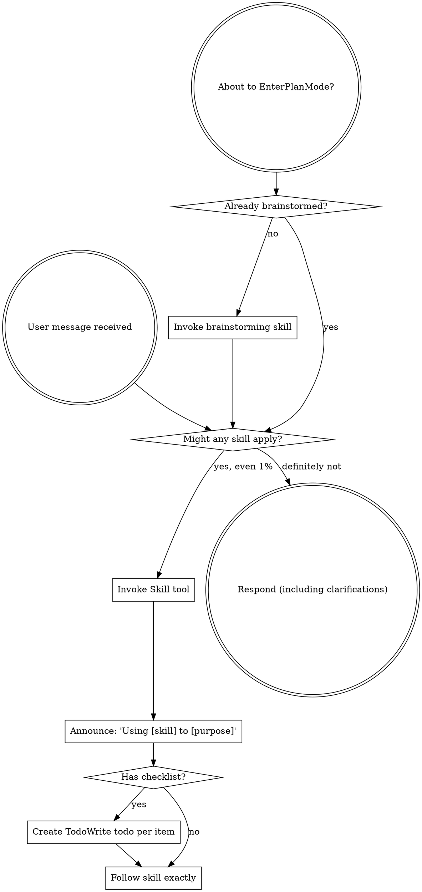

# Codex session 019f1351-949e-7be2-bf60-9913574c9e8e

- Started: `2026-06-29T12:19:06.433Z`
- Working directory: `D:\100XH100`
- Originator: `Codex Desktop`
- Codex CLI: `0.142.2`
- Source log: `C:\Users\Иван Литвак\.codex\sessions\2026\06\29\rollout-2026-06-29T15-19-06-019f1351-949e-7be2-bf60-9913574c9e8e.jsonl`
- Entries: user=3, assistant=17, tool calls=28, tool outputs=28

This is a chronological export of the user/assistant conversation and tool activity. Internal system/developer instructions and token accounting are intentionally excluded. Secret-shaped values are redacted; oversized tool outputs retain their beginning and end with the omitted character count.

## 1. User

Time: `2026-06-29T12:23:51.763Z` · source line `4`

```text
# AGENTS.md instructions for D:\100XH100

<INSTRUCTIONS>
# Project Agent Rules

## Operating Rule
- Read `AGENTS.md` before project edits.
- Update `memory/CHANGELOG.md` after meaningful code, config, or architecture changes.
- Update `memory/PROMPTS.md` with user prompts that define requirements.
- Store test outputs, logs, and verification notes under `test_results/`.
- Prefer agent-centered code: explicit contracts, deterministic tests, small files, low hidden state.

## Architecture Source
- Primary architecture contract: `ARCHITECTURE_NEED.md`.
- Current Stream 4 implementation rule: use threshold + compact + CUB/fixed-temp sort/reduce + compact; do not use Stream 4 hash-table dedup.

## Implementation Guardrails
- `State128` logical bytes are `v[0..119]`.
- `State128` padding bytes are `v[120..127]`.
- Persistent frontier padding must be zero.
- `FinalResponse` may temporarily store `target_local_idx` in `v[120..123]`.
- `Hash128` is one logical 128-bit key stored as `{lo, hi}`.
- `CandidateMeta` must remain 32 bytes and 32-byte aligned.
- Stream 3 payload id must be original candidate id, not compact index.
- Stream 4 must not apply shard top-k or semantic shard cap.

</INSTRUCTIONS>
<environment_context>
  <cwd>D:\100XH100</cwd>
  <shell>powershell</shell>
  <current_date>2026-06-29</current_date>
  <timezone>Europe/Moscow</timezone>
  <filesystem><workspace_roots><root>D:\100XH100</root></workspace_roots><permission_profile type="managed"><file_system type="restricted"><entry access="read"><special>:root</special></entry><entry access="write"><path>D:\100XH100</path></entry><entry access="write"><special>:slash_tmp</special></entry><entry access="write"><special>:tmpdir</special></entry><entry access="read"><path>D:\100XH100\.git</path></entry><entry access="read"><path>D:\100XH100\.agents</path></entry><entry access="read"><path>D:\100XH100\.codex</path></entry></file_system></permission_profile></filesystem>
</environment_context>
```

## 2. User

Time: `2026-06-29T12:23:51.873Z` · source line `6`

```text
You are Code Quality Reviewer 1b. Worktree: D:\100XH100\.worktrees\stream1-piece-transformer

Review ONLY commit f262c60f4a33510465c0c84915b3a1037c8e8206 for code quality/regression risk. Do not edit files.

Focus:
- MLP behavior/default regression risk.
- Whether backend constants/fields are clear and safe for later manifest/runtime work.
- Test quality and brittleness.
- Prompt/changelog/test-results quality.
- Hidden side effects from added defaults.

Return QUALITY_PASS or QUALITY_FAIL with bullets. If fail, include concrete file refs and suggested fixes.
```

## 3. User

Time: `2026-06-29T12:23:51.874Z` · source line `7`

```text
You are Code Quality Reviewer 1b. Worktree: D:\100XH100\.worktrees\stream1-piece-transformer

Review ONLY commit f262c60f4a33510465c0c84915b3a1037c8e8206 for code quality/regression risk. Do not edit files.

Focus:
- MLP behavior/default regression risk.
- Whether backend constants/fields are clear and safe for later manifest/runtime work.
- Test quality and brittleness.
- Prompt/changelog/test-results quality.
- Hidden side effects from added defaults.

Return QUALITY_PASS or QUALITY_FAIL with bullets. If fail, include concrete file refs and suggested fixes.
```

## 4. Codex

Time: `2026-06-29T12:24:11.219Z` · source line `9`

```text
I’ll review the requested commit only, with the repo rules in view, and I’ll avoid modifying the worktree.
```

## 5. Tool call: `exec_command`

Time: `2026-06-29T12:24:11.220Z` · source line `11`

```text
{"cmd":"Get-Content -LiteralPath 'C:\\Users\\Иван Литвак\\.codex\\plugins\\cache\\openai-curated-remote\\superpowers\\5.1.4\\skills\\using-superpowers\\SKILL.md'","workdir":"D:\\100XH100\\.worktrees\\stream1-piece-transformer","max_output_tokens":12000}
```

## 6. Tool call: `exec_command`

Time: `2026-06-29T12:24:11.221Z` · source line `12`

```text
{"cmd":"Get-Content -LiteralPath 'D:\\100XH100\\.worktrees\\stream1-piece-transformer\\AGENTS.md'","workdir":"D:\\100XH100\\.worktrees\\stream1-piece-transformer","max_output_tokens":12000}
```

## 7. Tool call: `exec_command`

Time: `2026-06-29T12:24:11.285Z` · source line `13`

```text
{"cmd":"git status --short","workdir":"D:\\100XH100\\.worktrees\\stream1-piece-transformer","max_output_tokens":12000}
```

## 8. Tool output

Time: `2026-06-29T12:24:14.372Z` · source line `14`

````text
Chunk ID: 143377
Wall time: 2.3670 seconds
Process exited with code 0
Original token count: 1393
Output:
---
name: using-superpowers
description: Use when starting any conversation - establishes how to find and use skills, requiring Skill tool invocation before ANY response including clarifying questions
---

<SUBAGENT-STOP>
If you were dispatched as a subagent to execute a specific task, skip this skill.
</SUBAGENT-STOP>

<EXTREMELY-IMPORTANT>
If you think there is even a 1% chance a skill might apply to what you are doing, you ABSOLUTELY MUST invoke the skill.

IF A SKILL APPLIES TO YOUR TASK, YOU DO NOT HAVE A CHOICE. YOU MUST USE IT.

This is not negotiable. This is not optional. You cannot rationalize your way out of this.
</EXTREMELY-IMPORTANT>

## Instruction Priority

Superpowers skills override default system prompt behavior, but **user instructions always take precedence**:

1. **User's explicit instructions** (CLAUDE.md, GEMINI.md, AGENTS.md, direct requests) — highest priority
2. **Superpowers skills** — override default system behavior where they conflict
3. **Default system prompt** — lowest priority

If CLAUDE.md, GEMINI.md, or AGENTS.md says "don't use TDD" and a skill says "always use TDD," follow the user's instructions. The user is in control.

## How to Access Skills

**In Claude Code:** Use the `Skill` tool. When you invoke a skill, its content is loaded and presented to you—follow it directly. Never use the Read tool on skill files.

**In Copilot CLI:** Use the `skill` tool. Skills are auto-discovered from installed plugins. The `skill` tool works the same as Claude Code's `Skill` tool.

**In Gemini CLI:** Skills activate via the `activate_skill` tool. Gemini loads skill metadata at session start and activates the full content on demand.

**In other environments:** Check your platform's documentation for how skills are loaded.

## Platform Adaptation

Skills use Claude Code tool names. Non-CC platforms: see `references/copilot-tools.md` (Copilot CLI), `references/codex-tools.md` (Codex) for tool equivalents. Gemini CLI users get the tool mapping loaded automatically via GEMINI.md.

# Using Skills

## The Rule

**Invoke relevant or requested skills BEFORE any response or action.** Even a 1% chance a skill might apply means that you should invoke the skill to check. If an invoked skill turns out to be wrong for the situation, you don't need to use it.



## Red Flags

These thoughts mean STOP—you're rationalizing:

| Thought | Reality |
|---------|---------|
| "This is just a simple question" | Questions are tasks. Check for skills. |
| "I need more context first" | Skill check comes BEFORE clarifying questions. |
| "Let me explore the codebase first" | Skills tell you HOW to explore. Check first. |
| "I can check git/files quickly" | Files lack conversation context. Check for skills. |
| "Let me gather information first" | Skills tell you HOW to gather information. |
| "This doesn't need a formal skill" | If a skill exists, use it. |
| "I remember this skill" | Skills evolve. Read current version. |
| "This doesn't count as a task" | Action = task. Check for skills. |
| "The skill is overkill" | Simple things become complex. Use it. |
| "I'll just do this one thing first" | Check BEFORE doing anything. |
| "This feels productive" | Undisciplined action wastes time. Skills prevent this. |
| "I know what that means" | Knowing the concept в‰  using the skill. Invoke it. |

## Skill Priority

When multiple skills could apply, use this order:

1. **Process skills first** (brainstorming, debugging) - these determine HOW to approach the task
2. **Implementation skills second** (frontend-design, mcp-builder) - these guide execution

"Let's build X" в†’ brainstorming first, then implementation skills.
"Fix this bug" в†’ debugging first, then domain-specific skills.

## Skill Types

**Rigid** (TDD, debugging): Follow exactly. Don't adapt away discipline.

**Flexible** (patterns): Adapt principles to context.

The skill itself tells you which.

## User Instructions

Instructions say WHAT, not HOW. "Add X" or "Fix Y" doesn't mean skip workflows.

````

## 9. Tool output

Time: `2026-06-29T12:24:14.372Z` · source line `15`

```text
Chunk ID: 6aeee4
Wall time: 1.3287 seconds
Process exited with code 0
Original token count: 290
Output:
# Project Agent Rules

## Operating Rule
- Read `AGENTS.md` before project edits.
- Update `memory/CHANGELOG.md` after meaningful code, config, or architecture changes.
- Update `memory/PROMPTS.md` with user prompts that define requirements.
- Store test outputs, logs, and verification notes under `test_results/`.
- Prefer agent-centered code: explicit contracts, deterministic tests, small files, low hidden state.

## Architecture Source
- Primary architecture contract: `ARCHITECTURE_NEED.md`.
- Current Stream 4 implementation rule: use threshold + compact + CUB/fixed-temp sort/reduce + compact; do not use Stream 4 hash-table dedup.

## Implementation Guardrails
- `State128` logical bytes are `v[0..119]`.
- `State128` padding bytes are `v[120..127]`.
- Persistent frontier padding must be zero.
- `FinalResponse` may temporarily store `target_local_idx` in `v[120..123]`.
- `Hash128` is one logical 128-bit key stored as `{lo, hi}`.
- `CandidateMeta` must remain 32 bytes and 32-byte aligned.
- Stream 3 payload id must be original candidate id, not compact index.
- Stream 4 must not apply shard top-k or semantic shard cap.

```

## 10. Tool output

Time: `2026-06-29T12:24:14.373Z` · source line `16`

```text
Chunk ID: 8ee02d
Wall time: 1.3805 seconds
Process exited with code 0
Original token count: 3
Output:
?? docs/

```

## 11. Codex

Time: `2026-06-29T12:24:24.705Z` · source line `19`

```text
Using `superpowers:using-superpowers` for the required workflow check; for the actual task I’m using the standard review stance because this is a targeted commit review, not an implementation turn. The worktree has an existing untracked `docs/` directory, and I’m leaving it untouched.
```

## 12. Codex

Time: `2026-06-29T12:24:24.719Z` · source line `20`

```text
Using `superpowers:using-superpowers` for the required workflow check; for the actual task I’m using the standard review stance because this is a targeted commit review, not an implementation turn. The worktree has an existing untracked `docs/` directory, and I’m leaving it untouched.
```

## 13. Tool call: `exec_command`

Time: `2026-06-29T12:24:24.736Z` · source line `21`

```text
{"cmd":"git show --stat --oneline --decorate --find-renames f262c60f4a33510465c0c84915b3a1037c8e8206","workdir":"D:\\100XH100\\.worktrees\\stream1-piece-transformer","max_output_tokens":12000}
```

## 14. Tool call: `exec_command`

Time: `2026-06-29T12:24:24.736Z` · source line `22`

```text
{"cmd":"git show --name-only --format=fuller f262c60f4a33510465c0c84915b3a1037c8e8206","workdir":"D:\\100XH100\\.worktrees\\stream1-piece-transformer","max_output_tokens":12000}
```

## 15. Tool call: `exec_command`

Time: `2026-06-29T12:24:24.737Z` · source line `23`

```text
{"cmd":"git rev-parse f262c60f4a33510465c0c84915b3a1037c8e8206^","workdir":"D:\\100XH100\\.worktrees\\stream1-piece-transformer","max_output_tokens":12000}
```

## 16. Tool output

Time: `2026-06-29T12:24:26.461Z` · source line `24`

```text
Chunk ID: 6164df
Wall time: 1.4682 seconds
Process exited with code 0
Original token count: 129
Output:
f262c60 (HEAD -> codex/stream1-piece-transformer) Add tagged Stream1 backend config
 memory/CHANGELOG.md                                |  3 ++
 memory/PROMPTS.md                                  |  3 ++
 src/config.cpp                                     |  3 ++
 src/config.hpp                                     | 11 +++++++
 .../stream1_piece_transformer_task1_2026-06-29.md  | 20 ++++++++++++
 tests/contract_tests.cpp                           | 38 ++++++++++++++++++++++
 6 files changed, 78 insertions(+)

```

## 17. Tool output

Time: `2026-06-29T12:24:26.461Z` · source line `25`

```text
Chunk ID: 62f6fe
Wall time: 1.4231 seconds
Process exited with code 0
Original token count: 106
Output:
commit f262c60f4a33510465c0c84915b3a1037c8e8206
Author:     Ivan Litvak <vanya.litvak@gmail.com>
AuthorDate: Mon Jun 29 15:03:54 2026 +0300
Commit:     Ivan Litvak <vanya.litvak@gmail.com>
CommitDate: Mon Jun 29 15:15:56 2026 +0300

    Add tagged Stream1 backend config

memory/CHANGELOG.md
memory/PROMPTS.md
src/config.cpp
src/config.hpp
test_results/stream1_piece_transformer_task1_2026-06-29.md
tests/contract_tests.cpp

```

## 18. Tool output

Time: `2026-06-29T12:24:27.187Z` · source line `26`

```text
Chunk ID: 28befa
Wall time: 1.4118 seconds
Process exited with code 0
Original token count: 11
Output:
33acff6189fa9fb22bc2004554f429f078015e2a

```

## 19. Codex

Time: `2026-06-29T12:29:07.367Z` · source line `29`

```text
I’ve confirmed the target commit and its touched files. Next I’m reading the full diff plus surrounding config/test code so the review is about regression risk, not just the added lines.
```

## 20. Codex

Time: `2026-06-29T12:29:07.400Z` · source line `30`

```text
I’ve confirmed the target commit and its touched files. Next I’m reading the full diff plus surrounding config/test code so the review is about regression risk, not just the added lines.
```

## 21. Tool call: `exec_command`

Time: `2026-06-29T12:29:07.400Z` · source line `31`

```text
{"cmd":"git show --format=medium --find-renames --find-copies -- src/config.hpp src/config.cpp tests/contract_tests.cpp memory/CHANGELOG.md memory/PROMPTS.md test_results/stream1_piece_transformer_task1_2026-06-29.md","workdir":"D:\\100XH100\\.worktrees\\stream1-piece-transformer","max_output_tokens":30000}
```

## 22. Tool call: `exec_command`

Time: `2026-06-29T12:29:07.417Z` · source line `32`

```text
{"cmd":"Get-Content -LiteralPath 'D:\\100XH100\\.worktrees\\stream1-piece-transformer\\src\\config.hpp'","workdir":"D:\\100XH100\\.worktrees\\stream1-piece-transformer","max_output_tokens":16000}
```

## 23. Tool call: `exec_command`

Time: `2026-06-29T12:29:07.426Z` · source line `33`

```text
{"cmd":"Get-Content -LiteralPath 'D:\\100XH100\\.worktrees\\stream1-piece-transformer\\src\\config.cpp'","workdir":"D:\\100XH100\\.worktrees\\stream1-piece-transformer","max_output_tokens":16000}
```

## 24. Tool call: `exec_command`

Time: `2026-06-29T12:29:07.465Z` · source line `34`

```text
{"cmd":"Get-Content -LiteralPath 'D:\\100XH100\\.worktrees\\stream1-piece-transformer\\tests\\contract_tests.cpp'","workdir":"D:\\100XH100\\.worktrees\\stream1-piece-transformer","max_output_tokens":22000}
```

## 25. Tool output

Time: `2026-06-29T12:29:10.393Z` · source line `35`

```text
Chunk ID: 129e0c
Wall time: 2.7102 seconds
Process exited with code 0
Original token count: 1998
Output:
commit f262c60f4a33510465c0c84915b3a1037c8e8206
Author: Ivan Litvak <vanya.litvak@gmail.com>
Date:   Mon Jun 29 15:03:54 2026 +0300

    Add tagged Stream1 backend config

diff --git a/memory/CHANGELOG.md b/memory/CHANGELOG.md
index bf67452..684aae8 100644
--- a/memory/CHANGELOG.md
+++ b/memory/CHANGELOG.md
@@ -1,5 +1,8 @@
 # Changelog
 
+## 2026-06-29
+- Added tagged Stream1 model backend config constants and transformer metadata fields, preserving existing MLP defaults. Stream1 row-mode helpers now force the piece-transformer backend to parent rows while keeping MLP one-output child-row behavior, with contract coverage recorded in `test_results/stream1_piece_transformer_task1_2026-06-29.md`.
+
 ## 2026-06-20
 - Added `BEAM_SOLVE_BUCKET_MODE` for ordinary solve-to-center runs that keep
   searching after the first hit. Stream2 can now record solved candidates
diff --git a/memory/PROMPTS.md b/memory/PROMPTS.md
index 5264305..9e06653 100644
--- a/memory/PROMPTS.md
+++ b/memory/PROMPTS.md
@@ -1,5 +1,8 @@
 # Prompt History
 
+## 2026-06-29
+- User requested an explicit separate Stream1 `piece_transformer` backend for the Kaggle Megaminx Q-transformer, with no fallback behavior and without breaking the current MLP backend. Manifests must be generated from checkpoint/config metadata, correctness tests come before integration, and target validation is a small 2xT4 Kaggle smoke after correctness tests pass.
+
 ## 2026-06-20
 - User cancelled the segment/frequent-prefix repair direction and requested a
   normal beam-search-to-center mode for puzzles with known solution length 23.
diff --git a/src/config.cpp b/src/config.cpp
index 6d9cfb1..bbc025d 100644
--- a/src/config.cpp
+++ b/src/config.cpp
@@ -7,6 +7,9 @@
 namespace beam {
 
 bool stream1_uses_child_rows(const Stream1ModelConfig& model) {
+    if (model.backend == STREAM1_BACKEND_PIECE_TRANSFORMER) {
+        return false;
+    }
     return model.output_dim == STREAM1_SINGLE_SCORE_OUTPUT_DIM;
 }
 
diff --git a/src/config.hpp b/src/config.hpp
index 43b5857..cac0528 100644
--- a/src/config.hpp
+++ b/src/config.hpp
@@ -21,6 +21,8 @@ static_assert(STATE_STORAGE_LEN % STATE_ALIGNMENT == 0);
 static_assert(STATE_STORAGE_LEN >= STATE_LEN + sizeof(std::uint32_t), "FinalResponse requires 4 padding bytes");
 static_assert(STATE_VALUE_PAD <= 256);
 inline constexpr std::uint32_t STREAM1_SINGLE_SCORE_OUTPUT_DIM = 1;
+inline constexpr std::uint32_t STREAM1_BACKEND_MLP = 0;
+inline constexpr std::uint32_t STREAM1_BACKEND_PIECE_TRANSFORMER = 1;
 inline constexpr std::uint32_t STREAM1_DTYPE_FP16 = 0;
 inline constexpr std::uint32_t STREAM1_DTYPE_BF16 = 1;
 inline constexpr std::uint32_t STREAM1_NORM_NONE = 0;
@@ -35,6 +37,7 @@ inline constexpr std::uint32_t GOAL_SCORE_KEY = 0;
 inline constexpr std::uint32_t UINT32_THRESHOLD_MAX = std::numeric_limits<std::uint32_t>::max();
 
 struct Stream1ModelConfig {
+    std::uint32_t backend = STREAM1_BACKEND_MLP;
     std::uint32_t state_len = static_cast<std::uint32_t>(STATE_LEN);
     std::uint32_t num_classes = static_cast<std::uint32_t>(STATE_LEN);
     std::uint32_t hidden1 = 1536;
@@ -43,6 +46,14 @@ struct Stream1ModelConfig {
     std::uint32_t output_dim = static_cast<std::uint32_t>(MOVE_COUNT);
     std::uint32_t dtype = STREAM1_DTYPE_FP16;
     std::uint32_t normalization = STREAM1_NORM_NONE;
+    std::uint32_t num_pieces = 0;
+    std::uint32_t max_piece_size = 0;
+    std::uint32_t seq_len = 0;
+    std::uint32_t d_model = 0;
+    std::uint32_t nhead = 0;
+    std::uint32_t head_dim = 0;
+    std::uint32_t transformer_layers = 0;
+    std::uint32_t ff_dim = 0;
 };
 
 struct RuntimeConfig {
diff --git a/test_results/stream1_piece_transformer_task1_2026-06-29.md b/test_results/stream1_piece_transformer_task1_2026-06-29.md
new file mode 100644
index 0000000..1f79f1c
--- /dev/null
+++ b/test_results/stream1_piece_transformer_task1_2026-06-29.md
@@ -0,0 +1,20 @@
+# Stream1 Piece Transformer Task 1 Verification - 2026-06-29
+
+## Scope
+- Added tagged Stream1 backend config fields and row-mode contract coverage.
+
+## Commands
+- `cmake --build build-gpu-dev-cutlass --target contract_tests`
+  - Result: not run; `build-gpu-dev-cutlass` does not exist in this worktree.
+- `cmake -S . -B build-contract-tests`
+  - Result: configure blocked by missing local CUDA toolset (`No CUDA toolset found`).
+- `cl /nologo /std:c++20 /EHsc /I src /DBEAM_STATE_LOGICAL_BYTES=120 /DBEAM_STATE_PHYSICAL_BYTES=128 /DBEAM_STATE_ALIGNMENT=16 /DBEAM_MOVE_COUNT=24 /c tests\contract_tests.cpp`
+  - Red result before implementation: failed because `Stream1ModelConfig::backend`, transformer metadata fields, and backend constants were undeclared.
+- `cl /nologo /std:c++20 /EHsc /I src /DBEAM_STATE_LOGICAL_BYTES=120 /DBEAM_STATE_PHYSICAL_BYTES=128 /DBEAM_STATE_ALIGNMENT=16 /DBEAM_MOVE_COUNT=24 tests\contract_tests.cpp src\config.cpp src\frontier_cpu.cpp src\hash.cpp src\state.cpp src\stream3.cpp src\stream4.cpp /Fe:test_results\contract_tests_stream1_task1.exe`
+  - Result: build passed.
+- `.\test_results\contract_tests_stream1_task1.exe`
+  - Output: `contract_tests=pass`.
+
+## Notes
+- Full CMake contract target was not verified because this Windows environment has no CUDA toolset for the project-level `project(... CUDA ...)` configuration.
+- The CPU contract executable was built and run directly with MSVC as the smallest available static/runtime check for the touched config contract.
\ No newline at end of file
diff --git a/tests/contract_tests.cpp b/tests/contract_tests.cpp
index 6cfb164..37847ce 100644
--- a/tests/contract_tests.cpp
+++ b/tests/contract_tests.cpp
@@ -31,6 +31,41 @@ Generator swap01_generator() {
     return generator;
 }
 
+void test_stream1_backend_row_modes() {
+    Stream1ModelConfig default_mlp;
+    require(default_mlp.backend == STREAM1_BACKEND_MLP, "default Stream1 backend must be MLP");
+    require(default_mlp.output_dim == MOVE_COUNT, "default MLP output_dim must remain MOVE_COUNT");
+    require(!stream1_uses_child_rows(default_mlp), "default MLP MOVE_COUNT output must use parent rows");
+    require(stream1_rows_per_parent(default_mlp) == 1U, "default MLP MOVE_COUNT output rows_per_parent must be 1");
+
+    Stream1ModelConfig mlp;
+    mlp.backend = STREAM1_BACKEND_MLP;
+    mlp.output_dim = STREAM1_SINGLE_SCORE_OUTPUT_DIM;
+    if (!stream1_uses_child_rows(mlp) || stream1_rows_per_parent(mlp) != MOVE_COUNT) {
+        throw std::runtime_error("MLP one-output backend must use child rows");
+    }
+
+    Stream1ModelConfig transformer;
+    transformer.backend = STREAM1_BACKEND_PIECE_TRANSFORMER;
+    transformer.output_dim = static_cast<std::uint32_t>(MOVE_COUNT);
+    transformer.num_pieces = 50;
+    transformer.max_piece_size = 3;
+    transformer.seq_len = 51;
+    transformer.d_model = 256;
+    transformer.nhead = 8;
+    transformer.head_dim = 32;
+    transformer.transformer_layers = 4;
+    transformer.ff_dim = 1024;
+    if (transformer.num_pieces != 50 || transformer.max_piece_size != 3 || transformer.seq_len != 51 ||
+        transformer.d_model != 256 || transformer.nhead != 8 || transformer.head_dim != 32 ||
+        transformer.transformer_layers != 4 || transformer.ff_dim != 1024) {
+        throw std::runtime_error("piece_transformer sample config metadata mismatch");
+    }
+    if (stream1_uses_child_rows(transformer) || stream1_rows_per_parent(transformer) != 1U) {
+        throw std::runtime_error("piece_transformer backend must use parent rows");
+    }
+}
+
 } // namespace
 
 int main() {
@@ -54,6 +89,9 @@ int main() {
     require(q_to_score_key(1.5f) == 1536, "score rounding failed");
     report << "- score_quantization=pass\n";
 
+    test_stream1_backend_row_modes();
+    report << "- stream1_backend_row_modes=pass\n";
+
     State128 state = make_state128(std::vector<std::uint8_t>(STATE_LEN, 7));
     require(padding_is_zero(state), "state padding must be zero");
     final_response_set_target_local_idx(state, 0x44332211);

```

## 26. Tool output

Time: `2026-06-29T12:29:10.393Z` · source line `36`

```text
Chunk ID: b44585
Wall time: 2.1936 seconds
Process exited with code 0
Original token count: 1134
Output:
#pragma once

#include <cstddef>
#include <cstdint>
#include <limits>

namespace beam {

inline constexpr std::size_t STATE_LEN = BEAM_STATE_LOGICAL_BYTES;
inline constexpr std::size_t STATE_STORAGE_LEN = BEAM_STATE_PHYSICAL_BYTES;
inline constexpr std::size_t STATE_ALIGNMENT = BEAM_STATE_ALIGNMENT;
inline constexpr std::size_t STATE_VALUE_PAD = 128;
inline constexpr std::size_t MOVE_COUNT = BEAM_MOVE_COUNT;
inline constexpr std::size_t FINAL_RESPONSE_TARGET_LOCAL_IDX_OFFSET = STATE_LEN;
static_assert(STATE_LEN > 0);
static_assert(MOVE_COUNT > 0);
static_assert(MOVE_COUNT <= 255);
static_assert(STATE_STORAGE_LEN >= STATE_LEN);
static_assert(STATE_ALIGNMENT == 16 || STATE_ALIGNMENT == 32 || STATE_ALIGNMENT == 64);
static_assert(STATE_STORAGE_LEN % STATE_ALIGNMENT == 0);
static_assert(STATE_STORAGE_LEN >= STATE_LEN + sizeof(std::uint32_t), "FinalResponse requires 4 padding bytes");
static_assert(STATE_VALUE_PAD <= 256);
inline constexpr std::uint32_t STREAM1_SINGLE_SCORE_OUTPUT_DIM = 1;
inline constexpr std::uint32_t STREAM1_BACKEND_MLP = 0;
inline constexpr std::uint32_t STREAM1_BACKEND_PIECE_TRANSFORMER = 1;
inline constexpr std::uint32_t STREAM1_DTYPE_FP16 = 0;
inline constexpr std::uint32_t STREAM1_DTYPE_BF16 = 1;
inline constexpr std::uint32_t STREAM1_NORM_NONE = 0;
inline constexpr std::uint32_t STREAM1_NORM_LAYERNORM = 1;
inline constexpr float STREAM1_SINGLE_OUTPUT_SCORE_OFFSET = 3.0f;

inline constexpr float SCORE_MAX_Q = 300.0f;
inline constexpr std::uint32_t SCORE_SCALE = 1024;
inline constexpr std::uint32_t SCORE_MAX_KEY = static_cast<std::uint32_t>(SCORE_MAX_Q) * SCORE_SCALE;
inline constexpr std::uint32_t SCORE_BIN_COUNT = SCORE_MAX_KEY + 1;
inline constexpr std::uint32_t GOAL_SCORE_KEY = 0;
inline constexpr std::uint32_t UINT32_THRESHOLD_MAX = std::numeric_limits<std::uint32_t>::max();

struct Stream1ModelConfig {
    std::uint32_t backend = STREAM1_BACKEND_MLP;
    std::uint32_t state_len = static_cast<std::uint32_t>(STATE_LEN);
    std::uint32_t num_classes = static_cast<std::uint32_t>(STATE_LEN);
    std::uint32_t hidden1 = 1536;
    std::uint32_t hidden2 = 512;
    std::uint32_t residual_count = 2;
    std::uint32_t output_dim = static_cast<std::uint32_t>(MOVE_COUNT);
    std::uint32_t dtype = STREAM1_DTYPE_FP16;
    std::uint32_t normalization = STREAM1_NORM_NONE;
    std::uint32_t num_pieces = 0;
    std::uint32_t max_piece_size = 0;
    std::uint32_t seq_len = 0;
    std::uint32_t d_model = 0;
    std::uint32_t nhead = 0;
    std::uint32_t head_dim = 0;
    std::uint32_t transformer_layers = 0;
    std::uint32_t ff_dim = 0;
};

struct RuntimeConfig {
    std::uint32_t b_micro = 256;
    std::uint32_t inference_parallelism = 1;
    std::uint32_t stream3_batch_candidates = 256 * static_cast<std::uint32_t>(MOVE_COUNT);
    std::uint32_t stream4_batch_candidates = 65536;
    std::uint32_t stream4_trigger_candidates = 65536;
    std::uint32_t stream4_batch_alignment = 1024;
    std::uint32_t stream4_active_sort_slots = 1;
    std::uint32_t ring_count = 4;
    std::uint32_t world_size = 1;
    std::uint32_t local_rank = 0;
    std::uint32_t shard_count = 64;
    std::uint32_t shard_buffer_count = 2;
    std::uint32_t shard_capacity_candidates = 131072;
    std::uint32_t shard_capacity_scale_ppm = 1'250'000;
    std::uint32_t global_spill_capacity = 1 << 20;
    std::uint32_t global_spill_scale_ppm = 2'000'000;
    std::uint32_t stream5_recv_capacity_scale_ppm = 2'000'000;
    std::uint32_t final_materialize_chunk_candidates = 0;
    std::uint32_t final_materialize_exchange_scale_ppm = 2'000'000;
    std::uint64_t user_global_beam_width = 1'000'000;
    std::uint32_t global_threshold_update_period_shards = 64;
    std::uint32_t solved_result_capacity = 1024;
};

struct DerivedConfig {
    std::uint32_t ring_slot_count = 0;
    std::uint64_t beam_width_alignment = 0;
    std::uint64_t global_beam_width_effective = 0;
};

bool stream1_uses_child_rows(const Stream1ModelConfig& model);
std::uint32_t stream1_rows_per_parent(const Stream1ModelConfig& model);
std::uint32_t stream1_parent_batch_from_row_budget(std::uint32_t row_budget, const Stream1ModelConfig& model);
std::uint64_t stream1_inference_rows(std::uint32_t parent_batch, const Stream1ModelConfig& model);
std::uint64_t round_up(std::uint64_t value, std::uint64_t alignment);
DerivedConfig derive_config(const RuntimeConfig& config);
std::uint32_t q_to_score_key(float q);

} // namespace beam

```

## 27. Tool output

Time: `2026-06-29T12:29:10.393Z` · source line `37`

```text
Chunk ID: 8ee7d8
Wall time: 2.1498 seconds
Process exited with code 0
Original token count: 663
Output:
#include "config.hpp"

#include <algorithm>
#include <cmath>
#include <stdexcept>

namespace beam {

bool stream1_uses_child_rows(const Stream1ModelConfig& model) {
    if (model.backend == STREAM1_BACKEND_PIECE_TRANSFORMER) {
        return false;
    }
    return model.output_dim == STREAM1_SINGLE_SCORE_OUTPUT_DIM;
}

std::uint32_t stream1_rows_per_parent(const Stream1ModelConfig& model) {
    return stream1_uses_child_rows(model) ? static_cast<std::uint32_t>(MOVE_COUNT) : 1U;
}

std::uint32_t stream1_parent_batch_from_row_budget(std::uint32_t row_budget, const Stream1ModelConfig& model) {
    const std::uint32_t rows_per_parent = stream1_rows_per_parent(model);
    if (row_budget < rows_per_parent) {
        throw std::invalid_argument("BEAM_B_MICRO row budget is smaller than one Stream1 parent expansion");
    }
    return row_budget / rows_per_parent;
}

std::uint64_t stream1_inference_rows(std::uint32_t parent_batch, const Stream1ModelConfig& model) {
    return static_cast<std::uint64_t>(parent_batch) * stream1_rows_per_parent(model);
}

std::uint64_t round_up(std::uint64_t value, std::uint64_t alignment) {
    if (alignment == 0) {
        return value;
    }
    const std::uint64_t remainder = value % alignment;
    return remainder == 0 ? value : value + alignment - remainder;
}

DerivedConfig derive_config(const RuntimeConfig& config) {
    DerivedConfig derived;
    const std::uint32_t candidates_per_slot = config.b_micro * static_cast<std::uint32_t>(MOVE_COUNT);
    if (candidates_per_slot == 0U || config.stream3_batch_candidates % candidates_per_slot != 0U) {
        throw std::invalid_argument("STREAM3_BATCH_CANDIDATES must be divisible by B_MICRO * MOVE_COUNT");
    }
    derived.ring_slot_count = config.stream3_batch_candidates / candidates_per_slot;
    if (config.inference_parallelism == 0U ||
        config.inference_parallelism > derived.ring_slot_count) {
        throw std::invalid_argument("STREAM1_CONCURRENCY must be in [1, RING_SLOT_COUNT]");
    }
    derived.beam_width_alignment =
        static_cast<std::uint64_t>(config.world_size) *
        static_cast<std::uint64_t>(config.shard_count) *
        static_cast<std::uint64_t>(config.stream4_batch_alignment);
    derived.global_beam_width_effective = round_up(config.user_global_beam_width, derived.beam_width_alignment);
    return derived;
}

std::uint32_t q_to_score_key(float q) {
    const float clamped = std::min(std::max(q, 0.0f), SCORE_MAX_Q);
    return static_cast<std::uint32_t>(std::lround(clamped * static_cast<float>(SCORE_SCALE)));
}

} // namespace beam

```

## 28. Tool output

Time: `2026-06-29T12:29:10.394Z` · source line `38`

```text
Chunk ID: 542b8c
Wall time: 1.7644 seconds
Process exited with code 0
Original token count: 1624
Output:
#include "config.hpp"
#include "frontier_cpu.hpp"

#include <filesystem>
#include <fstream>
#include <iostream>
#include <stdexcept>

using namespace beam;

namespace {

void require(bool condition, const char* message) {
    if (!condition) {
        throw std::runtime_error(message);
    }
}

Generator identity_generator() {
    Generator generator{};
    for (std::size_t i = 0; i < STATE_STORAGE_LEN; ++i) {
        generator[i] = static_cast<std::uint8_t>(i);
    }
    return generator;
}

Generator swap01_generator() {
    Generator generator = identity_generator();
    generator[0] = 1;
    generator[1] = 0;
    return generator;
}

void test_stream1_backend_row_modes() {
    Stream1ModelConfig default_mlp;
    require(default_mlp.backend == STREAM1_BACKEND_MLP, "default Stream1 backend must be MLP");
    require(default_mlp.output_dim == MOVE_COUNT, "default MLP output_dim must remain MOVE_COUNT");
    require(!stream1_uses_child_rows(default_mlp), "default MLP MOVE_COUNT output must use parent rows");
    require(stream1_rows_per_parent(default_mlp) == 1U, "default MLP MOVE_COUNT output rows_per_parent must be 1");

    Stream1ModelConfig mlp;
    mlp.backend = STREAM1_BACKEND_MLP;
    mlp.output_dim = STREAM1_SINGLE_SCORE_OUTPUT_DIM;
    if (!stream1_uses_child_rows(mlp) || stream1_rows_per_parent(mlp) != MOVE_COUNT) {
        throw std::runtime_error("MLP one-output backend must use child rows");
    }

    Stream1ModelConfig transformer;
    transformer.backend = STREAM1_BACKEND_PIECE_TRANSFORMER;
    transformer.output_dim = static_cast<std::uint32_t>(MOVE_COUNT);
    transformer.num_pieces = 50;
    transformer.max_piece_size = 3;
    transformer.seq_len = 51;
    transformer.d_model = 256;
    transformer.nhead = 8;
    transformer.head_dim = 32;
    transformer.transformer_layers = 4;
    transformer.ff_dim = 1024;
    if (transformer.num_pieces != 50 || transformer.max_piece_size != 3 || transformer.seq_len != 51 ||
        transformer.d_model != 256 || transformer.nhead != 8 || transformer.head_dim != 32 ||
        transformer.transformer_layers != 4 || transformer.ff_dim != 1024) {
        throw std::runtime_error("piece_transformer sample config metadata mismatch");
    }
    if (stream1_uses_child_rows(transformer) || stream1_rows_per_parent(transformer) != 1U) {
        throw std::runtime_error("piece_transformer backend must use parent rows");
    }
}

} // namespace

int main() {
    std::filesystem::create_directories("test_results");
    std::ofstream report("test_results/contract_tests_2026-05-20.md");
    report << "# Contract Tests 2026-05-20\n\n";

    RuntimeConfig config;
    config.user_global_beam_width = 1000;
    config.world_size = 2;
    config.shard_count = 8;
    config.stream4_batch_alignment = 16;
    const DerivedConfig derived = derive_config(config);
    require(derived.ring_slot_count == config.stream3_batch_candidates / (config.b_micro * MOVE_COUNT), "ring_slot_count formula failed");
    require(derived.beam_width_alignment == 256, "beam_width_alignment formula failed");
    require(derived.global_beam_width_effective == 1024, "effective beam width formula failed");
    report << "- config_derivation=pass\n";

    require(q_to_score_key(-5.0f) == 0, "negative score clamp failed");
    require(q_to_score_key(300.5f) == SCORE_MAX_KEY, "max score clamp failed");
    require(q_to_score_key(1.5f) == 1536, "score rounding failed");
    report << "- score_quantization=pass\n";

    test_stream1_backend_row_modes();
    report << "- stream1_backend_row_modes=pass\n";

    State128 state = make_state128(std::vector<std::uint8_t>(STATE_LEN, 7));
    require(padding_is_zero(state), "state padding must be zero");
    final_response_set_target_local_idx(state, 0x44332211);
    require(final_response_get_target_local_idx(state) == 0x44332211, "final response byte-pack failed");
    clear_state_padding(state);
    require(padding_is_zero(state), "padding cleanup failed");
    report << "- final_response_padding=pass\n";

    const auto zobrist = make_deterministic_zobrist(42);
    Hash128 h1 = hash_state(state, zobrist);
    state.v[STATE_LEN] = 99;
    state.v[STATE_STORAGE_LEN - 1] = 123;
    Hash128 h2 = hash_state(state, zobrist);
    require(h1 == h2, "padding must not influence hash");
    clear_state_padding(state);
    report << "- hash_padding_invariant=pass\n";

    CandidateMeta a{Hash128{1, 2}, 5, 10, pack_route(0, 0, 3)};
    CandidateMeta b{Hash128{1, 2}, 4, 10, pack_route(0, 0, 4)};
    CandidateMeta c{Hash128{3, 2}, 6, 9, pack_route(0, 0, 5)};
    auto deduped = stream4_threshold_sort_dedup({a, b, c}, 10);
    require(deduped.size() == 2, "stream4 dedup size failed");
    require(deduped[0].parent_idx == 4, "stream4 deterministic tie-break failed");
    report << "- stream4_threshold_sort_dedup=pass\n";

    std::vector<Stream3CandidateInput> s3input{
        {Hash128{7, 1}, 5, 10, 100, 1},
        {Hash128{7, 1}, 3, 99, 101, 2},
        {Hash128{8, 1}, 11, 12, 102, 3},
    };
    auto split = stream3_threshold_dedup_split(s3input, 10, 0, 2);
    require(split.local_pending.size() + split.remote_send.size() == 1, "stream3 threshold/dedup failed");
    const CandidateMeta s3meta = split.local_pending.empty() ? split.remote_send.front() : split.local_pending.front();
    require(s3meta.score_key == 3, "stream3 min stream3_val score failed");
    require(s3meta.parent_idx == 101, "stream3 payload restore failed");
    report << "- stream3_threshold_dedup_split=pass\n";

    State128 central{};
    for (std::size_t i = 0; i < STATE_LEN; ++i) {
        central.v[i] = static_cast<std::uint8_t>(i);
    }
    clear_state_padding(central);
    State128 start = central;
    start.v[0] = 1;
    start.v[1] = 0;
    std::vector<Generator> generators{identity_generator(), swap01_generator()};
    CpuDepthResult depth = expand_depth_cpu_reference({start}, generators, central, zobrist, UINT32_THRESHOLD_MAX, 8);
    require(depth.solved, "cpu reference must detect solved child");
    require(!depth.next_frontier.empty(), "cpu reference next frontier empty");
    require(padding_is_zero(depth.next_frontier.front()), "cpu reference persistent padding failed");
    report << "- cpu_reference_depth=pass\n";

    report << "\nstatus=pass\n";
    std::cout << "contract_tests=pass\n";
    return 0;
}

```

## 29. Codex

Time: `2026-06-29T12:29:18.795Z` · source line `41`

```text
The commit is small and mostly config-contract work. I’m checking every consumer of `Stream1ModelConfig` now, since added defaults can be risky if manifest/runtime parsing assumes struct layout or row-count semantics.
```

## 30. Codex

Time: `2026-06-29T12:29:18.807Z` · source line `42`

```text
The commit is small and mostly config-contract work. I’m checking every consumer of `Stream1ModelConfig` now, since added defaults can be risky if manifest/runtime parsing assumes struct layout or row-count semantics.
```

## 31. Tool call: `exec_command`

Time: `2026-06-29T12:29:18.808Z` · source line `43`

```text
{"cmd":"rg -n \"Stream1ModelConfig|stream1_uses_child_rows|stream1_rows_per_parent|output_dim|SINGLE_SCORE|STREAM1_BACKEND|num_pieces|transformer_layers|piece_transformer|backend\" .","workdir":"D:\\100XH100\\.worktrees\\stream1-piece-transformer","max_output_tokens":30000}
```

## 32. Tool call: `exec_command`

Time: `2026-06-29T12:29:18.808Z` · source line `44`

```text
{"cmd":"rg -n \"BEAM_|STREAM1_|B_MICRO|output_dim|model\" src tests CMakeLists.txt","workdir":"D:\\100XH100\\.worktrees\\stream1-piece-transformer","max_output_tokens":30000}
```

## 33. Tool call: `exec_command`

Time: `2026-06-29T12:29:18.809Z` · source line `45`

```text
{"cmd":"Get-Content -LiteralPath 'D:\\100XH100\\.worktrees\\stream1-piece-transformer\\ARCHITECTURE_NEED.md'","workdir":"D:\\100XH100\\.worktrees\\stream1-piece-transformer","max_output_tokens":30000}
```

## 34. Tool output

Time: `2026-06-29T12:29:21.020Z` · source line `46`

Oversized output: `8167` characters omitted from the middle.

```text
Chunk ID: 677043
Wall time: 1.9407 seconds
Process exited with code 0
Original token count: 20295
Output:
Warning: truncated output (original token count: 20295)
Total output lines: 522

.\ARCHITECTURE_NEED.md:891:Stream 1 backend только CUTLASS/custom
.\ARCHITECTURE_NEED.md:1699:Stream 1 использует только CUTLASS/custom backend.
.\docs\superpowers\plans\2026-06-29-stream1-piece-transformer.md:5:**Goal:** Add an explicit `piece_transformer` Stream1 backend so the existing beam search can run the Kaggle Megaminx Q-transformer model with `output_dim == MOVE_COUNT` on small 2xT4 smoke runs first, without breaking the current MLP backend.
.\docs\superpowers\plans\2026-06-29-stream1-piece-transformer.md:7:**Architecture:** Keep the MLP Stream1 path intact and add a separate transformer backend selected from `manifest.json`. The transformer path exports Kaggle's fast-form input embedding (`fast_slot_projected` and `fast_piece_static`), runs standalone CUDA correctness tests against a PyTorch reference, then wires the backend into dispatcher graph capture only after the standalone tests pass.
.\docs\superpowers\plans\2026-06-29-stream1-piece-transformer.md:15:- Modify `src/config.hpp` and `src/config.cpp`: add explicit Stream1 backend enum and transformer dimensions while preserving MLP defaults.
.\docs\superpowers\plans\2026-06-29-stream1-piece-transformer.md:21:- Modify `tools/production_runner.cu`: load tagged model config, print backend-specific diagnostics, allocate the correct weights/scratch, and free them safely.
.\docs\superpowers\plans\2026-06-29-stream1-piece-transformer.md:41:void test_stream1_backend_row_modes() {
.\docs\superpowers\plans\2026-06-29-stream1-piece-transformer.md:42:    Stream1ModelConfig mlp;
.\docs\superpowers\plans\2026-06-29-stream1-piece-transformer.md:43:    mlp.backend = STREAM1_BACKEND_MLP;
.\docs\superpowers\plans\2026-06-29-stream1-piece-transformer.md:44:    mlp.output_dim = STREAM1_SINGLE_SCORE_OUTPUT_DIM;
.\docs\superpowers\plans\2026-06-29-stream1-piece-transformer.md:45:    if (!stream1_uses_child_rows(mlp) || stream1_rows_per_parent(mlp) != MOVE_COUNT) {
.\docs\superpowers\plans\2026-06-29-stream1-piece-transformer.md:46:        throw std::runtime_error("MLP one-output backend must use child rows");
.\docs\superpowers\plans\2026-06-29-stream1-piece-transformer.md:49:    Stream1ModelConfig transformer;
.\docs\superpowers\plans\2026-06-29-stream1-piece-transformer.md:50:    transformer.backend = STREAM1_BACKEND_PIECE_TRANSFORMER;
.\docs\superpowers\plans\2026-06-29-stream1-piece-transformer.md:51:    transformer.output_dim = static_cast<std::uint32_t>(MOVE_COUNT);
.\docs\superpowers\plans\2026-06-29-stream1-piece-transformer.md:52:    transformer.num_pieces = 50;
.\docs\superpowers\plans\2026-06-29-stream1-piece-transformer.md:58:    transformer.transformer_layers = 4;
.\docs\superpowers\plans\2026-06-29-stream1-piece-transformer.md:60:    if (stream1_uses_child_rows(transformer) || stream1_rows_per_parent(transformer) != 1U) {
.\docs\superpowers\plans\2026-06-29-stream1-piece-transformer.md:61:        throw std::runtime_error("piece_transformer backend must use parent rows");
.\docs\superpowers\plans\2026-06-29-stream1-piece-transformer.md:69:test_stream1_backend_row_modes();
.\docs\superpowers\plans\2026-06-29-stream1-piece-transformer.md:81:Expected: compile failure because `STREAM1_BACKEND_PIECE_TRANSFORMER` and transformer fields do not exist.
.\docs\superpowers\plans\2026-06-29-stream1-piece-transformer.md:83:- [ ] **Step 3: Add backend fields without changing MLP defaults**
.\docs\superpowers\plans\2026-06-29-stream1-piece-transformer.md:88:inline constexpr std::uint32_t STREAM1_BACKEND_MLP = 0;
.\docs\superpowers\plans\2026-06-29-stream1-piece-transformer.md:89:inline constexpr std::uint32_t STREAM1_BACKEND_PIECE_TRANSFORMER = 1;
.\docs\superpowers\plans\2026-06-29-stream1-piece-transformer.md:92:Extend `Stream1ModelConfig`:
.\docs\superpowers\plans\2026-06-29-stream1-piece-transformer.md:95:struct Stream1ModelConfig {
.\docs\superpowers\plans\2026-06-29-stream1-piece-transformer.md:96:    std::uint32_t backend = STREAM1_BACKEND_MLP;
.\docs\superpowers\plans\2026-06-29-stream1-piece-transformer.md:102:    std::uint32_t output_dim = static_cast<std::uint32_t>(MOVE_COUNT);
.\docs\superpowers\plans\2026-06-29-stream1-piece-transformer.md:105:    std::uint32_t num_pieces = 0;
.\docs\superpowers\plans\2026-06-29-stream1-piece-transformer.md:111:    std::uint32_t transformer_layers = 0;
.\docs\superpowers\plans\2026-06-29-stream1-piece-transformer.md:116:- [ ] **Step 4: Make row-mode helpers backend-aware**
.\docs\superpowers\plans\2026-06-29-stream1-piece-transformer.md:121:bool stream1_uses_child_rows(const Stream1ModelConfig& model) {
.\docs\superpowers\plans\2026-06-29-stream1-piece-transformer.md:122:    if (model.backend == STREAM1_BACKEND_PIECE_TRANSFORMER) {
.\docs\superpowers\plans\2026-06-29-stream1-piece-transformer.md:125:    return model.output_dim == STREAM1_SINGLE_SCORE_OUTPUT_DIM;
.\docs\superpowers\plans\2026-06-29-stream1-piece-transformer.md:148:- [ ] **Step 1: Add backend name helper**
.\docs\superpowers\plans\2026-06-29-stream1-piece-transformer.md:153:inline const char* stream1_backend_name(const Stream1ModelConfig& model) {
.\docs\superpowers\plans\2026-06-29-stream1-piece-transformer.md:154:    return model.backend == STREAM1_BACKEND_PIECE_TRANSFORMER ? "piece_transformer" : "mlp";
.\docs\superpowers\plans\2026-06-29-stream1-piece-transformer.md:160:Parse `backend`, defaulting to `mlp`. For `piece_transformer`, parse `num_pieces`, `max_piece_size`, `seq_len`, `d_model`, `nhead`, `head_dim`, `num_layers`, and `ff_dim`. For `mlp`, keep the current hidden/residual fields exactly as they are.
.\docs\superpowers\plans\2026-06-29-stream1-piece-transformer.md:162:- [ ] **Step 3: Split validation by backend**
.\docs\superpowers\plans\2026-06-29-stream1-piece-transformer.md:164:MLP validation must remain current behavior. Transformer validation must require `state_len == STATE_LEN`, `output_dim == MOVE_COUNT`, `seq_len == num_pieces + 1`, `d_model % nhead == 0`, `head_dim == d_model / nhead`, `num_pieces > 0`, `max_piece_size > 0`, `transformer_layers > 0`, and `ff_dim > 0`.
.\docs\superpowers\plans\2026-06-29-stream1-piece-transformer.md:175:Expected: existing MLP benchmark starts and prints `stream1_model_output_dim`.
.\docs\superpowers\plans\2026-06-29-stream1-piece-transformer.md:211:Expected: `manifest.json` says `backend=piece_transformer`, `output_dim=24`, `seq_len=51`.
.\docs\superpowers\plans\2026-06-29-stream1-piece-transformer.md:232:fast_piece_static = num_pieces * d_model
.\docs\superpowers\plans\2026-06-29-stream1-piece-transformer.md:237:output_weight = d_model * output_dim
.\docs\superpowers\plans\2026-06-29-stream1-piece-transformer.md:238:piece_positions = num_pieces * max_piece_size * sizeof(int16_t)
.\docs\superpowers\plans\2026-06-29-stream1-piece-transformer.md:239:piece_mask = num_pieces * max_piece_size * sizeof(uint8_t)
.\docs\superpowers\plans\2026-06-29-stream1-piece-transformer.md:293:Add `backend`, `mlp_view`, `transformer_view`, `mlp_scratch_lanes`, and `transformer_scratch_lanes` to dispatcher network state.
.\docs\superpowers\plans\2026-06-29-stream1-piece-transformer.md:297:Inside graph capture, call exactly one of `stream1_inference_cutlass_cuda()` or `stream1_transformer_inference_cuda()` based on `network.backend`. Unknown backend is a fatal error. There is no fallback.
.\docs\superpowers\plans\2026-06-29-stream1-piece-transformer.md:299:- [ ] **Step 3: Load weights by backend in `production_runner`**
.\docs\superpowers\plans\2026-06-29-stream1-piece-transformer.md:305:Make `estimate_stream1_weight_bytes()` and `estimate_stream1_scratch_bytes()` switch by backend. The first transformer estimate should match the correctness-first scratch allocation exactly.
.\docs\superpowers\plans\2026-06-29-stream1-piece-transformer.md:309:Run existing small MLP smoke and confirm it prints `stream1_backend=mlp` and reaches the same early depth behavior as before.
.\docs\superpowers\plans\2026-06-29-stream1-piece-transformer.md:364:Write a test result note with kernel version, status, backend, beam, depth, `B_MICRO`, `nproc_per_node`, and key log lines.
.\docs\superpowers\plans\2026-06-29-stream1-piece-transformer.md:370:**Spec coverage:** The plan covers a separate transformer Stream1 backend, automatic manifest-based dimensions, preservation of the existing MLP path, standalone correctness before dispatcher wiring, and a final 2xT4 small-beam Kaggle smoke.
.\docs\superpowers\plans\2026-06-29-stream1-piece-transformer.md:374:**Type consistency:** The backend enum, `Stream1ModelConfig` transformer fields, `Stream1TransformerView`, and `Stream1TransformerScratchView` are named consistently across loader, CUDA entrypoint, dispatcher, runner, and tests.
.\kaggle_t4_torchrun\t4-torchrun-p0-depth10.ipynb:299:    "        f'--rdzv-backend={TORCHRUN_RDZV_BACKEND}',\n",
.\kaggle_t4_torchrun\t4-torchrun-machinery-check.ipynb:299:    "        f'--rdzv-backend={TORCHRUN_RDZV_BACKEND}',\n",
.\FullBeamNice\notebooks\q_model_inference_standalone.ipynb:246:    "    def __init__(self, state_size, hd1=5000, hd2=1000, nrd=2, output_dim=1, dropout_rate=0.0, num_classes=6):\n",
.\FullBeamNice\notebooks\q_model_inference_standalone.ipynb:251:    "        self.output_dim = int(output_dim)\n",
.\FullBeamNice\notebooks\q_model_inference_standalone.ipynb:266:    "        self.output_layer = nn.Linear(out_hidden, self.output_dim)\n",
.\FullBeamNice\notebooks\q_model_inference_standalone.ipynb:277:    "        return x.squeeze(-1) if self.output_dim == 1 else x\n",
.\FullBeamNice\notebooks\q_model_inference_standalone.ipynb:280:    "def build_model_from_info(info, *, num_classes, state_size, output_dim):\n",
.\FullBeamNice\notebooks\q_model_inference_standalone.ipynb:284:    "        output_dim=output_dim,\n",
.\FullBeamNice\notebooks\q_model_inference_standalone.ipynb:294:    "    output_dim = int(getattr(model, 'output_dim', 1))\n",
.\FullBeamNice\notebooks\q_model_inference_standalone.ipynb:295:    "    outputs = torch.empty((data.size(0), output_dim), dtype=output_dtype, device=device) if output_dim != 1 else torch.empty(data.size(0), dtype=output_dtype, device=device)\n",
.\FullBeamNice\notebooks\q_model_inference_standalone.ipynb:300:    "            if output_dim == 1:\n",
.\FullBeamNice\notebooks\q_model_inference_standalone.ipynb:303:    "                outputs[start:start + batch_size] = out.view(batch.size(0), output_dim)\n",
.\FullBeamNice\notebooks\q_model_inference_standalone.ipynb:536:    "model = build_model_from_info(info, num_classes=num_classes, state_size=state_size, output_dim=n_gens)\n",
.\hpc\mephi_8xa100_common.sh:123:beam_stream1_output_dim() {
.\hpc\mephi_8xa100_common.sh:131:print(int(manifest["output_dim"]))
.\hpc\mephi_8xa100_common.sh:159:  local output_dim="$2"
.\hpc\mephi_8xa100_common.sh:161:  if [ "${output_dim}" -eq 1 ]; then
.\hpc\mephi_8xa100_common.sh:173:  STREAM1_OUTPUT_DIM="$(beam_stream1_output_dim)"
.\hpc\mephi_8xa100_common.sh:277:    --rdzv-backend=c10d \
.\_push_staged_tuner\ARCHITECTURE_NEED.md:890:Stream 1 backend только CUTLASS/custom
.\_push_staged_tuner\ARCHITECTURE_NEED.md:1698:Stream 1 использует только CUTLASS/custom backend.
.\_push_staged_tuner\tools\stream_benchmark.cu:327:    const Stream1ModelConfig& model,
.\_push_staged_tuner\tools\stream_benchmark.cu:739:    const Stream1ModelConfig& stream1_model = host_weights.model;
.\_push_staged_tuner\tools\stream_benchmark.cu:776:    report << "- stream1_model_output_dim=" << stream1_model.output_dim << "\n";
.\_push_staged_tuner\tools\stream1_weight_io.hpp:23:    Stream1ModelConfig model;
.\_push_staged_tuner\tools\stream1_weight_io.hpp:150:inline void validate_model_config(const Stream1ModelConfig& model, const std::string& context) {
.\_push_staged_tuner\tools\stream1_weight_io.hpp:155:        (model.output_dim != MOVE_COUNT && model.output_dim != STREAM1_SINGLE_SCORE_OUTPUT_DIM)) {
.\_push_staged_tuner\tools\stream1_weight_io.hpp:156:        throw std::runtime_error(context + ": stream1 num_classes/output_dim incompatible with current puzzle");
.\_push_staged_tuner\tools\stream1_weight_io.hpp:169:inline Stream1ModelConfig load_stream1_manifest(const std::filesystem::path& dir) {
.\_push_staged_tuner\tools\stream1_weight_io.hpp:176:    Stream1ModelConfig model;
.\_push_staged_tuner\tools\stream1_weight_io.hpp:182:    model.output_dim = parse_manifest_u32(text, "output_dim");
.\_push_staged_tuner\tools\stream1_weight_io.hpp:194:    const Stream1ModelConfig& model = weights.model;
.\_push_staged_tuner\tools\stream1_weight_io.hpp:222:        fp16_bytes(static_cast<std::uint64_t>(model.hidden2) * model.output_dim));
.\_push_staged_tuner\tools\stream1_weight_io.hpp:223:    weights.output_bias = read_binary_exact(dir / "output_bias.fp16", fp16_bytes(model.output_dim));
.\_push_staged_tuner\tools\stream1_weight_io.hpp:306:    const Stream1ModelConfig& model,
.\_push_staged_tuner\tools\stream1_weight_io.hpp:314:    BEAM_CUDA_CHECK(cudaMalloc(&scratch.output, rows * model.output_dim * sizeof(half)));
.\_push_staged_tuner\tools\stream1_weight_io.hpp:326:inline Stream1NetworkDims network_dims(const Stream1ModelConfig& model) {
.\_push_staged_tuner\tools\stream1_weight_io.hpp:333:        model.output_dim};
.\_push_staged_tuner\tools\production_runner.cu:795:    std::uint32_t backend = STREAM2_SUFFIX_BACKEND_BASE_GENERATORS;
.\_push_staged_tuner\tools\production_runner.cu:796:    std::string backend_name = "base_generators";
.\_push_staged_tuner\tools\production_runner.cu:817:        table.backend = backend;
.\_push_staged_tuner\tools\production_runner.cu:855:std::uint32_t parse_stream2_suffix_backend(const std::string& backend) {
.\_push_staged_tuner\tools\production_runner.cu:856:    if (backend == "base_generators") {
.\_push_staged_tuner\tools\production_runner.cu:859:    if (backend == "composed_permutations") {
.\_push_staged_tuner\tools\production_runner.cu:921:    const char* backend_env = std::getenv("BEAM_STREAM2_SUFFIX_BACKEND");
.\_push_staged_tuner\tools\production_runner.cu:922:    runtime.backend_name =
.\_push_staged_tuner\tools\production_runner.cu:923:        (backend_env == nullptr || backend_env[0] == '\0') ? "base_generators" : backend_env;
.\_push_staged_tuner\tools\production_runner.cu:924:    runtime.backend = parse_stream2_suffix_backend(runtime.backend_name);
.\_push_staged_tuner\tools\production_runner.cu:963:    if (runtime.backend == STREAM2_SUFFIX_BACKEND_COMPOSED_PERMUTATIONS) {
.\_push_staged_tuner\tools\production_runner.cu:2743:    const Stream1ModelConfig& model = weights.model;
.\_push_staged_tuner\tools\production_runner.cu:2818:    if (weights.model.output_dim != MOVE_COUNT) {
.\_push_staged_tuner\tools\production_runner.cu:2824:                  << " reason=stream1_reference_requires_output_dim_24\n";
.\_push_staged_tuner\tools\production_runner.cu:3042:    const Stream1ModelConfig& stream1_model = host_weights.model;
.\_push_staged_tuner\tools\production_runner.cu:3140:    std::cout << "stream1_model_output_dim=" << stream1_model.output_dim << "\n";
.\_push_staged_tuner\tools\production_runner.cu:3147:    std::cout << "stream2_suffix_backend=" << stream2_suffix.backend_name << "\n";
.\_push_staged_tuner\tools\production_runner.cu:3221:            stream1_scratch.output + static_cast<std::uint64_t>(lane) * stream1_rows_per_lane * stream1_model.output_dim});
.\_push_staged_tuner\tools\export_stream1_mlp.py:89:    output_dim, output_in = output_weight.shape
.\_push_staged_tuner\tools\export_stream1_mlp.py:128:        "output_dim": output_dim,
.\_push_staged_tuner\tools\export_stream1_mlp.py:142:        f" output_dim={output_dim}"
.\_push_final_chunk\tools\stream_benchmark.cu:327:    const Stream1ModelConfig& model,
.\_push_final_chunk\tools\stream_benchmark.cu:739:    const Stream1ModelConfig& stream1_model = host_weigh

[... 8167 characters omitted from oversized tool output ...]

ove + suffix` against the K1 hash table or exact central state, store `solved_suffix_list` per solved hit, and reconstruct by appending K2 suffix first and K1 suffix second. User requested backend comparison for K2 after implementation.
.\_push_staged_tuner\memory\PROMPTS.md:231:- User approved implementing support for Stream1 models with `output_dim=1`. Required behavior: infer mode from model `output_dim`, keep `B_MICRO` as CUTLASS row budget, compute `parents_per_job=floor(B_MICRO/24)`, generate child features inside the Stream1 input kernel without writing child `State128` records to VRAM, preserve candidate order `parent0_move0..23`, keep Stream2/3/4 downstream contracts unchanged, and use the existing CUTLASS path with `N=1`.
.\_push_staged_tuner\memory\PROMPTS.md:232:- User clarified the implementation constraint for `output_dim=1`: do not touch Stream2/3/4/5 logic. Adapt only Stream1 and Stream1-related runtime sizing so downstream streams continue to receive the unchanged `parents * 24` candidate layout.
.\_push_staged_tuner\memory\PROMPTS.md:233:- User requested a Kaggle push where the first config line is a variable for a model-parameter link. Requirement: user can paste a `.pth` URL/path into the notebook, and the notebook must export weights for either `output_dim=1` or `output_dim=24` automatically before running on T4x2.
.\_push_staged_tuner\memory\PROMPTS.md:236:- User provided Kaggle `output_dim=24` depth logs for `BEAM_WIDTH=2**22` showing full-depth runtimes around `24..27s` and requested comparing this against the one-output profiling because the 24-output model also appears much slower than expected.
.\_push_staged_tuner\memory\PROMPTS.md:240:- User requested running Molab beam search for puzzle `992` with about `100M` beam, the current `output_dim=24` model, and only per-depth debug logs.
.\_push_staged_tuner\memory\PROMPTS.md:241:- User requested diagnosing the Molab `puzzle=992`, `beam=100000000`, `output_dim=24` crash after the run reached depth 7 and failed during final materialization.
.\_push_staged_tuner\memory\CHANGELOG.md:467:- Ran Kaggle T4x2 K2 backend comparisons on puzzle ID 20 with `BEAM_WIDTH=2**26`, `SOLVED_NEIGHBORHOOD_RADIUS=5`, and `RUN_TIMEOUT_SEC=300`. `K2=0` baseline reached depth 9 before timeout; `K2=1 base_generators` reached depth 7; `K2=1 composed_permutations` reached depth 7 but was consistently faster than base generators at depths 5-7; `K2=2 base_generators` reached only depth 5. No fatal CUDA/NCCL errors appeared in these K2 runs; the observed failures are expected timeout limits for puzzle 20, not implementation crashes. Report saved as `test_results/kaggle_k2_puzzle20_backend_matrix_2026-05-28.md`.
.\_push_staged_tuner\memory\CHANGELOG.md:468:- Added the missing Kaggle T4x2 `K2=2 composed_permutations` run for puzzle ID 20. It reached depth 5 before the 300-second timeout, with depth 4 `4.223s` and depth 5 `57.161s`; this is faster than `K2=2 base_generators` (`4.704s`, `65.047s`) but still much slower than `K2=0` (`0.598s`, `2.608s`). Report updated at `test_results/kaggle_k2_puzzle20_backend_matrix_2026-05-28.md`.
.\_push_staged_tuner\memory\CHANGELOG.md:476:- Implemented a manifest-driven Stream1 MLP runtime interface. Added `Stream1ModelConfig`, common `tools/stream1_weight_io.hpp`, dynamic residual-block weight loading/upload/scratch allocation, and Stream1 model-aware non-static VRAM budgeting. `production_runner` and `stream_benchmark` now read `stream1_weights/manifest.json` and support MLP profiles with different `hd1`, `hd2`, and `nrd` while preserving the existing CUTLASS inference path. Added `tools/export_stream1_mlp.py` to export any QMLP-style `.pth` model into folded FP16 runtime weights and manifest. Verification passed: old model export reproduced current `.fp16` files byte-for-byte; new model exported as `hd1=2048`, `hd2=1024`, `nrd=3`; Docker CUDA build targets `production_runner`, `stream_benchmark`, and `stream1_cuda_tests` passed.
.\_push_staged_tuner\memory\CHANGELOG.md:489:- Implemented Stream1-only support for model manifests with `output_dim=1`. Runtime now auto-detects `output_dim=1`, treats `BEAM_B_MICRO` as the Stream1 row budget, runs `floor(BEAM_B_MICRO / 24)` parent states per Stream1 job, expands parent+move features inside the Stream1 input kernel without writing child `State128` arrays, preserves the existing candidate score order for Stream2/3/4/5, and keeps `output_dim=24` behavior unchanged. The heavy hidden/residual MLP stages still use CUTLASS; the final `N=1` score head uses a small direct CUDA kernel after the existing CUTLASS profile produced a misaligned-address failure for `N=1`. Verification passed: Docker build targets `stream1_cuda_tests`, `production_runner`, and `stream_benchmark`; Docker `stream1_cuda_tests`; old `output_dim=24` production smoke `production_runner 0 1 4096`; `git diff --check`. Report saved as `test_results/stream1_output_dim1_support_2026-05-30.md`.
.\_push_staged_tuner\memory\CHANGELOG.md:490:- Added `STREAM1_MODEL_WEIGHTS_URL` as the first Kaggle notebook config line in both notebook copies. Empty value keeps repository `stream1_weights`; non-empty value downloads a `.pth` URL or copies an absolute Kaggle/local path, runs `tools/export_stream1_mlp.py`, and replaces `REPO_DIR/stream1_weights` before build/run. The exporter infers `output_dim` from weights, so the same Kaggle notebook supports Stream1 models with one output or twenty-four outputs. Verification passed: both notebooks parse as JSON and all code cells compile. Report saved as `test_results/kaggle_model_weights_url_config_2026-05-30.md`.
.\_push_staged_tuner\memory\CHANGELOG.md:491:- Removed the invalid Stream3/Stream4 guard requiring `STREAM4_BATCH_CANDIDATES >= STREAM3_BATCH_CANDIDATES`. The runtime and Kaggle preflight now enforce the actual physical-buffer invariant `STREAM3_BATCH_CANDIDATES <= SHARD_CAPACITY_CANDIDATES`, while keeping Stream4 batch/trigger capacity guards. Kaggle preflight also now infers local `.pth` `output_dim` when possible, converts `B_MICRO` row budget to parent batch for one-output models, and accepts a directory path by resolving the first nested `.pth`. Verification passed: notebook compile, guard scan, `git diff --check`, and Docker `production_runner 0 1 4096` with `STREAM3_BATCH_CANDIDATES=1536`, `STREAM4_BATCH_CANDIDATES=1024`, `SHARD_CAPACITY_CANDIDATES=2048`. Report saved as `test_results/stream3_stream4_batch_guard_2026-05-30.md`.
.\_push_staged_tuner\memory\CHANGELOG.md:492:- Profiled local Docker run for `weights_megaminx2048_512_8_e4000.pth` (`hd1=2048`, `hd2=512`, `nrd=8`, `output_dim=1`). Isolated Stream1 throughput on local RTX 3070-class GPU was about `0.8..1.1M candidates/sec`, while the repository `output_dim=24` model measured about `15..20M candidates/sec` on the same machine. Production `beam=2**22`, `depth_limit=7`, `B_MICRO=49152`, `STREAM1_CONCURRENCY=4`, `STREAM3_RING_SLOTS=4`, `SHARD_COUNT=1` showed depth 6 wall `162.755s`, `stream12_ms=155846`, and `stream4_ms=31789.6`, so the slowdown is primarily Stream1/2 graph time dominated by one-output inference; the tested user config also had `WORLD_SIZE=1`, so only one GPU/rank is used. Report saved as `test_results/local_output_dim1_profile_2026-05-30.md`.
.\_push_staged_tuner\memory\CHANGELOG.md:493:- Ran Kaggle-only `WORLD_SIZE=1`, `BEAM_WIDTH=2**22`, `DEPTH_LIMIT=7` speed diagnostics after the user forbade further Docker testing. Version 140 compared current repository `output_dim=24` model against `megaminx2048_512_8_e4000` `output_dim=1` and `ram` vs `static_hybrid`: history mode was not the cause (`output_dim=24` depth6 `20.351s` static vs `20.839s` RAM), while `output_dim=1` depth6 was `223.355s`. Version 141 showed the main `output_dim=24` slowdown came from `SHARD_COUNT=1` / `STREAM4_ACTIVE_SORT_SLOTS=1`: depth6 improved from `23.147s` at `sh1/slot1` to `11.600s` at `sh8/slot4`. A v142 `sh8/sh12/sh16` follow-up completed on Kaggle, but output download was blocked by the Codex usage-limit approval failure. Report saved as `test_results/kaggle_v140_v141_world1_beam2p22_speed_diagnostics_2026-05-30.md`.
.\_push_staged_tuner\memory\CHANGELOG.md:496:- Ran Molab native `sm_120` depth-log beam search for puzzle `992` with the current `output_dim=24` model and `beam=100000000`. The run reached full beam at depth 6 (`next_frontier_size=100007936`, `depth_sec=6.36314`) but failed at `depth_start=7` with `cudaStreamSynchronize final materialize: an illegal memory access was encountered`; `MAIN_RC=-6`, elapsed `33.752s`, no solution. Report saved as `test_results/molab_p992_beam100m_depthlogs_2026-06-03.md`.
.\_push_staged_tuner\hpc\mephi_8xa100_common.sh:197:    --rdzv-backend=c10d \
.\_push_staged_tuner\FullBeamNice\notebooks\q_model_inference_standalone.ipynb:246:    "    def __init__(self, state_size, hd1=5000, hd2=1000, nrd=2, output_dim=1, dropout_rate=0.0, num_classes=6):\n",
.\_push_staged_tuner\FullBeamNice\notebooks\q_model_inference_standalone.ipynb:251:    "        self.output_dim = int(output_dim)\n",
.\_push_staged_tuner\FullBeamNice\notebooks\q_model_inference_standalone.ipynb:266:    "        self.output_layer = nn.Linear(out_hidden, self.output_dim)\n",
.\_push_staged_tuner\FullBeamNice\notebooks\q_model_inference_standalone.ipynb:277:    "        return x.squeeze(-1) if self.output_dim == 1 else x\n",
.\_push_staged_tuner\FullBeamNice\notebooks\q_model_inference_standalone.ipynb:280:    "def build_model_from_info(info, *, num_classes, state_size, output_dim):\n",
.\_push_staged_tuner\FullBeamNice\notebooks\q_model_inference_standalone.ipynb:284:    "        output_dim=output_dim,\n",
.\_push_staged_tuner\FullBeamNice\notebooks\q_model_inference_standalone.ipynb:294:    "    output_dim = int(getattr(model, 'output_dim', 1))\n",
.\_push_staged_tuner\FullBeamNice\notebooks\q_model_inference_standalone.ipynb:295:    "    outputs = torch.empty((data.size(0), output_dim), dtype=output_dtype, device=device) if output_dim != 1 else torch.empty(data.size(0), dtype=output_dtype, device=device)\n",
.\_push_staged_tuner\FullBeamNice\notebooks\q_model_inference_standalone.ipynb:300:    "            if output_dim == 1:\n",
.\_push_staged_tuner\FullBeamNice\notebooks\q_model_inference_standalone.ipynb:303:    "                outputs[start:start + batch_size] = out.view(batch.size(0), output_dim)\n",
.\_push_staged_tuner\FullBeamNice\notebooks\q_model_inference_standalone.ipynb:536:    "model = build_model_from_info(info, num_classes=num_classes, state_size=state_size, output_dim=n_gens)\n",
.\_push_staged_tuner\hpc\start_8xa100_beamsearch.sh:222:  --rdzv-backend=c10d \
.\_push_final_chunk\cuda\runtime_config.cpp:90:std::uint64_t estimate_stream1_weight_bytes(const Stream1ModelConfig& model) {
.\_push_final_chunk\cuda\runtime_config.cpp:99:    total += static_cast<std::uint64_t>(model.hidden2) * model.output_dim * fp16;
.\_push_final_chunk\cuda\runtime_config.cpp:100:    total += static_cast<std::uint64_t>(model.output_dim) * fp16;
.\_push_final_chunk\cuda\runtime_config.cpp:110:std::uint64_t estimate_stream1_scratch_bytes(std::uint32_t b_micro, const Stream1ModelConfig& model) {
.\_push_final_chunk\cuda\runtime_config.cpp:112:           (static_cast<std::uint64_t>(model.hidden1) + 2ULL * model.hidden2 + model.output_dim) *
.\_push_final_chunk\cuda\runtime_config.cpp:118:    const Stream1ModelConfig& stream1_model) {
.\_push_final_chunk\cuda\runtime_config.cpp:420:    const Stream1ModelConfig& stream1_model,
.\_push_final_chunk\cuda\runtime_config.cpp:458:    const Stream1ModelConfig& stream1_model,
.\_push_final_chunk\cuda\runtime_config.cpp:574:    const Stream1ModelConfig& stream1_model,
.\_push_final_chunk\cuda\runtime_config.cpp:708:        Stream1ModelConfig{},
.\_push_final_chunk\cuda\runtime_config.hpp:49:    const Stream1ModelConfig& stream1_model,
.\_push_final_chunk\cuda\stream1.hpp:15:    std::uint32_t output_dim;
.\_push_final_chunk\cuda\stream2.hpp:25:    std::uint32_t backend = 0;
.\_push_staged_tuner\cuda\runtime_config.hpp:49:    const Stream1ModelConfig& stream1_model,
.\_push_final_chunk\cuda\stream1.cu:145:    const bool child_rows = dims.output_dim == STREAM1_SINGLE_SCORE_OUTPUT_DIM;
.\_push_final_chunk\cuda\stream1.cu:334:    if (network.dims.output_dim != MOVE_COUNT &&
.\_push_final_chunk\cuda\stream1.cu:335:        network.dims.output_dim != STREAM1_SINGLE_SCORE_OUTPUT_DIM) {
.\_push_final_chunk\cuda\stream1.cu:336:        throw std::invalid_argument("Stream1 output_dim must be 1 or MOVE_COUNT");
.\_push_final_chunk\cuda\stream1.cu:338:    if (network.dims.output_dim == STREAM1_SINGLE_SCORE_OUTPUT_DIM && generators == nullptr) {
.\_push_final_chunk\cuda\stream1.cu:339:        throw std::invalid_argument("Stream1 output_dim=1 requires generator table");
.\_push_final_chunk\cuda\stream1.cu:342:        b_micro * (network.dims.output_dim == STREAM1_SINGLE_SCORE_OUTPUT_DIM
.\_push_final_chunk\cuda\stream1.cu:414:    if (network.dims.output_dim == STREAM1_SINGLE_SCORE_OUTPUT_DIM) {
.\_push_final_chunk\cuda\stream1.cu:430:            network.dims.output_dim,
.\_push_final_chunk\cuda\stream2.cu:57:    if (table.backend == STREAM2_SUFFIX_BACKEND_COMPOSED_PERMUTATIONS &&
.\_push_staged_tuner\cuda\runtime_config.cpp:90:std::uint64_t estimate_stream1_weight_bytes(const Stream1ModelConfig& model) {
.\_push_staged_tuner\cuda\runtime_config.cpp:99:    total += static_cast<std::uint64_t>(model.hidden2) * model.output_dim * fp16;
.\_push_staged_tuner\cuda\runtime_config.cpp:100:    total += static_cast<std::uint64_t>(model.output_dim) * fp16;
.\_push_staged_tuner\cuda\runtime_config.cpp:110:std::uint64_t estimate_stream1_scratch_bytes(std::uint32_t b_micro, const Stream1ModelConfig& model) {
.\_push_staged_tuner\cuda\runtime_config.cpp:112:           (static_cast<std::uint64_t>(model.hidden1) + 2ULL * model.hidden2 + model.output_dim) *
.\_push_staged_tuner\cuda\runtime_config.cpp:118:    const Stream1ModelConfig& stream1_model) {
.\_push_staged_tuner\cuda\runtime_config.cpp:420:    const Stream1ModelConfig& stream1_model,
.\_push_staged_tuner\cuda\runtime_config.cpp:458:    const Stream1ModelConfig& stream1_model,
.\_push_staged_tuner\cuda\runtime_config.cpp:574:    const Stream1ModelConfig& stream1_model,
.\_push_staged_tuner\cuda\runtime_config.cpp:711:        Stream1ModelConfig{},
.\_push_staged_tuner\cuda\stream1.cu:145:    const bool child_rows = dims.output_dim == STREAM1_SINGLE_SCORE_OUTPUT_DIM;
.\_push_staged_tuner\cuda\stream1.cu:334:    if (network.dims.output_dim != MOVE_COUNT &&
.\_push_staged_tuner\cuda\stream1.cu:335:        network.dims.output_dim != STREAM1_SINGLE_SCORE_OUTPUT_DIM) {
.\_push_staged_tuner\cuda\stream1.cu:336:        throw std::invalid_argument("Stream1 output_dim must be 1 or MOVE_COUNT");
.\_push_staged_tuner\cuda\stream1.cu:338:    if (network.dims.output_dim == STREAM1_SINGLE_SCORE_OUTPUT_DIM && generators == nullptr) {
.\_push_staged_tuner\cuda\stream1.cu:339:        throw std::invalid_argument("Stream1 output_dim=1 requires generator table");
.\_push_staged_tuner\cuda\stream1.cu:342:        b_micro * (network.dims.output_dim == STREAM1_SINGLE_SCORE_OUTPUT_DIM
.\_push_staged_tuner\cuda\stream1.cu:414:    if (network.dims.output_dim == STREAM1_SINGLE_SCORE_OUTPUT_DIM) {
.\_push_staged_tuner\cuda\stream1.cu:430:            network.dims.output_dim,
.\_push_staged_tuner\cuda\stream2.hpp:25:    std::uint32_t backend = 0;
.\_push_staged_tuner\cuda\stream1.hpp:15:    std::uint32_t output_dim;
.\_push_staged_tuner\cuda\stream2.cu:57:    if (table.backend == STREAM2_SUFFIX_BACKEND_COMPOSED_PERMUTATIONS &&
.\hpc\ihes_cube_smoke\make_dummy_weights.py:19:    output_dim = 1
.\hpc\ihes_cube_smoke\make_dummy_weights.py:29:                "output_dim": output_dim,
.\hpc\ihes_cube_smoke\make_dummy_weights.py:44:    write_zeros(out / "output_weight_hxk.fp16", hidden2 * output_dim)
.\hpc\ihes_cube_smoke\make_dummy_weights.py:45:    write_zeros(out / "output_bias.fp16", output_dim)

```

## 35. Tool output

Time: `2026-06-29T12:29:21.257Z` · source line `47`

Oversized output: `8210` characters omitted from the middle.

```text
Chunk ID: a8e5a1
Wall time: 2.1576 seconds
Process exited with code 0
Original token count: 17045
Output:
Warning: truncated output (original token count: 17045)
Total output lines: 600

src\config.cpp:9:bool stream1_uses_child_rows(const Stream1ModelConfig& model) {
src\config.cpp:10:    if (model.backend == STREAM1_BACKEND_PIECE_TRANSFORMER) {
src\config.cpp:13:    return model.output_dim == STREAM1_SINGLE_SCORE_OUTPUT_DIM;
src\config.cpp:16:std::uint32_t stream1_rows_per_parent(const Stream1ModelConfig& model) {
src\config.cpp:17:    return stream1_uses_child_rows(model) ? static_cast<std::uint32_t>(MOVE_COUNT) : 1U;
src\config.cpp:20:std::uint32_t stream1_parent_batch_from_row_budget(std::uint32_t row_budget, const Stream1ModelConfig& model) {
src\config.cpp:21:    const std::uint32_t rows_per_parent = stream1_rows_per_parent(model);
src\config.cpp:23:        throw std::invalid_argument("BEAM_B_MICRO row budget is smaller than one Stream1 parent expansion");
src\config.cpp:28:std::uint64_t stream1_inference_rows(std::uint32_t parent_batch, const Stream1ModelConfig& model) {
src\config.cpp:29:    return static_cast<std::uint64_t>(parent_batch) * stream1_rows_per_parent(model);
src\config.cpp:44:        throw std::invalid_argument("STREAM3_BATCH_CANDIDATES must be divisible by B_MICRO * MOVE_COUNT");
src\config.cpp:49:        throw std::invalid_argument("STREAM1_CONCURRENCY must be in [1, RING_SLOT_COUNT]");
src\config.hpp:9:inline constexpr std::size_t STATE_LEN = BEAM_STATE_LOGICAL_BYTES;
src\config.hpp:10:inline constexpr std::size_t STATE_STORAGE_LEN = BEAM_STATE_PHYSICAL_BYTES;
src\config.hpp:11:inline constexpr std::size_t STATE_ALIGNMENT = BEAM_STATE_ALIGNMENT;
src\config.hpp:13:inline constexpr std::size_t MOVE_COUNT = BEAM_MOVE_COUNT;
src\config.hpp:23:inline constexpr std::uint32_t STREAM1_SINGLE_SCORE_OUTPUT_DIM = 1;
src\config.hpp:24:inline constexpr std::uint32_t STREAM1_BACKEND_MLP = 0;
src\config.hpp:25:inline constexpr std::uint32_t STREAM1_BACKEND_PIECE_TRANSFORMER = 1;
src\config.hpp:26:inline constexpr std::uint32_t STREAM1_DTYPE_FP16 = 0;
src\config.hpp:27:inline constexpr std::uint32_t STREAM1_DTYPE_BF16 = 1;
src\config.hpp:28:inline constexpr std::uint32_t STREAM1_NORM_NONE = 0;
src\config.hpp:29:inline constexpr std::uint32_t STREAM1_NORM_LAYERNORM = 1;
src\config.hpp:30:inline constexpr float STREAM1_SINGLE_OUTPUT_SCORE_OFFSET = 3.0f;
src\config.hpp:40:    std::uint32_t backend = STREAM1_BACKEND_MLP;
src\config.hpp:46:    std::uint32_t output_dim = static_cast<std::uint32_t>(MOVE_COUNT);
src\config.hpp:47:    std::uint32_t dtype = STREAM1_DTYPE_FP16;
src\config.hpp:48:    std::uint32_t normalization = STREAM1_NORM_NONE;
src\config.hpp:52:    std::uint32_t d_model = 0;
src\config.hpp:90:bool stream1_uses_child_rows(const Stream1ModelConfig& model);
src\config.hpp:91:std::uint32_t stream1_rows_per_parent(const Stream1ModelConfig& model);
src\config.hpp:92:std::uint32_t stream1_parent_batch_from_row_budget(std::uint32_t row_budget, const Stream1ModelConfig& model);
src\config.hpp:93:std::uint64_t stream1_inference_rows(std::uint32_t parent_batch, const Stream1ModelConfig& model);
tests\contract_tests.cpp:36:    require(default_mlp.backend == STREAM1_BACKEND_MLP, "default Stream1 backend must be MLP");
tests\contract_tests.cpp:37:    require(default_mlp.output_dim == MOVE_COUNT, "default MLP output_dim must remain MOVE_COUNT");
tests\contract_tests.cpp:42:    mlp.backend = STREAM1_BACKEND_MLP;
tests\contract_tests.cpp:43:    mlp.output_dim = STREAM1_SINGLE_SCORE_OUTPUT_DIM;
tests\contract_tests.cpp:49:    transformer.backend = STREAM1_BACKEND_PIECE_TRANSFORMER;
tests\contract_tests.cpp:50:    transformer.output_dim = static_cast<std::uint32_t>(MOVE_COUNT);
tests\contract_tests.cpp:54:    transformer.d_model = 256;
tests\contract_tests.cpp:60:        transformer.d_model != 256 || transformer.nhead != 8 || transformer.head_dim != 32 ||
tests\dispatcher_cuda_tests.cu:27:    BEAM_CUDA_CHECK(cudaSetDevice(0));
tests\dispatcher_cuda_tests.cu:44:    BEAM_CUDA_CHECK(cudaMemset(memory.allocation, 0, memory.allocation_bytes));
tests\dispatcher_cuda_tests.cu:61:    BEAM_CUDA_CHECK(cudaMalloc(&generators, MOVE_COUNT * STATE_STORAGE_LEN));
tests\dispatcher_cuda_tests.cu:62:    BEAM_CUDA_CHECK(cudaMalloc(&central_state, sizeof(State128)));
tests\dispatcher_cuda_tests.cu:63:    BEAM_CUDA_CHECK(cudaMalloc(&zobrist, STATE_STORAGE_LEN * STATE_VALUE_PAD * sizeof(Hash128)));
tests\dispatcher_cuda_tests.cu:64:    BEAM_CUDA_CHECK(cudaMalloc(&input_weight, STATE_LEN * STATE_VALUE_PAD * hidden1_cols * sizeof(half)));
tests\dispatcher_cuda_tests.cu:65:    BEAM_CUDA_CHECK(cudaMalloc(&input_bias, hidden1_cols * sizeof(half)));
tests\dispatcher_cuda_tests.cu:66:    BEAM_CUDA_CHECK(cudaMalloc(&hidden_weight, hidden1_cols * hidden2_cols * sizeof(half)));
tests\dispatcher_cuda_tests.cu:67:    BEAM_CUDA_CHECK(cudaMalloc(&hidden_bias, hidden2_cols * sizeof(half)));
tests\dispatcher_cuda_tests.cu:68:    BEAM_CUDA_CHECK(cudaMalloc(&output_weight, hidden2_cols * MOVE_COUNT * sizeof(half)));
tests\dispatcher_cuda_tests.cu:69:    BEAM_CUDA_CHECK(cudaMalloc(&output_bias, MOVE_COUNT * sizeof(half)));
tests\dispatcher_cuda_tests.cu:70:    BEAM_CUDA_CHECK(cudaMalloc(&hidden1, config.b_micro * hidden1_cols * sizeof(half)));
tests\dispatcher_cuda_tests.cu:71:    BEAM_CUDA_CHECK(cudaMalloc(&hidden2, config.b_micro * hidden2_cols * sizeof(half)));
tests\dispatcher_cuda_tests.cu:72:    BEAM_CUDA_CHECK(cudaMalloc(&residual, config.b_micro * hidden2_cols * sizeof(half)));
tests\dispatcher_cuda_tests.cu:73:    BEAM_CUDA_CHECK(cudaMalloc(&output, config.b_micro * MOVE_COUNT * sizeof(half)));
tests\dispatcher_cuda_tests.cu:74:    BEAM_CUDA_CHECK(cudaMemset(generators, 0, MOVE_COUNT * STATE_STORAGE_LEN));
tests\dispatcher_cuda_tests.cu:75:    BEAM_CUDA_CHECK(cudaMemset(central_state, 255, sizeof(State128)));
tests\dispatcher_cuda_tests.cu:76:    BEAM_CUDA_CHECK(cudaMemset(zobrist, 0, STATE_STORAGE_LEN * STATE_VALUE_PAD * sizeof(Hash128)));
tests\dispatcher_cuda_tests.cu:77:    BEAM_CUDA_CHECK(cudaMemset(input_weight, 0, STATE_LEN * STATE_VALUE_PAD * hidden1_cols * sizeof(half)));
tests\dispatcher_cuda_tests.cu:78:    BEAM_CUDA_CHECK(cudaMemset(input_bias, 0, hidden1_cols * sizeof(half)));
tests\dispatcher_cuda_tests.cu:79:    BEAM_CUDA_CHECK(cudaMemset(hidden_weight, 0, hidden1_cols * hidden2_cols * sizeof(half)));
tests\dispatcher_cuda_tests.cu:80:    BEAM_CUDA_CHECK(cudaMemset(hidden_bias, 0, hidden2_cols * sizeof(half)));
tests\dispatcher_cuda_tests.cu:81:    BEAM_CUDA_CHECK(cudaMemset(output_weight, 0, hidden2_cols * MOVE_COUNT * sizeof(half)));
tests\dispatcher_cuda_tests.cu:82:    BEAM_CUDA_CHECK(cudaMemset(output_bias, 0, MOVE_COUNT * sizeof(half)));
tests\dispatcher_cuda_tests.cu:127:    BEAM_CUDA_CHECK(cudaDeviceSynchronize());
src\hash.hpp:14:BEAM_HOST_DEVICE inline std::uint64_t hash128_rotl64(std::uint64_t value, unsigned shift) {
src\hash.hpp:18:BEAM_HOST_DEVICE inline std::uint64_t hash128_mix64(std::uint64_t value) {
src\hash.hpp:27:BEAM_HOST_DEVICE inline std::uint64_t hash128_distribution_key(Hash128 hash, std::uint64_t domain_salt) {
src\hash.hpp:33:BEAM_HOST_DEVICE inline std::uint64_t hash128_owner_distribution_key(Hash128 hash) {
src\hash.hpp:37:BEAM_HOST_DEVICE inline std::uint64_t hash128_shard_distribution_key(Hash128 hash) {
src\hash.hpp:41:BEAM_HOST_DEVICE inline std::uint32_t hash128_fingerprint32(Hash128 hash) {
src\hash.hpp:47:BEAM_HOST_DEVICE inline std::uint64_t hash128_bucket_key_0(Hash128 hash) {
src\hash.hpp:51:BEAM_HOST_DEVICE inline std::uint64_t hash128_bucket_key_1(Hash128 hash) {
tests\final_cuda_tests.cu:43:    BEAM_CUDA_CHECK(cudaSetDevice(0));
tests\final_cuda_tests.cu:71:    BEAM_CUDA_CHECK(cudaMalloc(&d_frontier, sizeof(State128)));
tests\final_cuda_tests.cu:72:    BEAM_CUDA_CHECK(cudaMalloc(&d_requests, sizeof(FinalRequest)));
tests\final_cuda_tests.cu:73:    BEAM_CUDA_CHECK(cudaMalloc(&d_generators, flat_generators.size()));
tests\final_cuda_tests.cu:74:    BEAM_CUDA_CHECK(cudaMalloc(&d_responses, sizeof(FinalResponse)));
tests\final_cuda_tests.cu:75:    BEAM_CUDA_CHECK(cudaMalloc(&d_next, sizeof(State128)));
tests\final_cuda_tests.cu:76:    BEAM_CUDA_CHECK(cudaMemcpy(d_frontier, &state, sizeof(State128), cudaMemcpyHostToDevice));
tests\final_cuda_tests.cu:77:    BEAM_CUDA_CHECK(cudaMemcpy(d_requests, &request, sizeof(FinalRequest), cudaMemcpyHostToDevice));
tests\final_cuda_tests.cu:78:    BEAM_CUDA_CHECK(cudaMemcpy(d_generators, flat_generators.data(), flat_generators.size(), cudaMemcpyHostToDevice));
tests\final_cuda_tests.cu:81:    BEAM_CUDA_CHECK(cudaGetLastError());
tests\final_cuda_tests.cu:82:    BEAM_CUDA_CHECK(cudaDeviceSynchronize());
tests\final_cuda_tests.cu:86:    BEAM_CUDA_CHECK(cudaMemcpy(&response, d_responses, sizeof(FinalResponse), cudaMemcpyDeviceToHost));
tests\final_cuda_tests.cu:87:    BEAM_CUDA_CHECK(cudaMemcpy(&next, d_next, sizeof(State128), cudaMemcpyDeviceToHost));
tests\static_memory_cuda_tests.cu:134:    BEAM_CUDA_CHECK(cudaSetDevice(0));
tests\static_memory_cuda_tests.cu:244:    BEAM_CUDA_CHECK(cudaMemset(memory.allocation, 0, memory.allocation_bytes));
tests\static_memory_cuda_tests.cu:245:    BEAM_CUDA_CHECK(cudaDeviceSynchronize());
tests\static_memory_cuda_tests.cu:315:    BEAM_CUDA_CHECK(cudaMemset(multi_memory.allocation, 0, multi_memory.allocation_bytes));
tests\static_memory_cuda_tests.cu:316:    BEAM_CUDA_CHECK(cudaDeviceSynchronize());
tests\stitched_cuda_tests.cu:48:    BEAM_CUDA_CHECK(cudaSetDevice(0));
tests\stitched_cuda_tests.cu:121:    BEAM_CUDA_CHECK(cudaMalloc(&d_frontier, sizeof(State128)));
tests\stitched_cuda_tests.cu:122:    BEAM_CUDA_CHECK(cudaMalloc(&d_central, sizeof(State128)));
tests\stitched_cuda_tests.cu:123:    BEAM_CUDA_CHECK(cudaMalloc(&d_generators, flat_generators.size()));
tests\stitched_cuda_tests.cu:124:    BEAM_CUDA_CHECK(cudaMalloc(&d_zobrist, flat_zobrist.size() * sizeof(Hash128)));
tests\stitched_cuda_tests.cu:125:    BEAM_CUDA_CHECK(cudaMalloc(&d_score, MOVE_COUNT * sizeof(std::uint32_t)));
tests\stitched_cuda_tests.cu:126:    BEAM_CUDA_CHECK(cudaMalloc(&d_hash, MOVE_COUNT * sizeof(Hash128)));
tests\stitched_cuda_tests.cu:127:    BEAM_CUDA_CHECK(cudaMalloc(&d_parent_base, sizeof(std::uint64_t)));
tests\stitched_cuda_tests.cu:128:    BEAM_CUDA_CHECK(cudaMalloc(&d_count, sizeof(std::uint32_t)));
tests\stitched_cuda_tests.cu:129:    BEAM_CUDA_CHECK(cudaMalloc(&d_flags, 4 * sizeof(std::uint32_t)));
tests\stitched_cuda_tests.cu:130:    BEAM_CUDA_CHECK(cudaMalloc(&d_solved_meta, 4 * sizeof(CandidateMeta)));
tests\stitched_cuda_tests.cu:131:    BEAM_CUDA_CHECK(cudaMalloc(&d_solved_depth, 4 * sizeof(std::uint32_t)));
tests\stitched_cuda_tests.cu:132:    BEAM_CUDA_CHECK(cudaMalloc(&d_compact_key, MOVE_COUNT * sizeof(Hash128)));
tests\stitched_cuda_tests.cu:133:    BEAM_CUDA_CHECK(cudaMalloc(&d_reduce_key, MOVE_COUNT * sizeof(Hash128)));
tests\stitched_cuda_tests.cu:134:    BEAM_CUDA_CHECK(cudaMalloc(&d_unique_key, MOVE_COUNT * sizeof(Hash128)));
tests\stitched_cuda_tests.cu:135:    BEAM_CUDA_CHECK(cudaMalloc(&d_compact_val, MOVE_COUNT * sizeof(std::uint64_t)));
tests\stitched_cuda_tests.cu:136:    BEAM_CUDA_CHECK(cudaMalloc(&d_reduce_val, MOVE_COUNT * sizeof(std::uint64_t)));
tests\stitched_cuda_tests.cu:137:    BEAM_CUDA_CHECK(cudaMalloc(&d_unique_val, MOVE_COUNT * sizeof(std::uint64_t)));
tests\stitched_cuda_tests.cu:138:    BEAM_CUDA_CHECK(cudaMalloc(&d_stream3_keep_flags, MOVE_COUNT * sizeof(std::uint32_t)));
tests\stitched_cuda_tests.cu:139:    BEAM_CUDA_CHECK(cudaMalloc(&d_stream3_block_counts, sizeof(std::uint32_t)));
tests\stitched_cuda_tests.cu:140:    BEAM_CUDA_CHECK(cudaMalloc(&d_stream3_block_offsets, sizeof(std::uint32_t)));
tests\stitched_cuda_tests.cu:141:    BEAM_CUDA_CHECK(cudaMalloc(&d_compact_count, sizeof(std::uint32_t)));
tests\stitched_cuda_tests.cu:142:    BEAM_CUDA_CHECK(cudaMalloc(&d_survivors, 2 * sizeof(CandidateMeta)));
tests\stitched_cuda_tests.cu:143:    BEAM_CUDA_CHECK(cudaMalloc(&d_stream4_sort_key, 2 * sizeof(Hash128)));
tests\stitched_cuda_tests.cu:144:    BEAM_CUDA_CHECK(cudaMalloc(&d_stream4_reduce_key, 2 * sizeof(Hash128)));
tests\stitched_cuda_tests.cu:145:    BEAM_CUDA_CHECK(cudaMalloc(&d_stream4_sort_value, 2 * sizeof(CandidateMeta)));
tests\stitched_cuda_tests.cu:146:    BEAM_CUDA_CHECK(cudaMalloc(&d_stream4_reduce_value, 2 * sizeof(CandidateMeta)));
tests\stitched_cuda_tests.cu:147:    BEAM_CUDA_CHECK(cudaMalloc(&d_stream4_score_key_a, 2 * sizeof(std::uint32_t)));
tests\stitched_cuda_tests.cu:148:    BEAM_CUDA_CHECK(cudaMalloc(&d_stream4_score_key_b, 2 * sizeof(std::uint32_t)));
tests\stitched_cuda_tests.cu:149:    BEAM_CUDA_CHECK(cudaMalloc(&d_stream4_score_count_a, 2 * sizeof(std::uint64_t)));
tests\stitched_cuda_tests.cu:150:    BEAM_CUDA_CHECK(cudaMalloc(&d_stream4_score_count_b, 2 * sizeof(std::uint64_t)));
tests\stitched_cuda_tests.cu:151:    BEAM_CUDA_CHECK(cudaMalloc(&d_stream4_keep_flags, 2 * sizeof(std::uint32_t)));
tests\stitched_cuda_tests.cu:152:    BEAM_CUDA_CHECK(cudaMalloc(&d_stream4_block_counts, sizeof(std::uint32_t)));
tests\stitched_cuda_tests.cu:153:    BEAM_CUDA_CHECK(cudaMalloc(&d_stream4_block_offsets, sizeof(std::uint32_t)));
tests\stitched_cuda_tests.cu:154:    BEAM_CUDA_CHECK(cudaMalloc(&d_survivor_count, sizeof(std::uint32_t)));
tests\stitched_cuda_tests.cu:155:    BEAM_CUDA_CHECK(cudaMalloc(&d_stream4_dirty_count, sizeof(std::uint32_t)));
tests\stitched_cuda_tests.cu:156:    BEAM_CUDA_CHECK(cudaMalloc(&d_stream4_processing_flag, sizeof(std::uint32_t)));
tests\stitched_cuda_tests.cu:157:    BEAM_CUDA_CHECK(cudaMalloc(&d_stream4_hist_a, SCORE_BIN_COUNT * sizeof(std::uint32_t)));
tests\stitched_cuda_tests.cu:158:    BEAM_CUDA_CHECK(cudaMalloc(&d_stream4_hist_b, SCORE_BIN_COUNT * sizeof(std::uint32_t)));
tests\stitched_cuda_tests.cu:159:    BEAM_CUDA_CHECK(cudaMalloc(&d_stream4_hist_active, sizeof(std::uint32_t)));
tests\stitched_cuda_tests.cu:160:    BEAM_CUDA_CHECK(cudaMalloc(&d_requests, sizeof(FinalRequest)));
tests\stitched_cuda_tests.cu:161:    BEAM_CUDA_CHECK(cudaMalloc(&d_responses, sizeof(FinalResponse)));
tests\stitched_cuda_tests.cu:162:    BEAM_CUDA_CHECK(cudaMalloc(&d_next, sizeof(State128)));
tests\stitched_cuda_tests.cu:163:    BEAM_CUDA_CHECK(cudaMalloc(&d_stream3_cub_temp, stream3_cub_temp_bytes));
tests\stitched_cuda_tests.cu:164:    BEAM_CUDA_CHECK(cudaMalloc(&d_stream4_cub_temp, stream4_cub_temp_bytes));
tests\stitched_cuda_tests.cu:165:    BEAM_CUDA_CHECK(cudaMemset(d_stream4_hist_a, 0, SCORE_BIN_COUNT * sizeof(std::uint32_t)));
tests\stitched_cuda_tests.cu:166:    BEAM_CUDA_CHECK(cudaMemset(d_stream4_hist_b, 0, SCORE_BIN_COUNT * sizeof(std::uint32_t)));
tests\stitched_cuda_tests.cu:167:    BEAM_CUDA_CHECK(cudaMemset(d_stream4_hist_active, 0, sizeof(std::uint32_t)));
tests\stitched_cuda_tests.cu:171:    BEAM_CUDA_CHECK(cudaMemcpy(d_frontier, &start, sizeof(State128), cudaMemcpyHostToDevice));
tests\stitched_cuda_tests.cu:172:    BEAM_CUDA_CHECK(cudaMemcpy(d_central, &central, sizeof(State128), cudaMemcpyHostToDevice));
tests\stitched_cuda_tests.cu:173:    BEAM_CUDA_CHECK(cudaMemcpy(d_generators, flat_generators.data(), flat_generators.size(), cudaMemcpyHostToDevice));
tests\stitched_cuda_tests.cu:174:    BEAM_CUDA_CHECK(cudaMemcpy(d_zobrist, flat_zobrist.data(), flat_zobrist.size() * sizeof(Hash128), cudaMemcpyHostToDevice));
tests\stitched_cuda_tests.cu:175:    BEAM_CUDA_CHECK(cudaMemcpy(d_parent_base, &parent_base, sizeof(parent_base), cudaMemcpyHostToDevice));
tests\stitched_cuda_tests.cu:176:    BEAM_CUDA_CHECK(cudaMemcpy(d_count, &count, sizeof(count), cudaMemcpyHostToDevice));
tests\stitched_cuda_tests.cu:177:    BEAM_CUDA_CHECK(cudaMemset(d_flags, 0, 4 * sizeof(std::uint32_t)));
tests\stitched_cuda_tests.cu:182:    BEAM_CUDA_CHECK(cudaMemset(d_compact_count, 0, sizeof(std::uint32_t)));
tests\stitched_cuda_tests.cu:204:    BEAM_CUDA_CHECK(cudaGetLastError());
tests\stitched_cuda_tests.cu:205:    BEAM_CUDA_CHECK(cudaDevice

[... 8210 characters omitted from oversized tool output ...]

put.size() * sizeof(std::uint64_t)));
tests\stream4_cuda_tests.cu:68:    BEAM_CUDA_CHECK(cudaMalloc(&d_score_count_b, input.size() * sizeof(std::uint64_t)));
tests\stream4_cuda_tests.cu:69:    BEAM_CUDA_CHECK(cudaMalloc(&d_keep_flags, input.size() * sizeof(std::uint32_t)));
tests\stream4_cuda_tests.cu:70:    BEAM_CUDA_CHECK(cudaMalloc(&d_block_counts, block_count * sizeof(std::uint32_t)));
tests\stream4_cuda_tests.cu:71:    BEAM_CUDA_CHECK(cudaMalloc(&d_block_offsets, block_count * sizeof(std::uint32_t)));
tests\stream4_cuda_tests.cu:72:    BEAM_CUDA_CHECK(cudaMalloc(&d_scratch_count, sizeof(std::uint32_t)));
tests\stream4_cuda_tests.cu:73:    BEAM_CUDA_CHECK(cudaMalloc(&d_clean_count, sizeof(std::uint32_t)));
tests\stream4_cuda_tests.cu:74:    BEAM_CUDA_CHECK(cudaMalloc(&d_dirty_count, sizeof(std::uint32_t)));
tests\stream4_cuda_tests.cu:75:    BEAM_CUDA_CHECK(cudaMalloc(&d_processing_flag, sizeof(std::uint32_t)));
tests\stream4_cuda_tests.cu:76:    BEAM_CUDA_CHECK(cudaMalloc(&d_hist_a, SCORE_BIN_COUNT * sizeof(std::uint32_t)));
tests\stream4_cuda_tests.cu:77:    BEAM_CUDA_CHECK(cudaMalloc(&d_hist_b, SCORE_BIN_COUNT * sizeof(std::uint32_t)));
tests\stream4_cuda_tests.cu:78:    BEAM_CUDA_CHECK(cudaMalloc(&d_hist_active, sizeof(std::uint32_t)));
tests\stream4_cuda_tests.cu:79:    BEAM_CUDA_CHECK(cudaMalloc(&d_cub_temp, cub_temp_bytes));
tests\stream4_cuda_tests.cu:80:    BEAM_CUDA_CHECK(cudaMemset(d_hist_a, 0, SCORE_BIN_COUNT * sizeof(std::uint32_t)));
tests\stream4_cuda_tests.cu:81:    BEAM_CUDA_CHECK(cudaMemset(d_hist_b, 0, SCORE_BIN_COUNT * sizeof(std::uint32_t)));
tests\stream4_cuda_tests.cu:82:    BEAM_CUDA_CHECK(cudaMemset(d_hist_active, 0, sizeof(std::uint32_t)));
tests\stream4_cuda_tests.cu:87:    BEAM_CUDA_CHECK(cudaMemcpy(d_survivor, input.data(), input.size() * sizeof(CandidateMeta), cudaMemcpyHostToDevice));
tests\stream4_cuda_tests.cu:88:    BEAM_CUDA_CHECK(cudaMemcpy(d_clean_count, &clean_count_in, sizeof(clean_count_in), cudaMemcpyHostToDevice));
tests\stream4_cuda_tests.cu:89:    BEAM_CUDA_CHECK(cudaMemcpy(d_dirty_count, &dirty_count_in, sizeof(dirty_count_in), cudaMemcpyHostToDevice));
tests\stream4_cuda_tests.cu:90:    BEAM_CUDA_CHECK(cudaMemcpy(d_processing_flag, &processing_flag_in, sizeof(processing_flag_in), cudaMemcpyHostToDevice));
tests\stream4_cuda_tests.cu:117:    BEAM_CUDA_CHECK(cudaGetLastError());
tests\stream4_cuda_tests.cu:118:    BEAM_CUDA_CHECK(cudaDeviceSynchronize());
tests\stream4_cuda_tests.cu:127:    BEAM_CUDA_CHECK(cudaMemcpy(&clean_count_out, d_clean_count, sizeof(clean_count_out), cudaMemcpyDeviceToHost));
tests\stream4_cuda_tests.cu:128:    BEAM_CUDA_CHECK(cudaMemcpy(&dirty_count_out, d_dirty_count, sizeof(dirty_count_out), cudaMemcpyDeviceToHost));
tests\stream4_cuda_tests.cu:129:    BEAM_CUDA_CHECK(cudaMemcpy(&processing_flag_out, d_processing_flag, sizeof(processing_flag_out), cudaMemcpyDeviceToHost));
tests\stream4_cuda_tests.cu:130:    BEAM_CUDA_CHECK(cudaMemcpy(output.data(), d_survivor, output.size() * sizeof(CandidateMeta), cudaMemcpyDeviceToHost));
tests\stream4_cuda_tests.cu:131:    BEAM_CUDA_CHECK(cudaMemcpy(hist_a.data(), d_hist_a, hist_a.size() * sizeof(std::uint32_t), cudaMemcpyDeviceToHost));
tests\stream4_cuda_tests.cu:132:    BEAM_CUDA_CHECK(cudaMemcpy(hist_b.data(), d_hist_b, hist_b.size() * sizeof(std::uint32_t), cudaMemcpyDeviceToHost));
tests\stream4_cuda_tests.cu:133:    BEAM_CUDA_CHECK(cudaMemcpy(&hist_active, d_hist_active, sizeof(hist_active), cudaMemcpyDeviceToHost));
src\types.hpp:68:#define BEAM_HOST_DEVICE __host__ __device__
src\types.hpp:70:#define BEAM_HOST_DEVICE
src\types.hpp:89:BEAM_HOST_DEVICE inline bool operator==(Hash128 a, Hash128 b) {
tests\threshold_cuda_tests.cu:36:    BEAM_CUDA_CHECK(cudaSetDevice(0));
tests\threshold_cuda_tests.cu:55:    BEAM_CUDA_CHECK(cudaMemset(memory.allocation, 0, memory.allocation_bytes));
tests\threshold_cuda_tests.cu:71:    BEAM_CUDA_CHECK(cudaMalloc(&d_all_counts, sizeof(std::uint32_t)));
tests\threshold_cuda_tests.cu:72:    BEAM_CUDA_CHECK(cudaMemcpy(memory.streams.survivor_shard, survivor.data(), survivor.size() * sizeof(CandidateMeta), cudaMemcpyHostToDevice));
tests\threshold_cuda_tests.cu:73:    BEAM_CUDA_CHECK(cudaMemcpy(memory.streams.clean_count, clean_count, sizeof(clean_count), cudaMemcpyHostToDevice));
tests\threshold_cuda_tests.cu:74:    BEAM_CUDA_CHECK(cudaMemcpy(
tests\threshold_cuda_tests.cu:79:    BEAM_CUDA_CHECK(cudaMemcpy(
tests\threshold_cuda_tests.cu:128:    BEAM_CUDA_CHECK(cudaGetLastError());
tests\threshold_cuda_tests.cu:129:    BEAM_CUDA_CHECK(cudaDeviceSynchronize());
tests\threshold_cuda_tests.cu:141:    BEAM_CUDA_CHECK(cudaMemcpy(hist.data(), memory.streams.local_score_hist, hist.size() * sizeof(std::uint64_t), cudaMemcpyDeviceToHost));
tests\threshold_cuda_tests.cu:143:    BEAM_CUDA_CHECK(cudaMemcpy(
tests\threshold_cuda_tests.cu:148:    BEAM_CUDA_CHECK(cudaMemcpy(
tests\threshold_cuda_tests.cu:153:    BEAM_CUDA_CHECK(cudaMemcpy(&final_candidate_count, memory.final.final_candidate_count, sizeof(final_candidate_count), cudaMemcpyDeviceToHost));
tests\threshold_cuda_tests.cu:154:    BEAM_CUDA_CHECK(cudaMemcpy(&request_count, memory.final.final_request_count, sizeof(request_count), cudaMemcpyDeviceToHost));
tests\threshold_cuda_tests.cu:155:    BEAM_CUDA_CHECK(cudaMemcpy(send_count, memory.final.final_send_count, sizeof(send_count), cudaMemcpyDeviceToHost));
tests\threshold_cuda_tests.cu:156:    BEAM_CUDA_CHECK(cudaMemcpy(send_offset, memory.final.final_send_offset, sizeof(send_offset), cudaMemcpyDeviceToHost));
tests\threshold_cuda_tests.cu:157:    BEAM_CUDA_CHECK(cudaMemcpy(&all_counts, d_all_counts, sizeof(all_counts), cudaMemcpyDeviceToHost));
tests\threshold_cuda_tests.cu:158:    BEAM_CUDA_CHECK(cudaMemcpy(final_candidates.data(), memory.final.final_candidate_buffer, final_candidates.size() * sizeof(CandidateMeta), cudaMemcpyDeviceToHost));
tests\threshold_cuda_tests.cu:159:    BEAM_CUDA_CHECK(cudaMemcpy(requests.data(), memory.final.final_request_buffer, requests.size() * sizeof(FinalRequest), cudaMemcpyDeviceToHost));
tests\threshold_cuda_tests.cu:178:    BEAM_CUDA_CHECK(cudaMemcpy(memory.streams.survivor_shard, survivor.data(), survivor.size() * sizeof(CandidateMeta), cudaMemcpyHostToDevice));
tests\threshold_cuda_tests.cu:179:    BEAM_CUDA_CHECK(cudaMemcpy(memory.streams.clean_count, clean_count, sizeof(clean_count), cudaMemcpyHostToDevice));
tests\threshold_cuda_tests.cu:202:    BEAM_CUDA_CHECK(cudaDeviceSynchronize());
tests\threshold_cuda_tests.cu:203:    BEAM_CUDA_CHECK(cudaMemcpy(&final_candidate_count, memory.final.final_candidate_count, sizeof(final_candidate_count), cudaMemcpyDeviceToHost));
tests\threshold_cuda_tests.cu:204:    BEAM_CUDA_CHECK(cudaMemcpy(final_candidates.data(), memory.final.final_candidate_buffer, final_candidates.size() * sizeof(CandidateMeta), cudaMemcpyDeviceToHost));
CMakeLists.txt:2:set(BEAM_CUDA_ARCHITECTURES "75;86" CACHE STRING "CUDA architectures to build, e.g. 75;86 or 120")
CMakeLists.txt:5:message(STATUS "Beam state logical bytes: ${BEAM_STATE_LOGICAL_BYTES}")
CMakeLists.txt:6:message(STATUS "Beam state physical bytes: ${BEAM_STATE_PHYSICAL_BYTES}")
CMakeLists.txt:7:message(STATUS "Beam state alignment: ${BEAM_STATE_ALIGNMENT}")
CMakeLists.txt:8:message(STATUS "Beam move count: ${BEAM_MOVE_COUNT}")
CMakeLists.txt:14:option(BEAM_ENABLE_DEBUG "Master switch for all debug instrumentation" OFF)
CMakeLists.txt:15:option(BEAM_ENABLE_DEPTH_LOGS "Compile production_runner per-depth logs when BEAM_ENABLE_DEBUG is ON" OFF)
CMakeLists.txt:16:option(BEAM_ENABLE_DEBUG_LOGS "Compile production_runner debug/memory logs when BEAM_ENABLE_DEBUG is ON" OFF)
CMakeLists.txt:17:option(BEAM_DEBUG_STREAM_TIMING "Compile CUDA stream timing diagnostics when BEAM_ENABLE_DEBUG is ON" OFF)
CMakeLists.txt:18:option(BEAM_DEBUG_INFERENCE_TRACE "Compile Stream1 inference/reference diagnostics when BEAM_ENABLE_DEBUG is ON" OFF)
CMakeLists.txt:19:option(BEAM_DEBUG_PATH_TRACE "Compile tracked solution path diagnostics when BEAM_ENABLE_DEBUG is ON" OFF)
CMakeLists.txt:20:option(BEAM_DEBUG_FINAL_VALIDATE "Compile final request validation diagnostics when BEAM_ENABLE_DEBUG is ON" OFF)
CMakeLists.txt:21:option(BEAM_DEBUG_FINAL_EXCHANGE_TRACE "Compile multi-rank final exchange diagnostics when BEAM_ENABLE_DEBUG is ON" OFF)
CMakeLists.txt:22:option(BEAM_DEBUG_FINAL_HISTOGRAM_TRACE "Compile final histogram-vs-survivor diagnostics when BEAM_ENABLE_DEBUG is ON" OFF)
CMakeLists.txt:23:option(BEAM_DEBUG_STREAM4_HISTOGRAM_TRACE "Compile Stream4 histogram A/B diagnostics when BEAM_ENABLE_DEBUG is ON" OFF)
CMakeLists.txt:24:option(BEAM_DEBUG_DEPTH_FLOW_TRACE "Compile per-depth flow counter diagnostics when BEAM_ENABLE_DEBUG is ON" OFF)
CMakeLists.txt:26:set(BEAM_ENABLE_DEPTH_LOGS_EFFECTIVE OFF)
CMakeLists.txt:27:set(BEAM_ENABLE_DEBUG_LOGS_EFFECTIVE OFF)
CMakeLists.txt:28:set(BEAM_DEBUG_STREAM_TIMING_EFFECTIVE OFF)
CMakeLists.txt:29:set(BEAM_DEBUG_INFERENCE_TRACE_EFFECTIVE OFF)
CMakeLists.txt:30:set(BEAM_DEBUG_PATH_TRACE_EFFECTIVE OFF)
CMakeLists.txt:31:set(BEAM_DEBUG_FINAL_VALIDATE_EFFECTIVE OFF)
CMakeLists.txt:32:set(BEAM_DEBUG_FINAL_EXCHANGE_TRACE_EFFECTIVE OFF)
CMakeLists.txt:33:set(BEAM_DEBUG_FINAL_HISTOGRAM_TRACE_EFFECTIVE OFF)
CMakeLists.txt:34:set(BEAM_DEBUG_STREAM4_HISTOGRAM_TRACE_EFFECTIVE OFF)
CMakeLists.txt:35:set(BEAM_DEBUG_DEPTH_FLOW_TRACE_EFFECTIVE OFF)
CMakeLists.txt:36:if(BEAM_ENABLE_DEBUG)
CMakeLists.txt:37:    if(BEAM_ENABLE_DEPTH_LOGS)
CMakeLists.txt:38:        set(BEAM_ENABLE_DEPTH_LOGS_EFFECTIVE ON)
CMakeLists.txt:40:    if(BEAM_ENABLE_DEBUG_LOGS)
CMakeLists.txt:41:        set(BEAM_ENABLE_DEBUG_LOGS_EFFECTIVE ON)
CMakeLists.txt:43:    if(BEAM_DEBUG_STREAM_TIMING)
CMakeLists.txt:44:        set(BEAM_DEBUG_STREAM_TIMING_EFFECTIVE ON)
CMakeLists.txt:46:    if(BEAM_DEBUG_INFERENCE_TRACE)
CMakeLists.txt:47:        set(BEAM_DEBUG_INFERENCE_TRACE_EFFECTIVE ON)
CMakeLists.txt:49:    if(BEAM_DEBUG_PATH_TRACE)
CMakeLists.txt:50:        set(BEAM_DEBUG_PATH_TRACE_EFFECTIVE ON)
CMakeLists.txt:52:    if(BEAM_DEBUG_FINAL_VALIDATE)
CMakeLists.txt:53:        set(BEAM_DEBUG_FINAL_VALIDATE_EFFECTIVE ON)
CMakeLists.txt:55:    if(BEAM_DEBUG_FINAL_EXCHANGE_TRACE)
CMakeLists.txt:56:        set(BEAM_DEBUG_FINAL_EXCHANGE_TRACE_EFFECTIVE ON)
CMakeLists.txt:58:    if(BEAM_DEBUG_FINAL_HISTOGRAM_TRACE)
CMakeLists.txt:59:        set(BEAM_DEBUG_FINAL_HISTOGRAM_TRACE_EFFECTIVE ON)
CMakeLists.txt:61:    if(BEAM_DEBUG_STREAM4_HISTOGRAM_TRACE)
CMakeLists.txt:62:        set(BEAM_DEBUG_STREAM4_HISTOGRAM_TRACE_EFFECTIVE ON)
CMakeLists.txt:64:    if(BEAM_DEBUG_DEPTH_FLOW_TRACE)
CMakeLists.txt:65:        set(BEAM_DEBUG_DEPTH_FLOW_TRACE_EFFECTIVE ON)
CMakeLists.txt:92:    BEAM_STATE_LOGICAL_BYTES=${BEAM_STATE_LOGICAL_BYTES}
CMakeLists.txt:93:    BEAM_STATE_PHYSICAL_BYTES=${BEAM_STATE_PHYSICAL_BYTES}
CMakeLists.txt:94:    BEAM_STATE_ALIGNMENT=${BEAM_STATE_ALIGNMENT}
CMakeLists.txt:95:    BEAM_MOVE_COUNT=${BEAM_MOVE_COUNT}
CMakeLists.txt:122:    target_compile_definitions(beam_cuda PUBLIC BEAM_HAS_CUTLASS=1)
CMakeLists.txt:128:    BEAM_ENABLE_DEBUG=$<BOOL:${BEAM_ENABLE_DEBUG}>
CMakeLists.txt:129:    BEAM_DEBUG_STREAM_TIMING=$<BOOL:${BEAM_DEBUG_STREAM_TIMING_EFFECTIVE}>
CMakeLists.txt:130:    BEAM_DEBUG_INFERENCE_TRACE=$<BOOL:${BEAM_DEBUG_INFERENCE_TRACE_EFFECTIVE}>
CMakeLists.txt:131:    BEAM_DEBUG_PATH_TRACE=$<BOOL:${BEAM_DEBUG_PATH_TRACE_EFFECTIVE}>
CMakeLists.txt:132:    BEAM_DEBUG_FINAL_VALIDATE=$<BOOL:${BEAM_DEBUG_FINAL_VALIDATE_EFFECTIVE}>
CMakeLists.txt:133:    BEAM_DEBUG_FINAL_EXCHANGE_TRACE=$<BOOL:${BEAM_DEBUG_FINAL_EXCHANGE_TRACE_EFFECTIVE}>
CMakeLists.txt:134:    BEAM_DEBUG_FINAL_HISTOGRAM_TRACE=$<BOOL:${BEAM_DEBUG_FINAL_HISTOGRAM_TRACE_EFFECTIVE}>
CMakeLists.txt:135:    BEAM_DEBUG_STREAM4_HISTOGRAM_TRACE=$<BOOL:${BEAM_DEBUG_STREAM4_HISTOGRAM_TRACE_EFFECTIVE}>
CMakeLists.txt:136:    BEAM_DEBUG_DEPTH_FLOW_TRACE=$<BOOL:${BEAM_DEBUG_DEPTH_FLOW_TRACE_EFFECTIVE}>
CMakeLists.txt:149:    CUDA_ARCHITECTURES "${BEAM_CUDA_ARCHITECTURES}"
CMakeLists.txt:154:set_target_properties(stream2_cuda_tests PROPERTIES CUDA_STANDARD 17 CUDA_STANDARD_REQUIRED ON CUDA_ARCHITECTURES "${BEAM_CUDA_ARCHITECTURES}")
CMakeLists.txt:158:set_target_properties(stream1_cuda_tests PROPERTIES CUDA_STANDARD 17 CUDA_STANDARD_REQUIRED ON CUDA_ARCHITECTURES "${BEAM_CUDA_ARCHITECTURES}")
CMakeLists.txt:162:set_target_properties(stream3_cuda_tests PROPERTIES CUDA_STANDARD 17 CUDA_STANDARD_REQUIRED ON CUDA_ARCHITECTURES "${BEAM_CUDA_ARCHITECTURES}")
CMakeLists.txt:166:set_target_properties(stream4_cuda_tests PROPERTIES CUDA_STANDARD 17 CUDA_STANDARD_REQUIRED ON CUDA_ARCHITECTURES "${BEAM_CUDA_ARCHITECTURES}")
CMakeLists.txt:170:set_target_properties(stream5_cuda_tests PROPERTIES CUDA_STANDARD 17 CUDA_STANDARD_REQUIRED ON CUDA_ARCHITECTURES "${BEAM_CUDA_ARCHITECTURES}")
CMakeLists.txt:174:set_target_properties(final_cuda_tests PROPERTIES CUDA_STANDARD 17 CUDA_STANDARD_REQUIRED ON CUDA_ARCHITECTURES "${BEAM_CUDA_ARCHITECTURES}")
CMakeLists.txt:178:set_target_properties(threshold_cuda_tests PROPERTIES CUDA_STANDARD 17 CUDA_STANDARD_REQUIRED ON CUDA_ARCHITECTURES "${BEAM_CUDA_ARCHITECTURES}")
CMakeLists.txt:182:set_target_properties(stitched_cuda_tests PROPERTIES CUDA_STANDARD 17 CUDA_STANDARD_REQUIRED ON CUDA_ARCHITECTURES "${BEAM_CUDA_ARCHITECTURES}")
CMakeLists.txt:186:set_target_properties(dispatcher_cuda_tests PROPERTIES CUDA_STANDARD 17 CUDA_STANDARD_REQUIRED ON CUDA_ARCHITECTURES "${BEAM_CUDA_ARCHITECTURES}")
CMakeLists.txt:190:set_target_properties(static_memory_cuda_tests PROPERTIES CUDA_STANDARD 17 CUDA_STANDARD_REQUIRED ON CUDA_ARCHITECTURES "${BEAM_CUDA_ARCHITECTURES}")
CMakeLists.txt:195:    BEAM_ENABLE_DEPTH_LOGS=$<BOOL:${BEAM_ENABLE_DEPTH_LOGS_EFFECTIVE}>
CMakeLists.txt:196:    BEAM_ENABLE_DEBUG_LOGS=$<BOOL:${BEAM_ENABLE_DEBUG_LOGS_EFFECTIVE}>
CMakeLists.txt:198:set_target_properties(production_runner PROPERTIES CUDA_STANDARD 17 CUDA_STANDARD_REQUIRED ON CUDA_ARCHITECTURES "${BEAM_CUDA_ARCHITECTURES}")
CMakeLists.txt:202:set_target_properties(stream_benchmark PROPERTIES CUDA_STANDARD 17 CUDA_STANDARD_REQUIRED ON CUDA_ARCHITECTURES "${BEAM_CUDA_ARCHITECTURES}")
tests\stream5_cuda_tests.cu:35:    BEAM_CUDA_CHECK(cudaSetDevice(0));
tests\stream5_cuda_tests.cu:51:    BEAM_CUDA_CHECK(cudaMalloc(&d_send, send.size() * sizeof(CandidateMeta)));
tests\stream5_cuda_tests.cu:52:    BEAM_CUDA_CHECK(cudaMalloc(&d_recv, send.size() * sizeof(CandidateMeta)));
tests\stream5_cuda_tests.cu:53:    BEAM_CUDA_CHECK(cudaMalloc(&d_send_count, sizeof(send_count)));
tests\stream5_cuda_tests.cu:54:    BEAM_CUDA_CHECK(cudaMalloc(&d_send_offset, sizeof(send_offset)));
tests\stream5_cuda_tests.cu:55:    BEAM_CUDA_CHECK(cudaMalloc(&d_recv_count, sizeof(send_count)));
tests\stream5_cuda_tests.cu:56:    BEAM_CUDA_CHECK(cudaMalloc(&d_recv_offset, sizeof(send_offset)));
tests\stream5_cuda_tests.cu:57:    BEAM_CUDA_CHECK(cudaMemcpy(d_send, send.data(), send.size() * sizeof(CandidateMeta), cudaMemcpyHostToDevice));
tests\stream5_cuda_tests.cu:58:    BEAM_CUDA_CHECK(cudaMemcpy(d_send_count, send_count, sizeof(send_count), cudaMemcpyHostToDevice));
tests\stream5_cuda_tests.cu:59:    BEAM_CUDA_CHECK(cudaMemcpy(d_send_offset, send_offset, sizeof(send_offset), cudaMemcpyHostToDevice));
tests\stream5_cuda_tests.cu:60:    BEAM_CUDA_CHECK(cudaMemset(d_recv_count, 0, sizeof(send_count)));
tests\stream5_cuda_tests.cu:61:    BEAM_CUDA_CHECK(cudaMemset(d_recv_offset, 0, sizeof(send_offset)));
tests\stream5_cuda_tests.cu:83:    BEAM_CUDA_CHECK(cudaGetLastError());
tests\stream5_cuda_tests.cu:84:    BEAM_CUDA_CHECK(cudaDeviceSynchronize());
tests\stream5_cuda_tests.cu:90:    BEAM_CUDA_CHECK(cudaMemcpy(recv.data(), d_recv, recv.size() * sizeof(CandidateMeta), cudaMemcpyDeviceToHost));
tests\stream5_cuda_tests.cu:91:    BEAM_CUDA_CHECK(cudaMemcpy(recv_count, d_recv_count, sizeof(recv_count), cudaMemcpyDeviceToHost));
tests\stream5_cuda_tests.cu:92:    BEAM_CUDA_CHECK(cudaMemcpy(recv_offset, d_recv_offset, sizeof(recv_offset), cudaMemcpyDeviceToHost));

```

## 36. Tool output

Time: `2026-06-29T12:29:23.692Z` · source line `48`

Oversized output: `2337` characters omitted from the middle.

````text
Chunk ID: 4defbf
Wall time: 4.4384 seconds
Process exited with code 0
Original token count: 14838
Output:
Warning: truncated output (original token count: 14838)
Total output lines: 1885

# Конфиг

```text
STATE_LEN
STATE_STORAGE_LEN
STATE_VALUE_PAD
MOVE_COUNT

B_MICRO
INFERENCE_PARALLELISM

STREAM3_BATCH_CANDIDATES
STREAM4_BATCH_CANDIDATES
STREAM4_TRIGGER_CANDIDATES
STREAM4_BATCH_ALIGNMENT

RING_COUNT
RING_SLOT_COUNT

WORLD_SIZE
LOCAL_RANK

SHARD_COUNT
SHARD_BUFFER_COUNT
STORAGE_SHARD_COUNT
SHARD_CAPACITY_CANDIDATES
SHARD_CAPACITY_SCALE_PPM
GLOBAL_SPILL_CAPACITY
GLOBAL_SPILL_SCALE_PPM

USER_GLOBAL_BEAM_WIDTH
GLOBAL_BEAM_WIDTH_EFFECTIVE
BEAM_WIDTH_ALIGNMENT

SCORE_MAX_Q
SCORE_SCALE
SCORE_MAX_KEY
SCORE_BIN_COUNT
GOAL_SCORE_KEY

GLOBAL_THRESHOLD_UPDATE_PERIOD_SHARDS

SOLVED_RESULT_CAPACITY

threshold_initialized
```


## 2026-05-26 Stream5 threshold update contract

```text
WORLD_SIZE == 1:
    threshold scheduling may keep the existing single-GPU host-side periodic path.

WORLD_SIZE > 1:
    GLOBAL_THRESHOLD_UPDATE_PERIOD_SHARDS must not drive threshold scheduling.
    Stream4 remains local and does not call NCCL.
    Stream4 histogram publication remains per-shard A/B:
        Stream4 writes inactive shard_score_hist buffer.
        Stream4 commits shard_score_hist_active_index only after inactive histogram is complete.
        Stream5 threshold snapshot reads shard_score_hist_active_index, then sums the selected A/B buffers.
    Stream5 owns threshold collective communication.
    Each rank publishes threshold_request_local as a service field after enough completed local Stream4 work.
    Every rank participates in threshold request reduction at Stream5 exchange points.
    Collective request reduction:
        threshold_request_global = ncclAllReduceMax(threshold_request_local)
    If threshold_request_global != 0:
        every rank builds local_score_hist from committed Stream4 histogram A/B buffers.
        every rank participates in NCCL SUM local_score_hist -> global_score_hist.
        every rank computes monotonic current_threshold.
        every rank resets its local processed-work threshold counter.

current_threshold publication:
    current_threshold has two slots.
    threshold_initialized has two slots.
    current_threshold_active_index selects the committed slot.
    Stream5 writes inactive current_threshold slot first.
    Stream5 writes inactive threshold_initialized slot second.
    Stream5 commits current_threshold_active_index after device memory fence.
    Stream3 reads current_threshold[current_threshold_active_index & 1].
    Stream4 reads current_threshold[current_threshold_active_index & 1].
    No new atomic operations are allowed in threshold publication or request fields.
```
```text
STATE_LEN = 120
STATE_STORAGE_LEN = 128
STATE_VALUE_PAD = 128
MOVE_COUNT = 24

SCORE_MAX_Q = 300.0
SCORE_SCALE = 1024
SCORE_MAX_KEY = SCORE_MAX_Q * SCORE_SCALE
SCORE_BIN_COUNT = SCORE_MAX_KEY + 1
GOAL_SCORE_KEY = 0

RING_SLOT_COUNT =
    STREAM3_BATCH_CANDIDATES / (B_MICRO * MOVE_COUNT)

STREAM3_BATCH_CANDIDATES =
    RING_SLOT_COUNT * B_MICRO * MOVE_COUNT

BEAM_WIDTH_ALIGNMENT =
    WORLD_SIZE * SHARD_COUNT * STREAM4_BATCH_ALIGNMENT

GLOBAL_BEAM_WIDTH_EFFECTIVE =
    round_up(USER_GLOBAL_BEAM_WIDTH, BEAM_WIDTH_ALIGNMENT)

N_LOCAL =
    ceil(GLOBAL_BEAM_WIDTH_EFFECTIVE / WORLD_SIZE)

LOGICAL_SHARD_SIZE =
    ceil(N_LOCAL / SHARD_COUNT)

STORAGE_SHARD_COUNT =
    SHARD_COUNT * SHARD_BUFFER_COUNT

SHARD_BUFFER_COUNT =
    2

Each logical shard always has two resident physical shard buffers: A/B.

SHARD_CAPACITY_CANDIDATES =
    round_up(ceil(LOGICAL_SHARD_SIZE * SHARD_CAPACITY_SCALE_PPM / 1_000_000),
             STREAM4_BATCH_ALIGNMENT)

RING_COUNT =
    ceil(LOGICAL_SHARD_SIZE / (B_MICRO * MOVE_COUNT))

GLOBAL_SPILL_CAPACITY =
    0

Config search:
    choose SHARD_COUNT and STREAM4_BATCH_CANDIDATES under memory budget
    allocate all STORAGE_SHARD_COUNT resident physical shard buffers with SHARD_CAPACITY_CANDIDATES slots each
    reject default candidates with too few Stream4 jobs per logical shard
    score candidates by Stream4 waves, Stream4 jobs, batch size, shard count
```

Логи:

```text
USER_GLOBAL_BEAM_WIDTH
GLOBAL_BEAM_WIDTH_EFFECTIVE
BEAM_WIDTH_ALIGNMENT
SCORE_SCALE
SCORE_MAX_KEY
SCORE_BIN_COUNT
SOLVED_RESULT_CAPACITY
N_LOCAL
LOGICAL_SHARD_SIZE
SHARD_BUFFER_COUNT
STORAGE_SHARD_COUNT
STREAM4_JOBS_PER_SHARD
STREAM4_JOBS_PER_DEPTH
STREAM4_WAVES_PER_DEPTH
```

---

# Структура массивов / типы

```cpp
using StateValue = uint8_t;
```

```cpp
struct alignas(16) State128 {
    StateValue v[STATE_STORAGE_LEN];
};
```

Контракт `State128`:

```text
State128.v[0..119]   = logical_state
State128.v[120..127] = padding / temporary final metadata
```

Persistent frontier contract:

```text
current_frontier_states[*].v[120..127] = 0
next_frontier_states_tmp[*].v[120..127] = 0 before persistent write
```

```cpp
struct alignas(16) Hash128 {
    uint64_t lo;
    uint64_t hi;
};
```

`Hash128`:

```text
один логический 128-битный hash
физически два uint64_t
```

```cpp
struct alignas(32) CandidateMeta {
    Hash128 hash;
    uint64_t parent_idx;

    uint32_t score_key;
    uint32_t route_packed;
};
```

`route_packed`:

```cpp
route_packed =
    (uint32_t(source_rank) << 16) |
    (uint32_t(owner)       << 8)  |
    uint32_t(move);
```

```cpp
source_rank = uint16_t(route_packed >> 16);
owner       = uint8_t((route_packed >> 8) & 0xff);
move        = uint8_t(route_packed & 0xff);
```

```cpp
struct alignas(16) FinalRequest {
    uint64_t parent_idx;
    uint32_t target_local_idx;
    uint16_t return_rank;
    uint8_t move;
    uint8_t pad;
};
```

```cpp
using FinalResponse = State128;
```

```cpp
struct alignas(32) FinalHistoryRecord {
    CandidateMeta meta;
    uint32_t target_local_idx;
    uint32_t reserved0;
    uint64_t reserved1[3];
};
```

`FinalResponse` layout:

```text
FinalResponse.v[0..119]   = child_state
FinalResponse.v[120..123] = target_local_idx little-endian byte-pack
FinalResponse.v[124..127] = reserved
```

`target_local_idx` byte-pack:

```cpp
__device__ __host__ inline void final_response_set_target_local_idx(
    FinalResponse& response,
    uint32_t target_local_idx
) {
    response.v[120] = uint8_t(target_local_idx);
    response.v[121] = uint8_t(target_local_idx >> 8);
    response.v[122] = uint8_t(target_local_idx >> 16);
    response.v[123] = uint8_t(target_local_idx >> 24);
}
```

```cpp
__device__ __host__ inline uint32_t final_response_get_target_local_idx(
    const FinalResponse& response
) {
    return
        uint32_t(response.v[120]) |
        (uint32_t(response.v[121]) << 8) |
        (uint32_t(response.v[122]) << 16) |
        (uint32_t(response.v[123]) << 24);
}
```

Padding cleanup:

```cpp
__device__ __host__ inline void clear_state_padding(State128& state) {
    state.v[120] = 0;
    state.v[121] = 0;
    state.v[122] = 0;
    state.v[123] = 0;
    state.v[124] = 0;
    state.v[125] = 0;
    state.v[126] = 0;
    state.v[127] = 0;
}
```

Score quantization:

```cpp
__device__ uint32_t q_to_score_key(float q) {
    q = fminf(fmaxf(q, 0.0f), SCORE_MAX_Q);
    return uint32_t(__float2uint_rn(q * float(SCORE_SCALE)));
}
```

`stream3_val`:

```cpp
uint64_t stream3_val =
    (uint64_t(score_key) << 32) | uint64_t(payload_id);
```

```cpp
payload_id =
    ring_slot * (B_MICRO * MOVE_COUNT)
  + parent_local * MOVE_COUNT
  + move;
```

Static asserts:

```cpp
static_assert(sizeof(State128) == 128);
static_assert(alignof(State128) == 16);

static_assert(sizeof(Hash128) == 16);
static_assert(alignof(Hash128) == 16);

static_assert(sizeof(CandidateMeta) == 32);
static_assert(alignof(CandidateMeta) == 32);

static_assert(sizeof(FinalRequest) == 16);
static_assert(alignof(FinalRequest) == 16);

static_assert(sizeof(FinalResponse) == 128);
static_assert(alignof(FinalResponse) == 16);

static_assert(sizeof(FinalHistoryRecord) == 64);
static_assert(alignof(FinalHistoryRecord) == 32);
static_assert(sizeof(FinalHistoryRecord) % sizeof(uint64_t) == 0);

static_assert(sizeof(FinalRequestValidationError) == 48);
static_assert(alignof(FinalRequestValidationError) == 16);
```

---

# Память

## constant memory

```text
generators[MOVE_COUNT][STATE_STORAGE_LEN]
central_state[STATE_STORAGE_LEN]
```

Padding rules:

```text
generators[move][0..119]   = обычная перестановка
generators[move][120..127] = 120..127

central_state[0..119]      = logical solved-state
central_state[120..127]    = 0
```

## read-only VRAM

```text
model_weights_fp16
zobrist[STATE_STORAGE_LEN][STATE_VALUE_PAD] : Hash128
```

Padding rules:

```text
zobrist[0..119][0..127]    = обычная Zobrist-таблица
zobrist[120..127][0..127]  = Hash128{0, 0}
```

## shared memory

Только внутри отдельных kernel:

```text
block-local score histogram
block-local compact/prefix scratch
```

Не используется для:

```text
generators
zobrist
current_frontier_states
Hash128 stream3 buffers
CandidateMeta buffers
sort buffers
remote buffers
survivor_shard
```

## mutable static VRAM РІРЅРµ scratch_pool

```text
current_frontier_states[N] : State128

scratch_pool
```

Stop / solved buffers:

```text
solved_flag      : uint32_t
stop_flag        : uint32_t

solved_count     : uint32_t
solved_overflow  : uint32_t

solved_meta_list [SOLVED_RESULT_CAPACITY] : CandidateMeta
solved_depth_list[SOLVED_RESULT_CAPACITY] : uint32_t
solved_suffix_list[SOLVED_RESULT_CAPACITY] : uint32_t
```

Solved neighborhood lookup:

```text
BEAM_SOLVED_NEIGHBORHOOD_RADIUS = K1

K1 == 0:
    Stream 2 uses the existing exact central_state comparison.

K1 > 0:
    CPU builds the inverse-move solved neighborhood before depth processing:
        all states that can reach central_state in <= K1 moves
        Hash128 -> packed suffix moves, stored on CPU

    GPU stores a readonly bucket table:
        fingerprint_slots[bucket_count][4] : uint32_t
        hash_slots[bucket_count][4]        : Hash128

    Stream 2 computes Hash128(parent + move) as before.
    Stream 2 checks only two fixed buckets by fingerprint, then confirms full Hash128.
    Stream 2 does not store states or suffixes in VRAM.
    CPU appends the suffix from Hash128 -> suffix after history prefix reconstruction.

Stream2 generated-candidate suffix expansion:
    BEAM_STREAM2_SUFFIX_RADIUS = K2
    BEAM_STREAM2_SUFFIX_BACKEND in {base_generators, composed_permutations}
    BEAM_STREAM2_SUFFIX_MAX_COUNT is an optional startup guard.

K2 == 0:
    Stream 2 behavior matches K1-only behavior.
    solved_suffix_list[idx] is 0 for direct/K1 hits.

K2 > 0:
    CPU builds all suffix move chains with length <= K2 before depth processing.
    GPU stores suffix packed_moves[] and lengths[] in readonly VRAM.
    Backend base_generators stores only suffix move chains; Stream 2 uses the base generator table per suffix move.
    Backend composed_permutations additionally stores composed perm[STATE_STORAGE_LEN] per suffix for one-permutation state projection.
    Stream 2 first computes and writes Hash128(parent + move) to hash_ring exactly as before.
    Stream 2 then checks parent + move + suffix_id for suffix_id >= 1 against K1 table or exact central_state.
    Stream 2 records solved_suffix_list[idx] = suffix_id on hit.
    CPU reconstructs history prefix, appends K2 suffix by suffix_id, then appends K1 suffix by Hash128 -> suffix.
```

Смысл:

```text
solved_flag     = хотя бы одно решение найдено
stop_flag       = сигнал прекращения новых jobs
solved_count    = число goal-кандидатов, которые active kernels успели записать или попытались записать
solved_overflow = число найденных goal-кандидатов превысило SOLVED_RESULT_CAPACITY
```

Инвариант:

```text
current_frontier_states РЅРµ РІС…РѕРґРёС‚ РІ scratch_pool
solved_* РЅРµ РІС…РѕРґСЏС‚ РІ scratch_pool
stop_flag РЅРµ РІС…РѕРґРёС‚ РІ scratch_pool
```

## scratch_pool: layout_streams

```text
score_ring
  [RING_COUNT]
  [RING_SLOT_COUNT]
  [B_MICRO]
  [MOVE_COUNT]
  : uint32_t
```

```text
hash_ring
  [RING_COUNT]
  [RING_SLOT_COUNT]
  [B_MICRO]
  [MOVE_COUNT]
  : Hash128
```

```text
parent_base[RING_COUNT][RING_SLOT_COUNT] : uint64_t
count[RING_COUNT][RING_SLOT_COUNT]       : uint32_t
```

```text
stream3_key_a[STREAM3_BATCH_CANDIDATES] : Hash128
stream3_key_b[STREAM3_BATCH_CANDIDATES] : Hash128

stream3_val_a[STREAM3_BATCH_CANDIDATES] : uint64_t
stream3_val_b[STREAM3_BATCH_CANDIDATES] : uint64_t

unique_key[STREAM3_BATCH_CANDIDATES] : Hash128
unique_val[STREAM3_BATCH_CANDIDATES] : uint64_t
unique_count                         : uint32_t
```

```text
local_pending_buffer
remote_send_buffer
remote_recv_buffer

send_count[WORLD_SIZE]      : uint32_t
send_offset[WORLD_SIZE + 1] : uint32_t

recv_count[WORLD_SIZE]      : uint32_t
recv_offset[WORLD_SIZE + 1] : uint32_t
```

```text
survivor_shard[STORAGE_SHARD_COUNT][SHARD_CAPACITY_CANDIDATES] : CandidateMeta

clean_count[STORAGE_SHARD_COUNT]     : uint32_t
dirty_count[STORAGE_SHARD_COUNT]     : uint32_t
processing_flag[STORAGE_SHARD_COUNT] : bool
stream3_write_buffer_index[SHARD_COUNT] : uint32_t

global_spill_buffer[GLOBAL_SPILL_CAPACITY] : CandidateMeta
```

```text
local_score_hist[SCORE_BIN_COUNT]  : uint64_t
global_score_hist[SCORE_BIN_COUNT] : uint64_t

current_threshold : uint32_t
```

## scratch_pool: three overlay layouts

```text
layout_1_streams:
    Stream 1/2 score/hash/parent rings
    Stream 3 threshold/compact/sort/dedup/split scratch
    Stream 5 CandidateMeta send/recv slots
    Stream 4 survivor_shard/dirty/clean/sort scratch

layout_2_final_select:
    final local dedup/filter/threshold/load-balance scratch
    final_candidate_buffer : CandidateMeta[N_LOCAL]
    final_selected_buffer  : CandidateMeta[min(GLOBAL_BEAM_WIDTH_EFFECTIVE, survivor_count)] when WORLD_SIZE > 1

layout_3_final_materialize:
    ring_slots = 3
    chunk_capacity = min(N_LOCAL, STREAM3_BATCH_CANDIDATES)
    exchange_capacity = chunk_capacity * WORLD_SIZE
    key_slot_a[ring_slots][exchange_capacity] : uint32_t
    key_slot_b[ring_slots][exchange_capacity] : uint32_t
    request_slot_a[ring_slots][exchange_capacity] : FinalRequest
    request_slot_b[ring_slots][exchange_capacity] : FinalRequest
    request_recv_slot[ring_slots][exchange_capacity] : FinalRequest
    response_send_slot[ring_slots][exchange_capacity] : FinalResponse
    response_recv_slot[ring_slots][exchange_capacity] : FinalResponse
    history_send_slot[ring_slots][chunk_capacity] : FinalHistoryRecord
    history_recv_slot[ring_slots][exchange_capacity] : FinalHistoryRecord
    fixed CUB temp for request sort by rank key
```

## scratch_pool: layout_final

```text
next_frontier_states_tmp[N] : State128

final_request_buffer : FinalRequest[N_LOCAL] only when WORLD_SIZE == 1
final_validation_error : FinalRequestValidationError
final_response_buffer : omitted when WORLD_SIZE > 1; chunked response slots replace the full buffer

final_send_count[WORLD_SIZE]      : uint32_t
final_send_offset[WORLD_SIZE + 1] : uint32_t

final_recv_count[WORLD_SIZE]      : uint32_t
final_recv_offset[WORLD_SIZE + 1] : uint32_t
```

Final materialization data-plane:

```text
CPU participates onl

[... 2337 characters omitted from oversized tool output ...]

scratch_pool
layout_phase2_select output buffers consumed by layout_phase3_materialize stay in a common prefix
layout_phase2_select temporary filter buffers and layout_phase3_materialize temporary exchange buffers overlay after the common prefix
layout_final_budget_bytes is a reserved scratch_pool prefix; persistent stream storage such as survivor_shard, clean_count, and shard histograms starts after this prefix
scratch_pool_bytes = max(layout_phase1_streams_bytes, layout_phase2_select_bytes, layout_phase3_materialize_bytes)
no cudaMalloc/cudaFree is allowed inside depth-loop final materialization
```

Config search memory objective:

```text
layout_final_budget_bytes = max(layout_phase2_select_bytes, layout_phase3_materialize_bytes)
layout_streams_bytes does not need to fit inside layout_final_budget_bytes
SHARD_COUNT and STREAM4_BATCH_CANDIDATES are searched under total device memory budget
GLOBAL_BEAM_WIDTH_EFFECTIVE is only aligned USER_GLOBAL_BEAM_WI…4838 tokens truncated…СЃСЏ только если:

```text
solved_flag == 0
```

и после полного осушения активных работ:

```text
Stream 1
Stream 2
Stream 3
Stream 5
Stream 4
```

## Ожидание всех карт

```text
карта завершила обработку своего current_frontier_states
карта ждёт завершения остальных карт
```

## Финальный flush shard-ов

```text
Stream 3 collector сначала раскидывает global_spill_buffer

для всех shard:
    если dirty_count[shard] > 0:
        processing_flag[shard] = true
        stream4_job_threshold = current_threshold
        launch stream4_shard_graph for shard
```

После завершения:

```text
все shard имеют только clean-регион
локальная финальная дедупликация завершена
```

## Финальный global threshold

```text
1. local_score_hist[SCORE_BIN_COUNT] РїРѕ clean survivors

2. AllReduce SUM:
   local_score_hist -> global_score_hist

3. найти threshold_score по GLOBAL_BEAM_WIDTH_EFFECTIVE

4. current_threshold = threshold_score

5. локальное финальное отсечение:
   score_key <= current_threshold
```

Хвост одинакового `score_key` до финального этапа разрешён.

Финальный этап отрезает хвост после `final_threshold`:

```text
raw_final_count may exceed GLOBAL_BEAM_WIDTH_EFFECTIVE
final count is capped to GLOBAL_BEAM_WIDTH_EFFECTIVE
per-rank next_frontier target count is GLOBAL_BEAM_WIDTH_EFFECTIVE / WORLD_SIZE
```

## Балансировка по картам

После финального отсечения:

```text
local_keep_count на каждой карте
AllGather counts
global_keep_count
prefix counts
```

Для каждого оставшегося `CandidateMeta`:

```text
global_idx = prefix_count[LOCAL_RANK] + local_idx

target_rank
target_local_idx
```

Назначение:

```text
равномерное распределение next_frontier_states_tmp по WORLD_SIZE
```

## Передача истории на CPU

```text
final CandidateMeta со всех карт -> CPU
```

Назначение:

```text
CPU хранит историю в сжатом формате восстановления:
    parent_idx
    route_packed
CPU может асинхронно чистить dead-branch history:
    live previous entries = parent_idx, используемые следующим history layer
    после compact previous layer CPU remap-ит parent_idx следующего layer
CPU восстанавливает путь решения по parent_idx + route_packed
```

## FinalRequest

Для каждого финального `CandidateMeta`:

```text
source_rank = unpack_source_rank(route_packed)
move        = unpack_move(route_packed)

parent_idx
move
return_rank = target_rank
target_local_idx
```

```text
FinalRequest:
    parent_idx
    target_local_idx
    return_rank
    move
```

Запросы группируются по `source_rank`.

## FinalResponse

РќР° `source_rank`:

```text
parent_state = current_frontier_states[parent_idx]
child_state = apply_move(parent_state, move)

child_state.v[120..123] = target_local_idx, ручной byte-pack
child_state.v[124..127] = reserved
```

Ответ:

```text
FinalResponse = child_state : State128
```

Ответ отправляется на `return_rank`.

## Запись next_frontier

РќР° `return_rank`:

```text
response = FinalResponse

target_local_idx =
    final_response_get_target_local_idx(response)

response.v[120..127] = 0

next_frontier_states_tmp[target_local_idx] = response
```

Большой промежуточный буфер полученных родителей не создаётся.

## Копирование в current_frontier_states

После завершения всех ответов:

```text
copy next_frontier_states_tmp -> current_frontier_states
```

После копирования:

```text
layout_final не активен
scratch_pool снова доступен как layout_streams
```

---

# Stop / solved path

Первый найденный goal:

```text
ставит solved_flag
ставит stop_flag
останавливает запуск новых jobs
```

Active jobs:

```text
могут дойти до checkpoint
могут найти ещё goal-кандидаты
записывают goal-кандидаты в solved_meta_list
```

Dispatcher:

```text
не запускает новые Stream 1/2/3/4/5 jobs
распространяет stop на все rank
ждёт безопасного завершения active jobs
копирует solved_count / solved_overflow / solved_meta_list / solved_depth_list на CPU
восстанавливает найденные решения
возвращает solution
```

Ограничение:

```text
solved_meta_list содержит goal-кандидаты, которые реально успели найти active kernels до остановки
solved_meta_list не обязан содержать все возможные goal-кандидаты всей глубины после stop_flag
```

Goal-кандидат не проходит через:

```text
threshold
dedup
exchange
final threshold
load balancing
```

---

# Итоговые архитектурные инварианты

```text
State128.v[0..119]   = логическое состояние.
State128.v[120..127] = padding / служебная зона.

persistent frontier states:
  v[120..127] = 0

FinalResponse = State128.
FinalResponse.v[120..123] хранит target_local_idx только в финальном обмене.
Перед записью в next_frontier_states_tmp padding очищается.

generators[move][120..127] = 120..127.
central_state[120..127] = 0.
zobrist[120..127][*] = Hash128{0, 0}.

Stream 1/2/3/4/5 не материализуют full next_frontier.
next_frontier_states_tmp существует только в layout_final внутри scratch_pool.

layout_streams живёт всю глубину.
layout_final включается только после осушения Stream 1/2/3/5/4.

Stream 1 / Stream 2 / Stream 3 / Stream 5 / Stream 4
работают параллельно по условиям готовности.

Stream 1 Рё Stream 2 РЅРµ fused kernel.
Stream 1 и Stream 2 находятся в одном ring_slot_graph.

Stream 1 использует только CUTLASS/custom backend.
Stream 1 пишет score_key:uint32_t.
Stream 1 не пишет q_float в global memory.

Stream 2 не считает owner.
owner_ring отсутствует.
Stream 2 пишет hash_ring с Hash128.
Stream 2 материализует child_state локально как State128.
Stream 2 делает goal-check по STATE_STORAGE_LEN=128.
Stream 2 делает hash по STATE_STORAGE_LEN=128.
Padding не влияет на hash из-за нулевых zobrist-строк.

Hash128 = один логический 128-битный хэш,
физически два uint64_t.

Stream 3 считает owner после dedup из Hash128.

Stream 3 применяет current_threshold до sort/dedup.
Stream 3 выполняет compact перед sort/dedup.

Stream 3 использует Hash128 как ключ сортировки/дедупликации.
Stream3Key отсутствует.

Stream 3 использует CUB sort/reduce как базовый путь.
Свой sort для Stream 3 не фиксируется.

Stream 3 группирует remote_send_buffer по owner после dedup.

Stream 3 — единственный писатель в shard-буферы Stream 4.
Stream 5 только делает exchange и пишет remote_recv_buffer.

Stream 4 работает по shard-ам.
Stream 4 не делает top-k/cap shard.
Stream 4 делает threshold + compact + sort + dedup + merge clean/dirty.
Stream 4 запускает не больше одного physical shard на logical shard одновременно.

На каждый logical shard хранится SHARD_BUFFER_COUNT physical survivor_shard buffers с clean/dirty регионами.
Stream 3 пишет в non-processing physical survivor_shard.

global_spill_buffer — общий временный буфер для кандидатов, чей shard занят Stream 4.

threshold_initialized=false до первого достаточного survivor-count.
current_threshold=UINT32_MAX РґРѕ threshold initialization.
После threshold_initialized=true threshold не ослабляется.

GLOBAL_THRESHOLD_UPDATE_PERIOD_SHARDS задаёт частоту периодического пересчёта current_threshold.
WORLD_SIZE > 1 periodic threshold update uses local completed shard histograms only.
WORLD_SIZE > 1 periodic threshold update does not run NCCL AllReduce and does not require a cross-rank barrier.
WORLD_SIZE > 1 final global threshold still uses NCCL/global counts after local final flush.
Финальный global threshold считается только после финального flush и локальной финальной дедупликации.

После финального threshold выполняется балансировка нагрузки по картам.

Final phase pipeline switch:

```text
after Stream 1 and Stream 2 are drained on a card:
    card may use final-local mode

final-local mode:
    residual spill is sorted/partitioned by Stream 3
    clean-only shard regions may be submitted to Stream 4
    Stream 4 applies current_threshold + dedup + compact
    purpose is local final dedup before global threshold

after local final dedup:
    Stream 5 exchanges candidate-count / histogram metadata
    final global threshold is computed
    final cut and load balance are applied

single-rank final completion:
    if dirty_count is zero
    and clean deduped candidate count >= GLOBAL_BEAM_WIDTH_EFFECTIVE
    residual spill may remain outside survivor_shard
    final threshold/cut uses clean deduped survivor set
```

Normal pipeline mode:

```text
clean-only shard jobs are not launched before final-local mode
```

solved_flag / stop_flag / solved_count / solved_meta_list живут вне scratch_pool.
GOAL_SCORE_KEY = 0.
Goal-кандидат пишет score_key = GOAL_SCORE_KEY.

CUDA Graph используется на повторяемых job-шаблонах.
Dispatcher остаётся вне CUDA Graph.

generators остаётся в constant memory.
zobrist хранится как Hash128[STATE_STORAGE_LEN][STATE_VALUE_PAD].
State хранится как State128.
CandidateMeta имеет размер 32 байта.
route_packed хранит source_rank + owner + move.
GLOBAL_BEAM_WIDTH_EFFECTIVE используется во всех вычислениях порога, балансировки и логах.
```

---

# Superseding clarification: Stream4 CUB/fixed-temp sort/reduce dedup

```text
approval_id = supersede_stream4_custom_table_with_cub_sort_reduce_2026_05_23

Stream 4 may implement the shard-local:
    threshold + compact + sort + dedup

as:
    threshold + compact + CUB/fixed-temp Hash128 sort/reduce + clean compact

Specialization:
    key   = Hash128
    value = CandidateMeta
    input = survivor_shard[shard][0 : clean_count[shard] + dirty_count[shard]]
    capacity = SHARD_CAPACITY_CANDIDATES
    sort scratch slots = STREAM4_ACTIVE_SORT_SLOTS

Hard requirements:
    no CPU count/read/scheduling in Stream 4 hot path
    no Python data-plane
    no dynamic hot-path allocation
    no top-k shard cap
    fixed buffer capacity = SHARD_CAPACITY_CANDIDATES
    keep best CandidateMeta by score_key
    tie-break deterministic by parent_idx then route_packed
    fixed pre-start CUB temp storage
    fixed pre-start score histogram state per shard
    no atomics outside solved path

Output contract remains:
    survivor_shard[shard][0 : new_clean_count] = clean deduped survivors
    clean_count[shard] = new_clean_count
    dirty_count[shard] = 0
    processing_flag[shard] = false
    shard_score_hist_active[shard] points to a complete histogram for clean survivors

This clarification changes implementation mechanics only.
Stream semantics remain threshold + dedup by Hash128 + best CandidateMeta.
```

---

# Superseding clarification: resident shard capacity is independent from Stream4 batch

```text
approval_id = resident_shard_capacity_decoupled_from_stream4_batch_2026_05_24

All STORAGE_SHARD_COUNT physical shard buffers are resident GPU memory for the full depth.
STORAGE_SHARD_COUNT = SHARD_COUNT * SHARD_BUFFER_COUNT.
SHARD_BUFFER_COUNT is always 2; every logical shard always has resident A/B physical shard buffers.
SHARD_CAPACITY_CANDIDATES is the physical capacity of each resident physical shard buffer.
STREAM4_BATCH_CANDIDATES is the dirty-count launch threshold and tuning knob, not the shard capacity.

SHARD_CAPACITY_CANDIDATES derives from:
    LOGICAL_SHARD_SIZE = ceil(N_LOCAL / SHARD_COUNT)
    SHARD_CAPACITY_SCALE_PPM reserve multiplier
    STREAM4_BATCH_ALIGNMENT alignment

Stream 3 writes into:
    survivor_shard[physical_shard][clean_count[physical_shard] + dirty_count[physical_shard]]
when processing_flag[physical_shard] == false and physical shard capacity has free slots.

Stream 3 raises fatal overflow when:
    no non-processing A/B physical shard for logical_shard has enough free slots.

Stream 3 pre-launch writable-buffer backpressure:
    allowed only when WORLD_SIZE == 1
    forbidden when WORLD_SIZE > 1
    multi-rank Stream 3 must launch and expose capacity defects through fatal overflow

Stream 4 ready queue invariant:
    if any physical shard for logical_shard has processing_flag == true:
        no other physical shard for logical_shard may be launched
    otherwise:
        at most one dirty-ready physical shard for logical_shard may be launched
        stream3_write_buffer_index[logical_shard] points to a non-processing sibling when possible

GLOBAL_SPILL_CAPACITY:
    legacy single-buffer overflow capacity
    unreachable under required SHARD_BUFFER_COUNT == 2 contract
    expected production value is 0

The old capacity equation:
    survivor_shard[SHARD_COUNT][2 * STREAM4_BATCH_CANDIDATES]
is invalid for production config search.
```

````

## 37. Codex

Time: `2026-06-29T12:29:38.154Z` · source line `51`

```text
The broad search also surfaced the untracked `docs/` plan and historical `_push_*` snapshots; I’m narrowing to tracked production files so findings don’t rely on unrelated artifacts.
```

## 38. Codex

Time: `2026-06-29T12:29:38.165Z` · source line `52`

```text
The broad search also surfaced the untracked `docs/` plan and historical `_push_*` snapshots; I’m narrowing to tracked production files so findings don’t rely on unrelated artifacts.
```

## 39. Tool call: `exec_command`

Time: `2026-06-29T12:29:38.244Z` · source line `53`

```text
{"cmd":"git ls-files src cuda tools tests memory test_results CMakeLists.txt","workdir":"D:\\100XH100\\.worktrees\\stream1-piece-transformer","max_output_tokens":30000}
```

## 40. Tool call: `exec_command`

Time: `2026-06-29T12:29:38.282Z` · source line `54`

```text
{"cmd":"git ls-files | rg \"(^src/|^cuda/|^tools/|^tests/|^memory/|^test_results/|CMakeLists\\.txt$)\"","workdir":"D:\\100XH100\\.worktrees\\stream1-piece-transformer","max_output_tokens":30000}
```

## 41. Tool call: `exec_command`

Time: `2026-06-29T12:29:38.283Z` · source line `55`

```text
{"cmd":"Get-Content -LiteralPath 'D:\\100XH100\\.worktrees\\stream1-piece-transformer\\tools\\stream1_weight_io.hpp'","workdir":"D:\\100XH100\\.worktrees\\stream1-piece-transformer","max_output_tokens":30000}
```

## 42. Tool call: `exec_command`

Time: `2026-06-29T12:29:38.290Z` · source line `56`

```text
{"cmd":"Get-Content -LiteralPath 'D:\\100XH100\\.worktrees\\stream1-piece-transformer\\cuda\\runtime_config.cpp'","workdir":"D:\\100XH100\\.worktrees\\stream1-piece-transformer","max_output_tokens":30000}
```

## 43. Tool call: `exec_command`

Time: `2026-06-29T12:29:38.291Z` · source line `57`

```text
{"cmd":"Get-Content -LiteralPath 'D:\\100XH100\\.worktrees\\stream1-piece-transformer\\cuda\\stream1.cu'","workdir":"D:\\100XH100\\.worktrees\\stream1-piece-transformer","max_output_tokens":30000}
```

## 44. Tool output

Time: `2026-06-29T12:29:40.749Z` · source line `58`

```text
Chunk ID: c94a71
Wall time: 1.7115 seconds
Process exited with code 0
Original token count: 901
Output:
CMakeLists.txt
cuda/cub_compat.hpp
cuda/cuda_check.hpp
cuda/dispatcher.cu
cuda/dispatcher.hpp
cuda/final_materialize.cu
cuda/final_materialize.hpp
cuda/nvtx_ranges.hpp
cuda/runtime_config.cpp
cuda/runtime_config.hpp
cuda/static_memory.cu
cuda/static_memory.hpp
cuda/stream1.cu
cuda/stream1.hpp
cuda/stream2.cu
cuda/stream2.hpp
cuda/stream3.cu
cuda/stream3.hpp
cuda/stream4.cu
cuda/stream4.hpp
cuda/stream5.cu
cuda/stream5.hpp
cuda/threshold.cu
cuda/threshold.hpp
memory/CHANGELOG.md
memory/PROMPTS.md
src/config.cpp
src/config.hpp
src/frontier_cpu.cpp
src/frontier_cpu.hpp
src/hash.cpp
src/hash.hpp
src/history.cpp
src/history.hpp
src/state.cpp
src/state.hpp
src/stream3.cpp
src/stream3.hpp
src/stream4.cpp
src/stream4.hpp
src/types.hpp
test_results/artgor_model_cluster_p991_prep_2026-06-07.md
test_results/depth_flow_trace_debug_2026-05-27.md
test_results/depth_runtime_variance_2026-05-27.md
test_results/final_exchange_trace_2026-05-26.md
test_results/final_histogram_exact_debug_2026-05-27.md
test_results/final_materialize_chunk_decouple_2026-06-04.md
test_results/final_threshold_score_cut_fix_2026-05-24.md
test_results/ihes_bucket_prebuilt_array_docs_2026-06-26.md
test_results/ihes_bucket_public_results_publish_2026-06-26.md
test_results/ihes_live_publish_index_fields_2026-06-26.md
test_results/kaggle_model_weights_url_config_2026-05-30.md
test_results/kaggle_v75_beam2p26_failure_2026-05-27.md
test_results/kaggle_v76_final_histogram_exact_debug_2026-05-27.md
test_results/kaggle_v77_beam2p26_depth16_validation_2026-05-27.md
test_results/kaggle_v78_t4x2_config_tuning_2026-05-27.md
test_results/kaggle_v80_depth_flow_timeout_2026-05-27.md
test_results/kaggle_v80_reset_fix_2026-05-27.md
test_results/kaggle_v81_reset_fix_validation_2026-05-27.md
test_results/kaggle_v82_static_hybrid_history_2026-05-27.md
test_results/kaggle_v83_static_hybrid_history_tmp_arena_2026-05-27.md
test_results/kaggle_v84_k1_states_1_10_2026-05-27.md
test_results/kaggle_v85_k1_radius4_states_1_10_2026-05-27.md
test_results/kaggle_v86_k1_radius5_states_1_10_2026-05-27.md
test_results/mephi_8xa100_stream1_winner_ring8_2026-06-05.md
test_results/mephi_8xa100_tuning_scripts_2026-06-04.md
test_results/mephi_reflected_only_script_2026-06-08.md
test_results/mephi_stream1_row_budget_artgor_2026-06-07.md
test_results/phase_lifetime_layout_2026-05-27.md
test_results/puzzle0_full_path_score_mapping_trace_2026-05-24.md
test_results/solve_bucket_mode_verification_2026-06-20.md
test_results/static_final_phase_layout_2026-05-27.md
test_results/static_hybrid_history_storage_2026-05-27.md
test_results/stream1_layernorm_bf16_2026-06-07.md
test_results/stream1_output_dim1_support_2026-05-30.md
test_results/stream1_piece_transformer_task1_2026-06-29.md
test_results/stream2_solved_neighborhood_k1_2026-05-27.md
test_results/stream2_suffix_k2_2026-05-28.md
test_results/stream3_stream4_batch_guard_2026-05-30.md
test_results/tracked_solution_generated_logging_2026-05-24.md
test_results/tracked_solution_prefinal_logging_2026-05-24.md
test_results/tracked_solution_stream4_logging_2026-05-24.md
tests/contract_tests.cpp
tests/dispatcher_cuda_tests.cu
tests/final_cuda_tests.cu
tests/history_tests.cpp
tests/static_memory_cuda_tests.cu
tests/stitched_cuda_tests.cu
tests/stream1_cuda_tests.cu
tests/stream2_cuda_tests.cu
tests/stream3_cuda_tests.cu
tests/stream4_cuda_tests.cu
tests/stream5_cuda_tests.cu
tests/threshold_cuda_tests.cu
tools/compare_solution_lengths.py
tools/export_stream1_mlp.py
tools/generate_segment_repair_jobs.py
tools/production_runner.cu
tools/stream1_weight_io.hpp
tools/stream_benchmark.cu

```

## 45. Tool output

Time: `2026-06-29T12:29:41.799Z` · source line `59`

```text
Chunk ID: e1b4e1
Wall time: 2.7310 seconds
Process exited with code 0
Original token count: 922
Output:
cuda/cub_compat.hpp
cuda/cuda_check.hpp
cuda/dispatcher.cu
cuda/dispatcher.hpp
cuda/final_materialize.cu
cuda/final_materialize.hpp
cuda/nvtx_ranges.hpp
cuda/runtime_config.cpp
cuda/runtime_config.hpp
cuda/static_memory.cu
cuda/static_memory.hpp
cuda/stream1.cu
cuda/stream1.hpp
cuda/stream2.cu
cuda/stream2.hpp
cuda/stream3.cu
cuda/stream3.hpp
cuda/stream4.cu
cuda/stream4.hpp
cuda/stream5.cu
cuda/stream5.hpp
cuda/threshold.cu
cuda/threshold.hpp
memory/CHANGELOG.md
memory/PROMPTS.md
src/config.cpp
src/config.hpp
src/frontier_cpu.cpp
src/frontier_cpu.hpp
src/hash.cpp
src/hash.hpp
src/history.cpp
src/history.hpp
src/state.cpp
src/state.hpp
src/stream3.cpp
src/stream3.hpp
src/stream4.cpp
src/stream4.hpp
src/types.hpp
test_results/artgor_model_cluster_p991_prep_2026-06-07.md
test_results/depth_flow_trace_debug_2026-05-27.md
test_results/depth_runtime_variance_2026-05-27.md
test_results/final_exchange_trace_2026-05-26.md
test_results/final_histogram_exact_debug_2026-05-27.md
test_results/final_materialize_chunk_decouple_2026-06-04.md
test_results/final_threshold_score_cut_fix_2026-05-24.md
test_results/ihes_bucket_prebuilt_array_docs_2026-06-26.md
test_results/ihes_bucket_public_results_publish_2026-06-26.md
test_results/ihes_live_publish_index_fields_2026-06-26.md
test_results/kaggle_model_weights_url_config_2026-05-30.md
test_results/kaggle_v75_beam2p26_failure_2026-05-27.md
test_results/kaggle_v76_final_histogram_exact_debug_2026-05-27.md
test_results/kaggle_v77_beam2p26_depth16_validation_2026-05-27.md
test_results/kaggle_v78_t4x2_config_tuning_2026-05-27.md
test_results/kaggle_v80_depth_flow_timeout_2026-05-27.md
test_results/kaggle_v80_reset_fix_2026-05-27.md
test_results/kaggle_v81_reset_fix_validation_2026-05-27.md
test_results/kaggle_v82_static_hybrid_history_2026-05-27.md
test_results/kaggle_v83_static_hybrid_history_tmp_arena_2026-05-27.md
test_results/kaggle_v84_k1_states_1_10_2026-05-27.md
test_results/kaggle_v85_k1_radius4_states_1_10_2026-05-27.md
test_results/kaggle_v86_k1_radius5_states_1_10_2026-05-27.md
test_results/mephi_8xa100_stream1_winner_ring8_2026-06-05.md
test_results/mephi_8xa100_tuning_scripts_2026-06-04.md
test_results/mephi_reflected_only_script_2026-06-08.md
test_results/mephi_stream1_row_budget_artgor_2026-06-07.md
test_results/phase_lifetime_layout_2026-05-27.md
test_results/puzzle0_full_path_score_mapping_trace_2026-05-24.md
test_results/solve_bucket_mode_verification_2026-06-20.md
test_results/static_final_phase_layout_2026-05-27.md
test_results/static_hybrid_history_storage_2026-05-27.md
test_results/stream1_layernorm_bf16_2026-06-07.md
test_results/stream1_output_dim1_support_2026-05-30.md
test_results/stream1_piece_transformer_task1_2026-06-29.md
test_results/stream2_solved_neighborhood_k1_2026-05-27.md
test_results/stream2_suffix_k2_2026-05-28.md
test_results/stream3_stream4_batch_guard_2026-05-30.md
test_results/tracked_solution_generated_logging_2026-05-24.md
test_results/tracked_solution_prefinal_logging_2026-05-24.md
test_results/tracked_solution_stream4_logging_2026-05-24.md
tests/contract_tests.cpp
tests/dispatcher_cuda_tests.cu
tests/final_cuda_tests.cu
tests/history_tests.cpp
tests/static_memory_cuda_tests.cu
tests/stitched_cuda_tests.cu
tests/stream1_cuda_tests.cu
tests/stream2_cuda_tests.cu
tests/stream3_cuda_tests.cu
tests/stream4_cuda_tests.cu
tests/stream5_cuda_tests.cu
tests/threshold_cuda_tests.cu
tools/compare_solution_lengths.py
tools/export_stream1_mlp.py
tools/generate_segment_repair_jobs.py
tools/production_runner.cu
tools/stream1_weight_io.hpp
tools/stream_benchmark.cu

```

## 46. Tool output

Time: `2026-06-29T12:29:41.799Z` · source line `60`

```text
Chunk ID: 924d95
Wall time: 1.5525 seconds
Process exited with code 0
Original token count: 5848
Output:
#pragma once

#include "cuda_check.hpp"
#include "../cuda/stream1.hpp"
#include "../src/config.hpp"

#include <cuda_fp16.h>
#include <cuda_runtime.h>

#include <cstddef>
#include <cstdint>
#include <filesystem>
#include <fstream>
#include <iterator>
#include <limits>
#include <stdexcept>
#include <string>
#include <vector>

namespace beam::stream1_weights {

struct HostWeightBytes {
    Stream1ModelConfig model;
    std::vector<std::byte> input_weight;
    std::vector<std::byte> input_bias;
    std::vector<std::byte> input_ln_gamma;
    std::vector<std::byte> input_ln_beta;
    std::vector<std::byte> hidden_weight;
    std::vector<std::byte> hidden_bias;
    std::vector<std::byte> hidden_ln_gamma;
    std::vector<std::byte> hidden_ln_beta;
    std::vector<std::vector<std::byte>> residual_fc1_weight;
    std::vector<std::vector<std::byte>> residual_fc1_bias;
    std::vector<std::vector<std::byte>> residual_fc1_ln_gamma;
    std::vector<std::vector<std::byte>> residual_fc1_ln_beta;
    std::vector<std::vector<std::byte>> residual_fc2_weight;
    std::vector<std::vector<std::byte>> residual_fc2_bias;
    std::vector<std::vector<std::byte>> residual_fc2_ln_gamma;
    std::vector<std::vector<std::byte>> residual_fc2_ln_beta;
    std::vector<std::byte> output_weight;
    std::vector<std::byte> output_bias;
};

struct DeviceWeights {
    half* input_weight = nullptr;
    half* input_bias = nullptr;
    half* input_ln_gamma = nullptr;
    half* input_ln_beta = nullptr;
    half* hidden_weight = nullptr;
    half* hidden_bias = nullptr;
    half* hidden_ln_gamma = nullptr;
    half* hidden_ln_beta = nullptr;
    std::vector<half*> residual_fc1_weight;
    std::vector<half*> residual_fc1_bias;
    std::vector<half*> residual_fc1_ln_gamma;
    std::vector<half*> residual_fc1_ln_beta;
    std::vector<half*> residual_fc2_weight;
    std::vector<half*> residual_fc2_bias;
    std::vector<half*> residual_fc2_ln_gamma;
    std::vector<half*> residual_fc2_ln_beta;
    half** residual_fc1_weight_table = nullptr;
    half** residual_fc1_bias_table = nullptr;
    half** residual_fc1_ln_gamma_table = nullptr;
    half** residual_fc1_ln_beta_table = nullptr;
    half** residual_fc2_weight_table = nullptr;
    half** residual_fc2_bias_table = nullptr;
    half** residual_fc2_ln_gamma_table = nullptr;
    half** residual_fc2_ln_beta_table = nullptr;
    half* output_weight = nullptr;
    half* output_bias = nullptr;
};

struct ScratchAllocation {
    half* hidden1 = nullptr;
    half* hidden2 = nullptr;
    half* residual = nullptr;
    half* output = nullptr;
};

inline std::string read_text_exact(const std::filesystem::path& path) {
    std::ifstream file(path, std::ios::binary);
    if (!file) {
        throw std::runtime_error("cannot open required text file: " + path.string());
    }
    return std::string(std::istreambuf_iterator<char>(file), std::istreambuf_iterator<char>());
}

inline std::vector<std::byte> read_binary_exact(
    const std::filesystem::path& path,
    std::uint64_t expected_bytes) {
    if (expected_bytes > static_cast<std::uint64_t>(std::numeric_limits<std::size_t>::max())) {
        throw std::runtime_error("binary expected size exceeds size_t: " + path.string());
    }
    std::ifstream file(path, std::ios::binary);
    if (!file) {
        throw std::runtime_error("cannot open required binary file: " + path.string());
    }
    std::vector<std::byte> bytes(static_cast<std::size_t>(expected_bytes));
    file.read(reinterpret_cast<char*>(bytes.data()), static_cast<std::streamsize>(bytes.size()));
    const std::size_t actual = static_cast<std::size_t>(file.gcount());
    file.peek();
    if (actual != bytes.size() || !file.eof()) {
        throw std::runtime_error(
            "binary file size mismatch: " + path.string() +
            " expected=" + std::to_string(bytes.size()) +
            " actual_read=" + std::to_string(actual));
    }
    return bytes;
}

inline std::uint32_t parse_manifest_u32(const std::string& text, const char* key) {
    const std::string quoted = std::string("\"") + key + "\"";
    std::size_t pos = text.find(quoted);
    if (pos == std::string::npos) {
        throw std::runtime_error("stream1 manifest missing key: " + std::string(key));
    }
    pos = text.find(':', pos + quoted.size());
    if (pos == std::string::npos) {
        throw std::runtime_error("stream1 manifest malformed key: " + std::string(key));
    }
    ++pos;
    while (pos < text.size() && (text[pos] == ' ' || text[pos] == '\t' || text[pos] == '\r' || text[pos] == '\n')) {
        ++pos;
    }
    std::uint64_t value = 0;
    std::size_t digits = 0;
    while (pos < text.size() && text[pos] >= '0' && text[pos] <= '9') {
        value = value * 10ULL + static_cast<std::uint64_t>(text[pos] - '0');
        if (value > std::numeric_limits<std::uint32_t>::max()) {
            throw std::runtime_error("stream1 manifest key exceeds uint32: " + std::string(key));
        }
        ++pos;
        ++digits;
    }
    if (digits == 0) {
        throw std::runtime_error("stream1 manifest key is not uint32: " + std::string(key));
    }
    return static_cast<std::uint32_t>(value);
}

inline std::uint32_t parse_manifest_u32_any(
    const std::string& text,
    const char* primary_key,
    const char* fallback_key) {
    try {
        return parse_manifest_u32(text, primary_key);
    } catch (const std::runtime_error&) {
        return parse_manifest_u32(text, fallback_key);
    }
}

inline std::string parse_manifest_string(const std::string& text, const char* key) {
    const std::string quoted = std::string("\"") + key + "\"";
    std::size_t pos = text.find(quoted);
    if (pos == std::string::npos) {
        throw std::runtime_error("stream1 manifest missing key: " + std::string(key));
    }
    pos = text.find(':', pos + quoted.size());
    if (pos == std::string::npos) {
        throw std::runtime_error("stream1 manifest malformed key: " + std::string(key));
    }
    pos = text.find('"', pos + 1);
    if (pos == std::string::npos) {
        throw std::runtime_error("stream1 manifest string missing opening quote: " + std::string(key));
    }
    const std::size_t start = pos + 1;
    pos = text.find('"', start);
    if (pos == std::string::npos) {
        throw std::runtime_error("stream1 manifest string missing closing quote: " + std::string(key));
    }
    return text.substr(start, pos - start);
}

inline std::string parse_manifest_string_default(
    const std::string& text,
    const char* key,
    const std::string& default_value) {
    try {
        return parse_manifest_string(text, key);
    } catch (const std::runtime_error&) {
        return default_value;
    }
}

inline void validate_model_config(const Stream1ModelConfig& model, const std::string& context) {
    if (model.state_len != STATE_LEN) {
        throw std::runtime_error(context + ": stream1 state_len must match compile-time STATE_LEN");
    }
    if (model.num_classes < STATE_LEN ||
        (model.output_dim != MOVE_COUNT && model.output_dim != STREAM1_SINGLE_SCORE_OUTPUT_DIM)) {
        throw std::runtime_error(context + ": stream1 num_classes/output_dim incompatible with current puzzle");
    }
    if (model.dtype != STREAM1_DTYPE_FP16 && model.dtype != STREAM1_DTYPE_BF16) {
        throw std::runtime_error(context + ": stream1 dtype must be fp16 or bf16");
    }
    if (model.normalization != STREAM1_NORM_NONE && model.normalization != STREAM1_NORM_LAYERNORM) {
        throw std::runtime_error(context + ": stream1 normalization must be none or layernorm");
    }
    if (model.hidden1 == 0U || model.hidden2 == 0U || model.residual_count == 0U) {
        throw std::runtime_error(context + ": stream1 hidden sizes and residual_count must be nonzero");
    }
    if (model.hidden1 < model.hidden2) {
        throw std::runtime_error(context + ": stream1 hidden1 must be >= hidden2 because Stream1 reuses hidden1 scratch for residual output");
    }
    if (model.hidden1 % 8U != 0U || model.hidden2 % 8U != 0U) {
        throw std::runtime_error(context + ": stream1 hidden sizes must be multiples of 8 for TensorOp path");
    }
}

inline Stream1ModelConfig load_stream1_manifest(const std::filesystem::path& dir) {
    const std::filesystem::path manifest_path = dir / "manifest.json";
    const std::string text = read_text_exact(manifest_path);
    const std::string dtype = parse_manifest_string(text, "dtype");
    if (dtype != "fp16" && dtype != "bf16") {
        throw std::runtime_error("stream1 manifest dtype must be fp16 or bf16: " + manifest_path.string());
    }
    Stream1ModelConfig model;
    model.state_len = parse_manifest_u32(text, "state_len");
    model.num_classes = parse_manifest_u32(text, "num_classes");
    model.hidden1 = parse_manifest_u32_any(text, "hidden1", "hd1");
    model.hidden2 = parse_manifest_u32_any(text, "hidden2", "hd2");
    model.residual_count = parse_manifest_u32_any(text, "residual_count", "nrd");
    model.output_dim = parse_manifest_u32(text, "output_dim");
    model.dtype = dtype == "bf16" ? STREAM1_DTYPE_BF16 : STREAM1_DTYPE_FP16;
    const std::string normalization = parse_manifest_string_default(text, "normalization", "none");
    if (normalization == "layernorm") {
        model.normalization = STREAM1_NORM_LAYERNORM;
    } else if (normalization == "none" || normalization == "batchnorm_folded") {
        model.normalization = STREAM1_NORM_NONE;
    } else {
        throw std::runtime_error("stream1 manifest normalization must be none, batchnorm_folded, or layernorm: " + manifest_path.string());
    }
    validate_model_config(model, manifest_path.string());
    return model;
}

inline const char* weight_suffix(const Stream1ModelConfig& model) {
    return model.dtype == STREAM1_DTYPE_BF16 ? ".bf16" : ".fp16";
}

inline std::uint64_t fp16_bytes(std::uint64_t count) {
    return count * sizeof(std::uint16_t);
}

inline HostWeightBytes load_stream1_weights(const std::filesystem::path& dir) {
    HostWeightBytes weights;
    weights.model = load_stream1_manifest(dir);
    const Stream1ModelConfig& model = weights.model;
    const std::string suffix = weight_suffix(model);
    weights.input_weight = read_binary_exact(
        dir / ("input_weight_hxk" + suffix),
        fp16_bytes(static_cast<std::uint64_t>(model.state_len) * model.num_classes * model.hidden1));
    weights.input_bias = read_binary_exact(dir / ("input_bias" + suffix), fp16_bytes(model.hidden1));
    if (model.normalization == STREAM1_NORM_LAYERNORM) {
        weights.input_ln_gamma = read_binary_exact(dir / ("input_ln_gamma" + suffix), fp16_bytes(model.hidden1));
        weights.input_ln_beta = read_binary_exact(dir / ("input_ln_beta" + suffix), fp16_bytes(model.hidden1));
    }
    weights.hidden_weight = read_binary_exact(
        dir / ("hidden_weight_hxk" + suffix),
        fp16_bytes(static_cast<std::uint64_t>(model.hidden1) * model.hidden2));
    weights.hidden_bias = read_binary_exact(dir / ("hidden_bias" + suffix), fp16_bytes(model.hidden2));
    if (model.normalization == STREAM1_NORM_LAYERNORM) {
        weights.hidden_ln_gamma = read_binary_exact(dir / ("hidden_ln_gamma" + suffix), fp16_bytes(model.hidden2));
        weights.hidden_ln_beta = read_binary_exact(dir / ("hidden_ln_beta" + suffix), fp16_bytes(model.hidden2));
    }
    weights.residual_fc1_weight.resize(model.residual_count);
    weights.residual_fc1_bias.resize(model.residual_count);
    weights.residual_fc1_ln_gamma.resize(model.residual_count);
    weights.residual_fc1_ln_beta.resize(model.residual_count);
    weights.residual_fc2_weight.resize(model.residual_count);
    weights.residual_fc2_bias.resize(model.residual_count);
    weights.residual_fc2_ln_gamma.resize(model.residual_count);
    weights.residual_fc2_ln_beta.resize(model.residual_count);
    for (std::uint32_t block = 0; block < model.residual_count; ++block) {
        const std::string prefix = "residual" + std::to_string(block);
        weights.residual_fc1_weight[block] = read_binary_exact(
            dir / (prefix + "_fc1_weight_hxk" + suffix),
            fp16_bytes(static_cast<std::uint64_t>(model.hidden2) * model.hidden2));
        weights.residual_fc1_bias[block] =
            read_binary_exact(dir / (prefix + "_fc1_bias" + suffix), fp16_bytes(model.hidden2));
        if (model.normalization == STREAM1_NORM_LAYERNORM) {
            weights.residual_fc1_ln_gamma[block] =
                read_binary_exact(dir / (prefix + "_fc1_ln_gamma" + suffix), fp16_bytes(model.hidden2));
            weights.residual_fc1_ln_beta[block] =
                read_binary_exact(dir / (prefix + "_fc1_ln_beta" + suffix), fp16_bytes(model.hidden2));
        }
        weights.residual_fc2_weight[block] = read_binary_exact(
            dir / (prefix + "_fc2_weight_hxk" + suffix),
            fp16_bytes(static_cast<std::uint64_t>(model.hidden2) * model.hidden2));
        weights.residual_fc2_bias[block] =
            read_binary_exact(dir / (prefix + "_fc2_bias" + suffix), fp16_bytes(model.hidden2));
        if (model.normalization == STREAM1_NORM_LAYERNORM) {
            weights.residual_fc2_ln_gamma[block] =
                read_binary_exact(dir / (prefix + "_fc2_ln_gamma" + suffix), fp16_bytes(model.hidden2));
            weights.residual_fc2_ln_beta[block] =
                read_binary_exact(dir / (prefix + "_fc2_ln_beta" + suffix), fp16_bytes(model.hidden2));
        }
    }
    weights.output_weight = read_binary_exact(
        dir / ("output_weight_hxk" + suffix),
        fp16_bytes(static_cast<std::uint64_t>(model.hidden2) * model.output_dim));
    weights.output_bias = read_binary_exact(dir / ("output_bias" + suffix), fp16_bytes(model.output_dim));
    return weights;
}

inline const half* weight_half_data(const std::vector<std::byte>& bytes) {
    return reinterpret_cast<const half*>(bytes.data());
}

inline std::uint64_t total_host_weight_bytes(const HostWeightBytes& weights) {
    std::uint64_t total = weights.input_weight.size() + weights.input_bias.size() +
        weights.input_ln_gamma.size() + weights.input_ln_beta.size() +
        weights.hidden_weight.size() + weights.hidden_bias.size() +
        weights.hidden_ln_gamma.size() + weights.hidden_ln_beta.size() +
        weights.output_weight.size() + weights.output_bias.size();
    for (std::uint32_t block = 0; block < weights.model.residual_count; ++block) {
        total += weights.residual_fc1_weight[block].size() + weights.residual_fc1_bias[block].size() +
            weights.residual_fc1_ln_gamma[block].size() + weights.residual_fc1_ln_beta[block].size() +
            weights.residual_fc2_weight[block].size() + weights.residual_fc2_bias[block].size() +
            weights.residual_fc2_ln_gamma[block].size() + weights.residual_fc2_ln_beta[block].size();
    }
    return total;
}

inline void copy_bytes_to_device(void* dst, const std::vector<std::byte>& bytes, const char* name) {
    if (dst == nullptr || bytes.empty()) {
        throw std::runtime_error(std::string("invalid device copy input: ") + name);
    }
    BEAM_CUDA_CHECK(cudaMemcpy(dst, bytes.data(), bytes.size(), cudaMemcpyHostToDevice));
}

inline void require_aligned(const void* ptr, std::uintptr_t alignment, const char* name) {
    if (reinterpret_cast<std::uintptr_t>(ptr) % alignment != 0) {
        throw std::runtime_error(std::string("device pointer alignment failed: ") + name);
    }
}

inline void alloc_and_copy(half*& dst, const std::vector<std::byte>& src, const char* name) {
    BEAM_CUDA_CHECK(cudaMalloc(&dst, src.size()));
    copy_bytes_to_device(dst, src, name);
    require_aligned(dst, 16, name);
}

inline void alloc_managed_pointer_table(half**& table, const std::vector<half*>& ptrs, const char* name) {
    if (ptrs.empty()) {
        table = nullptr;
        return;
    }
    BEAM_CUDA_CHECK(cudaMallocManaged(&table, ptrs.size() * sizeof(half*)));
    for (std::size_t i = 0; i < ptrs.size(); ++i) {
        table[i] = ptrs[i];
    }
    BEAM_CUDA_CHECK(cudaDeviceSynchronize());
    require_aligned(table, alignof(half*), name);
}

inline DeviceWeights upload_weights(const HostWeightBytes& host) {
    DeviceWeights device;
    alloc_and_copy(device.input_weight, host.input_weight, "input_weight");
    alloc_and_copy(device.input_bias, host.input_bias, "input_bias");
    if (host.model.normalization == STREAM1_NORM_LAYERNORM) {
        alloc_and_copy(device.input_ln_gamma, host.input_ln_gamma, "input_ln_gamma");
        alloc_and_copy(device.input_ln_beta, host.input_ln_beta, "input_ln_beta");
    }
    alloc_and_copy(device.hidden_weight, host.hidden_weight, "hidden_weight");
    alloc_and_copy(device.hidden_bias, host.hidden_bias, "hidden_bias");
    if (host.model.normalization == STREAM1_NORM_LAYERNORM) {
        alloc_and_copy(device.hidden_ln_gamma, host.hidden_ln_gamma, "hidden_ln_gamma");
        alloc_and_copy(device.hidden_ln_beta, host.hidden_ln_beta, "hidden_ln_beta");
    }
    device.residual_fc1_weight.resize(host.model.residual_count);
    device.residual_fc1_bias.resize(host.model.residual_count);
    device.residual_fc1_ln_gamma.resize(host.model.residual_count);
    device.residual_fc1_ln_beta.resize(host.model.residual_count);
    device.residual_fc2_weight.resize(host.model.residual_count);
    device.residual_fc2_bias.resize(host.model.residual_count);
    device.residual_fc2_ln_gamma.resize(host.model.residual_count);
    device.residual_fc2_ln_beta.resize(host.model.residual_count);
    for (std::uint32_t block = 0; block < host.model.residual_count; ++block) {
        const std::string prefix = "residual" + std::to_string(block);
        alloc_and_copy(device.residual_fc1_weight[block], host.residual_fc1_weight[block], (prefix + "_fc1_weight").c_str());
        alloc_and_copy(device.residual_fc1_bias[block], host.residual_fc1_bias[block], (prefix + "_fc1_bias").c_str());
        if (host.model.normalization == STREAM1_NORM_LAYERNORM) {
            alloc_and_copy(device.residual_fc1_ln_gamma[block], host.residual_fc1_ln_gamma[block], (prefix + "_fc1_ln_gamma").c_str());
            alloc_and_copy(device.residual_fc1_ln_beta[block], host.residual_fc1_ln_beta[block], (prefix + "_fc1_ln_beta").c_str());
        }
        alloc_and_copy(device.residual_fc2_weight[block], host.residual_fc2_weight[block], (prefix + "_fc2_weight").c_str());
        alloc_and_copy(device.residual_fc2_bias[block], host.residual_fc2_bias[block], (prefix + "_fc2_bias").c_str());
        if (host.model.normalization == STREAM1_NORM_LAYERNORM) {
            alloc_and_copy(device.residual_fc2_ln_gamma[block], host.residual_fc2_ln_gamma[block], (prefix + "_fc2_ln_gamma").c_str());
            alloc_and_copy(device.residual_fc2_ln_beta[block], host.residual_fc2_ln_beta[block], (prefix + "_fc2_ln_beta").c_str());
        }
    }
    alloc_managed_pointer_table(device.residual_fc1_weight_table, device.residual_fc1_weight, "residual_fc1_weight_table");
    alloc_managed_pointer_table(device.residual_fc1_bias_table, device.residual_fc1_bias, "residual_fc1_bias_table");
    alloc_managed_pointer_table(device.residual_fc2_weight_table, device.residual_fc2_weight, "residual_fc2_weight_table");
    alloc_managed_pointer_table(device.residual_fc2_bias_table, device.residual_fc2_bias, "residual_fc2_bias_table");
    if (host.model.normalization == STREAM1_NORM_LAYERNORM) {
        alloc_managed_pointer_table(device.residual_fc1_ln_gamma_table, device.residual_fc1_ln_gamma, "residual_fc1_ln_gamma_table");
        alloc_managed_pointer_table(device.residual_fc1_ln_beta_table, device.residual_fc1_ln_beta, "residual_fc1_ln_beta_table");
        alloc_managed_pointer_table(device.residual_fc2_ln_gamma_table, device.residual_fc2_ln_gamma, "residual_fc2_ln_gamma_table");
        alloc_managed_pointer_table(device.residual_fc2_ln_beta_table, device.residual_fc2_ln_beta, "residual_fc2_ln_beta_table");
    }
    alloc_and_copy(device.output_weight, host.output_weight, "output_weight");
    alloc_and_copy(device.output_bias, host.output_bias, "output_bias");
    return device;
}

inline void free_weights(DeviceWeights& device) {
    cudaFree(device.input_weight);
    cudaFree(device.input_bias);
    cudaFree(device.input_ln_gamma);
    cudaFree(device.input_ln_beta);
    cudaFree(device.hidden_weight);
    cudaFree(device.hidden_bias);
    cudaFree(device.hidden_ln_gamma);
    cudaFree(device.hidden_ln_beta);
    for (half* ptr : device.residual_fc1_weight) {
        cudaFree(ptr);
    }
    for (half* ptr : device.residual_fc1_bias) {
        cudaFree(ptr);
    }
    for (half* ptr : device.residual_fc1_ln_gamma) {
        cudaFree(ptr);
    }
    for (half* ptr : device.residual_fc1_ln_beta) {
        cudaFree(ptr);
    }
    for (half* ptr : device.residual_fc2_weight) {
        cudaFree(ptr);
    }
    for (half* ptr : device.residual_fc2_bias) {
        cudaFree(ptr);
    }
    for (half* ptr : device.residual_fc2_ln_gamma) {
        cudaFree(ptr);
    }
    for (half* ptr : device.residual_fc2_ln_beta) {
        cudaFree(ptr);
    }
    cudaFree(device.residual_fc1_weight_table);
    cudaFree(device.residual_fc1_bias_table);
    cudaFree(device.residual_fc1_ln_gamma_table);
    cudaFree(device.residual_fc1_ln_beta_table);
    cudaFree(device.residual_fc2_weight_table);
    cudaFree(device.residual_fc2_bias_table);
    cudaFree(device.residual_fc2_ln_gamma_table);
    cudaFree(device.residual_fc2_ln_beta_table);
    cudaFree(device.output_weight);
    cudaFree(device.output_bias);
    device = DeviceWeights{};
}

inline ScratchAllocation alloc_stream1_scratch(
    const Stream1ModelConfig& model,
    std::uint32_t b_micro,
    std::uint32_t lane_count) {
    ScratchAllocation scratch;
    const std::uint64_t rows = stream1_inference_rows(b_micro, model) * lane_count;
    BEAM_CUDA_CHECK(cudaMalloc(&scratch.hidden1, rows * model.hidden1 * sizeof(half)));
    BEAM_CUDA_CHECK(cudaMalloc(&scratch.hidden2, rows * model.hidden2 * sizeof(half)));
    BEAM_CUDA_CHECK(cudaMalloc(&scratch.residual, rows * model.hidden2 * sizeof(half)));
    BEAM_CUDA_CHECK(cudaMalloc(&scratch.output, rows * model.output_dim * sizeof(half)));
    return scratch;
}

inline void free_stream1_scratch(ScratchAllocation& scratch) {
    cudaFree(scratch.hidden1);
    cudaFree(scratch.hidden2);
    cudaFree(scratch.residual);
    cudaFree(scratch.output);
    scratch = ScratchAllocation{};
}

inline Stream1NetworkDims network_dims(const Stream1ModelConfig& model) {
    return Stream1NetworkDims{
        model.state_len,
        model.num_classes,
        model.hidden1,
        model.hidden2,
        model.residual_count,
        model.output_dim,
        model.dtype,
        model.normalization};
}

inline std::vector<const half*> const_pointer_vector(const std::vector<half*>& ptrs) {
    return std::vector<const half*>(ptrs.begin(), ptrs.end());
}

} // namespace beam::stream1_weights

```

## 47. Tool output

Time: `2026-06-29T12:29:41.800Z` · source line `61`

Oversized output: `1680` characters omitted from the middle.

```text
Chunk ID: 582c59
Wall time: 1.9189 seconds
Process exited with code 0
Original token count: 8394
Output:
#include "runtime_config.hpp"

#include <algorithm>
#include <cstring>
#include <cstdlib>
#include <limits>
#include <stdexcept>
#include <string>
#include <vector>

namespace beam {

namespace {

std::uint64_t parse_u64(const char* text, const char* name) {
    char* end = nullptr;
    const unsigned long long value = std::strtoull(text, &end, 10);
    if (end == text || *end != '\0') {
        throw std::invalid_argument(std::string("invalid numeric argument: ") + name);
    }
    return static_cast<std::uint64_t>(value);
}

std::uint32_t env_u32(const char* name, std::uint32_t default_value) {
    const char* value = std::getenv(name);
    if (value == nullptr || value[0] == '\0') {
        return default_value;
    }
    const std::uint64_t parsed = parse_u64(value, name);
    if (parsed > std::numeric_limits<std::uint32_t>::max()) {
        throw std::invalid_argument(std::string("env value exceeds uint32: ") + name);
    }
    return static_cast<std::uint32_t>(parsed);
}

std::uint64_t env_u64(const char* name, std::uint64_t default_value) {
    const char* value = std::getenv(name);
    if (value == nullptr || value[0] == '\0') {
        return default_value;
    }
    return parse_u64(value, name);
}

bool env_present(const char* name) {
    const char* value = std::getenv(name);
    return value != nullptr && value[0] != '\0';
}

bool env_equals(const char* name, const char* expected) {
    const char* value = std::getenv(name);
    return value != nullptr && std::strcmp(value, expected) == 0;
}

std::uint32_t required_env_u32(const char* name) {
    if (!env_present(name)) {
        throw std::invalid_argument(std::string("manual runtime config requires env: ") + name);
    }
    return env_u32(name, 0);
}

std::uint32_t checked_u32(std::uint64_t value, const char* name) {
    if (value > std::numeric_limits<std::uint32_t>::max()) {
        throw std::invalid_argument(std::string("value exceeds uint32: ") + name);
    }
    return static_cast<std::uint32_t>(value);
}

std::uint32_t round_up_u32(std::uint64_t value, std::uint32_t alignment) {
    return checked_u32(round_up(value, alignment), "round_up_u32");
}

std::uint64_t scaled_round_up(std::uint64_t value, std::uint64_t ppm) {
    constexpr std::uint64_t scale = 1'000'000ULL;
    return (value * ppm + scale - 1ULL) / scale;
}

std::uint64_t ceil_log2_u64(std::uint64_t value) {
    if (value <= 1ULL) {
        return 0ULL;
    }
    std::uint64_t bits = 0;
    std::uint64_t current = value - 1ULL;
    while (current != 0ULL) {
        current >>= 1U;
        ++bits;
    }
    return bits;
}

std::uint64_t estimate_stream1_weight_bytes(const Stream1ModelConfig& model) {
    constexpr std::uint64_t fp16 = sizeof(std::uint16_t);
    std::uint64_t total = 0;
    total += static_cast<std::uint64_t>(model.state_len) * model.num_classes * model.hidden1 * fp16;
    total += static_cast<std::uint64_t>(model.hidden1) * fp16;
    total += static_cast<std::uint64_t>(model.hidden1) * model.hidden2 * fp16;
    total += static_cast<std::uint64_t>(model.hidden2) * fp16;
    total += 2ULL * static_cast<std::uint64_t>(model.residual_count) * model.hidden2 * model.hidden2 * fp16;
    total += 2ULL * static_cast<std::uint64_t>(model.residual_count) * model.hidden2 * fp16;
    total += static_cast<std::uint64_t>(model.hidden2) * model.output_dim * fp16;
    total += static_cast<std::uint64_t>(model.output_dim) * fp16;
    return total;
}

std::uint64_t estimate_read_only_table_bytes() {
    return static_cast<std::uint64_t>(MOVE_COUNT) * STATE_STORAGE_LEN * sizeof(std::uint8_t) +
           sizeof(State128) +
           static_cast<std::uint64_t>(STATE_STORAGE_LEN) * STATE_VALUE_PAD * sizeof(Hash128);
}

std::uint64_t estimate_stream1_scratch_bytes(std::uint32_t b_micro, const Stream1ModelConfig& model) {
    return stream1_inference_rows(b_micro, model) *
           (static_cast<std::uint64_t>(model.hidden1) + 2ULL * model.hidden2 + model.output_dim) *
           sizeof(std::uint16_t);
}

std::uint64_t estimate_non_static_device_bytes(
    const RuntimeConfig& config,
    const Stream1ModelConfig& stream1_model) {
    return estimate_read_only_table_bytes() +
           estimate_stream1_weight_bytes(stream1_model) +
           static_cast<std::uint64_t>(config.inference_parallelism) *
               estimate_stream1_scratch_bytes(config.b_micro, stream1_model);
}

std::uint64_t beam_alignment_for(const RuntimeConfig& config) {
    return static_cast<std::uint64_t>(config.world_size) *
           static_cast<std::uint64_t>(config.shard_count) *
           static_cast<std::uint64_t>(config.stream4_batch_alignment);
}

std::uint64_t ring_slot_candidate_count(const RuntimeConfig& config) {
    return static_cast<std::uint64_t>(config.b_micro) * static_cast<std::uint64_t>(MOVE_COUNT);
}

std::uint64_t aligned_global_beam_width(const RuntimeConfig& config) {
    return round_up(config.user_global_beam_width, beam_alignment_for(config));
}

std::uint32_t set_stream3_batch_from_ring_slots(RuntimeConfig& config, std::uint32_t ring_slot_count) {
    const std::uint64_t slot_candidates = ring_slot_candidate_count(config);
    const std::uint64_t stream3_batch =
        static_cast<std::uint64_t>(ring_slot_count) * slot_candidates;
    if (ring_slot_count == 0U || stream3_batch == 0ULL) {
        throw std::invalid_argument("RING_SLOT_COUNT and STREAM3_BATCH_CANDIDATES must be nonzero");
    }
    config.stream3_batch_candidates = checked_u32(stream3_batch, "stream3_batch_candidates");
    return ring_slot_count;
}

void set_ring_count_from_logical_shard(RuntimeConfig& config) {
    const std::uint64_t slot_candidates = ring_slot_candidate_count(config);
    const std::uint64_t local_capacity = local_frontier_capacity(config);
    const std::uint64_t logical_shard_size = ceil_div_u64(local_capacity, config.shard_count);
    config.ring_count = checked_u32(ceil_div_u64(logical_shard_size, slot_candidates), "ring_count");
    if (config.ring_count == 0U) {
        throw std::invalid_argument("derived RING_COUNT must be nonzero");
    }
}

void set_shard_capacity_from_logical_shard(RuntimeConfig& config) {
    const std::uint64_t logical_shard_size = logical_shard_size_for(config);
    const std::uint64_t scaled_capacity =
        std::max<std::uint64_t>(
            logical_shard_size,
            scaled_round_up(logical_shard_size, config.shard_capacity_scale_ppm));
    if (env_present("BEAM_SHARD_CAPACITY_CANDIDATES")) {
        config.shard_capacity_candidates = env_u32("BEAM_SHARD_CAPACITY_CANDIDATES", 1);
        if (static_cast<std::uint64_t>(config.shard_capacity_candidates) < logical_shard_size) {
            throw std::invalid_argument("BEAM_SHARD_CAPACITY_CANDIDATES must be at least LOGICAL_SHARD_SIZE");
        }
    } else {
        config.shard_capacity_candidates = round_up_u32(scaled_capacity, config.stream4_batch_alignment);
    }
}

void set_global_spill_capacity(RuntimeConfig& config) {
    if (config.shard_buffer_count > 1U) {
        config.global_spill_capacity = env_u32("BEAM_GLOBAL_SPILL_CAPACITY", 0);
        return;
    }
    const std::uint64_t stream3_batch = static_cast<std::uint64_t>(config.stream3_batch_candidates);
    const std::uint64_t stream4_worker_count =
        static_cast<std::uint64_t>(config.stream4_active_sort_slots);
    const std::uint64_t worker_spill = stream4_worker_count * stream3_batch;
    const std::uint64_t worker_backlog_spill = stream4_worker_count * worker_spill;
    const std::uint64_t scaled_worker_backlog_spill =
        scaled_round_up(worker_backlog_spill, config.global_spill_scale_ppm);
    const std::uint64_t minimum_spill =
        std::max<std::uint64_t>(
            std::max<std::uint64_t>(stream3_batch, worker_spill),
            scaled_worker_backlog_spill);
    if (env_present("BEAM_GLOBAL_SPILL_CAPACITY")) {
        config.global_spill_capacity = env_u32("BEAM_GLOBAL_SPILL_CAPACITY", 1U << 20);
        if (config.global_spill_capacity < minimum_spill) {
            throw std::invalid_argument("BEAM_GLOBAL_SPILL_CAPACITY is below STREAM4 worker backlog spill bound");
        }
    } else {
        config.global_spill_capacity = round_up_u32(minimum_spill, config.stream4_batch_alignment);
    }
}

struct RuntimeConfigCandidate {
    RuntimeConfig config;
    StaticMemoryPlan plan;
    std::uint32_t ring_slot_count = 0;
    std::uint64_t local_frontier_capacity = 0;
    std::uint64_t logical_shard_size = 0;
    std::uint64_t gross_generated_candidates = 0;
    std::uint64_t stream3_jobs_per_depth = 0;
    std::uint64_t stream3_sort_work_units = 0;
    std::uint64_t stream4_input_candidates = 0;
    std::uint64_t stream4_jobs_per_shard = 0;
    std::uint64_t stream4_jobs_per_depth = 0;
    std::uint64_t stream4_waves_per_depth = 0;
    std::uint64_t stream4_sort_work_units = 0;
    std::uint64_t score = std::numeric_limits<std::uint64_t>::max();
    std::uint64_t estimated_required_device_bytes = 0;
};

std::vector<std::uint32_t> ring_slot_count_candidates() {
    if (env_present("BEAM_STREAM3_RING_SLOTS")) {
        const std::uint32_t ring_slots = env_u32("BEAM_STREAM3_RING_SLOTS", 1);
        if (ring_slots == 0U) {
            throw std::invalid_argument("BEAM_STREAM3_RING_SLOTS must be nonzero");
        }
        return {ring_slots};
    }
    const std::uint32_t min_ring_slots = env_u32("BEAM_MIN_STREAM3_RING_SLOTS", 1);
    const std::uint32_t max_ring_slots = env_u32("BEAM_MAX_STREAM3_RING_SLOTS", 8);
    if (min_ring_slots == 0U || max_ring_slots == 0U || min_ring_slots > max_ring_slots) {
        throw std::invalid_argument("BEAM_MIN_STREAM3_RING_SLOTS/BEAM_MAX_STREAM3_RING_SLOTS invalid");
    }
    std::vector<std::uint32_t> ring_slots;
    for (std::uint32_t value = min_ring_slots; value <= max_ring_slots; ++value) {
        ring_slots.push_back(value);
    }
    return ring_slots;
}

std::vector<std::uint32_t> shard_count_candidates(std::uint32_t active_sort_slots) {
    if (env_present("BEAM_SHARD_COUNT")) {
        const std::uint32_t shard_count = env_u32("BEAM_SHARD_COUNT", 1);
        if (shard_count == 0U) {
            throw std::invalid_argument("BEAM_SHARD_COUNT must be nonzero");
        }
        return {shard_count};
    }
    const std::uint32_t max_shards = env_u32("BEAM_MAX_SHARD_COUNT", 128);
    const std::uint32_t min_shards = env_u32(
        "BEAM_MIN_SHARD_COUNT",
        std::max<std::uint32_t>(active_sort_slots, 1U));
    if (max_shards == 0U || min_shards == 0U || min_shards > max_shards) {
        throw std::invalid_argument("BEAM_MIN_SHARD_COUNT/BEAM_MAX_SHARD_COUNT invalid");
    }
    std::vector<std::uint32_t> shards;
    shards.reserve(max_shards - min_shards + 1U);
    for (std::uint32_t shard = min_shards; shard <= max_shards; ++shard) {
        shards.push_back(shard);
    }
    return shards;
}

void add_unique_batch(std::vector<std::uint32_t>& batches, std::uint64_t value, std::uint32_t unit) {
    if (value == 0ULL) {
        return;
    }
    const std::uint32_t batch = round_up_u32(value, unit);
    if (std::find(batches.begin(), batches.end(), batch) == batches.end()) {
        batches.push_back(batch);
    }
}

std::vector<std::uint32_t> stream4_batch_candidates(
    const RuntimeConfig& base,
    std::uint64_t logical_shard_size,
    std::uint32_t ring_slot_count) {
    const std::uint64_t stream3_batch =
        static_cast<std::uint64_t>(ring_slot_count) * ring_slot_candidate_count(base);
    if (env_present("BEAM_STREAM4_BATCH_CANDIDATES")) {
        const std::uint32_t batch = env_u32("BEAM_STREAM4_BATCH_CANDIDATES", 65536);
        if (batch == 0U) {
            throw std::invalid_argument("BEAM_STREAM4_BATCH_CANDIDATES must be nonzero");
        }
        if (batch % base.stream4_batch_alignment != 0U) {
            throw std::invalid_argument("BEAM_STREAM4_BATCH_CANDIDATES must be aligned to STREAM4_BATCH_ALIGNMENT");
        }
        return {batch};
    }

    const std::uint64_t min_batch =
        env_u64("BEAM_MIN_STREAM4_BATCH_CANDIDATES", base.stream4_batch_alignment);
    const std::uint64_t max_batch = std::min<std::uint64_t>(
        env_u64("BEAM_MAX_STREAM4_BATCH_CANDIDATES", std::max(logical_shard_size, stream3_batch)),
        static_cast<std::uint64_t>(std::numeric_limits<int>::max() / 2));
    if (min_batch > max_batch) {
        return {};
    }

    std::vector<std::uint32_t> batches;
    add_unique_batch(batches, min_batch, base.stream4_batch_alignment);
    for (std::uint32_t div : {1U, 2U, 3U, 4U, 6U, 8U, 12U, 16U, 24U, 32U}) {
        add_unique_batch(batches, ceil_div_u64(logical_shard_size, div), base.stream4_batch_alignment);
    }
    for (std::uint64_t batch = min_batch; batch <= max_batch / 2ULL; batch *= 2ULL) {
        add_unique_batch(batches, batch, base.stream4_batch_alignment);
    }
    std::sort(batches.begin(), batches.end());
    batches.erase(std::remove_if(
        batches.begin(),
        batches.end(),
        [&](std::uint32_t batch) {
            return static_cast<std::uint64_t>(batch) < min_batch ||
                   static_cast<std::uint64_t>(batch) > max_batch;
        }), batches.end());
    return batches;
}

bool try_make_candidate(
    const RuntimeConfig& base,
    std::uint32_t shard_count,
    std::uint32_t stream4_batch,
    std::uint32_t ring_slot_count,
    std::uint32_t min_stream4_jobs_per_shard,
    std::uint32_t target_stream4_jobs_per_shard,
    std::uint32_t target_shards_per_sort_slot,
    std::uint32_t stream4_flow_scale_ppm,
    std::uint64_t gpu_budget_bytes,
    std::uint64_t non_static_bytes,
    RuntimeConfigCandidate& out) {
    RuntimeConfig config = base;
    config.shard_count = shard_count;
    config.stream4_batch_candidates = stream4_batch;
    config.stream4_trigger_candidates = env_u32("BEAM_STREAM4_TRIGGER_CANDIDATES", stream4_batch);
    if (config.stream4_trigger_candidates == 0U) {
        throw std::invalid_argument("BEAM_STREAM4_TRIGGER_CANDIDATES must be nonzero");
    }
    set_stream3_batch_from_ring_slots(config, ring_slot_count);
    if (config.inference_parallelism > ring_slot_count) {
        return false;
    }
    set_ring_count_from_logical_shard(config);
    set_shard_capacity_from_logical_shard(config);
    set_global_spill_capacity(config);
    if (config.stream4_batch_candidates > config.shard_capacity_candidates ||
        config.stream4_trigger_candidates > config.shard_capacity_candidates) {
        return false;
    }
    if (config.stream3_batch_candidates > config.shard_capacity_candidates) {
        return false;
    }

    const StaticMemoryPlan plan = make_static_memory_plan(config);
    const std::uint64_t required =
        static_cast<std::uint64_t>(plan.total_device_bytes) + non_static_bytes;
    if (required > gpu_budget_bytes) {
        return false;
    }

    const std::uint64_t local_capacity = local_frontier_capacity(config);
    const std::uint64_t logical_shard = ceil_div_u64(local_capacity, shard_count);
    const std::uint64_t gross_candidates = gross_generated_candidates_per_depth(config);
    const std::uint64_t stream3_jobs = estimated_stream3_jobs_per_depth(config);
    const std::uint64_t stream3_sort_work =
        estimated_sort_work_units(gross_candidates, config.stream3_batch_candidates);
    const std::uint64_t stream4_input =
        estimated_stream4_input_candidates_per_depth(config, stream4_flow_scale_ppm);
    const std::uint64_t stream4_jobs_per_shard =
        estimated_stream4_jobs_per_shard(config, stream4_flow_scale_ppm);
    if 

[... 1680 characters omitted from oversized tool output ...]

ring_slot_count = ring_slot_count;
    out.local_frontier_capacity = local_capacity;
    out.logical_shard_size = logical_shard;
    out.gross_generated_candidates = gross_candidates;
    out.stream3_jobs_per_depth = stream3_jobs;
    out.stream3_sort_work_units = stream3_sort_work;
    out.stream4_input_candidates = stream4_input;
    out.stream4_jobs_per_shard = stream4_jobs_per_shard;
    out.stream4_jobs_per_depth = stream4_jobs;
    out.stream4_waves_per_depth = stream4_waves;
    out.stream4_sort_work_units = stream4_sort_work;
    out.score = score;
    out.estimated_required_device_bytes = required;
    return true;
}

void fill_runtime_config_build_estimates(
    RuntimeConfigBuild& build,
    const Stream1ModelConfig& stream1_model,
    std::uint32_t stream4_flow_scale_ppm,
    std::uint64_t free_before_bytes) {
    build.plan = make_static_memory_plan(build.config);
    build.stream4_flow_scale_ppm = stream4_flow_scale_ppm;
    build.gross_candidates_per_depth_est = gross_generated_candidates_per_depth(build.config);
    build.stream3_jobs_per_depth_est = estimated_stream3_jobs_per_depth(build.config);
    build.stream3_sort_work_units_est =
        estimated_sort_work_units(build.gross_candidates_per_depth_est, build.config.stream3_batch_candidates);
    build.stream4_input_candidates_per_depth_est =
        estimated_stream4_input_candidates_per_depth(build.config, stream4_flow_scale_ppm);
    build.stream4_jobs_per_shard_est =
        estimated_stream4_jobs_per_shard(build.config, stream4_flow_scale_ppm);
    build.stream4_jobs_per_depth_est =
        estimated_stream4_jobs_per_depth(build.config, stream4_flow_scale_ppm);
    build.stream4_waves_per_depth_est =
        ceil_div_u64(build.stream4_jobs_per_depth_est, build.config.stream4_active_sort_slots);
    build.stream4_sort_work_units_est =
        estimated_sort_work_units(
            build.stream4_input_candidates_per_depth_est,
            build.config.stream4_batch_candidates);
    build.estimated_non_static_device_bytes =
        estimate_non_static_device_bytes(build.config, stream1_model);
    build.estimated_required_device_bytes =
        static_cast<std::uint64_t>(build.plan.total_device_bytes) +
        build.estimated_non_static_device_bytes;
    if (build.estimated_required_device_bytes > build.gpu_budget_bytes) {
        throw std::runtime_error(
            "manual runtime config exceeds GPU budget: required=" +
            std::to_string(build.estimated_required_device_bytes) +
            " budget=" + std::to_string(build.gpu_budget_bytes) +
            " free_before=" + std::to_string(free_before_bytes) +
            " headroom=" + std::to_string(build.gpu_headroom_bytes));
    }
}

RuntimeConfigBuild build_manual_runtime_config(
    RuntimeConfig base,
    const Stream1ModelConfig& stream1_model,
    std::uint64_t free_before_bytes,
    std::uint64_t gpu_headroom_bytes,
    std::uint32_t stream4_flow_scale_ppm) {
    RuntimeConfigBuild build;
    build.manual_config = true;
    build.config = base;
    build.gpu_headroom_bytes = gpu_headroom_bytes;
    build.gpu_budget_bytes =
        free_before_bytes > build.gpu_headroom_bytes ? free_before_bytes - build.gpu_headroom_bytes : 0ULL;
    build.stream3_ring_slots = required_env_u32("BEAM_STREAM3_RING_SLOTS");
    build.config.shard_count = required_env_u32("BEAM_SHARD_COUNT");
    build.config.shard_buffer_count = env_u32("BEAM_SHARD_BUFFER_COUNT", 2);
    build.config.stream4_batch_candidates = required_env_u32("BEAM_STREAM4_BATCH_CANDIDATES");
    build.config.stream4_trigger_candidates =
        env_u32("BEAM_STREAM4_TRIGGER_CANDIDATES", build.config.stream4_batch_candidates);
    build.config.shard_capacity_candidates = required_env_u32("BEAM_SHARD_CAPACITY_CANDIDATES");
    build.config.global_spill_capacity =
        build.config.shard_buffer_count > 1U ? env_u32("BEAM_GLOBAL_SPILL_CAPACITY", 0) :
        required_env_u32("BEAM_GLOBAL_SPILL_CAPACITY");
    set_stream3_batch_from_ring_slots(build.config, build.stream3_ring_slots);
    if (build.config.inference_parallelism > build.stream3_ring_slots) {
        throw std::invalid_argument("manual BEAM_STREAM1_CONCURRENCY must be <= BEAM_STREAM3_RING_SLOTS");
    }
    if (env_present("BEAM_RING_COUNT")) {
        build.config.ring_count = env_u32("BEAM_RING_COUNT", 1);
    } else {
        set_ring_count_from_logical_shard(build.config);
    }
    if (build.config.stream4_batch_candidates % build.config.stream4_batch_alignment != 0U) {
        throw std::invalid_argument("manual BEAM_STREAM4_BATCH_CANDIDATES must be aligned to BEAM_STREAM4_BATCH_ALIGNMENT");
    }
    if (build.config.stream4_trigger_candidates == 0U) {
        throw std::invalid_argument("manual BEAM_STREAM4_TRIGGER_CANDIDATES must be nonzero");
    }
    if (build.config.shard_capacity_candidates < logical_shard_size_for(build.config)) {
        throw std::invalid_argument("manual BEAM_SHARD_CAPACITY_CANDIDATES must be at least LOGICAL_SHARD_SIZE");
    }
    if (build.config.stream4_batch_candidates > build.config.shard_capacity_candidates) {
        throw std::invalid_argument("manual BEAM_STREAM4_BATCH_CANDIDATES must not exceed BEAM_SHARD_CAPACITY_CANDIDATES");
    }
    if (build.config.stream4_trigger_candidates > build.config.shard_capacity_candidates) {
        throw std::invalid_argument("manual BEAM_STREAM4_TRIGGER_CANDIDATES must not exceed BEAM_SHARD_CAPACITY_CANDIDATES");
    }
    if (build.config.stream3_batch_candidates > build.config.shard_capacity_candidates) {
        throw std::invalid_argument("manual STREAM3_BATCH_CANDIDATES must not exceed BEAM_SHARD_CAPACITY_CANDIDATES");
    }
    if (build.config.shard_buffer_count != 2U) {
        throw std::invalid_argument("manual BEAM_SHARD_BUFFER_COUNT must be 2");
    }
    if (build.config.ring_count == 0U) {
        throw std::invalid_argument("manual RING_COUNT must be nonzero");
    }
    fill_runtime_config_build_estimates(build, stream1_model, stream4_flow_scale_ppm, free_before_bytes);
    return build;
}

} // namespace

std::uint64_t ceil_div_u64(std::uint64_t numerator, std::uint64_t denominator) {
    if (denominator == 0) {
        throw std::invalid_argument("ceil_div denominator is zero");
    }
    return (numerator + denominator - 1ULL) / denominator;
}

std::uint64_t local_frontier_capacity(const RuntimeConfig& config) {
    return ceil_div_u64(aligned_global_beam_width(config), config.world_size);
}

std::uint64_t logical_shard_size_for(const RuntimeConfig& config) {
    return ceil_div_u64(local_frontier_capacity(config), config.shard_count);
}

std::uint64_t gross_generated_candidates_per_depth(const RuntimeConfig& config) {
    return local_frontier_capacity(config) * static_cast<std::uint64_t>(MOVE_COUNT);
}

std::uint64_t estimated_stream3_jobs_per_depth(const RuntimeConfig& config) {
    return ceil_div_u64(gross_generated_candidates_per_depth(config), config.stream3_batch_candidates);
}

std::uint64_t estimated_stream4_input_candidates_per_depth(
    const RuntimeConfig& config,
    std::uint32_t stream4_flow_scale_ppm) {
    return scaled_round_up(gross_generated_candidates_per_depth(config), stream4_flow_scale_ppm);
}

std::uint64_t estimated_stream4_jobs_per_shard(
    const RuntimeConfig& config,
    std::uint32_t stream4_flow_scale_ppm) {
    const std::uint64_t per_shard_input =
        ceil_div_u64(estimated_stream4_input_candidates_per_depth(config, stream4_flow_scale_ppm), config.shard_count);
    if (config.stream4_trigger_candidates == 0U) {
        throw std::invalid_argument("STREAM4_TRIGGER_CANDIDATES must be nonzero");
    }
    const std::uint64_t trigger =
        std::min<std::uint64_t>(config.stream4_trigger_candidates, config.shard_capacity_candidates);
    return ceil_div_u64(per_shard_input, trigger);
}

std::uint64_t estimated_stream4_jobs_per_depth(
    const RuntimeConfig& config,
    std::uint32_t stream4_flow_scale_ppm) {
    return static_cast<std::uint64_t>(config.shard_count) *
           estimated_stream4_jobs_per_shard(config, stream4_flow_scale_ppm);
}

std::uint64_t estimated_sort_work_units(std::uint64_t items, std::uint64_t batch) {
    return items * std::max<std::uint64_t>(ceil_log2_u64(batch), 1ULL);
}

RuntimeConfigBuild build_runtime_config_from_budget(
    std::uint64_t beam,
    std::uint32_t world_size,
    std::uint32_t local_rank,
    const Stream1ModelConfig& stream1_model,
    std::uint64_t free_before_bytes) {
    RuntimeConfigBuild build;
    RuntimeConfig& config = build.config;
    config.user_global_beam_width = beam;
    config.world_size = world_size;
    config.local_rank = local_rank;
    const std::uint32_t stream1_row_budget = env_u32("BEAM_B_MICRO", 8192);
    config.b_micro = stream1_parent_batch_from_row_budget(stream1_row_budget, stream1_model);
    config.stream4_batch_alignment =
        env_present("BEAM_STREAM4_BATCH_ALIGNMENT")
            ? env_u32("BEAM_STREAM4_BATCH_ALIGNMENT", 1024)
            : env_u32("BEAM_STREAM4_BATCH_CANDIDATES_PER_SHARD_UNIT", 1024);
    config.stream4_active_sort_slots = env_u32("BEAM_STREAM4_ACTIVE_SORT_SLOTS", 4);
    config.inference_parallelism = env_u32("BEAM_STREAM1_CONCURRENCY", 1);
    config.shard_buffer_count = env_u32("BEAM_SHARD_BUFFER_COUNT", 2);
    config.shard_capacity_scale_ppm = env_u32("BEAM_SHARD_CAPACITY_SCALE_PPM", 1'250'000);
    config.global_spill_scale_ppm = env_u32("BEAM_GLOBAL_SPILL_SCALE_PPM", 2'000'000);
    config.stream5_recv_capacity_scale_ppm = env_u32("BEAM_STREAM5_RECV_CAPACITY_SCALE_PPM", 2'000'000);
    config.final_materialize_chunk_candidates = env_u32("BEAM_FINAL_MATERIALIZE_CHUNK_CANDIDATES", 0);
    config.final_materialize_exchange_scale_ppm =
        env_u32("BEAM_FINAL_MATERIALIZE_EXCHANGE_SCALE_PPM", 2'000'000);
    config.global_threshold_update_period_shards =
        env_u32("BEAM_GLOBAL_THRESHOLD_UPDATE_PERIOD_SHARDS", 64);
    config.solved_result_capacity = env_u32("BEAM_SOLVED_RESULT_CAPACITY", 1024);
    build.gpu_headroom_bytes = env_u64("BEAM_GPU_HEADROOM_BYTES", 768ULL * 1024ULL * 1024ULL);
    build.gpu_budget_bytes =
        free_before_bytes > build.gpu_headroom_bytes ? free_before_bytes - build.gpu_headroom_bytes : 0ULL;
    if (config.b_micro == 0U || config.inference_parallelism == 0U ||
        config.stream4_batch_alignment == 0U ||
        config.stream4_active_sort_slots == 0U || config.shard_buffer_count != 2U ||
        config.shard_capacity_scale_ppm == 0U ||
        config.global_spill_scale_ppm == 0U || config.stream5_recv_capacity_scale_ppm == 0U ||
        config.final_materialize_exchange_scale_ppm == 0U) {
        throw std::invalid_argument("B_MICRO, STREAM1_CONCURRENCY, STREAM4_ACTIVE_SORT_SLOTS, STREAM4_BATCH_ALIGNMENT, SHARD_BUFFER_COUNT, and capacity/spill scale values must be valid");
    }

    const std::uint32_t min_stream4_jobs_per_shard =
        env_u32("BEAM_MIN_STREAM4_JOBS_PER_SHARD", 1);
    const std::uint32_t target_stream4_jobs_per_shard =
        env_u32("BEAM_TARGET_STREAM4_JOBS_PER_SHARD", 4);
    const std::uint32_t target_shards_per_sort_slot =
        env_u32("BEAM_TARGET_SHARDS_PER_SORT_SLOT", 4);
    const std::uint32_t stream4_flow_scale_ppm =
        env_u32("BEAM_STREAM4_FLOW_SCALE_PPM", 2'500'000);
    if (min_stream4_jobs_per_shard == 0U || target_stream4_jobs_per_shard == 0U ||
        target_shards_per_sort_slot == 0U || stream4_flow_scale_ppm == 0U) {
        throw std::invalid_argument("BEAM_*STREAM4_JOBS_PER_SHARD, BEAM_TARGET_SHARDS_PER_SORT_SLOT, and BEAM_STREAM4_FLOW_SCALE_PPM must be nonzero");
    }
    if (env_equals("BEAM_RUNTIME_CONFIG_MODE", "manual") || env_present("BEAM_MANUAL_CONFIG")) {
        return build_manual_runtime_config(
            config,
            stream1_model,
            free_before_bytes,
            build.gpu_headroom_bytes,
            stream4_flow_scale_ppm);
    }
    build.estimated_non_static_device_bytes = estimate_non_static_device_bytes(config, stream1_model);
    const std::vector<std::uint32_t> ring_slots_options = ring_slot_count_candidates();

    RuntimeConfigCandidate best;
    bool found = false;
    const std::uint32_t requested_sort_slots = config.stream4_active_sort_slots;
    for (std::uint32_t sort_slots = requested_sort_slots; sort_slots >= 1U;) {
        RuntimeConfig base = config;
        base.stream4_active_sort_slots = sort_slots;
        for (std::uint32_t shard_count : shard_count_candidates(sort_slots)) {
            base.shard_count = shard_count;
            const std::uint64_t local_capacity = local_frontier_capacity(base);
            const std::uint64_t logical_shard = ceil_div_u64(local_capacity, shard_count);
            for (std::uint32_t ring_slot_count : ring_slots_options) {
                for (std::uint32_t batch : stream4_batch_candidates(base, logical_shard, ring_slot_count)) {
                    RuntimeConfigCandidate candidate;
                    if (!try_make_candidate(
                            base,
                            shard_count,
                            batch,
                            ring_slot_count,
                            min_stream4_jobs_per_shard,
                            target_stream4_jobs_per_shard,
                            target_shards_per_sort_slot,
                            stream4_flow_scale_ppm,
                            build.gpu_budget_bytes,
                            build.estimated_non_static_device_bytes,
                            candidate)) {
                        continue;
                    }
                    if (!found || candidate.score < best.score ||
                        (candidate.score == best.score &&
                         candidate.estimated_required_device_bytes < best.estimated_required_device_bytes)) {
                        best = candidate;
                        found = true;
                    }
                }
            }
        }
        if (found || env_present("BEAM_STREAM4_ACTIVE_SORT_SLOTS")) {
            break;
        }
        if (sort_slots == 1U) {
            break;
        }
        sort_slots = std::max<std::uint32_t>(1U, sort_slots / 2U);
    }

    if (!found) {
        throw std::runtime_error(
            "no runtime config fits GPU/final-layout budget: budget=" +
            std::to_string(build.gpu_budget_bytes) +
            " free_before=" + std::to_string(free_before_bytes) +
            " headroom=" + std::to_string(build.gpu_headroom_bytes));
    }
    build.config = best.config;
    build.plan = best.plan;
    build.stream3_ring_slots = best.ring_slot_count;
    build.estimated_required_device_bytes = best.estimated_required_device_bytes;
    build.gross_candidates_per_depth_est = best.gross_generated_candidates;
    build.stream3_jobs_per_depth_est = best.stream3_jobs_per_depth;
    build.stream3_sort_work_units_est = best.stream3_sort_work_units;
    build.stream4_flow_scale_ppm = stream4_flow_scale_ppm;
    build.stream4_input_candidates_per_depth_est = best.stream4_input_candidates;
    build.stream4_jobs_per_shard_est = best.stream4_jobs_per_shard;
    build.stream4_jobs_per_depth_est = best.stream4_jobs_per_depth;
    build.stream4_waves_per_depth_est = best.stream4_waves_per_depth;
    build.stream4_sort_work_units_est = best.stream4_sort_work_units;
    return build;
}

RuntimeConfigBuild build_runtime_config_from_budget(
    std::uint64_t beam,
    std::uint32_t world_size,
    std::uint32_t local_rank,
    std::uint64_t free_before_bytes) {
    return build_runtime_config_from_budget(
        beam,
        world_size,
        local_rank,
        Stream1ModelConfig{},
        free_before_bytes);
}

} // namespace beam

```

## 48. Tool output

Time: `2026-06-29T12:29:41.800Z` · source line `62`

```text
Chunk ID: 4f3b57
Wall time: 1.5517 seconds
Process exited with code 0
Original token count: 7973
Output:
#include "stream1.hpp"

#include "config.hpp"
#include "nvtx_ranges.hpp"

#include <cuda_runtime.h>
#include <cuda_bf16.h>
#include <cuda_fp16.h>

#if BEAM_HAS_CUTLASS
#include <cutlass/bfloat16.h>
#include <cutlass/gemm/device/gemm.h>
#include <cutlass/epilogue/thread/linear_combination_relu.h>
#include <cutlass/layout/matrix.h>
#endif

#include <stdexcept>

namespace beam {

__global__ void stream1_score_contract_kernel(
    const State128* current_frontier_states,
    const std::uint64_t* parent_base,
    const std::uint32_t* count,
    std::uint32_t* score_ring,
    std::uint32_t ring,
    std::uint32_t ring_slot,
    std::uint32_t ring_slot_count,
    std::uint32_t b_micro) {
    const std::uint32_t candidate = blockIdx.x * blockDim.x + threadIdx.x;
    const std::uint32_t total = b_micro * static_cast<std::uint32_t>(MOVE_COUNT);
    if (candidate >= total) {
        return;
    }
    const std::uint32_t parent_local = candidate / static_cast<std::uint32_t>(MOVE_COUNT);
    const std::uint32_t move = candidate % static_cast<std::uint32_t>(MOVE_COUNT);
    if (parent_local >= count[ring * ring_slot_count + ring_slot]) {
        return;
    }

    const std::uint64_t parent_idx = parent_base[ring * ring_slot_count + ring_slot] + parent_local;
    const State128 state = current_frontier_states[parent_idx];
    std::uint32_t accum = 0;
    for (std::uint32_t p = 0; p < STATE_LEN; ++p) {
        accum += static_cast<std::uint32_t>(state.v[p]) * static_cast<std::uint32_t>((p + 1U) * (move + 1U));
    }
    const std::uint32_t score_key = accum % (SCORE_MAX_KEY + 1U);
    const std::uint64_t offset =
        (((static_cast<std::uint64_t>(ring) * ring_slot_count + ring_slot) * b_micro + parent_local) * MOVE_COUNT) + move;
    score_ring[offset] = score_key;
}

void stream1_score_contract_cuda(
    const State128* current_frontier_states,
    const std::uint64_t* parent_base,
    const std::uint32_t* count,
    std::uint32_t* score_ring,
    std::uint32_t ring,
    std::uint32_t ring_slot,
    std::uint32_t b_micro,
    cudaStream_t stream) {
    NvtxRange range("Stream1_contract_score_launch");
    const std::uint32_t ring_slot_count = 1;
    const std::uint32_t total = b_micro * static_cast<std::uint32_t>(MOVE_COUNT);
    const dim3 block(128);
    const dim3 grid((total + block.x - 1) / block.x);
    stream1_score_contract_kernel<<<grid, block, 0, stream>>>(
        current_frontier_states,
        parent_base,
        count,
        score_ring,
        ring,
        ring_slot,
        ring_slot_count,
        b_micro);
}

__device__ float relu_device(float x) {
    return x > 0.0f ? x : 0.0f;
}

__device__ std::uint32_t score_key_from_float_device(float q) {
    q = fminf(fmaxf(q, 0.0f), SCORE_MAX_Q);
    return static_cast<std::uint32_t>(rintf(q * static_cast<float>(SCORE_SCALE)));
}

__device__ float stream1_load_scalar_device(const half* ptr, std::uint64_t idx, std::uint32_t dtype) {
    if (dtype == STREAM1_DTYPE_BF16) {
        return __bfloat162float(reinterpret_cast<const __nv_bfloat16*>(ptr)[idx]);
    }
    return __half2float(ptr[idx]);
}

__device__ void stream1_store_scalar_device(half* ptr, std::uint64_t idx, float value, std::uint32_t dtype) {
    if (dtype == STREAM1_DTYPE_BF16) {
        reinterpret_cast<__nv_bfloat16*>(ptr)[idx] = __float2bfloat16(value);
        return;
    }
    ptr[idx] = __float2half(value);
}

__global__ void stream1_inference_custom_kernel(
    const State128* current_frontier_states,
    const std::uint64_t* parent_base,
    const std::uint32_t* count,
    Stream1NetworkView network,
    std::uint32_t* score_ring,
    std::uint32_t ring,
    std::uint32_t ring_slot,
    std::uint32_t b_micro) {
    const std::uint32_t parent_local = blockIdx.x;
    const std::uint32_t move = threadIdx.x;
    if (parent_local >= b_micro || parent_local >= *count || move >= MOVE_COUNT) {
        return;
    }
    extern __shared__ float scratch[];
    float* hidden1 = scratch;
    float* hidden2 = scratch + network.dims.hidden1;

    const State128 state = current_frontier_states[*parent_base + parent_local];
    for (std::uint32_t h = move; h < network.dims.hidden1; h += MOVE_COUNT) {
        float acc = __half2float(network.input_bias[h]);
        for (std::uint32_t p = 0; p < network.dims.state_len; ++p) {
            const std::uint32_t value = static_cast<std::uint32_t>(state.v[p]);
            const std::uint32_t idx = (p * network.dims.num_classes + value) * network.dims.hidden1 + h;
            acc += __half2float(network.input_weight[idx]);
        }
        hidden1[h] = relu_device(acc);
    }
    __syncthreads();

    for (std::uint32_t h = move; h < network.dims.hidden2; h += MOVE_COUNT) {
        float acc = __half2float(network.hidden_bias[h]);
        for (std::uint32_t k = 0; k < network.dims.hidden1; ++k) {
            const std::uint32_t idx = k * network.dims.hidden2 + h;
            acc += hidden1[k] * __half2float(network.hidden_weight[idx]);
        }
        hidden2[h] = relu_device(acc);
    }
    __syncthreads();

    float q = __half2float(network.output_bias[move]);
    for (std::uint32_t h = 0; h < network.dims.hidden2; ++h) {
        q += hidden2[h] * __half2float(network.output_weight[h * MOVE_COUNT + move]);
    }
    score_ring[parent_local * MOVE_COUNT + move] = score_key_from_float_device(q);
}

__global__ void stream1_folded_input_half4_tiled_kernel(
    const State128* __restrict__ current_frontier_states,
    const std::uint64_t* __restrict__ parent_base,
    const std::uint32_t* __restrict__ count,
    const std::uint8_t* __restrict__ generators,
    const half* __restrict__ input_weight,
    const half* __restrict__ input_bias,
    half* __restrict__ hidden1,
    Stream1NetworkDims dims,
    std::uint32_t b_micro) {
    const std::uint32_t row = blockIdx.x;
    const std::uint32_t h = (blockIdx.y * blockDim.x + threadIdx.x) * 4U;
    const std::uint32_t count_value = *count;
    const bool child_rows = dims.output_dim == STREAM1_SINGLE_SCORE_OUTPUT_DIM;
    const std::uint32_t parent_local = child_rows ? row / static_cast<std::uint32_t>(MOVE_COUNT) : row;
    const std::uint32_t move = child_rows ? row % static_cast<std::uint32_t>(MOVE_COUNT) : 0U;
    const std::uint32_t row_count = b_micro * (child_rows ? static_cast<std::uint32_t>(MOVE_COUNT) : 1U);
    const bool row_valid = row < row_count && parent_local < count_value;
    __shared__ std::uint8_t state_shared[STATE_STORAGE_LEN];
    if (row_valid && threadIdx.x < STATE_STORAGE_LEN) {
        const std::uint64_t parent_idx = *parent_base + parent_local;
        state_shared[threadIdx.x] = current_frontier_states[parent_idx].v[threadIdx.x];
    }
    __syncthreads();
    if (!row_valid || h >= dims.hidden1) {
        return;
    }

    float acc0 = 0.0f;
    float acc1 = 0.0f;
    float acc2 = 0.0f;
    float acc3 = 0.0f;
    const bool has01 = (h + 1U) < dims.hidden1;
    const bool has2 = (h + 2U) < dims.hidden1;
    const bool has23 = (h + 3U) < dims.hidden1;
    const bool fp16_folded_fast_path =
        dims.dtype == STREAM1_DTYPE_FP16 && dims.normalization != STREAM1_NORM_LAYERNORM;
    if (fp16_folded_fast_path) {
        if (has01) {
            const float2 bias = __half22float2(*reinterpret_cast<const half2*>(input_bias + h));
            acc0 = bias.x;
            acc1 = bias.y;
        } else {
            acc0 = __half2float(input_bias[h]);
        }
        if (has23) {
            const float2 bias = __half22float2(*reinterpret_cast<const half2*>(input_bias + h + 2U));
            acc2 = bias.x;
            acc3 = bias.y;
        } else if (has2) {
            acc2 = __half2float(input_bias[h + 2U]);
        }
    } else if (dims.normalization != STREAM1_NORM_LAYERNORM) {
        acc0 = stream1_load_scalar_device(input_bias, h, dims.dtype);
        if (has01) {
            acc1 = stream1_load_scalar_device(input_bias, h + 1U, dims.dtype);
        }
        if (has2) {
            acc2 = stream1_load_scalar_device(input_bias, h + 2U, dims.dtype);
        }
        if (has23) {
            acc3 = stream1_load_scalar_device(input_bias, h + 3U, dims.dtype);
        }
    }

    for (std::uint32_t p = 0; p < dims.state_len; ++p) {
        const std::uint32_t source =
            child_rows
                ? static_cast<std::uint32_t>(generators[move * STATE_STORAGE_LEN + p])
                : p;
        const std::uint32_t value = static_cast<std::uint32_t>(state_shared[source]);
        const std::uint32_t idx = (p * dims.num_classes + value) * dims.hidden1 + h;
        if (fp16_folded_fast_path) {
            if (has01) {
                const float2 w = __half22float2(*reinterpret_cast<const half2*>(input_weight + idx));
                acc0 += w.x;
                acc1 += w.y;
            } else {
                acc0 += __half2float(input_weight[idx]);
            }
            if (has23) {
                const float2 w = __half22float2(*reinterpret_cast<const half2*>(input_weight + idx + 2U));
                acc2 += w.x;
                acc3 += w.y;
            } else if (has2) {
                acc2 += __half2float(input_weight[idx + 2U]);
            }
        } else {
            acc0 += stream1_load_scalar_device(input_weight, idx, dims.dtype);
            if (has01) {
                acc1 += stream1_load_scalar_device(input_weight, idx + 1U, dims.dtype);
            }
            if (has2) {
                acc2 += stream1_load_scalar_device(input_weight, idx + 2U, dims.dtype);
            }
            if (has23) {
                acc3 += stream1_load_scalar_device(input_weight, idx + 3U, dims.dtype);
            }
        }
    }

    half* out = hidden1 + row * dims.hidden1 + h;
    if (dims.normalization != STREAM1_NORM_LAYERNORM) {
        acc0 = relu_device(acc0);
    }
    if (has01) {
        if (dims.normalization != STREAM1_NORM_LAYERNORM) {
            acc1 = relu_device(acc1);
        }
        if (dims.dtype == STREAM1_DTYPE_BF16) {
            stream1_store_scalar_device(out, 0, acc0, dims.dtype);
            stream1_store_scalar_device(out, 1, acc1, dims.dtype);
        } else {
            *reinterpret_cast<half2*>(out) = __floats2half2_rn(acc0, acc1);
        }
    } else {
        stream1_store_scalar_device(out, 0, acc0, dims.dtype);
    }
    if (has23) {
        if (dims.normalization != STREAM1_NORM_LAYERNORM) {
            acc2 = relu_device(acc2);
            acc3 = relu_device(acc3);
        }
        if (dims.dtype == STREAM1_DTYPE_BF16) {
            stream1_store_scalar_device(out, 2, acc2, dims.dtype);
            stream1_store_scalar_device(out, 3, acc3, dims.dtype);
        } else {
            *reinterpret_cast<half2*>(out + 2U) = __floats2half2_rn(acc2, acc3);
        }
    } else if (has2) {
        if (dims.normalization != STREAM1_NORM_LAYERNORM) {
            acc2 = relu_device(acc2);
        }
        stream1_store_scalar_device(out, 2, acc2, dims.dtype);
    }
}

__global__ void stream1_bias_relu_kernel(
    half* matrix,
    const half* bias,
    std::uint32_t rows,
    std::uint32_t cols,
    std::uint32_t dtype) {
    const std::uint32_t i = blockIdx.x * blockDim.x + threadIdx.x;
    const std::uint32_t total = rows * cols;
    if (i >= total) {
        return;
    }
    const std::uint32_t col = i % cols;
    const float x = stream1_load_scalar_device(matrix, i, dtype) +
                    stream1_load_scalar_device(bias, col, dtype);
    stream1_store_scalar_device(matrix, i, relu_device(x), dtype);
}

__global__ void stream1_residual_add_bias_relu_kernel(
    half* matrix,
    const half* residual,
    const half* bias,
    std::uint32_t rows,
    std::uint32_t cols,
    std::uint32_t dtype) {
    const std::uint32_t i = blockIdx.x * blockDim.x + threadIdx.x;
    const std::uint32_t total = rows * cols;
    if (i >= total) {
        return;
    }
    const std::uint32_t col = i % cols;
    const float x = stream1_load_scalar_device(matrix, i, dtype) +
                    stream1_load_scalar_device(residual, i, dtype) +
                    stream1_load_scalar_device(bias, col, dtype);
    stream1_store_scalar_device(matrix, i, relu_device(x), dtype);
}

__global__ void stream1_layernorm_relu_kernel(
    half* matrix,
    const half* bias,
    const half* gamma,
    const half* beta,
    std::uint32_t rows,
    std::uint32_t cols,
    std::uint32_t dtype) {
    const std::uint32_t row = blockIdx.x;
    if (row >= rows) {
        return;
    }
    extern __shared__ float reduce[];
    const std::uint64_t base = static_cast<std::uint64_t>(row) * cols;
    float sum = 0.0f;
    for (std::uint32_t col = threadIdx.x; col < cols; col += blockDim.x) {
        sum += stream1_load_scalar_device(matrix, base + col, dtype) +
               stream1_load_scalar_device(bias, col, dtype);
    }
    reduce[threadIdx.x] = sum;
    __syncthreads();
    for (std::uint32_t stride = blockDim.x / 2U; stride > 0U; stride >>= 1U) {
        if (threadIdx.x < stride) {
            reduce[threadIdx.x] += reduce[threadIdx.x + stride];
        }
        __syncthreads();
    }
    const float mean = reduce[0] / static_cast<float>(cols);
    float var_sum = 0.0f;
    for (std::uint32_t col = threadIdx.x; col < cols; col += blockDim.x) {
        const float x = stream1_load_scalar_device(matrix, base + col, dtype) +
                        stream1_load_scalar_device(bias, col, dtype);
        const float d = x - mean;
        var_sum += d * d;
    }
    reduce[threadIdx.x] = var_sum;
    __syncthreads();
    for (std::uint32_t stride = blockDim.x / 2U; stride > 0U; stride >>= 1U) {
        if (threadIdx.x < stride) {
            reduce[threadIdx.x] += reduce[threadIdx.x + stride];
        }
        __syncthreads();
    }
    const float inv_std = rsqrtf(reduce[0] / static_cast<float>(cols) + 1.0e-5f);
    for (std::uint32_t col = threadIdx.x; col < cols; col += blockDim.x) {
        const float x = stream1_load_scalar_device(matrix, base + col, dtype) +
                        stream1_load_scalar_device(bias, col, dtype);
        const float y = (x - mean) * inv_std *
                        stream1_load_scalar_device(gamma, col, dtype) +
                        stream1_load_scalar_device(beta, col, dtype);
        stream1_store_scalar_device(matrix, base + col, relu_device(y), dtype);
    }
}

__global__ void stream1_layernorm_residual_relu_kernel(
    half* matrix,
    const half* residual,
    const half* bias,
    const half* gamma,
    const half* beta,
    std::uint32_t rows,
    std::uint32_t cols,
    std::uint32_t dtype) {
    const std::uint32_t row = blockIdx.x;
    if (row >= rows) {
        return;
    }
    extern __shared__ float reduce[];
    const std::uint64_t base = static_cast<std::uint64_t>(row) * cols;
    float sum = 0.0f;
    for (std::uint32_t col = threadIdx.x; col < cols; col += blockDim.x) {
        sum += stream1_load_scalar_device(matrix, base + col, dtype) +
               stream1_load_scalar_device(bias, col, dtype);
    }
    reduce[threadIdx.x] = sum;
    __syncthreads();
    for (std::uint32_t stride = blockDim.x / 2U; stride > 0U; stride >>= 1U) {
        if (threadIdx.x < stride) {
            reduce[threadIdx.x] += reduce[threadIdx.x + stride];
        }
        __syncthreads();
    }
    const float mean = reduce[0] / static_cast<float>(cols);
    float var_sum = 0.0f;
    for (std::uint32_t col = threadIdx.x; col < cols; col += blockDim.x) {
        const float x = stream1_load_scalar_device(matrix, base + col, dtype) +
                        stream1_load_scalar_device(bias, col, dtype);
        const float d = x - mean;
        var_sum += d * d;
    }
    reduce[threadIdx.x] = var_sum;
    __syncthreads();
    for (std::uint32_t stride = blockDim.x / 2U; stride > 0U; stride >>= 1U) {
        if (threadIdx.x < stride) {
            reduce[threadIdx.x] += reduce[threadIdx.x + stride];
        }
        __syncthreads();
    }
    const float inv_std = rsqrtf(reduce[0] / static_cast<float>(cols) + 1.0e-5f);
    for (std::uint32_t col = threadIdx.x; col < cols; col += blockDim.x) {
        const float x = stream1_load_scalar_device(matrix, base + col, dtype) +
                        stream1_load_scalar_device(bias, col, dtype);
        const float y = (x - mean) * inv_std *
                        stream1_load_scalar_device(gamma, col, dtype) +
                        stream1_load_scalar_device(beta, col, dtype) +
                        stream1_load_scalar_device(residual, base + col, dtype);
        stream1_store_scalar_device(matrix, base + col, relu_device(y), dtype);
    }
}

__global__ void stream1_score_epilogue_quantize_kernel(
    const half* output,
    const half* output_bias,
    const std::uint32_t* count,
    std::uint32_t* score_ring,
    std::uint32_t b_micro,
    std::uint32_t dtype) {
    const std::uint32_t i = blockIdx.x * blockDim.x + threadIdx.x;
    const std::uint32_t total = b_micro * static_cast<std::uint32_t>(MOVE_COUNT);
    if (i >= total) {
        return;
    }
    const std::uint32_t row = i / static_cast<std::uint32_t>(MOVE_COUNT);
    const std::uint32_t move = i % static_cast<std::uint32_t>(MOVE_COUNT);
    if (row >= *count) {
        return;
    }
    const float q = stream1_load_scalar_device(output, i, dtype) +
                    stream1_load_scalar_device(output_bias, move, dtype);
    score_ring[i] = score_key_from_float_device(q);
}

__global__ void stream1_single_output_quantize_kernel(
    const half* residual,
    const half* output_weight,
    const half* output_bias,
    const std::uint32_t* count,
    std::uint32_t* score_ring,
    std::uint32_t b_micro,
    std::uint32_t hidden2,
    std::uint32_t dtype) {
    const std::uint32_t i = blockIdx.x * blockDim.x + threadIdx.x;
    const std::uint32_t total = b_micro * static_cast<std::uint32_t>(MOVE_COUNT);
    if (i >= total) {
        return;
    }
    const std::uint32_t parent_local = i / static_cast<std::uint32_t>(MOVE_COUNT);
    if (parent_local >= *count) {
        return;
    }
    float q = stream1_load_scalar_device(output_bias, 0, dtype);
    const half* row = residual + static_cast<std::uint64_t>(i) * hidden2;
    for (std::uint32_t h = 0; h < hidden2; ++h) {
        q += stream1_load_scalar_device(row, h, dtype) *
             stream1_load_scalar_device(output_weight, h, dtype);
    }
    q += STREAM1_SINGLE_OUTPUT_SCORE_OFFSET;
    score_ring[i] = score_key_from_float_device(q);
}

void stream1_inference_custom_cuda(
    const State128* current_frontier_states,
    const std::uint64_t* parent_base,
    const std::uint32_t* count,
    const Stream1NetworkView& network,
    std::uint32_t* score_ring,
    std::uint32_t,
    std::uint32_t,
    std::uint32_t b_micro,
    cudaStream_t stream) {
    NvtxRange range("Stream1_custom_inference_launch");
    const std::size_t shared_bytes =
        (static_cast<std::size_t>(network.dims.hidden1) + static_cast<std::size_t>(network.dims.hidden2)) * sizeof(float);
    stream1_inference_custom_kernel<<<b_micro, MOVE_COUNT, shared_bytes, stream>>>(
        current_frontier_states,
        parent_base,
        count,
        network,
        score_ring,
        0,
        0,
        b_micro);
}

void stream1_inference_cutlass_cuda(
    const State128* current_frontier_states,
    const std::uint64_t* parent_base,
    const std::uint32_t* count,
    const std::uint8_t* generators,
    const Stream1NetworkView& network,
    const Stream1CutlassScratch& scratch,
    std::uint32_t* score_ring,
    std::uint32_t b_micro,
    cudaStream_t stream) {
    NvtxRange range("Stream1_CUTLASS_inference_launch");
    if (network.dims.output_dim != MOVE_COUNT &&
        network.dims.output_dim != STREAM1_SINGLE_SCORE_OUTPUT_DIM) {
        throw std::invalid_argument("Stream1 output_dim must be 1 or MOVE_COUNT");
    }
    if (network.dims.output_dim == STREAM1_SINGLE_SCORE_OUTPUT_DIM && generators == nullptr) {
        throw std::invalid_argument("Stream1 output_dim=1 requires generator table");
    }
    const std::uint32_t inference_rows =
        b_micro * (network.dims.output_dim == STREAM1_SINGLE_SCORE_OUTPUT_DIM
            ? static_cast<std::uint32_t>(MOVE_COUNT)
            : 1U);
    if (network.dims.dtype == STREAM1_DTYPE_BF16) {
        int device = 0;
        cudaGetDevice(&device);
        cudaDeviceProp prop{};
        cudaGetDeviceProperties(&prop, device);
        if (prop.major < 8) {
            throw std::invalid_argument("Stream1 bf16 CUTLASS path requires SM80+ GPU");
        }
    }
#if BEAM_HAS_CUTLASS
    const dim3 input_block(128);
    const dim3 input_grid(inference_rows, (network.dims.hidden1 + input_block.x * 4U - 1U) / (input_block.x * 4U));
    stream1_folded_input_half4_tiled_kernel<<<input_grid, input_block, 0, stream>>>(
        current_frontier_states,
        parent_base,
        count,
        generators,
        network.input_weight,
        network.input_bias,
        scratch.hidden1,
        network.dims,
        b_micro);
    if (network.dims.normalization == STREAM1_NORM_LAYERNORM) {
        stream1_layernorm_relu_kernel<<<inference_rows, 256, 256 * sizeof(float), stream>>>(
            scratch.hidden1,
            network.input_bias,
            network.input_ln_gamma,
            network.input_ln_beta,
            inference_rows,
            network.dims.hidden1,
            network.dims.dtype);
    }

    stream1_cutlass_linear_cuda(
        scratch.hidden1,
        network.hidden_weight,
        scratch.hidden2,
        inference_rows,
        network.dims.hidden1,
        network.dims.hidden2,
        network.dims.dtype,
        stream);

    const std::uint32_t hidden2_total = inference_rows * network.dims.hidden2;
    if (network.dims.normalization == STREAM1_NORM_LAYERNORM) {
        stream1_layernorm_relu_kernel<<<inference_rows, 256, 256 * sizeof(float), stream>>>(
            scratch.hidden2,
            network.hidden_bias,
            network.hidden_ln_gamma,
            network.hidden_ln_beta,
            inference_rows,
            network.dims.hidden2,
            network.dims.dtype);
    } else {
        stream1_bias_relu_kernel<<<(hidden2_total + 255U) / 256U, 256, 0, stream>>>(
            scratch.hidden2,
            network.hidden_bias,
            inference_rows,
            network.dims.hidden2,
            network.dims.dtype);
    }

    half* residual_in = scratch.hidden2;
    half* residual_fc1 = scratch.residual_tmp;
    half* residual_fc2 = scratch.hidden1;
    for (std::uint32_t block = 0; block < network.dims.residual_count; ++block) {
        stream1_cutlass_linear_cuda(
            residual_in,
            network.residual_fc1_weight[block],
            residual_fc1,
            inference_rows,
            network.dims.hidden2,
            network.dims.hidden2,
            network.dims.dtype,
            stream);

        if (network.dims.normalization == STREAM1_NORM_LAYERNORM) {
            stream1_layernorm_relu_kernel<<<inference_rows, 256, 256 * sizeof(float), stream>>>(
                residual_fc1,
                network.residual_fc1_bias[block],
                network.residual_fc1_ln_gamma[block],
                network.residual_fc1_ln_beta[block],
                inference_rows,
                network.dims.hidden2,
                network.dims.dtype);
        } else {
            stream1_bias_relu_kernel<<<(hidden2_total + 255U) / 256U, 256, 0, stream>>>(
                residual_fc1,
                network.residual_fc1_bias[block],
                inference_rows,
                network.dims.hidden2,
                network.dims.dtype);
        }

        stream1_cutlass_linear_cuda(
            residual_fc1,
            network.residual_fc2_weight[block],
            residual_fc2,
            inference_rows,
            network.dims.hidden2,
            network.dims.hidden2,
            network.dims.dtype,
            stream);

        if (network.dims.normalization == STREAM1_NORM_LAYERNORM) {
            stream1_layernorm_residual_relu_kernel<<<inference_rows, 256, 256 * sizeof(float), stream>>>(
                residual_fc2,
                residual_in,
                network.residual_fc2_bias[block],
                network.residual_fc2_ln_gamma[block],
                network.residual_fc2_ln_beta[block],
                inference_rows,
                network.dims.hidden2,
                network.dims.dtype);
        } else {
            stream1_residual_add_bias_relu_kernel<<<(hidden2_total + 255U) / 256U, 256, 0, stream>>>(
                residual_fc2,
                residual_in,
                network.residual_fc2_bias[block],
                inference_rows,
                network.dims.hidden2,
                network.dims.dtype);
        }

        residual_in = residual_fc2;
        residual_fc2 = residual_in == scratch.hidden1 ? scratch.hidden2 : scratch.hidden1;
    }

    const std::uint32_t output_total = b_micro * static_cast<std::uint32_t>(MOVE_COUNT);
    if (network.dims.output_dim == STREAM1_SINGLE_SCORE_OUTPUT_DIM) {
        stream1_single_output_quantize_kernel<<<(output_total + 255U) / 256U, 256, 0, stream>>>(
            residual_in,
            network.output_weight,
            network.output_bias,
            count,
            score_ring,
            b_micro,
            network.dims.hidden2,
            network.dims.dtype);
    } else {
        stream1_cutlass_linear_cuda(
            residual_in,
            network.output_weight,
            scratch.output,
            inference_rows,
            network.dims.hidden2,
            network.dims.output_dim,
            network.dims.dtype,
            stream);

        stream1_score_epilogue_quantize_kernel<<<(output_total + 255U) / 256U, 256, 0, stream>>>(
            scratch.output,
            network.output_bias,
            count,
            score_ring,
            b_micro,
            network.dims.dtype);
    }
#else
    (void)current_frontier_states;
    (void)parent_base;
    (void)count;
    (void)generators;
    (void)network;
    (void)scratch;
    (void)score_ring;
    (void)b_micro;
    (void)stream;
    cudaGetLastError();
#endif
}

void stream1_cutlass_linear_cuda(
    const half* input,
    const half* weight,
    half* output,
    std::uint32_t rows,
    std::uint32_t input_cols,
    std::uint32_t output_cols,
    std::uint32_t dtype,
    cudaStream_t stream) {
    NvtxRange range("Stream1_CUTLASS_linear_launch");
#if BEAM_HAS_CUTLASS
    cutlass::gemm::GemmCoord problem(static_cast<int>(rows), static_cast<int>(output_cols), static_cast<int>(input_cols));
    cutlass::Status status = cutlass::Status::kSuccess;
    if (dtype == STREAM1_DTYPE_BF16) {
        int device = 0;
        cudaDeviceProp prop{};
        cudaGetDevice(&device);
        cudaGetDeviceProperties(&prop, device);
        if (prop.major < 8) {
            throw std::invalid_argument("Stream1 bf16 weights require SM80+ GPU; use fp16 weights on T4/SM75");
        }
        using Gemm = cutlass::gemm::device::Gemm<
            cutlass::bfloat16_t,
            cutlass::layout::RowMajor,
            cutlass::bfloat16_t,
            cutlass::layout::RowMajor,
            cutlass::bfloat16_t,
            cutlass::layout::RowMajor,
            float,
            cutlass::arch::OpClassTensorOp,
            cutlass::arch::Sm80,
            cutlass::gemm::GemmShape<128, 64, 32>,
            cutlass::gemm::GemmShape<64, 32, 32>,
            cutlass::gemm::GemmShape<16, 8, 16>>;
        Gemm gemm;
        typename Gemm::Arguments args{
            problem,
            {reinterpret_cast<const cutlass::bfloat16_t*>(input), static_cast<int>(input_cols)},
            {reinterpret_cast<const cutlass::bfloat16_t*>(weight), static_cast<int>(output_cols)},
            {reinterpret_cast<cutlass::bfloat16_t*>(output), static_cast<int>(output_cols)},
            {reinterpret_cast<cutlass::bfloat16_t*>(output), static_cast<int>(output_cols)},
            {1.0f, 0.0f}};
        status = gemm(args, nullptr, stream);
    } else {
        using Gemm = cutlass::gemm::device::Gemm<
            cutlass::half_t,
            cutlass::layout::RowMajor,
            cutlass::half_t,
            cutlass::layout::RowMajor,
            cutlass::half_t,
            cutlass::layout::RowMajor,
            float,
            cutlass::arch::OpClassTensorOp,
            cutlass::arch::Sm75,
            cutlass::gemm::GemmShape<128, 64, 32>,
            cutlass::gemm::GemmShape<64, 32, 32>,
            cutlass::gemm::GemmShape<16, 8, 8>>;
        Gemm gemm;
        typename Gemm::Arguments args{
            problem,
            {reinterpret_cast<const cutlass::half_t*>(input), static_cast<int>(input_cols)},
            {reinterpret_cast<const cutlass::half_t*>(weight), static_cast<int>(output_cols)},
            {reinterpret_cast<cutlass::half_t*>(output), static_cast<int>(output_cols)},
            {reinterpret_cast<cutlass::half_t*>(output), static_cast<int>(output_cols)},
            {1.0f, 0.0f}};
        status = gemm(args, nullptr, stream);
    }
    if (status != cutlass::Status::kSuccess) {
        cudaGetLastError();
    }
#else
    (void)input;
    (void)weight;
    (void)output;
    (void)rows;
    (void)input_cols;
    (void)output_cols;
    (void)dtype;
    (void)stream;
#endif
}

void stream1_cutlass_linear_relu_cuda(
    const half* input,
    const half* weight,
    half* output,
    std::uint32_t rows,
    std::uint32_t input_cols,
    std::uint32_t output_cols,
    cudaStream_t stream) {
    NvtxRange range("Stream1_CUTLASS_linear_relu_epilogue_launch");
#if BEAM_HAS_CUTLASS
    using Epilogue = cutlass::epilogue::thread::LinearCombinationRelu<
        cutlass::half_t,
        1,
        float,
        float>;
    using Gemm = cutlass::gemm::device::Gemm<
        cutlass::half_t,
        cutlass::layout::RowMajor,
        cutlass::half_t,
        cutlass::layout::RowMajor,
        cutlass::half_t,
        cutlass::layout::RowMajor,
        float,
        cutlass::arch::OpClassTensorOp,
        cutlass::arch::Sm75,
        cutlass::gemm::GemmShape<64, 64, 32>,
        cutlass::gemm::GemmShape<32, 32, 32>,
        cutlass::gemm::GemmShape<16, 8, 8>,
        Epilogue>;
    Gemm gemm;
    cutlass::gemm::GemmCoord problem(static_cast<int>(rows), static_cast<int>(output_cols), static_cast<int>(input_cols));
    typename Gemm::Arguments args{
        problem,
        {reinterpret_cast<const cutlass::half_t*>(input), static_cast<int>(input_cols)},
        {reinterpret_cast<const cutlass::half_t*>(weight), static_cast<int>(output_cols)},
        {reinterpret_cast<cutlass::half_t*>(output), static_cast<int>(output_cols)},
        {reinterpret_cast<cutlass::half_t*>(output), static_cast<int>(output_cols)},
        {1.0f, 0.0f}};
    const auto status = gemm(args, nullptr, stream);
    if (status != cutlass::Status::kSuccess) {
        cudaGetLastError();
    }
#else
    (void)input;
    (void)weight;
    (void)output;
    (void)rows;
    (void)input_cols;
    (void)output_cols;
    (void)stream;
#endif
}

} // namespace beam

```

## 49. Codex

Time: `2026-06-29T12:29:59.104Z` · source line `65`

```text
The main risk area is not the default MLP value itself; it is how an explicit backend tag behaves when invalid or not yet propagated into CUDA/runtime structs. I’m checking aggregate construction and line numbers now for precise references.
```

## 50. Codex

Time: `2026-06-29T12:29:59.124Z` · source line `66`

```text
The main risk area is not the default MLP value itself; it is how an explicit backend tag behaves when invalid or not yet propagated into CUDA/runtime structs. I’m checking aggregate construction and line numbers now for precise references.
```

## 51. Tool call: `exec_command`

Time: `2026-06-29T12:29:59.124Z` · source line `67`

```text
{"cmd":"rg -n \"Stream1ModelConfig\\s*\\{|Stream1ModelConfig\\{|= Stream1ModelConfig|Stream1ModelConfig\\(\" --glob '!docs/**' --glob '!_push_staged_tuner/**' --glob '!_push_final_chunk/**'","workdir":"D:\\100XH100\\.worktrees\\stream1-piece-transformer","max_output_tokens":20000}
```

## 52. Tool call: `exec_command`

Time: `2026-06-29T12:29:59.150Z` · source line `68`

```text
{"cmd":"$i=0; Get-Content -LiteralPath 'D:\\100XH100\\.worktrees\\stream1-piece-transformer\\src\\config.cpp' | ForEach-Object { $i++; '{0,4}: {1}' -f $i, $_ }","workdir":"D:\\100XH100\\.worktrees\\stream1-piece-transformer","max_output_tokens":12000}
```

## 53. Tool call: `exec_command`

Time: `2026-06-29T12:29:59.151Z` · source line `69`

```text
{"cmd":"$i=0; Get-Content -LiteralPath 'D:\\100XH100\\.worktrees\\stream1-piece-transformer\\src\\config.hpp' | ForEach-Object { $i++; '{0,4}: {1}' -f $i, $_ }","workdir":"D:\\100XH100\\.worktrees\\stream1-piece-transformer","max_output_tokens":12000}
```

## 54. Tool call: `exec_command`

Time: `2026-06-29T12:29:59.151Z` · source line `70`

```text
{"cmd":"$i=0; Get-Content -LiteralPath 'D:\\100XH100\\.worktrees\\stream1-piece-transformer\\tests\\contract_tests.cpp' | ForEach-Object { $i++; '{0,4}: {1}' -f $i, $_ }","workdir":"D:\\100XH100\\.worktrees\\stream1-piece-transformer","max_output_tokens":16000}
```

## 55. Tool output

Time: `2026-06-29T12:30:01.055Z` · source line `71`

```text
Chunk ID: 19c646
Wall time: 1.2586 seconds
Process exited with code 1
Original token count: 0
Output:

```

## 56. Tool output

Time: `2026-06-29T12:30:01.414Z` · source line `72`

```text
Chunk ID: db2eb2
Wall time: 1.6085 seconds
Process exited with code 0
Original token count: 759
Output:
   1: #include "config.hpp"
   2: 
   3: #include <algorithm>
   4: #include <cmath>
   5: #include <stdexcept>
   6: 
   7: namespace beam {
   8: 
   9: bool stream1_uses_child_rows(const Stream1ModelConfig& model) {
  10:     if (model.backend == STREAM1_BACKEND_PIECE_TRANSFORMER) {
  11:         return false;
  12:     }
  13:     return model.output_dim == STREAM1_SINGLE_SCORE_OUTPUT_DIM;
  14: }
  15: 
  16: std::uint32_t stream1_rows_per_parent(const Stream1ModelConfig& model) {
  17:     return stream1_uses_child_rows(model) ? static_cast<std::uint32_t>(MOVE_COUNT) : 1U;
  18: }
  19: 
  20: std::uint32_t stream1_parent_batch_from_row_budget(std::uint32_t row_budget, const Stream1ModelConfig& model) {
  21:     const std::uint32_t rows_per_parent = stream1_rows_per_parent(model);
  22:     if (row_budget < rows_per_parent) {
  23:         throw std::invalid_argument("BEAM_B_MICRO row budget is smaller than one Stream1 parent expansion");
  24:     }
  25:     return row_budget / rows_per_parent;
  26: }
  27: 
  28: std::uint64_t stream1_inference_rows(std::uint32_t parent_batch, const Stream1ModelConfig& model) {
  29:     return static_cast<std::uint64_t>(parent_batch) * stream1_rows_per_parent(model);
  30: }
  31: 
  32: std::uint64_t round_up(std::uint64_t value, std::uint64_t alignment) {
  33:     if (alignment == 0) {
  34:         return value;
  35:     }
  36:     const std::uint64_t remainder = value % alignment;
  37:     return remainder == 0 ? value : value + alignment - remainder;
  38: }
  39: 
  40: DerivedConfig derive_config(const RuntimeConfig& config) {
  41:     DerivedConfig derived;
  42:     const std::uint32_t candidates_per_slot = config.b_micro * static_cast<std::uint32_t>(MOVE_COUNT);
  43:     if (candidates_per_slot == 0U || config.stream3_batch_candidates % candidates_per_slot != 0U) {
  44:         throw std::invalid_argument("STREAM3_BATCH_CANDIDATES must be divisible by B_MICRO * MOVE_COUNT");
  45:     }
  46:     derived.ring_slot_count = config.stream3_batch_candidates / candidates_per_slot;
  47:     if (config.inference_parallelism == 0U ||
  48:         config.inference_parallelism > derived.ring_slot_count) {
  49:         throw std::invalid_argument("STREAM1_CONCURRENCY must be in [1, RING_SLOT_COUNT]");
  50:     }
  51:     derived.beam_width_alignment =
  52:         static_cast<std::uint64_t>(config.world_size) *
  53:         static_cast<std::uint64_t>(config.shard_count) *
  54:         static_cast<std::uint64_t>(config.stream4_batch_alignment);
  55:     derived.global_beam_width_effective = round_up(config.user_global_beam_width, derived.beam_width_alignment);
  56:     return derived;
  57: }
  58: 
  59: std::uint32_t q_to_score_key(float q) {
  60:     const float clamped = std::min(std::max(q, 0.0f), SCORE_MAX_Q);
  61:     return static_cast<std::uint32_t>(std::lround(clamped * static_cast<float>(SCORE_SCALE)));
  62: }
  63: 
  64: } // namespace beam

```

## 57. Tool output

Time: `2026-06-29T12:30:01.414Z` · source line `73`

```text
Chunk ID: 91dbae
Wall time: 1.1438 seconds
Process exited with code 0
Original token count: 1281
Output:
   1: #pragma once
   2: 
   3: #include <cstddef>
   4: #include <cstdint>
   5: #include <limits>
   6: 
   7: namespace beam {
   8: 
   9: inline constexpr std::size_t STATE_LEN = BEAM_STATE_LOGICAL_BYTES;
  10: inline constexpr std::size_t STATE_STORAGE_LEN = BEAM_STATE_PHYSICAL_BYTES;
  11: inline constexpr std::size_t STATE_ALIGNMENT = BEAM_STATE_ALIGNMENT;
  12: inline constexpr std::size_t STATE_VALUE_PAD = 128;
  13: inline constexpr std::size_t MOVE_COUNT = BEAM_MOVE_COUNT;
  14: inline constexpr std::size_t FINAL_RESPONSE_TARGET_LOCAL_IDX_OFFSET = STATE_LEN;
  15: static_assert(STATE_LEN > 0);
  16: static_assert(MOVE_COUNT > 0);
  17: static_assert(MOVE_COUNT <= 255);
  18: static_assert(STATE_STORAGE_LEN >= STATE_LEN);
  19: static_assert(STATE_ALIGNMENT == 16 || STATE_ALIGNMENT == 32 || STATE_ALIGNMENT == 64);
  20: static_assert(STATE_STORAGE_LEN % STATE_ALIGNMENT == 0);
  21: static_assert(STATE_STORAGE_LEN >= STATE_LEN + sizeof(std::uint32_t), "FinalResponse requires 4 padding bytes");
  22: static_assert(STATE_VALUE_PAD <= 256);
  23: inline constexpr std::uint32_t STREAM1_SINGLE_SCORE_OUTPUT_DIM = 1;
  24: inline constexpr std::uint32_t STREAM1_BACKEND_MLP = 0;
  25: inline constexpr std::uint32_t STREAM1_BACKEND_PIECE_TRANSFORMER = 1;
  26: inline constexpr std::uint32_t STREAM1_DTYPE_FP16 = 0;
  27: inline constexpr std::uint32_t STREAM1_DTYPE_BF16 = 1;
  28: inline constexpr std::uint32_t STREAM1_NORM_NONE = 0;
  29: inline constexpr std::uint32_t STREAM1_NORM_LAYERNORM = 1;
  30: inline constexpr float STREAM1_SINGLE_OUTPUT_SCORE_OFFSET = 3.0f;
  31: 
  32: inline constexpr float SCORE_MAX_Q = 300.0f;
  33: inline constexpr std::uint32_t SCORE_SCALE = 1024;
  34: inline constexpr std::uint32_t SCORE_MAX_KEY = static_cast<std::uint32_t>(SCORE_MAX_Q) * SCORE_SCALE;
  35: inline constexpr std::uint32_t SCORE_BIN_COUNT = SCORE_MAX_KEY + 1;
  36: inline constexpr std::uint32_t GOAL_SCORE_KEY = 0;
  37: inline constexpr std::uint32_t UINT32_THRESHOLD_MAX = std::numeric_limits<std::uint32_t>::max();
  38: 
  39: struct Stream1ModelConfig {
  40:     std::uint32_t backend = STREAM1_BACKEND_MLP;
  41:     std::uint32_t state_len = static_cast<std::uint32_t>(STATE_LEN);
  42:     std::uint32_t num_classes = static_cast<std::uint32_t>(STATE_LEN);
  43:     std::uint32_t hidden1 = 1536;
  44:     std::uint32_t hidden2 = 512;
  45:     std::uint32_t residual_count = 2;
  46:     std::uint32_t output_dim = static_cast<std::uint32_t>(MOVE_COUNT);
  47:     std::uint32_t dtype = STREAM1_DTYPE_FP16;
  48:     std::uint32_t normalization = STREAM1_NORM_NONE;
  49:     std::uint32_t num_pieces = 0;
  50:     std::uint32_t max_piece_size = 0;
  51:     std::uint32_t seq_len = 0;
  52:     std::uint32_t d_model = 0;
  53:     std::uint32_t nhead = 0;
  54:     std::uint32_t head_dim = 0;
  55:     std::uint32_t transformer_layers = 0;
  56:     std::uint32_t ff_dim = 0;
  57: };
  58: 
  59: struct RuntimeConfig {
  60:     std::uint32_t b_micro = 256;
  61:     std::uint32_t inference_parallelism = 1;
  62:     std::uint32_t stream3_batch_candidates = 256 * static_cast<std::uint32_t>(MOVE_COUNT);
  63:     std::uint32_t stream4_batch_candidates = 65536;
  64:     std::uint32_t stream4_trigger_candidates = 65536;
  65:     std::uint32_t stream4_batch_alignment = 1024;
  66:     std::uint32_t stream4_active_sort_slots = 1;
  67:     std::uint32_t ring_count = 4;
  68:     std::uint32_t world_size = 1;
  69:     std::uint32_t local_rank = 0;
  70:     std::uint32_t shard_count = 64;
  71:     std::uint32_t shard_buffer_count = 2;
  72:     std::uint32_t shard_capacity_candidates = 131072;
  73:     std::uint32_t shard_capacity_scale_ppm = 1'250'000;
  74:     std::uint32_t global_spill_capacity = 1 << 20;
  75:     std::uint32_t global_spill_scale_ppm = 2'000'000;
  76:     std::uint32_t stream5_recv_capacity_scale_ppm = 2'000'000;
  77:     std::uint32_t final_materialize_chunk_candidates = 0;
  78:     std::uint32_t final_materialize_exchange_scale_ppm = 2'000'000;
  79:     std::uint64_t user_global_beam_width = 1'000'000;
  80:     std::uint32_t global_threshold_update_period_shards = 64;
  81:     std::uint32_t solved_result_capacity = 1024;
  82: };
  83: 
  84: struct DerivedConfig {
  85:     std::uint32_t ring_slot_count = 0;
  86:     std::uint64_t beam_width_alignment = 0;
  87:     std::uint64_t global_beam_width_effective = 0;
  88: };
  89: 
  90: bool stream1_uses_child_rows(const Stream1ModelConfig& model);
  91: std::uint32_t stream1_rows_per_parent(const Stream1ModelConfig& model);
  92: std::uint32_t stream1_parent_batch_from_row_budget(std::uint32_t row_budget, const Stream1ModelConfig& model);
  93: std::uint64_t stream1_inference_rows(std::uint32_t parent_batch, const Stream1ModelConfig& model);
  94: std::uint64_t round_up(std::uint64_t value, std::uint64_t alignment);
  95: DerivedConfig derive_config(const RuntimeConfig& config);
  96: std::uint32_t q_to_score_key(float q);
  97: 
  98: } // namespace beam

```

## 58. Tool output

Time: `2026-06-29T12:30:01.414Z` · source line `74`

```text
Chunk ID: d01888
Wall time: 1.4902 seconds
Process exited with code 0
Original token count: 1849
Output:
   1: #include "config.hpp"
   2: #include "frontier_cpu.hpp"
   3: 
   4: #include <filesystem>
   5: #include <fstream>
   6: #include <iostream>
   7: #include <stdexcept>
   8: 
   9: using namespace beam;
  10: 
  11: namespace {
  12: 
  13: void require(bool condition, const char* message) {
  14:     if (!condition) {
  15:         throw std::runtime_error(message);
  16:     }
  17: }
  18: 
  19: Generator identity_generator() {
  20:     Generator generator{};
  21:     for (std::size_t i = 0; i < STATE_STORAGE_LEN; ++i) {
  22:         generator[i] = static_cast<std::uint8_t>(i);
  23:     }
  24:     return generator;
  25: }
  26: 
  27: Generator swap01_generator() {
  28:     Generator generator = identity_generator();
  29:     generator[0] = 1;
  30:     generator[1] = 0;
  31:     return generator;
  32: }
  33: 
  34: void test_stream1_backend_row_modes() {
  35:     Stream1ModelConfig default_mlp;
  36:     require(default_mlp.backend == STREAM1_BACKEND_MLP, "default Stream1 backend must be MLP");
  37:     require(default_mlp.output_dim == MOVE_COUNT, "default MLP output_dim must remain MOVE_COUNT");
  38:     require(!stream1_uses_child_rows(default_mlp), "default MLP MOVE_COUNT output must use parent rows");
  39:     require(stream1_rows_per_parent(default_mlp) == 1U, "default MLP MOVE_COUNT output rows_per_parent must be 1");
  40: 
  41:     Stream1ModelConfig mlp;
  42:     mlp.backend = STREAM1_BACKEND_MLP;
  43:     mlp.output_dim = STREAM1_SINGLE_SCORE_OUTPUT_DIM;
  44:     if (!stream1_uses_child_rows(mlp) || stream1_rows_per_parent(mlp) != MOVE_COUNT) {
  45:         throw std::runtime_error("MLP one-output backend must use child rows");
  46:     }
  47: 
  48:     Stream1ModelConfig transformer;
  49:     transformer.backend = STREAM1_BACKEND_PIECE_TRANSFORMER;
  50:     transformer.output_dim = static_cast<std::uint32_t>(MOVE_COUNT);
  51:     transformer.num_pieces = 50;
  52:     transformer.max_piece_size = 3;
  53:     transformer.seq_len = 51;
  54:     transformer.d_model = 256;
  55:     transformer.nhead = 8;
  56:     transformer.head_dim = 32;
  57:     transformer.transformer_layers = 4;
  58:     transformer.ff_dim = 1024;
  59:     if (transformer.num_pieces != 50 || transformer.max_piece_size != 3 || transformer.seq_len != 51 ||
  60:         transformer.d_model != 256 || transformer.nhead != 8 || transformer.head_dim != 32 ||
  61:         transformer.transformer_layers != 4 || transformer.ff_dim != 1024) {
  62:         throw std::runtime_error("piece_transformer sample config metadata mismatch");
  63:     }
  64:     if (stream1_uses_child_rows(transformer) || stream1_rows_per_parent(transformer) != 1U) {
  65:         throw std::runtime_error("piece_transformer backend must use parent rows");
  66:     }
  67: }
  68: 
  69: } // namespace
  70: 
  71: int main() {
  72:     std::filesystem::create_directories("test_results");
  73:     std::ofstream report("test_results/contract_tests_2026-05-20.md");
  74:     report << "# Contract Tests 2026-05-20\n\n";
  75: 
  76:     RuntimeConfig config;
  77:     config.user_global_beam_width = 1000;
  78:     config.world_size = 2;
  79:     config.shard_count = 8;
  80:     config.stream4_batch_alignment = 16;
  81:     const DerivedConfig derived = derive_config(config);
  82:     require(derived.ring_slot_count == config.stream3_batch_candidates / (config.b_micro * MOVE_COUNT), "ring_slot_count formula failed");
  83:     require(derived.beam_width_alignment == 256, "beam_width_alignment formula failed");
  84:     require(derived.global_beam_width_effective == 1024, "effective beam width formula failed");
  85:     report << "- config_derivation=pass\n";
  86: 
  87:     require(q_to_score_key(-5.0f) == 0, "negative score clamp failed");
  88:     require(q_to_score_key(300.5f) == SCORE_MAX_KEY, "max score clamp failed");
  89:     require(q_to_score_key(1.5f) == 1536, "score rounding failed");
  90:     report << "- score_quantization=pass\n";
  91: 
  92:     test_stream1_backend_row_modes();
  93:     report << "- stream1_backend_row_modes=pass\n";
  94: 
  95:     State128 state = make_state128(std::vector<std::uint8_t>(STATE_LEN, 7));
  96:     require(padding_is_zero(state), "state padding must be zero");
  97:     final_response_set_target_local_idx(state, 0x44332211);
  98:     require(final_response_get_target_local_idx(state) == 0x44332211, "final response byte-pack failed");
  99:     clear_state_padding(state);
 100:     require(padding_is_zero(state), "padding cleanup failed");
 101:     report << "- final_response_padding=pass\n";
 102: 
 103:     const auto zobrist = make_deterministic_zobrist(42);
 104:     Hash128 h1 = hash_state(state, zobrist);
 105:     state.v[STATE_LEN] = 99;
 106:     state.v[STATE_STORAGE_LEN - 1] = 123;
 107:     Hash128 h2 = hash_state(state, zobrist);
 108:     require(h1 == h2, "padding must not influence hash");
 109:     clear_state_padding(state);
 110:     report << "- hash_padding_invariant=pass\n";
 111: 
 112:     CandidateMeta a{Hash128{1, 2}, 5, 10, pack_route(0, 0, 3)};
 113:     CandidateMeta b{Hash128{1, 2}, 4, 10, pack_route(0, 0, 4)};
 114:     CandidateMeta c{Hash128{3, 2}, 6, 9, pack_route(0, 0, 5)};
 115:     auto deduped = stream4_threshold_sort_dedup({a, b, c}, 10);
 116:     require(deduped.size() == 2, "stream4 dedup size failed");
 117:     require(deduped[0].parent_idx == 4, "stream4 deterministic tie-break failed");
 118:     report << "- stream4_threshold_sort_dedup=pass\n";
 119: 
 120:     std::vector<Stream3CandidateInput> s3input{
 121:         {Hash128{7, 1}, 5, 10, 100, 1},
 122:         {Hash128{7, 1}, 3, 99, 101, 2},
 123:         {Hash128{8, 1}, 11, 12, 102, 3},
 124:     };
 125:     auto split = stream3_threshold_dedup_split(s3input, 10, 0, 2);
 126:     require(split.local_pending.size() + split.remote_send.size() == 1, "stream3 threshold/dedup failed");
 127:     const CandidateMeta s3meta = split.local_pending.empty() ? split.remote_send.front() : split.local_pending.front();
 128:     require(s3meta.score_key == 3, "stream3 min stream3_val score failed");
 129:     require(s3meta.parent_idx == 101, "stream3 payload restore failed");
 130:     report << "- stream3_threshold_dedup_split=pass\n";
 131: 
 132:     State128 central{};
 133:     for (std::size_t i = 0; i < STATE_LEN; ++i) {
 134:         central.v[i] = static_cast<std::uint8_t>(i);
 135:     }
 136:     clear_state_padding(central);
 137:     State128 start = central;
 138:     start.v[0] = 1;
 139:     start.v[1] = 0;
 140:     std::vector<Generator> generators{identity_generator(), swap01_generator()};
 141:     CpuDepthResult depth = expand_depth_cpu_reference({start}, generators, central, zobrist, UINT32_THRESHOLD_MAX, 8);
 142:     require(depth.solved, "cpu reference must detect solved child");
 143:     require(!depth.next_frontier.empty(), "cpu reference next frontier empty");
 144:     require(padding_is_zero(depth.next_frontier.front()), "cpu reference persistent padding failed");
 145:     report << "- cpu_reference_depth=pass\n";
 146: 
 147:     report << "\nstatus=pass\n";
 148:     std::cout << "contract_tests=pass\n";
 149:     return 0;
 150: }

```

## 59. Codex

Time: `2026-06-29T12:30:16.202Z` · source line `77`

```text
There are no tracked aggregate initializers of `Stream1ModelConfig`, so inserting `backend` at the front does not appear to silently shift call-site values. I’m checking the Stream1 CUDA dimension boundary next because that is where future manifest/runtime wiring will need the backend tag.
```

## 60. Codex

Time: `2026-06-29T12:30:16.242Z` · source line `78`

```text
There are no tracked aggregate initializers of `Stream1ModelConfig`, so inserting `backend` at the front does not appear to silently shift call-site values. I’m checking the Stream1 CUDA dimension boundary next because that is where future manifest/runtime wiring will need the backend tag.
```

## 61. Tool call: `exec_command`

Time: `2026-06-29T12:30:16.244Z` · source line `79`

```text
{"cmd":"$i=0; Get-Content -LiteralPath 'D:\\100XH100\\.worktrees\\stream1-piece-transformer\\cuda\\stream1.hpp' | ForEach-Object { $i++; '{0,4}: {1}' -f $i, $_ }","workdir":"D:\\100XH100\\.worktrees\\stream1-piece-transformer","max_output_tokens":16000}
```

## 62. Tool call: `exec_command`

Time: `2026-06-29T12:30:16.270Z` · source line `80`

```text
{"cmd":"$i=0; Get-Content -LiteralPath 'D:\\100XH100\\.worktrees\\stream1-piece-transformer\\tools\\stream1_weight_io.hpp' | ForEach-Object { $i++; '{0,4}: {1}' -f $i, $_ }","workdir":"D:\\100XH100\\.worktrees\\stream1-piece-transformer","max_output_tokens":30000}
```

## 63. Tool call: `exec_command`

Time: `2026-06-29T12:30:16.271Z` · source line `81`

```text
{"cmd":"git diff f262c60f4a33510465c0c84915b3a1037c8e8206^ f262c60f4a33510465c0c84915b3a1037c8e8206 --check","workdir":"D:\\100XH100\\.worktrees\\stream1-piece-transformer","max_output_tokens":12000}
```

## 64. Tool output

Time: `2026-06-29T12:30:26.898Z` · source line `82`

```text
Chunk ID: ed1310
Wall time: 10.0092 seconds
Process running with session ID 13021
Original token count: 0
Output:

```

## 65. Tool output

Time: `2026-06-29T12:30:26.952Z` · source line `83`

```text
Chunk ID: 589e15
Wall time: 10.0019 seconds
Process running with session ID 67543
Original token count: 0
Output:

```

## 66. Tool output

Time: `2026-06-29T12:30:26.967Z` · source line `84`

```text
Chunk ID: 5a6985
Wall time: 10.0010 seconds
Process running with session ID 91640
Original token count: 0
Output:

```

## 67. Codex

Time: `2026-06-29T12:30:34.135Z` · source line `87`

```text
The line-number commands are taking longer than expected in this shell session, so I’m polling them and will stop if they don’t return promptly.
```

## 68. Codex

Time: `2026-06-29T12:30:34.162Z` · source line `88`

```text
The line-number commands are taking longer than expected in this shell session, so I’m polling them and will stop if they don’t return promptly.
```

## 69. Tool call: `write_stdin`

Time: `2026-06-29T12:30:34.178Z` · source line `89`

```text
{"session_id":13021,"chars":"","yield_time_ms":5000,"max_output_tokens":20000}
```

## 70. Tool call: `write_stdin`

Time: `2026-06-29T12:30:34.362Z` · source line `90`

```text
{"session_id":67543,"chars":"","yield_time_ms":5000,"max_output_tokens":30000}
```

## 71. Tool call: `write_stdin`

Time: `2026-06-29T12:30:45.744Z` · source line `91`

```text
{"session_id":91640,"chars":"","yield_time_ms":5000,"max_output_tokens":12000}
```

## 72. Tool output

Time: `2026-06-29T12:30:45.783Z` · source line `92`

```text
Chunk ID: a0458e
Wall time: 0.0000 seconds
Process exited with code 0
Original token count: 839
Output:
   1: #pragma once
   2: 
   3: #include "types.hpp"
   4: 
   5: #include <cuda_bf16.h>
   6: #include <cuda_fp16.h>
   7: 
   8: namespace beam {
   9: 
  10: struct Stream1NetworkDims {
  11:     std::uint32_t state_len;
  12:     std::uint32_t num_classes;
  13:     std::uint32_t hidden1;
  14:     std::uint32_t hidden2;
  15:     std::uint32_t residual_count;
  16:     std::uint32_t output_dim;
  17:     std::uint32_t dtype;
  18:     std::uint32_t normalization;
  19: };
  20: 
  21: struct Stream1NetworkView {
  22:     const half* input_weight;
  23:     const half* input_bias;
  24:     const half* input_ln_gamma;
  25:     const half* input_ln_beta;
  26:     const half* hidden_weight;
  27:     const half* hidden_bias;
  28:     const half* hidden_ln_gamma;
  29:     const half* hidden_ln_beta;
  30:     const half* const* residual_fc1_weight;
  31:     const half* const* residual_fc1_bias;
  32:     const half* const* residual_fc1_ln_gamma;
  33:     const half* const* residual_fc1_ln_beta;
  34:     const half* const* residual_fc2_weight;
  35:     const half* const* residual_fc2_bias;
  36:     const half* const* residual_fc2_ln_gamma;
  37:     const half* const* residual_fc2_ln_beta;
  38:     const half* output_weight;
  39:     const half* output_bias;
  40:     Stream1NetworkDims dims;
  41: };
  42: 
  43: struct Stream1CutlassScratch {
  44:     half* hidden1;
  45:     half* hidden2;
  46:     half* residual_tmp;
  47:     half* output;
  48: };
  49: 
  50: void stream1_score_contract_cuda(
  51:     const State128* current_frontier_states,
  52:     const std::uint64_t* parent_base,
  53:     const std::uint32_t* count,
  54:     std::uint32_t* score_ring,
  55:     std::uint32_t ring,
  56:     std::uint32_t ring_slot,
  57:     std::uint32_t b_micro,
  58:     cudaStream_t stream);
  59: 
  60: void stream1_inference_custom_cuda(
  61:     const State128* current_frontier_states,
  62:     const std::uint64_t* parent_base,
  63:     const std::uint32_t* count,
  64:     const Stream1NetworkView& network,
  65:     std::uint32_t* score_ring,
  66:     std::uint32_t ring,
  67:     std::uint32_t ring_slot,
  68:     std::uint32_t b_micro,
  69:     cudaStream_t stream);
  70: 
  71: void stream1_inference_cutlass_cuda(
  72:     const State128* current_frontier_states,
  73:     const std::uint64_t* parent_base,
  74:     const std::uint32_t* count,
  75:     const std::uint8_t* generators,
  76:     const Stream1NetworkView& network,
  77:     const Stream1CutlassScratch& scratch,
  78:     std::uint32_t* score_ring,
  79:     std::uint32_t b_micro,
  80:     cudaStream_t stream);
  81: 
  82: void stream1_cutlass_linear_cuda(
  83:     const half* input,
  84:     const half* weight,
  85:     half* output,
  86:     std::uint32_t rows,
  87:     std::uint32_t input_cols,
  88:     std::uint32_t output_cols,
  89:     std::uint32_t dtype,
  90:     cudaStream_t stream);
  91: 
  92: void stream1_cutlass_linear_relu_cuda(
  93:     const half* input,
  94:     const half* weight,
  95:     half* output,
  96:     std::uint32_t rows,
  97:     std::uint32_t input_cols,
  98:     std::uint32_t output_cols,
  99:     cudaStream_t stream);
 100: 
 101: } // namespace beam

```

## 73. Tool output

Time: `2026-06-29T12:30:45.783Z` · source line `93`

```text
Chunk ID: f4cb22
Wall time: 1.1705 seconds
Process exited with code 0
Original token count: 6586
Output:
   1: #pragma once
   2: 
   3: #include "cuda_check.hpp"
   4: #include "../cuda/stream1.hpp"
   5: #include "../src/config.hpp"
   6: 
   7: #include <cuda_fp16.h>
   8: #include <cuda_runtime.h>
   9: 
  10: #include <cstddef>
  11: #include <cstdint>
  12: #include <filesystem>
  13: #include <fstream>
  14: #include <iterator>
  15: #include <limits>
  16: #include <stdexcept>
  17: #include <string>
  18: #include <vector>
  19: 
  20: namespace beam::stream1_weights {
  21: 
  22: struct HostWeightBytes {
  23:     Stream1ModelConfig model;
  24:     std::vector<std::byte> input_weight;
  25:     std::vector<std::byte> input_bias;
  26:     std::vector<std::byte> input_ln_gamma;
  27:     std::vector<std::byte> input_ln_beta;
  28:     std::vector<std::byte> hidden_weight;
  29:     std::vector<std::byte> hidden_bias;
  30:     std::vector<std::byte> hidden_ln_gamma;
  31:     std::vector<std::byte> hidden_ln_beta;
  32:     std::vector<std::vector<std::byte>> residual_fc1_weight;
  33:     std::vector<std::vector<std::byte>> residual_fc1_bias;
  34:     std::vector<std::vector<std::byte>> residual_fc1_ln_gamma;
  35:     std::vector<std::vector<std::byte>> residual_fc1_ln_beta;
  36:     std::vector<std::vector<std::byte>> residual_fc2_weight;
  37:     std::vector<std::vector<std::byte>> residual_fc2_bias;
  38:     std::vector<std::vector<std::byte>> residual_fc2_ln_gamma;
  39:     std::vector<std::vector<std::byte>> residual_fc2_ln_beta;
  40:     std::vector<std::byte> output_weight;
  41:     std::vector<std::byte> output_bias;
  42: };
  43: 
  44: struct DeviceWeights {
  45:     half* input_weight = nullptr;
  46:     half* input_bias = nullptr;
  47:     half* input_ln_gamma = nullptr;
  48:     half* input_ln_beta = nullptr;
  49:     half* hidden_weight = nullptr;
  50:     half* hidden_bias = nullptr;
  51:     half* hidden_ln_gamma = nullptr;
  52:     half* hidden_ln_beta = nullptr;
  53:     std::vector<half*> residual_fc1_weight;
  54:     std::vector<half*> residual_fc1_bias;
  55:     std::vector<half*> residual_fc1_ln_gamma;
  56:     std::vector<half*> residual_fc1_ln_beta;
  57:     std::vector<half*> residual_fc2_weight;
  58:     std::vector<half*> residual_fc2_bias;
  59:     std::vector<half*> residual_fc2_ln_gamma;
  60:     std::vector<half*> residual_fc2_ln_beta;
  61:     half** residual_fc1_weight_table = nullptr;
  62:     half** residual_fc1_bias_table = nullptr;
  63:     half** residual_fc1_ln_gamma_table = nullptr;
  64:     half** residual_fc1_ln_beta_table = nullptr;
  65:     half** residual_fc2_weight_table = nullptr;
  66:     half** residual_fc2_bias_table = nullptr;
  67:     half** residual_fc2_ln_gamma_table = nullptr;
  68:     half** residual_fc2_ln_beta_table = nullptr;
  69:     half* output_weight = nullptr;
  70:     half* output_bias = nullptr;
  71: };
  72: 
  73: struct ScratchAllocation {
  74:     half* hidden1 = nullptr;
  75:     half* hidden2 = nullptr;
  76:     half* residual = nullptr;
  77:     half* output = nullptr;
  78: };
  79: 
  80: inline std::string read_text_exact(const std::filesystem::path& path) {
  81:     std::ifstream file(path, std::ios::binary);
  82:     if (!file) {
  83:         throw std::runtime_error("cannot open required text file: " + path.string());
  84:     }
  85:     return std::string(std::istreambuf_iterator<char>(file), std::istreambuf_iterator<char>());
  86: }
  87: 
  88: inline std::vector<std::byte> read_binary_exact(
  89:     const std::filesystem::path& path,
  90:     std::uint64_t expected_bytes) {
  91:     if (expected_bytes > static_cast<std::uint64_t>(std::numeric_limits<std::size_t>::max())) {
  92:         throw std::runtime_error("binary expected size exceeds size_t: " + path.string());
  93:     }
  94:     std::ifstream file(path, std::ios::binary);
  95:     if (!file) {
  96:         throw std::runtime_error("cannot open required binary file: " + path.string());
  97:     }
  98:     std::vector<std::byte> bytes(static_cast<std::size_t>(expected_bytes));
  99:     file.read(reinterpret_cast<char*>(bytes.data()), static_cast<std::streamsize>(bytes.size()));
 100:     const std::size_t actual = static_cast<std::size_t>(file.gcount());
 101:     file.peek();
 102:     if (actual != bytes.size() || !file.eof()) {
 103:         throw std::runtime_error(
 104:             "binary file size mismatch: " + path.string() +
 105:             " expected=" + std::to_string(bytes.size()) +
 106:             " actual_read=" + std::to_string(actual));
 107:     }
 108:     return bytes;
 109: }
 110: 
 111: inline std::uint32_t parse_manifest_u32(const std::string& text, const char* key) {
 112:     const std::string quoted = std::string("\"") + key + "\"";
 113:     std::size_t pos = text.find(quoted);
 114:     if (pos == std::string::npos) {
 115:         throw std::runtime_error("stream1 manifest missing key: " + std::string(key));
 116:     }
 117:     pos = text.find(':', pos + quoted.size());
 118:     if (pos == std::string::npos) {
 119:         throw std::runtime_error("stream1 manifest malformed key: " + std::string(key));
 120:     }
 121:     ++pos;
 122:     while (pos < text.size() && (text[pos] == ' ' || text[pos] == '\t' || text[pos] == '\r' || text[pos] == '\n')) {
 123:         ++pos;
 124:     }
 125:     std::uint64_t value = 0;
 126:     std::size_t digits = 0;
 127:     while (pos < text.size() && text[pos] >= '0' && text[pos] <= '9') {
 128:         value = value * 10ULL + static_cast<std::uint64_t>(text[pos] - '0');
 129:         if (value > std::numeric_limits<std::uint32_t>::max()) {
 130:             throw std::runtime_error("stream1 manifest key exceeds uint32: " + std::string(key));
 131:         }
 132:         ++pos;
 133:         ++digits;
 134:     }
 135:     if (digits == 0) {
 136:         throw std::runtime_error("stream1 manifest key is not uint32: " + std::string(key));
 137:     }
 138:     return static_cast<std::uint32_t>(value);
 139: }
 140: 
 141: inline std::uint32_t parse_manifest_u32_any(
 142:     const std::string& text,
 143:     const char* primary_key,
 144:     const char* fallback_key) {
 145:     try {
 146:         return parse_manifest_u32(text, primary_key);
 147:     } catch (const std::runtime_error&) {
 148:         return parse_manifest_u32(text, fallback_key);
 149:     }
 150: }
 151: 
 152: inline std::string parse_manifest_string(const std::string& text, const char* key) {
 153:     const std::string quoted = std::string("\"") + key + "\"";
 154:     std::size_t pos = text.find(quoted);
 155:     if (pos == std::string::npos) {
 156:         throw std::runtime_error("stream1 manifest missing key: " + std::string(key));
 157:     }
 158:     pos = text.find(':', pos + quoted.size());
 159:     if (pos == std::string::npos) {
 160:         throw std::runtime_error("stream1 manifest malformed key: " + std::string(key));
 161:     }
 162:     pos = text.find('"', pos + 1);
 163:     if (pos == std::string::npos) {
 164:         throw std::runtime_error("stream1 manifest string missing opening quote: " + std::string(key));
 165:     }
 166:     const std::size_t start = pos + 1;
 167:     pos = text.find('"', start);
 168:     if (pos == std::string::npos) {
 169:         throw std::runtime_error("stream1 manifest string missing closing quote: " + std::string(key));
 170:     }
 171:     return text.substr(start, pos - start);
 172: }
 173: 
 174: inline std::string parse_manifest_string_default(
 175:     const std::string& text,
 176:     const char* key,
 177:     const std::string& default_value) {
 178:     try {
 179:         return parse_manifest_string(text, key);
 180:     } catch (const std::runtime_error&) {
 181:         return default_value;
 182:     }
 183: }
 184: 
 185: inline void validate_model_config(const Stream1ModelConfig& model, const std::string& context) {
 186:     if (model.state_len != STATE_LEN) {
 187:         throw std::runtime_error(context + ": stream1 state_len must match compile-time STATE_LEN");
 188:     }
 189:     if (model.num_classes < STATE_LEN ||
 190:         (model.output_dim != MOVE_COUNT && model.output_dim != STREAM1_SINGLE_SCORE_OUTPUT_DIM)) {
 191:         throw std::runtime_error(context + ": stream1 num_classes/output_dim incompatible with current puzzle");
 192:     }
 193:     if (model.dtype != STREAM1_DTYPE_FP16 && model.dtype != STREAM1_DTYPE_BF16) {
 194:         throw std::runtime_error(context + ": stream1 dtype must be fp16 or bf16");
 195:     }
 196:     if (model.normalization != STREAM1_NORM_NONE && model.normalization != STREAM1_NORM_LAYERNORM) {
 197:         throw std::runtime_error(context + ": stream1 normalization must be none or layernorm");
 198:     }
 199:     if (model.hidden1 == 0U || model.hidden2 == 0U || model.residual_count == 0U) {
 200:         throw std::runtime_error(context + ": stream1 hidden sizes and residual_count must be nonzero");
 201:     }
 202:     if (model.hidden1 < model.hidden2) {
 203:         throw std::runtime_error(context + ": stream1 hidden1 must be >= hidden2 because Stream1 reuses hidden1 scratch for residual output");
 204:     }
 205:     if (model.hidden1 % 8U != 0U || model.hidden2 % 8U != 0U) {
 206:         throw std::runtime_error(context + ": stream1 hidden sizes must be multiples of 8 for TensorOp path");
 207:     }
 208: }
 209: 
 210: inline Stream1ModelConfig load_stream1_manifest(const std::filesystem::path& dir) {
 211:     const std::filesystem::path manifest_path = dir / "manifest.json";
 212:     const std::string text = read_text_exact(manifest_path);
 213:     const std::string dtype = parse_manifest_string(text, "dtype");
 214:     if (dtype != "fp16" && dtype != "bf16") {
 215:         throw std::runtime_error("stream1 manifest dtype must be fp16 or bf16: " + manifest_path.string());
 216:     }
 217:     Stream1ModelConfig model;
 218:     model.state_len = parse_manifest_u32(text, "state_len");
 219:     model.num_classes = parse_manifest_u32(text, "num_classes");
 220:     model.hidden1 = parse_manifest_u32_any(text, "hidden1", "hd1");
 221:     model.hidden2 = parse_manifest_u32_any(text, "hidden2", "hd2");
 222:     model.residual_count = parse_manifest_u32_any(text, "residual_count", "nrd");
 223:     model.output_dim = parse_manifest_u32(text, "output_dim");
 224:     model.dtype = dtype == "bf16" ? STREAM1_DTYPE_BF16 : STREAM1_DTYPE_FP16;
 225:     const std::string normalization = parse_manifest_string_default(text, "normalization", "none");
 226:     if (normalization == "layernorm") {
 227:         model.normalization = STREAM1_NORM_LAYERNORM;
 228:     } else if (normalization == "none" || normalization == "batchnorm_folded") {
 229:         model.normalization = STREAM1_NORM_NONE;
 230:     } else {
 231:         throw std::runtime_error("stream1 manifest normalization must be none, batchnorm_folded, or layernorm: " + manifest_path.string());
 232:     }
 233:     validate_model_config(model, manifest_path.string());
 234:     return model;
 235: }
 236: 
 237: inline const char* weight_suffix(const Stream1ModelConfig& model) {
 238:     return model.dtype == STREAM1_DTYPE_BF16 ? ".bf16" : ".fp16";
 239: }
 240: 
 241: inline std::uint64_t fp16_bytes(std::uint64_t count) {
 242:     return count * sizeof(std::uint16_t);
 243: }
 244: 
 245: inline HostWeightBytes load_stream1_weights(const std::filesystem::path& dir) {
 246:     HostWeightBytes weights;
 247:     weights.model = load_stream1_manifest(dir);
 248:     const Stream1ModelConfig& model = weights.model;
 249:     const std::string suffix = weight_suffix(model);
 250:     weights.input_weight = read_binary_exact(
 251:         dir / ("input_weight_hxk" + suffix),
 252:         fp16_bytes(static_cast<std::uint64_t>(model.state_len) * model.num_classes * model.hidden1));
 253:     weights.input_bias = read_binary_exact(dir / ("input_bias" + suffix), fp16_bytes(model.hidden1));
 254:     if (model.normalization == STREAM1_NORM_LAYERNORM) {
 255:         weights.input_ln_gamma = read_binary_exact(dir / ("input_ln_gamma" + suffix), fp16_bytes(model.hidden1));
 256:         weights.input_ln_beta = read_binary_exact(dir / ("input_ln_beta" + suffix), fp16_bytes(model.hidden1));
 257:     }
 258:     weights.hidden_weight = read_binary_exact(
 259:         dir / ("hidden_weight_hxk" + suffix),
 260:         fp16_bytes(static_cast<std::uint64_t>(model.hidden1) * model.hidden2));
 261:     weights.hidden_bias = read_binary_exact(dir / ("hidden_bias" + suffix), fp16_bytes(model.hidden2));
 262:     if (model.normalization == STREAM1_NORM_LAYERNORM) {
 263:         weights.hidden_ln_gamma = read_binary_exact(dir / ("hidden_ln_gamma" + suffix), fp16_bytes(model.hidden2));
 264:         weights.hidden_ln_beta = read_binary_exact(dir / ("hidden_ln_beta" + suffix), fp16_bytes(model.hidden2));
 265:     }
 266:     weights.residual_fc1_weight.resize(model.residual_count);
 267:     weights.residual_fc1_bias.resize(model.residual_count);
 268:     weights.residual_fc1_ln_gamma.resize(model.residual_count);
 269:     weights.residual_fc1_ln_beta.resize(model.residual_count);
 270:     weights.residual_fc2_weight.resize(model.residual_count);
 271:     weights.residual_fc2_bias.resize(model.residual_count);
 272:     weights.residual_fc2_ln_gamma.resize(model.residual_count);
 273:     weights.residual_fc2_ln_beta.resize(model.residual_count);
 274:     for (std::uint32_t block = 0; block < model.residual_count; ++block) {
 275:         const std::string prefix = "residual" + std::to_string(block);
 276:         weights.residual_fc1_weight[block] = read_binary_exact(
 277:             dir / (prefix + "_fc1_weight_hxk" + suffix),
 278:             fp16_bytes(static_cast<std::uint64_t>(model.hidden2) * model.hidden2));
 279:         weights.residual_fc1_bias[block] =
 280:             read_binary_exact(dir / (prefix + "_fc1_bias" + suffix), fp16_bytes(model.hidden2));
 281:         if (model.normalization == STREAM1_NORM_LAYERNORM) {
 282:             weights.residual_fc1_ln_gamma[block] =
 283:                 read_binary_exact(dir / (prefix + "_fc1_ln_gamma" + suffix), fp16_bytes(model.hidden2));
 284:             weights.residual_fc1_ln_beta[block] =
 285:                 read_binary_exact(dir / (prefix + "_fc1_ln_beta" + suffix), fp16_bytes(model.hidden2));
 286:         }
 287:         weights.residual_fc2_weight[block] = read_binary_exact(
 288:             dir / (prefix + "_fc2_weight_hxk" + suffix),
 289:             fp16_bytes(static_cast<std::uint64_t>(model.hidden2) * model.hidden2));
 290:         weights.residual_fc2_bias[block] =
 291:             read_binary_exact(dir / (prefix + "_fc2_bias" + suffix), fp16_bytes(model.hidden2));
 292:         if (model.normalization == STREAM1_NORM_LAYERNORM) {
 293:             weights.residual_fc2_ln_gamma[block] =
 294:                 read_binary_exact(dir / (prefix + "_fc2_ln_gamma" + suffix), fp16_bytes(model.hidden2));
 295:             weights.residual_fc2_ln_beta[block] =
 296:                 read_binary_exact(dir / (prefix + "_fc2_ln_beta" + suffix), fp16_bytes(model.hidden2));
 297:         }
 298:     }
 299:     weights.output_weight = read_binary_exact(
 300:         dir / ("output_weight_hxk" + suffix),
 301:         fp16_bytes(static_cast<std::uint64_t>(model.hidden2) * model.output_dim));
 302:     weights.output_bias = read_binary_exact(dir / ("output_bias" + suffix), fp16_bytes(model.output_dim));
 303:     return weights;
 304: }
 305: 
 306: inline const half* weight_half_data(const std::vector<std::byte>& bytes) {
 307:     return reinterpret_cast<const half*>(bytes.data());
 308: }
 309: 
 310: inline std::uint64_t total_host_weight_bytes(const HostWeightBytes& weights) {
 311:     std::uint64_t total = weights.input_weight.size() + weights.input_bias.size() +
 312:         weights.input_ln_gamma.size() + weights.input_ln_beta.size() +
 313:         weights.hidden_weight.size() + weights.hidden_bias.size() +
 314:         weights.hidden_ln_gamma.size() + weights.hidden_ln_beta.size() +
 315:         weights.output_weight.size() + weights.output_bias.size();
 316:     for (std::uint32_t block = 0; block < weights.model.residual_count; ++block) {
 317:         total += weights.residual_fc1_weight[block].size() + weights.residual_fc1_bias[block].size() +
 318:             weights.residual_fc1_ln_gamma[block].size() + weights.residual_fc1_ln_beta[block].size() +
 319:             weights.residual_fc2_weight[block].size() + weights.residual_fc2_bias[block].size() +
 320:             weights.residual_fc2_ln_gamma[block].size() + weights.residual_fc2_ln_beta[block].size();
 321:     }
 322:     return total;
 323: }
 324: 
 325: inline void copy_bytes_to_device(void* dst, const std::vector<std::byte>& bytes, const char* name) {
 326:     if (dst == nullptr || bytes.empty()) {
 327:         throw std::runtime_error(std::string("invalid device copy input: ") + name);
 328:     }
 329:     BEAM_CUDA_CHECK(cudaMemcpy(dst, bytes.data(), bytes.size(), cudaMemcpyHostToDevice));
 330: }
 331: 
 332: inline void require_aligned(const void* ptr, std::uintptr_t alignment, const char* name) {
 333:     if (reinterpret_cast<std::uintptr_t>(ptr) % alignment != 0) {
 334:         throw std::runtime_error(std::string("device pointer alignment failed: ") + name);
 335:     }
 336: }
 337: 
 338: inline void alloc_and_copy(half*& dst, const std::vector<std::byte>& src, const char* name) {
 339:     BEAM_CUDA_CHECK(cudaMalloc(&dst, src.size()));
 340:     copy_bytes_to_device(dst, src, name);
 341:     require_aligned(dst, 16, name);
 342: }
 343: 
 344: inline void alloc_managed_pointer_table(half**& table, const std::vector<half*>& ptrs, const char* name) {
 345:     if (ptrs.empty()) {
 346:         table = nullptr;
 347:         return;
 348:     }
 349:     BEAM_CUDA_CHECK(cudaMallocManaged(&table, ptrs.size() * sizeof(half*)));
 350:     for (std::size_t i = 0; i < ptrs.size(); ++i) {
 351:         table[i] = ptrs[i];
 352:     }
 353:     BEAM_CUDA_CHECK(cudaDeviceSynchronize());
 354:     require_aligned(table, alignof(half*), name);
 355: }
 356: 
 357: inline DeviceWeights upload_weights(const HostWeightBytes& host) {
 358:     DeviceWeights device;
 359:     alloc_and_copy(device.input_weight, host.input_weight, "input_weight");
 360:     alloc_and_copy(device.input_bias, host.input_bias, "input_bias");
 361:     if (host.model.normalization == STREAM1_NORM_LAYERNORM) {
 362:         alloc_and_copy(device.input_ln_gamma, host.input_ln_gamma, "input_ln_gamma");
 363:         alloc_and_copy(device.input_ln_beta, host.input_ln_beta, "input_ln_beta");
 364:     }
 365:     alloc_and_copy(device.hidden_weight, host.hidden_weight, "hidden_weight");
 366:     alloc_and_copy(device.hidden_bias, host.hidden_bias, "hidden_bias");
 367:     if (host.model.normalization == STREAM1_NORM_LAYERNORM) {
 368:         alloc_and_copy(device.hidden_ln_gamma, host.hidden_ln_gamma, "hidden_ln_gamma");
 369:         alloc_and_copy(device.hidden_ln_beta, host.hidden_ln_beta, "hidden_ln_beta");
 370:     }
 371:     device.residual_fc1_weight.resize(host.model.residual_count);
 372:     device.residual_fc1_bias.resize(host.model.residual_count);
 373:     device.residual_fc1_ln_gamma.resize(host.model.residual_count);
 374:     device.residual_fc1_ln_beta.resize(host.model.residual_count);
 375:     device.residual_fc2_weight.resize(host.model.residual_count);
 376:     device.residual_fc2_bias.resize(host.model.residual_count);
 377:     device.residual_fc2_ln_gamma.resize(host.model.residual_count);
 378:     device.residual_fc2_ln_beta.resize(host.model.residual_count);
 379:     for (std::uint32_t block = 0; block < host.model.residual_count; ++block) {
 380:         const std::string prefix = "residual" + std::to_string(block);
 381:         alloc_and_copy(device.residual_fc1_weight[block], host.residual_fc1_weight[block], (prefix + "_fc1_weight").c_str());
 382:         alloc_and_copy(device.residual_fc1_bias[block], host.residual_fc1_bias[block], (prefix + "_fc1_bias").c_str());
 383:         if (host.model.normalization == STREAM1_NORM_LAYERNORM) {
 384:             alloc_and_copy(device.residual_fc1_ln_gamma[block], host.residual_fc1_ln_gamma[block], (prefix + "_fc1_ln_gamma").c_str());
 385:             alloc_and_copy(device.residual_fc1_ln_beta[block], host.residual_fc1_ln_beta[block], (prefix + "_fc1_ln_beta").c_str());
 386:         }
 387:         alloc_and_copy(device.residual_fc2_weight[block], host.residual_fc2_weight[block], (prefix + "_fc2_weight").c_str());
 388:         alloc_and_copy(device.residual_fc2_bias[block], host.residual_fc2_bias[block], (prefix + "_fc2_bias").c_str());
 389:         if (host.model.normalization == STREAM1_NORM_LAYERNORM) {
 390:             alloc_and_copy(device.residual_fc2_ln_gamma[block], host.residual_fc2_ln_gamma[block], (prefix + "_fc2_ln_gamma").c_str());
 391:             alloc_and_copy(device.residual_fc2_ln_beta[block], host.residual_fc2_ln_beta[block], (prefix + "_fc2_ln_beta").c_str());
 392:         }
 393:     }
 394:     alloc_managed_pointer_table(device.residual_fc1_weight_table, device.residual_fc1_weight, "residual_fc1_weight_table");
 395:     alloc_managed_pointer_table(device.residual_fc1_bias_table, device.residual_fc1_bias, "residual_fc1_bias_table");
 396:     alloc_managed_pointer_table(device.residual_fc2_weight_table, device.residual_fc2_weight, "residual_fc2_weight_table");
 397:     alloc_managed_pointer_table(device.residual_fc2_bias_table, device.residual_fc2_bias, "residual_fc2_bias_table");
 398:     if (host.model.normalization == STREAM1_NORM_LAYERNORM) {
 399:         alloc_managed_pointer_table(device.residual_fc1_ln_gamma_table, device.residual_fc1_ln_gamma, "residual_fc1_ln_gamma_table");
 400:         alloc_managed_pointer_table(device.residual_fc1_ln_beta_table, device.residual_fc1_ln_beta, "residual_fc1_ln_beta_table");
 401:         alloc_managed_pointer_table(device.residual_fc2_ln_gamma_table, device.residual_fc2_ln_gamma, "residual_fc2_ln_gamma_table");
 402:         alloc_managed_pointer_table(device.residual_fc2_ln_beta_table, device.residual_fc2_ln_beta, "residual_fc2_ln_beta_table");
 403:     }
 404:     alloc_and_copy(device.output_weight, host.output_weight, "output_weight");
 405:     alloc_and_copy(device.output_bias, host.output_bias, "output_bias");
 406:     return device;
 407: }
 408: 
 409: inline void free_weights(DeviceWeights& device) {
 410:     cudaFree(device.input_weight);
 411:     cudaFree(device.input_bias);
 412:     cudaFree(device.input_ln_gamma);
 413:     cudaFree(device.input_ln_beta);
 414:     cudaFree(device.hidden_weight);
 415:     cudaFree(device.hidden_bias);
 416:     cudaFree(device.hidden_ln_gamma);
 417:     cudaFree(device.hidden_ln_beta);
 418:     for (half* ptr : device.residual_fc1_weight) {
 419:         cudaFree(ptr);
 420:     }
 421:     for (half* ptr : device.residual_fc1_bias) {
 422:         cudaFree(ptr);
 423:     }
 424:     for (half* ptr : device.residual_fc1_ln_gamma) {
 425:         cudaFree(ptr);
 426:     }
 427:     for (half* ptr : device.residual_fc1_ln_beta) {
 428:         cudaFree(ptr);
 429:     }
 430:     for (half* ptr : device.residual_fc2_weight) {
 431:         cudaFree(ptr);
 432:     }
 433:     for (half* ptr : device.residual_fc2_bias) {
 434:         cudaFree(ptr);
 435:     }
 436:     for (half* ptr : device.residual_fc2_ln_gamma) {
 437:         cudaFree(ptr);
 438:     }
 439:     for (half* ptr : device.residual_fc2_ln_beta) {
 440:         cudaFree(ptr);
 441:     }
 442:     cudaFree(device.residual_fc1_weight_table);
 443:     cudaFree(device.residual_fc1_bias_table);
 444:     cudaFree(device.residual_fc1_ln_gamma_table);
 445:     cudaFree(device.residual_fc1_ln_beta_table);
 446:     cudaFree(device.residual_fc2_weight_table);
 447:     cudaFree(device.residual_fc2_bias_table);
 448:     cudaFree(device.residual_fc2_ln_gamma_table);
 449:     cudaFree(device.residual_fc2_ln_beta_table);
 450:     cudaFree(device.output_weight);
 451:     cudaFree(device.output_bias);
 452:     device = DeviceWeights{};
 453: }
 454: 
 455: inline ScratchAllocation alloc_stream1_scratch(
 456:     const Stream1ModelConfig& model,
 457:     std::uint32_t b_micro,
 458:     std::uint32_t lane_count) {
 459:     ScratchAllocation scratch;
 460:     const std::uint64_t rows = stream1_inference_rows(b_micro, model) * lane_count;
 461:     BEAM_CUDA_CHECK(cudaMalloc(&scratch.hidden1, rows * model.hidden1 * sizeof(half)));
 462:     BEAM_CUDA_CHECK(cudaMalloc(&scratch.hidden2, rows * model.hidden2 * sizeof(half)));
 463:     BEAM_CUDA_CHECK(cudaMalloc(&scratch.residual, rows * model.hidden2 * sizeof(half)));
 464:     BEAM_CUDA_CHECK(cudaMalloc(&scratch.output, rows * model.output_dim * sizeof(half)));
 465:     return scratch;
 466: }
 467: 
 468: inline void free_stream1_scratch(ScratchAllocation& scratch) {
 469:     cudaFree(scratch.hidden1);
 470:     cudaFree(scratch.hidden2);
 471:     cudaFree(scratch.residual);
 472:     cudaFree(scratch.output);
 473:     scratch = ScratchAllocation{};
 474: }
 475: 
 476: inline Stream1NetworkDims network_dims(const Stream1ModelConfig& model) {
 477:     return Stream1NetworkDims{
 478:         model.state_len,
 479:         model.num_classes,
 480:         model.hidden1,
 481:         model.hidden2,
 482:         model.residual_count,
 483:         model.output_dim,
 484:         model.dtype,
 485:         model.normalization};
 486: }
 487: 
 488: inline std::vector<const half*> const_pointer_vector(const std::vector<half*>& ptrs) {
 489:     return std::vector<const half*>(ptrs.begin(), ptrs.end());
 490: }
 491: 
 492: } // namespace beam::stream1_weights

```

## 74. Tool output

Time: `2026-06-29T12:30:45.827Z` · source line `94`

```text
Chunk ID: dd99e5
Wall time: 0.0000 seconds
Process exited with code 0
Original token count: 0
Output:

```

## 75. Codex

Time: `2026-06-29T12:31:04.262Z` · source line `97`

```text
QUALITY_FAIL

- [src/config.cpp](/D:/100XH100/.worktrees/stream1-piece-transformer/src/config.cpp:9): `stream1_uses_child_rows()` silently treats any unknown backend as MLP unless it is exactly `STREAM1_BACKEND_PIECE_TRANSFORMER`. That creates a fallback path despite the requirement for an explicit separate backend with no fallback behavior. Suggested fix: switch on `model.backend`, return MLP behavior only for `STREAM1_BACKEND_MLP`, return parent rows for `STREAM1_BACKEND_PIECE_TRANSFORMER`, and throw/reject unknown backend values.
- [tools/stream1_weight_io.hpp](/D:/100XH100/.worktrees/stream1-piece-transformer/tools/stream1_weight_io.hpp:185): existing validation still does not validate `model.backend`. Once this field exists, invalid configs can flow through runtime sizing and row-budget helpers. Suggested fix: add backend validation now, even if manifest parsing remains default-MLP for this task.
- [tests/contract_tests.cpp](/D:/100XH100/.worktrees/stream1-piece-transformer/tests/contract_tests.cpp:34): tests cover default MLP, one-output MLP, and transformer parent-row mode, but not invalid backend rejection. Add a negative contract test so future manifest/runtime work cannot accidentally reintroduce fallback behavior.

Positive notes:
- MLP defaults look preserved: default backend is MLP, default `output_dim` remains `MOVE_COUNT`, and tracked code has no aggregate `Stream1ModelConfig{...}` initializer that would be shifted by inserting `backend`.
- Backend constants and transformer fields are simple and readable, but they need fail-closed validation before they are safe as a runtime manifest contract.
- Prompt/changelog/test-results updates are present and clear. Test note accurately records the CUDA/CMake limitation and the direct MSVC contract run.
```

## 76. Codex

Time: `2026-06-29T12:31:04.286Z` · source line `98`

```text
QUALITY_FAIL

- [src/config.cpp](/D:/100XH100/.worktrees/stream1-piece-transformer/src/config.cpp:9): `stream1_uses_child_rows()` silently treats any unknown backend as MLP unless it is exactly `STREAM1_BACKEND_PIECE_TRANSFORMER`. That creates a fallback path despite the requirement for an explicit separate backend with no fallback behavior. Suggested fix: switch on `model.backend`, return MLP behavior only for `STREAM1_BACKEND_MLP`, return parent rows for `STREAM1_BACKEND_PIECE_TRANSFORMER`, and throw/reject unknown backend values.
- [tools/stream1_weight_io.hpp](/D:/100XH100/.worktrees/stream1-piece-transformer/tools/stream1_weight_io.hpp:185): existing validation still does not validate `model.backend`. Once this field exists, invalid configs can flow through runtime sizing and row-budget helpers. Suggested fix: add backend validation now, even if manifest parsing remains default-MLP for this task.
- [tests/contract_tests.cpp](/D:/100XH100/.worktrees/stream1-piece-transformer/tests/contract_tests.cpp:34): tests cover default MLP, one-output MLP, and transformer parent-row mode, but not invalid backend rejection. Add a negative contract test so future manifest/runtime work cannot accidentally reintroduce fallback behavior.

Positive notes:
- MLP defaults look preserved: default backend is MLP, default `output_dim` remains `MOVE_COUNT`, and tracked code has no aggregate `Stream1ModelConfig{...}` initializer that would be shifted by inserting `backend`.
- Backend constants and transformer fields are simple and readable, but they need fail-closed validation before they are safe as a runtime manifest contract.
- Prompt/changelog/test-results updates are present and clear. Test note accurately records the CUDA/CMake limitation and the direct MSVC contract run.
```
