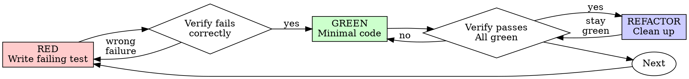

# Codex session 019f137a-b82f-7ba0-bebe-e62e6db40816

- Started: `2026-06-29T13:04:02.506Z`
- Working directory: `D:\100XH100`
- Originator: `Codex Desktop`
- Codex CLI: `0.142.2`
- Source log: `C:\Users\Иван Литвак\.codex\sessions\2026\06\29\rollout-2026-06-29T16-04-02-019f137a-b82f-7ba0-bebe-e62e6db40816.jsonl`
- Entries: user=4, assistant=124, tool calls=144, tool outputs=144

This is a chronological export of the user/assistant conversation and tool activity. Internal system/developer instructions and token accounting are intentionally excluded. Secret-shaped values are redacted; oversized tool outputs retain their beginning and end with the omitted character count.

## 1. User

Time: `2026-06-29T13:04:15.026Z` · source line `4`

```text
# AGENTS.md instructions for D:\100XH100

<INSTRUCTIONS>
# Project Agent Rules

## Operating Rule
- Read `AGENTS.md` before project edits.
- Update `memory/CHANGELOG.md` after meaningful code, config, or architecture changes.
- Update `memory/PROMPTS.md` with user prompts that define requirements.
- Store test outputs, logs, and verification notes under `test_results/`.
- Prefer agent-centered code: explicit contracts, deterministic tests, small files, low hidden state.

## Architecture Source
- Primary architecture contract: `ARCHITECTURE_NEED.md`.
- Current Stream 4 implementation rule: use threshold + compact + CUB/fixed-temp sort/reduce + compact; do not use Stream 4 hash-table dedup.

## Implementation Guardrails
- `State128` logical bytes are `v[0..119]`.
- `State128` padding bytes are `v[120..127]`.
- Persistent frontier padding must be zero.
- `FinalResponse` may temporarily store `target_local_idx` in `v[120..123]`.
- `Hash128` is one logical 128-bit key stored as `{lo, hi}`.
- `CandidateMeta` must remain 32 bytes and 32-byte aligned.
- Stream 3 payload id must be original candidate id, not compact index.
- Stream 4 must not apply shard top-k or semantic shard cap.

</INSTRUCTIONS>
<environment_context>
  <cwd>D:\100XH100</cwd>
  <shell>powershell</shell>
  <current_date>2026-06-29</current_date>
  <timezone>Europe/Moscow</timezone>
  <filesystem><workspace_roots><root>D:\100XH100</root></workspace_roots><permission_profile type="managed"><file_system type="restricted"><entry access="read"><special>:root</special></entry><entry access="write"><path>D:\100XH100</path></entry><entry access="write"><special>:slash_tmp</special></entry><entry access="write"><special>:tmpdir</special></entry><entry access="read"><path>D:\100XH100\.git</path></entry><entry access="read"><path>D:\100XH100\.agents</path></entry><entry access="read"><path>D:\100XH100\.codex</path></entry></file_system></permission_profile></filesystem>
</environment_context>
```

## 2. User

Time: `2026-06-29T13:04:15.048Z` · source line `6`

```text
You are Worker 2 in a subagent-driven workflow. Work ONLY in isolated worktree: D:\100XH100\.worktrees\stream1-piece-transformer

You are not alone in the codebase. Do not revert edits made by others. Do not touch files outside your assigned scope. Do not modify CUDA/runtime/dispatcher files.

Project rules:
- Read AGENTS.md before edits.
- Update memory/CHANGELOG.md after meaningful code/config/architecture changes.
- Store verification notes under test_results/.
- No fallback behavior: explicit modes only.

Current state:
- Task 1 is complete at commit 7a94f90. It added Stream1 backend config and fail-closed manifest backend parsing in the MLP loader.
- This clean worktree does NOT yet have `tools/export_stream1.py` or `tools/export_stream1_transformer.py` tracked. The main checkout had draft versions, but implement cleanly here.

Assigned task: implement exporter/reference generation for Kaggle Megaminx piece-transformer weights. This corresponds to plan Task 3 and the exporter part of Task 2.

Scope you may edit/create:
- Create `tools/export_stream1.py`
- Create `tools/export_stream1_transformer.py`
- Modify `tools/export_stream1_mlp.py` only if needed to share helpers without breaking existing CLI behavior
- Add Python-focused tests if practical under `tests/` or `test_results/`
- Update `memory/CHANGELOG.md`
- Add `test_results/stream1_transformer_exporter_2026-06-29.md`

Do NOT edit:
- src/*
- cuda/*
- tools/stream1_weight_io.hpp
- tools/production_runner.cu
- CMakeLists.txt

Functional requirements:
1. Add `tools/export_stream1.py` auto-detect wrapper:
   - `--weights`, `--out`, `--dtype {fp16,bf16}`, `--format {auto,piece-transformer,resmlp-layernorm,batchnorm-folded}`, `--num-classes`, `--metadata`, `--generators`, `--source-root`, `--reference-out`, `--reference-count`, `--reference-seed`.
   - Auto-detect piece-transformer by checkpoint keys: `local_value_embedding.weight`, `piece_projection.weight`, `blocks.0.attn.in_proj_weight`, `output_layer.weight`.
   - Existing MLP formats should delegate to `export_stream1_mlp.py`; do not break its existing CLI.
2. Add `tools/export_stream1_transformer.py` for `piece_transformer`:
   - Load checkpoint state dict robustly (`state_dict`, `model_state_dict`, `module`, `_orig_mod.` prefixes).
   - Auto-locate metadata under nearby `logs/model_*.json` and generator under nearby `generators/pXXX.json`, with explicit overrides.
   - Import `make_p900_piece_layout()` from `--source-root` or auto-located source root containing `pilgrim/model.py`.
   - Validate architecture from tensor shapes and metadata: state_len=120, num_classes=120, output_dim==move_count, num_pieces=50, max_piece_size=3, seq_len=51, d_model=256, nhead from metadata, layers contiguous, ff_dim consistent, activation/pooling metadata recorded.
   - Export fast input form exactly like Kaggle fast path:
     * `fast_slot_projected{.fp16/.bf16}` shape `[max_piece_size, num_classes, d_model]`
     * `fast_piece_static{.fp16/.bf16}` shape `[num_pieces, d_model]`
     * `cls_token{.fp16/.bf16}`
     * input/output LN tensors
     * per-block qkv/out/ln/ff tensors with hxk matrix layout for linear weights
     * `output_weight_hxk`, `output_bias`
     * integer `piece_positions.u16`, `piece_mask.u8`, `piece_types.u8`
   - Write manifest with `backend: piece_transformer`, `model_arch`, `state_len`, `num_classes`, `move_count`, `output_dim`, `dtype`, piece metadata, seq_len, d_model, nhead, head_dim, num_layers, ff_dim, activation, pooling, `input_embedding: fast_slot_projected`, source paths/model id, and `move_names`.
3. Reference generation:
   - If `--reference-out` is provided, instantiate the Kaggle `PilgrimPieceTransformer` from metadata, load weights, enable fast inference if supported, generate deterministic permutation states with `torch.randperm(state_len, generator=...)`, run fp32/eval model, and write JSON with `states`, `scores_fp32`, and metadata.
   - The reference must not require CUDA.
4. Verification:
   - Run exporter against local Kaggle artifact if paths exist:
     `C:/tmp/megaminx_qtransformer/megaminx-transformer/weights/p900-t000-q-rw-sym_1782210824_best.pth`
     metadata/generator/source-root in the same tree.
   - Export fp16 to `test_results/stream1_transformer_reference/weights_fp16` and reference to `test_results/stream1_transformer_reference/reference.json` with count 8 or 32.
   - Verify manifest has `backend=piece_transformer`, `output_dim=24`, `seq_len=51`; report file count/selected sizes.
   - Also run existing MLP exporter help or a no-op syntax check so existing CLI is not obviously broken.
5. Commit with message: `Add Stream1 piece transformer exporter`.

Return DONE/DONE_WITH_CONCERNS/NEEDS_CONTEXT/BLOCKED with changed files, verification summary, and commit SHA.
```

## 3. User

Time: `2026-06-29T13:04:15.049Z` · source line `7`

```text
You are Worker 2 in a subagent-driven workflow. Work ONLY in isolated worktree: D:\100XH100\.worktrees\stream1-piece-transformer

You are not alone in the codebase. Do not revert edits made by others. Do not touch files outside your assigned scope. Do not modify CUDA/runtime/dispatcher files.

Project rules:
- Read AGENTS.md before edits.
- Update memory/CHANGELOG.md after meaningful code/config/architecture changes.
- Store verification notes under test_results/.
- No fallback behavior: explicit modes only.

Current state:
- Task 1 is complete at commit 7a94f90. It added Stream1 backend config and fail-closed manifest backend parsing in the MLP loader.
- This clean worktree does NOT yet have `tools/export_stream1.py` or `tools/export_stream1_transformer.py` tracked. The main checkout had draft versions, but implement cleanly here.

Assigned task: implement exporter/reference generation for Kaggle Megaminx piece-transformer weights. This corresponds to plan Task 3 and the exporter part of Task 2.

Scope you may edit/create:
- Create `tools/export_stream1.py`
- Create `tools/export_stream1_transformer.py`
- Modify `tools/export_stream1_mlp.py` only if needed to share helpers without breaking existing CLI behavior
- Add Python-focused tests if practical under `tests/` or `test_results/`
- Update `memory/CHANGELOG.md`
- Add `test_results/stream1_transformer_exporter_2026-06-29.md`

Do NOT edit:
- src/*
- cuda/*
- tools/stream1_weight_io.hpp
- tools/production_runner.cu
- CMakeLists.txt

Functional requirements:
1. Add `tools/export_stream1.py` auto-detect wrapper:
   - `--weights`, `--out`, `--dtype {fp16,bf16}`, `--format {auto,piece-transformer,resmlp-layernorm,batchnorm-folded}`, `--num-classes`, `--metadata`, `--generators`, `--source-root`, `--reference-out`, `--reference-count`, `--reference-seed`.
   - Auto-detect piece-transformer by checkpoint keys: `local_value_embedding.weight`, `piece_projection.weight`, `blocks.0.attn.in_proj_weight`, `output_layer.weight`.
   - Existing MLP formats should delegate to `export_stream1_mlp.py`; do not break its existing CLI.
2. Add `tools/export_stream1_transformer.py` for `piece_transformer`:
   - Load checkpoint state dict robustly (`state_dict`, `model_state_dict`, `module`, `_orig_mod.` prefixes).
   - Auto-locate metadata under nearby `logs/model_*.json` and generator under nearby `generators/pXXX.json`, with explicit overrides.
   - Import `make_p900_piece_layout()` from `--source-root` or auto-located source root containing `pilgrim/model.py`.
   - Validate architecture from tensor shapes and metadata: state_len=120, num_classes=120, output_dim==move_count, num_pieces=50, max_piece_size=3, seq_len=51, d_model=256, nhead from metadata, layers contiguous, ff_dim consistent, activation/pooling metadata recorded.
   - Export fast input form exactly like Kaggle fast path:
     * `fast_slot_projected{.fp16/.bf16}` shape `[max_piece_size, num_classes, d_model]`
     * `fast_piece_static{.fp16/.bf16}` shape `[num_pieces, d_model]`
     * `cls_token{.fp16/.bf16}`
     * input/output LN tensors
     * per-block qkv/out/ln/ff tensors with hxk matrix layout for linear weights
     * `output_weight_hxk`, `output_bias`
     * integer `piece_positions.u16`, `piece_mask.u8`, `piece_types.u8`
   - Write manifest with `backend: piece_transformer`, `model_arch`, `state_len`, `num_classes`, `move_count`, `output_dim`, `dtype`, piece metadata, seq_len, d_model, nhead, head_dim, num_layers, ff_dim, activation, pooling, `input_embedding: fast_slot_projected`, source paths/model id, and `move_names`.
3. Reference generation:
   - If `--reference-out` is provided, instantiate the Kaggle `PilgrimPieceTransformer` from metadata, load weights, enable fast inference if supported, generate deterministic permutation states with `torch.randperm(state_len, generator=...)`, run fp32/eval model, and write JSON with `states`, `scores_fp32`, and metadata.
   - The reference must not require CUDA.
4. Verification:
   - Run exporter against local Kaggle artifact if paths exist:
     `C:/tmp/megaminx_qtransformer/megaminx-transformer/weights/p900-t000-q-rw-sym_1782210824_best.pth`
     metadata/generator/source-root in the same tree.
   - Export fp16 to `test_results/stream1_transformer_reference/weights_fp16` and reference to `test_results/stream1_transformer_reference/reference.json` with count 8 or 32.
   - Verify manifest has `backend=piece_transformer`, `output_dim=24`, `seq_len=51`; report file count/selected sizes.
   - Also run existing MLP exporter help or a no-op syntax check so existing CLI is not obviously broken.
5. Commit with message: `Add Stream1 piece transformer exporter`.

Return DONE/DONE_WITH_CONCERNS/NEEDS_CONTEXT/BLOCKED with changed files, verification summary, and commit SHA.
```

## 4. Codex

Time: `2026-06-29T13:04:39.701Z` · source line `9`

```text
I’ll stay inside `D:\100XH100\.worktrees\stream1-piece-transformer`, read the project rules first, then inspect the current exporter layout before editing.
```

## 5. Codex

Time: `2026-06-29T13:04:39.708Z` · source line `10`

```text
I’ll stay inside `D:\100XH100\.worktrees\stream1-piece-transformer`, read the project rules first, then inspect the current exporter layout before editing.
```

## 6. Tool call: `exec_command`

Time: `2026-06-29T13:04:39.749Z` · source line `11`

```text
{"cmd":"Get-Content -Raw AGENTS.md","workdir":"D:\\100XH100\\.worktrees\\stream1-piece-transformer","shell":"powershell","yield_time_ms":10000,"max_output_tokens":20000}
```

## 7. Tool call: `exec_command`

Time: `2026-06-29T13:04:39.765Z` · source line `12`

```text
{"cmd":"Get-Content -Raw C:\\Users\\Иван Литвак\\.codex\\skills\\superpowers\\test-driven-development\\SKILL.md","workdir":"D:\\100XH100\\.worktrees\\stream1-piece-transformer","shell":"powershell","yield_time_ms":10000,"max_output_tokens":20000}
```

## 8. Tool call: `exec_command`

Time: `2026-06-29T13:04:39.781Z` · source line `13`

```text
{"cmd":"Get-Content -Raw C:\\Users\\Иван Литвак\\.codex\\skills\\superpowers\\verification-before-completion\\SKILL.md","workdir":"D:\\100XH100\\.worktrees\\stream1-piece-transformer","shell":"powershell","yield_time_ms":10000,"max_output_tokens":20000}
```

## 9. Tool call: `exec_command`

Time: `2026-06-29T13:04:39.800Z` · source line `14`

```text
{"cmd":"rg -n \"100XH100|Stream1|piece_transformer|piece-transformer\" C:\\Users\\Иван Литвак\\.codex\\memories\\MEMORY.md","workdir":"D:\\100XH100\\.worktrees\\stream1-piece-transformer","shell":"powershell","yield_time_ms":10000,"max_output_tokens":12000}
```

## 10. Tool output

Time: `2026-06-29T13:04:40.213Z` · source line `15`

```text
Chunk ID: d3fbf1
Wall time: 0.1810 seconds
Process exited with code 0
Original token count: 285
Output:
# Project Agent Rules

## Operating Rule
- Read `AGENTS.md` before project edits.
- Update `memory/CHANGELOG.md` after meaningful code, config, or architecture changes.
- Update `memory/PROMPTS.md` with user prompts that define requirements.
- Store test outputs, logs, and verification notes under `test_results/`.
- Prefer agent-centered code: explicit contracts, deterministic tests, small files, low hidden state.

## Architecture Source
- Primary architecture contract: `ARCHITECTURE_NEED.md`.
- Current Stream 4 implementation rule: use threshold + compact + CUB/fixed-temp sort/reduce + compact; do not use Stream 4 hash-table dedup.

## Implementation Guardrails
- `State128` logical bytes are `v[0..119]`.
- `State128` padding bytes are `v[120..127]`.
- Persistent frontier padding must be zero.
- `FinalResponse` may temporarily store `target_local_idx` in `v[120..123]`.
- `Hash128` is one logical 128-bit key stored as `{lo, hi}`.
- `CandidateMeta` must remain 32 bytes and 32-byte aligned.
- Stream 3 payload id must be original candidate id, not compact index.
- Stream 4 must not apply shard top-k or semantic shard cap.


```

## 11. Tool output

Time: `2026-06-29T13:04:40.342Z` · source line `16`

```text
Chunk ID: a0299c
Wall time: 0.2524 seconds
Process exited with code 1
Original token count: 120
Output:
Get-Content : A positional parameter cannot be found that accepts argument 'C:\Users\Иван'.
At line:2 char:1
+ Get-Content -Raw C:\Users\Иван Литвак\.codex\skills\superpowers\test- ...
+ ~~~~~~~~~~~~~~~~~~~~~~~~~~~~~~~~~~~~~~~~~~~~~~~~~~~~~~~~~~~~~~~~~~~~~
    + CategoryInfo          : InvalidArgument: (:) [Get-Content], ParameterBindingException
    + FullyQualifiedErrorId : PositionalParameterNotFound,Microsoft.PowerShell.Commands.GetContentCommand
 

```

## 12. Tool output

Time: `2026-06-29T13:04:40.351Z` · source line `17`

```text
Chunk ID: 72baef
Wall time: 0.2434 seconds
Process exited with code 1
Original token count: 120
Output:
Get-Content : A positional parameter cannot be found that accepts argument 'C:\Users\Иван'.
At line:2 char:1
+ Get-Content -Raw C:\Users\Иван Литвак\.codex\skills\superpowers\verif ...
+ ~~~~~~~~~~~~~~~~~~~~~~~~~~~~~~~~~~~~~~~~~~~~~~~~~~~~~~~~~~~~~~~~~~~~~
    + CategoryInfo          : InvalidArgument: (:) [Get-Content], ParameterBindingException
    + FullyQualifiedErrorId : PositionalParameterNotFound,Microsoft.PowerShell.Commands.GetContentCommand
 

```

## 13. Tool output

Time: `2026-06-29T13:04:40.481Z` · source line `18`

```text
Chunk ID: 921623
Wall time: 0.3409 seconds
Process exited with code 1
Original token count: 33
Output:
rg: Литвак\.codex\memories\MEMORY.md: Системе не удается найти указанный путь. (os error 3)

```

## 14. Codex

Time: `2026-06-29T13:04:50.773Z` · source line `21`

```text
I’m using the test-driven-development skill because this is a feature implementation, and the verification skill before I call the work done. The first path read hit PowerShell’s space-in-path parsing, so I’m rerunning those reads with literal paths.
```

## 15. Codex

Time: `2026-06-29T13:04:50.788Z` · source line `22`

```text
I’m using the test-driven-development skill because this is a feature implementation, and the verification skill before I call the work done. The first path read hit PowerShell’s space-in-path parsing, so I’m rerunning those reads with literal paths.
```

## 16. Tool call: `exec_command`

Time: `2026-06-29T13:04:50.816Z` · source line `23`

```text
{"cmd":"Get-Content -Raw -LiteralPath 'C:\\Users\\Иван Литвак\\.codex\\skills\\superpowers\\test-driven-development\\SKILL.md'","workdir":"D:\\100XH100\\.worktrees\\stream1-piece-transformer","shell":"powershell","yield_time_ms":10000,"max_output_tokens":20000}
```

## 17. Tool call: `exec_command`

Time: `2026-06-29T13:04:50.836Z` · source line `24`

```text
{"cmd":"Get-Content -Raw -LiteralPath 'C:\\Users\\Иван Литвак\\.codex\\skills\\superpowers\\verification-before-completion\\SKILL.md'","workdir":"D:\\100XH100\\.worktrees\\stream1-piece-transformer","shell":"powershell","yield_time_ms":10000,"max_output_tokens":20000}
```

## 18. Tool call: `exec_command`

Time: `2026-06-29T13:04:50.857Z` · source line `25`

```text
{"cmd":"rg -n \"100XH100|Stream1|piece_transformer|piece-transformer\" 'C:\\Users\\Иван Литвак\\.codex\\memories\\MEMORY.md'","workdir":"D:\\100XH100\\.worktrees\\stream1-piece-transformer","shell":"powershell","yield_time_ms":10000,"max_output_tokens":12000}
```

## 19. Tool output

Time: `2026-06-29T13:04:51.351Z` · source line `26`

```text
Chunk ID: 32ad36
Wall time: 0.2479 seconds
Process exited with code 1
Original token count: 141
Output:
Get-Content : Cannot find path 'C:\Users\Иван Литвак\.codex\skills\superpowers\test-driven-development\SKILL.md' becaus
e it does not exist.
At line:2 char:1
+ Get-Content -Raw -LiteralPath 'C:\Users\Иван Литвак\.codex\skills\sup ...
+ ~~~~~~~~~~~~~~~~~~~~~~~~~~~~~~~~~~~~~~~~~~~~~~~~~~~~~~~~~~~~~~~~~~~~~
    + CategoryInfo          : ObjectNotFound: (C:\Users\Иван Л...opment\SKILL.md:String) [Get-Content], ItemNotFoundEx 
   ception
    + FullyQualifiedErrorId : PathNotFound,Microsoft.PowerShell.Commands.GetContentCommand
 

```

## 20. Tool output

Time: `2026-06-29T13:04:51.367Z` · source line `27`

```text
Chunk ID: 3a93d1
Wall time: 0.2395 seconds
Process exited with code 1
Original token count: 143
Output:
Get-Content : Cannot find path 'C:\Users\Иван Литвак\.codex\skills\superpowers\verification-before-completion\SKILL.md'
 because it does not exist.
At line:2 char:1
+ Get-Content -Raw -LiteralPath 'C:\Users\Иван Литвак\.codex\skills\sup ...
+ ~~~~~~~~~~~~~~~~~~~~~~~~~~~~~~~~~~~~~~~~~~~~~~~~~~~~~~~~~~~~~~~~~~~~~
    + CategoryInfo          : ObjectNotFound: (C:\Users\Иван Л...letion\SKILL.md:String) [Get-Content], ItemNotFoundEx 
   ception
    + FullyQualifiedErrorId : PathNotFound,Microsoft.PowerShell.Commands.GetContentCommand
 

```

## 21. Tool output

Time: `2026-06-29T13:04:51.468Z` · source line `28`

```text
Chunk ID: c601ac
Wall time: 0.2948 seconds
Process exited with code 1
Original token count: 0
Output:

```

## 22. Codex

Time: `2026-06-29T13:05:02.892Z` · source line `31`

```text
Memory has no obvious prior notes for this repository or Stream1 exporter path, so I’m treating the worktree as the source of truth. The superpowers skills are in the plugin cache path, not the base skills folder, and I’m reading them there now.
```

## 23. Codex

Time: `2026-06-29T13:05:02.904Z` · source line `32`

```text
Memory has no obvious prior notes for this repository or Stream1 exporter path, so I’m treating the worktree as the source of truth. The superpowers skills are in the plugin cache path, not the base skills folder, and I’m reading them there now.
```

## 24. Tool call: `exec_command`

Time: `2026-06-29T13:05:02.920Z` · source line `33`

```text
{"cmd":"Get-Content -Raw -LiteralPath 'C:\\Users\\Иван Литвак\\.codex\\plugins\\cache\\openai-curated-remote\\superpowers\\5.1.4\\skills\\test-driven-development\\SKILL.md'","workdir":"D:\\100XH100\\.worktrees\\stream1-piece-transformer","shell":"powershell","yield_time_ms":10000,"max_output_tokens":20000}
```

## 25. Tool call: `exec_command`

Time: `2026-06-29T13:05:02.920Z` · source line `34`

```text
{"cmd":"Get-Content -Raw -LiteralPath 'C:\\Users\\Иван Литвак\\.codex\\plugins\\cache\\openai-curated-remote\\superpowers\\5.1.4\\skills\\verification-before-completion\\SKILL.md'","workdir":"D:\\100XH100\\.worktrees\\stream1-piece-transformer","shell":"powershell","yield_time_ms":10000,"max_output_tokens":20000}
```

## 26. Tool call: `exec_command`

Time: `2026-06-29T13:05:02.945Z` · source line `35`

```text
{"cmd":"git status --short --branch","workdir":"D:\\100XH100\\.worktrees\\stream1-piece-transformer","shell":"powershell","yield_time_ms":10000,"max_output_tokens":12000}
```

## 27. Tool call: `exec_command`

Time: `2026-06-29T13:05:02.946Z` · source line `36`

```text
{"cmd":"rg --files","workdir":"D:\\100XH100\\.worktrees\\stream1-piece-transformer","shell":"powershell","yield_time_ms":10000,"max_output_tokens":20000}
```

## 28. Tool output

Time: `2026-06-29T13:05:03.958Z` · source line `37`

````text
Chunk ID: 38ebde
Wall time: 0.1899 seconds
Process exited with code 0
Original token count: 2473
Output:
---
name: test-driven-development
description: Use when implementing any feature or bugfix, before writing implementation code
---

# Test-Driven Development (TDD)

## Overview

Write the test first. Watch it fail. Write minimal code to pass.

**Core principle:** If you didn't watch the test fail, you don't know if it tests the right thing.

**Violating the letter of the rules is violating the spirit of the rules.**

## When to Use

**Always:**
- New features
- Bug fixes
- Refactoring
- Behavior changes

**Exceptions (ask your human partner):**
- Throwaway prototypes
- Generated code
- Configuration files

Thinking "skip TDD just this once"? Stop. That's rationalization.

## The Iron Law

```
NO PRODUCTION CODE WITHOUT A FAILING TEST FIRST
```

Write code before the test? Delete it. Start over.

**No exceptions:**
- Don't keep it as "reference"
- Don't "adapt" it while writing tests
- Don't look at it
- Delete means delete

Implement fresh from tests. Period.

## Red-Green-Refactor



### RED - Write Failing Test

Write one minimal test showing what should happen.

<Good>
```typescript
test('retries failed operations 3 times', async () => {
  let attempts = 0;
  const operation = () => {
    attempts++;
    if (attempts < 3) throw new Error('fail');
    return 'success';
  };

  const result = await retryOperation(operation);

  expect(result).toBe('success');
  expect(attempts).toBe(3);
});
```
Clear name, tests real behavior, one thing
</Good>

<Bad>
```typescript
test('retry works', async () => {
  const mock = jest.fn()
    .mockRejectedValueOnce(new Error())
    .mockRejectedValueOnce(new Error())
    .mockResolvedValueOnce('success');
  await retryOperation(mock);
  expect(mock).toHaveBeenCalledTimes(3);
});
```
Vague name, tests mock not code
</Bad>

**Requirements:**
- One behavior
- Clear name
- Real code (no mocks unless unavoidable)

### Verify RED - Watch It Fail

**MANDATORY. Never skip.**

```bash
npm test path/to/test.test.ts
```

Confirm:
- Test fails (not errors)
- Failure message is expected
- Fails because feature missing (not typos)

**Test passes?** You're testing existing behavior. Fix test.

**Test errors?** Fix error, re-run until it fails correctly.

### GREEN - Minimal Code

Write simplest code to pass the test.

<Good>
```typescript
async function retryOperation<T>(fn: () => Promise<T>): Promise<T> {
  for (let i = 0; i < 3; i++) {
    try {
      return await fn();
    } catch (e) {
      if (i === 2) throw e;
    }
  }
  throw new Error('unreachable');
}
```
Just enough to pass
</Good>

<Bad>
```typescript
async function retryOperation<T>(
  fn: () => Promise<T>,
  options?: {
    maxRetries?: number;
    backoff?: 'linear' | 'exponential';
    onRetry?: (attempt: number) => void;
  }
): Promise<T> {
  // YAGNI
}
```
Over-engineered
</Bad>

Don't add features, refactor other code, or "improve" beyond the test.

### Verify GREEN - Watch It Pass

**MANDATORY.**

```bash
npm test path/to/test.test.ts
```

Confirm:
- Test passes
- Other tests still pass
- Output pristine (no errors, warnings)

**Test fails?** Fix code, not test.

**Other tests fail?** Fix now.

### REFACTOR - Clean Up

After green only:
- Remove duplication
- Improve names
- Extract helpers

Keep tests green. Don't add behavior.

### Repeat

Next failing test for next feature.

## Good Tests

| Quality | Good | Bad |
|---------|------|-----|
| **Minimal** | One thing. "and" in name? Split it. | `test('validates email and domain and whitespace')` |
| **Clear** | Name describes behavior | `test('test1')` |
| **Shows intent** | Demonstrates desired API | Obscures what code should do |

## Why Order Matters

**"I'll write tests after to verify it works"**

Tests written after code pass immediately. Passing immediately proves nothing:
- Might test wrong thing
- Might test implementation, not behavior
- Might miss edge cases you forgot
- You never saw it catch the bug

Test-first forces you to see the test fail, proving it actually tests something.

**"I already manually tested all the edge cases"**

Manual testing is ad-hoc. You think you tested everything but:
- No record of what you tested
- Can't re-run when code changes
- Easy to forget cases under pressure
- "It worked when I tried it" в‰  comprehensive

Automated tests are systematic. They run the same way every time.

**"Deleting X hours of work is wasteful"**

Sunk cost fallacy. The time is already gone. Your choice now:
- Delete and rewrite with TDD (X more hours, high confidence)
- Keep it and add tests after (30 min, low confidence, likely bugs)

The "waste" is keeping code you can't trust. Working code without real tests is technical debt.

**"TDD is dogmatic, being pragmatic means adapting"**

TDD IS pragmatic:
- Finds bugs before commit (faster than debugging after)
- Prevents regressions (tests catch breaks immediately)
- Documents behavior (tests show how to use code)
- Enables refactoring (change freely, tests catch breaks)

"Pragmatic" shortcuts = debugging in production = slower.

**"Tests after achieve the same goals - it's spirit not ritual"**

No. Tests-after answer "What does this do?" Tests-first answer "What should this do?"

Tests-after are biased by your implementation. You test what you built, not what's required. You verify remembered edge cases, not discovered ones.

Tests-first force edge case discovery before implementing. Tests-after verify you remembered everything (you didn't).

30 minutes of tests after в‰  TDD. You get coverage, lose proof tests work.

## Common Rationalizations

| Excuse | Reality |
|--------|---------|
| "Too simple to test" | Simple code breaks. Test takes 30 seconds. |
| "I'll test after" | Tests passing immediately prove nothing. |
| "Tests after achieve same goals" | Tests-after = "what does this do?" Tests-first = "what should this do?" |
| "Already manually tested" | Ad-hoc в‰  systematic. No record, can't re-run. |
| "Deleting X hours is wasteful" | Sunk cost fallacy. Keeping unverified code is technical debt. |
| "Keep as reference, write tests first" | You'll adapt it. That's testing after. Delete means delete. |
| "Need to explore first" | Fine. Throw away exploration, start with TDD. |
| "Test hard = design unclear" | Listen to test. Hard to test = hard to use. |
| "TDD will slow me down" | TDD faster than debugging. Pragmatic = test-first. |
| "Manual test faster" | Manual doesn't prove edge cases. You'll re-test every change. |
| "Existing code has no tests" | You're improving it. Add tests for existing code. |

## Red Flags - STOP and Start Over

- Code before test
- Test after implementation
- Test passes immediately
- Can't explain why test failed
- Tests added "later"
- Rationalizing "just this once"
- "I already manually tested it"
- "Tests after achieve the same purpose"
- "It's about spirit not ritual"
- "Keep as reference" or "adapt existing code"
- "Already spent X hours, deleting is wasteful"
- "TDD is dogmatic, I'm being pragmatic"
- "This is different because..."

**All of these mean: Delete code. Start over with TDD.**

## Example: Bug Fix

**Bug:** Empty email accepted

**RED**
```typescript
test('rejects empty email', async () => {
  const result = await submitForm({ email: '' });
  expect(result.error).toBe('Email required');
});
```

**Verify RED**
```bash
$ npm test
FAIL: expected 'Email required', got undefined
```

**GREEN**
```typescript
function submitForm(data: FormData) {
  if (!data.email?.trim()) {
    return { error: 'Email required' };
  }
  // ...
}
```

**Verify GREEN**
```bash
$ npm test
PASS
```

**REFACTOR**
Extract validation for multiple fields if needed.

## Verification Checklist

Before marking work complete:

- [ ] Every new function/method has a test
- [ ] Watched each test fail before implementing
- [ ] Each test failed for expected reason (feature missing, not typo)
- [ ] Wrote minimal code to pass each test
- [ ] All tests pass
- [ ] Output pristine (no errors, warnings)
- [ ] Tests use real code (mocks only if unavoidable)
- [ ] Edge cases and errors covered

Can't check all boxes? You skipped TDD. Start over.

## When Stuck

| Problem | Solution |
|---------|----------|
| Don't know how to test | Write wished-for API. Write assertion first. Ask your human partner. |
| Test too complicated | Design too complicated. Simplify interface. |
| Must mock everything | Code too coupled. Use dependency injection. |
| Test setup huge | Extract helpers. Still complex? Simplify design. |

## Debugging Integration

Bug found? Write failing test reproducing it. Follow TDD cycle. Test proves fix and prevents regression.

Never fix bugs without a test.

## Testing Anti-Patterns

When adding mocks or test utilities, read @testing-anti-patterns.md to avoid common pitfalls:
- Testing mock behavior instead of real behavior
- Adding test-only methods to production classes
- Mocking without understanding dependencies

## Final Rule

```
Production code в†’ test exists and failed first
Otherwise в†’ not TDD
```

No exceptions without your human partner's permission.


````

## 29. Tool output

Time: `2026-06-29T13:05:04.349Z` · source line `38`

````text
Chunk ID: b66400
Wall time: 0.1030 seconds
Process exited with code 0
Original token count: 1079
Output:
---
name: verification-before-completion
description: Use when about to claim work is complete, fixed, or passing, before committing or creating PRs - requires running verification commands and confirming output before making any success claims; evidence before assertions always
---

# Verification Before Completion

## Overview

Claiming work is complete without verification is dishonesty, not efficiency.

**Core principle:** Evidence before claims, always.

**Violating the letter of this rule is violating the spirit of this rule.**

## The Iron Law

```
NO COMPLETION CLAIMS WITHOUT FRESH VERIFICATION EVIDENCE
```

If you haven't run the verification command in this message, you cannot claim it passes.

## The Gate Function

```
BEFORE claiming any status or expressing satisfaction:

1. IDENTIFY: What command proves this claim?
2. RUN: Execute the FULL command (fresh, complete)
3. READ: Full output, check exit code, count failures
4. VERIFY: Does output confirm the claim?
   - If NO: State actual status with evidence
   - If YES: State claim WITH evidence
5. ONLY THEN: Make the claim

Skip any step = lying, not verifying
```

## Common Failures

| Claim | Requires | Not Sufficient |
|-------|----------|----------------|
| Tests pass | Test command output: 0 failures | Previous run, "should pass" |
| Linter clean | Linter output: 0 errors | Partial check, extrapolation |
| Build succeeds | Build command: exit 0 | Linter passing, logs look good |
| Bug fixed | Test original symptom: passes | Code changed, assumed fixed |
| Regression test works | Red-green cycle verified | Test passes once |
| Agent completed | VCS diff shows changes | Agent reports "success" |
| Requirements met | Line-by-line checklist | Tests passing |

## Red Flags - STOP

- Using "should", "probably", "seems to"
- Expressing satisfaction before verification ("Great!", "Perfect!", "Done!", etc.)
- About to commit/push/PR without verification
- Trusting agent success reports
- Relying on partial verification
- Thinking "just this once"
- Tired and wanting work over
- **ANY wording implying success without having run verification**

## Rationalization Prevention

| Excuse | Reality |
|--------|---------|
| "Should work now" | RUN the verification |
| "I'm confident" | Confidence в‰  evidence |
| "Just this once" | No exceptions |
| "Linter passed" | Linter в‰  compiler |
| "Agent said success" | Verify independently |
| "I'm tired" | Exhaustion в‰  excuse |
| "Partial check is enough" | Partial proves nothing |
| "Different words so rule doesn't apply" | Spirit over letter |

## Key Patterns

**Tests:**
```
вњ… [Run test command] [See: 34/34 pass] "All tests pass"
вќЊ "Should pass now" / "Looks correct"
```

**Regression tests (TDD Red-Green):**
```
вњ… Write в†’ Run (pass) в†’ Revert fix в†’ Run (MUST FAIL) в†’ Restore в†’ Run (pass)
вќЊ "I've written a regression test" (without red-green verification)
```

**Build:**
```
вњ… [Run build] [See: exit 0] "Build passes"
вќЊ "Linter passed" (linter doesn't check compilation)
```

**Requirements:**
```
вњ… Re-read plan в†’ Create checklist в†’ Verify each в†’ Report gaps or completion
вќЊ "Tests pass, phase complete"
```

**Agent delegation:**
```
вњ… Agent reports success в†’ Check VCS diff в†’ Verify changes в†’ Report actual state
вќЊ Trust agent report
```

## Why This Matters

From 24 failure memories:
- your human partner said "I don't believe you" - trust broken
- Undefined functions shipped - would crash
- Missing requirements shipped - incomplete features
- Time wasted on false completion в†’ redirect в†’ rework
- Violates: "Honesty is a core value. If you lie, you'll be replaced."

## When To Apply

**ALWAYS before:**
- ANY variation of success/completion claims
- ANY expression of satisfaction
- ANY positive statement about work state
- Committing, PR creation, task completion
- Moving to next task
- Delegating to agents

**Rule applies to:**
- Exact phrases
- Paraphrases and synonyms
- Implications of success
- ANY communication suggesting completion/correctness

## The Bottom Line

**No shortcuts for verification.**

Run the command. Read the output. THEN claim the result.

This is non-negotiable.


````

## 30. Tool output

Time: `2026-06-29T13:05:05.361Z` · source line `39`

```text
Chunk ID: 1c5e16
Wall time: 1.5933 seconds
Process exited with code 0
Original token count: 11
Output:
## codex/stream1-piece-transformer
?? docs/

```

## 31. Tool output

Time: `2026-06-29T13:05:05.361Z` · source line `40`

```text
Chunk ID: c2bbbf
Wall time: 1.1583 seconds
Process exited with code 0
Original token count: 3529
Output:
CMakeLists.txt
docker-compose.yml
Dockerfile
kaggle\beam_kernel.ipynb
README.md
data\test.csv
data\sample_submission.csv
data\puzzle_info.json
hpc\tune_8xa100_stream1.sh
hpc\tune_8xa100_staged.sh
hpc\tune_8xa100_pipeline.sh
hpc\start_8xa100_best.sh
hpc\start_8xa100_beamsearch.sh
hpc\solve_then_reflect.sh
hpc\solve_reflected_only.sh
hpc\README_8xa100.md
cuda\threshold.hpp
cuda\threshold.cu
cuda\stream5.hpp
cuda\stream5.cu
cuda\stream4.hpp
cuda\stream4.cu
cuda\stream3.hpp
cuda\stream3.cu
cuda\stream2.hpp
cuda\stream2.cu
cuda\stream1.hpp
cuda\stream1.cu
cuda\static_memory.hpp
cuda\static_memory.cu
cuda\runtime_config.hpp
cuda\runtime_config.cpp
cuda\nvtx_ranges.hpp
cuda\final_materialize.hpp
cuda\final_materialize.cu
cuda\dispatcher.hpp
cuda\dispatcher.cu
cuda\cuda_check.hpp
cuda\cub_compat.hpp
prompt_history\task_2026-05-30_beam_width_compare.md
FullBeamNice\targets\p900-t000.pt
hpc\portable_8xa100_80gb\run_1p4b_8xa100_80gb.sh
hpc\portable_8xa100_80gb\README.md
hpc\mephi_8xa100_common.sh
kaggle\t4-torchrun-p0-depth10.ipynb
kaggle\t4-torchrun-machinery-check.ipynb
kaggle\kernel-metadata.json
kaggle\h100-torchrun-p0-depth10.ipynb
kaggle\h100-torchrun-depth80-k1-5.ipynb
kaggle\cayley-beam-gpu-runner.ipynb
FullBeamNice\notebooks\q_model_inference_standalone.ipynb
kaggle_torchrun\h100-torchrun-depth80-k1-5.ipynb
stream1_weights_artgor_bf16\residual1_fc2_weight_hxk.bf16
stream1_weights_artgor_bf16\residual1_fc2_ln_gamma.bf16
stream1_weights_artgor_bf16\residual1_fc2_ln_beta.bf16
stream1_weights_artgor_bf16\residual1_fc2_bias.bf16
stream1_weights_artgor_bf16\residual1_fc1_weight_hxk.bf16
stream1_weights_artgor_bf16\residual1_fc1_ln_gamma.bf16
stream1_weights_artgor_bf16\residual1_fc1_ln_beta.bf16
stream1_weights_artgor_bf16\residual1_fc1_bias.bf16
cmake\CheckBeamStateSizing.cmake
stream1_weights_artgor_bf16\residual0_fc2_weight_hxk.bf16
stream1_weights_artgor_bf16\residual0_fc2_ln_gamma.bf16
stream1_weights_artgor_bf16\residual0_fc2_ln_beta.bf16
stream1_weights_artgor_bf16\residual0_fc2_bias.bf16
stream1_weights_artgor_bf16\residual0_fc1_weight_hxk.bf16
stream1_weights_artgor_bf16\residual0_fc1_ln_gamma.bf16
stream1_weights_artgor_bf16\residual0_fc1_ln_beta.bf16
docs\superpowers\plans\2026-06-29-stream1-piece-transformer.md
stream1_weights_artgor_bf16\residual0_fc1_bias.bf16
stream1_weights_artgor_bf16\output_weight_hxk.bf16
stream1_weights_artgor_bf16\output_bias.bf16
stream1_weights_artgor_bf16\manifest.json
stream1_weights_artgor_bf16\input_weight_hxk.bf16
stream1_weights_artgor_bf16\input_ln_gamma.bf16
stream1_weights_artgor_bf16\input_ln_beta.bf16
stream1_weights_artgor_bf16\input_bias.bf16
stream1_weights_artgor_bf16\hidden_weight_hxk.bf16
stream1_weights_artgor_bf16\hidden_ln_gamma.bf16
stream1_weights_artgor_bf16\hidden_ln_beta.bf16
stream1_weights_artgor_bf16\hidden_bias.bf16
kaggle_torchrun\kernel-metadata.json
hpc\ihes_cube_smoke\README.md
hpc\ihes_cube_smoke\make_dummy_weights.py
hpc\ihes_cube_smoke\ihes_cube_smoke.sh
kaggle_torchrun\h100-torchrun-p0-depth10.ipynb
molab\molab_probe.py
molab\README.md
molab\probe_cell.py
src\config.cpp
src\config.hpp
stream1_weights\hidden_bias.fp16
src\types.hpp
src\stream4.hpp
src\stream4.cpp
src\stream3.hpp
src\stream3.cpp
src\state.hpp
src\state.cpp
src\history.hpp
src\history.cpp
src\hash.hpp
src\hash.cpp
src\frontier_cpu.hpp
src\frontier_cpu.cpp
stream1_weights\residual0_fc1_weight_hxk.fp16
stream1_weights\residual0_fc1_bias.fp16
stream1_weights\output_weight_hxk.fp16
stream1_weights\output_bias.fp16
stream1_weights\manifest.json
stream1_weights\input_weight_hxk.fp16
stream1_weights\input_bias.fp16
stream1_weights\hidden_weight_hxk.fp16
stream1_weights\residual1_fc1_weight_hxk.fp16
stream1_weights\residual1_fc1_bias.fp16
stream1_weights\residual0_fc2_weight_hxk.fp16
stream1_weights\residual0_fc2_bias.fp16
stream1_weights\residual1_fc2_weight_hxk.fp16
stream1_weights\residual1_fc2_bias.fp16
stream1_weights\residual2_fc1_bias.fp16
tests\contract_tests.cpp
AGENTS.md
ARCHITECTURE_NEED.md
hpc\ihes_cube_model\solv_uniq.csv
hpc\ihes_cube_model\run_solution_repair_plan.sh
hpc\ihes_cube_model\README.md
hpc\ihes_cube_model\prepare_solution_repair_single_window.sh
hpc\ihes_cube_model\prepare_ihes_prebuilt_runner.sh
hpc\ihes_cube_model\prepare_ihes_cube_model.sh
hpc\ihes_cube_model\ihes_solve_then_reflect.sh
hpc\ihes_cube_model\ihes_solve_bucket_from_scratch.sh
hpc\ihes_cube_model\ihes_solve_bucket.sh
hpc\ihes_cube_model\ihes_solution_repair.sh
hpc\ihes_cube_model\ihes_segment_repair.sh
hpc\ihes_cube_model\ihes_cube_model.sh
stream1_weights\residual2_fc2_bias.fp16
stream1_weights\residual2_fc1_weight_hxk.fp16
stream1_weights\residual2_fc2_weight_hxk.fp16
kaggle_t4_torchrun\t4-torchrun-machinery-check.ipynb
kaggle_t4_torchrun\kernel-metadata.json
kaggle_t4_torchrun\t4-torchrun-p0-depth10.ipynb
memory\CHANGELOG.md
memory\PROMPTS.md
tests\threshold_cuda_tests.cu
cmake\BeamStateSizing.cmake
tests\stream5_cuda_tests.cu
tests\stream4_cuda_tests.cu
tests\stream3_cuda_tests.cu
tests\stream2_cuda_tests.cu
tests\stream1_cuda_tests.cu
tests\stitched_cuda_tests.cu
tests\static_memory_cuda_tests.cu
tests\history_tests.cpp
tests\final_cuda_tests.cu
tests\dispatcher_cuda_tests.cu
FullBeamNice\logs\model_p900-t000-q-sym_1777988767.json
FullBeamNice\generators\p900.json
tools\generate_segment_repair_jobs.py
tools\export_stream1_mlp.py
tools\compare_solution_lengths.py
tools\stream_benchmark.cu
tools\stream1_weight_io.hpp
tools\production_runner.cu
_push_final_chunk\tools\stream_benchmark.cu
_push_final_chunk\tools\stream1_weight_io.hpp
_push_final_chunk\tools\production_runner.cu
_push_final_chunk\tools\export_stream1_mlp.py
_push_final_chunk\tests\threshold_cuda_tests.cu
_push_final_chunk\tests\stream5_cuda_tests.cu
_push_final_chunk\tests\stream4_cuda_tests.cu
_push_final_chunk\tests\stream3_cuda_tests.cu
_push_final_chunk\tests\stream2_cuda_tests.cu
_push_final_chunk\tests\stream1_cuda_tests.cu
_push_final_chunk\tests\stitched_cuda_tests.cu
_push_final_chunk\tests\static_memory_cuda_tests.cu
_push_final_chunk\tests\history_tests.cpp
_push_final_chunk\tests\final_cuda_tests.cu
_push_final_chunk\tests\dispatcher_cuda_tests.cu
_push_final_chunk\tests\contract_tests.cpp
_push_final_chunk\stream1_weights\residual2_fc2_weight_hxk.fp16
_push_final_chunk\stream1_weights\residual2_fc2_bias.fp16
_push_final_chunk\stream1_weights\residual2_fc1_weight_hxk.fp16
_push_final_chunk\stream1_weights\residual2_fc1_bias.fp16
_push_final_chunk\stream1_weights\residual1_fc2_weight_hxk.fp16
_push_final_chunk\stream1_weights\residual1_fc2_bias.fp16
_push_final_chunk\stream1_weights\residual1_fc1_weight_hxk.fp16
_push_final_chunk\stream1_weights\residual1_fc1_bias.fp16
_push_final_chunk\stream1_weights\residual0_fc2_weight_hxk.fp16
_push_final_chunk\stream1_weights\residual0_fc2_bias.fp16
_push_final_chunk\stream1_weights\residual0_fc1_weight_hxk.fp16
_push_final_chunk\stream1_weights\residual0_fc1_bias.fp16
_push_final_chunk\stream1_weights\output_weight_hxk.fp16
_push_final_chunk\stream1_weights\output_bias.fp16
_push_final_chunk\stream1_weights\manifest.json
_push_final_chunk\stream1_weights\input_weight_hxk.fp16
_push_final_chunk\stream1_weights\input_bias.fp16
_push_final_chunk\stream1_weights\hidden_weight_hxk.fp16
_push_final_chunk\stream1_weights\hidden_bias.fp16
_push_final_chunk\src\types.hpp
_push_final_chunk\src\stream4.hpp
_push_final_chunk\src\stream4.cpp
_push_final_chunk\src\stream3.hpp
_push_final_chunk\src\stream3.cpp
_push_final_chunk\src\state.hpp
_push_final_chunk\src\state.cpp
_push_final_chunk\src\history.hpp
_push_final_chunk\src\history.cpp
_push_final_chunk\src\hash.hpp
_push_final_chunk\src\hash.cpp
_push_final_chunk\src\frontier_cpu.hpp
_push_final_chunk\src\frontier_cpu.cpp
_push_final_chunk\src\config.hpp
_push_final_chunk\src\config.cpp
_push_final_chunk\README.md
_push_final_chunk\memory\PROMPTS.md
_push_final_chunk\memory\CHANGELOG.md
_push_final_chunk\kaggle\kernel-metadata.json
_push_final_chunk\kaggle\cayley-beam-gpu-runner.ipynb
_push_final_chunk\kaggle\beam_kernel.ipynb
_push_final_chunk\data\test.csv
_push_final_chunk\data\sample_submission.csv
_push_final_chunk\data\puzzle_info.json
_push_final_chunk\hpc\tune_8xa100_stream1.sh
_push_final_chunk\hpc\tune_8xa100_pipeline.sh
_push_final_chunk\hpc\start_8xa100_best.sh
_push_final_chunk\hpc\start_8xa100_beamsearch.sh
_push_final_chunk\hpc\README_8xa100.md
_push_final_chunk\hpc\mephi_8xa100_common.sh
_push_final_chunk\cuda\threshold.hpp
_push_final_chunk\FullBeamNice\targets\p900-t000.pt
_push_final_chunk\cuda\threshold.cu
_push_final_chunk\cuda\stream5.hpp
_push_final_chunk\cuda\stream5.cu
_push_final_chunk\cuda\stream4.hpp
_push_final_chunk\cuda\stream4.cu
_push_final_chunk\cuda\stream3.hpp
_push_final_chunk\cuda\stream3.cu
_push_final_chunk\cuda\stream2.hpp
_push_final_chunk\cuda\stream2.cu
_push_final_chunk\cuda\stream1.hpp
_push_final_chunk\cuda\stream1.cu
_push_final_chunk\cuda\static_memory.hpp
_push_final_chunk\cuda\static_memory.cu
_push_final_chunk\cuda\runtime_config.hpp
_push_final_chunk\cuda\runtime_config.cpp
_push_final_chunk\cuda\nvtx_ranges.hpp
_push_final_chunk\cuda\final_materialize.hpp
_push_final_chunk\cuda\final_materialize.cu
_push_final_chunk\cuda\dispatcher.hpp
_push_final_chunk\cuda\dispatcher.cu
_push_final_chunk\cuda\cuda_check.hpp
_push_final_chunk\cuda\cub_compat.hpp
_push_final_chunk\CMakeLists.txt
_push_final_chunk\ARCHITECTURE_NEED.md
_push_final_chunk\AGENTS.md
_push_final_chunk\Dockerfile
_push_final_chunk\docker-compose.yml
_push_final_chunk\FullBeamNice\notebooks\q_model_inference_standalone.ipynb
_push_final_chunk\FullBeamNice\generators\p900.json
_push_final_chunk\FullBeamNice\logs\model_p900-t000-q-sym_1777988767.json
_push_staged_tuner\README.md
_push_staged_tuner\docker-compose.yml
_push_staged_tuner\Dockerfile
_push_staged_tuner\tools\stream_benchmark.cu
_push_staged_tuner\tools\stream1_weight_io.hpp
_push_staged_tuner\tools\production_runner.cu
_push_staged_tuner\tools\export_stream1_mlp.py
_push_staged_tuner\hpc\tune_8xa100_stream1.sh
_push_staged_tuner\hpc\tune_8xa100_staged.sh
_push_staged_tuner\hpc\tune_8xa100_pipeline.sh
_push_staged_tuner\hpc\start_8xa100_best.sh
_push_staged_tuner\hpc\start_8xa100_beamsearch.sh
_push_staged_tuner\hpc\README_8xa100.md
_push_staged_tuner\hpc\mephi_8xa100_common.sh
_push_staged_tuner\memory\PROMPTS.md
_push_staged_tuner\memory\CHANGELOG.md
_push_staged_tuner\src\types.hpp
_push_staged_tuner\src\stream4.hpp
_push_staged_tuner\src\stream4.cpp
_push_staged_tuner\src\stream3.hpp
_push_staged_tuner\src\stream3.cpp
_push_staged_tuner\src\state.hpp
_push_staged_tuner\src\state.cpp
_push_staged_tuner\src\history.hpp
_push_staged_tuner\src\history.cpp
_push_staged_tuner\src\hash.hpp
_push_staged_tuner\src\hash.cpp
_push_staged_tuner\src\frontier_cpu.hpp
_push_staged_tuner\src\frontier_cpu.cpp
_push_staged_tuner\src\config.hpp
_push_staged_tuner\src\config.cpp
_push_staged_tuner\stream1_weights\manifest.json
_push_staged_tuner\stream1_weights\input_weight_hxk.fp16
_push_staged_tuner\stream1_weights\input_bias.fp16
_push_staged_tuner\stream1_weights\hidden_weight_hxk.fp16
_push_staged_tuner\stream1_weights\hidden_bias.fp16
_push_staged_tuner\stream1_weights\output_weight_hxk.fp16
_push_staged_tuner\stream1_weights\output_bias.fp16
_push_staged_tuner\stream1_weights\residual0_fc1_bias.fp16
_push_staged_tuner\stream1_weights\residual0_fc1_weight_hxk.fp16
_push_staged_tuner\ARCHITECTURE_NEED.md
_push_staged_tuner\AGENTS.md
_push_staged_tuner\CMakeLists.txt
_push_staged_tuner\stream1_weights\residual0_fc2_bias.fp16
_push_staged_tuner\FullBeamNice\targets\p900-t000.pt
_push_staged_tuner\kaggle\beam_kernel.ipynb
_push_staged_tuner\kaggle\cayley-beam-gpu-runner.ipynb
_push_staged_tuner\stream1_weights\residual1_fc2_bias.fp16
_push_staged_tuner\stream1_weights\residual1_fc1_weight_hxk.fp16
_push_staged_tuner\stream1_weights\residual1_fc1_bias.fp16
_push_staged_tuner\stream1_weights\residual0_fc2_weight_hxk.fp16
_push_staged_tuner\kaggle\kernel-metadata.json
_push_staged_tuner\stream1_weights\residual2_fc1_bias.fp16
_push_staged_tuner\stream1_weights\residual1_fc2_weight_hxk.fp16
_push_staged_tuner\stream1_weights\residual2_fc1_weight_hxk.fp16
_push_staged_tuner\tests\history_tests.cpp
_push_staged_tuner\tests\final_cuda_tests.cu
_push_staged_tuner\tests\dispatcher_cuda_tests.cu
_push_staged_tuner\tests\contract_tests.cpp
_push_staged_tuner\tests\stitched_cuda_tests.cu
_push_staged_tuner\tests\static_memory_cuda_tests.cu
_push_staged_tuner\tests\stream1_cuda_tests.cu
_push_staged_tuner\stream1_weights\residual2_fc2_bias.fp16
_push_staged_tuner\tests\stream2_cuda_tests.cu
_push_staged_tuner\cuda\dispatcher.cu
_push_staged_tuner\cuda\cuda_check.hpp
_push_staged_tuner\cuda\cub_compat.hpp
_push_staged_tuner\cuda\final_materialize.cu
_push_staged_tuner\cuda\dispatcher.hpp
_push_staged_tuner\cuda\final_materialize.hpp
_push_staged_tuner\tests\stream3_cuda_tests.cu
_push_staged_tuner\FullBeamNice\logs\model_p900-t000-q-sym_1777988767.json
_push_staged_tuner\data\sample_submission.csv
_push_staged_tuner\data\test.csv
_push_staged_tuner\data\puzzle_info.json
_push_staged_tuner\cuda\nvtx_ranges.hpp
_push_staged_tuner\stream1_weights\residual2_fc2_weight_hxk.fp16
_push_staged_tuner\tests\stream4_cuda_tests.cu
_push_staged_tuner\tests\stream5_cuda_tests.cu
_push_staged_tuner\tests\threshold_cuda_tests.cu
_push_staged_tuner\cuda\runtime_config.cpp
_push_staged_tuner\cuda\runtime_config.hpp
_push_staged_tuner\cuda\static_memory.cu
_push_staged_tuner\cuda\static_memory.hpp
_push_staged_tuner\cuda\stream1.cu
_push_staged_tuner\FullBeamNice\generators\p900.json
_push_staged_tuner\cuda\stream2.cu
_push_staged_tuner\cuda\stream1.hpp
_push_staged_tuner\cuda\stream2.hpp
_push_staged_tuner\cuda\stream3.cu
_push_staged_tuner\cuda\threshold.hpp
_push_staged_tuner\cuda\threshold.cu
_push_staged_tuner\cuda\stream5.hpp
_push_staged_tuner\cuda\stream5.cu
_push_staged_tuner\cuda\stream4.hpp
_push_staged_tuner\cuda\stream4.cu
_push_staged_tuner\cuda\stream3.hpp
_push_staged_tuner\FullBeamNice\notebooks\q_model_inference_standalone.ipynb

```

## 32. Codex

Time: `2026-06-29T13:05:25.277Z` · source line `43`

```text
There’s an untracked `docs/` directory already in this worktree; I’ll leave it alone unless it directly blocks the assigned files. Next I’m reading the existing MLP exporter and the Kaggle model/metadata shape so the new wrapper and transformer exporter match the actual checkpoint.
```

## 33. Codex

Time: `2026-06-29T13:05:25.288Z` · source line `44`

```text
There’s an untracked `docs/` directory already in this worktree; I’ll leave it alone unless it directly blocks the assigned files. Next I’m reading the existing MLP exporter and the Kaggle model/metadata shape so the new wrapper and transformer exporter match the actual checkpoint.
```

## 34. Tool call: `exec_command`

Time: `2026-06-29T13:05:25.321Z` · source line `45`

```text
{"cmd":"Get-Content -Raw tools\\export_stream1_mlp.py","workdir":"D:\\100XH100\\.worktrees\\stream1-piece-transformer","shell":"powershell","yield_time_ms":10000,"max_output_tokens":30000}
```

## 35. Tool call: `exec_command`

Time: `2026-06-29T13:05:25.322Z` · source line `46`

```text
{"cmd":"Get-Content -Raw memory\\CHANGELOG.md","workdir":"D:\\100XH100\\.worktrees\\stream1-piece-transformer","shell":"powershell","yield_time_ms":10000,"max_output_tokens":20000}
```

## 36. Tool call: `exec_command`

Time: `2026-06-29T13:05:25.322Z` · source line `47`

```text
{"cmd":"Get-Content -Raw memory\\PROMPTS.md","workdir":"D:\\100XH100\\.worktrees\\stream1-piece-transformer","shell":"powershell","yield_time_ms":10000,"max_output_tokens":12000}
```

## 37. Tool call: `exec_command`

Time: `2026-06-29T13:05:25.322Z` · source line `48`

```text
{"cmd":"Test-Path 'C:\\tmp\\megaminx_qtransformer\\megaminx-transformer\\weights\\p900-t000-q-rw-sym_1782210824_best.pth'; Get-ChildItem -Recurse -File 'C:\\tmp\\megaminx_qtransformer\\megaminx-transformer' -ErrorAction SilentlyContinue | Select-Object -First 80 -ExpandProperty FullName","workdir":"D:\\100XH100\\.worktrees\\stream1-piece-transformer","shell":"powershell","yield_time_ms":10000,"max_output_tokens":20000}
```

## 38. Tool output

Time: `2026-06-29T13:05:25.920Z` · source line `49`

```text
Chunk ID: 67f60e
Wall time: 0.1501 seconds
Process exited with code 0
Original token count: 3340
Output:
#!/usr/bin/env python3
"""Export Stream1 PyTorch weights into runtime weight files."""

from __future__ import annotations

import argparse
import json
from pathlib import Path
import re
from typing import Dict, Literal, Tuple

import torch


TensorDict = Dict[str, torch.Tensor]
ExportDType = Literal["fp16", "bf16"]


def unwrap_state_dict(obj) -> TensorDict:
    if isinstance(obj, dict):
        for key in ("state_dict", "model_state_dict", "model", "net", "module"):
            value = obj.get(key)
            if isinstance(value, dict):
                return value
    if isinstance(obj, dict):
        return obj
    raise TypeError(f"unsupported checkpoint root type: {type(obj).__name__}")


def strip_orig_mod(sd: TensorDict) -> TensorDict:
    return {(key[len("_orig_mod."):] if key.startswith("_orig_mod.") else key): value for key, value in sd.items()}


def fold_linear_bn(sd: TensorDict, linear: str, bn: str) -> Tuple[torch.Tensor, torch.Tensor]:
    weight = sd[f"{linear}.weight"].detach().float()
    bias = sd.get(f"{linear}.bias")
    if bias is None:
        bias = torch.zeros(weight.shape[0], dtype=torch.float32)
    else:
        bias = bias.detach().float()
    gamma = sd[f"{bn}.weight"].detach().float()
    beta = sd[f"{bn}.bias"].detach().float()
    mean = sd[f"{bn}.running_mean"].detach().float()
    var = sd[f"{bn}.running_var"].detach().float()
    scale = gamma / torch.sqrt(var + 1e-5)
    return weight * scale[:, None], (bias - mean) * scale + beta


def linear_weight_bias(sd: TensorDict, linear: str) -> Tuple[torch.Tensor, torch.Tensor]:
    weight = sd[f"{linear}.weight"].detach().float()
    bias = sd.get(f"{linear}.bias")
    if bias is None:
        bias = torch.zeros(weight.shape[0], dtype=torch.float32)
    else:
        bias = bias.detach().float()
    return weight, bias


def tensor_bytes(tensor: torch.Tensor, dtype: ExportDType) -> bytes:
    if dtype == "fp16":
        return tensor.contiguous().to(torch.float16).cpu().numpy().tobytes()
    if dtype == "bf16":
        return tensor.contiguous().to(torch.bfloat16).view(torch.int16).cpu().numpy().tobytes()
    raise ValueError(f"unsupported export dtype: {dtype}")


def weight_suffix(dtype: ExportDType) -> str:
    return ".fp16" if dtype == "fp16" else ".bf16"


def round_up(value: int, alignment: int) -> int:
    return ((value + alignment - 1) // alignment) * alignment


def pad_out_in(weight_out_in: torch.Tensor, out_dim: int, in_dim: int) -> torch.Tensor:
    padded = torch.zeros((out_dim, in_dim), dtype=torch.float32)
    rows, cols = weight_out_in.shape
    padded[:rows, :cols] = weight_out_in.detach().float()
    return padded


def pad_vec(values: torch.Tensor, size: int) -> torch.Tensor:
    padded = torch.zeros(size, dtype=torch.float32)
    padded[:values.shape[0]] = values.detach().float()
    return padded


def write_hxk(path: Path, weight_out_in: torch.Tensor, dtype: ExportDType) -> None:
    path.write_bytes(tensor_bytes(weight_out_in.t(), dtype))


def write_vec(path: Path, values: torch.Tensor, dtype: ExportDType) -> None:
    path.write_bytes(tensor_bytes(values, dtype))


def infer_residual_count(sd: TensorDict) -> int:
    blocks = set()
    pattern = re.compile(r"^residual_blocks\.(\d+)\.fc1\.weight$")
    for key in sd:
        match = pattern.match(key)
        if match:
            blocks.add(int(match.group(1)))
    if not blocks:
        raise ValueError("no residual_blocks.*.fc1.weight tensors found")
    expected = set(range(max(blocks) + 1))
    if blocks != expected:
        raise ValueError(f"residual block indices are not contiguous: found={sorted(blocks)}")
    return max(blocks) + 1


def export_batchnorm_folded(weights_path: Path, out_dir: Path, dtype: ExportDType, num_classes: int) -> None:
    checkpoint = torch.load(weights_path, map_location="cpu", weights_only=False)
    sd = strip_orig_mod(unwrap_state_dict(checkpoint))
    out_dir.mkdir(parents=True, exist_ok=True)
    suffix = weight_suffix(dtype)

    input_weight = sd["input_layer.weight"]
    hidden_weight = sd["hidden_layer.weight"]
    output_weight = sd["output_layer.weight"]
    hd1, input_dim = input_weight.shape
    hd2, hidden_in = hidden_weight.shape
    output_dim, output_in = output_weight.shape
    if hidden_in != hd1:
        raise ValueError(f"hidden_layer input mismatch: hidden_in={hidden_in} hd1={hd1}")
    if output_in != hd2:
        raise ValueError(f"output_layer input mismatch: output_in={output_in} hd2={hd2}")
    if num_classes <= 0:
        raise ValueError(f"num_classes must be positive: {num_classes}")
    if input_dim % num_classes != 0:
        raise ValueError(f"input_dim is not divisible by num_classes={num_classes}: input_dim={input_dim}")
    state_len = input_dim // num_classes
    residual_count = infer_residual_count(sd)
    hd1_padded = round_up(int(hd1), 8)
    hd2_padded = round_up(int(hd2), 8)

    weight, bias = fold_linear_bn(sd, "input_layer", "bn1")
    weight = pad_out_in(weight, hd1_padded, input_dim)
    bias = pad_vec(bias, hd1_padded)
    write_hxk(out_dir / f"input_weight_hxk{suffix}", weight, dtype)
    write_vec(out_dir / f"input_bias{suffix}", bias, dtype)

    weight, bias = fold_linear_bn(sd, "hidden_layer", "bn2")
    weight = pad_out_in(weight, hd2_padded, hd1_padded)
    bias = pad_vec(bias, hd2_padded)
    write_hxk(out_dir / f"hidden_weight_hxk{suffix}", weight, dtype)
    write_vec(out_dir / f"hidden_bias{suffix}", bias, dtype)

    for block in range(residual_count):
        prefix = f"residual_blocks.{block}"
        out_prefix = f"residual{block}"
        weight, bias = fold_linear_bn(sd, f"{prefix}.fc1", f"{prefix}.bn1")
        weight = pad_out_in(weight, hd2_padded, hd2_padded)
        bias = pad_vec(bias, hd2_padded)
        write_hxk(out_dir / f"{out_prefix}_fc1_weight_hxk{suffix}", weight, dtype)
        write_vec(out_dir / f"{out_prefix}_fc1_bias{suffix}", bias, dtype)
        weight, bias = fold_linear_bn(sd, f"{prefix}.fc2", f"{prefix}.bn2")
        weight = pad_out_in(weight, hd2_padded, hd2_padded)
        bias = pad_vec(bias, hd2_padded)
        write_hxk(out_dir / f"{out_prefix}_fc2_weight_hxk{suffix}", weight, dtype)
        write_vec(out_dir / f"{out_prefix}_fc2_bias{suffix}", bias, dtype)

    weight, bias = linear_weight_bias(sd, "output_layer")
    weight = pad_out_in(weight, output_dim, hd2_padded)
    write_hxk(out_dir / f"output_weight_hxk{suffix}", weight, dtype)
    write_vec(out_dir / f"output_bias{suffix}", bias, dtype)

    manifest = {
        "state_len": state_len,
        "num_classes": num_classes,
        "hd1": hd1_padded,
        "hd2": hd2_padded,
        "original_hd1": int(hd1),
        "original_hd2": int(hd2),
        "hidden_alignment": 8,
        "nrd": residual_count,
        "output_dim": output_dim,
        "dtype": dtype,
        "normalization": "batchnorm_folded",
        "layout": "row-major input activations times weight_hxk",
        "batchnorm": "folded into preceding linear weights",
        "embeddingbag": "removed from runtime; input layer exported as position-class table",
        "source_weights": str(weights_path),
    }
    (out_dir / "manifest.json").write_text(json.dumps(manifest, indent=2) + "\n", encoding="utf-8")
    print(
        "stream1_export_done"
        f" out_dir={out_dir}"
        f" hd1={hd1_padded}"
        f" hd2={hd2_padded}"
        f" original_hd1={hd1}"
        f" original_hd2={hd2}"
        f" nrd={residual_count}"
        f" output_dim={output_dim}"
    )


def infer_resmlp_hidden_dims(sd: TensorDict) -> tuple[int, int, int, int, int]:
    embed_rows, embed_dim = sd["embedding.weight"].shape
    hidden1, flattened = sd["input_stack.0.weight"].shape
    hidden2, hidden1_in = sd["input_stack.3.weight"].shape
    output_dim, output_in = sd["head.weight"].shape
    if hidden1_in != hidden1 or output_in != hidden2:
        raise ValueError("ResMLPDistance hidden shape mismatch")
    if flattened % embed_dim != 0:
        raise ValueError(f"flattened input {flattened} is not divisible by embed_dim {embed_dim}")
    return int(embed_rows), int(embed_dim), int(hidden1), int(hidden2), int(output_dim)


def infer_resmlp_residual_count(sd: TensorDict) -> int:
    blocks = set()
    pattern = re.compile(r"^res_blocks\.(\d+)\.lin1\.weight$")
    for key in sd:
        match = pattern.match(key)
        if match:
            blocks.add(int(match.group(1)))
    if not blocks:
        raise ValueError("no res_blocks.*.lin1.weight tensors found")
    expected = set(range(max(blocks) + 1))
    if blocks != expected:
        raise ValueError(f"res block indices are not contiguous: found={sorted(blocks)}")
    return max(blocks) + 1


def linear_ln(sd: TensorDict, linear: str, ln: str) -> tuple[torch.Tensor, torch.Tensor, torch.Tensor, torch.Tensor]:
    weight, bias = linear_weight_bias(sd, linear)
    gamma = sd[f"{ln}.weight"].detach().float()
    beta = sd[f"{ln}.bias"].detach().float()
    return weight, bias, gamma, beta


def export_resmlp_layernorm(weights_path: Path, out_dir: Path, dtype: ExportDType) -> None:
    checkpoint = torch.load(weights_path, map_location="cpu", weights_only=False)
    sd = strip_orig_mod(unwrap_state_dict(checkpoint))
    out_dir.mkdir(parents=True, exist_ok=True)
    suffix = weight_suffix(dtype)

    num_classes, embed_dim, hidden1, hidden2, output_dim = infer_resmlp_hidden_dims(sd)
    if embed_dim != 16:
        raise ValueError(f"runtime folded input expects embed_dim=16; got {embed_dim}")
    state_len = sd["input_stack.0.weight"].shape[1] // embed_dim
    residual_count = infer_resmlp_residual_count(sd)

    embedding = sd["embedding.weight"].detach().float()
    first_weight = sd["input_stack.0.weight"].detach().float()
    folded = torch.empty((hidden1, state_len * num_classes), dtype=torch.float32)
    for pos in range(state_len):
        block = first_weight[:, pos * embed_dim:(pos + 1) * embed_dim]
        folded[:, pos * num_classes:(pos + 1) * num_classes] = (embedding @ block.t()).t()
    write_hxk(out_dir / f"input_weight_hxk{suffix}", folded, dtype)
    write_vec(out_dir / f"input_bias{suffix}", sd["input_stack.0.bias"].detach().float(), dtype)
    write_vec(out_dir / f"input_ln_gamma{suffix}", sd["input_stack.1.weight"].detach().float(), dtype)
    write_vec(out_dir / f"input_ln_beta{suffix}", sd["input_stack.1.bias"].detach().float(), dtype)

    weight, bias, gamma, beta = linear_ln(sd, "input_stack.3", "input_stack.4")
    write_hxk(out_dir / f"hidden_weight_hxk{suffix}", weight, dtype)
    write_vec(out_dir / f"hidden_bias{suffix}", bias, dtype)
    write_vec(out_dir / f"hidden_ln_gamma{suffix}", gamma, dtype)
    write_vec(out_dir / f"hidden_ln_beta{suffix}", beta, dtype)

    for block in range(residual_count):
        prefix = f"res_blocks.{block}"
        out_prefix = f"residual{block}"
        weight, bias, gamma, beta = linear_ln(sd, f"{prefix}.lin1", f"{prefix}.ln1")
        write_hxk(out_dir / f"{out_prefix}_fc1_weight_hxk{suffix}", weight, dtype)
        write_vec(out_dir / f"{out_prefix}_fc1_bias{suffix}", bias, dtype)
        write_vec(out_dir / f"{out_prefix}_fc1_ln_gamma{suffix}", gamma, dtype)
        write_vec(out_dir / f"{out_prefix}_fc1_ln_beta{suffix}", beta, dtype)
        weight, bias, gamma, beta = linear_ln(sd, f"{prefix}.lin2", f"{prefix}.ln2")
        write_hxk(out_dir / f"{out_prefix}_fc2_weight_hxk{suffix}", weight, dtype)
        write_vec(out_dir / f"{out_prefix}_fc2_bias{suffix}", bias, dtype)
        write_vec(out_dir / f"{out_prefix}_fc2_ln_gamma{suffix}", gamma, dtype)
        write_vec(out_dir / f"{out_prefix}_fc2_ln_beta{suffix}", beta, dtype)

    weight, bias = linear_weight_bias(sd, "head")
    write_hxk(out_dir / f"output_weight_hxk{suffix}", weight, dtype)
    write_vec(out_dir / f"output_bias{suffix}", bias, dtype)

    manifest = {
        "state_len": state_len,
        "num_classes": num_classes,
        "hd1": hidden1,
        "hd2": hidden2,
        "nrd": residual_count,
        "output_dim": output_dim,
        "dtype": dtype,
        "normalization": "layernorm",
        "layout": "row-major input activations times weight_hxk",
        "embedding": "folded into position-class input table",
        "source_weights": str(weights_path),
    }
    (out_dir / "manifest.json").write_text(json.dumps(manifest, indent=2) + "\n", encoding="utf-8")
    print(
        "stream1_export_done"
        f" out_dir={out_dir}"
        f" format=resmlp_layernorm"
        f" dtype={dtype}"
        f" hd1={hidden1}"
        f" hd2={hidden2}"
        f" nrd={residual_count}"
        f" output_dim={output_dim}"
    )


def main() -> None:
    parser = argparse.ArgumentParser()
    parser.add_argument("--weights", required=True, type=Path)
    parser.add_argument("--out", required=True, type=Path)
    parser.add_argument("--format", choices=["batchnorm-folded", "resmlp-layernorm"], default="batchnorm-folded")
    parser.add_argument("--dtype", choices=["fp16", "bf16"], default="fp16")
    parser.add_argument("--num-classes", type=int, default=120)
    args = parser.parse_args()
    if args.format == "batchnorm-folded":
        export_batchnorm_folded(args.weights, args.out, args.dtype, args.num_classes)
    else:
        export_resmlp_layernorm(args.weights, args.out, args.dtype)


if __name__ == "__main__":
    main()


```

## 39. Tool output

Time: `2026-06-29T13:05:26.433Z` · source line `50`

Oversized output: `8211` characters omitted from the middle.

```text
Chunk ID: fb0e6b
Wall time: 0.1880 seconds
Process exited with code 0
Original token count: 45940
Output:
Warning: truncated output (original token count: 45940)
Total output lines: 749

# Changelog

## 2026-06-29
- Added tagged Stream1 model backend config constants and transformer metadata fields, preserving existing MLP defaults. Stream1 row-mode helpers now force the piece-transformer backend to parent rows while keeping MLP one-output child-row behavior, with contract coverage recorded in `test_results/stream1_piece_transformer_task1_2026-06-29.md`. Unknown Stream1 backend values now fail closed in row-mode helpers, MLP weight validation, and manifest backend parsing; legacy manifests without `backend` still default to MLP.

## 2026-06-20
- Added `BEAM_SOLVE_BUCKET_MODE` for ordinary solve-to-center runs that keep
  searching after the first hit. Stream2 can now record solved candidates
  without setting `stop_flag`; the runner completes the hit depth, completes
  `BEAM_SOLVE_BUCKET_EXTRA_DEPTHS` more depths, gathers solved buckets from all
  ranks, reconstructs every stored solution, and writes per-length summaries.
- Added `hpc/ihes_cube_model/ihes_solve_bucket.sh`, a 8-GPU IHES launcher that
  selects known length-23 puzzles from `solv_uniq.csv`, runs original and
  reflected solve-bucket passes, and writes a compact TSV with the best found
  original-facing solution for each variant.
- Changed resident solution-repair task ordering to process higher puzzle ids
  first. Parsed solution rows are now stably sorted by descending `puzzle_id`,
  so `1000, 999, ...` are prioritized while preserving per-puzzle solution
  order.
- Added an explicit `BEAM_STREAM1_MODE=uniform` runtime mode for repair/debug
  runs. In this mode Stream1 model inference is not launched; the captured
  ring-slot graph fills the score ring with zero scores so selection behaves as
  an unscored BFS frontier subject only to the configured beam width and
  dedup/final materialization.
- Fixed distributed repair result reconstruction so rank 0 is always the
  reconstruction controller after a global solved stop. Previously rank 0 could
  write `segment_solved=1` with `segment_len=-1` when another rank owned the
  solved candidate, which made resident repair TSV aggregation report false
  misses or false deltas.

## 2026-06-13
- Made the path-trace debugger rank-aware for distributed runs. After each
  local prefix scan, ranks exchange tiny debug packets with NCCL so only the
  rank that owns the tracked prefix continues issuing the next tracked move.
- Fixed the path-trace prefinal hash scanner to store its temporary block
  indices in the survivor-sized final select scratch instead of the final
  request buffer, which is not a valid scratch target on the multi-rank final
  materialization path.
- Made MEPhI CMake debug flags in `mephi_8xa100_common.sh` overridable from
  the SLURM environment, so path tracing can be compiled for targeted
  diagnostics without changing the default fast launcher behavior.
- Added the `+3.0` score offset for Stream1 single-output model quantization so
  models trained with outputs starting at `-3` are shifted into the nonnegative
  runtime score-key range before clamping.
- Enabled the non-LayerNorm Stream1 CUTLASS runtime path to consume bf16
  exported weights. The post-GEMM bias/ReLU and residual add kernels now use
  dtype-aware scalar loads/stores, while the existing fp16 half2 fast path is
  unchanged.
- Added an early SM80+ guard for bf16 Stream1 inference so bf16 runs fail
  before kernel launch on GPUs that cannot execute the CUTLASS bf16 path.

## 2026-06-12
- Started compile-time puzzle state specialization. CMake now infers
  `BEAM_STATE_LOGICAL_BYTES` from `data/puzzle_info.json` by default, computes
  aligned `BEAM_STATE_PHYSICAL_BYTES`, and passes state size/alignment into all
  targets as compile definitions.
- Replaced the fixed `State128` storage definition with a configurable
  `StatePacked` alias, while preserving the existing `State128` type name for
  incremental compatibility. Final-response temporary metadata now uses the
  first padding bytes after `STATE_LEN` instead of hard-coded `v[120]`.
- Made final materialization state buffers align to `alignof(State128)` /
  `alignof(FinalResponse)`, and made the old batchnorm-folded Stream1 exporter
  accept configurable `--num-classes`.
- Added a CMake-script state-sizing smoke check that verifies the current
  megaminx shape remains `120` logical bytes / `128` physical bytes and that
  exact-alignment state lengths still reserve padding for finalization metadata.
- Extended compile-time puzzle specialization to infer `BEAM_MOVE_COUNT` from
  `puzzle_info.json`, keeping megaminx at 24 moves and allowing IHES cube to
  compile with 18 moves.
- Made `production_runner` read generators/move names from either the old
  `actions`/`names` JSON or top-level `generators` JSON, and added
  `BEAM_GENERATOR_PATH` so non-megaminx runs can use `data/puzzle_info.json`
  directly.
- Added `hpc/ihes_cube_smoke/`, a GitHub-tracked MEPhI SLURM smoke package for
  `cayleypy-ihes-cube`. It downloads Kaggle data, creates dummy 1-output fp16
  weights, compiles with `STATE_LEN=72` / `MOVE_COUNT=18`, and runs a tiny
  single-GPU pipeline check.
- Standardized tracked HPC SLURM scripts to a `24:00:00` walltime and documented
  dependency-based IHES smoke submission so new checks can wait for existing
  jobs instead of cancelling them.

## 2026-06-11
- Added `hpc/portable_8xa100_80gb/`, a portable 8xA100 80GB SLURM launch
  package for `BEAM_WIDTH=1400000000` with `SHARD_COUNT=64`. The launcher runs
  the full original-plus-reflected solve workflow and uses per-job build/history
  directories to avoid cross-job collisions.
- Made `hpc/mephi_8xa100_common.sh` support both the MEPhI `workdir/repo`
  layout and a normal cloned repository root, while keeping cleanup constrained
  to known build/history child directories.
- Made NCCL include/library paths auto-detect from the active venv's
  `nvidia.nccl` package unless explicitly provided.
- Changed `hpc/solve_then_reflect.sh` to source its common script from explicit
  `BEAM_COMMON_SH` when provided; no fallback path is used.
- Ignored portable run artifacts (`build-a100*`, `history*`) and `core.*`
  dumps in `.gitignore`.

## 2026-06-05
- Prepared Kaggle and Molab experiment artifacts for GitHub publication:
  updated the main Kaggle notebooks for multi-model Stream1 test selection,
  added torchrun Kaggle package variants, added Molab probe scripts, and
  preserved local push snapshot folders for reproducibility.
- Updated MEPhI 8xA100 launch/tuning defaults to use the cluster-measured
  Stream1 winner: `BEAM_B_MICRO=8192`, `BEAM_STREAM1_CONCURRENCY=8`, and
  `BEAM_STREAM3_RING_SLOTS=8`. The staged and Cartesian tuners now default the
  Stream3 ring-slot sweep to `8`, and tuner launchers clamp ring slots upward
  when a sourced `best_stream1.env` requests higher Stream1 concurrency.
- Reduced MEPhI tuning SLURM time limits in the repository to `02:00:00` for
  `tune_8xa100_staged.sh` and `tune_8xa100_pipeline.sh`.

## 2026-06-04
- Added `hpc/tune_8xa100_staged.sh`, a staged MEPhI tuner that optimizes one
  parameter family at a time instead of running the full Cartesian pipeline
  sweep. The stages are shard count, Stream3 ring slots, Stream4 batch,
  Stream4 trigger multiplier, final materialization chunk, and final exchange
  scale; each stage writes the current best config to `logs/best_pipeline.env`.
- Added `BEAM_FINAL_MATERIALIZE_EXCHANGE_SCALE_PPM` and changed final
  materialization exchange slot sizing from `final_chunk * WORLD_SIZE` to
  `max(final_chunk, final_chunk * scale_ppm / 1e6)`. The final exchange path
  still exchanges counts first and fails before payload copy if actual receive
  totals exceed the scaled slot capacity. MEPhI defaults use `1200000`.
- Changed the MEPhI pipeline tuning default final materialization sweep to
  `65536 131072 262144 524288` so `best_pipeline.env` selects a measured
  memory/speed tradeoff instead of preserving the old Stream3-sized final
  chunk by default. Verified shell syntax with Docker `bash:5.2`.
- Added `BEAM_FINAL_MATERIALIZE_CHUNK_CANDIDATES` to decouple final materialization chunk capacity from `STREAM3_BATCH_CANDIDATES`. The default `0` preserves the old behavior; MEPhI pipeline tuning can now sweep `FINAL_MATERIALIZE_CHUNK_SWEEP`, records `final_chunk` in the summary, and writes the winning value into `best_pipeline.env`.
- Prepared MEPhI HPC 8xA100 SLURM launch artifacts for the multi-GPU
  `production_runner` beam search: `hpc/start_8xa100_beamsearch.sh`,
  `hpc/README_8xa100.md`, and verification note
  `test_results/mephi_8xa100_launch_prep_2026-06-04.md`. The script targets
  `puzzle=992`, `depth=80`, global `beam=260000000`, `WORLD_SIZE=8`,
  `sm_80`, K1 radius `5`, static-hybrid history, and torchrun `--no-python`.
  Per MEPhI rules, no hidden cluster submission was performed; submission must
  go through the visible `ssh mephi` -> `ssh basis` gateway with
  `sbatch -p kaf12 start.sh`.
- Updated the MEPhI 8xA100 script per user follow-up: initial run depth is now
  `12`, and the script clones/updates GitHub
  `https://github.com/TryDotAtwo/MultiGPUBeamSearch.git` branch `main` into
  the job directory before building.
- Added guarded cleanup to the MEPhI script: it removes only the resolved
  per-job build directory, removes the resolved per-job history directory only
  on successful completion, keeps history after failures, and never touches the
  repository, logs, SLURM output, prediction stats, or shared CUTLASS checkout.
  After cluster validation, the script now uses `#SBATCH --ntasks=1`,
  `#SBATCH --gres=gpu:8`, and `#SBATCH --cpus-per-task=8`, and avoids all
  network operations inside the compute job because `t2n1` cannot resolve
  `github.com`; repo/CUTLASS preparation is done from the visible `basis`
  shell before `sbatch`.

## 2026-06-03
- Added optional Stream3 raw prediction score statistics behind
  `BEAM_PREDICT_STATS_VERBOSE`. The Stream3 graph can now collect per-depth
  score histograms directly from `score_ring` using CUB sort/reduce, without
  touching Stream1 or Stream2. Runner logs min/p01/p05/mean/p50/p95/p99/max,
  frontier min/mean, threshold, and optional JSONL output via
  `BEAM_PREDICT_STATS_PATH`. Verified with Docker `production_runner` build and
  a small GPU smoke where `hist_count` matched raw generated counts.
- Launched Molab puzzle 992 with beam 250M, depth 80, `BEAM_SOLVED_NEIGHBORHOOD_RADIUS=5`,
  and `BEAM_HISTORY_MODE=static_hybrid` using 96 GiB RAM plus 192 GiB disk history budget.
  The initial cwd error for `stream1_weights/manifest.json` was corrected by running from
  `/tmp/molab_beam_100m24/repo`; the rerun reached full 250M frontier and completed depth 7.
- Recorded a clean native `sm_120` Molab run of puzzle 992 with beam 250M to
  depth 10 and measured full-frontier steps around 52.5s/depth.
- Captured measured Molab resources: 160 GiB RAM available, clean 95.59 GiB
  VRAM, and large notebook/disk mounts available.
- Estimated depth-80 static-hybrid history budget for beam 250M at about
  263.74 GiB total history, with a practical split of 96-112 GiB RAM plus disk
  spill.
- Ran molab GPU Stream1-like 24-output benchmark after user switched compute to
  NVIDIA RTX PRO 6000 Blackwell Server Edition. PyTorch/CUDA scored
  `100,000,008` move candidates from `4,166,667` random parent states in
  `6.415419008s` (`15.587M candidate scores/s`) with `811,996,672` bytes peak
  PyTorch CUDA allocation. C++/CUDA `production_runner` was not built because
  the molab GPU runtime still lacked `nvcc`, `cmake`, and `ninja`. Report saved
  as `test_results/molab_100m24_stream1_benchmark_2026-06-03.md`.
- Added `molab/` workspace with molab-specific README and probe scripts for
  runtime/GPU inspection and project sanity checks.
- Extended `molab/probe_cell.py` to report cgroup CPU/RAM quota and run
  CPU-only `contract_tests`/`history_tests` when CUDA tooling is unavailable.
- Probed signed-in molab runtime. Current notebook session was CPU-only:
  `nvidia-smi`, `nvcc`, `cmake`, and `ninja` were unavailable, and
  `torch.cuda.device_count()` was `0`.
- Ran CPU-side project checks on molab from public GitHub clone
  `04cb391 Fix Stream3 and Stream4 batch capacity guard`:
  `contract_tests=pass` and `history_tests=pass`.
- Recorded molab runtime findings and command outputs in
  `test_results/molab_runtime_probe_2026-06-03.md`.

## 2026-05-20
- Created agent memory files and project rules.
- Added C++20 reference implementation for architecture contracts, state operations, Hash128, Stream 3 dedup, Stream 4 fixed-capacity dedup, thresholding, and CPU frontier expansion.
- Added contract test executable writing verification artifacts to `test_results/`.
- Added Docker GPU test scaffold, CUDA targets, Stream 2 hash/goal kernel, Stream 3 threshold/pack kernel, Stream 4 small fixed-capacity dedup kernel, and per-stream CUDA tests.
- Added Stream 5 single-rank exchange contract kernel and final materialization contract kernel with Docker GPU tests.
- Added Stream 1 deterministic CUDA score contract and stitched single-rank CUDA test covering Stream 1, Stream 2, Stream 3 compact, Stream 4 dedup, and final materialization.
- Ran Docker GPU test suite on local RTX 3070: 8/8 tests passed.
- Recorded benchmark blocker: real 100-puzzle depth=100 beam=2**22 run cannot be executed from current contract-kernel scaffold because production solver runner, CUTLASS Stream 1 inference, production Stream 3/4 hot paths, dispatcher, and history reconstruction are not implemented.
- Added PyTorch Q-model benchmark runner based on the standalone notebook and Docker Compose `q-benchmark` service for the requested first-100-puzzles depth=100 beam=2**22 run.
- Enforced fail-fast benchmark behavior: CUDA required, `nvidia-smi` required, no fallback memory reporting. Added `nsight-profile` Docker Compose service using `nsys profile` only.

## 2026-05-22
- Recorded user requirement: no fallback paths in code or benchmark/profiling flow; missing CUDA/Nsight/Docker dependency must fail fast.
- Docker cleanup executed after user request to delete excess Docker storage and keep one CayleyBeam100H100-related image. Post-cleanup inspection shows Docker images=0, containers=0, volumes=0, Docker size=12.29kB.
- Important incident: intended kept image `cayley-beam-h100:latest` is not present after cleanup. Next Docker work must rebuild or restore a single explicit work image before GPU tests/profiling.
- Updated Docker setup toward a single work image `cayley-beam-h100:latest`: unified `Dockerfile` now targets PyTorch CUDA devel plus CMake/Ninja/Nsight Systems CLI; `docker-compose.yml` services now reference the single image tag.
- Added `benchmarks/beam_benchmark.py`, changed benchmark logs to `[beam_search]`, removed Torch profiler code path, and kept profiling responsibility in external `nsys profile` only.
- Verification: `benchmarks/beam_benchmark.py` syntax compiled via Python `compile(...)` without writing bytecode. Docker GPU verification remains blocked because Docker base image pull/build timed out and no Docker image exists locally.
- Replaced CUDA Stream 4 serial small contract kernel with a parallel fixed-capacity GPU hash-table implementation using caller-provided table scratch (`Hash128` keys, `CandidateMeta` values, state words, overflow flag). Semantics preserved: threshold before insert, dedup by `Hash128`, best `CandidateMeta` by `score_key`, tie-break by `parent_idx` then `route_packed`, no shard top-k.
- Extended Stream 4 CUDA test and stitched CUDA test to call the fixed-capacity Stream 4 API and verify overflow flag behavior. Local build verification remains blocked by missing local CUDA toolset and missing Docker image.
- Selected shared GPU Docker image name `gpu-dev-nsight-pytorch-cu128:2026-05-22` and updated

[... 8211 characters omitted from oversized tool output ...]

is replaces the direct `rm -rf "${HISTORY_DIR:?}/"*` sweep cleanup.
- Added `tools/compare_solution_lengths.py`, a lightweight solution-length comparison CLI. It compares move counts only, without puzzle validation, from a baseline submission CSV against either another submission CSV or `solve_then_reflect` SLURM logs; output includes old length, new length, delta, source, solution, and an aggregate delta/improved/equal/worsened summary.
- Extended Stream1 model support for Artgor-style `ResMLPDistance` exports. `tools/export_stream1_mlp.py` now supports `--format resmlp-layernorm` and `--dtype fp16|bf16`, folds the embedding plus first linear layer into the existing position-class input table, exports LayerNorm parameters, and writes manifests with `normalization=layernorm`. Stream1 runtime manifests now accept `dtype=bf16` and optional LayerNorm metadata, and the main CUTLASS Stream1 path inserts LayerNorm kernels between GEMM stages when required while preserving the existing no-LayerNorm fp16 behavior. The LayerNorm input path keeps folded input pre-bias and applies `input_bias` only inside LayerNorm to match PyTorch `Linear -> LayerNorm -> ReLU` semantics; the existing fp16 no-LayerNorm folded-input path keeps `half2` bias/weight reads.
- Downloaded Kaggle checkpoint `artgor/megaminx-tpu-artifacts:m_az_v4_v_only.pt`, exported it as repository weights under `stream1_weights_artgor_bf16/` using `--format resmlp-layernorm --dtype bf16`, and prepared it for MEPhI 8xA100 puzzle `991` runs. `hpc/mephi_8xa100_common.sh` now respects a caller-provided `BEAM_WEIGHT_DIR`, so cluster jobs can select the Artgor weights without replacing the default `stream1_weights` directory.
- Fixed MEPhI shell-side Stream1 row budgeting for `output_dim=1` models. The C++ runtime already converts `BEAM_B_MICRO` from a row budget to an effective parent batch via `stream1_parent_batch_from_row_budget`; the MEPhI shell derivation now mirrors that by reading the selected weight manifest, deriving `BEAM_PARENT_BATCH_EFFECTIVE=BEAM_B_MICRO/24` for one-output models, and using that value for `STREAM3_BATCH_CANDIDATES`/preflight logs. This prevents Artgor one-output runs from allocating Stream1 buffers as if `BEAM_B_MICRO` were still a parent count.
- Added `hpc/solve_reflected_only.sh`, a 24-hour MEPhI SLURM script that takes `ORIGINAL_SOLUTION`, writes only the reflected synthetic puzzle, solves that reflected puzzle, and prints the inverted reflected candidate for the original puzzle. This avoids re-solving the original when a valid original solution is already available from rank logs.
- Added an IHES cube MEPhI launcher under `hpc/ihes_cube_model/`. It expects a real `.pth` model at `/mnt/pool/6/vokirova/beam8a100/ihes_cube_model/model.pth`, exports it to `stream1_weights_ihes_bf16` with `--format batchnorm-folded --dtype bf16 --num-classes 72`, compiles `production_runner` with `BEAM_PUZZLE_INFO_JSON` pointing at IHES `puzzle_info.json`, and runs through the existing 8xA100 torchrun path. `hpc/mephi_8xa100_common.sh` now passes optional `BEAM_PUZZLE_INFO_JSON` into CMake and derives one-output Stream1 row budgeting from the active puzzle move count rather than hardcoding 24 moves, so IHES 18-move puzzles get correct `BEAM_PARENT_BATCH_EFFECTIVE` and `STREAM3_BATCH_CANDIDATES`.
- Published the IHES model checkpoint as GitHub Release asset `ihes-p888-model/p888-t000_1778521793_e32692.pth` and updated `hpc/ihes_cube_model/ihes_cube_model.sh` to download it automatically into `model.pth` when absent. The script prefers `gh release download` and falls back to a Python GitHub API download so cluster runs remain GitHub-driven without committing the 61 MB binary into git history.
- Restored the shared MEPhI common script's default `CUTLASS_DIR` to `/mnt/pool/3/vokirova/cutlass`, matching the existing MEPhI setup docs and older launcher. The previous `${REPO_DIR}/external/cutlass` default was wrong for this repository because `external/` is ignored and CUTLASS is not a git submodule.
- Split IHES cluster setup from compute launch. `hpc/ihes_cube_model/prepare_ihes_cube_model.sh` now performs the GitHub release model download, Kaggle IHES data download, and bf16 Stream1 weight export from the visible `basis` shell before `sbatch`. `hpc/ihes_cube_model/ihes_cube_model.sh` now mirrors the megaminx launch rule: it performs no network downloads inside the SLURM compute job, only validates prepared `model.pth`, IHES data, and exported weights before compiling/running. Docker `bash -n` passed for the prepare/start/common scripts, and grep confirmed network download commands are absent from the SLURM script.
- Uploaded `cayleypy-ihes-cube.zip` to the same GitHub Release as the IHES model and removed Kaggle CLI usage from `hpc/ihes_cube_model/prepare_ihes_cube_model.sh`. IHES data preparation is now GitHub-only: the prepare script downloads `cayleypy-ihes-cube.zip` from release `ihes-p888-model`, unzips it locally under the job directory, and then exports Stream1 weights. Verification confirmed the release has both assets and `prepare.sh` contains no Kaggle download command.
- Added TensorOp alignment padding to the BatchNorm-folded Stream1 exporter. Hidden dimensions are rounded up to multiples of 8 in exported weights/manifests while original dimensions are recorded as `original_hd1/original_hd2`; padded channels use zero weights and zero biases so model outputs are unchanged. The IHES p888 model now exports as `hd1=2560` and `hd2=224` from original `2556/218`. `prepare_ihes_cube_model.sh` now re-exports existing weights when a stale manifest has non-8-aligned hidden sizes.
- Fixed the IHES path-trace prefinal debug scanner after the distributed tracker reached depth 1 but crashed while logging an invalid best candidate. The debug-only survivor scan now carries `best_score`, `best_index`, and `best_candidate` together during block reduction, and `production_runner` guards debug `move_name` logging against invalid unpacked move ids. This changes only diagnostics; the search pipeline, Stream3/Stream4 data flow, and finalization architecture are unchanged.
- Added a debug-only IHES tracked-path host check. When `BEAM_DEBUG_PATH_TRACE` and `BEAM_TRACK_SOLUTION_PATH` are enabled, `production_runner` now prints whether the tracked final host state equals `central_state`, whether tracked/central padding bytes are zero, whether final and central hashes match, and whether the final hash exists in the host solved-neighborhood map. This is diagnostic only and does not change search, scoring, buffering, or solved detection.
- Fixed IHES data path selection in cluster runs. `production_runner` now reads `puzzle_info.json` from `BEAM_PUZZLE_INFO_JSON` and `test.csv` from `BEAM_TEST_CSV` when provided, falling back to repository `data/` for existing Megaminx runs. The IHES launcher exports `BEAM_TEST_CSV="${DATA_DIR}/test.csv"` so generators, central state, and initial puzzle rows all come from the same IHES data directory.
- Added `hpc/ihes_cube_model/ihes_solve_then_reflect.sh`, an IHES-specific MEPhI SLURM wrapper that uses the prepared IHES model/weight directories, copies IHES data into a per-job `data-${SLURM_JOB_ID}` directory, solves the original puzzle, writes a reflected synthetic puzzle into that per-job `test.csv`, solves the reflected puzzle, and prints the inverted reflected candidate for the original. The wrapper keeps the existing CUDA solver architecture unchanged and only adds shell/Python orchestration around the two standard `production_runner` launches.
- Replaced the root `README.md` scaffold text with a user-facing run guide that
  explains generic 1-GPU execution, multi-GPU `torchrun`, SLURM cluster launch
  patterns, IHES data/model setup, Kaggle notebook usage, logs, cleanup, and
  development tests without relying on site-specific cluster rules.
- Added host-side segment repair support. `production_runner` now accepts
  `BEAM_START_STATE_TEXT`/`BEAM_START_STATE_FILE` and
  `BEAM_TARGET_STATE_TEXT`/`BEAM_TARGET_STATE_FILE`; K1 solved-neighborhood BFS
  builds from the target override, while default behavior still targets the
  central state. Added `tools/generate_segment_repair_jobs.py` to turn existing
  solution paths into synthetic start/target repair jobs, and
  `hpc/ihes_cube_model/ihes_segment_repair.sh` to run one IHES repair row and
  print the spliced candidate.
- Updated the segment repair generator so the default repair window can be
  derived from beam width: `search_depth = max d where move_count**d <=
  beam_width`, and `window = K1 + search_depth`. This matches the intended
  BFS-like depth where the beam can hold the complete frontier layer.
- Extended IHES segment repair into a per-solution workflow. The generator now
  writes `solution_jobs.csv` plus segment rows keyed by `solution_job_id`, with
  block stepping by `K1 + search_depth` by default and optional diversity
  windows via `--search-depths 1-7`. Added
  `hpc/ihes_cube_model/ihes_solution_repair.sh`, where one SLURM array task
  repairs one original solution: it compiles once, runs all segments for that
  solution sequentially, records segment metadata, stitches candidates per
  repair depth, and prints the best candidate.
- Added the IHES unique-solutions input file
  `hpc/ihes_cube_model/solv_uniq.csv` so cluster repair jobs can be prepared
  through GitHub without manually uploading the Telegram copy.
- Added `SOLUTION_ROW_OFFSET` support to
  `hpc/ihes_cube_model/ihes_solution_repair.sh` so MEPhI SLURM chunks can use
  array indices `0-999` repeatedly while selecting later rows from
  `solution_repair_solutions.csv`.
- Added prebuilt IHES repair runner support. `prepare_ihes_prebuilt_runner.sh`
  builds one stable `production_runner` under `prebuilt-a100-ihes`, and
  `ihes_solution_repair.sh` can reuse it through `BEAM_PREBUILT_RUNNER` instead
  of running CMake/NVCC inside every solution-repair array task.
- Added an explicit IHES solution repair execution mode switch:
  `BEAM_SOLUTION_REPAIR_MODE=plan` runs all segments through one outer
  `torchrun`, while `BEAM_SOLUTION_REPAIR_MODE=legacy` preserves the previous
  one-`torchrun`-per-segment behavior. Unknown modes fail immediately; there is
  no automatic fallback.
- Added `run_solution_repair_plan.sh` and common `beam_torchrun_segment_plan`
  orchestration so plan mode runs the whole segment list inside one outer
  distributed launch. Both plan and legacy modes now set
  `BEAM_HISTORY_DISK_PATH` per segment so history directories remain isolated;
  plan mode leaves cleanup to the existing job-level safe cleanup after the
  outer distributed run exits.
- Fixed plan-mode launcher execution by invoking `run_solution_repair_plan.sh`
  through `/bin/bash` inside the distributed wrapper, so it does not depend on
  the repository file executable bit after `git fetch/reset`.
- Added `hpc/ihes_cube_model/prepare_solution_repair_single_window.sh` for the
  current IHES repair workflow. It prepares `solution_repair_*` CSV files with
  exactly one block window, `window = K1 + 7` by default, instead of generating
  the previous diversity sweep over `K1+1..K1+7`.
- Replaced the plan-mode repair launcher internals with a native lightweight
  rank launcher while leaving legacy mode on `torchrun`. Plan mode now starts
  `WORLD_SIZE_EFFECTIVE` shell ranks directly with `RANK`, `LOCAL_RANK`, and
  `WORLD_SIZE` set, writes only rank 0 to the main log, and stores nonzero ranks
  under the existing rank log directory.
- Added an explicit `BEAM_SOLUTION_REPAIR_MODE=legacy_native` mode for the
  current IHES solution repair workflow. It keeps the per-segment legacy
  execution model, but launches each segment through a lightweight native
  8-rank shell launcher instead of `torchrun`; existing `legacy` and `plan`
  modes are unchanged.
- Added a dedicated resident IHES solution-repair mode. `production_runner`
  now supports `BEAM_REPAIR_SOLUTIONS_CSV`, builds block segment tasks directly
  from `solv_uniq.csv` plus `BEAM_TEST_CSV`, and runs them in one process/rank
  group while reusing CUDA/NCCL/model/static allocations. The solved-neighborhood
  device table now has a stable arena path: later segment targets rebuild the
  CPU K1 table and overwrite the same device pointers, so CUDA graph templates
  can be reused as long as the radius/bucket/slot shape stays fixed. Added
  `BEAM_SOLUTION_REPAIR_MODE=resident` to `hpc/ihes_cube_model/ihes_solution_repair.sh`
  to launch this path and write a per-segment TSV.
- Fixed resident repair input parsing for the actual `solv_uniq.csv` format,
  which is a JSON object mapping puzzle ids to arrays of solution paths, not
  only a two-column CSV.
- Fixed resident repair stable solved-neighborhood reuse across target states.
  Subsequent K1 tables are now packed into the first segment's fixed bucket
  count so CUDA graph templates can keep the same device pointers and bucket
  mask even when a later target has a slightly different deduplicated entry
  count.
- Added resident repair CPU K1 prefetching. In resident mode a bounded host RAM
  queue now prepares solved-neighborhood K1 tables for upcoming segment tasks
  while the GPU is solving the current one. `BEAM_REPAIR_K1_PREFETCH_TASKS`
  controls the number of ready tasks kept in RAM, defaulting to 10; `0`
  disables it. The stable device arena remains a single table, with a small
  configurable bucket-count reserve via `BEAM_REPAIR_K1_STABLE_BUCKET_SCALE_PPM`.

- Fixed IHES solve-bucket reflected aggregation safety. The wrapper now normalizes each known path orientation against the original puzzle before reflected-state synthesis, and validates every found path against the original puzzle before writing aggregate improvements, preventing false reflected improvements from mixed-orientation solv_uniq.csv entries.

- Added hpc/ihes_cube_model/ihes_solve_bucket_from_scratch.sh, an IHES bucket workflow that uses solv_uniq.csv only to select puzzle ids with baseline lengths 23,24, solves original states from scratch, stores all bucket solutions, and only runs reflected buckets from actually found original solutions until a shorter-than-baseline solution is found.

- Improved hpc/ihes_cube_model/ihes_solve_bucket_from_scratch.sh resume behavior and reflected-source deduplication. Reflected sources are now deduplicated by the reflected state hash, not just by identical path text; stable FRESH_RUN_TAG output/progress files prevent result truncation on restart; original and reflected done markers let a restarted job continue the current puzzle instead of re-running completed sources.

- Added optional public results publishing to hpc/ihes_cube_model/ihes_solve_bucket_from_scratch.sh. When PUBLISH_RESULTS_REPO_URL or an existing PUBLISH_RESULTS_DIR checkout is configured, each completed puzzle writes per-puzzle solutions.tsv, unique_solutions.tsv, metadata.env, summary.md, plus global IHES index/improvements TSV files and commits/pushes them to the separate results repository. The solver/CUDA architecture is unchanged; publishing is best-effort so completed local logs are retained if GitHub auth or network fails. Verification note: test_results/ihes_bucket_public_results_publish_2026-06-26.md.

- Updated IHES fresh bucket array documentation to use one shared precompiled production_runner. The documented flow submits prepare_ihes_prebuilt_runner.sh first, then submits the puzzle array with --dependency=afterok:<prebuild_job> and BEAM_PREBUILT_RUNNER=/mnt/pool/6/vokirova/beam8a100/ihes_cube_model/prebuilt-a100-ihes/production_runner so each one-puzzle task reuses the same binary instead of rebuilding.

- Fixed IHES live results publishing index generation after raw/backfill metadata added extra keys. The fresh bucket publisher now includes variants/source_files columns in data/ihes_cube/index.tsv and filters metadata rows to declared fields before writing index/improvements, so older per-puzzle metadata cannot crash publishing.


```

## 40. Tool output

Time: `2026-06-29T13:05:26.433Z` · source line `51`

Oversized output: `7744` characters omitted from the middle.

```text
Chunk ID: 5d7f7a
Wall time: 0.1323 seconds
Process exited with code 0
Original token count: 16404
Output:
Warning: truncated output (original token count: 16404)
Total output lines: 417

# Prompt History

## 2026-06-29
- User requested an explicit separate Stream1 `piece_transformer` backend for the Kaggle Megaminx Q-transformer, with no fallback behavior and without breaking the current MLP backend. Manifests must be generated from checkpoint/config metadata, correctness tests come before integration, and target validation is a small 2xT4 Kaggle smoke after correctness tests pass.

## 2026-06-20
- User cancelled the segment/frequent-prefix repair direction and requested a
  normal beam-search-to-center mode for puzzles with known solution length 23.
  Requirements: do not stop immediately on first solution; finish the current
  depth and the next depth, collect all solutions from all ranks, store found
  solutions in a static device bucket and host RAM, report counts by solution
  length, and name the mode `solve-bucket`.
- User clarified that the solve-bucket launcher must run both original and
  reflected variants, like the previous original-plus-reflected workflow.

## 2026-06-13
- User requested bf16 support for the IHES one-output Stream1 model on the
  existing CUTLASS path, with no CUDA fallback behavior.
- User requested stopping the current IHES depth-200 run and adding a `+3`
  runtime score offset for the single-output model because its output range can
  start at `-3`.
- User provided an IHES submission CSV and requested tracing a known solution
  through the beam pipeline to find why the solver does not detect it.
- User required the debug tracker to follow a tracked solution across ranks,
  without changing the beam-search architecture.

## 2026-06-12
- User requested making the beam search compile natively for each puzzle's
  state size instead of hard-coding `State128`, with state logical length and
  alignment derived from puzzle config at compile time.
- User asked to try the `cayleypy-ihes-cube` Kaggle competition locally,
  requiring compile-time move-count specialization and direct `puzzle_info`
  generator loading.
- User requested pushing all cluster-start files for IHES cube tests to GitHub.
- User requested avoiding `scancel`, using SLURM dependencies instead, and
  setting cluster script time limits to 24 hours.

## 2026-06-11
- User requested a GitHub-ready portable folder and script so another person can
  clone the repository and run the current original-plus-reflected beam search
  on 8xA100 80GB with `BEAM_WIDTH=1400000000` and `SHARD_COUNT=64`.
- User explicitly requested removing fallback behavior from the common-script
  sourcing path.

## 2026-06-05
- User asked to inspect current uncommitted local work, analyze GitHub and the
  local project, then requested pushing all of the current uncommitted work to
  GitHub.

## 2026-06-04
- User requested replacing the full parameter-combination tuning approach with
  separate staged parameter searches, finding the best value for one parameter
  family at a time.
- User requested changing final materialization exchange capacity from
  `final_chunk * WORLD_SIZE` to a Stream5-style `final_chunk * scale` formula,
  with that scale exposed as a runtime config/environment knob.
- User requested making `FINAL_MATERIALIZE_CHUNK_SWEEP` test exactly
  `65536 131072 262144 524288`, and asked for a phase-by-phase memory estimate
  after the updated Stream5 and final materialization formulas.
- User requested decoupling final materialization chunk sizing from Stream3 batch sizing so multi-GPU `world_size` does not inflate finalization VRAM, and asked whether the required chunk size can be measured with a script/sweep.
- User requested using the MEPhI HPC Work Rules plugin to launch the
  multi-GPU beam search on `8xA100 40GB`.
- User clarified that the cluster job should download the repository from
  GitHub and use depth `12` for the initial run.
- User requested safe auto-cleanup in the cluster script so the run does not
  fill shared disk, without risking damage to cluster files.

## 2026-06-03
- User requested detailed per-depth model prediction statistics for Stream3
  only, without touching Stream1 or Stream2: minimum, mean, percentiles,
  maximum, frontier best/mean, threshold, with later notebook graphing.
- User requested launching the Molab run with `K1=5`, depth 80, and hybrid history mode.
- User reported the 250M run was working well and asked to check memory
  availability and whether depth 80 with beam 250M fits in hybrid mode.
- User asked Codex to read the in-app browser output after the budget cell
  produced an error.
- User switched molab to the RTX Pro 6000-class GPU runtime and requested a
  100M-size beam-like calculation on the 24-output model.
- User requested creating a separate molab folder in the project, checking what
  compute/GPU resources are available in molab, determining whether 2 GPUs or
  one stronger GPU can be used, and running a task there.
- User requested trying the current code on molab at `https://molab.marimo.io/`.

## 2026-05-27
- User required a no-prune CPU history storage redesign: keep `HISTORY_SLOT_COUNT=2/3` pinned `CandidateMeta` copy slots, count slot memory in startup RAM budgeting, compress `CandidateMeta[32B]` to `HistoryEntry[16B]` asynchronously on CPU, store `HistoryEntry` densely in disk/RAM arenas, write disk first, fall back to RAM instead of crashing when disk budget/write fails, and preserve existing `route_packed.source_rank + parent_idx` distributed reconstruction semantics. User requested Kaggle config `HISTORY_SLOT_COUNT=2`, RAM budget `28GB`, disk budget `49GB`, then build/push and test on Kaggle T4x2.
- User approved adding Stream2 solved-neighborhood lookup as the first implementation step. Required naming: not `K1`, use a clear solved-neighborhood radius. Runtime scheme: CPU precomputes the solved neighborhood hashes and suffixes before the run; GPU stores only hash/fingerprint lookup data in readonly VRAM; Stream2 checks `Hash128(parent+move)` against this table; CPU later recovers suffix from the host map.
- User postponed `K2` implementation but required saving the design: Stream2 may later expand descendants from each generated candidate by a separate candidate-suffix radius, and suffix generators for that expansion should be precomputed before the run rather than generated dynamically inside kernels.

## 2026-05-20
- User requested creation of project in `D:\100XH100` from the supplied CUDA multi-stream beam-search architecture.
- User supplied architecture details for config constants, `State128`, `Hash128`, `CandidateMeta`, final exchange layout, memory layout, Stream 1-5 semantics, solved path, final materialization, and approved Stream 4 custom fixed-capacity GPU dedup clarification.
- User clarified that previous CPU scaffold is insufficient and requested separate implementation and testing of every stream, then stitched integration, with all tests running in Docker on local RTX 3070.
- User requested benchmark of first 100 puzzles with depth=100 and beam=2**22, including average time per depth step, solution-length histogram, average solution length, minimum solution length, and maximum solution length.

## 2026-05-22
- User required NVIDIA Nsight profiling for bottleneck analysis, depth=20, state id=0 only, beam=2**22, with GPU memory usage and remaining GPU memory printed before start.
- User explicitly prohibited fallback paths: "никаких фолбеков"; fallback code is considered error masking.
- User requested Docker cleanup: delete excess Docker data, keep only one CayleyBeam100H100-related image if available, then continue architecture-aligned code work.
- User reiterated continuation requirement: continue project work and do not deviate from architecture.
- User clarified profiler requirement: use NVIDIA Nsight, understand correct usage, build a new clearly named shared GPU image for GPU projects, and audit remaining atomic operations.
- User clarified atomic policy: atomic operations are never allowed anywhere except the found-solution path; Stream 3 and Stream 4 must not use atomics.
- User requested: implement Stream 1 as CUTLASS/custom inference, fold BatchNorm into Linear, remove PyTorch `EmbeddingBag` as runtime kernel, add NVTX ranges in C++/CUDA stream jobs, implement production dispatcher with real CUDA streams, verify in Nsight that Stream 2/3/4/5 overlap with Stream 1, keep Stream 3/4 atomics-free via scan/sort/partition/owned regions, and write Stream 1 fully on CUTLASS.
- User confirmed next work: complete Stream 1 full CUTLASS graph, stitch production dispatcher, profile full Stream 1/2/3/4/5 pipeline in Nsight, and use CUTLASS/NVIDIA/C++/CUDA as much as possible. User explicitly reminded to implement CUTLASS score epilogue.
- User requested: implement CUTLASS epilogue for Stream 1, finish Stream 3/4, then run full production test for puzzle 0 with depth=100 and beam=2**22.
- User demanded removal of PyTorch baseline/deviation, strict architecture-only implementation, and fixed allocation of all arrays before program start.
- User confirmed continuation: implement code strictly according to architecture.
- User requested removal of smoke/fallback habit and reiterated strict architecture: CPU stores history and reconstructs solution only; all other data-plane work runs on GPU through CUDA Graph.
- User requested continuation after the strict CUDA Graph/static memory plan.
- User requested continuation after depth CUDA Graph dispatch work: "Nais, delay dalshe".
- User requested full next-stage implementation: Stream3 remote recv collector, full Stream5/NCCL exchange, Stream3/4 parallel production kernels, threshold histograms plus AllReduce plus final threshold, final load balancing plus materialization plus CPU history reconstruction, and full production runner for puzzle0 depth=100 beam=2**22 with Nsight profile.
- User requested continued implementation of parallel Stream3 sort/dedup/collector, parallel Stream4 insert/dump, multi-rank NCCL orchestration, and AllReduce/AllGather wiring.
- User clarified scalability target: same architecture/code path must work for `WORLD_SIZE=1`, `WORLD_SIZE=2`, and `WORLD_SIZE=100`; no separate intermediate Stream 3/4 variants; implementation must follow the supplied architecture directly.
- User rejected explicit `WORLD_SIZE=1/2/100` config/static-memory checks as misleading because `WORLD_SIZE` is a normal config value; user required Stream 3 sort to move directly to the architecture-preferred CUB/fixed-temp path without intermediate alternatives.
- User decided Stream 4 hash-table path should be removed. User reason: Stream 4 should quickly do threshold + dedup + compact, shard sorting must be batched through a small number of sort scratch slots to avoid excessive VRAM use, and compact-before-sort is acceptable because sorting does not reduce `N_sort` by itself.
- User requested production scheduler work: implement real free-slot management for Stream 4 sort slots, parallelize Stream 3 restore/owner/split, and parallelize Stream 3 collectors.
- User approved global spill ping-pong implementation: add `global_spill_buffer_a + global_spill_buffer_b` so Stream 3 drain reads one spill buffer and writes still-blocked candidates to the other buffer.
- User clarified current phase is single-GPU algorithm polishing; multi-rank is not required now. User requested periodic threshold update, final global threshold, final load balancing, and materialize wiring in the production depth loop, followed by `production_runner 0 20 4194304`.
- User requested connection of real data and neural network assets, with explicit reminder to preserve alignment: "подрубай риал дата и прочее. Нейронка и дата у тебя есть. Не забивай о алайменте".
- User reported Docker container logs only showed NVIDIA header and `ninja: no work to do`, requiring visible runtime progress logging for local Docker runs.
- User requested `B_MICRO` around `8192` for RTX 3070 tuning, per-stream isolated speed benchmarks before production runs, Stream 1 TensorOp conversion, and consideration of future T4 testing.
- User clarified Stream 1 must also be benchmarked with 1/2/3/4 concurrent inference jobs across different batch sizes, with a fixed table recorded in the benchmark document.
- User requested a profiler run to capture how the production pipeline works and asked whether Stream 1 throughput around `22M candidates/sec` should make `beam=2**22` processing effectively instant.
- User accepted the Stream1 metric correction and requested implementation work on parallel no-atomic threshold histogram through fixed scratch plus CUB sort/reduce or deterministic block reduction, and parallel no-atomic final filter/load-balance through mark/count/scan/scatter. User also requested baseline timing before the change for Stream1/2/3/4/5 before finalization, including seconds, throughput, and launch counts.
- User requested a production run for puzzle `0` with depth `100`; current context implies beam `2**22=4194304`.
- User asked to diagnose why execution time grows with depth, whether CPU/history slows the run, and why `stream4_jobs=1088` is high.

## 2026-05-23
- User reported another apparent hang and requested more production work plus production logs.
- User requested current-code bottleneck diagnosis and explicit check whether Stream 2-5 machinery is hidden behind TensorCore Stream 1 inference.
- User asked what `static_allocation_bytes=4054851072`, `layout_streams_bytes=1470860288`, and `layout_final_bytes=2981072128` mean, and whether `layout_streams` and `layout_final` should reuse one static scratch buffer through remapping.
- User accepted the event-driven production scheduler direction and requested the decision be fixed in project memory. User also requested explanation of the Nsight finding where `stream1_folded_input_kernel` took `9.68s` while CUTLASS GEMM took `1.97s` in the depth8 profile.
- User requested rewriting the slow Stream1 folded input section and asked to use NVIDIA CUDA libraries such as CUTLASS or cuBLAS where appropriate.
- User requested implementation of the event-driven scheduler without wave barriers after the Stream1 folded-input optimization.
- User suggested using `RING_COUNT=4` so Stream1 always has write targets.
- User asked to discuss why enabling Stream1 before Stream4 broke spill convergence and clarified that Stream3 should announce shard readiness while host should manage less stream/shard state.
- User approved implementing the Stream3-owned shard-ready handoff: "Ну да, делай".
- User clarified score/hash ring ownership architecture: Stream1 is the throughput limiter, Stream2 uses the same `B_MICRO` parent batch and then sleeps, Stream3 consumes a full score/hash ring and immediately frees the ring without cleanup, Stream4 and Stream5 must not block score/hash ring reuse, and Stream5 needs its own ring buffers later for send/recv independence.
- User approved implementing the ring pipeline policy with `RING_COUNT=4` and Stream4-independent ring reuse.
- User clarified Stream3 collector architecture: Stream3 should partition input by `shard_id` once, sort by shard id, and write batched transactions into each target shard instead of rescanning every shard over the full input.
- User requested scheduler polling cleanup: ring readiness should not scan all events; Stream3 should launch immediately after a full ring is ready; Stream4 slots should use oldest busy slot waits instead of polling all slots; threshold updates should be tied to accumulated Stream4 completion work without unnecessary synchronization; final flush remains a blocking

[... 7744 characters omitted from oversized tool output ...]

r accepted that current production bottleneck is Stream1 inference and requested launching puzzle ID `0` on Kaggle T4x2 with the previously working good config, without further optimization work, letting the run continue without timeout.
- User approved implementing support for Stream1 models with `output_dim=1`. Required behavior: infer mode from model `output_dim`, keep `B_MICRO` as CUTLASS row budget, compute `parents_per_job=floor(B_MICRO/24)`, generate child features inside the Stream1 input kernel without writing child `State128` records to VRAM, preserve candidate order `parent0_move0..23`, keep Stream2/3/4 downstream contracts unchanged, and use the existing CUTLASS path with `N=1`.
- User clarified the implementation constraint for `output_dim=1`: do not touch Stream2/3/4/5 logic. Adapt only Stream1 and Stream1-related runtime sizing so downstream streams continue to receive the unchanged `parents * 24` candidate layout.
- User requested a Kaggle push where the first config line is a variable for a model-parameter link. Requirement: user can paste a `.pth` URL/path into the notebook, and the notebook must export weights for either `output_dim=1` or `output_dim=24` automatically before running on T4x2.
- User rejected the guard requiring `STREAM4_BATCH_CANDIDATES >= STREAM3_BATCH_CANDIDATES`. Correct invariant: `STREAM3_BATCH_CANDIDATES` must fit into one physical shard buffer, so `STREAM3_BATCH_CANDIDATES <= SHARD_CAPACITY_CANDIDATES`; Stream4 batch may be smaller than Stream3 batch.
- User provided local `weights_megaminx2048_512_8_e4000.pth` and requested local Docker profiling for the same one-output model/config because Kaggle `beam=2**22` runtime looked much slower than expected. Goal: determine whether the slowdown is real Stream1 inference cost or a config/runtime issue.
- User provided Kaggle `output_dim=24` depth logs for `BEAM_WIDTH=2**22` showing full-depth runtimes around `24..27s` and requested comparing this against the one-output profiling because the 24-output model also appears much slower than expected.
- User redirected the speed investigation away from Docker and required Kaggle-only testing with `WORLD_SIZE=1`, multiple Stream1 models, and `BEAM_WIDTH=2**22`; historical target runtime is roughly `3..9s` per full depth, while current logs show much slower runtimes.
- User asked what prevents uploading and running a precompiled binary on Molab after the 100M/24-output GPU benchmark.
- User requested a native `sm_120` Molab build and, conditionally, a Stream1 improvement using Transformer Engine if Transformer Engine is available in the Molab environment.
- User requested running Molab beam search for puzzle `992` with about `100M` beam, the current `output_dim=24` model, and only per-depth debug logs.
- User requested diagnosing the Molab `puzzle=992`, `beam=100000000`, `output_dim=24` crash after the run reached depth 7 and failed during final materialization.
- User requested finding the exact source of the Molab survivor/final materialization corruption and fixing it.
- User requested extending the Molab Stream1 benchmark sweep with `STREAM1_CONCURRENCY=16,32` and `B_MICRO=32768,65536` as powers-of-two continuation, then using the best Stream1 point before shard tuning.
- User requested tuning Stream4 batch size, shard size, and shard count for the algorithm after selecting the best Stream1 `B_MICRO` and inference concurrency.
- User requested a Molab full run for puzzle `992` with `beam=260_000_000`, `depth=80`, `BEAM_SOLVED_NEIGHBORHOOD_RADIUS=5`, static-hybrid history, Stream3 prediction statistics enabled, and a separate notebook cell that plots the collected per-depth prediction statistics after the run.
- User requested a personal Codex plugin that should be used whenever an agent wants to work with Molab, and explicitly asked to use Plugin Eval for validation.
- User requested a Kaggle notebook for an H100/multi-GPU run that launches the existing working multi-GPU `production_runner` via `torchrun`, using global `beam=260_000_000`, `depth=80`, puzzle `992`, K1 radius `5`, static-hybrid history, and the provided Stream1/3/4/shard environment config.
- User clarified that torchrun GPU/node topology must be configured explicitly through `TORCHRUN_NPROC_PER_NODE` and `TORCHRUN_NNODES`; the notebook should derive world size from those torchrun settings, not auto-detect GPU count as the source of truth.
- User explicitly approved pushing the torchrun Kaggle notebook publicly, and required using only the multi-node/rendezvous torchrun launcher path while still working correctly for a single-node 2xT4 run.
- User requested not changing the H100 torchrun notebook further, and instead creating a second Kaggle notebook for validating torchrun machinery on 2xT4 using the provided `2**24` beam, puzzle `992`, depth `80`, `repo_output1` model path, static-hybrid history, and T4-friendly runtime parameters.
- User clarified that the T4 torchrun notebook should mirror the existing `cayley-beam-gpu-runner` style, but launch through torchrun and use only the repository 24-output model; the 1-output model/input path should not be used for this machinery check.
- User requested exactly two torchrun notebooks, one for H100 and one for 2xT4, with the same settings except CUDA architecture, using puzzle `0` and depth `10`.
- User requested cleaning only artifacts that are definitely not needed for work, explicitly excluding test scripts and working scripts.
- User noted that `test_results/` is about 25 GB and asked whether it can be cleaned.
- User requested reading project memory and creating a personal Codex plugin for Kaggle work, covering Kaggle CLI/notebook/kernel/dataset workflows, GPU validation runs, log monitoring, and project-specific safety rules.
- User requested implementing a personal Codex plugin `highload-gpu` / `HighloadGpu` with multiple skills for high-load GPU and multi-GPU system design, Python/Rust/C++/CUDA stack boundaries, NVIDIA documentation lookup, C++/CUDA/CUTLASS/CUB/NCCL hot paths, Nsight Systems, Nsight Compute, Compute Sanitizer, benchmarking sweeps, and remote Kaggle/Molab/H100/T4/Blackwell profiling. User required the full source guidance map with links to be embedded.
- User requested creating a personal Codex plugin for Docker usage, including Docker workflows for HighloadGpu/GPU development environments.
- User requested adding a dedicated Docker plugin skill that teaches Codex to avoid creating unnecessary duplicate images, reuse existing images/tags/cache, and make containers write useful logs to stdout/stderr for `docker logs` / Compose logs.
- User requested checking MEPhI FAQ before installing Ninja, then approved installing Ninja safely via a venv under `/mnt/pool/3/vokirova` and updating GitHub so the cluster `start.sh` can be refreshed from the repository before launch.
- User installed PyTorch and `nvidia-nccl-cu12` into the existing MEPhI `ninja-venv` and requested updating the GitHub launch script to use those NCCL include/library paths and venv Python for torchrun.
- User asked to inspect the published Kaggle notebook `trydotatwo/cayley-beam-gpu-runner` and requested making the MEPhI `start.sh` follow that notebook's runtime derivation, adding torchrun topology on top.
- User approved updating the MEPhI torchrun launcher with the Kaggle runner's `BEAM_NCCL_ID_FILE` rendezvous-file behavior after `ncclCommInitRank` failed.
- User requested that MEPhI cluster monitoring use the actual current job id automatically and that launcher logs only show rank 0 in the main output while other ranks write their own logs automatically.
- User requested replacing the single MEPhI 8xA100 launcher with a tuning workflow: script 1 benchmarks `B_MICRO` and Stream1 inference concurrency, script 2 sweeps shard count plus Stream3/Stream4 batch sizing through depth 12 for speed/crash behavior, and script 3 launches the best selected parameters.
- User confirmed the MEPhI A100 Stream1 sweep result should be used:
  `B_MICRO=8192`, `STREAM1_CONCURRENCY=8`, and `STREAM3_RING_SLOTS=8`; the
  ring-slot value should not be left at `4` because it invalidates the selected
  Stream1 concurrency.
- User requested a repeatable MEPhI script that first solves a puzzle from
  `data/test.csv`, then applies the found solution to the central solved state
  to create a reflected synthetic puzzle, solves that synthetic puzzle, and
  prints both solutions plus the inverted reflected solution as a candidate for
  the original puzzle.
- User requested adding script support for comparing pure solution lengths and
  showing deltas between an existing submission and newly found solutions.
- User requested making the Artgor `m_az_v4_v_only.pt` ResMLPDistance model
  runnable in the project's Stream1 runtime by adding LayerNorm-aware export
  and runtime support, using bf16 on modern GPUs and fp16 on T4, with no
  fallback CUDA path.
- User requested downloading the Artgor value-only model, exporting it for
  Stream1, pushing the exported weights to GitHub, and using that model for a
  MEPhI cluster run on puzzle `991`.
- User clarified that for one-output models `BEAM_B_MICRO` should be treated as
  a Stream1 row budget and divided by `24` to get the effective parent batch;
  otherwise the 8xA100 run overloads GPU buffers by treating `8192` as parent
  rows and materializing `8192 * 24` model rows.
- User requested a reflected-only MEPhI job with a 24-hour SLURM limit, using
  the already found puzzle `991` original solution instead of spending time
  solving the original again.
- User provided local IHES model file
  `C:/Users/Иван Литвак/Downloads/p888-t000_1778521793_e32692.pth` and requested
  launching the IHES cube solver with that model on MEPhI. The model is a
  BatchNorm-folded QMLP-style checkpoint with `input_dim=5184=72*72`,
  `hd1=2556`, `hd2=218`, `nrd=16`, and `output_dim=1`; IHES move count is 18,
  so one-output row budgeting must divide `BEAM_B_MICRO` by 18, not by the
  megaminx-specific 24.
- User forbade changing solver architecture without discussion, but allowed
  diagnostics. User asked to verify whether padding is zeroed everywhere and
  why the tracked IHES solution path reaches the frontier but is not detected
  as solved.
- User identified the IHES tracked-path mismatch as a script/data-path issue
  and requested pushing the corrected GitHub version plus cluster commands.
- User requested stopping the direct IHES length-24 jobs and rerunning those
  puzzles with both original and reflected solving, because the current
  `ihes24_*` jobs only solve the original state.
- User requested a clear project README explaining how to run the solver on a
  cluster, Kaggle, and similar environments; then clarified it should avoid
  specific MEPhI cluster rules and instead document generic 1-GPU and
  multi-GPU `torchrun` usage.
- User requested implementing segment repair for IHES solutions: provide custom
  start and target states to the runner, build K1 BFS from the target state,
  keep history/reconstruction unchanged so the runner returns `state_i ->
  state_j`, and splice `original_prefix + repaired_segment + original_suffix`.
  The first requested sweep is suffix/segment repair with size `K1 + max_depth`,
  where `max_depth` is the largest depth whose full frontier layer fits into the
  configured beam width.
- User clarified the desired cluster workflow: process the whole
  `solv_uniq.csv`, with one SLURM job per original solution. Inside each job,
  repair segments sequentially using block step `K1 + 7` for `beam=900M`, stitch
  the repaired segments, write all new paths and metadata, and optionally add
  diversity by testing windows `K1+1` through `K1+7`.
- User requested adding `solv_uniq.csv` to GitHub so the cluster can receive it
  through the normal repository update path instead of manual upload.
- User observed MEPhI rejecting repair arrays above index `999` and requested
  continuing the full `solv_uniq.csv` submission; the repair launcher should
  support chunk offsets so each submitted SLURM array can stay within
  `0-999`.
- User requested precompiled IHES repair jobs: compile the runner once and then
  vary only runtime start/target states so K1 is recomputed per segment without
  paying CMake/NVCC cost for every solution-repair task.
- User clarified that fallback behavior is not acceptable, but explicit modes
  are: keep the old repair behavior as a named mode and add the new plan mode
  as another named mode.
- User requested removing the repair diversity windows for now: generate only
  one segment grid with `window = K1 + 7` and run that.
- User requested a small purpose-built launcher for plan mode instead of
  `torchrun`, while keeping legacy mode on `torchrun`.
- User clarified the immediate request: do not broadly replace legacy behavior;
  add a runner without `torchrun` specifically for the current IHES repair task,
  and inspect current logs first.
- User requested a separate special repair mode where the beam-search runner
  itself reads `solv_uniq.csv`, creates the segment plan, processes every
  segment quickly, cleans per-segment state/history internally, saves all needed
  metadata to disk, and uses a stable device arena for solved-neighborhood so
  target K1 tables are overwritten without recreating CUDA graph templates.
- User clarified resident repair prefetch requirements: do not change K1 depth
  to 10; instead keep data for the next 10 queued segment tasks prepared in CPU
  RAM, whether they are windows from the current puzzle/solution or upcoming
  ones, so GPU execution can advance to the next task without waiting for K1
  CPU preparation. The buffer must be host RAM, not VRAM.
- User requested debugging why `K1 + 7` repair windows are reported as missed
  even though the full BFS frontier should fit in the configured beam width,
  and requested an explicit repair mode without model scoring where Stream1 is
  effectively disabled rather than using model scores or fallback behavior.
- User requested changing resident repair processing order so the run starts
  from high puzzle ids (`1000`, `999`, ...), instead of beginning at puzzle
  `0`, then `1`, and so on.

- User requested locally verifying why the reported IHES solve-bucket reflected improvement for puzzle 27 did not actually solve the puzzle, using the GitHub code/data. The required fix is to ensure reported solve-bucket improvements are real solutions for their corresponding original puzzle ids.

- User requested replacing the IHES solve-bucket workflow with a fresh original-plus-reflected search: choose puzzle ids whose solv_uniq.csv baseline length is 23 or 24, solve original from scratch while saving all bucket solutions, skip reflected if original improves, otherwise reflect from found original solutions sequentially until a shorter solution is found, and persist all found solutions for future analysis.

- User requested adding reflected deduplication for different paths that lead to the same state, and restart-safe progress so the current puzzle does not lose completed original/reflected work after a job restart.

- User clarified that PUZZLE_LIMIT=1 should be used for one-puzzle-per-array-task scheduling, but the overall run should cover many puzzles. User requested automatic publishing after each puzzle to https://github.com/TryDotAtwo/cayleypy-beam-results, with each puzzle's solutions and metadata saved in its own folder so other people can inspect and reuse the results.

- User clarified that all one-puzzle array jobs should use one shared precompiled beam-search binary instead of rebuilding production_runner in every job.

- User showed a completed IHES puzzle 33 run where compute succeeded but GitHub publishing failed because compute nodes could not resolve github.com and index generation crashed on metadata fields variants/source_files; requested continuing to collect and publish all cluster IHES results robustly.


```

## 41. Tool output

Time: `2026-06-29T13:05:26.433Z` · source line `52`

```text
Chunk ID: 43f3b0
Wall time: 0.2261 seconds
Process exited with code 0
Original token count: 321
Output:
True
C:\tmp\megaminx_qtransformer\megaminx-transformer\requirements.txt
C:\tmp\megaminx_qtransformer\megaminx-transformer\generators\p900.json
C:\tmp\megaminx_qtransformer\megaminx-transformer\logs\model_p900-t000-q-rw-sym_1782210824.json
C:\tmp\megaminx_qtransformer\megaminx-transformer\pilgrim\best_first.py
C:\tmp\megaminx_qtransformer\megaminx-transformer\pilgrim\factory.py
C:\tmp\megaminx_qtransformer\megaminx-transformer\pilgrim\inference_backend.py
C:\tmp\megaminx_qtransformer\megaminx-transformer\pilgrim\model.py
C:\tmp\megaminx_qtransformer\megaminx-transformer\pilgrim\parallel.py
C:\tmp\megaminx_qtransformer\megaminx-transformer\pilgrim\qsearcher.py
C:\tmp\megaminx_qtransformer\megaminx-transformer\pilgrim\searcher.py
C:\tmp\megaminx_qtransformer\megaminx-transformer\pilgrim\symmetry.py
C:\tmp\megaminx_qtransformer\megaminx-transformer\pilgrim\trainer.py
C:\tmp\megaminx_qtransformer\megaminx-transformer\pilgrim\utils.py
C:\tmp\megaminx_qtransformer\megaminx-transformer\pilgrim\__init__.py
C:\tmp\megaminx_qtransformer\megaminx-transformer\scripts\single_phase_submission.py
C:\tmp\megaminx_qtransformer\megaminx-transformer\targets\p900-t000.pt
C:\tmp\megaminx_qtransformer\megaminx-transformer\weights\p900-t000-q-rw-sym_1782210824_best.pth

```

## 42. Codex

Time: `2026-06-29T13:05:45.816Z` · source line `55`

```text
The prompt requirement is already represented in `memory/PROMPTS.md` under today’s Stream1 piece-transformer entry, and the explicit edit scope only grants `memory/CHANGELOG.md`, so I’m not going to touch `PROMPTS.md`. I’m now checking the real Kaggle model definitions and checkpoint tensor names before writing the failing Python tests.
```

## 43. Codex

Time: `2026-06-29T13:05:45.824Z` · source line `56`

```text
The prompt requirement is already represented in `memory/PROMPTS.md` under today’s Stream1 piece-transformer entry, and the explicit edit scope only grants `memory/CHANGELOG.md`, so I’m not going to touch `PROMPTS.md`. I’m now checking the real Kaggle model definitions and checkpoint tensor names before writing the failing Python tests.
```

## 44. Tool call: `exec_command`

Time: `2026-06-29T13:05:45.855Z` · source line `57`

```text
{"cmd":"Get-Content -Raw -LiteralPath 'C:\\tmp\\megaminx_qtransformer\\megaminx-transformer\\pilgrim\\model.py'","workdir":"D:\\100XH100\\.worktrees\\stream1-piece-transformer","shell":"powershell","yield_time_ms":10000,"max_output_tokens":40000}
```

## 45. Tool call: `exec_command`

Time: `2026-06-29T13:05:45.908Z` · source line `58`

```text
{"cmd":"Get-Content -Raw -LiteralPath 'C:\\tmp\\megaminx_qtransformer\\megaminx-transformer\\logs\\model_p900-t000-q-rw-sym_1782210824.json'","workdir":"D:\\100XH100\\.worktrees\\stream1-piece-transformer","shell":"powershell","yield_time_ms":10000,"max_output_tokens":20000}
```

## 46. Tool call: `exec_command`

Time: `2026-06-29T13:05:45.912Z` · source line `59`

```text
{"cmd":"Get-Content -Raw -LiteralPath 'C:\\tmp\\megaminx_qtransformer\\megaminx-transformer\\generators\\p900.json'","workdir":"D:\\100XH100\\.worktrees\\stream1-piece-transformer","shell":"powershell","yield_time_ms":10000,"max_output_tokens":20000}
```

## 47. Tool call: `exec_command`

Time: `2026-06-29T13:05:45.933Z` · source line `60`

```text
{"cmd":"py - <<'PY'\nfrom pathlib import Path\nimport torch\np=Path(r'C:\\tmp\\megaminx_qtransformer\\megaminx-transformer\\weights\\p900-t000-q-rw-sym_1782210824_best.pth')\nck=torch.load(p,map_location='cpu',weights_only=False)\nprint(type(ck), ck.keys() if isinstance(ck,dict) else None)\nsd=ck.get('state_dict', ck.get('model_state_dict', ck)) if isinstance(ck,dict) else ck\nfor k in list(sd)[:80]:\n    v=sd[k]\n    print(k, tuple(v.shape) if hasattr(v,'shape') else type(v))\nprint('len', len(sd))\nPY","workdir":"D:\\100XH100\\.worktrees\\stream1-piece-transformer","shell":"powershell","yield_time_ms":10000,"max_output_tokens":20000}
```

## 48. Tool output

Time: `2026-06-29T13:05:46.639Z` · source line `61`

```text
Chunk ID: 2cc791
Wall time: 0.3031 seconds
Process exited with code 0
Original token count: 7337
Output:
import math

import torch
import torch.nn as nn
import torch.nn.functional as F
from .parallel import model_attr


class LegacyCompatibleEmbeddingBagLinear(nn.Module):
    """Exact replacement for Linear(one_hot(flat(indices))) with legacy checkpoint I/O."""

    def __init__(self, state_size, num_classes, out_features, bias=True):
        super().__init__()
        self.state_size = int(state_size)
        self.num_classes = int(num_classes)
        self.out_features = int(out_features)
        self.in_features = self.state_size * self.num_classes

        self.weight = nn.Parameter(torch.empty(self.in_features, self.out_features))
        if bias:
            self.bias = nn.Parameter(torch.empty(self.out_features))
        else:
            self.register_parameter("bias", None)

        position_offsets = torch.arange(self.state_size, dtype=torch.int64) * self.num_classes
        self.register_buffer("position_offsets", position_offsets, persistent=False)
        self.reset_parameters()

    def reset_parameters(self):
        bound = 1.0 / math.sqrt(self.in_features)
        nn.init.uniform_(self.weight, -bound, bound)
        if self.bias is not None:
            nn.init.uniform_(self.bias, -bound, bound)

    def forward(self, indices):
        if indices.ndim != 2 or indices.size(1) != self.state_size:
            raise ValueError(
                f"expected indices with shape [batch, {self.state_size}], got {tuple(indices.shape)}"
            )
        token_ids = indices + self.position_offsets.unsqueeze(0)
        out = F.embedding_bag(token_ids, self.weight, mode="sum")
        if self.bias is not None:
            out = out + self.bias
        return out

    def _save_to_state_dict(self, destination, prefix, keep_vars):
        legacy_weight = self.weight.transpose(0, 1)
        destination[prefix + "weight"] = legacy_weight if keep_vars else legacy_weight.detach()
        if self.bias is not None:
            destination[prefix + "bias"] = self.bias if keep_vars else self.bias.detach()

    def _load_from_state_dict(
        self,
        state_dict,
        prefix,
        local_metadata,
        strict,
        missing_keys,
        unexpected_keys,
        error_msgs,
    ):
        weight_key = prefix + "weight"
        if weight_key in state_dict:
            loaded_weight = state_dict[weight_key]
            expected_legacy_shape = (self.out_features, self.in_features)
            expected_native_shape = (self.in_features, self.out_features)
            if loaded_weight.shape == expected_legacy_shape:
                state_dict[weight_key] = loaded_weight.transpose(0, 1)
            elif loaded_weight.shape != expected_native_shape:
                error_msgs.append(
                    f"size mismatch for {weight_key}: expected {expected_legacy_shape} or "
                    f"{expected_native_shape}, got {tuple(loaded_weight.shape)}"
                )
        super()._load_from_state_dict(
            state_dict,
            prefix,
            local_metadata,
            strict,
            missing_keys,
            unexpected_keys,
            error_msgs,
        )

class ResidualBlock(nn.Module):
    def __init__(self, hidden_dim, dropout_rate=0.1):
        super(ResidualBlock, self).__init__()
        self.fc1 = nn.Linear(hidden_dim, hidden_dim)
        self.bn1 = nn.BatchNorm1d(hidden_dim)
        self.relu = nn.ReLU()
        self.dropout = nn.Dropout(dropout_rate)
        self.fc2 = nn.Linear(hidden_dim, hidden_dim)
        self.bn2 = nn.BatchNorm1d(hidden_dim)

    def forward(self, x):
        residual = x
        out = self.fc1(x)
        out = self.bn1(out)
        out = self.relu(out)
        out = self.dropout(out)
        out = self.fc2(out)
        out = self.bn2(out)
        out = out + residual
        out = self.relu(out)
        return out


def make_activation(name):
    name = str(name).lower()
    if name == "silu":
        return nn.SiLU()
    if name == "gelu":
        return nn.GELU()
    if name == "relu":
        return nn.ReLU()
    raise ValueError(f"unsupported activation: {name}")


class Pilgrim(nn.Module):
    def __init__(self, state_size, hd1=5000, hd2=1000, nrd=2, output_dim=1, dropout_rate=0.0, num_classes=6):
        super(Pilgrim, self).__init__()
        self.dtype = torch.float32
        self.state_size = state_size
        self.num_classes = num_classes
        self.hd1 = hd1
        self.hd2 = hd2
        self.nrd = nrd
        self.output_dim = int(output_dim)
        self.z_add = 0
        if self.output_dim <= 0:
            raise ValueError("output_dim must be > 0")

        self.input_layer = LegacyCompatibleEmbeddingBagLinear(
            state_size=state_size,
            num_classes=num_classes,
            out_features=hd1,
        )
        self.bn1 = nn.BatchNorm1d(hd1)
        self.relu = nn.ReLU()
        self.dropout = nn.Dropout(dropout_rate)

        if hd2 > 0:
            self.hidden_layer = nn.Linear(hd1, hd2)
            self.bn2 = nn.BatchNorm1d(hd2)
            hidden_dim_for_output = hd2
        else:
            self.hidden_layer = None
            self.bn2 = None
            hidden_dim_for_output = hd1

        if nrd > 0 and hd2 > 0:
            self.residual_blocks = nn.ModuleList(
                [ResidualBlock(hd2, dropout_rate) for _ in range(nrd)]
            )
        else:
            self.residual_blocks = None

        self.output_layer = nn.Linear(hidden_dim_for_output, self.output_dim)

    def forward(self, z):
        x = self.input_layer(z.long() + self.z_add).to(self.dtype)

        # Input block
        x = self.bn1(x)
        x = self.relu(x)
        x = self.dropout(x)

        # Optional hidden block
        if self.hidden_layer is not None:
            x = self.hidden_layer(x)
            x = self.bn2(x)
            x = self.relu(x)
            x = self.dropout(x)

        # Optional residual stack
        if self.residual_blocks is not None:
            for block in self.residual_blocks:
                x = block(x)

        # Output
        x = self.output_layer(x)
        if self.output_dim == 1:
            return x.squeeze(-1)
        return x


class TransformerEncoderBlock(nn.Module):
    def __init__(self, d_model, nhead, ff_dim, dropout_rate=0.0, activation="silu"):
        super().__init__()
        self.d_model = int(d_model)
        self.norm1 = nn.LayerNorm(d_model)
        self.attn = nn.MultiheadAttention(
            embed_dim=d_model,
            num_heads=nhead,
            dropout=dropout_rate,
            batch_first=True,
        )
        self.dropout = nn.Dropout(dropout_rate)
        self.norm2 = nn.LayerNorm(d_model)
        self.ff = nn.Sequential(
            nn.Linear(d_model, ff_dim),
            make_activation(activation),
            nn.Dropout(dropout_rate),
            nn.Linear(ff_dim, d_model),
        )
        self.fast_inference = False
        self.head_dim = d_model // nhead

    def forward(self, x):
        if self.fast_inference and not self.training:
            return self._forward_fast(x)

        y = self.norm1(x)
        attn_out, _ = self.attn(y, y, y, need_weights=False)
        x = x + self.dropout(attn_out)
        y = self.norm2(x)
        return x + self.dropout(self.ff(y))

    def _forward_fast(self, x):
        y = self.norm1(x)
        batch_size, seq_len, _ = y.shape
        qkv = F.linear(y, self.attn.in_proj_weight, self.attn.in_proj_bias)
        q, k, v = qkv.chunk(3, dim=-1)
        q = q.view(batch_size, seq_len, self.attn.num_heads, self.head_dim).transpose(1, 2)
        k = k.view(batch_size, seq_len, self.attn.num_heads, self.head_dim).transpose(1, 2)
        v = v.view(batch_size, seq_len, self.attn.num_heads, self.head_dim).transpose(1, 2)
        attn_out = F.scaled_dot_product_attention(q, k, v, dropout_p=0.0, is_causal=False)
        attn_out = attn_out.transpose(1, 2).contiguous().view(batch_size, seq_len, self.d_model)
        attn_out = F.linear(attn_out, self.attn.out_proj.weight, self.attn.out_proj.bias)
        x = x + attn_out
        y = self.norm2(x)
        return x + self.ff(y)


class PilgrimTransformer(nn.Module):
    def __init__(
        self,
        state_size,
        output_dim=1,
        num_classes=6,
        d_model=256,
        nhead=8,
        num_layers=4,
        ff_dim=1024,
        dropout_rate=0.0,
        activation="silu",
        pooling="cls",
        max_inference_batch_size=8192,
    ):
        super().__init__()
        self.dtype = torch.float32
        self.state_size = int(state_size)
        self.num_classes = int(num_classes)
        self.output_dim = int(output_dim)
        self.d_model = int(d_model)
        self.nhead = int(nhead)
        self.num_layers = int(num_layers)
        self.ff_dim = int(ff_dim)
        self.pooling = str(pooling).lower()
        self.activation = str(activation).lower()
        self.max_inference_batch_size = int(max_inference_batch_size)
        self.z_add = 0

        if self.output_dim <= 0:
            raise ValueError("output_dim must be > 0")
        if self.d_model <= 0:
            raise ValueError("d_model must be > 0")
        if self.nhead <= 0 or self.d_model % self.nhead != 0:
            raise ValueError("d_model must be divisible by nhead")
        if self.num_layers <= 0:
            raise ValueError("num_layers must be > 0")
        if self.ff_dim <= 0:
            raise ValueError("ff_dim must be > 0")
        if self.pooling not in {"cls", "mean"}:
            raise ValueError("pooling must be 'cls' or 'mean'")
        if self.max_inference_batch_size < 0:
            raise ValueError("max_inference_batch_size must be >= 0")

        self.token_embedding = nn.Embedding(self.num_classes, self.d_model)
        self.position_embedding = nn.Embedding(self.state_size, self.d_model)
        if self.pooling == "cls":
            self.cls_token = nn.Parameter(torch.zeros(1, 1, self.d_model))
        else:
            self.register_parameter("cls_token", None)
        self.input_norm = nn.LayerNorm(self.d_model)
        self.dropout = nn.Dropout(dropout_rate)
        self.blocks = nn.ModuleList(
            [
                TransformerEncoderBlock(
                    d_model=self.d_model,
                    nhead=self.nhead,
                    ff_dim=self.ff_dim,
                    dropout_rate=dropout_rate,
                    activation=self.activation,
                )
                for _ in range(self.num_layers)
            ]
        )
        self.output_norm = nn.LayerNorm(self.d_model)
        self.output_layer = nn.Linear(self.d_model, self.output_dim)

        positions = torch.arange(self.state_size, dtype=torch.int64)
        self.register_buffer("positions", positions, persistent=False)
        self.reset_parameters()

    def reset_parameters(self):
        if self.cls_token is not None:
            nn.init.normal_(self.cls_token, mean=0.0, std=0.02)

    def forward(self, z):
        if z.ndim != 2 or z.size(1) != self.state_size:
            raise ValueError(f"expected input shape [batch, {self.state_size}], got {tuple(z.shape)}")
        token_ids = z.long() + self.z_add
        pos = self.positions.unsqueeze(0).expand(z.size(0), -1)
        x = self.token_embedding(token_ids) + self.position_embedding(pos)
        if self.cls_token is not None:
            cls = self.cls_token.expand(z.size(0), -1, -1)
            x = torch.cat((cls, x), dim=1)
        x = self.dropout(self.input_norm(x))

        for block in self.blocks:
            x = block(x)

        if self.pooling == "cls":
            x = x[:, 0]
        else:
            x = x.mean(dim=1)
        x = self.output_layer(self.output_norm(x))
        if self.output_dim == 1:
            return x.squeeze(-1)
        return x


class PilgrimPatchTransformer(nn.Module):
    def __init__(
        self,
        state_size,
        output_dim=1,
        num_classes=6,
        patch_size=4,
        d_model=256,
        nhead=8,
        num_layers=4,
        ff_dim=1024,
        dropout_rate=0.0,
        activation="silu",
        pooling="cls",
        patch_embed_mode="full_s120",
        max_inference_batch_size=32768,
    ):
        super().__init__()
        self.dtype = torch.float32
        self.state_size = int(state_size)
        self.num_classes = int(num_classes)
        self.output_dim = int(output_dim)
        self.patch_size = int(patch_size)
        self.d_model = int(d_model)
        self.nhead = int(nhead)
        self.num_layers = int(num_layers)
        self.ff_dim = int(ff_dim)
        self.pooling = str(pooling).lower()
        self.activation = str(activation).lower()
        self.patch_embed_mode = str(patch_embed_mode).lower()
        self.max_inference_batch_size = int(max_inference_batch_size)
        self.z_add = 0

        if self.output_dim <= 0:
            raise ValueError("output_dim must be > 0")
        if self.patch_size <= 0:
            raise ValueError("patch_size must be > 0")
        if self.state_size % self.patch_size != 0:
            raise ValueError("state_size must be divisible by patch_size")
        if self.d_model <= 0:
            raise ValueError("d_model must be > 0")
        if self.nhead <= 0 or self.d_model % self.nhead != 0:
            raise ValueError("d_model must be divisible by nhead")
        if self.num_layers <= 0:
            raise ValueError("num_layers must be > 0")
        if self.ff_dim <= 0:
            raise ValueError("ff_dim must be > 0")
        if self.pooling not in {"cls", "mean"}:
            raise ValueError("pooling must be 'cls' or 'mean'")
        if self.patch_embed_mode != "full_s120":
            raise ValueError("patch_embed_mode must be 'full_s120'")
        if self.max_inference_batch_size < 0:
            raise ValueError("max_inference_batch_size must be >= 0")

        self.num_patches = self.state_size // self.patch_size
        self.local_value_embedding = nn.Embedding(self.patch_size * self.num_classes, self.d_model)
        self.patch_projection = nn.Linear(self.patch_size * self.d_model, self.d_model)
        self.patch_position_embedding = nn.Embedding(self.num_patches, self.d_model)
        if self.pooling == "cls":
            self.cls_token = nn.Parameter(torch.zeros(1, 1, self.d_model))
        else:
            self.register_parameter("cls_token", None)
        self.input_norm = nn.LayerNorm(self.d_model)
        self.dropout = nn.Dropout(dropout_rate)
        self.blocks = nn.ModuleList(
            [
                TransformerEncoderBlock(
                    d_model=self.d_model,
                    nhead=self.nhead,
                    ff_dim=self.ff_dim,
                    dropout_rate=dropout_rate,
                    activation=self.activation,
                )
                for _ in range(self.num_layers)
            ]
        )
        self.output_norm = nn.LayerNorm(self.d_model)
        self.output_layer = nn.Linear(self.d_model, self.output_dim)

        patch_positions = torch.arange(self.num_patches, dtype=torch.int64)
        local_offsets = torch.arange(self.patch_size, dtype=torch.int64) * self.num_classes
        self.register_buffer("patch_positions", patch_positions, persistent=False)
        self.register_buffer("local_offsets", local_offsets, persistent=False)
        self.reset_parameters()

    def reset_parameters(self):
        if self.cls_token is not None:
            nn.init.normal_(self.cls_token, mean=0.0, std=0.02)

    def forward(self, z):
        if z.ndim != 2 or z.size(1) != self.state_size:
            raise ValueError(f"expected input shape [batch, {self.state_size}], got {tuple(z.shape)}")
        token_ids = z.long() + self.z_add
        token_ids = token_ids.view(z.size(0), self.num_patches, self.patch_size)
        local_token_ids = token_ids + self.local_offsets.view(1, 1, self.patch_size)
        local_embeddings = self.local_value_embedding(local_token_ids)
        x = self.patch_projection(local_embeddings.flatten(start_dim=2))
        x = x + self.patch_position_embedding(self.patch_positions).unsqueeze(0)
        if self.cls_token is not None:
            cls = self.cls_token.expand(z.size(0), -1, -1)
            x = torch.cat((cls, x), dim=1)
        x = self.dropout(self.input_norm(x))

        for block in self.blocks:
            x = block(x)

        if self.pooling == "cls":
            x = x[:, 0]
        else:
            x = x.mean(dim=1)
        x = self.output_layer(self.output_norm(x))
        if self.output_dim == 1:
            return x.squeeze(-1)
        return x


def make_p900_piece_layout(device=None):
    corner_positions = torch.arange(0, 60, dtype=torch.int64, device=device).view(20, 3)
    edge_positions = torch.arange(60, 120, dtype=torch.int64, device=device).view(30, 2)
    edge_pad = torch.zeros((edge_positions.size(0), 1), dtype=torch.int64, device=device)
    piece_positions = torch.cat((corner_positions, torch.cat((edge_positions, edge_pad), dim=1)), dim=0)
    corner_mask = torch.ones((corner_positions.size(0), 3), dtype=torch.bool, device=device)
    edge_mask = torch.tensor([True, True, False], dtype=torch.bool, device=device).view(1, 3).expand(edge_positions.size(0), 3)
    piece_mask = torch.cat((corner_mask, edge_mask), dim=0)
    piece_types = torch.cat(
        (
            torch.zeros((corner_positions.size(0),), dtype=torch.int64, device=device),
            torch.ones((edge_positions.size(0),), dtype=torch.int64, device=device),
        ),
        dim=0,
    )
    return piece_positions, piece_mask, piece_types


class PilgrimPieceTransformer(nn.Module):
    def __init__(
        self,
        state_size,
        output_dim=1,
        num_classes=6,
        d_model=256,
        nhead=8,
        num_layers=4,
        ff_dim=1024,
        dropout_rate=0.0,
        activation="silu",
        pooling="cls",
        piece_layout="p900",
        piece_embed_mode="full_s120",
        max_inference_batch_size=32768,
    ):
        super().__init__()
        self.dtype = torch.float32
        self.state_size = int(state_size)
        self.num_classes = int(num_classes)
        self.output_dim = int(output_dim)
        self.d_model = int(d_model)
        self.nhead = int(nhead)
        self.num_layers = int(num_layers)
        self.ff_dim = int(ff_dim)
        self.pooling = str(pooling).lower()
        self.activation = str(activation).lower()
        self.piece_layout = str(piece_layout).lower()
        self.piece_embed_mode = str(piece_embed_mode).lower()
        self.max_inference_batch_size = int(max_inference_batch_size)
        self.z_add = 0

        if self.output_dim <= 0:
            raise ValueError("output_dim must be > 0")
        if self.state_size != 120:
            raise ValueError("piece_transformer currently expects state_size=120")
        if self.num_classes != 120:
            raise ValueError("piece_transformer currently expects num_classes=120")
        if self.d_model <= 0:
            raise ValueError("d_model must be > 0")
        if self.nhead <= 0 or self.d_model % self.nhead != 0:
            raise ValueError("d_model must be divisible by nhead")
        if self.num_layers <= 0:
            raise ValueError("num_layers must be > 0")
        if self.ff_dim <= 0:
            raise ValueError("ff_dim must be > 0")
        if self.pooling not in {"cls", "mean"}:
            raise ValueError("pooling must be 'cls' or 'mean'")
        if self.piece_layout != "p900":
            raise ValueError("piece_layout must be 'p900'")
        if self.piece_embed_mode != "full_s120":
            raise ValueError("piece_embed_mode must be 'full_s120'")
        if self.max_inference_batch_size < 0:
            raise ValueError("max_inference_batch_size must be >= 0")

        piece_positions, piece_mask, piece_types = make_p900_piece_layout()
        self.num_pieces = int(piece_positions.size(0))
        self.max_piece_size = int(piece_positions.size(1))
        self.num_piece_types = 2
        self.register_buffer("piece_positions", piece_positions, persistent=False)
        self.register_buffer("piece_mask", piece_mask, persistent=False)
        self.register_buffer("piece_types", piece_types, persistent=False)

        self.local_value_embedding = nn.Embedding(self.max_piece_size * self.num_classes, self.d_model)
        self.piece_projection = nn.Linear(self.max_piece_size * self.d_model, self.d_model)
        self.piece_position_embedding = nn.Embedding(self.num_pieces, self.d_model)
        self.piece_type_embedding = nn.Embedding(self.num_piece_types, self.d_model)
        if self.pooling == "cls":
            self.cls_token = nn.Parameter(torch.zeros(1, 1, self.d_model))
        else:
            self.register_parameter("cls_token", None)
        self.input_norm = nn.LayerNorm(self.d_model)
        self.dropout = nn.Dropout(dropout_rate)
        self.blocks = nn.ModuleList(
            [
                TransformerEncoderBlock(
                    d_model=self.d_model,
                    nhead=self.nhead,
                    ff_dim=self.ff_dim,
                    dropout_rate=dropout_rate,
                    activation=self.activation,
                )
                for _ in range(self.num_layers)
            ]
        )
        self.output_norm = nn.LayerNorm(self.d_model)
        self.output_layer = nn.Linear(self.d_model, self.output_dim)

        piece_indices = torch.arange(self.num_pieces, dtype=torch.int64)
        local_offsets = torch.arange(self.max_piece_size, dtype=torch.int64) * self.num_classes
        self.register_buffer("piece_indices", piece_indices, persistent=False)
        self.register_buffer("local_offsets", local_offsets, persistent=False)
        self.fast_inference = False
        self._fast_slot_projected = None
        self._fast_piece_static = None
        self._fast_piece_masks = None
        self.reset_parameters()

    def reset_parameters(self):
        if self.cls_token is not None:
            nn.init.normal_(self.cls_token, mean=0.0, std=0.02)

    def forward(self, z):
        if self.fast_inference and not self.training:
            return self._forward_fast(z)

        if z.ndim != 2 or z.size(1) != self.state_size:
            raise ValueError(f"expected input shape [batch, {self.state_size}], got {tuple(z.shape)}")
        token_ids = z.long() + self.z_add
        piece_values = token_ids.index_select(1, self.piece_positions.reshape(-1)).view(
            z.size(0),
            self.num_pieces,
            self.max_piece_size,
        )
        local_token_ids = piece_values + self.local_offsets.view(1, 1, self.max_piece_size)
        local_embeddings = self.local_value_embedding(local_token_ids)
        local_embeddings = local_embeddings * self.piece_mask.view(1, self.num_pieces, self.max_piece_size, 1)
        x = self.piece_projection(local_embeddings.flatten(start_dim=2))
        x = x + self.piece_position_embedding(self.piece_indices).unsqueeze(0)
        x = x + self.piece_type_embedding(self.piece_types).unsqueeze(0)
        if self.cls_token is not None:
            cls = self.cls_token.expand(z.size(0), -1, -1)
            x = torch.cat((cls, x), dim=1)
        x = self.dropout(self.input_norm(x))

        for block in self.blocks:
            x = block(x)

        if self.pooling == "cls":
            x = x[:, 0]
        else:
            x = x.mean(dim=1)
        x = self.output_layer(self.output_norm(x))
        if self.output_dim == 1:
            return x.squeeze(-1)
        return x

    def supports_fast_inference(self):
        return (
            self.piece_layout == "p900"
            and self.piece_embed_mode == "full_s120"
            and self.state_size == 120
            and self.num_classes == 120
            and self.dropout.p == 0.0
            and self.pooling in {"cls", "mean"}
        )

    def set_fast_inference(self, enabled=True, *, fast_attention=True):
        enabled = bool(enabled)
        if enabled and not self.supports_fast_inference():
            raise RuntimeError("fast inference is only supported for p900 full_s120 piece_transformer checkpoints")

        self.fast_inference = enabled
        for block in self.blocks:
            block.fast_inference = bool(enabled and fast_attention)
        if enabled:
            self.rebuild_fast_inference_cache()
        return "fast" if enabled else "eager"

    def rebuild_fast_inference_cache(self):
        if not self.supports_fast_inference():
            raise RuntimeError("fast inference is not supported by this model")

        with torch.no_grad():
            projection_weight = self.piece_projection.weight
            projection_bias = self.piece_projection.bias
            embedding_weight = self.local_value_embedding.weight
            slot_rows = []
            for slot in range(self.max_piece_size):
                start = slot * self.d_model
                end = (slot + 1) * self.d_model
                slot_projection = projection_weight[:, start:end]
                token_start = slot * self.num_classes
                token_end = (slot + 1) * self.num_classes
                slot_embedding = embedding_weight[token_start:token_end]
                slot_rows.append(F.linear(slot_embedding, slot_projection))
            self._fast_slot_projected = torch.stack(slot_rows, dim=0).contiguous()

            static = self.piece_position_embedding(self.piece_indices)
            static = static + self.piece_type_embedding(self.piece_types)
            if projection_bias is not None:
                static = static + projection_bias.view(1, -1)
            self._fast_piece_static = static.contiguous()
            self._fast_piece_masks = self.piece_mask.to(dtype=self._fast_slot_projected.dtype).contiguous()

    def _forward_fast(self, z):
        if z.ndim != 2 or z.size(1) != self.state_size:
            raise ValueError(f"expected input shape [batch, {self.state_size}], got {tuple(z.shape)}")
        if self._fast_slot_projected is None or self._fast_piece_static is None:
            self.rebuild_fast_inference_cache()

        token_ids = z.long() + self.z_add
        piece_values = token_ids.index_select(1, self.piece_positions.reshape(-1)).view(
            z.size(0),
            self.num_pieces,
            self.max_piece_size,
        )

        x = self._fast_piece_static.unsqueeze(0)
        for slot in range(self.max_piece_size):
            slot_values = piece_values[:, :, slot].reshape(-1)
            slot_x = self._fast_slot_projected[slot].index_select(0, slot_values)
            slot_x = slot_x.view(z.size(0), self.num_pieces, self.d_model)
            slot_mask = self._fast_piece_masks[:, slot].view(1, self.num_pieces, 1)
            x = x + slot_x * slot_mask

        if self.cls_token is not None:
            out = x.new_empty((z.size(0), self.num_pieces + 1, self.d_model))
            out[:, 0:1, :] = self.cls_token.expand(z.size(0), -1, -1)
            out[:, 1:, :] = x
            x = out
        x = self.dropout(self.input_norm(x))

        for block in self.blocks:
            x = block(x)

        if self.pooling == "cls":
            x = x[:, 0]
        else:
            x = x.mean(dim=1)
        x = self.output_layer(self.output_norm(x))
        if self.output_dim == 1:
            return x.squeeze(-1)
        return x


def count_parameters(model):
    """Count the trainable parameters in a model."""
    return sum(p.numel() for p in model.parameters() if p.requires_grad)


def batch_process(model, data, device, batch_size):
    """
    Process data through a model in batches.

    :param data: Tensor of input data
    :param model: A PyTorch model with a forward method that accepts data
    :param device: Device to perform computations (e.g., 'cuda', 'cpu')
    :param batch_size: Number of samples per batch
    :return: Concatenated tensor of model outputs
    """
    output_dtype = model_attr(model, "dtype", torch.float32)
    input_dtype = model_attr(model, "input_dtype", None)
    output_dim = int(model_attr(model, "output_dim", 1))
    max_batch_size = int(model_attr(model, "max_inference_batch_size", 0) or 0)
    effective_batch_size = int(batch_size)
    if max_batch_size > 0:
        effective_batch_size = min(effective_batch_size, max_batch_size)
    if effective_batch_size <= 0:
        raise ValueError("batch_size must be > 0")
    if output_dim == 1:
        outputs = torch.empty(data.size(0), dtype=output_dtype, device=device)
    else:
        outputs = torch.empty((data.size(0), output_dim), dtype=output_dtype, device=device)

    # Process each batch
    with torch.inference_mode():
        for i in range(0, data.size(0), effective_batch_size):
            if hasattr(torch, "compiler") and hasattr(torch.compiler, "cudagraph_mark_step_begin"):
                torch.compiler.cudagraph_mark_step_begin()
            end = min(i + effective_batch_size, data.size(0))
            batch = data[i:end]
            if input_dtype is not None and batch.dtype != input_dtype:
                batch = batch.to(dtype=input_dtype)
            batch_output = model(batch)
            if output_dim == 1:
                outputs[i:end] = batch_output.view(-1)
            else:
                outputs[i:end] = batch_output.view(batch.size(0), output_dim)

    return outputs


```

## 49. Tool output

Time: `2026-06-29T13:05:46.639Z` · source line `62`

```text
Chunk ID: 3ed0bd
Wall time: 0.2806 seconds
Process exited with code 0
Original token count: 510
Output:
{
    "profile": "fast_bulk",
    "group_id": 900,
    "target_id": 0,
    "epochs": 65536,
    "steps_per_epoch": 256,
    "batch_size": 64,
    "K_min": 2,
    "K_max": 70,
    "lr": 0.0001,
    "weight_decay": 0.003,
    "grad_clip": 1.0,
    "sym_weight": 0.5,
    "sym_per_batch": 0,
    "sym_every": 1,
    "symmetry_file": "generators/p900_move_symmetries.json",
    "val_size": 16384,
    "val_batch_size": 2048,
    "val_every": 32,
    "train_eval_size": 0,
    "train_eval_batch_size": 0,
    "save_every": 16,
    "freeze_bn_after": 0,
    "weights": "",
    "gpu_ids": [
        0
    ],
    "seed": 42,
    "hd1": 1536,
    "hd2": 512,
    "nrd": 2,
    "dropout": 0.0,
    "model_arch": "piece_transformer",
    "patch_size": null,
    "patch_embed_mode": null,
    "piece_layout": "p900",
    "piece_embed_mode": "full_s120",
    "transformer_d_model": 256,
    "transformer_heads": 8,
    "transformer_layers": 4,
    "transformer_ff_dim": 1024,
    "transformer_activation": "silu",
    "transformer_pooling": "cls",
    "transformer_max_inference_batch_size": 32768,
    "amp_dtype": "bf16",
    "compile_train_step": false,
    "compile_train_mode": "reduce-overhead",
    "state_size": 120,
    "model_name": "p900-t000-q-rw-sym",
    "model_mode": "QPIECETRANSFORMER_p900_full_s120_d256_h8_l4_ff1024_silu_cls_ib32768",
    "model_id": 1782210824,
    "num_parameters": 3468824,
    "n_gens": 24,
    "training_mode": "q_random_walk_sparse_symmetry_single_phase",
    "symmetry_count": 719,
    "symmetry_file_count": 720,
    "label_symmetry_count": 720,
    "identity_symmetry_id": 0,
    "num_patches": null,
    "num_pieces": 50,
    "max_piece_size": 3,
    "corner_pieces": 20,
    "edge_pieces": 30,
    "max_rows_per_sample": 20,
    "parallel_mode": "none",
    "best_weights_file": "weights/p900-t000-q-rw-sym_1782210824_best.pth",
    "best_epoch": 14016,
    "best_val_loss": 10.690285563468933,
    "latest_weights_file": "weights/p900-t000-q-rw-sym_1782210824_latest.pth",
    "latest_epoch": 14016
}

```

## 50. Tool output

Time: `2026-06-29T13:05:46.661Z` · source line `63`

```text
Chunk ID: 761676
Wall time: 0.3017 seconds
Process exited with code 0
Original token count: 2995
Output:
{"actions": [[3, 4, 5, 18, 19, 20, 0, 1, 2, 9, 10, 11, 12, 13, 14, 15, 16, 17, 21, 22, 23, 6, 7, 8, 24, 25, 26, 27, 28, 29, 30, 31, 32, 33, 34, 35, 36, 37, 38, 39, 40, 41, 42, 43, 44, 45, 46, 47, 48, 49, 50, 51, 52, 53, 54, 55, 56, 57, 58, 59, 62, 63, 74, 75, 64, 65, 66, 67, 68, 69, 70, 71, 76, 77, 72, 73, 60, 61, 78, 79, 80, 81, 82, 83, 84, 85, 86, 87, 88, 89, 90, 91, 92, 93, 94, 95, 96, 97, 98, 99, 100, 101, 102, 103, 104, 105, 106, 107, 108, 109, 110, 111, 112, 113, 114, 115, 116, 117, 118, 119], [0, 1, 2, 3, 4, 5, 6, 7, 8, 9, 10, 11, 12, 13, 14, 15, 16, 17, 18, 19, 20, 21, 22, 23, 24, 25, 26, 27, 28, 29, 30, 31, 32, 33, 34, 35, 54, 55, 56, 36, 37, 38, 42, 43, 44, 45, 46, 47, 48, 49, 50, 39, 40, 41, 57, 58, 59, 51, 52, 53, 60, 61, 62, 63, 64, 65, 66, 67, 68, 69, 70, 71, 72, 73, 74, 75, 76, 77, 78, 79, 80, 81, 82, 83, 84, 85, 86, 87, 88, 89, 90, 91, 114, 115, 92, 93, 96, 97, 98, 99, 100, 101, 102, 103, 104, 105, 106, 107, 108, 109, 94, 95, 112, 113, 116, 117, 110, 111, 118, 119], [8, 6, 7, 3, 4, 5, 31, 32, 30, 1, 2, 0, 12, 13, 14, 15, 16, 17, 18, 19, 20, 21, 22, 23, 24, 25, 26, 27, 28, 29, 34, 35, 33, 10, 11, 9, 36, 37, 38, 39, 40, 41, 42, 43, 44, 45, 46, 47, 48, 49, 50, 51, 52, 53, 54, 55, 56, 57, 58, 59, 65, 64, 62, 63, 87, 86, 78, 79, 68, 69, 70, 71, 72, 73, 74, 75, 76, 77, 61, 60, 80, 81, 82, 83, 84, 85, 67, 66, 88, 89, 90, 91, 92, 93, 94, 95, 96, 97, 98, 99, 100, 101, 102, 103, 104, 105, 106, 107, 108, 109, 110, 111, 112, 113, 114, 115, 116, 117, 118, 119], [0, 1, 2, 3, 4, 5, 6, 7, 8, 9, 10, 11, 12, 13, 14, 15, 16, 17, 18, 19, 20, 21, 22, 23, 40, 41, 39, 25, 26, 24, 30, 31, 32, 33, 34, 35, 36, 37, 38, 53, 51, 52, 42, 43, 44, 28, 29, 27, 48, 49, 50, 46, 47, 45, 54, 55, 56, 57, 58, 59, 60, 61, 62, 63, 64, 65, 66, 67, 68, 69, 70, 71, 72, 73, 74, 75, 76, 77, 78, 79, 80, 81, 82, 83, 84, 85, 86, 87, 88, 89, 90, 91, 92, 93, 94, 95, 111, 110, 96, 97, 100, 101, 102, 103, 104, 105, 99, 98, 108, 109, 113, 112, 107, 106, 114, 115, 116, 117, 118, 119], [10, 11, 9, 2, 0, 1, 6, 7, 8, 13, 14, 12, 16, 17, 15, 4, 5, 3, 18, 19, 20, 21, 22, 23, 24, 25, 26, 27, 28, 29, 30, 31, 32, 33, 34, 35, 36, 37, 38, 39, 40, 41, 42, 43, 44, 45, 46, 47, 48, 49, 50, 51, 52, 53, 54, 55, 56, 57, 58, 59, 60, 61, 78, 79, 64, 65, 66, 67, 80, 81, 62, 63, 72, 73, 74, 75, 76, 77, 68, 69, 70, 71, 82, 83, 84, 85, 86, 87, 88, 89, 90, 91, 92, 93, 94, 95, 96, 97, 98, 99, 100, 101, 102, 103, 104, 105, 106, 107, 108, 109, 110, 111, 112, 113, 114, 115, 116, 117, 118, 119], [0, 1, 2, 3, 4, 5, 6, 7, 8, 9, 10, 11, 12, 13, 14, 15, 16, 17, 18, 19, 20, 21, 22, 23, 24, 25, 26, 27, 28, 29, 30, 31, 32, 33, 34, 35, 36, 37, 38, 39, 40, 41, 46, 47, 45, 52, 53, 51, 43, 44, 42, 59, 57, 58, 54, 55, 56, 49, 50, 48, 60, 61, 62, 63, 64, 65, 66, 67, 68, 69, 70, 71, 72, 73, 74, 75, 76, 77, 78, 79, 80, 81, 82, 83, 84, 85, 86, 87, 88, 89, 90, 91, 92, 93, 94, 95, 96, 97, 98, 99, 102, 103, 112, 113, 104, 105, 106, 107, 108, 109, 110, 111, 116, 117, 114, 115, 118, 119, 100, 101], [0, 1, 2, 16, 17, 15, 6, 7, 8, 9, 10, 11, 12, 13, 14, 25, 26, 24, 5, 3, 4, 21, 22, 23, 28, 29, 27, 19, 20, 18, 30, 31, 32, 33, 34, 35, 36, 37, 38, 39, 40, 41, 42, 43, 44, 45, 46, 47, 48, 49, 50, 51, 52, 53, 54, 55, 56, 57, 58, 59, 60, 61, 62, 63, 64, 65, 66, 67, 68, 69, 83, 82, 72, 73, 71, 70, 76, 77, 78, 79, 80, 81, 99, 98, 74, 75, 86, 87, 88, 89, 90, 91, 92, 93, 94, 95, 96, 97, 85, 84, 100, 101, 102, 103, 104, 105, 106, 107, 108, 109, 110, 111, 112, 113, 114, 115, 116, 117, 118, 119], [0, 1, 2, 3, 4, 5, 6, 7, 8, 9, 10, 11, 12, 13, 14, 15, 16, 17, 18, 19, 20, 21, 22, 23, 24, 25, 26, 27, 28, 29, 49, 50, 48, 31, 32, 30, 36, 37, 38, 39, 40, 41, 42, 43, 44, 45, 46, 47, 58, 59, 57, 51, 52, 53, 34, 35, 33, 56, 54, 55, 60, 61, 62, 63, 64, 65, 66, 67, 68, 69, 70, 71, 72, 73, 74, 75, 76, 77, 78, 79, 80, 81, 82, 83, 84, 85, 108, 109, 87, 86, 90, 91, 92, 93, 94, 95, 96, 97, 98, 99, 100, 101, 102, 103, 104, 105, 106, 107, 119, 118, 110, 111, 112, 113, 89, 88, 116, 117, 115, 114], [0, 1, 2, 3, 4, 5, 6, 7, 8, 9, 10, 11, 12, 13, 14, 15, 16, 17, 28, 29, 27, 20, 18, 19, 24, 25, 26, 46, 47, 45, 30, 31, 32, 33, 34, 35, 36, 37, 38, 39, 40, 41, 22, 23, 21, 43, 44, 42, 48, 49, 50, 51, 52, 53, 54, 55, 56, 57, 58, 59, 60, 61, 62, 63, 64, 65, 66, 67, 68, 69, 70, 71, 85, 84, 74, 75, 76, 77, 78, 79, 80, 81, 82, 83, 107, 106, 86, 87, 88, 89, 90, 91, 92, 93, 94, 95, 96, 97, 98, 99, 100, 101, 105, 104, 73, 72, 102, 103, 108, 109, 110, 111, 112, 113, 114, 115, 116, 117, 118, 119], [0, 1, 2, 3, 4, 5, 6, 7, 8, 34, 35, 33, 10, 11, 9, 15, 16, 17, 18, 19, 20, 21, 22, 23, 24, 25, 26, 27, 28, 29, 30, 31, 32, 55, 56, 54, 13, 14, 12, 39, 40, 41, 42, 43, 44, 45, 46, 47, 48, 49, 50, 51, 52, 53, 38, 36, 37, 57, 58, 59, 60, 61, 62, 63, 64, 65, 89, 88, 67, 66, 70, 71, 72, 73, 74, 75, 76, 77, 78, 79, 80, 81, 82, 83, 84, 85, 86, 87, 92, 93, 69, 68, 91, 90, 94, 95, 96, 97, 98, 99, 100, 101, 102, 103, 104, 105, 106, 107, 108, 109, 110, 111, 112, 113, 114, 115, 116, 117, 118, 119], [0, 1, 2, 3, 4, 5, 23, 21, 22, 9, 10, 11, 12, 13, 14, 15, 16, 17, 18, 19, 20, 43, 44, 42, 24, 25, 26, 27, 28, 29, 7, 8, 6, 33, 34, 35, 36, 37, 38, 39, 40, 41, 49, 50, 48, 45, 46, 47, 31, 32, 30, 51, 52, 53, 54, 55, 56, 57, 58, 59, 60, 61, 62, 63, 76, 77, 66, 67, 68, 69, 70, 71, 72, 73, 74, 75, 104, 105, 78, 79, 80, 81, 82, 83, 84, 85, 86, 87, 88, 89, 90, 91, 92, 93, 94, 95, 96, 97, 98, 99, 108, 109, 102, 103, 100, 101, 106, 107, 64, 65, 110, 111, 112, 113, 114, 115, 116, 117, 118, 119], [0, 1, 2, 3, 4, 5, 6, 7, 8, 9, 10, 11, 37, 38, 36, 13, 14, 12, 18, 19, 20, 21, 22, 23, 16, 17, 15, 27, 28, 29, 30, 31, 32, 33, 34, 35, 41, 39, 40, 25, 26, 24, 42, 43, 44, 45, 46, 47, 48, 49, 50, 51, 52, 53, 54, 55, 56, 57, 58, 59, 60, 61, 62, 63, 64, 65, 66, 67, 68, 69, 70, 71, 72, 73, 74, 75, 76, 77, 78, 79, 90, 91, 80, 81, 84, 85, 86, 87, 88, 89, 94, 95, 92, 93, 96, 97, 82, 83, 98, 99, 100, 101, 102, 103, 104, 105, 106, 107, 108, 109, 110, 111, 112, 113, 114, 115, 116, 117, 118, 119], [6, 7, 8, 0, 1, 2, 21, 22, 23, 9, 10, 11, 12, 13, 14, 15, 16, 17, 3, 4, 5, 18, 19, 20, 24, 25, 26, 27, 28, 29, 30, 31, 32, 33, 34, 35, 36, 37, 38, 39, 40, 41, 42, 43, 44, 45, 46, 47, 48, 49, 50, 51, 52, 53, 54, 55, 56, 57, 58, 59, 76, 77, 60, 61, 64, 65, 66, 67, 68, 69, 70, 71, 74, 75, 62, 63, 72, 73, 78, 79, 80, 81, 82, 83, 84, 85, 86, 87, 88, 89, 90, 91, 92, 93, 94, 95, 96, 97, 98, 99, 100, 101, 102, 103, 104, 105, 106, 107, 108, 109, 110, 111, 112, 113, 114, 115, 116, 117, 118, 119], [0, 1, 2, 3, 4, 5, 6, 7, 8, 9, 10, 11, 12, 13, 14, 15, 16, 17, 18, 19, 20, 21, 22, 23, 24, 25, 26, 27, 28, 29, 30, 31, 32, 33, 34, 35, 39, 40, 41, 51, 52, 53, 42, 43, 44, 45, 46, 47, 48, 49, 50, 57, 58, 59, 36, 37, 38, 54, 55, 56, 60, 61, 62, 63, 64, 65, 66, 67, 68, 69, 70, 71, 72, 73, 74, 75, 76, 77, 78, 79, 80, 81, 82, 83, 84, 85, 86, 87, 88, 89, 90, 91, 94, 95, 110, 111, 96, 97, 98, 99, 100, 101, 102, 103, 104, 105, 106, 107, 108, 109, 116, 117, 112, 113, 92, 93, 114, 115, 118, 119], [11, 9, 10, 3, 4, 5, 1, 2, 0, 35, 33, 34, 12, 13, 14, 15, 16, 17, 18, 19, 20, 21, 22, 23, 24, 25, 26, 27, 28, 29, 8, 6, 7, 32, 30, 31, 36, 37, 38, 39, 40, 41, 42, 43, 44, 45, 46, 47, 48, 49, 50, 51, 52, 53, 54, 55, 56, 57, 58, 59, 79, 78, 62, 63, 61, 60, 87, 86, 68, 69, 70, 71, 72, 73, 74, 75, 76, 77, 66, 67, 80, 81, 82, 83, 84, 85, 65, 64, 88, 89, 90, 91, 92, 93, 94, 95, 96, 97, 98, 99, 100, 101, 102, 103, 104, 105, 106, 107, 108, 109, 110, 111, 112, 113, 114, 115, 116, 117, 118, 119], [0, 1, 2, 3, 4, 5, 6, 7, 8, 9, 10, 11, 12, 13, 14, 15, 16, 17, 18, 19, 20, 21, 22, 23, 29, 27, 28, 47, 45, 46, 30, 31, 32, 33, 34, 35, 36, 37, 38, 26, 24, 25, 42, 43, 44, 53, 51, 52, 48, 49, 50, 40, 41, 39, 54, 55, 56, 57, 58, 59, 60, 61, 62, 63, 64, 65, 66, 67, 68, 69, 70, 71, 72, 73, 74, 75, 76, 77, 78, 79, 80, 81, 82, 83, 84, 85, 86, 87, 88, 89, 90, 91, 92, 93, 94, 95, 98, 99, 107, 106, 100, 101, 102, 103, 104, 105, 113, 112, 108, 109, 97, 96, 111, 110, 114, 115, 116, 117, 118, 119], [4, 5, 3, 17, 15, 16, 6, 7, 8, 2, 0, 1, 11, 9, 10, 14, 12, 13, 18, 19, 20, 21, 22, 23, 24, 25, 26, 27, 28, 29, 30, 31, 32, 33, 34, 35, 36, 37, 38, 39, 40, 41, 42, 43, 44, 45, 46, 47, 48, 49, 50, 51, 52, 53, 54, 55, 56, 57, 58, 59, 60, 61, 70, 71, 64, 65, 66, 67, 78, 79, 80, 81, 72, 73, 74, 75, 76, 77, 62, 63, 68, 69, 82, 83, 84, 85, 86, 87, 88, 89, 90, 91, 92, 93, 94, 95, 96, 97, 98, 99, 100, 101, 102, 103, 104, 105, 106, 107, 108, 109, 110, 111, 112, 113, 114, 115, 116, 117, 118, 119], [0, 1, 2, 3, 4, 5, 6, 7, 8, 9, 10, 11, 12, 13, 14, 15, 16, 17, 18, 19, 20, 21, 22, 23, 24, 25, 26, 27, 28, 29, 30, 31, 32, 33, 34, 35, 36, 37, 38, 39, 40, 41, 50, 48, 49, 44, 42, 43, 59, 57, 58, 47, 45, 46, 54, 55, 56, 52, 53, 51, 60, 61, 62, 63, 64, 65, 66, 67, 68, 69, 70, 71, 72, 73, 74, 75, 76, 77, 78, 79, 80, 81, 82, 83, 84, 85, 86, 87, 88, 89, 90, 91, 92, 93, 94, 95, 96, 97, 98, 99, 118, 119, 100, 101, 104, 105, 106, 107, 108, 109, 110, 111, 102, 103, 114, 115, 112, 113, 116, 117], [0, 1, 2, 19, 20, 18, 6, 7, 8, 9, 10, 11, 12, 13, 14, 5, 3, 4, 29, 27, 28, 21, 22, 23, 17, 15, 16, 26, 24, 25, 30, 31, 32, 33, 34, 35, 36, 37, 38, 39, 40, 41, 42, 43, 44, 45, 46, 47, 48, 49, 50, 51, 52, 53, 54, 55, 56, 57, 58, 59, 60, 61, 62, 63, 64, 65, 66, 67, 68, 69, 75, 74, 72, 73, 84, 85, 76, 77, 78, 79, 80, 81, 71, 70, 99, 98, 86, 87, 88, 89, 90, 91, 92, 93, 94, 95, 96, 97, 83, 82, 100, 101, 102, 103, 104, 105, 106, 107, 108, 109, 110, 111, 112, 113, 114, 115, 116, 117, 118, 119], [0, 1, 2, 3, 4, 5, 6, 7, 8, 9, 10, 11, 12, 13, 14, 15, 16, 17, 18, 19, 20, 21, 22, 23, 24, 25, 26, 27, 28, 29, 35, 33, 34, 56, 54, 55, 36, 37, 38, 39, 40, 41, 42, 43, 44, 45, 46, 47, 32, 30, 31, 51, 52, 53, 58, 59, 57, 50, 48, 49, 60, 61, 62, 63, 64, 65, 66, 67, 68, 69, 70, 71, 72, 73, 74, 75, 76, 77, 78, 79, 80, 81, 82, 83, 84, 85, 89, 88, 115, 114, 90, 91, 92, 93, 94, 95, 96, 97, 98, 99, 100, 101, 102, 103, 104, 105, 106, 107, 86, 87, 110, 111, 112, 113, 119, 118, 116, 117, 109, 108], [0, 1, 2, 3, 4, 5, 6, 7, 8, 9, 10, 11, 12, 13, 14, 15, 16, 17, 22, 23, 21, 44, 42, 43, 24, 25, 26, 20, 18, 19, 30, 31, 32, 33, 34, 35, 36, 37, 38, 39, 40, 41, 47, 45, 46, 29, 27, 28, 48, 49, 50, 51, 52, 53, 54, 55, 56, 57, 58, 59, 60, 61, 62, 63, 64, 65, 66, 67, 68, 69, 70, 71, 105, 104, 74, 75, 76, 77, 78, 79, 80, 81, 82, 83, 73, 72, 86, 87, 88, 89, 90, 91, 92, 93, 94, 95, 96, 97, 98, 99, 100, 101, 106, 107, 103, 102, 85, 84, 108, 109, 110, 111, 112, 113, 114, 115, 116, 117, 118, 119], [0, 1, 2, 3, 4, 5, 6, 7, 8, 14, 12, 13, 38, 36, 37, 15, 16, 17, 18, 19, 20, 21, 22, 23, 24, 25, 26, 27, 28, 29, 30, 31, 32, 11, 9, 10, 55, 56, 54, 39, 40, 41, 42, 43, 44, 45, 46, 47, 48, 49, 50, 51, 52, 53, 35, 33, 34, 57, 58, 59, 60, 61, 62, 63, 64, 65, 69, 68, 91, 90, 70, 71, 72, 73, 74, 75, 76, 77, 78, 79, 80, 81, 82, 83, 84, 85, 86, 87, 67, 66, 93, 92, 88, 89, 94, 95, 96, 97, 98, 99, 100, 101, 102, 103, 104, 105, 106, 107, 108, 109, 110, 111, 112, 113, 114, 115, 116, 117, 118, 119], [0, 1, 2, 3, 4, 5, 32, 30, 31, 9, 10, 11, 12, 13, 14, 15, 16, 17, 18, 19, 20, 7, 8, 6, 24, 25, 26, 27, 28, 29, 50, 48, 49, 33, 34, 35, 36, 37, 38, 39, 40, 41, 23, 21, 22, 45, 46, 47, 44, 42, 43, 51, 52, 53, 54, 55, 56, 57, 58, 59, 60, 61, 62, 63, 108, 109, 66, 67, 68, 69, 70, 71, 72, 73, 74, 75, 64, 65, 78, 79, 80, 81, 82, 83, 84, 85, 86, 87, 88, 89, 90, 91, 92, 93, 94, 95, 96, 97, 98, 99, 104, 105, 102, 103, 76, 77, 106, 107, 100, 101, 110, 111, 112, 113, 114, 115, 116, 117, 118, 119], [0, 1, 2, 3, 4, 5, 6, 7, 8, 9, 10, 11, 17, 15, 16, 26, 24, 25, 18, 19, 20, 21, 22, 23, 41, 39, 40, 27, 28, 29, 30, 31, 32, 33, 34, 35, 14, 12, 13, 37, 38, 36, 42, 43, 44, 45, 46, 47, 48, 49, 50, 51, 52, 53, 54, 55, 56, 57, 58, 59, 60, 61, 62, 63, 64, 65, 66, 67, 68, 69, 70, 71, 72, 73, 74, 75, 76, 77, 78, 79, 82, 83, 96, 97, 84, 85, 86, 87, 88, 89, 80, 81, 92, 93, 90, 91, 94, 95, 98, 99, 100, 101, 102, 103, 104, 105, 106, 107, 108, 109, 110, 111, 112, 113, 114, 115, 116, 117, 118, 119]], "names": ["U", "D", "F", "B", "L", "DR", "BL", "FR", "BR", "FL", "R", "DL", "U'", "D'", "F'", "B'", "L'", "DR'", "BL'", "FR'", "BR'", "FL'", "R'", "DL'"]}

```

## 51. Tool output

Time: `2026-06-29T13:05:46.682Z` · source line `64`

```text
Chunk ID: 1781b3
Wall time: 0.3231 seconds
Process exited with code 1
Original token count: 395
Output:
At line:2 char:7
+ py - <<'PY'
+       ~
Missing file specification after redirection operator.
At line:2 char:6
+ py - <<'PY'
+      ~
The '<' operator is reserved for future use.
At line:2 char:7
+ py - <<'PY'
+       ~
The '<' operator is reserved for future use.
At line:3 char:1
+ from pathlib import Path
+ ~~~~
The 'from' keyword is not supported in this version of the language.
At line:6 char:16
+ ck=torch.load(p,map_location='cpu',weights_only=False)
+                ~
Missing argument in parameter list.
At line:7 char:25
+ print(type(ck), ck.keys() if isinstance(ck,dict) else None)
+                         ~
An expression was expected after '('.
At line:7 char:43
+ print(type(ck), ck.keys() if isinstance(ck,dict) else None)
+                                           ~
Missing argument in parameter list.
At line:8 char:24
+ sd=ck.get('state_dict', ck.get('model_state_dict', ck)) if isinstance ...
+                        ~
Missing expression after ','.
At line:8 char:25
+ sd=ck.get('state_dict', ck.get('model_state_dict', ck)) if isinstance ...
+                         ~~~~~~
Unexpected token 'ck.get' in expression or statement.
At line:8 char:24
+ sd=ck.get('state_dict', ck.get('model_state_dict', ck)) if isinstance ...
+                        ~
Missing closing ')' in expression.
Not all parse errors were reported.  Correct the reported errors and try again.
    + CategoryInfo          : ParserError: (:) [], ParentContainsErrorRecordException
    + FullyQualifiedErrorId : MissingFileSpecification
 

```

## 52. Codex

Time: `2026-06-29T13:05:50.756Z` · source line `67`

```text
The Kaggle model confirms the fast path contract: `fast_slot_projected` is computed from local embeddings plus per-slot projection slices, and `fast_piece_static` combines piece position/type embeddings plus projection bias. I’m writing focused tests around those shape/layout contracts and wrapper detection before implementation.
```

## 53. Tool call: `exec_command`

Time: `2026-06-29T13:05:54.537Z` · source line `69`

```text
{"cmd":"py -c \"from pathlib import Path; import torch; p=Path(r'C:\\tmp\\megaminx_qtransformer\\megaminx-transformer\\weights\\p900-t000-q-rw-sym_1782210824_best.pth'); ck=torch.load(p,map_location='cpu',weights_only=False); print(type(ck), ck.keys() if isinstance(ck,dict) else None); sd=ck.get('state_dict', ck.get('model_state_dict', ck)) if isinstance(ck,dict) else ck; [print(k, tuple(v.shape) if hasattr(v,'shape') else type(v)) for k,v in list(sd.items())[:90]]; print('len', len(sd))\"","workdir":"D:\\100XH100\\.worktrees\\stream1-piece-transformer","shell":"powershell","yield_time_ms":10000,"max_output_tokens":20000}
```

## 54. Tool output

Time: `2026-06-29T13:05:58.611Z` · source line `70`

```text
Chunk ID: c21e9b
Wall time: 3.5151 seconds
Process exited with code 0
Original token count: 886
Output:
<class 'collections.OrderedDict'> odict_keys(['cls_token', 'local_value_embedding.weight', 'piece_projection.weight', 'piece_projection.bias', 'piece_position_embedding.weight', 'piece_type_embedding.weight', 'input_norm.weight', 'input_norm.bias', 'blocks.0.norm1.weight', 'blocks.0.norm1.bias', 'blocks.0.attn.in_proj_weight', 'blocks.0.attn.in_proj_bias', 'blocks.0.attn.out_proj.weight', 'blocks.0.attn.out_proj.bias', 'blocks.0.norm2.weight', 'blocks.0.norm2.bias', 'blocks.0.ff.0.weight', 'blocks.0.ff.0.bias', 'blocks.0.ff.3.weight', 'blocks.0.ff.3.bias', 'blocks.1.norm1.weight', 'blocks.1.norm1.bias', 'blocks.1.attn.in_proj_weight', 'blocks.1.attn.in_proj_bias', 'blocks.1.attn.out_proj.weight', 'blocks.1.attn.out_proj.bias', 'blocks.1.norm2.weight', 'blocks.1.norm2.bias', 'blocks.1.ff.0.weight', 'blocks.1.ff.0.bias', 'blocks.1.ff.3.weight', 'blocks.1.ff.3.bias', 'blocks.2.norm1.weight', 'blocks.2.norm1.bias', 'blocks.2.attn.in_proj_weight', 'blocks.2.attn.in_proj_bias', 'blocks.2.attn.out_proj.weight', 'blocks.2.attn.out_proj.bias', 'blocks.2.norm2.weight', 'blocks.2.norm2.bias', 'blocks.2.ff.0.weight', 'blocks.2.ff.0.bias', 'blocks.2.ff.3.weight', 'blocks.2.ff.3.bias', 'blocks.3.norm1.weight', 'blocks.3.norm1.bias', 'blocks.3.attn.in_proj_weight', 'blocks.3.attn.in_proj_bias', 'blocks.3.attn.out_proj.weight', 'blocks.3.attn.out_proj.bias', 'blocks.3.norm2.weight', 'blocks.3.norm2.bias', 'blocks.3.ff.0.weight', 'blocks.3.ff.0.bias', 'blocks.3.ff.3.weight', 'blocks.3.ff.3.bias', 'output_norm.weight', 'output_norm.bias', 'output_layer.weight', 'output_layer.bias'])
cls_token (1, 1, 256)
local_value_embedding.weight (360, 256)
piece_projection.weight (256, 768)
piece_projection.bias (256,)
piece_position_embedding.weight (50, 256)
piece_type_embedding.weight (2, 256)
input_norm.weight (256,)
input_norm.bias (256,)
blocks.0.norm1.weight (256,)
blocks.0.norm1.bias (256,)
blocks.0.attn.in_proj_weight (768, 256)
blocks.0.attn.in_proj_bias (768,)
blocks.0.attn.out_proj.weight (256, 256)
blocks.0.attn.out_proj.bias (256,)
blocks.0.norm2.weight (256,)
blocks.0.norm2.bias (256,)
blocks.0.ff.0.weight (1024, 256)
blocks.0.ff.0.bias (1024,)
blocks.0.ff.3.weight (256, 1024)
blocks.0.ff.3.bias (256,)
blocks.1.norm1.weight (256,)
blocks.1.norm1.bias (256,)
blocks.1.attn.in_proj_weight (768, 256)
blocks.1.attn.in_proj_bias (768,)
blocks.1.attn.out_proj.weight (256, 256)
blocks.1.attn.out_proj.bias (256,)
blocks.1.norm2.weight (256,)
blocks.1.norm2.bias (256,)
blocks.1.ff.0.weight (1024, 256)
blocks.1.ff.0.bias (1024,)
blocks.1.ff.3.weight (256, 1024)
blocks.1.ff.3.bias (256,)
blocks.2.norm1.weight (256,)
blocks.2.norm1.bias (256,)
blocks.2.attn.in_proj_weight (768, 256)
blocks.2.attn.in_proj_bias (768,)
blocks.2.attn.out_proj.weight (256, 256)
blocks.2.attn.out_proj.bias (256,)
blocks.2.norm2.weight (256,)
blocks.2.norm2.bias (256,)
blocks.2.ff.0.weight (1024, 256)
blocks.2.ff.0.bias (1024,)
blocks.2.ff.3.weight (256, 1024)
blocks.2.ff.3.bias (256,)
blocks.3.norm1.weight (256,)
blocks.3.norm1.bias (256,)
blocks.3.attn.in_proj_weight (768, 256)
blocks.3.attn.in_proj_bias (768,)
blocks.3.attn.out_proj.weight (256, 256)
blocks.3.attn.out_proj.bias (256,)
blocks.3.norm2.weight (256,)
blocks.3.norm2.bias (256,)
blocks.3.ff.0.weight (1024, 256)
blocks.3.ff.0.bias (1024,)
blocks.3.ff.3.weight (256, 1024)
blocks.3.ff.3.bias (256,)
output_norm.weight (256,)
output_norm.bias (256,)
output_layer.weight (24, 256)
output_layer.bias (24,)
len 60

```

## 55. Codex

Time: `2026-06-29T13:06:11.865Z` · source line `73`

```text
Before implementation I’m adding `unittest` coverage that imports the planned public helpers, verifies piece-transformer detection with wrapped/prefixed state dicts, checks architecture inference against the required p900 metadata, and compares fast input table generation against the Kaggle formula. These should fail now because the modules do not exist yet.
```

## 56. Tool call: `apply_patch`

Time: `2026-06-29T13:06:38.680Z` · source line `75`

```text
*** Begin Patch
*** Add File: tests/test_stream1_transformer_exporter.py
+import unittest
+
+import torch
+import torch.nn.functional as F
+
+from tools.export_stream1 import detect_format_from_state_dict
+from tools.export_stream1_transformer import (
+    build_fast_input_tables,
+    infer_architecture,
+    strip_state_prefixes,
+)
+
+
+def make_piece_transformer_state(num_layers=4):
+    torch.manual_seed(123)
+    sd = {
+        "cls_token": torch.randn(1, 1, 256),
+        "local_value_embedding.weight": torch.randn(360, 256),
+        "piece_projection.weight": torch.randn(256, 768),
+        "piece_projection.bias": torch.randn(256),
+        "piece_position_embedding.weight": torch.randn(50, 256),
+        "piece_type_embedding.weight": torch.randn(2, 256),
+        "input_norm.weight": torch.randn(256),
+        "input_norm.bias": torch.randn(256),
+        "output_norm.weight": torch.randn(256),
+        "output_norm.bias": torch.randn(256),
+        "output_layer.weight": torch.randn(24, 256),
+        "output_layer.bias": torch.randn(24),
+    }
+    for block in range(num_layers):
+        prefix = f"blocks.{block}"
+        sd[f"{prefix}.norm1.weight"] = torch.randn(256)
+        sd[f"{prefix}.norm1.bias"] = torch.randn(256)
+        sd[f"{prefix}.attn.in_proj_weight"] = torch.randn(768, 256)
+        sd[f"{prefix}.attn.in_proj_bias"] = torch.randn(768)
+        sd[f"{prefix}.attn.out_proj.weight"] = torch.randn(256, 256)
+        sd[f"{prefix}.attn.out_proj.bias"] = torch.randn(256)
+        sd[f"{prefix}.norm2.weight"] = torch.randn(256)
+        sd[f"{prefix}.norm2.bias"] = torch.randn(256)
+        sd[f"{prefix}.ff.0.weight"] = torch.randn(1024, 256)
+        sd[f"{prefix}.ff.0.bias"] = torch.randn(1024)
+        sd[f"{prefix}.ff.3.weight"] = torch.randn(256, 1024)
+        sd[f"{prefix}.ff.3.bias"] = torch.randn(256)
+    return sd
+
+
+def make_metadata():
+    return {
+        "model_arch": "piece_transformer",
+        "state_size": 120,
+        "n_gens": 24,
+        "transformer_heads": 8,
+        "transformer_layers": 4,
+        "transformer_ff_dim": 1024,
+        "transformer_activation": "silu",
+        "transformer_pooling": "cls",
+        "piece_layout": "p900",
+        "piece_embed_mode": "full_s120",
+        "num_pieces": 50,
+        "max_piece_size": 3,
+        "model_id": 1782210824,
+    }
+
+
+class Stream1TransformerExporterTests(unittest.TestCase):
+    def test_detects_piece_transformer_from_marker_keys_after_prefix_strip(self):
+        sd = {f"module._orig_mod.{key}": value for key, value in make_piece_transformer_state().items()}
+        self.assertEqual(detect_format_from_state_dict(sd), "piece-transformer")
+        stripped = strip_state_prefixes(sd)
+        self.assertIn("blocks.0.attn.in_proj_weight", stripped)
+        self.assertNotIn("module._orig_mod.output_layer.weight", stripped)
+
+    def test_infers_required_p900_piece_transformer_architecture(self):
+        arch = infer_architecture(
+            make_piece_transformer_state(),
+            make_metadata(),
+            move_names=[f"m{i}" for i in range(24)],
+            num_classes=120,
+        )
+        self.assertEqual(arch["backend"], "piece_transformer")
+        self.assertEqual(arch["state_len"], 120)
+        self.assertEqual(arch["num_classes"], 120)
+        self.assertEqual(arch["move_count"], 24)
+        self.assertEqual(arch["output_dim"], 24)
+        self.assertEqual(arch["seq_len"], 51)
+        self.assertEqual(arch["d_model"], 256)
+        self.assertEqual(arch["nhead"], 8)
+        self.assertEqual(arch["head_dim"], 32)
+        self.assertEqual(arch["num_layers"], 4)
+        self.assertEqual(arch["ff_dim"], 1024)
+        self.assertEqual(arch["activation"], "silu")
+        self.assertEqual(arch["pooling"], "cls")
+
+    def test_fast_input_tables_match_kaggle_fast_cache_formula(self):
+        sd = make_piece_transformer_state()
+        piece_positions = torch.arange(0, 150, dtype=torch.int64).view(50, 3) % 120
+        piece_mask = torch.ones((50, 3), dtype=torch.bool)
+        piece_types = torch.arange(50, dtype=torch.int64) % 2
+
+        tables = build_fast_input_tables(sd, piece_positions, piece_mask, piece_types)
+        self.assertEqual(tuple(tables["fast_slot_projected"].shape), (3, 120, 256))
+        self.assertEqual(tuple(tables["fast_piece_static"].shape), (50, 256))
+
+        expected_slots = []
+        for slot in range(3):
+            projection_slice = sd["piece_projection.weight"][:, slot * 256 : (slot + 1) * 256]
+            embeddings = sd["local_value_embedding.weight"][slot * 120 : (slot + 1) * 120]
+            expected_slots.append(F.linear(embeddings, projection_slice))
+        expected_static = (
+            sd["piece_position_embedding.weight"].index_select(0, torch.arange(50))
+            + sd["piece_type_embedding.weight"].index_select(0, piece_types)
+            + sd["piece_projection.bias"].view(1, -1)
+        )
+        self.assertTrue(torch.equal(tables["piece_positions"], piece_positions.to(torch.int16)))
+        self.assertTrue(torch.equal(tables["piece_mask"], piece_mask.to(torch.uint8)))
+        self.assertTrue(torch.equal(tables["piece_types"], piece_types.to(torch.uint8)))
+        self.assertTrue(torch.allclose(tables["fast_slot_projected"], torch.stack(expected_slots)))
+        self.assertTrue(torch.allclose(tables["fast_piece_static"], expected_static))
+
+
+if __name__ == "__main__":
+    unittest.main()
*** End Patch

```

## 57. Tool output

Time: `2026-06-29T13:06:57.843Z` · source line `77`

```text
Exit code: 0
Wall time: 0 seconds
Output:
Success. Updated the following files:
A tests/test_stream1_transformer_exporter.py

```

## 58. Codex

Time: `2026-06-29T13:07:02.627Z` · source line `79`

```text
I’ve added the first failing tests under the allowed `tests/` scope. Now I’m running only that test file to confirm the expected red state before implementation.
```

## 59. Codex

Time: `2026-06-29T13:07:02.628Z` · source line `80`

```text
I’ve added the first failing tests under the allowed `tests/` scope. Now I’m running only that test file to confirm the expected red state before implementation.
```

## 60. Tool call: `exec_command`

Time: `2026-06-29T13:07:03.971Z` · source line `81`

```text
{"cmd":"py -m unittest discover -s tests -p \"test_stream1_transformer_exporter.py\"","workdir":"D:\\100XH100\\.worktrees\\stream1-piece-transformer","shell":"powershell","yield_time_ms":10000,"max_output_tokens":20000}
```

## 61. Tool output

Time: `2026-06-29T13:07:04.748Z` · source line `82`

```text
Chunk ID: c4e6b6
Wall time: 0.2800 seconds
Process exited with code 0
Original token count: 26
Output:

----------------------------------------------------------------------
Ran 0 tests in 0.000s

OK

```

## 62. Codex

Time: `2026-06-29T13:07:09.508Z` · source line `85`

```text
The first unittest discovery command did not actually collect the file, so it was not a valid red check. I’m adjusting the invocation to load the test module directly and get a real failure before writing exporter code.
```

## 63. Codex

Time: `2026-06-29T13:07:09.510Z` · source line `86`

```text
The first unittest discovery command did not actually collect the file, so it was not a valid red check. I’m adjusting the invocation to load the test module directly and get a real failure before writing exporter code.
```

## 64. Tool call: `exec_command`

Time: `2026-06-29T13:07:10.711Z` · source line `87`

```text
{"cmd":"py -m unittest tests.test_stream1_transformer_exporter","workdir":"D:\\100XH100\\.worktrees\\stream1-piece-transformer","shell":"powershell","yield_time_ms":10000,"max_output_tokens":20000}
```

## 65. Tool output

Time: `2026-06-29T13:07:11.451Z` · source line `88`

```text
Chunk ID: d13ecf
Wall time: 0.2779 seconds
Process exited with code 1
Original token count: 197
Output:
E
======================================================================
ERROR: test_stream1_transformer_exporter (unittest.loader._FailedTest.test_stream1_transformer_exporter)
----------------------------------------------------------------------
ImportError: Failed to import test module: test_stream1_transformer_exporter
Traceback (most recent call last):
  File "C:\Users\���� ������\AppData\Local\Programs\Python\Python311\Lib\unittest\loader.py", line 154, in loadTestsFromName
    module = __import__(module_name)
             ^^^^^^^^^^^^^^^^^^^^^^^
ModuleNotFoundError: No module named 'tests.test_stream1_transformer_exporter'


----------------------------------------------------------------------
Ran 1 test in 0.000s

FAILED (errors=1)

```

## 66. Tool call: `exec_command`

Time: `2026-06-29T13:07:18.450Z` · source line `91`

```text
{"cmd":"Get-ChildItem tests | Select-Object Name; py -m unittest discover -s . -p \"test_stream1_transformer_exporter.py\" -v","workdir":"D:\\100XH100\\.worktrees\\stream1-piece-transformer","shell":"powershell","yield_time_ms":10000,"max_output_tokens":20000}
```

## 67. Tool output

Time: `2026-06-29T13:07:19.273Z` · source line `92`

```text
Chunk ID: 8a636c
Wall time: 0.3523 seconds
Process exited with code 0
Original token count: 129
Output:


----------------------------------------------------------------------
Ran 0 tests in 0.000s

OK
Name                       
----                       
contract_tests.cpp         
dispatcher_cuda_tests.cu   
final_cuda_tests.cu        
history_tests.cpp          
static_memory_cuda_tests.cu
stitched_cuda_tests.cu     
stream1_cuda_tests.cu      
stream2_cuda_tests.cu      
stream3_cuda_tests.cu      
stream4_cuda_tests.cu      
stream5_cuda_tests.cu      
threshold_cuda_tests.cu    


```

## 68. Codex

Time: `2026-06-29T13:07:25.906Z` · source line `95`

```text
The patch landed in the parent checkout rather than the assigned worktree because `apply_patch` has no workdir parameter. I’m going to move that change by deleting the misplaced test from the parent and recreating it in the assigned worktree with an absolute path, keeping edits constrained from here on.
```

## 69. Tool call: `exec_command`

Time: `2026-06-29T13:07:27.503Z` · source line `97`

```text
{"cmd":"Get-ChildItem D:\\100XH100\\tests -Filter test_stream1_transformer_exporter.py -ErrorAction SilentlyContinue | Select-Object FullName","workdir":"D:\\100XH100\\.worktrees\\stream1-piece-transformer","shell":"powershell","yield_time_ms":10000,"max_output_tokens":12000}
```

## 70. Tool output

Time: `2026-06-29T13:07:28.295Z` · source line `98`

```text
Chunk ID: 1e14c1
Wall time: 0.1376 seconds
Process exited with code 0
Original token count: 44
Output:

FullName                                              
--------                                              
D:\100XH100\tests\test_stream1_transformer_exporter.py


```

## 71. Tool call: `apply_patch`

Time: `2026-06-29T13:08:00.825Z` · source line `101`

```text
*** Begin Patch
*** Delete File: tests/test_stream1_transformer_exporter.py
*** Add File: .worktrees/stream1-piece-transformer/tests/test_stream1_transformer_exporter.py
+import unittest
+
+import torch
+import torch.nn.functional as F
+
+from tools.export_stream1 import detect_format_from_state_dict
+from tools.export_stream1_transformer import (
+    build_fast_input_tables,
+    infer_architecture,
+    strip_state_prefixes,
+)
+
+
+def make_piece_transformer_state(num_layers=4):
+    torch.manual_seed(123)
+    sd = {
+        "cls_token": torch.randn(1, 1, 256),
+        "local_value_embedding.weight": torch.randn(360, 256),
+        "piece_projection.weight": torch.randn(256, 768),
+        "piece_projection.bias": torch.randn(256),
+        "piece_position_embedding.weight": torch.randn(50, 256),
+        "piece_type_embedding.weight": torch.randn(2, 256),
+        "input_norm.weight": torch.randn(256),
+        "input_norm.bias": torch.randn(256),
+        "output_norm.weight": torch.randn(256),
+        "output_norm.bias": torch.randn(256),
+        "output_layer.weight": torch.randn(24, 256),
+        "output_layer.bias": torch.randn(24),
+    }
+    for block in range(num_layers):
+        prefix = f"blocks.{block}"
+        sd[f"{prefix}.norm1.weight"] = torch.randn(256)
+        sd[f"{prefix}.norm1.bias"] = torch.randn(256)
+        sd[f"{prefix}.attn.in_proj_weight"] = torch.randn(768, 256)
+        sd[f"{prefix}.attn.in_proj_bias"] = torch.randn(768)
+        sd[f"{prefix}.attn.out_proj.weight"] = torch.randn(256, 256)
+        sd[f"{prefix}.attn.out_proj.bias"] = torch.randn(256)
+        sd[f"{prefix}.norm2.weight"] = torch.randn(256)
+        sd[f"{prefix}.norm2.bias"] = torch.randn(256)
+        sd[f"{prefix}.ff.0.weight"] = torch.randn(1024, 256)
+        sd[f"{prefix}.ff.0.bias"] = torch.randn(1024)
+        sd[f"{prefix}.ff.3.weight"] = torch.randn(256, 1024)
+        sd[f"{prefix}.ff.3.bias"] = torch.randn(256)
+    return sd
+
+
+def make_metadata():
+    return {
+        "model_arch": "piece_transformer",
+        "state_size": 120,
+        "n_gens": 24,
+        "transformer_heads": 8,
+        "transformer_layers": 4,
+        "transformer_ff_dim": 1024,
+        "transformer_activation": "silu",
+        "transformer_pooling": "cls",
+        "piece_layout": "p900",
+        "piece_embed_mode": "full_s120",
+        "num_pieces": 50,
+        "max_piece_size": 3,
+        "model_id": 1782210824,
+    }
+
+
+class Stream1TransformerExporterTests(unittest.TestCase):
+    def test_detects_piece_transformer_from_marker_keys_after_prefix_strip(self):
+        sd = {f"module._orig_mod.{key}": value for key, value in make_piece_transformer_state().items()}
+        self.assertEqual(detect_format_from_state_dict(sd), "piece-transformer")
+        stripped = strip_state_prefixes(sd)
+        self.assertIn("blocks.0.attn.in_proj_weight", stripped)
+        self.assertNotIn("module._orig_mod.output_layer.weight", stripped)
+
+    def test_infers_required_p900_piece_transformer_architecture(self):
+        arch = infer_architecture(
+            make_piece_transformer_state(),
+            make_metadata(),
+            move_names=[f"m{i}" for i in range(24)],
+            num_classes=120,
+        )
+        self.assertEqual(arch["backend"], "piece_transformer")
+        self.assertEqual(arch["state_len"], 120)
+        self.assertEqual(arch["num_classes"], 120)
+        self.assertEqual(arch["move_count"], 24)
+        self.assertEqual(arch["output_dim"], 24)
+        self.assertEqual(arch["seq_len"], 51)
+        self.assertEqual(arch["d_model"], 256)
+        self.assertEqual(arch["nhead"], 8)
+        self.assertEqual(arch["head_dim"], 32)
+        self.assertEqual(arch["num_layers"], 4)
+        self.assertEqual(arch["ff_dim"], 1024)
+        self.assertEqual(arch["activation"], "silu")
+        self.assertEqual(arch["pooling"], "cls")
+
+    def test_fast_input_tables_match_kaggle_fast_cache_formula(self):
+        sd = make_piece_transformer_state()
+        piece_positions = torch.arange(0, 150, dtype=torch.int64).view(50, 3) % 120
+        piece_mask = torch.ones((50, 3), dtype=torch.bool)
+        piece_types = torch.arange(50, dtype=torch.int64) % 2
+
+        tables = build_fast_input_tables(sd, piece_positions, piece_mask, piece_types)
+        self.assertEqual(tuple(tables["fast_slot_projected"].shape), (3, 120, 256))
+        self.assertEqual(tuple(tables["fast_piece_static"].shape), (50, 256))
+
+        expected_slots = []
+        for slot in range(3):
+            projection_slice = sd["piece_projection.weight"][:, slot * 256 : (slot + 1) * 256]
+            embeddings = sd["local_value_embedding.weight"][slot * 120 : (slot + 1) * 120]
+            expected_slots.append(F.linear(embeddings, projection_slice))
+        expected_static = (
+            sd["piece_position_embedding.weight"].index_select(0, torch.arange(50))
+            + sd["piece_type_embedding.weight"].index_select(0, piece_types)
+            + sd["piece_projection.bias"].view(1, -1)
+        )
+        self.assertTrue(torch.equal(tables["piece_positions"], piece_positions.to(torch.int16)))
+        self.assertTrue(torch.equal(tables["piece_mask"], piece_mask.to(torch.uint8)))
+        self.assertTrue(torch.equal(tables["piece_types"], piece_types.to(torch.uint8)))
+        self.assertTrue(torch.allclose(tables["fast_slot_projected"], torch.stack(expected_slots)))
+        self.assertTrue(torch.allclose(tables["fast_piece_static"], expected_static))
+
+
+if __name__ == "__main__":
+    unittest.main()
*** End Patch

```

## 72. Tool output

Time: `2026-06-29T13:08:00.899Z` · source line `102`

```text
apply_patch verification failed: Failed to read D:\100XH100\tests\test_stream1_transformer_exporter.py: failed to prepare fs sandbox: failed to prepare windows sandbox wrapper: windows unelevated restricted-token sandbox cannot enforce split writable root sets directly; refusing to run unsandboxed
```

## 73. Codex

Time: `2026-06-29T13:08:09.759Z` · source line `105`

```text
`apply_patch` refused the cross-worktree cleanup on this Windows sandbox. I need to remove only the file I accidentally created outside the assigned tree, then continue with all actual edits in the assigned worktree.
```

## 74. Tool call: `exec_command`

Time: `2026-06-29T13:08:11.179Z` · source line `107`

```text
{"cmd":"Remove-Item -LiteralPath 'D:\\100XH100\\tests\\test_stream1_transformer_exporter.py' -Force","workdir":"D:\\100XH100\\.worktrees\\stream1-piece-transformer","shell":"powershell","yield_time_ms":10000,"max_output_tokens":12000}
```

## 75. Tool output

Time: `2026-06-29T13:08:19.889Z` · source line `108`

```text
Chunk ID: 7a3cde
Wall time: 0.2660 seconds
Process exited with code 1
Original token count: 152
Output:
Remove-Item : Cannot remove item D:\100XH100\tests\test_stream1_transformer_exporter.py: Access to the path 'D:\100XH10
0\tests\test_stream1_transformer_exporter.py' is denied.
At line:2 char:1
+ Remove-Item -LiteralPath 'D:\100XH100\tests\test_stream1_transformer_ ...
+ ~~~~~~~~~~~~~~~~~~~~~~~~~~~~~~~~~~~~~~~~~~~~~~~~~~~~~~~~~~~~~~~~~~~~~
    + CategoryInfo          : PermissionDenied: (D:\100XH100\tes...mer_exporter.py:FileInfo) [Remove-Item], Unauthoriz 
   edAccessException
    + FullyQualifiedErrorId : RemoveFileSystemItemUnAuthorizedAccess,Microsoft.PowerShell.Commands.RemoveItemCommand

```

## 76. Codex

Time: `2026-06-29T13:08:24.354Z` · source line `111`

```text
The sandbox blocked cleanup of the misplaced file even though it is under the parent project. I’m requesting escalation only to delete that one file I created by mistake; no user changes are being reverted.
```

## 77. Tool call: `exec_command`

Time: `2026-06-29T13:08:26.586Z` · source line `113`

```text
{"cmd":"Remove-Item -LiteralPath 'D:\\100XH100\\tests\\test_stream1_transformer_exporter.py' -Force","workdir":"D:\\100XH100\\.worktrees\\stream1-piece-transformer","shell":"powershell","yield_time_ms":10000,"max_output_tokens":12000,"sandbox_permissions":"require_escalated","justification":"Clean up a single test file I accidentally created in the parent checkout instead of the assigned worktree."}
```

## 78. Tool output

Time: `2026-06-29T13:08:33.605Z` · source line `114`

```text
Chunk ID: f9b4ce
Wall time: 0.1098 seconds
Process exited with code 0
Original token count: 0
Output:

```

## 79. Codex

Time: `2026-06-29T13:08:37.148Z` · source line `117`

```text
The accidental parent-checkout file is removed. I’m recreating the same test file inside `D:\100XH100\.worktrees\stream1-piece-transformer` only.
```

## 80. Tool call: `apply_patch`

Time: `2026-06-29T13:09:04.571Z` · source line `119`

```text
*** Begin Patch
*** Add File: .worktrees/stream1-piece-transformer/tests/test_stream1_transformer_exporter.py
+import unittest
+
+import torch
+import torch.nn.functional as F
+
+from tools.export_stream1 import detect_format_from_state_dict
+from tools.export_stream1_transformer import (
+    build_fast_input_tables,
+    infer_architecture,
+    strip_state_prefixes,
+)
+
+
+def make_piece_transformer_state(num_layers=4):
+    torch.manual_seed(123)
+    sd = {
+        "cls_token": torch.randn(1, 1, 256),
+        "local_value_embedding.weight": torch.randn(360, 256),
+        "piece_projection.weight": torch.randn(256, 768),
+        "piece_projection.bias": torch.randn(256),
+        "piece_position_embedding.weight": torch.randn(50, 256),
+        "piece_type_embedding.weight": torch.randn(2, 256),
+        "input_norm.weight": torch.randn(256),
+        "input_norm.bias": torch.randn(256),
+        "output_norm.weight": torch.randn(256),
+        "output_norm.bias": torch.randn(256),
+        "output_layer.weight": torch.randn(24, 256),
+        "output_layer.bias": torch.randn(24),
+    }
+    for block in range(num_layers):
+        prefix = f"blocks.{block}"
+        sd[f"{prefix}.norm1.weight"] = torch.randn(256)
+        sd[f"{prefix}.norm1.bias"] = torch.randn(256)
+        sd[f"{prefix}.attn.in_proj_weight"] = torch.randn(768, 256)
+        sd[f"{prefix}.attn.in_proj_bias"] = torch.randn(768)
+        sd[f"{prefix}.attn.out_proj.weight"] = torch.randn(256, 256)
+        sd[f"{prefix}.attn.out_proj.bias"] = torch.randn(256)
+        sd[f"{prefix}.norm2.weight"] = torch.randn(256)
+        sd[f"{prefix}.norm2.bias"] = torch.randn(256)
+        sd[f"{prefix}.ff.0.weight"] = torch.randn(1024, 256)
+        sd[f"{prefix}.ff.0.bias"] = torch.randn(1024)
+        sd[f"{prefix}.ff.3.weight"] = torch.randn(256, 1024)
+        sd[f"{prefix}.ff.3.bias"] = torch.randn(256)
+    return sd
+
+
+def make_metadata():
+    return {
+        "model_arch": "piece_transformer",
+        "state_size": 120,
+        "n_gens": 24,
+        "transformer_heads": 8,
+        "transformer_layers": 4,
+        "transformer_ff_dim": 1024,
+        "transformer_activation": "silu",
+        "transformer_pooling": "cls",
+        "piece_layout": "p900",
+        "piece_embed_mode": "full_s120",
+        "num_pieces": 50,
+        "max_piece_size": 3,
+        "model_id": 1782210824,
+    }
+
+
+class Stream1TransformerExporterTests(unittest.TestCase):
+    def test_detects_piece_transformer_from_marker_keys_after_prefix_strip(self):
+        sd = {f"module._orig_mod.{key}": value for key, value in make_piece_transformer_state().items()}
+        self.assertEqual(detect_format_from_state_dict(sd), "piece-transformer")
+        stripped = strip_state_prefixes(sd)
+        self.assertIn("blocks.0.attn.in_proj_weight", stripped)
+        self.assertNotIn("module._orig_mod.output_layer.weight", stripped)
+
+    def test_infers_required_p900_piece_transformer_architecture(self):
+        arch = infer_architecture(
+            make_piece_transformer_state(),
+            make_metadata(),
+            move_names=[f"m{i}" for i in range(24)],
+            num_classes=120,
+        )
+        self.assertEqual(arch["backend"], "piece_transformer")
+        self.assertEqual(arch["state_len"], 120)
+        self.assertEqual(arch["num_classes"], 120)
+        self.assertEqual(arch["move_count"], 24)
+        self.assertEqual(arch["output_dim"], 24)
+        self.assertEqual(arch["seq_len"], 51)
+        self.assertEqual(arch["d_model"], 256)
+        self.assertEqual(arch["nhead"], 8)
+        self.assertEqual(arch["head_dim"], 32)
+        self.assertEqual(arch["num_layers"], 4)
+        self.assertEqual(arch["ff_dim"], 1024)
+        self.assertEqual(arch["activation"], "silu")
+        self.assertEqual(arch["pooling"], "cls")
+
+    def test_fast_input_tables_match_kaggle_fast_cache_formula(self):
+        sd = make_piece_transformer_state()
+        piece_positions = torch.arange(0, 150, dtype=torch.int64).view(50, 3) % 120
+        piece_mask = torch.ones((50, 3), dtype=torch.bool)
+        piece_types = torch.arange(50, dtype=torch.int64) % 2
+
+        tables = build_fast_input_tables(sd, piece_positions, piece_mask, piece_types)
+        self.assertEqual(tuple(tables["fast_slot_projected"].shape), (3, 120, 256))
+        self.assertEqual(tuple(tables["fast_piece_static"].shape), (50, 256))
+
+        expected_slots = []
+        for slot in range(3):
+            projection_slice = sd["piece_projection.weight"][:, slot * 256 : (slot + 1) * 256]
+            embeddings = sd["local_value_embedding.weight"][slot * 120 : (slot + 1) * 120]
+            expected_slots.append(F.linear(embeddings, projection_slice))
+        expected_static = (
+            sd["piece_position_embedding.weight"].index_select(0, torch.arange(50))
+            + sd["piece_type_embedding.weight"].index_select(0, piece_types)
+            + sd["piece_projection.bias"].view(1, -1)
+        )
+        self.assertTrue(torch.equal(tables["piece_positions"], piece_positions.to(torch.int16)))
+        self.assertTrue(torch.equal(tables["piece_mask"], piece_mask.to(torch.uint8)))
+        self.assertTrue(torch.equal(tables["piece_types"], piece_types.to(torch.uint8)))
+        self.assertTrue(torch.allclose(tables["fast_slot_projected"], torch.stack(expected_slots)))
+        self.assertTrue(torch.allclose(tables["fast_piece_static"], expected_static))
+
+
+if __name__ == "__main__":
+    unittest.main()
*** End Patch

```

## 81. Tool output

Time: `2026-06-29T13:09:08.056Z` · source line `121`

```text
Exit code: 0
Wall time: 0 seconds
Output:
Success. Updated the following files:
A .worktrees/stream1-piece-transformer/tests/test_stream1_transformer_exporter.py

```

## 82. Codex

Time: `2026-06-29T13:09:11.091Z` · source line `123`

```text
The test file is now in the isolated worktree. I’m rerunning the focused test command from that worktree and expecting an import failure for the missing exporter modules.
```

## 83. Codex

Time: `2026-06-29T13:09:11.092Z` · source line `124`

```text
The test file is now in the isolated worktree. I’m rerunning the focused test command from that worktree and expecting an import failure for the missing exporter modules.
```

## 84. Tool call: `exec_command`

Time: `2026-06-29T13:09:12.497Z` · source line `125`

```text
{"cmd":"py -m unittest discover -s tests -p \"test_stream1_transformer_exporter.py\" -v","workdir":"D:\\100XH100\\.worktrees\\stream1-piece-transformer","shell":"powershell","yield_time_ms":10000,"max_output_tokens":20000}
```

## 85. Tool output

Time: `2026-06-29T13:09:18.162Z` · source line `126`

```text
Chunk ID: 5178f8
Wall time: 4.5237 seconds
Process exited with code 1
Original token count: 314
Output:
test_stream1_transformer_exporter (unittest.loader._FailedTest.test_stream1_transformer_exporter) ... ERROR

======================================================================
ERROR: test_stream1_transformer_exporter (unittest.loader._FailedTest.test_stream1_transformer_exporter)
----------------------------------------------------------------------
ImportError: Failed to import test module: test_stream1_transformer_exporter
Traceback (most recent call last):
  File "C:\Users\���� ������\AppData\Local\Programs\Python\Python311\Lib\unittest\loader.py", line 407, in _find_test_path
    module = self._get_module_from_name(name)
             ^^^^^^^^^^^^^^^^^^^^^^^^^^^^^^^^
  File "C:\Users\���� ������\AppData\Local\Programs\Python\Python311\Lib\unittest\loader.py", line 350, in _get_module_from_name
    __import__(name)
  File "D:\100XH100\.worktrees\stream1-piece-transformer\tests\test_stream1_transformer_exporter.py", line 6, in <module>
    from tools.export_stream1 import detect_format_from_state_dict
ModuleNotFoundError: No module named 'tools.export_stream1'


----------------------------------------------------------------------
Ran 1 test in 0.001s

FAILED (errors=1)

```

## 86. Codex

Time: `2026-06-29T13:10:01.607Z` · source line `129`

```text
The red check is valid: the tests fail because `tools.export_stream1` does not exist. I’m implementing the wrapper and transformer exporter now, keeping the existing MLP exporter untouched and using its tensor serialization helpers.
```

## 87. Tool call: `apply_patch`

Time: `2026-06-29T13:12:06.903Z` · source line `131`

```text
*** Begin Patch
*** Add File: .worktrees/stream1-piece-transformer/tools/export_stream1.py
+#!/usr/bin/env python3
+"""Auto-detecting Stream1 weight exporter wrapper."""
+
+from __future__ import annotations
+
+import argparse
+from pathlib import Path
+from typing import Mapping
+
+import torch
+
+from export_stream1_mlp import export_batchnorm_folded, export_resmlp_layernorm, strip_orig_mod, unwrap_state_dict
+from export_stream1_transformer import export_piece_transformer, strip_state_prefixes
+
+
+PIECE_TRANSFORMER_KEYS = {
+    "local_value_embedding.weight",
+    "piece_projection.weight",
+    "blocks.0.attn.in_proj_weight",
+    "output_layer.weight",
+}
+
+
+def detect_format_from_state_dict(sd: Mapping[str, object]) -> str:
+    keys = set(strip_state_prefixes(sd).keys())
+    if PIECE_TRANSFORMER_KEYS.issubset(keys):
+        return "piece-transformer"
+    if {"embedding.weight", "input_stack.0.weight", "head.weight"}.issubset(keys):
+        return "resmlp-layernorm"
+    if {"input_layer.weight", "bn1.running_mean", "output_layer.weight"}.issubset(keys):
+        return "batchnorm-folded"
+    raise ValueError("could not auto-detect Stream1 weight format; pass --format explicitly")
+
+
+def load_state_for_detection(weights_path: Path) -> Mapping[str, object]:
+    checkpoint = torch.load(weights_path, map_location="cpu", weights_only=False)
+    return strip_orig_mod(unwrap_state_dict(checkpoint))
+
+
+def main() -> None:
+    parser = argparse.ArgumentParser(description=__doc__)
+    parser.add_argument("--weights", required=True, type=Path)
+    parser.add_argument("--out", required=True, type=Path)
+    parser.add_argument("--dtype", choices=["fp16", "bf16"], default="fp16")
+    parser.add_argument(
+        "--format",
+        choices=["auto", "piece-transformer", "resmlp-layernorm", "batchnorm-folded"],
+        default="auto",
+    )
+    parser.add_argument("--num-classes", type=int, default=120)
+    parser.add_argument("--metadata", type=Path)
+    parser.add_argument("--generators", type=Path)
+    parser.add_argument("--source-root", type=Path)
+    parser.add_argument("--reference-out", type=Path)
+    parser.add_argument("--reference-count", type=int, default=0)
+    parser.add_argument("--reference-seed", type=int, default=0)
+    args = parser.parse_args()
+
+    resolved_format = args.format
+    if resolved_format == "auto":
+        resolved_format = detect_format_from_state_dict(load_state_for_detection(args.weights))
+
+    if resolved_format == "piece-transformer":
+        export_piece_transformer(
+            weights_path=args.weights,
+            out_dir=args.out,
+            dtype=args.dtype,
+            num_classes=args.num_classes,
+            metadata_path=args.metadata,
+            generator_path=args.generators,
+            source_root=args.source_root,
+            reference_out=args.reference_out,
+            reference_count=args.reference_count,
+            reference_seed=args.reference_seed,
+        )
+    elif resolved_format == "resmlp-layernorm":
+        if args.reference_out is not None:
+            raise ValueError("--reference-out is only supported for --format piece-transformer")
+        export_resmlp_layernorm(args.weights, args.out, args.dtype)
+    elif resolved_format == "batchnorm-folded":
+        if args.reference_out is not None:
+            raise ValueError("--reference-out is only supported for --format piece-transformer")
+        export_batchnorm_folded(args.weights, args.out, args.dtype, args.num_classes)
+    else:
+        raise ValueError(f"unsupported Stream1 format: {resolved_format}")
+
+
+if __name__ == "__main__":
+    main()
*** Add File: .worktrees/stream1-piece-transformer/tools/export_stream1_transformer.py
+#!/usr/bin/env python3
+"""Export Kaggle p900 PilgrimPieceTransformer weights for Stream1."""
+
+from __future__ import annotations
+
+import argparse
+import importlib
+import json
+import re
+import sys
+from pathlib import Path
+from typing import Any, Mapping
+
+import numpy as np
+import torch
+import torch.nn.functional as F
+
+from export_stream1_mlp import tensor_bytes, weight_suffix, write_hxk, write_vec
+
+
+TensorDict = dict[str, torch.Tensor]
+
+
+def unwrap_state_dict(obj: Any) -> TensorDict:
+    if isinstance(obj, dict):
+        for key in ("state_dict", "model_state_dict", "model", "net", "module"):
+            value = obj.get(key)
+            if isinstance(value, dict):
+                return value
+        return obj
+    raise TypeError(f"unsupported checkpoint root type: {type(obj).__name__}")
+
+
+def strip_state_prefixes(sd: Mapping[str, Any]) -> TensorDict:
+    stripped: TensorDict = {}
+    for key, value in sd.items():
+        clean = str(key)
+        changed = True
+        while changed:
+            changed = False
+            for prefix in ("module.", "_orig_mod."):
+                if clean.startswith(prefix):
+                    clean = clean[len(prefix) :]
+                    changed = True
+        stripped[clean] = value
+    return stripped
+
+
+def load_checkpoint_state(weights_path: Path) -> TensorDict:
+    checkpoint = torch.load(weights_path, map_location="cpu", weights_only=False)
+    sd = strip_state_prefixes(unwrap_state_dict(checkpoint))
+    return {key: value.detach().cpu() if isinstance(value, torch.Tensor) else value for key, value in sd.items()}
+
+
+def read_json(path: Path) -> dict[str, Any]:
+    return json.loads(path.read_text(encoding="utf-8"))
+
+
+def nearby_roots(weights_path: Path) -> list[Path]:
+    roots: list[Path] = []
+    for start in (weights_path.parent, *weights_path.parents):
+        if start not in roots:
+            roots.append(start)
+    return roots
+
+
+def locate_metadata(weights_path: Path, explicit: Path | None) -> Path:
+    if explicit is not None:
+        return explicit
+    candidates: list[Path] = []
+    for root in nearby_roots(weights_path):
+        logs = root / "logs"
+        if logs.is_dir():
+            candidates.extend(sorted(logs.glob("model_*.json")))
+    matching: list[Path] = []
+    for candidate in candidates:
+        try:
+            data = read_json(candidate)
+        except Exception:
+            continue
+        if Path(str(data.get("best_weights_file", ""))).name == weights_path.name:
+            matching.append(candidate)
+        elif str(data.get("model_id", "")) and str(data["model_id"]) in weights_path.stem:
+            matching.append(candidate)
+    if len(matching) == 1:
+        return matching[0]
+    if not matching and len(candidates) == 1:
+        return candidates[0]
+    raise FileNotFoundError("could not uniquely auto-locate metadata; pass --metadata")
+
+
+def locate_generator(weights_path: Path, metadata: Mapping[str, Any], explicit: Path | None) -> Path:
+    if explicit is not None:
+        return explicit
+    group_id = metadata.get("group_id")
+    names = [f"p{group_id}.json"] if group_id is not None else []
+    candidates: list[Path] = []
+    for root in nearby_roots(weights_path):
+        gen_dir = root / "generators"
+        if gen_dir.is_dir():
+            for name in names:
+                path = gen_dir / name
+                if path.is_file():
+                    return path
+            candidates.extend(sorted(gen_dir.glob("p*.json")))
+    if len(candidates) == 1:
+        return candidates[0]
+    raise FileNotFoundError("could not uniquely auto-locate generator JSON; pass --generators")
+
+
+def locate_source_root(weights_path: Path, metadata_path: Path | None, explicit: Path | None) -> Path:
+    if explicit is not None:
+        return explicit
+    starts = [weights_path.parent, *weights_path.parents]
+    if metadata_path is not None:
+        starts.extend([metadata_path.parent, *metadata_path.parents])
+    seen: set[Path] = set()
+    for root in starts:
+        if root in seen:
+            continue
+        seen.add(root)
+        if (root / "pilgrim" / "model.py").is_file():
+            return root
+    raise FileNotFoundError("could not auto-locate source root containing pilgrim/model.py; pass --source-root")
+
+
+def load_move_names(generator: Mapping[str, Any]) -> list[str]:
+    names = generator.get("names")
+    if isinstance(names, list) and all(isinstance(name, str) for name in names):
+        return list(names)
+    gens = generator.get("generators")
+    if isinstance(gens, list):
+        out = []
+        for idx, item in enumerate(gens):
+            if isinstance(item, Mapping) and isinstance(item.get("name"), str):
+                out.append(str(item["name"]))
+            else:
+                out.append(str(idx))
+        return out
+    raise ValueError("generator JSON must contain move names in 'names' or 'generators'")
+
+
+def import_model_module(source_root: Path):
+    root = str(source_root)
+    if root not in sys.path:
+        sys.path.insert(0, root)
+    return importlib.import_module("pilgrim.model")
+
+
+def load_piece_layout(source_root: Path) -> tuple[torch.Tensor, torch.Tensor, torch.Tensor]:
+    model_module = import_model_module(source_root)
+    piece_positions, piece_mask, piece_types = model_module.make_p900_piece_layout()
+    return piece_positions.cpu(), piece_mask.cpu(), piece_types.cpu()
+
+
+def block_indices(sd: Mapping[str, Any]) -> list[int]:
+    found = sorted(
+        int(match.group(1))
+        for key in sd
+        for match in [re.match(r"^blocks\.(\d+)\.attn\.in_proj_weight$", key)]
+        if match
+    )
+    if not found:
+        raise ValueError("no transformer blocks found")
+    expected = list(range(found[-1] + 1))
+    if found != expected:
+        raise ValueError(f"transformer block indices are not contiguous: found={found}")
+    return found
+
+
+def require_shape(sd: Mapping[str, torch.Tensor], key: str, shape: tuple[int, ...]) -> None:
+    actual = tuple(sd[key].shape)
+    if actual != shape:
+        raise ValueError(f"{key} shape mismatch: expected={shape} actual={actual}")
+
+
+def metadata_int(metadata: Mapping[str, Any], key: str, default: int | None = None) -> int:
+    value = metadata.get(key, default)
+    if value is None:
+        raise ValueError(f"metadata missing required integer field: {key}")
+    return int(value)
+
+
+def infer_architecture(
+    sd: Mapping[str, torch.Tensor],
+    metadata: Mapping[str, Any],
+    move_names: list[str],
+    num_classes: int,
+) -> dict[str, Any]:
+    sd = strip_state_prefixes(sd)
+    model_arch = str(metadata.get("model_arch", "")).lower()
+    if model_arch != "piece_transformer":
+        raise ValueError(f"metadata model_arch must be piece_transformer, got {model_arch!r}")
+    state_len = metadata_int(metadata, "state_size")
+    if state_len != 120:
+        raise ValueError(f"piece_transformer export requires state_len=120, got {state_len}")
+    if num_classes != 120:
+        raise ValueError(f"piece_transformer export requires num_classes=120, got {num_classes}")
+
+    local_rows, d_model = sd["local_value_embedding.weight"].shape
+    projection_out, projection_in = sd["piece_projection.weight"].shape
+    max_piece_size = metadata_int(metadata, "max_piece_size")
+    num_pieces = metadata_int(metadata, "num_pieces")
+    if int(d_model) != 256:
+        raise ValueError(f"piece_transformer export requires d_model=256, got {int(d_model)}")
+    if max_piece_size != 3:
+        raise ValueError(f"piece_transformer export requires max_piece_size=3, got {max_piece_size}")
+    if num_pieces != 50:
+        raise ValueError(f"piece_transformer export requires num_pieces=50, got {num_pieces}")
+    if local_rows != max_piece_size * num_classes:
+        raise ValueError("local_value_embedding rows must equal max_piece_size * num_classes")
+    if projection_out != d_model or projection_in != max_piece_size * d_model:
+        raise ValueError("piece_projection shape does not match d_model/max_piece_size")
+
+    require_shape(sd, "piece_projection.bias", (d_model,))
+    require_shape(sd, "piece_position_embedding.weight", (num_pieces, d_model))
+    require_shape(sd, "piece_type_embedding.weight", (2, d_model))
+    require_shape(sd, "cls_token", (1, 1, d_model))
+    require_shape(sd, "input_norm.weight", (d_model,))
+    require_shape(sd, "input_norm.bias", (d_model,))
+    require_shape(sd, "output_norm.weight", (d_model,))
+    require_shape(sd, "output_norm.bias", (d_model,))
+
+    output_dim, output_in = sd["output_layer.weight"].shape
+    move_count = len(move_names)
+    if move_count <= 0:
+        raise ValueError("move_count must be positive")
+    if metadata.get("n_gens") is not None and int(metadata["n_gens"]) != move_count:
+        raise ValueError(f"metadata n_gens={metadata['n_gens']} does not match move_count={move_count}")
+    if output_dim != move_count:
+        raise ValueError(f"output_dim={int(output_dim)} must equal move_count={move_count}")
+    if output_in != d_model:
+        raise ValueError(f"output_layer input mismatch: expected={int(d_model)} actual={int(output_in)}")
+    require_shape(sd, "output_layer.bias", (output_dim,))
+
+    layers = block_indices(sd)
+    num_layers = len(layers)
+    metadata_layers = metadata_int(metadata, "transformer_layers")
+    if metadata_layers != num_layers:
+        raise ValueError(f"metadata transformer_layers={metadata_layers} does not match tensors={num_layers}")
+    ff_dim = metadata_int(metadata, "transformer_ff_dim")
+    nhead = metadata_int(metadata, "transformer_heads")
+    if d_model % nhead != 0:
+        raise ValueError(f"d_model={int(d_model)} must be divisible by nhead={nhead}")
+    if ff_dim <= 0:
+        raise ValueError(f"ff_dim must be positive: {ff_dim}")
+    for block in layers:
+        prefix = f"blocks.{block}"
+        require_shape(sd, f"{prefix}.norm1.weight", (d_model,))
+        require_shape(sd, f"{prefix}.norm1.bias", (d_model,))
+        require_shape(sd, f"{prefix}.attn.in_proj_weight", (3 * d_model, d_model))
+        require_shape(sd, f"{prefix}.attn.in_proj_bias", (3 * d_model,))
+        require_shape(sd, f"{prefix}.attn.out_proj.weight", (d_model, d_model))
+        require_shape(sd, f"{prefix}.attn.out_proj.bias", (d_model,))
+        require_shape(sd, f"{prefix}.norm2.weight", (d_model,))
+        require_shape(sd, f"{prefix}.norm2.bias", (d_model,))
+        require_shape(sd, f"{prefix}.ff.0.weight", (ff_dim, d_model))
+        require_shape(sd, f"{prefix}.ff.0.bias", (ff_dim,))
+        require_shape(sd, f"{prefix}.ff.3.weight", (d_model, ff_dim))
+        require_shape(sd, f"{prefix}.ff.3.bias", (d_model,))
+
+    activation = str(metadata.get("transformer_activation", "")).lower()
+    pooling = str(metadata.get("transformer_pooling", "")).lower()
+    if activation not in {"silu", "gelu", "relu"}:
+        raise ValueError(f"unsupported activation metadata: {activation}")
+    if pooling != "cls":
+        raise ValueError(f"runtime piece_transformer export requires cls pooling, got {pooling}")
+    if str(metadata.get("piece_layout", "")).lower() != "p900":
+        raise ValueError("piece_layout must be p900")
+    if str(metadata.get("piece_embed_mode", "")).lower() != "full_s120":
+        raise ValueError("piece_embed_mode must be full_s120")
+
+    return {
+        "backend": "piece_transformer",
+        "model_arch": "piece_transformer",
+        "state_len": state_len,
+        "num_classes": num_classes,
+        "move_count": move_count,
+        "output_dim": int(output_dim),
+        "num_pieces": num_pieces,
+        "max_piece_size": max_piece_size,
+        "seq_len": num_pieces + 1,
+        "d_model": int(d_model),
+        "nhead": nhead,
+        "head_dim": int(d_model) // nhead,
+        "num_layers": num_layers,
+        "ff_dim": ff_dim,
+        "activation": activation,
+        "pooling": pooling,
+        "piece_layout": "p900",
+        "piece_embed_mode": "full_s120",
+        "input_embedding": "fast_slot_projected",
+        "move_names": move_names,
+    }
+
+
+def build_fast_input_tables(
+    sd: Mapping[str, torch.Tensor],
+    piece_positions: torch.Tensor,
+    piece_mask: torch.Tensor,
+    piece_types: torch.Tensor,
+) -> dict[str, torch.Tensor]:
+    sd = strip_state_prefixes(sd)
+    projection_weight = sd["piece_projection.weight"].detach().float()
+    projection_bias = sd["piece_projection.bias"].detach().float()
+    embedding_weight = sd["local_value_embedding.weight"].detach().float()
+    d_model = projection_weight.shape[0]
+    max_piece_size = piece_positions.shape[1]
+    num_classes = embedding_weight.shape[0] // max_piece_size
+    slot_rows = []
+    for slot in range(max_piece_size):
+        start = slot * d_model
+        end = (slot + 1) * d_model
+        token_start = slot * num_classes
+        token_end = (slot + 1) * num_classes
+        slot_rows.append(F.linear(embedding_weight[token_start:token_end], projection_weight[:, start:end]))
+    piece_indices = torch.arange(piece_positions.shape[0], dtype=torch.int64)
+    static = sd["piece_position_embedding.weight"].detach().float().index_select(0, piece_indices)
+    static = static + sd["piece_type_embedding.weight"].detach().float().index_select(0, piece_types.long())
+    static = static + projection_bias.view(1, -1)
+    return {
+        "fast_slot_projected": torch.stack(slot_rows, dim=0).contiguous(),
+        "fast_piece_static": static.contiguous(),
+        "piece_positions": piece_positions.to(torch.int16).contiguous(),
+        "piece_mask": piece_mask.to(torch.uint8).contiguous(),
+        "piece_types": piece_types.to(torch.uint8).contiguous(),
+    }
+
+
+def write_u16(path: Path, tensor: torch.Tensor) -> None:
+    data = tensor.detach().cpu().numpy().astype("<u2", copy=False)
+    path.write_bytes(data.tobytes())
+
+
+def write_u8(path: Path, tensor: torch.Tensor) -> None:
+    data = tensor.detach().cpu().numpy().astype("u1", copy=False)
+    path.write_bytes(data.tobytes())
+
+
+def write_tensor(path: Path, tensor: torch.Tensor, dtype: str) -> None:
+    path.write_bytes(tensor_bytes(tensor.detach().float(), dtype))
+
+
+def export_tensors(
+    sd: Mapping[str, torch.Tensor],
+    out_dir: Path,
+    dtype: str,
+    piece_positions: torch.Tensor,
+    piece_mask: torch.Tensor,
+    piece_types: torch.Tensor,
+    num_layers: int,
+) -> None:
+    out_dir.mkdir(parents=True, exist_ok=True)
+    suffix = weight_suffix(dtype)
+    fast = build_fast_input_tables(sd, piece_positions, piece_mask, piece_types)
+    write_tensor(out_dir / f"fast_slot_projected{suffix}", fast["fast_slot_projected"], dtype)
+    write_tensor(out_dir / f"fast_piece_static{suffix}", fast["fast_piece_static"], dtype)
+    write_tensor(out_dir / f"cls_token{suffix}", sd["cls_token"].view(-1), dtype)
+    write_vec(out_dir / f"input_ln_gamma{suffix}", sd["input_norm.weight"], dtype)
+    write_vec(out_dir / f"input_ln_beta{suffix}", sd["input_norm.bias"], dtype)
+    write_vec(out_dir / f"output_ln_gamma{suffix}", sd["output_norm.weight"], dtype)
+    write_vec(out_dir / f"output_ln_beta{suffix}", sd["output_norm.bias"], dtype)
+    for block in range(num_layers):
+        prefix = f"blocks.{block}"
+        out_prefix = f"block{block}"
+        write_vec(out_dir / f"{out_prefix}_ln1_gamma{suffix}", sd[f"{prefix}.norm1.weight"], dtype)
+        write_vec(out_dir / f"{out_prefix}_ln1_beta{suffix}", sd[f"{prefix}.norm1.bias"], dtype)
+        write_hxk(out_dir / f"{out_prefix}_attn_qkv_weight_hxk{suffix}", sd[f"{prefix}.attn.in_proj_weight"], dtype)
+        write_vec(out_dir / f"{out_prefix}_attn_qkv_bias{suffix}", sd[f"{prefix}.attn.in_proj_bias"], dtype)
+        write_hxk(out_dir / f"{out_prefix}_attn_out_weight_hxk{suffix}", sd[f"{prefix}.attn.out_proj.weight"], dtype)
+        write_vec(out_dir / f"{out_prefix}_attn_out_bias{suffix}", sd[f"{prefix}.attn.out_proj.bias"], dtype)
+        write_vec(out_dir / f"{out_prefix}_ln2_gamma{suffix}", sd[f"{prefix}.norm2.weight"], dtype)
+        write_vec(out_dir / f"{out_prefix}_ln2_beta{suffix}", sd[f"{prefix}.norm2.bias"], dtype)
+        write_hxk(out_dir / f"{out_prefix}_ff1_weight_hxk{suffix}", sd[f"{prefix}.ff.0.weight"], dtype)
+        write_vec(out_dir / f"{out_prefix}_ff1_bias{suffix}", sd[f"{prefix}.ff.0.bias"], dtype)
+        write_hxk(out_dir / f"{out_prefix}_ff2_weight_hxk{suffix}", sd[f"{prefix}.ff.3.weight"], dtype)
+        write_vec(out_dir / f"{out_prefix}_ff2_bias{suffix}", sd[f"{prefix}.ff.3.bias"], dtype)
+    write_hxk(out_dir / f"output_weight_hxk{suffix}", sd["output_layer.weight"], dtype)
+    write_vec(out_dir / f"output_bias{suffix}", sd["output_layer.bias"], dtype)
+    write_u16(out_dir / "piece_positions.u16", fast["piece_positions"])
+    write_u8(out_dir / "piece_mask.u8", fast["piece_mask"])
+    write_u8(out_dir / "piece_types.u8", fast["piece_types"])
+
+
+def make_reference_states(state_len: int, count: int, seed: int) -> torch.Tensor:
+    if count <= 0:
+        raise ValueError(f"reference-count must be positive when --reference-out is provided: {count}")
+    generator = torch.Generator(device="cpu")
+    generator.manual_seed(int(seed))
+    rows = [torch.randperm(state_len, generator=generator, dtype=torch.int64) for _ in range(count)]
+    return torch.stack(rows, dim=0)
+
+
+def instantiate_reference_model(
+    source_root: Path,
+    metadata: Mapping[str, Any],
+    output_dim: int,
+    num_classes: int,
+):
+    model_module = import_model_module(source_root)
+    return model_module.PilgrimPieceTransformer(
+        state_size=int(metadata["state_size"]),
+        output_dim=int(output_dim),
+        num_classes=int(num_classes),
+        d_model=int(metadata["transformer_d_model"]),
+        nhead=int(metadata["transformer_heads"]),
+        num_layers=int(metadata["transformer_layers"]),
+        ff_dim=int(metadata["transformer_ff_dim"]),
+        dropout_rate=float(metadata.get("dropout", 0.0)),
+        activation=str(metadata["transformer_activation"]),
+        pooling=str(metadata["transformer_pooling"]),
+        piece_layout=str(metadata["piece_layout"]),
+        piece_embed_mode=str(metadata["piece_embed_mode"]),
+        max_inference_batch_size=int(metadata.get("transformer_max_inference_batch_size", 32768)),
+    )
+
+
+def write_reference(
+    reference_out: Path,
+    sd: Mapping[str, torch.Tensor],
+    metadata: Mapping[str, Any],
+    source_root: Path,
+    arch: Mapping[str, Any],
+    count: int,
+    seed: int,
+    weights_path: Path,
+) -> None:
+    model = instantiate_reference_model(source_root, metadata, int(arch["output_dim"]), int(arch["num_classes"]))
+    model.load_state_dict(dict(sd), strict=True)
+    model.eval()
+    if hasattr(model, "set_fast_inference") and hasattr(model, "supports_fast_inference"):
+        if model.supports_fast_inference():
+            model.set_fast_inference(True)
+    states = make_reference_states(int(arch["state_len"]), count, seed)
+    with torch.inference_mode():
+        scores = model(states).float().cpu()
+    reference = {
+        "states": states.tolist(),
+        "scores_fp32": scores.tolist(),
+        "metadata": {
+            "backend": "piece_transformer",
+            "model_arch": "piece_transformer",
+            "state_len": int(arch["state_len"]),
+            "output_dim": int(arch["output_dim"]),
+            "reference_count": int(count),
+            "reference_seed": int(seed),
+            "source_weights": str(weights_path),
+        },
+    }
+    reference_out.parent.mkdir(parents=True, exist_ok=True)
+    reference_out.write_text(json.dumps(reference, indent=2) + "\n", encoding="utf-8")
+
+
+def export_piece_transformer(
+    weights_path: Path,
+    out_dir: Path,
+    dtype: str,
+    num_classes: int,
+    metadata_path: Path | None = None,
+    generator_path: Path | None = None,
+    source_root: Path | None = None,
+    reference_out: Path | None = None,
+    reference_count: int = 0,
+    reference_seed: int = 0,
+) -> None:
+    weights_path = Path(weights_path)
+    sd = load_checkpoint_state(weights_path)
+    metadata_path = locate_metadata(weights_path, metadata_path)
+    metadata = read_json(metadata_path)
+    generator_path = locate_generator(weights_path, metadata, generator_path)
+    generator = read_json(generator_path)
+    move_names = load_move_names(generator)
+    source_root = locate_source_root(weights_path, metadata_path, source_root)
+    piece_positions, piece_mask, piece_types = load_piece_layout(source_root)
+    arch = infer_architecture(sd, metadata, move_names, num_classes)
+    if tuple(piece_positions.shape) != (arch["num_pieces"], arch["max_piece_size"]):
+        raise ValueError(f"piece layout shape mismatch: {tuple(piece_positions.shape)}")
+    if tuple(piece_mask.shape) != tuple(piece_positions.shape):
+        raise ValueError("piece mask shape must match piece positions")
+    if tuple(piece_types.shape) != (arch["num_pieces"],):
+        raise ValueError("piece types shape must match num_pieces")
+
+    export_tensors(sd, out_dir, dtype, piece_positions, piece_mask, piece_types, int(arch["num_layers"]))
+    manifest = {
+        **arch,
+        "dtype": dtype,
+        "source_weights": str(weights_path),
+        "source_metadata": str(metadata_path),
+        "source_generators": str(generator_path),
+        "source_root": str(source_root),
+        "model_id": metadata.get("model_id"),
+        "model_name": metadata.get("model_name"),
+    }
+    (out_dir / "manifest.json").write_text(json.dumps(manifest, indent=2) + "\n", encoding="utf-8")
+    if reference_out is not None:
+        write_reference(reference_out, sd, metadata, source_root, arch, reference_count, reference_seed, weights_path)
+    print(
+        "stream1_export_done"
+        f" out_dir={out_dir}"
+        " format=piece_transformer"
+        f" dtype={dtype}"
+        f" seq_len={arch['seq_len']}"
+        f" d_model={arch['d_model']}"
+        f" layers={arch['num_layers']}"
+        f" output_dim={arch['output_dim']}"
+    )
+
+
+def main() -> None:
+    parser = argparse.ArgumentParser(description=__doc__)
+    parser.add_argument("--weights", required=True, type=Path)
+    parser.add_argument("--out", required=True, type=Path)
+    parser.add_argument("--dtype", choices=["fp16", "bf16"], default="fp16")
+    parser.add_argument("--num-classes", type=int, default=120)
+    parser.add_argument("--metadata", type=Path)
+    parser.add_argument("--generators", type=Path)
+    parser.add_argument("--source-root", type=Path)
+    parser.add_argument("--reference-out", type=Path)
+    parser.add_argument("--reference-count", type=int, default=0)
+    parser.add_argument("--reference-seed", type=int, default=0)
+    args = parser.parse_args()
+    export_piece_transformer(
+        weights_path=args.weights,
+        out_dir=args.out,
+        dtype=args.dtype,
+        num_classes=args.num_classes,
+        metadata_path=args.metadata,
+        generator_path=args.generators,
+        source_root=args.source_root,
+        reference_out=args.reference_out,
+        reference_count=args.reference_count,
+        reference_seed=args.reference_seed,
+    )
+
+
+if __name__ == "__main__":
+    main()
*** End Patch

```

## 88. Tool output

Time: `2026-06-29T13:12:13.856Z` · source line `133`

```text
Exit code: 0
Wall time: 0 seconds
Output:
Success. Updated the following files:
A .worktrees/stream1-piece-transformer/tools/export_stream1.py
A .worktrees/stream1-piece-transformer/tools/export_stream1_transformer.py

```

## 89. Codex

Time: `2026-06-29T13:12:17.587Z` · source line `136`

```text
The initial implementation is in place. I’m running the focused unit tests now; after that I’ll fix any failures before moving to the real checkpoint export.
```

## 90. Tool call: `exec_command`

Time: `2026-06-29T13:12:18.967Z` · source line `138`

```text
{"cmd":"py -m unittest discover -s tests -p \"test_stream1_transformer_exporter.py\" -v","workdir":"D:\\100XH100\\.worktrees\\stream1-piece-transformer","shell":"powershell","yield_time_ms":30000,"max_output_tokens":30000}
```

## 91. Tool output

Time: `2026-06-29T13:12:22.554Z` · source line `139`

```text
Chunk ID: 272f3b
Wall time: 3.3599 seconds
Process exited with code 1
Original token count: 370
Output:
test_stream1_transformer_exporter (unittest.loader._FailedTest.test_stream1_transformer_exporter) ... ERROR

======================================================================
ERROR: test_stream1_transformer_exporter (unittest.loader._FailedTest.test_stream1_transformer_exporter)
----------------------------------------------------------------------
ImportError: Failed to import test module: test_stream1_transformer_exporter
Traceback (most recent call last):
  File "C:\Users\���� ������\AppData\Local\Programs\Python\Python311\Lib\unittest\loader.py", line 407, in _find_test_path
    module = self._get_module_from_name(name)
             ^^^^^^^^^^^^^^^^^^^^^^^^^^^^^^^^
  File "C:\Users\���� ������\AppData\Local\Programs\Python\Python311\Lib\unittest\loader.py", line 350, in _get_module_from_name
    __import__(name)
  File "D:\100XH100\.worktrees\stream1-piece-transformer\tests\test_stream1_transformer_exporter.py", line 6, in <module>
    from tools.export_stream1 import detect_format_from_state_dict
  File "D:\100XH100\.worktrees\stream1-piece-transformer\tools\export_stream1.py", line 12, in <module>
    from export_stream1_mlp import export_batchnorm_folded, export_resmlp_layernorm, strip_orig_mod, unwrap_state_dict
ModuleNotFoundError: No module named 'export_stream1_mlp'


----------------------------------------------------------------------
Ran 1 test in 0.000s

FAILED (errors=1)

```

## 92. Codex

Time: `2026-06-29T13:12:29.518Z` · source line `142`

```text
The unit failure is an import-path issue: package import from tests cannot see sibling scripts as top-level modules. I’m tightening imports so the tools work both as `python tools/...py` scripts and as importable test modules.
```

## 93. Tool call: `apply_patch`

Time: `2026-06-29T13:12:36.293Z` · source line `144`

```text
*** Begin Patch
*** Update File: .worktrees/stream1-piece-transformer/tools/export_stream1.py
@@
 import argparse
 from pathlib import Path
+import sys
 from typing import Mapping
 
 import torch
 
-from export_stream1_mlp import export_batchnorm_folded, export_resmlp_layernorm, strip_orig_mod, unwrap_state_dict
-from export_stream1_transformer import export_piece_transformer, strip_state_prefixes
+try:
+    from tools.export_stream1_mlp import (
+        export_batchnorm_folded,
+        export_resmlp_layernorm,
+        strip_orig_mod,
+        unwrap_state_dict,
+    )
+    from tools.export_stream1_transformer import export_piece_transformer, strip_state_prefixes
+except ModuleNotFoundError:
+    sys.path.insert(0, str(Path(__file__).resolve().parent))
+    from export_stream1_mlp import export_batchnorm_folded, export_resmlp_layernorm, strip_orig_mod, unwrap_state_dict
+    from export_stream1_transformer import export_piece_transformer, strip_state_prefixes
*** Update File: .worktrees/stream1-piece-transformer/tools/export_stream1_transformer.py
@@
 import torch
 import torch.nn.functional as F
 
-from export_stream1_mlp import tensor_bytes, weight_suffix, write_hxk, write_vec
+try:
+    from tools.export_stream1_mlp import tensor_bytes, weight_suffix, write_hxk, write_vec
+except ModuleNotFoundError:
+    sys.path.insert(0, str(Path(__file__).resolve().parent))
+    from export_stream1_mlp import tensor_bytes, weight_suffix, write_hxk, write_vec
*** End Patch

```

## 94. Tool output

Time: `2026-06-29T13:12:38.288Z` · source line `145`

```text
apply_patch verification failed: Failed to read file to update D:\100XH100\.worktrees\stream1-piece-transformer\tools\export_stream1.py: failed to prepare fs sandbox: failed to prepare windows sandbox wrapper: windows unelevated restricted-token sandbox cannot enforce split writable root sets directly; refusing to run unsandboxed
```

## 95. Codex

Time: `2026-06-29T13:12:50.649Z` · source line `148`

```text
`apply_patch` is now refusing updates inside this Windows worktree with a sandbox-wrapper error, so I’m switching to `git apply` from the assigned worktree for patch-style edits. The change is only import-path handling in the two new tools.
```

## 96. Tool call: `exec_command`

Time: `2026-06-29T13:13:00.624Z` · source line `150`

```text
{"cmd":"$patch = @'\ndiff --git a/tools/export_stream1.py b/tools/export_stream1.py\n--- a/tools/export_stream1.py\n+++ b/tools/export_stream1.py\n@@ -6,12 +6,25 @@ from __future__ import annotations\n \n import argparse\n from pathlib import Path\n+import sys\n from typing import Mapping\n \n import torch\n \n-from export_stream1_mlp import export_batchnorm_folded, export_resmlp_layernorm, strip_orig_mod, unwrap_state_dict\n-from export_stream1_transformer import export_piece_transformer, strip_state_prefixes\n+try:\n+    from tools.export_stream1_mlp import (\n+        export_batchnorm_folded,\n+        export_resmlp_layernorm,\n+        strip_orig_mod,\n+        unwrap_state_dict,\n+    )\n+    from tools.export_stream1_transformer import export_piece_transformer, strip_state_prefixes\n+except ModuleNotFoundError:\n+    sys.path.insert(0, str(Path(__file__).resolve().parent))\n+    from export_stream1_mlp import export_batchnorm_folded, export_resmlp_layernorm, strip_orig_mod, unwrap_state_dict\n+    from export_stream1_transformer import export_piece_transformer, strip_state_prefixes\n \n \n PIECE_TRANSFORMER_KEYS = {\ndiff --git a/tools/export_stream1_transformer.py b/tools/export_stream1_transformer.py\n--- a/tools/export_stream1_transformer.py\n+++ b/tools/export_stream1_transformer.py\n@@ -17,7 +17,11 @@ import numpy as np\n import torch\n import torch.nn.functional as F\n \n-from export_stream1_mlp import tensor_bytes, weight_suffix, write_hxk, write_vec\n+try:\n+    from tools.export_stream1_mlp import tensor_bytes, weight_suffix, write_hxk, write_vec\n+except ModuleNotFoundError:\n+    sys.path.insert(0, str(Path(__file__).resolve().parent))\n+    from export_stream1_mlp import tensor_bytes, weight_suffix, write_hxk, write_vec\n \n \n TensorDict = dict[str, torch.Tensor]\n'@\n$patch | git apply --whitespace=nowarn -","workdir":"D:\\100XH100\\.worktrees\\stream1-piece-transformer","shell":"powershell","yield_time_ms":10000,"max_output_tokens":12000}
```

## 97. Tool output

Time: `2026-06-29T13:13:01.127Z` · source line `151`

```text
Chunk ID: 58632a
Wall time: 0.2233 seconds
Process exited with code 1
Original token count: 8
Output:
error: corrupt patch at line 30

```

## 98. Codex

Time: `2026-06-29T13:13:06.055Z` · source line `154`

```text
The first `git apply` patch was malformed, so I’m using a small deterministic text replacement for the same two import blocks. After that I’ll rerun the focused tests.
```

## 99. Tool call: `exec_command`

Time: `2026-06-29T13:13:12.253Z` · source line `156`

```text
{"cmd":"py -c \"from pathlib import Path; p=Path('tools/export_stream1.py'); s=p.read_text(); s=s.replace('import argparse\\nfrom pathlib import Path\\nfrom typing import Mapping\\n\\nimport torch\\n\\nfrom export_stream1_mlp import export_batchnorm_folded, export_resmlp_layernorm, strip_orig_mod, unwrap_state_dict\\nfrom export_stream1_transformer import export_piece_transformer, strip_state_prefixes\\n', 'import argparse\\nfrom pathlib import Path\\nimport sys\\nfrom typing import Mapping\\n\\nimport torch\\n\\ntry:\\n    from tools.export_stream1_mlp import (\\n        export_batchnorm_folded,\\n        export_resmlp_layernorm,\\n        strip_orig_mod,\\n        unwrap_state_dict,\\n    )\\n    from tools.export_stream1_transformer import export_piece_transformer, strip_state_prefixes\\nexcept ModuleNotFoundError:\\n    sys.path.insert(0, str(Path(__file__).resolve().parent))\\n    from export_stream1_mlp import export_batchnorm_folded, export_resmlp_layernorm, strip_orig_mod, unwrap_state_dict\\n    from export_stream1_transformer import export_piece_transformer, strip_state_prefixes\\n'); p.write_text(s)\"","workdir":"D:\\100XH100\\.worktrees\\stream1-piece-transformer","shell":"powershell","yield_time_ms":10000,"max_output_tokens":12000}
```

## 100. Tool output

Time: `2026-06-29T13:13:12.715Z` · source line `157`

```text
Chunk ID: 81c63f
Wall time: 0.2446 seconds
Process exited with code 0
Original token count: 0
Output:

```

## 101. Codex

Time: `2026-06-29T13:15:36.002Z` · source line `159`

```text
The wrapper import block is fixed. I’m applying the same package/script import guard to the transformer exporter.
```

## 102. Codex

Time: `2026-06-29T13:15:36.012Z` · source line `160`

```text
The wrapper import block is fixed. I’m applying the same package/script import guard to the transformer exporter.
```

## 103. Tool call: `exec_command`

Time: `2026-06-29T13:15:39.911Z` · source line `161`

```text
{"cmd":"py -c \"from pathlib import Path; p=Path('tools/export_stream1_transformer.py'); s=p.read_text(); s=s.replace('import torch\\nimport torch.nn.functional as F\\n\\nfrom export_stream1_mlp import tensor_bytes, weight_suffix, write_hxk, write_vec\\n', 'import torch\\nimport torch.nn.functional as F\\n\\ntry:\\n    from tools.export_stream1_mlp import tensor_bytes, weight_suffix, write_hxk, write_vec\\nexcept ModuleNotFoundError:\\n    sys.path.insert(0, str(Path(__file__).resolve().parent))\\n    from export_stream1_mlp import tensor_bytes, weight_suffix, write_hxk, write_vec\\n'); p.write_text(s)\"","workdir":"D:\\100XH100\\.worktrees\\stream1-piece-transformer","shell":"powershell","yield_time_ms":10000,"max_output_tokens":12000}
```

## 104. Tool output

Time: `2026-06-29T13:15:40.435Z` · source line `162`

```text
Chunk ID: d1fb69
Wall time: 0.2595 seconds
Process exited with code 0
Original token count: 0
Output:

```

## 105. Codex

Time: `2026-06-29T13:15:46.956Z` · source line `164`

```text
The import guards are updated. I’m rerunning the focused unit tests from the worktree.
```

## 106. Codex

Time: `2026-06-29T13:15:46.964Z` · source line `165`

```text
The import guards are updated. I’m rerunning the focused unit tests from the worktree.
```

## 107. Tool call: `exec_command`

Time: `2026-06-29T13:15:48.408Z` · source line `166`

```text
{"cmd":"py -m unittest discover -s tests -p \"test_stream1_transformer_exporter.py\" -v","workdir":"D:\\100XH100\\.worktrees\\stream1-piece-transformer","shell":"powershell","yield_time_ms":30000,"max_output_tokens":30000}
```

## 108. Tool output

Time: `2026-06-29T13:15:52.437Z` · source line `167`

```text
Chunk ID: d09c4e
Wall time: 3.8001 seconds
Process exited with code 0
Original token count: 173
Output:
test_detects_piece_transformer_from_marker_keys_after_prefix_strip (test_stream1_transformer_exporter.Stream1TransformerExporterTests.test_detects_piece_transformer_from_marker_keys_after_prefix_strip) ... ok
test_fast_input_tables_match_kaggle_fast_cache_formula (test_stream1_transformer_exporter.Stream1TransformerExporterTests.test_fast_input_tables_match_kaggle_fast_cache_formula) ... ok
test_infers_required_p900_piece_transformer_architecture (test_stream1_transformer_exporter.Stream1TransformerExporterTests.test_infers_required_p900_piece_transformer_architecture) ... ok

----------------------------------------------------------------------
Ran 3 tests in 0.192s

OK

```

## 109. Codex

Time: `2026-06-29T13:16:01.435Z` · source line `170`

```text
The focused tests now pass. I’m moving to the real checkpoint export and reference generation under `test_results/stream1_transformer_reference/`, then I’ll inspect the manifest and selected file sizes.
```

## 110. Tool call: `exec_command`

Time: `2026-06-29T13:16:01.461Z` · source line `172`

```text
{"cmd":"py -m py_compile tools\\export_stream1.py tools\\export_stream1_transformer.py tools\\export_stream1_mlp.py","workdir":"D:\\100XH100\\.worktrees\\stream1-piece-transformer","shell":"powershell","yield_time_ms":30000,"max_output_tokens":20000}
```

## 111. Tool call: `exec_command`

Time: `2026-06-29T13:16:01.496Z` · source line `173`

```text
{"cmd":"Test-Path test_results\\stream1_transformer_reference","workdir":"D:\\100XH100\\.worktrees\\stream1-piece-transformer","shell":"powershell","yield_time_ms":10000,"max_output_tokens":12000}
```

## 112. Tool output

Time: `2026-06-29T13:16:02.405Z` · source line `174`

```text
Chunk ID: 0da679
Wall time: 0.6929 seconds
Process exited with code 1
Original token count: 47
Output:
[WinError 5] �������� � �������: 'tools\\__pycache__\\export_stream1.cpython-311.pyc.2248709007248' -> 'tools\\__pycache__\\export_stream1.cpython-311.pyc'
```

## 113. Tool output

Time: `2026-06-29T13:16:02.406Z` · source line `175`

```text
Chunk ID: 7c328c
Wall time: 0.1878 seconds
Process exited with code 0
Original token count: 2
Output:
False

```

## 114. Codex

Time: `2026-06-29T13:16:11.099Z` · source line `178`

```text
`py_compile` tried to write `tools/__pycache__` and was denied, so I’ll use a no-bytecode syntax check later instead. The real export output directory does not exist yet, so the next command should create it cleanly.
```

## 115. Codex

Time: `2026-06-29T13:16:11.100Z` · source line `179`

```text
`py_compile` tried to write `tools/__pycache__` and was denied, so I’ll use a no-bytecode syntax check later instead. The real export output directory does not exist yet, so the next command should create it cleanly.
```

## 116. Tool call: `exec_command`

Time: `2026-06-29T13:16:15.719Z` · source line `180`

```text
{"cmd":"py -B tools\\export_stream1.py --weights 'C:\\tmp\\megaminx_qtransformer\\megaminx-transformer\\weights\\p900-t000-q-rw-sym_1782210824_best.pth' --out test_results\\stream1_transformer_reference\\weights_fp16 --dtype fp16 --format auto --num-classes 120 --reference-out test_results\\stream1_transformer_reference\\reference.json --reference-count 8 --reference-seed 12345","workdir":"D:\\100XH100\\.worktrees\\stream1-piece-transformer","shell":"powershell","yield_time_ms":30000,"max_output_tokens":40000}
```

## 117. Tool output

Time: `2026-06-29T13:16:20.064Z` · source line `181`

```text
Chunk ID: f6f9d3
Wall time: 3.7505 seconds
Process exited with code 0
Original token count: 42
Output:
stream1_export_done out_dir=test_results\stream1_transformer_reference\weights_fp16 format=piece_transformer dtype=fp16 seq_len=51 d_model=256 layers=4 output_dim=24

```

## 118. Codex

Time: `2026-06-29T13:16:37.923Z` · source line `184`

```text
The real fp16 export and CPU reference generation completed. I’m checking the manifest fields, reference shape, file count, and selected sizes, and also running the MLP exporter help plus a no-bytecode syntax check.
```

## 119. Codex

Time: `2026-06-29T13:16:37.930Z` · source line `185`

```text
The real fp16 export and CPU reference generation completed. I’m checking the manifest fields, reference shape, file count, and selected sizes, and also running the MLP exporter help plus a no-bytecode syntax check.
```

## 120. Tool call: `exec_command`

Time: `2026-06-29T13:16:37.992Z` · source line `186`

```text
{"cmd":"py -B -c \"import json, pathlib; root=pathlib.Path('test_results/stream1_transformer_reference/weights_fp16'); manifest=json.loads((root/'manifest.json').read_text()); ref=json.loads(pathlib.Path('test_results/stream1_transformer_reference/reference.json').read_text()); print('manifest_backend', manifest['backend']); print('manifest_output_dim', manifest['output_dim']); print('manifest_seq_len', manifest['seq_len']); print('manifest_num_layers', manifest['num_layers']); print('manifest_dtype', manifest['dtype']); print('reference_states', len(ref['states']), len(ref['states'][0])); print('reference_score_shape', len(ref['scores_fp32']), len(ref['scores_fp32'][0])); files=sorted(p for p in root.iterdir() if p.is_file()); print('file_count', len(files)); wanted=['manifest.json','fast_slot_projected.fp16','fast_piece_static.fp16','cls_token.fp16','output_weight_hxk.fp16','piece_positions.u16','piece_mask.u8','piece_types.u8']; [print('size', name, (root/name).stat().st_size) for name in wanted]\"","workdir":"D:\\100XH100\\.worktrees\\stream1-piece-transformer","shell":"powershell","yield_time_ms":10000,"max_output_tokens":20000}
```

## 121. Tool call: `exec_command`

Time: `2026-06-29T13:16:38.051Z` · source line `187`

```text
{"cmd":"py -B tools\\export_stream1_mlp.py --help","workdir":"D:\\100XH100\\.worktrees\\stream1-piece-transformer","shell":"powershell","yield_time_ms":10000,"max_output_tokens":20000}
```

## 122. Tool call: `exec_command`

Time: `2026-06-29T13:16:38.078Z` · source line `188`

```text
{"cmd":"py -B -c \"from pathlib import Path; [compile(Path(p).read_text(encoding='utf-8'), p, 'exec') for p in ['tools/export_stream1.py','tools/export_stream1_transformer.py','tools/export_stream1_mlp.py','tests/test_stream1_transformer_exporter.py']]; print('syntax_ok')\"","workdir":"D:\\100XH100\\.worktrees\\stream1-piece-transformer","shell":"powershell","yield_time_ms":10000,"max_output_tokens":20000}
```

## 123. Tool call: `exec_command`

Time: `2026-06-29T13:16:38.086Z` · source line `189`

```text
{"cmd":"git status --short","workdir":"D:\\100XH100\\.worktrees\\stream1-piece-transformer","shell":"powershell","yield_time_ms":10000,"max_output_tokens":12000}
```

## 124. Tool output

Time: `2026-06-29T13:16:38.658Z` · source line `190`

```text
Chunk ID: 1a8396
Wall time: 0.3771 seconds
Process exited with code 0
Original token count: 107
Output:
manifest_backend piece_transformer
manifest_output_dim 24
manifest_seq_len 51
manifest_num_layers 4
manifest_dtype fp16
reference_states 8 120
reference_score_shape 8 24
file_count 61
size manifest.json 1276
size fast_slot_projected.fp16 184320
size fast_piece_static.fp16 25600
size cls_token.fp16 512
size output_weight_hxk.fp16 12288
size piece_positions.u16 300
size piece_mask.u8 150
size piece_types.u8 50

```

## 125. Tool output

Time: `2026-06-29T13:16:41.859Z` · source line `191`

```text
Chunk ID: 47066f
Wall time: 3.5787 seconds
Process exited with code 0
Original token count: 106
Output:
usage: export_stream1_mlp.py [-h] --weights WEIGHTS --out OUT
                             [--format {batchnorm-folded,resmlp-layernorm}]
                             [--dtype {fp16,bf16}] [--num-classes NUM_CLASSES]

options:
  -h, --help            show this help message and exit
  --weights WEIGHTS
  --out OUT
  --format {batchnorm-folded,resmlp-layernorm}
  --dtype {fp16,bf16}
  --num-classes NUM_CLASSES

```

## 126. Tool output

Time: `2026-06-29T13:16:41.859Z` · source line `192`

```text
Chunk ID: 78a930
Wall time: 0.8310 seconds
Process exited with code 0
Original token count: 3
Output:
syntax_ok

```

## 127. Tool output

Time: `2026-06-29T13:16:41.860Z` · source line `193`

```text
Chunk ID: 76203c
Wall time: 0.6993 seconds
Process exited with code 0
Original token count: 31
Output:
?? docs/
?? tests/test_stream1_transformer_exporter.py
?? tools/export_stream1.py
?? tools/export_stream1_transformer.py

```

## 128. Codex

Time: `2026-06-29T13:16:49.411Z` · source line `196`

```text
Verification is clean so far: manifest reports `backend=piece_transformer`, `output_dim=24`, `seq_len=51`, and the export wrote 61 files. I’m recording the change in `memory/CHANGELOG.md` and adding the required verification note under `test_results/`.
```

## 129. Tool call: `exec_command`

Time: `2026-06-29T13:16:53.962Z` · source line `198`

```text
{"cmd":"py -B -c \"from pathlib import Path; p=Path('memory/CHANGELOG.md'); s=p.read_text(encoding='utf-8'); needle='## 2026-06-29\\n'; entry='## 2026-06-29\\n- Added Stream1 piece-transformer export tooling: an auto-detecting `tools/export_stream1.py` wrapper and `tools/export_stream1_transformer.py` for Kaggle p900 `PilgrimPieceTransformer` checkpoints. The exporter writes fast-slot input tables, piece layout tensors, Transformer block tensors, manifests with `backend=piece_transformer`, and optional CPU fp32 reference JSON generation. Verification recorded in `test_results/stream1_transformer_exporter_2026-06-29.md`.\\n';\nif entry not in s:\n    s=s.replace(needle, entry, 1)\np.write_text(s, encoding='utf-8')\"","workdir":"D:\\100XH100\\.worktrees\\stream1-piece-transformer","shell":"powershell","yield_time_ms":10000,"max_output_tokens":12000}
```

## 130. Tool output

Time: `2026-06-29T13:16:54.789Z` · source line `199`

```text
Chunk ID: 5483e6
Wall time: 0.5804 seconds
Process exited with code 0
Original token count: 0
Output:

```

## 131. Codex

Time: `2026-06-29T13:17:05.113Z` · source line `201`

```text
The changelog entry is added. I’m writing the verification note with the exact commands and observed manifest/file-size checks.
```

## 132. Codex

Time: `2026-06-29T13:17:05.122Z` · source line `202`

```text
The changelog entry is added. I’m writing the verification note with the exact commands and observed manifest/file-size checks.
```

## 133. Tool call: `exec_command`

Time: `2026-06-29T13:17:23.746Z` · source line `203`

````text
{"cmd":"$note = @'\n# Stream1 Piece Transformer Exporter Verification - 2026-06-29\n\n## Scope\n- Added `tools/export_stream1.py` auto-detect wrapper.\n- Added `tools/export_stream1_transformer.py` for Kaggle p900 `piece_transformer` checkpoints.\n- Added Python unit coverage in `tests/test_stream1_transformer_exporter.py`.\n\n## Commands\n\n```powershell\npy -m unittest discover -s tests -p \"test_stream1_transformer_exporter.py\" -v\n```\n\nResult: PASS, 3 tests.\n\n```powershell\npy -B tools\\export_stream1.py --weights 'C:\\tmp\\megaminx_qtransformer\\megaminx-transformer\\weights\\p900-t000-q-rw-sym_1782210824_best.pth' --out test_results\\stream1_transformer_reference\\weights_fp16 --dtype fp16 --format auto --num-classes 120 --reference-out test_results\\stream1_transformer_reference\\reference.json --reference-count 8 --reference-seed 12345\n```\n\nResult:\n\n```text\nstream1_export_done out_dir=test_results\\stream1_transformer_reference\\weights_fp16 format=piece_transformer dtype=fp16 seq_len=51 d_model=256 layers=4 output_dim=24\n```\n\n```powershell\npy -B tools\\export_stream1_mlp.py --help\n```\n\nResult: PASS, help printed for the existing MLP exporter CLI.\n\n```powershell\npy -B -c \"from pathlib import Path; [compile(Path(p).read_text(encoding='utf-8'), p, 'exec') for p in ['tools/export_stream1.py','tools/export_stream1_transformer.py','tools/export_stream1_mlp.py','tests/test_stream1_transformer_exporter.py']]; print('syntax_ok')\"\n```\n\nResult: PASS, `syntax_ok`.\n\n## Export Checks\n\nManifest fields from `test_results/stream1_transformer_reference/weights_fp16/manifest.json`:\n\n```text\nbackend=piece_transformer\noutput_dim=24\nseq_len=51\nnum_layers=4\ndtype=fp16\n```\n\nReference JSON checks:\n\n```text\nstates=8x120\nscores_fp32=8x24\n```\n\nExported file count and selected sizes:\n\n```text\nfile_count=61\nmanifest.json=1276 bytes\nfast_slot_projected.fp16=184320 bytes\nfast_piece_static.fp16=25600 bytes\ncls_token.fp16=512 bytes\noutput_weight_hxk.fp16=12288 bytes\npiece_positions.u16=300 bytes\npiece_mask.u8=150 bytes\npiece_types.u8=50 bytes\n```\n\n## Notes\n- `py_compile` was not used because the sandbox denied writes to `tools/__pycache__`; the no-bytecode `compile(...)` syntax check was used instead.\n- The local Kaggle checkpoint existed at the requested path and was used for the real export/reference check.\n'@\nSet-Content -LiteralPath 'test_results\\stream1_transformer_exporter_2026-06-29.md' -Value $note -Encoding utf8","workdir":"D:\\100XH100\\.worktrees\\stream1-piece-transformer","shell":"powershell","yield_time_ms":10000,"max_output_tokens":12000}
````

## 134. Tool output

Time: `2026-06-29T13:17:24.368Z` · source line `204`

```text
Chunk ID: a91e86
Wall time: 0.1935 seconds
Process exited with code 0
Original token count: 0
Output:

```

## 135. Codex

Time: `2026-06-29T13:17:34.876Z` · source line `207`

```text
The verification note is written. I’m reviewing the diff/status now to make sure only assigned files changed and the generated note is present even if `test_results/` is ignored.
```

## 136. Codex

Time: `2026-06-29T13:17:34.886Z` · source line `208`

```text
The verification note is written. I’m reviewing the diff/status now to make sure only assigned files changed and the generated note is present even if `test_results/` is ignored.
```

## 137. Tool call: `exec_command`

Time: `2026-06-29T13:17:34.919Z` · source line `209`

```text
{"cmd":"git status --short --ignored","workdir":"D:\\100XH100\\.worktrees\\stream1-piece-transformer","shell":"powershell","yield_time_ms":10000,"max_output_tokens":20000}
```

## 138. Tool call: `exec_command`

Time: `2026-06-29T13:17:34.997Z` · source line `210`

```text
{"cmd":"git diff -- memory\\CHANGELOG.md tools\\export_stream1.py tools\\export_stream1_transformer.py tests\\test_stream1_transformer_exporter.py","workdir":"D:\\100XH100\\.worktrees\\stream1-piece-transformer","shell":"powershell","yield_time_ms":10000,"max_output_tokens":40000}
```

## 139. Tool call: `exec_command`

Time: `2026-06-29T13:17:34.998Z` · source line `211`

```text
{"cmd":"Get-Item test_results\\stream1_transformer_exporter_2026-06-29.md, test_results\\stream1_transformer_reference\\reference.json, test_results\\stream1_transformer_reference\\weights_fp16\\manifest.json | Select-Object FullName,Length","workdir":"D:\\100XH100\\.worktrees\\stream1-piece-transformer","shell":"powershell","yield_time_ms":10000,"max_output_tokens":12000}
```

## 140. Tool output

Time: `2026-06-29T13:17:35.415Z` · source line `212`

```text
Chunk ID: db7710
Wall time: 0.2741 seconds
Process exited with code 0
Original token count: 140
Output:
 M memory/CHANGELOG.md
?? docs/
?? tests/test_stream1_transformer_exporter.py
?? tools/export_stream1.py
?? tools/export_stream1_transformer.py
!! test_results/contract_tests_2026-05-20.md
!! test_results/stream1_manifest_backend_explicit_mlp/
!! test_results/stream1_manifest_backend_legacy_mlp/
!! test_results/stream1_manifest_backend_piece_transformer/
!! test_results/stream1_manifest_backend_unknown/
!! test_results/stream1_transformer_exporter_2026-06-29.md
!! test_results/stream1_transformer_reference/
!! tests/__pycache__/
!! tools/__pycache__/

```

## 141. Tool output

Time: `2026-06-29T13:17:35.518Z` · source line `213`

```text
Chunk ID: f851b1
Wall time: 0.2616 seconds
Process exited with code 0
Original token count: 325
Output:
warning: in the working copy of 'memory/CHANGELOG.md', CRLF will be replaced by LF the next time Git touches it
diff --git a/memory/CHANGELOG.md b/memory/CHANGELOG.md
index b7b0f0e..cb774f3 100644
--- a/memory/CHANGELOG.md
+++ b/memory/CHANGELOG.md
@@ -1,6 +1,7 @@
 # Changelog
 
 ## 2026-06-29
+- Added Stream1 piece-transformer export tooling: an auto-detecting 	ools/export_stream1.py wrapper and 	ools/export_stream1_transformer.py for Kaggle p900 PilgrimPieceTransformer checkpoints. The exporter writes fast-slot input tables, piece layout tensors, Transformer block tensors, manifests with [CTRL-08]ackend=piece_transformer, and optional CPU fp32 reference JSON generation. Verification recorded in 	est_results/stream1_transformer_exporter_2026-06-29.md.
 - Added tagged Stream1 model backend config constants and transformer metadata fields, preserving existing MLP defaults. Stream1 row-mode helpers now force the piece-transformer backend to parent rows while keeping MLP one-output child-row behavior, with contract coverage recorded in `test_results/stream1_piece_transformer_task1_2026-06-29.md`. Unknown Stream1 backend values now fail closed in row-mode helpers, MLP weight validation, and manifest backend parsing; legacy manifests without `backend` still default to MLP.
 
 ## 2026-06-20

```

## 142. Tool output

Time: `2026-06-29T13:17:35.613Z` · source line `214`

```text
Chunk ID: 9713b4
Wall time: 0.3584 seconds
Process exited with code 0
Original token count: 152
Output:

FullName                                                                                                              
--------                                                                                                              
D:\100XH100\.worktrees\stream1-piece-transformer\test_results\stream1_transformer_exporter_2026-06-29.md              
D:\100XH100\.worktrees\stream1-piece-transformer\test_results\stream1_transformer_reference\reference.json            
D:\100XH100\.worktrees\stream1-piece-transformer\test_results\stream1_transformer_reference\weights_fp16\manifest.json


```

## 143. Codex

Time: `2026-06-29T13:17:47.732Z` · source line `217`

```text
The changelog line has PowerShell backtick escape damage, so I’m fixing it to plain ASCII without inline code ticks. I’m also removing generated `__pycache__` directories from the worktree before the final status check.
```

## 144. Tool call: `exec_command`

Time: `2026-06-29T13:17:51.058Z` · source line `219`

```text
{"cmd":"py -B -c \"from pathlib import Path; p=Path('memory/CHANGELOG.md'); lines=p.read_text(encoding='utf-8').splitlines(); fixed='- Added Stream1 piece-transformer export tooling: an auto-detecting tools/export_stream1.py wrapper and tools/export_stream1_transformer.py for Kaggle p900 PilgrimPieceTransformer checkpoints. The exporter writes fast-slot input tables, piece layout tensors, Transformer block tensors, manifests with backend=piece_transformer, and optional CPU fp32 reference JSON generation. Verification recorded in test_results/stream1_transformer_exporter_2026-06-29.md.'; lines=[fixed if line.startswith('- Added Stream1 piece-transformer export tooling:') else line for line in lines]; p.write_text('\\n'.join(lines)+'\\n', encoding='utf-8')\"","workdir":"D:\\100XH100\\.worktrees\\stream1-piece-transformer","shell":"powershell","yield_time_ms":10000,"max_output_tokens":12000}
```

## 145. Tool output

Time: `2026-06-29T13:17:51.697Z` · source line `220`

```text
Chunk ID: 003f4d
Wall time: 0.2029 seconds
Process exited with code 0
Original token count: 0
Output:

```

## 146. Codex

Time: `2026-06-29T13:17:54.915Z` · source line `222`

```text
The changelog text is repaired. I’m cleaning bytecode caches that were created by Python test/import runs.
```

## 147. Tool call: `exec_command`

Time: `2026-06-29T13:17:56.487Z` · source line `224`

```text
{"cmd":"Remove-Item -LiteralPath 'tests\\__pycache__','tools\\__pycache__' -Recurse -Force -ErrorAction SilentlyContinue","workdir":"D:\\100XH100\\.worktrees\\stream1-piece-transformer","shell":"powershell","yield_time_ms":10000,"max_output_tokens":12000}
```

## 148. Tool output

Time: `2026-06-29T13:18:05.849Z` · source line `225`

```text
Chunk ID: 47c8d0
Wall time: 0.2085 seconds
Process exited with code 1
Original token count: 0
Output:

```

## 149. Codex

Time: `2026-06-29T13:18:13.986Z` · source line `228`

```text
The cleanup command returned a nonzero code with no output, likely because one cache path was already absent. I’m checking status again and will remove any remaining cache path individually if needed.
```

## 150. Codex

Time: `2026-06-29T13:18:13.997Z` · source line `229`

```text
The cleanup command returned a nonzero code with no output, likely because one cache path was already absent. I’m checking status again and will remove any remaining cache path individually if needed.
```

## 151. Tool call: `exec_command`

Time: `2026-06-29T13:18:14.040Z` · source line `230`

```text
{"cmd":"git status --short --ignored","workdir":"D:\\100XH100\\.worktrees\\stream1-piece-transformer","shell":"powershell","yield_time_ms":10000,"max_output_tokens":20000}
```

## 152. Tool call: `exec_command`

Time: `2026-06-29T13:18:14.053Z` · source line `231`

```text
{"cmd":"git diff -- memory\\CHANGELOG.md","workdir":"D:\\100XH100\\.worktrees\\stream1-piece-transformer","shell":"powershell","yield_time_ms":10000,"max_output_tokens":12000}
```

## 153. Tool call: `exec_command`

Time: `2026-06-29T13:18:14.053Z` · source line `232`

```text
{"cmd":"Get-ChildItem tests\\__pycache__,tools\\__pycache__ -ErrorAction SilentlyContinue | Select-Object FullName","workdir":"D:\\100XH100\\.worktrees\\stream1-piece-transformer","shell":"powershell","yield_time_ms":10000,"max_output_tokens":12000}
```

## 154. Tool output

Time: `2026-06-29T13:18:15.008Z` · source line `233`

```text
Chunk ID: 439174
Wall time: 0.6904 seconds
Process exited with code 0
Original token count: 140
Output:
 M memory/CHANGELOG.md
?? docs/
?? tests/test_stream1_transformer_exporter.py
?? tools/export_stream1.py
?? tools/export_stream1_transformer.py
!! test_results/contract_tests_2026-05-20.md
!! test_results/stream1_manifest_backend_explicit_mlp/
!! test_results/stream1_manifest_backend_legacy_mlp/
!! test_results/stream1_manifest_backend_piece_transformer/
!! test_results/stream1_manifest_backend_unknown/
!! test_results/stream1_transformer_exporter_2026-06-29.md
!! test_results/stream1_transformer_reference/
!! tests/__pycache__/
!! tools/__pycache__/

```

## 155. Tool output

Time: `2026-06-29T13:18:15.035Z` · source line `234`

```text
Chunk ID: ec8142
Wall time: 0.6757 seconds
Process exited with code 0
Original token count: 325
Output:
warning: in the working copy of 'memory/CHANGELOG.md', CRLF will be replaced by LF the next time Git touches it
diff --git a/memory/CHANGELOG.md b/memory/CHANGELOG.md
index b7b0f0e..2f0f13a 100644
--- a/memory/CHANGELOG.md
+++ b/memory/CHANGELOG.md
@@ -1,6 +1,7 @@
 # Changelog
 
 ## 2026-06-29
+- Added Stream1 piece-transformer export tooling: an auto-detecting tools/export_stream1.py wrapper and tools/export_stream1_transformer.py for Kaggle p900 PilgrimPieceTransformer checkpoints. The exporter writes fast-slot input tables, piece layout tensors, Transformer block tensors, manifests with backend=piece_transformer, and optional CPU fp32 reference JSON generation. Verification recorded in test_results/stream1_transformer_exporter_2026-06-29.md.
 - Added tagged Stream1 model backend config constants and transformer metadata fields, preserving existing MLP defaults. Stream1 row-mode helpers now force the piece-transformer backend to parent rows while keeping MLP one-output child-row behavior, with contract coverage recorded in `test_results/stream1_piece_transformer_task1_2026-06-29.md`. Unknown Stream1 backend values now fail closed in row-mode helpers, MLP weight validation, and manifest backend parsing; legacy manifests without `backend` still default to MLP.
 
 ## 2026-06-20

```

## 156. Tool output

Time: `2026-06-29T13:18:15.036Z` · source line `235`

```text
Chunk ID: 67ca92
Wall time: 0.4224 seconds
Process exited with code 0
Original token count: 304
Output:

FullName                                                                                                               
--------                                                                                                               
D:\100XH100\.worktrees\stream1-piece-transformer\tests\__pycache__\test_stream1_transformer_exporter.cpython-311.pyc...
D:\100XH100\.worktrees\stream1-piece-transformer\tests\__pycache__\test_stream1_transformer_exporter.cpython-311.pyc...
D:\100XH100\.worktrees\stream1-piece-transformer\tests\__pycache__\test_stream1_transformer_exporter.cpython-311.pyc...
D:\100XH100\.worktrees\stream1-piece-transformer\tools\__pycache__\export_stream1.cpython-311.pyc.1521760820144        
D:\100XH100\.worktrees\stream1-piece-transformer\tools\__pycache__\export_stream1.cpython-311.pyc.2248709007248        
D:\100XH100\.worktrees\stream1-piece-transformer\tools\__pycache__\export_stream1.cpython-311.pyc.2387332848560        
D:\100XH100\.worktrees\stream1-piece-transformer\tools\__pycache__\export_stream1_mlp.cpython-311.pyc.2387333434224    
D:\100XH100\.worktrees\stream1-piece-transformer\tools\__pycache__\export_stream1_transformer.cpython-311.pyc.238733...


```

## 157. Codex

Time: `2026-06-29T13:18:20.066Z` · source line `238`

```text
There are still partial `.pyc` files from the denied bytecode writes. I’m verifying both cache directories are inside the assigned worktree, then deleting just those generated cache directories.
```

## 158. Codex

Time: `2026-06-29T13:18:20.075Z` · source line `239`

```text
There are still partial `.pyc` files from the denied bytecode writes. I’m verifying both cache directories are inside the assigned worktree, then deleting just those generated cache directories.
```

## 159. Tool call: `exec_command`

Time: `2026-06-29T13:18:23.456Z` · source line `240`

```text
{"cmd":"$root = (Resolve-Path -LiteralPath '.').Path\n$targets = @('tests\\__pycache__','tools\\__pycache__')\nforeach ($target in $targets) {\n  $resolved = Resolve-Path -LiteralPath $target -ErrorAction SilentlyContinue\n  if ($resolved) {\n    $path = $resolved.Path\n    if (-not $path.StartsWith($root, [System.StringComparison]::OrdinalIgnoreCase)) { throw \"refusing to remove outside worktree: $path\" }\n    Remove-Item -LiteralPath $path -Recurse -Force\n  }\n}","workdir":"D:\\100XH100\\.worktrees\\stream1-piece-transformer","shell":"powershell","yield_time_ms":10000,"max_output_tokens":12000}
```

## 160. Tool output

Time: `2026-06-29T13:18:27.463Z` · source line `241`

```text
Chunk ID: 5ab483
Wall time: 0.3638 seconds
Process exited with code 1
Original token count: 1543
Output:
Remove-Item : Cannot remove item D:\100XH100\.worktrees\stream1-piece-transformer\tests\__pycache__\test_stream1_transf
ormer_exporter.cpython-311.pyc.1521009777584: Access to the path 'test_stream1_transformer_exporter.cpython-311.pyc.152
1009777584' is denied.
At line:9 char:5
+     Remove-Item -LiteralPath $path -Recurse -Force
+     ~~~~~~~~~~~~~~~~~~~~~~~~~~~~~~~~~~~~~~~~~~~~~~
    + CategoryInfo          : PermissionDenied: (test_stream1_tr...c.1521009777584:FileInfo) [Remove-Item], Unauthoriz 
   edAccessException
    + FullyQualifiedErrorId : RemoveFileSystemItemUnAuthorizedAccess,Microsoft.PowerShell.Commands.RemoveItemCommand
Remove-Item : Cannot remove item D:\100XH100\.worktrees\stream1-piece-transformer\tests\__pycache__\test_stream1_transf
ormer_exporter.cpython-311.pyc.2345188350896: Access to the path 'test_stream1_transformer_exporter.cpython-311.pyc.234
5188350896' is denied.
At line:9 char:5
+     Remove-Item -LiteralPath $path -Recurse -Force
+     ~~~~~~~~~~~~~~~~~~~~~~~~~~~~~~~~~~~~~~~~~~~~~~
    + CategoryInfo          : PermissionDenied: (test_stream1_tr...c.2345188350896:FileInfo) [Remove-Item], Unauthoriz 
   edAccessException
    + FullyQualifiedErrorId : RemoveFileSystemItemUnAuthorizedAccess,Microsoft.PowerShell.Commands.RemoveItemCommand
Remove-Item : Cannot remove item D:\100XH100\.worktrees\stream1-piece-transformer\tests\__pycache__\test_stream1_transf
ormer_exporter.cpython-311.pyc.2386579708848: Access to the path 'test_stream1_transformer_exporter.cpython-311.pyc.238
6579708848' is denied.
At line:9 char:5
+     Remove-Item -LiteralPath $path -Recurse -Force
+     ~~~~~~~~~~~~~~~~~~~~~~~~~~~~~~~~~~~~~~~~~~~~~~
    + CategoryInfo          : PermissionDenied: (test_stream1_tr...c.2386579708848:FileInfo) [Remove-Item], Unauthoriz 
   edAccessException
    + FullyQualifiedErrorId : RemoveFileSystemItemUnAuthorizedAccess,Microsoft.PowerShell.Commands.RemoveItemCommand
Remove-Item : Cannot remove item D:\100XH100\.worktrees\stream1-piece-transformer\tests\__pycache__: Access to the path
 'D:\100XH100\.worktrees\stream1-piece-transformer\tests\__pycache__' is denied.
At line:9 char:5
+     Remove-Item -LiteralPath $path -Recurse -Force
+     ~~~~~~~~~~~~~~~~~~~~~~~~~~~~~~~~~~~~~~~~~~~~~~
    + CategoryInfo          : WriteError: (D:\100XH100\.wo...sts\__pycache__:DirectoryInfo) [Remove-Item], IOException
    + FullyQualifiedErrorId : RemoveFileSystemItemIOError,Microsoft.PowerShell.Commands.RemoveItemCommand
Remove-Item : Cannot remove item D:\100XH100\.worktrees\stream1-piece-transformer\tools\__pycache__\export_stream1.cpyt
hon-311.pyc.1521760820144: Access to the path 'export_stream1.cpython-311.pyc.1521760820144' is denied.
At line:9 char:5
+     Remove-Item -LiteralPath $path -Recurse -Force
+     ~~~~~~~~~~~~~~~~~~~~~~~~~~~~~~~~~~~~~~~~~~~~~~
    + CategoryInfo          : PermissionDenied: (export_stream1....c.1521760820144:FileInfo) [Remove-Item], Unauthoriz 
   edAccessException
    + FullyQualifiedErrorId : RemoveFileSystemItemUnAuthorizedAccess,Microsoft.PowerShell.Commands.RemoveItemCommand
Remove-Item : Cannot remove item D:\100XH100\.worktrees\stream1-piece-transformer\tools\__pycache__\export_stream1.cpyt
hon-311.pyc.2248709007248: Access to the path 'export_stream1.cpython-311.pyc.2248709007248' is denied.
At line:9 char:5
+     Remove-Item -LiteralPath $path -Recurse -Force
+     ~~~~~~~~~~~~~~~~~~~~~~~~~~~~~~~~~~~~~~~~~~~~~~
    + CategoryInfo          : PermissionDenied: (export_stream1....c.2248709007248:FileInfo) [Remove-Item], Unauthoriz 
   edAccessException
    + FullyQualifiedErrorId : RemoveFileSystemItemUnAuthorizedAccess,Microsoft.PowerShell.Commands.RemoveItemCommand
Remove-Item : Cannot remove item D:\100XH100\.worktrees\stream1-piece-transformer\tools\__pycache__\export_stream1.cpyt
hon-311.pyc.2387332848560: Access to the path 'export_stream1.cpython-311.pyc.2387332848560' is denied.
At line:9 char:5
+     Remove-Item -LiteralPath $path -Recurse -Force
+     ~~~~~~~~~~~~~~~~~~~~~~~~~~~~~~~~~~~~~~~~~~~~~~
    + CategoryInfo          : PermissionDenied: (export_stream1....c.2387332848560:FileInfo) [Remove-Item], Unauthoriz 
   edAccessException
    + FullyQualifiedErrorId : RemoveFileSystemItemUnAuthorizedAccess,Microsoft.PowerShell.Commands.RemoveItemCommand
Remove-Item : Cannot remove item D:\100XH100\.worktrees\stream1-piece-transformer\tools\__pycache__\export_stream1_mlp.
cpython-311.pyc.2387333434224: Access to the path 'export_stream1_mlp.cpython-311.pyc.2387333434224' is denied.
At line:9 char:5
+     Remove-Item -LiteralPath $path -Recurse -Force
+     ~~~~~~~~~~~~~~~~~~~~~~~~~~~~~~~~~~~~~~~~~~~~~~
    + CategoryInfo          : PermissionDenied: (export_stream1_...c.2387333434224:FileInfo) [Remove-Item], Unauthoriz 
   edAccessException
    + FullyQualifiedErrorId : RemoveFileSystemItemUnAuthorizedAccess,Microsoft.PowerShell.Commands.RemoveItemCommand
Remove-Item : Cannot remove item D:\100XH100\.worktrees\stream1-piece-transformer\tools\__pycache__\export_stream1_tran
sformer.cpython-311.pyc.2387333438064: Access to the path 'export_stream1_transformer.cpython-311.pyc.2387333438064' is
 denied.
At line:9 char:5
+     Remove-Item -LiteralPath $path -Recurse -Force
+     ~~~~~~~~~~~~~~~~~~~~~~~~~~~~~~~~~~~~~~~~~~~~~~
    + CategoryInfo          : PermissionDenied: (export_stream1_...c.2387333438064:FileInfo) [Remove-Item], Unauthoriz 
   edAccessException
    + FullyQualifiedErrorId : RemoveFileSystemItemUnAuthorizedAccess,Microsoft.PowerShell.Commands.RemoveItemCommand
Remove-Item : Cannot remove item D:\100XH100\.worktrees\stream1-piece-transformer\tools\__pycache__: Access to the path
 'D:\100XH100\.worktrees\stream1-piece-transformer\tools\__pycache__' is denied.
At line:9 char:5
+     Remove-Item -LiteralPath $path -Recurse -Force
+     ~~~~~~~~~~~~~~~~~~~~~~~~~~~~~~~~~~~~~~~~~~~~~~
    + CategoryInfo          : WriteError: (D:\100XH100\.wo...ols\__pycache__:DirectoryInfo) [Remove-Item], IOException
    + FullyQualifiedErrorId : RemoveFileSystemItemIOError,Microsoft.PowerShell.Commands.RemoveItemCommand

```

## 161. Codex

Time: `2026-06-29T13:18:32.965Z` · source line `244`

```text
The sandbox cannot delete the generated bytecode cache files due permissions. They are ignored, but I’m requesting escalation to remove only those two verified cache directories inside the assigned worktree so the status is clean aside from intended ignored test artifacts.
```

## 162. Codex

Time: `2026-06-29T13:18:32.974Z` · source line `245`

```text
The sandbox cannot delete the generated bytecode cache files due permissions. They are ignored, but I’m requesting escalation to remove only those two verified cache directories inside the assigned worktree so the status is clean aside from intended ignored test artifacts.
```

## 163. Tool call: `exec_command`

Time: `2026-06-29T13:18:37.088Z` · source line `246`

```text
{"cmd":"$root = (Resolve-Path -LiteralPath '.').Path\n$targets = @('tests\\__pycache__','tools\\__pycache__')\nforeach ($target in $targets) {\n  $resolved = Resolve-Path -LiteralPath $target -ErrorAction SilentlyContinue\n  if ($resolved) {\n    $path = $resolved.Path\n    if (-not $path.StartsWith($root, [System.StringComparison]::OrdinalIgnoreCase)) { throw \"refusing to remove outside worktree: $path\" }\n    Remove-Item -LiteralPath $path -Recurse -Force\n  }\n}","workdir":"D:\\100XH100\\.worktrees\\stream1-piece-transformer","shell":"powershell","yield_time_ms":10000,"max_output_tokens":12000,"sandbox_permissions":"require_escalated","justification":"Remove only generated __pycache__ directories inside the assigned worktree after Python verification runs."}
```

## 164. Tool output

Time: `2026-06-29T13:18:41.123Z` · source line `247`

```text
Chunk ID: dbf178
Wall time: 0.0565 seconds
Process exited with code 0
Original token count: 0
Output:

```

## 165. Codex

Time: `2026-06-29T13:19:01.105Z` · source line `250`

```text
The generated caches are removed. I’m doing the final fresh verification pass with bytecode disabled: focused unit tests, syntax check, MLP help, and manifest/reference inspection.
```

## 166. Codex

Time: `2026-06-29T13:19:01.112Z` · source line `251`

```text
The generated caches are removed. I’m doing the final fresh verification pass with bytecode disabled: focused unit tests, syntax check, MLP help, and manifest/reference inspection.
```

## 167. Tool call: `exec_command`

Time: `2026-06-29T13:19:01.204Z` · source line `252`

```text
{"cmd":"$env:PYTHONDONTWRITEBYTECODE='1'; py -B -m unittest discover -s tests -p \"test_stream1_transformer_exporter.py\" -v","workdir":"D:\\100XH100\\.worktrees\\stream1-piece-transformer","shell":"powershell","yield_time_ms":30000,"max_output_tokens":30000}
```

## 168. Tool call: `exec_command`

Time: `2026-06-29T13:19:01.238Z` · source line `253`

```text
{"cmd":"$env:PYTHONDONTWRITEBYTECODE='1'; py -B -c \"from pathlib import Path; [compile(Path(p).read_text(encoding='utf-8'), p, 'exec') for p in ['tools/export_stream1.py','tools/export_stream1_transformer.py','tools/export_stream1_mlp.py','tests/test_stream1_transformer_exporter.py']]; print('syntax_ok')\"","workdir":"D:\\100XH100\\.worktrees\\stream1-piece-transformer","shell":"powershell","yield_time_ms":10000,"max_output_tokens":20000}
```

## 169. Tool call: `exec_command`

Time: `2026-06-29T13:19:01.329Z` · source line `254`

```text
{"cmd":"$env:PYTHONDONTWRITEBYTECODE='1'; py -B tools\\export_stream1_mlp.py --help","workdir":"D:\\100XH100\\.worktrees\\stream1-piece-transformer","shell":"powershell","yield_time_ms":10000,"max_output_tokens":20000}
```

## 170. Tool call: `exec_command`

Time: `2026-06-29T13:19:01.446Z` · source line `255`

```text
{"cmd":"$env:PYTHONDONTWRITEBYTECODE='1'; py -B -c \"import json, pathlib; root=pathlib.Path('test_results/stream1_transformer_reference/weights_fp16'); manifest=json.loads((root/'manifest.json').read_text()); ref=json.loads(pathlib.Path('test_results/stream1_transformer_reference/reference.json').read_text()); print('manifest_backend', manifest['backend']); print('manifest_output_dim', manifest['output_dim']); print('manifest_seq_len', manifest['seq_len']); print('file_count', len([p for p in root.iterdir() if p.is_file()])); print('reference_states', len(ref['states']), len(ref['states'][0])); print('reference_score_shape', len(ref['scores_fp32']), len(ref['scores_fp32'][0]));\"","workdir":"D:\\100XH100\\.worktrees\\stream1-piece-transformer","shell":"powershell","yield_time_ms":10000,"max_output_tokens":20000}
```

## 171. Tool output

Time: `2026-06-29T13:19:05.812Z` · source line `256`

```text
Chunk ID: 2a7d5f
Wall time: 4.2100 seconds
Process exited with code 0
Original token count: 173
Output:
test_detects_piece_transformer_from_marker_keys_after_prefix_strip (test_stream1_transformer_exporter.Stream1TransformerExporterTests.test_detects_piece_transformer_from_marker_keys_after_prefix_strip) ... ok
test_fast_input_tables_match_kaggle_fast_cache_formula (test_stream1_transformer_exporter.Stream1TransformerExporterTests.test_fast_input_tables_match_kaggle_fast_cache_formula) ... ok
test_infers_required_p900_piece_transformer_architecture (test_stream1_transformer_exporter.Stream1TransformerExporterTests.test_infers_required_p900_piece_transformer_architecture) ... ok

----------------------------------------------------------------------
Ran 3 tests in 0.104s

OK

```

## 172. Tool output

Time: `2026-06-29T13:19:05.812Z` · source line `257`

```text
Chunk ID: 5c2c52
Wall time: 0.3977 seconds
Process exited with code 0
Original token count: 3
Output:
syntax_ok

```

## 173. Tool output

Time: `2026-06-29T13:19:05.812Z` · source line `258`

```text
Chunk ID: 6878d6
Wall time: 4.0764 seconds
Process exited with code 0
Original token count: 106
Output:
usage: export_stream1_mlp.py [-h] --weights WEIGHTS --out OUT
                             [--format {batchnorm-folded,resmlp-layernorm}]
                             [--dtype {fp16,bf16}] [--num-classes NUM_CLASSES]

options:
  -h, --help            show this help message and exit
  --weights WEIGHTS
  --out OUT
  --format {batchnorm-folded,resmlp-layernorm}
  --dtype {fp16,bf16}
  --num-classes NUM_CLASSES

```

## 174. Tool output

Time: `2026-06-29T13:19:05.812Z` · source line `259`

```text
Chunk ID: 0efa1a
Wall time: 0.4020 seconds
Process exited with code 0
Original token count: 37
Output:
manifest_backend piece_transformer
manifest_output_dim 24
manifest_seq_len 51
file_count 61
reference_states 8 120
reference_score_shape 8 24

```

## 175. Codex

Time: `2026-06-29T13:19:39.116Z` · source line `262`

```text
One small validation gap remains: tensor shapes enforce `d_model=256`, but the metadata `transformer_d_model` field should also agree. I’m adding that explicit check, then rerunning the focused tests.
```

## 176. Tool call: `exec_command`

Time: `2026-06-29T13:19:43.794Z` · source line `264`

```text
{"cmd":"py -B -c \"from pathlib import Path; p=Path('tools/export_stream1_transformer.py'); s=p.read_text(); old='    if int(d_model) != 256:\\n        raise ValueError(f\\\"piece_transformer export requires d_model=256, got {int(d_model)}\\\")\\n'; new='    if int(d_model) != 256:\\n        raise ValueError(f\\\"piece_transformer export requires d_model=256, got {int(d_model)}\\\")\\n    metadata_d_model = metadata_int(metadata, \\\"transformer_d_model\\\")\\n    if metadata_d_model != int(d_model):\\n        raise ValueError(f\\\"metadata transformer_d_model={metadata_d_model} does not match tensors={int(d_model)}\\\")\\n';\nif old not in s: raise SystemExit('pattern not found')\ns=s.replace(old,new,1); p.write_text(s)\"","workdir":"D:\\100XH100\\.worktrees\\stream1-piece-transformer","shell":"powershell","yield_time_ms":10000,"max_output_tokens":12000}
```

## 177. Tool output

Time: `2026-06-29T13:19:44.245Z` · source line `265`

```text
Chunk ID: a959fc
Wall time: 0.2179 seconds
Process exited with code 1
Original token count: 101
Output:
py.exe : ScriptBlock should only be specified as a value of the Command parameter.
At line:2 char:1
+ py -B -c "from pathlib import Path; p=Path('tools/export_stream1_tran ...
+ ~~~~~~~~~~~~~~~~~~~~~~~~~~~~~~~~~~~~~~~~~~~~~~~~~~~~~~~~~~~~~~~~~~~~~
    + CategoryInfo          : InvalidArgument: (:) [], ParameterBindingException
    + FullyQualifiedErrorId : IncorrectValueForCommandParameter
 

```

## 178. Codex

Time: `2026-06-29T13:19:48.509Z` · source line `268`

```text
The first metadata-check edit command tripped PowerShell parsing. I’m rerunning it as a single-line Python replacement.
```

## 179. Tool call: `exec_command`

Time: `2026-06-29T13:19:52.981Z` · source line `270`

```text
{"cmd":"py -B -c \"from pathlib import Path; p=Path('tools/export_stream1_transformer.py'); s=p.read_text(); old='    if int(d_model) != 256:\\n        raise ValueError(f\\\"piece_transformer export requires d_model=256, got {int(d_model)}\\\")\\n'; new='    if int(d_model) != 256:\\n        raise ValueError(f\\\"piece_transformer export requires d_model=256, got {int(d_model)}\\\")\\n    metadata_d_model = metadata_int(metadata, \\\"transformer_d_model\\\")\\n    if metadata_d_model != int(d_model):\\n        raise ValueError(f\\\"metadata transformer_d_model={metadata_d_model} does not match tensors={int(d_model)}\\\")\\n'; assert old in s; p.write_text(s.replace(old,new,1))\"","workdir":"D:\\100XH100\\.worktrees\\stream1-piece-transformer","shell":"powershell","yield_time_ms":10000,"max_output_tokens":12000}
```

## 180. Tool output

Time: `2026-06-29T13:19:53.705Z` · source line `271`

```text
Chunk ID: f5dd07
Wall time: 0.1774 seconds
Process exited with code 1
Original token count: 101
Output:
py.exe : ScriptBlock should only be specified as a value of the Command parameter.
At line:2 char:1
+ py -B -c "from pathlib import Path; p=Path('tools/export_stream1_tran ...
+ ~~~~~~~~~~~~~~~~~~~~~~~~~~~~~~~~~~~~~~~~~~~~~~~~~~~~~~~~~~~~~~~~~~~~~
    + CategoryInfo          : InvalidArgument: (:) [], ParameterBindingException
    + FullyQualifiedErrorId : IncorrectValueForCommandParameter
 

```

## 181. Codex

Time: `2026-06-29T13:19:58.719Z` · source line `274`

```text
PowerShell is interpreting the Python one-liner badly because of the braces in f-strings. I’m using a PowerShell here-string replacement for this small edit instead.
```

## 182. Codex

Time: `2026-06-29T13:19:58.728Z` · source line `275`

```text
PowerShell is interpreting the Python one-liner badly because of the braces in f-strings. I’m using a PowerShell here-string replacement for this small edit instead.
```

## 183. Tool call: `exec_command`

Time: `2026-06-29T13:20:03.758Z` · source line `276`

```text
{"cmd":"$p = 'tools\\export_stream1_transformer.py'\n$s = Get-Content -Raw -LiteralPath $p\n$old = @'\n    if int(d_model) != 256:\n        raise ValueError(f\"piece_transformer export requires d_model=256, got {int(d_model)}\")\n'@\n$new = @'\n    if int(d_model) != 256:\n        raise ValueError(f\"piece_transformer export requires d_model=256, got {int(d_model)}\")\n    metadata_d_model = metadata_int(metadata, \"transformer_d_model\")\n    if metadata_d_model != int(d_model):\n        raise ValueError(f\"metadata transformer_d_model={metadata_d_model} does not match tensors={int(d_model)}\")\n'@\nif (-not $s.Contains($old)) { throw 'pattern not found' }\n$s = $s.Replace($old, $new)\nSet-Content -LiteralPath $p -Value $s -NoNewline -Encoding utf8","workdir":"D:\\100XH100\\.worktrees\\stream1-piece-transformer","shell":"powershell","yield_time_ms":10000,"max_output_tokens":12000}
```

## 184. Tool output

Time: `2026-06-29T13:20:04.244Z` · source line `277`

```text
Chunk ID: afb541
Wall time: 0.2441 seconds
Process exited with code 1
Original token count: 77
Output:
pattern not found
At line:15 char:31
+ if (-not $s.Contains($old)) { throw 'pattern not found' }
+                               ~~~~~~~~~~~~~~~~~~~~~~~~~
    + CategoryInfo          : OperationStopped: (pattern not found:String) [], RuntimeException
    + FullyQualifiedErrorId : pattern not found
 

```

## 185. Codex

Time: `2026-06-29T13:20:07.912Z` · source line `280`

```text
The literal replacement missed because the file line endings don’t match the here-string. I’m reading the local context and will patch the exact text.
```

## 186. Tool call: `exec_command`

Time: `2026-06-29T13:20:10.021Z` · source line `282`

```text
{"cmd":"Select-String -Path tools\\export_stream1_transformer.py -Pattern \"d_model\" -Context 3,5 | Select-Object -First 2 | ForEach-Object { $_.Context.PreContext; $_.Line; $_.Context.PostContext }","workdir":"D:\\100XH100\\.worktrees\\stream1-piece-transformer","shell":"powershell","yield_time_ms":10000,"max_output_tokens":12000}
```

## 187. Tool output

Time: `2026-06-29T13:20:10.526Z` · source line `283`

```text
Chunk ID: ae9958
Wall time: 0.2573 seconds
Process exited with code 0
Original token count: 271
Output:
    if num_classes != 120:
        raise ValueError(f"piece_transformer export requires num_classes=120, got {num_classes}")

    local_rows, d_model = sd["local_value_embedding.weight"].shape
    projection_out, projection_in = sd["piece_projection.weight"].shape
    max_piece_size = metadata_int(metadata, "max_piece_size")
    num_pieces = metadata_int(metadata, "num_pieces")
    if int(d_model) != 256:
        raise ValueError(f"piece_transformer export requires d_model=256, got {int(d_model)}")
    projection_out, projection_in = sd["piece_projection.weight"].shape
    max_piece_size = metadata_int(metadata, "max_piece_size")
    num_pieces = metadata_int(metadata, "num_pieces")
    if int(d_model) != 256:
        raise ValueError(f"piece_transformer export requires d_model=256, got {int(d_model)}")
    if max_piece_size != 3:
        raise ValueError(f"piece_transformer export requires max_piece_size=3, got {max_piece_size}")
    if num_pieces != 50:
        raise ValueError(f"piece_transformer export requires num_pieces=50, got {num_pieces}")

```

## 188. Codex

Time: `2026-06-29T13:20:16.393Z` · source line `286`

```text
The context is normal CRLF text. I’m inserting the metadata consistency check after the existing `d_model=256` tensor-shape validation.
```

## 189. Tool call: `exec_command`

Time: `2026-06-29T13:20:21.770Z` · source line `288`

```text
{"cmd":"$p = 'tools\\export_stream1_transformer.py'\n$s = Get-Content -Raw -LiteralPath $p\n$old = \"    if int(d_model) != 256:`r`n        raise ValueError(f`\"piece_transformer export requires d_model=256, got {int(d_model)}`\")`r`n\"\n$new = \"    if int(d_model) != 256:`r`n        raise ValueError(f`\"piece_transformer export requires d_model=256, got {int(d_model)}`\")`r`n    metadata_d_model = metadata_int(metadata, `\"transformer_d_model`\")`r`n    if metadata_d_model != int(d_model):`r`n        raise ValueError(f`\"metadata transformer_d_model={metadata_d_model} does not match tensors={int(d_model)}`\")`r`n\"\nif (-not $s.Contains($old)) { throw 'pattern not found' }\n$s = $s.Replace($old, $new)\nSet-Content -LiteralPath $p -Value $s -NoNewline -Encoding utf8","workdir":"D:\\100XH100\\.worktrees\\stream1-piece-transformer","shell":"powershell","yield_time_ms":10000,"max_output_tokens":12000}
```

## 190. Tool output

Time: `2026-06-29T13:20:22.318Z` · source line `289`

```text
Chunk ID: 53ce59
Wall time: 0.2617 seconds
Process exited with code 0
Original token count: 0
Output:

```

## 191. Codex

Time: `2026-06-29T13:20:37.146Z` · source line `292`

```text
The metadata `transformer_d_model` check is in. I’m rerunning the focused tests and the real export to verify the added validation against the actual checkpoint metadata.
```

## 192. Codex

Time: `2026-06-29T13:20:37.152Z` · source line `293`

```text
The metadata `transformer_d_model` check is in. I’m rerunning the focused tests and the real export to verify the added validation against the actual checkpoint metadata.
```

## 193. Tool call: `exec_command`

Time: `2026-06-29T13:20:37.205Z` · source line `294`

```text
{"cmd":"$env:PYTHONDONTWRITEBYTECODE='1'; py -B -m unittest discover -s tests -p \"test_stream1_transformer_exporter.py\" -v","workdir":"D:\\100XH100\\.worktrees\\stream1-piece-transformer","shell":"powershell","yield_time_ms":30000,"max_output_tokens":30000}
```

## 194. Tool call: `exec_command`

Time: `2026-06-29T13:20:37.217Z` · source line `295`

```text
{"cmd":"$env:PYTHONDONTWRITEBYTECODE='1'; py -B -c \"from pathlib import Path; [compile(Path(p).read_text(encoding='utf-8-sig'), p, 'exec') for p in ['tools/export_stream1.py','tools/export_stream1_transformer.py','tools/export_stream1_mlp.py','tests/test_stream1_transformer_exporter.py']]; print('syntax_ok')\"","workdir":"D:\\100XH100\\.worktrees\\stream1-piece-transformer","shell":"powershell","yield_time_ms":10000,"max_output_tokens":20000}
```

## 195. Tool call: `exec_command`

Time: `2026-06-29T13:20:37.217Z` · source line `296`

```text
{"cmd":"$env:PYTHONDONTWRITEBYTECODE='1'; py -B tools\\export_stream1.py --weights 'C:\\tmp\\megaminx_qtransformer\\megaminx-transformer\\weights\\p900-t000-q-rw-sym_1782210824_best.pth' --out test_results\\stream1_transformer_reference\\weights_fp16 --dtype fp16 --format auto --num-classes 120 --reference-out test_results\\stream1_transformer_reference\\reference.json --reference-count 8 --reference-seed 12345","workdir":"D:\\100XH100\\.worktrees\\stream1-piece-transformer","shell":"powershell","yield_time_ms":30000,"max_output_tokens":30000}
```

## 196. Tool output

Time: `2026-06-29T13:20:41.239Z` · source line `297`

```text
Chunk ID: 6626f5
Wall time: 3.8285 seconds
Process exited with code 1
Original token count: 463
Output:
test_detects_piece_transformer_from_marker_keys_after_prefix_strip (test_stream1_transformer_exporter.Stream1TransformerExporterTests.test_detects_piece_transformer_from_marker_keys_after_prefix_strip) ... ok
test_fast_input_tables_match_kaggle_fast_cache_formula (test_stream1_transformer_exporter.Stream1TransformerExporterTests.test_fast_input_tables_match_kaggle_fast_cache_formula) ... ok
test_infers_required_p900_piece_transformer_architecture (test_stream1_transformer_exporter.Stream1TransformerExporterTests.test_infers_required_p900_piece_transformer_architecture) ... ERROR

======================================================================
ERROR: test_infers_required_p900_piece_transformer_architecture (test_stream1_transformer_exporter.Stream1TransformerExporterTests.test_infers_required_p900_piece_transformer_architecture)
----------------------------------------------------------------------
Traceback (most recent call last):
  File "D:\100XH100\.worktrees\stream1-piece-transformer\tests\test_stream1_transformer_exporter.py", line 74, in test_infers_required_p900_piece_transformer_architecture
    arch = infer_architecture(
           ^^^^^^^^^^^^^^^^^^^
  File "D:\100XH100\.worktrees\stream1-piece-transformer\tools\export_stream1_transformer.py", line 210, in infer_architecture
    metadata_d_model = metadata_int(metadata, "transformer_d_model")
                       ^^^^^^^^^^^^^^^^^^^^^^^^^^^^^^^^^^^^^^^^^^^^^
  File "D:\100XH100\.worktrees\stream1-piece-transformer\tools\export_stream1_transformer.py", line 184, in metadata_int
    raise ValueError(f"metadata missing required integer field: {key}")
ValueError: metadata missing required integer field: transformer_d_model

----------------------------------------------------------------------
Ran 3 tests in 0.082s

FAILED (errors=1)

```

## 197. Tool output

Time: `2026-06-29T13:20:41.239Z` · source line `298`

```text
Chunk ID: 6c389d
Wall time: 0.6525 seconds
Process exited with code 0
Original token count: 3
Output:
syntax_ok

```

## 198. Tool output

Time: `2026-06-29T13:20:41.370Z` · source line `299`

```text
Chunk ID: 6eca3e
Wall time: 3.9234 seconds
Process exited with code 0
Original token count: 42
Output:
stream1_export_done out_dir=test_results\stream1_transformer_reference\weights_fp16 format=piece_transformer dtype=fp16 seq_len=51 d_model=256 layers=4 output_dim=24

```

## 199. Codex

Time: `2026-06-29T13:20:46.163Z` · source line `302`

```text
The actual checkpoint passes the added metadata validation; the synthetic unit metadata was missing `transformer_d_model`. I’m updating the test fixture to match the required real metadata field and rerunning.
```

## 200. Tool call: `exec_command`

Time: `2026-06-29T13:20:48.905Z` · source line `304`

```text
{"cmd":"$p = 'tests\\test_stream1_transformer_exporter.py'\n$s = Get-Content -Raw -LiteralPath $p\n$s = $s.Replace('        \"transformer_heads\": 8,', '        \"transformer_d_model\": 256,`r`n        \"transformer_heads\": 8,')\nSet-Content -LiteralPath $p -Value $s -NoNewline -Encoding utf8","workdir":"D:\\100XH100\\.worktrees\\stream1-piece-transformer","shell":"powershell","yield_time_ms":10000,"max_output_tokens":12000}
```

## 201. Tool output

Time: `2026-06-29T13:20:49.278Z` · source line `305`

```text
Chunk ID: 7a9f26
Wall time: 0.1527 seconds
Process exited with code 0
Original token count: 0
Output:

```

## 202. Codex

Time: `2026-06-29T13:21:21.828Z` · source line `308`

```text
I’m checking that the fixture edit inserted a real line break rather than a literal escape, then I’ll rerun the tests.
```

## 203. Tool call: `exec_command`

Time: `2026-06-29T13:21:23.486Z` · source line `310`

```text
{"cmd":"Select-String -Path tests\\test_stream1_transformer_exporter.py -Pattern \"transformer_d_model|transformer_heads\" -Context 0,1","workdir":"D:\\100XH100\\.worktrees\\stream1-piece-transformer","shell":"powershell","yield_time_ms":10000,"max_output_tokens":12000}
```

## 204. Tool output

Time: `2026-06-29T13:21:24.251Z` · source line `311`

```text
Chunk ID: 5d488b
Wall time: 0.2980 seconds
Process exited with code 0
Original token count: 52
Output:

> tests\test_stream1_transformer_exporter.py:52:        "transformer_d_model": 256,`r`n        "transformer_heads": 8,
  tests\test_stream1_transformer_exporter.py:53:        "transformer_layers": 4,


```

## 205. Codex

Time: `2026-06-29T13:21:27.682Z` · source line `314`

```text
The edit inserted a literal escape sequence, so I’m correcting that line to normal Python syntax before rerunning.
```

## 206. Tool call: `exec_command`

Time: `2026-06-29T13:21:30.349Z` · source line `316`

```text
{"cmd":"$p = 'tests\\test_stream1_transformer_exporter.py'\n$s = Get-Content -Raw -LiteralPath $p\n$s = $s.Replace(',`r`n        \"transformer_heads\"', \",`r`n        \\\"transformer_heads\\\"\")\nSet-Content -LiteralPath $p -Value $s -NoNewline -Encoding utf8","workdir":"D:\\100XH100\\.worktrees\\stream1-piece-transformer","shell":"powershell","yield_time_ms":10000,"max_output_tokens":12000}
```

## 207. Tool output

Time: `2026-06-29T13:21:30.843Z` · source line `317`

```text
Chunk ID: 9b41bf
Wall time: 0.2146 seconds
Process exited with code 1
Original token count: 205
Output:
At line:4 char:69
+ ... .Replace(',`r`n        "transformer_heads"', ",`r`n        \"transfor ...
+                                                                  ~
Missing ')' in method call.
At line:4 char:69
+ ... `n        "transformer_heads"', ",`r`n        \"transformer_heads\"")
+                                                     ~~~~~~~~~~~~~~~~~~~~
Unexpected token 'transformer_heads\""' in expression or statement.
At line:4 char:89
+ ... `n        "transformer_heads"', ",`r`n        \"transformer_heads\"")
+                                                                         ~
Unexpected token ')' in expression or statement.
    + CategoryInfo          : ParserError: (:) [], ParentContainsErrorRecordException
    + FullyQualifiedErrorId : MissingEndParenthesisInMethodCall
 

```

## 208. Codex

Time: `2026-06-29T13:21:34.552Z` · source line `320`

```text
The PowerShell replacement quoting failed. I’m doing the correction with a simple Python string replacement, avoiding f-string braces.
```

## 209. Tool call: `exec_command`

Time: `2026-06-29T13:21:37.550Z` · source line `322`

```text
{"cmd":"py -B -c 'from pathlib import Path; p=Path(\"tests/test_stream1_transformer_exporter.py\"); s=p.read_text(encoding=\"utf-8-sig\"); s=s.replace(\",`r`n        \\\"transformer_heads\\\"\", \",\\n        \\\"transformer_heads\\\"\"); p.write_text(s, encoding=\"utf-8\")'","workdir":"D:\\100XH100\\.worktrees\\stream1-piece-transformer","shell":"powershell","yield_time_ms":10000,"max_output_tokens":12000}
```

## 210. Tool output

Time: `2026-06-29T13:21:38.555Z` · source line `323`

```text
Chunk ID: 1d698d
Wall time: 0.6970 seconds
Process exited with code 1
Original token count: 81
Output:
  File "<string>", line 1
    from pathlib import Path; p=Path(tests/test_stream1_transformer_exporter.py); s=p.read_text(encoding=utf-8-sig); s=s.replace(,`r`n
                                                                                                                                 ^
SyntaxError: invalid syntax

```

## 211. Codex

Time: `2026-06-29T13:21:46.981Z` · source line `326`

```text
The Python one-liner also got mangled by shell quoting. I’m rewriting the affected fixture line by line in PowerShell, matching the literal escape text.
```

## 212. Tool call: `exec_command`

Time: `2026-06-29T13:21:50.701Z` · source line `328`

```text
{"cmd":"$p = 'tests\\test_stream1_transformer_exporter.py'\n$lines = Get-Content -LiteralPath $p\n$out = New-Object System.Collections.Generic.List[string]\nforeach ($line in $lines) {\n  if ($line -like '*`r`n*') {\n    $out.Add('        \"transformer_d_model\": 256,')\n    $out.Add('        \"transformer_heads\": 8,')\n  } else {\n    $out.Add($line)\n  }\n}\nSet-Content -LiteralPath $p -Value $out -Encoding utf8","workdir":"D:\\100XH100\\.worktrees\\stream1-piece-transformer","shell":"powershell","yield_time_ms":10000,"max_output_tokens":12000}
```

## 213. Tool output

Time: `2026-06-29T13:21:51.140Z` · source line `329`

```text
Chunk ID: 01ca07
Wall time: 0.2148 seconds
Process exited with code 0
Original token count: 0
Output:

```

## 214. Codex

Time: `2026-06-29T13:21:54.728Z` · source line `332`

```text
I’m checking the fixture once more; the previous command may have inserted escaped quote characters.
```

## 215. Tool call: `exec_command`

Time: `2026-06-29T13:21:58.563Z` · source line `334`

```text
{"cmd":"Select-String -Path tests\\test_stream1_transformer_exporter.py -Pattern \"transformer_d_model|transformer_heads\" -Context 0,1","workdir":"D:\\100XH100\\.worktrees\\stream1-piece-transformer","shell":"powershell","yield_time_ms":10000,"max_output_tokens":12000}
```

## 216. Tool output

Time: `2026-06-29T13:21:59.396Z` · source line `335`

```text
Chunk ID: 9328a2
Wall time: 0.2631 seconds
Process exited with code 0
Original token count: 171
Output:

> tests\test_stream1_transformer_exporter.py:44:        "transformer_d_model": 256,
> tests\test_stream1_transformer_exporter.py:45:        "transformer_heads": 8,
  tests\test_stream1_transformer_exporter.py:46:
> tests\test_stream1_transformer_exporter.py:49:        "transformer_d_model": 256,
> tests\test_stream1_transformer_exporter.py:50:        "transformer_heads": 8,
  tests\test_stream1_transformer_exporter.py:51:        "model_arch": "piece_transformer",
> tests\test_stream1_transformer_exporter.py:54:        "transformer_d_model": 256,`r`n        "transformer_heads": 8,
  tests\test_stream1_transformer_exporter.py:55:        "transformer_layers": 4,


```

## 217. Tool call: `exec_command`

Time: `2026-06-29T13:22:03.729Z` · source line `338`

```text
{"cmd":"Get-Content tests\\test_stream1_transformer_exporter.py | Select-Object -Index 38..58","workdir":"D:\\100XH100\\.worktrees\\stream1-piece-transformer","shell":"powershell","yield_time_ms":10000,"max_output_tokens":12000}
```

## 218. Tool output

Time: `2026-06-29T13:22:04.620Z` · source line `339`

```text
Chunk ID: 1fcef9
Wall time: 0.3610 seconds
Process exited with code 1
Original token count: 135
Output:
Select-Object : Cannot bind parameter 'Index'. Cannot convert value "38..58" to type "System.Int32". Error: "Input stri
ng was not in a correct format."
At line:2 char:79
+ ... ts\test_stream1_transformer_exporter.py | Select-Object -Index 38..58
+                                                                    ~~~~~~
    + CategoryInfo          : InvalidArgument: (:) [Select-Object], ParameterBindingException
    + FullyQualifiedErrorId : CannotConvertArgumentNoMessage,Microsoft.PowerShell.Commands.SelectObjectCommand
 

```

## 219. Codex

Time: `2026-06-29T13:22:07.892Z` · source line `341`

```text
The fixture now has duplicate metadata lines, so I’m opening that section and replacing the whole `make_metadata` function cleanly.
```

## 220. Codex

Time: `2026-06-29T13:22:07.893Z` · source line `342`

```text
The fixture now has duplicate metadata lines, so I’m opening that section and replacing the whole `make_metadata` function cleanly.
```

## 221. Tool call: `exec_command`

Time: `2026-06-29T13:22:10.242Z` · source line `343`

```text
{"cmd":"$lines = Get-Content tests\\test_stream1_transformer_exporter.py\nfor ($i = 38; $i -le 62; $i++) { if ($i -lt $lines.Count) { '{0}: {1}' -f ($i + 1), $lines[$i] } }","workdir":"D:\\100XH100\\.worktrees\\stream1-piece-transformer","shell":"powershell","yield_time_ms":10000,"max_output_tokens":12000}
```

## 222. Tool output

Time: `2026-06-29T13:22:10.631Z` · source line `344`

```text
Chunk ID: 9bb919
Wall time: 0.1729 seconds
Process exited with code 0
Original token count: 260
Output:
39:         sd[f"{prefix}.norm2.bias"] = torch.randn(256)
40:         sd[f"{prefix}.ff.0.weight"] = torch.randn(1024, 256)
41:         sd[f"{prefix}.ff.0.bias"] = torch.randn(1024)
42:         sd[f"{prefix}.ff.3.weight"] = torch.randn(256, 1024)
43:         sd[f"{prefix}.ff.3.bias"] = torch.randn(256)
44:         "transformer_d_model": 256,
45:         "transformer_heads": 8,
46: 
47: 
48: def make_metadata():
49:         "transformer_d_model": 256,
50:         "transformer_heads": 8,
51:         "model_arch": "piece_transformer",
52:         "state_size": 120,
53:         "n_gens": 24,
54:         "transformer_d_model": 256,`r`n        "transformer_heads": 8,
55:         "transformer_layers": 4,
56:         "transformer_ff_dim": 1024,
57:         "transformer_activation": "silu",
58:         "transformer_pooling": "cls",
59:         "piece_layout": "p900",
60:         "piece_embed_mode": "full_s120",
61:         "num_pieces": 50,
62:         "max_piece_size": 3,
63:         "model_id": 1782210824,

```

## 223. Codex

Time: `2026-06-29T13:22:15.938Z` · source line `347`

```text
The fixture is broken from the earlier escaped replacement, so I’m rewriting the test file cleanly rather than doing another partial edit.
```

## 224. Codex

Time: `2026-06-29T13:22:15.945Z` · source line `348`

```text
The fixture is broken from the earlier escaped replacement, so I’m rewriting the test file cleanly rather than doing another partial edit.
```

## 225. Tool call: `exec_command`

Time: `2026-06-29T13:22:44.975Z` · source line `349`

```text
{"cmd":"$content = @'\nimport unittest\n\nimport torch\nimport torch.nn.functional as F\n\nfrom tools.export_stream1 import detect_format_from_state_dict\nfrom tools.export_stream1_transformer import (\n    build_fast_input_tables,\n    infer_architecture,\n    strip_state_prefixes,\n)\n\n\ndef make_piece_transformer_state(num_layers=4):\n    torch.manual_seed(123)\n    sd = {\n        \"cls_token\": torch.randn(1, 1, 256),\n        \"local_value_embedding.weight\": torch.randn(360, 256),\n        \"piece_projection.weight\": torch.randn(256, 768),\n        \"piece_projection.bias\": torch.randn(256),\n        \"piece_position_embedding.weight\": torch.randn(50, 256),\n        \"piece_type_embedding.weight\": torch.randn(2, 256),\n        \"input_norm.weight\": torch.randn(256),\n        \"input_norm.bias\": torch.randn(256),\n        \"output_norm.weight\": torch.randn(256),\n        \"output_norm.bias\": torch.randn(256),\n        \"output_layer.weight\": torch.randn(24, 256),\n        \"output_layer.bias\": torch.randn(24),\n    }\n    for block in range(num_layers):\n        prefix = f\"blocks.{block}\"\n        sd[f\"{prefix}.norm1.weight\"] = torch.randn(256)\n        sd[f\"{prefix}.norm1.bias\"] = torch.randn(256)\n        sd[f\"{prefix}.attn.in_proj_weight\"] = torch.randn(768, 256)\n        sd[f\"{prefix}.attn.in_proj_bias\"] = torch.randn(768)\n        sd[f\"{prefix}.attn.out_proj.weight\"] = torch.randn(256, 256)\n        sd[f\"{prefix}.attn.out_proj.bias\"] = torch.randn(256)\n        sd[f\"{prefix}.norm2.weight\"] = torch.randn(256)\n        sd[f\"{prefix}.norm2.bias\"] = torch.randn(256)\n        sd[f\"{prefix}.ff.0.weight\"] = torch.randn(1024, 256)\n        sd[f\"{prefix}.ff.0.bias\"] = torch.randn(1024)\n        sd[f\"{prefix}.ff.3.weight\"] = torch.randn(256, 1024)\n        sd[f\"{prefix}.ff.3.bias\"] = torch.randn(256)\n    return sd\n\n\ndef make_metadata():\n    return {\n        \"model_arch\": \"piece_transformer\",\n        \"state_size\": 120,\n        \"n_gens\": 24,\n        \"transformer_d_model\": 256,\n        \"transformer_heads\": 8,\n        \"transformer_layers\": 4,\n        \"transformer_ff_dim\": 1024,\n        \"transformer_activation\": \"silu\",\n        \"transformer_pooling\": \"cls\",\n        \"piece_layout\": \"p900\",\n        \"piece_embed_mode\": \"full_s120\",\n        \"num_pieces\": 50,\n        \"max_piece_size\": 3,\n        \"model_id\": 1782210824,\n    }\n\n\nclass Stream1TransformerExporterTests(unittest.TestCase):\n    def test_detects_piece_transformer_from_marker_keys_after_prefix_strip(self):\n        sd = {f\"module._orig_mod.{key}\": value for key, value in make_piece_transformer_state().items()}\n        self.assertEqual(detect_format_from_state_dict(sd), \"piece-transformer\")\n        stripped = strip_state_prefixes(sd)\n        self.assertIn(\"blocks.0.attn.in_proj_weight\", stripped)\n        self.assertNotIn(\"module._orig_mod.output_layer.weight\", stripped)\n\n    def test_infers_required_p900_piece_transformer_architecture(self):\n        arch = infer_architecture(\n            make_piece_transformer_state(),\n            make_metadata(),\n            move_names=[f\"m{i}\" for i in range(24)],\n            num_classes=120,\n        )\n        self.assertEqual(arch[\"backend\"], \"piece_transformer\")\n        self.assertEqual(arch[\"state_len\"], 120)\n        self.assertEqual(arch[\"num_classes\"], 120)\n        self.assertEqual(arch[\"move_count\"], 24)\n        self.assertEqual(arch[\"output_dim\"], 24)\n        self.assertEqual(arch[\"seq_len\"], 51)\n        self.assertEqual(arch[\"d_model\"], 256)\n        self.assertEqual(arch[\"nhead\"], 8)\n        self.assertEqual(arch[\"head_dim\"], 32)\n        self.assertEqual(arch[\"num_layers\"], 4)\n        self.assertEqual(arch[\"ff_dim\"], 1024)\n        self.assertEqual(arch[\"activation\"], \"silu\")\n        self.assertEqual(arch[\"pooling\"], \"cls\")\n\n    def test_fast_input_tables_match_kaggle_fast_cache_formula(self):\n        sd = make_piece_transformer_state()\n        piece_positions = torch.arange(0, 150, dtype=torch.int64).view(50, 3) % 120\n        piece_mask = torch.ones((50, 3), dtype=torch.bool)\n        piece_types = torch.arange(50, dtype=torch.int64) % 2\n\n        tables = build_fast_input_tables(sd, piece_positions, piece_mask, piece_types)\n        self.assertEqual(tuple(tables[\"fast_slot_projected\"].shape), (3, 120, 256))\n        self.assertEqual(tuple(tables[\"fast_piece_static\"].shape), (50, 256))\n\n        expected_slots = []\n        for slot in range(3):\n            projection_slice = sd[\"piece_projection.weight\"][:, slot * 256 : (slot + 1) * 256]\n            embeddings = sd[\"local_value_embedding.weight\"][slot * 120 : (slot + 1) * 120]\n            expected_slots.append(F.linear(embeddings, projection_slice))\n        expected_static = (\n            sd[\"piece_position_embedding.weight\"].index_select(0, torch.arange(50))\n            + sd[\"piece_type_embedding.weight\"].index_select(0, piece_types)\n            + sd[\"piece_projection.bias\"].view(1, -1)\n        )\n        self.assertTrue(torch.equal(tables[\"piece_positions\"], piece_positions.to(torch.int16)))\n        self.assertTrue(torch.equal(tables[\"piece_mask\"], piece_mask.to(torch.uint8)))\n        self.assertTrue(torch.equal(tables[\"piece_types\"], piece_types.to(torch.uint8)))\n        self.assertTrue(torch.allclose(tables[\"fast_slot_projected\"], torch.stack(expected_slots)))\n        self.assertTrue(torch.allclose(tables[\"fast_piece_static\"], expected_static))\n\n\nif __name__ == \"__main__\":\n    unittest.main()\n'@\nSet-Content -LiteralPath 'tests\\test_stream1_transformer_exporter.py' -Value $content -Encoding utf8","workdir":"D:\\100XH100\\.worktrees\\stream1-piece-transformer","shell":"powershell","yield_time_ms":10000,"max_output_tokens":12000}
```

## 226. Tool output

Time: `2026-06-29T13:22:45.373Z` · source line `350`

```text
Chunk ID: 34d0f5
Wall time: 0.1697 seconds
Process exited with code 0
Original token count: 0
Output:

```

## 227. Codex

Time: `2026-06-29T13:22:58.951Z` · source line `353`

```text
The test file is cleanly rewritten. I’m rerunning the final verification commands again.
```

## 228. Codex

Time: `2026-06-29T13:22:58.962Z` · source line `354`

```text
The test file is cleanly rewritten. I’m rerunning the final verification commands again.
```

## 229. Tool call: `exec_command`

Time: `2026-06-29T13:22:58.963Z` · source line `355`

```text
{"cmd":"$env:PYTHONDONTWRITEBYTECODE='1'; py -B -m unittest discover -s tests -p \"test_stream1_transformer_exporter.py\" -v","workdir":"D:\\100XH100\\.worktrees\\stream1-piece-transformer","shell":"powershell","yield_time_ms":30000,"max_output_tokens":30000}
```

## 230. Tool call: `exec_command`

Time: `2026-06-29T13:22:59.019Z` · source line `356`

```text
{"cmd":"$env:PYTHONDONTWRITEBYTECODE='1'; py -B -c \"from pathlib import Path; [compile(Path(p).read_text(encoding='utf-8-sig'), p, 'exec') for p in ['tools/export_stream1.py','tools/export_stream1_transformer.py','tools/export_stream1_mlp.py','tests/test_stream1_transformer_exporter.py']]; print('syntax_ok')\"","workdir":"D:\\100XH100\\.worktrees\\stream1-piece-transformer","shell":"powershell","yield_time_ms":10000,"max_output_tokens":20000}
```

## 231. Tool call: `exec_command`

Time: `2026-06-29T13:22:59.023Z` · source line `357`

```text
{"cmd":"$env:PYTHONDONTWRITEBYTECODE='1'; py -B tools\\export_stream1_mlp.py --help","workdir":"D:\\100XH100\\.worktrees\\stream1-piece-transformer","shell":"powershell","yield_time_ms":10000,"max_output_tokens":20000}
```

## 232. Tool call: `exec_command`

Time: `2026-06-29T13:22:59.067Z` · source line `358`

```text
{"cmd":"$env:PYTHONDONTWRITEBYTECODE='1'; py -B -c \"import json, pathlib; root=pathlib.Path('test_results/stream1_transformer_reference/weights_fp16'); manifest=json.loads((root/'manifest.json').read_text()); ref=json.loads(pathlib.Path('test_results/stream1_transformer_reference/reference.json').read_text()); print('manifest_backend', manifest['backend']); print('manifest_output_dim', manifest['output_dim']); print('manifest_seq_len', manifest['seq_len']); print('file_count', len([p for p in root.iterdir() if p.is_file()])); print('reference_states', len(ref['states']), len(ref['states'][0])); print('reference_score_shape', len(ref['scores_fp32']), len(ref['scores_fp32'][0]));\"","workdir":"D:\\100XH100\\.worktrees\\stream1-piece-transformer","shell":"powershell","yield_time_ms":10000,"max_output_tokens":20000}
```

## 233. Tool output

Time: `2026-06-29T13:23:03.682Z` · source line `359`

```text
Chunk ID: 903f32
Wall time: 4.4640 seconds
Process exited with code 0
Original token count: 173
Output:
test_detects_piece_transformer_from_marker_keys_after_prefix_strip (test_stream1_transformer_exporter.Stream1TransformerExporterTests.test_detects_piece_transformer_from_marker_keys_after_prefix_strip) ... ok
test_fast_input_tables_match_kaggle_fast_cache_formula (test_stream1_transformer_exporter.Stream1TransformerExporterTests.test_fast_input_tables_match_kaggle_fast_cache_formula) ... ok
test_infers_required_p900_piece_transformer_architecture (test_stream1_transformer_exporter.Stream1TransformerExporterTests.test_infers_required_p900_piece_transformer_architecture) ... ok

----------------------------------------------------------------------
Ran 3 tests in 0.103s

OK

```

## 234. Tool output

Time: `2026-06-29T13:23:03.682Z` · source line `360`

```text
Chunk ID: 5267e1
Wall time: 0.7767 seconds
Process exited with code 0
Original token count: 3
Output:
syntax_ok

```

## 235. Tool output

Time: `2026-06-29T13:23:03.682Z` · source line `361`

```text
Chunk ID: da0f5b
Wall time: 4.2847 seconds
Process exited with code 0
Original token count: 106
Output:
usage: export_stream1_mlp.py [-h] --weights WEIGHTS --out OUT
                             [--format {batchnorm-folded,resmlp-layernorm}]
                             [--dtype {fp16,bf16}] [--num-classes NUM_CLASSES]

options:
  -h, --help            show this help message and exit
  --weights WEIGHTS
  --out OUT
  --format {batchnorm-folded,resmlp-layernorm}
  --dtype {fp16,bf16}
  --num-classes NUM_CLASSES

```

## 236. Tool output

Time: `2026-06-29T13:23:03.683Z` · source line `362`

```text
Chunk ID: bbb058
Wall time: 0.7297 seconds
Process exited with code 0
Original token count: 37
Output:
manifest_backend piece_transformer
manifest_output_dim 24
manifest_seq_len 51
file_count 61
reference_states 8 120
reference_score_shape 8 24

```

## 237. Codex

Time: `2026-06-29T13:23:11.528Z` · source line `365`

```text
Final verification passes. I’m doing a last status review, then I’ll stage only the assigned source/test/changelog/verification-note files and commit.
```

## 238. Codex

Time: `2026-06-29T13:23:11.537Z` · source line `366`

```text
Final verification passes. I’m doing a last status review, then I’ll stage only the assigned source/test/changelog/verification-note files and commit.
```

## 239. Tool call: `exec_command`

Time: `2026-06-29T13:23:11.575Z` · source line `367`

```text
{"cmd":"git status --short --ignored","workdir":"D:\\100XH100\\.worktrees\\stream1-piece-transformer","shell":"powershell","yield_time_ms":10000,"max_output_tokens":20000}
```

## 240. Tool call: `exec_command`

Time: `2026-06-29T13:23:11.575Z` · source line `368`

```text
{"cmd":"git diff --stat","workdir":"D:\\100XH100\\.worktrees\\stream1-piece-transformer","shell":"powershell","yield_time_ms":10000,"max_output_tokens":12000}
```

## 241. Tool call: `exec_command`

Time: `2026-06-29T13:23:11.576Z` · source line `369`

```text
{"cmd":"git diff -- tools\\export_stream1.py tools\\export_stream1_transformer.py tests\\test_stream1_transformer_exporter.py memory\\CHANGELOG.md","workdir":"D:\\100XH100\\.worktrees\\stream1-piece-transformer","shell":"powershell","yield_time_ms":10000,"max_output_tokens":50000}
```

## 242. Tool output

Time: `2026-06-29T13:23:12.337Z` · source line `370`

```text
Chunk ID: 0ecab9
Wall time: 0.5333 seconds
Process exited with code 0
Original token count: 129
Output:
 M memory/CHANGELOG.md
?? docs/
?? tests/test_stream1_transformer_exporter.py
?? tools/export_stream1.py
?? tools/export_stream1_transformer.py
!! test_results/contract_tests_2026-05-20.md
!! test_results/stream1_manifest_backend_explicit_mlp/
!! test_results/stream1_manifest_backend_legacy_mlp/
!! test_results/stream1_manifest_backend_piece_transformer/
!! test_results/stream1_manifest_backend_unknown/
!! test_results/stream1_transformer_exporter_2026-06-29.md
!! test_results/stream1_transformer_reference/

```

## 243. Tool output

Time: `2026-06-29T13:23:12.379Z` · source line `371`

```text
Chunk ID: 47a5a9
Wall time: 0.5610 seconds
Process exited with code 0
Original token count: 43
Output:
warning: in the working copy of 'memory/CHANGELOG.md', CRLF will be replaced by LF the next time Git touches it
 memory/CHANGELOG.md | 1 +
 1 file changed, 1 insertion(+)

```

## 244. Tool output

Time: `2026-06-29T13:23:12.379Z` · source line `372`

```text
Chunk ID: b66307
Wall time: 0.5572 seconds
Process exited with code 0
Original token count: 325
Output:
warning: in the working copy of 'memory/CHANGELOG.md', CRLF will be replaced by LF the next time Git touches it
diff --git a/memory/CHANGELOG.md b/memory/CHANGELOG.md
index b7b0f0e..2f0f13a 100644
--- a/memory/CHANGELOG.md
+++ b/memory/CHANGELOG.md
@@ -1,6 +1,7 @@
 # Changelog
 
 ## 2026-06-29
+- Added Stream1 piece-transformer export tooling: an auto-detecting tools/export_stream1.py wrapper and tools/export_stream1_transformer.py for Kaggle p900 PilgrimPieceTransformer checkpoints. The exporter writes fast-slot input tables, piece layout tensors, Transformer block tensors, manifests with backend=piece_transformer, and optional CPU fp32 reference JSON generation. Verification recorded in test_results/stream1_transformer_exporter_2026-06-29.md.
 - Added tagged Stream1 model backend config constants and transformer metadata fields, preserving existing MLP defaults. Stream1 row-mode helpers now force the piece-transformer backend to parent rows while keeping MLP one-output child-row behavior, with contract coverage recorded in `test_results/stream1_piece_transformer_task1_2026-06-29.md`. Unknown Stream1 backend values now fail closed in row-mode helpers, MLP weight validation, and manifest backend parsing; legacy manifests without `backend` still default to MLP.
 
 ## 2026-06-20

```

## 245. Codex

Time: `2026-06-29T13:23:20.482Z` · source line `375`

```text
The diff view only shows the tracked changelog because the new tool/test files are untracked. Before staging, I’m normalizing the new Python files to UTF-8 without a BOM after the PowerShell writes.
```

## 246. Tool call: `exec_command`

Time: `2026-06-29T13:23:22.901Z` · source line `377`

```text
{"cmd":"py -B -c \"from pathlib import Path; files=['tools/export_stream1.py','tools/export_stream1_transformer.py','tests/test_stream1_transformer_exporter.py']; [Path(p).write_text(Path(p).read_text(encoding='utf-8-sig'), encoding='utf-8') for p in files]\"","workdir":"D:\\100XH100\\.worktrees\\stream1-piece-transformer","shell":"powershell","yield_time_ms":10000,"max_output_tokens":12000}
```

## 247. Tool output

Time: `2026-06-29T13:23:23.385Z` · source line `378`

```text
Chunk ID: a91d11
Wall time: 0.2726 seconds
Process exited with code 0
Original token count: 0
Output:

```

## 248. Codex

Time: `2026-06-29T13:23:28.420Z` · source line `381`

```text
I’m staging only the assigned files: the two new exporters, the Python tests, changelog, and the required verification note. The ignored generated reference/weights remain in `test_results/` but won’t be committed.
```

## 249. Codex

Time: `2026-06-29T13:23:28.431Z` · source line `382`

```text
I’m staging only the assigned files: the two new exporters, the Python tests, changelog, and the required verification note. The ignored generated reference/weights remain in `test_results/` but won’t be committed.
```

## 250. Tool call: `exec_command`

Time: `2026-06-29T13:23:30.849Z` · source line `383`

```text
{"cmd":"git add memory/CHANGELOG.md tests/test_stream1_transformer_exporter.py tools/export_stream1.py tools/export_stream1_transformer.py test_results/stream1_transformer_exporter_2026-06-29.md -f","workdir":"D:\\100XH100\\.worktrees\\stream1-piece-transformer","shell":"powershell","yield_time_ms":10000,"max_output_tokens":20000,"sandbox_permissions":"require_escalated","justification":"Stage assigned files and the ignored verification note for the requested commit."}
```

## 251. Tool output

Time: `2026-06-29T13:23:31.155Z` · source line `384`

```text
Chunk ID: d66480
Wall time: 0.1027 seconds
Process exited with code 0
Original token count: 160
Output:
warning: in the working copy of 'memory/CHANGELOG.md', CRLF will be replaced by LF the next time Git touches it
warning: in the working copy of 'test_results/stream1_transformer_exporter_2026-06-29.md', CRLF will be replaced by LF the next time Git touches it
warning: in the working copy of 'tests/test_stream1_transformer_exporter.py', CRLF will be replaced by LF the next time Git touches it
warning: in the working copy of 'tools/export_stream1.py', CRLF will be replaced by LF the next time Git touches it
warning: in the working copy of 'tools/export_stream1_transformer.py', CRLF will be replaced by LF the next time Git touches it

```

## 252. Codex

Time: `2026-06-29T13:23:40.399Z` · source line `387`

```text
Staging succeeded. I’m checking the staged diff summary and status before committing.
```

## 253. Tool call: `exec_command`

Time: `2026-06-29T13:23:40.473Z` · source line `389`

```text
{"cmd":"git status --short","workdir":"D:\\100XH100\\.worktrees\\stream1-piece-transformer","shell":"powershell","yield_time_ms":10000,"max_output_tokens":12000}
```

## 254. Tool call: `exec_command`

Time: `2026-06-29T13:23:40.518Z` · source line `390`

```text
{"cmd":"git diff --cached --stat","workdir":"D:\\100XH100\\.worktrees\\stream1-piece-transformer","shell":"powershell","yield_time_ms":10000,"max_output_tokens":12000}
```

## 255. Tool call: `exec_command`

Time: `2026-06-29T13:23:40.530Z` · source line `391`

```text
{"cmd":"git diff --cached --name-only","workdir":"D:\\100XH100\\.worktrees\\stream1-piece-transformer","shell":"powershell","yield_time_ms":10000,"max_output_tokens":12000}
```

## 256. Tool output

Time: `2026-06-29T13:23:41.277Z` · source line `392`

```text
Chunk ID: fe635b
Wall time: 0.5890 seconds
Process exited with code 0
Original token count: 51
Output:
M  memory/CHANGELOG.md
A  test_results/stream1_transformer_exporter_2026-06-29.md
A  tests/test_stream1_transformer_exporter.py
A  tools/export_stream1.py
A  tools/export_stream1_transformer.py
?? docs/

```

## 257. Tool output

Time: `2026-06-29T13:23:41.321Z` · source line `393`

```text
Chunk ID: 9589a1
Wall time: 0.5568 seconds
Process exited with code 0
Original token count: 92
Output:
 memory/CHANGELOG.md                                |   1 +
 .../stream1_transformer_exporter_2026-06-29.md     |  73 +++
 tests/test_stream1_transformer_exporter.py         | 123 +++++
 tools/export_stream1.py                            | 100 ++++
 tools/export_stream1_transformer.py                | 544 +++++++++++++++++++++
 5 files changed, 841 insertions(+)

```

## 258. Tool output

Time: `2026-06-29T13:23:41.321Z` · source line `394`

```text
Chunk ID: 623ec0
Wall time: 0.5454 seconds
Process exited with code 0
Original token count: 45
Output:
memory/CHANGELOG.md
test_results/stream1_transformer_exporter_2026-06-29.md
tests/test_stream1_transformer_exporter.py
tools/export_stream1.py
tools/export_stream1_transformer.py

```

## 259. Codex

Time: `2026-06-29T13:23:52.497Z` · source line `397`

```text
The staged set is exactly the assigned files; the pre-existing untracked `docs/` remains untouched. Because I normalized file encoding after the last test run, I’m rerunning the quick verification before committing.
```

## 260. Codex

Time: `2026-06-29T13:23:52.503Z` · source line `398`

```text
The staged set is exactly the assigned files; the pre-existing untracked `docs/` remains untouched. Because I normalized file encoding after the last test run, I’m rerunning the quick verification before committing.
```

## 261. Tool call: `exec_command`

Time: `2026-06-29T13:23:52.529Z` · source line `399`

```text
{"cmd":"$env:PYTHONDONTWRITEBYTECODE='1'; py -B -m unittest discover -s tests -p \"test_stream1_transformer_exporter.py\" -v","workdir":"D:\\100XH100\\.worktrees\\stream1-piece-transformer","shell":"powershell","yield_time_ms":30000,"max_output_tokens":30000}
```

## 262. Tool call: `exec_command`

Time: `2026-06-29T13:23:52.529Z` · source line `400`

```text
{"cmd":"$env:PYTHONDONTWRITEBYTECODE='1'; py -B -c \"from pathlib import Path; [compile(Path(p).read_text(encoding='utf-8-sig'), p, 'exec') for p in ['tools/export_stream1.py','tools/export_stream1_transformer.py','tools/export_stream1_mlp.py','tests/test_stream1_transformer_exporter.py']]; print('syntax_ok')\"","workdir":"D:\\100XH100\\.worktrees\\stream1-piece-transformer","shell":"powershell","yield_time_ms":10000,"max_output_tokens":20000}
```

## 263. Tool output

Time: `2026-06-29T13:23:56.025Z` · source line `401`

```text
Chunk ID: 4462af
Wall time: 3.2241 seconds
Process exited with code 0
Original token count: 173
Output:
test_detects_piece_transformer_from_marker_keys_after_prefix_strip (test_stream1_transformer_exporter.Stream1TransformerExporterTests.test_detects_piece_transformer_from_marker_keys_after_prefix_strip) ... ok
test_fast_input_tables_match_kaggle_fast_cache_formula (test_stream1_transformer_exporter.Stream1TransformerExporterTests.test_fast_input_tables_match_kaggle_fast_cache_formula) ... ok
test_infers_required_p900_piece_transformer_architecture (test_stream1_transformer_exporter.Stream1TransformerExporterTests.test_infers_required_p900_piece_transformer_architecture) ... ok

----------------------------------------------------------------------
Ran 3 tests in 0.066s

OK

```

## 264. Tool output

Time: `2026-06-29T13:23:56.025Z` · source line `402`

```text
Chunk ID: ef2f75
Wall time: 0.2520 seconds
Process exited with code 0
Original token count: 3
Output:
syntax_ok

```

## 265. Codex

Time: `2026-06-29T13:23:59.248Z` · source line `405`

```text
The staged code still passes the focused tests and syntax check. I’m committing with the requested message now.
```

## 266. Tool call: `exec_command`

Time: `2026-06-29T13:24:03.063Z` · source line `407`

```text
{"cmd":"git commit -m \"Add Stream1 piece transformer exporter\"","workdir":"D:\\100XH100\\.worktrees\\stream1-piece-transformer","shell":"powershell","yield_time_ms":30000,"max_output_tokens":40000,"sandbox_permissions":"require_escalated","justification":"Create the requested commit for the staged Stream1 exporter changes."}
```

## 267. Tool output

Time: `2026-06-29T13:24:03.812Z` · source line `408`

```text
Chunk ID: ebef8e
Wall time: 0.2011 seconds
Process exited with code 0
Original token count: 89
Output:
[codex/stream1-piece-transformer efd218d] Add Stream1 piece transformer exporter
 5 files changed, 841 insertions(+)
 create mode 100644 test_results/stream1_transformer_exporter_2026-06-29.md
 create mode 100644 tests/test_stream1_transformer_exporter.py
 create mode 100644 tools/export_stream1.py
 create mode 100644 tools/export_stream1_transformer.py

```

## 268. Codex

Time: `2026-06-29T13:24:07.683Z` · source line `411`

```text
The commit succeeded. I’m doing a final status check and recording the commit SHA so the handoff is precise.
```

## 269. Tool call: `exec_command`

Time: `2026-06-29T13:24:14.410Z` · source line `416`

```text
{"cmd":"git rev-parse HEAD","workdir":"D:\\100XH100\\.worktrees\\stream1-piece-transformer","shell":"powershell","yield_time_ms":10000,"max_output_tokens":12000}
```

## 270. Tool call: `exec_command`

Time: `2026-06-29T13:24:14.482Z` · source line `417`

```text
{"cmd":"git status --short --ignored","workdir":"D:\\100XH100\\.worktrees\\stream1-piece-transformer","shell":"powershell","yield_time_ms":10000,"max_output_tokens":20000}
```

## 271. Tool call: `exec_command`

Time: `2026-06-29T13:24:14.531Z` · source line `418`

```text
{"cmd":"git show --stat --oneline --no-renames HEAD","workdir":"D:\\100XH100\\.worktrees\\stream1-piece-transformer","shell":"powershell","yield_time_ms":10000,"max_output_tokens":20000}
```

## 272. Tool output

Time: `2026-06-29T13:24:14.848Z` · source line `419`

```text
Chunk ID: 7ebd4d
Wall time: 0.2160 seconds
Process exited with code 0
Original token count: 11
Output:
efd218db83b8a8cd7f1745aba2099aa9bc0d7564

```

## 273. Tool output

Time: `2026-06-29T13:24:14.902Z` · source line `420`

```text
Chunk ID: fdcc1a
Wall time: 0.1996 seconds
Process exited with code 0
Original token count: 80
Output:
?? docs/
!! test_results/contract_tests_2026-05-20.md
!! test_results/stream1_manifest_backend_explicit_mlp/
!! test_results/stream1_manifest_backend_legacy_mlp/
!! test_results/stream1_manifest_backend_piece_transformer/
!! test_results/stream1_manifest_backend_unknown/
!! test_results/stream1_transformer_reference/

```

## 274. Tool output

Time: `2026-06-29T13:24:14.976Z` · source line `421`

```text
Chunk ID: b82f0d
Wall time: 0.2126 seconds
Process exited with code 0
Original token count: 103
Output:
efd218d Add Stream1 piece transformer exporter
 memory/CHANGELOG.md                                |   1 +
 .../stream1_transformer_exporter_2026-06-29.md     |  73 +++
 tests/test_stream1_transformer_exporter.py         | 123 +++++
 tools/export_stream1.py                            | 100 ++++
 tools/export_stream1_transformer.py                | 544 +++++++++++++++++++++
 5 files changed, 841 insertions(+)

```

## 275. Codex

Time: `2026-06-29T13:24:26.496Z` · source line `424`

```text
DONE

Implemented and committed `Add Stream1 piece transformer exporter`.

Commit SHA: `efd218db83b8a8cd7f1745aba2099aa9bc0d7564`

Changed files:
- `tools/export_stream1.py`
- `tools/export_stream1_transformer.py`
- `tests/test_stream1_transformer_exporter.py`
- `memory/CHANGELOG.md`
- `test_results/stream1_transformer_exporter_2026-06-29.md`

Verification:
- `py -B -m unittest discover -s tests -p "test_stream1_transformer_exporter.py" -v`: 3 tests passed.
- Real checkpoint export completed from `C:/tmp/megaminx_qtransformer/..._best.pth`.
- Manifest verified: `backend=piece_transformer`, `output_dim=24`, `seq_len=51`.
- Export wrote 61 files; selected sizes recorded in the verification note.
- Reference JSON verified: `states=8x120`, `scores_fp32=8x24`.
- Existing MLP exporter help still works.
- Syntax checked with no-bytecode `compile(...)` because sandbox denied `py_compile` cache writes.

Notes:
- Pre-existing untracked `docs/` was left untouched.
- Generated reference/weight artifacts remain under ignored `test_results/stream1_transformer_reference/`.

::git-commit{cwd="D:\100XH100\.worktrees\stream1-piece-transformer"}
```

## 276. Codex

Time: `2026-06-29T13:24:26.505Z` · source line `425`

```text
DONE

Implemented and committed `Add Stream1 piece transformer exporter`.

Commit SHA: `efd218db83b8a8cd7f1745aba2099aa9bc0d7564`

Changed files:
- `tools/export_stream1.py`
- `tools/export_stream1_transformer.py`
- `tests/test_stream1_transformer_exporter.py`
- `memory/CHANGELOG.md`
- `test_results/stream1_transformer_exporter_2026-06-29.md`

Verification:
- `py -B -m unittest discover -s tests -p "test_stream1_transformer_exporter.py" -v`: 3 tests passed.
- Real checkpoint export completed from `C:/tmp/megaminx_qtransformer/..._best.pth`.
- Manifest verified: `backend=piece_transformer`, `output_dim=24`, `seq_len=51`.
- Export wrote 61 files; selected sizes recorded in the verification note.
- Reference JSON verified: `states=8x120`, `scores_fp32=8x24`.
- Existing MLP exporter help still works.
- Syntax checked with no-bytecode `compile(...)` because sandbox denied `py_compile` cache writes.

Notes:
- Pre-existing untracked `docs/` was left untouched.
- Generated reference/weight artifacts remain under ignored `test_results/stream1_transformer_reference/`.

::git-commit{cwd="D:\100XH100\.worktrees\stream1-piece-transformer"}
```

## 277. User

Time: `2026-06-29T13:30:48.478Z` · source line `430`

```text
Spec review failed for your exporter commit. Please fix in worktree D:\100XH100\.worktrees\stream1-piece-transformer and amend your exporter commit.

Reviewer findings:
- `tools/export_stream1_transformer.py` validates internal consistency but does not enforce exact required constants: output_dim/move_count=24, exactly 4 transformer blocks, and ff_dim=1024. A consistent 23-output, 3-layer, or non-1024-FF checkpoint would pass.
- `tests/test_stream1_transformer_exporter.py` only covers happy path; add negative tests for these exact-model rejections.

Requirements:
- Keep scope narrow to exporter/tests/verification/memory as needed.
- Enforce this exact Kaggle Megaminx transformer for now: move_count/output_dim 24, transformer_layers 4, transformer_ff_dim 1024. Error messages should be clear.
- Add tests that fail before the fix and pass after.
- Re-run the exporter unit tests and update `test_results/stream1_transformer_exporter_2026-06-29.md` if verification details changed.
- Update `memory/CHANGELOG.md` only if needed, no noisy duplication.
- Do not touch CUDA runtime yet.

Return DONE/DONE_WITH_CONCERNS with commit SHA and verification.
```

## 278. Codex

Time: `2026-06-29T13:31:04.964Z` · source line `433`

```text
I’ll treat this as code-review feedback: first I’ll read the review-handling/TDD guidance, then add failing negative tests for the exact constants before tightening the exporter validation.
```

## 279. Codex

Time: `2026-06-29T13:31:04.970Z` · source line `434`

```text
I’ll treat this as code-review feedback: first I’ll read the review-handling/TDD guidance, then add failing negative tests for the exact constants before tightening the exporter validation.
```

## 280. Tool call: `exec_command`

Time: `2026-06-29T13:31:04.970Z` · source line `435`

```text
{"cmd":"Get-Content -Raw -LiteralPath 'C:\\Users\\Иван Литвак\\.codex\\plugins\\cache\\openai-curated-remote\\superpowers\\5.1.4\\skills\\receiving-code-review\\SKILL.md'","workdir":"D:\\100XH100\\.worktrees\\stream1-piece-transformer","shell":"powershell","yield_time_ms":10000,"max_output_tokens":20000}
```

## 281. Tool call: `exec_command`

Time: `2026-06-29T13:31:04.970Z` · source line `436`

```text
{"cmd":"Get-Content -Raw -LiteralPath 'C:\\Users\\Иван Литвак\\.codex\\plugins\\cache\\openai-curated-remote\\superpowers\\5.1.4\\skills\\test-driven-development\\SKILL.md'","workdir":"D:\\100XH100\\.worktrees\\stream1-piece-transformer","shell":"powershell","yield_time_ms":10000,"max_output_tokens":12000}
```

## 282. Tool call: `exec_command`

Time: `2026-06-29T13:31:04.970Z` · source line `437`

```text
{"cmd":"rg -n \"Stream1 piece-transformer|piece_transformer|export_stream1_transformer\" 'C:\\Users\\Иван Литвак\\.codex\\memories\\MEMORY.md'","workdir":"D:\\100XH100\\.worktrees\\stream1-piece-transformer","shell":"powershell","yield_time_ms":10000,"max_output_tokens":12000}
```

## 283. Tool call: `exec_command`

Time: `2026-06-29T13:31:04.971Z` · source line `438`

```text
{"cmd":"git status --short --branch","workdir":"D:\\100XH100\\.worktrees\\stream1-piece-transformer","shell":"powershell","yield_time_ms":10000,"max_output_tokens":12000}
```

## 284. Tool output

Time: `2026-06-29T13:31:05.401Z` · source line `439`

````text
Chunk ID: 1464fd
Wall time: 0.1706 seconds
Process exited with code 0
Original token count: 1596
Output:
---
name: receiving-code-review
description: Use when receiving code review feedback, before implementing suggestions, especially if feedback seems unclear or technically questionable - requires technical rigor and verification, not performative agreement or blind implementation
---

# Code Review Reception

## Overview

Code review requires technical evaluation, not emotional performance.

**Core principle:** Verify before implementing. Ask before assuming. Technical correctness over social comfort.

## The Response Pattern

```
WHEN receiving code review feedback:

1. READ: Complete feedback without reacting
2. UNDERSTAND: Restate requirement in own words (or ask)
3. VERIFY: Check against codebase reality
4. EVALUATE: Technically sound for THIS codebase?
5. RESPOND: Technical acknowledgment or reasoned pushback
6. IMPLEMENT: One item at a time, test each
```

## Forbidden Responses

**NEVER:**
- "You're absolutely right!" (explicit CLAUDE.md violation)
- "Great point!" / "Excellent feedback!" (performative)
- "Let me implement that now" (before verification)

**INSTEAD:**
- Restate the technical requirement
- Ask clarifying questions
- Push back with technical reasoning if wrong
- Just start working (actions > words)

## Handling Unclear Feedback

```
IF any item is unclear:
  STOP - do not implement anything yet
  ASK for clarification on unclear items

WHY: Items may be related. Partial understanding = wrong implementation.
```

**Example:**
```
your human partner: "Fix 1-6"
You understand 1,2,3,6. Unclear on 4,5.

вќЊ WRONG: Implement 1,2,3,6 now, ask about 4,5 later
вњ… RIGHT: "I understand items 1,2,3,6. Need clarification on 4 and 5 before proceeding."
```

## Source-Specific Handling

### From your human partner
- **Trusted** - implement after understanding
- **Still ask** if scope unclear
- **No performative agreement**
- **Skip to action** or technical acknowledgment

### From External Reviewers
```
BEFORE implementing:
  1. Check: Technically correct for THIS codebase?
  2. Check: Breaks existing functionality?
  3. Check: Reason for current implementation?
  4. Check: Works on all platforms/versions?
  5. Check: Does reviewer understand full context?

IF suggestion seems wrong:
  Push back with technical reasoning

IF can't easily verify:
  Say so: "I can't verify this without [X]. Should I [investigate/ask/proceed]?"

IF conflicts with your human partner's prior decisions:
  Stop and discuss with your human partner first
```

**your human partner's rule:** "External feedback - be skeptical, but check carefully"

## YAGNI Check for "Professional" Features

```
IF reviewer suggests "implementing properly":
  grep codebase for actual usage

  IF unused: "This endpoint isn't called. Remove it (YAGNI)?"
  IF used: Then implement properly
```

**your human partner's rule:** "You and reviewer both report to me. If we don't need this feature, don't add it."

## Implementation Order

```
FOR multi-item feedback:
  1. Clarify anything unclear FIRST
  2. Then implement in this order:
     - Blocking issues (breaks, security)
     - Simple fixes (typos, imports)
     - Complex fixes (refactoring, logic)
  3. Test each fix individually
  4. Verify no regressions
```

## When To Push Back

Push back when:
- Suggestion breaks existing functionality
- Reviewer lacks full context
- Violates YAGNI (unused feature)
- Technically incorrect for this stack
- Legacy/compatibility reasons exist
- Conflicts with your human partner's architectural decisions

**How to push back:**
- Use technical reasoning, not defensiveness
- Ask specific questions
- Reference working tests/code
- Involve your human partner if architectural

**Signal if uncomfortable pushing back out loud:** "Strange things are afoot at the Circle K"

## Acknowledging Correct Feedback

When feedback IS correct:
```
вњ… "Fixed. [Brief description of what changed]"
вњ… "Good catch - [specific issue]. Fixed in [location]."
вњ… [Just fix it and show in the code]

вќЊ "You're absolutely right!"
вќЊ "Great point!"
вќЊ "Thanks for catching that!"
вќЊ "Thanks for [anything]"
вќЊ ANY gratitude expression
```

**Why no thanks:** Actions speak. Just fix it. The code itself shows you heard the feedback.

**If you catch yourself about to write "Thanks":** DELETE IT. State the fix instead.

## Gracefully Correcting Your Pushback

If you pushed back and were wrong:
```
вњ… "You were right - I checked [X] and it does [Y]. Implementing now."
вњ… "Verified this and you're correct. My initial understanding was wrong because [reason]. Fixing."

вќЊ Long apology
вќЊ Defending why you pushed back
вќЊ Over-explaining
```

State the correction factually and move on.

## Common Mistakes

| Mistake | Fix |
|---------|-----|
| Performative agreement | State requirement or just act |
| Blind implementation | Verify against codebase first |
| Batch without testing | One at a time, test each |
| Assuming reviewer is right | Check if breaks things |
| Avoiding pushback | Technical correctness > comfort |
| Partial implementation | Clarify all items first |
| Can't verify, proceed anyway | State limitation, ask for direction |

## Real Examples

**Performative Agreement (Bad):**
```
Reviewer: "Remove legacy code"
вќЊ "You're absolutely right! Let me remove that..."
```

**Technical Verification (Good):**
```
Reviewer: "Remove legacy code"
вњ… "Checking... build target is 10.15+, this API needs 13+. Need legacy for backward compat. Current impl has wrong bundle ID - fix it or drop pre-13 support?"
```

**YAGNI (Good):**
```
Reviewer: "Implement proper metrics tracking with database, date filters, CSV export"
вњ… "Grepped codebase - nothing calls this endpoint. Remove it (YAGNI)? Or is there usage I'm missing?"
```

**Unclear Item (Good):**
```
your human partner: "Fix items 1-6"
You understand 1,2,3,6. Unclear on 4,5.
вњ… "Understand 1,2,3,6. Need clarification on 4 and 5 before implementing."
```

## GitHub Thread Replies

When replying to inline review comments on GitHub, reply in the comment thread (`gh api repos/{owner}/{repo}/pulls/{pr}/comments/{id}/replies`), not as a top-level PR comment.

## The Bottom Line

**External feedback = suggestions to evaluate, not orders to follow.**

Verify. Question. Then implement.

No performative agreement. Technical rigor always.


````

## 285. Tool output

Time: `2026-06-29T13:31:05.401Z` · source line `440`

````text
Chunk ID: c613e9
Wall time: 0.1749 seconds
Process exited with code 0
Original token count: 2473
Output:
---
name: test-driven-development
description: Use when implementing any feature or bugfix, before writing implementation code
---

# Test-Driven Development (TDD)

## Overview

Write the test first. Watch it fail. Write minimal code to pass.

**Core principle:** If you didn't watch the test fail, you don't know if it tests the right thing.

**Violating the letter of the rules is violating the spirit of the rules.**

## When to Use

**Always:**
- New features
- Bug fixes
- Refactoring
- Behavior changes

**Exceptions (ask your human partner):**
- Throwaway prototypes
- Generated code
- Configuration files

Thinking "skip TDD just this once"? Stop. That's rationalization.

## The Iron Law

```
NO PRODUCTION CODE WITHOUT A FAILING TEST FIRST
```

Write code before the test? Delete it. Start over.

**No exceptions:**
- Don't keep it as "reference"
- Don't "adapt" it while writing tests
- Don't look at it
- Delete means delete

Implement fresh from tests. Period.

## Red-Green-Refactor


### RED - Write Failing Test

Write one minimal test showing what should happen.

<Good>
```typescript
test('retries failed operations 3 times', async () => {
  let attempts = 0;
  const operation = () => {
    attempts++;
    if (attempts < 3) throw new Error('fail');
    return 'success';
  };

  const result = await retryOperation(operation);

  expect(result).toBe('success');
  expect(attempts).toBe(3);
});
```
Clear name, tests real behavior, one thing
</Good>

<Bad>
```typescript
test('retry works', async () => {
  const mock = jest.fn()
    .mockRejectedValueOnce(new Error())
    .mockRejectedValueOnce(new Error())
    .mockResolvedValueOnce('success');
  await retryOperation(mock);
  expect(mock).toHaveBeenCalledTimes(3);
});
```
Vague name, tests mock not code
</Bad>

**Requirements:**
- One behavior
- Clear name
- Real code (no mocks unless unavoidable)

### Verify RED - Watch It Fail

**MANDATORY. Never skip.**

```bash
npm test path/to/test.test.ts
```

Confirm:
- Test fails (not errors)
- Failure message is expected
- Fails because feature missing (not typos)

**Test passes?** You're testing existing behavior. Fix test.

**Test errors?** Fix error, re-run until it fails correctly.

### GREEN - Minimal Code

Write simplest code to pass the test.

<Good>
```typescript
async function retryOperation<T>(fn: () => Promise<T>): Promise<T> {
  for (let i = 0; i < 3; i++) {
    try {
      return await fn();
    } catch (e) {
      if (i === 2) throw e;
    }
  }
  throw new Error('unreachable');
}
```
Just enough to pass
</Good>

<Bad>
```typescript
async function retryOperation<T>(
  fn: () => Promise<T>,
  options?: {
    maxRetries?: number;
    backoff?: 'linear' | 'exponential';
    onRetry?: (attempt: number) => void;
  }
): Promise<T> {
  // YAGNI
}
```
Over-engineered
</Bad>

Don't add features, refactor other code, or "improve" beyond the test.

### Verify GREEN - Watch It Pass

**MANDATORY.**

```bash
npm test path/to/test.test.ts
```

Confirm:
- Test passes
- Other tests still pass
- Output pristine (no errors, warnings)

**Test fails?** Fix code, not test.

**Other tests fail?** Fix now.

### REFACTOR - Clean Up

After green only:
- Remove duplication
- Improve names
- Extract helpers

Keep tests green. Don't add behavior.

### Repeat

Next failing test for next feature.

## Good Tests

| Quality | Good | Bad |
|---------|------|-----|
| **Minimal** | One thing. "and" in name? Split it. | `test('validates email and domain and whitespace')` |
| **Clear** | Name describes behavior | `test('test1')` |
| **Shows intent** | Demonstrates desired API | Obscures what code should do |

## Why Order Matters

**"I'll write tests after to verify it works"**

Tests written after code pass immediately. Passing immediately proves nothing:
- Might test wrong thing
- Might test implementation, not behavior
- Might miss edge cases you forgot
- You never saw it catch the bug

Test-first forces you to see the test fail, proving it actually tests something.

**"I already manually tested all the edge cases"**

Manual testing is ad-hoc. You think you tested everything but:
- No record of what you tested
- Can't re-run when code changes
- Easy to forget cases under pressure
- "It worked when I tried it" в‰  comprehensive

Automated tests are systematic. They run the same way every time.

**"Deleting X hours of work is wasteful"**

Sunk cost fallacy. The time is already gone. Your choice now:
- Delete and rewrite with TDD (X more hours, high confidence)
- Keep it and add tests after (30 min, low confidence, likely bugs)

The "waste" is keeping code you can't trust. Working code without real tests is technical debt.

**"TDD is dogmatic, being pragmatic means adapting"**

TDD IS pragmatic:
- Finds bugs before commit (faster than debugging after)
- Prevents regressions (tests catch breaks immediately)
- Documents behavior (tests show how to use code)
- Enables refactoring (change freely, tests catch breaks)

"Pragmatic" shortcuts = debugging in production = slower.

**"Tests after achieve the same goals - it's spirit not ritual"**

No. Tests-after answer "What does this do?" Tests-first answer "What should this do?"

Tests-after are biased by your implementation. You test what you built, not what's required. You verify remembered edge cases, not discovered ones.

Tests-first force edge case discovery before implementing. Tests-after verify you remembered everything (you didn't).

30 minutes of tests after в‰  TDD. You get coverage, lose proof tests work.

## Common Rationalizations

| Excuse | Reality |
|--------|---------|
| "Too simple to test" | Simple code breaks. Test takes 30 seconds. |
| "I'll test after" | Tests passing immediately prove nothing. |
| "Tests after achieve same goals" | Tests-after = "what does this do?" Tests-first = "what should this do?" |
| "Already manually tested" | Ad-hoc в‰  systematic. No record, can't re-run. |
| "Deleting X hours is wasteful" | Sunk cost fallacy. Keeping unverified code is technical debt. |
| "Keep as reference, write tests first" | You'll adapt it. That's testing after. Delete means delete. |
| "Need to explore first" | Fine. Throw away exploration, start with TDD. |
| "Test hard = design unclear" | Listen to test. Hard to test = hard to use. |
| "TDD will slow me down" | TDD faster than debugging. Pragmatic = test-first. |
| "Manual test faster" | Manual doesn't prove edge cases. You'll re-test every change. |
| "Existing code has no tests" | You're improving it. Add tests for existing code. |

## Red Flags - STOP and Start Over

- Code before test
- Test after implementation
- Test passes immediately
- Can't explain why test failed
- Tests added "later"
- Rationalizing "just this once"
- "I already manually tested it"
- "Tests after achieve the same purpose"
- "It's about spirit not ritual"
- "Keep as reference" or "adapt existing code"
- "Already spent X hours, deleting is wasteful"
- "TDD is dogmatic, I'm being pragmatic"
- "This is different because..."

**All of these mean: Delete code. Start over with TDD.**

## Example: Bug Fix

**Bug:** Empty email accepted

**RED**
```typescript
test('rejects empty email', async () => {
  const result = await submitForm({ email: '' });
  expect(result.error).toBe('Email required');
});
```

**Verify RED**
```bash
$ npm test
FAIL: expected 'Email required', got undefined
```

**GREEN**
```typescript
function submitForm(data: FormData) {
  if (!data.email?.trim()) {
    return { error: 'Email required' };
  }
  // ...
}
```

**Verify GREEN**
```bash
$ npm test
PASS
```

**REFACTOR**
Extract validation for multiple fields if needed.

## Verification Checklist

Before marking work complete:

- [ ] Every new function/method has a test
- [ ] Watched each test fail before implementing
- [ ] Each test failed for expected reason (feature missing, not typo)
- [ ] Wrote minimal code to pass each test
- [ ] All tests pass
- [ ] Output pristine (no errors, warnings)
- [ ] Tests use real code (mocks only if unavoidable)
- [ ] Edge cases and errors covered

Can't check all boxes? You skipped TDD. Start over.

## When Stuck

| Problem | Solution |
|---------|----------|
| Don't know how to test | Write wished-for API. Write assertion first. Ask your human partner. |
| Test too complicated | Design too complicated. Simplify interface. |
| Must mock everything | Code too coupled. Use dependency injection. |
| Test setup huge | Extract helpers. Still complex? Simplify design. |

## Debugging Integration

Bug found? Write failing test reproducing it. Follow TDD cycle. Test proves fix and prevents regression.

Never fix bugs without a test.

## Testing Anti-Patterns

When adding mocks or test utilities, read @testing-anti-patterns.md to avoid common pitfalls:
- Testing mock behavior instead of real behavior
- Adding test-only methods to production classes
- Mocking without understanding dependencies

## Final Rule

```
Production code в†’ test exists and failed first
Otherwise в†’ not TDD
```

No exceptions without your human partner's permission.


````

## 286. Tool output

Time: `2026-06-29T13:31:05.401Z` · source line `441`

```text
Chunk ID: 27e733
Wall time: 0.1529 seconds
Process exited with code 1
Original token count: 0
Output:

```

## 287. Tool output

Time: `2026-06-29T13:31:05.753Z` · source line `442`

```text
Chunk ID: 5f102c
Wall time: 0.5149 seconds
Process exited with code 0
Original token count: 11
Output:
## codex/stream1-piece-transformer
?? docs/

```

## 288. Codex

Time: `2026-06-29T13:32:45.122Z` · source line `445`

```text
The review maps to a narrow exporter validation gap: current code enforces consistency with checkpoint/metadata, but not the intended fixed p900 model constants. I’m adding rejection tests for 23 outputs, 3 layers, and non-1024 FF before changing the exporter.
```

## 289. Codex

Time: `2026-06-29T13:32:45.130Z` · source line `446`

```text
The review maps to a narrow exporter validation gap: current code enforces consistency with checkpoint/metadata, but not the intended fixed p900 model constants. I’m adding rejection tests for 23 outputs, 3 layers, and non-1024 FF before changing the exporter.
```

## 290. Tool call: `exec_command`

Time: `2026-06-29T13:32:45.130Z` · source line `447`

```text
{"cmd":"Get-Content -Raw tools\\export_stream1_transformer.py","workdir":"D:\\100XH100\\.worktrees\\stream1-piece-transformer","shell":"powershell","yield_time_ms":10000,"max_output_tokens":40000}
```

## 291. Tool call: `exec_command`

Time: `2026-06-29T13:32:45.130Z` · source line `448`

```text
{"cmd":"Get-Content -Raw tests\\test_stream1_transformer_exporter.py","workdir":"D:\\100XH100\\.worktrees\\stream1-piece-transformer","shell":"powershell","yield_time_ms":10000,"max_output_tokens":30000}
```

## 292. Tool call: `exec_command`

Time: `2026-06-29T13:32:45.212Z` · source line `449`

```text
{"cmd":"Get-Content -Raw test_results\\stream1_transformer_exporter_2026-06-29.md","workdir":"D:\\100XH100\\.worktrees\\stream1-piece-transformer","shell":"powershell","yield_time_ms":10000,"max_output_tokens":20000}
```

## 293. Tool call: `exec_command`

Time: `2026-06-29T13:32:45.309Z` · source line `450`

```text
{"cmd":"Get-Content -Raw memory\\CHANGELOG.md | Select-Object -First 1","workdir":"D:\\100XH100\\.worktrees\\stream1-piece-transformer","shell":"powershell","yield_time_ms":10000,"max_output_tokens":12000}
```

## 294. Tool output

Time: `2026-06-29T13:32:45.831Z` · source line `451`

```text
Chunk ID: 686e75
Wall time: 0.2596 seconds
Process exited with code 0
Original token count: 5986
Output:
#!/usr/bin/env python3
"""Export Kaggle p900 PilgrimPieceTransformer weights for Stream1."""

from __future__ import annotations

import argparse
import importlib
import json
import re
import sys
from pathlib import Path
from typing import Any, Mapping

import numpy as np
import torch
import torch.nn.functional as F

try:
    from tools.export_stream1_mlp import tensor_bytes, weight_suffix, write_hxk, write_vec
except ModuleNotFoundError:
    sys.path.insert(0, str(Path(__file__).resolve().parent))
    from export_stream1_mlp import tensor_bytes, weight_suffix, write_hxk, write_vec


TensorDict = dict[str, torch.Tensor]


def unwrap_state_dict(obj: Any) -> TensorDict:
    if isinstance(obj, dict):
        for key in ("state_dict", "model_state_dict", "model", "net", "module"):
            value = obj.get(key)
            if isinstance(value, dict):
                return value
        return obj
    raise TypeError(f"unsupported checkpoint root type: {type(obj).__name__}")


def strip_state_prefixes(sd: Mapping[str, Any]) -> TensorDict:
    stripped: TensorDict = {}
    for key, value in sd.items():
        clean = str(key)
        changed = True
        while changed:
            changed = False
            for prefix in ("module.", "_orig_mod."):
                if clean.startswith(prefix):
                    clean = clean[len(prefix) :]
                    changed = True
        stripped[clean] = value
    return stripped


def load_checkpoint_state(weights_path: Path) -> TensorDict:
    checkpoint = torch.load(weights_path, map_location="cpu", weights_only=False)
    sd = strip_state_prefixes(unwrap_state_dict(checkpoint))
    return {key: value.detach().cpu() if isinstance(value, torch.Tensor) else value for key, value in sd.items()}


def read_json(path: Path) -> dict[str, Any]:
    return json.loads(path.read_text(encoding="utf-8"))


def nearby_roots(weights_path: Path) -> list[Path]:
    roots: list[Path] = []
    for start in (weights_path.parent, *weights_path.parents):
        if start not in roots:
            roots.append(start)
    return roots


def locate_metadata(weights_path: Path, explicit: Path | None) -> Path:
    if explicit is not None:
        return explicit
    candidates: list[Path] = []
    for root in nearby_roots(weights_path):
        logs = root / "logs"
        if logs.is_dir():
            candidates.extend(sorted(logs.glob("model_*.json")))
    matching: list[Path] = []
    for candidate in candidates:
        try:
            data = read_json(candidate)
        except Exception:
            continue
        if Path(str(data.get("best_weights_file", ""))).name == weights_path.name:
            matching.append(candidate)
        elif str(data.get("model_id", "")) and str(data["model_id"]) in weights_path.stem:
            matching.append(candidate)
    if len(matching) == 1:
        return matching[0]
    if not matching and len(candidates) == 1:
        return candidates[0]
    raise FileNotFoundError("could not uniquely auto-locate metadata; pass --metadata")


def locate_generator(weights_path: Path, metadata: Mapping[str, Any], explicit: Path | None) -> Path:
    if explicit is not None:
        return explicit
    group_id = metadata.get("group_id")
    names = [f"p{group_id}.json"] if group_id is not None else []
    candidates: list[Path] = []
    for root in nearby_roots(weights_path):
        gen_dir = root / "generators"
        if gen_dir.is_dir():
            for name in names:
                path = gen_dir / name
                if path.is_file():
                    return path
            candidates.extend(sorted(gen_dir.glob("p*.json")))
    if len(candidates) == 1:
        return candidates[0]
    raise FileNotFoundError("could not uniquely auto-locate generator JSON; pass --generators")


def locate_source_root(weights_path: Path, metadata_path: Path | None, explicit: Path | None) -> Path:
    if explicit is not None:
        return explicit
    starts = [weights_path.parent, *weights_path.parents]
    if metadata_path is not None:
        starts.extend([metadata_path.parent, *metadata_path.parents])
    seen: set[Path] = set()
    for root in starts:
        if root in seen:
            continue
        seen.add(root)
        if (root / "pilgrim" / "model.py").is_file():
            return root
    raise FileNotFoundError("could not auto-locate source root containing pilgrim/model.py; pass --source-root")


def load_move_names(generator: Mapping[str, Any]) -> list[str]:
    names = generator.get("names")
    if isinstance(names, list) and all(isinstance(name, str) for name in names):
        return list(names)
    gens = generator.get("generators")
    if isinstance(gens, list):
        out = []
        for idx, item in enumerate(gens):
            if isinstance(item, Mapping) and isinstance(item.get("name"), str):
                out.append(str(item["name"]))
            else:
                out.append(str(idx))
        return out
    raise ValueError("generator JSON must contain move names in 'names' or 'generators'")


def import_model_module(source_root: Path):
    root = str(source_root)
    if root not in sys.path:
        sys.path.insert(0, root)
    return importlib.import_module("pilgrim.model")


def load_piece_layout(source_root: Path) -> tuple[torch.Tensor, torch.Tensor, torch.Tensor]:
    model_module = import_model_module(source_root)
    piece_positions, piece_mask, piece_types = model_module.make_p900_piece_layout()
    return piece_positions.cpu(), piece_mask.cpu(), piece_types.cpu()


def block_indices(sd: Mapping[str, Any]) -> list[int]:
    found = sorted(
        int(match.group(1))
        for key in sd
        for match in [re.match(r"^blocks\.(\d+)\.attn\.in_proj_weight$", key)]
        if match
    )
    if not found:
        raise ValueError("no transformer blocks found")
    expected = list(range(found[-1] + 1))
    if found != expected:
        raise ValueError(f"transformer block indices are not contiguous: found={found}")
    return found


def require_shape(sd: Mapping[str, torch.Tensor], key: str, shape: tuple[int, ...]) -> None:
    actual = tuple(sd[key].shape)
    if actual != shape:
        raise ValueError(f"{key} shape mismatch: expected={shape} actual={actual}")


def metadata_int(metadata: Mapping[str, Any], key: str, default: int | None = None) -> int:
    value = metadata.get(key, default)
    if value is None:
        raise ValueError(f"metadata missing required integer field: {key}")
    return int(value)


def infer_architecture(
    sd: Mapping[str, torch.Tensor],
    metadata: Mapping[str, Any],
    move_names: list[str],
    num_classes: int,
) -> dict[str, Any]:
    sd = strip_state_prefixes(sd)
    model_arch = str(metadata.get("model_arch", "")).lower()
    if model_arch != "piece_transformer":
        raise ValueError(f"metadata model_arch must be piece_transformer, got {model_arch!r}")
    state_len = metadata_int(metadata, "state_size")
    if state_len != 120:
        raise ValueError(f"piece_transformer export requires state_len=120, got {state_len}")
    if num_classes != 120:
        raise ValueError(f"piece_transformer export requires num_classes=120, got {num_classes}")

    local_rows, d_model = sd["local_value_embedding.weight"].shape
    projection_out, projection_in = sd["piece_projection.weight"].shape
    max_piece_size = metadata_int(metadata, "max_piece_size")
    num_pieces = metadata_int(metadata, "num_pieces")
    if int(d_model) != 256:
        raise ValueError(f"piece_transformer export requires d_model=256, got {int(d_model)}")
    metadata_d_model = metadata_int(metadata, "transformer_d_model")
    if metadata_d_model != int(d_model):
        raise ValueError(f"metadata transformer_d_model={metadata_d_model} does not match tensors={int(d_model)}")
    if max_piece_size != 3:
        raise ValueError(f"piece_transformer export requires max_piece_size=3, got {max_piece_size}")
    if num_pieces != 50:
        raise ValueError(f"piece_transformer export requires num_pieces=50, got {num_pieces}")
    if local_rows != max_piece_size * num_classes:
        raise ValueError("local_value_embedding rows must equal max_piece_size * num_classes")
    if projection_out != d_model or projection_in != max_piece_size * d_model:
        raise ValueError("piece_projection shape does not match d_model/max_piece_size")

    require_shape(sd, "piece_projection.bias", (d_model,))
    require_shape(sd, "piece_position_embedding.weight", (num_pieces, d_model))
    require_shape(sd, "piece_type_embedding.weight", (2, d_model))
    require_shape(sd, "cls_token", (1, 1, d_model))
    require_shape(sd, "input_norm.weight", (d_model,))
    require_shape(sd, "input_norm.bias", (d_model,))
    require_shape(sd, "output_norm.weight", (d_model,))
    require_shape(sd, "output_norm.bias", (d_model,))

    output_dim, output_in = sd["output_layer.weight"].shape
    move_count = len(move_names)
    if move_count <= 0:
        raise ValueError("move_count must be positive")
    if metadata.get("n_gens") is not None and int(metadata["n_gens"]) != move_count:
        raise ValueError(f"metadata n_gens={metadata['n_gens']} does not match move_count={move_count}")
    if output_dim != move_count:
        raise ValueError(f"output_dim={int(output_dim)} must equal move_count={move_count}")
    if output_in != d_model:
        raise ValueError(f"output_layer input mismatch: expected={int(d_model)} actual={int(output_in)}")
    require_shape(sd, "output_layer.bias", (output_dim,))

    layers = block_indices(sd)
    num_layers = len(layers)
    metadata_layers = metadata_int(metadata, "transformer_layers")
    if metadata_layers != num_layers:
        raise ValueError(f"metadata transformer_layers={metadata_layers} does not match tensors={num_layers}")
    ff_dim = metadata_int(metadata, "transformer_ff_dim")
    nhead = metadata_int(metadata, "transformer_heads")
    if d_model % nhead != 0:
        raise ValueError(f"d_model={int(d_model)} must be divisible by nhead={nhead}")
    if ff_dim <= 0:
        raise ValueError(f"ff_dim must be positive: {ff_dim}")
    for block in layers:
        prefix = f"blocks.{block}"
        require_shape(sd, f"{prefix}.norm1.weight", (d_model,))
        require_shape(sd, f"{prefix}.norm1.bias", (d_model,))
        require_shape(sd, f"{prefix}.attn.in_proj_weight", (3 * d_model, d_model))
        require_shape(sd, f"{prefix}.attn.in_proj_bias", (3 * d_model,))
        require_shape(sd, f"{prefix}.attn.out_proj.weight", (d_model, d_model))
        require_shape(sd, f"{prefix}.attn.out_proj.bias", (d_model,))
        require_shape(sd, f"{prefix}.norm2.weight", (d_model,))
        require_shape(sd, f"{prefix}.norm2.bias", (d_model,))
        require_shape(sd, f"{prefix}.ff.0.weight", (ff_dim, d_model))
        require_shape(sd, f"{prefix}.ff.0.bias", (ff_dim,))
        require_shape(sd, f"{prefix}.ff.3.weight", (d_model, ff_dim))
        require_shape(sd, f"{prefix}.ff.3.bias", (d_model,))

    activation = str(metadata.get("transformer_activation", "")).lower()
    pooling = str(metadata.get("transformer_pooling", "")).lower()
    if activation not in {"silu", "gelu", "relu"}:
        raise ValueError(f"unsupported activation metadata: {activation}")
    if pooling != "cls":
        raise ValueError(f"runtime piece_transformer export requires cls pooling, got {pooling}")
    if str(metadata.get("piece_layout", "")).lower() != "p900":
        raise ValueError("piece_layout must be p900")
    if str(metadata.get("piece_embed_mode", "")).lower() != "full_s120":
        raise ValueError("piece_embed_mode must be full_s120")

    return {
        "backend": "piece_transformer",
        "model_arch": "piece_transformer",
        "state_len": state_len,
        "num_classes": num_classes,
        "move_count": move_count,
        "output_dim": int(output_dim),
        "num_pieces": num_pieces,
        "max_piece_size": max_piece_size,
        "seq_len": num_pieces + 1,
        "d_model": int(d_model),
        "nhead": nhead,
        "head_dim": int(d_model) // nhead,
        "num_layers": num_layers,
        "ff_dim": ff_dim,
        "activation": activation,
        "pooling": pooling,
        "piece_layout": "p900",
        "piece_embed_mode": "full_s120",
        "input_embedding": "fast_slot_projected",
        "move_names": move_names,
    }


def build_fast_input_tables(
    sd: Mapping[str, torch.Tensor],
    piece_positions: torch.Tensor,
    piece_mask: torch.Tensor,
    piece_types: torch.Tensor,
) -> dict[str, torch.Tensor]:
    sd = strip_state_prefixes(sd)
    projection_weight = sd["piece_projection.weight"].detach().float()
    projection_bias = sd["piece_projection.bias"].detach().float()
    embedding_weight = sd["local_value_embedding.weight"].detach().float()
    d_model = projection_weight.shape[0]
    max_piece_size = piece_positions.shape[1]
    num_classes = embedding_weight.shape[0] // max_piece_size
    slot_rows = []
    for slot in range(max_piece_size):
        start = slot * d_model
        end = (slot + 1) * d_model
        token_start = slot * num_classes
        token_end = (slot + 1) * num_classes
        slot_rows.append(F.linear(embedding_weight[token_start:token_end], projection_weight[:, start:end]))
    piece_indices = torch.arange(piece_positions.shape[0], dtype=torch.int64)
    static = sd["piece_position_embedding.weight"].detach().float().index_select(0, piece_indices)
    static = static + sd["piece_type_embedding.weight"].detach().float().index_select(0, piece_types.long())
    static = static + projection_bias.view(1, -1)
    return {
        "fast_slot_projected": torch.stack(slot_rows, dim=0).contiguous(),
        "fast_piece_static": static.contiguous(),
        "piece_positions": piece_positions.to(torch.int16).contiguous(),
        "piece_mask": piece_mask.to(torch.uint8).contiguous(),
        "piece_types": piece_types.to(torch.uint8).contiguous(),
    }


def write_u16(path: Path, tensor: torch.Tensor) -> None:
    data = tensor.detach().cpu().numpy().astype("<u2", copy=False)
    path.write_bytes(data.tobytes())


def write_u8(path: Path, tensor: torch.Tensor) -> None:
    data = tensor.detach().cpu().numpy().astype("u1", copy=False)
    path.write_bytes(data.tobytes())


def write_tensor(path: Path, tensor: torch.Tensor, dtype: str) -> None:
    path.write_bytes(tensor_bytes(tensor.detach().float(), dtype))


def export_tensors(
    sd: Mapping[str, torch.Tensor],
    out_dir: Path,
    dtype: str,
    piece_positions: torch.Tensor,
    piece_mask: torch.Tensor,
    piece_types: torch.Tensor,
    num_layers: int,
) -> None:
    out_dir.mkdir(parents=True, exist_ok=True)
    suffix = weight_suffix(dtype)
    fast = build_fast_input_tables(sd, piece_positions, piece_mask, piece_types)
    write_tensor(out_dir / f"fast_slot_projected{suffix}", fast["fast_slot_projected"], dtype)
    write_tensor(out_dir / f"fast_piece_static{suffix}", fast["fast_piece_static"], dtype)
    write_tensor(out_dir / f"cls_token{suffix}", sd["cls_token"].view(-1), dtype)
    write_vec(out_dir / f"input_ln_gamma{suffix}", sd["input_norm.weight"], dtype)
    write_vec(out_dir / f"input_ln_beta{suffix}", sd["input_norm.bias"], dtype)
    write_vec(out_dir / f"output_ln_gamma{suffix}", sd["output_norm.weight"], dtype)
    write_vec(out_dir / f"output_ln_beta{suffix}", sd["output_norm.bias"], dtype)
    for block in range(num_layers):
        prefix = f"blocks.{block}"
        out_prefix = f"block{block}"
        write_vec(out_dir / f"{out_prefix}_ln1_gamma{suffix}", sd[f"{prefix}.norm1.weight"], dtype)
        write_vec(out_dir / f"{out_prefix}_ln1_beta{suffix}", sd[f"{prefix}.norm1.bias"], dtype)
        write_hxk(out_dir / f"{out_prefix}_attn_qkv_weight_hxk{suffix}", sd[f"{prefix}.attn.in_proj_weight"], dtype)
        write_vec(out_dir / f"{out_prefix}_attn_qkv_bias{suffix}", sd[f"{prefix}.attn.in_proj_bias"], dtype)
        write_hxk(out_dir / f"{out_prefix}_attn_out_weight_hxk{suffix}", sd[f"{prefix}.attn.out_proj.weight"], dtype)
        write_vec(out_dir / f"{out_prefix}_attn_out_bias{suffix}", sd[f"{prefix}.attn.out_proj.bias"], dtype)
        write_vec(out_dir / f"{out_prefix}_ln2_gamma{suffix}", sd[f"{prefix}.norm2.weight"], dtype)
        write_vec(out_dir / f"{out_prefix}_ln2_beta{suffix}", sd[f"{prefix}.norm2.bias"], dtype)
        write_hxk(out_dir / f"{out_prefix}_ff1_weight_hxk{suffix}", sd[f"{prefix}.ff.0.weight"], dtype)
        write_vec(out_dir / f"{out_prefix}_ff1_bias{suffix}", sd[f"{prefix}.ff.0.bias"], dtype)
        write_hxk(out_dir / f"{out_prefix}_ff2_weight_hxk{suffix}", sd[f"{prefix}.ff.3.weight"], dtype)
        write_vec(out_dir / f"{out_prefix}_ff2_bias{suffix}", sd[f"{prefix}.ff.3.bias"], dtype)
    write_hxk(out_dir / f"output_weight_hxk{suffix}", sd["output_layer.weight"], dtype)
    write_vec(out_dir / f"output_bias{suffix}", sd["output_layer.bias"], dtype)
    write_u16(out_dir / "piece_positions.u16", fast["piece_positions"])
    write_u8(out_dir / "piece_mask.u8", fast["piece_mask"])
    write_u8(out_dir / "piece_types.u8", fast["piece_types"])


def make_reference_states(state_len: int, count: int, seed: int) -> torch.Tensor:
    if count <= 0:
        raise ValueError(f"reference-count must be positive when --reference-out is provided: {count}")
    generator = torch.Generator(device="cpu")
    generator.manual_seed(int(seed))
    rows = [torch.randperm(state_len, generator=generator, dtype=torch.int64) for _ in range(count)]
    return torch.stack(rows, dim=0)


def instantiate_reference_model(
    source_root: Path,
    metadata: Mapping[str, Any],
    output_dim: int,
    num_classes: int,
):
    model_module = import_model_module(source_root)
    return model_module.PilgrimPieceTransformer(
        state_size=int(metadata["state_size"]),
        output_dim=int(output_dim),
        num_classes=int(num_classes),
        d_model=int(metadata["transformer_d_model"]),
        nhead=int(metadata["transformer_heads"]),
        num_layers=int(metadata["transformer_layers"]),
        ff_dim=int(metadata["transformer_ff_dim"]),
        dropout_rate=float(metadata.get("dropout", 0.0)),
        activation=str(metadata["transformer_activation"]),
        pooling=str(metadata["transformer_pooling"]),
        piece_layout=str(metadata["piece_layout"]),
        piece_embed_mode=str(metadata["piece_embed_mode"]),
        max_inference_batch_size=int(metadata.get("transformer_max_inference_batch_size", 32768)),
    )


def write_reference(
    reference_out: Path,
    sd: Mapping[str, torch.Tensor],
    metadata: Mapping[str, Any],
    source_root: Path,
    arch: Mapping[str, Any],
    count: int,
    seed: int,
    weights_path: Path,
) -> None:
    model = instantiate_reference_model(source_root, metadata, int(arch["output_dim"]), int(arch["num_classes"]))
    model.load_state_dict(dict(sd), strict=True)
    model.eval()
    if hasattr(model, "set_fast_inference") and hasattr(model, "supports_fast_inference"):
        if model.supports_fast_inference():
            model.set_fast_inference(True)
    states = make_reference_states(int(arch["state_len"]), count, seed)
    with torch.inference_mode():
        scores = model(states).float().cpu()
    reference = {
        "states": states.tolist(),
        "scores_fp32": scores.tolist(),
        "metadata": {
            "backend": "piece_transformer",
            "model_arch": "piece_transformer",
            "state_len": int(arch["state_len"]),
            "output_dim": int(arch["output_dim"]),
            "reference_count": int(count),
            "reference_seed": int(seed),
            "source_weights": str(weights_path),
        },
    }
    reference_out.parent.mkdir(parents=True, exist_ok=True)
    reference_out.write_text(json.dumps(reference, indent=2) + "\n", encoding="utf-8")


def export_piece_transformer(
    weights_path: Path,
    out_dir: Path,
    dtype: str,
    num_classes: int,
    metadata_path: Path | None = None,
    generator_path: Path | None = None,
    source_root: Path | None = None,
    reference_out: Path | None = None,
    reference_count: int = 0,
    reference_seed: int = 0,
) -> None:
    weights_path = Path(weights_path)
    sd = load_checkpoint_state(weights_path)
    metadata_path = locate_metadata(weights_path, metadata_path)
    metadata = read_json(metadata_path)
    generator_path = locate_generator(weights_path, metadata, generator_path)
    generator = read_json(generator_path)
    move_names = load_move_names(generator)
    source_root = locate_source_root(weights_path, metadata_path, source_root)
    piece_positions, piece_mask, piece_types = load_piece_layout(source_root)
    arch = infer_architecture(sd, metadata, move_names, num_classes)
    if tuple(piece_positions.shape) != (arch["num_pieces"], arch["max_piece_size"]):
        raise ValueError(f"piece layout shape mismatch: {tuple(piece_positions.shape)}")
    if tuple(piece_mask.shape) != tuple(piece_positions.shape):
        raise ValueError("piece mask shape must match piece positions")
    if tuple(piece_types.shape) != (arch["num_pieces"],):
        raise ValueError("piece types shape must match num_pieces")

    export_tensors(sd, out_dir, dtype, piece_positions, piece_mask, piece_types, int(arch["num_layers"]))
    manifest = {
        **arch,
        "dtype": dtype,
        "source_weights": str(weights_path),
        "source_metadata": str(metadata_path),
        "source_generators": str(generator_path),
        "source_root": str(source_root),
        "model_id": metadata.get("model_id"),
        "model_name": metadata.get("model_name"),
    }
    (out_dir / "manifest.json").write_text(json.dumps(manifest, indent=2) + "\n", encoding="utf-8")
    if reference_out is not None:
        write_reference(reference_out, sd, metadata, source_root, arch, reference_count, reference_seed, weights_path)
    print(
        "stream1_export_done"
        f" out_dir={out_dir}"
        " format=piece_transformer"
        f" dtype={dtype}"
        f" seq_len={arch['seq_len']}"
        f" d_model={arch['d_model']}"
        f" layers={arch['num_layers']}"
        f" output_dim={arch['output_dim']}"
    )


def main() -> None:
    parser = argparse.ArgumentParser(description=__doc__)
    parser.add_argument("--weights", required=True, type=Path)
    parser.add_argument("--out", required=True, type=Path)
    parser.add_argument("--dtype", choices=["fp16", "bf16"], default="fp16")
    parser.add_argument("--num-classes", type=int, default=120)
    parser.add_argument("--metadata", type=Path)
    parser.add_argument("--generators", type=Path)
    parser.add_argument("--source-root", type=Path)
    parser.add_argument("--reference-out", type=Path)
    parser.add_argument("--reference-count", type=int, default=0)
    parser.add_argument("--reference-seed", type=int, default=0)
    args = parser.parse_args()
    export_piece_transformer(
        weights_path=args.weights,
        out_dir=args.out,
        dtype=args.dtype,
        num_classes=args.num_classes,
        metadata_path=args.metadata,
        generator_path=args.generators,
        source_root=args.source_root,
        reference_out=args.reference_out,
        reference_count=args.reference_count,
        reference_seed=args.reference_seed,
    )


if __name__ == "__main__":
    main()


```

## 295. Tool output

Time: `2026-06-29T13:32:45.832Z` · source line `452`

```text
Chunk ID: b3c4ac
Wall time: 0.2430 seconds
Process exited with code 0
Original token count: 1370
Output:
import unittest

import torch
import torch.nn.functional as F

from tools.export_stream1 import detect_format_from_state_dict
from tools.export_stream1_transformer import (
    build_fast_input_tables,
    infer_architecture,
    strip_state_prefixes,
)


def make_piece_transformer_state(num_layers=4):
    torch.manual_seed(123)
    sd = {
        "cls_token": torch.randn(1, 1, 256),
        "local_value_embedding.weight": torch.randn(360, 256),
        "piece_projection.weight": torch.randn(256, 768),
        "piece_projection.bias": torch.randn(256),
        "piece_position_embedding.weight": torch.randn(50, 256),
        "piece_type_embedding.weight": torch.randn(2, 256),
        "input_norm.weight": torch.randn(256),
        "input_norm.bias": torch.randn(256),
        "output_norm.weight": torch.randn(256),
        "output_norm.bias": torch.randn(256),
        "output_layer.weight": torch.randn(24, 256),
        "output_layer.bias": torch.randn(24),
    }
    for block in range(num_layers):
        prefix = f"blocks.{block}"
        sd[f"{prefix}.norm1.weight"] = torch.randn(256)
        sd[f"{prefix}.norm1.bias"] = torch.randn(256)
        sd[f"{prefix}.attn.in_proj_weight"] = torch.randn(768, 256)
        sd[f"{prefix}.attn.in_proj_bias"] = torch.randn(768)
        sd[f"{prefix}.attn.out_proj.weight"] = torch.randn(256, 256)
        sd[f"{prefix}.attn.out_proj.bias"] = torch.randn(256)
        sd[f"{prefix}.norm2.weight"] = torch.randn(256)
        sd[f"{prefix}.norm2.bias"] = torch.randn(256)
        sd[f"{prefix}.ff.0.weight"] = torch.randn(1024, 256)
        sd[f"{prefix}.ff.0.bias"] = torch.randn(1024)
        sd[f"{prefix}.ff.3.weight"] = torch.randn(256, 1024)
        sd[f"{prefix}.ff.3.bias"] = torch.randn(256)
    return sd


def make_metadata():
    return {
        "model_arch": "piece_transformer",
        "state_size": 120,
        "n_gens": 24,
        "transformer_d_model": 256,
        "transformer_heads": 8,
        "transformer_layers": 4,
        "transformer_ff_dim": 1024,
        "transformer_activation": "silu",
        "transformer_pooling": "cls",
        "piece_layout": "p900",
        "piece_embed_mode": "full_s120",
        "num_pieces": 50,
        "max_piece_size": 3,
        "model_id": 1782210824,
    }


class Stream1TransformerExporterTests(unittest.TestCase):
    def test_detects_piece_transformer_from_marker_keys_after_prefix_strip(self):
        sd = {f"module._orig_mod.{key}": value for key, value in make_piece_transformer_state().items()}
        self.assertEqual(detect_format_from_state_dict(sd), "piece-transformer")
        stripped = strip_state_prefixes(sd)
        self.assertIn("blocks.0.attn.in_proj_weight", stripped)
        self.assertNotIn("module._orig_mod.output_layer.weight", stripped)

    def test_infers_required_p900_piece_transformer_architecture(self):
        arch = infer_architecture(
            make_piece_transformer_state(),
            make_metadata(),
            move_names=[f"m{i}" for i in range(24)],
            num_classes=120,
        )
        self.assertEqual(arch["backend"], "piece_transformer")
        self.assertEqual(arch["state_len"], 120)
        self.assertEqual(arch["num_classes"], 120)
        self.assertEqual(arch["move_count"], 24)
        self.assertEqual(arch["output_dim"], 24)
        self.assertEqual(arch["seq_len"], 51)
        self.assertEqual(arch["d_model"], 256)
        self.assertEqual(arch["nhead"], 8)
        self.assertEqual(arch["head_dim"], 32)
        self.assertEqual(arch["num_layers"], 4)
        self.assertEqual(arch["ff_dim"], 1024)
        self.assertEqual(arch["activation"], "silu")
        self.assertEqual(arch["pooling"], "cls")

    def test_fast_input_tables_match_kaggle_fast_cache_formula(self):
        sd = make_piece_transformer_state()
        piece_positions = torch.arange(0, 150, dtype=torch.int64).view(50, 3) % 120
        piece_mask = torch.ones((50, 3), dtype=torch.bool)
        piece_types = torch.arange(50, dtype=torch.int64) % 2

        tables = build_fast_input_tables(sd, piece_positions, piece_mask, piece_types)
        self.assertEqual(tuple(tables["fast_slot_projected"].shape), (3, 120, 256))
        self.assertEqual(tuple(tables["fast_piece_static"].shape), (50, 256))

        expected_slots = []
        for slot in range(3):
            projection_slice = sd["piece_projection.weight"][:, slot * 256 : (slot + 1) * 256]
            embeddings = sd["local_value_embedding.weight"][slot * 120 : (slot + 1) * 120]
            expected_slots.append(F.linear(embeddings, projection_slice))
        expected_static = (
            sd["piece_position_embedding.weight"].index_select(0, torch.arange(50))
            + sd["piece_type_embedding.weight"].index_select(0, piece_types)
            + sd["piece_projection.bias"].view(1, -1)
        )
        self.assertTrue(torch.equal(tables["piece_positions"], piece_positions.to(torch.int16)))
        self.assertTrue(torch.equal(tables["piece_mask"], piece_mask.to(torch.uint8)))
        self.assertTrue(torch.equal(tables["piece_types"], piece_types.to(torch.uint8)))
        self.assertTrue(torch.allclose(tables["fast_slot_projected"], torch.stack(expected_slots)))
        self.assertTrue(torch.allclose(tables["fast_piece_static"], expected_static))


if __name__ == "__main__":
    unittest.main()


```

## 296. Tool output

Time: `2026-06-29T13:32:45.832Z` · source line `453`

````text
Chunk ID: db49a7
Wall time: 0.2333 seconds
Process exited with code 0
Original token count: 571
Output:
# Stream1 Piece Transformer Exporter Verification - 2026-06-29

## Scope
- Added `tools/export_stream1.py` auto-detect wrapper.
- Added `tools/export_stream1_transformer.py` for Kaggle p900 `piece_transformer` checkpoints.
- Added Python unit coverage in `tests/test_stream1_transformer_exporter.py`.

## Commands

```powershell
py -m unittest discover -s tests -p "test_stream1_transformer_exporter.py" -v
```

Result: PASS, 3 tests.

```powershell
py -B tools\export_stream1.py --weights 'C:\tmp\megaminx_qtransformer\megaminx-transformer\weights\p900-t000-q-rw-sym_1782210824_best.pth' --out test_results\stream1_transformer_reference\weights_fp16 --dtype fp16 --format auto --num-classes 120 --reference-out test_results\stream1_transformer_reference\reference.json --reference-count 8 --reference-seed 12345
```

Result:

```text
stream1_export_done out_dir=test_results\stream1_transformer_reference\weights_fp16 format=piece_transformer dtype=fp16 seq_len=51 d_model=256 layers=4 output_dim=24
```

```powershell
py -B tools\export_stream1_mlp.py --help
```

Result: PASS, help printed for the existing MLP exporter CLI.

```powershell
py -B -c "from pathlib import Path; [compile(Path(p).read_text(encoding='utf-8'), p, 'exec') for p in ['tools/export_stream1.py','tools/export_stream1_transformer.py','tools/export_stream1_mlp.py','tests/test_stream1_transformer_exporter.py']]; print('syntax_ok')"
```

Result: PASS, `syntax_ok`.

## Export Checks

Manifest fields from `test_results/stream1_transformer_reference/weights_fp16/manifest.json`:

```text
backend=piece_transformer
output_dim=24
seq_len=51
num_layers=4
dtype=fp16
```

Reference JSON checks:

```text
states=8x120
scores_fp32=8x24
```

Exported file count and selected sizes:

```text
file_count=61
manifest.json=1276 bytes
fast_slot_projected.fp16=184320 bytes
fast_piece_static.fp16=25600 bytes
cls_token.fp16=512 bytes
output_weight_hxk.fp16=12288 bytes
piece_positions.u16=300 bytes
piece_mask.u8=150 bytes
piece_types.u8=50 bytes
```

## Notes
- `py_compile` was not used because the sandbox denied writes to `tools/__pycache__`; the no-bytecode `compile(...)` syntax check was used instead.
- The local Kaggle checkpoint existed at the requested path and was used for the real export/reference check.


````

## 297. Tool output

Time: `2026-06-29T13:32:45.832Z` · source line `454`

Oversized output: `8211` characters omitted from the middle.

```text
Chunk ID: 2f19d0
Wall time: 0.2370 seconds
Process exited with code 0
Original token count: 46242
Output:
Warning: truncated output (original token count: 46242)
Total output lines: 750

# Changelog

## 2026-06-29
- Added Stream1 piece-transformer export tooling: an auto-detecting tools/export_stream1.py wrapper and tools/export_stream1_transformer.py for Kaggle p900 PilgrimPieceTransformer checkpoints. The exporter writes fast-slot input tables, piece layout tensors, Transformer block tensors, manifests with backend=piece_transformer, and optional CPU fp32 reference JSON generation. Verification recorded in test_results/stream1_transformer_exporter_2026-06-29.md.
- Added tagged Stream1 model backend config constants and transformer metadata fields, preserving existing MLP defaults. Stream1 row-mode helpers now force the piece-transformer backend to parent rows while keeping MLP one-output child-row behavior, with contract coverage recorded in `test_results/stream1_piece_transformer_task1_2026-06-29.md`. Unknown Stream1 backend values now fail closed in row-mode helpers, MLP weight validation, and manifest backend parsing; legacy manifests without `backend` still default to MLP.

## 2026-06-20
- Added `BEAM_SOLVE_BUCKET_MODE` for ordinary solve-to-center runs that keep
  searching after the first hit. Stream2 can now record solved candidates
  without setting `stop_flag`; the runner completes the hit depth, completes
  `BEAM_SOLVE_BUCKET_EXTRA_DEPTHS` more depths, gathers solved buckets from all
  ranks, reconstructs every stored solution, and writes per-length summaries.
- Added `hpc/ihes_cube_model/ihes_solve_bucket.sh`, a 8-GPU IHES launcher that
  selects known length-23 puzzles from `solv_uniq.csv`, runs original and
  reflected solve-bucket passes, and writes a compact TSV with the best found
  original-facing solution for each variant.
- Changed resident solution-repair task ordering to process higher puzzle ids
  first. Parsed solution rows are now stably sorted by descending `puzzle_id`,
  so `1000, 999, ...` are prioritized while preserving per-puzzle solution
  order.
- Added an explicit `BEAM_STREAM1_MODE=uniform` runtime mode for repair/debug
  runs. In this mode Stream1 model inference is not launched; the captured
  ring-slot graph fills the score ring with zero scores so selection behaves as
  an unscored BFS frontier subject only to the configured beam width and
  dedup/final materialization.
- Fixed distributed repair result reconstruction so rank 0 is always the
  reconstruction controller after a global solved stop. Previously rank 0 could
  write `segment_solved=1` with `segment_len=-1` when another rank owned the
  solved candidate, which made resident repair TSV aggregation report false
  misses or false deltas.

## 2026-06-13
- Made the path-trace debugger rank-aware for distributed runs. After each
  local prefix scan, ranks exchange tiny debug packets with NCCL so only the
  rank that owns the tracked prefix continues issuing the next tracked move.
- Fixed the path-trace prefinal hash scanner to store its temporary block
  indices in the survivor-sized final select scratch instead of the final
  request buffer, which is not a valid scratch target on the multi-rank final
  materialization path.
- Made MEPhI CMake debug flags in `mephi_8xa100_common.sh` overridable from
  the SLURM environment, so path tracing can be compiled for targeted
  diagnostics without changing the default fast launcher behavior.
- Added the `+3.0` score offset for Stream1 single-output model quantization so
  models trained with outputs starting at `-3` are shifted into the nonnegative
  runtime score-key range before clamping.
- Enabled the non-LayerNorm Stream1 CUTLASS runtime path to consume bf16
  exported weights. The post-GEMM bias/ReLU and residual add kernels now use
  dtype-aware scalar loads/stores, while the existing fp16 half2 fast path is
  unchanged.
- Added an early SM80+ guard for bf16 Stream1 inference so bf16 runs fail
  before kernel launch on GPUs that cannot execute the CUTLASS bf16 path.

## 2026-06-12
- Started compile-time puzzle state specialization. CMake now infers
  `BEAM_STATE_LOGICAL_BYTES` from `data/puzzle_info.json` by default, computes
  aligned `BEAM_STATE_PHYSICAL_BYTES`, and passes state size/alignment into all
  targets as compile definitions.
- Replaced the fixed `State128` storage definition with a configurable
  `StatePacked` alias, while preserving the existing `State128` type name for
  incremental compatibility. Final-response temporary metadata now uses the
  first padding bytes after `STATE_LEN` instead of hard-coded `v[120]`.
- Made final materialization state buffers align to `alignof(State128)` /
  `alignof(FinalResponse)`, and made the old batchnorm-folded Stream1 exporter
  accept configurable `--num-classes`.
- Added a CMake-script state-sizing smoke check that verifies the current
  megaminx shape remains `120` logical bytes / `128` physical bytes and that
  exact-alignment state lengths still reserve padding for finalization metadata.
- Extended compile-time puzzle specialization to infer `BEAM_MOVE_COUNT` from
  `puzzle_info.json`, keeping megaminx at 24 moves and allowing IHES cube to
  compile with 18 moves.
- Made `production_runner` read generators/move names from either the old
  `actions`/`names` JSON or top-level `generators` JSON, and added
  `BEAM_GENERATOR_PATH` so non-megaminx runs can use `data/puzzle_info.json`
  directly.
- Added `hpc/ihes_cube_smoke/`, a GitHub-tracked MEPhI SLURM smoke package for
  `cayleypy-ihes-cube`. It downloads Kaggle data, creates dummy 1-output fp16
  weights, compiles with `STATE_LEN=72` / `MOVE_COUNT=18`, and runs a tiny
  single-GPU pipeline check.
- Standardized tracked HPC SLURM scripts to a `24:00:00` walltime and documented
  dependency-based IHES smoke submission so new checks can wait for existing
  jobs instead of cancelling them.

## 2026-06-11
- Added `hpc/portable_8xa100_80gb/`, a portable 8xA100 80GB SLURM launch
  package for `BEAM_WIDTH=1400000000` with `SHARD_COUNT=64`. The launcher runs
  the full original-plus-reflected solve workflow and uses per-job build/history
  directories to avoid cross-job collisions.
- Made `hpc/mephi_8xa100_common.sh` support both the MEPhI `workdir/repo`
  layout and a normal cloned repository root, while keeping cleanup constrained
  to known build/history child directories.
- Made NCCL include/library paths auto-detect from the active venv's
  `nvidia.nccl` package unless explicitly provided.
- Changed `hpc/solve_then_reflect.sh` to source its common script from explicit
  `BEAM_COMMON_SH` when provided; no fallback path is used.
- Ignored portable run artifacts (`build-a100*`, `history*`) and `core.*`
  dumps in `.gitignore`.

## 2026-06-05
- Prepared Kaggle and Molab experiment artifacts for GitHub publication:
  updated the main Kaggle notebooks for multi-model Stream1 test selection,
  added torchrun Kaggle package variants, added Molab probe scripts, and
  preserved local push snapshot folders for reproducibility.
- Updated MEPhI 8xA100 launch/tuning defaults to use the cluster-measured
  Stream1 winner: `BEAM_B_MICRO=8192`, `BEAM_STREAM1_CONCURRENCY=8`, and
  `BEAM_STREAM3_RING_SLOTS=8`. The staged and Cartesian tuners now default the
  Stream3 ring-slot sweep to `8`, and tuner launchers clamp ring slots upward
  when a sourced `best_stream1.env` requests higher Stream1 concurrency.
- Reduced MEPhI tuning SLURM time limits in the repository to `02:00:00` for
  `tune_8xa100_staged.sh` and `tune_8xa100_pipeline.sh`.

## 2026-06-04
- Added `hpc/tune_8xa100_staged.sh`, a staged MEPhI tuner that optimizes one
  parameter family at a time instead of running the full Cartesian pipeline
  sweep. The stages are shard count, Stream3 ring slots, Stream4 batch,
  Stream4 trigger multiplier, final materialization chunk, and final exchange
  scale; each stage writes the current best config to `logs/best_pipeline.env`.
- Added `BEAM_FINAL_MATERIALIZE_EXCHANGE_SCALE_PPM` and changed final
  materialization exchange slot sizing from `final_chunk * WORLD_SIZE` to
  `max(final_chunk, final_chunk * scale_ppm / 1e6)`. The final exchange path
  still exchanges counts first and fails before payload copy if actual receive
  totals exceed the scaled slot capacity. MEPhI defaults use `1200000`.
- Changed the MEPhI pipeline tuning default final materialization sweep to
  `65536 131072 262144 524288` so `best_pipeline.env` selects a measured
  memory/speed tradeoff instead of preserving the old Stream3-sized final
  chunk by default. Verified shell syntax with Docker `bash:5.2`.
- Added `BEAM_FINAL_MATERIALIZE_CHUNK_CANDIDATES` to decouple final materialization chunk capacity from `STREAM3_BATCH_CANDIDATES`. The default `0` preserves the old behavior; MEPhI pipeline tuning can now sweep `FINAL_MATERIALIZE_CHUNK_SWEEP`, records `final_chunk` in the summary, and writes the winning value into `best_pipeline.env`.
- Prepared MEPhI HPC 8xA100 SLURM launch artifacts for the multi-GPU
  `production_runner` beam search: `hpc/start_8xa100_beamsearch.sh`,
  `hpc/README_8xa100.md`, and verification note
  `test_results/mephi_8xa100_launch_prep_2026-06-04.md`. The script targets
  `puzzle=992`, `depth=80`, global `beam=260000000`, `WORLD_SIZE=8`,
  `sm_80`, K1 radius `5`, static-hybrid history, and torchrun `--no-python`.
  Per MEPhI rules, no hidden cluster submission was performed; submission must
  go through the visible `ssh mephi` -> `ssh basis` gateway with
  `sbatch -p kaf12 start.sh`.
- Updated the MEPhI 8xA100 script per user follow-up: initial run depth is now
  `12`, and the script clones/updates GitHub
  `https://github.com/TryDotAtwo/MultiGPUBeamSearch.git` branch `main` into
  the job directory before building.
- Added guarded cleanup to the MEPhI script: it removes only the resolved
  per-job build directory, removes the resolved per-job history directory only
  on successful completion, keeps history after failures, and never touches the
  repository, logs, SLURM output, prediction stats, or shared CUTLASS checkout.
  After cluster validation, the script now uses `#SBATCH --ntasks=1`,
  `#SBATCH --gres=gpu:8`, and `#SBATCH --cpus-per-task=8`, and avoids all
  network operations inside the compute job because `t2n1` cannot resolve
  `github.com`; repo/CUTLASS preparation is done from the visible `basis`
  shell before `sbatch`.

## 2026-06-03
- Added optional Stream3 raw prediction score statistics behind
  `BEAM_PREDICT_STATS_VERBOSE`. The Stream3 graph can now collect per-depth
  score histograms directly from `score_ring` using CUB sort/reduce, without
  touching Stream1 or Stream2. Runner logs min/p01/p05/mean/p50/p95/p99/max,
  frontier min/mean, threshold, and optional JSONL output via
  `BEAM_PREDICT_STATS_PATH`. Verified with Docker `production_runner` build and
  a small GPU smoke where `hist_count` matched raw generated counts.
- Launched Molab puzzle 992 with beam 250M, depth 80, `BEAM_SOLVED_NEIGHBORHOOD_RADIUS=5`,
  and `BEAM_HISTORY_MODE=static_hybrid` using 96 GiB RAM plus 192 GiB disk history budget.
  The initial cwd error for `stream1_weights/manifest.json` was corrected by running from
  `/tmp/molab_beam_100m24/repo`; the rerun reached full 250M frontier and completed depth 7.
- Recorded a clean native `sm_120` Molab run of puzzle 992 with beam 250M to
  depth 10 and measured full-frontier steps around 52.5s/depth.
- Captured measured Molab resources: 160 GiB RAM available, clean 95.59 GiB
  VRAM, and large notebook/disk mounts available.
- Estimated depth-80 static-hybrid history budget for beam 250M at about
  263.74 GiB total history, with a practical split of 96-112 GiB RAM plus disk
  spill.
- Ran molab GPU Stream1-like 24-output benchmark after user switched compute to
  NVIDIA RTX PRO 6000 Blackwell Server Edition. PyTorch/CUDA scored
  `100,000,008` move candidates from `4,166,667` random parent states in
  `6.415419008s` (`15.587M candidate scores/s`) with `811,996,672` bytes peak
  PyTorch CUDA allocation. C++/CUDA `production_runner` was not built because
  the molab GPU runtime still lacked `nvcc`, `cmake`, and `ninja`. Report saved
  as `test_results/molab_100m24_stream1_benchmark_2026-06-03.md`.
- Added `molab/` workspace with molab-specific README and probe scripts for
  runtime/GPU inspection and project sanity checks.
- Extended `molab/probe_cell.py` to report cgroup CPU/RAM quota and run
  CPU-only `contract_tests`/`history_tests` when CUDA tooling is unavailable.
- Probed signed-in molab runtime. Current notebook session was CPU-only:
  `nvidia-smi`, `nvcc`, `cmake`, and `ninja` were unavailable, and
  `torch.cuda.device_count()` was `0`.
- Ran CPU-side project checks on molab from public GitHub clone
  `04cb391 Fix Stream3 and Stream4 batch capacity guard`:
  `contract_tests=pass` and `history_tests=pass`.
- Recorded molab runtime findings and command outputs in
  `test_results/molab_runtime_probe_2026-06-03.md`.

## 2026-05-20
- Created agent memory files and project rules.
- Added C++20 reference implementation for architecture contracts, state operations, Hash128, Stream 3 dedup, Stream 4 fixed-capacity dedup, thresholding, and CPU frontier expansion.
- Added contract test executable writing verification artifacts to `test_results/`.
- Added Docker GPU test scaffold, CUDA targets, Stream 2 hash/goal kernel, Stream 3 threshold/pack kernel, Stream 4 small fixed-capacity dedup kernel, and per-stream CUDA tests.
- Added Stream 5 single-rank exchange contract kernel and final materialization contract kernel with Docker GPU tests.
- Added Stream 1 deterministic CUDA score contract and stitched single-rank CUDA test covering Stream 1, Stream 2, Stream 3 compact, Stream 4 dedup, and final materialization.
- Ran Docker GPU test suite on local RTX 3070: 8/8 tests passed.
- Recorded benchmark blocker: real 100-puzzle depth=100 beam=2**22 run cannot be executed from current contract-kernel scaffold because production solver runner, CUTLASS Stream 1 inference, production Stream 3/4 hot paths, dispatcher, and history reconstruction are not implemented.
- Added PyTorch Q-model benchmark runner based on the standalone notebook and Docker Compose `q-benchmark` service for the requested first-100-puzzles depth=100 beam=2**22 run.
- Enforced fail-fast benchmark behavior: CUDA required, `nvidia-smi` required, no fallback memory reporting. Added `nsight-profile` Docker Compose service using `nsys profile` only.

## 2026-05-22
- Recorded user requirement: no fallback paths in code or benchmark/profiling flow; missing CUDA/Nsight/Docker dependency must fail fast.
- Docker cleanup executed after user request to delete excess Docker storage and keep one CayleyBeam100H100-related image. Post-cleanup inspection shows Docker images=0, containers=0, volumes=0, Docker size=12.29kB.
- Important incident: intended kept image `cayley-beam-h100:latest` is not present after cleanup. Next Docker work must rebuild or restore a single explicit work image before GPU tests/profiling.
- Updated Docker setup toward a single work image `cayley-beam-h100:latest`: unified `Dockerfile` now targets PyTorch CUDA devel plus CMake/Ninja/Nsight Systems CLI; `docker-compose.yml` services now reference the single image tag.
- Added `benchmarks/beam_benchmark.py`, changed benchmark logs to `[beam_search]`, removed Torch profiler code path, and kept profiling responsibility in external `nsys profile` only.
- Verification: `benchmarks/beam_benchmark.py` syntax compiled via Python `compile(...)` without writing bytecode. Docker GPU verification remains blocked because Docker base image pull/build timed out and no Docker image exists locally.
- Replaced CUDA Stream 4 serial small c

[... 8211 characters omitted from oversized tool output ...]

a lightweight solution-length comparison CLI. It compares move counts only, without puzzle validation, from a baseline submission CSV against either another submission CSV or `solve_then_reflect` SLURM logs; output includes old length, new length, delta, source, solution, and an aggregate delta/improved/equal/worsened summary.
- Extended Stream1 model support for Artgor-style `ResMLPDistance` exports. `tools/export_stream1_mlp.py` now supports `--format resmlp-layernorm` and `--dtype fp16|bf16`, folds the embedding plus first linear layer into the existing position-class input table, exports LayerNorm parameters, and writes manifests with `normalization=layernorm`. Stream1 runtime manifests now accept `dtype=bf16` and optional LayerNorm metadata, and the main CUTLASS Stream1 path inserts LayerNorm kernels between GEMM stages when required while preserving the existing no-LayerNorm fp16 behavior. The LayerNorm input path keeps folded input pre-bias and applies `input_bias` only inside LayerNorm to match PyTorch `Linear -> LayerNorm -> ReLU` semantics; the existing fp16 no-LayerNorm folded-input path keeps `half2` bias/weight reads.
- Downloaded Kaggle checkpoint `artgor/megaminx-tpu-artifacts:m_az_v4_v_only.pt`, exported it as repository weights under `stream1_weights_artgor_bf16/` using `--format resmlp-layernorm --dtype bf16`, and prepared it for MEPhI 8xA100 puzzle `991` runs. `hpc/mephi_8xa100_common.sh` now respects a caller-provided `BEAM_WEIGHT_DIR`, so cluster jobs can select the Artgor weights without replacing the default `stream1_weights` directory.
- Fixed MEPhI shell-side Stream1 row budgeting for `output_dim=1` models. The C++ runtime already converts `BEAM_B_MICRO` from a row budget to an effective parent batch via `stream1_parent_batch_from_row_budget`; the MEPhI shell derivation now mirrors that by reading the selected weight manifest, deriving `BEAM_PARENT_BATCH_EFFECTIVE=BEAM_B_MICRO/24` for one-output models, and using that value for `STREAM3_BATCH_CANDIDATES`/preflight logs. This prevents Artgor one-output runs from allocating Stream1 buffers as if `BEAM_B_MICRO` were still a parent count.
- Added `hpc/solve_reflected_only.sh`, a 24-hour MEPhI SLURM script that takes `ORIGINAL_SOLUTION`, writes only the reflected synthetic puzzle, solves that reflected puzzle, and prints the inverted reflected candidate for the original puzzle. This avoids re-solving the original when a valid original solution is already available from rank logs.
- Added an IHES cube MEPhI launcher under `hpc/ihes_cube_model/`. It expects a real `.pth` model at `/mnt/pool/6/vokirova/beam8a100/ihes_cube_model/model.pth`, exports it to `stream1_weights_ihes_bf16` with `--format batchnorm-folded --dtype bf16 --num-classes 72`, compiles `production_runner` with `BEAM_PUZZLE_INFO_JSON` pointing at IHES `puzzle_info.json`, and runs through the existing 8xA100 torchrun path. `hpc/mephi_8xa100_common.sh` now passes optional `BEAM_PUZZLE_INFO_JSON` into CMake and derives one-output Stream1 row budgeting from the active puzzle move count rather than hardcoding 24 moves, so IHES 18-move puzzles get correct `BEAM_PARENT_BATCH_EFFECTIVE` and `STREAM3_BATCH_CANDIDATES`.
- Published the IHES model checkpoint as GitHub Release asset `ihes-p888-model/p888-t000_1778521793_e32692.pth` and updated `hpc/ihes_cube_model/ihes_cube_model.sh` to download it automatically into `model.pth` when absent. The script prefers `gh release download` and falls back to a Python GitHub API download so cluster runs remain GitHub-driven without committing the 61 MB binary into git history.
- Restored the shared MEPhI common script's default `CUTLASS_DIR` to `/mnt/pool/3/vokirova/cutlass`, matching the existing MEPhI setup docs and older launcher. The previous `${REPO_DIR}/external/cutlass` default was wrong for this repository because `external/` is ignored and CUTLASS is not a git submodule.
- Split IHES cluster setup from compute launch. `hpc/ihes_cube_model/prepare_ihes_cube_model.sh` now performs the GitHub release model download, Kaggle IHES data download, and bf16 Stream1 weight export from the visible `basis` shell before `sbatch`. `hpc/ihes_cube_model/ihes_cube_model.sh` now mirrors the megaminx launch rule: it performs no network downloads inside the SLURM compute job, only validates prepared `model.pth`, IHES data, and exported weights before compiling/running. Docker `bash -n` passed for the prepare/start/common scripts, and grep confirmed network download commands are absent from the SLURM script.
- Uploaded `cayleypy-ihes-cube.zip` to the same GitHub Release as the IHES model and removed Kaggle CLI usage from `hpc/ihes_cube_model/prepare_ihes_cube_model.sh`. IHES data preparation is now GitHub-only: the prepare script downloads `cayleypy-ihes-cube.zip` from release `ihes-p888-model`, unzips it locally under the job directory, and then exports Stream1 weights. Verification confirmed the release has both assets and `prepare.sh` contains no Kaggle download command.
- Added TensorOp alignment padding to the BatchNorm-folded Stream1 exporter. Hidden dimensions are rounded up to multiples of 8 in exported weights/manifests while original dimensions are recorded as `original_hd1/original_hd2`; padded channels use zero weights and zero biases so model outputs are unchanged. The IHES p888 model now exports as `hd1=2560` and `hd2=224` from original `2556/218`. `prepare_ihes_cube_model.sh` now re-exports existing weights when a stale manifest has non-8-aligned hidden sizes.
- Fixed the IHES path-trace prefinal debug scanner after the distributed tracker reached depth 1 but crashed while logging an invalid best candidate. The debug-only survivor scan now carries `best_score`, `best_index`, and `best_candidate` together during block reduction, and `production_runner` guards debug `move_name` logging against invalid unpacked move ids. This changes only diagnostics; the search pipeline, Stream3/Stream4 data flow, and finalization architecture are unchanged.
- Added a debug-only IHES tracked-path host check. When `BEAM_DEBUG_PATH_TRACE` and `BEAM_TRACK_SOLUTION_PATH` are enabled, `production_runner` now prints whether the tracked final host state equals `central_state`, whether tracked/central padding bytes are zero, whether final and central hashes match, and whether the final hash exists in the host solved-neighborhood map. This is diagnostic only and does not change search, scoring, buffering, or solved detection.
- Fixed IHES data path selection in cluster runs. `production_runner` now reads `puzzle_info.json` from `BEAM_PUZZLE_INFO_JSON` and `test.csv` from `BEAM_TEST_CSV` when provided, falling back to repository `data/` for existing Megaminx runs. The IHES launcher exports `BEAM_TEST_CSV="${DATA_DIR}/test.csv"` so generators, central state, and initial puzzle rows all come from the same IHES data directory.
- Added `hpc/ihes_cube_model/ihes_solve_then_reflect.sh`, an IHES-specific MEPhI SLURM wrapper that uses the prepared IHES model/weight directories, copies IHES data into a per-job `data-${SLURM_JOB_ID}` directory, solves the original puzzle, writes a reflected synthetic puzzle into that per-job `test.csv`, solves the reflected puzzle, and prints the inverted reflected candidate for the original. The wrapper keeps the existing CUDA solver architecture unchanged and only adds shell/Python orchestration around the two standard `production_runner` launches.
- Replaced the root `README.md` scaffold text with a user-facing run guide that
  explains generic 1-GPU execution, multi-GPU `torchrun`, SLURM cluster launch
  patterns, IHES data/model setup, Kaggle notebook usage, logs, cleanup, and
  development tests without relying on site-specific cluster rules.
- Added host-side segment repair support. `production_runner` now accepts
  `BEAM_START_STATE_TEXT`/`BEAM_START_STATE_FILE` and
  `BEAM_TARGET_STATE_TEXT`/`BEAM_TARGET_STATE_FILE`; K1 solved-neighborhood BFS
  builds from the target override, while default behavior still targets the
  central state. Added `tools/generate_segment_repair_jobs.py` to turn existing
  solution paths into synthetic start/target repair jobs, and
  `hpc/ihes_cube_model/ihes_segment_repair.sh` to run one IHES repair row and
  print the spliced candidate.
- Updated the segment repair generator so the default repair window can be
  derived from beam width: `search_depth = max d where move_count**d <=
  beam_width`, and `window = K1 + search_depth`. This matches the intended
  BFS-like depth where the beam can hold the complete frontier layer.
- Extended IHES segment repair into a per-solution workflow. The generator now
  writes `solution_jobs.csv` plus segment rows keyed by `solution_job_id`, with
  block stepping by `K1 + search_depth` by default and optional diversity
  windows via `--search-depths 1-7`. Added
  `hpc/ihes_cube_model/ihes_solution_repair.sh`, where one SLURM array task
  repairs one original solution: it compiles once, runs all segments for that
  solution sequentially, records segment metadata, stitches candidates per
  repair depth, and prints the best candidate.
- Added the IHES unique-solutions input file
  `hpc/ihes_cube_model/solv_uniq.csv` so cluster repair jobs can be prepared
  through GitHub without manually uploading the Telegram copy.
- Added `SOLUTION_ROW_OFFSET` support to
  `hpc/ihes_cube_model/ihes_solution_repair.sh` so MEPhI SLURM chunks can use
  array indices `0-999` repeatedly while selecting later rows from
  `solution_repair_solutions.csv`.
- Added prebuilt IHES repair runner support. `prepare_ihes_prebuilt_runner.sh`
  builds one stable `production_runner` under `prebuilt-a100-ihes`, and
  `ihes_solution_repair.sh` can reuse it through `BEAM_PREBUILT_RUNNER` instead
  of running CMake/NVCC inside every solution-repair array task.
- Added an explicit IHES solution repair execution mode switch:
  `BEAM_SOLUTION_REPAIR_MODE=plan` runs all segments through one outer
  `torchrun`, while `BEAM_SOLUTION_REPAIR_MODE=legacy` preserves the previous
  one-`torchrun`-per-segment behavior. Unknown modes fail immediately; there is
  no automatic fallback.
- Added `run_solution_repair_plan.sh` and common `beam_torchrun_segment_plan`
  orchestration so plan mode runs the whole segment list inside one outer
  distributed launch. Both plan and legacy modes now set
  `BEAM_HISTORY_DISK_PATH` per segment so history directories remain isolated;
  plan mode leaves cleanup to the existing job-level safe cleanup after the
  outer distributed run exits.
- Fixed plan-mode launcher execution by invoking `run_solution_repair_plan.sh`
  through `/bin/bash` inside the distributed wrapper, so it does not depend on
  the repository file executable bit after `git fetch/reset`.
- Added `hpc/ihes_cube_model/prepare_solution_repair_single_window.sh` for the
  current IHES repair workflow. It prepares `solution_repair_*` CSV files with
  exactly one block window, `window = K1 + 7` by default, instead of generating
  the previous diversity sweep over `K1+1..K1+7`.
- Replaced the plan-mode repair launcher internals with a native lightweight
  rank launcher while leaving legacy mode on `torchrun`. Plan mode now starts
  `WORLD_SIZE_EFFECTIVE` shell ranks directly with `RANK`, `LOCAL_RANK`, and
  `WORLD_SIZE` set, writes only rank 0 to the main log, and stores nonzero ranks
  under the existing rank log directory.
- Added an explicit `BEAM_SOLUTION_REPAIR_MODE=legacy_native` mode for the
  current IHES solution repair workflow. It keeps the per-segment legacy
  execution model, but launches each segment through a lightweight native
  8-rank shell launcher instead of `torchrun`; existing `legacy` and `plan`
  modes are unchanged.
- Added a dedicated resident IHES solution-repair mode. `production_runner`
  now supports `BEAM_REPAIR_SOLUTIONS_CSV`, builds block segment tasks directly
  from `solv_uniq.csv` plus `BEAM_TEST_CSV`, and runs them in one process/rank
  group while reusing CUDA/NCCL/model/static allocations. The solved-neighborhood
  device table now has a stable arena path: later segment targets rebuild the
  CPU K1 table and overwrite the same device pointers, so CUDA graph templates
  can be reused as long as the radius/bucket/slot shape stays fixed. Added
  `BEAM_SOLUTION_REPAIR_MODE=resident` to `hpc/ihes_cube_model/ihes_solution_repair.sh`
  to launch this path and write a per-segment TSV.
- Fixed resident repair input parsing for the actual `solv_uniq.csv` format,
  which is a JSON object mapping puzzle ids to arrays of solution paths, not
  only a two-column CSV.
- Fixed resident repair stable solved-neighborhood reuse across target states.
  Subsequent K1 tables are now packed into the first segment's fixed bucket
  count so CUDA graph templates can keep the same device pointers and bucket
  mask even when a later target has a slightly different deduplicated entry
  count.
- Added resident repair CPU K1 prefetching. In resident mode a bounded host RAM
  queue now prepares solved-neighborhood K1 tables for upcoming segment tasks
  while the GPU is solving the current one. `BEAM_REPAIR_K1_PREFETCH_TASKS`
  controls the number of ready tasks kept in RAM, defaulting to 10; `0`
  disables it. The stable device arena remains a single table, with a small
  configurable bucket-count reserve via `BEAM_REPAIR_K1_STABLE_BUCKET_SCALE_PPM`.

- Fixed IHES solve-bucket reflected aggregation safety. The wrapper now normalizes each known path orientation against the original puzzle before reflected-state synthesis, and validates every found path against the original puzzle before writing aggregate improvements, preventing false reflected improvements from mixed-orientation solv_uniq.csv entries.

- Added hpc/ihes_cube_model/ihes_solve_bucket_from_scratch.sh, an IHES bucket workflow that uses solv_uniq.csv only to select puzzle ids with baseline lengths 23,24, solves original states from scratch, stores all bucket solutions, and only runs reflected buckets from actually found original solutions until a shorter-than-baseline solution is found.

- Improved hpc/ihes_cube_model/ihes_solve_bucket_from_scratch.sh resume behavior and reflected-source deduplication. Reflected sources are now deduplicated by the reflected state hash, not just by identical path text; stable FRESH_RUN_TAG output/progress files prevent result truncation on restart; original and reflected done markers let a restarted job continue the current puzzle instead of re-running completed sources.

- Added optional public results publishing to hpc/ihes_cube_model/ihes_solve_bucket_from_scratch.sh. When PUBLISH_RESULTS_REPO_URL or an existing PUBLISH_RESULTS_DIR checkout is configured, each completed puzzle writes per-puzzle solutions.tsv, unique_solutions.tsv, metadata.env, summary.md, plus global IHES index/improvements TSV files and commits/pushes them to the separate results repository. The solver/CUDA architecture is unchanged; publishing is best-effort so completed local logs are retained if GitHub auth or network fails. Verification note: test_results/ihes_bucket_public_results_publish_2026-06-26.md.

- Updated IHES fresh bucket array documentation to use one shared precompiled production_runner. The documented flow submits prepare_ihes_prebuilt_runner.sh first, then submits the puzzle array with --dependency=afterok:<prebuild_job> and BEAM_PREBUILT_RUNNER=/mnt/pool/6/vokirova/beam8a100/ihes_cube_model/prebuilt-a100-ihes/production_runner so each one-puzzle task reuses the same binary instead of rebuilding.

- Fixed IHES live results publishing index generation after raw/backfill metadata added extra keys. The fresh bucket publisher now includes variants/source_files columns in data/ihes_cube/index.tsv and filters metadata rows to declared fields before writing index/improvements, so older per-puzzle metadata cannot crash publishing.


```

## 298. Codex

Time: `2026-06-29T13:33:04.914Z` · source line `457`

```text
I’m editing only the Python unit test now: adding synthetic but internally consistent variants that should be rejected because this exporter is intentionally limited to the exact Kaggle Megaminx transformer.
```

## 299. Tool call: `apply_patch`

Time: `2026-06-29T13:33:09.679Z` · source line `459`

```text
*** Begin Patch
*** Update File: .worktrees/stream1-piece-transformer/tests/test_stream1_transformer_exporter.py
@@
-def make_piece_transformer_state(num_layers=4):
+def make_piece_transformer_state(num_layers=4, output_dim=24, ff_dim=1024):
@@
-        "output_layer.weight": torch.randn(24, 256),
-        "output_layer.bias": torch.randn(24),
+        "output_layer.weight": torch.randn(output_dim, 256),
+        "output_layer.bias": torch.randn(output_dim),
@@
-        sd[f"{prefix}.ff.0.weight"] = torch.randn(1024, 256)
-        sd[f"{prefix}.ff.0.bias"] = torch.randn(1024)
-        sd[f"{prefix}.ff.3.weight"] = torch.randn(256, 1024)
+        sd[f"{prefix}.ff.0.weight"] = torch.randn(ff_dim, 256)
+        sd[f"{prefix}.ff.0.bias"] = torch.randn(ff_dim)
+        sd[f"{prefix}.ff.3.weight"] = torch.randn(256, ff_dim)
         sd[f"{prefix}.ff.3.bias"] = torch.randn(256)
     return sd
 
 
-def make_metadata():
+def make_metadata(transformer_layers=4, transformer_ff_dim=1024, n_gens=24):
     return {
         "model_arch": "piece_transformer",
         "state_size": 120,
-        "n_gens": 24,
+        "n_gens": n_gens,
         "transformer_d_model": 256,
         "transformer_heads": 8,
-        "transformer_layers": 4,
-        "transformer_ff_dim": 1024,
+        "transformer_layers": transformer_layers,
+        "transformer_ff_dim": transformer_ff_dim,
@@
     def test_infers_required_p900_piece_transformer_architecture(self):
         arch = infer_architecture(
             make_piece_transformer_state(),
@@
         self.assertEqual(arch["activation"], "silu")
         self.assertEqual(arch["pooling"], "cls")
 
+    def test_rejects_consistent_non_24_move_piece_transformer(self):
+        with self.assertRaisesRegex(ValueError, "requires move_count=24"):
+            infer_architecture(
+                make_piece_transformer_state(output_dim=23),
+                make_metadata(n_gens=23),
+                move_names=[f"m{i}" for i in range(23)],
+                num_classes=120,
+            )
+
+    def test_rejects_consistent_non_4_layer_piece_transformer(self):
+        with self.assertRaisesRegex(ValueError, "requires transformer_layers=4"):
+            infer_architecture(
+                make_piece_transformer_state(num_layers=3),
+                make_metadata(transformer_layers=3),
+                move_names=[f"m{i}" for i in range(24)],
+                num_classes=120,
+            )
+
+    def test_rejects_consistent_non_1024_ff_piece_transformer(self):
+        with self.assertRaisesRegex(ValueError, "requires transformer_ff_dim=1024"):
+            infer_architecture(
+                make_piece_transformer_state(ff_dim=2048),
+                make_metadata(transformer_ff_dim=2048),
+                move_names=[f"m{i}" for i in range(24)],
+                num_classes=120,
+            )
+
     def test_fast_input_tables_match_kaggle_fast_cache_formula(self):
         sd = make_piece_transformer_state()
*** End Patch

```

## 300. Tool output

Time: `2026-06-29T13:33:09.728Z` · source line `460`

```text
apply_patch verification failed: Failed to read file to update D:\100XH100\.worktrees\stream1-piece-transformer\tests\test_stream1_transformer_exporter.py: failed to prepare fs sandbox: failed to prepare windows sandbox wrapper: windows unelevated restricted-token sandbox cannot enforce split writable root sets directly; refusing to run unsandboxed
```

## 301. Codex

Time: `2026-06-29T13:33:15.853Z` · source line `463`

```text
`apply_patch` is still blocked by the Windows sandbox wrapper for this worktree, so I’m rewriting the scoped test file with the same patch content via PowerShell. This is limited to the assigned `tests/test_stream1_transformer_exporter.py`.
```

## 302. Codex

Time: `2026-06-29T13:33:15.859Z` · source line `464`

```text
`apply_patch` is still blocked by the Windows sandbox wrapper for this worktree, so I’m rewriting the scoped test file with the same patch content via PowerShell. This is limited to the assigned `tests/test_stream1_transformer_exporter.py`.
```

## 303. Tool call: `exec_command`

Time: `2026-06-29T13:33:51.595Z` · source line `465`

```text
{"cmd":"$content = @'\nimport unittest\n\nimport torch\nimport torch.nn.functional as F\n\nfrom tools.export_stream1 import detect_format_from_state_dict\nfrom tools.export_stream1_transformer import (\n    build_fast_input_tables,\n    infer_architecture,\n    strip_state_prefixes,\n)\n\n\ndef make_piece_transformer_state(num_layers=4, output_dim=24, ff_dim=1024):\n    torch.manual_seed(123)\n    sd = {\n        \"cls_token\": torch.randn(1, 1, 256),\n        \"local_value_embedding.weight\": torch.randn(360, 256),\n        \"piece_projection.weight\": torch.randn(256, 768),\n        \"piece_projection.bias\": torch.randn(256),\n        \"piece_position_embedding.weight\": torch.randn(50, 256),\n        \"piece_type_embedding.weight\": torch.randn(2, 256),\n        \"input_norm.weight\": torch.randn(256),\n        \"input_norm.bias\": torch.randn(256),\n        \"output_norm.weight\": torch.randn(256),\n        \"output_norm.bias\": torch.randn(256),\n        \"output_layer.weight\": torch.randn(output_dim, 256),\n        \"output_layer.bias\": torch.randn(output_dim),\n    }\n    for block in range(num_layers):\n        prefix = f\"blocks.{block}\"\n        sd[f\"{prefix}.norm1.weight\"] = torch.randn(256)\n        sd[f\"{prefix}.norm1.bias\"] = torch.randn(256)\n        sd[f\"{prefix}.attn.in_proj_weight\"] = torch.randn(768, 256)\n        sd[f\"{prefix}.attn.in_proj_bias\"] = torch.randn(768)\n        sd[f\"{prefix}.attn.out_proj.weight\"] = torch.randn(256, 256)\n        sd[f\"{prefix}.attn.out_proj.bias\"] = torch.randn(256)\n        sd[f\"{prefix}.norm2.weight\"] = torch.randn(256)\n        sd[f\"{prefix}.norm2.bias\"] = torch.randn(256)\n        sd[f\"{prefix}.ff.0.weight\"] = torch.randn(ff_dim, 256)\n        sd[f\"{prefix}.ff.0.bias\"] = torch.randn(ff_dim)\n        sd[f\"{prefix}.ff.3.weight\"] = torch.randn(256, ff_dim)\n        sd[f\"{prefix}.ff.3.bias\"] = torch.randn(256)\n    return sd\n\n\ndef make_metadata(transformer_layers=4, transformer_ff_dim=1024, n_gens=24):\n    return {\n        \"model_arch\": \"piece_transformer\",\n        \"state_size\": 120,\n        \"n_gens\": n_gens,\n        \"transformer_d_model\": 256,\n        \"transformer_heads\": 8,\n        \"transformer_layers\": transformer_layers,\n        \"transformer_ff_dim\": transformer_ff_dim,\n        \"transformer_activation\": \"silu\",\n        \"transformer_pooling\": \"cls\",\n        \"piece_layout\": \"p900\",\n        \"piece_embed_mode\": \"full_s120\",\n        \"num_pieces\": 50,\n        \"max_piece_size\": 3,\n        \"model_id\": 1782210824,\n    }\n\n\nclass Stream1TransformerExporterTests(unittest.TestCase):\n    def test_detects_piece_transformer_from_marker_keys_after_prefix_strip(self):\n        sd = {f\"module._orig_mod.{key}\": value for key, value in make_piece_transformer_state().items()}\n        self.assertEqual(detect_format_from_state_dict(sd), \"piece-transformer\")\n        stripped = strip_state_prefixes(sd)\n        self.assertIn(\"blocks.0.attn.in_proj_weight\", stripped)\n        self.assertNotIn(\"module._orig_mod.output_layer.weight\", stripped)\n\n    def test_infers_required_p900_piece_transformer_architecture(self):\n        arch = infer_architecture(\n            make_piece_transformer_state(),\n            make_metadata(),\n            move_names=[f\"m{i}\" for i in range(24)],\n            num_classes=120,\n        )\n        self.assertEqual(arch[\"backend\"], \"piece_transformer\")\n        self.assertEqual(arch[\"state_len\"], 120)\n        self.assertEqual(arch[\"num_classes\"], 120)\n        self.assertEqual(arch[\"move_count\"], 24)\n        self.assertEqual(arch[\"output_dim\"], 24)\n        self.assertEqual(arch[\"seq_len\"], 51)\n        self.assertEqual(arch[\"d_model\"], 256)\n        self.assertEqual(arch[\"nhead\"], 8)\n        self.assertEqual(arch[\"head_dim\"], 32)\n        self.assertEqual(arch[\"num_layers\"], 4)\n        self.assertEqual(arch[\"ff_dim\"], 1024)\n        self.assertEqual(arch[\"activation\"], \"silu\")\n        self.assertEqual(arch[\"pooling\"], \"cls\")\n\n    def test_rejects_consistent_non_24_move_piece_transformer(self):\n        with self.assertRaisesRegex(ValueError, \"requires move_count=24\"):\n            infer_architecture(\n                make_piece_transformer_state(output_dim=23),\n                make_metadata(n_gens=23),\n                move_names=[f\"m{i}\" for i in range(23)],\n                num_classes=120,\n            )\n\n    def test_rejects_consistent_non_4_layer_piece_transformer(self):\n        with self.assertRaisesRegex(ValueError, \"requires transformer_layers=4\"):\n            infer_architecture(\n                make_piece_transformer_state(num_layers=3),\n                make_metadata(transformer_layers=3),\n                move_names=[f\"m{i}\" for i in range(24)],\n                num_classes=120,\n            )\n\n    def test_rejects_consistent_non_1024_ff_piece_transformer(self):\n        with self.assertRaisesRegex(ValueError, \"requires transformer_ff_dim=1024\"):\n            infer_architecture(\n                make_piece_transformer_state(ff_dim=2048),\n                make_metadata(transformer_ff_dim=2048),\n                move_names=[f\"m{i}\" for i in range(24)],\n                num_classes=120,\n            )\n\n    def test_fast_input_tables_match_kaggle_fast_cache_formula(self):\n        sd = make_piece_transformer_state()\n        piece_positions = torch.arange(0, 150, dtype=torch.int64).view(50, 3) % 120\n        piece_mask = torch.ones((50, 3), dtype=torch.bool)\n        piece_types = torch.arange(50, dtype=torch.int64) % 2\n\n        tables = build_fast_input_tables(sd, piece_positions, piece_mask, piece_types)\n        self.assertEqual(tuple(tables[\"fast_slot_projected\"].shape), (3, 120, 256))\n        self.assertEqual(tuple(tables[\"fast_piece_static\"].shape), (50, 256))\n\n        expected_slots = []\n        for slot in range(3):\n            projection_slice = sd[\"piece_projection.weight\"][:, slot * 256 : (slot + 1) * 256]\n            embeddings = sd[\"local_value_embedding.weight\"][slot * 120 : (slot + 1) * 120]\n            expected_slots.append(F.linear(embeddings, projection_slice))\n        expected_static = (\n            sd[\"piece_position_embedding.weight\"].index_select(0, torch.arange(50))\n            + sd[\"piece_type_embedding.weight\"].index_select(0, piece_types)\n            + sd[\"piece_projection.bias\"].view(1, -1)\n        )\n        self.assertTrue(torch.equal(tables[\"piece_positions\"], piece_positions.to(torch.int16)))\n        self.assertTrue(torch.equal(tables[\"piece_mask\"], piece_mask.to(torch.uint8)))\n        self.assertTrue(torch.equal(tables[\"piece_types\"], piece_types.to(torch.uint8)))\n        self.assertTrue(torch.allclose(tables[\"fast_slot_projected\"], torch.stack(expected_slots)))\n        self.assertTrue(torch.allclose(tables[\"fast_piece_static\"], expected_static))\n\n\nif __name__ == \"__main__\":\n    unittest.main()\n'@\nSet-Content -LiteralPath 'tests\\test_stream1_transformer_exporter.py' -Value $content -Encoding utf8","workdir":"D:\\100XH100\\.worktrees\\stream1-piece-transformer","shell":"powershell","yield_time_ms":10000,"max_output_tokens":12000}
```

## 304. Tool output

Time: `2026-06-29T13:33:51.924Z` · source line `466`

```text
Chunk ID: 53a174
Wall time: 0.1153 seconds
Process exited with code 0
Original token count: 0
Output:

```

## 305. Codex

Time: `2026-06-29T13:34:20.791Z` · source line `468`

```text
The negative tests are in. I’m running the focused test suite now; the three new tests should fail against the current exporter, proving the review finding.
```

## 306. Codex

Time: `2026-06-29T13:34:20.797Z` · source line `469`

```text
The negative tests are in. I’m running the focused test suite now; the three new tests should fail against the current exporter, proving the review finding.
```

## 307. Tool call: `exec_command`

Time: `2026-06-29T13:34:26.897Z` · source line `470`

```text
{"cmd":"$env:PYTHONDONTWRITEBYTECODE='1'; py -B -m unittest discover -s tests -p \"test_stream1_transformer_exporter.py\" -v","workdir":"D:\\100XH100\\.worktrees\\stream1-piece-transformer","shell":"powershell","yield_time_ms":30000,"max_output_tokens":30000}
```

## 308. Tool output

Time: `2026-06-29T13:34:30.298Z` · source line `471`

```text
Chunk ID: a10381
Wall time: 3.1978 seconds
Process exited with code 1
Original token count: 805
Output:
test_detects_piece_transformer_from_marker_keys_after_prefix_strip (test_stream1_transformer_exporter.Stream1TransformerExporterTests.test_detects_piece_transformer_from_marker_keys_after_prefix_strip) ... ok
test_fast_input_tables_match_kaggle_fast_cache_formula (test_stream1_transformer_exporter.Stream1TransformerExporterTests.test_fast_input_tables_match_kaggle_fast_cache_formula) ... ok
test_infers_required_p900_piece_transformer_architecture (test_stream1_transformer_exporter.Stream1TransformerExporterTests.test_infers_required_p900_piece_transformer_architecture) ... ok
test_rejects_consistent_non_1024_ff_piece_transformer (test_stream1_transformer_exporter.Stream1TransformerExporterTests.test_rejects_consistent_non_1024_ff_piece_transformer) ... FAIL
test_rejects_consistent_non_24_move_piece_transformer (test_stream1_transformer_exporter.Stream1TransformerExporterTests.test_rejects_consistent_non_24_move_piece_transformer) ... FAIL
test_rejects_consistent_non_4_layer_piece_transformer (test_stream1_transformer_exporter.Stream1TransformerExporterTests.test_rejects_consistent_non_4_layer_piece_transformer) ... FAIL

======================================================================
FAIL: test_rejects_consistent_non_1024_ff_piece_transformer (test_stream1_transformer_exporter.Stream1TransformerExporterTests.test_rejects_consistent_non_1024_ff_piece_transformer)
----------------------------------------------------------------------
Traceback (most recent call last):
  File "D:\100XH100\.worktrees\stream1-piece-transformer\tests\test_stream1_transformer_exporter.py", line 114, in test_rejects_consistent_non_1024_ff_piece_transformer
    with self.assertRaisesRegex(ValueError, "requires transformer_ff_dim=1024"):
AssertionError: ValueError not raised

======================================================================
FAIL: test_rejects_consistent_non_24_move_piece_transformer (test_stream1_transformer_exporter.Stream1TransformerExporterTests.test_rejects_consistent_non_24_move_piece_transformer)
----------------------------------------------------------------------
Traceback (most recent call last):
  File "D:\100XH100\.worktrees\stream1-piece-transformer\tests\test_stream1_transformer_exporter.py", line 96, in test_rejects_consistent_non_24_move_piece_transformer
    with self.assertRaisesRegex(ValueError, "requires move_count=24"):
AssertionError: ValueError not raised

======================================================================
FAIL: test_rejects_consistent_non_4_layer_piece_transformer (test_stream1_transformer_exporter.Stream1TransformerExporterTests.test_rejects_consistent_non_4_layer_piece_transformer)
----------------------------------------------------------------------
Traceback (most recent call last):
  File "D:\100XH100\.worktrees\stream1-piece-transformer\tests\test_stream1_transformer_exporter.py", line 105, in test_rejects_consistent_non_4_layer_piece_transformer
    with self.assertRaisesRegex(ValueError, "requires transformer_layers=4"):
AssertionError: ValueError not raised

----------------------------------------------------------------------
Ran 6 tests in 0.139s

FAILED (failures=3)

```

## 309. Codex

Time: `2026-06-29T13:34:47.563Z` · source line `474`

```text
The new tests fail for the expected reason: internally consistent 23-output, 3-layer, and 2048-FF variants currently pass. I’m adding explicit exact-model checks now with clear errors.
```

## 310. Tool call: `exec_command`

Time: `2026-06-29T13:34:56.986Z` · source line `476`

```text
{"cmd":"$p = 'tools\\export_stream1_transformer.py'\n$s = Get-Content -Raw -LiteralPath $p\n$s = $s.Replace('TensorDict = dict[str, torch.Tensor]', 'TensorDict = dict[str, torch.Tensor]`r`nREQUIRED_MOVE_COUNT = 24`r`nREQUIRED_TRANSFORMER_LAYERS = 4`r`nREQUIRED_TRANSFORMER_FF_DIM = 1024')\n$s = $s.Replace('    if move_count <= 0:`r`n        raise ValueError(\"move_count must be positive\")`r`n', '    if move_count <= 0:`r`n        raise ValueError(\"move_count must be positive\")`r`n    if move_count != REQUIRED_MOVE_COUNT:`r`n        raise ValueError(f\"piece_transformer export requires move_count=24, got {move_count}\")`r`n')\n$s = $s.Replace('    if output_dim != move_count:`r`n        raise ValueError(f\"output_dim={int(output_dim)} must equal move_count={move_count}\")`r`n', '    if int(output_dim) != REQUIRED_MOVE_COUNT:`r`n        raise ValueError(f\"piece_transformer export requires output_dim=24, got {int(output_dim)}\")`r`n    if output_dim != move_count:`r`n        raise ValueError(f\"output_dim={int(output_dim)} must equal move_count={move_count}\")`r`n')\n$s = $s.Replace('    if metadata_layers != num_layers:`r`n        raise ValueError(f\"metadata transformer_layers={metadata_layers} does not match tensors={num_layers}\")`r`n', '    if metadata_layers != num_layers:`r`n        raise ValueError(f\"metadata transformer_layers={metadata_layers} does not match tensors={num_layers}\")`r`n    if num_layers != REQUIRED_TRANSFORMER_LAYERS:`r`n        raise ValueError(f\"piece_transformer export requires transformer_layers=4, got {num_layers}\")`r`n')\n$s = $s.Replace('    if ff_dim <= 0:`r`n        raise ValueError(f\"ff_dim must be positive: {ff_dim}\")`r`n', '    if ff_dim <= 0:`r`n        raise ValueError(f\"ff_dim must be positive: {ff_dim}\")`r`n    if ff_dim != REQUIRED_TRANSFORMER_FF_DIM:`r`n        raise ValueError(f\"piece_transformer export requires transformer_ff_dim=1024, got {ff_dim}\")`r`n')\nSet-Content -LiteralPath $p -Value $s -Encoding utf8","workdir":"D:\\100XH100\\.worktrees\\stream1-piece-transformer","shell":"powershell","yield_time_ms":10000,"max_output_tokens":12000}
```

## 311. Tool output

Time: `2026-06-29T13:34:57.333Z` · source line `477`

```text
Chunk ID: 82c346
Wall time: 0.1318 seconds
Process exited with code 0
Original token count: 0
Output:

```

## 312. Codex

Time: `2026-06-29T13:35:02.078Z` · source line `480`

```text
I’m checking the resulting file because PowerShell string escaping can corrupt line breaks in replacements.
```

## 313. Tool call: `exec_command`

Time: `2026-06-29T13:35:04.017Z` · source line `482`

```text
{"cmd":"Select-String -Path tools\\export_stream1_transformer.py -Pattern \"REQUIRED_|move_count !=|output_dim\\) !=|num_layers !=|ff_dim !=\" -Context 1,2","workdir":"D:\\100XH100\\.worktrees\\stream1-piece-transformer","shell":"powershell","yield_time_ms":10000,"max_output_tokens":16000}
```

## 314. Tool output

Time: `2026-06-29T13:35:04.399Z` · source line `483`

```text
Chunk ID: 6da9a7
Wall time: 0.1709 seconds
Process exited with code 0
Original token count: 80
Output:

  tools\export_stream1_transformer.py:24:
> tools\export_stream1_transformer.py:25:TensorDict = dict[str, torch.Tensor]`r`nREQUIRED_MOVE_COUNT = 24`r`nREQUIRED_T
RANSFORMER_LAYERS = 4`r`nREQUIRED_TRANSFORMER_FF_DIM = 1024
  tools\export_stream1_transformer.py:26:
  tools\export_stream1_transformer.py:27:


```

## 315. Codex

Time: `2026-06-29T13:35:09.157Z` · source line `486`

```text
The constants insertion did include literal escape text, and the other replacements did not land. I’m correcting that and then applying the validation inserts with real line breaks.
```

## 316. Tool call: `exec_command`

Time: `2026-06-29T13:35:22.579Z` · source line `488`

```text
{"cmd":"$p = 'tools\\export_stream1_transformer.py'\n$s = Get-Content -Raw -LiteralPath $p\n$s = $s.Replace('TensorDict = dict[str, torch.Tensor]`r`nREQUIRED_MOVE_COUNT = 24`r`nREQUIRED_TRANSFORMER_LAYERS = 4`r`nREQUIRED_TRANSFORMER_FF_DIM = 1024', \"TensorDict = dict[str, torch.Tensor>`n\")\n# Correct accidental typo from the replacement above, then insert constants with actual newlines.\n$s = $s.Replace('TensorDict = dict[str, torch.Tensor>', 'TensorDict = dict[str, torch.Tensor]')\n$s = $s.Replace(\"TensorDict = dict[str, torch.Tensor]`n\", \"TensorDict = dict[str, torch.Tensor]`nREQUIRED_MOVE_COUNT = 24`nREQUIRED_TRANSFORMER_LAYERS = 4`nREQUIRED_TRANSFORMER_FF_DIM = 1024`n\")\n$s = $s.Replace(\"    if move_count <= 0:`n        raise ValueError(\\\"move_count must be positive\\\")`n\", \"    if move_count <= 0:`n        raise ValueError(\\\"move_count must be positive\\\")`n    if move_count != REQUIRED_MOVE_COUNT:`n        raise ValueError(f\\\"piece_transformer export requires move_count=24, got {move_count}\\\")`n\")\n$s = $s.Replace(\"    if output_dim != move_count:`n        raise ValueError(f\\\"output_dim={int(output_dim)} must equal move_count={move_count}\\\")`n\", \"    if int(output_dim) != REQUIRED_MOVE_COUNT:`n        raise ValueError(f\\\"piece_transformer export requires output_dim=24, got {int(output_dim)}\\\")`n    if output_dim != move_count:`n        raise ValueError(f\\\"output_dim={int(output_dim)} must equal move_count={move_count}\\\")`n\")\n$s = $s.Replace(\"    if metadata_layers != num_layers:`n        raise ValueError(f\\\"metadata transformer_layers={metadata_layers} does not match tensors={num_layers}\\\")`n\", \"    if metadata_layers != num_layers:`n        raise ValueError(f\\\"metadata transformer_layers={metadata_layers} does not match tensors={num_layers}\\\")`n    if num_layers != REQUIRED_TRANSFORMER_LAYERS:`n        raise ValueError(f\\\"piece_transformer export requires transformer_layers=4, got {num_layers}\\\")`n\")\n$s = $s.Replace(\"    if ff_dim <= 0:`n        raise ValueError(f\\\"ff_dim must be positive: {ff_dim}\\\")`n\", \"    if ff_dim <= 0:`n        raise ValueError(f\\\"ff_dim must be positive: {ff_dim}\\\")`n    if ff_dim != REQUIRED_TRANSFORMER_FF_DIM:`n        raise ValueError(f\\\"piece_transformer export requires transformer_ff_dim=1024, got {ff_dim}\\\")`n\")\nSet-Content -LiteralPath $p -Value $s -Encoding utf8","workdir":"D:\\100XH100\\.worktrees\\stream1-piece-transformer","shell":"powershell","yield_time_ms":10000,"max_output_tokens":12000}
```

## 317. Tool output

Time: `2026-06-29T13:35:22.892Z` · source line `489`

```text
Chunk ID: 17a490
Wall time: 0.0873 seconds
Process exited with code 1
Original token count: 598
Output:
At line:8 char:70
+ ... Replace("    if move_count <= 0:`n        raise ValueError(\"move_cou ...
+                                                                  ~
Missing ')' in method call.
At line:8 char:70
+ ...    if move_count <= 0:`n        raise ValueError(\"move_count must be ...
+                                                        ~~~~~~~~~~
Unexpected token 'move_count' in expression or statement.
At line:8 char:332
+ ... ce_transformer export requires move_count=24, got {move_count}\")`n")
+                                                                         ~
Unexpected token ')' in expression or statement.
At line:9 char:80
+ ...    if output_dim != move_count:`n        raise ValueError(f\"output_d ...
+                                                                  ~
Missing ')' in method call.
At line:9 char:80
+ ... t_dim != move_count:`n        raise ValueError(f\"output_dim={int(out ...
+                                                       ~~~~~~~~~~~
Unexpected token 'output_dim=' in expression or statement.
At line:9 char:434
+ ... utput_dim={int(output_dim)} must equal move_count={move_count}\")`n")
+                                                                         ~
Unexpected token ')' in expression or statement.
At line:10 char:85
+ ...  metadata_layers != num_layers:`n        raise ValueError(f\"metadata ...
+                                                                  ~
Missing ')' in method call.
At line:10 char:85
+ ... a_layers != num_layers:`n        raise ValueError(f\"metadata transfo ...
+                                                          ~~~~~~~~
Unexpected token 'metadata' in expression or statement.
At line:10 char:485
+ ... sformer export requires transformer_layers=4, got {num_layers}\")`n")
+                                                                         ~
Unexpected token ')' in expression or statement.
At line:11 char:67
+ ... $s.Replace("    if ff_dim <= 0:`n        raise ValueError(f\"ff_dim m ...
+                                                                  ~
Missing ')' in method call.
Not all parse errors were reported.  Correct the reported errors and try again.
    + CategoryInfo          : ParserError: (:) [], ParentContainsErrorRecordException
    + FullyQualifiedErrorId : MissingEndParenthesisInMethodCall
 

```

## 318. Codex

Time: `2026-06-29T13:35:29.262Z` · source line `492`

```text
The previous correction command was parsed by PowerShell before it ran. I’m switching to here-string variables for the exact text replacements, which avoids quote escaping problems.
```

## 319. Tool call: `exec_command`

Time: `2026-06-29T13:35:42.430Z` · source line `494`

```text
{"cmd":"$p = 'tools\\export_stream1_transformer.py'\n$s = Get-Content -Raw -LiteralPath $p\n$old = @'\nTensorDict = dict[str, torch.Tensor]`r`nREQUIRED_MOVE_COUNT = 24`r`nREQUIRED_TRANSFORMER_LAYERS = 4`r`nREQUIRED_TRANSFORMER_FF_DIM = 1024\n'@\n$new = @'\nTensorDict = dict[str, torch.Tensor]\nREQUIRED_MOVE_COUNT = 24\nREQUIRED_TRANSFORMER_LAYERS = 4\nREQUIRED_TRANSFORMER_FF_DIM = 1024\n'@\n$s = $s.Replace($old, $new)\n$old = @'\n    if move_count <= 0:\n        raise ValueError(\"move_count must be positive\")\n'@\n$new = @'\n    if move_count <= 0:\n        raise ValueError(\"move_count must be positive\")\n    if move_count != REQUIRED_MOVE_COUNT:\n        raise ValueError(f\"piece_transformer export requires move_count=24, got {move_count}\")\n'@\n$s = $s.Replace($old, $new)\n$old = @'\n    if output_dim != move_count:\n        raise ValueError(f\"output_dim={int(output_dim)} must equal move_count={move_count}\")\n'@\n$new = @'\n    if int(output_dim) != REQUIRED_MOVE_COUNT:\n        raise ValueError(f\"piece_transformer export requires output_dim=24, got {int(output_dim)}\")\n    if output_dim != move_count:\n        raise ValueError(f\"output_dim={int(output_dim)} must equal move_count={move_count}\")\n'@\n$s = $s.Replace($old, $new)\n$old = @'\n    if metadata_layers != num_layers:\n        raise ValueError(f\"metadata transformer_layers={metadata_layers} does not match tensors={num_layers}\")\n'@\n$new = @'\n    if metadata_layers != num_layers:\n        raise ValueError(f\"metadata transformer_layers={metadata_layers} does not match tensors={num_layers}\")\n    if num_layers != REQUIRED_TRANSFORMER_LAYERS:\n        raise ValueError(f\"piece_transformer export requires transformer_layers=4, got {num_layers}\")\n'@\n$s = $s.Replace($old, $new)\n$old = @'\n    if ff_dim <= 0:\n        raise ValueError(f\"ff_dim must be positive: {ff_dim}\")\n'@\n$new = @'\n    if ff_dim <= 0:\n        raise ValueError(f\"ff_dim must be positive: {ff_dim}\")\n    if ff_dim != REQUIRED_TRANSFORMER_FF_DIM:\n        raise ValueError(f\"piece_transformer export requires transformer_ff_dim=1024, got {ff_dim}\")\n'@\n$s = $s.Replace($old, $new)\nSet-Content -LiteralPath $p -Value $s -Encoding utf8","workdir":"D:\\100XH100\\.worktrees\\stream1-piece-transformer","shell":"powershell","yield_time_ms":10000,"max_output_tokens":12000}
```

## 320. Tool output

Time: `2026-06-29T13:35:42.801Z` · source line `495`

```text
Chunk ID: d9a283
Wall time: 0.1090 seconds
Process exited with code 0
Original token count: 0
Output:

```

## 321. Codex

Time: `2026-06-29T13:35:49.799Z` · source line `498`

```text
The exact checks are inserted now; I’m inspecting the changed sections and then rerunning the tests.
```

## 322. Codex

Time: `2026-06-29T13:35:49.804Z` · source line `499`

```text
The exact checks are inserted now; I’m inspecting the changed sections and then rerunning the tests.
```

## 323. Tool call: `exec_command`

Time: `2026-06-29T13:35:49.830Z` · source line `500`

```text
{"cmd":"Select-String -Path tools\\export_stream1_transformer.py -Pattern \"REQUIRED_|move_count !=|output_dim\\) !=|num_layers !=|ff_dim !=\" -Context 1,2","workdir":"D:\\100XH100\\.worktrees\\stream1-piece-transformer","shell":"powershell","yield_time_ms":10000,"max_output_tokens":16000}
```

## 324. Tool call: `exec_command`

Time: `2026-06-29T13:35:49.948Z` · source line `501`

```text
{"cmd":"$env:PYTHONDONTWRITEBYTECODE='1'; py -B -m unittest discover -s tests -p \"test_stream1_transformer_exporter.py\" -v","workdir":"D:\\100XH100\\.worktrees\\stream1-piece-transformer","shell":"powershell","yield_time_ms":30000,"max_output_tokens":30000}
```

## 325. Tool output

Time: `2026-06-29T13:35:50.253Z` · source line `502`

```text
Chunk ID: 60e17b
Wall time: 0.2089 seconds
Process exited with code 0
Original token count: 98
Output:

  tools\export_stream1_transformer.py:25:TensorDict = dict[str, torch.Tensor]
> tools\export_stream1_transformer.py:26:REQUIRED_MOVE_COUNT = 24
> tools\export_stream1_transformer.py:27:REQUIRED_TRANSFORMER_LAYERS = 4
> tools\export_stream1_transformer.py:28:REQUIRED_TRANSFORMER_FF_DIM = 1024
  tools\export_stream1_transformer.py:29:
  tools\export_stream1_transformer.py:30:


```

## 326. Tool output

Time: `2026-06-29T13:35:52.795Z` · source line `503`

```text
Chunk ID: bdcc9e
Wall time: 2.6198 seconds
Process exited with code 1
Original token count: 805
Output:
test_detects_piece_transformer_from_marker_keys_after_prefix_strip (test_stream1_transformer_exporter.Stream1TransformerExporterTests.test_detects_piece_transformer_from_marker_keys_after_prefix_strip) ... ok
test_fast_input_tables_match_kaggle_fast_cache_formula (test_stream1_transformer_exporter.Stream1TransformerExporterTests.test_fast_input_tables_match_kaggle_fast_cache_formula) ... ok
test_infers_required_p900_piece_transformer_architecture (test_stream1_transformer_exporter.Stream1TransformerExporterTests.test_infers_required_p900_piece_transformer_architecture) ... ok
test_rejects_consistent_non_1024_ff_piece_transformer (test_stream1_transformer_exporter.Stream1TransformerExporterTests.test_rejects_consistent_non_1024_ff_piece_transformer) ... FAIL
test_rejects_consistent_non_24_move_piece_transformer (test_stream1_transformer_exporter.Stream1TransformerExporterTests.test_rejects_consistent_non_24_move_piece_transformer) ... FAIL
test_rejects_consistent_non_4_layer_piece_transformer (test_stream1_transformer_exporter.Stream1TransformerExporterTests.test_rejects_consistent_non_4_layer_piece_transformer) ... FAIL

======================================================================
FAIL: test_rejects_consistent_non_1024_ff_piece_transformer (test_stream1_transformer_exporter.Stream1TransformerExporterTests.test_rejects_consistent_non_1024_ff_piece_transformer)
----------------------------------------------------------------------
Traceback (most recent call last):
  File "D:\100XH100\.worktrees\stream1-piece-transformer\tests\test_stream1_transformer_exporter.py", line 114, in test_rejects_consistent_non_1024_ff_piece_transformer
    with self.assertRaisesRegex(ValueError, "requires transformer_ff_dim=1024"):
AssertionError: ValueError not raised

======================================================================
FAIL: test_rejects_consistent_non_24_move_piece_transformer (test_stream1_transformer_exporter.Stream1TransformerExporterTests.test_rejects_consistent_non_24_move_piece_transformer)
----------------------------------------------------------------------
Traceback (most recent call last):
  File "D:\100XH100\.worktrees\stream1-piece-transformer\tests\test_stream1_transformer_exporter.py", line 96, in test_rejects_consistent_non_24_move_piece_transformer
    with self.assertRaisesRegex(ValueError, "requires move_count=24"):
AssertionError: ValueError not raised

======================================================================
FAIL: test_rejects_consistent_non_4_layer_piece_transformer (test_stream1_transformer_exporter.Stream1TransformerExporterTests.test_rejects_consistent_non_4_layer_piece_transformer)
----------------------------------------------------------------------
Traceback (most recent call last):
  File "D:\100XH100\.worktrees\stream1-piece-transformer\tests\test_stream1_transformer_exporter.py", line 105, in test_rejects_consistent_non_4_layer_piece_transformer
    with self.assertRaisesRegex(ValueError, "requires transformer_layers=4"):
AssertionError: ValueError not raised

----------------------------------------------------------------------
Ran 6 tests in 0.132s

FAILED (failures=3)

```

## 327. Codex

Time: `2026-06-29T13:36:02.197Z` · source line `506`

```text
The constants are present, but the validation branches did not match into the CRLF file. I’m locating the exact current blocks and inserting the checks by line position.
```

## 328. Codex

Time: `2026-06-29T13:36:02.201Z` · source line `507`

```text
The constants are present, but the validation branches did not match into the CRLF file. I’m locating the exact current blocks and inserting the checks by line position.
```

## 329. Tool call: `exec_command`

Time: `2026-06-29T13:36:02.231Z` · source line `508`

```text
{"cmd":"$lines=Get-Content tools\\export_stream1_transformer.py; for($i=220;$i -le 270;$i++){ if($i -lt $lines.Count){ '{0}: {1}' -f ($i+1), $lines[$i] }}","workdir":"D:\\100XH100\\.worktrees\\stream1-piece-transformer","shell":"powershell","yield_time_ms":10000,"max_output_tokens":16000}
```

## 330. Tool call: `exec_command`

Time: `2026-06-29T13:36:02.259Z` · source line `509`

```text
{"cmd":"$lines=Get-Content tools\\export_stream1_transformer.py; for($i=270;$i -le 315;$i++){ if($i -lt $lines.Count){ '{0}: {1}' -f ($i+1), $lines[$i] }}","workdir":"D:\\100XH100\\.worktrees\\stream1-piece-transformer","shell":"powershell","yield_time_ms":10000,"max_output_tokens":16000}
```

## 331. Tool output

Time: `2026-06-29T13:36:02.633Z` · source line `510`

```text
Chunk ID: b1e591
Wall time: 0.1799 seconds
Process exited with code 0
Original token count: 800
Output:
221:         raise ValueError("local_value_embedding rows must equal max_piece_size * num_classes")
222:     if projection_out != d_model or projection_in != max_piece_size * d_model:
223:         raise ValueError("piece_projection shape does not match d_model/max_piece_size")
224: 
225:     require_shape(sd, "piece_projection.bias", (d_model,))
226:     require_shape(sd, "piece_position_embedding.weight", (num_pieces, d_model))
227:     require_shape(sd, "piece_type_embedding.weight", (2, d_model))
228:     require_shape(sd, "cls_token", (1, 1, d_model))
229:     require_shape(sd, "input_norm.weight", (d_model,))
230:     require_shape(sd, "input_norm.bias", (d_model,))
231:     require_shape(sd, "output_norm.weight", (d_model,))
232:     require_shape(sd, "output_norm.bias", (d_model,))
233: 
234:     output_dim, output_in = sd["output_layer.weight"].shape
235:     move_count = len(move_names)
236:     if move_count <= 0:
237:         raise ValueError("move_count must be positive")
238:     if metadata.get("n_gens") is not None and int(metadata["n_gens"]) != move_count:
239:         raise ValueError(f"metadata n_gens={metadata['n_gens']} does not match move_count={move_count}")
240:     if output_dim != move_count:
241:         raise ValueError(f"output_dim={int(output_dim)} must equal move_count={move_count}")
242:     if output_in != d_model:
243:         raise ValueError(f"output_layer input mismatch: expected={int(d_model)} actual={int(output_in)}")
244:     require_shape(sd, "output_layer.bias", (output_dim,))
245: 
246:     layers = block_indices(sd)
247:     num_layers = len(layers)
248:     metadata_layers = metadata_int(metadata, "transformer_layers")
249:     if metadata_layers != num_layers:
250:         raise ValueError(f"metadata transformer_layers={metadata_layers} does not match tensors={num_layers}")
251:     ff_dim = metadata_int(metadata, "transformer_ff_dim")
252:     nhead = metadata_int(metadata, "transformer_heads")
253:     if d_model % nhead != 0:
254:         raise ValueError(f"d_model={int(d_model)} must be divisible by nhead={nhead}")
255:     if ff_dim <= 0:
256:         raise ValueError(f"ff_dim must be positive: {ff_dim}")
257:     for block in layers:
258:         prefix = f"blocks.{block}"
259:         require_shape(sd, f"{prefix}.norm1.weight", (d_model,))
260:         require_shape(sd, f"{prefix}.norm1.bias", (d_model,))
261:         require_shape(sd, f"{prefix}.attn.in_proj_weight", (3 * d_model, d_model))
262:         require_shape(sd, f"{prefix}.attn.in_proj_bias", (3 * d_model,))
263:         require_shape(sd, f"{prefix}.attn.out_proj.weight", (d_model, d_model))
264:         require_shape(sd, f"{prefix}.attn.out_proj.bias", (d_model,))
265:         require_shape(sd, f"{prefix}.norm2.weight", (d_model,))
266:         require_shape(sd, f"{prefix}.norm2.bias", (d_model,))
267:         require_shape(sd, f"{prefix}.ff.0.weight", (ff_dim, d_model))
268:         require_shape(sd, f"{prefix}.ff.0.bias", (ff_dim,))
269:         require_shape(sd, f"{prefix}.ff.3.weight", (d_model, ff_dim))
270:         require_shape(sd, f"{prefix}.ff.3.bias", (d_model,))
271: 

```

## 332. Tool output

Time: `2026-06-29T13:36:02.647Z` · source line `511`

```text
Chunk ID: b66902
Wall time: 0.1676 seconds
Process exited with code 0
Original token count: 524
Output:
271: 
272:     activation = str(metadata.get("transformer_activation", "")).lower()
273:     pooling = str(metadata.get("transformer_pooling", "")).lower()
274:     if activation not in {"silu", "gelu", "relu"}:
275:         raise ValueError(f"unsupported activation metadata: {activation}")
276:     if pooling != "cls":
277:         raise ValueError(f"runtime piece_transformer export requires cls pooling, got {pooling}")
278:     if str(metadata.get("piece_layout", "")).lower() != "p900":
279:         raise ValueError("piece_layout must be p900")
280:     if str(metadata.get("piece_embed_mode", "")).lower() != "full_s120":
281:         raise ValueError("piece_embed_mode must be full_s120")
282: 
283:     return {
284:         "backend": "piece_transformer",
285:         "model_arch": "piece_transformer",
286:         "state_len": state_len,
287:         "num_classes": num_classes,
288:         "move_count": move_count,
289:         "output_dim": int(output_dim),
290:         "num_pieces": num_pieces,
291:         "max_piece_size": max_piece_size,
292:         "seq_len": num_pieces + 1,
293:         "d_model": int(d_model),
294:         "nhead": nhead,
295:         "head_dim": int(d_model) // nhead,
296:         "num_layers": num_layers,
297:         "ff_dim": ff_dim,
298:         "activation": activation,
299:         "pooling": pooling,
300:         "piece_layout": "p900",
301:         "piece_embed_mode": "full_s120",
302:         "input_embedding": "fast_slot_projected",
303:         "move_names": move_names,
304:     }
305: 
306: 
307: def build_fast_input_tables(
308:     sd: Mapping[str, torch.Tensor],
309:     piece_positions: torch.Tensor,
310:     piece_mask: torch.Tensor,
311:     piece_types: torch.Tensor,
312: ) -> dict[str, torch.Tensor]:
313:     sd = strip_state_prefixes(sd)
314:     projection_weight = sd["piece_projection.weight"].detach().float()
315:     projection_bias = sd["piece_projection.bias"].detach().float()
316:     embedding_weight = sd["local_value_embedding.weight"].detach().float()

```

## 333. Codex

Time: `2026-06-29T13:36:07.181Z` · source line `514`

```text
I found the exact unchanged validation block. I’m inserting the four checks directly after the existing positivity/metadata consistency checks.
```

## 334. Tool call: `exec_command`

Time: `2026-06-29T13:36:20.216Z` · source line `516`

```text
{"cmd":"$p = 'tools\\export_stream1_transformer.py'\n$lines = Get-Content -LiteralPath $p\n$out = New-Object System.Collections.Generic.List[string]\nforeach ($line in $lines) {\n  $out.Add($line)\n  if ($line -eq '    if move_count <= 0:') {\n    # no-op; insert after the following raise line instead\n  }\n  if ($line -eq '        raise ValueError(\"move_count must be positive\")') {\n    $out.Add('    if move_count != REQUIRED_MOVE_COUNT:')\n    $out.Add('        raise ValueError(f\"piece_transformer export requires move_count=24, got {move_count}\")')\n  }\n  if ($line -eq '        raise ValueError(f\"metadata n_gens={metadata[''n_gens'']} does not match move_count={move_count}\")') {\n    # no-op\n  }\n  if ($line -eq '    if output_dim != move_count:') {\n    $out.RemoveAt($out.Count - 1)\n    $out.Add('    if int(output_dim) != REQUIRED_MOVE_COUNT:')\n    $out.Add('        raise ValueError(f\"piece_transformer export requires output_dim=24, got {int(output_dim)}\")')\n    $out.Add('    if output_dim != move_count:')\n  }\n  if ($line -eq '        raise ValueError(f\"metadata transformer_layers={metadata_layers} does not match tensors={num_layers}\")') {\n    $out.Add('    if num_layers != REQUIRED_TRANSFORMER_LAYERS:')\n    $out.Add('        raise ValueError(f\"piece_transformer export requires transformer_layers=4, got {num_layers}\")')\n  }\n  if ($line -eq '        raise ValueError(f\"ff_dim must be positive: {ff_dim}\")') {\n    $out.Add('    if ff_dim != REQUIRED_TRANSFORMER_FF_DIM:')\n    $out.Add('        raise ValueError(f\"piece_transformer export requires transformer_ff_dim=1024, got {ff_dim}\")')\n  }\n}\nSet-Content -LiteralPath $p -Value $out -Encoding utf8","workdir":"D:\\100XH100\\.worktrees\\stream1-piece-transformer","shell":"powershell","yield_time_ms":10000,"max_output_tokens":12000}
```

## 335. Tool output

Time: `2026-06-29T13:36:20.624Z` · source line `517`

```text
Chunk ID: 261777
Wall time: 0.1972 seconds
Process exited with code 0
Original token count: 0
Output:

```

## 336. Codex

Time: `2026-06-29T13:37:32.289Z` · source line `520`

```text
The checks are inserted. I’m rerunning the tests and syntax check.
```

## 337. Codex

Time: `2026-06-29T13:37:32.297Z` · source line `521`

```text
The checks are inserted. I’m rerunning the tests and syntax check.
```

## 338. Tool call: `exec_command`

Time: `2026-06-29T13:37:32.308Z` · source line `522`

```text
{"cmd":"$lines=Get-Content tools\\export_stream1_transformer.py; for($i=232;$i -le 265;$i++){ if($i -lt $lines.Count){ '{0}: {1}' -f ($i+1), $lines[$i] }}","workdir":"D:\\100XH100\\.worktrees\\stream1-piece-transformer","shell":"powershell","yield_time_ms":10000,"max_output_tokens":16000}
```

## 339. Tool call: `exec_command`

Time: `2026-06-29T13:37:32.346Z` · source line `523`

```text
{"cmd":"$env:PYTHONDONTWRITEBYTECODE='1'; py -B -m unittest discover -s tests -p \"test_stream1_transformer_exporter.py\" -v","workdir":"D:\\100XH100\\.worktrees\\stream1-piece-transformer","shell":"powershell","yield_time_ms":30000,"max_output_tokens":30000}
```

## 340. Tool call: `exec_command`

Time: `2026-06-29T13:37:32.484Z` · source line `524`

```text
{"cmd":"$env:PYTHONDONTWRITEBYTECODE='1'; py -B -c \"from pathlib import Path; [compile(Path(p).read_text(encoding='utf-8-sig'), p, 'exec') for p in ['tools/export_stream1.py','tools/export_stream1_transformer.py','tools/export_stream1_mlp.py','tests/test_stream1_transformer_exporter.py']]; print('syntax_ok')\"","workdir":"D:\\100XH100\\.worktrees\\stream1-piece-transformer","shell":"powershell","yield_time_ms":10000,"max_output_tokens":20000}
```

## 341. Tool output

Time: `2026-06-29T13:37:33.008Z` · source line `525`

```text
Chunk ID: 4d17bd
Wall time: 0.2317 seconds
Process exited with code 0
Original token count: 530
Output:
233: 
234:     output_dim, output_in = sd["output_layer.weight"].shape
235:     move_count = len(move_names)
236:     if move_count <= 0:
237:         raise ValueError("move_count must be positive")
238:     if move_count != REQUIRED_MOVE_COUNT:
239:         raise ValueError(f"piece_transformer export requires move_count=24, got {move_count}")
240:     if metadata.get("n_gens") is not None and int(metadata["n_gens"]) != move_count:
241:         raise ValueError(f"metadata n_gens={metadata['n_gens']} does not match move_count={move_count}")
242:     if int(output_dim) != REQUIRED_MOVE_COUNT:
243:         raise ValueError(f"piece_transformer export requires output_dim=24, got {int(output_dim)}")
244:     if output_dim != move_count:
245:         raise ValueError(f"output_dim={int(output_dim)} must equal move_count={move_count}")
246:     if output_in != d_model:
247:         raise ValueError(f"output_layer input mismatch: expected={int(d_model)} actual={int(output_in)}")
248:     require_shape(sd, "output_layer.bias", (output_dim,))
249: 
250:     layers = block_indices(sd)
251:     num_layers = len(layers)
252:     metadata_layers = metadata_int(metadata, "transformer_layers")
253:     if metadata_layers != num_layers:
254:         raise ValueError(f"metadata transformer_layers={metadata_layers} does not match tensors={num_layers}")
255:     if num_layers != REQUIRED_TRANSFORMER_LAYERS:
256:         raise ValueError(f"piece_transformer export requires transformer_layers=4, got {num_layers}")
257:     ff_dim = metadata_int(metadata, "transformer_ff_dim")
258:     nhead = metadata_int(metadata, "transformer_heads")
259:     if d_model % nhead != 0:
260:         raise ValueError(f"d_model={int(d_model)} must be divisible by nhead={nhead}")
261:     if ff_dim <= 0:
262:         raise ValueError(f"ff_dim must be positive: {ff_dim}")
263:     if ff_dim != REQUIRED_TRANSFORMER_FF_DIM:
264:         raise ValueError(f"piece_transformer export requires transformer_ff_dim=1024, got {ff_dim}")
265:     for block in layers:
266:         prefix = f"blocks.{block}"

```

## 342. Tool output

Time: `2026-06-29T13:37:35.716Z` · source line `526`

```text
Chunk ID: d32cde
Wall time: 2.9400 seconds
Process exited with code 0
Original token count: 311
Output:
test_detects_piece_transformer_from_marker_keys_after_prefix_strip (test_stream1_transformer_exporter.Stream1TransformerExporterTests.test_detects_piece_transformer_from_marker_keys_after_prefix_strip) ... ok
test_fast_input_tables_match_kaggle_fast_cache_formula (test_stream1_transformer_exporter.Stream1TransformerExporterTests.test_fast_input_tables_match_kaggle_fast_cache_formula) ... ok
test_infers_required_p900_piece_transformer_architecture (test_stream1_transformer_exporter.Stream1TransformerExporterTests.test_infers_required_p900_piece_transformer_architecture) ... ok
test_rejects_consistent_non_1024_ff_piece_transformer (test_stream1_transformer_exporter.Stream1TransformerExporterTests.test_rejects_consistent_non_1024_ff_piece_transformer) ... ok
test_rejects_consistent_non_24_move_piece_transformer (test_stream1_transformer_exporter.Stream1TransformerExporterTests.test_rejects_consistent_non_24_move_piece_transformer) ... ok
test_rejects_consistent_non_4_layer_piece_transformer (test_stream1_transformer_exporter.Stream1TransformerExporterTests.test_rejects_consistent_non_4_layer_piece_transformer) ... ok

----------------------------------------------------------------------
Ran 6 tests in 0.123s

OK

```

## 343. Tool output

Time: `2026-06-29T13:37:35.716Z` · source line `527`

```text
Chunk ID: cf53a1
Wall time: 0.2519 seconds
Process exited with code 0
Original token count: 3
Output:
syntax_ok

```

## 344. Codex

Time: `2026-06-29T13:37:49.275Z` · source line `530`

```text
The negative tests now pass with the stricter exporter validation. I’m rerunning the real checkpoint export and compatibility checks, then I’ll update the verification note to show the expanded 6-test suite.
```

## 345. Codex

Time: `2026-06-29T13:37:49.281Z` · source line `531`

```text
The negative tests now pass with the stricter exporter validation. I’m rerunning the real checkpoint export and compatibility checks, then I’ll update the verification note to show the expanded 6-test suite.
```

## 346. Tool call: `exec_command`

Time: `2026-06-29T13:37:49.282Z` · source line `532`

```text
{"cmd":"$env:PYTHONDONTWRITEBYTECODE='1'; py -B tools\\export_stream1.py --weights 'C:\\tmp\\megaminx_qtransformer\\megaminx-transformer\\weights\\p900-t000-q-rw-sym_1782210824_best.pth' --out test_results\\stream1_transformer_reference\\weights_fp16 --dtype fp16 --format auto --num-classes 120 --reference-out test_results\\stream1_transformer_reference\\reference.json --reference-count 8 --reference-seed 12345","workdir":"D:\\100XH100\\.worktrees\\stream1-piece-transformer","shell":"powershell","yield_time_ms":30000,"max_output_tokens":30000}
```

## 347. Tool call: `exec_command`

Time: `2026-06-29T13:37:49.282Z` · source line `533`

```text
{"cmd":"$env:PYTHONDONTWRITEBYTECODE='1'; py -B tools\\export_stream1_mlp.py --help","workdir":"D:\\100XH100\\.worktrees\\stream1-piece-transformer","shell":"powershell","yield_time_ms":10000,"max_output_tokens":20000}
```

## 348. Tool output

Time: `2026-06-29T13:37:53.207Z` · source line `534`

```text
Chunk ID: 68d1e3
Wall time: 3.6030 seconds
Process exited with code 0
Original token count: 42
Output:
stream1_export_done out_dir=test_results\stream1_transformer_reference\weights_fp16 format=piece_transformer dtype=fp16 seq_len=51 d_model=256 layers=4 output_dim=24

```

## 349. Tool output

Time: `2026-06-29T13:37:53.207Z` · source line `535`

```text
Chunk ID: b8d24a
Wall time: 3.4469 seconds
Process exited with code 0
Original token count: 106
Output:
usage: export_stream1_mlp.py [-h] --weights WEIGHTS --out OUT
                             [--format {batchnorm-folded,resmlp-layernorm}]
                             [--dtype {fp16,bf16}] [--num-classes NUM_CLASSES]

options:
  -h, --help            show this help message and exit
  --weights WEIGHTS
  --out OUT
  --format {batchnorm-folded,resmlp-layernorm}
  --dtype {fp16,bf16}
  --num-classes NUM_CLASSES

```

## 350. Codex

Time: `2026-06-29T13:37:57.038Z` · source line `537`

```text
The real checkpoint still exports under the stricter constants, and MLP help still works. I’m checking manifest/reference fields and then updating the verification note and changelog entry.
```

## 351. Tool call: `exec_command`

Time: `2026-06-29T13:38:01.613Z` · source line `539`

```text
{"cmd":"$env:PYTHONDONTWRITEBYTECODE='1'; py -B -c \"import json, pathlib; root=pathlib.Path('test_results/stream1_transformer_reference/weights_fp16'); manifest=json.loads((root/'manifest.json').read_text()); ref=json.loads(pathlib.Path('test_results/stream1_transformer_reference/reference.json').read_text()); print('manifest_backend', manifest['backend']); print('manifest_output_dim', manifest['output_dim']); print('manifest_seq_len', manifest['seq_len']); print('manifest_num_layers', manifest['num_layers']); print('manifest_ff_dim', manifest['ff_dim']); print('file_count', len([p for p in root.iterdir() if p.is_file()])); print('reference_states', len(ref['states']), len(ref['states'][0])); print('reference_score_shape', len(ref['scores_fp32']), len(ref['scores_fp32'][0]));\"","workdir":"D:\\100XH100\\.worktrees\\stream1-piece-transformer","shell":"powershell","yield_time_ms":10000,"max_output_tokens":20000}
```

## 352. Tool output

Time: `2026-06-29T13:38:02.036Z` · source line `540`

```text
Chunk ID: 2579d4
Wall time: 0.2142 seconds
Process exited with code 0
Original token count: 49
Output:
manifest_backend piece_transformer
manifest_output_dim 24
manifest_seq_len 51
manifest_num_layers 4
manifest_ff_dim 1024
file_count 61
reference_states 8 120
reference_score_shape 8 24

```

## 353. Codex

Time: `2026-06-29T13:38:06.982Z` · source line `543`

```text
I’m updating the tracked verification note with the new 6-test result and the stricter manifest checks, and extending the existing changelog bullet without adding a duplicate entry.
```

## 354. Tool call: `exec_command`

Time: `2026-06-29T13:38:25.929Z` · source line `545`

````text
{"cmd":"$note = @'\n# Stream1 Piece Transformer Exporter Verification - 2026-06-29\n\n## Scope\n- Added `tools/export_stream1.py` auto-detect wrapper.\n- Added `tools/export_stream1_transformer.py` for Kaggle p900 `piece_transformer` checkpoints.\n- Added Python unit coverage in `tests/test_stream1_transformer_exporter.py`.\n- Tightened exporter validation to reject internally consistent non-target variants: non-24 move/output checkpoints, non-4-layer checkpoints, and non-1024-FF checkpoints.\n\n## Commands\n\n```powershell\n$env:PYTHONDONTWRITEBYTECODE='1'; py -B -m unittest discover -s tests -p \"test_stream1_transformer_exporter.py\" -v\n```\n\nResult: PASS, 6 tests. Coverage includes happy-path inference, prefix stripping/detection, fast input table generation, and negative rejection tests for 23-output, 3-layer, and 2048-FF synthetic checkpoints.\n\n```powershell\n$env:PYTHONDONTWRITEBYTECODE='1'; py -B tools\\export_stream1.py --weights 'C:\\tmp\\megaminx_qtransformer\\megaminx-transformer\\weights\\p900-t000-q-rw-sym_1782210824_best.pth' --out test_results\\stream1_transformer_reference\\weights_fp16 --dtype fp16 --format auto --num-classes 120 --reference-out test_results\\stream1_transformer_reference\\reference.json --reference-count 8 --reference-seed 12345\n```\n\nResult:\n\n```text\nstream1_export_done out_dir=test_results\\stream1_transformer_reference\\weights_fp16 format=piece_transformer dtype=fp16 seq_len=51 d_model=256 layers=4 output_dim=24\n```\n\n```powershell\n$env:PYTHONDONTWRITEBYTECODE='1'; py -B tools\\export_stream1_mlp.py --help\n```\n\nResult: PASS, help printed for the existing MLP exporter CLI.\n\n```powershell\n$env:PYTHONDONTWRITEBYTECODE='1'; py -B -c \"from pathlib import Path; [compile(Path(p).read_text(encoding='utf-8-sig'), p, 'exec') for p in ['tools/export_stream1.py','tools/export_stream1_transformer.py','tools/export_stream1_mlp.py','tests/test_stream1_transformer_exporter.py']]; print('syntax_ok')\"\n```\n\nResult: PASS, `syntax_ok`.\n\n## Export Checks\n\nManifest fields from `test_results/stream1_transformer_reference/weights_fp16/manifest.json`:\n\n```text\nbackend=piece_transformer\noutput_dim=24\nseq_len=51\nnum_layers=4\nff_dim=1024\ndtype=fp16\n```\n\nReference JSON checks:\n\n```text\nstates=8x120\nscores_fp32=8x24\n```\n\nExported file count and selected sizes:\n\n```text\nfile_count=61\nmanifest.json=1276 bytes\nfast_slot_projected.fp16=184320 bytes\nfast_piece_static.fp16=25600 bytes\ncls_token.fp16=512 bytes\noutput_weight_hxk.fp16=12288 bytes\npiece_positions.u16=300 bytes\npiece_mask.u8=150 bytes\npiece_types.u8=50 bytes\n```\n\n## Notes\n- `py_compile` was not used because the sandbox denied writes to `tools/__pycache__`; the no-bytecode `compile(...)` syntax check was used instead.\n- The local Kaggle checkpoint existed at the requested path and was used for the real export/reference check.\n'@\nSet-Content -LiteralPath 'test_results\\stream1_transformer_exporter_2026-06-29.md' -Value $note -Encoding utf8\n$p='memory\\CHANGELOG.md'\n$s=Get-Content -Raw -LiteralPath $p\n$old='The exporter writes fast-slot input tables, piece layout tensors, Transformer block tensors, manifests with backend=piece_transformer, and optional CPU fp32 reference JSON generation.'\n$new='The exporter writes fast-slot input tables, piece layout tensors, Transformer block tensors, manifests with backend=piece_transformer, rejects non-24-output, non-4-layer, and non-1024-FF variants, and supports optional CPU fp32 reference JSON generation.'\nif ($s.Contains($old)) { $s=$s.Replace($old,$new) }\nSet-Content -LiteralPath $p -Value $s -Encoding utf8","workdir":"D:\\100XH100\\.worktrees\\stream1-piece-transformer","shell":"powershell","yield_time_ms":10000,"max_output_tokens":12000}
````

## 355. Tool output

Time: `2026-06-29T13:38:27.741Z` · source line `546`

```text
Chunk ID: 44fe25
Wall time: 0.2242 seconds
Process exited with code 0
Original token count: 0
Output:

```

## 356. Codex

Time: `2026-06-29T13:38:49.290Z` · source line `549`

```text
The note and changelog are updated. Before amending I’m doing the fresh final verification pass: unit tests, syntax check, real export manifest/reference check, and status review.
```

## 357. Codex

Time: `2026-06-29T13:38:49.299Z` · source line `550`

```text
The note and changelog are updated. Before amending I’m doing the fresh final verification pass: unit tests, syntax check, real export manifest/reference check, and status review.
```

## 358. Tool call: `exec_command`

Time: `2026-06-29T13:38:49.523Z` · source line `551`

```text
{"cmd":"Get-Content -Raw -LiteralPath 'C:\\Users\\Иван Литвак\\.codex\\plugins\\cache\\openai-curated-remote\\superpowers\\5.1.4\\skills\\verification-before-completion\\SKILL.md'","workdir":"D:\\100XH100\\.worktrees\\stream1-piece-transformer","shell":"powershell","yield_time_ms":10000,"max_output_tokens":12000}
```

## 359. Tool call: `exec_command`

Time: `2026-06-29T13:38:49.609Z` · source line `552`

```text
{"cmd":"$env:PYTHONDONTWRITEBYTECODE='1'; py -B -m unittest discover -s tests -p \"test_stream1_transformer_exporter.py\" -v","workdir":"D:\\100XH100\\.worktrees\\stream1-piece-transformer","shell":"powershell","yield_time_ms":30000,"max_output_tokens":30000}
```

## 360. Tool call: `exec_command`

Time: `2026-06-29T13:38:49.614Z` · source line `553`

```text
{"cmd":"$env:PYTHONDONTWRITEBYTECODE='1'; py -B -c \"from pathlib import Path; [compile(Path(p).read_text(encoding='utf-8-sig'), p, 'exec') for p in ['tools/export_stream1.py','tools/export_stream1_transformer.py','tools/export_stream1_mlp.py','tests/test_stream1_transformer_exporter.py']]; print('syntax_ok')\"","workdir":"D:\\100XH100\\.worktrees\\stream1-piece-transformer","shell":"powershell","yield_time_ms":10000,"max_output_tokens":20000}
```

## 361. Tool call: `exec_command`

Time: `2026-06-29T13:38:51.853Z` · source line `554`

```text
{"cmd":"$env:PYTHONDONTWRITEBYTECODE='1'; py -B -c \"import json, pathlib; root=pathlib.Path('test_results/stream1_transformer_reference/weights_fp16'); manifest=json.loads((root/'manifest.json').read_text()); ref=json.loads(pathlib.Path('test_results/stream1_transformer_reference/reference.json').read_text()); print('manifest_backend', manifest['backend']); print('manifest_output_dim', manifest['output_dim']); print('manifest_seq_len', manifest['seq_len']); print('manifest_num_layers', manifest['num_layers']); print('manifest_ff_dim', manifest['ff_dim']); print('file_count', len([p for p in root.iterdir() if p.is_file()])); print('reference_states', len(ref['states']), len(ref['states'][0])); print('reference_score_shape', len(ref['scores_fp32']), len(ref['scores_fp32'][0]));\"","workdir":"D:\\100XH100\\.worktrees\\stream1-piece-transformer","shell":"powershell","yield_time_ms":10000,"max_output_tokens":20000}
```

## 362. Tool output

Time: `2026-06-29T13:38:51.906Z` · source line `555`

````text
Chunk ID: 220ca7
Wall time: 0.1487 seconds
Process exited with code 0
Original token count: 1079
Output:
---
name: verification-before-completion
description: Use when about to claim work is complete, fixed, or passing, before committing or creating PRs - requires running verification commands and confirming output before making any success claims; evidence before assertions always
---

# Verification Before Completion

## Overview

Claiming work is complete without verification is dishonesty, not efficiency.

**Core principle:** Evidence before claims, always.

**Violating the letter of this rule is violating the spirit of this rule.**

## The Iron Law

```
NO COMPLETION CLAIMS WITHOUT FRESH VERIFICATION EVIDENCE
```

If you haven't run the verification command in this message, you cannot claim it passes.

## The Gate Function

```
BEFORE claiming any status or expressing satisfaction:

1. IDENTIFY: What command proves this claim?
2. RUN: Execute the FULL command (fresh, complete)
3. READ: Full output, check exit code, count failures
4. VERIFY: Does output confirm the claim?
   - If NO: State actual status with evidence
   - If YES: State claim WITH evidence
5. ONLY THEN: Make the claim

Skip any step = lying, not verifying
```

## Common Failures

| Claim | Requires | Not Sufficient |
|-------|----------|----------------|
| Tests pass | Test command output: 0 failures | Previous run, "should pass" |
| Linter clean | Linter output: 0 errors | Partial check, extrapolation |
| Build succeeds | Build command: exit 0 | Linter passing, logs look good |
| Bug fixed | Test original symptom: passes | Code changed, assumed fixed |
| Regression test works | Red-green cycle verified | Test passes once |
| Agent completed | VCS diff shows changes | Agent reports "success" |
| Requirements met | Line-by-line checklist | Tests passing |

## Red Flags - STOP

- Using "should", "probably", "seems to"
- Expressing satisfaction before verification ("Great!", "Perfect!", "Done!", etc.)
- About to commit/push/PR without verification
- Trusting agent success reports
- Relying on partial verification
- Thinking "just this once"
- Tired and wanting work over
- **ANY wording implying success without having run verification**

## Rationalization Prevention

| Excuse | Reality |
|--------|---------|
| "Should work now" | RUN the verification |
| "I'm confident" | Confidence в‰  evidence |
| "Just this once" | No exceptions |
| "Linter passed" | Linter в‰  compiler |
| "Agent said success" | Verify independently |
| "I'm tired" | Exhaustion в‰  excuse |
| "Partial check is enough" | Partial proves nothing |
| "Different words so rule doesn't apply" | Spirit over letter |

## Key Patterns

**Tests:**
```
вњ… [Run test command] [See: 34/34 pass] "All tests pass"
вќЊ "Should pass now" / "Looks correct"
```

**Regression tests (TDD Red-Green):**
```
вњ… Write в†’ Run (pass) в†’ Revert fix в†’ Run (MUST FAIL) в†’ Restore в†’ Run (pass)
вќЊ "I've written a regression test" (without red-green verification)
```

**Build:**
```
вњ… [Run build] [See: exit 0] "Build passes"
вќЊ "Linter passed" (linter doesn't check compilation)
```

**Requirements:**
```
вњ… Re-read plan в†’ Create checklist в†’ Verify each в†’ Report gaps or completion
вќЊ "Tests pass, phase complete"
```

**Agent delegation:**
```
вњ… Agent reports success в†’ Check VCS diff в†’ Verify changes в†’ Report actual state
вќЊ Trust agent report
```

## Why This Matters

From 24 failure memories:
- your human partner said "I don't believe you" - trust broken
- Undefined functions shipped - would crash
- Missing requirements shipped - incomplete features
- Time wasted on false completion в†’ redirect в†’ rework
- Violates: "Honesty is a core value. If you lie, you'll be replaced."

## When To Apply

**ALWAYS before:**
- ANY variation of success/completion claims
- ANY expression of satisfaction
- ANY positive statement about work state
- Committing, PR creation, task completion
- Moving to next task
- Delegating to agents

**Rule applies to:**
- Exact phrases
- Paraphrases and synonyms
- Implications of success
- ANY communication suggesting completion/correctness

## The Bottom Line

**No shortcuts for verification.**

Run the command. Read the output. THEN claim the result.

This is non-negotiable.


````

## 363. Tool output

Time: `2026-06-29T13:38:53.359Z` · source line `556`

```text
Chunk ID: 454629
Wall time: 3.5298 seconds
Process exited with code 0
Original token count: 311
Output:
test_detects_piece_transformer_from_marker_keys_after_prefix_strip (test_stream1_transformer_exporter.Stream1TransformerExporterTests.test_detects_piece_transformer_from_marker_keys_after_prefix_strip) ... ok
test_fast_input_tables_match_kaggle_fast_cache_formula (test_stream1_transformer_exporter.Stream1TransformerExporterTests.test_fast_input_tables_match_kaggle_fast_cache_formula) ... ok
test_infers_required_p900_piece_transformer_architecture (test_stream1_transformer_exporter.Stream1TransformerExporterTests.test_infers_required_p900_piece_transformer_architecture) ... ok
test_rejects_consistent_non_1024_ff_piece_transformer (test_stream1_transformer_exporter.Stream1TransformerExporterTests.test_rejects_consistent_non_1024_ff_piece_transformer) ... ok
test_rejects_consistent_non_24_move_piece_transformer (test_stream1_transformer_exporter.Stream1TransformerExporterTests.test_rejects_consistent_non_24_move_piece_transformer) ... ok
test_rejects_consistent_non_4_layer_piece_transformer (test_stream1_transformer_exporter.Stream1TransformerExporterTests.test_rejects_consistent_non_4_layer_piece_transformer) ... ok

----------------------------------------------------------------------
Ran 6 tests in 0.138s

OK

```

## 364. Tool output

Time: `2026-06-29T13:38:53.359Z` · source line `557`

```text
Chunk ID: 949fee
Wall time: 0.6233 seconds
Process exited with code 0
Original token count: 3
Output:
syntax_ok

```

## 365. Tool output

Time: `2026-06-29T13:38:53.359Z` · source line `558`

```text
Chunk ID: 44a540
Wall time: 0.2265 seconds
Process exited with code 0
Original token count: 49
Output:
manifest_backend piece_transformer
manifest_output_dim 24
manifest_seq_len 51
manifest_num_layers 4
manifest_ff_dim 1024
file_count 61
reference_states 8 120
reference_score_shape 8 24

```

## 366. Codex

Time: `2026-06-29T13:39:10.884Z` · source line `561`

```text
The fresh unit tests and syntax/manifest checks pass. I’m doing one last status/diff review, then I’ll stage the narrow changes and amend the exporter commit.
```

## 367. Codex

Time: `2026-06-29T13:39:10.892Z` · source line `562`

```text
The fresh unit tests and syntax/manifest checks pass. I’m doing one last status/diff review, then I’ll stage the narrow changes and amend the exporter commit.
```

## 368. Tool call: `exec_command`

Time: `2026-06-29T13:39:10.892Z` · source line `563`

```text
{"cmd":"git status --short --ignored","workdir":"D:\\100XH100\\.worktrees\\stream1-piece-transformer","shell":"powershell","yield_time_ms":10000,"max_output_tokens":20000}
```

## 369. Tool call: `exec_command`

Time: `2026-06-29T13:39:10.892Z` · source line `564`

```text
{"cmd":"git diff --stat","workdir":"D:\\100XH100\\.worktrees\\stream1-piece-transformer","shell":"powershell","yield_time_ms":10000,"max_output_tokens":12000}
```

## 370. Tool call: `exec_command`

Time: `2026-06-29T13:39:10.893Z` · source line `565`

```text
{"cmd":"git diff -- tools\\export_stream1_transformer.py tests\\test_stream1_transformer_exporter.py test_results\\stream1_transformer_exporter_2026-06-29.md memory\\CHANGELOG.md","workdir":"D:\\100XH100\\.worktrees\\stream1-piece-transformer","shell":"powershell","yield_time_ms":10000,"max_output_tokens":50000}
```

## 371. Tool call: `exec_command`

Time: `2026-06-29T13:39:13.937Z` · source line `566`

```text
{"cmd":"Get-Item test_results\\stream1_transformer_reference\\weights_fp16\\manifest.json,test_results\\stream1_transformer_reference\\weights_fp16\\fast_slot_projected.fp16,test_results\\stream1_transformer_reference\\weights_fp16\\fast_piece_static.fp16,test_results\\stream1_transformer_reference\\weights_fp16\\cls_token.fp16,test_results\\stream1_transformer_reference\\weights_fp16\\output_weight_hxk.fp16,test_results\\stream1_transformer_reference\\weights_fp16\\piece_positions.u16,test_results\\stream1_transformer_reference\\weights_fp16\\piece_mask.u8,test_results\\stream1_transformer_reference\\weights_fp16\\piece_types.u8 | Select-Object Name,Length","workdir":"D:\\100XH100\\.worktrees\\stream1-piece-transformer","shell":"powershell","yield_time_ms":10000,"max_output_tokens":12000}
```

## 372. Tool output

Time: `2026-06-29T13:39:14.002Z` · source line `567`

```text
Chunk ID: dd3293
Wall time: 0.1641 seconds
Process exited with code 0
Original token count: 122
Output:
 M memory/CHANGELOG.md
 M test_results/stream1_transformer_exporter_2026-06-29.md
 M tests/test_stream1_transformer_exporter.py
 M tools/export_stream1_transformer.py
?? docs/
!! test_results/contract_tests_2026-05-20.md
!! test_results/stream1_manifest_backend_explicit_mlp/
!! test_results/stream1_manifest_backend_legacy_mlp/
!! test_results/stream1_manifest_backend_piece_transformer/
!! test_results/stream1_manifest_backend_unknown/
!! test_results/stream1_transformer_reference/

```

## 373. Tool output

Time: `2026-06-29T13:39:14.002Z` · source line `568`

```text
Chunk ID: fb6d2f
Wall time: 0.1887 seconds
Process exited with code 0
Original token count: 213
Output:
warning: in the working copy of 'memory/CHANGELOG.md', CRLF will be replaced by LF the next time Git touches it
warning: in the working copy of 'test_results/stream1_transformer_exporter_2026-06-29.md', CRLF will be replaced by LF the next time Git touches it
warning: in the working copy of 'tests/test_stream1_transformer_exporter.py', CRLF will be replaced by LF the next time Git touches it
warning: in the working copy of 'tools/export_stream1_transformer.py', CRLF will be replaced by LF the next time Git touches it
 memory/CHANGELOG.md                                | 15 +++----
 .../stream1_transformer_exporter_2026-06-29.md     | 12 +++---
 tests/test_stream1_transformer_exporter.py         | 49 +++++++++++++++++-----
 tools/export_stream1_transformer.py                | 15 ++++++-
 4 files changed, 67 insertions(+), 24 deletions(-)

```

## 374. Tool output

Time: `2026-06-29T13:39:14.003Z` · source line `569`

````text
Chunk ID: 690fbb
Wall time: 0.1971 seconds
Process exited with code 0
Original token count: 7666
Output:
warning: in the working copy of 'memory/CHANGELOG.md', CRLF will be replaced by LF the next time Git touches it
warning: in the working copy of 'test_results/stream1_transformer_exporter_2026-06-29.md', CRLF will be replaced by LF the next time Git touches it
warning: in the working copy of 'tests/test_stream1_transformer_exporter.py', CRLF will be replaced by LF the next time Git touches it
warning: in the working copy of 'tools/export_stream1_transformer.py', CRLF will be replaced by LF the next time Git touches it
diff --git a/memory/CHANGELOG.md b/memory/CHANGELOG.md
index 2f0f13a..d68c513 100644
--- a/memory/CHANGELOG.md
+++ b/memory/CHANGELOG.md
@@ -1,7 +1,7 @@
-# Changelog
+# Changelog
 
 ## 2026-06-29
-- Added Stream1 piece-transformer export tooling: an auto-detecting tools/export_stream1.py wrapper and tools/export_stream1_transformer.py for Kaggle p900 PilgrimPieceTransformer checkpoints. The exporter writes fast-slot input tables, piece layout tensors, Transformer block tensors, manifests with backend=piece_transformer, and optional CPU fp32 reference JSON generation. Verification recorded in test_results/stream1_transformer_exporter_2026-06-29.md.
+- Added Stream1 piece-transformer export tooling: an auto-detecting tools/export_stream1.py wrapper and tools/export_stream1_transformer.py for Kaggle p900 PilgrimPieceTransformer checkpoints. The exporter writes fast-slot input tables, piece layout tensors, Transformer block tensors, manifests with backend=piece_transformer, rejects non-24-output, non-4-layer, and non-1024-FF variants, and supports optional CPU fp32 reference JSON generation. Verification recorded in test_results/stream1_transformer_exporter_2026-06-29.md.
 - Added tagged Stream1 model backend config constants and transformer metadata fields, preserving existing MLP defaults. Stream1 row-mode helpers now force the piece-transformer backend to parent rows while keeping MLP one-output child-row behavior, with contract coverage recorded in `test_results/stream1_piece_transformer_task1_2026-06-29.md`. Unknown Stream1 backend values now fail closed in row-mode helpers, MLP weight validation, and manifest backend parsing; legacy manifests without `backend` still default to MLP.
 
 ## 2026-06-20
@@ -591,7 +591,7 @@
 - Kaggle version 131 validated the user-requested beam-only reduction on T4x2. The timing diagnostic completed with `return_code=0` after depths `0..8` at `BEAM_WIDTH=81,615,524`; no dispatcher/source-code changes were made. Full-depth timing at depths 7/8 shows wall time about `111s`, `stream3_ring_ms` about `95..104s`, `stream12_ms` about `89..98s`, and `stream4_ms` about `45..48s` for about `1086..1088` Stream4 jobs. Interpretation: Stream4 is costly, but the critical path is currently Stream1/2 plus Stream3 rather than Stream4 alone. Report saved as `test_results/kaggle_v131_timing_debug_analysis_2026-05-30.md`.
 - Prepared a benchmark-only Kaggle measurement pass for the new Stream1 model. `stream_benchmark` now sweeps `B_MICRO=[2048,4096,8192,16384]` and `STREAM1_CONCURRENCY=[1,2,4,8]`; the isolated Stream3 benchmark uses `ring_slot_count=4`, so `B_MICRO=2048` matches the current production `STREAM3_BATCH_CANDIDATES=196608`. Kaggle notebooks enable `RUN_STREAM_BENCHMARK=True`, run the full stream benchmark instead of `BEAM_STREAM_MICRO_ONLY`, and set `RUN_TIMEOUT_SEC=1` so the production runner is auto-stopped after the benchmark. Docker verification: `stream_benchmark` target rebuilt successfully.
 - Kaggle version 132 produced the requested Stream1 T4 table but exposed a benchmark-tool-only crash before Stream3: full `stream_benchmark` had stale threshold-buffer assumptions after production threshold double-buffering. Fixed only `tools/stream_benchmark.cu` by attaching separate benchmark-owned threshold buffers for Stream3/Stream4 microbenchmarks; no dispatcher, production runner, runtime architecture, or algorithm code changed. Verification passed: Docker rebuilt `stream_benchmark` and a local full `stream_benchmark` smoke completed through Stream1/2/3/4.
-- Kaggle version 133 completed the full T4 stream benchmark. Stream1 isolated best for the new model is `B_MICRO=2048`, `STREAM1_CONCURRENCY=8`, about `15.50M candidates/sec`; current production config `B_MICRO=2048`, `STREAM1_CONCURRENCY=4` is about `13.56M candidates/sec`. Isolated Stream3 with current-sized batch (`B_MICRO=2048`, `ring_slot_count=4`, `196608` candidates) measures `1.0001ms/job` and `196.60M candidates/sec`. Production v131 `throughput_probe` shows `stream3_batch_ms≈19..21ms` and `9.4..10.3M candidates/sec`, meaning production `stream3_ring_ms` is dominated by the Stream1/2/3 ring critical segment and waiting/orchestration rather than pure Stream3 kernel compute. Report saved as `test_results/kaggle_v133_stream_benchmark_analysis_2026-05-30.md`.
+- Kaggle version 133 completed the full T4 stream benchmark. Stream1 isolated best for the new model is `B_MICRO=2048`, `STREAM1_CONCURRENCY=8`, about `15.50M candidates/sec`; current production config `B_MICRO=2048`, `STREAM1_CONCURRENCY=4` is about `13.56M candidates/sec`. Isolated Stream3 with current-sized batch (`B_MICRO=2048`, `ring_slot_count=4`, `196608` candidates) measures `1.0001ms/job` and `196.60M candidates/sec`. Production v131 `throughput_probe` shows `stream3_batch_ms≈19..21ms` and `9.4..10.3M candidates/sec`, meaning production `stream3_ring_ms` is dominated by the Stream1/2/3 ring critical segment and waiting/orchestration rather than pure Stream3 kernel compute. Report saved as `test_results/kaggle_v133_stream_benchmark_analysis_2026-05-30.md`.
 - Prepared the Kaggle T4x2 production run for puzzle ID `0` with the last new-model config that fits: `BEAM_WIDTH=2**26+14_506_660`, `DEPTH_LIMIT=72`, `RUN_TIMEOUT_SEC=0`, `RUN_STREAM_BENCHMARK=False`, `DEBUG_STREAM_TIMING=False`, `SHARD_COUNT=64`, `B_MICRO=2048`, `STREAM1_CONCURRENCY=4`, `STREAM3_RING_SLOTS=4`, `STREAM4_BATCH_CANDIDATES=196608`, `STREAM4_TRIGGER_CANDIDATES=393216`, `STREAM4_ACTIVE_SORT_SLOTS=4`, `SHARD_CAPACITY_SCALE_PPM=1050000`, and K1 radius `4`.
 - Kaggle version 134 failed with `KernelWorkerStatus.ERROR` and the explicit Kaggle failure message `Your notebook tried to use more disk space than is available.` No CUDA fatal log was available from the CLI; `kaggle kernels files` listed only small output files. Diagnosis: current `HISTORY_DISK_BYTES=59*1024**3` config budgets about `59 GiB` total static-hybrid disk history across two ranks, which exceeds Kaggle's effective notebook disk quota once repo/build/logs/output are included, especially during a long `DEPTH_LIMIT=72` run. Report saved as `test_results/kaggle_v134_disk_quota_failure_2026-05-30.md`.
 - Implemented Stream1-only support for model manifests with `output_dim=1`. Runtime now auto-detects `output_dim=1`, treats `BEAM_B_MICRO` as the Stream1 row budget, runs `floor(BEAM_B_MICRO / 24)` parent states per Stream1 job, expands parent+move features inside the Stream1 input kernel without writing child `State128` arrays, preserves the existing candidate score order for Stream2/3/4/5, and keeps `output_dim=24` behavior unchanged. The heavy hidden/residual MLP stages still use CUTLASS; the final `N=1` score head uses a small direct CUDA kernel after the existing CUTLASS profile produced a misaligned-address failure for `N=1`. Verification passed: Docker build targets `stream1_cuda_tests`, `production_runner`, and `stream_benchmark`; Docker `stream1_cuda_tests`; old `output_dim=24` production smoke `production_runner 0 1 4096`; `git diff --check`. Report saved as `test_results/stream1_output_dim1_support_2026-05-30.md`.
@@ -613,7 +613,7 @@
 - Extended `tools/stream_benchmark.cu` Stream1 sweep to include `B_MICRO=32768,65536` and `STREAM1_CONCURRENCY=16,32`. Molab native `sm_120` Stream1 benchmark on puzzle `992` found the best measured point at `B_MICRO=4096`, `STREAM1_CONCURRENCY=2`, `125.03M candidates/sec`; larger batches and concurrency 16/32 were slower. Report saved as `test_results/molab_stream1_extended_sweep_2026-06-03.md`.
 - Ran a Molab production Stream4/shard tuning pass using the Stream1 winner `B_MICRO=4096`, `STREAM1_CONCURRENCY=2`. Best measured `beam=100M` config through depth 10 was `SHARD_COUNT=64`, `SHARD_CAPACITY_CANDIDATES=1641472`, `STREAM4_BATCH_CANDIDATES=524288`, `STREAM4_TRIGGER_CANDIDATES=1048576`, `STREAM4_ACTIVE_SORT_SLOTS=4`, averaging `19.892s` for depths 7-10. `80` shards were slower and `96` shards partial results were not better. Report saved as `test_results/molab_stream4_shard_sweep_2026-06-03.md`.
 - Launched the Molab native `sm_120` production run for puzzle `992` with `beam=260000000`, `depth=80`, `BEAM_SOLVED_NEIGHBORHOOD_RADIUS=5`, `BEAM_HISTORY_MODE=static_hybrid`, `112 GiB` RAM history budget, `224 GiB` disk history budget, and Stream3 prediction statistics enabled at `/tmp/molab_260m_depth80_k1_5_predict_stats.jsonl`. Early validation reached `depth_start=12`; full-width depths emit `hist_count=generated_count=6241124352`, confirming the raw Stream3 prediction histogram path is active. Added a separate Molab Python cell that plots score quantiles, best/mean score, and candidate counts from the JSONL. Launch note saved as `test_results/molab_260m_predict_stats_launch_2026-06-03.md`.
-- Created a personal Codex plugin `molab` at `C:\Users\Иван Литвак\plugins\molab` with a `work-with-molab` skill and a personal marketplace entry at `C:\Users\Иван Литвак\.agents\plugins\marketplace.json`. The skill covers authenticated in-app Browser Molab workflows, tokenized URL handling, marimo cell wrapping constraints, long GPU job monitoring, and plot/log artifact downloads. Validation passed with plugin-creator, and Plugin Eval scored the plugin `100/100` (`Grade: A`, low risk). Verification note saved as `test_results/molab_codex_plugin_2026-06-04.md`.
+- Created a personal Codex plugin `molab` at `C:\Users\Иван Литвак\plugins\molab` with a `work-with-molab` skill and a personal marketplace entry at `C:\Users\Иван Литвак\.agents\plugins\marketplace.json`. The skill covers authenticated in-app Browser Molab workflows, tokenized URL handling, marimo cell wrapping constraints, long GPU job monitoring, and plot/log artifact downloads. Validation passed with plugin-creator, and Plugin Eval scored the plugin `100/100` (`Grade: A`, low risk). Verification note saved as `test_results/molab_codex_plugin_2026-06-04.md`.
 - Added `kaggle/h100-torchrun-depth80-k1-5.ipynb`, a separate Kaggle notebook for H100-style multi-GPU launch through `python -m torch.distributed.run --no-python`. The notebook clones/builds `production_runner` for `sm_90`, keeps `BEAM_WIDTH=260_000_000` as a global beam, derives `world_size` from explicit `TORCHRUN_NNODES * TORCHRUN_NPROC_PER_NODE`, chooses the writable history disk path with the most free space, passes the requested K1/static-hybrid/Stream1/Stream3/Stream4 environment config, and streams filtered logs while saving the full run log under `/kaggle/working`. Verification passed: notebook JSON parse and Python AST parse for all code cells. Report saved as `test_results/kaggle_h100_torchrun_notebook_2026-06-03.md`.
 - Updated the torchrun Kaggle notebook to use only the multi-node rendezvous launcher path, removing the `--standalone` branch. The same launcher now covers Kaggle 2xT4 single-node with `TORCHRUN_NNODES=1`, `TORCHRUN_NPROC_PER_NODE=2`, `TORCHRUN_NODE_RANK=0`, and `TORCHRUN_RDZV_ENDPOINT=127.0.0.1:29500`, while scaling to multi-node by changing node count/rank/endpoint. Added `kaggle_torchrun/` as a separate public Kaggle push package for slug `trydotatwo/cayley-beam-gpu-torchrun`.
 - Restored the H100 torchrun notebook's `CUDA_ARCHITECTURES` default to `90` after a T4 crash diagnosis, leaving it H100-focused. Added a separate `kaggle/t4-torchrun-machinery-check.ipynb` for 2xT4 torchrun validation. The T4 notebook builds `sm_75`, uses the multi-node rendezvous torchrun path with `TORCHRUN_NNODES=1` and `TORCHRUN_NPROC_PER_NODE=2`, exports the provided `repo_output1` model path when present, runs puzzle `992` at `BEAM_WIDTH=2**24` and `DEPTH_LIMIT=80`, and passes the requested static-hybrid/manual shard/Stream1/Stream3/Stream4 config through environment variables. Added `kaggle_t4_torchrun/` as a separate Kaggle push package for slug `trydotatwo/cayley-beam-gpu-t4-torchrun`. Verification passed: H100 notebook JSON/AST parse, T4 notebook JSON/AST parse, push package notebook JSON/AST parse, and T4 metadata JSON parse.
@@ -621,9 +621,9 @@
 - Prepared final paired torchrun notebooks for puzzle `0` to depth `10`: `kaggle/h100-torchrun-p0-depth10.ipynb` and `kaggle/t4-torchrun-p0-depth10.ipynb`. Both use the same repo 24-output model, beam `2**24`, manual runtime config with derived `BEAM_SHARD_CAPACITY_CANDIDATES`, rendezvous torchrun launch, and identical settings except CUDA architecture (`90` for H100, `75` for 2xT4) plus separate temporary build directories. Updated Kaggle push metadata to point at `h100-torchrun-p0-depth10.ipynb` and `t4-torchrun-p0-depth10.ipynb`. Verification passed: all source/push notebook copies parse as JSON/Python AST, no output1 model references remain, metadata code files exist, H100/T4 notebooks are normalized-equal except architecture/build-dir strings, and `git diff --check` passed.
 - Cleaned only reproducible local artifacts that are not needed for project work: removed the untracked `build-profile-1out/` CMake/Ninja build output and `molab/__pycache__/` bytecode cache. Left test scripts, notebooks, prompt history, Molab source files, and verification reports intact.
 - Cleaned large raw `test_results/` artifacts while preserving lightweight verification reports: removed `candidate_history_*` binary snapshot directories, raw `.log` files, Nsight `.sqlite`/`.nsys-rep` profiler captures, and reproducible source-package tarballs. Kept `.md` reports, small summaries, CSV solutions, notebooks, JSON/JSONL metadata, source patches/zips, and other lightweight context files.
-- Created a personal Codex plugin `kaggle` at `C:\Users\Иван Литвак\plugins\kaggle` with a `work-with-kaggle` skill and a personal marketplace entry at `C:\Users\Иван Литвак\.agents\plugins\marketplace.json`. The skill encodes the project's Kaggle workflow memory: CLI-first authenticated work, notebook metadata/parse checks, explicit torchrun topology, 2xT4/H100 validation rules, long-run monitoring, artifact handling under `test_results/`, and common failure diagnostics. Validation passed with plugin-creator, and Plugin Eval scored the plugin `100/100` (`Grade: A`, low risk). Verification note saved as `test_results/kaggle_codex_plugin_2026-06-04.md`.
-- Created a personal Codex plugin `highload-gpu` at `C:\Users\Иван Литвак\plugins\highload-gpu` with display name `HighloadGpu` and ten skills: router, multi-GPU design, stack boundaries, CUDA hot paths, NVIDIA docs, Nsight Systems, Nsight Compute, Compute Sanitizer, benchmark sweeps, and remote GPU profiling. The plugin encodes the project-derived stack discipline that Python is for wrappers/dashboards/notebooks/torchrun launch, Rust is for safe orchestration/config/artifact tooling, and C++ + CUDA own hot paths and GPU data plane. The `use-nvidia-docs` skill embeds the requested full source map with links. Validation passed with plugin-creator; Plugin Eval scored `91/100` (`Grade: B`, medium risk) with only token-budget warnings due the embedded source map. Verification note saved as `test_results/highload_gpu_plugin_2026-06-04.md`.
-- Created a personal Codex plugin `docker` at `C:\Users\Иван Литвак\plugins\docker` with six skills: Docker router, Dockerfile/BuildKit authoring, Docker Compose, NVIDIA GPU containers, Docker debugging/cleanup, and Docker for HighloadGpu. The plugin covers NVIDIA Container Toolkit, `--gpus`, Compose GPU reservations, CUDA images, driver/toolkit compatibility checks, Docker Desktop/WSL diagnostics, safe cleanup rules, and C++/CUDA/Rust/Python container boundaries for HighloadGpu workflows. Validation passed with plugin-creator; Plugin Eval scored `95/100` (`Grade: A`, medium risk) with no failed checks. Verification note saved as `test_results/docker_codex_plugin_2026-06-04.md`.
+- Created a personal Codex plugin `kaggle` at `C:\Users\Иван Литвак\plugins\kaggle` with a `work-with-kaggle` skill and a personal marketplace entry at `C:\Users\Иван Литвак\.agents\plugins\marketplace.json`. The skill encodes the project's Kaggle workflow memory: CLI-first authenticated work, notebook metadata/parse checks, explicit torchrun topology, 2xT4/H100 validation rules, long-run monitoring, artifact handling under `test_results/`, and common failure diagnostics. Validation passed with plugin-creator, and Plugin Eval scored the plugin `100/100` (`Grade: A`, low risk). Verification note saved as `test_results/kaggle_codex_plugin_2026-06-04.md`.
+- Created a personal Codex plugin `highload-gpu` at `C:\Users\Иван Литвак\plugins\highload-gpu` with display name `HighloadGpu` and ten skills: router, multi-GPU design, stack boundaries, CUDA hot paths, NVIDIA docs, Nsight Systems, Nsight Compute, Compute Sanitizer, benchmark sweeps, and remote GPU profiling. The plugin encodes the project-derived stack discipline that Python is for wrappers/dashboards/notebooks/torchrun launch, Rust is for safe orchestration/config/artifact tooling, and C++ + CUDA own hot paths and GPU data plane. The `use-nvidia-docs` skill embeds the requested full source map with links. Validation passed with plugin-creator; Plugin Eval scored `91/100` (`Grade: B`, medium risk) with only token-budget warnings due the embedded source map. Verification note saved as `test_results/highload_gpu_plugin_2026-06-04.md`.
+- Created a personal Codex plugin `docker` at `C:\Users\Иван Литвак\plugins\docker` with six skills: Docker router, Dockerfile/BuildKit authoring, Docker Compose, NVIDIA GPU containers, Docker debugging/cleanup, and Docker for HighloadGpu. The plugin covers NVIDIA Container Toolkit, `--gpus`, Compose GPU reservations, CUDA images, driver/toolkit compatibility checks, Docker Desktop/WSL diagnostics, safe cleanup rules, and C++/CUDA/Rust/Python container boundaries for HighloadGpu workflows. Validation passed with plugin-creator; Plugin Eval scored `95/100` (`Grade: A`, medium risk) with no failed checks. Verification note saved as `test_results/docker_codex_plugin_2026-06-04.md`.
 - Extended the personal Docker plugin with `reuse-docker-images-and-log-output`, a dedicated skill for avoiding unnecessary duplicate Docker images, reusing existing tags/cache/toolchain layers, using stable explicit image names, requiring targeted cleanup instead of broad prune, and ensuring long-running containers stream useful progress to stdout/stderr for `docker logs` / `docker compose logs -f`. Docker plugin validation still passes; Plugin Eval remains `95/100` (`Grade: A`) with no failed checks.
 - Updated the MEPhI `kaf12` 8xA100 launch script to use the user-local Ninja venv at `/mnt/pool/3/vokirova/ninja-venv` before CMake configuration. This preserves the Ninja generator while following the MEPhI FAQ requirement to install user software in `/mnt/pool/3/vokirova` via venv, without `sudo` or system-directory writes.
 - Extended the MEPhI 8xA100 launch script to use the same user-local `ninja-venv` for PyTorch/NCCL runtime dependencies. The script now validates `${NINJA_VENV_DIR}/bin/python`, `nvidia/nccl/include/nccl.h`, and `nvidia/nccl/lib/libnccl.so.2`, passes explicit `NCCL_INCLUDE_DIR` and `NCCL_LIBRARY` to CMake, prepends the NCCL lib directory to `LD_LIBRARY_PATH`, and runs torchrun through `${NINJA_VENV_DIR}/bin/python`.
@@ -747,3 +747,4 @@
 - Updated IHES fresh bucket array documentation to use one shared precompiled production_runner. The documented flow submits prepare_ihes_prebuilt_runner.sh first, then submits the puzzle array with --dependency=afterok:<prebuild_job> and BEAM_PREBUILT_RUNNER=/mnt/pool/6/vokirova/beam8a100/ihes_cube_model/prebuilt-a100-ihes/production_runner so each one-puzzle task reuses the same binary instead of rebuilding.
 
 - Fixed IHES live results publishing index generation after raw/backfill metadata added extra keys. The fresh bucket publisher now includes variants/source_files columns in data/ihes_cube/index.tsv and filters metadata rows to declared fields before writing index/improvements, so older per-puzzle metadata cannot crash publishing.
+
diff --git a/test_results/stream1_transformer_exporter_2026-06-29.md b/test_results/stream1_transformer_exporter_2026-06-29.md
index 2617ad5..83f43aa 100644
--- a/test_results/stream1_transformer_exporter_2026-06-29.md
+++ b/test_results/stream1_transformer_exporter_2026-06-29.md
@@ -4,17 +4,18 @@
 - Added `tools/export_stream1.py` auto-detect wrapper.
 - Added `tools/export_stream1_transformer.py` for Kaggle p900 `piece_transformer` checkpoints.
 - Added Python unit coverage in `tests/test_stream1_transformer_exporter.py`.
+- Tightened exporter validation to reject internally consistent non-target variants: non-24 move/output checkpoints, non-4-layer checkpoints, and non-1024-FF checkpoints.
 
 ## Commands
 
 ```powershell
-py -m unittest discover -s tests -p "test_stream1_transformer_exporter.py" -v
+$env:PYTHONDONTWRITEBYTECODE='1'; py -B -m unittest discover -s tests -p "test_stream1_transformer_exporter.py" -v
 ```
 
-Result: PASS, 3 tests.
+Result: PASS, 6 tests. Coverage includes happy-path inference, prefix stripping/detection, fast input table generation, and negative rejection tests for 23-output, 3-layer, and 2048-FF synthetic checkpoints.
 
 ```powershell
-py -B tools\export_stream1.py --weights 'C:\tmp\megaminx_qtransformer\megaminx-transformer\weights\p900-t000-q-rw-sym_1782210824_best.pth' --out test_results\stream1_transformer_reference\weights_fp16 --dtype fp16 --format auto --num-classes 120 --reference-out test_results\stream1_transformer_reference\reference.json --reference-count 8 --reference-seed 12345
+$env:PYTHONDONTWRITEBYTECODE='1'; py -B tools\export_stream1.py --weights 'C:\tmp\megaminx_qtransformer\megaminx-transformer\weights\p900-t000-q-rw-sym_1782210824_best.pth' --out test_results\stream1_transformer_reference\weights_fp16 --dtype fp16 --format auto --num-classes 120 --reference-out test_results\stream1_transformer_reference\reference.json --reference-count 8 --reference-seed 12345
 ```
 
 Result:
@@ -24,13 +25,13 @@ stream1_export_done out_dir=test_results\stream1_transformer_reference\weights_f
 ```
 
 ```powershell
-py -B tools\export_stream1_mlp.py --help
+$env:PYTHONDONTWRITEBYTECODE='1'; py -B tools\export_stream1_mlp.py --help
 ```
 
 Result: PASS, help printed for the existing MLP exporter CLI.
 
 ```powershell
-py -B -c "from pathlib import Path; [compile(Path(p).read_text(encoding='utf-8'), p, 'exec') for p in ['tools/export_stream1.py','tools/export_stream1_transformer.py','tools/export_stream1_mlp.py','tests/test_stream1_transformer_exporter.py']]; print('syntax_ok')"
+$env:PYTHONDONTWRITEBYTECODE='1'; py -B -c "from pathlib import Path; [compile(Path(p).read_text(encoding='utf-8-sig'), p, 'exec') for p in ['tools/export_stream1.py','tools/export_stream1_transformer.py','tools/export_stream1_mlp.py','tests/test_stream1_transformer_exporter.py']]; print('syntax_ok')"
 ```
 
 Result: PASS, `syntax_ok`.
@@ -44,6 +45,7 @@ backend=piece_transformer
 output_dim=24
 seq_len=51
 num_layers=4
+ff_dim=1024
 dtype=fp16
 ```
 
diff --git a/tests/test_stream1_transformer_exporter.py b/tests/test_stream1_transformer_exporter.py
index 709a977..80e9e49 100644
--- a/tests/test_stream1_transformer_exporter.py
+++ b/tests/test_stream1_transformer_exporter.py
@@ -1,4 +1,4 @@
-import unittest
+import unittest
 
 import torch
 import torch.nn.functional as F
@@ -11,7 +11,7 @@ from tools.export_stream1_transformer import (
 )
 
 
-def make_piece_transformer_state(num_layers=4):
+def make_piece_transformer_state(num_layers=4, output_dim=24, ff_dim=1024):
     torch.manual_seed(123)
     sd = {
         "cls_token": torch.randn(1, 1, 256),
@@ -24,8 +24,8 @@ def make_piece_transformer_state(num_layers=4):
         "input_norm.bias": torch.randn(256),
         "output_norm.weight": torch.randn(256),
         "output_norm.bias": torch.randn(256),
-        "output_layer.weight": torch.randn(24, 256),
-        "output_layer.bias": torch.randn(24),
+        "output_layer.weight": torch.randn(output_dim, 256),
+        "output_layer.bias": torch.randn(output_dim),
     }
     for block in range(num_layers):
         prefix = f"blocks.{block}"
@@ -37,22 +37,22 @@ def make_piece_transformer_state(num_layers=4):
         sd[f"{prefix}.attn.out_proj.bias"] = torch.randn(256)
         sd[f"{prefix}.norm2.weight"] = torch.randn(256)
         sd[f"{prefix}.norm2.bias"] = torch.randn(256)
-        sd[f"{prefix}.ff.0.weight"] = torch.randn(1024, 256)
-        sd[f"{prefix}.ff.0.bias"] = torch.randn(1024)
-        sd[f"{prefix}.ff.3.weight"] = torch.randn(256, 1024)
+        sd[f"{prefix}.ff.0.weight"] = torch.randn(ff_dim, 256)
+        sd[f"{prefix}.ff.0.bias"] = torch.randn(ff_dim)
+        sd[f"{prefix}.ff.3.weight"] = torch.randn(256, ff_dim)
         sd[f"{prefix}.ff.3.bias"] = torch.randn(256)
     return sd
 
 
-def make_metadata():
+def make_metadata(transformer_layers=4, transformer_ff_dim=1024, n_gens=24):
     return {
         "model_arch": "piece_transformer",
         "state_size": 120,
-        "n_gens": 24,
+        "n_gens": n_gens,
         "transformer_d_model": 256,
         "transformer_heads": 8,
-        "transformer_layers": 4,
-        "transformer_ff_dim": 1024,
+        "transformer_layers": transformer_layers,
+        "transformer_ff_dim": transformer_ff_dim,
         "transformer_activation": "silu",
         "transformer_pooling": "cls",
         "piece_layout": "p900",
@@ -92,6 +92,33 @@ class Stream1TransformerExporterTests(unittest.TestCase):
         self.assertEqual(arch["activation"], "silu")
         self.assertEqual(arch["pooling"], "cls")
 
+    def test_rejects_consistent_non_24_move_piece_transformer(self):
+        with self.assertRaisesRegex(ValueError, "requires move_count=24"):
+            infer_architecture(
+                make_piece_transformer_state(output_dim=23),
+                make_metadata(n_gens=23),
+                move_names=[f"m{i}" for i in range(23)],
+                num_classes=120,
+            )
+
+    def test_rejects_consistent_non_4_layer_piece_transformer(self):
+        with self.assertRaisesRegex(ValueError, "requires transformer_layers=4"):
+            infer_architecture(
+                make_piece_transformer_state(num_layers=3),
+                make_metadata(transformer_layers=3),
+                move_names=[f"m{i}" for i in range(24)],
+                num_classes=120,
+            )
+
+    def test_rejects_consistent_non_1024_ff_piece_transformer(self):
+        with self.assertRaisesRegex(ValueError, "requires transformer_ff_dim=1024"):
+            infer_architecture(
+                make_piece_transformer_state(ff_dim=2048),
+                make_metadata(transformer_ff_dim=2048),
+                move_names=[f"m{i}" for i in range(24)],
+                num_classes=120,
+            )
+
     def test_fast_input_tables_match_kaggle_fast_cache_formula(self):
         sd = make_piece_transformer_state()
         piece_positions = torch.arange(0, 150, dtype=torch.int64).view(50, 3) % 120
diff --git a/tools/export_stream1_transformer.py b/tools/export_stream1_transformer.py
index 1302fe5..3fd1d07 100644
--- a/tools/export_stream1_transformer.py
+++ b/tools/export_stream1_transformer.py
@@ -1,4 +1,4 @@
-#!/usr/bin/env python3
+#!/usr/bin/env python3
 """Export Kaggle p900 PilgrimPieceTransformer weights for Stream1."""
 
 from __future__ import annotations
@@ -23,6 +23,9 @@ except ModuleNotFoundError:
 
 
 TensorDict = dict[str, torch.Tensor]
+REQUIRED_MOVE_COUNT = 24
+REQUIRED_TRANSFORMER_LAYERS = 4
+REQUIRED_TRANSFORMER_FF_DIM = 1024
 
 
 def unwrap_state_dict(obj: Any) -> TensorDict:
@@ -232,8 +235,12 @@ def infer_architecture(
     move_count = len(move_names)
     if move_count <= 0:
         raise ValueError("move_count must be positive")
+    if move_count != REQUIRED_MOVE_COUNT:
+        raise ValueError(f"piece_transformer export requires move_count=24, got {move_count}")
     if metadata.get("n_gens") is not None and int(metadata["n_gens"]) != move_count:
         raise ValueError(f"metadata n_gens={metadata['n_gens']} does not match move_count={move_count}")
+    if int(output_dim) != REQUIRED_MOVE_COUNT:
+        raise ValueError(f"piece_transformer export requires output_dim=24, got {int(output_dim)}")
     if output_dim != move_count:
         raise ValueError(f"output_dim={int(output_dim)} must equal move_count={move_count}")
     if output_in != d_model:
@@ -245,12 +252,16 @@ def infer_architecture(
     metadata_layers = metadata_int(metadata, "transformer_layers")
     if metadata_layers != num_layers:
         raise ValueError(f"metadata transformer_layers={metadata_layers} does not match tensors={num_layers}")
+    if num_layers != REQUIRED_TRANSFORMER_LAYERS:
+        raise ValueError(f"piece_transformer export requires transformer_layers=4, got {num_layers}")
     ff_dim = metadata_int(metadata, "transformer_ff_dim")
     nhead = metadata_int(metadata, "transformer_heads")
     if d_model % nhead != 0:
         raise ValueError(f"d_model={int(d_model)} must be divisible by nhead={nhead}")
     if ff_dim <= 0:
         raise ValueError(f"ff_dim must be positive: {ff_dim}")
+    if ff_dim != REQUIRED_TRANSFORMER_FF_DIM:
+        raise ValueError(f"piece_transformer export requires transformer_ff_dim=1024, got {ff_dim}")
     for block in layers:
         prefix = f"blocks.{block}"
         require_shape(sd, f"{prefix}.norm1.weight", (d_model,))
@@ -542,3 +553,5 @@ def main() -> None:
 
 if __name__ == "__main__":
     main()
+
+

````

## 375. Tool output

Time: `2026-06-29T13:39:14.687Z` · source line `570`

```text
Chunk ID: df0ccf
Wall time: 0.2101 seconds
Process exited with code 0
Original token count: 84
Output:

Name                     Length
----                     ------
manifest.json              1276
fast_slot_projected.fp16 184320
fast_piece_static.fp16    25600
cls_token.fp16              512
output_weight_hxk.fp16    12288
piece_positions.u16         300
piece_mask.u8               150
piece_types.u8               50


```

## 376. Codex

Time: `2026-06-29T13:39:28.192Z` · source line `573`

```text
The diff review caught a Windows encoding problem: PowerShell added BOMs and rewrote unrelated non-ASCII changelog lines. I’m restoring `memory/CHANGELOG.md` from the current commit bytes, then reapplying only the single intended changelog sentence and normalizing the touched text files to UTF-8 without BOM.
```

## 377. Tool call: `exec_command`

Time: `2026-06-29T13:39:36.632Z` · source line `575`

```text
{"cmd":"$script = @'\nfrom pathlib import Path\nimport subprocess\n\n# Restore changelog exactly from the current commit, then apply only the narrow top-entry edit.\nchangelog = Path(\"memory/CHANGELOG.md\")\nchangelog.write_bytes(subprocess.check_output([\"git\", \"show\", \"HEAD:memory/CHANGELOG.md\"]))\ns = changelog.read_text(encoding=\"utf-8\")\nold = \"The exporter writes fast-slot input tables, piece layout tensors, Transformer block tensors, manifests with backend=piece_transformer, and optional CPU fp32 reference JSON generation.\"\nnew = \"The exporter writes fast-slot input tables, piece layout tensors, Transformer block tensors, manifests with backend=piece_transformer, rejects non-24-output, non-4-layer, and non-1024-FF variants, and supports optional CPU fp32 reference JSON generation.\"\nif old not in s:\n    raise SystemExit(\"changelog target sentence not found\")\nchangelog.write_text(s.replace(old, new, 1), encoding=\"utf-8\")\n\n# Normalize files touched by this fix to UTF-8 without BOM.\nfor name in [\n    \"tools/export_stream1_transformer.py\",\n    \"tests/test_stream1_transformer_exporter.py\",\n    \"test_results/stream1_transformer_exporter_2026-06-29.md\",\n]:\n    p = Path(name)\n    text = p.read_text(encoding=\"utf-8-sig\")\n    p.write_text(text.rstrip() + \"\\n\", encoding=\"utf-8\")\n'@\nSet-Content -LiteralPath $env:TEMP\\stream1_fix_encoding.py -Value $script -Encoding ascii\npy -B $env:TEMP\\stream1_fix_encoding.py\nRemove-Item -LiteralPath $env:TEMP\\stream1_fix_encoding.py -Force","workdir":"D:\\100XH100\\.worktrees\\stream1-piece-transformer","shell":"powershell","yield_time_ms":10000,"max_output_tokens":12000}
```

## 378. Tool output

Time: `2026-06-29T13:39:43.070Z` · source line `576`

```text
Chunk ID: 297466
Wall time: 0.7719 seconds
Process exited with code 0
Original token count: 0
Output:

```

## 379. Codex

Time: `2026-06-29T13:39:50.757Z` · source line `579`

```text
The encoding damage is repaired. I’m rechecking the diff to confirm it only contains the intended exporter/test/note/changelog changes.
```

## 380. Codex

Time: `2026-06-29T13:39:50.763Z` · source line `580`

```text
The encoding damage is repaired. I’m rechecking the diff to confirm it only contains the intended exporter/test/note/changelog changes.
```

## 381. Tool call: `exec_command`

Time: `2026-06-29T13:39:50.868Z` · source line `581`

```text
{"cmd":"git diff --stat","workdir":"D:\\100XH100\\.worktrees\\stream1-piece-transformer","shell":"powershell","yield_time_ms":10000,"max_output_tokens":12000}
```

## 382. Tool call: `exec_command`

Time: `2026-06-29T13:39:51.262Z` · source line `582`

```text
{"cmd":"git diff -- memory\\CHANGELOG.md tools\\export_stream1_transformer.py tests\\test_stream1_transformer_exporter.py test_results\\stream1_transformer_exporter_2026-06-29.md","workdir":"D:\\100XH100\\.worktrees\\stream1-piece-transformer","shell":"powershell","yield_time_ms":10000,"max_output_tokens":40000}
```

## 383. Tool output

Time: `2026-06-29T13:39:51.463Z` · source line `583`

```text
Chunk ID: b64053
Wall time: 0.1199 seconds
Process exited with code 0
Original token count: 211
Output:
warning: in the working copy of 'memory/CHANGELOG.md', CRLF will be replaced by LF the next time Git touches it
warning: in the working copy of 'test_results/stream1_transformer_exporter_2026-06-29.md', CRLF will be replaced by LF the next time Git touches it
warning: in the working copy of 'tests/test_stream1_transformer_exporter.py', CRLF will be replaced by LF the next time Git touches it
warning: in the working copy of 'tools/export_stream1_transformer.py', CRLF will be replaced by LF the next time Git touches it
 memory/CHANGELOG.md                                |  2 +-
 .../stream1_transformer_exporter_2026-06-29.md     | 14 ++++---
 tests/test_stream1_transformer_exporter.py         | 47 +++++++++++++++++-----
 tools/export_stream1_transformer.py                | 11 +++++
 4 files changed, 57 insertions(+), 17 deletions(-)

```

## 384. Tool output

Time: `2026-06-29T13:39:51.844Z` · source line `584`

````text
Chunk ID: d473e2
Wall time: 0.3578 seconds
Process exited with code 0
Original token count: 2886
Output:
warning: in the working copy of 'memory/CHANGELOG.md', CRLF will be replaced by LF the next time Git touches it
warning: in the working copy of 'test_results/stream1_transformer_exporter_2026-06-29.md', CRLF will be replaced by LF the next time Git touches it
warning: in the working copy of 'tests/test_stream1_transformer_exporter.py', CRLF will be replaced by LF the next time Git touches it
warning: in the working copy of 'tools/export_stream1_transformer.py', CRLF will be replaced by LF the next time Git touches it
diff --git a/memory/CHANGELOG.md b/memory/CHANGELOG.md
index 2f0f13a..2da0625 100644
--- a/memory/CHANGELOG.md
+++ b/memory/CHANGELOG.md
@@ -1,7 +1,7 @@
 # Changelog
 
 ## 2026-06-29
-- Added Stream1 piece-transformer export tooling: an auto-detecting tools/export_stream1.py wrapper and tools/export_stream1_transformer.py for Kaggle p900 PilgrimPieceTransformer checkpoints. The exporter writes fast-slot input tables, piece layout tensors, Transformer block tensors, manifests with backend=piece_transformer, and optional CPU fp32 reference JSON generation. Verification recorded in test_results/stream1_transformer_exporter_2026-06-29.md.
+- Added Stream1 piece-transformer export tooling: an auto-detecting tools/export_stream1.py wrapper and tools/export_stream1_transformer.py for Kaggle p900 PilgrimPieceTransformer checkpoints. The exporter writes fast-slot input tables, piece layout tensors, Transformer block tensors, manifests with backend=piece_transformer, rejects non-24-output, non-4-layer, and non-1024-FF variants, and supports optional CPU fp32 reference JSON generation. Verification recorded in test_results/stream1_transformer_exporter_2026-06-29.md.
 - Added tagged Stream1 model backend config constants and transformer metadata fields, preserving existing MLP defaults. Stream1 row-mode helpers now force the piece-transformer backend to parent rows while keeping MLP one-output child-row behavior, with contract coverage recorded in `test_results/stream1_piece_transformer_task1_2026-06-29.md`. Unknown Stream1 backend values now fail closed in row-mode helpers, MLP weight validation, and manifest backend parsing; legacy manifests without `backend` still default to MLP.
 
 ## 2026-06-20
diff --git a/test_results/stream1_transformer_exporter_2026-06-29.md b/test_results/stream1_transformer_exporter_2026-06-29.md
index 2617ad5..29768d3 100644
--- a/test_results/stream1_transformer_exporter_2026-06-29.md
+++ b/test_results/stream1_transformer_exporter_2026-06-29.md
@@ -1,20 +1,21 @@
-# Stream1 Piece Transformer Exporter Verification - 2026-06-29
+# Stream1 Piece Transformer Exporter Verification - 2026-06-29
 
 ## Scope
 - Added `tools/export_stream1.py` auto-detect wrapper.
 - Added `tools/export_stream1_transformer.py` for Kaggle p900 `piece_transformer` checkpoints.
 - Added Python unit coverage in `tests/test_stream1_transformer_exporter.py`.
+- Tightened exporter validation to reject internally consistent non-target variants: non-24 move/output checkpoints, non-4-layer checkpoints, and non-1024-FF checkpoints.
 
 ## Commands
 
 ```powershell
-py -m unittest discover -s tests -p "test_stream1_transformer_exporter.py" -v
+$env:PYTHONDONTWRITEBYTECODE='1'; py -B -m unittest discover -s tests -p "test_stream1_transformer_exporter.py" -v
 ```
 
-Result: PASS, 3 tests.
+Result: PASS, 6 tests. Coverage includes happy-path inference, prefix stripping/detection, fast input table generation, and negative rejection tests for 23-output, 3-layer, and 2048-FF synthetic checkpoints.
 
 ```powershell
-py -B tools\export_stream1.py --weights 'C:\tmp\megaminx_qtransformer\megaminx-transformer\weights\p900-t000-q-rw-sym_1782210824_best.pth' --out test_results\stream1_transformer_reference\weights_fp16 --dtype fp16 --format auto --num-classes 120 --reference-out test_results\stream1_transformer_reference\reference.json --reference-count 8 --reference-seed 12345
+$env:PYTHONDONTWRITEBYTECODE='1'; py -B tools\export_stream1.py --weights 'C:\tmp\megaminx_qtransformer\megaminx-transformer\weights\p900-t000-q-rw-sym_1782210824_best.pth' --out test_results\stream1_transformer_reference\weights_fp16 --dtype fp16 --format auto --num-classes 120 --reference-out test_results\stream1_transformer_reference\reference.json --reference-count 8 --reference-seed 12345
 ```
 
 Result:
@@ -24,13 +25,13 @@ stream1_export_done out_dir=test_results\stream1_transformer_reference\weights_f
 ```
 
 ```powershell
-py -B tools\export_stream1_mlp.py --help
+$env:PYTHONDONTWRITEBYTECODE='1'; py -B tools\export_stream1_mlp.py --help
 ```
 
 Result: PASS, help printed for the existing MLP exporter CLI.
 
 ```powershell
-py -B -c "from pathlib import Path; [compile(Path(p).read_text(encoding='utf-8'), p, 'exec') for p in ['tools/export_stream1.py','tools/export_stream1_transformer.py','tools/export_stream1_mlp.py','tests/test_stream1_transformer_exporter.py']]; print('syntax_ok')"
+$env:PYTHONDONTWRITEBYTECODE='1'; py -B -c "from pathlib import Path; [compile(Path(p).read_text(encoding='utf-8-sig'), p, 'exec') for p in ['tools/export_stream1.py','tools/export_stream1_transformer.py','tools/export_stream1_mlp.py','tests/test_stream1_transformer_exporter.py']]; print('syntax_ok')"
 ```
 
 Result: PASS, `syntax_ok`.
@@ -44,6 +45,7 @@ backend=piece_transformer
 output_dim=24
 seq_len=51
 num_layers=4
+ff_dim=1024
 dtype=fp16
 ```
 
diff --git a/tests/test_stream1_transformer_exporter.py b/tests/test_stream1_transformer_exporter.py
index 709a977..fbb1e92 100644
--- a/tests/test_stream1_transformer_exporter.py
+++ b/tests/test_stream1_transformer_exporter.py
@@ -11,7 +11,7 @@ from tools.export_stream1_transformer import (
 )
 
 
-def make_piece_transformer_state(num_layers=4):
+def make_piece_transformer_state(num_layers=4, output_dim=24, ff_dim=1024):
     torch.manual_seed(123)
     sd = {
         "cls_token": torch.randn(1, 1, 256),
@@ -24,8 +24,8 @@ def make_piece_transformer_state(num_layers=4):
         "input_norm.bias": torch.randn(256),
         "output_norm.weight": torch.randn(256),
         "output_norm.bias": torch.randn(256),
-        "output_layer.weight": torch.randn(24, 256),
-        "output_layer.bias": torch.randn(24),
+        "output_layer.weight": torch.randn(output_dim, 256),
+        "output_layer.bias": torch.randn(output_dim),
     }
     for block in range(num_layers):
         prefix = f"blocks.{block}"
@@ -37,22 +37,22 @@ def make_piece_transformer_state(num_layers=4):
         sd[f"{prefix}.attn.out_proj.bias"] = torch.randn(256)
         sd[f"{prefix}.norm2.weight"] = torch.randn(256)
         sd[f"{prefix}.norm2.bias"] = torch.randn(256)
-        sd[f"{prefix}.ff.0.weight"] = torch.randn(1024, 256)
-        sd[f"{prefix}.ff.0.bias"] = torch.randn(1024)
-        sd[f"{prefix}.ff.3.weight"] = torch.randn(256, 1024)
+        sd[f"{prefix}.ff.0.weight"] = torch.randn(ff_dim, 256)
+        sd[f"{prefix}.ff.0.bias"] = torch.randn(ff_dim)
+        sd[f"{prefix}.ff.3.weight"] = torch.randn(256, ff_dim)
         sd[f"{prefix}.ff.3.bias"] = torch.randn(256)
     return sd
 
 
-def make_metadata():
+def make_metadata(transformer_layers=4, transformer_ff_dim=1024, n_gens=24):
     return {
         "model_arch": "piece_transformer",
         "state_size": 120,
-        "n_gens": 24,
+        "n_gens": n_gens,
         "transformer_d_model": 256,
         "transformer_heads": 8,
-        "transformer_layers": 4,
-        "transformer_ff_dim": 1024,
+        "transformer_layers": transformer_layers,
+        "transformer_ff_dim": transformer_ff_dim,
         "transformer_activation": "silu",
         "transformer_pooling": "cls",
         "piece_layout": "p900",
@@ -92,6 +92,33 @@ class Stream1TransformerExporterTests(unittest.TestCase):
         self.assertEqual(arch["activation"], "silu")
         self.assertEqual(arch["pooling"], "cls")
 
+    def test_rejects_consistent_non_24_move_piece_transformer(self):
+        with self.assertRaisesRegex(ValueError, "requires move_count=24"):
+            infer_architecture(
+                make_piece_transformer_state(output_dim=23),
+                make_metadata(n_gens=23),
+                move_names=[f"m{i}" for i in range(23)],
+                num_classes=120,
+            )
+
+    def test_rejects_consistent_non_4_layer_piece_transformer(self):
+        with self.assertRaisesRegex(ValueError, "requires transformer_layers=4"):
+            infer_architecture(
+                make_piece_transformer_state(num_layers=3),
+                make_metadata(transformer_layers=3),
+                move_names=[f"m{i}" for i in range(24)],
+                num_classes=120,
+            )
+
+    def test_rejects_consistent_non_1024_ff_piece_transformer(self):
+        with self.assertRaisesRegex(ValueError, "requires transformer_ff_dim=1024"):
+            infer_architecture(
+                make_piece_transformer_state(ff_dim=2048),
+                make_metadata(transformer_ff_dim=2048),
+                move_names=[f"m{i}" for i in range(24)],
+                num_classes=120,
+            )
+
     def test_fast_input_tables_match_kaggle_fast_cache_formula(self):
         sd = make_piece_transformer_state()
         piece_positions = torch.arange(0, 150, dtype=torch.int64).view(50, 3) % 120
diff --git a/tools/export_stream1_transformer.py b/tools/export_stream1_transformer.py
index 1302fe5..b6716b3 100644
--- a/tools/export_stream1_transformer.py
+++ b/tools/export_stream1_transformer.py
@@ -23,6 +23,9 @@ except ModuleNotFoundError:
 
 
 TensorDict = dict[str, torch.Tensor]
+REQUIRED_MOVE_COUNT = 24
+REQUIRED_TRANSFORMER_LAYERS = 4
+REQUIRED_TRANSFORMER_FF_DIM = 1024
 
 
 def unwrap_state_dict(obj: Any) -> TensorDict:
@@ -232,8 +235,12 @@ def infer_architecture(
     move_count = len(move_names)
     if move_count <= 0:
         raise ValueError("move_count must be positive")
+    if move_count != REQUIRED_MOVE_COUNT:
+        raise ValueError(f"piece_transformer export requires move_count=24, got {move_count}")
     if metadata.get("n_gens") is not None and int(metadata["n_gens"]) != move_count:
         raise ValueError(f"metadata n_gens={metadata['n_gens']} does not match move_count={move_count}")
+    if int(output_dim) != REQUIRED_MOVE_COUNT:
+        raise ValueError(f"piece_transformer export requires output_dim=24, got {int(output_dim)}")
     if output_dim != move_count:
         raise ValueError(f"output_dim={int(output_dim)} must equal move_count={move_count}")
     if output_in != d_model:
@@ -245,12 +252,16 @@ def infer_architecture(
     metadata_layers = metadata_int(metadata, "transformer_layers")
     if metadata_layers != num_layers:
         raise ValueError(f"metadata transformer_layers={metadata_layers} does not match tensors={num_layers}")
+    if num_layers != REQUIRED_TRANSFORMER_LAYERS:
+        raise ValueError(f"piece_transformer export requires transformer_layers=4, got {num_layers}")
     ff_dim = metadata_int(metadata, "transformer_ff_dim")
     nhead = metadata_int(metadata, "transformer_heads")
     if d_model % nhead != 0:
         raise ValueError(f"d_model={int(d_model)} must be divisible by nhead={nhead}")
     if ff_dim <= 0:
         raise ValueError(f"ff_dim must be positive: {ff_dim}")
+    if ff_dim != REQUIRED_TRANSFORMER_FF_DIM:
+        raise ValueError(f"piece_transformer export requires transformer_ff_dim=1024, got {ff_dim}")
     for block in layers:
         prefix = f"blocks.{block}"
         require_shape(sd, f"{prefix}.norm1.weight", (d_model,))

````

## 385. Codex

Time: `2026-06-29T13:40:08.022Z` · source line `587`

```text
The diff is now narrow and clean. Since I normalized file encodings after the last run, I’m rerunning the focused unit and syntax checks one more time before staging.
```

## 386. Tool call: `exec_command`

Time: `2026-06-29T13:40:08.083Z` · source line `589`

```text
{"cmd":"$env:PYTHONDONTWRITEBYTECODE='1'; py -B -m unittest discover -s tests -p \"test_stream1_transformer_exporter.py\" -v","workdir":"D:\\100XH100\\.worktrees\\stream1-piece-transformer","shell":"powershell","yield_time_ms":30000,"max_output_tokens":30000}
```

## 387. Tool call: `exec_command`

Time: `2026-06-29T13:40:08.241Z` · source line `590`

```text
{"cmd":"$env:PYTHONDONTWRITEBYTECODE='1'; py -B -c \"from pathlib import Path; [compile(Path(p).read_text(encoding='utf-8-sig'), p, 'exec') for p in ['tools/export_stream1.py','tools/export_stream1_transformer.py','tools/export_stream1_mlp.py','tests/test_stream1_transformer_exporter.py']]; print('syntax_ok')\"","workdir":"D:\\100XH100\\.worktrees\\stream1-piece-transformer","shell":"powershell","yield_time_ms":10000,"max_output_tokens":20000}
```

## 388. Tool output

Time: `2026-06-29T13:40:11.274Z` · source line `591`

```text
Chunk ID: ce80fb
Wall time: 2.8561 seconds
Process exited with code 0
Original token count: 311
Output:
test_detects_piece_transformer_from_marker_keys_after_prefix_strip (test_stream1_transformer_exporter.Stream1TransformerExporterTests.test_detects_piece_transformer_from_marker_keys_after_prefix_strip) ... ok
test_fast_input_tables_match_kaggle_fast_cache_formula (test_stream1_transformer_exporter.Stream1TransformerExporterTests.test_fast_input_tables_match_kaggle_fast_cache_formula) ... ok
test_infers_required_p900_piece_transformer_architecture (test_stream1_transformer_exporter.Stream1TransformerExporterTests.test_infers_required_p900_piece_transformer_architecture) ... ok
test_rejects_consistent_non_1024_ff_piece_transformer (test_stream1_transformer_exporter.Stream1TransformerExporterTests.test_rejects_consistent_non_1024_ff_piece_transformer) ... ok
test_rejects_consistent_non_24_move_piece_transformer (test_stream1_transformer_exporter.Stream1TransformerExporterTests.test_rejects_consistent_non_24_move_piece_transformer) ... ok
test_rejects_consistent_non_4_layer_piece_transformer (test_stream1_transformer_exporter.Stream1TransformerExporterTests.test_rejects_consistent_non_4_layer_piece_transformer) ... ok

----------------------------------------------------------------------
Ran 6 tests in 0.151s

OK

```

## 389. Tool output

Time: `2026-06-29T13:40:11.274Z` · source line `592`

```text
Chunk ID: ca8ad1
Wall time: 0.2009 seconds
Process exited with code 0
Original token count: 3
Output:
syntax_ok

```

## 390. Codex

Time: `2026-06-29T13:40:16.805Z` · source line `595`

```text
The final unit and syntax checks pass. I’m staging the four touched files and amending the existing exporter commit without changing the commit message.
```

## 391. Codex

Time: `2026-06-29T13:40:16.812Z` · source line `596`

```text
The final unit and syntax checks pass. I’m staging the four touched files and amending the existing exporter commit without changing the commit message.
```

## 392. Tool call: `exec_command`

Time: `2026-06-29T13:40:19.199Z` · source line `597`

```text
{"cmd":"git add memory/CHANGELOG.md test_results/stream1_transformer_exporter_2026-06-29.md tests/test_stream1_transformer_exporter.py tools/export_stream1_transformer.py","workdir":"D:\\100XH100\\.worktrees\\stream1-piece-transformer","shell":"powershell","yield_time_ms":10000,"max_output_tokens":12000,"sandbox_permissions":"require_escalated","justification":"Stage the narrow exporter/test/verification/changelog fixes before amending the requested commit."}
```

## 393. Tool output

Time: `2026-06-29T13:40:19.495Z` · source line `598`

```text
Chunk ID: adcf09
Wall time: 0.0995 seconds
Process exited with code 1
Original token count: 181
Output:
warning: in the working copy of 'memory/CHANGELOG.md', CRLF will be replaced by LF the next time Git touches it
warning: in the working copy of 'test_results/stream1_transformer_exporter_2026-06-29.md', CRLF will be replaced by LF the next time Git touches it
warning: in the working copy of 'tests/test_stream1_transformer_exporter.py', CRLF will be replaced by LF the next time Git touches it
warning: in the working copy of 'tools/export_stream1_transformer.py', CRLF will be replaced by LF the next time Git touches it
The following paths are ignored by one of your .gitignore files:
test_results
hint: Use -f if you really want to add them.
hint: Disable this message with "git config set advice.addIgnoredFile false"

```

## 394. Codex

Time: `2026-06-29T13:40:24.362Z` · source line `601`

```text
The add failed only because `test_results/` is ignored; I’m restaging with `-f` for the tracked verification note.
```

## 395. Tool call: `exec_command`

Time: `2026-06-29T13:40:26.996Z` · source line `603`

```text
{"cmd":"git add memory/CHANGELOG.md tests/test_stream1_transformer_exporter.py tools/export_stream1_transformer.py; git add -f test_results/stream1_transformer_exporter_2026-06-29.md","workdir":"D:\\100XH100\\.worktrees\\stream1-piece-transformer","shell":"powershell","yield_time_ms":10000,"max_output_tokens":16000,"sandbox_permissions":"require_escalated","justification":"Stage source/test files and force-stage the ignored verification note before amending the requested commit."}
```

## 396. Tool output

Time: `2026-06-29T13:40:27.676Z` · source line `604`

```text
Chunk ID: 35c09d
Wall time: 0.1219 seconds
Process exited with code 0
Original token count: 0
Output:

```

## 397. Tool call: `exec_command`

Time: `2026-06-29T13:40:35.031Z` · source line `607`

```text
{"cmd":"git status --short","workdir":"D:\\100XH100\\.worktrees\\stream1-piece-transformer","shell":"powershell","yield_time_ms":10000,"max_output_tokens":12000}
```

## 398. Tool call: `exec_command`

Time: `2026-06-29T13:40:35.167Z` · source line `608`

```text
{"cmd":"git diff --cached --stat","workdir":"D:\\100XH100\\.worktrees\\stream1-piece-transformer","shell":"powershell","yield_time_ms":10000,"max_output_tokens":12000}
```

## 399. Tool call: `exec_command`

Time: `2026-06-29T13:40:35.167Z` · source line `609`

```text
{"cmd":"git diff --cached --check","workdir":"D:\\100XH100\\.worktrees\\stream1-piece-transformer","shell":"powershell","yield_time_ms":10000,"max_output_tokens":12000}
```

## 400. Tool output

Time: `2026-06-29T13:40:35.381Z` · source line `610`

```text
Chunk ID: c50769
Wall time: 0.1445 seconds
Process exited with code 0
Original token count: 44
Output:
M  memory/CHANGELOG.md
M  test_results/stream1_transformer_exporter_2026-06-29.md
M  tests/test_stream1_transformer_exporter.py
M  tools/export_stream1_transformer.py
?? docs/

```

## 401. Tool output

Time: `2026-06-29T13:40:35.570Z` · source line `611`

```text
Chunk ID: fe4689
Wall time: 0.1615 seconds
Process exited with code 0
Original token count: 80
Output:
 memory/CHANGELOG.md                                |  2 +-
 .../stream1_transformer_exporter_2026-06-29.md     | 14 ++++---
 tests/test_stream1_transformer_exporter.py         | 47 +++++++++++++++++-----
 tools/export_stream1_transformer.py                | 11 +++++
 4 files changed, 57 insertions(+), 17 deletions(-)

```

## 402. Tool output

Time: `2026-06-29T13:40:35.575Z` · source line `612`

```text
Chunk ID: ef9081
Wall time: 0.1672 seconds
Process exited with code 0
Original token count: 0
Output:

```

## 403. Codex

Time: `2026-06-29T13:40:41.465Z` · source line `615`

```text
The staged diff is limited to the intended four files, and `git diff --cached --check` is clean. I’m amending the exporter commit now.
```

## 404. Codex

Time: `2026-06-29T13:40:41.472Z` · source line `616`

```text
The staged diff is limited to the intended four files, and `git diff --cached --check` is clean. I’m amending the exporter commit now.
```

## 405. Tool call: `exec_command`

Time: `2026-06-29T13:40:44.907Z` · source line `617`

```text
{"cmd":"git commit --amend --no-edit","workdir":"D:\\100XH100\\.worktrees\\stream1-piece-transformer","shell":"powershell","yield_time_ms":30000,"max_output_tokens":30000,"sandbox_permissions":"require_escalated","justification":"Amend the existing exporter commit with the review fixes, as requested."}
```

## 406. Tool output

Time: `2026-06-29T13:40:45.194Z` · source line `618`

```text
Chunk ID: 3128db
Wall time: 0.0942 seconds
Process exited with code 0
Original token count: 99
Output:
[codex/stream1-piece-transformer 7f45ff3] Add Stream1 piece transformer exporter
 Date: Mon Jun 29 16:24:03 2026 +0300
 5 files changed, 881 insertions(+)
 create mode 100644 test_results/stream1_transformer_exporter_2026-06-29.md
 create mode 100644 tests/test_stream1_transformer_exporter.py
 create mode 100644 tools/export_stream1.py
 create mode 100644 tools/export_stream1_transformer.py

```

## 407. Codex

Time: `2026-06-29T13:40:52.985Z` · source line `621`

```text
The amend succeeded. I’m checking the final SHA and worktree status for the handoff.
```

## 408. Codex

Time: `2026-06-29T13:40:52.991Z` · source line `622`

```text
The amend succeeded. I’m checking the final SHA and worktree status for the handoff.
```

## 409. Tool call: `exec_command`

Time: `2026-06-29T13:40:53.000Z` · source line `623`

```text
{"cmd":"git rev-parse HEAD","workdir":"D:\\100XH100\\.worktrees\\stream1-piece-transformer","shell":"powershell","yield_time_ms":10000,"max_output_tokens":12000}
```

## 410. Tool call: `exec_command`

Time: `2026-06-29T13:40:53.025Z` · source line `624`

```text
{"cmd":"git status --short --ignored","workdir":"D:\\100XH100\\.worktrees\\stream1-piece-transformer","shell":"powershell","yield_time_ms":10000,"max_output_tokens":20000}
```

## 411. Tool call: `exec_command`

Time: `2026-06-29T13:40:53.031Z` · source line `625`

```text
{"cmd":"git show --stat --oneline --no-renames HEAD","workdir":"D:\\100XH100\\.worktrees\\stream1-piece-transformer","shell":"powershell","yield_time_ms":10000,"max_output_tokens":12000}
```

## 412. Tool output

Time: `2026-06-29T13:40:53.400Z` · source line `626`

```text
Chunk ID: ceb9e4
Wall time: 0.1385 seconds
Process exited with code 0
Original token count: 11
Output:
7f45ff3b5cb3119d5ecd37283e18006c1690895d

```

## 413. Tool output

Time: `2026-06-29T13:40:53.400Z` · source line `627`

```text
Chunk ID: 0a5e62
Wall time: 0.1471 seconds
Process exited with code 0
Original token count: 80
Output:
?? docs/
!! test_results/contract_tests_2026-05-20.md
!! test_results/stream1_manifest_backend_explicit_mlp/
!! test_results/stream1_manifest_backend_legacy_mlp/
!! test_results/stream1_manifest_backend_piece_transformer/
!! test_results/stream1_manifest_backend_unknown/
!! test_results/stream1_transformer_reference/

```

## 414. Tool output

Time: `2026-06-29T13:40:53.418Z` · source line `628`

```text
Chunk ID: ff269b
Wall time: 0.1500 seconds
Process exited with code 0
Original token count: 104
Output:
7f45ff3 Add Stream1 piece transformer exporter
 memory/CHANGELOG.md                                |   1 +
 .../stream1_transformer_exporter_2026-06-29.md     |  75 +++
 tests/test_stream1_transformer_exporter.py         | 150 ++++++
 tools/export_stream1.py                            | 100 ++++
 tools/export_stream1_transformer.py                | 555 +++++++++++++++++++++
 5 files changed, 881 insertions(+)

```

## 415. Codex

Time: `2026-06-29T13:41:06.803Z` · source line `631`

```text
DONE

Amended exporter commit: `7f45ff3b5cb3119d5ecd37283e18006c1690895d`

Fixed:
- `tools/export_stream1_transformer.py` now fail-closes to the exact current target:
  - `move_count == 24`
  - `output_dim == 24`
  - `transformer_layers == 4`
  - `transformer_ff_dim == 1024`
- Added negative tests for internally consistent 23-output, 3-layer, and 2048-FF synthetic checkpoints.
- Updated the verification note and narrowed the changelog entry without adding a duplicate bullet.

Verification:
- Red check before fix: the 3 new negative tests failed because no `ValueError` was raised.
- Final unit tests: `6/6` passed.
- Syntax check: `syntax_ok`.
- Real checkpoint export still passes; manifest verified with `backend=piece_transformer`, `output_dim=24`, `seq_len=51`, `num_layers=4`, `ff_dim=1024`.
- Existing MLP exporter help still works.

Worktree note: pre-existing untracked `docs/` remains untouched; generated reference output remains ignored under `test_results/stream1_transformer_reference/`.

::git-commit{cwd="D:\100XH100\.worktrees\stream1-piece-transformer"}
```

## 416. Codex

Time: `2026-06-29T13:41:06.808Z` · source line `632`

```text
DONE

Amended exporter commit: `7f45ff3b5cb3119d5ecd37283e18006c1690895d`

Fixed:
- `tools/export_stream1_transformer.py` now fail-closes to the exact current target:
  - `move_count == 24`
  - `output_dim == 24`
  - `transformer_layers == 4`
  - `transformer_ff_dim == 1024`
- Added negative tests for internally consistent 23-output, 3-layer, and 2048-FF synthetic checkpoints.
- Updated the verification note and narrowed the changelog entry without adding a duplicate bullet.

Verification:
- Red check before fix: the 3 new negative tests failed because no `ValueError` was raised.
- Final unit tests: `6/6` passed.
- Syntax check: `syntax_ok`.
- Real checkpoint export still passes; manifest verified with `backend=piece_transformer`, `output_dim=24`, `seq_len=51`, `num_layers=4`, `ff_dim=1024`.
- Existing MLP exporter help still works.

Worktree note: pre-existing untracked `docs/` remains untouched; generated reference output remains ignored under `test_results/stream1_transformer_reference/`.

::git-commit{cwd="D:\100XH100\.worktrees\stream1-piece-transformer"}
```
