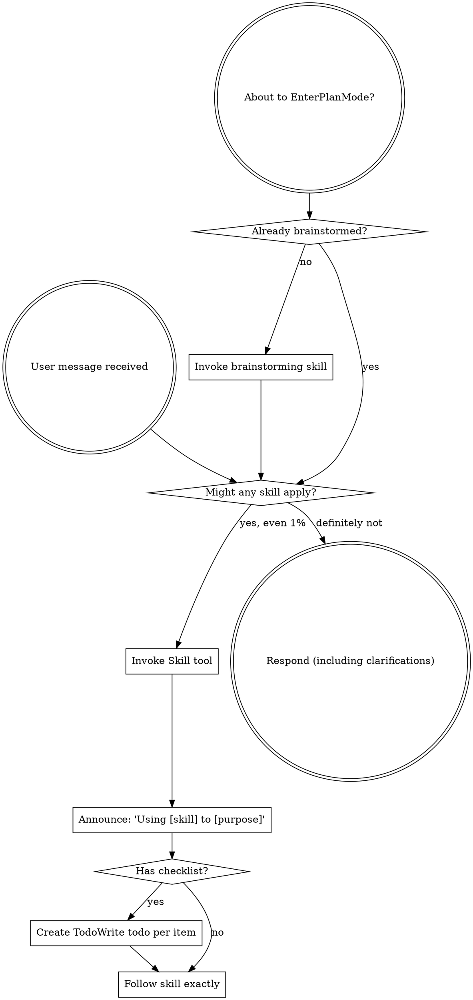

# Codex session 019f1390-a8f1-70f1-94ac-0d83b877a9a0

- Started: `2026-06-29T13:28:00.399Z`
- Working directory: `D:\100XH100`
- Originator: `Codex Desktop`
- Codex CLI: `0.142.2`
- Source log: `C:\Users\Иван Литвак\.codex\sessions\2026\06\29\rollout-2026-06-29T16-28-00-019f1390-a8f1-70f1-94ac-0d83b877a9a0.jsonl`
- Entries: user=2, assistant=10, tool calls=20, tool outputs=20

This is a chronological export of the user/assistant conversation and tool activity. Internal system/developer instructions and token accounting are intentionally excluded. Secret-shaped values are redacted; oversized tool outputs retain their beginning and end with the omitted character count.

## 1. User

Time: `2026-06-29T13:28:08.740Z` · source line `4`

```text
# AGENTS.md instructions for D:\100XH100

<INSTRUCTIONS>
# Project Agent Rules

## Operating Rule
- Read `AGENTS.md` before project edits.
- Update `memory/CHANGELOG.md` after meaningful code, config, or architecture changes.
- Update `memory/PROMPTS.md` with user prompts that define requirements.
- Store test outputs, logs, and verification notes under `test_results/`.
- Prefer agent-centered code: explicit contracts, deterministic tests, small files, low hidden state.

## Architecture Source
- Primary architecture contract: `ARCHITECTURE_NEED.md`.
- Current Stream 4 implementation rule: use threshold + compact + CUB/fixed-temp sort/reduce + compact; do not use Stream 4 hash-table dedup.

## Implementation Guardrails
- `State128` logical bytes are `v[0..119]`.
- `State128` padding bytes are `v[120..127]`.
- Persistent frontier padding must be zero.
- `FinalResponse` may temporarily store `target_local_idx` in `v[120..123]`.
- `Hash128` is one logical 128-bit key stored as `{lo, hi}`.
- `CandidateMeta` must remain 32 bytes and 32-byte aligned.
- Stream 3 payload id must be original candidate id, not compact index.
- Stream 4 must not apply shard top-k or semantic shard cap.

</INSTRUCTIONS>
<environment_context>
  <cwd>D:\100XH100</cwd>
  <shell>powershell</shell>
  <current_date>2026-06-29</current_date>
  <timezone>Europe/Moscow</timezone>
  <filesystem><workspace_roots><root>D:\100XH100</root></workspace_roots><permission_profile type="managed"><file_system type="restricted"><entry access="read"><special>:root</special></entry><entry access="write"><path>D:\100XH100</path></entry><entry access="write"><special>:slash_tmp</special></entry><entry access="write"><special>:tmpdir</special></entry><entry access="read"><path>D:\100XH100\.git</path></entry><entry access="read"><path>D:\100XH100\.agents</path></entry><entry access="read"><path>D:\100XH100\.codex</path></entry></file_system></permission_profile></filesystem>
</environment_context>
```

## 2. User

Time: `2026-06-29T13:28:08.752Z` · source line `6`

```text
You are the SPEC COMPLIANCE reviewer for Task 2/3 in a subagent-driven workflow. Do not edit files. Review only whether commit efd218db83b8a8cd7f1745aba2099aa9bc0d7564 in worktree D:\100XH100\.worktrees\stream1-piece-transformer satisfies the task spec below. Base commit is 7a94f9017e1febb5fb040305bbabcc47a83ef6cb.

Context:
- Project AGENTS guardrails: Stream1 changes must not alter State128 semantics, Stream3/4 contracts, or runtime behavior yet. This task is exporter/reference only.
- Existing Task 1 already added Stream1 backend tags/config and fail-closed manifest parsing.
- This exporter task should not implement CUDA runtime.

Task spec to review:
1. Add an auto-detecting Stream1 exporter wrapper that keeps existing MLP exporter usable.
2. Detect Kaggle p900 `piece_transformer` checkpoints by marker keys.
3. Export transformer weights to a deterministic directory for future CUDA loader, using dtype fp16/bf16 support via existing tensor byte helpers.
4. Export the Kaggle fast-input equivalent tables: `fast_slot_projected`, `fast_piece_static`, `piece_positions`, `piece_mask`, `piece_types`.
5. Auto-locate metadata, generator JSON, and source root when possible; allow explicit overrides.
6. Validate architecture/metadata/tensor shapes for this exact Megaminx model: state_len=120, num_classes=120, output_dim/move_count=24, num_pieces=50, max_piece_size=3, seq_len=51, d_model=256, contiguous 4 transformer blocks, ff_dim=1024, nhead/head_dim consistent, activation/pooling/layout/embed mode supported.
7. Write manifest with `backend=piece_transformer` and the required metadata for runtime loader.
8. Generate CPU PyTorch reference vectors when requested (`states`, `scores_fp32`) from the real model.
9. Add tests covering detection, architecture inference, and fast table formula.
10. Update `memory/CHANGELOG.md` and store verification note under `test_results/`.

Please inspect the diff and tests. Return exactly one of:
- SPEC_PASS with concise bullets, or
- SPEC_FAIL with concrete missing/extra/wrong items and file references.

Do not review general code quality unless it affects spec compliance.
```

## 3. Codex

Time: `2026-06-29T13:28:25.871Z` · source line `9`

```text
I’ll review this as a spec compliance check only: first the project rules and relevant memory, then the target diff and its test evidence.
```

## 4. Codex

Time: `2026-06-29T13:28:25.877Z` · source line `10`

```text
I’ll review this as a spec compliance check only: first the project rules and relevant memory, then the target diff and its test evidence.
```

## 5. Tool call: `exec_command`

Time: `2026-06-29T13:28:25.911Z` · source line `11`

```text
{"cmd":"Get-Content -LiteralPath 'C:\\Users\\Иван Литвак\\.codex\\plugins\\cache\\openai-curated-remote\\superpowers\\5.1.4\\skills\\using-superpowers\\SKILL.md'","workdir":"D:\\100XH100","shell":"powershell","max_output_tokens":12000}
```

## 6. Tool call: `exec_command`

Time: `2026-06-29T13:28:25.913Z` · source line `12`

```text
{"cmd":"Get-Content -LiteralPath 'D:\\100XH100\\AGENTS.md'","workdir":"D:\\100XH100","shell":"powershell","max_output_tokens":12000}
```

## 7. Tool call: `exec_command`

Time: `2026-06-29T13:28:25.913Z` · source line `13`

```text
{"cmd":"Select-String -Path 'C:\\Users\\Иван Литвак\\.codex\\memories\\MEMORY.md' -Pattern 'BEAM_PREBUILT_RUNNER|D:\\\\100XH100|stream1|Stream1|piece_transformer|p900' -Context 2,2","workdir":"D:\\100XH100","shell":"powershell","max_output_tokens":12000}
```

## 8. Tool output

Time: `2026-06-29T13:28:26.446Z` · source line `14`

````text
Chunk ID: 9a3d93
Wall time: 0.2665 seconds
Process exited with code 0
Original token count: 1393
Output:
---
name: using-superpowers
description: Use when starting any conversation - establishes how to find and use skills, requiring Skill tool invocation before ANY response including clarifying questions
---

<SUBAGENT-STOP>
If you were dispatched as a subagent to execute a specific task, skip this skill.
</SUBAGENT-STOP>

<EXTREMELY-IMPORTANT>
If you think there is even a 1% chance a skill might apply to what you are doing, you ABSOLUTELY MUST invoke the skill.

IF A SKILL APPLIES TO YOUR TASK, YOU DO NOT HAVE A CHOICE. YOU MUST USE IT.

This is not negotiable. This is not optional. You cannot rationalize your way out of this.
</EXTREMELY-IMPORTANT>

## Instruction Priority

Superpowers skills override default system prompt behavior, but **user instructions always take precedence**:

1. **User's explicit instructions** (CLAUDE.md, GEMINI.md, AGENTS.md, direct requests) — highest priority
2. **Superpowers skills** — override default system behavior where they conflict
3. **Default system prompt** — lowest priority

If CLAUDE.md, GEMINI.md, or AGENTS.md says "don't use TDD" and a skill says "always use TDD," follow the user's instructions. The user is in control.

## How to Access Skills

**In Claude Code:** Use the `Skill` tool. When you invoke a skill, its content is loaded and presented to you—follow it directly. Never use the Read tool on skill files.

**In Copilot CLI:** Use the `skill` tool. Skills are auto-discovered from installed plugins. The `skill` tool works the same as Claude Code's `Skill` tool.

**In Gemini CLI:** Skills activate via the `activate_skill` tool. Gemini loads skill metadata at session start and activates the full content on demand.

**In other environments:** Check your platform's documentation for how skills are loaded.

## Platform Adaptation

Skills use Claude Code tool names. Non-CC platforms: see `references/copilot-tools.md` (Copilot CLI), `references/codex-tools.md` (Codex) for tool equivalents. Gemini CLI users get the tool mapping loaded automatically via GEMINI.md.

# Using Skills

## The Rule

**Invoke relevant or requested skills BEFORE any response or action.** Even a 1% chance a skill might apply means that you should invoke the skill to check. If an invoked skill turns out to be wrong for the situation, you don't need to use it.



## Red Flags

These thoughts mean STOP—you're rationalizing:

| Thought | Reality |
|---------|---------|
| "This is just a simple question" | Questions are tasks. Check for skills. |
| "I need more context first" | Skill check comes BEFORE clarifying questions. |
| "Let me explore the codebase first" | Skills tell you HOW to explore. Check first. |
| "I can check git/files quickly" | Files lack conversation context. Check for skills. |
| "Let me gather information first" | Skills tell you HOW to gather information. |
| "This doesn't need a formal skill" | If a skill exists, use it. |
| "I remember this skill" | Skills evolve. Read current version. |
| "This doesn't count as a task" | Action = task. Check for skills. |
| "The skill is overkill" | Simple things become complex. Use it. |
| "I'll just do this one thing first" | Check BEFORE doing anything. |
| "This feels productive" | Undisciplined action wastes time. Skills prevent this. |
| "I know what that means" | Knowing the concept в‰  using the skill. Invoke it. |

## Skill Priority

When multiple skills could apply, use this order:

1. **Process skills first** (brainstorming, debugging) - these determine HOW to approach the task
2. **Implementation skills second** (frontend-design, mcp-builder) - these guide execution

"Let's build X" в†’ brainstorming first, then implementation skills.
"Fix this bug" в†’ debugging first, then domain-specific skills.

## Skill Types

**Rigid** (TDD, debugging): Follow exactly. Don't adapt away discipline.

**Flexible** (patterns): Adapt principles to context.

The skill itself tells you which.

## User Instructions

Instructions say WHAT, not HOW. "Add X" or "Fix Y" doesn't mean skip workflows.

````

## 9. Tool output

Time: `2026-06-29T13:28:26.446Z` · source line `15`

```text
Chunk ID: 4fa127
Wall time: 0.2553 seconds
Process exited with code 0
Original token count: 290
Output:
# Project Agent Rules

## Operating Rule
- Read `AGENTS.md` before project edits.
- Update `memory/CHANGELOG.md` after meaningful code, config, or architecture changes.
- Update `memory/PROMPTS.md` with user prompts that define requirements.
- Store test outputs, logs, and verification notes under `test_results/`.
- Prefer agent-centered code: explicit contracts, deterministic tests, small files, low hidden state.

## Architecture Source
- Primary architecture contract: `ARCHITECTURE_NEED.md`.
- Current Stream 4 implementation rule: use threshold + compact + CUB/fixed-temp sort/reduce + compact; do not use Stream 4 hash-table dedup.

## Implementation Guardrails
- `State128` logical bytes are `v[0..119]`.
- `State128` padding bytes are `v[120..127]`.
- Persistent frontier padding must be zero.
- `FinalResponse` may temporarily store `target_local_idx` in `v[120..123]`.
- `Hash128` is one logical 128-bit key stored as `{lo, hi}`.
- `CandidateMeta` must remain 32 bytes and 32-byte aligned.
- Stream 3 payload id must be original candidate id, not compact index.
- Stream 4 must not apply shard top-k or semantic shard cap.

```

## 10. Tool output

Time: `2026-06-29T13:28:26.650Z` · source line `16`

```text
Chunk ID: f915ec
Wall time: 0.4589 seconds
Process exited with code 0
Original token count: 1574
Output:

  C:\Users\Иван Литвак\.codex\memories\MEMORY.md:46:# Task Group: MEPhI IHES cluster publishing, shared prebuilt runner
, and inventory-driven backfill
  C:\Users\Иван Литвак\.codex\memories\MEMORY.md:47:scope: Running the IHES MEPhI cluster workflow with one shared preb
uilt `production_runner`, publishing solved puzzles into a dedicated GitHub results repo, and aggregating mixed cluster
 artifacts from on-cluster inventories.
> C:\Users\Иван Литвак\.codex\memories\MEMORY.md:48:applies_to: cwd=D:\100XH100; reuse_rule=reuse for this IHES/MEPhI r
epo family and adjacent cluster publish jobs, but treat live cluster inventory, DNS availability, and current results-r
epo schema as run-specific and recheck them before publishing.
  C:\Users\Иван Литвак\.codex\memories\MEMORY.md:49:
  C:\Users\Иван Литвак\.codex\memories\MEMORY.md:50:## Task 1: Launch IHES array jobs against one shared prebuilt runne
r, outcome success
  C:\Users\Иван Литвак\.codex\memories\MEMORY.md:52:### rollout_summary_files
  C:\Users\Иван Литвак\.codex\memories\MEMORY.md:53:
> C:\Users\Иван Литвак\.codex\memories\MEMORY.md:54:- rollout_summaries/2026-06-04T15-47-52-Dd1O-ihes_cluster_results_p
rebuilt_publish_backfill.md (cwd=\\?\D:\100XH100, rollout_path=\\?\C:\Users\Иван Литвак\.codex\sessions\2026\06\04\roll
out-2026-06-04T18-47-57-019e9351-cd3b-71c0-bf8b-69755d08d5fc.jsonl, updated_at=2026-06-26T19:51:22+00:00, thread_id=019
e9351-cd3b-71c0-bf8b-69755d08d5fc, the prebuilt runner was compiled once and reused across the A100 array workflow)
  C:\Users\Иван Литвак\.codex\memories\MEMORY.md:55:
  C:\Users\Иван Литвак\.codex\memories\MEMORY.md:56:### keywords
  C:\Users\Иван Литвак\.codex\memories\MEMORY.md:57:
> C:\Users\Иван Литвак\.codex\memories\MEMORY.md:58:- MEPhI HPC, kaf12, A100 40GB, BEAM_PREBUILT_RUNNER, prepare_ihes_p
rebuilt_runner.sh, ihes_solve_bucket_from_scratch.sh, prebuilt_runner_ready, using_prebuilt_runner, PUZZLE_LIMIT=1, dep
th=12
  C:\Users\Иван Литвак\.codex\memories\MEMORY.md:59:
  C:\Users\Иван Литвак\.codex\memories\MEMORY.md:60:## Task 2: Publish per-puzzle IHES results and backfill existing bu
cket outputs into the GitHub results repo, outcome success
  C:\Users\Иван Литвак\.codex\memories\MEMORY.md:62:### rollout_summary_files
  C:\Users\Иван Литвак\.codex\memories\MEMORY.md:63:
> C:\Users\Иван Литвак\.codex\memories\MEMORY.md:64:- rollout_summaries/2026-06-04T15-47-52-Dd1O-ihes_cluster_results_p
rebuilt_publish_backfill.md (cwd=\\?\D:\100XH100, rollout_path=\\?\C:\Users\Иван Литвак\.codex\sessions\2026\06\04\roll
out-2026-06-04T18-47-57-019e9351-cd3b-71c0-bf8b-69755d08d5fc.jsonl, updated_at=2026-06-26T19:51:22+00:00, thread_id=019
e9351-cd3b-71c0-bf8b-69755d08d5fc, the results repo structure and first backfilled puzzle sets were established)
  C:\Users\Иван Литвак\.codex\memories\MEMORY.md:65:
  C:\Users\Иван Литвак\.codex\memories\MEMORY.md:66:### keywords
  C:\Users\Иван Литвак\.codex\memories\MEMORY.md:72:### rollout_summary_files
  C:\Users\Иван Литвак\.codex\memories\MEMORY.md:73:
> C:\Users\Иван Литвак\.codex\memories\MEMORY.md:74:- rollout_summaries/2026-06-04T15-47-52-Dd1O-ihes_cluster_results_p
rebuilt_publish_backfill.md (cwd=\\?\D:\100XH100, rollout_path=\\?\C:\Users\Иван Литвак\.codex\sessions\2026\06\04\roll
out-2026-06-04T18-47-57-019e9351-cd3b-71c0-bf8b-69755d08d5fc.jsonl, updated_at=2026-06-26T19:51:22+00:00, thread_id=019
e9351-cd3b-71c0-bf8b-69755d08d5fc, a file-driven inventory plus schema fixes made the larger aggregator path workable)
  C:\Users\Иван Литвак\.codex\memories\MEMORY.md:75:
  C:\Users\Иван Литвак\.codex\memories\MEMORY.md:76:### keywords
  C:\Users\Иван Литвак\.codex\memories\MEMORY.md:87:## Reusable knowledge
  C:\Users\Иван Литвак\.codex\memories\MEMORY.md:88:
> C:\Users\Иван Литвак\.codex\memories\MEMORY.md:89:- `hpc/ihes_cube_model/prepare_ihes_prebuilt_runner.sh` builds the 
shared binary at `/mnt/pool/6/vokirova/beam8a100/ihes_cube_model/prebuilt-a100-ihes/production_runner`, and `hpc/ihes_c
ube_model/ihes_solve_bucket_from_scratch.sh` already knows how to consume `BEAM_PREBUILT_RUNNER` [Task 1]
  C:\Users\Иван Литвак\.codex\memories\MEMORY.md:90:- the verified runtime on basis exposed `world_size_effective=8`, `
NCCL 2.21.5+cuda12.4`, and eight visible A100-40GB GPUs, so the prebuilt-runner path was validated on the actual target
 hardware [Task 1]
  C:\Users\Иван Литвак\.codex\memories\MEMORY.md:91:- the durable results layout is `data/ihes_cube/puzzles/pXXXX/solut
ions.tsv`, `unique_solutions.tsv`, `metadata.env`, `summary.md`, plus root-level `index.tsv` and `improvements.tsv`; no
n-full-solution repair artifacts belong under separate `repair_segments/` trees [Task 2]
  C:\Users\Иван Литвак\.codex\memories\MEMORY.md:95:## Failures and how to do differently
  C:\Users\Иван Литвак\.codex\memories\MEMORY.md:96:
> C:\Users\Иван Литвак\.codex\memories\MEMORY.md:97:- symptom: each array task recompiles instead of reusing the solver
. cause: `BEAM_PREBUILT_RUNNER` was not wired through a separate prebuild dependency. fix: submit the prebuild first an
d make the puzzle array depend on it via `--dependency=afterok:<prebuild_job>` [Task 1]
  C:\Users\Иван Литвак\.codex\memories\MEMORY.md:98:- symptom: cluster-side publish fails after compute succeeds. cause
: the compute node cannot resolve `github.com` or otherwise lacks GitHub network access. fix: tolerate cluster-side pus
h failure and leave local commits/results ready for later push from a node with working DNS/network [Task 2]
  C:\Users\Иван Литвак\.codex\memories\MEMORY.md:99:- symptom: the backfill/index writer crashes on old rows. cause: me
tadata rows carried extra keys such as `variants` and `source_files` that were not declared in the index schema. fix: w
iden the declared schema and filter outgoing rows to declared fields before writing [Task 2][Task 3]


```

## 11. Codex

Time: `2026-06-29T13:28:43.438Z` · source line `19`

```text
I’ve confirmed the local project rules. Now I’m reading only the target worktree state and commit delta against the given base; I’ll avoid running commands that create caches or artifacts.
```

## 12. Codex

Time: `2026-06-29T13:28:43.444Z` · source line `20`

```text
I’ve confirmed the local project rules. Now I’m reading only the target worktree state and commit delta against the given base; I’ll avoid running commands that create caches or artifacts.
```

## 13. Tool call: `exec_command`

Time: `2026-06-29T13:28:43.534Z` · source line `21`

```text
{"cmd":"git -C 'D:\\100XH100\\.worktrees\\stream1-piece-transformer' status --short","workdir":"D:\\100XH100","shell":"powershell","max_output_tokens":12000}
```

## 14. Tool call: `exec_command`

Time: `2026-06-29T13:28:43.534Z` · source line `22`

```text
{"cmd":"git -C 'D:\\100XH100\\.worktrees\\stream1-piece-transformer' diff --name-status 7a94f9017e1febb5fb040305bbabcc47a83ef6cb efd218db83b8a8cd7f1745aba2099aa9bc0d7564","workdir":"D:\\100XH100","shell":"powershell","max_output_tokens":12000}
```

## 15. Tool call: `exec_command`

Time: `2026-06-29T13:28:43.535Z` · source line `23`

```text
{"cmd":"git -C 'D:\\100XH100\\.worktrees\\stream1-piece-transformer' show --stat --oneline --decorate --no-renames efd218db83b8a8cd7f1745aba2099aa9bc0d7564","workdir":"D:\\100XH100","shell":"powershell","max_output_tokens":12000}
```

## 16. Tool call: `exec_command`

Time: `2026-06-29T13:28:43.535Z` · source line `24`

```text
{"cmd":"Get-Content -LiteralPath 'D:\\100XH100\\.worktrees\\stream1-piece-transformer\\AGENTS.md'","workdir":"D:\\100XH100","shell":"powershell","max_output_tokens":12000}
```

## 17. Tool output

Time: `2026-06-29T13:28:44.064Z` · source line `25`

```text
Chunk ID: 37c86d
Wall time: 0.2901 seconds
Process exited with code 0
Original token count: 3
Output:
?? docs/

```

## 18. Tool output

Time: `2026-06-29T13:28:44.064Z` · source line `26`

```text
Chunk ID: f0dc99
Wall time: 0.2838 seconds
Process exited with code 0
Original token count: 48
Output:
M	memory/CHANGELOG.md
A	test_results/stream1_transformer_exporter_2026-06-29.md
A	tests/test_stream1_transformer_exporter.py
A	tools/export_stream1.py
A	tools/export_stream1_transformer.py

```

## 19. Tool output

Time: `2026-06-29T13:28:44.065Z` · source line `27`

```text
Chunk ID: 622ba1
Wall time: 0.2797 seconds
Process exited with code 0
Original token count: 114
Output:
efd218d (HEAD -> codex/stream1-piece-transformer) Add Stream1 piece transformer exporter
 memory/CHANGELOG.md                                |   1 +
 .../stream1_transformer_exporter_2026-06-29.md     |  73 +++
 tests/test_stream1_transformer_exporter.py         | 123 +++++
 tools/export_stream1.py                            | 100 ++++
 tools/export_stream1_transformer.py                | 544 +++++++++++++++++++++
 5 files changed, 841 insertions(+)

```

## 20. Tool output

Time: `2026-06-29T13:28:44.088Z` · source line `28`

```text
Chunk ID: 963b3d
Wall time: 0.2893 seconds
Process exited with code 0
Original token count: 290
Output:
# Project Agent Rules

## Operating Rule
- Read `AGENTS.md` before project edits.
- Update `memory/CHANGELOG.md` after meaningful code, config, or architecture changes.
- Update `memory/PROMPTS.md` with user prompts that define requirements.
- Store test outputs, logs, and verification notes under `test_results/`.
- Prefer agent-centered code: explicit contracts, deterministic tests, small files, low hidden state.

## Architecture Source
- Primary architecture contract: `ARCHITECTURE_NEED.md`.
- Current Stream 4 implementation rule: use threshold + compact + CUB/fixed-temp sort/reduce + compact; do not use Stream 4 hash-table dedup.

## Implementation Guardrails
- `State128` logical bytes are `v[0..119]`.
- `State128` padding bytes are `v[120..127]`.
- Persistent frontier padding must be zero.
- `FinalResponse` may temporarily store `target_local_idx` in `v[120..123]`.
- `Hash128` is one logical 128-bit key stored as `{lo, hi}`.
- `CandidateMeta` must remain 32 bytes and 32-byte aligned.
- Stream 3 payload id must be original candidate id, not compact index.
- Stream 4 must not apply shard top-k or semantic shard cap.

```

## 21. Codex

Time: `2026-06-29T13:28:58.808Z` · source line `31`

```text
The commit touches only exporter code, one test file, changelog, and a verification note. The worktree also has an untracked `docs/` directory, but since it is not in the reviewed commit I’m ignoring it for this spec check.
```

## 22. Codex

Time: `2026-06-29T13:28:58.814Z` · source line `32`

```text
The commit touches only exporter code, one test file, changelog, and a verification note. The worktree also has an untracked `docs/` directory, but since it is not in the reviewed commit I’m ignoring it for this spec check.
```

## 23. Tool call: `exec_command`

Time: `2026-06-29T13:28:58.814Z` · source line `33`

```text
{"cmd":"git -C 'D:\\100XH100\\.worktrees\\stream1-piece-transformer' diff --unified=80 7a94f9017e1febb5fb040305bbabcc47a83ef6cb efd218db83b8a8cd7f1745aba2099aa9bc0d7564 -- tools/export_stream1.py","workdir":"D:\\100XH100","shell":"powershell","max_output_tokens":30000}
```

## 24. Tool call: `exec_command`

Time: `2026-06-29T13:28:58.814Z` · source line `34`

```text
{"cmd":"git -C 'D:\\100XH100\\.worktrees\\stream1-piece-transformer' diff --unified=80 7a94f9017e1febb5fb040305bbabcc47a83ef6cb efd218db83b8a8cd7f1745aba2099aa9bc0d7564 -- tools/export_stream1_transformer.py","workdir":"D:\\100XH100","shell":"powershell","max_output_tokens":60000}
```

## 25. Tool call: `exec_command`

Time: `2026-06-29T13:28:58.937Z` · source line `35`

```text
{"cmd":"git -C 'D:\\100XH100\\.worktrees\\stream1-piece-transformer' diff --unified=80 7a94f9017e1febb5fb040305bbabcc47a83ef6cb efd218db83b8a8cd7f1745aba2099aa9bc0d7564 -- tests/test_stream1_transformer_exporter.py","workdir":"D:\\100XH100","shell":"powershell","max_output_tokens":40000}
```

## 26. Tool call: `exec_command`

Time: `2026-06-29T13:28:58.938Z` · source line `36`

```text
{"cmd":"git -C 'D:\\100XH100\\.worktrees\\stream1-piece-transformer' diff --unified=80 7a94f9017e1febb5fb040305bbabcc47a83ef6cb efd218db83b8a8cd7f1745aba2099aa9bc0d7564 -- memory/CHANGELOG.md test_results/stream1_transformer_exporter_2026-06-29.md","workdir":"D:\\100XH100","shell":"powershell","max_output_tokens":30000}
```

## 27. Tool output

Time: `2026-06-29T13:28:59.484Z` · source line `37`

```text
Chunk ID: 0755fc
Wall time: 0.2018 seconds
Process exited with code 0
Original token count: 1037
Output:
diff --git a/tools/export_stream1.py b/tools/export_stream1.py
new file mode 100644
index 0000000..3cf6c47
--- /dev/null
+++ b/tools/export_stream1.py
@@ -0,0 +1,100 @@
+#!/usr/bin/env python3
+"""Auto-detecting Stream1 weight exporter wrapper."""
+
+from __future__ import annotations
+
+import argparse
+from pathlib import Path
+import sys
+from typing import Mapping
+
+import torch
+
+try:
+    from tools.export_stream1_mlp import (
+        export_batchnorm_folded,
+        export_resmlp_layernorm,
+        strip_orig_mod,
+        unwrap_state_dict,
+    )
+    from tools.export_stream1_transformer import export_piece_transformer, strip_state_prefixes
+except ModuleNotFoundError:
+    sys.path.insert(0, str(Path(__file__).resolve().parent))
+    from export_stream1_mlp import export_batchnorm_folded, export_resmlp_layernorm, strip_orig_mod, unwrap_state_dict
+    from export_stream1_transformer import export_piece_transformer, strip_state_prefixes
+
+
+PIECE_TRANSFORMER_KEYS = {
+    "local_value_embedding.weight",
+    "piece_projection.weight",
+    "blocks.0.attn.in_proj_weight",
+    "output_layer.weight",
+}
+
+
+def detect_format_from_state_dict(sd: Mapping[str, object]) -> str:
+    keys = set(strip_state_prefixes(sd).keys())
+    if PIECE_TRANSFORMER_KEYS.issubset(keys):
+        return "piece-transformer"
+    if {"embedding.weight", "input_stack.0.weight", "head.weight"}.issubset(keys):
+        return "resmlp-layernorm"
+    if {"input_layer.weight", "bn1.running_mean", "output_layer.weight"}.issubset(keys):
+        return "batchnorm-folded"
+    raise ValueError("could not auto-detect Stream1 weight format; pass --format explicitly")
+
+
+def load_state_for_detection(weights_path: Path) -> Mapping[str, object]:
+    checkpoint = torch.load(weights_path, map_location="cpu", weights_only=False)
+    return strip_orig_mod(unwrap_state_dict(checkpoint))
+
+
+def main() -> None:
+    parser = argparse.ArgumentParser(description=__doc__)
+    parser.add_argument("--weights", required=True, type=Path)
+    parser.add_argument("--out", required=True, type=Path)
+    parser.add_argument("--dtype", choices=["fp16", "bf16"], default="fp16")
+    parser.add_argument(
+        "--format",
+        choices=["auto", "piece-transformer", "resmlp-layernorm", "batchnorm-folded"],
+        default="auto",
+    )
+    parser.add_argument("--num-classes", type=int, default=120)
+    parser.add_argument("--metadata", type=Path)
+    parser.add_argument("--generators", type=Path)
+    parser.add_argument("--source-root", type=Path)
+    parser.add_argument("--reference-out", type=Path)
+    parser.add_argument("--reference-count", type=int, default=0)
+    parser.add_argument("--reference-seed", type=int, default=0)
+    args = parser.parse_args()
+
+    resolved_format = args.format
+    if resolved_format == "auto":
+        resolved_format = detect_format_from_state_dict(load_state_for_detection(args.weights))
+
+    if resolved_format == "piece-transformer":
+        export_piece_transformer(
+            weights_path=args.weights,
+            out_dir=args.out,
+            dtype=args.dtype,
+            num_classes=args.num_classes,
+            metadata_path=args.metadata,
+            generator_path=args.generators,
+            source_root=args.source_root,
+            reference_out=args.reference_out,
+            reference_count=args.reference_count,
+            reference_seed=args.reference_seed,
+        )
+    elif resolved_format == "resmlp-layernorm":
+        if args.reference_out is not None:
+            raise ValueError("--reference-out is only supported for --format piece-transformer")
+        export_resmlp_layernorm(args.weights, args.out, args.dtype)
+    elif resolved_format == "batchnorm-folded":
+        if args.reference_out is not None:
+            raise ValueError("--reference-out is only supported for --format piece-transformer")
+        export_batchnorm_folded(args.weights, args.out, args.dtype, args.num_classes)
+    else:
+        raise ValueError(f"unsupported Stream1 format: {resolved_format}")
+
+
+if __name__ == "__main__":
+    main()

```

## 28. Tool output

Time: `2026-06-29T13:28:59.485Z` · source line `38`

```text
Chunk ID: 279fb8
Wall time: 0.2010 seconds
Process exited with code 0
Original token count: 6037
Output:
diff --git a/tools/export_stream1_transformer.py b/tools/export_stream1_transformer.py
new file mode 100644
index 0000000..1302fe5
--- /dev/null
+++ b/tools/export_stream1_transformer.py
@@ -0,0 +1,544 @@
+#!/usr/bin/env python3
+"""Export Kaggle p900 PilgrimPieceTransformer weights for Stream1."""
+
+from __future__ import annotations
+
+import argparse
+import importlib
+import json
+import re
+import sys
+from pathlib import Path
+from typing import Any, Mapping
+
+import numpy as np
+import torch
+import torch.nn.functional as F
+
+try:
+    from tools.export_stream1_mlp import tensor_bytes, weight_suffix, write_hxk, write_vec
+except ModuleNotFoundError:
+    sys.path.insert(0, str(Path(__file__).resolve().parent))
+    from export_stream1_mlp import tensor_bytes, weight_suffix, write_hxk, write_vec
+
+
+TensorDict = dict[str, torch.Tensor]
+
+
+def unwrap_state_dict(obj: Any) -> TensorDict:
+    if isinstance(obj, dict):
+        for key in ("state_dict", "model_state_dict", "model", "net", "module"):
+            value = obj.get(key)
+            if isinstance(value, dict):
+                return value
+        return obj
+    raise TypeError(f"unsupported checkpoint root type: {type(obj).__name__}")
+
+
+def strip_state_prefixes(sd: Mapping[str, Any]) -> TensorDict:
+    stripped: TensorDict = {}
+    for key, value in sd.items():
+        clean = str(key)
+        changed = True
+        while changed:
+            changed = False
+            for prefix in ("module.", "_orig_mod."):
+                if clean.startswith(prefix):
+                    clean = clean[len(prefix) :]
+                    changed = True
+        stripped[clean] = value
+    return stripped
+
+
+def load_checkpoint_state(weights_path: Path) -> TensorDict:
+    checkpoint = torch.load(weights_path, map_location="cpu", weights_only=False)
+    sd = strip_state_prefixes(unwrap_state_dict(checkpoint))
+    return {key: value.detach().cpu() if isinstance(value, torch.Tensor) else value for key, value in sd.items()}
+
+
+def read_json(path: Path) -> dict[str, Any]:
+    return json.loads(path.read_text(encoding="utf-8"))
+
+
+def nearby_roots(weights_path: Path) -> list[Path]:
+    roots: list[Path] = []
+    for start in (weights_path.parent, *weights_path.parents):
+        if start not in roots:
+            roots.append(start)
+    return roots
+
+
+def locate_metadata(weights_path: Path, explicit: Path | None) -> Path:
+    if explicit is not None:
+        return explicit
+    candidates: list[Path] = []
+    for root in nearby_roots(weights_path):
+        logs = root / "logs"
+        if logs.is_dir():
+            candidates.extend(sorted(logs.glob("model_*.json")))
+    matching: list[Path] = []
+    for candidate in candidates:
+        try:
+            data = read_json(candidate)
+        except Exception:
+            continue
+        if Path(str(data.get("best_weights_file", ""))).name == weights_path.name:
+            matching.append(candidate)
+        elif str(data.get("model_id", "")) and str(data["model_id"]) in weights_path.stem:
+            matching.append(candidate)
+    if len(matching) == 1:
+        return matching[0]
+    if not matching and len(candidates) == 1:
+        return candidates[0]
+    raise FileNotFoundError("could not uniquely auto-locate metadata; pass --metadata")
+
+
+def locate_generator(weights_path: Path, metadata: Mapping[str, Any], explicit: Path | None) -> Path:
+    if explicit is not None:
+        return explicit
+    group_id = metadata.get("group_id")
+    names = [f"p{group_id}.json"] if group_id is not None else []
+    candidates: list[Path] = []
+    for root in nearby_roots(weights_path):
+        gen_dir = root / "generators"
+        if gen_dir.is_dir():
+            for name in names:
+                path = gen_dir / name
+                if path.is_file():
+                    return path
+            candidates.extend(sorted(gen_dir.glob("p*.json")))
+    if len(candidates) == 1:
+        return candidates[0]
+    raise FileNotFoundError("could not uniquely auto-locate generator JSON; pass --generators")
+
+
+def locate_source_root(weights_path: Path, metadata_path: Path | None, explicit: Path | None) -> Path:
+    if explicit is not None:
+        return explicit
+    starts = [weights_path.parent, *weights_path.parents]
+    if metadata_path is not None:
+        starts.extend([metadata_path.parent, *metadata_path.parents])
+    seen: set[Path] = set()
+    for root in starts:
+        if root in seen:
+            continue
+        seen.add(root)
+        if (root / "pilgrim" / "model.py").is_file():
+            return root
+    raise FileNotFoundError("could not auto-locate source root containing pilgrim/model.py; pass --source-root")
+
+
+def load_move_names(generator: Mapping[str, Any]) -> list[str]:
+    names = generator.get("names")
+    if isinstance(names, list) and all(isinstance(name, str) for name in names):
+        return list(names)
+    gens = generator.get("generators")
+    if isinstance(gens, list):
+        out = []
+        for idx, item in enumerate(gens):
+            if isinstance(item, Mapping) and isinstance(item.get("name"), str):
+                out.append(str(item["name"]))
+            else:
+                out.append(str(idx))
+        return out
+    raise ValueError("generator JSON must contain move names in 'names' or 'generators'")
+
+
+def import_model_module(source_root: Path):
+    root = str(source_root)
+    if root not in sys.path:
+        sys.path.insert(0, root)
+    return importlib.import_module("pilgrim.model")
+
+
+def load_piece_layout(source_root: Path) -> tuple[torch.Tensor, torch.Tensor, torch.Tensor]:
+    model_module = import_model_module(source_root)
+    piece_positions, piece_mask, piece_types = model_module.make_p900_piece_layout()
+    return piece_positions.cpu(), piece_mask.cpu(), piece_types.cpu()
+
+
+def block_indices(sd: Mapping[str, Any]) -> list[int]:
+    found = sorted(
+        int(match.group(1))
+        for key in sd
+        for match in [re.match(r"^blocks\.(\d+)\.attn\.in_proj_weight$", key)]
+        if match
+    )
+    if not found:
+        raise ValueError("no transformer blocks found")
+    expected = list(range(found[-1] + 1))
+    if found != expected:
+        raise ValueError(f"transformer block indices are not contiguous: found={found}")
+    return found
+
+
+def require_shape(sd: Mapping[str, torch.Tensor], key: str, shape: tuple[int, ...]) -> None:
+    actual = tuple(sd[key].shape)
+    if actual != shape:
+        raise ValueError(f"{key} shape mismatch: expected={shape} actual={actual}")
+
+
+def metadata_int(metadata: Mapping[str, Any], key: str, default: int | None = None) -> int:
+    value = metadata.get(key, default)
+    if value is None:
+        raise ValueError(f"metadata missing required integer field: {key}")
+    return int(value)
+
+
+def infer_architecture(
+    sd: Mapping[str, torch.Tensor],
+    metadata: Mapping[str, Any],
+    move_names: list[str],
+    num_classes: int,
+) -> dict[str, Any]:
+    sd = strip_state_prefixes(sd)
+    model_arch = str(metadata.get("model_arch", "")).lower()
+    if model_arch != "piece_transformer":
+        raise ValueError(f"metadata model_arch must be piece_transformer, got {model_arch!r}")
+    state_len = metadata_int(metadata, "state_size")
+    if state_len != 120:
+        raise ValueError(f"piece_transformer export requires state_len=120, got {state_len}")
+    if num_classes != 120:
+        raise ValueError(f"piece_transformer export requires num_classes=120, got {num_classes}")
+
+    local_rows, d_model = sd["local_value_embedding.weight"].shape
+    projection_out, projection_in = sd["piece_projection.weight"].shape
+    max_piece_size = metadata_int(metadata, "max_piece_size")
+    num_pieces = metadata_int(metadata, "num_pieces")
+    if int(d_model) != 256:
+        raise ValueError(f"piece_transformer export requires d_model=256, got {int(d_model)}")
+    metadata_d_model = metadata_int(metadata, "transformer_d_model")
+    if metadata_d_model != int(d_model):
+        raise ValueError(f"metadata transformer_d_model={metadata_d_model} does not match tensors={int(d_model)}")
+    if max_piece_size != 3:
+        raise ValueError(f"piece_transformer export requires max_piece_size=3, got {max_piece_size}")
+    if num_pieces != 50:
+        raise ValueError(f"piece_transformer export requires num_pieces=50, got {num_pieces}")
+    if local_rows != max_piece_size * num_classes:
+        raise ValueError("local_value_embedding rows must equal max_piece_size * num_classes")
+    if projection_out != d_model or projection_in != max_piece_size * d_model:
+        raise ValueError("piece_projection shape does not match d_model/max_piece_size")
+
+    require_shape(sd, "piece_projection.bias", (d_model,))
+    require_shape(sd, "piece_position_embedding.weight", (num_pieces, d_model))
+    require_shape(sd, "piece_type_embedding.weight", (2, d_model))
+    require_shape(sd, "cls_token", (1, 1, d_model))
+    require_shape(sd, "input_norm.weight", (d_model,))
+    require_shape(sd, "input_norm.bias", (d_model,))
+    require_shape(sd, "output_norm.weight", (d_model,))
+    require_shape(sd, "output_norm.bias", (d_model,))
+
+    output_dim, output_in = sd["output_layer.weight"].shape
+    move_count = len(move_names)
+    if move_count <= 0:
+        raise ValueError("move_count must be positive")
+    if metadata.get("n_gens") is not None and int(metadata["n_gens"]) != move_count:
+        raise ValueError(f"metadata n_gens={metadata['n_gens']} does not match move_count={move_count}")
+    if output_dim != move_count:
+        raise ValueError(f"output_dim={int(output_dim)} must equal move_count={move_count}")
+    if output_in != d_model:
+        raise ValueError(f"output_layer input mismatch: expected={int(d_model)} actual={int(output_in)}")
+    require_shape(sd, "output_layer.bias", (output_dim,))
+
+    layers = block_indices(sd)
+    num_layers = len(layers)
+    metadata_layers = metadata_int(metadata, "transformer_layers")
+    if metadata_layers != num_layers:
+        raise ValueError(f"metadata transformer_layers={metadata_layers} does not match tensors={num_layers}")
+    ff_dim = metadata_int(metadata, "transformer_ff_dim")
+    nhead = metadata_int(metadata, "transformer_heads")
+    if d_model % nhead != 0:
+        raise ValueError(f"d_model={int(d_model)} must be divisible by nhead={nhead}")
+    if ff_dim <= 0:
+        raise ValueError(f"ff_dim must be positive: {ff_dim}")
+    for block in layers:
+        prefix = f"blocks.{block}"
+        require_shape(sd, f"{prefix}.norm1.weight", (d_model,))
+        require_shape(sd, f"{prefix}.norm1.bias", (d_model,))
+        require_shape(sd, f"{prefix}.attn.in_proj_weight", (3 * d_model, d_model))
+        require_shape(sd, f"{prefix}.attn.in_proj_bias", (3 * d_model,))
+        require_shape(sd, f"{prefix}.attn.out_proj.weight", (d_model, d_model))
+        require_shape(sd, f"{prefix}.attn.out_proj.bias", (d_model,))
+        require_shape(sd, f"{prefix}.norm2.weight", (d_model,))
+        require_shape(sd, f"{prefix}.norm2.bias", (d_model,))
+        require_shape(sd, f"{prefix}.ff.0.weight", (ff_dim, d_model))
+        require_shape(sd, f"{prefix}.ff.0.bias", (ff_dim,))
+        require_shape(sd, f"{prefix}.ff.3.weight", (d_model, ff_dim))
+        require_shape(sd, f"{prefix}.ff.3.bias", (d_model,))
+
+    activation = str(metadata.get("transformer_activation", "")).lower()
+    pooling = str(metadata.get("transformer_pooling", "")).lower()
+    if activation not in {"silu", "gelu", "relu"}:
+        raise ValueError(f"unsupported activation metadata: {activation}")
+    if pooling != "cls":
+        raise ValueError(f"runtime piece_transformer export requires cls pooling, got {pooling}")
+    if str(metadata.get("piece_layout", "")).lower() != "p900":
+        raise ValueError("piece_layout must be p900")
+    if str(metadata.get("piece_embed_mode", "")).lower() != "full_s120":
+        raise ValueError("piece_embed_mode must be full_s120")
+
+    return {
+        "backend": "piece_transformer",
+        "model_arch": "piece_transformer",
+        "state_len": state_len,
+        "num_classes": num_classes,
+        "move_count": move_count,
+        "output_dim": int(output_dim),
+        "num_pieces": num_pieces,
+        "max_piece_size": max_piece_size,
+        "seq_len": num_pieces + 1,
+        "d_model": int(d_model),
+        "nhead": nhead,
+        "head_dim": int(d_model) // nhead,
+        "num_layers": num_layers,
+        "ff_dim": ff_dim,
+        "activation": activation,
+        "pooling": pooling,
+        "piece_layout": "p900",
+        "piece_embed_mode": "full_s120",
+        "input_embedding": "fast_slot_projected",
+        "move_names": move_names,
+    }
+
+
+def build_fast_input_tables(
+    sd: Mapping[str, torch.Tensor],
+    piece_positions: torch.Tensor,
+    piece_mask: torch.Tensor,
+    piece_types: torch.Tensor,
+) -> dict[str, torch.Tensor]:
+    sd = strip_state_prefixes(sd)
+    projection_weight = sd["piece_projection.weight"].detach().float()
+    projection_bias = sd["piece_projection.bias"].detach().float()
+    embedding_weight = sd["local_value_embedding.weight"].detach().float()
+    d_model = projection_weight.shape[0]
+    max_piece_size = piece_positions.shape[1]
+    num_classes = embedding_weight.shape[0] // max_piece_size
+    slot_rows = []
+    for slot in range(max_piece_size):
+        start = slot * d_model
+        end = (slot + 1) * d_model
+        token_start = slot * num_classes
+        token_end = (slot + 1) * num_classes
+        slot_rows.append(F.linear(embedding_weight[token_start:token_end], projection_weight[:, start:end]))
+    piece_indices = torch.arange(piece_positions.shape[0], dtype=torch.int64)
+    static = sd["piece_position_embedding.weight"].detach().float().index_select(0, piece_indices)
+    static = static + sd["piece_type_embedding.weight"].detach().float().index_select(0, piece_types.long())
+    static = static + projection_bias.view(1, -1)
+    return {
+        "fast_slot_projected": torch.stack(slot_rows, dim=0).contiguous(),
+        "fast_piece_static": static.contiguous(),
+        "piece_positions": piece_positions.to(torch.int16).contiguous(),
+        "piece_mask": piece_mask.to(torch.uint8).contiguous(),
+        "piece_types": piece_types.to(torch.uint8).contiguous(),
+    }
+
+
+def write_u16(path: Path, tensor: torch.Tensor) -> None:
+    data = tensor.detach().cpu().numpy().astype("<u2", copy=False)
+    path.write_bytes(data.tobytes())
+
+
+def write_u8(path: Path, tensor: torch.Tensor) -> None:
+    data = tensor.detach().cpu().numpy().astype("u1", copy=False)
+    path.write_bytes(data.tobytes())
+
+
+def write_tensor(path: Path, tensor: torch.Tensor, dtype: str) -> None:
+    path.write_bytes(tensor_bytes(tensor.detach().float(), dtype))
+
+
+def export_tensors(
+    sd: Mapping[str, torch.Tensor],
+    out_dir: Path,
+    dtype: str,
+    piece_positions: torch.Tensor,
+    piece_mask: torch.Tensor,
+    piece_types: torch.Tensor,
+    num_layers: int,
+) -> None:
+    out_dir.mkdir(parents=True, exist_ok=True)
+    suffix = weight_suffix(dtype)
+    fast = build_fast_input_tables(sd, piece_positions, piece_mask, piece_types)
+    write_tensor(out_dir / f"fast_slot_projected{suffix}", fast["fast_slot_projected"], dtype)
+    write_tensor(out_dir / f"fast_piece_static{suffix}", fast["fast_piece_static"], dtype)
+    write_tensor(out_dir / f"cls_token{suffix}", sd["cls_token"].view(-1), dtype)
+    write_vec(out_dir / f"input_ln_gamma{suffix}", sd["input_norm.weight"], dtype)
+    write_vec(out_dir / f"input_ln_beta{suffix}", sd["input_norm.bias"], dtype)
+    write_vec(out_dir / f"output_ln_gamma{suffix}", sd["output_norm.weight"], dtype)
+    write_vec(out_dir / f"output_ln_beta{suffix}", sd["output_norm.bias"], dtype)
+    for block in range(num_layers):
+        prefix = f"blocks.{block}"
+        out_prefix = f"block{block}"
+        write_vec(out_dir / f"{out_prefix}_ln1_gamma{suffix}", sd[f"{prefix}.norm1.weight"], dtype)
+        write_vec(out_dir / f"{out_prefix}_ln1_beta{suffix}", sd[f"{prefix}.norm1.bias"], dtype)
+        write_hxk(out_dir / f"{out_prefix}_attn_qkv_weight_hxk{suffix}", sd[f"{prefix}.attn.in_proj_weight"], dtype)
+        write_vec(out_dir / f"{out_prefix}_attn_qkv_bias{suffix}", sd[f"{prefix}.attn.in_proj_bias"], dtype)
+        write_hxk(out_dir / f"{out_prefix}_attn_out_weight_hxk{suffix}", sd[f"{prefix}.attn.out_proj.weight"], dtype)
+        write_vec(out_dir / f"{out_prefix}_attn_out_bias{suffix}", sd[f"{prefix}.attn.out_proj.bias"], dtype)
+        write_vec(out_dir / f"{out_prefix}_ln2_gamma{suffix}", sd[f"{prefix}.norm2.weight"], dtype)
+        write_vec(out_dir / f"{out_prefix}_ln2_beta{suffix}", sd[f"{prefix}.norm2.bias"], dtype)
+        write_hxk(out_dir / f"{out_prefix}_ff1_weight_hxk{suffix}", sd[f"{prefix}.ff.0.weight"], dtype)
+        write_vec(out_dir / f"{out_prefix}_ff1_bias{suffix}", sd[f"{prefix}.ff.0.bias"], dtype)
+        write_hxk(out_dir / f"{out_prefix}_ff2_weight_hxk{suffix}", sd[f"{prefix}.ff.3.weight"], dtype)
+        write_vec(out_dir / f"{out_prefix}_ff2_bias{suffix}", sd[f"{prefix}.ff.3.bias"], dtype)
+    write_hxk(out_dir / f"output_weight_hxk{suffix}", sd["output_layer.weight"], dtype)
+    write_vec(out_dir / f"output_bias{suffix}", sd["output_layer.bias"], dtype)
+    write_u16(out_dir / "piece_positions.u16", fast["piece_positions"])
+    write_u8(out_dir / "piece_mask.u8", fast["piece_mask"])
+    write_u8(out_dir / "piece_types.u8", fast["piece_types"])
+
+
+def make_reference_states(state_len: int, count: int, seed: int) -> torch.Tensor:
+    if count <= 0:
+        raise ValueError(f"reference-count must be positive when --reference-out is provided: {count}")
+    generator = torch.Generator(device="cpu")
+    generator.manual_seed(int(seed))
+    rows = [torch.randperm(state_len, generator=generator, dtype=torch.int64) for _ in range(count)]
+    return torch.stack(rows, dim=0)
+
+
+def instantiate_reference_model(
+    source_root: Path,
+    metadata: Mapping[str, Any],
+    output_dim: int,
+    num_classes: int,
+):
+    model_module = import_model_module(source_root)
+    return model_module.PilgrimPieceTransformer(
+        state_size=int(metadata["state_size"]),
+        output_dim=int(output_dim),
+        num_classes=int(num_classes),
+        d_model=int(metadata["transformer_d_model"]),
+        nhead=int(metadata["transformer_heads"]),
+        num_layers=int(metadata["transformer_layers"]),
+        ff_dim=int(metadata["transformer_ff_dim"]),
+        dropout_rate=float(metadata.get("dropout", 0.0)),
+        activation=str(metadata["transformer_activation"]),
+        pooling=str(metadata["transformer_pooling"]),
+        piece_layout=str(metadata["piece_layout"]),
+        piece_embed_mode=str(metadata["piece_embed_mode"]),
+        max_inference_batch_size=int(metadata.get("transformer_max_inference_batch_size", 32768)),
+    )
+
+
+def write_reference(
+    reference_out: Path,
+    sd: Mapping[str, torch.Tensor],
+    metadata: Mapping[str, Any],
+    source_root: Path,
+    arch: Mapping[str, Any],
+    count: int,
+    seed: int,
+    weights_path: Path,
+) -> None:
+    model = instantiate_reference_model(source_root, metadata, int(arch["output_dim"]), int(arch["num_classes"]))
+    model.load_state_dict(dict(sd), strict=True)
+    model.eval()
+    if hasattr(model, "set_fast_inference") and hasattr(model, "supports_fast_inference"):
+        if model.supports_fast_inference():
+            model.set_fast_inference(True)
+    states = make_reference_states(int(arch["state_len"]), count, seed)
+    with torch.inference_mode():
+        scores = model(states).float().cpu()
+    reference = {
+        "states": states.tolist(),
+        "scores_fp32": scores.tolist(),
+        "metadata": {
+            "backend": "piece_transformer",
+            "model_arch": "piece_transformer",
+            "state_len": int(arch["state_len"]),
+            "output_dim": int(arch["output_dim"]),
+            "reference_count": int(count),
+            "reference_seed": int(seed),
+            "source_weights": str(weights_path),
+        },
+    }
+    reference_out.parent.mkdir(parents=True, exist_ok=True)
+    reference_out.write_text(json.dumps(reference, indent=2) + "\n", encoding="utf-8")
+
+
+def export_piece_transformer(
+    weights_path: Path,
+    out_dir: Path,
+    dtype: str,
+    num_classes: int,
+    metadata_path: Path | None = None,
+    generator_path: Path | None = None,
+    source_root: Path | None = None,
+    reference_out: Path | None = None,
+    reference_count: int = 0,
+    reference_seed: int = 0,
+) -> None:
+    weights_path = Path(weights_path)
+    sd = load_checkpoint_state(weights_path)
+    metadata_path = locate_metadata(weights_path, metadata_path)
+    metadata = read_json(metadata_path)
+    generator_path = locate_generator(weights_path, metadata, generator_path)
+    generator = read_json(generator_path)
+    move_names = load_move_names(generator)
+    source_root = locate_source_root(weights_path, metadata_path, source_root)
+    piece_positions, piece_mask, piece_types = load_piece_layout(source_root)
+    arch = infer_architecture(sd, metadata, move_names, num_classes)
+    if tuple(piece_positions.shape) != (arch["num_pieces"], arch["max_piece_size"]):
+        raise ValueError(f"piece layout shape mismatch: {tuple(piece_positions.shape)}")
+    if tuple(piece_mask.shape) != tuple(piece_positions.shape):
+        raise ValueError("piece mask shape must match piece positions")
+    if tuple(piece_types.shape) != (arch["num_pieces"],):
+        raise ValueError("piece types shape must match num_pieces")
+
+    export_tensors(sd, out_dir, dtype, piece_positions, piece_mask, piece_types, int(arch["num_layers"]))
+    manifest = {
+        **arch,
+        "dtype": dtype,
+        "source_weights": str(weights_path),
+        "source_metadata": str(metadata_path),
+        "source_generators": str(generator_path),
+        "source_root": str(source_root),
+        "model_id": metadata.get("model_id"),
+        "model_name": metadata.get("model_name"),
+    }
+    (out_dir / "manifest.json").write_text(json.dumps(manifest, indent=2) + "\n", encoding="utf-8")
+    if reference_out is not None:
+        write_reference(reference_out, sd, metadata, source_root, arch, reference_count, reference_seed, weights_path)
+    print(
+        "stream1_export_done"
+        f" out_dir={out_dir}"
+        " format=piece_transformer"
+        f" dtype={dtype}"
+        f" seq_len={arch['seq_len']}"
+        f" d_model={arch['d_model']}"
+        f" layers={arch['num_layers']}"
+        f" output_dim={arch['output_dim']}"
+    )
+
+
+def main() -> None:
+    parser = argparse.ArgumentParser(description=__doc__)
+    parser.add_argument("--weights", required=True, type=Path)
+    parser.add_argument("--out", required=True, type=Path)
+    parser.add_argument("--dtype", choices=["fp16", "bf16"], default="fp16")
+    parser.add_argument("--num-classes", type=int, default=120)
+    parser.add_argument("--metadata", type=Path)
+    parser.add_argument("--generators", type=Path)
+    parser.add_argument("--source-root", type=Path)
+    parser.add_argument("--reference-out", type=Path)
+    parser.add_argument("--reference-count", type=int, default=0)
+    parser.add_argument("--reference-seed", type=int, default=0)
+    args = parser.parse_args()
+    export_piece_transformer(
+        weights_path=args.weights,
+        out_dir=args.out,
+        dtype=args.dtype,
+        num_classes=args.num_classes,
+        metadata_path=args.metadata,
+        generator_path=args.generators,
+        source_root=args.source_root,
+        reference_out=args.reference_out,
+        reference_count=args.reference_count,
+        reference_seed=args.reference_seed,
+    )
+
+
+if __name__ == "__main__":
+    main()

```

## 29. Tool output

Time: `2026-06-29T13:28:59.499Z` · source line `39`

```text
Chunk ID: 7409ac
Wall time: 0.2078 seconds
Process exited with code 0
Original token count: 1426
Output:
diff --git a/tests/test_stream1_transformer_exporter.py b/tests/test_stream1_transformer_exporter.py
new file mode 100644
index 0000000..709a977
--- /dev/null
+++ b/tests/test_stream1_transformer_exporter.py
@@ -0,0 +1,123 @@
+import unittest
+
+import torch
+import torch.nn.functional as F
+
+from tools.export_stream1 import detect_format_from_state_dict
+from tools.export_stream1_transformer import (
+    build_fast_input_tables,
+    infer_architecture,
+    strip_state_prefixes,
+)
+
+
+def make_piece_transformer_state(num_layers=4):
+    torch.manual_seed(123)
+    sd = {
+        "cls_token": torch.randn(1, 1, 256),
+        "local_value_embedding.weight": torch.randn(360, 256),
+        "piece_projection.weight": torch.randn(256, 768),
+        "piece_projection.bias": torch.randn(256),
+        "piece_position_embedding.weight": torch.randn(50, 256),
+        "piece_type_embedding.weight": torch.randn(2, 256),
+        "input_norm.weight": torch.randn(256),
+        "input_norm.bias": torch.randn(256),
+        "output_norm.weight": torch.randn(256),
+        "output_norm.bias": torch.randn(256),
+        "output_layer.weight": torch.randn(24, 256),
+        "output_layer.bias": torch.randn(24),
+    }
+    for block in range(num_layers):
+        prefix = f"blocks.{block}"
+        sd[f"{prefix}.norm1.weight"] = torch.randn(256)
+        sd[f"{prefix}.norm1.bias"] = torch.randn(256)
+        sd[f"{prefix}.attn.in_proj_weight"] = torch.randn(768, 256)
+        sd[f"{prefix}.attn.in_proj_bias"] = torch.randn(768)
+        sd[f"{prefix}.attn.out_proj.weight"] = torch.randn(256, 256)
+        sd[f"{prefix}.attn.out_proj.bias"] = torch.randn(256)
+        sd[f"{prefix}.norm2.weight"] = torch.randn(256)
+        sd[f"{prefix}.norm2.bias"] = torch.randn(256)
+        sd[f"{prefix}.ff.0.weight"] = torch.randn(1024, 256)
+        sd[f"{prefix}.ff.0.bias"] = torch.randn(1024)
+        sd[f"{prefix}.ff.3.weight"] = torch.randn(256, 1024)
+        sd[f"{prefix}.ff.3.bias"] = torch.randn(256)
+    return sd
+
+
+def make_metadata():
+    return {
+        "model_arch": "piece_transformer",
+        "state_size": 120,
+        "n_gens": 24,
+        "transformer_d_model": 256,
+        "transformer_heads": 8,
+        "transformer_layers": 4,
+        "transformer_ff_dim": 1024,
+        "transformer_activation": "silu",
+        "transformer_pooling": "cls",
+        "piece_layout": "p900",
+        "piece_embed_mode": "full_s120",
+        "num_pieces": 50,
+        "max_piece_size": 3,
+        "model_id": 1782210824,
+    }
+
+
+class Stream1TransformerExporterTests(unittest.TestCase):
+    def test_detects_piece_transformer_from_marker_keys_after_prefix_strip(self):
+        sd = {f"module._orig_mod.{key}": value for key, value in make_piece_transformer_state().items()}
+        self.assertEqual(detect_format_from_state_dict(sd), "piece-transformer")
+        stripped = strip_state_prefixes(sd)
+        self.assertIn("blocks.0.attn.in_proj_weight", stripped)
+        self.assertNotIn("module._orig_mod.output_layer.weight", stripped)
+
+    def test_infers_required_p900_piece_transformer_architecture(self):
+        arch = infer_architecture(
+            make_piece_transformer_state(),
+            make_metadata(),
+            move_names=[f"m{i}" for i in range(24)],
+            num_classes=120,
+        )
+        self.assertEqual(arch["backend"], "piece_transformer")
+        self.assertEqual(arch["state_len"], 120)
+        self.assertEqual(arch["num_classes"], 120)
+        self.assertEqual(arch["move_count"], 24)
+        self.assertEqual(arch["output_dim"], 24)
+        self.assertEqual(arch["seq_len"], 51)
+        self.assertEqual(arch["d_model"], 256)
+        self.assertEqual(arch["nhead"], 8)
+        self.assertEqual(arch["head_dim"], 32)
+        self.assertEqual(arch["num_layers"], 4)
+        self.assertEqual(arch["ff_dim"], 1024)
+        self.assertEqual(arch["activation"], "silu")
+        self.assertEqual(arch["pooling"], "cls")
+
+    def test_fast_input_tables_match_kaggle_fast_cache_formula(self):
+        sd = make_piece_transformer_state()
+        piece_positions = torch.arange(0, 150, dtype=torch.int64).view(50, 3) % 120
+        piece_mask = torch.ones((50, 3), dtype=torch.bool)
+        piece_types = torch.arange(50, dtype=torch.int64) % 2
+
+        tables = build_fast_input_tables(sd, piece_positions, piece_mask, piece_types)
+        self.assertEqual(tuple(tables["fast_slot_projected"].shape), (3, 120, 256))
+        self.assertEqual(tuple(tables["fast_piece_static"].shape), (50, 256))
+
+        expected_slots = []
+        for slot in range(3):
+            projection_slice = sd["piece_projection.weight"][:, slot * 256 : (slot + 1) * 256]
+            embeddings = sd["local_value_embedding.weight"][slot * 120 : (slot + 1) * 120]
+            expected_slots.append(F.linear(embeddings, projection_slice))
+        expected_static = (
+            sd["piece_position_embedding.weight"].index_select(0, torch.arange(50))
+            + sd["piece_type_embedding.weight"].index_select(0, piece_types)
+            + sd["piece_projection.bias"].view(1, -1)
+        )
+        self.assertTrue(torch.equal(tables["piece_positions"], piece_positions.to(torch.int16)))
+        self.assertTrue(torch.equal(tables["piece_mask"], piece_mask.to(torch.uint8)))
+        self.assertTrue(torch.equal(tables["piece_types"], piece_types.to(torch.uint8)))
+        self.assertTrue(torch.allclose(tables["fast_slot_projected"], torch.stack(expected_slots)))
+        self.assertTrue(torch.allclose(tables["fast_piece_static"], expected_static))
+
+
+if __name__ == "__main__":
+    unittest.main()

```

## 30. Tool output

Time: `2026-06-29T13:28:59.511Z` · source line `40`

````text
Chunk ID: 4ad4ea
Wall time: 0.2193 seconds
Process exited with code 0
Original token count: 2177
Output:
diff --git a/memory/CHANGELOG.md b/memory/CHANGELOG.md
index b7b0f0e..2f0f13a 100644
--- a/memory/CHANGELOG.md
+++ b/memory/CHANGELOG.md
@@ -1,83 +1,84 @@
 # Changelog
 
 ## 2026-06-29
+- Added Stream1 piece-transformer export tooling: an auto-detecting tools/export_stream1.py wrapper and tools/export_stream1_transformer.py for Kaggle p900 PilgrimPieceTransformer checkpoints. The exporter writes fast-slot input tables, piece layout tensors, Transformer block tensors, manifests with backend=piece_transformer, and optional CPU fp32 reference JSON generation. Verification recorded in test_results/stream1_transformer_exporter_2026-06-29.md.
 - Added tagged Stream1 model backend config constants and transformer metadata fields, preserving existing MLP defaults. Stream1 row-mode helpers now force the piece-transformer backend to parent rows while keeping MLP one-output child-row behavior, with contract coverage recorded in `test_results/stream1_piece_transformer_task1_2026-06-29.md`. Unknown Stream1 backend values now fail closed in row-mode helpers, MLP weight validation, and manifest backend parsing; legacy manifests without `backend` still default to MLP.
 
 ## 2026-06-20
 - Added `BEAM_SOLVE_BUCKET_MODE` for ordinary solve-to-center runs that keep
   searching after the first hit. Stream2 can now record solved candidates
   without setting `stop_flag`; the runner completes the hit depth, completes
   `BEAM_SOLVE_BUCKET_EXTRA_DEPTHS` more depths, gathers solved buckets from all
   ranks, reconstructs every stored solution, and writes per-length summaries.
 - Added `hpc/ihes_cube_model/ihes_solve_bucket.sh`, a 8-GPU IHES launcher that
   selects known length-23 puzzles from `solv_uniq.csv`, runs original and
   reflected solve-bucket passes, and writes a compact TSV with the best found
   original-facing solution for each variant.
 - Changed resident solution-repair task ordering to process higher puzzle ids
   first. Parsed solution rows are now stably sorted by descending `puzzle_id`,
   so `1000, 999, ...` are prioritized while preserving per-puzzle solution
   order.
 - Added an explicit `BEAM_STREAM1_MODE=uniform` runtime mode for repair/debug
   runs. In this mode Stream1 model inference is not launched; the captured
   ring-slot graph fills the score ring with zero scores so selection behaves as
   an unscored BFS frontier subject only to the configured beam width and
   dedup/final materialization.
 - Fixed distributed repair result reconstruction so rank 0 is always the
   reconstruction controller after a global solved stop. Previously rank 0 could
   write `segment_solved=1` with `segment_len=-1` when another rank owned the
   solved candidate, which made resident repair TSV aggregation report false
   misses or false deltas.
 
 ## 2026-06-13
 - Made the path-trace debugger rank-aware for distributed runs. After each
   local prefix scan, ranks exchange tiny debug packets with NCCL so only the
   rank that owns the tracked prefix continues issuing the next tracked move.
 - Fixed the path-trace prefinal hash scanner to store its temporary block
   indices in the survivor-sized final select scratch instead of the final
   request buffer, which is not a valid scratch target on the multi-rank final
   materialization path.
 - Made MEPhI CMake debug flags in `mephi_8xa100_common.sh` overridable from
   the SLURM environment, so path tracing can be compiled for targeted
   diagnostics without changing the default fast launcher behavior.
 - Added the `+3.0` score offset for Stream1 single-output model quantization so
   models trained with outputs starting at `-3` are shifted into the nonnegative
   runtime score-key range before clamping.
 - Enabled the non-LayerNorm Stream1 CUTLASS runtime path to consume bf16
   exported weights. The post-GEMM bias/ReLU and residual add kernels now use
   dtype-aware scalar loads/stores, while the existing fp16 half2 fast path is
   unchanged.
 - Added an early SM80+ guard for bf16 Stream1 inference so bf16 runs fail
   before kernel launch on GPUs that cannot execute the CUTLASS bf16 path.
 
 ## 2026-06-12
 - Started compile-time puzzle state specialization. CMake now infers
   `BEAM_STATE_LOGICAL_BYTES` from `data/puzzle_info.json` by default, computes
   aligned `BEAM_STATE_PHYSICAL_BYTES`, and passes state size/alignment into all
   targets as compile definitions.
 - Replaced the fixed `State128` storage definition with a configurable
   `StatePacked` alias, while preserving the existing `State128` type name for
   incremental compatibility. Final-response temporary metadata now uses the
   first padding bytes after `STATE_LEN` instead of hard-coded `v[120]`.
 - Made final materialization state buffers align to `alignof(State128)` /
   `alignof(FinalResponse)`, and made the old batchnorm-folded Stream1 exporter
   accept configurable `--num-classes`.
 - Added a CMake-script state-sizing smoke check that verifies the current
   megaminx shape remains `120` logical bytes / `128` physical bytes and that
   exact-alignment state lengths still reserve padding for finalization metadata.
 - Extended compile-time puzzle specialization to infer `BEAM_MOVE_COUNT` from
   `puzzle_info.json`, keeping megaminx at 24 moves and allowing IHES cube to
   compile with 18 moves.
 - Made `production_runner` read generators/move names from either the old
   `actions`/`names` JSON or top-level `generators` JSON, and added
   `BEAM_GENERATOR_PATH` so non-megaminx runs can use `data/puzzle_info.json`
   directly.
 - Added `hpc/ihes_cube_smoke/`, a GitHub-tracked MEPhI SLURM smoke package for
   `cayleypy-ihes-cube`. It downloads Kaggle data, creates dummy 1-output fp16
   weights, compiles with `STATE_LEN=72` / `MOVE_COUNT=18`, and runs a tiny
   single-GPU pipeline check.
 - Standardized tracked HPC SLURM scripts to a `24:00:00` walltime and documented
   dependency-based IHES smoke submission so new checks can wait for existing
   jobs instead of cancelling them.
 
 ## 2026-06-11
 - Added `hpc/portable_8xa100_80gb/`, a portable 8xA100 80GB SLURM launch
diff --git a/test_results/stream1_transformer_exporter_2026-06-29.md b/test_results/stream1_transformer_exporter_2026-06-29.md
new file mode 100644
index 0000000..2617ad5
--- /dev/null
+++ b/test_results/stream1_transformer_exporter_2026-06-29.md
@@ -0,0 +1,73 @@
+# Stream1 Piece Transformer Exporter Verification - 2026-06-29
+
+## Scope
+- Added `tools/export_stream1.py` auto-detect wrapper.
+- Added `tools/export_stream1_transformer.py` for Kaggle p900 `piece_transformer` checkpoints.
+- Added Python unit coverage in `tests/test_stream1_transformer_exporter.py`.
+
+## Commands
+
+```powershell
+py -m unittest discover -s tests -p "test_stream1_transformer_exporter.py" -v
+```
+
+Result: PASS, 3 tests.
+
+```powershell
+py -B tools\export_stream1.py --weights 'C:\tmp\megaminx_qtransformer\megaminx-transformer\weights\p900-t000-q-rw-sym_1782210824_best.pth' --out test_results\stream1_transformer_reference\weights_fp16 --dtype fp16 --format auto --num-classes 120 --reference-out test_results\stream1_transformer_reference\reference.json --reference-count 8 --reference-seed 12345
+```
+
+Result:
+
+```text
+stream1_export_done out_dir=test_results\stream1_transformer_reference\weights_fp16 format=piece_transformer dtype=fp16 seq_len=51 d_model=256 layers=4 output_dim=24
+```
+
+```powershell
+py -B tools\export_stream1_mlp.py --help
+```
+
+Result: PASS, help printed for the existing MLP exporter CLI.
+
+```powershell
+py -B -c "from pathlib import Path; [compile(Path(p).read_text(encoding='utf-8'), p, 'exec') for p in ['tools/export_stream1.py','tools/export_stream1_transformer.py','tools/export_stream1_mlp.py','tests/test_stream1_transformer_exporter.py']]; print('syntax_ok')"
+```
+
+Result: PASS, `syntax_ok`.
+
+## Export Checks
+
+Manifest fields from `test_results/stream1_transformer_reference/weights_fp16/manifest.json`:
+
+```text
+backend=piece_transformer
+output_dim=24
+seq_len=51
+num_layers=4
+dtype=fp16
+```
+
+Reference JSON checks:
+
+```text
+states=8x120
+scores_fp32=8x24
+```
+
+Exported file count and selected sizes:
+
+```text
+file_count=61
+manifest.json=1276 bytes
+fast_slot_projected.fp16=184320 bytes
+fast_piece_static.fp16=25600 bytes
+cls_token.fp16=512 bytes
+output_weight_hxk.fp16=12288 bytes
+piece_positions.u16=300 bytes
+piece_mask.u8=150 bytes
+piece_types.u8=50 bytes
+```
+
+## Notes
+- `py_compile` was not used because the sandbox denied writes to `tools/__pycache__`; the no-bytecode `compile(...)` syntax check was used instead.
+- The local Kaggle checkpoint existed at the requested path and was used for the real export/reference check.

````

## 31. Tool call: `exec_command`

Time: `2026-06-29T13:29:18.211Z` · source line `43`

```text
{"cmd":"rg -n \"PilgrimPieceTransformer|make_p900_piece_layout|fast_slot_projected|fast_piece_static|piece_transformer|piece_projection|local_value_embedding\" -S 'D:\\100XH100\\.worktrees\\stream1-piece-transformer'","workdir":"D:\\100XH100","shell":"powershell","max_output_tokens":30000}
```

## 32. Tool call: `exec_command`

Time: `2026-06-29T13:29:18.257Z` · source line `44`

```text
{"cmd":"rg -n \"def tensor_bytes|def weight_suffix|def write_hxk|def write_vec|export_resmlp_layernorm|export_batchnorm_folded\" 'D:\\100XH100\\.worktrees\\stream1-piece-transformer\\tools\\export_stream1_mlp.py'","workdir":"D:\\100XH100","shell":"powershell","max_output_tokens":20000}
```

## 33. Tool call: `exec_command`

Time: `2026-06-29T13:29:18.257Z` · source line `45`

```text
{"cmd":"git -C 'D:\\100XH100\\.worktrees\\stream1-piece-transformer' show 7a94f9017e1febb5fb040305bbabcc47a83ef6cb:tools/export_stream1_mlp.py","workdir":"D:\\100XH100","shell":"powershell","max_output_tokens":30000}
```

## 34. Tool output

Time: `2026-06-29T13:29:18.636Z` · source line `46`

```text
Chunk ID: bc9b3c
Wall time: 0.1881 seconds
Process exited with code 0
Original token count: 3559
Output:
D:\100XH100\.worktrees\stream1-piece-transformer\docs\superpowers\plans\2026-06-29-stream1-piece-transformer.md:5:**Goal:** Add an explicit `piece_transformer` Stream1 backend so the existing beam search can run the Kaggle Megaminx Q-transformer model with `output_dim == MOVE_COUNT` on small 2xT4 smoke runs first, without breaking the current MLP backend.
D:\100XH100\.worktrees\stream1-piece-transformer\docs\superpowers\plans\2026-06-29-stream1-piece-transformer.md:7:**Architecture:** Keep the MLP Stream1 path intact and add a separate transformer backend selected from `manifest.json`. The transformer path exports Kaggle's fast-form input embedding (`fast_slot_projected` and `fast_piece_static`), runs standalone CUDA correctness tests against a PyTorch reference, then wires the backend into dispatcher graph capture only after the standalone tests pass.
D:\100XH100\.worktrees\stream1-piece-transformer\docs\superpowers\plans\2026-06-29-stream1-piece-transformer.md:61:        throw std::runtime_error("piece_transformer backend must use parent rows");
D:\100XH100\.worktrees\stream1-piece-transformer\docs\superpowers\plans\2026-06-29-stream1-piece-transformer.md:154:    return model.backend == STREAM1_BACKEND_PIECE_TRANSFORMER ? "piece_transformer" : "mlp";
D:\100XH100\.worktrees\stream1-piece-transformer\docs\superpowers\plans\2026-06-29-stream1-piece-transformer.md:160:Parse `backend`, defaulting to `mlp`. For `piece_transformer`, parse `num_pieces`, `max_piece_size`, `seq_len`, `d_model`, `nhead`, `head_dim`, `num_layers`, and `ff_dim`. For `mlp`, keep the current hidden/residual fields exactly as they are.
D:\100XH100\.worktrees\stream1-piece-transformer\docs\superpowers\plans\2026-06-29-stream1-piece-transformer.md:211:Expected: `manifest.json` says `backend=piece_transformer`, `output_dim=24`, `seq_len=51`.
D:\100XH100\.worktrees\stream1-piece-transformer\docs\superpowers\plans\2026-06-29-stream1-piece-transformer.md:231:fast_slot_projected = max_piece_size * num_classes * d_model
D:\100XH100\.worktrees\stream1-piece-transformer\docs\superpowers\plans\2026-06-29-stream1-piece-transformer.md:232:fast_piece_static = num_pieces * d_model
D:\100XH100\.worktrees\stream1-piece-transformer\docs\superpowers\plans\2026-06-29-stream1-piece-transformer.md:262:The kernel must read only `State128.v[0..119]` and build `CLS + 50 piece tokens` using `fast_piece_static`, `fast_slot_projected`, `piece_positions`, and `piece_mask`.
D:\100XH100\.worktrees\stream1-piece-transformer\memory\PROMPTS.md:4:- User requested an explicit separate Stream1 `piece_transformer` backend for the Kaggle Megaminx Q-transformer, with no fallback behavior and without breaking the current MLP backend. Manifests must be generated from checkpoint/config metadata, correctness tests come before integration, and target validation is a small 2xT4 Kaggle smoke after correctness tests pass.
D:\100XH100\.worktrees\stream1-piece-transformer\tests\test_stream1_transformer_exporter.py:14:def make_piece_transformer_state(num_layers=4):
D:\100XH100\.worktrees\stream1-piece-transformer\tests\test_stream1_transformer_exporter.py:18:        "local_value_embedding.weight": torch.randn(360, 256),
D:\100XH100\.worktrees\stream1-piece-transformer\tests\test_stream1_transformer_exporter.py:19:        "piece_projection.weight": torch.randn(256, 768),
D:\100XH100\.worktrees\stream1-piece-transformer\tests\test_stream1_transformer_exporter.py:20:        "piece_projection.bias": torch.randn(256),
D:\100XH100\.worktrees\stream1-piece-transformer\tests\test_stream1_transformer_exporter.py:49:        "model_arch": "piece_transformer",
D:\100XH100\.worktrees\stream1-piece-transformer\tests\test_stream1_transformer_exporter.py:67:    def test_detects_piece_transformer_from_marker_keys_after_prefix_strip(self):
D:\100XH100\.worktrees\stream1-piece-transformer\tests\test_stream1_transformer_exporter.py:68:        sd = {f"module._orig_mod.{key}": value for key, value in make_piece_transformer_state().items()}
D:\100XH100\.worktrees\stream1-piece-transformer\tests\test_stream1_transformer_exporter.py:74:    def test_infers_required_p900_piece_transformer_architecture(self):
D:\100XH100\.worktrees\stream1-piece-transformer\tests\test_stream1_transformer_exporter.py:76:            make_piece_transformer_state(),
D:\100XH100\.worktrees\stream1-piece-transformer\tests\test_stream1_transformer_exporter.py:81:        self.assertEqual(arch["backend"], "piece_transformer")
D:\100XH100\.worktrees\stream1-piece-transformer\tests\test_stream1_transformer_exporter.py:96:        sd = make_piece_transformer_state()
D:\100XH100\.worktrees\stream1-piece-transformer\tests\test_stream1_transformer_exporter.py:102:        self.assertEqual(tuple(tables["fast_slot_projected"].shape), (3, 120, 256))
D:\100XH100\.worktrees\stream1-piece-transformer\tests\test_stream1_transformer_exporter.py:103:        self.assertEqual(tuple(tables["fast_piece_static"].shape), (50, 256))
D:\100XH100\.worktrees\stream1-piece-transformer\tests\test_stream1_transformer_exporter.py:107:            projection_slice = sd["piece_projection.weight"][:, slot * 256 : (slot + 1) * 256]
D:\100XH100\.worktrees\stream1-piece-transformer\tests\test_stream1_transformer_exporter.py:108:            embeddings = sd["local_value_embedding.weight"][slot * 120 : (slot + 1) * 120]
D:\100XH100\.worktrees\stream1-piece-transformer\tests\test_stream1_transformer_exporter.py:113:            + sd["piece_projection.bias"].view(1, -1)
D:\100XH100\.worktrees\stream1-piece-transformer\tests\test_stream1_transformer_exporter.py:118:        self.assertTrue(torch.allclose(tables["fast_slot_projected"], torch.stack(expected_slots)))
D:\100XH100\.worktrees\stream1-piece-transformer\tests\test_stream1_transformer_exporter.py:119:        self.assertTrue(torch.allclose(tables["fast_piece_static"], expected_static))
D:\100XH100\.worktrees\stream1-piece-transformer\memory\CHANGELOG.md:4:- Added Stream1 piece-transformer export tooling: an auto-detecting tools/export_stream1.py wrapper and tools/export_stream1_transformer.py for Kaggle p900 PilgrimPieceTransformer checkpoints. The exporter writes fast-slot input tables, piece layout tensors, Transformer block tensors, manifests with backend=piece_transformer, and optional CPU fp32 reference JSON generation. Verification recorded in test_results/stream1_transformer_exporter_2026-06-29.md.
D:\100XH100\.worktrees\stream1-piece-transformer\memory\CHANGELOG.md:5:- Added tagged Stream1 model backend config constants and transformer metadata fields, preserving existing MLP defaults. Stream1 row-mode helpers now force the piece-transformer backend to parent rows while keeping MLP one-output child-row behavior, with contract coverage recorded in `test_results/stream1_piece_transformer_task1_2026-06-29.md`. Unknown Stream1 backend values now fail closed in row-mode helpers, MLP weight validation, and manifest backend parsing; legacy manifests without `backend` still default to MLP.
D:\100XH100\.worktrees\stream1-piece-transformer\tests\contract_tests.cpp:80:            write_manifest_fixture("stream1_manifest_backend_piece_transformer", "  \"backend\": \"piece_transformer\""));
D:\100XH100\.worktrees\stream1-piece-transformer\tests\contract_tests.cpp:82:        transformer_threw = error_contains(error, "piece_transformer Stream1 weights require transformer loader");
D:\100XH100\.worktrees\stream1-piece-transformer\tests\contract_tests.cpp:84:    require(transformer_threw, "piece_transformer manifest must require transformer loader");
D:\100XH100\.worktrees\stream1-piece-transformer\tests\contract_tests.cpp:91:        unknown_threw = error_contains(error, "accepted values: mlp, piece_transformer");
D:\100XH100\.worktrees\stream1-piece-transformer\tests\contract_tests.cpp:124:        throw std::runtime_error("piece_transformer sample config metadata mismatch");
D:\100XH100\.worktrees\stream1-piece-transformer\tests\contract_tests.cpp:127:        throw std::runtime_error("piece_transformer backend must use parent rows");
D:\100XH100\.worktrees\stream1-piece-transformer\tools\stream1_weight_io.hpp:195:        throw std::runtime_error(context + ": piece_transformer Stream1 weights require transformer loader");
D:\100XH100\.worktrees\stream1-piece-transformer\tools\stream1_weight_io.hpp:232:    } else if (backend == "piece_transformer") {
D:\100XH100\.worktrees\stream1-piece-transformer\tools\stream1_weight_io.hpp:236:        throw std::runtime_error("stream1 manifest backend must be one of accepted values: mlp, piece_transformer: " + manifest_path.string());
D:\100XH100\.worktrees\stream1-piece-transformer\tools\export_stream1.py:20:    from tools.export_stream1_transformer import export_piece_transformer, strip_state_prefixes
D:\100XH100\.worktrees\stream1-piece-transformer\tools\export_stream1.py:24:    from export_stream1_transformer import export_piece_transformer, strip_state_prefixes
D:\100XH100\.worktrees\stream1-piece-transformer\tools\export_stream1.py:28:    "local_value_embedding.weight",
D:\100XH100\.worktrees\stream1-piece-transformer\tools\export_stream1.py:29:    "piece_projection.weight",
D:\100XH100\.worktrees\stream1-piece-transformer\tools\export_stream1.py:75:        export_piece_transformer(
D:\100XH100\.worktrees\stream1-piece-transformer\tools\export_stream1_transformer.py:2:"""Export Kaggle p900 PilgrimPieceTransformer weights for Stream1."""
D:\100XH100\.worktrees\stream1-piece-transformer\tools\export_stream1_transformer.py:156:    piece_positions, piece_mask, piece_types = model_module.make_p900_piece_layout()
D:\100XH100\.worktrees\stream1-piece-transformer\tools\export_stream1_transformer.py:196:    if model_arch != "piece_transformer":
D:\100XH100\.worktrees\stream1-piece-transformer\tools\export_stream1_transformer.py:197:        raise ValueError(f"metadata model_arch must be piece_transformer, got {model_arch!r}")
D:\100XH100\.worktrees\stream1-piece-transformer\tools\export_stream1_transformer.py:200:        raise ValueError(f"piece_transformer export requires state_len=120, got {state_len}")
D:\100XH100\.worktrees\stream1-piece-transformer\tools\export_stream1_transformer.py:202:        raise ValueError(f"piece_transformer export requires num_classes=120, got {num_classes}")
D:\100XH100\.worktrees\stream1-piece-transformer\tools\export_stream1_transformer.py:204:    local_rows, d_model = sd["local_value_embedding.weight"].shape
D:\100XH100\.worktrees\stream1-piece-transformer\tools\export_stream1_transformer.py:205:    projection_out, projection_in = sd["piece_projection.weight"].shape
D:\100XH100\.worktrees\stream1-piece-transformer\tools\export_stream1_transformer.py:209:        raise ValueError(f"piece_transformer export requires d_model=256, got {int(d_model)}")
D:\100XH100\.worktrees\stream1-piece-transformer\tools\export_stream1_transformer.py:214:        raise ValueError(f"piece_transformer export requires max_piece_size=3, got {max_piece_size}")
D:\100XH100\.worktrees\stream1-piece-transformer\tools\export_stream1_transformer.py:216:        raise ValueError(f"piece_transformer export requires num_pieces=50, got {num_pieces}")
D:\100XH100\.worktrees\stream1-piece-transformer\tools\export_stream1_transformer.py:218:        raise ValueError("local_value_embedding rows must equal max_piece_size * num_classes")
D:\100XH100\.worktrees\stream1-piece-transformer\tools\export_stream1_transformer.py:220:        raise ValueError("piece_projection shape does not match d_model/max_piece_size")
D:\100XH100\.worktrees\stream1-piece-transformer\tools\export_stream1_transformer.py:222:    require_shape(sd, "piece_projection.bias", (d_model,))
D:\100XH100\.worktrees\stream1-piece-transformer\tools\export_stream1_transformer.py:274:        raise ValueError(f"runtime piece_transformer export requires cls pooling, got {pooling}")
D:\100XH100\.worktrees\stream1-piece-transformer\tools\export_stream1_transformer.py:281:        "backend": "piece_transformer",
D:\100XH100\.worktrees\stream1-piece-transformer\tools\export_stream1_transformer.py:282:        "model_arch": "piece_transformer",
D:\100XH100\.worktrees\stream1-piece-transformer\tools\export_stream1_transformer.py:299:        "input_embedding": "fast_slot_projected",
D:\100XH100\.worktrees\stream1-piece-transformer\tools\export_stream1_transformer.py:311:    projection_weight = sd["piece_projection.weight"].detach().float()
D:\100XH100\.worktrees\stream1-piece-transformer\tools\export_stream1_transformer.py:312:    projection_bias = sd["piece_projection.bias"].detach().float()
D:\100XH100\.worktrees\stream1-piece-transformer\tools\export_stream1_transformer.py:313:    embedding_weight = sd["local_value_embedding.weight"].detach().float()
D:\100XH100\.worktrees\stream1-piece-transformer\tools\export_stream1_transformer.py:329:        "fast_slot_projected": torch.stack(slot_rows, dim=0).contiguous(),
D:\100XH100\.worktrees\stream1-piece-transformer\tools\export_stream1_transformer.py:330:        "fast_piece_static": static.contiguous(),
D:\100XH100\.worktrees\stream1-piece-transformer\tools\export_stream1_transformer.py:363:    write_tensor(out_dir / f"fast_slot_projected{suffix}", fast["fast_slot_projected"], dtype)
D:\100XH100\.worktrees\stream1-piece-transformer\tools\export_stream1_transformer.py:364:    write_tensor(out_dir / f"fast_piece_static{suffix}", fast["fast_piece_static"], dtype)
D:\100XH100\.worktrees\stream1-piece-transformer\tools\export_stream1_transformer.py:408:    return model_module.PilgrimPieceTransformer(
D:\100XH100\.worktrees\stream1-piece-transformer\tools\export_stream1_transformer.py:448:            "backend": "piece_transformer",
D:\100XH100\.worktrees\stream1-piece-transformer\tools\export_stream1_transformer.py:449:            "model_arch": "piece_transformer",
D:\100XH100\.worktrees\stream1-piece-transformer\tools\export_stream1_transformer.py:461:def export_piece_transformer(
D:\100XH100\.worktrees\stream1-piece-transformer\tools\export_stream1_transformer.py:507:        " format=piece_transformer"
D:\100XH100\.worktrees\stream1-piece-transformer\tools\export_stream1_transformer.py:529:    export_piece_transformer(

```

## 35. Tool output

Time: `2026-06-29T13:29:19.007Z` · source line `47`

```text
Chunk ID: 8a3e24
Wall time: 0.5069 seconds
Process exited with code 0
Original token count: 165
Output:
59:def tensor_bytes(tensor: torch.Tensor, dtype: ExportDType) -> bytes:
67:def weight_suffix(dtype: ExportDType) -> str:
88:def write_hxk(path: Path, weight_out_in: torch.Tensor, dtype: ExportDType) -> None:
92:def write_vec(path: Path, values: torch.Tensor, dtype: ExportDType) -> None:
111:def export_batchnorm_folded(weights_path: Path, out_dir: Path, dtype: ExportDType, num_classes: int) -> None:
231:def export_resmlp_layernorm(weights_path: Path, out_dir: Path, dtype: ExportDType) -> None:
313:        export_batchnorm_folded(args.weights, args.out, args.dtype, args.num_classes)
315:        export_resmlp_layernorm(args.weights, args.out, args.dtype)

```

## 36. Tool output

Time: `2026-06-29T13:29:19.048Z` · source line `48`

```text
Chunk ID: 6a4645
Wall time: 0.5614 seconds
Process exited with code 0
Original token count: 3339
Output:
#!/usr/bin/env python3
"""Export Stream1 PyTorch weights into runtime weight files."""

from __future__ import annotations

import argparse
import json
from pathlib import Path
import re
from typing import Dict, Literal, Tuple

import torch


TensorDict = Dict[str, torch.Tensor]
ExportDType = Literal["fp16", "bf16"]


def unwrap_state_dict(obj) -> TensorDict:
    if isinstance(obj, dict):
        for key in ("state_dict", "model_state_dict", "model", "net", "module"):
            value = obj.get(key)
            if isinstance(value, dict):
                return value
    if isinstance(obj, dict):
        return obj
    raise TypeError(f"unsupported checkpoint root type: {type(obj).__name__}")


def strip_orig_mod(sd: TensorDict) -> TensorDict:
    return {(key[len("_orig_mod."):] if key.startswith("_orig_mod.") else key): value for key, value in sd.items()}


def fold_linear_bn(sd: TensorDict, linear: str, bn: str) -> Tuple[torch.Tensor, torch.Tensor]:
    weight = sd[f"{linear}.weight"].detach().float()
    bias = sd.get(f"{linear}.bias")
    if bias is None:
        bias = torch.zeros(weight.shape[0], dtype=torch.float32)
    else:
        bias = bias.detach().float()
    gamma = sd[f"{bn}.weight"].detach().float()
    beta = sd[f"{bn}.bias"].detach().float()
    mean = sd[f"{bn}.running_mean"].detach().float()
    var = sd[f"{bn}.running_var"].detach().float()
    scale = gamma / torch.sqrt(var + 1e-5)
    return weight * scale[:, None], (bias - mean) * scale + beta


def linear_weight_bias(sd: TensorDict, linear: str) -> Tuple[torch.Tensor, torch.Tensor]:
    weight = sd[f"{linear}.weight"].detach().float()
    bias = sd.get(f"{linear}.bias")
    if bias is None:
        bias = torch.zeros(weight.shape[0], dtype=torch.float32)
    else:
        bias = bias.detach().float()
    return weight, bias


def tensor_bytes(tensor: torch.Tensor, dtype: ExportDType) -> bytes:
    if dtype == "fp16":
        return tensor.contiguous().to(torch.float16).cpu().numpy().tobytes()
    if dtype == "bf16":
        return tensor.contiguous().to(torch.bfloat16).view(torch.int16).cpu().numpy().tobytes()
    raise ValueError(f"unsupported export dtype: {dtype}")


def weight_suffix(dtype: ExportDType) -> str:
    return ".fp16" if dtype == "fp16" else ".bf16"


def round_up(value: int, alignment: int) -> int:
    return ((value + alignment - 1) // alignment) * alignment


def pad_out_in(weight_out_in: torch.Tensor, out_dim: int, in_dim: int) -> torch.Tensor:
    padded = torch.zeros((out_dim, in_dim), dtype=torch.float32)
    rows, cols = weight_out_in.shape
    padded[:rows, :cols] = weight_out_in.detach().float()
    return padded


def pad_vec(values: torch.Tensor, size: int) -> torch.Tensor:
    padded = torch.zeros(size, dtype=torch.float32)
    padded[:values.shape[0]] = values.detach().float()
    return padded


def write_hxk(path: Path, weight_out_in: torch.Tensor, dtype: ExportDType) -> None:
    path.write_bytes(tensor_bytes(weight_out_in.t(), dtype))


def write_vec(path: Path, values: torch.Tensor, dtype: ExportDType) -> None:
    path.write_bytes(tensor_bytes(values, dtype))


def infer_residual_count(sd: TensorDict) -> int:
    blocks = set()
    pattern = re.compile(r"^residual_blocks\.(\d+)\.fc1\.weight$")
    for key in sd:
        match = pattern.match(key)
        if match:
            blocks.add(int(match.group(1)))
    if not blocks:
        raise ValueError("no residual_blocks.*.fc1.weight tensors found")
    expected = set(range(max(blocks) + 1))
    if blocks != expected:
        raise ValueError(f"residual block indices are not contiguous: found={sorted(blocks)}")
    return max(blocks) + 1


def export_batchnorm_folded(weights_path: Path, out_dir: Path, dtype: ExportDType, num_classes: int) -> None:
    checkpoint = torch.load(weights_path, map_location="cpu", weights_only=False)
    sd = strip_orig_mod(unwrap_state_dict(checkpoint))
    out_dir.mkdir(parents=True, exist_ok=True)
    suffix = weight_suffix(dtype)

    input_weight = sd["input_layer.weight"]
    hidden_weight = sd["hidden_layer.weight"]
    output_weight = sd["output_layer.weight"]
    hd1, input_dim = input_weight.shape
    hd2, hidden_in = hidden_weight.shape
    output_dim, output_in = output_weight.shape
    if hidden_in != hd1:
        raise ValueError(f"hidden_layer input mismatch: hidden_in={hidden_in} hd1={hd1}")
    if output_in != hd2:
        raise ValueError(f"output_layer input mismatch: output_in={output_in} hd2={hd2}")
    if num_classes <= 0:
        raise ValueError(f"num_classes must be positive: {num_classes}")
    if input_dim % num_classes != 0:
        raise ValueError(f"input_dim is not divisible by num_classes={num_classes}: input_dim={input_dim}")
    state_len = input_dim // num_classes
    residual_count = infer_residual_count(sd)
    hd1_padded = round_up(int(hd1), 8)
    hd2_padded = round_up(int(hd2), 8)

    weight, bias = fold_linear_bn(sd, "input_layer", "bn1")
    weight = pad_out_in(weight, hd1_padded, input_dim)
    bias = pad_vec(bias, hd1_padded)
    write_hxk(out_dir / f"input_weight_hxk{suffix}", weight, dtype)
    write_vec(out_dir / f"input_bias{suffix}", bias, dtype)

    weight, bias = fold_linear_bn(sd, "hidden_layer", "bn2")
    weight = pad_out_in(weight, hd2_padded, hd1_padded)
    bias = pad_vec(bias, hd2_padded)
    write_hxk(out_dir / f"hidden_weight_hxk{suffix}", weight, dtype)
    write_vec(out_dir / f"hidden_bias{suffix}", bias, dtype)

    for block in range(residual_count):
        prefix = f"residual_blocks.{block}"
        out_prefix = f"residual{block}"
        weight, bias = fold_linear_bn(sd, f"{prefix}.fc1", f"{prefix}.bn1")
        weight = pad_out_in(weight, hd2_padded, hd2_padded)
        bias = pad_vec(bias, hd2_padded)
        write_hxk(out_dir / f"{out_prefix}_fc1_weight_hxk{suffix}", weight, dtype)
        write_vec(out_dir / f"{out_prefix}_fc1_bias{suffix}", bias, dtype)
        weight, bias = fold_linear_bn(sd, f"{prefix}.fc2", f"{prefix}.bn2")
        weight = pad_out_in(weight, hd2_padded, hd2_padded)
        bias = pad_vec(bias, hd2_padded)
        write_hxk(out_dir / f"{out_prefix}_fc2_weight_hxk{suffix}", weight, dtype)
        write_vec(out_dir / f"{out_prefix}_fc2_bias{suffix}", bias, dtype)

    weight, bias = linear_weight_bias(sd, "output_layer")
    weight = pad_out_in(weight, output_dim, hd2_padded)
    write_hxk(out_dir / f"output_weight_hxk{suffix}", weight, dtype)
    write_vec(out_dir / f"output_bias{suffix}", bias, dtype)

    manifest = {
        "state_len": state_len,
        "num_classes": num_classes,
        "hd1": hd1_padded,
        "hd2": hd2_padded,
        "original_hd1": int(hd1),
        "original_hd2": int(hd2),
        "hidden_alignment": 8,
        "nrd": residual_count,
        "output_dim": output_dim,
        "dtype": dtype,
        "normalization": "batchnorm_folded",
        "layout": "row-major input activations times weight_hxk",
        "batchnorm": "folded into preceding linear weights",
        "embeddingbag": "removed from runtime; input layer exported as position-class table",
        "source_weights": str(weights_path),
    }
    (out_dir / "manifest.json").write_text(json.dumps(manifest, indent=2) + "\n", encoding="utf-8")
    print(
        "stream1_export_done"
        f" out_dir={out_dir}"
        f" hd1={hd1_padded}"
        f" hd2={hd2_padded}"
        f" original_hd1={hd1}"
        f" original_hd2={hd2}"
        f" nrd={residual_count}"
        f" output_dim={output_dim}"
    )


def infer_resmlp_hidden_dims(sd: TensorDict) -> tuple[int, int, int, int, int]:
    embed_rows, embed_dim = sd["embedding.weight"].shape
    hidden1, flattened = sd["input_stack.0.weight"].shape
    hidden2, hidden1_in = sd["input_stack.3.weight"].shape
    output_dim, output_in = sd["head.weight"].shape
    if hidden1_in != hidden1 or output_in != hidden2:
        raise ValueError("ResMLPDistance hidden shape mismatch")
    if flattened % embed_dim != 0:
        raise ValueError(f"flattened input {flattened} is not divisible by embed_dim {embed_dim}")
    return int(embed_rows), int(embed_dim), int(hidden1), int(hidden2), int(output_dim)


def infer_resmlp_residual_count(sd: TensorDict) -> int:
    blocks = set()
    pattern = re.compile(r"^res_blocks\.(\d+)\.lin1\.weight$")
    for key in sd:
        match = pattern.match(key)
        if match:
            blocks.add(int(match.group(1)))
    if not blocks:
        raise ValueError("no res_blocks.*.lin1.weight tensors found")
    expected = set(range(max(blocks) + 1))
    if blocks != expected:
        raise ValueError(f"res block indices are not contiguous: found={sorted(blocks)}")
    return max(blocks) + 1


def linear_ln(sd: TensorDict, linear: str, ln: str) -> tuple[torch.Tensor, torch.Tensor, torch.Tensor, torch.Tensor]:
    weight, bias = linear_weight_bias(sd, linear)
    gamma = sd[f"{ln}.weight"].detach().float()
    beta = sd[f"{ln}.bias"].detach().float()
    return weight, bias, gamma, beta


def export_resmlp_layernorm(weights_path: Path, out_dir: Path, dtype: ExportDType) -> None:
    checkpoint = torch.load(weights_path, map_location="cpu", weights_only=False)
    sd = strip_orig_mod(unwrap_state_dict(checkpoint))
    out_dir.mkdir(parents=True, exist_ok=True)
    suffix = weight_suffix(dtype)

    num_classes, embed_dim, hidden1, hidden2, output_dim = infer_resmlp_hidden_dims(sd)
    if embed_dim != 16:
        raise ValueError(f"runtime folded input expects embed_dim=16; got {embed_dim}")
    state_len = sd["input_stack.0.weight"].shape[1] // embed_dim
    residual_count = infer_resmlp_residual_count(sd)

    embedding = sd["embedding.weight"].detach().float()
    first_weight = sd["input_stack.0.weight"].detach().float()
    folded = torch.empty((hidden1, state_len * num_classes), dtype=torch.float32)
    for pos in range(state_len):
        block = first_weight[:, pos * embed_dim:(pos + 1) * embed_dim]
        folded[:, pos * num_classes:(pos + 1) * num_classes] = (embedding @ block.t()).t()
    write_hxk(out_dir / f"input_weight_hxk{suffix}", folded, dtype)
    write_vec(out_dir / f"input_bias{suffix}", sd["input_stack.0.bias"].detach().float(), dtype)
    write_vec(out_dir / f"input_ln_gamma{suffix}", sd["input_stack.1.weight"].detach().float(), dtype)
    write_vec(out_dir / f"input_ln_beta{suffix}", sd["input_stack.1.bias"].detach().float(), dtype)

    weight, bias, gamma, beta = linear_ln(sd, "input_stack.3", "input_stack.4")
    write_hxk(out_dir / f"hidden_weight_hxk{suffix}", weight, dtype)
    write_vec(out_dir / f"hidden_bias{suffix}", bias, dtype)
    write_vec(out_dir / f"hidden_ln_gamma{suffix}", gamma, dtype)
    write_vec(out_dir / f"hidden_ln_beta{suffix}", beta, dtype)

    for block in range(residual_count):
        prefix = f"res_blocks.{block}"
        out_prefix = f"residual{block}"
        weight, bias, gamma, beta = linear_ln(sd, f"{prefix}.lin1", f"{prefix}.ln1")
        write_hxk(out_dir / f"{out_prefix}_fc1_weight_hxk{suffix}", weight, dtype)
        write_vec(out_dir / f"{out_prefix}_fc1_bias{suffix}", bias, dtype)
        write_vec(out_dir / f"{out_prefix}_fc1_ln_gamma{suffix}", gamma, dtype)
        write_vec(out_dir / f"{out_prefix}_fc1_ln_beta{suffix}", beta, dtype)
        weight, bias, gamma, beta = linear_ln(sd, f"{prefix}.lin2", f"{prefix}.ln2")
        write_hxk(out_dir / f"{out_prefix}_fc2_weight_hxk{suffix}", weight, dtype)
        write_vec(out_dir / f"{out_prefix}_fc2_bias{suffix}", bias, dtype)
        write_vec(out_dir / f"{out_prefix}_fc2_ln_gamma{suffix}", gamma, dtype)
        write_vec(out_dir / f"{out_prefix}_fc2_ln_beta{suffix}", beta, dtype)

    weight, bias = linear_weight_bias(sd, "head")
    write_hxk(out_dir / f"output_weight_hxk{suffix}", weight, dtype)
    write_vec(out_dir / f"output_bias{suffix}", bias, dtype)

    manifest = {
        "state_len": state_len,
        "num_classes": num_classes,
        "hd1": hidden1,
        "hd2": hidden2,
        "nrd": residual_count,
        "output_dim": output_dim,
        "dtype": dtype,
        "normalization": "layernorm",
        "layout": "row-major input activations times weight_hxk",
        "embedding": "folded into position-class input table",
        "source_weights": str(weights_path),
    }
    (out_dir / "manifest.json").write_text(json.dumps(manifest, indent=2) + "\n", encoding="utf-8")
    print(
        "stream1_export_done"
        f" out_dir={out_dir}"
        f" format=resmlp_layernorm"
        f" dtype={dtype}"
        f" hd1={hidden1}"
        f" hd2={hidden2}"
        f" nrd={residual_count}"
        f" output_dim={output_dim}"
    )


def main() -> None:
    parser = argparse.ArgumentParser()
    parser.add_argument("--weights", required=True, type=Path)
    parser.add_argument("--out", required=True, type=Path)
    parser.add_argument("--format", choices=["batchnorm-folded", "resmlp-layernorm"], default="batchnorm-folded")
    parser.add_argument("--dtype", choices=["fp16", "bf16"], default="fp16")
    parser.add_argument("--num-classes", type=int, default=120)
    args = parser.parse_args()
    if args.format == "batchnorm-folded":
        export_batchnorm_folded(args.weights, args.out, args.dtype, args.num_classes)
    else:
        export_resmlp_layernorm(args.weights, args.out, args.dtype)


if __name__ == "__main__":
    main()

```

## 37. Codex

Time: `2026-06-29T13:29:41.312Z` · source line `51`

```text
The main compliance risk I’m checking now is whether the architecture validator really rejects non-target models, not just whether it can infer the happy path. That is the part of the spec with the tightest “exact Megaminx model” wording.
```

## 38. Codex

Time: `2026-06-29T13:29:41.319Z` · source line `52`

```text
The main compliance risk I’m checking now is whether the architecture validator really rejects non-target models, not just whether it can infer the happy path. That is the part of the spec with the tightest “exact Megaminx model” wording.
```

## 39. Tool call: `exec_command`

Time: `2026-06-29T13:29:41.491Z` · source line `53`

```text
{"cmd":"Select-String -LiteralPath 'D:\\100XH100\\.worktrees\\stream1-piece-transformer\\tools\\export_stream1_transformer.py' -Pattern 'output_dim|move_count|transformer_layers|ff_dim|nhead|num_layers|activation|pooling' -Context 3,3","workdir":"D:\\100XH100","shell":"powershell","max_output_tokens":30000}
```

## 40. Tool call: `exec_command`

Time: `2026-06-29T13:29:41.491Z` · source line `54`

```text
{"cmd":"Select-String -LiteralPath 'D:\\100XH100\\.worktrees\\stream1-piece-transformer\\tests\\test_stream1_transformer_exporter.py' -Pattern 'test_|num_layers|move_names|ff_dim|n_gens|output_dim' -Context 2,2","workdir":"D:\\100XH100","shell":"powershell","max_output_tokens":30000}
```

## 41. Tool call: `exec_command`

Time: `2026-06-29T13:29:41.491Z` · source line `55`

```text
{"cmd":"Select-String -LiteralPath 'D:\\100XH100\\.worktrees\\stream1-piece-transformer\\tools\\export_stream1_transformer.py' -Pattern 'def infer_architecture|def build_fast_input_tables|def export_tensors|def write_reference|def export_piece_transformer'","workdir":"D:\\100XH100","shell":"powershell","max_output_tokens":12000}
```

## 42. Tool output

Time: `2026-06-29T13:29:42.319Z` · source line `56`

```text
Chunk ID: 31dee5
Wall time: 0.4705 seconds
Process exited with code 0
Original token count: 4078
Output:

  .worktrees\stream1-piece-transformer\tools\export_stream1_transformer.py:228:    require_shape(sd, "output_norm.weigh
t", (d_model,))
  .worktrees\stream1-piece-transformer\tools\export_stream1_transformer.py:229:    require_shape(sd, "output_norm.bias"
, (d_model,))
  .worktrees\stream1-piece-transformer\tools\export_stream1_transformer.py:230:
> .worktrees\stream1-piece-transformer\tools\export_stream1_transformer.py:231:    output_dim, output_in = sd["output_l
ayer.weight"].shape
> .worktrees\stream1-piece-transformer\tools\export_stream1_transformer.py:232:    move_count = len(move_names)
> .worktrees\stream1-piece-transformer\tools\export_stream1_transformer.py:233:    if move_count <= 0:
> .worktrees\stream1-piece-transformer\tools\export_stream1_transformer.py:234:        raise ValueError("move_count mus
t be positive")
> .worktrees\stream1-piece-transformer\tools\export_stream1_transformer.py:235:    if metadata.get("n_gens") is not Non
e and int(metadata["n_gens"]) != move_count:
> .worktrees\stream1-piece-transformer\tools\export_stream1_transformer.py:236:        raise ValueError(f"metadata n_ge
ns={metadata['n_gens']} does not match move_count={move_count}")
> .worktrees\stream1-piece-transformer\tools\export_stream1_transformer.py:237:    if output_dim != move_count:
> .worktrees\stream1-piece-transformer\tools\export_stream1_transformer.py:238:        raise ValueError(f"output_dim={i
nt(output_dim)} must equal move_count={move_count}")
  .worktrees\stream1-piece-transformer\tools\export_stream1_transformer.py:239:    if output_in != d_model:
  .worktrees\stream1-piece-transformer\tools\export_stream1_transformer.py:240:        raise ValueError(f"output_layer 
input mismatch: expected={int(d_model)} actual={int(output_in)}")
> .worktrees\stream1-piece-transformer\tools\export_stream1_transformer.py:241:    require_shape(sd, "output_layer.bias
", (output_dim,))
  .worktrees\stream1-piece-transformer\tools\export_stream1_transformer.py:242:
  .worktrees\stream1-piece-transformer\tools\export_stream1_transformer.py:243:    layers = block_indices(sd)
> .worktrees\stream1-piece-transformer\tools\export_stream1_transformer.py:244:    num_layers = len(layers)
> .worktrees\stream1-piece-transformer\tools\export_stream1_transformer.py:245:    metadata_layers = metadata_int(metad
ata, "transformer_layers")
> .worktrees\stream1-piece-transformer\tools\export_stream1_transformer.py:246:    if metadata_layers != num_layers:
> .worktrees\stream1-piece-transformer\tools\export_stream1_transformer.py:247:        raise ValueError(f"metadata tran
sformer_layers={metadata_layers} does not match tensors={num_layers}")
> .worktrees\stream1-piece-transformer\tools\export_stream1_transformer.py:248:    ff_dim = metadata_int(metadata, "tra
nsformer_ff_dim")
> .worktrees\stream1-piece-transformer\tools\export_stream1_transformer.py:249:    nhead = metadata_int(metadata, "tran
sformer_heads")
> .worktrees\stream1-piece-transformer\tools\export_stream1_transformer.py:250:    if d_model % nhead != 0:
> .worktrees\stream1-piece-transformer\tools\export_stream1_transformer.py:251:        raise ValueError(f"d_model={int(
d_model)} must be divisible by nhead={nhead}")
> .worktrees\stream1-piece-transformer\tools\export_stream1_transformer.py:252:    if ff_dim <= 0:
> .worktrees\stream1-piece-transformer\tools\export_stream1_transformer.py:253:        raise ValueError(f"ff_dim must b
e positive: {ff_dim}")
  .worktrees\stream1-piece-transformer\tools\export_stream1_transformer.py:254:    for block in layers:
  .worktrees\stream1-piece-transformer\tools\export_stream1_transformer.py:255:        prefix = f"blocks.{block}"
  .worktrees\stream1-piece-transformer\tools\export_stream1_transformer.py:256:        require_shape(sd, f"{prefix}.nor
m1.weight", (d_model,))
  .worktrees\stream1-piece-transformer\tools\export_stream1_transformer.py:261:        require_shape(sd, f"{prefix}.att
n.out_proj.bias", (d_model,))
  .worktrees\stream1-piece-transformer\tools\export_stream1_transformer.py:262:        require_shape(sd, f"{prefix}.nor
m2.weight", (d_model,))
  .worktrees\stream1-piece-transformer\tools\export_stream1_transformer.py:263:        require_shape(sd, f"{prefix}.nor
m2.bias", (d_model,))
> .worktrees\stream1-piece-transformer\tools\export_stream1_transformer.py:264:        require_shape(sd, f"{prefix}.ff.
0.weight", (ff_dim, d_model))
> .worktrees\stream1-piece-transformer\tools\export_stream1_transformer.py:265:        require_shape(sd, f"{prefix}.ff.
0.bias", (ff_dim,))
> .worktrees\stream1-piece-transformer\tools\export_stream1_transformer.py:266:        require_shape(sd, f"{prefix}.ff.
3.weight", (d_model, ff_dim))
  .worktrees\stream1-piece-transformer\tools\export_stream1_transformer.py:267:        require_shape(sd, f"{prefix}.ff.
3.bias", (d_model,))
  .worktrees\stream1-piece-transformer\tools\export_stream1_transformer.py:268:
> .worktrees\stream1-piece-transformer\tools\export_stream1_transformer.py:269:    activation = str(metadata.get("trans
former_activation", "")).lower()
> .worktrees\stream1-piece-transformer\tools\export_stream1_transformer.py:270:    pooling = str(metadata.get("transfor
mer_pooling", "")).lower()
> .worktrees\stream1-piece-transformer\tools\export_stream1_transformer.py:271:    if activation not in {"silu", "gelu"
, "relu"}:
> .worktrees\stream1-piece-transformer\tools\export_stream1_transformer.py:272:        raise ValueError(f"unsupported a
ctivation metadata: {activation}")
> .worktrees\stream1-piece-transformer\tools\export_stream1_transformer.py:273:    if pooling != "cls":
> .worktrees\stream1-piece-transformer\tools\export_stream1_transformer.py:274:        raise ValueError(f"runtime piece
_transformer export requires cls pooling, got {pooling}")
  .worktrees\stream1-piece-transformer\tools\export_stream1_transformer.py:275:    if str(metadata.get("piece_layout", 
"")).lower() != "p900":
  .worktrees\stream1-piece-transformer\tools\export_stream1_transformer.py:276:        raise ValueError("piece_layout m
ust be p900")
  .worktrees\stream1-piece-transformer\tools\export_stream1_transformer.py:277:    if str(metadata.get("piece_embed_mod
e", "")).lower() != "full_s120":
  .worktrees\stream1-piece-transformer\tools\export_stream1_transformer.py:282:        "model_arch": "piece_transformer
",
  .worktrees\stream1-piece-transformer\tools\export_stream1_transformer.py:283:        "state_len": state_len,
  .worktrees\stream1-piece-transformer\tools\export_stream1_transformer.py:284:        "num_classes": num_classes,
> .worktrees\stream1-piece-transformer\tools\export_stream1_transformer.py:285:        "move_count": move_count,
> .worktrees\stream1-piece-transformer\tools\export_stream1_transformer.py:286:        "output_dim": int(output_dim),
  .worktrees\stream1-piece-transformer\tools\export_stream1_transformer.py:287:        "num_pieces": num_pieces,
  .worktrees\stream1-piece-transformer\tools\export_stream1_transformer.py:288:        "max_piece_size": max_piece_size
,
  .worktrees\stream1-piece-transformer\tools\export_stream1_transformer.py:289:        "seq_len": num_pieces + 1,
  .worktrees\stream1-piece-transformer\tools\export_stream1_transformer.py:290:        "d_model": int(d_model),
> .worktrees\stream1-piece-transformer\tools\export_stream1_transformer.py:291:        "nhead": nhead,
> .worktrees\stream1-piece-transformer\tools\export_stream1_transformer.py:292:        "head_dim": int(d_model) // nhea
d,
> .worktrees\stream1-piece-transformer\tools\export_stream1_transformer.py:293:        "num_layers": num_layers,
> .worktrees\stream1-piece-transformer\tools\export_stream1_transformer.py:294:        "ff_dim": ff_dim,
> .worktrees\stream1-piece-transformer\tools\export_stream1_transformer.py:295:        "activation": activation,
> .worktrees\stream1-piece-transformer\tools\export_stream1_transformer.py:296:        "pooling": pooling,
  .worktrees\stream1-piece-transformer\tools\export_stream1_transformer.py:297:        "piece_layout": "p900",
  .worktrees\stream1-piece-transformer\tools\export_stream1_transformer.py:298:        "piece_embed_mode": "full_s120",
  .worktrees\stream1-piece-transformer\tools\export_stream1_transformer.py:299:        "input_embedding": "fast_slot_pr
ojected",
  .worktrees\stream1-piece-transformer\tools\export_stream1_transformer.py:355:    piece_positions: torch.Tensor,
  .worktrees\stream1-piece-transformer\tools\export_stream1_transformer.py:356:    piece_mask: torch.Tensor,
  .worktrees\stream1-piece-transformer\tools\export_stream1_transformer.py:357:    piece_types: torch.Tensor,
> .worktrees\stream1-piece-transformer\tools\export_stream1_transformer.py:358:    num_layers: int,
  .worktrees\stream1-piece-transformer\tools\export_stream1_transformer.py:359:) -> None:
  .worktrees\stream1-piece-transformer\tools\export_stream1_transformer.py:360:    out_dir.mkdir(parents=True, exist_ok
=True)
  .worktrees\stream1-piece-transformer\tools\export_stream1_transformer.py:361:    suffix = weight_suffix(dtype)
  .worktrees\stream1-piece-transformer\tools\export_stream1_transformer.py:367:    write_vec(out_dir / f"input_ln_beta{
suffix}", sd["input_norm.bias"], dtype)
  .worktrees\stream1-piece-transformer\tools\export_stream1_transformer.py:368:    write_vec(out_dir / f"output_ln_gamm
a{suffix}", sd["output_norm.weight"], dtype)
  .worktrees\stream1-piece-transformer\tools\export_stream1_transformer.py:369:    write_vec(out_dir / f"output_ln_beta
{suffix}", sd["output_norm.bias"], dtype)
> .worktrees\stream1-piece-transformer\tools\export_stream1_transformer.py:370:    for block in range(num_layers):
  .worktrees\stream1-piece-transformer\tools\export_stream1_transformer.py:371:        prefix = f"blocks.{block}"
  .worktrees\stream1-piece-transformer\tools\export_stream1_transformer.py:372:        out_prefix = f"block{block}"
  .worktrees\stream1-piece-transformer\tools\export_stream1_transformer.py:373:        write_vec(out_dir / f"{out_prefi
x}_ln1_gamma{suffix}", sd[f"{prefix}.norm1.weight"], dtype)
  .worktrees\stream1-piece-transformer\tools\export_stream1_transformer.py:401:def instantiate_reference_model(
  .worktrees\stream1-piece-transformer\tools\export_stream1_transformer.py:402:    source_root: Path,
  .worktrees\stream1-piece-transformer\tools\export_stream1_transformer.py:403:    metadata: Mapping[str, Any],
> .worktrees\stream1-piece-transformer\tools\export_stream1_transformer.py:404:    output_dim: int,
  .worktrees\stream1-piece-transformer\tools\export_stream1_transformer.py:405:    num_classes: int,
  .worktrees\stream1-piece-transformer\tools\export_stream1_transformer.py:406:):
  .worktrees\stream1-piece-transformer\tools\export_stream1_transformer.py:407:    model_module = import_model_module(s
ource_root)
  .worktrees\stream1-piece-transformer\tools\export_stream1_transformer.py:408:    return model_module.PilgrimPieceTran
sformer(
  .worktrees\stream1-piece-transformer\tools\export_stream1_transformer.py:409:        state_size=int(metadata["state_s
ize"]),
> .worktrees\stream1-piece-transformer\tools\export_stream1_transformer.py:410:        output_dim=int(output_dim),
  .worktrees\stream1-piece-transformer\tools\export_stream1_transformer.py:411:        num_classes=int(num_classes),
  .worktrees\stream1-piece-transformer\tools\export_stream1_transformer.py:412:        d_model=int(metadata["transforme
r_d_model"]),
> .worktrees\stream1-piece-transformer\tools\export_stream1_transformer.py:413:        nhead=int(metadata["transformer_
heads"]),
> .worktrees\stream1-piece-transformer\tools\export_stream1_transformer.py:414:        num_layers=int(metadata["transfo
rmer_layers"]),
> .worktrees\stream1-piece-transformer\tools\export_stream1_transformer.py:415:        ff_dim=int(metadata["transformer
_ff_dim"]),
  .worktrees\stream1-piece-transformer\tools\export_stream1_transformer.py:416:        dropout_rate=float(metadata.get(
"dropout", 0.0)),
> .worktrees\stream1-piece-transformer\tools\export_stream1_transformer.py:417:        activation=str(metadata["transfo
rmer_activation"]),
> .worktrees\stream1-piece-transformer\tools\export_stream1_transformer.py:418:        pooling=str(metadata["transforme
r_pooling"]),
  .worktrees\stream1-piece-transformer\tools\export_stream1_transformer.py:419:        piece_layout=str(metadata["piece
_layout"]),
  .worktrees\stream1-piece-transformer\tools\export_stream1_transformer.py:420:        piece_embed_mode=str(metadata["p
iece_embed_mode"]),
  .worktrees\stream1-piece-transformer\tools\export_stream1_transformer.py:421:        max_inference_batch_size=int(met
adata.get("transformer_max_inference_batch_size", 32768)),
  .worktrees\stream1-piece-transformer\tools\export_stream1_transformer.py:432:    seed: int,
  .worktrees\stream1-piece-transformer\tools\export_stream1_transformer.py:433:    weights_path: Path,
  .worktrees\stream1-piece-transformer\tools\export_stream1_transformer.py:434:) -> None:
> .worktrees\stream1-piece-transformer\tools\export_stream1_transformer.py:435:    model = instantiate_reference_model(
source_root, metadata, int(arch["output_dim"]), int(arch["num_classes"]))
  .worktrees\stream1-piece-transformer\tools\export_stream1_transformer.py:436:    model.load_state_dict(dict(sd), stri
ct=True)
  .worktrees\stream1-piece-transformer\tools\export_stream1_transformer.py:437:    model.eval()
  .worktrees\stream1-piece-transformer\tools\export_stream1_transformer.py:438:    if hasattr(model, "set_fast_inferenc
e") and hasattr(model, "supports_fast_inference"):
  .worktrees\stream1-piece-transformer\tools\export_stream1_transformer.py:448:            "backend": "piece_transforme
r",
  .worktrees\stream1-piece-transformer\tools\export_stream1_transformer.py:449:            "model_arch": "piece_transfo
rmer",
  .worktrees\stream1-piece-transformer\tools\export_stream1_transformer.py:450:            "state_len": int(arch["state
_len"]),
> .worktrees\stream1-piece-transformer\tools\export_stream1_transformer.py:451:            "output_dim": int(arch["outp
ut_dim"]),
  .worktrees\stream1-piece-transformer\tools\export_stream1_transformer.py:452:            "reference_count": int(count
),
  .worktrees\stream1-piece-transformer\tools\export_stream1_transformer.py:453:            "reference_seed": int(seed),
  .worktrees\stream1-piece-transformer\tools\export_stream1_transformer.py:454:            "source_weights": str(weight
s_path),
  .worktrees\stream1-piece-transformer\tools\export_stream1_transformer.py:487:    if tuple(piece_types.shape) != (arch
["num_pieces"],):
  .worktrees\stream1-piece-transformer\tools\export_stream1_transformer.py:488:        raise ValueError("piece types sh
ape must match num_pieces")
  .worktrees\stream1-piece-transformer\tools\export_stream1_transformer.py:489:
> .worktrees\stream1-piece-transformer\tools\export_stream1_transformer.py:490:    export_tensors(sd, out_dir, dtype, p
iece_positions, piece_mask, piece_types, int(arch["num_layers"]))
  .worktrees\stream1-piece-transformer\tools\export_stream1_transformer.py:491:    manifest = {
  .worktrees\stream1-piece-transformer\tools\export_stream1_transformer.py:492:        **arch,
  .worktrees\stream1-piece-transformer\tools\export_stream1_transformer.py:493:        "dtype": dtype,
  .worktrees\stream1-piece-transformer\tools\export_stream1_transformer.py:508:        f" dtype={dtype}"
  .worktrees\stream1-piece-transformer\tools\export_stream1_transformer.py:509:        f" seq_len={arch['seq_len']}"
  .worktrees\stream1-piece-transformer\tools\export_stream1_transformer.py:510:        f" d_model={arch['d_model']}"
> .worktrees\stream1-piece-transformer\tools\export_stream1_transformer.py:511:        f" layers={arch['num_layers']}"
> .worktrees\stream1-piece-transformer\tools\export_stream1_transformer.py:512:        f" output_dim={arch['output_dim'
]}"
  .worktrees\stream1-piece-transformer\tools\export_stream1_transformer.py:513:    )
  .worktrees\stream1-piece-transformer\tools\export_stream1_transformer.py:514:
  .worktrees\stream1-piece-transformer\tools\export_stream1_transformer.py:515:


```

## 43. Tool output

Time: `2026-06-29T13:29:42.320Z` · source line `57`

```text
Chunk ID: a21002
Wall time: 0.3572 seconds
Process exited with code 0
Original token count: 1544
Output:

  .worktrees\stream1-piece-transformer\tests\test_stream1_transformer_exporter.py:12:
  .worktrees\stream1-piece-transformer\tests\test_stream1_transformer_exporter.py:13:
> .worktrees\stream1-piece-transformer\tests\test_stream1_transformer_exporter.py:14:def make_piece_transformer_state(n
um_layers=4):
  .worktrees\stream1-piece-transformer\tests\test_stream1_transformer_exporter.py:15:    torch.manual_seed(123)
  .worktrees\stream1-piece-transformer\tests\test_stream1_transformer_exporter.py:16:    sd = {
  .worktrees\stream1-piece-transformer\tests\test_stream1_transformer_exporter.py:28:        "output_layer.bias": torch
.randn(24),
  .worktrees\stream1-piece-transformer\tests\test_stream1_transformer_exporter.py:29:    }
> .worktrees\stream1-piece-transformer\tests\test_stream1_transformer_exporter.py:30:    for block in range(num_layers)
:
  .worktrees\stream1-piece-transformer\tests\test_stream1_transformer_exporter.py:31:        prefix = f"blocks.{block}"
  .worktrees\stream1-piece-transformer\tests\test_stream1_transformer_exporter.py:32:        sd[f"{prefix}.norm1.weight
"] = torch.randn(256)
  .worktrees\stream1-piece-transformer\tests\test_stream1_transformer_exporter.py:49:        "model_arch": "piece_trans
former",
  .worktrees\stream1-piece-transformer\tests\test_stream1_transformer_exporter.py:50:        "state_size": 120,
> .worktrees\stream1-piece-transformer\tests\test_stream1_transformer_exporter.py:51:        "n_gens": 24,
  .worktrees\stream1-piece-transformer\tests\test_stream1_transformer_exporter.py:52:        "transformer_d_model": 256
,
  .worktrees\stream1-piece-transformer\tests\test_stream1_transformer_exporter.py:53:        "transformer_heads": 8,
  .worktrees\stream1-piece-transformer\tests\test_stream1_transformer_exporter.py:54:        "transformer_layers": 4,
> .worktrees\stream1-piece-transformer\tests\test_stream1_transformer_exporter.py:55:        "transformer_ff_dim": 1024
,
  .worktrees\stream1-piece-transformer\tests\test_stream1_transformer_exporter.py:56:        "transformer_activation": 
"silu",
  .worktrees\stream1-piece-transformer\tests\test_stream1_transformer_exporter.py:57:        "transformer_pooling": "cl
s",
  .worktrees\stream1-piece-transformer\tests\test_stream1_transformer_exporter.py:65:
  .worktrees\stream1-piece-transformer\tests\test_stream1_transformer_exporter.py:66:class Stream1TransformerExporterTe
sts(unittest.TestCase):
> .worktrees\stream1-piece-transformer\tests\test_stream1_transformer_exporter.py:67:    def test_detects_piece_transfo
rmer_from_marker_keys_after_prefix_strip(self):
  .worktrees\stream1-piece-transformer\tests\test_stream1_transformer_exporter.py:68:        sd = {f"module._orig_mod.{
key}": value for key, value in make_piece_transformer_state().items()}
  .worktrees\stream1-piece-transformer\tests\test_stream1_transformer_exporter.py:69:        self.assertEqual(detect_fo
rmat_from_state_dict(sd), "piece-transformer")
  .worktrees\stream1-piece-transformer\tests\test_stream1_transformer_exporter.py:72:        self.assertNotIn("module._
orig_mod.output_layer.weight", stripped)
  .worktrees\stream1-piece-transformer\tests\test_stream1_transformer_exporter.py:73:
> .worktrees\stream1-piece-transformer\tests\test_stream1_transformer_exporter.py:74:    def test_infers_required_p900_
piece_transformer_architecture(self):
  .worktrees\stream1-piece-transformer\tests\test_stream1_transformer_exporter.py:75:        arch = infer_architecture(
  .worktrees\stream1-piece-transformer\tests\test_stream1_transformer_exporter.py:76:            make_piece_transformer
_state(),
  .worktrees\stream1-piece-transformer\tests\test_stream1_transformer_exporter.py:77:            make_metadata(),
> .worktrees\stream1-piece-transformer\tests\test_stream1_transformer_exporter.py:78:            move_names=[f"m{i}" fo
r i in range(24)],
  .worktrees\stream1-piece-transformer\tests\test_stream1_transformer_exporter.py:79:            num_classes=120,
  .worktrees\stream1-piece-transformer\tests\test_stream1_transformer_exporter.py:80:        )
  .worktrees\stream1-piece-transformer\tests\test_stream1_transformer_exporter.py:83:        self.assertEqual(arch["num
_classes"], 120)
  .worktrees\stream1-piece-transformer\tests\test_stream1_transformer_exporter.py:84:        self.assertEqual(arch["mov
e_count"], 24)
> .worktrees\stream1-piece-transformer\tests\test_stream1_transformer_exporter.py:85:        self.assertEqual(arch["out
put_dim"], 24)
  .worktrees\stream1-piece-transformer\tests\test_stream1_transformer_exporter.py:86:        self.assertEqual(arch["seq
_len"], 51)
  .worktrees\stream1-piece-transformer\tests\test_stream1_transformer_exporter.py:87:        self.assertEqual(arch["d_m
odel"], 256)
  .worktrees\stream1-piece-transformer\tests\test_stream1_transformer_exporter.py:88:        self.assertEqual(arch["nhe
ad"], 8)
  .worktrees\stream1-piece-transformer\tests\test_stream1_transformer_exporter.py:89:        self.assertEqual(arch["hea
d_dim"], 32)
> .worktrees\stream1-piece-transformer\tests\test_stream1_transformer_exporter.py:90:        self.assertEqual(arch["num
_layers"], 4)
> .worktrees\stream1-piece-transformer\tests\test_stream1_transformer_exporter.py:91:        self.assertEqual(arch["ff_
dim"], 1024)
  .worktrees\stream1-piece-transformer\tests\test_stream1_transformer_exporter.py:92:        self.assertEqual(arch["act
ivation"], "silu")
  .worktrees\stream1-piece-transformer\tests\test_stream1_transformer_exporter.py:93:        self.assertEqual(arch["poo
ling"], "cls")
  .worktrees\stream1-piece-transformer\tests\test_stream1_transformer_exporter.py:94:
> .worktrees\stream1-piece-transformer\tests\test_stream1_transformer_exporter.py:95:    def test_fast_input_tables_mat
ch_kaggle_fast_cache_formula(self):
  .worktrees\stream1-piece-transformer\tests\test_stream1_transformer_exporter.py:96:        sd = make_piece_transforme
r_state()
  .worktrees\stream1-piece-transformer\tests\test_stream1_transformer_exporter.py:97:        piece_positions = torch.ar
ange(0, 150, dtype=torch.int64).view(50, 3) % 120


```

## 44. Tool output

Time: `2026-06-29T13:29:42.320Z` · source line `58`

```text
Chunk ID: 493522
Wall time: 0.2483 seconds
Process exited with code 0
Original token count: 130
Output:

.worktrees\stream1-piece-transformer\tools\export_stream1_transformer.py:188:def infer_architecture(
.worktrees\stream1-piece-transformer\tools\export_stream1_transformer.py:304:def build_fast_input_tables(
.worktrees\stream1-piece-transformer\tools\export_stream1_transformer.py:351:def export_tensors(
.worktrees\stream1-piece-transformer\tools\export_stream1_transformer.py:425:def write_reference(
.worktrees\stream1-piece-transformer\tools\export_stream1_transformer.py:461:def export_piece_transformer(


```

## 45. Tool call: `exec_command`

Time: `2026-06-29T13:30:06.471Z` · source line `61`

```text
{"cmd":"git -C 'D:\\100XH100\\.worktrees\\stream1-piece-transformer' show 7a94f9017e1febb5fb040305bbabcc47a83ef6cb:memory/PROMPTS.md","workdir":"D:\\100XH100","shell":"powershell","max_output_tokens":12000}
```

## 46. Tool call: `exec_command`

Time: `2026-06-29T13:30:06.493Z` · source line `62`

```text
{"cmd":"Get-Content -LiteralPath 'D:\\100XH100\\.worktrees\\stream1-piece-transformer\\memory\\PROMPTS.md'","workdir":"D:\\100XH100","shell":"powershell","max_output_tokens":12000}
```

## 47. Tool call: `exec_command`

Time: `2026-06-29T13:30:06.496Z` · source line `63`

```text
{"cmd":"git -C 'D:\\100XH100\\.worktrees\\stream1-piece-transformer' diff --name-only 7a94f9017e1febb5fb040305bbabcc47a83ef6cb efd218db83b8a8cd7f1745aba2099aa9bc0d7564 -- memory/PROMPTS.md","workdir":"D:\\100XH100","shell":"powershell","max_output_tokens":12000}
```

## 48. Tool output

Time: `2026-06-29T13:30:06.904Z` · source line `64`

Oversized output: `7994` characters omitted from the middle.

```text
Chunk ID: fd4a19
Wall time: 0.2230 seconds
Process exited with code 0
Original token count: 16142
Output:
Warning: truncated output (original token count: 16142)
Total output lines: 416

# Prompt History

## 2026-06-29
- User requested an explicit separate Stream1 `piece_transformer` backend for the Kaggle Megaminx Q-transformer, with no fallback behavior and without breaking the current MLP backend. Manifests must be generated from checkpoint/config metadata, correctness tests come before integration, and target validation is a small 2xT4 Kaggle smoke after correctness tests pass.

## 2026-06-20
- User cancelled the segment/frequent-prefix repair direction and requested a
  normal beam-search-to-center mode for puzzles with known solution length 23.
  Requirements: do not stop immediately on first solution; finish the current
  depth and the next depth, collect all solutions from all ranks, store found
  solutions in a static device bucket and host RAM, report counts by solution
  length, and name the mode `solve-bucket`.
- User clarified that the solve-bucket launcher must run both original and
  reflected variants, like the previous original-plus-reflected workflow.

## 2026-06-13
- User requested bf16 support for the IHES one-output Stream1 model on the
  existing CUTLASS path, with no CUDA fallback behavior.
- User requested stopping the current IHES depth-200 run and adding a `+3`
  runtime score offset for the single-output model because its output range can
  start at `-3`.
- User provided an IHES submission CSV and requested tracing a known solution
  through the beam pipeline to find why the solver does not detect it.
- User required the debug tracker to follow a tracked solution across ranks,
  without changing the beam-search architecture.

## 2026-06-12
- User requested making the beam search compile natively for each puzzle's
  state size instead of hard-coding `State128`, with state logical length and
  alignment derived from puzzle config at compile time.
- User asked to try the `cayleypy-ihes-cube` Kaggle competition locally,
  requiring compile-time move-count specialization and direct `puzzle_info`
  generator loading.
- User requested pushing all cluster-start files for IHES cube tests to GitHub.
- User requested avoiding `scancel`, using SLURM dependencies instead, and
  setting cluster script time limits to 24 hours.

## 2026-06-11
- User requested a GitHub-ready portable folder and script so another person can
  clone the repository and run the current original-plus-reflected beam search
  on 8xA100 80GB with `BEAM_WIDTH=1400000000` and `SHARD_COUNT=64`.
- User explicitly requested removing fallback behavior from the common-script
  sourcing path.

## 2026-06-05
- User asked to inspect current uncommitted local work, analyze GitHub and the
  local project, then requested pushing all of the current uncommitted work to
  GitHub.

## 2026-06-04
- User requested replacing the full parameter-combination tuning approach with
  separate staged parameter searches, finding the best value for one parameter
  family at a time.
- User requested changing final materialization exchange capacity from
  `final_chunk * WORLD_SIZE` to a Stream5-style `final_chunk * scale` formula,
  with that scale exposed as a runtime config/environment knob.
- User requested making `FINAL_MATERIALIZE_CHUNK_SWEEP` test exactly
  `65536 131072 262144 524288`, and asked for a phase-by-phase memory estimate
  after the updated Stream5 and final materialization formulas.
- User requested decoupling final materialization chunk sizing from Stream3 batch sizing so multi-GPU `world_size` does not inflate finalization VRAM, and asked whether the required chunk size can be measured with a script/sweep.
- User requested using the MEPhI HPC Work Rules plugin to launch the
  multi-GPU beam search on `8xA100 40GB`.
- User clarified that the cluster job should download the repository from
  GitHub and use depth `12` for the initial run.
- User requested safe auto-cleanup in the cluster script so the run does not
  fill shared disk, without risking damage to cluster files.

## 2026-06-03
- User requested detailed per-depth model prediction statistics for Stream3
  only, without touching Stream1 or Stream2: minimum, mean, percentiles,
  maximum, frontier best/mean, threshold, with later notebook graphing.
- User requested launching the Molab run with `K1=5`, depth 80, and hybrid history mode.
- User reported the 250M run was working well and asked to check memory
  availability and whether depth 80 with beam 250M fits in hybrid mode.
- User asked Codex to read the in-app browser output after the budget cell
  produced an error.
- User switched molab to the RTX Pro 6000-class GPU runtime and requested a
  100M-size beam-like calculation on the 24-output model.
- User requested creating a separate molab folder in the project, checking what
  compute/GPU resources are available in molab, determining whether 2 GPUs or
  one stronger GPU can be used, and running a task there.
- User requested trying the current code on molab at `https://molab.marimo.io/`.

## 2026-05-27
- User required a no-prune CPU history storage redesign: keep `HISTORY_SLOT_COUNT=2/3` pinned `CandidateMeta` copy slots, count slot memory in startup RAM budgeting, compress `CandidateMeta[32B]` to `HistoryEntry[16B]` asynchronously on CPU, store `HistoryEntry` densely in disk/RAM arenas, write disk first, fall back to RAM instead of crashing when disk budget/write fails, and preserve existing `route_packed.source_rank + parent_idx` distributed reconstruction semantics. User requested Kaggle config `HISTORY_SLOT_COUNT=2`, RAM budget `28GB`, disk budget `49GB`, then build/push and test on Kaggle T4x2.
- User approved adding Stream2 solved-neighborhood lookup as the first implementation step. Required naming: not `K1`, use a clear solved-neighborhood radius. Runtime scheme: CPU precomputes the solved neighborhood hashes and suffixes before the run; GPU stores only hash/fingerprint lookup data in readonly VRAM; Stream2 checks `Hash128(parent+move)` against this table; CPU later recovers suffix from the host map.
- User postponed `K2` implementation but required saving the design: Stream2 may later expand descendants from each generated candidate by a separate candidate-suffix radius, and suffix generators for that expansion should be precomputed before the run rather than generated dynamically inside kernels.

## 2026-05-20
- User requested creation of project in `D:\100XH100` from the supplied CUDA multi-stream beam-search architecture.
- User supplied architecture details for config constants, `State128`, `Hash128`, `CandidateMeta`, final exchange layout, memory layout, Stream 1-5 semantics, solved path, final materialization, and approved Stream 4 custom fixed-capacity GPU dedup clarification.
- User clarified that previous CPU scaffold is insufficient and requested separate implementation and testing of every stream, then stitched integration, with all tests running in Docker on local RTX 3070.
- User requested benchmark of first 100 puzzles with depth=100 and beam=2**22, including average time per depth step, solution-length histogram, average solution length, minimum solution length, and maximum solution length.

## 2026-05-22
- User required NVIDIA Nsight profiling for bottleneck analysis, depth=20, state id=0 only, beam=2**22, with GPU memory usage and remaining GPU memory printed before start.
- User explicitly prohibited fallback paths: "никаких фолбеков"; fallback code is considered error masking.
- User requested Docker cleanup: delete excess Docker data, keep only one CayleyBeam100H100-related image if available, then continue architecture-aligned code work.
- User reiterated continuation requirement: continue project work and do not deviate from architecture.
- User clarified profiler requirement: use NVIDIA Nsight, understand correct usage, build a new clearly named shared GPU image for GPU projects, and audit remaining atomic operations.
- User clarified atomic policy: atomic operations are never allowed anywhere except the found-solution path; Stream 3 and Stream 4 must not use atomics.
- User requested: implement Stream 1 as CUTLASS/custom inference, fold BatchNorm into Linear, remove PyTorch `EmbeddingBag` as runtime kernel, add NVTX ranges in C++/CUDA stream jobs, implement production dispatcher with real CUDA streams, verify in Nsight that Stream 2/3/4/5 overlap with Stream 1, keep Stream 3/4 atomics-free via scan/sort/partition/owned regions, and write Stream 1 fully on CUTLASS.
- User confirmed next work: complete Stream 1 full CUTLASS graph, stitch production dispatcher, profile full Stream 1/2/3/4/5 pipeline in Nsight, and use CUTLASS/NVIDIA/C++/CUDA as much as possible. User explicitly reminded to implement CUTLASS score epilogue.
- User requested: implement CUTLASS epilogue for Stream 1, finish Stream 3/4, then run full production test for puzzle 0 with depth=100 and beam=2**22.
- User demanded removal of PyTorch baseline/deviation, strict architecture-only implementation, and fixed allocation of all arrays before program start.
- User confirmed continuation: implement code strictly according to architecture.
- User requested removal of smoke/fallback habit and reiterated strict architecture: CPU stores history and reconstructs solution only; all other data-plane work runs on GPU through CUDA Graph.
- User requested continuation after the strict CUDA Graph/static memory plan.
- User requested continuation after depth CUDA Graph dispatch work: "Nais, delay dalshe".
- User requested full next-stage implementation: Stream3 remote recv collector, full Stream5/NCCL exchange, Stream3/4 parallel production kernels, threshold histograms plus AllReduce plus final threshold, final load balancing plus materialization plus CPU history reconstruction, and full production runner for puzzle0 depth=100 beam=2**22 with Nsight profile.
- User requested continued implementation of parallel Stream3 sort/dedup/collector, parallel Stream4 insert/dump, multi-rank NCCL orchestration, and AllReduce/AllGather wiring.
- User clarified scalability target: same architecture/code path must work for `WORLD_SIZE=1`, `WORLD_SIZE=2`, and `WORLD_SIZE=100`; no separate intermediate Stream 3/4 variants; implementation must follow the supplied architecture directly.
- User rejected explicit `WORLD_SIZE=1/2/100` config/static-memory checks as misleading because `WORLD_SIZE` is a normal config value; user required Stream 3 sort to move directly to the architecture-preferred CUB/fixed-temp path without intermediate alternatives.
- User decided Stream 4 hash-table path should be removed. User reason: Stream 4 should quickly do threshold + dedup + compact, shard sorting must be batched through a small number of sort scratch slots to avoid excessive VRAM use, and compact-before-sort is acceptable because sorting does not reduce `N_sort` by itself.
- User requested production scheduler work: implement real free-slot management for Stream 4 sort slots, parallelize Stream 3 restore/owner/split, and parallelize Stream 3 collectors.
- User approved global spill ping-pong implementation: add `global_spill_buffer_a + global_spill_buffer_b` so Stream 3 drain reads one spill buffer and writes still-blocked candidates to the other buffer.
- User clarified current phase is single-GPU algorithm polishing; multi-rank is not required now. User requested periodic threshold update, final global threshold, final load balancing, and materialize wiring in the production depth loop, followed by `production_runner 0 20 4194304`.
- User requested connection of real data and neural network assets, with explicit reminder to preserve alignment: "подрубай риал дата и прочее. Нейронка и дата у тебя есть. Не забивай о алайменте".
- User reported Docker container logs only showed NVIDIA header and `ninja: no work to do`, requiring visible runtime progress logging for local Docker runs.
- User requested `B_MICRO` around `8192` for RTX 3070 tuning, per-stream isolated speed benchmarks before production runs, Stream 1 TensorOp conversion, and consideration of future T4 testing.
- User clarified Stream 1 must also be benchmarked with 1/2/3/4 concurrent inference jobs across different batch sizes, with a fixed table recorded in the benchmark document.
- User requested a profiler run to capture how the production pipeline works and asked whether Stream 1 throughput around `22M candidates/sec` should make `beam=2**22` processing effectively instant.
- User accepted the Stream1 metric correction and requested implementation work on parallel no-atomic threshold histogram through fixed scratch plus CUB sort/reduce or deterministic block reduction, and parallel no-atomic final filter/load-balance through mark/count/scan/scatter. User also requested baseline timing before the change for Stream1/2/3/4/5 before finalization, including seconds, throughput, and launch counts.
- User requested a production run for puzzle `0` with depth `100`; current context implies beam `2**22=4194304`.
- User asked to diagnose why execution time grows with depth, whether CPU/history slows the run, and why `stream4_jobs=1088` is high.

## 2026-05-23
- User reported another apparent hang and requested more production work plus production logs.
- User requested current-code bottleneck diagnosis and explicit check whether Stream 2-5 machinery is hidden behind TensorCore Stream 1 inference.
- User asked what `static_allocation_bytes=4054851072`, `layout_streams_bytes=1470860288`, and `layout_final_bytes=2981072128` mean, and whether `layout_streams` and `layout_final` should reuse one static scratch buffer through remapping.
- User accepted the event-driven production scheduler direction and requested the decision be fixed in project memory. User also requested explanation of the Nsight finding where `stream1_folded_input_kernel` took `9.68s` while CUTLASS GEMM took `1.97s` in the depth8 profile.
- User requested rewriting the slow Stream1 folded input section and asked to use NVIDIA CUDA libraries such as CUTLASS or cuBLAS where appropriate.
- User requested implementation of the event-driven scheduler without wave barriers after the Stream1 folded-input optimization.
- User suggested using `RING_COUNT=4` so Stream1 always has write targets.
- User asked to discuss why enabling Stream1 before Stream4 broke spill convergence and clarified that Stream3 should announce shard readiness while host should manage less stream/shard state.
- User approved implementing the Stream3-owned shard-ready handoff: "Ну да, делай".
- User clarified score/hash ring ownership architecture: Stream1 is the throughput limiter, Stream2 uses the same `B_MICRO` parent batch and then sleeps, Stream3 consumes a full score/hash ring and immediately frees the ring without cleanup, Stream4 and Stream5 must not block score/hash ring reuse, and Stream5 needs its own ring buffers later for send/recv independence.
- User approved implementing the ring pipeline policy with `RING_COUNT=4` and Stream4-independent ring reuse.
- User clarified Stream3 collector architecture: Stream3 should partition input by `shard_id` once, sort by shard id, and write batched transactions into each target shard instead of rescanning every shard over the full input.
- User requested scheduler polling cleanup: ring readiness should not scan all events; Stream3 should launch immediately after a full ring is ready; Stream4 slots should use oldest busy slot waits instead of polling all slots; threshold updates should be tied to accumulated Stream4 completion work without unnecessary synchronization; final flush remains a blocking drain before `layout_final`.
- User clarified Stream5 threshold architecture: histogram state should be fixed VRAM state; Stream5 is communication plus global threshold computation; Stream

[... 7994 characters omitted from oversized tool output ...]

count `[1,2,4,8]`.
- User accepted that current production bottleneck is Stream1 inference and requested launching puzzle ID `0` on Kaggle T4x2 with the previously working good config, without further optimization work, letting the run continue without timeout.
- User approved implementing support for Stream1 models with `output_dim=1`. Required behavior: infer mode from model `output_dim`, keep `B_MICRO` as CUTLASS row budget, compute `parents_per_job=floor(B_MICRO/24)`, generate child features inside the Stream1 input kernel without writing child `State128` records to VRAM, preserve candidate order `parent0_move0..23`, keep Stream2/3/4 downstream contracts unchanged, and use the existing CUTLASS path with `N=1`.
- User clarified the implementation constraint for `output_dim=1`: do not touch Stream2/3/4/5 logic. Adapt only Stream1 and Stream1-related runtime sizing so downstream streams continue to receive the unchanged `parents * 24` candidate layout.
- User requested a Kaggle push where the first config line is a variable for a model-parameter link. Requirement: user can paste a `.pth` URL/path into the notebook, and the notebook must export weights for either `output_dim=1` or `output_dim=24` automatically before running on T4x2.
- User rejected the guard requiring `STREAM4_BATCH_CANDIDATES >= STREAM3_BATCH_CANDIDATES`. Correct invariant: `STREAM3_BATCH_CANDIDATES` must fit into one physical shard buffer, so `STREAM3_BATCH_CANDIDATES <= SHARD_CAPACITY_CANDIDATES`; Stream4 batch may be smaller than Stream3 batch.
- User provided local `weights_megaminx2048_512_8_e4000.pth` and requested local Docker profiling for the same one-output model/config because Kaggle `beam=2**22` runtime looked much slower than expected. Goal: determine whether the slowdown is real Stream1 inference cost or a config/runtime issue.
- User provided Kaggle `output_dim=24` depth logs for `BEAM_WIDTH=2**22` showing full-depth runtimes around `24..27s` and requested comparing this against the one-output profiling because the 24-output model also appears much slower than expected.
- User redirected the speed investigation away from Docker and required Kaggle-only testing with `WORLD_SIZE=1`, multiple Stream1 models, and `BEAM_WIDTH=2**22`; historical target runtime is roughly `3..9s` per full depth, while current logs show much slower runtimes.
- User asked what prevents uploading and running a precompiled binary on Molab after the 100M/24-output GPU benchmark.
- User requested a native `sm_120` Molab build and, conditionally, a Stream1 improvement using Transformer Engine if Transformer Engine is available in the Molab environment.
- User requested running Molab beam search for puzzle `992` with about `100M` beam, the current `output_dim=24` model, and only per-depth debug logs.
- User requested diagnosing the Molab `puzzle=992`, `beam=100000000`, `output_dim=24` crash after the run reached depth 7 and failed during final materialization.
- User requested finding the exact source of the Molab survivor/final materialization corruption and fixing it.
- User requested extending the Molab Stream1 benchmark sweep with `STREAM1_CONCURRENCY=16,32` and `B_MICRO=32768,65536` as powers-of-two continuation, then using the best Stream1 point before shard tuning.
- User requested tuning Stream4 batch size, shard size, and shard count for the algorithm after selecting the best Stream1 `B_MICRO` and inference concurrency.
- User requested a Molab full run for puzzle `992` with `beam=260_000_000`, `depth=80`, `BEAM_SOLVED_NEIGHBORHOOD_RADIUS=5`, static-hybrid history, Stream3 prediction statistics enabled, and a separate notebook cell that plots the collected per-depth prediction statistics after the run.
- User requested a personal Codex plugin that should be used whenever an agent wants to work with Molab, and explicitly asked to use Plugin Eval for validation.
- User requested a Kaggle notebook for an H100/multi-GPU run that launches the existing working multi-GPU `production_runner` via `torchrun`, using global `beam=260_000_000`, `depth=80`, puzzle `992`, K1 radius `5`, static-hybrid history, and the provided Stream1/3/4/shard environment config.
- User clarified that torchrun GPU/node topology must be configured explicitly through `TORCHRUN_NPROC_PER_NODE` and `TORCHRUN_NNODES`; the notebook should derive world size from those torchrun settings, not auto-detect GPU count as the source of truth.
- User explicitly approved pushing the torchrun Kaggle notebook publicly, and required using only the multi-node/rendezvous torchrun launcher path while still working correctly for a single-node 2xT4 run.
- User requested not changing the H100 torchrun notebook further, and instead creating a second Kaggle notebook for validating torchrun machinery on 2xT4 using the provided `2**24` beam, puzzle `992`, depth `80`, `repo_output1` model path, static-hybrid history, and T4-friendly runtime parameters.
- User clarified that the T4 torchrun notebook should mirror the existing `cayley-beam-gpu-runner` style, but launch through torchrun and use only the repository 24-output model; the 1-output model/input path should not be used for this machinery check.
- User requested exactly two torchrun notebooks, one for H100 and one for 2xT4, with the same settings except CUDA architecture, using puzzle `0` and depth `10`.
- User requested cleaning only artifacts that are definitely not needed for work, explicitly excluding test scripts and working scripts.
- User noted that `test_results/` is about 25 GB and asked whether it can be cleaned.
- User requested reading project memory and creating a personal Codex plugin for Kaggle work, covering Kaggle CLI/notebook/kernel/dataset workflows, GPU validation runs, log monitoring, and project-specific safety rules.
- User requested implementing a personal Codex plugin `highload-gpu` / `HighloadGpu` with multiple skills for high-load GPU and multi-GPU system design, Python/Rust/C++/CUDA stack boundaries, NVIDIA documentation lookup, C++/CUDA/CUTLASS/CUB/NCCL hot paths, Nsight Systems, Nsight Compute, Compute Sanitizer, benchmarking sweeps, and remote Kaggle/Molab/H100/T4/Blackwell profiling. User required the full source guidance map with links to be embedded.
- User requested creating a personal Codex plugin for Docker usage, including Docker workflows for HighloadGpu/GPU development environments.
- User requested adding a dedicated Docker plugin skill that teaches Codex to avoid creating unnecessary duplicate images, reuse existing images/tags/cache, and make containers write useful logs to stdout/stderr for `docker logs` / Compose logs.
- User requested checking MEPhI FAQ before installing Ninja, then approved installing Ninja safely via a venv under `/mnt/pool/3/vokirova` and updating GitHub so the cluster `start.sh` can be refreshed from the repository before launch.
- User installed PyTorch and `nvidia-nccl-cu12` into the existing MEPhI `ninja-venv` and requested updating the GitHub launch script to use those NCCL include/library paths and venv Python for torchrun.
- User asked to inspect the published Kaggle notebook `trydotatwo/cayley-beam-gpu-runner` and requested making the MEPhI `start.sh` follow that notebook's runtime derivation, adding torchrun topology on top.
- User approved updating the MEPhI torchrun launcher with the Kaggle runner's `BEAM_NCCL_ID_FILE` rendezvous-file behavior after `ncclCommInitRank` failed.
- User requested that MEPhI cluster monitoring use the actual current job id automatically and that launcher logs only show rank 0 in the main output while other ranks write their own logs automatically.
- User requested replacing the single MEPhI 8xA100 launcher with a tuning workflow: script 1 benchmarks `B_MICRO` and Stream1 inference concurrency, script 2 sweeps shard count plus Stream3/Stream4 batch sizing through depth 12 for speed/crash behavior, and script 3 launches the best selected parameters.
- User confirmed the MEPhI A100 Stream1 sweep result should be used:
  `B_MICRO=8192`, `STREAM1_CONCURRENCY=8`, and `STREAM3_RING_SLOTS=8`; the
  ring-slot value should not be left at `4` because it invalidates the selected
  Stream1 concurrency.
- User requested a repeatable MEPhI script that first solves a puzzle from
  `data/test.csv`, then applies the found solution to the central solved state
  to create a reflected synthetic puzzle, solves that synthetic puzzle, and
  prints both solutions plus the inverted reflected solution as a candidate for
  the original puzzle.
- User requested adding script support for comparing pure solution lengths and
  showing deltas between an existing submission and newly found solutions.
- User requested making the Artgor `m_az_v4_v_only.pt` ResMLPDistance model
  runnable in the project's Stream1 runtime by adding LayerNorm-aware export
  and runtime support, using bf16 on modern GPUs and fp16 on T4, with no
  fallback CUDA path.
- User requested downloading the Artgor value-only model, exporting it for
  Stream1, pushing the exported weights to GitHub, and using that model for a
  MEPhI cluster run on puzzle `991`.
- User clarified that for one-output models `BEAM_B_MICRO` should be treated as
  a Stream1 row budget and divided by `24` to get the effective parent batch;
  otherwise the 8xA100 run overloads GPU buffers by treating `8192` as parent
  rows and materializing `8192 * 24` model rows.
- User requested a reflected-only MEPhI job with a 24-hour SLURM limit, using
  the already found puzzle `991` original solution instead of spending time
  solving the original again.
- User provided local IHES model file
  `C:/Users/Иван Литвак/Downloads/p888-t000_1778521793_e32692.pth` and requested
  launching the IHES cube solver with that model on MEPhI. The model is a
  BatchNorm-folded QMLP-style checkpoint with `input_dim=5184=72*72`,
  `hd1=2556`, `hd2=218`, `nrd=16`, and `output_dim=1`; IHES move count is 18,
  so one-output row budgeting must divide `BEAM_B_MICRO` by 18, not by the
  megaminx-specific 24.
- User forbade changing solver architecture without discussion, but allowed
  diagnostics. User asked to verify whether padding is zeroed everywhere and
  why the tracked IHES solution path reaches the frontier but is not detected
  as solved.
- User identified the IHES tracked-path mismatch as a script/data-path issue
  and requested pushing the corrected GitHub version plus cluster commands.
- User requested stopping the direct IHES length-24 jobs and rerunning those
  puzzles with both original and reflected solving, because the current
  `ihes24_*` jobs only solve the original state.
- User requested a clear project README explaining how to run the solver on a
  cluster, Kaggle, and similar environments; then clarified it should avoid
  specific MEPhI cluster rules and instead document generic 1-GPU and
  multi-GPU `torchrun` usage.
- User requested implementing segment repair for IHES solutions: provide custom
  start and target states to the runner, build K1 BFS from the target state,
  keep history/reconstruction unchanged so the runner returns `state_i ->
  state_j`, and splice `original_prefix + repaired_segment + original_suffix`.
  The first requested sweep is suffix/segment repair with size `K1 + max_depth`,
  where `max_depth` is the largest depth whose full frontier layer fits into the
  configured beam width.
- User clarified the desired cluster workflow: process the whole
  `solv_uniq.csv`, with one SLURM job per original solution. Inside each job,
  repair segments sequentially using block step `K1 + 7` for `beam=900M`, stitch
  the repaired segments, write all new paths and metadata, and optionally add
  diversity by testing windows `K1+1` through `K1+7`.
- User requested adding `solv_uniq.csv` to GitHub so the cluster can receive it
  through the normal repository update path instead of manual upload.
- User observed MEPhI rejecting repair arrays above index `999` and requested
  continuing the full `solv_uniq.csv` submission; the repair launcher should
  support chunk offsets so each submitted SLURM array can stay within
  `0-999`.
- User requested precompiled IHES repair jobs: compile the runner once and then
  vary only runtime start/target states so K1 is recomputed per segment without
  paying CMake/NVCC cost for every solution-repair task.
- User clarified that fallback behavior is not acceptable, but explicit modes
  are: keep the old repair behavior as a named mode and add the new plan mode
  as another named mode.
- User requested removing the repair diversity windows for now: generate only
  one segment grid with `window = K1 + 7` and run that.
- User requested a small purpose-built launcher for plan mode instead of
  `torchrun`, while keeping legacy mode on `torchrun`.
- User clarified the immediate request: do not broadly replace legacy behavior;
  add a runner without `torchrun` specifically for the current IHES repair task,
  and inspect current logs first.
- User requested a separate special repair mode where the beam-search runner
  itself reads `solv_uniq.csv`, creates the segment plan, processes every
  segment quickly, cleans per-segment state/history internally, saves all needed
  metadata to disk, and uses a stable device arena for solved-neighborhood so
  target K1 tables are overwritten without recreating CUDA graph templates.
- User clarified resident repair prefetch requirements: do not change K1 depth
  to 10; instead keep data for the next 10 queued segment tasks prepared in CPU
  RAM, whether they are windows from the current puzzle/solution or upcoming
  ones, so GPU execution can advance to the next task without waiting for K1
  CPU preparation. The buffer must be host RAM, not VRAM.
- User requested debugging why `K1 + 7` repair windows are reported as missed
  even though the full BFS frontier should fit in the configured beam width,
  and requested an explicit repair mode without model scoring where Stream1 is
  effectively disabled rather than using model scores or fallback behavior.
- User requested changing resident repair processing order so the run starts
  from high puzzle ids (`1000`, `999`, ...), instead of beginning at puzzle
  `0`, then `1`, and so on.

- User requested locally verifying why the reported IHES solve-bucket reflected improvement for puzzle 27 did not actually solve the puzzle, using the GitHub code/data. The required fix is to ensure reported solve-bucket improvements are real solutions for their corresponding original puzzle ids.

- User requested replacing the IHES solve-bucket workflow with a fresh original-plus-reflected search: choose puzzle ids whose solv_uniq.csv baseline length is 23 or 24, solve original from scratch while saving all bucket solutions, skip reflected if original improves, otherwise reflect from found original solutions sequentially until a shorter solution is found, and persist all found solutions for future analysis.

- User requested adding reflected deduplication for different paths that lead to the same state, and restart-safe progress so the current puzzle does not lose completed original/reflected work after a job restart.

- User clarified that PUZZLE_LIMIT=1 should be used for one-puzzle-per-array-task scheduling, but the overall run should cover many puzzles. User requested automatic publishing after each puzzle to https://github.com/TryDotAtwo/cayleypy-beam-results, with each puzzle's solutions and metadata saved in its own folder so other people can inspect and reuse the results.

- User clarified that all one-puzzle array jobs should use one shared precompiled beam-search binary instead of rebuilding production_runner in every job.

- User showed a completed IHES puzzle 33 run where compute succeeded but GitHub publishing failed because compute nodes could not resolve github.com and index generation crashed on metadata fields variants/source_files; requested continuing to collect and publish all cluster IHES results robustly.

```

## 49. Tool output

Time: `2026-06-29T13:30:07.228Z` · source line `65`

Oversized output: `7744` characters omitted from the middle.

```text
Chunk ID: 15a4fa
Wall time: 0.2100 seconds
Process exited with code 0
Original token count: 16507
Output:
Warning: truncated output (original token count: 16507)
Total output lines: 416

# Prompt History

## 2026-06-29
- User requested an explicit separate Stream1 `piece_transformer` backend for the Kaggle Megaminx Q-transformer, with no fallback behavior and without breaking the current MLP backend. Manifests must be generated from checkpoint/config metadata, correctness tests come before integration, and target validation is a small 2xT4 Kaggle smoke after correctness tests pass.

## 2026-06-20
- User cancelled the segment/frequent-prefix repair direction and requested a
  normal beam-search-to-center mode for puzzles with known solution length 23.
  Requirements: do not stop immediately on first solution; finish the current
  depth and the next depth, collect all solutions from all ranks, store found
  solutions in a static device bucket and host RAM, report counts by solution
  length, and name the mode `solve-bucket`.
- User clarified that the solve-bucket launcher must run both original and
  reflected variants, like the previous original-plus-reflected workflow.

## 2026-06-13
- User requested bf16 support for the IHES one-output Stream1 model on the
  existing CUTLASS path, with no CUDA fallback behavior.
- User requested stopping the current IHES depth-200 run and adding a `+3`
  runtime score offset for the single-output model because its output range can
  start at `-3`.
- User provided an IHES submission CSV and requested tracing a known solution
  through the beam pipeline to find why the solver does not detect it.
- User required the debug tracker to follow a tracked solution across ranks,
  without changing the beam-search architecture.

## 2026-06-12
- User requested making the beam search compile natively for each puzzle's
  state size instead of hard-coding `State128`, with state logical length and
  alignment derived from puzzle config at compile time.
- User asked to try the `cayleypy-ihes-cube` Kaggle competition locally,
  requiring compile-time move-count specialization and direct `puzzle_info`
  generator loading.
- User requested pushing all cluster-start files for IHES cube tests to GitHub.
- User requested avoiding `scancel`, using SLURM dependencies instead, and
  setting cluster script time limits to 24 hours.

## 2026-06-11
- User requested a GitHub-ready portable folder and script so another person can
  clone the repository and run the current original-plus-reflected beam search
  on 8xA100 80GB with `BEAM_WIDTH=1400000000` and `SHARD_COUNT=64`.
- User explicitly requested removing fallback behavior from the common-script
  sourcing path.

## 2026-06-05
- User asked to inspect current uncommitted local work, analyze GitHub and the
  local project, then requested pushing all of the current uncommitted work to
  GitHub.

## 2026-06-04
- User requested replacing the full parameter-combination tuning approach with
  separate staged parameter searches, finding the best value for one parameter
  family at a time.
- User requested changing final materialization exchange capacity from
  `final_chunk * WORLD_SIZE` to a Stream5-style `final_chunk * scale` formula,
  with that scale exposed as a runtime config/environment knob.
- User requested making `FINAL_MATERIALIZE_CHUNK_SWEEP` test exactly
  `65536 131072 262144 524288`, and asked for a phase-by-phase memory estimate
  after the updated Stream5 and final materialization formulas.
- User requested decoupling final materialization chunk sizing from Stream3 batch sizing so multi-GPU `world_size` does not inflate finalization VRAM, and asked whether the required chunk size can be measured with a script/sweep.
- User requested using the MEPhI HPC Work Rules plugin to launch the
  multi-GPU beam search on `8xA100 40GB`.
- User clarified that the cluster job should download the repository from
  GitHub and use depth `12` for the initial run.
- User requested safe auto-cleanup in the cluster script so the run does not
  fill shared disk, without risking damage to cluster files.

## 2026-06-03
- User requested detailed per-depth model prediction statistics for Stream3
  only, without touching Stream1 or Stream2: minimum, mean, percentiles,
  maximum, frontier best/mean, threshold, with later notebook graphing.
- User requested launching the Molab run with `K1=5`, depth 80, and hybrid history mode.
- User reported the 250M run was working well and asked to check memory
  availability and whether depth 80 with beam 250M fits in hybrid mode.
- User asked Codex to read the in-app browser output after the budget cell
  produced an error.
- User switched molab to the RTX Pro 6000-class GPU runtime and requested a
  100M-size beam-like calculation on the 24-output model.
- User requested creating a separate molab folder in the project, checking what
  compute/GPU resources are available in molab, determining whether 2 GPUs or
  one stronger GPU can be used, and running a task there.
- User requested trying the current code on molab at `https://molab.marimo.io/`.

## 2026-05-27
- User required a no-prune CPU history storage redesign: keep `HISTORY_SLOT_COUNT=2/3` pinned `CandidateMeta` copy slots, count slot memory in startup RAM budgeting, compress `CandidateMeta[32B]` to `HistoryEntry[16B]` asynchronously on CPU, store `HistoryEntry` densely in disk/RAM arenas, write disk first, fall back to RAM instead of crashing when disk budget/write fails, and preserve existing `route_packed.source_rank + parent_idx` distributed reconstruction semantics. User requested Kaggle config `HISTORY_SLOT_COUNT=2`, RAM budget `28GB`, disk budget `49GB`, then build/push and test on Kaggle T4x2.
- User approved adding Stream2 solved-neighborhood lookup as the first implementation step. Required naming: not `K1`, use a clear solved-neighborhood radius. Runtime scheme: CPU precomputes the solved neighborhood hashes and suffixes before the run; GPU stores only hash/fingerprint lookup data in readonly VRAM; Stream2 checks `Hash128(parent+move)` against this table; CPU later recovers suffix from the host map.
- User postponed `K2` implementation but required saving the design: Stream2 may later expand descendants from each generated candidate by a separate candidate-suffix radius, and suffix generators for that expansion should be precomputed before the run rather than generated dynamically inside kernels.

## 2026-05-20
- User requested creation of project in `D:\100XH100` from the supplied CUDA multi-stream beam-search architecture.
- User supplied architecture details for config constants, `State128`, `Hash128`, `CandidateMeta`, final exchange layout, memory layout, Stream 1-5 semantics, solved path, final materialization, and approved Stream 4 custom fixed-capacity GPU dedup clarification.
- User clarified that previous CPU scaffold is insufficient and requested separate implementation and testing of every stream, then stitched integration, with all tests running in Docker on local RTX 3070.
- User requested benchmark of first 100 puzzles with depth=100 and beam=2**22, including average time per depth step, solution-length histogram, average solution length, minimum solution length, and maximum solution length.

## 2026-05-22
- User required NVIDIA Nsight profiling for bottleneck analysis, depth=20, state id=0 only, beam=2**22, with GPU memory usage and remaining GPU memory printed before start.
- User explicitly prohibited fallback paths: "никаких фолбеков"; fallback code is considered error masking.
- User requested Docker cleanup: delete excess Docker data, keep only one CayleyBeam100H100-related image if available, then continue architecture-aligned code work.
- User reiterated continuation requirement: continue project work and do not deviate from architecture.
- User clarified profiler requirement: use NVIDIA Nsight, understand correct usage, build a new clearly named shared GPU image for GPU projects, and audit remaining atomic operations.
- User clarified atomic policy: atomic operations are never allowed anywhere except the found-solution path; Stream 3 and Stream 4 must not use atomics.
- User requested: implement Stream 1 as CUTLASS/custom inference, fold BatchNorm into Linear, remove PyTorch `EmbeddingBag` as runtime kernel, add NVTX ranges in C++/CUDA stream jobs, implement production dispatcher with real CUDA streams, verify in Nsight that Stream 2/3/4/5 overlap with Stream 1, keep Stream 3/4 atomics-free via scan/sort/partition/owned regions, and write Stream 1 fully on CUTLASS.
- User confirmed next work: complete Stream 1 full CUTLASS graph, stitch production dispatcher, profile full Stream 1/2/3/4/5 pipeline in Nsight, and use CUTLASS/NVIDIA/C++/CUDA as much as possible. User explicitly reminded to implement CUTLASS score epilogue.
- User requested: implement CUTLASS epilogue for Stream 1, finish Stream 3/4, then run full production test for puzzle 0 with depth=100 and beam=2**22.
- User demanded removal of PyTorch baseline/deviation, strict architecture-only implementation, and fixed allocation of all arrays before program start.
- User confirmed continuation: implement code strictly according to architecture.
- User requested removal of smoke/fallback habit and reiterated strict architecture: CPU stores history and reconstructs solution only; all other data-plane work runs on GPU through CUDA Graph.
- User requested continuation after the strict CUDA Graph/static memory plan.
- User requested continuation after depth CUDA Graph dispatch work: "Nais, delay dalshe".
- User requested full next-stage implementation: Stream3 remote recv collector, full Stream5/NCCL exchange, Stream3/4 parallel production kernels, threshold histograms plus AllReduce plus final threshold, final load balancing plus materialization plus CPU history reconstruction, and full production runner for puzzle0 depth=100 beam=2**22 with Nsight profile.
- User requested continued implementation of parallel Stream3 sort/dedup/collector, parallel Stream4 insert/dump, multi-rank NCCL orchestration, and AllReduce/AllGather wiring.
- User clarified scalability target: same architecture/code path must work for `WORLD_SIZE=1`, `WORLD_SIZE=2`, and `WORLD_SIZE=100`; no separate intermediate Stream 3/4 variants; implementation must follow the supplied architecture directly.
- User rejected explicit `WORLD_SIZE=1/2/100` config/static-memory checks as misleading because `WORLD_SIZE` is a normal config value; user required Stream 3 sort to move directly to the architecture-preferred CUB/fixed-temp path without intermediate alternatives.
- User decided Stream 4 hash-table path should be removed. User reason: Stream 4 should quickly do threshold + dedup + compact, shard sorting must be batched through a small number of sort scratch slots to avoid excessive VRAM use, and compact-before-sort is acceptable because sorting does not reduce `N_sort` by itself.
- User requested production scheduler work: implement real free-slot management for Stream 4 sort slots, parallelize Stream 3 restore/owner/split, and parallelize Stream 3 collectors.
- User approved global spill ping-pong implementation: add `global_spill_buffer_a + global_spill_buffer_b` so Stream 3 drain reads one spill buffer and writes still-blocked candidates to the other buffer.
- User clarified current phase is single-GPU algorithm polishing; multi-rank is not required now. User requested periodic threshold update, final global threshold, final load balancing, and materialize wiring in the production depth loop, followed by `production_runner 0 20 4194304`.
- User requested connection of real data and neural network assets, with explicit reminder to preserve alignment: "подрубай риал дата и прочее. Нейронка и дата у тебя есть. Не забивай о алайменте".
- User reported Docker container logs only showed NVIDIA header and `ninja: no work to do`, requiring visible runtime progress logging for local Docker runs.
- User requested `B_MICRO` around `8192` for RTX 3070 tuning, per-stream isolated speed benchmarks before production runs, Stream 1 TensorOp conversion, and consideration of future T4 testing.
- User clarified Stream 1 must also be benchmarked with 1/2/3/4 concurrent inference jobs across different batch sizes, with a fixed table recorded in the benchmark document.
- User requested a profiler run to capture how the production pipeline works and asked whether Stream 1 throughput around `22M candidates/sec` should make `beam=2**22` processing effectively instant.
- User accepted the Stream1 metric correction and requested implementation work on parallel no-atomic threshold histogram through fixed scratch plus CUB sort/reduce or deterministic block reduction, and parallel no-atomic final filter/load-balance through mark/count/scan/scatter. User also requested baseline timing before the change for Stream1/2/3/4/5 before finalization, including seconds, throughput, and launch counts.
- User requested a production run for puzzle `0` with depth `100`; current context implies beam `2**22=4194304`.
- User asked to diagnose why execution time grows with depth, whether CPU/history slows the run, and why `stream4_jobs=1088` is high.

## 2026-05-23
- User reported another apparent hang and requested more production work plus production logs.
- User requested current-code bottleneck diagnosis and explicit check whether Stream 2-5 machinery is hidden behind TensorCore Stream 1 inference.
- User asked what `static_allocation_bytes=4054851072`, `layout_streams_bytes=1470860288`, and `layout_final_bytes=2981072128` mean, and whether `layout_streams` and `layout_final` should reuse one static scratch buffer through remapping.
- User accepted the event-driven production scheduler direction and requested the decision be fixed in project memory. User also requested explanation of the Nsight finding where `stream1_folded_input_kernel` took `9.68s` while CUTLASS GEMM took `1.97s` in the depth8 profile.
- User requested rewriting the slow Stream1 folded input section and asked to use NVIDIA CUDA libraries such as CUTLASS or cuBLAS where appropriate.
- User requested implementation of the event-driven scheduler without wave barriers after the Stream1 folded-input optimization.
- User suggested using `RING_COUNT=4` so Stream1 always has write targets.
- User asked to discuss why enabling Stream1 before Stream4 broke spill convergence and clarified that Stream3 should announce shard readiness while host should manage less stream/shard state.
- User approved implementing the Stream3-owned shard-ready handoff: "Ну да, делай".
- User clarified score/hash ring ownership architecture: Stream1 is the throughput limiter, Stream2 uses the same `B_MICRO` parent batch and then sleeps, Stream3 consumes a full score/hash ring and immediately frees the ring without cleanup, Stream4 and Stream5 must not block score/hash ring reuse, and Stream5 needs its own ring buffers later for send/recv independence.
- User approved implementing the ring pipeline policy with `RING_COUNT=4` and Stream4-independent ring reuse.
- User clarified Stream3 collector architecture: Stream3 should partition input by `shard_id` once, sort by shard id, and write batched transactions into each target shard instead of rescanning every shard over the full input.
- User requested scheduler polling cleanup: ring readiness should not scan all events; Stream3 should launch immediately after a full ring is ready; Stream4 slots should use oldest busy slot waits instead of polling all slots; 

[... 7744 characters omitted from oversized tool output ...]

y working good config, without further optimization work, letting the run continue without timeout.
- User approved implementing support for Stream1 models with `output_dim=1`. Required behavior: infer mode from model `output_dim`, keep `B_MICRO` as CUTLASS row budget, compute `parents_per_job=floor(B_MICRO/24)`, generate child features inside the Stream1 input kernel without writing child `State128` records to VRAM, preserve candidate order `parent0_move0..23`, keep Stream2/3/4 downstream contracts unchanged, and use the existing CUTLASS path with `N=1`.
- User clarified the implementation constraint for `output_dim=1`: do not touch Stream2/3/4/5 logic. Adapt only Stream1 and Stream1-related runtime sizing so downstream streams continue to receive the unchanged `parents * 24` candidate layout.
- User requested a Kaggle push where the first config line is a variable for a model-parameter link. Requirement: user can paste a `.pth` URL/path into the notebook, and the notebook must export weights for either `output_dim=1` or `output_dim=24` automatically before running on T4x2.
- User rejected the guard requiring `STREAM4_BATCH_CANDIDATES >= STREAM3_BATCH_CANDIDATES`. Correct invariant: `STREAM3_BATCH_CANDIDATES` must fit into one physical shard buffer, so `STREAM3_BATCH_CANDIDATES <= SHARD_CAPACITY_CANDIDATES`; Stream4 batch may be smaller than Stream3 batch.
- User provided local `weights_megaminx2048_512_8_e4000.pth` and requested local Docker profiling for the same one-output model/config because Kaggle `beam=2**22` runtime looked much slower than expected. Goal: determine whether the slowdown is real Stream1 inference cost or a config/runtime issue.
- User provided Kaggle `output_dim=24` depth logs for `BEAM_WIDTH=2**22` showing full-depth runtimes around `24..27s` and requested comparing this against the one-output profiling because the 24-output model also appears much slower than expected.
- User redirected the speed investigation away from Docker and required Kaggle-only testing with `WORLD_SIZE=1`, multiple Stream1 models, and `BEAM_WIDTH=2**22`; historical target runtime is roughly `3..9s` per full depth, while current logs show much slower runtimes.
- User asked what prevents uploading and running a precompiled binary on Molab after the 100M/24-output GPU benchmark.
- User requested a native `sm_120` Molab build and, conditionally, a Stream1 improvement using Transformer Engine if Transformer Engine is available in the Molab environment.
- User requested running Molab beam search for puzzle `992` with about `100M` beam, the current `output_dim=24` model, and only per-depth debug logs.
- User requested diagnosing the Molab `puzzle=992`, `beam=100000000`, `output_dim=24` crash after the run reached depth 7 and failed during final materialization.
- User requested finding the exact source of the Molab survivor/final materialization corruption and fixing it.
- User requested extending the Molab Stream1 benchmark sweep with `STREAM1_CONCURRENCY=16,32` and `B_MICRO=32768,65536` as powers-of-two continuation, then using the best Stream1 point before shard tuning.
- User requested tuning Stream4 batch size, shard size, and shard count for the algorithm after selecting the best Stream1 `B_MICRO` and inference concurrency.
- User requested a Molab full run for puzzle `992` with `beam=260_000_000`, `depth=80`, `BEAM_SOLVED_NEIGHBORHOOD_RADIUS=5`, static-hybrid history, Stream3 prediction statistics enabled, and a separate notebook cell that plots the collected per-depth prediction statistics after the run.
- User requested a personal Codex plugin that should be used whenever an agent wants to work with Molab, and explicitly asked to use Plugin Eval for validation.
- User requested a Kaggle notebook for an H100/multi-GPU run that launches the existing working multi-GPU `production_runner` via `torchrun`, using global `beam=260_000_000`, `depth=80`, puzzle `992`, K1 radius `5`, static-hybrid history, and the provided Stream1/3/4/shard environment config.
- User clarified that torchrun GPU/node topology must be configured explicitly through `TORCHRUN_NPROC_PER_NODE` and `TORCHRUN_NNODES`; the notebook should derive world size from those torchrun settings, not auto-detect GPU count as the source of truth.
- User explicitly approved pushing the torchrun Kaggle notebook publicly, and required using only the multi-node/rendezvous torchrun launcher path while still working correctly for a single-node 2xT4 run.
- User requested not changing the H100 torchrun notebook further, and instead creating a second Kaggle notebook for validating torchrun machinery on 2xT4 using the provided `2**24` beam, puzzle `992`, depth `80`, `repo_output1` model path, static-hybrid history, and T4-friendly runtime parameters.
- User clarified that the T4 torchrun notebook should mirror the existing `cayley-beam-gpu-runner` style, but launch through torchrun and use only the repository 24-output model; the 1-output model/input path should not be used for this machinery check.
- User requested exactly two torchrun notebooks, one for H100 and one for 2xT4, with the same settings except CUDA architecture, using puzzle `0` and depth `10`.
- User requested cleaning only artifacts that are definitely not needed for work, explicitly excluding test scripts and working scripts.
- User noted that `test_results/` is about 25 GB and asked whether it can be cleaned.
- User requested reading project memory and creating a personal Codex plugin for Kaggle work, covering Kaggle CLI/notebook/kernel/dataset workflows, GPU validation runs, log monitoring, and project-specific safety rules.
- User requested implementing a personal Codex plugin `highload-gpu` / `HighloadGpu` with multiple skills for high-load GPU and multi-GPU system design, Python/Rust/C++/CUDA stack boundaries, NVIDIA documentation lookup, C++/CUDA/CUTLASS/CUB/NCCL hot paths, Nsight Systems, Nsight Compute, Compute Sanitizer, benchmarking sweeps, and remote Kaggle/Molab/H100/T4/Blackwell profiling. User required the full source guidance map with links to be embedded.
- User requested creating a personal Codex plugin for Docker usage, including Docker workflows for HighloadGpu/GPU development environments.
- User requested adding a dedicated Docker plugin skill that teaches Codex to avoid creating unnecessary duplicate images, reuse existing images/tags/cache, and make containers write useful logs to stdout/stderr for `docker logs` / Compose logs.
- User requested checking MEPhI FAQ before installing Ninja, then approved installing Ninja safely via a venv under `/mnt/pool/3/vokirova` and updating GitHub so the cluster `start.sh` can be refreshed from the repository before launch.
- User installed PyTorch and `nvidia-nccl-cu12` into the existing MEPhI `ninja-venv` and requested updating the GitHub launch script to use those NCCL include/library paths and venv Python for torchrun.
- User asked to inspect the published Kaggle notebook `trydotatwo/cayley-beam-gpu-runner` and requested making the MEPhI `start.sh` follow that notebook's runtime derivation, adding torchrun topology on top.
- User approved updating the MEPhI torchrun launcher with the Kaggle runner's `BEAM_NCCL_ID_FILE` rendezvous-file behavior after `ncclCommInitRank` failed.
- User requested that MEPhI cluster monitoring use the actual current job id automatically and that launcher logs only show rank 0 in the main output while other ranks write their own logs automatically.
- User requested replacing the single MEPhI 8xA100 launcher with a tuning workflow: script 1 benchmarks `B_MICRO` and Stream1 inference concurrency, script 2 sweeps shard count plus Stream3/Stream4 batch sizing through depth 12 for speed/crash behavior, and script 3 launches the best selected parameters.
- User confirmed the MEPhI A100 Stream1 sweep result should be used:
  `B_MICRO=8192`, `STREAM1_CONCURRENCY=8`, and `STREAM3_RING_SLOTS=8`; the
  ring-slot value should not be left at `4` because it invalidates the selected
  Stream1 concurrency.
- User requested a repeatable MEPhI script that first solves a puzzle from
  `data/test.csv`, then applies the found solution to the central solved state
  to create a reflected synthetic puzzle, solves that synthetic puzzle, and
  prints both solutions plus the inverted reflected solution as a candidate for
  the original puzzle.
- User requested adding script support for comparing pure solution lengths and
  showing deltas between an existing submission and newly found solutions.
- User requested making the Artgor `m_az_v4_v_only.pt` ResMLPDistance model
  runnable in the project's Stream1 runtime by adding LayerNorm-aware export
  and runtime support, using bf16 on modern GPUs and fp16 on T4, with no
  fallback CUDA path.
- User requested downloading the Artgor value-only model, exporting it for
  Stream1, pushing the exported weights to GitHub, and using that model for a
  MEPhI cluster run on puzzle `991`.
- User clarified that for one-output models `BEAM_B_MICRO` should be treated as
  a Stream1 row budget and divided by `24` to get the effective parent batch;
  otherwise the 8xA100 run overloads GPU buffers by treating `8192` as parent
  rows and materializing `8192 * 24` model rows.
- User requested a reflected-only MEPhI job with a 24-hour SLURM limit, using
  the already found puzzle `991` original solution instead of spending time
  solving the original again.
- User provided local IHES model file
  `C:/Users/Иван Литвак/Downloads/p888-t000_1778521793_e32692.pth` and requested
  launching the IHES cube solver with that model on MEPhI. The model is a
  BatchNorm-folded QMLP-style checkpoint with `input_dim=5184=72*72`,
  `hd1=2556`, `hd2=218`, `nrd=16`, and `output_dim=1`; IHES move count is 18,
  so one-output row budgeting must divide `BEAM_B_MICRO` by 18, not by the
  megaminx-specific 24.
- User forbade changing solver architecture without discussion, but allowed
  diagnostics. User asked to verify whether padding is zeroed everywhere and
  why the tracked IHES solution path reaches the frontier but is not detected
  as solved.
- User identified the IHES tracked-path mismatch as a script/data-path issue
  and requested pushing the corrected GitHub version plus cluster commands.
- User requested stopping the direct IHES length-24 jobs and rerunning those
  puzzles with both original and reflected solving, because the current
  `ihes24_*` jobs only solve the original state.
- User requested a clear project README explaining how to run the solver on a
  cluster, Kaggle, and similar environments; then clarified it should avoid
  specific MEPhI cluster rules and instead document generic 1-GPU and
  multi-GPU `torchrun` usage.
- User requested implementing segment repair for IHES solutions: provide custom
  start and target states to the runner, build K1 BFS from the target state,
  keep history/reconstruction unchanged so the runner returns `state_i ->
  state_j`, and splice `original_prefix + repaired_segment + original_suffix`.
  The first requested sweep is suffix/segment repair with size `K1 + max_depth`,
  where `max_depth` is the largest depth whose full frontier layer fits into the
  configured beam width.
- User clarified the desired cluster workflow: process the whole
  `solv_uniq.csv`, with one SLURM job per original solution. Inside each job,
  repair segments sequentially using block step `K1 + 7` for `beam=900M`, stitch
  the repaired segments, write all new paths and metadata, and optionally add
  diversity by testing windows `K1+1` through `K1+7`.
- User requested adding `solv_uniq.csv` to GitHub so the cluster can receive it
  through the normal repository update path instead of manual upload.
- User observed MEPhI rejecting repair arrays above index `999` and requested
  continuing the full `solv_uniq.csv` submission; the repair launcher should
  support chunk offsets so each submitted SLURM array can stay within
  `0-999`.
- User requested precompiled IHES repair jobs: compile the runner once and then
  vary only runtime start/target states so K1 is recomputed per segment without
  paying CMake/NVCC cost for every solution-repair task.
- User clarified that fallback behavior is not acceptable, but explicit modes
  are: keep the old repair behavior as a named mode and add the new plan mode
  as another named mode.
- User requested removing the repair diversity windows for now: generate only
  one segment grid with `window = K1 + 7` and run that.
- User requested a small purpose-built launcher for plan mode instead of
  `torchrun`, while keeping legacy mode on `torchrun`.
- User clarified the immediate request: do not broadly replace legacy behavior;
  add a runner without `torchrun` specifically for the current IHES repair task,
  and inspect current logs first.
- User requested a separate special repair mode where the beam-search runner
  itself reads `solv_uniq.csv`, creates the segment plan, processes every
  segment quickly, cleans per-segment state/history internally, saves all needed
  metadata to disk, and uses a stable device arena for solved-neighborhood so
  target K1 tables are overwritten without recreating CUDA graph templates.
- User clarified resident repair prefetch requirements: do not change K1 depth
  to 10; instead keep data for the next 10 queued segment tasks prepared in CPU
  RAM, whether they are windows from the current puzzle/solution or upcoming
  ones, so GPU execution can advance to the next task without waiting for K1
  CPU preparation. The buffer must be host RAM, not VRAM.
- User requested debugging why `K1 + 7` repair windows are reported as missed
  even though the full BFS frontier should fit in the configured beam width,
  and requested an explicit repair mode without model scoring where Stream1 is
  effectively disabled rather than using model scores or fallback behavior.
- User requested changing resident repair processing order so the run starts
  from high puzzle ids (`1000`, `999`, ...), instead of beginning at puzzle
  `0`, then `1`, and so on.

- User requested locally verifying why the reported IHES solve-bucket reflected improvement for puzzle 27 did not actually solve the puzzle, using the GitHub code/data. The required fix is to ensure reported solve-bucket improvements are real solutions for their corresponding original puzzle ids.

- User requested replacing the IHES solve-bucket workflow with a fresh original-plus-reflected search: choose puzzle ids whose solv_uniq.csv baseline length is 23 or 24, solve original from scratch while saving all bucket solutions, skip reflected if original improves, otherwise reflect from found original solutions sequentially until a shorter solution is found, and persist all found solutions for future analysis.

- User requested adding reflected deduplication for different paths that lead to the same state, and restart-safe progress so the current puzzle does not lose completed original/reflected work after a job restart.

- User clarified that PUZZLE_LIMIT=1 should be used for one-puzzle-per-array-task scheduling, but the overall run should cover many puzzles. User requested automatic publishing after each puzzle to https://github.com/TryDotAtwo/cayleypy-beam-results, with each puzzle's solutions and metadata saved in its own folder so other people can inspect and reuse the results.

- User clarified that all one-puzzle array jobs should use one shared precompiled beam-search binary instead of rebuilding production_runner in every job.

- User showed a completed IHES puzzle 33 run where compute succeeded but GitHub publishing failed because compute nodes could not resolve github.com and index generation crashed on metadata fields variants/source_files; requested continuing to collect and publish all cluster IHES results robustly.

```

## 50. Tool output

Time: `2026-06-29T13:30:07.228Z` · source line `66`

```text
Chunk ID: 9cf9ab
Wall time: 0.1581 seconds
Process exited with code 0
Original token count: 0
Output:

```

## 51. Codex

Time: `2026-06-29T13:30:18.303Z` · source line `69`

```text
The exporter covers most requested surfaces, including the wrapper, marker detection, fp16/bf16 byte path, fast tables, manifest, reference generation, changelog, and verification note. I found the likely blocker in the “exact Megaminx model” validation: several exact constants are inferred but not enforced.
```

## 52. Codex

Time: `2026-06-29T13:30:29.373Z` · source line `72`

```text
SPEC_FAIL
- `D:\100XH100\.worktrees\stream1-piece-transformer\tools\export_stream1_transformer.py:231-253` validates internal consistency but does not enforce exact required constants: `output_dim/move_count=24`, exactly 4 transformer blocks, or `ff_dim=1024`. A consistent 23-output, 3-layer, or non-1024-FF checkpoint would pass.
- `D:\100XH100\.worktrees\stream1-piece-transformer\tests\test_stream1_transformer_exporter.py:74-93` only covers the happy-path architecture inference, so the missing exact-model rejection is not tested.
```
