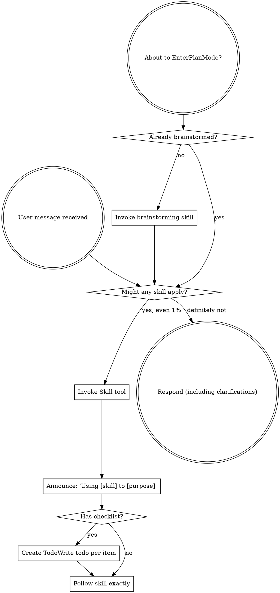

# Codex session 019f139f-73dd-73a0-832e-b6e2b8b08858

- Started: `2026-06-29T13:44:09.848Z`
- Working directory: `D:\100XH100`
- Originator: `Codex Desktop`
- Codex CLI: `0.142.2`
- Source log: `C:\Users\Иван Литвак\.codex\sessions\2026\06\29\rollout-2026-06-29T16-44-09-019f139f-73dd-73a0-832e-b6e2b8b08858.jsonl`
- Entries: user=2, assistant=14, tool calls=26, tool outputs=26

This is a chronological export of the user/assistant conversation and tool activity. Internal system/developer instructions and token accounting are intentionally excluded. Secret-shaped values are redacted; oversized tool outputs retain their beginning and end with the omitted character count.

## 1. User

Time: `2026-06-29T13:44:18.610Z` · source line `4`

```text
# AGENTS.md instructions for D:\100XH100

<INSTRUCTIONS>
# Project Agent Rules

## Operating Rule
- Read `AGENTS.md` before project edits.
- Update `memory/CHANGELOG.md` after meaningful code, config, or architecture changes.
- Update `memory/PROMPTS.md` with user prompts that define requirements.
- Store test outputs, logs, and verification notes under `test_results/`.
- Prefer agent-centered code: explicit contracts, deterministic tests, small files, low hidden state.

## Architecture Source
- Primary architecture contract: `ARCHITECTURE_NEED.md`.
- Current Stream 4 implementation rule: use threshold + compact + CUB/fixed-temp sort/reduce + compact; do not use Stream 4 hash-table dedup.

## Implementation Guardrails
- `State128` logical bytes are `v[0..119]`.
- `State128` padding bytes are `v[120..127]`.
- Persistent frontier padding must be zero.
- `FinalResponse` may temporarily store `target_local_idx` in `v[120..123]`.
- `Hash128` is one logical 128-bit key stored as `{lo, hi}`.
- `CandidateMeta` must remain 32 bytes and 32-byte aligned.
- Stream 3 payload id must be original candidate id, not compact index.
- Stream 4 must not apply shard top-k or semantic shard cap.

</INSTRUCTIONS>
<environment_context>
  <cwd>D:\100XH100</cwd>
  <shell>powershell</shell>
  <current_date>2026-06-29</current_date>
  <timezone>Europe/Moscow</timezone>
  <filesystem><workspace_roots><root>D:\100XH100</root></workspace_roots><permission_profile type="managed"><file_system type="restricted"><entry access="read"><special>:root</special></entry><entry access="write"><path>D:\100XH100</path></entry><entry access="write"><special>:slash_tmp</special></entry><entry access="write"><special>:tmpdir</special></entry><entry access="read"><path>D:\100XH100\.git</path></entry><entry access="read"><path>D:\100XH100\.agents</path></entry><entry access="read"><path>D:\100XH100\.codex</path></entry></file_system></permission_profile></filesystem>
</environment_context>
```

## 2. User

Time: `2026-06-29T13:44:18.624Z` · source line `6`

```text
You are the CODE QUALITY reviewer for Task 2/3 in a subagent-driven workflow. Do not edit files. Spec compliance already passed. Review commit 7f45ff3b5cb3119d5ecd37283e18006c1690895d in worktree D:\100XH100\.worktrees\stream1-piece-transformer for correctness, maintainability, test adequacy, deterministic output, and integration risks.

Base commit: 7a94f9017e1febb5fb040305bbabcc47a83ef6cb.
Changed files:
- tools/export_stream1.py
- tools/export_stream1_transformer.py
- tests/test_stream1_transformer_exporter.py
- memory/CHANGELOG.md
- test_results/stream1_transformer_exporter_2026-06-29.md

Context:
- Exporter only; no CUDA runtime yet.
- Future CUDA loader will depend on file names and manifest fields exported here.
- Existing MLP exporter must remain usable.
- Project prefers ASCII unless justified; note if BOM/non-ASCII in new files is a real issue.
- Avoid nitpicks unless they can cause bugs or future integration pain.

Please inspect the diff. Return:
- QUALITY_PASS with concise strengths/risks, or
- QUALITY_FAIL with Critical/Important findings and file references.

Focus on actionable issues only.
```

## 3. Codex

Time: `2026-06-29T13:44:37.893Z` · source line `9`

```text
I’ll review this as a code-quality pass without editing files. I’m using the required `superpowers:using-superpowers` skill first, then I’ll inspect the target worktree diff and focused tests.
```

## 4. Codex

Time: `2026-06-29T13:44:37.900Z` · source line `10`

```text
I’ll review this as a code-quality pass without editing files. I’m using the required `superpowers:using-superpowers` skill first, then I’ll inspect the target worktree diff and focused tests.
```

## 5. Tool call: `exec_command`

Time: `2026-06-29T13:44:37.928Z` · source line `11`

```text
{"cmd":"Get-Content -LiteralPath 'C:\\Users\\Иван Литвак\\.codex\\plugins\\cache\\openai-curated-remote\\superpowers\\5.1.4\\skills\\using-superpowers\\SKILL.md'","workdir":"D:\\100XH100","shell":"powershell","max_output_tokens":20000}
```

## 6. Tool call: `exec_command`

Time: `2026-06-29T13:44:37.928Z` · source line `12`

```text
{"cmd":"rg -n \"stream1|export_stream1|piece|transformer|BEAM_PREBUILT_RUNNER|cayleypy-beam-results\" 'C:\\Users\\Иван Литвак\\.codex\\memories\\MEMORY.md'","workdir":"D:\\100XH100","shell":"powershell","max_output_tokens":12000}
```

## 7. Tool call: `exec_command`

Time: `2026-06-29T13:44:37.933Z` · source line `13`

```text
{"cmd":"Get-Content -LiteralPath 'D:\\100XH100\\AGENTS.md'","workdir":"D:\\100XH100","shell":"powershell","max_output_tokens":12000}
```

## 8. Tool output

Time: `2026-06-29T13:44:38.458Z` · source line `14`

````text
Chunk ID: 75b214
Wall time: 0.2249 seconds
Process exited with code 0
Original token count: 1393
Output:
---
name: using-superpowers
description: Use when starting any conversation - establishes how to find and use skills, requiring Skill tool invocation before ANY response including clarifying questions
---

<SUBAGENT-STOP>
If you were dispatched as a subagent to execute a specific task, skip this skill.
</SUBAGENT-STOP>

<EXTREMELY-IMPORTANT>
If you think there is even a 1% chance a skill might apply to what you are doing, you ABSOLUTELY MUST invoke the skill.

IF A SKILL APPLIES TO YOUR TASK, YOU DO NOT HAVE A CHOICE. YOU MUST USE IT.

This is not negotiable. This is not optional. You cannot rationalize your way out of this.
</EXTREMELY-IMPORTANT>

## Instruction Priority

Superpowers skills override default system prompt behavior, but **user instructions always take precedence**:

1. **User's explicit instructions** (CLAUDE.md, GEMINI.md, AGENTS.md, direct requests) — highest priority
2. **Superpowers skills** — override default system behavior where they conflict
3. **Default system prompt** — lowest priority

If CLAUDE.md, GEMINI.md, or AGENTS.md says "don't use TDD" and a skill says "always use TDD," follow the user's instructions. The user is in control.

## How to Access Skills

**In Claude Code:** Use the `Skill` tool. When you invoke a skill, its content is loaded and presented to you—follow it directly. Never use the Read tool on skill files.

**In Copilot CLI:** Use the `skill` tool. Skills are auto-discovered from installed plugins. The `skill` tool works the same as Claude Code's `Skill` tool.

**In Gemini CLI:** Skills activate via the `activate_skill` tool. Gemini loads skill metadata at session start and activates the full content on demand.

**In other environments:** Check your platform's documentation for how skills are loaded.

## Platform Adaptation

Skills use Claude Code tool names. Non-CC platforms: see `references/copilot-tools.md` (Copilot CLI), `references/codex-tools.md` (Codex) for tool equivalents. Gemini CLI users get the tool mapping loaded automatically via GEMINI.md.

# Using Skills

## The Rule

**Invoke relevant or requested skills BEFORE any response or action.** Even a 1% chance a skill might apply means that you should invoke the skill to check. If an invoked skill turns out to be wrong for the situation, you don't need to use it.



## Red Flags

These thoughts mean STOP—you're rationalizing:

| Thought | Reality |
|---------|---------|
| "This is just a simple question" | Questions are tasks. Check for skills. |
| "I need more context first" | Skill check comes BEFORE clarifying questions. |
| "Let me explore the codebase first" | Skills tell you HOW to explore. Check first. |
| "I can check git/files quickly" | Files lack conversation context. Check for skills. |
| "Let me gather information first" | Skills tell you HOW to gather information. |
| "This doesn't need a formal skill" | If a skill exists, use it. |
| "I remember this skill" | Skills evolve. Read current version. |
| "This doesn't count as a task" | Action = task. Check for skills. |
| "The skill is overkill" | Simple things become complex. Use it. |
| "I'll just do this one thing first" | Check BEFORE doing anything. |
| "This feels productive" | Undisciplined action wastes time. Skills prevent this. |
| "I know what that means" | Knowing the concept в‰  using the skill. Invoke it. |

## Skill Priority

When multiple skills could apply, use this order:

1. **Process skills first** (brainstorming, debugging) - these determine HOW to approach the task
2. **Implementation skills second** (frontend-design, mcp-builder) - these guide execution

"Let's build X" в†’ brainstorming first, then implementation skills.
"Fix this bug" в†’ debugging first, then domain-specific skills.

## Skill Types

**Rigid** (TDD, debugging): Follow exactly. Don't adapt away discipline.

**Flexible** (patterns): Adapt principles to context.

The skill itself tells you which.

## User Instructions

Instructions say WHAT, not HOW. "Add X" or "Fix Y" doesn't mean skip workflows.

````

## 9. Tool output

Time: `2026-06-29T13:44:38.458Z` · source line `15`

```text
Chunk ID: b9c55b
Wall time: 0.2103 seconds
Process exited with code 0
Original token count: 236
Output:
58:- MEPhI HPC, kaf12, A100 40GB, BEAM_PREBUILT_RUNNER, prepare_ihes_prebuilt_runner.sh, ihes_solve_bucket_from_scratch.sh, prebuilt_runner_ready, using_prebuilt_runner, PUZZLE_LIMIT=1, depth=12
68:- cayleypy-beam-results, p0027, p0031, p0033, data/ihes_cube/index.tsv, improvements.tsv, unique_solutions.tsv, metadata.env, summary.md, solve_bucket_fresh, github.com DNS
89:- `hpc/ihes_cube_model/prepare_ihes_prebuilt_runner.sh` builds the shared binary at `/mnt/pool/6/vokirova/beam8a100/ihes_cube_model/prebuilt-a100-ihes/production_runner`, and `hpc/ihes_cube_model/ihes_solve_bucket_from_scratch.sh` already knows how to consume `BEAM_PREBUILT_RUNNER` [Task 1]
97:- symptom: each array task recompiles instead of reusing the solver. cause: `BEAM_PREBUILT_RUNNER` was not wired through a separate prebuild dependency. fix: submit the prebuild first and make the puzzle array depend on it via `--dependency=afterok:<prebuild_job>` [Task 1]

```

## 10. Tool output

Time: `2026-06-29T13:44:38.458Z` · source line `16`

```text
Chunk ID: d0eaa9
Wall time: 0.2023 seconds
Process exited with code 0
Original token count: 290
Output:
# Project Agent Rules

## Operating Rule
- Read `AGENTS.md` before project edits.
- Update `memory/CHANGELOG.md` after meaningful code, config, or architecture changes.
- Update `memory/PROMPTS.md` with user prompts that define requirements.
- Store test outputs, logs, and verification notes under `test_results/`.
- Prefer agent-centered code: explicit contracts, deterministic tests, small files, low hidden state.

## Architecture Source
- Primary architecture contract: `ARCHITECTURE_NEED.md`.
- Current Stream 4 implementation rule: use threshold + compact + CUB/fixed-temp sort/reduce + compact; do not use Stream 4 hash-table dedup.

## Implementation Guardrails
- `State128` logical bytes are `v[0..119]`.
- `State128` padding bytes are `v[120..127]`.
- Persistent frontier padding must be zero.
- `FinalResponse` may temporarily store `target_local_idx` in `v[120..123]`.
- `Hash128` is one logical 128-bit key stored as `{lo, hi}`.
- `CandidateMeta` must remain 32 bytes and 32-byte aligned.
- Stream 3 payload id must be original candidate id, not compact index.
- Stream 4 must not apply shard top-k or semantic shard cap.

```

## 11. Codex

Time: `2026-06-29T13:44:57.726Z` · source line `19`

```text
I’ve confirmed the project rules and memory has only broad prior context for this repo, not this exporter. Next I’m reading the commit diff and the changed files directly, with special attention to exported artifact names, manifest schema, and deterministic ordering.
```

## 12. Codex

Time: `2026-06-29T13:44:57.732Z` · source line `20`

```text
I’ve confirmed the project rules and memory has only broad prior context for this repo, not this exporter. Next I’m reading the commit diff and the changed files directly, with special attention to exported artifact names, manifest schema, and deterministic ordering.
```

## 13. Tool call: `exec_command`

Time: `2026-06-29T13:44:57.742Z` · source line `21`

```text
{"cmd":"git -C 'D:\\100XH100\\.worktrees\\stream1-piece-transformer' status --short","workdir":"D:\\100XH100","shell":"powershell","max_output_tokens":12000}
```

## 14. Tool call: `exec_command`

Time: `2026-06-29T13:44:57.837Z` · source line `22`

```text
{"cmd":"git -C 'D:\\100XH100\\.worktrees\\stream1-piece-transformer' diff --stat 7a94f9017e1febb5fb040305bbabcc47a83ef6cb 7f45ff3b5cb3119d5ecd37283e18006c1690895d","workdir":"D:\\100XH100","shell":"powershell","max_output_tokens":12000}
```

## 15. Tool call: `exec_command`

Time: `2026-06-29T13:45:00.678Z` · source line `23`

```text
{"cmd":"git -C 'D:\\100XH100\\.worktrees\\stream1-piece-transformer' diff --find-renames --find-copies 7a94f9017e1febb5fb040305bbabcc47a83ef6cb 7f45ff3b5cb3119d5ecd37283e18006c1690895d -- tools/export_stream1.py tools/export_stream1_transformer.py tests/test_stream1_transformer_exporter.py","workdir":"D:\\100XH100","shell":"powershell","max_output_tokens":60000}
```

## 16. Tool call: `exec_command`

Time: `2026-06-29T13:45:01.001Z` · source line `24`

```text
{"cmd":"git -C 'D:\\100XH100\\.worktrees\\stream1-piece-transformer' diff --find-renames --find-copies 7a94f9017e1febb5fb040305bbabcc47a83ef6cb 7f45ff3b5cb3119d5ecd37283e18006c1690895d -- memory/CHANGELOG.md test_results/stream1_transformer_exporter_2026-06-29.md","workdir":"D:\\100XH100","shell":"powershell","max_output_tokens":30000}
```

## 17. Tool output

Time: `2026-06-29T13:45:01.084Z` · source line `25`

```text
Chunk ID: 56081a
Wall time: 0.1314 seconds
Process exited with code 0
Original token count: 3
Output:
?? docs/

```

## 18. Tool output

Time: `2026-06-29T13:45:01.084Z` · source line `26`

```text
Chunk ID: 0644b7
Wall time: 0.1322 seconds
Process exited with code 0
Original token count: 92
Output:
 memory/CHANGELOG.md                                |   1 +
 .../stream1_transformer_exporter_2026-06-29.md     |  75 +++
 tests/test_stream1_transformer_exporter.py         | 150 ++++++
 tools/export_stream1.py                            | 100 ++++
 tools/export_stream1_transformer.py                | 555 +++++++++++++++++++++
 5 files changed, 881 insertions(+)

```

## 19. Tool output

Time: `2026-06-29T13:45:01.084Z` · source line `27`

Oversized output: `4147` characters omitted from the middle.

```text
Chunk ID: 285899
Wall time: 0.1096 seconds
Process exited with code 0
Original token count: 9011
Output:
diff --git a/tests/test_stream1_transformer_exporter.py b/tests/test_stream1_transformer_exporter.py
new file mode 100644
index 0000000..fbb1e92
--- /dev/null
+++ b/tests/test_stream1_transformer_exporter.py
@@ -0,0 +1,150 @@
+import unittest
+
+import torch
+import torch.nn.functional as F
+
+from tools.export_stream1 import detect_format_from_state_dict
+from tools.export_stream1_transformer import (
+    build_fast_input_tables,
+    infer_architecture,
+    strip_state_prefixes,
+)
+
+
+def make_piece_transformer_state(num_layers=4, output_dim=24, ff_dim=1024):
+    torch.manual_seed(123)
+    sd = {
+        "cls_token": torch.randn(1, 1, 256),
+        "local_value_embedding.weight": torch.randn(360, 256),
+        "piece_projection.weight": torch.randn(256, 768),
+        "piece_projection.bias": torch.randn(256),
+        "piece_position_embedding.weight": torch.randn(50, 256),
+        "piece_type_embedding.weight": torch.randn(2, 256),
+        "input_norm.weight": torch.randn(256),
+        "input_norm.bias": torch.randn(256),
+        "output_norm.weight": torch.randn(256),
+        "output_norm.bias": torch.randn(256),
+        "output_layer.weight": torch.randn(output_dim, 256),
+        "output_layer.bias": torch.randn(output_dim),
+    }
+    for block in range(num_layers):
+        prefix = f"blocks.{block}"
+        sd[f"{prefix}.norm1.weight"] = torch.randn(256)
+        sd[f"{prefix}.norm1.bias"] = torch.randn(256)
+        sd[f"{prefix}.attn.in_proj_weight"] = torch.randn(768, 256)
+        sd[f"{prefix}.attn.in_proj_bias"] = torch.randn(768)
+        sd[f"{prefix}.attn.out_proj.weight"] = torch.randn(256, 256)
+        sd[f"{prefix}.attn.out_proj.bias"] = torch.randn(256)
+        sd[f"{prefix}.norm2.weight"] = torch.randn(256)
+        sd[f"{prefix}.norm2.bias"] = torch.randn(256)
+        sd[f"{prefix}.ff.0.weight"] = torch.randn(ff_dim, 256)
+        sd[f"{prefix}.ff.0.bias"] = torch.randn(ff_dim)
+        sd[f"{prefix}.ff.3.weight"] = torch.randn(256, ff_dim)
+        sd[f"{prefix}.ff.3.bias"] = torch.randn(256)
+    return sd
+
+
+def make_metadata(transformer_layers=4, transformer_ff_dim=1024, n_gens=24):
+    return {
+        "model_arch": "piece_transformer",
+        "state_size": 120,
+        "n_gens": n_gens,
+        "transformer_d_model": 256,
+        "transformer_heads": 8,
+        "transformer_layers": transformer_layers,
+        "transformer_ff_dim": transformer_ff_dim,
+        "transformer_activation": "silu",
+        "transformer_pooling": "cls",
+        "piece_layout": "p900",
+        "piece_embed_mode": "full_s120",
+        "num_pieces": 50,
+        "max_piece_size": 3,
+        "model_id": 1782210824,
+    }
+
+
+class Stream1TransformerExporterTests(unittest.TestCase):
+    def test_detects_piece_transformer_from_marker_keys_after_prefix_strip(self):
+        sd = {f"module._orig_mod.{key}": value for key, value in make_piece_transformer_state().items()}
+        self.assertEqual(detect_format_from_state_dict(sd), "piece-transformer")
+        stripped = strip_state_prefixes(sd)
+        self.assertIn("blocks.0.attn.in_proj_weight", stripped)
+        self.assertNotIn("module._orig_mod.output_layer.weight", stripped)
+
+    def test_infers_required_p900_piece_transformer_architecture(self):
+        arch = infer_architecture(
+            make_piece_transformer_state(),
+            make_metadata(),
+            move_names=[f"m{i}" for i in range(24)],
+            num_classes=120,
+        )
+        self.assertEqual(arch["backend"], "piece_transformer")
+        self.assertEqual(arch["state_len"], 120)
+        self.assertEqual(arch["num_classes"], 120)
+        self.assertEqual(arch["move_count"], 24)
+        self.assertEqual(arch["output_dim"], 24)
+        self.assertEqual(arch["seq_len"], 51)
+        self.assertEqual(arch["d_model"], 256)
+        self.assertEqual(arch["nhead"], 8)
+        self.assertEqual(arch["head_dim"], 32)
+        self.assertEqual(arch["num_layers"], 4)
+        self.assertEqual(arch["ff_dim"], 1024)
+        self.assertEqual(arch["activation"], "silu")
+        self.assertEqual(arch["pooling"], "cls")
+
+    def test_rejects_consistent_non_24_move_piece_transformer(self):
+        with self.assertRaisesRegex(ValueError, "requires move_count=24"):
+            infer_architecture(
+                make_piece_transformer_state(output_dim=23),
+                make_metadata(n_gens=23),
+                move_names=[f"m{i}" for i in range(23)],
+                num_classes=120,
+            )
+
+    def test_rejects_consistent_non_4_layer_piece_transformer(self):
+        with self.assertRaisesRegex(ValueError, "requires transformer_layers=4"):
+            infer_architecture(
+                make_piece_transformer_state(num_layers=3),
+                make_metadata(transformer_layers=3),
+                move_names=[f"m{i}" for i in range(24)],
+                num_classes=120,
+            )
+
+    def test_rejects_consistent_non_1024_ff_piece_transformer(self):
+        with self.assertRaisesRegex(ValueError, "requires transformer_ff_dim=1024"):
+            infer_architecture(
+                make_piece_transformer_state(ff_dim=2048),
+                make_metadata(transformer_ff_dim=2048),
+                move_names=[f"m{i}" for i in range(24)],
+                num_classes=120,
+            )
+
+    def test_fast_input_tables_match_kaggle_fast_cache_formula(self):
+        sd = make_piece_transformer_state()
+        piece_positions = torch.arange(0, 150, dtype=torch.int64).view(50, 3) % 120
+        piece_mask = torch.ones((50, 3), dtype=torch.bool)
+        piece_types = torch.arange(50, dtype=torch.int64) % 2
+
+        tables = build_fast_input_tables(sd, piece_positions, piece_mask, piece_types)
+        self.assertEqual(tuple(tables["fast_slot_projected"].shape), (3, 120, 256))
+        self.assertEqual(tuple(tables["fast_piece_static"].shape), (50, 256))
+
+        expected_slots = []
+        for slot in range(3):
+            projection_slice = sd["piece_projection.weight"][:, slot * 256 : (slot + 1) * 256]
+            embeddings = sd["local_value_embedding.weight"][slot * 120 : (slot + 1) * 120]
+            expected_slots.append(F.linear(embeddings, projection_slice))
+        expected_static = (
+            sd["piece_position_embedding.weight"].index_select(0, torch.arange(50))
+            + sd["piece_type_embedding.weight"].index_select(0, piece_types)
+            + sd["piece_projection.bias"].view(1, -1)
+        )
+        self.assertTrue(torch.equal(tables["piece_positions"], piece_positions.to(torch.int16)))
+        self.assertTrue(torch.equal(tables["piece_mask"], piece_mask.to(torch.uint8)))
+        self.assertTrue(torch.equal(tables["piece_types"], piece_types.to(torch.uint8)))
+        self.assertTrue(torch.allclose(tables["fast_slot_projected"], torch.stack(expected_slots)))
+        self.assertTrue(torch.allclose(tables["fast_piece_static"], expected_static))
+
+
+if __name__ == "__main__":
+    unittest.main()
diff --git a/tools/export_stream1.py b/tools/export_stream1.py
new file mode 100644
index 0000000..3cf6c47
--- /dev/null
+++ b/tools/export_stream1.py
@@ -0,0 +1,100 @@
+#!/usr/bin/env python3
+"""Auto-detecting Stream1 weight exporter wrapper."""
+
+from __future__ import annotations
+
+import argparse
+from pathlib import Path
+import sys
+from typing import Mapping
+
+import torch
+
+try:
+    from tools.export_stream1_mlp import (
+        export_batchnorm_folded,
+        export_resmlp_layernorm,
+        strip_orig_mod,
+        unwrap_state_dict,
+    )
+    from tools.export_stream1_transformer import export_piece_transformer, strip_state_prefixes
+except ModuleNotFoundError:
+    sys.path.insert(0, str(Path(__file__).resolve().parent))
+    from export_stream1_mlp import export_batchnorm_folded, export_resmlp_layernorm, strip_orig_mod, unwrap_state_dict
+    from export_stream1_transformer import export_piece_transformer, strip_state_prefixes
+
+
+PIECE_TRANSFORMER_KEYS = {
+    "local_value_embedding.weight",
+    "piece_projection.weight",
+    "blocks.0.attn.in_proj_weight",
+    "output_layer.weight",
+}
+
+
+def detect_format_from_state_dict(sd: Mapping[str, object]) -> str:
+    keys = set(strip_state_prefixes(sd).keys())
+    if PIECE_TRANSFORMER_KEYS.issubset(keys):
+        return "piece-transformer"
+    if {"embedding.weight", "input_stack.0.weight", "head.weight"}.issubset(keys):
+        return "resmlp-layernorm"
+    if {"input_layer.weight", "bn1.running_mean", "output_layer.weight"}.issubset(keys):
+        return "batchnorm-folded"
+    raise ValueError("could not auto-detect Stream1 weight format; pass --format explicitly")
+
+
+def load_state_for_detection(weights_path: Path) -> Mapping[str, object]:
+    checkpoint = torch.load(weights_path, map_location="cpu", weights_only=False)
+    return strip_orig_mod(unwrap_state_dict(checkpoint))
+
+
+def main() -> None:
+    parser = argparse.ArgumentParser(description=__doc__)
+    parser.add_argument("--weights", required=True, type=Path)
+    parser.add_argument("--out", required=True, type=Path)
+    parser.add_argument("--dtype", choices=["fp16", "bf16"], default="fp16")
+    parser.add_argument(
+        "--format",
+        choices=["auto", "piece-transformer", "resmlp-layernorm", "batchnorm-folded"],
+        default="auto",
+    )
+    parser.add_argument("--num-classes", type=int, default=120)
+    parser.add_argument("--metadata", type=Path)
+    parser.add_argument("--generators", type=Path)
+    parser.add_argument("--source-root", type=Path)
+    parser.add_argument("--reference-out", type=Path)
+    parser.add_argument("--reference-count", type=int, default=0)
+    parser.add_argument("--reference-seed", type=int, default=0)
+    args = parser.parse_args()
+
+    resolved_format = args.format
+    if resolved_format == "auto":
+        resolved_format = detect_format_from_state_dict(load_state_for_detection(args.weights))
+
+    if resolved_format == "piece-transformer":
+        export_piece_transformer(
+            weights_path=args.weights,
+            out_dir=args.out,
+            dtype=args.dtype,
+            num_classes=args.num_classes,
+            metadata_path=args.metadata,
+            generator_path=args.generators,
+            source_root=args.source_root,
+            reference_out=args.reference_out,
+            reference_count=args.reference_count,
+            reference_seed=args.reference_seed,
+        )
+    elif resolved_format == "resmlp-layernorm":
+        if args.reference_out is not None:
+            raise ValueError("--reference-out is only supported for --format piece-transformer")
+        export_resmlp_layernorm(args.weights, args.out, args.dtype)
+    elif resolved_format == "batchnorm-folded":
+        if args.reference_out is not None:
+            raise ValueError("--reference-out is only supported for --format piece-transformer")
+        export_batchnorm_folded(args.weights, args.out, args.dtype, args.num_classes)
+    else:
+        raise ValueError(f"unsupported Stream1 format: {resolved_format}")
+
+
+if __name__ == "__main__":
+    main()
diff --git a/tools/export_stream1_transformer.py b/tools/export_stream1_transformer.py
new file mode 100644
index 0000000..b6716b3
--- /dev/null
+++ b/tools/export_stream1_transformer.py
@@ -0,0 +1,555 @@
+#!/usr/bin/env python3
+"""Export Kaggle p900 PilgrimPieceTransformer weights for Stream1."""
+
+from __future__ import annotations
+
+import argparse
+import importlib
+import json
+import re
+import sys
+from pathlib import Path
+from typing import Any, Mapping
+
+import numpy as np
+import torch
+import torch.nn.functional as F
+
+try:
+    from tools.export_stream1_mlp import tensor_bytes, weight_suffix, write_hxk, write_vec
+except ModuleNotFoundError:
+    sys.path.insert(0, str(Path(__file__).resolve().parent))
+    from export_stream1_mlp import tensor_bytes, weight_suffix, write_hxk, write_vec
+
+
+TensorDict = dict[str, torch.Tensor]
+REQUIRED_MOVE_COUNT = 24
+REQUIRED_TRANSFORMER_LAYERS = 4
+REQUIRED_TRANSFORMER_FF_DIM = 1024
+
+
+def unwrap_state_dict(obj: Any) -> TensorDict:
+    if isinstance(obj, dict):
+        for key in ("state_dict", "model_state_dict", "model", "net", "module"):
+            value = obj.get(key)
+            if isinstance(value, dict):
+                return value
+        return obj
+    raise TypeError(f"unsupported checkpoint root type: {type(obj).__name__}")
+
+
+def strip_state_prefixes(sd: Mapping[str, Any]) -> TensorDict:
+    stripped: TensorDict = {}
+    for key, value in sd.items():
+        clean = str(key)
+        changed = True
+        while changed:
+            changed = False
+            for prefix in ("module.", "_orig_mod."):
+                if clean.startswith(prefix):
+                    clean = clean[len(prefix) :]
+                    changed = True
+        stripped[clean] = value
+    return stripped
+
+
+def load_checkpoint_state(weights_path: Path) -> TensorDict:
+    checkpoint = torch.load(weights_path, map_location="cpu", weights_only=False)
+    sd = strip_state_prefixes(unwrap_state_dict(checkpoint))
+    return {key: value.detach().cpu() if isinstance(value, torch.Tensor) else value for key, value in sd.items()}
+
+
+def read_json(path: Path) -> dict[str, Any]:
+    return json.loads(path.read_text(encoding="utf-8"))
+
+
+def nearby_roots(weights_path: Path) -> list[Path]:
+    roots: list[Path] = []
+    for start in (weights_path.parent, *weights_path.parents):
+        if start not in roots:
+            roots.append(start)
+    return roots
+
+
+def locate_metadata(weights_path: Path, explicit: Path | None) -> Path:
+    if explicit is not None:
+        return explicit
+    candidates: list[Path] = []
+    for root in nearby_roots(weights_path):
+        logs = root / "logs"
+        if logs.is_dir():
+            candidates.extend(sorted(logs.glob("model_*.json")))
+    matching: list[Path] = []
+    for candidate in candidates:
+        try:
+            data = read_json(candidate)
+        except Exception:
+            continue
+        if Path(str(data.get("best_weights_file", ""))).name == weights_path.name:
+            matching.append(candidate)
+        elif str(data.get("model_id", "")) and str(data["model_id"]) in weights_path.stem:
+            matching.append(candidate)
+    if len(matching) == 1:
+        return matching[0]
+    if not matching and len(candidates) == 1:
+        return candidates[0]
+    raise FileNotFoundError("could not uniquely auto-locate metadata; pass --metadata")
+
+
+def locate_generator(weights_path: Path, metadata: Mapping[str, Any], explicit: Path | None) -> Path:
+    if explicit is not None:
+        return explicit
+    group_id = metadata.get("group_id")
+    names = [f"p{group_id}.json"] if group_id is not None else []
+    candidates: list[Path] = []
+    for root in nearby_roots(weights_path):
+        gen_dir = root / "generators"
+        if gen_dir.is_dir():
+            for name in names:
+                path = gen_dir / name
+                if path.is_file():
+                    return path
+            candidates.extend(sorted(gen_dir.glob("p*.json")))
+    if len(candidates) == 1:
+        return candidates[0]
+    raise FileNotFoundError("could not uniquely auto-locate generator JSON; pass --generators")
+
+
+def locate_source_root(weights_path: Path, metadata_path: Path | None, explicit: Path | None) -> Path:
+    if explicit is not None:
+        return explicit
+    starts = [weights_path.parent, *weights_path.parents]
+    if metadata_path is not None:
+        starts.extend([metadata_path.parent, *metadata_path.parents])
+    seen: set[Path] = set()
+    for root in starts:
+        if root in seen:
+            continue
+        seen.add(root)
+      

[... 4147 characters omitted from oversized tool output ...]

ise ValueError("piece_projection shape does not match d_model/max_piece_size")
+
+    require_shape(sd, "piece_projection.bias", (d_model,))
+    require_shape(sd, "piece_position_embedding.weight", (num_pieces, d_model))
+    require_shape(sd, "piece_type_embedding.weight", (2, d_model))
+    require_shape(sd, "cls_token", (1, 1, d_model))
+    require_shape(sd, "input_norm.weight", (d_model,))
+    require_shape(sd, "input_norm.bias", (d_model,))
+    require_shape(sd, "output_norm.weight", (d_model,))
+    require_shape(sd, "output_norm.bias", (d_model,))
+
+    output_dim, output_in = sd["output_layer.weight"].shape
+    move_count = len(move_names)
+    if move_count <= 0:
+        raise ValueError("move_count must be positive")
+    if move_count != REQUIRED_MOVE_COUNT:
+        raise ValueError(f"piece_transformer export requires move_count=24, got {move_count}")
+    if metadata.get("n_gens") is not None and int(metadata["n_gens"]) != move_count:
+        raise ValueError(f"metadata n_gens={metadata['n_gens']} does not match move_count={move_count}")
+    if int(output_dim) != REQUIRED_MOVE_COUNT:
+        raise ValueError(f"piece_transformer export requires output_dim=24, got {int(output_dim)}")
+    if output_dim != move_count:
+        raise ValueError(f"output_dim={int(output_dim)} must equal move_count={move_count}")
+    if output_in != d_model:
+        raise ValueError(f"output_layer input mismatch: expected={int(d_model)} actual={int(output_in)}")
+    require_shape(sd, "output_layer.bias", (output_dim,))
+
+    layers = block_indices(sd)
+    num_layers = len(layers)
+    metadata_layers = metadata_int(metadata, "transformer_layers")
+    if metadata_layers != num_layers:
+        raise ValueError(f"metadata transformer_layers={metadata_layers} does not match tensors={num_layers}")
+    if num_layers != REQUIRED_TRANSFORMER_LAYERS:
+        raise ValueError(f"piece_transformer export requires transformer_layers=4, got {num_layers}")
+    ff_dim = metadata_int(metadata, "transformer_ff_dim")
+    nhead = metadata_int(metadata, "transformer_heads")
+    if d_model % nhead != 0:
+        raise ValueError(f"d_model={int(d_model)} must be divisible by nhead={nhead}")
+    if ff_dim <= 0:
+        raise ValueError(f"ff_dim must be positive: {ff_dim}")
+    if ff_dim != REQUIRED_TRANSFORMER_FF_DIM:
+        raise ValueError(f"piece_transformer export requires transformer_ff_dim=1024, got {ff_dim}")
+    for block in layers:
+        prefix = f"blocks.{block}"
+        require_shape(sd, f"{prefix}.norm1.weight", (d_model,))
+        require_shape(sd, f"{prefix}.norm1.bias", (d_model,))
+        require_shape(sd, f"{prefix}.attn.in_proj_weight", (3 * d_model, d_model))
+        require_shape(sd, f"{prefix}.attn.in_proj_bias", (3 * d_model,))
+        require_shape(sd, f"{prefix}.attn.out_proj.weight", (d_model, d_model))
+        require_shape(sd, f"{prefix}.attn.out_proj.bias", (d_model,))
+        require_shape(sd, f"{prefix}.norm2.weight", (d_model,))
+        require_shape(sd, f"{prefix}.norm2.bias", (d_model,))
+        require_shape(sd, f"{prefix}.ff.0.weight", (ff_dim, d_model))
+        require_shape(sd, f"{prefix}.ff.0.bias", (ff_dim,))
+        require_shape(sd, f"{prefix}.ff.3.weight", (d_model, ff_dim))
+        require_shape(sd, f"{prefix}.ff.3.bias", (d_model,))
+
+    activation = str(metadata.get("transformer_activation", "")).lower()
+    pooling = str(metadata.get("transformer_pooling", "")).lower()
+    if activation not in {"silu", "gelu", "relu"}:
+        raise ValueError(f"unsupported activation metadata: {activation}")
+    if pooling != "cls":
+        raise ValueError(f"runtime piece_transformer export requires cls pooling, got {pooling}")
+    if str(metadata.get("piece_layout", "")).lower() != "p900":
+        raise ValueError("piece_layout must be p900")
+    if str(metadata.get("piece_embed_mode", "")).lower() != "full_s120":
+        raise ValueError("piece_embed_mode must be full_s120")
+
+    return {
+        "backend": "piece_transformer",
+        "model_arch": "piece_transformer",
+        "state_len": state_len,
+        "num_classes": num_classes,
+        "move_count": move_count,
+        "output_dim": int(output_dim),
+        "num_pieces": num_pieces,
+        "max_piece_size": max_piece_size,
+        "seq_len": num_pieces + 1,
+        "d_model": int(d_model),
+        "nhead": nhead,
+        "head_dim": int(d_model) // nhead,
+        "num_layers": num_layers,
+        "ff_dim": ff_dim,
+        "activation": activation,
+        "pooling": pooling,
+        "piece_layout": "p900",
+        "piece_embed_mode": "full_s120",
+        "input_embedding": "fast_slot_projected",
+        "move_names": move_names,
+    }
+
+
+def build_fast_input_tables(
+    sd: Mapping[str, torch.Tensor],
+    piece_positions: torch.Tensor,
+    piece_mask: torch.Tensor,
+    piece_types: torch.Tensor,
+) -> dict[str, torch.Tensor]:
+    sd = strip_state_prefixes(sd)
+    projection_weight = sd["piece_projection.weight"].detach().float()
+    projection_bias = sd["piece_projection.bias"].detach().float()
+    embedding_weight = sd["local_value_embedding.weight"].detach().float()
+    d_model = projection_weight.shape[0]
+    max_piece_size = piece_positions.shape[1]
+    num_classes = embedding_weight.shape[0] // max_piece_size
+    slot_rows = []
+    for slot in range(max_piece_size):
+        start = slot * d_model
+        end = (slot + 1) * d_model
+        token_start = slot * num_classes
+        token_end = (slot + 1) * num_classes
+        slot_rows.append(F.linear(embedding_weight[token_start:token_end], projection_weight[:, start:end]))
+    piece_indices = torch.arange(piece_positions.shape[0], dtype=torch.int64)
+    static = sd["piece_position_embedding.weight"].detach().float().index_select(0, piece_indices)
+    static = static + sd["piece_type_embedding.weight"].detach().float().index_select(0, piece_types.long())
+    static = static + projection_bias.view(1, -1)
+    return {
+        "fast_slot_projected": torch.stack(slot_rows, dim=0).contiguous(),
+        "fast_piece_static": static.contiguous(),
+        "piece_positions": piece_positions.to(torch.int16).contiguous(),
+        "piece_mask": piece_mask.to(torch.uint8).contiguous(),
+        "piece_types": piece_types.to(torch.uint8).contiguous(),
+    }
+
+
+def write_u16(path: Path, tensor: torch.Tensor) -> None:
+    data = tensor.detach().cpu().numpy().astype("<u2", copy=False)
+    path.write_bytes(data.tobytes())
+
+
+def write_u8(path: Path, tensor: torch.Tensor) -> None:
+    data = tensor.detach().cpu().numpy().astype("u1", copy=False)
+    path.write_bytes(data.tobytes())
+
+
+def write_tensor(path: Path, tensor: torch.Tensor, dtype: str) -> None:
+    path.write_bytes(tensor_bytes(tensor.detach().float(), dtype))
+
+
+def export_tensors(
+    sd: Mapping[str, torch.Tensor],
+    out_dir: Path,
+    dtype: str,
+    piece_positions: torch.Tensor,
+    piece_mask: torch.Tensor,
+    piece_types: torch.Tensor,
+    num_layers: int,
+) -> None:
+    out_dir.mkdir(parents=True, exist_ok=True)
+    suffix = weight_suffix(dtype)
+    fast = build_fast_input_tables(sd, piece_positions, piece_mask, piece_types)
+    write_tensor(out_dir / f"fast_slot_projected{suffix}", fast["fast_slot_projected"], dtype)
+    write_tensor(out_dir / f"fast_piece_static{suffix}", fast["fast_piece_static"], dtype)
+    write_tensor(out_dir / f"cls_token{suffix}", sd["cls_token"].view(-1), dtype)
+    write_vec(out_dir / f"input_ln_gamma{suffix}", sd["input_norm.weight"], dtype)
+    write_vec(out_dir / f"input_ln_beta{suffix}", sd["input_norm.bias"], dtype)
+    write_vec(out_dir / f"output_ln_gamma{suffix}", sd["output_norm.weight"], dtype)
+    write_vec(out_dir / f"output_ln_beta{suffix}", sd["output_norm.bias"], dtype)
+    for block in range(num_layers):
+        prefix = f"blocks.{block}"
+        out_prefix = f"block{block}"
+        write_vec(out_dir / f"{out_prefix}_ln1_gamma{suffix}", sd[f"{prefix}.norm1.weight"], dtype)
+        write_vec(out_dir / f"{out_prefix}_ln1_beta{suffix}", sd[f"{prefix}.norm1.bias"], dtype)
+        write_hxk(out_dir / f"{out_prefix}_attn_qkv_weight_hxk{suffix}", sd[f"{prefix}.attn.in_proj_weight"], dtype)
+        write_vec(out_dir / f"{out_prefix}_attn_qkv_bias{suffix}", sd[f"{prefix}.attn.in_proj_bias"], dtype)
+        write_hxk(out_dir / f"{out_prefix}_attn_out_weight_hxk{suffix}", sd[f"{prefix}.attn.out_proj.weight"], dtype)
+        write_vec(out_dir / f"{out_prefix}_attn_out_bias{suffix}", sd[f"{prefix}.attn.out_proj.bias"], dtype)
+        write_vec(out_dir / f"{out_prefix}_ln2_gamma{suffix}", sd[f"{prefix}.norm2.weight"], dtype)
+        write_vec(out_dir / f"{out_prefix}_ln2_beta{suffix}", sd[f"{prefix}.norm2.bias"], dtype)
+        write_hxk(out_dir / f"{out_prefix}_ff1_weight_hxk{suffix}", sd[f"{prefix}.ff.0.weight"], dtype)
+        write_vec(out_dir / f"{out_prefix}_ff1_bias{suffix}", sd[f"{prefix}.ff.0.bias"], dtype)
+        write_hxk(out_dir / f"{out_prefix}_ff2_weight_hxk{suffix}", sd[f"{prefix}.ff.3.weight"], dtype)
+        write_vec(out_dir / f"{out_prefix}_ff2_bias{suffix}", sd[f"{prefix}.ff.3.bias"], dtype)
+    write_hxk(out_dir / f"output_weight_hxk{suffix}", sd["output_layer.weight"], dtype)
+    write_vec(out_dir / f"output_bias{suffix}", sd["output_layer.bias"], dtype)
+    write_u16(out_dir / "piece_positions.u16", fast["piece_positions"])
+    write_u8(out_dir / "piece_mask.u8", fast["piece_mask"])
+    write_u8(out_dir / "piece_types.u8", fast["piece_types"])
+
+
+def make_reference_states(state_len: int, count: int, seed: int) -> torch.Tensor:
+    if count <= 0:
+        raise ValueError(f"reference-count must be positive when --reference-out is provided: {count}")
+    generator = torch.Generator(device="cpu")
+    generator.manual_seed(int(seed))
+    rows = [torch.randperm(state_len, generator=generator, dtype=torch.int64) for _ in range(count)]
+    return torch.stack(rows, dim=0)
+
+
+def instantiate_reference_model(
+    source_root: Path,
+    metadata: Mapping[str, Any],
+    output_dim: int,
+    num_classes: int,
+):
+    model_module = import_model_module(source_root)
+    return model_module.PilgrimPieceTransformer(
+        state_size=int(metadata["state_size"]),
+        output_dim=int(output_dim),
+        num_classes=int(num_classes),
+        d_model=int(metadata["transformer_d_model"]),
+        nhead=int(metadata["transformer_heads"]),
+        num_layers=int(metadata["transformer_layers"]),
+        ff_dim=int(metadata["transformer_ff_dim"]),
+        dropout_rate=float(metadata.get("dropout", 0.0)),
+        activation=str(metadata["transformer_activation"]),
+        pooling=str(metadata["transformer_pooling"]),
+        piece_layout=str(metadata["piece_layout"]),
+        piece_embed_mode=str(metadata["piece_embed_mode"]),
+        max_inference_batch_size=int(metadata.get("transformer_max_inference_batch_size", 32768)),
+    )
+
+
+def write_reference(
+    reference_out: Path,
+    sd: Mapping[str, torch.Tensor],
+    metadata: Mapping[str, Any],
+    source_root: Path,
+    arch: Mapping[str, Any],
+    count: int,
+    seed: int,
+    weights_path: Path,
+) -> None:
+    model = instantiate_reference_model(source_root, metadata, int(arch["output_dim"]), int(arch["num_classes"]))
+    model.load_state_dict(dict(sd), strict=True)
+    model.eval()
+    if hasattr(model, "set_fast_inference") and hasattr(model, "supports_fast_inference"):
+        if model.supports_fast_inference():
+            model.set_fast_inference(True)
+    states = make_reference_states(int(arch["state_len"]), count, seed)
+    with torch.inference_mode():
+        scores = model(states).float().cpu()
+    reference = {
+        "states": states.tolist(),
+        "scores_fp32": scores.tolist(),
+        "metadata": {
+            "backend": "piece_transformer",
+            "model_arch": "piece_transformer",
+            "state_len": int(arch["state_len"]),
+            "output_dim": int(arch["output_dim"]),
+            "reference_count": int(count),
+            "reference_seed": int(seed),
+            "source_weights": str(weights_path),
+        },
+    }
+    reference_out.parent.mkdir(parents=True, exist_ok=True)
+    reference_out.write_text(json.dumps(reference, indent=2) + "\n", encoding="utf-8")
+
+
+def export_piece_transformer(
+    weights_path: Path,
+    out_dir: Path,
+    dtype: str,
+    num_classes: int,
+    metadata_path: Path | None = None,
+    generator_path: Path | None = None,
+    source_root: Path | None = None,
+    reference_out: Path | None = None,
+    reference_count: int = 0,
+    reference_seed: int = 0,
+) -> None:
+    weights_path = Path(weights_path)
+    sd = load_checkpoint_state(weights_path)
+    metadata_path = locate_metadata(weights_path, metadata_path)
+    metadata = read_json(metadata_path)
+    generator_path = locate_generator(weights_path, metadata, generator_path)
+    generator = read_json(generator_path)
+    move_names = load_move_names(generator)
+    source_root = locate_source_root(weights_path, metadata_path, source_root)
+    piece_positions, piece_mask, piece_types = load_piece_layout(source_root)
+    arch = infer_architecture(sd, metadata, move_names, num_classes)
+    if tuple(piece_positions.shape) != (arch["num_pieces"], arch["max_piece_size"]):
+        raise ValueError(f"piece layout shape mismatch: {tuple(piece_positions.shape)}")
+    if tuple(piece_mask.shape) != tuple(piece_positions.shape):
+        raise ValueError("piece mask shape must match piece positions")
+    if tuple(piece_types.shape) != (arch["num_pieces"],):
+        raise ValueError("piece types shape must match num_pieces")
+
+    export_tensors(sd, out_dir, dtype, piece_positions, piece_mask, piece_types, int(arch["num_layers"]))
+    manifest = {
+        **arch,
+        "dtype": dtype,
+        "source_weights": str(weights_path),
+        "source_metadata": str(metadata_path),
+        "source_generators": str(generator_path),
+        "source_root": str(source_root),
+        "model_id": metadata.get("model_id"),
+        "model_name": metadata.get("model_name"),
+    }
+    (out_dir / "manifest.json").write_text(json.dumps(manifest, indent=2) + "\n", encoding="utf-8")
+    if reference_out is not None:
+        write_reference(reference_out, sd, metadata, source_root, arch, reference_count, reference_seed, weights_path)
+    print(
+        "stream1_export_done"
+        f" out_dir={out_dir}"
+        " format=piece_transformer"
+        f" dtype={dtype}"
+        f" seq_len={arch['seq_len']}"
+        f" d_model={arch['d_model']}"
+        f" layers={arch['num_layers']}"
+        f" output_dim={arch['output_dim']}"
+    )
+
+
+def main() -> None:
+    parser = argparse.ArgumentParser(description=__doc__)
+    parser.add_argument("--weights", required=True, type=Path)
+    parser.add_argument("--out", required=True, type=Path)
+    parser.add_argument("--dtype", choices=["fp16", "bf16"], default="fp16")
+    parser.add_argument("--num-classes", type=int, default=120)
+    parser.add_argument("--metadata", type=Path)
+    parser.add_argument("--generators", type=Path)
+    parser.add_argument("--source-root", type=Path)
+    parser.add_argument("--reference-out", type=Path)
+    parser.add_argument("--reference-count", type=int, default=0)
+    parser.add_argument("--reference-seed", type=int, default=0)
+    args = parser.parse_args()
+    export_piece_transformer(
+        weights_path=args.weights,
+        out_dir=args.out,
+        dtype=args.dtype,
+        num_classes=args.num_classes,
+        metadata_path=args.metadata,
+        generator_path=args.generators,
+        source_root=args.source_root,
+        reference_out=args.reference_out,
+        reference_count=args.reference_count,
+        reference_seed=args.reference_seed,
+    )
+
+
+if __name__ == "__main__":
+    main()

```

## 20. Tool output

Time: `2026-06-29T13:45:01.547Z` · source line `28`

````text
Chunk ID: 6127be
Wall time: 0.3223 seconds
Process exited with code 0
Original token count: 1097
Output:
diff --git a/memory/CHANGELOG.md b/memory/CHANGELOG.md
index b7b0f0e..2da0625 100644
--- a/memory/CHANGELOG.md
+++ b/memory/CHANGELOG.md
@@ -1,6 +1,7 @@
 # Changelog
 
 ## 2026-06-29
+- Added Stream1 piece-transformer export tooling: an auto-detecting tools/export_stream1.py wrapper and tools/export_stream1_transformer.py for Kaggle p900 PilgrimPieceTransformer checkpoints. The exporter writes fast-slot input tables, piece layout tensors, Transformer block tensors, manifests with backend=piece_transformer, rejects non-24-output, non-4-layer, and non-1024-FF variants, and supports optional CPU fp32 reference JSON generation. Verification recorded in test_results/stream1_transformer_exporter_2026-06-29.md.
 - Added tagged Stream1 model backend config constants and transformer metadata fields, preserving existing MLP defaults. Stream1 row-mode helpers now force the piece-transformer backend to parent rows while keeping MLP one-output child-row behavior, with contract coverage recorded in `test_results/stream1_piece_transformer_task1_2026-06-29.md`. Unknown Stream1 backend values now fail closed in row-mode helpers, MLP weight validation, and manifest backend parsing; legacy manifests without `backend` still default to MLP.
 
 ## 2026-06-20
diff --git a/test_results/stream1_transformer_exporter_2026-06-29.md b/test_results/stream1_transformer_exporter_2026-06-29.md
new file mode 100644
index 0000000..29768d3
--- /dev/null
+++ b/test_results/stream1_transformer_exporter_2026-06-29.md
@@ -0,0 +1,75 @@
+# Stream1 Piece Transformer Exporter Verification - 2026-06-29
+
+## Scope
+- Added `tools/export_stream1.py` auto-detect wrapper.
+- Added `tools/export_stream1_transformer.py` for Kaggle p900 `piece_transformer` checkpoints.
+- Added Python unit coverage in `tests/test_stream1_transformer_exporter.py`.
+- Tightened exporter validation to reject internally consistent non-target variants: non-24 move/output checkpoints, non-4-layer checkpoints, and non-1024-FF checkpoints.
+
+## Commands
+
+```powershell
+$env:PYTHONDONTWRITEBYTECODE='1'; py -B -m unittest discover -s tests -p "test_stream1_transformer_exporter.py" -v
+```
+
+Result: PASS, 6 tests. Coverage includes happy-path inference, prefix stripping/detection, fast input table generation, and negative rejection tests for 23-output, 3-layer, and 2048-FF synthetic checkpoints.
+
+```powershell
+$env:PYTHONDONTWRITEBYTECODE='1'; py -B tools\export_stream1.py --weights 'C:\tmp\megaminx_qtransformer\megaminx-transformer\weights\p900-t000-q-rw-sym_1782210824_best.pth' --out test_results\stream1_transformer_reference\weights_fp16 --dtype fp16 --format auto --num-classes 120 --reference-out test_results\stream1_transformer_reference\reference.json --reference-count 8 --reference-seed 12345
+```
+
+Result:
+
+```text
+stream1_export_done out_dir=test_results\stream1_transformer_reference\weights_fp16 format=piece_transformer dtype=fp16 seq_len=51 d_model=256 layers=4 output_dim=24
+```
+
+```powershell
+$env:PYTHONDONTWRITEBYTECODE='1'; py -B tools\export_stream1_mlp.py --help
+```
+
+Result: PASS, help printed for the existing MLP exporter CLI.
+
+```powershell
+$env:PYTHONDONTWRITEBYTECODE='1'; py -B -c "from pathlib import Path; [compile(Path(p).read_text(encoding='utf-8-sig'), p, 'exec') for p in ['tools/export_stream1.py','tools/export_stream1_transformer.py','tools/export_stream1_mlp.py','tests/test_stream1_transformer_exporter.py']]; print('syntax_ok')"
+```
+
+Result: PASS, `syntax_ok`.
+
+## Export Checks
+
+Manifest fields from `test_results/stream1_transformer_reference/weights_fp16/manifest.json`:
+
+```text
+backend=piece_transformer
+output_dim=24
+seq_len=51
+num_layers=4
+ff_dim=1024
+dtype=fp16
+```
+
+Reference JSON checks:
+
+```text
+states=8x120
+scores_fp32=8x24
+```
+
+Exported file count and selected sizes:
+
+```text
+file_count=61
+manifest.json=1276 bytes
+fast_slot_projected.fp16=184320 bytes
+fast_piece_static.fp16=25600 bytes
+cls_token.fp16=512 bytes
+output_weight_hxk.fp16=12288 bytes
+piece_positions.u16=300 bytes
+piece_mask.u8=150 bytes
+piece_types.u8=50 bytes
+```
+
+## Notes
+- `py_compile` was not used because the sandbox denied writes to `tools/__pycache__`; the no-bytecode `compile(...)` syntax check was used instead.
+- The local Kaggle checkpoint existed at the requested path and was used for the real export/reference check.

````

## 21. Codex

Time: `2026-06-29T13:45:22.194Z` · source line `32`

```text
The diff is mostly additive and the wrapper leaves the existing MLP exporter as a separate path. I’m now checking the helper functions it reuses and nearby Stream1 consumers so I can separate real integration risk from harmless exporter-local choices.
```

## 22. Codex

Time: `2026-06-29T13:45:22.205Z` · source line `33`

```text
The diff is mostly additive and the wrapper leaves the existing MLP exporter as a separate path. I’m now checking the helper functions it reuses and nearby Stream1 consumers so I can separate real integration risk from harmless exporter-local choices.
```

## 23. Tool call: `exec_command`

Time: `2026-06-29T13:45:22.252Z` · source line `34`

```text
{"cmd":"Get-Content -LiteralPath 'D:\\100XH100\\.worktrees\\stream1-piece-transformer\\tools\\export_stream1_mlp.py'","workdir":"D:\\100XH100","shell":"powershell","max_output_tokens":50000}
```

## 24. Tool call: `exec_command`

Time: `2026-06-29T13:45:22.253Z` · source line `35`

```text
{"cmd":"rg -n \"manifest\\.json|backend|piece_transformer|fast_slot_projected|piece_positions|output_weight_hxk|export_stream1\" 'D:\\100XH100\\.worktrees\\stream1-piece-transformer'","workdir":"D:\\100XH100","shell":"powershell","max_output_tokens":50000}
```

## 25. Tool call: `exec_command`

Time: `2026-06-29T13:45:22.283Z` · source line `36`

```text
{"cmd":"$files=@('tools/export_stream1.py','tools/export_stream1_transformer.py','tests/test_stream1_transformer_exporter.py','test_results/stream1_transformer_exporter_2026-06-29.md'); foreach($f in $files){ $p='D:\\100XH100\\.worktrees\\stream1-piece-transformer\\'+$f; $bytes=[IO.File]::ReadAllBytes($p); $bom=($bytes.Length -ge 3 -and $bytes[0]-eq 239 -and $bytes[1]-eq 187 -and $bytes[2]-eq 191); $nonascii=($bytes | Where-Object { $_ -gt 127 } | Select-Object -First 1); [pscustomobject]@{File=$f; BOM=$bom; NonAscii=[bool]$nonascii; Bytes=$bytes.Length} }","workdir":"D:\\100XH100","shell":"powershell","max_output_tokens":12000}
```

## 26. Tool call: `exec_command`

Time: `2026-06-29T13:45:22.288Z` · source line `37`

```text
{"cmd":"git -C 'D:\\100XH100\\.worktrees\\stream1-piece-transformer' ls-files -o --exclude-standard","workdir":"D:\\100XH100","shell":"powershell","max_output_tokens":12000}
```

## 27. Tool output

Time: `2026-06-29T13:45:22.965Z` · source line `38`

```text
Chunk ID: a1c1ce
Wall time: 0.3701 seconds
Process exited with code 0
Original token count: 3419
Output:
#!/usr/bin/env python3
"""Export Stream1 PyTorch weights into runtime weight files."""

from __future__ import annotations

import argparse
import json
from pathlib import Path
import re
from typing import Dict, Literal, Tuple

import torch


TensorDict = Dict[str, torch.Tensor]
ExportDType = Literal["fp16", "bf16"]


def unwrap_state_dict(obj) -> TensorDict:
    if isinstance(obj, dict):
        for key in ("state_dict", "model_state_dict", "model", "net", "module"):
            value = obj.get(key)
            if isinstance(value, dict):
                return value
    if isinstance(obj, dict):
        return obj
    raise TypeError(f"unsupported checkpoint root type: {type(obj).__name__}")


def strip_orig_mod(sd: TensorDict) -> TensorDict:
    return {(key[len("_orig_mod."):] if key.startswith("_orig_mod.") else key): value for key, value in sd.items()}


def fold_linear_bn(sd: TensorDict, linear: str, bn: str) -> Tuple[torch.Tensor, torch.Tensor]:
    weight = sd[f"{linear}.weight"].detach().float()
    bias = sd.get(f"{linear}.bias")
    if bias is None:
        bias = torch.zeros(weight.shape[0], dtype=torch.float32)
    else:
        bias = bias.detach().float()
    gamma = sd[f"{bn}.weight"].detach().float()
    beta = sd[f"{bn}.bias"].detach().float()
    mean = sd[f"{bn}.running_mean"].detach().float()
    var = sd[f"{bn}.running_var"].detach().float()
    scale = gamma / torch.sqrt(var + 1e-5)
    return weight * scale[:, None], (bias - mean) * scale + beta


def linear_weight_bias(sd: TensorDict, linear: str) -> Tuple[torch.Tensor, torch.Tensor]:
    weight = sd[f"{linear}.weight"].detach().float()
    bias = sd.get(f"{linear}.bias")
    if bias is None:
        bias = torch.zeros(weight.shape[0], dtype=torch.float32)
    else:
        bias = bias.detach().float()
    return weight, bias


def tensor_bytes(tensor: torch.Tensor, dtype: ExportDType) -> bytes:
    if dtype == "fp16":
        return tensor.contiguous().to(torch.float16).cpu().numpy().tobytes()
    if dtype == "bf16":
        return tensor.contiguous().to(torch.bfloat16).view(torch.int16).cpu().numpy().tobytes()
    raise ValueError(f"unsupported export dtype: {dtype}")


def weight_suffix(dtype: ExportDType) -> str:
    return ".fp16" if dtype == "fp16" else ".bf16"


def round_up(value: int, alignment: int) -> int:
    return ((value + alignment - 1) // alignment) * alignment


def pad_out_in(weight_out_in: torch.Tensor, out_dim: int, in_dim: int) -> torch.Tensor:
    padded = torch.zeros((out_dim, in_dim), dtype=torch.float32)
    rows, cols = weight_out_in.shape
    padded[:rows, :cols] = weight_out_in.detach().float()
    return padded


def pad_vec(values: torch.Tensor, size: int) -> torch.Tensor:
    padded = torch.zeros(size, dtype=torch.float32)
    padded[:values.shape[0]] = values.detach().float()
    return padded


def write_hxk(path: Path, weight_out_in: torch.Tensor, dtype: ExportDType) -> None:
    path.write_bytes(tensor_bytes(weight_out_in.t(), dtype))


def write_vec(path: Path, values: torch.Tensor, dtype: ExportDType) -> None:
    path.write_bytes(tensor_bytes(values, dtype))


def infer_residual_count(sd: TensorDict) -> int:
    blocks = set()
    pattern = re.compile(r"^residual_blocks\.(\d+)\.fc1\.weight$")
    for key in sd:
        match = pattern.match(key)
        if match:
            blocks.add(int(match.group(1)))
    if not blocks:
        raise ValueError("no residual_blocks.*.fc1.weight tensors found")
    expected = set(range(max(blocks) + 1))
    if blocks != expected:
        raise ValueError(f"residual block indices are not contiguous: found={sorted(blocks)}")
    return max(blocks) + 1


def export_batchnorm_folded(weights_path: Path, out_dir: Path, dtype: ExportDType, num_classes: int) -> None:
    checkpoint = torch.load(weights_path, map_location="cpu", weights_only=False)
    sd = strip_orig_mod(unwrap_state_dict(checkpoint))
    out_dir.mkdir(parents=True, exist_ok=True)
    suffix = weight_suffix(dtype)

    input_weight = sd["input_layer.weight"]
    hidden_weight = sd["hidden_layer.weight"]
    output_weight = sd["output_layer.weight"]
    hd1, input_dim = input_weight.shape
    hd2, hidden_in = hidden_weight.shape
    output_dim, output_in = output_weight.shape
    if hidden_in != hd1:
        raise ValueError(f"hidden_layer input mismatch: hidden_in={hidden_in} hd1={hd1}")
    if output_in != hd2:
        raise ValueError(f"output_layer input mismatch: output_in={output_in} hd2={hd2}")
    if num_classes <= 0:
        raise ValueError(f"num_classes must be positive: {num_classes}")
    if input_dim % num_classes != 0:
        raise ValueError(f"input_dim is not divisible by num_classes={num_classes}: input_dim={input_dim}")
    state_len = input_dim // num_classes
    residual_count = infer_residual_count(sd)
    hd1_padded = round_up(int(hd1), 8)
    hd2_padded = round_up(int(hd2), 8)

    weight, bias = fold_linear_bn(sd, "input_layer", "bn1")
    weight = pad_out_in(weight, hd1_padded, input_dim)
    bias = pad_vec(bias, hd1_padded)
    write_hxk(out_dir / f"input_weight_hxk{suffix}", weight, dtype)
    write_vec(out_dir / f"input_bias{suffix}", bias, dtype)

    weight, bias = fold_linear_bn(sd, "hidden_layer", "bn2")
    weight = pad_out_in(weight, hd2_padded, hd1_padded)
    bias = pad_vec(bias, hd2_padded)
    write_hxk(out_dir / f"hidden_weight_hxk{suffix}", weight, dtype)
    write_vec(out_dir / f"hidden_bias{suffix}", bias, dtype)

    for block in range(residual_count):
        prefix = f"residual_blocks.{block}"
        out_prefix = f"residual{block}"
        weight, bias = fold_linear_bn(sd, f"{prefix}.fc1", f"{prefix}.bn1")
        weight = pad_out_in(weight, hd2_padded, hd2_padded)
        bias = pad_vec(bias, hd2_padded)
        write_hxk(out_dir / f"{out_prefix}_fc1_weight_hxk{suffix}", weight, dtype)
        write_vec(out_dir / f"{out_prefix}_fc1_bias{suffix}", bias, dtype)
        weight, bias = fold_linear_bn(sd, f"{prefix}.fc2", f"{prefix}.bn2")
        weight = pad_out_in(weight, hd2_padded, hd2_padded)
        bias = pad_vec(bias, hd2_padded)
        write_hxk(out_dir / f"{out_prefix}_fc2_weight_hxk{suffix}", weight, dtype)
        write_vec(out_dir / f"{out_prefix}_fc2_bias{suffix}", bias, dtype)

    weight, bias = linear_weight_bias(sd, "output_layer")
    weight = pad_out_in(weight, output_dim, hd2_padded)
    write_hxk(out_dir / f"output_weight_hxk{suffix}", weight, dtype)
    write_vec(out_dir / f"output_bias{suffix}", bias, dtype)

    manifest = {
        "state_len": state_len,
        "num_classes": num_classes,
        "hd1": hd1_padded,
        "hd2": hd2_padded,
        "original_hd1": int(hd1),
        "original_hd2": int(hd2),
        "hidden_alignment": 8,
        "nrd": residual_count,
        "output_dim": output_dim,
        "dtype": dtype,
        "normalization": "batchnorm_folded",
        "layout": "row-major input activations times weight_hxk",
        "batchnorm": "folded into preceding linear weights",
        "embeddingbag": "removed from runtime; input layer exported as position-class table",
        "source_weights": str(weights_path),
    }
    (out_dir / "manifest.json").write_text(json.dumps(manifest, indent=2) + "\n", encoding="utf-8")
    print(
        "stream1_export_done"
        f" out_dir={out_dir}"
        f" hd1={hd1_padded}"
        f" hd2={hd2_padded}"
        f" original_hd1={hd1}"
        f" original_hd2={hd2}"
        f" nrd={residual_count}"
        f" output_dim={output_dim}"
    )


def infer_resmlp_hidden_dims(sd: TensorDict) -> tuple[int, int, int, int, int]:
    embed_rows, embed_dim = sd["embedding.weight"].shape
    hidden1, flattened = sd["input_stack.0.weight"].shape
    hidden2, hidden1_in = sd["input_stack.3.weight"].shape
    output_dim, output_in = sd["head.weight"].shape
    if hidden1_in != hidden1 or output_in != hidden2:
        raise ValueError("ResMLPDistance hidden shape mismatch")
    if flattened % embed_dim != 0:
        raise ValueError(f"flattened input {flattened} is not divisible by embed_dim {embed_dim}")
    return int(embed_rows), int(embed_dim), int(hidden1), int(hidden2), int(output_dim)


def infer_resmlp_residual_count(sd: TensorDict) -> int:
    blocks = set()
    pattern = re.compile(r"^res_blocks\.(\d+)\.lin1\.weight$")
    for key in sd:
        match = pattern.match(key)
        if match:
            blocks.add(int(match.group(1)))
    if not blocks:
        raise ValueError("no res_blocks.*.lin1.weight tensors found")
    expected = set(range(max(blocks) + 1))
    if blocks != expected:
        raise ValueError(f"res block indices are not contiguous: found={sorted(blocks)}")
    return max(blocks) + 1


def linear_ln(sd: TensorDict, linear: str, ln: str) -> tuple[torch.Tensor, torch.Tensor, torch.Tensor, torch.Tensor]:
    weight, bias = linear_weight_bias(sd, linear)
    gamma = sd[f"{ln}.weight"].detach().float()
    beta = sd[f"{ln}.bias"].detach().float()
    return weight, bias, gamma, beta


def export_resmlp_layernorm(weights_path: Path, out_dir: Path, dtype: ExportDType) -> None:
    checkpoint = torch.load(weights_path, map_location="cpu", weights_only=False)
    sd = strip_orig_mod(unwrap_state_dict(checkpoint))
    out_dir.mkdir(parents=True, exist_ok=True)
    suffix = weight_suffix(dtype)

    num_classes, embed_dim, hidden1, hidden2, output_dim = infer_resmlp_hidden_dims(sd)
    if embed_dim != 16:
        raise ValueError(f"runtime folded input expects embed_dim=16; got {embed_dim}")
    state_len = sd["input_stack.0.weight"].shape[1] // embed_dim
    residual_count = infer_resmlp_residual_count(sd)

    embedding = sd["embedding.weight"].detach().float()
    first_weight = sd["input_stack.0.weight"].detach().float()
    folded = torch.empty((hidden1, state_len * num_classes), dtype=torch.float32)
    for pos in range(state_len):
        block = first_weight[:, pos * embed_dim:(pos + 1) * embed_dim]
        folded[:, pos * num_classes:(pos + 1) * num_classes] = (embedding @ block.t()).t()
    write_hxk(out_dir / f"input_weight_hxk{suffix}", folded, dtype)
    write_vec(out_dir / f"input_bias{suffix}", sd["input_stack.0.bias"].detach().float(), dtype)
    write_vec(out_dir / f"input_ln_gamma{suffix}", sd["input_stack.1.weight"].detach().float(), dtype)
    write_vec(out_dir / f"input_ln_beta{suffix}", sd["input_stack.1.bias"].detach().float(), dtype)

    weight, bias, gamma, beta = linear_ln(sd, "input_stack.3", "input_stack.4")
    write_hxk(out_dir / f"hidden_weight_hxk{suffix}", weight, dtype)
    write_vec(out_dir / f"hidden_bias{suffix}", bias, dtype)
    write_vec(out_dir / f"hidden_ln_gamma{suffix}", gamma, dtype)
    write_vec(out_dir / f"hidden_ln_beta{suffix}", beta, dtype)

    for block in range(residual_count):
        prefix = f"res_blocks.{block}"
        out_prefix = f"residual{block}"
        weight, bias, gamma, beta = linear_ln(sd, f"{prefix}.lin1", f"{prefix}.ln1")
        write_hxk(out_dir / f"{out_prefix}_fc1_weight_hxk{suffix}", weight, dtype)
        write_vec(out_dir / f"{out_prefix}_fc1_bias{suffix}", bias, dtype)
        write_vec(out_dir / f"{out_prefix}_fc1_ln_gamma{suffix}", gamma, dtype)
        write_vec(out_dir / f"{out_prefix}_fc1_ln_beta{suffix}", beta, dtype)
        weight, bias, gamma, beta = linear_ln(sd, f"{prefix}.lin2", f"{prefix}.ln2")
        write_hxk(out_dir / f"{out_prefix}_fc2_weight_hxk{suffix}", weight, dtype)
        write_vec(out_dir / f"{out_prefix}_fc2_bias{suffix}", bias, dtype)
        write_vec(out_dir / f"{out_prefix}_fc2_ln_gamma{suffix}", gamma, dtype)
        write_vec(out_dir / f"{out_prefix}_fc2_ln_beta{suffix}", beta, dtype)

    weight, bias = linear_weight_bias(sd, "head")
    write_hxk(out_dir / f"output_weight_hxk{suffix}", weight, dtype)
    write_vec(out_dir / f"output_bias{suffix}", bias, dtype)

    manifest = {
        "state_len": state_len,
        "num_classes": num_classes,
        "hd1": hidden1,
        "hd2": hidden2,
        "nrd": residual_count,
        "output_dim": output_dim,
        "dtype": dtype,
        "normalization": "layernorm",
        "layout": "row-major input activations times weight_hxk",
        "embedding": "folded into position-class input table",
        "source_weights": str(weights_path),
    }
    (out_dir / "manifest.json").write_text(json.dumps(manifest, indent=2) + "\n", encoding="utf-8")
    print(
        "stream1_export_done"
        f" out_dir={out_dir}"
        f" format=resmlp_layernorm"
        f" dtype={dtype}"
        f" hd1={hidden1}"
        f" hd2={hidden2}"
        f" nrd={residual_count}"
        f" output_dim={output_dim}"
    )


def main() -> None:
    parser = argparse.ArgumentParser()
    parser.add_argument("--weights", required=True, type=Path)
    parser.add_argument("--out", required=True, type=Path)
    parser.add_argument("--format", choices=["batchnorm-folded", "resmlp-layernorm"], default="batchnorm-folded")
    parser.add_argument("--dtype", choices=["fp16", "bf16"], default="fp16")
    parser.add_argument("--num-classes", type=int, default=120)
    args = parser.parse_args()
    if args.format == "batchnorm-folded":
        export_batchnorm_folded(args.weights, args.out, args.dtype, args.num_classes)
    else:
        export_resmlp_layernorm(args.weights, args.out, args.dtype)


if __name__ == "__main__":
    main()

```

## 28. Tool output

Time: `2026-06-29T13:45:23.121Z` · source line `39`

Oversized output: `8144` characters omitted from the middle.

```text
Chunk ID: 85573f
Wall time: 0.5359 seconds
Process exited with code 0
Original token count: 14367
Output:
Warning: truncated output (original token count: 14367)
Total output lines: 280

D:\100XH100\.worktrees\stream1-piece-transformer\docs\superpowers\plans\2026-06-29-stream1-piece-transformer.md:5:**Goal:** Add an explicit `piece_transformer` Stream1 backend so the existing beam search can run the Kaggle Megaminx Q-transformer model with `output_dim == MOVE_COUNT` on small 2xT4 smoke runs first, without breaking the current MLP backend.
D:\100XH100\.worktrees\stream1-piece-transformer\docs\superpowers\plans\2026-06-29-stream1-piece-transformer.md:7:**Architecture:** Keep the MLP Stream1 path intact and add a separate transformer backend selected from `manifest.json`. The transformer path exports Kaggle's fast-form input embedding (`fast_slot_projected` and `fast_piece_static`), runs standalone CUDA correctness tests against a PyTorch reference, then wires the backend into dispatcher graph capture only after the standalone tests pass.
D:\100XH100\.worktrees\stream1-piece-transformer\docs\superpowers\plans\2026-06-29-stream1-piece-transformer.md:15:- Modify `src/config.hpp` and `src/config.cpp`: add explicit Stream1 backend enum and transformer dimensions while preserving MLP defaults.
D:\100XH100\.worktrees\stream1-piece-transformer\docs\superpowers\plans\2026-06-29-stream1-piece-transformer.md:16:- Modify `tools/export_stream1_transformer.py`: keep automatic manifest generation and add reference-vector export support for tests.
D:\100XH100\.worktrees\stream1-piece-transformer\docs\superpowers\plans\2026-06-29-stream1-piece-transformer.md:21:- Modify `tools/production_runner.cu`: load tagged model config, print backend-specific diagnostics, allocate the correct weights/scratch, and free them safely.
D:\100XH100\.worktrees\stream1-piece-transformer\docs\superpowers\plans\2026-06-29-stream1-piece-transformer.md:41:void test_stream1_backend_row_modes() {
D:\100XH100\.worktrees\stream1-piece-transformer\docs\superpowers\plans\2026-06-29-stream1-piece-transformer.md:43:    mlp.backend = STREAM1_BACKEND_MLP;
D:\100XH100\.worktrees\stream1-piece-transformer\docs\superpowers\plans\2026-06-29-stream1-piece-transformer.md:46:        throw std::runtime_error("MLP one-output backend must use child rows");
D:\100XH100\.worktrees\stream1-piece-transformer\docs\superpowers\plans\2026-06-29-stream1-piece-transformer.md:50:    transformer.backend = STREAM1_BACKEND_PIECE_TRANSFORMER;
D:\100XH100\.worktrees\stream1-piece-transformer\docs\superpowers\plans\2026-06-29-stream1-piece-transformer.md:61:        throw std::runtime_error("piece_transformer backend must use parent rows");
D:\100XH100\.worktrees\stream1-piece-transformer\docs\superpowers\plans\2026-06-29-stream1-piece-transformer.md:69:test_stream1_backend_row_modes();
D:\100XH100\.worktrees\stream1-piece-transformer\docs\superpowers\plans\2026-06-29-stream1-piece-transformer.md:83:- [ ] **Step 3: Add backend fields without changing MLP defaults**
D:\100XH100\.worktrees\stream1-piece-transformer\docs\superpowers\plans\2026-06-29-stream1-piece-transformer.md:96:    std::uint32_t backend = STREAM1_BACKEND_MLP;
D:\100XH100\.worktrees\stream1-piece-transformer\docs\superpowers\plans\2026-06-29-stream1-piece-transformer.md:116:- [ ] **Step 4: Make row-mode helpers backend-aware**
D:\100XH100\.worktrees\stream1-piece-transformer\docs\superpowers\plans\2026-06-29-stream1-piece-transformer.md:122:    if (model.backend == STREAM1_BACKEND_PIECE_TRANSFORMER) {
D:\100XH100\.worktrees\stream1-piece-transformer\docs\superpowers\plans\2026-06-29-stream1-piece-transformer.md:148:- [ ] **Step 1: Add backend name helper**
D:\100XH100\.worktrees\stream1-piece-transformer\docs\superpowers\plans\2026-06-29-stream1-piece-transformer.md:153:inline const char* stream1_backend_name(const Stream1ModelConfig& model) {
D:\100XH100\.worktrees\stream1-piece-transformer\docs\superpowers\plans\2026-06-29-stream1-piece-transformer.md:154:    return model.backend == STREAM1_BACKEND_PIECE_TRANSFORMER ? "piece_transformer" : "mlp";
D:\100XH100\.worktrees\stream1-piece-transformer\docs\superpowers\plans\2026-06-29-stream1-piece-transformer.md:160:Parse `backend`, defaulting to `mlp`. For `piece_transformer`, parse `num_pieces`, `max_piece_size`, `seq_len`, `d_model`, `nhead`, `head_dim`, `num_layers`, and `ff_dim`. For `mlp`, keep the current hidden/residual fields exactly as they are.
D:\100XH100\.worktrees\stream1-piece-transformer\docs\superpowers\plans\2026-06-29-stream1-piece-transformer.md:162:- [ ] **Step 3: Split validation by backend**
D:\100XH100\.worktrees\stream1-piece-transformer\docs\superpowers\plans\2026-06-29-stream1-piece-transformer.md:182:- Modify: `tools/export_stream1_transformer.py`
D:\100XH100\.worktrees\stream1-piece-transformer\docs\superpowers\plans\2026-06-29-stream1-piece-transformer.md:188:Add `--reference-out`, `--reference-count`, and `--reference-seed` to `tools/export_stream1.py` and `tools/export_stream1_transformer.py`.
D:\100XH100\.worktrees\stream1-piece-transformer\docs\superpowers\plans\2026-06-29-stream1-piece-transformer.md:199:python tools/export_stream1.py \
D:\100XH100\.worktrees\stream1-piece-transformer\docs\superpowers\plans\2026-06-29-stream1-piece-transformer.md:211:Expected: `manifest.json` says `backend=piece_transformer`, `output_dim=24`, `seq_len=51`.
D:\100XH100\.worktrees\stream1-piece-transformer\docs\superpowers\plans\2026-06-29-stream1-piece-transformer.md:231:fast_slot_projected = max_piece_size * num_classes * d_model
D:\100XH100\.worktrees\stream1-piece-transformer\docs\superpowers\plans\2026-06-29-stream1-piece-transformer.md:238:piece_positions = num_pieces * max_piece_size * sizeof(int16_t)
D:\100XH100\.worktrees\stream1-piece-transformer\docs\superpowers\plans\2026-06-29-stream1-piece-transformer.md:262:The kernel must read only `State128.v[0..119]` and build `CLS + 50 piece tokens` using `fast_piece_static`, `fast_slot_projected`, `piece_positions`, and `piece_mask`.
D:\100XH100\.worktrees\stream1-piece-transformer\docs\superpowers\plans\2026-06-29-stream1-piece-transformer.md:293:Add `backend`, `mlp_view`, `transformer_view`, `mlp_scratch_lanes`, and `transformer_scratch_lanes` to dispatcher network state.
D:\100XH100\.worktrees\stream1-piece-transformer\docs\superpowers\plans\2026-06-29-stream1-piece-transformer.md:297:Inside graph capture, call exactly one of `stream1_inference_cutlass_cuda()` or `stream1_transformer_inference_cuda()` based on `network.backend`. Unknown backend is a fatal error. There is no fallback.
D:\100XH100\.worktrees\stream1-piece-transformer\docs\superpowers\plans\2026-06-29-stream1-piece-transformer.md:299:- [ ] **Step 3: Load weights by backend in `production_runner`**
D:\100XH100\.worktrees\stream1-piece-transformer\docs\superpowers\plans\2026-06-29-stream1-piece-transformer.md:305:Make `estimate_stream1_weight_bytes()` and `estimate_stream1_scratch_bytes()` switch by backend. The first transformer estimate should match the correctness-first scratch allocation exactly.
D:\100XH100\.worktrees\stream1-piece-transformer\docs\superpowers\plans\2026-06-29-stream1-piece-transformer.md:309:Run existing small MLP smoke and confirm it prints `stream1_backend=mlp` and reaches the same early depth behavior as before.
D:\100XH100\.worktrees\stream1-piece-transformer\docs\superpowers\plans\2026-06-29-stream1-piece-transformer.md:364:Write a test result note with kernel version, status, backend, beam, depth, `B_MICRO`, `nproc_per_node`, and key log lines.
D:\100XH100\.worktrees\stream1-piece-transformer\docs\superpowers\plans\2026-06-29-stream1-piece-transformer.md:370:**Spec coverage:** The plan covers a separate transformer Stream1 backend, automatic manifest-based dimensions, preservation of the existing MLP path, standalone correctness before dispatcher wiring, and a final 2xT4 small-beam Kaggle smoke.
D:\100XH100\.worktrees\stream1-piece-transformer\docs\superpowers\plans\2026-06-29-stream1-piece-transformer.md:374:**Type consistency:** The backend enum, `Stream1ModelConfig` transformer fields, `Stream1TransformerView`, and `Stream1TransformerScratchView` are named consistently across loader, CUDA entrypoint, dispatcher, runner, and tests.
D:\100XH100\.worktrees\stream1-piece-transformer\kaggle_t4_torchrun\t4-torchrun-p0-depth10.ipynb:149:    "    run_checked(['python3', REPO_DIR / 'tools' / 'export_stream1_mlp.py', '--weights', source_path, '--out', out_dir], cwd=REPO_DIR)\n",
D:\100XH100\.worktrees\stream1-piece-transformer\kaggle_t4_torchrun\t4-torchrun-p0-depth10.ipynb:299:    "        f'--rdzv-backend={TORCHRUN_RDZV_BACKEND}',\n",
D:\100XH100\.worktrees\stream1-piece-transformer\_push_staged_tuner\ARCHITECTURE_NEED.md:890:Stream 1 backend только CUTLASS/custom
D:\100XH100\.worktrees\stream1-piece-transformer\_push_staged_tuner\ARCHITECTURE_NEED.md:1698:Stream 1 использует только CUTLASS/custom backend.
D:\100XH100\.worktrees\stream1-piece-transformer\kaggle_t4_torchrun\t4-torchrun-machinery-check.ipynb:149:    "    run_checked(['python3', REPO_DIR / 'tools' / 'export_stream1_mlp.py', '--weights', source_path, '--out', out_dir], cwd=REPO_DIR)\n",
D:\100XH100\.worktrees\stream1-piece-transformer\kaggle_t4_torchrun\t4-torchrun-machinery-check.ipynb:299:    "        f'--rdzv-backend={TORCHRUN_RDZV_BACKEND}',\n",
D:\100XH100\.worktrees\stream1-piece-transformer\cuda\stream2.hpp:25:    std::uint32_t backend = 0;
D:\100XH100\.worktrees\stream1-piece-transformer\cuda\stream2.cu:57:    if (table.backend == STREAM2_SUFFIX_BACKEND_COMPOSED_PERMUTATIONS &&
D:\100XH100\.worktrees\stream1-piece-transformer\ARCHITECTURE_NEED.md:891:Stream 1 backend только CUTLASS/custom
D:\100XH100\.worktrees\stream1-piece-transformer\ARCHITECTURE_NEED.md:1699:Stream 1 использует только CUTLASS/custom backend.
D:\100XH100\.worktrees\stream1-piece-transformer\hpc\mephi_8xa100_common.sh:125:  "${NINJA_VENV_DIR}/bin/python" - "${weight_dir}/manifest.json" <<'PY'
D:\100XH100\.worktrees\stream1-piece-transformer\hpc\mephi_8xa100_common.sh:277:    --rdzv-backend=c10d \
D:\100XH100\.worktrees\stream1-piece-transformer\hpc\ihes_cube_smoke\make_dummy_weights.py:21:    (out / "manifest.json").write_text(
D:\100XH100\.worktrees\stream1-piece-transformer\hpc\ihes_cube_smoke\make_dummy_weights.py:44:    write_zeros(out / "output_weight_hxk.fp16", hidden2 * output_dim)
D:\100XH100\.worktrees\stream1-piece-transformer\tests\test_stream1_transformer_exporter.py:6:from tools.export_stream1 import detect_format_from_state_dict
D:\100XH100\.worktrees\stream1-piece-transformer\tests\test_stream1_transformer_exporter.py:7:from tools.export_stream1_transformer import (
D:\100XH100\.worktrees\stream1-piece-transformer\tests\test_stream1_transformer_exporter.py:14:def make_piece_transformer_state(num_layers=4, output_dim=24, ff_dim=1024):
D:\100XH100\.worktrees\stream1-piece-transformer\tests\test_stream1_transformer_exporter.py:49:        "model_arch": "piece_transformer",
D:\100XH100\.worktrees\stream1-piece-transformer\tests\test_stream1_transformer_exporter.py:67:    def test_detects_piece_transformer_from_marker_keys_after_prefix_strip(self):
D:\100XH100\.worktrees\stream1-piece-transformer\tests\test_stream1_transformer_exporter.py:68:        sd = {f"module._orig_mod.{key}": value for key, value in make_piece_transformer_state().items()}
D:\100XH100\.worktrees\stream1-piece-transformer\tests\test_stream1_transformer_exporter.py:74:    def test_infers_required_p900_piece_transformer_architecture(self):
D:\100XH100\.worktrees\stream1-piece-transformer\tests\test_stream1_transformer_exporter.py:76:            make_piece_transformer_state(),
D:\100XH100\.worktrees\stream1-piece-transformer\tests\test_stream1_transformer_exporter.py:81:        self.assertEqual(arch["backend"], "piece_transformer")
D:\100XH100\.worktrees\stream1-piece-transformer\tests\test_stream1_transformer_exporter.py:95:    def test_rejects_consistent_non_24_move_piece_transformer(self):
D:\100XH100\.worktrees\stream1-piece-transformer\tests\test_stream1_transformer_exporter.py:98:                make_piece_transformer_state(output_dim=23),
D:\100XH100\.worktrees\stream1-piece-transformer\tests\test_stream1_transformer_exporter.py:104:    def test_rejects_consistent_non_4_layer_piece_transformer(self):
D:\100XH100\.worktrees\stream1-piece-transformer\tests\test_stream1_transformer_exporter.py:107:                make_piece_transformer_state(num_layers=3),
D:\100XH100\.worktrees\stream1-piece-transformer\tests\test_stream1_transformer_exporter.py:113:    def test_rejects_consistent_non_1024_ff_piece_transformer(self):
D:\100XH100\.worktrees\stream1-piece-transformer\tests\test_stream1_transformer_exporter.py:116:                make_piece_transformer_state(ff_dim=2048),
D:\100XH100\.worktrees\stream1-piece-transformer\tests\test_stream1_transformer_exporter.py:123:        sd = make_piece_transformer_state()
D:\100XH100\.worktrees\stream1-piece-transformer\tests\test_stream1_transformer_exporter.py:124:        piece_positions = torch.arange(0, 150, dtype=torch.int64).view(50, 3) % 120
D:\100XH100\.worktrees\stream1-piece-transformer\tests\test_stream1_transformer_exporter.py:128:        tables = build_fast_input_tables(sd, piece_positions, piece_mask, piece_types)
D:\100XH100\.worktrees\stream1-piece-transformer\tests\test_stream1_transformer_exporter.py:129:        self.assertEqual(tuple(tables["fast_slot_projected"].shape), (3, 120, 256))
D:\100XH100\.worktrees\stream1-piece-transformer\tests\test_stream1_transformer_exporter.py:142:        self.assertTrue(torch.equal(tables["piece_positions"], piece_positions.to(torch.int16)))
D:\100XH100\.worktrees\stream1-piece-transformer\tests\test_stream1_transformer_exporter.py:145:        self.assertTrue(torch.allclose(tables["fast_slot_projected"], torch.stack(expected_slots)))
D:\100XH100\.worktrees\stream1-piece-transformer\kaggle\t4-torchrun-p0-depth10.ipynb:149:    "    run_checked(['python3', REPO_DIR / 'tools' / 'export_stream1_mlp.py', '--weights', source_path, '--out', out_dir], cwd=REPO_DIR)\n",
D:\100XH100\.worktrees\stream1-piece-transformer\kaggle\t4-torchrun-p0-depth10.ipynb:299:    "        f'--rdzv-backend={TORCHRUN_RDZV_BACKEND}',\n",
D:\100XH100\.worktrees\stream1-piece-transformer\hpc\ihes_cube_model\ihes_solution_repair.sh:51:required_files=("${DATA_DIR}/puzzle_info.json" "${WEIGHT_DIR}/manifest.json")
D:\100XH100\.worktrees\stream1-piece-transformer\hpc\ihes_cube_model\ihes_solve_bucket_from_scratch.sh:60:  "${WEIGHT_DIR}/manifest.json" \
D:\100XH100\.worktrees\stream1-piece-transformer\kaggle\t4-torchrun-machinery-check.ipynb:149:    "    run_checked(['python3', REPO_DIR / 'tools' / 'export_stream1_mlp.py', '--weights', source_path, '--out', out_dir], cwd=REPO_DIR)\n",
D:\100XH100\.worktrees\stream1-piece-transformer\kaggle\t4-torchrun-machinery-check.ipynb:299:    "        f'--rdzv-backend={TORCHRUN_RDZV_BACKEND}',\n",
D:\100XH100\.worktrees\stream1-piece-transformer\hpc\ihes_cube_model\ihes_solve_bucket.sh:60:  "${WEIGHT_DIR}/manifest.json" \
D:\100XH100\.worktrees\stream1-piece-transformer\hpc\ihes_cube_model\prepare_ihes_cube_model.sh:119:if [ ! -f "${WEIGHT_DIR}/manifest.json" ] || [ "${MODEL_PATH}" -nt "${WEIGHT_DIR}/manifest.json" ]; then
D:\100XH100\.worktrees\stream1-piece-transformer\hpc\ihes_cube_model\prepare_ihes_cube_model.sh:121:elif ! "${NINJA_VENV_DIR}/bin/python" - "${WEIGHT_DIR}/manifest.json" <<'PY'
D:\100XH100\.worktrees\stream1-piece-transformer\hpc\ihes_cube_model\prepare_ihes_cube_model.sh:136:  echo "export_stream1_weights=1"
D:\100XH100\.worktrees\stream1-piece-transformer\hpc\ihes_cube_model\prepare_ihes_cube_model.sh:137:  "${NINJA_VENV_DIR}/bin/python" "${REPO_DIR}/tools/export_stream1_mlp.py" \
D:\100XH100\.worktrees\stream1-piece-transformer\hpc\ihes_cube_model\prepare_ihes_cube_model.sh:144:  echo "export_stream1_weights=0"
D:\100XH100\.worktrees\stream1-piece-tran

[... 8144 characters omitted from oversized tool output ...]

"piece_transformer export requires move_count=24, got {move_count}")
D:\100XH100\.worktrees\stream1-piece-transformer\tools\export_stream1_transformer.py:243:        raise ValueError(f"piece_transformer export requires output_dim=24, got {int(output_dim)}")
D:\100XH100\.worktrees\stream1-piece-transformer\tools\export_stream1_transformer.py:256:        raise ValueError(f"piece_transformer export requires transformer_layers=4, got {num_layers}")
D:\100XH100\.worktrees\stream1-piece-transformer\tools\export_stream1_transformer.py:264:        raise ValueError(f"piece_transformer export requires transformer_ff_dim=1024, got {ff_dim}")
D:\100XH100\.worktrees\stream1-piece-transformer\tools\export_stream1_transformer.py:285:        raise ValueError(f"runtime piece_transformer export requires cls pooling, got {pooling}")
D:\100XH100\.worktrees\stream1-piece-transformer\tools\export_stream1_transformer.py:292:        "backend": "piece_transformer",
D:\100XH100\.worktrees\stream1-piece-transformer\tools\export_stream1_transformer.py:293:        "model_arch": "piece_transformer",
D:\100XH100\.worktrees\stream1-piece-transformer\tools\export_stream1_transformer.py:310:        "input_embedding": "fast_slot_projected",
D:\100XH100\.worktrees\stream1-piece-transformer\tools\export_stream1_transformer.py:317:    piece_positions: torch.Tensor,
D:\100XH100\.worktrees\stream1-piece-transformer\tools\export_stream1_transformer.py:326:    max_piece_size = piece_positions.shape[1]
D:\100XH100\.worktrees\stream1-piece-transformer\tools\export_stream1_transformer.py:335:    piece_indices = torch.arange(piece_positions.shape[0], dtype=torch.int64)
D:\100XH100\.worktrees\stream1-piece-transformer\tools\export_stream1_transformer.py:340:        "fast_slot_projected": torch.stack(slot_rows, dim=0).contiguous(),
D:\100XH100\.worktrees\stream1-piece-transformer\tools\export_stream1_transformer.py:342:        "piece_positions": piece_positions.to(torch.int16).contiguous(),
D:\100XH100\.worktrees\stream1-piece-transformer\tools\export_stream1_transformer.py:366:    piece_positions: torch.Tensor,
D:\100XH100\.worktrees\stream1-piece-transformer\tools\export_stream1_transformer.py:373:    fast = build_fast_input_tables(sd, piece_positions, piece_mask, piece_types)
D:\100XH100\.worktrees\stream1-piece-transformer\tools\export_stream1_transformer.py:374:    write_tensor(out_dir / f"fast_slot_projected{suffix}", fast["fast_slot_projected"], dtype)
D:\100XH100\.worktrees\stream1-piece-transformer\tools\export_stream1_transformer.py:396:    write_hxk(out_dir / f"output_weight_hxk{suffix}", sd["output_layer.weight"], dtype)
D:\100XH100\.worktrees\stream1-piece-transformer\tools\export_stream1_transformer.py:398:    write_u16(out_dir / "piece_positions.u16", fast["piece_positions"])
D:\100XH100\.worktrees\stream1-piece-transformer\tools\export_stream1_transformer.py:459:            "backend": "piece_transformer",
D:\100XH100\.worktrees\stream1-piece-transformer\tools\export_stream1_transformer.py:460:            "model_arch": "piece_transformer",
D:\100XH100\.worktrees\stream1-piece-transformer\tools\export_stream1_transformer.py:472:def export_piece_transformer(
D:\100XH100\.worktrees\stream1-piece-transformer\tools\export_stream1_transformer.py:492:    piece_positions, piece_mask, piece_types = load_piece_layout(source_root)
D:\100XH100\.worktrees\stream1-piece-transformer\tools\export_stream1_transformer.py:494:    if tuple(piece_positions.shape) != (arch["num_pieces"], arch["max_piece_size"]):
D:\100XH100\.worktrees\stream1-piece-transformer\tools\export_stream1_transformer.py:495:        raise ValueError(f"piece layout shape mismatch: {tuple(piece_positions.shape)}")
D:\100XH100\.worktrees\stream1-piece-transformer\tools\export_stream1_transformer.py:496:    if tuple(piece_mask.shape) != tuple(piece_positions.shape):
D:\100XH100\.worktrees\stream1-piece-transformer\tools\export_stream1_transformer.py:501:    export_tensors(sd, out_dir, dtype, piece_positions, piece_mask, piece_types, int(arch["num_layers"]))
D:\100XH100\.worktrees\stream1-piece-transformer\tools\export_stream1_transformer.py:512:    (out_dir / "manifest.json").write_text(json.dumps(manifest, indent=2) + "\n", encoding="utf-8")
D:\100XH100\.worktrees\stream1-piece-transformer\tools\export_stream1_transformer.py:518:        " format=piece_transformer"
D:\100XH100\.worktrees\stream1-piece-transformer\tools\export_stream1_transformer.py:540:    export_piece_transformer(
D:\100XH100\.worktrees\stream1-piece-transformer\tools\stream1_weight_io.hpp:191:    if (model.backend != STREAM1_BACKEND_MLP && model.backend != STREAM1_BACKEND_PIECE_TRANSFORMER) {
D:\100XH100\.worktrees\stream1-piece-transformer\tools\stream1_weight_io.hpp:192:        throw std::runtime_error(context + ": unsupported Stream1 backend");
D:\100XH100\.worktrees\stream1-piece-transformer\tools\stream1_weight_io.hpp:194:    if (model.backend == STREAM1_BACKEND_PIECE_TRANSFORMER) {
D:\100XH100\.worktrees\stream1-piece-transformer\tools\stream1_weight_io.hpp:195:        throw std::runtime_error(context + ": piece_transformer Stream1 weights require transformer loader");
D:\100XH100\.worktrees\stream1-piece-transformer\tools\stream1_weight_io.hpp:222:    const std::filesystem::path manifest_path = dir / "manifest.json";
D:\100XH100\.worktrees\stream1-piece-transformer\tools\stream1_weight_io.hpp:229:    const std::string backend = parse_manifest_string_default(text, "backend", "mlp");
D:\100XH100\.worktrees\stream1-piece-transformer\tools\stream1_weight_io.hpp:230:    if (backend == "mlp") {
D:\100XH100\.worktrees\stream1-piece-transformer\tools\stream1_weight_io.hpp:231:        model.backend = STREAM1_BACKEND_MLP;
D:\100XH100\.worktrees\stream1-piece-transformer\tools\stream1_weight_io.hpp:232:    } else if (backend == "piece_transformer") {
D:\100XH100\.worktrees\stream1-piece-transformer\tools\stream1_weight_io.hpp:233:        model.backend = STREAM1_BACKEND_PIECE_TRANSFORMER;
D:\100XH100\.worktrees\stream1-piece-transformer\tools\stream1_weight_io.hpp:236:        throw std::runtime_error("stream1 manifest backend must be one of accepted values: mlp, piece_transformer: " + manifest_path.string());
D:\100XH100\.worktrees\stream1-piece-transformer\tools\stream1_weight_io.hpp:320:        dir / ("output_weight_hxk" + suffix),
D:\100XH100\.worktrees\stream1-piece-transformer\tools\production_runner.cu:1355:    std::uint32_t backend = STREAM2_SUFFIX_BACKEND_BASE_GENERATORS;
D:\100XH100\.worktrees\stream1-piece-transformer\tools\production_runner.cu:1356:    std::string backend_name = "base_generators";
D:\100XH100\.worktrees\stream1-piece-transformer\tools\production_runner.cu:1377:        table.backend = backend;
D:\100XH100\.worktrees\stream1-piece-transformer\tools\production_runner.cu:1415:std::uint32_t parse_stream2_suffix_backend(const std::string& backend) {
D:\100XH100\.worktrees\stream1-piece-transformer\tools\production_runner.cu:1416:    if (backend == "base_generators") {
D:\100XH100\.worktrees\stream1-piece-transformer\tools\production_runner.cu:1419:    if (backend == "composed_permutations") {
D:\100XH100\.worktrees\stream1-piece-transformer\tools\production_runner.cu:1481:    const char* backend_env = std::getenv("BEAM_STREAM2_SUFFIX_BACKEND");
D:\100XH100\.worktrees\stream1-piece-transformer\tools\production_runner.cu:1482:    runtime.backend_name =
D:\100XH100\.worktrees\stream1-piece-transformer\tools\production_runner.cu:1483:        (backend_env == nullptr || backend_env[0] == '\0') ? "base_generators" : backend_env;
D:\100XH100\.worktrees\stream1-piece-transformer\tools\production_runner.cu:1484:    runtime.backend = parse_stream2_suffix_backend(runtime.backend_name);
D:\100XH100\.worktrees\stream1-piece-transformer\tools\production_runner.cu:1523:    if (runtime.backend == STREAM2_SUFFIX_BACKEND_COMPOSED_PERMUTATIONS) {
D:\100XH100\.worktrees\stream1-piece-transformer\tools\production_runner.cu:4153:    std::cout << "stream2_suffix_backend=" << stream2_suffix.backend_name << "\n";
D:\100XH100\.worktrees\stream1-piece-transformer\_push_final_chunk\memory\PROMPTS.md:182:- User approved implementing Stream2 generated-candidate suffix expansion after K1: keep `BEAM_SOLVED_NEIGHBORHOOD_RADIUS` unchanged, add `BEAM_STREAM2_SUFFIX_RADIUS`, add backend switch `BEAM_STREAM2_SUFFIX_BACKEND={base_generators,composed_permutations}`, store suffix chains precomputed on CPU, let Stream2 check `parent + move + suffix` against the K1 hash table or exact central state, store `solved_suffix_list` per solved hit, and reconstruct by appending K2 suffix first and K1 suffix second. User requested backend comparison for K2 after implementation.
D:\100XH100\.worktrees\stream1-piece-transformer\_push_final_chunk\memory\CHANGELOG.md:49:- Removed PyTorch baseline deviation from active project code: deleted `benchmarks/beam_benchmark.py`, `benchmarks/q_benchmark.py`, `benchmarks/export_stream1_weights.py`, `Dockerfile.nsight`, and Python bytecode cache.
D:\100XH100\.worktrees\stream1-piece-transformer\_push_final_chunk\memory\CHANGELOG.md:392:- Ran Kaggle T4x2 K2 backend comparisons on puzzle ID 20 with `BEAM_WIDTH=2**26`, `SOLVED_NEIGHBORHOOD_RADIUS=5`, and `RUN_TIMEOUT_SEC=300`. `K2=0` baseline reached depth 9 before timeout; `K2=1 base_generators` reached depth 7; `K2=1 composed_permutations` reached depth 7 but was consistently faster than base generators at depths 5-7; `K2=2 base_generators` reached only depth 5. No fatal CUDA/NCCL errors appeared in these K2 runs; the observed failures are expected timeout limits for puzzle 20, not implementation crashes. Report saved as `test_results/kaggle_k2_puzzle20_backend_matrix_2026-05-28.md`.
D:\100XH100\.worktrees\stream1-piece-transformer\_push_final_chunk\memory\CHANGELOG.md:393:- Added the missing Kaggle T4x2 `K2=2 composed_permutations` run for puzzle ID 20. It reached depth 5 before the 300-second timeout, with depth 4 `4.223s` and depth 5 `57.161s`; this is faster than `K2=2 base_generators` (`4.704s`, `65.047s`) but still much slower than `K2=0` (`0.598s`, `2.608s`). Report updated at `test_results/kaggle_k2_puzzle20_backend_matrix_2026-05-28.md`.
D:\100XH100\.worktrees\stream1-piece-transformer\_push_final_chunk\memory\CHANGELOG.md:401:- Implemented a manifest-driven Stream1 MLP runtime interface. Added `Stream1ModelConfig`, common `tools/stream1_weight_io.hpp`, dynamic residual-block weight loading/upload/scratch allocation, and Stream1 model-aware non-static VRAM budgeting. `production_runner` and `stream_benchmark` now read `stream1_weights/manifest.json` and support MLP profiles with different `hd1`, `hd2`, and `nrd` while preserving the existing CUTLASS inference path. Added `tools/export_stream1_mlp.py` to export any QMLP-style `.pth` model into folded FP16 runtime weights and manifest. Verification passed: old model export reproduced current `.fp16` files byte-for-byte; new model exported as `hd1=2048`, `hd2=1024`, `nrd=3`; Docker CUDA build targets `production_runner`, `stream_benchmark`, and `stream1_cuda_tests` passed.
D:\100XH100\.worktrees\stream1-piece-transformer\_push_final_chunk\memory\CHANGELOG.md:415:- Added `STREAM1_MODEL_WEIGHTS_URL` as the first Kaggle notebook config line in both notebook copies. Empty value keeps repository `stream1_weights`; non-empty value downloads a `.pth` URL or copies an absolute Kaggle/local path, runs `tools/export_stream1_mlp.py`, and replaces `REPO_DIR/stream1_weights` before build/run. The exporter infers `output_dim` from weights, so the same Kaggle notebook supports Stream1 models with one output or twenty-four outputs. Verification passed: both notebooks parse as JSON and all code cells compile. Report saved as `test_results/kaggle_model_weights_url_config_2026-05-30.md`.
D:\100XH100\.worktrees\stream1-piece-transformer\_push_final_chunk\cuda\stream2.cu:57:    if (table.backend == STREAM2_SUFFIX_BACKEND_COMPOSED_PERMUTATIONS &&
D:\100XH100\.worktrees\stream1-piece-transformer\_push_final_chunk\kaggle\cayley-beam-gpu-runner.ipynb:342:    "    run_checked(['python3', REPO_DIR / 'tools' / 'export_stream1_mlp.py', '--weights', source_path, '--out', out_dir], cwd=REPO_DIR)\n",
D:\100XH100\.worktrees\stream1-piece-transformer\_push_final_chunk\cuda\stream2.hpp:25:    std::uint32_t backend = 0;
D:\100XH100\.worktrees\stream1-piece-transformer\_push_final_chunk\kaggle\beam_kernel.ipynb:342:    "    run_checked(['python3', REPO_DIR / 'tools' / 'export_stream1_mlp.py', '--weights', source_path, '--out', out_dir], cwd=REPO_DIR)\n",
D:\100XH100\.worktrees\stream1-piece-transformer\_push_final_chunk\hpc\mephi_8xa100_common.sh:192:    --rdzv-backend=c10d \
D:\100XH100\.worktrees\stream1-piece-transformer\_push_final_chunk\hpc\start_8xa100_beamsearch.sh:221:  --rdzv-backend=c10d \
D:\100XH100\.worktrees\stream1-piece-transformer\hpc\ihes_cube_model\ihes_cube_model.sh:83:if [ ! -f "${WEIGHT_DIR}/manifest.json" ]; then
D:\100XH100\.worktrees\stream1-piece-transformer\hpc\ihes_cube_model\ihes_cube_model.sh:84:  echo "missing_stream1_weights=${WEIGHT_DIR}/manifest.json"
D:\100XH100\.worktrees\stream1-piece-transformer\_push_final_chunk\tools\export_stream1_mlp.py:119:    write_hxk(out_dir / "output_weight_hxk.fp16", weight)
D:\100XH100\.worktrees\stream1-piece-transformer\_push_final_chunk\tools\export_stream1_mlp.py:135:    (out_dir / "manifest.json").write_text(json.dumps(manifest, indent=2) + "\n", encoding="utf-8")
D:\100XH100\.worktrees\stream1-piece-transformer\hpc\ihes_cube_model\ihes_segment_repair.sh:62:if [ ! -f "${WEIGHT_DIR}/manifest.json" ]; then
D:\100XH100\.worktrees\stream1-piece-transformer\hpc\ihes_cube_model\ihes_segment_repair.sh:63:  echo "missing_stream1_weights=${WEIGHT_DIR}/manifest.json"
D:\100XH100\.worktrees\stream1-piece-transformer\_push_final_chunk\tools\production_runner.cu:795:    std::uint32_t backend = STREAM2_SUFFIX_BACKEND_BASE_GENERATORS;
D:\100XH100\.worktrees\stream1-piece-transformer\_push_final_chunk\tools\production_runner.cu:796:    std::string backend_name = "base_generators";
D:\100XH100\.worktrees\stream1-piece-transformer\_push_final_chunk\tools\production_runner.cu:817:        table.backend = backend;
D:\100XH100\.worktrees\stream1-piece-transformer\_push_final_chunk\tools\production_runner.cu:855:std::uint32_t parse_stream2_suffix_backend(const std::string& backend) {
D:\100XH100\.worktrees\stream1-piece-transformer\_push_final_chunk\tools\production_runner.cu:856:    if (backend == "base_generators") {
D:\100XH100\.worktrees\stream1-piece-transformer\_push_final_chunk\tools\production_runner.cu:859:    if (backend == "composed_permutations") {
D:\100XH100\.worktrees\stream1-piece-transformer\_push_final_chunk\tools\production_runner.cu:921:    const char* backend_env = std::getenv("BEAM_STREAM2_SUFFIX_BACKEND");
D:\100XH100\.worktrees\stream1-piece-transformer\_push_final_chunk\tools\production_runner.cu:922:    runtime.backend_name =
D:\100XH100\.worktrees\stream1-piece-transformer\_push_final_chunk\tools\production_runner.cu:923:        (backend_env == nullptr || backend_env[0] == '\0') ? "base_generators" : backend_env;
D:\100XH100\.worktrees\stream1-piece-transformer\_push_final_chunk\tools\production_runner.cu:924:    runtime.backend = parse_stream2_suffix_backend(runtime.backend_name);
D:\100XH100\.worktrees\stream1-piece-transformer\_push_final_chunk\tools\production_runner.cu:963:    if (runtime.backend == STREAM2_SUFFIX_BACKEND_COMPOSED_PERMUTATIONS) {
D:\100XH100\.worktrees\stream1-piece-transformer\_push_final_chunk\tools\production_runner.cu:3145:    std::cout << "stream2_suffix_backend=" << stream2_suffix.backend_name << "\n";
D:\100XH100\.worktrees\stream1-piece-transformer\_push_final_chunk\tools\stream1_weight_io.hpp:170:    const std::filesystem::path manifest_path = dir / "manifest.json";
D:\100XH100\.worktrees\stream1-piece-transformer\_push_final_chunk\tools\stream1_weight_io.hpp:221:        dir / "output_weight_hxk.fp16",

```

## 29. Tool output

Time: `2026-06-29T13:45:23.190Z` · source line `40`

```text
Chunk ID: 5b0095
Wall time: 0.5583 seconds
Process exited with code 0
Original token count: 119
Output:

File                                                      BOM NonAscii Bytes
----                                                      --- -------- -----
tools/export_stream1.py                                 False    False  3979
tools/export_stream1_transformer.py                     False    False 24626
tests/test_stream1_transformer_exporter.py              False    False  6837
test_results/stream1_transformer_exporter_2026-06-29.md False    False  2866


```

## 30. Tool output

Time: `2026-06-29T13:45:23.190Z` · source line `41`

```text
Chunk ID: 3e8abb
Wall time: 0.4916 seconds
Process exited with code 0
Original token count: 16
Output:
docs/superpowers/plans/2026-06-29-stream1-piece-transformer.md

```

## 31. Tool call: `exec_command`

Time: `2026-06-29T13:45:41.680Z` · source line `44`

```text
{"cmd":"rg -n \"def make_p900_piece_layout|make_p900_piece_layout|piece_positions|piece_mask\" 'D:\\100XH100\\.worktrees\\stream1-piece-transformer' -g 'model.py' -g '*.py'","workdir":"D:\\100XH100","shell":"powershell","max_output_tokens":40000}
```

## 32. Tool call: `exec_command`

Time: `2026-06-29T13:45:41.751Z` · source line `45`

```text
{"cmd":"$p='D:\\100XH100\\.worktrees\\stream1-piece-transformer\\tools\\stream1_weight_io.hpp'; $lines=Get-Content -LiteralPath $p; for($i=210;$i -le 360;$i++){ if($i -le $lines.Count){ '{0,4}: {1}' -f $i,$lines[$i-1] }}","workdir":"D:\\100XH100","shell":"powershell","max_output_tokens":30000}
```

## 33. Tool call: `exec_command`

Time: `2026-06-29T13:45:41.751Z` · source line `46`

```text
{"cmd":"$p='D:\\100XH100\\.worktrees\\stream1-piece-transformer\\tools\\export_stream1_transformer.py'; $lines=Get-Content -LiteralPath $p; foreach($range in @(@(1,120),@(120,240),@(240,360),@(360,555))){ for($i=$range[0];$i -le $range[1];$i++){ if($i -le $lines.Count){ '{0,4}: {1}' -f $i,$lines[$i-1] } }; '---' }","workdir":"D:\\100XH100","shell":"powershell","max_output_tokens":60000}
```

## 34. Tool call: `exec_command`

Time: `2026-06-29T13:45:41.793Z` · source line `47`

```text
{"cmd":"$p='D:\\100XH100\\.worktrees\\stream1-piece-transformer\\tools\\export_stream1.py'; $lines=Get-Content -LiteralPath $p; for($i=1;$i -le $lines.Count;$i++){ '{0,4}: {1}' -f $i,$lines[$i-1] }","workdir":"D:\\100XH100","shell":"powershell","max_output_tokens":16000}
```

## 35. Tool output

Time: `2026-06-29T13:45:42.106Z` · source line `48`

```text
Chunk ID: 76094b
Wall time: 0.1550 seconds
Process exited with code 0
Original token count: 925
Output:
D:\100XH100\.worktrees\stream1-piece-transformer\tests\test_stream1_transformer_exporter.py:124:        piece_positions = torch.arange(0, 150, dtype=torch.int64).view(50, 3) % 120
D:\100XH100\.worktrees\stream1-piece-transformer\tests\test_stream1_transformer_exporter.py:125:        piece_mask = torch.ones((50, 3), dtype=torch.bool)
D:\100XH100\.worktrees\stream1-piece-transformer\tests\test_stream1_transformer_exporter.py:128:        tables = build_fast_input_tables(sd, piece_positions, piece_mask, piece_types)
D:\100XH100\.worktrees\stream1-piece-transformer\tests\test_stream1_transformer_exporter.py:142:        self.assertTrue(torch.equal(tables["piece_positions"], piece_positions.to(torch.int16)))
D:\100XH100\.worktrees\stream1-piece-transformer\tests\test_stream1_transformer_exporter.py:143:        self.assertTrue(torch.equal(tables["piece_mask"], piece_mask.to(torch.uint8)))
D:\100XH100\.worktrees\stream1-piece-transformer\tools\export_stream1_transformer.py:159:    piece_positions, piece_mask, piece_types = model_module.make_p900_piece_layout()
D:\100XH100\.worktrees\stream1-piece-transformer\tools\export_stream1_transformer.py:160:    return piece_positions.cpu(), piece_mask.cpu(), piece_types.cpu()
D:\100XH100\.worktrees\stream1-piece-transformer\tools\export_stream1_transformer.py:317:    piece_positions: torch.Tensor,
D:\100XH100\.worktrees\stream1-piece-transformer\tools\export_stream1_transformer.py:318:    piece_mask: torch.Tensor,
D:\100XH100\.worktrees\stream1-piece-transformer\tools\export_stream1_transformer.py:326:    max_piece_size = piece_positions.shape[1]
D:\100XH100\.worktrees\stream1-piece-transformer\tools\export_stream1_transformer.py:335:    piece_indices = torch.arange(piece_positions.shape[0], dtype=torch.int64)
D:\100XH100\.worktrees\stream1-piece-transformer\tools\export_stream1_transformer.py:342:        "piece_positions": piece_positions.to(torch.int16).contiguous(),
D:\100XH100\.worktrees\stream1-piece-transformer\tools\export_stream1_transformer.py:343:        "piece_mask": piece_mask.to(torch.uint8).contiguous(),
D:\100XH100\.worktrees\stream1-piece-transformer\tools\export_stream1_transformer.py:366:    piece_positions: torch.Tensor,
D:\100XH100\.worktrees\stream1-piece-transformer\tools\export_stream1_transformer.py:367:    piece_mask: torch.Tensor,
D:\100XH100\.worktrees\stream1-piece-transformer\tools\export_stream1_transformer.py:373:    fast = build_fast_input_tables(sd, piece_positions, piece_mask, piece_types)
D:\100XH100\.worktrees\stream1-piece-transformer\tools\export_stream1_transformer.py:398:    write_u16(out_dir / "piece_positions.u16", fast["piece_positions"])
D:\100XH100\.worktrees\stream1-piece-transformer\tools\export_stream1_transformer.py:399:    write_u8(out_dir / "piece_mask.u8", fast["piece_mask"])
D:\100XH100\.worktrees\stream1-piece-transformer\tools\export_stream1_transformer.py:492:    piece_positions, piece_mask, piece_types = load_piece_layout(source_root)
D:\100XH100\.worktrees\stream1-piece-transformer\tools\export_stream1_transformer.py:494:    if tuple(piece_positions.shape) != (arch["num_pieces"], arch["max_piece_size"]):
D:\100XH100\.worktrees\stream1-piece-transformer\tools\export_stream1_transformer.py:495:        raise ValueError(f"piece layout shape mismatch: {tuple(piece_positions.shape)}")
D:\100XH100\.worktrees\stream1-piece-transformer\tools\export_stream1_transformer.py:496:    if tuple(piece_mask.shape) != tuple(piece_positions.shape):
D:\100XH100\.worktrees\stream1-piece-transformer\tools\export_stream1_transformer.py:501:    export_tensors(sd, out_dir, dtype, piece_positions, piece_mask, piece_types, int(arch["num_layers"]))

```

## 36. Tool output

Time: `2026-06-29T13:45:42.504Z` · source line `49`

```text
Chunk ID: ef8cd1
Wall time: 0.4391 seconds
Process exited with code 0
Original token count: 2392
Output:
 210:     if (model.hidden1 == 0U || model.hidden2 == 0U || model.residual_count == 0U) {
 211:         throw std::runtime_error(context + ": stream1 hidden sizes and residual_count must be nonzero");
 212:     }
 213:     if (model.hidden1 < model.hidden2) {
 214:         throw std::runtime_error(context + ": stream1 hidden1 must be >= hidden2 because Stream1 reuses hidden1 scratch for residual output");
 215:     }
 216:     if (model.hidden1 % 8U != 0U || model.hidden2 % 8U != 0U) {
 217:         throw std::runtime_error(context + ": stream1 hidden sizes must be multiples of 8 for TensorOp path");
 218:     }
 219: }
 220: 
 221: inline Stream1ModelConfig load_stream1_manifest(const std::filesystem::path& dir) {
 222:     const std::filesystem::path manifest_path = dir / "manifest.json";
 223:     const std::string text = read_text_exact(manifest_path);
 224:     const std::string dtype = parse_manifest_string(text, "dtype");
 225:     if (dtype != "fp16" && dtype != "bf16") {
 226:         throw std::runtime_error("stream1 manifest dtype must be fp16 or bf16: " + manifest_path.string());
 227:     }
 228:     Stream1ModelConfig model;
 229:     const std::string backend = parse_manifest_string_default(text, "backend", "mlp");
 230:     if (backend == "mlp") {
 231:         model.backend = STREAM1_BACKEND_MLP;
 232:     } else if (backend == "piece_transformer") {
 233:         model.backend = STREAM1_BACKEND_PIECE_TRANSFORMER;
 234:         validate_model_config(model, manifest_path.string());
 235:     } else {
 236:         throw std::runtime_error("stream1 manifest backend must be one of accepted values: mlp, piece_transformer: " + manifest_path.string());
 237:     }
 238:     model.state_len = parse_manifest_u32(text, "state_len");
 239:     model.num_classes = parse_manifest_u32(text, "num_classes");
 240:     model.hidden1 = parse_manifest_u32_any(text, "hidden1", "hd1");
 241:     model.hidden2 = parse_manifest_u32_any(text, "hidden2", "hd2");
 242:     model.residual_count = parse_manifest_u32_any(text, "residual_count", "nrd");
 243:     model.output_dim = parse_manifest_u32(text, "output_dim");
 244:     model.dtype = dtype == "bf16" ? STREAM1_DTYPE_BF16 : STREAM1_DTYPE_FP16;
 245:     const std::string normalization = parse_manifest_string_default(text, "normalization", "none");
 246:     if (normalization == "layernorm") {
 247:         model.normalization = STREAM1_NORM_LAYERNORM;
 248:     } else if (normalization == "none" || normalization == "batchnorm_folded") {
 249:         model.normalization = STREAM1_NORM_NONE;
 250:     } else {
 251:         throw std::runtime_error("stream1 manifest normalization must be none, batchnorm_folded, or layernorm: " + manifest_path.string());
 252:     }
 253:     validate_model_config(model, manifest_path.string());
 254:     return model;
 255: }
 256: 
 257: inline const char* weight_suffix(const Stream1ModelConfig& model) {
 258:     return model.dtype == STREAM1_DTYPE_BF16 ? ".bf16" : ".fp16";
 259: }
 260: 
 261: inline std::uint64_t fp16_bytes(std::uint64_t count) {
 262:     return count * sizeof(std::uint16_t);
 263: }
 264: 
 265: inline HostWeightBytes load_stream1_weights(const std::filesystem::path& dir) {
 266:     HostWeightBytes weights;
 267:     weights.model = load_stream1_manifest(dir);
 268:     const Stream1ModelConfig& model = weights.model;
 269:     const std::string suffix = weight_suffix(model);
 270:     weights.input_weight = read_binary_exact(
 271:         dir / ("input_weight_hxk" + suffix),
 272:         fp16_bytes(static_cast<std::uint64_t>(model.state_len) * model.num_classes * model.hidden1));
 273:     weights.input_bias = read_binary_exact(dir / ("input_bias" + suffix), fp16_bytes(model.hidden1));
 274:     if (model.normalization == STREAM1_NORM_LAYERNORM) {
 275:         weights.input_ln_gamma = read_binary_exact(dir / ("input_ln_gamma" + suffix), fp16_bytes(model.hidden1));
 276:         weights.input_ln_beta = read_binary_exact(dir / ("input_ln_beta" + suffix), fp16_bytes(model.hidden1));
 277:     }
 278:     weights.hidden_weight = read_binary_exact(
 279:         dir / ("hidden_weight_hxk" + suffix),
 280:         fp16_bytes(static_cast<std::uint64_t>(model.hidden1) * model.hidden2));
 281:     weights.hidden_bias = read_binary_exact(dir / ("hidden_bias" + suffix), fp16_bytes(model.hidden2));
 282:     if (model.normalization == STREAM1_NORM_LAYERNORM) {
 283:         weights.hidden_ln_gamma = read_binary_exact(dir / ("hidden_ln_gamma" + suffix), fp16_bytes(model.hidden2));
 284:         weights.hidden_ln_beta = read_binary_exact(dir / ("hidden_ln_beta" + suffix), fp16_bytes(model.hidden2));
 285:     }
 286:     weights.residual_fc1_weight.resize(model.residual_count);
 287:     weights.residual_fc1_bias.resize(model.residual_count);
 288:     weights.residual_fc1_ln_gamma.resize(model.residual_count);
 289:     weights.residual_fc1_ln_beta.resize(model.residual_count);
 290:     weights.residual_fc2_weight.resize(model.residual_count);
 291:     weights.residual_fc2_bias.resize(model.residual_count);
 292:     weights.residual_fc2_ln_gamma.resize(model.residual_count);
 293:     weights.residual_fc2_ln_beta.resize(model.residual_count);
 294:     for (std::uint32_t block = 0; block < model.residual_count; ++block) {
 295:         const std::string prefix = "residual" + std::to_string(block);
 296:         weights.residual_fc1_weight[block] = read_binary_exact(
 297:             dir / (prefix + "_fc1_weight_hxk" + suffix),
 298:             fp16_bytes(static_cast<std::uint64_t>(model.hidden2) * model.hidden2));
 299:         weights.residual_fc1_bias[block] =
 300:             read_binary_exact(dir / (prefix + "_fc1_bias" + suffix), fp16_bytes(model.hidden2));
 301:         if (model.normalization == STREAM1_NORM_LAYERNORM) {
 302:             weights.residual_fc1_ln_gamma[block] =
 303:                 read_binary_exact(dir / (prefix + "_fc1_ln_gamma" + suffix), fp16_bytes(model.hidden2));
 304:             weights.residual_fc1_ln_beta[block] =
 305:                 read_binary_exact(dir / (prefix + "_fc1_ln_beta" + suffix), fp16_bytes(model.hidden2));
 306:         }
 307:         weights.residual_fc2_weight[block] = read_binary_exact(
 308:             dir / (prefix + "_fc2_weight_hxk" + suffix),
 309:             fp16_bytes(static_cast<std::uint64_t>(model.hidden2) * model.hidden2));
 310:         weights.residual_fc2_bias[block] =
 311:             read_binary_exact(dir / (prefix + "_fc2_bias" + suffix), fp16_bytes(model.hidden2));
 312:         if (model.normalization == STREAM1_NORM_LAYERNORM) {
 313:             weights.residual_fc2_ln_gamma[block] =
 314:                 read_binary_exact(dir / (prefix + "_fc2_ln_gamma" + suffix), fp16_bytes(model.hidden2));
 315:             weights.residual_fc2_ln_beta[block] =
 316:                 read_binary_exact(dir / (prefix + "_fc2_ln_beta" + suffix), fp16_bytes(model.hidden2));
 317:         }
 318:     }
 319:     weights.output_weight = read_binary_exact(
 320:         dir / ("output_weight_hxk" + suffix),
 321:         fp16_bytes(static_cast<std::uint64_t>(model.hidden2) * model.output_dim));
 322:     weights.output_bias = read_binary_exact(dir / ("output_bias" + suffix), fp16_bytes(model.output_dim));
 323:     return weights;
 324: }
 325: 
 326: #ifndef BEAM_STREAM1_WEIGHT_IO_MANIFEST_ONLY
 327: inline const half* weight_half_data(const std::vector<std::byte>& bytes) {
 328:     return reinterpret_cast<const half*>(bytes.data());
 329: }
 330: 
 331: inline std::uint64_t total_host_weight_bytes(const HostWeightBytes& weights) {
 332:     std::uint64_t total = weights.input_weight.size() + weights.input_bias.size() +
 333:         weights.input_ln_gamma.size() + weights.input_ln_beta.size() +
 334:         weights.hidden_weight.size() + weights.hidden_bias.size() +
 335:         weights.hidden_ln_gamma.size() + weights.hidden_ln_beta.size() +
 336:         weights.output_weight.size() + weights.output_bias.size();
 337:     for (std::uint32_t block = 0; block < weights.model.residual_count; ++block) {
 338:         total += weights.residual_fc1_weight[block].size() + weights.residual_fc1_bias[block].size() +
 339:             weights.residual_fc1_ln_gamma[block].size() + weights.residual_fc1_ln_beta[block].size() +
 340:             weights.residual_fc2_weight[block].size() + weights.residual_fc2_bias[block].size() +
 341:             weights.residual_fc2_ln_gamma[block].size() + weights.residual_fc2_ln_beta[block].size();
 342:     }
 343:     return total;
 344: }
 345: 
 346: inline void copy_bytes_to_device(void* dst, const std::vector<std::byte>& bytes, const char* name) {
 347:     if (dst == nullptr || bytes.empty()) {
 348:         throw std::runtime_error(std::string("invalid device copy input: ") + name);
 349:     }
 350:     BEAM_CUDA_CHECK(cudaMemcpy(dst, bytes.data(), bytes.size(), cudaMemcpyHostToDevice));
 351: }
 352: 
 353: inline void require_aligned(const void* ptr, std::uintptr_t alignment, const char* name) {
 354:     if (reinterpret_cast<std::uintptr_t>(ptr) % alignment != 0) {
 355:         throw std::runtime_error(std::string("device pointer alignment failed: ") + name);
 356:     }
 357: }
 358: 
 359: inline void alloc_and_copy(half*& dst, const std::vector<std::byte>& src, const char* name) {
 360:     BEAM_CUDA_CHECK(cudaMalloc(&dst, src.size()));

```

## 37. Tool output

Time: `2026-06-29T13:45:42.814Z` · source line `50`

```text
Chunk ID: 6fcb62
Wall time: 0.7405 seconds
Process exited with code 0
Original token count: 7027
Output:
   1: #!/usr/bin/env python3
   2: """Export Kaggle p900 PilgrimPieceTransformer weights for Stream1."""
   3: 
   4: from __future__ import annotations
   5: 
   6: import argparse
   7: import importlib
   8: import json
   9: import re
  10: import sys
  11: from pathlib import Path
  12: from typing import Any, Mapping
  13: 
  14: import numpy as np
  15: import torch
  16: import torch.nn.functional as F
  17: 
  18: try:
  19:     from tools.export_stream1_mlp import tensor_bytes, weight_suffix, write_hxk, write_vec
  20: except ModuleNotFoundError:
  21:     sys.path.insert(0, str(Path(__file__).resolve().parent))
  22:     from export_stream1_mlp import tensor_bytes, weight_suffix, write_hxk, write_vec
  23: 
  24: 
  25: TensorDict = dict[str, torch.Tensor]
  26: REQUIRED_MOVE_COUNT = 24
  27: REQUIRED_TRANSFORMER_LAYERS = 4
  28: REQUIRED_TRANSFORMER_FF_DIM = 1024
  29: 
  30: 
  31: def unwrap_state_dict(obj: Any) -> TensorDict:
  32:     if isinstance(obj, dict):
  33:         for key in ("state_dict", "model_state_dict", "model", "net", "module"):
  34:             value = obj.get(key)
  35:             if isinstance(value, dict):
  36:                 return value
  37:         return obj
  38:     raise TypeError(f"unsupported checkpoint root type: {type(obj).__name__}")
  39: 
  40: 
  41: def strip_state_prefixes(sd: Mapping[str, Any]) -> TensorDict:
  42:     stripped: TensorDict = {}
  43:     for key, value in sd.items():
  44:         clean = str(key)
  45:         changed = True
  46:         while changed:
  47:             changed = False
  48:             for prefix in ("module.", "_orig_mod."):
  49:                 if clean.startswith(prefix):
  50:                     clean = clean[len(prefix) :]
  51:                     changed = True
  52:         stripped[clean] = value
  53:     return stripped
  54: 
  55: 
  56: def load_checkpoint_state(weights_path: Path) -> TensorDict:
  57:     checkpoint = torch.load(weights_path, map_location="cpu", weights_only=False)
  58:     sd = strip_state_prefixes(unwrap_state_dict(checkpoint))
  59:     return {key: value.detach().cpu() if isinstance(value, torch.Tensor) else value for key, value in sd.items()}
  60: 
  61: 
  62: def read_json(path: Path) -> dict[str, Any]:
  63:     return json.loads(path.read_text(encoding="utf-8"))
  64: 
  65: 
  66: def nearby_roots(weights_path: Path) -> list[Path]:
  67:     roots: list[Path] = []
  68:     for start in (weights_path.parent, *weights_path.parents):
  69:         if start not in roots:
  70:             roots.append(start)
  71:     return roots
  72: 
  73: 
  74: def locate_metadata(weights_path: Path, explicit: Path | None) -> Path:
  75:     if explicit is not None:
  76:         return explicit
  77:     candidates: list[Path] = []
  78:     for root in nearby_roots(weights_path):
  79:         logs = root / "logs"
  80:         if logs.is_dir():
  81:             candidates.extend(sorted(logs.glob("model_*.json")))
  82:     matching: list[Path] = []
  83:     for candidate in candidates:
  84:         try:
  85:             data = read_json(candidate)
  86:         except Exception:
  87:             continue
  88:         if Path(str(data.get("best_weights_file", ""))).name == weights_path.name:
  89:             matching.append(candidate)
  90:         elif str(data.get("model_id", "")) and str(data["model_id"]) in weights_path.stem:
  91:             matching.append(candidate)
  92:     if len(matching) == 1:
  93:         return matching[0]
  94:     if not matching and len(candidates) == 1:
  95:         return candidates[0]
  96:     raise FileNotFoundError("could not uniquely auto-locate metadata; pass --metadata")
  97: 
  98: 
  99: def locate_generator(weights_path: Path, metadata: Mapping[str, Any], explicit: Path | None) -> Path:
 100:     if explicit is not None:
 101:         return explicit
 102:     group_id = metadata.get("group_id")
 103:     names = [f"p{group_id}.json"] if group_id is not None else []
 104:     candidates: list[Path] = []
 105:     for root in nearby_roots(weights_path):
 106:         gen_dir = root / "generators"
 107:         if gen_dir.is_dir():
 108:             for name in names:
 109:                 path = gen_dir / name
 110:                 if path.is_file():
 111:                     return path
 112:             candidates.extend(sorted(gen_dir.glob("p*.json")))
 113:     if len(candidates) == 1:
 114:         return candidates[0]
 115:     raise FileNotFoundError("could not uniquely auto-locate generator JSON; pass --generators")
 116: 
 117: 
 118: def locate_source_root(weights_path: Path, metadata_path: Path | None, explicit: Path | None) -> Path:
 119:     if explicit is not None:
 120:         return explicit
---
 120:         return explicit
 121:     starts = [weights_path.parent, *weights_path.parents]
 122:     if metadata_path is not None:
 123:         starts.extend([metadata_path.parent, *metadata_path.parents])
 124:     seen: set[Path] = set()
 125:     for root in starts:
 126:         if root in seen:
 127:             continue
 128:         seen.add(root)
 129:         if (root / "pilgrim" / "model.py").is_file():
 130:             return root
 131:     raise FileNotFoundError("could not auto-locate source root containing pilgrim/model.py; pass --source-root")
 132: 
 133: 
 134: def load_move_names(generator: Mapping[str, Any]) -> list[str]:
 135:     names = generator.get("names")
 136:     if isinstance(names, list) and all(isinstance(name, str) for name in names):
 137:         return list(names)
 138:     gens = generator.get("generators")
 139:     if isinstance(gens, list):
 140:         out = []
 141:         for idx, item in enumerate(gens):
 142:             if isinstance(item, Mapping) and isinstance(item.get("name"), str):
 143:                 out.append(str(item["name"]))
 144:             else:
 145:                 out.append(str(idx))
 146:         return out
 147:     raise ValueError("generator JSON must contain move names in 'names' or 'generators'")
 148: 
 149: 
 150: def import_model_module(source_root: Path):
 151:     root = str(source_root)
 152:     if root not in sys.path:
 153:         sys.path.insert(0, root)
 154:     return importlib.import_module("pilgrim.model")
 155: 
 156: 
 157: def load_piece_layout(source_root: Path) -> tuple[torch.Tensor, torch.Tensor, torch.Tensor]:
 158:     model_module = import_model_module(source_root)
 159:     piece_positions, piece_mask, piece_types = model_module.make_p900_piece_layout()
 160:     return piece_positions.cpu(), piece_mask.cpu(), piece_types.cpu()
 161: 
 162: 
 163: def block_indices(sd: Mapping[str, Any]) -> list[int]:
 164:     found = sorted(
 165:         int(match.group(1))
 166:         for key in sd
 167:         for match in [re.match(r"^blocks\.(\d+)\.attn\.in_proj_weight$", key)]
 168:         if match
 169:     )
 170:     if not found:
 171:         raise ValueError("no transformer blocks found")
 172:     expected = list(range(found[-1] + 1))
 173:     if found != expected:
 174:         raise ValueError(f"transformer block indices are not contiguous: found={found}")
 175:     return found
 176: 
 177: 
 178: def require_shape(sd: Mapping[str, torch.Tensor], key: str, shape: tuple[int, ...]) -> None:
 179:     actual = tuple(sd[key].shape)
 180:     if actual != shape:
 181:         raise ValueError(f"{key} shape mismatch: expected={shape} actual={actual}")
 182: 
 183: 
 184: def metadata_int(metadata: Mapping[str, Any], key: str, default: int | None = None) -> int:
 185:     value = metadata.get(key, default)
 186:     if value is None:
 187:         raise ValueError(f"metadata missing required integer field: {key}")
 188:     return int(value)
 189: 
 190: 
 191: def infer_architecture(
 192:     sd: Mapping[str, torch.Tensor],
 193:     metadata: Mapping[str, Any],
 194:     move_names: list[str],
 195:     num_classes: int,
 196: ) -> dict[str, Any]:
 197:     sd = strip_state_prefixes(sd)
 198:     model_arch = str(metadata.get("model_arch", "")).lower()
 199:     if model_arch != "piece_transformer":
 200:         raise ValueError(f"metadata model_arch must be piece_transformer, got {model_arch!r}")
 201:     state_len = metadata_int(metadata, "state_size")
 202:     if state_len != 120:
 203:         raise ValueError(f"piece_transformer export requires state_len=120, got {state_len}")
 204:     if num_classes != 120:
 205:         raise ValueError(f"piece_transformer export requires num_classes=120, got {num_classes}")
 206: 
 207:     local_rows, d_model = sd["local_value_embedding.weight"].shape
 208:     projection_out, projection_in = sd["piece_projection.weight"].shape
 209:     max_piece_size = metadata_int(metadata, "max_piece_size")
 210:     num_pieces = metadata_int(metadata, "num_pieces")
 211:     if int(d_model) != 256:
 212:         raise ValueError(f"piece_transformer export requires d_model=256, got {int(d_model)}")
 213:     metadata_d_model = metadata_int(metadata, "transformer_d_model")
 214:     if metadata_d_model != int(d_model):
 215:         raise ValueError(f"metadata transformer_d_model={metadata_d_model} does not match tensors={int(d_model)}")
 216:     if max_piece_size != 3:
 217:         raise ValueError(f"piece_transformer export requires max_piece_size=3, got {max_piece_size}")
 218:     if num_pieces != 50:
 219:         raise ValueError(f"piece_transformer export requires num_pieces=50, got {num_pieces}")
 220:     if local_rows != max_piece_size * num_classes:
 221:         raise ValueError("local_value_embedding rows must equal max_piece_size * num_classes")
 222:     if projection_out != d_model or projection_in != max_piece_size * d_model:
 223:         raise ValueError("piece_projection shape does not match d_model/max_piece_size")
 224: 
 225:     require_shape(sd, "piece_projection.bias", (d_model,))
 226:     require_shape(sd, "piece_position_embedding.weight", (num_pieces, d_model))
 227:     require_shape(sd, "piece_type_embedding.weight", (2, d_model))
 228:     require_shape(sd, "cls_token", (1, 1, d_model))
 229:     require_shape(sd, "input_norm.weight", (d_model,))
 230:     require_shape(sd, "input_norm.bias", (d_model,))
 231:     require_shape(sd, "output_norm.weight", (d_model,))
 232:     require_shape(sd, "output_norm.bias", (d_model,))
 233: 
 234:     output_dim, output_in = sd["output_layer.weight"].shape
 235:     move_count = len(move_names)
 236:     if move_count <= 0:
 237:         raise ValueError("move_count must be positive")
 238:     if move_count != REQUIRED_MOVE_COUNT:
 239:         raise ValueError(f"piece_transformer export requires move_count=24, got {move_count}")
 240:     if metadata.get("n_gens") is not None and int(metadata["n_gens"]) != move_count:
---
 240:     if metadata.get("n_gens") is not None and int(metadata["n_gens"]) != move_count:
 241:         raise ValueError(f"metadata n_gens={metadata['n_gens']} does not match move_count={move_count}")
 242:     if int(output_dim) != REQUIRED_MOVE_COUNT:
 243:         raise ValueError(f"piece_transformer export requires output_dim=24, got {int(output_dim)}")
 244:     if output_dim != move_count:
 245:         raise ValueError(f"output_dim={int(output_dim)} must equal move_count={move_count}")
 246:     if output_in != d_model:
 247:         raise ValueError(f"output_layer input mismatch: expected={int(d_model)} actual={int(output_in)}")
 248:     require_shape(sd, "output_layer.bias", (output_dim,))
 249: 
 250:     layers = block_indices(sd)
 251:     num_layers = len(layers)
 252:     metadata_layers = metadata_int(metadata, "transformer_layers")
 253:     if metadata_layers != num_layers:
 254:         raise ValueError(f"metadata transformer_layers={metadata_layers} does not match tensors={num_layers}")
 255:     if num_layers != REQUIRED_TRANSFORMER_LAYERS:
 256:         raise ValueError(f"piece_transformer export requires transformer_layers=4, got {num_layers}")
 257:     ff_dim = metadata_int(metadata, "transformer_ff_dim")
 258:     nhead = metadata_int(metadata, "transformer_heads")
 259:     if d_model % nhead != 0:
 260:         raise ValueError(f"d_model={int(d_model)} must be divisible by nhead={nhead}")
 261:     if ff_dim <= 0:
 262:         raise ValueError(f"ff_dim must be positive: {ff_dim}")
 263:     if ff_dim != REQUIRED_TRANSFORMER_FF_DIM:
 264:         raise ValueError(f"piece_transformer export requires transformer_ff_dim=1024, got {ff_dim}")
 265:     for block in layers:
 266:         prefix = f"blocks.{block}"
 267:         require_shape(sd, f"{prefix}.norm1.weight", (d_model,))
 268:         require_shape(sd, f"{prefix}.norm1.bias", (d_model,))
 269:         require_shape(sd, f"{prefix}.attn.in_proj_weight", (3 * d_model, d_model))
 270:         require_shape(sd, f"{prefix}.attn.in_proj_bias", (3 * d_model,))
 271:         require_shape(sd, f"{prefix}.attn.out_proj.weight", (d_model, d_model))
 272:         require_shape(sd, f"{prefix}.attn.out_proj.bias", (d_model,))
 273:         require_shape(sd, f"{prefix}.norm2.weight", (d_model,))
 274:         require_shape(sd, f"{prefix}.norm2.bias", (d_model,))
 275:         require_shape(sd, f"{prefix}.ff.0.weight", (ff_dim, d_model))
 276:         require_shape(sd, f"{prefix}.ff.0.bias", (ff_dim,))
 277:         require_shape(sd, f"{prefix}.ff.3.weight", (d_model, ff_dim))
 278:         require_shape(sd, f"{prefix}.ff.3.bias", (d_model,))
 279: 
 280:     activation = str(metadata.get("transformer_activation", "")).lower()
 281:     pooling = str(metadata.get("transformer_pooling", "")).lower()
 282:     if activation not in {"silu", "gelu", "relu"}:
 283:         raise ValueError(f"unsupported activation metadata: {activation}")
 284:     if pooling != "cls":
 285:         raise ValueError(f"runtime piece_transformer export requires cls pooling, got {pooling}")
 286:     if str(metadata.get("piece_layout", "")).lower() != "p900":
 287:         raise ValueError("piece_layout must be p900")
 288:     if str(metadata.get("piece_embed_mode", "")).lower() != "full_s120":
 289:         raise ValueError("piece_embed_mode must be full_s120")
 290: 
 291:     return {
 292:         "backend": "piece_transformer",
 293:         "model_arch": "piece_transformer",
 294:         "state_len": state_len,
 295:         "num_classes": num_classes,
 296:         "move_count": move_count,
 297:         "output_dim": int(output_dim),
 298:         "num_pieces": num_pieces,
 299:         "max_piece_size": max_piece_size,
 300:         "seq_len": num_pieces + 1,
 301:         "d_model": int(d_model),
 302:         "nhead": nhead,
 303:         "head_dim": int(d_model) // nhead,
 304:         "num_layers": num_layers,
 305:         "ff_dim": ff_dim,
 306:         "activation": activation,
 307:         "pooling": pooling,
 308:         "piece_layout": "p900",
 309:         "piece_embed_mode": "full_s120",
 310:         "input_embedding": "fast_slot_projected",
 311:         "move_names": move_names,
 312:     }
 313: 
 314: 
 315: def build_fast_input_tables(
 316:     sd: Mapping[str, torch.Tensor],
 317:     piece_positions: torch.Tensor,
 318:     piece_mask: torch.Tensor,
 319:     piece_types: torch.Tensor,
 320: ) -> dict[str, torch.Tensor]:
 321:     sd = strip_state_prefixes(sd)
 322:     projection_weight = sd["piece_projection.weight"].detach().float()
 323:     projection_bias = sd["piece_projection.bias"].detach().float()
 324:     embedding_weight = sd["local_value_embedding.weight"].detach().float()
 325:     d_model = projection_weight.shape[0]
 326:     max_piece_size = piece_positions.shape[1]
 327:     num_classes = embedding_weight.shape[0] // max_piece_size
 328:     slot_rows = []
 329:     for slot in range(max_piece_size):
 330:         start = slot * d_model
 331:         end = (slot + 1) * d_model
 332:         token_start = slot * num_classes
 333:         token_end = (slot + 1) * num_classes
 334:         slot_rows.append(F.linear(embedding_weight[token_start:token_end], projection_weight[:, start:end]))
 335:     piece_indices = torch.arange(piece_positions.shape[0], dtype=torch.int64)
 336:     static = sd["piece_position_embedding.weight"].detach().float().index_select(0, piece_indices)
 337:     static = static + sd["piece_type_embedding.weight"].detach().float().index_select(0, piece_types.long())
 338:     static = static + projection_bias.view(1, -1)
 339:     return {
 340:         "fast_slot_projected": torch.stack(slot_rows, dim=0).contiguous(),
 341:         "fast_piece_static": static.contiguous(),
 342:         "piece_positions": piece_positions.to(torch.int16).contiguous(),
 343:         "piece_mask": piece_mask.to(torch.uint8).contiguous(),
 344:         "piece_types": piece_types.to(torch.uint8).contiguous(),
 345:     }
 346: 
 347: 
 348: def write_u16(path: Path, tensor: torch.Tensor) -> None:
 349:     data = tensor.detach().cpu().numpy().astype("<u2", copy=False)
 350:     path.write_bytes(data.tobytes())
 351: 
 352: 
 353: def write_u8(path: Path, tensor: torch.Tensor) -> None:
 354:     data = tensor.detach().cpu().numpy().astype("u1", copy=False)
 355:     path.write_bytes(data.tobytes())
 356: 
 357: 
 358: def write_tensor(path: Path, tensor: torch.Tensor, dtype: str) -> None:
 359:     path.write_bytes(tensor_bytes(tensor.detach().float(), dtype))
 360: 
---
 360: 
 361: 
 362: def export_tensors(
 363:     sd: Mapping[str, torch.Tensor],
 364:     out_dir: Path,
 365:     dtype: str,
 366:     piece_positions: torch.Tensor,
 367:     piece_mask: torch.Tensor,
 368:     piece_types: torch.Tensor,
 369:     num_layers: int,
 370: ) -> None:
 371:     out_dir.mkdir(parents=True, exist_ok=True)
 372:     suffix = weight_suffix(dtype)
 373:     fast = build_fast_input_tables(sd, piece_positions, piece_mask, piece_types)
 374:     write_tensor(out_dir / f"fast_slot_projected{suffix}", fast["fast_slot_projected"], dtype)
 375:     write_tensor(out_dir / f"fast_piece_static{suffix}", fast["fast_piece_static"], dtype)
 376:     write_tensor(out_dir / f"cls_token{suffix}", sd["cls_token"].view(-1), dtype)
 377:     write_vec(out_dir / f"input_ln_gamma{suffix}", sd["input_norm.weight"], dtype)
 378:     write_vec(out_dir / f"input_ln_beta{suffix}", sd["input_norm.bias"], dtype)
 379:     write_vec(out_dir / f"output_ln_gamma{suffix}", sd["output_norm.weight"], dtype)
 380:     write_vec(out_dir / f"output_ln_beta{suffix}", sd["output_norm.bias"], dtype)
 381:     for block in range(num_layers):
 382:         prefix = f"blocks.{block}"
 383:         out_prefix = f"block{block}"
 384:         write_vec(out_dir / f"{out_prefix}_ln1_gamma{suffix}", sd[f"{prefix}.norm1.weight"], dtype)
 385:         write_vec(out_dir / f"{out_prefix}_ln1_beta{suffix}", sd[f"{prefix}.norm1.bias"], dtype)
 386:         write_hxk(out_dir / f"{out_prefix}_attn_qkv_weight_hxk{suffix}", sd[f"{prefix}.attn.in_proj_weight"], dtype)
 387:         write_vec(out_dir / f"{out_prefix}_attn_qkv_bias{suffix}", sd[f"{prefix}.attn.in_proj_bias"], dtype)
 388:         write_hxk(out_dir / f"{out_prefix}_attn_out_weight_hxk{suffix}", sd[f"{prefix}.attn.out_proj.weight"], dtype)
 389:         write_vec(out_dir / f"{out_prefix}_attn_out_bias{suffix}", sd[f"{prefix}.attn.out_proj.bias"], dtype)
 390:         write_vec(out_dir / f"{out_prefix}_ln2_gamma{suffix}", sd[f"{prefix}.norm2.weight"], dtype)
 391:         write_vec(out_dir / f"{out_prefix}_ln2_beta{suffix}", sd[f"{prefix}.norm2.bias"], dtype)
 392:         write_hxk(out_dir / f"{out_prefix}_ff1_weight_hxk{suffix}", sd[f"{prefix}.ff.0.weight"], dtype)
 393:         write_vec(out_dir / f"{out_prefix}_ff1_bias{suffix}", sd[f"{prefix}.ff.0.bias"], dtype)
 394:         write_hxk(out_dir / f"{out_prefix}_ff2_weight_hxk{suffix}", sd[f"{prefix}.ff.3.weight"], dtype)
 395:         write_vec(out_dir / f"{out_prefix}_ff2_bias{suffix}", sd[f"{prefix}.ff.3.bias"], dtype)
 396:     write_hxk(out_dir / f"output_weight_hxk{suffix}", sd["output_layer.weight"], dtype)
 397:     write_vec(out_dir / f"output_bias{suffix}", sd["output_layer.bias"], dtype)
 398:     write_u16(out_dir / "piece_positions.u16", fast["piece_positions"])
 399:     write_u8(out_dir / "piece_mask.u8", fast["piece_mask"])
 400:     write_u8(out_dir / "piece_types.u8", fast["piece_types"])
 401: 
 402: 
 403: def make_reference_states(state_len: int, count: int, seed: int) -> torch.Tensor:
 404:     if count <= 0:
 405:         raise ValueError(f"reference-count must be positive when --reference-out is provided: {count}")
 406:     generator = torch.Generator(device="cpu")
 407:     generator.manual_seed(int(seed))
 408:     rows = [torch.randperm(state_len, generator=generator, dtype=torch.int64) for _ in range(count)]
 409:     return torch.stack(rows, dim=0)
 410: 
 411: 
 412: def instantiate_reference_model(
 413:     source_root: Path,
 414:     metadata: Mapping[str, Any],
 415:     output_dim: int,
 416:     num_classes: int,
 417: ):
 418:     model_module = import_model_module(source_root)
 419:     return model_module.PilgrimPieceTransformer(
 420:         state_size=int(metadata["state_size"]),
 421:         output_dim=int(output_dim),
 422:         num_classes=int(num_classes),
 423:         d_model=int(metadata["transformer_d_model"]),
 424:         nhead=int(metadata["transformer_heads"]),
 425:         num_layers=int(metadata["transformer_layers"]),
 426:         ff_dim=int(metadata["transformer_ff_dim"]),
 427:         dropout_rate=float(metadata.get("dropout", 0.0)),
 428:         activation=str(metadata["transformer_activation"]),
 429:         pooling=str(metadata["transformer_pooling"]),
 430:         piece_layout=str(metadata["piece_layout"]),
 431:         piece_embed_mode=str(metadata["piece_embed_mode"]),
 432:         max_inference_batch_size=int(metadata.get("transformer_max_inference_batch_size", 32768)),
 433:     )
 434: 
 435: 
 436: def write_reference(
 437:     reference_out: Path,
 438:     sd: Mapping[str, torch.Tensor],
 439:     metadata: Mapping[str, Any],
 440:     source_root: Path,
 441:     arch: Mapping[str, Any],
 442:     count: int,
 443:     seed: int,
 444:     weights_path: Path,
 445: ) -> None:
 446:     model = instantiate_reference_model(source_root, metadata, int(arch["output_dim"]), int(arch["num_classes"]))
 447:     model.load_state_dict(dict(sd), strict=True)
 448:     model.eval()
 449:     if hasattr(model, "set_fast_inference") and hasattr(model, "supports_fast_inference"):
 450:         if model.supports_fast_inference():
 451:             model.set_fast_inference(True)
 452:     states = make_reference_states(int(arch["state_len"]), count, seed)
 453:     with torch.inference_mode():
 454:         scores = model(states).float().cpu()
 455:     reference = {
 456:         "states": states.tolist(),
 457:         "scores_fp32": scores.tolist(),
 458:         "metadata": {
 459:             "backend": "piece_transformer",
 460:             "model_arch": "piece_transformer",
 461:             "state_len": int(arch["state_len"]),
 462:             "output_dim": int(arch["output_dim"]),
 463:             "reference_count": int(count),
 464:             "reference_seed": int(seed),
 465:             "source_weights": str(weights_path),
 466:         },
 467:     }
 468:     reference_out.parent.mkdir(parents=True, exist_ok=True)
 469:     reference_out.write_text(json.dumps(reference, indent=2) + "\n", encoding="utf-8")
 470: 
 471: 
 472: def export_piece_transformer(
 473:     weights_path: Path,
 474:     out_dir: Path,
 475:     dtype: str,
 476:     num_classes: int,
 477:     metadata_path: Path | None = None,
 478:     generator_path: Path | None = None,
 479:     source_root: Path | None = None,
 480:     reference_out: Path | None = None,
 481:     reference_count: int = 0,
 482:     reference_seed: int = 0,
 483: ) -> None:
 484:     weights_path = Path(weights_path)
 485:     sd = load_checkpoint_state(weights_path)
 486:     metadata_path = locate_metadata(weights_path, metadata_path)
 487:     metadata = read_json(metadata_path)
 488:     generator_path = locate_generator(weights_path, metadata, generator_path)
 489:     generator = read_json(generator_path)
 490:     move_names = load_move_names(generator)
 491:     source_root = locate_source_root(weights_path, metadata_path, source_root)
 492:     piece_positions, piece_mask, piece_types = load_piece_layout(source_root)
 493:     arch = infer_architecture(sd, metadata, move_names, num_classes)
 494:     if tuple(piece_positions.shape) != (arch["num_pieces"], arch["max_piece_size"]):
 495:         raise ValueError(f"piece layout shape mismatch: {tuple(piece_positions.shape)}")
 496:     if tuple(piece_mask.shape) != tuple(piece_positions.shape):
 497:         raise ValueError("piece mask shape must match piece positions")
 498:     if tuple(piece_types.shape) != (arch["num_pieces"],):
 499:         raise ValueError("piece types shape must match num_pieces")
 500: 
 501:     export_tensors(sd, out_dir, dtype, piece_positions, piece_mask, piece_types, int(arch["num_layers"]))
 502:     manifest = {
 503:         **arch,
 504:         "dtype": dtype,
 505:         "source_weights": str(weights_path),
 506:         "source_metadata": str(metadata_path),
 507:         "source_generators": str(generator_path),
 508:         "source_root": str(source_root),
 509:         "model_id": metadata.get("model_id"),
 510:         "model_name": metadata.get("model_name"),
 511:     }
 512:     (out_dir / "manifest.json").write_text(json.dumps(manifest, indent=2) + "\n", encoding="utf-8")
 513:     if reference_out is not None:
 514:         write_reference(reference_out, sd, metadata, source_root, arch, reference_count, reference_seed, weights_path)
 515:     print(
 516:         "stream1_export_done"
 517:         f" out_dir={out_dir}"
 518:         " format=piece_transformer"
 519:         f" dtype={dtype}"
 520:         f" seq_len={arch['seq_len']}"
 521:         f" d_model={arch['d_model']}"
 522:         f" layers={arch['num_layers']}"
 523:         f" output_dim={arch['output_dim']}"
 524:     )
 525: 
 526: 
 527: def main() -> None:
 528:     parser = argparse.ArgumentParser(description=__doc__)
 529:     parser.add_argument("--weights", required=True, type=Path)
 530:     parser.add_argument("--out", required=True, type=Path)
 531:     parser.add_argument("--dtype", choices=["fp16", "bf16"], default="fp16")
 532:     parser.add_argument("--num-classes", type=int, default=120)
 533:     parser.add_argument("--metadata", type=Path)
 534:     parser.add_argument("--generators", type=Path)
 535:     parser.add_argument("--source-root", type=Path)
 536:     parser.add_argument("--reference-out", type=Path)
 537:     parser.add_argument("--reference-count", type=int, default=0)
 538:     parser.add_argument("--reference-seed", type=int, default=0)
 539:     args = parser.parse_args()
 540:     export_piece_transformer(
 541:         weights_path=args.weights,
 542:         out_dir=args.out,
 543:         dtype=args.dtype,
 544:         num_classes=args.num_classes,
 545:         metadata_path=args.metadata,
 546:         generator_path=args.generators,
 547:         source_root=args.source_root,
 548:         reference_out=args.reference_out,
 549:         reference_count=args.reference_count,
 550:         reference_seed=args.reference_seed,
 551:     )
 552: 
 553: 
 554: if __name__ == "__main__":
 555:     main()
---

```

## 38. Tool output

Time: `2026-06-29T13:45:42.815Z` · source line `51`

```text
Chunk ID: 170714
Wall time: 0.3638 seconds
Process exited with code 0
Original token count: 1145
Output:
   1: #!/usr/bin/env python3
   2: """Auto-detecting Stream1 weight exporter wrapper."""
   3: 
   4: from __future__ import annotations
   5: 
   6: import argparse
   7: from pathlib import Path
   8: import sys
   9: from typing import Mapping
  10: 
  11: import torch
  12: 
  13: try:
  14:     from tools.export_stream1_mlp import (
  15:         export_batchnorm_folded,
  16:         export_resmlp_layernorm,
  17:         strip_orig_mod,
  18:         unwrap_state_dict,
  19:     )
  20:     from tools.export_stream1_transformer import export_piece_transformer, strip_state_prefixes
  21: except ModuleNotFoundError:
  22:     sys.path.insert(0, str(Path(__file__).resolve().parent))
  23:     from export_stream1_mlp import export_batchnorm_folded, export_resmlp_layernorm, strip_orig_mod, unwrap_state_dict
  24:     from export_stream1_transformer import export_piece_transformer, strip_state_prefixes
  25: 
  26: 
  27: PIECE_TRANSFORMER_KEYS = {
  28:     "local_value_embedding.weight",
  29:     "piece_projection.weight",
  30:     "blocks.0.attn.in_proj_weight",
  31:     "output_layer.weight",
  32: }
  33: 
  34: 
  35: def detect_format_from_state_dict(sd: Mapping[str, object]) -> str:
  36:     keys = set(strip_state_prefixes(sd).keys())
  37:     if PIECE_TRANSFORMER_KEYS.issubset(keys):
  38:         return "piece-transformer"
  39:     if {"embedding.weight", "input_stack.0.weight", "head.weight"}.issubset(keys):
  40:         return "resmlp-layernorm"
  41:     if {"input_layer.weight", "bn1.running_mean", "output_layer.weight"}.issubset(keys):
  42:         return "batchnorm-folded"
  43:     raise ValueError("could not auto-detect Stream1 weight format; pass --format explicitly")
  44: 
  45: 
  46: def load_state_for_detection(weights_path: Path) -> Mapping[str, object]:
  47:     checkpoint = torch.load(weights_path, map_location="cpu", weights_only=False)
  48:     return strip_orig_mod(unwrap_state_dict(checkpoint))
  49: 
  50: 
  51: def main() -> None:
  52:     parser = argparse.ArgumentParser(description=__doc__)
  53:     parser.add_argument("--weights", required=True, type=Path)
  54:     parser.add_argument("--out", required=True, type=Path)
  55:     parser.add_argument("--dtype", choices=["fp16", "bf16"], default="fp16")
  56:     parser.add_argument(
  57:         "--format",
  58:         choices=["auto", "piece-transformer", "resmlp-layernorm", "batchnorm-folded"],
  59:         default="auto",
  60:     )
  61:     parser.add_argument("--num-classes", type=int, default=120)
  62:     parser.add_argument("--metadata", type=Path)
  63:     parser.add_argument("--generators", type=Path)
  64:     parser.add_argument("--source-root", type=Path)
  65:     parser.add_argument("--reference-out", type=Path)
  66:     parser.add_argument("--reference-count", type=int, default=0)
  67:     parser.add_argument("--reference-seed", type=int, default=0)
  68:     args = parser.parse_args()
  69: 
  70:     resolved_format = args.format
  71:     if resolved_format == "auto":
  72:         resolved_format = detect_format_from_state_dict(load_state_for_detection(args.weights))
  73: 
  74:     if resolved_format == "piece-transformer":
  75:         export_piece_transformer(
  76:             weights_path=args.weights,
  77:             out_dir=args.out,
  78:             dtype=args.dtype,
  79:             num_classes=args.num_classes,
  80:             metadata_path=args.metadata,
  81:             generator_path=args.generators,
  82:             source_root=args.source_root,
  83:             reference_out=args.reference_out,
  84:             reference_count=args.reference_count,
  85:             reference_seed=args.reference_seed,
  86:         )
  87:     elif resolved_format == "resmlp-layernorm":
  88:         if args.reference_out is not None:
  89:             raise ValueError("--reference-out is only supported for --format piece-transformer")
  90:         export_resmlp_layernorm(args.weights, args.out, args.dtype)
  91:     elif resolved_format == "batchnorm-folded":
  92:         if args.reference_out is not None:
  93:             raise ValueError("--reference-out is only supported for --format piece-transformer")
  94:         export_batchnorm_folded(args.weights, args.out, args.dtype, args.num_classes)
  95:     else:
  96:         raise ValueError(f"unsupported Stream1 format: {resolved_format}")
  97: 
  98: 
  99: if __name__ == "__main__":
 100:     main()

```

## 39. Codex

Time: `2026-06-29T13:45:50.978Z` · source line `53`

```text
One unrelated untracked plan file exists under `docs/`, but it is outside the reviewed commit. The changed files themselves are ASCII without BOM, so encoding is not a quality concern here.
```

## 40. Codex

Time: `2026-06-29T13:45:50.992Z` · source line `54`

```text
One unrelated untracked plan file exists under `docs/`, but it is outside the reviewed commit. The changed files themselves are ASCII without BOM, so encoding is not a quality concern here.
```

## 41. Tool call: `exec_command`

Time: `2026-06-29T13:46:02.108Z` · source line `56`

```text
{"cmd":"if (Test-Path -LiteralPath 'D:\\100XH100\\.worktrees\\stream1-piece-transformer\\test_results\\stream1_transformer_reference\\weights_fp16\\manifest.json') { Get-Content -LiteralPath 'D:\\100XH100\\.worktrees\\stream1-piece-transformer\\test_results\\stream1_transformer_reference\\weights_fp16\\manifest.json' } else { 'missing manifest artifact' }","workdir":"D:\\100XH100","shell":"powershell","max_output_tokens":20000}
```

## 42. Tool call: `exec_command`

Time: `2026-06-29T13:46:02.146Z` · source line `57`

```text
{"cmd":"if (Test-Path -LiteralPath 'D:\\100XH100\\.worktrees\\stream1-piece-transformer\\test_results\\stream1_transformer_reference\\reference.json') { Get-Content -LiteralPath 'D:\\100XH100\\.worktrees\\stream1-piece-transformer\\test_results\\stream1_transformer_reference\\reference.json' -TotalCount 80 } else { 'missing reference artifact' }","workdir":"D:\\100XH100","shell":"powershell","max_output_tokens":20000}
```

## 43. Tool call: `exec_command`

Time: `2026-06-29T13:46:02.147Z` · source line `58`

```text
{"cmd":"$p='D:\\100XH100\\.worktrees\\stream1-piece-transformer\\tests\\test_stream1_transformer_exporter.py'; $lines=Get-Content -LiteralPath $p; for($i=1;$i -le $lines.Count;$i++){ '{0,4}: {1}' -f $i,$lines[$i-1] }","workdir":"D:\\100XH100","shell":"powershell","max_output_tokens":30000}
```

## 44. Tool call: `exec_command`

Time: `2026-06-29T13:46:02.172Z` · source line `59`

```text
{"cmd":"git -C 'D:\\100XH100\\.worktrees\\stream1-piece-transformer' show --name-status --oneline --decorate --no-renames 7f45ff3b5cb3119d5ecd37283e18006c1690895d","workdir":"D:\\100XH100","shell":"powershell","max_output_tokens":12000}
```

## 45. Tool output

Time: `2026-06-29T13:46:02.552Z` · source line `60`

```text
Chunk ID: 384dde
Wall time: 0.1467 seconds
Process exited with code 0
Original token count: 319
Output:
{
  "backend": "piece_transformer",
  "model_arch": "piece_transformer",
  "state_len": 120,
  "num_classes": 120,
  "move_count": 24,
  "output_dim": 24,
  "num_pieces": 50,
  "max_piece_size": 3,
  "seq_len": 51,
  "d_model": 256,
  "nhead": 8,
  "head_dim": 32,
  "num_layers": 4,
  "ff_dim": 1024,
  "activation": "silu",
  "pooling": "cls",
  "piece_layout": "p900",
  "piece_embed_mode": "full_s120",
  "input_embedding": "fast_slot_projected",
  "move_names": [
    "U",
    "D",
    "F",
    "B",
    "L",
    "DR",
    "BL",
    "FR",
    "BR",
    "FL",
    "R",
    "DL",
    "U'",
    "D'",
    "F'",
    "B'",
    "L'",
    "DR'",
    "BL'",
    "FR'",
    "BR'",
    "FL'",
    "R'",
    "DL'"
  ],
  "dtype": "fp16",
  "source_weights": "C:\\tmp\\megaminx_qtransformer\\megaminx-transformer\\weights\\p900-t000-q-rw-sym_1782210824_best.pth",
  "source_metadata": "C:\\tmp\\megaminx_qtransformer\\megaminx-transformer\\logs\\model_p900-t000-q-rw-sym_1782210824.json",
  "source_generators": "C:\\tmp\\megaminx_qtransformer\\megaminx-transformer\\generators\\p900.json",
  "source_root": "C:\\tmp\\megaminx_qtransformer\\megaminx-transformer",
  "model_id": 1782210824,
  "model_name": "p900-t000-q-rw-sym"
}

```

## 46. Tool output

Time: `2026-06-29T13:46:03.065Z` · source line `61`

```text
Chunk ID: 1d3913
Wall time: 0.2344 seconds
Process exited with code 0
Original token count: 219
Output:
{
  "states": [
    [
      90,
      30,
      59,
      6,
      88,
      57,
      70,
      54,
      29,
      26,
      71,
      61,
      3,
      8,
      117,
      76,
      5,
      51,
      41,
      60,
      19,
      44,
      2,
      111,
      37,
      31,
      24,
      39,
      78,
      86,
      95,
      43,
      119,
      38,
      50,
      20,
      107,
      82,
      101,
      115,
      79,
      80,
      13,
      96,
      22,
      21,
      110,
      10,
      40,
      65,
      11,
      93,
      83,
      12,
      32,
      7,
      0,
      109,
      48,
      75,
      33,
      100,
      64,
      53,
      52,
      68,
      4,
      85,
      27,
      42,
      35,
      73,
      18,
      94,
      67,
      34,
      28,

```

## 47. Tool output

Time: `2026-06-29T13:46:03.141Z` · source line `62`

```text
Chunk ID: 70b44f
Wall time: 0.2980 seconds
Process exited with code 0
Original token count: 1935
Output:
   1: import unittest
   2: 
   3: import torch
   4: import torch.nn.functional as F
   5: 
   6: from tools.export_stream1 import detect_format_from_state_dict
   7: from tools.export_stream1_transformer import (
   8:     build_fast_input_tables,
   9:     infer_architecture,
  10:     strip_state_prefixes,
  11: )
  12: 
  13: 
  14: def make_piece_transformer_state(num_layers=4, output_dim=24, ff_dim=1024):
  15:     torch.manual_seed(123)
  16:     sd = {
  17:         "cls_token": torch.randn(1, 1, 256),
  18:         "local_value_embedding.weight": torch.randn(360, 256),
  19:         "piece_projection.weight": torch.randn(256, 768),
  20:         "piece_projection.bias": torch.randn(256),
  21:         "piece_position_embedding.weight": torch.randn(50, 256),
  22:         "piece_type_embedding.weight": torch.randn(2, 256),
  23:         "input_norm.weight": torch.randn(256),
  24:         "input_norm.bias": torch.randn(256),
  25:         "output_norm.weight": torch.randn(256),
  26:         "output_norm.bias": torch.randn(256),
  27:         "output_layer.weight": torch.randn(output_dim, 256),
  28:         "output_layer.bias": torch.randn(output_dim),
  29:     }
  30:     for block in range(num_layers):
  31:         prefix = f"blocks.{block}"
  32:         sd[f"{prefix}.norm1.weight"] = torch.randn(256)
  33:         sd[f"{prefix}.norm1.bias"] = torch.randn(256)
  34:         sd[f"{prefix}.attn.in_proj_weight"] = torch.randn(768, 256)
  35:         sd[f"{prefix}.attn.in_proj_bias"] = torch.randn(768)
  36:         sd[f"{prefix}.attn.out_proj.weight"] = torch.randn(256, 256)
  37:         sd[f"{prefix}.attn.out_proj.bias"] = torch.randn(256)
  38:         sd[f"{prefix}.norm2.weight"] = torch.randn(256)
  39:         sd[f"{prefix}.norm2.bias"] = torch.randn(256)
  40:         sd[f"{prefix}.ff.0.weight"] = torch.randn(ff_dim, 256)
  41:         sd[f"{prefix}.ff.0.bias"] = torch.randn(ff_dim)
  42:         sd[f"{prefix}.ff.3.weight"] = torch.randn(256, ff_dim)
  43:         sd[f"{prefix}.ff.3.bias"] = torch.randn(256)
  44:     return sd
  45: 
  46: 
  47: def make_metadata(transformer_layers=4, transformer_ff_dim=1024, n_gens=24):
  48:     return {
  49:         "model_arch": "piece_transformer",
  50:         "state_size": 120,
  51:         "n_gens": n_gens,
  52:         "transformer_d_model": 256,
  53:         "transformer_heads": 8,
  54:         "transformer_layers": transformer_layers,
  55:         "transformer_ff_dim": transformer_ff_dim,
  56:         "transformer_activation": "silu",
  57:         "transformer_pooling": "cls",
  58:         "piece_layout": "p900",
  59:         "piece_embed_mode": "full_s120",
  60:         "num_pieces": 50,
  61:         "max_piece_size": 3,
  62:         "model_id": 1782210824,
  63:     }
  64: 
  65: 
  66: class Stream1TransformerExporterTests(unittest.TestCase):
  67:     def test_detects_piece_transformer_from_marker_keys_after_prefix_strip(self):
  68:         sd = {f"module._orig_mod.{key}": value for key, value in make_piece_transformer_state().items()}
  69:         self.assertEqual(detect_format_from_state_dict(sd), "piece-transformer")
  70:         stripped = strip_state_prefixes(sd)
  71:         self.assertIn("blocks.0.attn.in_proj_weight", stripped)
  72:         self.assertNotIn("module._orig_mod.output_layer.weight", stripped)
  73: 
  74:     def test_infers_required_p900_piece_transformer_architecture(self):
  75:         arch = infer_architecture(
  76:             make_piece_transformer_state(),
  77:             make_metadata(),
  78:             move_names=[f"m{i}" for i in range(24)],
  79:             num_classes=120,
  80:         )
  81:         self.assertEqual(arch["backend"], "piece_transformer")
  82:         self.assertEqual(arch["state_len"], 120)
  83:         self.assertEqual(arch["num_classes"], 120)
  84:         self.assertEqual(arch["move_count"], 24)
  85:         self.assertEqual(arch["output_dim"], 24)
  86:         self.assertEqual(arch["seq_len"], 51)
  87:         self.assertEqual(arch["d_model"], 256)
  88:         self.assertEqual(arch["nhead"], 8)
  89:         self.assertEqual(arch["head_dim"], 32)
  90:         self.assertEqual(arch["num_layers"], 4)
  91:         self.assertEqual(arch["ff_dim"], 1024)
  92:         self.assertEqual(arch["activation"], "silu")
  93:         self.assertEqual(arch["pooling"], "cls")
  94: 
  95:     def test_rejects_consistent_non_24_move_piece_transformer(self):
  96:         with self.assertRaisesRegex(ValueError, "requires move_count=24"):
  97:             infer_architecture(
  98:                 make_piece_transformer_state(output_dim=23),
  99:                 make_metadata(n_gens=23),
 100:                 move_names=[f"m{i}" for i in range(23)],
 101:                 num_classes=120,
 102:             )
 103: 
 104:     def test_rejects_consistent_non_4_layer_piece_transformer(self):
 105:         with self.assertRaisesRegex(ValueError, "requires transformer_layers=4"):
 106:             infer_architecture(
 107:                 make_piece_transformer_state(num_layers=3),
 108:                 make_metadata(transformer_layers=3),
 109:                 move_names=[f"m{i}" for i in range(24)],
 110:                 num_classes=120,
 111:             )
 112: 
 113:     def test_rejects_consistent_non_1024_ff_piece_transformer(self):
 114:         with self.assertRaisesRegex(ValueError, "requires transformer_ff_dim=1024"):
 115:             infer_architecture(
 116:                 make_piece_transformer_state(ff_dim=2048),
 117:                 make_metadata(transformer_ff_dim=2048),
 118:                 move_names=[f"m{i}" for i in range(24)],
 119:                 num_classes=120,
 120:             )
 121: 
 122:     def test_fast_input_tables_match_kaggle_fast_cache_formula(self):
 123:         sd = make_piece_transformer_state()
 124:         piece_positions = torch.arange(0, 150, dtype=torch.int64).view(50, 3) % 120
 125:         piece_mask = torch.ones((50, 3), dtype=torch.bool)
 126:         piece_types = torch.arange(50, dtype=torch.int64) % 2
 127: 
 128:         tables = build_fast_input_tables(sd, piece_positions, piece_mask, piece_types)
 129:         self.assertEqual(tuple(tables["fast_slot_projected"].shape), (3, 120, 256))
 130:         self.assertEqual(tuple(tables["fast_piece_static"].shape), (50, 256))
 131: 
 132:         expected_slots = []
 133:         for slot in range(3):
 134:             projection_slice = sd["piece_projection.weight"][:, slot * 256 : (slot + 1) * 256]
 135:             embeddings = sd["local_value_embedding.weight"][slot * 120 : (slot + 1) * 120]
 136:             expected_slots.append(F.linear(embeddings, projection_slice))
 137:         expected_static = (
 138:             sd["piece_position_embedding.weight"].index_select(0, torch.arange(50))
 139:             + sd["piece_type_embedding.weight"].index_select(0, piece_types)
 140:             + sd["piece_projection.bias"].view(1, -1)
 141:         )
 142:         self.assertTrue(torch.equal(tables["piece_positions"], piece_positions.to(torch.int16)))
 143:         self.assertTrue(torch.equal(tables["piece_mask"], piece_mask.to(torch.uint8)))
 144:         self.assertTrue(torch.equal(tables["piece_types"], piece_types.to(torch.uint8)))
 145:         self.assertTrue(torch.allclose(tables["fast_slot_projected"], torch.stack(expected_slots)))
 146:         self.assertTrue(torch.allclose(tables["fast_piece_static"], expected_static))
 147: 
 148: 
 149: if __name__ == "__main__":
 150:     unittest.main()

```

## 48. Tool output

Time: `2026-06-29T13:46:03.142Z` · source line `63`

```text
Chunk ID: 455d0b
Wall time: 0.1657 seconds
Process exited with code 0
Original token count: 70
Output:
7f45ff3 (HEAD -> codex/stream1-piece-transformer) Add Stream1 piece transformer exporter
M	memory/CHANGELOG.md
A	test_results/stream1_transformer_exporter_2026-06-29.md
A	tests/test_stream1_transformer_exporter.py
A	tools/export_stream1.py
A	tools/export_stream1_transformer.py

```

## 49. Codex

Time: `2026-06-29T13:46:10.788Z` · source line `66`

```text
I haven’t found a blocking integration issue in the exporter path so far. I’m going to run the focused unittest in no-bytecode/no-cache mode to verify the committed test claim without leaving Python cache artifacts.
```

## 50. Tool call: `exec_command`

Time: `2026-06-29T13:46:12.550Z` · source line `68`

```text
{"cmd":"$env:PYTHONDONTWRITEBYTECODE='1'; py -B -m unittest discover -s tests -p \"test_stream1_transformer_exporter.py\" -v","workdir":"D:\\100XH100\\.worktrees\\stream1-piece-transformer","shell":"powershell","yield_time_ms":30000,"max_output_tokens":30000}
```

## 51. Tool output

Time: `2026-06-29T13:46:15.913Z` · source line `69`

```text
Chunk ID: f4d121
Wall time: 2.6580 seconds
Process exited with code 0
Original token count: 311
Output:
test_detects_piece_transformer_from_marker_keys_after_prefix_strip (test_stream1_transformer_exporter.Stream1TransformerExporterTests.test_detects_piece_transformer_from_marker_keys_after_prefix_strip) ... ok
test_fast_input_tables_match_kaggle_fast_cache_formula (test_stream1_transformer_exporter.Stream1TransformerExporterTests.test_fast_input_tables_match_kaggle_fast_cache_formula) ... ok
test_infers_required_p900_piece_transformer_architecture (test_stream1_transformer_exporter.Stream1TransformerExporterTests.test_infers_required_p900_piece_transformer_architecture) ... ok
test_rejects_consistent_non_1024_ff_piece_transformer (test_stream1_transformer_exporter.Stream1TransformerExporterTests.test_rejects_consistent_non_1024_ff_piece_transformer) ... ok
test_rejects_consistent_non_24_move_piece_transformer (test_stream1_transformer_exporter.Stream1TransformerExporterTests.test_rejects_consistent_non_24_move_piece_transformer) ... ok
test_rejects_consistent_non_4_layer_piece_transformer (test_stream1_transformer_exporter.Stream1TransformerExporterTests.test_rejects_consistent_non_4_layer_piece_transformer) ... ok

----------------------------------------------------------------------
Ran 6 tests in 0.119s

OK

```

## 52. Tool call: `exec_command`

Time: `2026-06-29T13:46:19.582Z` · source line `72`

```text
{"cmd":"git -C 'D:\\100XH100\\.worktrees\\stream1-piece-transformer' status --short","workdir":"D:\\100XH100","shell":"powershell","max_output_tokens":12000}
```

## 53. Tool output

Time: `2026-06-29T13:46:20.280Z` · source line `73`

```text
Chunk ID: fbe699
Wall time: 0.3190 seconds
Process exited with code 0
Original token count: 3
Output:
?? docs/

```

## 54. Codex

Time: `2026-06-29T13:46:34.420Z` · source line `76`

```text
The focused tests pass and `git status` is unchanged apart from the pre-existing untracked `docs/` file. I’m doing one last check against the real Kaggle model source referenced by the verification note, because formula drift there would be the main way this exporter could pass synthetic tests but hurt the future CUDA loader.
```

## 55. Codex

Time: `2026-06-29T13:46:34.428Z` · source line `77`

```text
The focused tests pass and `git status` is unchanged apart from the pre-existing untracked `docs/` file. I’m doing one last check against the real Kaggle model source referenced by the verification note, because formula drift there would be the main way this exporter could pass synthetic tests but hurt the future CUDA loader.
```

## 56. Tool call: `exec_command`

Time: `2026-06-29T13:46:34.443Z` · source line `78`

```text
{"cmd":"if (Test-Path -LiteralPath 'C:\\tmp\\megaminx_qtransformer\\megaminx-transformer\\pilgrim\\model.py') { rg -n \"class PilgrimPieceTransformer|def make_p900_piece_layout|fast|piece_projection|local_value_embedding|piece_mask|piece_positions\" 'C:\\tmp\\megaminx_qtransformer\\megaminx-transformer\\pilgrim\\model.py' } else { 'missing real source model.py' }","workdir":"D:\\100XH100","shell":"powershell","max_output_tokens":40000}
```

## 57. Tool call: `exec_command`

Time: `2026-06-29T13:46:34.444Z` · source line `79`

```text
{"cmd":"if (Test-Path -LiteralPath 'C:\\tmp\\megaminx_qtransformer\\megaminx-transformer\\pilgrim\\model.py') { $p='C:\\tmp\\megaminx_qtransformer\\megaminx-transformer\\pilgrim\\model.py'; $lines=Get-Content -LiteralPath $p; for($i=1;$i -le $lines.Count;$i++){ if($i -le 260){ '{0,4}: {1}' -f $i,$lines[$i-1] } } } else { 'missing real source model.py' }","workdir":"D:\\100XH100","shell":"powershell","max_output_tokens":50000}
```

## 58. Tool call: `exec_command`

Time: `2026-06-29T13:46:34.444Z` · source line `80`

```text
{"cmd":"if (Test-Path -LiteralPath 'C:\\tmp\\megaminx_qtransformer\\megaminx-transformer\\logs\\model_p900-t000-q-rw-sym_1782210824.json') { Get-Content -LiteralPath 'C:\\tmp\\megaminx_qtransformer\\megaminx-transformer\\logs\\model_p900-t000-q-rw-sym_1782210824.json' -TotalCount 120 } else { 'missing real metadata' }","workdir":"D:\\100XH100","shell":"powershell","max_output_tokens":20000}
```

## 59. Tool output

Time: `2026-06-29T13:46:34.950Z` · source line `81`

```text
Chunk ID: a6d01d
Wall time: 0.1654 seconds
Process exited with code 0
Original token count: 883
Output:
205:        self.fast_inference = False
209:        if self.fast_inference and not self.training:
210:            return self._forward_fast(x)
218:    def _forward_fast(self, x):
388:        self.local_value_embedding = nn.Embedding(self.patch_size * self.num_classes, self.d_model)
428:        local_embeddings = self.local_value_embedding(local_token_ids)
449:def make_p900_piece_layout(device=None):
453:    piece_positions = torch.cat((corner_positions, torch.cat((edge_positions, edge_pad), dim=1)), dim=0)
456:    piece_mask = torch.cat((corner_mask, edge_mask), dim=0)
464:    return piece_positions, piece_mask, piece_types
467:class PilgrimPieceTransformer(nn.Module):
523:        piece_positions, piece_mask, piece_types = make_p900_piece_layout()
524:        self.num_pieces = int(piece_positions.size(0))
525:        self.max_piece_size = int(piece_positions.size(1))
527:        self.register_buffer("piece_positions", piece_positions, persistent=False)
528:        self.register_buffer("piece_mask", piece_mask, persistent=False)
531:        self.local_value_embedding = nn.Embedding(self.max_piece_size * self.num_classes, self.d_model)
532:        self.piece_projection = nn.Linear(self.max_piece_size * self.d_model, self.d_model)
560:        self.fast_inference = False
561:        self._fast_slot_projected = None
562:        self._fast_piece_static = None
563:        self._fast_piece_masks = None
571:        if self.fast_inference and not self.training:
572:            return self._forward_fast(z)
577:        piece_values = token_ids.index_select(1, self.piece_positions.reshape(-1)).view(
583:        local_embeddings = self.local_value_embedding(local_token_ids)
584:        local_embeddings = local_embeddings * self.piece_mask.view(1, self.num_pieces, self.max_piece_size, 1)
585:        x = self.piece_projection(local_embeddings.flatten(start_dim=2))
605:    def supports_fast_inference(self):
615:    def set_fast_inference(self, enabled=True, *, fast_attention=True):
617:        if enabled and not self.supports_fast_inference():
618:            raise RuntimeError("fast inference is only supported for p900 full_s120 piece_transformer checkpoints")
620:        self.fast_inference = enabled
622:            block.fast_inference = bool(enabled and fast_attention)
624:            self.rebuild_fast_inference_cache()
625:        return "fast" if enabled else "eager"
627:    def rebuild_fast_inference_cache(self):
628:        if not self.supports_fast_inference():
629:            raise RuntimeError("fast inference is not supported by this model")
632:            projection_weight = self.piece_projection.weight
633:            projection_bias = self.piece_projection.bias
634:            embedding_weight = self.local_value_embedding.weight
644:            self._fast_slot_projected = torch.stack(slot_rows, dim=0).contiguous()
650:            self._fast_piece_static = static.contiguous()
651:            self._fast_piece_masks = self.piece_mask.to(dtype=self._fast_slot_projected.dtype).contiguous()
653:    def _forward_fast(self, z):
656:        if self._fast_slot_projected is None or self._fast_piece_static is None:
657:            self.rebuild_fast_inference_cache()
660:        piece_values = token_ids.index_select(1, self.piece_positions.reshape(-1)).view(
666:        x = self._fast_piece_static.unsqueeze(0)
669:            slot_x = self._fast_slot_projected[slot].index_select(0, slot_values)
671:            slot_mask = self._fast_piece_masks[:, slot].view(1, self.num_pieces, 1)

```

## 60. Tool output

Time: `2026-06-29T13:46:35.195Z` · source line `82`

```text
Chunk ID: e1b697
Wall time: 0.4118 seconds
Process exited with code 0
Original token count: 2696
Output:
   1: import math
   2: 
   3: import torch
   4: import torch.nn as nn
   5: import torch.nn.functional as F
   6: from .parallel import model_attr
   7: 
   8: 
   9: class LegacyCompatibleEmbeddingBagLinear(nn.Module):
  10:     """Exact replacement for Linear(one_hot(flat(indices))) with legacy checkpoint I/O."""
  11: 
  12:     def __init__(self, state_size, num_classes, out_features, bias=True):
  13:         super().__init__()
  14:         self.state_size = int(state_size)
  15:         self.num_classes = int(num_classes)
  16:         self.out_features = int(out_features)
  17:         self.in_features = self.state_size * self.num_classes
  18: 
  19:         self.weight = nn.Parameter(torch.empty(self.in_features, self.out_features))
  20:         if bias:
  21:             self.bias = nn.Parameter(torch.empty(self.out_features))
  22:         else:
  23:             self.register_parameter("bias", None)
  24: 
  25:         position_offsets = torch.arange(self.state_size, dtype=torch.int64) * self.num_classes
  26:         self.register_buffer("position_offsets", position_offsets, persistent=False)
  27:         self.reset_parameters()
  28: 
  29:     def reset_parameters(self):
  30:         bound = 1.0 / math.sqrt(self.in_features)
  31:         nn.init.uniform_(self.weight, -bound, bound)
  32:         if self.bias is not None:
  33:             nn.init.uniform_(self.bias, -bound, bound)
  34: 
  35:     def forward(self, indices):
  36:         if indices.ndim != 2 or indices.size(1) != self.state_size:
  37:             raise ValueError(
  38:                 f"expected indices with shape [batch, {self.state_size}], got {tuple(indices.shape)}"
  39:             )
  40:         token_ids = indices + self.position_offsets.unsqueeze(0)
  41:         out = F.embedding_bag(token_ids, self.weight, mode="sum")
  42:         if self.bias is not None:
  43:             out = out + self.bias
  44:         return out
  45: 
  46:     def _save_to_state_dict(self, destination, prefix, keep_vars):
  47:         legacy_weight = self.weight.transpose(0, 1)
  48:         destination[prefix + "weight"] = legacy_weight if keep_vars else legacy_weight.detach()
  49:         if self.bias is not None:
  50:             destination[prefix + "bias"] = self.bias if keep_vars else self.bias.detach()
  51: 
  52:     def _load_from_state_dict(
  53:         self,
  54:         state_dict,
  55:         prefix,
  56:         local_metadata,
  57:         strict,
  58:         missing_keys,
  59:         unexpected_keys,
  60:         error_msgs,
  61:     ):
  62:         weight_key = prefix + "weight"
  63:         if weight_key in state_dict:
  64:             loaded_weight = state_dict[weight_key]
  65:             expected_legacy_shape = (self.out_features, self.in_features)
  66:             expected_native_shape = (self.in_features, self.out_features)
  67:             if loaded_weight.shape == expected_legacy_shape:
  68:                 state_dict[weight_key] = loaded_weight.transpose(0, 1)
  69:             elif loaded_weight.shape != expected_native_shape:
  70:                 error_msgs.append(
  71:                     f"size mismatch for {weight_key}: expected {expected_legacy_shape} or "
  72:                     f"{expected_native_shape}, got {tuple(loaded_weight.shape)}"
  73:                 )
  74:         super()._load_from_state_dict(
  75:             state_dict,
  76:             prefix,
  77:             local_metadata,
  78:             strict,
  79:             missing_keys,
  80:             unexpected_keys,
  81:             error_msgs,
  82:         )
  83: 
  84: class ResidualBlock(nn.Module):
  85:     def __init__(self, hidden_dim, dropout_rate=0.1):
  86:         super(ResidualBlock, self).__init__()
  87:         self.fc1 = nn.Linear(hidden_dim, hidden_dim)
  88:         self.bn1 = nn.BatchNorm1d(hidden_dim)
  89:         self.relu = nn.ReLU()
  90:         self.dropout = nn.Dropout(dropout_rate)
  91:         self.fc2 = nn.Linear(hidden_dim, hidden_dim)
  92:         self.bn2 = nn.BatchNorm1d(hidden_dim)
  93: 
  94:     def forward(self, x):
  95:         residual = x
  96:         out = self.fc1(x)
  97:         out = self.bn1(out)
  98:         out = self.relu(out)
  99:         out = self.dropout(out)
 100:         out = self.fc2(out)
 101:         out = self.bn2(out)
 102:         out = out + residual
 103:         out = self.relu(out)
 104:         return out
 105: 
 106: 
 107: def make_activation(name):
 108:     name = str(name).lower()
 109:     if name == "silu":
 110:         return nn.SiLU()
 111:     if name == "gelu":
 112:         return nn.GELU()
 113:     if name == "relu":
 114:         return nn.ReLU()
 115:     raise ValueError(f"unsupported activation: {name}")
 116: 
 117: 
 118: class Pilgrim(nn.Module):
 119:     def __init__(self, state_size, hd1=5000, hd2=1000, nrd=2, output_dim=1, dropout_rate=0.0, num_classes=6):
 120:         super(Pilgrim, self).__init__()
 121:         self.dtype = torch.float32
 122:         self.state_size = state_size
 123:         self.num_classes = num_classes
 124:         self.hd1 = hd1
 125:         self.hd2 = hd2
 126:         self.nrd = nrd
 127:         self.output_dim = int(output_dim)
 128:         self.z_add = 0
 129:         if self.output_dim <= 0:
 130:             raise ValueError("output_dim must be > 0")
 131: 
 132:         self.input_layer = LegacyCompatibleEmbeddingBagLinear(
 133:             state_size=state_size,
 134:             num_classes=num_classes,
 135:             out_features=hd1,
 136:         )
 137:         self.bn1 = nn.BatchNorm1d(hd1)
 138:         self.relu = nn.ReLU()
 139:         self.dropout = nn.Dropout(dropout_rate)
 140: 
 141:         if hd2 > 0:
 142:             self.hidden_layer = nn.Linear(hd1, hd2)
 143:             self.bn2 = nn.BatchNorm1d(hd2)
 144:             hidden_dim_for_output = hd2
 145:         else:
 146:             self.hidden_layer = None
 147:             self.bn2 = None
 148:             hidden_dim_for_output = hd1
 149: 
 150:         if nrd > 0 and hd2 > 0:
 151:             self.residual_blocks = nn.ModuleList(
 152:                 [ResidualBlock(hd2, dropout_rate) for _ in range(nrd)]
 153:             )
 154:         else:
 155:             self.residual_blocks = None
 156: 
 157:         self.output_layer = nn.Linear(hidden_dim_for_output, self.output_dim)
 158: 
 159:     def forward(self, z):
 160:         x = self.input_layer(z.long() + self.z_add).to(self.dtype)
 161: 
 162:         # Input block
 163:         x = self.bn1(x)
 164:         x = self.relu(x)
 165:         x = self.dropout(x)
 166: 
 167:         # Optional hidden block
 168:         if self.hidden_layer is not None:
 169:             x = self.hidden_layer(x)
 170:             x = self.bn2(x)
 171:             x = self.relu(x)
 172:             x = self.dropout(x)
 173: 
 174:         # Optional residual stack
 175:         if self.residual_blocks is not None:
 176:             for block in self.residual_blocks:
 177:                 x = block(x)
 178: 
 179:         # Output
 180:         x = self.output_layer(x)
 181:         if self.output_dim == 1:
 182:             return x.squeeze(-1)
 183:         return x
 184: 
 185: 
 186: class TransformerEncoderBlock(nn.Module):
 187:     def __init__(self, d_model, nhead, ff_dim, dropout_rate=0.0, activation="silu"):
 188:         super().__init__()
 189:         self.d_model = int(d_model)
 190:         self.norm1 = nn.LayerNorm(d_model)
 191:         self.attn = nn.MultiheadAttention(
 192:             embed_dim=d_model,
 193:             num_heads=nhead,
 194:             dropout=dropout_rate,
 195:             batch_first=True,
 196:         )
 197:         self.dropout = nn.Dropout(dropout_rate)
 198:         self.norm2 = nn.LayerNorm(d_model)
 199:         self.ff = nn.Sequential(
 200:             nn.Linear(d_model, ff_dim),
 201:             make_activation(activation),
 202:             nn.Dropout(dropout_rate),
 203:             nn.Linear(ff_dim, d_model),
 204:         )
 205:         self.fast_inference = False
 206:         self.head_dim = d_model // nhead
 207: 
 208:     def forward(self, x):
 209:         if self.fast_inference and not self.training:
 210:             return self._forward_fast(x)
 211: 
 212:         y = self.norm1(x)
 213:         attn_out, _ = self.attn(y, y, y, need_weights=False)
 214:         x = x + self.dropout(attn_out)
 215:         y = self.norm2(x)
 216:         return x + self.dropout(self.ff(y))
 217: 
 218:     def _forward_fast(self, x):
 219:         y = self.norm1(x)
 220:         batch_size, seq_len, _ = y.shape
 221:         qkv = F.linear(y, self.attn.in_proj_weight, self.attn.in_proj_bias)
 222:         q, k, v = qkv.chunk(3, dim=-1)
 223:         q = q.view(batch_size, seq_len, self.attn.num_heads, self.head_dim).transpose(1, 2)
 224:         k = k.view(batch_size, seq_len, self.attn.num_heads, self.head_dim).transpose(1, 2)
 225:         v = v.view(batch_size, seq_len, self.attn.num_heads, self.head_dim).transpose(1, 2)
 226:         attn_out = F.scaled_dot_product_attention(q, k, v, dropout_p=0.0, is_causal=False)
 227:         attn_out = attn_out.transpose(1, 2).contiguous().view(batch_size, seq_len, self.d_model)
 228:         attn_out = F.linear(attn_out, self.attn.out_proj.weight, self.attn.out_proj.bias)
 229:         x = x + attn_out
 230:         y = self.norm2(x)
 231:         return x + self.ff(y)
 232: 
 233: 
 234: class PilgrimTransformer(nn.Module):
 235:     def __init__(
 236:         self,
 237:         state_size,
 238:         output_dim=1,
 239:         num_classes=6,
 240:         d_model=256,
 241:         nhead=8,
 242:         num_layers=4,
 243:         ff_dim=1024,
 244:         dropout_rate=0.0,
 245:         activation="silu",
 246:         pooling="cls",
 247:         max_inference_batch_size=8192,
 248:     ):
 249:         super().__init__()
 250:         self.dtype = torch.float32
 251:         self.state_size = int(state_size)
 252:         self.num_classes = int(num_classes)
 253:         self.output_dim = int(output_dim)
 254:         self.d_model = int(d_model)
 255:         self.nhead = int(nhead)
 256:         self.num_layers = int(num_layers)
 257:         self.ff_dim = int(ff_dim)
 258:         self.pooling = str(pooling).lower()
 259:         self.activation = str(activation).lower()
 260:         self.max_inference_batch_size = int(max_inference_batch_size)

```

## 61. Tool output

Time: `2026-06-29T13:46:35.196Z` · source line `83`

```text
Chunk ID: b6b867
Wall time: 0.2247 seconds
Process exited with code 0
Original token count: 527
Output:
{
    "profile": "fast_bulk",
    "group_id": 900,
    "target_id": 0,
    "epochs": 65536,
    "steps_per_epoch": 256,
    "batch_size": 64,
    "K_min": 2,
    "K_max": 70,
    "lr": 0.0001,
    "weight_decay": 0.003,
    "grad_clip": 1.0,
    "sym_weight": 0.5,
    "sym_per_batch": 0,
    "sym_every": 1,
    "symmetry_file": "generators/p900_move_symmetries.json",
    "val_size": 16384,
    "val_batch_size": 2048,
    "val_every": 32,
    "train_eval_size": 0,
    "train_eval_batch_size": 0,
    "save_every": 16,
    "freeze_bn_after": 0,
    "weights": "",
    "gpu_ids": [
        0
    ],
    "seed": 42,
    "hd1": 1536,
    "hd2": 512,
    "nrd": 2,
    "dropout": 0.0,
    "model_arch": "piece_transformer",
    "patch_size": null,
    "patch_embed_mode": null,
    "piece_layout": "p900",
    "piece_embed_mode": "full_s120",
    "transformer_d_model": 256,
    "transformer_heads": 8,
    "transformer_layers": 4,
    "transformer_ff_dim": 1024,
    "transformer_activation": "silu",
    "transformer_pooling": "cls",
    "transformer_max_inference_batch_size": 32768,
    "amp_dtype": "bf16",
    "compile_train_step": false,
    "compile_train_mode": "reduce-overhead",
    "state_size": 120,
    "model_name": "p900-t000-q-rw-sym",
    "model_mode": "QPIECETRANSFORMER_p900_full_s120_d256_h8_l4_ff1024_silu_cls_ib32768",
    "model_id": 1782210824,
    "num_parameters": 3468824,
    "n_gens": 24,
    "training_mode": "q_random_walk_sparse_symmetry_single_phase",
    "symmetry_count": 719,
    "symmetry_file_count": 720,
    "label_symmetry_count": 720,
    "identity_symmetry_id": 0,
    "num_patches": null,
    "num_pieces": 50,
    "max_piece_size": 3,
    "corner_pieces": 20,
    "edge_pieces": 30,
    "max_rows_per_sample": 20,
    "parallel_mode": "none",
    "best_weights_file": "weights/p900-t000-q-rw-sym_1782210824_best.pth",
    "best_epoch": 14016,
    "best_val_loss": 10.690285563468933,
    "latest_weights_file": "weights/p900-t000-q-rw-sym_1782210824_latest.pth",
    "latest_epoch": 14016
}

```

## 62. Tool call: `exec_command`

Time: `2026-06-29T13:46:41.091Z` · source line `86`

```text
{"cmd":"$p='C:\\tmp\\megaminx_qtransformer\\megaminx-transformer\\pilgrim\\model.py'; if (Test-Path -LiteralPath $p) { $lines=Get-Content -LiteralPath $p; for($i=449;$i -le 680;$i++){ if($i -le $lines.Count){ '{0,4}: {1}' -f $i,$lines[$i-1] } } }","workdir":"D:\\100XH100","shell":"powershell","max_output_tokens":40000}
```

## 63. Tool output

Time: `2026-06-29T13:46:41.696Z` · source line `87`

```text
Chunk ID: 836eb0
Wall time: 0.3562 seconds
Process exited with code 0
Original token count: 3024
Output:
 449: def make_p900_piece_layout(device=None):
 450:     corner_positions = torch.arange(0, 60, dtype=torch.int64, device=device).view(20, 3)
 451:     edge_positions = torch.arange(60, 120, dtype=torch.int64, device=device).view(30, 2)
 452:     edge_pad = torch.zeros((edge_positions.size(0), 1), dtype=torch.int64, device=device)
 453:     piece_positions = torch.cat((corner_positions, torch.cat((edge_positions, edge_pad), dim=1)), dim=0)
 454:     corner_mask = torch.ones((corner_positions.size(0), 3), dtype=torch.bool, device=device)
 455:     edge_mask = torch.tensor([True, True, False], dtype=torch.bool, device=device).view(1, 3).expand(edge_positions.size(0), 3)
 456:     piece_mask = torch.cat((corner_mask, edge_mask), dim=0)
 457:     piece_types = torch.cat(
 458:         (
 459:             torch.zeros((corner_positions.size(0),), dtype=torch.int64, device=device),
 460:             torch.ones((edge_positions.size(0),), dtype=torch.int64, device=device),
 461:         ),
 462:         dim=0,
 463:     )
 464:     return piece_positions, piece_mask, piece_types
 465: 
 466: 
 467: class PilgrimPieceTransformer(nn.Module):
 468:     def __init__(
 469:         self,
 470:         state_size,
 471:         output_dim=1,
 472:         num_classes=6,
 473:         d_model=256,
 474:         nhead=8,
 475:         num_layers=4,
 476:         ff_dim=1024,
 477:         dropout_rate=0.0,
 478:         activation="silu",
 479:         pooling="cls",
 480:         piece_layout="p900",
 481:         piece_embed_mode="full_s120",
 482:         max_inference_batch_size=32768,
 483:     ):
 484:         super().__init__()
 485:         self.dtype = torch.float32
 486:         self.state_size = int(state_size)
 487:         self.num_classes = int(num_classes)
 488:         self.output_dim = int(output_dim)
 489:         self.d_model = int(d_model)
 490:         self.nhead = int(nhead)
 491:         self.num_layers = int(num_layers)
 492:         self.ff_dim = int(ff_dim)
 493:         self.pooling = str(pooling).lower()
 494:         self.activation = str(activation).lower()
 495:         self.piece_layout = str(piece_layout).lower()
 496:         self.piece_embed_mode = str(piece_embed_mode).lower()
 497:         self.max_inference_batch_size = int(max_inference_batch_size)
 498:         self.z_add = 0
 499: 
 500:         if self.output_dim <= 0:
 501:             raise ValueError("output_dim must be > 0")
 502:         if self.state_size != 120:
 503:             raise ValueError("piece_transformer currently expects state_size=120")
 504:         if self.num_classes != 120:
 505:             raise ValueError("piece_transformer currently expects num_classes=120")
 506:         if self.d_model <= 0:
 507:             raise ValueError("d_model must be > 0")
 508:         if self.nhead <= 0 or self.d_model % self.nhead != 0:
 509:             raise ValueError("d_model must be divisible by nhead")
 510:         if self.num_layers <= 0:
 511:             raise ValueError("num_layers must be > 0")
 512:         if self.ff_dim <= 0:
 513:             raise ValueError("ff_dim must be > 0")
 514:         if self.pooling not in {"cls", "mean"}:
 515:             raise ValueError("pooling must be 'cls' or 'mean'")
 516:         if self.piece_layout != "p900":
 517:             raise ValueError("piece_layout must be 'p900'")
 518:         if self.piece_embed_mode != "full_s120":
 519:             raise ValueError("piece_embed_mode must be 'full_s120'")
 520:         if self.max_inference_batch_size < 0:
 521:             raise ValueError("max_inference_batch_size must be >= 0")
 522: 
 523:         piece_positions, piece_mask, piece_types = make_p900_piece_layout()
 524:         self.num_pieces = int(piece_positions.size(0))
 525:         self.max_piece_size = int(piece_positions.size(1))
 526:         self.num_piece_types = 2
 527:         self.register_buffer("piece_positions", piece_positions, persistent=False)
 528:         self.register_buffer("piece_mask", piece_mask, persistent=False)
 529:         self.register_buffer("piece_types", piece_types, persistent=False)
 530: 
 531:         self.local_value_embedding = nn.Embedding(self.max_piece_size * self.num_classes, self.d_model)
 532:         self.piece_projection = nn.Linear(self.max_piece_size * self.d_model, self.d_model)
 533:         self.piece_position_embedding = nn.Embedding(self.num_pieces, self.d_model)
 534:         self.piece_type_embedding = nn.Embedding(self.num_piece_types, self.d_model)
 535:         if self.pooling == "cls":
 536:             self.cls_token = nn.Parameter(torch.zeros(1, 1, self.d_model))
 537:         else:
 538:             self.register_parameter("cls_token", None)
 539:         self.input_norm = nn.LayerNorm(self.d_model)
 540:         self.dropout = nn.Dropout(dropout_rate)
 541:         self.blocks = nn.ModuleList(
 542:             [
 543:                 TransformerEncoderBlock(
 544:                     d_model=self.d_model,
 545:                     nhead=self.nhead,
 546:                     ff_dim=self.ff_dim,
 547:                     dropout_rate=dropout_rate,
 548:                     activation=self.activation,
 549:                 )
 550:                 for _ in range(self.num_layers)
 551:             ]
 552:         )
 553:         self.output_norm = nn.LayerNorm(self.d_model)
 554:         self.output_layer = nn.Linear(self.d_model, self.output_dim)
 555: 
 556:         piece_indices = torch.arange(self.num_pieces, dtype=torch.int64)
 557:         local_offsets = torch.arange(self.max_piece_size, dtype=torch.int64) * self.num_classes
 558:         self.register_buffer("piece_indices", piece_indices, persistent=False)
 559:         self.register_buffer("local_offsets", local_offsets, persistent=False)
 560:         self.fast_inference = False
 561:         self._fast_slot_projected = None
 562:         self._fast_piece_static = None
 563:         self._fast_piece_masks = None
 564:         self.reset_parameters()
 565: 
 566:     def reset_parameters(self):
 567:         if self.cls_token is not None:
 568:             nn.init.normal_(self.cls_token, mean=0.0, std=0.02)
 569: 
 570:     def forward(self, z):
 571:         if self.fast_inference and not self.training:
 572:             return self._forward_fast(z)
 573: 
 574:         if z.ndim != 2 or z.size(1) != self.state_size:
 575:             raise ValueError(f"expected input shape [batch, {self.state_size}], got {tuple(z.shape)}")
 576:         token_ids = z.long() + self.z_add
 577:         piece_values = token_ids.index_select(1, self.piece_positions.reshape(-1)).view(
 578:             z.size(0),
 579:             self.num_pieces,
 580:             self.max_piece_size,
 581:         )
 582:         local_token_ids = piece_values + self.local_offsets.view(1, 1, self.max_piece_size)
 583:         local_embeddings = self.local_value_embedding(local_token_ids)
 584:         local_embeddings = local_embeddings * self.piece_mask.view(1, self.num_pieces, self.max_piece_size, 1)
 585:         x = self.piece_projection(local_embeddings.flatten(start_dim=2))
 586:         x = x + self.piece_position_embedding(self.piece_indices).unsqueeze(0)
 587:         x = x + self.piece_type_embedding(self.piece_types).unsqueeze(0)
 588:         if self.cls_token is not None:
 589:             cls = self.cls_token.expand(z.size(0), -1, -1)
 590:             x = torch.cat((cls, x), dim=1)
 591:         x = self.dropout(self.input_norm(x))
 592: 
 593:         for block in self.blocks:
 594:             x = block(x)
 595: 
 596:         if self.pooling == "cls":
 597:             x = x[:, 0]
 598:         else:
 599:             x = x.mean(dim=1)
 600:         x = self.output_layer(self.output_norm(x))
 601:         if self.output_dim == 1:
 602:             return x.squeeze(-1)
 603:         return x
 604: 
 605:     def supports_fast_inference(self):
 606:         return (
 607:             self.piece_layout == "p900"
 608:             and self.piece_embed_mode == "full_s120"
 609:             and self.state_size == 120
 610:             and self.num_classes == 120
 611:             and self.dropout.p == 0.0
 612:             and self.pooling in {"cls", "mean"}
 613:         )
 614: 
 615:     def set_fast_inference(self, enabled=True, *, fast_attention=True):
 616:         enabled = bool(enabled)
 617:         if enabled and not self.supports_fast_inference():
 618:             raise RuntimeError("fast inference is only supported for p900 full_s120 piece_transformer checkpoints")
 619: 
 620:         self.fast_inference = enabled
 621:         for block in self.blocks:
 622:             block.fast_inference = bool(enabled and fast_attention)
 623:         if enabled:
 624:             self.rebuild_fast_inference_cache()
 625:         return "fast" if enabled else "eager"
 626: 
 627:     def rebuild_fast_inference_cache(self):
 628:         if not self.supports_fast_inference():
 629:             raise RuntimeError("fast inference is not supported by this model")
 630: 
 631:         with torch.no_grad():
 632:             projection_weight = self.piece_projection.weight
 633:             projection_bias = self.piece_projection.bias
 634:             embedding_weight = self.local_value_embedding.weight
 635:             slot_rows = []
 636:             for slot in range(self.max_piece_size):
 637:                 start = slot * self.d_model
 638:                 end = (slot + 1) * self.d_model
 639:                 slot_projection = projection_weight[:, start:end]
 640:                 token_start = slot * self.num_classes
 641:                 token_end = (slot + 1) * self.num_classes
 642:                 slot_embedding = embedding_weight[token_start:token_end]
 643:                 slot_rows.append(F.linear(slot_embedding, slot_projection))
 644:             self._fast_slot_projected = torch.stack(slot_rows, dim=0).contiguous()
 645: 
 646:             static = self.piece_position_embedding(self.piece_indices)
 647:             static = static + self.piece_type_embedding(self.piece_types)
 648:             if projection_bias is not None:
 649:                 static = static + projection_bias.view(1, -1)
 650:             self._fast_piece_static = static.contiguous()
 651:             self._fast_piece_masks = self.piece_mask.to(dtype=self._fast_slot_projected.dtype).contiguous()
 652: 
 653:     def _forward_fast(self, z):
 654:         if z.ndim != 2 or z.size(1) != self.state_size:
 655:             raise ValueError(f"expected input shape [batch, {self.state_size}], got {tuple(z.shape)}")
 656:         if self._fast_slot_projected is None or self._fast_piece_static is None:
 657:             self.rebuild_fast_inference_cache()
 658: 
 659:         token_ids = z.long() + self.z_add
 660:         piece_values = token_ids.index_select(1, self.piece_positions.reshape(-1)).view(
 661:             z.size(0),
 662:             self.num_pieces,
 663:             self.max_piece_size,
 664:         )
 665: 
 666:         x = self._fast_piece_static.unsqueeze(0)
 667:         for slot in range(self.max_piece_size):
 668:             slot_values = piece_values[:, :, slot].reshape(-1)
 669:             slot_x = self._fast_slot_projected[slot].index_select(0, slot_values)
 670:             slot_x = slot_x.view(z.size(0), self.num_pieces, self.d_model)
 671:             slot_mask = self._fast_piece_masks[:, slot].view(1, self.num_pieces, 1)
 672:             x = x + slot_x * slot_mask
 673: 
 674:         if self.cls_token is not None:
 675:             out = x.new_empty((z.size(0), self.num_pieces + 1, self.d_model))
 676:             out[:, 0:1, :] = self.cls_token.expand(z.size(0), -1, -1)
 677:             out[:, 1:, :] = x
 678:             x = out
 679:         x = self.dropout(self.input_norm(x))
 680: 

```

## 64. Codex

Time: `2026-06-29T13:46:44.864Z` · source line `89`

```text
The exporter’s fast-table math matches the actual `PilgrimPieceTransformer.rebuild_fast_inference_cache()` implementation, including masked third edge slots. I’m checking only for remaining loader-contract mismatches now.
```

## 65. Tool call: `exec_command`

Time: `2026-06-29T13:47:13.458Z` · source line `92`

```text
{"cmd":"$p='C:\\Users\\Иван Литвак\\.codex\\memories\\MEMORY.md'; $lines=Get-Content -LiteralPath $p; for($i=54;$i -le 72;$i++){ if($i -le $lines.Count){ '{0,4}: {1}' -f $i,$lines[$i-1] } }","workdir":"D:\\100XH100","shell":"powershell","max_output_tokens":12000}
```

## 66. Tool output

Time: `2026-06-29T13:47:13.843Z` · source line `93`

```text
Chunk ID: 8eee3d
Wall time: 0.1355 seconds
Process exited with code 0
Original token count: 429
Output:
  54: - rollout_summaries/2026-06-04T15-47-52-Dd1O-ihes_cluster_results_prebuilt_publish_backfill.md (cwd=\\?\D:\100XH100, rollout_path=\\?\C:\Users\Иван Литвак\.codex\sessions\2026\06\04\rollout-2026-06-04T18-47-57-019e9351-cd3b-71c0-bf8b-69755d08d5fc.jsonl, updated_at=2026-06-26T19:51:22+00:00, thread_id=019e9351-cd3b-71c0-bf8b-69755d08d5fc, the prebuilt runner was compiled once and reused across the A100 array workflow)
  55: 
  56: ### keywords
  57: 
  58: - MEPhI HPC, kaf12, A100 40GB, BEAM_PREBUILT_RUNNER, prepare_ihes_prebuilt_runner.sh, ihes_solve_bucket_from_scratch.sh, prebuilt_runner_ready, using_prebuilt_runner, PUZZLE_LIMIT=1, depth=12
  59: 
  60: ## Task 2: Publish per-puzzle IHES results and backfill existing bucket outputs into the GitHub results repo, outcome success
  61: 
  62: ### rollout_summary_files
  63: 
  64: - rollout_summaries/2026-06-04T15-47-52-Dd1O-ihes_cluster_results_prebuilt_publish_backfill.md (cwd=\\?\D:\100XH100, rollout_path=\\?\C:\Users\Иван Литвак\.codex\sessions\2026\06\04\rollout-2026-06-04T18-47-57-019e9351-cd3b-71c0-bf8b-69755d08d5fc.jsonl, updated_at=2026-06-26T19:51:22+00:00, thread_id=019e9351-cd3b-71c0-bf8b-69755d08d5fc, the results repo structure and first backfilled puzzle sets were established)
  65: 
  66: ### keywords
  67: 
  68: - cayleypy-beam-results, p0027, p0031, p0033, data/ihes_cube/index.tsv, improvements.tsv, unique_solutions.tsv, metadata.env, summary.md, solve_bucket_fresh, github.com DNS
  69: 
  70: ## Task 3: Inventory mixed IHES cluster files and make the publisher schema-tolerant, outcome partial
  71: 
  72: ### rollout_summary_files

```

## 67. Codex

Time: `2026-06-29T13:47:31.782Z` · source line `96`

```text
QUALITY_PASS

No Critical or Important findings.

Strengths:
- Exporter is narrowly scoped and keeps MLP paths delegated through existing `export_stream1_mlp.py`.
- Manifest fields and filenames are explicit and stable for the future CUDA loader.
- Fast-table export matches the real `PilgrimPieceTransformer` fast-cache formula.
- Target-shape guards reject non-24-output, non-4-layer, and non-1024-FF variants.
- Changed files are ASCII and have no BOM.

Residual risks:
- Full loader compatibility remains unproven because CUDA runtime support is intentionally not present yet.
- Wrapper MLP paths are delegated cleanly, but only lightly verified compared with the new transformer path.

Verification run:
`py -B -m unittest discover -s tests -p "test_stream1_transformer_exporter.py" -v` passed: 6 tests.


```

## 68. Codex

Time: `2026-06-29T13:47:31.792Z` · source line `97`

```text
QUALITY_PASS

No Critical or Important findings.

Strengths:
- Exporter is narrowly scoped and keeps MLP paths delegated through existing `export_stream1_mlp.py`.
- Manifest fields and filenames are explicit and stable for the future CUDA loader.
- Fast-table export matches the real `PilgrimPieceTransformer` fast-cache formula.
- Target-shape guards reject non-24-output, non-4-layer, and non-1024-FF variants.
- Changed files are ASCII and have no BOM.

Residual risks:
- Full loader compatibility remains unproven because CUDA runtime support is intentionally not present yet.
- Wrapper MLP paths are delegated cleanly, but only lightly verified compared with the new transformer path.

Verification run:
`py -B -m unittest discover -s tests -p "test_stream1_transformer_exporter.py" -v` passed: 6 tests.

<oai-mem-citation>
<citation_entries>
MEMORY.md:58-68|note=[checked D100XH100 prior context; no specific exporter history found]
</citation_entries>
<rollout_ids>
019e9351-cd3b-71c0-bf8b-69755d08d5fc
</rollout_ids>
</oai-mem-citation>
```
