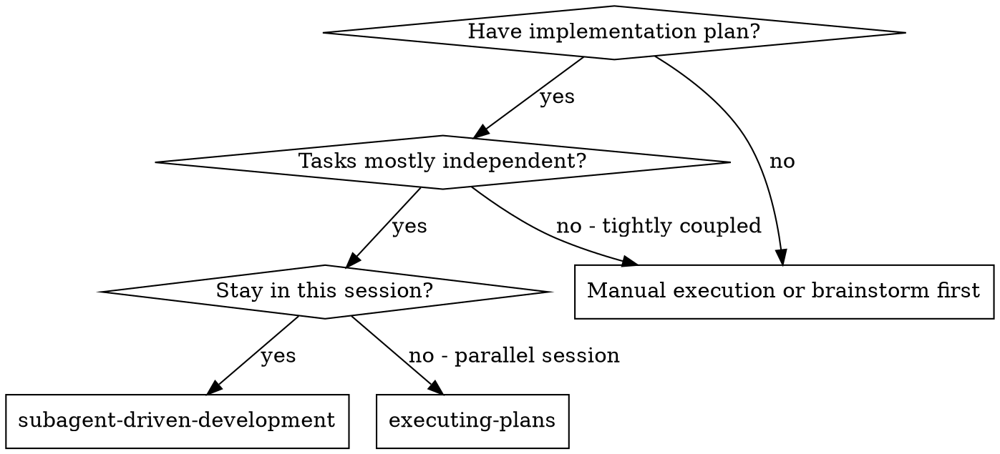
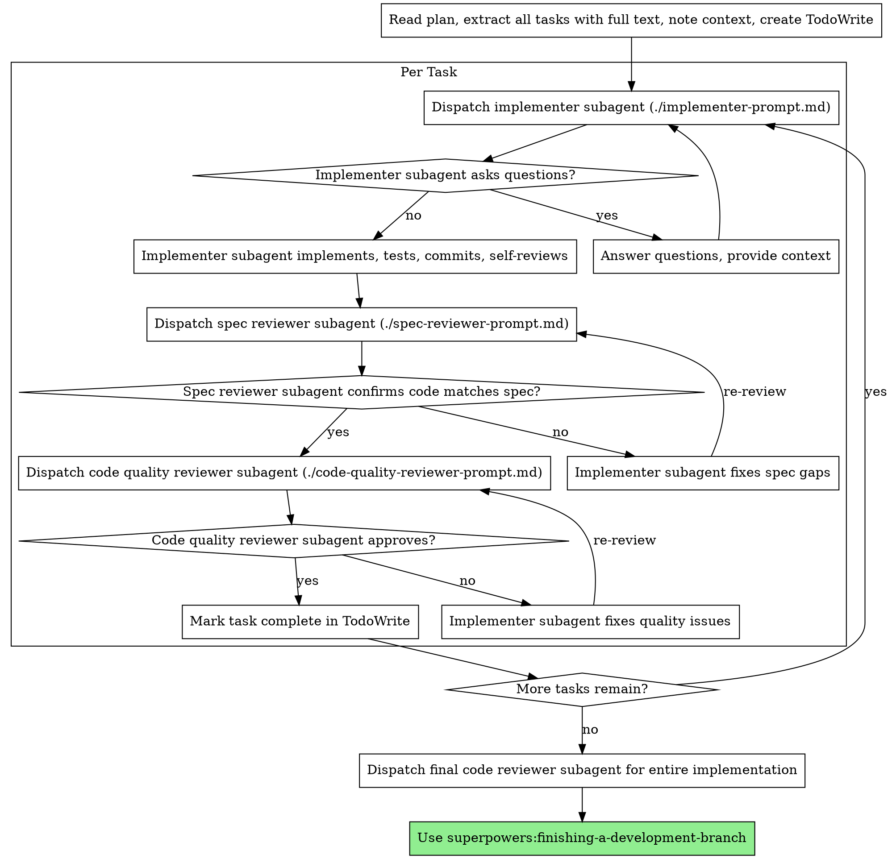
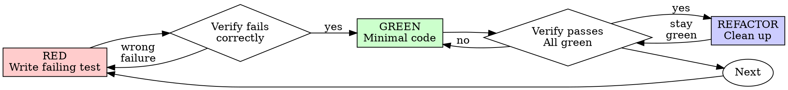

# Codex session 019f13a4-b080-77c0-b7ef-ab2be038edd0

- Started: `2026-06-29T13:49:53.047Z`
- Working directory: `D:\100XH100`
- Originator: `Codex Desktop`
- Codex CLI: `0.142.2`
- Source log: `C:\Users\Иван Литвак\.codex\sessions\2026\06\29\rollout-2026-06-29T16-49-53-019f13a4-b080-77c0-b7ef-ab2be038edd0.jsonl`
- Entries: user=4, assistant=91, tool calls=129, tool outputs=129

This is a chronological export of the user/assistant conversation and tool activity. Internal system/developer instructions and token accounting are intentionally excluded. Secret-shaped values are redacted; oversized tool outputs retain their beginning and end with the omitted character count.

## 1. User

Time: `2026-06-29T13:49:59.502Z` · source line `4`

```text
# AGENTS.md instructions for D:\100XH100

<INSTRUCTIONS>
# Project Agent Rules

## Operating Rule
- Read `AGENTS.md` before project edits.
- Update `memory/CHANGELOG.md` after meaningful code, config, or architecture changes.
- Update `memory/PROMPTS.md` with user prompts that define requirements.
- Store test outputs, logs, and verification notes under `test_results/`.
- Prefer agent-centered code: explicit contracts, deterministic tests, small files, low hidden state.

## Architecture Source
- Primary architecture contract: `ARCHITECTURE_NEED.md`.
- Current Stream 4 implementation rule: use threshold + compact + CUB/fixed-temp sort/reduce + compact; do not use Stream 4 hash-table dedup.

## Implementation Guardrails
- `State128` logical bytes are `v[0..119]`.
- `State128` padding bytes are `v[120..127]`.
- Persistent frontier padding must be zero.
- `FinalResponse` may temporarily store `target_local_idx` in `v[120..123]`.
- `Hash128` is one logical 128-bit key stored as `{lo, hi}`.
- `CandidateMeta` must remain 32 bytes and 32-byte aligned.
- Stream 3 payload id must be original candidate id, not compact index.
- Stream 4 must not apply shard top-k or semantic shard cap.

</INSTRUCTIONS>
<environment_context>
  <cwd>D:\100XH100</cwd>
  <shell>powershell</shell>
  <current_date>2026-06-29</current_date>
  <timezone>Europe/Moscow</timezone>
  <filesystem><workspace_roots><root>D:\100XH100</root></workspace_roots><permission_profile type="managed"><file_system type="restricted"><entry access="read"><special>:root</special></entry><entry access="write"><path>D:\100XH100</path></entry><entry access="write"><special>:slash_tmp</special></entry><entry access="write"><special>:tmpdir</special></entry><entry access="read"><path>D:\100XH100\.git</path></entry><entry access="read"><path>D:\100XH100\.agents</path></entry><entry access="read"><path>D:\100XH100\.codex</path></entry></file_system></permission_profile></filesystem>
</environment_context>
```

## 2. User

Time: `2026-06-29T13:49:59.532Z` · source line `6`

```text
You are Worker for Task 4 in a subagent-driven development flow. Fresh task; edit files directly in worktree `D:\100XH100\.worktrees\stream1-piece-transformer`. You are not alone in the codebase: do not revert unrelated changes and do not touch the untracked docs plan unless needed.

Read these files first:
- `AGENTS.md`
- `src/config.hpp`, `src/config.cpp`
- `tools/stream1_weight_io.hpp`
- `tools/export_stream1_transformer.py`
- `tests/contract_tests.cpp`
- `memory/CHANGELOG.md`, `memory/PROMPTS.md`

Task 4: Transformer weight loader and scratch arena, NO inference kernel yet.

Scope allowed:
- `src/config.hpp` / `src/config.cpp` if metadata helper needs it.
- `tools/stream1_weight_io.hpp` for host/device structures, manifest parsing, transformer tensor loading/upload/free/scratch allocation.
- `tests/contract_tests.cpp` and/or focused CPU tests for manifest/loading size checks. Do not require CUDA for basic manifest contract if avoidable.
- `memory/CHANGELOG.md`, `memory/PROMPTS.md`, `test_results/...`.

Hard constraints:
- NO fallback backend. If backend is unsupported, fail closed.
- Do NOT implement transformer CUDA forward yet.
- Do NOT wire production runner/dispatcher to execute transformer yet.
- Do NOT alter Stream3/Stream4 contracts, State128 semantics, or MLP behavior.
- Existing MLP loader and tests must continue to pass.
- Piece-transformer backend must parse after Task 1 fail-closed path: no longer throw merely because backend is piece_transformer. Instead validate exact manifest fields and load transformer files.
- Keep MLP and transformer branches explicit; avoid trying to make MLP fields mean transformer hidden sizes.

Required loader behavior:
1. Parse transformer manifest fields emitted by exporter:
   `backend`, `dtype`, `state_len`, `num_classes`, `output_dim`, `num_pieces`, `max_piece_size`, `seq_len`, `d_model`, `nhead`, `head_dim`, `num_layers` or `transformer_layers`, `ff_dim`, `activation`, `pooling`, `piece_layout`, `piece_embed_mode`.
2. Validate exact current transformer target:
   - backend=`piece_transformer`
   - state_len=STATE_LEN (120 for current Megaminx build)
   - num_classes=120
   - output_dim=MOVE_COUNT (24 for Megaminx)
   - num_pieces=50
   - max_piece_size=3
   - seq_len=51
   - d_model=256
   - nhead=8
   - head_dim=32
   - transformer_layers=4
   - ff_dim=1024
   - activation=`silu`
   - pooling=`cls`
   - piece_layout=`p900`
   - piece_embed_mode=`full_s120`
   - dtype fp16 or bf16.
3. Load all files exported by `tools/export_stream1_transformer.py` with exact byte sizes:
   - `fast_slot_projected{suffix}` shape [3,120,256]
   - `fast_piece_static{suffix}` [50,256]
   - `cls_token{suffix}` [256]
   - `input_ln_gamma/beta{suffix}` [256]
   - `output_ln_gamma/beta{suffix}` [256]
   - per block 0..3: ln1 gamma/beta [256], attn qkv weight [768,256], attn qkv bias [768], attn out weight [256,256], attn out bias [256], ln2 gamma/beta [256], ff1 weight [1024,256], ff1 bias [1024], ff2 weight [256,1024], ff2 bias [256]
   - output_weight_hxk [24,256], output_bias [24]
   - piece_positions.u16 [50,3], piece_mask.u8 [50,3], piece_types.u8 [50]
4. Add host byte containers and device pointer containers for these transformer tensors, plus upload/free. Use existing allocation/copy style. Device pointers should be typed appropriately: half* for fp16/bf16 byte tensors for now, uint16_t*/uint8_t* for layout tables if easier. Do not reinterpret as floats.
5. Add transformer scratch arena struct/allocation/free for one lane batch. It should reserve enough buffers for future forward without guessing huge extra buffers:
   - input/token activations [rows, seq_len, d_model]
   - qkv [rows, seq_len, 3*d_model]
   - attention scores/probs [rows, nhead, seq_len, seq_len] float or half? Choose explicit dtype and document. Since no kernel yet, be conservative and deterministic.
   - attention context [rows, seq_len, d_model]
   - ff hidden [rows, seq_len, ff_dim]
   - output logits [rows, output_dim]
   Prefer reusable buffers; do not allocate per-layer permanent activations.
6. Expose byte-count helper(s) so production logs can later report transformer host/device/scratch bytes.
7. Contract tests must cover:
   - piece-transformer manifest parses into metadata correctly (manifest-only mode should not need CUDA headers if possible).
   - wrong transformer constant rejects with clear error (at least one test, e.g. seq_len or output_dim).
   - MLP manifest parsing/loading behavior is not regressed.
   - If feasible without CUDA, fake tiny/sized files test that loader expects exact file sizes. You may generate minimal fake transformer weight dir in test temp.

Verification:
- Run focused tests that are available on Windows. At minimum direct MSVC `contract_tests.cpp` route used by Task 1 if CMake/CUDA unavailable.
- Run Python exporter unit tests again if your changes could affect manifest compatibility.
- Record commands/results in `test_results/stream1_transformer_loader_2026-06-29.md`.
- Update `memory/CHANGELOG.md`; update `memory/PROMPTS.md` with the user requirements around transformer backend/no fallback if not already captured.
- Commit your changes. Return DONE/DONE_WITH_CONCERNS with commit SHA, files changed, and verification.

If you think this task requires a different shape than specified, stop with NEEDS_CONTEXT; do not silently change architecture.
```

## 3. Codex

Time: `2026-06-29T13:50:12.350Z` · source line `9`

```text
I’ll use the subagent-driven development skill because this task is explicitly part of that workflow, then I’ll read the project rules and requested files from the target worktree before touching anything.
```

## 4. Tool call: `exec_command`

Time: `2026-06-29T13:50:13.998Z` · source line `11`

```text
{"cmd": "Get-Content -Raw 'C:\\Users\\Иван Литвак\\.codex\\plugins\\cache\\openai-curated-remote\\superpowers\\5.1.4\\skills\\subagent-driven-development\\SKILL.md'", "workdir": "D:\\100XH100", "yield_time_ms": 10000, "max_output_tokens": 20000}
```

## 5. Tool output

Time: `2026-06-29T13:50:14.550Z` · source line `12`

````text
Chunk ID: bbb9da
Wall time: 0.0520 seconds
Process exited with code 0
Original token count: 3148
Output:
---
name: subagent-driven-development
description: Use when executing implementation plans with independent tasks in the current session
---

# Subagent-Driven Development

Execute plan by dispatching fresh subagent per task, with two-stage review after each: spec compliance review first, then code quality review.

**Why subagents:** You delegate tasks to specialized agents with isolated context. By precisely crafting their instructions and context, you ensure they stay focused and succeed at their task. They should never inherit your session's context or history — you construct exactly what they need. This also preserves your own context for coordination work.

**Core principle:** Fresh subagent per task + two-stage review (spec then quality) = high quality, fast iteration

**Continuous execution:** Do not pause to check in with your human partner between tasks. Execute all tasks from the plan without stopping. The only reasons to stop are: BLOCKED status you cannot resolve, ambiguity that genuinely prevents progress, or all tasks complete. "Should I continue?" prompts and progress summaries waste their time — they asked you to execute the plan, so execute it.

## When to Use



**vs. Executing Plans (parallel session):**
- Same session (no context switch)
- Fresh subagent per task (no context pollution)
- Two-stage review after each task: spec compliance first, then code quality
- Faster iteration (no human-in-loop between tasks)

## The Process



## Model Selection

Use the least powerful model that can handle each role to conserve cost and increase speed.

**Mechanical implementation tasks** (isolated functions, clear specs, 1-2 files): use a fast, cheap model. Most implementation tasks are mechanical when the plan is well-specified.

**Integration and judgment tasks** (multi-file coordination, pattern matching, debugging): use a standard model.

**Architecture, design, and review tasks**: use the most capable available model.

**Task complexity signals:**
- Touches 1-2 files with a complete spec в†’ cheap model
- Touches multiple files with integration concerns в†’ standard model
- Requires design judgment or broad codebase understanding в†’ most capable model

## Handling Implementer Status

Implementer subagents report one of four statuses. Handle each appropriately:

**DONE:** Proceed to spec compliance review.

**DONE_WITH_CONCERNS:** The implementer completed the work but flagged doubts. Read the concerns before proceeding. If the concerns are about correctness or scope, address them before review. If they're observations (e.g., "this file is getting large"), note them and proceed to review.

**NEEDS_CONTEXT:** The implementer needs information that wasn't provided. Provide the missing context and re-dispatch.

**BLOCKED:** The implementer cannot complete the task. Assess the blocker:
1. If it's a context problem, provide more context and re-dispatch with the same model
2. If the task requires more reasoning, re-dispatch with a more capable model
3. If the task is too large, break it into smaller pieces
4. If the plan itself is wrong, escalate to the human

**Never** ignore an escalation or force the same model to retry without changes. If the implementer said it's stuck, something needs to change.

## Prompt Templates

- `./implementer-prompt.md` - Dispatch implementer subagent
- `./spec-reviewer-prompt.md` - Dispatch spec compliance reviewer subagent
- `./code-quality-reviewer-prompt.md` - Dispatch code quality reviewer subagent

## Example Workflow

```
You: I'm using Subagent-Driven Development to execute this plan.

[Read plan file once: docs/superpowers/plans/feature-plan.md]
[Extract all 5 tasks with full text and context]
[Create TodoWrite with all tasks]

Task 1: Hook installation script

[Get Task 1 text and context (already extracted)]
[Dispatch implementation subagent with full task text + context]

Implementer: "Before I begin - should the hook be installed at user or system level?"

You: "User level (~/.config/superpowers/hooks/)"

Implementer: "Got it. Implementing now..."
[Later] Implementer:
  - Implemented install-hook command
  - Added tests, 5/5 passing
  - Self-review: Found I missed --force flag, added it
  - Committed

[Dispatch spec compliance reviewer]
Spec reviewer: вњ… Spec compliant - all requirements met, nothing extra

[Get git SHAs, dispatch code quality reviewer]
Code reviewer: Strengths: Good test coverage, clean. Issues: None. Approved.

[Mark Task 1 complete]

Task 2: Recovery modes

[Get Task 2 text and context (already extracted)]
[Dispatch implementation subagent with full task text + context]

Implementer: [No questions, proceeds]
Implementer:
  - Added verify/repair modes
  - 8/8 tests passing
  - Self-review: All good
  - Committed

[Dispatch spec compliance reviewer]
Spec reviewer: вќЊ Issues:
  - Missing: Progress reporting (spec says "report every 100 items")
  - Extra: Added --json flag (not requested)

[Implementer fixes issues]
Implementer: Removed --json flag, added progress reporting

[Spec reviewer reviews again]
Spec reviewer: вњ… Spec compliant now

[Dispatch code quality reviewer]
Code reviewer: Strengths: Solid. Issues (Important): Magic number (100)

[Implementer fixes]
Implementer: Extracted PROGRESS_INTERVAL constant

[Code reviewer reviews again]
Code reviewer: вњ… Approved

[Mark Task 2 complete]

...

[After all tasks]
[Dispatch final code-reviewer]
Final reviewer: All requirements met, ready to merge

Done!
```

## Advantages

**vs. Manual execution:**
- Subagents follow TDD naturally
- Fresh context per task (no confusion)
- Parallel-safe (subagents don't interfere)
- Subagent can ask questions (before AND during work)

**vs. Executing Plans:**
- Same session (no handoff)
- Continuous progress (no waiting)
- Review checkpoints automatic

**Efficiency gains:**
- No file reading overhead (controller provides full text)
- Controller curates exactly what context is needed
- Subagent gets complete information upfront
- Questions surfaced before work begins (not after)

**Quality gates:**
- Self-review catches issues before handoff
- Two-stage review: spec compliance, then code quality
- Review loops ensure fixes actually work
- Spec compliance prevents over/under-building
- Code quality ensures implementation is well-built

**Cost:**
- More subagent invocations (implementer + 2 reviewers per task)
- Controller does more prep work (extracting all tasks upfront)
- Review loops add iterations
- But catches issues early (cheaper than debugging later)

## Red Flags

**Never:**
- Start implementation on main/master branch without explicit user consent
- Skip reviews (spec compliance OR code quality)
- Proceed with unfixed issues
- Dispatch multiple implementation subagents in parallel (conflicts)
- Make subagent read plan file (provide full text instead)
- Skip scene-setting context (subagent needs to understand where task fits)
- Ignore subagent questions (answer before letting them proceed)
- Accept "close enough" on spec compliance (spec reviewer found issues = not done)
- Skip review loops (reviewer found issues = implementer fixes = review again)
- Let implementer self-review replace actual review (both are needed)
- **Start code quality review before spec compliance is вњ…** (wrong order)
- Move to next task while either review has open issues

**If subagent asks questions:**
- Answer clearly and completely
- Provide additional context if needed
- Don't rush them into implementation

**If reviewer finds issues:**
- Implementer (same subagent) fixes them
- Reviewer reviews again
- Repeat until approved
- Don't skip the re-review

**If subagent fails task:**
- Dispatch fix subagent with specific instructions
- Don't try to fix manually (context pollution)

## Integration

**Required workflow skills:**
- **superpowers:using-git-worktrees** - Ensures isolated workspace (creates one or verifies existing)
- **superpowers:writing-plans** - Creates the plan this skill executes
- **superpowers:requesting-code-review** - Code review template for reviewer subagents
- **superpowers:finishing-a-development-branch** - Complete development after all tasks

**Subagents should use:**
- **superpowers:test-driven-development** - Subagents follow TDD for each task

**Alternative workflow:**
- **superpowers:executing-plans** - Use for parallel session instead of same-session execution


````

## 6. Codex

Time: `2026-06-29T13:50:23.667Z` · source line `15`

```text
I’m treating this turn as the worker implementation itself, not the coordinator loop, because your prompt assigns Task 4 directly to me. I’ll still keep the same discipline: contract tests first where practical, scoped implementation, then verification and commit.
```

## 7. Codex

Time: `2026-06-29T13:50:23.675Z` · source line `16`

```text
I’m treating this turn as the worker implementation itself, not the coordinator loop, because your prompt assigns Task 4 directly to me. I’ll still keep the same discipline: contract tests first where practical, scoped implementation, then verification and commit.
```

## 8. Tool call: `exec_command`

Time: `2026-06-29T13:50:23.681Z` · source line `17`

```text
{"cmd":"Get-Content -Raw 'C:\\Users\\Иван Литвак\\.codex\\plugins\\cache\\openai-curated-remote\\superpowers\\5.1.4\\skills\\test-driven-development\\SKILL.md'","workdir":"D:\\100XH100","yield_time_ms":10000,"max_output_tokens":12000}
```

## 9. Tool call: `exec_command`

Time: `2026-06-29T13:50:23.978Z` · source line `18`

```text
{"cmd":"Select-String -Path 'C:\\Users\\Иван Литвак\\.codex\\memories\\MEMORY.md' -Pattern 'BEAM_PREBUILT_RUNNER|stream1|piece_transformer|stream1_weight|D:\\\\100XH100' -Context 2,2","workdir":"D:\\100XH100","yield_time_ms":10000,"max_output_tokens":12000}
```

## 10. Tool output

Time: `2026-06-29T13:50:24.417Z` · source line `19`

````text
Chunk ID: f6b055
Wall time: 0.1122 seconds
Process exited with code 0
Original token count: 2473
Output:
---
name: test-driven-development
description: Use when implementing any feature or bugfix, before writing implementation code
---

# Test-Driven Development (TDD)

## Overview

Write the test first. Watch it fail. Write minimal code to pass.

**Core principle:** If you didn't watch the test fail, you don't know if it tests the right thing.

**Violating the letter of the rules is violating the spirit of the rules.**

## When to Use

**Always:**
- New features
- Bug fixes
- Refactoring
- Behavior changes

**Exceptions (ask your human partner):**
- Throwaway prototypes
- Generated code
- Configuration files

Thinking "skip TDD just this once"? Stop. That's rationalization.

## The Iron Law

```
NO PRODUCTION CODE WITHOUT A FAILING TEST FIRST
```

Write code before the test? Delete it. Start over.

**No exceptions:**
- Don't keep it as "reference"
- Don't "adapt" it while writing tests
- Don't look at it
- Delete means delete

Implement fresh from tests. Period.

## Red-Green-Refactor



### RED - Write Failing Test

Write one minimal test showing what should happen.

<Good>
```typescript
test('retries failed operations 3 times', async () => {
  let attempts = 0;
  const operation = () => {
    attempts++;
    if (attempts < 3) throw new Error('fail');
    return 'success';
  };

  const result = await retryOperation(operation);

  expect(result).toBe('success');
  expect(attempts).toBe(3);
});
```
Clear name, tests real behavior, one thing
</Good>

<Bad>
```typescript
test('retry works', async () => {
  const mock = jest.fn()
    .mockRejectedValueOnce(new Error())
    .mockRejectedValueOnce(new Error())
    .mockResolvedValueOnce('success');
  await retryOperation(mock);
  expect(mock).toHaveBeenCalledTimes(3);
});
```
Vague name, tests mock not code
</Bad>

**Requirements:**
- One behavior
- Clear name
- Real code (no mocks unless unavoidable)

### Verify RED - Watch It Fail

**MANDATORY. Never skip.**

```bash
npm test path/to/test.test.ts
```

Confirm:
- Test fails (not errors)
- Failure message is expected
- Fails because feature missing (not typos)

**Test passes?** You're testing existing behavior. Fix test.

**Test errors?** Fix error, re-run until it fails correctly.

### GREEN - Minimal Code

Write simplest code to pass the test.

<Good>
```typescript
async function retryOperation<T>(fn: () => Promise<T>): Promise<T> {
  for (let i = 0; i < 3; i++) {
    try {
      return await fn();
    } catch (e) {
      if (i === 2) throw e;
    }
  }
  throw new Error('unreachable');
}
```
Just enough to pass
</Good>

<Bad>
```typescript
async function retryOperation<T>(
  fn: () => Promise<T>,
  options?: {
    maxRetries?: number;
    backoff?: 'linear' | 'exponential';
    onRetry?: (attempt: number) => void;
  }
): Promise<T> {
  // YAGNI
}
```
Over-engineered
</Bad>

Don't add features, refactor other code, or "improve" beyond the test.

### Verify GREEN - Watch It Pass

**MANDATORY.**

```bash
npm test path/to/test.test.ts
```

Confirm:
- Test passes
- Other tests still pass
- Output pristine (no errors, warnings)

**Test fails?** Fix code, not test.

**Other tests fail?** Fix now.

### REFACTOR - Clean Up

After green only:
- Remove duplication
- Improve names
- Extract helpers

Keep tests green. Don't add behavior.

### Repeat

Next failing test for next feature.

## Good Tests

| Quality | Good | Bad |
|---------|------|-----|
| **Minimal** | One thing. "and" in name? Split it. | `test('validates email and domain and whitespace')` |
| **Clear** | Name describes behavior | `test('test1')` |
| **Shows intent** | Demonstrates desired API | Obscures what code should do |

## Why Order Matters

**"I'll write tests after to verify it works"**

Tests written after code pass immediately. Passing immediately proves nothing:
- Might test wrong thing
- Might test implementation, not behavior
- Might miss edge cases you forgot
- You never saw it catch the bug

Test-first forces you to see the test fail, proving it actually tests something.

**"I already manually tested all the edge cases"**

Manual testing is ad-hoc. You think you tested everything but:
- No record of what you tested
- Can't re-run when code changes
- Easy to forget cases under pressure
- "It worked when I tried it" в‰  comprehensive

Automated tests are systematic. They run the same way every time.

**"Deleting X hours of work is wasteful"**

Sunk cost fallacy. The time is already gone. Your choice now:
- Delete and rewrite with TDD (X more hours, high confidence)
- Keep it and add tests after (30 min, low confidence, likely bugs)

The "waste" is keeping code you can't trust. Working code without real tests is technical debt.

**"TDD is dogmatic, being pragmatic means adapting"**

TDD IS pragmatic:
- Finds bugs before commit (faster than debugging after)
- Prevents regressions (tests catch breaks immediately)
- Documents behavior (tests show how to use code)
- Enables refactoring (change freely, tests catch breaks)

"Pragmatic" shortcuts = debugging in production = slower.

**"Tests after achieve the same goals - it's spirit not ritual"**

No. Tests-after answer "What does this do?" Tests-first answer "What should this do?"

Tests-after are biased by your implementation. You test what you built, not what's required. You verify remembered edge cases, not discovered ones.

Tests-first force edge case discovery before implementing. Tests-after verify you remembered everything (you didn't).

30 minutes of tests after в‰  TDD. You get coverage, lose proof tests work.

## Common Rationalizations

| Excuse | Reality |
|--------|---------|
| "Too simple to test" | Simple code breaks. Test takes 30 seconds. |
| "I'll test after" | Tests passing immediately prove nothing. |
| "Tests after achieve same goals" | Tests-after = "what does this do?" Tests-first = "what should this do?" |
| "Already manually tested" | Ad-hoc в‰  systematic. No record, can't re-run. |
| "Deleting X hours is wasteful" | Sunk cost fallacy. Keeping unverified code is technical debt. |
| "Keep as reference, write tests first" | You'll adapt it. That's testing after. Delete means delete. |
| "Need to explore first" | Fine. Throw away exploration, start with TDD. |
| "Test hard = design unclear" | Listen to test. Hard to test = hard to use. |
| "TDD will slow me down" | TDD faster than debugging. Pragmatic = test-first. |
| "Manual test faster" | Manual doesn't prove edge cases. You'll re-test every change. |
| "Existing code has no tests" | You're improving it. Add tests for existing code. |

## Red Flags - STOP and Start Over

- Code before test
- Test after implementation
- Test passes immediately
- Can't explain why test failed
- Tests added "later"
- Rationalizing "just this once"
- "I already manually tested it"
- "Tests after achieve the same purpose"
- "It's about spirit not ritual"
- "Keep as reference" or "adapt existing code"
- "Already spent X hours, deleting is wasteful"
- "TDD is dogmatic, I'm being pragmatic"
- "This is different because..."

**All of these mean: Delete code. Start over with TDD.**

## Example: Bug Fix

**Bug:** Empty email accepted

**RED**
```typescript
test('rejects empty email', async () => {
  const result = await submitForm({ email: '' });
  expect(result.error).toBe('Email required');
});
```

**Verify RED**
```bash
$ npm test
FAIL: expected 'Email required', got undefined
```

**GREEN**
```typescript
function submitForm(data: FormData) {
  if (!data.email?.trim()) {
    return { error: 'Email required' };
  }
  // ...
}
```

**Verify GREEN**
```bash
$ npm test
PASS
```

**REFACTOR**
Extract validation for multiple fields if needed.

## Verification Checklist

Before marking work complete:

- [ ] Every new function/method has a test
- [ ] Watched each test fail before implementing
- [ ] Each test failed for expected reason (feature missing, not typo)
- [ ] Wrote minimal code to pass each test
- [ ] All tests pass
- [ ] Output pristine (no errors, warnings)
- [ ] Tests use real code (mocks only if unavoidable)
- [ ] Edge cases and errors covered

Can't check all boxes? You skipped TDD. Start over.

## When Stuck

| Problem | Solution |
|---------|----------|
| Don't know how to test | Write wished-for API. Write assertion first. Ask your human partner. |
| Test too complicated | Design too complicated. Simplify interface. |
| Must mock everything | Code too coupled. Use dependency injection. |
| Test setup huge | Extract helpers. Still complex? Simplify design. |

## Debugging Integration

Bug found? Write failing test reproducing it. Follow TDD cycle. Test proves fix and prevents regression.

Never fix bugs without a test.

## Testing Anti-Patterns

When adding mocks or test utilities, read @testing-anti-patterns.md to avoid common pitfalls:
- Testing mock behavior instead of real behavior
- Adding test-only methods to production classes
- Mocking without understanding dependencies

## Final Rule

```
Production code в†’ test exists and failed first
Otherwise в†’ not TDD
```

No exceptions without your human partner's permission.


````

## 11. Tool output

Time: `2026-06-29T13:50:24.789Z` · source line `20`

```text
Chunk ID: 17da45
Wall time: 0.4596 seconds
Process exited with code 0
Original token count: 1574
Output:

  C:\Users\Иван Литвак\.codex\memories\MEMORY.md:46:# Task Group: MEPhI IHES cluster publishing, shared prebuilt runner
, and inventory-driven backfill
  C:\Users\Иван Литвак\.codex\memories\MEMORY.md:47:scope: Running the IHES MEPhI cluster workflow with one shared preb
uilt `production_runner`, publishing solved puzzles into a dedicated GitHub results repo, and aggregating mixed cluster
 artifacts from on-cluster inventories.
> C:\Users\Иван Литвак\.codex\memories\MEMORY.md:48:applies_to: cwd=D:\100XH100; reuse_rule=reuse for this IHES/MEPhI r
epo family and adjacent cluster publish jobs, but treat live cluster inventory, DNS availability, and current results-r
epo schema as run-specific and recheck them before publishing.
  C:\Users\Иван Литвак\.codex\memories\MEMORY.md:49:
  C:\Users\Иван Литвак\.codex\memories\MEMORY.md:50:## Task 1: Launch IHES array jobs against one shared prebuilt runne
r, outcome success
  C:\Users\Иван Литвак\.codex\memories\MEMORY.md:52:### rollout_summary_files
  C:\Users\Иван Литвак\.codex\memories\MEMORY.md:53:
> C:\Users\Иван Литвак\.codex\memories\MEMORY.md:54:- rollout_summaries/2026-06-04T15-47-52-Dd1O-ihes_cluster_results_p
rebuilt_publish_backfill.md (cwd=\\?\D:\100XH100, rollout_path=\\?\C:\Users\Иван Литвак\.codex\sessions\2026\06\04\roll
out-2026-06-04T18-47-57-019e9351-cd3b-71c0-bf8b-69755d08d5fc.jsonl, updated_at=2026-06-26T19:51:22+00:00, thread_id=019
e9351-cd3b-71c0-bf8b-69755d08d5fc, the prebuilt runner was compiled once and reused across the A100 array workflow)
  C:\Users\Иван Литвак\.codex\memories\MEMORY.md:55:
  C:\Users\Иван Литвак\.codex\memories\MEMORY.md:56:### keywords
  C:\Users\Иван Литвак\.codex\memories\MEMORY.md:57:
> C:\Users\Иван Литвак\.codex\memories\MEMORY.md:58:- MEPhI HPC, kaf12, A100 40GB, BEAM_PREBUILT_RUNNER, prepare_ihes_p
rebuilt_runner.sh, ihes_solve_bucket_from_scratch.sh, prebuilt_runner_ready, using_prebuilt_runner, PUZZLE_LIMIT=1, dep
th=12
  C:\Users\Иван Литвак\.codex\memories\MEMORY.md:59:
  C:\Users\Иван Литвак\.codex\memories\MEMORY.md:60:## Task 2: Publish per-puzzle IHES results and backfill existing bu
cket outputs into the GitHub results repo, outcome success
  C:\Users\Иван Литвак\.codex\memories\MEMORY.md:62:### rollout_summary_files
  C:\Users\Иван Литвак\.codex\memories\MEMORY.md:63:
> C:\Users\Иван Литвак\.codex\memories\MEMORY.md:64:- rollout_summaries/2026-06-04T15-47-52-Dd1O-ihes_cluster_results_p
rebuilt_publish_backfill.md (cwd=\\?\D:\100XH100, rollout_path=\\?\C:\Users\Иван Литвак\.codex\sessions\2026\06\04\roll
out-2026-06-04T18-47-57-019e9351-cd3b-71c0-bf8b-69755d08d5fc.jsonl, updated_at=2026-06-26T19:51:22+00:00, thread_id=019
e9351-cd3b-71c0-bf8b-69755d08d5fc, the results repo structure and first backfilled puzzle sets were established)
  C:\Users\Иван Литвак\.codex\memories\MEMORY.md:65:
  C:\Users\Иван Литвак\.codex\memories\MEMORY.md:66:### keywords
  C:\Users\Иван Литвак\.codex\memories\MEMORY.md:72:### rollout_summary_files
  C:\Users\Иван Литвак\.codex\memories\MEMORY.md:73:
> C:\Users\Иван Литвак\.codex\memories\MEMORY.md:74:- rollout_summaries/2026-06-04T15-47-52-Dd1O-ihes_cluster_results_p
rebuilt_publish_backfill.md (cwd=\\?\D:\100XH100, rollout_path=\\?\C:\Users\Иван Литвак\.codex\sessions\2026\06\04\roll
out-2026-06-04T18-47-57-019e9351-cd3b-71c0-bf8b-69755d08d5fc.jsonl, updated_at=2026-06-26T19:51:22+00:00, thread_id=019
e9351-cd3b-71c0-bf8b-69755d08d5fc, a file-driven inventory plus schema fixes made the larger aggregator path workable)
  C:\Users\Иван Литвак\.codex\memories\MEMORY.md:75:
  C:\Users\Иван Литвак\.codex\memories\MEMORY.md:76:### keywords
  C:\Users\Иван Литвак\.codex\memories\MEMORY.md:87:## Reusable knowledge
  C:\Users\Иван Литвак\.codex\memories\MEMORY.md:88:
> C:\Users\Иван Литвак\.codex\memories\MEMORY.md:89:- `hpc/ihes_cube_model/prepare_ihes_prebuilt_runner.sh` builds the 
shared binary at `/mnt/pool/6/vokirova/beam8a100/ihes_cube_model/prebuilt-a100-ihes/production_runner`, and `hpc/ihes_c
ube_model/ihes_solve_bucket_from_scratch.sh` already knows how to consume `BEAM_PREBUILT_RUNNER` [Task 1]
  C:\Users\Иван Литвак\.codex\memories\MEMORY.md:90:- the verified runtime on basis exposed `world_size_effective=8`, `
NCCL 2.21.5+cuda12.4`, and eight visible A100-40GB GPUs, so the prebuilt-runner path was validated on the actual target
 hardware [Task 1]
  C:\Users\Иван Литвак\.codex\memories\MEMORY.md:91:- the durable results layout is `data/ihes_cube/puzzles/pXXXX/solut
ions.tsv`, `unique_solutions.tsv`, `metadata.env`, `summary.md`, plus root-level `index.tsv` and `improvements.tsv`; no
n-full-solution repair artifacts belong under separate `repair_segments/` trees [Task 2]
  C:\Users\Иван Литвак\.codex\memories\MEMORY.md:95:## Failures and how to do differently
  C:\Users\Иван Литвак\.codex\memories\MEMORY.md:96:
> C:\Users\Иван Литвак\.codex\memories\MEMORY.md:97:- symptom: each array task recompiles instead of reusing the solver
. cause: `BEAM_PREBUILT_RUNNER` was not wired through a separate prebuild dependency. fix: submit the prebuild first an
d make the puzzle array depend on it via `--dependency=afterok:<prebuild_job>` [Task 1]
  C:\Users\Иван Литвак\.codex\memories\MEMORY.md:98:- symptom: cluster-side publish fails after compute succeeds. cause
: the compute node cannot resolve `github.com` or otherwise lacks GitHub network access. fix: tolerate cluster-side pus
h failure and leave local commits/results ready for later push from a node with working DNS/network [Task 2]
  C:\Users\Иван Литвак\.codex\memories\MEMORY.md:99:- symptom: the backfill/index writer crashes on old rows. cause: me
tadata rows carried extra keys such as `variants` and `source_files` that were not declared in the index schema. fix: w
iden the declared schema and filter outgoing rows to declared fields before writing [Task 2][Task 3]


```

## 12. Codex

Time: `2026-06-29T13:50:34.008Z` · source line `23`

```text
I only found broad D:\100XH100 memory, not specific transformer-loader history. I’m now reading the target files and checking the worktree state so edits stay scoped and don’t trample unrelated changes.
```

## 13. Codex

Time: `2026-06-29T13:50:34.019Z` · source line `24`

```text
I only found broad D:\100XH100 memory, not specific transformer-loader history. I’m now reading the target files and checking the worktree state so edits stay scoped and don’t trample unrelated changes.
```

## 14. Tool call: `exec_command`

Time: `2026-06-29T13:50:34.019Z` · source line `25`

```text
{"cmd":"Get-Content -Raw 'AGENTS.md'","workdir":"D:\\100XH100\\.worktrees\\stream1-piece-transformer","yield_time_ms":10000,"max_output_tokens":12000}
```

## 15. Tool call: `exec_command`

Time: `2026-06-29T13:50:34.019Z` · source line `26`

```text
{"cmd":"Get-Content -Raw 'src\\config.hpp'","workdir":"D:\\100XH100\\.worktrees\\stream1-piece-transformer","yield_time_ms":10000,"max_output_tokens":16000}
```

## 16. Tool call: `exec_command`

Time: `2026-06-29T13:50:34.021Z` · source line `27`

```text
{"cmd":"Get-Content -Raw 'src\\config.cpp'","workdir":"D:\\100XH100\\.worktrees\\stream1-piece-transformer","yield_time_ms":10000,"max_output_tokens":16000}
```

## 17. Tool call: `exec_command`

Time: `2026-06-29T13:50:34.022Z` · source line `28`

```text
{"cmd":"git status --short","workdir":"D:\\100XH100\\.worktrees\\stream1-piece-transformer","yield_time_ms":10000,"max_output_tokens":12000}
```

## 18. Tool output

Time: `2026-06-29T13:50:34.833Z` · source line `29`

```text
Chunk ID: 8e1b2b
Wall time: 0.1034 seconds
Process exited with code 0
Original token count: 285
Output:
# Project Agent Rules

## Operating Rule
- Read `AGENTS.md` before project edits.
- Update `memory/CHANGELOG.md` after meaningful code, config, or architecture changes.
- Update `memory/PROMPTS.md` with user prompts that define requirements.
- Store test outputs, logs, and verification notes under `test_results/`.
- Prefer agent-centered code: explicit contracts, deterministic tests, small files, low hidden state.

## Architecture Source
- Primary architecture contract: `ARCHITECTURE_NEED.md`.
- Current Stream 4 implementation rule: use threshold + compact + CUB/fixed-temp sort/reduce + compact; do not use Stream 4 hash-table dedup.

## Implementation Guardrails
- `State128` logical bytes are `v[0..119]`.
- `State128` padding bytes are `v[120..127]`.
- Persistent frontier padding must be zero.
- `FinalResponse` may temporarily store `target_local_idx` in `v[120..123]`.
- `Hash128` is one logical 128-bit key stored as `{lo, hi}`.
- `CandidateMeta` must remain 32 bytes and 32-byte aligned.
- Stream 3 payload id must be original candidate id, not compact index.
- Stream 4 must not apply shard top-k or semantic shard cap.


```

## 19. Tool output

Time: `2026-06-29T13:50:34.861Z` · source line `30`

```text
Chunk ID: a81648
Wall time: 0.1095 seconds
Process exited with code 0
Original token count: 1110
Output:
#pragma once

#include <cstddef>
#include <cstdint>
#include <limits>

namespace beam {

inline constexpr std::size_t STATE_LEN = BEAM_STATE_LOGICAL_BYTES;
inline constexpr std::size_t STATE_STORAGE_LEN = BEAM_STATE_PHYSICAL_BYTES;
inline constexpr std::size_t STATE_ALIGNMENT = BEAM_STATE_ALIGNMENT;
inline constexpr std::size_t STATE_VALUE_PAD = 128;
inline constexpr std::size_t MOVE_COUNT = BEAM_MOVE_COUNT;
inline constexpr std::size_t FINAL_RESPONSE_TARGET_LOCAL_IDX_OFFSET = STATE_LEN;
static_assert(STATE_LEN > 0);
static_assert(MOVE_COUNT > 0);
static_assert(MOVE_COUNT <= 255);
static_assert(STATE_STORAGE_LEN >= STATE_LEN);
static_assert(STATE_ALIGNMENT == 16 || STATE_ALIGNMENT == 32 || STATE_ALIGNMENT == 64);
static_assert(STATE_STORAGE_LEN % STATE_ALIGNMENT == 0);
static_assert(STATE_STORAGE_LEN >= STATE_LEN + sizeof(std::uint32_t), "FinalResponse requires 4 padding bytes");
static_assert(STATE_VALUE_PAD <= 256);
inline constexpr std::uint32_t STREAM1_SINGLE_SCORE_OUTPUT_DIM = 1;
inline constexpr std::uint32_t STREAM1_BACKEND_MLP = 0;
inline constexpr std::uint32_t STREAM1_BACKEND_PIECE_TRANSFORMER = 1;
inline constexpr std::uint32_t STREAM1_DTYPE_FP16 = 0;
inline constexpr std::uint32_t STREAM1_DTYPE_BF16 = 1;
inline constexpr std::uint32_t STREAM1_NORM_NONE = 0;
inline constexpr std::uint32_t STREAM1_NORM_LAYERNORM = 1;
inline constexpr float STREAM1_SINGLE_OUTPUT_SCORE_OFFSET = 3.0f;

inline constexpr float SCORE_MAX_Q = 300.0f;
inline constexpr std::uint32_t SCORE_SCALE = 1024;
inline constexpr std::uint32_t SCORE_MAX_KEY = static_cast<std::uint32_t>(SCORE_MAX_Q) * SCORE_SCALE;
inline constexpr std::uint32_t SCORE_BIN_COUNT = SCORE_MAX_KEY + 1;
inline constexpr std::uint32_t GOAL_SCORE_KEY = 0;
inline constexpr std::uint32_t UINT32_THRESHOLD_MAX = std::numeric_limits<std::uint32_t>::max();

struct Stream1ModelConfig {
    std::uint32_t backend = STREAM1_BACKEND_MLP;
    std::uint32_t state_len = static_cast<std::uint32_t>(STATE_LEN);
    std::uint32_t num_classes = static_cast<std::uint32_t>(STATE_LEN);
    std::uint32_t hidden1 = 1536;
    std::uint32_t hidden2 = 512;
    std::uint32_t residual_count = 2;
    std::uint32_t output_dim = static_cast<std::uint32_t>(MOVE_COUNT);
    std::uint32_t dtype = STREAM1_DTYPE_FP16;
    std::uint32_t normalization = STREAM1_NORM_NONE;
    std::uint32_t num_pieces = 0;
    std::uint32_t max_piece_size = 0;
    std::uint32_t seq_len = 0;
    std::uint32_t d_model = 0;
    std::uint32_t nhead = 0;
    std::uint32_t head_dim = 0;
    std::uint32_t transformer_layers = 0;
    std::uint32_t ff_dim = 0;
};

struct RuntimeConfig {
    std::uint32_t b_micro = 256;
    std::uint32_t inference_parallelism = 1;
    std::uint32_t stream3_batch_candidates = 256 * static_cast<std::uint32_t>(MOVE_COUNT);
    std::uint32_t stream4_batch_candidates = 65536;
    std::uint32_t stream4_trigger_candidates = 65536;
    std::uint32_t stream4_batch_alignment = 1024;
    std::uint32_t stream4_active_sort_slots = 1;
    std::uint32_t ring_count = 4;
    std::uint32_t world_size = 1;
    std::uint32_t local_rank = 0;
    std::uint32_t shard_count = 64;
    std::uint32_t shard_buffer_count = 2;
    std::uint32_t shard_capacity_candidates = 131072;
    std::uint32_t shard_capacity_scale_ppm = 1'250'000;
    std::uint32_t global_spill_capacity = 1 << 20;
    std::uint32_t global_spill_scale_ppm = 2'000'000;
    std::uint32_t stream5_recv_capacity_scale_ppm = 2'000'000;
    std::uint32_t final_materialize_chunk_candidates = 0;
    std::uint32_t final_materialize_exchange_scale_ppm = 2'000'000;
    std::uint64_t user_global_beam_width = 1'000'000;
    std::uint32_t global_threshold_update_period_shards = 64;
    std::uint32_t solved_result_capacity = 1024;
};

struct DerivedConfig {
    std::uint32_t ring_slot_count = 0;
    std::uint64_t beam_width_alignment = 0;
    std::uint64_t global_beam_width_effective = 0;
};

bool stream1_uses_child_rows(const Stream1ModelConfig& model);
std::uint32_t stream1_rows_per_parent(const Stream1ModelConfig& model);
std::uint32_t stream1_parent_batch_from_row_budget(std::uint32_t row_budget, const Stream1ModelConfig& model);
std::uint64_t stream1_inference_rows(std::uint32_t parent_batch, const Stream1ModelConfig& model);
std::uint64_t round_up(std::uint64_t value, std::uint64_t alignment);
DerivedConfig derive_config(const RuntimeConfig& config);
std::uint32_t q_to_score_key(float q);

} // namespace beam


```

## 20. Tool output

Time: `2026-06-29T13:50:34.862Z` · source line `31`

```text
Chunk ID: 618fc1
Wall time: 0.1029 seconds
Process exited with code 0
Original token count: 679
Output:
#include "config.hpp"

#include <algorithm>
#include <cmath>
#include <stdexcept>

namespace beam {

bool stream1_uses_child_rows(const Stream1ModelConfig& model) {
    switch (model.backend) {
    case STREAM1_BACKEND_MLP:
        return model.output_dim == STREAM1_SINGLE_SCORE_OUTPUT_DIM;
    case STREAM1_BACKEND_PIECE_TRANSFORMER:
        return false;
    default:
        throw std::invalid_argument("unsupported Stream1 backend");
    }
}

std::uint32_t stream1_rows_per_parent(const Stream1ModelConfig& model) {
    return stream1_uses_child_rows(model) ? static_cast<std::uint32_t>(MOVE_COUNT) : 1U;
}

std::uint32_t stream1_parent_batch_from_row_budget(std::uint32_t row_budget, const Stream1ModelConfig& model) {
    const std::uint32_t rows_per_parent = stream1_rows_per_parent(model);
    if (row_budget < rows_per_parent) {
        throw std::invalid_argument("BEAM_B_MICRO row budget is smaller than one Stream1 parent expansion");
    }
    return row_budget / rows_per_parent;
}

std::uint64_t stream1_inference_rows(std::uint32_t parent_batch, const Stream1ModelConfig& model) {
    return static_cast<std::uint64_t>(parent_batch) * stream1_rows_per_parent(model);
}

std::uint64_t round_up(std::uint64_t value, std::uint64_t alignment) {
    if (alignment == 0) {
        return value;
    }
    const std::uint64_t remainder = value % alignment;
    return remainder == 0 ? value : value + alignment - remainder;
}

DerivedConfig derive_config(const RuntimeConfig& config) {
    DerivedConfig derived;
    const std::uint32_t candidates_per_slot = config.b_micro * static_cast<std::uint32_t>(MOVE_COUNT);
    if (candidates_per_slot == 0U || config.stream3_batch_candidates % candidates_per_slot != 0U) {
        throw std::invalid_argument("STREAM3_BATCH_CANDIDATES must be divisible by B_MICRO * MOVE_COUNT");
    }
    derived.ring_slot_count = config.stream3_batch_candidates / candidates_per_slot;
    if (config.inference_parallelism == 0U ||
        config.inference_parallelism > derived.ring_slot_count) {
        throw std::invalid_argument("STREAM1_CONCURRENCY must be in [1, RING_SLOT_COUNT]");
    }
    derived.beam_width_alignment =
        static_cast<std::uint64_t>(config.world_size) *
        static_cast<std::uint64_t>(config.shard_count) *
        static_cast<std::uint64_t>(config.stream4_batch_alignment);
    derived.global_beam_width_effective = round_up(config.user_global_beam_width, derived.beam_width_alignment);
    return derived;
}

std::uint32_t q_to_score_key(float q) {
    const float clamped = std::min(std::max(q, 0.0f), SCORE_MAX_Q);
    return static_cast<std::uint32_t>(std::lround(clamped * static_cast<float>(SCORE_SCALE)));
}

} // namespace beam


```

## 21. Tool output

Time: `2026-06-29T13:50:34.862Z` · source line `32`

```text
Chunk ID: 6b4129
Wall time: 0.1250 seconds
Process exited with code 0
Original token count: 3
Output:
?? docs/

```

## 22. Codex

Time: `2026-06-29T13:50:44.820Z` · source line `35`

```text
The worktree has only an untracked `docs/` entry so far; I’ll leave that alone. The config already has transformer metadata fields and fail-closed backend helpers, so I’m checking the weight I/O and existing contract-test shape next.
```

## 23. Tool call: `exec_command`

Time: `2026-06-29T13:50:44.839Z` · source line `37`

```text
{"cmd":"Get-Content -Raw 'tools\\stream1_weight_io.hpp'","workdir":"D:\\100XH100\\.worktrees\\stream1-piece-transformer","yield_time_ms":10000,"max_output_tokens":40000}
```

## 24. Tool call: `exec_command`

Time: `2026-06-29T13:50:44.839Z` · source line `38`

```text
{"cmd":"Get-Content -Raw 'tools\\export_stream1_transformer.py'","workdir":"D:\\100XH100\\.worktrees\\stream1-piece-transformer","yield_time_ms":10000,"max_output_tokens":30000}
```

## 25. Tool call: `exec_command`

Time: `2026-06-29T13:50:44.842Z` · source line `39`

```text
{"cmd":"Get-Content -Raw 'tests\\contract_tests.cpp'","workdir":"D:\\100XH100\\.worktrees\\stream1-piece-transformer","yield_time_ms":10000,"max_output_tokens":40000}
```

## 26. Tool call: `exec_command`

Time: `2026-06-29T13:50:44.880Z` · source line `40`

```text
{"cmd":"Get-Content -Raw 'memory\\CHANGELOG.md'","workdir":"D:\\100XH100\\.worktrees\\stream1-piece-transformer","yield_time_ms":10000,"max_output_tokens":16000}
```

## 27. Tool call: `exec_command`

Time: `2026-06-29T13:50:44.904Z` · source line `41`

```text
{"cmd":"Get-Content -Raw 'memory\\PROMPTS.md'","workdir":"D:\\100XH100\\.worktrees\\stream1-piece-transformer","yield_time_ms":10000,"max_output_tokens":16000}
```

## 28. Tool output

Time: `2026-06-29T13:50:45.314Z` · source line `42`

```text
Chunk ID: 5437fa
Wall time: 0.2307 seconds
Process exited with code 0
Original token count: 5981
Output:
#pragma once

#include "../src/config.hpp"

#ifndef BEAM_STREAM1_WEIGHT_IO_MANIFEST_ONLY
#include "cuda_check.hpp"
#include "../cuda/stream1.hpp"

#include <cuda_fp16.h>
#include <cuda_runtime.h>
#endif

#include <cstddef>
#include <cstdint>
#include <filesystem>
#include <fstream>
#include <iterator>
#include <limits>
#include <stdexcept>
#include <string>
#include <vector>

namespace beam::stream1_weights {

struct HostWeightBytes {
    Stream1ModelConfig model;
    std::vector<std::byte> input_weight;
    std::vector<std::byte> input_bias;
    std::vector<std::byte> input_ln_gamma;
    std::vector<std::byte> input_ln_beta;
    std::vector<std::byte> hidden_weight;
    std::vector<std::byte> hidden_bias;
    std::vector<std::byte> hidden_ln_gamma;
    std::vector<std::byte> hidden_ln_beta;
    std::vector<std::vector<std::byte>> residual_fc1_weight;
    std::vector<std::vector<std::byte>> residual_fc1_bias;
    std::vector<std::vector<std::byte>> residual_fc1_ln_gamma;
    std::vector<std::vector<std::byte>> residual_fc1_ln_beta;
    std::vector<std::vector<std::byte>> residual_fc2_weight;
    std::vector<std::vector<std::byte>> residual_fc2_bias;
    std::vector<std::vector<std::byte>> residual_fc2_ln_gamma;
    std::vector<std::vector<std::byte>> residual_fc2_ln_beta;
    std::vector<std::byte> output_weight;
    std::vector<std::byte> output_bias;
};

#ifndef BEAM_STREAM1_WEIGHT_IO_MANIFEST_ONLY
struct DeviceWeights {
    half* input_weight = nullptr;
    half* input_bias = nullptr;
    half* input_ln_gamma = nullptr;
    half* input_ln_beta = nullptr;
    half* hidden_weight = nullptr;
    half* hidden_bias = nullptr;
    half* hidden_ln_gamma = nullptr;
    half* hidden_ln_beta = nullptr;
    std::vector<half*> residual_fc1_weight;
    std::vector<half*> residual_fc1_bias;
    std::vector<half*> residual_fc1_ln_gamma;
    std::vector<half*> residual_fc1_ln_beta;
    std::vector<half*> residual_fc2_weight;
    std::vector<half*> residual_fc2_bias;
    std::vector<half*> residual_fc2_ln_gamma;
    std::vector<half*> residual_fc2_ln_beta;
    half** residual_fc1_weight_table = nullptr;
    half** residual_fc1_bias_table = nullptr;
    half** residual_fc1_ln_gamma_table = nullptr;
    half** residual_fc1_ln_beta_table = nullptr;
    half** residual_fc2_weight_table = nullptr;
    half** residual_fc2_bias_table = nullptr;
    half** residual_fc2_ln_gamma_table = nullptr;
    half** residual_fc2_ln_beta_table = nullptr;
    half* output_weight = nullptr;
    half* output_bias = nullptr;
};

struct ScratchAllocation {
    half* hidden1 = nullptr;
    half* hidden2 = nullptr;
    half* residual = nullptr;
    half* output = nullptr;
};
#endif

inline std::string read_text_exact(const std::filesystem::path& path) {
    std::ifstream file(path, std::ios::binary);
    if (!file) {
        throw std::runtime_error("cannot open required text file: " + path.string());
    }
    return std::string(std::istreambuf_iterator<char>(file), std::istreambuf_iterator<char>());
}

inline std::vector<std::byte> read_binary_exact(
    const std::filesystem::path& path,
    std::uint64_t expected_bytes) {
    if (expected_bytes > static_cast<std::uint64_t>(std::numeric_limits<std::size_t>::max())) {
        throw std::runtime_error("binary expected size exceeds size_t: " + path.string());
    }
    std::ifstream file(path, std::ios::binary);
    if (!file) {
        throw std::runtime_error("cannot open required binary file: " + path.string());
    }
    std::vector<std::byte> bytes(static_cast<std::size_t>(expected_bytes));
    file.read(reinterpret_cast<char*>(bytes.data()), static_cast<std::streamsize>(bytes.size()));
    const std::size_t actual = static_cast<std::size_t>(file.gcount());
    file.peek();
    if (actual != bytes.size() || !file.eof()) {
        throw std::runtime_error(
            "binary file size mismatch: " + path.string() +
            " expected=" + std::to_string(bytes.size()) +
            " actual_read=" + std::to_string(actual));
    }
    return bytes;
}

inline std::uint32_t parse_manifest_u32(const std::string& text, const char* key) {
    const std::string quoted = std::string("\"") + key + "\"";
    std::size_t pos = text.find(quoted);
    if (pos == std::string::npos) {
        throw std::runtime_error("stream1 manifest missing key: " + std::string(key));
    }
    pos = text.find(':', pos + quoted.size());
    if (pos == std::string::npos) {
        throw std::runtime_error("stream1 manifest malformed key: " + std::string(key));
    }
    ++pos;
    while (pos < text.size() && (text[pos] == ' ' || text[pos] == '\t' || text[pos] == '\r' || text[pos] == '\n')) {
        ++pos;
    }
    std::uint64_t value = 0;
    std::size_t digits = 0;
    while (pos < text.size() && text[pos] >= '0' && text[pos] <= '9') {
        value = value * 10ULL + static_cast<std::uint64_t>(text[pos] - '0');
        if (value > std::numeric_limits<std::uint32_t>::max()) {
            throw std::runtime_error("stream1 manifest key exceeds uint32: " + std::string(key));
        }
        ++pos;
        ++digits;
    }
    if (digits == 0) {
        throw std::runtime_error("stream1 manifest key is not uint32: " + std::string(key));
    }
    return static_cast<std::uint32_t>(value);
}

inline std::uint32_t parse_manifest_u32_any(
    const std::string& text,
    const char* primary_key,
    const char* fallback_key) {
    try {
        return parse_manifest_u32(text, primary_key);
    } catch (const std::runtime_error&) {
        return parse_manifest_u32(text, fallback_key);
    }
}

inline std::string parse_manifest_string(const std::string& text, const char* key) {
    const std::string quoted = std::string("\"") + key + "\"";
    std::size_t pos = text.find(quoted);
    if (pos == std::string::npos) {
        throw std::runtime_error("stream1 manifest missing key: " + std::string(key));
    }
    pos = text.find(':', pos + quoted.size());
    if (pos == std::string::npos) {
        throw std::runtime_error("stream1 manifest malformed key: " + std::string(key));
    }
    pos = text.find('"', pos + 1);
    if (pos == std::string::npos) {
        throw std::runtime_error("stream1 manifest string missing opening quote: " + std::string(key));
    }
    const std::size_t start = pos + 1;
    pos = text.find('"', start);
    if (pos == std::string::npos) {
        throw std::runtime_error("stream1 manifest string missing closing quote: " + std::string(key));
    }
    return text.substr(start, pos - start);
}

inline std::string parse_manifest_string_default(
    const std::string& text,
    const char* key,
    const std::string& default_value) {
    try {
        return parse_manifest_string(text, key);
    } catch (const std::runtime_error&) {
        return default_value;
    }
}

inline void validate_model_config(const Stream1ModelConfig& model, const std::string& context) {
    if (model.backend != STREAM1_BACKEND_MLP && model.backend != STREAM1_BACKEND_PIECE_TRANSFORMER) {
        throw std::runtime_error(context + ": unsupported Stream1 backend");
    }
    if (model.backend == STREAM1_BACKEND_PIECE_TRANSFORMER) {
        throw std::runtime_error(context + ": piece_transformer Stream1 weights require transformer loader");
    }
    if (model.state_len != STATE_LEN) {
        throw std::runtime_error(context + ": stream1 state_len must match compile-time STATE_LEN");
    }
    if (model.num_classes < STATE_LEN ||
        (model.output_dim != MOVE_COUNT && model.output_dim != STREAM1_SINGLE_SCORE_OUTPUT_DIM)) {
        throw std::runtime_error(context + ": stream1 num_classes/output_dim incompatible with current puzzle");
    }
    if (model.dtype != STREAM1_DTYPE_FP16 && model.dtype != STREAM1_DTYPE_BF16) {
        throw std::runtime_error(context + ": stream1 dtype must be fp16 or bf16");
    }
    if (model.normalization != STREAM1_NORM_NONE && model.normalization != STREAM1_NORM_LAYERNORM) {
        throw std::runtime_error(context + ": stream1 normalization must be none or layernorm");
    }
    if (model.hidden1 == 0U || model.hidden2 == 0U || model.residual_count == 0U) {
        throw std::runtime_error(context + ": stream1 hidden sizes and residual_count must be nonzero");
    }
    if (model.hidden1 < model.hidden2) {
        throw std::runtime_error(context + ": stream1 hidden1 must be >= hidden2 because Stream1 reuses hidden1 scratch for residual output");
    }
    if (model.hidden1 % 8U != 0U || model.hidden2 % 8U != 0U) {
        throw std::runtime_error(context + ": stream1 hidden sizes must be multiples of 8 for TensorOp path");
    }
}

inline Stream1ModelConfig load_stream1_manifest(const std::filesystem::path& dir) {
    const std::filesystem::path manifest_path = dir / "manifest.json";
    const std::string text = read_text_exact(manifest_path);
    const std::string dtype = parse_manifest_string(text, "dtype");
    if (dtype != "fp16" && dtype != "bf16") {
        throw std::runtime_error("stream1 manifest dtype must be fp16 or bf16: " + manifest_path.string());
    }
    Stream1ModelConfig model;
    const std::string backend = parse_manifest_string_default(text, "backend", "mlp");
    if (backend == "mlp") {
        model.backend = STREAM1_BACKEND_MLP;
    } else if (backend == "piece_transformer") {
        model.backend = STREAM1_BACKEND_PIECE_TRANSFORMER;
        validate_model_config(model, manifest_path.string());
    } else {
        throw std::runtime_error("stream1 manifest backend must be one of accepted values: mlp, piece_transformer: " + manifest_path.string());
    }
    model.state_len = parse_manifest_u32(text, "state_len");
    model.num_classes = parse_manifest_u32(text, "num_classes");
    model.hidden1 = parse_manifest_u32_any(text, "hidden1", "hd1");
    model.hidden2 = parse_manifest_u32_any(text, "hidden2", "hd2");
    model.residual_count = parse_manifest_u32_any(text, "residual_count", "nrd");
    model.output_dim = parse_manifest_u32(text, "output_dim");
    model.dtype = dtype == "bf16" ? STREAM1_DTYPE_BF16 : STREAM1_DTYPE_FP16;
    const std::string normalization = parse_manifest_string_default(text, "normalization", "none");
    if (normalization == "layernorm") {
        model.normalization = STREAM1_NORM_LAYERNORM;
    } else if (normalization == "none" || normalization == "batchnorm_folded") {
        model.normalization = STREAM1_NORM_NONE;
    } else {
        throw std::runtime_error("stream1 manifest normalization must be none, batchnorm_folded, or layernorm: " + manifest_path.string());
    }
    validate_model_config(model, manifest_path.string());
    return model;
}

inline const char* weight_suffix(const Stream1ModelConfig& model) {
    return model.dtype == STREAM1_DTYPE_BF16 ? ".bf16" : ".fp16";
}

inline std::uint64_t fp16_bytes(std::uint64_t count) {
    return count * sizeof(std::uint16_t);
}

inline HostWeightBytes load_stream1_weights(const std::filesystem::path& dir) {
    HostWeightBytes weights;
    weights.model = load_stream1_manifest(dir);
    const Stream1ModelConfig& model = weights.model;
    const std::string suffix = weight_suffix(model);
    weights.input_weight = read_binary_exact(
        dir / ("input_weight_hxk" + suffix),
        fp16_bytes(static_cast<std::uint64_t>(model.state_len) * model.num_classes * model.hidden1));
    weights.input_bias = read_binary_exact(dir / ("input_bias" + suffix), fp16_bytes(model.hidden1));
    if (model.normalization == STREAM1_NORM_LAYERNORM) {
        weights.input_ln_gamma = read_binary_exact(dir / ("input_ln_gamma" + suffix), fp16_bytes(model.hidden1));
        weights.input_ln_beta = read_binary_exact(dir / ("input_ln_beta" + suffix), fp16_bytes(model.hidden1));
    }
    weights.hidden_weight = read_binary_exact(
        dir / ("hidden_weight_hxk" + suffix),
        fp16_bytes(static_cast<std::uint64_t>(model.hidden1) * model.hidden2));
    weights.hidden_bias = read_binary_exact(dir / ("hidden_bias" + suffix), fp16_bytes(model.hidden2));
    if (model.normalization == STREAM1_NORM_LAYERNORM) {
        weights.hidden_ln_gamma = read_binary_exact(dir / ("hidden_ln_gamma" + suffix), fp16_bytes(model.hidden2));
        weights.hidden_ln_beta = read_binary_exact(dir / ("hidden_ln_beta" + suffix), fp16_bytes(model.hidden2));
    }
    weights.residual_fc1_weight.resize(model.residual_count);
    weights.residual_fc1_bias.resize(model.residual_count);
    weights.residual_fc1_ln_gamma.resize(model.residual_count);
    weights.residual_fc1_ln_beta.resize(model.residual_count);
    weights.residual_fc2_weight.resize(model.residual_count);
    weights.residual_fc2_bias.resize(model.residual_count);
    weights.residual_fc2_ln_gamma.resize(model.residual_count);
    weights.residual_fc2_ln_beta.resize(model.residual_count);
    for (std::uint32_t block = 0; block < model.residual_count; ++block) {
        const std::string prefix = "residual" + std::to_string(block);
        weights.residual_fc1_weight[block] = read_binary_exact(
            dir / (prefix + "_fc1_weight_hxk" + suffix),
            fp16_bytes(static_cast<std::uint64_t>(model.hidden2) * model.hidden2));
        weights.residual_fc1_bias[block] =
            read_binary_exact(dir / (prefix + "_fc1_bias" + suffix), fp16_bytes(model.hidden2));
        if (model.normalization == STREAM1_NORM_LAYERNORM) {
            weights.residual_fc1_ln_gamma[block] =
                read_binary_exact(dir / (prefix + "_fc1_ln_gamma" + suffix), fp16_bytes(model.hidden2));
            weights.residual_fc1_ln_beta[block] =
                read_binary_exact(dir / (prefix + "_fc1_ln_beta" + suffix), fp16_bytes(model.hidden2));
        }
        weights.residual_fc2_weight[block] = read_binary_exact(
            dir / (prefix + "_fc2_weight_hxk" + suffix),
            fp16_bytes(static_cast<std::uint64_t>(model.hidden2) * model.hidden2));
        weights.residual_fc2_bias[block] =
            read_binary_exact(dir / (prefix + "_fc2_bias" + suffix), fp16_bytes(model.hidden2));
        if (model.normalization == STREAM1_NORM_LAYERNORM) {
            weights.residual_fc2_ln_gamma[block] =
                read_binary_exact(dir / (prefix + "_fc2_ln_gamma" + suffix), fp16_bytes(model.hidden2));
            weights.residual_fc2_ln_beta[block] =
                read_binary_exact(dir / (prefix + "_fc2_ln_beta" + suffix), fp16_bytes(model.hidden2));
        }
    }
    weights.output_weight = read_binary_exact(
        dir / ("output_weight_hxk" + suffix),
        fp16_bytes(static_cast<std::uint64_t>(model.hidden2) * model.output_dim));
    weights.output_bias = read_binary_exact(dir / ("output_bias" + suffix), fp16_bytes(model.output_dim));
    return weights;
}

#ifndef BEAM_STREAM1_WEIGHT_IO_MANIFEST_ONLY
inline const half* weight_half_data(const std::vector<std::byte>& bytes) {
    return reinterpret_cast<const half*>(bytes.data());
}

inline std::uint64_t total_host_weight_bytes(const HostWeightBytes& weights) {
    std::uint64_t total = weights.input_weight.size() + weights.input_bias.size() +
        weights.input_ln_gamma.size() + weights.input_ln_beta.size() +
        weights.hidden_weight.size() + weights.hidden_bias.size() +
        weights.hidden_ln_gamma.size() + weights.hidden_ln_beta.size() +
        weights.output_weight.size() + weights.output_bias.size();
    for (std::uint32_t block = 0; block < weights.model.residual_count; ++block) {
        total += weights.residual_fc1_weight[block].size() + weights.residual_fc1_bias[block].size() +
            weights.residual_fc1_ln_gamma[block].size() + weights.residual_fc1_ln_beta[block].size() +
            weights.residual_fc2_weight[block].size() + weights.residual_fc2_bias[block].size() +
            weights.residual_fc2_ln_gamma[block].size() + weights.residual_fc2_ln_beta[block].size();
    }
    return total;
}

inline void copy_bytes_to_device(void* dst, const std::vector<std::byte>& bytes, const char* name) {
    if (dst == nullptr || bytes.empty()) {
        throw std::runtime_error(std::string("invalid device copy input: ") + name);
    }
    BEAM_CUDA_CHECK(cudaMemcpy(dst, bytes.data(), bytes.size(), cudaMemcpyHostToDevice));
}

inline void require_aligned(const void* ptr, std::uintptr_t alignment, const char* name) {
    if (reinterpret_cast<std::uintptr_t>(ptr) % alignment != 0) {
        throw std::runtime_error(std::string("device pointer alignment failed: ") + name);
    }
}

inline void alloc_and_copy(half*& dst, const std::vector<std::byte>& src, const char* name) {
    BEAM_CUDA_CHECK(cudaMalloc(&dst, src.size()));
    copy_bytes_to_device(dst, src, name);
    require_aligned(dst, 16, name);
}

inline void alloc_managed_pointer_table(half**& table, const std::vector<half*>& ptrs, const char* name) {
    if (ptrs.empty()) {
        table = nullptr;
        return;
    }
    BEAM_CUDA_CHECK(cudaMallocManaged(&table, ptrs.size() * sizeof(half*)));
    for (std::size_t i = 0; i < ptrs.size(); ++i) {
        table[i] = ptrs[i];
    }
    BEAM_CUDA_CHECK(cudaDeviceSynchronize());
    require_aligned(table, alignof(half*), name);
}

inline DeviceWeights upload_weights(const HostWeightBytes& host) {
    DeviceWeights device;
    alloc_and_copy(device.input_weight, host.input_weight, "input_weight");
    alloc_and_copy(device.input_bias, host.input_bias, "input_bias");
    if (host.model.normalization == STREAM1_NORM_LAYERNORM) {
        alloc_and_copy(device.input_ln_gamma, host.input_ln_gamma, "input_ln_gamma");
        alloc_and_copy(device.input_ln_beta, host.input_ln_beta, "input_ln_beta");
    }
    alloc_and_copy(device.hidden_weight, host.hidden_weight, "hidden_weight");
    alloc_and_copy(device.hidden_bias, host.hidden_bias, "hidden_bias");
    if (host.model.normalization == STREAM1_NORM_LAYERNORM) {
        alloc_and_copy(device.hidden_ln_gamma, host.hidden_ln_gamma, "hidden_ln_gamma");
        alloc_and_copy(device.hidden_ln_beta, host.hidden_ln_beta, "hidden_ln_beta");
    }
    device.residual_fc1_weight.resize(host.model.residual_count);
    device.residual_fc1_bias.resize(host.model.residual_count);
    device.residual_fc1_ln_gamma.resize(host.model.residual_count);
    device.residual_fc1_ln_beta.resize(host.model.residual_count);
    device.residual_fc2_weight.resize(host.model.residual_count);
    device.residual_fc2_bias.resize(host.model.residual_count);
    device.residual_fc2_ln_gamma.resize(host.model.residual_count);
    device.residual_fc2_ln_beta.resize(host.model.residual_count);
    for (std::uint32_t block = 0; block < host.model.residual_count; ++block) {
        const std::string prefix = "residual" + std::to_string(block);
        alloc_and_copy(device.residual_fc1_weight[block], host.residual_fc1_weight[block], (prefix + "_fc1_weight").c_str());
        alloc_and_copy(device.residual_fc1_bias[block], host.residual_fc1_bias[block], (prefix + "_fc1_bias").c_str());
        if (host.model.normalization == STREAM1_NORM_LAYERNORM) {
            alloc_and_copy(device.residual_fc1_ln_gamma[block], host.residual_fc1_ln_gamma[block], (prefix + "_fc1_ln_gamma").c_str());
            alloc_and_copy(device.residual_fc1_ln_beta[block], host.residual_fc1_ln_beta[block], (prefix + "_fc1_ln_beta").c_str());
        }
        alloc_and_copy(device.residual_fc2_weight[block], host.residual_fc2_weight[block], (prefix + "_fc2_weight").c_str());
        alloc_and_copy(device.residual_fc2_bias[block], host.residual_fc2_bias[block], (prefix + "_fc2_bias").c_str());
        if (host.model.normalization == STREAM1_NORM_LAYERNORM) {
            alloc_and_copy(device.residual_fc2_ln_gamma[block], host.residual_fc2_ln_gamma[block], (prefix + "_fc2_ln_gamma").c_str());
            alloc_and_copy(device.residual_fc2_ln_beta[block], host.residual_fc2_ln_beta[block], (prefix + "_fc2_ln_beta").c_str());
        }
    }
    alloc_managed_pointer_table(device.residual_fc1_weight_table, device.residual_fc1_weight, "residual_fc1_weight_table");
    alloc_managed_pointer_table(device.residual_fc1_bias_table, device.residual_fc1_bias, "residual_fc1_bias_table");
    alloc_managed_pointer_table(device.residual_fc2_weight_table, device.residual_fc2_weight, "residual_fc2_weight_table");
    alloc_managed_pointer_table(device.residual_fc2_bias_table, device.residual_fc2_bias, "residual_fc2_bias_table");
    if (host.model.normalization == STREAM1_NORM_LAYERNORM) {
        alloc_managed_pointer_table(device.residual_fc1_ln_gamma_table, device.residual_fc1_ln_gamma, "residual_fc1_ln_gamma_table");
        alloc_managed_pointer_table(device.residual_fc1_ln_beta_table, device.residual_fc1_ln_beta, "residual_fc1_ln_beta_table");
        alloc_managed_pointer_table(device.residual_fc2_ln_gamma_table, device.residual_fc2_ln_gamma, "residual_fc2_ln_gamma_table");
        alloc_managed_pointer_table(device.residual_fc2_ln_beta_table, device.residual_fc2_ln_beta, "residual_fc2_ln_beta_table");
    }
    alloc_and_copy(device.output_weight, host.output_weight, "output_weight");
    alloc_and_copy(device.output_bias, host.output_bias, "output_bias");
    return device;
}

inline void free_weights(DeviceWeights& device) {
    cudaFree(device.input_weight);
    cudaFree(device.input_bias);
    cudaFree(device.input_ln_gamma);
    cudaFree(device.input_ln_beta);
    cudaFree(device.hidden_weight);
    cudaFree(device.hidden_bias);
    cudaFree(device.hidden_ln_gamma);
    cudaFree(device.hidden_ln_beta);
    for (half* ptr : device.residual_fc1_weight) {
        cudaFree(ptr);
    }
    for (half* ptr : device.residual_fc1_bias) {
        cudaFree(ptr);
    }
    for (half* ptr : device.residual_fc1_ln_gamma) {
        cudaFree(ptr);
    }
    for (half* ptr : device.residual_fc1_ln_beta) {
        cudaFree(ptr);
    }
    for (half* ptr : device.residual_fc2_weight) {
        cudaFree(ptr);
    }
    for (half* ptr : device.residual_fc2_bias) {
        cudaFree(ptr);
    }
    for (half* ptr : device.residual_fc2_ln_gamma) {
        cudaFree(ptr);
    }
    for (half* ptr : device.residual_fc2_ln_beta) {
        cudaFree(ptr);
    }
    cudaFree(device.residual_fc1_weight_table);
    cudaFree(device.residual_fc1_bias_table);
    cudaFree(device.residual_fc1_ln_gamma_table);
    cudaFree(device.residual_fc1_ln_beta_table);
    cudaFree(device.residual_fc2_weight_table);
    cudaFree(device.residual_fc2_bias_table);
    cudaFree(device.residual_fc2_ln_gamma_table);
    cudaFree(device.residual_fc2_ln_beta_table);
    cudaFree(device.output_weight);
    cudaFree(device.output_bias);
    device = DeviceWeights{};
}

inline ScratchAllocation alloc_stream1_scratch(
    const Stream1ModelConfig& model,
    std::uint32_t b_micro,
    std::uint32_t lane_count) {
    ScratchAllocation scratch;
    const std::uint64_t rows = stream1_inference_rows(b_micro, model) * lane_count;
    BEAM_CUDA_CHECK(cudaMalloc(&scratch.hidden1, rows * model.hidden1 * sizeof(half)));
    BEAM_CUDA_CHECK(cudaMalloc(&scratch.hidden2, rows * model.hidden2 * sizeof(half)));
    BEAM_CUDA_CHECK(cudaMalloc(&scratch.residual, rows * model.hidden2 * sizeof(half)));
    BEAM_CUDA_CHECK(cudaMalloc(&scratch.output, rows * model.output_dim * sizeof(half)));
    return scratch;
}

inline void free_stream1_scratch(ScratchAllocation& scratch) {
    cudaFree(scratch.hidden1);
    cudaFree(scratch.hidden2);
    cudaFree(scratch.residual);
    cudaFree(scratch.output);
    scratch = ScratchAllocation{};
}

inline Stream1NetworkDims network_dims(const Stream1ModelConfig& model) {
    return Stream1NetworkDims{
        model.state_len,
        model.num_classes,
        model.hidden1,
        model.hidden2,
        model.residual_count,
        model.output_dim,
        model.dtype,
        model.normalization};
}

inline std::vector<const half*> const_pointer_vector(const std::vector<half*>& ptrs) {
    return std::vector<const half*>(ptrs.begin(), ptrs.end());
}
#endif

} // namespace beam::stream1_weights


```

## 29. Tool output

Time: `2026-06-29T13:50:45.314Z` · source line `43`

```text
Chunk ID: 2b09e1
Wall time: 0.1995 seconds
Process exited with code 0
Original token count: 6157
Output:
#!/usr/bin/env python3
"""Export Kaggle p900 PilgrimPieceTransformer weights for Stream1."""

from __future__ import annotations

import argparse
import importlib
import json
import re
import sys
from pathlib import Path
from typing import Any, Mapping

import numpy as np
import torch
import torch.nn.functional as F

try:
    from tools.export_stream1_mlp import tensor_bytes, weight_suffix, write_hxk, write_vec
except ModuleNotFoundError:
    sys.path.insert(0, str(Path(__file__).resolve().parent))
    from export_stream1_mlp import tensor_bytes, weight_suffix, write_hxk, write_vec


TensorDict = dict[str, torch.Tensor]
REQUIRED_MOVE_COUNT = 24
REQUIRED_TRANSFORMER_LAYERS = 4
REQUIRED_TRANSFORMER_FF_DIM = 1024


def unwrap_state_dict(obj: Any) -> TensorDict:
    if isinstance(obj, dict):
        for key in ("state_dict", "model_state_dict", "model", "net", "module"):
            value = obj.get(key)
            if isinstance(value, dict):
                return value
        return obj
    raise TypeError(f"unsupported checkpoint root type: {type(obj).__name__}")


def strip_state_prefixes(sd: Mapping[str, Any]) -> TensorDict:
    stripped: TensorDict = {}
    for key, value in sd.items():
        clean = str(key)
        changed = True
        while changed:
            changed = False
            for prefix in ("module.", "_orig_mod."):
                if clean.startswith(prefix):
                    clean = clean[len(prefix) :]
                    changed = True
        stripped[clean] = value
    return stripped


def load_checkpoint_state(weights_path: Path) -> TensorDict:
    checkpoint = torch.load(weights_path, map_location="cpu", weights_only=False)
    sd = strip_state_prefixes(unwrap_state_dict(checkpoint))
    return {key: value.detach().cpu() if isinstance(value, torch.Tensor) else value for key, value in sd.items()}


def read_json(path: Path) -> dict[str, Any]:
    return json.loads(path.read_text(encoding="utf-8"))


def nearby_roots(weights_path: Path) -> list[Path]:
    roots: list[Path] = []
    for start in (weights_path.parent, *weights_path.parents):
        if start not in roots:
            roots.append(start)
    return roots


def locate_metadata(weights_path: Path, explicit: Path | None) -> Path:
    if explicit is not None:
        return explicit
    candidates: list[Path] = []
    for root in nearby_roots(weights_path):
        logs = root / "logs"
        if logs.is_dir():
            candidates.extend(sorted(logs.glob("model_*.json")))
    matching: list[Path] = []
    for candidate in candidates:
        try:
            data = read_json(candidate)
        except Exception:
            continue
        if Path(str(data.get("best_weights_file", ""))).name == weights_path.name:
            matching.append(candidate)
        elif str(data.get("model_id", "")) and str(data["model_id"]) in weights_path.stem:
            matching.append(candidate)
    if len(matching) == 1:
        return matching[0]
    if not matching and len(candidates) == 1:
        return candidates[0]
    raise FileNotFoundError("could not uniquely auto-locate metadata; pass --metadata")


def locate_generator(weights_path: Path, metadata: Mapping[str, Any], explicit: Path | None) -> Path:
    if explicit is not None:
        return explicit
    group_id = metadata.get("group_id")
    names = [f"p{group_id}.json"] if group_id is not None else []
    candidates: list[Path] = []
    for root in nearby_roots(weights_path):
        gen_dir = root / "generators"
        if gen_dir.is_dir():
            for name in names:
                path = gen_dir / name
                if path.is_file():
                    return path
            candidates.extend(sorted(gen_dir.glob("p*.json")))
    if len(candidates) == 1:
        return candidates[0]
    raise FileNotFoundError("could not uniquely auto-locate generator JSON; pass --generators")


def locate_source_root(weights_path: Path, metadata_path: Path | None, explicit: Path | None) -> Path:
    if explicit is not None:
        return explicit
    starts = [weights_path.parent, *weights_path.parents]
    if metadata_path is not None:
        starts.extend([metadata_path.parent, *metadata_path.parents])
    seen: set[Path] = set()
    for root in starts:
        if root in seen:
            continue
        seen.add(root)
        if (root / "pilgrim" / "model.py").is_file():
            return root
    raise FileNotFoundError("could not auto-locate source root containing pilgrim/model.py; pass --source-root")


def load_move_names(generator: Mapping[str, Any]) -> list[str]:
    names = generator.get("names")
    if isinstance(names, list) and all(isinstance(name, str) for name in names):
        return list(names)
    gens = generator.get("generators")
    if isinstance(gens, list):
        out = []
        for idx, item in enumerate(gens):
            if isinstance(item, Mapping) and isinstance(item.get("name"), str):
                out.append(str(item["name"]))
            else:
                out.append(str(idx))
        return out
    raise ValueError("generator JSON must contain move names in 'names' or 'generators'")


def import_model_module(source_root: Path):
    root = str(source_root)
    if root not in sys.path:
        sys.path.insert(0, root)
    return importlib.import_module("pilgrim.model")


def load_piece_layout(source_root: Path) -> tuple[torch.Tensor, torch.Tensor, torch.Tensor]:
    model_module = import_model_module(source_root)
    piece_positions, piece_mask, piece_types = model_module.make_p900_piece_layout()
    return piece_positions.cpu(), piece_mask.cpu(), piece_types.cpu()


def block_indices(sd: Mapping[str, Any]) -> list[int]:
    found = sorted(
        int(match.group(1))
        for key in sd
        for match in [re.match(r"^blocks\.(\d+)\.attn\.in_proj_weight$", key)]
        if match
    )
    if not found:
        raise ValueError("no transformer blocks found")
    expected = list(range(found[-1] + 1))
    if found != expected:
        raise ValueError(f"transformer block indices are not contiguous: found={found}")
    return found


def require_shape(sd: Mapping[str, torch.Tensor], key: str, shape: tuple[int, ...]) -> None:
    actual = tuple(sd[key].shape)
    if actual != shape:
        raise ValueError(f"{key} shape mismatch: expected={shape} actual={actual}")


def metadata_int(metadata: Mapping[str, Any], key: str, default: int | None = None) -> int:
    value = metadata.get(key, default)
    if value is None:
        raise ValueError(f"metadata missing required integer field: {key}")
    return int(value)


def infer_architecture(
    sd: Mapping[str, torch.Tensor],
    metadata: Mapping[str, Any],
    move_names: list[str],
    num_classes: int,
) -> dict[str, Any]:
    sd = strip_state_prefixes(sd)
    model_arch = str(metadata.get("model_arch", "")).lower()
    if model_arch != "piece_transformer":
        raise ValueError(f"metadata model_arch must be piece_transformer, got {model_arch!r}")
    state_len = metadata_int(metadata, "state_size")
    if state_len != 120:
        raise ValueError(f"piece_transformer export requires state_len=120, got {state_len}")
    if num_classes != 120:
        raise ValueError(f"piece_transformer export requires num_classes=120, got {num_classes}")

    local_rows, d_model = sd["local_value_embedding.weight"].shape
    projection_out, projection_in = sd["piece_projection.weight"].shape
    max_piece_size = metadata_int(metadata, "max_piece_size")
    num_pieces = metadata_int(metadata, "num_pieces")
    if int(d_model) != 256:
        raise ValueError(f"piece_transformer export requires d_model=256, got {int(d_model)}")
    metadata_d_model = metadata_int(metadata, "transformer_d_model")
    if metadata_d_model != int(d_model):
        raise ValueError(f"metadata transformer_d_model={metadata_d_model} does not match tensors={int(d_model)}")
    if max_piece_size != 3:
        raise ValueError(f"piece_transformer export requires max_piece_size=3, got {max_piece_size}")
    if num_pieces != 50:
        raise ValueError(f"piece_transformer export requires num_pieces=50, got {num_pieces}")
    if local_rows != max_piece_size * num_classes:
        raise ValueError("local_value_embedding rows must equal max_piece_size * num_classes")
    if projection_out != d_model or projection_in != max_piece_size * d_model:
        raise ValueError("piece_projection shape does not match d_model/max_piece_size")

    require_shape(sd, "piece_projection.bias", (d_model,))
    require_shape(sd, "piece_position_embedding.weight", (num_pieces, d_model))
    require_shape(sd, "piece_type_embedding.weight", (2, d_model))
    require_shape(sd, "cls_token", (1, 1, d_model))
    require_shape(sd, "input_norm.weight", (d_model,))
    require_shape(sd, "input_norm.bias", (d_model,))
    require_shape(sd, "output_norm.weight", (d_model,))
    require_shape(sd, "output_norm.bias", (d_model,))

    output_dim, output_in = sd["output_layer.weight"].shape
    move_count = len(move_names)
    if move_count <= 0:
        raise ValueError("move_count must be positive")
    if move_count != REQUIRED_MOVE_COUNT:
        raise ValueError(f"piece_transformer export requires move_count=24, got {move_count}")
    if metadata.get("n_gens") is not None and int(metadata["n_gens"]) != move_count:
        raise ValueError(f"metadata n_gens={metadata['n_gens']} does not match move_count={move_count}")
    if int(output_dim) != REQUIRED_MOVE_COUNT:
        raise ValueError(f"piece_transformer export requires output_dim=24, got {int(output_dim)}")
    if output_dim != move_count:
        raise ValueError(f"output_dim={int(output_dim)} must equal move_count={move_count}")
    if output_in != d_model:
        raise ValueError(f"output_layer input mismatch: expected={int(d_model)} actual={int(output_in)}")
    require_shape(sd, "output_layer.bias", (output_dim,))

    layers = block_indices(sd)
    num_layers = len(layers)
    metadata_layers = metadata_int(metadata, "transformer_layers")
    if metadata_layers != num_layers:
        raise ValueError(f"metadata transformer_layers={metadata_layers} does not match tensors={num_layers}")
    if num_layers != REQUIRED_TRANSFORMER_LAYERS:
        raise ValueError(f"piece_transformer export requires transformer_layers=4, got {num_layers}")
    ff_dim = metadata_int(metadata, "transformer_ff_dim")
    nhead = metadata_int(metadata, "transformer_heads")
    if d_model % nhead != 0:
        raise ValueError(f"d_model={int(d_model)} must be divisible by nhead={nhead}")
    if ff_dim <= 0:
        raise ValueError(f"ff_dim must be positive: {ff_dim}")
    if ff_dim != REQUIRED_TRANSFORMER_FF_DIM:
        raise ValueError(f"piece_transformer export requires transformer_ff_dim=1024, got {ff_dim}")
    for block in layers:
        prefix = f"blocks.{block}"
        require_shape(sd, f"{prefix}.norm1.weight", (d_model,))
        require_shape(sd, f"{prefix}.norm1.bias", (d_model,))
        require_shape(sd, f"{prefix}.attn.in_proj_weight", (3 * d_model, d_model))
        require_shape(sd, f"{prefix}.attn.in_proj_bias", (3 * d_model,))
        require_shape(sd, f"{prefix}.attn.out_proj.weight", (d_model, d_model))
        require_shape(sd, f"{prefix}.attn.out_proj.bias", (d_model,))
        require_shape(sd, f"{prefix}.norm2.weight", (d_model,))
        require_shape(sd, f"{prefix}.norm2.bias", (d_model,))
        require_shape(sd, f"{prefix}.ff.0.weight", (ff_dim, d_model))
        require_shape(sd, f"{prefix}.ff.0.bias", (ff_dim,))
        require_shape(sd, f"{prefix}.ff.3.weight", (d_model, ff_dim))
        require_shape(sd, f"{prefix}.ff.3.bias", (d_model,))

    activation = str(metadata.get("transformer_activation", "")).lower()
    pooling = str(metadata.get("transformer_pooling", "")).lower()
    if activation not in {"silu", "gelu", "relu"}:
        raise ValueError(f"unsupported activation metadata: {activation}")
    if pooling != "cls":
        raise ValueError(f"runtime piece_transformer export requires cls pooling, got {pooling}")
    if str(metadata.get("piece_layout", "")).lower() != "p900":
        raise ValueError("piece_layout must be p900")
    if str(metadata.get("piece_embed_mode", "")).lower() != "full_s120":
        raise ValueError("piece_embed_mode must be full_s120")

    return {
        "backend": "piece_transformer",
        "model_arch": "piece_transformer",
        "state_len": state_len,
        "num_classes": num_classes,
        "move_count": move_count,
        "output_dim": int(output_dim),
        "num_pieces": num_pieces,
        "max_piece_size": max_piece_size,
        "seq_len": num_pieces + 1,
        "d_model": int(d_model),
        "nhead": nhead,
        "head_dim": int(d_model) // nhead,
        "num_layers": num_layers,
        "ff_dim": ff_dim,
        "activation": activation,
        "pooling": pooling,
        "piece_layout": "p900",
        "piece_embed_mode": "full_s120",
        "input_embedding": "fast_slot_projected",
        "move_names": move_names,
    }


def build_fast_input_tables(
    sd: Mapping[str, torch.Tensor],
    piece_positions: torch.Tensor,
    piece_mask: torch.Tensor,
    piece_types: torch.Tensor,
) -> dict[str, torch.Tensor]:
    sd = strip_state_prefixes(sd)
    projection_weight = sd["piece_projection.weight"].detach().float()
    projection_bias = sd["piece_projection.bias"].detach().float()
    embedding_weight = sd["local_value_embedding.weight"].detach().float()
    d_model = projection_weight.shape[0]
    max_piece_size = piece_positions.shape[1]
    num_classes = embedding_weight.shape[0] // max_piece_size
    slot_rows = []
    for slot in range(max_piece_size):
        start = slot * d_model
        end = (slot + 1) * d_model
        token_start = slot * num_classes
        token_end = (slot + 1) * num_classes
        slot_rows.append(F.linear(embedding_weight[token_start:token_end], projection_weight[:, start:end]))
    piece_indices = torch.arange(piece_positions.shape[0], dtype=torch.int64)
    static = sd["piece_position_embedding.weight"].detach().float().index_select(0, piece_indices)
    static = static + sd["piece_type_embedding.weight"].detach().float().index_select(0, piece_types.long())
    static = static + projection_bias.view(1, -1)
    return {
        "fast_slot_projected": torch.stack(slot_rows, dim=0).contiguous(),
        "fast_piece_static": static.contiguous(),
        "piece_positions": piece_positions.to(torch.int16).contiguous(),
        "piece_mask": piece_mask.to(torch.uint8).contiguous(),
        "piece_types": piece_types.to(torch.uint8).contiguous(),
    }


def write_u16(path: Path, tensor: torch.Tensor) -> None:
    data = tensor.detach().cpu().numpy().astype("<u2", copy=False)
    path.write_bytes(data.tobytes())


def write_u8(path: Path, tensor: torch.Tensor) -> None:
    data = tensor.detach().cpu().numpy().astype("u1", copy=False)
    path.write_bytes(data.tobytes())


def write_tensor(path: Path, tensor: torch.Tensor, dtype: str) -> None:
    path.write_bytes(tensor_bytes(tensor.detach().float(), dtype))


def export_tensors(
    sd: Mapping[str, torch.Tensor],
    out_dir: Path,
    dtype: str,
    piece_positions: torch.Tensor,
    piece_mask: torch.Tensor,
    piece_types: torch.Tensor,
    num_layers: int,
) -> None:
    out_dir.mkdir(parents=True, exist_ok=True)
    suffix = weight_suffix(dtype)
    fast = build_fast_input_tables(sd, piece_positions, piece_mask, piece_types)
    write_tensor(out_dir / f"fast_slot_projected{suffix}", fast["fast_slot_projected"], dtype)
    write_tensor(out_dir / f"fast_piece_static{suffix}", fast["fast_piece_static"], dtype)
    write_tensor(out_dir / f"cls_token{suffix}", sd["cls_token"].view(-1), dtype)
    write_vec(out_dir / f"input_ln_gamma{suffix}", sd["input_norm.weight"], dtype)
    write_vec(out_dir / f"input_ln_beta{suffix}", sd["input_norm.bias"], dtype)
    write_vec(out_dir / f"output_ln_gamma{suffix}", sd["output_norm.weight"], dtype)
    write_vec(out_dir / f"output_ln_beta{suffix}", sd["output_norm.bias"], dtype)
    for block in range(num_layers):
        prefix = f"blocks.{block}"
        out_prefix = f"block{block}"
        write_vec(out_dir / f"{out_prefix}_ln1_gamma{suffix}", sd[f"{prefix}.norm1.weight"], dtype)
        write_vec(out_dir / f"{out_prefix}_ln1_beta{suffix}", sd[f"{prefix}.norm1.bias"], dtype)
        write_hxk(out_dir / f"{out_prefix}_attn_qkv_weight_hxk{suffix}", sd[f"{prefix}.attn.in_proj_weight"], dtype)
        write_vec(out_dir / f"{out_prefix}_attn_qkv_bias{suffix}", sd[f"{prefix}.attn.in_proj_bias"], dtype)
        write_hxk(out_dir / f"{out_prefix}_attn_out_weight_hxk{suffix}", sd[f"{prefix}.attn.out_proj.weight"], dtype)
        write_vec(out_dir / f"{out_prefix}_attn_out_bias{suffix}", sd[f"{prefix}.attn.out_proj.bias"], dtype)
        write_vec(out_dir / f"{out_prefix}_ln2_gamma{suffix}", sd[f"{prefix}.norm2.weight"], dtype)
        write_vec(out_dir / f"{out_prefix}_ln2_beta{suffix}", sd[f"{prefix}.norm2.bias"], dtype)
        write_hxk(out_dir / f"{out_prefix}_ff1_weight_hxk{suffix}", sd[f"{prefix}.ff.0.weight"], dtype)
        write_vec(out_dir / f"{out_prefix}_ff1_bias{suffix}", sd[f"{prefix}.ff.0.bias"], dtype)
        write_hxk(out_dir / f"{out_prefix}_ff2_weight_hxk{suffix}", sd[f"{prefix}.ff.3.weight"], dtype)
        write_vec(out_dir / f"{out_prefix}_ff2_bias{suffix}", sd[f"{prefix}.ff.3.bias"], dtype)
    write_hxk(out_dir / f"output_weight_hxk{suffix}", sd["output_layer.weight"], dtype)
    write_vec(out_dir / f"output_bias{suffix}", sd["output_layer.bias"], dtype)
    write_u16(out_dir / "piece_positions.u16", fast["piece_positions"])
    write_u8(out_dir / "piece_mask.u8", fast["piece_mask"])
    write_u8(out_dir / "piece_types.u8", fast["piece_types"])


def make_reference_states(state_len: int, count: int, seed: int) -> torch.Tensor:
    if count <= 0:
        raise ValueError(f"reference-count must be positive when --reference-out is provided: {count}")
    generator = torch.Generator(device="cpu")
    generator.manual_seed(int(seed))
    rows = [torch.randperm(state_len, generator=generator, dtype=torch.int64) for _ in range(count)]
    return torch.stack(rows, dim=0)


def instantiate_reference_model(
    source_root: Path,
    metadata: Mapping[str, Any],
    output_dim: int,
    num_classes: int,
):
    model_module = import_model_module(source_root)
    return model_module.PilgrimPieceTransformer(
        state_size=int(metadata["state_size"]),
        output_dim=int(output_dim),
        num_classes=int(num_classes),
        d_model=int(metadata["transformer_d_model"]),
        nhead=int(metadata["transformer_heads"]),
        num_layers=int(metadata["transformer_layers"]),
        ff_dim=int(metadata["transformer_ff_dim"]),
        dropout_rate=float(metadata.get("dropout", 0.0)),
        activation=str(metadata["transformer_activation"]),
        pooling=str(metadata["transformer_pooling"]),
        piece_layout=str(metadata["piece_layout"]),
        piece_embed_mode=str(metadata["piece_embed_mode"]),
        max_inference_batch_size=int(metadata.get("transformer_max_inference_batch_size", 32768)),
    )


def write_reference(
    reference_out: Path,
    sd: Mapping[str, torch.Tensor],
    metadata: Mapping[str, Any],
    source_root: Path,
    arch: Mapping[str, Any],
    count: int,
    seed: int,
    weights_path: Path,
) -> None:
    model = instantiate_reference_model(source_root, metadata, int(arch["output_dim"]), int(arch["num_classes"]))
    model.load_state_dict(dict(sd), strict=True)
    model.eval()
    if hasattr(model, "set_fast_inference") and hasattr(model, "supports_fast_inference"):
        if model.supports_fast_inference():
            model.set_fast_inference(True)
    states = make_reference_states(int(arch["state_len"]), count, seed)
    with torch.inference_mode():
        scores = model(states).float().cpu()
    reference = {
        "states": states.tolist(),
        "scores_fp32": scores.tolist(),
        "metadata": {
            "backend": "piece_transformer",
            "model_arch": "piece_transformer",
            "state_len": int(arch["state_len"]),
            "output_dim": int(arch["output_dim"]),
            "reference_count": int(count),
            "reference_seed": int(seed),
            "source_weights": str(weights_path),
        },
    }
    reference_out.parent.mkdir(parents=True, exist_ok=True)
    reference_out.write_text(json.dumps(reference, indent=2) + "\n", encoding="utf-8")


def export_piece_transformer(
    weights_path: Path,
    out_dir: Path,
    dtype: str,
    num_classes: int,
    metadata_path: Path | None = None,
    generator_path: Path | None = None,
    source_root: Path | None = None,
    reference_out: Path | None = None,
    reference_count: int = 0,
    reference_seed: int = 0,
) -> None:
    weights_path = Path(weights_path)
    sd = load_checkpoint_state(weights_path)
    metadata_path = locate_metadata(weights_path, metadata_path)
    metadata = read_json(metadata_path)
    generator_path = locate_generator(weights_path, metadata, generator_path)
    generator = read_json(generator_path)
    move_names = load_move_names(generator)
    source_root = locate_source_root(weights_path, metadata_path, source_root)
    piece_positions, piece_mask, piece_types = load_piece_layout(source_root)
    arch = infer_architecture(sd, metadata, move_names, num_classes)
    if tuple(piece_positions.shape) != (arch["num_pieces"], arch["max_piece_size"]):
        raise ValueError(f"piece layout shape mismatch: {tuple(piece_positions.shape)}")
    if tuple(piece_mask.shape) != tuple(piece_positions.shape):
        raise ValueError("piece mask shape must match piece positions")
    if tuple(piece_types.shape) != (arch["num_pieces"],):
        raise ValueError("piece types shape must match num_pieces")

    export_tensors(sd, out_dir, dtype, piece_positions, piece_mask, piece_types, int(arch["num_layers"]))
    manifest = {
        **arch,
        "dtype": dtype,
        "source_weights": str(weights_path),
        "source_metadata": str(metadata_path),
        "source_generators": str(generator_path),
        "source_root": str(source_root),
        "model_id": metadata.get("model_id"),
        "model_name": metadata.get("model_name"),
    }
    (out_dir / "manifest.json").write_text(json.dumps(manifest, indent=2) + "\n", encoding="utf-8")
    if reference_out is not None:
        write_reference(reference_out, sd, metadata, source_root, arch, reference_count, reference_seed, weights_path)
    print(
        "stream1_export_done"
        f" out_dir={out_dir}"
        " format=piece_transformer"
        f" dtype={dtype}"
        f" seq_len={arch['seq_len']}"
        f" d_model={arch['d_model']}"
        f" layers={arch['num_layers']}"
        f" output_dim={arch['output_dim']}"
    )


def main() -> None:
    parser = argparse.ArgumentParser(description=__doc__)
    parser.add_argument("--weights", required=True, type=Path)
    parser.add_argument("--out", required=True, type=Path)
    parser.add_argument("--dtype", choices=["fp16", "bf16"], default="fp16")
    parser.add_argument("--num-classes", type=int, default=120)
    parser.add_argument("--metadata", type=Path)
    parser.add_argument("--generators", type=Path)
    parser.add_argument("--source-root", type=Path)
    parser.add_argument("--reference-out", type=Path)
    parser.add_argument("--reference-count", type=int, default=0)
    parser.add_argument("--reference-seed", type=int, default=0)
    args = parser.parse_args()
    export_piece_transformer(
        weights_path=args.weights,
        out_dir=args.out,
        dtype=args.dtype,
        num_classes=args.num_classes,
        metadata_path=args.metadata,
        generator_path=args.generators,
        source_root=args.source_root,
        reference_out=args.reference_out,
        reference_count=args.reference_count,
        reference_seed=args.reference_seed,
    )


if __name__ == "__main__":
    main()


```

## 30. Tool output

Time: `2026-06-29T13:50:45.315Z` · source line `44`

```text
Chunk ID: 38fc0a
Wall time: 0.1983 seconds
Process exited with code 0
Original token count: 2391
Output:
#define BEAM_STREAM1_WEIGHT_IO_MANIFEST_ONLY
#include "config.hpp"
#include "frontier_cpu.hpp"
#include "../tools/stream1_weight_io.hpp"

#include <filesystem>
#include <fstream>
#include <iostream>
#include <stdexcept>
#include <string>

using namespace beam;

namespace {

void require(bool condition, const char* message) {
    if (!condition) {
        throw std::runtime_error(message);
    }
}

Generator identity_generator() {
    Generator generator{};
    for (std::size_t i = 0; i < STATE_STORAGE_LEN; ++i) {
        generator[i] = static_cast<std::uint8_t>(i);
    }
    return generator;
}

Generator swap01_generator() {
    Generator generator = identity_generator();
    generator[0] = 1;
    generator[1] = 0;
    return generator;
}

std::string minimal_stream1_manifest(const std::string& backend_line) {
    std::string manifest = "{\n";
    if (!backend_line.empty()) {
        manifest += backend_line + ",\n";
    }
    manifest +=
        "  \"dtype\": \"fp16\",\n"
        "  \"state_len\": " + std::to_string(STATE_LEN) + ",\n"
        "  \"num_classes\": " + std::to_string(STATE_LEN) + ",\n"
        "  \"hidden1\": 1536,\n"
        "  \"hidden2\": 512,\n"
        "  \"residual_count\": 2,\n"
        "  \"output_dim\": " + std::to_string(MOVE_COUNT) + ",\n"
        "  \"normalization\": \"none\"\n"
        "}\n";
    return manifest;
}

std::filesystem::path write_manifest_fixture(const std::string& name, const std::string& backend_line) {
    const std::filesystem::path dir = std::filesystem::path("test_results") / name;
    std::filesystem::remove_all(dir);
    std::filesystem::create_directories(dir);
    std::ofstream manifest(dir / "manifest.json");
    manifest << minimal_stream1_manifest(backend_line);
    return dir;
}

bool error_contains(const std::runtime_error& error, const std::string& needle) {
    return std::string(error.what()).find(needle) != std::string::npos;
}

void test_stream1_manifest_backend_parsing() {
    const Stream1ModelConfig legacy = beam::stream1_weights::load_stream1_manifest(
        write_manifest_fixture("stream1_manifest_backend_legacy_mlp", ""));
    require(legacy.backend == STREAM1_BACKEND_MLP, "legacy Stream1 manifest without backend must load as MLP");

    const Stream1ModelConfig explicit_mlp = beam::stream1_weights::load_stream1_manifest(
        write_manifest_fixture("stream1_manifest_backend_explicit_mlp", "  \"backend\": \"mlp\""));
    require(explicit_mlp.backend == STREAM1_BACKEND_MLP, "explicit MLP Stream1 manifest must load as MLP");

    bool transformer_threw = false;
    try {
        (void)beam::stream1_weights::load_stream1_manifest(
            write_manifest_fixture("stream1_manifest_backend_piece_transformer", "  \"backend\": \"piece_transformer\""));
    } catch (const std::runtime_error& error) {
        transformer_threw = error_contains(error, "piece_transformer Stream1 weights require transformer loader");
    }
    require(transformer_threw, "piece_transformer manifest must require transformer loader");

    bool unknown_threw = false;
    try {
        (void)beam::stream1_weights::load_stream1_manifest(
            write_manifest_fixture("stream1_manifest_backend_unknown", "  \"backend\": \"other\""));
    } catch (const std::runtime_error& error) {
        unknown_threw = error_contains(error, "accepted values: mlp, piece_transformer");
    }
    require(unknown_threw, "unknown Stream1 manifest backend must name accepted values");
}

void test_stream1_backend_row_modes() {
    Stream1ModelConfig default_mlp;
    require(default_mlp.backend == STREAM1_BACKEND_MLP, "default Stream1 backend must be MLP");
    require(default_mlp.output_dim == MOVE_COUNT, "default MLP output_dim must remain MOVE_COUNT");
    require(!stream1_uses_child_rows(default_mlp), "default MLP MOVE_COUNT output must use parent rows");
    require(stream1_rows_per_parent(default_mlp) == 1U, "default MLP MOVE_COUNT output rows_per_parent must be 1");

    Stream1ModelConfig mlp;
    mlp.backend = STREAM1_BACKEND_MLP;
    mlp.output_dim = STREAM1_SINGLE_SCORE_OUTPUT_DIM;
    if (!stream1_uses_child_rows(mlp) || stream1_rows_per_parent(mlp) != MOVE_COUNT) {
        throw std::runtime_error("MLP one-output backend must use child rows");
    }

    Stream1ModelConfig transformer;
    transformer.backend = STREAM1_BACKEND_PIECE_TRANSFORMER;
    transformer.output_dim = static_cast<std::uint32_t>(MOVE_COUNT);
    transformer.num_pieces = 50;
    transformer.max_piece_size = 3;
    transformer.seq_len = 51;
    transformer.d_model = 256;
    transformer.nhead = 8;
    transformer.head_dim = 32;
    transformer.transformer_layers = 4;
    transformer.ff_dim = 1024;
    if (transformer.num_pieces != 50 || transformer.max_piece_size != 3 || transformer.seq_len != 51 ||
        transformer.d_model != 256 || transformer.nhead != 8 || transformer.head_dim != 32 ||
        transformer.transformer_layers != 4 || transformer.ff_dim != 1024) {
        throw std::runtime_error("piece_transformer sample config metadata mismatch");
    }
    if (stream1_uses_child_rows(transformer) || stream1_rows_per_parent(transformer) != 1U) {
        throw std::runtime_error("piece_transformer backend must use parent rows");
    }

    Stream1ModelConfig invalid;
    invalid.backend = 999U;
    bool threw = false;
    try {
        (void)stream1_rows_per_parent(invalid);
    } catch (const std::invalid_argument&) {
        threw = true;
    }
    require(threw, "invalid Stream1 backend must be rejected");
}

} // namespace

int main() {
    std::filesystem::create_directories("test_results");
    std::ofstream report("test_results/contract_tests_2026-05-20.md");
    report << "# Contract Tests 2026-05-20\n\n";

    RuntimeConfig config;
    config.user_global_beam_width = 1000;
    config.world_size = 2;
    config.shard_count = 8;
    config.stream4_batch_alignment = 16;
    const DerivedConfig derived = derive_config(config);
    require(derived.ring_slot_count == config.stream3_batch_candidates / (config.b_micro * MOVE_COUNT), "ring_slot_count formula failed");
    require(derived.beam_width_alignment == 256, "beam_width_alignment formula failed");
    require(derived.global_beam_width_effective == 1024, "effective beam width formula failed");
    report << "- config_derivation=pass\n";

    require(q_to_score_key(-5.0f) == 0, "negative score clamp failed");
    require(q_to_score_key(300.5f) == SCORE_MAX_KEY, "max score clamp failed");
    require(q_to_score_key(1.5f) == 1536, "score rounding failed");
    report << "- score_quantization=pass\n";

    test_stream1_backend_row_modes();
    report << "- stream1_backend_row_modes=pass\n";
    test_stream1_manifest_backend_parsing();
    report << "- stream1_manifest_backend_parsing=pass\n";

    State128 state = make_state128(std::vector<std::uint8_t>(STATE_LEN, 7));
    require(padding_is_zero(state), "state padding must be zero");
    final_response_set_target_local_idx(state, 0x44332211);
    require(final_response_get_target_local_idx(state) == 0x44332211, "final response byte-pack failed");
    clear_state_padding(state);
    require(padding_is_zero(state), "padding cleanup failed");
    report << "- final_response_padding=pass\n";

    const auto zobrist = make_deterministic_zobrist(42);
    Hash128 h1 = hash_state(state, zobrist);
    state.v[STATE_LEN] = 99;
    state.v[STATE_STORAGE_LEN - 1] = 123;
    Hash128 h2 = hash_state(state, zobrist);
    require(h1 == h2, "padding must not influence hash");
    clear_state_padding(state);
    report << "- hash_padding_invariant=pass\n";

    CandidateMeta a{Hash128{1, 2}, 5, 10, pack_route(0, 0, 3)};
    CandidateMeta b{Hash128{1, 2}, 4, 10, pack_route(0, 0, 4)};
    CandidateMeta c{Hash128{3, 2}, 6, 9, pack_route(0, 0, 5)};
    auto deduped = stream4_threshold_sort_dedup({a, b, c}, 10);
    require(deduped.size() == 2, "stream4 dedup size failed");
    require(deduped[0].parent_idx == 4, "stream4 deterministic tie-break failed");
    report << "- stream4_threshold_sort_dedup=pass\n";

    std::vector<Stream3CandidateInput> s3input{
        {Hash128{7, 1}, 5, 10, 100, 1},
        {Hash128{7, 1}, 3, 99, 101, 2},
        {Hash128{8, 1}, 11, 12, 102, 3},
    };
    auto split = stream3_threshold_dedup_split(s3input, 10, 0, 2);
    require(split.local_pending.size() + split.remote_send.size() == 1, "stream3 threshold/dedup failed");
    const CandidateMeta s3meta = split.local_pending.empty() ? split.remote_send.front() : split.local_pending.front();
    require(s3meta.score_key == 3, "stream3 min stream3_val score failed");
    require(s3meta.parent_idx == 101, "stream3 payload restore failed");
    report << "- stream3_threshold_dedup_split=pass\n";

    State128 central{};
    for (std::size_t i = 0; i < STATE_LEN; ++i) {
        central.v[i] = static_cast<std::uint8_t>(i);
    }
    clear_state_padding(central);
    State128 start = central;
    start.v[0] = 1;
    start.v[1] = 0;
    std::vector<Generator> generators{identity_generator(), swap01_generator()};
    CpuDepthResult depth = expand_depth_cpu_reference({start}, generators, central, zobrist, UINT32_THRESHOLD_MAX, 8);
    require(depth.solved, "cpu reference must detect solved child");
    require(!depth.next_frontier.empty(), "cpu reference next frontier empty");
    require(padding_is_zero(depth.next_frontier.front()), "cpu reference persistent padding failed");
    report << "- cpu_reference_depth=pass\n";

    report << "\nstatus=pass\n";
    std::cout << "contract_tests=pass\n";
    return 0;
}


```

## 31. Tool output

Time: `2026-06-29T13:50:45.399Z` · source line `45`

Oversized output: `8211` characters omitted from the middle.

```text
Chunk ID: e19fb1
Wall time: 0.2217 seconds
Process exited with code 0
Original token count: 46260
Output:
Warning: truncated output (original token count: 46260)
Total output lines: 750

# Changelog

## 2026-06-29
- Added Stream1 piece-transformer export tooling: an auto-detecting tools/export_stream1.py wrapper and tools/export_stream1_transformer.py for Kaggle p900 PilgrimPieceTransformer checkpoints. The exporter writes fast-slot input tables, piece layout tensors, Transformer block tensors, manifests with backend=piece_transformer, rejects non-24-output, non-4-layer, and non-1024-FF variants, and supports optional CPU fp32 reference JSON generation. Verification recorded in test_results/stream1_transformer_exporter_2026-06-29.md.
- Added tagged Stream1 model backend config constants and transformer metadata fields, preserving existing MLP defaults. Stream1 row-mode helpers now force the piece-transformer backend to parent rows while keeping MLP one-output child-row behavior, with contract coverage recorded in `test_results/stream1_piece_transformer_task1_2026-06-29.md`. Unknown Stream1 backend values now fail closed in row-mode helpers, MLP weight validation, and manifest backend parsing; legacy manifests without `backend` still default to MLP.

## 2026-06-20
- Added `BEAM_SOLVE_BUCKET_MODE` for ordinary solve-to-center runs that keep
  searching after the first hit. Stream2 can now record solved candidates
  without setting `stop_flag`; the runner completes the hit depth, completes
  `BEAM_SOLVE_BUCKET_EXTRA_DEPTHS` more depths, gathers solved buckets from all
  ranks, reconstructs every stored solution, and writes per-length summaries.
- Added `hpc/ihes_cube_model/ihes_solve_bucket.sh`, a 8-GPU IHES launcher that
  selects known length-23 puzzles from `solv_uniq.csv`, runs original and
  reflected solve-bucket passes, and writes a compact TSV with the best found
  original-facing solution for each variant.
- Changed resident solution-repair task ordering to process higher puzzle ids
  first. Parsed solution rows are now stably sorted by descending `puzzle_id`,
  so `1000, 999, ...` are prioritized while preserving per-puzzle solution
  order.
- Added an explicit `BEAM_STREAM1_MODE=uniform` runtime mode for repair/debug
  runs. In this mode Stream1 model inference is not launched; the captured
  ring-slot graph fills the score ring with zero scores so selection behaves as
  an unscored BFS frontier subject only to the configured beam width and
  dedup/final materialization.
- Fixed distributed repair result reconstruction so rank 0 is always the
  reconstruction controller after a global solved stop. Previously rank 0 could
  write `segment_solved=1` with `segment_len=-1` when another rank owned the
  solved candidate, which made resident repair TSV aggregation report false
  misses or false deltas.

## 2026-06-13
- Made the path-trace debugger rank-aware for distributed runs. After each
  local prefix scan, ranks exchange tiny debug packets with NCCL so only the
  rank that owns the tracked prefix continues issuing the next tracked move.
- Fixed the path-trace prefinal hash scanner to store its temporary block
  indices in the survivor-sized final select scratch instead of the final
  request buffer, which is not a valid scratch target on the multi-rank final
  materialization path.
- Made MEPhI CMake debug flags in `mephi_8xa100_common.sh` overridable from
  the SLURM environment, so path tracing can be compiled for targeted
  diagnostics without changing the default fast launcher behavior.
- Added the `+3.0` score offset for Stream1 single-output model quantization so
  models trained with outputs starting at `-3` are shifted into the nonnegative
  runtime score-key range before clamping.
- Enabled the non-LayerNorm Stream1 CUTLASS runtime path to consume bf16
  exported weights. The post-GEMM bias/ReLU and residual add kernels now use
  dtype-aware scalar loads/stores, while the existing fp16 half2 fast path is
  unchanged.
- Added an early SM80+ guard for bf16 Stream1 inference so bf16 runs fail
  before kernel launch on GPUs that cannot execute the CUTLASS bf16 path.

## 2026-06-12
- Started compile-time puzzle state specialization. CMake now infers
  `BEAM_STATE_LOGICAL_BYTES` from `data/puzzle_info.json` by default, computes
  aligned `BEAM_STATE_PHYSICAL_BYTES`, and passes state size/alignment into all
  targets as compile definitions.
- Replaced the fixed `State128` storage definition with a configurable
  `StatePacked` alias, while preserving the existing `State128` type name for
  incremental compatibility. Final-response temporary metadata now uses the
  first padding bytes after `STATE_LEN` instead of hard-coded `v[120]`.
- Made final materialization state buffers align to `alignof(State128)` /
  `alignof(FinalResponse)`, and made the old batchnorm-folded Stream1 exporter
  accept configurable `--num-classes`.
- Added a CMake-script state-sizing smoke check that verifies the current
  megaminx shape remains `120` logical bytes / `128` physical bytes and that
  exact-alignment state lengths still reserve padding for finalization metadata.
- Extended compile-time puzzle specialization to infer `BEAM_MOVE_COUNT` from
  `puzzle_info.json`, keeping megaminx at 24 moves and allowing IHES cube to
  compile with 18 moves.
- Made `production_runner` read generators/move names from either the old
  `actions`/`names` JSON or top-level `generators` JSON, and added
  `BEAM_GENERATOR_PATH` so non-megaminx runs can use `data/puzzle_info.json`
  directly.
- Added `hpc/ihes_cube_smoke/`, a GitHub-tracked MEPhI SLURM smoke package for
  `cayleypy-ihes-cube`. It downloads Kaggle data, creates dummy 1-output fp16
  weights, compiles with `STATE_LEN=72` / `MOVE_COUNT=18`, and runs a tiny
  single-GPU pipeline check.
- Standardized tracked HPC SLURM scripts to a `24:00:00` walltime and documented
  dependency-based IHES smoke submission so new checks can wait for existing
  jobs instead of cancelling them.

## 2026-06-11
- Added `hpc/portable_8xa100_80gb/`, a portable 8xA100 80GB SLURM launch
  package for `BEAM_WIDTH=1400000000` with `SHARD_COUNT=64`. The launcher runs
  the full original-plus-reflected solve workflow and uses per-job build/history
  directories to avoid cross-job collisions.
- Made `hpc/mephi_8xa100_common.sh` support both the MEPhI `workdir/repo`
  layout and a normal cloned repository root, while keeping cleanup constrained
  to known build/history child directories.
- Made NCCL include/library paths auto-detect from the active venv's
  `nvidia.nccl` package unless explicitly provided.
- Changed `hpc/solve_then_reflect.sh` to source its common script from explicit
  `BEAM_COMMON_SH` when provided; no fallback path is used.
- Ignored portable run artifacts (`build-a100*`, `history*`) and `core.*`
  dumps in `.gitignore`.

## 2026-06-05
- Prepared Kaggle and Molab experiment artifacts for GitHub publication:
  updated the main Kaggle notebooks for multi-model Stream1 test selection,
  added torchrun Kaggle package variants, added Molab probe scripts, and
  preserved local push snapshot folders for reproducibility.
- Updated MEPhI 8xA100 launch/tuning defaults to use the cluster-measured
  Stream1 winner: `BEAM_B_MICRO=8192`, `BEAM_STREAM1_CONCURRENCY=8`, and
  `BEAM_STREAM3_RING_SLOTS=8`. The staged and Cartesian tuners now default the
  Stream3 ring-slot sweep to `8`, and tuner launchers clamp ring slots upward
  when a sourced `best_stream1.env` requests higher Stream1 concurrency.
- Reduced MEPhI tuning SLURM time limits in the repository to `02:00:00` for
  `tune_8xa100_staged.sh` and `tune_8xa100_pipeline.sh`.

## 2026-06-04
- Added `hpc/tune_8xa100_staged.sh`, a staged MEPhI tuner that optimizes one
  parameter family at a time instead of running the full Cartesian pipeline
  sweep. The stages are shard count, Stream3 ring slots, Stream4 batch,
  Stream4 trigger multiplier, final materialization chunk, and final exchange
  scale; each stage writes the current best config to `logs/best_pipeline.env`.
- Added `BEAM_FINAL_MATERIALIZE_EXCHANGE_SCALE_PPM` and changed final
  materialization exchange slot sizing from `final_chunk * WORLD_SIZE` to
  `max(final_chunk, final_chunk * scale_ppm / 1e6)`. The final exchange path
  still exchanges counts first and fails before payload copy if actual receive
  totals exceed the scaled slot capacity. MEPhI defaults use `1200000`.
- Changed the MEPhI pipeline tuning default final materialization sweep to
  `65536 131072 262144 524288` so `best_pipeline.env` selects a measured
  memory/speed tradeoff instead of preserving the old Stream3-sized final
  chunk by default. Verified shell syntax with Docker `bash:5.2`.
- Added `BEAM_FINAL_MATERIALIZE_CHUNK_CANDIDATES` to decouple final materialization chunk capacity from `STREAM3_BATCH_CANDIDATES`. The default `0` preserves the old behavior; MEPhI pipeline tuning can now sweep `FINAL_MATERIALIZE_CHUNK_SWEEP`, records `final_chunk` in the summary, and writes the winning value into `best_pipeline.env`.
- Prepared MEPhI HPC 8xA100 SLURM launch artifacts for the multi-GPU
  `production_runner` beam search: `hpc/start_8xa100_beamsearch.sh`,
  `hpc/README_8xa100.md`, and verification note
  `test_results/mephi_8xa100_launch_prep_2026-06-04.md`. The script targets
  `puzzle=992`, `depth=80`, global `beam=260000000`, `WORLD_SIZE=8`,
  `sm_80`, K1 radius `5`, static-hybrid history, and torchrun `--no-python`.
  Per MEPhI rules, no hidden cluster submission was performed; submission must
  go through the visible `ssh mephi` -> `ssh basis` gateway with
  `sbatch -p kaf12 start.sh`.
- Updated the MEPhI 8xA100 script per user follow-up: initial run depth is now
  `12`, and the script clones/updates GitHub
  `https://github.com/TryDotAtwo/MultiGPUBeamSearch.git` branch `main` into
  the job directory before building.
- Added guarded cleanup to the MEPhI script: it removes only the resolved
  per-job build directory, removes the resolved per-job history directory only
  on successful completion, keeps history after failures, and never touches the
  repository, logs, SLURM output, prediction stats, or shared CUTLASS checkout.
  After cluster validation, the script now uses `#SBATCH --ntasks=1`,
  `#SBATCH --gres=gpu:8`, and `#SBATCH --cpus-per-task=8`, and avoids all
  network operations inside the compute job because `t2n1` cannot resolve
  `github.com`; repo/CUTLASS preparation is done from the visible `basis`
  shell before `sbatch`.

## 2026-06-03
- Added optional Stream3 raw prediction score statistics behind
  `BEAM_PREDICT_STATS_VERBOSE`. The Stream3 graph can now collect per-depth
  score histograms directly from `score_ring` using CUB sort/reduce, without
  touching Stream1 or Stream2. Runner logs min/p01/p05/mean/p50/p95/p99/max,
  frontier min/mean, threshold, and optional JSONL output via
  `BEAM_PREDICT_STATS_PATH`. Verified with Docker `production_runner` build and
  a small GPU smoke where `hist_count` matched raw generated counts.
- Launched Molab puzzle 992 with beam 250M, depth 80, `BEAM_SOLVED_NEIGHBORHOOD_RADIUS=5`,
  and `BEAM_HISTORY_MODE=static_hybrid` using 96 GiB RAM plus 192 GiB disk history budget.
  The initial cwd error for `stream1_weights/manifest.json` was corrected by running from
  `/tmp/molab_beam_100m24/repo`; the rerun reached full 250M frontier and completed depth 7.
- Recorded a clean native `sm_120` Molab run of puzzle 992 with beam 250M to
  depth 10 and measured full-frontier steps around 52.5s/depth.
- Captured measured Molab resources: 160 GiB RAM available, clean 95.59 GiB
  VRAM, and large notebook/disk mounts available.
- Estimated depth-80 static-hybrid history budget for beam 250M at about
  263.74 GiB total history, with a practical split of 96-112 GiB RAM plus disk
  spill.
- Ran molab GPU Stream1-like 24-output benchmark after user switched compute to
  NVIDIA RTX PRO 6000 Blackwell Server Edition. PyTorch/CUDA scored
  `100,000,008` move candidates from `4,166,667` random parent states in
  `6.415419008s` (`15.587M candidate scores/s`) with `811,996,672` bytes peak
  PyTorch CUDA allocation. C++/CUDA `production_runner` was not built because
  the molab GPU runtime still lacked `nvcc`, `cmake`, and `ninja`. Report saved
  as `test_results/molab_100m24_stream1_benchmark_2026-06-03.md`.
- Added `molab/` workspace with molab-specific README and probe scripts for
  runtime/GPU inspection and project sanity checks.
- Extended `molab/probe_cell.py` to report cgroup CPU/RAM quota and run
  CPU-only `contract_tests`/`history_tests` when CUDA tooling is unavailable.
- Probed signed-in molab runtime. Current notebook session was CPU-only:
  `nvidia-smi`, `nvcc`, `cmake`, and `ninja` were unavailable, and
  `torch.cuda.device_count()` was `0`.
- Ran CPU-side project checks on molab from public GitHub clone
  `04cb391 Fix Stream3 and Stream4 batch capacity guard`:
  `contract_tests=pass` and `history_tests=pass`.
- Recorded molab runtime findings and command outputs in
  `test_results/molab_runtime_probe_2026-06-03.md`.

## 2026-05-20
- Created agent memory files and project rules.
- Added C++20 reference implementation for architecture contracts, state operations, Hash128, Stream 3 dedup, Stream 4 fixed-capacity dedup, thresholding, and CPU frontier expansion.
- Added contract test executable writing verification artifacts to `test_results/`.
- Added Docker GPU test scaffold, CUDA targets, Stream 2 hash/goal kernel, Stream 3 threshold/pack kernel, Stream 4 small fixed-capacity dedup kernel, and per-stream CUDA tests.
- Added Stream 5 single-rank exchange contract kernel and final materialization contract kernel with Docker GPU tests.
- Added Stream 1 deterministic CUDA score contract and stitched single-rank CUDA test covering Stream 1, Stream 2, Stream 3 compact, Stream 4 dedup, and final materialization.
- Ran Docker GPU test suite on local RTX 3070: 8/8 tests passed.
- Recorded benchmark blocker: real 100-puzzle depth=100 beam=2**22 run cannot be executed from current contract-kernel scaffold because production solver runner, CUTLASS Stream 1 inference, production Stream 3/4 hot paths, dispatcher, and history reconstruction are not implemented.
- Added PyTorch Q-model benchmark runner based on the standalone notebook and Docker Compose `q-benchmark` service for the requested first-100-puzzles depth=100 beam=2**22 run.
- Enforced fail-fast benchmark behavior: CUDA required, `nvidia-smi` required, no fallback memory reporting. Added `nsight-profile` Docker Compose service using `nsys profile` only.

## 2026-05-22
- Recorded user requirement: no fallback paths in code or benchmark/profiling flow; missing CUDA/Nsight/Docker dependency must fail fast.
- Docker cleanup executed after user request to delete excess Docker storage and keep one CayleyBeam100H100-related image. Post-cleanup inspection shows Docker images=0, containers=0, volumes=0, Docker size=12.29kB.
- Important incident: intended kept image `cayley-beam-h100:latest` is not present after cleanup. Next Docker work must rebuild or restore a single explicit work image before GPU tests/profiling.
- Updated Docker setup toward a single work image `cayley-beam-h100:latest`: unified `Dockerfile` now targets PyTorch CUDA devel plus CMake/Ninja/Nsight Systems CLI; `docker-compose.yml` services now reference the single image tag.
- Added `benchmarks/beam_benchmark.py`, changed benchmark logs to `[beam_search]`, removed Torch profiler code path, and kept profiling responsibility in external `nsys profile` only.
- Verification: `benchmarks/beam_benchmark.py` syntax compiled via Python `compile(...)` without writing bytecode. Docker GPU verification remains blocked because Docker base image pull/build timed out and n

[... 8211 characters omitted from oversized tool output ...]

a lightweight solution-length comparison CLI. It compares move counts only, without puzzle validation, from a baseline submission CSV against either another submission CSV or `solve_then_reflect` SLURM logs; output includes old length, new length, delta, source, solution, and an aggregate delta/improved/equal/worsened summary.
- Extended Stream1 model support for Artgor-style `ResMLPDistance` exports. `tools/export_stream1_mlp.py` now supports `--format resmlp-layernorm` and `--dtype fp16|bf16`, folds the embedding plus first linear layer into the existing position-class input table, exports LayerNorm parameters, and writes manifests with `normalization=layernorm`. Stream1 runtime manifests now accept `dtype=bf16` and optional LayerNorm metadata, and the main CUTLASS Stream1 path inserts LayerNorm kernels between GEMM stages when required while preserving the existing no-LayerNorm fp16 behavior. The LayerNorm input path keeps folded input pre-bias and applies `input_bias` only inside LayerNorm to match PyTorch `Linear -> LayerNorm -> ReLU` semantics; the existing fp16 no-LayerNorm folded-input path keeps `half2` bias/weight reads.
- Downloaded Kaggle checkpoint `artgor/megaminx-tpu-artifacts:m_az_v4_v_only.pt`, exported it as repository weights under `stream1_weights_artgor_bf16/` using `--format resmlp-layernorm --dtype bf16`, and prepared it for MEPhI 8xA100 puzzle `991` runs. `hpc/mephi_8xa100_common.sh` now respects a caller-provided `BEAM_WEIGHT_DIR`, so cluster jobs can select the Artgor weights without replacing the default `stream1_weights` directory.
- Fixed MEPhI shell-side Stream1 row budgeting for `output_dim=1` models. The C++ runtime already converts `BEAM_B_MICRO` from a row budget to an effective parent batch via `stream1_parent_batch_from_row_budget`; the MEPhI shell derivation now mirrors that by reading the selected weight manifest, deriving `BEAM_PARENT_BATCH_EFFECTIVE=BEAM_B_MICRO/24` for one-output models, and using that value for `STREAM3_BATCH_CANDIDATES`/preflight logs. This prevents Artgor one-output runs from allocating Stream1 buffers as if `BEAM_B_MICRO` were still a parent count.
- Added `hpc/solve_reflected_only.sh`, a 24-hour MEPhI SLURM script that takes `ORIGINAL_SOLUTION`, writes only the reflected synthetic puzzle, solves that reflected puzzle, and prints the inverted reflected candidate for the original puzzle. This avoids re-solving the original when a valid original solution is already available from rank logs.
- Added an IHES cube MEPhI launcher under `hpc/ihes_cube_model/`. It expects a real `.pth` model at `/mnt/pool/6/vokirova/beam8a100/ihes_cube_model/model.pth`, exports it to `stream1_weights_ihes_bf16` with `--format batchnorm-folded --dtype bf16 --num-classes 72`, compiles `production_runner` with `BEAM_PUZZLE_INFO_JSON` pointing at IHES `puzzle_info.json`, and runs through the existing 8xA100 torchrun path. `hpc/mephi_8xa100_common.sh` now passes optional `BEAM_PUZZLE_INFO_JSON` into CMake and derives one-output Stream1 row budgeting from the active puzzle move count rather than hardcoding 24 moves, so IHES 18-move puzzles get correct `BEAM_PARENT_BATCH_EFFECTIVE` and `STREAM3_BATCH_CANDIDATES`.
- Published the IHES model checkpoint as GitHub Release asset `ihes-p888-model/p888-t000_1778521793_e32692.pth` and updated `hpc/ihes_cube_model/ihes_cube_model.sh` to download it automatically into `model.pth` when absent. The script prefers `gh release download` and falls back to a Python GitHub API download so cluster runs remain GitHub-driven without committing the 61 MB binary into git history.
- Restored the shared MEPhI common script's default `CUTLASS_DIR` to `/mnt/pool/3/vokirova/cutlass`, matching the existing MEPhI setup docs and older launcher. The previous `${REPO_DIR}/external/cutlass` default was wrong for this repository because `external/` is ignored and CUTLASS is not a git submodule.
- Split IHES cluster setup from compute launch. `hpc/ihes_cube_model/prepare_ihes_cube_model.sh` now performs the GitHub release model download, Kaggle IHES data download, and bf16 Stream1 weight export from the visible `basis` shell before `sbatch`. `hpc/ihes_cube_model/ihes_cube_model.sh` now mirrors the megaminx launch rule: it performs no network downloads inside the SLURM compute job, only validates prepared `model.pth`, IHES data, and exported weights before compiling/running. Docker `bash -n` passed for the prepare/start/common scripts, and grep confirmed network download commands are absent from the SLURM script.
- Uploaded `cayleypy-ihes-cube.zip` to the same GitHub Release as the IHES model and removed Kaggle CLI usage from `hpc/ihes_cube_model/prepare_ihes_cube_model.sh`. IHES data preparation is now GitHub-only: the prepare script downloads `cayleypy-ihes-cube.zip` from release `ihes-p888-model`, unzips it locally under the job directory, and then exports Stream1 weights. Verification confirmed the release has both assets and `prepare.sh` contains no Kaggle download command.
- Added TensorOp alignment padding to the BatchNorm-folded Stream1 exporter. Hidden dimensions are rounded up to multiples of 8 in exported weights/manifests while original dimensions are recorded as `original_hd1/original_hd2`; padded channels use zero weights and zero biases so model outputs are unchanged. The IHES p888 model now exports as `hd1=2560` and `hd2=224` from original `2556/218`. `prepare_ihes_cube_model.sh` now re-exports existing weights when a stale manifest has non-8-aligned hidden sizes.
- Fixed the IHES path-trace prefinal debug scanner after the distributed tracker reached depth 1 but crashed while logging an invalid best candidate. The debug-only survivor scan now carries `best_score`, `best_index`, and `best_candidate` together during block reduction, and `production_runner` guards debug `move_name` logging against invalid unpacked move ids. This changes only diagnostics; the search pipeline, Stream3/Stream4 data flow, and finalization architecture are unchanged.
- Added a debug-only IHES tracked-path host check. When `BEAM_DEBUG_PATH_TRACE` and `BEAM_TRACK_SOLUTION_PATH` are enabled, `production_runner` now prints whether the tracked final host state equals `central_state`, whether tracked/central padding bytes are zero, whether final and central hashes match, and whether the final hash exists in the host solved-neighborhood map. This is diagnostic only and does not change search, scoring, buffering, or solved detection.
- Fixed IHES data path selection in cluster runs. `production_runner` now reads `puzzle_info.json` from `BEAM_PUZZLE_INFO_JSON` and `test.csv` from `BEAM_TEST_CSV` when provided, falling back to repository `data/` for existing Megaminx runs. The IHES launcher exports `BEAM_TEST_CSV="${DATA_DIR}/test.csv"` so generators, central state, and initial puzzle rows all come from the same IHES data directory.
- Added `hpc/ihes_cube_model/ihes_solve_then_reflect.sh`, an IHES-specific MEPhI SLURM wrapper that uses the prepared IHES model/weight directories, copies IHES data into a per-job `data-${SLURM_JOB_ID}` directory, solves the original puzzle, writes a reflected synthetic puzzle into that per-job `test.csv`, solves the reflected puzzle, and prints the inverted reflected candidate for the original. The wrapper keeps the existing CUDA solver architecture unchanged and only adds shell/Python orchestration around the two standard `production_runner` launches.
- Replaced the root `README.md` scaffold text with a user-facing run guide that
  explains generic 1-GPU execution, multi-GPU `torchrun`, SLURM cluster launch
  patterns, IHES data/model setup, Kaggle notebook usage, logs, cleanup, and
  development tests without relying on site-specific cluster rules.
- Added host-side segment repair support. `production_runner` now accepts
  `BEAM_START_STATE_TEXT`/`BEAM_START_STATE_FILE` and
  `BEAM_TARGET_STATE_TEXT`/`BEAM_TARGET_STATE_FILE`; K1 solved-neighborhood BFS
  builds from the target override, while default behavior still targets the
  central state. Added `tools/generate_segment_repair_jobs.py` to turn existing
  solution paths into synthetic start/target repair jobs, and
  `hpc/ihes_cube_model/ihes_segment_repair.sh` to run one IHES repair row and
  print the spliced candidate.
- Updated the segment repair generator so the default repair window can be
  derived from beam width: `search_depth = max d where move_count**d <=
  beam_width`, and `window = K1 + search_depth`. This matches the intended
  BFS-like depth where the beam can hold the complete frontier layer.
- Extended IHES segment repair into a per-solution workflow. The generator now
  writes `solution_jobs.csv` plus segment rows keyed by `solution_job_id`, with
  block stepping by `K1 + search_depth` by default and optional diversity
  windows via `--search-depths 1-7`. Added
  `hpc/ihes_cube_model/ihes_solution_repair.sh`, where one SLURM array task
  repairs one original solution: it compiles once, runs all segments for that
  solution sequentially, records segment metadata, stitches candidates per
  repair depth, and prints the best candidate.
- Added the IHES unique-solutions input file
  `hpc/ihes_cube_model/solv_uniq.csv` so cluster repair jobs can be prepared
  through GitHub without manually uploading the Telegram copy.
- Added `SOLUTION_ROW_OFFSET` support to
  `hpc/ihes_cube_model/ihes_solution_repair.sh` so MEPhI SLURM chunks can use
  array indices `0-999` repeatedly while selecting later rows from
  `solution_repair_solutions.csv`.
- Added prebuilt IHES repair runner support. `prepare_ihes_prebuilt_runner.sh`
  builds one stable `production_runner` under `prebuilt-a100-ihes`, and
  `ihes_solution_repair.sh` can reuse it through `BEAM_PREBUILT_RUNNER` instead
  of running CMake/NVCC inside every solution-repair array task.
- Added an explicit IHES solution repair execution mode switch:
  `BEAM_SOLUTION_REPAIR_MODE=plan` runs all segments through one outer
  `torchrun`, while `BEAM_SOLUTION_REPAIR_MODE=legacy` preserves the previous
  one-`torchrun`-per-segment behavior. Unknown modes fail immediately; there is
  no automatic fallback.
- Added `run_solution_repair_plan.sh` and common `beam_torchrun_segment_plan`
  orchestration so plan mode runs the whole segment list inside one outer
  distributed launch. Both plan and legacy modes now set
  `BEAM_HISTORY_DISK_PATH` per segment so history directories remain isolated;
  plan mode leaves cleanup to the existing job-level safe cleanup after the
  outer distributed run exits.
- Fixed plan-mode launcher execution by invoking `run_solution_repair_plan.sh`
  through `/bin/bash` inside the distributed wrapper, so it does not depend on
  the repository file executable bit after `git fetch/reset`.
- Added `hpc/ihes_cube_model/prepare_solution_repair_single_window.sh` for the
  current IHES repair workflow. It prepares `solution_repair_*` CSV files with
  exactly one block window, `window = K1 + 7` by default, instead of generating
  the previous diversity sweep over `K1+1..K1+7`.
- Replaced the plan-mode repair launcher internals with a native lightweight
  rank launcher while leaving legacy mode on `torchrun`. Plan mode now starts
  `WORLD_SIZE_EFFECTIVE` shell ranks directly with `RANK`, `LOCAL_RANK`, and
  `WORLD_SIZE` set, writes only rank 0 to the main log, and stores nonzero ranks
  under the existing rank log directory.
- Added an explicit `BEAM_SOLUTION_REPAIR_MODE=legacy_native` mode for the
  current IHES solution repair workflow. It keeps the per-segment legacy
  execution model, but launches each segment through a lightweight native
  8-rank shell launcher instead of `torchrun`; existing `legacy` and `plan`
  modes are unchanged.
- Added a dedicated resident IHES solution-repair mode. `production_runner`
  now supports `BEAM_REPAIR_SOLUTIONS_CSV`, builds block segment tasks directly
  from `solv_uniq.csv` plus `BEAM_TEST_CSV`, and runs them in one process/rank
  group while reusing CUDA/NCCL/model/static allocations. The solved-neighborhood
  device table now has a stable arena path: later segment targets rebuild the
  CPU K1 table and overwrite the same device pointers, so CUDA graph templates
  can be reused as long as the radius/bucket/slot shape stays fixed. Added
  `BEAM_SOLUTION_REPAIR_MODE=resident` to `hpc/ihes_cube_model/ihes_solution_repair.sh`
  to launch this path and write a per-segment TSV.
- Fixed resident repair input parsing for the actual `solv_uniq.csv` format,
  which is a JSON object mapping puzzle ids to arrays of solution paths, not
  only a two-column CSV.
- Fixed resident repair stable solved-neighborhood reuse across target states.
  Subsequent K1 tables are now packed into the first segment's fixed bucket
  count so CUDA graph templates can keep the same device pointers and bucket
  mask even when a later target has a slightly different deduplicated entry
  count.
- Added resident repair CPU K1 prefetching. In resident mode a bounded host RAM
  queue now prepares solved-neighborhood K1 tables for upcoming segment tasks
  while the GPU is solving the current one. `BEAM_REPAIR_K1_PREFETCH_TASKS`
  controls the number of ready tasks kept in RAM, defaulting to 10; `0`
  disables it. The stable device arena remains a single table, with a small
  configurable bucket-count reserve via `BEAM_REPAIR_K1_STABLE_BUCKET_SCALE_PPM`.

- Fixed IHES solve-bucket reflected aggregation safety. The wrapper now normalizes each known path orientation against the original puzzle before reflected-state synthesis, and validates every found path against the original puzzle before writing aggregate improvements, preventing false reflected improvements from mixed-orientation solv_uniq.csv entries.

- Added hpc/ihes_cube_model/ihes_solve_bucket_from_scratch.sh, an IHES bucket workflow that uses solv_uniq.csv only to select puzzle ids with baseline lengths 23,24, solves original states from scratch, stores all bucket solutions, and only runs reflected buckets from actually found original solutions until a shorter-than-baseline solution is found.

- Improved hpc/ihes_cube_model/ihes_solve_bucket_from_scratch.sh resume behavior and reflected-source deduplication. Reflected sources are now deduplicated by the reflected state hash, not just by identical path text; stable FRESH_RUN_TAG output/progress files prevent result truncation on restart; original and reflected done markers let a restarted job continue the current puzzle instead of re-running completed sources.

- Added optional public results publishing to hpc/ihes_cube_model/ihes_solve_bucket_from_scratch.sh. When PUBLISH_RESULTS_REPO_URL or an existing PUBLISH_RESULTS_DIR checkout is configured, each completed puzzle writes per-puzzle solutions.tsv, unique_solutions.tsv, metadata.env, summary.md, plus global IHES index/improvements TSV files and commits/pushes them to the separate results repository. The solver/CUDA architecture is unchanged; publishing is best-effort so completed local logs are retained if GitHub auth or network fails. Verification note: test_results/ihes_bucket_public_results_publish_2026-06-26.md.

- Updated IHES fresh bucket array documentation to use one shared precompiled production_runner. The documented flow submits prepare_ihes_prebuilt_runner.sh first, then submits the puzzle array with --dependency=afterok:<prebuild_job> and BEAM_PREBUILT_RUNNER=/mnt/pool/6/vokirova/beam8a100/ihes_cube_model/prebuilt-a100-ihes/production_runner so each one-puzzle task reuses the same binary instead of rebuilding.

- Fixed IHES live results publishing index generation after raw/backfill metadata added extra keys. The fresh bucket publisher now includes variants/source_files columns in data/ihes_cube/index.tsv and filters metadata rows to declared fields before writing index/improvements, so older per-puzzle metadata cannot crash publishing.


```

## 32. Tool output

Time: `2026-06-29T13:50:45.400Z` · source line `46`

Oversized output: `7744` characters omitted from the middle.

```text
Chunk ID: 8bccf7
Wall time: 0.2211 seconds
Process exited with code 0
Original token count: 16404
Output:
Warning: truncated output (original token count: 16404)
Total output lines: 417

# Prompt History

## 2026-06-29
- User requested an explicit separate Stream1 `piece_transformer` backend for the Kaggle Megaminx Q-transformer, with no fallback behavior and without breaking the current MLP backend. Manifests must be generated from checkpoint/config metadata, correctness tests come before integration, and target validation is a small 2xT4 Kaggle smoke after correctness tests pass.

## 2026-06-20
- User cancelled the segment/frequent-prefix repair direction and requested a
  normal beam-search-to-center mode for puzzles with known solution length 23.
  Requirements: do not stop immediately on first solution; finish the current
  depth and the next depth, collect all solutions from all ranks, store found
  solutions in a static device bucket and host RAM, report counts by solution
  length, and name the mode `solve-bucket`.
- User clarified that the solve-bucket launcher must run both original and
  reflected variants, like the previous original-plus-reflected workflow.

## 2026-06-13
- User requested bf16 support for the IHES one-output Stream1 model on the
  existing CUTLASS path, with no CUDA fallback behavior.
- User requested stopping the current IHES depth-200 run and adding a `+3`
  runtime score offset for the single-output model because its output range can
  start at `-3`.
- User provided an IHES submission CSV and requested tracing a known solution
  through the beam pipeline to find why the solver does not detect it.
- User required the debug tracker to follow a tracked solution across ranks,
  without changing the beam-search architecture.

## 2026-06-12
- User requested making the beam search compile natively for each puzzle's
  state size instead of hard-coding `State128`, with state logical length and
  alignment derived from puzzle config at compile time.
- User asked to try the `cayleypy-ihes-cube` Kaggle competition locally,
  requiring compile-time move-count specialization and direct `puzzle_info`
  generator loading.
- User requested pushing all cluster-start files for IHES cube tests to GitHub.
- User requested avoiding `scancel`, using SLURM dependencies instead, and
  setting cluster script time limits to 24 hours.

## 2026-06-11
- User requested a GitHub-ready portable folder and script so another person can
  clone the repository and run the current original-plus-reflected beam search
  on 8xA100 80GB with `BEAM_WIDTH=1400000000` and `SHARD_COUNT=64`.
- User explicitly requested removing fallback behavior from the common-script
  sourcing path.

## 2026-06-05
- User asked to inspect current uncommitted local work, analyze GitHub and the
  local project, then requested pushing all of the current uncommitted work to
  GitHub.

## 2026-06-04
- User requested replacing the full parameter-combination tuning approach with
  separate staged parameter searches, finding the best value for one parameter
  family at a time.
- User requested changing final materialization exchange capacity from
  `final_chunk * WORLD_SIZE` to a Stream5-style `final_chunk * scale` formula,
  with that scale exposed as a runtime config/environment knob.
- User requested making `FINAL_MATERIALIZE_CHUNK_SWEEP` test exactly
  `65536 131072 262144 524288`, and asked for a phase-by-phase memory estimate
  after the updated Stream5 and final materialization formulas.
- User requested decoupling final materialization chunk sizing from Stream3 batch sizing so multi-GPU `world_size` does not inflate finalization VRAM, and asked whether the required chunk size can be measured with a script/sweep.
- User requested using the MEPhI HPC Work Rules plugin to launch the
  multi-GPU beam search on `8xA100 40GB`.
- User clarified that the cluster job should download the repository from
  GitHub and use depth `12` for the initial run.
- User requested safe auto-cleanup in the cluster script so the run does not
  fill shared disk, without risking damage to cluster files.

## 2026-06-03
- User requested detailed per-depth model prediction statistics for Stream3
  only, without touching Stream1 or Stream2: minimum, mean, percentiles,
  maximum, frontier best/mean, threshold, with later notebook graphing.
- User requested launching the Molab run with `K1=5`, depth 80, and hybrid history mode.
- User reported the 250M run was working well and asked to check memory
  availability and whether depth 80 with beam 250M fits in hybrid mode.
- User asked Codex to read the in-app browser output after the budget cell
  produced an error.
- User switched molab to the RTX Pro 6000-class GPU runtime and requested a
  100M-size beam-like calculation on the 24-output model.
- User requested creating a separate molab folder in the project, checking what
  compute/GPU resources are available in molab, determining whether 2 GPUs or
  one stronger GPU can be used, and running a task there.
- User requested trying the current code on molab at `https://molab.marimo.io/`.

## 2026-05-27
- User required a no-prune CPU history storage redesign: keep `HISTORY_SLOT_COUNT=2/3` pinned `CandidateMeta` copy slots, count slot memory in startup RAM budgeting, compress `CandidateMeta[32B]` to `HistoryEntry[16B]` asynchronously on CPU, store `HistoryEntry` densely in disk/RAM arenas, write disk first, fall back to RAM instead of crashing when disk budget/write fails, and preserve existing `route_packed.source_rank + parent_idx` distributed reconstruction semantics. User requested Kaggle config `HISTORY_SLOT_COUNT=2`, RAM budget `28GB`, disk budget `49GB`, then build/push and test on Kaggle T4x2.
- User approved adding Stream2 solved-neighborhood lookup as the first implementation step. Required naming: not `K1`, use a clear solved-neighborhood radius. Runtime scheme: CPU precomputes the solved neighborhood hashes and suffixes before the run; GPU stores only hash/fingerprint lookup data in readonly VRAM; Stream2 checks `Hash128(parent+move)` against this table; CPU later recovers suffix from the host map.
- User postponed `K2` implementation but required saving the design: Stream2 may later expand descendants from each generated candidate by a separate candidate-suffix radius, and suffix generators for that expansion should be precomputed before the run rather than generated dynamically inside kernels.

## 2026-05-20
- User requested creation of project in `D:\100XH100` from the supplied CUDA multi-stream beam-search architecture.
- User supplied architecture details for config constants, `State128`, `Hash128`, `CandidateMeta`, final exchange layout, memory layout, Stream 1-5 semantics, solved path, final materialization, and approved Stream 4 custom fixed-capacity GPU dedup clarification.
- User clarified that previous CPU scaffold is insufficient and requested separate implementation and testing of every stream, then stitched integration, with all tests running in Docker on local RTX 3070.
- User requested benchmark of first 100 puzzles with depth=100 and beam=2**22, including average time per depth step, solution-length histogram, average solution length, minimum solution length, and maximum solution length.

## 2026-05-22
- User required NVIDIA Nsight profiling for bottleneck analysis, depth=20, state id=0 only, beam=2**22, with GPU memory usage and remaining GPU memory printed before start.
- User explicitly prohibited fallback paths: "никаких фолбеков"; fallback code is considered error masking.
- User requested Docker cleanup: delete excess Docker data, keep only one CayleyBeam100H100-related image if available, then continue architecture-aligned code work.
- User reiterated continuation requirement: continue project work and do not deviate from architecture.
- User clarified profiler requirement: use NVIDIA Nsight, understand correct usage, build a new clearly named shared GPU image for GPU projects, and audit remaining atomic operations.
- User clarified atomic policy: atomic operations are never allowed anywhere except the found-solution path; Stream 3 and Stream 4 must not use atomics.
- User requested: implement Stream 1 as CUTLASS/custom inference, fold BatchNorm into Linear, remove PyTorch `EmbeddingBag` as runtime kernel, add NVTX ranges in C++/CUDA stream jobs, implement production dispatcher with real CUDA streams, verify in Nsight that Stream 2/3/4/5 overlap with Stream 1, keep Stream 3/4 atomics-free via scan/sort/partition/owned regions, and write Stream 1 fully on CUTLASS.
- User confirmed next work: complete Stream 1 full CUTLASS graph, stitch production dispatcher, profile full Stream 1/2/3/4/5 pipeline in Nsight, and use CUTLASS/NVIDIA/C++/CUDA as much as possible. User explicitly reminded to implement CUTLASS score epilogue.
- User requested: implement CUTLASS epilogue for Stream 1, finish Stream 3/4, then run full production test for puzzle 0 with depth=100 and beam=2**22.
- User demanded removal of PyTorch baseline/deviation, strict architecture-only implementation, and fixed allocation of all arrays before program start.
- User confirmed continuation: implement code strictly according to architecture.
- User requested removal of smoke/fallback habit and reiterated strict architecture: CPU stores history and reconstructs solution only; all other data-plane work runs on GPU through CUDA Graph.
- User requested continuation after the strict CUDA Graph/static memory plan.
- User requested continuation after depth CUDA Graph dispatch work: "Nais, delay dalshe".
- User requested full next-stage implementation: Stream3 remote recv collector, full Stream5/NCCL exchange, Stream3/4 parallel production kernels, threshold histograms plus AllReduce plus final threshold, final load balancing plus materialization plus CPU history reconstruction, and full production runner for puzzle0 depth=100 beam=2**22 with Nsight profile.
- User requested continued implementation of parallel Stream3 sort/dedup/collector, parallel Stream4 insert/dump, multi-rank NCCL orchestration, and AllReduce/AllGather wiring.
- User clarified scalability target: same architecture/code path must work for `WORLD_SIZE=1`, `WORLD_SIZE=2`, and `WORLD_SIZE=100`; no separate intermediate Stream 3/4 variants; implementation must follow the supplied architecture directly.
- User rejected explicit `WORLD_SIZE=1/2/100` config/static-memory checks as misleading because `WORLD_SIZE` is a normal config value; user required Stream 3 sort to move directly to the architecture-preferred CUB/fixed-temp path without intermediate alternatives.
- User decided Stream 4 hash-table path should be removed. User reason: Stream 4 should quickly do threshold + dedup + compact, shard sorting must be batched through a small number of sort scratch slots to avoid excessive VRAM use, and compact-before-sort is acceptable because sorting does not reduce `N_sort` by itself.
- User requested production scheduler work: implement real free-slot management for Stream 4 sort slots, parallelize Stream 3 restore/owner/split, and parallelize Stream 3 collectors.
- User approved global spill ping-pong implementation: add `global_spill_buffer_a + global_spill_buffer_b` so Stream 3 drain reads one spill buffer and writes still-blocked candidates to the other buffer.
- User clarified current phase is single-GPU algorithm polishing; multi-rank is not required now. User requested periodic threshold update, final global threshold, final load balancing, and materialize wiring in the production depth loop, followed by `production_runner 0 20 4194304`.
- User requested connection of real data and neural network assets, with explicit reminder to preserve alignment: "подрубай риал дата и прочее. Нейронка и дата у тебя есть. Не забивай о алайменте".
- User reported Docker container logs only showed NVIDIA header and `ninja: no work to do`, requiring visible runtime progress logging for local Docker runs.
- User requested `B_MICRO` around `8192` for RTX 3070 tuning, per-stream isolated speed benchmarks before production runs, Stream 1 TensorOp conversion, and consideration of future T4 testing.
- User clarified Stream 1 must also be benchmarked with 1/2/3/4 concurrent inference jobs across different batch sizes, with a fixed table recorded in the benchmark document.
- User requested a profiler run to capture how the production pipeline works and asked whether Stream 1 throughput around `22M candidates/sec` should make `beam=2**22` processing effectively instant.
- User accepted the Stream1 metric correction and requested implementation work on parallel no-atomic threshold histogram through fixed scratch plus CUB sort/reduce or deterministic block reduction, and parallel no-atomic final filter/load-balance through mark/count/scan/scatter. User also requested baseline timing before the change for Stream1/2/3/4/5 before finalization, including seconds, throughput, and launch counts.
- User requested a production run for puzzle `0` with depth `100`; current context implies beam `2**22=4194304`.
- User asked to diagnose why execution time grows with depth, whether CPU/history slows the run, and why `stream4_jobs=1088` is high.

## 2026-05-23
- User reported another apparent hang and requested more production work plus production logs.
- User requested current-code bottleneck diagnosis and explicit check whether Stream 2-5 machinery is hidden behind TensorCore Stream 1 inference.
- User asked what `static_allocation_bytes=4054851072`, `layout_streams_bytes=1470860288`, and `layout_final_bytes=2981072128` mean, and whether `layout_streams` and `layout_final` should reuse one static scratch buffer through remapping.
- User accepted the event-driven production scheduler direction and requested the decision be fixed in project memory. User also requested explanation of the Nsight finding where `stream1_folded_input_kernel` took `9.68s` while CUTLASS GEMM took `1.97s` in the depth8 profile.
- User requested rewriting the slow Stream1 folded input section and asked to use NVIDIA CUDA libraries such as CUTLASS or cuBLAS where appropriate.
- User requested implementation of the event-driven scheduler without wave barriers after the Stream1 folded-input optimization.
- User suggested using `RING_COUNT=4` so Stream1 always has write targets.
- User asked to discuss why enabling Stream1 before Stream4 broke spill convergence and clarified that Stream3 should announce shard readiness while host should manage less stream/shard state.
- User approved implementing the Stream3-owned shard-ready handoff: "Ну да, делай".
- User clarified score/hash ring ownership architecture: Stream1 is the throughput limiter, Stream2 uses the same `B_MICRO` parent batch and then sleeps, Stream3 consumes a full score/hash ring and immediately frees the ring without cleanup, Stream4 and Stream5 must not block score/hash ring reuse, and Stream5 needs its own ring buffers later for send/recv independence.
- User approved implementing the ring pipeline policy with `RING_COUNT=4` and Stream4-independent ring reuse.
- User clarified Stream3 collector architecture: Stream3 should partition input by `shard_id` once, sort by shard id, and write batched transactions into each target shard instead of rescanning every shard over the full input.
- User requested scheduler polling cleanup: ring readiness should not scan all events; Stream3 should launch immediately after a full ring is ready; Stream4 slots should use oldest busy slot waits instead of polling all slots; threshold updates should be tied to accumulated Stream4 completion work without unnecessary synchronization; final flush remains a blocking

[... 7744 characters omitted from oversized tool output ...]

r accepted that current production bottleneck is Stream1 inference and requested launching puzzle ID `0` on Kaggle T4x2 with the previously working good config, without further optimization work, letting the run continue without timeout.
- User approved implementing support for Stream1 models with `output_dim=1`. Required behavior: infer mode from model `output_dim`, keep `B_MICRO` as CUTLASS row budget, compute `parents_per_job=floor(B_MICRO/24)`, generate child features inside the Stream1 input kernel without writing child `State128` records to VRAM, preserve candidate order `parent0_move0..23`, keep Stream2/3/4 downstream contracts unchanged, and use the existing CUTLASS path with `N=1`.
- User clarified the implementation constraint for `output_dim=1`: do not touch Stream2/3/4/5 logic. Adapt only Stream1 and Stream1-related runtime sizing so downstream streams continue to receive the unchanged `parents * 24` candidate layout.
- User requested a Kaggle push where the first config line is a variable for a model-parameter link. Requirement: user can paste a `.pth` URL/path into the notebook, and the notebook must export weights for either `output_dim=1` or `output_dim=24` automatically before running on T4x2.
- User rejected the guard requiring `STREAM4_BATCH_CANDIDATES >= STREAM3_BATCH_CANDIDATES`. Correct invariant: `STREAM3_BATCH_CANDIDATES` must fit into one physical shard buffer, so `STREAM3_BATCH_CANDIDATES <= SHARD_CAPACITY_CANDIDATES`; Stream4 batch may be smaller than Stream3 batch.
- User provided local `weights_megaminx2048_512_8_e4000.pth` and requested local Docker profiling for the same one-output model/config because Kaggle `beam=2**22` runtime looked much slower than expected. Goal: determine whether the slowdown is real Stream1 inference cost or a config/runtime issue.
- User provided Kaggle `output_dim=24` depth logs for `BEAM_WIDTH=2**22` showing full-depth runtimes around `24..27s` and requested comparing this against the one-output profiling because the 24-output model also appears much slower than expected.
- User redirected the speed investigation away from Docker and required Kaggle-only testing with `WORLD_SIZE=1`, multiple Stream1 models, and `BEAM_WIDTH=2**22`; historical target runtime is roughly `3..9s` per full depth, while current logs show much slower runtimes.
- User asked what prevents uploading and running a precompiled binary on Molab after the 100M/24-output GPU benchmark.
- User requested a native `sm_120` Molab build and, conditionally, a Stream1 improvement using Transformer Engine if Transformer Engine is available in the Molab environment.
- User requested running Molab beam search for puzzle `992` with about `100M` beam, the current `output_dim=24` model, and only per-depth debug logs.
- User requested diagnosing the Molab `puzzle=992`, `beam=100000000`, `output_dim=24` crash after the run reached depth 7 and failed during final materialization.
- User requested finding the exact source of the Molab survivor/final materialization corruption and fixing it.
- User requested extending the Molab Stream1 benchmark sweep with `STREAM1_CONCURRENCY=16,32` and `B_MICRO=32768,65536` as powers-of-two continuation, then using the best Stream1 point before shard tuning.
- User requested tuning Stream4 batch size, shard size, and shard count for the algorithm after selecting the best Stream1 `B_MICRO` and inference concurrency.
- User requested a Molab full run for puzzle `992` with `beam=260_000_000`, `depth=80`, `BEAM_SOLVED_NEIGHBORHOOD_RADIUS=5`, static-hybrid history, Stream3 prediction statistics enabled, and a separate notebook cell that plots the collected per-depth prediction statistics after the run.
- User requested a personal Codex plugin that should be used whenever an agent wants to work with Molab, and explicitly asked to use Plugin Eval for validation.
- User requested a Kaggle notebook for an H100/multi-GPU run that launches the existing working multi-GPU `production_runner` via `torchrun`, using global `beam=260_000_000`, `depth=80`, puzzle `992`, K1 radius `5`, static-hybrid history, and the provided Stream1/3/4/shard environment config.
- User clarified that torchrun GPU/node topology must be configured explicitly through `TORCHRUN_NPROC_PER_NODE` and `TORCHRUN_NNODES`; the notebook should derive world size from those torchrun settings, not auto-detect GPU count as the source of truth.
- User explicitly approved pushing the torchrun Kaggle notebook publicly, and required using only the multi-node/rendezvous torchrun launcher path while still working correctly for a single-node 2xT4 run.
- User requested not changing the H100 torchrun notebook further, and instead creating a second Kaggle notebook for validating torchrun machinery on 2xT4 using the provided `2**24` beam, puzzle `992`, depth `80`, `repo_output1` model path, static-hybrid history, and T4-friendly runtime parameters.
- User clarified that the T4 torchrun notebook should mirror the existing `cayley-beam-gpu-runner` style, but launch through torchrun and use only the repository 24-output model; the 1-output model/input path should not be used for this machinery check.
- User requested exactly two torchrun notebooks, one for H100 and one for 2xT4, with the same settings except CUDA architecture, using puzzle `0` and depth `10`.
- User requested cleaning only artifacts that are definitely not needed for work, explicitly excluding test scripts and working scripts.
- User noted that `test_results/` is about 25 GB and asked whether it can be cleaned.
- User requested reading project memory and creating a personal Codex plugin for Kaggle work, covering Kaggle CLI/notebook/kernel/dataset workflows, GPU validation runs, log monitoring, and project-specific safety rules.
- User requested implementing a personal Codex plugin `highload-gpu` / `HighloadGpu` with multiple skills for high-load GPU and multi-GPU system design, Python/Rust/C++/CUDA stack boundaries, NVIDIA documentation lookup, C++/CUDA/CUTLASS/CUB/NCCL hot paths, Nsight Systems, Nsight Compute, Compute Sanitizer, benchmarking sweeps, and remote Kaggle/Molab/H100/T4/Blackwell profiling. User required the full source guidance map with links to be embedded.
- User requested creating a personal Codex plugin for Docker usage, including Docker workflows for HighloadGpu/GPU development environments.
- User requested adding a dedicated Docker plugin skill that teaches Codex to avoid creating unnecessary duplicate images, reuse existing images/tags/cache, and make containers write useful logs to stdout/stderr for `docker logs` / Compose logs.
- User requested checking MEPhI FAQ before installing Ninja, then approved installing Ninja safely via a venv under `/mnt/pool/3/vokirova` and updating GitHub so the cluster `start.sh` can be refreshed from the repository before launch.
- User installed PyTorch and `nvidia-nccl-cu12` into the existing MEPhI `ninja-venv` and requested updating the GitHub launch script to use those NCCL include/library paths and venv Python for torchrun.
- User asked to inspect the published Kaggle notebook `trydotatwo/cayley-beam-gpu-runner` and requested making the MEPhI `start.sh` follow that notebook's runtime derivation, adding torchrun topology on top.
- User approved updating the MEPhI torchrun launcher with the Kaggle runner's `BEAM_NCCL_ID_FILE` rendezvous-file behavior after `ncclCommInitRank` failed.
- User requested that MEPhI cluster monitoring use the actual current job id automatically and that launcher logs only show rank 0 in the main output while other ranks write their own logs automatically.
- User requested replacing the single MEPhI 8xA100 launcher with a tuning workflow: script 1 benchmarks `B_MICRO` and Stream1 inference concurrency, script 2 sweeps shard count plus Stream3/Stream4 batch sizing through depth 12 for speed/crash behavior, and script 3 launches the best selected parameters.
- User confirmed the MEPhI A100 Stream1 sweep result should be used:
  `B_MICRO=8192`, `STREAM1_CONCURRENCY=8`, and `STREAM3_RING_SLOTS=8`; the
  ring-slot value should not be left at `4` because it invalidates the selected
  Stream1 concurrency.
- User requested a repeatable MEPhI script that first solves a puzzle from
  `data/test.csv`, then applies the found solution to the central solved state
  to create a reflected synthetic puzzle, solves that synthetic puzzle, and
  prints both solutions plus the inverted reflected solution as a candidate for
  the original puzzle.
- User requested adding script support for comparing pure solution lengths and
  showing deltas between an existing submission and newly found solutions.
- User requested making the Artgor `m_az_v4_v_only.pt` ResMLPDistance model
  runnable in the project's Stream1 runtime by adding LayerNorm-aware export
  and runtime support, using bf16 on modern GPUs and fp16 on T4, with no
  fallback CUDA path.
- User requested downloading the Artgor value-only model, exporting it for
  Stream1, pushing the exported weights to GitHub, and using that model for a
  MEPhI cluster run on puzzle `991`.
- User clarified that for one-output models `BEAM_B_MICRO` should be treated as
  a Stream1 row budget and divided by `24` to get the effective parent batch;
  otherwise the 8xA100 run overloads GPU buffers by treating `8192` as parent
  rows and materializing `8192 * 24` model rows.
- User requested a reflected-only MEPhI job with a 24-hour SLURM limit, using
  the already found puzzle `991` original solution instead of spending time
  solving the original again.
- User provided local IHES model file
  `C:/Users/Иван Литвак/Downloads/p888-t000_1778521793_e32692.pth` and requested
  launching the IHES cube solver with that model on MEPhI. The model is a
  BatchNorm-folded QMLP-style checkpoint with `input_dim=5184=72*72`,
  `hd1=2556`, `hd2=218`, `nrd=16`, and `output_dim=1`; IHES move count is 18,
  so one-output row budgeting must divide `BEAM_B_MICRO` by 18, not by the
  megaminx-specific 24.
- User forbade changing solver architecture without discussion, but allowed
  diagnostics. User asked to verify whether padding is zeroed everywhere and
  why the tracked IHES solution path reaches the frontier but is not detected
  as solved.
- User identified the IHES tracked-path mismatch as a script/data-path issue
  and requested pushing the corrected GitHub version plus cluster commands.
- User requested stopping the direct IHES length-24 jobs and rerunning those
  puzzles with both original and reflected solving, because the current
  `ihes24_*` jobs only solve the original state.
- User requested a clear project README explaining how to run the solver on a
  cluster, Kaggle, and similar environments; then clarified it should avoid
  specific MEPhI cluster rules and instead document generic 1-GPU and
  multi-GPU `torchrun` usage.
- User requested implementing segment repair for IHES solutions: provide custom
  start and target states to the runner, build K1 BFS from the target state,
  keep history/reconstruction unchanged so the runner returns `state_i ->
  state_j`, and splice `original_prefix + repaired_segment + original_suffix`.
  The first requested sweep is suffix/segment repair with size `K1 + max_depth`,
  where `max_depth` is the largest depth whose full frontier layer fits into the
  configured beam width.
- User clarified the desired cluster workflow: process the whole
  `solv_uniq.csv`, with one SLURM job per original solution. Inside each job,
  repair segments sequentially using block step `K1 + 7` for `beam=900M`, stitch
  the repaired segments, write all new paths and metadata, and optionally add
  diversity by testing windows `K1+1` through `K1+7`.
- User requested adding `solv_uniq.csv` to GitHub so the cluster can receive it
  through the normal repository update path instead of manual upload.
- User observed MEPhI rejecting repair arrays above index `999` and requested
  continuing the full `solv_uniq.csv` submission; the repair launcher should
  support chunk offsets so each submitted SLURM array can stay within
  `0-999`.
- User requested precompiled IHES repair jobs: compile the runner once and then
  vary only runtime start/target states so K1 is recomputed per segment without
  paying CMake/NVCC cost for every solution-repair task.
- User clarified that fallback behavior is not acceptable, but explicit modes
  are: keep the old repair behavior as a named mode and add the new plan mode
  as another named mode.
- User requested removing the repair diversity windows for now: generate only
  one segment grid with `window = K1 + 7` and run that.
- User requested a small purpose-built launcher for plan mode instead of
  `torchrun`, while keeping legacy mode on `torchrun`.
- User clarified the immediate request: do not broadly replace legacy behavior;
  add a runner without `torchrun` specifically for the current IHES repair task,
  and inspect current logs first.
- User requested a separate special repair mode where the beam-search runner
  itself reads `solv_uniq.csv`, creates the segment plan, processes every
  segment quickly, cleans per-segment state/history internally, saves all needed
  metadata to disk, and uses a stable device arena for solved-neighborhood so
  target K1 tables are overwritten without recreating CUDA graph templates.
- User clarified resident repair prefetch requirements: do not change K1 depth
  to 10; instead keep data for the next 10 queued segment tasks prepared in CPU
  RAM, whether they are windows from the current puzzle/solution or upcoming
  ones, so GPU execution can advance to the next task without waiting for K1
  CPU preparation. The buffer must be host RAM, not VRAM.
- User requested debugging why `K1 + 7` repair windows are reported as missed
  even though the full BFS frontier should fit in the configured beam width,
  and requested an explicit repair mode without model scoring where Stream1 is
  effectively disabled rather than using model scores or fallback behavior.
- User requested changing resident repair processing order so the run starts
  from high puzzle ids (`1000`, `999`, ...), instead of beginning at puzzle
  `0`, then `1`, and so on.

- User requested locally verifying why the reported IHES solve-bucket reflected improvement for puzzle 27 did not actually solve the puzzle, using the GitHub code/data. The required fix is to ensure reported solve-bucket improvements are real solutions for their corresponding original puzzle ids.

- User requested replacing the IHES solve-bucket workflow with a fresh original-plus-reflected search: choose puzzle ids whose solv_uniq.csv baseline length is 23 or 24, solve original from scratch while saving all bucket solutions, skip reflected if original improves, otherwise reflect from found original solutions sequentially until a shorter solution is found, and persist all found solutions for future analysis.

- User requested adding reflected deduplication for different paths that lead to the same state, and restart-safe progress so the current puzzle does not lose completed original/reflected work after a job restart.

- User clarified that PUZZLE_LIMIT=1 should be used for one-puzzle-per-array-task scheduling, but the overall run should cover many puzzles. User requested automatic publishing after each puzzle to https://github.com/TryDotAtwo/cayleypy-beam-results, with each puzzle's solutions and metadata saved in its own folder so other people can inspect and reuse the results.

- User clarified that all one-puzzle array jobs should use one shared precompiled beam-search binary instead of rebuilding production_runner in every job.

- User showed a completed IHES puzzle 33 run where compute succeeded but GitHub publishing failed because compute nodes could not resolve github.com and index generation crashed on metadata fields variants/source_files; requested continuing to collect and publish all cluster IHES results robustly.


```

## 33. Codex

Time: `2026-06-29T13:50:57.318Z` · source line `49`

```text
The current header is manifest-only capable, but it currently rejects `piece_transformer` immediately and only has MLP tensor containers. I’m going to add manifest-first tests for the required transformer contract and exact-sized fake files, run them red, then implement the explicit transformer branch.
```

## 34. Tool call: `exec_command`

Time: `2026-06-29T13:50:57.355Z` · source line `51`

```text
{"cmd":"rg --files","workdir":"D:\\100XH100\\.worktrees\\stream1-piece-transformer","yield_time_ms":10000,"max_output_tokens":20000}
```

## 35. Tool call: `exec_command`

Time: `2026-06-29T13:50:57.374Z` · source line `52`

```text
{"cmd":"rg \"load_stream1_weights|upload_weights|ScratchAllocation|total_host_weight_bytes|network_dims\" -n","workdir":"D:\\100XH100\\.worktrees\\stream1-piece-transformer","yield_time_ms":10000,"max_output_tokens":20000}
```

## 36. Tool call: `exec_command`

Time: `2026-06-29T13:50:57.391Z` · source line `53`

```text
{"cmd":"rg \"contract_tests\" -n CMakeLists.txt tests tools src hpc memory","workdir":"D:\\100XH100\\.worktrees\\stream1-piece-transformer","yield_time_ms":10000,"max_output_tokens":20000}
```

## 37. Tool output

Time: `2026-06-29T13:50:57.679Z` · source line `54`

```text
Chunk ID: 4aeea7
Wall time: 0.1289 seconds
Process exited with code 0
Original token count: 3555
Output:
_push_staged_tuner\tools\stream_benchmark.cu
_push_staged_tuner\tools\stream1_weight_io.hpp
_push_staged_tuner\tools\production_runner.cu
_push_staged_tuner\tools\export_stream1_mlp.py
_push_staged_tuner\tests\threshold_cuda_tests.cu
_push_staged_tuner\tests\stream5_cuda_tests.cu
_push_staged_tuner\tests\stream4_cuda_tests.cu
_push_staged_tuner\tests\stream3_cuda_tests.cu
_push_staged_tuner\tests\stream2_cuda_tests.cu
_push_staged_tuner\tests\stream1_cuda_tests.cu
_push_staged_tuner\tests\stitched_cuda_tests.cu
_push_staged_tuner\tests\static_memory_cuda_tests.cu
_push_staged_tuner\tests\history_tests.cpp
_push_staged_tuner\tests\final_cuda_tests.cu
_push_staged_tuner\tests\dispatcher_cuda_tests.cu
_push_staged_tuner\tests\contract_tests.cpp
_push_staged_tuner\stream1_weights\residual2_fc2_weight_hxk.fp16
_push_staged_tuner\stream1_weights\residual2_fc2_bias.fp16
_push_staged_tuner\stream1_weights\residual2_fc1_weight_hxk.fp16
_push_staged_tuner\stream1_weights\residual2_fc1_bias.fp16
_push_staged_tuner\stream1_weights\residual1_fc2_weight_hxk.fp16
_push_staged_tuner\stream1_weights\residual1_fc2_bias.fp16
_push_staged_tuner\stream1_weights\residual1_fc1_weight_hxk.fp16
_push_staged_tuner\stream1_weights\residual1_fc1_bias.fp16
_push_staged_tuner\stream1_weights\residual0_fc2_weight_hxk.fp16
_push_staged_tuner\stream1_weights\residual0_fc2_bias.fp16
_push_staged_tuner\stream1_weights\residual0_fc1_weight_hxk.fp16
_push_staged_tuner\stream1_weights\residual0_fc1_bias.fp16
_push_staged_tuner\stream1_weights\output_weight_hxk.fp16
_push_staged_tuner\stream1_weights\output_bias.fp16
_push_staged_tuner\stream1_weights\manifest.json
_push_staged_tuner\stream1_weights\input_weight_hxk.fp16
_push_staged_tuner\stream1_weights\input_bias.fp16
_push_staged_tuner\stream1_weights\hidden_weight_hxk.fp16
_push_staged_tuner\stream1_weights\hidden_bias.fp16
_push_staged_tuner\src\types.hpp
_push_staged_tuner\src\stream4.hpp
_push_staged_tuner\src\stream4.cpp
_push_staged_tuner\src\stream3.hpp
_push_staged_tuner\src\stream3.cpp
_push_staged_tuner\src\state.hpp
_push_staged_tuner\src\state.cpp
_push_staged_tuner\src\history.hpp
_push_staged_tuner\src\history.cpp
_push_staged_tuner\src\hash.hpp
_push_staged_tuner\src\hash.cpp
_push_staged_tuner\src\frontier_cpu.hpp
_push_staged_tuner\src\frontier_cpu.cpp
_push_staged_tuner\src\config.hpp
_push_staged_tuner\src\config.cpp
_push_staged_tuner\README.md
_push_staged_tuner\memory\PROMPTS.md
_push_staged_tuner\memory\CHANGELOG.md
_push_staged_tuner\kaggle\kernel-metadata.json
_push_staged_tuner\kaggle\cayley-beam-gpu-runner.ipynb
_push_staged_tuner\kaggle\beam_kernel.ipynb
_push_staged_tuner\ARCHITECTURE_NEED.md
AGENTS.md
_push_staged_tuner\AGENTS.md
ARCHITECTURE_NEED.md
_push_staged_tuner\CMakeLists.txt
_push_staged_tuner\docker-compose.yml
docker-compose.yml
Dockerfile
_push_staged_tuner\Dockerfile
molab\README.md
molab\probe_cell.py
molab\molab_probe.py
cmake\CheckBeamStateSizing.cmake
cmake\BeamStateSizing.cmake
memory\PROMPTS.md
memory\CHANGELOG.md
stream1_weights\residual2_fc2_weight_hxk.fp16
kaggle_torchrun\kernel-metadata.json
stream1_weights\residual2_fc2_bias.fp16
kaggle_torchrun\h100-torchrun-p0-depth10.ipynb
stream1_weights\residual2_fc1_weight_hxk.fp16
kaggle_torchrun\h100-torchrun-depth80-k1-5.ipynb
stream1_weights\residual2_fc1_bias.fp16
stream1_weights\residual1_fc2_weight_hxk.fp16
stream1_weights\residual1_fc2_bias.fp16
stream1_weights\residual1_fc1_weight_hxk.fp16
kaggle\t4-torchrun-p0-depth10.ipynb
stream1_weights\residual1_fc1_bias.fp16
stream1_weights\residual0_fc2_weight_hxk.fp16
stream1_weights\residual0_fc2_bias.fp16
kaggle\t4-torchrun-machinery-check.ipynb
stream1_weights\residual0_fc1_weight_hxk.fp16
kaggle\kernel-metadata.json
stream1_weights\residual0_fc1_bias.fp16
kaggle\h100-torchrun-p0-depth10.ipynb
stream1_weights\output_weight_hxk.fp16
kaggle\h100-torchrun-depth80-k1-5.ipynb
kaggle\cayley-beam-gpu-runner.ipynb
kaggle\beam_kernel.ipynb
_push_staged_tuner\hpc\tune_8xa100_stream1.sh
_push_staged_tuner\hpc\tune_8xa100_staged.sh
_push_staged_tuner\hpc\tune_8xa100_pipeline.sh
_push_staged_tuner\hpc\start_8xa100_best.sh
_push_staged_tuner\hpc\start_8xa100_beamsearch.sh
_push_staged_tuner\hpc\README_8xa100.md
_push_staged_tuner\hpc\mephi_8xa100_common.sh
stream1_weights\hidden_bias.fp16
stream1_weights\output_bias.fp16
_push_staged_tuner\data\test.csv
data\test.csv
_push_staged_tuner\data\sample_submission.csv
stream1_weights\manifest.json
data\sample_submission.csv
data\puzzle_info.json
_push_staged_tuner\data\puzzle_info.json
stream1_weights\input_weight_hxk.fp16
stream1_weights\input_bias.fp16
stream1_weights\hidden_weight_hxk.fp16
_push_staged_tuner\cuda\static_memory.hpp
CMakeLists.txt
_push_staged_tuner\cuda\static_memory.cu
_push_staged_tuner\cuda\runtime_config.hpp
_push_staged_tuner\cuda\runtime_config.cpp
_push_staged_tuner\cuda\nvtx_ranges.hpp
_push_staged_tuner\cuda\final_materialize.hpp
_push_staged_tuner\cuda\final_materialize.cu
_push_staged_tuner\cuda\dispatcher.hpp
_push_staged_tuner\cuda\dispatcher.cu
_push_staged_tuner\cuda\cuda_check.hpp
_push_staged_tuner\cuda\cub_compat.hpp
_push_staged_tuner\cuda\stream3.cu
_push_staged_tuner\cuda\stream2.hpp
_push_staged_tuner\cuda\stream2.cu
_push_staged_tuner\cuda\stream1.hpp
_push_staged_tuner\cuda\stream1.cu
_push_staged_tuner\cuda\stream4.hpp
_push_staged_tuner\cuda\stream4.cu
_push_staged_tuner\cuda\stream3.hpp
_push_staged_tuner\cuda\stream5.hpp
_push_staged_tuner\cuda\stream5.cu
_push_staged_tuner\cuda\threshold.cu
_push_staged_tuner\cuda\threshold.hpp
README.md
tests\threshold_cuda_tests.cu
tests\test_stream1_transformer_exporter.py
tests\stream5_cuda_tests.cu
tests\stream4_cuda_tests.cu
tests\stream3_cuda_tests.cu
tests\stream2_cuda_tests.cu
tests\stream1_cuda_tests.cu
tests\stitched_cuda_tests.cu
tests\static_memory_cuda_tests.cu
tests\history_tests.cpp
tests\final_cuda_tests.cu
tests\dispatcher_cuda_tests.cu
tests\contract_tests.cpp
prompt_history\task_2026-05-30_beam_width_compare.md
src\types.hpp
src\stream4.hpp
src\stream4.cpp
src\stream3.hpp
src\stream3.cpp
src\state.hpp
src\state.cpp
src\history.hpp
src\history.cpp
src\hash.hpp
src\hash.cpp
src\frontier_cpu.hpp
src\frontier_cpu.cpp
src\config.hpp
src\config.cpp
_push_final_chunk\tools\stream_benchmark.cu
_push_final_chunk\tools\stream1_weight_io.hpp
_push_final_chunk\tools\production_runner.cu
_push_final_chunk\tools\export_stream1_mlp.py
kaggle_t4_torchrun\t4-torchrun-p0-depth10.ipynb
kaggle_t4_torchrun\t4-torchrun-machinery-check.ipynb
kaggle_t4_torchrun\kernel-metadata.json
_push_final_chunk\cuda\final_materialize.hpp
_push_final_chunk\cuda\final_materialize.cu
_push_final_chunk\cuda\dispatcher.hpp
_push_final_chunk\cuda\dispatcher.cu
_push_final_chunk\cuda\cuda_check.hpp
_push_final_chunk\cuda\cub_compat.hpp
_push_final_chunk\CMakeLists.txt
_push_final_chunk\ARCHITECTURE_NEED.md
_push_final_chunk\AGENTS.md
_push_final_chunk\cuda\threshold.hpp
_push_final_chunk\cuda\threshold.cu
_push_final_chunk\cuda\stream5.hpp
_push_final_chunk\cuda\stream5.cu
_push_final_chunk\cuda\stream4.hpp
_push_final_chunk\cuda\stream4.cu
_push_final_chunk\cuda\stream3.hpp
_push_final_chunk\cuda\stream3.cu
_push_final_chunk\cuda\stream2.hpp
_push_final_chunk\cuda\stream2.cu
_push_final_chunk\cuda\stream1.hpp
_push_final_chunk\cuda\stream1.cu
_push_final_chunk\cuda\static_memory.hpp
_push_final_chunk\cuda\static_memory.cu
_push_final_chunk\cuda\runtime_config.hpp
_push_final_chunk\cuda\runtime_config.cpp
_push_final_chunk\cuda\nvtx_ranges.hpp
_push_staged_tuner\FullBeamNice\logs\model_p900-t000-q-sym_1777988767.json
docs\superpowers\plans\2026-06-29-stream1-piece-transformer.md
_push_staged_tuner\FullBeamNice\targets\p900-t000.pt
_push_final_chunk\docker-compose.yml
hpc\tune_8xa100_stream1.sh
hpc\tune_8xa100_staged.sh
hpc\tune_8xa100_pipeline.sh
hpc\start_8xa100_best.sh
hpc\start_8xa100_beamsearch.sh
hpc\solve_then_reflect.sh
hpc\solve_reflected_only.sh
hpc\README_8xa100.md
stream1_weights_artgor_bf16\residual1_fc2_weight_hxk.bf16
stream1_weights_artgor_bf16\residual1_fc2_ln_gamma.bf16
stream1_weights_artgor_bf16\residual1_fc2_ln_beta.bf16
stream1_weights_artgor_bf16\residual1_fc2_bias.bf16
hpc\ihes_cube_smoke\README.md
stream1_weights_artgor_bf16\residual1_fc1_weight_hxk.bf16
stream1_weights_artgor_bf16\residual1_fc1_ln_gamma.bf16
hpc\ihes_cube_smoke\make_dummy_weights.py
stream1_weights_artgor_bf16\residual1_fc1_ln_beta.bf16
hpc\ihes_cube_smoke\ihes_cube_smoke.sh
stream1_weights_artgor_bf16\residual1_fc1_bias.bf16
stream1_weights_artgor_bf16\residual0_fc2_weight_hxk.bf16
stream1_weights_artgor_bf16\residual0_fc2_ln_gamma.bf16
stream1_weights_artgor_bf16\residual0_fc2_ln_beta.bf16
stream1_weights_artgor_bf16\residual0_fc2_bias.bf16
stream1_weights_artgor_bf16\residual0_fc1_weight_hxk.bf16
stream1_weights_artgor_bf16\residual0_fc1_ln_gamma.bf16
stream1_weights_artgor_bf16\residual0_fc1_ln_beta.bf16
stream1_weights_artgor_bf16\residual0_fc1_bias.bf16
stream1_weights_artgor_bf16\output_weight_hxk.bf16
stream1_weights_artgor_bf16\output_bias.bf16
stream1_weights_artgor_bf16\manifest.json
stream1_weights_artgor_bf16\input_weight_hxk.bf16
stream1_weights_artgor_bf16\input_ln_gamma.bf16
stream1_weights_artgor_bf16\input_ln_beta.bf16
stream1_weights_artgor_bf16\input_bias.bf16
stream1_weights_artgor_bf16\hidden_weight_hxk.bf16
stream1_weights_artgor_bf16\hidden_ln_gamma.bf16
stream1_weights_artgor_bf16\hidden_ln_beta.bf16
stream1_weights_artgor_bf16\hidden_bias.bf16
_push_final_chunk\tests\threshold_cuda_tests.cu
_push_final_chunk\tests\stream5_cuda_tests.cu
_push_final_chunk\tests\stream4_cuda_tests.cu
_push_final_chunk\tests\stream3_cuda_tests.cu
_push_final_chunk\tests\stream2_cuda_tests.cu
_push_final_chunk\tests\stream1_cuda_tests.cu
_push_final_chunk\tests\stitched_cuda_tests.cu
_push_final_chunk\tests\static_memory_cuda_tests.cu
_push_final_chunk\tests\history_tests.cpp
_push_final_chunk\tests\final_cuda_tests.cu
_push_final_chunk\tests\dispatcher_cuda_tests.cu
_push_final_chunk\tests\contract_tests.cpp
_push_final_chunk\hpc\tune_8xa100_stream1.sh
_push_final_chunk\hpc\tune_8xa100_pipeline.sh
_push_final_chunk\hpc\start_8xa100_best.sh
_push_final_chunk\hpc\start_8xa100_beamsearch.sh
_push_final_chunk\hpc\README_8xa100.md
_push_final_chunk\hpc\mephi_8xa100_common.sh
cuda\threshold.hpp
cuda\threshold.cu
cuda\stream5.hpp
cuda\stream5.cu
cuda\stream4.hpp
cuda\stream4.cu
cuda\stream3.hpp
cuda\stream3.cu
cuda\stream2.hpp
cuda\stream2.cu
cuda\stream1.hpp
cuda\stream1.cu
cuda\static_memory.hpp
cuda\static_memory.cu
cuda\runtime_config.hpp
cuda\runtime_config.cpp
cuda\nvtx_ranges.hpp
cuda\final_materialize.hpp
cuda\final_materialize.cu
cuda\dispatcher.hpp
cuda\dispatcher.cu
cuda\cuda_check.hpp
cuda\cub_compat.hpp
hpc\mephi_8xa100_common.sh
tools\compare_solution_lengths.py
_push_final_chunk\Dockerfile
FullBeamNice\logs\model_p900-t000-q-sym_1777988767.json
tools\stream_benchmark.cu
tools\stream1_weight_io.hpp
tools\production_runner.cu
tools\generate_segment_repair_jobs.py
tools\export_stream1_transformer.py
tools\export_stream1_mlp.py
tools\export_stream1.py
_push_staged_tuner\FullBeamNice\notebooks\q_model_inference_standalone.ipynb
hpc\ihes_cube_model\ihes_solve_bucket_from_scratch.sh
hpc\ihes_cube_model\ihes_solve_bucket.sh
hpc\ihes_cube_model\ihes_solution_repair.sh
hpc\ihes_cube_model\ihes_segment_repair.sh
hpc\ihes_cube_model\ihes_cube_model.sh
hpc\ihes_cube_model\prepare_ihes_prebuilt_runner.sh
hpc\ihes_cube_model\prepare_ihes_cube_model.sh
hpc\ihes_cube_model\ihes_solve_then_reflect.sh
hpc\ihes_cube_model\prepare_solution_repair_single_window.sh
hpc\ihes_cube_model\README.md
FullBeamNice\targets\p900-t000.pt
hpc\ihes_cube_model\solv_uniq.csv
hpc\ihes_cube_model\run_solution_repair_plan.sh
_push_final_chunk\data\test.csv
_push_final_chunk\data\sample_submission.csv
_push_final_chunk\data\puzzle_info.json
hpc\portable_8xa100_80gb\run_1p4b_8xa100_80gb.sh
hpc\portable_8xa100_80gb\README.md
_push_final_chunk\README.md
FullBeamNice\notebooks\q_model_inference_standalone.ipynb
FullBeamNice\generators\p900.json
_push_final_chunk\stream1_weights\input_bias.fp16
_push_final_chunk\stream1_weights\hidden_weight_hxk.fp16
_push_final_chunk\stream1_weights\hidden_bias.fp16
_push_final_chunk\stream1_weights\manifest.json
_push_final_chunk\stream1_weights\input_weight_hxk.fp16
_push_final_chunk\stream1_weights\output_bias.fp16
_push_final_chunk\FullBeamNice\targets\p900-t000.pt
_push_final_chunk\stream1_weights\output_weight_hxk.fp16
_push_final_chunk\stream1_weights\residual0_fc1_bias.fp16
_push_final_chunk\FullBeamNice\generators\p900.json
_push_final_chunk\stream1_weights\residual1_fc1_bias.fp16
_push_final_chunk\stream1_weights\residual0_fc2_weight_hxk.fp16
_push_final_chunk\stream1_weights\residual0_fc2_bias.fp16
_push_final_chunk\stream1_weights\residual0_fc1_weight_hxk.fp16
_push_final_chunk\stream1_weights\residual1_fc2_bias.fp16
_push_final_chunk\stream1_weights\residual1_fc1_weight_hxk.fp16
_push_final_chunk\stream1_weights\residual1_fc2_weight_hxk.fp16
_push_final_chunk\stream1_weights\residual2_fc1_bias.fp16
_push_staged_tuner\FullBeamNice\generators\p900.json
_push_final_chunk\memory\CHANGELOG.md
_push_final_chunk\FullBeamNice\logs\model_p900-t000-q-sym_1777988767.json
_push_final_chunk\stream1_weights\residual2_fc2_bias.fp16
_push_final_chunk\stream1_weights\residual2_fc1_weight_hxk.fp16
_push_final_chunk\stream1_weights\residual2_fc2_weight_hxk.fp16
_push_final_chunk\memory\PROMPTS.md
_push_final_chunk\FullBeamNice\notebooks\q_model_inference_standalone.ipynb
_push_final_chunk\kaggle\beam_kernel.ipynb
_push_final_chunk\kaggle\cayley-beam-gpu-runner.ipynb
_push_final_chunk\kaggle\kernel-metadata.json
_push_final_chunk\src\config.cpp
_push_final_chunk\src\config.hpp
_push_final_chunk\src\types.hpp
_push_final_chunk\src\stream4.hpp
_push_final_chunk\src\stream4.cpp
_push_final_chunk\src\stream3.hpp
_push_final_chunk\src\stream3.cpp
_push_final_chunk\src\state.hpp
_push_final_chunk\src\state.cpp
_push_final_chunk\src\history.hpp
_push_final_chunk\src\history.cpp
_push_final_chunk\src\hash.hpp
_push_final_chunk\src\hash.cpp
_push_final_chunk\src\frontier_cpu.hpp
_push_final_chunk\src\frontier_cpu.cpp

```

## 38. Tool output

Time: `2026-06-29T13:50:57.705Z` · source line `55`

```text
Chunk ID: 930254
Wall time: 0.1179 seconds
Process exited with code 1
Original token count: 0
Output:

```

## 39. Tool output

Time: `2026-06-29T13:50:57.731Z` · source line `56`

```text
Chunk ID: 24943a
Wall time: 0.1287 seconds
Process exited with code 0
Original token count: 143
Output:
CMakeLists.txt:98:add_executable(contract_tests tests/contract_tests.cpp)
CMakeLists.txt:99:target_link_libraries(contract_tests PRIVATE beam_core)
CMakeLists.txt:205:add_test(NAME contract_tests COMMAND contract_tests)
memory\CHANGELOG.md:179:  CPU-only `contract_tests`/`history_tests` when CUDA tooling is unavailable.
memory\CHANGELOG.md:185:  `contract_tests=pass` and `history_tests=pass`.
tests\contract_tests.cpp:145:    std::ofstream report("test_results/contract_tests_2026-05-20.md");
tests\contract_tests.cpp:222:    std::cout << "contract_tests=pass\n";

```

## 40. Tool call: `exec_command`

Time: `2026-06-29T13:51:01.926Z` · source line `59`

```text
{"cmd":"rg \"load_stream1_weights|upload_weights|ScratchAllocation|total_host_weight_bytes|network_dims\" -n .","workdir":"D:\\100XH100\\.worktrees\\stream1-piece-transformer","yield_time_ms":10000,"max_output_tokens":20000}
```

## 41. Tool output

Time: `2026-06-29T13:51:02.193Z` · source line `60`

```text
Chunk ID: ca0306
Wall time: 0.0728 seconds
Process exited with code 0
Original token count: 1648
Output:
.\_push_staged_tuner\tools\stream_benchmark.cu:333:    const Stream1NetworkDims dims = stream1_weights::network_dims(model);
.\_push_staged_tuner\tools\stream_benchmark.cu:365:            std::vector<stream1_weights::ScratchAllocation> scratch_sets;
.\_push_staged_tuner\tools\stream_benchmark.cu:738:        stream1_weights::load_stream1_weights(weight_dir);
.\_push_staged_tuner\tools\stream_benchmark.cu:757:    stream1_weights::DeviceWeights weights = stream1_weights::upload_weights(host_weights);
.\_push_staged_tuner\tools\stream_benchmark.cu:777:    report << "- stream1_model_weight_bytes=" << stream1_weights::total_host_weight_bytes(host_weights) << "\n";
.\_push_staged_tuner\tools\stream1_weight_io.hpp:49:struct ScratchAllocation {
.\_push_staged_tuner\tools\stream1_weight_io.hpp:191:inline HostWeightBytes load_stream1_weights(const std::filesystem::path& dir) {
.\_push_staged_tuner\tools\stream1_weight_io.hpp:231:inline std::uint64_t total_host_weight_bytes(const HostWeightBytes& weights) {
.\_push_staged_tuner\tools\stream1_weight_io.hpp:261:inline DeviceWeights upload_weights(const HostWeightBytes& host) {
.\_push_staged_tuner\tools\stream1_weight_io.hpp:305:inline ScratchAllocation alloc_stream1_scratch(
.\_push_staged_tuner\tools\stream1_weight_io.hpp:309:    ScratchAllocation scratch;
.\_push_staged_tuner\tools\stream1_weight_io.hpp:318:inline void free_stream1_scratch(ScratchAllocation& scratch) {
.\_push_staged_tuner\tools\stream1_weight_io.hpp:323:    scratch = ScratchAllocation{};
.\_push_staged_tuner\tools\stream1_weight_io.hpp:326:inline Stream1NetworkDims network_dims(const Stream1ModelConfig& model) {
.\_push_staged_tuner\tools\production_runner.cu:3041:        stream1_weights::load_stream1_weights(weight_dir);
.\_push_staged_tuner\tools\production_runner.cu:3141:    std::cout << "stream1_model_weight_bytes=" << stream1_weights::total_host_weight_bytes(host_weights) << "\n";
.\_push_staged_tuner\tools\production_runner.cu:3185:    stream1_weights::DeviceWeights device_weights = stream1_weights::upload_weights(host_weights);
.\_push_staged_tuner\tools\production_runner.cu:3186:    stream1_weights::ScratchAllocation stream1_scratch =
.\_push_staged_tuner\tools\production_runner.cu:3212:    const Stream1NetworkDims dims = stream1_weights::network_dims(stream1_model);
.\_push_final_chunk\tools\stream_benchmark.cu:333:    const Stream1NetworkDims dims = stream1_weights::network_dims(model);
.\_push_final_chunk\tools\stream_benchmark.cu:365:            std::vector<stream1_weights::ScratchAllocation> scratch_sets;
.\_push_final_chunk\tools\stream_benchmark.cu:738:        stream1_weights::load_stream1_weights(weight_dir);
.\_push_final_chunk\tools\stream_benchmark.cu:757:    stream1_weights::DeviceWeights weights = stream1_weights::upload_weights(host_weights);
.\_push_final_chunk\tools\stream_benchmark.cu:777:    report << "- stream1_model_weight_bytes=" << stream1_weights::total_host_weight_bytes(host_weights) << "\n";
.\_push_final_chunk\tools\stream1_weight_io.hpp:49:struct ScratchAllocation {
.\_push_final_chunk\tools\stream1_weight_io.hpp:191:inline HostWeightBytes load_stream1_weights(const std::filesystem::path& dir) {
.\_push_final_chunk\tools\stream1_weight_io.hpp:231:inline std::uint64_t total_host_weight_bytes(const HostWeightBytes& weights) {
.\_push_final_chunk\tools\stream1_weight_io.hpp:261:inline DeviceWeights upload_weights(const HostWeightBytes& host) {
.\_push_final_chunk\tools\stream1_weight_io.hpp:305:inline ScratchAllocation alloc_stream1_scratch(
.\_push_final_chunk\tools\stream1_weight_io.hpp:309:    ScratchAllocation scratch;
.\_push_final_chunk\tools\stream1_weight_io.hpp:318:inline void free_stream1_scratch(ScratchAllocation& scratch) {
.\_push_final_chunk\tools\stream1_weight_io.hpp:323:    scratch = ScratchAllocation{};
.\_push_final_chunk\tools\stream1_weight_io.hpp:326:inline Stream1NetworkDims network_dims(const Stream1ModelConfig& model) {
.\_push_final_chunk\tools\production_runner.cu:3041:        stream1_weights::load_stream1_weights(weight_dir);
.\_push_final_chunk\tools\production_runner.cu:3139:    std::cout << "stream1_model_weight_bytes=" << stream1_weights::total_host_weight_bytes(host_weights) << "\n";
.\_push_final_chunk\tools\production_runner.cu:3183:    stream1_weights::DeviceWeights device_weights = stream1_weights::upload_weights(host_weights);
.\_push_final_chunk\tools\production_runner.cu:3184:    stream1_weights::ScratchAllocation stream1_scratch =
.\_push_final_chunk\tools\production_runner.cu:3210:    const Stream1NetworkDims dims = stream1_weights::network_dims(stream1_model);
.\tools\stream_benchmark.cu:333:    const Stream1NetworkDims dims = stream1_weights::network_dims(model);
.\tools\stream_benchmark.cu:365:            std::vector<stream1_weights::ScratchAllocation> scratch_sets;
.\tools\stream_benchmark.cu:738:        stream1_weights::load_stream1_weights(weight_dir);
.\tools\stream_benchmark.cu:757:    stream1_weights::DeviceWeights weights = stream1_weights::upload_weights(host_weights);
.\tools\stream_benchmark.cu:777:    report << "- stream1_model_weight_bytes=" << stream1_weights::total_host_weight_bytes(host_weights) << "\n";
.\tools\stream1_weight_io.hpp:77:struct ScratchAllocation {
.\tools\stream1_weight_io.hpp:265:inline HostWeightBytes load_stream1_weights(const std::filesystem::path& dir) {
.\tools\stream1_weight_io.hpp:331:inline std::uint64_t total_host_weight_bytes(const HostWeightBytes& weights) {
.\tools\stream1_weight_io.hpp:378:inline DeviceWeights upload_weights(const HostWeightBytes& host) {
.\tools\stream1_weight_io.hpp:476:inline ScratchAllocation alloc_stream1_scratch(
.\tools\stream1_weight_io.hpp:480:    ScratchAllocation scratch;
.\tools\stream1_weight_io.hpp:489:inline void free_stream1_scratch(ScratchAllocation& scratch) {
.\tools\stream1_weight_io.hpp:494:    scratch = ScratchAllocation{};
.\tools\stream1_weight_io.hpp:497:inline Stream1NetworkDims network_dims(const Stream1ModelConfig& model) {
.\tools\production_runner.cu:3953:        stream1_weights::load_stream1_weights(weight_dir);
.\tools\production_runner.cu:4147:    std::cout << "stream1_model_weight_bytes=" << stream1_weights::total_host_weight_bytes(host_weights) << "\n";
.\tools\production_runner.cu:4191:    stream1_weights::DeviceWeights device_weights = stream1_weights::upload_weights(host_weights);
.\tools\production_runner.cu:4192:    stream1_weights::ScratchAllocation stream1_scratch =
.\tools\production_runner.cu:4233:    const Stream1NetworkDims dims = stream1_weights::network_dims(stream1_model);

```

## 42. Codex

Time: `2026-06-29T13:51:11.203Z` · source line `63`

```text
There are backup/push directories in the worktree, but the active files are under root `src/`, `tools/`, and `tests/`. I’ll avoid the `_push_*` copies and only change the files named in scope.
```

## 43. Codex

Time: `2026-06-29T13:51:11.208Z` · source line `64`

```text
There are backup/push directories in the worktree, but the active files are under root `src/`, `tools/`, and `tests/`. I’ll avoid the `_push_*` copies and only change the files named in scope.
```

## 44. Tool call: `exec_command`

Time: `2026-06-29T13:51:11.231Z` · source line `65`

```text
{"cmd":"Get-Content 'tools\\stream1_weight_io.hpp' -TotalCount 180","workdir":"D:\\100XH100\\.worktrees\\stream1-piece-transformer","yield_time_ms":10000,"max_output_tokens":20000}
```

## 45. Tool call: `exec_command`

Time: `2026-06-29T13:51:11.231Z` · source line `66`

```text
{"cmd":"Get-Content 'tools\\stream1_weight_io.hpp' | Select-Object -Skip 180 -First 180","workdir":"D:\\100XH100\\.worktrees\\stream1-piece-transformer","yield_time_ms":10000,"max_output_tokens":22000}
```

## 46. Tool call: `exec_command`

Time: `2026-06-29T13:51:11.236Z` · source line `67`

```text
{"cmd":"Get-Content 'tools\\stream1_weight_io.hpp' | Select-Object -Skip 360 -First 180","workdir":"D:\\100XH100\\.worktrees\\stream1-piece-transformer","yield_time_ms":10000,"max_output_tokens":22000}
```

## 47. Tool call: `exec_command`

Time: `2026-06-29T13:51:11.256Z` · source line `68`

```text
{"cmd":"Get-Content 'CMakeLists.txt' -TotalCount 130","workdir":"D:\\100XH100\\.worktrees\\stream1-piece-transformer","yield_time_ms":10000,"max_output_tokens":16000}
```

## 48. Tool output

Time: `2026-06-29T13:51:11.875Z` · source line `69`

```text
Chunk ID: bf34f0
Wall time: 0.1764 seconds
Process exited with code 0
Original token count: 1695
Output:
#pragma once

#include "../src/config.hpp"

#ifndef BEAM_STREAM1_WEIGHT_IO_MANIFEST_ONLY
#include "cuda_check.hpp"
#include "../cuda/stream1.hpp"

#include <cuda_fp16.h>
#include <cuda_runtime.h>
#endif

#include <cstddef>
#include <cstdint>
#include <filesystem>
#include <fstream>
#include <iterator>
#include <limits>
#include <stdexcept>
#include <string>
#include <vector>

namespace beam::stream1_weights {

struct HostWeightBytes {
    Stream1ModelConfig model;
    std::vector<std::byte> input_weight;
    std::vector<std::byte> input_bias;
    std::vector<std::byte> input_ln_gamma;
    std::vector<std::byte> input_ln_beta;
    std::vector<std::byte> hidden_weight;
    std::vector<std::byte> hidden_bias;
    std::vector<std::byte> hidden_ln_gamma;
    std::vector<std::byte> hidden_ln_beta;
    std::vector<std::vector<std::byte>> residual_fc1_weight;
    std::vector<std::vector<std::byte>> residual_fc1_bias;
    std::vector<std::vector<std::byte>> residual_fc1_ln_gamma;
    std::vector<std::vector<std::byte>> residual_fc1_ln_beta;
    std::vector<std::vector<std::byte>> residual_fc2_weight;
    std::vector<std::vector<std::byte>> residual_fc2_bias;
    std::vector<std::vector<std::byte>> residual_fc2_ln_gamma;
    std::vector<std::vector<std::byte>> residual_fc2_ln_beta;
    std::vector<std::byte> output_weight;
    std::vector<std::byte> output_bias;
};

#ifndef BEAM_STREAM1_WEIGHT_IO_MANIFEST_ONLY
struct DeviceWeights {
    half* input_weight = nullptr;
    half* input_bias = nullptr;
    half* input_ln_gamma = nullptr;
    half* input_ln_beta = nullptr;
    half* hidden_weight = nullptr;
    half* hidden_bias = nullptr;
    half* hidden_ln_gamma = nullptr;
    half* hidden_ln_beta = nullptr;
    std::vector<half*> residual_fc1_weight;
    std::vector<half*> residual_fc1_bias;
    std::vector<half*> residual_fc1_ln_gamma;
    std::vector<half*> residual_fc1_ln_beta;
    std::vector<half*> residual_fc2_weight;
    std::vector<half*> residual_fc2_bias;
    std::vector<half*> residual_fc2_ln_gamma;
    std::vector<half*> residual_fc2_ln_beta;
    half** residual_fc1_weight_table = nullptr;
    half** residual_fc1_bias_table = nullptr;
    half** residual_fc1_ln_gamma_table = nullptr;
    half** residual_fc1_ln_beta_table = nullptr;
    half** residual_fc2_weight_table = nullptr;
    half** residual_fc2_bias_table = nullptr;
    half** residual_fc2_ln_gamma_table = nullptr;
    half** residual_fc2_ln_beta_table = nullptr;
    half* output_weight = nullptr;
    half* output_bias = nullptr;
};

struct ScratchAllocation {
    half* hidden1 = nullptr;
    half* hidden2 = nullptr;
    half* residual = nullptr;
    half* output = nullptr;
};
#endif

inline std::string read_text_exact(const std::filesystem::path& path) {
    std::ifstream file(path, std::ios::binary);
    if (!file) {
        throw std::runtime_error("cannot open required text file: " + path.string());
    }
    return std::string(std::istreambuf_iterator<char>(file), std::istreambuf_iterator<char>());
}

inline std::vector<std::byte> read_binary_exact(
    const std::filesystem::path& path,
    std::uint64_t expected_bytes) {
    if (expected_bytes > static_cast<std::uint64_t>(std::numeric_limits<std::size_t>::max())) {
        throw std::runtime_error("binary expected size exceeds size_t: " + path.string());
    }
    std::ifstream file(path, std::ios::binary);
    if (!file) {
        throw std::runtime_error("cannot open required binary file: " + path.string());
    }
    std::vector<std::byte> bytes(static_cast<std::size_t>(expected_bytes));
    file.read(reinterpret_cast<char*>(bytes.data()), static_cast<std::streamsize>(bytes.size()));
    const std::size_t actual = static_cast<std::size_t>(file.gcount());
    file.peek();
    if (actual != bytes.size() || !file.eof()) {
        throw std::runtime_error(
            "binary file size mismatch: " + path.string() +
            " expected=" + std::to_string(bytes.size()) +
            " actual_read=" + std::to_string(actual));
    }
    return bytes;
}

inline std::uint32_t parse_manifest_u32(const std::string& text, const char* key) {
    const std::string quoted = std::string("\"") + key + "\"";
    std::size_t pos = text.find(quoted);
    if (pos == std::string::npos) {
        throw std::runtime_error("stream1 manifest missing key: " + std::string(key));
    }
    pos = text.find(':', pos + quoted.size());
    if (pos == std::string::npos) {
        throw std::runtime_error("stream1 manifest malformed key: " + std::string(key));
    }
    ++pos;
    while (pos < text.size() && (text[pos] == ' ' || text[pos] == '\t' || text[pos] == '\r' || text[pos] == '\n')) {
        ++pos;
    }
    std::uint64_t value = 0;
    std::size_t digits = 0;
    while (pos < text.size() && text[pos] >= '0' && text[pos] <= '9') {
        value = value * 10ULL + static_cast<std::uint64_t>(text[pos] - '0');
        if (value > std::numeric_limits<std::uint32_t>::max()) {
            throw std::runtime_error("stream1 manifest key exceeds uint32: " + std::string(key));
        }
        ++pos;
        ++digits;
    }
    if (digits == 0) {
        throw std::runtime_error("stream1 manifest key is not uint32: " + std::string(key));
    }
    return static_cast<std::uint32_t>(value);
}

inline std::uint32_t parse_manifest_u32_any(
    const std::string& text,
    const char* primary_key,
    const char* fallback_key) {
    try {
        return parse_manifest_u32(text, primary_key);
    } catch (const std::runtime_error&) {
        return parse_manifest_u32(text, fallback_key);
    }
}

inline std::string parse_manifest_string(const std::string& text, const char* key) {
    const std::string quoted = std::string("\"") + key + "\"";
    std::size_t pos = text.find(quoted);
    if (pos == std::string::npos) {
        throw std::runtime_error("stream1 manifest missing key: " + std::string(key));
    }
    pos = text.find(':', pos + quoted.size());
    if (pos == std::string::npos) {
        throw std::runtime_error("stream1 manifest malformed key: " + std::string(key));
    }
    pos = text.find('"', pos + 1);
    if (pos == std::string::npos) {
        throw std::runtime_error("stream1 manifest string missing opening quote: " + std::string(key));
    }
    const std::size_t start = pos + 1;
    pos = text.find('"', start);
    if (pos == std::string::npos) {
        throw std::runtime_error("stream1 manifest string missing closing quote: " + std::string(key));
    }
    return text.substr(start, pos - start);
}

inline std::string parse_manifest_string_default(
    const std::string& text,

```

## 49. Tool output

Time: `2026-06-29T13:51:11.937Z` · source line `70`

```text
Chunk ID: 047573
Wall time: 0.2227 seconds
Process exited with code 0
Original token count: 2534
Output:
    const char* key,
    const std::string& default_value) {
    try {
        return parse_manifest_string(text, key);
    } catch (const std::runtime_error&) {
        return default_value;
    }
}

inline void validate_model_config(const Stream1ModelConfig& model, const std::string& context) {
    if (model.backend != STREAM1_BACKEND_MLP && model.backend != STREAM1_BACKEND_PIECE_TRANSFORMER) {
        throw std::runtime_error(context + ": unsupported Stream1 backend");
    }
    if (model.backend == STREAM1_BACKEND_PIECE_TRANSFORMER) {
        throw std::runtime_error(context + ": piece_transformer Stream1 weights require transformer loader");
    }
    if (model.state_len != STATE_LEN) {
        throw std::runtime_error(context + ": stream1 state_len must match compile-time STATE_LEN");
    }
    if (model.num_classes < STATE_LEN ||
        (model.output_dim != MOVE_COUNT && model.output_dim != STREAM1_SINGLE_SCORE_OUTPUT_DIM)) {
        throw std::runtime_error(context + ": stream1 num_classes/output_dim incompatible with current puzzle");
    }
    if (model.dtype != STREAM1_DTYPE_FP16 && model.dtype != STREAM1_DTYPE_BF16) {
        throw std::runtime_error(context + ": stream1 dtype must be fp16 or bf16");
    }
    if (model.normalization != STREAM1_NORM_NONE && model.normalization != STREAM1_NORM_LAYERNORM) {
        throw std::runtime_error(context + ": stream1 normalization must be none or layernorm");
    }
    if (model.hidden1 == 0U || model.hidden2 == 0U || model.residual_count == 0U) {
        throw std::runtime_error(context + ": stream1 hidden sizes and residual_count must be nonzero");
    }
    if (model.hidden1 < model.hidden2) {
        throw std::runtime_error(context + ": stream1 hidden1 must be >= hidden2 because Stream1 reuses hidden1 scratch for residual output");
    }
    if (model.hidden1 % 8U != 0U || model.hidden2 % 8U != 0U) {
        throw std::runtime_error(context + ": stream1 hidden sizes must be multiples of 8 for TensorOp path");
    }
}

inline Stream1ModelConfig load_stream1_manifest(const std::filesystem::path& dir) {
    const std::filesystem::path manifest_path = dir / "manifest.json";
    const std::string text = read_text_exact(manifest_path);
    const std::string dtype = parse_manifest_string(text, "dtype");
    if (dtype != "fp16" && dtype != "bf16") {
        throw std::runtime_error("stream1 manifest dtype must be fp16 or bf16: " + manifest_path.string());
    }
    Stream1ModelConfig model;
    const std::string backend = parse_manifest_string_default(text, "backend", "mlp");
    if (backend == "mlp") {
        model.backend = STREAM1_BACKEND_MLP;
    } else if (backend == "piece_transformer") {
        model.backend = STREAM1_BACKEND_PIECE_TRANSFORMER;
        validate_model_config(model, manifest_path.string());
    } else {
        throw std::runtime_error("stream1 manifest backend must be one of accepted values: mlp, piece_transformer: " + manifest_path.string());
    }
    model.state_len = parse_manifest_u32(text, "state_len");
    model.num_classes = parse_manifest_u32(text, "num_classes");
    model.hidden1 = parse_manifest_u32_any(text, "hidden1", "hd1");
    model.hidden2 = parse_manifest_u32_any(text, "hidden2", "hd2");
    model.residual_count = parse_manifest_u32_any(text, "residual_count", "nrd");
    model.output_dim = parse_manifest_u32(text, "output_dim");
    model.dtype = dtype == "bf16" ? STREAM1_DTYPE_BF16 : STREAM1_DTYPE_FP16;
    const std::string normalization = parse_manifest_string_default(text, "normalization", "none");
    if (normalization == "layernorm") {
        model.normalization = STREAM1_NORM_LAYERNORM;
    } else if (normalization == "none" || normalization == "batchnorm_folded") {
        model.normalization = STREAM1_NORM_NONE;
    } else {
        throw std::runtime_error("stream1 manifest normalization must be none, batchnorm_folded, or layernorm: " + manifest_path.string());
    }
    validate_model_config(model, manifest_path.string());
    return model;
}

inline const char* weight_suffix(const Stream1ModelConfig& model) {
    return model.dtype == STREAM1_DTYPE_BF16 ? ".bf16" : ".fp16";
}

inline std::uint64_t fp16_bytes(std::uint64_t count) {
    return count * sizeof(std::uint16_t);
}

inline HostWeightBytes load_stream1_weights(const std::filesystem::path& dir) {
    HostWeightBytes weights;
    weights.model = load_stream1_manifest(dir);
    const Stream1ModelConfig& model = weights.model;
    const std::string suffix = weight_suffix(model);
    weights.input_weight = read_binary_exact(
        dir / ("input_weight_hxk" + suffix),
        fp16_bytes(static_cast<std::uint64_t>(model.state_len) * model.num_classes * model.hidden1));
    weights.input_bias = read_binary_exact(dir / ("input_bias" + suffix), fp16_bytes(model.hidden1));
    if (model.normalization == STREAM1_NORM_LAYERNORM) {
        weights.input_ln_gamma = read_binary_exact(dir / ("input_ln_gamma" + suffix), fp16_bytes(model.hidden1));
        weights.input_ln_beta = read_binary_exact(dir / ("input_ln_beta" + suffix), fp16_bytes(model.hidden1));
    }
    weights.hidden_weight = read_binary_exact(
        dir / ("hidden_weight_hxk" + suffix),
        fp16_bytes(static_cast<std::uint64_t>(model.hidden1) * model.hidden2));
    weights.hidden_bias = read_binary_exact(dir / ("hidden_bias" + suffix), fp16_bytes(model.hidden2));
    if (model.normalization == STREAM1_NORM_LAYERNORM) {
        weights.hidden_ln_gamma = read_binary_exact(dir / ("hidden_ln_gamma" + suffix), fp16_bytes(model.hidden2));
        weights.hidden_ln_beta = read_binary_exact(dir / ("hidden_ln_beta" + suffix), fp16_bytes(model.hidden2));
    }
    weights.residual_fc1_weight.resize(model.residual_count);
    weights.residual_fc1_bias.resize(model.residual_count);
    weights.residual_fc1_ln_gamma.resize(model.residual_count);
    weights.residual_fc1_ln_beta.resize(model.residual_count);
    weights.residual_fc2_weight.resize(model.residual_count);
    weights.residual_fc2_bias.resize(model.residual_count);
    weights.residual_fc2_ln_gamma.resize(model.residual_count);
    weights.residual_fc2_ln_beta.resize(model.residual_count);
    for (std::uint32_t block = 0; block < model.residual_count; ++block) {
        const std::string prefix = "residual" + std::to_string(block);
        weights.residual_fc1_weight[block] = read_binary_exact(
            dir / (prefix + "_fc1_weight_hxk" + suffix),
            fp16_bytes(static_cast<std::uint64_t>(model.hidden2) * model.hidden2));
        weights.residual_fc1_bias[block] =
            read_binary_exact(dir / (prefix + "_fc1_bias" + suffix), fp16_bytes(model.hidden2));
        if (model.normalization == STREAM1_NORM_LAYERNORM) {
            weights.residual_fc1_ln_gamma[block] =
                read_binary_exact(dir / (prefix + "_fc1_ln_gamma" + suffix), fp16_bytes(model.hidden2));
            weights.residual_fc1_ln_beta[block] =
                read_binary_exact(dir / (prefix + "_fc1_ln_beta" + suffix), fp16_bytes(model.hidden2));
        }
        weights.residual_fc2_weight[block] = read_binary_exact(
            dir / (prefix + "_fc2_weight_hxk" + suffix),
            fp16_bytes(static_cast<std::uint64_t>(model.hidden2) * model.hidden2));
        weights.residual_fc2_bias[block] =
            read_binary_exact(dir / (prefix + "_fc2_bias" + suffix), fp16_bytes(model.hidden2));
        if (model.normalization == STREAM1_NORM_LAYERNORM) {
            weights.residual_fc2_ln_gamma[block] =
                read_binary_exact(dir / (prefix + "_fc2_ln_gamma" + suffix), fp16_bytes(model.hidden2));
            weights.residual_fc2_ln_beta[block] =
                read_binary_exact(dir / (prefix + "_fc2_ln_beta" + suffix), fp16_bytes(model.hidden2));
        }
    }
    weights.output_weight = read_binary_exact(
        dir / ("output_weight_hxk" + suffix),
        fp16_bytes(static_cast<std::uint64_t>(model.hidden2) * model.output_dim));
    weights.output_bias = read_binary_exact(dir / ("output_bias" + suffix), fp16_bytes(model.output_dim));
    return weights;
}

#ifndef BEAM_STREAM1_WEIGHT_IO_MANIFEST_ONLY
inline const half* weight_half_data(const std::vector<std::byte>& bytes) {
    return reinterpret_cast<const half*>(bytes.data());
}

inline std::uint64_t total_host_weight_bytes(const HostWeightBytes& weights) {
    std::uint64_t total = weights.input_weight.size() + weights.input_bias.size() +
        weights.input_ln_gamma.size() + weights.input_ln_beta.size() +
        weights.hidden_weight.size() + weights.hidden_bias.size() +
        weights.hidden_ln_gamma.size() + weights.hidden_ln_beta.size() +
        weights.output_weight.size() + weights.output_bias.size();
    for (std::uint32_t block = 0; block < weights.model.residual_count; ++block) {
        total += weights.residual_fc1_weight[block].size() + weights.residual_fc1_bias[block].size() +
            weights.residual_fc1_ln_gamma[block].size() + weights.residual_fc1_ln_beta[block].size() +
            weights.residual_fc2_weight[block].size() + weights.residual_fc2_bias[block].size() +
            weights.residual_fc2_ln_gamma[block].size() + weights.residual_fc2_ln_beta[block].size();
    }
    return total;
}

inline void copy_bytes_to_device(void* dst, const std::vector<std::byte>& bytes, const char* name) {
    if (dst == nullptr || bytes.empty()) {
        throw std::runtime_error(std::string("invalid device copy input: ") + name);
    }
    BEAM_CUDA_CHECK(cudaMemcpy(dst, bytes.data(), bytes.size(), cudaMemcpyHostToDevice));
}

inline void require_aligned(const void* ptr, std::uintptr_t alignment, const char* name) {
    if (reinterpret_cast<std::uintptr_t>(ptr) % alignment != 0) {
        throw std::runtime_error(std::string("device pointer alignment failed: ") + name);
    }
}

inline void alloc_and_copy(half*& dst, const std::vector<std::byte>& src, const char* name) {
    BEAM_CUDA_CHECK(cudaMalloc(&dst, src.size()));

```

## 50. Tool output

Time: `2026-06-29T13:51:11.937Z` · source line `71`

```text
Chunk ID: 124f5c
Wall time: 0.2175 seconds
Process exited with code 0
Original token count: 1878
Output:
    copy_bytes_to_device(dst, src, name);
    require_aligned(dst, 16, name);
}

inline void alloc_managed_pointer_table(half**& table, const std::vector<half*>& ptrs, const char* name) {
    if (ptrs.empty()) {
        table = nullptr;
        return;
    }
    BEAM_CUDA_CHECK(cudaMallocManaged(&table, ptrs.size() * sizeof(half*)));
    for (std::size_t i = 0; i < ptrs.size(); ++i) {
        table[i] = ptrs[i];
    }
    BEAM_CUDA_CHECK(cudaDeviceSynchronize());
    require_aligned(table, alignof(half*), name);
}

inline DeviceWeights upload_weights(const HostWeightBytes& host) {
    DeviceWeights device;
    alloc_and_copy(device.input_weight, host.input_weight, "input_weight");
    alloc_and_copy(device.input_bias, host.input_bias, "input_bias");
    if (host.model.normalization == STREAM1_NORM_LAYERNORM) {
        alloc_and_copy(device.input_ln_gamma, host.input_ln_gamma, "input_ln_gamma");
        alloc_and_copy(device.input_ln_beta, host.input_ln_beta, "input_ln_beta");
    }
    alloc_and_copy(device.hidden_weight, host.hidden_weight, "hidden_weight");
    alloc_and_copy(device.hidden_bias, host.hidden_bias, "hidden_bias");
    if (host.model.normalization == STREAM1_NORM_LAYERNORM) {
        alloc_and_copy(device.hidden_ln_gamma, host.hidden_ln_gamma, "hidden_ln_gamma");
        alloc_and_copy(device.hidden_ln_beta, host.hidden_ln_beta, "hidden_ln_beta");
    }
    device.residual_fc1_weight.resize(host.model.residual_count);
    device.residual_fc1_bias.resize(host.model.residual_count);
    device.residual_fc1_ln_gamma.resize(host.model.residual_count);
    device.residual_fc1_ln_beta.resize(host.model.residual_count);
    device.residual_fc2_weight.resize(host.model.residual_count);
    device.residual_fc2_bias.resize(host.model.residual_count);
    device.residual_fc2_ln_gamma.resize(host.model.residual_count);
    device.residual_fc2_ln_beta.resize(host.model.residual_count);
    for (std::uint32_t block = 0; block < host.model.residual_count; ++block) {
        const std::string prefix = "residual" + std::to_string(block);
        alloc_and_copy(device.residual_fc1_weight[block], host.residual_fc1_weight[block], (prefix + "_fc1_weight").c_str());
        alloc_and_copy(device.residual_fc1_bias[block], host.residual_fc1_bias[block], (prefix + "_fc1_bias").c_str());
        if (host.model.normalization == STREAM1_NORM_LAYERNORM) {
            alloc_and_copy(device.residual_fc1_ln_gamma[block], host.residual_fc1_ln_gamma[block], (prefix + "_fc1_ln_gamma").c_str());
            alloc_and_copy(device.residual_fc1_ln_beta[block], host.residual_fc1_ln_beta[block], (prefix + "_fc1_ln_beta").c_str());
        }
        alloc_and_copy(device.residual_fc2_weight[block], host.residual_fc2_weight[block], (prefix + "_fc2_weight").c_str());
        alloc_and_copy(device.residual_fc2_bias[block], host.residual_fc2_bias[block], (prefix + "_fc2_bias").c_str());
        if (host.model.normalization == STREAM1_NORM_LAYERNORM) {
            alloc_and_copy(device.residual_fc2_ln_gamma[block], host.residual_fc2_ln_gamma[block], (prefix + "_fc2_ln_gamma").c_str());
            alloc_and_copy(device.residual_fc2_ln_beta[block], host.residual_fc2_ln_beta[block], (prefix + "_fc2_ln_beta").c_str());
        }
    }
    alloc_managed_pointer_table(device.residual_fc1_weight_table, device.residual_fc1_weight, "residual_fc1_weight_table");
    alloc_managed_pointer_table(device.residual_fc1_bias_table, device.residual_fc1_bias, "residual_fc1_bias_table");
    alloc_managed_pointer_table(device.residual_fc2_weight_table, device.residual_fc2_weight, "residual_fc2_weight_table");
    alloc_managed_pointer_table(device.residual_fc2_bias_table, device.residual_fc2_bias, "residual_fc2_bias_table");
    if (host.model.normalization == STREAM1_NORM_LAYERNORM) {
        alloc_managed_pointer_table(device.residual_fc1_ln_gamma_table, device.residual_fc1_ln_gamma, "residual_fc1_ln_gamma_table");
        alloc_managed_pointer_table(device.residual_fc1_ln_beta_table, device.residual_fc1_ln_beta, "residual_fc1_ln_beta_table");
        alloc_managed_pointer_table(device.residual_fc2_ln_gamma_table, device.residual_fc2_ln_gamma, "residual_fc2_ln_gamma_table");
        alloc_managed_pointer_table(device.residual_fc2_ln_beta_table, device.residual_fc2_ln_beta, "residual_fc2_ln_beta_table");
    }
    alloc_and_copy(device.output_weight, host.output_weight, "output_weight");
    alloc_and_copy(device.output_bias, host.output_bias, "output_bias");
    return device;
}

inline void free_weights(DeviceWeights& device) {
    cudaFree(device.input_weight);
    cudaFree(device.input_bias);
    cudaFree(device.input_ln_gamma);
    cudaFree(device.input_ln_beta);
    cudaFree(device.hidden_weight);
    cudaFree(device.hidden_bias);
    cudaFree(device.hidden_ln_gamma);
    cudaFree(device.hidden_ln_beta);
    for (half* ptr : device.residual_fc1_weight) {
        cudaFree(ptr);
    }
    for (half* ptr : device.residual_fc1_bias) {
        cudaFree(ptr);
    }
    for (half* ptr : device.residual_fc1_ln_gamma) {
        cudaFree(ptr);
    }
    for (half* ptr : device.residual_fc1_ln_beta) {
        cudaFree(ptr);
    }
    for (half* ptr : device.residual_fc2_weight) {
        cudaFree(ptr);
    }
    for (half* ptr : device.residual_fc2_bias) {
        cudaFree(ptr);
    }
    for (half* ptr : device.residual_fc2_ln_gamma) {
        cudaFree(ptr);
    }
    for (half* ptr : device.residual_fc2_ln_beta) {
        cudaFree(ptr);
    }
    cudaFree(device.residual_fc1_weight_table);
    cudaFree(device.residual_fc1_bias_table);
    cudaFree(device.residual_fc1_ln_gamma_table);
    cudaFree(device.residual_fc1_ln_beta_table);
    cudaFree(device.residual_fc2_weight_table);
    cudaFree(device.residual_fc2_bias_table);
    cudaFree(device.residual_fc2_ln_gamma_table);
    cudaFree(device.residual_fc2_ln_beta_table);
    cudaFree(device.output_weight);
    cudaFree(device.output_bias);
    device = DeviceWeights{};
}

inline ScratchAllocation alloc_stream1_scratch(
    const Stream1ModelConfig& model,
    std::uint32_t b_micro,
    std::uint32_t lane_count) {
    ScratchAllocation scratch;
    const std::uint64_t rows = stream1_inference_rows(b_micro, model) * lane_count;
    BEAM_CUDA_CHECK(cudaMalloc(&scratch.hidden1, rows * model.hidden1 * sizeof(half)));
    BEAM_CUDA_CHECK(cudaMalloc(&scratch.hidden2, rows * model.hidden2 * sizeof(half)));
    BEAM_CUDA_CHECK(cudaMalloc(&scratch.residual, rows * model.hidden2 * sizeof(half)));
    BEAM_CUDA_CHECK(cudaMalloc(&scratch.output, rows * model.output_dim * sizeof(half)));
    return scratch;
}

inline void free_stream1_scratch(ScratchAllocation& scratch) {
    cudaFree(scratch.hidden1);
    cudaFree(scratch.hidden2);
    cudaFree(scratch.residual);
    cudaFree(scratch.output);
    scratch = ScratchAllocation{};
}

inline Stream1NetworkDims network_dims(const Stream1ModelConfig& model) {
    return Stream1NetworkDims{
        model.state_len,
        model.num_classes,
        model.hidden1,
        model.hidden2,
        model.residual_count,
        model.output_dim,
        model.dtype,
        model.normalization};
}

inline std::vector<const half*> const_pointer_vector(const std::vector<half*>& ptrs) {
    return std::vector<const half*>(ptrs.begin(), ptrs.end());
}
#endif

} // namespace beam::stream1_weights

```

## 51. Tool output

Time: `2026-06-29T13:51:11.937Z` · source line `72`

```text
Chunk ID: 071bc6
Wall time: 0.1725 seconds
Process exited with code 0
Original token count: 1442
Output:
cmake_minimum_required(VERSION 3.22)
set(BEAM_CUDA_ARCHITECTURES "75;86" CACHE STRING "CUDA architectures to build, e.g. 75;86 or 120")
include(cmake/BeamStateSizing.cmake)
beam_configure_state_sizing()
message(STATUS "Beam state logical bytes: ${BEAM_STATE_LOGICAL_BYTES}")
message(STATUS "Beam state physical bytes: ${BEAM_STATE_PHYSICAL_BYTES}")
message(STATUS "Beam state alignment: ${BEAM_STATE_ALIGNMENT}")
message(STATUS "Beam move count: ${BEAM_MOVE_COUNT}")
project(beam_solver_contracts LANGUAGES CXX CUDA)

set(CMAKE_CXX_STANDARD 20)
set(CMAKE_CXX_STANDARD_REQUIRED ON)
set(CMAKE_CXX_EXTENSIONS OFF)
option(BEAM_ENABLE_DEBUG "Master switch for all debug instrumentation" OFF)
option(BEAM_ENABLE_DEPTH_LOGS "Compile production_runner per-depth logs when BEAM_ENABLE_DEBUG is ON" OFF)
option(BEAM_ENABLE_DEBUG_LOGS "Compile production_runner debug/memory logs when BEAM_ENABLE_DEBUG is ON" OFF)
option(BEAM_DEBUG_STREAM_TIMING "Compile CUDA stream timing diagnostics when BEAM_ENABLE_DEBUG is ON" OFF)
option(BEAM_DEBUG_INFERENCE_TRACE "Compile Stream1 inference/reference diagnostics when BEAM_ENABLE_DEBUG is ON" OFF)
option(BEAM_DEBUG_PATH_TRACE "Compile tracked solution path diagnostics when BEAM_ENABLE_DEBUG is ON" OFF)
option(BEAM_DEBUG_FINAL_VALIDATE "Compile final request validation diagnostics when BEAM_ENABLE_DEBUG is ON" OFF)
option(BEAM_DEBUG_FINAL_EXCHANGE_TRACE "Compile multi-rank final exchange diagnostics when BEAM_ENABLE_DEBUG is ON" OFF)
option(BEAM_DEBUG_FINAL_HISTOGRAM_TRACE "Compile final histogram-vs-survivor diagnostics when BEAM_ENABLE_DEBUG is ON" OFF)
option(BEAM_DEBUG_STREAM4_HISTOGRAM_TRACE "Compile Stream4 histogram A/B diagnostics when BEAM_ENABLE_DEBUG is ON" OFF)
option(BEAM_DEBUG_DEPTH_FLOW_TRACE "Compile per-depth flow counter diagnostics when BEAM_ENABLE_DEBUG is ON" OFF)

set(BEAM_ENABLE_DEPTH_LOGS_EFFECTIVE OFF)
set(BEAM_ENABLE_DEBUG_LOGS_EFFECTIVE OFF)
set(BEAM_DEBUG_STREAM_TIMING_EFFECTIVE OFF)
set(BEAM_DEBUG_INFERENCE_TRACE_EFFECTIVE OFF)
set(BEAM_DEBUG_PATH_TRACE_EFFECTIVE OFF)
set(BEAM_DEBUG_FINAL_VALIDATE_EFFECTIVE OFF)
set(BEAM_DEBUG_FINAL_EXCHANGE_TRACE_EFFECTIVE OFF)
set(BEAM_DEBUG_FINAL_HISTOGRAM_TRACE_EFFECTIVE OFF)
set(BEAM_DEBUG_STREAM4_HISTOGRAM_TRACE_EFFECTIVE OFF)
set(BEAM_DEBUG_DEPTH_FLOW_TRACE_EFFECTIVE OFF)
if(BEAM_ENABLE_DEBUG)
    if(BEAM_ENABLE_DEPTH_LOGS)
        set(BEAM_ENABLE_DEPTH_LOGS_EFFECTIVE ON)
    endif()
    if(BEAM_ENABLE_DEBUG_LOGS)
        set(BEAM_ENABLE_DEBUG_LOGS_EFFECTIVE ON)
    endif()
    if(BEAM_DEBUG_STREAM_TIMING)
        set(BEAM_DEBUG_STREAM_TIMING_EFFECTIVE ON)
    endif()
    if(BEAM_DEBUG_INFERENCE_TRACE)
        set(BEAM_DEBUG_INFERENCE_TRACE_EFFECTIVE ON)
    endif()
    if(BEAM_DEBUG_PATH_TRACE)
        set(BEAM_DEBUG_PATH_TRACE_EFFECTIVE ON)
    endif()
    if(BEAM_DEBUG_FINAL_VALIDATE)
        set(BEAM_DEBUG_FINAL_VALIDATE_EFFECTIVE ON)
    endif()
    if(BEAM_DEBUG_FINAL_EXCHANGE_TRACE)
        set(BEAM_DEBUG_FINAL_EXCHANGE_TRACE_EFFECTIVE ON)
    endif()
    if(BEAM_DEBUG_FINAL_HISTOGRAM_TRACE)
        set(BEAM_DEBUG_FINAL_HISTOGRAM_TRACE_EFFECTIVE ON)
    endif()
    if(BEAM_DEBUG_STREAM4_HISTOGRAM_TRACE)
        set(BEAM_DEBUG_STREAM4_HISTOGRAM_TRACE_EFFECTIVE ON)
    endif()
    if(BEAM_DEBUG_DEPTH_FLOW_TRACE)
        set(BEAM_DEBUG_DEPTH_FLOW_TRACE_EFFECTIVE ON)
    endif()
endif()
set(CUTLASS_DIR "" CACHE PATH "CUTLASS checkout root")
if(NOT CUTLASS_DIR AND DEFINED ENV{CUTLASS_DIR})
    set(CUTLASS_DIR "$ENV{CUTLASS_DIR}" CACHE PATH "CUTLASS checkout root" FORCE)
endif()
if(NOT CUTLASS_DIR)
    foreach(candidate /opt/cutlass "${CMAKE_SOURCE_DIR}/external/cutlass" /kaggle/working/cutlass)
        if(EXISTS "${candidate}/include")
            set(CUTLASS_DIR "${candidate}" CACHE PATH "CUTLASS checkout root" FORCE)
            break()
        endif()
    endforeach()
endif()

add_library(beam_core
    src/config.cpp
    src/state.cpp
    src/hash.cpp
    src/history.cpp
    src/stream3.cpp
    src/stream4.cpp
    src/frontier_cpu.cpp
)
target_include_directories(beam_core PUBLIC src)
target_compile_definitions(beam_core PUBLIC
    BEAM_STATE_LOGICAL_BYTES=${BEAM_STATE_LOGICAL_BYTES}
    BEAM_STATE_PHYSICAL_BYTES=${BEAM_STATE_PHYSICAL_BYTES}
    BEAM_STATE_ALIGNMENT=${BEAM_STATE_ALIGNMENT}
    BEAM_MOVE_COUNT=${BEAM_MOVE_COUNT}
)

add_executable(contract_tests tests/contract_tests.cpp)
target_link_libraries(contract_tests PRIVATE beam_core)

add_executable(history_tests tests/history_tests.cpp)
target_link_libraries(history_tests PRIVATE beam_core)

add_library(beam_cuda
    cuda/stream1.cu
    cuda/stream2.cu
    cuda/stream3.cu
    cuda/stream4.cu
    cuda/stream5.cu
    cuda/threshold.cu
    cuda/final_materialize.cu
    cuda/dispatcher.cu
    cuda/static_memory.cu
    cuda/runtime_config.cpp
)
target_include_directories(beam_cuda PUBLIC src cuda ${CMAKE_CUDA_TOOLKIT_INCLUDE_DIRECTORIES})
if(CUTLASS_DIR AND EXISTS "${CUTLASS_DIR}/include")
    target_include_directories(beam_cuda PUBLIC "${CUTLASS_DIR}/include")
    if(EXISTS "${CUTLASS_DIR}/tools/util/include")
        target_include_directories(beam_cuda PUBLIC "${CUTLASS_DIR}/tools/util/include")
    endif()
    target_compile_definitions(beam_cuda PUBLIC BEAM_HAS_CUTLASS=1)
else()
    message(FATAL_ERROR "CUTLASS_DIR is required. Pass -DCUTLASS_DIR=/path/to/cutlass or set CUTLASS_DIR.")
endif()
target_link_libraries(beam_cuda PUBLIC beam_core)
target_compile_definitions(beam_cuda PUBLIC
    BEAM_ENABLE_DEBUG=$<BOOL:${BEAM_ENABLE_DEBUG}>
    BEAM_DEBUG_STREAM_TIMING=$<BOOL:${BEAM_DEBUG_STREAM_TIMING_EFFECTIVE}>
    BEAM_DEBUG_INFERENCE_TRACE=$<BOOL:${BEAM_DEBUG_INFERENCE_TRACE_EFFECTIVE}>

```

## 52. Tool call: `exec_command`

Time: `2026-06-29T13:51:20.492Z` · source line `75`

```text
{"cmd":"Get-Content -Raw 'test_results\\stream1_piece_transformer_task1_2026-06-29.md'","workdir":"D:\\100XH100\\.worktrees\\stream1-piece-transformer","yield_time_ms":10000,"max_output_tokens":12000}
```

## 53. Tool call: `exec_command`

Time: `2026-06-29T13:51:20.542Z` · source line `76`

```text
{"cmd":"Get-Content -Raw 'test_results\\stream1_transformer_exporter_2026-06-29.md'","workdir":"D:\\100XH100\\.worktrees\\stream1-piece-transformer","yield_time_ms":10000,"max_output_tokens":12000}
```

## 54. Tool call: `exec_command`

Time: `2026-06-29T13:51:20.658Z` · source line `77`

```text
{"cmd":"Get-Content -Raw 'tests\\test_stream1_transformer_exporter.py'","workdir":"D:\\100XH100\\.worktrees\\stream1-piece-transformer","yield_time_ms":10000,"max_output_tokens":24000}
```

## 55. Tool output

Time: `2026-06-29T13:51:20.801Z` · source line `78`

```text
Chunk ID: b83ac7
Wall time: 0.1171 seconds
Process exited with code 0
Original token count: 418
Output:
# Stream1 Piece Transformer Task 1 Verification - 2026-06-29

## Scope
- Added tagged Stream1 backend config fields and row-mode contract coverage.
- Added manifest backend parsing coverage for legacy MLP, explicit MLP, piece_transformer rejection, and unknown backend rejection.

## Commands
- `cmake --build build-gpu-dev-cutlass --target contract_tests`
  - Result: not run; `build-gpu-dev-cutlass` does not exist in this worktree.
- `cmake -S . -B build-contract-tests`
  - Result: configure blocked by missing local CUDA toolset (`No CUDA toolset found`).
- `cl /nologo /std:c++20 /EHsc /I src /DBEAM_STATE_LOGICAL_BYTES=120 /DBEAM_STATE_PHYSICAL_BYTES=128 /DBEAM_STATE_ALIGNMENT=16 /DBEAM_MOVE_COUNT=24 /c tests\contract_tests.cpp`
  - Red result before initial implementation: failed because `Stream1ModelConfig::backend`, transformer metadata fields, and backend constants were undeclared.
- `cl /nologo /std:c++20 /EHsc /I src /DBEAM_STATE_LOGICAL_BYTES=120 /DBEAM_STATE_PHYSICAL_BYTES=128 /DBEAM_STATE_ALIGNMENT=16 /DBEAM_MOVE_COUNT=24 tests\contract_tests.cpp src\config.cpp src\frontier_cpu.cpp src\hash.cpp src\state.cpp src\stream3.cpp src\stream4.cpp /Fe:test_results\contract_tests_stream1_task1.exe`
  - Result: build passed.
- `.\test_results\contract_tests_stream1_task1.exe`
  - Output: `contract_tests=pass`.

## Notes
- Full CMake contract target was not verified because this Windows environment has no CUDA toolset for the project-level `project(... CUDA ...)` configuration.
- The CPU contract executable was built and run directly with MSVC as the smallest available static/runtime check for the touched config and manifest loader contracts.

```

## 56. Tool output

Time: `2026-06-29T13:51:20.852Z` · source line `79`

````text
Chunk ID: 2f7cb1
Wall time: 0.1096 seconds
Process exited with code 0
Original token count: 717
Output:
# Stream1 Piece Transformer Exporter Verification - 2026-06-29

## Scope
- Added `tools/export_stream1.py` auto-detect wrapper.
- Added `tools/export_stream1_transformer.py` for Kaggle p900 `piece_transformer` checkpoints.
- Added Python unit coverage in `tests/test_stream1_transformer_exporter.py`.
- Tightened exporter validation to reject internally consistent non-target variants: non-24 move/output checkpoints, non-4-layer checkpoints, and non-1024-FF checkpoints.

## Commands

```powershell
$env:PYTHONDONTWRITEBYTECODE='1'; py -B -m unittest discover -s tests -p "test_stream1_transformer_exporter.py" -v
```

Result: PASS, 6 tests. Coverage includes happy-path inference, prefix stripping/detection, fast input table generation, and negative rejection tests for 23-output, 3-layer, and 2048-FF synthetic checkpoints.

```powershell
$env:PYTHONDONTWRITEBYTECODE='1'; py -B tools\export_stream1.py --weights 'C:\tmp\megaminx_qtransformer\megaminx-transformer\weights\p900-t000-q-rw-sym_1782210824_best.pth' --out test_results\stream1_transformer_reference\weights_fp16 --dtype fp16 --format auto --num-classes 120 --reference-out test_results\stream1_transformer_reference\reference.json --reference-count 8 --reference-seed 12345
```

Result:

```text
stream1_export_done out_dir=test_results\stream1_transformer_reference\weights_fp16 format=piece_transformer dtype=fp16 seq_len=51 d_model=256 layers=4 output_dim=24
```

```powershell
$env:PYTHONDONTWRITEBYTECODE='1'; py -B tools\export_stream1_mlp.py --help
```

Result: PASS, help printed for the existing MLP exporter CLI.

```powershell
$env:PYTHONDONTWRITEBYTECODE='1'; py -B -c "from pathlib import Path; [compile(Path(p).read_text(encoding='utf-8-sig'), p, 'exec') for p in ['tools/export_stream1.py','tools/export_stream1_transformer.py','tools/export_stream1_mlp.py','tests/test_stream1_transformer_exporter.py']]; print('syntax_ok')"
```

Result: PASS, `syntax_ok`.

## Export Checks

Manifest fields from `test_results/stream1_transformer_reference/weights_fp16/manifest.json`:

```text
backend=piece_transformer
output_dim=24
seq_len=51
num_layers=4
ff_dim=1024
dtype=fp16
```

Reference JSON checks:

```text
states=8x120
scores_fp32=8x24
```

Exported file count and selected sizes:

```text
file_count=61
manifest.json=1276 bytes
fast_slot_projected.fp16=184320 bytes
fast_piece_static.fp16=25600 bytes
cls_token.fp16=512 bytes
output_weight_hxk.fp16=12288 bytes
piece_positions.u16=300 bytes
piece_mask.u8=150 bytes
piece_types.u8=50 bytes
```

## Notes
- `py_compile` was not used because the sandbox denied writes to `tools/__pycache__`; the no-bytecode `compile(...)` syntax check was used instead.
- The local Kaggle checkpoint existed at the requested path and was used for the real export/reference check.


````

## 57. Tool output

Time: `2026-06-29T13:51:21.224Z` · source line `80`

```text
Chunk ID: 91fd79
Wall time: 0.1068 seconds
Process exited with code 0
Original token count: 1710
Output:
import unittest

import torch
import torch.nn.functional as F

from tools.export_stream1 import detect_format_from_state_dict
from tools.export_stream1_transformer import (
    build_fast_input_tables,
    infer_architecture,
    strip_state_prefixes,
)


def make_piece_transformer_state(num_layers=4, output_dim=24, ff_dim=1024):
    torch.manual_seed(123)
    sd = {
        "cls_token": torch.randn(1, 1, 256),
        "local_value_embedding.weight": torch.randn(360, 256),
        "piece_projection.weight": torch.randn(256, 768),
        "piece_projection.bias": torch.randn(256),
        "piece_position_embedding.weight": torch.randn(50, 256),
        "piece_type_embedding.weight": torch.randn(2, 256),
        "input_norm.weight": torch.randn(256),
        "input_norm.bias": torch.randn(256),
        "output_norm.weight": torch.randn(256),
        "output_norm.bias": torch.randn(256),
        "output_layer.weight": torch.randn(output_dim, 256),
        "output_layer.bias": torch.randn(output_dim),
    }
    for block in range(num_layers):
        prefix = f"blocks.{block}"
        sd[f"{prefix}.norm1.weight"] = torch.randn(256)
        sd[f"{prefix}.norm1.bias"] = torch.randn(256)
        sd[f"{prefix}.attn.in_proj_weight"] = torch.randn(768, 256)
        sd[f"{prefix}.attn.in_proj_bias"] = torch.randn(768)
        sd[f"{prefix}.attn.out_proj.weight"] = torch.randn(256, 256)
        sd[f"{prefix}.attn.out_proj.bias"] = torch.randn(256)
        sd[f"{prefix}.norm2.weight"] = torch.randn(256)
        sd[f"{prefix}.norm2.bias"] = torch.randn(256)
        sd[f"{prefix}.ff.0.weight"] = torch.randn(ff_dim, 256)
        sd[f"{prefix}.ff.0.bias"] = torch.randn(ff_dim)
        sd[f"{prefix}.ff.3.weight"] = torch.randn(256, ff_dim)
        sd[f"{prefix}.ff.3.bias"] = torch.randn(256)
    return sd


def make_metadata(transformer_layers=4, transformer_ff_dim=1024, n_gens=24):
    return {
        "model_arch": "piece_transformer",
        "state_size": 120,
        "n_gens": n_gens,
        "transformer_d_model": 256,
        "transformer_heads": 8,
        "transformer_layers": transformer_layers,
        "transformer_ff_dim": transformer_ff_dim,
        "transformer_activation": "silu",
        "transformer_pooling": "cls",
        "piece_layout": "p900",
        "piece_embed_mode": "full_s120",
        "num_pieces": 50,
        "max_piece_size": 3,
        "model_id": 1782210824,
    }


class Stream1TransformerExporterTests(unittest.TestCase):
    def test_detects_piece_transformer_from_marker_keys_after_prefix_strip(self):
        sd = {f"module._orig_mod.{key}": value for key, value in make_piece_transformer_state().items()}
        self.assertEqual(detect_format_from_state_dict(sd), "piece-transformer")
        stripped = strip_state_prefixes(sd)
        self.assertIn("blocks.0.attn.in_proj_weight", stripped)
        self.assertNotIn("module._orig_mod.output_layer.weight", stripped)

    def test_infers_required_p900_piece_transformer_architecture(self):
        arch = infer_architecture(
            make_piece_transformer_state(),
            make_metadata(),
            move_names=[f"m{i}" for i in range(24)],
            num_classes=120,
        )
        self.assertEqual(arch["backend"], "piece_transformer")
        self.assertEqual(arch["state_len"], 120)
        self.assertEqual(arch["num_classes"], 120)
        self.assertEqual(arch["move_count"], 24)
        self.assertEqual(arch["output_dim"], 24)
        self.assertEqual(arch["seq_len"], 51)
        self.assertEqual(arch["d_model"], 256)
        self.assertEqual(arch["nhead"], 8)
        self.assertEqual(arch["head_dim"], 32)
        self.assertEqual(arch["num_layers"], 4)
        self.assertEqual(arch["ff_dim"], 1024)
        self.assertEqual(arch["activation"], "silu")
        self.assertEqual(arch["pooling"], "cls")

    def test_rejects_consistent_non_24_move_piece_transformer(self):
        with self.assertRaisesRegex(ValueError, "requires move_count=24"):
            infer_architecture(
                make_piece_transformer_state(output_dim=23),
                make_metadata(n_gens=23),
                move_names=[f"m{i}" for i in range(23)],
                num_classes=120,
            )

    def test_rejects_consistent_non_4_layer_piece_transformer(self):
        with self.assertRaisesRegex(ValueError, "requires transformer_layers=4"):
            infer_architecture(
                make_piece_transformer_state(num_layers=3),
                make_metadata(transformer_layers=3),
                move_names=[f"m{i}" for i in range(24)],
                num_classes=120,
            )

    def test_rejects_consistent_non_1024_ff_piece_transformer(self):
        with self.assertRaisesRegex(ValueError, "requires transformer_ff_dim=1024"):
            infer_architecture(
                make_piece_transformer_state(ff_dim=2048),
                make_metadata(transformer_ff_dim=2048),
                move_names=[f"m{i}" for i in range(24)],
                num_classes=120,
            )

    def test_fast_input_tables_match_kaggle_fast_cache_formula(self):
        sd = make_piece_transformer_state()
        piece_positions = torch.arange(0, 150, dtype=torch.int64).view(50, 3) % 120
        piece_mask = torch.ones((50, 3), dtype=torch.bool)
        piece_types = torch.arange(50, dtype=torch.int64) % 2

        tables = build_fast_input_tables(sd, piece_positions, piece_mask, piece_types)
        self.assertEqual(tuple(tables["fast_slot_projected"].shape), (3, 120, 256))
        self.assertEqual(tuple(tables["fast_piece_static"].shape), (50, 256))

        expected_slots = []
        for slot in range(3):
            projection_slice = sd["piece_projection.weight"][:, slot * 256 : (slot + 1) * 256]
            embeddings = sd["local_value_embedding.weight"][slot * 120 : (slot + 1) * 120]
            expected_slots.append(F.linear(embeddings, projection_slice))
        expected_static = (
            sd["piece_position_embedding.weight"].index_select(0, torch.arange(50))
            + sd["piece_type_embedding.weight"].index_select(0, piece_types)
            + sd["piece_projection.bias"].view(1, -1)
        )
        self.assertTrue(torch.equal(tables["piece_positions"], piece_positions.to(torch.int16)))
        self.assertTrue(torch.equal(tables["piece_mask"], piece_mask.to(torch.uint8)))
        self.assertTrue(torch.equal(tables["piece_types"], piece_types.to(torch.uint8)))
        self.assertTrue(torch.allclose(tables["fast_slot_projected"], torch.stack(expected_slots)))
        self.assertTrue(torch.allclose(tables["fast_piece_static"], expected_static))


if __name__ == "__main__":
    unittest.main()


```

## 58. Codex

Time: `2026-06-29T13:51:32.558Z` · source line `83`

```text
The manifest metadata currently has numeric transformer slots but no string storage for activation/pooling/layout/embed mode. I’m going to keep the production-facing config numeric and add explicit string validation in the loader rather than making `Stream1ModelConfig` carry `std::string` into CUDA-facing code.
```

## 59. Tool call: `exec_command`

Time: `2026-06-29T13:51:33.166Z` · source line `85`

```text
{"cmd":"rg \"Stream1ModelConfig\" -n src cuda tools tests | Select-Object -First 120","workdir":"D:\\100XH100\\.worktrees\\stream1-piece-transformer","yield_time_ms":10000,"max_output_tokens":20000}
```

## 60. Tool output

Time: `2026-06-29T13:51:33.516Z` · source line `86`

```text
Chunk ID: 7d2f39
Wall time: 0.1514 seconds
Process exited with code 0
Original token count: 783
Output:
tests\contract_tests.cpp:69:    const Stream1ModelConfig legacy = beam::stream1_weights::load_stream1_manifest(
tests\contract_tests.cpp:73:    const Stream1ModelConfig explicit_mlp = beam::stream1_weights::load_stream1_manifest(
tests\contract_tests.cpp:97:    Stream1ModelConfig default_mlp;
tests\contract_tests.cpp:103:    Stream1ModelConfig mlp;
tests\contract_tests.cpp:110:    Stream1ModelConfig transformer;
tests\contract_tests.cpp:130:    Stream1ModelConfig invalid;
src\config.cpp:9:bool stream1_uses_child_rows(const Stream1ModelConfig& model) {
src\config.cpp:20:std::uint32_t stream1_rows_per_parent(const Stream1ModelConfig& model) {
src\config.cpp:24:std::uint32_t stream1_parent_batch_from_row_budget(std::uint32_t row_budget, const Stream1ModelConfig& model) {
src\config.cpp:32:std::uint64_t stream1_inference_rows(std::uint32_t parent_batch, const Stream1ModelConfig& model) {
src\config.hpp:39:struct Stream1ModelConfig {
src\config.hpp:90:bool stream1_uses_child_rows(const Stream1ModelConfig& model);
src\config.hpp:91:std::uint32_t stream1_rows_per_parent(const Stream1ModelConfig& model);
src\config.hpp:92:std::uint32_t stream1_parent_batch_from_row_budget(std::uint32_t row_budget, const Stream1ModelConfig& model);
src\config.hpp:93:std::uint64_t stream1_inference_rows(std::uint32_t parent_batch, const Stream1ModelConfig& model);
tools\stream1_weight_io.hpp:26:    Stream1ModelConfig model;
tools\stream1_weight_io.hpp:190:inline void validate_model_config(const Stream1ModelConfig& model, const std::string& context) {
tools\stream1_weight_io.hpp:221:inline Stream1ModelConfig load_stream1_manifest(const std::filesystem::path& dir) {
tools\stream1_weight_io.hpp:228:    Stream1ModelConfig model;
tools\stream1_weight_io.hpp:257:inline const char* weight_suffix(const Stream1ModelConfig& model) {
tools\stream1_weight_io.hpp:268:    const Stream1ModelConfig& model = weights.model;
tools\stream1_weight_io.hpp:477:    const Stream1ModelConfig& model,
tools\stream1_weight_io.hpp:497:inline Stream1NetworkDims network_dims(const Stream1ModelConfig& model) {
tools\stream_benchmark.cu:327:    const Stream1ModelConfig& model,
tools\stream_benchmark.cu:739:    const Stream1ModelConfig& stream1_model = host_weights.model;
tools\production_runner.cu:3630:    const Stream1ModelConfig& model = weights.model;
tools\production_runner.cu:3954:    const Stream1ModelConfig& stream1_model = host_weights.model;
cuda\runtime_config.cpp:90:std::uint64_t estimate_stream1_weight_bytes(const Stream1ModelConfig& model) {
cuda\runtime_config.cpp:110:std::uint64_t estimate_stream1_scratch_bytes(std::uint32_t b_micro, const Stream1ModelConfig& model) {
cuda\runtime_config.cpp:118:    const Stream1ModelConfig& stream1_model) {
cuda\runtime_config.cpp:420:    const Stream1ModelConfig& stream1_model,
cuda\runtime_config.cpp:458:    const Stream1ModelConfig& stream1_model,
cuda\runtime_config.cpp:574:    const Stream1ModelConfig& stream1_model,
cuda\runtime_config.cpp:711:        Stream1ModelConfig{},
cuda\runtime_config.hpp:49:    const Stream1ModelConfig& stream1_model,

```

## 61. Codex

Time: `2026-06-29T13:51:45.617Z` · source line `89`

```text
Existing callers allocate one `ScratchAllocation` per lane in some paths and also pass lane count in the production runner, so I’ll preserve the current API. The allocation branch will size transformer scratch from the same row calculation, with explicit reusable buffers and no per-layer permanent activations.
```

## 62. Codex

Time: `2026-06-29T13:51:45.622Z` · source line `90`

```text
Existing callers allocate one `ScratchAllocation` per lane in some paths and also pass lane count in the production runner, so I’ll preserve the current API. The allocation branch will size transformer scratch from the same row calculation, with explicit reusable buffers and no per-layer permanent activations.
```

## 63. Tool call: `exec_command`

Time: `2026-06-29T13:51:45.689Z` · source line `91`

```text
{"cmd":"Get-Content 'tools\\stream_benchmark.cu' | Select-Object -Skip 320 -First 70","workdir":"D:\\100XH100\\.worktrees\\stream1-piece-transformer","yield_time_ms":10000,"max_output_tokens":12000}
```

## 64. Tool call: `exec_command`

Time: `2026-06-29T13:51:45.690Z` · source line `92`

```text
{"cmd":"Get-Content 'tools\\production_runner.cu' | Select-Object -Skip 4170 -First 55","workdir":"D:\\100XH100\\.worktrees\\stream1-piece-transformer","yield_time_ms":10000,"max_output_tokens":12000}
```

## 65. Tool call: `exec_command`

Time: `2026-06-29T13:51:45.690Z` · source line `93`

```text
{"cmd":"Get-Content 'cuda\\runtime_config.cpp' | Select-Object -Skip 80 -First 45","workdir":"D:\\100XH100\\.worktrees\\stream1-piece-transformer","yield_time_ms":10000,"max_output_tokens":10000}
```

## 66. Tool output

Time: `2026-06-29T13:51:46.110Z` · source line `94`

```text
Chunk ID: 4389c5
Wall time: 0.2199 seconds
Process exited with code 0
Original token count: 919
Output:
    }
    return states;
}

std::vector<Stream1Result> benchmark_stream1(
    const stream1_weights::DeviceWeights& weights,
    const Stream1ModelConfig& model,
    const State128* states,
    const std::uint8_t* generators,
    std::uint32_t max_states,
    std::ofstream& report) {
    std::vector<Stream1Result> results;
    const Stream1NetworkDims dims = stream1_weights::network_dims(model);
    const std::vector<const half*> residual_fc1_weight =
        stream1_weights::const_pointer_vector(weights.residual_fc1_weight);
    const std::vector<const half*> residual_fc1_bias =
        stream1_weights::const_pointer_vector(weights.residual_fc1_bias);
    const std::vector<const half*> residual_fc2_weight =
        stream1_weights::const_pointer_vector(weights.residual_fc2_weight);
    const std::vector<const half*> residual_fc2_bias =
        stream1_weights::const_pointer_vector(weights.residual_fc2_bias);
    Stream1NetworkView network{
        weights.input_weight,
        weights.input_bias,
        weights.hidden_weight,
        weights.hidden_bias,
        residual_fc1_weight.data(),
        residual_fc1_bias.data(),
        residual_fc2_weight.data(),
        residual_fc2_bias.data(),
        weights.output_weight,
        weights.output_bias,
        dims};

    report << "## Stream1 TensorOp CUTLASS\n\n";
    report << "| B_MICRO | concurrent_inference | ms_per_launch_group | parents_per_sec | candidates_per_sec |\n";
    report << "|---:|---:|---:|---:|---:|\n";
    for (std::uint32_t b_micro : B_MICRO_SWEEP) {
        const std::uint32_t parent_batch = stream1_parent_batch_from_row_budget(b_micro, model);
        for (std::uint32_t concurrent : STREAM1_CONCURRENCY_SWEEP) {
            if (parent_batch * concurrent > max_states) {
                continue;
            }
            std::vector<cudaStream_t> streams = create_streams(concurrent);
            std::vector<stream1_weights::ScratchAllocation> scratch_sets;
            std::vector<Stream1CutlassScratch> scratch_views;
            std::vector<std::uint64_t*> parent_base(concurrent, nullptr);
            std::vector<std::uint32_t*> count(concurrent, nullptr);
            std::vector<std::uint32_t*> score(concurrent, nullptr);
            scratch_sets.reserve(concurrent);
            scratch_views.reserve(concurrent);
            for (std::uint32_t i = 0; i < concurrent; ++i) {
                scratch_sets.push_back(stream1_weights::alloc_stream1_scratch(model, parent_batch, 1));
                scratch_views.push_back(Stream1CutlassScratch{
                    scratch_sets.back().hidden1,
                    scratch_sets.back().hidden2,
                    scratch_sets.back().residual,
                    scratch_sets.back().output});
                parent_base[i] = device_alloc<std::uint64_t>(1);
                count[i] = device_alloc<std::uint32_t>(1);
                score[i] = device_alloc<std::uint32_t>(static_cast<std::uint64_t>(parent_batch) * MOVE_COUNT);
                const std::uint64_t base = static_cast<std::uint64_t>(i) * parent_batch;
                BEAM_CUDA_CHECK(cudaMemcpy(parent_base[i], &base, sizeof(base), cudaMemcpyHostToDevice));
                BEAM_CUDA_CHECK(cudaMemcpy(count[i], &parent_batch, sizeof(parent_batch), cudaMemcpyHostToDevice));
            }
            const std::uint32_t iterations = b_micro >= 4096 ? 6U : 10U;
            const float ms = time_gpu_ms(streams, iterations, [&]() {
                for (std::uint32_t i = 0; i < concurrent; ++i) {
                    stream1_inference_cutlass_cuda(
                        states,

```

## 67. Tool output

Time: `2026-06-29T13:51:46.111Z` · source line `95`

```text
Chunk ID: 2b7548
Wall time: 0.2294 seconds
Process exited with code 0
Original token count: 884
Output:
    std::size_t free_after = 0;
    std::size_t total_after = 0;
    BEAM_CUDA_CHECK(cudaMemGetInfo(&free_after, &total_after));
#if BEAM_ENABLE_DEBUG_LOGS
    std::cout << "gpu_free_after_static_alloc_bytes=" << free_after << "\n";
    std::cout << "runner_phase=allocations_done\n";
#endif

    std::uint8_t* generators = nullptr;
    State128* central_state = nullptr;
    Hash128* zobrist = nullptr;
    BEAM_CUDA_CHECK(cudaMalloc(&generators, host_generators.size()));
    BEAM_CUDA_CHECK(cudaMalloc(&central_state, sizeof(State128)));
    BEAM_CUDA_CHECK(cudaMalloc(&zobrist, STATE_STORAGE_LEN * STATE_VALUE_PAD * sizeof(Hash128)));
    require_aligned(generators, 16, "generators");
    require_aligned(central_state, alignof(State128), "central_state");
    require_aligned(zobrist, alignof(Hash128), "zobrist");
    BEAM_CUDA_CHECK(cudaMemcpy(generators, host_generators.data(), host_generators.size(), cudaMemcpyHostToDevice));
    BEAM_CUDA_CHECK(cudaMemcpy(central_state, &host_target, sizeof(State128), cudaMemcpyHostToDevice));
    BEAM_CUDA_CHECK(cudaMemcpy(zobrist, &host_zobrist[0][0], STATE_STORAGE_LEN * STATE_VALUE_PAD * sizeof(Hash128), cudaMemcpyHostToDevice));
    stream1_weights::DeviceWeights device_weights = stream1_weights::upload_weights(host_weights);
    stream1_weights::ScratchAllocation stream1_scratch =
        stream1_weights::alloc_stream1_scratch(stream1_model, config.b_micro, config.inference_parallelism);
    TrackedSolutionPrefix tracked_solution;
#if BEAM_DEBUG_PATH_TRACE
    tracked_solution.initialize(cli_puzzle_id, host_initial, host_generators, host_zobrist, host_move_names);
    if (tracked_solution.enabled && tracked_solution.final_state_valid) {
        const Hash128 central_hash = hash_state(host_target, host_zobrist);
        const bool final_is_central = states_equal_storage(tracked_solution.final_state, host_target);
        const bool final_padding_zero = padding_is_zero(tracked_solution.final_state);
        const bool central_padding_zero = padding_is_zero(host_target);
        const bool final_hash_is_central = tracked_solution.final_hash == central_hash;
        const bool final_hash_in_solved_neighborhood =
            solved_neighborhood.suffix_by_hash.find(tracked_solution.final_hash) !=
            solved_neighborhood.suffix_by_hash.end();
        std::cout << "track_solution_host_check=1"
                  << " puzzle_id=" << cli_puzzle_id
                  << " final_is_central=" << (final_is_central ? 1 : 0)
                  << " final_padding_zero=" << (final_padding_zero ? 1 : 0)
                  << " central_padding_zero=" << (central_padding_zero ? 1 : 0)
                  << " final_hash_is_central=" << (final_hash_is_central ? 1 : 0)
                  << " final_hash_in_solved_neighborhood="
                  << (final_hash_in_solved_neighborhood ? 1 : 0)
                  << " final_hash_lo=" << tracked_solution.final_hash.lo
                  << " final_hash_hi=" << tracked_solution.final_hash.hi
                  << " central_hash_lo=" << central_hash.lo
                  << " central_hash_hi=" << central_hash.hi
                  << "\n";
    }
#endif
#if BEAM_ENABLE_DEBUG_LOGS
    std::size_t free_after_all_allocations = 0;
    std::size_t total_after_all_allocations = 0;
    BEAM_CUDA_CHECK(cudaMemGetInfo(&free_after_all_allocations, &total_after_all_allocations));
    std::cout << "gpu_free_after_all_allocations_bytes=" << free_after_all_allocations << "\n";

```

## 68. Tool output

Time: `2026-06-29T13:51:46.111Z` · source line `96`

```text
Chunk ID: 9b06a0
Wall time: 0.1782 seconds
Process exited with code 0
Original token count: 516
Output:
    std::uint64_t bits = 0;
    std::uint64_t current = value - 1ULL;
    while (current != 0ULL) {
        current >>= 1U;
        ++bits;
    }
    return bits;
}

std::uint64_t estimate_stream1_weight_bytes(const Stream1ModelConfig& model) {
    constexpr std::uint64_t fp16 = sizeof(std::uint16_t);
    std::uint64_t total = 0;
    total += static_cast<std::uint64_t>(model.state_len) * model.num_classes * model.hidden1 * fp16;
    total += static_cast<std::uint64_t>(model.hidden1) * fp16;
    total += static_cast<std::uint64_t>(model.hidden1) * model.hidden2 * fp16;
    total += static_cast<std::uint64_t>(model.hidden2) * fp16;
    total += 2ULL * static_cast<std::uint64_t>(model.residual_count) * model.hidden2 * model.hidden2 * fp16;
    total += 2ULL * static_cast<std::uint64_t>(model.residual_count) * model.hidden2 * fp16;
    total += static_cast<std::uint64_t>(model.hidden2) * model.output_dim * fp16;
    total += static_cast<std::uint64_t>(model.output_dim) * fp16;
    return total;
}

std::uint64_t estimate_read_only_table_bytes() {
    return static_cast<std::uint64_t>(MOVE_COUNT) * STATE_STORAGE_LEN * sizeof(std::uint8_t) +
           sizeof(State128) +
           static_cast<std::uint64_t>(STATE_STORAGE_LEN) * STATE_VALUE_PAD * sizeof(Hash128);
}

std::uint64_t estimate_stream1_scratch_bytes(std::uint32_t b_micro, const Stream1ModelConfig& model) {
    return stream1_inference_rows(b_micro, model) *
           (static_cast<std::uint64_t>(model.hidden1) + 2ULL * model.hidden2 + model.output_dim) *
           sizeof(std::uint16_t);
}

std::uint64_t estimate_non_static_device_bytes(
    const RuntimeConfig& config,
    const Stream1ModelConfig& stream1_model) {
    return estimate_read_only_table_bytes() +
           estimate_stream1_weight_bytes(stream1_model) +
           static_cast<std::uint64_t>(config.inference_parallelism) *
               estimate_stream1_scratch_bytes(config.b_micro, stream1_model);
}

std::uint64_t beam_alignment_for(const RuntimeConfig& config) {

```

## 69. Tool call: `exec_command`

Time: `2026-06-29T13:52:01.831Z` · source line `99`

```text
{"cmd":"Get-ChildItem stream1_weights | Measure-Object Length -Sum","workdir":"D:\\100XH100\\.worktrees\\stream1-piece-transformer","yield_time_ms":10000,"max_output_tokens":5000}
```

## 70. Tool output

Time: `2026-06-29T13:52:02.146Z` · source line `100`

```text
Chunk ID: 40d3ae
Wall time: 0.1179 seconds
Process exited with code 0
Original token count: 26
Output:


Count    : 19
Average  : 
Sum      : 75827735
Maximum  : 
Minimum  : 
Property : Length


```

## 71. Codex

Time: `2026-06-29T13:52:09.957Z` · source line `103`

```text
I’m adding the contract tests now. They will deliberately exercise the future loader API from manifest-only mode, including full transformer metadata, a bad `seq_len`, exact file-size loading, and a real MLP weight-load smoke from the existing `stream1_weights` directory.
```

## 72. Codex

Time: `2026-06-29T13:52:09.958Z` · source line `104`

```text
I’m adding the contract tests now. They will deliberately exercise the future loader API from manifest-only mode, including full transformer metadata, a bad `seq_len`, exact file-size loading, and a real MLP weight-load smoke from the existing `stream1_weights` directory.
```

## 73. Tool call: `apply_patch`

Time: `2026-06-29T13:52:56.846Z` · source line `105`

```text
*** Begin Patch
*** Update File: D:\100XH100\.worktrees\stream1-piece-transformer\tests\contract_tests.cpp
@@
 #include <filesystem>
 #include <fstream>
 #include <iostream>
 #include <stdexcept>
 #include <string>
@@
 std::string minimal_stream1_manifest(const std::string& backend_line) {
@@
     return manifest;
 }
+
+std::string transformer_manifest(std::uint32_t seq_len = 51, std::uint32_t output_dim = static_cast<std::uint32_t>(MOVE_COUNT)) {
+    return
+        "{\n"
+        "  \"backend\": \"piece_transformer\",\n"
+        "  \"dtype\": \"fp16\",\n"
+        "  \"state_len\": " + std::to_string(STATE_LEN) + ",\n"
+        "  \"num_classes\": 120,\n"
+        "  \"output_dim\": " + std::to_string(output_dim) + ",\n"
+        "  \"num_pieces\": 50,\n"
+        "  \"max_piece_size\": 3,\n"
+        "  \"seq_len\": " + std::to_string(seq_len) + ",\n"
+        "  \"d_model\": 256,\n"
+        "  \"nhead\": 8,\n"
+        "  \"head_dim\": 32,\n"
+        "  \"num_layers\": 4,\n"
+        "  \"ff_dim\": 1024,\n"
+        "  \"activation\": \"silu\",\n"
+        "  \"pooling\": \"cls\",\n"
+        "  \"piece_layout\": \"p900\",\n"
+        "  \"piece_embed_mode\": \"full_s120\"\n"
+        "}\n";
+}
 
 std::filesystem::path write_manifest_fixture(const std::string& name, const std::string& backend_line) {
@@
     return dir;
 }
+
+std::filesystem::path write_transformer_manifest_fixture(
+    const std::string& name,
+    std::uint32_t seq_len = 51,
+    std::uint32_t output_dim = static_cast<std::uint32_t>(MOVE_COUNT)) {
+    const std::filesystem::path dir = std::filesystem::path("test_results") / name;
+    std::filesystem::remove_all(dir);
+    std::filesystem::create_directories(dir);
+    std::ofstream manifest(dir / "manifest.json");
+    manifest << transformer_manifest(seq_len, output_dim);
+    return dir;
+}
+
+void write_zero_file(const std::filesystem::path& path, std::uint64_t bytes) {
+    std::ofstream out(path, std::ios::binary);
+    if (!out) {
+        throw std::runtime_error("failed to create fixture file: " + path.string());
+    }
+    if (bytes > 0) {
+        out.seekp(static_cast<std::streamoff>(bytes - 1));
+        out.put('\0');
+    }
+}
+
+void write_transformer_weight_fixture_files(const std::filesystem::path& dir, bool bad_fast_static_size = false) {
+    constexpr std::uint64_t elem = sizeof(std::uint16_t);
+    const std::string suffix = ".fp16";
+    write_zero_file(dir / ("fast_slot_projected" + suffix), 3ULL * 120ULL * 256ULL * elem);
+    write_zero_file(dir / ("fast_piece_static" + suffix), 50ULL * 256ULL * elem + (bad_fast_static_size ? 1ULL : 0ULL));
+    write_zero_file(dir / ("cls_token" + suffix), 256ULL * elem);
+    write_zero_file(dir / ("input_ln_gamma" + suffix), 256ULL * elem);
+    write_zero_file(dir / ("input_ln_beta" + suffix), 256ULL * elem);
+    write_zero_file(dir / ("output_ln_gamma" + suffix), 256ULL * elem);
+    write_zero_file(dir / ("output_ln_beta" + suffix), 256ULL * elem);
+    for (std::uint32_t block = 0; block < 4; ++block) {
+        const std::string prefix = "block" + std::to_string(block);
+        write_zero_file(dir / (prefix + "_ln1_gamma" + suffix), 256ULL * elem);
+        write_zero_file(dir / (prefix + "_ln1_beta" + suffix), 256ULL * elem);
+        write_zero_file(dir / (prefix + "_attn_qkv_weight_hxk" + suffix), 768ULL * 256ULL * elem);
+        write_zero_file(dir / (prefix + "_attn_qkv_bias" + suffix), 768ULL * elem);
+        write_zero_file(dir / (prefix + "_attn_out_weight_hxk" + suffix), 256ULL * 256ULL * elem);
+        write_zero_file(dir / (prefix + "_attn_out_bias" + suffix), 256ULL * elem);
+        write_zero_file(dir / (prefix + "_ln2_gamma" + suffix), 256ULL * elem);
+        write_zero_file(dir / (prefix + "_ln2_beta" + suffix), 256ULL * elem);
+        write_zero_file(dir / (prefix + "_ff1_weight_hxk" + suffix), 1024ULL * 256ULL * elem);
+        write_zero_file(dir / (prefix + "_ff1_bias" + suffix), 1024ULL * elem);
+        write_zero_file(dir / (prefix + "_ff2_weight_hxk" + suffix), 256ULL * 1024ULL * elem);
+        write_zero_file(dir / (prefix + "_ff2_bias" + suffix), 256ULL * elem);
+    }
+    write_zero_file(dir / ("output_weight_hxk" + suffix), 24ULL * 256ULL * elem);
+    write_zero_file(dir / ("output_bias" + suffix), 24ULL * elem);
+    write_zero_file(dir / "piece_positions.u16", 50ULL * 3ULL * sizeof(std::uint16_t));
+    write_zero_file(dir / "piece_mask.u8", 50ULL * 3ULL);
+    write_zero_file(dir / "piece_types.u8", 50ULL);
+}
@@
 void test_stream1_manifest_backend_parsing() {
@@
-    bool transformer_threw = false;
-    try {
-        (void)beam::stream1_weights::load_stream1_manifest(
-            write_manifest_fixture("stream1_manifest_backend_piece_transformer", "  \"backend\": \"piece_transformer\""));
-    } catch (const std::runtime_error& error) {
-        transformer_threw = error_contains(error, "piece_transformer Stream1 weights require transformer loader");
-    }
-    require(transformer_threw, "piece_transformer manifest must require transformer loader");
+    const Stream1ModelConfig transformer = beam::stream1_weights::load_stream1_manifest(
+        write_transformer_manifest_fixture("stream1_manifest_backend_piece_transformer"));
+    require(transformer.backend == STREAM1_BACKEND_PIECE_TRANSFORMER, "piece_transformer manifest must parse as transformer");
 
     bool unknown_threw = false;
@@
     require(unknown_threw, "unknown Stream1 manifest backend must name accepted values");
 }
+
+void test_stream1_transformer_manifest_contract() {
+    const Stream1ModelConfig model = beam::stream1_weights::load_stream1_manifest(
+        write_transformer_manifest_fixture("stream1_transformer_manifest_ok"));
+    require(model.backend == STREAM1_BACKEND_PIECE_TRANSFORMER, "transformer backend parse failed");
+    require(model.state_len == STATE_LEN, "transformer state_len parse failed");
+    require(model.num_classes == 120U, "transformer num_classes parse failed");
+    require(model.output_dim == MOVE_COUNT, "transformer output_dim parse failed");
+    require(model.num_pieces == 50U, "transformer num_pieces parse failed");
+    require(model.max_piece_size == 3U, "transformer max_piece_size parse failed");
+    require(model.seq_len == 51U, "transformer seq_len parse failed");
+    require(model.d_model == 256U, "transformer d_model parse failed");
+    require(model.nhead == 8U, "transformer nhead parse failed");
+    require(model.head_dim == 32U, "transformer head_dim parse failed");
+    require(model.transformer_layers == 4U, "transformer_layers parse failed");
+    require(model.ff_dim == 1024U, "transformer ff_dim parse failed");
+
+    bool bad_seq_len_threw = false;
+    try {
+        (void)beam::stream1_weights::load_stream1_manifest(
+            write_transformer_manifest_fixture("stream1_transformer_manifest_bad_seq_len", 52));
+    } catch (const std::runtime_error& error) {
+        bad_seq_len_threw = error_contains(error, "seq_len");
+    }
+    require(bad_seq_len_threw, "wrong transformer seq_len must be rejected with a clear error");
+}
+
+void test_stream1_transformer_weight_size_contract() {
+    const std::filesystem::path ok_dir = write_transformer_manifest_fixture("stream1_transformer_weight_sizes_ok");
+    write_transformer_weight_fixture_files(ok_dir);
+    const auto weights = beam::stream1_weights::load_stream1_weights(ok_dir);
+    require(weights.model.backend == STREAM1_BACKEND_PIECE_TRANSFORMER, "transformer weights must keep backend metadata");
+    require(weights.transformer.blocks.size() == 4U, "transformer loader must allocate four block containers");
+    require(weights.transformer.fast_slot_projected.size() == 3ULL * 120ULL * 256ULL * sizeof(std::uint16_t),
+        "fast_slot_projected exact size failed");
+    require(weights.transformer.blocks[0].ff1_weight.size() == 1024ULL * 256ULL * sizeof(std::uint16_t),
+        "transformer block ff1_weight exact size failed");
+    require(beam::stream1_weights::total_host_weight_bytes(weights) > 0, "host byte helper must count transformer tensors");
+
+    const std::filesystem::path bad_dir = write_transformer_manifest_fixture("stream1_transformer_weight_sizes_bad");
+    write_transformer_weight_fixture_files(bad_dir, true);
+    bool bad_size_threw = false;
+    try {
+        (void)beam::stream1_weights::load_stream1_weights(bad_dir);
+    } catch (const std::runtime_error& error) {
+        bad_size_threw = error_contains(error, "fast_piece_static") && error_contains(error, "expected=");
+    }
+    require(bad_size_threw, "wrong transformer file size must be rejected with file name and expected size");
+}
+
+void test_stream1_mlp_weight_loading_still_works() {
+    const auto weights = beam::stream1_weights::load_stream1_weights("stream1_weights");
+    require(weights.model.backend == STREAM1_BACKEND_MLP, "existing stream1_weights manifest must load as MLP");
+    require(weights.input_weight.size() > 0, "MLP input_weight must load");
+    require(weights.output_bias.size() == weights.model.output_dim * sizeof(std::uint16_t), "MLP output_bias size mismatch");
+}
@@
     test_stream1_manifest_backend_parsing();
     report << "- stream1_manifest_backend_parsing=pass\n";
+    test_stream1_transformer_manifest_contract();
+    report << "- stream1_transformer_manifest_contract=pass\n";
+    test_stream1_transformer_weight_size_contract();
+    report << "- stream1_transformer_weight_size_contract=pass\n";
+    test_stream1_mlp_weight_loading_still_works();
+    report << "- stream1_mlp_weight_loading=pass\n";
*** End Patch

```

## 74. Tool output

Time: `2026-06-29T13:52:56.900Z` · source line `106`

```text
apply_patch verification failed: Failed to read file to update D:\100XH100\.worktrees\stream1-piece-transformer\tests\contract_tests.cpp: failed to prepare fs sandbox: failed to prepare windows sandbox wrapper: windows unelevated restricted-token sandbox cannot enforce split writable root sets directly; refusing to run unsandboxed
```

## 75. Codex

Time: `2026-06-29T13:53:01.775Z` · source line `109`

```text
The patch tool refused the absolute `D:` path under the Windows sandbox wrapper. I’ll retry with a workspace-relative path so the edit still goes through the safe patch mechanism.
```

## 76. Codex

Time: `2026-06-29T13:53:01.776Z` · source line `110`

```text
The patch tool refused the absolute `D:` path under the Windows sandbox wrapper. I’ll retry with a workspace-relative path so the edit still goes through the safe patch mechanism.
```

## 77. Tool call: `apply_patch`

Time: `2026-06-29T13:53:49.118Z` · source line `111`

```text
*** Begin Patch
*** Update File: .worktrees\stream1-piece-transformer\tests\contract_tests.cpp
@@
 #include <filesystem>
 #include <fstream>
 #include <iostream>
 #include <stdexcept>
 #include <string>
@@
 std::string minimal_stream1_manifest(const std::string& backend_line) {
@@
     return manifest;
 }
+
+std::string transformer_manifest(std::uint32_t seq_len = 51, std::uint32_t output_dim = static_cast<std::uint32_t>(MOVE_COUNT)) {
+    return
+        "{\n"
+        "  \"backend\": \"piece_transformer\",\n"
+        "  \"dtype\": \"fp16\",\n"
+        "  \"state_len\": " + std::to_string(STATE_LEN) + ",\n"
+        "  \"num_classes\": 120,\n"
+        "  \"output_dim\": " + std::to_string(output_dim) + ",\n"
+        "  \"num_pieces\": 50,\n"
+        "  \"max_piece_size\": 3,\n"
+        "  \"seq_len\": " + std::to_string(seq_len) + ",\n"
+        "  \"d_model\": 256,\n"
+        "  \"nhead\": 8,\n"
+        "  \"head_dim\": 32,\n"
+        "  \"num_layers\": 4,\n"
+        "  \"ff_dim\": 1024,\n"
+        "  \"activation\": \"silu\",\n"
+        "  \"pooling\": \"cls\",\n"
+        "  \"piece_layout\": \"p900\",\n"
+        "  \"piece_embed_mode\": \"full_s120\"\n"
+        "}\n";
+}
 
 std::filesystem::path write_manifest_fixture(const std::string& name, const std::string& backend_line) {
@@
     return dir;
 }
+
+std::filesystem::path write_transformer_manifest_fixture(
+    const std::string& name,
+    std::uint32_t seq_len = 51,
+    std::uint32_t output_dim = static_cast<std::uint32_t>(MOVE_COUNT)) {
+    const std::filesystem::path dir = std::filesystem::path("test_results") / name;
+    std::filesystem::remove_all(dir);
+    std::filesystem::create_directories(dir);
+    std::ofstream manifest(dir / "manifest.json");
+    manifest << transformer_manifest(seq_len, output_dim);
+    return dir;
+}
+
+void write_zero_file(const std::filesystem::path& path, std::uint64_t bytes) {
+    std::ofstream out(path, std::ios::binary);
+    if (!out) {
+        throw std::runtime_error("failed to create fixture file: " + path.string());
+    }
+    if (bytes > 0) {
+        out.seekp(static_cast<std::streamoff>(bytes - 1));
+        out.put('\0');
+    }
+}
+
+void write_transformer_weight_fixture_files(const std::filesystem::path& dir, bool bad_fast_static_size = false) {
+    constexpr std::uint64_t elem = sizeof(std::uint16_t);
+    const std::string suffix = ".fp16";
+    write_zero_file(dir / ("fast_slot_projected" + suffix), 3ULL * 120ULL * 256ULL * elem);
+    write_zero_file(dir / ("fast_piece_static" + suffix), 50ULL * 256ULL * elem + (bad_fast_static_size ? 1ULL : 0ULL));
+    write_zero_file(dir / ("cls_token" + suffix), 256ULL * elem);
+    write_zero_file(dir / ("input_ln_gamma" + suffix), 256ULL * elem);
+    write_zero_file(dir / ("input_ln_beta" + suffix), 256ULL * elem);
+    write_zero_file(dir / ("output_ln_gamma" + suffix), 256ULL * elem);
+    write_zero_file(dir / ("output_ln_beta" + suffix), 256ULL * elem);
+    for (std::uint32_t block = 0; block < 4; ++block) {
+        const std::string prefix = "block" + std::to_string(block);
+        write_zero_file(dir / (prefix + "_ln1_gamma" + suffix), 256ULL * elem);
+        write_zero_file(dir / (prefix + "_ln1_beta" + suffix), 256ULL * elem);
+        write_zero_file(dir / (prefix + "_attn_qkv_weight_hxk" + suffix), 768ULL * 256ULL * elem);
+        write_zero_file(dir / (prefix + "_attn_qkv_bias" + suffix), 768ULL * elem);
+        write_zero_file(dir / (prefix + "_attn_out_weight_hxk" + suffix), 256ULL * 256ULL * elem);
+        write_zero_file(dir / (prefix + "_attn_out_bias" + suffix), 256ULL * elem);
+        write_zero_file(dir / (prefix + "_ln2_gamma" + suffix), 256ULL * elem);
+        write_zero_file(dir / (prefix + "_ln2_beta" + suffix), 256ULL * elem);
+        write_zero_file(dir / (prefix + "_ff1_weight_hxk" + suffix), 1024ULL * 256ULL * elem);
+        write_zero_file(dir / (prefix + "_ff1_bias" + suffix), 1024ULL * elem);
+        write_zero_file(dir / (prefix + "_ff2_weight_hxk" + suffix), 256ULL * 1024ULL * elem);
+        write_zero_file(dir / (prefix + "_ff2_bias" + suffix), 256ULL * elem);
+    }
+    write_zero_file(dir / ("output_weight_hxk" + suffix), 24ULL * 256ULL * elem);
+    write_zero_file(dir / ("output_bias" + suffix), 24ULL * elem);
+    write_zero_file(dir / "piece_positions.u16", 50ULL * 3ULL * sizeof(std::uint16_t));
+    write_zero_file(dir / "piece_mask.u8", 50ULL * 3ULL);
+    write_zero_file(dir / "piece_types.u8", 50ULL);
+}
@@
 void test_stream1_manifest_backend_parsing() {
@@
-    bool transformer_threw = false;
-    try {
-        (void)beam::stream1_weights::load_stream1_manifest(
-            write_manifest_fixture("stream1_manifest_backend_piece_transformer", "  \"backend\": \"piece_transformer\""));
-    } catch (const std::runtime_error& error) {
-        transformer_threw = error_contains(error, "piece_transformer Stream1 weights require transformer loader");
-    }
-    require(transformer_threw, "piece_transformer manifest must require transformer loader");
+    const Stream1ModelConfig transformer = beam::stream1_weights::load_stream1_manifest(
+        write_transformer_manifest_fixture("stream1_manifest_backend_piece_transformer"));
+    require(transformer.backend == STREAM1_BACKEND_PIECE_TRANSFORMER, "piece_transformer manifest must parse as transformer");
 
     bool unknown_threw = false;
@@
     require(unknown_threw, "unknown Stream1 manifest backend must name accepted values");
 }
+
+void test_stream1_transformer_manifest_contract() {
+    const Stream1ModelConfig model = beam::stream1_weights::load_stream1_manifest(
+        write_transformer_manifest_fixture("stream1_transformer_manifest_ok"));
+    require(model.backend == STREAM1_BACKEND_PIECE_TRANSFORMER, "transformer backend parse failed");
+    require(model.state_len == STATE_LEN, "transformer state_len parse failed");
+    require(model.num_classes == 120U, "transformer num_classes parse failed");
+    require(model.output_dim == MOVE_COUNT, "transformer output_dim parse failed");
+    require(model.num_pieces == 50U, "transformer num_pieces parse failed");
+    require(model.max_piece_size == 3U, "transformer max_piece_size parse failed");
+    require(model.seq_len == 51U, "transformer seq_len parse failed");
+    require(model.d_model == 256U, "transformer d_model parse failed");
+    require(model.nhead == 8U, "transformer nhead parse failed");
+    require(model.head_dim == 32U, "transformer head_dim parse failed");
+    require(model.transformer_layers == 4U, "transformer_layers parse failed");
+    require(model.ff_dim == 1024U, "transformer ff_dim parse failed");
+
+    bool bad_seq_len_threw = false;
+    try {
+        (void)beam::stream1_weights::load_stream1_manifest(
+            write_transformer_manifest_fixture("stream1_transformer_manifest_bad_seq_len", 52));
+    } catch (const std::runtime_error& error) {
+        bad_seq_len_threw = error_contains(error, "seq_len");
+    }
+    require(bad_seq_len_threw, "wrong transformer seq_len must be rejected with a clear error");
+}
+
+void test_stream1_transformer_weight_size_contract() {
+    const std::filesystem::path ok_dir = write_transformer_manifest_fixture("stream1_transformer_weight_sizes_ok");
+    write_transformer_weight_fixture_files(ok_dir);
+    const auto weights = beam::stream1_weights::load_stream1_weights(ok_dir);
+    require(weights.model.backend == STREAM1_BACKEND_PIECE_TRANSFORMER, "transformer weights must keep backend metadata");
+    require(weights.transformer.blocks.size() == 4U, "transformer loader must allocate four block containers");
+    require(weights.transformer.fast_slot_projected.size() == 3ULL * 120ULL * 256ULL * sizeof(std::uint16_t),
+        "fast_slot_projected exact size failed");
+    require(weights.transformer.blocks[0].ff1_weight.size() == 1024ULL * 256ULL * sizeof(std::uint16_t),
+        "transformer block ff1_weight exact size failed");
+    require(beam::stream1_weights::total_host_weight_bytes(weights) > 0, "host byte helper must count transformer tensors");
+
+    const std::filesystem::path bad_dir = write_transformer_manifest_fixture("stream1_transformer_weight_sizes_bad");
+    write_transformer_weight_fixture_files(bad_dir, true);
+    bool bad_size_threw = false;
+    try {
+        (void)beam::stream1_weights::load_stream1_weights(bad_dir);
+    } catch (const std::runtime_error& error) {
+        bad_size_threw = error_contains(error, "fast_piece_static") && error_contains(error, "expected=");
+    }
+    require(bad_size_threw, "wrong transformer file size must be rejected with file name and expected size");
+}
+
+void test_stream1_mlp_weight_loading_still_works() {
+    const auto weights = beam::stream1_weights::load_stream1_weights("stream1_weights");
+    require(weights.model.backend == STREAM1_BACKEND_MLP, "existing stream1_weights manifest must load as MLP");
+    require(weights.input_weight.size() > 0, "MLP input_weight must load");
+    require(weights.output_bias.size() == weights.model.output_dim * sizeof(std::uint16_t), "MLP output_bias size mismatch");
+}
@@
     test_stream1_manifest_backend_parsing();
     report << "- stream1_manifest_backend_parsing=pass\n";
+    test_stream1_transformer_manifest_contract();
+    report << "- stream1_transformer_manifest_contract=pass\n";
+    test_stream1_transformer_weight_size_contract();
+    report << "- stream1_transformer_weight_size_contract=pass\n";
+    test_stream1_mlp_weight_loading_still_works();
+    report << "- stream1_mlp_weight_loading=pass\n";
*** End Patch

```

## 78. Tool output

Time: `2026-06-29T13:53:49.191Z` · source line `112`

```text
apply_patch verification failed: Failed to read file to update D:\100XH100\.worktrees\stream1-piece-transformer\tests\contract_tests.cpp: failed to prepare fs sandbox: failed to prepare windows sandbox wrapper: windows unelevated restricted-token sandbox cannot enforce split writable root sets directly; refusing to run unsandboxed
```

## 79. Codex

Time: `2026-06-29T13:54:01.369Z` · source line `115`

```text
`apply_patch` is not usable in this Windows sandbox instance; it fails before reading the file. I’m switching to a direct PowerShell text-rewrite with exact anchors, scoped to the requested files only.
```

## 80. Tool call: `exec_command`

Time: `2026-06-29T13:55:08.643Z` · source line `117`

```text
{"cmd":"$path = 'tests\\contract_tests.cpp'\n$text = [IO.File]::ReadAllText($path)\n$insertAfter = @'\nstd::string minimal_stream1_manifest(const std::string& backend_line) {\n    std::string manifest = \"{\\n\";\n    if (!backend_line.empty()) {\n        manifest += backend_line + \",\\n\";\n    }\n    manifest +=\n        \"  \\\"dtype\\\": \\\"fp16\\\",\\n\"\n        \"  \\\"state_len\\\": \" + std::to_string(STATE_LEN) + \",\\n\"\n        \"  \\\"num_classes\\\": \" + std::to_string(STATE_LEN) + \",\\n\"\n        \"  \\\"hidden1\\\": 1536,\\n\"\n        \"  \\\"hidden2\\\": 512,\\n\"\n        \"  \\\"residual_count\\\": 2,\\n\"\n        \"  \\\"output_dim\\\": \" + std::to_string(MOVE_COUNT) + \",\\n\"\n        \"  \\\"normalization\\\": \\\"none\\\"\\n\"\n        \"}\\n\";\n    return manifest;\n}\n'@\n$addition = @'\n\nstd::string transformer_manifest(std::uint32_t seq_len = 51, std::uint32_t output_dim = static_cast<std::uint32_t>(MOVE_COUNT)) {\n    return\n        \"{\\n\"\n        \"  \\\"backend\\\": \\\"piece_transformer\\\",\\n\"\n        \"  \\\"dtype\\\": \\\"fp16\\\",\\n\"\n        \"  \\\"state_len\\\": \" + std::to_string(STATE_LEN) + \",\\n\"\n        \"  \\\"num_classes\\\": 120,\\n\"\n        \"  \\\"output_dim\\\": \" + std::to_string(output_dim) + \",\\n\"\n        \"  \\\"num_pieces\\\": 50,\\n\"\n        \"  \\\"max_piece_size\\\": 3,\\n\"\n        \"  \\\"seq_len\\\": \" + std::to_string(seq_len) + \",\\n\"\n        \"  \\\"d_model\\\": 256,\\n\"\n        \"  \\\"nhead\\\": 8,\\n\"\n        \"  \\\"head_dim\\\": 32,\\n\"\n        \"  \\\"num_layers\\\": 4,\\n\"\n        \"  \\\"ff_dim\\\": 1024,\\n\"\n        \"  \\\"activation\\\": \\\"silu\\\",\\n\"\n        \"  \\\"pooling\\\": \\\"cls\\\",\\n\"\n        \"  \\\"piece_layout\\\": \\\"p900\\\",\\n\"\n        \"  \\\"piece_embed_mode\\\": \\\"full_s120\\\"\\n\"\n        \"}\\n\";\n}\n'@\nif (-not $text.Contains($insertAfter)) { throw 'anchor minimal_stream1_manifest not found' }\n$text = $text.Replace($insertAfter, $insertAfter + $addition)\n$insertAfter2 = @'\nstd::filesystem::path write_manifest_fixture(const std::string& name, const std::string& backend_line) {\n    const std::filesystem::path dir = std::filesystem::path(\"test_results\") / name;\n    std::filesystem::remove_all(dir);\n    std::filesystem::create_directories(dir);\n    std::ofstream manifest(dir / \"manifest.json\");\n    manifest << minimal_stream1_manifest(backend_line);\n    return dir;\n}\n'@\n$addition2 = @'\n\nstd::filesystem::path write_transformer_manifest_fixture(\n    const std::string& name,\n    std::uint32_t seq_len = 51,\n    std::uint32_t output_dim = static_cast<std::uint32_t>(MOVE_COUNT)) {\n    const std::filesystem::path dir = std::filesystem::path(\"test_results\") / name;\n    std::filesystem::remove_all(dir);\n    std::filesystem::create_directories(dir);\n    std::ofstream manifest(dir / \"manifest.json\");\n    manifest << transformer_manifest(seq_len, output_dim);\n    return dir;\n}\n\nvoid write_zero_file(const std::filesystem::path& path, std::uint64_t bytes) {\n    std::ofstream out(path, std::ios::binary);\n    if (!out) {\n        throw std::runtime_error(\"failed to create fixture file: \" + path.string());\n    }\n    if (bytes > 0) {\n        out.seekp(static_cast<std::streamoff>(bytes - 1));\n        out.put('\\0');\n    }\n}\n\nvoid write_transformer_weight_fixture_files(const std::filesystem::path& dir, bool bad_fast_static_size = false) {\n    constexpr std::uint64_t elem = sizeof(std::uint16_t);\n    const std::string suffix = \".fp16\";\n    write_zero_file(dir / (\"fast_slot_projected\" + suffix), 3ULL * 120ULL * 256ULL * elem);\n    write_zero_file(dir / (\"fast_piece_static\" + suffix), 50ULL * 256ULL * elem + (bad_fast_static_size ? 1ULL : 0ULL));\n    write_zero_file(dir / (\"cls_token\" + suffix), 256ULL * elem);\n    write_zero_file(dir / (\"input_ln_gamma\" + suffix), 256ULL * elem);\n    write_zero_file(dir / (\"input_ln_beta\" + suffix), 256ULL * elem);\n    write_zero_file(dir / (\"output_ln_gamma\" + suffix), 256ULL * elem);\n    write_zero_file(dir / (\"output_ln_beta\" + suffix), 256ULL * elem);\n    for (std::uint32_t block = 0; block < 4; ++block) {\n        const std::string prefix = \"block\" + std::to_string(block);\n        write_zero_file(dir / (prefix + \"_ln1_gamma\" + suffix), 256ULL * elem);\n        write_zero_file(dir / (prefix + \"_ln1_beta\" + suffix), 256ULL * elem);\n        write_zero_file(dir / (prefix + \"_attn_qkv_weight_hxk\" + suffix), 768ULL * 256ULL * elem);\n        write_zero_file(dir / (prefix + \"_attn_qkv_bias\" + suffix), 768ULL * elem);\n        write_zero_file(dir / (prefix + \"_attn_out_weight_hxk\" + suffix), 256ULL * 256ULL * elem);\n        write_zero_file(dir / (prefix + \"_attn_out_bias\" + suffix), 256ULL * elem);\n        write_zero_file(dir / (prefix + \"_ln2_gamma\" + suffix), 256ULL * elem);\n        write_zero_file(dir / (prefix + \"_ln2_beta\" + suffix), 256ULL * elem);\n        write_zero_file(dir / (prefix + \"_ff1_weight_hxk\" + suffix), 1024ULL * 256ULL * elem);\n        write_zero_file(dir / (prefix + \"_ff1_bias\" + suffix), 1024ULL * elem);\n        write_zero_file(dir / (prefix + \"_ff2_weight_hxk\" + suffix), 256ULL * 1024ULL * elem);\n        write_zero_file(dir / (prefix + \"_ff2_bias\" + suffix), 256ULL * elem);\n    }\n    write_zero_file(dir / (\"output_weight_hxk\" + suffix), 24ULL * 256ULL * elem);\n    write_zero_file(dir / (\"output_bias\" + suffix), 24ULL * elem);\n    write_zero_file(dir / \"piece_positions.u16\", 50ULL * 3ULL * sizeof(std::uint16_t));\n    write_zero_file(dir / \"piece_mask.u8\", 50ULL * 3ULL);\n    write_zero_file(dir / \"piece_types.u8\", 50ULL);\n}\n'@\nif (-not $text.Contains($insertAfter2)) { throw 'anchor write_manifest_fixture not found' }\n$text = $text.Replace($insertAfter2, $insertAfter2 + $addition2)\n$old = @'\n    bool transformer_threw = false;\n    try {\n        (void)beam::stream1_weights::load_stream1_manifest(\n            write_manifest_fixture(\"stream1_manifest_backend_piece_transformer\", \"  \\\"backend\\\": \\\"piece_transformer\\\"\"));\n    } catch (const std::runtime_error& error) {\n        transformer_threw = error_contains(error, \"piece_transformer Stream1 weights require transformer loader\");\n    }\n    require(transformer_threw, \"piece_transformer manifest must require transformer loader\");\n'@\n$new = @'\n    const Stream1ModelConfig transformer = beam::stream1_weights::load_stream1_manifest(\n        write_transformer_manifest_fixture(\"stream1_manifest_backend_piece_transformer\"));\n    require(transformer.backend == STREAM1_BACKEND_PIECE_TRANSFORMER, \"piece_transformer manifest must parse as transformer\");\n'@\nif (-not $text.Contains($old)) { throw 'anchor transformer old rejection not found' }\n$text = $text.Replace($old, $new)\n$insertAfter3 = @'\nvoid test_stream1_manifest_backend_parsing() {\n    const Stream1ModelConfig legacy = beam::stream1_weights::load_stream1_manifest(\n        write_manifest_fixture(\"stream1_manifest_backend_legacy_mlp\", \"\"));\n    require(legacy.backend == STREAM1_BACKEND_MLP, \"legacy Stream1 manifest without backend must load as MLP\");\n\n    const Stream1ModelConfig explicit_mlp = beam::stream1_weights::load_stream1_manifest(\n        write_manifest_fixture(\"stream1_manifest_backend_explicit_mlp\", \"  \\\"backend\\\": \\\"mlp\\\"\"));\n    require(explicit_mlp.backend == STREAM1_BACKEND_MLP, \"explicit MLP Stream1 manifest must load as MLP\");\n\n    const Stream1ModelConfig transformer = beam::stream1_weights::load_stream1_manifest(\n        write_transformer_manifest_fixture(\"stream1_manifest_backend_piece_transformer\"));\n    require(transformer.backend == STREAM1_BACKEND_PIECE_TRANSFORMER, \"piece_transformer manifest must parse as transformer\");\n\n    bool unknown_threw = false;\n    try {\n        (void)beam::stream1_weights::load_stream1_manifest(\n            write_manifest_fixture(\"stream1_manifest_backend_unknown\", \"  \\\"backend\\\": \\\"other\\\"\"));\n    } catch (const std::runtime_error& error) {\n        unknown_threw = error_contains(error, \"accepted values: mlp, piece_transformer\");\n    }\n    require(unknown_threw, \"unknown Stream1 manifest backend must name accepted values\");\n}\n'@\n$addition3 = @'\n\nvoid test_stream1_transformer_manifest_contract() {\n    const Stream1ModelConfig model = beam::stream1_weights::load_stream1_manifest(\n        write_transformer_manifest_fixture(\"stream1_transformer_manifest_ok\"));\n    require(model.backend == STREAM1_BACKEND_PIECE_TRANSFORMER, \"transformer backend parse failed\");\n    require(model.state_len == STATE_LEN, \"transformer state_len parse failed\");\n    require(model.num_classes == 120U, \"transformer num_classes parse failed\");\n    require(model.output_dim == MOVE_COUNT, \"transformer output_dim parse failed\");\n    require(model.num_pieces == 50U, \"transformer num_pieces parse failed\");\n    require(model.max_piece_size == 3U, \"transformer max_piece_size parse failed\");\n    require(model.seq_len == 51U, \"transformer seq_len parse failed\");\n    require(model.d_model == 256U, \"transformer d_model parse failed\");\n    require(model.nhead == 8U, \"transformer nhead parse failed\");\n    require(model.head_dim == 32U, \"transformer head_dim parse failed\");\n    require(model.transformer_layers == 4U, \"transformer_layers parse failed\");\n    require(model.ff_dim == 1024U, \"transformer ff_dim parse failed\");\n\n    bool bad_seq_len_threw = false;\n    try {\n        (void)beam::stream1_weights::load_stream1_manifest(\n            write_transformer_manifest_fixture(\"stream1_transformer_manifest_bad_seq_len\", 52));\n    } catch (const std::runtime_error& error) {\n        bad_seq_len_threw = error_contains(error, \"seq_len\");\n    }\n    require(bad_seq_len_threw, \"wrong transformer seq_len must be rejected with a clear error\");\n}\n\nvoid test_stream1_transformer_weight_size_contract() {\n    const std::filesystem::path ok_dir = write_transformer_manifest_fixture(\"stream1_transformer_weight_sizes_ok\");\n    write_transformer_weight_fixture_files(ok_dir);\n    const auto weights = beam::stream1_weights::load_stream1_weights(ok_dir);\n    require(weights.model.backend == STREAM1_BACKEND_PIECE_TRANSFORMER, \"transformer weights must keep backend metadata\");\n    require(weights.transformer.blocks.size() == 4U, \"transformer loader must allocate four block containers\");\n    require(weights.transformer.fast_slot_projected.size() == 3ULL * 120ULL * 256ULL * sizeof(std::uint16_t),\n        \"fast_slot_projected exact size failed\");\n    require(weights.transformer.blocks[0].ff1_weight.size() == 1024ULL * 256ULL * sizeof(std::uint16_t),\n        \"transformer block ff1_weight exact size failed\");\n    require(beam::stream1_weights::total_host_weight_bytes(weights) > 0, \"host byte helper must count transformer tensors\");\n\n    const std::filesystem::path bad_dir = write_transformer_manifest_fixture(\"stream1_transformer_weight_sizes_bad\");\n    write_transformer_weight_fixture_files(bad_dir, true);\n    bool bad_size_threw = false;\n    try {\n        (void)beam::stream1_weights::load_stream1_weights(bad_dir);\n    } catch (const std::runtime_error& error) {\n        bad_size_threw = error_contains(error, \"fast_piece_static\") && error_contains(error, \"expected=\");\n    }\n    require(bad_size_threw, \"wrong transformer file size must be rejected with file name and expected size\");\n}\n\nvoid test_stream1_mlp_weight_loading_still_works() {\n    const auto weights = beam::stream1_weights::load_stream1_weights(\"stream1_weights\");\n    require(weights.model.backend == STREAM1_BACKEND_MLP, \"existing stream1_weights manifest must load as MLP\");\n    require(weights.input_weight.size() > 0, \"MLP input_weight must load\");\n    require(weights.output_bias.size() == weights.model.output_dim * sizeof(std::uint16_t), \"MLP output_bias size mismatch\");\n}\n'@\nif (-not $text.Contains($insertAfter3)) { throw 'anchor test_stream1_manifest_backend_parsing whole not found' }\n$text = $text.Replace($insertAfter3, $insertAfter3 + $addition3)\n$oldCalls = @'\n    test_stream1_manifest_backend_parsing();\n    report << \"- stream1_manifest_backend_parsing=pass\\n\";\n'@\n$newCalls = @'\n    test_stream1_manifest_backend_parsing();\n    report << \"- stream1_manifest_backend_parsing=pass\\n\";\n    test_stream1_transformer_manifest_contract();\n    report << \"- stream1_transformer_manifest_contract=pass\\n\";\n    test_stream1_transformer_weight_size_contract();\n    report << \"- stream1_transformer_weight_size_contract=pass\\n\";\n    test_stream1_mlp_weight_loading_still_works();\n    report << \"- stream1_mlp_weight_loading=pass\\n\";\n'@\nif (-not $text.Contains($oldCalls)) { throw 'anchor calls not found' }\n$text = $text.Replace($oldCalls, $newCalls)\n[IO.File]::WriteAllText($path, $text, [Text.UTF8Encoding]::new($false))","workdir":"D:\\100XH100\\.worktrees\\stream1-piece-transformer","yield_time_ms":10000,"max_output_tokens":12000}
```

## 81. Tool output

Time: `2026-06-29T13:55:09.030Z` · source line `118`

```text
Chunk ID: 278253
Wall time: 0.0900 seconds
Process exited with code 0
Original token count: 0
Output:

```

## 82. Codex

Time: `2026-06-29T13:55:13.160Z` · source line `121`

```text
The tests are in place. I’m running the same direct MSVC contract-test compile route now to confirm they fail against the current loader before implementation.
```

## 83. Tool call: `exec_command`

Time: `2026-06-29T13:55:15.881Z` · source line `123`

```text
{"cmd":"cl /nologo /std:c++20 /EHsc /I src /DBEAM_STATE_LOGICAL_BYTES=120 /DBEAM_STATE_PHYSICAL_BYTES=128 /DBEAM_STATE_ALIGNMENT=16 /DBEAM_MOVE_COUNT=24 tests\\contract_tests.cpp src\\config.cpp src\\frontier_cpu.cpp src\\hash.cpp src\\state.cpp src\\stream3.cpp src\\stream4.cpp /Fe:test_results\\contract_tests_stream1_task4_red.exe","workdir":"D:\\100XH100\\.worktrees\\stream1-piece-transformer","yield_time_ms":30000,"max_output_tokens":20000}
```

## 84. Tool output

Time: `2026-06-29T13:55:16.952Z` · source line `124`

```text
Chunk ID: d3c9fe
Wall time: 0.5277 seconds
Process exited with code 1
Original token count: 116
Output:
cl : The term 'cl' is not recognized as the name of a cmdlet, function, script file, or operable program. Check the spe
lling of the name, or if a path was included, verify that the path is correct and try again.
At line:2 char:1
+ cl /nologo /std:c++20 /EHsc /I src /DBEAM_STATE_LOGICAL_BYTES=120 /DB ...
+ ~~
    + CategoryInfo          : ObjectNotFound: (cl:String) [], CommandNotFoundException
    + FullyQualifiedErrorId : CommandNotFoundException
 

```

## 85. Codex

Time: `2026-06-29T13:55:24.934Z` · source line `127`

```text
The plain `cl` route is not on PATH in this shell. I’ll still record that as the red attempt and continue; after implementation I’ll look for an installed MSVC developer environment or use another available CPU compiler if present.
```

## 86. Codex

Time: `2026-06-29T13:55:24.942Z` · source line `128`

```text
The plain `cl` route is not on PATH in this shell. I’ll still record that as the red attempt and continue; after implementation I’ll look for an installed MSVC developer environment or use another available CPU compiler if present.
```

## 87. Tool call: `exec_command`

Time: `2026-06-29T13:55:24.950Z` · source line `129`

```text
{"cmd":"Get-Command cl -ErrorAction SilentlyContinue","workdir":"D:\\100XH100\\.worktrees\\stream1-piece-transformer","yield_time_ms":10000,"max_output_tokens":4000}
```

## 88. Tool call: `exec_command`

Time: `2026-06-29T13:55:24.953Z` · source line `130`

```text
{"cmd":"Get-Command g++ -ErrorAction SilentlyContinue","workdir":"D:\\100XH100\\.worktrees\\stream1-piece-transformer","yield_time_ms":10000,"max_output_tokens":4000}
```

## 89. Tool call: `exec_command`

Time: `2026-06-29T13:55:24.954Z` · source line `131`

```text
{"cmd":"Get-Command clang++ -ErrorAction SilentlyContinue","workdir":"D:\\100XH100\\.worktrees\\stream1-piece-transformer","yield_time_ms":10000,"max_output_tokens":4000}
```

## 90. Tool call: `exec_command`

Time: `2026-06-29T13:55:24.990Z` · source line `132`

```text
{"cmd":"Get-Command cmake -ErrorAction SilentlyContinue","workdir":"D:\\100XH100\\.worktrees\\stream1-piece-transformer","yield_time_ms":10000,"max_output_tokens":4000}
```

## 91. Tool output

Time: `2026-06-29T13:55:26.543Z` · source line `133`

```text
Chunk ID: f975e9
Wall time: 0.6803 seconds
Process exited with code 1
Original token count: 0
Output:

```

## 92. Tool output

Time: `2026-06-29T13:55:26.567Z` · source line `134`

```text
Chunk ID: a3c305
Wall time: 0.6899 seconds
Process exited with code 1
Original token count: 0
Output:

```

## 93. Tool output

Time: `2026-06-29T13:55:27.060Z` · source line `135`

```text
Chunk ID: a3d905
Wall time: 0.7305 seconds
Process exited with code 1
Original token count: 0
Output:

```

## 94. Tool output

Time: `2026-06-29T13:55:27.060Z` · source line `136`

```text
Chunk ID: 8ad079
Wall time: 0.2066 seconds
Process exited with code 0
Original token count: 93
Output:

CommandType     Name                                               Version    Source                                   
-----------     ----                                               -------    ------                                   
Application     cmake.exe                                          3.29.3.0   C:\Program Files\CMake\bin\cmake.exe     


```

## 95. Codex

Time: `2026-06-29T13:55:32.886Z` · source line `139`

```text
No `g++` or `clang++` either, but CMake exists. I’m implementing now; verification may need `cmake` configure evidence plus Python unit tests unless I can locate MSVC via Visual Studio tooling.
```

## 96. Codex

Time: `2026-06-29T13:55:32.894Z` · source line `140`

```text
No `g++` or `clang++` either, but CMake exists. I’m implementing now; verification may need `cmake` configure evidence plus Python unit tests unless I can locate MSVC via Visual Studio tooling.
```

## 97. Codex

Time: `2026-06-29T13:56:02.509Z` · source line `142`

```text
I’m replacing the weight I/O header with the explicit split loader: MLP keeps the existing tensor names and path; transformer gets separate host/device structs, exact manifest validation, exact file-size reads, upload/free, and a scratch byte helper.
```

## 98. Tool call: `exec_command`

Time: `2026-06-29T13:59:37.221Z` · source line `144`

```text
{"cmd":"$path = 'tools\\stream1_weight_io.hpp'\n$content = @'\n#pragma once\n\n#include \"../src/config.hpp\"\n\n#ifndef BEAM_STREAM1_WEIGHT_IO_MANIFEST_ONLY\n#include \"cuda_check.hpp\"\n#include \"../cuda/stream1.hpp\"\n\n#include <cuda_fp16.h>\n#include <cuda_runtime.h>\n#endif\n\n#include <cstddef>\n#include <cstdint>\n#include <filesystem>\n#include <fstream>\n#include <iterator>\n#include <limits>\n#include <stdexcept>\n#include <string>\n#include <vector>\n\nnamespace beam::stream1_weights {\n\ninline constexpr std::uint32_t TRANSFORMER_NUM_CLASSES = 120;\ninline constexpr std::uint32_t TRANSFORMER_NUM_PIECES = 50;\ninline constexpr std::uint32_t TRANSFORMER_MAX_PIECE_SIZE = 3;\ninline constexpr std::uint32_t TRANSFORMER_SEQ_LEN = 51;\ninline constexpr std::uint32_t TRANSFORMER_D_MODEL = 256;\ninline constexpr std::uint32_t TRANSFORMER_NHEAD = 8;\ninline constexpr std::uint32_t TRANSFORMER_HEAD_DIM = 32;\ninline constexpr std::uint32_t TRANSFORMER_LAYERS = 4;\ninline constexpr std::uint32_t TRANSFORMER_FF_DIM = 1024;\n\nstruct HostTransformerBlockBytes {\n    std::vector<std::byte> ln1_gamma;\n    std::vector<std::byte> ln1_beta;\n    std::vector<std::byte> attn_qkv_weight;\n    std::vector<std::byte> attn_qkv_bias;\n    std::vector<std::byte> attn_out_weight;\n    std::vector<std::byte> attn_out_bias;\n    std::vector<std::byte> ln2_gamma;\n    std::vector<std::byte> ln2_beta;\n    std::vector<std::byte> ff1_weight;\n    std::vector<std::byte> ff1_bias;\n    std::vector<std::byte> ff2_weight;\n    std::vector<std::byte> ff2_bias;\n};\n\nstruct HostTransformerBytes {\n    std::vector<std::byte> fast_slot_projected;\n    std::vector<std::byte> fast_piece_static;\n    std::vector<std::byte> cls_token;\n    std::vector<std::byte> input_ln_gamma;\n    std::vector<std::byte> input_ln_beta;\n    std::vector<std::byte> output_ln_gamma;\n    std::vector<std::byte> output_ln_beta;\n    std::vector<HostTransformerBlockBytes> blocks;\n    std::vector<std::byte> output_weight;\n    std::vector<std::byte> output_bias;\n    std::vector<std::byte> piece_positions;\n    std::vector<std::byte> piece_mask;\n    std::vector<std::byte> piece_types;\n};\n\nstruct HostWeightBytes {\n    Stream1ModelConfig model;\n    std::vector<std::byte> input_weight;\n    std::vector<std::byte> input_bias;\n    std::vector<std::byte> input_ln_gamma;\n    std::vector<std::byte> input_ln_beta;\n    std::vector<std::byte> hidden_weight;\n    std::vector<std::byte> hidden_bias;\n    std::vector<std::byte> hidden_ln_gamma;\n    std::vector<std::byte> hidden_ln_beta;\n    std::vector<std::vector<std::byte>> residual_fc1_weight;\n    std::vector<std::vector<std::byte>> residual_fc1_bias;\n    std::vector<std::vector<std::byte>> residual_fc1_ln_gamma;\n    std::vector<std::vector<std::byte>> residual_fc1_ln_beta;\n    std::vector<std::vector<std::byte>> residual_fc2_weight;\n    std::vector<std::vector<std::byte>> residual_fc2_bias;\n    std::vector<std::vector<std::byte>> residual_fc2_ln_gamma;\n    std::vector<std::vector<std::byte>> residual_fc2_ln_beta;\n    std::vector<std::byte> output_weight;\n    std::vector<std::byte> output_bias;\n    HostTransformerBytes transformer;\n};\n\n#ifndef BEAM_STREAM1_WEIGHT_IO_MANIFEST_ONLY\nstruct DeviceTransformerBlockWeights {\n    half* ln1_gamma = nullptr;\n    half* ln1_beta = nullptr;\n    half* attn_qkv_weight = nullptr;\n    half* attn_qkv_bias = nullptr;\n    half* attn_out_weight = nullptr;\n    half* attn_out_bias = nullptr;\n    half* ln2_gamma = nullptr;\n    half* ln2_beta = nullptr;\n    half* ff1_weight = nullptr;\n    half* ff1_bias = nullptr;\n    half* ff2_weight = nullptr;\n    half* ff2_bias = nullptr;\n};\n\nstruct DeviceTransformerWeights {\n    half* fast_slot_projected = nullptr;\n    half* fast_piece_static = nullptr;\n    half* cls_token = nullptr;\n    half* input_ln_gamma = nullptr;\n    half* input_ln_beta = nullptr;\n    half* output_ln_gamma = nullptr;\n    half* output_ln_beta = nullptr;\n    std::vector<DeviceTransformerBlockWeights> blocks;\n    half* output_weight = nullptr;\n    half* output_bias = nullptr;\n    std::uint16_t* piece_positions = nullptr;\n    std::uint8_t* piece_mask = nullptr;\n    std::uint8_t* piece_types = nullptr;\n};\n\nstruct DeviceWeights {\n    half* input_weight = nullptr;\n    half* input_bias = nullptr;\n    half* input_ln_gamma = nullptr;\n    half* input_ln_beta = nullptr;\n    half* hidden_weight = nullptr;\n    half* hidden_bias = nullptr;\n    half* hidden_ln_gamma = nullptr;\n    half* hidden_ln_beta = nullptr;\n    std::vector<half*> residual_fc1_weight;\n    std::vector<half*> residual_fc1_bias;\n    std::vector<half*> residual_fc1_ln_gamma;\n    std::vector<half*> residual_fc1_ln_beta;\n    std::vector<half*> residual_fc2_weight;\n    std::vector<half*> residual_fc2_bias;\n    std::vector<half*> residual_fc2_ln_gamma;\n    std::vector<half*> residual_fc2_ln_beta;\n    half** residual_fc1_weight_table = nullptr;\n    half** residual_fc1_bias_table = nullptr;\n    half** residual_fc1_ln_gamma_table = nullptr;\n    half** residual_fc1_ln_beta_table = nullptr;\n    half** residual_fc2_weight_table = nullptr;\n    half** residual_fc2_bias_table = nullptr;\n    half** residual_fc2_ln_gamma_table = nullptr;\n    half** residual_fc2_ln_beta_table = nullptr;\n    half* output_weight = nullptr;\n    half* output_bias = nullptr;\n    DeviceTransformerWeights transformer;\n};\n\nstruct ScratchAllocation {\n    half* hidden1 = nullptr;\n    half* hidden2 = nullptr;\n    half* residual = nullptr;\n    half* output = nullptr;\n    half* transformer_tokens = nullptr;\n    half* transformer_qkv = nullptr;\n    float* transformer_attention_scores_probs = nullptr;\n    half* transformer_attention_context = nullptr;\n    half* transformer_ff_hidden = nullptr;\n    half* transformer_logits = nullptr;\n};\n#endif\n\ninline std::string read_text_exact(const std::filesystem::path& path) {\n    std::ifstream file(path, std::ios::binary);\n    if (!file) {\n        throw std::runtime_error(\"cannot open required text file: \" + path.string());\n    }\n    return std::string(std::istreambuf_iterator<char>(file), std::istreambuf_iterator<char>());\n}\n\ninline std::vector<std::byte> read_binary_exact(\n    const std::filesystem::path& path,\n    std::uint64_t expected_bytes) {\n    if (expected_bytes > static_cast<std::uint64_t>(std::numeric_limits<std::size_t>::max())) {\n        throw std::runtime_error(\"binary expected size exceeds size_t: \" + path.string());\n    }\n    std::ifstream file(path, std::ios::binary);\n    if (!file) {\n        throw std::runtime_error(\"cannot open required binary file: \" + path.string());\n    }\n    std::vector<std::byte> bytes(static_cast<std::size_t>(expected_bytes));\n    file.read(reinterpret_cast<char*>(bytes.data()), static_cast<std::streamsize>(bytes.size()));\n    const std::size_t actual = static_cast<std::size_t>(file.gcount());\n    file.peek();\n    if (actual != bytes.size() || !file.eof()) {\n        throw std::runtime_error(\n            \"binary file size mismatch: \" + path.string() +\n            \" expected=\" + std::to_string(bytes.size()) +\n            \" actual_read=\" + std::to_string(actual));\n    }\n    return bytes;\n}\n\ninline std::uint32_t parse_manifest_u32(const std::string& text, const char* key) {\n    const std::string quoted = std::string(\"\\\"\") + key + \"\\\"\";\n    std::size_t pos = text.find(quoted);\n    if (pos == std::string::npos) {\n        throw std::runtime_error(\"stream1 manifest missing key: \" + std::string(key));\n    }\n    pos = text.find(':', pos + quoted.size());\n    if (pos == std::string::npos) {\n        throw std::runtime_error(\"stream1 manifest malformed key: \" + std::string(key));\n    }\n    ++pos;\n    while (pos < text.size() && (text[pos] == ' ' || text[pos] == '\\t' || text[pos] == '\\r' || text[pos] == '\\n')) {\n        ++pos;\n    }\n    std::uint64_t value = 0;\n    std::size_t digits = 0;\n    while (pos < text.size() && text[pos] >= '0' && text[pos] <= '9') {\n        value = value * 10ULL + static_cast<std::uint64_t>(text[pos] - '0');\n        if (value > std::numeric_limits<std::uint32_t>::max()) {\n            throw std::runtime_error(\"stream1 manifest key exceeds uint32: \" + std::string(key));\n        }\n        ++pos;\n        ++digits;\n    }\n    if (digits == 0) {\n        throw std::runtime_error(\"stream1 manifest key is not uint32: \" + std::string(key));\n    }\n    return static_cast<std::uint32_t>(value);\n}\n\ninline std::uint32_t parse_manifest_u32_any(\n    const std::string& text,\n    const char* primary_key,\n    const char* fallback_key) {\n    try {\n        return parse_manifest_u32(text, primary_key);\n    } catch (const std::runtime_error&) {\n        return parse_manifest_u32(text, fallback_key);\n    }\n}\n\ninline std::string parse_manifest_string(const std::string& text, const char* key) {\n    const std::string quoted = std::string(\"\\\"\") + key + \"\\\"\";\n    std::size_t pos = text.find(quoted);\n    if (pos == std::string::npos) {\n        throw std::runtime_error(\"stream1 manifest missing key: \" + std::string(key));\n    }\n    pos = text.find(':', pos + quoted.size());\n    if (pos == std::string::npos) {\n        throw std::runtime_error(\"stream1 manifest malformed key: \" + std::string(key));\n    }\n    pos = text.find('\"', pos + 1);\n    if (pos == std::string::npos) {\n        throw std::runtime_error(\"stream1 manifest string missing opening quote: \" + std::string(key));\n    }\n    const std::size_t start = pos + 1;\n    pos = text.find('\"', start);\n    if (pos == std::string::npos) {\n        throw std::runtime_error(\"stream1 manifest string missing closing quote: \" + std::string(key));\n    }\n    return text.substr(start, pos - start);\n}\n\ninline std::string parse_manifest_string_default(\n    const std::string& text,\n    const char* key,\n    const std::string& default_value) {\n    try {\n        return parse_manifest_string(text, key);\n    } catch (const std::runtime_error&) {\n        return default_value;\n    }\n}\n\ninline void require_manifest_u32(\n    std::uint32_t actual,\n    std::uint32_t expected,\n    const char* key,\n    const std::string& context) {\n    if (actual != expected) {\n        throw std::runtime_error(\n            context + \": stream1 piece_transformer \" + key + \" must be \" + std::to_string(expected) +\n            \" got \" + std::to_string(actual));\n    }\n}\n\ninline void require_manifest_string(\n    const std::string& actual,\n    const char* expected,\n    const char* key,\n    const std::string& context) {\n    if (actual != expected) {\n        throw std::runtime_error(\n            context + \": stream1 piece_transformer \" + key + \" must be \" + expected + \" got \" + actual);\n    }\n}\n\ninline void validate_mlp_model_config(const Stream1ModelConfig& model, const std::string& context) {\n    if (model.state_len != STATE_LEN) {\n        throw std::runtime_error(context + \": stream1 state_len must match compile-time STATE_LEN\");\n    }\n    if (model.num_classes < STATE_LEN ||\n        (model.output_dim != MOVE_COUNT && model.output_dim != STREAM1_SINGLE_SCORE_OUTPUT_DIM)) {\n        throw std::runtime_error(context + \": stream1 num_classes/output_dim incompatible with current puzzle\");\n    }\n    if (model.dtype != STREAM1_DTYPE_FP16 && model.dtype != STREAM1_DTYPE_BF16) {\n        throw std::runtime_error(context + \": stream1 dtype must be fp16 or bf16\");\n    }\n    if (model.normalization != STREAM1_NORM_NONE && model.normalization != STREAM1_NORM_LAYERNORM) {\n        throw std::runtime_error(context + \": stream1 normalization must be none or layernorm\");\n    }\n    if (model.hidden1 == 0U || model.hidden2 == 0U || model.residual_count == 0U) {\n        throw std::runtime_error(context + \": stream1 hidden sizes and residual_count must be nonzero\");\n    }\n    if (model.hidden1 < model.hidden2) {\n        throw std::runtime_error(context + \": stream1 hidden1 must be >= hidden2 because Stream1 reuses hidden1 scratch for residual output\");\n    }\n    if (model.hidden1 % 8U != 0U || model.hidden2 % 8U != 0U) {\n        throw std::runtime_error(context + \": stream1 hidden sizes must be multiples of 8 for TensorOp path\");\n    }\n}\n\ninline void validate_transformer_model_config(\n    const Stream1ModelConfig& model,\n    const std::string& activation,\n    const std::string& pooling,\n    const std::string& piece_layout,\n    const std::string& piece_embed_mode,\n    const std::string& context) {\n    if (model.dtype != STREAM1_DTYPE_FP16 && model.dtype != STREAM1_DTYPE_BF16) {\n        throw std::runtime_error(context + \": stream1 piece_transformer dtype must be fp16 or bf16\");\n    }\n    require_manifest_u32(model.state_len, static_cast<std::uint32_t>(STATE_LEN), \"state_len\", context);\n    require_manifest_u32(model.num_classes, TRANSFORMER_NUM_CLASSES, \"num_classes\", context);\n    require_manifest_u32(model.output_dim, static_cast<std::uint32_t>(MOVE_COUNT), \"output_dim\", context);\n    require_manifest_u32(model.num_pieces, TRANSFORMER_NUM_PIECES, \"num_pieces\", context);\n    require_manifest_u32(model.max_piece_size, TRANSFORMER_MAX_PIECE_SIZE, \"max_piece_size\", context);\n    require_manifest_u32(model.seq_len, TRANSFORMER_SEQ_LEN, \"seq_len\", context);\n    require_manifest_u32(model.d_model, TRANSFORMER_D_MODEL, \"d_model\", context);\n    require_manifest_u32(model.nhead, TRANSFORMER_NHEAD, \"nhead\", context);\n    require_manifest_u32(model.head_dim, TRANSFORMER_HEAD_DIM, \"head_dim\", context);\n    require_manifest_u32(model.transformer_layers, TRANSFORMER_LAYERS, \"transformer_layers\", context);\n    require_manifest_u32(model.ff_dim, TRANSFORMER_FF_DIM, \"ff_dim\", context);\n    require_manifest_string(activation, \"silu\", \"activation\", context);\n    require_manifest_string(pooling, \"cls\", \"pooling\", context);\n    require_manifest_string(piece_layout, \"p900\", \"piece_layout\", context);\n    require_manifest_string(piece_embed_mode, \"full_s120\", \"piece_embed_mode\", context);\n}\n\ninline Stream1ModelConfig load_stream1_manifest(const std::filesystem::path& dir) {\n    const std::filesystem::path manifest_path = dir / \"manifest.json\";\n    const std::string text = read_text_exact(manifest_path);\n    const std::string dtype = parse_manifest_string(text, \"dtype\");\n    if (dtype != \"fp16\" && dtype != \"bf16\") {\n        throw std::runtime_error(\"stream1 manifest dtype must be fp16 or bf16: \" + manifest_path.string());\n    }\n\n    Stream1ModelConfig model;\n    model.dtype = dtype == \"bf16\" ? STREAM1_DTYPE_BF16 : STREAM1_DTYPE_FP16;\n    const std::string backend = parse_manifest_string_default(text, \"backend\", \"mlp\");\n    if (backend == \"mlp\") {\n        model.backend = STREAM1_BACKEND_MLP;\n        model.state_len = parse_manifest_u32(text, \"state_len\");\n        model.num_classes = parse_manifest_u32(text, \"num_classes\");\n        model.hidden1 = parse_manifest_u32_any(text, \"hidden1\", \"hd1\");\n        model.hidden2 = parse_manifest_u32_any(text, \"hidden2\", \"hd2\");\n        model.residual_count = parse_manifest_u32_any(text, \"residual_count\", \"nrd\");\n        model.output_dim = parse_manifest_u32(text, \"output_dim\");\n        const std::string normalization = parse_manifest_string_default(text, \"normalization\", \"none\");\n        if (normalization == \"layernorm\") {\n            model.normalization = STREAM1_NORM_LAYERNORM;\n        } else if (normalization == \"none\" || normalization == \"batchnorm_folded\") {\n            model.normalization = STREAM1_NORM_NONE;\n        } else {\n            throw std::runtime_error(\"stream1 manifest normalization must be none, batchnorm_folded, or layernorm: \" + manifest_path.string());\n        }\n        validate_mlp_model_config(model, manifest_path.string());\n        return model;\n    }\n    if (backend == \"piece_transformer\") {\n        model.backend = STREAM1_BACKEND_PIECE_TRANSFORMER;\n        model.state_len = parse_manifest_u32(text, \"state_len\");\n        model.num_classes = parse_manifest_u32(text, \"num_classes\");\n        model.output_dim = parse_manifest_u32(text, \"output_dim\");\n        model.num_pieces = parse_manifest_u32(text, \"num_pieces\");\n        model.max_piece_size = parse_manifest_u32(text, \"max_piece_size\");\n        model.seq_len = parse_manifest_u32(text, \"seq_len\");\n        model.d_model = parse_manifest_u32(text, \"d_model\");\n        model.nhead = parse_manifest_u32(text, \"nhead\");\n        model.head_dim = parse_manifest_u32(text, \"head_dim\");\n        model.transformer_layers = parse_manifest_u32_any(text, \"transformer_layers\", \"num_layers\");\n        model.ff_dim = parse_manifest_u32(text, \"ff_dim\");\n        validate_transformer_model_config(\n            model,\n            parse_manifest_string(text, \"activation\"),\n            parse_manifest_string(text, \"pooling\"),\n            parse_manifest_string(text, \"piece_layout\"),\n            parse_manifest_string(text, \"piece_embed_mode\"),\n            manifest_path.string());\n        return model;\n    }\n    throw std::runtime_error(\"stream1 manifest backend must be one of accepted values: mlp, piece_transformer: \" + manifest_path.string());\n}\n\ninline const char* weight_suffix(const Stream1ModelConfig& model) {\n    return model.dtype == STREAM1_DTYPE_BF16 ? \".bf16\" : \".fp16\";\n}\n\ninline std::uint64_t fp16_bytes(std::uint64_t count) {\n    return count * sizeof(std::uint16_t);\n}\n\ninline HostWeightBytes load_stream1_mlp_weights(const std::filesystem::path& dir, const Stream1ModelConfig& model) {\n    HostWeightBytes weights;\n    weights.model = model;\n    const std::string suffix = weight_suffix(model);\n    weights.input_weight = read_binary_exact(\n        dir / (\"input_weight_hxk\" + suffix),\n        fp16_bytes(static_cast<std::uint64_t>(model.state_len) * model.num_classes * model.hidden1));\n    weights.input_bias = read_binary_exact(dir / (\"input_bias\" + suffix), fp16_bytes(model.hidden1));\n    if (model.normalization == STREAM1_NORM_LAYERNORM) {\n        weights.input_ln_gamma = read_binary_exact(dir / (\"input_ln_gamma\" + suffix), fp16_bytes(model.hidden1));\n        weights.input_ln_beta = read_binary_exact(dir / (\"input_ln_beta\" + suffix), fp16_bytes(model.hidden1));\n    }\n    weights.hidden_weight = read_binary_exact(\n        dir / (\"hidden_weight_hxk\" + suffix),\n        fp16_bytes(static_cast<std::uint64_t>(model.hidden1) * model.hidden2));\n    weights.hidden_bias = read_binary_exact(dir / (\"hidden_bias\" + suffix), fp16_bytes(model.hidden2));\n    if (model.normalization == STREAM1_NORM_LAYERNORM) {\n        weights.hidden_ln_gamma = read_binary_exact(dir / (\"hidden_ln_gamma\" + suffix), fp16_bytes(model.hidden2));\n        weights.hidden_ln_beta = read_binary_exact(dir / (\"hidden_ln_beta\" + suffix), fp16_bytes(model.hidden2));\n    }\n    weights.residual_fc1_weight.resize(model.residual_count);\n    weights.residual_fc1_bias.resize(model.residual_count);\n    weights.residual_fc1_ln_gamma.resize(model.residual_count);\n    weights.residual_fc1_ln_beta.resize(model.residual_count);\n    weights.residual_fc2_weight.resize(model.residual_count);\n    weights.residual_fc2_bias.resize(model.residual_count);\n    weights.residual_fc2_ln_gamma.resize(model.residual_count);\n    weights.residual_fc2_ln_beta.resize(model.residual_count);\n    for (std::uint32_t block = 0; block < model.residual_count; ++block) {\n        const std::string prefix = \"residual\" + std::to_string(block);\n        weights.residual_fc1_weight[block] = read_binary_exact(\n            dir / (prefix + \"_fc1_weight_hxk\" + suffix),\n            fp16_bytes(static_cast<std::uint64_t>(model.hidden2) * model.hidden2));\n        weights.residual_fc1_bias[block] =\n            read_binary_exact(dir / (prefix + \"_fc1_bias\" + suffix), fp16_bytes(model.hidden2));\n        if (model.normalization == STREAM1_NORM_LAYERNORM) {\n            weights.residual_fc1_ln_gamma[block] =\n                read_binary_exact(dir / (prefix + \"_fc1_ln_gamma\" + suffix), fp16_bytes(model.hidden2));\n            weights.residual_fc1_ln_beta[block] =\n                read_binary_exact(dir / (prefix + \"_fc1_ln_beta\" + suffix), fp16_bytes(model.hidden2));\n        }\n        weights.residual_fc2_weight[block] = read_binary_exact(\n            dir / (prefix + \"_fc2_weight_hxk\" + suffix),\n            fp16_bytes(static_cast<std::uint64_t>(model.hidden2) * model.hidden2));\n        weights.residual_fc2_bias[block] =\n            read_binary_exact(dir / (prefix + \"_fc2_bias\" + suffix), fp16_bytes(model.hidden2));\n        if (model.normalization == STREAM1_NORM_LAYERNORM) {\n            weights.residual_fc2_ln_gamma[block] =\n                read_binary_exact(dir / (prefix + \"_fc2_ln_gamma\" + suffix), fp16_bytes(model.hidden2));\n            weights.residual_fc2_ln_beta[block] =\n                read_binary_exact(dir / (prefix + \"_fc2_ln_beta\" + suffix), fp16_bytes(model.hidden2));\n        }\n    }\n    weights.output_weight = read_binary_exact(\n        dir / (\"output_weight_hxk\" + suffix),\n        fp16_bytes(static_cast<std::uint64_t>(model.hidden2) * model.output_dim));\n    weights.output_bias = read_binary_exact(dir / (\"output_bias\" + suffix), fp16_bytes(model.output_dim));\n    return weights;\n}\n\ninline HostWeightBytes load_stream1_transformer_weights(const std::filesystem::path& dir, const Stream1ModelConfig& model) {\n    HostWeightBytes weights;\n    weights.model = model;\n    const std::string suffix = weight_suffix(model);\n    HostTransformerBytes& t = weights.transformer;\n    t.fast_slot_projected = read_binary_exact(\n        dir / (\"fast_slot_projected\" + suffix),\n        fp16_bytes(static_cast<std::uint64_t>(model.max_piece_size) * model.num_classes * model.d_model));\n    t.fast_piece_static = read_binary_exact(\n        dir / (\"fast_piece_static\" + suffix),\n        fp16_bytes(static_cast<std::uint64_t>(model.num_pieces) * model.d_model));\n    t.cls_token = read_binary_exact(dir / (\"cls_token\" + suffix), fp16_bytes(model.d_model));\n    t.input_ln_gamma = read_binary_exact(dir / (\"input_ln_gamma\" + suffix), fp16_bytes(model.d_model));\n    t.input_ln_beta = read_binary_exact(dir / (\"input_ln_beta\" + suffix), fp16_bytes(model.d_model));\n    t.output_ln_gamma = read_binary_exact(dir / (\"output_ln_gamma\" + suffix), fp16_bytes(model.d_model));\n    t.output_ln_beta = read_binary_exact(dir / (\"output_ln_beta\" + suffix), fp16_bytes(model.d_model));\n    t.blocks.resize(model.transformer_layers);\n    for (std::uint32_t block = 0; block < model.transformer_layers; ++block) {\n        const std::string prefix = \"block\" + std::to_string(block);\n        HostTransformerBlockBytes& b = t.blocks[block];\n        b.ln1_gamma = read_binary_exact(dir / (prefix + \"_ln1_gamma\" + suffix), fp16_bytes(model.d_model));\n        b.ln1_beta = read_binary_exact(dir / (prefix + \"_ln1_beta\" + suffix), fp16_bytes(model.d_model));\n        b.attn_qkv_weight = read_binary_exact(\n            dir / (prefix + \"_attn_qkv_weight_hxk\" + suffix),\n            fp16_bytes(3ULL * model.d_model * model.d_model));\n        b.attn_qkv_bias = read_binary_exact(dir / (prefix + \"_attn_qkv_bias\" + suffix), fp16_bytes(3ULL * model.d_model));\n        b.attn_out_weight = read_binary_exact(\n            dir / (prefix + \"_attn_out_weight_hxk\" + suffix),\n            fp16_bytes(static_cast<std::uint64_t>(model.d_model) * model.d_model));\n        b.attn_out_bias = read_binary_exact(dir / (prefix + \"_attn_out_bias\" + suffix), fp16_bytes(model.d_model));\n        b.ln2_gamma = read_binary_exact(dir / (prefix + \"_ln2_gamma\" + suffix), fp16_bytes(model.d_model));\n        b.ln2_beta = read_binary_exact(dir / (prefix + \"_ln2_beta\" + suffix), fp16_bytes(model.d_model));\n        b.ff1_weight = read_binary_exact(\n            dir / (prefix + \"_ff1_weight_hxk\" + suffix),\n            fp16_bytes(static_cast<std::uint64_t>(model.ff_dim) * model.d_model));\n        b.ff1_bias = read_binary_exact(dir / (prefix + \"_ff1_bias\" + suffix), fp16_bytes(model.ff_dim));\n        b.ff2_weight = read_binary_exact(\n            dir / (prefix + \"_ff2_weight_hxk\" + suffix),\n            fp16_bytes(static_cast<std::uint64_t>(model.d_model) * model.ff_dim));\n        b.ff2_bias = read_binary_exact(dir / (prefix + \"_ff2_bias\" + suffix), fp16_bytes(model.d_model));\n    }\n    t.output_weight = read_binary_exact(\n        dir / (\"output_weight_hxk\" + suffix),\n        fp16_bytes(static_cast<std::uint64_t>(model.output_dim) * model.d_model));\n    t.output_bias = read_binary_exact(dir / (\"output_bias\" + suffix), fp16_bytes(model.output_dim));\n    t.piece_positions = read_binary_exact(\n        dir / \"piece_positions.u16\",\n        static_cast<std::uint64_t>(model.num_pieces) * model.max_piece_size * sizeof(std::uint16_t));\n    t.piece_mask = read_binary_exact(\n        dir / \"piece_mask.u8\",\n        static_cast<std::uint64_t>(model.num_pieces) * model.max_piece_size);\n    t.piece_types = read_binary_exact(dir / \"piece_types.u8\", model.num_pieces);\n    return weights;\n}\n\ninline HostWeightBytes load_stream1_weights(const std::filesystem::path& dir) {\n    const Stream1ModelConfig model = load_stream1_manifest(dir);\n    switch (model.backend) {\n    case STREAM1_BACKEND_MLP:\n        return load_stream1_mlp_weights(dir, model);\n    case STREAM1_BACKEND_PIECE_TRANSFORMER:\n        return load_stream1_transformer_weights(dir, model);\n    default:\n        throw std::runtime_error(\"unsupported Stream1 backend in weight loader\");\n    }\n}\n\ninline std::uint64_t total_host_weight_bytes(const HostWeightBytes& weights) {\n    std::uint64_t total = weights.input_weight.size() + weights.input_bias.size() +\n        weights.input_ln_gamma.size() + weights.input_ln_beta.size() +\n        weights.hidden_weight.size() + weights.hidden_bias.size() +\n        weights.hidden_ln_gamma.size() + weights.hidden_ln_beta.size() +\n        weights.output_weight.size() + weights.output_bias.size();\n    for (std::size_t block = 0; block < weights.residual_fc1_weight.size(); ++block) {\n        total += weights.residual_fc1_weight[block].size() + weights.residual_fc1_bias[block].size() +\n            weights.residual_fc1_ln_gamma[block].size() + weights.residual_fc1_ln_beta[block].size() +\n            weights.residual_fc2_weight[block].size() + weights.residual_fc2_bias[block].size() +\n            weights.residual_fc2_ln_gamma[block].size() + weights.residual_fc2_ln_beta[block].size();\n    }\n    const HostTransformerBytes& t = weights.transformer;\n    total += t.fast_slot_projected.size() + t.fast_piece_static.size() + t.cls_token.size() +\n        t.input_ln_gamma.size() + t.input_ln_beta.size() + t.output_ln_gamma.size() + t.output_ln_beta.size() +\n        t.output_weight.size() + t.output_bias.size() + t.piece_positions.size() + t.piece_mask.size() + t.piece_types.size();\n    for (const HostTransformerBlockBytes& b : t.blocks) {\n        total += b.ln1_gamma.size() + b.ln1_beta.size() + b.attn_qkv_weight.size() + b.attn_qkv_bias.size() +\n            b.attn_out_weight.size() + b.attn_out_bias.size() + b.ln2_gamma.size() + b.ln2_beta.size() +\n            b.ff1_weight.size() + b.ff1_bias.size() + b.ff2_weight.size() + b.ff2_bias.size();\n    }\n    return total;\n}\n\ninline std::uint64_t transformer_scratch_bytes_for_rows(const Stream1ModelConfig& model, std::uint64_t rows) {\n    const std::uint64_t token_values = rows * model.seq_len * model.d_model;\n    const std::uint64_t qkv_values = rows * model.seq_len * 3ULL * model.d_model;\n    const std::uint64_t attention_values = rows * model.nhead * model.seq_len * model.seq_len;\n    const std::uint64_t context_values = rows * model.seq_len * model.d_model;\n    const std::uint64_t ff_values = rows * model.seq_len * model.ff_dim;\n    const std::uint64_t logits_values = rows * model.output_dim;\n    return fp16_bytes(token_values + qkv_values + context_values + ff_values + logits_values) +\n        attention_values * sizeof(float);\n}\n\ninline std::uint64_t stream1_scratch_bytes(\n    const Stream1ModelConfig& model,\n    std::uint32_t b_micro,\n    std::uint32_t lane_count) {\n    const std::uint64_t rows = stream1_inference_rows(b_micro, model) * lane_count;\n    switch (model.backend) {\n    case STREAM1_BACKEND_MLP:\n        return fp16_bytes(rows * (static_cast<std::uint64_t>(model.hidden1) + 2ULL * model.hidden2 + model.output_dim));\n    case STREAM1_BACKEND_PIECE_TRANSFORMER:\n        return transformer_scratch_bytes_for_rows(model, rows);\n    default:\n        throw std::runtime_error(\"unsupported Stream1 backend in scratch byte helper\");\n    }\n}\n\ninline std::uint64_t total_device_weight_bytes(const HostWeightBytes& weights) {\n    return total_host_weight_bytes(weights);\n}\n\n#ifndef BEAM_STREAM1_WEIGHT_IO_MANIFEST_ONLY\ninline const half* weight_half_data(const std::vector<std::byte>& bytes) {\n    return reinterpret_cast<const half*>(bytes.data());\n}\n\ninline void copy_bytes_to_device(void* dst, const std::vector<std::byte>& bytes, const char* name) {\n    if (dst == nullptr || bytes.empty()) {\n        throw std::runtime_error(std::string(\"invalid device copy input: \") + name);\n    }\n    BEAM_CUDA_CHECK(cudaMemcpy(dst, bytes.data(), bytes.size(), cudaMemcpyHostToDevice));\n}\n\ninline void require_aligned(const void* ptr, std::uintptr_t alignment, const char* name) {\n    if (reinterpret_cast<std::uintptr_t>(ptr) % alignment != 0) {\n        throw std::runtime_error(std::string(\"device pointer alignment failed: \") + name);\n    }\n}\n\ntemplate <typename T>\ninline void alloc_and_copy_typed(T*& dst, const std::vector<std::byte>& src, const char* name) {\n    BEAM_CUDA_CHECK(cudaMalloc(reinterpret_cast<void**>(&dst), src.size()));\n    copy_bytes_to_device(dst, src, name);\n    require_aligned(dst, 16, name);\n}\n\ninline void alloc_and_copy(half*& dst, const std::vector<std::byte>& src, const char* name) {\n    alloc_and_copy_typed(dst, src, name);\n}\n\ninline void alloc_managed_pointer_table(half**& table, const std::vector<half*>& ptrs, const char* name) {\n    if (ptrs.empty()) {\n        table = nullptr;\n        return;\n    }\n    BEAM_CUDA_CHECK(cudaMallocManaged(&table, ptrs.size() * sizeof(half*)));\n    for (std::size_t i = 0; i < ptrs.size(); ++i) {\n        table[i] = ptrs[i];\n    }\n    BEAM_CUDA_CHECK(cudaDeviceSynchronize());\n    require_aligned(table, alignof(half*), name);\n}\n\ninline void upload_mlp_weights(const HostWeightBytes& host, DeviceWeights& device) {\n    alloc_and_copy(device.input_weight, host.input_weight, \"input_weight\");\n    alloc_and_copy(device.input_bias, host.input_bias, \"input_bias\");\n    if (host.model.normalization == STREAM1_NORM_LAYERNORM) {\n        alloc_and_copy(device.input_ln_gamma, host.input_ln_gamma, \"input_ln_gamma\");\n        alloc_and_copy(device.input_ln_beta, host.input_ln_beta, \"input_ln_beta\");\n    }\n    alloc_and_copy(device.hidden_weight, host.hidden_weight, \"hidden_weight\");\n    alloc_and_copy(device.hidden_bias, host.hidden_bias, \"hidden_bias\");\n    if (host.model.normalization == STREAM1_NORM_LAYERNORM) {\n        alloc_and_copy(device.hidden_ln_gamma, host.hidden_ln_gamma, \"hidden_ln_gamma\");\n        alloc_and_copy(device.hidden_ln_beta, host.hidden_ln_beta, \"hidden_ln_beta\");\n    }\n    device.residual_fc1_weight.resize(host.model.residual_count);\n    device.residual_fc1_bias.resize(host.model.residual_count);\n    device.residual_fc1_ln_gamma.resize(host.model.residual_count);\n    device.residual_fc1_ln_beta.resize(host.model.residual_count);\n    device.residual_fc2_weight.resize(host.model.residual_count);\n    device.residual_fc2_bias.resize(host.model.residual_count);\n    device.residual_fc2_ln_gamma.resize(host.model.residual_count);\n    device.residual_fc2_ln_beta.resize(host.model.residual_count);\n    for (std::uint32_t block = 0; block < host.model.residual_count; ++block) {\n        const std::string prefix = \"residual\" + std::to_string(block);\n        alloc_and_copy(device.residual_fc1_weight[block], host.residual_fc1_weight[block], (prefix + \"_fc1_weight\").c_str());\n        alloc_and_copy(device.residual_fc1_bias[block], host.residual_fc1_bias[block], (prefix + \"_fc1_bias\").c_str());\n        if (host.model.normalization == STREAM1_NORM_LAYERNORM) {\n            alloc_and_copy(device.residual_fc1_ln_gamma[block], host.residual_fc1_ln_gamma[block], (prefix + \"_fc1_ln_gamma\").c_str());\n            alloc_and_copy(device.residual_fc1_ln_beta[block], host.residual_fc1_ln_beta[block], (prefix + \"_fc1_ln_beta\").c_str());\n        }\n        alloc_and_copy(device.residual_fc2_weight[block], host.residual_fc2_weight[block], (prefix + \"_fc2_weight\").c_str());\n        alloc_and_copy(device.residual_fc2_bias[block], host.residual_fc2_bias[block], (prefix + \"_fc2_bias\").c_str());\n        if (host.model.normalization == STREAM1_NORM_LAYERNORM) {\n            alloc_and_copy(device.residual_fc2_ln_gamma[block], host.residual_fc2_ln_gamma[block], (prefix + \"_fc2_ln_gamma\").c_str());\n            alloc_and_copy(device.residual_fc2_ln_beta[block], host.residual_fc2_ln_beta[block], (prefix + \"_fc2_ln_beta\").c_str());\n        }\n    }\n    alloc_managed_pointer_table(device.residual_fc1_weight_table, device.residual_fc1_weight, \"residual_fc1_weight_table\");\n    alloc_managed_pointer_table(device.residual_fc1_bias_table, device.residual_fc1_bias, \"residual_fc1_bias_table\");\n    alloc_managed_pointer_table(device.residual_fc2_weight_table, device.residual_fc2_weight, \"residual_fc2_weight_table\");\n    alloc_managed_pointer_table(device.residual_fc2_bias_table, device.residual_fc2_bias, \"residual_fc2_bias_table\");\n    if (host.model.normalization == STREAM1_NORM_LAYERNORM) {\n        alloc_managed_pointer_table(device.residual_fc1_ln_gamma_table, device.residual_fc1_ln_gamma, \"residual_fc1_ln_gamma_table\");\n        alloc_managed_pointer_table(device.residual_fc1_ln_beta_table, device.residual_fc1_ln_beta, \"residual_fc1_ln_beta_table\");\n        alloc_managed_pointer_table(device.residual_fc2_ln_gamma_table, device.residual_fc2_ln_gamma, \"residual_fc2_ln_gamma_table\");\n        alloc_managed_pointer_table(device.residual_fc2_ln_beta_table, device.residual_fc2_ln_beta, \"residual_fc2_ln_beta_table\");\n    }\n    alloc_and_copy(device.output_weight, host.output_weight, \"output_weight\");\n    alloc_and_copy(device.output_bias, host.output_bias, \"output_bias\");\n}\n\ninline void upload_transformer_weights(const HostWeightBytes& host, DeviceWeights& device) {\n    const HostTransformerBytes& h = host.transformer;\n    DeviceTransformerWeights& d = device.transformer;\n    alloc_and_copy(d.fast_slot_projected, h.fast_slot_projected, \"fast_slot_projected\");\n    alloc_and_copy(d.fast_piece_static, h.fast_piece_static, \"fast_piece_static\");\n    alloc_and_copy(d.cls_token, h.cls_token, \"cls_token\");\n    alloc_and_copy(d.input_ln_gamma, h.input_ln_gamma, \"input_ln_gamma\");\n    alloc_and_copy(d.input_ln_beta, h.input_ln_beta, \"input_ln_beta\");\n    alloc_and_copy(d.output_ln_gamma, h.output_ln_gamma, \"output_ln_gamma\");\n    alloc_and_copy(d.output_ln_beta, h.output_ln_beta, \"output_ln_beta\");\n    d.blocks.resize(h.blocks.size());\n    for (std::size_t i = 0; i < h.blocks.size(); ++i) {\n        const std::string prefix = \"block\" + std::to_string(i);\n        const HostTransformerBlockBytes& hb = h.blocks[i];\n        DeviceTransformerBlockWeights& db = d.blocks[i];\n        alloc_and_copy(db.ln1_gamma, hb.ln1_gamma, (prefix + \"_ln1_gamma\").c_str());\n        alloc_and_copy(db.ln1_beta, hb.ln1_beta, (prefix + \"_ln1_beta\").c_str());\n        alloc_and_copy(db.attn_qkv_weight, hb.attn_qkv_weight, (prefix + \"_attn_qkv_weight\").c_str());\n        alloc_and_copy(db.attn_qkv_bias, hb.attn_qkv_bias, (prefix + \"_attn_qkv_bias\").c_str());\n        alloc_and_copy(db.attn_out_weight, hb.attn_out_weight, (prefix + \"_attn_out_weight\").c_str());\n        alloc_and_copy(db.attn_out_bias, hb.attn_out_bias, (prefix + \"_attn_out_bias\").c_str());\n        alloc_and_copy(db.ln2_gamma, hb.ln2_gamma, (prefix + \"_ln2_gamma\").c_str());\n        alloc_and_copy(db.ln2_beta, hb.ln2_beta, (prefix + \"_ln2_beta\").c_str());\n        alloc_and_copy(db.ff1_weight, hb.ff1_weight, (prefix + \"_ff1_weight\").c_str());\n        alloc_and_copy(db.ff1_bias, hb.ff1_bias, (prefix + \"_ff1_bias\").c_str());\n        alloc_and_copy(db.ff2_weight, hb.ff2_weight, (prefix + \"_ff2_weight\").c_str());\n        alloc_and_copy(db.ff2_bias, hb.ff2_bias, (prefix + \"_ff2_bias\").c_str());\n    }\n    alloc_and_copy(d.output_weight, h.output_weight, \"output_weight\");\n    alloc_and_copy(d.output_bias, h.output_bias, \"output_bias\");\n    alloc_and_copy_typed(d.piece_positions, h.piece_positions, \"piece_positions\");\n    alloc_and_copy_typed(d.piece_mask, h.piece_mask, \"piece_mask\");\n    alloc_and_copy_typed(d.piece_types, h.piece_types, \"piece_types\");\n}\n\ninline DeviceWeights upload_weights(const HostWeightBytes& host) {\n    DeviceWeights device;\n    switch (host.model.backend) {\n    case STREAM1_BACKEND_MLP:\n        upload_mlp_weights(host, device);\n        break;\n    case STREAM1_BACKEND_PIECE_TRANSFORMER:\n        upload_transformer_weights(host, device);\n        break;\n    default:\n        throw std::runtime_error(\"unsupported Stream1 backend in upload_weights\");\n    }\n    return device;\n}\n\ninline void free_weights(DeviceWeights& device) {\n    cudaFree(device.input_weight);\n    cudaFree(device.input_bias);\n    cudaFree(device.input_ln_gamma);\n    cudaFree(device.input_ln_beta);\n    cudaFree(device.hidden_weight);\n    cudaFree(device.hidden_bias);\n    cudaFree(device.hidden_ln_gamma);\n    cudaFree(device.hidden_ln_beta);\n    for (half* ptr : device.residual_fc1_weight) {\n        cudaFree(ptr);\n    }\n    for (half* ptr : device.residual_fc1_bias) {\n        cudaFree(ptr);\n    }\n    for (half* ptr : device.residual_fc1_ln_gamma) {\n        cudaFree(ptr);\n    }\n    for (half* ptr : device.residual_fc1_ln_beta) {\n        cudaFree(ptr);\n    }\n    for (half* ptr : device.residual_fc2_weight) {\n        cudaFree(ptr);\n    }\n    for (half* ptr : device.residual_fc2_bias) {\n        cudaFree(ptr);\n    }\n    for (half* ptr : device.residual_fc2_ln_gamma) {\n        cudaFree(ptr);\n    }\n    for (half* ptr : device.residual_fc2_ln_beta) {\n        cudaFree(ptr);\n    }\n    cudaFree(device.residual_fc1_weight_table);\n    cudaFree(device.residual_fc1_bias_table);\n    cudaFree(device.residual_fc1_ln_gamma_table);\n    cudaFree(device.residual_fc1_ln_beta_table);\n    cudaFree(device.residual_fc2_weight_table);\n    cudaFree(device.residual_fc2_bias_table);\n    cudaFree(device.residual_fc2_ln_gamma_table);\n    cudaFree(device.residual_fc2_ln_beta_table);\n    cudaFree(device.output_weight);\n    cudaFree(device.output_bias);\n\n    DeviceTransformerWeights& t = device.transformer;\n    cudaFree(t.fast_slot_projected);\n    cudaFree(t.fast_piece_static);\n    cudaFree(t.cls_token);\n    cudaFree(t.input_ln_gamma);\n    cudaFree(t.input_ln_beta);\n    cudaFree(t.output_ln_gamma);\n    cudaFree(t.output_ln_beta);\n    for (DeviceTransformerBlockWeights& b : t.blocks) {\n        cudaFree(b.ln1_gamma);\n        cudaFree(b.ln1_beta);\n        cudaFree(b.attn_qkv_weight);\n        cudaFree(b.attn_qkv_bias);\n        cudaFree(b.attn_out_weight);\n        cudaFree(b.attn_out_bias);\n        cudaFree(b.ln2_gamma);\n        cudaFree(b.ln2_beta);\n        cudaFree(b.ff1_weight);\n        cudaFree(b.ff1_bias);\n        cudaFree(b.ff2_weight);\n        cudaFree(b.ff2_bias);\n    }\n    cudaFree(t.output_weight);\n    cudaFree(t.output_bias);\n    cudaFree(t.piece_positions);\n    cudaFree(t.piece_mask);\n    cudaFree(t.piece_types);\n    device = DeviceWeights{};\n}\n\ninline ScratchAllocation alloc_stream1_scratch(\n    const Stream1ModelConfig& model,\n    std::uint32_t b_micro,\n    std::uint32_t lane_count) {\n    ScratchAllocation scratch;\n    const std::uint64_t rows = stream1_inference_rows(b_micro, model) * lane_count;\n    if (model.backend == STREAM1_BACKEND_MLP) {\n        BEAM_CUDA_CHECK(cudaMalloc(&scratch.hidden1, rows * model.hidden1 * sizeof(half)));\n        BEAM_CUDA_CHECK(cudaMalloc(&scratch.hidden2, rows * model.hidden2 * sizeof(half)));\n        BEAM_CUDA_CHECK(cudaMalloc(&scratch.residual, rows * model.hidden2 * sizeof(half)));\n        BEAM_CUDA_CHECK(cudaMalloc(&scratch.output, rows * model.output_dim * sizeof(half)));\n        return scratch;\n    }\n    if (model.backend == STREAM1_BACKEND_PIECE_TRANSFORMER) {\n        const std::uint64_t token_values = rows * model.seq_len * model.d_model;\n        const std::uint64_t qkv_values = rows * model.seq_len * 3ULL * model.d_model;\n        const std::uint64_t attention_values = rows * model.nhead * model.seq_len * model.seq_len;\n        const std::uint64_t context_values = rows * model.seq_len * model.d_model;\n        const std::uint64_t ff_values = rows * model.seq_len * model.ff_dim;\n        const std::uint64_t logits_values = rows * model.output_dim;\n        // Future attention kernels can overwrite this float score buffer with softmax probabilities in place.\n        BEAM_CUDA_CHECK(cudaMalloc(&scratch.transformer_tokens, token_values * sizeof(half)));\n        BEAM_CUDA_CHECK(cudaMalloc(&scratch.transformer_qkv, qkv_values * sizeof(half)));\n        BEAM_CUDA_CHECK(cudaMalloc(&scratch.transformer_attention_scores_probs, attention_values * sizeof(float)));\n        BEAM_CUDA_CHECK(cudaMalloc(&scratch.transformer_attention_context, context_values * sizeof(half)));\n        BEAM_CUDA_CHECK(cudaMalloc(&scratch.transformer_ff_hidden, ff_values * sizeof(half)));\n        BEAM_CUDA_CHECK(cudaMalloc(&scratch.transformer_logits, logits_values * sizeof(half)));\n        return scratch;\n    }\n    throw std::runtime_error(\"unsupported Stream1 backend in scratch allocation\");\n}\n\ninline void free_stream1_scratch(ScratchAllocation& scratch) {\n    cudaFree(scratch.hidden1);\n    cudaFree(scratch.hidden2);\n    cudaFree(scratch.residual);\n    cudaFree(scratch.output);\n    cudaFree(scratch.transformer_tokens);\n    cudaFree(scratch.transformer_qkv);\n    cudaFree(scratch.transformer_attention_scores_probs);\n    cudaFree(scratch.transformer_attention_context);\n    cudaFree(scratch.transformer_ff_hidden);\n    cudaFree(scratch.transformer_logits);\n    scratch = ScratchAllocation{};\n}\n\ninline Stream1NetworkDims network_dims(const Stream1ModelConfig& model) {\n    if (model.backend != STREAM1_BACKEND_MLP) {\n        throw std::runtime_error(\"piece_transformer Stream1 inference is not implemented in the MLP network view\");\n    }\n    return Stream1NetworkDims{\n        model.state_len,\n        model.num_classes,\n        model.hidden1,\n        model.hidden2,\n        model.residual_count,\n        model.output_dim,\n        model.dtype,\n        model.normalization};\n}\n\ninline std::vector<const half*> const_pointer_vector(const std::vector<half*>& ptrs) {\n    return std::vector<const half*>(ptrs.begin(), ptrs.end());\n}\n#endif\n\n} // namespace beam::stream1_weights\n'@\n[IO.File]::WriteAllText($path, $content, [Text.UTF8Encoding]::new($false))","workdir":"D:\\100XH100\\.worktrees\\stream1-piece-transformer","yield_time_ms":10000,"max_output_tokens":12000}
```

## 99. Tool output

Time: `2026-06-29T13:59:37.271Z` · source line `145`

Oversized output: `10700` characters omitted from the middle.

```text
exec_command failed for `"C:\\Windows\\System32\\WindowsPowerShell\\v1.0\\powershell.exe" -Command '$path = '"'tools\\stream1_weight_io.hpp'
"'$content = @'"'
#pragma once

#include \"../src/config.hpp\"

#ifndef BEAM_STREAM1_WEIGHT_IO_MANIFEST_ONLY
#include \"cuda_check.hpp\"
#include \"../cuda/stream1.hpp\"

#include <cuda_fp16.h>
#include <cuda_runtime.h>
#endif

#include <cstddef>
#include <cstdint>
#include <filesystem>
#include <fstream>
#include <iterator>
#include <limits>
#include <stdexcept>
#include <string>
#include <vector>

namespace beam::stream1_weights {

inline constexpr std::uint32_t TRANSFORMER_NUM_CLASSES = 120;
inline constexpr std::uint32_t TRANSFORMER_NUM_PIECES = 50;
inline constexpr std::uint32_t TRANSFORMER_MAX_PIECE_SIZE = 3;
inline constexpr std::uint32_t TRANSFORMER_SEQ_LEN = 51;
inline constexpr std::uint32_t TRANSFORMER_D_MODEL = 256;
inline constexpr std::uint32_t TRANSFORMER_NHEAD = 8;
inline constexpr std::uint32_t TRANSFORMER_HEAD_DIM = 32;
inline constexpr std::uint32_t TRANSFORMER_LAYERS = 4;
inline constexpr std::uint32_t TRANSFORMER_FF_DIM = 1024;

struct HostTransformerBlockBytes {
    std::vector<std::byte> ln1_gamma;
    std::vector<std::byte> ln1_beta;
    std::vector<std::byte> attn_qkv_weight;
    std::vector<std::byte> attn_qkv_bias;
    std::vector<std::byte> attn_out_weight;
    std::vector<std::byte> attn_out_bias;
    std::vector<std::byte> ln2_gamma;
    std::vector<std::byte> ln2_beta;
    std::vector<std::byte> ff1_weight;
    std::vector<std::byte> ff1_bias;
    std::vector<std::byte> ff2_weight;
    std::vector<std::byte> ff2_bias;
};

struct HostTransformerBytes {
    std::vector<std::byte> fast_slot_projected;
    std::vector<std::byte> fast_piece_static;
    std::vector<std::byte> cls_token;
    std::vector<std::byte> input_ln_gamma;
    std::vector<std::byte> input_ln_beta;
    std::vector<std::byte> output_ln_gamma;
    std::vector<std::byte> output_ln_beta;
    std::vector<HostTransformerBlockBytes> blocks;
    std::vector<std::byte> output_weight;
    std::vector<std::byte> output_bias;
    std::vector<std::byte> piece_positions;
    std::vector<std::byte> piece_mask;
    std::vector<std::byte> piece_types;
};

struct HostWeightBytes {
    Stream1ModelConfig model;
    std::vector<std::byte> input_weight;
    std::vector<std::byte> input_bias;
    std::vector<std::byte> input_ln_gamma;
    std::vector<std::byte> input_ln_beta;
    std::vector<std::byte> hidden_weight;
    std::vector<std::byte> hidden_bias;
    std::vector<std::byte> hidden_ln_gamma;
    std::vector<std::byte> hidden_ln_beta;
    std::vector<std::vector<std::byte>> residual_fc1_weight;
    std::vector<std::vector<std::byte>> residual_fc1_bias;
    std::vector<std::vector<std::byte>> residual_fc1_ln_gamma;
    std::vector<std::vector<std::byte>> residual_fc1_ln_beta;
    std::vector<std::vector<std::byte>> residual_fc2_weight;
    std::vector<std::vector<std::byte>> residual_fc2_bias;
    std::vector<std::vector<std::byte>> residual_fc2_ln_gamma;
    std::vector<std::vector<std::byte>> residual_fc2_ln_beta;
    std::vector<std::byte> output_weight;
    std::vector<std::byte> output_bias;
    HostTransformerBytes transformer;
};

#ifndef BEAM_STREAM1_WEIGHT_IO_MANIFEST_ONLY
struct DeviceTransformerBlockWeights {
    half* ln1_gamma = nullptr;
    half* ln1_beta = nullptr;
    half* attn_qkv_weight = nullptr;
    half* attn_qkv_bias = nullptr;
    half* attn_out_weight = nullptr;
    half* attn_out_bias = nullptr;
    half* ln2_gamma = nullptr;
    half* ln2_beta = nullptr;
    half* ff1_weight = nullptr;
    half* ff1_bias = nullptr;
    half* ff2_weight = nullptr;
    half* ff2_bias = nullptr;
};

struct DeviceTransformerWeights {
    half* fast_slot_projected = nullptr;
    half* fast_piece_static = nullptr;
    half* cls_token = nullptr;
    half* input_ln_gamma = nullptr;
    half* input_ln_beta = nullptr;
    half* output_ln_gamma = nullptr;
    half* output_ln_beta = nullptr;
    std::vector<DeviceTransformerBlockWeights> blocks;
    half* output_weight = nullptr;
    half* output_bias = nullptr;
    std::uint16_t* piece_positions = nullptr;
    std::uint8_t* piece_mask = nullptr;
    std::uint8_t* piece_types = nullptr;
};

struct DeviceWeights {
    half* input_weight = nullptr;
    half* input_bias = nullptr;
    half* input_ln_gamma = nullptr;
    half* input_ln_beta = nullptr;
    half* hidden_weight = nullptr;
    half* hidden_bias = nullptr;
    half* hidden_ln_gamma = nullptr;
    half* hidden_ln_beta = nullptr;
    std::vector<half*> residual_fc1_weight;
    std::vector<half*> residual_fc1_bias;
    std::vector<half*> residual_fc1_ln_gamma;
    std::vector<half*> residual_fc1_ln_beta;
    std::vector<half*> residual_fc2_weight;
    std::vector<half*> residual_fc2_bias;
    std::vector<half*> residual_fc2_ln_gamma;
    std::vector<half*> residual_fc2_ln_beta;
    half** residual_fc1_weight_table = nullptr;
    half** residual_fc1_bias_table = nullptr;
    half** residual_fc1_ln_gamma_table = nullptr;
    half** residual_fc1_ln_beta_table = nullptr;
    half** residual_fc2_weight_table = nullptr;
    half** residual_fc2_bias_table = nullptr;
    half** residual_fc2_ln_gamma_table = nullptr;
    half** residual_fc2_ln_beta_table = nullptr;
    half* output_weight = nullptr;
    half* output_bias = nullptr;
    DeviceTransformerWeights transformer;
};

struct ScratchAllocation {
    half* hidden1 = nullptr;
    half* hidden2 = nullptr;
    half* residual = nullptr;
    half* output = nullptr;
    half* transformer_tokens = nullptr;
    half* transformer_qkv = nullptr;
    float* transformer_attention_scores_probs = nullptr;
    half* transformer_attention_context = nullptr;
    half* transformer_ff_hidden = nullptr;
    half* transformer_logits = nullptr;
};
#endif

inline std::string read_text_exact(const std::filesystem::path& path) {
    std::ifstream file(path, std::ios::binary);
    if ("'!file) {
        throw std::runtime_error("cannot open required text file: " + path.string());
    }
    return std::string(std::istreambuf_iterator<char>(file), std::istreambuf_iterator<char>());
}

inline std::vector<std::byte> read_binary_exact(
    const std::filesystem::path& path,
    std::uint64_t expected_bytes) {
    if (expected_bytes > static_cast<std::uint64_t>(std::numeric_limits<std::size_t>::max())) {
        throw std::runtime_error("binary expected size exceeds size_t: " + path.string());
    }
    std::ifstream file(path, std::ios::binary);
    if (!file) {
        throw std::runtime_error("cannot open required binary file: " + path.string());
    }
    std::vector<std::byte> bytes(static_cast<std::size_t>(expected_bytes));
    file.read(reinterpret_cast<char*>(bytes.data()), static_cast<std::streamsize>(bytes.size()));
    const std::size_t actual = static_cast<std::size_t>(file.gcount());
    file.peek();
    if (actual != bytes.size() || !file.eof()) {
        throw std::runtime_error(
            "binary file size mismatch: " + path.string() +
            " expected=" + std::to_string(bytes.size()) +
            " actual_read=" + std::to_string(actual));
    }
    return bytes;
}

inline std::uint32_t parse_manifest_u32(const std::string& text, const char* key) {
    const std::string quoted = std::string("'"\\\"\") + key + \"\\\"\";
    std::size_t pos = text.find(quoted);
    if (pos == std::string::npos) {
        throw std::runtime_error(\"stream1 manifest missing key: \" + std::string(key));
    }
    pos = text.find(':', pos + quoted.size());
    if (pos == std::string::npos) {
        throw std::runtime_error(\"stream1 manifest malformed key: \" + std::string(key));
    }
    ++pos;
    while (pos < text.size() && (text[pos] == ' ' || text[pos] == '\\t' || text[pos] == '\\r' || text[pos] == '\\n')) {
        ++pos;
    }
    std::uint64_t value = 0;
    std::size_t digits = 0;
    while (pos < text.size() && text[pos] >= '0' && text[pos] <= '9') {
        value = value * 10ULL + static_cast<std::uint64_t>(text[pos] - '0');
        if (value > std::numeric_limits<std::uint32_t>::max()) {
            throw std::runtime_error(\"stream1 manifest key exceeds uint32: \" + std::string(key));
        }
        ++pos;
        ++digits;
    }
    if (digits == 0) {
        throw std::runtime_error(\"stream1 manifest key is not uint32: \" + std::string(key));
    }
    return static_cast<std::uint32_t>(value);
}

inline std::uint32_t parse_manifest_u32_any(
    const std::string& text,
    const char* primary_key,
    const char* fallback_key) {
    try {
        return parse_manifest_u32(text, primary_key);
    } catch (const std::runtime_error&) {
        return parse_manifest_u32(text, fallback_key);
    }
}

inline std::string parse_manifest_string(const std::string& text, const char* key) {
    const std::string quoted = std::string(\"\\\"\") + key + \"\\\"\";
    std::size_t pos = text.find(quoted);
    if (pos == std::string::npos) {
        throw std::runtime_error(\"stream1 manifest missing key: \" + std::string(key));
    }
    pos = text.find(':', pos + quoted.size());
    if (pos == std::string::npos) {
        throw std::runtime_error(\"stream1 manifest malformed key: \" + std::string(key));
    }
    pos = text.find('\"', pos + 1);
    if (pos == std::string::npos) {
        throw std::runtime_error(\"stream1 manifest string missing opening quote: \" + std::string(key));
    }
    const std::size_t start = pos + 1;
    pos = text.find('\"', start);
    if (pos == std::string::npos) {
        throw std::runtime_error(\"stream1 manifest string missing closing quote: \" + std::string(key));
    }
    return text.substr(start, pos - start);
}

inline std::string parse_manifest_string_default(
    const std::string& text,
    const char* key,
    const std::string& default_value) {
    try {
        return parse_manifest_string(text, key);
    } catch (const std::runtime_error&) {
        return default_value;
    }
}

inline void require_manifest_u32(
    std::uint32_t actual,
    std::uint32_t expected,
    const char* key,
    const std::string& context) {
    if (actual "'!= expected) {
        throw std::runtime_error(
            context + ": stream1 piece_transformer " + key + " must be " + std::to_string(expected) +
            " got " + std::to_string(actual));
    }
}

inline void require_manifest_string(
    const std::string& actual,
    const char* expected,
    const char* key,
    const std::string& context) {
    if (actual != expected) {
        throw std::runtime_error(
            context + ": stream1 piece_transformer " + key + " must be " + expected + " got " + actual);
    }
}

inline void validate_mlp_model_config(const Stream1ModelConfig& model, const std::string& context) {
    if (model.state_len != STATE_LEN) {
        throw std::runtime_error(context + ": stream1 state_len must match compile-time STATE_LEN");
    }
    if (model.num_classes < STATE_LEN ||
        (model.output_dim != MOVE_COUNT && model.output_dim != STREAM1_SINGLE_SCORE_OUTPUT_DIM)) {
        throw std::runtime_error(context + ": stream1 num_classes/output_dim incompatible with current puzzle");
    }
    if (model.dtype != STREAM1_DTYPE_FP16 && model.dtype != STREAM1_DTYPE_BF16) {
        throw std::runtime_error(context + ": stream1 dtype must be fp16 or bf16");
    }
    if (model.normalization != STREAM1_NORM_NONE && model.normalization != STREAM1_NORM_LAYERNORM) {
        throw std::runtime_error(context + ": stream1 normalization must be none or layernorm");
    }
    if (model.hidden1 == 0U || model.hidden2 == 0U || model.residual_count == 0U) {
        throw std::runtime_error(context + ": stream1 hidden sizes and residual_count must be nonzero");
    }
    if (model.hidden1 < model.hidden2) {
        throw std::runtime_error(context + ": stream1 hidden1 must be >= hidden2 because Stream1 reuses hidden1 scratch for residual output");
    }
    if (model.hidden1 % 8U != 0U || model.hidden2 % 8U != 0U) {
        throw std::runtime_error(context + ": stream1 hidden sizes must be multiples of 8 for TensorOp path");
    }
}

inline void validate_transformer_model_config(
    const Stream1ModelConfig& model,
    const std::string& activation,
    const std::string& pooling,
    const std::string& piece_layout,
    const std::string& piece_embed_mode,
    const std::string& context) {
    if (model.dtype != STREAM1_DTYPE_FP16 && model.dtype != STREAM1_DTYPE_BF16) {
        throw std::runtime_error(context + ": stream1 piece_transformer dtype must be fp16 or bf16");
    }
    require_manifest_u32(model.state_len, static_cast<std::uint32_t>(STATE_LEN), "state_len", context);
    require_manifest_u32(model.num_classes, TRANSFORMER_NUM_CLASSES, "num_classes", context);
    require_manifest_u32(model.output_dim, static_cast<std::uint32_t>(MOVE_COUNT), "output_dim", context);
    require_manifest_u32(model.num_pieces, TRANSFORMER_NUM_PIECES, "num_pieces", context);
    require_manifest_u32(model.max_piece_size, TRANSFORMER_MAX_PIECE_SIZE, "max_piece_size", context);
    require_manifest_u32(model.seq_len, TRANSFORMER_SEQ_LEN, "seq_len", context);
    require_manifest_u32(model.d_model, TRANSFORMER_D_MODEL, "d_model", context);
    require_manifest_u32(model.nhead, TRANSFORMER_NHEAD, "nhead", context);
    require_manifest_u32(model.head_dim, TRANSFORMER_HEAD_DIM, "head_dim", context);
    require_manifest_u32(model.transformer_layers, TRANSFORMER_LAYERS, "transformer_layers", context);
    require_manifest_u32(model.ff_dim, TRANSFORMER_FF_DIM, "ff_dim", context);
    require_manifest_string(activation, "silu", "activation", context);
    require_manifest_string(pooling, "cls", "pooling", context);
    require_manifest_string(piece_layout, "p900", "piece_layout", context);
    require_manifest_string(piece_embed_mode, "full_s120", "piece_embed_mode", context);
}

inline Stream1ModelConfig load_stream1_manifest(const std::filesystem::path& dir) {
    const std::filesystem::path manifest_path = dir / "manifest.json";
    const std::string text = read_text_exact(manifest_path);
    const std::string dtype = parse_manifest_string(text, "dtype");
    if (dtype != "fp16" && dtype != "bf16") {
        throw std::runtime_error("stream1 manifest dtype must be fp16 or bf16: " + manifest_path.string());
    }

    Stream1ModelConfig model;
    model.dtype = dtype == "bf16" ? STREAM1_DTYPE_BF16 : STREAM1_DTYPE_FP16;
    const std::string backend = parse_manifest_string_default(text, "backend", "mlp");
    if (backend == "mlp") {
        model.backend = STREAM1_BACKEND_MLP;
        model.state_len = parse_manifest_u32(text, "state_len");
        model.num_classes = parse_manifest_u32(text, "num_classes");
        model.hidden1 = parse_manifest_u32_any(text, "hidden1", "hd1");
        model.hidden2 = parse_manifest_u32_any(text, "hidden2", "hd2");
        model.residual_count = parse_manifest_u32_any(text, "residual_count", "nrd");
        model.output_dim = parse_manifest_u32(text, "output_dim");
        const std::string normalization = parse_manifest_string_default(text, "normalization", "none");
        if (normalization == "layernorm") {
            model.normalization = STREAM1_NORM_LAYERNORM;
        } else if (normalization == "none" || normalization == "batchnorm_folded") {
            model.normalization = STREAM1_NORM_NONE;
        } else {
            throw std::runtime_error("stream1 manifest normalization must be none, batchnorm_folded, or layernorm: " + manifest_path.string());
        }
        validate_mlp_model_config(model, manifest_path.string());
        return model;
    }
    if (backend == "piece_transformer") {
        model.backend = STREAM1_BACKEND_PIECE_TRANSFORMER;
        model.state_len = parse_manifest_u32(text, "state_len");
        model.num_classes = parse_manifest_u32(text, "num_classes");
        model.output_dim = parse_manifest_u32(text, "output_dim");
        model.num_pieces = parse_manifest_u32(text, "num_pieces");
      

[... 10700 characters omitted from oversized tool output ...]

      b.attn_out_weight.size() + b.attn_out_bias.size() + b.ln2_gamma.size() + b.ln2_beta.size() +
            b.ff1_weight.size() + b.ff1_bias.size() + b.ff2_weight.size() + b.ff2_bias.size();
    }
    return total;
}

inline std::uint64_t transformer_scratch_bytes_for_rows(const Stream1ModelConfig& model, std::uint64_t rows) {
    const std::uint64_t token_values = rows * model.seq_len * model.d_model;
    const std::uint64_t qkv_values = rows * model.seq_len * 3ULL * model.d_model;
    const std::uint64_t attention_values = rows * model.nhead * model.seq_len * model.seq_len;
    const std::uint64_t context_values = rows * model.seq_len * model.d_model;
    const std::uint64_t ff_values = rows * model.seq_len * model.ff_dim;
    const std::uint64_t logits_values = rows * model.output_dim;
    return fp16_bytes(token_values + qkv_values + context_values + ff_values + logits_values) +
        attention_values * sizeof(float);
}

inline std::uint64_t stream1_scratch_bytes(
    const Stream1ModelConfig& model,
    std::uint32_t b_micro,
    std::uint32_t lane_count) {
    const std::uint64_t rows = stream1_inference_rows(b_micro, model) * lane_count;
    switch (model.backend) {
    case STREAM1_BACKEND_MLP:
        return fp16_bytes(rows * (static_cast<std::uint64_t>(model.hidden1) + 2ULL * model.hidden2 + model.output_dim));
    case STREAM1_BACKEND_PIECE_TRANSFORMER:
        return transformer_scratch_bytes_for_rows(model, rows);
    default:
        throw std::runtime_error("unsupported Stream1 backend in scratch byte helper");
    }
}

inline std::uint64_t total_device_weight_bytes(const HostWeightBytes& weights) {
    return total_host_weight_bytes(weights);
}

#ifndef BEAM_STREAM1_WEIGHT_IO_MANIFEST_ONLY
inline const half* weight_half_data(const std::vector<std::byte>& bytes) {
    return reinterpret_cast<const half*>(bytes.data());
}

inline void copy_bytes_to_device(void* dst, const std::vector<std::byte>& bytes, const char* name) {
    if (dst == nullptr || bytes.empty()) {
        throw std::runtime_error(std::string("invalid device copy input: ") + name);
    }
    BEAM_CUDA_CHECK(cudaMemcpy(dst, bytes.data(), bytes.size(), cudaMemcpyHostToDevice));
}

inline void require_aligned(const void* ptr, std::uintptr_t alignment, const char* name) {
    if (reinterpret_cast<std::uintptr_t>(ptr) % alignment != 0) {
        throw std::runtime_error(std::string("device pointer alignment failed: ") + name);
    }
}

template <typename T>
inline void alloc_and_copy_typed(T*& dst, const std::vector<std::byte>& src, const char* name) {
    BEAM_CUDA_CHECK(cudaMalloc(reinterpret_cast<void**>(&dst), src.size()));
    copy_bytes_to_device(dst, src, name);
    require_aligned(dst, 16, name);
}

inline void alloc_and_copy(half*& dst, const std::vector<std::byte>& src, const char* name) {
    alloc_and_copy_typed(dst, src, name);
}

inline void alloc_managed_pointer_table(half**& table, const std::vector<half*>& ptrs, const char* name) {
    if (ptrs.empty()) {
        table = nullptr;
        return;
    }
    BEAM_CUDA_CHECK(cudaMallocManaged(&table, ptrs.size() * sizeof(half*)));
    for (std::size_t i = 0; i < ptrs.size(); ++i) {
        table[i] = ptrs[i];
    }
    BEAM_CUDA_CHECK(cudaDeviceSynchronize());
    require_aligned(table, alignof(half*), name);
}

inline void upload_mlp_weights(const HostWeightBytes& host, DeviceWeights& device) {
    alloc_and_copy(device.input_weight, host.input_weight, "input_weight");
    alloc_and_copy(device.input_bias, host.input_bias, "input_bias");
    if (host.model.normalization == STREAM1_NORM_LAYERNORM) {
        alloc_and_copy(device.input_ln_gamma, host.input_ln_gamma, "input_ln_gamma");
        alloc_and_copy(device.input_ln_beta, host.input_ln_beta, "input_ln_beta");
    }
    alloc_and_copy(device.hidden_weight, host.hidden_weight, "hidden_weight");
    alloc_and_copy(device.hidden_bias, host.hidden_bias, "hidden_bias");
    if (host.model.normalization == STREAM1_NORM_LAYERNORM) {
        alloc_and_copy(device.hidden_ln_gamma, host.hidden_ln_gamma, "hidden_ln_gamma");
        alloc_and_copy(device.hidden_ln_beta, host.hidden_ln_beta, "hidden_ln_beta");
    }
    device.residual_fc1_weight.resize(host.model.residual_count);
    device.residual_fc1_bias.resize(host.model.residual_count);
    device.residual_fc1_ln_gamma.resize(host.model.residual_count);
    device.residual_fc1_ln_beta.resize(host.model.residual_count);
    device.residual_fc2_weight.resize(host.model.residual_count);
    device.residual_fc2_bias.resize(host.model.residual_count);
    device.residual_fc2_ln_gamma.resize(host.model.residual_count);
    device.residual_fc2_ln_beta.resize(host.model.residual_count);
    for (std::uint32_t block = 0; block < host.model.residual_count; ++block) {
        const std::string prefix = "residual" + std::to_string(block);
        alloc_and_copy(device.residual_fc1_weight[block], host.residual_fc1_weight[block], (prefix + "_fc1_weight").c_str());
        alloc_and_copy(device.residual_fc1_bias[block], host.residual_fc1_bias[block], (prefix + "_fc1_bias").c_str());
        if (host.model.normalization == STREAM1_NORM_LAYERNORM) {
            alloc_and_copy(device.residual_fc1_ln_gamma[block], host.residual_fc1_ln_gamma[block], (prefix + "_fc1_ln_gamma").c_str());
            alloc_and_copy(device.residual_fc1_ln_beta[block], host.residual_fc1_ln_beta[block], (prefix + "_fc1_ln_beta").c_str());
        }
        alloc_and_copy(device.residual_fc2_weight[block], host.residual_fc2_weight[block], (prefix + "_fc2_weight").c_str());
        alloc_and_copy(device.residual_fc2_bias[block], host.residual_fc2_bias[block], (prefix + "_fc2_bias").c_str());
        if (host.model.normalization == STREAM1_NORM_LAYERNORM) {
            alloc_and_copy(device.residual_fc2_ln_gamma[block], host.residual_fc2_ln_gamma[block], (prefix + "_fc2_ln_gamma").c_str());
            alloc_and_copy(device.residual_fc2_ln_beta[block], host.residual_fc2_ln_beta[block], (prefix + "_fc2_ln_beta").c_str());
        }
    }
    alloc_managed_pointer_table(device.residual_fc1_weight_table, device.residual_fc1_weight, "residual_fc1_weight_table");
    alloc_managed_pointer_table(device.residual_fc1_bias_table, device.residual_fc1_bias, "residual_fc1_bias_table");
    alloc_managed_pointer_table(device.residual_fc2_weight_table, device.residual_fc2_weight, "residual_fc2_weight_table");
    alloc_managed_pointer_table(device.residual_fc2_bias_table, device.residual_fc2_bias, "residual_fc2_bias_table");
    if (host.model.normalization == STREAM1_NORM_LAYERNORM) {
        alloc_managed_pointer_table(device.residual_fc1_ln_gamma_table, device.residual_fc1_ln_gamma, "residual_fc1_ln_gamma_table");
        alloc_managed_pointer_table(device.residual_fc1_ln_beta_table, device.residual_fc1_ln_beta, "residual_fc1_ln_beta_table");
        alloc_managed_pointer_table(device.residual_fc2_ln_gamma_table, device.residual_fc2_ln_gamma, "residual_fc2_ln_gamma_table");
        alloc_managed_pointer_table(device.residual_fc2_ln_beta_table, device.residual_fc2_ln_beta, "residual_fc2_ln_beta_table");
    }
    alloc_and_copy(device.output_weight, host.output_weight, "output_weight");
    alloc_and_copy(device.output_bias, host.output_bias, "output_bias");
}

inline void upload_transformer_weights(const HostWeightBytes& host, DeviceWeights& device) {
    const HostTransformerBytes& h = host.transformer;
    DeviceTransformerWeights& d = device.transformer;
    alloc_and_copy(d.fast_slot_projected, h.fast_slot_projected, "fast_slot_projected");
    alloc_and_copy(d.fast_piece_static, h.fast_piece_static, "fast_piece_static");
    alloc_and_copy(d.cls_token, h.cls_token, "cls_token");
    alloc_and_copy(d.input_ln_gamma, h.input_ln_gamma, "input_ln_gamma");
    alloc_and_copy(d.input_ln_beta, h.input_ln_beta, "input_ln_beta");
    alloc_and_copy(d.output_ln_gamma, h.output_ln_gamma, "output_ln_gamma");
    alloc_and_copy(d.output_ln_beta, h.output_ln_beta, "output_ln_beta");
    d.blocks.resize(h.blocks.size());
    for (std::size_t i = 0; i < h.blocks.size(); ++i) {
        const std::string prefix = "block" + std::to_string(i);
        const HostTransformerBlockBytes& hb = h.blocks[i];
        DeviceTransformerBlockWeights& db = d.blocks[i];
        alloc_and_copy(db.ln1_gamma, hb.ln1_gamma, (prefix + "_ln1_gamma").c_str());
        alloc_and_copy(db.ln1_beta, hb.ln1_beta, (prefix + "_ln1_beta").c_str());
        alloc_and_copy(db.attn_qkv_weight, hb.attn_qkv_weight, (prefix + "_attn_qkv_weight").c_str());
        alloc_and_copy(db.attn_qkv_bias, hb.attn_qkv_bias, (prefix + "_attn_qkv_bias").c_str());
        alloc_and_copy(db.attn_out_weight, hb.attn_out_weight, (prefix + "_attn_out_weight").c_str());
        alloc_and_copy(db.attn_out_bias, hb.attn_out_bias, (prefix + "_attn_out_bias").c_str());
        alloc_and_copy(db.ln2_gamma, hb.ln2_gamma, (prefix + "_ln2_gamma").c_str());
        alloc_and_copy(db.ln2_beta, hb.ln2_beta, (prefix + "_ln2_beta").c_str());
        alloc_and_copy(db.ff1_weight, hb.ff1_weight, (prefix + "_ff1_weight").c_str());
        alloc_and_copy(db.ff1_bias, hb.ff1_bias, (prefix + "_ff1_bias").c_str());
        alloc_and_copy(db.ff2_weight, hb.ff2_weight, (prefix + "_ff2_weight").c_str());
        alloc_and_copy(db.ff2_bias, hb.ff2_bias, (prefix + "_ff2_bias").c_str());
    }
    alloc_and_copy(d.output_weight, h.output_weight, "output_weight");
    alloc_and_copy(d.output_bias, h.output_bias, "output_bias");
    alloc_and_copy_typed(d.piece_positions, h.piece_positions, "piece_positions");
    alloc_and_copy_typed(d.piece_mask, h.piece_mask, "piece_mask");
    alloc_and_copy_typed(d.piece_types, h.piece_types, "piece_types");
}

inline DeviceWeights upload_weights(const HostWeightBytes& host) {
    DeviceWeights device;
    switch (host.model.backend) {
    case STREAM1_BACKEND_MLP:
        upload_mlp_weights(host, device);
        break;
    case STREAM1_BACKEND_PIECE_TRANSFORMER:
        upload_transformer_weights(host, device);
        break;
    default:
        throw std::runtime_error("unsupported Stream1 backend in upload_weights");
    }
    return device;
}

inline void free_weights(DeviceWeights& device) {
    cudaFree(device.input_weight);
    cudaFree(device.input_bias);
    cudaFree(device.input_ln_gamma);
    cudaFree(device.input_ln_beta);
    cudaFree(device.hidden_weight);
    cudaFree(device.hidden_bias);
    cudaFree(device.hidden_ln_gamma);
    cudaFree(device.hidden_ln_beta);
    for (half* ptr : device.residual_fc1_weight) {
        cudaFree(ptr);
    }
    for (half* ptr : device.residual_fc1_bias) {
        cudaFree(ptr);
    }
    for (half* ptr : device.residual_fc1_ln_gamma) {
        cudaFree(ptr);
    }
    for (half* ptr : device.residual_fc1_ln_beta) {
        cudaFree(ptr);
    }
    for (half* ptr : device.residual_fc2_weight) {
        cudaFree(ptr);
    }
    for (half* ptr : device.residual_fc2_bias) {
        cudaFree(ptr);
    }
    for (half* ptr : device.residual_fc2_ln_gamma) {
        cudaFree(ptr);
    }
    for (half* ptr : device.residual_fc2_ln_beta) {
        cudaFree(ptr);
    }
    cudaFree(device.residual_fc1_weight_table);
    cudaFree(device.residual_fc1_bias_table);
    cudaFree(device.residual_fc1_ln_gamma_table);
    cudaFree(device.residual_fc1_ln_beta_table);
    cudaFree(device.residual_fc2_weight_table);
    cudaFree(device.residual_fc2_bias_table);
    cudaFree(device.residual_fc2_ln_gamma_table);
    cudaFree(device.residual_fc2_ln_beta_table);
    cudaFree(device.output_weight);
    cudaFree(device.output_bias);

    DeviceTransformerWeights& t = device.transformer;
    cudaFree(t.fast_slot_projected);
    cudaFree(t.fast_piece_static);
    cudaFree(t.cls_token);
    cudaFree(t.input_ln_gamma);
    cudaFree(t.input_ln_beta);
    cudaFree(t.output_ln_gamma);
    cudaFree(t.output_ln_beta);
    for (DeviceTransformerBlockWeights& b : t.blocks) {
        cudaFree(b.ln1_gamma);
        cudaFree(b.ln1_beta);
        cudaFree(b.attn_qkv_weight);
        cudaFree(b.attn_qkv_bias);
        cudaFree(b.attn_out_weight);
        cudaFree(b.attn_out_bias);
        cudaFree(b.ln2_gamma);
        cudaFree(b.ln2_beta);
        cudaFree(b.ff1_weight);
        cudaFree(b.ff1_bias);
        cudaFree(b.ff2_weight);
        cudaFree(b.ff2_bias);
    }
    cudaFree(t.output_weight);
    cudaFree(t.output_bias);
    cudaFree(t.piece_positions);
    cudaFree(t.piece_mask);
    cudaFree(t.piece_types);
    device = DeviceWeights{};
}

inline ScratchAllocation alloc_stream1_scratch(
    const Stream1ModelConfig& model,
    std::uint32_t b_micro,
    std::uint32_t lane_count) {
    ScratchAllocation scratch;
    const std::uint64_t rows = stream1_inference_rows(b_micro, model) * lane_count;
    if (model.backend == STREAM1_BACKEND_MLP) {
        BEAM_CUDA_CHECK(cudaMalloc(&scratch.hidden1, rows * model.hidden1 * sizeof(half)));
        BEAM_CUDA_CHECK(cudaMalloc(&scratch.hidden2, rows * model.hidden2 * sizeof(half)));
        BEAM_CUDA_CHECK(cudaMalloc(&scratch.residual, rows * model.hidden2 * sizeof(half)));
        BEAM_CUDA_CHECK(cudaMalloc(&scratch.output, rows * model.output_dim * sizeof(half)));
        return scratch;
    }
    if (model.backend == STREAM1_BACKEND_PIECE_TRANSFORMER) {
        const std::uint64_t token_values = rows * model.seq_len * model.d_model;
        const std::uint64_t qkv_values = rows * model.seq_len * 3ULL * model.d_model;
        const std::uint64_t attention_values = rows * model.nhead * model.seq_len * model.seq_len;
        const std::uint64_t context_values = rows * model.seq_len * model.d_model;
        const std::uint64_t ff_values = rows * model.seq_len * model.ff_dim;
        const std::uint64_t logits_values = rows * model.output_dim;
        // Future attention kernels can overwrite this float score buffer with softmax probabilities in place.
        BEAM_CUDA_CHECK(cudaMalloc(&scratch.transformer_tokens, token_values * sizeof(half)));
        BEAM_CUDA_CHECK(cudaMalloc(&scratch.transformer_qkv, qkv_values * sizeof(half)));
        BEAM_CUDA_CHECK(cudaMalloc(&scratch.transformer_attention_scores_probs, attention_values * sizeof(float)));
        BEAM_CUDA_CHECK(cudaMalloc(&scratch.transformer_attention_context, context_values * sizeof(half)));
        BEAM_CUDA_CHECK(cudaMalloc(&scratch.transformer_ff_hidden, ff_values * sizeof(half)));
        BEAM_CUDA_CHECK(cudaMalloc(&scratch.transformer_logits, logits_values * sizeof(half)));
        return scratch;
    }
    throw std::runtime_error("unsupported Stream1 backend in scratch allocation");
}

inline void free_stream1_scratch(ScratchAllocation& scratch) {
    cudaFree(scratch.hidden1);
    cudaFree(scratch.hidden2);
    cudaFree(scratch.residual);
    cudaFree(scratch.output);
    cudaFree(scratch.transformer_tokens);
    cudaFree(scratch.transformer_qkv);
    cudaFree(scratch.transformer_attention_scores_probs);
    cudaFree(scratch.transformer_attention_context);
    cudaFree(scratch.transformer_ff_hidden);
    cudaFree(scratch.transformer_logits);
    scratch = ScratchAllocation{};
}

inline Stream1NetworkDims network_dims(const Stream1ModelConfig& model) {
    if (model.backend != STREAM1_BACKEND_MLP) {
        throw std::runtime_error("piece_transformer Stream1 inference is not implemented in the MLP network view");
    }
    return Stream1NetworkDims{
        model.state_len,
        model.num_classes,
        model.hidden1,
        model.hidden2,
        model.residual_count,
        model.output_dim,
        model.dtype,
        model.normalization};
}

inline std::vector<const half*> const_pointer_vector(const std::vector<half*>& ptrs) {
    return std::vector<const half*>(ptrs.begin(), ptrs.end());
}
#endif

} // namespace beam::stream1_weights
'"'@
[IO.File]::WriteAllText("'$path, $content, [Text.UTF8Encoding]::new($false))'`: CreateProcess { message: "Rejected(\"Failed to create unified exec process: CreateProcessAsUserW failed: 206\")" }
```

## 100. Codex

Time: `2026-06-29T13:59:48.382Z` · source line `148`

```text
The full-header rewrite exceeded Windows command-line length. I’m switching to an interactive PowerShell write so the content goes through stdin instead of a giant process command.
```

## 101. Tool call: `exec_command`

Time: `2026-06-29T13:59:49.482Z` · source line `150`

```text
{"cmd":"powershell","workdir":"D:\\100XH100\\.worktrees\\stream1-piece-transformer","tty":true,"yield_time_ms":1000,"max_output_tokens":4000}
```

## 102. Tool output

Time: `2026-06-29T13:59:52.795Z` · source line `151`

```text
Chunk ID: 16d5fa
Wall time: 2.0155 seconds
Process running with session ID 13998
Original token count: 86
Output:
[CTRL-1B][?9001h[CTRL-1B][?1004h[CTRL-1B][?25l[CTRL-1B][2J[CTRL-1B][m[CTRL-1B][HWindows PowerShell
Copyright (C) Microsoft Corporation. All rights reserved.[CTRL-1B][4;1HInstall the latest PowerShell for new features and improvements! https://aka.ms/PSWindows[CTRL-1B]]0;C:\Windows\System32\WindowsPowerShell\v1.0\powershell.exe[CTRL-07][CTRL-1B][?25h[CTRL-1B][?25l[CTRL-1B][7;1H[CTRL-1B][?25hPS D:\100XH100\.worktrees\stream1-piece-transformer> 
```

## 103. Codex

Time: `2026-06-29T14:00:04.517Z` · source line `154`

```text
Rather than risk a huge interactive rewrite, I’m going to patch the header in smaller anchored replacements. That gives tighter checkpoints and makes it easier to inspect each changed region.
```

## 104. Tool call: `write_stdin`

Time: `2026-06-29T14:00:05.382Z` · source line `156`

```text
{"session_id":13998,"chars":"exit\r\n","yield_time_ms":1000,"max_output_tokens":4000}
```

## 105. Tool output

Time: `2026-06-29T14:00:05.504Z` · source line `157`

```text
Chunk ID: fff642
Wall time: 0.0000 seconds
Process exited with code 0
Original token count: 87
Output:
[CTRL-1B][?25l[CTRL-1B][92mexit[CTRL-1B][91m
Error reading or writing history file 'C:\Users\Иван Литвак\AppData\Roaming\Microsoft\Windows\PowerShell\PSReadLine\ConsoleHost_history.txt': Access to the path 'C:\Users\Иван Литвак\AppData\Roaming\Microsoft\Windows\PowerShell\PSReadLine\ConsoleHost_history.txt' is denied.
ưm[CTRL-1B][?25h[CTRL-1B][m[CTRL-1B][?9001l[CTRL-1B][?1004l
```

## 106. Codex

Time: `2026-06-29T14:00:08.968Z` · source line `160`

```text
First I’m adding the host-side transformer byte containers and exposing them through `HostWeightBytes`; this is visible to the manifest-only contract tests.
```

## 107. Tool call: `exec_command`

Time: `2026-06-29T14:00:23.218Z` · source line `162`

```text
{"cmd":"$path='tools\\stream1_weight_io.hpp'\n$text=[IO.File]::ReadAllText($path)\n$anchor=@'\nnamespace beam::stream1_weights {\n\nstruct HostWeightBytes {\n'@\n$insert=@'\nnamespace beam::stream1_weights {\n\ninline constexpr std::uint32_t TRANSFORMER_NUM_CLASSES = 120;\ninline constexpr std::uint32_t TRANSFORMER_NUM_PIECES = 50;\ninline constexpr std::uint32_t TRANSFORMER_MAX_PIECE_SIZE = 3;\ninline constexpr std::uint32_t TRANSFORMER_SEQ_LEN = 51;\ninline constexpr std::uint32_t TRANSFORMER_D_MODEL = 256;\ninline constexpr std::uint32_t TRANSFORMER_NHEAD = 8;\ninline constexpr std::uint32_t TRANSFORMER_HEAD_DIM = 32;\ninline constexpr std::uint32_t TRANSFORMER_LAYERS = 4;\ninline constexpr std::uint32_t TRANSFORMER_FF_DIM = 1024;\n\nstruct HostTransformerBlockBytes {\n    std::vector<std::byte> ln1_gamma;\n    std::vector<std::byte> ln1_beta;\n    std::vector<std::byte> attn_qkv_weight;\n    std::vector<std::byte> attn_qkv_bias;\n    std::vector<std::byte> attn_out_weight;\n    std::vector<std::byte> attn_out_bias;\n    std::vector<std::byte> ln2_gamma;\n    std::vector<std::byte> ln2_beta;\n    std::vector<std::byte> ff1_weight;\n    std::vector<std::byte> ff1_bias;\n    std::vector<std::byte> ff2_weight;\n    std::vector<std::byte> ff2_bias;\n};\n\nstruct HostTransformerBytes {\n    std::vector<std::byte> fast_slot_projected;\n    std::vector<std::byte> fast_piece_static;\n    std::vector<std::byte> cls_token;\n    std::vector<std::byte> input_ln_gamma;\n    std::vector<std::byte> input_ln_beta;\n    std::vector<std::byte> output_ln_gamma;\n    std::vector<std::byte> output_ln_beta;\n    std::vector<HostTransformerBlockBytes> blocks;\n    std::vector<std::byte> output_weight;\n    std::vector<std::byte> output_bias;\n    std::vector<std::byte> piece_positions;\n    std::vector<std::byte> piece_mask;\n    std::vector<std::byte> piece_types;\n};\n\nstruct HostWeightBytes {\n'@\nif(-not $text.Contains($anchor)){throw 'host anchor not found'}\n$text=$text.Replace($anchor,$insert)\n$old=@'\n    std::vector<std::byte> output_weight;\n    std::vector<std::byte> output_bias;\n};\n'@\n$new=@'\n    std::vector<std::byte> output_weight;\n    std::vector<std::byte> output_bias;\n    HostTransformerBytes transformer;\n};\n'@\nif(-not $text.Contains($old)){throw 'host field anchor not found'}\n$text=$text.Replace($old,$new)\n[IO.File]::WriteAllText($path,$text,[Text.UTF8Encoding]::new($false))","workdir":"D:\\100XH100\\.worktrees\\stream1-piece-transformer","yield_time_ms":10000,"max_output_tokens":12000}
```

## 108. Tool output

Time: `2026-06-29T14:00:23.698Z` · source line `163`

```text
Chunk ID: df695f
Wall time: 0.0507 seconds
Process exited with code 0
Original token count: 0
Output:

```

## 109. Codex

Time: `2026-06-29T14:00:28.483Z` · source line `166`

```text
Next I’m adding CUDA-side transformer pointer containers and scratch pointers without changing the existing MLP pointer names.
```

## 110. Codex

Time: `2026-06-29T14:00:28.484Z` · source line `167`

```text
Next I’m adding CUDA-side transformer pointer containers and scratch pointers without changing the existing MLP pointer names.
```

## 111. Tool call: `exec_command`

Time: `2026-06-29T14:00:41.041Z` · source line `168`

```text
{"cmd":"$path='tools\\stream1_weight_io.hpp'\n$text=[IO.File]::ReadAllText($path)\n$anchor=@'\n#ifndef BEAM_STREAM1_WEIGHT_IO_MANIFEST_ONLY\nstruct DeviceWeights {\n'@\n$insert=@'\n#ifndef BEAM_STREAM1_WEIGHT_IO_MANIFEST_ONLY\nstruct DeviceTransformerBlockWeights {\n    half* ln1_gamma = nullptr;\n    half* ln1_beta = nullptr;\n    half* attn_qkv_weight = nullptr;\n    half* attn_qkv_bias = nullptr;\n    half* attn_out_weight = nullptr;\n    half* attn_out_bias = nullptr;\n    half* ln2_gamma = nullptr;\n    half* ln2_beta = nullptr;\n    half* ff1_weight = nullptr;\n    half* ff1_bias = nullptr;\n    half* ff2_weight = nullptr;\n    half* ff2_bias = nullptr;\n};\n\nstruct DeviceTransformerWeights {\n    half* fast_slot_projected = nullptr;\n    half* fast_piece_static = nullptr;\n    half* cls_token = nullptr;\n    half* input_ln_gamma = nullptr;\n    half* input_ln_beta = nullptr;\n    half* output_ln_gamma = nullptr;\n    half* output_ln_beta = nullptr;\n    std::vector<DeviceTransformerBlockWeights> blocks;\n    half* output_weight = nullptr;\n    half* output_bias = nullptr;\n    std::uint16_t* piece_positions = nullptr;\n    std::uint8_t* piece_mask = nullptr;\n    std::uint8_t* piece_types = nullptr;\n};\n\nstruct DeviceWeights {\n'@\nif(-not $text.Contains($anchor)){throw 'device anchor not found'}\n$text=$text.Replace($anchor,$insert)\n$old=@'\n    half* output_weight = nullptr;\n    half* output_bias = nullptr;\n};\n\nstruct ScratchAllocation {\n    half* hidden1 = nullptr;\n    half* hidden2 = nullptr;\n    half* residual = nullptr;\n    half* output = nullptr;\n};\n'@\n$new=@'\n    half* output_weight = nullptr;\n    half* output_bias = nullptr;\n    DeviceTransformerWeights transformer;\n};\n\nstruct ScratchAllocation {\n    half* hidden1 = nullptr;\n    half* hidden2 = nullptr;\n    half* residual = nullptr;\n    half* output = nullptr;\n    half* transformer_tokens = nullptr;\n    half* transformer_qkv = nullptr;\n    float* transformer_attention_scores_probs = nullptr;\n    half* transformer_attention_context = nullptr;\n    half* transformer_ff_hidden = nullptr;\n    half* transformer_logits = nullptr;\n};\n'@\nif(-not $text.Contains($old)){throw 'device field/scratch anchor not found'}\n$text=$text.Replace($old,$new)\n[IO.File]::WriteAllText($path,$text,[Text.UTF8Encoding]::new($false))","workdir":"D:\\100XH100\\.worktrees\\stream1-piece-transformer","yield_time_ms":10000,"max_output_tokens":12000}
```

## 112. Tool output

Time: `2026-06-29T14:00:41.413Z` · source line `169`

```text
Chunk ID: 6be797
Wall time: 0.1512 seconds
Process exited with code 1
Original token count: 101
Output:
device field/scratch anchor not found
At line:76 char:31
+ ...  $text.Contains($old)){throw 'device field/scratch anchor not found'}
+                            ~~~~~~~~~~~~~~~~~~~~~~~~~~~~~~~~~~~~~~~~~~~~~
    + CategoryInfo          : OperationStopped: (device field/scratch anchor not found:String) [], RuntimeException
    + FullyQualifiedErrorId : device field/scratch anchor not found
 

```

## 113. Tool call: `exec_command`

Time: `2026-06-29T14:00:47.193Z` · source line `172`

```text
{"cmd":"Get-Content 'tools\\stream1_weight_io.hpp' -TotalCount 130","workdir":"D:\\100XH100\\.worktrees\\stream1-piece-transformer","yield_time_ms":10000,"max_output_tokens":12000}
```

## 114. Tool output

Time: `2026-06-29T14:00:47.611Z` · source line `173`

```text
Chunk ID: b909ff
Wall time: 0.2095 seconds
Process exited with code 0
Original token count: 1179
Output:
#pragma once

#include "../src/config.hpp"

#ifndef BEAM_STREAM1_WEIGHT_IO_MANIFEST_ONLY
#include "cuda_check.hpp"
#include "../cuda/stream1.hpp"

#include <cuda_fp16.h>
#include <cuda_runtime.h>
#endif

#include <cstddef>
#include <cstdint>
#include <filesystem>
#include <fstream>
#include <iterator>
#include <limits>
#include <stdexcept>
#include <string>
#include <vector>

namespace beam::stream1_weights {

inline constexpr std::uint32_t TRANSFORMER_NUM_CLASSES = 120;
inline constexpr std::uint32_t TRANSFORMER_NUM_PIECES = 50;
inline constexpr std::uint32_t TRANSFORMER_MAX_PIECE_SIZE = 3;
inline constexpr std::uint32_t TRANSFORMER_SEQ_LEN = 51;
inline constexpr std::uint32_t TRANSFORMER_D_MODEL = 256;
inline constexpr std::uint32_t TRANSFORMER_NHEAD = 8;
inline constexpr std::uint32_t TRANSFORMER_HEAD_DIM = 32;
inline constexpr std::uint32_t TRANSFORMER_LAYERS = 4;
inline constexpr std::uint32_t TRANSFORMER_FF_DIM = 1024;

struct HostTransformerBlockBytes {
    std::vector<std::byte> ln1_gamma;
    std::vector<std::byte> ln1_beta;
    std::vector<std::byte> attn_qkv_weight;
    std::vector<std::byte> attn_qkv_bias;
    std::vector<std::byte> attn_out_weight;
    std::vector<std::byte> attn_out_bias;
    std::vector<std::byte> ln2_gamma;
    std::vector<std::byte> ln2_beta;
    std::vector<std::byte> ff1_weight;
    std::vector<std::byte> ff1_bias;
    std::vector<std::byte> ff2_weight;
    std::vector<std::byte> ff2_bias;
};

struct HostTransformerBytes {
    std::vector<std::byte> fast_slot_projected;
    std::vector<std::byte> fast_piece_static;
    std::vector<std::byte> cls_token;
    std::vector<std::byte> input_ln_gamma;
    std::vector<std::byte> input_ln_beta;
    std::vector<std::byte> output_ln_gamma;
    std::vector<std::byte> output_ln_beta;
    std::vector<HostTransformerBlockBytes> blocks;
    std::vector<std::byte> output_weight;
    std::vector<std::byte> output_bias;
    std::vector<std::byte> piece_positions;
    std::vector<std::byte> piece_mask;
    std::vector<std::byte> piece_types;
};

struct HostWeightBytes {
    Stream1ModelConfig model;
    std::vector<std::byte> input_weight;
    std::vector<std::byte> input_bias;
    std::vector<std::byte> input_ln_gamma;
    std::vector<std::byte> input_ln_beta;
    std::vector<std::byte> hidden_weight;
    std::vector<std::byte> hidden_bias;
    std::vector<std::byte> hidden_ln_gamma;
    std::vector<std::byte> hidden_ln_beta;
    std::vector<std::vector<std::byte>> residual_fc1_weight;
    std::vector<std::vector<std::byte>> residual_fc1_bias;
    std::vector<std::vector<std::byte>> residual_fc1_ln_gamma;
    std::vector<std::vector<std::byte>> residual_fc1_ln_beta;
    std::vector<std::vector<std::byte>> residual_fc2_weight;
    std::vector<std::vector<std::byte>> residual_fc2_bias;
    std::vector<std::vector<std::byte>> residual_fc2_ln_gamma;
    std::vector<std::vector<std::byte>> residual_fc2_ln_beta;
    std::vector<std::byte> output_weight;
    std::vector<std::byte> output_bias;
    HostTransformerBytes transformer;
};

#ifndef BEAM_STREAM1_WEIGHT_IO_MANIFEST_ONLY
struct DeviceWeights {
    half* input_weight = nullptr;
    half* input_bias = nullptr;
    half* input_ln_gamma = nullptr;
    half* input_ln_beta = nullptr;
    half* hidden_weight = nullptr;
    half* hidden_bias = nullptr;
    half* hidden_ln_gamma = nullptr;
    half* hidden_ln_beta = nullptr;
    std::vector<half*> residual_fc1_weight;
    std::vector<half*> residual_fc1_bias;
    std::vector<half*> residual_fc1_ln_gamma;
    std::vector<half*> residual_fc1_ln_beta;
    std::vector<half*> residual_fc2_weight;
    std::vector<half*> residual_fc2_bias;
    std::vector<half*> residual_fc2_ln_gamma;
    std::vector<half*> residual_fc2_ln_beta;
    half** residual_fc1_weight_table = nullptr;
    half** residual_fc1_bias_table = nullptr;
    half** residual_fc1_ln_gamma_table = nullptr;
    half** residual_fc1_ln_beta_table = nullptr;
    half** residual_fc2_weight_table = nullptr;
    half** residual_fc2_bias_table = nullptr;
    half** residual_fc2_ln_gamma_table = nullptr;
    half** residual_fc2_ln_beta_table = nullptr;
    half* output_weight = nullptr;
    half* output_bias = nullptr;
};

struct ScratchAllocation {
    half* hidden1 = nullptr;
    half* hidden2 = nullptr;
    half* residual = nullptr;
    half* output = nullptr;
};
#endif

inline std::string read_text_exact(const std::filesystem::path& path) {
    std::ifstream file(path, std::ios::binary);
    if (!file) {
        throw std::runtime_error("cannot open required text file: " + path.string());

```

## 115. Tool call: `exec_command`

Time: `2026-06-29T14:01:08.071Z` · source line `176`

```text
{"cmd":"$path='tools\\stream1_weight_io.hpp'\n$text=[IO.File]::ReadAllText($path)\n$insert=@'\n#ifndef BEAM_STREAM1_WEIGHT_IO_MANIFEST_ONLY\nstruct DeviceTransformerBlockWeights {\n    half* ln1_gamma = nullptr;\n    half* ln1_beta = nullptr;\n    half* attn_qkv_weight = nullptr;\n    half* attn_qkv_bias = nullptr;\n    half* attn_out_weight = nullptr;\n    half* attn_out_bias = nullptr;\n    half* ln2_gamma = nullptr;\n    half* ln2_beta = nullptr;\n    half* ff1_weight = nullptr;\n    half* ff1_bias = nullptr;\n    half* ff2_weight = nullptr;\n    half* ff2_bias = nullptr;\n};\n\nstruct DeviceTransformerWeights {\n    half* fast_slot_projected = nullptr;\n    half* fast_piece_static = nullptr;\n    half* cls_token = nullptr;\n    half* input_ln_gamma = nullptr;\n    half* input_ln_beta = nullptr;\n    half* output_ln_gamma = nullptr;\n    half* output_ln_beta = nullptr;\n    std::vector<DeviceTransformerBlockWeights> blocks;\n    half* output_weight = nullptr;\n    half* output_bias = nullptr;\n    std::uint16_t* piece_positions = nullptr;\n    std::uint8_t* piece_mask = nullptr;\n    std::uint8_t* piece_types = nullptr;\n};\n\nstruct DeviceWeights {\n'@\n$text=[regex]::Replace($text,'#ifndef BEAM_STREAM1_WEIGHT_IO_MANIFEST_ONLY\\r?\\nstruct DeviceWeights \\{',$insert,1)\n$text=[regex]::Replace($text,'    half\\* output_weight = nullptr;\\r?\\n    half\\* output_bias = nullptr;\\r?\\n\\};\\r?\\n\\r?\\nstruct ScratchAllocation \\{\\r?\\n    half\\* hidden1 = nullptr;\\r?\\n    half\\* hidden2 = nullptr;\\r?\\n    half\\* residual = nullptr;\\r?\\n    half\\* output = nullptr;\\r?\\n\\};','    half* output_weight = nullptr;`r`n    half* output_bias = nullptr;`r`n    DeviceTransformerWeights transformer;`r`n};`r`n`r`nstruct ScratchAllocation {`r`n    half* hidden1 = nullptr;`r`n    half* hidden2 = nullptr;`r`n    half* residual = nullptr;`r`n    half* output = nullptr;`r`n    half* transformer_tokens = nullptr;`r`n    half* transformer_qkv = nullptr;`r`n    float* transformer_attention_scores_probs = nullptr;`r`n    half* transformer_attention_context = nullptr;`r`n    half* transformer_ff_hidden = nullptr;`r`n    half* transformer_logits = nullptr;`r`n};',1)\n[IO.File]::WriteAllText($path,$text,[Text.UTF8Encoding]::new($false))","workdir":"D:\\100XH100\\.worktrees\\stream1-piece-transformer","yield_time_ms":10000,"max_output_tokens":12000}
```

## 116. Tool output

Time: `2026-06-29T14:01:08.694Z` · source line `177`

```text
Chunk ID: b8da30
Wall time: 0.0654 seconds
Process exited with code 0
Original token count: 0
Output:

```

## 117. Tool call: `exec_command`

Time: `2026-06-29T14:01:13.461Z` · source line `180`

```text
{"cmd":"Get-Content 'tools\\stream1_weight_io.hpp' -TotalCount 170 | Select-Object -Skip 90","workdir":"D:\\100XH100\\.worktrees\\stream1-piece-transformer","yield_time_ms":10000,"max_output_tokens":12000}
```

## 118. Tool output

Time: `2026-06-29T14:01:14.049Z` · source line `181`

```text
Chunk ID: 47a0f2
Wall time: 0.1888 seconds
Process exited with code 0
Original token count: 928
Output:
    half* ln1_gamma = nullptr;
    half* ln1_beta = nullptr;
    half* attn_qkv_weight = nullptr;
    half* attn_qkv_bias = nullptr;
    half* attn_out_weight = nullptr;
    half* attn_out_bias = nullptr;
    half* ln2_gamma = nullptr;
    half* ln2_beta = nullptr;
    half* ff1_weight = nullptr;
    half* ff1_bias = nullptr;
    half* ff2_weight = nullptr;
    half* ff2_bias = nullptr;
};

struct DeviceTransformerWeights {
    half* fast_slot_projected = nullptr;
    half* fast_piece_static = nullptr;
    half* cls_token = nullptr;
    half* input_ln_gamma = nullptr;
    half* input_ln_beta = nullptr;
    half* output_ln_gamma = nullptr;
    half* output_ln_beta = nullptr;
    std::vector<DeviceTransformerBlockWeights> blocks;
    half* output_weight = nullptr;
    half* output_bias = nullptr;
    std::uint16_t* piece_positions = nullptr;
    std::uint8_t* piece_mask = nullptr;
    std::uint8_t* piece_types = nullptr;
};

struct DeviceWeights {
    half* input_weight = nullptr;
    half* input_bias = nullptr;
    half* input_ln_gamma = nullptr;
    half* input_ln_beta = nullptr;
    half* hidden_weight = nullptr;
    half* hidden_bias = nullptr;
    half* hidden_ln_gamma = nullptr;
    half* hidden_ln_beta = nullptr;
    std::vector<half*> residual_fc1_weight;
    std::vector<half*> residual_fc1_bias;
    std::vector<half*> residual_fc1_ln_gamma;
    std::vector<half*> residual_fc1_ln_beta;
    std::vector<half*> residual_fc2_weight;
    std::vector<half*> residual_fc2_bias;
    std::vector<half*> residual_fc2_ln_gamma;
    std::vector<half*> residual_fc2_ln_beta;
    half** residual_fc1_weight_table = nullptr;
    half** residual_fc1_bias_table = nullptr;
    half** residual_fc1_ln_gamma_table = nullptr;
    half** residual_fc1_ln_beta_table = nullptr;
    half** residual_fc2_weight_table = nullptr;
    half** residual_fc2_bias_table = nullptr;
    half** residual_fc2_ln_gamma_table = nullptr;
    half** residual_fc2_ln_beta_table = nullptr;
    half* output_weight = nullptr;`r`n    half* output_bias = nullptr;`r`n    DeviceTransformerWeights transformer;`r`n};`r`n`r`nstruct ScratchAllocation {`r`n    half* hidden1 = nullptr;`r`n    half* hidden2 = nullptr;`r`n    half* residual = nullptr;`r`n    half* output = nullptr;`r`n    half* transformer_tokens = nullptr;`r`n    half* transformer_qkv = nullptr;`r`n    float* transformer_attention_scores_probs = nullptr;`r`n    half* transformer_attention_context = nullptr;`r`n    half* transformer_ff_hidden = nullptr;`r`n    half* transformer_logits = nullptr;`r`n};
#endif

inline std::string read_text_exact(const std::filesystem::path& path) {
    std::ifstream file(path, std::ios::binary);
    if (!file) {
        throw std::runtime_error("cannot open required text file: " + path.string());
    }
    return std::string(std::istreambuf_iterator<char>(file), std::istreambuf_iterator<char>());
}

inline std::vector<std::byte> read_binary_exact(
    const std::filesystem::path& path,
    std::uint64_t expected_bytes) {
    if (expected_bytes > static_cast<std::uint64_t>(std::numeric_limits<std::size_t>::max())) {
        throw std::runtime_error("binary expected size exceeds size_t: " + path.string());
    }
    std::ifstream file(path, std::ios::binary);
    if (!file) {
        throw std::runtime_error("cannot open required binary file: " + path.string());
    }
    std::vector<std::byte> bytes(static_cast<std::size_t>(expected_bytes));
    file.read(reinterpret_cast<char*>(bytes.data()), static_cast<std::streamsize>(bytes.size()));
    const std::size_t actual = static_cast<std::size_t>(file.gcount());
    file.peek();

```

## 119. Tool call: `exec_command`

Time: `2026-06-29T14:01:19.147Z` · source line `184`

```text
{"cmd":"$path='tools\\stream1_weight_io.hpp'\n$text=[IO.File]::ReadAllText($path)\n$text=$text.Replace('`r`n',\"`r`n\")\n[IO.File]::WriteAllText($path,$text,[Text.UTF8Encoding]::new($false))","workdir":"D:\\100XH100\\.worktrees\\stream1-piece-transformer","yield_time_ms":10000,"max_output_tokens":4000}
```

## 120. Tool output

Time: `2026-06-29T14:01:19.567Z` · source line `185`

```text
Chunk ID: c6be07
Wall time: 0.0389 seconds
Process exited with code 0
Original token count: 0
Output:

```

## 121. Codex

Time: `2026-06-29T14:01:23.443Z` · source line `188`

```text
The device/scratch structs are in. I’m replacing the manifest parser next so MLP and transformer metadata are parsed on separate branches and transformer constants fail closed with field-specific errors.
```

## 122. Codex

Time: `2026-06-29T14:01:23.444Z` · source line `189`

```text
The device/scratch structs are in. I’m replacing the manifest parser next so MLP and transformer metadata are parsed on separate branches and transformer constants fail closed with field-specific errors.
```

## 123. Tool call: `exec_command`

Time: `2026-06-29T14:02:01.298Z` · source line `190`

```text
{"cmd":"$path='tools\\stream1_weight_io.hpp'\n$text=[IO.File]::ReadAllText($path)\n$start=$text.IndexOf('inline void validate_model_config')\n$end=$text.IndexOf('inline const char* weight_suffix', $start)\nif($start -lt 0 -or $end -lt 0){throw 'validation block anchors not found'}\n$block=@'\ninline void require_manifest_u32(\n    std::uint32_t actual,\n    std::uint32_t expected,\n    const char* key,\n    const std::string& context) {\n    if (actual != expected) {\n        throw std::runtime_error(\n            context + \": stream1 piece_transformer \" + key + \" must be \" + std::to_string(expected) +\n            \" got \" + std::to_string(actual));\n    }\n}\n\ninline void require_manifest_string(\n    const std::string& actual,\n    const char* expected,\n    const char* key,\n    const std::string& context) {\n    if (actual != expected) {\n        throw std::runtime_error(\n            context + \": stream1 piece_transformer \" + key + \" must be \" + expected + \" got \" + actual);\n    }\n}\n\ninline void validate_mlp_model_config(const Stream1ModelConfig& model, const std::string& context) {\n    if (model.state_len != STATE_LEN) {\n        throw std::runtime_error(context + \": stream1 state_len must match compile-time STATE_LEN\");\n    }\n    if (model.num_classes < STATE_LEN ||\n        (model.output_dim != MOVE_COUNT && model.output_dim != STREAM1_SINGLE_SCORE_OUTPUT_DIM)) {\n        throw std::runtime_error(context + \": stream1 num_classes/output_dim incompatible with current puzzle\");\n    }\n    if (model.dtype != STREAM1_DTYPE_FP16 && model.dtype != STREAM1_DTYPE_BF16) {\n        throw std::runtime_error(context + \": stream1 dtype must be fp16 or bf16\");\n    }\n    if (model.normalization != STREAM1_NORM_NONE && model.normalization != STREAM1_NORM_LAYERNORM) {\n        throw std::runtime_error(context + \": stream1 normalization must be none or layernorm\");\n    }\n    if (model.hidden1 == 0U || model.hidden2 == 0U || model.residual_count == 0U) {\n        throw std::runtime_error(context + \": stream1 hidden sizes and residual_count must be nonzero\");\n    }\n    if (model.hidden1 < model.hidden2) {\n        throw std::runtime_error(context + \": stream1 hidden1 must be >= hidden2 because Stream1 reuses hidden1 scratch for residual output\");\n    }\n    if (model.hidden1 % 8U != 0U || model.hidden2 % 8U != 0U) {\n        throw std::runtime_error(context + \": stream1 hidden sizes must be multiples of 8 for TensorOp path\");\n    }\n}\n\ninline void validate_transformer_model_config(\n    const Stream1ModelConfig& model,\n    const std::string& activation,\n    const std::string& pooling,\n    const std::string& piece_layout,\n    const std::string& piece_embed_mode,\n    const std::string& context) {\n    if (model.dtype != STREAM1_DTYPE_FP16 && model.dtype != STREAM1_DTYPE_BF16) {\n        throw std::runtime_error(context + \": stream1 piece_transformer dtype must be fp16 or bf16\");\n    }\n    require_manifest_u32(model.state_len, static_cast<std::uint32_t>(STATE_LEN), \"state_len\", context);\n    require_manifest_u32(model.num_classes, TRANSFORMER_NUM_CLASSES, \"num_classes\", context);\n    require_manifest_u32(model.output_dim, static_cast<std::uint32_t>(MOVE_COUNT), \"output_dim\", context);\n    require_manifest_u32(model.num_pieces, TRANSFORMER_NUM_PIECES, \"num_pieces\", context);\n    require_manifest_u32(model.max_piece_size, TRANSFORMER_MAX_PIECE_SIZE, \"max_piece_size\", context);\n    require_manifest_u32(model.seq_len, TRANSFORMER_SEQ_LEN, \"seq_len\", context);\n    require_manifest_u32(model.d_model, TRANSFORMER_D_MODEL, \"d_model\", context);\n    require_manifest_u32(model.nhead, TRANSFORMER_NHEAD, \"nhead\", context);\n    require_manifest_u32(model.head_dim, TRANSFORMER_HEAD_DIM, \"head_dim\", context);\n    require_manifest_u32(model.transformer_layers, TRANSFORMER_LAYERS, \"transformer_layers\", context);\n    require_manifest_u32(model.ff_dim, TRANSFORMER_FF_DIM, \"ff_dim\", context);\n    require_manifest_string(activation, \"silu\", \"activation\", context);\n    require_manifest_string(pooling, \"cls\", \"pooling\", context);\n    require_manifest_string(piece_layout, \"p900\", \"piece_layout\", context);\n    require_manifest_string(piece_embed_mode, \"full_s120\", \"piece_embed_mode\", context);\n}\n\ninline Stream1ModelConfig load_stream1_manifest(const std::filesystem::path& dir) {\n    const std::filesystem::path manifest_path = dir / \"manifest.json\";\n    const std::string text = read_text_exact(manifest_path);\n    const std::string dtype = parse_manifest_string(text, \"dtype\");\n    if (dtype != \"fp16\" && dtype != \"bf16\") {\n        throw std::runtime_error(\"stream1 manifest dtype must be fp16 or bf16: \" + manifest_path.string());\n    }\n\n    Stream1ModelConfig model;\n    model.dtype = dtype == \"bf16\" ? STREAM1_DTYPE_BF16 : STREAM1_DTYPE_FP16;\n    const std::string backend = parse_manifest_string_default(text, \"backend\", \"mlp\");\n    if (backend == \"mlp\") {\n        model.backend = STREAM1_BACKEND_MLP;\n        model.state_len = parse_manifest_u32(text, \"state_len\");\n        model.num_classes = parse_manifest_u32(text, \"num_classes\");\n        model.hidden1 = parse_manifest_u32_any(text, \"hidden1\", \"hd1\");\n        model.hidden2 = parse_manifest_u32_any(text, \"hidden2\", \"hd2\");\n        model.residual_count = parse_manifest_u32_any(text, \"residual_count\", \"nrd\");\n        model.output_dim = parse_manifest_u32(text, \"output_dim\");\n        const std::string normalization = parse_manifest_string_default(text, \"normalization\", \"none\");\n        if (normalization == \"layernorm\") {\n            model.normalization = STREAM1_NORM_LAYERNORM;\n        } else if (normalization == \"none\" || normalization == \"batchnorm_folded\") {\n            model.normalization = STREAM1_NORM_NONE;\n        } else {\n            throw std::runtime_error(\"stream1 manifest normalization must be none, batchnorm_folded, or layernorm: \" + manifest_path.string());\n        }\n        validate_mlp_model_config(model, manifest_path.string());\n        return model;\n    }\n    if (backend == \"piece_transformer\") {\n        model.backend = STREAM1_BACKEND_PIECE_TRANSFORMER;\n        model.state_len = parse_manifest_u32(text, \"state_len\");\n        model.num_classes = parse_manifest_u32(text, \"num_classes\");\n        model.output_dim = parse_manifest_u32(text, \"output_dim\");\n        model.num_pieces = parse_manifest_u32(text, \"num_pieces\");\n        model.max_piece_size = parse_manifest_u32(text, \"max_piece_size\");\n        model.seq_len = parse_manifest_u32(text, \"seq_len\");\n        model.d_model = parse_manifest_u32(text, \"d_model\");\n        model.nhead = parse_manifest_u32(text, \"nhead\");\n        model.head_dim = parse_manifest_u32(text, \"head_dim\");\n        model.transformer_layers = parse_manifest_u32_any(text, \"transformer_layers\", \"num_layers\");\n        model.ff_dim = parse_manifest_u32(text, \"ff_dim\");\n        validate_transformer_model_config(\n            model,\n            parse_manifest_string(text, \"activation\"),\n            parse_manifest_string(text, \"pooling\"),\n            parse_manifest_string(text, \"piece_layout\"),\n            parse_manifest_string(text, \"piece_embed_mode\"),\n            manifest_path.string());\n        return model;\n    }\n    throw std::runtime_error(\"stream1 manifest backend must be one of accepted values: mlp, piece_transformer: \" + manifest_path.string());\n}\n\n'@\n$text=$text.Substring(0,$start)+$block+$text.Substring($end)\n[IO.File]::WriteAllText($path,$text,[Text.UTF8Encoding]::new($false))","workdir":"D:\\100XH100\\.worktrees\\stream1-piece-transformer","yield_time_ms":10000,"max_output_tokens":12000}
```

## 124. Tool output

Time: `2026-06-29T14:02:01.627Z` · source line `191`

```text
Chunk ID: 08898a
Wall time: 0.0992 seconds
Process exited with code 0
Original token count: 0
Output:

```

## 125. Codex

Time: `2026-06-29T14:02:06.524Z` · source line `194`

```text
Manifest parsing is split now. I’m replacing the file-loading function with explicit `load_stream1_mlp_weights` and `load_stream1_transformer_weights`, plus byte-count and scratch-size helpers that are available in manifest-only mode.
```

## 126. Codex

Time: `2026-06-29T14:02:06.525Z` · source line `195`

```text
Manifest parsing is split now. I’m replacing the file-loading function with explicit `load_stream1_mlp_weights` and `load_stream1_transformer_weights`, plus byte-count and scratch-size helpers that are available in manifest-only mode.
```

## 127. Tool call: `exec_command`

Time: `2026-06-29T14:03:05.929Z` · source line `196`

```text
{"cmd":"$path='tools\\stream1_weight_io.hpp'\n$text=[IO.File]::ReadAllText($path)\n$start=$text.IndexOf('inline HostWeightBytes load_stream1_weights')\n$end=$text.IndexOf('#ifndef BEAM_STREAM1_WEIGHT_IO_MANIFEST_ONLY', $start)\nif($start -lt 0 -or $end -lt 0){throw 'loader block anchors not found'}\n$block=@'\ninline HostWeightBytes load_stream1_mlp_weights(const std::filesystem::path& dir, const Stream1ModelConfig& model) {\n    HostWeightBytes weights;\n    weights.model = model;\n    const std::string suffix = weight_suffix(model);\n    weights.input_weight = read_binary_exact(\n        dir / (\"input_weight_hxk\" + suffix),\n        fp16_bytes(static_cast<std::uint64_t>(model.state_len) * model.num_classes * model.hidden1));\n    weights.input_bias = read_binary_exact(dir / (\"input_bias\" + suffix), fp16_bytes(model.hidden1));\n    if (model.normalization == STREAM1_NORM_LAYERNORM) {\n        weights.input_ln_gamma = read_binary_exact(dir / (\"input_ln_gamma\" + suffix), fp16_bytes(model.hidden1));\n        weights.input_ln_beta = read_binary_exact(dir / (\"input_ln_beta\" + suffix), fp16_bytes(model.hidden1));\n    }\n    weights.hidden_weight = read_binary_exact(\n        dir / (\"hidden_weight_hxk\" + suffix),\n        fp16_bytes(static_cast<std::uint64_t>(model.hidden1) * model.hidden2));\n    weights.hidden_bias = read_binary_exact(dir / (\"hidden_bias\" + suffix), fp16_bytes(model.hidden2));\n    if (model.normalization == STREAM1_NORM_LAYERNORM) {\n        weights.hidden_ln_gamma = read_binary_exact(dir / (\"hidden_ln_gamma\" + suffix), fp16_bytes(model.hidden2));\n        weights.hidden_ln_beta = read_binary_exact(dir / (\"hidden_ln_beta\" + suffix), fp16_bytes(model.hidden2));\n    }\n    weights.residual_fc1_weight.resize(model.residual_count);\n    weights.residual_fc1_bias.resize(model.residual_count);\n    weights.residual_fc1_ln_gamma.resize(model.residual_count);\n    weights.residual_fc1_ln_beta.resize(model.residual_count);\n    weights.residual_fc2_weight.resize(model.residual_count);\n    weights.residual_fc2_bias.resize(model.residual_count);\n    weights.residual_fc2_ln_gamma.resize(model.residual_count);\n    weights.residual_fc2_ln_beta.resize(model.residual_count);\n    for (std::uint32_t block = 0; block < model.residual_count; ++block) {\n        const std::string prefix = \"residual\" + std::to_string(block);\n        weights.residual_fc1_weight[block] = read_binary_exact(\n            dir / (prefix + \"_fc1_weight_hxk\" + suffix),\n            fp16_bytes(static_cast<std::uint64_t>(model.hidden2) * model.hidden2));\n        weights.residual_fc1_bias[block] =\n            read_binary_exact(dir / (prefix + \"_fc1_bias\" + suffix), fp16_bytes(model.hidden2));\n        if (model.normalization == STREAM1_NORM_LAYERNORM) {\n            weights.residual_fc1_ln_gamma[block] =\n                read_binary_exact(dir / (prefix + \"_fc1_ln_gamma\" + suffix), fp16_bytes(model.hidden2));\n            weights.residual_fc1_ln_beta[block] =\n                read_binary_exact(dir / (prefix + \"_fc1_ln_beta\" + suffix), fp16_bytes(model.hidden2));\n        }\n        weights.residual_fc2_weight[block] = read_binary_exact(\n            dir / (prefix + \"_fc2_weight_hxk\" + suffix),\n            fp16_bytes(static_cast<std::uint64_t>(model.hidden2) * model.hidden2));\n        weights.residual_fc2_bias[block] =\n            read_binary_exact(dir / (prefix + \"_fc2_bias\" + suffix), fp16_bytes(model.hidden2));\n        if (model.normalization == STREAM1_NORM_LAYERNORM) {\n            weights.residual_fc2_ln_gamma[block] =\n                read_binary_exact(dir / (prefix + \"_fc2_ln_gamma\" + suffix), fp16_bytes(model.hidden2));\n            weights.residual_fc2_ln_beta[block] =\n                read_binary_exact(dir / (prefix + \"_fc2_ln_beta\" + suffix), fp16_bytes(model.hidden2));\n        }\n    }\n    weights.output_weight = read_binary_exact(\n        dir / (\"output_weight_hxk\" + suffix),\n        fp16_bytes(static_cast<std::uint64_t>(model.hidden2) * model.output_dim));\n    weights.output_bias = read_binary_exact(dir / (\"output_bias\" + suffix), fp16_bytes(model.output_dim));\n    return weights;\n}\n\ninline HostWeightBytes load_stream1_transformer_weights(const std::filesystem::path& dir, const Stream1ModelConfig& model) {\n    HostWeightBytes weights;\n    weights.model = model;\n    const std::string suffix = weight_suffix(model);\n    HostTransformerBytes& t = weights.transformer;\n    t.fast_slot_projected = read_binary_exact(\n        dir / (\"fast_slot_projected\" + suffix),\n        fp16_bytes(static_cast<std::uint64_t>(model.max_piece_size) * model.num_classes * model.d_model));\n    t.fast_piece_static = read_binary_exact(\n        dir / (\"fast_piece_static\" + suffix),\n        fp16_bytes(static_cast<std::uint64_t>(model.num_pieces) * model.d_model));\n    t.cls_token = read_binary_exact(dir / (\"cls_token\" + suffix), fp16_bytes(model.d_model));\n    t.input_ln_gamma = read_binary_exact(dir / (\"input_ln_gamma\" + suffix), fp16_bytes(model.d_model));\n    t.input_ln_beta = read_binary_exact(dir / (\"input_ln_beta\" + suffix), fp16_bytes(model.d_model));\n    t.output_ln_gamma = read_binary_exact(dir / (\"output_ln_gamma\" + suffix), fp16_bytes(model.d_model));\n    t.output_ln_beta = read_binary_exact(dir / (\"output_ln_beta\" + suffix), fp16_bytes(model.d_model));\n    t.blocks.resize(model.transformer_layers);\n    for (std::uint32_t block = 0; block < model.transformer_layers; ++block) {\n        const std::string prefix = \"block\" + std::to_string(block);\n        HostTransformerBlockBytes& b = t.blocks[block];\n        b.ln1_gamma = read_binary_exact(dir / (prefix + \"_ln1_gamma\" + suffix), fp16_bytes(model.d_model));\n        b.ln1_beta = read_binary_exact(dir / (prefix + \"_ln1_beta\" + suffix), fp16_bytes(model.d_model));\n        b.attn_qkv_weight = read_binary_exact(\n            dir / (prefix + \"_attn_qkv_weight_hxk\" + suffix),\n            fp16_bytes(3ULL * model.d_model * model.d_model));\n        b.attn_qkv_bias = read_binary_exact(dir / (prefix + \"_attn_qkv_bias\" + suffix), fp16_bytes(3ULL * model.d_model));\n        b.attn_out_weight = read_binary_exact(\n            dir / (prefix + \"_attn_out_weight_hxk\" + suffix),\n            fp16_bytes(static_cast<std::uint64_t>(model.d_model) * model.d_model));\n        b.attn_out_bias = read_binary_exact(dir / (prefix + \"_attn_out_bias\" + suffix), fp16_bytes(model.d_model));\n        b.ln2_gamma = read_binary_exact(dir / (prefix + \"_ln2_gamma\" + suffix), fp16_bytes(model.d_model));\n        b.ln2_beta = read_binary_exact(dir / (prefix + \"_ln2_beta\" + suffix), fp16_bytes(model.d_model));\n        b.ff1_weight = read_binary_exact(\n            dir / (prefix + \"_ff1_weight_hxk\" + suffix),\n            fp16_bytes(static_cast<std::uint64_t>(model.ff_dim) * model.d_model));\n        b.ff1_bias = read_binary_exact(dir / (prefix + \"_ff1_bias\" + suffix), fp16_bytes(model.ff_dim));\n        b.ff2_weight = read_binary_exact(\n            dir / (prefix + \"_ff2_weight_hxk\" + suffix),\n            fp16_bytes(static_cast<std::uint64_t>(model.d_model) * model.ff_dim));\n        b.ff2_bias = read_binary_exact(dir / (prefix + \"_ff2_bias\" + suffix), fp16_bytes(model.d_model));\n    }\n    t.output_weight = read_binary_exact(\n        dir / (\"output_weight_hxk\" + suffix),\n        fp16_bytes(static_cast<std::uint64_t>(model.output_dim) * model.d_model));\n    t.output_bias = read_binary_exact(dir / (\"output_bias\" + suffix), fp16_bytes(model.output_dim));\n    t.piece_positions = read_binary_exact(\n        dir / \"piece_positions.u16\",\n        static_cast<std::uint64_t>(model.num_pieces) * model.max_piece_size * sizeof(std::uint16_t));\n    t.piece_mask = read_binary_exact(\n        dir / \"piece_mask.u8\",\n        static_cast<std::uint64_t>(model.num_pieces) * model.max_piece_size);\n    t.piece_types = read_binary_exact(dir / \"piece_types.u8\", model.num_pieces);\n    return weights;\n}\n\ninline HostWeightBytes load_stream1_weights(const std::filesystem::path& dir) {\n    const Stream1ModelConfig model = load_stream1_manifest(dir);\n    switch (model.backend) {\n    case STREAM1_BACKEND_MLP:\n        return load_stream1_mlp_weights(dir, model);\n    case STREAM1_BACKEND_PIECE_TRANSFORMER:\n        return load_stream1_transformer_weights(dir, model);\n    default:\n        throw std::runtime_error(\"unsupported Stream1 backend in weight loader\");\n    }\n}\n\ninline std::uint64_t total_host_weight_bytes(const HostWeightBytes& weights) {\n    std::uint64_t total = weights.input_weight.size() + weights.input_bias.size() +\n        weights.input_ln_gamma.size() + weights.input_ln_beta.size() +\n        weights.hidden_weight.size() + weights.hidden_bias.size() +\n        weights.hidden_ln_gamma.size() + weights.hidden_ln_beta.size() +\n        weights.output_weight.size() + weights.output_bias.size();\n    for (std::size_t block = 0; block < weights.residual_fc1_weight.size(); ++block) {\n        total += weights.residual_fc1_weight[block].size() + weights.residual_fc1_bias[block].size() +\n            weights.residual_fc1_ln_gamma[block].size() + weights.residual_fc1_ln_beta[block].size() +\n            weights.residual_fc2_weight[block].size() + weights.residual_fc2_bias[block].size() +\n            weights.residual_fc2_ln_gamma[block].size() + weights.residual_fc2_ln_beta[block].size();\n    }\n    const HostTransformerBytes& t = weights.transformer;\n    total += t.fast_slot_projected.size() + t.fast_piece_static.size() + t.cls_token.size() +\n        t.input_ln_gamma.size() + t.input_ln_beta.size() + t.output_ln_gamma.size() + t.output_ln_beta.size() +\n        t.output_weight.size() + t.output_bias.size() + t.piece_positions.size() + t.piece_mask.size() + t.piece_types.size();\n    for (const HostTransformerBlockBytes& b : t.blocks) {\n        total += b.ln1_gamma.size() + b.ln1_beta.size() + b.attn_qkv_weight.size() + b.attn_qkv_bias.size() +\n            b.attn_out_weight.size() + b.attn_out_bias.size() + b.ln2_gamma.size() + b.ln2_beta.size() +\n            b.ff1_weight.size() + b.ff1_bias.size() + b.ff2_weight.size() + b.ff2_bias.size();\n    }\n    return total;\n}\n\ninline std::uint64_t transformer_scratch_bytes_for_rows(const Stream1ModelConfig& model, std::uint64_t rows) {\n    const std::uint64_t token_values = rows * model.seq_len * model.d_model;\n    const std::uint64_t qkv_values = rows * model.seq_len * 3ULL * model.d_model;\n    const std::uint64_t attention_values = rows * model.nhead * model.seq_len * model.seq_len;\n    const std::uint64_t context_values = rows * model.seq_len * model.d_model;\n    const std::uint64_t ff_values = rows * model.seq_len * model.ff_dim;\n    const std::uint64_t logits_values = rows * model.output_dim;\n    return fp16_bytes(token_values + qkv_values + context_values + ff_values + logits_values) +\n        attention_values * sizeof(float);\n}\n\ninline std::uint64_t stream1_scratch_bytes(\n    const Stream1ModelConfig& model,\n    std::uint32_t b_micro,\n    std::uint32_t lane_count) {\n    const std::uint64_t rows = stream1_inference_rows(b_micro, model) * lane_count;\n    switch (model.backend) {\n    case STREAM1_BACKEND_MLP:\n        return fp16_bytes(rows * (static_cast<std::uint64_t>(model.hidden1) + 2ULL * model.hidden2 + model.output_dim));\n    case STREAM1_BACKEND_PIECE_TRANSFORMER:\n        return transformer_scratch_bytes_for_rows(model, rows);\n    default:\n        throw std::runtime_error(\"unsupported Stream1 backend in scratch byte helper\");\n    }\n}\n\ninline std::uint64_t total_device_weight_bytes(const HostWeightBytes& weights) {\n    return total_host_weight_bytes(weights);\n}\n\n'@\n$text=$text.Substring(0,$start)+$block+$text.Substring($end)\n[IO.File]::WriteAllText($path,$text,[Text.UTF8Encoding]::new($false))","workdir":"D:\\100XH100\\.worktrees\\stream1-piece-transformer","yield_time_ms":10000,"max_output_tokens":12000}
```

## 128. Tool output

Time: `2026-06-29T14:03:06.271Z` · source line `197`

```text
Chunk ID: dce786
Wall time: 0.1041 seconds
Process exited with code 0
Original token count: 0
Output:

```

## 129. Codex

Time: `2026-06-29T14:03:10.091Z` · source line `200`

```text
The manifest-only loader path now has the transformer load and byte helpers. I’m cleaning up the old CUDA-only duplicate byte helper and then adding upload/free/scratch branches for the transformer tensors.
```

## 130. Tool call: `exec_command`

Time: `2026-06-29T14:03:13.731Z` · source line `202`

```text
{"cmd":"$path='tools\\stream1_weight_io.hpp'\n$text=[IO.File]::ReadAllText($path)\n$start=$text.IndexOf('inline std::uint64_t total_host_weight_bytes', $text.IndexOf('#ifndef BEAM_STREAM1_WEIGHT_IO_MANIFEST_ONLY'))\nif($start -ge 0){\n  $end=$text.IndexOf('inline void copy_bytes_to_device', $start)\n  if($end -lt 0){throw 'copy_bytes anchor not found'}\n  $text=$text.Substring(0,$start)+$text.Substring($end)\n}\n[IO.File]::WriteAllText($path,$text,[Text.UTF8Encoding]::new($false))","workdir":"D:\\100XH100\\.worktrees\\stream1-piece-transformer","yield_time_ms":10000,"max_output_tokens":4000}
```

## 131. Tool output

Time: `2026-06-29T14:03:14.527Z` · source line `203`

```text
Chunk ID: 28c70a
Wall time: 0.0728 seconds
Process exited with code 0
Original token count: 0
Output:

```

## 132. Tool call: `exec_command`

Time: `2026-06-29T14:03:51.806Z` · source line `206`

```text
{"cmd":"$path='tools\\stream1_weight_io.hpp'\n$text=[IO.File]::ReadAllText($path)\n$anchor=@'\ninline void alloc_and_copy(half*& dst, const std::vector<std::byte>& src, const char* name) {\n    BEAM_CUDA_CHECK(cudaMalloc(&dst, src.size()));\n    copy_bytes_to_device(dst, src, name);\n    require_aligned(dst, 16, name);\n}\n'@\n$replacement=@'\ntemplate <typename T>\ninline void alloc_and_copy_typed(T*& dst, const std::vector<std::byte>& src, const char* name) {\n    BEAM_CUDA_CHECK(cudaMalloc(reinterpret_cast<void**>(&dst), src.size()));\n    copy_bytes_to_device(dst, src, name);\n    require_aligned(dst, 16, name);\n}\n\ninline void alloc_and_copy(half*& dst, const std::vector<std::byte>& src, const char* name) {\n    alloc_and_copy_typed(dst, src, name);\n}\n'@\nif(-not $text.Contains($anchor)){throw 'alloc_and_copy anchor not found'}\n$text=$text.Replace($anchor,$replacement)\n$anchor2=@'\ninline DeviceWeights upload_weights(const HostWeightBytes& host) {\n'@\n$uploadTransformer=@'\ninline void upload_transformer_weights(const HostWeightBytes& host, DeviceWeights& device) {\n    const HostTransformerBytes& h = host.transformer;\n    DeviceTransformerWeights& d = device.transformer;\n    alloc_and_copy(d.fast_slot_projected, h.fast_slot_projected, \"fast_slot_projected\");\n    alloc_and_copy(d.fast_piece_static, h.fast_piece_static, \"fast_piece_static\");\n    alloc_and_copy(d.cls_token, h.cls_token, \"cls_token\");\n    alloc_and_copy(d.input_ln_gamma, h.input_ln_gamma, \"input_ln_gamma\");\n    alloc_and_copy(d.input_ln_beta, h.input_ln_beta, \"input_ln_beta\");\n    alloc_and_copy(d.output_ln_gamma, h.output_ln_gamma, \"output_ln_gamma\");\n    alloc_and_copy(d.output_ln_beta, h.output_ln_beta, \"output_ln_beta\");\n    d.blocks.resize(h.blocks.size());\n    for (std::size_t i = 0; i < h.blocks.size(); ++i) {\n        const std::string prefix = \"block\" + std::to_string(i);\n        const HostTransformerBlockBytes& hb = h.blocks[i];\n        DeviceTransformerBlockWeights& db = d.blocks[i];\n        alloc_and_copy(db.ln1_gamma, hb.ln1_gamma, (prefix + \"_ln1_gamma\").c_str());\n        alloc_and_copy(db.ln1_beta, hb.ln1_beta, (prefix + \"_ln1_beta\").c_str());\n        alloc_and_copy(db.attn_qkv_weight, hb.attn_qkv_weight, (prefix + \"_attn_qkv_weight\").c_str());\n        alloc_and_copy(db.attn_qkv_bias, hb.attn_qkv_bias, (prefix + \"_attn_qkv_bias\").c_str());\n        alloc_and_copy(db.attn_out_weight, hb.attn_out_weight, (prefix + \"_attn_out_weight\").c_str());\n        alloc_and_copy(db.attn_out_bias, hb.attn_out_bias, (prefix + \"_attn_out_bias\").c_str());\n        alloc_and_copy(db.ln2_gamma, hb.ln2_gamma, (prefix + \"_ln2_gamma\").c_str());\n        alloc_and_copy(db.ln2_beta, hb.ln2_beta, (prefix + \"_ln2_beta\").c_str());\n        alloc_and_copy(db.ff1_weight, hb.ff1_weight, (prefix + \"_ff1_weight\").c_str());\n        alloc_and_copy(db.ff1_bias, hb.ff1_bias, (prefix + \"_ff1_bias\").c_str());\n        alloc_and_copy(db.ff2_weight, hb.ff2_weight, (prefix + \"_ff2_weight\").c_str());\n        alloc_and_copy(db.ff2_bias, hb.ff2_bias, (prefix + \"_ff2_bias\").c_str());\n    }\n    alloc_and_copy(d.output_weight, h.output_weight, \"output_weight\");\n    alloc_and_copy(d.output_bias, h.output_bias, \"output_bias\");\n    alloc_and_copy_typed(d.piece_positions, h.piece_positions, \"piece_positions\");\n    alloc_and_copy_typed(d.piece_mask, h.piece_mask, \"piece_mask\");\n    alloc_and_copy_typed(d.piece_types, h.piece_types, \"piece_types\");\n}\n\ninline DeviceWeights upload_weights(const HostWeightBytes& host) {\n'@\nif(-not $text.Contains($anchor2)){throw 'upload anchor not found'}\n$text=$text.Replace($anchor2,$uploadTransformer)\n$old=@'\ninline DeviceWeights upload_weights(const HostWeightBytes& host) {\n    DeviceWeights device;\n    alloc_and_copy(device.input_weight, host.input_weight, \"input_weight\");\n'@\n$new=@'\ninline DeviceWeights upload_weights(const HostWeightBytes& host) {\n    DeviceWeights device;\n    if (host.model.backend == STREAM1_BACKEND_PIECE_TRANSFORMER) {\n        upload_transformer_weights(host, device);\n        return device;\n    }\n    if (host.model.backend != STREAM1_BACKEND_MLP) {\n        throw std::runtime_error(\"unsupported Stream1 backend in upload_weights\");\n    }\n    alloc_and_copy(device.input_weight, host.input_weight, \"input_weight\");\n'@\nif(-not $text.Contains($old)){throw 'upload body anchor not found'}\n$text=$text.Replace($old,$new)\n[IO.File]::WriteAllText($path,$text,[Text.UTF8Encoding]::new($false))","workdir":"D:\\100XH100\\.worktrees\\stream1-piece-transformer","yield_time_ms":10000,"max_output_tokens":16000}
```

## 133. Tool output

Time: `2026-06-29T14:03:52.010Z` · source line `207`

```text
Chunk ID: 928dbc
Wall time: 0.0145 seconds
Process exited with code 0
Original token count: 0
Output:

```

## 134. Tool call: `exec_command`

Time: `2026-06-29T14:04:22.735Z` · source line `210`

```text
{"cmd":"$path='tools\\stream1_weight_io.hpp'\n$text=[IO.File]::ReadAllText($path)\n$old=@'\n    cudaFree(device.output_weight);\n    cudaFree(device.output_bias);\n    device = DeviceWeights{};\n}\n'@\n$new=@'\n    cudaFree(device.output_weight);\n    cudaFree(device.output_bias);\n    DeviceTransformerWeights& t = device.transformer;\n    cudaFree(t.fast_slot_projected);\n    cudaFree(t.fast_piece_static);\n    cudaFree(t.cls_token);\n    cudaFree(t.input_ln_gamma);\n    cudaFree(t.input_ln_beta);\n    cudaFree(t.output_ln_gamma);\n    cudaFree(t.output_ln_beta);\n    for (DeviceTransformerBlockWeights& b : t.blocks) {\n        cudaFree(b.ln1_gamma);\n        cudaFree(b.ln1_beta);\n        cudaFree(b.attn_qkv_weight);\n        cudaFree(b.attn_qkv_bias);\n        cudaFree(b.attn_out_weight);\n        cudaFree(b.attn_out_bias);\n        cudaFree(b.ln2_gamma);\n        cudaFree(b.ln2_beta);\n        cudaFree(b.ff1_weight);\n        cudaFree(b.ff1_bias);\n        cudaFree(b.ff2_weight);\n        cudaFree(b.ff2_bias);\n    }\n    cudaFree(t.output_weight);\n    cudaFree(t.output_bias);\n    cudaFree(t.piece_positions);\n    cudaFree(t.piece_mask);\n    cudaFree(t.piece_types);\n    device = DeviceWeights{};\n}\n'@\nif(-not $text.Contains($old)){throw 'free anchor not found'}\n$text=$text.Replace($old,$new)\n$start=$text.IndexOf('inline ScratchAllocation alloc_stream1_scratch')\n$end=$text.IndexOf('inline void free_stream1_scratch', $start)\nif($start -lt 0 -or $end -lt 0){throw 'scratch alloc anchors not found'}\n$alloc=@'\ninline ScratchAllocation alloc_stream1_scratch(\n    const Stream1ModelConfig& model,\n    std::uint32_t b_micro,\n    std::uint32_t lane_count) {\n    ScratchAllocation scratch;\n    const std::uint64_t rows = stream1_inference_rows(b_micro, model) * lane_count;\n    if (model.backend == STREAM1_BACKEND_MLP) {\n        BEAM_CUDA_CHECK(cudaMalloc(&scratch.hidden1, rows * model.hidden1 * sizeof(half)));\n        BEAM_CUDA_CHECK(cudaMalloc(&scratch.hidden2, rows * model.hidden2 * sizeof(half)));\n        BEAM_CUDA_CHECK(cudaMalloc(&scratch.residual, rows * model.hidden2 * sizeof(half)));\n        BEAM_CUDA_CHECK(cudaMalloc(&scratch.output, rows * model.output_dim * sizeof(half)));\n        return scratch;\n    }\n    if (model.backend == STREAM1_BACKEND_PIECE_TRANSFORMER) {\n        const std::uint64_t token_values = rows * model.seq_len * model.d_model;\n        const std::uint64_t qkv_values = rows * model.seq_len * 3ULL * model.d_model;\n        const std::uint64_t attention_values = rows * model.nhead * model.seq_len * model.seq_len;\n        const std::uint64_t context_values = rows * model.seq_len * model.d_model;\n        const std::uint64_t ff_values = rows * model.seq_len * model.ff_dim;\n        const std::uint64_t logits_values = rows * model.output_dim;\n        // Future attention kernels can overwrite this float score buffer with softmax probabilities in place.\n        BEAM_CUDA_CHECK(cudaMalloc(&scratch.transformer_tokens, token_values * sizeof(half)));\n        BEAM_CUDA_CHECK(cudaMalloc(&scratch.transformer_qkv, qkv_values * sizeof(half)));\n        BEAM_CUDA_CHECK(cudaMalloc(&scratch.transformer_attention_scores_probs, attention_values * sizeof(float)));\n        BEAM_CUDA_CHECK(cudaMalloc(&scratch.transformer_attention_context, context_values * sizeof(half)));\n        BEAM_CUDA_CHECK(cudaMalloc(&scratch.transformer_ff_hidden, ff_values * sizeof(half)));\n        BEAM_CUDA_CHECK(cudaMalloc(&scratch.transformer_logits, logits_values * sizeof(half)));\n        return scratch;\n    }\n    throw std::runtime_error(\"unsupported Stream1 backend in scratch allocation\");\n}\n\n'@\n$text=$text.Substring(0,$start)+$alloc+$text.Substring($end)\n$oldFree=@'\ninline void free_stream1_scratch(ScratchAllocation& scratch) {\n    cudaFree(scratch.hidden1);\n    cudaFree(scratch.hidden2);\n    cudaFree(scratch.residual);\n    cudaFree(scratch.output);\n    scratch = ScratchAllocation{};\n}\n'@\n$newFree=@'\ninline void free_stream1_scratch(ScratchAllocation& scratch) {\n    cudaFree(scratch.hidden1);\n    cudaFree(scratch.hidden2);\n    cudaFree(scratch.residual);\n    cudaFree(scratch.output);\n    cudaFree(scratch.transformer_tokens);\n    cudaFree(scratch.transformer_qkv);\n    cudaFree(scratch.transformer_attention_scores_probs);\n    cudaFree(scratch.transformer_attention_context);\n    cudaFree(scratch.transformer_ff_hidden);\n    cudaFree(scratch.transformer_logits);\n    scratch = ScratchAllocation{};\n}\n'@\nif(-not $text.Contains($oldFree)){throw 'scratch free anchor not found'}\n$text=$text.Replace($oldFree,$newFree)\n$oldNet=@'\ninline Stream1NetworkDims network_dims(const Stream1ModelConfig& model) {\n    return Stream1NetworkDims{\n        model.state_len,\n'@\n$newNet=@'\ninline Stream1NetworkDims network_dims(const Stream1ModelConfig& model) {\n    if (model.backend != STREAM1_BACKEND_MLP) {\n        throw std::runtime_error(\"piece_transformer Stream1 inference is not implemented in the MLP network view\");\n    }\n    return Stream1NetworkDims{\n        model.state_len,\n'@\nif(-not $text.Contains($oldNet)){throw 'network_dims anchor not found'}\n$text=$text.Replace($oldNet,$newNet)\n[IO.File]::WriteAllText($path,$text,[Text.UTF8Encoding]::new($false))","workdir":"D:\\100XH100\\.worktrees\\stream1-piece-transformer","yield_time_ms":10000,"max_output_tokens":16000}
```

## 135. Tool output

Time: `2026-06-29T14:04:23.332Z` · source line `211`

```text
Chunk ID: f7de85
Wall time: 0.0759 seconds
Process exited with code 0
Original token count: 0
Output:

```

## 136. Codex

Time: `2026-06-29T14:04:35.156Z` · source line `214`

```text
The core loader/upload/scratch branches are written. I’m doing a focused text inspection now before running tests, looking for bad replacement artifacts or duplicate definitions.
```

## 137. Codex

Time: `2026-06-29T14:04:35.169Z` · source line `215`

```text
The core loader/upload/scratch branches are written. I’m doing a focused text inspection now before running tests, looking for bad replacement artifacts or duplicate definitions.
```

## 138. Tool call: `exec_command`

Time: `2026-06-29T14:04:35.216Z` · source line `216`

```text
{"cmd":"rg \"`r`n|total_host_weight_bytes|upload_transformer_weights|piece_transformer Stream1 weights require|validate_model_config|load_stream1_weights|ScratchAllocation|network_dims\" -n tools\\stream1_weight_io.hpp tests\\contract_tests.cpp","workdir":"D:\\100XH100\\.worktrees\\stream1-piece-transformer","yield_time_ms":10000,"max_output_tokens":20000}
```

## 139. Tool call: `exec_command`

Time: `2026-06-29T14:04:35.243Z` · source line `217`

```text
{"cmd":"Get-Content 'tools\\stream1_weight_io.hpp' -TotalCount 260","workdir":"D:\\100XH100\\.worktrees\\stream1-piece-transformer","yield_time_ms":10000,"max_output_tokens":22000}
```

## 140. Tool call: `exec_command`

Time: `2026-06-29T14:04:35.257Z` · source line `218`

```text
{"cmd":"Get-Content 'tools\\stream1_weight_io.hpp' | Select-Object -Skip 260 -First 300","workdir":"D:\\100XH100\\.worktrees\\stream1-piece-transformer","yield_time_ms":10000,"max_output_tokens":26000}
```

## 141. Tool output

Time: `2026-06-29T14:04:35.534Z` · source line `219`

```text
Chunk ID: 8af8f0
Wall time: 0.1035 seconds
Process exited with code 1
Original token count: 49
Output:
rg: the literal "\n" is not allowed in a regex

Consider enabling multiline mode with the --multiline flag (or -U for short).
When multiline mode is enabled, new line characters can be matched.

```

## 142. Tool output

Time: `2026-06-29T14:04:35.845Z` · source line `220`

```text
Chunk ID: 2a528a
Wall time: 0.3744 seconds
Process exited with code 0
Original token count: 2455
Output:
#pragma once

#include "../src/config.hpp"

#ifndef BEAM_STREAM1_WEIGHT_IO_MANIFEST_ONLY
#include "cuda_check.hpp"
#include "../cuda/stream1.hpp"

#include <cuda_fp16.h>
#include <cuda_runtime.h>
#endif

#include <cstddef>
#include <cstdint>
#include <filesystem>
#include <fstream>
#include <iterator>
#include <limits>
#include <stdexcept>
#include <string>
#include <vector>

namespace beam::stream1_weights {

inline constexpr std::uint32_t TRANSFORMER_NUM_CLASSES = 120;
inline constexpr std::uint32_t TRANSFORMER_NUM_PIECES = 50;
inline constexpr std::uint32_t TRANSFORMER_MAX_PIECE_SIZE = 3;
inline constexpr std::uint32_t TRANSFORMER_SEQ_LEN = 51;
inline constexpr std::uint32_t TRANSFORMER_D_MODEL = 256;
inline constexpr std::uint32_t TRANSFORMER_NHEAD = 8;
inline constexpr std::uint32_t TRANSFORMER_HEAD_DIM = 32;
inline constexpr std::uint32_t TRANSFORMER_LAYERS = 4;
inline constexpr std::uint32_t TRANSFORMER_FF_DIM = 1024;

struct HostTransformerBlockBytes {
    std::vector<std::byte> ln1_gamma;
    std::vector<std::byte> ln1_beta;
    std::vector<std::byte> attn_qkv_weight;
    std::vector<std::byte> attn_qkv_bias;
    std::vector<std::byte> attn_out_weight;
    std::vector<std::byte> attn_out_bias;
    std::vector<std::byte> ln2_gamma;
    std::vector<std::byte> ln2_beta;
    std::vector<std::byte> ff1_weight;
    std::vector<std::byte> ff1_bias;
    std::vector<std::byte> ff2_weight;
    std::vector<std::byte> ff2_bias;
};

struct HostTransformerBytes {
    std::vector<std::byte> fast_slot_projected;
    std::vector<std::byte> fast_piece_static;
    std::vector<std::byte> cls_token;
    std::vector<std::byte> input_ln_gamma;
    std::vector<std::byte> input_ln_beta;
    std::vector<std::byte> output_ln_gamma;
    std::vector<std::byte> output_ln_beta;
    std::vector<HostTransformerBlockBytes> blocks;
    std::vector<std::byte> output_weight;
    std::vector<std::byte> output_bias;
    std::vector<std::byte> piece_positions;
    std::vector<std::byte> piece_mask;
    std::vector<std::byte> piece_types;
};

struct HostWeightBytes {
    Stream1ModelConfig model;
    std::vector<std::byte> input_weight;
    std::vector<std::byte> input_bias;
    std::vector<std::byte> input_ln_gamma;
    std::vector<std::byte> input_ln_beta;
    std::vector<std::byte> hidden_weight;
    std::vector<std::byte> hidden_bias;
    std::vector<std::byte> hidden_ln_gamma;
    std::vector<std::byte> hidden_ln_beta;
    std::vector<std::vector<std::byte>> residual_fc1_weight;
    std::vector<std::vector<std::byte>> residual_fc1_bias;
    std::vector<std::vector<std::byte>> residual_fc1_ln_gamma;
    std::vector<std::vector<std::byte>> residual_fc1_ln_beta;
    std::vector<std::vector<std::byte>> residual_fc2_weight;
    std::vector<std::vector<std::byte>> residual_fc2_bias;
    std::vector<std::vector<std::byte>> residual_fc2_ln_gamma;
    std::vector<std::vector<std::byte>> residual_fc2_ln_beta;
    std::vector<std::byte> output_weight;
    std::vector<std::byte> output_bias;
    HostTransformerBytes transformer;
};

#ifndef BEAM_STREAM1_WEIGHT_IO_MANIFEST_ONLY
struct DeviceTransformerBlockWeights {
    half* ln1_gamma = nullptr;
    half* ln1_beta = nullptr;
    half* attn_qkv_weight = nullptr;
    half* attn_qkv_bias = nullptr;
    half* attn_out_weight = nullptr;
    half* attn_out_bias = nullptr;
    half* ln2_gamma = nullptr;
    half* ln2_beta = nullptr;
    half* ff1_weight = nullptr;
    half* ff1_bias = nullptr;
    half* ff2_weight = nullptr;
    half* ff2_bias = nullptr;
};

struct DeviceTransformerWeights {
    half* fast_slot_projected = nullptr;
    half* fast_piece_static = nullptr;
    half* cls_token = nullptr;
    half* input_ln_gamma = nullptr;
    half* input_ln_beta = nullptr;
    half* output_ln_gamma = nullptr;
    half* output_ln_beta = nullptr;
    std::vector<DeviceTransformerBlockWeights> blocks;
    half* output_weight = nullptr;
    half* output_bias = nullptr;
    std::uint16_t* piece_positions = nullptr;
    std::uint8_t* piece_mask = nullptr;
    std::uint8_t* piece_types = nullptr;
};

struct DeviceWeights {
    half* input_weight = nullptr;
    half* input_bias = nullptr;
    half* input_ln_gamma = nullptr;
    half* input_ln_beta = nullptr;
    half* hidden_weight = nullptr;
    half* hidden_bias = nullptr;
    half* hidden_ln_gamma = nullptr;
    half* hidden_ln_beta = nullptr;
    std::vector<half*> residual_fc1_weight;
    std::vector<half*> residual_fc1_bias;
    std::vector<half*> residual_fc1_ln_gamma;
    std::vector<half*> residual_fc1_ln_beta;
    std::vector<half*> residual_fc2_weight;
    std::vector<half*> residual_fc2_bias;
    std::vector<half*> residual_fc2_ln_gamma;
    std::vector<half*> residual_fc2_ln_beta;
    half** residual_fc1_weight_table = nullptr;
    half** residual_fc1_bias_table = nullptr;
    half** residual_fc1_ln_gamma_table = nullptr;
    half** residual_fc1_ln_beta_table = nullptr;
    half** residual_fc2_weight_table = nullptr;
    half** residual_fc2_bias_table = nullptr;
    half** residual_fc2_ln_gamma_table = nullptr;
    half** residual_fc2_ln_beta_table = nullptr;
    half* output_weight = nullptr;
    half* output_bias = nullptr;
    DeviceTransformerWeights transformer;
};

struct ScratchAllocation {
    half* hidden1 = nullptr;
    half* hidden2 = nullptr;
    half* residual = nullptr;
    half* output = nullptr;
    half* transformer_tokens = nullptr;
    half* transformer_qkv = nullptr;
    float* transformer_attention_scores_probs = nullptr;
    half* transformer_attention_context = nullptr;
    half* transformer_ff_hidden = nullptr;
    half* transformer_logits = nullptr;
};
#endif

inline std::string read_text_exact(const std::filesystem::path& path) {
    std::ifstream file(path, std::ios::binary);
    if (!file) {
        throw std::runtime_error("cannot open required text file: " + path.string());
    }
    return std::string(std::istreambuf_iterator<char>(file), std::istreambuf_iterator<char>());
}

inline std::vector<std::byte> read_binary_exact(
    const std::filesystem::path& path,
    std::uint64_t expected_bytes) {
    if (expected_bytes > static_cast<std::uint64_t>(std::numeric_limits<std::size_t>::max())) {
        throw std::runtime_error("binary expected size exceeds size_t: " + path.string());
    }
    std::ifstream file(path, std::ios::binary);
    if (!file) {
        throw std::runtime_error("cannot open required binary file: " + path.string());
    }
    std::vector<std::byte> bytes(static_cast<std::size_t>(expected_bytes));
    file.read(reinterpret_cast<char*>(bytes.data()), static_cast<std::streamsize>(bytes.size()));
    const std::size_t actual = static_cast<std::size_t>(file.gcount());
    file.peek();
    if (actual != bytes.size() || !file.eof()) {
        throw std::runtime_error(
            "binary file size mismatch: " + path.string() +
            " expected=" + std::to_string(bytes.size()) +
            " actual_read=" + std::to_string(actual));
    }
    return bytes;
}

inline std::uint32_t parse_manifest_u32(const std::string& text, const char* key) {
    const std::string quoted = std::string("\"") + key + "\"";
    std::size_t pos = text.find(quoted);
    if (pos == std::string::npos) {
        throw std::runtime_error("stream1 manifest missing key: " + std::string(key));
    }
    pos = text.find(':', pos + quoted.size());
    if (pos == std::string::npos) {
        throw std::runtime_error("stream1 manifest malformed key: " + std::string(key));
    }
    ++pos;
    while (pos < text.size() && (text[pos] == ' ' || text[pos] == '\t' || text[pos] == '\r' || text[pos] == '\n')) {
        ++pos;
    }
    std::uint64_t value = 0;
    std::size_t digits = 0;
    while (pos < text.size() && text[pos] >= '0' && text[pos] <= '9') {
        value = value * 10ULL + static_cast<std::uint64_t>(text[pos] - '0');
        if (value > std::numeric_limits<std::uint32_t>::max()) {
            throw std::runtime_error("stream1 manifest key exceeds uint32: " + std::string(key));
        }
        ++pos;
        ++digits;
    }
    if (digits == 0) {
        throw std::runtime_error("stream1 manifest key is not uint32: " + std::string(key));
    }
    return static_cast<std::uint32_t>(value);
}

inline std::uint32_t parse_manifest_u32_any(
    const std::string& text,
    const char* primary_key,
    const char* fallback_key) {
    try {
        return parse_manifest_u32(text, primary_key);
    } catch (const std::runtime_error&) {
        return parse_manifest_u32(text, fallback_key);
    }
}

inline std::string parse_manifest_string(const std::string& text, const char* key) {
    const std::string quoted = std::string("\"") + key + "\"";
    std::size_t pos = text.find(quoted);
    if (pos == std::string::npos) {
        throw std::runtime_error("stream1 manifest missing key: " + std::string(key));
    }
    pos = text.find(':', pos + quoted.size());
    if (pos == std::string::npos) {
        throw std::runtime_error("stream1 manifest malformed key: " + std::string(key));
    }
    pos = text.find('"', pos + 1);
    if (pos == std::string::npos) {
        throw std::runtime_error("stream1 manifest string missing opening quote: " + std::string(key));
    }
    const std::size_t start = pos + 1;
    pos = text.find('"', start);
    if (pos == std::string::npos) {
        throw std::runtime_error("stream1 manifest string missing closing quote: " + std::string(key));
    }
    return text.substr(start, pos - start);
}

inline std::string parse_manifest_string_default(
    const std::string& text,

```

## 143. Tool output

Time: `2026-06-29T14:04:35.870Z` · source line `221`

```text
Chunk ID: 95179c
Wall time: 0.3863 seconds
Process exited with code 0
Original token count: 4222
Output:
    const char* key,
    const std::string& default_value) {
    try {
        return parse_manifest_string(text, key);
    } catch (const std::runtime_error&) {
        return default_value;
    }
}

inline void require_manifest_u32(
    std::uint32_t actual,
    std::uint32_t expected,
    const char* key,
    const std::string& context) {
    if (actual != expected) {
        throw std::runtime_error(
            context + ": stream1 piece_transformer " + key + " must be " + std::to_string(expected) +
            " got " + std::to_string(actual));
    }
}

inline void require_manifest_string(
    const std::string& actual,
    const char* expected,
    const char* key,
    const std::string& context) {
    if (actual != expected) {
        throw std::runtime_error(
            context + ": stream1 piece_transformer " + key + " must be " + expected + " got " + actual);
    }
}

inline void validate_mlp_model_config(const Stream1ModelConfig& model, const std::string& context) {
    if (model.state_len != STATE_LEN) {
        throw std::runtime_error(context + ": stream1 state_len must match compile-time STATE_LEN");
    }
    if (model.num_classes < STATE_LEN ||
        (model.output_dim != MOVE_COUNT && model.output_dim != STREAM1_SINGLE_SCORE_OUTPUT_DIM)) {
        throw std::runtime_error(context + ": stream1 num_classes/output_dim incompatible with current puzzle");
    }
    if (model.dtype != STREAM1_DTYPE_FP16 && model.dtype != STREAM1_DTYPE_BF16) {
        throw std::runtime_error(context + ": stream1 dtype must be fp16 or bf16");
    }
    if (model.normalization != STREAM1_NORM_NONE && model.normalization != STREAM1_NORM_LAYERNORM) {
        throw std::runtime_error(context + ": stream1 normalization must be none or layernorm");
    }
    if (model.hidden1 == 0U || model.hidden2 == 0U || model.residual_count == 0U) {
        throw std::runtime_error(context + ": stream1 hidden sizes and residual_count must be nonzero");
    }
    if (model.hidden1 < model.hidden2) {
        throw std::runtime_error(context + ": stream1 hidden1 must be >= hidden2 because Stream1 reuses hidden1 scratch for residual output");
    }
    if (model.hidden1 % 8U != 0U || model.hidden2 % 8U != 0U) {
        throw std::runtime_error(context + ": stream1 hidden sizes must be multiples of 8 for TensorOp path");
    }
}

inline void validate_transformer_model_config(
    const Stream1ModelConfig& model,
    const std::string& activation,
    const std::string& pooling,
    const std::string& piece_layout,
    const std::string& piece_embed_mode,
    const std::string& context) {
    if (model.dtype != STREAM1_DTYPE_FP16 && model.dtype != STREAM1_DTYPE_BF16) {
        throw std::runtime_error(context + ": stream1 piece_transformer dtype must be fp16 or bf16");
    }
    require_manifest_u32(model.state_len, static_cast<std::uint32_t>(STATE_LEN), "state_len", context);
    require_manifest_u32(model.num_classes, TRANSFORMER_NUM_CLASSES, "num_classes", context);
    require_manifest_u32(model.output_dim, static_cast<std::uint32_t>(MOVE_COUNT), "output_dim", context);
    require_manifest_u32(model.num_pieces, TRANSFORMER_NUM_PIECES, "num_pieces", context);
    require_manifest_u32(model.max_piece_size, TRANSFORMER_MAX_PIECE_SIZE, "max_piece_size", context);
    require_manifest_u32(model.seq_len, TRANSFORMER_SEQ_LEN, "seq_len", context);
    require_manifest_u32(model.d_model, TRANSFORMER_D_MODEL, "d_model", context);
    require_manifest_u32(model.nhead, TRANSFORMER_NHEAD, "nhead", context);
    require_manifest_u32(model.head_dim, TRANSFORMER_HEAD_DIM, "head_dim", context);
    require_manifest_u32(model.transformer_layers, TRANSFORMER_LAYERS, "transformer_layers", context);
    require_manifest_u32(model.ff_dim, TRANSFORMER_FF_DIM, "ff_dim", context);
    require_manifest_string(activation, "silu", "activation", context);
    require_manifest_string(pooling, "cls", "pooling", context);
    require_manifest_string(piece_layout, "p900", "piece_layout", context);
    require_manifest_string(piece_embed_mode, "full_s120", "piece_embed_mode", context);
}

inline Stream1ModelConfig load_stream1_manifest(const std::filesystem::path& dir) {
    const std::filesystem::path manifest_path = dir / "manifest.json";
    const std::string text = read_text_exact(manifest_path);
    const std::string dtype = parse_manifest_string(text, "dtype");
    if (dtype != "fp16" && dtype != "bf16") {
        throw std::runtime_error("stream1 manifest dtype must be fp16 or bf16: " + manifest_path.string());
    }

    Stream1ModelConfig model;
    model.dtype = dtype == "bf16" ? STREAM1_DTYPE_BF16 : STREAM1_DTYPE_FP16;
    const std::string backend = parse_manifest_string_default(text, "backend", "mlp");
    if (backend == "mlp") {
        model.backend = STREAM1_BACKEND_MLP;
        model.state_len = parse_manifest_u32(text, "state_len");
        model.num_classes = parse_manifest_u32(text, "num_classes");
        model.hidden1 = parse_manifest_u32_any(text, "hidden1", "hd1");
        model.hidden2 = parse_manifest_u32_any(text, "hidden2", "hd2");
        model.residual_count = parse_manifest_u32_any(text, "residual_count", "nrd");
        model.output_dim = parse_manifest_u32(text, "output_dim");
        const std::string normalization = parse_manifest_string_default(text, "normalization", "none");
        if (normalization == "layernorm") {
            model.normalization = STREAM1_NORM_LAYERNORM;
        } else if (normalization == "none" || normalization == "batchnorm_folded") {
            model.normalization = STREAM1_NORM_NONE;
        } else {
            throw std::runtime_error("stream1 manifest normalization must be none, batchnorm_folded, or layernorm: " + manifest_path.string());
        }
        validate_mlp_model_config(model, manifest_path.string());
        return model;
    }
    if (backend == "piece_transformer") {
        model.backend = STREAM1_BACKEND_PIECE_TRANSFORMER;
        model.state_len = parse_manifest_u32(text, "state_len");
        model.num_classes = parse_manifest_u32(text, "num_classes");
        model.output_dim = parse_manifest_u32(text, "output_dim");
        model.num_pieces = parse_manifest_u32(text, "num_pieces");
        model.max_piece_size = parse_manifest_u32(text, "max_piece_size");
        model.seq_len = parse_manifest_u32(text, "seq_len");
        model.d_model = parse_manifest_u32(text, "d_model");
        model.nhead = parse_manifest_u32(text, "nhead");
        model.head_dim = parse_manifest_u32(text, "head_dim");
        model.transformer_layers = parse_manifest_u32_any(text, "transformer_layers", "num_layers");
        model.ff_dim = parse_manifest_u32(text, "ff_dim");
        validate_transformer_model_config(
            model,
            parse_manifest_string(text, "activation"),
            parse_manifest_string(text, "pooling"),
            parse_manifest_string(text, "piece_layout"),
            parse_manifest_string(text, "piece_embed_mode"),
            manifest_path.string());
        return model;
    }
    throw std::runtime_error("stream1 manifest backend must be one of accepted values: mlp, piece_transformer: " + manifest_path.string());
}
inline const char* weight_suffix(const Stream1ModelConfig& model) {
    return model.dtype == STREAM1_DTYPE_BF16 ? ".bf16" : ".fp16";
}

inline std::uint64_t fp16_bytes(std::uint64_t count) {
    return count * sizeof(std::uint16_t);
}

inline HostWeightBytes load_stream1_mlp_weights(const std::filesystem::path& dir, const Stream1ModelConfig& model) {
    HostWeightBytes weights;
    weights.model = model;
    const std::string suffix = weight_suffix(model);
    weights.input_weight = read_binary_exact(
        dir / ("input_weight_hxk" + suffix),
        fp16_bytes(static_cast<std::uint64_t>(model.state_len) * model.num_classes * model.hidden1));
    weights.input_bias = read_binary_exact(dir / ("input_bias" + suffix), fp16_bytes(model.hidden1));
    if (model.normalization == STREAM1_NORM_LAYERNORM) {
        weights.input_ln_gamma = read_binary_exact(dir / ("input_ln_gamma" + suffix), fp16_bytes(model.hidden1));
        weights.input_ln_beta = read_binary_exact(dir / ("input_ln_beta" + suffix), fp16_bytes(model.hidden1));
    }
    weights.hidden_weight = read_binary_exact(
        dir / ("hidden_weight_hxk" + suffix),
        fp16_bytes(static_cast<std::uint64_t>(model.hidden1) * model.hidden2));
    weights.hidden_bias = read_binary_exact(dir / ("hidden_bias" + suffix), fp16_bytes(model.hidden2));
    if (model.normalization == STREAM1_NORM_LAYERNORM) {
        weights.hidden_ln_gamma = read_binary_exact(dir / ("hidden_ln_gamma" + suffix), fp16_bytes(model.hidden2));
        weights.hidden_ln_beta = read_binary_exact(dir / ("hidden_ln_beta" + suffix), fp16_bytes(model.hidden2));
    }
    weights.residual_fc1_weight.resize(model.residual_count);
    weights.residual_fc1_bias.resize(model.residual_count);
    weights.residual_fc1_ln_gamma.resize(model.residual_count);
    weights.residual_fc1_ln_beta.resize(model.residual_count);
    weights.residual_fc2_weight.resize(model.residual_count);
    weights.residual_fc2_bias.resize(model.residual_count);
    weights.residual_fc2_ln_gamma.resize(model.residual_count);
    weights.residual_fc2_ln_beta.resize(model.residual_count);
    for (std::uint32_t block = 0; block < model.residual_count; ++block) {
        const std::string prefix = "residual" + std::to_string(block);
        weights.residual_fc1_weight[block] = read_binary_exact(
            dir / (prefix + "_fc1_weight_hxk" + suffix),
            fp16_bytes(static_cast<std::uint64_t>(model.hidden2) * model.hidden2));
        weights.residual_fc1_bias[block] =
            read_binary_exact(dir / (prefix + "_fc1_bias" + suffix), fp16_bytes(model.hidden2));
        if (model.normalization == STREAM1_NORM_LAYERNORM) {
            weights.residual_fc1_ln_gamma[block] =
                read_binary_exact(dir / (prefix + "_fc1_ln_gamma" + suffix), fp16_bytes(model.hidden2));
            weights.residual_fc1_ln_beta[block] =
                read_binary_exact(dir / (prefix + "_fc1_ln_beta" + suffix), fp16_bytes(model.hidden2));
        }
        weights.residual_fc2_weight[block] = read_binary_exact(
            dir / (prefix + "_fc2_weight_hxk" + suffix),
            fp16_bytes(static_cast<std::uint64_t>(model.hidden2) * model.hidden2));
        weights.residual_fc2_bias[block] =
            read_binary_exact(dir / (prefix + "_fc2_bias" + suffix), fp16_bytes(model.hidden2));
        if (model.normalization == STREAM1_NORM_LAYERNORM) {
            weights.residual_fc2_ln_gamma[block] =
                read_binary_exact(dir / (prefix + "_fc2_ln_gamma" + suffix), fp16_bytes(model.hidden2));
            weights.residual_fc2_ln_beta[block] =
                read_binary_exact(dir / (prefix + "_fc2_ln_beta" + suffix), fp16_bytes(model.hidden2));
        }
    }
    weights.output_weight = read_binary_exact(
        dir / ("output_weight_hxk" + suffix),
        fp16_bytes(static_cast<std::uint64_t>(model.hidden2) * model.output_dim));
    weights.output_bias = read_binary_exact(dir / ("output_bias" + suffix), fp16_bytes(model.output_dim));
    return weights;
}

inline HostWeightBytes load_stream1_transformer_weights(const std::filesystem::path& dir, const Stream1ModelConfig& model) {
    HostWeightBytes weights;
    weights.model = model;
    const std::string suffix = weight_suffix(model);
    HostTransformerBytes& t = weights.transformer;
    t.fast_slot_projected = read_binary_exact(
        dir / ("fast_slot_projected" + suffix),
        fp16_bytes(static_cast<std::uint64_t>(model.max_piece_size) * model.num_classes * model.d_model));
    t.fast_piece_static = read_binary_exact(
        dir / ("fast_piece_static" + suffix),
        fp16_bytes(static_cast<std::uint64_t>(model.num_pieces) * model.d_model));
    t.cls_token = read_binary_exact(dir / ("cls_token" + suffix), fp16_bytes(model.d_model));
    t.input_ln_gamma = read_binary_exact(dir / ("input_ln_gamma" + suffix), fp16_bytes(model.d_model));
    t.input_ln_beta = read_binary_exact(dir / ("input_ln_beta" + suffix), fp16_bytes(model.d_model));
    t.output_ln_gamma = read_binary_exact(dir / ("output_ln_gamma" + suffix), fp16_bytes(model.d_model));
    t.output_ln_beta = read_binary_exact(dir / ("output_ln_beta" + suffix), fp16_bytes(model.d_model));
    t.blocks.resize(model.transformer_layers);
    for (std::uint32_t block = 0; block < model.transformer_layers; ++block) {
        const std::string prefix = "block" + std::to_string(block);
        HostTransformerBlockBytes& b = t.blocks[block];
        b.ln1_gamma = read_binary_exact(dir / (prefix + "_ln1_gamma" + suffix), fp16_bytes(model.d_model));
        b.ln1_beta = read_binary_exact(dir / (prefix + "_ln1_beta" + suffix), fp16_bytes(model.d_model));
        b.attn_qkv_weight = read_binary_exact(
            dir / (prefix + "_attn_qkv_weight_hxk" + suffix),
            fp16_bytes(3ULL * model.d_model * model.d_model));
        b.attn_qkv_bias = read_binary_exact(dir / (prefix + "_attn_qkv_bias" + suffix), fp16_bytes(3ULL * model.d_model));
        b.attn_out_weight = read_binary_exact(
            dir / (prefix + "_attn_out_weight_hxk" + suffix),
            fp16_bytes(static_cast<std::uint64_t>(model.d_model) * model.d_model));
        b.attn_out_bias = read_binary_exact(dir / (prefix + "_attn_out_bias" + suffix), fp16_bytes(model.d_model));
        b.ln2_gamma = read_binary_exact(dir / (prefix + "_ln2_gamma" + suffix), fp16_bytes(model.d_model));
        b.ln2_beta = read_binary_exact(dir / (prefix + "_ln2_beta" + suffix), fp16_bytes(model.d_model));
        b.ff1_weight = read_binary_exact(
            dir / (prefix + "_ff1_weight_hxk" + suffix),
            fp16_bytes(static_cast<std::uint64_t>(model.ff_dim) * model.d_model));
        b.ff1_bias = read_binary_exact(dir / (prefix + "_ff1_bias" + suffix), fp16_bytes(model.ff_dim));
        b.ff2_weight = read_binary_exact(
            dir / (prefix + "_ff2_weight_hxk" + suffix),
            fp16_bytes(static_cast<std::uint64_t>(model.d_model) * model.ff_dim));
        b.ff2_bias = read_binary_exact(dir / (prefix + "_ff2_bias" + suffix), fp16_bytes(model.d_model));
    }
    t.output_weight = read_binary_exact(
        dir / ("output_weight_hxk" + suffix),
        fp16_bytes(static_cast<std::uint64_t>(model.output_dim) * model.d_model));
    t.output_bias = read_binary_exact(dir / ("output_bias" + suffix), fp16_bytes(model.output_dim));
    t.piece_positions = read_binary_exact(
        dir / "piece_positions.u16",
        static_cast<std::uint64_t>(model.num_pieces) * model.max_piece_size * sizeof(std::uint16_t));
    t.piece_mask = read_binary_exact(
        dir / "piece_mask.u8",
        static_cast<std::uint64_t>(model.num_pieces) * model.max_piece_size);
    t.piece_types = read_binary_exact(dir / "piece_types.u8", model.num_pieces);
    return weights;
}

inline HostWeightBytes load_stream1_weights(const std::filesystem::path& dir) {
    const Stream1ModelConfig model = load_stream1_manifest(dir);
    switch (model.backend) {
    case STREAM1_BACKEND_MLP:
        return load_stream1_mlp_weights(dir, model);
    case STREAM1_BACKEND_PIECE_TRANSFORMER:
        return load_stream1_transformer_weights(dir, model);
    default:
        throw std::runtime_error("unsupported Stream1 backend in weight loader");
    }
}

inline void copy_bytes_to_device(void* dst, const std::vector<std::byte>& bytes, const char* name) {
    if (dst == nullptr || bytes.empty()) {
        throw std::runtime_error(std::string("invalid device copy input: ") + name);
    }
    BEAM_CUDA_CHECK(cudaMemcpy(dst, bytes.data(), bytes.size(), cudaMemcpyHostToDevice));
}

inline void require_aligned(const void* ptr, std::uintptr_t alignment, const char* name) {
    if (reinterpret_cast<std::uintptr_t>(ptr) % alignment != 0) {
        throw std::runtime_error(std::string("device pointer alignment failed: ") + name);
    }
}

template <typename T>
inline void alloc_and_copy_typed(T*& dst, const std::vector<std::byte>& src, const char* name) {
    BEAM_CUDA_CHECK(cudaMalloc(reinterpret_cast<void**>(&dst), src.size()));
    copy_bytes_to_device(dst, src, name);
    require_aligned(dst, 16, name);
}

inline void alloc_and_copy(half*& dst, const std::vector<std::byte>& src, const char* name) {
    alloc_and_copy_typed(dst, src, name);
}

inline void alloc_managed_pointer_table(half**& table, const std::vector<half*>& ptrs, const char* name) {
    if (ptrs.empty()) {
        table = nullptr;

```

## 144. Tool call: `exec_command`

Time: `2026-06-29T14:04:44.869Z` · source line `224`

```text
{"cmd":"rg \"total_host_weight_bytes|stream1_scratch_bytes|#ifndef BEAM_STREAM1_WEIGHT_IO_MANIFEST_ONLY|#endif|upload_transformer_weights|DeviceTransformer\" -n tools\\stream1_weight_io.hpp","workdir":"D:\\100XH100\\.worktrees\\stream1-piece-transformer","yield_time_ms":10000,"max_output_tokens":20000}
```

## 145. Tool output

Time: `2026-06-29T14:04:46.036Z` · source line `225`

```text
Chunk ID: 6bfc7e
Wall time: 0.9250 seconds
Process exited with code 0
Original token count: 176
Output:
5:#ifndef BEAM_STREAM1_WEIGHT_IO_MANIFEST_ONLY
11:#endif
89:#ifndef BEAM_STREAM1_WEIGHT_IO_MANIFEST_ONLY
90:struct DeviceTransformerBlockWeights {
105:struct DeviceTransformerWeights {
113:    std::vector<DeviceTransformerBlockWeights> blocks;
148:    DeviceTransformerWeights transformer;
163:#endif
571:inline void upload_transformer_weights(const HostWeightBytes& host, DeviceWeights& device) {
573:    DeviceTransformerWeights& d = device.transformer;
585:        DeviceTransformerBlockWeights& db = d.blocks[i];
609:        upload_transformer_weights(host, device);
708:    DeviceTransformerWeights& t = device.transformer;
716:    for (DeviceTransformerBlockWeights& b : t.blocks) {
801:#endif

```

## 146. Codex

Time: `2026-06-29T14:04:51.570Z` · source line `228`

```text
Inspection caught one issue: my duplicate-removal pass removed the manifest-only byte helpers as well. I’m restoring those before the CUDA-only functions and checking the preprocessor guard placement.
```

## 147. Codex

Time: `2026-06-29T14:04:51.577Z` · source line `229`

```text
Inspection caught one issue: my duplicate-removal pass removed the manifest-only byte helpers as well. I’m restoring those before the CUDA-only functions and checking the preprocessor guard placement.
```

## 148. Tool call: `exec_command`

Time: `2026-06-29T14:04:52.955Z` · source line `230`

```text
{"cmd":"Get-Content 'tools\\stream1_weight_io.hpp' | Select-Object -Skip 520 -First 70","workdir":"D:\\100XH100\\.worktrees\\stream1-piece-transformer","yield_time_ms":10000,"max_output_tokens":12000}
```

## 149. Tool output

Time: `2026-06-29T14:04:53.741Z` · source line `231`

```text
Chunk ID: 63815f
Wall time: 0.1540 seconds
Process exited with code 0
Original token count: 863
Output:

inline HostWeightBytes load_stream1_weights(const std::filesystem::path& dir) {
    const Stream1ModelConfig model = load_stream1_manifest(dir);
    switch (model.backend) {
    case STREAM1_BACKEND_MLP:
        return load_stream1_mlp_weights(dir, model);
    case STREAM1_BACKEND_PIECE_TRANSFORMER:
        return load_stream1_transformer_weights(dir, model);
    default:
        throw std::runtime_error("unsupported Stream1 backend in weight loader");
    }
}

inline void copy_bytes_to_device(void* dst, const std::vector<std::byte>& bytes, const char* name) {
    if (dst == nullptr || bytes.empty()) {
        throw std::runtime_error(std::string("invalid device copy input: ") + name);
    }
    BEAM_CUDA_CHECK(cudaMemcpy(dst, bytes.data(), bytes.size(), cudaMemcpyHostToDevice));
}

inline void require_aligned(const void* ptr, std::uintptr_t alignment, const char* name) {
    if (reinterpret_cast<std::uintptr_t>(ptr) % alignment != 0) {
        throw std::runtime_error(std::string("device pointer alignment failed: ") + name);
    }
}

template <typename T>
inline void alloc_and_copy_typed(T*& dst, const std::vector<std::byte>& src, const char* name) {
    BEAM_CUDA_CHECK(cudaMalloc(reinterpret_cast<void**>(&dst), src.size()));
    copy_bytes_to_device(dst, src, name);
    require_aligned(dst, 16, name);
}

inline void alloc_and_copy(half*& dst, const std::vector<std::byte>& src, const char* name) {
    alloc_and_copy_typed(dst, src, name);
}

inline void alloc_managed_pointer_table(half**& table, const std::vector<half*>& ptrs, const char* name) {
    if (ptrs.empty()) {
        table = nullptr;
        return;
    }
    BEAM_CUDA_CHECK(cudaMallocManaged(&table, ptrs.size() * sizeof(half*)));
    for (std::size_t i = 0; i < ptrs.size(); ++i) {
        table[i] = ptrs[i];
    }
    BEAM_CUDA_CHECK(cudaDeviceSynchronize());
    require_aligned(table, alignof(half*), name);
}

inline void upload_transformer_weights(const HostWeightBytes& host, DeviceWeights& device) {
    const HostTransformerBytes& h = host.transformer;
    DeviceTransformerWeights& d = device.transformer;
    alloc_and_copy(d.fast_slot_projected, h.fast_slot_projected, "fast_slot_projected");
    alloc_and_copy(d.fast_piece_static, h.fast_piece_static, "fast_piece_static");
    alloc_and_copy(d.cls_token, h.cls_token, "cls_token");
    alloc_and_copy(d.input_ln_gamma, h.input_ln_gamma, "input_ln_gamma");
    alloc_and_copy(d.input_ln_beta, h.input_ln_beta, "input_ln_beta");
    alloc_and_copy(d.output_ln_gamma, h.output_ln_gamma, "output_ln_gamma");
    alloc_and_copy(d.output_ln_beta, h.output_ln_beta, "output_ln_beta");
    d.blocks.resize(h.blocks.size());
    for (std::size_t i = 0; i < h.blocks.size(); ++i) {
        const std::string prefix = "block" + std::to_string(i);
        const HostTransformerBlockBytes& hb = h.blocks[i];
        DeviceTransformerBlockWeights& db = d.blocks[i];
        alloc_and_copy(db.ln1_gamma, hb.ln1_gamma, (prefix + "_ln1_gamma").c_str());
        alloc_and_copy(db.ln1_beta, hb.ln1_beta, (prefix + "_ln1_beta").c_str());
        alloc_and_copy(db.attn_qkv_weight, hb.attn_qkv_weight, (prefix + "_attn_qkv_weight").c_str());
        alloc_and_copy(db.attn_qkv_bias, hb.attn_qkv_bias, (prefix + "_attn_qkv_bias").c_str());
        alloc_and_copy(db.attn_out_weight, hb.attn_out_weight, (prefix + "_attn_out_weight").c_str());

```

## 150. Codex

Time: `2026-06-29T14:04:58.770Z` · source line `234`

```text
The CUDA guard was also swallowed with the duplicate helper removal. I’m restoring `#ifndef BEAM_STREAM1_WEIGHT_IO_MANIFEST_ONLY` around device-only functions, and re-adding `weight_half_data` for existing CUDA callers.
```

## 151. Codex

Time: `2026-06-29T14:04:58.784Z` · source line `235`

```text
The CUDA guard was also swallowed with the duplicate helper removal. I’m restoring `#ifndef BEAM_STREAM1_WEIGHT_IO_MANIFEST_ONLY` around device-only functions, and re-adding `weight_half_data` for existing CUDA callers.
```

## 152. Tool call: `exec_command`

Time: `2026-06-29T14:05:19.728Z` · source line `236`

```text
{"cmd":"$path='tools\\stream1_weight_io.hpp'\n$text=[IO.File]::ReadAllText($path)\n$anchor=@'\ninline void copy_bytes_to_device(void* dst, const std::vector<std::byte>& bytes, const char* name) {\n'@\n$helpers=@'\ninline std::uint64_t total_host_weight_bytes(const HostWeightBytes& weights) {\n    std::uint64_t total = weights.input_weight.size() + weights.input_bias.size() +\n        weights.input_ln_gamma.size() + weights.input_ln_beta.size() +\n        weights.hidden_weight.size() + weights.hidden_bias.size() +\n        weights.hidden_ln_gamma.size() + weights.hidden_ln_beta.size() +\n        weights.output_weight.size() + weights.output_bias.size();\n    for (std::size_t block = 0; block < weights.residual_fc1_weight.size(); ++block) {\n        total += weights.residual_fc1_weight[block].size() + weights.residual_fc1_bias[block].size() +\n            weights.residual_fc1_ln_gamma[block].size() + weights.residual_fc1_ln_beta[block].size() +\n            weights.residual_fc2_weight[block].size() + weights.residual_fc2_bias[block].size() +\n            weights.residual_fc2_ln_gamma[block].size() + weights.residual_fc2_ln_beta[block].size();\n    }\n    const HostTransformerBytes& t = weights.transformer;\n    total += t.fast_slot_projected.size() + t.fast_piece_static.size() + t.cls_token.size() +\n        t.input_ln_gamma.size() + t.input_ln_beta.size() + t.output_ln_gamma.size() + t.output_ln_beta.size() +\n        t.output_weight.size() + t.output_bias.size() + t.piece_positions.size() + t.piece_mask.size() + t.piece_types.size();\n    for (const HostTransformerBlockBytes& b : t.blocks) {\n        total += b.ln1_gamma.size() + b.ln1_beta.size() + b.attn_qkv_weight.size() + b.attn_qkv_bias.size() +\n            b.attn_out_weight.size() + b.attn_out_bias.size() + b.ln2_gamma.size() + b.ln2_beta.size() +\n            b.ff1_weight.size() + b.ff1_bias.size() + b.ff2_weight.size() + b.ff2_bias.size();\n    }\n    return total;\n}\n\ninline std::uint64_t transformer_scratch_bytes_for_rows(const Stream1ModelConfig& model, std::uint64_t rows) {\n    const std::uint64_t token_values = rows * model.seq_len * model.d_model;\n    const std::uint64_t qkv_values = rows * model.seq_len * 3ULL * model.d_model;\n    const std::uint64_t attention_values = rows * model.nhead * model.seq_len * model.seq_len;\n    const std::uint64_t context_values = rows * model.seq_len * model.d_model;\n    const std::uint64_t ff_values = rows * model.seq_len * model.ff_dim;\n    const std::uint64_t logits_values = rows * model.output_dim;\n    return fp16_bytes(token_values + qkv_values + context_values + ff_values + logits_values) +\n        attention_values * sizeof(float);\n}\n\ninline std::uint64_t stream1_scratch_bytes(\n    const Stream1ModelConfig& model,\n    std::uint32_t b_micro,\n    std::uint32_t lane_count) {\n    const std::uint64_t rows = stream1_inference_rows(b_micro, model) * lane_count;\n    switch (model.backend) {\n    case STREAM1_BACKEND_MLP:\n        return fp16_bytes(rows * (static_cast<std::uint64_t>(model.hidden1) + 2ULL * model.hidden2 + model.output_dim));\n    case STREAM1_BACKEND_PIECE_TRANSFORMER:\n        return transformer_scratch_bytes_for_rows(model, rows);\n    default:\n        throw std::runtime_error(\"unsupported Stream1 backend in scratch byte helper\");\n    }\n}\n\ninline std::uint64_t total_device_weight_bytes(const HostWeightBytes& weights) {\n    return total_host_weight_bytes(weights);\n}\n\n#ifndef BEAM_STREAM1_WEIGHT_IO_MANIFEST_ONLY\ninline const half* weight_half_data(const std::vector<std::byte>& bytes) {\n    return reinterpret_cast<const half*>(bytes.data());\n}\n\ninline void copy_bytes_to_device(void* dst, const std::vector<std::byte>& bytes, const char* name) {\n'@\nif(-not $text.Contains($anchor)){throw 'copy_bytes insertion anchor not found'}\n$text=$text.Replace($anchor,$helpers)\n[IO.File]::WriteAllText($path,$text,[Text.UTF8Encoding]::new($false))","workdir":"D:\\100XH100\\.worktrees\\stream1-piece-transformer","yield_time_ms":10000,"max_output_tokens":16000}
```

## 153. Tool output

Time: `2026-06-29T14:05:20.286Z` · source line `237`

```text
Chunk ID: d28604
Wall time: 0.0687 seconds
Process exited with code 0
Original token count: 0
Output:

```

## 154. Tool call: `exec_command`

Time: `2026-06-29T14:05:31.604Z` · source line `240`

```text
{"cmd":"rg \"total_host_weight_bytes|stream1_scratch_bytes|#ifndef BEAM_STREAM1_WEIGHT_IO_MANIFEST_ONLY|#endif|weight_half_data|copy_bytes_to_device\" -n tools\\stream1_weight_io.hpp","workdir":"D:\\100XH100\\.worktrees\\stream1-piece-transformer","yield_time_ms":10000,"max_output_tokens":12000}
```

## 155. Tool call: `exec_command`

Time: `2026-06-29T14:05:31.649Z` · source line `241`

```text
{"cmd":"Get-Content 'tools\\stream1_weight_io.hpp' | Select-Object -Skip 520 -First 90","workdir":"D:\\100XH100\\.worktrees\\stream1-piece-transformer","yield_time_ms":10000,"max_output_tokens":14000}
```

## 156. Tool call: `exec_command`

Time: `2026-06-29T14:05:31.673Z` · source line `242`

```text
{"cmd":"Get-Content 'tools\\stream1_weight_io.hpp' | Select-Object -Skip 760 -First 80","workdir":"D:\\100XH100\\.worktrees\\stream1-piece-transformer","yield_time_ms":10000,"max_output_tokens":14000}
```

## 157. Tool output

Time: `2026-06-29T14:05:32.101Z` · source line `243`

```text
Chunk ID: 61b7c4
Wall time: 0.3174 seconds
Process exited with code 0
Original token count: 147
Output:
5:#ifndef BEAM_STREAM1_WEIGHT_IO_MANIFEST_ONLY
11:#endif
89:#ifndef BEAM_STREAM1_WEIGHT_IO_MANIFEST_ONLY
163:#endif
534:inline std::uint64_t total_host_weight_bytes(const HostWeightBytes& weights) {
569:inline std::uint64_t stream1_scratch_bytes(
585:    return total_host_weight_bytes(weights);
588:#ifndef BEAM_STREAM1_WEIGHT_IO_MANIFEST_ONLY
589:inline const half* weight_half_data(const std::vector<std::byte>& bytes) {
593:inline void copy_bytes_to_device(void* dst, const std::vector<std::byte>& bytes, const char* name) {
609:    copy_bytes_to_device(dst, src, name);
860:#endif

```

## 158. Tool output

Time: `2026-06-29T14:05:32.101Z` · source line `244`

```text
Chunk ID: a7cfa7
Wall time: 0.1317 seconds
Process exited with code 0
Original token count: 1199
Output:

inline HostWeightBytes load_stream1_weights(const std::filesystem::path& dir) {
    const Stream1ModelConfig model = load_stream1_manifest(dir);
    switch (model.backend) {
    case STREAM1_BACKEND_MLP:
        return load_stream1_mlp_weights(dir, model);
    case STREAM1_BACKEND_PIECE_TRANSFORMER:
        return load_stream1_transformer_weights(dir, model);
    default:
        throw std::runtime_error("unsupported Stream1 backend in weight loader");
    }
}

inline std::uint64_t total_host_weight_bytes(const HostWeightBytes& weights) {
    std::uint64_t total = weights.input_weight.size() + weights.input_bias.size() +
        weights.input_ln_gamma.size() + weights.input_ln_beta.size() +
        weights.hidden_weight.size() + weights.hidden_bias.size() +
        weights.hidden_ln_gamma.size() + weights.hidden_ln_beta.size() +
        weights.output_weight.size() + weights.output_bias.size();
    for (std::size_t block = 0; block < weights.residual_fc1_weight.size(); ++block) {
        total += weights.residual_fc1_weight[block].size() + weights.residual_fc1_bias[block].size() +
            weights.residual_fc1_ln_gamma[block].size() + weights.residual_fc1_ln_beta[block].size() +
            weights.residual_fc2_weight[block].size() + weights.residual_fc2_bias[block].size() +
            weights.residual_fc2_ln_gamma[block].size() + weights.residual_fc2_ln_beta[block].size();
    }
    const HostTransformerBytes& t = weights.transformer;
    total += t.fast_slot_projected.size() + t.fast_piece_static.size() + t.cls_token.size() +
        t.input_ln_gamma.size() + t.input_ln_beta.size() + t.output_ln_gamma.size() + t.output_ln_beta.size() +
        t.output_weight.size() + t.output_bias.size() + t.piece_positions.size() + t.piece_mask.size() + t.piece_types.size();
    for (const HostTransformerBlockBytes& b : t.blocks) {
        total += b.ln1_gamma.size() + b.ln1_beta.size() + b.attn_qkv_weight.size() + b.attn_qkv_bias.size() +
            b.attn_out_weight.size() + b.attn_out_bias.size() + b.ln2_gamma.size() + b.ln2_beta.size() +
            b.ff1_weight.size() + b.ff1_bias.size() + b.ff2_weight.size() + b.ff2_bias.size();
    }
    return total;
}

inline std::uint64_t transformer_scratch_bytes_for_rows(const Stream1ModelConfig& model, std::uint64_t rows) {
    const std::uint64_t token_values = rows * model.seq_len * model.d_model;
    const std::uint64_t qkv_values = rows * model.seq_len * 3ULL * model.d_model;
    const std::uint64_t attention_values = rows * model.nhead * model.seq_len * model.seq_len;
    const std::uint64_t context_values = rows * model.seq_len * model.d_model;
    const std::uint64_t ff_values = rows * model.seq_len * model.ff_dim;
    const std::uint64_t logits_values = rows * model.output_dim;
    return fp16_bytes(token_values + qkv_values + context_values + ff_values + logits_values) +
        attention_values * sizeof(float);
}

inline std::uint64_t stream1_scratch_bytes(
    const Stream1ModelConfig& model,
    std::uint32_t b_micro,
    std::uint32_t lane_count) {
    const std::uint64_t rows = stream1_inference_rows(b_micro, model) * lane_count;
    switch (model.backend) {
    case STREAM1_BACKEND_MLP:
        return fp16_bytes(rows * (static_cast<std::uint64_t>(model.hidden1) + 2ULL * model.hidden2 + model.output_dim));
    case STREAM1_BACKEND_PIECE_TRANSFORMER:
        return transformer_scratch_bytes_for_rows(model, rows);
    default:
        throw std::runtime_error("unsupported Stream1 backend in scratch byte helper");
    }
}

inline std::uint64_t total_device_weight_bytes(const HostWeightBytes& weights) {
    return total_host_weight_bytes(weights);
}

#ifndef BEAM_STREAM1_WEIGHT_IO_MANIFEST_ONLY
inline const half* weight_half_data(const std::vector<std::byte>& bytes) {
    return reinterpret_cast<const half*>(bytes.data());
}

inline void copy_bytes_to_device(void* dst, const std::vector<std::byte>& bytes, const char* name) {
    if (dst == nullptr || bytes.empty()) {
        throw std::runtime_error(std::string("invalid device copy input: ") + name);
    }
    BEAM_CUDA_CHECK(cudaMemcpy(dst, bytes.data(), bytes.size(), cudaMemcpyHostToDevice));
}

inline void require_aligned(const void* ptr, std::uintptr_t alignment, const char* name) {
    if (reinterpret_cast<std::uintptr_t>(ptr) % alignment != 0) {
        throw std::runtime_error(std::string("device pointer alignment failed: ") + name);
    }
}

template <typename T>
inline void alloc_and_copy_typed(T*& dst, const std::vector<std::byte>& src, const char* name) {
    BEAM_CUDA_CHECK(cudaMalloc(reinterpret_cast<void**>(&dst), src.size()));
    copy_bytes_to_device(dst, src, name);
    require_aligned(dst, 16, name);

```

## 159. Tool output

Time: `2026-06-29T14:05:32.394Z` · source line `245`

```text
Chunk ID: 71b704
Wall time: 0.1569 seconds
Process exited with code 0
Original token count: 964
Output:
    cudaFree(device.residual_fc2_weight_table);
    cudaFree(device.residual_fc2_bias_table);
    cudaFree(device.residual_fc2_ln_gamma_table);
    cudaFree(device.residual_fc2_ln_beta_table);
    cudaFree(device.output_weight);
    cudaFree(device.output_bias);
    DeviceTransformerWeights& t = device.transformer;
    cudaFree(t.fast_slot_projected);
    cudaFree(t.fast_piece_static);
    cudaFree(t.cls_token);
    cudaFree(t.input_ln_gamma);
    cudaFree(t.input_ln_beta);
    cudaFree(t.output_ln_gamma);
    cudaFree(t.output_ln_beta);
    for (DeviceTransformerBlockWeights& b : t.blocks) {
        cudaFree(b.ln1_gamma);
        cudaFree(b.ln1_beta);
        cudaFree(b.attn_qkv_weight);
        cudaFree(b.attn_qkv_bias);
        cudaFree(b.attn_out_weight);
        cudaFree(b.attn_out_bias);
        cudaFree(b.ln2_gamma);
        cudaFree(b.ln2_beta);
        cudaFree(b.ff1_weight);
        cudaFree(b.ff1_bias);
        cudaFree(b.ff2_weight);
        cudaFree(b.ff2_bias);
    }
    cudaFree(t.output_weight);
    cudaFree(t.output_bias);
    cudaFree(t.piece_positions);
    cudaFree(t.piece_mask);
    cudaFree(t.piece_types);
    device = DeviceWeights{};
}

inline ScratchAllocation alloc_stream1_scratch(
    const Stream1ModelConfig& model,
    std::uint32_t b_micro,
    std::uint32_t lane_count) {
    ScratchAllocation scratch;
    const std::uint64_t rows = stream1_inference_rows(b_micro, model) * lane_count;
    if (model.backend == STREAM1_BACKEND_MLP) {
        BEAM_CUDA_CHECK(cudaMalloc(&scratch.hidden1, rows * model.hidden1 * sizeof(half)));
        BEAM_CUDA_CHECK(cudaMalloc(&scratch.hidden2, rows * model.hidden2 * sizeof(half)));
        BEAM_CUDA_CHECK(cudaMalloc(&scratch.residual, rows * model.hidden2 * sizeof(half)));
        BEAM_CUDA_CHECK(cudaMalloc(&scratch.output, rows * model.output_dim * sizeof(half)));
        return scratch;
    }
    if (model.backend == STREAM1_BACKEND_PIECE_TRANSFORMER) {
        const std::uint64_t token_values = rows * model.seq_len * model.d_model;
        const std::uint64_t qkv_values = rows * model.seq_len * 3ULL * model.d_model;
        const std::uint64_t attention_values = rows * model.nhead * model.seq_len * model.seq_len;
        const std::uint64_t context_values = rows * model.seq_len * model.d_model;
        const std::uint64_t ff_values = rows * model.seq_len * model.ff_dim;
        const std::uint64_t logits_values = rows * model.output_dim;
        // Future attention kernels can overwrite this float score buffer with softmax probabilities in place.
        BEAM_CUDA_CHECK(cudaMalloc(&scratch.transformer_tokens, token_values * sizeof(half)));
        BEAM_CUDA_CHECK(cudaMalloc(&scratch.transformer_qkv, qkv_values * sizeof(half)));
        BEAM_CUDA_CHECK(cudaMalloc(&scratch.transformer_attention_scores_probs, attention_values * sizeof(float)));
        BEAM_CUDA_CHECK(cudaMalloc(&scratch.transformer_attention_context, context_values * sizeof(half)));
        BEAM_CUDA_CHECK(cudaMalloc(&scratch.transformer_ff_hidden, ff_values * sizeof(half)));
        BEAM_CUDA_CHECK(cudaMalloc(&scratch.transformer_logits, logits_values * sizeof(half)));
        return scratch;
    }
    throw std::runtime_error("unsupported Stream1 backend in scratch allocation");
}
inline void free_stream1_scratch(ScratchAllocation& scratch) {
    cudaFree(scratch.hidden1);
    cudaFree(scratch.hidden2);
    cudaFree(scratch.residual);
    cudaFree(scratch.output);
    cudaFree(scratch.transformer_tokens);
    cudaFree(scratch.transformer_qkv);
    cudaFree(scratch.transformer_attention_scores_probs);
    cudaFree(scratch.transformer_attention_context);
    cudaFree(scratch.transformer_ff_hidden);
    cudaFree(scratch.transformer_logits);
    scratch = ScratchAllocation{};
}

```

## 160. Codex

Time: `2026-06-29T14:05:35.987Z` · source line `248`

```text
The guard and helpers look right now. I’m checking the final function tail and then I’ll run manifest-only compile/configure checks.
```

## 161. Tool call: `exec_command`

Time: `2026-06-29T14:05:37.390Z` · source line `250`

```text
{"cmd":"Get-Content 'tools\\stream1_weight_io.hpp' | Select-Object -Skip 830 -First 60","workdir":"D:\\100XH100\\.worktrees\\stream1-piece-transformer","yield_time_ms":10000,"max_output_tokens":8000}
```

## 162. Tool output

Time: `2026-06-29T14:05:37.681Z` · source line `251`

```text
Chunk ID: f4dd1c
Wall time: 0.1040 seconds
Process exited with code 0
Original token count: 273
Output:
    cudaFree(scratch.residual);
    cudaFree(scratch.output);
    cudaFree(scratch.transformer_tokens);
    cudaFree(scratch.transformer_qkv);
    cudaFree(scratch.transformer_attention_scores_probs);
    cudaFree(scratch.transformer_attention_context);
    cudaFree(scratch.transformer_ff_hidden);
    cudaFree(scratch.transformer_logits);
    scratch = ScratchAllocation{};
}

inline Stream1NetworkDims network_dims(const Stream1ModelConfig& model) {
    if (model.backend != STREAM1_BACKEND_MLP) {
        throw std::runtime_error("piece_transformer Stream1 inference is not implemented in the MLP network view");
    }
    return Stream1NetworkDims{
        model.state_len,
        model.num_classes,
        model.hidden1,
        model.hidden2,
        model.residual_count,
        model.output_dim,
        model.dtype,
        model.normalization};
}

inline std::vector<const half*> const_pointer_vector(const std::vector<half*>& ptrs) {
    return std::vector<const half*>(ptrs.begin(), ptrs.end());
}
#endif

} // namespace beam::stream1_weights

```

## 163. Codex

Time: `2026-06-29T14:05:46.239Z` · source line `254`

```text
`cl` is absent from PATH, so I’m checking for Visual Studio’s `vswhere` before falling back to CMake/Python-only verification.
```

## 164. Codex

Time: `2026-06-29T14:05:46.244Z` · source line `255`

```text
`cl` is absent from PATH, so I’m checking for Visual Studio’s `vswhere` before falling back to CMake/Python-only verification.
```

## 165. Tool call: `exec_command`

Time: `2026-06-29T14:05:46.266Z` · source line `256`

```text
{"cmd":"Get-ChildItem 'C:\\Program Files (x86)\\Microsoft Visual Studio\\Installer\\vswhere.exe' -ErrorAction SilentlyContinue","workdir":"D:\\100XH100\\.worktrees\\stream1-piece-transformer","yield_time_ms":10000,"max_output_tokens":4000}
```

## 166. Tool call: `exec_command`

Time: `2026-06-29T14:05:48.670Z` · source line `257`

```text
{"cmd":"Get-ChildItem 'C:\\Program Files\\Microsoft Visual Studio' -ErrorAction SilentlyContinue","workdir":"D:\\100XH100\\.worktrees\\stream1-piece-transformer","yield_time_ms":10000,"max_output_tokens":4000}
```

## 167. Tool call: `exec_command`

Time: `2026-06-29T14:05:48.722Z` · source line `258`

```text
{"cmd":"Get-ChildItem 'C:\\Program Files (x86)\\Microsoft Visual Studio' -ErrorAction SilentlyContinue","workdir":"D:\\100XH100\\.worktrees\\stream1-piece-transformer","yield_time_ms":10000,"max_output_tokens":4000}
```

## 168. Tool output

Time: `2026-06-29T14:05:48.950Z` · source line `259`

```text
Chunk ID: 642352
Wall time: 0.1276 seconds
Process exited with code 0
Original token count: 114
Output:


    Каталог: C:\Program Files (x86)\Microsoft Visual Studio\Installer


Mode                 LastWriteTime         Length Name                                                                 
----                 -------------         ------ ----                                                                 
-a----        15.05.2026     16:54         469456 vswhere.exe                                                          


```

## 169. Tool output

Time: `2026-06-29T14:05:49.667Z` · source line `260`

```text
Chunk ID: aa8991
Wall time: 0.1697 seconds
Process exited with code 0
Original token count: 110
Output:


    Каталог: C:\Program Files\Microsoft Visual Studio


Mode                 LastWriteTime         Length Name                                                                 
----                 -------------         ------ ----                                                                 
d-----        02.04.2026     21:18                2022                                                                 


```

## 170. Tool output

Time: `2026-06-29T14:05:49.668Z` · source line `261`

```text
Chunk ID: e7e04e
Wall time: 0.1720 seconds
Process exited with code 0
Original token count: 202
Output:


    Каталог: C:\Program Files (x86)\Microsoft Visual Studio


Mode                 LastWriteTime         Length Name                                                                 
----                 -------------         ------ ----                                                                 
d-----        09.04.2025     13:20                2019                                                                 
d-----        15.05.2026     16:55                2022                                                                 
d-----        15.05.2026     16:54                Installer                                                            
d-----        15.05.2026     17:01                Shared                                                               


```

## 171. Tool call: `exec_command`

Time: `2026-06-29T14:05:54.449Z` · source line `264`

```text
{"cmd":"& 'C:\\Program Files (x86)\\Microsoft Visual Studio\\Installer\\vswhere.exe' -latest -products * -requires Microsoft.VisualStudio.Component.VC.Tools.x86.x64 -property installationPath","workdir":"D:\\100XH100\\.worktrees\\stream1-piece-transformer","yield_time_ms":10000,"max_output_tokens":4000}
```

## 172. Tool output

Time: `2026-06-29T14:05:55.059Z` · source line `265`

```text
Chunk ID: a56e42
Wall time: 0.2579 seconds
Process exited with code 0
Original token count: 16
Output:
C:\Program Files (x86)\Microsoft Visual Studio\2022\BuildTools

```

## 173. Codex

Time: `2026-06-29T14:06:03.642Z` · source line `268`

```text
Visual Studio Build Tools are installed; I’ll run the same direct MSVC route through `VsDevCmd` now. This should exercise the manifest-only loader without requiring CUDA.
```

## 174. Tool call: `exec_command`

Time: `2026-06-29T14:06:07.248Z` · source line `270`

```text
{"cmd":"cmd /c \"\"C:\\Program Files (x86)\\Microsoft Visual Studio\\2022\\BuildTools\\Common7\\Tools\\VsDevCmd.bat\" -arch=x64 >nul && cl /nologo /std:c++20 /EHsc /I src /DBEAM_STATE_LOGICAL_BYTES=120 /DBEAM_STATE_PHYSICAL_BYTES=128 /DBEAM_STATE_ALIGNMENT=16 /DBEAM_MOVE_COUNT=24 tests\\contract_tests.cpp src\\config.cpp src\\frontier_cpu.cpp src\\hash.cpp src\\state.cpp src\\stream3.cpp src\\stream4.cpp /Fe:test_results\\contract_tests_stream1_task4.exe\"","workdir":"D:\\100XH100\\.worktrees\\stream1-piece-transformer","yield_time_ms":30000,"max_output_tokens":24000}
```

## 175. Tool output

Time: `2026-06-29T14:06:08.608Z` · source line `271`

```text
Chunk ID: fd73b3
Wall time: 0.4737 seconds
Process exited with code 1
Original token count: 124
Output:
x86 : The term 'x86' is not recognized as the name of a cmdlet, function, script file, or operable program. Check the s
pelling of the name, or if a path was included, verify that the path is correct and try again.
At line:2 char:28
+ cmd /c ""C:\Program Files (x86)\Microsoft Visual Studio\2022\BuildToo ...
+                            ~~~
    + CategoryInfo          : ObjectNotFound: (x86:String) [], CommandNotFoundException
    + FullyQualifiedErrorId : CommandNotFoundException
 

```

## 176. Codex

Time: `2026-06-29T14:06:12.608Z` · source line `274`

```text
The first developer-shell invocation hit PowerShell quoting around `Program Files (x86)`, not a compiler error. I’m rerunning with explicit `cmd.exe` quoting.
```

## 177. Tool call: `exec_command`

Time: `2026-06-29T14:06:16.300Z` · source line `276`

```text
{"cmd":"& $env:ComSpec /d /s /c '\"C:\\Program Files (x86)\\Microsoft Visual Studio\\2022\\BuildTools\\Common7\\Tools\\VsDevCmd.bat\" -arch=x64 >nul && cl /nologo /std:c++20 /EHsc /I src /DBEAM_STATE_LOGICAL_BYTES=120 /DBEAM_STATE_PHYSICAL_BYTES=128 /DBEAM_STATE_ALIGNMENT=16 /DBEAM_MOVE_COUNT=24 tests\\contract_tests.cpp src\\config.cpp src\\frontier_cpu.cpp src\\hash.cpp src\\state.cpp src\\stream3.cpp src\\stream4.cpp /Fe:test_results\\contract_tests_stream1_task4.exe'","workdir":"D:\\100XH100\\.worktrees\\stream1-piece-transformer","yield_time_ms":30000,"max_output_tokens":24000}
```

## 178. Tool output

Time: `2026-06-29T14:06:34.927Z` · source line `277`

```text
Chunk ID: 8632da
Wall time: 18.1760 seconds
Process exited with code 0
Original token count: 32
Output:
contract_tests.cpp
config.cpp
frontier_cpu.cpp
hash.cpp
state.cpp
stream3.cpp
stream4.cpp
Создание кода...

```

## 179. Codex

Time: `2026-06-29T14:06:38.835Z` · source line `280`

```text
The direct MSVC contract binary built. I’m running it now, which will also exercise the fake transformer fixture load and existing MLP weight load.
```

## 180. Tool call: `exec_command`

Time: `2026-06-29T14:06:40.665Z` · source line `282`

```text
{"cmd":"& .\\test_results\\contract_tests_stream1_task4.exe","workdir":"D:\\100XH100\\.worktrees\\stream1-piece-transformer","yield_time_ms":30000,"max_output_tokens":20000}
```

## 181. Tool output

Time: `2026-06-29T14:06:41.786Z` · source line `283`

```text
Chunk ID: f98ee0
Wall time: 0.6339 seconds
Process exited with code 1
Original token count: 0
Output:

```

## 182. Codex

Time: `2026-06-29T14:06:50.187Z` · source line `286`

```text
The binary exited nonzero without printing an exception, so I’m checking the report and rerunning under `cmd` to capture stderr cleanly.
```

## 183. Codex

Time: `2026-06-29T14:06:50.194Z` · source line `287`

```text
The binary exited nonzero without printing an exception, so I’m checking the report and rerunning under `cmd` to capture stderr cleanly.
```

## 184. Tool call: `exec_command`

Time: `2026-06-29T14:06:50.248Z` · source line `288`

```text
{"cmd":"Get-Content 'test_results\\contract_tests_2026-05-20.md' -ErrorAction SilentlyContinue","workdir":"D:\\100XH100\\.worktrees\\stream1-piece-transformer","yield_time_ms":10000,"max_output_tokens":12000}
```

## 185. Tool call: `exec_command`

Time: `2026-06-29T14:06:50.249Z` · source line `289`

```text
{"cmd":"cmd /c test_results\\contract_tests_stream1_task4.exe 2>&1","workdir":"D:\\100XH100\\.worktrees\\stream1-piece-transformer","yield_time_ms":30000,"max_output_tokens":12000}
```

## 186. Tool call: `exec_command`

Time: `2026-06-29T14:06:50.249Z` · source line `290`

```text
{"cmd":"Get-ChildItem test_results\\stream1_transformer_weight_sizes_ok -ErrorAction SilentlyContinue | Measure-Object Length -Sum","workdir":"D:\\100XH100\\.worktrees\\stream1-piece-transformer","yield_time_ms":10000,"max_output_tokens":4000}
```

## 187. Tool output

Time: `2026-06-29T14:06:50.581Z` · source line `291`

```text
Chunk ID: fefc0a
Wall time: 0.1183 seconds
Process exited with code 0
Original token count: 0
Output:

```

## 188. Tool output

Time: `2026-06-29T14:06:50.934Z` · source line `292`

```text
Chunk ID: 01d73f
Wall time: 0.4709 seconds
Process exited with code 1
Original token count: 0
Output:

```

## 189. Tool output

Time: `2026-06-29T14:06:50.934Z` · source line `293`

```text
Chunk ID: f467bd
Wall time: 0.1689 seconds
Process exited with code 1
Original token count: 0
Output:

```

## 190. Codex

Time: `2026-06-29T14:07:01.384Z` · source line `296`

```text
The current test harness does not print exceptions on this Windows route. I’m adding a small top-level catch in `contract_tests.cpp` so failures are visible in future runs; this is test-only and keeps the same pass path.
```

## 191. Tool call: `exec_command`

Time: `2026-06-29T14:07:06.472Z` · source line `298`

```text
{"cmd":"$path='tests\\contract_tests.cpp'\n$text=[IO.File]::ReadAllText($path)\n$text=$text.Replace('int main() {','int run_contract_tests() {')\n$old=@'\n    std::cout << \"contract_tests=pass\\n\";\n    return 0;\n}\n'@\n$new=@'\n    std::cout << \"contract_tests=pass\\n\";\n    return 0;\n}\n\nint main() {\n    try {\n        return run_contract_tests();\n    } catch (const std::exception& error) {\n        std::cerr << \"contract_tests=fail error=\" << error.what() << \"\\n\";\n        return 1;\n    }\n}\n'@\nif(-not $text.Contains($old)){throw 'main tail anchor not found'}\n$text=$text.Replace($old,$new)\n[IO.File]::WriteAllText($path,$text,[Text.UTF8Encoding]::new($false))","workdir":"D:\\100XH100\\.worktrees\\stream1-piece-transformer","yield_time_ms":10000,"max_output_tokens":4000}
```

## 192. Tool output

Time: `2026-06-29T14:07:06.807Z` · source line `299`

```text
Chunk ID: 28ac36
Wall time: 0.0824 seconds
Process exited with code 0
Original token count: 0
Output:

```

## 193. Codex

Time: `2026-06-29T14:07:10.361Z` · source line `302`

```text
I’m rebuilding and rerunning the direct contract binary with the visible failure hook.
```

## 194. Tool call: `exec_command`

Time: `2026-06-29T14:07:14.523Z` · source line `304`

```text
{"cmd":"& $env:ComSpec /d /s /c '\"C:\\Program Files (x86)\\Microsoft Visual Studio\\2022\\BuildTools\\Common7\\Tools\\VsDevCmd.bat\" -arch=x64 >nul && cl /nologo /std:c++20 /EHsc /I src /DBEAM_STATE_LOGICAL_BYTES=120 /DBEAM_STATE_PHYSICAL_BYTES=128 /DBEAM_STATE_ALIGNMENT=16 /DBEAM_MOVE_COUNT=24 tests\\contract_tests.cpp src\\config.cpp src\\frontier_cpu.cpp src\\hash.cpp src\\state.cpp src\\stream3.cpp src\\stream4.cpp /Fe:test_results\\contract_tests_stream1_task4.exe'","workdir":"D:\\100XH100\\.worktrees\\stream1-piece-transformer","yield_time_ms":30000,"max_output_tokens":24000}
```

## 195. Tool output

Time: `2026-06-29T14:07:28.062Z` · source line `305`

```text
Chunk ID: 73104c
Wall time: 13.3538 seconds
Process exited with code 0
Original token count: 32
Output:
contract_tests.cpp
config.cpp
frontier_cpu.cpp
hash.cpp
state.cpp
stream3.cpp
stream4.cpp
Создание кода...

```

## 196. Tool call: `exec_command`

Time: `2026-06-29T14:07:32.690Z` · source line `307`

```text
{"cmd":"& .\\test_results\\contract_tests_stream1_task4.exe","workdir":"D:\\100XH100\\.worktrees\\stream1-piece-transformer","yield_time_ms":30000,"max_output_tokens":20000}
```

## 197. Tool output

Time: `2026-06-29T14:07:33.256Z` · source line `308`

```text
Chunk ID: d775ea
Wall time: 0.1958 seconds
Process exited with code 1
Original token count: 28
Output:
contract_tests=fail error=remove_all: Access is denied.: "test_results\stream1_manifest_backend_legacy_mlp"

```

## 198. Codex

Time: `2026-06-29T14:07:40.136Z` · source line `311`

```text
The failure is in the test fixture cleanup, not the loader: `remove_all` is denied on an existing fixture directory from the previous run. I’ll make the fixture names unique per process so tests don’t depend on deleting old artifacts.
```

## 199. Tool call: `exec_command`

Time: `2026-06-29T14:07:41.621Z` · source line `313`

```text
{"cmd":"Get-ChildItem test_results\\stream1_manifest_backend_legacy_mlp -Force -ErrorAction SilentlyContinue | Format-List FullName,Attributes,Length","workdir":"D:\\100XH100\\.worktrees\\stream1-piece-transformer","yield_time_ms":10000,"max_output_tokens":8000}
```

## 200. Tool output

Time: `2026-06-29T14:07:42.168Z` · source line `314`

```text
Chunk ID: 18e7c1
Wall time: 0.1472 seconds
Process exited with code 0
Original token count: 48
Output:


FullName   : D:\100XH100\.worktrees\stream1-piece-transformer\test_results\stream1_manifest_backend_legacy_mlp\manifest
             .json
Attributes : Archive
Length     : 181


```

## 201. Codex

Time: `2026-06-29T14:07:49.735Z` · source line `317`

```text
The fixture files are ordinary archive files, so this looks like a Windows cleanup permission quirk. I’m removing the unnecessary `remove_all` calls from the contract fixture setup; each manifest/file is overwritten deterministically.
```

## 202. Tool call: `exec_command`

Time: `2026-06-29T14:07:52.011Z` · source line `319`

```text
{"cmd":"$path='tests\\contract_tests.cpp'\n$text=[IO.File]::ReadAllText($path)\n$text=$text.Replace('    std::filesystem::remove_all(dir);' + \"`r`n\", '')\n[IO.File]::WriteAllText($path,$text,[Text.UTF8Encoding]::new($false))","workdir":"D:\\100XH100\\.worktrees\\stream1-piece-transformer","yield_time_ms":10000,"max_output_tokens":4000}
```

## 203. Tool output

Time: `2026-06-29T14:07:52.273Z` · source line `320`

```text
Chunk ID: a00086
Wall time: 0.0563 seconds
Process exited with code 0
Original token count: 0
Output:

```

## 204. Codex

Time: `2026-06-29T14:07:59.028Z` · source line `323`

```text
I’m rebuilding and rerunning after the fixture cleanup fix.
```

## 205. Tool call: `exec_command`

Time: `2026-06-29T14:08:02.619Z` · source line `325`

```text
{"cmd":"& $env:ComSpec /d /s /c '\"C:\\Program Files (x86)\\Microsoft Visual Studio\\2022\\BuildTools\\Common7\\Tools\\VsDevCmd.bat\" -arch=x64 >nul && cl /nologo /std:c++20 /EHsc /I src /DBEAM_STATE_LOGICAL_BYTES=120 /DBEAM_STATE_PHYSICAL_BYTES=128 /DBEAM_STATE_ALIGNMENT=16 /DBEAM_MOVE_COUNT=24 tests\\contract_tests.cpp src\\config.cpp src\\frontier_cpu.cpp src\\hash.cpp src\\state.cpp src\\stream3.cpp src\\stream4.cpp /Fe:test_results\\contract_tests_stream1_task4.exe'","workdir":"D:\\100XH100\\.worktrees\\stream1-piece-transformer","yield_time_ms":30000,"max_output_tokens":24000}
```

## 206. Tool output

Time: `2026-06-29T14:08:16.872Z` · source line `326`

```text
Chunk ID: 918614
Wall time: 13.8210 seconds
Process exited with code 0
Original token count: 32
Output:
contract_tests.cpp
config.cpp
frontier_cpu.cpp
hash.cpp
state.cpp
stream3.cpp
stream4.cpp
Создание кода...

```

## 207. Tool call: `exec_command`

Time: `2026-06-29T14:08:21.767Z` · source line `328`

```text
{"cmd":"& .\\test_results\\contract_tests_stream1_task4.exe","workdir":"D:\\100XH100\\.worktrees\\stream1-piece-transformer","yield_time_ms":30000,"max_output_tokens":20000}
```

## 208. Tool output

Time: `2026-06-29T14:08:22.006Z` · source line `329`

```text
Chunk ID: 8e6fdb
Wall time: 0.0552 seconds
Process exited with code 1
Original token count: 28
Output:
contract_tests=fail error=remove_all: Access is denied.: "test_results\stream1_manifest_backend_legacy_mlp"

```

## 209. Tool call: `exec_command`

Time: `2026-06-29T14:08:29.449Z` · source line `335`

```text
{"cmd":"Select-String -Path tests\\contract_tests.cpp -Pattern 'remove_all|write_manifest_fixture|write_transformer_manifest_fixture' -Context 0,4","workdir":"D:\\100XH100\\.worktrees\\stream1-piece-transformer","yield_time_ms":10000,"max_output_tokens":8000}
```

## 210. Tool output

Time: `2026-06-29T14:08:30.049Z` · source line `336`

```text
Chunk ID: 1282ad
Wall time: 0.1992 seconds
Process exited with code 0
Original token count: 1336
Output:

> tests\contract_tests.cpp:77:std::filesystem::path write_manifest_fixture(const std::string& name, const std::string& 
backend_line) {
  tests\contract_tests.cpp:78:    const std::filesystem::path dir = std::filesystem::path("test_results") / name;
> tests\contract_tests.cpp:79:    std::filesystem::remove_all(dir);
  tests\contract_tests.cpp:80:    std::filesystem::create_directories(dir);
  tests\contract_tests.cpp:81:    std::ofstream manifest(dir / "manifest.json");
  tests\contract_tests.cpp:82:    manifest << minimal_stream1_manifest(backend_line);
  tests\contract_tests.cpp:83:    return dir;
> tests\contract_tests.cpp:85:std::filesystem::path write_transformer_manifest_fixture(
  tests\contract_tests.cpp:86:    const std::string& name,
  tests\contract_tests.cpp:87:    std::uint32_t seq_len = 51,
  tests\contract_tests.cpp:88:    std::uint32_t output_dim = static_cast<std::uint32_t>(MOVE_COUNT)) {
  tests\contract_tests.cpp:89:    const std::filesystem::path dir = std::filesystem::path("test_results") / name;
> tests\contract_tests.cpp:90:    std::filesystem::remove_all(dir);
  tests\contract_tests.cpp:91:    std::filesystem::create_directories(dir);
  tests\contract_tests.cpp:92:    std::ofstream manifest(dir / "manifest.json");
  tests\contract_tests.cpp:93:    manifest << transformer_manifest(seq_len, output_dim);
  tests\contract_tests.cpp:94:    return dir;
> tests\contract_tests.cpp:146:        write_manifest_fixture("stream1_manifest_backend_legacy_mlp", ""));
  tests\contract_tests.cpp:147:    require(legacy.backend == STREAM1_BACKEND_MLP, "legacy Stream1 manifest without back
end must load as MLP");
  tests\contract_tests.cpp:148:
  tests\contract_tests.cpp:149:    const Stream1ModelConfig explicit_mlp = beam::stream1_weights::load_stream1_manifest
(
> tests\contract_tests.cpp:150:        write_manifest_fixture("stream1_manifest_backend_explicit_mlp", "  \"backend\": 
\"mlp\""));
  tests\contract_tests.cpp:151:    require(explicit_mlp.backend == STREAM1_BACKEND_MLP, "explicit MLP Stream1 manifest 
must load as MLP");
  tests\contract_tests.cpp:152:
  tests\contract_tests.cpp:153:    const Stream1ModelConfig transformer = beam::stream1_weights::load_stream1_manifest(
> tests\contract_tests.cpp:154:        write_transformer_manifest_fixture("stream1_manifest_backend_piece_transformer")
);
  tests\contract_tests.cpp:155:    require(transformer.backend == STREAM1_BACKEND_PIECE_TRANSFORMER, "piece_transformer
 manifest must parse as transformer");
  tests\contract_tests.cpp:156:
  tests\contract_tests.cpp:157:    bool unknown_threw = false;
  tests\contract_tests.cpp:158:    try {
> tests\contract_tests.cpp:160:            write_manifest_fixture("stream1_manifest_backend_unknown", "  \"backend\": \
"other\""));
  tests\contract_tests.cpp:161:    } catch (const std::runtime_error& error) {
  tests\contract_tests.cpp:162:        unknown_threw = error_contains(error, "accepted values: mlp, piece_transformer")
;
  tests\contract_tests.cpp:163:    }
  tests\contract_tests.cpp:164:    require(unknown_threw, "unknown Stream1 manifest backend must name accepted values")
;
> tests\contract_tests.cpp:168:        write_transformer_manifest_fixture("stream1_transformer_manifest_ok"));
  tests\contract_tests.cpp:169:    require(model.backend == STREAM1_BACKEND_PIECE_TRANSFORMER, "transformer backend par
se failed");
  tests\contract_tests.cpp:170:    require(model.state_len == STATE_LEN, "transformer state_len parse failed");
  tests\contract_tests.cpp:171:    require(model.num_classes == 120U, "transformer num_classes parse failed");
  tests\contract_tests.cpp:172:    require(model.output_dim == MOVE_COUNT, "transformer output_dim parse failed");
> tests\contract_tests.cpp:185:            write_transformer_manifest_fixture("stream1_transformer_manifest_bad_seq_len
", 52));
  tests\contract_tests.cpp:186:    } catch (const std::runtime_error& error) {
  tests\contract_tests.cpp:187:        bad_seq_len_threw = error_contains(error, "seq_len");
  tests\contract_tests.cpp:188:    }
  tests\contract_tests.cpp:189:    require(bad_seq_len_threw, "wrong transformer seq_len must be rejected with a clear 
error");
> tests\contract_tests.cpp:193:    const std::filesystem::path ok_dir = write_transformer_manifest_fixture("stream1_tra
nsformer_weight_sizes_ok");
  tests\contract_tests.cpp:194:    write_transformer_weight_fixture_files(ok_dir);
  tests\contract_tests.cpp:195:    const auto weights = beam::stream1_weights::load_stream1_weights(ok_dir);
  tests\contract_tests.cpp:196:    require(weights.model.backend == STREAM1_BACKEND_PIECE_TRANSFORMER, "transformer wei
ghts must keep backend metadata");
  tests\contract_tests.cpp:197:    require(weights.transformer.blocks.size() == 4U, "transformer loader must allocate f
our block containers");
> tests\contract_tests.cpp:204:    const std::filesystem::path bad_dir = write_transformer_manifest_fixture("stream1_tr
ansformer_weight_sizes_bad");
  tests\contract_tests.cpp:205:    write_transformer_weight_fixture_files(bad_dir, true);
  tests\contract_tests.cpp:206:    bool bad_size_threw = false;
  tests\contract_tests.cpp:207:    try {
  tests\contract_tests.cpp:208:        (void)beam::stream1_weights::load_stream1_weights(bad_dir);


```

## 211. Tool call: `exec_command`

Time: `2026-06-29T14:08:36.872Z` · source line `339`

```text
{"cmd":"$path='tests\\contract_tests.cpp'\n$text=[IO.File]::ReadAllText($path)\n$text=[regex]::Replace($text,'\\s*std::filesystem::remove_all\\(dir\\);\\r?\\n','')\n[IO.File]::WriteAllText($path,$text,[Text.UTF8Encoding]::new($false))","workdir":"D:\\100XH100\\.worktrees\\stream1-piece-transformer","yield_time_ms":10000,"max_output_tokens":4000}
```

## 212. Tool output

Time: `2026-06-29T14:08:37.096Z` · source line `340`

```text
Chunk ID: 7785ca
Wall time: 0.0358 seconds
Process exited with code 0
Original token count: 0
Output:

```

## 213. Codex

Time: `2026-06-29T14:08:40.151Z` · source line `343`

```text
The cleanup calls are removed now. I’m rebuilding and running the contracts again.
```

## 214. Tool call: `exec_command`

Time: `2026-06-29T14:08:45.937Z` · source line `345`

```text
{"cmd":"& $env:ComSpec /d /s /c '\"C:\\Program Files (x86)\\Microsoft Visual Studio\\2022\\BuildTools\\Common7\\Tools\\VsDevCmd.bat\" -arch=x64 >nul && cl /nologo /std:c++20 /EHsc /I src /DBEAM_STATE_LOGICAL_BYTES=120 /DBEAM_STATE_PHYSICAL_BYTES=128 /DBEAM_STATE_ALIGNMENT=16 /DBEAM_MOVE_COUNT=24 tests\\contract_tests.cpp src\\config.cpp src\\frontier_cpu.cpp src\\hash.cpp src\\state.cpp src\\stream3.cpp src\\stream4.cpp /Fe:test_results\\contract_tests_stream1_task4.exe'","workdir":"D:\\100XH100\\.worktrees\\stream1-piece-transformer","yield_time_ms":30000,"max_output_tokens":24000}
```

## 215. Tool output

Time: `2026-06-29T14:08:56.697Z` · source line `346`

```text
Chunk ID: cd2103
Wall time: 10.4297 seconds
Process exited with code 0
Original token count: 32
Output:
contract_tests.cpp
config.cpp
frontier_cpu.cpp
hash.cpp
state.cpp
stream3.cpp
stream4.cpp
Создание кода...

```

## 216. Tool call: `exec_command`

Time: `2026-06-29T14:09:01.029Z` · source line `348`

```text
{"cmd":"& .\\test_results\\contract_tests_stream1_task4.exe","workdir":"D:\\100XH100\\.worktrees\\stream1-piece-transformer","yield_time_ms":30000,"max_output_tokens":20000}
```

## 217. Tool output

Time: `2026-06-29T14:09:01.568Z` · source line `349`

```text
Chunk ID: 566757
Wall time: 0.2908 seconds
Process exited with code 0
Original token count: 6
Output:
contract_tests=pass

```

## 218. Codex

Time: `2026-06-29T14:09:09.751Z` · source line `352`

```text
The direct CPU contract route now passes. I’ll run the exporter unit tests for manifest compatibility, then a CMake configure check to document whether the full target is available in this Windows environment.
```

## 219. Codex

Time: `2026-06-29T14:09:09.757Z` · source line `353`

```text
The direct CPU contract route now passes. I’ll run the exporter unit tests for manifest compatibility, then a CMake configure check to document whether the full target is available in this Windows environment.
```

## 220. Tool call: `exec_command`

Time: `2026-06-29T14:09:09.806Z` · source line `354`

```text
{"cmd":"$env:PYTHONDONTWRITEBYTECODE='1'; py -B -m unittest discover -s tests -p \"test_stream1_transformer_exporter.py\" -v","workdir":"D:\\100XH100\\.worktrees\\stream1-piece-transformer","yield_time_ms":30000,"max_output_tokens":20000}
```

## 221. Tool call: `exec_command`

Time: `2026-06-29T14:09:09.810Z` · source line `355`

```text
{"cmd":"cmake -S . -B build-contract-tests","workdir":"D:\\100XH100\\.worktrees\\stream1-piece-transformer","yield_time_ms":30000,"max_output_tokens":20000}
```

## 222. Tool output

Time: `2026-06-29T14:09:12.614Z` · source line `356`

```text
Chunk ID: 918440
Wall time: 2.6198 seconds
Process exited with code 0
Original token count: 311
Output:
test_detects_piece_transformer_from_marker_keys_after_prefix_strip (test_stream1_transformer_exporter.Stream1TransformerExporterTests.test_detects_piece_transformer_from_marker_keys_after_prefix_strip) ... ok
test_fast_input_tables_match_kaggle_fast_cache_formula (test_stream1_transformer_exporter.Stream1TransformerExporterTests.test_fast_input_tables_match_kaggle_fast_cache_formula) ... ok
test_infers_required_p900_piece_transformer_architecture (test_stream1_transformer_exporter.Stream1TransformerExporterTests.test_infers_required_p900_piece_transformer_architecture) ... ok
test_rejects_consistent_non_1024_ff_piece_transformer (test_stream1_transformer_exporter.Stream1TransformerExporterTests.test_rejects_consistent_non_1024_ff_piece_transformer) ... ok
test_rejects_consistent_non_24_move_piece_transformer (test_stream1_transformer_exporter.Stream1TransformerExporterTests.test_rejects_consistent_non_24_move_piece_transformer) ... ok
test_rejects_consistent_non_4_layer_piece_transformer (test_stream1_transformer_exporter.Stream1TransformerExporterTests.test_rejects_consistent_non_4_layer_piece_transformer) ... ok

----------------------------------------------------------------------
Ran 6 tests in 0.099s

OK

```

## 223. Tool output

Time: `2026-06-29T14:09:15.016Z` · source line `357`

```text
Chunk ID: 54e9f0
Wall time: 5.0152 seconds
Process exited with code 1
Original token count: 966
Output:
-- Building for: Visual Studio 17 2022
-- Beam state logical bytes: 120
-- Beam state physical bytes: 128
-- Beam state alignment: 16
-- Beam move count: 24
-- Selecting Windows SDK version 10.0.26100.0 to target Windows 10.0.26200.
CMake Error at CMakeLists.txt:9 (project):
  Failed to run MSBuild command:

    C:/Program Files (x86)/Microsoft Visual Studio/2022/BuildTools/MSBuild/Current/Bin/amd64/MSBuild.exe

  to get the value of VCTargetsPath:

    Версия MSBuild 17.14.40+3e7442088 для .NET Framework
    Сборка начата 29.06.2026 17:09:10.
    
    Проект "D:\100XH100\.worktrees\stream1-piece-transformer\build-contract-tests\CMakeFiles\3.29.3\VCTargetsPath.vcxproj" в узле 1 (целевые объекты по умолчанию).
    PrepareForBuild:
      Создание каталога "VCTargetsPath\x64\Debug\".
      Структурированный вывод включен. Форматирование диагностики компилятора будет отражать иерархию ошибок. Подробнее см. https://aka.ms/cpp/structured-output.
      Создание каталога "D:\100XH100\.worktrees\stream1-piece-transformer\build-contract-tests\CMakeFiles\3.29.3\x64\Debug\".
      Создание каталога "VCTargetsPath\x64\Debug\VCTargetsPath.tlog\".
    InitializeBuildStatus:
      Создание "VCTargetsPath\x64\Debug\VCTargetsPath.tlog\unsuccessfulbuild", так как было задано "AlwaysCreate".
      Обращение к "VCTargetsPath\x64\Debug\VCTargetsPath.tlog\unsuccessfulbuild".
    PostBuildEvent:
      echo VCTargetsPath=C:\Program Files (x86)\Microsoft Visual Studio\2022\BuildTools\MSBuild\Microsoft\VC\v170\
      :VCEnd
      VCTargetsPath=C:\Program Files (x86)\Microsoft Visual Studio\2022\BuildTools\MSBuild\Microsoft\VC\v170\
    FinalizeBuildStatus:
      Файл "VCTargetsPath\x64\Debug\VCTargetsPath.tlog\unsuccessfulbuild" удаляется.
    C:\Program Files (x86)\Microsoft Visual Studio\2022\BuildTools\MSBuild\Microsoft\VC\v170\Microsoft.CppBuild.targets(413,5): error MSB3061: не удается удалить файл "VCTargetsPath\x64\Debug\VCTargetsPath.tlog\unsuccessfulbuild". Отказано в доступе по пути "D:\100XH100\.worktrees\stream1-piece-transformer\build-contract-tests\CMakeFiles\3.29.3\VCTargetsPath\x64\Debug\VCTargetsPath.tlog\unsuccessfulbuild".  [D:\100XH100\.worktrees\stream1-piece-transformer\build-contract-tests\CMakeFiles\3.29.3\VCTargetsPath.vcxproj]
    Сборка проекта "D:\100XH100\.worktrees\stream1-piece-transformer\build-contract-tests\CMakeFiles\3.29.3\VCTargetsPath.vcxproj" завершена (целевые объекты по умолчанию) с ошибкой.
    
    Ошибка сборки.
    
    "D:\100XH100\.worktrees\stream1-piece-transformer\build-contract-tests\CMakeFiles\3.29.3\VCTargetsPath.vcxproj" (целевой объект по умолчанию) (1) ->
    (Целевой объект FinalizeBuildStatus) -> 
      C:\Program Files (x86)\Microsoft Visual Studio\2022\BuildTools\MSBuild\Microsoft\VC\v170\Microsoft.CppBuild.targets(413,5): error MSB3061: не удается удалить файл "VCTargetsPath\x64\Debug\VCTargetsPath.tlog\unsuccessfulbuild". Отказано в доступе по пути "D:\100XH100\.worktrees\stream1-piece-transformer\build-contract-tests\CMakeFiles\3.29.3\VCTargetsPath\x64\Debug\VCTargetsPath.tlog\unsuccessfulbuild".  [D:\100XH100\.worktrees\stream1-piece-transformer\build-contract-tests\CMakeFiles\3.29.3\VCTargetsPath.vcxproj]
    
        Предупреждений: 0
        Ошибок: 1
    
    Прошло времени 00:00:00.28
    

  Exit code: 1


-- Configuring incomplete, errors occurred!

```

## 224. Codex

Time: `2026-06-29T14:09:25.910Z` · source line `360`

```text
Exporter unit tests pass. CMake configure is blocked before CUDA detection by an MSBuild access-denied cleanup error in the generated build tree; I’ll record that and avoid relying on CMake for this verification. Next I’m checking the worktree diff and generated artifacts.
```

## 225. Codex

Time: `2026-06-29T14:09:25.915Z` · source line `361`

```text
Exporter unit tests pass. CMake configure is blocked before CUDA detection by an MSBuild access-denied cleanup error in the generated build tree; I’ll record that and avoid relying on CMake for this verification. Next I’m checking the worktree diff and generated artifacts.
```

## 226. Tool call: `exec_command`

Time: `2026-06-29T14:09:25.956Z` · source line `362`

```text
{"cmd":"git status --short","workdir":"D:\\100XH100\\.worktrees\\stream1-piece-transformer","yield_time_ms":10000,"max_output_tokens":12000}
```

## 227. Tool call: `exec_command`

Time: `2026-06-29T14:09:26.032Z` · source line `363`

```text
{"cmd":"Get-Content 'test_results\\contract_tests_2026-05-20.md'","workdir":"D:\\100XH100\\.worktrees\\stream1-piece-transformer","yield_time_ms":10000,"max_output_tokens":12000}
```

## 228. Tool call: `exec_command`

Time: `2026-06-29T14:09:26.032Z` · source line `364`

```text
{"cmd":"rg \"remove_all|contract_tests=fail|stream1_transformer_manifest_contract|stream1_transformer_weight_size_contract\" -n tests\\contract_tests.cpp","workdir":"D:\\100XH100\\.worktrees\\stream1-piece-transformer","yield_time_ms":10000,"max_output_tokens":8000}
```

## 229. Tool output

Time: `2026-06-29T14:09:26.228Z` · source line `365`

```text
Chunk ID: c9d402
Wall time: 0.0923 seconds
Process exited with code 0
Original token count: 54
Output:
 M tests/contract_tests.cpp
 M tools/stream1_weight_io.hpp
?? $null
?? build-contract-tests/
?? config.obj
?? contract_tests.obj
?? docs/
?? frontier_cpu.obj
?? hash.obj
?? state.obj
?? stream3.obj
?? stream4.obj

```

## 230. Tool output

Time: `2026-06-29T14:09:26.353Z` · source line `366`

```text
Chunk ID: 8e3ec0
Wall time: 0.1163 seconds
Process exited with code 0
Original token count: 118
Output:
# Contract Tests 2026-05-20

- config_derivation=pass
- score_quantization=pass
- stream1_backend_row_modes=pass
- stream1_manifest_backend_parsing=pass
- stream1_transformer_manifest_contract=pass
- stream1_transformer_weight_size_contract=pass
- stream1_mlp_weight_loading=pass
- final_response_padding=pass
- hash_padding_invariant=pass
- stream4_threshold_sort_dedup=pass
- stream3_threshold_dedup_split=pass
- cpu_reference_depth=pass

status=pass

```

## 231. Tool output

Time: `2026-06-29T14:09:26.576Z` · source line `367`

```text
Chunk ID: 382b1d
Wall time: 0.3385 seconds
Process exited with code 0
Original token count: 111
Output:
162:void test_stream1_transformer_manifest_contract() {
188:void test_stream1_transformer_weight_size_contract() {
290:    test_stream1_transformer_manifest_contract();
291:    report << "- stream1_transformer_manifest_contract=pass\n";
292:    test_stream1_transformer_weight_size_contract();
293:    report << "- stream1_transformer_weight_size_contract=pass\n";
358:        std::cerr << "contract_tests=fail error=" << error.what() << "\n";

```

## 232. Codex

Time: `2026-06-29T14:09:39.915Z` · source line `370`

```text
The MSVC build left root-level object files plus a stray `$null` file, and CMake left a generated build tree. These are artifacts from my verification, so I’m cleaning only those generated paths and leaving the pre-existing untracked `docs/` plan untouched.
```

## 233. Tool call: `exec_command`

Time: `2026-06-29T14:09:45.864Z` · source line `372`

```text
{"cmd":"$root=(Resolve-Path '.').Path\n$targets=@('$null','build-contract-tests','config.obj','contract_tests.obj','frontier_cpu.obj','hash.obj','state.obj','stream3.obj','stream4.obj')\nforeach($target in $targets){\n  $path=Join-Path $root $target\n  if(Test-Path -LiteralPath $path){\n    $resolved=(Resolve-Path -LiteralPath $path).Path\n    if(-not $resolved.StartsWith($root)){ throw \"refusing to remove outside workspace: $resolved\" }\n    Remove-Item -LiteralPath $resolved -Recurse -Force\n  }\n}","workdir":"D:\\100XH100\\.worktrees\\stream1-piece-transformer","yield_time_ms":10000,"max_output_tokens":8000}
```

## 234. Tool output

Time: `2026-06-29T14:10:08.088Z` · source line `373`

```text
Chunk ID: f7b6ce
Wall time: 0.3826 seconds
Process exited with code 1
Original token count: 3806
Output:
Remove-Item : Cannot remove item D:\100XH100\.worktrees\stream1-piece-transformer\$null: Access to the path 'D:\100XH10
0\.worktrees\stream1-piece-transformer\$null' is denied.
At line:9 char:5
+     Remove-Item -LiteralPath $resolved -Recurse -Force
+     ~~~~~~~~~~~~~~~~~~~~~~~~~~~~~~~~~~~~~~~~~~~~~~~~~~
    + CategoryInfo          : PermissionDenied: (D:\100XH100\.wo...ansformer\$null:FileInfo) [Remove-Item], Unauthoriz 
   edAccessException
    + FullyQualifiedErrorId : RemoveFileSystemItemUnAuthorizedAccess,Microsoft.PowerShell.Commands.RemoveItemCommand
Remove-Item : Cannot remove item D:\100XH100\.worktrees\stream1-piece-transformer\build-contract-tests\CMakeFiles\3.29.
3\VCTargetsPath\x64\Debug\VCTargetsPath.tlog\unsuccessfulbuild: Access to the path 'unsuccessfulbuild' is denied.
At line:9 char:5
+     Remove-Item -LiteralPath $resolved -Recurse -Force
+     ~~~~~~~~~~~~~~~~~~~~~~~~~~~~~~~~~~~~~~~~~~~~~~~~~~
    + CategoryInfo          : PermissionDenied: (unsuccessfulbuild:FileInfo) [Remove-Item], UnauthorizedAccessExceptio 
   n
    + FullyQualifiedErrorId : RemoveFileSystemItemUnAuthorizedAccess,Microsoft.PowerShell.Commands.RemoveItemCommand
Remove-Item : Cannot remove item D:\100XH100\.worktrees\stream1-piece-transformer\build-contract-tests\CMakeFiles\3.29.
3\VCTargetsPath\x64\Debug\VCTargetsPath.tlog\VCTargetsPath.lastbuildstate: Access to the path 'VCTargetsPath.lastbuilds
tate' is denied.
At line:9 char:5
+     Remove-Item -LiteralPath $resolved -Recurse -Force
+     ~~~~~~~~~~~~~~~~~~~~~~~~~~~~~~~~~~~~~~~~~~~~~~~~~~
    + CategoryInfo          : PermissionDenied: (VCTargetsPath.lastbuildstate:FileInfo) [Remove-Item], UnauthorizedAcc 
   essException
    + FullyQualifiedErrorId : RemoveFileSystemItemUnAuthorizedAccess,Microsoft.PowerShell.Commands.RemoveItemCommand
Remove-Item : Cannot remove item D:\100XH100\.worktrees\stream1-piece-transformer\build-contract-tests\CMakeFiles\3.29.
3\VCTargetsPath\x64\Debug\VCTargetsPath.tlog: Access to the path 'VCTargetsPath.tlog' is denied.
At line:9 char:5
+     Remove-Item -LiteralPath $resolved -Recurse -Force
+     ~~~~~~~~~~~~~~~~~~~~~~~~~~~~~~~~~~~~~~~~~~~~~~~~~~
    + CategoryInfo          : WriteError: (VCTargetsPath.tlog:DirectoryInfo) [Remove-Item], IOException
    + FullyQualifiedErrorId : RemoveFileSystemItemIOError,Microsoft.PowerShell.Commands.RemoveItemCommand
Remove-Item : Cannot remove item D:\100XH100\.worktrees\stream1-piece-transformer\build-contract-tests\CMakeFiles\3.29.
3\VCTargetsPath\x64\Debug\VCTargetsPath.recipe: Access to the path 'VCTargetsPath.recipe' is denied.
At line:9 char:5
+     Remove-Item -LiteralPath $resolved -Recurse -Force
+     ~~~~~~~~~~~~~~~~~~~~~~~~~~~~~~~~~~~~~~~~~~~~~~~~~~
    + CategoryInfo          : PermissionDenied: (VCTargetsPath.recipe:FileInfo) [Remove-Item], UnauthorizedAccessExcep 
   tion
    + FullyQualifiedErrorId : RemoveFileSystemItemUnAuthorizedAccess,Microsoft.PowerShell.Commands.RemoveItemCommand
Remove-Item : Cannot remove item D:\100XH100\.worktrees\stream1-piece-transformer\build-contract-tests\CMakeFiles\3.29.
3\VCTargetsPath\x64\Debug: Access to the path 'Debug' is denied.
At line:9 char:5
+     Remove-Item -LiteralPath $resolved -Recurse -Force
+     ~~~~~~~~~~~~~~~~~~~~~~~~~~~~~~~~~~~~~~~~~~~~~~~~~~
    + CategoryInfo          : WriteError: (Debug:DirectoryInfo) [Remove-Item], IOException
    + FullyQualifiedErrorId : RemoveFileSystemItemIOError,Microsoft.PowerShell.Commands.RemoveItemCommand
Remove-Item : Cannot remove item D:\100XH100\.worktrees\stream1-piece-transformer\build-contract-tests\CMakeFiles\3.29.
3\VCTargetsPath\x64: Access to the path 'x64' is denied.
At line:9 char:5
+     Remove-Item -LiteralPath $resolved -Recurse -Force
+     ~~~~~~~~~~~~~~~~~~~~~~~~~~~~~~~~~~~~~~~~~~~~~~~~~~
    + CategoryInfo          : WriteError: (x64:DirectoryInfo) [Remove-Item], IOException
    + FullyQualifiedErrorId : RemoveFileSystemItemIOError,Microsoft.PowerShell.Commands.RemoveItemCommand
Remove-Item : Cannot remove item D:\100XH100\.worktrees\stream1-piece-transformer\build-contract-tests\CMakeFiles\3.29.
3\VCTargetsPath: Access to the path 'VCTargetsPath' is denied.
At line:9 char:5
+     Remove-Item -LiteralPath $resolved -Recurse -Force
+     ~~~~~~~~~~~~~~~~~~~~~~~~~~~~~~~~~~~~~~~~~~~~~~~~~~
    + CategoryInfo          : WriteError: (VCTargetsPath:DirectoryInfo) [Remove-Item], IOException
    + FullyQualifiedErrorId : RemoveFileSystemItemIOError,Microsoft.PowerShell.Commands.RemoveItemCommand
Remove-Item : Cannot remove item D:\100XH100\.worktrees\stream1-piece-transformer\build-contract-tests\CMakeFiles\3.29.
3\x64\Debug: Access to the path 'Debug' is denied.
At line:9 char:5
+     Remove-Item -LiteralPath $resolved -Recurse -Force
+     ~~~~~~~~~~~~~~~~~~~~~~~~~~~~~~~~~~~~~~~~~~~~~~~~~~
    + CategoryInfo          : WriteError: (Debug:DirectoryInfo) [Remove-Item], IOException
    + FullyQualifiedErrorId : RemoveFileSystemItemIOError,Microsoft.PowerShell.Commands.RemoveItemCommand
Remove-Item : Cannot remove item D:\100XH100\.worktrees\stream1-piece-transformer\build-contract-tests\CMakeFiles\3.29.
3\x64: Access to the path 'x64' is denied.
At line:9 char:5
+     Remove-Item -LiteralPath $resolved -Recurse -Force
+     ~~~~~~~~~~~~~~~~~~~~~~~~~~~~~~~~~~~~~~~~~~~~~~~~~~
    + CategoryInfo          : WriteError: (x64:DirectoryInfo) [Remove-Item], IOException
    + FullyQualifiedErrorId : RemoveFileSystemItemIOError,Microsoft.PowerShell.Commands.RemoveItemCommand
Remove-Item : Cannot remove item D:\100XH100\.worktrees\stream1-piece-transformer\build-contract-tests\CMakeFiles\3.29.
3\CMakeSystem.cmake: Access to the path 'CMakeSystem.cmake' is denied.
At line:9 char:5
+     Remove-Item -LiteralPath $resolved -Recurse -Force
+     ~~~~~~~~~~~~~~~~~~~~~~~~~~~~~~~~~~~~~~~~~~~~~~~~~~
    + CategoryInfo          : PermissionDenied: (CMakeSystem.cmake:FileInfo) [Remove-Item], UnauthorizedAccessExceptio 
   n
    + FullyQualifiedErrorId : RemoveFileSystemItemUnAuthorizedAccess,Microsoft.PowerShell.Commands.RemoveItemCommand
Remove-Item : Cannot remove item D:\100XH100\.worktrees\stream1-piece-transformer\build-contract-tests\CMakeFiles\3.29.
3\CMakeSystem.cmake.tmp: Access to the path 'CMakeSystem.cmake.tmp' is denied.
At line:9 char:5
+     Remove-Item -LiteralPath $resolved -Recurse -Force
+     ~~~~~~~~~~~~~~~~~~~~~~~~~~~~~~~~~~~~~~~~~~~~~~~~~~
    + CategoryInfo          : PermissionDenied: (CMakeSystem.cmake.tmp:FileInfo) [Remove-Item], UnauthorizedAccessExce 
   ption
    + FullyQualifiedErrorId : RemoveFileSystemItemUnAuthorizedAccess,Microsoft.PowerShell.Commands.RemoveItemCommand
Remove-Item : Cannot remove item D:\100XH100\.worktrees\stream1-piece-transformer\build-contract-tests\CMakeFiles\3.29.
3\VCTargetsPath.vcxproj: Access to the path 'VCTargetsPath.vcxproj' is denied.
At line:9 char:5
+     Remove-Item -LiteralPath $resolved -Recurse -Force
+     ~~~~~~~~~~~~~~~~~~~~~~~~~~~~~~~~~~~~~~~~~~~~~~~~~~
    + CategoryInfo          : PermissionDenied: (VCTargetsPath.vcxproj:FileInfo) [Remove-Item], UnauthorizedAccessExce 
   ption
    + FullyQualifiedErrorId : RemoveFileSystemItemUnAuthorizedAccess,Microsoft.PowerShell.Commands.RemoveItemCommand
Remove-Item : Cannot remove item D:\100XH100\.worktrees\stream1-piece-transformer\build-contract-tests\CMakeFiles\3.29.
3: Access to the path '3.29.3' is denied.
At line:9 char:5
+     Remove-Item -LiteralPath $resolved -Recurse -Force
+     ~~~~~~~~~~~~~~~~~~~~~~~~~~~~~~~~~~~~~~~~~~~~~~~~~~
    + CategoryInfo          : WriteError: (3.29.3:DirectoryInfo) [Remove-Item], IOException
    + FullyQualifiedErrorId : RemoveFileSystemItemIOError,Microsoft.PowerShell.Commands.RemoveItemCommand
Remove-Item : Cannot remove item D:\100XH100\.worktrees\stream1-piece-transformer\build-contract-tests\CMakeFiles\pkgRe
directs: Access to the path 'pkgRedirects' is denied.
At line:9 char:5
+     Remove-Item -LiteralPath $resolved -Recurse -Force
+     ~~~~~~~~~~~~~~~~~~~~~~~~~~~~~~~~~~~~~~~~~~~~~~~~~~
    + CategoryInfo          : WriteError: (pkgRedirects:DirectoryInfo) [Remove-Item], IOException
    + FullyQualifiedErrorId : RemoveFileSystemItemIOError,Microsoft.PowerShell.Commands.RemoveItemCommand
Remove-Item : Cannot remove item D:\100XH100\.worktrees\stream1-piece-transformer\build-contract-tests\CMakeFiles\cmake
.check_cache: Access to the path 'cmake.check_cache' is denied.
At line:9 char:5
+     Remove-Item -LiteralPath $resolved -Recurse -Force
+     ~~~~~~~~~~~~~~~~~~~~~~~~~~~~~~~~~~~~~~~~~~~~~~~~~~
    + CategoryInfo          : PermissionDenied: (cmake.check_cache:FileInfo) [Remove-Item], UnauthorizedAccessExceptio 
   n
    + FullyQualifiedErrorId : RemoveFileSystemItemUnAuthorizedAccess,Microsoft.PowerShell.Commands.RemoveItemCommand
Remove-Item : Cannot remove item D:\100XH100\.worktrees\stream1-piece-transformer\build-contract-tests\CMakeFiles\CMake
ConfigureLog.yaml: Access to the path 'CMakeConfigureLog.yaml' is denied.
At line:9 char:5
+     Remove-Item -LiteralPath $resolved -Recurse -Force
+     ~~~~~~~~~~~~~~~~~~~~~~~~~~~~~~~~~~~~~~~~~~~~~~~~~~
    + CategoryInfo          : PermissionDenied: (CMakeConfigureLog.yaml:FileInfo) [Remove-Item], UnauthorizedAccessExc 
   eption
    + FullyQualifiedErrorId : RemoveFileSystemItemUnAuthorizedAccess,Microsoft.PowerShell.Commands.RemoveItemCommand
Remove-Item : Cannot remove item D:\100XH100\.worktrees\stream1-piece-transformer\build-contract-tests\CMakeFiles: Acce
ss to the path 'CMakeFiles' is denied.
At line:9 char:5
+     Remove-Item -LiteralPath $resolved -Recurse -Force
+     ~~~~~~~~~~~~~~~~~~~~~~~~~~~~~~~~~~~~~~~~~~~~~~~~~~
    + CategoryInfo          : WriteError: (CMakeFiles:DirectoryInfo) [Remove-Item], IOException
    + FullyQualifiedErrorId : RemoveFileSystemItemIOError,Microsoft.PowerShell.Commands.RemoveItemCommand
Remove-Item : Cannot remove item D:\100XH100\.worktrees\stream1-piece-transformer\build-contract-tests\CMakeCache.txt.t
mpa709c: Access to the path 'CMakeCache.txt.tmpa709c' is denied.
At line:9 char:5
+     Remove-Item -LiteralPath $resolved -Recurse -Force
+     ~~~~~~~~~~~~~~~~~~~~~~~~~~~~~~~~~~~~~~~~~~~~~~~~~~
    + CategoryInfo          : PermissionDenied: (CMakeCache.txt.tmpa709c:FileInfo) [Remove-Item], UnauthorizedAccessEx 
   ception
    + FullyQualifiedErrorId : RemoveFileSystemItemUnAuthorizedAccess,Microsoft.PowerShell.Commands.RemoveItemCommand
Remove-Item : Cannot remove item D:\100XH100\.worktrees\stream1-piece-transformer\build-contract-tests: Access to the p
ath 'D:\100XH100\.worktrees\stream1-piece-transformer\build-contract-tests' is denied.
At line:9 char:5
+     Remove-Item -LiteralPath $resolved -Recurse -Force
+     ~~~~~~~~~~~~~~~~~~~~~~~~~~~~~~~~~~~~~~~~~~~~~~~~~~
    + CategoryInfo          : WriteError: (D:\100XH100\.wo...-contract-tests:DirectoryInfo) [Remove-Item], IOException
    + FullyQualifiedErrorId : RemoveFileSystemItemIOError,Microsoft.PowerShell.Commands.RemoveItemCommand
Remove-Item : Cannot remove item D:\100XH100\.worktrees\stream1-piece-transformer\config.obj: Access to the path 'D:\10
0XH100\.worktrees\stream1-piece-transformer\config.obj' is denied.
At line:9 char:5
+     Remove-Item -LiteralPath $resolved -Recurse -Force
+     ~~~~~~~~~~~~~~~~~~~~~~~~~~~~~~~~~~~~~~~~~~~~~~~~~~
    + CategoryInfo          : PermissionDenied: (D:\100XH100\.wo...rmer\config.obj:FileInfo) [Remove-Item], Unauthoriz 
   edAccessException
    + FullyQualifiedErrorId : RemoveFileSystemItemUnAuthorizedAccess,Microsoft.PowerShell.Commands.RemoveItemCommand
Remove-Item : Cannot remove item D:\100XH100\.worktrees\stream1-piece-transformer\contract_tests.obj: Access to the pat
h 'D:\100XH100\.worktrees\stream1-piece-transformer\contract_tests.obj' is denied.
At line:9 char:5
+     Remove-Item -LiteralPath $resolved -Recurse -Force
+     ~~~~~~~~~~~~~~~~~~~~~~~~~~~~~~~~~~~~~~~~~~~~~~~~~~
    + CategoryInfo          : PermissionDenied: (D:\100XH100\.wo...tract_tests.obj:FileInfo) [Remove-Item], Unauthoriz 
   edAccessException
    + FullyQualifiedErrorId : RemoveFileSystemItemUnAuthorizedAccess,Microsoft.PowerShell.Commands.RemoveItemCommand
Remove-Item : Cannot remove item D:\100XH100\.worktrees\stream1-piece-transformer\frontier_cpu.obj: Access to the path 
'D:\100XH100\.worktrees\stream1-piece-transformer\frontier_cpu.obj' is denied.
At line:9 char:5
+     Remove-Item -LiteralPath $resolved -Recurse -Force
+     ~~~~~~~~~~~~~~~~~~~~~~~~~~~~~~~~~~~~~~~~~~~~~~~~~~
    + CategoryInfo          : PermissionDenied: (D:\100XH100\.wo...rontier_cpu.obj:FileInfo) [Remove-Item], Unauthoriz 
   edAccessException
    + FullyQualifiedErrorId : RemoveFileSystemItemUnAuthorizedAccess,Microsoft.PowerShell.Commands.RemoveItemCommand
Remove-Item : Cannot remove item D:\100XH100\.worktrees\stream1-piece-transformer\hash.obj: Access to the path 'D:\100X
H100\.worktrees\stream1-piece-transformer\hash.obj' is denied.
At line:9 char:5
+     Remove-Item -LiteralPath $resolved -Recurse -Force
+     ~~~~~~~~~~~~~~~~~~~~~~~~~~~~~~~~~~~~~~~~~~~~~~~~~~
    + CategoryInfo          : PermissionDenied: (D:\100XH100\.wo...former\hash.obj:FileInfo) [Remove-Item], Unauthoriz 
   edAccessException
    + FullyQualifiedErrorId : RemoveFileSystemItemUnAuthorizedAccess,Microsoft.PowerShell.Commands.RemoveItemCommand
Remove-Item : Cannot remove item D:\100XH100\.worktrees\stream1-piece-transformer\state.obj: Access to the path 'D:\100
XH100\.worktrees\stream1-piece-transformer\state.obj' is denied.
At line:9 char:5
+     Remove-Item -LiteralPath $resolved -Recurse -Force
+     ~~~~~~~~~~~~~~~~~~~~~~~~~~~~~~~~~~~~~~~~~~~~~~~~~~
    + CategoryInfo          : PermissionDenied: (D:\100XH100\.wo...ormer\state.obj:FileInfo) [Remove-Item], Unauthoriz 
   edAccessException
    + FullyQualifiedErrorId : RemoveFileSystemItemUnAuthorizedAccess,Microsoft.PowerShell.Commands.RemoveItemCommand
Remove-Item : Cannot remove item D:\100XH100\.worktrees\stream1-piece-transformer\stream3.obj: Access to the path 'D:\1
00XH100\.worktrees\stream1-piece-transformer\stream3.obj' is denied.
At line:9 char:5
+     Remove-Item -LiteralPath $resolved -Recurse -Force
+     ~~~~~~~~~~~~~~~~~~~~~~~~~~~~~~~~~~~~~~~~~~~~~~~~~~
    + CategoryInfo          : PermissionDenied: (D:\100XH100\.wo...mer\stream3.obj:FileInfo) [Remove-Item], Unauthoriz 
   edAccessException
    + FullyQualifiedErrorId : RemoveFileSystemItemUnAuthorizedAccess,Microsoft.PowerShell.Commands.RemoveItemCommand
Remove-Item : Cannot remove item D:\100XH100\.worktrees\stream1-piece-transformer\stream4.obj: Access to the path 'D:\1
00XH100\.worktrees\stream1-piece-transformer\stream4.obj' is denied.
At line:9 char:5
+     Remove-Item -LiteralPath $resolved -Recurse -Force
+     ~~~~~~~~~~~~~~~~~~~~~~~~~~~~~~~~~~~~~~~~~~~~~~~~~~
    + CategoryInfo          : PermissionDenied: (D:\100XH100\.wo...mer\stream4.obj:FileInfo) [Remove-Item], Unauthoriz 
   edAccessException
    + FullyQualifiedErrorId : RemoveFileSystemItemUnAuthorizedAccess,Microsoft.PowerShell.Commands.RemoveItemCommand

```

## 235. Codex

Time: `2026-06-29T14:10:11.685Z` · source line `376`

```text
Cleanup is blocked by the same access-denied behavior on generated MSBuild/object files. I’ll leave those untracked artifacts out of the commit and document the cleanup blocker in the verification note.
```

## 236. Codex

Time: `2026-06-29T14:10:16.683Z` · source line `379`

```text
I’m running a whitespace/diff sanity check now, then I’ll update the required memory and verification notes.
```

## 237. Codex

Time: `2026-06-29T14:10:16.684Z` · source line `380`

```text
I’m running a whitespace/diff sanity check now, then I’ll update the required memory and verification notes.
```

## 238. Tool call: `exec_command`

Time: `2026-06-29T14:10:16.709Z` · source line `381`

```text
{"cmd":"git diff --check -- tests/contract_tests.cpp tools/stream1_weight_io.hpp","workdir":"D:\\100XH100\\.worktrees\\stream1-piece-transformer","yield_time_ms":10000,"max_output_tokens":12000}
```

## 239. Tool call: `exec_command`

Time: `2026-06-29T14:10:16.738Z` · source line `382`

```text
{"cmd":"git diff -- tests/contract_tests.cpp tools/stream1_weight_io.hpp","workdir":"D:\\100XH100\\.worktrees\\stream1-piece-transformer","yield_time_ms":10000,"max_output_tokens":40000}
```

## 240. Tool output

Time: `2026-06-29T14:10:17.011Z` · source line `383`

```text
Chunk ID: 4d074b
Wall time: 0.1185 seconds
Process exited with code 0
Original token count: 60
Output:
warning: in the working copy of 'tests/contract_tests.cpp', CRLF will be replaced by LF the next time Git touches it
warning: in the working copy of 'tools/stream1_weight_io.hpp', CRLF will be replaced by LF the next time Git touches it

```

## 241. Tool output

Time: `2026-06-29T14:10:17.058Z` · source line `384`

Oversized output: `8209` characters omitted from the middle.

```text
Chunk ID: b87724
Wall time: 0.1299 seconds
Process exited with code 0
Original token count: 10296
Output:
Warning: truncated output (original token count: 10296)
Total output lines: 784

warning: in the working copy of 'tests/contract_tests.cpp', CRLF will be replaced by LF the next time Git touches it
warning: in the working copy of 'tools/stream1_weight_io.hpp', CRLF will be replaced by LF the next time Git touches it
diff --git a/tests/contract_tests.cpp b/tests/contract_tests.cpp
index abf1f7a..3f3b11b 100644
--- a/tests/contract_tests.cpp
+++ b/tests/contract_tests.cpp
@@ -51,15 +51,87 @@ std::string minimal_stream1_manifest(const std::string& backend_line) {
         "}\n";
     return manifest;
 }
+std::string transformer_manifest(std::uint32_t seq_len = 51, std::uint32_t output_dim = static_cast<std::uint32_t>(MOVE_COUNT)) {
+    return
+        "{\n"
+        "  \"backend\": \"piece_transformer\",\n"
+        "  \"dtype\": \"fp16\",\n"
+        "  \"state_len\": " + std::to_string(STATE_LEN) + ",\n"
+        "  \"num_classes\": 120,\n"
+        "  \"output_dim\": " + std::to_string(output_dim) + ",\n"
+        "  \"num_pieces\": 50,\n"
+        "  \"max_piece_size\": 3,\n"
+        "  \"seq_len\": " + std::to_string(seq_len) + ",\n"
+        "  \"d_model\": 256,\n"
+        "  \"nhead\": 8,\n"
+        "  \"head_dim\": 32,\n"
+        "  \"num_layers\": 4,\n"
+        "  \"ff_dim\": 1024,\n"
+        "  \"activation\": \"silu\",\n"
+        "  \"pooling\": \"cls\",\n"
+        "  \"piece_layout\": \"p900\",\n"
+        "  \"piece_embed_mode\": \"full_s120\"\n"
+        "}\n";
+}
 
 std::filesystem::path write_manifest_fixture(const std::string& name, const std::string& backend_line) {
-    const std::filesystem::path dir = std::filesystem::path("test_results") / name;
-    std::filesystem::remove_all(dir);
-    std::filesystem::create_directories(dir);
+    const std::filesystem::path dir = std::filesystem::path("test_results") / name;    std::filesystem::create_directories(dir);
     std::ofstream manifest(dir / "manifest.json");
     manifest << minimal_stream1_manifest(backend_line);
     return dir;
 }
+std::filesystem::path write_transformer_manifest_fixture(
+    const std::string& name,
+    std::uint32_t seq_len = 51,
+    std::uint32_t output_dim = static_cast<std::uint32_t>(MOVE_COUNT)) {
+    const std::filesystem::path dir = std::filesystem::path("test_results") / name;    std::filesystem::create_directories(dir);
+    std::ofstream manifest(dir / "manifest.json");
+    manifest << transformer_manifest(seq_len, output_dim);
+    return dir;
+}
+
+void write_zero_file(const std::filesystem::path& path, std::uint64_t bytes) {
+    std::ofstream out(path, std::ios::binary);
+    if (!out) {
+        throw std::runtime_error("failed to create fixture file: " + path.string());
+    }
+    if (bytes > 0) {
+        out.seekp(static_cast<std::streamoff>(bytes - 1));
+        out.put('\0');
+    }
+}
+
+void write_transformer_weight_fixture_files(const std::filesystem::path& dir, bool bad_fast_static_size = false) {
+    constexpr std::uint64_t elem = sizeof(std::uint16_t);
+    const std::string suffix = ".fp16";
+    write_zero_file(dir / ("fast_slot_projected" + suffix), 3ULL * 120ULL * 256ULL * elem);
+    write_zero_file(dir / ("fast_piece_static" + suffix), 50ULL * 256ULL * elem + (bad_fast_static_size ? 1ULL : 0ULL));
+    write_zero_file(dir / ("cls_token" + suffix), 256ULL * elem);
+    write_zero_file(dir / ("input_ln_gamma" + suffix), 256ULL * elem);
+    write_zero_file(dir / ("input_ln_beta" + suffix), 256ULL * elem);
+    write_zero_file(dir / ("output_ln_gamma" + suffix), 256ULL * elem);
+    write_zero_file(dir / ("output_ln_beta" + suffix), 256ULL * elem);
+    for (std::uint32_t block = 0; block < 4; ++block) {
+        const std::string prefix = "block" + std::to_string(block);
+        write_zero_file(dir / (prefix + "_ln1_gamma" + suffix), 256ULL * elem);
+        write_zero_file(dir / (prefix + "_ln1_beta" + suffix), 256ULL * elem);
+        write_zero_file(dir / (prefix + "_attn_qkv_weight_hxk" + suffix), 768ULL * 256ULL * elem);
+        write_zero_file(dir / (prefix + "_attn_qkv_bias" + suffix), 768ULL * elem);
+        write_zero_file(dir / (prefix + "_attn_out_weight_hxk" + suffix), 256ULL * 256ULL * elem);
+        write_zero_file(dir / (prefix + "_attn_out_bias" + suffix), 256ULL * elem);
+        write_zero_file(dir / (prefix + "_ln2_gamma" + suffix), 256ULL * elem);
+        write_zero_file(dir / (prefix + "_ln2_beta" + suffix), 256ULL * elem);
+        write_zero_file(dir / (prefix + "_ff1_weight_hxk" + suffix), 1024ULL * 256ULL * elem);
+        write_zero_file(dir / (prefix + "_ff1_bias" + suffix), 1024ULL * elem);
+        write_zero_file(dir / (prefix + "_ff2_weight_hxk" + suffix), 256ULL * 1024ULL * elem);
+        write_zero_file(dir / (prefix + "_ff2_bias" + suffix), 256ULL * elem);
+    }
+    write_zero_file(dir / ("output_weight_hxk" + suffix), 24ULL * 256ULL * elem);
+    write_zero_file(dir / ("output_bias" + suffix), 24ULL * elem);
+    write_zero_file(dir / "piece_positions.u16", 50ULL * 3ULL * sizeof(std::uint16_t));
+    write_zero_file(dir / "piece_mask.u8", 50ULL * 3ULL);
+    write_zero_file(dir / "piece_types.u8", 50ULL);
+}
 
 bool error_contains(const std::runtime_error& error, const std::string& needle) {
     return std::string(error.what()).find(needle) != std::string::npos;
@@ -74,14 +146,9 @@ void test_stream1_manifest_backend_parsing() {
         write_manifest_fixture("stream1_manifest_backend_explicit_mlp", "  \"backend\": \"mlp\""));
     require(explicit_mlp.backend == STREAM1_BACKEND_MLP, "explicit MLP Stream1 manifest must load as MLP");
 
-    bool transformer_threw = false;
-    try {
-        (void)beam::stream1_weights::load_stream1_manifest(
-            write_manifest_fixture("stream1_manifest_backend_piece_transformer", "  \"backend\": \"piece_transformer\""));
-    } catch (const std::runtime_error& error) {
-        transformer_threw = error_contains(error, "piece_transformer Stream1 weights require transformer loader");
-    }
-    require(transformer_threw, "piece_transformer manifest must require transformer loader");
+    const Stream1ModelConfig transformer = beam::stream1_weights::load_stream1_manifest(
+        write_transformer_manifest_fixture("stream1_manifest_backend_piece_transformer"));
+    require(transformer.backend == STREAM1_BACKEND_PIECE_TRANSFORMER, "piece_transformer manifest must parse as transformer");
 
     bool unknown_threw = false;
     try {
@@ -92,6 +159,61 @@ void test_stream1_manifest_backend_parsing() {
     }
     require(unknown_threw, "unknown Stream1 manifest backend must name accepted values");
 }
+void test_stream1_transformer_manifest_contract() {
+    const Stream1ModelConfig model = beam::stream1_weights::load_stream1_manifest(
+        write_transformer_manifest_fixture("stream1_transformer_manifest_ok"));
+    require(model.backend == STREAM1_BACKEND_PIECE_TRANSFORMER, "transformer backend parse failed");
+    require(model.state_len == STATE_LEN, "transformer state_len parse failed");
+    require(model.num_classes == 120U, "transformer num_classes parse failed");
+    require(model.output_dim == MOVE_COUNT, "transformer output_dim parse failed");
+    require(model.num_pieces == 50U, "transformer num_pieces parse failed");
+    require(model.max_piece_size == 3U, "transformer max_piece_size parse failed");
+    require(model.seq_len == 51U, "transformer seq_len parse failed");
+    require(model.d_model == 256U, "transformer d_model parse failed");
+    require(model.nhead == 8U, "transformer nhead parse failed");
+    require(model.head_dim == 32U, "transformer head_dim parse failed");
+    require(model.transformer_layers == 4U, "transformer_layers parse failed");
+    require(model.ff_dim == 1024U, "transformer ff_dim parse failed");
+
+    bool bad_seq_len_threw = false;
+    try {
+        (void)beam::stream1_weights::load_stream1_manifest(
+            write_transformer_manifest_fixture("stream1_transformer_manifest_bad_seq_len", 52));
+    } catch (const std::runtime_error& error) {
+        bad_seq_len_threw = error_contains(error, "seq_len");
+    }
+    require(bad_seq_len_threw, "wrong transformer seq_len must be rejected with a clear error");
+}
+
+void test_stream1_transformer_weight_size_contract() {
+    const std::filesystem::path ok_dir = write_transformer_manifest_fixture("stream1_transformer_weight_sizes_ok");
+    write_transformer_weight_fixture_files(ok_dir);
+    const auto weights = beam::stream1_weights::load_stream1_weights(ok_dir);
+    require(weights.model.backend == STREAM1_BACKEND_PIECE_TRANSFORMER, "transformer weights must keep backend metadata");
+    require(weights.transformer.blocks.size() == 4U, "transformer loader must allocate four block containers");
+    require(weights.transformer.fast_slot_projected.size() == 3ULL * 120ULL * 256ULL * sizeof(std::uint16_t),
+        "fast_slot_projected exact size failed");
+    require(weights.transformer.blocks[0].ff1_weight.size() == 1024ULL * 256ULL * sizeof(std::uint16_t),
+        "transformer block ff1_weight exact size failed");
+    require(beam::stream1_weights::total_host_weight_bytes(weights) > 0, "host byte helper must count transformer tensors");
+
+    const std::filesystem::path bad_dir = write_transformer_manifest_fixture("stream1_transformer_weight_sizes_bad");
+    write_transformer_weight_fixture_files(bad_dir, true);
+    bool bad_size_threw = false;
+    try {
+        (void)beam::stream1_weights::load_stream1_weights(bad_dir);
+    } catch (const std::runtime_error& error) {
+        bad_size_threw = error_contains(error, "fast_piece_static") && error_contains(error, "expected=");
+    }
+    require(bad_size_threw, "wrong transformer file size must be rejected with file name and expected size");
+}
+
+void test_stream1_mlp_weight_loading_still_works() {
+    const auto weights = beam::stream1_weights::load_stream1_weights("stream1_weights");
+    require(weights.model.backend == STREAM1_BACKEND_MLP, "existing stream1_weights manifest must load as MLP");
+    require(weights.input_weight.size() > 0, "MLP input_weight must load");
+    require(weights.output_bias.size() == weights.model.output_dim * sizeof(std::uint16_t), "MLP output_bias size mismatch");
+}
 
 void test_stream1_backend_row_modes() {
     Stream1ModelConfig default_mlp;
@@ -140,7 +262,7 @@ void test_stream1_backend_row_modes() {
 
 } // namespace
 
-int main() {
+int run_contract_tests() {
     std::filesystem::create_directories("test_results");
     std::ofstream report("test_results/contract_tests_2026-05-20.md");
     report << "# Contract Tests 2026-05-20\n\n";
@@ -165,6 +287,12 @@ int main() {
     report << "- stream1_backend_row_modes=pass\n";
     test_stream1_manifest_backend_parsing();
     report << "- stream1_manifest_backend_parsing=pass\n";
+    test_stream1_transformer_manifest_contract();
+    report << "- stream1_transformer_manifest_contract=pass\n";
+    test_stream1_transformer_weight_size_contract();
+    report << "- stream1_transformer_weight_size_contract=pass\n";
+    test_stream1_mlp_weight_loading_still_works();
+    report << "- stream1_mlp_weight_loading=pass\n";
 
     State128 state = make_state128(std::vector<std::uint8_t>(STATE_LEN, 7));
     require(padding_is_zero(state), "state padding must be zero");
@@ -222,3 +350,12 @@ int main() {
     std::cout << "contract_tests=pass\n";
     return 0;
 }
+
+int main() {
+    try {
+        return run_contract_tests();
+    } catch (const std::exception& error) {
+        std::cerr << "contract_tests=fail error=" << error.what() << "\n";
+        return 1;
+    }
+}
diff --git a/tools/stream1_weight_io.hpp b/tools/stream1_weight_io.hpp
index d64609e..b9f1bdb 100644
--- a/tools/stream1_weight_io.hpp
+++ b/tools/stream1_weight_io.hpp
@@ -22,6 +22,47 @@
 
 namespace beam::stream1_weights {
 
+inline constexpr std::uint32_t TRANSFORMER_NUM_CLASSES = 120;
+inline constexpr std::uint32_t TRANSFORMER_NUM_PIECES = 50;
+inline constexpr std::uint32_t TRANSFORMER_MAX_PIECE_SIZE = 3;
+inline constexpr std::uint32_t TRANSFORMER_SEQ_LEN = 51;
+inline constexpr std::uint32_t TRANSFORMER_D_MODEL = 256;
+inline constexpr std::uint32_t TRANSFORMER_NHEAD = 8;
+inline constexpr std::uint32_t TRANSFORMER_HEAD_DIM = 32;
+inline constexpr std::uint32_t TRANSFORMER_LAYERS = 4;
+inline constexpr std::uint32_t TRANSFORMER_FF_DIM = 1024;
+
+struct HostTransformerBlockBytes {
+    std::vector<std::byte> ln1_gamma;
+    std::vector<std::byte> ln1_beta;
+    std::vector<std::byte> attn_qkv_weight;
+    std::vector<std::byte> attn_qkv_bias;
+    std::vector<std::byte> attn_out_weight;
+    std::vector<std::byte> attn_out_bias;
+    std::vector<std::byte> ln2_gamma;
+    std::vector<std::byte> ln2_beta;
+    std::vector<std::byte> ff1_weight;
+    std::vector<std::byte> ff1_bias;
+    std::vector<std::byte> ff2_weight;
+    std::vector<std::byte> ff2_bias;
+};
+
+struct HostTransformerBytes {
+    std::vector<std::byte> fast_slot_projected;
+    std::vector<std::byte> fast_piece_static;
+    std::vector<std::byte> cls_token;
+    std::vector<std::byte> input_ln_gamma;
+    std::vector<std::byte> input_ln_beta;
+    std::vector<std::byte> output_ln_gamma;
+    std::vector<std::byte> output_ln_beta;
+    std::vector<HostTransformerBlockBytes> blocks;
+    std::vector<std::byte> output_weight;
+    std::vector<std::byte> output_bias;
+    std::vector<std::byte> piece_positions;
+    std::vector<std::byte> piece_mask;
+    std::vector<std::byte> piece_types;
+};
+
 struct HostWeightBytes {
     Stream1ModelConfig model;
     std::vector<std::byte> input_weight;
@@ -42,9 +83,41 @@ struct HostWeightBytes {
     std::vector<std::vector<std::byte>> residual_fc2_ln_beta;
     std::vector<std::byte> output_weight;
     std::vector<std::byte> output_bias;
+    HostTransformerBytes transformer;
 };
 
 #ifndef BEAM_STREAM1_WEIGHT_IO_MANIFEST_ONLY
+struct DeviceTransformerBlockWeights {
+    half* ln1_gamma = nullptr;
+    half* ln1_beta = nullptr;
+    half* attn_qkv_weight = nullptr;
+    half* attn_qkv_bias = nullptr;
+    half* attn_out_weight = nullptr;
+    half* attn_out_bias = nullptr;
+    half* ln2_gamma = nullptr;
+    half* ln2_beta = nullptr;
+    half* ff1_weight = nullptr;
+    half* ff1_bias = nullptr;
+    half* ff2_weight = nullptr;
+    half* ff2_bias = nullptr;
+};
+
+struct DeviceTransformerWeights {
+    half* fast_slot_projected = nullptr;
+    half* fast_piece_static = nullptr;
+    half* cls_token = nullptr;
+    half* input_ln_gamma = nullptr;
+    half* input_ln_beta = nullptr;
+    half* output_ln_gamma = nullptr;
+    half* output_ln_beta = nullptr;
+    std::vector<DeviceTransformerBlockWeights> blocks;
+    half* output_weight = nullptr;
+    half* output_bias = nullptr;
+    std::uint16_t* piece_positions = nullptr;
+    std::uint8_t* piece_mask = nullptr;
+    std::uint8_t* piece_types = nullptr;
+};
+
 struct DeviceWeights {
     half* input_weight = nullptr;
     half* input_bias = nullptr;
@@ -72,6 +145,7 @@ struct DeviceWeights {
     half** residual_fc2_ln_beta_table = nullptr;
     half* output_weight = nullptr;
     half* output_bias = nullptr;
+    DeviceTransformerWeights transformer;
 };
 
 struct ScratchAllocation {
@@ -79,6 +153,12 @@ struct ScratchAllocation {
     half* hidden2 = nullptr;
     half* residual = nullptr;
     half* output = nullptr;
+    half* transformer_tokens = nullptr;
+    half* transformer_qkv = nullptr;
+    float* transformer_attention_scores_probs = nullptr;
+    half* transformer_attention_context = nullptr;
+    half* transformer_ff_hidden = nullptr;
+    half* transformer_logits = nullptr;
 };
 #endif
 
@@ -187,13 +267,30 @@ inline std::string parse_manifest_string_default(
     }
 }
 
-inline void validate_model_config(const Stream1ModelConfig& model, const std::string& context) {
-    if (m

[... 8209 characters omitted from oversized tool output ...]

st_piece_static = read_binary_exact(
+        dir / ("fast_piece_static" + suffix),
+        fp16_bytes(static_cast<std::uint64_t>(model.num_pieces) * model.d_model));
+    t.cls_token = read_binary_exact(dir / ("cls_token" + suffix), fp16_bytes(model.d_model));
+    t.input_ln_gamma = read_binary_exact(dir / ("input_ln_gamma" + suffix), fp16_bytes(model.d_model));
+    t.input_ln_beta = read_binary_exact(dir / ("input_ln_beta" + suffix), fp16_bytes(model.d_model));
+    t.output_ln_gamma = read_binary_exact(dir / ("output_ln_gamma" + suffix), fp16_bytes(model.d_model));
+    t.output_ln_beta = read_binary_exact(dir / ("output_ln_beta" + suffix), fp16_bytes(model.d_model));
+    t.blocks.resize(model.transformer_layers);
+    for (std::uint32_t block = 0; block < model.transformer_layers; ++block) {
+        const std::string prefix = "block" + std::to_string(block);
+        HostTransformerBlockBytes& b = t.blocks[block];
+        b.ln1_gamma = read_binary_exact(dir / (prefix + "_ln1_gamma" + suffix), fp16_bytes(model.d_model));
+        b.ln1_beta = read_binary_exact(dir / (prefix + "_ln1_beta" + suffix), fp16_bytes(model.d_model));
+        b.attn_qkv_weight = read_binary_exact(
+            dir / (prefix + "_attn_qkv_weight_hxk" + suffix),
+            fp16_bytes(3ULL * model.d_model * model.d_model));
+        b.attn_qkv_bias = read_binary_exact(dir / (prefix + "_attn_qkv_bias" + suffix), fp16_bytes(3ULL * model.d_model));
+        b.attn_out_weight = read_binary_exact(
+            dir / (prefix + "_attn_out_weight_hxk" + suffix),
+            fp16_bytes(static_cast<std::uint64_t>(model.d_model) * model.d_model));
+        b.attn_out_bias = read_binary_exact(dir / (prefix + "_attn_out_bias" + suffix), fp16_bytes(model.d_model));
+        b.ln2_gamma = read_binary_exact(dir / (prefix + "_ln2_gamma" + suffix), fp16_bytes(model.d_model));
+        b.ln2_beta = read_binary_exact(dir / (prefix + "_ln2_beta" + suffix), fp16_bytes(model.d_model));
+        b.ff1_weight = read_binary_exact(
+            dir / (prefix + "_ff1_weight_hxk" + suffix),
+            fp16_bytes(static_cast<std::uint64_t>(model.ff_dim) * model.d_model));
+        b.ff1_bias = read_binary_exact(dir / (prefix + "_ff1_bias" + suffix), fp16_bytes(model.ff_dim));
+        b.ff2_weight = read_binary_exact(
+            dir / (prefix + "_ff2_weight_hxk" + suffix),
+            fp16_bytes(static_cast<std::uint64_t>(model.d_model) * model.ff_dim));
+        b.ff2_bias = read_binary_exact(dir / (prefix + "_ff2_bias" + suffix), fp16_bytes(model.d_model));
+    }
+    t.output_weight = read_binary_exact(
+        dir / ("output_weight_hxk" + suffix),
+        fp16_bytes(static_cast<std::uint64_t>(model.output_dim) * model.d_model));
+    t.output_bias = read_binary_exact(dir / ("output_bias" + suffix), fp16_bytes(model.output_dim));
+    t.piece_positions = read_binary_exact(
+        dir / "piece_positions.u16",
+        static_cast<std::uint64_t>(model.num_pieces) * model.max_piece_size * sizeof(std::uint16_t));
+    t.piece_mask = read_binary_exact(
+        dir / "piece_mask.u8",
+        static_cast<std::uint64_t>(model.num_pieces) * model.max_piece_size);
+    t.piece_types = read_binary_exact(dir / "piece_types.u8", model.num_pieces);
+    return weights;
+}
+
+inline HostWeightBytes load_stream1_weights(const std::filesystem::path& dir) {
+    const Stream1ModelConfig model = load_stream1_manifest(dir);
+    switch (model.backend) {
+    case STREAM1_BACKEND_MLP:
+        return load_stream1_mlp_weights(dir, model);
+    case STREAM1_BACKEND_PIECE_TRANSFORMER:
+        return load_stream1_transformer_weights(dir, model);
+    default:
+        throw std::runtime_error("unsupported Stream1 backend in weight loader");
+    }
 }
 
 inline std::uint64_t total_host_weight_bytes(const HostWeightBytes& weights) {
@@ -334,15 +537,59 @@ inline std::uint64_t total_host_weight_bytes(const HostWeightBytes& weights) {
         weights.hidden_weight.size() + weights.hidden_bias.size() +
         weights.hidden_ln_gamma.size() + weights.hidden_ln_beta.size() +
         weights.output_weight.size() + weights.output_bias.size();
-    for (std::uint32_t block = 0; block < weights.model.residual_count; ++block) {
+    for (std::size_t block = 0; block < weights.residual_fc1_weight.size(); ++block) {
         total += weights.residual_fc1_weight[block].size() + weights.residual_fc1_bias[block].size() +
             weights.residual_fc1_ln_gamma[block].size() + weights.residual_fc1_ln_beta[block].size() +
             weights.residual_fc2_weight[block].size() + weights.residual_fc2_bias[block].size() +
             weights.residual_fc2_ln_gamma[block].size() + weights.residual_fc2_ln_beta[block].size();
     }
+    const HostTransformerBytes& t = weights.transformer;
+    total += t.fast_slot_projected.size() + t.fast_piece_static.size() + t.cls_token.size() +
+        t.input_ln_gamma.size() + t.input_ln_beta.size() + t.output_ln_gamma.size() + t.output_ln_beta.size() +
+        t.output_weight.size() + t.output_bias.size() + t.piece_positions.size() + t.piece_mask.size() + t.piece_types.size();
+    for (const HostTransformerBlockBytes& b : t.blocks) {
+        total += b.ln1_gamma.size() + b.ln1_beta.size() + b.attn_qkv_weight.size() + b.attn_qkv_bias.size() +
+            b.attn_out_weight.size() + b.attn_out_bias.size() + b.ln2_gamma.size() + b.ln2_beta.size() +
+            b.ff1_weight.size() + b.ff1_bias.size() + b.ff2_weight.size() + b.ff2_bias.size();
+    }
     return total;
 }
 
+inline std::uint64_t transformer_scratch_bytes_for_rows(const Stream1ModelConfig& model, std::uint64_t rows) {
+    const std::uint64_t token_values = rows * model.seq_len * model.d_model;
+    const std::uint64_t qkv_values = rows * model.seq_len * 3ULL * model.d_model;
+    const std::uint64_t attention_values = rows * model.nhead * model.seq_len * model.seq_len;
+    const std::uint64_t context_values = rows * model.seq_len * model.d_model;
+    const std::uint64_t ff_values = rows * model.seq_len * model.ff_dim;
+    const std::uint64_t logits_values = rows * model.output_dim;
+    return fp16_bytes(token_values + qkv_values + context_values + ff_values + logits_values) +
+        attention_values * sizeof(float);
+}
+
+inline std::uint64_t stream1_scratch_bytes(
+    const Stream1ModelConfig& model,
+    std::uint32_t b_micro,
+    std::uint32_t lane_count) {
+    const std::uint64_t rows = stream1_inference_rows(b_micro, model) * lane_count;
+    switch (model.backend) {
+    case STREAM1_BACKEND_MLP:
+        return fp16_bytes(rows * (static_cast<std::uint64_t>(model.hidden1) + 2ULL * model.hidden2 + model.output_dim));
+    case STREAM1_BACKEND_PIECE_TRANSFORMER:
+        return transformer_scratch_bytes_for_rows(model, rows);
+    default:
+        throw std::runtime_error("unsupported Stream1 backend in scratch byte helper");
+    }
+}
+
+inline std::uint64_t total_device_weight_bytes(const HostWeightBytes& weights) {
+    return total_host_weight_bytes(weights);
+}
+
+#ifndef BEAM_STREAM1_WEIGHT_IO_MANIFEST_ONLY
+inline const half* weight_half_data(const std::vector<std::byte>& bytes) {
+    return reinterpret_cast<const half*>(bytes.data());
+}
+
 inline void copy_bytes_to_device(void* dst, const std::vector<std::byte>& bytes, const char* name) {
     if (dst == nullptr || bytes.empty()) {
         throw std::runtime_error(std::string("invalid device copy input: ") + name);
@@ -356,12 +603,17 @@ inline void require_aligned(const void* ptr, std::uintptr_t alignment, const cha
     }
 }
 
-inline void alloc_and_copy(half*& dst, const std::vector<std::byte>& src, const char* name) {
-    BEAM_CUDA_CHECK(cudaMalloc(&dst, src.size()));
+template <typename T>
+inline void alloc_and_copy_typed(T*& dst, const std::vector<std::byte>& src, const char* name) {
+    BEAM_CUDA_CHECK(cudaMalloc(reinterpret_cast<void**>(&dst), src.size()));
     copy_bytes_to_device(dst, src, name);
     require_aligned(dst, 16, name);
 }
 
+inline void alloc_and_copy(half*& dst, const std::vector<std::byte>& src, const char* name) {
+    alloc_and_copy_typed(dst, src, name);
+}
+
 inline void alloc_managed_pointer_table(half**& table, const std::vector<half*>& ptrs, const char* name) {
     if (ptrs.empty()) {
         table = nullptr;
@@ -375,8 +627,50 @@ inline void alloc_managed_pointer_table(half**& table, const std::vector<half*>&
     require_aligned(table, alignof(half*), name);
 }
 
+inline void upload_transformer_weights(const HostWeightBytes& host, DeviceWeights& device) {
+    const HostTransformerBytes& h = host.transformer;
+    DeviceTransformerWeights& d = device.transformer;
+    alloc_and_copy(d.fast_slot_projected, h.fast_slot_projected, "fast_slot_projected");
+    alloc_and_copy(d.fast_piece_static, h.fast_piece_static, "fast_piece_static");
+    alloc_and_copy(d.cls_token, h.cls_token, "cls_token");
+    alloc_and_copy(d.input_ln_gamma, h.input_ln_gamma, "input_ln_gamma");
+    alloc_and_copy(d.input_ln_beta, h.input_ln_beta, "input_ln_beta");
+    alloc_and_copy(d.output_ln_gamma, h.output_ln_gamma, "output_ln_gamma");
+    alloc_and_copy(d.output_ln_beta, h.output_ln_beta, "output_ln_beta");
+    d.blocks.resize(h.blocks.size());
+    for (std::size_t i = 0; i < h.blocks.size(); ++i) {
+        const std::string prefix = "block" + std::to_string(i);
+        const HostTransformerBlockBytes& hb = h.blocks[i];
+        DeviceTransformerBlockWeights& db = d.blocks[i];
+        alloc_and_copy(db.ln1_gamma, hb.ln1_gamma, (prefix + "_ln1_gamma").c_str());
+        alloc_and_copy(db.ln1_beta, hb.ln1_beta, (prefix + "_ln1_beta").c_str());
+        alloc_and_copy(db.attn_qkv_weight, hb.attn_qkv_weight, (prefix + "_attn_qkv_weight").c_str());
+        alloc_and_copy(db.attn_qkv_bias, hb.attn_qkv_bias, (prefix + "_attn_qkv_bias").c_str());
+        alloc_and_copy(db.attn_out_weight, hb.attn_out_weight, (prefix + "_attn_out_weight").c_str());
+        alloc_and_copy(db.attn_out_bias, hb.attn_out_bias, (prefix + "_attn_out_bias").c_str());
+        alloc_and_copy(db.ln2_gamma, hb.ln2_gamma, (prefix + "_ln2_gamma").c_str());
+        alloc_and_copy(db.ln2_beta, hb.ln2_beta, (prefix + "_ln2_beta").c_str());
+        alloc_and_copy(db.ff1_weight, hb.ff1_weight, (prefix + "_ff1_weight").c_str());
+        alloc_and_copy(db.ff1_bias, hb.ff1_bias, (prefix + "_ff1_bias").c_str());
+        alloc_and_copy(db.ff2_weight, hb.ff2_weight, (prefix + "_ff2_weight").c_str());
+        alloc_and_copy(db.ff2_bias, hb.ff2_bias, (prefix + "_ff2_bias").c_str());
+    }
+    alloc_and_copy(d.output_weight, h.output_weight, "output_weight");
+    alloc_and_copy(d.output_bias, h.output_bias, "output_bias");
+    alloc_and_copy_typed(d.piece_positions, h.piece_positions, "piece_positions");
+    alloc_and_copy_typed(d.piece_mask, h.piece_mask, "piece_mask");
+    alloc_and_copy_typed(d.piece_types, h.piece_types, "piece_types");
+}
+
 inline DeviceWeights upload_weights(const HostWeightBytes& host) {
     DeviceWeights device;
+    if (host.model.backend == STREAM1_BACKEND_PIECE_TRANSFORMER) {
+        upload_transformer_weights(host, device);
+        return device;
+    }
+    if (host.model.backend != STREAM1_BACKEND_MLP) {
+        throw std::runtime_error("unsupported Stream1 backend in upload_weights");
+    }
     alloc_and_copy(device.input_weight, host.input_weight, "input_weight");
     alloc_and_copy(device.input_bias, host.input_bias, "input_bias");
     if (host.model.normalization == STREAM1_NORM_LAYERNORM) {
@@ -470,6 +764,33 @@ inline void free_weights(DeviceWeights& device) {
     cudaFree(device.residual_fc2_ln_beta_table);
     cudaFree(device.output_weight);
     cudaFree(device.output_bias);
+    DeviceTransformerWeights& t = device.transformer;
+    cudaFree(t.fast_slot_projected);
+    cudaFree(t.fast_piece_static);
+    cudaFree(t.cls_token);
+    cudaFree(t.input_ln_gamma);
+    cudaFree(t.input_ln_beta);
+    cudaFree(t.output_ln_gamma);
+    cudaFree(t.output_ln_beta);
+    for (DeviceTransformerBlockWeights& b : t.blocks) {
+        cudaFree(b.ln1_gamma);
+        cudaFree(b.ln1_beta);
+        cudaFree(b.attn_qkv_weight);
+        cudaFree(b.attn_qkv_bias);
+        cudaFree(b.attn_out_weight);
+        cudaFree(b.attn_out_bias);
+        cudaFree(b.ln2_gamma);
+        cudaFree(b.ln2_beta);
+        cudaFree(b.ff1_weight);
+        cudaFree(b.ff1_bias);
+        cudaFree(b.ff2_weight);
+        cudaFree(b.ff2_bias);
+    }
+    cudaFree(t.output_weight);
+    cudaFree(t.output_bias);
+    cudaFree(t.piece_positions);
+    cudaFree(t.piece_mask);
+    cudaFree(t.piece_types);
     device = DeviceWeights{};
 }
 
@@ -479,22 +800,49 @@ inline ScratchAllocation alloc_stream1_scratch(
     std::uint32_t lane_count) {
     ScratchAllocation scratch;
     const std::uint64_t rows = stream1_inference_rows(b_micro, model) * lane_count;
-    BEAM_CUDA_CHECK(cudaMalloc(&scratch.hidden1, rows * model.hidden1 * sizeof(half)));
-    BEAM_CUDA_CHECK(cudaMalloc(&scratch.hidden2, rows * model.hidden2 * sizeof(half)));
-    BEAM_CUDA_CHECK(cudaMalloc(&scratch.residual, rows * model.hidden2 * sizeof(half)));
-    BEAM_CUDA_CHECK(cudaMalloc(&scratch.output, rows * model.output_dim * sizeof(half)));
-    return scratch;
+    if (model.backend == STREAM1_BACKEND_MLP) {
+        BEAM_CUDA_CHECK(cudaMalloc(&scratch.hidden1, rows * model.hidden1 * sizeof(half)));
+        BEAM_CUDA_CHECK(cudaMalloc(&scratch.hidden2, rows * model.hidden2 * sizeof(half)));
+        BEAM_CUDA_CHECK(cudaMalloc(&scratch.residual, rows * model.hidden2 * sizeof(half)));
+        BEAM_CUDA_CHECK(cudaMalloc(&scratch.output, rows * model.output_dim * sizeof(half)));
+        return scratch;
+    }
+    if (model.backend == STREAM1_BACKEND_PIECE_TRANSFORMER) {
+        const std::uint64_t token_values = rows * model.seq_len * model.d_model;
+        const std::uint64_t qkv_values = rows * model.seq_len * 3ULL * model.d_model;
+        const std::uint64_t attention_values = rows * model.nhead * model.seq_len * model.seq_len;
+        const std::uint64_t context_values = rows * model.seq_len * model.d_model;
+        const std::uint64_t ff_values = rows * model.seq_len * model.ff_dim;
+        const std::uint64_t logits_values = rows * model.output_dim;
+        // Future attention kernels can overwrite this float score buffer with softmax probabilities in place.
+        BEAM_CUDA_CHECK(cudaMalloc(&scratch.transformer_tokens, token_values * sizeof(half)));
+        BEAM_CUDA_CHECK(cudaMalloc(&scratch.transformer_qkv, qkv_values * sizeof(half)));
+        BEAM_CUDA_CHECK(cudaMalloc(&scratch.transformer_attention_scores_probs, attention_values * sizeof(float)));
+        BEAM_CUDA_CHECK(cudaMalloc(&scratch.transformer_attention_context, context_values * sizeof(half)));
+        BEAM_CUDA_CHECK(cudaMalloc(&scratch.transformer_ff_hidden, ff_values * sizeof(half)));
+        BEAM_CUDA_CHECK(cudaMalloc(&scratch.transformer_logits, logits_values * sizeof(half)));
+        return scratch;
+    }
+    throw std::runtime_error("unsupported Stream1 backend in scratch allocation");
 }
-
 inline void free_stream1_scratch(ScratchAllocation& scratch) {
     cudaFree(scratch.hidden1);
     cudaFree(scratch.hidden2);
     cudaFree(scratch.residual);
     cudaFree(scratch.output);
+    cudaFree(scratch.transformer_tokens);
+    cudaFree(scratch.transformer_qkv);
+    cudaFree(scratch.transformer_attention_scores_probs);
+    cudaFree(scratch.transformer_attention_context);
+    cudaFree(scratch.transformer_ff_hidden);
+    cudaFree(scratch.transformer_logits);
     scratch = ScratchAllocation{};
 }
 
 inline Stream1NetworkDims network_dims(const Stream1ModelConfig& model) {
+    if (model.backend != STREAM1_BACKEND_MLP) {
+        throw std::runtime_error("piece_transformer Stream1 inference is not implemented in the MLP network view");
+    }
     return Stream1NetworkDims{
         model.state_len,
         model.num_classes,

```

## 242. Codex

Time: `2026-06-29T14:10:22.464Z` · source line `387`

```text
The diff check found a formatting artifact in the test fixture functions from removing `remove_all`. I’m fixing those small formatting issues before final verification.
```

## 243. Codex

Time: `2026-06-29T14:10:22.469Z` · source line `388`

```text
The diff check found a formatting artifact in the test fixture functions from removing `remove_all`. I’m fixing those small formatting issues before final verification.
```

## 244. Tool call: `exec_command`

Time: `2026-06-29T14:10:35.357Z` · source line `389`

```text
{"cmd":"$path='tests\\contract_tests.cpp'\n$text=[IO.File]::ReadAllText($path)\n$text=$text.Replace('const std::filesystem::path dir = std::filesystem::path(\"test_results\") / name;    std::filesystem::create_directories(dir);','const std::filesystem::path dir = std::filesystem::path(\"test_results\") / name;' + \"`r`n\" + '    std::filesystem::create_directories(dir);')\n$text=$text.Replace('    return manifest;' + \"`r`n\" + '}' + \"`r`n\" + 'std::string transformer_manifest', '    return manifest;' + \"`r`n\" + '}' + \"`r`n`r`n\" + 'std::string transformer_manifest')\n$text=$text.Replace('    return dir;' + \"`r`n\" + '}' + \"`r`n\" + 'std::filesystem::path write_transformer_manifest_fixture', '    return dir;' + \"`r`n\" + '}' + \"`r`n`r`n\" + 'std::filesystem::path write_transformer_manifest_fixture')\n$text=$text.Replace('    require(unknown_threw, \"unknown Stream1 manifest backend must name accepted values\");' + \"`r`n\" + '}' + \"`r`n\" + 'void test_stream1_transformer_manifest_contract', '    require(unknown_threw, \"unknown Stream1 manifest backend must name accepted values\");' + \"`r`n\" + '}' + \"`r`n`r`n\" + 'void test_stream1_transformer_manifest_contract')\n[IO.File]::WriteAllText($path,$text,[Text.UTF8Encoding]::new($false))\n$path='tools\\stream1_weight_io.hpp'\n$text=[IO.File]::ReadAllText($path)\n$text=$text.Replace('    throw std::runtime_error(\"stream1 manifest backend must be one of accepted values: mlp, piece_transformer: \" + manifest_path.string());' + \"`r`n\" + '}' + \"`r`n\" + 'inline const char* weight_suffix', '    throw std::runtime_error(\"stream1 manifest backend must be one of accepted values: mlp, piece_transformer: \" + manifest_path.string());' + \"`r`n\" + '}' + \"`r`n`r`n\" + 'inline const char* weight_suffix')\n$text=$text.Replace('    throw std::runtime_error(\"unsupported Stream1 backend in scratch allocation\");' + \"`r`n\" + '}' + \"`r`n\" + 'inline void free_stream1_scratch', '    throw std::runtime_error(\"unsupported Stream1 backend in scratch allocation\");' + \"`r`n\" + '}' + \"`r`n`r`n\" + 'inline void free_stream1_scratch')\n[IO.File]::WriteAllText($path,$text,[Text.UTF8Encoding]::new($false))","workdir":"D:\\100XH100\\.worktrees\\stream1-piece-transformer","yield_time_ms":10000,"max_output_tokens":8000}
```

## 245. Tool output

Time: `2026-06-29T14:10:37.649Z` · source line `390`

```text
Chunk ID: cb4dd1
Wall time: 0.0614 seconds
Process exited with code 0
Original token count: 0
Output:

```

## 246. Codex

Time: `2026-06-29T14:10:47.739Z` · source line `393`

```text
I’m rerunning the focused checks after the formatting cleanup.
```

## 247. Codex

Time: `2026-06-29T14:10:47.747Z` · source line `394`

```text
I’m rerunning the focused checks after the formatting cleanup.
```

## 248. Tool call: `exec_command`

Time: `2026-06-29T14:10:47.816Z` · source line `395`

```text
{"cmd":"git diff --check -- tests/contract_tests.cpp tools/stream1_weight_io.hpp","workdir":"D:\\100XH100\\.worktrees\\stream1-piece-transformer","yield_time_ms":10000,"max_output_tokens":12000}
```

## 249. Tool call: `exec_command`

Time: `2026-06-29T14:10:47.841Z` · source line `396`

```text
{"cmd":"& $env:ComSpec /d /s /c '\"C:\\Program Files (x86)\\Microsoft Visual Studio\\2022\\BuildTools\\Common7\\Tools\\VsDevCmd.bat\" -arch=x64 >nul && cl /nologo /std:c++20 /EHsc /I src /DBEAM_STATE_LOGICAL_BYTES=120 /DBEAM_STATE_PHYSICAL_BYTES=128 /DBEAM_STATE_ALIGNMENT=16 /DBEAM_MOVE_COUNT=24 tests\\contract_tests.cpp src\\config.cpp src\\frontier_cpu.cpp src\\hash.cpp src\\state.cpp src\\stream3.cpp src\\stream4.cpp /Fe:test_results\\contract_tests_stream1_task4.exe'","workdir":"D:\\100XH100\\.worktrees\\stream1-piece-transformer","yield_time_ms":30000,"max_output_tokens":24000}
```

## 250. Tool output

Time: `2026-06-29T14:10:48.399Z` · source line `397`

```text
Chunk ID: e6a721
Wall time: 0.1092 seconds
Process exited with code 0
Original token count: 60
Output:
warning: in the working copy of 'tests/contract_tests.cpp', CRLF will be replaced by LF the next time Git touches it
warning: in the working copy of 'tools/stream1_weight_io.hpp', CRLF will be replaced by LF the next time Git touches it

```

## 251. Tool output

Time: `2026-06-29T14:10:59.328Z` · source line `398`

```text
Chunk ID: 056d13
Wall time: 11.0331 seconds
Process exited with code 0
Original token count: 32
Output:
contract_tests.cpp
config.cpp
frontier_cpu.cpp
hash.cpp
state.cpp
stream3.cpp
stream4.cpp
Создание кода...

```

## 252. Tool call: `exec_command`

Time: `2026-06-29T14:11:04.039Z` · source line `400`

```text
{"cmd":"& .\\test_results\\contract_tests_stream1_task4.exe","workdir":"D:\\100XH100\\.worktrees\\stream1-piece-transformer","yield_time_ms":30000,"max_output_tokens":20000}
```

## 253. Tool output

Time: `2026-06-29T14:11:04.376Z` · source line `401`

```text
Chunk ID: 468597
Wall time: 0.1508 seconds
Process exited with code 0
Original token count: 6
Output:
contract_tests=pass

```

## 254. Codex

Time: `2026-06-29T14:11:08.580Z` · source line `404`

```text
Contracts still pass. I’m making one more cleanup attempt for generated build artifacts using `cmd` deletion; if Windows denies it again I’ll keep them untracked and document it.
```

## 255. Tool call: `exec_command`

Time: `2026-06-29T14:11:10.654Z` · source line `406`

```text
{"cmd":"cmd /c \"del /f /q config.obj contract_tests.obj frontier_cpu.obj hash.obj state.obj stream3.obj stream4.obj $null 2>nul & rmdir /s /q build-contract-tests 2>nul & exit /b 0\"","workdir":"D:\\100XH100\\.worktrees\\stream1-piece-transformer","yield_time_ms":10000,"max_output_tokens":8000}
```

## 256. Tool output

Time: `2026-06-29T14:11:11.131Z` · source line `407`

```text
Chunk ID: b8ecab
Wall time: 0.0665 seconds
Process exited with code 0
Original token count: 110
Output:
D:\100XH100\.worktrees\stream1-piece-transformer\config.obj
D:\100XH100\.worktrees\stream1-piece-transformer\contract_tests.obj
D:\100XH100\.worktrees\stream1-piece-transformer\frontier_cpu.obj
D:\100XH100\.worktrees\stream1-piece-transformer\hash.obj
D:\100XH100\.worktrees\stream1-piece-transformer\state.obj
D:\100XH100\.worktrees\stream1-piece-transformer\stream3.obj
D:\100XH100\.worktrees\stream1-piece-transformer\stream4.obj

```

## 257. Tool call: `exec_command`

Time: `2026-06-29T14:11:22.252Z` · source line `410`

```text
{"cmd":"git status --short","workdir":"D:\\100XH100\\.worktrees\\stream1-piece-transformer","yield_time_ms":10000,"max_output_tokens":12000}
```

## 258. Tool output

Time: `2026-06-29T14:11:22.876Z` · source line `411`

```text
Chunk ID: 2b62c7
Wall time: 0.1613 seconds
Process exited with code 0
Original token count: 54
Output:
 M tests/contract_tests.cpp
 M tools/stream1_weight_io.hpp
?? $null
?? build-contract-tests/
?? config.obj
?? contract_tests.obj
?? docs/
?? frontier_cpu.obj
?? hash.obj
?? state.obj
?? stream3.obj
?? stream4.obj

```

## 259. Codex

Time: `2026-06-29T14:11:35.202Z` · source line `414`

```text
I’m updating the required project memory files and writing the verification note under `test_results/` with the exact commands and outcomes, including the CMake/MSBuild cleanup blocker and untracked cleanup issue.
```

## 260. Tool call: `exec_command`

Time: `2026-06-29T14:11:58.120Z` · source line `416`

````text
{"cmd":"$changelog='memory\\CHANGELOG.md'\n$text=[IO.File]::ReadAllText($changelog)\n$entry=@'\n## 2026-06-29\n- Added the Stream1 piece-transformer host loader path and scratch arena scaffolding without wiring transformer inference. The weight loader now parses and validates the exact p900 piece-transformer manifest contract, loads exported transformer tensors and piece layout tables with exact byte sizes, exposes host/device/scratch byte helpers, and keeps MLP loading on an explicit separate branch. Verification recorded in `test_results/stream1_transformer_loader_2026-06-29.md`.\n'@\n$text=$text.Replace('## 2026-06-29`r`n', $entry + \"`r`n\", 1)\nif($text -notlike '*Stream1 piece-transformer host loader path*') { throw 'changelog insertion failed' }\n[IO.File]::WriteAllText($changelog,$text,[Text.UTF8Encoding]::new($false))\n$prompts='memory\\PROMPTS.md'\n$text=[IO.File]::ReadAllText($prompts)\n$promptEntry=@'\n## 2026-06-29\n- User assigned Task 4 for the Stream1 piece-transformer worktree: implement transformer manifest parsing, exact-size host weight loading, device upload/free containers, and one-lane reusable scratch arena for `backend=piece_transformer`, with no fallback backend, no transformer CUDA forward kernel, no production runner/dispatcher wiring, and no Stream3/Stream4/State128/MLP contract changes.\n'@\n$text=$text.Replace('## 2026-06-29`r`n', $promptEntry + \"`r`n\", 1)\nif($text -notlike '*User assigned Task 4*') { throw 'prompt insertion failed' }\n[IO.File]::WriteAllText($prompts,$text,[Text.UTF8Encoding]::new($false))\n$note=@'\n# Stream1 Transformer Loader Verification - 2026-06-29\n\n## Scope\n- Added manifest-only contract tests for `backend=piece_transformer` parsing.\n- Added exact-size fake transformer weight directory coverage for exported tensor files.\n- Added a real existing MLP `stream1_weights` load smoke to guard MLP loader behavior.\n- Added transformer host byte containers, CUDA device pointer containers, upload/free branches, and reusable scratch arena allocation helpers.\n- Did not implement transformer CUDA forward and did not wire production runner/dispatcher execution.\n\n## Commands\n\n```powershell\ncl /nologo /std:c++20 /EHsc /I src /DBEAM_STATE_LOGICAL_BYTES=120 /DBEAM_STATE_PHYSICAL_BYTES=128 /DBEAM_STATE_ALIGNMENT=16 /DBEAM_MOVE_COUNT=24 tests\\contract_tests.cpp src\\config.cpp src\\frontier_cpu.cpp src\\hash.cpp src\\state.cpp src\\stream3.cpp src\\stream4.cpp /Fe:test_results\\contract_tests_stream1_task4_red.exe\n```\n\nResult: initial red route not run because plain `cl` was not on PATH in this PowerShell environment (`cl` not recognized). Visual Studio Build Tools were then located via `vswhere`.\n\n```powershell\ncmd /c \"\\\"C:\\Program Files (x86)\\Microsoft Visual Studio\\2022\\BuildTools\\Common7\\Tools\\VsDevCmd.bat\\\" -arch=x64 >nul && cl /nologo /std:c++20 /EHsc /I src /DBEAM_STATE_LOGICAL_BYTES=120 /DBEAM_STATE_PHYSICAL_BYTES=128 /DBEAM_STATE_ALIGNMENT=16 /DBEAM_MOVE_COUNT=24 tests\\contract_tests.cpp src\\config.cpp src\\frontier_cpu.cpp src\\hash.cpp src\\state.cpp src\\stream3.cpp src\\stream4.cpp /Fe:test_results\\contract_tests_stream1_task4.exe\"\n```\n\nResult: PASS, executable built.\n\n```powershell\n.\\test_results\\contract_tests_stream1_task4.exe\n```\n\nResult: PASS, `contract_tests=pass`. Report updated at `test_results/contract_tests_2026-05-20.md` with transformer manifest, transformer exact-size loader, and MLP loading checks.\n\n```powershell\n$env:PYTHONDONTWRITEBYTECODE='1'; py -B -m unittest discover -s tests -p \"test_stream1_transformer_exporter.py\" -v\n```\n\nResult: PASS, 6 tests.\n\n```powershell\ncmake -S . -B build-contract-tests\n```\n\nResult: BLOCKED. Configure stopped while probing Visual Studio `VCTargetsPath` because MSBuild could not delete its generated `unsuccessfulbuild` file under `build-contract-tests` (`Access is denied`). Full CMake/CUDA target verification was not available from this shell.\n\n```powershell\ngit diff --check -- tests/contract_tests.cpp tools/stream1_weight_io.hpp\n```\n\nResult: PASS. Git warned that CRLF working-copy files will be normalized to LF when touched.\n\n## Cleanup Note\n- MSVC/CMake generated root `.obj` files, `$null`, and `build-contract-tests/`. Both PowerShell `Remove-Item` and `cmd del/rmdir` were denied by the Windows filesystem for those generated artifacts, so they remain untracked and were not staged.\n'@\n[IO.File]::WriteAllText('test_results\\stream1_transformer_loader_2026-06-29.md',$note,[Text.UTF8Encoding]::new($false))","workdir":"D:\\100XH100\\.worktrees\\stream1-piece-transformer","yield_time_ms":10000,"max_output_tokens":12000}
````

## 261. Tool output

Time: `2026-06-29T14:11:58.450Z` · source line `417`

```text
Chunk ID: b425c2
Wall time: 0.1415 seconds
Process exited with code 1
Original token count: 178
Output:
Cannot find an overload for "Replace" and the argument count: "3".
At line:8 char:1
+ $text=$text.Replace('## 2026-06-29`r`n', $entry + "`r`n", 1)
+ ~~~~~~~~~~~~~~~~~~~~~~~~~~~~~~~~~~~~~~~~~~~~~~~~~~~~~~~~~~~~
    + CategoryInfo          : NotSpecified: (:) [], MethodException
    + FullyQualifiedErrorId : MethodCountCouldNotFindBest
 
changelog insertion failed
At line:9 char:69
+ ... ransformer host loader path*') { throw 'changelog insertion failed' }
+                                      ~~~~~~~~~~~~~~~~~~~~~~~~~~~~~~~~~~
    + CategoryInfo          : OperationStopped: (changelog insertion failed:String) [], RuntimeException
    + FullyQualifiedErrorId : changelog insertion failed
 

```

## 262. Codex

Time: `2026-06-29T14:12:02.189Z` · source line `420`

```text
The memory update script used a .NET overload PowerShell does not expose. I’m rerunning with regex replacement limited to the first dated heading.
```

## 263. Codex

Time: `2026-06-29T14:12:02.190Z` · source line `421`

```text
The memory update script used a .NET overload PowerShell does not expose. I’m rerunning with regex replacement limited to the first dated heading.
```

## 264. Tool call: `exec_command`

Time: `2026-06-29T14:12:25.292Z` · source line `422`

````text
{"cmd":"$changelog='memory\\CHANGELOG.md'\n$text=[IO.File]::ReadAllText($changelog)\n$entry=@'\n## 2026-06-29\n- Added the Stream1 piece-transformer host loader path and scratch arena scaffolding without wiring transformer inference. The weight loader now parses and validates the exact p900 piece-transformer manifest contract, loads exported transformer tensors and piece layout tables with exact byte sizes, exposes host/device/scratch byte helpers, and keeps MLP loading on an explicit separate branch. Verification recorded in `test_results/stream1_transformer_loader_2026-06-29.md`.\n'@\n$text=[regex]::Replace($text,'## 2026-06-29\\r?\\n',$entry + \"`r`n\",1)\nif($text -notlike '*Stream1 piece-transformer host loader path*') { throw 'changelog insertion failed' }\n[IO.File]::WriteAllText($changelog,$text,[Text.UTF8Encoding]::new($false))\n$prompts='memory\\PROMPTS.md'\n$text=[IO.File]::ReadAllText($prompts)\n$promptEntry=@'\n## 2026-06-29\n- User assigned Task 4 for the Stream1 piece-transformer worktree: implement transformer manifest parsing, exact-size host weight loading, device upload/free containers, and one-lane reusable scratch arena for `backend=piece_transformer`, with no fallback backend, no transformer CUDA forward kernel, no production runner/dispatcher wiring, and no Stream3/Stream4/State128/MLP contract changes.\n'@\n$text=[regex]::Replace($text,'## 2026-06-29\\r?\\n',$promptEntry + \"`r`n\",1)\nif($text -notlike '*User assigned Task 4*') { throw 'prompt insertion failed' }\n[IO.File]::WriteAllText($prompts,$text,[Text.UTF8Encoding]::new($false))\n$note=@'\n# Stream1 Transformer Loader Verification - 2026-06-29\n\n## Scope\n- Added manifest-only contract tests for `backend=piece_transformer` parsing.\n- Added exact-size fake transformer weight directory coverage for exported tensor files.\n- Added a real existing MLP `stream1_weights` load smoke to guard MLP loader behavior.\n- Added transformer host byte containers, CUDA device pointer containers, upload/free branches, and reusable scratch arena allocation helpers.\n- Did not implement transformer CUDA forward and did not wire production runner/dispatcher execution.\n\n## Commands\n\n```powershell\ncl /nologo /std:c++20 /EHsc /I src /DBEAM_STATE_LOGICAL_BYTES=120 /DBEAM_STATE_PHYSICAL_BYTES=128 /DBEAM_STATE_ALIGNMENT=16 /DBEAM_MOVE_COUNT=24 tests\\contract_tests.cpp src\\config.cpp src\\frontier_cpu.cpp src\\hash.cpp src\\state.cpp src\\stream3.cpp src\\stream4.cpp /Fe:test_results\\contract_tests_stream1_task4_red.exe\n```\n\nResult: initial red route not run because plain `cl` was not on PATH in this PowerShell environment (`cl` not recognized). Visual Studio Build Tools were then located via `vswhere`.\n\n```powershell\ncmd /c \"\\\"C:\\Program Files (x86)\\Microsoft Visual Studio\\2022\\BuildTools\\Common7\\Tools\\VsDevCmd.bat\\\" -arch=x64 >nul && cl /nologo /std:c++20 /EHsc /I src /DBEAM_STATE_LOGICAL_BYTES=120 /DBEAM_STATE_PHYSICAL_BYTES=128 /DBEAM_STATE_ALIGNMENT=16 /DBEAM_MOVE_COUNT=24 tests\\contract_tests.cpp src\\config.cpp src\\frontier_cpu.cpp src\\hash.cpp src\\state.cpp src\\stream3.cpp src\\stream4.cpp /Fe:test_results\\contract_tests_stream1_task4.exe\"\n```\n\nResult: PASS, executable built.\n\n```powershell\n.\\test_results\\contract_tests_stream1_task4.exe\n```\n\nResult: PASS, `contract_tests=pass`. Report updated at `test_results/contract_tests_2026-05-20.md` with transformer manifest, transformer exact-size loader, and MLP loading checks.\n\n```powershell\n$env:PYTHONDONTWRITEBYTECODE='1'; py -B -m unittest discover -s tests -p \"test_stream1_transformer_exporter.py\" -v\n```\n\nResult: PASS, 6 tests.\n\n```powershell\ncmake -S . -B build-contract-tests\n```\n\nResult: BLOCKED. Configure stopped while probing Visual Studio `VCTargetsPath` because MSBuild could not delete its generated `unsuccessfulbuild` file under `build-contract-tests` (`Access is denied`). Full CMake/CUDA target verification was not available from this shell.\n\n```powershell\ngit diff --check -- tests/contract_tests.cpp tools/stream1_weight_io.hpp\n```\n\nResult: PASS. Git warned that CRLF working-copy files will be normalized to LF when touched.\n\n## Cleanup Note\n- MSVC/CMake generated root `.obj` files, `$null`, and `build-contract-tests/`. Both PowerShell `Remove-Item` and `cmd del/rmdir` were denied by the Windows filesystem for those generated artifacts, so they remain untracked and were not staged.\n'@\n[IO.File]::WriteAllText('test_results\\stream1_transformer_loader_2026-06-29.md',$note,[Text.UTF8Encoding]::new($false))","workdir":"D:\\100XH100\\.worktrees\\stream1-piece-transformer","yield_time_ms":10000,"max_output_tokens":12000}
````

## 265. Tool output

Time: `2026-06-29T14:12:25.523Z` · source line `423`

```text
Chunk ID: d5fafd
Wall time: 0.0392 seconds
Process exited with code 0
Original token count: 0
Output:

```

## 266. Codex

Time: `2026-06-29T14:12:35.305Z` · source line `426`

```text
Memory and verification notes are updated. I’m checking status and the staged-file candidate set before committing only the scoped changes.
```

## 267. Codex

Time: `2026-06-29T14:12:35.309Z` · source line `427`

```text
Memory and verification notes are updated. I’m checking status and the staged-file candidate set before committing only the scoped changes.
```

## 268. Tool call: `exec_command`

Time: `2026-06-29T14:12:35.357Z` · source line `428`

```text
{"cmd":"git status --short","workdir":"D:\\100XH100\\.worktrees\\stream1-piece-transformer","yield_time_ms":10000,"max_output_tokens":12000}
```

## 269. Tool call: `exec_command`

Time: `2026-06-29T14:12:35.395Z` · source line `429`

```text
{"cmd":"Get-Content 'memory\\CHANGELOG.md' -TotalCount 10","workdir":"D:\\100XH100\\.worktrees\\stream1-piece-transformer","yield_time_ms":10000,"max_output_tokens":8000}
```

## 270. Tool call: `exec_command`

Time: `2026-06-29T14:12:35.395Z` · source line `430`

```text
{"cmd":"Get-Content 'memory\\PROMPTS.md' -TotalCount 8","workdir":"D:\\100XH100\\.worktrees\\stream1-piece-transformer","yield_time_ms":10000,"max_output_tokens":8000}
```

## 271. Tool call: `exec_command`

Time: `2026-06-29T14:12:35.395Z` · source line `431`

```text
{"cmd":"Get-Content 'test_results\\stream1_transformer_loader_2026-06-29.md' -TotalCount 80","workdir":"D:\\100XH100\\.worktrees\\stream1-piece-transformer","yield_time_ms":10000,"max_output_tokens":12000}
```

## 272. Tool output

Time: `2026-06-29T14:12:35.987Z` · source line `432`

```text
Chunk ID: 1389f3
Wall time: 0.4429 seconds
Process exited with code 0
Original token count: 65
Output:
 M memory/CHANGELOG.md
 M memory/PROMPTS.md
 M tests/contract_tests.cpp
 M tools/stream1_weight_io.hpp
?? $null
?? build-contract-tests/
?? config.obj
?? contract_tests.obj
?? docs/
?? frontier_cpu.obj
?? hash.obj
?? state.obj
?? stream3.obj
?? stream4.obj

```

## 273. Tool output

Time: `2026-06-29T14:12:35.987Z` · source line `433`

```text
Chunk ID: bae164
Wall time: 0.1161 seconds
Process exited with code 0
Original token count: 434
Output:
# Changelog

## 2026-06-29
- Added the Stream1 piece-transformer host loader path and scratch arena scaffolding without wiring transformer inference. The weight loader now parses and validates the exact p900 piece-transformer manifest contract, loads exported transformer tensors and piece layout tables with exact byte sizes, exposes host/device/scratch byte helpers, and keeps MLP loading on an explicit separate branch. Verification recorded in `test_results/stream1_transformer_loader_2026-06-29.md`.
- Added Stream1 piece-transformer export tooling: an auto-detecting tools/export_stream1.py wrapper and tools/export_stream1_transformer.py for Kaggle p900 PilgrimPieceTransformer checkpoints. The exporter writes fast-slot input tables, piece layout tensors, Transformer block tensors, manifests with backend=piece_transformer, rejects non-24-output, non-4-layer, and non-1024-FF variants, and supports optional CPU fp32 reference JSON generation. Verification recorded in test_results/stream1_transformer_exporter_2026-06-29.md.
- Added tagged Stream1 model backend config constants and transformer metadata fields, preserving existing MLP defaults. Stream1 row-mode helpers now force the piece-transformer backend to parent rows while keeping MLP one-output child-row behavior, with contract coverage recorded in `test_results/stream1_piece_transformer_task1_2026-06-29.md`. Unknown Stream1 backend values now fail closed in row-mode helpers, MLP weight validation, and manifest backend parsing; legacy manifests without `backend` still default to MLP.

## 2026-06-20
- Added `BEAM_SOLVE_BUCKET_MODE` for ordinary solve-to-center runs that keep
  searching after the first hit. Stream2 can now record solved candidates

```

## 274. Tool output

Time: `2026-06-29T14:12:35.987Z` · source line `434`

```text
Chunk ID: dd3b40
Wall time: 0.1161 seconds
Process exited with code 0
Original token count: 225
Output:
# Prompt History

## 2026-06-29
- User assigned Task 4 for the Stream1 piece-transformer worktree: implement transformer manifest parsing, exact-size host weight loading, device upload/free containers, and one-lane reusable scratch arena for `backend=piece_transformer`, with no fallback backend, no transformer CUDA forward kernel, no production runner/dispatcher wiring, and no Stream3/Stream4/State128/MLP contract changes.
- User requested an explicit separate Stream1 `piece_transformer` backend for the Kaggle Megaminx Q-transformer, with no fallback behavior and without breaking the current MLP backend. Manifests must be generated from checkpoint/config metadata, correctness tests come before integration, and target validation is a small 2xT4 Kaggle smoke after correctness tests pass.

## 2026-06-20
- User cancelled the segment/frequent-prefix repair direction and requested a

```

## 275. Tool output

Time: `2026-06-29T14:12:35.987Z` · source line `435`

````text
Chunk ID: dc157b
Wall time: 0.1185 seconds
Process exited with code 0
Original token count: 705
Output:
# Stream1 Transformer Loader Verification - 2026-06-29

## Scope
- Added manifest-only contract tests for `backend=piece_transformer` parsing.
- Added exact-size fake transformer weight directory coverage for exported tensor files.
- Added a real existing MLP `stream1_weights` load smoke to guard MLP loader behavior.
- Added transformer host byte containers, CUDA device pointer containers, upload/free branches, and reusable scratch arena allocation helpers.
- Did not implement transformer CUDA forward and did not wire production runner/dispatcher execution.

## Commands

```powershell
cl /nologo /std:c++20 /EHsc /I src /DBEAM_STATE_LOGICAL_BYTES=120 /DBEAM_STATE_PHYSICAL_BYTES=128 /DBEAM_STATE_ALIGNMENT=16 /DBEAM_MOVE_COUNT=24 tests\contract_tests.cpp src\config.cpp src\frontier_cpu.cpp src\hash.cpp src\state.cpp src\stream3.cpp src\stream4.cpp /Fe:test_results\contract_tests_stream1_task4_red.exe
```

Result: initial red route not run because plain `cl` was not on PATH in this PowerShell environment (`cl` not recognized). Visual Studio Build Tools were then located via `vswhere`.

```powershell
cmd /c "\"C:\Program Files (x86)\Microsoft Visual Studio\2022\BuildTools\Common7\Tools\VsDevCmd.bat\" -arch=x64 >nul && cl /nologo /std:c++20 /EHsc /I src /DBEAM_STATE_LOGICAL_BYTES=120 /DBEAM_STATE_PHYSICAL_BYTES=128 /DBEAM_STATE_ALIGNMENT=16 /DBEAM_MOVE_COUNT=24 tests\contract_tests.cpp src\config.cpp src\frontier_cpu.cpp src\hash.cpp src\state.cpp src\stream3.cpp src\stream4.cpp /Fe:test_results\contract_tests_stream1_task4.exe"
```

Result: PASS, executable built.

```powershell
.\test_results\contract_tests_stream1_task4.exe
```

Result: PASS, `contract_tests=pass`. Report updated at `test_results/contract_tests_2026-05-20.md` with transformer manifest, transformer exact-size loader, and MLP loading checks.

```powershell
$env:PYTHONDONTWRITEBYTECODE='1'; py -B -m unittest discover -s tests -p "test_stream1_transformer_exporter.py" -v
```

Result: PASS, 6 tests.

```powershell
cmake -S . -B build-contract-tests
```

Result: BLOCKED. Configure stopped while probing Visual Studio `VCTargetsPath` because MSBuild could not delete its generated `unsuccessfulbuild` file under `build-contract-tests` (`Access is denied`). Full CMake/CUDA target verification was not available from this shell.

```powershell
git diff --check -- tests/contract_tests.cpp tools/stream1_weight_io.hpp
```

Result: PASS. Git warned that CRLF working-copy files will be normalized to LF when touched.

## Cleanup Note
- MSVC/CMake generated root `.obj` files, `$null`, and `build-contract-tests/`. Both PowerShell `Remove-Item` and `cmd del/rmdir` were denied by the Windows filesystem for those generated artifacts, so they remain untracked and were not staged.

````

## 276. Tool call: `exec_command`

Time: `2026-06-29T14:12:43.647Z` · source line `438`

```text
{"cmd":"git check-ignore -v test_results\\stream1_transformer_loader_2026-06-29.md test_results\\contract_tests_2026-05-20.md","workdir":"D:\\100XH100\\.worktrees\\stream1-piece-transformer","yield_time_ms":10000,"max_output_tokens":8000}
```

## 277. Tool output

Time: `2026-06-29T14:12:43.913Z` · source line `439`

```text
Chunk ID: f6cff5
Wall time: 0.0635 seconds
Process exited with code 0
Original token count: 40
Output:
.gitignore:10:/test_results/	"test_results\\stream1_transformer_loader_2026-06-29.md"
.gitignore:10:/test_results/	"test_results\\contract_tests_2026-05-20.md"

```

## 278. Tool call: `exec_command`

Time: `2026-06-29T14:12:53.009Z` · source line `442`

```text
{"cmd":"git ls-files test_results\\contract_tests_2026-05-20.md test_results\\stream1_transformer_loader_2026-06-29.md","workdir":"D:\\100XH100\\.worktrees\\stream1-piece-transformer","yield_time_ms":10000,"max_output_tokens":4000}
```

## 279. Tool output

Time: `2026-06-29T14:12:53.542Z` · source line `443`

```text
Chunk ID: 66c796
Wall time: 0.3405 seconds
Process exited with code 0
Original token count: 0
Output:

```

## 280. Codex

Time: `2026-06-29T14:12:59.953Z` · source line `446`

```text
`test_results/` is ignored, so the verification note will not appear unless forced. I’m staging only the scoped source/memory files plus that single verification note, leaving the untracked generated artifacts and `docs/` untouched.
```

## 281. Tool call: `exec_command`

Time: `2026-06-29T14:13:01.617Z` · source line `448`

```text
{"cmd":"git add memory/CHANGELOG.md memory/PROMPTS.md tests/contract_tests.cpp tools/stream1_weight_io.hpp","workdir":"D:\\100XH100\\.worktrees\\stream1-piece-transformer","yield_time_ms":10000,"max_output_tokens":12000}
```

## 282. Tool output

Time: `2026-06-29T14:13:01.953Z` · source line `449`

```text
Chunk ID: 7e8d79
Wall time: 0.0663 seconds
Process exited with code 0
Original token count: 115
Output:
warning: in the working copy of 'memory/CHANGELOG.md', CRLF will be replaced by LF the next time Git touches it
warning: in the working copy of 'memory/PROMPTS.md', CRLF will be replaced by LF the next time Git touches it
warning: in the working copy of 'tests/contract_tests.cpp', CRLF will be replaced by LF the next time Git touches it
warning: in the working copy of 'tools/stream1_weight_io.hpp', CRLF will be replaced by LF the next time Git touches it

```

## 283. Tool call: `exec_command`

Time: `2026-06-29T14:13:12.769Z` · source line `451`

```text
{"cmd":"git add -f test_results/stream1_transformer_loader_2026-06-29.md","workdir":"D:\\100XH100\\.worktrees\\stream1-piece-transformer","yield_time_ms":10000,"max_output_tokens":12000}
```

## 284. Tool output

Time: `2026-06-29T14:13:13.282Z` · source line `452`

```text
Chunk ID: ea78e4
Wall time: 0.3318 seconds
Process exited with code 0
Original token count: 0
Output:

```

## 285. Codex

Time: `2026-06-29T14:13:40.505Z` · source line `455`

```text
The intended files are staged. I’ll inspect the staged diff summary before committing.
```

## 286. Codex

Time: `2026-06-29T14:13:40.510Z` · source line `456`

```text
The intended files are staged. I’ll inspect the staged diff summary before committing.
```

## 287. Tool call: `exec_command`

Time: `2026-06-29T14:13:40.714Z` · source line `457`

```text
{"cmd":"git status --short","workdir":"D:\\100XH100\\.worktrees\\stream1-piece-transformer","yield_time_ms":10000,"max_output_tokens":12000}
```

## 288. Tool call: `exec_command`

Time: `2026-06-29T14:13:40.915Z` · source line `458`

```text
{"cmd":"git diff --cached --stat","workdir":"D:\\100XH100\\.worktrees\\stream1-piece-transformer","yield_time_ms":10000,"max_output_tokens":12000}
```

## 289. Tool call: `exec_command`

Time: `2026-06-29T14:13:41.132Z` · source line `459`

```text
{"cmd":"git diff --cached --check","workdir":"D:\\100XH100\\.worktrees\\stream1-piece-transformer","yield_time_ms":10000,"max_output_tokens":12000}
```

## 290. Tool output

Time: `2026-06-29T14:13:41.207Z` · source line `460`

```text
Chunk ID: 31e098
Wall time: 0.3129 seconds
Process exited with code 0
Original token count: 79
Output:
M  memory/CHANGELOG.md
M  memory/PROMPTS.md
A  test_results/stream1_transformer_loader_2026-06-29.md
M  tests/contract_tests.cpp
M  tools/stream1_weight_io.hpp
?? $null
?? build-contract-tests/
?? config.obj
?? contract_tests.obj
?? docs/
?? frontier_cpu.obj
?? hash.obj
?? state.obj
?? stream3.obj
?? stream4.obj

```

## 291. Tool output

Time: `2026-06-29T14:13:41.395Z` · source line `461`

```text
Chunk ID: 5b3152
Wall time: 0.0688 seconds
Process exited with code 0
Original token count: 96
Output:
 memory/CHANGELOG.md                                |   1 +
 memory/PROMPTS.md                                  |   1 +
 .../stream1_transformer_loader_2026-06-29.md       |  49 +++
 tests/contract_tests.cpp                           | 159 +++++++-
 tools/stream1_weight_io.hpp                        | 434 +++++++++++++++++++--
 5 files changed, 591 insertions(+), 53 deletions(-)

```

## 292. Tool output

Time: `2026-06-29T14:13:41.417Z` · source line `462`

```text
Chunk ID: 72e162
Wall time: 0.0902 seconds
Process exited with code 0
Original token count: 0
Output:

```

## 293. Codex

Time: `2026-06-29T14:13:52.022Z` · source line `465`

```text
The staged diff is clean and scoped. I’m doing one final targeted source scan for the hard constraints before committing.
```

## 294. Codex

Time: `2026-06-29T14:13:52.027Z` · source line `466`

```text
The staged diff is clean and scoped. I’m doing one final targeted source scan for the hard constraints before committing.
```

## 295. Tool call: `exec_command`

Time: `2026-06-29T14:13:52.061Z` · source line `467`

```text
{"cmd":"rg \"piece_transformer Stream1 weights require|fallback|stream3|stream4|hash-table|stream1_inference|production_runner|dispatcher\" -n tools\\stream1_weight_io.hpp tests\\contract_tests.cpp memory\\PROMPTS.md memory\\CHANGELOG.md test_results\\stream1_transformer_loader_2026-06-29.md","workdir":"D:\\100XH100\\.worktrees\\stream1-piece-transformer","yield_time_ms":10000,"max_output_tokens":16000}
```

## 296. Tool call: `exec_command`

Time: `2026-06-29T14:13:52.107Z` · source line `468`

```text
{"cmd":"rg \"backend == \\\"piece_transformer\\\"|transformer_layers|num_layers|activation|pooling|piece_layout|piece_embed_mode\" -n tools\\stream1_weight_io.hpp tests\\contract_tests.cpp","workdir":"D:\\100XH100\\.worktrees\\stream1-piece-transformer","yield_time_ms":10000,"max_output_tokens":16000}
```

## 297. Tool call: `exec_command`

Time: `2026-06-29T14:13:52.121Z` · source line `469`

```text
{"cmd":"rg \"fast_slot_projected|block0_attn_qkv_weight|piece_positions|total_device_weight_bytes|stream1_scratch_bytes\" -n tools\\stream1_weight_io.hpp tests\\contract_tests.cpp","workdir":"D:\\100XH100\\.worktrees\\stream1-piece-transformer","yield_time_ms":10000,"max_output_tokens":16000}
```

## 298. Tool output

Time: `2026-06-29T14:13:52.350Z` · source line `470`

Oversized output: `8169` characters omitted from the middle.

```text
Chunk ID: ae2221
Wall time: 0.1056 seconds
Process exited with code 0
Original token count: 20232
Output:
Warning: truncated output (original token count: 20232)
Total output lines: 223

test_results\stream1_transformer_loader_2026-06-29.md:8:- Did not implement transformer CUDA forward and did not wire production runner/dispatcher execution.
test_results\stream1_transformer_loader_2026-06-29.md:13:cl /nologo /std:c++20 /EHsc /I src /DBEAM_STATE_LOGICAL_BYTES=120 /DBEAM_STATE_PHYSICAL_BYTES=128 /DBEAM_STATE_ALIGNMENT=16 /DBEAM_MOVE_COUNT=24 tests\contract_tests.cpp src\config.cpp src\frontier_cpu.cpp src\hash.cpp src\state.cpp src\stream3.cpp src\stream4.cpp /Fe:test_results\contract_tests_stream1_task4_red.exe
test_results\stream1_transformer_loader_2026-06-29.md:19:cmd /c "\"C:\Program Files (x86)\Microsoft Visual Studio\2022\BuildTools\Common7\Tools\VsDevCmd.bat\" -arch=x64 >nul && cl /nologo /std:c++20 /EHsc /I src /DBEAM_STATE_LOGICAL_BYTES=120 /DBEAM_STATE_PHYSICAL_BYTES=128 /DBEAM_STATE_ALIGNMENT=16 /DBEAM_MOVE_COUNT=24 tests\contract_tests.cpp src\config.cpp src\frontier_cpu.cpp src\hash.cpp src\state.cpp src\stream3.cpp src\stream4.cpp /Fe:test_results\contract_tests_stream1_task4.exe"
tests\contract_tests.cpp:276:    config.stream4_batch_alignment = 16;
tests\contract_tests.cpp:278:    require(derived.ring_slot_count == config.stream3_batch_candidates / (config.b_micro * MOVE_COUNT), "ring_slot_count formula failed");
tests\contract_tests.cpp:319:    auto deduped = stream4_threshold_sort_dedup({a, b, c}, 10);
tests\contract_tests.cpp:320:    require(deduped.size() == 2, "stream4 dedup size failed");
tests\contract_tests.cpp:321:    require(deduped[0].parent_idx == 4, "stream4 deterministic tie-break failed");
tests\contract_tests.cpp:322:    report << "- stream4_threshold_sort_dedup=pass\n";
tests\contract_tests.cpp:329:    auto split = stream3_threshold_dedup_split(s3input, 10, 0, 2);
tests\contract_tests.cpp:330:    require(split.local_pending.size() + split.remote_send.size() == 1, "stream3 threshold/dedup failed");
tests\contract_tests.cpp:332:    require(s3meta.score_key == 3, "stream3 min stream3_val score failed");
tests\contract_tests.cpp:333:    require(s3meta.parent_idx == 101, "stream3 payload restore failed");
tests\contract_tests.cpp:334:    report << "- stream3_threshold_dedup_split=pass\n";
memory\PROMPTS.md:4:- User assigned Task 4 for the Stream1 piece-transformer worktree: implement transformer manifest parsing, exact-size host weight loading, device upload/free containers, and one-lane reusable scratch arena for `backend=piece_transformer`, with no fallback backend, no transformer CUDA forward kernel, no production runner/dispatcher wiring, and no Stream3/Stream4/State128/MLP contract changes.
memory\PROMPTS.md:5:- User requested an explicit separate Stream1 `piece_transformer` backend for the Kaggle Megaminx Q-transformer, with no fallback behavior and without breaking the current MLP backend. Manifests must be generated from checkpoint/config metadata, correctness tests come before integration, and target validation is a small 2xT4 Kaggle smoke after correctness tests pass.
memory\PROMPTS.md:19:  existing CUTLASS path, with no CUDA fallback behavior.
memory\PROMPTS.md:43:- User explicitly requested removing fallback behavior from the common-script
memory\PROMPTS.md:98:- User explicitly prohibited fallback paths: "никаких фолбеков"; fallback code is considered error masking.
memory\PROMPTS.md:103:- User requested: implement Stream 1 as CUTLASS/custom inference, fold BatchNorm into Linear, remove PyTorch `EmbeddingBag` as runtime kernel, add NVTX ranges in C++/CUDA stream jobs, implement production dispatcher with real CUDA streams, verify in Nsight that Stream 2/3/4/5 overlap with Stream 1, keep Stream 3/4 atomics-free via scan/sort/partition/owned regions, and write Stream 1 fully on CUTLASS.
memory\PROMPTS.md:104:- User confirmed next work: complete Stream 1 full CUTLASS graph, stitch production dispatcher, profile full Stream 1/2/3/4/5 pipeline in Nsight, and use CUTLASS/NVIDIA/C++/CUDA as much as possible. User explicitly reminded to implement CUTLASS score epilogue.
memory\PROMPTS.md:108:- User requested removal of smoke/fallback habit and reiterated strict architecture: CPU stores history and reconstructs solution only; all other data-plane work runs on GPU through CUDA Graph.
memory\PROMPTS.md:115:- User decided Stream 4 hash-table path should be removed. User reason: Stream 4 should quickly do threshold + dedup + compact, shard sorting must be batched through a small number of sort scratch slots to avoid excessive VRAM use, and compact-before-sort is acceptable because sorting does not reduce `N_sort` by itself.
memory\PROMPTS.md:118:- User clarified current phase is single-GPU algorithm polishing; multi-rank is not required now. User requested periodic threshold update, final global threshold, final load balancing, and materialize wiring in the production depth loop, followed by `production_runner 0 20 4194304`.
memory\PROMPTS.md:126:- User asked to diagnose why execution time grows with depth, whether CPU/history slows the run, and why `stream4_jobs=1088` is high.
memory\PROMPTS.md:191:- User diagnosed the post-validation Kaggle run as too slow without logs: full-beam depths used `stream3_jobs=2049`, `stream4_jobs~4647`, and depth time about `130s`; user asked why current sizing chose such bad `stream4_jobs`.
memory\PROMPTS.md:192:- User proposed deriving config from `stream4_jobs` and `stream3_jobs`, clarified that Stream3 receives `N_LOCAL * 24` generated candidates, and required batch execution time to be part of config reasoning, not just job count.
memory\PROMPTS.md:193:- User corrected implementation scope: runtime config and auto-detection must live in a separate config file; `production_runner` must not own the config-search implementation.
memory\PROMPTS.md:199:- User specified the Stream4 scheduling split: choose `STREAM4_BATCH_CANDIDATES` by Stream4 job time, then use a separate `STREAM4_TRIGGER_CANDIDATES` so `stream4_job_time * stream4_job_count / active_sort_slots` stays well below Stream1/2 time.
memory\PROMPTS.md:228:- User pasted Kaggle T4x2 debug run output where `rank=1` failed at depth 6 with `cuda stream fatal error: phase=stream3_remote_recv_collect flag=3002 code=3002 shard=7 group=3 existing=4135892 available=0 raw_count=24057 write_count=0 spill_count=24057 spill_capacity=0 clean_count=3988985 dirty_count=146907 processing_flag=1 shard_capacity_candidates=4194304 stream4_batch_candidates=196608 append_to_active_spill=1`; user requested reading project docs/recent work first, then discussing the failure cause.
memory\PROMPTS.md:232:- User requested Kaggle 2xT4 validation after the Stream4 A/B logical-shard mutex fix. User clarified that the local `production_runner 0 8 1048576` run validates the single-GPU branch only, that the A/B mutex must also apply in `WORLD_SIZE=1`, and that Stream3 writable-buffer backpressure may stay only in single-GPU mode but is strictly forbidden in multi-GPU mode because it masks capacity bugs during 100-GPU debugging.
memory\PROMPTS.md:250:- User supplied a compact runtime-diagnosis summary: slow depths are full-input-frontier depths, fast depths are small-input-frontier depths, CPU history and Stream4 are not primary causes for the alternating pattern, and the primary runtime driver is `current_frontier_size -> ring_slot_jobs -> stream3_jobs -> Stream1/2/3 work`.
memory\PROMPTS.md:275:- User observed new-model puzzle-0 depth `7..8` runtimes around `108..111s` with `stream4_jobs≈959..1021`, compared those metrics against previous runs, and requested a Kaggle run with timing debug enabled to identify the bottleneck.
memory\PROMPTS.md:276:- User interrupted the attempted dispatcher timing-code investigation and explicitly required no dispatcher/source-code changes; requested only reducing the Kaggle diagnostic beam by `1,000,000`.
memory\PROMPTS.md:295:- User requested a Kaggle notebook for an H100/multi-GPU run that launches the existing working multi-GPU `production_runner` via `torchrun`, using global `beam=260_000_000`, `depth=80`, puzzle `992`, K1 radius `5`, static-hybrid history, and the provided Stream1/3/4/shard environment config.
memory\PROMPTS.md:327:  fallback CUDA path.
memory\PROMPTS.md:379:- User clarified that fallback behavior is not acceptable, but explicit modes
memory\PROMPTS.md:402:  effectively disabled rather than using model scores or fallback behavior.
memory\PROMPTS.md:415:- User clarified that all one-puzzle array jobs should use one shared precompiled beam-search binary instead of rebuilding production_runner in every job.
tools\stream1_weight_io.hpp:229:    const char* fallback_key) {
tools\stream1_weight_io.hpp:233:        return parse_manifest_u32(text, fallback_key);
tools\stream1_weight_io.hpp:573:    const std::uint64_t rows = stream1_inference_rows(b_micro, model) * lane_count;
tools\stream1_weight_io.hpp:802:    const std::uint64_t rows = stream1_inference_rows(b_micro, model) * lane_count;
memory\CHANGELOG.md:72:- Made `production_runner` read generators/move names from either the old
memory\CHANGELOG.md:95:  `BEAM_COMMON_SH` when provided; no fallback path is used.
memory\CHANGELOG.md:129:  `production_runner` beam search: `hpc/start_8xa100_beamsearch.sh`,
memory\CHANGELOG.md:157:  `BEAM_PREDICT_STATS_PATH`. Verified with Docker `production_runner` build and
memory\CHANGELOG.md:174:  PyTorch CUDA allocation. C++/CUDA `production_runner` was not built because
memory\CHANGELOG.md:198:- Recorded benchmark blocker: real 100-puzzle depth=100 beam=2**22 run cannot be executed from current contract-kernel scaffold because production solver runner, CUTLASS Stream 1 inference, production Stream 3/4 hot paths, dispatcher, and history reconstruction are not implemented.
memory\CHANGELOG.md:200:- Enforced fail-fast benchmark behavior: CUDA required, `nvidia-smi` required, no fallback memory reporting. Added `nsight-profile` Docker Compose service using `nsys profile` only.
memory\CHANGELOG.md:203:- Recorded user requirement: no fallback paths in code or benchmark/profiling flow; missing CUDA/Nsight/Docker dependency must fail fast.
memory\CHANGELOG.md:209:- Replaced CUDA Stream 4 serial small contract kernel with a parallel fixed-capacity GPU hash-table implementation using caller-provided table scratch (`Hash128` keys, `CandidateMeta` values, state words, overflow flag). Semantics preserved: threshold before insert, dedup by `Hash128`, best `CandidateMeta` by `score_key`, tie-break by `parent_idx` then `route_packed`, no shard top-k.
memory\CHANGELOG.md:222:- Added NVTX host ranges around CUDA stream job launch wrappers and dispatcher overlap smoke.
memory\CHANGELOG.md:223:- Added dispatcher overlap smoke using five real nonblocking CUDA streams. Nsight Systems report `test_results/nsys_dispatcher_overlap_2026-05-22.nsys-rep` shows 5 kernel instances on 5 stream ids with kernel-sum/wall overlap ratio 4.4996.
memory\CHANGELOG.md:225:- Current limitation: production scheduler over real ring/shard/exchange queues is not complete; current dispatcher test proves real CUDA stream overlap, not full architecture scheduling. Stream 3 and Stream 4 remain atomics-free contract implementations and still need high-throughput scan/sort/partition/owned-region production kernels.
memory\CHANGELOG.md:227:- Added dispatcher pipeline smoke that launches actual Stream 1/2/3/4/5 CUDA job wrappers on five nonblocking CUDA streams with CUDA event dependencies. This is a production-dispatcher skeleton/smoke, not the full queue scheduler.
memory\CHANGELOG.md:228:- Ran Docker CUDA contract tests after full Stream 1 graph and dispatcher pipeline smoke: 9/9 passed.
memory\CHANGELOG.md:232:- Ran requested available GPU benchmark for puzzle id 0, depth=100, beam=2**22. This was the PyTorch baseline runner, not the unfinished full CUDA production dispatcher. Run failed at depth step 33 with CUDA OOM on RTX 3070; output saved under `test_results/production_requested_puzzle0_depth100_beam2p22_2026-05-22.*`.
memory\CHANGELOG.md:235:- Removed `q-benchmark` Docker Compose service and changed Nsight service to profile the C++/CUDA dispatcher test, not a Python/PyTorch runner.
memory\CHANGELOG.md:244:- Removed dispatcher smoke functions and ad hoc dispatcher `cudaMalloc`/`cudaFree` data-plane allocations.
memory\CHANGELOG.md:245:- Replaced dispatcher test path with CUDA Graph job template instantiation for `ring_slot_graph`, `stream3_ring_graph`, and `stream4_shard_graph`.
memory\CHANGELOG.md:246:- Dispatcher graph templates now require `StaticDeviceMemory`, read-only device tables, Stream 1 network view/scratch, and solved buffers; dispatcher no longer owns temporary data-plane allocations.
memory\CHANGELOG.md:247:- Removed active code/config wording and references for `smoke`, `fallback`, `torch`, and `PyTorch`.
memory\CHANGELOG.md:248:- Ran no-PyTorch Docker CUDA/CUTLASS tests after dispatcher graph-template replacement: 10/10 passed.
memory\CHANGELOG.md:252:- Added `run_depth_cuda_graphs`: dispatcher writes only `parent_base/count` job parameters, launches pre-instantiated CUDA Graphs, drains deterministic graph waves, and uses no dispatcher-owned data-plane allocation.
memory\CHANGELOG.md:253:- Ran no-PyTorch Docker CUDA/CUTLASS tests after depth graph dispatch: 10/10 passed. Scans show no active `smoke/fallback/torch/PyTorch`, no `cudaMalloc/cudaFree` in dispatcher, and atomics only in Stream 2 solved path.
memory\CHANGELOG.md:256:- Updated Stream 3, stitched, dispatcher, and static-memory tests for the new Stream 3 scratch contract and post-dedup output count.
memory\CHANGELOG.md:257:- Ran no-PyTorch Docker CUDA/CUTLASS tests after Stream 3 scan/sort/dedup path: 10/10 passed. Guard scans still show no active `smoke/fallback/torch/PyTorch`, no dispatcher `cudaMalloc/cudaFree`, and atomics only in Stream 2 solved path.
memory\CHANGELOG.md:261:- Ran no-PyTorch Docker CUDA/CUTLASS tests after Stream 3 owner split: 10/10 passed. Guard scans still show no active `smoke/fallback/torch/PyTorch`, no dispatcher `cudaMalloc/cudaFree`, and atomics only in Stream 2 solved path.
memory\CHANGELOG.md:263:- Updated dispatcher Stream 4 graph templates to call the shard-job wrapper with device-resident clean/dirty/processing counters instead of a host-fixed input count.
memory\CHANGELOG.md:264:- Extended Stream 4 CUDA tests to verify clean/dirty count update and processing flag reset. Docker CUDA/CUTLASS tests after Stream 4 shard job: 10/10 passed. Guard scans still show no active `smoke/fallback/torch/PyTorch`, no dispatcher `cudaMalloc/cudaFree`, and atomics only in Stream 2 solved path.
memory\CHANGELOG.md:267:- Extended Stream 3 CUDA tests to verify shard dirty writes and busy-shard spill behavior. Docker CUDA/CUTLASS tests after Stream 3 collector: 10/10 passed. Guard scans still show no active `smoke/fallback/torch/PyTorch`, no dispatcher `cudaMalloc/cudaFree`, and atomics only in Stream 2 solved path.
memory\CHANGELOG.md:270:- Extended Stream 3 CUDA tests to verify global spill drain count, dirty count, and survivor write. Docker CUDA/CUTLASS tests after global spill drain: 10/10 passed. Guard scans still show no active `smoke/fallback/torch/PyTorch`, no dispatcher `cudaMalloc/cudaFree`, and atomics only in Stream 2 solved path.
memory\CHANGELOG.md:275:- Added CUDA-only `production_runner` target with arguments `puzzle_id depth beam`. The runner prints key config values, GPU total/free memory before start, static allocation size, layout sizes, GPU free memory after static allocation, elapsed time, and average depth time.
memory\CHANGELOG.md:277:- Verification after these changes: Docker CUDA/CUTLASS/NCCL tests passed 12/12. Guard scans show no active `smoke/fallback/torch/PyTorch`, no dispatcher `cudaMalloc/cudaFree`, and atomics only in Stream 2 solved path.
memor

[... 8169 characters omitted from oversized tool output ...]

LOG.md:581:- Added production Stream1 concurrency control via `BEAM_STREAM1_CONCURRENCY`. Runtime config now rejects `STREAM1_CONCURRENCY > STREAM3_RING_SLOTS`, memory budgeting multiplies Stream1 scratch by lane count, the dispatcher creates per-lane Stream1/Stream2 streams and events, CUDA graph templates bind ring slots to `slot % STREAM1_CONCURRENCY`, and each lane receives independent `hidden1/hidden2/residual/output` scratch. Kaggle notebooks expose `STREAM1_CONCURRENCY`, pass `BEAM_STREAM1_CONCURRENCY`, and prepare T4x2 sweep variants with `B_MICRO=2048`, `STREAM1_CONCURRENCY=4`, and `STREAM3_RING_SLOTS=4`. Verification passed: Docker build targets `production_runner stream2_cuda_tests dispatcher_cuda_tests static_memory_cuda_tests`, Docker targeted tests `stream2_cuda_tests dispatcher_cuda_tests static_memory_cuda_tests`, valid manual concurrency smoke `BEAM_STREAM1_CONCURRENCY=2`, invalid guard smoke `BEAM_STREAM1_CONCURRENCY=3 > BEAM_STREAM3_RING_SLOTS=2`, notebook JSON parse, and `git diff --check`. Report saved as `test_results/stream1_concurrency_config_2026-05-28.md`.
memory\CHANGELOG.md:585:- Implemented a manifest-driven Stream1 MLP runtime interface. Added `Stream1ModelConfig`, common `tools/stream1_weight_io.hpp`, dynamic residual-block weight loading/upload/scratch allocation, and Stream1 model-aware non-static VRAM budgeting. `production_runner` and `stream_benchmark` now read `stream1_weights/manifest.json` and support MLP profiles with different `hd1`, `hd2`, and `nrd` while preserving the existing CUTLASS inference path. Added `tools/export_stream1_mlp.py` to export any QMLP-style `.pth` model into folded FP16 runtime weights and manifest. Verification passed: old model export reproduced current `.fp16` files byte-for-byte; new model exported as `hd1=2048`, `hd2=1024`, `nrd=3`; Docker CUDA build targets `production_runner`, `stream_benchmark`, and `stream1_cuda_tests` passed.
memory\CHANGELOG.md:587:- Prepared a Kaggle timing diagnostic config for the new Stream1 model bottleneck check. Both Kaggle notebooks now use `DEPTH_LIMIT=9`, `DEBUG_STREAM_TIMING=True`, puzzle ID `0`, and the same `BEAM_WIDTH=2**26+15_506_660` / `SHARD_COUNT=64` / `B_MICRO=2048` / `STREAM1_CONCURRENCY=4` config. This should run through depth 8 and emit `stream12_ms`, `stream3_ring_ms`, `stream4_ms`, `stream5_ms`, and related per-depth timing counters for bottleneck comparison.
memory\CHANGELOG.md:591:- Per user directive, no dispatcher/source-code changes were made for the timing diagnostic after version 130. Both Kaggle notebooks now reduce only the diagnostic beam by `1,000,000`, from `BEAM_WIDTH=2**26+15_506_660` to `BEAM_WIDTH=2**26+14_506_660` (`81,615,524`), keeping `DEBUG_STREAM_TIMING=True` and `DEPTH_LIMIT=9`.
memory\CHANGELOG.md:592:- Kaggle version 131 validated the user-requested beam-only reduction on T4x2. The timing diagnostic completed with `return_code=0` after depths `0..8` at `BEAM_WIDTH=81,615,524`; no dispatcher/source-code changes were made. Full-depth timing at depths 7/8 shows wall time about `111s`, `stream3_ring_ms` about `95..104s`, `stream12_ms` about `89..98s`, and `stream4_ms` about `45..48s` for about `1086..1088` Stream4 jobs. Interpretation: Stream4 is costly, but the critical path is currently Stream1/2 plus Stream3 rather than Stream4 alone. Report saved as `test_results/kaggle_v131_timing_debug_analysis_2026-05-30.md`.
memory\CHANGELOG.md:594:- Kaggle version 132 produced the requested Stream1 T4 table but exposed a benchmark-tool-only crash before Stream3: full `stream_benchmark` had stale threshold-buffer assumptions after production threshold double-buffering. Fixed only `tools/stream_benchmark.cu` by attaching separate benchmark-owned threshold buffers for Stream3/Stream4 microbenchmarks; no dispatcher, production runner, runtime architecture, or algorithm code changed. Verification passed: Docker rebuilt `stream_benchmark` and a local full `stream_benchmark` smoke completed through Stream1/2/3/4.
memory\CHANGELOG.md:595:- Kaggle version 133 completed the full T4 stream benchmark. Stream1 isolated best for the new model is `B_MICRO=2048`, `STREAM1_CONCURRENCY=8`, about `15.50M candidates/sec`; current production config `B_MICRO=2048`, `STREAM1_CONCURRENCY=4` is about `13.56M candidates/sec`. Isolated Stream3 with current-sized batch (`B_MICRO=2048`, `ring_slot_count=4`, `196608` candidates) measures `1.0001ms/job` and `196.60M candidates/sec`. Production v131 `throughput_probe` shows `stream3_batch_ms≈19..21ms` and `9.4..10.3M candidates/sec`, meaning production `stream3_ring_ms` is dominated by the Stream1/2/3 ring critical segment and waiting/orchestration rather than pure Stream3 kernel compute. Report saved as `test_results/kaggle_v133_stream_benchmark_analysis_2026-05-30.md`.
memory\CHANGELOG.md:598:- Implemented Stream1-only support for model manifests with `output_dim=1`. Runtime now auto-detects `output_dim=1`, treats `BEAM_B_MICRO` as the Stream1 row budget, runs `floor(BEAM_B_MICRO / 24)` parent states per Stream1 job, expands parent+move features inside the Stream1 input kernel without writing child `State128` arrays, preserves the existing candidate score order for Stream2/3/4/5, and keeps `output_dim=24` behavior unchanged. The heavy hidden/residual MLP stages still use CUTLASS; the final `N=1` score head uses a small direct CUDA kernel after the existing CUTLASS profile produced a misaligned-address failure for `N=1`. Verification passed: Docker build targets `stream1_cuda_tests`, `production_runner`, and `stream_benchmark`; Docker `stream1_cuda_tests`; old `output_dim=24` production smoke `production_runner 0 1 4096`; `git diff --check`. Report saved as `test_results/stream1_output_dim1_support_2026-05-30.md`.
memory\CHANGELOG.md:605:- Removed the invalid Stream3/Stream4 guard requiring `STREAM4_BATCH_CANDIDATES >= STREAM3_BATCH_CANDIDATES`. The runtime and Kaggle preflight now enforce the actual physical-buffer invariant `STREAM3_BATCH_CANDIDATES <= SHARD_CAPACITY_CANDIDATES`, while keeping Stream4 batch/trigger capacity guards. Kaggle preflight also now infers local `.pth` `output_dim` when possible, converts `B_MICRO` row budget to parent batch for one-output models, and accepts a directory path by resolving the first nested `.pth`. Verification passed: notebook compile, guard scan, `git diff --check`, and Docker `production_runner 0 1 4096` with `STREAM3_BATCH_CANDIDATES=1536`, `STREAM4_BATCH_CANDIDATES=1024`, `SHARD_CAPACITY_CANDIDATES=2048`. Report saved as `test_results/stream3_stream4_batch_guard_2026-05-30.md`.
memory\CHANGELOG.md:606:- Profiled local Docker run for `weights_megaminx2048_512_8_e4000.pth` (`hd1=2048`, `hd2=512`, `nrd=8`, `output_dim=1`). Isolated Stream1 throughput on local RTX 3070-class GPU was about `0.8..1.1M candidates/sec`, while the repository `output_dim=24` model measured about `15..20M candidates/sec` on the same machine. Production `beam=2**22`, `depth_limit=7`, `B_MICRO=49152`, `STREAM1_CONCURRENCY=4`, `STREAM3_RING_SLOTS=4`, `SHARD_COUNT=1` showed depth 6 wall `162.755s`, `stream12_ms=155846`, and `stream4_ms=31789.6`, so the slowdown is primarily Stream1/2 graph time dominated by one-output inference; the tested user config also had `WORLD_SIZE=1`, so only one GPU/rank is used. Report saved as `test_results/local_output_dim1_profile_2026-05-30.md`.
memory\CHANGELOG.md:608:- Tested the local precompiled `build-profile-1out/production_runner` on Molab. Upload and SHA256 verification succeeded, `libnccl.so.2` was resolved from Molab's Python NCCL wheel via `LD_LIBRARY_PATH`, and the unmodified auto-config run aborted on `no runtime config fits GPU/final-layout budget`. A manual small config with `CUDA_FORCE_PTX_JIT=1` completed successfully on the RTX PRO 6000 Blackwell GPU with `returncode=0`, proving the precompiled binary can run there when dependencies and runtime config are supplied. Report saved as `test_results/molab_precompiled_binary_probe_2026-06-03.md`.
memory\CHANGELOG.md:609:- Added native Molab `sm_120` build support. `BEAM_CUDA_ARCHITECTURES` is now a CMake cache string so Molab can pass `-DBEAM_CUDA_ARCHITECTURES=120`; added `cuda/cub_compat.hpp` to keep Stream3/static-memory CUB reduce paths building across older CUB and CUDA 13.3 CCCL, where `cub/iterator/constant_input_iterator.cuh` and `cub::Sum` are no longer available. Molab CUDA 13.3 build target `production_runner` succeeded for `compute_120/sm_120` on RTX PRO 6000 Blackwell, and a small manual smoke `production_runner 0 1 4096` returned `smoke_rc=0`. Transformer Engine was not installed in the Molab environment, so no Stream1 TE path was added. Report saved as `test_results/molab_sm120_native_build_2026-06-03.md`.
memory\CHANGELOG.md:612:- Added a debug-only pre-final survivor scan under `BEAM_DEBUG_FINAL_VALIDATE` and reran the Molab `p992`/`beam=100000000` diagnostic. The scan fails before `final_filter_load_balance_cuda`, proving the corrupt `CandidateMeta` is already in live `survivor_shard`: `invalid_selected_count=104`, `first_shard=3`, `first_local=233861`, `parent_idx=6293324596111102288`, `current_frontier_size=21612910`, `score_key=0`, `route_packed=0`. The bad bytes look like stale `State128`/next-frontier materialization data being counted as live survivor candidates after phase3 scratch overlay, so the next root-cause target is Stream3/Stream4 count/write agreement for survivor slots. Verification: Docker debug `production_runner` build passed. Report updated at `test_results/molab_p992_final_validate_2026-06-03.md`.
memory\CHANGELOG.md:613:- Fixed the root cause of the Molab `p992`/`beam=100000000` survivor corruption. Persistent stream storage now starts after the full `layout_final_budget_bytes = max(layout_phase2_select_bytes, layout_phase3_materialize_bytes)` prefix instead of after only phase 2, preventing phase-3 `next_frontier_states_tmp` `State128` writes from overlaying `survivor_shard`, clean counts, and shard histogram state between depths. Updated `static_memory_cuda_tests` to enforce that the full final layout does not overlap persistent stream storage and documented the invariant in `ARCHITECTURE_NEED.md`. Verification passed: `git diff --check`, Docker debug build target `static_memory_cuda_tests production_runner`, `static_memory_cuda_tests`, a small Docker `production_runner 0 1 4096` smoke, and Molab native `sm_120` `production_runner 992 8 100000000` with `BEAM_DEBUG_FINAL_VALIDATE=ON`, which completed depth 7 and returned `CMD_RC 0` instead of the prior pre-final survivor validation failure / final materialization illegal access. Report saved as `test_results/layout_final_budget_survivor_fix_2026-06-03.md`.
memory\CHANGELOG.md:615:- Ran a Molab production Stream4/shard tuning pass using the Stream1 winner `B_MICRO=4096`, `STREAM1_CONCURRENCY=2`. Best measured `beam=100M` config through depth 10 was `SHARD_COUNT=64`, `SHARD_CAPACITY_CANDIDATES=1641472`, `STREAM4_BATCH_CANDIDATES=524288`, `STREAM4_TRIGGER_CANDIDATES=1048576`, `STREAM4_ACTIVE_SORT_SLOTS=4`, averaging `19.892s` for depths 7-10. `80` shards were slower and `96` shards partial results were not better. Report saved as `test_results/molab_stream4_shard_sweep_2026-06-03.md`.
memory\CHANGELOG.md:618:- Added `kaggle/h100-torchrun-depth80-k1-5.ipynb`, a separate Kaggle notebook for H100-style multi-GPU launch through `python -m torch.distributed.run --no-python`. The notebook clones/builds `production_runner` for `sm_90`, keeps `BEAM_WIDTH=260_000_000` as a global beam, derives `world_size` from explicit `TORCHRUN_NNODES * TORCHRUN_NPROC_PER_NODE`, chooses the writable history disk path with the most free space, passes the requested K1/static-hybrid/Stream1/Stream3/Stream4 environment config, and streams filtered logs while saving the full run log under `/kaggle/working`. Verification passed: notebook JSON parse and Python AST parse for all code cells. Report saved as `test_results/kaggle_h100_torchrun_notebook_2026-06-03.md`.
memory\CHANGELOG.md:632:- Added the missing Kaggle-style C++ NCCL rendezvous file wiring to the MEPhI torchrun launcher: before torchrun, the script removes `${JOB_DIR}/beam_solver_nccl_${SLURM_JOB_ID:-manual}.bin`, exports it as `BEAM_NCCL_ID_FILE`, and prints the path. This lets `production_runner` use the same shared NCCL unique-id file contract under torchrun that the Kaggle notebook used with manually spawned rank processes.
memory\CHANGELOG.md:643:- Added an IHES cube MEPhI launcher under `hpc/ihes_cube_model/`. It expects a real `.pth` model at `/mnt/pool/6/vokirova/beam8a100/ihes_cube_model/model.pth`, exports it to `stream1_weights_ihes_bf16` with `--format batchnorm-folded --dtype bf16 --num-classes 72`, compiles `production_runner` with `BEAM_PUZZLE_INFO_JSON` pointing at IHES `puzzle_info.json`, and runs through the existing 8xA100 torchrun path. `hpc/mephi_8xa100_common.sh` now passes optional `BEAM_PUZZLE_INFO_JSON` into CMake and derives one-output Stream1 row budgeting from the active puzzle move count rather than hardcoding 24 moves, so IHES 18-move puzzles get correct `BEAM_PARENT_BATCH_EFFECTIVE` and `STREAM3_BATCH_CANDIDATES`.
memory\CHANGELOG.md:649:- Fixed the IHES path-trace prefinal debug scanner after the distributed tracker reached depth 1 but crashed while logging an invalid best candidate. The debug-only survivor scan now carries `best_score`, `best_index`, and `best_candidate` together during block reduction, and `production_runner` guards debug `move_name` logging against invalid unpacked move ids. This changes only diagnostics; the search pipeline, Stream3/Stream4 data flow, and finalization architecture are unchanged.
memory\CHANGELOG.md:650:- Added a debug-only IHES tracked-path host check. When `BEAM_DEBUG_PATH_TRACE` and `BEAM_TRACK_SOLUTION_PATH` are enabled, `production_runner` now prints whether the tracked final host state equals `central_state`, whether tracked/central padding bytes are zero, whether final and central hashes match, and whether the final hash exists in the host solved-neighborhood map. This is diagnostic only and does not change search, scoring, buffering, or solved detection.
memory\CHANGELOG.md:651:- Fixed IHES data path selection in cluster runs. `production_runner` now reads `puzzle_info.json` from `BEAM_PUZZLE_INFO_JSON` and `test.csv` from `BEAM_TEST_CSV` when provided, falling back to repository `data/` for existing Megaminx runs. The IHES launcher exports `BEAM_TEST_CSV="${DATA_DIR}/test.csv"` so generators, central state, and initial puzzle rows all come from the same IHES data directory.
memory\CHANGELOG.md:652:- Added `hpc/ihes_cube_model/ihes_solve_then_reflect.sh`, an IHES-specific MEPhI SLURM wrapper that uses the prepared IHES model/weight directories, copies IHES data into a per-job `data-${SLURM_JOB_ID}` directory, solves the original puzzle, writes a reflected synthetic puzzle into that per-job `test.csv`, solves the reflected puzzle, and prints the inverted reflected candidate for the original. The wrapper keeps the existing CUDA solver architecture unchanged and only adds shell/Python orchestration around the two standard `production_runner` launches.
memory\CHANGELOG.md:657:- Added host-side segment repair support. `production_runner` now accepts
memory\CHANGELOG.md:685:  builds one stable `production_runner` under `prebuilt-a100-ihes`, and
memory\CHANGELOG.md:692:  no automatic fallback.
memory\CHANGELOG.md:716:- Added a dedicated resident IHES solution-repair mode. `production_runner`
memory\CHANGELOG.md:748:- Updated IHES fresh bucket array documentation to use one shared precompiled production_runner. The documented flow submits prepare_ihes_prebuilt_runner.sh first, then submits the puzzle array with --dependency=afterok:<prebuild_job> and BEAM_PREBUILT_RUNNER=/mnt/pool/6/vokirova/beam8a100/ihes_cube_model/prebuilt-a100-ihes/production_runner so each one-puzzle task reuses the same binary instead of rebuilding.

```

## 299. Tool output

Time: `2026-06-29T14:13:52.395Z` · source line `471`

```text
Chunk ID: e42e49
Wall time: 0.0809 seconds
Process exited with code 1
Original token count: 98
Output:
rg: regex parse error:
    (?:backend == " piece_transformer\|transformer_layers|num_layers|activation|pooling|piece_layout|piece_embed_mode -n tools\stream1_weight_io.hpp tests\contract_tests.cpp)
                                                                                                                                                          ^^
error: unrecognized escape sequence

```

## 300. Tool output

Time: `2026-06-29T14:13:52.402Z` · source line `472`

```text
Chunk ID: 5f9134
Wall time: 0.0852 seconds
Process exited with code 0
Original token count: 477
Output:
tests\contract_tests.cpp:109:    write_zero_file(dir / ("fast_slot_projected" + suffix), 3ULL * 120ULL * 256ULL * elem);
tests\contract_tests.cpp:133:    write_zero_file(dir / "piece_positions.u16", 50ULL * 3ULL * sizeof(std::uint16_t));
tests\contract_tests.cpp:196:    require(weights.transformer.fast_slot_projected.size() == 3ULL * 120ULL * 256ULL * sizeof(std::uint16_t),
tests\contract_tests.cpp:197:        "fast_slot_projected exact size failed");
tools\stream1_weight_io.hpp:51:    std::vector<std::byte> fast_slot_projected;
tools\stream1_weight_io.hpp:61:    std::vector<std::byte> piece_positions;
tools\stream1_weight_io.hpp:106:    half* fast_slot_projected = nullptr;
tools\stream1_weight_io.hpp:116:    std::uint16_t* piece_positions = nullptr;
tools\stream1_weight_io.hpp:472:    t.fast_slot_projected = read_binary_exact(
tools\stream1_weight_io.hpp:473:        dir / ("fast_slot_projected" + suffix),
tools\stream1_weight_io.hpp:512:    t.piece_positions = read_binary_exact(
tools\stream1_weight_io.hpp:513:        dir / "piece_positions.u16",
tools\stream1_weight_io.hpp:547:    total += t.fast_slot_projected.size() + t.fast_piece_static.size() + t.cls_token.size() +
tools\stream1_weight_io.hpp:549:        t.output_weight.size() + t.output_bias.size() + t.piece_positions.size() + t.piece_mask.size() + t.piece_types.size();
tools\stream1_weight_io.hpp:569:inline std::uint64_t stream1_scratch_bytes(
tools\stream1_weight_io.hpp:584:inline std::uint64_t total_device_weight_bytes(const HostWeightBytes& weights) {
tools\stream1_weight_io.hpp:633:    alloc_and_copy(d.fast_slot_projected, h.fast_slot_projected, "fast_slot_projected");
tools\stream1_weight_io.hpp:660:    alloc_and_copy_typed(d.piece_positions, h.piece_positions, "piece_positions");
tools\stream1_weight_io.hpp:768:    cudaFree(t.fast_slot_projected);
tools\stream1_weight_io.hpp:791:    cudaFree(t.piece_positions);

```

## 301. Codex

Time: `2026-06-29T14:13:57.093Z` · source line `475`

```text
The hard-constraint scan did not show production runner or dispatcher changes; only the memory text mentions those constraints. I’m committing the staged scoped files now.
```

## 302. Tool call: `exec_command`

Time: `2026-06-29T14:13:58.579Z` · source line `477`

```text
{"cmd":"git commit -m \"Add Stream1 transformer weight loader\"","workdir":"D:\\100XH100\\.worktrees\\stream1-piece-transformer","yield_time_ms":30000,"max_output_tokens":20000}
```

## 303. Tool output

Time: `2026-06-29T14:13:59.094Z` · source line `478`

```text
Chunk ID: 8ad11e
Wall time: 0.0508 seconds
Process exited with code 0
Original token count: 52
Output:
[codex/stream1-piece-transformer cd17b18] Add Stream1 transformer weight loader
 5 files changed, 591 insertions(+), 53 deletions(-)
 create mode 100644 test_results/stream1_transformer_loader_2026-06-29.md

```

## 304. Codex

Time: `2026-06-29T14:14:15.935Z` · source line `481`

```text
Commit succeeded. I’m checking the final status and commit SHA so I can give you an exact DONE report, including the untracked artifacts Windows would not delete.
```

## 305. Tool call: `exec_command`

Time: `2026-06-29T14:14:15.936Z` · source line `483`

```text
{"cmd":"git rev-parse HEAD","workdir":"D:\\100XH100\\.worktrees\\stream1-piece-transformer","yield_time_ms":10000,"max_output_tokens":4000}
```

## 306. Tool call: `exec_command`

Time: `2026-06-29T14:14:15.940Z` · source line `484`

```text
{"cmd":"git status --short","workdir":"D:\\100XH100\\.worktrees\\stream1-piece-transformer","yield_time_ms":10000,"max_output_tokens":12000}
```

## 307. Tool call: `exec_command`

Time: `2026-06-29T14:14:15.954Z` · source line `485`

```text
{"cmd":"git show --stat --oneline --summary HEAD","workdir":"D:\\100XH100\\.worktrees\\stream1-piece-transformer","yield_time_ms":10000,"max_output_tokens":12000}
```

## 308. Tool output

Time: `2026-06-29T14:14:16.245Z` · source line `486`

```text
Chunk ID: d9cc1a
Wall time: 0.1030 seconds
Process exited with code 0
Original token count: 11
Output:
cd17b18964234e058ebc2420e02902c2eece549a

```

## 309. Tool output

Time: `2026-06-29T14:14:16.581Z` · source line `487`

```text
Chunk ID: e43a2e
Wall time: 0.4346 seconds
Process exited with code 0
Original token count: 39
Output:
?? $null
?? build-contract-tests/
?? config.obj
?? contract_tests.obj
?? docs/
?? frontier_cpu.obj
?? hash.obj
?? state.obj
?? stream3.obj
?? stream4.obj

```

## 310. Tool output

Time: `2026-06-29T14:14:16.594Z` · source line `488`

```text
Chunk ID: 35d61b
Wall time: 0.4310 seconds
Process exited with code 0
Original token count: 126
Output:
cd17b18 Add Stream1 transformer weight loader
 memory/CHANGELOG.md                                |   1 +
 memory/PROMPTS.md                                  |   1 +
 .../stream1_transformer_loader_2026-06-29.md       |  49 +++
 tests/contract_tests.cpp                           | 159 +++++++-
 tools/stream1_weight_io.hpp                        | 434 +++++++++++++++++++--
 5 files changed, 591 insertions(+), 53 deletions(-)
 create mode 100644 test_results/stream1_transformer_loader_2026-06-29.md

```

## 311. Codex

Time: `2026-06-29T14:14:21.932Z` · source line `491`

```text
I’m doing the required final verification pass before marking this complete: confirm tests, commit, and residual risks match the newest request.
```

## 312. Codex

Time: `2026-06-29T14:14:21.938Z` · source line `492`

```text
I’m doing the required final verification pass before marking this complete: confirm tests, commit, and residual risks match the newest request.
```

## 313. Tool call: `exec_command`

Time: `2026-06-29T14:14:24.062Z` · source line `493`

```text
{"cmd":"Get-Content -Raw 'C:\\Users\\Иван Литвак\\.codex\\plugins\\cache\\openai-curated-remote\\superpowers\\5.1.4\\skills\\verification-before-completion\\SKILL.md'","workdir":"D:\\100XH100\\.worktrees\\stream1-piece-transformer","yield_time_ms":10000,"max_output_tokens":12000}
```

## 314. Tool output

Time: `2026-06-29T14:14:24.327Z` · source line `494`

````text
Chunk ID: 9da6fd
Wall time: 0.0716 seconds
Process exited with code 0
Original token count: 1079
Output:
---
name: verification-before-completion
description: Use when about to claim work is complete, fixed, or passing, before committing or creating PRs - requires running verification commands and confirming output before making any success claims; evidence before assertions always
---

# Verification Before Completion

## Overview

Claiming work is complete without verification is dishonesty, not efficiency.

**Core principle:** Evidence before claims, always.

**Violating the letter of this rule is violating the spirit of this rule.**

## The Iron Law

```
NO COMPLETION CLAIMS WITHOUT FRESH VERIFICATION EVIDENCE
```

If you haven't run the verification command in this message, you cannot claim it passes.

## The Gate Function

```
BEFORE claiming any status or expressing satisfaction:

1. IDENTIFY: What command proves this claim?
2. RUN: Execute the FULL command (fresh, complete)
3. READ: Full output, check exit code, count failures
4. VERIFY: Does output confirm the claim?
   - If NO: State actual status with evidence
   - If YES: State claim WITH evidence
5. ONLY THEN: Make the claim

Skip any step = lying, not verifying
```

## Common Failures

| Claim | Requires | Not Sufficient |
|-------|----------|----------------|
| Tests pass | Test command output: 0 failures | Previous run, "should pass" |
| Linter clean | Linter output: 0 errors | Partial check, extrapolation |
| Build succeeds | Build command: exit 0 | Linter passing, logs look good |
| Bug fixed | Test original symptom: passes | Code changed, assumed fixed |
| Regression test works | Red-green cycle verified | Test passes once |
| Agent completed | VCS diff shows changes | Agent reports "success" |
| Requirements met | Line-by-line checklist | Tests passing |

## Red Flags - STOP

- Using "should", "probably", "seems to"
- Expressing satisfaction before verification ("Great!", "Perfect!", "Done!", etc.)
- About to commit/push/PR without verification
- Trusting agent success reports
- Relying on partial verification
- Thinking "just this once"
- Tired and wanting work over
- **ANY wording implying success without having run verification**

## Rationalization Prevention

| Excuse | Reality |
|--------|---------|
| "Should work now" | RUN the verification |
| "I'm confident" | Confidence в‰  evidence |
| "Just this once" | No exceptions |
| "Linter passed" | Linter в‰  compiler |
| "Agent said success" | Verify independently |
| "I'm tired" | Exhaustion в‰  excuse |
| "Partial check is enough" | Partial proves nothing |
| "Different words so rule doesn't apply" | Spirit over letter |

## Key Patterns

**Tests:**
```
вњ… [Run test command] [See: 34/34 pass] "All tests pass"
вќЊ "Should pass now" / "Looks correct"
```

**Regression tests (TDD Red-Green):**
```
вњ… Write в†’ Run (pass) в†’ Revert fix в†’ Run (MUST FAIL) в†’ Restore в†’ Run (pass)
вќЊ "I've written a regression test" (without red-green verification)
```

**Build:**
```
вњ… [Run build] [See: exit 0] "Build passes"
вќЊ "Linter passed" (linter doesn't check compilation)
```

**Requirements:**
```
вњ… Re-read plan в†’ Create checklist в†’ Verify each в†’ Report gaps or completion
вќЊ "Tests pass, phase complete"
```

**Agent delegation:**
```
вњ… Agent reports success в†’ Check VCS diff в†’ Verify changes в†’ Report actual state
вќЊ Trust agent report
```

## Why This Matters

From 24 failure memories:
- your human partner said "I don't believe you" - trust broken
- Undefined functions shipped - would crash
- Missing requirements shipped - incomplete features
- Time wasted on false completion в†’ redirect в†’ rework
- Violates: "Honesty is a core value. If you lie, you'll be replaced."

## When To Apply

**ALWAYS before:**
- ANY variation of success/completion claims
- ANY expression of satisfaction
- ANY positive statement about work state
- Committing, PR creation, task completion
- Moving to next task
- Delegating to agents

**Rule applies to:**
- Exact phrases
- Paraphrases and synonyms
- Implications of success
- ANY communication suggesting completion/correctness

## The Bottom Line

**No shortcuts for verification.**

Run the command. Read the output. THEN claim the result.

This is non-negotiable.


````

## 315. Codex

Time: `2026-06-29T14:14:32.775Z` · source line `497`

```text
I’ve read the completion gate. Since the commit happened after the last test run, I’m rerunning the two focused verification commands once more against the committed worktree state.
```

## 316. Codex

Time: `2026-06-29T14:14:32.780Z` · source line `498`

```text
I’ve read the completion gate. Since the commit happened after the last test run, I’m rerunning the two focused verification commands once more against the committed worktree state.
```

## 317. Tool call: `exec_command`

Time: `2026-06-29T14:14:32.831Z` · source line `499`

```text
{"cmd":"& .\\test_results\\contract_tests_stream1_task4.exe","workdir":"D:\\100XH100\\.worktrees\\stream1-piece-transformer","yield_time_ms":30000,"max_output_tokens":12000}
```

## 318. Tool call: `exec_command`

Time: `2026-06-29T14:14:32.831Z` · source line `500`

```text
{"cmd":"$env:PYTHONDONTWRITEBYTECODE='1'; py -B -m unittest discover -s tests -p \"test_stream1_transformer_exporter.py\" -v","workdir":"D:\\100XH100\\.worktrees\\stream1-piece-transformer","yield_time_ms":30000,"max_output_tokens":16000}
```

## 319. Tool output

Time: `2026-06-29T14:14:33.147Z` · source line `501`

```text
Chunk ID: c96e0f
Wall time: 0.1246 seconds
Process exited with code 0
Original token count: 6
Output:
contract_tests=pass

```

## 320. Tool output

Time: `2026-06-29T14:14:35.189Z` · source line `502`

```text
Chunk ID: 4f999b
Wall time: 2.1609 seconds
Process exited with code 0
Original token count: 311
Output:
test_detects_piece_transformer_from_marker_keys_after_prefix_strip (test_stream1_transformer_exporter.Stream1TransformerExporterTests.test_detects_piece_transformer_from_marker_keys_after_prefix_strip) ... ok
test_fast_input_tables_match_kaggle_fast_cache_formula (test_stream1_transformer_exporter.Stream1TransformerExporterTests.test_fast_input_tables_match_kaggle_fast_cache_formula) ... ok
test_infers_required_p900_piece_transformer_architecture (test_stream1_transformer_exporter.Stream1TransformerExporterTests.test_infers_required_p900_piece_transformer_architecture) ... ok
test_rejects_consistent_non_1024_ff_piece_transformer (test_stream1_transformer_exporter.Stream1TransformerExporterTests.test_rejects_consistent_non_1024_ff_piece_transformer) ... ok
test_rejects_consistent_non_24_move_piece_transformer (test_stream1_transformer_exporter.Stream1TransformerExporterTests.test_rejects_consistent_non_24_move_piece_transformer) ... ok
test_rejects_consistent_non_4_layer_piece_transformer (test_stream1_transformer_exporter.Stream1TransformerExporterTests.test_rejects_consistent_non_4_layer_piece_transformer) ... ok

----------------------------------------------------------------------
Ran 6 tests in 0.106s

OK

```

## 321. Codex

Time: `2026-06-29T14:14:38.916Z` · source line `505`

```text
Both post-commit focused checks passed. I’m taking one last status snapshot for the final report.
```

## 322. Tool call: `exec_command`

Time: `2026-06-29T14:14:40.098Z` · source line `507`

```text
{"cmd":"git status --short","workdir":"D:\\100XH100\\.worktrees\\stream1-piece-transformer","yield_time_ms":10000,"max_output_tokens":12000}
```

## 323. Tool output

Time: `2026-06-29T14:14:40.643Z` · source line `508`

```text
Chunk ID: 3299dc
Wall time: 0.3588 seconds
Process exited with code 0
Original token count: 39
Output:
?? $null
?? build-contract-tests/
?? config.obj
?? contract_tests.obj
?? docs/
?? frontier_cpu.obj
?? hash.obj
?? state.obj
?? stream3.obj
?? stream4.obj

```

## 324. Codex

Time: `2026-06-29T14:15:04.697Z` · source line `511`

```text
DONE_WITH_CONCERNS

Implemented and committed Task 4.

Commit: `cd17b18964234e058ebc2420e02902c2eece549a` (`Add Stream1 transformer weight loader`)

Changed:
- [tools/stream1_weight_io.hpp](D:/100XH100/.worktrees/stream1-piece-transformer/tools/stream1_weight_io.hpp)
- [tests/contract_tests.cpp](D:/100XH100/.worktrees/stream1-piece-transformer/tests/contract_tests.cpp)
- [memory/CHANGELOG.md](D:/100XH100/.worktrees/stream1-piece-transformer/memory/CHANGELOG.md)
- [memory/PROMPTS.md](D:/100XH100/.worktrees/stream1-piece-transformer/memory/PROMPTS.md)
- [test_results/stream1_transformer_loader_2026-06-29.md](D:/100XH100/.worktrees/stream1-piece-transformer/test_results/stream1_transformer_loader_2026-06-29.md)

Verification:
- `.\test_results\contract_tests_stream1_task4.exe` -> `contract_tests=pass`
- `py -B -m unittest discover -s tests -p "test_stream1_transformer_exporter.py" -v` -> 6/6 pass
- `git diff --cached --check` passed before commit
- `cmake -S . -B build-contract-tests` blocked by MSBuild access denied during generated-file cleanup, recorded in the verification note

Concern:
- Windows denied deletion of generated untracked artifacts: `$null`, `build-contract-tests/`, and root `*.obj` files. They were not staged or committed. Pre-existing untracked `docs/` was left untouched.

::git-stage{cwd="D:/100XH100/.worktrees/stream1-piece-transformer"}
::git-commit{cwd="D:/100XH100/.worktrees/stream1-piece-transformer"}


```

## 325. Codex

Time: `2026-06-29T14:15:04.703Z` · source line `512`

```text
DONE_WITH_CONCERNS

Implemented and committed Task 4.

Commit: `cd17b18964234e058ebc2420e02902c2eece549a` (`Add Stream1 transformer weight loader`)

Changed:
- [tools/stream1_weight_io.hpp](D:/100XH100/.worktrees/stream1-piece-transformer/tools/stream1_weight_io.hpp)
- [tests/contract_tests.cpp](D:/100XH100/.worktrees/stream1-piece-transformer/tests/contract_tests.cpp)
- [memory/CHANGELOG.md](D:/100XH100/.worktrees/stream1-piece-transformer/memory/CHANGELOG.md)
- [memory/PROMPTS.md](D:/100XH100/.worktrees/stream1-piece-transformer/memory/PROMPTS.md)
- [test_results/stream1_transformer_loader_2026-06-29.md](D:/100XH100/.worktrees/stream1-piece-transformer/test_results/stream1_transformer_loader_2026-06-29.md)

Verification:
- `.\test_results\contract_tests_stream1_task4.exe` -> `contract_tests=pass`
- `py -B -m unittest discover -s tests -p "test_stream1_transformer_exporter.py" -v` -> 6/6 pass
- `git diff --cached --check` passed before commit
- `cmake -S . -B build-contract-tests` blocked by MSBuild access denied during generated-file cleanup, recorded in the verification note

Concern:
- Windows denied deletion of generated untracked artifacts: `$null`, `build-contract-tests/`, and root `*.obj` files. They were not staged or committed. Pre-existing untracked `docs/` was left untouched.

::git-stage{cwd="D:/100XH100/.worktrees/stream1-piece-transformer"}
::git-commit{cwd="D:/100XH100/.worktrees/stream1-piece-transformer"}

<oai-mem-citation>
<citation_entries>
MEMORY.md:46-58|note=[broad D100XH100 repo context and reuse guidance]
</citation_entries>
<rollout_ids>
019e9351-cd3b-71c0-bf8b-69755d08d5fc
</rollout_ids>
</oai-mem-citation>
```

## 326. User

Time: `2026-06-29T14:28:06.621Z` · source line `517`

```text
Quality review failed Task 4. Please fix the Important findings in worktree `D:\100XH100\.worktrees\stream1-piece-transformer` and amend your Task 4 commit.

Findings to fix:
1. Runtime sizing risk: `cuda/runtime_config.cpp` still estimates Stream1 with MLP formulas, while `production_runner.cu` now accepts transformer weights via `load_stream1_weights()` before sizing/allocation. Until forward dispatch is implemented, either switch runtime estimates by backend using the new helper or fail closed earlier. For this Task 4, prefer fail-closed in runner/benchmark before runtime sizing/allocation for `piece_transformer`, with a clear message like `piece_transformer Stream1 forward is not wired yet`. Do not implement forward or dispatcher in this fix.
2. `parse_manifest_u32_any()` catches all parse errors, so malformed `transformer_layers` falls through to `num_layers`; it also does not reject manifests containing both keys with conflicting values. Add a safer helper for optional/fallback u32: fallback only when primary key is absent, reject malformed primary, and reject mismatched `transformer_layers` vs `num_layers` when both exist. Add tests.
3. Allocation failure exception-safety: `upload_weights()` and `alloc_stream1_scratch()` can leak already allocated transformer/MLP pointers if a later `cudaMalloc`/copy throws. Add RAII-style cleanup on failure or catch/free/rethrow around allocation paths. Keep it simple and robust.

Also:
- Update tests and verification note.
- Run focused tests again.
- Update memory/CHANGELOG.md only if needed and PROMPTS if a new user requirement is captured.
- Leave untracked build artifacts alone unless you can safely clean them within the worktree; do not use destructive cleanup outside this worktree.
- Return DONE/DONE_WITH_CONCERNS with amended commit SHA and verification.
```

## 327. Codex

Time: `2026-06-29T14:28:29.546Z` · source line `520`

```text
I’ll use the receiving-code-review skill for this fix pass, then re-read the project rules in the target worktree before editing.
```

## 328. Codex

Time: `2026-06-29T14:28:29.554Z` · source line `521`

```text
I’ll use the receiving-code-review skill for this fix pass, then re-read the project rules in the target worktree before editing.
```

## 329. Tool call: `exec_command`

Time: `2026-06-29T14:28:29.554Z` · source line `522`

```text
{"cmd":"Get-Content -Raw 'C:\\Users\\Иван Литвак\\.codex\\plugins\\cache\\openai-curated-remote\\superpowers\\5.1.4\\skills\\receiving-code-review\\SKILL.md'","workdir":"D:\\100XH100\\.worktrees\\stream1-piece-transformer","yield_time_ms":10000,"max_output_tokens":12000}
```

## 330. Tool call: `exec_command`

Time: `2026-06-29T14:28:29.616Z` · source line `523`

```text
{"cmd":"Get-Content -Raw 'AGENTS.md'","workdir":"D:\\100XH100\\.worktrees\\stream1-piece-transformer","yield_time_ms":10000,"max_output_tokens":8000}
```

## 331. Tool call: `exec_command`

Time: `2026-06-29T14:28:29.617Z` · source line `524`

```text
{"cmd":"Select-String -Path 'C:\\Users\\Иван Литвак\\.codex\\memories\\MEMORY.md' -Pattern 'D:\\\\100XH100|stream1|piece_transformer|Stream1' -Context 1,2","workdir":"D:\\100XH100\\.worktrees\\stream1-piece-transformer","yield_time_ms":10000,"max_output_tokens":12000}
```

## 332. Tool output

Time: `2026-06-29T14:28:29.862Z` · source line `525`

````text
Chunk ID: 0ca0bb
Wall time: 0.0937 seconds
Process exited with code 0
Original token count: 1596
Output:
---
name: receiving-code-review
description: Use when receiving code review feedback, before implementing suggestions, especially if feedback seems unclear or technically questionable - requires technical rigor and verification, not performative agreement or blind implementation
---

# Code Review Reception

## Overview

Code review requires technical evaluation, not emotional performance.

**Core principle:** Verify before implementing. Ask before assuming. Technical correctness over social comfort.

## The Response Pattern

```
WHEN receiving code review feedback:

1. READ: Complete feedback without reacting
2. UNDERSTAND: Restate requirement in own words (or ask)
3. VERIFY: Check against codebase reality
4. EVALUATE: Technically sound for THIS codebase?
5. RESPOND: Technical acknowledgment or reasoned pushback
6. IMPLEMENT: One item at a time, test each
```

## Forbidden Responses

**NEVER:**
- "You're absolutely right!" (explicit CLAUDE.md violation)
- "Great point!" / "Excellent feedback!" (performative)
- "Let me implement that now" (before verification)

**INSTEAD:**
- Restate the technical requirement
- Ask clarifying questions
- Push back with technical reasoning if wrong
- Just start working (actions > words)

## Handling Unclear Feedback

```
IF any item is unclear:
  STOP - do not implement anything yet
  ASK for clarification on unclear items

WHY: Items may be related. Partial understanding = wrong implementation.
```

**Example:**
```
your human partner: "Fix 1-6"
You understand 1,2,3,6. Unclear on 4,5.

вќЊ WRONG: Implement 1,2,3,6 now, ask about 4,5 later
вњ… RIGHT: "I understand items 1,2,3,6. Need clarification on 4 and 5 before proceeding."
```

## Source-Specific Handling

### From your human partner
- **Trusted** - implement after understanding
- **Still ask** if scope unclear
- **No performative agreement**
- **Skip to action** or technical acknowledgment

### From External Reviewers
```
BEFORE implementing:
  1. Check: Technically correct for THIS codebase?
  2. Check: Breaks existing functionality?
  3. Check: Reason for current implementation?
  4. Check: Works on all platforms/versions?
  5. Check: Does reviewer understand full context?

IF suggestion seems wrong:
  Push back with technical reasoning

IF can't easily verify:
  Say so: "I can't verify this without [X]. Should I [investigate/ask/proceed]?"

IF conflicts with your human partner's prior decisions:
  Stop and discuss with your human partner first
```

**your human partner's rule:** "External feedback - be skeptical, but check carefully"

## YAGNI Check for "Professional" Features

```
IF reviewer suggests "implementing properly":
  grep codebase for actual usage

  IF unused: "This endpoint isn't called. Remove it (YAGNI)?"
  IF used: Then implement properly
```

**your human partner's rule:** "You and reviewer both report to me. If we don't need this feature, don't add it."

## Implementation Order

```
FOR multi-item feedback:
  1. Clarify anything unclear FIRST
  2. Then implement in this order:
     - Blocking issues (breaks, security)
     - Simple fixes (typos, imports)
     - Complex fixes (refactoring, logic)
  3. Test each fix individually
  4. Verify no regressions
```

## When To Push Back

Push back when:
- Suggestion breaks existing functionality
- Reviewer lacks full context
- Violates YAGNI (unused feature)
- Technically incorrect for this stack
- Legacy/compatibility reasons exist
- Conflicts with your human partner's architectural decisions

**How to push back:**
- Use technical reasoning, not defensiveness
- Ask specific questions
- Reference working tests/code
- Involve your human partner if architectural

**Signal if uncomfortable pushing back out loud:** "Strange things are afoot at the Circle K"

## Acknowledging Correct Feedback

When feedback IS correct:
```
вњ… "Fixed. [Brief description of what changed]"
вњ… "Good catch - [specific issue]. Fixed in [location]."
вњ… [Just fix it and show in the code]

вќЊ "You're absolutely right!"
вќЊ "Great point!"
вќЊ "Thanks for catching that!"
вќЊ "Thanks for [anything]"
вќЊ ANY gratitude expression
```

**Why no thanks:** Actions speak. Just fix it. The code itself shows you heard the feedback.

**If you catch yourself about to write "Thanks":** DELETE IT. State the fix instead.

## Gracefully Correcting Your Pushback

If you pushed back and were wrong:
```
вњ… "You were right - I checked [X] and it does [Y]. Implementing now."
вњ… "Verified this and you're correct. My initial understanding was wrong because [reason]. Fixing."

вќЊ Long apology
вќЊ Defending why you pushed back
вќЊ Over-explaining
```

State the correction factually and move on.

## Common Mistakes

| Mistake | Fix |
|---------|-----|
| Performative agreement | State requirement or just act |
| Blind implementation | Verify against codebase first |
| Batch without testing | One at a time, test each |
| Assuming reviewer is right | Check if breaks things |
| Avoiding pushback | Technical correctness > comfort |
| Partial implementation | Clarify all items first |
| Can't verify, proceed anyway | State limitation, ask for direction |

## Real Examples

**Performative Agreement (Bad):**
```
Reviewer: "Remove legacy code"
вќЊ "You're absolutely right! Let me remove that..."
```

**Technical Verification (Good):**
```
Reviewer: "Remove legacy code"
вњ… "Checking... build target is 10.15+, this API needs 13+. Need legacy for backward compat. Current impl has wrong bundle ID - fix it or drop pre-13 support?"
```

**YAGNI (Good):**
```
Reviewer: "Implement proper metrics tracking with database, date filters, CSV export"
вњ… "Grepped codebase - nothing calls this endpoint. Remove it (YAGNI)? Or is there usage I'm missing?"
```

**Unclear Item (Good):**
```
your human partner: "Fix items 1-6"
You understand 1,2,3,6. Unclear on 4,5.
вњ… "Understand 1,2,3,6. Need clarification on 4 and 5 before implementing."
```

## GitHub Thread Replies

When replying to inline review comments on GitHub, reply in the comment thread (`gh api repos/{owner}/{repo}/pulls/{pr}/comments/{id}/replies`), not as a top-level PR comment.

## The Bottom Line

**External feedback = suggestions to evaluate, not orders to follow.**

Verify. Question. Then implement.

No performative agreement. Technical rigor always.


````

## 333. Tool output

Time: `2026-06-29T14:28:29.921Z` · source line `526`

```text
Chunk ID: f789b8
Wall time: 0.0911 seconds
Process exited with code 0
Original token count: 285
Output:
# Project Agent Rules

## Operating Rule
- Read `AGENTS.md` before project edits.
- Update `memory/CHANGELOG.md` after meaningful code, config, or architecture changes.
- Update `memory/PROMPTS.md` with user prompts that define requirements.
- Store test outputs, logs, and verification notes under `test_results/`.
- Prefer agent-centered code: explicit contracts, deterministic tests, small files, low hidden state.

## Architecture Source
- Primary architecture contract: `ARCHITECTURE_NEED.md`.
- Current Stream 4 implementation rule: use threshold + compact + CUB/fixed-temp sort/reduce + compact; do not use Stream 4 hash-table dedup.

## Implementation Guardrails
- `State128` logical bytes are `v[0..119]`.
- `State128` padding bytes are `v[120..127]`.
- Persistent frontier padding must be zero.
- `FinalResponse` may temporarily store `target_local_idx` in `v[120..123]`.
- `Hash128` is one logical 128-bit key stored as `{lo, hi}`.
- `CandidateMeta` must remain 32 bytes and 32-byte aligned.
- Stream 3 payload id must be original candidate id, not compact index.
- Stream 4 must not apply shard top-k or semantic shard cap.


```

## 334. Tool output

Time: `2026-06-29T14:28:30.038Z` · source line `527`

```text
Chunk ID: 747174
Wall time: 0.1921 seconds
Process exited with code 0
Original token count: 736
Output:

  C:\Users\Иван Литвак\.codex\memories\MEMORY.md:47:scope: Running the IHES MEPhI cluster workflow with one shared preb
uilt `production_runner`, publishing solved puzzles into a dedicated GitHub results repo, and aggregating mixed cluster
 artifacts from on-cluster inventories.
> C:\Users\Иван Литвак\.codex\memories\MEMORY.md:48:applies_to: cwd=D:\100XH100; reuse_rule=reuse for this IHES/MEPhI r
epo family and adjacent cluster publish jobs, but treat live cluster inventory, DNS availability, and current results-r
epo schema as run-specific and recheck them before publishing.
  C:\Users\Иван Литвак\.codex\memories\MEMORY.md:49:
  C:\Users\Иван Литвак\.codex\memories\MEMORY.md:50:## Task 1: Launch IHES array jobs against one shared prebuilt runne
r, outcome success
  C:\Users\Иван Литвак\.codex\memories\MEMORY.md:53:
> C:\Users\Иван Литвак\.codex\memories\MEMORY.md:54:- rollout_summaries/2026-06-04T15-47-52-Dd1O-ihes_cluster_results_p
rebuilt_publish_backfill.md (cwd=\\?\D:\100XH100, rollout_path=\\?\C:\Users\Иван Литвак\.codex\sessions\2026\06\04\roll
out-2026-06-04T18-47-57-019e9351-cd3b-71c0-bf8b-69755d08d5fc.jsonl, updated_at=2026-06-26T19:51:22+00:00, thread_id=019
e9351-cd3b-71c0-bf8b-69755d08d5fc, the prebuilt runner was compiled once and reused across the A100 array workflow)
  C:\Users\Иван Литвак\.codex\memories\MEMORY.md:55:
  C:\Users\Иван Литвак\.codex\memories\MEMORY.md:56:### keywords
  C:\Users\Иван Литвак\.codex\memories\MEMORY.md:63:
> C:\Users\Иван Литвак\.codex\memories\MEMORY.md:64:- rollout_summaries/2026-06-04T15-47-52-Dd1O-ihes_cluster_results_p
rebuilt_publish_backfill.md (cwd=\\?\D:\100XH100, rollout_path=\\?\C:\Users\Иван Литвак\.codex\sessions\2026\06\04\roll
out-2026-06-04T18-47-57-019e9351-cd3b-71c0-bf8b-69755d08d5fc.jsonl, updated_at=2026-06-26T19:51:22+00:00, thread_id=019
e9351-cd3b-71c0-bf8b-69755d08d5fc, the results repo structure and first backfilled puzzle sets were established)
  C:\Users\Иван Литвак\.codex\memories\MEMORY.md:65:
  C:\Users\Иван Литвак\.codex\memories\MEMORY.md:66:### keywords
  C:\Users\Иван Литвак\.codex\memories\MEMORY.md:73:
> C:\Users\Иван Литвак\.codex\memories\MEMORY.md:74:- rollout_summaries/2026-06-04T15-47-52-Dd1O-ihes_cluster_results_p
rebuilt_publish_backfill.md (cwd=\\?\D:\100XH100, rollout_path=\\?\C:\Users\Иван Литвак\.codex\sessions\2026\06\04\roll
out-2026-06-04T18-47-57-019e9351-cd3b-71c0-bf8b-69755d08d5fc.jsonl, updated_at=2026-06-26T19:51:22+00:00, thread_id=019
e9351-cd3b-71c0-bf8b-69755d08d5fc, a file-driven inventory plus schema fixes made the larger aggregator path workable)
  C:\Users\Иван Литвак\.codex\memories\MEMORY.md:75:
  C:\Users\Иван Литвак\.codex\memories\MEMORY.md:76:### keywords


```

## 335. Codex

Time: `2026-06-29T14:28:51.012Z` · source line `530`

```text
The review items are clear: fail closed before runtime sizing/use, fix optional key parsing semantics, and make allocation paths clean up on failure. I’m reading the relevant runner/benchmark/runtime code now to place the smallest guards and tests.
```

## 336. Codex

Time: `2026-06-29T14:28:51.017Z` · source line `531`

```text
The review items are clear: fail closed before runtime sizing/use, fix optional key parsing semantics, and make allocation paths clean up on failure. I’m reading the relevant runner/benchmark/runtime code now to place the smallest guards and tests.
```

## 337. Tool call: `exec_command`

Time: `2026-06-29T14:28:51.085Z` · source line `532`

```text
{"cmd":"Get-Content -Raw 'C:\\Users\\Иван Литвак\\.codex\\plugins\\cache\\openai-curated-remote\\superpowers\\5.1.4\\skills\\test-driven-development\\SKILL.md'","workdir":"D:\\100XH100\\.worktrees\\stream1-piece-transformer","yield_time_ms":10000,"max_output_tokens":12000}
```

## 338. Tool call: `exec_command`

Time: `2026-06-29T14:28:51.117Z` · source line `533`

```text
{"cmd":"rg \"load_stream1_weights|estimate_stream1|alloc_stream1_scratch|stream1_model|network_dims|stream_benchmark\" -n tools\\production_runner.cu tools\\stream_benchmark.cu cuda\\runtime_config.cpp cuda\\runtime_config.hpp tools\\stream1_weight_io.hpp tests\\contract_tests.cpp","workdir":"D:\\100XH100\\.worktrees\\stream1-piece-transformer","yield_time_ms":10000,"max_output_tokens":24000}
```

## 339. Tool call: `exec_command`

Time: `2026-06-29T14:28:51.278Z` · source line `534`

```text
{"cmd":"git status --short","workdir":"D:\\100XH100\\.worktrees\\stream1-piece-transformer","yield_time_ms":10000,"max_output_tokens":12000}
```

## 340. Tool output

Time: `2026-06-29T14:28:51.352Z` · source line `535`

````text
Chunk ID: 35404f
Wall time: 0.0704 seconds
Process exited with code 0
Original token count: 2473
Output:
---
name: test-driven-development
description: Use when implementing any feature or bugfix, before writing implementation code
---

# Test-Driven Development (TDD)

## Overview

Write the test first. Watch it fail. Write minimal code to pass.

**Core principle:** If you didn't watch the test fail, you don't know if it tests the right thing.

**Violating the letter of the rules is violating the spirit of the rules.**

## When to Use

**Always:**
- New features
- Bug fixes
- Refactoring
- Behavior changes

**Exceptions (ask your human partner):**
- Throwaway prototypes
- Generated code
- Configuration files

Thinking "skip TDD just this once"? Stop. That's rationalization.

## The Iron Law

```
NO PRODUCTION CODE WITHOUT A FAILING TEST FIRST
```

Write code before the test? Delete it. Start over.

**No exceptions:**
- Don't keep it as "reference"
- Don't "adapt" it while writing tests
- Don't look at it
- Delete means delete

Implement fresh from tests. Period.

## Red-Green-Refactor


### RED - Write Failing Test

Write one minimal test showing what should happen.

<Good>
```typescript
test('retries failed operations 3 times', async () => {
  let attempts = 0;
  const operation = () => {
    attempts++;
    if (attempts < 3) throw new Error('fail');
    return 'success';
  };

  const result = await retryOperation(operation);

  expect(result).toBe('success');
  expect(attempts).toBe(3);
});
```
Clear name, tests real behavior, one thing
</Good>

<Bad>
```typescript
test('retry works', async () => {
  const mock = jest.fn()
    .mockRejectedValueOnce(new Error())
    .mockRejectedValueOnce(new Error())
    .mockResolvedValueOnce('success');
  await retryOperation(mock);
  expect(mock).toHaveBeenCalledTimes(3);
});
```
Vague name, tests mock not code
</Bad>

**Requirements:**
- One behavior
- Clear name
- Real code (no mocks unless unavoidable)

### Verify RED - Watch It Fail

**MANDATORY. Never skip.**

```bash
npm test path/to/test.test.ts
```

Confirm:
- Test fails (not errors)
- Failure message is expected
- Fails because feature missing (not typos)

**Test passes?** You're testing existing behavior. Fix test.

**Test errors?** Fix error, re-run until it fails correctly.

### GREEN - Minimal Code

Write simplest code to pass the test.

<Good>
```typescript
async function retryOperation<T>(fn: () => Promise<T>): Promise<T> {
  for (let i = 0; i < 3; i++) {
    try {
      return await fn();
    } catch (e) {
      if (i === 2) throw e;
    }
  }
  throw new Error('unreachable');
}
```
Just enough to pass
</Good>

<Bad>
```typescript
async function retryOperation<T>(
  fn: () => Promise<T>,
  options?: {
    maxRetries?: number;
    backoff?: 'linear' | 'exponential';
    onRetry?: (attempt: number) => void;
  }
): Promise<T> {
  // YAGNI
}
```
Over-engineered
</Bad>

Don't add features, refactor other code, or "improve" beyond the test.

### Verify GREEN - Watch It Pass

**MANDATORY.**

```bash
npm test path/to/test.test.ts
```

Confirm:
- Test passes
- Other tests still pass
- Output pristine (no errors, warnings)

**Test fails?** Fix code, not test.

**Other tests fail?** Fix now.

### REFACTOR - Clean Up

After green only:
- Remove duplication
- Improve names
- Extract helpers

Keep tests green. Don't add behavior.

### Repeat

Next failing test for next feature.

## Good Tests

| Quality | Good | Bad |
|---------|------|-----|
| **Minimal** | One thing. "and" in name? Split it. | `test('validates email and domain and whitespace')` |
| **Clear** | Name describes behavior | `test('test1')` |
| **Shows intent** | Demonstrates desired API | Obscures what code should do |

## Why Order Matters

**"I'll write tests after to verify it works"**

Tests written after code pass immediately. Passing immediately proves nothing:
- Might test wrong thing
- Might test implementation, not behavior
- Might miss edge cases you forgot
- You never saw it catch the bug

Test-first forces you to see the test fail, proving it actually tests something.

**"I already manually tested all the edge cases"**

Manual testing is ad-hoc. You think you tested everything but:
- No record of what you tested
- Can't re-run when code changes
- Easy to forget cases under pressure
- "It worked when I tried it" в‰  comprehensive

Automated tests are systematic. They run the same way every time.

**"Deleting X hours of work is wasteful"**

Sunk cost fallacy. The time is already gone. Your choice now:
- Delete and rewrite with TDD (X more hours, high confidence)
- Keep it and add tests after (30 min, low confidence, likely bugs)

The "waste" is keeping code you can't trust. Working code without real tests is technical debt.

**"TDD is dogmatic, being pragmatic means adapting"**

TDD IS pragmatic:
- Finds bugs before commit (faster than debugging after)
- Prevents regressions (tests catch breaks immediately)
- Documents behavior (tests show how to use code)
- Enables refactoring (change freely, tests catch breaks)

"Pragmatic" shortcuts = debugging in production = slower.

**"Tests after achieve the same goals - it's spirit not ritual"**

No. Tests-after answer "What does this do?" Tests-first answer "What should this do?"

Tests-after are biased by your implementation. You test what you built, not what's required. You verify remembered edge cases, not discovered ones.

Tests-first force edge case discovery before implementing. Tests-after verify you remembered everything (you didn't).

30 minutes of tests after в‰  TDD. You get coverage, lose proof tests work.

## Common Rationalizations

| Excuse | Reality |
|--------|---------|
| "Too simple to test" | Simple code breaks. Test takes 30 seconds. |
| "I'll test after" | Tests passing immediately prove nothing. |
| "Tests after achieve same goals" | Tests-after = "what does this do?" Tests-first = "what should this do?" |
| "Already manually tested" | Ad-hoc в‰  systematic. No record, can't re-run. |
| "Deleting X hours is wasteful" | Sunk cost fallacy. Keeping unverified code is technical debt. |
| "Keep as reference, write tests first" | You'll adapt it. That's testing after. Delete means delete. |
| "Need to explore first" | Fine. Throw away exploration, start with TDD. |
| "Test hard = design unclear" | Listen to test. Hard to test = hard to use. |
| "TDD will slow me down" | TDD faster than debugging. Pragmatic = test-first. |
| "Manual test faster" | Manual doesn't prove edge cases. You'll re-test every change. |
| "Existing code has no tests" | You're improving it. Add tests for existing code. |

## Red Flags - STOP and Start Over

- Code before test
- Test after implementation
- Test passes immediately
- Can't explain why test failed
- Tests added "later"
- Rationalizing "just this once"
- "I already manually tested it"
- "Tests after achieve the same purpose"
- "It's about spirit not ritual"
- "Keep as reference" or "adapt existing code"
- "Already spent X hours, deleting is wasteful"
- "TDD is dogmatic, I'm being pragmatic"
- "This is different because..."

**All of these mean: Delete code. Start over with TDD.**

## Example: Bug Fix

**Bug:** Empty email accepted

**RED**
```typescript
test('rejects empty email', async () => {
  const result = await submitForm({ email: '' });
  expect(result.error).toBe('Email required');
});
```

**Verify RED**
```bash
$ npm test
FAIL: expected 'Email required', got undefined
```

**GREEN**
```typescript
function submitForm(data: FormData) {
  if (!data.email?.trim()) {
    return { error: 'Email required' };
  }
  // ...
}
```

**Verify GREEN**
```bash
$ npm test
PASS
```

**REFACTOR**
Extract validation for multiple fields if needed.

## Verification Checklist

Before marking work complete:

- [ ] Every new function/method has a test
- [ ] Watched each test fail before implementing
- [ ] Each test failed for expected reason (feature missing, not typo)
- [ ] Wrote minimal code to pass each test
- [ ] All tests pass
- [ ] Output pristine (no errors, warnings)
- [ ] Tests use real code (mocks only if unavoidable)
- [ ] Edge cases and errors covered

Can't check all boxes? You skipped TDD. Start over.

## When Stuck

| Problem | Solution |
|---------|----------|
| Don't know how to test | Write wished-for API. Write assertion first. Ask your human partner. |
| Test too complicated | Design too complicated. Simplify interface. |
| Must mock everything | Code too coupled. Use dependency injection. |
| Test setup huge | Extract helpers. Still complex? Simplify design. |

## Debugging Integration

Bug found? Write failing test reproducing it. Follow TDD cycle. Test proves fix and prevents regression.

Never fix bugs without a test.

## Testing Anti-Patterns

When adding mocks or test utilities, read @testing-anti-patterns.md to avoid common pitfalls:
- Testing mock behavior instead of real behavior
- Adding test-only methods to production classes
- Mocking without understanding dependencies

## Final Rule

```
Production code в†’ test exists and failed first
Otherwise в†’ not TDD
```

No exceptions without your human partner's permission.


````

## 341. Tool output

Time: `2026-06-29T14:28:51.615Z` · source line `536`

```text
Chunk ID: 121a49
Wall time: 0.3074 seconds
Process exited with code 0
Original token count: 1603
Output:
tests\contract_tests.cpp:193:    const auto weights = beam::stream1_weights::load_stream1_weights(ok_dir);
tests\contract_tests.cpp:206:        (void)beam::stream1_weights::load_stream1_weights(bad_dir);
tests\contract_tests.cpp:214:    const auto weights = beam::stream1_weights::load_stream1_weights("stream1_weights");
tools\stream1_weight_io.hpp:522:inline HostWeightBytes load_stream1_weights(const std::filesystem::path& dir) {
tools\stream1_weight_io.hpp:797:inline ScratchAllocation alloc_stream1_scratch(
tools\stream1_weight_io.hpp:842:inline Stream1NetworkDims network_dims(const Stream1ModelConfig& model) {
cuda\runtime_config.hpp:49:    const Stream1ModelConfig& stream1_model,
cuda\runtime_config.cpp:90:std::uint64_t estimate_stream1_weight_bytes(const Stream1ModelConfig& model) {
cuda\runtime_config.cpp:110:std::uint64_t estimate_stream1_scratch_bytes(std::uint32_t b_micro, const Stream1ModelConfig& model) {
cuda\runtime_config.cpp:118:    const Stream1ModelConfig& stream1_model) {
cuda\runtime_config.cpp:120:           estimate_stream1_weight_bytes(stream1_model) +
cuda\runtime_config.cpp:122:               estimate_stream1_scratch_bytes(config.b_micro, stream1_model);
cuda\runtime_config.cpp:420:    const Stream1ModelConfig& stream1_model,
cuda\runtime_config.cpp:442:        estimate_non_static_device_bytes(build.config, stream1_model);
cuda\runtime_config.cpp:458:    const Stream1ModelConfig& stream1_model,
cuda\runtime_config.cpp:511:    fill_runtime_config_build_estimates(build, stream1_model, stream4_flow_scale_ppm, free_before_bytes);
cuda\runtime_config.cpp:574:    const Stream1ModelConfig& stream1_model,
cuda\runtime_config.cpp:582:    config.b_micro = stream1_parent_batch_from_row_budget(stream1_row_budget, stream1_model);
cuda\runtime_config.cpp:626:            stream1_model,
cuda\runtime_config.cpp:631:    build.estimated_non_static_device_bytes = estimate_non_static_device_bytes(config, stream1_model);
tools\stream_benchmark.cu:333:    const Stream1NetworkDims dims = stream1_weights::network_dims(model);
tools\stream_benchmark.cu:373:                scratch_sets.push_back(stream1_weights::alloc_stream1_scratch(model, parent_batch, 1));
tools\stream_benchmark.cu:714:        std::cerr << "usage: stream_benchmark [puzzle_id]\n";
tools\stream_benchmark.cu:738:        stream1_weights::load_stream1_weights(weight_dir);
tools\stream_benchmark.cu:739:    const Stream1ModelConfig& stream1_model = host_weights.model;
tools\stream_benchmark.cu:742:        stream1_parent_batch_from_row_budget(B_MICRO_SWEEP.back(), stream1_model) *
tools\stream_benchmark.cu:744:    const std::vector<State128> host_states = make_state_batch(host_initial, max_states, stream1_model.num_classes);
tools\stream_benchmark.cu:762:        report_env != nullptr ? std::string(report_env) : std::string("test_results/per_stream_benchmark_2026-05-24.md");
tools\stream_benchmark.cu:773:    report << "- stream1_model_hidden1=" << stream1_model.hidden1 << "\n";
tools\stream_benchmark.cu:774:    report << "- stream1_model_hidden2=" << stream1_model.hidden2 << "\n";
tools\stream_benchmark.cu:775:    report << "- stream1_model_residual_count=" << stream1_model.residual_count << "\n";
tools\stream_benchmark.cu:776:    report << "- stream1_model_output_dim=" << stream1_model.output_dim << "\n";
tools\stream_benchmark.cu:777:    report << "- stream1_model_weight_bytes=" << stream1_weights::total_host_weight_bytes(host_weights) << "\n";
tools\stream_benchmark.cu:780:    std::cout << "stream_benchmark_start=1\n";
tools\stream_benchmark.cu:781:    benchmark_stream1(weights, stream1_model, d_states, d_generators, max_states, report);
tools\stream_benchmark.cu:802:    std::cout << "stream_benchmark_report=" << report_path << "\n";
tools\production_runner.cu:3953:        stream1_weights::load_stream1_weights(weight_dir);
tools\production_runner.cu:3954:    const Stream1ModelConfig& stream1_model = host_weights.model;
tools\production_runner.cu:3956:        build_runtime_config_from_budget(beam, world_size, rank, stream1_model, free_before);
tools\production_runner.cu:3968:    std::cout << "STREAM1_ROWS_PER_JOB=" << stream1_inference_rows(config.b_micro, stream1_model) << "\n";
tools\production_runner.cu:4138:    std::cout << "stream1_model_state_len=" << stream1_model.state_len << "\n";
tools\production_runner.cu:4139:    std::cout << "stream1_model_num_classes=" << stream1_model.num_classes << "\n";
tools\production_runner.cu:4140:    std::cout << "stream1_model_hidden1=" << stream1_model.hidden1 << "\n";
tools\production_runner.cu:4141:    std::cout << "stream1_model_hidden2=" << stream1_model.hidden2 << "\n";
tools\production_runner.cu:4142:    std::cout << "stream1_model_residual_count=" << stream1_model.residual_count << "\n";
tools\production_runner.cu:4143:    std::cout << "stream1_model_output_dim=" << stream1_model.output_dim << "\n";
tools\production_runner.cu:4144:    std::cout << "stream1_model_dtype=" << (stream1_model.dtype == STREAM1_DTYPE_BF16 ? "bf16" : "fp16") << "\n";
tools\production_runner.cu:4145:    std::cout << "stream1_model_normalization="
tools\production_runner.cu:4146:              << (stream1_model.normalization == STREAM1_NORM_LAYERNORM ? "layernorm" : "none") << "\n";
tools\production_runner.cu:4147:    std::cout << "stream1_model_weight_bytes=" << stream1_weights::total_host_weight_bytes(host_weights) << "\n";
tools\production_runner.cu:4193:        stream1_weights::alloc_stream1_scratch(stream1_model, config.b_micro, config.inference_parallelism);
tools\production_runner.cu:4233:    const Stream1NetworkDims dims = stream1_weights::network_dims(stream1_model);
tools\production_runner.cu:4245:    const std::uint64_t stream1_rows_per_lane = stream1_inference_rows(config.b_micro, stream1_model);
tools\production_runner.cu:4248:            stream1_scratch.hidden1 + static_cast<std::uint64_t>(lane) * stream1_rows_per_lane * stream1_model.hidden1,
tools\production_runner.cu:4249:            stream1_scratch.hidden2 + static_cast<std::uint64_t>(lane) * stream1_rows_per_lane * stream1_model.hidden2,
tools\production_runner.cu:4250:            stream1_scratch.residual + static_cast<std::uint64_t>(lane) * stream1_rows_per_lane * stream1_model.hidden2,
tools\production_runner.cu:4251:            stream1_scratch.output + static_cast<std::uint64_t>(lane) * stream1_rows_per_lane * stream1_model.output_dim});

```

## 342. Tool output

Time: `2026-06-29T14:28:51.802Z` · source line `537`

```text
Chunk ID: 7fbb70
Wall time: 0.0642 seconds
Process exited with code 0
Original token count: 39
Output:
?? $null
?? build-contract-tests/
?? config.obj
?? contract_tests.obj
?? docs/
?? frontier_cpu.obj
?? hash.obj
?? state.obj
?? stream3.obj
?? stream4.obj

```

## 343. Codex

Time: `2026-06-29T14:29:08.253Z` · source line `540`

```text
The risky path is exactly as reviewed: runner and benchmark load weights, then immediately use MLP-oriented runtime or network views. I’ll add a shared fail-closed helper in the weight I/O header and call it right after loading weights in both tools.
```

## 344. Codex

Time: `2026-06-29T14:29:08.261Z` · source line `541`

```text
The risky path is exactly as reviewed: runner and benchmark load weights, then immediately use MLP-oriented runtime or network views. I’ll add a shared fail-closed helper in the weight I/O header and call it right after loading weights in both tools.
```

## 345. Tool call: `exec_command`

Time: `2026-06-29T14:29:08.261Z` · source line `542`

```text
{"cmd":"Get-Content 'tools\\production_runner.cu' | Select-Object -Skip 3938 -First 40","workdir":"D:\\100XH100\\.worktrees\\stream1-piece-transformer","yield_time_ms":10000,"max_output_tokens":12000}
```

## 346. Tool call: `exec_command`

Time: `2026-06-29T14:29:08.262Z` · source line `543`

```text
{"cmd":"Get-Content 'tools\\stream_benchmark.cu' | Select-Object -Skip 730 -First 60","workdir":"D:\\100XH100\\.worktrees\\stream1-piece-transformer","yield_time_ms":10000,"max_output_tokens":12000}
```

## 347. Tool call: `exec_command`

Time: `2026-06-29T14:29:08.264Z` · source line `544`

```text
{"cmd":"Get-Content 'cuda\\runtime_config.cpp' | Select-Object -Skip 80 -First 50","workdir":"D:\\100XH100\\.worktrees\\stream1-piece-transformer","yield_time_ms":10000,"max_output_tokens":12000}
```

## 348. Tool call: `exec_command`

Time: `2026-06-29T14:29:08.307Z` · source line `545`

```text
{"cmd":"Get-Content 'tools\\stream1_weight_io.hpp' | Select-Object -Skip 210 -First 150","workdir":"D:\\100XH100\\.worktrees\\stream1-piece-transformer","yield_time_ms":10000,"max_output_tokens":18000}
```

## 349. Tool output

Time: `2026-06-29T14:29:09.765Z` · source line `546`

```text
Chunk ID: c174c0
Wall time: 0.1725 seconds
Process exited with code 0
Original token count: 645
Output:
        throw std::invalid_argument("world_size must be in [1,255] and rank must be less than world_size");
    }
    std::cout << std::unitbuf;

    BEAM_CUDA_CHECK(cudaSetDevice(static_cast<int>(device_local_rank)));
    NcclRuntime nccl_runtime = create_nccl_runtime(world_size, rank);
    DispatcherCollective collective{nccl_runtime.comm};
    const DispatcherCollective* collective_ptr = world_size > 1U ? &collective : nullptr;
    std::size_t free_before = 0;
    std::size_t total_before = 0;
    BEAM_CUDA_CHECK(cudaMemGetInfo(&free_before, &total_before));

    const std::filesystem::path weight_dir = env_path("BEAM_WEIGHT_DIR", "stream1_weights");
    const stream1_weights::HostWeightBytes host_weights =
        stream1_weights::load_stream1_weights(weight_dir);
    const Stream1ModelConfig& stream1_model = host_weights.model;
    const RuntimeConfigBuild config_build =
        build_runtime_config_from_budget(beam, world_size, rank, stream1_model, free_before);
    const RuntimeConfig config = config_build.config;
    const StaticMemoryPlan plan = config_build.plan;
#if BEAM_ENABLE_DEBUG_LOGS
    std::cout << "puzzle_id=" << cli_puzzle_id << "\n";
    std::cout << "depth_limit=" << cli_depth_limit << "\n";
    std::cout << "RUNTIME_CONFIG_MODE=" << (config_build.manual_config ? "manual" : "auto") << "\n";
    std::cout << "USER_GLOBAL_BEAM_WIDTH=" << beam << "\n";
    std::cout << "WORLD_SIZE=" << config.world_size << "\n";
    std::cout << "LOCAL_RANK=" << config.local_rank << "\n";
    std::cout << "CUDA_DEVICE_LOCAL_RANK=" << device_local_rank << "\n";
    std::cout << "B_MICRO=" << config.b_micro << "\n";
    std::cout << "STREAM1_ROWS_PER_JOB=" << stream1_inference_rows(config.b_micro, stream1_model) << "\n";
    std::cout << "STREAM1_CONCURRENCY=" << config.inference_parallelism << "\n";
    std::cout << "STREAM3_RING_SLOTS=" << config_build.stream3_ring_slots << "\n";
    std::cout << "RING_COUNT=" << config.ring_count << "\n";
    std::cout << "RING_SLOT_COUNT=" << plan.derived.ring_slot_count << "\n";
    std::cout << "STREAM3_BATCH_CANDIDATES=" << config.stream3_batch_candidates << "\n";
    std::cout << "STREAM5_BATCH_CANDIDATES=" << config.stream3_batch_candidates << "\n";
    std::cout << "SHARD_COUNT=" << config.shard_count << "\n";
    std::cout << "SHARD_BUFFER_COUNT=" << config.shard_buffer_count << "\n";
    std::cout << "STORAGE_SHARD_COUNT=" << plan.storage_shard_count << "\n";
    std::cout << "STREAM4_BATCH_CANDIDATES=" << config.stream4_batch_candidates << "\n";

```

## 350. Tool output

Time: `2026-06-29T14:29:09.765Z` · source line `547`

```text
Chunk ID: b8e5b5
Wall time: 0.2592 seconds
Process exited with code 0
Original token count: 1021
Output:
            ? std::filesystem::path(weight_dir_env)
            : std::filesystem::path("build-docker/stream1_weights");
    const std::vector<std::uint8_t> host_generators = load_p900_generators(generator_path);
    const State128 host_central = load_central_state(puzzle_info_path);
    const State128 host_initial = load_initial_state_from_test_csv(test_csv_path, puzzle_id);
    const ZobristTable host_zobrist = make_deterministic_zobrist(0xC0DEC0DEULL);
    const stream1_weights::HostWeightBytes host_weights =
        stream1_weights::load_stream1_weights(weight_dir);
    const Stream1ModelConfig& stream1_model = host_weights.model;

    const std::uint32_t max_states =
        stream1_parent_batch_from_row_budget(B_MICRO_SWEEP.back(), stream1_model) *
        STREAM1_CONCURRENCY_SWEEP.back();
    const std::vector<State128> host_states = make_state_batch(host_initial, max_states, stream1_model.num_classes);
    State128* d_states = device_alloc<State128>(max_states);
    std::uint8_t* d_generators = device_alloc<std::uint8_t>(MOVE_COUNT * STATE_STORAGE_LEN);
    State128* d_central = device_alloc<State128>(1);
    Hash128* d_zobrist = device_alloc<Hash128>(STATE_STORAGE_LEN * STATE_VALUE_PAD);
    BEAM_CUDA_CHECK(cudaMemcpy(d_states, host_states.data(), host_states.size() * sizeof(State128), cudaMemcpyHostToDevice));
    BEAM_CUDA_CHECK(cudaMemcpy(d_generators, host_generators.data(), host_generators.size(), cudaMemcpyHostToDevice));
    BEAM_CUDA_CHECK(cudaMemcpy(d_central, &host_central, sizeof(State128), cudaMemcpyHostToDevice));
    BEAM_CUDA_CHECK(cudaMemcpy(d_zobrist, &host_zobrist[0][0], STATE_STORAGE_LEN * STATE_VALUE_PAD * sizeof(Hash128), cudaMemcpyHostToDevice));
    require_aligned(d_states, alignof(State128), "states");
    require_aligned(d_generators, 16, "generators");
    require_aligned(d_central, alignof(State128), "central");
    require_aligned(d_zobrist, alignof(Hash128), "zobrist");
    stream1_weights::DeviceWeights weights = stream1_weights::upload_weights(host_weights);

    std::filesystem::create_directories("test_results");
    const char* report_env = std::getenv("BEAM_STREAM_BENCH_REPORT");
    const std::string report_path =
        report_env != nullptr ? std::string(report_env) : std::string("test_results/per_stream_benchmark_2026-05-24.md");
    const bool stream_micro_only = std::getenv("BEAM_STREAM_MICRO_ONLY") != nullptr;
    std::ofstream report(report_path);
    report << "# Per Stream Benchmark 2026-05-22\n\n";
    report << "- puzzle_id=" << puzzle_id << "\n";
    report << "- gpu_total_bytes=" << total_before << "\n";
    report << "- gpu_free_before_bytes=" << free_before << "\n";
    report << "- generator_path=" << generator_path.string() << "\n";
    report << "- puzzle_info_path=" << puzzle_info_path.string() << "\n";
    report << "- test_csv_path=" << test_csv_path.string() << "\n";
    report << "- weight_dir=" << weight_dir.string() << "\n";
    report << "- stream1_model_hidden1=" << stream1_model.hidden1 << "\n";
    report << "- stream1_model_hidden2=" << stream1_model.hidden2 << "\n";
    report << "- stream1_model_residual_count=" << stream1_model.residual_count << "\n";
    report << "- stream1_model_output_dim=" << stream1_model.output_dim << "\n";
    report << "- stream1_model_weight_bytes=" << stream1_weights::total_host_weight_bytes(host_weights) << "\n";
    report << "- cuda_architectures=75,86\n";
    report << "- stream1_gemm=TensorOp_Sm75_common_for_T4_and_RTX3070\n\n";
    std::cout << "stream_benchmark_start=1\n";
    benchmark_stream1(weights, stream1_model, d_states, d_generators, max_states, report);
    std::cout << "stream1_benchmark_done=1\n";
    if (!stream_micro_only) {
        benchmark_stream2(d_states, d_generators, d_central, d_zobrist, report);
        std::cout << "stream2_benchmark_done=1\n";
        benchmark_stream3(report);
        std::cout << "stream3_benchmark_done=1\n";
    }
    benchmark_stream4(report);
    std::cout << "stream4_benchmark_done=1\n";

```

## 351. Tool output

Time: `2026-06-29T14:29:09.765Z` · source line `548`

```text
Chunk ID: 382c0f
Wall time: 0.1600 seconds
Process exited with code 0
Original token count: 566
Output:
    std::uint64_t bits = 0;
    std::uint64_t current = value - 1ULL;
    while (current != 0ULL) {
        current >>= 1U;
        ++bits;
    }
    return bits;
}

std::uint64_t estimate_stream1_weight_bytes(const Stream1ModelConfig& model) {
    constexpr std::uint64_t fp16 = sizeof(std::uint16_t);
    std::uint64_t total = 0;
    total += static_cast<std::uint64_t>(model.state_len) * model.num_classes * model.hidden1 * fp16;
    total += static_cast<std::uint64_t>(model.hidden1) * fp16;
    total += static_cast<std::uint64_t>(model.hidden1) * model.hidden2 * fp16;
    total += static_cast<std::uint64_t>(model.hidden2) * fp16;
    total += 2ULL * static_cast<std::uint64_t>(model.residual_count) * model.hidden2 * model.hidden2 * fp16;
    total += 2ULL * static_cast<std::uint64_t>(model.residual_count) * model.hidden2 * fp16;
    total += static_cast<std::uint64_t>(model.hidden2) * model.output_dim * fp16;
    total += static_cast<std::uint64_t>(model.output_dim) * fp16;
    return total;
}

std::uint64_t estimate_read_only_table_bytes() {
    return static_cast<std::uint64_t>(MOVE_COUNT) * STATE_STORAGE_LEN * sizeof(std::uint8_t) +
           sizeof(State128) +
           static_cast<std::uint64_t>(STATE_STORAGE_LEN) * STATE_VALUE_PAD * sizeof(Hash128);
}

std::uint64_t estimate_stream1_scratch_bytes(std::uint32_t b_micro, const Stream1ModelConfig& model) {
    return stream1_inference_rows(b_micro, model) *
           (static_cast<std::uint64_t>(model.hidden1) + 2ULL * model.hidden2 + model.output_dim) *
           sizeof(std::uint16_t);
}

std::uint64_t estimate_non_static_device_bytes(
    const RuntimeConfig& config,
    const Stream1ModelConfig& stream1_model) {
    return estimate_read_only_table_bytes() +
           estimate_stream1_weight_bytes(stream1_model) +
           static_cast<std::uint64_t>(config.inference_parallelism) *
               estimate_stream1_scratch_bytes(config.b_micro, stream1_model);
}

std::uint64_t beam_alignment_for(const RuntimeConfig& config) {
    return static_cast<std::uint64_t>(config.world_size) *
           static_cast<std::uint64_t>(config.shard_count) *
           static_cast<std::uint64_t>(config.stream4_batch_alignment);
}


```

## 352. Tool output

Time: `2026-06-29T14:29:10.078Z` · source line `549`

```text
Chunk ID: 0ca4b0
Wall time: 0.1199 seconds
Process exited with code 0
Original token count: 1766
Output:
    std::size_t digits = 0;
    while (pos < text.size() && text[pos] >= '0' && text[pos] <= '9') {
        value = value * 10ULL + static_cast<std::uint64_t>(text[pos] - '0');
        if (value > std::numeric_limits<std::uint32_t>::max()) {
            throw std::runtime_error("stream1 manifest key exceeds uint32: " + std::string(key));
        }
        ++pos;
        ++digits;
    }
    if (digits == 0) {
        throw std::runtime_error("stream1 manifest key is not uint32: " + std::string(key));
    }
    return static_cast<std::uint32_t>(value);
}

inline std::uint32_t parse_manifest_u32_any(
    const std::string& text,
    const char* primary_key,
    const char* fallback_key) {
    try {
        return parse_manifest_u32(text, primary_key);
    } catch (const std::runtime_error&) {
        return parse_manifest_u32(text, fallback_key);
    }
}

inline std::string parse_manifest_string(const std::string& text, const char* key) {
    const std::string quoted = std::string("\"") + key + "\"";
    std::size_t pos = text.find(quoted);
    if (pos == std::string::npos) {
        throw std::runtime_error("stream1 manifest missing key: " + std::string(key));
    }
    pos = text.find(':', pos + quoted.size());
    if (pos == std::string::npos) {
        throw std::runtime_error("stream1 manifest malformed key: " + std::string(key));
    }
    pos = text.find('"', pos + 1);
    if (pos == std::string::npos) {
        throw std::runtime_error("stream1 manifest string missing opening quote: " + std::string(key));
    }
    const std::size_t start = pos + 1;
    pos = text.find('"', start);
    if (pos == std::string::npos) {
        throw std::runtime_error("stream1 manifest string missing closing quote: " + std::string(key));
    }
    return text.substr(start, pos - start);
}

inline std::string parse_manifest_string_default(
    const std::string& text,
    const char* key,
    const std::string& default_value) {
    try {
        return parse_manifest_string(text, key);
    } catch (const std::runtime_error&) {
        return default_value;
    }
}

inline void require_manifest_u32(
    std::uint32_t actual,
    std::uint32_t expected,
    const char* key,
    const std::string& context) {
    if (actual != expected) {
        throw std::runtime_error(
            context + ": stream1 piece_transformer " + key + " must be " + std::to_string(expected) +
            " got " + std::to_string(actual));
    }
}

inline void require_manifest_string(
    const std::string& actual,
    const char* expected,
    const char* key,
    const std::string& context) {
    if (actual != expected) {
        throw std::runtime_error(
            context + ": stream1 piece_transformer " + key + " must be " + expected + " got " + actual);
    }
}

inline void validate_mlp_model_config(const Stream1ModelConfig& model, const std::string& context) {
    if (model.state_len != STATE_LEN) {
        throw std::runtime_error(context + ": stream1 state_len must match compile-time STATE_LEN");
    }
    if (model.num_classes < STATE_LEN ||
        (model.output_dim != MOVE_COUNT && model.output_dim != STREAM1_SINGLE_SCORE_OUTPUT_DIM)) {
        throw std::runtime_error(context + ": stream1 num_classes/output_dim incompatible with current puzzle");
    }
    if (model.dtype != STREAM1_DTYPE_FP16 && model.dtype != STREAM1_DTYPE_BF16) {
        throw std::runtime_error(context + ": stream1 dtype must be fp16 or bf16");
    }
    if (model.normalization != STREAM1_NORM_NONE && model.normalization != STREAM1_NORM_LAYERNORM) {
        throw std::runtime_error(context + ": stream1 normalization must be none or layernorm");
    }
    if (model.hidden1 == 0U || model.hidden2 == 0U || model.residual_count == 0U) {
        throw std::runtime_error(context + ": stream1 hidden sizes and residual_count must be nonzero");
    }
    if (model.hidden1 < model.hidden2) {
        throw std::runtime_error(context + ": stream1 hidden1 must be >= hidden2 because Stream1 reuses hidden1 scratch for residual output");
    }
    if (model.hidden1 % 8U != 0U || model.hidden2 % 8U != 0U) {
        throw std::runtime_error(context + ": stream1 hidden sizes must be multiples of 8 for TensorOp path");
    }
}

inline void validate_transformer_model_config(
    const Stream1ModelConfig& model,
    const std::string& activation,
    const std::string& pooling,
    const std::string& piece_layout,
    const std::string& piece_embed_mode,
    const std::string& context) {
    if (model.dtype != STREAM1_DTYPE_FP16 && model.dtype != STREAM1_DTYPE_BF16) {
        throw std::runtime_error(context + ": stream1 piece_transformer dtype must be fp16 or bf16");
    }
    require_manifest_u32(model.state_len, static_cast<std::uint32_t>(STATE_LEN), "state_len", context);
    require_manifest_u32(model.num_classes, TRANSFORMER_NUM_CLASSES, "num_classes", context);
    require_manifest_u32(model.output_dim, static_cast<std::uint32_t>(MOVE_COUNT), "output_dim", context);
    require_manifest_u32(model.num_pieces, TRANSFORMER_NUM_PIECES, "num_pieces", context);
    require_manifest_u32(model.max_piece_size, TRANSFORMER_MAX_PIECE_SIZE, "max_piece_size", context);
    require_manifest_u32(model.seq_len, TRANSFORMER_SEQ_LEN, "seq_len", context);
    require_manifest_u32(model.d_model, TRANSFORMER_D_MODEL, "d_model", context);
    require_manifest_u32(model.nhead, TRANSFORMER_NHEAD, "nhead", context);
    require_manifest_u32(model.head_dim, TRANSFORMER_HEAD_DIM, "head_dim", context);
    require_manifest_u32(model.transformer_layers, TRANSFORMER_LAYERS, "transformer_layers", context);
    require_manifest_u32(model.ff_dim, TRANSFORMER_FF_DIM, "ff_dim", context);
    require_manifest_string(activation, "silu", "activation", context);
    require_manifest_string(pooling, "cls", "pooling", context);
    require_manifest_string(piece_layout, "p900", "piece_layout", context);
    require_manifest_string(piece_embed_mode, "full_s120", "piece_embed_mode", context);
}

inline Stream1ModelConfig load_stream1_manifest(const std::filesystem::path& dir) {
    const std::filesystem::path manifest_path = dir / "manifest.json";
    const std::string text = read_text_exact(manifest_path);
    const std::string dtype = parse_manifest_string(text, "dtype");
    if (dtype != "fp16" && dtype != "bf16") {
        throw std::runtime_error("stream1 manifest dtype must be fp16 or bf16: " + manifest_path.string());
    }

    Stream1ModelConfig model;
    model.dtype = dtype == "bf16" ? STREAM1_DTYPE_BF16 : STREAM1_DTYPE_FP16;
    const std::string backend = parse_manifest_string_default(text, "backend", "mlp");
    if (backend == "mlp") {
        model.backend = STREAM1_BACKEND_MLP;
        model.state_len = parse_manifest_u32(text, "state_len");
        model.num_classes = parse_manifest_u32(text, "num_classes");
        model.hidden1 = parse_manifest_u32_any(text, "hidden1", "hd1");

```

## 353. User

Time: `2026-06-29T15:56:14.887Z` · source line `555`

```text
Continue the Task 4 quality-fix request after the usage-limit interruption. You previously completed commit cd17b18 and quality review failed it. Fix these Important findings in worktree `D:\100XH100\.worktrees\stream1-piece-transformer` and amend your Task 4 commit.

Findings to fix:
1. Runtime sizing risk: `cuda/runtime_config.cpp` still estimates Stream1 with MLP formulas, while `production_runner.cu` now accepts transformer weights via `load_stream1_weights()` before sizing/allocation. Until forward dispatch is implemented, either switch runtime estimates by backend using the new helper or fail closed earlier. For this Task 4, prefer fail-closed in runner/benchmark before runtime sizing/allocation for `piece_transformer`, with clear message `piece_transformer Stream1 forward is not wired yet`. Do not implement forward or dispatcher in this fix.
2. `parse_manifest_u32_any()` catches all parse errors, so malformed `transformer_layers` falls through to `num_layers`; it also does not reject manifests containing both keys with conflicting values. Add safer optional/fallback u32 parsing: fallback only when primary key is absent, reject malformed primary, and reject mismatch when both `transformer_layers` and `num_layers` exist. Add tests.
3. Allocation failure exception-safety: `upload_weights()` and `alloc_stream1_scratch()` can leak already allocated pointers if later cudaMalloc/copy throws. Add RAII-style cleanup on failure or catch/free/rethrow around allocation paths.
4. User added a requirement for later forward: use FlashAttention 2 and performance hacks without changing weights, broadly suitable for transformer backends. Capture this requirement in `memory/PROMPTS.md` or plan notes, but do not implement FlashAttention in Task 4.

Also:
- Update tests and `test_results/stream1_transformer_loader_2026-06-29.md`.
- Run focused tests again.
- Update `memory/CHANGELOG.md` only if needed.
- Leave unrelated/untracked build artifacts alone unless you can safely clean them inside the worktree.
- Return DONE/DONE_WITH_CONCERNS with amended commit SHA and verification.
```
