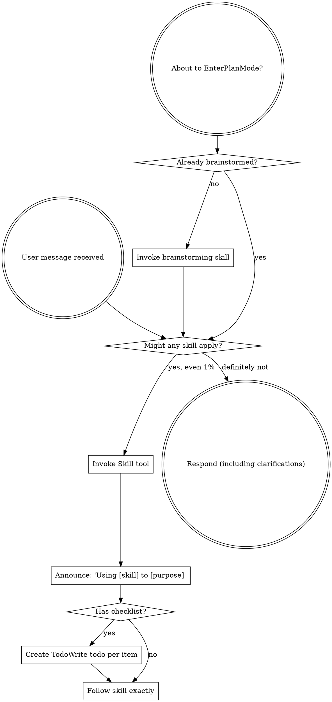

# Codex session 019f13c1-3d01-7921-9571-4311bb588df3

- Started: `2026-06-29T14:21:04.027Z`
- Working directory: `D:\100XH100`
- Originator: `Codex Desktop`
- Codex CLI: `0.142.2`
- Source log: `C:\Users\Иван Литвак\.codex\sessions\2026\06\29\rollout-2026-06-29T17-21-04-019f13c1-3d01-7921-9571-4311bb588df3.jsonl`
- Entries: user=2, assistant=16, tool calls=36, tool outputs=36

This is a chronological export of the user/assistant conversation and tool activity. Internal system/developer instructions and token accounting are intentionally excluded. Secret-shaped values are redacted; oversized tool outputs retain their beginning and end with the omitted character count.

## 1. User

Time: `2026-06-29T14:21:13.208Z` · source line `4`

```text
# AGENTS.md instructions for D:\100XH100

<INSTRUCTIONS>
# Project Agent Rules

## Operating Rule
- Read `AGENTS.md` before project edits.
- Update `memory/CHANGELOG.md` after meaningful code, config, or architecture changes.
- Update `memory/PROMPTS.md` with user prompts that define requirements.
- Store test outputs, logs, and verification notes under `test_results/`.
- Prefer agent-centered code: explicit contracts, deterministic tests, small files, low hidden state.

## Architecture Source
- Primary architecture contract: `ARCHITECTURE_NEED.md`.
- Current Stream 4 implementation rule: use threshold + compact + CUB/fixed-temp sort/reduce + compact; do not use Stream 4 hash-table dedup.

## Implementation Guardrails
- `State128` logical bytes are `v[0..119]`.
- `State128` padding bytes are `v[120..127]`.
- Persistent frontier padding must be zero.
- `FinalResponse` may temporarily store `target_local_idx` in `v[120..123]`.
- `Hash128` is one logical 128-bit key stored as `{lo, hi}`.
- `CandidateMeta` must remain 32 bytes and 32-byte aligned.
- Stream 3 payload id must be original candidate id, not compact index.
- Stream 4 must not apply shard top-k or semantic shard cap.

</INSTRUCTIONS>
<environment_context>
  <cwd>D:\100XH100</cwd>
  <shell>powershell</shell>
  <current_date>2026-06-29</current_date>
  <timezone>Europe/Moscow</timezone>
  <filesystem><workspace_roots><root>D:\100XH100</root></workspace_roots><permission_profile type="managed"><file_system type="restricted"><entry access="read"><special>:root</special></entry><entry access="write"><path>D:\100XH100</path></entry><entry access="write"><special>:slash_tmp</special></entry><entry access="write"><special>:tmpdir</special></entry><entry access="read"><path>D:\100XH100\.git</path></entry><entry access="read"><path>D:\100XH100\.agents</path></entry><entry access="read"><path>D:\100XH100\.codex</path></entry></file_system></permission_profile></filesystem>
</environment_context>
```

## 2. User

Time: `2026-06-29T14:21:13.235Z` · source line `6`

```text
You are the CODE QUALITY reviewer for Task 4 in a subagent-driven workflow. Do not edit files. Spec compliance already passed. Review commit cd17b18964234e058ebc2420e02902c2eece549a in worktree D:\100XH100\.worktrees\stream1-piece-transformer for correctness, maintainability, resource sizing, test cost, and integration risks.

Base commit: 7f45ff3b5cb3119d5ecd37283e18006c1690895d.
Changed files:
- tools/stream1_weight_io.hpp
- tests/contract_tests.cpp
- memory/CHANGELOG.md
- memory/PROMPTS.md
- test_results/stream1_transformer_loader_2026-06-29.md

Context:
- This is loader/arena only. No transformer forward kernel or runtime dispatch should be present.
- Future CUDA forward will consume the loaded weights and scratch buffers.
- Existing MLP behavior must remain supported.
- User forbids fallbacks; unsupported mode should fail closed.
- Worker reported untracked Windows build artifacts (`$null`, build-contract-tests/, root *.obj) could not be deleted; do not treat untracked junk as committed code issue unless committed state is affected.
- I reran Python exporter tests successfully. My own MSVC rerun had shell quoting issues, but worker verification note says contract_tests exe passed.

Please inspect the diff. Pay special attention to:
- Does `total_host_weight_bytes` correctly count transformer bytes and MLP bytes?
- Are upload/free branches safe and leak-free for both backends?
- Are scratch byte calculations overflow-safe enough and not absurdly overallocating?
- Are CPU contract tests too heavy because of fake weight files? Are they sparse or genuinely writing too much data?
- Does the manifest parser accidentally let malformed/missing transformer fields through?
- Any risk from parsing `num_layers` vs `transformer_layers` mismatch with exporter manifest?

Return:
- QUALITY_PASS with concise strengths/risks, or
- QUALITY_FAIL with Critical/Important findings and file references.

Focus on actionable issues only.
```

## 3. Codex

Time: `2026-06-29T14:21:40.349Z` · source line `9`

```text
I’ll review this as a code review only: no file edits. I’m first loading the required workflow skill and the project context, then I’ll inspect the target diff and tests.
```

## 4. Codex

Time: `2026-06-29T14:21:40.357Z` · source line `10`

```text
I’ll review this as a code review only: no file edits. I’m first loading the required workflow skill and the project context, then I’ll inspect the target diff and tests.
```

## 5. Tool call: `exec_command`

Time: `2026-06-29T14:21:40.357Z` · source line `11`

```text
{"cmd":"Get-Content -Raw 'C:\\Users\\Иван Литвак\\.codex\\plugins\\cache\\openai-curated-remote\\superpowers\\5.1.4\\skills\\using-superpowers\\SKILL.md'","workdir":"D:\\100XH100","shell":"powershell","yield_time_ms":10000,"max_output_tokens":20000}
```

## 6. Tool call: `exec_command`

Time: `2026-06-29T14:21:40.358Z` · source line `12`

```text
{"cmd":"Get-Content -Raw AGENTS.md","workdir":"D:\\100XH100","shell":"powershell","yield_time_ms":10000,"max_output_tokens":12000}
```

## 7. Tool call: `exec_command`

Time: `2026-06-29T14:21:40.358Z` · source line `13`

```text
{"cmd":"Select-String -Path 'C:\\Users\\Иван Литвак\\.codex\\memories\\MEMORY.md' -Pattern 'BEAM_PREBUILT_RUNNER|cayleypy-beam-results|State128|CandidateMeta|stream1|Stream 1|100XH100' -Context 2,2","workdir":"D:\\100XH100","shell":"powershell","yield_time_ms":10000,"max_output_tokens":20000}
```

## 8. Tool output

Time: `2026-06-29T14:21:51.427Z` · source line `14`

````text
Chunk ID: a88b3f
Wall time: 10.0154 seconds
Process running with session ID 73123
Original token count: 1365
Output:
---
name: using-superpowers
description: Use when starting any conversation - establishes how to find and use skills, requiring Skill tool invocation before ANY response including clarifying questions
---

<SUBAGENT-STOP>
If you were dispatched as a subagent to execute a specific task, skip this skill.
</SUBAGENT-STOP>

<EXTREMELY-IMPORTANT>
If you think there is even a 1% chance a skill might apply to what you are doing, you ABSOLUTELY MUST invoke the skill.

IF A SKILL APPLIES TO YOUR TASK, YOU DO NOT HAVE A CHOICE. YOU MUST USE IT.

This is not negotiable. This is not optional. You cannot rationalize your way out of this.
</EXTREMELY-IMPORTANT>

## Instruction Priority

Superpowers skills override default system prompt behavior, but **user instructions always take precedence**:

1. **User's explicit instructions** (CLAUDE.md, GEMINI.md, AGENTS.md, direct requests) — highest priority
2. **Superpowers skills** — override default system behavior where they conflict
3. **Default system prompt** — lowest priority

If CLAUDE.md, GEMINI.md, or AGENTS.md says "don't use TDD" and a skill says "always use TDD," follow the user's instructions. The user is in control.

## How to Access Skills

**In Claude Code:** Use the `Skill` tool. When you invoke a skill, its content is loaded and presented to you—follow it directly. Never use the Read tool on skill files.

**In Copilot CLI:** Use the `skill` tool. Skills are auto-discovered from installed plugins. The `skill` tool works the same as Claude Code's `Skill` tool.

**In Gemini CLI:** Skills activate via the `activate_skill` tool. Gemini loads skill metadata at session start and activates the full content on demand.

**In other environments:** Check your platform's documentation for how skills are loaded.

## Platform Adaptation

Skills use Claude Code tool names. Non-CC platforms: see `references/copilot-tools.md` (Copilot CLI), `references/codex-tools.md` (Codex) for tool equivalents. Gemini CLI users get the tool mapping loaded automatically via GEMINI.md.

# Using Skills

## The Rule

**Invoke relevant or requested skills BEFORE any response or action.** Even a 1% chance a skill might apply means that you should invoke the skill to check. If an invoked skill turns out to be wrong for the situation, you don't need to use it.



## Red Flags

These thoughts mean STOP—you're rationalizing:

| Thought | Reality |
|---------|---------|
| "This is just a simple question" | Questions are tasks. Check for skills. |
| "I need more context first" | Skill check comes BEFORE clarifying questions. |
| "Let me explore the codebase first" | Skills tell you HOW to explore. Check first. |
| "I can check git/files quickly" | Files lack conversation context. Check for skills. |
| "Let me gather information first" | Skills tell you HOW to gather information. |
| "This doesn't need a formal skill" | If a skill exists, use it. |
| "I remember this skill" | Skills evolve. Read current version. |
| "This doesn't count as a task" | Action = task. Check for skills. |
| "The skill is overkill" | Simple things become complex. Use it. |
| "I'll just do this one thing first" | Check BEFORE doing anything. |
| "This feels productive" | Undisciplined action wastes time. Skills prevent this. |
| "I know what that means" | Knowing the concept в‰  using the skill. Invoke it. |

## Skill Priority

When multiple skills could apply, use this order:

1. **Process skills first** (brainstorming, debugging) - these determine HOW to approach the task
2. **Implementation skills second** (frontend-design, mcp-builder) - these guide execution

"Let's build X" в†’ brainstorming first, then implementation skills.
"Fix this bug" в†’ debugging first, then domain-specific skills.

## Skill Types

**Rigid** (TDD, debugging): Follow exactly. Don't adapt away discipline.

**Flexible** (patterns): Adapt principles to context.

The skill itself tells you which.

## User Instructions

Instructions say WHAT, not HOW. "Add X" or "Fix Y" doesn't mean skip workflows.


````

## 9. Tool output

Time: `2026-06-29T14:21:51.436Z` · source line `15`

```text
Chunk ID: e8396e
Wall time: 10.0157 seconds
Process running with session ID 28019
Original token count: 285
Output:
# Project Agent Rules

## Operating Rule
- Read `AGENTS.md` before project edits.
- Update `memory/CHANGELOG.md` after meaningful code, config, or architecture changes.
- Update `memory/PROMPTS.md` with user prompts that define requirements.
- Store test outputs, logs, and verification notes under `test_results/`.
- Prefer agent-centered code: explicit contracts, deterministic tests, small files, low hidden state.

## Architecture Source
- Primary architecture contract: `ARCHITECTURE_NEED.md`.
- Current Stream 4 implementation rule: use threshold + compact + CUB/fixed-temp sort/reduce + compact; do not use Stream 4 hash-table dedup.

## Implementation Guardrails
- `State128` logical bytes are `v[0..119]`.
- `State128` padding bytes are `v[120..127]`.
- Persistent frontier padding must be zero.
- `FinalResponse` may temporarily store `target_local_idx` in `v[120..123]`.
- `Hash128` is one logical 128-bit key stored as `{lo, hi}`.
- `CandidateMeta` must remain 32 bytes and 32-byte aligned.
- Stream 3 payload id must be original candidate id, not compact index.
- Stream 4 must not apply shard top-k or semantic shard cap.


```

## 10. Tool output

Time: `2026-06-29T14:21:51.436Z` · source line `16`

```text
Chunk ID: 7c4bec
Wall time: 10.0153 seconds
Process running with session ID 61417
Original token count: 1707
Output:

  C:\Users\Иван Литвак\.codex\memories\MEMORY.md:46:# Task Group: MEPhI IHES cluster publishing, shared prebuilt runner
, and inventory-driven backfill
  C:\Users\Иван Литвак\.codex\memories\MEMORY.md:47:scope: Running the IHES MEPhI cluster workflow with one shared preb
uilt `production_runner`, publishing solved puzzles into a dedicated GitHub results repo, and aggregating mixed cluster
 artifacts from on-cluster inventories.
> C:\Users\Иван Литвак\.codex\memories\MEMORY.md:48:applies_to: cwd=D:\100XH100; reuse_rule=reuse for this IHES/MEPhI r
epo family and adjacent cluster publish jobs, but treat live cluster inventory, DNS availability, and current results-r
epo schema as run-specific and recheck them before publishing.
  C:\Users\Иван Литвак\.codex\memories\MEMORY.md:49:
  C:\Users\Иван Литвак\.codex\memories\MEMORY.md:50:## Task 1: Launch IHES array jobs against one shared prebuilt runne
r, outcome success
  C:\Users\Иван Литвак\.codex\memories\MEMORY.md:52:### rollout_summary_files
  C:\Users\Иван Литвак\.codex\memories\MEMORY.md:53:
> C:\Users\Иван Литвак\.codex\memories\MEMORY.md:54:- rollout_summaries/2026-06-04T15-47-52-Dd1O-ihes_cluster_results_p
rebuilt_publish_backfill.md (cwd=\\?\D:\100XH100, rollout_path=\\?\C:\Users\Иван Литвак\.codex\sessions\2026\06\04\roll
out-2026-06-04T18-47-57-019e9351-cd3b-71c0-bf8b-69755d08d5fc.jsonl, updated_at=2026-06-26T19:51:22+00:00, thread_id=019
e9351-cd3b-71c0-bf8b-69755d08d5fc, the prebuilt runner was compiled once and reused across the A100 array workflow)
  C:\Users\Иван Литвак\.codex\memories\MEMORY.md:55:
  C:\Users\Иван Литвак\.codex\memories\MEMORY.md:56:### keywords
  C:\Users\Иван Литвак\.codex\memories\MEMORY.md:57:
> C:\Users\Иван Литвак\.codex\memories\MEMORY.md:58:- MEPhI HPC, kaf12, A100 40GB, BEAM_PREBUILT_RUNNER, prepare_ihes_p
rebuilt_runner.sh, ihes_solve_bucket_from_scratch.sh, prebuilt_runner_ready, using_prebuilt_runner, PUZZLE_LIMIT=1, dep
th=12
  C:\Users\Иван Литвак\.codex\memories\MEMORY.md:59:
  C:\Users\Иван Литвак\.codex\memories\MEMORY.md:60:## Task 2: Publish per-puzzle IHES results and backfill existing bu
cket outputs into the GitHub results repo, outcome success
  C:\Users\Иван Литвак\.codex\memories\MEMORY.md:62:### rollout_summary_files
  C:\Users\Иван Литвак\.codex\memories\MEMORY.md:63:
> C:\Users\Иван Литвак\.codex\memories\MEMORY.md:64:- rollout_summaries/2026-06-04T15-47-52-Dd1O-ihes_cluster_results_p
rebuilt_publish_backfill.md (cwd=\\?\D:\100XH100, rollout_path=\\?\C:\Users\Иван Литвак\.codex\sessions\2026\06\04\roll
out-2026-06-04T18-47-57-019e9351-cd3b-71c0-bf8b-69755d08d5fc.jsonl, updated_at=2026-06-26T19:51:22+00:00, thread_id=019
e9351-cd3b-71c0-bf8b-69755d08d5fc, the results repo structure and first backfilled puzzle sets were established)
  C:\Users\Иван Литвак\.codex\memories\MEMORY.md:65:
  C:\Users\Иван Литвак\.codex\memories\MEMORY.md:66:### keywords
  C:\Users\Иван Литвак\.codex\memories\MEMORY.md:67:
> C:\Users\Иван Литвак\.codex\memories\MEMORY.md:68:- cayleypy-beam-results, p0027, p0031, p0033, data/ihes_cube/index.
tsv, improvements.tsv, unique_solutions.tsv, metadata.env, summary.md, solve_bucket_fresh, github.com DNS
  C:\Users\Иван Литвак\.codex\memories\MEMORY.md:69:
  C:\Users\Иван Литвак\.codex\memories\MEMORY.md:70:## Task 3: Inventory mixed IHES cluster files and make the publishe
r schema-tolerant, outcome partial
  C:\Users\Иван Литвак\.codex\memories\MEMORY.md:72:### rollout_summary_files
  C:\Users\Иван Литвак\.codex\memories\MEMORY.md:73:
> C:\Users\Иван Литвак\.codex\memories\MEMORY.md:74:- rollout_summaries/2026-06-04T15-47-52-Dd1O-ihes_cluster_results_p
rebuilt_publish_backfill.md (cwd=\\?\D:\100XH100, rollout_path=\\?\C:\Users\Иван Литвак\.codex\sessions\2026\06\04\roll
out-2026-06-04T18-47-57-019e9351-cd3b-71c0-bf8b-69755d08d5fc.jsonl, updated_at=2026-06-26T19:51:22+00:00, thread_id=019
e9351-cd3b-71c0-bf8b-69755d08d5fc, a file-driven inventory plus schema fixes made the larger aggregator path workable)
  C:\Users\Иван Литвак\.codex\memories\MEMORY.md:75:
  C:\Users\Иван Литвак\.codex\memories\MEMORY.md:76:### keywords
  C:\Users\Иван Литвак\.codex\memories\MEMORY.md:87:## Reusable knowledge
  C:\Users\Иван Литвак\.codex\memories\MEMORY.md:88:
> C:\Users\Иван Литвак\.codex\memories\MEMORY.md:89:- `hpc/ihes_cube_model/prepare_ihes_prebuilt_runner.sh` builds the 
shared binary at `/mnt/pool/6/vokirova/beam8a100/ihes_cube_model/prebuilt-a100-ihes/production_runner`, and `hpc/ihes_c
ube_model/ihes_solve_bucket_from_scratch.sh` already knows how to consume `BEAM_PREBUILT_RUNNER` [Task 1]
  C:\Users\Иван Литвак\.codex\memories\MEMORY.md:90:- the verified runtime on basis exposed `world_size_effective=8`, `
NCCL 2.21.5+cuda12.4`, and eight visible A100-40GB GPUs, so the prebuilt-runner path was validated on the actual target
 hardware [Task 1]
  C:\Users\Иван Литвак\.codex\memories\MEMORY.md:91:- the durable results layout is `data/ihes_cube/puzzles/pXXXX/solut
ions.tsv`, `unique_solutions.tsv`, `metadata.env`, `summary.md`, plus root-level `index.tsv` and `improvements.tsv`; no
n-full-solution repair artifacts belong under separate `repair_segments/` trees [Task 2]
  C:\Users\Иван Литвак\.codex\memories\MEMORY.md:95:## Failures and how to do differently
  C:\Users\Иван Литвак\.codex\memories\MEMORY.md:96:
> C:\Users\Иван Литвак\.codex\memories\MEMORY.md:97:- symptom: each array task recompiles instead of reusing the solver
. cause: `BEAM_PREBUILT_RUNNER` was not wired through a separate prebuild dependency. fix: submit the prebuild first an
d make the puzzle array depend on it via `--dependency=afterok:<prebuild_job>` [Task 1]
  C:\Users\Иван Литвак\.codex\memories\MEMORY.md:98:- symptom: cluster-side publish fails after compute succeeds. cause
: the compute node cannot resolve `github.com` or otherwise lacks GitHub network access. fix: tolerate cluster-side pus
h failure and leave local commits/results ready for later push from a node with working DNS/network [Task 2]
  C:\Users\Иван Литвак\.codex\memories\MEMORY.md:99:- symptom: the backfill/index writer crashes on old rows. cause: me
tadata rows carried extra keys such as `variants` and `source_files` that were not declared in the index schema. fix: w
iden the declared schema and filter outgoing rows to declared fields before writing [Task 2][Task 3]


```

## 11. Codex

Time: `2026-06-29T14:22:06.437Z` · source line `19`

```text
The project rule confirms this is a review-only path: no changelog edits needed because I won’t change code. Memory only surfaced prior cluster workflow notes, not this Stream 1 loader, so I’ll rely on the committed diff and local project files for the review.
```

## 12. Codex

Time: `2026-06-29T14:22:06.445Z` · source line `20`

```text
The project rule confirms this is a review-only path: no changelog edits needed because I won’t change code. Memory only surfaced prior cluster workflow notes, not this Stream 1 loader, so I’ll rely on the committed diff and local project files for the review.
```

## 13. Tool call: `exec_command`

Time: `2026-06-29T14:22:06.463Z` · source line `21`

```text
{"cmd":"git status --short","workdir":"D:\\100XH100\\.worktrees\\stream1-piece-transformer","shell":"powershell","yield_time_ms":10000,"max_output_tokens":12000}
```

## 14. Tool call: `exec_command`

Time: `2026-06-29T14:22:06.463Z` · source line `22`

```text
{"cmd":"git diff --stat 7f45ff3b5cb3119d5ecd37283e18006c1690895d cd17b18964234e058ebc2420e02902c2eece549a","workdir":"D:\\100XH100\\.worktrees\\stream1-piece-transformer","shell":"powershell","yield_time_ms":10000,"max_output_tokens":12000}
```

## 15. Tool call: `exec_command`

Time: `2026-06-29T14:22:06.470Z` · source line `23`

```text
{"cmd":"git diff --find-renames --find-copies 7f45ff3b5cb3119d5ecd37283e18006c1690895d cd17b18964234e058ebc2420e02902c2eece549a -- tools/stream1_weight_io.hpp tests/contract_tests.cpp","workdir":"D:\\100XH100\\.worktrees\\stream1-piece-transformer","shell":"powershell","yield_time_ms":10000,"max_output_tokens":60000}
```

## 16. Tool call: `exec_command`

Time: `2026-06-29T14:22:06.471Z` · source line `24`

```text
{"cmd":"git diff 7f45ff3b5cb3119d5ecd37283e18006c1690895d cd17b18964234e058ebc2420e02902c2eece549a -- memory/CHANGELOG.md memory/PROMPTS.md test_results/stream1_transformer_loader_2026-06-29.md","workdir":"D:\\100XH100\\.worktrees\\stream1-piece-transformer","shell":"powershell","yield_time_ms":10000,"max_output_tokens":30000}
```

## 17. Tool output

Time: `2026-06-29T14:22:07.410Z` · source line `25`

```text
Chunk ID: d1e85d
Wall time: 0.0997 seconds
Process exited with code 0
Original token count: 39
Output:
?? $null
?? build-contract-tests/
?? config.obj
?? contract_tests.obj
?? docs/
?? frontier_cpu.obj
?? hash.obj
?? state.obj
?? stream3.obj
?? stream4.obj

```

## 18. Tool output

Time: `2026-06-29T14:22:07.427Z` · source line `26`

```text
Chunk ID: f56beb
Wall time: 0.1082 seconds
Process exited with code 0
Original token count: 96
Output:
 memory/CHANGELOG.md                                |   1 +
 memory/PROMPTS.md                                  |   1 +
 .../stream1_transformer_loader_2026-06-29.md       |  49 +++
 tests/contract_tests.cpp                           | 159 +++++++-
 tools/stream1_weight_io.hpp                        | 434 +++++++++++++++++++--
 5 files changed, 591 insertions(+), 53 deletions(-)

```

## 19. Tool output

Time: `2026-06-29T14:22:07.432Z` · source line `27`

Oversized output: `8209` characters omitted from the middle.

```text
Chunk ID: 50caac
Wall time: 0.1116 seconds
Process exited with code 0
Original token count: 10205
Output:
Warning: truncated output (original token count: 10205)
Total output lines: 782

diff --git a/tests/contract_tests.cpp b/tests/contract_tests.cpp
index abf1f7a..16682f3 100644
--- a/tests/contract_tests.cpp
+++ b/tests/contract_tests.cpp
@@ -51,15 +51,89 @@ std::string minimal_stream1_manifest(const std::string& backend_line) {
         "}\n";
     return manifest;
 }
+std::string transformer_manifest(std::uint32_t seq_len = 51, std::uint32_t output_dim = static_cast<std::uint32_t>(MOVE_COUNT)) {
+    return
+        "{\n"
+        "  \"backend\": \"piece_transformer\",\n"
+        "  \"dtype\": \"fp16\",\n"
+        "  \"state_len\": " + std::to_string(STATE_LEN) + ",\n"
+        "  \"num_classes\": 120,\n"
+        "  \"output_dim\": " + std::to_string(output_dim) + ",\n"
+        "  \"num_pieces\": 50,\n"
+        "  \"max_piece_size\": 3,\n"
+        "  \"seq_len\": " + std::to_string(seq_len) + ",\n"
+        "  \"d_model\": 256,\n"
+        "  \"nhead\": 8,\n"
+        "  \"head_dim\": 32,\n"
+        "  \"num_layers\": 4,\n"
+        "  \"ff_dim\": 1024,\n"
+        "  \"activation\": \"silu\",\n"
+        "  \"pooling\": \"cls\",\n"
+        "  \"piece_layout\": \"p900\",\n"
+        "  \"piece_embed_mode\": \"full_s120\"\n"
+        "}\n";
+}
 
 std::filesystem::path write_manifest_fixture(const std::string& name, const std::string& backend_line) {
     const std::filesystem::path dir = std::filesystem::path("test_results") / name;
-    std::filesystem::remove_all(dir);
     std::filesystem::create_directories(dir);
     std::ofstream manifest(dir / "manifest.json");
     manifest << minimal_stream1_manifest(backend_line);
     return dir;
 }
+std::filesystem::path write_transformer_manifest_fixture(
+    const std::string& name,
+    std::uint32_t seq_len = 51,
+    std::uint32_t output_dim = static_cast<std::uint32_t>(MOVE_COUNT)) {
+    const std::filesystem::path dir = std::filesystem::path("test_results") / name;
+    std::filesystem::create_directories(dir);
+    std::ofstream manifest(dir / "manifest.json");
+    manifest << transformer_manifest(seq_len, output_dim);
+    return dir;
+}
+
+void write_zero_file(const std::filesystem::path& path, std::uint64_t bytes) {
+    std::ofstream out(path, std::ios::binary);
+    if (!out) {
+        throw std::runtime_error("failed to create fixture file: " + path.string());
+    }
+    if (bytes > 0) {
+        out.seekp(static_cast<std::streamoff>(bytes - 1));
+        out.put('\0');
+    }
+}
+
+void write_transformer_weight_fixture_files(const std::filesystem::path& dir, bool bad_fast_static_size = false) {
+    constexpr std::uint64_t elem = sizeof(std::uint16_t);
+    const std::string suffix = ".fp16";
+    write_zero_file(dir / ("fast_slot_projected" + suffix), 3ULL * 120ULL * 256ULL * elem);
+    write_zero_file(dir / ("fast_piece_static" + suffix), 50ULL * 256ULL * elem + (bad_fast_static_size ? 1ULL : 0ULL));
+    write_zero_file(dir / ("cls_token" + suffix), 256ULL * elem);
+    write_zero_file(dir / ("input_ln_gamma" + suffix), 256ULL * elem);
+    write_zero_file(dir / ("input_ln_beta" + suffix), 256ULL * elem);
+    write_zero_file(dir / ("output_ln_gamma" + suffix), 256ULL * elem);
+    write_zero_file(dir / ("output_ln_beta" + suffix), 256ULL * elem);
+    for (std::uint32_t block = 0; block < 4; ++block) {
+        const std::string prefix = "block" + std::to_string(block);
+        write_zero_file(dir / (prefix + "_ln1_gamma" + suffix), 256ULL * elem);
+        write_zero_file(dir / (prefix + "_ln1_beta" + suffix), 256ULL * elem);
+        write_zero_file(dir / (prefix + "_attn_qkv_weight_hxk" + suffix), 768ULL * 256ULL * elem);
+        write_zero_file(dir / (prefix + "_attn_qkv_bias" + suffix), 768ULL * elem);
+        write_zero_file(dir / (prefix + "_attn_out_weight_hxk" + suffix), 256ULL * 256ULL * elem);
+        write_zero_file(dir / (prefix + "_attn_out_bias" + suffix), 256ULL * elem);
+        write_zero_file(dir / (prefix + "_ln2_gamma" + suffix), 256ULL * elem);
+        write_zero_file(dir / (prefix + "_ln2_beta" + suffix), 256ULL * elem);
+        write_zero_file(dir / (prefix + "_ff1_weight_hxk" + suffix), 1024ULL * 256ULL * elem);
+        write_zero_file(dir / (prefix + "_ff1_bias" + suffix), 1024ULL * elem);
+        write_zero_file(dir / (prefix + "_ff2_weight_hxk" + suffix), 256ULL * 1024ULL * elem);
+        write_zero_file(dir / (prefix + "_ff2_bias" + suffix), 256ULL * elem);
+    }
+    write_zero_file(dir / ("output_weight_hxk" + suffix), 24ULL * 256ULL * elem);
+    write_zero_file(dir / ("output_bias" + suffix), 24ULL * elem);
+    write_zero_file(dir / "piece_positions.u16", 50ULL * 3ULL * sizeof(std::uint16_t));
+    write_zero_file(dir / "piece_mask.u8", 50ULL * 3ULL);
+    write_zero_file(dir / "piece_types.u8", 50ULL);
+}
 
 bool error_contains(const std::runtime_error& error, const std::string& needle) {
     return std::string(error.what()).find(needle) != std::string::npos;
@@ -74,14 +148,9 @@ void test_stream1_manifest_backend_parsing() {
         write_manifest_fixture("stream1_manifest_backend_explicit_mlp", "  \"backend\": \"mlp\""));
     require(explicit_mlp.backend == STREAM1_BACKEND_MLP, "explicit MLP Stream1 manifest must load as MLP");
 
-    bool transformer_threw = false;
-    try {
-        (void)beam::stream1_weights::load_stream1_manifest(
-            write_manifest_fixture("stream1_manifest_backend_piece_transformer", "  \"backend\": \"piece_transformer\""));
-    } catch (const std::runtime_error& error) {
-        transformer_threw = error_contains(error, "piece_transformer Stream1 weights require transformer loader");
-    }
-    require(transformer_threw, "piece_transformer manifest must require transformer loader");
+    const Stream1ModelConfig transformer = beam::stream1_weights::load_stream1_manifest(
+        write_transformer_manifest_fixture("stream1_manifest_backend_piece_transformer"));
+    require(transformer.backend == STREAM1_BACKEND_PIECE_TRANSFORMER, "piece_transformer manifest must parse as transformer");
 
     bool unknown_threw = false;
     try {
@@ -92,6 +161,61 @@ void test_stream1_manifest_backend_parsing() {
     }
     require(unknown_threw, "unknown Stream1 manifest backend must name accepted values");
 }
+void test_stream1_transformer_manifest_contract() {
+    const Stream1ModelConfig model = beam::stream1_weights::load_stream1_manifest(
+        write_transformer_manifest_fixture("stream1_transformer_manifest_ok"));
+    require(model.backend == STREAM1_BACKEND_PIECE_TRANSFORMER, "transformer backend parse failed");
+    require(model.state_len == STATE_LEN, "transformer state_len parse failed");
+    require(model.num_classes == 120U, "transformer num_classes parse failed");
+    require(model.output_dim == MOVE_COUNT, "transformer output_dim parse failed");
+    require(model.num_pieces == 50U, "transformer num_pieces parse failed");
+    require(model.max_piece_size == 3U, "transformer max_piece_size parse failed");
+    require(model.seq_len == 51U, "transformer seq_len parse failed");
+    require(model.d_model == 256U, "transformer d_model parse failed");
+    require(model.nhead == 8U, "transformer nhead parse failed");
+    require(model.head_dim == 32U, "transformer head_dim parse failed");
+    require(model.transformer_layers == 4U, "transformer_layers parse failed");
+    require(model.ff_dim == 1024U, "transformer ff_dim parse failed");
+
+    bool bad_seq_len_threw = false;
+    try {
+        (void)beam::stream1_weights::load_stream1_manifest(
+            write_transformer_manifest_fixture("stream1_transformer_manifest_bad_seq_len", 52));
+    } catch (const std::runtime_error& error) {
+        bad_seq_len_threw = error_contains(error, "seq_len");
+    }
+    require(bad_seq_len_threw, "wrong transformer seq_len must be rejected with a clear error");
+}
+
+void test_stream1_transformer_weight_size_contract() {
+    const std::filesystem::path ok_dir = write_transformer_manifest_fixture("stream1_transformer_weight_sizes_ok");
+    write_transformer_weight_fixture_files(ok_dir);
+    const auto weights = beam::stream1_weights::load_stream1_weights(ok_dir);
+    require(weights.model.backend == STREAM1_BACKEND_PIECE_TRANSFORMER, "transformer weights must keep backend metadata");
+    require(weights.transformer.blocks.size() == 4U, "transformer loader must allocate four block containers");
+    require(weights.transformer.fast_slot_projected.size() == 3ULL * 120ULL * 256ULL * sizeof(std::uint16_t),
+        "fast_slot_projected exact size failed");
+    require(weights.transformer.blocks[0].ff1_weight.size() == 1024ULL * 256ULL * sizeof(std::uint16_t),
+        "transformer block ff1_weight exact size failed");
+    require(beam::stream1_weights::total_host_weight_bytes(weights) > 0, "host byte helper must count transformer tensors");
+
+    const std::filesystem::path bad_dir = write_transformer_manifest_fixture("stream1_transformer_weight_sizes_bad");
+    write_transformer_weight_fixture_files(bad_dir, true);
+    bool bad_size_threw = false;
+    try {
+        (void)beam::stream1_weights::load_stream1_weights(bad_dir);
+    } catch (const std::runtime_error& error) {
+        bad_size_threw = error_contains(error, "fast_piece_static") && error_contains(error, "expected=");
+    }
+    require(bad_size_threw, "wrong transformer file size must be rejected with file name and expected size");
+}
+
+void test_stream1_mlp_weight_loading_still_works() {
+    const auto weights = beam::stream1_weights::load_stream1_weights("stream1_weights");
+    require(weights.model.backend == STREAM1_BACKEND_MLP, "existing stream1_weights manifest must load as MLP");
+    require(weights.input_weight.size() > 0, "MLP input_weight must load");
+    require(weights.output_bias.size() == weights.model.output_dim * sizeof(std::uint16_t), "MLP output_bias size mismatch");
+}
 
 void test_stream1_backend_row_modes() {
     Stream1ModelConfig default_mlp;
@@ -140,7 +264,7 @@ void test_stream1_backend_row_modes() {
 
 } // namespace
 
-int main() {
+int run_contract_tests() {
     std::filesystem::create_directories("test_results");
     std::ofstream report("test_results/contract_tests_2026-05-20.md");
     report << "# Contract Tests 2026-05-20\n\n";
@@ -165,6 +289,12 @@ int main() {
     report << "- stream1_backend_row_modes=pass\n";
     test_stream1_manifest_backend_parsing();
     report << "- stream1_manifest_backend_parsing=pass\n";
+    test_stream1_transformer_manifest_contract();
+    report << "- stream1_transformer_manifest_contract=pass\n";
+    test_stream1_transformer_weight_size_contract();
+    report << "- stream1_transformer_weight_size_contract=pass\n";
+    test_stream1_mlp_weight_loading_still_works();
+    report << "- stream1_mlp_weight_loading=pass\n";
 
     State128 state = make_state128(std::vector<std::uint8_t>(STATE_LEN, 7));
     require(padding_is_zero(state), "state padding must be zero");
@@ -222,3 +352,12 @@ int main() {
     std::cout << "contract_tests=pass\n";
     return 0;
 }
+
+int main() {
+    try {
+        return run_contract_tests();
+    } catch (const std::exception& error) {
+        std::cerr << "contract_tests=fail error=" << error.what() << "\n";
+        return 1;
+    }
+}
diff --git a/tools/stream1_weight_io.hpp b/tools/stream1_weight_io.hpp
index d64609e..b9f1bdb 100644
--- a/tools/stream1_weight_io.hpp
+++ b/tools/stream1_weight_io.hpp
@@ -22,6 +22,47 @@
 
 namespace beam::stream1_weights {
 
+inline constexpr std::uint32_t TRANSFORMER_NUM_CLASSES = 120;
+inline constexpr std::uint32_t TRANSFORMER_NUM_PIECES = 50;
+inline constexpr std::uint32_t TRANSFORMER_MAX_PIECE_SIZE = 3;
+inline constexpr std::uint32_t TRANSFORMER_SEQ_LEN = 51;
+inline constexpr std::uint32_t TRANSFORMER_D_MODEL = 256;
+inline constexpr std::uint32_t TRANSFORMER_NHEAD = 8;
+inline constexpr std::uint32_t TRANSFORMER_HEAD_DIM = 32;
+inline constexpr std::uint32_t TRANSFORMER_LAYERS = 4;
+inline constexpr std::uint32_t TRANSFORMER_FF_DIM = 1024;
+
+struct HostTransformerBlockBytes {
+    std::vector<std::byte> ln1_gamma;
+    std::vector<std::byte> ln1_beta;
+    std::vector<std::byte> attn_qkv_weight;
+    std::vector<std::byte> attn_qkv_bias;
+    std::vector<std::byte> attn_out_weight;
+    std::vector<std::byte> attn_out_bias;
+    std::vector<std::byte> ln2_gamma;
+    std::vector<std::byte> ln2_beta;
+    std::vector<std::byte> ff1_weight;
+    std::vector<std::byte> ff1_bias;
+    std::vector<std::byte> ff2_weight;
+    std::vector<std::byte> ff2_bias;
+};
+
+struct HostTransformerBytes {
+    std::vector<std::byte> fast_slot_projected;
+    std::vector<std::byte> fast_piece_static;
+    std::vector<std::byte> cls_token;
+    std::vector<std::byte> input_ln_gamma;
+    std::vector<std::byte> input_ln_beta;
+    std::vector<std::byte> output_ln_gamma;
+    std::vector<std::byte> output_ln_beta;
+    std::vector<HostTransformerBlockBytes> blocks;
+    std::vector<std::byte> output_weight;
+    std::vector<std::byte> output_bias;
+    std::vector<std::byte> piece_positions;
+    std::vector<std::byte> piece_mask;
+    std::vector<std::byte> piece_types;
+};
+
 struct HostWeightBytes {
     Stream1ModelConfig model;
     std::vector<std::byte> input_weight;
@@ -42,9 +83,41 @@ struct HostWeightBytes {
     std::vector<std::vector<std::byte>> residual_fc2_ln_beta;
     std::vector<std::byte> output_weight;
     std::vector<std::byte> output_bias;
+    HostTransformerBytes transformer;
 };
 
 #ifndef BEAM_STREAM1_WEIGHT_IO_MANIFEST_ONLY
+struct DeviceTransformerBlockWeights {
+    half* ln1_gamma = nullptr;
+    half* ln1_beta = nullptr;
+    half* attn_qkv_weight = nullptr;
+    half* attn_qkv_bias = nullptr;
+    half* attn_out_weight = nullptr;
+    half* attn_out_bias = nullptr;
+    half* ln2_gamma = nullptr;
+    half* ln2_beta = nullptr;
+    half* ff1_weight = nullptr;
+    half* ff1_bias = nullptr;
+    half* ff2_weight = nullptr;
+    half* ff2_bias = nullptr;
+};
+
+struct DeviceTransformerWeights {
+    half* fast_slot_projected = nullptr;
+    half* fast_piece_static = nullptr;
+    half* cls_token = nullptr;
+    half* input_ln_gamma = nullptr;
+    half* input_ln_beta = nullptr;
+    half* output_ln_gamma = nullptr;
+    half* output_ln_beta = nullptr;
+    std::vector<DeviceTransformerBlockWeights> blocks;
+    half* output_weight = nullptr;
+    half* output_bias = nullptr;
+    std::uint16_t* piece_positions = nullptr;
+    std::uint8_t* piece_mask = nullptr;
+    std::uint8_t* piece_types = nullptr;
+};
+
 struct DeviceWeights {
     half* input_weight = nullptr;
     half* input_bias = nullptr;
@@ -72,6 +145,7 @@ struct DeviceWeights {
     half** residual_fc2_ln_beta_table = nullptr;
     half* output_weight = nullptr;
     half* output_bias = nullptr;
+    DeviceTransformerWeights transformer;
 };
 
 struct ScratchAllocation {
@@ -79,6 +153,12 @@ struct ScratchAllocation {
     half* hidden2 = nullptr;
     half* residual = nullptr;
     half* output = nullptr;
+    half* transformer_tokens = nullptr;
+    half* transformer_qkv = nullptr;
+    float* transformer_attention_scores_probs = nullptr;
+    half* transformer_attention_context = nullptr;
+    half* transformer_ff_hidden = nullptr;
+    half* transformer_logits = nullptr;
 };
 #endif
 
@@ -187,13 +267,30 @@ inline std::string parse_manifest_string_default(
     }
 }
 
-inline void validate_model_config(const Stream1ModelConfig& model, const std::string& context) {
-    if (model.backend != STREAM1_BACKEND_MLP && model.backend != STREAM1_BACKEND_PIECE_TRANSFORMER) {
-        throw std::runtime_error(context + ": unsupported Stream1 backend");
+inline void require_manifest_u32(
+    std::uint32_t actual,
+    std::uint32_t expected,
+    const char* key,
+    const std::string& context) {
+    if (actual != expected) {
+        throw 

[... 8209 characters omitted from oversized tool output ...]

st_piece_static = read_binary_exact(
+        dir / ("fast_piece_static" + suffix),
+        fp16_bytes(static_cast<std::uint64_t>(model.num_pieces) * model.d_model));
+    t.cls_token = read_binary_exact(dir / ("cls_token" + suffix), fp16_bytes(model.d_model));
+    t.input_ln_gamma = read_binary_exact(dir / ("input_ln_gamma" + suffix), fp16_bytes(model.d_model));
+    t.input_ln_beta = read_binary_exact(dir / ("input_ln_beta" + suffix), fp16_bytes(model.d_model));
+    t.output_ln_gamma = read_binary_exact(dir / ("output_ln_gamma" + suffix), fp16_bytes(model.d_model));
+    t.output_ln_beta = read_binary_exact(dir / ("output_ln_beta" + suffix), fp16_bytes(model.d_model));
+    t.blocks.resize(model.transformer_layers);
+    for (std::uint32_t block = 0; block < model.transformer_layers; ++block) {
+        const std::string prefix = "block" + std::to_string(block);
+        HostTransformerBlockBytes& b = t.blocks[block];
+        b.ln1_gamma = read_binary_exact(dir / (prefix + "_ln1_gamma" + suffix), fp16_bytes(model.d_model));
+        b.ln1_beta = read_binary_exact(dir / (prefix + "_ln1_beta" + suffix), fp16_bytes(model.d_model));
+        b.attn_qkv_weight = read_binary_exact(
+            dir / (prefix + "_attn_qkv_weight_hxk" + suffix),
+            fp16_bytes(3ULL * model.d_model * model.d_model));
+        b.attn_qkv_bias = read_binary_exact(dir / (prefix + "_attn_qkv_bias" + suffix), fp16_bytes(3ULL * model.d_model));
+        b.attn_out_weight = read_binary_exact(
+            dir / (prefix + "_attn_out_weight_hxk" + suffix),
+            fp16_bytes(static_cast<std::uint64_t>(model.d_model) * model.d_model));
+        b.attn_out_bias = read_binary_exact(dir / (prefix + "_attn_out_bias" + suffix), fp16_bytes(model.d_model));
+        b.ln2_gamma = read_binary_exact(dir / (prefix + "_ln2_gamma" + suffix), fp16_bytes(model.d_model));
+        b.ln2_beta = read_binary_exact(dir / (prefix + "_ln2_beta" + suffix), fp16_bytes(model.d_model));
+        b.ff1_weight = read_binary_exact(
+            dir / (prefix + "_ff1_weight_hxk" + suffix),
+            fp16_bytes(static_cast<std::uint64_t>(model.ff_dim) * model.d_model));
+        b.ff1_bias = read_binary_exact(dir / (prefix + "_ff1_bias" + suffix), fp16_bytes(model.ff_dim));
+        b.ff2_weight = read_binary_exact(
+            dir / (prefix + "_ff2_weight_hxk" + suffix),
+            fp16_bytes(static_cast<std::uint64_t>(model.d_model) * model.ff_dim));
+        b.ff2_bias = read_binary_exact(dir / (prefix + "_ff2_bias" + suffix), fp16_bytes(model.d_model));
+    }
+    t.output_weight = read_binary_exact(
+        dir / ("output_weight_hxk" + suffix),
+        fp16_bytes(static_cast<std::uint64_t>(model.output_dim) * model.d_model));
+    t.output_bias = read_binary_exact(dir / ("output_bias" + suffix), fp16_bytes(model.output_dim));
+    t.piece_positions = read_binary_exact(
+        dir / "piece_positions.u16",
+        static_cast<std::uint64_t>(model.num_pieces) * model.max_piece_size * sizeof(std::uint16_t));
+    t.piece_mask = read_binary_exact(
+        dir / "piece_mask.u8",
+        static_cast<std::uint64_t>(model.num_pieces) * model.max_piece_size);
+    t.piece_types = read_binary_exact(dir / "piece_types.u8", model.num_pieces);
+    return weights;
+}
+
+inline HostWeightBytes load_stream1_weights(const std::filesystem::path& dir) {
+    const Stream1ModelConfig model = load_stream1_manifest(dir);
+    switch (model.backend) {
+    case STREAM1_BACKEND_MLP:
+        return load_stream1_mlp_weights(dir, model);
+    case STREAM1_BACKEND_PIECE_TRANSFORMER:
+        return load_stream1_transformer_weights(dir, model);
+    default:
+        throw std::runtime_error("unsupported Stream1 backend in weight loader");
+    }
 }
 
 inline std::uint64_t total_host_weight_bytes(const HostWeightBytes& weights) {
@@ -334,15 +537,59 @@ inline std::uint64_t total_host_weight_bytes(const HostWeightBytes& weights) {
         weights.hidden_weight.size() + weights.hidden_bias.size() +
         weights.hidden_ln_gamma.size() + weights.hidden_ln_beta.size() +
         weights.output_weight.size() + weights.output_bias.size();
-    for (std::uint32_t block = 0; block < weights.model.residual_count; ++block) {
+    for (std::size_t block = 0; block < weights.residual_fc1_weight.size(); ++block) {
         total += weights.residual_fc1_weight[block].size() + weights.residual_fc1_bias[block].size() +
             weights.residual_fc1_ln_gamma[block].size() + weights.residual_fc1_ln_beta[block].size() +
             weights.residual_fc2_weight[block].size() + weights.residual_fc2_bias[block].size() +
             weights.residual_fc2_ln_gamma[block].size() + weights.residual_fc2_ln_beta[block].size();
     }
+    const HostTransformerBytes& t = weights.transformer;
+    total += t.fast_slot_projected.size() + t.fast_piece_static.size() + t.cls_token.size() +
+        t.input_ln_gamma.size() + t.input_ln_beta.size() + t.output_ln_gamma.size() + t.output_ln_beta.size() +
+        t.output_weight.size() + t.output_bias.size() + t.piece_positions.size() + t.piece_mask.size() + t.piece_types.size();
+    for (const HostTransformerBlockBytes& b : t.blocks) {
+        total += b.ln1_gamma.size() + b.ln1_beta.size() + b.attn_qkv_weight.size() + b.attn_qkv_bias.size() +
+            b.attn_out_weight.size() + b.attn_out_bias.size() + b.ln2_gamma.size() + b.ln2_beta.size() +
+            b.ff1_weight.size() + b.ff1_bias.size() + b.ff2_weight.size() + b.ff2_bias.size();
+    }
     return total;
 }
 
+inline std::uint64_t transformer_scratch_bytes_for_rows(const Stream1ModelConfig& model, std::uint64_t rows) {
+    const std::uint64_t token_values = rows * model.seq_len * model.d_model;
+    const std::uint64_t qkv_values = rows * model.seq_len * 3ULL * model.d_model;
+    const std::uint64_t attention_values = rows * model.nhead * model.seq_len * model.seq_len;
+    const std::uint64_t context_values = rows * model.seq_len * model.d_model;
+    const std::uint64_t ff_values = rows * model.seq_len * model.ff_dim;
+    const std::uint64_t logits_values = rows * model.output_dim;
+    return fp16_bytes(token_values + qkv_values + context_values + ff_values + logits_values) +
+        attention_values * sizeof(float);
+}
+
+inline std::uint64_t stream1_scratch_bytes(
+    const Stream1ModelConfig& model,
+    std::uint32_t b_micro,
+    std::uint32_t lane_count) {
+    const std::uint64_t rows = stream1_inference_rows(b_micro, model) * lane_count;
+    switch (model.backend) {
+    case STREAM1_BACKEND_MLP:
+        return fp16_bytes(rows * (static_cast<std::uint64_t>(model.hidden1) + 2ULL * model.hidden2 + model.output_dim));
+    case STREAM1_BACKEND_PIECE_TRANSFORMER:
+        return transformer_scratch_bytes_for_rows(model, rows);
+    default:
+        throw std::runtime_error("unsupported Stream1 backend in scratch byte helper");
+    }
+}
+
+inline std::uint64_t total_device_weight_bytes(const HostWeightBytes& weights) {
+    return total_host_weight_bytes(weights);
+}
+
+#ifndef BEAM_STREAM1_WEIGHT_IO_MANIFEST_ONLY
+inline const half* weight_half_data(const std::vector<std::byte>& bytes) {
+    return reinterpret_cast<const half*>(bytes.data());
+}
+
 inline void copy_bytes_to_device(void* dst, const std::vector<std::byte>& bytes, const char* name) {
     if (dst == nullptr || bytes.empty()) {
         throw std::runtime_error(std::string("invalid device copy input: ") + name);
@@ -356,12 +603,17 @@ inline void require_aligned(const void* ptr, std::uintptr_t alignment, const cha
     }
 }
 
-inline void alloc_and_copy(half*& dst, const std::vector<std::byte>& src, const char* name) {
-    BEAM_CUDA_CHECK(cudaMalloc(&dst, src.size()));
+template <typename T>
+inline void alloc_and_copy_typed(T*& dst, const std::vector<std::byte>& src, const char* name) {
+    BEAM_CUDA_CHECK(cudaMalloc(reinterpret_cast<void**>(&dst), src.size()));
     copy_bytes_to_device(dst, src, name);
     require_aligned(dst, 16, name);
 }
 
+inline void alloc_and_copy(half*& dst, const std::vector<std::byte>& src, const char* name) {
+    alloc_and_copy_typed(dst, src, name);
+}
+
 inline void alloc_managed_pointer_table(half**& table, const std::vector<half*>& ptrs, const char* name) {
     if (ptrs.empty()) {
         table = nullptr;
@@ -375,8 +627,50 @@ inline void alloc_managed_pointer_table(half**& table, const std::vector<half*>&
     require_aligned(table, alignof(half*), name);
 }
 
+inline void upload_transformer_weights(const HostWeightBytes& host, DeviceWeights& device) {
+    const HostTransformerBytes& h = host.transformer;
+    DeviceTransformerWeights& d = device.transformer;
+    alloc_and_copy(d.fast_slot_projected, h.fast_slot_projected, "fast_slot_projected");
+    alloc_and_copy(d.fast_piece_static, h.fast_piece_static, "fast_piece_static");
+    alloc_and_copy(d.cls_token, h.cls_token, "cls_token");
+    alloc_and_copy(d.input_ln_gamma, h.input_ln_gamma, "input_ln_gamma");
+    alloc_and_copy(d.input_ln_beta, h.input_ln_beta, "input_ln_beta");
+    alloc_and_copy(d.output_ln_gamma, h.output_ln_gamma, "output_ln_gamma");
+    alloc_and_copy(d.output_ln_beta, h.output_ln_beta, "output_ln_beta");
+    d.blocks.resize(h.blocks.size());
+    for (std::size_t i = 0; i < h.blocks.size(); ++i) {
+        const std::string prefix = "block" + std::to_string(i);
+        const HostTransformerBlockBytes& hb = h.blocks[i];
+        DeviceTransformerBlockWeights& db = d.blocks[i];
+        alloc_and_copy(db.ln1_gamma, hb.ln1_gamma, (prefix + "_ln1_gamma").c_str());
+        alloc_and_copy(db.ln1_beta, hb.ln1_beta, (prefix + "_ln1_beta").c_str());
+        alloc_and_copy(db.attn_qkv_weight, hb.attn_qkv_weight, (prefix + "_attn_qkv_weight").c_str());
+        alloc_and_copy(db.attn_qkv_bias, hb.attn_qkv_bias, (prefix + "_attn_qkv_bias").c_str());
+        alloc_and_copy(db.attn_out_weight, hb.attn_out_weight, (prefix + "_attn_out_weight").c_str());
+        alloc_and_copy(db.attn_out_bias, hb.attn_out_bias, (prefix + "_attn_out_bias").c_str());
+        alloc_and_copy(db.ln2_gamma, hb.ln2_gamma, (prefix + "_ln2_gamma").c_str());
+        alloc_and_copy(db.ln2_beta, hb.ln2_beta, (prefix + "_ln2_beta").c_str());
+        alloc_and_copy(db.ff1_weight, hb.ff1_weight, (prefix + "_ff1_weight").c_str());
+        alloc_and_copy(db.ff1_bias, hb.ff1_bias, (prefix + "_ff1_bias").c_str());
+        alloc_and_copy(db.ff2_weight, hb.ff2_weight, (prefix + "_ff2_weight").c_str());
+        alloc_and_copy(db.ff2_bias, hb.ff2_bias, (prefix + "_ff2_bias").c_str());
+    }
+    alloc_and_copy(d.output_weight, h.output_weight, "output_weight");
+    alloc_and_copy(d.output_bias, h.output_bias, "output_bias");
+    alloc_and_copy_typed(d.piece_positions, h.piece_positions, "piece_positions");
+    alloc_and_copy_typed(d.piece_mask, h.piece_mask, "piece_mask");
+    alloc_and_copy_typed(d.piece_types, h.piece_types, "piece_types");
+}
+
 inline DeviceWeights upload_weights(const HostWeightBytes& host) {
     DeviceWeights device;
+    if (host.model.backend == STREAM1_BACKEND_PIECE_TRANSFORMER) {
+        upload_transformer_weights(host, device);
+        return device;
+    }
+    if (host.model.backend != STREAM1_BACKEND_MLP) {
+        throw std::runtime_error("unsupported Stream1 backend in upload_weights");
+    }
     alloc_and_copy(device.input_weight, host.input_weight, "input_weight");
     alloc_and_copy(device.input_bias, host.input_bias, "input_bias");
     if (host.model.normalization == STREAM1_NORM_LAYERNORM) {
@@ -470,6 +764,33 @@ inline void free_weights(DeviceWeights& device) {
     cudaFree(device.residual_fc2_ln_beta_table);
     cudaFree(device.output_weight);
     cudaFree(device.output_bias);
+    DeviceTransformerWeights& t = device.transformer;
+    cudaFree(t.fast_slot_projected);
+    cudaFree(t.fast_piece_static);
+    cudaFree(t.cls_token);
+    cudaFree(t.input_ln_gamma);
+    cudaFree(t.input_ln_beta);
+    cudaFree(t.output_ln_gamma);
+    cudaFree(t.output_ln_beta);
+    for (DeviceTransformerBlockWeights& b : t.blocks) {
+        cudaFree(b.ln1_gamma);
+        cudaFree(b.ln1_beta);
+        cudaFree(b.attn_qkv_weight);
+        cudaFree(b.attn_qkv_bias);
+        cudaFree(b.attn_out_weight);
+        cudaFree(b.attn_out_bias);
+        cudaFree(b.ln2_gamma);
+        cudaFree(b.ln2_beta);
+        cudaFree(b.ff1_weight);
+        cudaFree(b.ff1_bias);
+        cudaFree(b.ff2_weight);
+        cudaFree(b.ff2_bias);
+    }
+    cudaFree(t.output_weight);
+    cudaFree(t.output_bias);
+    cudaFree(t.piece_positions);
+    cudaFree(t.piece_mask);
+    cudaFree(t.piece_types);
     device = DeviceWeights{};
 }
 
@@ -479,22 +800,49 @@ inline ScratchAllocation alloc_stream1_scratch(
     std::uint32_t lane_count) {
     ScratchAllocation scratch;
     const std::uint64_t rows = stream1_inference_rows(b_micro, model) * lane_count;
-    BEAM_CUDA_CHECK(cudaMalloc(&scratch.hidden1, rows * model.hidden1 * sizeof(half)));
-    BEAM_CUDA_CHECK(cudaMalloc(&scratch.hidden2, rows * model.hidden2 * sizeof(half)));
-    BEAM_CUDA_CHECK(cudaMalloc(&scratch.residual, rows * model.hidden2 * sizeof(half)));
-    BEAM_CUDA_CHECK(cudaMalloc(&scratch.output, rows * model.output_dim * sizeof(half)));
-    return scratch;
+    if (model.backend == STREAM1_BACKEND_MLP) {
+        BEAM_CUDA_CHECK(cudaMalloc(&scratch.hidden1, rows * model.hidden1 * sizeof(half)));
+        BEAM_CUDA_CHECK(cudaMalloc(&scratch.hidden2, rows * model.hidden2 * sizeof(half)));
+        BEAM_CUDA_CHECK(cudaMalloc(&scratch.residual, rows * model.hidden2 * sizeof(half)));
+        BEAM_CUDA_CHECK(cudaMalloc(&scratch.output, rows * model.output_dim * sizeof(half)));
+        return scratch;
+    }
+    if (model.backend == STREAM1_BACKEND_PIECE_TRANSFORMER) {
+        const std::uint64_t token_values = rows * model.seq_len * model.d_model;
+        const std::uint64_t qkv_values = rows * model.seq_len * 3ULL * model.d_model;
+        const std::uint64_t attention_values = rows * model.nhead * model.seq_len * model.seq_len;
+        const std::uint64_t context_values = rows * model.seq_len * model.d_model;
+        const std::uint64_t ff_values = rows * model.seq_len * model.ff_dim;
+        const std::uint64_t logits_values = rows * model.output_dim;
+        // Future attention kernels can overwrite this float score buffer with softmax probabilities in place.
+        BEAM_CUDA_CHECK(cudaMalloc(&scratch.transformer_tokens, token_values * sizeof(half)));
+        BEAM_CUDA_CHECK(cudaMalloc(&scratch.transformer_qkv, qkv_values * sizeof(half)));
+        BEAM_CUDA_CHECK(cudaMalloc(&scratch.transformer_attention_scores_probs, attention_values * sizeof(float)));
+        BEAM_CUDA_CHECK(cudaMalloc(&scratch.transformer_attention_context, context_values * sizeof(half)));
+        BEAM_CUDA_CHECK(cudaMalloc(&scratch.transformer_ff_hidden, ff_values * sizeof(half)));
+        BEAM_CUDA_CHECK(cudaMalloc(&scratch.transformer_logits, logits_values * sizeof(half)));
+        return scratch;
+    }
+    throw std::runtime_error("unsupported Stream1 backend in scratch allocation");
 }
-
 inline void free_stream1_scratch(ScratchAllocation& scratch) {
     cudaFree(scratch.hidden1);
     cudaFree(scratch.hidden2);
     cudaFree(scratch.residual);
     cudaFree(scratch.output);
+    cudaFree(scratch.transformer_tokens);
+    cudaFree(scratch.transformer_qkv);
+    cudaFree(scratch.transformer_attention_scores_probs);
+    cudaFree(scratch.transformer_attention_context);
+    cudaFree(scratch.transformer_ff_hidden);
+    cudaFree(scratch.transformer_logits);
     scratch = ScratchAllocation{};
 }
 
 inline Stream1NetworkDims network_dims(const Stream1ModelConfig& model) {
+    if (model.backend != STREAM1_BACKEND_MLP) {
+        throw std::runtime_error("piece_transformer Stream1 inference is not implemented in the MLP network view");
+    }
     return Stream1NetworkDims{
         model.state_len,
         model.num_classes,

```

## 20. Tool output

Time: `2026-06-29T14:22:07.435Z` · source line `28`

````text
Chunk ID: fa090d
Wall time: 0.1176 seconds
Process exited with code 0
Original token count: 1448
Output:
diff --git a/memory/CHANGELOG.md b/memory/CHANGELOG.md
index 2da0625..6df8ad5 100644
--- a/memory/CHANGELOG.md
+++ b/memory/CHANGELOG.md
@@ -1,6 +1,7 @@
 # Changelog
 
 ## 2026-06-29
+- Added the Stream1 piece-transformer host loader path and scratch arena scaffolding without wiring transformer inference. The weight loader now parses and validates the exact p900 piece-transformer manifest contract, loads exported transformer tensors and piece layout tables with exact byte sizes, exposes host/device/scratch byte helpers, and keeps MLP loading on an explicit separate branch. Verification recorded in `test_results/stream1_transformer_loader_2026-06-29.md`.
 - Added Stream1 piece-transformer export tooling: an auto-detecting tools/export_stream1.py wrapper and tools/export_stream1_transformer.py for Kaggle p900 PilgrimPieceTransformer checkpoints. The exporter writes fast-slot input tables, piece layout tensors, Transformer block tensors, manifests with backend=piece_transformer, rejects non-24-output, non-4-layer, and non-1024-FF variants, and supports optional CPU fp32 reference JSON generation. Verification recorded in test_results/stream1_transformer_exporter_2026-06-29.md.
 - Added tagged Stream1 model backend config constants and transformer metadata fields, preserving existing MLP defaults. Stream1 row-mode helpers now force the piece-transformer backend to parent rows while keeping MLP one-output child-row behavior, with contract coverage recorded in `test_results/stream1_piece_transformer_task1_2026-06-29.md`. Unknown Stream1 backend values now fail closed in row-mode helpers, MLP weight validation, and manifest backend parsing; legacy manifests without `backend` still default to MLP.
 
diff --git a/memory/PROMPTS.md b/memory/PROMPTS.md
index 9e06653..77a6cd5 100644
--- a/memory/PROMPTS.md
+++ b/memory/PROMPTS.md
@@ -1,6 +1,7 @@
 # Prompt History
 
 ## 2026-06-29
+- User assigned Task 4 for the Stream1 piece-transformer worktree: implement transformer manifest parsing, exact-size host weight loading, device upload/free containers, and one-lane reusable scratch arena for `backend=piece_transformer`, with no fallback backend, no transformer CUDA forward kernel, no production runner/dispatcher wiring, and no Stream3/Stream4/State128/MLP contract changes.
 - User requested an explicit separate Stream1 `piece_transformer` backend for the Kaggle Megaminx Q-transformer, with no fallback behavior and without breaking the current MLP backend. Manifests must be generated from checkpoint/config metadata, correctness tests come before integration, and target validation is a small 2xT4 Kaggle smoke after correctness tests pass.
 
 ## 2026-06-20
diff --git a/test_results/stream1_transformer_loader_2026-06-29.md b/test_results/stream1_transformer_loader_2026-06-29.md
new file mode 100644
index 0000000..47d83af
--- /dev/null
+++ b/test_results/stream1_transformer_loader_2026-06-29.md
@@ -0,0 +1,49 @@
+# Stream1 Transformer Loader Verification - 2026-06-29
+
+## Scope
+- Added manifest-only contract tests for `backend=piece_transformer` parsing.
+- Added exact-size fake transformer weight directory coverage for exported tensor files.
+- Added a real existing MLP `stream1_weights` load smoke to guard MLP loader behavior.
+- Added transformer host byte containers, CUDA device pointer containers, upload/free branches, and reusable scratch arena allocation helpers.
+- Did not implement transformer CUDA forward and did not wire production runner/dispatcher execution.
+
+## Commands
+
+```powershell
+cl /nologo /std:c++20 /EHsc /I src /DBEAM_STATE_LOGICAL_BYTES=120 /DBEAM_STATE_PHYSICAL_BYTES=128 /DBEAM_STATE_ALIGNMENT=16 /DBEAM_MOVE_COUNT=24 tests\contract_tests.cpp src\config.cpp src\frontier_cpu.cpp src\hash.cpp src\state.cpp src\stream3.cpp src\stream4.cpp /Fe:test_results\contract_tests_stream1_task4_red.exe
+```
+
+Result: initial red route not run because plain `cl` was not on PATH in this PowerShell environment (`cl` not recognized). Visual Studio Build Tools were then located via `vswhere`.
+
+```powershell
+cmd /c "\"C:\Program Files (x86)\Microsoft Visual Studio\2022\BuildTools\Common7\Tools\VsDevCmd.bat\" -arch=x64 >nul && cl /nologo /std:c++20 /EHsc /I src /DBEAM_STATE_LOGICAL_BYTES=120 /DBEAM_STATE_PHYSICAL_BYTES=128 /DBEAM_STATE_ALIGNMENT=16 /DBEAM_MOVE_COUNT=24 tests\contract_tests.cpp src\config.cpp src\frontier_cpu.cpp src\hash.cpp src\state.cpp src\stream3.cpp src\stream4.cpp /Fe:test_results\contract_tests_stream1_task4.exe"
+```
+
+Result: PASS, executable built.
+
+```powershell
+.\test_results\contract_tests_stream1_task4.exe
+```
+
+Result: PASS, `contract_tests=pass`. Report updated at `test_results/contract_tests_2026-05-20.md` with transformer manifest, transformer exact-size loader, and MLP loading checks.
+
+```powershell
+$env:PYTHONDONTWRITEBYTECODE='1'; py -B -m unittest discover -s tests -p "test_stream1_transformer_exporter.py" -v
+```
+
+Result: PASS, 6 tests.
+
+```powershell
+cmake -S . -B build-contract-tests
+```
+
+Result: BLOCKED. Configure stopped while probing Visual Studio `VCTargetsPath` because MSBuild could not delete its generated `unsuccessfulbuild` file under `build-contract-tests` (`Access is denied`). Full CMake/CUDA target verification was not available from this shell.
+
+```powershell
+git diff --check -- tests/contract_tests.cpp tools/stream1_weight_io.hpp
+```
+
+Result: PASS. Git warned that CRLF working-copy files will be normalized to LF when touched.
+
+## Cleanup Note
+- MSVC/CMake generated root `.obj` files, `$null`, and `build-contract-tests/`. Both PowerShell `Remove-Item` and `cmd del/rmdir` were denied by the Windows filesystem for those generated artifacts, so they remain untracked and were not staged.
\ No newline at end of file

````

## 21. Codex

Time: `2026-06-29T14:22:18.950Z` · source line `31`

```text
I’ve confirmed the untracked build debris matches the handoff and is not part of the committed diff. The main review surface is the header-only loader path plus added contract fixtures.
```

## 22. Codex

Time: `2026-06-29T14:22:18.960Z` · source line `32`

```text
I’ve confirmed the untracked build debris matches the handoff and is not part of the committed diff. The main review surface is the header-only loader path plus added contract fixtures.
```

## 23. Tool call: `exec_command`

Time: `2026-06-29T14:22:18.960Z` · source line `33`

```text
{"cmd":"$i=1; Get-Content tools\\stream1_weight_io.hpp | ForEach-Object { '{0,5}: {1}' -f $i, $_; $i++ }","workdir":"D:\\100XH100\\.worktrees\\stream1-piece-transformer","shell":"powershell","yield_time_ms":10000,"max_output_tokens":80000}
```

## 24. Tool call: `exec_command`

Time: `2026-06-29T14:22:19.013Z` · source line `34`

```text
{"cmd":"$i=1; Get-Content tests\\contract_tests.cpp | ForEach-Object { '{0,5}: {1}' -f $i, $_; $i++ }","workdir":"D:\\100XH100\\.worktrees\\stream1-piece-transformer","shell":"powershell","yield_time_ms":10000,"max_output_tokens":50000}
```

## 25. Tool call: `exec_command`

Time: `2026-06-29T14:22:19.013Z` · source line `35`

```text
{"cmd":"rg -n \"struct Stream1ModelConfig|stream1_inference_rows|STREAM1_BACKEND|transformer_layers|num_layers|total_host_weight_bytes|stream1_scratch_bytes|alloc_stream1_scratch|upload_weights|free_weights|load_stream1_manifest\" -S src tools tests","workdir":"D:\\100XH100\\.worktrees\\stream1-piece-transformer","shell":"powershell","yield_time_ms":10000,"max_output_tokens":50000}
```

## 26. Tool call: `exec_command`

Time: `2026-06-29T14:22:19.013Z` · source line `36`

```text
{"cmd":"git show --name-status --oneline cd17b18964234e058ebc2420e02902c2eece549a","workdir":"D:\\100XH100\\.worktrees\\stream1-piece-transformer","shell":"powershell","yield_time_ms":10000,"max_output_tokens":12000}
```

## 27. Tool output

Time: `2026-06-29T14:22:19.896Z` · source line `37`

Oversized output: `8210` characters omitted from the middle.

```text
Chunk ID: 625603
Wall time: 0.4960 seconds
Process exited with code 0
Original token count: 12264
Output:
Warning: truncated output (original token count: 12264)
Total output lines: 862

    1: #pragma once
    2: 
    3: #include "../src/config.hpp"
    4: 
    5: #ifndef BEAM_STREAM1_WEIGHT_IO_MANIFEST_ONLY
    6: #include "cuda_check.hpp"
    7: #include "../cuda/stream1.hpp"
    8: 
    9: #include <cuda_fp16.h>
   10: #include <cuda_runtime.h>
   11: #endif
   12: 
   13: #include <cstddef>
   14: #include <cstdint>
   15: #include <filesystem>
   16: #include <fstream>
   17: #include <iterator>
   18: #include <limits>
   19: #include <stdexcept>
   20: #include <string>
   21: #include <vector>
   22: 
   23: namespace beam::stream1_weights {
   24: 
   25: inline constexpr std::uint32_t TRANSFORMER_NUM_CLASSES = 120;
   26: inline constexpr std::uint32_t TRANSFORMER_NUM_PIECES = 50;
   27: inline constexpr std::uint32_t TRANSFORMER_MAX_PIECE_SIZE = 3;
   28: inline constexpr std::uint32_t TRANSFORMER_SEQ_LEN = 51;
   29: inline constexpr std::uint32_t TRANSFORMER_D_MODEL = 256;
   30: inline constexpr std::uint32_t TRANSFORMER_NHEAD = 8;
   31: inline constexpr std::uint32_t TRANSFORMER_HEAD_DIM = 32;
   32: inline constexpr std::uint32_t TRANSFORMER_LAYERS = 4;
   33: inline constexpr std::uint32_t TRANSFORMER_FF_DIM = 1024;
   34: 
   35: struct HostTransformerBlockBytes {
   36:     std::vector<std::byte> ln1_gamma;
   37:     std::vector<std::byte> ln1_beta;
   38:     std::vector<std::byte> attn_qkv_weight;
   39:     std::vector<std::byte> attn_qkv_bias;
   40:     std::vector<std::byte> attn_out_weight;
   41:     std::vector<std::byte> attn_out_bias;
   42:     std::vector<std::byte> ln2_gamma;
   43:     std::vector<std::byte> ln2_beta;
   44:     std::vector<std::byte> ff1_weight;
   45:     std::vector<std::byte> ff1_bias;
   46:     std::vector<std::byte> ff2_weight;
   47:     std::vector<std::byte> ff2_bias;
   48: };
   49: 
   50: struct HostTransformerBytes {
   51:     std::vector<std::byte> fast_slot_projected;
   52:     std::vector<std::byte> fast_piece_static;
   53:     std::vector<std::byte> cls_token;
   54:     std::vector<std::byte> input_ln_gamma;
   55:     std::vector<std::byte> input_ln_beta;
   56:     std::vector<std::byte> output_ln_gamma;
   57:     std::vector<std::byte> output_ln_beta;
   58:     std::vector<HostTransformerBlockBytes> blocks;
   59:     std::vector<std::byte> output_weight;
   60:     std::vector<std::byte> output_bias;
   61:     std::vector<std::byte> piece_positions;
   62:     std::vector<std::byte> piece_mask;
   63:     std::vector<std::byte> piece_types;
   64: };
   65: 
   66: struct HostWeightBytes {
   67:     Stream1ModelConfig model;
   68:     std::vector<std::byte> input_weight;
   69:     std::vector<std::byte> input_bias;
   70:     std::vector<std::byte> input_ln_gamma;
   71:     std::vector<std::byte> input_ln_beta;
   72:     std::vector<std::byte> hidden_weight;
   73:     std::vector<std::byte> hidden_bias;
   74:     std::vector<std::byte> hidden_ln_gamma;
   75:     std::vector<std::byte> hidden_ln_beta;
   76:     std::vector<std::vector<std::byte>> residual_fc1_weight;
   77:     std::vector<std::vector<std::byte>> residual_fc1_bias;
   78:     std::vector<std::vector<std::byte>> residual_fc1_ln_gamma;
   79:     std::vector<std::vector<std::byte>> residual_fc1_ln_beta;
   80:     std::vector<std::vector<std::byte>> residual_fc2_weight;
   81:     std::vector<std::vector<std::byte>> residual_fc2_bias;
   82:     std::vector<std::vector<std::byte>> residual_fc2_ln_gamma;
   83:     std::vector<std::vector<std::byte>> residual_fc2_ln_beta;
   84:     std::vector<std::byte> output_weight;
   85:     std::vector<std::byte> output_bias;
   86:     HostTransformerBytes transformer;
   87: };
   88: 
   89: #ifndef BEAM_STREAM1_WEIGHT_IO_MANIFEST_ONLY
   90: struct DeviceTransformerBlockWeights {
   91:     half* ln1_gamma = nullptr;
   92:     half* ln1_beta = nullptr;
   93:     half* attn_qkv_weight = nullptr;
   94:     half* attn_qkv_bias = nullptr;
   95:     half* attn_out_weight = nullptr;
   96:     half* attn_out_bias = nullptr;
   97:     half* ln2_gamma = nullptr;
   98:     half* ln2_beta = nullptr;
   99:     half* ff1_weight = nullptr;
  100:     half* ff1_bias = nullptr;
  101:     half* ff2_weight = nullptr;
  102:     half* ff2_bias = nullptr;
  103: };
  104: 
  105: struct DeviceTransformerWeights {
  106:     half* fast_slot_projected = nullptr;
  107:     half* fast_piece_static = nullptr;
  108:     half* cls_token = nullptr;
  109:     half* input_ln_gamma = nullptr;
  110:     half* input_ln_beta = nullptr;
  111:     half* output_ln_gamma = nullptr;
  112:     half* output_ln_beta = nullptr;
  113:     std::vector<DeviceTransformerBlockWeights> blocks;
  114:     half* output_weight = nullptr;
  115:     half* output_bias = nullptr;
  116:     std::uint16_t* piece_positions = nullptr;
  117:     std::uint8_t* piece_mask = nullptr;
  118:     std::uint8_t* piece_types = nullptr;
  119: };
  120: 
  121: struct DeviceWeights {
  122:     half* input_weight = nullptr;
  123:     half* input_bias = nullptr;
  124:     half* input_ln_gamma = nullptr;
  125:     half* input_ln_beta = nullptr;
  126:     half* hidden_weight = nullptr;
  127:     half* hidden_bias = nullptr;
  128:     half* hidden_ln_gamma = nullptr;
  129:     half* hidden_ln_beta = nullptr;
  130:     std::vector<half*> residual_fc1_weight;
  131:     std::vector<half*> residual_fc1_bias;
  132:     std::vector<half*> residual_fc1_ln_gamma;
  133:     std::vector<half*> residual_fc1_ln_beta;
  134:     std::vector<half*> residual_fc2_weight;
  135:     std::vector<half*> residual_fc2_bias;
  136:     std::vector<half*> residual_fc2_ln_gamma;
  137:     std::vector<half*> residual_fc2_ln_beta;
  138:     half** residual_fc1_weight_table = nullptr;
  139:     half** residual_fc1_bias_table = nullptr;
  140:     half** residual_fc1_ln_gamma_table = nullptr;
  141:     half** residual_fc1_ln_beta_table = nullptr;
  142:     half** residual_fc2_weight_table = nullptr;
  143:     half** residual_fc2_bias_table = nullptr;
  144:     half** residual_fc2_ln_gamma_table = nullptr;
  145:     half** residual_fc2_ln_beta_table = nullptr;
  146:     half* output_weight = nullptr;
  147:     half* output_bias = nullptr;
  148:     DeviceTransformerWeights transformer;
  149: };
  150: 
  151: struct ScratchAllocation {
  152:     half* hidden1 = nullptr;
  153:     half* hidden2 = nullptr;
  154:     half* residual = nullptr;
  155:     half* output = nullptr;
  156:     half* transformer_tokens = nullptr;
  157:     half* transformer_qkv = nullptr;
  158:     float* transformer_attention_scores_probs = nullptr;
  159:     half* transformer_attention_context = nullptr;
  160:     half* transformer_ff_hidden = nullptr;
  161:     half* transformer_logits = nullptr;
  162: };
  163: #endif
  164: 
  165: inline std::string read_text_exact(const std::filesystem::path& path) {
  166:     std::ifstream file(path, std::ios::binary);
  167:     if (!file) {
  168:         throw std::runtime_error("cannot open required text file: " + path.string());
  169:     }
  170:     return std::string(std::istreambuf_iterator<char>(file), std::istreambuf_iterator<char>());
  171: }
  172: 
  173: inline std::vector<std::byte> read_binary_exact(
  174:     const std::filesystem::path& path,
  175:     std::uint64_t expected_bytes) {
  176:     if (expected_bytes > static_cast<std::uint64_t>(std::numeric_limits<std::size_t>::max())) {
  177:         throw std::runtime_error("binary expected size exceeds size_t: " + path.string());
  178:     }
  179:     std::ifstream file(path, std::ios::binary);
  180:     if (!file) {
  181:         throw std::runtime_error("cannot open required binary file: " + path.string());
  182:     }
  183:     std::vector<std::byte> bytes(static_cast<std::size_t>(expected_bytes));
  184:     file.read(reinterpret_cast<char*>(bytes.data()), static_cast<std::streamsize>(bytes.size()));
  185:     const std::size_t actual = static_cast<std::size_t>(file.gcount());
  186:     file.peek();
  187:     if (actual != bytes.size() || !file.eof()) {
  188:         throw std::runtime_error(
  189:             "binary file size mismatch: " + path.string() +
  190:             " expected=" + std::to_string(bytes.size()) +
  191:             " actual_read=" + std::to_string(actual));
  192:     }
  193:     return bytes;
  194: }
  195: 
  196: inline std::uint32_t parse_manifest_u32(const std::string& text, const char* key) {
  197:     const std::string quoted = std::string("\"") + key + "\"";
  198:     std::size_t pos = text.find(quoted);
  199:     if (pos == std::string::npos) {
  200:         throw std::runtime_error("stream1 manifest missing key: " + std::string(key));
  201:     }
  202:     pos = text.find(':', pos + quoted.size());
  203:     if (pos == std::string::npos) {
  204:         throw std::runtime_error("stream1 manifest malformed key: " + std::string(key));
  205:     }
  206:     ++pos;
  207:     while (pos < text.size() && (text[pos] == ' ' || text[pos] == '\t' || text[pos] == '\r' || text[pos] == '\n')) {
  208:         ++pos;
  209:     }
  210:     std::uint64_t value = 0;
  211:     std::size_t digits = 0;
  212:     while (pos < text.size() && text[pos] >= '0' && text[pos] <= '9') {
  213:         value = value * 10ULL + static_cast<std::uint64_t>(text[pos] - '0');
  214:         if (value > std::numeric_limits<std::uint32_t>::max()) {
  215:             throw std::runtime_error("stream1 manifest key exceeds uint32: " + std::string(key));
  216:         }
  217:         ++pos;
  218:         ++digits;
  219:     }
  220:     if (digits == 0) {
  221:         throw std::runtime_error("stream1 manifest key is not uint32: " + std::string(key));
  222:     }
  223:     return static_cast<std::uint32_t>(value);
  224: }
  225: 
  226: inline std::uint32_t parse_manifest_u32_any(
  227:     const std::string& text,
  228:     const char* primary_key,
  229:     const char* fallback_key) {
  230:     try {
  231:         return parse_manifest_u32(text, primary_key);
  232:     } catch (const std::runtime_error&) {
  233:         return parse_manifest_u32(text, fallback_key);
  234:     }
  235: }
  236: 
  237: inline std::string parse_manifest_string(const std::string& text, const char* key) {
  238:     const std::string quoted = std::string("\"") + key + "\"";
  239:     std::size_t pos = text.find(quoted);
  240:     if (pos == std::string::npos) {
  241:         throw std::runtime_error("stream1 manifest missing key: " + std::string(key));
  242:     }
  243:     pos = text.find(':', pos + quoted.size());
  244:     if (pos == std::string::npos) {
  245:         throw std::runtime_error("stream1 manifest malformed key: " + std::string(key));
  246:     }
  247:     pos = text.find('"', pos + 1);
  248:     if (pos == std::string::npos) {
  249:         throw std::runtime_error("stream1 manifest string missing opening quote: " + std::string(key));
  250:     }
  251:     const std::size_t start = pos + 1;
  252:     pos = text.find('"', start);
  253:     if (pos == std::string::npos) {
  254:         throw std::runtime_error("stream1 manifest string missing closing quote: " + std::string(key));
  255:     }
  256:     return text.substr(start, pos - start);
  257: }
  258: 
  259: inline std::string parse_manifest_string_default(
  260:     const std::string& text,
  261:     const char* key,
  262:     const std::string& default_value) {
  263:     try {
  264:         return parse_manifest_string(text, key);
  265:     } catch (const std::runtime_error&) {
  266:         return default_value;
  267:     }
  268: }
  269: 
  270: inline void require_manifest_u32(
  271:     std::uint32_t actual,
  272:     std::uint32_t expected,
  273:     const char* key,
  274:     const std::string& context) {
  275:     if (actual != expected) {
  276:         throw std::runtime_error(
  277:             context + ": stream1 piece_transformer " + key + " must be " + std::to_string(expected) +
  278:             " got " + std::to_string(actual));
  279:     }
  280: }
  281: 
  282: inline void require_manifest_string(
  283:     const std::string& actual,
  284:     const char* expected,
  285:     const char* key,
  286:     const std::string& context) {
  287:     if (actual != expected) {
  288:         throw std::runtime_error(
  289:             context + ": stream1 piece_transformer " + key + " must be " + expected + " got " + actual);
  290:     }
  291: }
  292: 
  293: inline void validate_mlp_model_config(const Stream1ModelConfig& model, const std::string& context) {
  294:     if (model.state_len != STATE_LEN) {
  295:         throw std::runtime_error(context + ": stream1 state_len must match compile-time STATE_LEN");
  296:     }
  297:     if (model.num_classes < STATE_LEN ||
  298:         (model.output_dim != MOVE_COUNT && model.output_dim != STREAM1_SINGLE_SCORE_OUTPUT_DIM)) {
  299:         throw std::runtime_error(context + ": stream1 num_classes/output_dim incompatible with current puzzle");
  300:     }
  301:     if (model.dtype != STREAM1_DTYPE_FP16 && model.dtype != STREAM1_DTYPE_BF16) {
  302:         throw std::runtime_error(context + ": stream1 dtype must be fp16 or bf16");
  303:     }
  304:     if (model.normalization != STREAM1_NORM_NONE && model.normalization != STREAM1_NORM_LAYERNORM) {
  305:         throw std::runtime_error(context + ": stream1 normalization must be none or layernorm");
  306:     }
  307:     if (model.hidden1 == 0U || model.hidden2 == 0U || model.residual_count == 0U) {
  308:         throw std::runtime_error(context + ": stream1 hidden sizes and residual_count must be nonzero");
  309:     }
  310:     if (model.hidden1 < model.hidden2) {
  311:         throw std::runtime_error(context + ": stream1 hidden1 must be >= hidden2 because Stream1 reuses hidden1 scratch for residual output");
  312:     }
  313:     if (model.hidden1 % 8U != 0U || model.hidden2 % 8U != 0U) {
  314:         throw std::runtime_error(context + ": stream1 hidden sizes must be multiples of 8 for TensorOp path");
  315:     }
  316: }
  317: 
  318: inline void validate_transformer_model_config(
  319:     const Stream1ModelConfig& model,
  320:     const std::string& activation,
  321:     const std::string& pooling,
  322:     const std::string& piece_layout,
  323:     const std::string& piece_embed_mode,
  324:     const std::string& context) {
  325:     if (model.dtype != STREAM1_DTYPE_FP16 && model.dtype != STREAM1_DTYPE_BF16) {
  326:         throw std::runtime_error(context + ": stream1 piece_transformer dtype must be fp16 or bf16");
  327:     }
  328:     require_manifest_u32(model.state_len, static_cast<std::uint32_t>(STATE_LEN), "state_len", context);
  329:     require_manifest_u32(model.num_classes, TRANSFORMER_NUM_CLASSES, "num_classes", context);
  330:     require_manifest_u32(model.output_dim, static_cast<std::uint32_t>(MOVE_COUNT), "output_dim", context);
  331:     require_manifest_u32(model.num_pieces, TRANSFORMER_NUM_PIECES, "num_pieces", context);
  332:     require_manifest_u32(model.max_piece_size, TRANSFORMER_MAX_PIECE_SIZE, "max_piece_size", context);
  333:     require_manifest_u32(model.seq_len, TRANSFORMER_SEQ_LEN, "seq_len", context);
  334:     require_manifest_u32(model.d_model, TRANSFORMER_D_MODEL, "d_model", context);
  335:     require_manifest_u32(model.nhead, TRANSFORMER_NHEAD, "nhead", context);
  336:     require_manifest_u32(model.h

[... 8210 characters omitted from oversized tool output ...]

onst half*>(bytes.data());
  591: }
  592: 
  593: inline void copy_bytes_to_device(void* dst, const std::vector<std::byte>& bytes, const char* name) {
  594:     if (dst == nullptr || bytes.empty()) {
  595:         throw std::runtime_error(std::string("invalid device copy input: ") + name);
  596:     }
  597:     BEAM_CUDA_CHECK(cudaMemcpy(dst, bytes.data(), bytes.size(), cudaMemcpyHostToDevice));
  598: }
  599: 
  600: inline void require_aligned(const void* ptr, std::uintptr_t alignment, const char* name) {
  601:     if (reinterpret_cast<std::uintptr_t>(ptr) % alignment != 0) {
  602:         throw std::runtime_error(std::string("device pointer alignment failed: ") + name);
  603:     }
  604: }
  605: 
  606: template <typename T>
  607: inline void alloc_and_copy_typed(T*& dst, const std::vector<std::byte>& src, const char* name) {
  608:     BEAM_CUDA_CHECK(cudaMalloc(reinterpret_cast<void**>(&dst), src.size()));
  609:     copy_bytes_to_device(dst, src, name);
  610:     require_aligned(dst, 16, name);
  611: }
  612: 
  613: inline void alloc_and_copy(half*& dst, const std::vector<std::byte>& src, const char* name) {
  614:     alloc_and_copy_typed(dst, src, name);
  615: }
  616: 
  617: inline void alloc_managed_pointer_table(half**& table, const std::vector<half*>& ptrs, const char* name) {
  618:     if (ptrs.empty()) {
  619:         table = nullptr;
  620:         return;
  621:     }
  622:     BEAM_CUDA_CHECK(cudaMallocManaged(&table, ptrs.size() * sizeof(half*)));
  623:     for (std::size_t i = 0; i < ptrs.size(); ++i) {
  624:         table[i] = ptrs[i];
  625:     }
  626:     BEAM_CUDA_CHECK(cudaDeviceSynchronize());
  627:     require_aligned(table, alignof(half*), name);
  628: }
  629: 
  630: inline void upload_transformer_weights(const HostWeightBytes& host, DeviceWeights& device) {
  631:     const HostTransformerBytes& h = host.transformer;
  632:     DeviceTransformerWeights& d = device.transformer;
  633:     alloc_and_copy(d.fast_slot_projected, h.fast_slot_projected, "fast_slot_projected");
  634:     alloc_and_copy(d.fast_piece_static, h.fast_piece_static, "fast_piece_static");
  635:     alloc_and_copy(d.cls_token, h.cls_token, "cls_token");
  636:     alloc_and_copy(d.input_ln_gamma, h.input_ln_gamma, "input_ln_gamma");
  637:     alloc_and_copy(d.input_ln_beta, h.input_ln_beta, "input_ln_beta");
  638:     alloc_and_copy(d.output_ln_gamma, h.output_ln_gamma, "output_ln_gamma");
  639:     alloc_and_copy(d.output_ln_beta, h.output_ln_beta, "output_ln_beta");
  640:     d.blocks.resize(h.blocks.size());
  641:     for (std::size_t i = 0; i < h.blocks.size(); ++i) {
  642:         const std::string prefix = "block" + std::to_string(i);
  643:         const HostTransformerBlockBytes& hb = h.blocks[i];
  644:         DeviceTransformerBlockWeights& db = d.blocks[i];
  645:         alloc_and_copy(db.ln1_gamma, hb.ln1_gamma, (prefix + "_ln1_gamma").c_str());
  646:         alloc_and_copy(db.ln1_beta, hb.ln1_beta, (prefix + "_ln1_beta").c_str());
  647:         alloc_and_copy(db.attn_qkv_weight, hb.attn_qkv_weight, (prefix + "_attn_qkv_weight").c_str());
  648:         alloc_and_copy(db.attn_qkv_bias, hb.attn_qkv_bias, (prefix + "_attn_qkv_bias").c_str());
  649:         alloc_and_copy(db.attn_out_weight, hb.attn_out_weight, (prefix + "_attn_out_weight").c_str());
  650:         alloc_and_copy(db.attn_out_bias, hb.attn_out_bias, (prefix + "_attn_out_bias").c_str());
  651:         alloc_and_copy(db.ln2_gamma, hb.ln2_gamma, (prefix + "_ln2_gamma").c_str());
  652:         alloc_and_copy(db.ln2_beta, hb.ln2_beta, (prefix + "_ln2_beta").c_str());
  653:         alloc_and_copy(db.ff1_weight, hb.ff1_weight, (prefix + "_ff1_weight").c_str());
  654:         alloc_and_copy(db.ff1_bias, hb.ff1_bias, (prefix + "_ff1_bias").c_str());
  655:         alloc_and_copy(db.ff2_weight, hb.ff2_weight, (prefix + "_ff2_weight").c_str());
  656:         alloc_and_copy(db.ff2_bias, hb.ff2_bias, (prefix + "_ff2_bias").c_str());
  657:     }
  658:     alloc_and_copy(d.output_weight, h.output_weight, "output_weight");
  659:     alloc_and_copy(d.output_bias, h.output_bias, "output_bias");
  660:     alloc_and_copy_typed(d.piece_positions, h.piece_positions, "piece_positions");
  661:     alloc_and_copy_typed(d.piece_mask, h.piece_mask, "piece_mask");
  662:     alloc_and_copy_typed(d.piece_types, h.piece_types, "piece_types");
  663: }
  664: 
  665: inline DeviceWeights upload_weights(const HostWeightBytes& host) {
  666:     DeviceWeights device;
  667:     if (host.model.backend == STREAM1_BACKEND_PIECE_TRANSFORMER) {
  668:         upload_transformer_weights(host, device);
  669:         return device;
  670:     }
  671:     if (host.model.backend != STREAM1_BACKEND_MLP) {
  672:         throw std::runtime_error("unsupported Stream1 backend in upload_weights");
  673:     }
  674:     alloc_and_copy(device.input_weight, host.input_weight, "input_weight");
  675:     alloc_and_copy(device.input_bias, host.input_bias, "input_bias");
  676:     if (host.model.normalization == STREAM1_NORM_LAYERNORM) {
  677:         alloc_and_copy(device.input_ln_gamma, host.input_ln_gamma, "input_ln_gamma");
  678:         alloc_and_copy(device.input_ln_beta, host.input_ln_beta, "input_ln_beta");
  679:     }
  680:     alloc_and_copy(device.hidden_weight, host.hidden_weight, "hidden_weight");
  681:     alloc_and_copy(device.hidden_bias, host.hidden_bias, "hidden_bias");
  682:     if (host.model.normalization == STREAM1_NORM_LAYERNORM) {
  683:         alloc_and_copy(device.hidden_ln_gamma, host.hidden_ln_gamma, "hidden_ln_gamma");
  684:         alloc_and_copy(device.hidden_ln_beta, host.hidden_ln_beta, "hidden_ln_beta");
  685:     }
  686:     device.residual_fc1_weight.resize(host.model.residual_count);
  687:     device.residual_fc1_bias.resize(host.model.residual_count);
  688:     device.residual_fc1_ln_gamma.resize(host.model.residual_count);
  689:     device.residual_fc1_ln_beta.resize(host.model.residual_count);
  690:     device.residual_fc2_weight.resize(host.model.residual_count);
  691:     device.residual_fc2_bias.resize(host.model.residual_count);
  692:     device.residual_fc2_ln_gamma.resize(host.model.residual_count);
  693:     device.residual_fc2_ln_beta.resize(host.model.residual_count);
  694:     for (std::uint32_t block = 0; block < host.model.residual_count; ++block) {
  695:         const std::string prefix = "residual" + std::to_string(block);
  696:         alloc_and_copy(device.residual_fc1_weight[block], host.residual_fc1_weight[block], (prefix + "_fc1_weight").c_str());
  697:         alloc_and_copy(device.residual_fc1_bias[block], host.residual_fc1_bias[block], (prefix + "_fc1_bias").c_str());
  698:         if (host.model.normalization == STREAM1_NORM_LAYERNORM) {
  699:             alloc_and_copy(device.residual_fc1_ln_gamma[block], host.residual_fc1_ln_gamma[block], (prefix + "_fc1_ln_gamma").c_str());
  700:             alloc_and_copy(device.residual_fc1_ln_beta[block], host.residual_fc1_ln_beta[block], (prefix + "_fc1_ln_beta").c_str());
  701:         }
  702:         alloc_and_copy(device.residual_fc2_weight[block], host.residual_fc2_weight[block], (prefix + "_fc2_weight").c_str());
  703:         alloc_and_copy(device.residual_fc2_bias[block], host.residual_fc2_bias[block], (prefix + "_fc2_bias").c_str());
  704:         if (host.model.normalization == STREAM1_NORM_LAYERNORM) {
  705:             alloc_and_copy(device.residual_fc2_ln_gamma[block], host.residual_fc2_ln_gamma[block], (prefix + "_fc2_ln_gamma").c_str());
  706:             alloc_and_copy(device.residual_fc2_ln_beta[block], host.residual_fc2_ln_beta[block], (prefix + "_fc2_ln_beta").c_str());
  707:         }
  708:     }
  709:     alloc_managed_pointer_table(device.residual_fc1_weight_table, device.residual_fc1_weight, "residual_fc1_weight_table");
  710:     alloc_managed_pointer_table(device.residual_fc1_bias_table, device.residual_fc1_bias, "residual_fc1_bias_table");
  711:     alloc_managed_pointer_table(device.residual_fc2_weight_table, device.residual_fc2_weight, "residual_fc2_weight_table");
  712:     alloc_managed_pointer_table(device.residual_fc2_bias_table, device.residual_fc2_bias, "residual_fc2_bias_table");
  713:     if (host.model.normalization == STREAM1_NORM_LAYERNORM) {
  714:         alloc_managed_pointer_table(device.residual_fc1_ln_gamma_table, device.residual_fc1_ln_gamma, "residual_fc1_ln_gamma_table");
  715:         alloc_managed_pointer_table(device.residual_fc1_ln_beta_table, device.residual_fc1_ln_beta, "residual_fc1_ln_beta_table");
  716:         alloc_managed_pointer_table(device.residual_fc2_ln_gamma_table, device.residual_fc2_ln_gamma, "residual_fc2_ln_gamma_table");
  717:         alloc_managed_pointer_table(device.residual_fc2_ln_beta_table, device.residual_fc2_ln_beta, "residual_fc2_ln_beta_table");
  718:     }
  719:     alloc_and_copy(device.output_weight, host.output_weight, "output_weight");
  720:     alloc_and_copy(device.output_bias, host.output_bias, "output_bias");
  721:     return device;
  722: }
  723: 
  724: inline void free_weights(DeviceWeights& device) {
  725:     cudaFree(device.input_weight);
  726:     cudaFree(device.input_bias);
  727:     cudaFree(device.input_ln_gamma);
  728:     cudaFree(device.input_ln_beta);
  729:     cudaFree(device.hidden_weight);
  730:     cudaFree(device.hidden_bias);
  731:     cudaFree(device.hidden_ln_gamma);
  732:     cudaFree(device.hidden_ln_beta);
  733:     for (half* ptr : device.residual_fc1_weight) {
  734:         cudaFree(ptr);
  735:     }
  736:     for (half* ptr : device.residual_fc1_bias) {
  737:         cudaFree(ptr);
  738:     }
  739:     for (half* ptr : device.residual_fc1_ln_gamma) {
  740:         cudaFree(ptr);
  741:     }
  742:     for (half* ptr : device.residual_fc1_ln_beta) {
  743:         cudaFree(ptr);
  744:     }
  745:     for (half* ptr : device.residual_fc2_weight) {
  746:         cudaFree(ptr);
  747:     }
  748:     for (half* ptr : device.residual_fc2_bias) {
  749:         cudaFree(ptr);
  750:     }
  751:     for (half* ptr : device.residual_fc2_ln_gamma) {
  752:         cudaFree(ptr);
  753:     }
  754:     for (half* ptr : device.residual_fc2_ln_beta) {
  755:         cudaFree(ptr);
  756:     }
  757:     cudaFree(device.residual_fc1_weight_table);
  758:     cudaFree(device.residual_fc1_bias_table);
  759:     cudaFree(device.residual_fc1_ln_gamma_table);
  760:     cudaFree(device.residual_fc1_ln_beta_table);
  761:     cudaFree(device.residual_fc2_weight_table);
  762:     cudaFree(device.residual_fc2_bias_table);
  763:     cudaFree(device.residual_fc2_ln_gamma_table);
  764:     cudaFree(device.residual_fc2_ln_beta_table);
  765:     cudaFree(device.output_weight);
  766:     cudaFree(device.output_bias);
  767:     DeviceTransformerWeights& t = device.transformer;
  768:     cudaFree(t.fast_slot_projected);
  769:     cudaFree(t.fast_piece_static);
  770:     cudaFree(t.cls_token);
  771:     cudaFree(t.input_ln_gamma);
  772:     cudaFree(t.input_ln_beta);
  773:     cudaFree(t.output_ln_gamma);
  774:     cudaFree(t.output_ln_beta);
  775:     for (DeviceTransformerBlockWeights& b : t.blocks) {
  776:         cudaFree(b.ln1_gamma);
  777:         cudaFree(b.ln1_beta);
  778:         cudaFree(b.attn_qkv_weight);
  779:         cudaFree(b.attn_qkv_bias);
  780:         cudaFree(b.attn_out_weight);
  781:         cudaFree(b.attn_out_bias);
  782:         cudaFree(b.ln2_gamma);
  783:         cudaFree(b.ln2_beta);
  784:         cudaFree(b.ff1_weight);
  785:         cudaFree(b.ff1_bias);
  786:         cudaFree(b.ff2_weight);
  787:         cudaFree(b.ff2_bias);
  788:     }
  789:     cudaFree(t.output_weight);
  790:     cudaFree(t.output_bias);
  791:     cudaFree(t.piece_positions);
  792:     cudaFree(t.piece_mask);
  793:     cudaFree(t.piece_types);
  794:     device = DeviceWeights{};
  795: }
  796: 
  797: inline ScratchAllocation alloc_stream1_scratch(
  798:     const Stream1ModelConfig& model,
  799:     std::uint32_t b_micro,
  800:     std::uint32_t lane_count) {
  801:     ScratchAllocation scratch;
  802:     const std::uint64_t rows = stream1_inference_rows(b_micro, model) * lane_count;
  803:     if (model.backend == STREAM1_BACKEND_MLP) {
  804:         BEAM_CUDA_CHECK(cudaMalloc(&scratch.hidden1, rows * model.hidden1 * sizeof(half)));
  805:         BEAM_CUDA_CHECK(cudaMalloc(&scratch.hidden2, rows * model.hidden2 * sizeof(half)));
  806:         BEAM_CUDA_CHECK(cudaMalloc(&scratch.residual, rows * model.hidden2 * sizeof(half)));
  807:         BEAM_CUDA_CHECK(cudaMalloc(&scratch.output, rows * model.output_dim * sizeof(half)));
  808:         return scratch;
  809:     }
  810:     if (model.backend == STREAM1_BACKEND_PIECE_TRANSFORMER) {
  811:         const std::uint64_t token_values = rows * model.seq_len * model.d_model;
  812:         const std::uint64_t qkv_values = rows * model.seq_len * 3ULL * model.d_model;
  813:         const std::uint64_t attention_values = rows * model.nhead * model.seq_len * model.seq_len;
  814:         const std::uint64_t context_values = rows * model.seq_len * model.d_model;
  815:         const std::uint64_t ff_values = rows * model.seq_len * model.ff_dim;
  816:         const std::uint64_t logits_values = rows * model.output_dim;
  817:         // Future attention kernels can overwrite this float score buffer with softmax probabilities in place.
  818:         BEAM_CUDA_CHECK(cudaMalloc(&scratch.transformer_tokens, token_values * sizeof(half)));
  819:         BEAM_CUDA_CHECK(cudaMalloc(&scratch.transformer_qkv, qkv_values * sizeof(half)));
  820:         BEAM_CUDA_CHECK(cudaMalloc(&scratch.transformer_attention_scores_probs, attention_values * sizeof(float)));
  821:         BEAM_CUDA_CHECK(cudaMalloc(&scratch.transformer_attention_context, context_values * sizeof(half)));
  822:         BEAM_CUDA_CHECK(cudaMalloc(&scratch.transformer_ff_hidden, ff_values * sizeof(half)));
  823:         BEAM_CUDA_CHECK(cudaMalloc(&scratch.transformer_logits, logits_values * sizeof(half)));
  824:         return scratch;
  825:     }
  826:     throw std::runtime_error("unsupported Stream1 backend in scratch allocation");
  827: }
  828: inline void free_stream1_scratch(ScratchAllocation& scratch) {
  829:     cudaFree(scratch.hidden1);
  830:     cudaFree(scratch.hidden2);
  831:     cudaFree(scratch.residual);
  832:     cudaFree(scratch.output);
  833:     cudaFree(scratch.transformer_tokens);
  834:     cudaFree(scratch.transformer_qkv);
  835:     cudaFree(scratch.transformer_attention_scores_probs);
  836:     cudaFree(scratch.transformer_attention_context);
  837:     cudaFree(scratch.transformer_ff_hidden);
  838:     cudaFree(scratch.transformer_logits);
  839:     scratch = ScratchAllocation{};
  840: }
  841: 
  842: inline Stream1NetworkDims network_dims(const Stream1ModelConfig& model) {
  843:     if (model.backend != STREAM1_BACKEND_MLP) {
  844:         throw std::runtime_error("piece_transformer Stream1 inference is not implemented in the MLP network view");
  845:     }
  846:     return Stream1NetworkDims{
  847:         model.state_len,
  848:         model.num_classes,
  849:         model.hidden1,
  850:         model.hidden2,
  851:         model.residual_count,
  852:         model.output_dim,
  853:         model.dtype,
  854:         model.normalization};
  855: }
  856: 
  857: inline std::vector<const half*> const_pointer_vector(const std::vector<half*>& ptrs) {
  858:     return std::vector<const half*>(ptrs.begin(), ptrs.end());
  859: }
  860: #endif
  861: 
  862: } // namespace beam::stream1_weights

```

## 28. Tool output

Time: `2026-06-29T14:22:19.896Z` · source line `38`

```text
Chunk ID: 8acf5f
Wall time: 0.4067 seconds
Process exited with code 0
Original token count: 5086
Output:
    1: #define BEAM_STREAM1_WEIGHT_IO_MANIFEST_ONLY
    2: #include "config.hpp"
    3: #include "frontier_cpu.hpp"
    4: #include "../tools/stream1_weight_io.hpp"
    5: 
    6: #include <filesystem>
    7: #include <fstream>
    8: #include <iostream>
    9: #include <stdexcept>
   10: #include <string>
   11: 
   12: using namespace beam;
   13: 
   14: namespace {
   15: 
   16: void require(bool condition, const char* message) {
   17:     if (!condition) {
   18:         throw std::runtime_error(message);
   19:     }
   20: }
   21: 
   22: Generator identity_generator() {
   23:     Generator generator{};
   24:     for (std::size_t i = 0; i < STATE_STORAGE_LEN; ++i) {
   25:         generator[i] = static_cast<std::uint8_t>(i);
   26:     }
   27:     return generator;
   28: }
   29: 
   30: Generator swap01_generator() {
   31:     Generator generator = identity_generator();
   32:     generator[0] = 1;
   33:     generator[1] = 0;
   34:     return generator;
   35: }
   36: 
   37: std::string minimal_stream1_manifest(const std::string& backend_line) {
   38:     std::string manifest = "{\n";
   39:     if (!backend_line.empty()) {
   40:         manifest += backend_line + ",\n";
   41:     }
   42:     manifest +=
   43:         "  \"dtype\": \"fp16\",\n"
   44:         "  \"state_len\": " + std::to_string(STATE_LEN) + ",\n"
   45:         "  \"num_classes\": " + std::to_string(STATE_LEN) + ",\n"
   46:         "  \"hidden1\": 1536,\n"
   47:         "  \"hidden2\": 512,\n"
   48:         "  \"residual_count\": 2,\n"
   49:         "  \"output_dim\": " + std::to_string(MOVE_COUNT) + ",\n"
   50:         "  \"normalization\": \"none\"\n"
   51:         "}\n";
   52:     return manifest;
   53: }
   54: std::string transformer_manifest(std::uint32_t seq_len = 51, std::uint32_t output_dim = static_cast<std::uint32_t>(MOVE_COUNT)) {
   55:     return
   56:         "{\n"
   57:         "  \"backend\": \"piece_transformer\",\n"
   58:         "  \"dtype\": \"fp16\",\n"
   59:         "  \"state_len\": " + std::to_string(STATE_LEN) + ",\n"
   60:         "  \"num_classes\": 120,\n"
   61:         "  \"output_dim\": " + std::to_string(output_dim) + ",\n"
   62:         "  \"num_pieces\": 50,\n"
   63:         "  \"max_piece_size\": 3,\n"
   64:         "  \"seq_len\": " + std::to_string(seq_len) + ",\n"
   65:         "  \"d_model\": 256,\n"
   66:         "  \"nhead\": 8,\n"
   67:         "  \"head_dim\": 32,\n"
   68:         "  \"num_layers\": 4,\n"
   69:         "  \"ff_dim\": 1024,\n"
   70:         "  \"activation\": \"silu\",\n"
   71:         "  \"pooling\": \"cls\",\n"
   72:         "  \"piece_layout\": \"p900\",\n"
   73:         "  \"piece_embed_mode\": \"full_s120\"\n"
   74:         "}\n";
   75: }
   76: 
   77: std::filesystem::path write_manifest_fixture(const std::string& name, const std::string& backend_line) {
   78:     const std::filesystem::path dir = std::filesystem::path("test_results") / name;
   79:     std::filesystem::create_directories(dir);
   80:     std::ofstream manifest(dir / "manifest.json");
   81:     manifest << minimal_stream1_manifest(backend_line);
   82:     return dir;
   83: }
   84: std::filesystem::path write_transformer_manifest_fixture(
   85:     const std::string& name,
   86:     std::uint32_t seq_len = 51,
   87:     std::uint32_t output_dim = static_cast<std::uint32_t>(MOVE_COUNT)) {
   88:     const std::filesystem::path dir = std::filesystem::path("test_results") / name;
   89:     std::filesystem::create_directories(dir);
   90:     std::ofstream manifest(dir / "manifest.json");
   91:     manifest << transformer_manifest(seq_len, output_dim);
   92:     return dir;
   93: }
   94: 
   95: void write_zero_file(const std::filesystem::path& path, std::uint64_t bytes) {
   96:     std::ofstream out(path, std::ios::binary);
   97:     if (!out) {
   98:         throw std::runtime_error("failed to create fixture file: " + path.string());
   99:     }
  100:     if (bytes > 0) {
  101:         out.seekp(static_cast<std::streamoff>(bytes - 1));
  102:         out.put('\0');
  103:     }
  104: }
  105: 
  106: void write_transformer_weight_fixture_files(const std::filesystem::path& dir, bool bad_fast_static_size = false) {
  107:     constexpr std::uint64_t elem = sizeof(std::uint16_t);
  108:     const std::string suffix = ".fp16";
  109:     write_zero_file(dir / ("fast_slot_projected" + suffix), 3ULL * 120ULL * 256ULL * elem);
  110:     write_zero_file(dir / ("fast_piece_static" + suffix), 50ULL * 256ULL * elem + (bad_fast_static_size ? 1ULL : 0ULL));
  111:     write_zero_file(dir / ("cls_token" + suffix), 256ULL * elem);
  112:     write_zero_file(dir / ("input_ln_gamma" + suffix), 256ULL * elem);
  113:     write_zero_file(dir / ("input_ln_beta" + suffix), 256ULL * elem);
  114:     write_zero_file(dir / ("output_ln_gamma" + suffix), 256ULL * elem);
  115:     write_zero_file(dir / ("output_ln_beta" + suffix), 256ULL * elem);
  116:     for (std::uint32_t block = 0; block < 4; ++block) {
  117:         const std::string prefix = "block" + std::to_string(block);
  118:         write_zero_file(dir / (prefix + "_ln1_gamma" + suffix), 256ULL * elem);
  119:         write_zero_file(dir / (prefix + "_ln1_beta" + suffix), 256ULL * elem);
  120:         write_zero_file(dir / (prefix + "_attn_qkv_weight_hxk" + suffix), 768ULL * 256ULL * elem);
  121:         write_zero_file(dir / (prefix + "_attn_qkv_bias" + suffix), 768ULL * elem);
  122:         write_zero_file(dir / (prefix + "_attn_out_weight_hxk" + suffix), 256ULL * 256ULL * elem);
  123:         write_zero_file(dir / (prefix + "_attn_out_bias" + suffix), 256ULL * elem);
  124:         write_zero_file(dir / (prefix + "_ln2_gamma" + suffix), 256ULL * elem);
  125:         write_zero_file(dir / (prefix + "_ln2_beta" + suffix), 256ULL * elem);
  126:         write_zero_file(dir / (prefix + "_ff1_weight_hxk" + suffix), 1024ULL * 256ULL * elem);
  127:         write_zero_file(dir / (prefix + "_ff1_bias" + suffix), 1024ULL * elem);
  128:         write_zero_file(dir / (prefix + "_ff2_weight_hxk" + suffix), 256ULL * 1024ULL * elem);
  129:         write_zero_file(dir / (prefix + "_ff2_bias" + suffix), 256ULL * elem);
  130:     }
  131:     write_zero_file(dir / ("output_weight_hxk" + suffix), 24ULL * 256ULL * elem);
  132:     write_zero_file(dir / ("output_bias" + suffix), 24ULL * elem);
  133:     write_zero_file(dir / "piece_positions.u16", 50ULL * 3ULL * sizeof(std::uint16_t));
  134:     write_zero_file(dir / "piece_mask.u8", 50ULL * 3ULL);
  135:     write_zero_file(dir / "piece_types.u8", 50ULL);
  136: }
  137: 
  138: bool error_contains(const std::runtime_error& error, const std::string& needle) {
  139:     return std::string(error.what()).find(needle) != std::string::npos;
  140: }
  141: 
  142: void test_stream1_manifest_backend_parsing() {
  143:     const Stream1ModelConfig legacy = beam::stream1_weights::load_stream1_manifest(
  144:         write_manifest_fixture("stream1_manifest_backend_legacy_mlp", ""));
  145:     require(legacy.backend == STREAM1_BACKEND_MLP, "legacy Stream1 manifest without backend must load as MLP");
  146: 
  147:     const Stream1ModelConfig explicit_mlp = beam::stream1_weights::load_stream1_manifest(
  148:         write_manifest_fixture("stream1_manifest_backend_explicit_mlp", "  \"backend\": \"mlp\""));
  149:     require(explicit_mlp.backend == STREAM1_BACKEND_MLP, "explicit MLP Stream1 manifest must load as MLP");
  150: 
  151:     const Stream1ModelConfig transformer = beam::stream1_weights::load_stream1_manifest(
  152:         write_transformer_manifest_fixture("stream1_manifest_backend_piece_transformer"));
  153:     require(transformer.backend == STREAM1_BACKEND_PIECE_TRANSFORMER, "piece_transformer manifest must parse as transformer");
  154: 
  155:     bool unknown_threw = false;
  156:     try {
  157:         (void)beam::stream1_weights::load_stream1_manifest(
  158:             write_manifest_fixture("stream1_manifest_backend_unknown", "  \"backend\": \"other\""));
  159:     } catch (const std::runtime_error& error) {
  160:         unknown_threw = error_contains(error, "accepted values: mlp, piece_transformer");
  161:     }
  162:     require(unknown_threw, "unknown Stream1 manifest backend must name accepted values");
  163: }
  164: void test_stream1_transformer_manifest_contract() {
  165:     const Stream1ModelConfig model = beam::stream1_weights::load_stream1_manifest(
  166:         write_transformer_manifest_fixture("stream1_transformer_manifest_ok"));
  167:     require(model.backend == STREAM1_BACKEND_PIECE_TRANSFORMER, "transformer backend parse failed");
  168:     require(model.state_len == STATE_LEN, "transformer state_len parse failed");
  169:     require(model.num_classes == 120U, "transformer num_classes parse failed");
  170:     require(model.output_dim == MOVE_COUNT, "transformer output_dim parse failed");
  171:     require(model.num_pieces == 50U, "transformer num_pieces parse failed");
  172:     require(model.max_piece_size == 3U, "transformer max_piece_size parse failed");
  173:     require(model.seq_len == 51U, "transformer seq_len parse failed");
  174:     require(model.d_model == 256U, "transformer d_model parse failed");
  175:     require(model.nhead == 8U, "transformer nhead parse failed");
  176:     require(model.head_dim == 32U, "transformer head_dim parse failed");
  177:     require(model.transformer_layers == 4U, "transformer_layers parse failed");
  178:     require(model.ff_dim == 1024U, "transformer ff_dim parse failed");
  179: 
  180:     bool bad_seq_len_threw = false;
  181:     try {
  182:         (void)beam::stream1_weights::load_stream1_manifest(
  183:             write_transformer_manifest_fixture("stream1_transformer_manifest_bad_seq_len", 52));
  184:     } catch (const std::runtime_error& error) {
  185:         bad_seq_len_threw = error_contains(error, "seq_len");
  186:     }
  187:     require(bad_seq_len_threw, "wrong transformer seq_len must be rejected with a clear error");
  188: }
  189: 
  190: void test_stream1_transformer_weight_size_contract() {
  191:     const std::filesystem::path ok_dir = write_transformer_manifest_fixture("stream1_transformer_weight_sizes_ok");
  192:     write_transformer_weight_fixture_files(ok_dir);
  193:     const auto weights = beam::stream1_weights::load_stream1_weights(ok_dir);
  194:     require(weights.model.backend == STREAM1_BACKEND_PIECE_TRANSFORMER, "transformer weights must keep backend metadata");
  195:     require(weights.transformer.blocks.size() == 4U, "transformer loader must allocate four block containers");
  196:     require(weights.transformer.fast_slot_projected.size() == 3ULL * 120ULL * 256ULL * sizeof(std::uint16_t),
  197:         "fast_slot_projected exact size failed");
  198:     require(weights.transformer.blocks[0].ff1_weight.size() == 1024ULL * 256ULL * sizeof(std::uint16_t),
  199:         "transformer block ff1_weight exact size failed");
  200:     require(beam::stream1_weights::total_host_weight_bytes(weights) > 0, "host byte helper must count transformer tensors");
  201: 
  202:     const std::filesystem::path bad_dir = write_transformer_manifest_fixture("stream1_transformer_weight_sizes_bad");
  203:     write_transformer_weight_fixture_files(bad_dir, true);
  204:     bool bad_size_threw = false;
  205:     try {
  206:         (void)beam::stream1_weights::load_stream1_weights(bad_dir);
  207:     } catch (const std::runtime_error& error) {
  208:         bad_size_threw = error_contains(error, "fast_piece_static") && error_contains(error, "expected=");
  209:     }
  210:     require(bad_size_threw, "wrong transformer file size must be rejected with file name and expected size");
  211: }
  212: 
  213: void test_stream1_mlp_weight_loading_still_works() {
  214:     const auto weights = beam::stream1_weights::load_stream1_weights("stream1_weights");
  215:     require(weights.model.backend == STREAM1_BACKEND_MLP, "existing stream1_weights manifest must load as MLP");
  216:     require(weights.input_weight.size() > 0, "MLP input_weight must load");
  217:     require(weights.output_bias.size() == weights.model.output_dim * sizeof(std::uint16_t), "MLP output_bias size mismatch");
  218: }
  219: 
  220: void test_stream1_backend_row_modes() {
  221:     Stream1ModelConfig default_mlp;
  222:     require(default_mlp.backend == STREAM1_BACKEND_MLP, "default Stream1 backend must be MLP");
  223:     require(default_mlp.output_dim == MOVE_COUNT, "default MLP output_dim must remain MOVE_COUNT");
  224:     require(!stream1_uses_child_rows(default_mlp), "default MLP MOVE_COUNT output must use parent rows");
  225:     require(stream1_rows_per_parent(default_mlp) == 1U, "default MLP MOVE_COUNT output rows_per_parent must be 1");
  226: 
  227:     Stream1ModelConfig mlp;
  228:     mlp.backend = STREAM1_BACKEND_MLP;
  229:     mlp.output_dim = STREAM1_SINGLE_SCORE_OUTPUT_DIM;
  230:     if (!stream1_uses_child_rows(mlp) || stream1_rows_per_parent(mlp) != MOVE_COUNT) {
  231:         throw std::runtime_error("MLP one-output backend must use child rows");
  232:     }
  233: 
  234:     Stream1ModelConfig transformer;
  235:     transformer.backend = STREAM1_BACKEND_PIECE_TRANSFORMER;
  236:     transformer.output_dim = static_cast<std::uint32_t>(MOVE_COUNT);
  237:     transformer.num_pieces = 50;
  238:     transformer.max_piece_size = 3;
  239:     transformer.seq_len = 51;
  240:     transformer.d_model = 256;
  241:     transformer.nhead = 8;
  242:     transformer.head_dim = 32;
  243:     transformer.transformer_layers = 4;
  244:     transformer.ff_dim = 1024;
  245:     if (transformer.num_pieces != 50 || transformer.max_piece_size != 3 || transformer.seq_len != 51 ||
  246:         transformer.d_model != 256 || transformer.nhead != 8 || transformer.head_dim != 32 ||
  247:         transformer.transformer_layers != 4 || transformer.ff_dim != 1024) {
  248:         throw std::runtime_error("piece_transformer sample config metadata mismatch");
  249:     }
  250:     if (stream1_uses_child_rows(transformer) || stream1_rows_per_parent(transformer) != 1U) {
  251:         throw std::runtime_error("piece_transformer backend must use parent rows");
  252:     }
  253: 
  254:     Stream1ModelConfig invalid;
  255:     invalid.backend = 999U;
  256:     bool threw = false;
  257:     try {
  258:         (void)stream1_rows_per_parent(invalid);
  259:     } catch (const std::invalid_argument&) {
  260:         threw = true;
  261:     }
  262:     require(threw, "invalid Stream1 backend must be rejected");
  263: }
  264: 
  265: } // namespace
  266: 
  267: int run_contract_tests() {
  268:     std::filesystem::create_directories("test_results");
  269:     std::ofstream report("test_results/contract_tests_2026-05-20.md");
  270:     report << "# Contract Tests 2026-05-20\n\n";
  271: 
  272:     RuntimeConfig config;
  273:     config.user_global_beam_width = 1000;
  274:     config.world_size = 2;
  275:     config.shard_count = 8;
  276:     config.stream4_batch_alignment = 16;
  277:     const DerivedConfig derived = derive_config(config);
  278:     require(derived.ring_slot_count == config.stream3_batch_candidates / (config.b_micro * MOVE_COUNT), "ring_slot_count formula failed");
  279:     require(derived.beam_width_alignment == 256, "beam_width_alignment formula failed");
  280:     require(derived.global_beam_width_effective == 1024, "effective beam width formula failed");
  281:     report << "- config_derivation=pass\n";
  282: 
  283:     require(q_to_score_key(-5.0f) == 0, "negative score clamp failed");
  284:     require(q_to_score_key(300.5f) == SCORE_MAX_KEY, "max score clamp failed");
  285:     require(q_to_score_key(1.5f) == 1536, "score rounding failed");
  286:     report << "- score_quantization=pass\n";
  287: 
  288:     test_stream1_backend_row_modes();
  289:     report << "- stream1_backend_row_modes=pass\n";
  290:     test_stream1_manifest_backend_parsing();
  291:     report << "- stream1_manifest_backend_parsing=pass\n";
  292:     test_stream1_transformer_manifest_contract();
  293:     report << "- stream1_transformer_manifest_contract=pass\n";
  294:     test_stream1_transformer_weight_size_contract();
  295:     report << "- stream1_transformer_weight_size_contract=pass\n";
  296:     test_stream1_mlp_weight_loading_still_works();
  297:     report << "- stream1_mlp_weight_loading=pass\n";
  298: 
  299:     State128 state = make_state128(std::vector<std::uint8_t>(STATE_LEN, 7));
  300:     require(padding_is_zero(state), "state padding must be zero");
  301:     final_response_set_target_local_idx(state, 0x44332211);
  302:     require(final_response_get_target_local_idx(state) == 0x44332211, "final response byte-pack failed");
  303:     clear_state_padding(state);
  304:     require(padding_is_zero(state), "padding cleanup failed");
  305:     report << "- final_response_padding=pass\n";
  306: 
  307:     const auto zobrist = make_deterministic_zobrist(42);
  308:     Hash128 h1 = hash_state(state, zobrist);
  309:     state.v[STATE_LEN] = 99;
  310:     state.v[STATE_STORAGE_LEN - 1] = 123;
  311:     Hash128 h2 = hash_state(state, zobrist);
  312:     require(h1 == h2, "padding must not influence hash");
  313:     clear_state_padding(state);
  314:     report << "- hash_padding_invariant=pass\n";
  315: 
  316:     CandidateMeta a{Hash128{1, 2}, 5, 10, pack_route(0, 0, 3)};
  317:     CandidateMeta b{Hash128{1, 2}, 4, 10, pack_route(0, 0, 4)};
  318:     CandidateMeta c{Hash128{3, 2}, 6, 9, pack_route(0, 0, 5)};
  319:     auto deduped = stream4_threshold_sort_dedup({a, b, c}, 10);
  320:     require(deduped.size() == 2, "stream4 dedup size failed");
  321:     require(deduped[0].parent_idx == 4, "stream4 deterministic tie-break failed");
  322:     report << "- stream4_threshold_sort_dedup=pass\n";
  323: 
  324:     std::vector<Stream3CandidateInput> s3input{
  325:         {Hash128{7, 1}, 5, 10, 100, 1},
  326:         {Hash128{7, 1}, 3, 99, 101, 2},
  327:         {Hash128{8, 1}, 11, 12, 102, 3},
  328:     };
  329:     auto split = stream3_threshold_dedup_split(s3input, 10, 0, 2);
  330:     require(split.local_pending.size() + split.remote_send.size() == 1, "stream3 threshold/dedup failed");
  331:     const CandidateMeta s3meta = split.local_pending.empty() ? split.remote_send.front() : split.local_pending.front();
  332:     require(s3meta.score_key == 3, "stream3 min stream3_val score failed");
  333:     require(s3meta.parent_idx == 101, "stream3 payload restore failed");
  334:     report << "- stream3_threshold_dedup_split=pass\n";
  335: 
  336:     State128 central{};
  337:     for (std::size_t i = 0; i < STATE_LEN; ++i) {
  338:         central.v[i] = static_cast<std::uint8_t>(i);
  339:     }
  340:     clear_state_padding(central);
  341:     State128 start = central;
  342:     start.v[0] = 1;
  343:     start.v[1] = 0;
  344:     std::vector<Generator> generators{identity_generator(), swap01_generator()};
  345:     CpuDepthResult depth = expand_depth_cpu_reference({start}, generators, central, zobrist, UINT32_THRESHOLD_MAX, 8);
  346:     require(depth.solved, "cpu reference must detect solved child");
  347:     require(!depth.next_frontier.empty(), "cpu reference next frontier empty");
  348:     require(padding_is_zero(depth.next_frontier.front()), "cpu reference persistent padding failed");
  349:     report << "- cpu_reference_depth=pass\n";
  350: 
  351:     report << "\nstatus=pass\n";
  352:     std::cout << "contract_tests=pass\n";
  353:     return 0;
  354: }
  355: 
  356: int main() {
  357:     try {
  358:         return run_contract_tests();
  359:     } catch (const std::exception& error) {
  360:         std::cerr << "contract_tests=fail error=" << error.what() << "\n";
  361:         return 1;
  362:     }
  363: }

```

## 29. Tool output

Time: `2026-06-29T14:22:19.896Z` · source line `39`

```text
Chunk ID: 8262b0
Wall time: 0.1143 seconds
Process exited with code 0
Original token count: 2169
Output:
tests\contract_tests.cpp:68:        "  \"num_layers\": 4,\n"
tests\contract_tests.cpp:143:    const Stream1ModelConfig legacy = beam::stream1_weights::load_stream1_manifest(
tests\contract_tests.cpp:145:    require(legacy.backend == STREAM1_BACKEND_MLP, "legacy Stream1 manifest without backend must load as MLP");
tests\contract_tests.cpp:147:    const Stream1ModelConfig explicit_mlp = beam::stream1_weights::load_stream1_manifest(
tests\contract_tests.cpp:149:    require(explicit_mlp.backend == STREAM1_BACKEND_MLP, "explicit MLP Stream1 manifest must load as MLP");
tests\contract_tests.cpp:151:    const Stream1ModelConfig transformer = beam::stream1_weights::load_stream1_manifest(
tests\contract_tests.cpp:153:    require(transformer.backend == STREAM1_BACKEND_PIECE_TRANSFORMER, "piece_transformer manifest must parse as transformer");
tests\contract_tests.cpp:157:        (void)beam::stream1_weights::load_stream1_manifest(
tests\contract_tests.cpp:165:    const Stream1ModelConfig model = beam::stream1_weights::load_stream1_manifest(
tests\contract_tests.cpp:167:    require(model.backend == STREAM1_BACKEND_PIECE_TRANSFORMER, "transformer backend parse failed");
tests\contract_tests.cpp:177:    require(model.transformer_layers == 4U, "transformer_layers parse failed");
tests\contract_tests.cpp:182:        (void)beam::stream1_weights::load_stream1_manifest(
tests\contract_tests.cpp:194:    require(weights.model.backend == STREAM1_BACKEND_PIECE_TRANSFORMER, "transformer weights must keep backend metadata");
tests\contract_tests.cpp:200:    require(beam::stream1_weights::total_host_weight_bytes(weights) > 0, "host byte helper must count transformer tensors");
tests\contract_tests.cpp:215:    require(weights.model.backend == STREAM1_BACKEND_MLP, "existing stream1_weights manifest must load as MLP");
tests\contract_tests.cpp:222:    require(default_mlp.backend == STREAM1_BACKEND_MLP, "default Stream1 backend must be MLP");
tests\contract_tests.cpp:228:    mlp.backend = STREAM1_BACKEND_MLP;
tests\contract_tests.cpp:235:    transformer.backend = STREAM1_BACKEND_PIECE_TRANSFORMER;
tests\contract_tests.cpp:243:    transformer.transformer_layers = 4;
tests\contract_tests.cpp:247:        transformer.transformer_layers != 4 || transformer.ff_dim != 1024) {
tools\export_stream1_transformer.py:251:    num_layers = len(layers)
tools\export_stream1_transformer.py:252:    metadata_layers = metadata_int(metadata, "transformer_layers")
tools\export_stream1_transformer.py:253:    if metadata_layers != num_layers:
tools\export_stream1_transformer.py:254:        raise ValueError(f"metadata transformer_layers={metadata_layers} does not match tensors={num_layers}")
tools\export_stream1_transformer.py:255:    if num_layers != REQUIRED_TRANSFORMER_LAYERS:
tools\export_stream1_transformer.py:256:        raise ValueError(f"piece_transformer export requires transformer_layers=4, got {num_layers}")
tools\export_stream1_transformer.py:304:        "num_layers": num_layers,
tools\export_stream1_transformer.py:369:    num_layers: int,
tools\export_stream1_transformer.py:381:    for block in range(num_layers):
tools\export_stream1_transformer.py:425:        num_layers=int(metadata["transformer_layers"]),
tools\export_stream1_transformer.py:501:    export_tensors(sd, out_dir, dtype, piece_positions, piece_mask, piece_types, int(arch["num_layers"]))
tools\export_stream1_transformer.py:522:        f" layers={arch['num_layers']}"
tools\stream_benchmark.cu:373:                scratch_sets.push_back(stream1_weights::alloc_stream1_scratch(model, parent_batch, 1));
tools\stream_benchmark.cu:757:    stream1_weights::DeviceWeights weights = stream1_weights::upload_weights(host_weights);
tools\stream_benchmark.cu:777:    report << "- stream1_model_weight_bytes=" << stream1_weights::total_host_weight_bytes(host_weights) << "\n";
tools\stream_benchmark.cu:796:    stream1_weights::free_weights(weights);
src\config.hpp:24:inline constexpr std::uint32_t STREAM1_BACKEND_MLP = 0;
src\config.hpp:25:inline constexpr std::uint32_t STREAM1_BACKEND_PIECE_TRANSFORMER = 1;
src\config.hpp:39:struct Stream1ModelConfig {
src\config.hpp:40:    std::uint32_t backend = STREAM1_BACKEND_MLP;
src\config.hpp:55:    std::uint32_t transformer_layers = 0;
src\config.hpp:93:std::uint64_t stream1_inference_rows(std::uint32_t parent_batch, const Stream1ModelConfig& model);
src\config.cpp:11:    case STREAM1_BACKEND_MLP:
src\config.cpp:13:    case STREAM1_BACKEND_PIECE_TRANSFORMER:
src\config.cpp:32:std::uint64_t stream1_inference_rows(std::uint32_t parent_batch, const Stream1ModelConfig& model) {
tools\stream1_weight_io.hpp:337:    require_manifest_u32(model.transformer_layers, TRANSFORMER_LAYERS, "transformer_layers", context);
tools\stream1_weight_io.hpp:345:inline Stream1ModelConfig load_stream1_manifest(const std::filesystem::path& dir) {
tools\stream1_weight_io.hpp:357:        model.backend = STREAM1_BACKEND_MLP;
tools\stream1_weight_io.hpp:376:        model.backend = STREAM1_BACKEND_PIECE_TRANSFORMER;
tools\stream1_weight_io.hpp:386:        model.transformer_layers = parse_manifest_u32_any(text, "transformer_layers", "num_layers");
tools\stream1_weight_io.hpp:483:    t.blocks.resize(model.transformer_layers);
tools\stream1_weight_io.hpp:484:    for (std::uint32_t block = 0; block < model.transformer_layers; ++block) {
tools\stream1_weight_io.hpp:523:    const Stream1ModelConfig model = load_stream1_manifest(dir);
tools\stream1_weight_io.hpp:525:    case STREAM1_BACKEND_MLP:
tools\stream1_weight_io.hpp:527:    case STREAM1_BACKEND_PIECE_TRANSFORMER:
tools\stream1_weight_io.hpp:534:inline std::uint64_t total_host_weight_bytes(const HostWeightBytes& weights) {
tools\stream1_weight_io.hpp:569:inline std::uint64_t stream1_scratch_bytes(
tools\stream1_weight_io.hpp:573:    const std::uint64_t rows = stream1_inference_rows(b_micro, model) * lane_count;
tools\stream1_weight_io.hpp:575:    case STREAM1_BACKEND_MLP:
tools\stream1_weight_io.hpp:577:    case STREAM1_BACKEND_PIECE_TRANSFORMER:
tools\stream1_weight_io.hpp:585:    return total_host_weight_bytes(weights);
tools\stream1_weight_io.hpp:665:inline DeviceWeights upload_weights(const HostWeightBytes& host) {
tools\stream1_weight_io.hpp:667:    if (host.model.backend == STREAM1_BACKEND_PIECE_TRANSFORMER) {
tools\stream1_weight_io.hpp:671:    if (host.model.backend != STREAM1_BACKEND_MLP) {
tools\stream1_weight_io.hpp:672:        throw std::runtime_error("unsupported Stream1 backend in upload_weights");
tools\stream1_weight_io.hpp:724:inline void free_weights(DeviceWeights& device) {
tools\stream1_weight_io.hpp:797:inline ScratchAllocation alloc_stream1_scratch(
tools\stream1_weight_io.hpp:802:    const std::uint64_t rows = stream1_inference_rows(b_micro, model) * lane_count;
tools\stream1_weight_io.hpp:803:    if (model.backend == STREAM1_BACKEND_MLP) {
tools\stream1_weight_io.hpp:810:    if (model.backend == STREAM1_BACKEND_PIECE_TRANSFORMER) {
tools\stream1_weight_io.hpp:843:    if (model.backend != STREAM1_BACKEND_MLP) {
tools\production_runner.cu:3968:    std::cout << "STREAM1_ROWS_PER_JOB=" << stream1_inference_rows(config.b_micro, stream1_model) << "\n";
tools\production_runner.cu:4147:    std::cout << "stream1_model_weight_bytes=" << stream1_weights::total_host_weight_bytes(host_weights) << "\n";
tools\production_runner.cu:4191:    stream1_weights::DeviceWeights device_weights = stream1_weights::upload_weights(host_weights);
tools\production_runner.cu:4193:        stream1_weights::alloc_stream1_scratch(stream1_model, config.b_micro, config.inference_parallelism);
tools\production_runner.cu:4245:    const std::uint64_t stream1_rows_per_lane = stream1_inference_rows(config.b_micro, stream1_model);
tools\production_runner.cu:5127:    stream1_weights::free_weights(device_weights);
tests\test_stream1_transformer_exporter.py:14:def make_piece_transformer_state(num_layers=4, output_dim=24, ff_dim=1024):
tests\test_stream1_transformer_exporter.py:30:    for block in range(num_layers):
tests\test_stream1_transformer_exporter.py:47:def make_metadata(transformer_layers=4, transformer_ff_dim=1024, n_gens=24):
tests\test_stream1_transformer_exporter.py:54:        "transformer_layers": transformer_layers,
tests\test_stream1_transformer_exporter.py:90:        self.assertEqual(arch["num_layers"], 4)
tests\test_stream1_transformer_exporter.py:105:        with self.assertRaisesRegex(ValueError, "requires transformer_layers=4"):
tests\test_stream1_transformer_exporter.py:107:                make_piece_transformer_state(num_layers=3),
tests\test_stream1_transformer_exporter.py:108:                make_metadata(transformer_layers=3),

```

## 30. Tool output

Time: `2026-06-29T14:22:19.897Z` · source line `40`

```text
Chunk ID: 9c73ce
Wall time: 0.1225 seconds
Process exited with code 0
Original token count: 51
Output:
cd17b18 Add Stream1 transformer weight loader
M	memory/CHANGELOG.md
M	memory/PROMPTS.md
A	test_results/stream1_transformer_loader_2026-06-29.md
M	tests/contract_tests.cpp
M	tools/stream1_weight_io.hpp

```

## 31. Codex

Time: `2026-06-29T14:23:20.257Z` · source line `43`

```text
The loader mostly keeps transformer and MLP host data separated, but I’m checking the integration call sites now because header helpers are used by production tools even if transformer forward is not implemented. That’s where fail-closed behavior and allocation cost tend to show up.
```

## 32. Codex

Time: `2026-06-29T14:23:20.264Z` · source line `44`

```text
The loader mostly keeps transformer and MLP host data separated, but I’m checking the integration call sites now because header helpers are used by production tools even if transformer forward is not implemented. That’s where fail-closed behavior and allocation cost tend to show up.
```

## 33. Tool call: `exec_command`

Time: `2026-06-29T14:23:20.310Z` · source line `45`

```text
{"cmd":"$i=1; Get-Content src\\config.hpp | ForEach-Object { '{0,5}: {1}' -f $i, $_; $i++ }","workdir":"D:\\100XH100\\.worktrees\\stream1-piece-transformer","shell":"powershell","yield_time_ms":10000,"max_output_tokens":22000}
```

## 34. Tool call: `exec_command`

Time: `2026-06-29T14:23:20.482Z` · source line `46`

```text
{"cmd":"$i=1; Get-Content src\\config.cpp | ForEach-Object { '{0,5}: {1}' -f $i, $_; $i++ }","workdir":"D:\\100XH100\\.worktrees\\stream1-piece-transformer","shell":"powershell","yield_time_ms":10000,"max_output_tokens":12000}
```

## 35. Tool call: `exec_command`

Time: `2026-06-29T14:23:20.482Z` · source line `47`

```text
{"cmd":"$i=1; Get-Content tools\\export_stream1_transformer.py | Select-Object -Skip 280 -First 50 | ForEach-Object { '{0,5}: {1}' -f ($i+280), $_; $i++ }","workdir":"D:\\100XH100\\.worktrees\\stream1-piece-transformer","shell":"powershell","yield_time_ms":10000,"max_output_tokens":14000}
```

## 36. Tool call: `exec_command`

Time: `2026-06-29T14:23:20.482Z` · source line `48`

```text
{"cmd":"$i=1; Get-Content tools\\stream_benchmark.cu | Select-Object -Skip 350 -First 45 | ForEach-Object { '{0,5}: {1}' -f ($i+350), $_; $i++ }","workdir":"D:\\100XH100\\.worktrees\\stream1-piece-transformer","shell":"powershell","yield_time_ms":10000,"max_output_tokens":14000}
```

## 37. Tool call: `exec_command`

Time: `2026-06-29T14:23:20.483Z` · source line `49`

```text
{"cmd":"$i=1; Get-Content tools\\production_runner.cu | Select-Object -Skip 4180 -First 30 | ForEach-Object { '{0,5}: {1}' -f ($i+4180), $_; $i++ }","workdir":"D:\\100XH100\\.worktrees\\stream1-piece-transformer","shell":"powershell","yield_time_ms":10000,"max_output_tokens":14000}
```

## 38. Tool output

Time: `2026-06-29T14:23:20.683Z` · source line `50`

```text
Chunk ID: 3f304e
Wall time: 0.1261 seconds
Process exited with code 0
Original token count: 1306
Output:
    1: #pragma once
    2: 
    3: #include <cstddef>
    4: #include <cstdint>
    5: #include <limits>
    6: 
    7: namespace beam {
    8: 
    9: inline constexpr std::size_t STATE_LEN = BEAM_STATE_LOGICAL_BYTES;
   10: inline constexpr std::size_t STATE_STORAGE_LEN = BEAM_STATE_PHYSICAL_BYTES;
   11: inline constexpr std::size_t STATE_ALIGNMENT = BEAM_STATE_ALIGNMENT;
   12: inline constexpr std::size_t STATE_VALUE_PAD = 128;
   13: inline constexpr std::size_t MOVE_COUNT = BEAM_MOVE_COUNT;
   14: inline constexpr std::size_t FINAL_RESPONSE_TARGET_LOCAL_IDX_OFFSET = STATE_LEN;
   15: static_assert(STATE_LEN > 0);
   16: static_assert(MOVE_COUNT > 0);
   17: static_assert(MOVE_COUNT <= 255);
   18: static_assert(STATE_STORAGE_LEN >= STATE_LEN);
   19: static_assert(STATE_ALIGNMENT == 16 || STATE_ALIGNMENT == 32 || STATE_ALIGNMENT == 64);
   20: static_assert(STATE_STORAGE_LEN % STATE_ALIGNMENT == 0);
   21: static_assert(STATE_STORAGE_LEN >= STATE_LEN + sizeof(std::uint32_t), "FinalResponse requires 4 padding bytes");
   22: static_assert(STATE_VALUE_PAD <= 256);
   23: inline constexpr std::uint32_t STREAM1_SINGLE_SCORE_OUTPUT_DIM = 1;
   24: inline constexpr std::uint32_t STREAM1_BACKEND_MLP = 0;
   25: inline constexpr std::uint32_t STREAM1_BACKEND_PIECE_TRANSFORMER = 1;
   26: inline constexpr std::uint32_t STREAM1_DTYPE_FP16 = 0;
   27: inline constexpr std::uint32_t STREAM1_DTYPE_BF16 = 1;
   28: inline constexpr std::uint32_t STREAM1_NORM_NONE = 0;
   29: inline constexpr std::uint32_t STREAM1_NORM_LAYERNORM = 1;
   30: inline constexpr float STREAM1_SINGLE_OUTPUT_SCORE_OFFSET = 3.0f;
   31: 
   32: inline constexpr float SCORE_MAX_Q = 300.0f;
   33: inline constexpr std::uint32_t SCORE_SCALE = 1024;
   34: inline constexpr std::uint32_t SCORE_MAX_KEY = static_cast<std::uint32_t>(SCORE_MAX_Q) * SCORE_SCALE;
   35: inline constexpr std::uint32_t SCORE_BIN_COUNT = SCORE_MAX_KEY + 1;
   36: inline constexpr std::uint32_t GOAL_SCORE_KEY = 0;
   37: inline constexpr std::uint32_t UINT32_THRESHOLD_MAX = std::numeric_limits<std::uint32_t>::max();
   38: 
   39: struct Stream1ModelConfig {
   40:     std::uint32_t backend = STREAM1_BACKEND_MLP;
   41:     std::uint32_t state_len = static_cast<std::uint32_t>(STATE_LEN);
   42:     std::uint32_t num_classes = static_cast<std::uint32_t>(STATE_LEN);
   43:     std::uint32_t hidden1 = 1536;
   44:     std::uint32_t hidden2 = 512;
   45:     std::uint32_t residual_count = 2;
   46:     std::uint32_t output_dim = static_cast<std::uint32_t>(MOVE_COUNT);
   47:     std::uint32_t dtype = STREAM1_DTYPE_FP16;
   48:     std::uint32_t normalization = STREAM1_NORM_NONE;
   49:     std::uint32_t num_pieces = 0;
   50:     std::uint32_t max_piece_size = 0;
   51:     std::uint32_t seq_len = 0;
   52:     std::uint32_t d_model = 0;
   53:     std::uint32_t nhead = 0;
   54:     std::uint32_t head_dim = 0;
   55:     std::uint32_t transformer_layers = 0;
   56:     std::uint32_t ff_dim = 0;
   57: };
   58: 
   59: struct RuntimeConfig {
   60:     std::uint32_t b_micro = 256;
   61:     std::uint32_t inference_parallelism = 1;
   62:     std::uint32_t stream3_batch_candidates = 256 * static_cast<std::uint32_t>(MOVE_COUNT);
   63:     std::uint32_t stream4_batch_candidates = 65536;
   64:     std::uint32_t stream4_trigger_candidates = 65536;
   65:     std::uint32_t stream4_batch_alignment = 1024;
   66:     std::uint32_t stream4_active_sort_slots = 1;
   67:     std::uint32_t ring_count = 4;
   68:     std::uint32_t world_size = 1;
   69:     std::uint32_t local_rank = 0;
   70:     std::uint32_t shard_count = 64;
   71:     std::uint32_t shard_buffer_count = 2;
   72:     std::uint32_t shard_capacity_candidates = 131072;
   73:     std::uint32_t shard_capacity_scale_ppm = 1'250'000;
   74:     std::uint32_t global_spill_capacity = 1 << 20;
   75:     std::uint32_t global_spill_scale_ppm = 2'000'000;
   76:     std::uint32_t stream5_recv_capacity_scale_ppm = 2'000'000;
   77:     std::uint32_t final_materialize_chunk_candidates = 0;
   78:     std::uint32_t final_materialize_exchange_scale_ppm = 2'000'000;
   79:     std::uint64_t user_global_beam_width = 1'000'000;
   80:     std::uint32_t global_threshold_update_period_shards = 64;
   81:     std::uint32_t solved_result_capacity = 1024;
   82: };
   83: 
   84: struct DerivedConfig {
   85:     std::uint32_t ring_slot_count = 0;
   86:     std::uint64_t beam_width_alignment = 0;
   87:     std::uint64_t global_beam_width_effective = 0;
   88: };
   89: 
   90: bool stream1_uses_child_rows(const Stream1ModelConfig& model);
   91: std::uint32_t stream1_rows_per_parent(const Stream1ModelConfig& model);
   92: std::uint32_t stream1_parent_batch_from_row_budget(std::uint32_t row_budget, const Stream1ModelConfig& model);
   93: std::uint64_t stream1_inference_rows(std::uint32_t parent_batch, const Stream1ModelConfig& model);
   94: std::uint64_t round_up(std::uint64_t value, std::uint64_t alignment);
   95: DerivedConfig derive_config(const RuntimeConfig& config);
   96: std::uint32_t q_to_score_key(float q);
   97: 
   98: } // namespace beam

```

## 39. Tool output

Time: `2026-06-29T14:23:20.909Z` · source line `51`

```text
Chunk ID: 7467e6
Wall time: 0.1891 seconds
Process exited with code 0
Original token count: 814
Output:
    1: #include "config.hpp"
    2: 
    3: #include <algorithm>
    4: #include <cmath>
    5: #include <stdexcept>
    6: 
    7: namespace beam {
    8: 
    9: bool stream1_uses_child_rows(const Stream1ModelConfig& model) {
   10:     switch (model.backend) {
   11:     case STREAM1_BACKEND_MLP:
   12:         return model.output_dim == STREAM1_SINGLE_SCORE_OUTPUT_DIM;
   13:     case STREAM1_BACKEND_PIECE_TRANSFORMER:
   14:         return false;
   15:     default:
   16:         throw std::invalid_argument("unsupported Stream1 backend");
   17:     }
   18: }
   19: 
   20: std::uint32_t stream1_rows_per_parent(const Stream1ModelConfig& model) {
   21:     return stream1_uses_child_rows(model) ? static_cast<std::uint32_t>(MOVE_COUNT) : 1U;
   22: }
   23: 
   24: std::uint32_t stream1_parent_batch_from_row_budget(std::uint32_t row_budget, const Stream1ModelConfig& model) {
   25:     const std::uint32_t rows_per_parent = stream1_rows_per_parent(model);
   26:     if (row_budget < rows_per_parent) {
   27:         throw std::invalid_argument("BEAM_B_MICRO row budget is smaller than one Stream1 parent expansion");
   28:     }
   29:     return row_budget / rows_per_parent;
   30: }
   31: 
   32: std::uint64_t stream1_inference_rows(std::uint32_t parent_batch, const Stream1ModelConfig& model) {
   33:     return static_cast<std::uint64_t>(parent_batch) * stream1_rows_per_parent(model);
   34: }
   35: 
   36: std::uint64_t round_up(std::uint64_t value, std::uint64_t alignment) {
   37:     if (alignment == 0) {
   38:         return value;
   39:     }
   40:     const std::uint64_t remainder = value % alignment;
   41:     return remainder == 0 ? value : value + alignment - remainder;
   42: }
   43: 
   44: DerivedConfig derive_config(const RuntimeConfig& config) {
   45:     DerivedConfig derived;
   46:     const std::uint32_t candidates_per_slot = config.b_micro * static_cast<std::uint32_t>(MOVE_COUNT);
   47:     if (candidates_per_slot == 0U || config.stream3_batch_candidates % candidates_per_slot != 0U) {
   48:         throw std::invalid_argument("STREAM3_BATCH_CANDIDATES must be divisible by B_MICRO * MOVE_COUNT");
   49:     }
   50:     derived.ring_slot_count = config.stream3_batch_candidates / candidates_per_slot;
   51:     if (config.inference_parallelism == 0U ||
   52:         config.inference_parallelism > derived.ring_slot_count) {
   53:         throw std::invalid_argument("STREAM1_CONCURRENCY must be in [1, RING_SLOT_COUNT]");
   54:     }
   55:     derived.beam_width_alignment =
   56:         static_cast<std::uint64_t>(config.world_size) *
   57:         static_cast<std::uint64_t>(config.shard_count) *
   58:         static_cast<std::uint64_t>(config.stream4_batch_alignment);
   59:     derived.global_beam_width_effective = round_up(config.user_global_beam_width, derived.beam_width_alignment);
   60:     return derived;
   61: }
   62: 
   63: std::uint32_t q_to_score_key(float q) {
   64:     const float clamped = std::min(std::max(q, 0.0f), SCORE_MAX_Q);
   65:     return static_cast<std::uint32_t>(std::lround(clamped * static_cast<float>(SCORE_SCALE)));
   66: }
   67: 
   68: } // namespace beam

```

## 40. Tool output

Time: `2026-06-29T14:23:20.993Z` · source line `52`

```text
Chunk ID: 3fbb1e
Wall time: 0.2656 seconds
Process exited with code 0
Original token count: 596
Output:
  281:     pooling = str(metadata.get("transformer_pooling", "")).lower()
  282:     if activation not in {"silu", "gelu", "relu"}:
  283:         raise ValueError(f"unsupported activation metadata: {activation}")
  284:     if pooling != "cls":
  285:         raise ValueError(f"runtime piece_transformer export requires cls pooling, got {pooling}")
  286:     if str(metadata.get("piece_layout", "")).lower() != "p900":
  287:         raise ValueError("piece_layout must be p900")
  288:     if str(metadata.get("piece_embed_mode", "")).lower() != "full_s120":
  289:         raise ValueError("piece_embed_mode must be full_s120")
  290: 
  291:     return {
  292:         "backend": "piece_transformer",
  293:         "model_arch": "piece_transformer",
  294:         "state_len": state_len,
  295:         "num_classes": num_classes,
  296:         "move_count": move_count,
  297:         "output_dim": int(output_dim),
  298:         "num_pieces": num_pieces,
  299:         "max_piece_size": max_piece_size,
  300:         "seq_len": num_pieces + 1,
  301:         "d_model": int(d_model),
  302:         "nhead": nhead,
  303:         "head_dim": int(d_model) // nhead,
  304:         "num_layers": num_layers,
  305:         "ff_dim": ff_dim,
  306:         "activation": activation,
  307:         "pooling": pooling,
  308:         "piece_layout": "p900",
  309:         "piece_embed_mode": "full_s120",
  310:         "input_embedding": "fast_slot_projected",
  311:         "move_names": move_names,
  312:     }
  313: 
  314: 
  315: def build_fast_input_tables(
  316:     sd: Mapping[str, torch.Tensor],
  317:     piece_positions: torch.Tensor,
  318:     piece_mask: torch.Tensor,
  319:     piece_types: torch.Tensor,
  320: ) -> dict[str, torch.Tensor]:
  321:     sd = strip_state_prefixes(sd)
  322:     projection_weight = sd["piece_projection.weight"].detach().float()
  323:     projection_bias = sd["piece_projection.bias"].detach().float()
  324:     embedding_weight = sd["local_value_embedding.weight"].detach().float()
  325:     d_model = projection_weight.shape[0]
  326:     max_piece_size = piece_positions.shape[1]
  327:     num_classes = embedding_weight.shape[0] // max_piece_size
  328:     slot_rows = []
  329:     for slot in range(max_piece_size):
  330:         start = slot * d_model

```

## 41. Tool output

Time: `2026-06-29T14:23:21.010Z` · source line `53`

```text
Chunk ID: ed6c98
Wall time: 0.2691 seconds
Process exited with code 0
Original token count: 735
Output:
  351:         weights.output_weight,
  352:         weights.output_bias,
  353:         dims};
  354: 
  355:     report << "## Stream1 TensorOp CUTLASS\n\n";
  356:     report << "| B_MICRO | concurrent_inference | ms_per_launch_group | parents_per_sec | candidates_per_sec |\n";
  357:     report << "|---:|---:|---:|---:|---:|\n";
  358:     for (std::uint32_t b_micro : B_MICRO_SWEEP) {
  359:         const std::uint32_t parent_batch = stream1_parent_batch_from_row_budget(b_micro, model);
  360:         for (std::uint32_t concurrent : STREAM1_CONCURRENCY_SWEEP) {
  361:             if (parent_batch * concurrent > max_states) {
  362:                 continue;
  363:             }
  364:             std::vector<cudaStream_t> streams = create_streams(concurrent);
  365:             std::vector<stream1_weights::ScratchAllocation> scratch_sets;
  366:             std::vector<Stream1CutlassScratch> scratch_views;
  367:             std::vector<std::uint64_t*> parent_base(concurrent, nullptr);
  368:             std::vector<std::uint32_t*> count(concurrent, nullptr);
  369:             std::vector<std::uint32_t*> score(concurrent, nullptr);
  370:             scratch_sets.reserve(concurrent);
  371:             scratch_views.reserve(concurrent);
  372:             for (std::uint32_t i = 0; i < concurrent; ++i) {
  373:                 scratch_sets.push_back(stream1_weights::alloc_stream1_scratch(model, parent_batch, 1));
  374:                 scratch_views.push_back(Stream1CutlassScratch{
  375:                     scratch_sets.back().hidden1,
  376:                     scratch_sets.back().hidden2,
  377:                     scratch_sets.back().residual,
  378:                     scratch_sets.back().output});
  379:                 parent_base[i] = device_alloc<std::uint64_t>(1);
  380:                 count[i] = device_alloc<std::uint32_t>(1);
  381:                 score[i] = device_alloc<std::uint32_t>(static_cast<std::uint64_t>(parent_batch) * MOVE_COUNT);
  382:                 const std::uint64_t base = static_cast<std::uint64_t>(i) * parent_batch;
  383:                 BEAM_CUDA_CHECK(cudaMemcpy(parent_base[i], &base, sizeof(base), cudaMemcpyHostToDevice));
  384:                 BEAM_CUDA_CHECK(cudaMemcpy(count[i], &parent_batch, sizeof(parent_batch), cudaMemcpyHostToDevice));
  385:             }
  386:             const std::uint32_t iterations = b_micro >= 4096 ? 6U : 10U;
  387:             const float ms = time_gpu_ms(streams, iterations, [&]() {
  388:                 for (std::uint32_t i = 0; i < concurrent; ++i) {
  389:                     stream1_inference_cutlass_cuda(
  390:                         states,
  391:                         parent_base[i],
  392:                         count[i],
  393:                         generators,
  394:                         network,
  395:                         scratch_views[i],

```

## 42. Tool output

Time: `2026-06-29T14:23:21.038Z` · source line `54`

```text
Chunk ID: 6590b0
Wall time: 0.2963 seconds
Process exited with code 0
Original token count: 631
Output:
 4181:     Hash128* zobrist = nullptr;
 4182:     BEAM_CUDA_CHECK(cudaMalloc(&generators, host_generators.size()));
 4183:     BEAM_CUDA_CHECK(cudaMalloc(&central_state, sizeof(State128)));
 4184:     BEAM_CUDA_CHECK(cudaMalloc(&zobrist, STATE_STORAGE_LEN * STATE_VALUE_PAD * sizeof(Hash128)));
 4185:     require_aligned(generators, 16, "generators");
 4186:     require_aligned(central_state, alignof(State128), "central_state");
 4187:     require_aligned(zobrist, alignof(Hash128), "zobrist");
 4188:     BEAM_CUDA_CHECK(cudaMemcpy(generators, host_generators.data(), host_generators.size(), cudaMemcpyHostToDevice));
 4189:     BEAM_CUDA_CHECK(cudaMemcpy(central_state, &host_target, sizeof(State128), cudaMemcpyHostToDevice));
 4190:     BEAM_CUDA_CHECK(cudaMemcpy(zobrist, &host_zobrist[0][0], STATE_STORAGE_LEN * STATE_VALUE_PAD * sizeof(Hash128), cudaMemcpyHostToDevice));
 4191:     stream1_weights::DeviceWeights device_weights = stream1_weights::upload_weights(host_weights);
 4192:     stream1_weights::ScratchAllocation stream1_scratch =
 4193:         stream1_weights::alloc_stream1_scratch(stream1_model, config.b_micro, config.inference_parallelism);
 4194:     TrackedSolutionPrefix tracked_solution;
 4195: #if BEAM_DEBUG_PATH_TRACE
 4196:     tracked_solution.initialize(cli_puzzle_id, host_initial, host_generators, host_zobrist, host_move_names);
 4197:     if (tracked_solution.enabled && tracked_solution.final_state_valid) {
 4198:         const Hash128 central_hash = hash_state(host_target, host_zobrist);
 4199:         const bool final_is_central = states_equal_storage(tracked_solution.final_state, host_target);
 4200:         const bool final_padding_zero = padding_is_zero(tracked_solution.final_state);
 4201:         const bool central_padding_zero = padding_is_zero(host_target);
 4202:         const bool final_hash_is_central = tracked_solution.final_hash == central_hash;
 4203:         const bool final_hash_in_solved_neighborhood =
 4204:             solved_neighborhood.suffix_by_hash.find(tracked_solution.final_hash) !=
 4205:             solved_neighborhood.suffix_by_hash.end();
 4206:         std::cout << "track_solution_host_check=1"
 4207:                   << " puzzle_id=" << cli_puzzle_id
 4208:                   << " final_is_central=" << (final_is_central ? 1 : 0)
 4209:                   << " final_padding_zero=" << (final_padding_zero ? 1 : 0)
 4210:                   << " central_padding_zero=" << (central_padding_zero ? 1 : 0)

```

## 43. Codex

Time: `2026-06-29T14:23:42.370Z` · source line `57`

```text
One integration concern is already visible: production code calls the generic upload/scratch helpers before any transformer forward exists. I’m checking whether those paths fail before allocating, or whether a transformer manifest can still reserve device memory in tools that are supposed to remain MLP-only.
```

## 44. Codex

Time: `2026-06-29T14:23:42.381Z` · source line `58`

```text
One integration concern is already visible: production code calls the generic upload/scratch helpers before any transformer forward exists. I’m checking whether those paths fail before allocating, or whether a transformer manifest can still reserve device memory in tools that are supposed to remain MLP-only.
```

## 45. Tool call: `exec_command`

Time: `2026-06-29T14:23:42.420Z` · source line `59`

```text
{"cmd":"rg -n \"network_dims\\(|stream1_inference_cutlass_cuda|Stream1CutlassNetwork|load_stream1_weights\\(|load_stream1_manifest\\(\" tools\\production_runner.cu tools\\stream_benchmark.cu tools -S","workdir":"D:\\100XH100\\.worktrees\\stream1-piece-transformer","shell":"powershell","yield_time_ms":10000,"max_output_tokens":30000}
```

## 46. Tool call: `exec_command`

Time: `2026-06-29T14:23:42.420Z` · source line `60`

```text
{"cmd":"$i=1; Get-Content tools\\production_runner.cu | Select-Object -Skip 4130 -First 70 | ForEach-Object { '{0,5}: {1}' -f ($i+4130), $_; $i++ }","workdir":"D:\\100XH100\\.worktrees\\stream1-piece-transformer","shell":"powershell","yield_time_ms":10000,"max_output_tokens":18000}
```

## 47. Tool call: `exec_command`

Time: `2026-06-29T14:23:42.420Z` · source line `61`

```text
{"cmd":"$i=1; Get-Content tools\\stream_benchmark.cu | Select-Object -Skip 320 -First 40 | ForEach-Object { '{0,5}: {1}' -f ($i+320), $_; $i++ }","workdir":"D:\\100XH100\\.worktrees\\stream1-piece-transformer","shell":"powershell","yield_time_ms":10000,"max_output_tokens":14000}
```

## 48. Tool call: `exec_command`

Time: `2026-06-29T14:23:42.421Z` · source line `62`

```text
{"cmd":"$i=1; Get-Content tools\\stream_benchmark.cu | Select-Object -Skip 740 -First 70 | ForEach-Object { '{0,5}: {1}' -f ($i+740), $_; $i++ }","workdir":"D:\\100XH100\\.worktrees\\stream1-piece-transformer","shell":"powershell","yield_time_ms":10000,"max_output_tokens":18000}
```

## 49. Tool output

Time: `2026-06-29T14:23:42.952Z` · source line `63`

```text
Chunk ID: e18e26
Wall time: 0.2460 seconds
Process exited with code 0
Original token count: 348
Output:
tools\stream_benchmark.cu:333:    const Stream1NetworkDims dims = stream1_weights::network_dims(model);
tools\stream_benchmark.cu:389:                    stream1_inference_cutlass_cuda(
tools\stream_benchmark.cu:738:        stream1_weights::load_stream1_weights(weight_dir);
tools\stream_benchmark.cu:333:    const Stream1NetworkDims dims = stream1_weights::network_dims(model);
tools\stream_benchmark.cu:389:                    stream1_inference_cutlass_cuda(
tools\stream_benchmark.cu:738:        stream1_weights::load_stream1_weights(weight_dir);
tools\production_runner.cu:3953:        stream1_weights::load_stream1_weights(weight_dir);
tools\production_runner.cu:4233:    const Stream1NetworkDims dims = stream1_weights::network_dims(stream1_model);
tools\stream1_weight_io.hpp:345:inline Stream1ModelConfig load_stream1_manifest(const std::filesystem::path& dir) {
tools\stream1_weight_io.hpp:522:inline HostWeightBytes load_stream1_weights(const std::filesystem::path& dir) {
tools\stream1_weight_io.hpp:523:    const Stream1ModelConfig model = load_stream1_manifest(dir);
tools\stream1_weight_io.hpp:842:inline Stream1NetworkDims network_dims(const Stream1ModelConfig& model) {
tools\production_runner.cu:3953:        stream1_weights::load_stream1_weights(weight_dir);
tools\production_runner.cu:4233:    const Stream1NetworkDims dims = stream1_weights::network_dims(stream1_model);

```

## 50. Tool output

Time: `2026-06-29T14:23:42.953Z` · source line `64`

```text
Chunk ID: a50bce
Wall time: 0.2442 seconds
Process exited with code 0
Original token count: 1370
Output:
 4131:     std::cout << "solve_bucket_mode=" << (solve_bucket_mode ? 1 : 0) << "\n";
 4132:     if (solve_bucket_mode) {
 4133:         std::cout << "solve_bucket_extra_depths=" << solve_bucket_extra_depths << "\n";
 4134:         std::cout << "solve_bucket_known_length=" << solve_bucket_known_length << "\n";
 4135:         std::cout << "solve_bucket_result_tsv=" << solve_bucket_result_path.string() << "\n";
 4136:     }
 4137:     std::cout << "weight_dir=" << weight_dir.string() << "\n";
 4138:     std::cout << "stream1_model_state_len=" << stream1_model.state_len << "\n";
 4139:     std::cout << "stream1_model_num_classes=" << stream1_model.num_classes << "\n";
 4140:     std::cout << "stream1_model_hidden1=" << stream1_model.hidden1 << "\n";
 4141:     std::cout << "stream1_model_hidden2=" << stream1_model.hidden2 << "\n";
 4142:     std::cout << "stream1_model_residual_count=" << stream1_model.residual_count << "\n";
 4143:     std::cout << "stream1_model_output_dim=" << stream1_model.output_dim << "\n";
 4144:     std::cout << "stream1_model_dtype=" << (stream1_model.dtype == STREAM1_DTYPE_BF16 ? "bf16" : "fp16") << "\n";
 4145:     std::cout << "stream1_model_normalization="
 4146:               << (stream1_model.normalization == STREAM1_NORM_LAYERNORM ? "layernorm" : "none") << "\n";
 4147:     std::cout << "stream1_model_weight_bytes=" << stream1_weights::total_host_weight_bytes(host_weights) << "\n";
 4148:     std::cout << "solved_neighborhood_radius=" << solved_neighborhood.radius << "\n";
 4149:     std::cout << "solved_neighborhood_entries=" << solved_neighborhood.entry_count << "\n";
 4150:     std::cout << "solved_neighborhood_bucket_count=" << solved_neighborhood.bucket_count << "\n";
 4151:     std::cout << "solved_neighborhood_device_bytes=" << solved_neighborhood.device_bytes << "\n";
 4152:     std::cout << "stream2_suffix_radius=" << stream2_suffix.radius << "\n";
 4153:     std::cout << "stream2_suffix_backend=" << stream2_suffix.backend_name << "\n";
 4154:     std::cout << "stream2_suffix_entries=" << stream2_suffix.entry_count << "\n";
 4155:     std::cout << "stream2_suffix_device_bytes=" << stream2_suffix.device_bytes << "\n";
 4156: #endif
 4157: 
 4158:     StaticDeviceMemory memory;
 4159:     allocate_static_device_memory(plan, memory);
 4160:     BEAM_CUDA_CHECK(cudaMemset(memory.allocation, 0, memory.allocation_bytes));
 4161:     BEAM_CUDA_CHECK(cudaMemset(memory.current_frontier_states, 0, plan.current_frontier_bytes));
 4162:     if (rank == 0U) {
 4163:         BEAM_CUDA_CHECK(cudaMemcpy(memory.current_frontier_states, &host_initial, sizeof(State128), cudaMemcpyHostToDevice));
 4164:     }
 4165:     BEAM_CUDA_CHECK(cudaMemset(memory.streams.current_threshold, 0xff, 2ULL * sizeof(std::uint32_t)));
 4166:     BEAM_CUDA_CHECK(cudaMemset(memory.streams.threshold_initialized, 0, 2ULL * sizeof(std::uint32_t)));
 4167:     BEAM_CUDA_CHECK(cudaMemset(memory.streams.current_threshold_active_index, 0, sizeof(std::uint32_t)));
 4168:     BEAM_CUDA_CHECK(cudaMemset(memory.streams.threshold_request_local, 0, sizeof(std::uint32_t)));
 4169:     BEAM_CUDA_CHECK(cudaMemset(memory.streams.threshold_request_global, 0, sizeof(std::uint32_t)));
 4170: 
 4171:     std::size_t free_after = 0;
 4172:     std::size_t total_after = 0;
 4173:     BEAM_CUDA_CHECK(cudaMemGetInfo(&free_after, &total_after));
 4174: #if BEAM_ENABLE_DEBUG_LOGS
 4175:     std::cout << "gpu_free_after_static_alloc_bytes=" << free_after << "\n";
 4176:     std::cout << "runner_phase=allocations_done\n";
 4177: #endif
 4178: 
 4179:     std::uint8_t* generators = nullptr;
 4180:     State128* central_state = nullptr;
 4181:     Hash128* zobrist = nullptr;
 4182:     BEAM_CUDA_CHECK(cudaMalloc(&generators, host_generators.size()));
 4183:     BEAM_CUDA_CHECK(cudaMalloc(&central_state, sizeof(State128)));
 4184:     BEAM_CUDA_CHECK(cudaMalloc(&zobrist, STATE_STORAGE_LEN * STATE_VALUE_PAD * sizeof(Hash128)));
 4185:     require_aligned(generators, 16, "generators");
 4186:     require_aligned(central_state, alignof(State128), "central_state");
 4187:     require_aligned(zobrist, alignof(Hash128), "zobrist");
 4188:     BEAM_CUDA_CHECK(cudaMemcpy(generators, host_generators.data(), host_generators.size(), cudaMemcpyHostToDevice));
 4189:     BEAM_CUDA_CHECK(cudaMemcpy(central_state, &host_target, sizeof(State128), cudaMemcpyHostToDevice));
 4190:     BEAM_CUDA_CHECK(cudaMemcpy(zobrist, &host_zobrist[0][0], STATE_STORAGE_LEN * STATE_VALUE_PAD * sizeof(Hash128), cudaMemcpyHostToDevice));
 4191:     stream1_weights::DeviceWeights device_weights = stream1_weights::upload_weights(host_weights);
 4192:     stream1_weights::ScratchAllocation stream1_scratch =
 4193:         stream1_weights::alloc_stream1_scratch(stream1_model, config.b_micro, config.inference_parallelism);
 4194:     TrackedSolutionPrefix tracked_solution;
 4195: #if BEAM_DEBUG_PATH_TRACE
 4196:     tracked_solution.initialize(cli_puzzle_id, host_initial, host_generators, host_zobrist, host_move_names);
 4197:     if (tracked_solution.enabled && tracked_solution.final_state_valid) {
 4198:         const Hash128 central_hash = hash_state(host_target, host_zobrist);
 4199:         const bool final_is_central = states_equal_storage(tracked_solution.final_state, host_target);
 4200:         const bool final_padding_zero = padding_is_zero(tracked_solution.final_state);

```

## 51. Tool output

Time: `2026-06-29T14:23:43.233Z` · source line `65`

```text
Chunk ID: 1a812c
Wall time: 0.1464 seconds
Process exited with code 0
Original token count: 509
Output:
  321:     }
  322:     return states;
  323: }
  324: 
  325: std::vector<Stream1Result> benchmark_stream1(
  326:     const stream1_weights::DeviceWeights& weights,
  327:     const Stream1ModelConfig& model,
  328:     const State128* states,
  329:     const std::uint8_t* generators,
  330:     std::uint32_t max_states,
  331:     std::ofstream& report) {
  332:     std::vector<Stream1Result> results;
  333:     const Stream1NetworkDims dims = stream1_weights::network_dims(model);
  334:     const std::vector<const half*> residual_fc1_weight =
  335:         stream1_weights::const_pointer_vector(weights.residual_fc1_weight);
  336:     const std::vector<const half*> residual_fc1_bias =
  337:         stream1_weights::const_pointer_vector(weights.residual_fc1_bias);
  338:     const std::vector<const half*> residual_fc2_weight =
  339:         stream1_weights::const_pointer_vector(weights.residual_fc2_weight);
  340:     const std::vector<const half*> residual_fc2_bias =
  341:         stream1_weights::const_pointer_vector(weights.residual_fc2_bias);
  342:     Stream1NetworkView network{
  343:         weights.input_weight,
  344:         weights.input_bias,
  345:         weights.hidden_weight,
  346:         weights.hidden_bias,
  347:         residual_fc1_weight.data(),
  348:         residual_fc1_bias.data(),
  349:         residual_fc2_weight.data(),
  350:         residual_fc2_bias.data(),
  351:         weights.output_weight,
  352:         weights.output_bias,
  353:         dims};
  354: 
  355:     report << "## Stream1 TensorOp CUTLASS\n\n";
  356:     report << "| B_MICRO | concurrent_inference | ms_per_launch_group | parents_per_sec | candidates_per_sec |\n";
  357:     report << "|---:|---:|---:|---:|---:|\n";
  358:     for (std::uint32_t b_micro : B_MICRO_SWEEP) {
  359:         const std::uint32_t parent_batch = stream1_parent_batch_from_row_budget(b_micro, model);
  360:         for (std::uint32_t concurrent : STREAM1_CONCURRENCY_SWEEP) {

```

## 52. Tool output

Time: `2026-06-29T14:23:43.236Z` · source line `66`

```text
Chunk ID: dbc218
Wall time: 0.1495 seconds
Process exited with code 0
Original token count: 1063
Output:
  741:     const std::uint32_t max_states =
  742:         stream1_parent_batch_from_row_budget(B_MICRO_SWEEP.back(), stream1_model) *
  743:         STREAM1_CONCURRENCY_SWEEP.back();
  744:     const std::vector<State128> host_states = make_state_batch(host_initial, max_states, stream1_model.num_classes);
  745:     State128* d_states = device_alloc<State128>(max_states);
  746:     std::uint8_t* d_generators = device_alloc<std::uint8_t>(MOVE_COUNT * STATE_STORAGE_LEN);
  747:     State128* d_central = device_alloc<State128>(1);
  748:     Hash128* d_zobrist = device_alloc<Hash128>(STATE_STORAGE_LEN * STATE_VALUE_PAD);
  749:     BEAM_CUDA_CHECK(cudaMemcpy(d_states, host_states.data(), host_states.size() * sizeof(State128), cudaMemcpyHostToDevice));
  750:     BEAM_CUDA_CHECK(cudaMemcpy(d_generators, host_generators.data(), host_generators.size(), cudaMemcpyHostToDevice));
  751:     BEAM_CUDA_CHECK(cudaMemcpy(d_central, &host_central, sizeof(State128), cudaMemcpyHostToDevice));
  752:     BEAM_CUDA_CHECK(cudaMemcpy(d_zobrist, &host_zobrist[0][0], STATE_STORAGE_LEN * STATE_VALUE_PAD * sizeof(Hash128), cudaMemcpyHostToDevice));
  753:     require_aligned(d_states, alignof(State128), "states");
  754:     require_aligned(d_generators, 16, "generators");
  755:     require_aligned(d_central, alignof(State128), "central");
  756:     require_aligned(d_zobrist, alignof(Hash128), "zobrist");
  757:     stream1_weights::DeviceWeights weights = stream1_weights::upload_weights(host_weights);
  758: 
  759:     std::filesystem::create_directories("test_results");
  760:     const char* report_env = std::getenv("BEAM_STREAM_BENCH_REPORT");
  761:     const std::string report_path =
  762:         report_env != nullptr ? std::string(report_env) : std::string("test_results/per_stream_benchmark_2026-05-24.md");
  763:     const bool stream_micro_only = std::getenv("BEAM_STREAM_MICRO_ONLY") != nullptr;
  764:     std::ofstream report(report_path);
  765:     report << "# Per Stream Benchmark 2026-05-22\n\n";
  766:     report << "- puzzle_id=" << puzzle_id << "\n";
  767:     report << "- gpu_total_bytes=" << total_before << "\n";
  768:     report << "- gpu_free_before_bytes=" << free_before << "\n";
  769:     report << "- generator_path=" << generator_path.string() << "\n";
  770:     report << "- puzzle_info_path=" << puzzle_info_path.string() << "\n";
  771:     report << "- test_csv_path=" << test_csv_path.string() << "\n";
  772:     report << "- weight_dir=" << weight_dir.string() << "\n";
  773:     report << "- stream1_model_hidden1=" << stream1_model.hidden1 << "\n";
  774:     report << "- stream1_model_hidden2=" << stream1_model.hidden2 << "\n";
  775:     report << "- stream1_model_residual_count=" << stream1_model.residual_count << "\n";
  776:     report << "- stream1_model_output_dim=" << stream1_model.output_dim << "\n";
  777:     report << "- stream1_model_weight_bytes=" << stream1_weights::total_host_weight_bytes(host_weights) << "\n";
  778:     report << "- cuda_architectures=75,86\n";
  779:     report << "- stream1_gemm=TensorOp_Sm75_common_for_T4_and_RTX3070\n\n";
  780:     std::cout << "stream_benchmark_start=1\n";
  781:     benchmark_stream1(weights, stream1_model, d_states, d_generators, max_states, report);
  782:     std::cout << "stream1_benchmark_done=1\n";
  783:     if (!stream_micro_only) {
  784:         benchmark_stream2(d_states, d_generators, d_central, d_zobrist, report);
  785:         std::cout << "stream2_benchmark_done=1\n";
  786:         benchmark_stream3(report);
  787:         std::cout << "stream3_benchmark_done=1\n";
  788:     }
  789:     benchmark_stream4(report);
  790:     std::cout << "stream4_benchmark_done=1\n";
  791: 
  792:     report << "## Status\n\n";
  793:     report << "- status=pass\n";
  794:     report.close();
  795: 
  796:     stream1_weights::free_weights(weights);
  797:     cudaFree(d_states);
  798:     cudaFree(d_generators);
  799:     cudaFree(d_central);
  800:     cudaFree(d_zobrist);
  801:     BEAM_CUDA_CHECK(cudaDeviceSynchronize());
  802:     std::cout << "stream_benchmark_report=" << report_path << "\n";
  803:     return 0;
  804: }

```

## 53. Tool call: `exec_command`

Time: `2026-06-29T14:24:13.344Z` · source line `69`

```text
{"cmd":"$i=1; Get-Content tools\\production_runner.cu | Select-Object -Skip 4220 -First 45 | ForEach-Object { '{0,5}: {1}' -f ($i+4220), $_; $i++ }","workdir":"D:\\100XH100\\.worktrees\\stream1-piece-transformer","shell":"powershell","yield_time_ms":10000,"max_output_tokens":16000}
```

## 54. Tool call: `exec_command`

Time: `2026-06-29T14:24:14.152Z` · source line `70`

```text
{"cmd":"rg -n \"try \\{|catch \\(|int main|return 1|std::exception\" tools\\production_runner.cu tools\\stream_benchmark.cu","workdir":"D:\\100XH100\\.worktrees\\stream1-piece-transformer","shell":"powershell","yield_time_ms":10000,"max_output_tokens":16000}
```

## 55. Tool call: `exec_command`

Time: `2026-06-29T14:24:14.157Z` · source line `71`

```text
{"cmd":"$i=1; Get-Content tools\\production_runner.cu | Select-Object -Skip 3928 -First 35 | ForEach-Object { '{0,5}: {1}' -f ($i+3928), $_; $i++ }","workdir":"D:\\100XH100\\.worktrees\\stream1-piece-transformer","shell":"powershell","yield_time_ms":10000,"max_output_tokens":14000}
```

## 56. Tool call: `exec_command`

Time: `2026-06-29T14:24:14.158Z` · source line `72`

```text
{"cmd":"$i=1; Get-Content tools\\stream1_weight_io.hpp | Select-Object -Skip 396 -First 135 | ForEach-Object { '{0,5}: {1}' -f ($i+396), $_; $i++ }","workdir":"D:\\100XH100\\.worktrees\\stream1-piece-transformer","shell":"powershell","yield_time_ms":10000,"max_output_tokens":30000}
```

## 57. Tool output

Time: `2026-06-29T14:24:16.268Z` · source line `73`

```text
Chunk ID: 8b31f7
Wall time: 1.9623 seconds
Process exited with code 0
Original token count: 743
Output:
 4221: #if BEAM_ENABLE_DEBUG_LOGS
 4222:     std::size_t free_after_all_allocations = 0;
 4223:     std::size_t total_after_all_allocations = 0;
 4224:     BEAM_CUDA_CHECK(cudaMemGetInfo(&free_after_all_allocations, &total_after_all_allocations));
 4225:     std::cout << "gpu_free_after_all_allocations_bytes=" << free_after_all_allocations << "\n";
 4226: #endif
 4227: 
 4228:     DispatcherStreams streams;
 4229:     DispatcherEvents events;
 4230:     CudaGraphJobTemplates graphs;
 4231:     create_dispatcher_streams(streams);
 4232:     create_dispatcher_events(events);
 4233:     const Stream1NetworkDims dims = stream1_weights::network_dims(stream1_model);
 4234:     const char* stream1_mode_env = std::getenv("BEAM_STREAM1_MODE");
 4235:     const bool stream1_uniform_score =
 4236:         stream1_mode_env != nullptr && std::strcmp(stream1_mode_env, "uniform") == 0;
 4237:     if (stream1_mode_env != nullptr &&
 4238:         !stream1_uniform_score &&
 4239:         std::strcmp(stream1_mode_env, "model") != 0) {
 4240:         throw std::runtime_error("BEAM_STREAM1_MODE must be model or uniform");
 4241:     }
 4242:     std::cout << "stream1_mode=" << (stream1_uniform_score ? "uniform" : "model") << "\n";
 4243:     std::vector<Stream1CutlassScratch> stream1_scratch_lanes;
 4244:     stream1_scratch_lanes.reserve(config.inference_parallelism);
 4245:     const std::uint64_t stream1_rows_per_lane = stream1_inference_rows(config.b_micro, stream1_model);
 4246:     for (std::uint32_t lane = 0; lane < config.inference_parallelism; ++lane) {
 4247:         stream1_scratch_lanes.push_back(Stream1CutlassScratch{
 4248:             stream1_scratch.hidden1 + static_cast<std::uint64_t>(lane) * stream1_rows_per_lane * stream1_model.hidden1,
 4249:             stream1_scratch.hidden2 + static_cast<std::uint64_t>(lane) * stream1_rows_per_lane * stream1_model.hidden2,
 4250:             stream1_scratch.residual + static_cast<std::uint64_t>(lane) * stream1_rows_per_lane * stream1_model.hidden2,
 4251:             stream1_scratch.output + static_cast<std::uint64_t>(lane) * stream1_rows_per_lane * stream1_model.output_dim});
 4252:     }
 4253:     DispatcherNetwork network{
 4254:         Stream1NetworkView{
 4255:             device_weights.input_weight,
 4256:             device_weights.input_bias,
 4257:             device_weights.input_ln_gamma,
 4258:             device_weights.input_ln_beta,
 4259:             device_weights.hidden_weight,
 4260:             device_weights.hidden_bias,
 4261:             device_weights.hidden_ln_gamma,
 4262:             device_weights.hidden_ln_beta,
 4263:             reinterpret_cast<const half* const*>(device_weights.residual_fc1_weight_table),
 4264:             reinterpret_cast<const half* const*>(device_weights.residual_fc1_bias_table),
 4265:             reinterpret_cast<const half* const*>(device_weights.residual_fc1_ln_gamma_table),

```

## 58. Tool output

Time: `2026-06-29T14:24:16.268Z` · source line `74`

```text
Chunk ID: 827420
Wall time: 0.4576 seconds
Process exited with code 0
Original token count: 134
Output:
tools\stream_benchmark.cu:712:int main(int argc, char** argv) {
tools\production_runner.cu:994:        return 1ULL;
tools\production_runner.cu:1306:        try {
tools\production_runner.cu:1330:        } catch (...) {
tools\production_runner.cu:1349:    std::exception_ptr exception_;
tools\production_runner.cu:2155:struct HistoryEntry {
tools\production_runner.cu:2545:            try {
tools\production_runner.cu:2547:            } catch (const std::exception& ex) {
tools\production_runner.cu:3925:int main(int argc, char** argv) {

```

## 59. Tool output

Time: `2026-06-29T14:24:16.268Z` · source line `75`

```text
Chunk ID: f61c43
Wall time: 0.3208 seconds
Process exited with code 0
Original token count: 614
Output:
 3929:     }
 3930:     const std::uint64_t cli_puzzle_id = parse_u64(argv[1], "puzzle_id");
 3931:     const std::uint32_t cli_depth_limit = static_cast<std::uint32_t>(parse_u64(argv[2], "depth"));
 3932:     const std::uint64_t beam = parse_u64(argv[3], "beam");
 3933:     const std::uint32_t world_size_arg = argc == 6 ? static_cast<std::uint32_t>(parse_u64(argv[4], "world_size")) : 1U;
 3934:     const std::uint32_t rank_arg = argc == 6 ? static_cast<std::uint32_t>(parse_u64(argv[5], "local_rank")) : 0U;
 3935:     const std::uint32_t world_size = env_or_default_u32("WORLD_SIZE", world_size_arg);
 3936:     const std::uint32_t rank = env_or_default_u32("RANK", rank_arg);
 3937:     const std::uint32_t device_local_rank = env_or_default_u32("LOCAL_RANK", rank);
 3938:     if (world_size == 0 || world_size > 255 || rank >= world_size) {
 3939:         throw std::invalid_argument("world_size must be in [1,255] and rank must be less than world_size");
 3940:     }
 3941:     std::cout << std::unitbuf;
 3942: 
 3943:     BEAM_CUDA_CHECK(cudaSetDevice(static_cast<int>(device_local_rank)));
 3944:     NcclRuntime nccl_runtime = create_nccl_runtime(world_size, rank);
 3945:     DispatcherCollective collective{nccl_runtime.comm};
 3946:     const DispatcherCollective* collective_ptr = world_size > 1U ? &collective : nullptr;
 3947:     std::size_t free_before = 0;
 3948:     std::size_t total_before = 0;
 3949:     BEAM_CUDA_CHECK(cudaMemGetInfo(&free_before, &total_before));
 3950: 
 3951:     const std::filesystem::path weight_dir = env_path("BEAM_WEIGHT_DIR", "stream1_weights");
 3952:     const stream1_weights::HostWeightBytes host_weights =
 3953:         stream1_weights::load_stream1_weights(weight_dir);
 3954:     const Stream1ModelConfig& stream1_model = host_weights.model;
 3955:     const RuntimeConfigBuild config_build =
 3956:         build_runtime_config_from_budget(beam, world_size, rank, stream1_model, free_before);
 3957:     const RuntimeConfig config = config_build.config;
 3958:     const StaticMemoryPlan plan = config_build.plan;
 3959: #if BEAM_ENABLE_DEBUG_LOGS
 3960:     std::cout << "puzzle_id=" << cli_puzzle_id << "\n";
 3961:     std::cout << "depth_limit=" << cli_depth_limit << "\n";
 3962:     std::cout << "RUNTIME_CONFIG_MODE=" << (config_build.manual_config ? "manual" : "auto") << "\n";
 3963:     std::cout << "USER_GLOBAL_BEAM_WIDTH=" << beam << "\n";

```

## 60. Tool output

Time: `2026-06-29T14:24:16.268Z` · source line `76`

```text
Chunk ID: ee8b43
Wall time: 0.3569 seconds
Process exited with code 0
Original token count: 2362
Output:
  397:     throw std::runtime_error("stream1 manifest backend must be one of accepted values: mlp, piece_transformer: " + manifest_path.string());
  398: }
  399: inline const char* weight_suffix(const Stream1ModelConfig& model) {
  400:     return model.dtype == STREAM1_DTYPE_BF16 ? ".bf16" : ".fp16";
  401: }
  402: 
  403: inline std::uint64_t fp16_bytes(std::uint64_t count) {
  404:     return count * sizeof(std::uint16_t);
  405: }
  406: 
  407: inline HostWeightBytes load_stream1_mlp_weights(const std::filesystem::path& dir, const Stream1ModelConfig& model) {
  408:     HostWeightBytes weights;
  409:     weights.model = model;
  410:     const std::string suffix = weight_suffix(model);
  411:     weights.input_weight = read_binary_exact(
  412:         dir / ("input_weight_hxk" + suffix),
  413:         fp16_bytes(static_cast<std::uint64_t>(model.state_len) * model.num_classes * model.hidden1));
  414:     weights.input_bias = read_binary_exact(dir / ("input_bias" + suffix), fp16_bytes(model.hidden1));
  415:     if (model.normalization == STREAM1_NORM_LAYERNORM) {
  416:         weights.input_ln_gamma = read_binary_exact(dir / ("input_ln_gamma" + suffix), fp16_bytes(model.hidden1));
  417:         weights.input_ln_beta = read_binary_exact(dir / ("input_ln_beta" + suffix), fp16_bytes(model.hidden1));
  418:     }
  419:     weights.hidden_weight = read_binary_exact(
  420:         dir / ("hidden_weight_hxk" + suffix),
  421:         fp16_bytes(static_cast<std::uint64_t>(model.hidden1) * model.hidden2));
  422:     weights.hidden_bias = read_binary_exact(dir / ("hidden_bias" + suffix), fp16_bytes(model.hidden2));
  423:     if (model.normalization == STREAM1_NORM_LAYERNORM) {
  424:         weights.hidden_ln_gamma = read_binary_exact(dir / ("hidden_ln_gamma" + suffix), fp16_bytes(model.hidden2));
  425:         weights.hidden_ln_beta = read_binary_exact(dir / ("hidden_ln_beta" + suffix), fp16_bytes(model.hidden2));
  426:     }
  427:     weights.residual_fc1_weight.resize(model.residual_count);
  428:     weights.residual_fc1_bias.resize(model.residual_count);
  429:     weights.residual_fc1_ln_gamma.resize(model.residual_count);
  430:     weights.residual_fc1_ln_beta.resize(model.residual_count);
  431:     weights.residual_fc2_weight.resize(model.residual_count);
  432:     weights.residual_fc2_bias.resize(model.residual_count);
  433:     weights.residual_fc2_ln_gamma.resize(model.residual_count);
  434:     weights.residual_fc2_ln_beta.resize(model.residual_count);
  435:     for (std::uint32_t block = 0; block < model.residual_count; ++block) {
  436:         const std::string prefix = "residual" + std::to_string(block);
  437:         weights.residual_fc1_weight[block] = read_binary_exact(
  438:             dir / (prefix + "_fc1_weight_hxk" + suffix),
  439:             fp16_bytes(static_cast<std::uint64_t>(model.hidden2) * model.hidden2));
  440:         weights.residual_fc1_bias[block] =
  441:             read_binary_exact(dir / (prefix + "_fc1_bias" + suffix), fp16_bytes(model.hidden2));
  442:         if (model.normalization == STREAM1_NORM_LAYERNORM) {
  443:             weights.residual_fc1_ln_gamma[block] =
  444:                 read_binary_exact(dir / (prefix + "_fc1_ln_gamma" + suffix), fp16_bytes(model.hidden2));
  445:             weights.residual_fc1_ln_beta[block] =
  446:                 read_binary_exact(dir / (prefix + "_fc1_ln_beta" + suffix), fp16_bytes(model.hidden2));
  447:         }
  448:         weights.residual_fc2_weight[block] = read_binary_exact(
  449:             dir / (prefix + "_fc2_weight_hxk" + suffix),
  450:             fp16_bytes(static_cast<std::uint64_t>(model.hidden2) * model.hidden2));
  451:         weights.residual_fc2_bias[block] =
  452:             read_binary_exact(dir / (prefix + "_fc2_bias" + suffix), fp16_bytes(model.hidden2));
  453:         if (model.normalization == STREAM1_NORM_LAYERNORM) {
  454:             weights.residual_fc2_ln_gamma[block] =
  455:                 read_binary_exact(dir / (prefix + "_fc2_ln_gamma" + suffix), fp16_bytes(model.hidden2));
  456:             weights.residual_fc2_ln_beta[block] =
  457:                 read_binary_exact(dir / (prefix + "_fc2_ln_beta" + suffix), fp16_bytes(model.hidden2));
  458:         }
  459:     }
  460:     weights.output_weight = read_binary_exact(
  461:         dir / ("output_weight_hxk" + suffix),
  462:         fp16_bytes(static_cast<std::uint64_t>(model.hidden2) * model.output_dim));
  463:     weights.output_bias = read_binary_exact(dir / ("output_bias" + suffix), fp16_bytes(model.output_dim));
  464:     return weights;
  465: }
  466: 
  467: inline HostWeightBytes load_stream1_transformer_weights(const std::filesystem::path& dir, const Stream1ModelConfig& model) {
  468:     HostWeightBytes weights;
  469:     weights.model = model;
  470:     const std::string suffix = weight_suffix(model);
  471:     HostTransformerBytes& t = weights.transformer;
  472:     t.fast_slot_projected = read_binary_exact(
  473:         dir / ("fast_slot_projected" + suffix),
  474:         fp16_bytes(static_cast<std::uint64_t>(model.max_piece_size) * model.num_classes * model.d_model));
  475:     t.fast_piece_static = read_binary_exact(
  476:         dir / ("fast_piece_static" + suffix),
  477:         fp16_bytes(static_cast<std::uint64_t>(model.num_pieces) * model.d_model));
  478:     t.cls_token = read_binary_exact(dir / ("cls_token" + suffix), fp16_bytes(model.d_model));
  479:     t.input_ln_gamma = read_binary_exact(dir / ("input_ln_gamma" + suffix), fp16_bytes(model.d_model));
  480:     t.input_ln_beta = read_binary_exact(dir / ("input_ln_beta" + suffix), fp16_bytes(model.d_model));
  481:     t.output_ln_gamma = read_binary_exact(dir / ("output_ln_gamma" + suffix), fp16_bytes(model.d_model));
  482:     t.output_ln_beta = read_binary_exact(dir / ("output_ln_beta" + suffix), fp16_bytes(model.d_model));
  483:     t.blocks.resize(model.transformer_layers);
  484:     for (std::uint32_t block = 0; block < model.transformer_layers; ++block) {
  485:         const std::string prefix = "block" + std::to_string(block);
  486:         HostTransformerBlockBytes& b = t.blocks[block];
  487:         b.ln1_gamma = read_binary_exact(dir / (prefix + "_ln1_gamma" + suffix), fp16_bytes(model.d_model));
  488:         b.ln1_beta = read_binary_exact(dir / (prefix + "_ln1_beta" + suffix), fp16_bytes(model.d_model));
  489:         b.attn_qkv_weight = read_binary_exact(
  490:             dir / (prefix + "_attn_qkv_weight_hxk" + suffix),
  491:             fp16_bytes(3ULL * model.d_model * model.d_model));
  492:         b.attn_qkv_bias = read_binary_exact(dir / (prefix + "_attn_qkv_bias" + suffix), fp16_bytes(3ULL * model.d_model));
  493:         b.attn_out_weight = read_binary_exact(
  494:             dir / (prefix + "_attn_out_weight_hxk" + suffix),
  495:             fp16_bytes(static_cast<std::uint64_t>(model.d_model) * model.d_model));
  496:         b.attn_out_bias = read_binary_exact(dir / (prefix + "_attn_out_bias" + suffix), fp16_bytes(model.d_model));
  497:         b.ln2_gamma = read_binary_exact(dir / (prefix + "_ln2_gamma" + suffix), fp16_bytes(model.d_model));
  498:         b.ln2_beta = read_binary_exact(dir / (prefix + "_ln2_beta" + suffix), fp16_bytes(model.d_model));
  499:         b.ff1_weight = read_binary_exact(
  500:             dir / (prefix + "_ff1_weight_hxk" + suffix),
  501:             fp16_bytes(static_cast<std::uint64_t>(model.ff_dim) * model.d_model));
  502:         b.ff1_bias = read_binary_exact(dir / (prefix + "_ff1_bias" + suffix), fp16_bytes(model.ff_dim));
  503:         b.ff2_weight = read_binary_exact(
  504:             dir / (prefix + "_ff2_weight_hxk" + suffix),
  505:             fp16_bytes(static_cast<std::uint64_t>(model.d_model) * model.ff_dim));
  506:         b.ff2_bias = read_binary_exact(dir / (prefix + "_ff2_bias" + suffix), fp16_bytes(model.d_model));
  507:     }
  508:     t.output_weight = read_binary_exact(
  509:         dir / ("output_weight_hxk" + suffix),
  510:         fp16_bytes(static_cast<std::uint64_t>(model.output_dim) * model.d_model));
  511:     t.output_bias = read_binary_exact(dir / ("output_bias" + suffix), fp16_bytes(model.output_dim));
  512:     t.piece_positions = read_binary_exact(
  513:         dir / "piece_positions.u16",
  514:         static_cast<std::uint64_t>(model.num_pieces) * model.max_piece_size * sizeof(std::uint16_t));
  515:     t.piece_mask = read_binary_exact(
  516:         dir / "piece_mask.u8",
  517:         static_cast<std::uint64_t>(model.num_pieces) * model.max_piece_size);
  518:     t.piece_types = read_binary_exact(dir / "piece_types.u8", model.num_pieces);
  519:     return weights;
  520: }
  521: 
  522: inline HostWeightBytes load_stream1_weights(const std::filesystem::path& dir) {
  523:     const Stream1ModelConfig model = load_stream1_manifest(dir);
  524:     switch (model.backend) {
  525:     case STREAM1_BACKEND_MLP:
  526:         return load_stream1_mlp_weights(dir, model);
  527:     case STREAM1_BACKEND_PIECE_TRANSFORMER:
  528:         return load_stream1_transformer_weights(dir, model);
  529:     default:
  530:         throw std::runtime_error("unsupported Stream1 backend in weight loader");
  531:     }

```

## 61. Tool call: `exec_command`

Time: `2026-06-29T14:24:37.509Z` · source line `79`

```text
{"cmd":"Get-Content tools\\cuda_check.hpp","workdir":"D:\\100XH100\\.worktrees\\stream1-piece-transformer","shell":"powershell","yield_time_ms":10000,"max_output_tokens":12000}
```

## 62. Tool call: `exec_command`

Time: `2026-06-29T14:24:37.540Z` · source line `80`

```text
{"cmd":"rg -n \"stream1_scratch_bytes|total_device_weight_bytes|total_host_weight_bytes|model_weight_bytes|scratch_bytes|memory.*stream1\" tools\\production_runner.cu tools\\stream_benchmark.cu src cuda tools tests -S","workdir":"D:\\100XH100\\.worktrees\\stream1-piece-transformer","shell":"powershell","yield_time_ms":10000,"max_output_tokens":30000}
```

## 63. Tool call: `exec_command`

Time: `2026-06-29T14:24:37.547Z` · source line `81`

```text
{"cmd":"git diff 7f45ff3b5cb3119d5ecd37283e18006c1690895d cd17b18964234e058ebc2420e02902c2eece549a -- tools/stream1_weight_io.hpp | Select-String -Pattern \"@@|validate_model_config|load_stream1_manifest|total_host_weight_bytes|stream1_scratch_bytes|upload_weights|free_weights|alloc_stream1_scratch|network_dims\" -Context 3,5","workdir":"D:\\100XH100\\.worktrees\\stream1-piece-transformer","shell":"powershell","yield_time_ms":10000,"max_output_tokens":40000}
```

## 64. Tool output

Time: `2026-06-29T14:24:38.110Z` · source line `82`

```text
Chunk ID: 4c0f19
Wall time: 0.1571 seconds
Process exited with code 1
Original token count: 113
Output:
Get-Content : Cannot find path 'D:\100XH100\.worktrees\stream1-piece-transformer\tools\cuda_check.hpp' because it does 
not exist.
At line:2 char:1
+ Get-Content tools\cuda_check.hpp
+ ~~~~~~~~~~~~~~~~~~~~~~~~~~~~~~~~
    + CategoryInfo          : ObjectNotFound: (D:\100XH100\.wo...\cuda_check.hpp:String) [Get-Content], ItemNotFoundEx 
   ception
    + FullyQualifiedErrorId : PathNotFound,Microsoft.PowerShell.Commands.GetContentCommand
 

```

## 65. Tool output

Time: `2026-06-29T14:24:38.241Z` · source line `83`

```text
Chunk ID: 26f0e3
Wall time: 0.2720 seconds
Process exited with code 0
Original token count: 397
Output:
tools\stream_benchmark.cu:777:    report << "- stream1_model_weight_bytes=" << stream1_weights::total_host_weight_bytes(host_weights) << "\n";
tools\production_runner.cu:4147:    std::cout << "stream1_model_weight_bytes=" << stream1_weights::total_host_weight_bytes(host_weights) << "\n";
tests\contract_tests.cpp:200:    require(beam::stream1_weights::total_host_weight_bytes(weights) > 0, "host byte helper must count transformer tensors");
tools\production_runner.cu:4147:    std::cout << "stream1_model_weight_bytes=" << stream1_weights::total_host_weight_bytes(host_weights) << "\n";
tools\stream1_weight_io.hpp:534:inline std::uint64_t total_host_weight_bytes(const HostWeightBytes& weights) {
tools\stream1_weight_io.hpp:558:inline std::uint64_t transformer_scratch_bytes_for_rows(const Stream1ModelConfig& model, std::uint64_t rows) {
tools\stream1_weight_io.hpp:569:inline std::uint64_t stream1_scratch_bytes(
tools\stream1_weight_io.hpp:578:        return transformer_scratch_bytes_for_rows(model, rows);
tools\stream1_weight_io.hpp:584:inline std::uint64_t total_device_weight_bytes(const HostWeightBytes& weights) {
tools\stream1_weight_io.hpp:585:    return total_host_weight_bytes(weights);
tools\stream_benchmark.cu:777:    report << "- stream1_model_weight_bytes=" << stream1_weights::total_host_weight_bytes(host_weights) << "\n";
cuda\runtime_config.cpp:110:std::uint64_t estimate_stream1_scratch_bytes(std::uint32_t b_micro, const Stream1ModelConfig& model) {
cuda\runtime_config.cpp:122:               estimate_stream1_scratch_bytes(config.b_micro, stream1_model);

```

## 66. Tool output

Time: `2026-06-29T14:24:38.654Z` · source line `84`

```text
Chunk ID: 835c31
Wall time: 0.6854 seconds
Process exited with code 0
Original token count: 2359
Output:

  index d64609e..b9f1bdb 100644
  --- a/tools/stream1_weight_io.hpp
  +++ b/tools/stream1_weight_io.hpp
> @@ -22,6 +22,47 @@
   
   namespace beam::stream1_weights {
   
  +inline constexpr std::uint32_t TRANSFORMER_NUM_CLASSES = 120;
  +inline constexpr std::uint32_t TRANSFORMER_NUM_PIECES = 50;
   struct HostWeightBytes {
       Stream1ModelConfig model;
       std::vector<std::byte> input_weight;
> @@ -42,9 +83,41 @@ struct HostWeightBytes {
       std::vector<std::vector<std::byte>> residual_fc2_ln_beta;
       std::vector<std::byte> output_weight;
       std::vector<std::byte> output_bias;
  +    HostTransformerBytes transformer;
   };
   struct DeviceWeights {
       half* input_weight = nullptr;
       half* input_bias = nullptr;
> @@ -72,6 +145,7 @@ struct DeviceWeights {
       half** residual_fc2_ln_beta_table = nullptr;
       half* output_weight = nullptr;
       half* output_bias = nullptr;
  +    DeviceTransformerWeights transformer;
   };
   
   struct ScratchAllocation {
> @@ -79,6 +153,12 @@ struct ScratchAllocation {
       half* hidden2 = nullptr;
       half* residual = nullptr;
       half* output = nullptr;
  +    half* transformer_tokens = nullptr;
  +    half* transformer_qkv = nullptr;
   };
   #endif
   
> @@ -187,13 +267,30 @@ inline std::string parse_manifest_string_default(
       }
   }
   
> -inline void validate_model_config(const Stream1ModelConfig& model, const std::string& context) {
  -    if (model.backend != STREAM1_BACKEND_MLP && model.backend != STREAM1_BACKEND_PIECE_TRANSFORMER) {
  -        throw std::runtime_error(context + ": unsupported Stream1 backend");
  +inline void require_manifest_u32(
  +    std::uint32_t actual,
  +    std::uint32_t expected,
       if (model.state_len != STATE_LEN) {
           throw std::runtime_error(context + ": stream1 state_len must match compile-time STATE_LEN");
       }
> @@ -218,6 +315,33 @@ inline void validate_model_config(const Stream1ModelConfig& model, const std::st
       }
   }
   
  +inline void validate_transformer_model_config(
  +    const Stream1ModelConfig& model,
  +    require_manifest_string(piece_embed_mode, "full_s120", "piece_embed_mode", context);
  +}
  +
>  inline Stream1ModelConfig load_stream1_manifest(const std::filesystem::path& dir) {
       const std::filesystem::path manifest_path = dir / "manifest.json";
       const std::string text = read_text_exact(manifest_path);
> @@ -225,35 +349,53 @@ inline Stream1ModelConfig load_stream1_manifest(const std::filesystem::path& dir
       if (dtype != "fp16" && dtype != "bf16") {
           throw std::runtime_error("stream1 manifest dtype must be fp16 or bf16: " + manifest_path.string());
       }
  +
       Stream1ModelConfig model;
           model.backend = STREAM1_BACKEND_MLP;
  -    } else if (backend == "piece_transformer") {
  -        model.backend = STREAM1_BACKEND_PIECE_TRANSFORMER;
> -        validate_model_config(model, manifest_path.string());
  -    } else {
  -        throw std::runtime_error("stream1 manifest backend must be one of accepted values: mlp, piece_transformer: "
 + manifest_path.string());
  -    }
  -    model.state_len = parse_manifest_u32(text, "state_len");
  -    model.num_classes = parse_manifest_u32(text, "num_classes");
  +        validate_mlp_model_config(model, manifest_path.string());
  +        return model;
       }
> -    validate_model_config(model, manifest_path.string());
  -    return model;
  +    if (backend == "piece_transformer") {
  +        model.backend = STREAM1_BACKEND_PIECE_TRANSFORMER;
  +        model.state_len = parse_manifest_u32(text, "state_len");
  +        model.num_classes = parse_manifest_u32(text, "num_classes");
   inline const char* weight_suffix(const Stream1ModelConfig& model) {
       return model.dtype == STREAM1_DTYPE_BF16 ? ".bf16" : ".fp16";
   }
> @@ -262,10 +404,9 @@ inline std::uint64_t fp16_bytes(std::uint64_t count) {
       return count * sizeof(std::uint16_t);
   }
   
  -inline HostWeightBytes load_stream1_weights(const std::filesystem::path& dir) {
  +inline HostWeightBytes load_stream1_mlp_weights(const std::filesystem::path& dir, const Stream1ModelConfig& model) {
       HostWeightBytes weights;
> -    weights.model = load_stream1_manifest(dir);
  -    const Stream1ModelConfig& model = weights.model;
  +    weights.model = model;
       const std::string suffix = weight_suffix(model);
       weights.input_weight = read_binary_exact(
           dir / ("input_weight_hxk" + suffix),
> @@ -323,9 +464,71 @@ inline HostWeightBytes load_stream1_weights(const std::filesystem::path& dir) {
       return weights;
   }
   
  -#ifndef BEAM_STREAM1_WEIGHT_IO_MANIFEST_ONLY
  -inline const half* weight_half_data(const std::vector<std::byte>& bytes) {
  +}
  +
  +inline HostWeightBytes load_stream1_weights(const std::filesystem::path& dir) {
> +    const Stream1ModelConfig model = load_stream1_manifest(dir);
  +    switch (model.backend) {
  +    case STREAM1_BACKEND_MLP:
  +        return load_stream1_mlp_weights(dir, model);
  +    case STREAM1_BACKEND_PIECE_TRANSFORMER:
  +        return load_stream1_transformer_weights(dir, model);
  +    }
   }
   
>  inline std::uint64_t total_host_weight_bytes(const HostWeightBytes& weights) {
> @@ -334,15 +537,59 @@ inline std::uint64_t total_host_weight_bytes(const HostWeightBytes& weights) {
           weights.hidden_weight.size() + weights.hidden_bias.size() +
           weights.hidden_ln_gamma.size() + weights.hidden_ln_beta.size() +
           weights.output_weight.size() + weights.output_bias.size();
  -    for (std::uint32_t block = 0; block < weights.model.residual_count; ++block) {
  +    for (std::size_t block = 0; block < weights.residual_fc1_weight.size(); ++block) {
  +        attention_values * sizeof(float);
  +}
  +
> +inline std::uint64_t stream1_scratch_bytes(
  +    const Stream1ModelConfig& model,
  +    std::uint32_t b_micro,
  +    std::uint32_t lane_count) {
  +    const std::uint64_t rows = stream1_inference_rows(b_micro, model) * lane_count;
  +    switch (model.backend) {
  +}
  +
  +inline std::uint64_t total_device_weight_bytes(const HostWeightBytes& weights) {
> +    return total_host_weight_bytes(weights);
  +}
  +
  +#ifndef BEAM_STREAM1_WEIGHT_IO_MANIFEST_ONLY
  +inline const half* weight_half_data(const std::vector<std::byte>& bytes) {
  +    return reinterpret_cast<const half*>(bytes.data());
   inline void copy_bytes_to_device(void* dst, const std::vector<std::byte>& bytes, const char* name) {
       if (dst == nullptr || bytes.empty()) {
           throw std::runtime_error(std::string("invalid device copy input: ") + name);
> @@ -356,12 +603,17 @@ inline void require_aligned(const void* ptr, std::uintptr_t alignment, const cha
       }
   }
   
  -inline void alloc_and_copy(half*& dst, const std::vector<std::byte>& src, const char* name) {
  -    BEAM_CUDA_CHECK(cudaMalloc(&dst, src.size()));
   inline void alloc_managed_pointer_table(half**& table, const std::vector<half*>& ptrs, const char* name) {
       if (ptrs.empty()) {
           table = nullptr;
> @@ -375,8 +627,50 @@ inline void alloc_managed_pointer_table(half**& table, const std::vector<half*>&
       require_aligned(table, alignof(half*), name);
   }
   
  +inline void upload_transformer_weights(const HostWeightBytes& host, DeviceWeights& device) {
  +    const HostTransformerBytes& h = host.transformer;
  +    alloc_and_copy_typed(d.piece_types, h.piece_types, "piece_types");
  +}
  +
>  inline DeviceWeights upload_weights(const HostWeightBytes& host) {
       DeviceWeights device;
  +    if (host.model.backend == STREAM1_BACKEND_PIECE_TRANSFORMER) {
  +        upload_transformer_weights(host, device);
  +        return device;
  +    }
  +    if (host.model.backend != STREAM1_BACKEND_MLP) {
> +        throw std::runtime_error("unsupported Stream1 backend in upload_weights");
  +    }
       alloc_and_copy(device.input_weight, host.input_weight, "input_weight");
       alloc_and_copy(device.input_bias, host.input_bias, "input_bias");
       if (host.model.normalization == STREAM1_NORM_LAYERNORM) {
> @@ -470,6 +764,33 @@ inline void free_weights(DeviceWeights& device) {
       cudaFree(device.residual_fc2_ln_beta_table);
       cudaFree(device.output_weight);
       cudaFree(device.output_bias);
  +    DeviceTransformerWeights& t = device.transformer;
  +    cudaFree(t.fast_slot_projected);
       device = DeviceWeights{};
   }
   
> @@ -479,22 +800,49 @@ inline ScratchAllocation alloc_stream1_scratch(
       std::uint32_t lane_count) {
       ScratchAllocation scratch;
       const std::uint64_t rows = stream1_inference_rows(b_micro, model) * lane_count;
  -    BEAM_CUDA_CHECK(cudaMalloc(&scratch.hidden1, rows * model.hidden1 * sizeof(half)));
  -    BEAM_CUDA_CHECK(cudaMalloc(&scratch.hidden2, rows * model.hidden2 * sizeof(half)));
       scratch = ScratchAllocation{};
   }
   
>  inline Stream1NetworkDims network_dims(const Stream1ModelConfig& model) {
  +    if (model.backend != STREAM1_BACKEND_MLP) {
  +        throw std::runtime_error("piece_transformer Stream1 inference is not implemented in the MLP network view");
  +    }
       return Stream1NetworkDims{
           model.state_len,


```

## 67. Codex

Time: `2026-06-29T14:24:55.905Z` · source line `87`

```text
There is a second sizing surface outside the new helper: production memory planning uses `cuda/runtime_config.cpp`, not `stream1_scratch_bytes()`. I’m inspecting that because an unused correct helper would not protect the actual runner.
```

## 68. Codex

Time: `2026-06-29T14:24:55.910Z` · source line `88`

```text
There is a second sizing surface outside the new helper: production memory planning uses `cuda/runtime_config.cpp`, not `stream1_scratch_bytes()`. I’m inspecting that because an unused correct helper would not protect the actual runner.
```

## 69. Tool call: `exec_command`

Time: `2026-06-29T14:24:55.939Z` · source line `89`

```text
{"cmd":"$i=1; Get-Content cuda\\runtime_config.cpp | ForEach-Object { '{0,5}: {1}' -f $i, $_; $i++ }","workdir":"D:\\100XH100\\.worktrees\\stream1-piece-transformer","shell":"powershell","yield_time_ms":10000,"max_output_tokens":32000}
```

## 70. Tool call: `exec_command`

Time: `2026-06-29T14:24:55.965Z` · source line `90`

```text
{"cmd":"$i=1; Get-Content cuda\\runtime_config.hpp | ForEach-Object { '{0,5}: {1}' -f $i, $_; $i++ }","workdir":"D:\\100XH100\\.worktrees\\stream1-piece-transformer","shell":"powershell","yield_time_ms":10000,"max_output_tokens":18000}
```

## 71. Tool call: `exec_command`

Time: `2026-06-29T14:24:55.965Z` · source line `91`

```text
{"cmd":"rg -n \"estimate_stream1_scratch_bytes|estimate_weight|stream1_scratch_bytes|total_host_weight_bytes|build_runtime_config_from_budget\" -S .","workdir":"D:\\100XH100\\.worktrees\\stream1-piece-transformer","shell":"powershell","yield_time_ms":10000,"max_output_tokens":40000}
```

## 72. Tool output

Time: `2026-06-29T14:24:56.516Z` · source line `92`

Oversized output: `6685` characters omitted from the middle.

```text
Chunk ID: df1318
Wall time: 0.2535 seconds
Process exited with code 0
Original token count: 9645
Output:
    1: #include "runtime_config.hpp"
    2: 
    3: #include <algorithm>
    4: #include <cstring>
    5: #include <cstdlib>
    6: #include <limits>
    7: #include <stdexcept>
    8: #include <string>
    9: #include <vector>
   10: 
   11: namespace beam {
   12: 
   13: namespace {
   14: 
   15: std::uint64_t parse_u64(const char* text, const char* name) {
   16:     char* end = nullptr;
   17:     const unsigned long long value = std::strtoull(text, &end, 10);
   18:     if (end == text || *end != '\0') {
   19:         throw std::invalid_argument(std::string("invalid numeric argument: ") + name);
   20:     }
   21:     return static_cast<std::uint64_t>(value);
   22: }
   23: 
   24: std::uint32_t env_u32(const char* name, std::uint32_t default_value) {
   25:     const char* value = std::getenv(name);
   26:     if (value == nullptr || value[0] == '\0') {
   27:         return default_value;
   28:     }
   29:     const std::uint64_t parsed = parse_u64(value, name);
   30:     if (parsed > std::numeric_limits<std::uint32_t>::max()) {
   31:         throw std::invalid_argument(std::string("env value exceeds uint32: ") + name);
   32:     }
   33:     return static_cast<std::uint32_t>(parsed);
   34: }
   35: 
   36: std::uint64_t env_u64(const char* name, std::uint64_t default_value) {
   37:     const char* value = std::getenv(name);
   38:     if (value == nullptr || value[0] == '\0') {
   39:         return default_value;
   40:     }
   41:     return parse_u64(value, name);
   42: }
   43: 
   44: bool env_present(const char* name) {
   45:     const char* value = std::getenv(name);
   46:     return value != nullptr && value[0] != '\0';
   47: }
   48: 
   49: bool env_equals(const char* name, const char* expected) {
   50:     const char* value = std::getenv(name);
   51:     return value != nullptr && std::strcmp(value, expected) == 0;
   52: }
   53: 
   54: std::uint32_t required_env_u32(const char* name) {
   55:     if (!env_present(name)) {
   56:         throw std::invalid_argument(std::string("manual runtime config requires env: ") + name);
   57:     }
   58:     return env_u32(name, 0);
   59: }
   60: 
   61: std::uint32_t checked_u32(std::uint64_t value, const char* name) {
   62:     if (value > std::numeric_limits<std::uint32_t>::max()) {
   63:         throw std::invalid_argument(std::string("value exceeds uint32: ") + name);
   64:     }
   65:     return static_cast<std::uint32_t>(value);
   66: }
   67: 
   68: std::uint32_t round_up_u32(std::uint64_t value, std::uint32_t alignment) {
   69:     return checked_u32(round_up(value, alignment), "round_up_u32");
   70: }
   71: 
   72: std::uint64_t scaled_round_up(std::uint64_t value, std::uint64_t ppm) {
   73:     constexpr std::uint64_t scale = 1'000'000ULL;
   74:     return (value * ppm + scale - 1ULL) / scale;
   75: }
   76: 
   77: std::uint64_t ceil_log2_u64(std::uint64_t value) {
   78:     if (value <= 1ULL) {
   79:         return 0ULL;
   80:     }
   81:     std::uint64_t bits = 0;
   82:     std::uint64_t current = value - 1ULL;
   83:     while (current != 0ULL) {
   84:         current >>= 1U;
   85:         ++bits;
   86:     }
   87:     return bits;
   88: }
   89: 
   90: std::uint64_t estimate_stream1_weight_bytes(const Stream1ModelConfig& model) {
   91:     constexpr std::uint64_t fp16 = sizeof(std::uint16_t);
   92:     std::uint64_t total = 0;
   93:     total += static_cast<std::uint64_t>(model.state_len) * model.num_classes * model.hidden1 * fp16;
   94:     total += static_cast<std::uint64_t>(model.hidden1) * fp16;
   95:     total += static_cast<std::uint64_t>(model.hidden1) * model.hidden2 * fp16;
   96:     total += static_cast<std::uint64_t>(model.hidden2) * fp16;
   97:     total += 2ULL * static_cast<std::uint64_t>(model.residual_count) * model.hidden2 * model.hidden2 * fp16;
   98:     total += 2ULL * static_cast<std::uint64_t>(model.residual_count) * model.hidden2 * fp16;
   99:     total += static_cast<std::uint64_t>(model.hidden2) * model.output_dim * fp16;
  100:     total += static_cast<std::uint64_t>(model.output_dim) * fp16;
  101:     return total;
  102: }
  103: 
  104: std::uint64_t estimate_read_only_table_bytes() {
  105:     return static_cast<std::uint64_t>(MOVE_COUNT) * STATE_STORAGE_LEN * sizeof(std::uint8_t) +
  106:            sizeof(State128) +
  107:            static_cast<std::uint64_t>(STATE_STORAGE_LEN) * STATE_VALUE_PAD * sizeof(Hash128);
  108: }
  109: 
  110: std::uint64_t estimate_stream1_scratch_bytes(std::uint32_t b_micro, const Stream1ModelConfig& model) {
  111:     return stream1_inference_rows(b_micro, model) *
  112:            (static_cast<std::uint64_t>(model.hidden1) + 2ULL * model.hidden2 + model.output_dim) *
  113:            sizeof(std::uint16_t);
  114: }
  115: 
  116: std::uint64_t estimate_non_static_device_bytes(
  117:     const RuntimeConfig& config,
  118:     const Stream1ModelConfig& stream1_model) {
  119:     return estimate_read_only_table_bytes() +
  120:            estimate_stream1_weight_bytes(stream1_model) +
  121:            static_cast<std::uint64_t>(config.inference_parallelism) *
  122:                estimate_stream1_scratch_bytes(config.b_micro, stream1_model);
  123: }
  124: 
  125: std::uint64_t beam_alignment_for(const RuntimeConfig& config) {
  126:     return static_cast<std::uint64_t>(config.world_size) *
  127:            static_cast<std::uint64_t>(config.shard_count) *
  128:            static_cast<std::uint64_t>(config.stream4_batch_alignment);
  129: }
  130: 
  131: std::uint64_t ring_slot_candidate_count(const RuntimeConfig& config) {
  132:     return static_cast<std::uint64_t>(config.b_micro) * static_cast<std::uint64_t>(MOVE_COUNT);
  133: }
  134: 
  135: std::uint64_t aligned_global_beam_width(const RuntimeConfig& config) {
  136:     return round_up(config.user_global_beam_width, beam_alignment_for(config));
  137: }
  138: 
  139: std::uint32_t set_stream3_batch_from_ring_slots(RuntimeConfig& config, std::uint32_t ring_slot_count) {
  140:     const std::uint64_t slot_candidates = ring_slot_candidate_count(config);
  141:     const std::uint64_t stream3_batch =
  142:         static_cast<std::uint64_t>(ring_slot_count) * slot_candidates;
  143:     if (ring_slot_count == 0U || stream3_batch == 0ULL) {
  144:         throw std::invalid_argument("RING_SLOT_COUNT and STREAM3_BATCH_CANDIDATES must be nonzero");
  145:     }
  146:     config.stream3_batch_candidates = checked_u32(stream3_batch, "stream3_batch_candidates");
  147:     return ring_slot_count;
  148: }
  149: 
  150: void set_ring_count_from_logical_shard(RuntimeConfig& config) {
  151:     const std::uint64_t slot_candidates = ring_slot_candidate_count(config);
  152:     const std::uint64_t local_capacity = local_frontier_capacity(config);
  153:     const std::uint64_t logical_shard_size = ceil_div_u64(local_capacity, config.shard_count);
  154:     config.ring_count = checked_u32(ceil_div_u64(logical_shard_size, slot_candidates), "ring_count");
  155:     if (config.ring_count == 0U) {
  156:         throw std::invalid_argument("derived RING_COUNT must be nonzero");
  157:     }
  158: }
  159: 
  160: void set_shard_capacity_from_logical_shard(RuntimeConfig& config) {
  161:     const std::uint64_t logical_shard_size = logical_shard_size_for(config);
  162:     const std::uint64_t scaled_capacity =
  163:         std::max<std::uint64_t>(
  164:             logical_shard_size,
  165:             scaled_round_up(logical_shard_size, config.shard_capacity_scale_ppm));
  166:     if (env_present("BEAM_SHARD_CAPACITY_CANDIDATES")) {
  167:         config.shard_capacity_candidates = env_u32("BEAM_SHARD_CAPACITY_CANDIDATES", 1);
  168:         if (static_cast<std::uint64_t>(config.shard_capacity_candidates) < logical_shard_size) {
  169:             throw std::invalid_argument("BEAM_SHARD_CAPACITY_CANDIDATES must be at least LOGICAL_SHARD_SIZE");
  170:         }
  171:     } else {
  172:         config.shard_capacity_candidates = round_up_u32(scaled_capacity, config.stream4_batch_alignment);
  173:     }
  174: }
  175: 
  176: void set_global_spill_capacity(RuntimeConfig& config) {
  177:     if (config.shard_buffer_count > 1U) {
  178:         config.global_spill_capacity = env_u32("BEAM_GLOBAL_SPILL_CAPACITY", 0);
  179:         return;
  180:     }
  181:     const std::uint64_t stream3_batch = static_cast<std::uint64_t>(config.stream3_batch_candidates);
  182:     const std::uint64_t stream4_worker_count =
  183:         static_cast<std::uint64_t>(config.stream4_active_sort_slots);
  184:     const std::uint64_t worker_spill = stream4_worker_count * stream3_batch;
  185:     const std::uint64_t worker_backlog_spill = stream4_worker_count * worker_spill;
  186:     const std::uint64_t scaled_worker_backlog_spill =
  187:         scaled_round_up(worker_backlog_spill, config.global_spill_scale_ppm);
  188:     const std::uint64_t minimum_spill =
  189:         std::max<std::uint64_t>(
  190:             std::max<std::uint64_t>(stream3_batch, worker_spill),
  191:             scaled_worker_backlog_spill);
  192:     if (env_present("BEAM_GLOBAL_SPILL_CAPACITY")) {
  193:         config.global_spill_capacity = env_u32("BEAM_GLOBAL_SPILL_CAPACITY", 1U << 20);
  194:         if (config.global_spill_capacity < minimum_spill) {
  195:             throw std::invalid_argument("BEAM_GLOBAL_SPILL_CAPACITY is below STREAM4 worker backlog spill bound");
  196:         }
  197:     } else {
  198:         config.global_spill_capacity = round_up_u32(minimum_spill, config.stream4_batch_alignment);
  199:     }
  200: }
  201: 
  202: struct RuntimeConfigCandidate {
  203:     RuntimeConfig config;
  204:     StaticMemoryPlan plan;
  205:     std::uint32_t ring_slot_count = 0;
  206:     std::uint64_t local_frontier_capacity = 0;
  207:     std::uint64_t logical_shard_size = 0;
  208:     std::uint64_t gross_generated_candidates = 0;
  209:     std::uint64_t stream3_jobs_per_depth = 0;
  210:     std::uint64_t stream3_sort_work_units = 0;
  211:     std::uint64_t stream4_input_candidates = 0;
  212:     std::uint64_t stream4_jobs_per_shard = 0;
  213:     std::uint64_t stream4_jobs_per_depth = 0;
  214:     std::uint64_t stream4_waves_per_depth = 0;
  215:     std::uint64_t stream4_sort_work_units = 0;
  216:     std::uint64_t score = std::numeric_limits<std::uint64_t>::max();
  217:     std::uint64_t estimated_required_device_bytes = 0;
  218: };
  219: 
  220: std::vector<std::uint32_t> ring_slot_count_candidates() {
  221:     if (env_present("BEAM_STREAM3_RING_SLOTS")) {
  222:         const std::uint32_t ring_slots = env_u32("BEAM_STREAM3_RING_SLOTS", 1);
  223:         if (ring_slots == 0U) {
  224:             throw std::invalid_argument("BEAM_STREAM3_RING_SLOTS must be nonzero");
  225:         }
  226:         return {ring_slots};
  227:     }
  228:     const std::uint32_t min_ring_slots = env_u32("BEAM_MIN_STREAM3_RING_SLOTS", 1);
  229:     const std::uint32_t max_ring_slots = env_u32("BEAM_MAX_STREAM3_RING_SLOTS", 8);
  230:     if (min_ring_slots == 0U || max_ring_slots == 0U || min_ring_slots > max_ring_slots) {
  231:         throw std::invalid_argument("BEAM_MIN_STREAM3_RING_SLOTS/BEAM_MAX_STREAM3_RING_SLOTS invalid");
  232:     }
  233:     std::vector<std::uint32_t> ring_slots;
  234:     for (std::uint32_t value = min_ring_slots; value <= max_ring_slots; ++value) {
  235:         ring_slots.push_back(value);
  236:     }
  237:     return ring_slots;
  238: }
  239: 
  240: std::vector<std::uint32_t> shard_count_candidates(std::uint32_t active_sort_slots) {
  241:     if (env_present("BEAM_SHARD_COUNT")) {
  242:         const std::uint32_t shard_count = env_u32("BEAM_SHARD_COUNT", 1);
  243:         if (shard_count == 0U) {
  244:             throw std::invalid_argument("BEAM_SHARD_COUNT must be nonzero");
  245:         }
  246:         return {shard_count};
  247:     }
  248:     const std::uint32_t max_shards = env_u32("BEAM_MAX_SHARD_COUNT", 128);
  249:     const std::uint32_t min_shards = env_u32(
  250:         "BEAM_MIN_SHARD_COUNT",
  251:         std::max<std::uint32_t>(active_sort_slots, 1U));
  252:     if (max_shards == 0U || min_shards == 0U || min_shards > max_shards) {
  253:         throw std::invalid_argument("BEAM_MIN_SHARD_COUNT/BEAM_MAX_SHARD_COUNT invalid");
  254:     }
  255:     std::vector<std::uint32_t> shards;
  256:     shards.reserve(max_shards - min_shards + 1U);
  257:     for (std::uint32_t shard = min_shards; shard <= max_shards; ++shard) {
  258:         shards.push_back(shard);
  259:     }
  260:     return shards;
  261: }
  262: 
  263: void add_unique_batch(std::vector<std::uint32_t>& batches, std::uint64_t value, std::uint32_t unit) {
  264:     if (value == 0ULL) {
  265:         return;
  266:     }
  267:     const std::uint32_t batch = round_up_u32(value, unit);
  268:     if (std::find(batches.begin(), batches.end(), batch) == batches.end()) {
  269:         batches.push_back(batch);
  270:     }
  271: }
  272: 
  273: std::vector<std::uint32_t> stream4_batch_candidates(
  274:     const RuntimeConfig& base,
  275:     std::uint64_t logical_shard_size,
  276:     std::uint32_t ring_slot_count) {
  277:     const std::uint64_t stream3_batch =
  278:         static_cast<std::uint64_t>(ring_slot_count) * ring_slot_candidate_count(base);
  279:     if (env_present("BEAM_STREAM4_BATCH_CANDIDATES")) {
  280:         const std::uint32_t batch = env_u32("BEAM_STREAM4_BATCH_CANDIDATES", 65536);
  281:         if (batch == 0U) {
  282:             throw std::invalid_argument("BEAM_STREAM4_BATCH_CANDIDATES must be nonzero");
  283:         }
  284:         if (batch % base.stream4_batch_alignment != 0U) {
  285:             throw std::invalid_argument("BEAM_STREAM4_BATCH_CANDIDATES must be aligned to STREAM4_BATCH_ALIGNMENT");
  286:         }
  287:         return {batch};
  288:     }
  289: 
  290:     const std::uint64_t min_batch =
  291:         env_u64("BEAM_MIN_STREAM4_BATCH_CANDIDATES", base.stream4_batch_alignment);
  292:     const std::uint64_t max_batch = std::min<std::uint64_t>(
  293:         env_u64("BEAM_MAX_STREAM4_BATCH_CANDIDATES", std::max(logical_shard_size, stream3_batch)),
  294:         static_cast<std::uint64_t>(std::numeric_limits<int>::max() / 2));
  295:     if (min_batch > max_batch) {
  296:         return {};
  297:     }
  298: 
  299:     std::vector<std::uint32_t> batches;
  300:     add_unique_batch(batches, min_batch, base.stream4_batch_alignment);
  301:     for (std::uint32_t div : {1U, 2U, 3U, 4U, 6U, 8U, 12U, 16U, 24U, 32U}) {
  302:         add_unique_batch(batches, ceil_div_u64(logical_shard_size, div), base.stream4_batch_alignment);
  303:     }
  304:     for (std::uint64_t batch = min_batch; batch <= max_batch / 2ULL; batch *= 2ULL) {
  305:         add_unique_batch(batches, batch, base.stream4_batch_alignment);
  306:     }
  307:     std::sort(batches.begin(), batches.end());
  308:     batches.erase(std::remove_if(
  309:         batches.begin(),
  310:         batches.end(),
  311:         [&](std::uint32_t batch) {
  312:             return static_cast<std::uint64_t>(batch) < min_batch ||
  313:                    static_cast<std::uint64_t>(batch) > max_batch;
  314:         }), batches.end());
  315:     return batches;
  316: }
  317: 
  318: bool try_make_candidate(
  319:     const RuntimeConfig& base,
  320:     std::uint32_t shard_count,
  321:     std::uint32_t stream4_batch,
  322:     std::uint32_t ring_slot_co

[... 6685 characters omitted from oversized tool output ...]

ream4_input_candidates_per_depth_est,
  440:             build.config.stream4_batch_candidates);
  441:     build.estimated_non_static_device_bytes =
  442:         estimate_non_static_device_bytes(build.config, stream1_model);
  443:     build.estimated_required_device_bytes =
  444:         static_cast<std::uint64_t>(build.plan.total_device_bytes) +
  445:         build.estimated_non_static_device_bytes;
  446:     if (build.estimated_required_device_bytes > build.gpu_budget_bytes) {
  447:         throw std::runtime_error(
  448:             "manual runtime config exceeds GPU budget: required=" +
  449:             std::to_string(build.estimated_required_device_bytes) +
  450:             " budget=" + std::to_string(build.gpu_budget_bytes) +
  451:             " free_before=" + std::to_string(free_before_bytes) +
  452:             " headroom=" + std::to_string(build.gpu_headroom_bytes));
  453:     }
  454: }
  455: 
  456: RuntimeConfigBuild build_manual_runtime_config(
  457:     RuntimeConfig base,
  458:     const Stream1ModelConfig& stream1_model,
  459:     std::uint64_t free_before_bytes,
  460:     std::uint64_t gpu_headroom_bytes,
  461:     std::uint32_t stream4_flow_scale_ppm) {
  462:     RuntimeConfigBuild build;
  463:     build.manual_config = true;
  464:     build.config = base;
  465:     build.gpu_headroom_bytes = gpu_headroom_bytes;
  466:     build.gpu_budget_bytes =
  467:         free_before_bytes > build.gpu_headroom_bytes ? free_before_bytes - build.gpu_headroom_bytes : 0ULL;
  468:     build.stream3_ring_slots = required_env_u32("BEAM_STREAM3_RING_SLOTS");
  469:     build.config.shard_count = required_env_u32("BEAM_SHARD_COUNT");
  470:     build.config.shard_buffer_count = env_u32("BEAM_SHARD_BUFFER_COUNT", 2);
  471:     build.config.stream4_batch_candidates = required_env_u32("BEAM_STREAM4_BATCH_CANDIDATES");
  472:     build.config.stream4_trigger_candidates =
  473:         env_u32("BEAM_STREAM4_TRIGGER_CANDIDATES", build.config.stream4_batch_candidates);
  474:     build.config.shard_capacity_candidates = required_env_u32("BEAM_SHARD_CAPACITY_CANDIDATES");
  475:     build.config.global_spill_capacity =
  476:         build.config.shard_buffer_count > 1U ? env_u32("BEAM_GLOBAL_SPILL_CAPACITY", 0) :
  477:         required_env_u32("BEAM_GLOBAL_SPILL_CAPACITY");
  478:     set_stream3_batch_from_ring_slots(build.config, build.stream3_ring_slots);
  479:     if (build.config.inference_parallelism > build.stream3_ring_slots) {
  480:         throw std::invalid_argument("manual BEAM_STREAM1_CONCURRENCY must be <= BEAM_STREAM3_RING_SLOTS");
  481:     }
  482:     if (env_present("BEAM_RING_COUNT")) {
  483:         build.config.ring_count = env_u32("BEAM_RING_COUNT", 1);
  484:     } else {
  485:         set_ring_count_from_logical_shard(build.config);
  486:     }
  487:     if (build.config.stream4_batch_candidates % build.config.stream4_batch_alignment != 0U) {
  488:         throw std::invalid_argument("manual BEAM_STREAM4_BATCH_CANDIDATES must be aligned to BEAM_STREAM4_BATCH_ALIGNMENT");
  489:     }
  490:     if (build.config.stream4_trigger_candidates == 0U) {
  491:         throw std::invalid_argument("manual BEAM_STREAM4_TRIGGER_CANDIDATES must be nonzero");
  492:     }
  493:     if (build.config.shard_capacity_candidates < logical_shard_size_for(build.config)) {
  494:         throw std::invalid_argument("manual BEAM_SHARD_CAPACITY_CANDIDATES must be at least LOGICAL_SHARD_SIZE");
  495:     }
  496:     if (build.config.stream4_batch_candidates > build.config.shard_capacity_candidates) {
  497:         throw std::invalid_argument("manual BEAM_STREAM4_BATCH_CANDIDATES must not exceed BEAM_SHARD_CAPACITY_CANDIDATES");
  498:     }
  499:     if (build.config.stream4_trigger_candidates > build.config.shard_capacity_candidates) {
  500:         throw std::invalid_argument("manual BEAM_STREAM4_TRIGGER_CANDIDATES must not exceed BEAM_SHARD_CAPACITY_CANDIDATES");
  501:     }
  502:     if (build.config.stream3_batch_candidates > build.config.shard_capacity_candidates) {
  503:         throw std::invalid_argument("manual STREAM3_BATCH_CANDIDATES must not exceed BEAM_SHARD_CAPACITY_CANDIDATES");
  504:     }
  505:     if (build.config.shard_buffer_count != 2U) {
  506:         throw std::invalid_argument("manual BEAM_SHARD_BUFFER_COUNT must be 2");
  507:     }
  508:     if (build.config.ring_count == 0U) {
  509:         throw std::invalid_argument("manual RING_COUNT must be nonzero");
  510:     }
  511:     fill_runtime_config_build_estimates(build, stream1_model, stream4_flow_scale_ppm, free_before_bytes);
  512:     return build;
  513: }
  514: 
  515: } // namespace
  516: 
  517: std::uint64_t ceil_div_u64(std::uint64_t numerator, std::uint64_t denominator) {
  518:     if (denominator == 0) {
  519:         throw std::invalid_argument("ceil_div denominator is zero");
  520:     }
  521:     return (numerator + denominator - 1ULL) / denominator;
  522: }
  523: 
  524: std::uint64_t local_frontier_capacity(const RuntimeConfig& config) {
  525:     return ceil_div_u64(aligned_global_beam_width(config), config.world_size);
  526: }
  527: 
  528: std::uint64_t logical_shard_size_for(const RuntimeConfig& config) {
  529:     return ceil_div_u64(local_frontier_capacity(config), config.shard_count);
  530: }
  531: 
  532: std::uint64_t gross_generated_candidates_per_depth(const RuntimeConfig& config) {
  533:     return local_frontier_capacity(config) * static_cast<std::uint64_t>(MOVE_COUNT);
  534: }
  535: 
  536: std::uint64_t estimated_stream3_jobs_per_depth(const RuntimeConfig& config) {
  537:     return ceil_div_u64(gross_generated_candidates_per_depth(config), config.stream3_batch_candidates);
  538: }
  539: 
  540: std::uint64_t estimated_stream4_input_candidates_per_depth(
  541:     const RuntimeConfig& config,
  542:     std::uint32_t stream4_flow_scale_ppm) {
  543:     return scaled_round_up(gross_generated_candidates_per_depth(config), stream4_flow_scale_ppm);
  544: }
  545: 
  546: std::uint64_t estimated_stream4_jobs_per_shard(
  547:     const RuntimeConfig& config,
  548:     std::uint32_t stream4_flow_scale_ppm) {
  549:     const std::uint64_t per_shard_input =
  550:         ceil_div_u64(estimated_stream4_input_candidates_per_depth(config, stream4_flow_scale_ppm), config.shard_count);
  551:     if (config.stream4_trigger_candidates == 0U) {
  552:         throw std::invalid_argument("STREAM4_TRIGGER_CANDIDATES must be nonzero");
  553:     }
  554:     const std::uint64_t trigger =
  555:         std::min<std::uint64_t>(config.stream4_trigger_candidates, config.shard_capacity_candidates);
  556:     return ceil_div_u64(per_shard_input, trigger);
  557: }
  558: 
  559: std::uint64_t estimated_stream4_jobs_per_depth(
  560:     const RuntimeConfig& config,
  561:     std::uint32_t stream4_flow_scale_ppm) {
  562:     return static_cast<std::uint64_t>(config.shard_count) *
  563:            estimated_stream4_jobs_per_shard(config, stream4_flow_scale_ppm);
  564: }
  565: 
  566: std::uint64_t estimated_sort_work_units(std::uint64_t items, std::uint64_t batch) {
  567:     return items * std::max<std::uint64_t>(ceil_log2_u64(batch), 1ULL);
  568: }
  569: 
  570: RuntimeConfigBuild build_runtime_config_from_budget(
  571:     std::uint64_t beam,
  572:     std::uint32_t world_size,
  573:     std::uint32_t local_rank,
  574:     const Stream1ModelConfig& stream1_model,
  575:     std::uint64_t free_before_bytes) {
  576:     RuntimeConfigBuild build;
  577:     RuntimeConfig& config = build.config;
  578:     config.user_global_beam_width = beam;
  579:     config.world_size = world_size;
  580:     config.local_rank = local_rank;
  581:     const std::uint32_t stream1_row_budget = env_u32("BEAM_B_MICRO", 8192);
  582:     config.b_micro = stream1_parent_batch_from_row_budget(stream1_row_budget, stream1_model);
  583:     config.stream4_batch_alignment =
  584:         env_present("BEAM_STREAM4_BATCH_ALIGNMENT")
  585:             ? env_u32("BEAM_STREAM4_BATCH_ALIGNMENT", 1024)
  586:             : env_u32("BEAM_STREAM4_BATCH_CANDIDATES_PER_SHARD_UNIT", 1024);
  587:     config.stream4_active_sort_slots = env_u32("BEAM_STREAM4_ACTIVE_SORT_SLOTS", 4);
  588:     config.inference_parallelism = env_u32("BEAM_STREAM1_CONCURRENCY", 1);
  589:     config.shard_buffer_count = env_u32("BEAM_SHARD_BUFFER_COUNT", 2);
  590:     config.shard_capacity_scale_ppm = env_u32("BEAM_SHARD_CAPACITY_SCALE_PPM", 1'250'000);
  591:     config.global_spill_scale_ppm = env_u32("BEAM_GLOBAL_SPILL_SCALE_PPM", 2'000'000);
  592:     config.stream5_recv_capacity_scale_ppm = env_u32("BEAM_STREAM5_RECV_CAPACITY_SCALE_PPM", 2'000'000);
  593:     config.final_materialize_chunk_candidates = env_u32("BEAM_FINAL_MATERIALIZE_CHUNK_CANDIDATES", 0);
  594:     config.final_materialize_exchange_scale_ppm =
  595:         env_u32("BEAM_FINAL_MATERIALIZE_EXCHANGE_SCALE_PPM", 2'000'000);
  596:     config.global_threshold_update_period_shards =
  597:         env_u32("BEAM_GLOBAL_THRESHOLD_UPDATE_PERIOD_SHARDS", 64);
  598:     config.solved_result_capacity = env_u32("BEAM_SOLVED_RESULT_CAPACITY", 1024);
  599:     build.gpu_headroom_bytes = env_u64("BEAM_GPU_HEADROOM_BYTES", 768ULL * 1024ULL * 1024ULL);
  600:     build.gpu_budget_bytes =
  601:         free_before_bytes > build.gpu_headroom_bytes ? free_before_bytes - build.gpu_headroom_bytes : 0ULL;
  602:     if (config.b_micro == 0U || config.inference_parallelism == 0U ||
  603:         config.stream4_batch_alignment == 0U ||
  604:         config.stream4_active_sort_slots == 0U || config.shard_buffer_count != 2U ||
  605:         config.shard_capacity_scale_ppm == 0U ||
  606:         config.global_spill_scale_ppm == 0U || config.stream5_recv_capacity_scale_ppm == 0U ||
  607:         config.final_materialize_exchange_scale_ppm == 0U) {
  608:         throw std::invalid_argument("B_MICRO, STREAM1_CONCURRENCY, STREAM4_ACTIVE_SORT_SLOTS, STREAM4_BATCH_ALIGNMENT, SHARD_BUFFER_COUNT, and capacity/spill scale values must be valid");
  609:     }
  610: 
  611:     const std::uint32_t min_stream4_jobs_per_shard =
  612:         env_u32("BEAM_MIN_STREAM4_JOBS_PER_SHARD", 1);
  613:     const std::uint32_t target_stream4_jobs_per_shard =
  614:         env_u32("BEAM_TARGET_STREAM4_JOBS_PER_SHARD", 4);
  615:     const std::uint32_t target_shards_per_sort_slot =
  616:         env_u32("BEAM_TARGET_SHARDS_PER_SORT_SLOT", 4);
  617:     const std::uint32_t stream4_flow_scale_ppm =
  618:         env_u32("BEAM_STREAM4_FLOW_SCALE_PPM", 2'500'000);
  619:     if (min_stream4_jobs_per_shard == 0U || target_stream4_jobs_per_shard == 0U ||
  620:         target_shards_per_sort_slot == 0U || stream4_flow_scale_ppm == 0U) {
  621:         throw std::invalid_argument("BEAM_*STREAM4_JOBS_PER_SHARD, BEAM_TARGET_SHARDS_PER_SORT_SLOT, and BEAM_STREAM4_FLOW_SCALE_PPM must be nonzero");
  622:     }
  623:     if (env_equals("BEAM_RUNTIME_CONFIG_MODE", "manual") || env_present("BEAM_MANUAL_CONFIG")) {
  624:         return build_manual_runtime_config(
  625:             config,
  626:             stream1_model,
  627:             free_before_bytes,
  628:             build.gpu_headroom_bytes,
  629:             stream4_flow_scale_ppm);
  630:     }
  631:     build.estimated_non_static_device_bytes = estimate_non_static_device_bytes(config, stream1_model);
  632:     const std::vector<std::uint32_t> ring_slots_options = ring_slot_count_candidates();
  633: 
  634:     RuntimeConfigCandidate best;
  635:     bool found = false;
  636:     const std::uint32_t requested_sort_slots = config.stream4_active_sort_slots;
  637:     for (std::uint32_t sort_slots = requested_sort_slots; sort_slots >= 1U;) {
  638:         RuntimeConfig base = config;
  639:         base.stream4_active_sort_slots = sort_slots;
  640:         for (std::uint32_t shard_count : shard_count_candidates(sort_slots)) {
  641:             base.shard_count = shard_count;
  642:             const std::uint64_t local_capacity = local_frontier_capacity(base);
  643:             const std::uint64_t logical_shard = ceil_div_u64(local_capacity, shard_count);
  644:             for (std::uint32_t ring_slot_count : ring_slots_options) {
  645:                 for (std::uint32_t batch : stream4_batch_candidates(base, logical_shard, ring_slot_count)) {
  646:                     RuntimeConfigCandidate candidate;
  647:                     if (!try_make_candidate(
  648:                             base,
  649:                             shard_count,
  650:                             batch,
  651:                             ring_slot_count,
  652:                             min_stream4_jobs_per_shard,
  653:                             target_stream4_jobs_per_shard,
  654:                             target_shards_per_sort_slot,
  655:                             stream4_flow_scale_ppm,
  656:                             build.gpu_budget_bytes,
  657:                             build.estimated_non_static_device_bytes,
  658:                             candidate)) {
  659:                         continue;
  660:                     }
  661:                     if (!found || candidate.score < best.score ||
  662:                         (candidate.score == best.score &&
  663:                          candidate.estimated_required_device_bytes < best.estimated_required_device_bytes)) {
  664:                         best = candidate;
  665:                         found = true;
  666:                     }
  667:                 }
  668:             }
  669:         }
  670:         if (found || env_present("BEAM_STREAM4_ACTIVE_SORT_SLOTS")) {
  671:             break;
  672:         }
  673:         if (sort_slots == 1U) {
  674:             break;
  675:         }
  676:         sort_slots = std::max<std::uint32_t>(1U, sort_slots / 2U);
  677:     }
  678: 
  679:     if (!found) {
  680:         throw std::runtime_error(
  681:             "no runtime config fits GPU/final-layout budget: budget=" +
  682:             std::to_string(build.gpu_budget_bytes) +
  683:             " free_before=" + std::to_string(free_before_bytes) +
  684:             " headroom=" + std::to_string(build.gpu_headroom_bytes));
  685:     }
  686:     build.config = best.config;
  687:     build.plan = best.plan;
  688:     build.stream3_ring_slots = best.ring_slot_count;
  689:     build.estimated_required_device_bytes = best.estimated_required_device_bytes;
  690:     build.gross_candidates_per_depth_est = best.gross_generated_candidates;
  691:     build.stream3_jobs_per_depth_est = best.stream3_jobs_per_depth;
  692:     build.stream3_sort_work_units_est = best.stream3_sort_work_units;
  693:     build.stream4_flow_scale_ppm = stream4_flow_scale_ppm;
  694:     build.stream4_input_candidates_per_depth_est = best.stream4_input_candidates;
  695:     build.stream4_jobs_per_shard_est = best.stream4_jobs_per_shard;
  696:     build.stream4_jobs_per_depth_est = best.stream4_jobs_per_depth;
  697:     build.stream4_waves_per_depth_est = best.stream4_waves_per_depth;
  698:     build.stream4_sort_work_units_est = best.stream4_sort_work_units;
  699:     return build;
  700: }
  701: 
  702: RuntimeConfigBuild build_runtime_config_from_budget(
  703:     std::uint64_t beam,
  704:     std::uint32_t world_size,
  705:     std::uint32_t local_rank,
  706:     std::uint64_t free_before_bytes) {
  707:     return build_runtime_config_from_budget(
  708:         beam,
  709:         world_size,
  710:         local_rank,
  711:         Stream1ModelConfig{},
  712:         free_before_bytes);
  713: }
  714: 
  715: } // namespace beam

```

## 73. Tool output

Time: `2026-06-29T14:24:56.517Z` · source line `93`

```text
Chunk ID: 882757
Wall time: 0.1460 seconds
Process exited with code 0
Original token count: 656
Output:
    1: #pragma once
    2: 
    3: #include "static_memory.hpp"
    4: 
    5: #include <cstdint>
    6: 
    7: namespace beam {
    8: 
    9: struct RuntimeConfigBuild {
   10:     RuntimeConfig config;
   11:     StaticMemoryPlan plan;
   12:     bool manual_config = false;
   13:     std::uint32_t stream3_ring_slots = 0;
   14:     std::uint64_t gpu_headroom_bytes = 0;
   15:     std::uint64_t gpu_budget_bytes = 0;
   16:     std::uint64_t estimated_non_static_device_bytes = 0;
   17:     std::uint64_t estimated_required_device_bytes = 0;
   18:     std::uint64_t gross_candidates_per_depth_est = 0;
   19:     std::uint64_t stream3_jobs_per_depth_est = 0;
   20:     std::uint64_t stream3_sort_work_units_est = 0;
   21:     std::uint32_t stream4_flow_scale_ppm = 0;
   22:     std::uint64_t stream4_input_candidates_per_depth_est = 0;
   23:     std::uint64_t stream4_jobs_per_shard_est = 0;
   24:     std::uint64_t stream4_jobs_per_depth_est = 0;
   25:     std::uint64_t stream4_waves_per_depth_est = 0;
   26:     std::uint64_t stream4_sort_work_units_est = 0;
   27: };
   28: 
   29: std::uint64_t ceil_div_u64(std::uint64_t numerator, std::uint64_t denominator);
   30: std::uint64_t local_frontier_capacity(const RuntimeConfig& config);
   31: std::uint64_t logical_shard_size_for(const RuntimeConfig& config);
   32: std::uint64_t gross_generated_candidates_per_depth(const RuntimeConfig& config);
   33: std::uint64_t estimated_stream3_jobs_per_depth(const RuntimeConfig& config);
   34: std::uint64_t estimated_stream4_input_candidates_per_depth(
   35:     const RuntimeConfig& config,
   36:     std::uint32_t stream4_flow_scale_ppm);
   37: std::uint64_t estimated_stream4_jobs_per_shard(
   38:     const RuntimeConfig& config,
   39:     std::uint32_t stream4_flow_scale_ppm);
   40: std::uint64_t estimated_stream4_jobs_per_depth(
   41:     const RuntimeConfig& config,
   42:     std::uint32_t stream4_flow_scale_ppm);
   43: std::uint64_t estimated_sort_work_units(std::uint64_t items, std::uint64_t batch);
   44: 
   45: RuntimeConfigBuild build_runtime_config_from_budget(
   46:     std::uint64_t beam,
   47:     std::uint32_t world_size,
   48:     std::uint32_t local_rank,
   49:     const Stream1ModelConfig& stream1_model,
   50:     std::uint64_t free_before_bytes);
   51: 
   52: RuntimeConfigBuild build_runtime_config_from_budget(
   53:     std::uint64_t beam,
   54:     std::uint32_t world_size,
   55:     std::uint32_t local_rank,
   56:     std::uint64_t free_before_bytes);
   57: 
   58: } // namespace beam

```

## 74. Tool output

Time: `2026-06-29T14:24:56.517Z` · source line `94`

```text
Chunk ID: e6f8ea
Wall time: 0.1242 seconds
Process exited with code 0
Original token count: 1130
Output:
.\docs\superpowers\plans\2026-06-29-stream1-piece-transformer.md:305:Make `estimate_stream1_weight_bytes()` and `estimate_stream1_scratch_bytes()` switch by backend. The first transformer estimate should match the correctness-first scratch allocation exactly.
.\tools\stream_benchmark.cu:777:    report << "- stream1_model_weight_bytes=" << stream1_weights::total_host_weight_bytes(host_weights) << "\n";
.\_push_staged_tuner\tools\stream_benchmark.cu:777:    report << "- stream1_model_weight_bytes=" << stream1_weights::total_host_weight_bytes(host_weights) << "\n";
.\_push_staged_tuner\tools\stream1_weight_io.hpp:231:inline std::uint64_t total_host_weight_bytes(const HostWeightBytes& weights) {
.\tools\stream1_weight_io.hpp:534:inline std::uint64_t total_host_weight_bytes(const HostWeightBytes& weights) {
.\tools\stream1_weight_io.hpp:569:inline std::uint64_t stream1_scratch_bytes(
.\tools\stream1_weight_io.hpp:585:    return total_host_weight_bytes(weights);
.\_push_staged_tuner\tools\production_runner.cu:3044:        build_runtime_config_from_budget(beam, world_size, rank, stream1_model, free_before);
.\_push_staged_tuner\tools\production_runner.cu:3141:    std::cout << "stream1_model_weight_bytes=" << stream1_weights::total_host_weight_bytes(host_weights) << "\n";
.\tools\production_runner.cu:3956:        build_runtime_config_from_budget(beam, world_size, rank, stream1_model, free_before);
.\tools\production_runner.cu:4147:    std::cout << "stream1_model_weight_bytes=" << stream1_weights::total_host_weight_bytes(host_weights) << "\n";
.\_push_final_chunk\tools\stream_benchmark.cu:777:    report << "- stream1_model_weight_bytes=" << stream1_weights::total_host_weight_bytes(host_weights) << "\n";
.\_push_final_chunk\tools\stream1_weight_io.hpp:231:inline std::uint64_t total_host_weight_bytes(const HostWeightBytes& weights) {
.\_push_final_chunk\tools\production_runner.cu:3044:        build_runtime_config_from_budget(beam, world_size, rank, stream1_model, free_before);
.\_push_final_chunk\tools\production_runner.cu:3139:    std::cout << "stream1_model_weight_bytes=" << stream1_weights::total_host_weight_bytes(host_weights) << "\n";
.\cuda\runtime_config.hpp:45:RuntimeConfigBuild build_runtime_config_from_budget(
.\cuda\runtime_config.hpp:52:RuntimeConfigBuild build_runtime_config_from_budget(
.\cuda\runtime_config.cpp:110:std::uint64_t estimate_stream1_scratch_bytes(std::uint32_t b_micro, const Stream1ModelConfig& model) {
.\cuda\runtime_config.cpp:122:               estimate_stream1_scratch_bytes(config.b_micro, stream1_model);
.\cuda\runtime_config.cpp:570:RuntimeConfigBuild build_runtime_config_from_budget(
.\cuda\runtime_config.cpp:702:RuntimeConfigBuild build_runtime_config_from_budget(
.\cuda\runtime_config.cpp:707:    return build_runtime_config_from_budget(
.\_push_staged_tuner\cuda\runtime_config.hpp:45:RuntimeConfigBuild build_runtime_config_from_budget(
.\_push_staged_tuner\cuda\runtime_config.hpp:52:RuntimeConfigBuild build_runtime_config_from_budget(
.\_push_final_chunk\cuda\runtime_config.cpp:110:std::uint64_t estimate_stream1_scratch_bytes(std::uint32_t b_micro, const Stream1ModelConfig& model) {
.\_push_final_chunk\cuda\runtime_config.cpp:122:               estimate_stream1_scratch_bytes(config.b_micro, stream1_model);
.\_push_final_chunk\cuda\runtime_config.cpp:570:RuntimeConfigBuild build_runtime_config_from_budget(
.\_push_final_chunk\cuda\runtime_config.cpp:699:RuntimeConfigBuild build_runtime_config_from_budget(
.\_push_final_chunk\cuda\runtime_config.cpp:704:    return build_runtime_config_from_budget(
.\_push_staged_tuner\cuda\runtime_config.cpp:110:std::uint64_t estimate_stream1_scratch_bytes(std::uint32_t b_micro, const Stream1ModelConfig& model) {
.\_push_staged_tuner\cuda\runtime_config.cpp:122:               estimate_stream1_scratch_bytes(config.b_micro, stream1_model);
.\_push_staged_tuner\cuda\runtime_config.cpp:570:RuntimeConfigBuild build_runtime_config_from_budget(
.\_push_staged_tuner\cuda\runtime_config.cpp:702:RuntimeConfigBuild build_runtime_config_from_budget(
.\_push_staged_tuner\cuda\runtime_config.cpp:707:    return build_runtime_config_from_budget(
.\_push_final_chunk\cuda\runtime_config.hpp:45:RuntimeConfigBuild build_runtime_config_from_budget(
.\_push_final_chunk\cuda\runtime_config.hpp:52:RuntimeConfigBuild build_runtime_config_from_budget(
.\tests\contract_tests.cpp:200:    require(beam::stream1_weights::total_host_weight_bytes(weights) > 0, "host byte helper must count transformer tensors");

```

## 75. Tool call: `exec_command`

Time: `2026-06-29T14:25:36.612Z` · source line `97`

```text
{"cmd":"rg -n \"write_tensor\\(|fast_slot_projected|ff1_weight_hxk|attn_qkv_weight_hxk|piece_positions|output_weight_hxk|output_bias\" tools\\export_stream1_transformer.py tests\\test_stream1_transformer_exporter.py","workdir":"D:\\100XH100\\.worktrees\\stream1-piece-transformer","shell":"powershell","yield_time_ms":10000,"max_output_tokens":30000}
```

## 76. Tool call: `exec_command`

Time: `2026-06-29T14:25:36.743Z` · source line `98`

```text
{"cmd":"$i=1; Get-Content tools\\export_stream1_transformer.py | Select-Object -Skip 360 -First 165 | ForEach-Object { '{0,5}: {1}' -f ($i+360), $_; $i++ }","workdir":"D:\\100XH100\\.worktrees\\stream1-piece-transformer","shell":"powershell","yield_time_ms":10000,"max_output_tokens":32000}
```

## 77. Tool call: `exec_command`

Time: `2026-06-29T14:25:36.849Z` · source line `99`

```text
{"cmd":"$i=1; Get-Content tests\\test_stream1_transformer_exporter.py | Select-Object -Skip 80 -First 80 | ForEach-Object { '{0,5}: {1}' -f ($i+80), $_; $i++ }","workdir":"D:\\100XH100\\.worktrees\\stream1-piece-transformer","shell":"powershell","yield_time_ms":10000,"max_output_tokens":18000}
```

## 78. Tool output

Time: `2026-06-29T14:25:37.595Z` · source line `100`

```text
Chunk ID: 39de27
Wall time: 0.4125 seconds
Process exited with code 0
Original token count: 882
Output:
tests\test_stream1_transformer_exporter.py:124:        piece_positions = torch.arange(0, 150, dtype=torch.int64).view(50, 3) % 120
tests\test_stream1_transformer_exporter.py:128:        tables = build_fast_input_tables(sd, piece_positions, piece_mask, piece_types)
tests\test_stream1_transformer_exporter.py:129:        self.assertEqual(tuple(tables["fast_slot_projected"].shape), (3, 120, 256))
tests\test_stream1_transformer_exporter.py:142:        self.assertTrue(torch.equal(tables["piece_positions"], piece_positions.to(torch.int16)))
tests\test_stream1_transformer_exporter.py:145:        self.assertTrue(torch.allclose(tables["fast_slot_projected"], torch.stack(expected_slots)))
tools\export_stream1_transformer.py:159:    piece_positions, piece_mask, piece_types = model_module.make_p900_piece_layout()
tools\export_stream1_transformer.py:160:    return piece_positions.cpu(), piece_mask.cpu(), piece_types.cpu()
tools\export_stream1_transformer.py:310:        "input_embedding": "fast_slot_projected",
tools\export_stream1_transformer.py:317:    piece_positions: torch.Tensor,
tools\export_stream1_transformer.py:326:    max_piece_size = piece_positions.shape[1]
tools\export_stream1_transformer.py:335:    piece_indices = torch.arange(piece_positions.shape[0], dtype=torch.int64)
tools\export_stream1_transformer.py:340:        "fast_slot_projected": torch.stack(slot_rows, dim=0).contiguous(),
tools\export_stream1_transformer.py:342:        "piece_positions": piece_positions.to(torch.int16).contiguous(),
tools\export_stream1_transformer.py:358:def write_tensor(path: Path, tensor: torch.Tensor, dtype: str) -> None:
tools\export_stream1_transformer.py:366:    piece_positions: torch.Tensor,
tools\export_stream1_transformer.py:373:    fast = build_fast_input_tables(sd, piece_positions, piece_mask, piece_types)
tools\export_stream1_transformer.py:374:    write_tensor(out_dir / f"fast_slot_projected{suffix}", fast["fast_slot_projected"], dtype)
tools\export_stream1_transformer.py:375:    write_tensor(out_dir / f"fast_piece_static{suffix}", fast["fast_piece_static"], dtype)
tools\export_stream1_transformer.py:376:    write_tensor(out_dir / f"cls_token{suffix}", sd["cls_token"].view(-1), dtype)
tools\export_stream1_transformer.py:386:        write_hxk(out_dir / f"{out_prefix}_attn_qkv_weight_hxk{suffix}", sd[f"{prefix}.attn.in_proj_weight"], dtype)
tools\export_stream1_transformer.py:392:        write_hxk(out_dir / f"{out_prefix}_ff1_weight_hxk{suffix}", sd[f"{prefix}.ff.0.weight"], dtype)
tools\export_stream1_transformer.py:396:    write_hxk(out_dir / f"output_weight_hxk{suffix}", sd["output_layer.weight"], dtype)
tools\export_stream1_transformer.py:397:    write_vec(out_dir / f"output_bias{suffix}", sd["output_layer.bias"], dtype)
tools\export_stream1_transformer.py:398:    write_u16(out_dir / "piece_positions.u16", fast["piece_positions"])
tools\export_stream1_transformer.py:492:    piece_positions, piece_mask, piece_types = load_piece_layout(source_root)
tools\export_stream1_transformer.py:494:    if tuple(piece_positions.shape) != (arch["num_pieces"], arch["max_piece_size"]):
tools\export_stream1_transformer.py:495:        raise ValueError(f"piece layout shape mismatch: {tuple(piece_positions.shape)}")
tools\export_stream1_transformer.py:496:    if tuple(piece_mask.shape) != tuple(piece_positions.shape):
tools\export_stream1_transformer.py:501:    export_tensors(sd, out_dir, dtype, piece_positions, piece_mask, piece_types, int(arch["num_layers"]))

```

## 79. Tool output

Time: `2026-06-29T14:25:37.917Z` · source line `101`

```text
Chunk ID: f6364c
Wall time: 0.7343 seconds
Process exited with code 0
Original token count: 2277
Output:
  361: 
  362: def export_tensors(
  363:     sd: Mapping[str, torch.Tensor],
  364:     out_dir: Path,
  365:     dtype: str,
  366:     piece_positions: torch.Tensor,
  367:     piece_mask: torch.Tensor,
  368:     piece_types: torch.Tensor,
  369:     num_layers: int,
  370: ) -> None:
  371:     out_dir.mkdir(parents=True, exist_ok=True)
  372:     suffix = weight_suffix(dtype)
  373:     fast = build_fast_input_tables(sd, piece_positions, piece_mask, piece_types)
  374:     write_tensor(out_dir / f"fast_slot_projected{suffix}", fast["fast_slot_projected"], dtype)
  375:     write_tensor(out_dir / f"fast_piece_static{suffix}", fast["fast_piece_static"], dtype)
  376:     write_tensor(out_dir / f"cls_token{suffix}", sd["cls_token"].view(-1), dtype)
  377:     write_vec(out_dir / f"input_ln_gamma{suffix}", sd["input_norm.weight"], dtype)
  378:     write_vec(out_dir / f"input_ln_beta{suffix}", sd["input_norm.bias"], dtype)
  379:     write_vec(out_dir / f"output_ln_gamma{suffix}", sd["output_norm.weight"], dtype)
  380:     write_vec(out_dir / f"output_ln_beta{suffix}", sd["output_norm.bias"], dtype)
  381:     for block in range(num_layers):
  382:         prefix = f"blocks.{block}"
  383:         out_prefix = f"block{block}"
  384:         write_vec(out_dir / f"{out_prefix}_ln1_gamma{suffix}", sd[f"{prefix}.norm1.weight"], dtype)
  385:         write_vec(out_dir / f"{out_prefix}_ln1_beta{suffix}", sd[f"{prefix}.norm1.bias"], dtype)
  386:         write_hxk(out_dir / f"{out_prefix}_attn_qkv_weight_hxk{suffix}", sd[f"{prefix}.attn.in_proj_weight"], dtype)
  387:         write_vec(out_dir / f"{out_prefix}_attn_qkv_bias{suffix}", sd[f"{prefix}.attn.in_proj_bias"], dtype)
  388:         write_hxk(out_dir / f"{out_prefix}_attn_out_weight_hxk{suffix}", sd[f"{prefix}.attn.out_proj.weight"], dtype)
  389:         write_vec(out_dir / f"{out_prefix}_attn_out_bias{suffix}", sd[f"{prefix}.attn.out_proj.bias"], dtype)
  390:         write_vec(out_dir / f"{out_prefix}_ln2_gamma{suffix}", sd[f"{prefix}.norm2.weight"], dtype)
  391:         write_vec(out_dir / f"{out_prefix}_ln2_beta{suffix}", sd[f"{prefix}.norm2.bias"], dtype)
  392:         write_hxk(out_dir / f"{out_prefix}_ff1_weight_hxk{suffix}", sd[f"{prefix}.ff.0.weight"], dtype)
  393:         write_vec(out_dir / f"{out_prefix}_ff1_bias{suffix}", sd[f"{prefix}.ff.0.bias"], dtype)
  394:         write_hxk(out_dir / f"{out_prefix}_ff2_weight_hxk{suffix}", sd[f"{prefix}.ff.3.weight"], dtype)
  395:         write_vec(out_dir / f"{out_prefix}_ff2_bias{suffix}", sd[f"{prefix}.ff.3.bias"], dtype)
  396:     write_hxk(out_dir / f"output_weight_hxk{suffix}", sd["output_layer.weight"], dtype)
  397:     write_vec(out_dir / f"output_bias{suffix}", sd["output_layer.bias"], dtype)
  398:     write_u16(out_dir / "piece_positions.u16", fast["piece_positions"])
  399:     write_u8(out_dir / "piece_mask.u8", fast["piece_mask"])
  400:     write_u8(out_dir / "piece_types.u8", fast["piece_types"])
  401: 
  402: 
  403: def make_reference_states(state_len: int, count: int, seed: int) -> torch.Tensor:
  404:     if count <= 0:
  405:         raise ValueError(f"reference-count must be positive when --reference-out is provided: {count}")
  406:     generator = torch.Generator(device="cpu")
  407:     generator.manual_seed(int(seed))
  408:     rows = [torch.randperm(state_len, generator=generator, dtype=torch.int64) for _ in range(count)]
  409:     return torch.stack(rows, dim=0)
  410: 
  411: 
  412: def instantiate_reference_model(
  413:     source_root: Path,
  414:     metadata: Mapping[str, Any],
  415:     output_dim: int,
  416:     num_classes: int,
  417: ):
  418:     model_module = import_model_module(source_root)
  419:     return model_module.PilgrimPieceTransformer(
  420:         state_size=int(metadata["state_size"]),
  421:         output_dim=int(output_dim),
  422:         num_classes=int(num_classes),
  423:         d_model=int(metadata["transformer_d_model"]),
  424:         nhead=int(metadata["transformer_heads"]),
  425:         num_layers=int(metadata["transformer_layers"]),
  426:         ff_dim=int(metadata["transformer_ff_dim"]),
  427:         dropout_rate=float(metadata.get("dropout", 0.0)),
  428:         activation=str(metadata["transformer_activation"]),
  429:         pooling=str(metadata["transformer_pooling"]),
  430:         piece_layout=str(metadata["piece_layout"]),
  431:         piece_embed_mode=str(metadata["piece_embed_mode"]),
  432:         max_inference_batch_size=int(metadata.get("transformer_max_inference_batch_size", 32768)),
  433:     )
  434: 
  435: 
  436: def write_reference(
  437:     reference_out: Path,
  438:     sd: Mapping[str, torch.Tensor],
  439:     metadata: Mapping[str, Any],
  440:     source_root: Path,
  441:     arch: Mapping[str, Any],
  442:     count: int,
  443:     seed: int,
  444:     weights_path: Path,
  445: ) -> None:
  446:     model = instantiate_reference_model(source_root, metadata, int(arch["output_dim"]), int(arch["num_classes"]))
  447:     model.load_state_dict(dict(sd), strict=True)
  448:     model.eval()
  449:     if hasattr(model, "set_fast_inference") and hasattr(model, "supports_fast_inference"):
  450:         if model.supports_fast_inference():
  451:             model.set_fast_inference(True)
  452:     states = make_reference_states(int(arch["state_len"]), count, seed)
  453:     with torch.inference_mode():
  454:         scores = model(states).float().cpu()
  455:     reference = {
  456:         "states": states.tolist(),
  457:         "scores_fp32": scores.tolist(),
  458:         "metadata": {
  459:             "backend": "piece_transformer",
  460:             "model_arch": "piece_transformer",
  461:             "state_len": int(arch["state_len"]),
  462:             "output_dim": int(arch["output_dim"]),
  463:             "reference_count": int(count),
  464:             "reference_seed": int(seed),
  465:             "source_weights": str(weights_path),
  466:         },
  467:     }
  468:     reference_out.parent.mkdir(parents=True, exist_ok=True)
  469:     reference_out.write_text(json.dumps(reference, indent=2) + "\n", encoding="utf-8")
  470: 
  471: 
  472: def export_piece_transformer(
  473:     weights_path: Path,
  474:     out_dir: Path,
  475:     dtype: str,
  476:     num_classes: int,
  477:     metadata_path: Path | None = None,
  478:     generator_path: Path | None = None,
  479:     source_root: Path | None = None,
  480:     reference_out: Path | None = None,
  481:     reference_count: int = 0,
  482:     reference_seed: int = 0,
  483: ) -> None:
  484:     weights_path = Path(weights_path)
  485:     sd = load_checkpoint_state(weights_path)
  486:     metadata_path = locate_metadata(weights_path, metadata_path)
  487:     metadata = read_json(metadata_path)
  488:     generator_path = locate_generator(weights_path, metadata, generator_path)
  489:     generator = read_json(generator_path)
  490:     move_names = load_move_names(generator)
  491:     source_root = locate_source_root(weights_path, metadata_path, source_root)
  492:     piece_positions, piece_mask, piece_types = load_piece_layout(source_root)
  493:     arch = infer_architecture(sd, metadata, move_names, num_classes)
  494:     if tuple(piece_positions.shape) != (arch["num_pieces"], arch["max_piece_size"]):
  495:         raise ValueError(f"piece layout shape mismatch: {tuple(piece_positions.shape)}")
  496:     if tuple(piece_mask.shape) != tuple(piece_positions.shape):
  497:         raise ValueError("piece mask shape must match piece positions")
  498:     if tuple(piece_types.shape) != (arch["num_pieces"],):
  499:         raise ValueError("piece types shape must match num_pieces")
  500: 
  501:     export_tensors(sd, out_dir, dtype, piece_positions, piece_mask, piece_types, int(arch["num_layers"]))
  502:     manifest = {
  503:         **arch,
  504:         "dtype": dtype,
  505:         "source_weights": str(weights_path),
  506:         "source_metadata": str(metadata_path),
  507:         "source_generators": str(generator_path),
  508:         "source_root": str(source_root),
  509:         "model_id": metadata.get("model_id"),
  510:         "model_name": metadata.get("model_name"),
  511:     }
  512:     (out_dir / "manifest.json").write_text(json.dumps(manifest, indent=2) + "\n", encoding="utf-8")
  513:     if reference_out is not None:
  514:         write_reference(reference_out, sd, metadata, source_root, arch, reference_count, reference_seed, weights_path)
  515:     print(
  516:         "stream1_export_done"
  517:         f" out_dir={out_dir}"
  518:         " format=piece_transformer"
  519:         f" dtype={dtype}"
  520:         f" seq_len={arch['seq_len']}"
  521:         f" d_model={arch['d_model']}"
  522:         f" layers={arch['num_layers']}"
  523:         f" output_dim={arch['output_dim']}"
  524:     )
  525: 

```

## 80. Tool output

Time: `2026-06-29T14:25:37.917Z` · source line `102`

```text
Chunk ID: b000e9
Wall time: 0.6493 seconds
Process exited with code 0
Original token count: 1011
Output:
   81:         self.assertEqual(arch["backend"], "piece_transformer")
   82:         self.assertEqual(arch["state_len"], 120)
   83:         self.assertEqual(arch["num_classes"], 120)
   84:         self.assertEqual(arch["move_count"], 24)
   85:         self.assertEqual(arch["output_dim"], 24)
   86:         self.assertEqual(arch["seq_len"], 51)
   87:         self.assertEqual(arch["d_model"], 256)
   88:         self.assertEqual(arch["nhead"], 8)
   89:         self.assertEqual(arch["head_dim"], 32)
   90:         self.assertEqual(arch["num_layers"], 4)
   91:         self.assertEqual(arch["ff_dim"], 1024)
   92:         self.assertEqual(arch["activation"], "silu")
   93:         self.assertEqual(arch["pooling"], "cls")
   94: 
   95:     def test_rejects_consistent_non_24_move_piece_transformer(self):
   96:         with self.assertRaisesRegex(ValueError, "requires move_count=24"):
   97:             infer_architecture(
   98:                 make_piece_transformer_state(output_dim=23),
   99:                 make_metadata(n_gens=23),
  100:                 move_names=[f"m{i}" for i in range(23)],
  101:                 num_classes=120,
  102:             )
  103: 
  104:     def test_rejects_consistent_non_4_layer_piece_transformer(self):
  105:         with self.assertRaisesRegex(ValueError, "requires transformer_layers=4"):
  106:             infer_architecture(
  107:                 make_piece_transformer_state(num_layers=3),
  108:                 make_metadata(transformer_layers=3),
  109:                 move_names=[f"m{i}" for i in range(24)],
  110:                 num_classes=120,
  111:             )
  112: 
  113:     def test_rejects_consistent_non_1024_ff_piece_transformer(self):
  114:         with self.assertRaisesRegex(ValueError, "requires transformer_ff_dim=1024"):
  115:             infer_architecture(
  116:                 make_piece_transformer_state(ff_dim=2048),
  117:                 make_metadata(transformer_ff_dim=2048),
  118:                 move_names=[f"m{i}" for i in range(24)],
  119:                 num_classes=120,
  120:             )
  121: 
  122:     def test_fast_input_tables_match_kaggle_fast_cache_formula(self):
  123:         sd = make_piece_transformer_state()
  124:         piece_positions = torch.arange(0, 150, dtype=torch.int64).view(50, 3) % 120
  125:         piece_mask = torch.ones((50, 3), dtype=torch.bool)
  126:         piece_types = torch.arange(50, dtype=torch.int64) % 2
  127: 
  128:         tables = build_fast_input_tables(sd, piece_positions, piece_mask, piece_types)
  129:         self.assertEqual(tuple(tables["fast_slot_projected"].shape), (3, 120, 256))
  130:         self.assertEqual(tuple(tables["fast_piece_static"].shape), (50, 256))
  131: 
  132:         expected_slots = []
  133:         for slot in range(3):
  134:             projection_slice = sd["piece_projection.weight"][:, slot * 256 : (slot + 1) * 256]
  135:             embeddings = sd["local_value_embedding.weight"][slot * 120 : (slot + 1) * 120]
  136:             expected_slots.append(F.linear(embeddings, projection_slice))
  137:         expected_static = (
  138:             sd["piece_position_embedding.weight"].index_select(0, torch.arange(50))
  139:             + sd["piece_type_embedding.weight"].index_select(0, piece_types)
  140:             + sd["piece_projection.bias"].view(1, -1)
  141:         )
  142:         self.assertTrue(torch.equal(tables["piece_positions"], piece_positions.to(torch.int16)))
  143:         self.assertTrue(torch.equal(tables["piece_mask"], piece_mask.to(torch.uint8)))
  144:         self.assertTrue(torch.equal(tables["piece_types"], piece_types.to(torch.uint8)))
  145:         self.assertTrue(torch.allclose(tables["fast_slot_projected"], torch.stack(expected_slots)))
  146:         self.assertTrue(torch.allclose(tables["fast_piece_static"], expected_static))
  147: 
  148: 
  149: if __name__ == "__main__":
  150:     unittest.main()

```

## 81. Codex

Time: `2026-06-29T14:26:47.867Z` · source line `105`

```text
The successful cleanup path frees the new transformer pointers, but the construction path has many sequential `cudaMalloc`/copy calls. I’m checking the error macro semantics before deciding whether that is a real leak or just a process-abort path.
```

## 82. Codex

Time: `2026-06-29T14:26:47.876Z` · source line `106`

```text
The successful cleanup path frees the new transformer pointers, but the construction path has many sequential `cudaMalloc`/copy calls. I’m checking the error macro semantics before deciding whether that is a real leak or just a process-abort path.
```

## 83. Tool call: `exec_command`

Time: `2026-06-29T14:26:47.919Z` · source line `107`

```text
{"cmd":"rg -n \"#define BEAM_CUDA_CHECK|BEAM_CUDA_CHECK|cuda_check\" -S .","workdir":"D:\\100XH100\\.worktrees\\stream1-piece-transformer","shell":"powershell","yield_time_ms":10000,"max_output_tokens":30000}
```

## 84. Tool call: `exec_command`

Time: `2026-06-29T14:26:47.958Z` · source line `108`

```text
{"cmd":"Get-ChildItem -Recurse -Filter '*cuda*check*' | Select-Object -ExpandProperty FullName","workdir":"D:\\100XH100\\.worktrees\\stream1-piece-transformer","shell":"powershell","yield_time_ms":10000,"max_output_tokens":12000}
```

## 85. Tool output

Time: `2026-06-29T14:26:50.758Z` · source line `109`

Oversized output: `8212` characters omitted from the middle.

```text
Chunk ID: d91642
Wall time: 0.8393 seconds
Process exited with code 0
Original token count: 60262
Output:
Warning: truncated output (original token count: 60262)
Total output lines: 1850

.\_push_staged_tuner\tools\stream_benchmark.cu:1:#include "cuda_check.hpp"
.\_push_staged_tuner\tools\stream_benchmark.cu:40:    BEAM_CUDA_CHECK(cudaMemcpy(
.\_push_staged_tuner\tools\stream_benchmark.cu:45:    BEAM_CUDA_CHECK(cudaMemcpy(
.\_push_staged_tuner\tools\stream_benchmark.cu:50:    BEAM_CUDA_CHECK(cudaMemcpy(
.\_push_staged_tuner\tools\stream_benchmark.cu:65:    BEAM_CUDA_CHECK(cudaMalloc(&buffers.current_threshold, 2ULL * sizeof(std::uint32_t)));
.\_push_staged_tuner\tools\stream_benchmark.cu:66:    BEAM_CUDA_CHECK(cudaMalloc(&buffers.threshold_initialized, 2ULL * sizeof(std::uint32_t)));
.\_push_staged_tuner\tools\stream_benchmark.cu:67:    BEAM_CUDA_CHECK(cudaMalloc(&buffers.active_index, sizeof(std::uint32_t)));
.\_push_staged_tuner\tools\stream_benchmark.cu:210:    BEAM_CUDA_CHECK(cudaMalloc(&ptr, count * sizeof(T)));
.\_push_staged_tuner\tools\stream_benchmark.cu:221:        BEAM_CUDA_CHECK(cudaStreamCreateWithFlags(&control, cudaStreamNonBlocking));
.\_push_staged_tuner\tools\stream_benchmark.cu:222:        BEAM_CUDA_CHECK(cudaEventCreate(&start));
.\_push_staged_tuner\tools\stream_benchmark.cu:223:        BEAM_CUDA_CHECK(cudaEventCreate(&stop));
.\_push_staged_tuner\tools\stream_benchmark.cu:226:            BEAM_CUDA_CHECK(cudaEventCreate(&event));
.\_push_staged_tuner\tools\stream_benchmark.cu:243:    BEAM_CUDA_CHECK(cudaDeviceSynchronize());
.\_push_staged_tuner\tools\stream_benchmark.cu:245:    BEAM_CUDA_CHECK(cudaDeviceSynchronize());
.\_push_staged_tuner\tools\stream_benchmark.cu:246:    BEAM_CUDA_CHECK(cudaEventRecord(timer.start, timer.control));
.\_push_staged_tuner\tools\stream_benchmark.cu:248:        BEAM_CUDA_CHECK(cudaStreamWaitEvent(stream, timer.start, 0));
.\_push_staged_tuner\tools\stream_benchmark.cu:254:        BEAM_CUDA_CHECK(cudaEventRecord(timer.done[i], streams[i]));
.\_push_staged_tuner\tools\stream_benchmark.cu:255:        BEAM_CUDA_CHECK(cudaStreamWaitEvent(timer.control, timer.done[i], 0));
.\_push_staged_tuner\tools\stream_benchmark.cu:257:    BEAM_CUDA_CHECK(cudaEventRecord(timer.stop, timer.control));
.\_push_staged_tuner\tools\stream_benchmark.cu:258:    BEAM_CUDA_CHECK(cudaEventSynchronize(timer.stop));
.\_push_staged_tuner\tools\stream_benchmark.cu:260:    BEAM_CUDA_CHECK(cudaEventElapsedTime(&elapsed_ms, timer.start, timer.stop));
.\_push_staged_tuner\tools\stream_benchmark.cu:268:    BEAM_CUDA_CHECK(cudaEventCreate(&start));
.\_push_staged_tuner\tools\stream_benchmark.cu:269:    BEAM_CUDA_CHECK(cudaEventCreate(&stop));
.\_push_staged_tuner\tools\stream_benchmark.cu:270:    BEAM_CUDA_CHECK(cudaDeviceSynchronize());
.\_push_staged_tuner\tools\stream_benchmark.cu:271:    BEAM_CUDA_CHECK(cudaEventRecord(start, stream));
.\_push_staged_tuner\tools\stream_benchmark.cu:273:    BEAM_CUDA_CHECK(cudaEventRecord(stop, stream));
.\_push_staged_tuner\tools\stream_benchmark.cu:274:    BEAM_CUDA_CHECK(cudaEventSynchronize(stop));
.\_push_staged_tuner\tools\stream_benchmark.cu:276:    BEAM_CUDA_CHECK(cudaEventElapsedTime(&elapsed_ms, start, stop));
.\_push_staged_tuner\tools\stream_benchmark.cu:285:        BEAM_CUDA_CHECK(cudaStreamCreateWithFlags(&stream, cudaStreamNonBlocking));
.\_push_staged_tuner\tools\stream_benchmark.cu:383:                BEAM_CUDA_CHECK(cudaMemcpy(parent_base[i], &base, sizeof(base), cudaMemcpyHostToDevice));
.\_push_staged_tuner\tools\stream_benchmark.cu:384:                BEAM_CUDA_CHECK(cudaMemcpy(count[i], &parent_batch, sizeof(parent_batch), cudaMemcpyHostToDevice));
.\_push_staged_tuner\tools\stream_benchmark.cu:446:        BEAM_CUDA_CHECK(cudaMemcpy(parent_base, &base, sizeof(base), cudaMemcpyHostToDevice));
.\_push_staged_tuner\tools\stream_benchmark.cu:447:        BEAM_CUDA_CHECK(cudaMemcpy(count, &b_micro, sizeof(b_micro), cudaMemcpyHostToDevice));
.\_push_staged_tuner\tools\stream_benchmark.cu:503:        BEAM_CUDA_CHECK(cudaMemset(memory.allocation, 0, memory.allocation_bytes));
.\_push_staged_tuner\tools\stream_benchmark.cu:515:        BEAM_CUDA_CHECK(cudaMemcpy(memory.streams.score_ring, host_score.data(), candidate_count * sizeof(std::uint32_t), cudaMemcpyHostToDevice));
.\_push_staged_tuner\tools\stream_benchmark.cu:516:        BEAM_CUDA_CHECK(cudaMemcpy(memory.streams.hash_ring, host_hash.data(), candidate_count * sizeof(Hash128), cudaMemcpyHostToDevice));
.\_push_staged_tuner\tools\stream_benchmark.cu:517:        BEAM_CUDA_CHECK(cudaMemcpy(memory.streams.parent_base, host_parent_base.data(), ring_slot_count * sizeof(std::uint64_t), cudaMemcpyHostToDevice));
.\_push_staged_tuner\tools\stream_benchmark.cu:518:        BEAM_CUDA_CHECK(cudaMemcpy(memory.streams.count, host_count.data(), ring_slot_count * sizeof(std::uint32_t), cudaMemcpyHostToDevice));
.\_push_staged_tuner\tools\stream_benchmark.cu:522:            BEAM_CUDA_CHECK(cudaMemsetAsync(memory.streams.clean_count, 0, config.shard_count * sizeof(std::uint32_t), streams[0]));
.\_push_staged_tuner\tools\stream_benchmark.cu:523:            BEAM_CUDA_CHECK(cudaMemsetAsync(memory.streams.dirty_count, 0, config.shard_count * sizeof(std::uint32_t), streams[0]));
.\_push_staged_tuner\tools\stream_benchmark.cu:524:            BEAM_CUDA_CHECK(cudaMemsetAsync(memory.streams.processing_flag, 0, config.shard_count * sizeof(std::uint32_t), streams[0]));
.\_push_staged_tuner\tools\stream_benchmark.cu:525:            BEAM_CUDA_CHECK(cudaMemsetAsync(memory.streams.global_spill_count, 0, 2 * sizeof(std::uint32_t), streams[0]));
.\_push_staged_tuner\tools\stream_benchmark.cu:526:            BEAM_CUDA_CHECK(cudaMemsetAsync(memory.streams.global_spill_active_index, 0, sizeof(std::uint32_t), streams[0]));
.\_push_staged_tuner\tools\stream_benchmark.cu:632:            BEAM_CUDA_CHECK(cudaMemset(memory.allocation, 0, memory.allocation_bytes));
.\_push_staged_tuner\tools\stream_benchmark.cu:638:            BEAM_CUDA_CHECK(cudaMemcpy(memory.streams.survivor_shard, host.data(), capacity * sizeof(CandidateMeta), cudaMemcpyHostToDevice));
.\_push_staged_tuner\tools\stream_benchmark.cu:639:            BEAM_CUDA_CHECK(cudaMemcpy(memory.streams.clean_count, &clean_count, sizeof(clean_count), cudaMemcpyHostToDevice));
.\_push_staged_tuner\tools\stream_benchmark.cu:640:            BEAM_CUDA_CHECK(cudaMemcpy(memory.streams.dirty_count, &dirty_count, sizeof(dirty_count), cudaMemcpyHostToDevice));
.\_push_staged_tuner\tools\stream_benchmark.cu:642:            BEAM_CUDA_CHECK(cudaMemcpy(memory.streams.processing_flag, &processing_flag, sizeof(processing_flag), cudaMemcpyHostToDevice));
.\_push_staged_tuner\tools\stream_benchmark.cu:672:            BEAM_CUDA_CHECK(cudaStreamSynchronize(streams[0]));
.\_push_staged_tuner\tools\stream_benchmark.cu:673:            BEAM_CUDA_CHECK(cudaMemcpy(memory.streams.survivor_shard, host.data(), capacity * sizeof(CandidateMeta), cudaMemcpyHostToDevice));
.\_push_staged_tuner\tools\stream_benchmark.cu:674:            BEAM_CUDA_CHECK(cudaMemcpy(memory.streams.clean_count, &clean_count, sizeof(clean_count), cudaMemcpyHostToDevice));
.\_push_staged_tuner\tools\stream_benchmark.cu:675:            BEAM_CUDA_CHECK(cudaMemcpy(memory.streams.dirty_count, &dirty_count, sizeof(dirty_count), cudaMemcpyHostToDevice));
.\_push_staged_tuner\tools\stream_benchmark.cu:677:            BEAM_CUDA_CHECK(cudaMemcpy(memory.streams.processing_flag, &processing_flag, sizeof(processing_flag), cudaMemcpyHostToDevice));
.\_push_staged_tuner\tools\stream_benchmark.cu:719:    BEAM_CUDA_CHECK(cudaSetDevice(0));
.\_push_staged_tuner\tools\stream_benchmark.cu:723:    BEAM_CUDA_CHECK(cudaMemGetInfo(&free_before, &total_before));
.\_push_staged_tuner\tools\stream_benchmark.cu:749:    BEAM_CUDA_CHECK(cudaMemcpy(d_states, host_states.data(), host_states.size() * sizeof(State128), cudaMemcpyHostToDevice));
.\_push_staged_tuner\tools\stream_benchmark.cu:750:    BEAM_CUDA_CHECK(cudaMemcpy(d_generators, host_generators.data(), host_generators.size(), cudaMemcpyHostToDevice));
.\_push_staged_tuner\tools\stream_benchmark.cu:751:    BEAM_CUDA_CHECK(cudaMemcpy(d_central, &host_central, sizeof(State128), cudaMemcpyHostToDevice));
.\_push_staged_tuner\tools\stream_benchmark.cu:752:    BEAM_CUDA_CHECK(cudaMemcpy(d_zobrist, &host_zobrist[0][0], STATE_STORAGE_LEN * STATE_VALUE_PAD * sizeof(Hash128), cudaMemcpyHostToDevice));
.\_push_staged_tuner\tools\stream_benchmark.cu:801:    BEAM_CUDA_CHECK(cudaDeviceSynchronize());
.\_push_staged_tuner\tools\stream1_weight_io.hpp:3:#include "cuda_check.hpp"
.\_push_staged_tuner\tools\stream1_weight_io.hpp:246:    BEAM_CUDA_CHECK(cudaMemcpy(dst, bytes.data(), bytes.size(), cudaMemcpyHostToDevice));
.\_push_staged_tuner\tools\stream1_weight_io.hpp:256:    BEAM_CUDA_CHECK(cudaMalloc(&dst, src.size()));
.\_push_staged_tuner\tools\stream1_weight_io.hpp:311:    BEAM_CUDA_CHECK(cudaMalloc(&scratch.hidden1, rows * model.hidden1 * sizeof(half)));
.\_push_staged_tuner\tools\stream1_weight_io.hpp:312:    BEAM_CUDA_CHECK(cudaMalloc(&scratch.hidden2, rows * model.hidden2 * sizeof(half)));
.\_push_staged_tuner\tools\stream1_weight_io.hpp:313:    BEAM_CUDA_CHECK(cudaMalloc(&scratch.residual, rows * model.hidden2 * sizeof(half)));
.\_push_staged_tuner\tools\stream1_weight_io.hpp:314:    BEAM_CUDA_CHECK(cudaMalloc(&scratch.output, rows * model.output_dim * sizeof(half)));
.\_push_final_chunk\tools\stream_benchmark.cu:1:#include "cuda_check.hpp"
.\_push_final_chunk\tools\stream_benchmark.cu:40:    BEAM_CUDA_CHECK(cudaMemcpy(
.\_push_final_chunk\tools\stream_benchmark.cu:45:    BEAM_CUDA_CHECK(cudaMemcpy(
.\_push_final_chunk\tools\stream_benchmark.cu:50:    BEAM_CUDA_CHECK(cudaMemcpy(
.\_push_final_chunk\tools\stream_benchmark.cu:65:    BEAM_CUDA_CHECK(cudaMalloc(&buffers.current_threshold, 2ULL * sizeof(std::uint32_t)));
.\_push_final_chunk\tools\stream_benchmark.cu:66:    BEAM_CUDA_CHECK(cudaMalloc(&buffers.threshold_initialized, 2ULL * sizeof(std::uint32_t)));
.\_push_final_chunk\tools\stream_benchmark.cu:67:    BEAM_CUDA_CHECK(cudaMalloc(&buffers.active_index, sizeof(std::uint32_t)));
.\_push_final_chunk\tools\stream_benchmark.cu:210:    BEAM_CUDA_CHECK(cudaMalloc(&ptr, count * sizeof(T)));
.\_push_final_chunk\tools\stream_benchmark.cu:221:        BEAM_CUDA_CHECK(cudaStreamCreateWithFlags(&control, cudaStreamNonBlocking));
.\_push_final_chunk\tools\stream_benchmark.cu:222:        BEAM_CUDA_CHECK(cudaEventCreate(&start));
.\_push_final_chunk\tools\stream_benchmark.cu:223:        BEAM_CUDA_CHECK(cudaEventCreate(&stop));
.\_push_final_chunk\tools\stream_benchmark.cu:226:            BEAM_CUDA_CHECK(cudaEventCreate(&event));
.\_push_final_chunk\tools\stream_benchmark.cu:243:    BEAM_CUDA_CHECK(cudaDeviceSynchronize());
.\_push_final_chunk\tools\stream_benchmark.cu:245:    BEAM_CUDA_CHECK(cudaDeviceSynchronize());
.\_push_final_chunk\tools\stream_benchmark.cu:246:    BEAM_CUDA_CHECK(cudaEventRecord(timer.start, timer.control));
.\_push_final_chunk\tools\stream_benchmark.cu:248:        BEAM_CUDA_CHECK(cudaStreamWaitEvent(stream, timer.start, 0));
.\_push_final_chunk\tools\stream_benchmark.cu:254:        BEAM_CUDA_CHECK(cudaEventRecord(timer.done[i], streams[i]));
.\_push_final_chunk\tools\stream_benchmark.cu:255:        BEAM_CUDA_CHECK(cudaStreamWaitEvent(timer.control, timer.done[i], 0));
.\_push_final_chunk\tools\stream_benchmark.cu:257:    BEAM_CUDA_CHECK(cudaEventRecord(timer.stop, timer.control));
.\_push_final_chunk\tools\stream_benchmark.cu:258:    BEAM_CUDA_CHECK(cudaEventSynchronize(timer.stop));
.\_push_final_chunk\tools\stream_benchmark.cu:260:    BEAM_CUDA_CHECK(cudaEventElapsedTime(&elapsed_ms, timer.start, timer.stop));
.\_push_final_chunk\tools\stream_benchmark.cu:268:    BEAM_CUDA_CHECK(cudaEventCreate(&start));
.\_push_final_chunk\tools\stream_benchmark.cu:269:    BEAM_CUDA_CHECK(cudaEventCreate(&stop));
.\_push_final_chunk\tools\stream_benchmark.cu:270:    BEAM_CUDA_CHECK(cudaDeviceSynchronize());
.\_push_final_chunk\tools\stream_benchmark.cu:271:    BEAM_CUDA_CHECK(cudaEventRecord(start, stream));
.\_push_final_chunk\tools\stream_benchmark.cu:273:    BEAM_CUDA_CHECK(cudaEventRecord(stop, stream));
.\_push_final_chunk\tools\stream_benchmark.cu:274:    BEAM_CUDA_CHECK(cudaEventSynchronize(stop));
.\_push_final_chunk\tools\stream_benchmark.cu:276:    BEAM_CUDA_CHECK(cudaEventElapsedTime(&elapsed_ms, start, stop));
.\_push_final_chunk\tools\stream_benchmark.cu:285:        BEAM_CUDA_CHECK(cudaStreamCreateWithFlags(&stream, cudaStreamNonBlocking));
.\_push_final_chunk\tools\stream_benchmark.cu:383:                BEAM_CUDA_CHECK(cudaMemcpy(parent_base[i], &base, sizeof(base), cudaMemcpyHostToDevice));
.\_push_final_chunk\tools\stream_benchmark.cu:384:                BEAM_CUDA_CHECK(cudaMemcpy(count[i], &parent_batch, sizeof(parent_batch), cudaMemcpyHostToDevice));
.\_push_final_chunk\tools\stream_benchmark.cu:446:        BEAM_CUDA_CHECK(cudaMemcpy(parent_base, &base, sizeof(base), cudaMemcpyHostToDevice));
.\_push_final_chunk\tools\stream_benchmark.cu:447:        BEAM_CUDA_CHECK(cudaMemcpy(count, &b_micro, sizeof(b_micro), cudaMemcpyHostToDevice));
.\_push_final_chunk\tools\stream_benchmark.cu:503:        BEAM_CUDA_CHECK(cudaMemset(memory.allocation, 0, memory.allocation_bytes));
.\_push_final_chunk\tools\stream_benchmark.cu:515:        BEAM_CUDA_CHECK(cudaMemcpy(memory.streams.score_ring, host_score.data(), candidate_count * sizeof(std::uint32_t), cudaMemcpyHostToDevice));
.\_push_final_chunk\tools\stream_benchmark.cu:516:        BEAM_CUDA_CHECK(cudaMemcpy(memory.streams.hash_ring, host_hash.data(), candidate_count * sizeof(Hash128), cudaMemcpyHostToDevice));
.\_push_final_chunk\tools\stream_benchmark.cu:517:        BEAM_CUDA_CHECK(cudaMemcpy(memory.streams.parent_base, host_parent_base.data(), ring_slot_count * sizeof(std::uint64_t), cudaMemcpyHostToDevice));
.\_push_final_chunk\tools\stream_benchmark.cu:518:        BEAM_CUDA_CHECK(cudaMemcpy(memory.streams.count, host_count.data(), ring_slot_count * sizeof(std::uint32_t), cudaMemcpyHostToDevice));
.\_push_final_chunk\tools\stream_benchmark.cu:522:            BEAM_CUDA_CHECK(cudaMemsetAsync(memory.streams.clean_count, 0, config.shard_count * sizeof(std::uint32_t), streams[0]));
.\_push_final_chunk\tools\stream_benchmark.cu:523:            BEAM_CUDA_CHECK(cudaMemsetAsync(memory.streams.dirty_count, 0, config.shard_count * sizeof(std::uint32_t), streams[0]));
.\_push_final_chunk\tools\stream_benchmark.cu:524:            BEAM_CUDA_CHECK(cudaMemsetAsync(memory.streams.processing_flag, 0, config.shard_count * sizeof(std::uint32_t), streams[0]));
.\_push_final_chunk\tools\stream_benchmark.cu:525:            BEAM_CUDA_CHECK(cudaMemsetAsync(memory.streams.global_spill_count, 0, 2 * sizeof(std::uint32_t), streams[0]));
.\_push_final_chunk\tools\stream_benchmark.cu:526:            BEAM_CUDA_CHECK(cudaMemsetAsync(memory.streams.global_spill_active_index, 0, sizeof(std::uint32_t), streams[0]));
.\_push_final_chunk\tools\stream_benchmark.cu:632:            BEAM_CUDA_CHECK(cudaMemset(memory.allocation, 0, memory.allocation_bytes));
.\_push_final_chunk\tools\stream_benchmark.cu:638:            BEAM_CUDA_CHECK(cudaMemcpy(memory.streams.survivor_shard, host.data(), capacity * sizeof(CandidateMeta), cudaMemcpyHostToDevice));
.\_push_final_chunk\tools\stream_benchmark.cu:639:            BEAM_CUDA_CHECK(cudaMemcpy(memory.streams.clean_count, &clean_count, sizeof(clean_count), cudaMemcpyHostToDevice));
.\_push_final_chunk\tools\stream_benchmark.cu:640:            BEAM_CUDA_CHECK(cudaMemcpy(memory.streams.dirty_count, &dirty_count, sizeof(dirty_count), cudaMemcpyHostToDevice));
.\_push_final_chunk\tools\stream_benchmark.cu:642:            BEAM_CUDA_CHECK(cudaMemcpy(memory.streams.processing_flag, &processing_flag, sizeof(processing_flag), cudaMemcpyHostToDevice));
.\_push_final_chunk\tools\stream_benchmark.cu:672:            BEAM_CUDA_CHECK(cudaStreamSynchronize(str

[... 8212 characters omitted from oversized tool output ...]

  BEAM_CUDA_CHECK(cudaMemcpy(db_processing_after, d_db_processing_flag, sizeof(db_processing_after), cudaMemcpyDeviceToHost));
.\_push_final_chunk\tests\stream3_cuda_tests.cu:481:    BEAM_CUDA_CHECK(cudaMemcpy(db_write_index_after, d_db_write_buffer_index, sizeof(db_write_index_after), cudaMemcpyDeviceToHost));
.\_push_final_chunk\tests\stream3_cuda_tests.cu:493:    BEAM_CUDA_CHECK(cudaMemcpy(d_db_processing_flag, db_processing_busy, sizeof(db_processing_busy), cudaMemcpyHostToDevice));
.\_push_final_chunk\tests\stream3_cuda_tests.cu:494:    BEAM_CUDA_CHECK(cudaMemcpy(d_db_write_buffer_index, db_write_index_start, sizeof(db_write_index_start), cudaMemcpyHostToDevice));
.\_push_final_chunk\tests\stream3_cuda_tests.cu:495:    BEAM_CUDA_CHECK(cudaMemset(d_db_ready_flag, 0, 4 * sizeof(std::uint32_t)));
.\_push_final_chunk\tests\stream3_cuda_tests.cu:496:    BEAM_CUDA_CHECK(cudaMemset(d_db_ready_shard_list, 0, 4 * sizeof(std::uint32_t)));
.\_push_final_chunk\tests\stream3_cuda_tests.cu:497:    BEAM_CUDA_CHECK(cudaMemset(d_db_ready_count, 0, sizeof(std::uint32_t)));
.\_push_final_chunk\tests\stream3_cuda_tests.cu:514:    BEAM_CUDA_CHECK(cudaGetLastError());
.\_push_final_chunk\tests\stream3_cuda_tests.cu:515:    BEAM_CUDA_CHECK(cudaDeviceSynchronize());
.\_push_final_chunk\tests\stream3_cuda_tests.cu:516:    BEAM_CUDA_CHECK(cudaMemcpy(&db_ready_count, d_db_ready_count, sizeof(db_ready_count), cudaMemcpyDeviceToHost));
.\_push_final_chunk\tests\stream3_cuda_tests.cu:517:    BEAM_CUDA_CHECK(cudaMemcpy(db_ready_shards, d_db_ready_shard_list, sizeof(db_ready_shards), cudaMemcpyDeviceToHost));
.\_push_final_chunk\tests\stream3_cuda_tests.cu:518:    BEAM_CUDA_CHECK(cudaMemcpy(db_processing_after, d_db_processing_flag, sizeof(db_processing_after), cudaMemcpyDeviceToHost));
.\_push_final_chunk\tests\stream3_cuda_tests.cu:528:    BEAM_CUDA_CHECK(cudaMemcpy(d_db_clean_count, db_clean_dirty_priority, sizeof(db_clean_dirty_priority), cudaMemcpyHostToDevice));
.\_push_final_chunk\tests\stream3_cuda_tests.cu:529:    BEAM_CUDA_CHECK(cudaMemcpy(d_db_dirty_count, db_dirty_dirty_priority, sizeof(db_dirty_dirty_priority), cudaMemcpyHostToDevice));
.\_push_final_chunk\tests\stream3_cuda_tests.cu:530:    BEAM_CUDA_CHECK(cudaMemcpy(d_db_processing_flag, db_processing_free, sizeof(db_processing_free), cudaMemcpyHostToDevice));
.\_push_final_chunk\tests\stream3_cuda_tests.cu:531:    BEAM_CUDA_CHECK(cudaMemcpy(d_db_write_buffer_index, db_write_index_start, sizeof(db_write_index_start), cudaMemcpyHostToDevice));
.\_push_final_chunk\tests\stream3_cuda_tests.cu:532:    BEAM_CUDA_CHECK(cudaMemset(d_db_ready_flag, 0, 4 * sizeof(std::uint32_t)));
.\_push_final_chunk\tests\stream3_cuda_tests.cu:533:    BEAM_CUDA_CHECK(cudaMemset(d_db_ready_shard_list, 0, 4 * sizeof(std::uint32_t)));
.\_push_final_chunk\tests\stream3_cuda_tests.cu:534:    BEAM_CUDA_CHECK(cudaMemset(d_db_ready_count, 0, sizeof(std::uint32_t)));
.\_push_final_chunk\tests\stream3_cuda_tests.cu:551:    BEAM_CUDA_CHECK(cudaGetLastError());
.\_push_final_chunk\tests\stream3_cuda_tests.cu:552:    BEAM_CUDA_CHECK(cudaDeviceSynchronize());
.\_push_final_chunk\tests\stream3_cuda_tests.cu:553:    BEAM_CUDA_CHECK(cudaMemcpy(&db_ready_count, d_db_ready_count, sizeof(db_ready_count), cudaMemcpyDeviceToHost));
.\_push_final_chunk\tests\stream3_cuda_tests.cu:554:    BEAM_CUDA_CHECK(cudaMemcpy(db_ready_shards, d_db_ready_shard_list, sizeof(db_ready_shards), cudaMemcpyDeviceToHost));
.\_push_final_chunk\tests\stream3_cuda_tests.cu:555:    BEAM_CUDA_CHECK(cudaMemcpy(db_processing_after, d_db_processing_flag, sizeof(db_processing_after), cudaMemcpyDeviceToHost));
.\_push_final_chunk\tests\stream3_cuda_tests.cu:572:    BEAM_CUDA_CHECK(cudaMemcpy(d_remote_recv, &remote_candidate, sizeof(remote_candidate), cudaMemcpyHostToDevice));
.\_push_final_chunk\tests\stream3_cuda_tests.cu:573:    BEAM_CUDA_CHECK(cudaMemcpy(d_recv_count, recv_count_host, sizeof(recv_count_host), cudaMemcpyHostToDevice));
.\_push_final_chunk\tests\stream3_cuda_tests.cu:574:    BEAM_CUDA_CHECK(cudaMemcpy(d_recv_offset, recv_offset_host, sizeof(recv_offset_host), cudaMemcpyHostToDevice));
.\_push_final_chunk\tests\stream3_cuda_tests.cu:609:    BEAM_CUDA_CHECK(cudaGetLastError());
.\_push_final_chunk\tests\stream3_cuda_tests.cu:610:    BEAM_CUDA_CHECK(cudaDeviceSynchronize());
.\_push_final_chunk\tests\stream3_cuda_tests.cu:611:    BEAM_CUDA_CHECK(cudaMemcpy(dirty_count, d_dirty_count, sizeof(dirty_count), cudaMemcpyDeviceToHost));
.\_push_final_chunk\tests\stream3_cuda_tests.cu:612:    BEAM_CUDA_CHECK(cudaMemcpy(survivor_shard.data(), d_survivor_shard, survivor_shard.size() * sizeof(CandidateMeta), cudaMemcpyDeviceToHost));
.\_push_final_chunk\tests\stream4_cuda_tests.cu:1:#include "cuda_check.hpp"
.\_push_final_chunk\tests\stream4_cuda_tests.cu:28:    BEAM_CUDA_CHECK(cudaSetDevice(0));
.\_push_final_chunk\tests\stream4_cuda_tests.cu:60:    BEAM_CUDA_CHECK(cudaMalloc(&d_survivor, input.size() * sizeof(CandidateMeta)));
.\_push_final_chunk\tests\stream4_cuda_tests.cu:61:    BEAM_CUDA_CHECK(cudaMalloc(&d_sort_key, input.size() * sizeof(Hash128)));
.\_push_final_chunk\tests\stream4_cuda_tests.cu:62:    BEAM_CUDA_CHECK(cudaMalloc(&d_reduce_key, input.size() * sizeof(Hash128)));
.\_push_final_chunk\tests\stream4_cuda_tests.cu:63:    BEAM_CUDA_CHECK(cudaMalloc(&d_sort_value, input.size() * sizeof(CandidateMeta)));
.\_push_final_chunk\tests\stream4_cuda_tests.cu:64:    BEAM_CUDA_CHECK(cudaMalloc(&d_reduce_value, input.size() * sizeof(CandidateMeta)));
.\_push_final_chunk\tests\stream4_cuda_tests.cu:65:    BEAM_CUDA_CHECK(cudaMalloc(&d_score_key_a, input.size() * sizeof(std::uint32_t)));
.\_push_final_chunk\tests\stream4_cuda_tests.cu:66:    BEAM_CUDA_CHECK(cudaMalloc(&d_score_key_b, input.size() * sizeof(std::uint32_t)));
.\_push_final_chunk\tests\stream4_cuda_tests.cu:67:    BEAM_CUDA_CHECK(cudaMalloc(&d_score_count_a, input.size() * sizeof(std::uint64_t)));
.\_push_final_chunk\tests\stream4_cuda_tests.cu:68:    BEAM_CUDA_CHECK(cudaMalloc(&d_score_count_b, input.size() * sizeof(std::uint64_t)));
.\_push_final_chunk\tests\stream4_cuda_tests.cu:69:    BEAM_CUDA_CHECK(cudaMalloc(&d_keep_flags, input.size() * sizeof(std::uint32_t)));
.\_push_final_chunk\tests\stream4_cuda_tests.cu:70:    BEAM_CUDA_CHECK(cudaMalloc(&d_block_counts, block_count * sizeof(std::uint32_t)));
.\_push_final_chunk\tests\stream4_cuda_tests.cu:71:    BEAM_CUDA_CHECK(cudaMalloc(&d_block_offsets, block_count * sizeof(std::uint32_t)));
.\_push_final_chunk\tests\stream4_cuda_tests.cu:72:    BEAM_CUDA_CHECK(cudaMalloc(&d_scratch_count, sizeof(std::uint32_t)));
.\_push_final_chunk\tests\stream4_cuda_tests.cu:73:    BEAM_CUDA_CHECK(cudaMalloc(&d_clean_count, sizeof(std::uint32_t)));
.\_push_final_chunk\tests\stream4_cuda_tests.cu:74:    BEAM_CUDA_CHECK(cudaMalloc(&d_dirty_count, sizeof(std::uint32_t)));
.\_push_final_chunk\tests\stream4_cuda_tests.cu:75:    BEAM_CUDA_CHECK(cudaMalloc(&d_processing_flag, sizeof(std::uint32_t)));
.\_push_final_chunk\tests\stream4_cuda_tests.cu:76:    BEAM_CUDA_CHECK(cudaMalloc(&d_hist_a, SCORE_BIN_COUNT * sizeof(std::uint32_t)));
.\_push_final_chunk\tests\stream4_cuda_tests.cu:77:    BEAM_CUDA_CHECK(cudaMalloc(&d_hist_b, SCORE_BIN_COUNT * sizeof(std::uint32_t)));
.\_push_final_chunk\tests\stream4_cuda_tests.cu:78:    BEAM_CUDA_CHECK(cudaMalloc(&d_hist_active, sizeof(std::uint32_t)));
.\_push_final_chunk\tests\stream4_cuda_tests.cu:79:    BEAM_CUDA_CHECK(cudaMalloc(&d_cub_temp, cub_temp_bytes));
.\_push_final_chunk\tests\stream4_cuda_tests.cu:80:    BEAM_CUDA_CHECK(cudaMemset(d_hist_a, 0, SCORE_BIN_COUNT * sizeof(std::uint32_t)));
.\_push_final_chunk\tests\stream4_cuda_tests.cu:81:    BEAM_CUDA_CHECK(cudaMemset(d_hist_b, 0, SCORE_BIN_COUNT * sizeof(std::uint32_t)));
.\_push_final_chunk\tests\stream4_cuda_tests.cu:82:    BEAM_CUDA_CHECK(cudaMemset(d_hist_active, 0, sizeof(std::uint32_t)));
.\_push_final_chunk\tests\stream4_cuda_tests.cu:87:    BEAM_CUDA_CHECK(cudaMemcpy(d_survivor, input.data(), input.size() * sizeof(CandidateMeta), cudaMemcpyHostToDevice));
.\_push_final_chunk\tests\stream4_cuda_tests.cu:88:    BEAM_CUDA_CHECK(cudaMemcpy(d_clean_count, &clean_count_in, sizeof(clean_count_in), cudaMemcpyHostToDevice));
.\_push_final_chunk\tests\stream4_cuda_tests.cu:89:    BEAM_CUDA_CHECK(cudaMemcpy(d_dirty_count, &dirty_count_in, sizeof(dirty_count_in), cudaMemcpyHostToDevice));
.\_push_final_chunk\tests\stream4_cuda_tests.cu:90:    BEAM_CUDA_CHECK(cudaMemcpy(d_processing_flag, &processing_flag_in, sizeof(processing_flag_in), cudaMemcpyHostToDevice));
.\_push_final_chunk\tests\stream4_cuda_tests.cu:117:    BEAM_CUDA_CHECK(cudaGetLastError());
.\_push_final_chunk\tests\stream4_cuda_tests.cu:118:    BEAM_CUDA_CHECK(cudaDeviceSynchronize());
.\_push_final_chunk\tests\stream4_cuda_tests.cu:127:    BEAM_CUDA_CHECK(cudaMemcpy(&clean_count_out, d_clean_count, sizeof(clean_count_out), cudaMemcpyDeviceToHost));
.\_push_final_chunk\tests\stream4_cuda_tests.cu:128:    BEAM_CUDA_CHECK(cudaMemcpy(&dirty_count_out, d_dirty_count, sizeof(dirty_count_out), cudaMemcpyDeviceToHost));
.\_push_final_chunk\tests\stream4_cuda_tests.cu:129:    BEAM_CUDA_CHECK(cudaMemcpy(&processing_flag_out, d_processing_flag, sizeof(processing_flag_out), cudaMemcpyDeviceToHost));
.\_push_final_chunk\tests\stream4_cuda_tests.cu:130:    BEAM_CUDA_CHECK(cudaMemcpy(output.data(), d_survivor, output.size() * sizeof(CandidateMeta), cudaMemcpyDeviceToHost));
.\_push_final_chunk\tests\stream4_cuda_tests.cu:131:    BEAM_CUDA_CHECK(cudaMemcpy(hist_a.data(), d_hist_a, hist_a.size() * sizeof(std::uint32_t), cudaMemcpyDeviceToHost));
.\_push_final_chunk\tests\stream4_cuda_tests.cu:132:    BEAM_CUDA_CHECK(cudaMemcpy(hist_b.data(), d_hist_b, hist_b.size() * sizeof(std::uint32_t), cudaMemcpyDeviceToHost));
.\_push_final_chunk\tests\stream4_cuda_tests.cu:133:    BEAM_CUDA_CHECK(cudaMemcpy(&hist_active, d_hist_active, sizeof(hist_active), cudaMemcpyDeviceToHost));
.\_push_final_chunk\tests\threshold_cuda_tests.cu:1:#include "cuda_check.hpp"
.\_push_final_chunk\tests\threshold_cuda_tests.cu:36:    BEAM_CUDA_CHECK(cudaSetDevice(0));
.\_push_final_chunk\tests\threshold_cuda_tests.cu:55:    BEAM_CUDA_CHECK(cudaMemset(memory.allocation, 0, memory.allocation_bytes));
.\_push_final_chunk\tests\threshold_cuda_tests.cu:71:    BEAM_CUDA_CHECK(cudaMalloc(&d_all_counts, sizeof(std::uint32_t)));
.\_push_final_chunk\tests\threshold_cuda_tests.cu:72:    BEAM_CUDA_CHECK(cudaMemcpy(memory.streams.survivor_shard, survivor.data(), survivor.size() * sizeof(CandidateMeta), cudaMemcpyHostToDevice));
.\_push_final_chunk\tests\threshold_cuda_tests.cu:73:    BEAM_CUDA_CHECK(cudaMemcpy(memory.streams.clean_count, clean_count, sizeof(clean_count), cudaMemcpyHostToDevice));
.\_push_final_chunk\tests\threshold_cuda_tests.cu:74:    BEAM_CUDA_CHECK(cudaMemcpy(
.\_push_final_chunk\tests\threshold_cuda_tests.cu:79:    BEAM_CUDA_CHECK(cudaMemcpy(
.\_push_final_chunk\tests\threshold_cuda_tests.cu:128:    BEAM_CUDA_CHECK(cudaGetLastError());
.\_push_final_chunk\tests\threshold_cuda_tests.cu:129:    BEAM_CUDA_CHECK(cudaDeviceSynchronize());
.\_push_final_chunk\tests\threshold_cuda_tests.cu:141:    BEAM_CUDA_CHECK(cudaMemcpy(hist.data(), memory.streams.local_score_hist, hist.size() * sizeof(std::uint64_t), cudaMemcpyDeviceToHost));
.\_push_final_chunk\tests\threshold_cuda_tests.cu:143:    BEAM_CUDA_CHECK(cudaMemcpy(
.\_push_final_chunk\tests\threshold_cuda_tests.cu:148:    BEAM_CUDA_CHECK(cudaMemcpy(
.\_push_final_chunk\tests\threshold_cuda_tests.cu:153:    BEAM_CUDA_CHECK(cudaMemcpy(&final_candidate_count, memory.final.final_candidate_count, sizeof(final_candidate_count), cudaMemcpyDeviceToHost));
.\_push_final_chunk\tests\threshold_cuda_tests.cu:154:    BEAM_CUDA_CHECK(cudaMemcpy(&request_count, memory.final.final_request_count, sizeof(request_count), cudaMemcpyDeviceToHost));
.\_push_final_chunk\tests\threshold_cuda_tests.cu:155:    BEAM_CUDA_CHECK(cudaMemcpy(send_count, memory.final.final_send_count, sizeof(send_count), cudaMemcpyDeviceToHost));
.\_push_final_chunk\tests\threshold_cuda_tests.cu:156:    BEAM_CUDA_CHECK(cudaMemcpy(send_offset, memory.final.final_send_offset, sizeof(send_offset), cudaMemcpyDeviceToHost));
.\_push_final_chunk\tests\threshold_cuda_tests.cu:157:    BEAM_CUDA_CHECK(cudaMemcpy(&all_counts, d_all_counts, sizeof(all_counts), cudaMemcpyDeviceToHost));
.\_push_final_chunk\tests\threshold_cuda_tests.cu:158:    BEAM_CUDA_CHECK(cudaMemcpy(final_candidates.data(), memory.final.final_candidate_buffer, final_candidates.size() * sizeof(CandidateMeta), cudaMemcpyDeviceToHost));
.\_push_final_chunk\tests\threshold_cuda_tests.cu:159:    BEAM_CUDA_CHECK(cudaMemcpy(requests.data(), memory.final.final_request_buffer, requests.size() * sizeof(FinalRequest), cudaMemcpyDeviceToHost));
.\_push_final_chunk\tests\threshold_cuda_tests.cu:178:    BEAM_CUDA_CHECK(cudaMemcpy(memory.streams.survivor_shard, survivor.data(), survivor.size() * sizeof(CandidateMeta), cudaMemcpyHostToDevice));
.\_push_final_chunk\tests\threshold_cuda_tests.cu:179:    BEAM_CUDA_CHECK(cudaMemcpy(memory.streams.clean_count, clean_count, sizeof(clean_count), cudaMemcpyHostToDevice));
.\_push_final_chunk\tests\threshold_cuda_tests.cu:202:    BEAM_CUDA_CHECK(cudaDeviceSynchronize());
.\_push_final_chunk\tests\threshold_cuda_tests.cu:203:    BEAM_CUDA_CHECK(cudaMemcpy(&final_candidate_count, memory.final.final_candidate_count, sizeof(final_candidate_count), cudaMemcpyDeviceToHost));
.\_push_final_chunk\tests\threshold_cuda_tests.cu:204:    BEAM_CUDA_CHECK(cudaMemcpy(final_candidates.data(), memory.final.final_candidate_buffer, final_candidates.size() * sizeof(CandidateMeta), cudaMemcpyDeviceToHost));
.\_push_final_chunk\tests\stream5_cuda_tests.cu:1:#include "cuda_check.hpp"
.\_push_final_chunk\tests\stream5_cuda_tests.cu:35:    BEAM_CUDA_CHECK(cudaSetDevice(0));
.\_push_final_chunk\tests\stream5_cuda_tests.cu:51:    BEAM_CUDA_CHECK(cudaMalloc(&d_send, send.size() * sizeof(CandidateMeta)));
.\_push_final_chunk\tests\stream5_cuda_tests.cu:52:    BEAM_CUDA_CHECK(cudaMalloc(&d_recv, send.size() * sizeof(CandidateMeta)));
.\_push_final_chunk\tests\stream5_cuda_tests.cu:53:    BEAM_CUDA_CHECK(cudaMalloc(&d_send_count, sizeof(send_count)));
.\_push_final_chunk\tests\stream5_cuda_tests.cu:54:    BEAM_CUDA_CHECK(cudaMalloc(&d_send_offset, sizeof(send_offset)));
.\_push_final_chunk\tests\stream5_cuda_tests.cu:55:    BEAM_CUDA_CHECK(cudaMalloc(&d_recv_count, sizeof(send_count)));
.\_push_final_chunk\tests\stream5_cuda_tests.cu:56:    BEAM_CUDA_CHECK(cudaMalloc(&d_recv_offset, sizeof(send_offset)));
.\_push_final_chunk\tests\stream5_cuda_tests.cu:57:    BEAM_CUDA_CHECK(cudaMemcpy(d_send, send.data(), send.size() * sizeof(CandidateMeta), cudaMemcpyHostToDevice));
.\_push_final_chunk\tests\stream5_cuda_tests.cu:58:    BEAM_CUDA_CHECK(cudaMemcpy(d_send_count, send_count, sizeof(send_count), cudaMemcpyHostToDevice));
.\_push_final_chunk\tests\stream5_cuda_tests.cu:59:    BEAM_CUDA_CHECK(cudaMemcpy(d_send_offset, send_offset, sizeof(send_offset), cudaMemcpyHostToDevice));
.\_push_final_chunk\tests\stream5_cuda_tests.cu:60:    BEAM_CUDA_CHECK(cudaMemset(d_recv_count, 0, sizeof(send_count)));
.\_push_final_chunk\tests\stream5_cuda_tests.cu:61:    BEAM_CUDA_CHECK(cudaMemset(d_recv_offset, 0, sizeof(send_offset)));
.\_push_final_chunk\tests\stream5_cuda_tests.cu:83:    BEAM_CUDA_CHECK(cudaGetLastError());
.\_push_final_chunk\tests\stream5_cuda_tests.cu:84:    BEAM_CUDA_CHECK(cudaDeviceSynchronize());
.\_push_final_chunk\tests\stream5_cuda_tests.cu:90:    BEAM_CUDA_CHECK(cudaMemcpy(recv.data(), d_recv, recv.size() * sizeof(CandidateMeta), cudaMemcpyDeviceToHost));
.\_push_final_chunk\tests\stream5_cuda_tests.cu:91:    BEAM_CUDA_CHECK(cudaMemcpy(recv_count, d_recv_count, sizeof(recv_count), cudaMemcpyDeviceToHost));
.\_push_final_chunk\tests\stream5_cuda_tests.cu:92:    BEAM_CUDA_CHECK(cudaMemcpy(recv_offset, d_recv_offset, sizeof(recv_offset), cudaMemcpyDeviceToHost));

```

## 86. Tool output

Time: `2026-06-29T14:26:50.759Z` · source line `110`

```text
Chunk ID: 32b0e9
Wall time: 0.1188 seconds
Process exited with code 0
Original token count: 62
Output:
D:\100XH100\.worktrees\stream1-piece-transformer\cuda\cuda_check.hpp
D:\100XH100\.worktrees\stream1-piece-transformer\_push_final_chunk\cuda\cuda_check.hpp
D:\100XH100\.worktrees\stream1-piece-transformer\_push_staged_tuner\cuda\cuda_check.hpp

```

## 87. Tool call: `exec_command`

Time: `2026-06-29T14:26:56.364Z` · source line `113`

```text
{"cmd":"Get-Content cuda\\cuda_check.hpp","workdir":"D:\\100XH100\\.worktrees\\stream1-piece-transformer","shell":"powershell","yield_time_ms":10000,"max_output_tokens":12000}
```

## 88. Tool output

Time: `2026-06-29T14:26:57.023Z` · source line `114`

```text
Chunk ID: 34b6db
Wall time: 0.0338 seconds
Process exited with code 0
Original token count: 147
Output:
#pragma once

#include <cuda_runtime.h>

#include <stdexcept>
#include <string>

namespace beam {

inline void cuda_check(cudaError_t status, const char* expression, const char* file, int line) {
    if (status != cudaSuccess) {
        throw std::runtime_error(
            std::string("CUDA error: ") + expression +
            " file=" + file +
            " line=" + std::to_string(line) +
            " message=" + cudaGetErrorString(status));
    }
}

} // namespace beam

#define BEAM_CUDA_CHECK(expr) ::beam::cuda_check((expr), #expr, __FILE__, __LINE__)

```

## 89. Codex

Time: `2026-06-29T14:27:41.457Z` · source line `117`

```text
QUALITY_FAIL

**Important Findings**
- [cuda/runtime_config.cpp](D:/100XH100/.worktrees/stream1-piece-transformer/cuda/runtime_config.cpp:90) still estimates Stream1 weights/scratch with MLP formulas, while [production_runner.cu](D:/100XH100/.worktrees/stream1-piece-transformer/tools/production_runner.cu:3951) now accepts transformer weights through `load_stream1_weights()` before sizing and allocation. The actual transformer scratch helper is in [tools/stream1_weight_io.hpp](D:/100XH100/.worktrees/stream1-piece-transformer/tools/stream1_weight_io.hpp:558), but it is not used by runtime sizing. Default `BEAM_B_MICRO=8192` is roughly 2.6 GB/lane transformer scratch, versus about 42 MB/lane estimated by the old MLP formula. Fix by switching runtime estimates by backend or rejecting `piece_transformer` in runner/benchmark immediately until forward dispatch is implemented.

- [tools/stream1_weight_io.hpp](D:/100XH100/.worktrees/stream1-piece-transformer/tools/stream1_weight_io.hpp:226) lets malformed `transformer_layers` fall through to `num_layers` because `parse_manifest_u32_any()` catches all parse errors, not just missing-primary errors. It also does not reject manifests containing both `transformer_layers` and `num_layers` with different values. Since the exporter writes `num_layers`, the fallback is needed, but fail-closed parsing should require equality when both exist and should not ignore a malformed primary field.

- [tools/stream1_weight_io.hpp](D:/100XH100/.worktrees/stream1-piece-transformer/tools/stream1_weight_io.hpp:630) and [tools/stream1_weight_io.hpp](D:/100XH100/.worktrees/stream1-piece-transformer/tools/stream1_weight_io.hpp:797) are not exception-safe on allocation failure. A later `cudaMalloc`/`cudaMemcpy` failure throws via `BEAM_CUDA_CHECK`, but already allocated transformer weights or scratch buffers are lost before `free_weights()` / `free_stream1_scratch()` can run. The successful free path covers the pointers; the failure path leaks within any caller that catches and continues.

**Checked**
`total_host_weight_bytes()` appears to count both MLP vectors and all transformer tensors/tables. The fake contract-test files are not a serious cost issue: the transformer fixture is about 6.5 MB per directory, not huge. The implementation also keeps the transformer forward path unimplemented via `network_dims()` fail-closed, but too late for runner resource sizing/allocation as noted above.


```

## 90. Codex

Time: `2026-06-29T14:27:41.466Z` · source line `118`

```text
QUALITY_FAIL

**Important Findings**
- [cuda/runtime_config.cpp](D:/100XH100/.worktrees/stream1-piece-transformer/cuda/runtime_config.cpp:90) still estimates Stream1 weights/scratch with MLP formulas, while [production_runner.cu](D:/100XH100/.worktrees/stream1-piece-transformer/tools/production_runner.cu:3951) now accepts transformer weights through `load_stream1_weights()` before sizing and allocation. The actual transformer scratch helper is in [tools/stream1_weight_io.hpp](D:/100XH100/.worktrees/stream1-piece-transformer/tools/stream1_weight_io.hpp:558), but it is not used by runtime sizing. Default `BEAM_B_MICRO=8192` is roughly 2.6 GB/lane transformer scratch, versus about 42 MB/lane estimated by the old MLP formula. Fix by switching runtime estimates by backend or rejecting `piece_transformer` in runner/benchmark immediately until forward dispatch is implemented.

- [tools/stream1_weight_io.hpp](D:/100XH100/.worktrees/stream1-piece-transformer/tools/stream1_weight_io.hpp:226) lets malformed `transformer_layers` fall through to `num_layers` because `parse_manifest_u32_any()` catches all parse errors, not just missing-primary errors. It also does not reject manifests containing both `transformer_layers` and `num_layers` with different values. Since the exporter writes `num_layers`, the fallback is needed, but fail-closed parsing should require equality when both exist and should not ignore a malformed primary field.

- [tools/stream1_weight_io.hpp](D:/100XH100/.worktrees/stream1-piece-transformer/tools/stream1_weight_io.hpp:630) and [tools/stream1_weight_io.hpp](D:/100XH100/.worktrees/stream1-piece-transformer/tools/stream1_weight_io.hpp:797) are not exception-safe on allocation failure. A later `cudaMalloc`/`cudaMemcpy` failure throws via `BEAM_CUDA_CHECK`, but already allocated transformer weights or scratch buffers are lost before `free_weights()` / `free_stream1_scratch()` can run. The successful free path covers the pointers; the failure path leaks within any caller that catches and continues.

**Checked**
`total_host_weight_bytes()` appears to count both MLP vectors and all transformer tensors/tables. The fake contract-test files are not a serious cost issue: the transformer fixture is about 6.5 MB per directory, not huge. The implementation also keeps the transformer forward path unimplemented via `network_dims()` fail-closed, but too late for runner resource sizing/allocation as noted above.

<oai-mem-citation>
<citation_entries>
MEMORY.md:46-48|note=[confirmed D100XH100 memory context before local diff review]
</citation_entries>
<rollout_ids>
019e9351-cd3b-71c0-bf8b-69755d08d5fc
</rollout_ids>
</oai-mem-citation>
```
