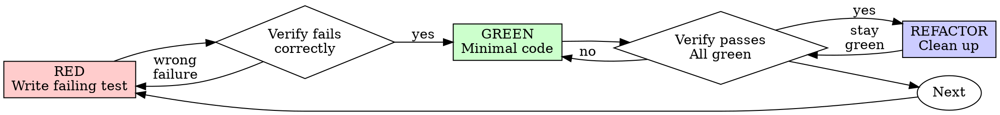

# Codex session 019f1423-50c1-7231-804b-b7f3978d4b03

- Started: `2026-06-29T16:08:10.984Z`
- Working directory: `D:\100XH100`
- Originator: `Codex Desktop`
- Codex CLI: `0.142.3`
- Source log: `C:\Users\Иван Литвак\.codex\sessions\2026\06\29\rollout-2026-06-29T19-08-10-019f1423-50c1-7231-804b-b7f3978d4b03.jsonl`
- Entries: user=2, assistant=43, tool calls=52, tool outputs=52

This is a chronological export of the user/assistant conversation and tool activity. Internal system/developer instructions and token accounting are intentionally excluded. Secret-shaped values are redacted; oversized tool outputs retain their beginning and end with the omitted character count.

## 1. User

Time: `2026-06-29T16:08:18.178Z` · source line `4`

```text
# AGENTS.md instructions for D:\100XH100

<INSTRUCTIONS>
# Project Agent Rules

## Operating Rule
- Read `AGENTS.md` before project edits.
- Update `memory/CHANGELOG.md` after meaningful code, config, or architecture changes.
- Update `memory/PROMPTS.md` with user prompts that define requirements.
- Store test outputs, logs, and verification notes under `test_results/`.
- Prefer agent-centered code: explicit contracts, deterministic tests, small files, low hidden state.

## Architecture Source
- Primary architecture contract: `ARCHITECTURE_NEED.md`.
- Current Stream 4 implementation rule: use threshold + compact + CUB/fixed-temp sort/reduce + compact; do not use Stream 4 hash-table dedup.

## Implementation Guardrails
- `State128` logical bytes are `v[0..119]`.
- `State128` padding bytes are `v[120..127]`.
- Persistent frontier padding must be zero.
- `FinalResponse` may temporarily store `target_local_idx` in `v[120..123]`.
- `Hash128` is one logical 128-bit key stored as `{lo, hi}`.
- `CandidateMeta` must remain 32 bytes and 32-byte aligned.
- Stream 3 payload id must be original candidate id, not compact index.
- Stream 4 must not apply shard top-k or semantic shard cap.

</INSTRUCTIONS>
<environment_context>
  <cwd>D:\100XH100</cwd>
  <shell>powershell</shell>
  <current_date>2026-06-29</current_date>
  <timezone>Europe/Moscow</timezone>
  <filesystem><workspace_roots><root>D:\100XH100</root></workspace_roots><permission_profile type="managed"><file_system type="restricted"><entry access="read"><special>:root</special></entry><entry access="write"><path>D:\100XH100</path></entry><entry access="write"><special>:slash_tmp</special></entry><entry access="write"><special>:tmpdir</special></entry><entry access="read"><path>D:\100XH100\.git</path></entry><entry access="read"><path>D:\100XH100\.agents</path></entry><entry access="read"><path>D:\100XH100\.codex</path></entry></file_system></permission_profile></filesystem>
</environment_context>
```

## 2. User

Time: `2026-06-29T16:08:18.191Z` · source line `6`

```text
You are a fresh Worker for Task 4 quality-fix in subagent-driven workflow. Edit files directly in worktree `D:\100XH100\.worktrees\stream1-piece-transformer`. You are not alone in the codebase: do not revert unrelated changes and do not touch untracked docs/build artifacts unless needed.

Current HEAD is expected to be `cd17b18964234e058ebc2420e02902c2eece549a` (`Add Stream1 transformer weight loader`), which passed spec review but failed quality review. Your task is to fix only the quality findings and amend that commit.

Read first:
- `AGENTS.md`
- `tools/stream1_weight_io.hpp`
- `cuda/runtime_config.cpp`
- `tools/production_runner.cu`
- `tools/stream_benchmark.cu`
- `tests/contract_tests.cpp`
- `memory/PROMPTS.md`, `memory/CHANGELOG.md`
- `test_results/stream1_transformer_loader_2026-06-29.md`

Quality findings to fix:
1. Runtime sizing risk: `cuda/runtime_config.cpp` still estimates Stream1 with MLP formulas, while `production_runner.cu` now accepts transformer weights via `load_stream1_weights()` before sizing/allocation. Until forward dispatch is implemented, fail closed earlier in runner/benchmark before runtime sizing/allocation for `piece_transformer`, with a clear message `piece_transformer Stream1 forward is not wired yet`. Do not implement forward or dispatcher in this fix. Do not fallback.
2. Manifest fallback parsing: `parse_manifest_u32_any()` catches all parse errors, so malformed `transformer_layers` falls through to `num_layers`; it also does not reject manifests containing both `transformer_layers` and `num_layers` with different values. Add safer optional/fallback u32 parsing: fallback only when primary key is absent, reject malformed primary, and reject mismatch when both keys exist. Add tests.
3. Allocation failure exception-safety: `upload_weights()` and `alloc_stream1_scratch()` can leak already allocated pointers if later cudaMalloc/copy throws. Add catch/free/rethrow or small RAII guard around allocation paths. Keep successful behavior unchanged.
4. New user requirement for later task: transformer forward should use FlashAttention 2 / similar speedups without changing weights and should be broadly transformer-compatible. Capture this in `memory/PROMPTS.md` or the plan notes, but do not implement FlashAttention in Task 4.

Verification required:
- Run focused CPU contract test route if possible.
- Run Python exporter tests if touched compatibility indirectly.
- Run `git diff --check`.
- Update `test_results/stream1_transformer_loader_2026-06-29.md` with commands/results.
- Update `memory/CHANGELOG.md` if behavior changed; update `memory/PROMPTS.md` for the FlashAttention requirement.
- Amend commit. Return DONE/DONE_WITH_CONCERNS with commit SHA, files changed, and verification.

Hard constraints:
- NO fallback backend.
- NO transformer forward kernel yet.
- NO production dispatch execution for transformer yet.
- Do not alter State128, Stream3, Stream4 contracts, or existing MLP behavior.
```

## 3. Codex

Time: `2026-06-29T16:08:40.818Z` · source line `9`

```text
I’ll treat this as review-feedback work in the existing worktree, so I’m first loading the relevant workflow guidance and the project rules before touching files. After that I’ll patch only the Stream1 loader/runtime guard paths and amend the existing commit.
```

## 4. Codex

Time: `2026-06-29T16:08:40.829Z` · source line `10`

```text
I’ll treat this as review-feedback work in the existing worktree, so I’m first loading the relevant workflow guidance and the project rules before touching files. After that I’ll patch only the Stream1 loader/runtime guard paths and amend the existing commit.
```

## 5. Tool call: `exec_command`

Time: `2026-06-29T16:08:40.830Z` · source line `11`

```text
{"cmd":"Get-Content -LiteralPath 'C:\\Users\\Иван Литвак\\.codex\\plugins\\cache\\openai-curated-remote\\superpowers\\5.1.4\\skills\\receiving-code-review\\SKILL.md'","workdir":"D:\\100XH100","shell":"powershell","yield_time_ms":10000,"max_output_tokens":20000}
```

## 6. Tool call: `exec_command`

Time: `2026-06-29T16:08:40.831Z` · source line `12`

```text
{"cmd":"Select-String -LiteralPath 'C:\\Users\\Иван Литвак\\.codex\\memories\\MEMORY.md' -Pattern 'D:\\\\100XH100|stream1|Stream1|BEAM_PREBUILT_RUNNER|cayleypy-beam-results' -Context 2,2","workdir":"D:\\100XH100","shell":"powershell","yield_time_ms":10000,"max_output_tokens":20000}
```

## 7. Tool call: `exec_command`

Time: `2026-06-29T16:08:40.831Z` · source line `13`

```text
{"cmd":"Get-Content -LiteralPath 'D:\\100XH100\\.worktrees\\stream1-piece-transformer\\AGENTS.md'","workdir":"D:\\100XH100","shell":"powershell","yield_time_ms":10000,"max_output_tokens":20000}
```

## 8. Tool output

Time: `2026-06-29T16:08:41.937Z` · source line `14`

````text
Chunk ID: 4c487c
Wall time: 0.7441 seconds
Process exited with code 0
Original token count: 1649
Output:
---
name: receiving-code-review
description: Use when receiving code review feedback, before implementing suggestions, especially if feedback seems unclear or technically questionable - requires technical rigor and verification, not performative agreement or blind implementation
---

# Code Review Reception

## Overview

Code review requires technical evaluation, not emotional performance.

**Core principle:** Verify before implementing. Ask before assuming. Technical correctness over social comfort.

## The Response Pattern

```
WHEN receiving code review feedback:

1. READ: Complete feedback without reacting
2. UNDERSTAND: Restate requirement in own words (or ask)
3. VERIFY: Check against codebase reality
4. EVALUATE: Technically sound for THIS codebase?
5. RESPOND: Technical acknowledgment or reasoned pushback
6. IMPLEMENT: One item at a time, test each
```

## Forbidden Responses

**NEVER:**
- "You're absolutely right!" (explicit CLAUDE.md violation)
- "Great point!" / "Excellent feedback!" (performative)
- "Let me implement that now" (before verification)

**INSTEAD:**
- Restate the technical requirement
- Ask clarifying questions
- Push back with technical reasoning if wrong
- Just start working (actions > words)

## Handling Unclear Feedback

```
IF any item is unclear:
  STOP - do not implement anything yet
  ASK for clarification on unclear items

WHY: Items may be related. Partial understanding = wrong implementation.
```

**Example:**
```
your human partner: "Fix 1-6"
You understand 1,2,3,6. Unclear on 4,5.

вќЊ WRONG: Implement 1,2,3,6 now, ask about 4,5 later
вњ… RIGHT: "I understand items 1,2,3,6. Need clarification on 4 and 5 before proceeding."
```

## Source-Specific Handling

### From your human partner
- **Trusted** - implement after understanding
- **Still ask** if scope unclear
- **No performative agreement**
- **Skip to action** or technical acknowledgment

### From External Reviewers
```
BEFORE implementing:
  1. Check: Technically correct for THIS codebase?
  2. Check: Breaks existing functionality?
  3. Check: Reason for current implementation?
  4. Check: Works on all platforms/versions?
  5. Check: Does reviewer understand full context?

IF suggestion seems wrong:
  Push back with technical reasoning

IF can't easily verify:
  Say so: "I can't verify this without [X]. Should I [investigate/ask/proceed]?"

IF conflicts with your human partner's prior decisions:
  Stop and discuss with your human partner first
```

**your human partner's rule:** "External feedback - be skeptical, but check carefully"

## YAGNI Check for "Professional" Features

```
IF reviewer suggests "implementing properly":
  grep codebase for actual usage

  IF unused: "This endpoint isn't called. Remove it (YAGNI)?"
  IF used: Then implement properly
```

**your human partner's rule:** "You and reviewer both report to me. If we don't need this feature, don't add it."

## Implementation Order

```
FOR multi-item feedback:
  1. Clarify anything unclear FIRST
  2. Then implement in this order:
     - Blocking issues (breaks, security)
     - Simple fixes (typos, imports)
     - Complex fixes (refactoring, logic)
  3. Test each fix individually
  4. Verify no regressions
```

## When To Push Back

Push back when:
- Suggestion breaks existing functionality
- Reviewer lacks full context
- Violates YAGNI (unused feature)
- Technically incorrect for this stack
- Legacy/compatibility reasons exist
- Conflicts with your human partner's architectural decisions

**How to push back:**
- Use technical reasoning, not defensiveness
- Ask specific questions
- Reference working tests/code
- Involve your human partner if architectural

**Signal if uncomfortable pushing back out loud:** "Strange things are afoot at the Circle K"

## Acknowledging Correct Feedback

When feedback IS correct:
```
вњ… "Fixed. [Brief description of what changed]"
вњ… "Good catch - [specific issue]. Fixed in [location]."
вњ… [Just fix it and show in the code]

вќЊ "You're absolutely right!"
вќЊ "Great point!"
вќЊ "Thanks for catching that!"
вќЊ "Thanks for [anything]"
вќЊ ANY gratitude expression
```

**Why no thanks:** Actions speak. Just fix it. The code itself shows you heard the feedback.

**If you catch yourself about to write "Thanks":** DELETE IT. State the fix instead.

## Gracefully Correcting Your Pushback

If you pushed back and were wrong:
```
вњ… "You were right - I checked [X] and it does [Y]. Implementing now."
вњ… "Verified this and you're correct. My initial understanding was wrong because [reason]. Fixing."

вќЊ Long apology
вќЊ Defending why you pushed back
вќЊ Over-explaining
```

State the correction factually and move on.

## Common Mistakes

| Mistake | Fix |
|---------|-----|
| Performative agreement | State requirement or just act |
| Blind implementation | Verify against codebase first |
| Batch without testing | One at a time, test each |
| Assuming reviewer is right | Check if breaks things |
| Avoiding pushback | Technical correctness > comfort |
| Partial implementation | Clarify all items first |
| Can't verify, proceed anyway | State limitation, ask for direction |

## Real Examples

**Performative Agreement (Bad):**
```
Reviewer: "Remove legacy code"
вќЊ "You're absolutely right! Let me remove that..."
```

**Technical Verification (Good):**
```
Reviewer: "Remove legacy code"
вњ… "Checking... build target is 10.15+, this API needs 13+. Need legacy for backward compat. Current impl has wrong bundle ID - fix it or drop pre-13 support?"
```

**YAGNI (Good):**
```
Reviewer: "Implement proper metrics tracking with database, date filters, CSV export"
вњ… "Grepped codebase - nothing calls this endpoint. Remove it (YAGNI)? Or is there usage I'm missing?"
```

**Unclear Item (Good):**
```
your human partner: "Fix items 1-6"
You understand 1,2,3,6. Unclear on 4,5.
вњ… "Understand 1,2,3,6. Need clarification on 4 and 5 before implementing."
```

## GitHub Thread Replies

When replying to inline review comments on GitHub, reply in the comment thread (`gh api repos/{owner}/{repo}/pulls/{pr}/comments/{id}/replies`), not as a top-level PR comment.

## The Bottom Line

**External feedback = suggestions to evaluate, not orders to follow.**

Verify. Question. Then implement.

No performative agreement. Technical rigor always.

````

## 9. Tool output

Time: `2026-06-29T16:08:44.720Z` · source line `15`

```text
Chunk ID: ad3f3d
Wall time: 3.5009 seconds
Process exited with code 0
Original token count: 1707
Output:

  C:\Users\Иван Литвак\.codex\memories\MEMORY.md:46:# Task Group: MEPhI IHES cluster publishing, shared prebuilt runner
, and inventory-driven backfill
  C:\Users\Иван Литвак\.codex\memories\MEMORY.md:47:scope: Running the IHES MEPhI cluster workflow with one shared preb
uilt `production_runner`, publishing solved puzzles into a dedicated GitHub results repo, and aggregating mixed cluster
 artifacts from on-cluster inventories.
> C:\Users\Иван Литвак\.codex\memories\MEMORY.md:48:applies_to: cwd=D:\100XH100; reuse_rule=reuse for this IHES/MEPhI r
epo family and adjacent cluster publish jobs, but treat live cluster inventory, DNS availability, and current results-r
epo schema as run-specific and recheck them before publishing.
  C:\Users\Иван Литвак\.codex\memories\MEMORY.md:49:
  C:\Users\Иван Литвак\.codex\memories\MEMORY.md:50:## Task 1: Launch IHES array jobs against one shared prebuilt runne
r, outcome success
  C:\Users\Иван Литвак\.codex\memories\MEMORY.md:52:### rollout_summary_files
  C:\Users\Иван Литвак\.codex\memories\MEMORY.md:53:
> C:\Users\Иван Литвак\.codex\memories\MEMORY.md:54:- rollout_summaries/2026-06-04T15-47-52-Dd1O-ihes_cluster_results_p
rebuilt_publish_backfill.md (cwd=\\?\D:\100XH100, rollout_path=\\?\C:\Users\Иван Литвак\.codex\sessions\2026\06\04\roll
out-2026-06-04T18-47-57-019e9351-cd3b-71c0-bf8b-69755d08d5fc.jsonl, updated_at=2026-06-26T19:51:22+00:00, thread_id=019
e9351-cd3b-71c0-bf8b-69755d08d5fc, the prebuilt runner was compiled once and reused across the A100 array workflow)
  C:\Users\Иван Литвак\.codex\memories\MEMORY.md:55:
  C:\Users\Иван Литвак\.codex\memories\MEMORY.md:56:### keywords
  C:\Users\Иван Литвак\.codex\memories\MEMORY.md:57:
> C:\Users\Иван Литвак\.codex\memories\MEMORY.md:58:- MEPhI HPC, kaf12, A100 40GB, BEAM_PREBUILT_RUNNER, prepare_ihes_p
rebuilt_runner.sh, ihes_solve_bucket_from_scratch.sh, prebuilt_runner_ready, using_prebuilt_runner, PUZZLE_LIMIT=1, dep
th=12
  C:\Users\Иван Литвак\.codex\memories\MEMORY.md:59:
  C:\Users\Иван Литвак\.codex\memories\MEMORY.md:60:## Task 2: Publish per-puzzle IHES results and backfill existing bu
cket outputs into the GitHub results repo, outcome success
  C:\Users\Иван Литвак\.codex\memories\MEMORY.md:62:### rollout_summary_files
  C:\Users\Иван Литвак\.codex\memories\MEMORY.md:63:
> C:\Users\Иван Литвак\.codex\memories\MEMORY.md:64:- rollout_summaries/2026-06-04T15-47-52-Dd1O-ihes_cluster_results_p
rebuilt_publish_backfill.md (cwd=\\?\D:\100XH100, rollout_path=\\?\C:\Users\Иван Литвак\.codex\sessions\2026\06\04\roll
out-2026-06-04T18-47-57-019e9351-cd3b-71c0-bf8b-69755d08d5fc.jsonl, updated_at=2026-06-26T19:51:22+00:00, thread_id=019
e9351-cd3b-71c0-bf8b-69755d08d5fc, the results repo structure and first backfilled puzzle sets were established)
  C:\Users\Иван Литвак\.codex\memories\MEMORY.md:65:
  C:\Users\Иван Литвак\.codex\memories\MEMORY.md:66:### keywords
  C:\Users\Иван Литвак\.codex\memories\MEMORY.md:67:
> C:\Users\Иван Литвак\.codex\memories\MEMORY.md:68:- cayleypy-beam-results, p0027, p0031, p0033, data/ihes_cube/index.
tsv, improvements.tsv, unique_solutions.tsv, metadata.env, summary.md, solve_bucket_fresh, github.com DNS
  C:\Users\Иван Литвак\.codex\memories\MEMORY.md:69:
  C:\Users\Иван Литвак\.codex\memories\MEMORY.md:70:## Task 3: Inventory mixed IHES cluster files and make the publishe
r schema-tolerant, outcome partial
  C:\Users\Иван Литвак\.codex\memories\MEMORY.md:72:### rollout_summary_files
  C:\Users\Иван Литвак\.codex\memories\MEMORY.md:73:
> C:\Users\Иван Литвак\.codex\memories\MEMORY.md:74:- rollout_summaries/2026-06-04T15-47-52-Dd1O-ihes_cluster_results_p
rebuilt_publish_backfill.md (cwd=\\?\D:\100XH100, rollout_path=\\?\C:\Users\Иван Литвак\.codex\sessions\2026\06\04\roll
out-2026-06-04T18-47-57-019e9351-cd3b-71c0-bf8b-69755d08d5fc.jsonl, updated_at=2026-06-26T19:51:22+00:00, thread_id=019
e9351-cd3b-71c0-bf8b-69755d08d5fc, a file-driven inventory plus schema fixes made the larger aggregator path workable)
  C:\Users\Иван Литвак\.codex\memories\MEMORY.md:75:
  C:\Users\Иван Литвак\.codex\memories\MEMORY.md:76:### keywords
  C:\Users\Иван Литвак\.codex\memories\MEMORY.md:87:## Reusable knowledge
  C:\Users\Иван Литвак\.codex\memories\MEMORY.md:88:
> C:\Users\Иван Литвак\.codex\memories\MEMORY.md:89:- `hpc/ihes_cube_model/prepare_ihes_prebuilt_runner.sh` builds the 
shared binary at `/mnt/pool/6/vokirova/beam8a100/ihes_cube_model/prebuilt-a100-ihes/production_runner`, and `hpc/ihes_c
ube_model/ihes_solve_bucket_from_scratch.sh` already knows how to consume `BEAM_PREBUILT_RUNNER` [Task 1]
  C:\Users\Иван Литвак\.codex\memories\MEMORY.md:90:- the verified runtime on basis exposed `world_size_effective=8`, `
NCCL 2.21.5+cuda12.4`, and eight visible A100-40GB GPUs, so the prebuilt-runner path was validated on the actual target
 hardware [Task 1]
  C:\Users\Иван Литвак\.codex\memories\MEMORY.md:91:- the durable results layout is `data/ihes_cube/puzzles/pXXXX/solut
ions.tsv`, `unique_solutions.tsv`, `metadata.env`, `summary.md`, plus root-level `index.tsv` and `improvements.tsv`; no
n-full-solution repair artifacts belong under separate `repair_segments/` trees [Task 2]
  C:\Users\Иван Литвак\.codex\memories\MEMORY.md:95:## Failures and how to do differently
  C:\Users\Иван Литвак\.codex\memories\MEMORY.md:96:
> C:\Users\Иван Литвак\.codex\memories\MEMORY.md:97:- symptom: each array task recompiles instead of reusing the solver
. cause: `BEAM_PREBUILT_RUNNER` was not wired through a separate prebuild dependency. fix: submit the prebuild first an
d make the puzzle array depend on it via `--dependency=afterok:<prebuild_job>` [Task 1]
  C:\Users\Иван Литвак\.codex\memories\MEMORY.md:98:- symptom: cluster-side publish fails after compute succeeds. cause
: the compute node cannot resolve `github.com` or otherwise lacks GitHub network access. fix: tolerate cluster-side pus
h failure and leave local commits/results ready for later push from a node with working DNS/network [Task 2]
  C:\Users\Иван Литвак\.codex\memories\MEMORY.md:99:- symptom: the backfill/index writer crashes on old rows. cause: me
tadata rows carried extra keys such as `variants` and `source_files` that were not declared in the index schema. fix: w
iden the declared schema and filter outgoing rows to declared fields before writing [Task 2][Task 3]


```

## 10. Tool output

Time: `2026-06-29T16:08:44.720Z` · source line `16`

```text
Chunk ID: 136825
Wall time: 0.2284 seconds
Process exited with code 0
Original token count: 290
Output:
# Project Agent Rules

## Operating Rule
- Read `AGENTS.md` before project edits.
- Update `memory/CHANGELOG.md` after meaningful code, config, or architecture changes.
- Update `memory/PROMPTS.md` with user prompts that define requirements.
- Store test outputs, logs, and verification notes under `test_results/`.
- Prefer agent-centered code: explicit contracts, deterministic tests, small files, low hidden state.

## Architecture Source
- Primary architecture contract: `ARCHITECTURE_NEED.md`.
- Current Stream 4 implementation rule: use threshold + compact + CUB/fixed-temp sort/reduce + compact; do not use Stream 4 hash-table dedup.

## Implementation Guardrails
- `State128` logical bytes are `v[0..119]`.
- `State128` padding bytes are `v[120..127]`.
- Persistent frontier padding must be zero.
- `FinalResponse` may temporarily store `target_local_idx` in `v[120..123]`.
- `Hash128` is one logical 128-bit key stored as `{lo, hi}`.
- `CandidateMeta` must remain 32 bytes and 32-byte aligned.
- Stream 3 payload id must be original candidate id, not compact index.
- Stream 4 must not apply shard top-k or semantic shard cap.

```

## 11. Codex

Time: `2026-06-29T16:08:53.262Z` · source line `19`

```text
The review items are specific enough to implement without clarification. I’m also loading the bugfix testing guidance because this is a targeted behavior fix with required contract-test coverage.
```

## 12. Codex

Time: `2026-06-29T16:08:53.272Z` · source line `20`

```text
The review items are specific enough to implement without clarification. I’m also loading the bugfix testing guidance because this is a targeted behavior fix with required contract-test coverage.
```

## 13. Tool call: `exec_command`

Time: `2026-06-29T16:08:53.294Z` · source line `21`

```text
{"cmd":"Get-Content -LiteralPath 'C:\\Users\\Иван Литвак\\.codex\\plugins\\cache\\openai-curated-remote\\superpowers\\5.1.4\\skills\\test-driven-development\\SKILL.md'","workdir":"D:\\100XH100\\.worktrees\\stream1-piece-transformer","shell":"powershell","yield_time_ms":10000,"max_output_tokens":20000}
```

## 14. Tool call: `exec_command`

Time: `2026-06-29T16:08:53.299Z` · source line `22`

```text
{"cmd":"git rev-parse HEAD","workdir":"D:\\100XH100\\.worktrees\\stream1-piece-transformer","shell":"powershell","yield_time_ms":10000,"max_output_tokens":20000}
```

## 15. Tool call: `exec_command`

Time: `2026-06-29T16:08:53.300Z` · source line `23`

```text
{"cmd":"git status --short","workdir":"D:\\100XH100\\.worktrees\\stream1-piece-transformer","shell":"powershell","yield_time_ms":10000,"max_output_tokens":20000}
```

## 16. Tool output

Time: `2026-06-29T16:08:54.378Z` · source line `24`

````text
Chunk ID: a8e34b
Wall time: 0.2270 seconds
Process exited with code 0
Original token count: 2565
Output:
---
name: test-driven-development
description: Use when implementing any feature or bugfix, before writing implementation code
---

# Test-Driven Development (TDD)

## Overview

Write the test first. Watch it fail. Write minimal code to pass.

**Core principle:** If you didn't watch the test fail, you don't know if it tests the right thing.

**Violating the letter of the rules is violating the spirit of the rules.**

## When to Use

**Always:**
- New features
- Bug fixes
- Refactoring
- Behavior changes

**Exceptions (ask your human partner):**
- Throwaway prototypes
- Generated code
- Configuration files

Thinking "skip TDD just this once"? Stop. That's rationalization.

## The Iron Law

```
NO PRODUCTION CODE WITHOUT A FAILING TEST FIRST
```

Write code before the test? Delete it. Start over.

**No exceptions:**
- Don't keep it as "reference"
- Don't "adapt" it while writing tests
- Don't look at it
- Delete means delete

Implement fresh from tests. Period.

## Red-Green-Refactor



### RED - Write Failing Test

Write one minimal test showing what should happen.

<Good>
```typescript
test('retries failed operations 3 times', async () => {
  let attempts = 0;
  const operation = () => {
    attempts++;
    if (attempts < 3) throw new Error('fail');
    return 'success';
  };

  const result = await retryOperation(operation);

  expect(result).toBe('success');
  expect(attempts).toBe(3);
});
```
Clear name, tests real behavior, one thing
</Good>

<Bad>
```typescript
test('retry works', async () => {
  const mock = jest.fn()
    .mockRejectedValueOnce(new Error())
    .mockRejectedValueOnce(new Error())
    .mockResolvedValueOnce('success');
  await retryOperation(mock);
  expect(mock).toHaveBeenCalledTimes(3);
});
```
Vague name, tests mock not code
</Bad>

**Requirements:**
- One behavior
- Clear name
- Real code (no mocks unless unavoidable)

### Verify RED - Watch It Fail

**MANDATORY. Never skip.**

```bash
npm test path/to/test.test.ts
```

Confirm:
- Test fails (not errors)
- Failure message is expected
- Fails because feature missing (not typos)

**Test passes?** You're testing existing behavior. Fix test.

**Test errors?** Fix error, re-run until it fails correctly.

### GREEN - Minimal Code

Write simplest code to pass the test.

<Good>
```typescript
async function retryOperation<T>(fn: () => Promise<T>): Promise<T> {
  for (let i = 0; i < 3; i++) {
    try {
      return await fn();
    } catch (e) {
      if (i === 2) throw e;
    }
  }
  throw new Error('unreachable');
}
```
Just enough to pass
</Good>

<Bad>
```typescript
async function retryOperation<T>(
  fn: () => Promise<T>,
  options?: {
    maxRetries?: number;
    backoff?: 'linear' | 'exponential';
    onRetry?: (attempt: number) => void;
  }
): Promise<T> {
  // YAGNI
}
```
Over-engineered
</Bad>

Don't add features, refactor other code, or "improve" beyond the test.

### Verify GREEN - Watch It Pass

**MANDATORY.**

```bash
npm test path/to/test.test.ts
```

Confirm:
- Test passes
- Other tests still pass
- Output pristine (no errors, warnings)

**Test fails?** Fix code, not test.

**Other tests fail?** Fix now.

### REFACTOR - Clean Up

After green only:
- Remove duplication
- Improve names
- Extract helpers

Keep tests green. Don't add behavior.

### Repeat

Next failing test for next feature.

## Good Tests

| Quality | Good | Bad |
|---------|------|-----|
| **Minimal** | One thing. "and" in name? Split it. | `test('validates email and domain and whitespace')` |
| **Clear** | Name describes behavior | `test('test1')` |
| **Shows intent** | Demonstrates desired API | Obscures what code should do |

## Why Order Matters

**"I'll write tests after to verify it works"**

Tests written after code pass immediately. Passing immediately proves nothing:
- Might test wrong thing
- Might test implementation, not behavior
- Might miss edge cases you forgot
- You never saw it catch the bug

Test-first forces you to see the test fail, proving it actually tests something.

**"I already manually tested all the edge cases"**

Manual testing is ad-hoc. You think you tested everything but:
- No record of what you tested
- Can't re-run when code changes
- Easy to forget cases under pressure
- "It worked when I tried it" в‰  comprehensive

Automated tests are systematic. They run the same way every time.

**"Deleting X hours of work is wasteful"**

Sunk cost fallacy. The time is already gone. Your choice now:
- Delete and rewrite with TDD (X more hours, high confidence)
- Keep it and add tests after (30 min, low confidence, likely bugs)

The "waste" is keeping code you can't trust. Working code without real tests is technical debt.

**"TDD is dogmatic, being pragmatic means adapting"**

TDD IS pragmatic:
- Finds bugs before commit (faster than debugging after)
- Prevents regressions (tests catch breaks immediately)
- Documents behavior (tests show how to use code)
- Enables refactoring (change freely, tests catch breaks)

"Pragmatic" shortcuts = debugging in production = slower.

**"Tests after achieve the same goals - it's spirit not ritual"**

No. Tests-after answer "What does this do?" Tests-first answer "What should this do?"

Tests-after are biased by your implementation. You test what you built, not what's required. You verify remembered edge cases, not discovered ones.

Tests-first force edge case discovery before implementing. Tests-after verify you remembered everything (you didn't).

30 minutes of tests after в‰  TDD. You get coverage, lose proof tests work.

## Common Rationalizations

| Excuse | Reality |
|--------|---------|
| "Too simple to test" | Simple code breaks. Test takes 30 seconds. |
| "I'll test after" | Tests passing immediately prove nothing. |
| "Tests after achieve same goals" | Tests-after = "what does this do?" Tests-first = "what should this do?" |
| "Already manually tested" | Ad-hoc в‰  systematic. No record, can't re-run. |
| "Deleting X hours is wasteful" | Sunk cost fallacy. Keeping unverified code is technical debt. |
| "Keep as reference, write tests first" | You'll adapt it. That's testing after. Delete means delete. |
| "Need to explore first" | Fine. Throw away exploration, start with TDD. |
| "Test hard = design unclear" | Listen to test. Hard to test = hard to use. |
| "TDD will slow me down" | TDD faster than debugging. Pragmatic = test-first. |
| "Manual test faster" | Manual doesn't prove edge cases. You'll re-test every change. |
| "Existing code has no tests" | You're improving it. Add tests for existing code. |

## Red Flags - STOP and Start Over

- Code before test
- Test after implementation
- Test passes immediately
- Can't explain why test failed
- Tests added "later"
- Rationalizing "just this once"
- "I already manually tested it"
- "Tests after achieve the same purpose"
- "It's about spirit not ritual"
- "Keep as reference" or "adapt existing code"
- "Already spent X hours, deleting is wasteful"
- "TDD is dogmatic, I'm being pragmatic"
- "This is different because..."

**All of these mean: Delete code. Start over with TDD.**

## Example: Bug Fix

**Bug:** Empty email accepted

**RED**
```typescript
test('rejects empty email', async () => {
  const result = await submitForm({ email: '' });
  expect(result.error).toBe('Email required');
});
```

**Verify RED**
```bash
$ npm test
FAIL: expected 'Email required', got undefined
```

**GREEN**
```typescript
function submitForm(data: FormData) {
  if (!data.email?.trim()) {
    return { error: 'Email required' };
  }
  // ...
}
```

**Verify GREEN**
```bash
$ npm test
PASS
```

**REFACTOR**
Extract validation for multiple fields if needed.

## Verification Checklist

Before marking work complete:

- [ ] Every new function/method has a test
- [ ] Watched each test fail before implementing
- [ ] Each test failed for expected reason (feature missing, not typo)
- [ ] Wrote minimal code to pass each test
- [ ] All tests pass
- [ ] Output pristine (no errors, warnings)
- [ ] Tests use real code (mocks only if unavoidable)
- [ ] Edge cases and errors covered

Can't check all boxes? You skipped TDD. Start over.

## When Stuck

| Problem | Solution |
|---------|----------|
| Don't know how to test | Write wished-for API. Write assertion first. Ask your human partner. |
| Test too complicated | Design too complicated. Simplify interface. |
| Must mock everything | Code too coupled. Use dependency injection. |
| Test setup huge | Extract helpers. Still complex? Simplify design. |

## Debugging Integration

Bug found? Write failing test reproducing it. Follow TDD cycle. Test proves fix and prevents regression.

Never fix bugs without a test.

## Testing Anti-Patterns

When adding mocks or test utilities, read @testing-anti-patterns.md to avoid common pitfalls:
- Testing mock behavior instead of real behavior
- Adding test-only methods to production classes
- Mocking without understanding dependencies

## Final Rule

```
Production code в†’ test exists and failed first
Otherwise в†’ not TDD
```

No exceptions without your human partner's permission.

````

## 17. Tool output

Time: `2026-06-29T16:08:55.365Z` · source line `25`

```text
Chunk ID: 7b81b1
Wall time: 1.1796 seconds
Process exited with code 0
Original token count: 11
Output:
cd17b18964234e058ebc2420e02902c2eece549a

```

## 18. Tool output

Time: `2026-06-29T16:08:55.376Z` · source line `26`

```text
Chunk ID: a17933
Wall time: 0.7708 seconds
Process exited with code 0
Original token count: 39
Output:
?? $null
?? build-contract-tests/
?? config.obj
?? contract_tests.obj
?? docs/
?? frontier_cpu.obj
?? hash.obj
?? state.obj
?? stream3.obj
?? stream4.obj

```

## 19. Codex

Time: `2026-06-29T16:09:05.589Z` · source line `29`

```text
HEAD matches the expected review target. The worktree has unrelated untracked build/docs artifacts already present, so I’ll leave them alone and only stage the files needed for this fix.
```

## 20. Codex

Time: `2026-06-29T16:09:05.595Z` · source line `30`

```text
HEAD matches the expected review target. The worktree has unrelated untracked build/docs artifacts already present, so I’ll leave them alone and only stage the files needed for this fix.
```

## 21. Tool call: `exec_command`

Time: `2026-06-29T16:09:05.625Z` · source line `31`

```text
{"cmd":"Get-Content -LiteralPath 'D:\\100XH100\\.worktrees\\stream1-piece-transformer\\tools\\stream1_weight_io.hpp'","workdir":"D:\\100XH100\\.worktrees\\stream1-piece-transformer","shell":"powershell","yield_time_ms":10000,"max_output_tokens":40000}
```

## 22. Tool call: `exec_command`

Time: `2026-06-29T16:09:05.626Z` · source line `32`

```text
{"cmd":"Get-Content -LiteralPath 'D:\\100XH100\\.worktrees\\stream1-piece-transformer\\cuda\\runtime_config.cpp'","workdir":"D:\\100XH100\\.worktrees\\stream1-piece-transformer","shell":"powershell","yield_time_ms":10000,"max_output_tokens":40000}
```

## 23. Tool call: `exec_command`

Time: `2026-06-29T16:09:05.632Z` · source line `33`

```text
{"cmd":"Get-Content -LiteralPath 'D:\\100XH100\\.worktrees\\stream1-piece-transformer\\tools\\production_runner.cu'","workdir":"D:\\100XH100\\.worktrees\\stream1-piece-transformer","shell":"powershell","yield_time_ms":10000,"max_output_tokens":40000}
```

## 24. Tool call: `exec_command`

Time: `2026-06-29T16:09:05.638Z` · source line `34`

```text
{"cmd":"Get-Content -LiteralPath 'D:\\100XH100\\.worktrees\\stream1-piece-transformer\\tools\\stream_benchmark.cu'","workdir":"D:\\100XH100\\.worktrees\\stream1-piece-transformer","shell":"powershell","yield_time_ms":10000,"max_output_tokens":40000}
```

## 25. Tool output

Time: `2026-06-29T16:09:06.279Z` · source line `35`

Oversized output: `8209` characters omitted from the middle.

```text
Chunk ID: 07e1fb
Wall time: 0.2870 seconds
Process exited with code 0
Original token count: 10756
Output:
Warning: truncated output (original token count: 10756)
Total output lines: 862

#pragma once

#include "../src/config.hpp"

#ifndef BEAM_STREAM1_WEIGHT_IO_MANIFEST_ONLY
#include "cuda_check.hpp"
#include "../cuda/stream1.hpp"

#include <cuda_fp16.h>
#include <cuda_runtime.h>
#endif

#include <cstddef>
#include <cstdint>
#include <filesystem>
#include <fstream>
#include <iterator>
#include <limits>
#include <stdexcept>
#include <string>
#include <vector>

namespace beam::stream1_weights {

inline constexpr std::uint32_t TRANSFORMER_NUM_CLASSES = 120;
inline constexpr std::uint32_t TRANSFORMER_NUM_PIECES = 50;
inline constexpr std::uint32_t TRANSFORMER_MAX_PIECE_SIZE = 3;
inline constexpr std::uint32_t TRANSFORMER_SEQ_LEN = 51;
inline constexpr std::uint32_t TRANSFORMER_D_MODEL = 256;
inline constexpr std::uint32_t TRANSFORMER_NHEAD = 8;
inline constexpr std::uint32_t TRANSFORMER_HEAD_DIM = 32;
inline constexpr std::uint32_t TRANSFORMER_LAYERS = 4;
inline constexpr std::uint32_t TRANSFORMER_FF_DIM = 1024;

struct HostTransformerBlockBytes {
    std::vector<std::byte> ln1_gamma;
    std::vector<std::byte> ln1_beta;
    std::vector<std::byte> attn_qkv_weight;
    std::vector<std::byte> attn_qkv_bias;
    std::vector<std::byte> attn_out_weight;
    std::vector<std::byte> attn_out_bias;
    std::vector<std::byte> ln2_gamma;
    std::vector<std::byte> ln2_beta;
    std::vector<std::byte> ff1_weight;
    std::vector<std::byte> ff1_bias;
    std::vector<std::byte> ff2_weight;
    std::vector<std::byte> ff2_bias;
};

struct HostTransformerBytes {
    std::vector<std::byte> fast_slot_projected;
    std::vector<std::byte> fast_piece_static;
    std::vector<std::byte> cls_token;
    std::vector<std::byte> input_ln_gamma;
    std::vector<std::byte> input_ln_beta;
    std::vector<std::byte> output_ln_gamma;
    std::vector<std::byte> output_ln_beta;
    std::vector<HostTransformerBlockBytes> blocks;
    std::vector<std::byte> output_weight;
    std::vector<std::byte> output_bias;
    std::vector<std::byte> piece_positions;
    std::vector<std::byte> piece_mask;
    std::vector<std::byte> piece_types;
};

struct HostWeightBytes {
    Stream1ModelConfig model;
    std::vector<std::byte> input_weight;
    std::vector<std::byte> input_bias;
    std::vector<std::byte> input_ln_gamma;
    std::vector<std::byte> input_ln_beta;
    std::vector<std::byte> hidden_weight;
    std::vector<std::byte> hidden_bias;
    std::vector<std::byte> hidden_ln_gamma;
    std::vector<std::byte> hidden_ln_beta;
    std::vector<std::vector<std::byte>> residual_fc1_weight;
    std::vector<std::vector<std::byte>> residual_fc1_bias;
    std::vector<std::vector<std::byte>> residual_fc1_ln_gamma;
    std::vector<std::vector<std::byte>> residual_fc1_ln_beta;
    std::vector<std::vector<std::byte>> residual_fc2_weight;
    std::vector<std::vector<std::byte>> residual_fc2_bias;
    std::vector<std::vector<std::byte>> residual_fc2_ln_gamma;
    std::vector<std::vector<std::byte>> residual_fc2_ln_beta;
    std::vector<std::byte> output_weight;
    std::vector<std::byte> output_bias;
    HostTransformerBytes transformer;
};

#ifndef BEAM_STREAM1_WEIGHT_IO_MANIFEST_ONLY
struct DeviceTransformerBlockWeights {
    half* ln1_gamma = nullptr;
    half* ln1_beta = nullptr;
    half* attn_qkv_weight = nullptr;
    half* attn_qkv_bias = nullptr;
    half* attn_out_weight = nullptr;
    half* attn_out_bias = nullptr;
    half* ln2_gamma = nullptr;
    half* ln2_beta = nullptr;
    half* ff1_weight = nullptr;
    half* ff1_bias = nullptr;
    half* ff2_weight = nullptr;
    half* ff2_bias = nullptr;
};

struct DeviceTransformerWeights {
    half* fast_slot_projected = nullptr;
    half* fast_piece_static = nullptr;
    half* cls_token = nullptr;
    half* input_ln_gamma = nullptr;
    half* input_ln_beta = nullptr;
    half* output_ln_gamma = nullptr;
    half* output_ln_beta = nullptr;
    std::vector<DeviceTransformerBlockWeights> blocks;
    half* output_weight = nullptr;
    half* output_bias = nullptr;
    std::uint16_t* piece_positions = nullptr;
    std::uint8_t* piece_mask = nullptr;
    std::uint8_t* piece_types = nullptr;
};

struct DeviceWeights {
    half* input_weight = nullptr;
    half* input_bias = nullptr;
    half* input_ln_gamma = nullptr;
    half* input_ln_beta = nullptr;
    half* hidden_weight = nullptr;
    half* hidden_bias = nullptr;
    half* hidden_ln_gamma = nullptr;
    half* hidden_ln_beta = nullptr;
    std::vector<half*> residual_fc1_weight;
    std::vector<half*> residual_fc1_bias;
    std::vector<half*> residual_fc1_ln_gamma;
    std::vector<half*> residual_fc1_ln_beta;
    std::vector<half*> residual_fc2_weight;
    std::vector<half*> residual_fc2_bias;
    std::vector<half*> residual_fc2_ln_gamma;
    std::vector<half*> residual_fc2_ln_beta;
    half** residual_fc1_weight_table = nullptr;
    half** residual_fc1_bias_table = nullptr;
    half** residual_fc1_ln_gamma_table = nullptr;
    half** residual_fc1_ln_beta_table = nullptr;
    half** residual_fc2_weight_table = nullptr;
    half** residual_fc2_bias_table = nullptr;
    half** residual_fc2_ln_gamma_table = nullptr;
    half** residual_fc2_ln_beta_table = nullptr;
    half* output_weight = nullptr;
    half* output_bias = nullptr;
    DeviceTransformerWeights transformer;
};

struct ScratchAllocation {
    half* hidden1 = nullptr;
    half* hidden2 = nullptr;
    half* residual = nullptr;
    half* output = nullptr;
    half* transformer_tokens = nullptr;
    half* transformer_qkv = nullptr;
    float* transformer_attention_scores_probs = nullptr;
    half* transformer_attention_context = nullptr;
    half* transformer_ff_hidden = nullptr;
    half* transformer_logits = nullptr;
};
#endif

inline std::string read_text_exact(const std::filesystem::path& path) {
    std::ifstream file(path, std::ios::binary);
    if (!file) {
        throw std::runtime_error("cannot open required text file: " + path.string());
    }
    return std::string(std::istreambuf_iterator<char>(file), std::istreambuf_iterator<char>());
}

inline std::vector<std::byte> read_binary_exact(
    const std::filesystem::path& path,
    std::uint64_t expected_bytes) {
    if (expected_bytes > static_cast<std::uint64_t>(std::numeric_limits<std::size_t>::max())) {
        throw std::runtime_error("binary expected size exceeds size_t: " + path.string());
    }
    std::ifstream file(path, std::ios::binary);
    if (!file) {
        throw std::runtime_error("cannot open required binary file: " + path.string());
    }
    std::vector<std::byte> bytes(static_cast<std::size_t>(expected_bytes));
    file.read(reinterpret_cast<char*>(bytes.data()), static_cast<std::streamsize>(bytes.size()));
    const std::size_t actual = static_cast<std::size_t>(file.gcount());
    file.peek();
    if (actual != bytes.size() || !file.eof()) {
        throw std::runtime_error(
            "binary file size mismatch: " + path.string() +
            " expected=" + std::to_string(bytes.size()) +
            " actual_read=" + std::to_string(actual));
    }
    return bytes;
}

inline std::uint32_t parse_manifest_u32(const std::string& text, const char* key) {
    const std::string quoted = std::string("\"") + key + "\"";
    std::size_t pos = text.find(quoted);
    if (pos == std::string::npos) {
        throw std::runtime_error("stream1 manifest missing key: " + std::string(key));
    }
    pos = text.find(':', pos + quoted.size());
    if (pos == std::string::npos) {
        throw std::runtime_error("stream1 manifest malformed key: " + std::string(key));
    }
    ++pos;
    while (pos < text.size() && (text[pos] == ' ' || text[pos] == '\t' || text[pos] == '\r' || text[pos] == '\n')) {
        ++pos;
    }
    std::uint64_t value = 0;
    std::size_t digits = 0;
    while (pos < text.size() && text[pos] >= '0' && text[pos] <= '9') {
        value = value * 10ULL + static_cast<std::uint64_t>(text[pos] - '0');
        if (value > std::numeric_limits<std::uint32_t>::max()) {
            throw std::runtime_error("stream1 manifest key exceeds uint32: " + std::string(key));
        }
        ++pos;
        ++digits;
    }
    if (digits == 0) {
        throw std::runtime_error("stream1 manifest key is not uint32: " + std::string(key));
    }
    return static_cast<std::uint32_t>(value);
}

inline std::uint32_t parse_manifest_u32_any(
    const std::string& text,
    const char* primary_key,
    const char* fallback_key) {
    try {
        return parse_manifest_u32(text, primary_key);
    } catch (const std::runtime_error&) {
        return parse_manifest_u32(text, fallback_key);
    }
}

inline std::string parse_manifest_string(const std::string& text, const char* key) {
    const std::string quoted = std::string("\"") + key + "\"";
    std::size_t pos = text.find(quoted);
    if (pos == std::string::npos) {
        throw std::runtime_error("stream1 manifest missing key: " + std::string(key));
    }
    pos = text.find(':', pos + quoted.size());
    if (pos == std::string::npos) {
        throw std::runtime_error("stream1 manifest malformed key: " + std::string(key));
    }
    pos = text.find('"', pos + 1);
    if (pos == std::string::npos) {
        throw std::runtime_error("stream1 manifest string missing opening quote: " + std::string(key));
    }
    const std::size_t start = pos + 1;
    pos = text.find('"', start);
    if (pos == std::string::npos) {
        throw std::runtime_error("stream1 manifest string missing closing quote: " + std::string(key));
    }
    return text.substr(start, pos - start);
}

inline std::string parse_manifest_string_default(
    const std::string& text,
    const char* key,
    const std::string& default_value) {
    try {
        return parse_manifest_string(text, key);
    } catch (const std::runtime_error&) {
        return default_value;
    }
}

inline void require_manifest_u32(
    std::uint32_t actual,
    std::uint32_t expected,
    const char* key,
    const std::string& context) {
    if (actual != expected) {
        throw std::runtime_error(
            context + ": stream1 piece_transformer " + key + " must be " + std::to_string(expected) +
            " got " + std::to_string(actual));
    }
}

inline void require_manifest_string(
    const std::string& actual,
    const char* expected,
    const char* key,
    const std::string& context) {
    if (actual != expected) {
        throw std::runtime_error(
            context + ": stream1 piece_transformer " + key + " must be " + expected + " got " + actual);
    }
}

inline void validate_mlp_model_config(const Stream1ModelConfig& model, const std::string& context) {
    if (model.state_len != STATE_LEN) {
        throw std::runtime_error(context + ": stream1 state_len must match compile-time STATE_LEN");
    }
    if (model.num_classes < STATE_LEN ||
        (model.output_dim != MOVE_COUNT && model.output_dim != STREAM1_SINGLE_SCORE_OUTPUT_DIM)) {
        throw std::runtime_error(context + ": stream1 num_classes/output_dim incompatible with current puzzle");
    }
    if (model.dtype != STREAM1_DTYPE_FP16 && model.dtype != STREAM1_DTYPE_BF16) {
        throw std::runtime_error(context + ": stream1 dtype must be fp16 or bf16");
    }
    if (model.normalization != STREAM1_NORM_NONE && model.normalization != STREAM1_NORM_LAYERNORM) {
        throw std::runtime_error(context + ": stream1 normalization must be none or layernorm");
    }
    if (model.hidden1 == 0U || model.hidden2 == 0U || model.residual_count == 0U) {
        throw std::runtime_error(context + ": stream1 hidden sizes and residual_count must be nonzero");
    }
    if (model.hidden1 < model.hidden2) {
        throw std::runtime_error(context + ": stream1 hidden1 must be >= hidden2 because Stream1 reuses hidden1 scratch for residual output");
    }
    if (model.hidden1 % 8U != 0U || model.hidden2 % 8U != 0U) {
        throw std::runtime_error(context + ": stream1 hidden sizes must be multiples of 8 for TensorOp path");
    }
}

inline void validate_transformer_model_config(
    const Stream1ModelConfig& model,
    const std::string& activation,
    const std::string& pooling,
    const std::string& piece_layout,
    const std::string& piece_embed_mode,
    const std::string& context) {
    if (model.dtype != STREAM1_DTYPE_FP16 && model.dtype != STREAM1_DTYPE_BF16) {
        throw std::runtime_error(context + ": stream1 piece_transformer dtype must be fp16 or bf16");
    }
    require_manifest_u32(model.state_len, static_cast<std::uint32_t>(STATE_LEN), "state_len", context);
    require_manifest_u32(model.num_classes, TRANSFORMER_NUM_CLASSES, "num_classes", context);
    require_manifest_u32(model.output_dim, static_cast<std::uint32_t>(MOVE_COUNT), "output_dim", context);
    require_manifest_u32(model.num_pieces, TRANSFORMER_NUM_PIECES, "num_pieces", context);
    require_manifest_u32(model.max_piece_size, TRANSFORMER_MAX_PIECE_SIZE, "max_piece_size", context);
    require_manifest_u32(model.seq_len, TRANSFORMER_SEQ_LEN, "seq_len", context);
    require_manifest_u32(model.d_model, TRANSFORMER_D_MODEL, "d_model", context);
    require_manifest_u32(model.nhead, TRANSFORMER_NHEAD, "nhead", context);
    require_manifest_u32(model.head_dim, TRANSFORMER_HEAD_DIM, "head_dim", context);
    require_manifest_u32(model.transformer_layers, TRANSFORMER_LAYERS, "transformer_layers", context);
    require_manifest_u32(model.ff_dim, TRANSFORMER_FF_DIM, "ff_dim", context);
    require_manifest_string(activation, "silu", "activation", context);
    require_manifest_string(pooling, "cls", "pooling", context);
    require_manifest_string(piece_layout, "p900", "piece_layout", context);
    require_manifest_string(piece_embed_mode, "full_s120", "piece_embed_mode", context);
}

inline Stream1ModelConfig load_stream1_manifest(const std::filesystem::path& dir) {
    const std::filesystem::path manifest_path = dir / "manifest.json";
    const std::string text = read_text_exact(manifest_path);
    const std::string dtype = parse_manifest_string(text, "dtype");
    if (dtype != "fp16" && dtype != "bf16") {
        throw std::runtime_error("stream1 manifest dtype must be fp16 or bf16: " + manifest_path.string());
    }

    Stream1ModelConfig model;
    model.dtype = dtype == "bf16" ? STREAM1_DTYPE_BF16 : STREAM1_DTYPE_FP16;
    const std::string backend = parse_manifest_string_default(text, "backend", "mlp");
    if (backend == "mlp") {
        model.backend = STREAM1_BACKEND_MLP;
        model.state_len = parse_manifest_u32(text, "state_len");
        model.num_classes = parse_manifest_u32(text, "num_classes");
        model.hidden1 = parse_manifest_u32_any(text, "hidden1", "hd1");
        model.hidden2 = parse_manifest_u32_any(text, "hidden2", "hd2");
        model.residual_count = parse_manifest_u32_any(text, "residual_count", "nrd");
        model.output_dim = parse_manifest_u32(text, "output_dim");
        const std::string normalization = parse_manifest_string_default(text, "normalization", "none");
        if (normalization == "layernorm") {
            model.normalization = STREAM1_NORM_LAYERNORM;
        } else if (normalization == "none" || normalization == "batchnorm_folded") {
            model.normalization = STREAM1_NORM_NONE;
        } else {
            throw std::runtime_error("stream1 manifest normalization must be none, batchnorm_folded, or layernorm: " + manifest_path.string());
        }
        validate_mlp_model_config(model, manifest_path.string());
        return model;
    }
    if (backend == "p

[... 8209 characters omitted from oversized tool output ...]

_bias.size() +
            b.attn_out_weight.size() + b.attn_out_bias.size() + b.ln2_gamma.size() + b.ln2_beta.size() +
            b.ff1_weight.size() + b.ff1_bias.size() + b.ff2_weight.size() + b.ff2_bias.size();
    }
    return total;
}

inline std::uint64_t transformer_scratch_bytes_for_rows(const Stream1ModelConfig& model, std::uint64_t rows) {
    const std::uint64_t token_values = rows * model.seq_len * model.d_model;
    const std::uint64_t qkv_values = rows * model.seq_len * 3ULL * model.d_model;
    const std::uint64_t attention_values = rows * model.nhead * model.seq_len * model.seq_len;
    const std::uint64_t context_values = rows * model.seq_len * model.d_model;
    const std::uint64_t ff_values = rows * model.seq_len * model.ff_dim;
    const std::uint64_t logits_values = rows * model.output_dim;
    return fp16_bytes(token_values + qkv_values + context_values + ff_values + logits_values) +
        attention_values * sizeof(float);
}

inline std::uint64_t stream1_scratch_bytes(
    const Stream1ModelConfig& model,
    std::uint32_t b_micro,
    std::uint32_t lane_count) {
    const std::uint64_t rows = stream1_inference_rows(b_micro, model) * lane_count;
    switch (model.backend) {
    case STREAM1_BACKEND_MLP:
        return fp16_bytes(rows * (static_cast<std::uint64_t>(model.hidden1) + 2ULL * model.hidden2 + model.output_dim));
    case STREAM1_BACKEND_PIECE_TRANSFORMER:
        return transformer_scratch_bytes_for_rows(model, rows);
    default:
        throw std::runtime_error("unsupported Stream1 backend in scratch byte helper");
    }
}

inline std::uint64_t total_device_weight_bytes(const HostWeightBytes& weights) {
    return total_host_weight_bytes(weights);
}

#ifndef BEAM_STREAM1_WEIGHT_IO_MANIFEST_ONLY
inline const half* weight_half_data(const std::vector<std::byte>& bytes) {
    return reinterpret_cast<const half*>(bytes.data());
}

inline void copy_bytes_to_device(void* dst, const std::vector<std::byte>& bytes, const char* name) {
    if (dst == nullptr || bytes.empty()) {
        throw std::runtime_error(std::string("invalid device copy input: ") + name);
    }
    BEAM_CUDA_CHECK(cudaMemcpy(dst, bytes.data(), bytes.size(), cudaMemcpyHostToDevice));
}

inline void require_aligned(const void* ptr, std::uintptr_t alignment, const char* name) {
    if (reinterpret_cast<std::uintptr_t>(ptr) % alignment != 0) {
        throw std::runtime_error(std::string("device pointer alignment failed: ") + name);
    }
}

template <typename T>
inline void alloc_and_copy_typed(T*& dst, const std::vector<std::byte>& src, const char* name) {
    BEAM_CUDA_CHECK(cudaMalloc(reinterpret_cast<void**>(&dst), src.size()));
    copy_bytes_to_device(dst, src, name);
    require_aligned(dst, 16, name);
}

inline void alloc_and_copy(half*& dst, const std::vector<std::byte>& src, const char* name) {
    alloc_and_copy_typed(dst, src, name);
}

inline void alloc_managed_pointer_table(half**& table, const std::vector<half*>& ptrs, const char* name) {
    if (ptrs.empty()) {
        table = nullptr;
        return;
    }
    BEAM_CUDA_CHECK(cudaMallocManaged(&table, ptrs.size() * sizeof(half*)));
    for (std::size_t i = 0; i < ptrs.size(); ++i) {
        table[i] = ptrs[i];
    }
    BEAM_CUDA_CHECK(cudaDeviceSynchronize());
    require_aligned(table, alignof(half*), name);
}

inline void upload_transformer_weights(const HostWeightBytes& host, DeviceWeights& device) {
    const HostTransformerBytes& h = host.transformer;
    DeviceTransformerWeights& d = device.transformer;
    alloc_and_copy(d.fast_slot_projected, h.fast_slot_projected, "fast_slot_projected");
    alloc_and_copy(d.fast_piece_static, h.fast_piece_static, "fast_piece_static");
    alloc_and_copy(d.cls_token, h.cls_token, "cls_token");
    alloc_and_copy(d.input_ln_gamma, h.input_ln_gamma, "input_ln_gamma");
    alloc_and_copy(d.input_ln_beta, h.input_ln_beta, "input_ln_beta");
    alloc_and_copy(d.output_ln_gamma, h.output_ln_gamma, "output_ln_gamma");
    alloc_and_copy(d.output_ln_beta, h.output_ln_beta, "output_ln_beta");
    d.blocks.resize(h.blocks.size());
    for (std::size_t i = 0; i < h.blocks.size(); ++i) {
        const std::string prefix = "block" + std::to_string(i);
        const HostTransformerBlockBytes& hb = h.blocks[i];
        DeviceTransformerBlockWeights& db = d.blocks[i];
        alloc_and_copy(db.ln1_gamma, hb.ln1_gamma, (prefix + "_ln1_gamma").c_str());
        alloc_and_copy(db.ln1_beta, hb.ln1_beta, (prefix + "_ln1_beta").c_str());
        alloc_and_copy(db.attn_qkv_weight, hb.attn_qkv_weight, (prefix + "_attn_qkv_weight").c_str());
        alloc_and_copy(db.attn_qkv_bias, hb.attn_qkv_bias, (prefix + "_attn_qkv_bias").c_str());
        alloc_and_copy(db.attn_out_weight, hb.attn_out_weight, (prefix + "_attn_out_weight").c_str());
        alloc_and_copy(db.attn_out_bias, hb.attn_out_bias, (prefix + "_attn_out_bias").c_str());
        alloc_and_copy(db.ln2_gamma, hb.ln2_gamma, (prefix + "_ln2_gamma").c_str());
        alloc_and_copy(db.ln2_beta, hb.ln2_beta, (prefix + "_ln2_beta").c_str());
        alloc_and_copy(db.ff1_weight, hb.ff1_weight, (prefix + "_ff1_weight").c_str());
        alloc_and_copy(db.ff1_bias, hb.ff1_bias, (prefix + "_ff1_bias").c_str());
        alloc_and_copy(db.ff2_weight, hb.ff2_weight, (prefix + "_ff2_weight").c_str());
        alloc_and_copy(db.ff2_bias, hb.ff2_bias, (prefix + "_ff2_bias").c_str());
    }
    alloc_and_copy(d.output_weight, h.output_weight, "output_weight");
    alloc_and_copy(d.output_bias, h.output_bias, "output_bias");
    alloc_and_copy_typed(d.piece_positions, h.piece_positions, "piece_positions");
    alloc_and_copy_typed(d.piece_mask, h.piece_mask, "piece_mask");
    alloc_and_copy_typed(d.piece_types, h.piece_types, "piece_types");
}

inline DeviceWeights upload_weights(const HostWeightBytes& host) {
    DeviceWeights device;
    if (host.model.backend == STREAM1_BACKEND_PIECE_TRANSFORMER) {
        upload_transformer_weights(host, device);
        return device;
    }
    if (host.model.backend != STREAM1_BACKEND_MLP) {
        throw std::runtime_error("unsupported Stream1 backend in upload_weights");
    }
    alloc_and_copy(device.input_weight, host.input_weight, "input_weight");
    alloc_and_copy(device.input_bias, host.input_bias, "input_bias");
    if (host.model.normalization == STREAM1_NORM_LAYERNORM) {
        alloc_and_copy(device.input_ln_gamma, host.input_ln_gamma, "input_ln_gamma");
        alloc_and_copy(device.input_ln_beta, host.input_ln_beta, "input_ln_beta");
    }
    alloc_and_copy(device.hidden_weight, host.hidden_weight, "hidden_weight");
    alloc_and_copy(device.hidden_bias, host.hidden_bias, "hidden_bias");
    if (host.model.normalization == STREAM1_NORM_LAYERNORM) {
        alloc_and_copy(device.hidden_ln_gamma, host.hidden_ln_gamma, "hidden_ln_gamma");
        alloc_and_copy(device.hidden_ln_beta, host.hidden_ln_beta, "hidden_ln_beta");
    }
    device.residual_fc1_weight.resize(host.model.residual_count);
    device.residual_fc1_bias.resize(host.model.residual_count);
    device.residual_fc1_ln_gamma.resize(host.model.residual_count);
    device.residual_fc1_ln_beta.resize(host.model.residual_count);
    device.residual_fc2_weight.resize(host.model.residual_count);
    device.residual_fc2_bias.resize(host.model.residual_count);
    device.residual_fc2_ln_gamma.resize(host.model.residual_count);
    device.residual_fc2_ln_beta.resize(host.model.residual_count);
    for (std::uint32_t block = 0; block < host.model.residual_count; ++block) {
        const std::string prefix = "residual" + std::to_string(block);
        alloc_and_copy(device.residual_fc1_weight[block], host.residual_fc1_weight[block], (prefix + "_fc1_weight").c_str());
        alloc_and_copy(device.residual_fc1_bias[block], host.residual_fc1_bias[block], (prefix + "_fc1_bias").c_str());
        if (host.model.normalization == STREAM1_NORM_LAYERNORM) {
            alloc_and_copy(device.residual_fc1_ln_gamma[block], host.residual_fc1_ln_gamma[block], (prefix + "_fc1_ln_gamma").c_str());
            alloc_and_copy(device.residual_fc1_ln_beta[block], host.residual_fc1_ln_beta[block], (prefix + "_fc1_ln_beta").c_str());
        }
        alloc_and_copy(device.residual_fc2_weight[block], host.residual_fc2_weight[block], (prefix + "_fc2_weight").c_str());
        alloc_and_copy(device.residual_fc2_bias[block], host.residual_fc2_bias[block], (prefix + "_fc2_bias").c_str());
        if (host.model.normalization == STREAM1_NORM_LAYERNORM) {
            alloc_and_copy(device.residual_fc2_ln_gamma[block], host.residual_fc2_ln_gamma[block], (prefix + "_fc2_ln_gamma").c_str());
            alloc_and_copy(device.residual_fc2_ln_beta[block], host.residual_fc2_ln_beta[block], (prefix + "_fc2_ln_beta").c_str());
        }
    }
    alloc_managed_pointer_table(device.residual_fc1_weight_table, device.residual_fc1_weight, "residual_fc1_weight_table");
    alloc_managed_pointer_table(device.residual_fc1_bias_table, device.residual_fc1_bias, "residual_fc1_bias_table");
    alloc_managed_pointer_table(device.residual_fc2_weight_table, device.residual_fc2_weight, "residual_fc2_weight_table");
    alloc_managed_pointer_table(device.residual_fc2_bias_table, device.residual_fc2_bias, "residual_fc2_bias_table");
    if (host.model.normalization == STREAM1_NORM_LAYERNORM) {
        alloc_managed_pointer_table(device.residual_fc1_ln_gamma_table, device.residual_fc1_ln_gamma, "residual_fc1_ln_gamma_table");
        alloc_managed_pointer_table(device.residual_fc1_ln_beta_table, device.residual_fc1_ln_beta, "residual_fc1_ln_beta_table");
        alloc_managed_pointer_table(device.residual_fc2_ln_gamma_table, device.residual_fc2_ln_gamma, "residual_fc2_ln_gamma_table");
        alloc_managed_pointer_table(device.residual_fc2_ln_beta_table, device.residual_fc2_ln_beta, "residual_fc2_ln_beta_table");
    }
    alloc_and_copy(device.output_weight, host.output_weight, "output_weight");
    alloc_and_copy(device.output_bias, host.output_bias, "output_bias");
    return device;
}

inline void free_weights(DeviceWeights& device) {
    cudaFree(device.input_weight);
    cudaFree(device.input_bias);
    cudaFree(device.input_ln_gamma);
    cudaFree(device.input_ln_beta);
    cudaFree(device.hidden_weight);
    cudaFree(device.hidden_bias);
    cudaFree(device.hidden_ln_gamma);
    cudaFree(device.hidden_ln_beta);
    for (half* ptr : device.residual_fc1_weight) {
        cudaFree(ptr);
    }
    for (half* ptr : device.residual_fc1_bias) {
        cudaFree(ptr);
    }
    for (half* ptr : device.residual_fc1_ln_gamma) {
        cudaFree(ptr);
    }
    for (half* ptr : device.residual_fc1_ln_beta) {
        cudaFree(ptr);
    }
    for (half* ptr : device.residual_fc2_weight) {
        cudaFree(ptr);
    }
    for (half* ptr : device.residual_fc2_bias) {
        cudaFree(ptr);
    }
    for (half* ptr : device.residual_fc2_ln_gamma) {
        cudaFree(ptr);
    }
    for (half* ptr : device.residual_fc2_ln_beta) {
        cudaFree(ptr);
    }
    cudaFree(device.residual_fc1_weight_table);
    cudaFree(device.residual_fc1_bias_table);
    cudaFree(device.residual_fc1_ln_gamma_table);
    cudaFree(device.residual_fc1_ln_beta_table);
    cudaFree(device.residual_fc2_weight_table);
    cudaFree(device.residual_fc2_bias_table);
    cudaFree(device.residual_fc2_ln_gamma_table);
    cudaFree(device.residual_fc2_ln_beta_table);
    cudaFree(device.output_weight);
    cudaFree(device.output_bias);
    DeviceTransformerWeights& t = device.transformer;
    cudaFree(t.fast_slot_projected);
    cudaFree(t.fast_piece_static);
    cudaFree(t.cls_token);
    cudaFree(t.input_ln_gamma);
    cudaFree(t.input_ln_beta);
    cudaFree(t.output_ln_gamma);
    cudaFree(t.output_ln_beta);
    for (DeviceTransformerBlockWeights& b : t.blocks) {
        cudaFree(b.ln1_gamma);
        cudaFree(b.ln1_beta);
        cudaFree(b.attn_qkv_weight);
        cudaFree(b.attn_qkv_bias);
        cudaFree(b.attn_out_weight);
        cudaFree(b.attn_out_bias);
        cudaFree(b.ln2_gamma);
        cudaFree(b.ln2_beta);
        cudaFree(b.ff1_weight);
        cudaFree(b.ff1_bias);
        cudaFree(b.ff2_weight);
        cudaFree(b.ff2_bias);
    }
    cudaFree(t.output_weight);
    cudaFree(t.output_bias);
    cudaFree(t.piece_positions);
    cudaFree(t.piece_mask);
    cudaFree(t.piece_types);
    device = DeviceWeights{};
}

inline ScratchAllocation alloc_stream1_scratch(
    const Stream1ModelConfig& model,
    std::uint32_t b_micro,
    std::uint32_t lane_count) {
    ScratchAllocation scratch;
    const std::uint64_t rows = stream1_inference_rows(b_micro, model) * lane_count;
    if (model.backend == STREAM1_BACKEND_MLP) {
        BEAM_CUDA_CHECK(cudaMalloc(&scratch.hidden1, rows * model.hidden1 * sizeof(half)));
        BEAM_CUDA_CHECK(cudaMalloc(&scratch.hidden2, rows * model.hidden2 * sizeof(half)));
        BEAM_CUDA_CHECK(cudaMalloc(&scratch.residual, rows * model.hidden2 * sizeof(half)));
        BEAM_CUDA_CHECK(cudaMalloc(&scratch.output, rows * model.output_dim * sizeof(half)));
        return scratch;
    }
    if (model.backend == STREAM1_BACKEND_PIECE_TRANSFORMER) {
        const std::uint64_t token_values = rows * model.seq_len * model.d_model;
        const std::uint64_t qkv_values = rows * model.seq_len * 3ULL * model.d_model;
        const std::uint64_t attention_values = rows * model.nhead * model.seq_len * model.seq_len;
        const std::uint64_t context_values = rows * model.seq_len * model.d_model;
        const std::uint64_t ff_values = rows * model.seq_len * model.ff_dim;
        const std::uint64_t logits_values = rows * model.output_dim;
        // Future attention kernels can overwrite this float score buffer with softmax probabilities in place.
        BEAM_CUDA_CHECK(cudaMalloc(&scratch.transformer_tokens, token_values * sizeof(half)));
        BEAM_CUDA_CHECK(cudaMalloc(&scratch.transformer_qkv, qkv_values * sizeof(half)));
        BEAM_CUDA_CHECK(cudaMalloc(&scratch.transformer_attention_scores_probs, attention_values * sizeof(float)));
        BEAM_CUDA_CHECK(cudaMalloc(&scratch.transformer_attention_context, context_values * sizeof(half)));
        BEAM_CUDA_CHECK(cudaMalloc(&scratch.transformer_ff_hidden, ff_values * sizeof(half)));
        BEAM_CUDA_CHECK(cudaMalloc(&scratch.transformer_logits, logits_values * sizeof(half)));
        return scratch;
    }
    throw std::runtime_error("unsupported Stream1 backend in scratch allocation");
}
inline void free_stream1_scratch(ScratchAllocation& scratch) {
    cudaFree(scratch.hidden1);
    cudaFree(scratch.hidden2);
    cudaFree(scratch.residual);
    cudaFree(scratch.output);
    cudaFree(scratch.transformer_tokens);
    cudaFree(scratch.transformer_qkv);
    cudaFree(scratch.transformer_attention_scores_probs);
    cudaFree(scratch.transformer_attention_context);
    cudaFree(scratch.transformer_ff_hidden);
    cudaFree(scratch.transformer_logits);
    scratch = ScratchAllocation{};
}

inline Stream1NetworkDims network_dims(const Stream1ModelConfig& model) {
    if (model.backend != STREAM1_BACKEND_MLP) {
        throw std::runtime_error("piece_transformer Stream1 inference is not implemented in the MLP network view");
    }
    return Stream1NetworkDims{
        model.state_len,
        model.num_classes,
        model.hidden1,
        model.hidden2,
        model.residual_count,
        model.output_dim,
        model.dtype,
        model.normalization};
}

inline std::vector<const half*> const_pointer_vector(const std::vector<half*>& ptrs) {
    return std::vector<const half*>(ptrs.begin(), ptrs.end());
}
#endif

} // namespace beam::stream1_weights

```

## 26. Tool output

Time: `2026-06-29T16:09:06.280Z` · source line `36`

Oversized output: `1680` characters omitted from the middle.

```text
Chunk ID: e88986
Wall time: 0.2707 seconds
Process exited with code 0
Original token count: 8394
Output:
#include "runtime_config.hpp"

#include <algorithm>
#include <cstring>
#include <cstdlib>
#include <limits>
#include <stdexcept>
#include <string>
#include <vector>

namespace beam {

namespace {

std::uint64_t parse_u64(const char* text, const char* name) {
    char* end = nullptr;
    const unsigned long long value = std::strtoull(text, &end, 10);
    if (end == text || *end != '\0') {
        throw std::invalid_argument(std::string("invalid numeric argument: ") + name);
    }
    return static_cast<std::uint64_t>(value);
}

std::uint32_t env_u32(const char* name, std::uint32_t default_value) {
    const char* value = std::getenv(name);
    if (value == nullptr || value[0] == '\0') {
        return default_value;
    }
    const std::uint64_t parsed = parse_u64(value, name);
    if (parsed > std::numeric_limits<std::uint32_t>::max()) {
        throw std::invalid_argument(std::string("env value exceeds uint32: ") + name);
    }
    return static_cast<std::uint32_t>(parsed);
}

std::uint64_t env_u64(const char* name, std::uint64_t default_value) {
    const char* value = std::getenv(name);
    if (value == nullptr || value[0] == '\0') {
        return default_value;
    }
    return parse_u64(value, name);
}

bool env_present(const char* name) {
    const char* value = std::getenv(name);
    return value != nullptr && value[0] != '\0';
}

bool env_equals(const char* name, const char* expected) {
    const char* value = std::getenv(name);
    return value != nullptr && std::strcmp(value, expected) == 0;
}

std::uint32_t required_env_u32(const char* name) {
    if (!env_present(name)) {
        throw std::invalid_argument(std::string("manual runtime config requires env: ") + name);
    }
    return env_u32(name, 0);
}

std::uint32_t checked_u32(std::uint64_t value, const char* name) {
    if (value > std::numeric_limits<std::uint32_t>::max()) {
        throw std::invalid_argument(std::string("value exceeds uint32: ") + name);
    }
    return static_cast<std::uint32_t>(value);
}

std::uint32_t round_up_u32(std::uint64_t value, std::uint32_t alignment) {
    return checked_u32(round_up(value, alignment), "round_up_u32");
}

std::uint64_t scaled_round_up(std::uint64_t value, std::uint64_t ppm) {
    constexpr std::uint64_t scale = 1'000'000ULL;
    return (value * ppm + scale - 1ULL) / scale;
}

std::uint64_t ceil_log2_u64(std::uint64_t value) {
    if (value <= 1ULL) {
        return 0ULL;
    }
    std::uint64_t bits = 0;
    std::uint64_t current = value - 1ULL;
    while (current != 0ULL) {
        current >>= 1U;
        ++bits;
    }
    return bits;
}

std::uint64_t estimate_stream1_weight_bytes(const Stream1ModelConfig& model) {
    constexpr std::uint64_t fp16 = sizeof(std::uint16_t);
    std::uint64_t total = 0;
    total += static_cast<std::uint64_t>(model.state_len) * model.num_classes * model.hidden1 * fp16;
    total += static_cast<std::uint64_t>(model.hidden1) * fp16;
    total += static_cast<std::uint64_t>(model.hidden1) * model.hidden2 * fp16;
    total += static_cast<std::uint64_t>(model.hidden2) * fp16;
    total += 2ULL * static_cast<std::uint64_t>(model.residual_count) * model.hidden2 * model.hidden2 * fp16;
    total += 2ULL * static_cast<std::uint64_t>(model.residual_count) * model.hidden2 * fp16;
    total += static_cast<std::uint64_t>(model.hidden2) * model.output_dim * fp16;
    total += static_cast<std::uint64_t>(model.output_dim) * fp16;
    return total;
}

std::uint64_t estimate_read_only_table_bytes() {
    return static_cast<std::uint64_t>(MOVE_COUNT) * STATE_STORAGE_LEN * sizeof(std::uint8_t) +
           sizeof(State128) +
           static_cast<std::uint64_t>(STATE_STORAGE_LEN) * STATE_VALUE_PAD * sizeof(Hash128);
}

std::uint64_t estimate_stream1_scratch_bytes(std::uint32_t b_micro, const Stream1ModelConfig& model) {
    return stream1_inference_rows(b_micro, model) *
           (static_cast<std::uint64_t>(model.hidden1) + 2ULL * model.hidden2 + model.output_dim) *
           sizeof(std::uint16_t);
}

std::uint64_t estimate_non_static_device_bytes(
    const RuntimeConfig& config,
    const Stream1ModelConfig& stream1_model) {
    return estimate_read_only_table_bytes() +
           estimate_stream1_weight_bytes(stream1_model) +
           static_cast<std::uint64_t>(config.inference_parallelism) *
               estimate_stream1_scratch_bytes(config.b_micro, stream1_model);
}

std::uint64_t beam_alignment_for(const RuntimeConfig& config) {
    return static_cast<std::uint64_t>(config.world_size) *
           static_cast<std::uint64_t>(config.shard_count) *
           static_cast<std::uint64_t>(config.stream4_batch_alignment);
}

std::uint64_t ring_slot_candidate_count(const RuntimeConfig& config) {
    return static_cast<std::uint64_t>(config.b_micro) * static_cast<std::uint64_t>(MOVE_COUNT);
}

std::uint64_t aligned_global_beam_width(const RuntimeConfig& config) {
    return round_up(config.user_global_beam_width, beam_alignment_for(config));
}

std::uint32_t set_stream3_batch_from_ring_slots(RuntimeConfig& config, std::uint32_t ring_slot_count) {
    const std::uint64_t slot_candidates = ring_slot_candidate_count(config);
    const std::uint64_t stream3_batch =
        static_cast<std::uint64_t>(ring_slot_count) * slot_candidates;
    if (ring_slot_count == 0U || stream3_batch == 0ULL) {
        throw std::invalid_argument("RING_SLOT_COUNT and STREAM3_BATCH_CANDIDATES must be nonzero");
    }
    config.stream3_batch_candidates = checked_u32(stream3_batch, "stream3_batch_candidates");
    return ring_slot_count;
}

void set_ring_count_from_logical_shard(RuntimeConfig& config) {
    const std::uint64_t slot_candidates = ring_slot_candidate_count(config);
    const std::uint64_t local_capacity = local_frontier_capacity(config);
    const std::uint64_t logical_shard_size = ceil_div_u64(local_capacity, config.shard_count);
    config.ring_count = checked_u32(ceil_div_u64(logical_shard_size, slot_candidates), "ring_count");
    if (config.ring_count == 0U) {
        throw std::invalid_argument("derived RING_COUNT must be nonzero");
    }
}

void set_shard_capacity_from_logical_shard(RuntimeConfig& config) {
    const std::uint64_t logical_shard_size = logical_shard_size_for(config);
    const std::uint64_t scaled_capacity =
        std::max<std::uint64_t>(
            logical_shard_size,
            scaled_round_up(logical_shard_size, config.shard_capacity_scale_ppm));
    if (env_present("BEAM_SHARD_CAPACITY_CANDIDATES")) {
        config.shard_capacity_candidates = env_u32("BEAM_SHARD_CAPACITY_CANDIDATES", 1);
        if (static_cast<std::uint64_t>(config.shard_capacity_candidates) < logical_shard_size) {
            throw std::invalid_argument("BEAM_SHARD_CAPACITY_CANDIDATES must be at least LOGICAL_SHARD_SIZE");
        }
    } else {
        config.shard_capacity_candidates = round_up_u32(scaled_capacity, config.stream4_batch_alignment);
    }
}

void set_global_spill_capacity(RuntimeConfig& config) {
    if (config.shard_buffer_count > 1U) {
        config.global_spill_capacity = env_u32("BEAM_GLOBAL_SPILL_CAPACITY", 0);
        return;
    }
    const std::uint64_t stream3_batch = static_cast<std::uint64_t>(config.stream3_batch_candidates);
    const std::uint64_t stream4_worker_count =
        static_cast<std::uint64_t>(config.stream4_active_sort_slots);
    const std::uint64_t worker_spill = stream4_worker_count * stream3_batch;
    const std::uint64_t worker_backlog_spill = stream4_worker_count * worker_spill;
    const std::uint64_t scaled_worker_backlog_spill =
        scaled_round_up(worker_backlog_spill, config.global_spill_scale_ppm);
    const std::uint64_t minimum_spill =
        std::max<std::uint64_t>(
            std::max<std::uint64_t>(stream3_batch, worker_spill),
            scaled_worker_backlog_spill);
    if (env_present("BEAM_GLOBAL_SPILL_CAPACITY")) {
        config.global_spill_capacity = env_u32("BEAM_GLOBAL_SPILL_CAPACITY", 1U << 20);
        if (config.global_spill_capacity < minimum_spill) {
            throw std::invalid_argument("BEAM_GLOBAL_SPILL_CAPACITY is below STREAM4 worker backlog spill bound");
        }
    } else {
        config.global_spill_capacity = round_up_u32(minimum_spill, config.stream4_batch_alignment);
    }
}

struct RuntimeConfigCandidate {
    RuntimeConfig config;
    StaticMemoryPlan plan;
    std::uint32_t ring_slot_count = 0;
    std::uint64_t local_frontier_capacity = 0;
    std::uint64_t logical_shard_size = 0;
    std::uint64_t gross_generated_candidates = 0;
    std::uint64_t stream3_jobs_per_depth = 0;
    std::uint64_t stream3_sort_work_units = 0;
    std::uint64_t stream4_input_candidates = 0;
    std::uint64_t stream4_jobs_per_shard = 0;
    std::uint64_t stream4_jobs_per_depth = 0;
    std::uint64_t stream4_waves_per_depth = 0;
    std::uint64_t stream4_sort_work_units = 0;
    std::uint64_t score = std::numeric_limits<std::uint64_t>::max();
    std::uint64_t estimated_required_device_bytes = 0;
};

std::vector<std::uint32_t> ring_slot_count_candidates() {
    if (env_present("BEAM_STREAM3_RING_SLOTS")) {
        const std::uint32_t ring_slots = env_u32("BEAM_STREAM3_RING_SLOTS", 1);
        if (ring_slots == 0U) {
            throw std::invalid_argument("BEAM_STREAM3_RING_SLOTS must be nonzero");
        }
        return {ring_slots};
    }
    const std::uint32_t min_ring_slots = env_u32("BEAM_MIN_STREAM3_RING_SLOTS", 1);
    const std::uint32_t max_ring_slots = env_u32("BEAM_MAX_STREAM3_RING_SLOTS", 8);
    if (min_ring_slots == 0U || max_ring_slots == 0U || min_ring_slots > max_ring_slots) {
        throw std::invalid_argument("BEAM_MIN_STREAM3_RING_SLOTS/BEAM_MAX_STREAM3_RING_SLOTS invalid");
    }
    std::vector<std::uint32_t> ring_slots;
    for (std::uint32_t value = min_ring_slots; value <= max_ring_slots; ++value) {
        ring_slots.push_back(value);
    }
    return ring_slots;
}

std::vector<std::uint32_t> shard_count_candidates(std::uint32_t active_sort_slots) {
    if (env_present("BEAM_SHARD_COUNT")) {
        const std::uint32_t shard_count = env_u32("BEAM_SHARD_COUNT", 1);
        if (shard_count == 0U) {
            throw std::invalid_argument("BEAM_SHARD_COUNT must be nonzero");
        }
        return {shard_count};
    }
    const std::uint32_t max_shards = env_u32("BEAM_MAX_SHARD_COUNT", 128);
    const std::uint32_t min_shards = env_u32(
        "BEAM_MIN_SHARD_COUNT",
        std::max<std::uint32_t>(active_sort_slots, 1U));
    if (max_shards == 0U || min_shards == 0U || min_shards > max_shards) {
        throw std::invalid_argument("BEAM_MIN_SHARD_COUNT/BEAM_MAX_SHARD_COUNT invalid");
    }
    std::vector<std::uint32_t> shards;
    shards.reserve(max_shards - min_shards + 1U);
    for (std::uint32_t shard = min_shards; shard <= max_shards; ++shard) {
        shards.push_back(shard);
    }
    return shards;
}

void add_unique_batch(std::vector<std::uint32_t>& batches, std::uint64_t value, std::uint32_t unit) {
    if (value == 0ULL) {
        return;
    }
    const std::uint32_t batch = round_up_u32(value, unit);
    if (std::find(batches.begin(), batches.end(), batch) == batches.end()) {
        batches.push_back(batch);
    }
}

std::vector<std::uint32_t> stream4_batch_candidates(
    const RuntimeConfig& base,
    std::uint64_t logical_shard_size,
    std::uint32_t ring_slot_count) {
    const std::uint64_t stream3_batch =
        static_cast<std::uint64_t>(ring_slot_count) * ring_slot_candidate_count(base);
    if (env_present("BEAM_STREAM4_BATCH_CANDIDATES")) {
        const std::uint32_t batch = env_u32("BEAM_STREAM4_BATCH_CANDIDATES", 65536);
        if (batch == 0U) {
            throw std::invalid_argument("BEAM_STREAM4_BATCH_CANDIDATES must be nonzero");
        }
        if (batch % base.stream4_batch_alignment != 0U) {
            throw std::invalid_argument("BEAM_STREAM4_BATCH_CANDIDATES must be aligned to STREAM4_BATCH_ALIGNMENT");
        }
        return {batch};
    }

    const std::uint64_t min_batch =
        env_u64("BEAM_MIN_STREAM4_BATCH_CANDIDATES", base.stream4_batch_alignment);
    const std::uint64_t max_batch = std::min<std::uint64_t>(
        env_u64("BEAM_MAX_STREAM4_BATCH_CANDIDATES", std::max(logical_shard_size, stream3_batch)),
        static_cast<std::uint64_t>(std::numeric_limits<int>::max() / 2));
    if (min_batch > max_batch) {
        return {};
    }

    std::vector<std::uint32_t> batches;
    add_unique_batch(batches, min_batch, base.stream4_batch_alignment);
    for (std::uint32_t div : {1U, 2U, 3U, 4U, 6U, 8U, 12U, 16U, 24U, 32U}) {
        add_unique_batch(batches, ceil_div_u64(logical_shard_size, div), base.stream4_batch_alignment);
    }
    for (std::uint64_t batch = min_batch; batch <= max_batch / 2ULL; batch *= 2ULL) {
        add_unique_batch(batches, batch, base.stream4_batch_alignment);
    }
    std::sort(batches.begin(), batches.end());
    batches.erase(std::remove_if(
        batches.begin(),
        batches.end(),
        [&](std::uint32_t batch) {
            return static_cast<std::uint64_t>(batch) < min_batch ||
                   static_cast<std::uint64_t>(batch) > max_batch;
        }), batches.end());
    return batches;
}

bool try_make_candidate(
    const RuntimeConfig& base,
    std::uint32_t shard_count,
    std::uint32_t stream4_batch,
    std::uint32_t ring_slot_count,
    std::uint32_t min_stream4_jobs_per_shard,
    std::uint32_t target_stream4_jobs_per_shard,
    std::uint32_t target_shards_per_sort_slot,
    std::uint32_t stream4_flow_scale_ppm,
    std::uint64_t gpu_budget_bytes,
    std::uint64_t non_static_bytes,
    RuntimeConfigCandidate& out) {
    RuntimeConfig config = base;
    config.shard_count = shard_count;
    config.stream4_batch_candidates = stream4_batch;
    config.stream4_trigger_candidates = env_u32("BEAM_STREAM4_TRIGGER_CANDIDATES", stream4_batch);
    if (config.stream4_trigger_candidates == 0U) {
        throw std::invalid_argument("BEAM_STREAM4_TRIGGER_CANDIDATES must be nonzero");
    }
    set_stream3_batch_from_ring_slots(config, ring_slot_count);
    if (config.inference_parallelism > ring_slot_count) {
        return false;
    }
    set_ring_count_from_logical_shard(config);
    set_shard_capacity_from_logical_shard(config);
    set_global_spill_capacity(config);
    if (config.stream4_batch_candidates > config.shard_capacity_candidates ||
        config.stream4_trigger_candidates > config.shard_capacity_candidates) {
        return false;
    }
    if (config.stream3_batch_candidates > config.shard_capacity_candidates) {
        return false;
    }

    const StaticMemoryPlan plan = make_static_memory_plan(config);
    const std::uint64_t required =
        static_cast<std::uint64_t>(plan.total_device_bytes) + non_static_bytes;
    if (required > gpu_budget_bytes) {
        return false;
    }

    const std::uint64_t local_capacity = local_frontier_capacity(config);
    const std::uint64_t logical_shard = ceil_div_u64(local_capacity, shard_count);
    const std::uint64_t gross_candidates = gross_generated_candidates_per_depth(config);
    const std::uint64_t stream3_jobs = estimated_stream3_jobs_per_depth(config);
    const std::uint64_t stream3_sort_work =
        estimated_sort_work_units(gross_candidates, config.stream3_batch_candidates);
    const std::uint64_t stream4_input =
        estimated_stream4_input_candidates_per_depth(config, stream4_flow_scale_ppm);
    const std::uint64_t stream4_jobs_per_shard =
        estimated_stream4_jobs_per_shard(config, stream4_flow_scale_ppm);
    if 

[... 1680 characters omitted from oversized tool output ...]

ring_slot_count = ring_slot_count;
    out.local_frontier_capacity = local_capacity;
    out.logical_shard_size = logical_shard;
    out.gross_generated_candidates = gross_candidates;
    out.stream3_jobs_per_depth = stream3_jobs;
    out.stream3_sort_work_units = stream3_sort_work;
    out.stream4_input_candidates = stream4_input;
    out.stream4_jobs_per_shard = stream4_jobs_per_shard;
    out.stream4_jobs_per_depth = stream4_jobs;
    out.stream4_waves_per_depth = stream4_waves;
    out.stream4_sort_work_units = stream4_sort_work;
    out.score = score;
    out.estimated_required_device_bytes = required;
    return true;
}

void fill_runtime_config_build_estimates(
    RuntimeConfigBuild& build,
    const Stream1ModelConfig& stream1_model,
    std::uint32_t stream4_flow_scale_ppm,
    std::uint64_t free_before_bytes) {
    build.plan = make_static_memory_plan(build.config);
    build.stream4_flow_scale_ppm = stream4_flow_scale_ppm;
    build.gross_candidates_per_depth_est = gross_generated_candidates_per_depth(build.config);
    build.stream3_jobs_per_depth_est = estimated_stream3_jobs_per_depth(build.config);
    build.stream3_sort_work_units_est =
        estimated_sort_work_units(build.gross_candidates_per_depth_est, build.config.stream3_batch_candidates);
    build.stream4_input_candidates_per_depth_est =
        estimated_stream4_input_candidates_per_depth(build.config, stream4_flow_scale_ppm);
    build.stream4_jobs_per_shard_est =
        estimated_stream4_jobs_per_shard(build.config, stream4_flow_scale_ppm);
    build.stream4_jobs_per_depth_est =
        estimated_stream4_jobs_per_depth(build.config, stream4_flow_scale_ppm);
    build.stream4_waves_per_depth_est =
        ceil_div_u64(build.stream4_jobs_per_depth_est, build.config.stream4_active_sort_slots);
    build.stream4_sort_work_units_est =
        estimated_sort_work_units(
            build.stream4_input_candidates_per_depth_est,
            build.config.stream4_batch_candidates);
    build.estimated_non_static_device_bytes =
        estimate_non_static_device_bytes(build.config, stream1_model);
    build.estimated_required_device_bytes =
        static_cast<std::uint64_t>(build.plan.total_device_bytes) +
        build.estimated_non_static_device_bytes;
    if (build.estimated_required_device_bytes > build.gpu_budget_bytes) {
        throw std::runtime_error(
            "manual runtime config exceeds GPU budget: required=" +
            std::to_string(build.estimated_required_device_bytes) +
            " budget=" + std::to_string(build.gpu_budget_bytes) +
            " free_before=" + std::to_string(free_before_bytes) +
            " headroom=" + std::to_string(build.gpu_headroom_bytes));
    }
}

RuntimeConfigBuild build_manual_runtime_config(
    RuntimeConfig base,
    const Stream1ModelConfig& stream1_model,
    std::uint64_t free_before_bytes,
    std::uint64_t gpu_headroom_bytes,
    std::uint32_t stream4_flow_scale_ppm) {
    RuntimeConfigBuild build;
    build.manual_config = true;
    build.config = base;
    build.gpu_headroom_bytes = gpu_headroom_bytes;
    build.gpu_budget_bytes =
        free_before_bytes > build.gpu_headroom_bytes ? free_before_bytes - build.gpu_headroom_bytes : 0ULL;
    build.stream3_ring_slots = required_env_u32("BEAM_STREAM3_RING_SLOTS");
    build.config.shard_count = required_env_u32("BEAM_SHARD_COUNT");
    build.config.shard_buffer_count = env_u32("BEAM_SHARD_BUFFER_COUNT", 2);
    build.config.stream4_batch_candidates = required_env_u32("BEAM_STREAM4_BATCH_CANDIDATES");
    build.config.stream4_trigger_candidates =
        env_u32("BEAM_STREAM4_TRIGGER_CANDIDATES", build.config.stream4_batch_candidates);
    build.config.shard_capacity_candidates = required_env_u32("BEAM_SHARD_CAPACITY_CANDIDATES");
    build.config.global_spill_capacity =
        build.config.shard_buffer_count > 1U ? env_u32("BEAM_GLOBAL_SPILL_CAPACITY", 0) :
        required_env_u32("BEAM_GLOBAL_SPILL_CAPACITY");
    set_stream3_batch_from_ring_slots(build.config, build.stream3_ring_slots);
    if (build.config.inference_parallelism > build.stream3_ring_slots) {
        throw std::invalid_argument("manual BEAM_STREAM1_CONCURRENCY must be <= BEAM_STREAM3_RING_SLOTS");
    }
    if (env_present("BEAM_RING_COUNT")) {
        build.config.ring_count = env_u32("BEAM_RING_COUNT", 1);
    } else {
        set_ring_count_from_logical_shard(build.config);
    }
    if (build.config.stream4_batch_candidates % build.config.stream4_batch_alignment != 0U) {
        throw std::invalid_argument("manual BEAM_STREAM4_BATCH_CANDIDATES must be aligned to BEAM_STREAM4_BATCH_ALIGNMENT");
    }
    if (build.config.stream4_trigger_candidates == 0U) {
        throw std::invalid_argument("manual BEAM_STREAM4_TRIGGER_CANDIDATES must be nonzero");
    }
    if (build.config.shard_capacity_candidates < logical_shard_size_for(build.config)) {
        throw std::invalid_argument("manual BEAM_SHARD_CAPACITY_CANDIDATES must be at least LOGICAL_SHARD_SIZE");
    }
    if (build.config.stream4_batch_candidates > build.config.shard_capacity_candidates) {
        throw std::invalid_argument("manual BEAM_STREAM4_BATCH_CANDIDATES must not exceed BEAM_SHARD_CAPACITY_CANDIDATES");
    }
    if (build.config.stream4_trigger_candidates > build.config.shard_capacity_candidates) {
        throw std::invalid_argument("manual BEAM_STREAM4_TRIGGER_CANDIDATES must not exceed BEAM_SHARD_CAPACITY_CANDIDATES");
    }
    if (build.config.stream3_batch_candidates > build.config.shard_capacity_candidates) {
        throw std::invalid_argument("manual STREAM3_BATCH_CANDIDATES must not exceed BEAM_SHARD_CAPACITY_CANDIDATES");
    }
    if (build.config.shard_buffer_count != 2U) {
        throw std::invalid_argument("manual BEAM_SHARD_BUFFER_COUNT must be 2");
    }
    if (build.config.ring_count == 0U) {
        throw std::invalid_argument("manual RING_COUNT must be nonzero");
    }
    fill_runtime_config_build_estimates(build, stream1_model, stream4_flow_scale_ppm, free_before_bytes);
    return build;
}

} // namespace

std::uint64_t ceil_div_u64(std::uint64_t numerator, std::uint64_t denominator) {
    if (denominator == 0) {
        throw std::invalid_argument("ceil_div denominator is zero");
    }
    return (numerator + denominator - 1ULL) / denominator;
}

std::uint64_t local_frontier_capacity(const RuntimeConfig& config) {
    return ceil_div_u64(aligned_global_beam_width(config), config.world_size);
}

std::uint64_t logical_shard_size_for(const RuntimeConfig& config) {
    return ceil_div_u64(local_frontier_capacity(config), config.shard_count);
}

std::uint64_t gross_generated_candidates_per_depth(const RuntimeConfig& config) {
    return local_frontier_capacity(config) * static_cast<std::uint64_t>(MOVE_COUNT);
}

std::uint64_t estimated_stream3_jobs_per_depth(const RuntimeConfig& config) {
    return ceil_div_u64(gross_generated_candidates_per_depth(config), config.stream3_batch_candidates);
}

std::uint64_t estimated_stream4_input_candidates_per_depth(
    const RuntimeConfig& config,
    std::uint32_t stream4_flow_scale_ppm) {
    return scaled_round_up(gross_generated_candidates_per_depth(config), stream4_flow_scale_ppm);
}

std::uint64_t estimated_stream4_jobs_per_shard(
    const RuntimeConfig& config,
    std::uint32_t stream4_flow_scale_ppm) {
    const std::uint64_t per_shard_input =
        ceil_div_u64(estimated_stream4_input_candidates_per_depth(config, stream4_flow_scale_ppm), config.shard_count);
    if (config.stream4_trigger_candidates == 0U) {
        throw std::invalid_argument("STREAM4_TRIGGER_CANDIDATES must be nonzero");
    }
    const std::uint64_t trigger =
        std::min<std::uint64_t>(config.stream4_trigger_candidates, config.shard_capacity_candidates);
    return ceil_div_u64(per_shard_input, trigger);
}

std::uint64_t estimated_stream4_jobs_per_depth(
    const RuntimeConfig& config,
    std::uint32_t stream4_flow_scale_ppm) {
    return static_cast<std::uint64_t>(config.shard_count) *
           estimated_stream4_jobs_per_shard(config, stream4_flow_scale_ppm);
}

std::uint64_t estimated_sort_work_units(std::uint64_t items, std::uint64_t batch) {
    return items * std::max<std::uint64_t>(ceil_log2_u64(batch), 1ULL);
}

RuntimeConfigBuild build_runtime_config_from_budget(
    std::uint64_t beam,
    std::uint32_t world_size,
    std::uint32_t local_rank,
    const Stream1ModelConfig& stream1_model,
    std::uint64_t free_before_bytes) {
    RuntimeConfigBuild build;
    RuntimeConfig& config = build.config;
    config.user_global_beam_width = beam;
    config.world_size = world_size;
    config.local_rank = local_rank;
    const std::uint32_t stream1_row_budget = env_u32("BEAM_B_MICRO", 8192);
    config.b_micro = stream1_parent_batch_from_row_budget(stream1_row_budget, stream1_model);
    config.stream4_batch_alignment =
        env_present("BEAM_STREAM4_BATCH_ALIGNMENT")
            ? env_u32("BEAM_STREAM4_BATCH_ALIGNMENT", 1024)
            : env_u32("BEAM_STREAM4_BATCH_CANDIDATES_PER_SHARD_UNIT", 1024);
    config.stream4_active_sort_slots = env_u32("BEAM_STREAM4_ACTIVE_SORT_SLOTS", 4);
    config.inference_parallelism = env_u32("BEAM_STREAM1_CONCURRENCY", 1);
    config.shard_buffer_count = env_u32("BEAM_SHARD_BUFFER_COUNT", 2);
    config.shard_capacity_scale_ppm = env_u32("BEAM_SHARD_CAPACITY_SCALE_PPM", 1'250'000);
    config.global_spill_scale_ppm = env_u32("BEAM_GLOBAL_SPILL_SCALE_PPM", 2'000'000);
    config.stream5_recv_capacity_scale_ppm = env_u32("BEAM_STREAM5_RECV_CAPACITY_SCALE_PPM", 2'000'000);
    config.final_materialize_chunk_candidates = env_u32("BEAM_FINAL_MATERIALIZE_CHUNK_CANDIDATES", 0);
    config.final_materialize_exchange_scale_ppm =
        env_u32("BEAM_FINAL_MATERIALIZE_EXCHANGE_SCALE_PPM", 2'000'000);
    config.global_threshold_update_period_shards =
        env_u32("BEAM_GLOBAL_THRESHOLD_UPDATE_PERIOD_SHARDS", 64);
    config.solved_result_capacity = env_u32("BEAM_SOLVED_RESULT_CAPACITY", 1024);
    build.gpu_headroom_bytes = env_u64("BEAM_GPU_HEADROOM_BYTES", 768ULL * 1024ULL * 1024ULL);
    build.gpu_budget_bytes =
        free_before_bytes > build.gpu_headroom_bytes ? free_before_bytes - build.gpu_headroom_bytes : 0ULL;
    if (config.b_micro == 0U || config.inference_parallelism == 0U ||
        config.stream4_batch_alignment == 0U ||
        config.stream4_active_sort_slots == 0U || config.shard_buffer_count != 2U ||
        config.shard_capacity_scale_ppm == 0U ||
        config.global_spill_scale_ppm == 0U || config.stream5_recv_capacity_scale_ppm == 0U ||
        config.final_materialize_exchange_scale_ppm == 0U) {
        throw std::invalid_argument("B_MICRO, STREAM1_CONCURRENCY, STREAM4_ACTIVE_SORT_SLOTS, STREAM4_BATCH_ALIGNMENT, SHARD_BUFFER_COUNT, and capacity/spill scale values must be valid");
    }

    const std::uint32_t min_stream4_jobs_per_shard =
        env_u32("BEAM_MIN_STREAM4_JOBS_PER_SHARD", 1);
    const std::uint32_t target_stream4_jobs_per_shard =
        env_u32("BEAM_TARGET_STREAM4_JOBS_PER_SHARD", 4);
    const std::uint32_t target_shards_per_sort_slot =
        env_u32("BEAM_TARGET_SHARDS_PER_SORT_SLOT", 4);
    const std::uint32_t stream4_flow_scale_ppm =
        env_u32("BEAM_STREAM4_FLOW_SCALE_PPM", 2'500'000);
    if (min_stream4_jobs_per_shard == 0U || target_stream4_jobs_per_shard == 0U ||
        target_shards_per_sort_slot == 0U || stream4_flow_scale_ppm == 0U) {
        throw std::invalid_argument("BEAM_*STREAM4_JOBS_PER_SHARD, BEAM_TARGET_SHARDS_PER_SORT_SLOT, and BEAM_STREAM4_FLOW_SCALE_PPM must be nonzero");
    }
    if (env_equals("BEAM_RUNTIME_CONFIG_MODE", "manual") || env_present("BEAM_MANUAL_CONFIG")) {
        return build_manual_runtime_config(
            config,
            stream1_model,
            free_before_bytes,
            build.gpu_headroom_bytes,
            stream4_flow_scale_ppm);
    }
    build.estimated_non_static_device_bytes = estimate_non_static_device_bytes(config, stream1_model);
    const std::vector<std::uint32_t> ring_slots_options = ring_slot_count_candidates();

    RuntimeConfigCandidate best;
    bool found = false;
    const std::uint32_t requested_sort_slots = config.stream4_active_sort_slots;
    for (std::uint32_t sort_slots = requested_sort_slots; sort_slots >= 1U;) {
        RuntimeConfig base = config;
        base.stream4_active_sort_slots = sort_slots;
        for (std::uint32_t shard_count : shard_count_candidates(sort_slots)) {
            base.shard_count = shard_count;
            const std::uint64_t local_capacity = local_frontier_capacity(base);
            const std::uint64_t logical_shard = ceil_div_u64(local_capacity, shard_count);
            for (std::uint32_t ring_slot_count : ring_slots_options) {
                for (std::uint32_t batch : stream4_batch_candidates(base, logical_shard, ring_slot_count)) {
                    RuntimeConfigCandidate candidate;
                    if (!try_make_candidate(
                            base,
                            shard_count,
                            batch,
                            ring_slot_count,
                            min_stream4_jobs_per_shard,
                            target_stream4_jobs_per_shard,
                            target_shards_per_sort_slot,
                            stream4_flow_scale_ppm,
                            build.gpu_budget_bytes,
                            build.estimated_non_static_device_bytes,
                            candidate)) {
                        continue;
                    }
                    if (!found || candidate.score < best.score ||
                        (candidate.score == best.score &&
                         candidate.estimated_required_device_bytes < best.estimated_required_device_bytes)) {
                        best = candidate;
                        found = true;
                    }
                }
            }
        }
        if (found || env_present("BEAM_STREAM4_ACTIVE_SORT_SLOTS")) {
            break;
        }
        if (sort_slots == 1U) {
            break;
        }
        sort_slots = std::max<std::uint32_t>(1U, sort_slots / 2U);
    }

    if (!found) {
        throw std::runtime_error(
            "no runtime config fits GPU/final-layout budget: budget=" +
            std::to_string(build.gpu_budget_bytes) +
            " free_before=" + std::to_string(free_before_bytes) +
            " headroom=" + std::to_string(build.gpu_headroom_bytes));
    }
    build.config = best.config;
    build.plan = best.plan;
    build.stream3_ring_slots = best.ring_slot_count;
    build.estimated_required_device_bytes = best.estimated_required_device_bytes;
    build.gross_candidates_per_depth_est = best.gross_generated_candidates;
    build.stream3_jobs_per_depth_est = best.stream3_jobs_per_depth;
    build.stream3_sort_work_units_est = best.stream3_sort_work_units;
    build.stream4_flow_scale_ppm = stream4_flow_scale_ppm;
    build.stream4_input_candidates_per_depth_est = best.stream4_input_candidates;
    build.stream4_jobs_per_shard_est = best.stream4_jobs_per_shard;
    build.stream4_jobs_per_depth_est = best.stream4_jobs_per_depth;
    build.stream4_waves_per_depth_est = best.stream4_waves_per_depth;
    build.stream4_sort_work_units_est = best.stream4_sort_work_units;
    return build;
}

RuntimeConfigBuild build_runtime_config_from_budget(
    std::uint64_t beam,
    std::uint32_t world_size,
    std::uint32_t local_rank,
    std::uint64_t free_before_bytes) {
    return build_runtime_config_from_budget(
        beam,
        world_size,
        local_rank,
        Stream1ModelConfig{},
        free_before_bytes);
}

} // namespace beam

```

## 27. Tool output

Time: `2026-06-29T16:09:08.385Z` · source line `37`

Oversized output: `8212` characters omitted from the middle.

```text
Chunk ID: 232d84
Wall time: 2.3748 seconds
Process exited with code 0
Original token count: 58687
Output:
Warning: truncated output (original token count: 58687)
Total output lines: 5130

#include "cuda_check.hpp"
#include "stream1_weight_io.hpp"
#include "../cuda/dispatcher.hpp"
#include "../cuda/runtime_config.hpp"
#include "../src/hash.hpp"
#include "../src/state.hpp"

#include <cuda_fp16.h>
#include <cuda_runtime.h>

#include <algorithm>
#include <array>
#include <chrono>
#include <condition_variable>
#include <cstdint>
#include <cstdlib>
#include <cstring>
#include <deque>
#include <filesystem>
#include <fstream>
#include <future>
#include <iomanip>
#include <iostream>
#include <limits>
#include <memory>
#include <mutex>
#include <new>
#include <numeric>
#include <map>
#include <sstream>
#include <stdexcept>
#include <string>
#include <thread>
#include <unordered_map>
#include <vector>

using namespace beam;

#ifndef BEAM_ENABLE_DEPTH_LOGS
#define BEAM_ENABLE_DEPTH_LOGS 0
#endif

#ifndef BEAM_ENABLE_DEBUG_LOGS
#define BEAM_ENABLE_DEBUG_LOGS 0
#endif

#ifndef BEAM_DEBUG_STREAM_TIMING
#define BEAM_DEBUG_STREAM_TIMING 0
#endif

#ifndef BEAM_DEBUG_INFERENCE_TRACE
#define BEAM_DEBUG_INFERENCE_TRACE 0
#endif

#ifndef BEAM_DEBUG_PATH_TRACE
#define BEAM_DEBUG_PATH_TRACE 0
#endif

#ifndef BEAM_DEBUG_DEPTH_FLOW_TRACE
#define BEAM_DEBUG_DEPTH_FLOW_TRACE 0
#endif

namespace {

std::uint64_t parse_u64(const char* text, const char* name) {
    char* end = nullptr;
    const unsigned long long value = std::strtoull(text, &end, 10);
    if (end == text || *end != '\0') {
        throw std::invalid_argument(std::string("invalid numeric argument: ") + name);
    }
    return static_cast<std::uint64_t>(value);
}

std::uint32_t env_u32(const char* name, std::uint32_t default_value) {
    const char* value = std::getenv(name);
    if (value == nullptr || value[0] == '\0') {
        return default_value;
    }
    const std::uint64_t parsed = parse_u64(value, name);
    if (parsed > std::numeric_limits<std::uint32_t>::max()) {
        throw std::invalid_argument(std::string("env value exceeds uint32: ") + name);
    }
    return static_cast<std::uint32_t>(parsed);
}

std::uint64_t env_u64(const char* name, std::uint64_t default_value) {
    const char* value = std::getenv(name);
    if (value == nullptr || value[0] == '\0') {
        return default_value;
    }
    return parse_u64(value, name);
}

bool env_present(const char* name) {
    const char* value = std::getenv(name);
    return value != nullptr && value[0] != '\0';
}

std::uint32_t env_or_default_u32(const char* name, std::uint32_t default_value) {
    return env_present(name) ? env_u32(name, default_value) : default_value;
}

bool env_bool(const char* name, bool default_value) {
    const char* value = std::getenv(name);
    if (value == nullptr || value[0] == '\0') {
        return default_value;
    }
    return std::strcmp(value, "1") == 0 ||
        std::strcmp(value, "true") == 0 ||
        std::strcmp(value, "TRUE") == 0 ||
        std::strcmp(value, "on") == 0 ||
        std::strcmp(value, "ON") == 0;
}

std::filesystem::path env_path(const char* name, const char* default_value) {
    const char* value = std::getenv(name);
    if (value == nullptr || value[0] == '\0') {
        return std::filesystem::path(default_value);
    }
    return std::filesystem::path(value);
}

struct PredictStatsConfig {
    std::uint32_t verbose = 0;
    std::filesystem::path jsonl_path;
};

struct PredictStatsSummary {
    std::uint64_t count = 0;
    std::uint32_t min_key = 0;
    std::uint32_t p01_key = 0;
    std::uint32_t p05_key = 0;
    std::uint32_t p50_key = 0;
    std::uint32_t p95_key = 0;
    std::uint32_t p99_key = 0;
    std::uint32_t max_key = 0;
    double mean_key = 0.0;
};

PredictStatsConfig predict_stats_config_from_env() {
    PredictStatsConfig config{};
    config.verbose = env_u32("BEAM_PREDICT_STATS_VERBOSE", 0);
    config.jsonl_path = env_path("BEAM_PREDICT_STATS_PATH", "");
    return config;
}

double score_key_to_score(std::uint32_t key) {
    return static_cast<double>(key) / static_cast<double>(SCORE_SCALE);
}

double score_key_to_score(double key) {
    return key / static_cast<double>(SCORE_SCALE);
}

std::uint32_t percentile_from_hist(
    const std::vector<std::uint64_t>& hist,
    std::uint64_t count,
    std::uint32_t percentile) {
    if (count == 0U) {
        return 0;
    }
    const std::uint64_t target =
        (count * static_cast<std::uint64_t>(percentile) + 99ULL) / 100ULL;
    std::uint64_t cumulative = 0;
    for (std::uint32_t score = 0; score < hist.size(); ++score) {
        cumulative += hist[score];
        if (cumulative >= std::max<std::uint64_t>(target, 1ULL)) {
            return score;
        }
    }
    return static_cast<std::uint32_t>(hist.size() - 1U);
}

PredictStatsSummary summarize_score_hist(const std::vector<std::uint64_t>& hist) {
    PredictStatsSummary summary{};
    long double weighted_sum = 0.0L;
    bool seen = false;
    for (std::uint32_t score = 0; score < hist.size(); ++score) {
        const std::uint64_t value = hist[score];
        if (value == 0U) {
            continue;
        }
        if (!seen) {
            summary.min_key = score;
            seen = true;
        }
        summary.max_key = score;
        summary.count += value;
        weighted_sum += static_cast<long double>(score) * static_cast<long double>(value);
    }
    if (summary.count == 0U) {
        return summary;
    }
    summary.mean_key = static_cast<double>(weighted_sum / static_cast<long double>(summary.count));
    summary.p01_key = percentile_from_hist(hist, summary.count, 1);
    summary.p05_key = percentile_from_hist(hist, summary.count, 5);
    summary.p50_key = percentile_from_hist(hist, summary.count, 50);
    summary.p95_key = percentile_from_hist(hist, summary.count, 95);
    summary.p99_key = percentile_from_hist(hist, summary.count, 99);
    return summary;
}

PredictStatsSummary summarize_frontier_scores(
    const CandidateMeta* candidates,
    std::uint32_t count) {
    PredictStatsSummary summary{};
    if (candidates == nullptr || count == 0U) {
        return summary;
    }
    std::vector<std::uint64_t> hist(SCORE_BIN_COUNT);
    std::uint64_t overflow = 0;
    for (std::uint32_t i = 0; i < count; ++i) {
        const std::uint32_t score = candidates[i].score_key;
        if (score < SCORE_BIN_COUNT) {
            ++hist[score];
        } else {
            ++overflow;
        }
    }
    summary = summarize_score_hist(hist);
    summary.count += overflow;
    return summary;
}

void write_predict_stats_jsonl(
    const std::filesystem::path& path,
    std::uint32_t depth,
    const PredictStatsSummary& score,
    const PredictStatsSummary& frontier,
    std::uint32_t threshold,
    std::uint32_t final_candidate_count,
    std::uint64_t generated_candidates) {
    if (path.empty()) {
        return;
    }
    std::ofstream out(path, std::ios::app);
    if (!out) {
        throw std::runtime_error("cannot open BEAM_PREDICT_STATS_PATH for append: " + path.string());
    }
    out << std::setprecision(10)
        << "{\"depth\":" << depth
        << ",\"generated_count\":" << generated_candidates
        << ",\"hist_count\":" << score.count
        << ",\"score_min\":" << score_key_to_score(score.min_key)
        << ",\"score_p01\":" << score_key_to_score(score.p01_key)
        << ",\"score_p05\":" << score_key_to_score(score.p05_key)
        << ",\"score_mean\":" << score_key_to_score(score.mean_key)
        << ",\"score_p50\":" << score_key_to_score(score.p50_key)
        << ",\"score_p95\":" << score_key_to_score(score.p95_key)
        << ",\"score_p99\":" << score_key_to_score(score.p99_key)
        << ",\"score_max\":" << score_key_to_score(score.max_key)
        << ",\"best_frontier_min\":" << score_key_to_score(frontier.min_key)
        << ",\"best_frontier_mean\":" << score_key_to_score(frontier.mean_key)
        << ",\"frontier_p50\":" << score_key_to_score(frontier.p50_key)
        << ",\"frontier_p99\":" << score_key_to_score(frontier.p99_key)
        << ",\"threshold\":" << score_key_to_score(threshold)
        << ",\"final_candidate_count\":" << final_candidate_count
        << "}\n";
}

void log_predict_stats(
    const PredictStatsConfig& config,
    std::uint32_t depth,
    const std::vector<std::uint64_t>& score_hist,
    const CandidateMeta* final_candidates,
    const FinalizeDepthState& final_state,
    std::uint64_t generated_candidates) {
    if (config.verbose == 0U) {
        return;
    }
    const PredictStatsSummary score = summarize_score_hist(score_hist);
    const PredictStatsSummary frontier =
        summarize_frontier_scores(final_candidates, final_state.final_candidate_count);
    std::cout << std::setprecision(6)
              << "predict_stats"
              << " depth=" << depth
              << " generated_count=" << generated_candidates
              << " hist_count=" << score.count
              << " score_min=" << score_key_to_score(score.min_key)
              << " score_p01=" << score_key_to_score(score.p01_key)
              << " score_p05=" << score_key_to_score(score.p05_key)
              << " score_mean=" << score_key_to_score(score.mean_key)
              << " score_p50=" << score_key_to_score(score.p50_key)
              << " score_p95=" << score_key_to_score(score.p95_key)
              << " score_p99=" << score_key_to_score(score.p99_key)
              << " score_max=" << score_key_to_score(score.max_key)
              << " best_frontier_min=" << score_key_to_score(frontier.min_key)
              << " best_frontier_mean=" << score_key_to_score(frontier.mean_key)
              << " threshold=" << score_key_to_score(final_state.final_threshold)
              << "\n";
    if (config.verbose >= 10U) {
        std::cout << "predict_stats_detail"
                  << " depth=" << depth
                  << " frontier_p01=" << score_key_to_score(frontier.p01_key)
                  << " frontier_p05=" << score_key_to_score(frontier.p05_key)
                  << " frontier_p50=" << score_key_to_score(frontier.p50_key)
                  << " frontier_p95=" << score_key_to_score(frontier.p95_key)
                  << " frontier_p99=" << score_key_to_score(frontier.p99_key)
                  << " frontier_max=" << score_key_to_score(frontier.max_key)
                  << " selected_ratio="
                  << (generated_candidates == 0U
                          ? 0.0
                          : static_cast<double>(final_state.final_candidate_count) /
                                static_cast<double>(generated_candidates))
                  << "\n";
    }
    write_predict_stats_jsonl(
        config.jsonl_path,
        depth,
        score,
        frontier,
        final_state.final_threshold,
        final_state.final_candidate_count,
        generated_candidates);
}

std::uint32_t parse_next_u32(const std::string& text, std::size_t& pos, const char* context) {
    while (pos < text.size() && (text[pos] < '0' || text[pos] > '9')) {
        ++pos;
    }
    if (pos >= text.size()) {
        throw std::runtime_error(std::string("missing integer in ") + context);
    }
    std::uint64_t value = 0;
    while (pos < text.size() && text[pos] >= '0' && text[pos] <= '9') {
        value = value * 10ULL + static_cast<std::uint64_t>(text[pos] - '0');
        if (value > std::numeric_limits<std::uint8_t>::max()) {
            throw std::runtime_error(std::string("integer out of uint8 range in ") + context);
        }
        ++pos;
    }
    return static_cast<std::uint32_t>(value);
}

std::string read_text_file(const std::filesystem::path& path) {
    std::ifstream file(path, std::ios::binary);
    if (!file) {
        throw std::runtime_error("cannot open required text file: " + path.string());
    }
    return std::string(std::istreambuf_iterator<char>(file), std::istreambuf_iterator<char>());
}

std::vector<std::uint8_t> load_p900_generators(const std::filesystem::path& path) {
    const std::string text = read_text_file(path);
    std::size_t pos = text.find("\"actions\"");
    const bool actions_format = pos != std::string::npos;
    if (!actions_format) {
        pos = text.find("\"generators\"");
        if (pos == std::string::npos) {
            throw std::runtime_error("generator json missing actions/generators");
        }
    }
    if (actions_format) {
        pos = text.find('[', pos);
    } else {
        pos = text.find('{', text.find("\"generators\""));
    }
    if (pos == std::string::npos) {
        throw std::runtime_error("generator json malformed actions/generators");
    }
    std::vector<std::uint8_t> generators(MOVE_COUNT * STATE_STORAGE_LEN);
    for (std::uint32_t move = 0; move < MOVE_COUNT; ++move) {
        pos = text.find('[', pos + 1);
        if (pos == std::string::npos) {
            throw std::runtime_error("generator json missing move array");
        }
        for (std::uint32_t p = 0; p < STATE_LEN; ++p) {
            generators[move * STATE_STORAGE_LEN + p] =
                static_cast<std::uint8_t>(parse_next_u32(text, pos, "generator"));
        }
        for (std::uint32_t p = STATE_LEN; p < STATE_STORAGE_LEN; ++p) {
            generators[move * STATE_STORAGE_LEN + p] = static_cast<std::uint8_t>(p);
        }
    }
    return generators;
}

std::vector<std::string> load_p900_move_names(const std::filesystem::path& path) {
    const std::string text = read_text_file(path);
    std::size_t pos = text.find("\"names\"");
    const bool names_format = pos != std::string::npos;
    if (names_format) {
        pos = text.find('[', pos);
        if (pos == std::string::npos) {
            throw std::runtime_error("generator json malformed names");
        }
    } else {
        pos = text.find("\"generators\"");
        if (pos == std::string::npos) {
            throw std::runtime_error("generator json missing names/generators");
        }
        pos = text.find('{', pos);
        if (pos == std::string::npos) {
            throw std::runtime_error("generator json malformed generators");
        }
    }
    std::vector<std::string> names;
    while (names.size() < MOVE_COUNT) {
        const std::size_t begin = text.find('"', pos + 1);
        if (begin == std::string::npos) {
            throw std::runtime_error("p900 generator json missing move name");
        }
        const std::size_t end = text.find('"', begin + 1);
        if (end == std::string::npos) {
            throw std::runtime_error("p900 generator json malformed move name");
        }
        names.push_back(text.substr(begin + 1, end - begin - 1));
        pos = end;
        if (!names_format) {
            const std::size_t colon = text.find(':', pos);
            const std::size_t array = text.find('[', pos);
            if (colon == std::string::npos || array == std::string::npos || colon > array) {
                throw std::runtime_error("generator json malformed generator entry");
            }
            pos = array;
        }
    }
    return names;
}

State128 load_central_state(const std::filesystem::path& path) {
    const std::string text = read_text_file(path);
    std::size_t pos = text.find("\"central_state\"");
    if (pos == std::string::npos) {
        throw std::runtime_error("puzzle info json missing central_state");
    }
    pos = text.find('[', pos);
    if (pos == std::string::npos) {
        throw std::runtime_error("puzzle info json malformed central_state");
    }
    State128 state{};
    for (s

[... 8212 characters omitted from oversized tool output ...]

tion_found = true;
            break;
        }

        CpuCandidateHistory::Slot& history_slot = history.acquire_slot();
        const FinalizeDepthState final_state = finalize_depth_single_gpu(
            plan,
            memory,
            tables,
            streams,
            frontier_size,
            history_slot.host,
            history_slot.capacity,
            history.copy_stream,
            history_slot.copy_done,
#if BEAM_DEBUG_PATH_TRACE
            tracked_solution.hash_for_depth(depth),
            collective_ptr);
#else
            nullptr,
            collective_ptr);
#endif
#if BEAM_DEBUG_PATH_TRACE
        if (tracked_solution.enabled) {
            BEAM_CUDA_CHECK(cudaEventSynchronize(history_slot.copy_done));
            tracked_solution.log_prefinal(
                puzzle_id,
                depth,
                final_state,
                host_move_names);
            tracked_solution.scan_depth(
                puzzle_id,
                depth,
                history_slot.host,
                final_state.final_candidate_count,
                final_state.final_threshold,
                host_move_names,
                world_size <= 1U);
            tracked_solution.sync_depth_across_ranks(
                puzzle_id,
                depth,
                plan,
                memory,
                streams,
                nccl_runtime.comm,
                world_size,
                rank);
        }
#endif
        if (predict_stats.verbose != 0U) {
            BEAM_CUDA_CHECK(cudaEventSynchronize(history_slot.copy_done));
            log_predict_stats(
                predict_stats,
                depth,
                predict_score_hist,
                history_slot.host,
                final_state,
                state.frontier_size * static_cast<std::uint64_t>(MOVE_COUNT));
        }
        history.commit_slot(history_slot, depth, final_state.final_candidate_count);
        history.pump_completed(false);
        frontier_size = final_state.next_frontier_size;
        last_final_frontier_size = frontier_size;
        last_final_threshold = final_state.final_threshold;
#if BEAM_DEBUG_DEPTH_FLOW_TRACE
        std::cout << "depth_flow_trace"
                  << " rank=" << rank
                  << " depth=" << depth
                  << " phase=summary"
                  << " frontier_size=" << state.frontier_size
                  << " generated=" << state.generated_candidates_total
                  << " threshold_start=" << state.threshold_start
                  << " threshold_start_initialized=" << state.threshold_start_initialized
                  << " threshold_end=" << state.threshold_end
                  << " threshold_end_initialized=" << state.threshold_end_initialized
                  << " stream3_threshold_pass=" << state.stream3_threshold_pass_total
                  << " stream3_unique=" << state.stream3_unique_total
                  << " stream3_local_pending=" << state.stream3_local_pending_total
                  << " stream3_remote_send=" << state.stream3_remote_send_total
                  << " stream5_recv=" << state.stream5_recv_total
                  << " stream3_local_write=" << state.stream3_local_write_total
                  << " stream3_local_spill=" << state.stream3_local_spill_total
                  << " stream3_remote_write=" << state.stream3_remote_write_total
                  << " stream3_remote_spill=" << state.stream3_remote_spill_total
                  << " stream4_clean_after_drain=" << state.stream4_clean_after_drain_total
                  << " stream4_dirty_after_drain=" << state.stream4_dirty_after_drain_total
                  << " final_local_clean=" << final_state.local_clean_before_final
                  << " final_global_less=" << final_state.final_global_less
                  << " final_global_equal=" << final_state.final_global_equal
                  << " final_total_available=" << final_state.final_total_available
                  << " final_global_keep=" << final_state.final_global_keep_count
                  << " final_threshold=" << final_state.final_threshold
                  << " final_candidate_count=" << final_state.final_candidate_count
                  << " final_request_count=" << final_state.final_request_count
                  << " next_frontier_size=" << final_state.next_frontier_size
                  << "\n";
#endif
        const auto depth_end = std::chrono::steady_clock::now();
        const double depth_sec = std::chrono::duration<double>(depth_end - depth_start).count();
#if BEAM_ENABLE_DEPTH_LOGS
        if (emit_depth_log) {
#if BEAM_DEBUG_STREAM_TIMING
        const double stream4_avg_ms =
            state.stream4_jobs_launched == 0U ? 0.0 :
            state.stream4_ms_total / static_cast<double>(state.stream4_jobs_launched);
        const double stream3_batch_ms =
            state.stream3_jobs_launched == 0U ? 0.0 :
            state.stream3_ring_ms_total / static_cast<double>(state.stream3_jobs_launched);
        const double stream3_candidates_per_sec =
            state.stream3_ring_ms_total <= 0.0 ? 0.0 :
            (static_cast<double>(state.stream3_jobs_launched) *
             static_cast<double>(config.stream3_batch_candidates) * 1000.0) /
            state.stream3_ring_ms_total;
        const double stream4_candidates_per_sec =
            state.stream4_ms_total <= 0.0 ? 0.0 :
            (static_cast<double>(state.stream4_jobs_launched) *
             static_cast<double>(config.stream4_batch_candidates) * 1000.0) /
            state.stream4_ms_total;
        const std::uint64_t spill_peak_ratio_ppm =
            config.global_spill_capacity == 0U ? 0ULL :
            (static_cast<std::uint64_t>(state.global_spill_peak) * 1'000'000ULL) /
                static_cast<std::uint64_t>(config.global_spill_capacity);
        const double stream5_ms_total = state.stream5_ms_total + final_state.stream5_threshold_ms;
#endif
        std::cout << "depth_done=" << depth
                  << " depth_sec=" << depth_sec
                  << " ring_slot_jobs=" << state.ring_slot_jobs_launched
                  << " stream3_jobs=" << state.stream3_jobs_launched
                  << " stream4_jobs=" << state.stream4_jobs_launched
                  << " stream4_slots_used=" << state.stream4_active_sort_slots_used
#if BEAM_DEBUG_STREAM_TIMING
                  << " stream12_ms=" << state.stream12_ms_total
                  << " stream12_max_ms=" << state.stream12_ms_max
                  << " stream3_ring_ms=" << state.stream3_ring_ms_total
                  << " stream3_ring_max_ms=" << state.stream3_ring_ms_max
                  << " stream3_spill_drain_ms=" << state.stream3_spill_drain_ms_total
                  << " stream3_final_filter_ms=" << final_state.stream3_final_filter_ms
                  << " stream3_final_materialize_ms=" << final_state.stream3_final_materialize_ms
                  << " stream3_reset_ms=" << final_state.stream3_reset_ms
                  << " stream4_ms=" << state.stream4_ms_total
                  << " stream4_max_ms=" << state.stream4_ms_max
                  << " stream4_avg_ms=" << stream4_avg_ms
                  << " stream5_ms=" << stream5_ms_total
                  << " stream4_pending_max=" << state.stream4_pending_shards_max
                  << " stream4_busy_max=" << state.stream4_busy_slots_max
                  << " global_spill_peak=" << state.global_spill_peak
#endif
                  << " threshold_updates_depth=" << state.threshold_updates
                  << " final_threshold=" << final_state.final_threshold
                  << " final_candidate_count=" << final_state.final_candidate_count
                  << " final_request_count=" << final_state.final_request_count
                  << " next_frontier_size=" << frontier_size
                  << " history_bytes_received=" << history.bytes_received
                  << " history_bytes_stored=" << history.bytes_stored
                  << " history_bytes_stored_ram=" << history.bytes_stored_ram
                  << " history_bytes_stored_disk=" << history.bytes_stored_disk
                  << " history_bytes_pruned=" << history.bytes_pruned << "\n";
#if BEAM_DEBUG_STREAM_TIMING
        std::cout << "throughput_probe"
                  << " depth=" << depth
                  << " stream3_batch_ms=" << stream3_batch_ms
                  << " stream3_candidates_per_sec=" << stream3_candidates_per_sec
                  << " stream4_batch_ms=" << stream4_avg_ms
                  << " stream4_candidates_per_sec=" << stream4_candidates_per_sec
                  << " spill_peak=" << state.global_spill_peak
                  << " spill_capacity=" << config.global_spill_capacity
                  << " spill_peak_ratio_ppm=" << spill_peak_ratio_ppm << "\n";
#endif
        }
#endif
        if (frontier_size == 0) {
            break;
        }
#if BEAM_DEBUG_PATH_TRACE
        if (tracked_solution.should_stop_after_missing(depth)) {
            std::cout << "track_solution_stop=1"
                      << " puzzle_id=" << puzzle_id
                      << " depth=" << depth
                      << " reason=tracked_path_missing_extra_depths_elapsed"
                      << " first_missing_depth=" << tracked_solution.first_missing_depth
                      << " extra_depths=" << tracked_solution.missing_stop_extra_depths
                      << "\n";
            break;
        }
        if (tracked_solution.enabled &&
            tracked_solution.stop_after_path &&
            depth + 1U >= tracked_solution.moves.size()) {
            std::cout << "track_solution_stop=1"
                      << " puzzle_id=" << puzzle_id
                      << " depth=" << depth
                      << " reason=tracked_path_exhausted_without_solution\n";
            break;
        }
#endif
    }
    const auto end = std::chrono::steady_clock::now();
    const double elapsed_sec = std::chrono::duration<double>(end - start).count();
    const auto history_flush_start = std::chrono::steady_clock::now();
    history.finish_all();
    const auto history_flush_end = std::chrono::steady_clock::now();
    const double history_flush_sec = std::chrono::duration<double>(history_flush_end - history_flush_start).count();
    const double avg_depth_sec = completed_depths == 0 ? 0.0 : elapsed_sec / static_cast<double>(completed_depths);
#if BEAM_ENABLE_DEBUG_LOGS
    std::cout << "elapsed_sec=" << elapsed_sec << "\n";
    std::cout << "avg_depth_sec=" << avg_depth_sec << "\n";
    std::cout << "completed_depths=" << completed_depths << "\n";
    std::cout << "last_final_frontier_size=" << last_final_frontier_size << "\n";
    std::cout << "last_final_threshold=" << last_final_threshold << "\n";
    std::cout << "threshold_updates=" << total_threshold_updates << "\n";
    std::cout << "solution_found=" << (solution_found ? 1 : 0) << "\n";
    std::cout << "history_mode=" << history_mode_name(history.mode) << "\n";
    std::cout << "history_depth_count=" << history.depth_counts.size() << "\n";
    std::cout << "history_bytes_received=" << history.bytes_received << "\n";
    std::cout << "history_bytes_stored=" << history.bytes_stored << "\n";
    std::cout << "history_bytes_stored_ram=" << history.bytes_stored_ram << "\n";
    std::cout << "history_bytes_stored_disk=" << history.bytes_stored_disk << "\n";
    std::cout << "history_bytes_pruned=" << history.bytes_pruned << "\n";
    std::cout << "history_flush_sec=" << history_flush_sec << "\n";
#endif
    if (solve_bucket_mode && rank == 0U) {
        std::map<std::uint32_t, std::uint64_t> counts_by_length;
        for (const SolveBucketRecord& record : solve_bucket_records) {
            ++counts_by_length[record.total_depth];
        }
        std::cout << "solve_bucket_summary=1"
                  << " puzzle_id=" << repair_task.puzzle_id
                  << " records=" << solve_bucket_records.size()
                  << " best_length=" << task_solution_length
                  << " known_length=" << solve_bucket_known_length
                  << " result_tsv=" << solve_bucket_result_path.string()
                  << "\n";
        for (const auto& [length, count] : counts_by_length) {
            std::cout << "solve_bucket_length_count"
                      << " puzzle_id=" << repair_task.puzzle_id
                      << " length=" << length
                      << " count=" << count << "\n";
        }
        if (task_solution_length >= 0) {
            std::cout << "puzzle_solved=1"
                      << " puzzle_id=" << repair_task.puzzle_id
                      << " seconds=" << elapsed_sec
                      << " solution_length=" << task_solution_length
                      << " solution=" << task_solution_path
                      << "\n";
        }
    }
    if (!solution_found) {
        const std::filesystem::path no_solution_log =
            std::filesystem::path("test_results") /
            ("no_solution_p" + std::to_string(puzzle_id) +
             "_d" + std::to_string(depth_limit) +
             "_b" + std::to_string(beam) + ".log");
        std::ofstream no_solution(no_solution_log);
        no_solution << "solution_found=0\n";
        no_solution << "completed_depths=" << completed_depths << "\n";
        no_solution << "history_mode=" << history_mode_name(history.mode) << "\n";
        no_solution << "history_dir=" << history.dir.string() << "\n";
        no_solution << "history_depth_count=" << history.depth_counts.size() << "\n";
        no_solution << "history_bytes_received=" << history.bytes_received << "\n";
        no_solution << "history_bytes_stored=" << history.bytes_stored << "\n";
        no_solution << "history_bytes_stored_ram=" << history.bytes_stored_ram << "\n";
        no_solution << "history_bytes_stored_disk=" << history.bytes_stored_disk << "\n";
        no_solution << "history_bytes_pruned=" << history.bytes_pruned << "\n";
        std::cout << "puzzle_solved=0"
                  << " puzzle_id=" << puzzle_id
                  << " seconds=" << elapsed_sec
                  << " solution_length=-1"
                  << " solution="
                  << "\n";
#if BEAM_ENABLE_DEBUG_LOGS
        std::cout << "no_solution_log=" << no_solution_log.string() << "\n";
#endif
    }

    history.destroy();
    if (repair_resident_mode && rank == 0U) {
        const std::int64_t old_len = static_cast<std::int64_t>(repair_task.old_segment_len);
        repair_result
            << repair_task.solution_job_id << '\t'
            << repair_task.repair_id << '\t'
            << repair_task.puzzle_id << '\t'
            << repair_task.start_step << '\t'
            << repair_task.target_step << '\t'
            << repair_task.old_segment_len << '\t'
            << (solution_found ? 1 : 0) << '\t'
            << (solution_found ? task_solution_length : old_len) << '\t'
            << ((solution_found ? task_solution_length : old_len) - old_len) << '\t'
            << (solution_found ? task_solution_path : repair_task.old_segment_path) << '\t'
            << repair_task.prefix_path << '\t'
            << repair_task.suffix_path << '\n';
        repair_result.flush();
    }
    }
    destroy_cuda_graph_job_templates(graphs);
    destroy_dispatcher_events(events);
    destroy_dispatcher_streams(streams);
    free_static_device_memory(memory);
    solved_neighborhood.destroy();
    stream2_suffix.destroy();
    cudaFree(generators);
    cudaFree(central_state);
    cudaFree(zobrist);
    stream1_weights::free_weights(device_weights);
    stream1_weights::free_stream1_scratch(stream1_scratch);
    return 0;
}

```

## 28. Tool output

Time: `2026-06-29T16:09:08.386Z` · source line `38`

Oversized output: `6693` characters omitted from the middle.

```text
Chunk ID: 68350c
Wall time: 0.2801 seconds
Process exited with code 0
Original token count: 9647
Output:
#include "cuda_check.hpp"
#include "stream1_weight_io.hpp"
#include "../cuda/stream1.hpp"
#include "../cuda/stream2.hpp"
#include "../cuda/stream3.hpp"
#include "../cuda/stream4.hpp"
#include "../cuda/static_memory.hpp"
#include "../src/hash.hpp"

#include <cuda_fp16.h>
#include <cuda_runtime.h>

#include <algorithm>
#include <array>
#include <cstddef>
#include <cstdint>
#include <cstdlib>
#include <filesystem>
#include <fstream>
#include <iomanip>
#include <iostream>
#include <limits>
#include <stdexcept>
#include <string>
#include <vector>

using namespace beam;

namespace {

inline constexpr std::array<std::uint32_t, 6> B_MICRO_SWEEP{2048, 4096, 8192, 16384, 32768, 65536};
inline constexpr std::array<std::uint32_t, 6> STREAM1_CONCURRENCY_SWEEP{1, 2, 4, 8, 16, 32};
inline constexpr std::array<std::uint32_t, 6> STREAM4_BATCH_SWEEP{196608, 262144, 393216, 524288, 699392, 1048576};
inline constexpr std::array<std::uint32_t, 4> STREAM4_SHARD_CAPACITY_SWEEP{1048576, 2621440, 5242880, 10485760};

void publish_threshold_for_benchmark(StaticDeviceMemory& memory, std::uint32_t threshold) {
    const std::uint32_t thresholds[2]{threshold, threshold};
    const std::uint32_t initialized[2]{1U, 1U};
    const std::uint32_t active = 0;
    BEAM_CUDA_CHECK(cudaMemcpy(
        memory.streams.current_threshold,
        thresholds,
        sizeof(thresholds),
        cudaMemcpyHostToDevice));
    BEAM_CUDA_CHECK(cudaMemcpy(
        memory.streams.threshold_initialized,
        initialized,
        sizeof(initialized),
        cudaMemcpyHostToDevice));
    BEAM_CUDA_CHECK(cudaMemcpy(
        memory.streams.current_threshold_active_index,
        &active,
        sizeof(active),
        cudaMemcpyHostToDevice));
}

struct BenchmarkThresholdBuffers {
    std::uint32_t* current_threshold = nullptr;
    std::uint32_t* threshold_initialized = nullptr;
    std::uint32_t* active_index = nullptr;
};

BenchmarkThresholdBuffers alloc_benchmark_threshold_buffers() {
    BenchmarkThresholdBuffers buffers;
    BEAM_CUDA_CHECK(cudaMalloc(&buffers.current_threshold, 2ULL * sizeof(std::uint32_t)));
    BEAM_CUDA_CHECK(cudaMalloc(&buffers.threshold_initialized, 2ULL * sizeof(std::uint32_t)));
    BEAM_CUDA_CHECK(cudaMalloc(&buffers.active_index, sizeof(std::uint32_t)));
    return buffers;
}

void attach_benchmark_threshold_buffers(StaticDeviceMemory& memory, const BenchmarkThresholdBuffers& buffers) {
    memory.streams.current_threshold = buffers.current_threshold;
    memory.streams.threshold_initialized = buffers.threshold_initialized;
    memory.streams.current_threshold_active_index = buffers.active_index;
}

void free_benchmark_threshold_buffers(BenchmarkThresholdBuffers& buffers) {
    cudaFree(buffers.current_threshold);
    cudaFree(buffers.threshold_initialized);
    cudaFree(buffers.active_index);
    buffers = {};
}

std::uint64_t parse_u64(const char* text, const char* name) {
    char* end = nullptr;
    const unsigned long long value = std::strtoull(text, &end, 10);
    if (end == text || *end != '\0') {
        throw std::invalid_argument(std::string("invalid numeric argument: ") + name);
    }
    return static_cast<std::uint64_t>(value);
}

std::uint32_t parse_next_u32(const std::string& text, std::size_t& pos, const char* context) {
    while (pos < text.size() && (text[pos] < '0' || text[pos] > '9')) {
        ++pos;
    }
    if (pos >= text.size()) {
        throw std::runtime_error(std::string("missing integer in ") + context);
    }
    std::uint64_t value = 0;
    while (pos < text.size() && text[pos] >= '0' && text[pos] <= '9') {
        value = value * 10ULL + static_cast<std::uint64_t>(text[pos] - '0');
        if (value > std::numeric_limits<std::uint8_t>::max()) {
            throw std::runtime_error(std::string("integer out of uint8 range in ") + context);
        }
        ++pos;
    }
    return static_cast<std::uint32_t>(value);
}

std::string read_text_file(const std::filesystem::path& path) {
    std::ifstream file(path, std::ios::binary);
    if (!file) {
        throw std::runtime_error("cannot open required text file: " + path.string());
    }
    return std::string(std::istreambuf_iterator<char>(file), std::istreambuf_iterator<char>());
}

std::vector<std::uint8_t> load_p900_generators(const std::filesystem::path& path) {
    const std::string text = read_text_file(path);
    std::size_t pos = text.find("\"actions\"");
    if (pos == std::string::npos) {
        throw std::runtime_error("p900 generator json missing actions");
    }
    pos = text.find('[', pos);
    if (pos == std::string::npos) {
        throw std::runtime_error("p900 generator json malformed actions");
    }
    std::vector<std::uint8_t> generators(MOVE_COUNT * STATE_STORAGE_LEN);
    for (std::uint32_t move = 0; move < MOVE_COUNT; ++move) {
        pos = text.find('[', pos + 1);
        if (pos == std::string::npos) {
            throw std::runtime_error("p900 generator json missing move array");
        }
        for (std::uint32_t p = 0; p < STATE_LEN; ++p) {
            generators[move * STATE_STORAGE_LEN + p] =
                static_cast<std::uint8_t>(parse_next_u32(text, pos, "p900 generator"));
        }
        for (std::uint32_t p = STATE_LEN; p < STATE_STORAGE_LEN; ++p) {
            generators[move * STATE_STORAGE_LEN + p] = static_cast<std::uint8_t>(p);
        }
    }
    return generators;
}

State128 load_central_state(const std::filesystem::path& path) {
    const std::string text = read_text_file(path);
    std::size_t pos = text.find("\"central_state\"");
    if (pos == std::string::npos) {
        throw std::runtime_error("puzzle info json missing central_state");
    }
    pos = text.find('[', pos);
    if (pos == std::string::npos) {
        throw std::runtime_error("puzzle info json malformed central_state");
    }
    State128 state{};
    for (std::uint32_t p = 0; p < STATE_LEN; ++p) {
        state.v[p] = static_cast<std::uint8_t>(parse_next_u32(text, pos, "central_state"));
    }
    for (std::uint32_t p = STATE_LEN; p < STATE_STORAGE_LEN; ++p) {
        state.v[p] = 0;
    }
    return state;
}

State128 load_initial_state_from_test_csv(const std::filesystem::path& path, std::uint64_t puzzle_id) {
    std::ifstream file(path);
    if (!file) {
        throw std::runtime_error("cannot open required csv file: " + path.string());
    }
    std::string line;
    std::getline(file, line);
    while (std::getline(file, line)) {
        const std::size_t comma = line.find(',');
        if (comma == std::string::npos) {
            continue;
        }
        const std::uint64_t row_id = parse_u64(line.substr(0, comma).c_str(), "initial_state_id");
        if (row_id != puzzle_id) {
            continue;
        }
        const std::size_t first_quote = line.find('"', comma);
        const std::size_t last_quote = line.rfind('"');
        if (first_quote == std::string::npos || last_quote == std::string::npos || last_quote <= first_quote) {
            throw std::runtime_error("test csv malformed initial_state row");
        }
        const std::string state_text = line.substr(first_quote + 1, last_quote - first_quote - 1);
        std::size_t pos = 0;
        State128 state{};
        for (std::uint32_t p = 0; p < STATE_LEN; ++p) {
            state.v[p] = static_cast<std::uint8_t>(parse_next_u32(state_text, pos, "initial_state"));
        }
        for (std::uint32_t p = STATE_LEN; p < STATE_STORAGE_LEN; ++p) {
            state.v[p] = 0;
        }
        return state;
    }
    throw std::runtime_error("requested puzzle_id not found in test csv");
}

void require_aligned(const void* ptr, std::uintptr_t alignment, const char* name) {
    if (reinterpret_cast<std::uintptr_t>(ptr) % alignment != 0) {
        throw std::runtime_error(std::string("device pointer alignment failed: ") + name);
    }
}

template <typename T>
T* device_alloc(std::uint64_t count) {
    T* ptr = nullptr;
    BEAM_CUDA_CHECK(cudaMalloc(&ptr, count * sizeof(T)));
    return ptr;
}

struct Timer {
    cudaStream_t control = nullptr;
    cudaEvent_t start = nullptr;
    cudaEvent_t stop = nullptr;
    std::vector<cudaEvent_t> done;

    explicit Timer(std::uint32_t stream_count) {
        BEAM_CUDA_CHECK(cudaStreamCreateWithFlags(&control, cudaStreamNonBlocking));
        BEAM_CUDA_CHECK(cudaEventCreate(&start));
        BEAM_CUDA_CHECK(cudaEventCreate(&stop));
        done.resize(stream_count);
        for (cudaEvent_t& event : done) {
            BEAM_CUDA_CHECK(cudaEventCreate(&event));
        }
    }

    ~Timer() {
        for (cudaEvent_t event : done) {
            cudaEventDestroy(event);
        }
        cudaEventDestroy(start);
        cudaEventDestroy(stop);
        cudaStreamDestroy(control);
    }
};

template <typename Fn>
float time_gpu_ms(const std::vector<cudaStream_t>& streams, std::uint32_t iterations, Fn launch) {
    Timer timer(static_cast<std::uint32_t>(streams.size()));
    BEAM_CUDA_CHECK(cudaDeviceSynchronize());
    launch();
    BEAM_CUDA_CHECK(cudaDeviceSynchronize());
    BEAM_CUDA_CHECK(cudaEventRecord(timer.start, timer.control));
    for (cudaStream_t stream : streams) {
        BEAM_CUDA_CHECK(cudaStreamWaitEvent(stream, timer.start, 0));
    }
    for (std::uint32_t i = 0; i < iterations; ++i) {
        launch();
    }
    for (std::uint32_t i = 0; i < streams.size(); ++i) {
        BEAM_CUDA_CHECK(cudaEventRecord(timer.done[i], streams[i]));
        BEAM_CUDA_CHECK(cudaStreamWaitEvent(timer.control, timer.done[i], 0));
    }
    BEAM_CUDA_CHECK(cudaEventRecord(timer.stop, timer.control));
    BEAM_CUDA_CHECK(cudaEventSynchronize(timer.stop));
    float elapsed_ms = 0.0f;
    BEAM_CUDA_CHECK(cudaEventElapsedTime(&elapsed_ms, timer.start, timer.stop));
    return elapsed_ms / static_cast<float>(iterations);
}

template <typename Fn>
float time_single_stream_ms(cudaStream_t stream, Fn launch) {
    cudaEvent_t start = nullptr;
    cudaEvent_t stop = nullptr;
    BEAM_CUDA_CHECK(cudaEventCreate(&start));
    BEAM_CUDA_CHECK(cudaEventCreate(&stop));
    BEAM_CUDA_CHECK(cudaDeviceSynchronize());
    BEAM_CUDA_CHECK(cudaEventRecord(start, stream));
    launch();
    BEAM_CUDA_CHECK(cudaEventRecord(stop, stream));
    BEAM_CUDA_CHECK(cudaEventSynchronize(stop));
    float elapsed_ms = 0.0f;
    BEAM_CUDA_CHECK(cudaEventElapsedTime(&elapsed_ms, start, stop));
    cudaEventDestroy(start);
    cudaEventDestroy(stop);
    return elapsed_ms;
}

std::vector<cudaStream_t> create_streams(std::uint32_t count) {
    std::vector<cudaStream_t> streams(count);
    for (cudaStream_t& stream : streams) {
        BEAM_CUDA_CHECK(cudaStreamCreateWithFlags(&stream, cudaStreamNonBlocking));
    }
    return streams;
}

void destroy_streams(std::vector<cudaStream_t>& streams) {
    for (cudaStream_t stream : streams) {
        cudaStreamDestroy(stream);
    }
    streams.clear();
}

struct Stream1Result {
    std::uint32_t b_micro = 0;
    std::uint32_t concurrent = 0;
    float ms = 0.0f;
    double parent_per_sec = 0.0;
    double candidate_per_sec = 0.0;
};

struct StreamResult {
    std::string name;
    std::uint32_t param_a = 0;
    std::uint32_t param_b = 0;
    float ms = 0.0f;
    double candidate_per_sec = 0.0;
};

std::vector<State128> make_state_batch(
    State128 seed,
    std::uint32_t count,
    std::uint32_t num_classes) {
    std::vector<State128> states(count, seed);
    for (std::uint32_t i = 0; i < count; ++i) {
        states[i].v[0] = static_cast<std::uint8_t>((states[i].v[0] + i) % num_classes);
        states[i].v[STATE_LEN] = 0;
    }
    return states;
}

std::vector<Stream1Result> benchmark_stream1(
    const stream1_weights::DeviceWeights& weights,
    const Stream1ModelConfig& model,
    const State128* states,
    const std::uint8_t* generators,
    std::uint32_t max_states,
    std::ofstream& report) {
    std::vector<Stream1Result> results;
    const Stream1NetworkDims dims = stream1_weights::network_dims(model);
    const std::vector<const half*> residual_fc1_weight =
        stream1_weights::const_pointer_vector(weights.residual_fc1_weight);
    const std::vector<const half*> residual_fc1_bias =
        stream1_weights::const_pointer_vector(weights.residual_fc1_bias);
    const std::vector<const half*> residual_fc2_weight =
        stream1_weights::const_pointer_vector(weights.residual_fc2_weight);
    const std::vector<const half*> residual_fc2_bias =
        stream1_weights::const_pointer_vector(weights.residual_fc2_bias);
    Stream1NetworkView network{
        weights.input_weight,
        weights.input_bias,
        weights.hidden_weight,
        weights.hidden_bias,
        residual_fc1_weight.data(),
        residual_fc1_bias.data(),
        residual_fc2_weight.data(),
        residual_fc2_bias.data(),
        weights.output_weight,
        weights.output_bias,
        dims};

    report << "## Stream1 TensorOp CUTLASS\n\n";
    report << "| B_MICRO | concurrent_inference | ms_per_launch_group | parents_per_sec | candidates_per_sec |\n";
    report << "|---:|---:|---:|---:|---:|\n";
    for (std::uint32_t b_micro : B_MICRO_SWEEP) {
        const std::uint32_t parent_batch = stream1_parent_batch_from_row_budget(b_micro, model);
        for (std::uint32_t concurrent : STREAM1_CONCURRENCY_SWEEP) {
            if (parent_batch * concurrent > max_states) {
                continue;
            }
            std::vector<cudaStream_t> streams = create_streams(concurrent);
            std::vector<stream1_weights::ScratchAllocation> scratch_sets;
            std::vector<Stream1CutlassScratch> scratch_views;
            std::vector<std::uint64_t*> parent_base(concurrent, nullptr);
            std::vector<std::uint32_t*> count(concurrent, nullptr);
            std::vector<std::uint32_t*> score(concurrent, nullptr);
            scratch_sets.reserve(concurrent);
            scratch_views.reserve(concurrent);
            for (std::uint32_t i = 0; i < concurrent; ++i) {
                scratch_sets.push_back(stream1_weights::alloc_stream1_scratch(model, parent_batch, 1));
                scratch_views.push_back(Stream1CutlassScratch{
                    scratch_sets.back().hidden1,
                    scratch_sets.back().hidden2,
                    scratch_sets.back().residual,
                    scratch_sets.back().output});
                parent_base[i] = device_alloc<std::uint64_t>(1);
                count[i] = device_alloc<std::uint32_t>(1);
                score[i] = device_alloc<std::uint32_t>(static_cast<std::uint64_t>(parent_batch) * MOVE_COUNT);
                const std::uint64_t base = static_cast<std::uint64_t>(i) * parent_batch;
                BEAM_CUDA_CHECK(cudaMemcpy(parent_base[i], &base, sizeof(base), cudaMemcpyHostToDevice));
                BEAM_CUDA_CHECK(cudaMemcpy(count[i], &parent_batch, sizeof(parent_batch), cudaMemcpyHostToDevice));
            }
            const std::uint32_t iterations = b_micro >= 4096 ? 6U : 10U;
            const float ms = time_gpu_ms(streams, iterations, [&]() {
                for (std::uint32_t i = 0; i < concurrent; ++i) {
                    stream1_inference_cutlass_cuda(
                        states,
                        parent_base[i],
                        count[i],
                        generators,
                        network,
                        scratch_views[i],
                        score[i],
                        parent_batch,
                        streams[i]);
                }
            });
      

[... 6693 characters omitted from oversized tool output ...]

nfig.shard_count * sizeof(std::uint32_t), streams[0]));
            BEAM_CUDA_CHECK(cudaMemsetAsync(memory.streams.processing_flag, 0, config.shard_count * sizeof(std::uint32_t), streams[0]));
            BEAM_CUDA_CHECK(cudaMemsetAsync(memory.streams.global_spill_count, 0, 2 * sizeof(std::uint32_t), streams[0]));
            BEAM_CUDA_CHECK(cudaMemsetAsync(memory.streams.global_spill_active_index, 0, sizeof(std::uint32_t), streams[0]));
            stream3_pack_threshold_device_threshold_cuda(
                memory.streams.score_ring,
                memory.streams.hash_ring,
                memory.streams.parent_base,
                memory.streams.count,
                memory.streams.stream3_key_a,
                memory.streams.stream3_val_a,
                memory.streams.stream3_key_b,
                memory.streams.stream3_val_b,
                memory.streams.unique_key,
                memory.streams.unique_val,
                memory.streams.stream3_keep_flags,
                memory.streams.stream3_block_counts,
                memory.streams.stream3_block_offsets,
                memory.streams.unique_count,
                memory.streams.stream3_cub_temp,
                memory.streams.stream3_cub_temp_bytes,
                memory.streams.current_threshold,
                memory.streams.current_threshold_active_index,
                b_micro,
                candidate_count,
                streams[0]);
            stream3_restore_collect_single_owner_cuda(
                memory.streams.unique_key,
                memory.streams.unique_val,
                memory.streams.unique_count,
                memory.streams.parent_base,
                memory.streams.local_pending_count,
                memory.streams.send_count,
                memory.streams.send_offset,
                memory.streams.survivor_shard,
                memory.streams.clean_count,
                memory.streams.dirty_count,
                memory.streams.processing_flag,
                memory.streams.global_spill_buffer_a,
                memory.streams.global_spill_buffer_b,
                memory.streams.global_spill_count,
                memory.streams.global_spill_active_index,
                memory.streams.stream3_write_buffer_index,
                memory.streams.stream3_shard_counts,
                memory.streams.stream3_shard_offsets,
                memory.streams.stream3_spill_counts,
                memory.streams.stream3_spill_offsets,
                memory.streams.stream3_partition_key_a,
                memory.streams.stream3_partition_key_b,
                memory.streams.stream3_partition_val_a,
                memory.streams.stream3_partition_val_b,
                memory.streams.stream3_partition_unique_shard,
                memory.streams.stream3_partition_unique_counts,
                memory.streams.stream3_partition_unique_count,
                memory.streams.stream3_cub_temp,
                memory.streams.stream3_cub_temp_bytes,
                0,
                b_micro,
                candidate_count,
                config.shard_count,
                config.shard_buffer_count,
                config.shard_capacity_candidates,
                config.stream4_batch_candidates,
                config.global_spill_capacity,
                streams[0]);
        });
        const double candidate_per_sec = static_cast<double>(candidate_count) * 1000.0 / static_cast<double>(ms);
        results.push_back(StreamResult{"Stream3", b_micro, ring_slot_count, ms, candidate_per_sec});
        report << "|" << b_micro << "|" << ring_slot_count << "|" << candidate_count << "|" << std::fixed << std::setprecision(4) << ms << "|" << std::setprecision(1) << candidate_per_sec << "|\n";
        free_benchmark_threshold_buffers(threshold_buffers);
        free_static_device_memory(memory);
        destroy_streams(streams);
    }
    report << "\n";
    return results;
}

std::vector<StreamResult> benchmark_stream4(std::ofstream& report) {
    std::vector<StreamResult> results;
    report << "## Stream4 Threshold Compact Sort Reduce\n\n";
    report << "| shard_capacity | STREAM4_BATCH_CANDIDATES | input_count | ms_per_job | shard_items_per_sec | batch_candidates_per_sec | allocation_bytes |\n";
    report << "|---:|---:|---:|---:|---:|---:|---:|\n";
    for (std::uint32_t capacity : STREAM4_SHARD_CAPACITY_SWEEP) {
        std::vector<CandidateMeta> host(capacity);
        for (std::uint32_t i = 0; i < capacity; ++i) {
            host[i].hash = Hash128{static_cast<std::uint64_t>(i), static_cast<std::uint64_t>(capacity - i)};
            host[i].parent_idx = i;
            host[i].score_key = i % SCORE_BIN_COUNT;
            host[i].route_packed = i % MOVE_COUNT;
        }
        for (std::uint32_t batch : STREAM4_BATCH_SWEEP) {
            if (batch > capacity) {
                continue;
            }
            RuntimeConfig config;
            config.b_micro = 8192;
            config.stream3_batch_candidates = config.b_micro * static_cast<std::uint32_t>(MOVE_COUNT);
            config.stream4_batch_candidates = batch;
            config.stream4_active_sort_slots = 1;
            config.ring_count = 1;
            config.shard_count = 1;
            config.shard_capacity_candidates = capacity;
            config.global_spill_capacity = config.stream3_batch_candidates;
            config.user_global_beam_width = batch;
            StaticMemoryPlan plan = make_static_memory_plan(config);
            StaticDeviceMemory memory;
            allocate_static_device_memory(plan, memory);
            BenchmarkThresholdBuffers threshold_buffers = alloc_benchmark_threshold_buffers();
            attach_benchmark_threshold_buffers(memory, threshold_buffers);
            BEAM_CUDA_CHECK(cudaMemset(memory.allocation, 0, memory.allocation_bytes));
            std::vector<cudaStream_t> streams = create_streams(1);
            const std::uint32_t clean_count = 0;
            const std::uint32_t dirty_count = batch;
            const std::uint32_t threshold = SCORE_MAX_KEY;
            const std::uint32_t processing_flag = 0;
            BEAM_CUDA_CHECK(cudaMemcpy(memory.streams.survivor_shard, host.data(), capacity * sizeof(CandidateMeta), cudaMemcpyHostToDevice));
            BEAM_CUDA_CHECK(cudaMemcpy(memory.streams.clean_count, &clean_count, sizeof(clean_count), cudaMemcpyHostToDevice));
            BEAM_CUDA_CHECK(cudaMemcpy(memory.streams.dirty_count, &dirty_count, sizeof(dirty_count), cudaMemcpyHostToDevice));
            publish_threshold_for_benchmark(memory, threshold);
            BEAM_CUDA_CHECK(cudaMemcpy(memory.streams.processing_flag, &processing_flag, sizeof(processing_flag), cudaMemcpyHostToDevice));
            auto launch_stream4 = [&]() {
                stream4_shard_job_device_threshold_cuda(
                    memory.streams.survivor_shard,
                    memory.streams.clean_count,
                    memory.streams.dirty_count,
                    memory.streams.processing_flag,
                    memory.streams.current_threshold,
                    memory.streams.current_threshold_active_index,
                    capacity,
                    memory.streams.stream4_key_a,
                    memory.streams.stream4_key_b,
                    memory.streams.stream4_val_a,
                    memory.streams.stream4_val_b,
                    memory.streams.stream4_score_key_a,
                    memory.streams.stream4_score_key_b,
                    memory.streams.stream4_score_count_a,
                    memory.streams.stream4_score_count_b,
                    memory.streams.stream4_keep_flags,
                    memory.streams.stream4_block_counts,
                    memory.streams.stream4_block_offsets,
                    memory.streams.stream4_count,
                    memory.streams.shard_score_hist_a,
                    memory.streams.shard_score_hist_b,
                    memory.streams.shard_score_hist_active_index,
                    memory.streams.stream4_cub_temp,
                    memory.streams.stream4_cub_temp_bytes,
                    streams[0]);
            };
            launch_stream4();
            BEAM_CUDA_CHECK(cudaStreamSynchronize(streams[0]));
            BEAM_CUDA_CHECK(cudaMemcpy(memory.streams.survivor_shard, host.data(), capacity * sizeof(CandidateMeta), cudaMemcpyHostToDevice));
            BEAM_CUDA_CHECK(cudaMemcpy(memory.streams.clean_count, &clean_count, sizeof(clean_count), cudaMemcpyHostToDevice));
            BEAM_CUDA_CHECK(cudaMemcpy(memory.streams.dirty_count, &dirty_count, sizeof(dirty_count), cudaMemcpyHostToDevice));
            publish_threshold_for_benchmark(memory, threshold);
            BEAM_CUDA_CHECK(cudaMemcpy(memory.streams.processing_flag, &processing_flag, sizeof(processing_flag), cudaMemcpyHostToDevice));
            const float ms = time_single_stream_ms(streams[0], launch_stream4);
            const double shard_items_per_sec =
                static_cast<double>(capacity) * 1000.0 / static_cast<double>(ms);
            const double batch_candidates_per_sec =
                static_cast<double>(batch) * 1000.0 / static_cast<double>(ms);
            results.push_back(StreamResult{"Stream4", batch, capacity, ms, shard_items_per_sec});
            report << "|" << capacity
                   << "|" << batch
                   << "|" << dirty_count
                   << "|" << std::fixed << std::setprecision(4) << ms
                   << "|" << std::setprecision(1) << shard_items_per_sec
                   << "|" << batch_candidates_per_sec
                   << "|" << plan.total_device_bytes
                   << "|\n";
            std::cout << "stream4_micro"
                      << " shard_capacity=" << capacity
                      << " stream4_batch=" << batch
                      << " input_count=" << dirty_count
                      << " ms_per_job=" << std::fixed << std::setprecision(4) << ms
                      << " shard_items_per_sec=" << std::setprecision(1) << shard_items_per_sec
                      << " batch_candidates_per_sec=" << batch_candidates_per_sec
                      << " allocation_bytes=" << plan.total_device_bytes
                      << "\n";
            destroy_streams(streams);
            free_benchmark_threshold_buffers(threshold_buffers);
            free_static_device_memory(memory);
        }
    }
    report << "\n";
    return results;
}

} // namespace

int main(int argc, char** argv) {
    if (argc != 1 && argc != 2) {
        std::cerr << "usage: stream_benchmark [puzzle_id]\n";
        return 2;
    }
    std::cout << std::unitbuf;
    const std::uint64_t puzzle_id = argc == 2 ? parse_u64(argv[1], "puzzle_id") : 0;
    BEAM_CUDA_CHECK(cudaSetDevice(0));

    std::size_t free_before = 0;
    std::size_t total_before = 0;
    BEAM_CUDA_CHECK(cudaMemGetInfo(&free_before, &total_before));

    const std::filesystem::path generator_path = "FullBeamNice/generators/p900.json";
    const std::filesystem::path puzzle_info_path = "data/puzzle_info.json";
    const std::filesystem::path test_csv_path = "data/test.csv";
    const char* weight_dir_env = std::getenv("BEAM_WEIGHT_DIR");
    const std::filesystem::path weight_dir =
        weight_dir_env != nullptr && weight_dir_env[0] != '\0'
            ? std::filesystem::path(weight_dir_env)
            : std::filesystem::path("build-docker/stream1_weights");
    const std::vector<std::uint8_t> host_generators = load_p900_generators(generator_path);
    const State128 host_central = load_central_state(puzzle_info_path);
    const State128 host_initial = load_initial_state_from_test_csv(test_csv_path, puzzle_id);
    const ZobristTable host_zobrist = make_deterministic_zobrist(0xC0DEC0DEULL);
    const stream1_weights::HostWeightBytes host_weights =
        stream1_weights::load_stream1_weights(weight_dir);
    const Stream1ModelConfig& stream1_model = host_weights.model;

    const std::uint32_t max_states =
        stream1_parent_batch_from_row_budget(B_MICRO_SWEEP.back(), stream1_model) *
        STREAM1_CONCURRENCY_SWEEP.back();
    const std::vector<State128> host_states = make_state_batch(host_initial, max_states, stream1_model.num_classes);
    State128* d_states = device_alloc<State128>(max_states);
    std::uint8_t* d_generators = device_alloc<std::uint8_t>(MOVE_COUNT * STATE_STORAGE_LEN);
    State128* d_central = device_alloc<State128>(1);
    Hash128* d_zobrist = device_alloc<Hash128>(STATE_STORAGE_LEN * STATE_VALUE_PAD);
    BEAM_CUDA_CHECK(cudaMemcpy(d_states, host_states.data(), host_states.size() * sizeof(State128), cudaMemcpyHostToDevice));
    BEAM_CUDA_CHECK(cudaMemcpy(d_generators, host_generators.data(), host_generators.size(), cudaMemcpyHostToDevice));
    BEAM_CUDA_CHECK(cudaMemcpy(d_central, &host_central, sizeof(State128), cudaMemcpyHostToDevice));
    BEAM_CUDA_CHECK(cudaMemcpy(d_zobrist, &host_zobrist[0][0], STATE_STORAGE_LEN * STATE_VALUE_PAD * sizeof(Hash128), cudaMemcpyHostToDevice));
    require_aligned(d_states, alignof(State128), "states");
    require_aligned(d_generators, 16, "generators");
    require_aligned(d_central, alignof(State128), "central");
    require_aligned(d_zobrist, alignof(Hash128), "zobrist");
    stream1_weights::DeviceWeights weights = stream1_weights::upload_weights(host_weights);

    std::filesystem::create_directories("test_results");
    const char* report_env = std::getenv("BEAM_STREAM_BENCH_REPORT");
    const std::string report_path =
        report_env != nullptr ? std::string(report_env) : std::string("test_results/per_stream_benchmark_2026-05-24.md");
    const bool stream_micro_only = std::getenv("BEAM_STREAM_MICRO_ONLY") != nullptr;
    std::ofstream report(report_path);
    report << "# Per Stream Benchmark 2026-05-22\n\n";
    report << "- puzzle_id=" << puzzle_id << "\n";
    report << "- gpu_total_bytes=" << total_before << "\n";
    report << "- gpu_free_before_bytes=" << free_before << "\n";
    report << "- generator_path=" << generator_path.string() << "\n";
    report << "- puzzle_info_path=" << puzzle_info_path.string() << "\n";
    report << "- test_csv_path=" << test_csv_path.string() << "\n";
    report << "- weight_dir=" << weight_dir.string() << "\n";
    report << "- stream1_model_hidden1=" << stream1_model.hidden1 << "\n";
    report << "- stream1_model_hidden2=" << stream1_model.hidden2 << "\n";
    report << "- stream1_model_residual_count=" << stream1_model.residual_count << "\n";
    report << "- stream1_model_output_dim=" << stream1_model.output_dim << "\n";
    report << "- stream1_model_weight_bytes=" << stream1_weights::total_host_weight_bytes(host_weights) << "\n";
    report << "- cuda_architectures=75,86\n";
    report << "- stream1_gemm=TensorOp_Sm75_common_for_T4_and_RTX3070\n\n";
    std::cout << "stream_benchmark_start=1\n";
    benchmark_stream1(weights, stream1_model, d_states, d_generators, max_states, report);
    std::cout << "stream1_benchmark_done=1\n";
    if (!stream_micro_only) {
        benchmark_stream2(d_states, d_generators, d_central, d_zobrist, report);
        std::cout << "stream2_benchmark_done=1\n";
        benchmark_stream3(report);
        std::cout << "stream3_benchmark_done=1\n";
    }
    benchmark_stream4(report);
    std::cout << "stream4_benchmark_done=1\n";

    report << "## Status\n\n";
    report << "- status=pass\n";
    report.close();

    stream1_weights::free_weights(weights);
    cudaFree(d_states);
    cudaFree(d_generators);
    cudaFree(d_central);
    cudaFree(d_zobrist);
    BEAM_CUDA_CHECK(cudaDeviceSynchronize());
    std::cout << "stream_benchmark_report=" << report_path << "\n";
    return 0;
}

```

## 29. Codex

Time: `2026-06-29T16:09:23.026Z` · source line `41`

```text
I found the two main risk zones: manifest fallback logic is in the shared header, and benchmark/runner currently load transformer weights before rejecting execution. I’m narrowing to the call sites and contract-test scaffolding now so the fix stays small.
```

## 30. Codex

Time: `2026-06-29T16:09:23.032Z` · source line `42`

```text
I found the two main risk zones: manifest fallback logic is in the shared header, and benchmark/runner currently load transformer weights before rejecting execution. I’m narrowing to the call sites and contract-test scaffolding now so the fix stays small.
```

## 31. Tool call: `exec_command`

Time: `2026-06-29T16:09:23.033Z` · source line `43`

```text
{"cmd":"Select-String -LiteralPath 'D:\\100XH100\\.worktrees\\stream1-piece-transformer\\tools\\production_runner.cu' -Pattern 'load_stream1_weights|build_runtime_config_from_budget|upload_weights|alloc_stream1_scratch|stream1_model|BEAM_WEIGHT_DIR' -Context 4,4","workdir":"D:\\100XH100\\.worktrees\\stream1-piece-transformer","shell":"powershell","yield_time_ms":10000,"max_output_tokens":30000}
```

## 32. Tool call: `exec_command`

Time: `2026-06-29T16:09:23.033Z` · source line `44`

```text
{"cmd":"Select-String -LiteralPath 'D:\\100XH100\\.worktrees\\stream1-piece-transformer\\tools\\stream_benchmark.cu' -Pattern 'load_stream1_weights|upload_weights|alloc_stream1_scratch|stream1_model|BEAM_WEIGHT_DIR|benchmark_stream1' -Context 4,4","workdir":"D:\\100XH100\\.worktrees\\stream1-piece-transformer","shell":"powershell","yield_time_ms":10000,"max_output_tokens":30000}
```

## 33. Tool call: `exec_command`

Time: `2026-06-29T16:09:23.033Z` · source line `45`

```text
{"cmd":"Get-Content -LiteralPath 'D:\\100XH100\\.worktrees\\stream1-piece-transformer\\tests\\contract_tests.cpp'","workdir":"D:\\100XH100\\.worktrees\\stream1-piece-transformer","shell":"powershell","yield_time_ms":10000,"max_output_tokens":50000}
```

## 34. Tool call: `exec_command`

Time: `2026-06-29T16:09:23.033Z` · source line `46`

```text
{"cmd":"Get-Content -LiteralPath 'D:\\100XH100\\.worktrees\\stream1-piece-transformer\\memory\\PROMPTS.md'","workdir":"D:\\100XH100\\.worktrees\\stream1-piece-transformer","shell":"powershell","yield_time_ms":10000,"max_output_tokens":30000}
```

## 35. Tool call: `exec_command`

Time: `2026-06-29T16:09:23.033Z` · source line `47`

```text
{"cmd":"Get-Content -LiteralPath 'D:\\100XH100\\.worktrees\\stream1-piece-transformer\\memory\\CHANGELOG.md'","workdir":"D:\\100XH100\\.worktrees\\stream1-piece-transformer","shell":"powershell","yield_time_ms":10000,"max_output_tokens":30000}
```

## 36. Tool call: `exec_command`

Time: `2026-06-29T16:09:23.033Z` · source line `48`

```text
{"cmd":"Get-Content -LiteralPath 'D:\\100XH100\\.worktrees\\stream1-piece-transformer\\test_results\\stream1_transformer_loader_2026-06-29.md'","workdir":"D:\\100XH100\\.worktrees\\stream1-piece-transformer","shell":"powershell","yield_time_ms":10000,"max_output_tokens":30000}
```

## 37. Tool output

Time: `2026-06-29T16:09:24.345Z` · source line `49`

```text
Chunk ID: dbd54e
Wall time: 0.6806 seconds
Process exited with code 0
Original token count: 2016
Output:

  tools\production_runner.cu:3947:    std::size_t free_before = 0;
  tools\production_runner.cu:3948:    std::size_t total_before = 0;
  tools\production_runner.cu:3949:    BEAM_CUDA_CHECK(cudaMemGetInfo(&free_before, &total_before));
  tools\production_runner.cu:3950:
> tools\production_runner.cu:3951:    const std::filesystem::path weight_dir = env_path("BEAM_WEIGHT_DIR", "stream1_wei
ghts");
  tools\production_runner.cu:3952:    const stream1_weights::HostWeightBytes host_weights =
> tools\production_runner.cu:3953:        stream1_weights::load_stream1_weights(weight_dir);
> tools\production_runner.cu:3954:    const Stream1ModelConfig& stream1_model = host_weights.model;
  tools\production_runner.cu:3955:    const RuntimeConfigBuild config_build =
> tools\production_runner.cu:3956:        build_runtime_config_from_budget(beam, world_size, rank, stream1_model, free_
before);
  tools\production_runner.cu:3957:    const RuntimeConfig config = config_build.config;
  tools\production_runner.cu:3958:    const StaticMemoryPlan plan = config_build.plan;
  tools\production_runner.cu:3959:#if BEAM_ENABLE_DEBUG_LOGS
  tools\production_runner.cu:3960:    std::cout << "puzzle_id=" << cli_puzzle_id << "\n";
  tools\production_runner.cu:3964:    std::cout << "WORLD_SIZE=" << config.world_size << "\n";
  tools\production_runner.cu:3965:    std::cout << "LOCAL_RANK=" << config.local_rank << "\n";
  tools\production_runner.cu:3966:    std::cout << "CUDA_DEVICE_LOCAL_RANK=" << device_local_rank << "\n";
  tools\production_runner.cu:3967:    std::cout << "B_MICRO=" << config.b_micro << "\n";
> tools\production_runner.cu:3968:    std::cout << "STREAM1_ROWS_PER_JOB=" << stream1_inference_rows(config.b_micro, st
ream1_model) << "\n";
  tools\production_runner.cu:3969:    std::cout << "STREAM1_CONCURRENCY=" << config.inference_parallelism << "\n";
  tools\production_runner.cu:3970:    std::cout << "STREAM3_RING_SLOTS=" << config_build.stream3_ring_slots << "\n";
  tools\production_runner.cu:3971:    std::cout << "RING_COUNT=" << config.ring_count << "\n";
  tools\production_runner.cu:3972:    std::cout << "RING_SLOT_COUNT=" << plan.derived.ring_slot_count << "\n";
  tools\production_runner.cu:4134:        std::cout << "solve_bucket_known_length=" << solve_bucket_known_length << "\n
";
  tools\production_runner.cu:4135:        std::cout << "solve_bucket_result_tsv=" << solve_bucket_result_path.string() 
<< "\n";
  tools\production_runner.cu:4136:    }
  tools\production_runner.cu:4137:    std::cout << "weight_dir=" << weight_dir.string() << "\n";
> tools\production_runner.cu:4138:    std::cout << "stream1_model_state_len=" << stream1_model.state_len << "\n";
> tools\production_runner.cu:4139:    std::cout << "stream1_model_num_classes=" << stream1_model.num_classes << "\n";
> tools\production_runner.cu:4140:    std::cout << "stream1_model_hidden1=" << stream1_model.hidden1 << "\n";
> tools\production_runner.cu:4141:    std::cout << "stream1_model_hidden2=" << stream1_model.hidden2 << "\n";
> tools\production_runner.cu:4142:    std::cout << "stream1_model_residual_count=" << stream1_model.residual_count << "
\n";
> tools\production_runner.cu:4143:    std::cout << "stream1_model_output_dim=" << stream1_model.output_dim << "\n";
> tools\production_runner.cu:4144:    std::cout << "stream1_model_dtype=" << (stream1_model.dtype == STREAM1_DTYPE_BF16
 ? "bf16" : "fp16") << "\n";
> tools\production_runner.cu:4145:    std::cout << "stream1_model_normalization="
> tools\production_runner.cu:4146:              << (stream1_model.normalization == STREAM1_NORM_LAYERNORM ? "layernorm"
 : "none") << "\n";
> tools\production_runner.cu:4147:    std::cout << "stream1_model_weight_bytes=" << stream1_weights::total_host_weight_
bytes(host_weights) << "\n";
  tools\production_runner.cu:4148:    std::cout << "solved_neighborhood_radius=" << solved_neighborhood.radius << "\n";
  tools\production_runner.cu:4149:    std::cout << "solved_neighborhood_entries=" << solved_neighborhood.entry_count <<
 "\n";
  tools\production_runner.cu:4150:    std::cout << "solved_neighborhood_bucket_count=" << solved_neighborhood.bucket_co
unt << "\n";
  tools\production_runner.cu:4151:    std::cout << "solved_neighborhood_device_bytes=" << solved_neighborhood.device_by
tes << "\n";
  tools\production_runner.cu:4187:    require_aligned(zobrist, alignof(Hash128), "zobrist");
  tools\production_runner.cu:4188:    BEAM_CUDA_CHECK(cudaMemcpy(generators, host_generators.data(), host_generators.si
ze(), cudaMemcpyHostToDevice));
  tools\production_runner.cu:4189:    BEAM_CUDA_CHECK(cudaMemcpy(central_state, &host_target, sizeof(State128), cudaMem
cpyHostToDevice));
  tools\production_runner.cu:4190:    BEAM_CUDA_CHECK(cudaMemcpy(zobrist, &host_zobrist[0][0], STATE_STORAGE_LEN * STAT
E_VALUE_PAD * sizeof(Hash128), cudaMemcpyHostToDevice));
> tools\production_runner.cu:4191:    stream1_weights::DeviceWeights device_weights = stream1_weights::upload_weights(h
ost_weights);
  tools\production_runner.cu:4192:    stream1_weights::ScratchAllocation stream1_scratch =
> tools\production_runner.cu:4193:        stream1_weights::alloc_stream1_scratch(stream1_model, config.b_micro, config.
inference_parallelism);
  tools\production_runner.cu:4194:    TrackedSolutionPrefix tracked_solution;
  tools\production_runner.cu:4195:#if BEAM_DEBUG_PATH_TRACE
  tools\production_runner.cu:4196:    tracked_solution.initialize(cli_puzzle_id, host_initial, host_generators, host_zo
brist, host_move_names);
  tools\production_runner.cu:4197:    if (tracked_solution.enabled && tracked_solution.final_state_valid) {
  tools\production_runner.cu:4229:    DispatcherEvents events;
  tools\production_runner.cu:4230:    CudaGraphJobTemplates graphs;
  tools\production_runner.cu:4231:    create_dispatcher_streams(streams);
  tools\production_runner.cu:4232:    create_dispatcher_events(events);
> tools\production_runner.cu:4233:    const Stream1NetworkDims dims = stream1_weights::network_dims(stream1_model);
  tools\production_runner.cu:4234:    const char* stream1_mode_env = std::getenv("BEAM_STREAM1_MODE");
  tools\production_runner.cu:4235:    const bool stream1_uniform_score =
  tools\production_runner.cu:4236:        stream1_mode_env != nullptr && std::strcmp(stream1_mode_env, "uniform") == 0;
  tools\production_runner.cu:4237:    if (stream1_mode_env != nullptr &&
  tools\production_runner.cu:4241:    }
  tools\production_runner.cu:4242:    std::cout << "stream1_mode=" << (stream1_uniform_score ? "uniform" : "model") << 
"\n";
  tools\production_runner.cu:4243:    std::vector<Stream1CutlassScratch> stream1_scratch_lanes;
  tools\production_runner.cu:4244:    stream1_scratch_lanes.reserve(config.inference_parallelism);
> tools\production_runner.cu:4245:    const std::uint64_t stream1_rows_per_lane = stream1_inference_rows(config.b_micro
, stream1_model);
  tools\production_runner.cu:4246:    for (std::uint32_t lane = 0; lane < config.inference_parallelism; ++lane) {
  tools\production_runner.cu:4247:        stream1_scratch_lanes.push_back(Stream1CutlassScratch{
> tools\production_runner.cu:4248:            stream1_scratch.hidden1 + static_cast<std::uint64_t>(lane) * stream1_rows
_per_lane * stream1_model.hidden1,
> tools\production_runner.cu:4249:            stream1_scratch.hidden2 + static_cast<std::uint64_t>(lane) * stream1_rows
_per_lane * stream1_model.hidden2,
> tools\production_runner.cu:4250:            stream1_scratch.residual + static_cast<std::uint64_t>(lane) * stream1_row
s_per_lane * stream1_model.hidden2,
> tools\production_runner.cu:4251:            stream1_scratch.output + static_cast<std::uint64_t>(lane) * stream1_rows_
per_lane * stream1_model.output_dim});
  tools\production_runner.cu:4252:    }
  tools\production_runner.cu:4253:    DispatcherNetwork network{
  tools\production_runner.cu:4254:        Stream1NetworkView{
  tools\production_runner.cu:4255:            device_weights.input_weight,


```

## 38. Tool output

Time: `2026-06-29T16:09:24.345Z` · source line `50`

```text
Chunk ID: b55892
Wall time: 0.6186 seconds
Process exited with code 0
Original token count: 1556
Output:

  tools\stream_benchmark.cu:321:    }
  tools\stream_benchmark.cu:322:    return states;
  tools\stream_benchmark.cu:323:}
  tools\stream_benchmark.cu:324:
> tools\stream_benchmark.cu:325:std::vector<Stream1Result> benchmark_stream1(
  tools\stream_benchmark.cu:326:    const stream1_weights::DeviceWeights& weights,
  tools\stream_benchmark.cu:327:    const Stream1ModelConfig& model,
  tools\stream_benchmark.cu:328:    const State128* states,
  tools\stream_benchmark.cu:329:    const std::uint8_t* generators,
  tools\stream_benchmark.cu:369:            std::vector<std::uint32_t*> score(concurrent, nullptr);
  tools\stream_benchmark.cu:370:            scratch_sets.reserve(concurrent);
  tools\stream_benchmark.cu:371:            scratch_views.reserve(concurrent);
  tools\stream_benchmark.cu:372:            for (std::uint32_t i = 0; i < concurrent; ++i) {
> tools\stream_benchmark.cu:373:                scratch_sets.push_back(stream1_weights::alloc_stream1_scratch(model, pa
rent_batch, 1));
  tools\stream_benchmark.cu:374:                scratch_views.push_back(Stream1CutlassScratch{
  tools\stream_benchmark.cu:375:                    scratch_sets.back().hidden1,
  tools\stream_benchmark.cu:376:                    scratch_sets.back().hidden2,
  tools\stream_benchmark.cu:377:                    scratch_sets.back().residual,
  tools\stream_benchmark.cu:724:
  tools\stream_benchmark.cu:725:    const std::filesystem::path generator_path = "FullBeamNice/generators/p900.json";
  tools\stream_benchmark.cu:726:    const std::filesystem::path puzzle_info_path = "data/puzzle_info.json";
  tools\stream_benchmark.cu:727:    const std::filesystem::path test_csv_path = "data/test.csv";
> tools\stream_benchmark.cu:728:    const char* weight_dir_env = std::getenv("BEAM_WEIGHT_DIR");
  tools\stream_benchmark.cu:729:    const std::filesystem::path weight_dir =
  tools\stream_benchmark.cu:730:        weight_dir_env != nullptr && weight_dir_env[0] != '\0'
  tools\stream_benchmark.cu:731:            ? std::filesystem::path(weight_dir_env)
  tools\stream_benchmark.cu:732:            : std::filesystem::path("build-docker/stream1_weights");
  tools\stream_benchmark.cu:734:    const State128 host_central = load_central_state(puzzle_info_path);
  tools\stream_benchmark.cu:735:    const State128 host_initial = load_initial_state_from_test_csv(test_csv_path, puzzl
e_id);
  tools\stream_benchmark.cu:736:    const ZobristTable host_zobrist = make_deterministic_zobrist(0xC0DEC0DEULL);
  tools\stream_benchmark.cu:737:    const stream1_weights::HostWeightBytes host_weights =
> tools\stream_benchmark.cu:738:        stream1_weights::load_stream1_weights(weight_dir);
> tools\stream_benchmark.cu:739:    const Stream1ModelConfig& stream1_model = host_weights.model;
  tools\stream_benchmark.cu:740:
  tools\stream_benchmark.cu:741:    const std::uint32_t max_states =
> tools\stream_benchmark.cu:742:        stream1_parent_batch_from_row_budget(B_MICRO_SWEEP.back(), stream1_model) *
  tools\stream_benchmark.cu:743:        STREAM1_CONCURRENCY_SWEEP.back();
> tools\stream_benchmark.cu:744:    const std::vector<State128> host_states = make_state_batch(host_initial, max_states
, stream1_model.num_classes);
  tools\stream_benchmark.cu:745:    State128* d_states = device_alloc<State128>(max_states);
  tools\stream_benchmark.cu:746:    std::uint8_t* d_generators = device_alloc<std::uint8_t>(MOVE_COUNT * STATE_STORAGE_
LEN);
  tools\stream_benchmark.cu:747:    State128* d_central = device_alloc<State128>(1);
  tools\stream_benchmark.cu:748:    Hash128* d_zobrist = device_alloc<Hash128>(STATE_STORAGE_LEN * STATE_VALUE_PAD);
  tools\stream_benchmark.cu:753:    require_aligned(d_states, alignof(State128), "states");
  tools\stream_benchmark.cu:754:    require_aligned(d_generators, 16, "generators");
  tools\stream_benchmark.cu:755:    require_aligned(d_central, alignof(State128), "central");
  tools\stream_benchmark.cu:756:    require_aligned(d_zobrist, alignof(Hash128), "zobrist");
> tools\stream_benchmark.cu:757:    stream1_weights::DeviceWeights weights = stream1_weights::upload_weights(host_weigh
ts);
  tools\stream_benchmark.cu:758:
  tools\stream_benchmark.cu:759:    std::filesystem::create_directories("test_results");
  tools\stream_benchmark.cu:760:    const char* report_env = std::getenv("BEAM_STREAM_BENCH_REPORT");
  tools\stream_benchmark.cu:761:    const std::string report_path =
  tools\stream_benchmark.cu:769:    report << "- generator_path=" << generator_path.string() << "\n";
  tools\stream_benchmark.cu:770:    report << "- puzzle_info_path=" << puzzle_info_path.string() << "\n";
  tools\stream_benchmark.cu:771:    report << "- test_csv_path=" << test_csv_path.string() << "\n";
  tools\stream_benchmark.cu:772:    report << "- weight_dir=" << weight_dir.string() << "\n";
> tools\stream_benchmark.cu:773:    report << "- stream1_model_hidden1=" << stream1_model.hidden1 << "\n";
> tools\stream_benchmark.cu:774:    report << "- stream1_model_hidden2=" << stream1_model.hidden2 << "\n";
> tools\stream_benchmark.cu:775:    report << "- stream1_model_residual_count=" << stream1_model.residual_count << "\n"
;
> tools\stream_benchmark.cu:776:    report << "- stream1_model_output_dim=" << stream1_model.output_dim << "\n";
> tools\stream_benchmark.cu:777:    report << "- stream1_model_weight_bytes=" << stream1_weights::total_host_weight_byt
es(host_weights) << "\n";
  tools\stream_benchmark.cu:778:    report << "- cuda_architectures=75,86\n";
  tools\stream_benchmark.cu:779:    report << "- stream1_gemm=TensorOp_Sm75_common_for_T4_and_RTX3070\n\n";
  tools\stream_benchmark.cu:780:    std::cout << "stream_benchmark_start=1\n";
> tools\stream_benchmark.cu:781:    benchmark_stream1(weights, stream1_model, d_states, d_generators, max_states, repor
t);
  tools\stream_benchmark.cu:782:    std::cout << "stream1_benchmark_done=1\n";
  tools\stream_benchmark.cu:783:    if (!stream_micro_only) {
  tools\stream_benchmark.cu:784:        benchmark_stream2(d_states, d_generators, d_central, d_zobrist, report);
  tools\stream_benchmark.cu:785:        std::cout << "stream2_benchmark_done=1\n";


```

## 39. Tool output

Time: `2026-06-29T16:09:24.345Z` · source line `51`

```text
Chunk ID: 972fa6
Wall time: 0.4733 seconds
Process exited with code 0
Original token count: 4450
Output:
#define BEAM_STREAM1_WEIGHT_IO_MANIFEST_ONLY
#include "config.hpp"
#include "frontier_cpu.hpp"
#include "../tools/stream1_weight_io.hpp"

#include <filesystem>
#include <fstream>
#include <iostream>
#include <stdexcept>
#include <string>

using namespace beam;

namespace {

void require(bool condition, const char* message) {
    if (!condition) {
        throw std::runtime_error(message);
    }
}

Generator identity_generator() {
    Generator generator{};
    for (std::size_t i = 0; i < STATE_STORAGE_LEN; ++i) {
        generator[i] = static_cast<std::uint8_t>(i);
    }
    return generator;
}

Generator swap01_generator() {
    Generator generator = identity_generator();
    generator[0] = 1;
    generator[1] = 0;
    return generator;
}

std::string minimal_stream1_manifest(const std::string& backend_line) {
    std::string manifest = "{\n";
    if (!backend_line.empty()) {
        manifest += backend_line + ",\n";
    }
    manifest +=
        "  \"dtype\": \"fp16\",\n"
        "  \"state_len\": " + std::to_string(STATE_LEN) + ",\n"
        "  \"num_classes\": " + std::to_string(STATE_LEN) + ",\n"
        "  \"hidden1\": 1536,\n"
        "  \"hidden2\": 512,\n"
        "  \"residual_count\": 2,\n"
        "  \"output_dim\": " + std::to_string(MOVE_COUNT) + ",\n"
        "  \"normalization\": \"none\"\n"
        "}\n";
    return manifest;
}
std::string transformer_manifest(std::uint32_t seq_len = 51, std::uint32_t output_dim = static_cast<std::uint32_t>(MOVE_COUNT)) {
    return
        "{\n"
        "  \"backend\": \"piece_transformer\",\n"
        "  \"dtype\": \"fp16\",\n"
        "  \"state_len\": " + std::to_string(STATE_LEN) + ",\n"
        "  \"num_classes\": 120,\n"
        "  \"output_dim\": " + std::to_string(output_dim) + ",\n"
        "  \"num_pieces\": 50,\n"
        "  \"max_piece_size\": 3,\n"
        "  \"seq_len\": " + std::to_string(seq_len) + ",\n"
        "  \"d_model\": 256,\n"
        "  \"nhead\": 8,\n"
        "  \"head_dim\": 32,\n"
        "  \"num_layers\": 4,\n"
        "  \"ff_dim\": 1024,\n"
        "  \"activation\": \"silu\",\n"
        "  \"pooling\": \"cls\",\n"
        "  \"piece_layout\": \"p900\",\n"
        "  \"piece_embed_mode\": \"full_s120\"\n"
        "}\n";
}

std::filesystem::path write_manifest_fixture(const std::string& name, const std::string& backend_line) {
    const std::filesystem::path dir = std::filesystem::path("test_results") / name;
    std::filesystem::create_directories(dir);
    std::ofstream manifest(dir / "manifest.json");
    manifest << minimal_stream1_manifest(backend_line);
    return dir;
}
std::filesystem::path write_transformer_manifest_fixture(
    const std::string& name,
    std::uint32_t seq_len = 51,
    std::uint32_t output_dim = static_cast<std::uint32_t>(MOVE_COUNT)) {
    const std::filesystem::path dir = std::filesystem::path("test_results") / name;
    std::filesystem::create_directories(dir);
    std::ofstream manifest(dir / "manifest.json");
    manifest << transformer_manifest(seq_len, output_dim);
    return dir;
}

void write_zero_file(const std::filesystem::path& path, std::uint64_t bytes) {
    std::ofstream out(path, std::ios::binary);
    if (!out) {
        throw std::runtime_error("failed to create fixture file: " + path.string());
    }
    if (bytes > 0) {
        out.seekp(static_cast<std::streamoff>(bytes - 1));
        out.put('\0');
    }
}

void write_transformer_weight_fixture_files(const std::filesystem::path& dir, bool bad_fast_static_size = false) {
    constexpr std::uint64_t elem = sizeof(std::uint16_t);
    const std::string suffix = ".fp16";
    write_zero_file(dir / ("fast_slot_projected" + suffix), 3ULL * 120ULL * 256ULL * elem);
    write_zero_file(dir / ("fast_piece_static" + suffix), 50ULL * 256ULL * elem + (bad_fast_static_size ? 1ULL : 0ULL));
    write_zero_file(dir / ("cls_token" + suffix), 256ULL * elem);
    write_zero_file(dir / ("input_ln_gamma" + suffix), 256ULL * elem);
    write_zero_file(dir / ("input_ln_beta" + suffix), 256ULL * elem);
    write_zero_file(dir / ("output_ln_gamma" + suffix), 256ULL * elem);
    write_zero_file(dir / ("output_ln_beta" + suffix), 256ULL * elem);
    for (std::uint32_t block = 0; block < 4; ++block) {
        const std::string prefix = "block" + std::to_string(block);
        write_zero_file(dir / (prefix + "_ln1_gamma" + suffix), 256ULL * elem);
        write_zero_file(dir / (prefix + "_ln1_beta" + suffix), 256ULL * elem);
        write_zero_file(dir / (prefix + "_attn_qkv_weight_hxk" + suffix), 768ULL * 256ULL * elem);
        write_zero_file(dir / (prefix + "_attn_qkv_bias" + suffix), 768ULL * elem);
        write_zero_file(dir / (prefix + "_attn_out_weight_hxk" + suffix), 256ULL * 256ULL * elem);
        write_zero_file(dir / (prefix + "_attn_out_bias" + suffix), 256ULL * elem);
        write_zero_file(dir / (prefix + "_ln2_gamma" + suffix), 256ULL * elem);
        write_zero_file(dir / (prefix + "_ln2_beta" + suffix), 256ULL * elem);
        write_zero_file(dir / (prefix + "_ff1_weight_hxk" + suffix), 1024ULL * 256ULL * elem);
        write_zero_file(dir / (prefix + "_ff1_bias" + suffix), 1024ULL * elem);
        write_zero_file(dir / (prefix + "_ff2_weight_hxk" + suffix), 256ULL * 1024ULL * elem);
        write_zero_file(dir / (prefix + "_ff2_bias" + suffix), 256ULL * elem);
    }
    write_zero_file(dir / ("output_weight_hxk" + suffix), 24ULL * 256ULL * elem);
    write_zero_file(dir / ("output_bias" + suffix), 24ULL * elem);
    write_zero_file(dir / "piece_positions.u16", 50ULL * 3ULL * sizeof(std::uint16_t));
    write_zero_file(dir / "piece_mask.u8", 50ULL * 3ULL);
    write_zero_file(dir / "piece_types.u8", 50ULL);
}

bool error_contains(const std::runtime_error& error, const std::string& needle) {
    return std::string(error.what()).find(needle) != std::string::npos;
}

void test_stream1_manifest_backend_parsing() {
    const Stream1ModelConfig legacy = beam::stream1_weights::load_stream1_manifest(
        write_manifest_fixture("stream1_manifest_backend_legacy_mlp", ""));
    require(legacy.backend == STREAM1_BACKEND_MLP, "legacy Stream1 manifest without backend must load as MLP");

    const Stream1ModelConfig explicit_mlp = beam::stream1_weights::load_stream1_manifest(
        write_manifest_fixture("stream1_manifest_backend_explicit_mlp", "  \"backend\": \"mlp\""));
    require(explicit_mlp.backend == STREAM1_BACKEND_MLP, "explicit MLP Stream1 manifest must load as MLP");

    const Stream1ModelConfig transformer = beam::stream1_weights::load_stream1_manifest(
        write_transformer_manifest_fixture("stream1_manifest_backend_piece_transformer"));
    require(transformer.backend == STREAM1_BACKEND_PIECE_TRANSFORMER, "piece_transformer manifest must parse as transformer");

    bool unknown_threw = false;
    try {
        (void)beam::stream1_weights::load_stream1_manifest(
            write_manifest_fixture("stream1_manifest_backend_unknown", "  \"backend\": \"other\""));
    } catch (const std::runtime_error& error) {
        unknown_threw = error_contains(error, "accepted values: mlp, piece_transformer");
    }
    require(unknown_threw, "unknown Stream1 manifest backend must name accepted values");
}
void test_stream1_transformer_manifest_contract() {
    const Stream1ModelConfig model = beam::stream1_weights::load_stream1_manifest(
        write_transformer_manifest_fixture("stream1_transformer_manifest_ok"));
    require(model.backend == STREAM1_BACKEND_PIECE_TRANSFORMER, "transformer backend parse failed");
    require(model.state_len == STATE_LEN, "transformer state_len parse failed");
    require(model.num_classes == 120U, "transformer num_classes parse failed");
    require(model.output_dim == MOVE_COUNT, "transformer output_dim parse failed");
    require(model.num_pieces == 50U, "transformer num_pieces parse failed");
    require(model.max_piece_size == 3U, "transformer max_piece_size parse failed");
    require(model.seq_len == 51U, "transformer seq_len parse failed");
    require(model.d_model == 256U, "transformer d_model parse failed");
    require(model.nhead == 8U, "transformer nhead parse failed");
    require(model.head_dim == 32U, "transformer head_dim parse failed");
    require(model.transformer_layers == 4U, "transformer_layers parse failed");
    require(model.ff_dim == 1024U, "transformer ff_dim parse failed");

    bool bad_seq_len_threw = false;
    try {
        (void)beam::stream1_weights::load_stream1_manifest(
            write_transformer_manifest_fixture("stream1_transformer_manifest_bad_seq_len", 52));
    } catch (const std::runtime_error& error) {
        bad_seq_len_threw = error_contains(error, "seq_len");
    }
    require(bad_seq_len_threw, "wrong transformer seq_len must be rejected with a clear error");
}

void test_stream1_transformer_weight_size_contract() {
    const std::filesystem::path ok_dir = write_transformer_manifest_fixture("stream1_transformer_weight_sizes_ok");
    write_transformer_weight_fixture_files(ok_dir);
    const auto weights = beam::stream1_weights::load_stream1_weights(ok_dir);
    require(weights.model.backend == STREAM1_BACKEND_PIECE_TRANSFORMER, "transformer weights must keep backend metadata");
    require(weights.transformer.blocks.size() == 4U, "transformer loader must allocate four block containers");
    require(weights.transformer.fast_slot_projected.size() == 3ULL * 120ULL * 256ULL * sizeof(std::uint16_t),
        "fast_slot_projected exact size failed");
    require(weights.transformer.blocks[0].ff1_weight.size() == 1024ULL * 256ULL * sizeof(std::uint16_t),
        "transformer block ff1_weight exact size failed");
    require(beam::stream1_weights::total_host_weight_bytes(weights) > 0, "host byte helper must count transformer tensors");

    const std::filesystem::path bad_dir = write_transformer_manifest_fixture("stream1_transformer_weight_sizes_bad");
    write_transformer_weight_fixture_files(bad_dir, true);
    bool bad_size_threw = false;
    try {
        (void)beam::stream1_weights::load_stream1_weights(bad_dir);
    } catch (const std::runtime_error& error) {
        bad_size_threw = error_contains(error, "fast_piece_static") && error_contains(error, "expected=");
    }
    require(bad_size_threw, "wrong transformer file size must be rejected with file name and expected size");
}

void test_stream1_mlp_weight_loading_still_works() {
    const auto weights = beam::stream1_weights::load_stream1_weights("stream1_weights");
    require(weights.model.backend == STREAM1_BACKEND_MLP, "existing stream1_weights manifest must load as MLP");
    require(weights.input_weight.size() > 0, "MLP input_weight must load");
    require(weights.output_bias.size() == weights.model.output_dim * sizeof(std::uint16_t), "MLP output_bias size mismatch");
}

void test_stream1_backend_row_modes() {
    Stream1ModelConfig default_mlp;
    require(default_mlp.backend == STREAM1_BACKEND_MLP, "default Stream1 backend must be MLP");
    require(default_mlp.output_dim == MOVE_COUNT, "default MLP output_dim must remain MOVE_COUNT");
    require(!stream1_uses_child_rows(default_mlp), "default MLP MOVE_COUNT output must use parent rows");
    require(stream1_rows_per_parent(default_mlp) == 1U, "default MLP MOVE_COUNT output rows_per_parent must be 1");

    Stream1ModelConfig mlp;
    mlp.backend = STREAM1_BACKEND_MLP;
    mlp.output_dim = STREAM1_SINGLE_SCORE_OUTPUT_DIM;
    if (!stream1_uses_child_rows(mlp) || stream1_rows_per_parent(mlp) != MOVE_COUNT) {
        throw std::runtime_error("MLP one-output backend must use child rows");
    }

    Stream1ModelConfig transformer;
    transformer.backend = STREAM1_BACKEND_PIECE_TRANSFORMER;
    transformer.output_dim = static_cast<std::uint32_t>(MOVE_COUNT);
    transformer.num_pieces = 50;
    transformer.max_piece_size = 3;
    transformer.seq_len = 51;
    transformer.d_model = 256;
    transformer.nhead = 8;
    transformer.head_dim = 32;
    transformer.transformer_layers = 4;
    transformer.ff_dim = 1024;
    if (transformer.num_pieces != 50 || transformer.max_piece_size != 3 || transformer.seq_len != 51 ||
        transformer.d_model != 256 || transformer.nhead != 8 || transformer.head_dim != 32 ||
        transformer.transformer_layers != 4 || transformer.ff_dim != 1024) {
        throw std::runtime_error("piece_transformer sample config metadata mismatch");
    }
    if (stream1_uses_child_rows(transformer) || stream1_rows_per_parent(transformer) != 1U) {
        throw std::runtime_error("piece_transformer backend must use parent rows");
    }

    Stream1ModelConfig invalid;
    invalid.backend = 999U;
    bool threw = false;
    try {
        (void)stream1_rows_per_parent(invalid);
    } catch (const std::invalid_argument&) {
        threw = true;
    }
    require(threw, "invalid Stream1 backend must be rejected");
}

} // namespace

int run_contract_tests() {
    std::filesystem::create_directories("test_results");
    std::ofstream report("test_results/contract_tests_2026-05-20.md");
    report << "# Contract Tests 2026-05-20\n\n";

    RuntimeConfig config;
    config.user_global_beam_width = 1000;
    config.world_size = 2;
    config.shard_count = 8;
    config.stream4_batch_alignment = 16;
    const DerivedConfig derived = derive_config(config);
    require(derived.ring_slot_count == config.stream3_batch_candidates / (config.b_micro * MOVE_COUNT), "ring_slot_count formula failed");
    require(derived.beam_width_alignment == 256, "beam_width_alignment formula failed");
    require(derived.global_beam_width_effective == 1024, "effective beam width formula failed");
    report << "- config_derivation=pass\n";

    require(q_to_score_key(-5.0f) == 0, "negative score clamp failed");
    require(q_to_score_key(300.5f) == SCORE_MAX_KEY, "max score clamp failed");
    require(q_to_score_key(1.5f) == 1536, "score rounding failed");
    report << "- score_quantization=pass\n";

    test_stream1_backend_row_modes();
    report << "- stream1_backend_row_modes=pass\n";
    test_stream1_manifest_backend_parsing();
    report << "- stream1_manifest_backend_parsing=pass\n";
    test_stream1_transformer_manifest_contract();
    report << "- stream1_transformer_manifest_contract=pass\n";
    test_stream1_transformer_weight_size_contract();
    report << "- stream1_transformer_weight_size_contract=pass\n";
    test_stream1_mlp_weight_loading_still_works();
    report << "- stream1_mlp_weight_loading=pass\n";

    State128 state = make_state128(std::vector<std::uint8_t>(STATE_LEN, 7));
    require(padding_is_zero(state), "state padding must be zero");
    final_response_set_target_local_idx(state, 0x44332211);
    require(final_response_get_target_local_idx(state) == 0x44332211, "final response byte-pack failed");
    clear_state_padding(state);
    require(padding_is_zero(state), "padding cleanup failed");
    report << "- final_response_padding=pass\n";

    const auto zobrist = make_deterministic_zobrist(42);
    Hash128 h1 = hash_state(state, zobrist);
    state.v[STATE_LEN] = 99;
    state.v[STATE_STORAGE_LEN - 1] = 123;
    Hash128 h2 = hash_state(state, zobrist);
    require(h1 == h2, "padding must not influence hash");
    clear_state_padding(state);
    report << "- hash_padding_invariant=pass\n";

    CandidateMeta a{Hash128{1, 2}, 5, 10, pack_route(0, 0, 3)};
    CandidateMeta b{Hash128{1, 2}, 4, 10, pack_route(0, 0, 4)};
    CandidateMeta c{Hash128{3, 2}, 6, 9, pack_route(0, 0, 5)};
    auto deduped = stream4_threshold_sort_dedup({a, b, c}, 10);
    require(deduped.size() == 2, "stream4 dedup size failed");
    require(deduped[0].parent_idx == 4, "stream4 deterministic tie-break failed");
    report << "- stream4_threshold_sort_dedup=pass\n";

    std::vector<Stream3CandidateInput> s3input{
        {Hash128{7, 1}, 5, 10, 100, 1},
        {Hash128{7, 1}, 3, 99, 101, 2},
        {Hash128{8, 1}, 11, 12, 102, 3},
    };
    auto split = stream3_threshold_dedup_split(s3input, 10, 0, 2);
    require(split.local_pending.size() + split.remote_send.size() == 1, "stream3 threshold/dedup failed");
    const CandidateMeta s3meta = split.local_pending.empty() ? split.remote_send.front() : split.local_pending.front();
    require(s3meta.score_key == 3, "stream3 min stream3_val score failed");
    require(s3meta.parent_idx == 101, "stream3 payload restore failed");
    report << "- stream3_threshold_dedup_split=pass\n";

    State128 central{};
    for (std::size_t i = 0; i < STATE_LEN; ++i) {
        central.v[i] = static_cast<std::uint8_t>(i);
    }
    clear_state_padding(central);
    State128 start = central;
    start.v[0] = 1;
    start.v[1] = 0;
    std::vector<Generator> generators{identity_generator(), swap01_generator()};
    CpuDepthResult depth = expand_depth_cpu_reference({start}, generators, central, zobrist, UINT32_THRESHOLD_MAX, 8);
    require(depth.solved, "cpu reference must detect solved child");
    require(!depth.next_frontier.empty(), "cpu reference next frontier empty");
    require(padding_is_zero(depth.next_frontier.front()), "cpu reference persistent padding failed");
    report << "- cpu_reference_depth=pass\n";

    report << "\nstatus=pass\n";
    std::cout << "contract_tests=pass\n";
    return 0;
}

int main() {
    try {
        return run_contract_tests();
    } catch (const std::exception& error) {
        std::cerr << "contract_tests=fail error=" << error.what() << "\n";
        return 1;
    }
}

```

## 40. Tool output

Time: `2026-06-29T16:09:24.345Z` · source line `52`

Oversized output: `7744` characters omitted from the middle.

```text
Chunk ID: 7e65d0
Wall time: 0.4314 seconds
Process exited with code 0
Original token count: 16606
Output:
Warning: truncated output (original token count: 16606)
Total output lines: 417

# Prompt History

## 2026-06-29
- User assigned Task 4 for the Stream1 piece-transformer worktree: implement transformer manifest parsing, exact-size host weight loading, device upload/free containers, and one-lane reusable scratch arena for `backend=piece_transformer`, with no fallback backend, no transformer CUDA forward kernel, no production runner/dispatcher wiring, and no Stream3/Stream4/State128/MLP contract changes.
- User requested an explicit separate Stream1 `piece_transformer` backend for the Kaggle Megaminx Q-transformer, with no fallback behavior and without breaking the current MLP backend. Manifests must be generated from checkpoint/config metadata, correctness tests come before integration, and target validation is a small 2xT4 Kaggle smoke after correctness tests pass.

## 2026-06-20
- User cancelled the segment/frequent-prefix repair direction and requested a
  normal beam-search-to-center mode for puzzles with known solution length 23.
  Requirements: do not stop immediately on first solution; finish the current
  depth and the next depth, collect all solutions from all ranks, store found
  solutions in a static device bucket and host RAM, report counts by solution
  length, and name the mode `solve-bucket`.
- User clarified that the solve-bucket launcher must run both original and
  reflected variants, like the previous original-plus-reflected workflow.

## 2026-06-13
- User requested bf16 support for the IHES one-output Stream1 model on the
  existing CUTLASS path, with no CUDA fallback behavior.
- User requested stopping the current IHES depth-200 run and adding a `+3`
  runtime score offset for the single-output model because its output range can
  start at `-3`.
- User provided an IHES submission CSV and requested tracing a known solution
  through the beam pipeline to find why the solver does not detect it.
- User required the debug tracker to follow a tracked solution across ranks,
  without changing the beam-search architecture.

## 2026-06-12
- User requested making the beam search compile natively for each puzzle's
  state size instead of hard-coding `State128`, with state logical length and
  alignment derived from puzzle config at compile time.
- User asked to try the `cayleypy-ihes-cube` Kaggle competition locally,
  requiring compile-time move-count specialization and direct `puzzle_info`
  generator loading.
- User requested pushing all cluster-start files for IHES cube tests to GitHub.
- User requested avoiding `scancel`, using SLURM dependencies instead, and
  setting cluster script time limits to 24 hours.

## 2026-06-11
- User requested a GitHub-ready portable folder and script so another person can
  clone the repository and run the current original-plus-reflected beam search
  on 8xA100 80GB with `BEAM_WIDTH=1400000000` and `SHARD_COUNT=64`.
- User explicitly requested removing fallback behavior from the common-script
  sourcing path.

## 2026-06-05
- User asked to inspect current uncommitted local work, analyze GitHub and the
  local project, then requested pushing all of the current uncommitted work to
  GitHub.

## 2026-06-04
- User requested replacing the full parameter-combination tuning approach with
  separate staged parameter searches, finding the best value for one parameter
  family at a time.
- User requested changing final materialization exchange capacity from
  `final_chunk * WORLD_SIZE` to a Stream5-style `final_chunk * scale` formula,
  with that scale exposed as a runtime config/environment knob.
- User requested making `FINAL_MATERIALIZE_CHUNK_SWEEP` test exactly
  `65536 131072 262144 524288`, and asked for a phase-by-phase memory estimate
  after the updated Stream5 and final materialization formulas.
- User requested decoupling final materialization chunk sizing from Stream3 batch sizing so multi-GPU `world_size` does not inflate finalization VRAM, and asked whether the required chunk size can be measured with a script/sweep.
- User requested using the MEPhI HPC Work Rules plugin to launch the
  multi-GPU beam search on `8xA100 40GB`.
- User clarified that the cluster job should download the repository from
  GitHub and use depth `12` for the initial run.
- User requested safe auto-cleanup in the cluster script so the run does not
  fill shared disk, without risking damage to cluster files.

## 2026-06-03
- User requested detailed per-depth model prediction statistics for Stream3
  only, without touching Stream1 or Stream2: minimum, mean, percentiles,
  maximum, frontier best/mean, threshold, with later notebook graphing.
- User requested launching the Molab run with `K1=5`, depth 80, and hybrid history mode.
- User reported the 250M run was working well and asked to check memory
  availability and whether depth 80 with beam 250M fits in hybrid mode.
- User asked Codex to read the in-app browser output after the budget cell
  produced an error.
- User switched molab to the RTX Pro 6000-class GPU runtime and requested a
  100M-size beam-like calculation on the 24-output model.
- User requested creating a separate molab folder in the project, checking what
  compute/GPU resources are available in molab, determining whether 2 GPUs or
  one stronger GPU can be used, and running a task there.
- User requested trying the current code on molab at `https://molab.marimo.io/`.

## 2026-05-27
- User required a no-prune CPU history storage redesign: keep `HISTORY_SLOT_COUNT=2/3` pinned `CandidateMeta` copy slots, count slot memory in startup RAM budgeting, compress `CandidateMeta[32B]` to `HistoryEntry[16B]` asynchronously on CPU, store `HistoryEntry` densely in disk/RAM arenas, write disk first, fall back to RAM instead of crashing when disk budget/write fails, and preserve existing `route_packed.source_rank + parent_idx` distributed reconstruction semantics. User requested Kaggle config `HISTORY_SLOT_COUNT=2`, RAM budget `28GB`, disk budget `49GB`, then build/push and test on Kaggle T4x2.
- User approved adding Stream2 solved-neighborhood lookup as the first implementation step. Required naming: not `K1`, use a clear solved-neighborhood radius. Runtime scheme: CPU precomputes the solved neighborhood hashes and suffixes before the run; GPU stores only hash/fingerprint lookup data in readonly VRAM; Stream2 checks `Hash128(parent+move)` against this table; CPU later recovers suffix from the host map.
- User postponed `K2` implementation but required saving the design: Stream2 may later expand descendants from each generated candidate by a separate candidate-suffix radius, and suffix generators for that expansion should be precomputed before the run rather than generated dynamically inside kernels.

## 2026-05-20
- User requested creation of project in `D:\100XH100` from the supplied CUDA multi-stream beam-search architecture.
- User supplied architecture details for config constants, `State128`, `Hash128`, `CandidateMeta`, final exchange layout, memory layout, Stream 1-5 semantics, solved path, final materialization, and approved Stream 4 custom fixed-capacity GPU dedup clarification.
- User clarified that previous CPU scaffold is insufficient and requested separate implementation and testing of every stream, then stitched integration, with all tests running in Docker on local RTX 3070.
- User requested benchmark of first 100 puzzles with depth=100 and beam=2**22, including average time per depth step, solution-length histogram, average solution length, minimum solution length, and maximum solution length.

## 2026-05-22
- User required NVIDIA Nsight profiling for bottleneck analysis, depth=20, state id=0 only, beam=2**22, with GPU memory usage and remaining GPU memory printed before start.
- User explicitly prohibited fallback paths: "никаких фолбеков"; fallback code is considered error masking.
- User requested Docker cleanup: delete excess Docker data, keep only one CayleyBeam100H100-related image if available, then continue architecture-aligned code work.
- User reiterated continuation requirement: continue project work and do not deviate from architecture.
- User clarified profiler requirement: use NVIDIA Nsight, understand correct usage, build a new clearly named shared GPU image for GPU projects, and audit remaining atomic operations.
- User clarified atomic policy: atomic operations are never allowed anywhere except the found-solution path; Stream 3 and Stream 4 must not use atomics.
- User requested: implement Stream 1 as CUTLASS/custom inference, fold BatchNorm into Linear, remove PyTorch `EmbeddingBag` as runtime kernel, add NVTX ranges in C++/CUDA stream jobs, implement production dispatcher with real CUDA streams, verify in Nsight that Stream 2/3/4/5 overlap with Stream 1, keep Stream 3/4 atomics-free via scan/sort/partition/owned regions, and write Stream 1 fully on CUTLASS.
- User confirmed next work: complete Stream 1 full CUTLASS graph, stitch production dispatcher, profile full Stream 1/2/3/4/5 pipeline in Nsight, and use CUTLASS/NVIDIA/C++/CUDA as much as possible. User explicitly reminded to implement CUTLASS score epilogue.
- User requested: implement CUTLASS epilogue for Stream 1, finish Stream 3/4, then run full production test for puzzle 0 with depth=100 and beam=2**22.
- User demanded removal of PyTorch baseline/deviation, strict architecture-only implementation, and fixed allocation of all arrays before program start.
- User confirmed continuation: implement code strictly according to architecture.
- User requested removal of smoke/fallback habit and reiterated strict architecture: CPU stores history and reconstructs solution only; all other data-plane work runs on GPU through CUDA Graph.
- User requested continuation after the strict CUDA Graph/static memory plan.
- User requested continuation after depth CUDA Graph dispatch work: "Nais, delay dalshe".
- User requested full next-stage implementation: Stream3 remote recv collector, full Stream5/NCCL exchange, Stream3/4 parallel production kernels, threshold histograms plus AllReduce plus final threshold, final load balancing plus materialization plus CPU history reconstruction, and full production runner for puzzle0 depth=100 beam=2**22 with Nsight profile.
- User requested continued implementation of parallel Stream3 sort/dedup/collector, parallel Stream4 insert/dump, multi-rank NCCL orchestration, and AllReduce/AllGather wiring.
- User clarified scalability target: same architecture/code path must work for `WORLD_SIZE=1`, `WORLD_SIZE=2`, and `WORLD_SIZE=100`; no separate intermediate Stream 3/4 variants; implementation must follow the supplied architecture directly.
- User rejected explicit `WORLD_SIZE=1/2/100` config/static-memory checks as misleading because `WORLD_SIZE` is a normal config value; user required Stream 3 sort to move directly to the architecture-preferred CUB/fixed-temp path without intermediate alternatives.
- User decided Stream 4 hash-table path should be removed. User reason: Stream 4 should quickly do threshold + dedup + compact, shard sorting must be batched through a small number of sort scratch slots to avoid excessive VRAM use, and compact-before-sort is acceptable because sorting does not reduce `N_sort` by itself.
- User requested production scheduler work: implement real free-slot management for Stream 4 sort slots, parallelize Stream 3 restore/owner/split, and parallelize Stream 3 collectors.
- User approved global spill ping-pong implementation: add `global_spill_buffer_a + global_spill_buffer_b` so Stream 3 drain reads one spill buffer and writes still-blocked candidates to the other buffer.
- User clarified current phase is single-GPU algorithm polishing; multi-rank is not required now. User requested periodic threshold update, final global threshold, final load balancing, and materialize wiring in the production depth loop, followed by `production_runner 0 20 4194304`.
- User requested connection of real data and neural network assets, with explicit reminder to preserve alignment: "подрубай риал дата и прочее. Нейронка и дата у тебя есть. Не забивай о алайменте".
- User reported Docker container logs only showed NVIDIA header and `ninja: no work to do`, requiring visible runtime progress logging for local Docker runs.
- User requested `B_MICRO` around `8192` for RTX 3070 tuning, per-stream isolated speed benchmarks before production runs, Stream 1 TensorOp conversion, and consideration of future T4 testing.
- User clarified Stream 1 must also be benchmarked with 1/2/3/4 concurrent inference jobs across different batch sizes, with a fixed table recorded in the benchmark document.
- User requested a profiler run to capture how the production pipeline works and asked whether Stream 1 throughput around `22M candidates/sec` should make `beam=2**22` processing effectively instant.
- User accepted the Stream1 metric correction and requested implementation work on parallel no-atomic threshold histogram through fixed scratch plus CUB sort/reduce or deterministic block reduction, and parallel no-atomic final filter/load-balance through mark/count/scan/scatter. User also requested baseline timing before the change for Stream1/2/3/4/5 before finalization, including seconds, throughput, and launch counts.
- User requested a production run for puzzle `0` with depth `100`; current context implies beam `2**22=4194304`.
- User asked to diagnose why execution time grows with depth, whether CPU/history slows the run, and why `stream4_jobs=1088` is high.

## 2026-05-23
- User reported another apparent hang and requested more production work plus production logs.
- User requested current-code bottleneck diagnosis and explicit check whether Stream 2-5 machinery is hidden behind TensorCore Stream 1 inference.
- User asked what `static_allocation_bytes=4054851072`, `layout_streams_bytes=1470860288`, and `layout_final_bytes=2981072128` mean, and whether `layout_streams` and `layout_final` should reuse one static scratch buffer through remapping.
- User accepted the event-driven production scheduler direction and requested the decision be fixed in project memory. User also requested explanation of the Nsight finding where `stream1_folded_input_kernel` took `9.68s` while CUTLASS GEMM took `1.97s` in the depth8 profile.
- User requested rewriting the slow Stream1 folded input section and asked to use NVIDIA CUDA libraries such as CUTLASS or cuBLAS where appropriate.
- User requested implementation of the event-driven scheduler without wave barriers after the Stream1 folded-input optimization.
- User suggested using `RING_COUNT=4` so Stream1 always has write targets.
- User asked to discuss why enabling Stream1 before Stream4 broke spill convergence and clarified that Stream3 should announce shard readiness while host should manage less stream/shard state.
- User approved implementing the Stream3-owned shard-ready handoff: "Ну да, делай".
- User clarified score/hash ring ownership architecture: Stream1 is the throughput limiter, Stream2 uses the same `B_MICRO` parent batch and then sleeps, Stream3 consumes a full score/hash ring and immediately frees the ring without cleanup, Stream4 and Stream5 must not block score/hash ring reuse, and Stream5 needs its own ring buffers later for send/recv independence.
- User approved implementing the ring pipeline policy with `RING_COUNT=4` and Stream4-independent ring reuse.
- User clarified Stream3 collector architecture: Stream3 sh

[... 7744 characters omitted from oversized tool output ...]

y working good config, without further optimization work, letting the run continue without timeout.
- User approved implementing support for Stream1 models with `output_dim=1`. Required behavior: infer mode from model `output_dim`, keep `B_MICRO` as CUTLASS row budget, compute `parents_per_job=floor(B_MICRO/24)`, generate child features inside the Stream1 input kernel without writing child `State128` records to VRAM, preserve candidate order `parent0_move0..23`, keep Stream2/3/4 downstream contracts unchanged, and use the existing CUTLASS path with `N=1`.
- User clarified the implementation constraint for `output_dim=1`: do not touch Stream2/3/4/5 logic. Adapt only Stream1 and Stream1-related runtime sizing so downstream streams continue to receive the unchanged `parents * 24` candidate layout.
- User requested a Kaggle push where the first config line is a variable for a model-parameter link. Requirement: user can paste a `.pth` URL/path into the notebook, and the notebook must export weights for either `output_dim=1` or `output_dim=24` automatically before running on T4x2.
- User rejected the guard requiring `STREAM4_BATCH_CANDIDATES >= STREAM3_BATCH_CANDIDATES`. Correct invariant: `STREAM3_BATCH_CANDIDATES` must fit into one physical shard buffer, so `STREAM3_BATCH_CANDIDATES <= SHARD_CAPACITY_CANDIDATES`; Stream4 batch may be smaller than Stream3 batch.
- User provided local `weights_megaminx2048_512_8_e4000.pth` and requested local Docker profiling for the same one-output model/config because Kaggle `beam=2**22` runtime looked much slower than expected. Goal: determine whether the slowdown is real Stream1 inference cost or a config/runtime issue.
- User provided Kaggle `output_dim=24` depth logs for `BEAM_WIDTH=2**22` showing full-depth runtimes around `24..27s` and requested comparing this against the one-output profiling because the 24-output model also appears much slower than expected.
- User redirected the speed investigation away from Docker and required Kaggle-only testing with `WORLD_SIZE=1`, multiple Stream1 models, and `BEAM_WIDTH=2**22`; historical target runtime is roughly `3..9s` per full depth, while current logs show much slower runtimes.
- User asked what prevents uploading and running a precompiled binary on Molab after the 100M/24-output GPU benchmark.
- User requested a native `sm_120` Molab build and, conditionally, a Stream1 improvement using Transformer Engine if Transformer Engine is available in the Molab environment.
- User requested running Molab beam search for puzzle `992` with about `100M` beam, the current `output_dim=24` model, and only per-depth debug logs.
- User requested diagnosing the Molab `puzzle=992`, `beam=100000000`, `output_dim=24` crash after the run reached depth 7 and failed during final materialization.
- User requested finding the exact source of the Molab survivor/final materialization corruption and fixing it.
- User requested extending the Molab Stream1 benchmark sweep with `STREAM1_CONCURRENCY=16,32` and `B_MICRO=32768,65536` as powers-of-two continuation, then using the best Stream1 point before shard tuning.
- User requested tuning Stream4 batch size, shard size, and shard count for the algorithm after selecting the best Stream1 `B_MICRO` and inference concurrency.
- User requested a Molab full run for puzzle `992` with `beam=260_000_000`, `depth=80`, `BEAM_SOLVED_NEIGHBORHOOD_RADIUS=5`, static-hybrid history, Stream3 prediction statistics enabled, and a separate notebook cell that plots the collected per-depth prediction statistics after the run.
- User requested a personal Codex plugin that should be used whenever an agent wants to work with Molab, and explicitly asked to use Plugin Eval for validation.
- User requested a Kaggle notebook for an H100/multi-GPU run that launches the existing working multi-GPU `production_runner` via `torchrun`, using global `beam=260_000_000`, `depth=80`, puzzle `992`, K1 radius `5`, static-hybrid history, and the provided Stream1/3/4/shard environment config.
- User clarified that torchrun GPU/node topology must be configured explicitly through `TORCHRUN_NPROC_PER_NODE` and `TORCHRUN_NNODES`; the notebook should derive world size from those torchrun settings, not auto-detect GPU count as the source of truth.
- User explicitly approved pushing the torchrun Kaggle notebook publicly, and required using only the multi-node/rendezvous torchrun launcher path while still working correctly for a single-node 2xT4 run.
- User requested not changing the H100 torchrun notebook further, and instead creating a second Kaggle notebook for validating torchrun machinery on 2xT4 using the provided `2**24` beam, puzzle `992`, depth `80`, `repo_output1` model path, static-hybrid history, and T4-friendly runtime parameters.
- User clarified that the T4 torchrun notebook should mirror the existing `cayley-beam-gpu-runner` style, but launch through torchrun and use only the repository 24-output model; the 1-output model/input path should not be used for this machinery check.
- User requested exactly two torchrun notebooks, one for H100 and one for 2xT4, with the same settings except CUDA architecture, using puzzle `0` and depth `10`.
- User requested cleaning only artifacts that are definitely not needed for work, explicitly excluding test scripts and working scripts.
- User noted that `test_results/` is about 25 GB and asked whether it can be cleaned.
- User requested reading project memory and creating a personal Codex plugin for Kaggle work, covering Kaggle CLI/notebook/kernel/dataset workflows, GPU validation runs, log monitoring, and project-specific safety rules.
- User requested implementing a personal Codex plugin `highload-gpu` / `HighloadGpu` with multiple skills for high-load GPU and multi-GPU system design, Python/Rust/C++/CUDA stack boundaries, NVIDIA documentation lookup, C++/CUDA/CUTLASS/CUB/NCCL hot paths, Nsight Systems, Nsight Compute, Compute Sanitizer, benchmarking sweeps, and remote Kaggle/Molab/H100/T4/Blackwell profiling. User required the full source guidance map with links to be embedded.
- User requested creating a personal Codex plugin for Docker usage, including Docker workflows for HighloadGpu/GPU development environments.
- User requested adding a dedicated Docker plugin skill that teaches Codex to avoid creating unnecessary duplicate images, reuse existing images/tags/cache, and make containers write useful logs to stdout/stderr for `docker logs` / Compose logs.
- User requested checking MEPhI FAQ before installing Ninja, then approved installing Ninja safely via a venv under `/mnt/pool/3/vokirova` and updating GitHub so the cluster `start.sh` can be refreshed from the repository before launch.
- User installed PyTorch and `nvidia-nccl-cu12` into the existing MEPhI `ninja-venv` and requested updating the GitHub launch script to use those NCCL include/library paths and venv Python for torchrun.
- User asked to inspect the published Kaggle notebook `trydotatwo/cayley-beam-gpu-runner` and requested making the MEPhI `start.sh` follow that notebook's runtime derivation, adding torchrun topology on top.
- User approved updating the MEPhI torchrun launcher with the Kaggle runner's `BEAM_NCCL_ID_FILE` rendezvous-file behavior after `ncclCommInitRank` failed.
- User requested that MEPhI cluster monitoring use the actual current job id automatically and that launcher logs only show rank 0 in the main output while other ranks write their own logs automatically.
- User requested replacing the single MEPhI 8xA100 launcher with a tuning workflow: script 1 benchmarks `B_MICRO` and Stream1 inference concurrency, script 2 sweeps shard count plus Stream3/Stream4 batch sizing through depth 12 for speed/crash behavior, and script 3 launches the best selected parameters.
- User confirmed the MEPhI A100 Stream1 sweep result should be used:
  `B_MICRO=8192`, `STREAM1_CONCURRENCY=8`, and `STREAM3_RING_SLOTS=8`; the
  ring-slot value should not be left at `4` because it invalidates the selected
  Stream1 concurrency.
- User requested a repeatable MEPhI script that first solves a puzzle from
  `data/test.csv`, then applies the found solution to the central solved state
  to create a reflected synthetic puzzle, solves that synthetic puzzle, and
  prints both solutions plus the inverted reflected solution as a candidate for
  the original puzzle.
- User requested adding script support for comparing pure solution lengths and
  showing deltas between an existing submission and newly found solutions.
- User requested making the Artgor `m_az_v4_v_only.pt` ResMLPDistance model
  runnable in the project's Stream1 runtime by adding LayerNorm-aware export
  and runtime support, using bf16 on modern GPUs and fp16 on T4, with no
  fallback CUDA path.
- User requested downloading the Artgor value-only model, exporting it for
  Stream1, pushing the exported weights to GitHub, and using that model for a
  MEPhI cluster run on puzzle `991`.
- User clarified that for one-output models `BEAM_B_MICRO` should be treated as
  a Stream1 row budget and divided by `24` to get the effective parent batch;
  otherwise the 8xA100 run overloads GPU buffers by treating `8192` as parent
  rows and materializing `8192 * 24` model rows.
- User requested a reflected-only MEPhI job with a 24-hour SLURM limit, using
  the already found puzzle `991` original solution instead of spending time
  solving the original again.
- User provided local IHES model file
  `C:/Users/Иван Литвак/Downloads/p888-t000_1778521793_e32692.pth` and requested
  launching the IHES cube solver with that model on MEPhI. The model is a
  BatchNorm-folded QMLP-style checkpoint with `input_dim=5184=72*72`,
  `hd1=2556`, `hd2=218`, `nrd=16`, and `output_dim=1`; IHES move count is 18,
  so one-output row budgeting must divide `BEAM_B_MICRO` by 18, not by the
  megaminx-specific 24.
- User forbade changing solver architecture without discussion, but allowed
  diagnostics. User asked to verify whether padding is zeroed everywhere and
  why the tracked IHES solution path reaches the frontier but is not detected
  as solved.
- User identified the IHES tracked-path mismatch as a script/data-path issue
  and requested pushing the corrected GitHub version plus cluster commands.
- User requested stopping the direct IHES length-24 jobs and rerunning those
  puzzles with both original and reflected solving, because the current
  `ihes24_*` jobs only solve the original state.
- User requested a clear project README explaining how to run the solver on a
  cluster, Kaggle, and similar environments; then clarified it should avoid
  specific MEPhI cluster rules and instead document generic 1-GPU and
  multi-GPU `torchrun` usage.
- User requested implementing segment repair for IHES solutions: provide custom
  start and target states to the runner, build K1 BFS from the target state,
  keep history/reconstruction unchanged so the runner returns `state_i ->
  state_j`, and splice `original_prefix + repaired_segment + original_suffix`.
  The first requested sweep is suffix/segment repair with size `K1 + max_depth`,
  where `max_depth` is the largest depth whose full frontier layer fits into the
  configured beam width.
- User clarified the desired cluster workflow: process the whole
  `solv_uniq.csv`, with one SLURM job per original solution. Inside each job,
  repair segments sequentially using block step `K1 + 7` for `beam=900M`, stitch
  the repaired segments, write all new paths and metadata, and optionally add
  diversity by testing windows `K1+1` through `K1+7`.
- User requested adding `solv_uniq.csv` to GitHub so the cluster can receive it
  through the normal repository update path instead of manual upload.
- User observed MEPhI rejecting repair arrays above index `999` and requested
  continuing the full `solv_uniq.csv` submission; the repair launcher should
  support chunk offsets so each submitted SLURM array can stay within
  `0-999`.
- User requested precompiled IHES repair jobs: compile the runner once and then
  vary only runtime start/target states so K1 is recomputed per segment without
  paying CMake/NVCC cost for every solution-repair task.
- User clarified that fallback behavior is not acceptable, but explicit modes
  are: keep the old repair behavior as a named mode and add the new plan mode
  as another named mode.
- User requested removing the repair diversity windows for now: generate only
  one segment grid with `window = K1 + 7` and run that.
- User requested a small purpose-built launcher for plan mode instead of
  `torchrun`, while keeping legacy mode on `torchrun`.
- User clarified the immediate request: do not broadly replace legacy behavior;
  add a runner without `torchrun` specifically for the current IHES repair task,
  and inspect current logs first.
- User requested a separate special repair mode where the beam-search runner
  itself reads `solv_uniq.csv`, creates the segment plan, processes every
  segment quickly, cleans per-segment state/history internally, saves all needed
  metadata to disk, and uses a stable device arena for solved-neighborhood so
  target K1 tables are overwritten without recreating CUDA graph templates.
- User clarified resident repair prefetch requirements: do not change K1 depth
  to 10; instead keep data for the next 10 queued segment tasks prepared in CPU
  RAM, whether they are windows from the current puzzle/solution or upcoming
  ones, so GPU execution can advance to the next task without waiting for K1
  CPU preparation. The buffer must be host RAM, not VRAM.
- User requested debugging why `K1 + 7` repair windows are reported as missed
  even though the full BFS frontier should fit in the configured beam width,
  and requested an explicit repair mode without model scoring where Stream1 is
  effectively disabled rather than using model scores or fallback behavior.
- User requested changing resident repair processing order so the run starts
  from high puzzle ids (`1000`, `999`, ...), instead of beginning at puzzle
  `0`, then `1`, and so on.

- User requested locally verifying why the reported IHES solve-bucket reflected improvement for puzzle 27 did not actually solve the puzzle, using the GitHub code/data. The required fix is to ensure reported solve-bucket improvements are real solutions for their corresponding original puzzle ids.

- User requested replacing the IHES solve-bucket workflow with a fresh original-plus-reflected search: choose puzzle ids whose solv_uniq.csv baseline length is 23 or 24, solve original from scratch while saving all bucket solutions, skip reflected if original improves, otherwise reflect from found original solutions sequentially until a shorter solution is found, and persist all found solutions for future analysis.

- User requested adding reflected deduplication for different paths that lead to the same state, and restart-safe progress so the current puzzle does not lose completed original/reflected work after a job restart.

- User clarified that PUZZLE_LIMIT=1 should be used for one-puzzle-per-array-task scheduling, but the overall run should cover many puzzles. User requested automatic publishing after each puzzle to https://github.com/TryDotAtwo/cayleypy-beam-results, with each puzzle's solutions and metadata saved in its own folder so other people can inspect and reuse the results.

- User clarified that all one-puzzle array jobs should use one shared precompiled beam-search binary instead of rebuilding production_runner in every job.

- User showed a completed IHES puzzle 33 run where compute succeeded but GitHub publishing failed because compute nodes could not resolve github.com and index generation crashed on metadata fields variants/source_files; requested continuing to collect and publish all cluster IHES results robustly.

```

## 41. Tool output

Time: `2026-06-29T16:09:24.346Z` · source line `53`

Oversized output: `8211` characters omitted from the middle.

```text
Chunk ID: daa6af
Wall time: 0.6182 seconds
Process exited with code 0
Original token count: 46379
Output:
Warning: truncated output (original token count: 46379)
Total output lines: 750

# Changelog

## 2026-06-29
- Added the Stream1 piece-transformer host loader path and scratch arena scaffolding without wiring transformer inference. The weight loader now parses and validates the exact p900 piece-transformer manifest contract, loads exported transformer tensors and piece layout tables with exact byte sizes, exposes host/device/scratch byte helpers, and keeps MLP loading on an explicit separate branch. Verification recorded in `test_results/stream1_transformer_loader_2026-06-29.md`.
- Added Stream1 piece-transformer export tooling: an auto-detecting tools/export_stream1.py wrapper and tools/export_stream1_transformer.py for Kaggle p900 PilgrimPieceTransformer checkpoints. The exporter writes fast-slot input tables, piece layout tensors, Transformer block tensors, manifests with backend=piece_transformer, rejects non-24-output, non-4-layer, and non-1024-FF variants, and supports optional CPU fp32 reference JSON generation. Verification recorded in test_results/stream1_transformer_exporter_2026-06-29.md.
- Added tagged Stream1 model backend config constants and transformer metadata fields, preserving existing MLP defaults. Stream1 row-mode helpers now force the piece-transformer backend to parent rows while keeping MLP one-output child-row behavior, with contract coverage recorded in `test_results/stream1_piece_transformer_task1_2026-06-29.md`. Unknown Stream1 backend values now fail closed in row-mode helpers, MLP weight validation, and manifest backend parsing; legacy manifests without `backend` still default to MLP.

## 2026-06-20
- Added `BEAM_SOLVE_BUCKET_MODE` for ordinary solve-to-center runs that keep
  searching after the first hit. Stream2 can now record solved candidates
  without setting `stop_flag`; the runner completes the hit depth, completes
  `BEAM_SOLVE_BUCKET_EXTRA_DEPTHS` more depths, gathers solved buckets from all
  ranks, reconstructs every stored solution, and writes per-length summaries.
- Added `hpc/ihes_cube_model/ihes_solve_bucket.sh`, a 8-GPU IHES launcher that
  selects known length-23 puzzles from `solv_uniq.csv`, runs original and
  reflected solve-bucket passes, and writes a compact TSV with the best found
  original-facing solution for each variant.
- Changed resident solution-repair task ordering to process higher puzzle ids
  first. Parsed solution rows are now stably sorted by descending `puzzle_id`,
  so `1000, 999, ...` are prioritized while preserving per-puzzle solution
  order.
- Added an explicit `BEAM_STREAM1_MODE=uniform` runtime mode for repair/debug
  runs. In this mode Stream1 model inference is not launched; the captured
  ring-slot graph fills the score ring with zero scores so selection behaves as
  an unscored BFS frontier subject only to the configured beam width and
  dedup/final materialization.
- Fixed distributed repair result reconstruction so rank 0 is always the
  reconstruction controller after a global solved stop. Previously rank 0 could
  write `segment_solved=1` with `segment_len=-1` when another rank owned the
  solved candidate, which made resident repair TSV aggregation report false
  misses or false deltas.

## 2026-06-13
- Made the path-trace debugger rank-aware for distributed runs. After each
  local prefix scan, ranks exchange tiny debug packets with NCCL so only the
  rank that owns the tracked prefix continues issuing the next tracked move.
- Fixed the path-trace prefinal hash scanner to store its temporary block
  indices in the survivor-sized final select scratch instead of the final
  request buffer, which is not a valid scratch target on the multi-rank final
  materialization path.
- Made MEPhI CMake debug flags in `mephi_8xa100_common.sh` overridable from
  the SLURM environment, so path tracing can be compiled for targeted
  diagnostics without changing the default fast launcher behavior.
- Added the `+3.0` score offset for Stream1 single-output model quantization so
  models trained with outputs starting at `-3` are shifted into the nonnegative
  runtime score-key range before clamping.
- Enabled the non-LayerNorm Stream1 CUTLASS runtime path to consume bf16
  exported weights. The post-GEMM bias/ReLU and residual add kernels now use
  dtype-aware scalar loads/stores, while the existing fp16 half2 fast path is
  unchanged.
- Added an early SM80+ guard for bf16 Stream1 inference so bf16 runs fail
  before kernel launch on GPUs that cannot execute the CUTLASS bf16 path.

## 2026-06-12
- Started compile-time puzzle state specialization. CMake now infers
  `BEAM_STATE_LOGICAL_BYTES` from `data/puzzle_info.json` by default, computes
  aligned `BEAM_STATE_PHYSICAL_BYTES`, and passes state size/alignment into all
  targets as compile definitions.
- Replaced the fixed `State128` storage definition with a configurable
  `StatePacked` alias, while preserving the existing `State128` type name for
  incremental compatibility. Final-response temporary metadata now uses the
  first padding bytes after `STATE_LEN` instead of hard-coded `v[120]`.
- Made final materialization state buffers align to `alignof(State128)` /
  `alignof(FinalResponse)`, and made the old batchnorm-folded Stream1 exporter
  accept configurable `--num-classes`.
- Added a CMake-script state-sizing smoke check that verifies the current
  megaminx shape remains `120` logical bytes / `128` physical bytes and that
  exact-alignment state lengths still reserve padding for finalization metadata.
- Extended compile-time puzzle specialization to infer `BEAM_MOVE_COUNT` from
  `puzzle_info.json`, keeping megaminx at 24 moves and allowing IHES cube to
  compile with 18 moves.
- Made `production_runner` read generators/move names from either the old
  `actions`/`names` JSON or top-level `generators` JSON, and added
  `BEAM_GENERATOR_PATH` so non-megaminx runs can use `data/puzzle_info.json`
  directly.
- Added `hpc/ihes_cube_smoke/`, a GitHub-tracked MEPhI SLURM smoke package for
  `cayleypy-ihes-cube`. It downloads Kaggle data, creates dummy 1-output fp16
  weights, compiles with `STATE_LEN=72` / `MOVE_COUNT=18`, and runs a tiny
  single-GPU pipeline check.
- Standardized tracked HPC SLURM scripts to a `24:00:00` walltime and documented
  dependency-based IHES smoke submission so new checks can wait for existing
  jobs instead of cancelling them.

## 2026-06-11
- Added `hpc/portable_8xa100_80gb/`, a portable 8xA100 80GB SLURM launch
  package for `BEAM_WIDTH=1400000000` with `SHARD_COUNT=64`. The launcher runs
  the full original-plus-reflected solve workflow and uses per-job build/history
  directories to avoid cross-job collisions.
- Made `hpc/mephi_8xa100_common.sh` support both the MEPhI `workdir/repo`
  layout and a normal cloned repository root, while keeping cleanup constrained
  to known build/history child directories.
- Made NCCL include/library paths auto-detect from the active venv's
  `nvidia.nccl` package unless explicitly provided.
- Changed `hpc/solve_then_reflect.sh` to source its common script from explicit
  `BEAM_COMMON_SH` when provided; no fallback path is used.
- Ignored portable run artifacts (`build-a100*`, `history*`) and `core.*`
  dumps in `.gitignore`.

## 2026-06-05
- Prepared Kaggle and Molab experiment artifacts for GitHub publication:
  updated the main Kaggle notebooks for multi-model Stream1 test selection,
  added torchrun Kaggle package variants, added Molab probe scripts, and
  preserved local push snapshot folders for reproducibility.
- Updated MEPhI 8xA100 launch/tuning defaults to use the cluster-measured
  Stream1 winner: `BEAM_B_MICRO=8192`, `BEAM_STREAM1_CONCURRENCY=8`, and
  `BEAM_STREAM3_RING_SLOTS=8`. The staged and Cartesian tuners now default the
  Stream3 ring-slot sweep to `8`, and tuner launchers clamp ring slots upward
  when a sourced `best_stream1.env` requests higher Stream1 concurrency.
- Reduced MEPhI tuning SLURM time limits in the repository to `02:00:00` for
  `tune_8xa100_staged.sh` and `tune_8xa100_pipeline.sh`.

## 2026-06-04
- Added `hpc/tune_8xa100_staged.sh`, a staged MEPhI tuner that optimizes one
  parameter family at a time instead of running the full Cartesian pipeline
  sweep. The stages are shard count, Stream3 ring slots, Stream4 batch,
  Stream4 trigger multiplier, final materialization chunk, and final exchange
  scale; each stage writes the current best config to `logs/best_pipeline.env`.
- Added `BEAM_FINAL_MATERIALIZE_EXCHANGE_SCALE_PPM` and changed final
  materialization exchange slot sizing from `final_chunk * WORLD_SIZE` to
  `max(final_chunk, final_chunk * scale_ppm / 1e6)`. The final exchange path
  still exchanges counts first and fails before payload copy if actual receive
  totals exceed the scaled slot capacity. MEPhI defaults use `1200000`.
- Changed the MEPhI pipeline tuning default final materialization sweep to
  `65536 131072 262144 524288` so `best_pipeline.env` selects a measured
  memory/speed tradeoff instead of preserving the old Stream3-sized final
  chunk by default. Verified shell syntax with Docker `bash:5.2`.
- Added `BEAM_FINAL_MATERIALIZE_CHUNK_CANDIDATES` to decouple final materialization chunk capacity from `STREAM3_BATCH_CANDIDATES`. The default `0` preserves the old behavior; MEPhI pipeline tuning can now sweep `FINAL_MATERIALIZE_CHUNK_SWEEP`, records `final_chunk` in the summary, and writes the winning value into `best_pipeline.env`.
- Prepared MEPhI HPC 8xA100 SLURM launch artifacts for the multi-GPU
  `production_runner` beam search: `hpc/start_8xa100_beamsearch.sh`,
  `hpc/README_8xa100.md`, and verification note
  `test_results/mephi_8xa100_launch_prep_2026-06-04.md`. The script targets
  `puzzle=992`, `depth=80`, global `beam=260000000`, `WORLD_SIZE=8`,
  `sm_80`, K1 radius `5`, static-hybrid history, and torchrun `--no-python`.
  Per MEPhI rules, no hidden cluster submission was performed; submission must
  go through the visible `ssh mephi` -> `ssh basis` gateway with
  `sbatch -p kaf12 start.sh`.
- Updated the MEPhI 8xA100 script per user follow-up: initial run depth is now
  `12`, and the script clones/updates GitHub
  `https://github.com/TryDotAtwo/MultiGPUBeamSearch.git` branch `main` into
  the job directory before building.
- Added guarded cleanup to the MEPhI script: it removes only the resolved
  per-job build directory, removes the resolved per-job history directory only
  on successful completion, keeps history after failures, and never touches the
  repository, logs, SLURM output, prediction stats, or shared CUTLASS checkout.
  After cluster validation, the script now uses `#SBATCH --ntasks=1`,
  `#SBATCH --gres=gpu:8`, and `#SBATCH --cpus-per-task=8`, and avoids all
  network operations inside the compute job because `t2n1` cannot resolve
  `github.com`; repo/CUTLASS preparation is done from the visible `basis`
  shell before `sbatch`.

## 2026-06-03
- Added optional Stream3 raw prediction score statistics behind
  `BEAM_PREDICT_STATS_VERBOSE`. The Stream3 graph can now collect per-depth
  score histograms directly from `score_ring` using CUB sort/reduce, without
  touching Stream1 or Stream2. Runner logs min/p01/p05/mean/p50/p95/p99/max,
  frontier min/mean, threshold, and optional JSONL output via
  `BEAM_PREDICT_STATS_PATH`. Verified with Docker `production_runner` build and
  a small GPU smoke where `hist_count` matched raw generated counts.
- Launched Molab puzzle 992 with beam 250M, depth 80, `BEAM_SOLVED_NEIGHBORHOOD_RADIUS=5`,
  and `BEAM_HISTORY_MODE=static_hybrid` using 96 GiB RAM plus 192 GiB disk history budget.
  The initial cwd error for `stream1_weights/manifest.json` was corrected by running from
  `/tmp/molab_beam_100m24/repo`; the rerun reached full 250M frontier and completed depth 7.
- Recorded a clean native `sm_120` Molab run of puzzle 992 with beam 250M to
  depth 10 and measured full-frontier steps around 52.5s/depth.
- Captured measured Molab resources: 160 GiB RAM available, clean 95.59 GiB
  VRAM, and large notebook/disk mounts available.
- Estimated depth-80 static-hybrid history budget for beam 250M at about
  263.74 GiB total history, with a practical split of 96-112 GiB RAM plus disk
  spill.
- Ran molab GPU Stream1-like 24-output benchmark after user switched compute to
  NVIDIA RTX PRO 6000 Blackwell Server Edition. PyTorch/CUDA scored
  `100,000,008` move candidates from `4,166,667` random parent states in
  `6.415419008s` (`15.587M candidate scores/s`) with `811,996,672` bytes peak
  PyTorch CUDA allocation. C++/CUDA `production_runner` was not built because
  the molab GPU runtime still lacked `nvcc`, `cmake`, and `ninja`. Report saved
  as `test_results/molab_100m24_stream1_benchmark_2026-06-03.md`.
- Added `molab/` workspace with molab-specific README and probe scripts for
  runtime/GPU inspection and project sanity checks.
- Extended `molab/probe_cell.py` to report cgroup CPU/RAM quota and run
  CPU-only `contract_tests`/`history_tests` when CUDA tooling is unavailable.
- Probed signed-in molab runtime. Current notebook session was CPU-only:
  `nvidia-smi`, `nvcc`, `cmake`, and `ninja` were unavailable, and
  `torch.cuda.device_count()` was `0`.
- Ran CPU-side project checks on molab from public GitHub clone
  `04cb391 Fix Stream3 and Stream4 batch capacity guard`:
  `contract_tests=pass` and `history_tests=pass`.
- Recorded molab runtime findings and command outputs in
  `test_results/molab_runtime_probe_2026-06-03.md`.

## 2026-05-20
- Created agent memory files and project rules.
- Added C++20 reference implementation for architecture contracts, state operations, Hash128, Stream 3 dedup, Stream 4 fixed-capacity dedup, thresholding, and CPU frontier expansion.
- Added contract test executable writing verification artifacts to `test_results/`.
- Added Docker GPU test scaffold, CUDA targets, Stream 2 hash/goal kernel, Stream 3 threshold/pack kernel, Stream 4 small fixed-capacity dedup kernel, and per-stream CUDA tests.
- Added Stream 5 single-rank exchange contract kernel and final materialization contract kernel with Docker GPU tests.
- Added Stream 1 deterministic CUDA score contract and stitched single-rank CUDA test covering Stream 1, Stream 2, Stream 3 compact, Stream 4 dedup, and final materialization.
- Ran Docker GPU test suite on local RTX 3070: 8/8 tests passed.
- Recorded benchmark blocker: real 100-puzzle depth=100 beam=2**22 run cannot be executed from current contract-kernel scaffold because production solver runner, CUTLASS Stream 1 inference, production Stream 3/4 hot paths, dispatcher, and history reconstruction are not implemented.
- Added PyTorch Q-model benchmark runner based on the standalone notebook and Docker Compose `q-benchmark` service for the requested first-100-puzzles depth=100 beam=2**22 run.
- Enforced fail-fast benchmark behavior: CUDA required, `nvidia-smi` required, no fallback memory reporting. Added `nsight-profile` Docker Compose service using `nsys profile` only.

## 2026-05-22
- Recorded user requirement: no fallback paths in code or benchmark/profiling flow; missing CUDA/Nsight/Docker dependency must fail fast.
- Docker cleanup executed after user request to delete excess Docker storage and keep one CayleyBeam100H100-related image. Post-cleanup inspection shows Docker images=0, containers=0, volumes=0, Docker size=12.29kB.
- Important incident: intended kept image `cayley-beam-h100:latest` is not present after cleanup. Next Docker work must rebuild or restore a single explicit work image before GPU tests/profiling.
- Updated Docker setup toward a single work image `cayley-beam-h100:latest`: unified `Dockerfile` now targets PyTorch CUDA devel plus CMake/Ninja/

[... 8211 characters omitted from oversized tool output ...]

, a lightweight solution-length comparison CLI. It compares move counts only, without puzzle validation, from a baseline submission CSV against either another submission CSV or `solve_then_reflect` SLURM logs; output includes old length, new length, delta, source, solution, and an aggregate delta/improved/equal/worsened summary.
- Extended Stream1 model support for Artgor-style `ResMLPDistance` exports. `tools/export_stream1_mlp.py` now supports `--format resmlp-layernorm` and `--dtype fp16|bf16`, folds the embedding plus first linear layer into the existing position-class input table, exports LayerNorm parameters, and writes manifests with `normalization=layernorm`. Stream1 runtime manifests now accept `dtype=bf16` and optional LayerNorm metadata, and the main CUTLASS Stream1 path inserts LayerNorm kernels between GEMM stages when required while preserving the existing no-LayerNorm fp16 behavior. The LayerNorm input path keeps folded input pre-bias and applies `input_bias` only inside LayerNorm to match PyTorch `Linear -> LayerNorm -> ReLU` semantics; the existing fp16 no-LayerNorm folded-input path keeps `half2` bias/weight reads.
- Downloaded Kaggle checkpoint `artgor/megaminx-tpu-artifacts:m_az_v4_v_only.pt`, exported it as repository weights under `stream1_weights_artgor_bf16/` using `--format resmlp-layernorm --dtype bf16`, and prepared it for MEPhI 8xA100 puzzle `991` runs. `hpc/mephi_8xa100_common.sh` now respects a caller-provided `BEAM_WEIGHT_DIR`, so cluster jobs can select the Artgor weights without replacing the default `stream1_weights` directory.
- Fixed MEPhI shell-side Stream1 row budgeting for `output_dim=1` models. The C++ runtime already converts `BEAM_B_MICRO` from a row budget to an effective parent batch via `stream1_parent_batch_from_row_budget`; the MEPhI shell derivation now mirrors that by reading the selected weight manifest, deriving `BEAM_PARENT_BATCH_EFFECTIVE=BEAM_B_MICRO/24` for one-output models, and using that value for `STREAM3_BATCH_CANDIDATES`/preflight logs. This prevents Artgor one-output runs from allocating Stream1 buffers as if `BEAM_B_MICRO` were still a parent count.
- Added `hpc/solve_reflected_only.sh`, a 24-hour MEPhI SLURM script that takes `ORIGINAL_SOLUTION`, writes only the reflected synthetic puzzle, solves that reflected puzzle, and prints the inverted reflected candidate for the original puzzle. This avoids re-solving the original when a valid original solution is already available from rank logs.
- Added an IHES cube MEPhI launcher under `hpc/ihes_cube_model/`. It expects a real `.pth` model at `/mnt/pool/6/vokirova/beam8a100/ihes_cube_model/model.pth`, exports it to `stream1_weights_ihes_bf16` with `--format batchnorm-folded --dtype bf16 --num-classes 72`, compiles `production_runner` with `BEAM_PUZZLE_INFO_JSON` pointing at IHES `puzzle_info.json`, and runs through the existing 8xA100 torchrun path. `hpc/mephi_8xa100_common.sh` now passes optional `BEAM_PUZZLE_INFO_JSON` into CMake and derives one-output Stream1 row budgeting from the active puzzle move count rather than hardcoding 24 moves, so IHES 18-move puzzles get correct `BEAM_PARENT_BATCH_EFFECTIVE` and `STREAM3_BATCH_CANDIDATES`.
- Published the IHES model checkpoint as GitHub Release asset `ihes-p888-model/p888-t000_1778521793_e32692.pth` and updated `hpc/ihes_cube_model/ihes_cube_model.sh` to download it automatically into `model.pth` when absent. The script prefers `gh release download` and falls back to a Python GitHub API download so cluster runs remain GitHub-driven without committing the 61 MB binary into git history.
- Restored the shared MEPhI common script's default `CUTLASS_DIR` to `/mnt/pool/3/vokirova/cutlass`, matching the existing MEPhI setup docs and older launcher. The previous `${REPO_DIR}/external/cutlass` default was wrong for this repository because `external/` is ignored and CUTLASS is not a git submodule.
- Split IHES cluster setup from compute launch. `hpc/ihes_cube_model/prepare_ihes_cube_model.sh` now performs the GitHub release model download, Kaggle IHES data download, and bf16 Stream1 weight export from the visible `basis` shell before `sbatch`. `hpc/ihes_cube_model/ihes_cube_model.sh` now mirrors the megaminx launch rule: it performs no network downloads inside the SLURM compute job, only validates prepared `model.pth`, IHES data, and exported weights before compiling/running. Docker `bash -n` passed for the prepare/start/common scripts, and grep confirmed network download commands are absent from the SLURM script.
- Uploaded `cayleypy-ihes-cube.zip` to the same GitHub Release as the IHES model and removed Kaggle CLI usage from `hpc/ihes_cube_model/prepare_ihes_cube_model.sh`. IHES data preparation is now GitHub-only: the prepare script downloads `cayleypy-ihes-cube.zip` from release `ihes-p888-model`, unzips it locally under the job directory, and then exports Stream1 weights. Verification confirmed the release has both assets and `prepare.sh` contains no Kaggle download command.
- Added TensorOp alignment padding to the BatchNorm-folded Stream1 exporter. Hidden dimensions are rounded up to multiples of 8 in exported weights/manifests while original dimensions are recorded as `original_hd1/original_hd2`; padded channels use zero weights and zero biases so model outputs are unchanged. The IHES p888 model now exports as `hd1=2560` and `hd2=224` from original `2556/218`. `prepare_ihes_cube_model.sh` now re-exports existing weights when a stale manifest has non-8-aligned hidden sizes.
- Fixed the IHES path-trace prefinal debug scanner after the distributed tracker reached depth 1 but crashed while logging an invalid best candidate. The debug-only survivor scan now carries `best_score`, `best_index`, and `best_candidate` together during block reduction, and `production_runner` guards debug `move_name` logging against invalid unpacked move ids. This changes only diagnostics; the search pipeline, Stream3/Stream4 data flow, and finalization architecture are unchanged.
- Added a debug-only IHES tracked-path host check. When `BEAM_DEBUG_PATH_TRACE` and `BEAM_TRACK_SOLUTION_PATH` are enabled, `production_runner` now prints whether the tracked final host state equals `central_state`, whether tracked/central padding bytes are zero, whether final and central hashes match, and whether the final hash exists in the host solved-neighborhood map. This is diagnostic only and does not change search, scoring, buffering, or solved detection.
- Fixed IHES data path selection in cluster runs. `production_runner` now reads `puzzle_info.json` from `BEAM_PUZZLE_INFO_JSON` and `test.csv` from `BEAM_TEST_CSV` when provided, falling back to repository `data/` for existing Megaminx runs. The IHES launcher exports `BEAM_TEST_CSV="${DATA_DIR}/test.csv"` so generators, central state, and initial puzzle rows all come from the same IHES data directory.
- Added `hpc/ihes_cube_model/ihes_solve_then_reflect.sh`, an IHES-specific MEPhI SLURM wrapper that uses the prepared IHES model/weight directories, copies IHES data into a per-job `data-${SLURM_JOB_ID}` directory, solves the original puzzle, writes a reflected synthetic puzzle into that per-job `test.csv`, solves the reflected puzzle, and prints the inverted reflected candidate for the original. The wrapper keeps the existing CUDA solver architecture unchanged and only adds shell/Python orchestration around the two standard `production_runner` launches.
- Replaced the root `README.md` scaffold text with a user-facing run guide that
  explains generic 1-GPU execution, multi-GPU `torchrun`, SLURM cluster launch
  patterns, IHES data/model setup, Kaggle notebook usage, logs, cleanup, and
  development tests without relying on site-specific cluster rules.
- Added host-side segment repair support. `production_runner` now accepts
  `BEAM_START_STATE_TEXT`/`BEAM_START_STATE_FILE` and
  `BEAM_TARGET_STATE_TEXT`/`BEAM_TARGET_STATE_FILE`; K1 solved-neighborhood BFS
  builds from the target override, while default behavior still targets the
  central state. Added `tools/generate_segment_repair_jobs.py` to turn existing
  solution paths into synthetic start/target repair jobs, and
  `hpc/ihes_cube_model/ihes_segment_repair.sh` to run one IHES repair row and
  print the spliced candidate.
- Updated the segment repair generator so the default repair window can be
  derived from beam width: `search_depth = max d where move_count**d <=
  beam_width`, and `window = K1 + search_depth`. This matches the intended
  BFS-like depth where the beam can hold the complete frontier layer.
- Extended IHES segment repair into a per-solution workflow. The generator now
  writes `solution_jobs.csv` plus segment rows keyed by `solution_job_id`, with
  block stepping by `K1 + search_depth` by default and optional diversity
  windows via `--search-depths 1-7`. Added
  `hpc/ihes_cube_model/ihes_solution_repair.sh`, where one SLURM array task
  repairs one original solution: it compiles once, runs all segments for that
  solution sequentially, records segment metadata, stitches candidates per
  repair depth, and prints the best candidate.
- Added the IHES unique-solutions input file
  `hpc/ihes_cube_model/solv_uniq.csv` so cluster repair jobs can be prepared
  through GitHub without manually uploading the Telegram copy.
- Added `SOLUTION_ROW_OFFSET` support to
  `hpc/ihes_cube_model/ihes_solution_repair.sh` so MEPhI SLURM chunks can use
  array indices `0-999` repeatedly while selecting later rows from
  `solution_repair_solutions.csv`.
- Added prebuilt IHES repair runner support. `prepare_ihes_prebuilt_runner.sh`
  builds one stable `production_runner` under `prebuilt-a100-ihes`, and
  `ihes_solution_repair.sh` can reuse it through `BEAM_PREBUILT_RUNNER` instead
  of running CMake/NVCC inside every solution-repair array task.
- Added an explicit IHES solution repair execution mode switch:
  `BEAM_SOLUTION_REPAIR_MODE=plan` runs all segments through one outer
  `torchrun`, while `BEAM_SOLUTION_REPAIR_MODE=legacy` preserves the previous
  one-`torchrun`-per-segment behavior. Unknown modes fail immediately; there is
  no automatic fallback.
- Added `run_solution_repair_plan.sh` and common `beam_torchrun_segment_plan`
  orchestration so plan mode runs the whole segment list inside one outer
  distributed launch. Both plan and legacy modes now set
  `BEAM_HISTORY_DISK_PATH` per segment so history directories remain isolated;
  plan mode leaves cleanup to the existing job-level safe cleanup after the
  outer distributed run exits.
- Fixed plan-mode launcher execution by invoking `run_solution_repair_plan.sh`
  through `/bin/bash` inside the distributed wrapper, so it does not depend on
  the repository file executable bit after `git fetch/reset`.
- Added `hpc/ihes_cube_model/prepare_solution_repair_single_window.sh` for the
  current IHES repair workflow. It prepares `solution_repair_*` CSV files with
  exactly one block window, `window = K1 + 7` by default, instead of generating
  the previous diversity sweep over `K1+1..K1+7`.
- Replaced the plan-mode repair launcher internals with a native lightweight
  rank launcher while leaving legacy mode on `torchrun`. Plan mode now starts
  `WORLD_SIZE_EFFECTIVE` shell ranks directly with `RANK`, `LOCAL_RANK`, and
  `WORLD_SIZE` set, writes only rank 0 to the main log, and stores nonzero ranks
  under the existing rank log directory.
- Added an explicit `BEAM_SOLUTION_REPAIR_MODE=legacy_native` mode for the
  current IHES solution repair workflow. It keeps the per-segment legacy
  execution model, but launches each segment through a lightweight native
  8-rank shell launcher instead of `torchrun`; existing `legacy` and `plan`
  modes are unchanged.
- Added a dedicated resident IHES solution-repair mode. `production_runner`
  now supports `BEAM_REPAIR_SOLUTIONS_CSV`, builds block segment tasks directly
  from `solv_uniq.csv` plus `BEAM_TEST_CSV`, and runs them in one process/rank
  group while reusing CUDA/NCCL/model/static allocations. The solved-neighborhood
  device table now has a stable arena path: later segment targets rebuild the
  CPU K1 table and overwrite the same device pointers, so CUDA graph templates
  can be reused as long as the radius/bucket/slot shape stays fixed. Added
  `BEAM_SOLUTION_REPAIR_MODE=resident` to `hpc/ihes_cube_model/ihes_solution_repair.sh`
  to launch this path and write a per-segment TSV.
- Fixed resident repair input parsing for the actual `solv_uniq.csv` format,
  which is a JSON object mapping puzzle ids to arrays of solution paths, not
  only a two-column CSV.
- Fixed resident repair stable solved-neighborhood reuse across target states.
  Subsequent K1 tables are now packed into the first segment's fixed bucket
  count so CUDA graph templates can keep the same device pointers and bucket
  mask even when a later target has a slightly different deduplicated entry
  count.
- Added resident repair CPU K1 prefetching. In resident mode a bounded host RAM
  queue now prepares solved-neighborhood K1 tables for upcoming segment tasks
  while the GPU is solving the current one. `BEAM_REPAIR_K1_PREFETCH_TASKS`
  controls the number of ready tasks kept in RAM, defaulting to 10; `0`
  disables it. The stable device arena remains a single table, with a small
  configurable bucket-count reserve via `BEAM_REPAIR_K1_STABLE_BUCKET_SCALE_PPM`.

- Fixed IHES solve-bucket reflected aggregation safety. The wrapper now normalizes each known path orientation against the original puzzle before reflected-state synthesis, and validates every found path against the original puzzle before writing aggregate improvements, preventing false reflected improvements from mixed-orientation solv_uniq.csv entries.

- Added hpc/ihes_cube_model/ihes_solve_bucket_from_scratch.sh, an IHES bucket workflow that uses solv_uniq.csv only to select puzzle ids with baseline lengths 23,24, solves original states from scratch, stores all bucket solutions, and only runs reflected buckets from actually found original solutions until a shorter-than-baseline solution is found.

- Improved hpc/ihes_cube_model/ihes_solve_bucket_from_scratch.sh resume behavior and reflected-source deduplication. Reflected sources are now deduplicated by the reflected state hash, not just by identical path text; stable FRESH_RUN_TAG output/progress files prevent result truncation on restart; original and reflected done markers let a restarted job continue the current puzzle instead of re-running completed sources.

- Added optional public results publishing to hpc/ihes_cube_model/ihes_solve_bucket_from_scratch.sh. When PUBLISH_RESULTS_REPO_URL or an existing PUBLISH_RESULTS_DIR checkout is configured, each completed puzzle writes per-puzzle solutions.tsv, unique_solutions.tsv, metadata.env, summary.md, plus global IHES index/improvements TSV files and commits/pushes them to the separate results repository. The solver/CUDA architecture is unchanged; publishing is best-effort so completed local logs are retained if GitHub auth or network fails. Verification note: test_results/ihes_bucket_public_results_publish_2026-06-26.md.

- Updated IHES fresh bucket array documentation to use one shared precompiled production_runner. The documented flow submits prepare_ihes_prebuilt_runner.sh first, then submits the puzzle array with --dependency=afterok:<prebuild_job> and BEAM_PREBUILT_RUNNER=/mnt/pool/6/vokirova/beam8a100/ihes_cube_model/prebuilt-a100-ihes/production_runner so each one-puzzle task reuses the same binary instead of rebuilding.

- Fixed IHES live results publishing index generation after raw/backfill metadata added extra keys. The fresh bucket publisher now includes variants/source_files columns in data/ihes_cube/index.tsv and filters metadata rows to declared fields before writing index/improvements, so older per-puzzle metadata cannot crash publishing.

```

## 42. Tool output

Time: `2026-06-29T16:09:24.346Z` · source line `54`

````text
Chunk ID: 41fab8
Wall time: 0.3559 seconds
Process exited with code 0
Original token count: 705
Output:
# Stream1 Transformer Loader Verification - 2026-06-29

## Scope
- Added manifest-only contract tests for `backend=piece_transformer` parsing.
- Added exact-size fake transformer weight directory coverage for exported tensor files.
- Added a real existing MLP `stream1_weights` load smoke to guard MLP loader behavior.
- Added transformer host byte containers, CUDA device pointer containers, upload/free branches, and reusable scratch arena allocation helpers.
- Did not implement transformer CUDA forward and did not wire production runner/dispatcher execution.

## Commands

```powershell
cl /nologo /std:c++20 /EHsc /I src /DBEAM_STATE_LOGICAL_BYTES=120 /DBEAM_STATE_PHYSICAL_BYTES=128 /DBEAM_STATE_ALIGNMENT=16 /DBEAM_MOVE_COUNT=24 tests\contract_tests.cpp src\config.cpp src\frontier_cpu.cpp src\hash.cpp src\state.cpp src\stream3.cpp src\stream4.cpp /Fe:test_results\contract_tests_stream1_task4_red.exe
```

Result: initial red route not run because plain `cl` was not on PATH in this PowerShell environment (`cl` not recognized). Visual Studio Build Tools were then located via `vswhere`.

```powershell
cmd /c "\"C:\Program Files (x86)\Microsoft Visual Studio\2022\BuildTools\Common7\Tools\VsDevCmd.bat\" -arch=x64 >nul && cl /nologo /std:c++20 /EHsc /I src /DBEAM_STATE_LOGICAL_BYTES=120 /DBEAM_STATE_PHYSICAL_BYTES=128 /DBEAM_STATE_ALIGNMENT=16 /DBEAM_MOVE_COUNT=24 tests\contract_tests.cpp src\config.cpp src\frontier_cpu.cpp src\hash.cpp src\state.cpp src\stream3.cpp src\stream4.cpp /Fe:test_results\contract_tests_stream1_task4.exe"
```

Result: PASS, executable built.

```powershell
.\test_results\contract_tests_stream1_task4.exe
```

Result: PASS, `contract_tests=pass`. Report updated at `test_results/contract_tests_2026-05-20.md` with transformer manifest, transformer exact-size loader, and MLP loading checks.

```powershell
$env:PYTHONDONTWRITEBYTECODE='1'; py -B -m unittest discover -s tests -p "test_stream1_transformer_exporter.py" -v
```

Result: PASS, 6 tests.

```powershell
cmake -S . -B build-contract-tests
```

Result: BLOCKED. Configure stopped while probing Visual Studio `VCTargetsPath` because MSBuild could not delete its generated `unsuccessfulbuild` file under `build-contract-tests` (`Access is denied`). Full CMake/CUDA target verification was not available from this shell.

```powershell
git diff --check -- tests/contract_tests.cpp tools/stream1_weight_io.hpp
```

Result: PASS. Git warned that CRLF working-copy files will be normalized to LF when touched.

## Cleanup Note
- MSVC/CMake generated root `.obj` files, `$null`, and `build-contract-tests/`. Both PowerShell `Remove-Item` and `cmd del/rmdir` were denied by the Windows filesystem for those generated artifacts, so they remain untracked and were not staged.

````

## 43. Codex

Time: `2026-06-29T16:09:33.701Z` · source line `57`

```text
I’m starting with the manifest regression tests before production-code edits. The tests will cover two failure modes the current parser misses: malformed `transformer_layers` with `num_layers` present, and conflicting values when both keys are present.
```

## 44. Tool call: `apply_patch`

Time: `2026-06-29T16:09:48.044Z` · source line `59`

```text
*** Begin Patch
*** Update File: D:\100XH100\.worktrees\stream1-piece-transformer\tests\contract_tests.cpp
@@
 std::string transformer_manifest(std::uint32_t seq_len = 51, std::uint32_t output_dim = static_cast<std::uint32_t>(MOVE_COUNT)) {
@@
         "}\n";
 }
+
+std::string transformer_manifest_with_layer_fields(const std::string& layer_fields) {
+    return
+        "{\n"
+        "  \"backend\": \"piece_transformer\",\n"
+        "  \"dtype\": \"fp16\",\n"
+        "  \"state_len\": " + std::to_string(STATE_LEN) + ",\n"
+        "  \"num_classes\": 120,\n"
+        "  \"output_dim\": " + std::to_string(MOVE_COUNT) + ",\n"
+        "  \"num_pieces\": 50,\n"
+        "  \"max_piece_size\": 3,\n"
+        "  \"seq_len\": 51,\n"
+        "  \"d_model\": 256,\n"
+        "  \"nhead\": 8,\n"
+        "  \"head_dim\": 32,\n" +
+        layer_fields +
+        "  \"ff_dim\": 1024,\n"
+        "  \"activation\": \"silu\",\n"
+        "  \"pooling\": \"cls\",\n"
+        "  \"piece_layout\": \"p900\",\n"
+        "  \"piece_embed_mode\": \"full_s120\"\n"
+        "}\n";
+}
@@
 std::filesystem::path write_transformer_manifest_fixture(
@@
     manifest << transformer_manifest(seq_len, output_dim);
     return dir;
 }
+
+std::filesystem::path write_transformer_manifest_text_fixture(
+    const std::string& name,
+    const std::string& manifest_text) {
+    const std::filesystem::path dir = std::filesystem::path("test_results") / name;
+    std::filesystem::create_directories(dir);
+    std::ofstream manifest(dir / "manifest.json");
+    manifest << manifest_text;
+    return dir;
+}
@@
 void test_stream1_transformer_manifest_contract() {
@@
     require(bad_seq_len_threw, "wrong transformer seq_len must be rejected with a clear error");
+
+    bool malformed_primary_threw = false;
+    try {
+        (void)beam::stream1_weights::load_stream1_manifest(
+            write_transformer_manifest_text_fixture(
+                "stream1_transformer_manifest_bad_primary_layer",
+                transformer_manifest_with_layer_fields(
+                    "  \"transformer_layers\": \"four\",\n"
+                    "  \"num_layers\": 4,\n")));
+    } catch (const std::runtime_error& error) {
+        malformed_primary_threw = error_contains(error, "transformer_layers");
+    }
+    require(malformed_primary_threw, "malformed transformer_layers must not fall back to num_layers");
+
+    bool mismatched_layers_threw = false;
+    try {
+        (void)beam::stream1_weights::load_stream1_manifest(
+            write_transformer_manifest_text_fixture(
+                "stream1_transformer_manifest_mismatched_layers",
+                transformer_manifest_with_layer_fields(
+                    "  \"transformer_layers\": 3,\n"
+                    "  \"num_layers\": 4,\n")));
+    } catch (const std::runtime_error& error) {
+        mismatched_layers_threw =
+            error_contains(error, "transformer_layers") && error_contains(error, "num_layers");
+    }
+    require(mismatched_layers_threw, "transformer_layers and num_layers mismatch must be rejected");
 }
*** End Patch

```

## 45. Tool output

Time: `2026-06-29T16:09:48.486Z` · source line `60`

```text
apply_patch verification failed: Failed to read file to update D:\100XH100\.worktrees\stream1-piece-transformer\tests\contract_tests.cpp: failed to prepare fs sandbox: failed to prepare windows sandbox wrapper: windows unelevated restricted-token sandbox cannot enforce split writable root sets directly; refusing to run unsandboxed
```

## 46. Codex

Time: `2026-06-29T16:09:58.620Z` · source line `63`

```text
The dedicated patch tool can’t run in this Windows sandbox for this worktree, so I’m switching to `git apply` from the worktree to keep edits patch-based and scoped. No unrelated files will be touched.
```

## 47. Tool call: `exec_command`

Time: `2026-06-29T16:10:17.503Z` · source line `65`

```text
{"cmd":"@'\n*** Begin Patch\n*** Update File: tests/contract_tests.cpp\n@@\n std::string transformer_manifest(std::uint32_t seq_len = 51, std::uint32_t output_dim = static_cast<std::uint32_t>(MOVE_COUNT)) {\n@@\n         \"}\\n\";\n }\n+\n+std::string transformer_manifest_with_layer_fields(const std::string& layer_fields) {\n+    return\n+        \"{\\n\"\n+        \"  \\\"backend\\\": \\\"piece_transformer\\\",\\n\"\n+        \"  \\\"dtype\\\": \\\"fp16\\\",\\n\"\n+        \"  \\\"state_len\\\": \" + std::to_string(STATE_LEN) + \",\\n\"\n+        \"  \\\"num_classes\\\": 120,\\n\"\n+        \"  \\\"output_dim\\\": \" + std::to_string(MOVE_COUNT) + \",\\n\"\n+        \"  \\\"num_pieces\\\": 50,\\n\"\n+        \"  \\\"max_piece_size\\\": 3,\\n\"\n+        \"  \\\"seq_len\\\": 51,\\n\"\n+        \"  \\\"d_model\\\": 256,\\n\"\n+        \"  \\\"nhead\\\": 8,\\n\"\n+        \"  \\\"head_dim\\\": 32,\\n\" +\n+        layer_fields +\n+        \"  \\\"ff_dim\\\": 1024,\\n\"\n+        \"  \\\"activation\\\": \\\"silu\\\",\\n\"\n+        \"  \\\"pooling\\\": \\\"cls\\\",\\n\"\n+        \"  \\\"piece_layout\\\": \\\"p900\\\",\\n\"\n+        \"  \\\"piece_embed_mode\\\": \\\"full_s120\\\"\\n\"\n+        \"}\\n\";\n+}\n@@\n std::filesystem::path write_transformer_manifest_fixture(\n@@\n     manifest << transformer_manifest(seq_len, output_dim);\n     return dir;\n }\n+\n+std::filesystem::path write_transformer_manifest_text_fixture(\n+    const std::string& name,\n+    const std::string& manifest_text) {\n+    const std::filesystem::path dir = std::filesystem::path(\"test_results\") / name;\n+    std::filesystem::create_directories(dir);\n+    std::ofstream manifest(dir / \"manifest.json\");\n+    manifest << manifest_text;\n+    return dir;\n+}\n@@\n void test_stream1_transformer_manifest_contract() {\n@@\n     }\n     require(bad_seq_len_threw, \"wrong transformer seq_len must be rejected with a clear error\");\n+\n+    bool malformed_primary_threw = false;\n+    try {\n+        (void)beam::stream1_weights::load_stream1_manifest(\n+            write_transformer_manifest_text_fixture(\n+                \"stream1_transformer_manifest_bad_primary_layer\",\n+                transformer_manifest_with_layer_fields(\n+                    \"  \\\"transformer_layers\\\": \\\"four\\\",\\n\"\n+                    \"  \\\"num_layers\\\": 4,\\n\")));\n+    } catch (const std::runtime_error& error) {\n+        malformed_primary_threw = error_contains(error, \"transformer_layers\");\n+    }\n+    require(malformed_primary_threw, \"malformed transformer_layers must not fall back to num_layers\");\n+\n+    bool mismatched_layers_threw = false;\n+    try {\n+        (void)beam::stream1_weights::load_stream1_manifest(\n+            write_transformer_manifest_text_fixture(\n+                \"stream1_transformer_manifest_mismatched_layers\",\n+                transformer_manifest_with_layer_fields(\n+                    \"  \\\"transformer_layers\\\": 3,\\n\"\n+                    \"  \\\"num_layers\\\": 4,\\n\")));\n+    } catch (const std::runtime_error& error) {\n+        mismatched_layers_threw =\n+            error_contains(error, \"transformer_layers\") && error_contains(error, \"num_layers\");\n+    }\n+    require(mismatched_layers_threw, \"transformer_layers and num_layers mismatch must be rejected\");\n }\n*** End Patch\n'@ | git apply --whitespace=nowarn -","workdir":"D:\\100XH100\\.worktrees\\stream1-piece-transformer","shell":"powershell","yield_time_ms":10000,"max_output_tokens":20000}
```

## 48. Tool output

Time: `2026-06-29T16:10:18.190Z` · source line `66`

```text
Chunk ID: 52a5ee
Wall time: 0.4686 seconds
Process exited with code 1
Original token count: 16
Output:
error: No valid patches in input (allow with "--allow-empty")

```

## 49. Tool call: `exec_command`

Time: `2026-06-29T16:10:53.842Z` · source line `69`

```text
{"cmd":"@'\nfrom pathlib import Path\npath = Path('tests/contract_tests.cpp')\ntext = path.read_text()\nold = '''std::string transformer_manifest(std::uint32_t seq_len = 51, std::uint32_t output_dim = static_cast<std::uint32_t>(MOVE_COUNT)) {\n    return\n        \"{\\\\n\"\n        \"  \\\\\\\"backend\\\\\\\": \\\\\\\"piece_transformer\\\\\\\",\\\\n\"\n        \"  \\\\\\\"dtype\\\\\\\": \\\\\\\"fp16\\\\\\\",\\\\n\"\n        \"  \\\\\\\"state_len\\\\\\\": \" + std::to_string(STATE_LEN) + \",\\\\n\"\n        \"  \\\\\\\"num_classes\\\\\\\": 120,\\\\n\"\n        \"  \\\\\\\"output_dim\\\\\\\": \" + std::to_string(output_dim) + \",\\\\n\"\n        \"  \\\\\\\"num_pieces\\\\\\\": 50,\\\\n\"\n        \"  \\\\\\\"max_piece_size\\\\\\\": 3,\\\\n\"\n        \"  \\\\\\\"seq_len\\\\\\\": \" + std::to_string(seq_len) + \",\\\\n\"\n        \"  \\\\\\\"d_model\\\\\\\": 256,\\\\n\"\n        \"  \\\\\\\"nhead\\\\\\\": 8,\\\\n\"\n        \"  \\\\\\\"head_dim\\\\\\\": 32,\\\\n\"\n        \"  \\\\\\\"num_layers\\\\\\\": 4,\\\\n\"\n        \"  \\\\\\\"ff_dim\\\\\\\": 1024,\\\\n\"\n        \"  \\\\\\\"activation\\\\\\\": \\\\\\\"silu\\\\\\\",\\\\n\"\n        \"  \\\\\\\"pooling\\\\\\\": \\\\\\\"cls\\\\\\\",\\\\n\"\n        \"  \\\\\\\"piece_layout\\\\\\\": \\\\\\\"p900\\\\\\\",\\\\n\"\n        \"  \\\\\\\"piece_embed_mode\\\\\\\": \\\\\\\"full_s120\\\\\\\"\\\\n\"\n        \"}\\\\n\";\n}\n'''\nnew = old + '''\nstd::string transformer_manifest_with_layer_fields(const std::string& layer_fields) {\n    return\n        \"{\\\\n\"\n        \"  \\\\\\\"backend\\\\\\\": \\\\\\\"piece_transformer\\\\\\\",\\\\n\"\n        \"  \\\\\\\"dtype\\\\\\\": \\\\\\\"fp16\\\\\\\",\\\\n\"\n        \"  \\\\\\\"state_len\\\\\\\": \" + std::to_string(STATE_LEN) + \",\\\\n\"\n        \"  \\\\\\\"num_classes\\\\\\\": 120,\\\\n\"\n        \"  \\\\\\\"output_dim\\\\\\\": \" + std::to_string(MOVE_COUNT) + \",\\\\n\"\n        \"  \\\\\\\"num_pieces\\\\\\\": 50,\\\\n\"\n        \"  \\\\\\\"max_piece_size\\\\\\\": 3,\\\\n\"\n        \"  \\\\\\\"seq_len\\\\\\\": 51,\\\\n\"\n        \"  \\\\\\\"d_model\\\\\\\": 256,\\\\n\"\n        \"  \\\\\\\"nhead\\\\\\\": 8,\\\\n\"\n        \"  \\\\\\\"head_dim\\\\\\\": 32,\\\\n\" +\n        layer_fields +\n        \"  \\\\\\\"ff_dim\\\\\\\": 1024,\\\\n\"\n        \"  \\\\\\\"activation\\\\\\\": \\\\\\\"silu\\\\\\\",\\\\n\"\n        \"  \\\\\\\"pooling\\\\\\\": \\\\\\\"cls\\\\\\\",\\\\n\"\n        \"  \\\\\\\"piece_layout\\\\\\\": \\\\\\\"p900\\\\\\\",\\\\n\"\n        \"  \\\\\\\"piece_embed_mode\\\\\\\": \\\\\\\"full_s120\\\\\\\"\\\\n\"\n        \"}\\\\n\";\n}\n'''\nif old not in text:\n    raise SystemExit('first insertion point not found')\ntext = text.replace(old, new, 1)\nold = '''std::filesystem::path write_transformer_manifest_fixture(\n    const std::string& name,\n    std::uint32_t seq_len = 51,\n    std::uint32_t output_dim = static_cast<std::uint32_t>(MOVE_COUNT)) {\n    const std::filesystem::path dir = std::filesystem::path(\"test_results\") / name;\n    std::filesystem::create_directories(dir);\n    std::ofstream manifest(dir / \"manifest.json\");\n    manifest << transformer_manifest(seq_len, output_dim);\n    return dir;\n}\n'''\nnew = old + '''\nstd::filesystem::path write_transformer_manifest_text_fixture(\n    const std::string& name,\n    const std::string& manifest_text) {\n    const std::filesystem::path dir = std::filesystem::path(\"test_results\") / name;\n    std::filesystem::create_directories(dir);\n    std::ofstream manifest(dir / \"manifest.json\");\n    manifest << manifest_text;\n    return dir;\n}\n'''\nif old not in text:\n    raise SystemExit('second insertion point not found')\ntext = text.replace(old, new, 1)\nold = '''    require(bad_seq_len_threw, \"wrong transformer seq_len must be rejected with a clear error\");\n}\n'''\nnew = '''    require(bad_seq_len_threw, \"wrong transformer seq_len must be rejected with a clear error\");\n\n    bool malformed_primary_threw = false;\n    try {\n        (void)beam::stream1_weights::load_stream1_manifest(\n            write_transformer_manifest_text_fixture(\n                \"stream1_transformer_manifest_bad_primary_layer\",\n                transformer_manifest_with_layer_fields(\n                    \"  \\\\\\\"transformer_layers\\\\\\\": \\\\\\\"four\\\\\\\",\\\\n\"\n                    \"  \\\\\\\"num_layers\\\\\\\": 4,\\\\n\")));\n    } catch (const std::runtime_error& error) {\n        malformed_primary_threw = error_contains(error, \"transformer_layers\");\n    }\n    require(malformed_primary_threw, \"malformed transformer_layers must not fall back to num_layers\");\n\n    bool mismatched_layers_threw = false;\n    try {\n        (void)beam::stream1_weights::load_stream1_manifest(\n            write_transformer_manifest_text_fixture(\n                \"stream1_transformer_manifest_mismatched_layers\",\n                transformer_manifest_with_layer_fields(\n                    \"  \\\\\\\"transformer_layers\\\\\\\": 3,\\\\n\"\n                    \"  \\\\\\\"num_layers\\\\\\\": 4,\\\\n\")));\n    } catch (const std::runtime_error& error) {\n        mismatched_layers_threw =\n            error_contains(error, \"transformer_layers\") && error_contains(error, \"num_layers\");\n    }\n    require(mismatched_layers_threw, \"transformer_layers and num_layers mismatch must be rejected\");\n}\n'''\nif old not in text:\n    raise SystemExit('third insertion point not found')\ntext = text.replace(old, new, 1)\npath.write_text(text)\n'@ | py -3 -","workdir":"D:\\100XH100\\.worktrees\\stream1-piece-transformer","shell":"powershell","yield_time_ms":10000,"max_output_tokens":20000}
```

## 50. Tool output

Time: `2026-06-29T16:10:54.551Z` · source line `70`

```text
Chunk ID: faca8a
Wall time: 0.2452 seconds
Process exited with code 0
Original token count: 0
Output:

```

## 51. Codex

Time: `2026-06-29T16:10:58.185Z` · source line `73`

```text
The manifest tests are in place. I’m running the focused CPU contract route now to confirm they fail on the existing parser before changing the loader.
```

## 52. Tool call: `exec_command`

Time: `2026-06-29T16:11:01.680Z` · source line `75`

```text
{"cmd":"cmd /c \"\\\"C:\\Program Files (x86)\\Microsoft Visual Studio\\2022\\BuildTools\\Common7\\Tools\\VsDevCmd.bat\\\" -arch=x64 >nul && cl /nologo /std:c++20 /EHsc /I src /DBEAM_STATE_LOGICAL_BYTES=120 /DBEAM_STATE_PHYSICAL_BYTES=128 /DBEAM_STATE_ALIGNMENT=16 /DBEAM_MOVE_COUNT=24 tests\\contract_tests.cpp src\\config.cpp src\\frontier_cpu.cpp src\\hash.cpp src\\state.cpp src\\stream3.cpp src\\stream4.cpp /Fe:test_results\\contract_tests_stream1_task4_quality_red.exe\"","workdir":"D:\\100XH100\\.worktrees\\stream1-piece-transformer","shell":"powershell","yield_time_ms":30000,"max_output_tokens":30000}
```

## 53. Tool output

Time: `2026-06-29T16:11:02.938Z` · source line `76`

```text
Chunk ID: 31958a
Wall time: 0.7674 seconds
Process exited with code 1
Original token count: 124
Output:
x86 : The term 'x86' is not recognized as the name of a cmdlet, function, script file, or operable program. Check the s
pelling of the name, or if a path was included, verify that the path is correct and try again.
At line:2 char:29
+ cmd /c "\"C:\Program Files (x86)\Microsoft Visual Studio\2022\BuildTo ...
+                             ~~~
    + CategoryInfo          : ObjectNotFound: (x86:String) [], CommandNotFoundException
    + FullyQualifiedErrorId : CommandNotFoundException
 

```

## 54. Codex

Time: `2026-06-29T16:11:07.354Z` · source line `79`

```text
The first compile attempt hit PowerShell quoting around `Program Files (x86)`, not a code failure. I’m rerunning through `cmd.exe` directly so the Visual Studio environment batch file is invoked correctly.
```

## 55. Codex

Time: `2026-06-29T16:11:07.355Z` · source line `80`

```text
The first compile attempt hit PowerShell quoting around `Program Files (x86)`, not a code failure. I’m rerunning through `cmd.exe` directly so the Visual Studio environment batch file is invoked correctly.
```

## 56. Tool call: `exec_command`

Time: `2026-06-29T16:11:10.447Z` · source line `81`

```text
{"cmd":"\"C:\\Program Files (x86)\\Microsoft Visual Studio\\2022\\BuildTools\\Common7\\Tools\\VsDevCmd.bat\" -arch=x64 >nul && cl /nologo /std:c++20 /EHsc /I src /DBEAM_STATE_LOGICAL_BYTES=120 /DBEAM_STATE_PHYSICAL_BYTES=128 /DBEAM_STATE_ALIGNMENT=16 /DBEAM_MOVE_COUNT=24 tests\\contract_tests.cpp src\\config.cpp src\\frontier_cpu.cpp src\\hash.cpp src\\state.cpp src\\stream3.cpp src\\stream4.cpp /Fe:test_results\\contract_tests_stream1_task4_quality_red.exe","workdir":"D:\\100XH100\\.worktrees\\stream1-piece-transformer","shell":"cmd.exe","yield_time_ms":30000,"max_output_tokens":30000}
```

## 57. Tool output

Time: `2026-06-29T16:11:10.541Z` · source line `82`

```text
Chunk ID: bf9e85
Wall time: 0.0000 seconds
Process exited with code 1
Original token count: 46
Output:
'\"C:\Program Files (x86)\Microsoft Visual Studio\2022\BuildTools\Common7\Tools\VsDevCmd.bat\"' is not recognized as an internal or external command,
operable program or batch file.

```

## 58. Tool call: `exec_command`

Time: `2026-06-29T16:11:17.544Z` · source line `85`

```text
{"cmd":"\"C:\\Program Files (x86)\\Microsoft Visual Studio\\2022\\BuildTools\\Common7\\Tools\\VsDevCmd.bat\" -arch=x64 >nul && cl /nologo /std:c++20 /EHsc /I src /DBEAM_STATE_LOGICAL_BYTES=120 /DBEAM_STATE_PHYSICAL_BYTES=128 /DBEAM_STATE_ALIGNMENT=16 /DBEAM_MOVE_COUNT=24 tests\\contract_tests.cpp src\\config.cpp src\\frontier_cpu.cpp src\\hash.cpp src\\state.cpp src\\stream3.cpp src\\stream4.cpp /Fe:test_results\\contract_tests_stream1_task4_quality_red.exe","workdir":"D:\\100XH100\\.worktrees\\stream1-piece-transformer","shell":"C:\\Windows\\System32\\cmd.exe","yield_time_ms":30000,"max_output_tokens":30000}
```

## 59. Tool output

Time: `2026-06-29T16:11:17.747Z` · source line `86`

```text
Chunk ID: 42d67f
Wall time: 0.0000 seconds
Process exited with code 1
Original token count: 46
Output:
'\"C:\Program Files (x86)\Microsoft Visual Studio\2022\BuildTools\Common7\Tools\VsDevCmd.bat\"' is not recognized as an internal or external command,
operable program or batch file.

```

## 60. Tool call: `exec_command`

Time: `2026-06-29T16:11:25.382Z` · source line `89`

```text
{"cmd":"cmd /c 'call \"\"C:\\Program Files (x86)\\Microsoft Visual Studio\\2022\\BuildTools\\Common7\\Tools\\VsDevCmd.bat\"\" -arch=x64 >nul && cl /nologo /std:c++20 /EHsc /I src /DBEAM_STATE_LOGICAL_BYTES=120 /DBEAM_STATE_PHYSICAL_BYTES=128 /DBEAM_STATE_ALIGNMENT=16 /DBEAM_MOVE_COUNT=24 tests\\contract_tests.cpp src\\config.cpp src\\frontier_cpu.cpp src\\hash.cpp src\\state.cpp src\\stream3.cpp src\\stream4.cpp /Fe:test_results\\contract_tests_stream1_task4_quality_red.exe'","workdir":"D:\\100XH100\\.worktrees\\stream1-piece-transformer","shell":"powershell","yield_time_ms":30000,"max_output_tokens":30000}
```

## 61. Tool output

Time: `2026-06-29T16:11:25.697Z` · source line `90`

```text
Chunk ID: 2234df
Wall time: 0.1031 seconds
Process exited with code 1
Original token count: 26
Output:
'""C:\Program' is not recognized as an internal or external command,
operable program or batch file.

```

## 62. Tool call: `exec_command`

Time: `2026-06-29T16:11:32.143Z` · source line `93`

```text
{"cmd":"Test-Path -LiteralPath 'C:\\PROGRA~2\\MICROS~1\\2022\\BUILDT~1\\Common7\\Tools\\VsDevCmd.bat'","workdir":"D:\\100XH100\\.worktrees\\stream1-piece-transformer","shell":"powershell","yield_time_ms":10000,"max_output_tokens":5000}
```

## 63. Tool output

Time: `2026-06-29T16:11:32.453Z` · source line `94`

```text
Chunk ID: 0a4673
Wall time: 0.0974 seconds
Process exited with code 0
Original token count: 2
Output:
False

```

## 64. Codex

Time: `2026-06-29T16:11:46.048Z` · source line `97`

```text
The Visual Studio batch invocation is being sensitive to this shell wrapper. I’m resolving the short path first, then I’ll use that path for repeatable compile commands.
```

## 65. Tool call: `exec_command`

Time: `2026-06-29T16:11:55.278Z` · source line `99`

```text
{"cmd":"cmd /c for %I in (\"C:\\Program Files (x86)\\Microsoft Visual Studio\\2022\\BuildTools\\Common7\\Tools\\VsDevCmd.bat\") do @echo %~sI","workdir":"D:\\100XH100\\.worktrees\\stream1-piece-transformer","shell":"powershell","yield_time_ms":10000,"max_output_tokens":5000}
```

## 66. Tool output

Time: `2026-06-29T16:11:55.597Z` · source line `100`

```text
Chunk ID: c7af11
Wall time: 0.1149 seconds
Process exited with code 1
Original token count: 31
Output:
"C:\Program Files (x86)\Microsoft Visual Studio\2022\BuildTools\Common7\Tools\VsDevCmd.bat" was unexpected at this time.

```

## 67. Codex

Time: `2026-06-29T16:11:59.749Z` · source line `103`

```text
I’m correcting the command invocation rather than changing the build route; the target is still the same focused CPU contract executable.
```

## 68. Tool call: `exec_command`

Time: `2026-06-29T16:12:03.388Z` · source line `105`

```text
{"cmd":"& $env:ComSpec /c '\"C:\\Program Files (x86)\\Microsoft Visual Studio\\2022\\BuildTools\\Common7\\Tools\\VsDevCmd.bat\" -arch=x64 >nul && cl /nologo /std:c++20 /EHsc /I src /DBEAM_STATE_LOGICAL_BYTES=120 /DBEAM_STATE_PHYSICAL_BYTES=128 /DBEAM_STATE_ALIGNMENT=16 /DBEAM_MOVE_COUNT=24 tests\\contract_tests.cpp src\\config.cpp src\\frontier_cpu.cpp src\\hash.cpp src\\state.cpp src\\stream3.cpp src\\stream4.cpp /Fe:test_results\\contract_tests_stream1_task4_quality_red.exe'","workdir":"D:\\100XH100\\.worktrees\\stream1-piece-transformer","shell":"powershell","yield_time_ms":30000,"max_output_tokens":30000}
```

## 69. Tool output

Time: `2026-06-29T16:12:17.332Z` · source line `106`

```text
Chunk ID: a09cbd
Wall time: 13.7121 seconds
Process exited with code 0
Original token count: 32
Output:
contract_tests.cpp
config.cpp
frontier_cpu.cpp
hash.cpp
state.cpp
stream3.cpp
stream4.cpp
Создание кода...

```

## 70. Codex

Time: `2026-06-29T16:12:22.640Z` · source line `108`

```text
The red executable built. I’m running it now; the expected failure should be the new malformed-primary fallback assertion.
```

## 71. Codex

Time: `2026-06-29T16:12:22.645Z` · source line `109`

```text
The red executable built. I’m running it now; the expected failure should be the new malformed-primary fallback assertion.
```

## 72. Tool call: `exec_command`

Time: `2026-06-29T16:12:23.866Z` · source line `110`

```text
{"cmd":".\\test_results\\contract_tests_stream1_task4_quality_red.exe","workdir":"D:\\100XH100\\.worktrees\\stream1-piece-transformer","shell":"powershell","yield_time_ms":30000,"max_output_tokens":30000}
```

## 73. Tool output

Time: `2026-06-29T16:12:24.144Z` · source line `111`

```text
Chunk ID: 4070f0
Wall time: 0.0659 seconds
Process exited with code 1
Original token count: 23
Output:
contract_tests=fail error=malformed transformer_layers must not fall back to num_layers

```

## 74. Codex

Time: `2026-06-29T16:12:32.376Z` · source line `114`

```text
The new test fails for the intended reason, so I’m moving to the loader fix. I’ll make fallback parsing distinguish “missing key” from malformed key and add cleanup on allocation failures.
```

## 75. Codex

Time: `2026-06-29T16:12:32.381Z` · source line `115`

```text
The new test fails for the intended reason, so I’m moving to the loader fix. I’ll make fallback parsing distinguish “missing key” from malformed key and add cleanup on allocation failures.
```

## 76. Tool call: `exec_command`

Time: `2026-06-29T16:12:32.381Z` · source line `116`

```text
{"cmd":"Select-String -LiteralPath 'tools\\stream1_weight_io.hpp' -Pattern 'parse_manifest_u32|upload_transformer_weights|DeviceWeights upload_weights|free_weights|ScratchAllocation alloc_stream1_scratch|free_stream1_scratch|alloc_and_copy' -Context 3,3","workdir":"D:\\100XH100\\.worktrees\\stream1-piece-transformer","shell":"powershell","yield_time_ms":10000,"max_output_tokens":40000}
```

## 77. Tool call: `exec_command`

Time: `2026-06-29T16:12:32.415Z` · source line `117`

```text
{"cmd":"Get-Content -LiteralPath 'cuda\\runtime_config.hpp'","workdir":"D:\\100XH100\\.worktrees\\stream1-piece-transformer","shell":"powershell","yield_time_ms":10000,"max_output_tokens":20000}
```

## 78. Tool call: `exec_command`

Time: `2026-06-29T16:12:32.437Z` · source line `118`

```text
{"cmd":"Get-Content -LiteralPath 'src\\config.hpp'","workdir":"D:\\100XH100\\.worktrees\\stream1-piece-transformer","shell":"powershell","yield_time_ms":10000,"max_output_tokens":30000}
```

## 79. Tool output

Time: `2026-06-29T16:12:33.150Z` · source line `119`

```text
Chunk ID: f947d8
Wall time: 0.3926 seconds
Process exited with code 0
Original token count: 3793
Output:

  tools\stream1_weight_io.hpp:193:    return bytes;
  tools\stream1_weight_io.hpp:194:}
  tools\stream1_weight_io.hpp:195:
> tools\stream1_weight_io.hpp:196:inline std::uint32_t parse_manifest_u32(const std::string& text, const char* key) {
  tools\stream1_weight_io.hpp:197:    const std::string quoted = std::string("\"") + key + "\"";
  tools\stream1_weight_io.hpp:198:    std::size_t pos = text.find(quoted);
  tools\stream1_weight_io.hpp:199:    if (pos == std::string::npos) {
  tools\stream1_weight_io.hpp:223:    return static_cast<std::uint32_t>(value);
  tools\stream1_weight_io.hpp:224:}
  tools\stream1_weight_io.hpp:225:
> tools\stream1_weight_io.hpp:226:inline std::uint32_t parse_manifest_u32_any(
  tools\stream1_weight_io.hpp:227:    const std::string& text,
  tools\stream1_weight_io.hpp:228:    const char* primary_key,
  tools\stream1_weight_io.hpp:229:    const char* fallback_key) {
  tools\stream1_weight_io.hpp:230:    try {
> tools\stream1_weight_io.hpp:231:        return parse_manifest_u32(text, primary_key);
  tools\stream1_weight_io.hpp:232:    } catch (const std::runtime_error&) {
> tools\stream1_weight_io.hpp:233:        return parse_manifest_u32(text, fallback_key);
  tools\stream1_weight_io.hpp:234:    }
  tools\stream1_weight_io.hpp:235:}
  tools\stream1_weight_io.hpp:236:
  tools\stream1_weight_io.hpp:355:    const std::string backend = parse_manifest_string_default(text, "backend", "mlp")
;
  tools\stream1_weight_io.hpp:356:    if (backend == "mlp") {
  tools\stream1_weight_io.hpp:357:        model.backend = STREAM1_BACKEND_MLP;
> tools\stream1_weight_io.hpp:358:        model.state_len = parse_manifest_u32(text, "state_len");
> tools\stream1_weight_io.hpp:359:        model.num_classes = parse_manifest_u32(text, "num_classes");
> tools\stream1_weight_io.hpp:360:        model.hidden1 = parse_manifest_u32_any(text, "hidden1", "hd1");
> tools\stream1_weight_io.hpp:361:        model.hidden2 = parse_manifest_u32_any(text, "hidden2", "hd2");
> tools\stream1_weight_io.hpp:362:        model.residual_count = parse_manifest_u32_any(text, "residual_count", "nrd");
> tools\stream1_weight_io.hpp:363:        model.output_dim = parse_manifest_u32(text, "output_dim");
  tools\stream1_weight_io.hpp:364:        const std::string normalization = parse_manifest_string_default(text, "normal
ization", "none");
  tools\stream1_weight_io.hpp:365:        if (normalization == "layernorm") {
  tools\stream1_weight_io.hpp:366:            model.normalization = STREAM1_NORM_LAYERNORM;
  tools\stream1_weight_io.hpp:374:    }
  tools\stream1_weight_io.hpp:375:    if (backend == "piece_transformer") {
  tools\stream1_weight_io.hpp:376:        model.backend = STREAM1_BACKEND_PIECE_TRANSFORMER;
> tools\stream1_weight_io.hpp:377:        model.state_len = parse_manifest_u32(text, "state_len");
> tools\stream1_weight_io.hpp:378:        model.num_classes = parse_manifest_u32(text, "num_classes");
> tools\stream1_weight_io.hpp:379:        model.output_dim = parse_manifest_u32(text, "output_dim");
> tools\stream1_weight_io.hpp:380:        model.num_pieces = parse_manifest_u32(text, "num_pieces");
> tools\stream1_weight_io.hpp:381:        model.max_piece_size = parse_manifest_u32(text, "max_piece_size");
> tools\stream1_weight_io.hpp:382:        model.seq_len = parse_manifest_u32(text, "seq_len");
> tools\stream1_weight_io.hpp:383:        model.d_model = parse_manifest_u32(text, "d_model");
> tools\stream1_weight_io.hpp:384:        model.nhead = parse_manifest_u32(text, "nhead");
> tools\stream1_weight_io.hpp:385:        model.head_dim = parse_manifest_u32(text, "head_dim");
> tools\stream1_weight_io.hpp:386:        model.transformer_layers = parse_manifest_u32_any(text, "transformer_layers",
 "num_layers");
> tools\stream1_weight_io.hpp:387:        model.ff_dim = parse_manifest_u32(text, "ff_dim");
  tools\stream1_weight_io.hpp:388:        validate_transformer_model_config(
  tools\stream1_weight_io.hpp:389:            model,
  tools\stream1_weight_io.hpp:390:            parse_manifest_string(text, "activation"),
  tools\stream1_weight_io.hpp:604:}
  tools\stream1_weight_io.hpp:605:
  tools\stream1_weight_io.hpp:606:template <typename T>
> tools\stream1_weight_io.hpp:607:inline void alloc_and_copy_typed(T*& dst, const std::vector<std::byte>& src, const ch
ar* name) {
  tools\stream1_weight_io.hpp:608:    BEAM_CUDA_CHECK(cudaMalloc(reinterpret_cast<void**>(&dst), src.size()));
  tools\stream1_weight_io.hpp:609:    copy_bytes_to_device(dst, src, name);
  tools\stream1_weight_io.hpp:610:    require_aligned(dst, 16, name);
  tools\stream1_weight_io.hpp:611:}
  tools\stream1_weight_io.hpp:612:
> tools\stream1_weight_io.hpp:613:inline void alloc_and_copy(half*& dst, const std::vector<std::byte>& src, const char*
 name) {
> tools\stream1_weight_io.hpp:614:    alloc_and_copy_typed(dst, src, name);
  tools\stream1_weight_io.hpp:615:}
  tools\stream1_weight_io.hpp:616:
  tools\stream1_weight_io.hpp:617:inline void alloc_managed_pointer_table(half**& table, const std::vector<half*>& ptrs
, const char* name) {
  tools\stream1_weight_io.hpp:627:    require_aligned(table, alignof(half*), name);
  tools\stream1_weight_io.hpp:628:}
  tools\stream1_weight_io.hpp:629:
> tools\stream1_weight_io.hpp:630:inline void upload_transformer_weights(const HostWeightBytes& host, DeviceWeights& de
vice) {
  tools\stream1_weight_io.hpp:631:    const HostTransformerBytes& h = host.transformer;
  tools\stream1_weight_io.hpp:632:    DeviceTransformerWeights& d = device.transformer;
> tools\stream1_weight_io.hpp:633:    alloc_and_copy(d.fast_slot_projected, h.fast_slot_projected, "fast_slot_projected
");
> tools\stream1_weight_io.hpp:634:    alloc_and_copy(d.fast_piece_static, h.fast_piece_static, "fast_piece_static");
> tools\stream1_weight_io.hpp:635:    alloc_and_copy(d.cls_token, h.cls_token, "cls_token");
> tools\stream1_weight_io.hpp:636:    alloc_and_copy(d.input_ln_gamma, h.input_ln_gamma, "input_ln_gamma");
> tools\stream1_weight_io.hpp:637:    alloc_and_copy(d.input_ln_beta, h.input_ln_beta, "input_ln_beta");
> tools\stream1_weight_io.hpp:638:    alloc_and_copy(d.output_ln_gamma, h.output_ln_gamma, "output_ln_gamma");
> tools\stream1_weight_io.hpp:639:    alloc_and_copy(d.output_ln_beta, h.output_ln_beta, "output_ln_beta");
  tools\stream1_weight_io.hpp:640:    d.blocks.resize(h.blocks.size());
  tools\stream1_weight_io.hpp:641:    for (std::size_t i = 0; i < h.blocks.size(); ++i) {
  tools\stream1_weight_io.hpp:642:        const std::string prefix = "block" + std::to_string(i);
  tools\stream1_weight_io.hpp:643:        const HostTransformerBlockBytes& hb = h.blocks[i];
  tools\stream1_weight_io.hpp:644:        DeviceTransformerBlockWeights& db = d.blocks[i];
> tools\stream1_weight_io.hpp:645:        alloc_and_copy(db.ln1_gamma, hb.ln1_gamma, (prefix + "_ln1_gamma").c_str());
> tools\stream1_weight_io.hpp:646:        alloc_and_copy(db.ln1_beta, hb.ln1_beta, (prefix + "_ln1_beta").c_str());
> tools\stream1_weight_io.hpp:647:        alloc_and_copy(db.attn_qkv_weight, hb.attn_qkv_weight, (prefix + "_attn_qkv_w
eight").c_str());
> tools\stream1_weight_io.hpp:648:        alloc_and_copy(db.attn_qkv_bias, hb.attn_qkv_bias, (prefix + "_attn_qkv_bias"
).c_str());
> tools\stream1_weight_io.hpp:649:        alloc_and_copy(db.attn_out_weight, hb.attn_out_weight, (prefix + "_attn_out_w
eight").c_str());
> tools\stream1_weight_io.hpp:650:        alloc_and_copy(db.attn_out_bias, hb.attn_out_bias, (prefix + "_attn_out_bias"
).c_str());
> tools\stream1_weight_io.hpp:651:        alloc_and_copy(db.ln2_gamma, hb.ln2_gamma, (prefix + "_ln2_gamma").c_str());
> tools\stream1_weight_io.hpp:652:        alloc_and_copy(db.ln2_beta, hb.ln2_beta, (prefix + "_ln2_beta").c_str());
> tools\stream1_weight_io.hpp:653:        alloc_and_copy(db.ff1_weight, hb.ff1_weight, (prefix + "_ff1_weight").c_str()
);
> tools\stream1_weight_io.hpp:654:        alloc_and_copy(db.ff1_bias, hb.ff1_bias, (prefix + "_ff1_bias").c_str());
> tools\stream1_weight_io.hpp:655:        alloc_and_copy(db.ff2_weight, hb.ff2_weight, (prefix + "_ff2_weight").c_str()
);
> tools\stream1_weight_io.hpp:656:        alloc_and_copy(db.ff2_bias, hb.ff2_bias, (prefix + "_ff2_bias").c_str());
  tools\stream1_weight_io.hpp:657:    }
> tools\stream1_weight_io.hpp:658:    alloc_and_copy(d.output_weight, h.output_weight, "output_weight");
> tools\stream1_weight_io.hpp:659:    alloc_and_copy(d.output_bias, h.output_bias, "output_bias");
> tools\stream1_weight_io.hpp:660:    alloc_and_copy_typed(d.piece_positions, h.piece_positions, "piece_positions");
> tools\stream1_weight_io.hpp:661:    alloc_and_copy_typed(d.piece_mask, h.piece_mask, "piece_mask");
> tools\stream1_weight_io.hpp:662:    alloc_and_copy_typed(d.piece_types, h.piece_types, "piece_types");
  tools\stream1_weight_io.hpp:663:}
  tools\stream1_weight_io.hpp:664:
> tools\stream1_weight_io.hpp:665:inline DeviceWeights upload_weights(const HostWeightBytes& host) {
  tools\stream1_weight_io.hpp:666:    DeviceWeights device;
  tools\stream1_weight_io.hpp:667:    if (host.model.backend == STREAM1_BACKEND_PIECE_TRANSFORMER) {
> tools\stream1_weight_io.hpp:668:        upload_transformer_weights(host, device);
  tools\stream1_weight_io.hpp:669:        return device;
  tools\stream1_weight_io.hpp:670:    }
  tools\stream1_weight_io.hpp:671:    if (host.model.backend != STREAM1_BACKEND_MLP) {
  tools\stream1_weight_io.hpp:672:        throw std::runtime_error("unsupported Stream1 backend in upload_weights");
  tools\stream1_weight_io.hpp:673:    }
> tools\stream1_weight_io.hpp:674:    alloc_and_copy(device.input_weight, host.input_weight, "input_weight");
> tools\stream1_weight_io.hpp:675:    alloc_and_copy(device.input_bias, host.input_bias, "input_bias");
  tools\stream1_weight_io.hpp:676:    if (host.model.normalization == STREAM1_NORM_LAYERNORM) {
> tools\stream1_weight_io.hpp:677:        alloc_and_copy(device.input_ln_gamma, host.input_ln_gamma, "input_ln_gamma");
> tools\stream1_weight_io.hpp:678:        alloc_and_copy(device.input_ln_beta, host.input_ln_beta, "input_ln_beta");
  tools\stream1_weight_io.hpp:679:    }
> tools\stream1_weight_io.hpp:680:    alloc_and_copy(device.hidden_weight, host.hidden_weight, "hidden_weight");
> tools\stream1_weight_io.hpp:681:    alloc_and_copy(device.hidden_bias, host.hidden_bias, "hidden_bias");
  tools\stream1_weight_io.hpp:682:    if (host.model.normalization == STREAM1_NORM_LAYERNORM) {
> tools\stream1_weight_io.hpp:683:        alloc_and_copy(device.hidden_ln_gamma, host.hidden_ln_gamma, "hidden_ln_gamma
");
> tools\stream1_weight_io.hpp:684:        alloc_and_copy(device.hidden_ln_beta, host.hidden_ln_beta, "hidden_ln_beta");
  tools\stream1_weight_io.hpp:685:    }
  tools\stream1_weight_io.hpp:686:    device.residual_fc1_weight.resize(host.model.residual_count);
  tools\stream1_weight_io.hpp:687:    device.residual_fc1_bias.resize(host.model.residual_count);
  tools\stream1_weight_io.hpp:693:    device.residual_fc2_ln_beta.resize(host.model.residual_count);
  tools\stream1_weight_io.hpp:694:    for (std::uint32_t block = 0; block < host.model.residual_count; ++block) {
  tools\stream1_weight_io.hpp:695:        const std::string prefix = "residual" + std::to_string(block);
> tools\stream1_weight_io.hpp:696:        alloc_and_copy(device.residual_fc1_weight[block], host.residual_fc1_weight[bl
ock], (prefix + "_fc1_weight").c_str());
> tools\stream1_weight_io.hpp:697:        alloc_and_copy(device.residual_fc1_bias[block], host.residual_fc1_bias[block]
, (prefix + "_fc1_bias").c_str());
  tools\stream1_weight_io.hpp:698:        if (host.model.normalization == STREAM1_NORM_LAYERNORM) {
> tools\stream1_weight_io.hpp:699:            alloc_and_copy(device.residual_fc1_ln_gamma[block], host.residual_fc1_ln_
gamma[block], (prefix + "_fc1_ln_gamma").c_str());
> tools\stream1_weight_io.hpp:700:            alloc_and_copy(device.residual_fc1_ln_beta[block], host.residual_fc1_ln_b
eta[block], (prefix + "_fc1_ln_beta").c_str());
  tools\stream1_weight_io.hpp:701:        }
> tools\stream1_weight_io.hpp:702:        alloc_and_copy(device.residual_fc2_weight[block], host.residual_fc2_weight[bl
ock], (prefix + "_fc2_weight").c_str());
> tools\stream1_weight_io.hpp:703:        alloc_and_copy(device.residual_fc2_bias[block], host.residual_fc2_bias[block]
, (prefix + "_fc2_bias").c_str());
  tools\stream1_weight_io.hpp:704:        if (host.model.normalization == STREAM1_NORM_LAYERNORM) {
> tools\stream1_weight_io.hpp:705:            alloc_and_copy(device.residual_fc2_ln_gamma[block], host.residual_fc2_ln_
gamma[block], (prefix + "_fc2_ln_gamma").c_str());
> tools\stream1_weight_io.hpp:706:            alloc_and_copy(device.residual_fc2_ln_beta[block], host.residual_fc2_ln_b
eta[block], (prefix + "_fc2_ln_beta").c_str());
  tools\stream1_weight_io.hpp:707:        }
  tools\stream1_weight_io.hpp:708:    }
  tools\stream1_weight_io.hpp:709:    alloc_managed_pointer_table(device.residual_fc1_weight_table, device.residual_fc1
_weight, "residual_fc1_weight_table");
  tools\stream1_weight_io.hpp:716:        alloc_managed_pointer_table(device.residual_fc2_ln_gamma_table, device.residu
al_fc2_ln_gamma, "residual_fc2_ln_gamma_table");
  tools\stream1_weight_io.hpp:717:        alloc_managed_pointer_table(device.residual_fc2_ln_beta_table, device.residua
l_fc2_ln_beta, "residual_fc2_ln_beta_table");
  tools\stream1_weight_io.hpp:718:    }
> tools\stream1_weight_io.hpp:719:    alloc_and_copy(device.output_weight, host.output_weight, "output_weight");
> tools\stream1_weight_io.hpp:720:    alloc_and_copy(device.output_bias, host.output_bias, "output_bias");
  tools\stream1_weight_io.hpp:721:    return device;
  tools\stream1_weight_io.hpp:722:}
  tools\stream1_weight_io.hpp:723:
> tools\stream1_weight_io.hpp:724:inline void free_weights(DeviceWeights& device) {
  tools\stream1_weight_io.hpp:725:    cudaFree(device.input_weight);
  tools\stream1_weight_io.hpp:726:    cudaFree(device.input_bias);
  tools\stream1_weight_io.hpp:727:    cudaFree(device.input_ln_gamma);
  tools\stream1_weight_io.hpp:794:    device = DeviceWeights{};
  tools\stream1_weight_io.hpp:795:}
  tools\stream1_weight_io.hpp:796:
> tools\stream1_weight_io.hpp:797:inline ScratchAllocation alloc_stream1_scratch(
  tools\stream1_weight_io.hpp:798:    const Stream1ModelConfig& model,
  tools\stream1_weight_io.hpp:799:    std::uint32_t b_micro,
  tools\stream1_weight_io.hpp:800:    std::uint32_t lane_count) {
  tools\stream1_weight_io.hpp:825:    }
  tools\stream1_weight_io.hpp:826:    throw std::runtime_error("unsupported Stream1 backend in scratch allocation");
  tools\stream1_weight_io.hpp:827:}
> tools\stream1_weight_io.hpp:828:inline void free_stream1_scratch(ScratchAllocation& scratch) {
  tools\stream1_weight_io.hpp:829:    cudaFree(scratch.hidden1);
  tools\stream1_weight_io.hpp:830:    cudaFree(scratch.hidden2);
  tools\stream1_weight_io.hpp:831:    cudaFree(scratch.residual);


```

## 80. Tool output

Time: `2026-06-29T16:12:33.150Z` · source line `120`

```text
Chunk ID: 8258d0
Wall time: 0.1510 seconds
Process exited with code 0
Original token count: 554
Output:
#pragma once

#include "static_memory.hpp"

#include <cstdint>

namespace beam {

struct RuntimeConfigBuild {
    RuntimeConfig config;
    StaticMemoryPlan plan;
    bool manual_config = false;
    std::uint32_t stream3_ring_slots = 0;
    std::uint64_t gpu_headroom_bytes = 0;
    std::uint64_t gpu_budget_bytes = 0;
    std::uint64_t estimated_non_static_device_bytes = 0;
    std::uint64_t estimated_required_device_bytes = 0;
    std::uint64_t gross_candidates_per_depth_est = 0;
    std::uint64_t stream3_jobs_per_depth_est = 0;
    std::uint64_t stream3_sort_work_units_est = 0;
    std::uint32_t stream4_flow_scale_ppm = 0;
    std::uint64_t stream4_input_candidates_per_depth_est = 0;
    std::uint64_t stream4_jobs_per_shard_est = 0;
    std::uint64_t stream4_jobs_per_depth_est = 0;
    std::uint64_t stream4_waves_per_depth_est = 0;
    std::uint64_t stream4_sort_work_units_est = 0;
};

std::uint64_t ceil_div_u64(std::uint64_t numerator, std::uint64_t denominator);
std::uint64_t local_frontier_capacity(const RuntimeConfig& config);
std::uint64_t logical_shard_size_for(const RuntimeConfig& config);
std::uint64_t gross_generated_candidates_per_depth(const RuntimeConfig& config);
std::uint64_t estimated_stream3_jobs_per_depth(const RuntimeConfig& config);
std::uint64_t estimated_stream4_input_candidates_per_depth(
    const RuntimeConfig& config,
    std::uint32_t stream4_flow_scale_ppm);
std::uint64_t estimated_stream4_jobs_per_shard(
    const RuntimeConfig& config,
    std::uint32_t stream4_flow_scale_ppm);
std::uint64_t estimated_stream4_jobs_per_depth(
    const RuntimeConfig& config,
    std::uint32_t stream4_flow_scale_ppm);
std::uint64_t estimated_sort_work_units(std::uint64_t items, std::uint64_t batch);

RuntimeConfigBuild build_runtime_config_from_budget(
    std::uint64_t beam,
    std::uint32_t world_size,
    std::uint32_t local_rank,
    const Stream1ModelConfig& stream1_model,
    std::uint64_t free_before_bytes);

RuntimeConfigBuild build_runtime_config_from_budget(
    std::uint64_t beam,
    std::uint32_t world_size,
    std::uint32_t local_rank,
    std::uint64_t free_before_bytes);

} // namespace beam

```

## 81. Tool output

Time: `2026-06-29T16:12:33.150Z` · source line `121`

```text
Chunk ID: ef0fb1
Wall time: 0.1565 seconds
Process exited with code 0
Original token count: 1134
Output:
#pragma once

#include <cstddef>
#include <cstdint>
#include <limits>

namespace beam {

inline constexpr std::size_t STATE_LEN = BEAM_STATE_LOGICAL_BYTES;
inline constexpr std::size_t STATE_STORAGE_LEN = BEAM_STATE_PHYSICAL_BYTES;
inline constexpr std::size_t STATE_ALIGNMENT = BEAM_STATE_ALIGNMENT;
inline constexpr std::size_t STATE_VALUE_PAD = 128;
inline constexpr std::size_t MOVE_COUNT = BEAM_MOVE_COUNT;
inline constexpr std::size_t FINAL_RESPONSE_TARGET_LOCAL_IDX_OFFSET = STATE_LEN;
static_assert(STATE_LEN > 0);
static_assert(MOVE_COUNT > 0);
static_assert(MOVE_COUNT <= 255);
static_assert(STATE_STORAGE_LEN >= STATE_LEN);
static_assert(STATE_ALIGNMENT == 16 || STATE_ALIGNMENT == 32 || STATE_ALIGNMENT == 64);
static_assert(STATE_STORAGE_LEN % STATE_ALIGNMENT == 0);
static_assert(STATE_STORAGE_LEN >= STATE_LEN + sizeof(std::uint32_t), "FinalResponse requires 4 padding bytes");
static_assert(STATE_VALUE_PAD <= 256);
inline constexpr std::uint32_t STREAM1_SINGLE_SCORE_OUTPUT_DIM = 1;
inline constexpr std::uint32_t STREAM1_BACKEND_MLP = 0;
inline constexpr std::uint32_t STREAM1_BACKEND_PIECE_TRANSFORMER = 1;
inline constexpr std::uint32_t STREAM1_DTYPE_FP16 = 0;
inline constexpr std::uint32_t STREAM1_DTYPE_BF16 = 1;
inline constexpr std::uint32_t STREAM1_NORM_NONE = 0;
inline constexpr std::uint32_t STREAM1_NORM_LAYERNORM = 1;
inline constexpr float STREAM1_SINGLE_OUTPUT_SCORE_OFFSET = 3.0f;

inline constexpr float SCORE_MAX_Q = 300.0f;
inline constexpr std::uint32_t SCORE_SCALE = 1024;
inline constexpr std::uint32_t SCORE_MAX_KEY = static_cast<std::uint32_t>(SCORE_MAX_Q) * SCORE_SCALE;
inline constexpr std::uint32_t SCORE_BIN_COUNT = SCORE_MAX_KEY + 1;
inline constexpr std::uint32_t GOAL_SCORE_KEY = 0;
inline constexpr std::uint32_t UINT32_THRESHOLD_MAX = std::numeric_limits<std::uint32_t>::max();

struct Stream1ModelConfig {
    std::uint32_t backend = STREAM1_BACKEND_MLP;
    std::uint32_t state_len = static_cast<std::uint32_t>(STATE_LEN);
    std::uint32_t num_classes = static_cast<std::uint32_t>(STATE_LEN);
    std::uint32_t hidden1 = 1536;
    std::uint32_t hidden2 = 512;
    std::uint32_t residual_count = 2;
    std::uint32_t output_dim = static_cast<std::uint32_t>(MOVE_COUNT);
    std::uint32_t dtype = STREAM1_DTYPE_FP16;
    std::uint32_t normalization = STREAM1_NORM_NONE;
    std::uint32_t num_pieces = 0;
    std::uint32_t max_piece_size = 0;
    std::uint32_t seq_len = 0;
    std::uint32_t d_model = 0;
    std::uint32_t nhead = 0;
    std::uint32_t head_dim = 0;
    std::uint32_t transformer_layers = 0;
    std::uint32_t ff_dim = 0;
};

struct RuntimeConfig {
    std::uint32_t b_micro = 256;
    std::uint32_t inference_parallelism = 1;
    std::uint32_t stream3_batch_candidates = 256 * static_cast<std::uint32_t>(MOVE_COUNT);
    std::uint32_t stream4_batch_candidates = 65536;
    std::uint32_t stream4_trigger_candidates = 65536;
    std::uint32_t stream4_batch_alignment = 1024;
    std::uint32_t stream4_active_sort_slots = 1;
    std::uint32_t ring_count = 4;
    std::uint32_t world_size = 1;
    std::uint32_t local_rank = 0;
    std::uint32_t shard_count = 64;
    std::uint32_t shard_buffer_count = 2;
    std::uint32_t shard_capacity_candidates = 131072;
    std::uint32_t shard_capacity_scale_ppm = 1'250'000;
    std::uint32_t global_spill_capacity = 1 << 20;
    std::uint32_t global_spill_scale_ppm = 2'000'000;
    std::uint32_t stream5_recv_capacity_scale_ppm = 2'000'000;
    std::uint32_t final_materialize_chunk_candidates = 0;
    std::uint32_t final_materialize_exchange_scale_ppm = 2'000'000;
    std::uint64_t user_global_beam_width = 1'000'000;
    std::uint32_t global_threshold_update_period_shards = 64;
    std::uint32_t solved_result_capacity = 1024;
};

struct DerivedConfig {
    std::uint32_t ring_slot_count = 0;
    std::uint64_t beam_width_alignment = 0;
    std::uint64_t global_beam_width_effective = 0;
};

bool stream1_uses_child_rows(const Stream1ModelConfig& model);
std::uint32_t stream1_rows_per_parent(const Stream1ModelConfig& model);
std::uint32_t stream1_parent_batch_from_row_budget(std::uint32_t row_budget, const Stream1ModelConfig& model);
std::uint64_t stream1_inference_rows(std::uint32_t parent_batch, const Stream1ModelConfig& model);
std::uint64_t round_up(std::uint64_t value, std::uint64_t alignment);
DerivedConfig derive_config(const RuntimeConfig& config);
std::uint32_t q_to_score_key(float q);

} // namespace beam

```

## 82. Codex

Time: `2026-06-29T16:12:57.942Z` · source line `124`

```text
I’m applying three scoped production changes now: strict optional/fallback manifest parsing, catch/free/rethrow around device and scratch allocation paths, and early transformer-forward guards in runner and benchmark.
```

## 83. Codex

Time: `2026-06-29T16:12:57.943Z` · source line `125`

```text
I’m applying three scoped production changes now: strict optional/fallback manifest parsing, catch/free/rethrow around device and scratch allocation paths, and early transformer-forward guards in runner and benchmark.
```

## 84. Tool call: `exec_command`

Time: `2026-06-29T16:14:25.801Z` · source line `126`

```text
{"cmd":"@'\nfrom pathlib import Path\npath = Path('tools/stream1_weight_io.hpp')\ntext = path.read_text()\nold = '''inline std::uint32_t parse_manifest_u32(const std::string& text, const char* key) {\n    const std::string quoted = std::string(\"\\\\\\\"\") + key + \"\\\\\\\"\";\n    std::size_t pos = text.find(quoted);\n    if (pos == std::string::npos) {\n        throw std::runtime_error(\"stream1 manifest missing key: \" + std::string(key));\n    }\n    pos = text.find(':', pos + quoted.size());\n    if (pos == std::string::npos) {\n        throw std::runtime_error(\"stream1 manifest malformed key: \" + std::string(key));\n    }\n    ++pos;\n    while (pos < text.size() && (text[pos] == ' ' || text[pos] == '\\\\t' || text[pos] == '\\\\r' || text[pos] == '\\\\n')) {\n        ++pos;\n    }\n    std::uint64_t value = 0;\n    std::size_t digits = 0;\n    while (pos < text.size() && text[pos] >= '0' && text[pos] <= '9') {\n        value = value * 10ULL + static_cast<std::uint64_t>(text[pos] - '0');\n        if (value > std::numeric_limits<std::uint32_t>::max()) {\n            throw std::runtime_error(\"stream1 manifest key exceeds uint32: \" + std::string(key));\n        }\n        ++pos;\n        ++digits;\n    }\n    if (digits == 0) {\n        throw std::runtime_error(\"stream1 manifest key is not uint32: \" + std::string(key));\n    }\n    return static_cast<std::uint32_t>(value);\n}\n\ninline std::uint32_t parse_manifest_u32_any(\n    const std::string& text,\n    const char* primary_key,\n    const char* fallback_key) {\n    try {\n        return parse_manifest_u32(text, primary_key);\n    } catch (const std::runtime_error&) {\n        return parse_manifest_u32(text, fallback_key);\n    }\n}\n'''\nnew = '''inline bool manifest_has_key(const std::string& text, const char* key) {\n    const std::string quoted = std::string(\"\\\\\\\"\") + key + \"\\\\\\\"\";\n    return text.find(quoted) != std::string::npos;\n}\n\ninline std::uint32_t parse_manifest_u32(const std::string& text, const char* key) {\n    const std::string quoted = std::string(\"\\\\\\\"\") + key + \"\\\\\\\"\";\n    std::size_t pos = text.find(quoted);\n    if (pos == std::string::npos) {\n        throw std::runtime_error(\"stream1 manifest missing key: \" + std::string(key));\n    }\n    pos = text.find(':', pos + quoted.size());\n    if (pos == std::string::npos) {\n        throw std::runtime_error(\"stream1 manifest malformed key: \" + std::string(key));\n    }\n    ++pos;\n    while (pos < text.size() && (text[pos] == ' ' || text[pos] == '\\\\t' || text[pos] == '\\\\r' || text[pos] == '\\\\n')) {\n        ++pos;\n    }\n    std::uint64_t value = 0;\n    std::size_t digits = 0;\n    while (pos < text.size() && text[pos] >= '0' && text[pos] <= '9') {\n        value = value * 10ULL + static_cast<std::uint64_t>(text[pos] - '0');\n        if (value > std::numeric_limits<std::uint32_t>::max()) {\n            throw std::runtime_error(\"stream1 manifest key exceeds uint32: \" + std::string(key));\n        }\n        ++pos;\n        ++digits;\n    }\n    if (digits == 0) {\n        throw std::runtime_error(\"stream1 manifest key is not uint32: \" + std::string(key));\n    }\n    return static_cast<std::uint32_t>(value);\n}\n\ninline std::uint32_t parse_manifest_u32_any(\n    const std::string& text,\n    const char* primary_key,\n    const char* fallback_key) {\n    const bool primary_present = manifest_has_key(text, primary_key);\n    const bool fallback_present = manifest_has_key(text, fallback_key);\n    if (!primary_present) {\n        return parse_manifest_u32(text, fallback_key);\n    }\n    const std::uint32_t primary = parse_manifest_u32(text, primary_key);\n    if (!fallback_present) {\n        return primary;\n    }\n    const std::uint32_t fallback = parse_manifest_u32(text, fallback_key);\n    if (primary != fallback) {\n        throw std::runtime_error(\n            \"stream1 manifest conflicting uint32 keys: \" + std::string(primary_key) +\n            \"=\" + std::to_string(primary) + \" \" + std::string(fallback_key) +\n            \"=\" + std::to_string(fallback));\n    }\n    return primary;\n}\n'''\nif old not in text:\n    raise SystemExit('parse block not found')\ntext = text.replace(old, new, 1)\nold = '''inline DeviceWeights upload_weights(const HostWeightBytes& host) {\n    DeviceWeights device;\n    if (host.model.backend == STREAM1_BACKEND_PIECE_TRANSFORMER) {\n        upload_transformer_weights(host, device);\n        return device;\n    }\n    if (host.model.backend != STREAM1_BACKEND_MLP) {\n        throw std::runtime_error(\"unsupported Stream1 backend in upload_weights\");\n    }\n    alloc_and_copy(device.input_weight, host.input_weight, \"input_weight\");\n    alloc_and_copy(device.input_bias, host.input_bias, \"input_bias\");\n    if (host.model.normalization == STREAM1_NORM_LAYERNORM) {\n        alloc_and_copy(device.input_ln_gamma, host.input_ln_gamma, \"input_ln_gamma\");\n        alloc_and_copy(device.input_ln_beta, host.input_ln_beta, \"input_ln_beta\");\n    }\n    alloc_and_copy(device.hidden_weight, host.hidden_weight, \"hidden_weight\");\n    alloc_and_copy(device.hidden_bias, host.hidden_bias, \"hidden_bias\");\n    if (host.model.normalization == STREAM1_NORM_LAYERNORM) {\n        alloc_and_copy(device.hidden_ln_gamma, host.hidden_ln_gamma, \"hidden_ln_gamma\");\n        alloc_and_copy(device.hidden_ln_beta, host.hidden_ln_beta, \"hidden_ln_beta\");\n    }\n    device.residual_fc1_weight.resize(host.model.residual_count);\n    device.residual_fc1_bias.resize(host.model.residual_count);\n    device.residual_fc1_ln_gamma.resize(host.model.residual_count);\n    device.residual_fc1_ln_beta.resize(host.model.residual_count);\n    device.residual_fc2_weight.resize(host.model.residual_count);\n    device.residual_fc2_bias.resize(host.model.residual_count);\n    device.residual_fc2_ln_gamma.resize(host.model.residual_count);\n    device.residual_fc2_ln_beta.resize(host.model.residual_count);\n    for (std::uint32_t block = 0; block < host.model.residual_count; ++block) {\n        const std::string prefix = \"residual\" + std::to_string(block);\n        alloc_and_copy(device.residual_fc1_weight[block], host.residual_fc1_weight[block], (prefix + \"_fc1_weight\").c_str());\n        alloc_and_copy(device.residual_fc1_bias[block], host.residual_fc1_bias[block], (prefix + \"_fc1_bias\").c_str());\n        if (host.model.normalization == STREAM1_NORM_LAYERNORM) {\n            alloc_and_copy(device.residual_fc1_ln_gamma[block], host.residual_fc1_ln_gamma[block], (prefix + \"_fc1_ln_gamma\").c_str());\n            alloc_and_copy(device.residual_fc1_ln_beta[block], host.residual_fc1_ln_beta[block], (prefix + \"_fc1_ln_beta\").c_str());\n        }\n        alloc_and_copy(device.residual_fc2_weight[block], host.residual_fc2_weight[block], (prefix + \"_fc2_weight\").c_str());\n        alloc_and_copy(device.residual_fc2_bias[block], host.residual_fc2_bias[block], (prefix + \"_fc2_bias\").c_str());\n        if (host.model.normalization == STREAM1_NORM_LAYERNORM) {\n            alloc_and_copy(device.residual_fc2_ln_gamma[block], host.residual_fc2_ln_gamma[block], (prefix + \"_fc2_ln_gamma\").c_str());\n            alloc_and_copy(device.residual_fc2_ln_beta[block], host.residual_fc2_ln_beta[block], (prefix + \"_fc2_ln_beta\").c_str());\n        }\n    }\n    alloc_managed_pointer_table(device.residual_fc1_weight_table, device.residual_fc1_weight, \"residual_fc1_weight_table\");\n    alloc_managed_pointer_table(device.residual_fc1_bias_table, device.residual_fc1_bias, \"residual_fc1_bias_table\");\n    alloc_managed_pointer_table(device.residual_fc2_weight_table, device.residual_fc2_weight, \"residual_fc2_weight_table\");\n    alloc_managed_pointer_table(device.residual_fc2_bias_table, device.residual_fc2_bias, \"residual_fc2_bias_table\");\n    if (host.model.normalization == STREAM1_NORM_LAYERNORM) {\n        alloc_managed_pointer_table(device.residual_fc1_ln_gamma_table, device.residual_fc1_ln_gamma, \"residual_fc1_ln_gamma_table\");\n        alloc_managed_pointer_table(device.residual_fc1_ln_beta_table, device.residual_fc1_ln_beta, \"residual_fc1_ln_beta_table\");\n        alloc_managed_pointer_table(device.residual_fc2_ln_gamma_table, device.residual_fc2_ln_gamma, \"residual_fc2_ln_gamma_table\");\n        alloc_managed_pointer_table(device.residual_fc2_ln_beta_table, device.residual_fc2_ln_beta, \"residual_fc2_ln_beta_table\");\n    }\n    alloc_and_copy(device.output_weight, host.output_weight, \"output_weight\");\n    alloc_and_copy(device.output_bias, host.output_bias, \"output_bias\");\n    return device;\n}\n'''\nnew = '''inline void free_weights(DeviceWeights& device);\n\ninline DeviceWeights upload_weights(const HostWeightBytes& host) {\n    DeviceWeights device;\n    try {\n        if (host.model.backend == STREAM1_BACKEND_PIECE_TRANSFORMER) {\n            upload_transformer_weights(host, device);\n            return device;\n        }\n        if (host.model.backend != STREAM1_BACKEND_MLP) {\n            throw std::runtime_error(\"unsupported Stream1 backend in upload_weights\");\n        }\n        alloc_and_copy(device.input_weight, host.input_weight, \"input_weight\");\n        alloc_and_copy(device.input_bias, host.input_bias, \"input_bias\");\n        if (host.model.normalization == STREAM1_NORM_LAYERNORM) {\n            alloc_and_copy(device.input_ln_gamma, host.input_ln_gamma, \"input_ln_gamma\");\n            alloc_and_copy(device.input_ln_beta, host.input_ln_beta, \"input_ln_beta\");\n        }\n        alloc_and_copy(device.hidden_weight, host.hidden_weight, \"hidden_weight\");\n        alloc_and_copy(device.hidden_bias, host.hidden_bias, \"hidden_bias\");\n        if (host.model.normalization == STREAM1_NORM_LAYERNORM) {\n            alloc_and_copy(device.hidden_ln_gamma, host.hidden_ln_gamma, \"hidden_ln_gamma\");\n            alloc_and_copy(device.hidden_ln_beta, host.hidden_ln_beta, \"hidden_ln_beta\");\n        }\n        device.residual_fc1_weight.resize(host.model.residual_count);\n        device.residual_fc1_bias.resize(host.model.residual_count);\n        device.residual_fc1_ln_gamma.resize(host.model.residual_count);\n        device.residual_fc1_ln_beta.resize(host.model.residual_count);\n        device.residual_fc2_weight.resize(host.model.residual_count);\n        device.residual_fc2_bias.resize(host.model.residual_count);\n        device.residual_fc2_ln_gamma.resize(host.model.residual_count);\n        device.residual_fc2_ln_beta.resize(host.model.residual_count);\n        for (std::uint32_t block = 0; block < host.model.residual_count; ++block) {\n            const std::string prefix = \"residual\" + std::to_string(block);\n            alloc_and_copy(device.residual_fc1_weight[block], host.residual_fc1_weight[block], (prefix + \"_fc1_weight\").c_str());\n            alloc_and_copy(device.residual_fc1_bias[block], host.residual_fc1_bias[block], (prefix + \"_fc1_bias\").c_str());\n            if (host.model.normalization == STREAM1_NORM_LAYERNORM) {\n                alloc_and_copy(device.residual_fc1_ln_gamma[block], host.residual_fc1_ln_gamma[block], (prefix + \"_fc1_ln_gamma\").c_str());\n                alloc_and_copy(device.residual_fc1_ln_beta[block], host.residual_fc1_ln_beta[block], (prefix + \"_fc1_ln_beta\").c_str());\n            }\n            alloc_and_copy(device.residual_fc2_weight[block], host.residual_fc2_weight[block], (prefix + \"_fc2_weight\").c_str());\n            alloc_and_copy(device.residual_fc2_bias[block], host.residual_fc2_bias[block], (prefix + \"_fc2_bias\").c_str());\n            if (host.model.normalization == STREAM1_NORM_LAYERNORM) {\n                alloc_and_copy(device.residual_fc2_ln_gamma[block], host.residual_fc2_ln_gamma[block], (prefix + \"_fc2_ln_gamma\").c_str());\n                alloc_and_copy(device.residual_fc2_ln_beta[block], host.residual_fc2_ln_beta[block], (prefix + \"_fc2_ln_beta\").c_str());\n            }\n        }\n        alloc_managed_pointer_table(device.residual_fc1_weight_table, device.residual_fc1_weight, \"residual_fc1_weight_table\");\n        alloc_managed_pointer_table(device.residual_fc1_bias_table, device.residual_fc1_bias, \"residual_fc1_bias_table\");\n        alloc_managed_pointer_table(device.residual_fc2_weight_table, device.residual_fc2_weight, \"residual_fc2_weight_table\");\n        alloc_managed_pointer_table(device.residual_fc2_bias_table, device.residual_fc2_bias, \"residual_fc2_bias_table\");\n        if (host.model.normalization == STREAM1_NORM_LAYERNORM) {\n            alloc_managed_pointer_table(device.residual_fc1_ln_gamma_table, device.residual_fc1_ln_gamma, \"residual_fc1_ln_gamma_table\");\n            alloc_managed_pointer_table(device.residual_fc1_ln_beta_table, device.residual_fc1_ln_beta, \"residual_fc1_ln_beta_table\");\n            alloc_managed_pointer_table(device.residual_fc2_ln_gamma_table, device.residual_fc2_ln_gamma, \"residual_fc2_ln_gamma_table\");\n            alloc_managed_pointer_table(device.residual_fc2_ln_beta_table, device.residual_fc2_ln_beta, \"residual_fc2_ln_beta_table\");\n        }\n        alloc_and_copy(device.output_weight, host.output_weight, \"output_weight\");\n        alloc_and_copy(device.output_bias, host.output_bias, \"output_bias\");\n        return device;\n    } catch (...) {\n        free_weights(device);\n        throw;\n    }\n}\n'''\nif old not in text:\n    raise SystemExit('upload block not found')\ntext = text.replace(old, new, 1)\nold = '''inline ScratchAllocation alloc_stream1_scratch(\n    const Stream1ModelConfig& model,\n    std::uint32_t b_micro,\n    std::uint32_t lane_count) {\n    ScratchAllocation scratch;\n    const std::uint64_t rows = stream1_inference_rows(b_micro, model) * lane_count;\n    if (model.backend == STREAM1_BACKEND_MLP) {\n        BEAM_CUDA_CHECK(cudaMalloc(&scratch.hidden1, rows * model.hidden1 * sizeof(half)));\n        BEAM_CUDA_CHECK(cudaMalloc(&scratch.hidden2, rows * model.hidden2 * sizeof(half)));\n        BEAM_CUDA_CHECK(cudaMalloc(&scratch.residual, rows * model.hidden2 * sizeof(half)));\n        BEAM_CUDA_CHECK(cudaMalloc(&scratch.output, rows * model.output_dim * sizeof(half)));\n        return scratch;\n    }\n    if (model.backend == STREAM1_BACKEND_PIECE_TRANSFORMER) {\n        const std::uint64_t token_values = rows * model.seq_len * model.d_model;\n        const std::uint64_t qkv_values = rows * model.seq_len * 3ULL * model.d_model;\n        const std::uint64_t attention_values = rows * model.nhead * model.seq_len * model.seq_len;\n        const std::uint64_t context_values = rows * model.seq_len * model.d_model;\n        const std::uint64_t ff_values = rows * model.seq_len * model.ff_dim;\n        const std::uint64_t logits_values = rows * model.output_dim;\n        // Future attention kernels can overwrite this float score buffer with softmax probabilities in place.\n        BEAM_CUDA_CHECK(cudaMalloc(&scratch.transformer_tokens, token_values * sizeof(half)));\n        BEAM_CUDA_CHECK(cudaMalloc(&scratch.transformer_qkv, qkv_values * sizeof(half)));\n        BEAM_CUDA_CHECK(cudaMalloc(&scratch.transformer_attention_scores_probs, attention_values * sizeof(float)));\n        BEAM_CUDA_CHECK(cudaMalloc(&scratch.transformer_attention_context, context_values * sizeof(half)));\n        BEAM_CUDA_CHECK(cudaMalloc(&scratch.transformer_ff_hidden, ff_values * sizeof(half)));\n        BEAM_CUDA_CHECK(cudaMalloc(&scratch.transformer_logits, logits_values * sizeof(half)));\n        return scratch;\n    }\n    throw std::runtime_error(\"unsupported Stream1 backend in scratch allocation\");\n}\n'''\nnew = '''inline void free_stream1_scratch(ScratchAllocation& scratch);\n\ninline ScratchAllocation alloc_stream1_scratch(\n    const Stream1ModelConfig& model,\n    std::uint32_t b_micro,\n    std::uint32_t lane_count) {\n    ScratchAllocation scratch;\n    try {\n        const std::uint64_t rows = stream1_inference_rows(b_micro, model) * lane_count;\n        if (model.backend == STREAM1_BACKEND_MLP) {\n            BEAM_CUDA_CHECK(cudaMalloc(&scratch.hidden1, rows * model.hidden1 * sizeof(half)));\n            BEAM_CUDA_CHECK(cudaMalloc(&scratch.hidden2, rows * model.hidden2 * sizeof(half)));\n            BEAM_CUDA_CHECK(cudaMalloc(&scratch.residual, rows * model.hidden2 * sizeof(half)));\n            BEAM_CUDA_CHECK(cudaMalloc(&scratch.output, rows * model.output_dim * sizeof(half)));\n            return scratch;\n        }\n        if (model.backend == STREAM1_BACKEND_PIECE_TRANSFORMER) {\n            const std::uint64_t token_values = rows * model.seq_len * model.d_model;\n            const std::uint64_t qkv_values = rows * model.seq_len * 3ULL * model.d_model;\n            const std::uint64_t attention_values = rows * model.nhead * model.seq_len * model.seq_len;\n            const std::uint64_t context_values = rows * model.seq_len * model.d_model;\n            const std::uint64_t ff_values = rows * model.seq_len * model.ff_dim;\n            const std::uint64_t logits_values = rows * model.output_dim;\n            // Future attention kernels can overwrite this float score buffer with softmax probabilities in place.\n            BEAM_CUDA_CHECK(cudaMalloc(&scratch.transformer_tokens, token_values * sizeof(half)));\n            BEAM_CUDA_CHECK(cudaMalloc(&scratch.transformer_qkv, qkv_values * sizeof(half)));\n            BEAM_CUDA_CHECK(cudaMalloc(&scratch.transformer_attention_scores_probs, attention_values * sizeof(float)));\n            BEAM_CUDA_CHECK(cudaMalloc(&scratch.transformer_attention_context, context_values * sizeof(half)));\n            BEAM_CUDA_CHECK(cudaMalloc(&scratch.transformer_ff_hidden, ff_values * sizeof(half)));\n            BEAM_CUDA_CHECK(cudaMalloc(&scratch.transformer_logits, logits_values * sizeof(half)));\n            return scratch;\n        }\n        throw std::runtime_error(\"unsupported Stream1 backend in scratch allocation\");\n    } catch (...) {\n        free_stream1_scratch(scratch);\n        throw;\n    }\n}\n'''\nif old not in text:\n    raise SystemExit('scratch block not found')\ntext = text.replace(old, new, 1)\npath.write_text(text)\n'@ | py -3 -","workdir":"D:\\100XH100\\.worktrees\\stream1-piece-transformer","shell":"powershell","yield_time_ms":10000,"max_output_tokens":30000}
```

## 85. Tool output

Time: `2026-06-29T16:14:26.299Z` · source line `127`

```text
Chunk ID: 7e5183
Wall time: 0.2733 seconds
Process exited with code 0
Original token count: 0
Output:

```

## 86. Tool call: `exec_command`

Time: `2026-06-29T16:14:35.433Z` · source line `130`

```text
{"cmd":"@'\nfrom pathlib import Path\nfor filename in ['tools/production_runner.cu', 'tools/stream_benchmark.cu']:\n    path = Path(filename)\n    text = path.read_text()\n    old = '''    const stream1_weights::HostWeightBytes host_weights =\n        stream1_weights::load_stream1_weights(weight_dir);\n    const Stream1ModelConfig& stream1_model = host_weights.model;\n'''\n    new = '''    const stream1_weights::HostWeightBytes host_weights =\n        stream1_weights::load_stream1_weights(weight_dir);\n    const Stream1ModelConfig& stream1_model = host_weights.model;\n    if (stream1_model.backend == STREAM1_BACKEND_PIECE_TRANSFORMER) {\n        throw std::runtime_error(\"piece_transformer Stream1 forward is not wired yet\");\n    }\n'''\n    if old not in text:\n        raise SystemExit(f'insertion point not found in {filename}')\n    text = text.replace(old, new, 1)\n    path.write_text(text)\n'@ | py -3 -","workdir":"D:\\100XH100\\.worktrees\\stream1-piece-transformer","shell":"powershell","yield_time_ms":10000,"max_output_tokens":20000}
```

## 87. Tool output

Time: `2026-06-29T16:14:36.071Z` · source line `131`

```text
Chunk ID: 92162d
Wall time: 0.4208 seconds
Process exited with code 0
Original token count: 0
Output:

```

## 88. Codex

Time: `2026-06-29T16:14:52.234Z` · source line `135`

```text
The implementation changes are in place. I’m checking the diff shape before rebuilding, especially that MLP paths still go through the same allocations and only get cleanup on exceptions.
```

## 89. Codex

Time: `2026-06-29T16:14:52.238Z` · source line `136`

```text
The implementation changes are in place. I’m checking the diff shape before rebuilding, especially that MLP paths still go through the same allocations and only get cleanup on exceptions.
```

## 90. Tool call: `exec_command`

Time: `2026-06-29T16:14:52.295Z` · source line `137`

```text
{"cmd":"git diff -- tools/stream1_weight_io.hpp tests/contract_tests.cpp tools/production_runner.cu tools/stream_benchmark.cu","workdir":"D:\\100XH100\\.worktrees\\stream1-piece-transformer","shell":"powershell","yield_time_ms":10000,"max_output_tokens":50000}
```

## 91. Tool call: `exec_command`

Time: `2026-06-29T16:14:52.350Z` · source line `138`

```text
{"cmd":"Select-String -LiteralPath 'tools\\stream1_weight_io.hpp' -Pattern 'manifest_has_key|parse_manifest_u32_any|inline void free_weights|upload_weights|inline void free_stream1_scratch|alloc_stream1_scratch' -Context 2,2","workdir":"D:\\100XH100\\.worktrees\\stream1-piece-transformer","shell":"powershell","yield_time_ms":10000,"max_output_tokens":30000}
```

## 92. Tool output

Time: `2026-06-29T16:14:52.711Z` · source line `139`

```text
Chunk ID: ce4a33
Wall time: 0.1591 seconds
Process exited with code 0
Original token count: 5208
Output:
warning: in the working copy of 'tests/contract_tests.cpp', CRLF will be replaced by LF the next time Git touches it
warning: in the working copy of 'tools/production_runner.cu', CRLF will be replaced by LF the next time Git touches it
warning: in the working copy of 'tools/stream1_weight_io.hpp', CRLF will be replaced by LF the next time Git touches it
warning: in the working copy of 'tools/stream_benchmark.cu', CRLF will be replaced by LF the next time Git touches it
diff --git a/tests/contract_tests.cpp b/tests/contract_tests.cpp
index 16682f3..4bd940f 100644
--- a/tests/contract_tests.cpp
+++ b/tests/contract_tests.cpp
@@ -74,6 +74,29 @@ std::string transformer_manifest(std::uint32_t seq_len = 51, std::uint32_t outpu
         "}\n";
 }
 
+std::string transformer_manifest_with_layer_fields(const std::string& layer_fields) {
+    return
+        "{\n"
+        "  \"backend\": \"piece_transformer\",\n"
+        "  \"dtype\": \"fp16\",\n"
+        "  \"state_len\": " + std::to_string(STATE_LEN) + ",\n"
+        "  \"num_classes\": 120,\n"
+        "  \"output_dim\": " + std::to_string(MOVE_COUNT) + ",\n"
+        "  \"num_pieces\": 50,\n"
+        "  \"max_piece_size\": 3,\n"
+        "  \"seq_len\": 51,\n"
+        "  \"d_model\": 256,\n"
+        "  \"nhead\": 8,\n"
+        "  \"head_dim\": 32,\n" +
+        layer_fields +
+        "  \"ff_dim\": 1024,\n"
+        "  \"activation\": \"silu\",\n"
+        "  \"pooling\": \"cls\",\n"
+        "  \"piece_layout\": \"p900\",\n"
+        "  \"piece_embed_mode\": \"full_s120\"\n"
+        "}\n";
+}
+
 std::filesystem::path write_manifest_fixture(const std::string& name, const std::string& backend_line) {
     const std::filesystem::path dir = std::filesystem::path("test_results") / name;
     std::filesystem::create_directories(dir);
@@ -92,6 +115,16 @@ std::filesystem::path write_transformer_manifest_fixture(
     return dir;
 }
 
+std::filesystem::path write_transformer_manifest_text_fixture(
+    const std::string& name,
+    const std::string& manifest_text) {
+    const std::filesystem::path dir = std::filesystem::path("test_results") / name;
+    std::filesystem::create_directories(dir);
+    std::ofstream manifest(dir / "manifest.json");
+    manifest << manifest_text;
+    return dir;
+}
+
 void write_zero_file(const std::filesystem::path& path, std::uint64_t bytes) {
     std::ofstream out(path, std::ios::binary);
     if (!out) {
@@ -185,6 +218,33 @@ void test_stream1_transformer_manifest_contract() {
         bad_seq_len_threw = error_contains(error, "seq_len");
     }
     require(bad_seq_len_threw, "wrong transformer seq_len must be rejected with a clear error");
+
+    bool malformed_primary_threw = false;
+    try {
+        (void)beam::stream1_weights::load_stream1_manifest(
+            write_transformer_manifest_text_fixture(
+                "stream1_transformer_manifest_bad_primary_layer",
+                transformer_manifest_with_layer_fields(
+                    "  \"transformer_layers\": \"four\",\n"
+                    "  \"num_layers\": 4,\n")));
+    } catch (const std::runtime_error& error) {
+        malformed_primary_threw = error_contains(error, "transformer_layers");
+    }
+    require(malformed_primary_threw, "malformed transformer_layers must not fall back to num_layers");
+
+    bool mismatched_layers_threw = false;
+    try {
+        (void)beam::stream1_weights::load_stream1_manifest(
+            write_transformer_manifest_text_fixture(
+                "stream1_transformer_manifest_mismatched_layers",
+                transformer_manifest_with_layer_fields(
+                    "  \"transformer_layers\": 3,\n"
+                    "  \"num_layers\": 4,\n")));
+    } catch (const std::runtime_error& error) {
+        mismatched_layers_threw =
+            error_contains(error, "transformer_layers") && error_contains(error, "num_layers");
+    }
+    require(mismatched_layers_threw, "transformer_layers and num_layers mismatch must be rejected");
 }
 
 void test_stream1_transformer_weight_size_contract() {
diff --git a/tools/production_runner.cu b/tools/production_runner.cu
index 6c2838b..b48e527 100644
--- a/tools/production_runner.cu
+++ b/tools/production_runner.cu
@@ -3952,6 +3952,9 @@ int main(int argc, char** argv) {
     const stream1_weights::HostWeightBytes host_weights =
         stream1_weights::load_stream1_weights(weight_dir);
     const Stream1ModelConfig& stream1_model = host_weights.model;
+    if (stream1_model.backend == STREAM1_BACKEND_PIECE_TRANSFORMER) {
+        throw std::runtime_error("piece_transformer Stream1 forward is not wired yet");
+    }
     const RuntimeConfigBuild config_build =
         build_runtime_config_from_budget(beam, world_size, rank, stream1_model, free_before);
     const RuntimeConfig config = config_build.config;
diff --git a/tools/stream1_weight_io.hpp b/tools/stream1_weight_io.hpp
index b9f1bdb..5fe3a49 100644
--- a/tools/stream1_weight_io.hpp
+++ b/tools/stream1_weight_io.hpp
@@ -193,6 +193,11 @@ inline std::vector<std::byte> read_binary_exact(
     return bytes;
 }
 
+inline bool manifest_has_key(const std::string& text, const char* key) {
+    const std::string quoted = std::string("\"") + key + "\"";
+    return text.find(quoted) != std::string::npos;
+}
+
 inline std::uint32_t parse_manifest_u32(const std::string& text, const char* key) {
     const std::string quoted = std::string("\"") + key + "\"";
     std::size_t pos = text.find(quoted);
@@ -227,11 +232,23 @@ inline std::uint32_t parse_manifest_u32_any(
     const std::string& text,
     const char* primary_key,
     const char* fallback_key) {
-    try {
-        return parse_manifest_u32(text, primary_key);
-    } catch (const std::runtime_error&) {
+    const bool primary_present = manifest_has_key(text, primary_key);
+    const bool fallback_present = manifest_has_key(text, fallback_key);
+    if (!primary_present) {
         return parse_manifest_u32(text, fallback_key);
     }
+    const std::uint32_t primary = parse_manifest_u32(text, primary_key);
+    if (!fallback_present) {
+        return primary;
+    }
+    const std::uint32_t fallback = parse_manifest_u32(text, fallback_key);
+    if (primary != fallback) {
+        throw std::runtime_error(
+            "stream1 manifest conflicting uint32 keys: " + std::string(primary_key) +
+            "=" + std::to_string(primary) + " " + std::string(fallback_key) +
+            "=" + std::to_string(fallback));
+    }
+    return primary;
 }
 
 inline std::string parse_manifest_string(const std::string& text, const char* key) {
@@ -662,63 +679,70 @@ inline void upload_transformer_weights(const HostWeightBytes& host, DeviceWeight
     alloc_and_copy_typed(d.piece_types, h.piece_types, "piece_types");
 }
 
+inline void free_weights(DeviceWeights& device);
+
 inline DeviceWeights upload_weights(const HostWeightBytes& host) {
     DeviceWeights device;
-    if (host.model.backend == STREAM1_BACKEND_PIECE_TRANSFORMER) {
-        upload_transformer_weights(host, device);
-        return device;
-    }
-    if (host.model.backend != STREAM1_BACKEND_MLP) {
-        throw std::runtime_error("unsupported Stream1 backend in upload_weights");
-    }
-    alloc_and_copy(device.input_weight, host.input_weight, "input_weight");
-    alloc_and_copy(device.input_bias, host.input_bias, "input_bias");
-    if (host.model.normalization == STREAM1_NORM_LAYERNORM) {
-        alloc_and_copy(device.input_ln_gamma, host.input_ln_gamma, "input_ln_gamma");
-        alloc_and_copy(device.input_ln_beta, host.input_ln_beta, "input_ln_beta");
-    }
-    alloc_and_copy(device.hidden_weight, host.hidden_weight, "hidden_weight");
-    alloc_and_copy(device.hidden_bias, host.hidden_bias, "hidden_bias");
-    if (host.model.normalization == STREAM1_NORM_LAYERNORM) {
-        alloc_and_copy(device.hidden_ln_gamma, host.hidden_ln_gamma, "hidden_ln_gamma");
-        alloc_and_copy(device.hidden_ln_beta, host.hidden_ln_beta, "hidden_ln_beta");
-    }
-    device.residual_fc1_weight.resize(host.model.residual_count);
-    device.residual_fc1_bias.resize(host.model.residual_count);
-    device.residual_fc1_ln_gamma.resize(host.model.residual_count);
-    device.residual_fc1_ln_beta.resize(host.model.residual_count);
-    device.residual_fc2_weight.resize(host.model.residual_count);
-    device.residual_fc2_bias.resize(host.model.residual_count);
-    device.residual_fc2_ln_gamma.resize(host.model.residual_count);
-    device.residual_fc2_ln_beta.resize(host.model.residual_count);
-    for (std::uint32_t block = 0; block < host.model.residual_count; ++block) {
-        const std::string prefix = "residual" + std::to_string(block);
-        alloc_and_copy(device.residual_fc1_weight[block], host.residual_fc1_weight[block], (prefix + "_fc1_weight").c_str());
-        alloc_and_copy(device.residual_fc1_bias[block], host.residual_fc1_bias[block], (prefix + "_fc1_bias").c_str());
+    try {
+        if (host.model.backend == STREAM1_BACKEND_PIECE_TRANSFORMER) {
+            upload_transformer_weights(host, device);
+            return device;
+        }
+        if (host.model.backend != STREAM1_BACKEND_MLP) {
+            throw std::runtime_error("unsupported Stream1 backend in upload_weights");
+        }
+        alloc_and_copy(device.input_weight, host.input_weight, "input_weight");
+        alloc_and_copy(device.input_bias, host.input_bias, "input_bias");
         if (host.model.normalization == STREAM1_NORM_LAYERNORM) {
-            alloc_and_copy(device.residual_fc1_ln_gamma[block], host.residual_fc1_ln_gamma[block], (prefix + "_fc1_ln_gamma").c_str());
-            alloc_and_copy(device.residual_fc1_ln_beta[block], host.residual_fc1_ln_beta[block], (prefix + "_fc1_ln_beta").c_str());
+            alloc_and_copy(device.input_ln_gamma, host.input_ln_gamma, "input_ln_gamma");
+            alloc_and_copy(device.input_ln_beta, host.input_ln_beta, "input_ln_beta");
         }
-        alloc_and_copy(device.residual_fc2_weight[block], host.residual_fc2_weight[block], (prefix + "_fc2_weight").c_str());
-        alloc_and_copy(device.residual_fc2_bias[block], host.residual_fc2_bias[block], (prefix + "_fc2_bias").c_str());
+        alloc_and_copy(device.hidden_weight, host.hidden_weight, "hidden_weight");
+        alloc_and_copy(device.hidden_bias, host.hidden_bias, "hidden_bias");
         if (host.model.normalization == STREAM1_NORM_LAYERNORM) {
-            alloc_and_copy(device.residual_fc2_ln_gamma[block], host.residual_fc2_ln_gamma[block], (prefix + "_fc2_ln_gamma").c_str());
-            alloc_and_copy(device.residual_fc2_ln_beta[block], host.residual_fc2_ln_beta[block], (prefix + "_fc2_ln_beta").c_str());
+            alloc_and_copy(device.hidden_ln_gamma, host.hidden_ln_gamma, "hidden_ln_gamma");
+            alloc_and_copy(device.hidden_ln_beta, host.hidden_ln_beta, "hidden_ln_beta");
         }
+        device.residual_fc1_weight.resize(host.model.residual_count);
+        device.residual_fc1_bias.resize(host.model.residual_count);
+        device.residual_fc1_ln_gamma.resize(host.model.residual_count);
+        device.residual_fc1_ln_beta.resize(host.model.residual_count);
+        device.residual_fc2_weight.resize(host.model.residual_count);
+        device.residual_fc2_bias.resize(host.model.residual_count);
+        device.residual_fc2_ln_gamma.resize(host.model.residual_count);
+        device.residual_fc2_ln_beta.resize(host.model.residual_count);
+        for (std::uint32_t block = 0; block < host.model.residual_count; ++block) {
+            const std::string prefix = "residual" + std::to_string(block);
+            alloc_and_copy(device.residual_fc1_weight[block], host.residual_fc1_weight[block], (prefix + "_fc1_weight").c_str());
+            alloc_and_copy(device.residual_fc1_bias[block], host.residual_fc1_bias[block], (prefix + "_fc1_bias").c_str());
+            if (host.model.normalization == STREAM1_NORM_LAYERNORM) {
+                alloc_and_copy(device.residual_fc1_ln_gamma[block], host.residual_fc1_ln_gamma[block], (prefix + "_fc1_ln_gamma").c_str());
+                alloc_and_copy(device.residual_fc1_ln_beta[block], host.residual_fc1_ln_beta[block], (prefix + "_fc1_ln_beta").c_str());
+            }
+            alloc_and_copy(device.residual_fc2_weight[block], host.residual_fc2_weight[block], (prefix + "_fc2_weight").c_str());
+            alloc_and_copy(device.residual_fc2_bias[block], host.residual_fc2_bias[block], (prefix + "_fc2_bias").c_str());
+            if (host.model.normalization == STREAM1_NORM_LAYERNORM) {
+                alloc_and_copy(device.residual_fc2_ln_gamma[block], host.residual_fc2_ln_gamma[block], (prefix + "_fc2_ln_gamma").c_str());
+                alloc_and_copy(device.residual_fc2_ln_beta[block], host.residual_fc2_ln_beta[block], (prefix + "_fc2_ln_beta").c_str());
+            }
+        }
+        alloc_managed_pointer_table(device.residual_fc1_weight_table, device.residual_fc1_weight, "residual_fc1_weight_table");
+        alloc_managed_pointer_table(device.residual_fc1_bias_table, device.residual_fc1_bias, "residual_fc1_bias_table");
+        alloc_managed_pointer_table(device.residual_fc2_weight_table, device.residual_fc2_weight, "residual_fc2_weight_table");
+        alloc_managed_pointer_table(device.residual_fc2_bias_table, device.residual_fc2_bias, "residual_fc2_bias_table");
+        if (host.model.normalization == STREAM1_NORM_LAYERNORM) {
+            alloc_managed_pointer_table(device.residual_fc1_ln_gamma_table, device.residual_fc1_ln_gamma, "residual_fc1_ln_gamma_table");
+            alloc_managed_pointer_table(device.residual_fc1_ln_beta_table, device.residual_fc1_ln_beta, "residual_fc1_ln_beta_table");
+            alloc_managed_pointer_table(device.residual_fc2_ln_gamma_table, device.residual_fc2_ln_gamma, "residual_fc2_ln_gamma_table");
+            alloc_managed_pointer_table(device.residual_fc2_ln_beta_table, device.residual_fc2_ln_beta, "residual_fc2_ln_beta_table");
+        }
+        alloc_and_copy(device.output_weight, host.output_weight, "output_weight");
+        alloc_and_copy(device.output_bias, host.output_bias, "output_bias");
+        return device;
+    } catch (...) {
+        free_weights(device);
+        throw;
     }
-    alloc_managed_pointer_table(device.residual_fc1_weight_table, device.residual_fc1_weight, "residual_fc1_weight_table");
-    alloc_managed_pointer_table(device.residual_fc1_bias_table, device.residual_fc1_bias, "residual_fc1_bias_table");
-    alloc_managed_pointer_table(device.residual_fc2_weight_table, device.residual_fc2_weight, "residual_fc2_weight_table");
-    alloc_managed_pointer_table(device.residual_fc2_bias_table, device.residual_fc2_bias, "residual_fc2_bias_table");
-    if (host.model.normalization == STREAM1_NORM_LAYERNORM) {
-        alloc_managed_pointer_table(device.residual_fc1_ln_gamma_table, device.residual_fc1_ln_gamma, "residual_fc1_ln_gamma_table");
-        alloc_managed_pointer_table(device.residual_fc1_ln_beta_table, device.residual_fc1_ln_beta, "residual_fc1_ln_beta_table");
-        alloc_managed_pointer_table(device.residual_fc2_ln_gamma_table, device.residual_fc2_ln_gamma, "residual_fc2_ln_gamma_table");
-        alloc_managed_pointer_table(device.residual_fc2_ln_beta_table, device.residual_fc2_ln_beta, "residual_fc2_ln_beta_table");
-    }
-    alloc_and_copy(device.output_weight, host.output_weight, "output_weight");
-    alloc_and_copy(device.output_bias, host.output_bias, "output_bias");
-    return device;
 }
 
 inline void free_weights(DeviceWeights& device) {
@@ -794,36 +818,43 @@ inline void free_weights(DeviceWeights& device) {
     device = DeviceWeights{};
 }
 
+inline void free_stream1_scratch(ScratchAllocation& scratch);
+
 inline ScratchAllocation alloc_stream1_scratch(
     const Stream1ModelConfig& model,
     std::uint32_t b_micro,
     std::uint32_t lane_count) {
     ScratchAllocation scratch;
-    const std::uint64_t rows = stream1_inference_rows(b_micro, model) * lane_count;
-    if (model.backend == STREAM1_BACKEND_MLP) {
-        BEAM_CUDA_CHECK(cudaMalloc(&scratch.hidden1, rows * model.hidden1 * sizeof(half)));
-        BEAM_CUDA_CHECK(cudaMalloc(&scratch.hidden2, rows * model.hidden2 * sizeof(half)));
-        BEAM_CUDA_CHECK(cudaMalloc(&scratch.residual, rows * model.hidden2 * sizeof(half)));
-        BEAM_CUDA_CHECK(cudaMalloc(&scratch.output, rows * model.output_dim * sizeof(half)));
-        return scratch;
-    }
-    if (model.backend == STREAM1_BACKEND_PIECE_TRANSFORMER) {
-        const std::uint64_t token_values = rows * model.seq_len * model.d_model;
-        const std::uint64_t qkv_values = rows * model.seq_len * 3ULL * model.d_model;
-        const std::uint64_t attention_values = rows * model.nhead * model.seq_len * model.seq_len;
-        const std::uint64_t context_values = rows * model.seq_len * model.d_model;
-        const std::uint64_t ff_values = rows * model.seq_len * model.ff_dim;
-        const std::uint64_t logits_values = rows * model.output_dim;
-        // Future attention kernels can overwrite this float score buffer with softmax probabilities in place.
-        BEAM_CUDA_CHECK(cudaMalloc(&scratch.transformer_tokens, token_values * sizeof(half)));
-        BEAM_CUDA_CHECK(cudaMalloc(&scratch.transformer_qkv, qkv_values * sizeof(half)));
-        BEAM_CUDA_CHECK(cudaMalloc(&scratch.transformer_attention_scores_probs, attention_values * sizeof(float)));
-        BEAM_CUDA_CHECK(cudaMalloc(&scratch.transformer_attention_context, context_values * sizeof(half)));
-        BEAM_CUDA_CHECK(cudaMalloc(&scratch.transformer_ff_hidden, ff_values * sizeof(half)));
-        BEAM_CUDA_CHECK(cudaMalloc(&scratch.transformer_logits, logits_values * sizeof(half)));
-        return scratch;
-    }
-    throw std::runtime_error("unsupported Stream1 backend in scratch allocation");
+    try {
+        const std::uint64_t rows = stream1_inference_rows(b_micro, model) * lane_count;
+        if (model.backend == STREAM1_BACKEND_MLP) {
+            BEAM_CUDA_CHECK(cudaMalloc(&scratch.hidden1, rows * model.hidden1 * sizeof(half)));
+            BEAM_CUDA_CHECK(cudaMalloc(&scratch.hidden2, rows * model.hidden2 * sizeof(half)));
+            BEAM_CUDA_CHECK(cudaMalloc(&scratch.residual, rows * model.hidden2 * sizeof(half)));
+            BEAM_CUDA_CHECK(cudaMalloc(&scratch.output, rows * model.output_dim * sizeof(half)));
+            return scratch;
+        }
+        if (model.backend == STREAM1_BACKEND_PIECE_TRANSFORMER) {
+            const std::uint64_t token_values = rows * model.seq_len * model.d_model;
+            const std::uint64_t qkv_values = rows * model.seq_len * 3ULL * model.d_model;
+            const std::uint64_t attention_values = rows * model.nhead * model.seq_len * model.seq_len;
+            const std::uint64_t context_values = rows * model.seq_len * model.d_model;
+            const std::uint64_t ff_values = rows * model.seq_len * model.ff_dim;
+            const std::uint64_t logits_values = rows * model.output_dim;
+            // Future attention kernels can overwrite this float score buffer with softmax probabilities in place.
+            BEAM_CUDA_CHECK(cudaMalloc(&scratch.transformer_tokens, token_values * sizeof(half)));
+            BEAM_CUDA_CHECK(cudaMalloc(&scratch.transformer_qkv, qkv_values * sizeof(half)));
+            BEAM_CUDA_CHECK(cudaMalloc(&scratch.transformer_attention_scores_probs, attention_values * sizeof(float)));
+            BEAM_CUDA_CHECK(cudaMalloc(&scratch.transformer_attention_context, context_values * sizeof(half)));
+            BEAM_CUDA_CHECK(cudaMalloc(&scratch.transformer_ff_hidden, ff_values * sizeof(half)));
+            BEAM_CUDA_CHECK(cudaMalloc(&scratch.transformer_logits, logits_values * sizeof(half)));
+            return scratch;
+        }
+        throw std::runtime_error("unsupported Stream1 backend in scratch allocation");
+    } catch (...) {
+        free_stream1_scratch(scratch);
+        throw;
+    }
 }
 inline void free_stream1_scratch(ScratchAllocation& scratch) {
     cudaFree(scratch.hidden1);
diff --git a/tools/stream_benchmark.cu b/tools/stream_benchmark.cu
index 0e41b59..fb52918 100644
--- a/tools/stream_benchmark.cu
+++ b/tools/stream_benchmark.cu
@@ -737,6 +737,9 @@ int main(int argc, char** argv) {
     const stream1_weights::HostWeightBytes host_weights =
         stream1_weights::load_stream1_weights(weight_dir);
     const Stream1ModelConfig& stream1_model = host_weights.model;
+    if (stream1_model.backend == STREAM1_BACKEND_PIECE_TRANSFORMER) {
+        throw std::runtime_error("piece_transformer Stream1 forward is not wired yet");
+    }
 
     const std::uint32_t max_states =
         stream1_parent_batch_from_row_budget(B_MICRO_SWEEP.back(), stream1_model) *

```

## 93. Tool output

Time: `2026-06-29T16:14:52.823Z` · source line `140`

```text
Chunk ID: bd0d6b
Wall time: 0.2649 seconds
Process exited with code 0
Original token count: 1054
Output:

  tools\stream1_weight_io.hpp:194:}
  tools\stream1_weight_io.hpp:195:
> tools\stream1_weight_io.hpp:196:inline bool manifest_has_key(const std::string& text, const char* key) {
  tools\stream1_weight_io.hpp:197:    const std::string quoted = std::string("\"") + key + "\"";
  tools\stream1_weight_io.hpp:198:    return text.find(quoted) != std::string::npos;
  tools\stream1_weight_io.hpp:229:}
  tools\stream1_weight_io.hpp:230:
> tools\stream1_weight_io.hpp:231:inline std::uint32_t parse_manifest_u32_any(
  tools\stream1_weight_io.hpp:232:    const std::string& text,
  tools\stream1_weight_io.hpp:233:    const char* primary_key,
  tools\stream1_weight_io.hpp:234:    const char* fallback_key) {
> tools\stream1_weight_io.hpp:235:    const bool primary_present = manifest_has_key(text, primary_key);
> tools\stream1_weight_io.hpp:236:    const bool fallback_present = manifest_has_key(text, fallback_key);
  tools\stream1_weight_io.hpp:237:    if (!primary_present) {
  tools\stream1_weight_io.hpp:238:        return parse_manifest_u32(text, fallback_key);
  tools\stream1_weight_io.hpp:375:        model.state_len = parse_manifest_u32(text, "state_len");
  tools\stream1_weight_io.hpp:376:        model.num_classes = parse_manifest_u32(text, "num_classes");
> tools\stream1_weight_io.hpp:377:        model.hidden1 = parse_manifest_u32_any(text, "hidden1", "hd1");
> tools\stream1_weight_io.hpp:378:        model.hidden2 = parse_manifest_u32_any(text, "hidden2", "hd2");
> tools\stream1_weight_io.hpp:379:        model.residual_count = parse_manifest_u32_any(text, "residual_count", "nrd");
  tools\stream1_weight_io.hpp:380:        model.output_dim = parse_manifest_u32(text, "output_dim");
  tools\stream1_weight_io.hpp:381:        const std::string normalization = parse_manifest_string_default(text, "normal
ization", "none");
  tools\stream1_weight_io.hpp:401:        model.nhead = parse_manifest_u32(text, "nhead");
  tools\stream1_weight_io.hpp:402:        model.head_dim = parse_manifest_u32(text, "head_dim");
> tools\stream1_weight_io.hpp:403:        model.transformer_layers = parse_manifest_u32_any(text, "transformer_layers",
 "num_layers");
  tools\stream1_weight_io.hpp:404:        model.ff_dim = parse_manifest_u32(text, "ff_dim");
  tools\stream1_weight_io.hpp:405:        validate_transformer_model_config(
  tools\stream1_weight_io.hpp:680:}
  tools\stream1_weight_io.hpp:681:
> tools\stream1_weight_io.hpp:682:inline void free_weights(DeviceWeights& device);
  tools\stream1_weight_io.hpp:683:
> tools\stream1_weight_io.hpp:684:inline DeviceWeights upload_weights(const HostWeightBytes& host) {
  tools\stream1_weight_io.hpp:685:    DeviceWeights device;
  tools\stream1_weight_io.hpp:686:    try {
  tools\stream1_weight_io.hpp:690:        }
  tools\stream1_weight_io.hpp:691:        if (host.model.backend != STREAM1_BACKEND_MLP) {
> tools\stream1_weight_io.hpp:692:            throw std::runtime_error("unsupported Stream1 backend in upload_weights")
;
  tools\stream1_weight_io.hpp:693:        }
  tools\stream1_weight_io.hpp:694:        alloc_and_copy(device.input_weight, host.input_weight, "input_weight");
  tools\stream1_weight_io.hpp:746:}
  tools\stream1_weight_io.hpp:747:
> tools\stream1_weight_io.hpp:748:inline void free_weights(DeviceWeights& device) {
  tools\stream1_weight_io.hpp:749:    cudaFree(device.input_weight);
  tools\stream1_weight_io.hpp:750:    cudaFree(device.input_bias);
  tools\stream1_weight_io.hpp:819:}
  tools\stream1_weight_io.hpp:820:
> tools\stream1_weight_io.hpp:821:inline void free_stream1_scratch(ScratchAllocation& scratch);
  tools\stream1_weight_io.hpp:822:
> tools\stream1_weight_io.hpp:823:inline ScratchAllocation alloc_stream1_scratch(
  tools\stream1_weight_io.hpp:824:    const Stream1ModelConfig& model,
  tools\stream1_weight_io.hpp:825:    std::uint32_t b_micro,
  tools\stream1_weight_io.hpp:857:    }
  tools\stream1_weight_io.hpp:858:}
> tools\stream1_weight_io.hpp:859:inline void free_stream1_scratch(ScratchAllocation& scratch) {
  tools\stream1_weight_io.hpp:860:    cudaFree(scratch.hidden1);
  tools\stream1_weight_io.hpp:861:    cudaFree(scratch.hidden2);


```

## 94. Codex

Time: `2026-06-29T16:14:57.554Z` · source line `143`

```text
The diff is confined to the requested files. I’m rebuilding and running the contract tests now; this should turn the new manifest tests green while also exercising the existing MLP loader smoke.
```

## 95. Tool call: `exec_command`

Time: `2026-06-29T16:15:01.222Z` · source line `145`

```text
{"cmd":"& $env:ComSpec /c '\"C:\\Program Files (x86)\\Microsoft Visual Studio\\2022\\BuildTools\\Common7\\Tools\\VsDevCmd.bat\" -arch=x64 >nul && cl /nologo /std:c++20 /EHsc /I src /DBEAM_STATE_LOGICAL_BYTES=120 /DBEAM_STATE_PHYSICAL_BYTES=128 /DBEAM_STATE_ALIGNMENT=16 /DBEAM_MOVE_COUNT=24 tests\\contract_tests.cpp src\\config.cpp src\\frontier_cpu.cpp src\\hash.cpp src\\state.cpp src\\stream3.cpp src\\stream4.cpp /Fe:test_results\\contract_tests_stream1_task4_quality.exe'","workdir":"D:\\100XH100\\.worktrees\\stream1-piece-transformer","shell":"powershell","yield_time_ms":30000,"max_output_tokens":30000}
```

## 96. Tool output

Time: `2026-06-29T16:15:14.789Z` · source line `146`

```text
Chunk ID: 1180fd
Wall time: 13.3572 seconds
Process exited with code 0
Original token count: 32
Output:
contract_tests.cpp
config.cpp
frontier_cpu.cpp
hash.cpp
state.cpp
stream3.cpp
stream4.cpp
Создание кода...

```

## 97. Tool call: `exec_command`

Time: `2026-06-29T16:15:18.233Z` · source line `148`

```text
{"cmd":".\\test_results\\contract_tests_stream1_task4_quality.exe","workdir":"D:\\100XH100\\.worktrees\\stream1-piece-transformer","shell":"powershell","yield_time_ms":30000,"max_output_tokens":30000}
```

## 98. Tool output

Time: `2026-06-29T16:15:18.838Z` · source line `149`

```text
Chunk ID: 13b193
Wall time: 0.2204 seconds
Process exited with code 0
Original token count: 6
Output:
contract_tests=pass

```

## 99. Codex

Time: `2026-06-29T16:15:22.671Z` · source line `152`

```text
The focused contract route is green. I’m running the Python exporter tests next because the manifest compatibility rules changed in the shared loader contract around transformer metadata.
```

## 100. Tool call: `exec_command`

Time: `2026-06-29T16:15:24.360Z` · source line `154`

```text
{"cmd":"$env:PYTHONDONTWRITEBYTECODE='1'; py -B -m unittest discover -s tests -p \"test_stream1_transformer_exporter.py\" -v","workdir":"D:\\100XH100\\.worktrees\\stream1-piece-transformer","shell":"powershell","yield_time_ms":30000,"max_output_tokens":30000}
```

## 101. Tool output

Time: `2026-06-29T16:15:27.740Z` · source line `155`

```text
Chunk ID: cd73b9
Wall time: 3.0087 seconds
Process exited with code 0
Original token count: 311
Output:
test_detects_piece_transformer_from_marker_keys_after_prefix_strip (test_stream1_transformer_exporter.Stream1TransformerExporterTests.test_detects_piece_transformer_from_marker_keys_after_prefix_strip) ... ok
test_fast_input_tables_match_kaggle_fast_cache_formula (test_stream1_transformer_exporter.Stream1TransformerExporterTests.test_fast_input_tables_match_kaggle_fast_cache_formula) ... ok
test_infers_required_p900_piece_transformer_architecture (test_stream1_transformer_exporter.Stream1TransformerExporterTests.test_infers_required_p900_piece_transformer_architecture) ... ok
test_rejects_consistent_non_1024_ff_piece_transformer (test_stream1_transformer_exporter.Stream1TransformerExporterTests.test_rejects_consistent_non_1024_ff_piece_transformer) ... ok
test_rejects_consistent_non_24_move_piece_transformer (test_stream1_transformer_exporter.Stream1TransformerExporterTests.test_rejects_consistent_non_24_move_piece_transformer) ... ok
test_rejects_consistent_non_4_layer_piece_transformer (test_stream1_transformer_exporter.Stream1TransformerExporterTests.test_rejects_consistent_non_4_layer_piece_transformer) ... ok

----------------------------------------------------------------------
Ran 6 tests in 0.114s

OK

```

## 102. Codex

Time: `2026-06-29T16:15:35.764Z` · source line `158`

```text
Verification is passing so far. I’m updating the required project memory and verification note now, including the new FlashAttention/compatible-transformer requirement as planning context only.
```

## 103. Tool call: `exec_command`

Time: `2026-06-29T16:15:55.121Z` · source line `160`

````text
{"cmd":"@'\nfrom pathlib import Path\nprompts = Path('memory/PROMPTS.md')\ntext = prompts.read_text()\nanchor = '## 2026-06-29\\n'\ninsert = ('- User added a later-task requirement for Stream1 piece-transformer forward: use FlashAttention 2 '\n          'or similar attention speedups where applicable, preserve the exported weight format, and keep the '\n          'forward path broadly compatible with transformer-style architectures. Task 4 quality fix must only '\n          'record this requirement, not implement transformer forward.\\n')\nif insert not in text:\n    text = text.replace(anchor, anchor + insert, 1)\n    prompts.write_text(text)\n\nchangelog = Path('memory/CHANGELOG.md')\ntext = changelog.read_text()\nanchor = '## 2026-06-29\\n'\ninsert = ('- Hardened the Stream1 piece-transformer loader quality gates. Manifest fallback u32 parsing now only '\n          'falls back when the primary key is absent and rejects conflicting primary/fallback values, runner and '\n          'benchmark entry points fail closed before transformer runtime sizing/allocation because forward dispatch '\n          'is not wired, and Stream1 weight/scratch allocation paths free partial CUDA allocations on exceptions. '\n          'Verification recorded in `test_results/stream1_transformer_loader_2026-06-29.md`.\\n')\nif insert not in text:\n    text = text.replace(anchor, anchor + insert, 1)\n    changelog.write_text(text)\n\nnote = Path('test_results/stream1_transformer_loader_2026-06-29.md')\ntext = note.read_text()\nappend = '''\n\n## Task 4 Quality Fix Follow-up\n\n### Changes Verified\n- Added regression coverage that malformed `transformer_layers` does not fall back to `num_layers`.\n- Added regression coverage that manifests containing both `transformer_layers` and `num_layers` with different values are rejected.\n- Added fail-closed `piece_transformer Stream1 forward is not wired yet` guards in `production_runner` and `stream_benchmark` before transformer runtime sizing or GPU allocation paths.\n- Added catch/free/rethrow cleanup around `upload_weights()` and `alloc_stream1_scratch()` partial CUDA allocations.\n- Recorded the later-task FlashAttention 2 / compatible-transformer forward requirement in `memory/PROMPTS.md`; no transformer forward kernel or dispatcher was implemented.\n\n### Red Check\n\n```powershell\n& $env:ComSpec /c '\"C:\\Program Files (x86)\\Microsoft Visual Studio\\2022\\BuildTools\\Common7\\Tools\\VsDevCmd.bat\" -arch=x64 >nul && cl /nologo /std:c++20 /EHsc /I src /DBEAM_STATE_LOGICAL_BYTES=120 /DBEAM_STATE_PHYSICAL_BYTES=128 /DBEAM_STATE_ALIGNMENT=16 /DBEAM_MOVE_COUNT=24 tests\\contract_tests.cpp src\\config.cpp src\\frontier_cpu.cpp src\\hash.cpp src\\state.cpp src\\stream3.cpp src\\stream4.cpp /Fe:test_results\\contract_tests_stream1_task4_quality_red.exe'\n.\\test_results\\contract_tests_stream1_task4_quality_red.exe\n```\n\nResult: FAIL before loader fix, `contract_tests=fail error=malformed transformer_layers must not fall back to num_layers`.\n\n### Final Verification\n\n```powershell\n& $env:ComSpec /c '\"C:\\Program Files (x86)\\Microsoft Visual Studio\\2022\\BuildTools\\Common7\\Tools\\VsDevCmd.bat\" -arch=x64 >nul && cl /nologo /std:c++20 /EHsc /I src /DBEAM_STATE_LOGICAL_BYTES=120 /DBEAM_STATE_PHYSICAL_BYTES=128 /DBEAM_STATE_ALIGNMENT=16 /DBEAM_MOVE_COUNT=24 tests\\contract_tests.cpp src\\config.cpp src\\frontier_cpu.cpp src\\hash.cpp src\\state.cpp src\\stream3.cpp src\\stream4.cpp /Fe:test_results\\contract_tests_stream1_task4_quality.exe'\n.\\test_results\\contract_tests_stream1_task4_quality.exe\n```\n\nResult: PASS, `contract_tests=pass`.\n\n```powershell\n$env:PYTHONDONTWRITEBYTECODE='1'; py -B -m unittest discover -s tests -p \"test_stream1_transformer_exporter.py\" -v\n```\n\nResult: PASS, 6 tests.\n'''\nif '## Task 4 Quality Fix Follow-up' not in text:\n    note.write_text(text + append)\n'@ | py -3 -","workdir":"D:\\100XH100\\.worktrees\\stream1-piece-transformer","shell":"powershell","yield_time_ms":10000,"max_output_tokens":20000}
````

## 104. Tool output

Time: `2026-06-29T16:15:55.753Z` · source line `161`

```text
Chunk ID: 91580d
Wall time: 0.1578 seconds
Process exited with code 1
Original token count: 158
Output:
Traceback (most recent call last):
  File "<stdin>", line 3, in <module>
  File "C:\Users\���� ������\AppData\Local\Programs\Python\Python311\Lib\pathlib.py", line 1059, in read_text
    return f.read()
           ^^^^^^^^
  File "C:\Users\���� ������\AppData\Local\Programs\Python\Python311\Lib\encodings\cp1251.py", line 23, in decode
    return codecs.charmap_decode(input,self.errors,decoding_table)[0]
           ^^^^^^^^^^^^^^^^^^^^^^^^^^^^^^^^^^^^^^^^^^^^^^^^^^^^^^^
UnicodeDecodeError: 'charmap' codec can't decode byte 0x98 in position 12282: character maps to <undefined>

```

## 105. Codex

Time: `2026-06-29T16:15:59.818Z` · source line `164`

```text
The docs update hit a Windows default-encoding read error because existing memory files contain non-ASCII history. I’m rerunning the same edits with explicit UTF-8.
```

## 106. Tool call: `exec_command`

Time: `2026-06-29T16:16:19.883Z` · source line `166`

````text
{"cmd":"@'\nfrom pathlib import Path\nprompts = Path('memory/PROMPTS.md')\ntext = prompts.read_text(encoding='utf-8')\nanchor = '## 2026-06-29\\n'\ninsert = ('- User added a later-task requirement for Stream1 piece-transformer forward: use FlashAttention 2 '\n          'or similar attention speedups where applicable, preserve the exported weight format, and keep the '\n          'forward path broadly compatible with transformer-style architectures. Task 4 quality fix must only '\n          'record this requirement, not implement transformer forward.\\n')\nif insert not in text:\n    text = text.replace(anchor, anchor + insert, 1)\n    prompts.write_text(text, encoding='utf-8')\n\nchangelog = Path('memory/CHANGELOG.md')\ntext = changelog.read_text(encoding='utf-8')\nanchor = '## 2026-06-29\\n'\ninsert = ('- Hardened the Stream1 piece-transformer loader quality gates. Manifest fallback u32 parsing now only '\n          'falls back when the primary key is absent and rejects conflicting primary/fallback values, runner and '\n          'benchmark entry points fail closed before transformer runtime sizing/allocation because forward dispatch '\n          'is not wired, and Stream1 weight/scratch allocation paths free partial CUDA allocations on exceptions. '\n          'Verification recorded in `test_results/stream1_transformer_loader_2026-06-29.md`.\\n')\nif insert not in text:\n    text = text.replace(anchor, anchor + insert, 1)\n    changelog.write_text(text, encoding='utf-8')\n\nnote = Path('test_results/stream1_transformer_loader_2026-06-29.md')\ntext = note.read_text(encoding='utf-8')\nappend = '''\n\n## Task 4 Quality Fix Follow-up\n\n### Changes Verified\n- Added regression coverage that malformed `transformer_layers` does not fall back to `num_layers`.\n- Added regression coverage that manifests containing both `transformer_layers` and `num_layers` with different values are rejected.\n- Added fail-closed `piece_transformer Stream1 forward is not wired yet` guards in `production_runner` and `stream_benchmark` before transformer runtime sizing or GPU allocation paths.\n- Added catch/free/rethrow cleanup around `upload_weights()` and `alloc_stream1_scratch()` partial CUDA allocations.\n- Recorded the later-task FlashAttention 2 / compatible-transformer forward requirement in `memory/PROMPTS.md`; no transformer forward kernel or dispatcher was implemented.\n\n### Red Check\n\n```powershell\n& $env:ComSpec /c '\"C:\\Program Files (x86)\\Microsoft Visual Studio\\2022\\BuildTools\\Common7\\Tools\\VsDevCmd.bat\" -arch=x64 >nul && cl /nologo /std:c++20 /EHsc /I src /DBEAM_STATE_LOGICAL_BYTES=120 /DBEAM_STATE_PHYSICAL_BYTES=128 /DBEAM_STATE_ALIGNMENT=16 /DBEAM_MOVE_COUNT=24 tests\\contract_tests.cpp src\\config.cpp src\\frontier_cpu.cpp src\\hash.cpp src\\state.cpp src\\stream3.cpp src\\stream4.cpp /Fe:test_results\\contract_tests_stream1_task4_quality_red.exe'\n.\\test_results\\contract_tests_stream1_task4_quality_red.exe\n```\n\nResult: FAIL before loader fix, `contract_tests=fail error=malformed transformer_layers must not fall back to num_layers`.\n\n### Final Verification\n\n```powershell\n& $env:ComSpec /c '\"C:\\Program Files (x86)\\Microsoft Visual Studio\\2022\\BuildTools\\Common7\\Tools\\VsDevCmd.bat\" -arch=x64 >nul && cl /nologo /std:c++20 /EHsc /I src /DBEAM_STATE_LOGICAL_BYTES=120 /DBEAM_STATE_PHYSICAL_BYTES=128 /DBEAM_STATE_ALIGNMENT=16 /DBEAM_MOVE_COUNT=24 tests\\contract_tests.cpp src\\config.cpp src\\frontier_cpu.cpp src\\hash.cpp src\\state.cpp src\\stream3.cpp src\\stream4.cpp /Fe:test_results\\contract_tests_stream1_task4_quality.exe'\n.\\test_results\\contract_tests_stream1_task4_quality.exe\n```\n\nResult: PASS, `contract_tests=pass`.\n\n```powershell\n$env:PYTHONDONTWRITEBYTECODE='1'; py -B -m unittest discover -s tests -p \"test_stream1_transformer_exporter.py\" -v\n```\n\nResult: PASS, 6 tests.\n'''\nif '## Task 4 Quality Fix Follow-up' not in text:\n    note.write_text(text + append, encoding='utf-8')\n'@ | py -3 -","workdir":"D:\\100XH100\\.worktrees\\stream1-piece-transformer","shell":"powershell","yield_time_ms":10000,"max_output_tokens":20000}
````

## 107. Tool output

Time: `2026-06-29T16:16:20.431Z` · source line `167`

```text
Chunk ID: a45003
Wall time: 0.3333 seconds
Process exited with code 0
Original token count: 0
Output:

```

## 108. Codex

Time: `2026-06-29T16:16:28.193Z` · source line `170`

```text
The required memory and verification notes are updated. I’m running the whitespace check now, then I’ll inspect status and stage only the intended files.
```

## 109. Codex

Time: `2026-06-29T16:16:28.194Z` · source line `171`

```text
The required memory and verification notes are updated. I’m running the whitespace check now, then I’ll inspect status and stage only the intended files.
```

## 110. Tool call: `exec_command`

Time: `2026-06-29T16:16:29.218Z` · source line `172`

```text
{"cmd":"git diff --check","workdir":"D:\\100XH100\\.worktrees\\stream1-piece-transformer","shell":"powershell","yield_time_ms":30000,"max_output_tokens":30000}
```

## 111. Tool output

Time: `2026-06-29T16:16:29.526Z` · source line `173`

```text
Chunk ID: 4b1711
Wall time: 0.0982 seconds
Process exited with code 0
Original token count: 211
Output:
warning: in the working copy of 'memory/CHANGELOG.md', CRLF will be replaced by LF the next time Git touches it
warning: in the working copy of 'memory/PROMPTS.md', CRLF will be replaced by LF the next time Git touches it
warning: in the working copy of 'test_results/stream1_transformer_loader_2026-06-29.md', CRLF will be replaced by LF the next time Git touches it
warning: in the working copy of 'tests/contract_tests.cpp', CRLF will be replaced by LF the next time Git touches it
warning: in the working copy of 'tools/production_runner.cu', CRLF will be replaced by LF the next time Git touches it
warning: in the working copy of 'tools/stream1_weight_io.hpp', CRLF will be replaced by LF the next time Git touches it
warning: in the working copy of 'tools/stream_benchmark.cu', CRLF will be replaced by LF the next time Git touches it

```

## 112. Codex

Time: `2026-06-29T16:16:37.464Z` · source line `176`

```text
`git diff --check` passed; it only reported the existing CRLF-normalization warnings for touched files. I’m recording that in the verification note before staging.
```

## 113. Tool call: `exec_command`

Time: `2026-06-29T16:16:41.389Z` · source line `178`

````text
{"cmd":"@'\nfrom pathlib import Path\nnote = Path('test_results/stream1_transformer_loader_2026-06-29.md')\ntext = note.read_text(encoding='utf-8')\ninsert = '''\n\n```powershell\ngit diff --check\n```\n\nResult: PASS. Git reported CRLF normalization warnings for touched working-copy files only; no whitespace errors.\n'''\nif 'Result: PASS. Git reported CRLF normalization warnings' not in text:\n    note.write_text(text + insert, encoding='utf-8')\n'@ | py -3 -","workdir":"D:\\100XH100\\.worktrees\\stream1-piece-transformer","shell":"powershell","yield_time_ms":10000,"max_output_tokens":10000}
````

## 114. Tool output

Time: `2026-06-29T16:16:41.790Z` · source line `179`

```text
Chunk ID: ae20be
Wall time: 0.1901 seconds
Process exited with code 0
Original token count: 0
Output:

```

## 115. Codex

Time: `2026-06-29T16:16:45.083Z` · source line `182`

```text
I added the whitespace-check result to the note; I’m rerunning the check once after that final docs edit.
```

## 116. Tool call: `exec_command`

Time: `2026-06-29T16:16:46.186Z` · source line `184`

```text
{"cmd":"git diff --check","workdir":"D:\\100XH100\\.worktrees\\stream1-piece-transformer","shell":"powershell","yield_time_ms":30000,"max_output_tokens":30000}
```

## 117. Tool output

Time: `2026-06-29T16:16:46.649Z` · source line `185`

```text
Chunk ID: 5be4e3
Wall time: 0.1464 seconds
Process exited with code 0
Original token count: 211
Output:
warning: in the working copy of 'memory/CHANGELOG.md', CRLF will be replaced by LF the next time Git touches it
warning: in the working copy of 'memory/PROMPTS.md', CRLF will be replaced by LF the next time Git touches it
warning: in the working copy of 'test_results/stream1_transformer_loader_2026-06-29.md', CRLF will be replaced by LF the next time Git touches it
warning: in the working copy of 'tests/contract_tests.cpp', CRLF will be replaced by LF the next time Git touches it
warning: in the working copy of 'tools/production_runner.cu', CRLF will be replaced by LF the next time Git touches it
warning: in the working copy of 'tools/stream1_weight_io.hpp', CRLF will be replaced by LF the next time Git touches it
warning: in the working copy of 'tools/stream_benchmark.cu', CRLF will be replaced by LF the next time Git touches it

```

## 118. Tool call: `exec_command`

Time: `2026-06-29T16:17:51.481Z` · source line `188`

```text
{"cmd":"git status --short","workdir":"D:\\100XH100\\.worktrees\\stream1-piece-transformer","shell":"powershell","yield_time_ms":10000,"max_output_tokens":20000}
```

## 119. Tool output

Time: `2026-06-29T16:17:52.114Z` · source line `189`

```text
Chunk ID: 78ecd0
Wall time: 0.1335 seconds
Process exited with code 0
Original token count: 94
Output:
 M memory/CHANGELOG.md
 M memory/PROMPTS.md
 M test_results/stream1_transformer_loader_2026-06-29.md
 M tests/contract_tests.cpp
 M tools/production_runner.cu
 M tools/stream1_weight_io.hpp
 M tools/stream_benchmark.cu
?? $null
?? build-contract-tests/
?? config.obj
?? contract_tests.obj
?? docs/
?? frontier_cpu.obj
?? hash.obj
?? state.obj
?? stream3.obj
?? stream4.obj

```

## 120. Codex

Time: `2026-06-29T16:17:58.366Z` · source line `192`

```text
The modified set is exactly the intended seven files; the existing untracked build artifacts remain untouched. I’m staging only those seven files and then amending the current commit.
```

## 121. Tool call: `exec_command`

Time: `2026-06-29T16:18:00.909Z` · source line `194`

```text
{"cmd":"git add memory/CHANGELOG.md memory/PROMPTS.md test_results/stream1_transformer_loader_2026-06-29.md tests/contract_tests.cpp tools/production_runner.cu tools/stream1_weight_io.hpp tools/stream_benchmark.cu","workdir":"D:\\100XH100\\.worktrees\\stream1-piece-transformer","shell":"powershell","yield_time_ms":30000,"max_output_tokens":30000,"sandbox_permissions":"require_escalated","justification":"Staging the requested tracked files requires writing the git index in the worktree."}
```

## 122. Tool output

Time: `2026-06-29T16:18:01.400Z` · source line `195`

```text
Chunk ID: d66a32
Wall time: 0.1231 seconds
Process exited with code 1
Original token count: 261
Output:
warning: in the working copy of 'memory/CHANGELOG.md', CRLF will be replaced by LF the next time Git touches it
warning: in the working copy of 'memory/PROMPTS.md', CRLF will be replaced by LF the next time Git touches it
warning: in the working copy of 'test_results/stream1_transformer_loader_2026-06-29.md', CRLF will be replaced by LF the next time Git touches it
warning: in the working copy of 'tests/contract_tests.cpp', CRLF will be replaced by LF the next time Git touches it
warning: in the working copy of 'tools/production_runner.cu', CRLF will be replaced by LF the next time Git touches it
warning: in the working copy of 'tools/stream1_weight_io.hpp', CRLF will be replaced by LF the next time Git touches it
warning: in the working copy of 'tools/stream_benchmark.cu', CRLF will be replaced by LF the next time Git touches it
The following paths are ignored by one of your .gitignore files:
test_results
hint: Use -f if you really want to add them.
hint: Disable this message with "git config set advice.addIgnoredFile false"

```

## 123. Codex

Time: `2026-06-29T16:18:06.386Z` · source line `198`

```text
`test_results/` is ignored, so the first stage command refused that verification note. I’m staging the tracked files plus forcing just the required markdown note, not the generated executables.
```

## 124. Tool call: `exec_command`

Time: `2026-06-29T16:18:07.519Z` · source line `200`

```text
{"cmd":"git status --short","workdir":"D:\\100XH100\\.worktrees\\stream1-piece-transformer","shell":"powershell","yield_time_ms":10000,"max_output_tokens":20000}
```

## 125. Tool output

Time: `2026-06-29T16:18:08.181Z` · source line `201`

```text
Chunk ID: 0ccdc7
Wall time: 0.1051 seconds
Process exited with code 0
Original token count: 94
Output:
M  memory/CHANGELOG.md
M  memory/PROMPTS.md
M  test_results/stream1_transformer_loader_2026-06-29.md
M  tests/contract_tests.cpp
M  tools/production_runner.cu
M  tools/stream1_weight_io.hpp
M  tools/stream_benchmark.cu
?? $null
?? build-contract-tests/
?? config.obj
?? contract_tests.obj
?? docs/
?? frontier_cpu.obj
?? hash.obj
?? state.obj
?? stream3.obj
?? stream4.obj

```

## 126. Codex

Time: `2026-06-29T16:18:13.452Z` · source line `204`

```text
The status shows all seven intended files staged despite the ignore warning, and the untracked generated artifacts are still unstaged. I’m loading the final verification checklist before amending.
```

## 127. Codex

Time: `2026-06-29T16:18:13.457Z` · source line `205`

```text
The status shows all seven intended files staged despite the ignore warning, and the untracked generated artifacts are still unstaged. I’m loading the final verification checklist before amending.
```

## 128. Tool call: `exec_command`

Time: `2026-06-29T16:18:15.518Z` · source line `206`

```text
{"cmd":"Get-Content -LiteralPath 'C:\\Users\\Иван Литвак\\.codex\\plugins\\cache\\openai-curated-remote\\superpowers\\5.1.4\\skills\\verification-before-completion\\SKILL.md'","workdir":"D:\\100XH100\\.worktrees\\stream1-piece-transformer","shell":"powershell","yield_time_ms":10000,"max_output_tokens":20000}
```

## 129. Tool output

Time: `2026-06-29T16:18:15.819Z` · source line `207`

````text
Chunk ID: 40da11
Wall time: 0.0825 seconds
Process exited with code 0
Original token count: 1113
Output:
---
name: verification-before-completion
description: Use when about to claim work is complete, fixed, or passing, before committing or creating PRs - requires running verification commands and confirming output before making any success claims; evidence before assertions always
---

# Verification Before Completion

## Overview

Claiming work is complete without verification is dishonesty, not efficiency.

**Core principle:** Evidence before claims, always.

**Violating the letter of this rule is violating the spirit of this rule.**

## The Iron Law

```
NO COMPLETION CLAIMS WITHOUT FRESH VERIFICATION EVIDENCE
```

If you haven't run the verification command in this message, you cannot claim it passes.

## The Gate Function

```
BEFORE claiming any status or expressing satisfaction:

1. IDENTIFY: What command proves this claim?
2. RUN: Execute the FULL command (fresh, complete)
3. READ: Full output, check exit code, count failures
4. VERIFY: Does output confirm the claim?
   - If NO: State actual status with evidence
   - If YES: State claim WITH evidence
5. ONLY THEN: Make the claim

Skip any step = lying, not verifying
```

## Common Failures

| Claim | Requires | Not Sufficient |
|-------|----------|----------------|
| Tests pass | Test command output: 0 failures | Previous run, "should pass" |
| Linter clean | Linter output: 0 errors | Partial check, extrapolation |
| Build succeeds | Build command: exit 0 | Linter passing, logs look good |
| Bug fixed | Test original symptom: passes | Code changed, assumed fixed |
| Regression test works | Red-green cycle verified | Test passes once |
| Agent completed | VCS diff shows changes | Agent reports "success" |
| Requirements met | Line-by-line checklist | Tests passing |

## Red Flags - STOP

- Using "should", "probably", "seems to"
- Expressing satisfaction before verification ("Great!", "Perfect!", "Done!", etc.)
- About to commit/push/PR without verification
- Trusting agent success reports
- Relying on partial verification
- Thinking "just this once"
- Tired and wanting work over
- **ANY wording implying success without having run verification**

## Rationalization Prevention

| Excuse | Reality |
|--------|---------|
| "Should work now" | RUN the verification |
| "I'm confident" | Confidence в‰  evidence |
| "Just this once" | No exceptions |
| "Linter passed" | Linter в‰  compiler |
| "Agent said success" | Verify independently |
| "I'm tired" | Exhaustion в‰  excuse |
| "Partial check is enough" | Partial proves nothing |
| "Different words so rule doesn't apply" | Spirit over letter |

## Key Patterns

**Tests:**
```
вњ… [Run test command] [See: 34/34 pass] "All tests pass"
вќЊ "Should pass now" / "Looks correct"
```

**Regression tests (TDD Red-Green):**
```
вњ… Write в†’ Run (pass) в†’ Revert fix в†’ Run (MUST FAIL) в†’ Restore в†’ Run (pass)
вќЊ "I've written a regression test" (without red-green verification)
```

**Build:**
```
вњ… [Run build] [See: exit 0] "Build passes"
вќЊ "Linter passed" (linter doesn't check compilation)
```

**Requirements:**
```
вњ… Re-read plan в†’ Create checklist в†’ Verify each в†’ Report gaps or completion
вќЊ "Tests pass, phase complete"
```

**Agent delegation:**
```
вњ… Agent reports success в†’ Check VCS diff в†’ Verify changes в†’ Report actual state
вќЊ Trust agent report
```

## Why This Matters

From 24 failure memories:
- your human partner said "I don't believe you" - trust broken
- Undefined functions shipped - would crash
- Missing requirements shipped - incomplete features
- Time wasted on false completion в†’ redirect в†’ rework
- Violates: "Honesty is a core value. If you lie, you'll be replaced."

## When To Apply

**ALWAYS before:**
- ANY variation of success/completion claims
- ANY expression of satisfaction
- ANY positive statement about work state
- Committing, PR creation, task completion
- Moving to next task
- Delegating to agents

**Rule applies to:**
- Exact phrases
- Paraphrases and synonyms
- Implications of success
- ANY communication suggesting completion/correctness

## The Bottom Line

**No shortcuts for verification.**

Run the command. Read the output. THEN claim the result.

This is non-negotiable.

````

## 130. Codex

Time: `2026-06-29T16:18:22.221Z` · source line `210`

```text
I have fresh verification for the tests and whitespace check. I’m checking the staged diff now, then I’ll amend the commit with the existing message.
```

## 131. Codex

Time: `2026-06-29T16:18:22.226Z` · source line `211`

```text
I have fresh verification for the tests and whitespace check. I’m checking the staged diff now, then I’ll amend the commit with the existing message.
```

## 132. Tool call: `exec_command`

Time: `2026-06-29T16:18:22.254Z` · source line `212`

```text
{"cmd":"git diff --cached --stat","workdir":"D:\\100XH100\\.worktrees\\stream1-piece-transformer","shell":"powershell","yield_time_ms":10000,"max_output_tokens":20000}
```

## 133. Tool call: `exec_command`

Time: `2026-06-29T16:18:22.319Z` · source line `213`

```text
{"cmd":"git diff --cached --name-only","workdir":"D:\\100XH100\\.worktrees\\stream1-piece-transformer","shell":"powershell","yield_time_ms":10000,"max_output_tokens":20000}
```

## 134. Tool output

Time: `2026-06-29T16:18:22.956Z` · source line `214`

```text
Chunk ID: e6a1a0
Wall time: 0.1647 seconds
Process exited with code 0
Original token count: 126
Output:
 memory/CHANGELOG.md                                |   1 +
 memory/PROMPTS.md                                  |   1 +
 .../stream1_transformer_loader_2026-06-29.md       |  42 ++++-
 tests/contract_tests.cpp                           |  60 +++++++
 tools/production_runner.cu                         |   3 +
 tools/stream1_weight_io.hpp                        | 187 ++++++++++++---------
 tools/stream_benchmark.cu                          |   3 +
 7 files changed, 218 insertions(+), 79 deletions(-)

```

## 135. Tool output

Time: `2026-06-29T16:18:22.956Z` · source line `215`

```text
Chunk ID: 5faeda
Wall time: 0.1412 seconds
Process exited with code 0
Original token count: 50
Output:
memory/CHANGELOG.md
memory/PROMPTS.md
test_results/stream1_transformer_loader_2026-06-29.md
tests/contract_tests.cpp
tools/production_runner.cu
tools/stream1_weight_io.hpp
tools/stream_benchmark.cu

```

## 136. Codex

Time: `2026-06-29T16:18:29.103Z` · source line `218`

```text
The staged set matches the task scope. I’m amending the current Stream1 loader commit now.
```

## 137. Codex

Time: `2026-06-29T16:18:29.109Z` · source line `219`

```text
The staged set matches the task scope. I’m amending the current Stream1 loader commit now.
```

## 138. Tool call: `exec_command`

Time: `2026-06-29T16:18:30.197Z` · source line `220`

```text
{"cmd":"git commit --amend --no-edit","workdir":"D:\\100XH100\\.worktrees\\stream1-piece-transformer","shell":"powershell","yield_time_ms":30000,"max_output_tokens":30000,"sandbox_permissions":"require_escalated","justification":"Amending the requested commit requires writing git objects and refs in this worktree."}
```

## 139. Tool output

Time: `2026-06-29T16:18:30.508Z` · source line `221`

```text
Chunk ID: 1d6fc7
Wall time: 0.1174 seconds
Process exited with code 0
Original token count: 62
Output:
[codex/stream1-piece-transformer 5b7efd1] Add Stream1 transformer weight loader
 Date: Mon Jun 29 17:13:59 2026 +0300
 7 files changed, 777 insertions(+), 100 deletions(-)
 create mode 100644 test_results/stream1_transformer_loader_2026-06-29.md

```

## 140. Codex

Time: `2026-06-29T16:18:41.119Z` · source line `224`

```text
The amend succeeded. I’m doing the final status/SHA check and will report the remaining unstaged artifacts separately.
```

## 141. Codex

Time: `2026-06-29T16:18:41.123Z` · source line `225`

```text
The amend succeeded. I’m doing the final status/SHA check and will report the remaining unstaged artifacts separately.
```

## 142. Tool call: `exec_command`

Time: `2026-06-29T16:18:41.478Z` · source line `226`

```text
{"cmd":"git rev-parse HEAD","workdir":"D:\\100XH100\\.worktrees\\stream1-piece-transformer","shell":"powershell","yield_time_ms":10000,"max_output_tokens":10000}
```

## 143. Tool call: `exec_command`

Time: `2026-06-29T16:18:41.563Z` · source line `227`

```text
{"cmd":"git status --short","workdir":"D:\\100XH100\\.worktrees\\stream1-piece-transformer","shell":"powershell","yield_time_ms":10000,"max_output_tokens":20000}
```

## 144. Tool call: `exec_command`

Time: `2026-06-29T16:18:41.981Z` · source line `228`

```text
{"cmd":"git show --stat --oneline --no-renames HEAD","workdir":"D:\\100XH100\\.worktrees\\stream1-piece-transformer","shell":"powershell","yield_time_ms":10000,"max_output_tokens":20000}
```

## 145. Tool output

Time: `2026-06-29T16:18:42.024Z` · source line `229`

```text
Chunk ID: 3fdea4
Wall time: 0.1874 seconds
Process exited with code 0
Original token count: 11
Output:
5b7efd14e42a50d51a818f41fd6b9d929dee8371

```

## 146. Tool output

Time: `2026-06-29T16:18:42.336Z` · source line `230`

```text
Chunk ID: ac32f2
Wall time: 0.5518 seconds
Process exited with code 0
Original token count: 39
Output:
?? $null
?? build-contract-tests/
?? config.obj
?? contract_tests.obj
?? docs/
?? frontier_cpu.obj
?? hash.obj
?? state.obj
?? stream3.obj
?? stream4.obj

```

## 147. Tool output

Time: `2026-06-29T16:18:42.662Z` · source line `231`

```text
Chunk ID: 46d79f
Wall time: 0.1935 seconds
Process exited with code 0
Original token count: 138
Output:
5b7efd1 Add Stream1 transformer weight loader
 memory/CHANGELOG.md                                |   2 +
 memory/PROMPTS.md                                  |   2 +
 .../stream1_transformer_loader_2026-06-29.md       |  89 ++++
 tests/contract_tests.cpp                           | 219 +++++++-
 tools/production_runner.cu                         |   3 +
 tools/stream1_weight_io.hpp                        | 559 +++++++++++++++++----
 tools/stream_benchmark.cu                          |   3 +
 7 files changed, 777 insertions(+), 100 deletions(-)

```

## 148. Codex

Time: `2026-06-29T16:19:01.405Z` · source line `234`

```text
DONE. Amended commit: `5b7efd14e42a50d51a818f41fd6b9d929dee8371`.

Changed files:
- `memory/CHANGELOG.md`
- `memory/PROMPTS.md`
- `test_results/stream1_transformer_loader_2026-06-29.md`
- `tests/contract_tests.cpp`
- `tools/production_runner.cu`
- `tools/stream1_weight_io.hpp`
- `tools/stream_benchmark.cu`

Verification:
- Red check failed as expected before parser fix: malformed `transformer_layers` fell through.
- CPU contract route: `contract_tests=pass`.
- Python exporter tests: `Ran 6 tests ... OK`.
- `git diff --check`: pass, only CRLF normalization warnings.
- Commit amended successfully.

Left untouched: existing untracked `$null`, `build-contract-tests/`, `docs/`, and root `.obj` artifacts remain unstaged.

::git-stage{cwd="D:/100XH100/.worktrees/stream1-piece-transformer"}
::git-commit{cwd="D:/100XH100/.worktrees/stream1-piece-transformer"}


```

## 149. Codex

Time: `2026-06-29T16:19:01.413Z` · source line `235`

```text
DONE. Amended commit: `5b7efd14e42a50d51a818f41fd6b9d929dee8371`.

Changed files:
- `memory/CHANGELOG.md`
- `memory/PROMPTS.md`
- `test_results/stream1_transformer_loader_2026-06-29.md`
- `tests/contract_tests.cpp`
- `tools/production_runner.cu`
- `tools/stream1_weight_io.hpp`
- `tools/stream_benchmark.cu`

Verification:
- Red check failed as expected before parser fix: malformed `transformer_layers` fell through.
- CPU contract route: `contract_tests=pass`.
- Python exporter tests: `Ran 6 tests ... OK`.
- `git diff --check`: pass, only CRLF normalization warnings.
- Commit amended successfully.

Left untouched: existing untracked `$null`, `build-contract-tests/`, `docs/`, and root `.obj` artifacts remain unstaged.

::git-stage{cwd="D:/100XH100/.worktrees/stream1-piece-transformer"}
::git-commit{cwd="D:/100XH100/.worktrees/stream1-piece-transformer"}

<oai-mem-citation>
<citation_entries>
MEMORY.md:46-58|note=[confirmed D100XH100 repo family context and relevant prior workflow scope]
</citation_entries>
<rollout_ids>
019e9351-cd3b-71c0-bf8b-69755d08d5fc
</rollout_ids>
</oai-mem-citation>
```
