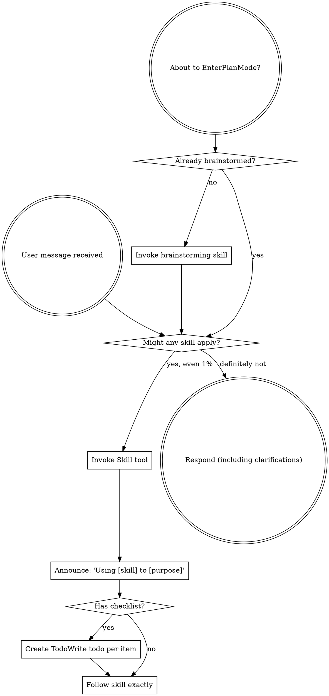

# Codex session 019f142e-7c56-7c20-b4c2-ac5257aa9397

- Started: `2026-06-29T16:20:23.661Z`
- Working directory: `D:\100XH100`
- Originator: `Codex Desktop`
- Codex CLI: `0.142.3`
- Source log: `C:\Users\Иван Литвак\.codex\sessions\2026\06\29\rollout-2026-06-29T19-20-23-019f142e-7c56-7c20-b4c2-ac5257aa9397.jsonl`
- Entries: user=3, assistant=16, tool calls=29, tool outputs=29

This is a chronological export of the user/assistant conversation and tool activity. Internal system/developer instructions and token accounting are intentionally excluded. Secret-shaped values are redacted; oversized tool outputs retain their beginning and end with the omitted character count.

## 1. User

Time: `2026-06-29T16:20:30.842Z` · source line `4`

```text
# AGENTS.md instructions for D:\100XH100

<INSTRUCTIONS>
# Project Agent Rules

## Operating Rule
- Read `AGENTS.md` before project edits.
- Update `memory/CHANGELOG.md` after meaningful code, config, or architecture changes.
- Update `memory/PROMPTS.md` with user prompts that define requirements.
- Store test outputs, logs, and verification notes under `test_results/`.
- Prefer agent-centered code: explicit contracts, deterministic tests, small files, low hidden state.

## Architecture Source
- Primary architecture contract: `ARCHITECTURE_NEED.md`.
- Current Stream 4 implementation rule: use threshold + compact + CUB/fixed-temp sort/reduce + compact; do not use Stream 4 hash-table dedup.

## Implementation Guardrails
- `State128` logical bytes are `v[0..119]`.
- `State128` padding bytes are `v[120..127]`.
- Persistent frontier padding must be zero.
- `FinalResponse` may temporarily store `target_local_idx` in `v[120..123]`.
- `Hash128` is one logical 128-bit key stored as `{lo, hi}`.
- `CandidateMeta` must remain 32 bytes and 32-byte aligned.
- Stream 3 payload id must be original candidate id, not compact index.
- Stream 4 must not apply shard top-k or semantic shard cap.

</INSTRUCTIONS>
<environment_context>
  <cwd>D:\100XH100</cwd>
  <shell>powershell</shell>
  <current_date>2026-06-29</current_date>
  <timezone>Europe/Moscow</timezone>
  <filesystem><workspace_roots><root>D:\100XH100</root></workspace_roots><permission_profile type="managed"><file_system type="restricted"><entry access="read"><special>:root</special></entry><entry access="write"><path>D:\100XH100</path></entry><entry access="write"><special>:slash_tmp</special></entry><entry access="write"><special>:tmpdir</special></entry><entry access="read"><path>D:\100XH100\.git</path></entry><entry access="read"><path>D:\100XH100\.agents</path></entry><entry access="read"><path>D:\100XH100\.codex</path></entry></file_system></permission_profile></filesystem>
</environment_context>
```

## 2. User

Time: `2026-06-29T16:20:30.853Z` · source line `6`

```text
You are the SPEC COMPLIANCE re-reviewer for Task 4 in subagent-driven workflow. Do not edit files. Review only whether commit 5b7efd14e42a50d51a818f41fd6b9d929dee8371 in worktree D:\100XH100\.worktrees\stream1-piece-transformer satisfies Task 4 spec and quality-fix requirements. Base commit is 7f45ff3b5cb3119d5ecd37283e18006c1690895d.

Task 4 spec:
1. Piece-transformer manifest parses successfully and validates exact p900 transformer constants.
2. Manifest fields parsed: backend, dtype, state_len, num_classes, output_dim, num_pieces, max_piece_size, seq_len, d_model, nhead, head_dim, num_layers or transformer_layers, ff_dim, activation, pooling, piece_layout, piece_embed_mode.
3. Exact target validation: state_len=STATE_LEN, num_classes=120, output_dim=MOVE_COUNT, num_pieces=50, max_piece_size=3, seq_len=51, d_model=256, nhead=8, head_dim=32, layers=4, ff_dim=1024, activation=silu, pooling=cls, p900/full_s120, fp16/bf16.
4. Loads all transformer tensor/layout files exported by exporter with exact byte sizes.
5. Adds host/device containers, upload/free branches, scratch arena, byte-count helpers.
6. Existing MLP behavior remains supported.
7. Tests cover transformer manifest parse/reject, malformed/conflicting layer fallback, exact-size loading, and MLP regression.
8. No transformer forward kernel or dispatcher execution implemented.
9. Because forward is not wired yet, production runner and stream benchmark must fail closed early for backend piece_transformer with clear message, before sizing/allocation/dispatch; no fallback.
10. Memory/test_results updated, including FlashAttention 2 future requirement captured but not implemented.

Please inspect diff/tests. Return exactly SPEC_PASS or SPEC_FAIL with concrete missing/wrong file references. Do not review general quality unless it affects spec.
```

## 3. User

Time: `2026-06-29T16:20:30.854Z` · source line `7`

```text
You are the SPEC COMPLIANCE re-reviewer for Task 4 in subagent-driven workflow. Do not edit files. Review only whether commit 5b7efd14e42a50d51a818f41fd6b9d929dee8371 in worktree D:\100XH100\.worktrees\stream1-piece-transformer satisfies Task 4 spec and quality-fix requirements. Base commit is 7f45ff3b5cb3119d5ecd37283e18006c1690895d.

Task 4 spec:
1. Piece-transformer manifest parses successfully and validates exact p900 transformer constants.
2. Manifest fields parsed: backend, dtype, state_len, num_classes, output_dim, num_pieces, max_piece_size, seq_len, d_model, nhead, head_dim, num_layers or transformer_layers, ff_dim, activation, pooling, piece_layout, piece_embed_mode.
3. Exact target validation: state_len=STATE_LEN, num_classes=120, output_dim=MOVE_COUNT, num_pieces=50, max_piece_size=3, seq_len=51, d_model=256, nhead=8, head_dim=32, layers=4, ff_dim=1024, activation=silu, pooling=cls, p900/full_s120, fp16/bf16.
4. Loads all transformer tensor/layout files exported by exporter with exact byte sizes.
5. Adds host/device containers, upload/free branches, scratch arena, byte-count helpers.
6. Existing MLP behavior remains supported.
7. Tests cover transformer manifest parse/reject, malformed/conflicting layer fallback, exact-size loading, and MLP regression.
8. No transformer forward kernel or dispatcher execution implemented.
9. Because forward is not wired yet, production runner and stream benchmark must fail closed early for backend piece_transformer with clear message, before sizing/allocation/dispatch; no fallback.
10. Memory/test_results updated, including FlashAttention 2 future requirement captured but not implemented.

Please inspect diff/tests. Return exactly SPEC_PASS or SPEC_FAIL with concrete missing/wrong file references. Do not review general quality unless it affects spec.
```

## 4. Codex

Time: `2026-06-29T16:20:50.895Z` · source line `9`

```text
I’ll do this as a read-only compliance check against the specified commit and base. I’m going to confirm the repo rules, skim the relevant memory entry, then inspect the diff and any included test evidence without modifying the worktree.
```

## 5. Codex

Time: `2026-06-29T16:20:50.900Z` · source line `10`

```text
I’ll do this as a read-only compliance check against the specified commit and base. I’m going to confirm the repo rules, skim the relevant memory entry, then inspect the diff and any included test evidence without modifying the worktree.
```

## 6. Tool call: `exec_command`

Time: `2026-06-29T16:20:50.937Z` · source line `11`

```text
{"cmd":"Get-Content -LiteralPath 'C:\\Users\\Иван Литвак\\.codex\\skills\\.system\\superpowers\\using-superpowers\\SKILL.md'","workdir":"D:\\100XH100","shell":"powershell","yield_time_ms":10000,"max_output_tokens":12000}
```

## 7. Tool call: `exec_command`

Time: `2026-06-29T16:20:50.937Z` · source line `12`

```text
{"cmd":"Get-Content -LiteralPath 'D:\\100XH100\\AGENTS.md'","workdir":"D:\\100XH100","shell":"powershell","yield_time_ms":10000,"max_output_tokens":12000}
```

## 8. Tool call: `exec_command`

Time: `2026-06-29T16:20:50.937Z` · source line `13`

```text
{"cmd":"rg -n \"BEAM_PREBUILT_RUNNER|prebuilt_runner_ready|stream1|piece|transformer|Task 4\" 'C:\\Users\\Иван Литвак\\.codex\\memories\\MEMORY.md'","workdir":"D:\\100XH100","shell":"powershell","yield_time_ms":10000,"max_output_tokens":12000}
```

## 9. Tool output

Time: `2026-06-29T16:20:51.463Z` · source line `14`

```text
Chunk ID: 48a0e7
Wall time: 0.3188 seconds
Process exited with code 1
Original token count: 142
Output:
Get-Content : Cannot find path 'C:\Users\Иван Литвак\.codex\skills\.system\superpowers\using-superpowers\SKILL.md' beca
use it does not exist.
At line:2 char:1
+ Get-Content -LiteralPath 'C:\Users\Иван Литвак\.codex\skills\.system\ ...
+ ~~~~~~~~~~~~~~~~~~~~~~~~~~~~~~~~~~~~~~~~~~~~~~~~~~~~~~~~~~~~~~~~~~~~~
    + CategoryInfo          : ObjectNotFound: (C:\Users\Иван Л...powers\SKILL.md:String) [Get-Content], ItemNotFoundEx 
   ception
    + FullyQualifiedErrorId : PathNotFound,Microsoft.PowerShell.Commands.GetContentCommand
 

```

## 10. Tool output

Time: `2026-06-29T16:20:51.463Z` · source line `15`

```text
Chunk ID: cc5bf9
Wall time: 0.1334 seconds
Process exited with code 0
Original token count: 290
Output:
# Project Agent Rules

## Operating Rule
- Read `AGENTS.md` before project edits.
- Update `memory/CHANGELOG.md` after meaningful code, config, or architecture changes.
- Update `memory/PROMPTS.md` with user prompts that define requirements.
- Store test outputs, logs, and verification notes under `test_results/`.
- Prefer agent-centered code: explicit contracts, deterministic tests, small files, low hidden state.

## Architecture Source
- Primary architecture contract: `ARCHITECTURE_NEED.md`.
- Current Stream 4 implementation rule: use threshold + compact + CUB/fixed-temp sort/reduce + compact; do not use Stream 4 hash-table dedup.

## Implementation Guardrails
- `State128` logical bytes are `v[0..119]`.
- `State128` padding bytes are `v[120..127]`.
- Persistent frontier padding must be zero.
- `FinalResponse` may temporarily store `target_local_idx` in `v[120..123]`.
- `Hash128` is one logical 128-bit key stored as `{lo, hi}`.
- `CandidateMeta` must remain 32 bytes and 32-byte aligned.
- Stream 3 payload id must be original candidate id, not compact index.
- Stream 4 must not apply shard top-k or semantic shard cap.

```

## 11. Tool output

Time: `2026-06-29T16:20:51.463Z` · source line `16`

```text
Chunk ID: 64327f
Wall time: 0.1124 seconds
Process exited with code 0
Original token count: 192
Output:
58:- MEPhI HPC, kaf12, A100 40GB, BEAM_PREBUILT_RUNNER, prepare_ihes_prebuilt_runner.sh, ihes_solve_bucket_from_scratch.sh, prebuilt_runner_ready, using_prebuilt_runner, PUZZLE_LIMIT=1, depth=12
89:- `hpc/ihes_cube_model/prepare_ihes_prebuilt_runner.sh` builds the shared binary at `/mnt/pool/6/vokirova/beam8a100/ihes_cube_model/prebuilt-a100-ihes/production_runner`, and `hpc/ihes_cube_model/ihes_solve_bucket_from_scratch.sh` already knows how to consume `BEAM_PREBUILT_RUNNER` [Task 1]
97:- symptom: each array task recompiles instead of reusing the solver. cause: `BEAM_PREBUILT_RUNNER` was not wired through a separate prebuild dependency. fix: submit the prebuild first and make the puzzle array depend on it via `--dependency=afterok:<prebuild_job>` [Task 1]

```

## 12. Codex

Time: `2026-06-29T16:21:03.508Z` · source line `19`

```text
The project rules are loaded. The superpowers skill path in the prompt’s skill table was stale on disk, so I’m falling back to the normal review workflow and keeping this read-only.
```

## 13. Codex

Time: `2026-06-29T16:21:03.513Z` · source line `20`

```text
The project rules are loaded. The superpowers skill path in the prompt’s skill table was stale on disk, so I’m falling back to the normal review workflow and keeping this read-only.
```

## 14. Tool call: `exec_command`

Time: `2026-06-29T16:21:03.550Z` · source line `21`

```text
{"cmd":"Get-Content -LiteralPath 'C:\\Users\\Иван Литвак\\.codex\\plugins\\cache\\openai-curated-remote\\superpowers\\5.1.4\\skills\\using-superpowers\\SKILL.md'","workdir":"D:\\100XH100","shell":"powershell","yield_time_ms":10000,"max_output_tokens":12000}
```

## 15. Tool call: `exec_command`

Time: `2026-06-29T16:21:03.575Z` · source line `22`

```text
{"cmd":"git -C 'D:\\100XH100\\.worktrees\\stream1-piece-transformer' status --short","workdir":"D:\\100XH100","shell":"powershell","yield_time_ms":10000,"max_output_tokens":12000}
```

## 16. Tool call: `exec_command`

Time: `2026-06-29T16:21:03.603Z` · source line `23`

```text
{"cmd":"git -C 'D:\\100XH100\\.worktrees\\stream1-piece-transformer' rev-parse HEAD","workdir":"D:\\100XH100","shell":"powershell","yield_time_ms":10000,"max_output_tokens":12000}
```

## 17. Tool call: `exec_command`

Time: `2026-06-29T16:21:03.607Z` · source line `24`

```text
{"cmd":"git -C 'D:\\100XH100\\.worktrees\\stream1-piece-transformer' diff --stat 7f45ff3b5cb3119d5ecd37283e18006c1690895d 5b7efd14e42a50d51a818f41fd6b9d929dee8371","workdir":"D:\\100XH100","shell":"powershell","yield_time_ms":10000,"max_output_tokens":12000}
```

## 18. Tool output

Time: `2026-06-29T16:21:04.063Z` · source line `25`

````text
Chunk ID: 0f0026
Wall time: 0.1647 seconds
Process exited with code 0
Original token count: 1393
Output:
---
name: using-superpowers
description: Use when starting any conversation - establishes how to find and use skills, requiring Skill tool invocation before ANY response including clarifying questions
---

<SUBAGENT-STOP>
If you were dispatched as a subagent to execute a specific task, skip this skill.
</SUBAGENT-STOP>

<EXTREMELY-IMPORTANT>
If you think there is even a 1% chance a skill might apply to what you are doing, you ABSOLUTELY MUST invoke the skill.

IF A SKILL APPLIES TO YOUR TASK, YOU DO NOT HAVE A CHOICE. YOU MUST USE IT.

This is not negotiable. This is not optional. You cannot rationalize your way out of this.
</EXTREMELY-IMPORTANT>

## Instruction Priority

Superpowers skills override default system prompt behavior, but **user instructions always take precedence**:

1. **User's explicit instructions** (CLAUDE.md, GEMINI.md, AGENTS.md, direct requests) — highest priority
2. **Superpowers skills** — override default system behavior where they conflict
3. **Default system prompt** — lowest priority

If CLAUDE.md, GEMINI.md, or AGENTS.md says "don't use TDD" and a skill says "always use TDD," follow the user's instructions. The user is in control.

## How to Access Skills

**In Claude Code:** Use the `Skill` tool. When you invoke a skill, its content is loaded and presented to you—follow it directly. Never use the Read tool on skill files.

**In Copilot CLI:** Use the `skill` tool. Skills are auto-discovered from installed plugins. The `skill` tool works the same as Claude Code's `Skill` tool.

**In Gemini CLI:** Skills activate via the `activate_skill` tool. Gemini loads skill metadata at session start and activates the full content on demand.

**In other environments:** Check your platform's documentation for how skills are loaded.

## Platform Adaptation

Skills use Claude Code tool names. Non-CC platforms: see `references/copilot-tools.md` (Copilot CLI), `references/codex-tools.md` (Codex) for tool equivalents. Gemini CLI users get the tool mapping loaded automatically via GEMINI.md.

# Using Skills

## The Rule

**Invoke relevant or requested skills BEFORE any response or action.** Even a 1% chance a skill might apply means that you should invoke the skill to check. If an invoked skill turns out to be wrong for the situation, you don't need to use it.



## Red Flags

These thoughts mean STOP—you're rationalizing:

| Thought | Reality |
|---------|---------|
| "This is just a simple question" | Questions are tasks. Check for skills. |
| "I need more context first" | Skill check comes BEFORE clarifying questions. |
| "Let me explore the codebase first" | Skills tell you HOW to explore. Check first. |
| "I can check git/files quickly" | Files lack conversation context. Check for skills. |
| "Let me gather information first" | Skills tell you HOW to gather information. |
| "This doesn't need a formal skill" | If a skill exists, use it. |
| "I remember this skill" | Skills evolve. Read current version. |
| "This doesn't count as a task" | Action = task. Check for skills. |
| "The skill is overkill" | Simple things become complex. Use it. |
| "I'll just do this one thing first" | Check BEFORE doing anything. |
| "This feels productive" | Undisciplined action wastes time. Skills prevent this. |
| "I know what that means" | Knowing the concept в‰  using the skill. Invoke it. |

## Skill Priority

When multiple skills could apply, use this order:

1. **Process skills first** (brainstorming, debugging) - these determine HOW to approach the task
2. **Implementation skills second** (frontend-design, mcp-builder) - these guide execution

"Let's build X" в†’ brainstorming first, then implementation skills.
"Fix this bug" в†’ debugging first, then domain-specific skills.

## Skill Types

**Rigid** (TDD, debugging): Follow exactly. Don't adapt away discipline.

**Flexible** (patterns): Adapt principles to context.

The skill itself tells you which.

## User Instructions

Instructions say WHAT, not HOW. "Add X" or "Fix Y" doesn't mean skip workflows.

````

## 19. Tool output

Time: `2026-06-29T16:21:04.063Z` · source line `26`

```text
Chunk ID: 495bfb
Wall time: 0.1381 seconds
Process exited with code 0
Original token count: 39
Output:
?? $null
?? build-contract-tests/
?? config.obj
?? contract_tests.obj
?? docs/
?? frontier_cpu.obj
?? hash.obj
?? state.obj
?? stream3.obj
?? stream4.obj

```

## 20. Tool output

Time: `2026-06-29T16:21:04.063Z` · source line `27`

```text
Chunk ID: a5e0a6
Wall time: 0.1380 seconds
Process exited with code 0
Original token count: 11
Output:
5b7efd14e42a50d51a818f41fd6b9d929dee8371

```

## 21. Tool output

Time: `2026-06-29T16:21:04.074Z` · source line `28`

```text
Chunk ID: 7601d2
Wall time: 0.1559 seconds
Process exited with code 0
Original token count: 126
Output:
 memory/CHANGELOG.md                                |   2 +
 memory/PROMPTS.md                                  |   2 +
 .../stream1_transformer_loader_2026-06-29.md       |  89 ++++
 tests/contract_tests.cpp                           | 219 +++++++-
 tools/production_runner.cu                         |   3 +
 tools/stream1_weight_io.hpp                        | 559 +++++++++++++++++----
 tools/stream_benchmark.cu                          |   3 +
 7 files changed, 777 insertions(+), 100 deletions(-)

```

## 22. Codex

Time: `2026-06-29T16:21:18.928Z` · source line `31`

```text
The target worktree is at the requested commit. I see unrelated untracked build artifacts in that worktree, so I’m reviewing the committed tree/diff directly rather than the working directory contents.
```

## 23. Codex

Time: `2026-06-29T16:21:18.934Z` · source line `32`

```text
The target worktree is at the requested commit. I see unrelated untracked build artifacts in that worktree, so I’m reviewing the committed tree/diff directly rather than the working directory contents.
```

## 24. Tool call: `exec_command`

Time: `2026-06-29T16:21:18.945Z` · source line `33`

```text
{"cmd":"git -C 'D:\\100XH100\\.worktrees\\stream1-piece-transformer' diff --unified=80 7f45ff3b5cb3119d5ecd37283e18006c1690895d 5b7efd14e42a50d51a818f41fd6b9d929dee8371 -- tools/stream1_weight_io.hpp","workdir":"D:\\100XH100","shell":"powershell","yield_time_ms":10000,"max_output_tokens":50000}
```

## 25. Tool call: `exec_command`

Time: `2026-06-29T16:21:18.945Z` · source line `34`

```text
{"cmd":"git -C 'D:\\100XH100\\.worktrees\\stream1-piece-transformer' diff --unified=80 7f45ff3b5cb3119d5ecd37283e18006c1690895d 5b7efd14e42a50d51a818f41fd6b9d929dee8371 -- tests/contract_tests.cpp","workdir":"D:\\100XH100","shell":"powershell","yield_time_ms":10000,"max_output_tokens":50000}
```

## 26. Tool call: `exec_command`

Time: `2026-06-29T16:21:18.945Z` · source line `35`

```text
{"cmd":"git -C 'D:\\100XH100\\.worktrees\\stream1-piece-transformer' diff --unified=40 7f45ff3b5cb3119d5ecd37283e18006c1690895d 5b7efd14e42a50d51a818f41fd6b9d929dee8371 -- tools/production_runner.cu tools/stream_benchmark.cu memory/CHANGELOG.md memory/PROMPTS.md test_results/stream1_transformer_loader_2026-06-29.md","workdir":"D:\\100XH100","shell":"powershell","yield_time_ms":10000,"max_output_tokens":50000}
```

## 27. Tool output

Time: `2026-06-29T16:21:19.294Z` · source line `36`

Oversized output: `8210` characters omitted from the middle.

```text
Chunk ID: be99bd
Wall time: 0.1325 seconds
Process exited with code 0
Original token count: 12852
Output:
Warning: truncated output (original token count: 12852)
Total output lines: 988

diff --git a/tools/stream1_weight_io.hpp b/tools/stream1_weight_io.hpp
index d64609e..5fe3a49 100644
--- a/tools/stream1_weight_io.hpp
+++ b/tools/stream1_weight_io.hpp
@@ -1,514 +1,893 @@
 #pragma once
 
 #include "../src/config.hpp"
 
 #ifndef BEAM_STREAM1_WEIGHT_IO_MANIFEST_ONLY
 #include "cuda_check.hpp"
 #include "../cuda/stream1.hpp"
 
 #include <cuda_fp16.h>
 #include <cuda_runtime.h>
 #endif
 
 #include <cstddef>
 #include <cstdint>
 #include <filesystem>
 #include <fstream>
 #include <iterator>
 #include <limits>
 #include <stdexcept>
 #include <string>
 #include <vector>
 
 namespace beam::stream1_weights {
 
+inline constexpr std::uint32_t TRANSFORMER_NUM_CLASSES = 120;
+inline constexpr std::uint32_t TRANSFORMER_NUM_PIECES = 50;
+inline constexpr std::uint32_t TRANSFORMER_MAX_PIECE_SIZE = 3;
+inline constexpr std::uint32_t TRANSFORMER_SEQ_LEN = 51;
+inline constexpr std::uint32_t TRANSFORMER_D_MODEL = 256;
+inline constexpr std::uint32_t TRANSFORMER_NHEAD = 8;
+inline constexpr std::uint32_t TRANSFORMER_HEAD_DIM = 32;
+inline constexpr std::uint32_t TRANSFORMER_LAYERS = 4;
+inline constexpr std::uint32_t TRANSFORMER_FF_DIM = 1024;
+
+struct HostTransformerBlockBytes {
+    std::vector<std::byte> ln1_gamma;
+    std::vector<std::byte> ln1_beta;
+    std::vector<std::byte> attn_qkv_weight;
+    std::vector<std::byte> attn_qkv_bias;
+    std::vector<std::byte> attn_out_weight;
+    std::vector<std::byte> attn_out_bias;
+    std::vector<std::byte> ln2_gamma;
+    std::vector<std::byte> ln2_beta;
+    std::vector<std::byte> ff1_weight;
+    std::vector<std::byte> ff1_bias;
+    std::vector<std::byte> ff2_weight;
+    std::vector<std::byte> ff2_bias;
+};
+
+struct HostTransformerBytes {
+    std::vector<std::byte> fast_slot_projected;
+    std::vector<std::byte> fast_piece_static;
+    std::vector<std::byte> cls_token;
+    std::vector<std::byte> input_ln_gamma;
+    std::vector<std::byte> input_ln_beta;
+    std::vector<std::byte> output_ln_gamma;
+    std::vector<std::byte> output_ln_beta;
+    std::vector<HostTransformerBlockBytes> blocks;
+    std::vector<std::byte> output_weight;
+    std::vector<std::byte> output_bias;
+    std::vector<std::byte> piece_positions;
+    std::vector<std::byte> piece_mask;
+    std::vector<std::byte> piece_types;
+};
+
 struct HostWeightBytes {
     Stream1ModelConfig model;
     std::vector<std::byte> input_weight;
     std::vector<std::byte> input_bias;
     std::vector<std::byte> input_ln_gamma;
     std::vector<std::byte> input_ln_beta;
     std::vector<std::byte> hidden_weight;
     std::vector<std::byte> hidden_bias;
     std::vector<std::byte> hidden_ln_gamma;
     std::vector<std::byte> hidden_ln_beta;
     std::vector<std::vector<std::byte>> residual_fc1_weight;
     std::vector<std::vector<std::byte>> residual_fc1_bias;
     std::vector<std::vector<std::byte>> residual_fc1_ln_gamma;
     std::vector<std::vector<std::byte>> residual_fc1_ln_beta;
     std::vector<std::vector<std::byte>> residual_fc2_weight;
     std::vector<std::vector<std::byte>> residual_fc2_bias;
     std::vector<std::vector<std::byte>> residual_fc2_ln_gamma;
     std::vector<std::vector<std::byte>> residual_fc2_ln_beta;
     std::vector<std::byte> output_weight;
     std::vector<std::byte> output_bias;
+    HostTransformerBytes transformer;
 };
 
 #ifndef BEAM_STREAM1_WEIGHT_IO_MANIFEST_ONLY
+struct DeviceTransformerBlockWeights {
+    half* ln1_gamma = nullptr;
+    half* ln1_beta = nullptr;
+    half* attn_qkv_weight = nullptr;
+    half* attn_qkv_bias = nullptr;
+    half* attn_out_weight = nullptr;
+    half* attn_out_bias = nullptr;
+    half* ln2_gamma = nullptr;
+    half* ln2_beta = nullptr;
+    half* ff1_weight = nullptr;
+    half* ff1_bias = nullptr;
+    half* ff2_weight = nullptr;
+    half* ff2_bias = nullptr;
+};
+
+struct DeviceTransformerWeights {
+    half* fast_slot_projected = nullptr;
+    half* fast_piece_static = nullptr;
+    half* cls_token = nullptr;
+    half* input_ln_gamma = nullptr;
+    half* input_ln_beta = nullptr;
+    half* output_ln_gamma = nullptr;
+    half* output_ln_beta = nullptr;
+    std::vector<DeviceTransformerBlockWeights> blocks;
+    half* output_weight = nullptr;
+    half* output_bias = nullptr;
+    std::uint16_t* piece_positions = nullptr;
+    std::uint8_t* piece_mask = nullptr;
+    std::uint8_t* piece_types = nullptr;
+};
+
 struct DeviceWeights {
     half* input_weight = nullptr;
     half* input_bias = nullptr;
     half* input_ln_gamma = nullptr;
     half* input_ln_beta = nullptr;
     half* hidden_weight = nullptr;
     half* hidden_bias = nullptr;
     half* hidden_ln_gamma = nullptr;
     half* hidden_ln_beta = nullptr;
     std::vector<half*> residual_fc1_weight;
     std::vector<half*> residual_fc1_bias;
     std::vector<half*> residual_fc1_ln_gamma;
     std::vector<half*> residual_fc1_ln_beta;
     std::vector<half*> residual_fc2_weight;
     std::vector<half*> residual_fc2_bias;
     std::vector<half*> residual_fc2_ln_gamma;
     std::vector<half*> residual_fc2_ln_beta;
     half** residual_fc1_weight_table = nullptr;
     half** residual_fc1_bias_table = nullptr;
     half** residual_fc1_ln_gamma_table = nullptr;
     half** residual_fc1_ln_beta_table = nullptr;
     half** residual_fc2_weight_table = nullptr;
     half** residual_fc2_bias_table = nullptr;
     half** residual_fc2_ln_gamma_table = nullptr;
     half** residual_fc2_ln_beta_table = nullptr;
     half* output_weight = nullptr;
     half* output_bias = nullptr;
+    DeviceTransformerWeights transformer;
 };
 
 struct ScratchAllocation {
     half* hidden1 = nullptr;
     half* hidden2 = nullptr;
     half* residual = nullptr;
     half* output = nullptr;
+    half* transformer_tokens = nullptr;
+    half* transformer_qkv = nullptr;
+    float* transformer_attention_scores_probs = nullptr;
+    half* transformer_attention_context = nullptr;
+    half* transformer_ff_hidden = nullptr;
+    half* transformer_logits = nullptr;
 };
 #endif
 
 inline std::string read_text_exact(const std::filesystem::path& path) {
     std::ifstream file(path, std::ios::binary);
     if (!file) {
         throw std::runtime_error("cannot open required text file: " + path.string());
     }
     return std::string(std::istreambuf_iterator<char>(file), std::istreambuf_iterator<char>());
 }
 
 inline std::vector<std::byte> read_binary_exact(
     const std::filesystem::path& path,
     std::uint64_t expected_bytes) {
     if (expected_bytes > static_cast<std::uint64_t>(std::numeric_limits<std::size_t>::max())) {
         throw std::runtime_error("binary expected size exceeds size_t: " + path.string());
     }
     std::ifstream file(path, std::ios::binary);
     if (!file) {
         throw std::runtime_error("cannot open required binary file: " + path.string());
     }
     std::vector<std::byte> bytes(static_cast<std::size_t>(expected_bytes));
     file.read(reinterpret_cast<char*>(bytes.data()), static_cast<std::streamsize>(bytes.size()));
     const std::size_t actual = static_cast<std::size_t>(file.gcount());
     file.peek();
     if (actual != bytes.size() || !file.eof()) {
         throw std::runtime_error(
             "binary file size mismatch: " + path.string() +
             " expected=" + std::to_string(bytes.size()) +
             " actual_read=" + std::to_string(actual));
     }
     return bytes;
 }
 
+inline bool manifest_has_key(const std::string& text, const char* key) {
+    const std::string quoted = std::string("\"") + key + "\"";
+    return text.find(quoted) != std::string::npos;
+}
+
 inline std::uint32_t parse_manifest_u32(const std::string& text, const char* key) {
     const std::string quoted = std::string("\"") + key + "\"";
     std::size_t pos = text.find(quoted);
     if (pos == std::string::npos) {
         throw std::runtime_error("stream1 manifest missing key: " + std::string(key));
     }
     pos = text.find(':', pos + quoted.size());
     if (pos == std::string::npos) {
         throw std::runtime_error("stream1 manifest malformed key: " + std::string(key));
     }
     ++pos;
     while (pos < text.size() && (text[pos] == ' ' || text[pos] == '\t' || text[pos] == '\r' || text[pos] == '\n')) {
         ++pos;
     }
     std::uint64_t value = 0;
     std::size_t digits = 0;
     while (pos < text.size() && text[pos] >= '0' && text[pos] <= '9') {
         value = value * 10ULL + static_cast<std::uint64_t>(text[pos] - '0');
         if (value > std::numeric_limits<std::uint32_t>::max()) {
             throw std::runtime_error("stream1 manifest key exceeds uint32: " + std::string(key));
         }
         ++pos;
         ++digits;
     }
     if (digits == 0) {
         throw std::runtime_error("stream1 manifest key is not uint32: " + std::string(key));
     }
     return static_cast<std::uint32_t>(value);
 }
 
 inline std::uint32_t parse_manifest_u32_any(
     const std::string& text,
     const char* primary_key,
     const char* fallback_key) {
-    try {
-        return parse_manifest_u32(text, primary_key);
-    } catch (const std::runtime_error&) {
+    const bool primary_present = manifest_has_key(text, primary_key);
+    const bool fallback_present = manifest_has_key(text, fallback_key);
+    if (!primary_present) {
         return parse_manifest_u32(text, fallback_key);
     }
+    const std::uint32_t primary = parse_manifest_u32(text, primary_key);
+    if (!fallback_present) {
+        return primary;
+    }
+    const std::uint32_t fallback = parse_manifest_u32(text, fallback_key);
+    if (primary != fallback) {
+        throw std::runtime_error(
+            "stream1 manifest conflicting uint32 keys: " + std::string(primary_key) +
+            "=" + std::to_string(primary) + " " + std::string(fallback_key) +
+            "=" + std::to_string(fallback));
+    }
+    return primary;
 }
 
 inline std::string parse_manifest_string(const std::string& text, const char* key) {
     const std::string quoted = std::string("\"") + key + "\"";
     std::size_t pos = text.find(quoted);
     if (pos == std::string::npos) {
         throw std::runtime_error("stream1 manifest missing key: " + std::string(key));
     }
     pos = text.find(':', pos + quoted.size());
     if (pos == std::string::npos) {
         throw std::runtime_error("stream1 manifest malformed key: " + std::string(key));
     }
     pos = text.find('"', pos + 1);
     if (pos == std::string::npos) {
         throw std::runtime_error("stream1 manifest string missing opening quote: " + std::string(key));
     }
     const std::size_t start = pos + 1;
     pos = text.find('"', start);
     if (pos == std::string::npos) {
         throw std::runtime_error("stream1 manifest string missing closing quote: " + std::string(key));
     }
     return text.substr(start, pos - start);
 }
 
 inline std::string parse_manifest_string_default(
     const std::string& text,
     const char* key,
     const std::string& default_value) {
     try {
         return parse_manifest_string(text, key);
     } catch (const std::runtime_error&) {
         return default_value;
     }
 }
 
-inline void validate_model_config(const Stream1ModelConfig& model, const std::string& context) {
-    if (model.backend != STREAM1_BACKEND_MLP && model.backend != STREAM1_BACKEND_PIECE_TRANSFORMER) {
-        throw std::runtime_error(context + ": unsupported Stream1 backend");
+inline void require_manifest_u32(
+    std::uint32_t actual,
+    std::uint32_t expected,
+    const char* key,
+    const std::string& context) {
+    if (actual != expected) {
+        throw std::runtime_error(
+            context + ": stream1 piece_transformer " + key + " must be " + std::to_string(expected) +
+            " got " + std::to_string(actual));
     }
-    if (model.backend == STREAM1_BACKEND_PIECE_TRANSFORMER) {
-        throw std::runtime_error(context + ": piece_transformer Stream1 weights require transformer loader");
+}
+
+inline void require_manifest_string(
+    const std::string& actual,
+    const char* expected,
+    const char* key,
+    const std::string& context) {
+    if (actual != expected) {
+        throw std::runtime_error(
+            context + ": stream1 piece_transformer " + key + " must be " + expected + " got " + actual);
     }
+}
+
+inline void validate_mlp_model_config(const Stream1ModelConfig& model, const std::string& context) {
     if (model.state_len != STATE_LEN) {
         throw std::runtime_error(context + ": stream1 state_len must match compile-time STATE_LEN");
     }
     if (model.num_classes < STATE_LEN ||
         (model.output_dim != MOVE_COUNT && model.output_dim != STREAM1_SINGLE_SCORE_OUTPUT_DIM)) {
         throw std::runtime_error(context + ": stream1 num_classes/output_dim incompatible with current puzzle");
     }
     if (model.dtype != STREAM1_DTYPE_FP16 && model.dtype != STREAM1_DTYPE_BF16) {
         throw std::runtime_error(context + ": stream1 dtype must be fp16 or bf16");
     }
     if (model.normalization != STREAM1_NORM_NONE && model.normalization != STREAM1_NORM_LAYERNORM) {
         throw std::runtime_error(context + ": stream1 normalization must be none or layernorm");
     }
     if (model.hidden1 == 0U || model.hidden2 == 0U || model.residual_count == 0U) {
         throw std::runtime_error(context + ": stream1 hidden sizes and residual_count must be nonzero");
     }
     if (model.hidden1 < model.hidden2) {
         throw std::runtime_error(context + ": stream1 hidden1 must be >= hidden2 because Stream1 reuses hidden1 scratch for residual output");
     }
     if (model.hidden1 % 8U != 0U || model.hidden2 % 8U != 0U) {
         throw std::runtime_error(context + ": stream1 hidden sizes must be multiples of 8 for TensorOp path");
     }
 }
 
+inline void validate_transformer_model_config(
+    const Stream1ModelConfig& model,
+    const std::string& activation,
+    const std::string& pooling,
+    const std::string& piece_layout,
+    const std::string& piece_embed_mode,
+    const std::string& context) {
+    if (model.dtype != STREAM1_DTYPE_FP16 && model.dtype != STREAM1_DTYPE_BF16) {
+        throw std::runtime_error(context + ": stream1 piece_transformer dtype must be fp16 or bf16");
+    }
+    require_manifest_u32(model.state_len, static_cast<std::uint32_t>(STATE_LEN), "state_len", context);
+    require_manifest_u32(model.num_classes, TRANSFORMER_NUM_CLASSES, "num_classes", context);
+    require_manifest_u32(model.output_dim, static_cast<std::uint32_t>(MOVE_COUNT), "output_dim", context);
+    require_manifest_u32(model.num_pieces, TRANSFORMER_NUM_PIECES, "num_pieces", context);
+    require_manifest_u32(model.max_piece_size, TRANSFORMER_MAX_PIECE_SIZE, "max_piece_size", context);
+    require_manifest_u32(model.seq_len, TRANSFORMER_SEQ_LEN, "seq_len", context);
+    require_manifest_u32(model.d_model, TRANSFORMER_D_MODEL, "d_model", context);
+    require_manifest_u32(model.nhead, TRANSFORMER_NHEAD, "nhead", context);
+    require_manifest_u32(model.head_dim, TRANSFORMER_HEAD_DIM, "head_dim", context);
+    require_manifest_u32(model.transformer_layers, TRANSFORMER_LAYERS, "transformer_layers", context);
+    require_manifest_u32(model.ff_dim, TRANSFORMER_FF_DIM, "ff_dim", context);
+    require_manifest_string(activation, "silu", "activation", context);
+    require_manifest_string(pooling, "cls", "pooling", context);
+    require_manifest_string(piece_layout, "p900", "piece_layout", context);
+    require_manifest_string(piece_embed_mode, "full_s120", "piece_embed_mode", context);
+}
+
 inline Stream1ModelConfig load_stream1_manifest(const std::filesystem::path& dir) {
     const std::filesystem::path manifest_path = dir / "manifest.json";
     const std::string text = read_text_exact(manifest_path);
     const std::string dtype = parse_manifest_string(te

[... 8210 characters omitted from oversized tool output ...]

efix + "_attn_out_weight").c_str());
+        alloc_and_copy(db.attn_out_bias, hb.attn_out_bias, (prefix + "_attn_out_bias").c_str());
+        alloc_and_copy(db.ln2_gamma, hb.ln2_gamma, (prefix + "_ln2_gamma").c_str());
+        alloc_and_copy(db.ln2_beta, hb.ln2_beta, (prefix + "_ln2_beta").c_str());
+        alloc_and_copy(db.ff1_weight, hb.ff1_weight, (prefix + "_ff1_weight").c_str());
+        alloc_and_copy(db.ff1_bias, hb.ff1_bias, (prefix + "_ff1_bias").c_str());
+        alloc_and_copy(db.ff2_weight, hb.ff2_weight, (prefix + "_ff2_weight").c_str());
+        alloc_and_copy(db.ff2_bias, hb.ff2_bias, (prefix + "_ff2_bias").c_str());
+    }
+    alloc_and_copy(d.output_weight, h.output_weight, "output_weight");
+    alloc_and_copy(d.output_bias, h.output_bias, "output_bias");
+    alloc_and_copy_typed(d.piece_positions, h.piece_positions, "piece_positions");
+    alloc_and_copy_typed(d.piece_mask, h.piece_mask, "piece_mask");
+    alloc_and_copy_typed(d.piece_types, h.piece_types, "piece_types");
+}
+
+inline void free_weights(DeviceWeights& device);
+
 inline DeviceWeights upload_weights(const HostWeightBytes& host) {
     DeviceWeights device;
-    alloc_and_copy(device.input_weight, host.input_weight, "input_weight");
-    alloc_and_copy(device.input_bias, host.input_bias, "input_bias");
-    if (host.model.normalization == STREAM1_NORM_LAYERNORM) {
-        alloc_and_copy(device.input_ln_gamma, host.input_ln_gamma, "input_ln_gamma");
-        alloc_and_copy(device.input_ln_beta, host.input_ln_beta, "input_ln_beta");
-    }
-    alloc_and_copy(device.hidden_weight, host.hidden_weight, "hidden_weight");
-    alloc_and_copy(device.hidden_bias, host.hidden_bias, "hidden_bias");
-    if (host.model.normalization == STREAM1_NORM_LAYERNORM) {
-        alloc_and_copy(device.hidden_ln_gamma, host.hidden_ln_gamma, "hidden_ln_gamma");
-        alloc_and_copy(device.hidden_ln_beta, host.hidden_ln_beta, "hidden_ln_beta");
-    }
-    device.residual_fc1_weight.resize(host.model.residual_count);
-    device.residual_fc1_bias.resize(host.model.residual_count);
-    device.residual_fc1_ln_gamma.resize(host.model.residual_count);
-    device.residual_fc1_ln_beta.resize(host.model.residual_count);
-    device.residual_fc2_weight.resize(host.model.residual_count);
-    device.residual_fc2_bias.resize(host.model.residual_count);
-    device.residual_fc2_ln_gamma.resize(host.model.residual_count);
-    device.residual_fc2_ln_beta.resize(host.model.residual_count);
-    for (std::uint32_t block = 0; block < host.model.residual_count; ++block) {
-        const std::string prefix = "residual" + std::to_string(block);
-        alloc_and_copy(device.residual_fc1_weight[block], host.residual_fc1_weight[block], (prefix + "_fc1_weight").c_str());
-        alloc_and_copy(device.residual_fc1_bias[block], host.residual_fc1_bias[block], (prefix + "_fc1_bias").c_str());
+    try {
+        if (host.model.backend == STREAM1_BACKEND_PIECE_TRANSFORMER) {
+            upload_transformer_weights(host, device);
+            return device;
+        }
+        if (host.model.backend != STREAM1_BACKEND_MLP) {
+            throw std::runtime_error("unsupported Stream1 backend in upload_weights");
+        }
+        alloc_and_copy(device.input_weight, host.input_weight, "input_weight");
+        alloc_and_copy(device.input_bias, host.input_bias, "input_bias");
         if (host.model.normalization == STREAM1_NORM_LAYERNORM) {
-            alloc_and_copy(device.residual_fc1_ln_gamma[block], host.residual_fc1_ln_gamma[block], (prefix + "_fc1_ln_gamma").c_str());
-            alloc_and_copy(device.residual_fc1_ln_beta[block], host.residual_fc1_ln_beta[block], (prefix + "_fc1_ln_beta").c_str());
+            alloc_and_copy(device.input_ln_gamma, host.input_ln_gamma, "input_ln_gamma");
+            alloc_and_copy(device.input_ln_beta, host.input_ln_beta, "input_ln_beta");
         }
-        alloc_and_copy(device.residual_fc2_weight[block], host.residual_fc2_weight[block], (prefix + "_fc2_weight").c_str());
-        alloc_and_copy(device.residual_fc2_bias[block], host.residual_fc2_bias[block], (prefix + "_fc2_bias").c_str());
+        alloc_and_copy(device.hidden_weight, host.hidden_weight, "hidden_weight");
+        alloc_and_copy(device.hidden_bias, host.hidden_bias, "hidden_bias");
         if (host.model.normalization == STREAM1_NORM_LAYERNORM) {
-            alloc_and_copy(device.residual_fc2_ln_gamma[block], host.residual_fc2_ln_gamma[block], (prefix + "_fc2_ln_gamma").c_str());
-            alloc_and_copy(device.residual_fc2_ln_beta[block], host.residual_fc2_ln_beta[block], (prefix + "_fc2_ln_beta").c_str());
+            alloc_and_copy(device.hidden_ln_gamma, host.hidden_ln_gamma, "hidden_ln_gamma");
+            alloc_and_copy(device.hidden_ln_beta, host.hidden_ln_beta, "hidden_ln_beta");
         }
+        device.residual_fc1_weight.resize(host.model.residual_count);
+        device.residual_fc1_bias.resize(host.model.residual_count);
+        device.residual_fc1_ln_gamma.resize(host.model.residual_count);
+        device.residual_fc1_ln_beta.resize(host.model.residual_count);
+        device.residual_fc2_weight.resize(host.model.residual_count);
+        device.residual_fc2_bias.resize(host.model.residual_count);
+        device.residual_fc2_ln_gamma.resize(host.model.residual_count);
+        device.residual_fc2_ln_beta.resize(host.model.residual_count);
+        for (std::uint32_t block = 0; block < host.model.residual_count; ++block) {
+            const std::string prefix = "residual" + std::to_string(block);
+            alloc_and_copy(device.residual_fc1_weight[block], host.residual_fc1_weight[block], (prefix + "_fc1_weight").c_str());
+            alloc_and_copy(device.residual_fc1_bias[block], host.residual_fc1_bias[block], (prefix + "_fc1_bias").c_str());
+            if (host.model.normalization == STREAM1_NORM_LAYERNORM) {
+                alloc_and_copy(device.residual_fc1_ln_gamma[block], host.residual_fc1_ln_gamma[block], (prefix + "_fc1_ln_gamma").c_str());
+                alloc_and_copy(device.residual_fc1_ln_beta[block], host.residual_fc1_ln_beta[block], (prefix + "_fc1_ln_beta").c_str());
+            }
+            alloc_and_copy(device.residual_fc2_weight[block], host.residual_fc2_weight[block], (prefix + "_fc2_weight").c_str());
+            alloc_and_copy(device.residual_fc2_bias[block], host.residual_fc2_bias[block], (prefix + "_fc2_bias").c_str());
+            if (host.model.normalization == STREAM1_NORM_LAYERNORM) {
+                alloc_and_copy(device.residual_fc2_ln_gamma[block], host.residual_fc2_ln_gamma[block], (prefix + "_fc2_ln_gamma").c_str());
+                alloc_and_copy(device.residual_fc2_ln_beta[block], host.residual_fc2_ln_beta[block], (prefix + "_fc2_ln_beta").c_str());
+            }
+        }
+        alloc_managed_pointer_table(device.residual_fc1_weight_table, device.residual_fc1_weight, "residual_fc1_weight_table");
+        alloc_managed_pointer_table(device.residual_fc1_bias_table, device.residual_fc1_bias, "residual_fc1_bias_table");
+        alloc_managed_pointer_table(device.residual_fc2_weight_table, device.residual_fc2_weight, "residual_fc2_weight_table");
+        alloc_managed_pointer_table(device.residual_fc2_bias_table, device.residual_fc2_bias, "residual_fc2_bias_table");
+        if (host.model.normalization == STREAM1_NORM_LAYERNORM) {
+            alloc_managed_pointer_table(device.residual_fc1_ln_gamma_table, device.residual_fc1_ln_gamma, "residual_fc1_ln_gamma_table");
+            alloc_managed_pointer_table(device.residual_fc1_ln_beta_table, device.residual_fc1_ln_beta, "residual_fc1_ln_beta_table");
+            alloc_managed_pointer_table(device.residual_fc2_ln_gamma_table, device.residual_fc2_ln_gamma, "residual_fc2_ln_gamma_table");
+            alloc_managed_pointer_table(device.residual_fc2_ln_beta_table, device.residual_fc2_ln_beta, "residual_fc2_ln_beta_table");
+        }
+        alloc_and_copy(device.output_weight, host.output_weight, "output_weight");
+        alloc_and_copy(device.output_bias, host.output_bias, "output_bias");
+        return device;
+    } catch (...) {
+        free_weights(device);
+        throw;
     }
-    alloc_managed_pointer_table(device.residual_fc1_weight_table, device.residual_fc1_weight, "residual_fc1_weight_table");
-    alloc_managed_pointer_table(device.residual_fc1_bias_table, device.residual_fc1_bias, "residual_fc1_bias_table");
-    alloc_managed_pointer_table(device.residual_fc2_weight_table, device.residual_fc2_weight, "residual_fc2_weight_table");
-    alloc_managed_pointer_table(device.residual_fc2_bias_table, device.residual_fc2_bias, "residual_fc2_bias_table");
-    if (host.model.normalization == STREAM1_NORM_LAYERNORM) {
-        alloc_managed_pointer_table(device.residual_fc1_ln_gamma_table, device.residual_fc1_ln_gamma, "residual_fc1_ln_gamma_table");
-        alloc_managed_pointer_table(device.residual_fc1_ln_beta_table, device.residual_fc1_ln_beta, "residual_fc1_ln_beta_table");
-        alloc_managed_pointer_table(device.residual_fc2_ln_gamma_table, device.residual_fc2_ln_gamma, "residual_fc2_ln_gamma_table");
-        alloc_managed_pointer_table(device.residual_fc2_ln_beta_table, device.residual_fc2_ln_beta, "residual_fc2_ln_beta_table");
-    }
-    alloc_and_copy(device.output_weight, host.output_weight, "output_weight");
-    alloc_and_copy(device.output_bias, host.output_bias, "output_bias");
-    return device;
 }
 
 inline void free_weights(DeviceWeights& device) {
     cudaFree(device.input_weight);
     cudaFree(device.input_bias);
     cudaFree(device.input_ln_gamma);
     cudaFree(device.input_ln_beta);
     cudaFree(device.hidden_weight);
     cudaFree(device.hidden_bias);
     cudaFree(device.hidden_ln_gamma);
     cudaFree(device.hidden_ln_beta);
     for (half* ptr : device.residual_fc1_weight) {
         cudaFree(ptr);
     }
     for (half* ptr : device.residual_fc1_bias) {
         cudaFree(ptr);
     }
     for (half* ptr : device.residual_fc1_ln_gamma) {
         cudaFree(ptr);
     }
     for (half* ptr : device.residual_fc1_ln_beta) {
         cudaFree(ptr);
     }
     for (half* ptr : device.residual_fc2_weight) {
         cudaFree(ptr);
     }
     for (half* ptr : device.residual_fc2_bias) {
         cudaFree(ptr);
     }
     for (half* ptr : device.residual_fc2_ln_gamma) {
         cudaFree(ptr);
     }
     for (half* ptr : device.residual_fc2_ln_beta) {
         cudaFree(ptr);
     }
     cudaFree(device.residual_fc1_weight_table);
     cudaFree(device.residual_fc1_bias_table);
     cudaFree(device.residual_fc1_ln_gamma_table);
     cudaFree(device.residual_fc1_ln_beta_table);
     cudaFree(device.residual_fc2_weight_table);
     cudaFree(device.residual_fc2_bias_table);
     cudaFree(device.residual_fc2_ln_gamma_table);
     cudaFree(device.residual_fc2_ln_beta_table);
     cudaFree(device.output_weight);
     cudaFree(device.output_bias);
+    DeviceTransformerWeights& t = device.transformer;
+    cudaFree(t.fast_slot_projected);
+    cudaFree(t.fast_piece_static);
+    cudaFree(t.cls_token);
+    cudaFree(t.input_ln_gamma);
+    cudaFree(t.input_ln_beta);
+    cudaFree(t.output_ln_gamma);
+    cudaFree(t.output_ln_beta);
+    for (DeviceTransformerBlockWeights& b : t.blocks) {
+        cudaFree(b.ln1_gamma);
+        cudaFree(b.ln1_beta);
+        cudaFree(b.attn_qkv_weight);
+        cudaFree(b.attn_qkv_bias);
+        cudaFree(b.attn_out_weight);
+        cudaFree(b.attn_out_bias);
+        cudaFree(b.ln2_gamma);
+        cudaFree(b.ln2_beta);
+        cudaFree(b.ff1_weight);
+        cudaFree(b.ff1_bias);
+        cudaFree(b.ff2_weight);
+        cudaFree(b.ff2_bias);
+    }
+    cudaFree(t.output_weight);
+    cudaFree(t.output_bias);
+    cudaFree(t.piece_positions);
+    cudaFree(t.piece_mask);
+    cudaFree(t.piece_types);
     device = DeviceWeights{};
 }
 
+inline void free_stream1_scratch(ScratchAllocation& scratch);
+
 inline ScratchAllocation alloc_stream1_scratch(
     const Stream1ModelConfig& model,
     std::uint32_t b_micro,
     std::uint32_t lane_count) {
     ScratchAllocation scratch;
-    const std::uint64_t rows = stream1_inference_rows(b_micro, model) * lane_count;
-    BEAM_CUDA_CHECK(cudaMalloc(&scratch.hidden1, rows * model.hidden1 * sizeof(half)));
-    BEAM_CUDA_CHECK(cudaMalloc(&scratch.hidden2, rows * model.hidden2 * sizeof(half)));
-    BEAM_CUDA_CHECK(cudaMalloc(&scratch.residual, rows * model.hidden2 * sizeof(half)));
-    BEAM_CUDA_CHECK(cudaMalloc(&scratch.output, rows * model.output_dim * sizeof(half)));
-    return scratch;
+    try {
+        const std::uint64_t rows = stream1_inference_rows(b_micro, model) * lane_count;
+        if (model.backend == STREAM1_BACKEND_MLP) {
+            BEAM_CUDA_CHECK(cudaMalloc(&scratch.hidden1, rows * model.hidden1 * sizeof(half)));
+            BEAM_CUDA_CHECK(cudaMalloc(&scratch.hidden2, rows * model.hidden2 * sizeof(half)));
+            BEAM_CUDA_CHECK(cudaMalloc(&scratch.residual, rows * model.hidden2 * sizeof(half)));
+            BEAM_CUDA_CHECK(cudaMalloc(&scratch.output, rows * model.output_dim * sizeof(half)));
+            return scratch;
+        }
+        if (model.backend == STREAM1_BACKEND_PIECE_TRANSFORMER) {
+            const std::uint64_t token_values = rows * model.seq_len * model.d_model;
+            const std::uint64_t qkv_values = rows * model.seq_len * 3ULL * model.d_model;
+            const std::uint64_t attention_values = rows * model.nhead * model.seq_len * model.seq_len;
+            const std::uint64_t context_values = rows * model.seq_len * model.d_model;
+            const std::uint64_t ff_values = rows * model.seq_len * model.ff_dim;
+            const std::uint64_t logits_values = rows * model.output_dim;
+            // Future attention kernels can overwrite this float score buffer with softmax probabilities in place.
+            BEAM_CUDA_CHECK(cudaMalloc(&scratch.transformer_tokens, token_values * sizeof(half)));
+            BEAM_CUDA_CHECK(cudaMalloc(&scratch.transformer_qkv, qkv_values * sizeof(half)));
+            BEAM_CUDA_CHECK(cudaMalloc(&scratch.transformer_attention_scores_probs, attention_values * sizeof(float)));
+            BEAM_CUDA_CHECK(cudaMalloc(&scratch.transformer_attention_context, context_values * sizeof(half)));
+            BEAM_CUDA_CHECK(cudaMalloc(&scratch.transformer_ff_hidden, ff_values * sizeof(half)));
+            BEAM_CUDA_CHECK(cudaMalloc(&scratch.transformer_logits, logits_values * sizeof(half)));
+            return scratch;
+        }
+        throw std::runtime_error("unsupported Stream1 backend in scratch allocation");
+    } catch (...) {
+        free_stream1_scratch(scratch);
+        throw;
+    }
 }
-
 inline void free_stream1_scratch(ScratchAllocation& scratch) {
     cudaFree(scratch.hidden1);
     cudaFree(scratch.hidden2);
     cudaFree(scratch.residual);
     cudaFree(scratch.output);
+    cudaFree(scratch.transformer_tokens);
+    cudaFree(scratch.transformer_qkv);
+    cudaFree(scratch.transformer_attention_scores_probs);
+    cudaFree(scratch.transformer_attention_context);
+    cudaFree(scratch.transformer_ff_hidden);
+    cudaFree(scratch.transformer_logits);
     scratch = ScratchAllocation{};
 }
 
 inline Stream1NetworkDims network_dims(const Stream1ModelConfig& model) {
+    if (model.backend != STREAM1_BACKEND_MLP) {
+        throw std::runtime_error("piece_transformer Stream1 inference is not implemented in the MLP network view");
+    }
     return Stream1NetworkDims{
         model.state_len,
         model.num_classes,
         model.hidden1,
         model.hidden2,
         model.residual_count,
         model.output_dim,
         model.dtype,
         model.normalization};
 }
 
 inline std::vector<const half*> const_pointer_vector(const std::vector<half*>& ptrs) {
     return std::vector<const half*>(ptrs.begin(), ptrs.end());
 }
 #endif
 
 } // namespace beam::stream1_weights

```

## 28. Tool output

Time: `2026-06-29T16:21:19.305Z` · source line `37`

```text
Chunk ID: 5c07c4
Wall time: 0.1371 seconds
Process exited with code 0
Original token count: 5265
Output:
diff --git a/tests/contract_tests.cpp b/tests/contract_tests.cpp
index abf1f7a..4bd940f 100644
--- a/tests/contract_tests.cpp
+++ b/tests/contract_tests.cpp
@@ -1,224 +1,423 @@
 #define BEAM_STREAM1_WEIGHT_IO_MANIFEST_ONLY
 #include "config.hpp"
 #include "frontier_cpu.hpp"
 #include "../tools/stream1_weight_io.hpp"
 
 #include <filesystem>
 #include <fstream>
 #include <iostream>
 #include <stdexcept>
 #include <string>
 
 using namespace beam;
 
 namespace {
 
 void require(bool condition, const char* message) {
     if (!condition) {
         throw std::runtime_error(message);
     }
 }
 
 Generator identity_generator() {
     Generator generator{};
     for (std::size_t i = 0; i < STATE_STORAGE_LEN; ++i) {
         generator[i] = static_cast<std::uint8_t>(i);
     }
     return generator;
 }
 
 Generator swap01_generator() {
     Generator generator = identity_generator();
     generator[0] = 1;
     generator[1] = 0;
     return generator;
 }
 
 std::string minimal_stream1_manifest(const std::string& backend_line) {
     std::string manifest = "{\n";
     if (!backend_line.empty()) {
         manifest += backend_line + ",\n";
     }
     manifest +=
         "  \"dtype\": \"fp16\",\n"
         "  \"state_len\": " + std::to_string(STATE_LEN) + ",\n"
         "  \"num_classes\": " + std::to_string(STATE_LEN) + ",\n"
         "  \"hidden1\": 1536,\n"
         "  \"hidden2\": 512,\n"
         "  \"residual_count\": 2,\n"
         "  \"output_dim\": " + std::to_string(MOVE_COUNT) + ",\n"
         "  \"normalization\": \"none\"\n"
         "}\n";
     return manifest;
 }
+std::string transformer_manifest(std::uint32_t seq_len = 51, std::uint32_t output_dim = static_cast<std::uint32_t>(MOVE_COUNT)) {
+    return
+        "{\n"
+        "  \"backend\": \"piece_transformer\",\n"
+        "  \"dtype\": \"fp16\",\n"
+        "  \"state_len\": " + std::to_string(STATE_LEN) + ",\n"
+        "  \"num_classes\": 120,\n"
+        "  \"output_dim\": " + std::to_string(output_dim) + ",\n"
+        "  \"num_pieces\": 50,\n"
+        "  \"max_piece_size\": 3,\n"
+        "  \"seq_len\": " + std::to_string(seq_len) + ",\n"
+        "  \"d_model\": 256,\n"
+        "  \"nhead\": 8,\n"
+        "  \"head_dim\": 32,\n"
+        "  \"num_layers\": 4,\n"
+        "  \"ff_dim\": 1024,\n"
+        "  \"activation\": \"silu\",\n"
+        "  \"pooling\": \"cls\",\n"
+        "  \"piece_layout\": \"p900\",\n"
+        "  \"piece_embed_mode\": \"full_s120\"\n"
+        "}\n";
+}
+
+std::string transformer_manifest_with_layer_fields(const std::string& layer_fields) {
+    return
+        "{\n"
+        "  \"backend\": \"piece_transformer\",\n"
+        "  \"dtype\": \"fp16\",\n"
+        "  \"state_len\": " + std::to_string(STATE_LEN) + ",\n"
+        "  \"num_classes\": 120,\n"
+        "  \"output_dim\": " + std::to_string(MOVE_COUNT) + ",\n"
+        "  \"num_pieces\": 50,\n"
+        "  \"max_piece_size\": 3,\n"
+        "  \"seq_len\": 51,\n"
+        "  \"d_model\": 256,\n"
+        "  \"nhead\": 8,\n"
+        "  \"head_dim\": 32,\n" +
+        layer_fields +
+        "  \"ff_dim\": 1024,\n"
+        "  \"activation\": \"silu\",\n"
+        "  \"pooling\": \"cls\",\n"
+        "  \"piece_layout\": \"p900\",\n"
+        "  \"piece_embed_mode\": \"full_s120\"\n"
+        "}\n";
+}
 
 std::filesystem::path write_manifest_fixture(const std::string& name, const std::string& backend_line) {
     const std::filesystem::path dir = std::filesystem::path("test_results") / name;
-    std::filesystem::remove_all(dir);
     std::filesystem::create_directories(dir);
     std::ofstream manifest(dir / "manifest.json");
     manifest << minimal_stream1_manifest(backend_line);
     return dir;
 }
+std::filesystem::path write_transformer_manifest_fixture(
+    const std::string& name,
+    std::uint32_t seq_len = 51,
+    std::uint32_t output_dim = static_cast<std::uint32_t>(MOVE_COUNT)) {
+    const std::filesystem::path dir = std::filesystem::path("test_results") / name;
+    std::filesystem::create_directories(dir);
+    std::ofstream manifest(dir / "manifest.json");
+    manifest << transformer_manifest(seq_len, output_dim);
+    return dir;
+}
+
+std::filesystem::path write_transformer_manifest_text_fixture(
+    const std::string& name,
+    const std::string& manifest_text) {
+    const std::filesystem::path dir = std::filesystem::path("test_results") / name;
+    std::filesystem::create_directories(dir);
+    std::ofstream manifest(dir / "manifest.json");
+    manifest << manifest_text;
+    return dir;
+}
+
+void write_zero_file(const std::filesystem::path& path, std::uint64_t bytes) {
+    std::ofstream out(path, std::ios::binary);
+    if (!out) {
+        throw std::runtime_error("failed to create fixture file: " + path.string());
+    }
+    if (bytes > 0) {
+        out.seekp(static_cast<std::streamoff>(bytes - 1));
+        out.put('\0');
+    }
+}
+
+void write_transformer_weight_fixture_files(const std::filesystem::path& dir, bool bad_fast_static_size = false) {
+    constexpr std::uint64_t elem = sizeof(std::uint16_t);
+    const std::string suffix = ".fp16";
+    write_zero_file(dir / ("fast_slot_projected" + suffix), 3ULL * 120ULL * 256ULL * elem);
+    write_zero_file(dir / ("fast_piece_static" + suffix), 50ULL * 256ULL * elem + (bad_fast_static_size ? 1ULL : 0ULL));
+    write_zero_file(dir / ("cls_token" + suffix), 256ULL * elem);
+    write_zero_file(dir / ("input_ln_gamma" + suffix), 256ULL * elem);
+    write_zero_file(dir / ("input_ln_beta" + suffix), 256ULL * elem);
+    write_zero_file(dir / ("output_ln_gamma" + suffix), 256ULL * elem);
+    write_zero_file(dir / ("output_ln_beta" + suffix), 256ULL * elem);
+    for (std::uint32_t block = 0; block < 4; ++block) {
+        const std::string prefix = "block" + std::to_string(block);
+        write_zero_file(dir / (prefix + "_ln1_gamma" + suffix), 256ULL * elem);
+        write_zero_file(dir / (prefix + "_ln1_beta" + suffix), 256ULL * elem);
+        write_zero_file(dir / (prefix + "_attn_qkv_weight_hxk" + suffix), 768ULL * 256ULL * elem);
+        write_zero_file(dir / (prefix + "_attn_qkv_bias" + suffix), 768ULL * elem);
+        write_zero_file(dir / (prefix + "_attn_out_weight_hxk" + suffix), 256ULL * 256ULL * elem);
+        write_zero_file(dir / (prefix + "_attn_out_bias" + suffix), 256ULL * elem);
+        write_zero_file(dir / (prefix + "_ln2_gamma" + suffix), 256ULL * elem);
+        write_zero_file(dir / (prefix + "_ln2_beta" + suffix), 256ULL * elem);
+        write_zero_file(dir / (prefix + "_ff1_weight_hxk" + suffix), 1024ULL * 256ULL * elem);
+        write_zero_file(dir / (prefix + "_ff1_bias" + suffix), 1024ULL * elem);
+        write_zero_file(dir / (prefix + "_ff2_weight_hxk" + suffix), 256ULL * 1024ULL * elem);
+        write_zero_file(dir / (prefix + "_ff2_bias" + suffix), 256ULL * elem);
+    }
+    write_zero_file(dir / ("output_weight_hxk" + suffix), 24ULL * 256ULL * elem);
+    write_zero_file(dir / ("output_bias" + suffix), 24ULL * elem);
+    write_zero_file(dir / "piece_positions.u16", 50ULL * 3ULL * sizeof(std::uint16_t));
+    write_zero_file(dir / "piece_mask.u8", 50ULL * 3ULL);
+    write_zero_file(dir / "piece_types.u8", 50ULL);
+}
 
 bool error_contains(const std::runtime_error& error, const std::string& needle) {
     return std::string(error.what()).find(needle) != std::string::npos;
 }
 
 void test_stream1_manifest_backend_parsing() {
     const Stream1ModelConfig legacy = beam::stream1_weights::load_stream1_manifest(
         write_manifest_fixture("stream1_manifest_backend_legacy_mlp", ""));
     require(legacy.backend == STREAM1_BACKEND_MLP, "legacy Stream1 manifest without backend must load as MLP");
 
     const Stream1ModelConfig explicit_mlp = beam::stream1_weights::load_stream1_manifest(
         write_manifest_fixture("stream1_manifest_backend_explicit_mlp", "  \"backend\": \"mlp\""));
     require(explicit_mlp.backend == STREAM1_BACKEND_MLP, "explicit MLP Stream1 manifest must load as MLP");
 
-    bool transformer_threw = false;
-    try {
-        (void)beam::stream1_weights::load_stream1_manifest(
-            write_manifest_fixture("stream1_manifest_backend_piece_transformer", "  \"backend\": \"piece_transformer\""));
-    } catch (const std::runtime_error& error) {
-        transformer_threw = error_contains(error, "piece_transformer Stream1 weights require transformer loader");
-    }
-    require(transformer_threw, "piece_transformer manifest must require transformer loader");
+    const Stream1ModelConfig transformer = beam::stream1_weights::load_stream1_manifest(
+        write_transformer_manifest_fixture("stream1_manifest_backend_piece_transformer"));
+    require(transformer.backend == STREAM1_BACKEND_PIECE_TRANSFORMER, "piece_transformer manifest must parse as transformer");
 
     bool unknown_threw = false;
     try {
         (void)beam::stream1_weights::load_stream1_manifest(
             write_manifest_fixture("stream1_manifest_backend_unknown", "  \"backend\": \"other\""));
     } catch (const std::runtime_error& error) {
         unknown_threw = error_contains(error, "accepted values: mlp, piece_transformer");
     }
     require(unknown_threw, "unknown Stream1 manifest backend must name accepted values");
 }
+void test_stream1_transformer_manifest_contract() {
+    const Stream1ModelConfig model = beam::stream1_weights::load_stream1_manifest(
+        write_transformer_manifest_fixture("stream1_transformer_manifest_ok"));
+    require(model.backend == STREAM1_BACKEND_PIECE_TRANSFORMER, "transformer backend parse failed");
+    require(model.state_len == STATE_LEN, "transformer state_len parse failed");
+    require(model.num_classes == 120U, "transformer num_classes parse failed");
+    require(model.output_dim == MOVE_COUNT, "transformer output_dim parse failed");
+    require(model.num_pieces == 50U, "transformer num_pieces parse failed");
+    require(model.max_piece_size == 3U, "transformer max_piece_size parse failed");
+    require(model.seq_len == 51U, "transformer seq_len parse failed");
+    require(model.d_model == 256U, "transformer d_model parse failed");
+    require(model.nhead == 8U, "transformer nhead parse failed");
+    require(model.head_dim == 32U, "transformer head_dim parse failed");
+    require(model.transformer_layers == 4U, "transformer_layers parse failed");
+    require(model.ff_dim == 1024U, "transformer ff_dim parse failed");
+
+    bool bad_seq_len_threw = false;
+    try {
+        (void)beam::stream1_weights::load_stream1_manifest(
+            write_transformer_manifest_fixture("stream1_transformer_manifest_bad_seq_len", 52));
+    } catch (const std::runtime_error& error) {
+        bad_seq_len_threw = error_contains(error, "seq_len");
+    }
+    require(bad_seq_len_threw, "wrong transformer seq_len must be rejected with a clear error");
+
+    bool malformed_primary_threw = false;
+    try {
+        (void)beam::stream1_weights::load_stream1_manifest(
+            write_transformer_manifest_text_fixture(
+                "stream1_transformer_manifest_bad_primary_layer",
+                transformer_manifest_with_layer_fields(
+                    "  \"transformer_layers\": \"four\",\n"
+                    "  \"num_layers\": 4,\n")));
+    } catch (const std::runtime_error& error) {
+        malformed_primary_threw = error_contains(error, "transformer_layers");
+    }
+    require(malformed_primary_threw, "malformed transformer_layers must not fall back to num_layers");
+
+    bool mismatched_layers_threw = false;
+    try {
+        (void)beam::stream1_weights::load_stream1_manifest(
+            write_transformer_manifest_text_fixture(
+                "stream1_transformer_manifest_mismatched_layers",
+                transformer_manifest_with_layer_fields(
+                    "  \"transformer_layers\": 3,\n"
+                    "  \"num_layers\": 4,\n")));
+    } catch (const std::runtime_error& error) {
+        mismatched_layers_threw =
+            error_contains(error, "transformer_layers") && error_contains(error, "num_layers");
+    }
+    require(mismatched_layers_threw, "transformer_layers and num_layers mismatch must be rejected");
+}
+
+void test_stream1_transformer_weight_size_contract() {
+    const std::filesystem::path ok_dir = write_transformer_manifest_fixture("stream1_transformer_weight_sizes_ok");
+    write_transformer_weight_fixture_files(ok_dir);
+    const auto weights = beam::stream1_weights::load_stream1_weights(ok_dir);
+    require(weights.model.backend == STREAM1_BACKEND_PIECE_TRANSFORMER, "transformer weights must keep backend metadata");
+    require(weights.transformer.blocks.size() == 4U, "transformer loader must allocate four block containers");
+    require(weights.transformer.fast_slot_projected.size() == 3ULL * 120ULL * 256ULL * sizeof(std::uint16_t),
+        "fast_slot_projected exact size failed");
+    require(weights.transformer.blocks[0].ff1_weight.size() == 1024ULL * 256ULL * sizeof(std::uint16_t),
+        "transformer block ff1_weight exact size failed");
+    require(beam::stream1_weights::total_host_weight_bytes(weights) > 0, "host byte helper must count transformer tensors");
+
+    const std::filesystem::path bad_dir = write_transformer_manifest_fixture("stream1_transformer_weight_sizes_bad");
+    write_transformer_weight_fixture_files(bad_dir, true);
+    bool bad_size_threw = false;
+    try {
+        (void)beam::stream1_weights::load_stream1_weights(bad_dir);
+    } catch (const std::runtime_error& error) {
+        bad_size_threw = error_contains(error, "fast_piece_static") && error_contains(error, "expected=");
+    }
+    require(bad_size_threw, "wrong transformer file size must be rejected with file name and expected size");
+}
+
+void test_stream1_mlp_weight_loading_still_works() {
+    const auto weights = beam::stream1_weights::load_stream1_weights("stream1_weights");
+    require(weights.model.backend == STREAM1_BACKEND_MLP, "existing stream1_weights manifest must load as MLP");
+    require(weights.input_weight.size() > 0, "MLP input_weight must load");
+    require(weights.output_bias.size() == weights.model.output_dim * sizeof(std::uint16_t), "MLP output_bias size mismatch");
+}
 
 void test_stream1_backend_row_modes() {
     Stream1ModelConfig default_mlp;
     require(default_mlp.backend == STREAM1_BACKEND_MLP, "default Stream1 backend must be MLP");
     require(default_mlp.output_dim == MOVE_COUNT, "default MLP output_dim must remain MOVE_COUNT");
     require(!stream1_uses_child_rows(default_mlp), "default MLP MOVE_COUNT output must use parent rows");
     require(stream1_rows_per_parent(default_mlp) == 1U, "default MLP MOVE_COUNT output rows_per_parent must be 1");
 
     Stream1ModelConfig mlp;
     mlp.backend = STREAM1_BACKEND_MLP;
     mlp.output_dim = STREAM1_SINGLE_SCORE_OUTPUT_DIM;
     if (!stream1_uses_child_rows(mlp) || stream1_rows_per_parent(mlp) != MOVE_COUNT) {
         throw std::runtime_error("MLP one-output backend must use child rows");
     }
 
     Stream1ModelConfig transformer;
     transformer.backend = STREAM1_BACKEND_PIECE_TRANSFORMER;
     transformer.output_dim = static_cast<std::uint32_t>(MOVE_COUNT);
     transformer.num_pieces = 50;
     transformer.max_piece_size = 3;
     transformer.seq_len = 51;
     transformer.d_model = 256;
     transformer.nhead = 8;
     transformer.head_dim = 32;
     transformer.transformer_layers = 4;
     transformer.ff_dim = 1024;
     if (transformer.num_pieces != 50 || transformer.max_piece_size != 3 || transformer.seq_len != 51 ||
         transformer.d_model != 256 || transformer.nhead != 8 || transformer.head_dim != 32 ||
         transformer.transformer_layers != 4 || transformer.ff_dim != 1024) {
         throw std::runtime_error("piece_transformer sample config metadata mismatch");
     }
     if (stream1_uses_child_rows(transformer) || stream1_rows_per_parent(transformer) != 1U) {
         throw std::runtime_error("piece_transformer backend must use parent rows");
     }
 
     Stream1ModelConfig invalid;
     invalid.backend = 999U;
     bool threw = false;
     try {
         (void)stream1_rows_per_parent(invalid);
     } catch (const std::invalid_argument&) {
         threw = true;
     }
     require(threw, "invalid Stream1 backend must be rejected");
 }
 
 } // namespace
 
-int main() {
+int run_contract_tests() {
     std::filesystem::create_directories("test_results");
     std::ofstream report("test_results/contract_tests_2026-05-20.md");
     report << "# Contract Tests 2026-05-20\n\n";
 
     RuntimeConfig config;
     config.user_global_beam_width = 1000;
     config.world_size = 2;
     config.shard_count = 8;
     config.stream4_batch_alignment = 16;
     const DerivedConfig derived = derive_config(config);
     require(derived.ring_slot_count == config.stream3_batch_candidates / (config.b_micro * MOVE_COUNT), "ring_slot_count formula failed");
     require(derived.beam_width_alignment == 256, "beam_width_alignment formula failed");
     require(derived.global_beam_width_effective == 1024, "effective beam width formula failed");
     report << "- config_derivation=pass\n";
 
     require(q_to_score_key(-5.0f) == 0, "negative score clamp failed");
     require(q_to_score_key(300.5f) == SCORE_MAX_KEY, "max score clamp failed");
     require(q_to_score_key(1.5f) == 1536, "score rounding failed");
     report << "- score_quantization=pass\n";
 
     test_stream1_backend_row_modes();
     report << "- stream1_backend_row_modes=pass\n";
     test_stream1_manifest_backend_parsing();
     report << "- stream1_manifest_backend_parsing=pass\n";
+    test_stream1_transformer_manifest_contract();
+    report << "- stream1_transformer_manifest_contract=pass\n";
+    test_stream1_transformer_weight_size_contract();
+    report << "- stream1_transformer_weight_size_contract=pass\n";
+    test_stream1_mlp_weight_loading_still_works();
+    report << "- stream1_mlp_weight_loading=pass\n";
 
     State128 state = make_state128(std::vector<std::uint8_t>(STATE_LEN, 7));
     require(padding_is_zero(state), "state padding must be zero");
     final_response_set_target_local_idx(state, 0x44332211);
     require(final_response_get_target_local_idx(state) == 0x44332211, "final response byte-pack failed");
     clear_state_padding(state);
     require(padding_is_zero(state), "padding cleanup failed");
     report << "- final_response_padding=pass\n";
 
     const auto zobrist = make_deterministic_zobrist(42);
     Hash128 h1 = hash_state(state, zobrist);
     state.v[STATE_LEN] = 99;
     state.v[STATE_STORAGE_LEN - 1] = 123;
     Hash128 h2 = hash_state(state, zobrist);
     require(h1 == h2, "padding must not influence hash");
     clear_state_padding(state);
     report << "- hash_padding_invariant=pass\n";
 
     CandidateMeta a{Hash128{1, 2}, 5, 10, pack_route(0, 0, 3)};
     CandidateMeta b{Hash128{1, 2}, 4, 10, pack_route(0, 0, 4)};
     CandidateMeta c{Hash128{3, 2}, 6, 9, pack_route(0, 0, 5)};
     auto deduped = stream4_threshold_sort_dedup({a, b, c}, 10);
     require(deduped.size() == 2, "stream4 dedup size failed");
     require(deduped[0].parent_idx == 4, "stream4 deterministic tie-break failed");
     report << "- stream4_threshold_sort_dedup=pass\n";
 
     std::vector<Stream3CandidateInput> s3input{
         {Hash128{7, 1}, 5, 10, 100, 1},
         {Hash128{7, 1}, 3, 99, 101, 2},
         {Hash128{8, 1}, 11, 12, 102, 3},
     };
     auto split = stream3_threshold_dedup_split(s3input, 10, 0, 2);
     require(split.local_pending.size() + split.remote_send.size() == 1, "stream3 threshold/dedup failed");
     const CandidateMeta s3meta = split.local_pending.empty() ? split.remote_send.front() : split.local_pending.front();
     require(s3meta.score_key == 3, "stream3 min stream3_val score failed");
     require(s3meta.parent_idx == 101, "stream3 payload restore failed");
     report << "- stream3_threshold_dedup_split=pass\n";
 
     State128 central{};
     for (std::size_t i = 0; i < STATE_LEN; ++i) {
         central.v[i] = static_cast<std::uint8_t>(i);
     }
     clear_state_padding(central);
     State128 start = central;
     start.v[0] = 1;
     start.v[1] = 0;
     std::vector<Generator> generators{identity_generator(), swap01_generator()};
     CpuDepthResult depth = expand_depth_cpu_reference({start}, generators, central, zobrist, UINT32_THRESHOLD_MAX, 8);
     require(depth.solved, "cpu reference must detect solved child");
     require(!depth.next_frontier.empty(), "cpu reference next frontier empty");
     require(padding_is_zero(depth.next_frontier.front()), "cpu reference persistent padding failed");
     report << "- cpu_reference_depth=pass\n";
 
     report << "\nstatus=pass\n";
     std::cout << "contract_tests=pass\n";
     return 0;
 }
+
+int main() {
+    try {
+        return run_contract_tests();
+    } catch (const std::exception& error) {
+        std::cerr << "contract_tests=fail error=" << error.what() << "\n";
+        return 1;
+    }
+}

```

## 29. Tool output

Time: `2026-06-29T16:21:19.318Z` · source line `38`

````text
Chunk ID: 33270a
Wall time: 0.1319 seconds
Process exited with code 0
Original token count: 6169
Output:
diff --git a/memory/CHANGELOG.md b/memory/CHANGELOG.md
index 2da0625..eb45deb 100644
--- a/memory/CHANGELOG.md
+++ b/memory/CHANGELOG.md
@@ -1,43 +1,45 @@
 # Changelog
 
 ## 2026-06-29
+- Hardened the Stream1 piece-transformer loader quality gates. Manifest fallback u32 parsing now only falls back when the primary key is absent and rejects conflicting primary/fallback values, runner and benchmark entry points fail closed before transformer runtime sizing/allocation because forward dispatch is not wired, and Stream1 weight/scratch allocation paths free partial CUDA allocations on exceptions. Verification recorded in `test_results/stream1_transformer_loader_2026-06-29.md`.
+- Added the Stream1 piece-transformer host loader path and scratch arena scaffolding without wiring transformer inference. The weight loader now parses and validates the exact p900 piece-transformer manifest contract, loads exported transformer tensors and piece layout tables with exact byte sizes, exposes host/device/scratch byte helpers, and keeps MLP loading on an explicit separate branch. Verification recorded in `test_results/stream1_transformer_loader_2026-06-29.md`.
 - Added Stream1 piece-transformer export tooling: an auto-detecting tools/export_stream1.py wrapper and tools/export_stream1_transformer.py for Kaggle p900 PilgrimPieceTransformer checkpoints. The exporter writes fast-slot input tables, piece layout tensors, Transformer block tensors, manifests with backend=piece_transformer, rejects non-24-output, non-4-layer, and non-1024-FF variants, and supports optional CPU fp32 reference JSON generation. Verification recorded in test_results/stream1_transformer_exporter_2026-06-29.md.
 - Added tagged Stream1 model backend config constants and transformer metadata fields, preserving existing MLP defaults. Stream1 row-mode helpers now force the piece-transformer backend to parent rows while keeping MLP one-output child-row behavior, with contract coverage recorded in `test_results/stream1_piece_transformer_task1_2026-06-29.md`. Unknown Stream1 backend values now fail closed in row-mode helpers, MLP weight validation, and manifest backend parsing; legacy manifests without `backend` still default to MLP.
 
 ## 2026-06-20
 - Added `BEAM_SOLVE_BUCKET_MODE` for ordinary solve-to-center runs that keep
   searching after the first hit. Stream2 can now record solved candidates
   without setting `stop_flag`; the runner completes the hit depth, completes
   `BEAM_SOLVE_BUCKET_EXTRA_DEPTHS` more depths, gathers solved buckets from all
   ranks, reconstructs every stored solution, and writes per-length summaries.
 - Added `hpc/ihes_cube_model/ihes_solve_bucket.sh`, a 8-GPU IHES launcher that
   selects known length-23 puzzles from `solv_uniq.csv`, runs original and
   reflected solve-bucket passes, and writes a compact TSV with the best found
   original-facing solution for each variant.
 - Changed resident solution-repair task ordering to process higher puzzle ids
   first. Parsed solution rows are now stably sorted by descending `puzzle_id`,
   so `1000, 999, ...` are prioritized while preserving per-puzzle solution
   order.
 - Added an explicit `BEAM_STREAM1_MODE=uniform` runtime mode for repair/debug
   runs. In this mode Stream1 model inference is not launched; the captured
   ring-slot graph fills the score ring with zero scores so selection behaves as
   an unscored BFS frontier subject only to the configured beam width and
   dedup/final materialization.
 - Fixed distributed repair result reconstruction so rank 0 is always the
   reconstruction controller after a global solved stop. Previously rank 0 could
   write `segment_solved=1` with `segment_len=-1` when another rank owned the
   solved candidate, which made resident repair TSV aggregation report false
   misses or false deltas.
 
 ## 2026-06-13
 - Made the path-trace debugger rank-aware for distributed runs. After each
   local prefix scan, ranks exchange tiny debug packets with NCCL so only the
   rank that owns the tracked prefix continues issuing the next tracked move.
 - Fixed the path-trace prefinal hash scanner to store its temporary block
   indices in the survivor-sized final select scratch instead of the final
   request buffer, which is not a valid scratch target on the multi-rank final
   materialization path.
 - Made MEPhI CMake debug flags in `mephi_8xa100_common.sh` overridable from
   the SLURM environment, so path tracing can be compiled for targeted
   diagnostics without changing the default fast launcher behavior.
 - Added the `+3.0` score offset for Stream1 single-output model quantization so
diff --git a/memory/PROMPTS.md b/memory/PROMPTS.md
index 9e06653..e5c3ef7 100644
--- a/memory/PROMPTS.md
+++ b/memory/PROMPTS.md
@@ -1,43 +1,45 @@
 # Prompt History
 
 ## 2026-06-29
+- User added a later-task requirement for Stream1 piece-transformer forward: use FlashAttention 2 or similar attention speedups where applicable, preserve the exported weight format, and keep the forward path broadly compatible with transformer-style architectures. Task 4 quality fix must only record this requirement, not implement transformer forward.
+- User assigned Task 4 for the Stream1 piece-transformer worktree: implement transformer manifest parsing, exact-size host weight loading, device upload/free containers, and one-lane reusable scratch arena for `backend=piece_transformer`, with no fallback backend, no transformer CUDA forward kernel, no production runner/dispatcher wiring, and no Stream3/Stream4/State128/MLP contract changes.
 - User requested an explicit separate Stream1 `piece_transformer` backend for the Kaggle Megaminx Q-transformer, with no fallback behavior and without breaking the current MLP backend. Manifests must be generated from checkpoint/config metadata, correctness tests come before integration, and target validation is a small 2xT4 Kaggle smoke after correctness tests pass.
 
 ## 2026-06-20
 - User cancelled the segment/frequent-prefix repair direction and requested a
   normal beam-search-to-center mode for puzzles with known solution length 23.
   Requirements: do not stop immediately on first solution; finish the current
   depth and the next depth, collect all solutions from all ranks, store found
   solutions in a static device bucket and host RAM, report counts by solution
   length, and name the mode `solve-bucket`.
 - User clarified that the solve-bucket launcher must run both original and
   reflected variants, like the previous original-plus-reflected workflow.
 
 ## 2026-06-13
 - User requested bf16 support for the IHES one-output Stream1 model on the
   existing CUTLASS path, with no CUDA fallback behavior.
 - User requested stopping the current IHES depth-200 run and adding a `+3`
   runtime score offset for the single-output model because its output range can
   start at `-3`.
 - User provided an IHES submission CSV and requested tracing a known solution
   through the beam pipeline to find why the solver does not detect it.
 - User required the debug tracker to follow a tracked solution across ranks,
   without changing the beam-search architecture.
 
 ## 2026-06-12
 - User requested making the beam search compile natively for each puzzle's
   state size instead of hard-coding `State128`, with state logical length and
   alignment derived from puzzle config at compile time.
 - User asked to try the `cayleypy-ihes-cube` Kaggle competition locally,
   requiring compile-time move-count specialization and direct `puzzle_info`
   generator loading.
 - User requested pushing all cluster-start files for IHES cube tests to GitHub.
 - User requested avoiding `scancel`, using SLURM dependencies instead, and
   setting cluster script time limits to 24 hours.
 
 ## 2026-06-11
 - User requested a GitHub-ready portable folder and script so another person can
   clone the repository and run the current original-plus-reflected beam search
   on 8xA100 80GB with `BEAM_WIDTH=1400000000` and `SHARD_COUNT=64`.
 - User explicitly requested removing fallback behavior from the common-script
   sourcing path.
diff --git a/test_results/stream1_transformer_loader_2026-06-29.md b/test_results/stream1_transformer_loader_2026-06-29.md
new file mode 100644
index 0000000..5ea5fa3
--- /dev/null
+++ b/test_results/stream1_transformer_loader_2026-06-29.md
@@ -0,0 +1,89 @@
+# Stream1 Transformer Loader Verification - 2026-06-29
+
+## Scope
+- Added manifest-only contract tests for `backend=piece_transformer` parsing.
+- Added exact-size fake transformer weight directory coverage for exported tensor files.
+- Added a real existing MLP `stream1_weights` load smoke to guard MLP loader behavior.
+- Added transformer host byte containers, CUDA device pointer containers, upload/free branches, and reusable scratch arena allocation helpers.
+- Did not implement transformer CUDA forward and did not wire production runner/dispatcher execution.
+
+## Commands
+
+```powershell
+cl /nologo /std:c++20 /EHsc /I src /DBEAM_STATE_LOGICAL_BYTES=120 /DBEAM_STATE_PHYSICAL_BYTES=128 /DBEAM_STATE_ALIGNMENT=16 /DBEAM_MOVE_COUNT=24 tests\contract_tests.cpp src\config.cpp src\frontier_cpu.cpp src\hash.cpp src\state.cpp src\stream3.cpp src\stream4.cpp /Fe:test_results\contract_tests_stream1_task4_red.exe
+```
+
+Result: initial red route not run because plain `cl` was not on PATH in this PowerShell environment (`cl` not recognized). Visual Studio Build Tools were then located via `vswhere`.
+
+```powershell
+cmd /c "\"C:\Program Files (x86)\Microsoft Visual Studio\2022\BuildTools\Common7\Tools\VsDevCmd.bat\" -arch=x64 >nul && cl /nologo /std:c++20 /EHsc /I src /DBEAM_STATE_LOGICAL_BYTES=120 /DBEAM_STATE_PHYSICAL_BYTES=128 /DBEAM_STATE_ALIGNMENT=16 /DBEAM_MOVE_COUNT=24 tests\contract_tests.cpp src\config.cpp src\frontier_cpu.cpp src\hash.cpp src\state.cpp src\stream3.cpp src\stream4.cpp /Fe:test_results\contract_tests_stream1_task4.exe"
+```
+
+Result: PASS, executable built.
+
+```powershell
+.\test_results\contract_tests_stream1_task4.exe
+```
+
+Result: PASS, `contract_tests=pass`. Report updated at `test_results/contract_tests_2026-05-20.md` with transformer manifest, transformer exact-size loader, and MLP loading checks.
+
+```powershell
+$env:PYTHONDONTWRITEBYTECODE='1'; py -B -m unittest discover -s tests -p "test_stream1_transformer_exporter.py" -v
+```
+
+Result: PASS, 6 tests.
+
+```powershell
+cmake -S . -B build-contract-tests
+```
+
+Result: BLOCKED. Configure stopped while probing Visual Studio `VCTargetsPath` because MSBuild could not delete its generated `unsuccessfulbuild` file under `build-contract-tests` (`Access is denied`). Full CMake/CUDA target verification was not available from this shell.
+
+```powershell
+git diff --check -- tests/contract_tests.cpp tools/stream1_weight_io.hpp
+```
+
+Result: PASS. Git warned that CRLF working-copy files will be normalized to LF when touched.
+
+## Cleanup Note
+- MSVC/CMake generated root `.obj` files, `$null`, and `build-contract-tests/`. Both PowerShell `Remove-Item` and `cmd del/rmdir` were denied by the Windows filesystem for those generated artifacts, so they remain untracked and were not staged.
+
+## Task 4 Quality Fix Follow-up
+
+### Changes Verified
+- Added regression coverage that malformed `transformer_layers` does not fall back to `num_layers`.
+- Added regression coverage that manifests containing both `transformer_layers` and `num_layers` with different values are rejected.
+- Added fail-closed `piece_transformer Stream1 forward is not wired yet` guards in `production_runner` and `stream_benchmark` before transformer runtime sizing or GPU allocation paths.
+- Added catch/free/rethrow cleanup around `upload_weights()` and `alloc_stream1_scratch()` partial CUDA allocations.
+- Recorded the later-task FlashAttention 2 / compatible-transformer forward requirement in `memory/PROMPTS.md`; no transformer forward kernel or dispatcher was implemented.
+
+### Red Check
+
+```powershell
+& $env:ComSpec /c '"C:\Program Files (x86)\Microsoft Visual Studio‚2\BuildTools\Common7\Tools\VsDevCmd.bat" -arch=x64 >nul && cl /nologo /std:c++20 /EHsc /I src /DBEAM_STATE_LOGICAL_BYTES=120 /DBEAM_STATE_PHYSICAL_BYTES=128 /DBEAM_STATE_ALIGNMENT=16 /DBEAM_MOVE_COUNT=24 tests\contract_tests.cpp src\config.cpp src[CTRL-0C]rontier_cpu.cpp src\hash.cpp src\state.cpp src\stream3.cpp src\stream4.cpp /Fe:test_results\contract_tests_stream1_task4_quality_red.exe'
+.	est_results\contract_tests_stream1_task4_quality_red.exe
+```
+
+Result: FAIL before loader fix, `contract_tests=fail error=malformed transformer_layers must not fall back to num_layers`.
+
+### Final Verification
+
+```powershell
+& $env:ComSpec /c '"C:\Program Files (x86)\Microsoft Visual Studio‚2\BuildTools\Common7\Tools\VsDevCmd.bat" -arch=x64 >nul && cl /nologo /std:c++20 /EHsc /I src /DBEAM_STATE_LOGICAL_BYTES=120 /DBEAM_STATE_PHYSICAL_BYTES=128 /DBEAM_STATE_ALIGNMENT=16 /DBEAM_MOVE_COUNT=24 tests\contract_tests.cpp src\config.cpp src[CTRL-0C]rontier_cpu.cpp src\hash.cpp src\state.cpp src\stream3.cpp src\stream4.cpp /Fe:test_results\contract_tests_stream1_task4_quality.exe'
+.	est_results\contract_tests_stream1_task4_quality.exe
+```
+
+Result: PASS, `contract_tests=pass`.
+
+```powershell
+$env:PYTHONDONTWRITEBYTECODE='1'; py -B -m unittest discover -s tests -p "test_stream1_transformer_exporter.py" -v
+```
+
+Result: PASS, 6 tests.
+
+
+```powershell
+git diff --check
+```
+
+Result: PASS. Git reported CRLF normalization warnings for touched working-copy files only; no whitespace errors.
diff --git a/tools/production_runner.cu b/tools/production_runner.cu
index 6c2838b..b48e527 100644
--- a/tools/production_runner.cu
+++ b/tools/production_runner.cu
@@ -3915,80 +3915,83 @@ void reset_static_memory_for_task(
     BEAM_CUDA_CHECK(cudaMemset(memory.streams.current_threshold, 0xff, 2ULL * sizeof(std::uint32_t)));
     BEAM_CUDA_CHECK(cudaMemset(memory.streams.threshold_initialized, 0, 2ULL * sizeof(std::uint32_t)));
     BEAM_CUDA_CHECK(cudaMemset(memory.streams.current_threshold_active_index, 0, sizeof(std::uint32_t)));
     BEAM_CUDA_CHECK(cudaMemset(memory.streams.threshold_request_local, 0, sizeof(std::uint32_t)));
     BEAM_CUDA_CHECK(cudaMemset(memory.streams.threshold_request_global, 0, sizeof(std::uint32_t)));
     BEAM_CUDA_CHECK(cudaDeviceSynchronize());
 }
 
 } // namespace
 
 int main(int argc, char** argv) {
     if (argc != 4 && argc != 6) {
         std::cerr << "usage: production_runner <puzzle_id> <depth> <beam> [world_size] [local_rank]\n";
         return 2;
     }
     const std::uint64_t cli_puzzle_id = parse_u64(argv[1], "puzzle_id");
     const std::uint32_t cli_depth_limit = static_cast<std::uint32_t>(parse_u64(argv[2], "depth"));
     const std::uint64_t beam = parse_u64(argv[3], "beam");
     const std::uint32_t world_size_arg = argc == 6 ? static_cast<std::uint32_t>(parse_u64(argv[4], "world_size")) : 1U;
     const std::uint32_t rank_arg = argc == 6 ? static_cast<std::uint32_t>(parse_u64(argv[5], "local_rank")) : 0U;
     const std::uint32_t world_size = env_or_default_u32("WORLD_SIZE", world_size_arg);
     const std::uint32_t rank = env_or_default_u32("RANK", rank_arg);
     const std::uint32_t device_local_rank = env_or_default_u32("LOCAL_RANK", rank);
     if (world_size == 0 || world_size > 255 || rank >= world_size) {
         throw std::invalid_argument("world_size must be in [1,255] and rank must be less than world_size");
     }
     std::cout << std::unitbuf;
 
     BEAM_CUDA_CHECK(cudaSetDevice(static_cast<int>(device_local_rank)));
     NcclRuntime nccl_runtime = create_nccl_runtime(world_size, rank);
     DispatcherCollective collective{nccl_runtime.comm};
     const DispatcherCollective* collective_ptr = world_size > 1U ? &collective : nullptr;
     std::size_t free_before = 0;
     std::size_t total_before = 0;
     BEAM_CUDA_CHECK(cudaMemGetInfo(&free_before, &total_before));
 
     const std::filesystem::path weight_dir = env_path("BEAM_WEIGHT_DIR", "stream1_weights");
     const stream1_weights::HostWeightBytes host_weights =
         stream1_weights::load_stream1_weights(weight_dir);
     const Stream1ModelConfig& stream1_model = host_weights.model;
+    if (stream1_model.backend == STREAM1_BACKEND_PIECE_TRANSFORMER) {
+        throw std::runtime_error("piece_transformer Stream1 forward is not wired yet");
+    }
     const RuntimeConfigBuild config_build =
         build_runtime_config_from_budget(beam, world_size, rank, stream1_model, free_before);
     const RuntimeConfig config = config_build.config;
     const StaticMemoryPlan plan = config_build.plan;
 #if BEAM_ENABLE_DEBUG_LOGS
     std::cout << "puzzle_id=" << cli_puzzle_id << "\n";
     std::cout << "depth_limit=" << cli_depth_limit << "\n";
     std::cout << "RUNTIME_CONFIG_MODE=" << (config_build.manual_config ? "manual" : "auto") << "\n";
     std::cout << "USER_GLOBAL_BEAM_WIDTH=" << beam << "\n";
     std::cout << "WORLD_SIZE=" << config.world_size << "\n";
     std::cout << "LOCAL_RANK=" << config.local_rank << "\n";
     std::cout << "CUDA_DEVICE_LOCAL_RANK=" << device_local_rank << "\n";
     std::cout << "B_MICRO=" << config.b_micro << "\n";
     std::cout << "STREAM1_ROWS_PER_JOB=" << stream1_inference_rows(config.b_micro, stream1_model) << "\n";
     std::cout << "STREAM1_CONCURRENCY=" << config.inference_parallelism << "\n";
     std::cout << "STREAM3_RING_SLOTS=" << config_build.stream3_ring_slots << "\n";
     std::cout << "RING_COUNT=" << config.ring_count << "\n";
     std::cout << "RING_SLOT_COUNT=" << plan.derived.ring_slot_count << "\n";
     std::cout << "STREAM3_BATCH_CANDIDATES=" << config.stream3_batch_candidates << "\n";
     std::cout << "STREAM5_BATCH_CANDIDATES=" << config.stream3_batch_candidates << "\n";
     std::cout << "SHARD_COUNT=" << config.shard_count << "\n";
     std::cout << "SHARD_BUFFER_COUNT=" << config.shard_buffer_count << "\n";
     std::cout << "STORAGE_SHARD_COUNT=" << plan.storage_shard_count << "\n";
     std::cout << "STREAM4_BATCH_CANDIDATES=" << config.stream4_batch_candidates << "\n";
     std::cout << "STREAM4_TRIGGER_CANDIDATES=" << config.stream4_trigger_candidates << "\n";
     std::cout << "STREAM4_BATCH_ALIGNMENT=" << config.stream4_batch_alignment << "\n";
     std::cout << "STREAM4_ACTIVE_SORT_SLOTS=" << config.stream4_active_sort_slots << "\n";
     std::cout << "SHARD_CAPACITY_CANDIDATES=" << config.shard_capacity_candidates << "\n";
     std::cout << "SHARD_CAPACITY_SCALE_PPM=" << config.shard_capacity_scale_ppm << "\n";
     std::cout << "GLOBAL_SPILL_CAPACITY=" << config.global_spill_capacity << "\n";
     std::cout << "GLOBAL_SPILL_SCALE_PPM=" << config.global_spill_scale_ppm << "\n";
     std::cout << "STREAM5_RECV_CAPACITY_SCALE_PPM=" << config.stream5_recv_capacity_scale_ppm << "\n";
     std::cout << "FINAL_MATERIALIZE_CHUNK_CANDIDATES=" << config.final_materialize_chunk_candidates << "\n";
     std::cout << "FINAL_MATERIALIZE_EXCHANGE_SCALE_PPM=" << config.final_materialize_exchange_scale_ppm << "\n";
     std::cout << "STREAM5_SLOT_COUNT=" << plan.stream5_slot_count << "\n";
     std::cout << "STREAM5_SEND_SLOT_CANDIDATES=" << plan.stream5_send_slot_capacity << "\n";
     std::cout << "STREAM5_RECV_SLOT_CANDIDATES=" << plan.stream5_recv_slot_capacity << "\n";
     std::cout << "FINAL_MATERIALIZE_EXCHANGE_CANDIDATES=" << plan.final_materialize_exchange_capacity << "\n";
     std::cout << "N_LOCAL=" << local_frontier_capacity(config) << "\n";
     std::cout << "LOGICAL_SHARD_SIZE=" << logical_shard_size_for(config) << "\n";
diff --git a/tools/stream_benchmark.cu b/tools/stream_benchmark.cu
index 0e41b59..fb52918 100644
--- a/tools/stream_benchmark.cu
+++ b/tools/stream_benchmark.cu
@@ -700,80 +700,83 @@ std::vector<StreamResult> benchmark_stream4(std::ofstream& report) {
                       << "\n";
             destroy_streams(streams);
             free_benchmark_threshold_buffers(threshold_buffers);
             free_static_device_memory(memory);
         }
     }
     report << "\n";
     return results;
 }
 
 } // namespace
 
 int main(int argc, char** argv) {
     if (argc != 1 && argc != 2) {
         std::cerr << "usage: stream_benchmark [puzzle_id]\n";
         return 2;
     }
     std::cout << std::unitbuf;
     const std::uint64_t puzzle_id = argc == 2 ? parse_u64(argv[1], "puzzle_id") : 0;
     BEAM_CUDA_CHECK(cudaSetDevice(0));
 
     std::size_t free_before = 0;
     std::size_t total_before = 0;
     BEAM_CUDA_CHECK(cudaMemGetInfo(&free_before, &total_before));
 
     const std::filesystem::path generator_path = "FullBeamNice/generators/p900.json";
     const std::filesystem::path puzzle_info_path = "data/puzzle_info.json";
     const std::filesystem::path test_csv_path = "data/test.csv";
     const char* weight_dir_env = std::getenv("BEAM_WEIGHT_DIR");
     const std::filesystem::path weight_dir =
         weight_dir_env != nullptr && weight_dir_env[0] != '\0'
             ? std::filesystem::path(weight_dir_env)
             : std::filesystem::path("build-docker/stream1_weights");
     const std::vector<std::uint8_t> host_generators = load_p900_generators(generator_path);
     const State128 host_central = load_central_state(puzzle_info_path);
     const State128 host_initial = load_initial_state_from_test_csv(test_csv_path, puzzle_id);
     const ZobristTable host_zobrist = make_deterministic_zobrist(0xC0DEC0DEULL);
     const stream1_weights::HostWeightBytes host_weights =
         stream1_weights::load_stream1_weights(weight_dir);
     const Stream1ModelConfig& stream1_model = host_weights.model;
+    if (stream1_model.backend == STREAM1_BACKEND_PIECE_TRANSFORMER) {
+        throw std::runtime_error("piece_transformer Stream1 forward is not wired yet");
+    }
 
     const std::uint32_t max_states =
         stream1_parent_batch_from_row_budget(B_MICRO_SWEEP.back(), stream1_model) *
         STREAM1_CONCURRENCY_SWEEP.back();
     const std::vector<State128> host_states = make_state_batch(host_initial, max_states, stream1_model.num_classes);
     State128* d_states = device_alloc<State128>(max_states);
     std::uint8_t* d_generators = device_alloc<std::uint8_t>(MOVE_COUNT * STATE_STORAGE_LEN);
     State128* d_central = device_alloc<State128>(1);
     Hash128* d_zobrist = device_alloc<Hash128>(STATE_STORAGE_LEN * STATE_VALUE_PAD);
     BEAM_CUDA_CHECK(cudaMemcpy(d_states, host_states.data(), host_states.size() * sizeof(State128), cudaMemcpyHostToDevice));
     BEAM_CUDA_CHECK(cudaMemcpy(d_generators, host_generators.data(), host_generators.size(), cudaMemcpyHostToDevice));
     BEAM_CUDA_CHECK(cudaMemcpy(d_central, &host_central, sizeof(State128), cudaMemcpyHostToDevice));
     BEAM_CUDA_CHECK(cudaMemcpy(d_zobrist, &host_zobrist[0][0], STATE_STORAGE_LEN * STATE_VALUE_PAD * sizeof(Hash128), cudaMemcpyHostToDevice));
     require_aligned(d_states, alignof(State128), "states");
     require_aligned(d_generators, 16, "generators");
     require_aligned(d_central, alignof(State128), "central");
     require_aligned(d_zobrist, alignof(Hash128), "zobrist");
     stream1_weights::DeviceWeights weights = stream1_weights::upload_weights(host_weights);
 
     std::filesystem::create_directories("test_results");
     const char* report_env = std::getenv("BEAM_STREAM_BENCH_REPORT");
     const std::string report_path =
         report_env != nullptr ? std::string(report_env) : std::string("test_results/per_stream_benchmark_2026-05-24.md");
     const bool stream_micro_only = std::getenv("BEAM_STREAM_MICRO_ONLY") != nullptr;
     std::ofstream report(report_path);
     report << "# Per Stream Benchmark 2026-05-22\n\n";
     report << "- puzzle_id=" << puzzle_id << "\n";
     report << "- gpu_total_bytes=" << total_before << "\n";
     report << "- gpu_free_before_bytes=" << free_before << "\n";
     report << "- generator_path=" << generator_path.string() << "\n";
     report << "- puzzle_info_path=" << puzzle_info_path.string() << "\n";
     report << "- test_csv_path=" << test_csv_path.string() << "\n";
     report << "- weight_dir=" << weight_dir.string() << "\n";
     report << "- stream1_model_hidden1=" << stream1_model.hidden1 << "\n";
     report << "- stream1_model_hidden2=" << stream1_model.hidden2 << "\n";
     report << "- stream1_model_residual_count=" << stream1_model.residual_count << "\n";
     report << "- stream1_model_output_dim=" << stream1_model.output_dim << "\n";
     report << "- stream1_model_weight_bytes=" << stream1_weights::total_host_weight_bytes(host_weights) << "\n";
     report << "- cuda_architectures=75,86\n";
     report << "- stream1_gemm=TensorOp_Sm75_common_for_T4_and_RTX3070\n\n";

````

## 30. Codex

Time: `2026-06-29T16:21:33.621Z` · source line `41`

```text
I’ve reached the implementation surface. The main risk area is whether “fail closed before sizing/allocation/dispatch” is truly early enough; I’m checking ordering against CUDA setup and host weight loading now, plus the exact tensor names/sizes.
```

## 31. Tool call: `exec_command`

Time: `2026-06-29T16:21:33.654Z` · source line `43`

```text
{"cmd":"git -C 'D:\\100XH100\\.worktrees\\stream1-piece-transformer' grep -n \"load_transformer\\|read_binary_exact\\|fast_slot\\|piece_positions\\|transformer_scratch\\|total_host_weight\\|piece_transformer Stream1 forward\" 5b7efd14e42a50d51a818f41fd6b9d929dee8371 -- tools/stream1_weight_io.hpp tools/production_runner.cu tools/stream_benchmark.cu","workdir":"D:\\100XH100","shell":"powershell","yield_time_ms":10000,"max_output_tokens":30000}
```

## 32. Tool call: `exec_command`

Time: `2026-06-29T16:21:33.654Z` · source line `44`

```text
{"cmd":"git -C 'D:\\100XH100\\.worktrees\\stream1-piece-transformer' grep -n \"parse_manifest_u32_any\\|load_stream1_manifest\\|validate_transformer_model_config\\|activation\\|piece_embed_mode\" 5b7efd14e42a50d51a818f41fd6b9d929dee8371 -- tools/stream1_weight_io.hpp tests/contract_tests.cpp","workdir":"D:\\100XH100","shell":"powershell","yield_time_ms":10000,"max_output_tokens":30000}
```

## 33. Tool call: `exec_command`

Time: `2026-06-29T16:21:33.683Z` · source line `45`

```text
{"cmd":"git -C 'D:\\100XH100\\.worktrees\\stream1-piece-transformer' grep -n \"stream1_transformer_manifest_contract\\|stream1_transformer_weight_size_contract\\|stream1_mlp_weight_loading\\|malformed transformer_layers\\|mismatch\" 5b7efd14e42a50d51a818f41fd6b9d929dee8371 -- tests/contract_tests.cpp test_results/stream1_transformer_loader_2026-06-29.md","workdir":"D:\\100XH100","shell":"powershell","yield_time_ms":10000,"max_output_tokens":30000}
```

## 34. Tool call: `exec_command`

Time: `2026-06-29T16:21:33.690Z` · source line `46`

```text
{"cmd":"git -C 'D:\\100XH100\\.worktrees\\stream1-piece-transformer' grep -n \"FlashAttention\\|future\\|not implement\\|no transformer\" 5b7efd14e42a50d51a818f41fd6b9d929dee8371 -- memory/PROMPTS.md test_results/stream1_transformer_loader_2026-06-29.md tools/stream1_weight_io.hpp","workdir":"D:\\100XH100","shell":"powershell","yield_time_ms":10000,"max_output_tokens":20000}
```

## 35. Tool output

Time: `2026-06-29T16:21:33.995Z` · source line `47`

```text
Chunk ID: 8f5829
Wall time: 0.1335 seconds
Process exited with code 0
Original token count: 2494
Output:
5b7efd14e42a50d51a818f41fd6b9d929dee8371:tools/production_runner.cu:3956:        throw std::runtime_error("piece_transformer Stream1 forward is not wired yet");
5b7efd14e42a50d51a818f41fd6b9d929dee8371:tools/production_runner.cu:4150:    std::cout << "stream1_model_weight_bytes=" << stream1_weights::total_host_weight_bytes(host_weights) << "\n";
5b7efd14e42a50d51a818f41fd6b9d929dee8371:tools/stream1_weight_io.hpp:51:    std::vector<std::byte> fast_slot_projected;
5b7efd14e42a50d51a818f41fd6b9d929dee8371:tools/stream1_weight_io.hpp:61:    std::vector<std::byte> piece_positions;
5b7efd14e42a50d51a818f41fd6b9d929dee8371:tools/stream1_weight_io.hpp:106:    half* fast_slot_projected = nullptr;
5b7efd14e42a50d51a818f41fd6b9d929dee8371:tools/stream1_weight_io.hpp:116:    std::uint16_t* piece_positions = nullptr;
5b7efd14e42a50d51a818f41fd6b9d929dee8371:tools/stream1_weight_io.hpp:173:inline std::vector<std::byte> read_binary_exact(
5b7efd14e42a50d51a818f41fd6b9d929dee8371:tools/stream1_weight_io.hpp:428:    weights.input_weight = read_binary_exact(
5b7efd14e42a50d51a818f41fd6b9d929dee8371:tools/stream1_weight_io.hpp:431:    weights.input_bias = read_binary_exact(dir / ("input_bias" + suffix), fp16_bytes(model.hidden1));
5b7efd14e42a50d51a818f41fd6b9d929dee8371:tools/stream1_weight_io.hpp:433:        weights.input_ln_gamma = read_binary_exact(dir / ("input_ln_gamma" + suffix), fp16_bytes(model.hidden1));
5b7efd14e42a50d51a818f41fd6b9d929dee8371:tools/stream1_weight_io.hpp:434:        weights.input_ln_beta = read_binary_exact(dir / ("input_ln_beta" + suffix), fp16_bytes(model.hidden1));
5b7efd14e42a50d51a818f41fd6b9d929dee8371:tools/stream1_weight_io.hpp:436:    weights.hidden_weight = read_binary_exact(
5b7efd14e42a50d51a818f41fd6b9d929dee8371:tools/stream1_weight_io.hpp:439:    weights.hidden_bias = read_binary_exact(dir / ("hidden_bias" + suffix), fp16_bytes(model.hidden2));
5b7efd14e42a50d51a818f41fd6b9d929dee8371:tools/stream1_weight_io.hpp:441:        weights.hidden_ln_gamma = read_binary_exact(dir / ("hidden_ln_gamma" + suffix), fp16_bytes(model.hidden2));
5b7efd14e42a50d51a818f41fd6b9d929dee8371:tools/stream1_weight_io.hpp:442:        weights.hidden_ln_beta = read_binary_exact(dir / ("hidden_ln_beta" + suffix), fp16_bytes(model.hidden2));
5b7efd14e42a50d51a818f41fd6b9d929dee8371:tools/stream1_weight_io.hpp:454:        weights.residual_fc1_weight[block] = read_binary_exact(
5b7efd14e42a50d51a818f41fd6b9d929dee8371:tools/stream1_weight_io.hpp:458:            read_binary_exact(dir / (prefix + "_fc1_bias" + suffix), fp16_bytes(model.hidden2));
5b7efd14e42a50d51a818f41fd6b9d929dee8371:tools/stream1_weight_io.hpp:461:                read_binary_exact(dir / (prefix + "_fc1_ln_gamma" + suffix), fp16_bytes(model.hidden2));
5b7efd14e42a50d51a818f41fd6b9d929dee8371:tools/stream1_weight_io.hpp:463:                read_binary_exact(dir / (prefix + "_fc1_ln_beta" + suffix), fp16_bytes(model.hidden2));
5b7efd14e42a50d51a818f41fd6b9d929dee8371:tools/stream1_weight_io.hpp:465:        weights.residual_fc2_weight[block] = read_binary_exact(
5b7efd14e42a50d51a818f41fd6b9d929dee8371:tools/stream1_weight_io.hpp:469:            read_binary_exact(dir / (prefix + "_fc2_bias" + suffix), fp16_bytes(model.hidden2));
5b7efd14e42a50d51a818f41fd6b9d929dee8371:tools/stream1_weight_io.hpp:472:                read_binary_exact(dir / (prefix + "_fc2_ln_gamma" + suffix), fp16_bytes(model.hidden2));
5b7efd14e42a50d51a818f41fd6b9d929dee8371:tools/stream1_weight_io.hpp:474:                read_binary_exact(dir / (prefix + "_fc2_ln_beta" + suffix), fp16_bytes(model.hidden2));
5b7efd14e42a50d51a818f41fd6b9d929dee8371:tools/stream1_weight_io.hpp:477:    weights.output_weight = read_binary_exact(
5b7efd14e42a50d51a818f41fd6b9d929dee8371:tools/stream1_weight_io.hpp:480:    weights.output_bias = read_binary_exact(dir / ("output_bias" + suffix), fp16_bytes(model.output_dim));
5b7efd14e42a50d51a818f41fd6b9d929dee8371:tools/stream1_weight_io.hpp:489:    t.fast_slot_projected = read_binary_exact(
5b7efd14e42a50d51a818f41fd6b9d929dee8371:tools/stream1_weight_io.hpp:490:        dir / ("fast_slot_projected" + suffix),
5b7efd14e42a50d51a818f41fd6b9d929dee8371:tools/stream1_weight_io.hpp:492:    t.fast_piece_static = read_binary_exact(
5b7efd14e42a50d51a818f41fd6b9d929dee8371:tools/stream1_weight_io.hpp:495:    t.cls_token = read_binary_exact(dir / ("cls_token" + suffix), fp16_bytes(model.d_model));
5b7efd14e42a50d51a818f41fd6b9d929dee8371:tools/stream1_weight_io.hpp:496:    t.input_ln_gamma = read_binary_exact(dir / ("input_ln_gamma" + suffix), fp16_bytes(model.d_model));
5b7efd14e42a50d51a818f41fd6b9d929dee8371:tools/stream1_weight_io.hpp:497:    t.input_ln_beta = read_binary_exact(dir / ("input_ln_beta" + suffix), fp16_bytes(model.d_model));
5b7efd14e42a50d51a818f41fd6b9d929dee8371:tools/stream1_weight_io.hpp:498:    t.output_ln_gamma = read_binary_exact(dir / ("output_ln_gamma" + suffix), fp16_bytes(model.d_model));
5b7efd14e42a50d51a818f41fd6b9d929dee8371:tools/stream1_weight_io.hpp:499:    t.output_ln_beta = read_binary_exact(dir / ("output_ln_beta" + suffix), fp16_bytes(model.d_model));
5b7efd14e42a50d51a818f41fd6b9d929dee8371:tools/stream1_weight_io.hpp:504:        b.ln1_gamma = read_binary_exact(dir / (prefix + "_ln1_gamma" + suffix), fp16_bytes(model.d_model));
5b7efd14e42a50d51a818f41fd6b9d929dee8371:tools/stream1_weight_io.hpp:505:        b.ln1_beta = read_binary_exact(dir / (prefix + "_ln1_beta" + suffix), fp16_bytes(model.d_model));
5b7efd14e42a50d51a818f41fd6b9d929dee8371:tools/stream1_weight_io.hpp:506:        b.attn_qkv_weight = read_binary_exact(
5b7efd14e42a50d51a818f41fd6b9d929dee8371:tools/stream1_weight_io.hpp:509:        b.attn_qkv_bias = read_binary_exact(dir / (prefix + "_attn_qkv_bias" + suffix), fp16_bytes(3ULL * model.d_model));
5b7efd14e42a50d51a818f41fd6b9d929dee8371:tools/stream1_weight_io.hpp:510:        b.attn_out_weight = read_binary_exact(
5b7efd14e42a50d51a818f41fd6b9d929dee8371:tools/stream1_weight_io.hpp:513:        b.attn_out_bias = read_binary_exact(dir / (prefix + "_attn_out_bias" + suffix), fp16_bytes(model.d_model));
5b7efd14e42a50d51a818f41fd6b9d929dee8371:tools/stream1_weight_io.hpp:514:        b.ln2_gamma = read_binary_exact(dir / (prefix + "_ln2_gamma" + suffix), fp16_bytes(model.d_model));
5b7efd14e42a50d51a818f41fd6b9d929dee8371:tools/stream1_weight_io.hpp:515:        b.ln2_beta = read_binary_exact(dir / (prefix + "_ln2_beta" + suffix), fp16_bytes(model.d_model));
5b7efd14e42a50d51a818f41fd6b9d929dee8371:tools/stream1_weight_io.hpp:516:        b.ff1_weight = read_binary_exact(
5b7efd14e42a50d51a818f41fd6b9d929dee8371:tools/stream1_weight_io.hpp:519:        b.ff1_bias = read_binary_exact(dir / (prefix + "_ff1_bias" + suffix), fp16_bytes(model.ff_dim));
5b7efd14e42a50d51a818f41fd6b9d929dee8371:tools/stream1_weight_io.hpp:520:        b.ff2_weight = read_binary_exact(
5b7efd14e42a50d51a818f41fd6b9d929dee8371:tools/stream1_weight_io.hpp:523:        b.ff2_bias = read_binary_exact(dir / (prefix + "_ff2_bias" + suffix), fp16_bytes(model.d_model));
5b7efd14e42a50d51a818f41fd6b9d929dee8371:tools/stream1_weight_io.hpp:525:    t.output_weight = read_binary_exact(
5b7efd14e42a50d51a818f41fd6b9d929dee8371:tools/stream1_weight_io.hpp:528:    t.output_bias = read_binary_exact(dir / ("output_bias" + suffix), fp16_bytes(model.output_dim));
5b7efd14e42a50d51a818f41fd6b9d929dee8371:tools/stream1_weight_io.hpp:529:    t.piece_positions = read_binary_exact(
5b7efd14e42a50d51a818f41fd6b9d929dee8371:tools/stream1_weight_io.hpp:530:        dir / "piece_positions.u16",
5b7efd14e42a50d51a818f41fd6b9d929dee8371:tools/stream1_weight_io.hpp:532:    t.piece_mask = read_binary_exact(
5b7efd14e42a50d51a818f41fd6b9d929dee8371:tools/stream1_weight_io.hpp:535:    t.piece_types = read_binary_exact(dir / "piece_types.u8", model.num_pieces);
5b7efd14e42a50d51a818f41fd6b9d929dee8371:tools/stream1_weight_io.hpp:551:inline std::uint64_t total_host_weight_bytes(const HostWeightBytes& weights) {
5b7efd14e42a50d51a818f41fd6b9d929dee8371:tools/stream1_weight_io.hpp:564:    total += t.fast_slot_projected.size() + t.fast_piece_static.size() + t.cls_token.size() +
5b7efd14e42a50d51a818f41fd6b9d929dee8371:tools/stream1_weight_io.hpp:566:        t.output_weight.size() + t.output_bias.size() + t.piece_positions.size() + t.piece_mask.size() + t.piece_types.size();
5b7efd14e42a50d51a818f41fd6b9d929dee8371:tools/stream1_weight_io.hpp:575:inline std::uint64_t transformer_scratch_bytes_for_rows(const Stream1ModelConfig& model, std::uint64_t rows) {
5b7efd14e42a50d51a818f41fd6b9d929dee8371:tools/stream1_weight_io.hpp:595:        return transformer_scratch_bytes_for_rows(model, rows);
5b7efd14e42a50d51a818f41fd6b9d929dee8371:tools/stream1_weight_io.hpp:602:    return total_host_weight_bytes(weights);
5b7efd14e42a50d51a818f41fd6b9d929dee8371:tools/stream1_weight_io.hpp:647:inline void upload_transformer_weights(const HostWeightBytes& host, DeviceWeights& device) {
5b7efd14e42a50d51a818f41fd6b9d929dee8371:tools/stream1_weight_io.hpp:650:    alloc_and_copy(d.fast_slot_projected, h.fast_slot_projected, "fast_slot_projected");
5b7efd14e42a50d51a818f41fd6b9d929dee8371:tools/stream1_weight_io.hpp:677:    alloc_and_copy_typed(d.piece_positions, h.piece_positions, "piece_positions");
5b7efd14e42a50d51a818f41fd6b9d929dee8371:tools/stream1_weight_io.hpp:688:            upload_transformer_weights(host, device);
5b7efd14e42a50d51a818f41fd6b9d929dee8371:tools/stream1_weight_io.hpp:792:    cudaFree(t.fast_slot_projected);
5b7efd14e42a50d51a818f41fd6b9d929dee8371:tools/stream1_weight_io.hpp:815:    cudaFree(t.piece_positions);
5b7efd14e42a50d51a818f41fd6b9d929dee8371:tools/stream_benchmark.cu:741:        throw std::runtime_error("piece_transformer Stream1 forward is not wired yet");
5b7efd14e42a50d51a818f41fd6b9d929dee8371:tools/stream_benchmark.cu:780:    report << "- stream1_model_weight_bytes=" << stream1_weights::total_host_weight_bytes(host_weights) << "\n";

```

## 36. Tool output

Time: `2026-06-29T16:21:33.996Z` · source line `48`

```text
Chunk ID: 1f70e8
Wall time: 0.1139 seconds
Process exited with code 0
Original token count: 917
Output:
5b7efd14e42a50d51a818f41fd6b9d929dee8371:tests/contract_tests.cpp:70:        "  \"activation\": \"silu\",\n"
5b7efd14e42a50d51a818f41fd6b9d929dee8371:tests/contract_tests.cpp:73:        "  \"piece_embed_mode\": \"full_s120\"\n"
5b7efd14e42a50d51a818f41fd6b9d929dee8371:tests/contract_tests.cpp:93:        "  \"activation\": \"silu\",\n"
5b7efd14e42a50d51a818f41fd6b9d929dee8371:tests/contract_tests.cpp:96:        "  \"piece_embed_mode\": \"full_s120\"\n"
5b7efd14e42a50d51a818f41fd6b9d929dee8371:tests/contract_tests.cpp:176:    const Stream1ModelConfig legacy = beam::stream1_weights::load_stream1_manifest(
5b7efd14e42a50d51a818f41fd6b9d929dee8371:tests/contract_tests.cpp:180:    const Stream1ModelConfig explicit_mlp = beam::stream1_weights::load_stream1_manifest(
5b7efd14e42a50d51a818f41fd6b9d929dee8371:tests/contract_tests.cpp:184:    const Stream1ModelConfig transformer = beam::stream1_weights::load_stream1_manifest(
5b7efd14e42a50d51a818f41fd6b9d929dee8371:tests/contract_tests.cpp:190:        (void)beam::stream1_weights::load_stream1_manifest(
5b7efd14e42a50d51a818f41fd6b9d929dee8371:tests/contract_tests.cpp:198:    const Stream1ModelConfig model = beam::stream1_weights::load_stream1_manifest(
5b7efd14e42a50d51a818f41fd6b9d929dee8371:tests/contract_tests.cpp:215:        (void)beam::stream1_weights::load_stream1_manifest(
5b7efd14e42a50d51a818f41fd6b9d929dee8371:tests/contract_tests.cpp:224:        (void)beam::stream1_weights::load_stream1_manifest(
5b7efd14e42a50d51a818f41fd6b9d929dee8371:tests/contract_tests.cpp:237:        (void)beam::stream1_weights::load_stream1_manifest(
5b7efd14e42a50d51a818f41fd6b9d929dee8371:tools/stream1_weight_io.hpp:231:inline std::uint32_t parse_manifest_u32_any(
5b7efd14e42a50d51a818f41fd6b9d929dee8371:tools/stream1_weight_io.hpp:335:inline void validate_transformer_model_config(
5b7efd14e42a50d51a818f41fd6b9d929dee8371:tools/stream1_weight_io.hpp:337:    const std::string& activation,
5b7efd14e42a50d51a818f41fd6b9d929dee8371:tools/stream1_weight_io.hpp:340:    const std::string& piece_embed_mode,
5b7efd14e42a50d51a818f41fd6b9d929dee8371:tools/stream1_weight_io.hpp:356:    require_manifest_string(activation, "silu", "activation", context);
5b7efd14e42a50d51a818f41fd6b9d929dee8371:tools/stream1_weight_io.hpp:359:    require_manifest_string(piece_embed_mode, "full_s120", "piece_embed_mode", context);
5b7efd14e42a50d51a818f41fd6b9d929dee8371:tools/stream1_weight_io.hpp:362:inline Stream1ModelConfig load_stream1_manifest(const std::filesystem::path& dir) {
5b7efd14e42a50d51a818f41fd6b9d929dee8371:tools/stream1_weight_io.hpp:377:        model.hidden1 = parse_manifest_u32_any(text, "hidden1", "hd1");
5b7efd14e42a50d51a818f41fd6b9d929dee8371:tools/stream1_weight_io.hpp:378:        model.hidden2 = parse_manifest_u32_any(text, "hidden2", "hd2");
5b7efd14e42a50d51a818f41fd6b9d929dee8371:tools/stream1_weight_io.hpp:379:        model.residual_count = parse_manifest_u32_any(text, "residual_count", "nrd");
5b7efd14e42a50d51a818f41fd6b9d929dee8371:tools/stream1_weight_io.hpp:403:        model.transformer_layers = parse_manifest_u32_any(text, "transformer_layers", "num_layers");
5b7efd14e42a50d51a818f41fd6b9d929dee8371:tools/stream1_weight_io.hpp:405:        validate_transformer_model_config(
5b7efd14e42a50d51a818f41fd6b9d929dee8371:tools/stream1_weight_io.hpp:407:            parse_manifest_string(text, "activation"),
5b7efd14e42a50d51a818f41fd6b9d929dee8371:tools/stream1_weight_io.hpp:410:            parse_manifest_string(text, "piece_embed_mode"),
5b7efd14e42a50d51a818f41fd6b9d929dee8371:tools/stream1_weight_io.hpp:540:    const Stream1ModelConfig model = load_stream1_manifest(dir);

```

## 37. Tool output

Time: `2026-06-29T16:21:34.024Z` · source line `49`

```text
Chunk ID: 98b9a4
Wall time: 0.1161 seconds
Process exited with code 0
Original token count: 600
Output:
5b7efd14e42a50d51a818f41fd6b9d929dee8371:test_results/stream1_transformer_loader_2026-06-29.md:67:Result: FAIL before loader fix, `contract_tests=fail error=malformed transformer_layers must not fall back to num_layers`.
5b7efd14e42a50d51a818f41fd6b9d929dee8371:tests/contract_tests.cpp:197:void test_stream1_transformer_manifest_contract() {
5b7efd14e42a50d51a818f41fd6b9d929dee8371:tests/contract_tests.cpp:233:    require(malformed_primary_threw, "malformed transformer_layers must not fall back to num_layers");
5b7efd14e42a50d51a818f41fd6b9d929dee8371:tests/contract_tests.cpp:235:    bool mismatched_layers_threw = false;
5b7efd14e42a50d51a818f41fd6b9d929dee8371:tests/contract_tests.cpp:239:                "stream1_transformer_manifest_mismatched_layers",
5b7efd14e42a50d51a818f41fd6b9d929dee8371:tests/contract_tests.cpp:244:        mismatched_layers_threw =
5b7efd14e42a50d51a818f41fd6b9d929dee8371:tests/contract_tests.cpp:247:    require(mismatched_layers_threw, "transformer_layers and num_layers mismatch must be rejected");
5b7efd14e42a50d51a818f41fd6b9d929dee8371:tests/contract_tests.cpp:250:void test_stream1_transformer_weight_size_contract() {
5b7efd14e42a50d51a818f41fd6b9d929dee8371:tests/contract_tests.cpp:273:void test_stream1_mlp_weight_loading_still_works() {
5b7efd14e42a50d51a818f41fd6b9d929dee8371:tests/contract_tests.cpp:277:    require(weights.output_bias.size() == weights.model.output_dim * sizeof(std::uint16_t), "MLP output_bias size mismatch");
5b7efd14e42a50d51a818f41fd6b9d929dee8371:tests/contract_tests.cpp:308:        throw std::runtime_error("piece_transformer sample config metadata mismatch");
5b7efd14e42a50d51a818f41fd6b9d929dee8371:tests/contract_tests.cpp:352:    test_stream1_transformer_manifest_contract();
5b7efd14e42a50d51a818f41fd6b9d929dee8371:tests/contract_tests.cpp:353:    report << "- stream1_transformer_manifest_contract=pass\n";
5b7efd14e42a50d51a818f41fd6b9d929dee8371:tests/contract_tests.cpp:354:    test_stream1_transformer_weight_size_contract();
5b7efd14e42a50d51a818f41fd6b9d929dee8371:tests/contract_tests.cpp:355:    report << "- stream1_transformer_weight_size_contract=pass\n";
5b7efd14e42a50d51a818f41fd6b9d929dee8371:tests/contract_tests.cpp:356:    test_stream1_mlp_weight_loading_still_works();
5b7efd14e42a50d51a818f41fd6b9d929dee8371:tests/contract_tests.cpp:357:    report << "- stream1_mlp_weight_loading=pass\n";

```

## 38. Tool output

Time: `2026-06-29T16:21:34.030Z` · source line `50`

```text
Chunk ID: ba1f46
Wall time: 0.1222 seconds
Process exited with code 0
Original token count: 728
Output:
5b7efd14e42a50d51a818f41fd6b9d929dee8371:memory/PROMPTS.md:4:- User added a later-task requirement for Stream1 piece-transformer forward: use FlashAttention 2 or similar attention speedups where applicable, preserve the exported weight format, and keep the forward path broadly compatible with transformer-style architectures. Task 4 quality fix must only record this requirement, not implement transformer forward.
5b7efd14e42a50d51a818f41fd6b9d929dee8371:memory/PROMPTS.md:5:- User assigned Task 4 for the Stream1 piece-transformer worktree: implement transformer manifest parsing, exact-size host weight loading, device upload/free containers, and one-lane reusable scratch arena for `backend=piece_transformer`, with no fallback backend, no transformer CUDA forward kernel, no production runner/dispatcher wiring, and no Stream3/Stream4/State128/MLP contract changes.
5b7efd14e42a50d51a818f41fd6b9d929dee8371:memory/PROMPTS.md:122:- User requested `B_MICRO` around `8192` for RTX 3070 tuning, per-stream isolated speed benchmarks before production runs, Stream 1 TensorOp conversion, and consideration of future T4 testing.
5b7efd14e42a50d51a818f41fd6b9d929dee8371:memory/PROMPTS.md:218:- User rejected local fake `WORLD_SIZE=2` reproduction on one GPU with both ranks using `LOCAL_RANK=0`; future multi-rank validation must use real multi-GPU hardware such as Kaggle 2xT4 unless explicitly approved otherwise.
5b7efd14e42a50d51a818f41fd6b9d929dee8371:memory/PROMPTS.md:234:- User requested another Kaggle T4x2 diagnostic run with all logs enabled and a short stream-time/buffer-size analysis before further architectural changes. User suggested that threshold may need to be updated continuously and requested avoiding threshold spam/noise for a future 100-GPU run.
5b7efd14e42a50d51a818f41fd6b9d929dee8371:memory/PROMPTS.md:410:- User requested replacing the IHES solve-bucket workflow with a fresh original-plus-reflected search: choose puzzle ids whose solv_uniq.csv baseline length is 23 or 24, solve original from scratch while saving all bucket solutions, skip reflected if original improves, otherwise reflect from found original solutions sequentially until a shorter solution is found, and persist all found solutions for future analysis.
5b7efd14e42a50d51a818f41fd6b9d929dee8371:test_results/stream1_transformer_loader_2026-06-29.md:8:- Did not implement transformer CUDA forward and did not wire production runner/dispatcher execution.
5b7efd14e42a50d51a818f41fd6b9d929dee8371:test_results/stream1_transformer_loader_2026-06-29.md:58:- Recorded the later-task FlashAttention 2 / compatible-transformer forward requirement in `memory/PROMPTS.md`; no transformer forward kernel or dispatcher was implemented.
5b7efd14e42a50d51a818f41fd6b9d929dee8371:tools/stream1_weight_io.hpp:875:        throw std::runtime_error("piece_transformer Stream1 inference is not implemented in the MLP network view");

```

## 39. Codex

Time: `2026-06-29T16:21:46.673Z` · source line `53`

```text
The loader does include manifest validation and exact-size reads. I’m now comparing the loader’s expected filenames against the exporter’s actual output names, because that is where a compliance miss would show up despite passing synthetic tests.
```

## 40. Codex

Time: `2026-06-29T16:21:46.677Z` · source line `54`

```text
The loader does include manifest validation and exact-size reads. I’m now comparing the loader’s expected filenames against the exporter’s actual output names, because that is where a compliance miss would show up despite passing synthetic tests.
```

## 41. Tool call: `exec_command`

Time: `2026-06-29T16:21:46.714Z` · source line `55`

```text
{"cmd":"git -C 'D:\\100XH100\\.worktrees\\stream1-piece-transformer' grep -n \"fast_slot_projected\\|fast_piece_static\\|attn_qkv\\|attn_out\\|ff1_weight\\|ff2_weight\\|output_weight\\|piece_positions\\|piece_mask\\|piece_types\\|manifest\" 5b7efd14e42a50d51a818f41fd6b9d929dee8371 -- tools/export_stream1.py tools/export_stream1_transformer.py tools/stream1_weight_io.hpp","workdir":"D:\\100XH100","shell":"powershell","yield_time_ms":10000,"max_output_tokens":50000}
```

## 42. Tool call: `exec_command`

Time: `2026-06-29T16:21:46.765Z` · source line `56`

```text
{"cmd":"git -C 'D:\\100XH100\\.worktrees\\stream1-piece-transformer' show --stat 5b7efd14e42a50d51a818f41fd6b9d929dee8371 --","workdir":"D:\\100XH100","shell":"powershell","yield_time_ms":10000,"max_output_tokens":12000}
```

## 43. Tool call: `exec_command`

Time: `2026-06-29T16:21:46.766Z` · source line `57`

```text
{"cmd":"git -C 'D:\\100XH100\\.worktrees\\stream1-piece-transformer' grep -n \"STREAM1_BACKEND_PIECE_TRANSFORMER\\|piece_transformer\" 5b7efd14e42a50d51a818f41fd6b9d929dee8371 -- cuda src tools tests | Select-Object -First 200","workdir":"D:\\100XH100","shell":"powershell","yield_time_ms":10000,"max_output_tokens":30000}
```

## 44. Tool output

Time: `2026-06-29T16:21:47.026Z` · source line `58`

```text
Chunk ID: 1956d8
Wall time: 0.1156 seconds
Process exited with code 0
Original token count: 6669
Output:
5b7efd14e42a50d51a818f41fd6b9d929dee8371:tools/export_stream1_transformer.py:159:    piece_positions, piece_mask, piece_types = model_module.make_p900_piece_layout()
5b7efd14e42a50d51a818f41fd6b9d929dee8371:tools/export_stream1_transformer.py:160:    return piece_positions.cpu(), piece_mask.cpu(), piece_types.cpu()
5b7efd14e42a50d51a818f41fd6b9d929dee8371:tools/export_stream1_transformer.py:310:        "input_embedding": "fast_slot_projected",
5b7efd14e42a50d51a818f41fd6b9d929dee8371:tools/export_stream1_transformer.py:317:    piece_positions: torch.Tensor,
5b7efd14e42a50d51a818f41fd6b9d929dee8371:tools/export_stream1_transformer.py:318:    piece_mask: torch.Tensor,
5b7efd14e42a50d51a818f41fd6b9d929dee8371:tools/export_stream1_transformer.py:319:    piece_types: torch.Tensor,
5b7efd14e42a50d51a818f41fd6b9d929dee8371:tools/export_stream1_transformer.py:326:    max_piece_size = piece_positions.shape[1]
5b7efd14e42a50d51a818f41fd6b9d929dee8371:tools/export_stream1_transformer.py:335:    piece_indices = torch.arange(piece_positions.shape[0], dtype=torch.int64)
5b7efd14e42a50d51a818f41fd6b9d929dee8371:tools/export_stream1_transformer.py:337:    static = static + sd["piece_type_embedding.weight"].detach().float().index_select(0, piece_types.long())
5b7efd14e42a50d51a818f41fd6b9d929dee8371:tools/export_stream1_transformer.py:340:        "fast_slot_projected": torch.stack(slot_rows, dim=0).contiguous(),
5b7efd14e42a50d51a818f41fd6b9d929dee8371:tools/export_stream1_transformer.py:341:        "fast_piece_static": static.contiguous(),
5b7efd14e42a50d51a818f41fd6b9d929dee8371:tools/export_stream1_transformer.py:342:        "piece_positions": piece_positions.to(torch.int16).contiguous(),
5b7efd14e42a50d51a818f41fd6b9d929dee8371:tools/export_stream1_transformer.py:343:        "piece_mask": piece_mask.to(torch.uint8).contiguous(),
5b7efd14e42a50d51a818f41fd6b9d929dee8371:tools/export_stream1_transformer.py:344:        "piece_types": piece_types.to(torch.uint8).contiguous(),
5b7efd14e42a50d51a818f41fd6b9d929dee8371:tools/export_stream1_transformer.py:366:    piece_positions: torch.Tensor,
5b7efd14e42a50d51a818f41fd6b9d929dee8371:tools/export_stream1_transformer.py:367:    piece_mask: torch.Tensor,
5b7efd14e42a50d51a818f41fd6b9d929dee8371:tools/export_stream1_transformer.py:368:    piece_types: torch.Tensor,
5b7efd14e42a50d51a818f41fd6b9d929dee8371:tools/export_stream1_transformer.py:373:    fast = build_fast_input_tables(sd, piece_positions, piece_mask, piece_types)
5b7efd14e42a50d51a818f41fd6b9d929dee8371:tools/export_stream1_transformer.py:374:    write_tensor(out_dir / f"fast_slot_projected{suffix}", fast["fast_slot_projected"], dtype)
5b7efd14e42a50d51a818f41fd6b9d929dee8371:tools/export_stream1_transformer.py:375:    write_tensor(out_dir / f"fast_piece_static{suffix}", fast["fast_piece_static"], dtype)
5b7efd14e42a50d51a818f41fd6b9d929dee8371:tools/export_stream1_transformer.py:386:        write_hxk(out_dir / f"{out_prefix}_attn_qkv_weight_hxk{suffix}", sd[f"{prefix}.attn.in_proj_weight"], dtype)
5b7efd14e42a50d51a818f41fd6b9d929dee8371:tools/export_stream1_transformer.py:387:        write_vec(out_dir / f"{out_prefix}_attn_qkv_bias{suffix}", sd[f"{prefix}.attn.in_proj_bias"], dtype)
5b7efd14e42a50d51a818f41fd6b9d929dee8371:tools/export_stream1_transformer.py:388:        write_hxk(out_dir / f"{out_prefix}_attn_out_weight_hxk{suffix}", sd[f"{prefix}.attn.out_proj.weight"], dtype)
5b7efd14e42a50d51a818f41fd6b9d929dee8371:tools/export_stream1_transformer.py:389:        write_vec(out_dir / f"{out_prefix}_attn_out_bias{suffix}", sd[f"{prefix}.attn.out_proj.bias"], dtype)
5b7efd14e42a50d51a818f41fd6b9d929dee8371:tools/export_stream1_transformer.py:392:        write_hxk(out_dir / f"{out_prefix}_ff1_weight_hxk{suffix}", sd[f"{prefix}.ff.0.weight"], dtype)
5b7efd14e42a50d51a818f41fd6b9d929dee8371:tools/export_stream1_transformer.py:394:        write_hxk(out_dir / f"{out_prefix}_ff2_weight_hxk{suffix}", sd[f"{prefix}.ff.3.weight"], dtype)
5b7efd14e42a50d51a818f41fd6b9d929dee8371:tools/export_stream1_transformer.py:396:    write_hxk(out_dir / f"output_weight_hxk{suffix}", sd["output_layer.weight"], dtype)
5b7efd14e42a50d51a818f41fd6b9d929dee8371:tools/export_stream1_transformer.py:398:    write_u16(out_dir / "piece_positions.u16", fast["piece_positions"])
5b7efd14e42a50d51a818f41fd6b9d929dee8371:tools/export_stream1_transformer.py:399:    write_u8(out_dir / "piece_mask.u8", fast["piece_mask"])
5b7efd14e42a50d51a818f41fd6b9d929dee8371:tools/export_stream1_transformer.py:400:    write_u8(out_dir / "piece_types.u8", fast["piece_types"])
5b7efd14e42a50d51a818f41fd6b9d929dee8371:tools/export_stream1_transformer.py:492:    piece_positions, piece_mask, piece_types = load_piece_layout(source_root)
5b7efd14e42a50d51a818f41fd6b9d929dee8371:tools/export_stream1_transformer.py:494:    if tuple(piece_positions.shape) != (arch["num_pieces"], arch["max_piece_size"]):
5b7efd14e42a50d51a818f41fd6b9d929dee8371:tools/export_stream1_transformer.py:495:        raise ValueError(f"piece layout shape mismatch: {tuple(piece_positions.shape)}")
5b7efd14e42a50d51a818f41fd6b9d929dee8371:tools/export_stream1_transformer.py:496:    if tuple(piece_mask.shape) != tuple(piece_positions.shape):
5b7efd14e42a50d51a818f41fd6b9d929dee8371:tools/export_stream1_transformer.py:498:    if tuple(piece_types.shape) != (arch["num_pieces"],):
5b7efd14e42a50d51a818f41fd6b9d929dee8371:tools/export_stream1_transformer.py:501:    export_tensors(sd, out_dir, dtype, piece_positions, piece_mask, piece_types, int(arch["num_layers"]))
5b7efd14e42a50d51a818f41fd6b9d929dee8371:tools/export_stream1_transformer.py:502:    manifest = {
5b7efd14e42a50d51a818f41fd6b9d929dee8371:tools/export_stream1_transformer.py:512:    (out_dir / "manifest.json").write_text(json.dumps(manifest, indent=2) + "\n", encoding="utf-8")
5b7efd14e42a50d51a818f41fd6b9d929dee8371:tools/stream1_weight_io.hpp:38:    std::vector<std::byte> attn_qkv_weight;
5b7efd14e42a50d51a818f41fd6b9d929dee8371:tools/stream1_weight_io.hpp:39:    std::vector<std::byte> attn_qkv_bias;
5b7efd14e42a50d51a818f41fd6b9d929dee8371:tools/stream1_weight_io.hpp:40:    std::vector<std::byte> attn_out_weight;
5b7efd14e42a50d51a818f41fd6b9d929dee8371:tools/stream1_weight_io.hpp:41:    std::vector<std::byte> attn_out_bias;
5b7efd14e42a50d51a818f41fd6b9d929dee8371:tools/stream1_weight_io.hpp:44:    std::vector<std::byte> ff1_weight;
5b7efd14e42a50d51a818f41fd6b9d929dee8371:tools/stream1_weight_io.hpp:46:    std::vector<std::byte> ff2_weight;
5b7efd14e42a50d51a818f41fd6b9d929dee8371:tools/stream1_weight_io.hpp:51:    std::vector<std::byte> fast_slot_projected;
5b7efd14e42a50d51a818f41fd6b9d929dee8371:tools/stream1_weight_io.hpp:52:    std::vector<std::byte> fast_piece_static;
5b7efd14e42a50d51a818f41fd6b9d929dee8371:tools/stream1_weight_io.hpp:59:    std::vector<std::byte> output_weight;
5b7efd14e42a50d51a818f41fd6b9d929dee8371:tools/stream1_weight_io.hpp:61:    std::vector<std::byte> piece_positions;
5b7efd14e42a50d51a818f41fd6b9d929dee8371:tools/stream1_weight_io.hpp:62:    std::vector<std::byte> piece_mask;
5b7efd14e42a50d51a818f41fd6b9d929dee8371:tools/stream1_weight_io.hpp:63:    std::vector<std::byte> piece_types;
5b7efd14e42a50d51a818f41fd6b9d929dee8371:tools/stream1_weight_io.hpp:84:    std::vector<std::byte> output_weight;
5b7efd14e42a50d51a818f41fd6b9d929dee8371:tools/stream1_weight_io.hpp:93:    half* attn_qkv_weight = nullptr;
5b7efd14e42a50d51a818f41fd6b9d929dee8371:tools/stream1_weight_io.hpp:94:    half* attn_qkv_bias = nullptr;
5b7efd14e42a50d51a818f41fd6b9d929dee8371:tools/stream1_weight_io.hpp:95:    half* attn_out_weight = nullptr;
5b7efd14e42a50d51a818f41fd6b9d929dee8371:tools/stream1_weight_io.hpp:96:    half* attn_out_bias = nullptr;
5b7efd14e42a50d51a818f41fd6b9d929dee8371:tools/stream1_weight_io.hpp:99:    half* ff1_weight = nullptr;
5b7efd14e42a50d51a818f41fd6b9d929dee8371:tools/stream1_weight_io.hpp:101:    half* ff2_weight = nullptr;
5b7efd14e42a50d51a818f41fd6b9d929dee8371:tools/stream1_weight_io.hpp:106:    half* fast_slot_projected = nullptr;
5b7efd14e42a50d51a818f41fd6b9d929dee8371:tools/stream1_weight_io.hpp:107:    half* fast_piece_static = nullptr;
5b7efd14e42a50d51a818f41fd6b9d929dee8371:tools/stream1_weight_io.hpp:114:    half* output_weight = nullptr;
5b7efd14e42a50d51a818f41fd6b9d929dee8371:tools/stream1_weight_io.hpp:116:    std::uint16_t* piece_positions = nullptr;
5b7efd14e42a50d51a818f41fd6b9d929dee8371:tools/stream1_weight_io.hpp:117:    std::uint8_t* piece_mask = nullptr;
5b7efd14e42a50d51a818f41fd6b9d929dee8371:tools/stream1_weight_io.hpp:118:    std::uint8_t* piece_types = nullptr;
5b7efd14e42a50d51a818f41fd6b9d929dee8371:tools/stream1_weight_io.hpp:146:    half* output_weight = nullptr;
5b7efd14e42a50d51a818f41fd6b9d929dee8371:tools/stream1_weight_io.hpp:196:inline bool manifest_has_key(const std::string& text, const char* key) {
5b7efd14e42a50d51a818f41fd6b9d929dee8371:tools/stream1_weight_io.hpp:201:inline std::uint32_t parse_manifest_u32(const std::string& text, const char* key) {
5b7efd14e42a50d51a818f41fd6b9d929dee8371:tools/stream1_weight_io.hpp:205:        throw std::runtime_error("stream1 manifest missing key: " + std::string(key));
5b7efd14e42a50d51a818f41fd6b9d929dee8371:tools/stream1_weight_io.hpp:209:        throw std::runtime_error("stream1 manifest malformed key: " + std::string(key));
5b7efd14e42a50d51a818f41fd6b9d929dee8371:tools/stream1_weight_io.hpp:220:            throw std::runtime_error("stream1 manifest key exceeds uint32: " + std::string(key));
5b7efd14e42a50d51a818f41fd6b9d929dee8371:tools/stream1_weight_io.hpp:226:        throw std::runtime_error("stream1 manifest key is not uint32: " + std::string(key));
5b7efd14e42a50d51a818f41fd6b9d929dee8371:tools/stream1_weight_io.hpp:231:inline std::uint32_t parse_manifest_u32_any(
5b7efd14e42a50d51a818f41fd6b9d929dee8371:tools/stream1_weight_io.hpp:235:    const bool primary_present = manifest_has_key(text, primary_key);
5b7efd14e42a50d51a818f41fd6b9d929dee8371:tools/stream1_weight_io.hpp:236:    const bool fallback_present = manifest_has_key(text, fallback_key);
5b7efd14e42a50d51a818f41fd6b9d929dee8371:tools/stream1_weight_io.hpp:238:        return parse_manifest_u32(text, fallback_key);
5b7efd14e42a50d51a818f41fd6b9d929dee8371:tools/stream1_weight_io.hpp:240:    const std::uint32_t primary = parse_manifest_u32(text, primary_key);
5b7efd14e42a50d51a818f41fd6b9d929dee8371:tools/stream1_weight_io.hpp:244:    const std::uint32_t fallback = parse_manifest_u32(text, fallback_key);
5b7efd14e42a50d51a818f41fd6b9d929dee8371:tools/stream1_weight_io.hpp:247:            "stream1 manifest conflicting uint32 keys: " + std::string(primary_key) +
5b7efd14e42a50d51a818f41fd6b9d929dee8371:tools/stream1_weight_io.hpp:254:inline std::string parse_manifest_string(const std::string& text, const char* key) {
5b7efd14e42a50d51a818f41fd6b9d929dee8371:tools/stream1_weight_io.hpp:258:        throw std::runtime_error("stream1 manifest missing key: " + std::string(key));
5b7efd14e42a50d51a818f41fd6b9d929dee8371:tools/stream1_weight_io.hpp:262:        throw std::runtime_error("stream1 manifest malformed key: " + std::string(key));
5b7efd14e42a50d51a818f41fd6b9d929dee8371:tools/stream1_weight_io.hpp:266:        throw std::runtime_error("stream1 manifest string missing opening quote: " + std::string(key));
5b7efd14e42a50d51a818f41fd6b9d929dee8371:tools/stream1_weight_io.hpp:271:        throw std::runtime_error("stream1 manifest string missing closing quote: " + std::string(key));
5b7efd14e42a50d51a818f41fd6b9d929dee8371:tools/stream1_weight_io.hpp:276:inline std::string parse_manifest_string_default(
5b7efd14e42a50d51a818f41fd6b9d929dee8371:tools/stream1_weight_io.hpp:281:        return parse_manifest_string(text, key);
5b7efd14e42a50d51a818f41fd6b9d929dee8371:tools/stream1_weight_io.hpp:287:inline void require_manifest_u32(
5b7efd14e42a50d51a818f41fd6b9d929dee8371:tools/stream1_weight_io.hpp:299:inline void require_manifest_string(
5b7efd14e42a50d51a818f41fd6b9d929dee8371:tools/stream1_weight_io.hpp:345:    require_manifest_u32(model.state_len, static_cast<std::uint32_t>(STATE_LEN), "state_len", context);
5b7efd14e42a50d51a818f41fd6b9d929dee8371:tools/stream1_weight_io.hpp:346:    require_manifest_u32(model.num_classes, TRANSFORMER_NUM_CLASSES, "num_classes", context);
5b7efd14e42a50d51a818f41fd6b9d929dee8371:tools/stream1_weight_io.hpp:347:    require_manifest_u32(model.output_dim, static_cast<std::uint32_t>(MOVE_COUNT), "output_dim", context);
5b7efd14e42a50d51a818f41fd6b9d929dee8371:tools/stream1_weight_io.hpp:348:    require_manifest_u32(model.num_pieces, TRANSFORMER_NUM_PIECES, "num_pieces", context);
5b7efd14e42a50d51a818f41fd6b9d929dee8371:tools/stream1_weight_io.hpp:349:    require_manifest_u32(model.max_piece_size, TRANSFORMER_MAX_PIECE_SIZE, "max_piece_size", context);
5b7efd14e42a50d51a818f41fd6b9d929dee8371:tools/stream1_weight_io.hpp:350:    require_manifest_u32(model.seq_len, TRANSFORMER_SEQ_LEN, "seq_len", context);
5b7efd14e42a50d51a818f41fd6b9d929dee8371:tools/stream1_weight_io.hpp:351:    require_manifest_u32(model.d_model, TRANSFORMER_D_MODEL, "d_model", context);
5b7efd14e42a50d51a818f41fd6b9d929dee8371:tools/stream1_weight_io.hpp:352:    require_manifest_u32(model.nhead, TRANSFORMER_NHEAD, "nhead", context);
5b7efd14e42a50d51a818f41fd6b9d929dee8371:tools/stream1_weight_io.hpp:353:    require_manifest_u32(model.head_dim, TRANSFORMER_HEAD_DIM, "head_dim", context);
5b7efd14e42a50d51a818f41fd6b9d929dee8371:tools/stream1_weight_io.hpp:354:    require_manifest_u32(model.transformer_layers, TRANSFORMER_LAYERS, "transformer_layers", context);
5b7efd14e42a50d51a818f41fd6b9d929dee8371:tools/stream1_weight_io.hpp:355:    require_manifest_u32(model.ff_dim, TRANSFORMER_FF_DIM, "ff_dim", context);
5b7efd14e42a50d51a818f41fd6b9d929dee8371:tools/stream1_weight_io.hpp:356:    require_manifest_string(activation, "silu", "activation", context);
5b7efd14e42a50d51a818f41fd6b9d929dee8371:tools/stream1_weight_io.hpp:357:    require_manifest_string(pooling, "cls", "pooling", context);
5b7efd14e42a50d51a818f41fd6b9d929dee8371:tools/stream1_weight_io.hpp:358:    require_manifest_string(piece_layout, "p900", "piece_layout", context);
5b7efd14e42a50d51a818f41fd6b9d929dee8371:tools/stream1_weight_io.hpp:359:    require_manifest_string(piece_embed_mode, "full_s120", "piece_embed_mode", context);
5b7efd14e42a50d51a818f41fd6b9d929dee8371:tools/stream1_weight_io.hpp:362:inline Stream1ModelConfig load_stream1_manifest(const std::filesystem::path& dir) {
5b7efd14e42a50d51a818f41fd6b9d929dee8371:tools/stream1_weight_io.hpp:363:    const std::filesystem::path manifest_path = dir / "manifest.json";
5b7efd14e42a50d51a818f41fd6b9d929dee8371:tools/stream1_weight_io.hpp:364:    const std::string text = read_text_exact(manifest_path);
5b7efd14e42a50d51a818f41fd6b9d929dee8371:tools/stream1_weight_io.hpp:365:    const std::string dtype = parse_manifest_string(text, "dtype");
5b7efd14e42a50d51a818f41fd6b9d929dee8371:tools/stream1_weight_io.hpp:367:        throw std::runtime_error("stream1 manifest dtype must be fp16 or bf16: " + manifest_path.string());
5b7efd14e42a50d51a818f41fd6b9d929dee8371:tools/stream1_weight_io.hpp:372:    const std::string backend = parse_manifest_string_default(text, "backend", "mlp");
5b7efd14e42a50d51a818f41fd6b9d929dee8371:tools/stream1_weight_io.hpp:375:        model.state_len = parse_manifest_u32(text, "state_len");
5b7efd14e42a50d51a818f41fd6b9d929dee8371:tools/stream1_weight_io.hpp:376:        model.num_classes = parse_manifest_u32(text, "num_classes");
5b7efd14e42a50d51a818f41fd6b9d929dee8371:tools/stream1_weight_io.hpp:377:        model.hidden1 = parse_manifest_u32_any(text, "hidden1", "hd1");
5b7efd14e42a50d51a818f41fd6b9d929dee8371:tools/stream1_weight_io.hpp:378:        model.hidden2 = parse_manifest_u32_any(text, "hidden2", "hd2");
5b7efd14e42a50d51a818f41fd6b9d929dee8371:tools/stream1_weight_io.hpp:379:        model.residual_count = parse_manifest_u32_any(text, "residual_count", "nrd");
5b7efd14e42a50d51a818f41fd6b9d929dee8371:tools/stream1_weight_io.hpp:380:        model.output_dim = parse_manifest_u32(text, "output_dim");
5b7efd14e42a50d51a818f41fd6b9d929dee8371:tools/stream1_weight_io.hpp:381:        const std::string normalization = parse_manifest_string_default(text, "normalization", "none");
5b7efd14e42a50d51a818f41fd6b9d929dee8371:tools/stream1_weight_io.hpp:387:            throw std::runtime_error("stream1 manifest normalization must be none, batchnorm_folded, or layernorm: " + manifest_path.string());
5b7efd14e42a50d51a818f41fd6b9d929dee8371:tools/stream1_weight_io.hpp:389:        validate_mlp_model_config(model, manifest_path.string());
5b7efd14e42a50d51a818f41fd6b9d929dee8371:tools/stream1_weight_io.hpp:394:        model.state_len = parse_manifest_u32(text, "state_len");
5b7efd14e42a50d51a818f41fd6b9d929dee8371:tools/stream1_weight_io.hpp:395:        model.num_classes = parse_manifest_u32(text, "num_classes");
5b7efd14e42a50d51a818f41fd6b9d929dee8371:tools/stream1_weight_io.hpp:396:        model.output_dim = parse_manifest_u32(text, "output_dim");
5b7efd14e42a50d51a818f41fd6b9d929dee8371:tools/stream1_weight_io.hpp:397:        model.num_pieces = parse_manifest_u32(text, "num_pieces");
5b7efd14e42a50d51a818f41fd6b9d929dee8371:tools/stream1_weight_io.hpp:398:        model.max_piece_size = parse_manifest_u32(text, "max_piece_size");
5b7efd14e42a50d51a818f41fd6b9d929dee8371:tools/stream1_weight_io.hpp:399:        model.seq_len = parse_manifest_u32(text, "seq_len");
5b7efd14e42a50d51a818f41fd6b9d929dee8371:tools/stream1_weight_io.hpp:400:        model.d_model = parse_manifest_u32(text, "d_model");
5b7efd14e42a50d51a818f41fd6b9d929dee8371:tools/stream1_weight_io.hpp:401:        model.nhead = parse_manifest_u32(text, "nhead");
5b7efd14e42a50d51a818f41fd6b9d929dee8371:tools/stream1_weight_io.hpp:402:        model.head_dim = parse_manifest_u32(text, "head_dim");
5b7efd14e42a50d51a818f41fd6b9d929dee8371:tools/stream1_weight_io.hpp:403:        model.transformer_layers = parse_manifest_u32_any(text, "transformer_layers", "num_layers");
5b7efd14e42a50d51a818f41fd6b9d929dee8371:tools/stream1_weight_io.hpp:404:        model.ff_dim = parse_manifest_u32(text, "ff_dim");
5b7efd14e42a50d51a818f41fd6b9d929dee8371:tools/stream1_weight_io.hpp:407:            parse_manifest_string(text, "activation"),
5b7efd14e42a50d51a818f41fd6b9d929dee8371:tools/stream1_weight_io.hpp:408:            parse_manifest_string(text, "pooling"),
5b7efd14e42a50d51a818f41fd6b9d929dee8371:tools/stream1_weight_io.hpp:409:            parse_manifest_string(text, "piece_layout"),
5b7efd14e42a50d51a818f41fd6b9d929dee8371:tools/stream1_weight_io.hpp:410:            parse_manifest_string(text, "piece_embed_mode"),
5b7efd14e42a50d51a818f41fd6b9d929dee8371:tools/stream1_weight_io.hpp:411:            manifest_path.string());
5b7efd14e42a50d51a818f41fd6b9d929dee8371:tools/stream1_weight_io.hpp:414:    throw std::runtime_error("stream1 manifest backend must be one of accepted values: mlp, piece_transformer: " + manifest_path.string());
5b7efd14e42a50d51a818f41fd6b9d929dee8371:tools/stream1_weight_io.hpp:477:    weights.output_weight = read_binary_exact(
5b7efd14e42a50d51a818f41fd6b9d929dee8371:tools/stream1_weight_io.hpp:478:        dir / ("output_weight_hxk" + suffix),
5b7efd14e42a50d51a818f41fd6b9d929dee8371:tools/stream1_weight_io.hpp:489:    t.fast_slot_projected = read_binary_exact(
5b7efd14e42a50d51a818f41fd6b9d929dee8371:tools/stream1_weight_io.hpp:490:        dir / ("fast_slot_projected" + suffix),
5b7efd14e42a50d51a818f41fd6b9d929dee8371:tools/stream1_weight_io.hpp:492:    t.fast_piece_static = read_binary_exact(
5b7efd14e42a50d51a818f41fd6b9d929dee8371:tools/stream1_weight_io.hpp:493:        dir / ("fast_piece_static" + suffix),
5b7efd14e42a50d51a818f41fd6b9d929dee8371:tools/stream1_weight_io.hpp:506:        b.attn_qkv_weight = read_binary_exact(
5b7efd14e42a50d51a818f41fd6b9d929dee8371:tools/stream1_weight_io.hpp:507:            dir / (prefix + "_attn_qkv_weight_hxk" + suffix),
5b7efd14e42a50d51a818f41fd6b9d929dee8371:tools/stream1_weight_io.hpp:509:        b.attn_qkv_bias = read_binary_exact(dir / (prefix + "_attn_qkv_bias" + suffix), fp16_bytes(3ULL * model.d_model));
5b7efd14e42a50d51a818f41fd6b9d929dee8371:tools/stream1_weight_io.hpp:510:        b.attn_out_weight = read_binary_exact(
5b7efd14e42a50d51a818f41fd6b9d929dee8371:tools/stream1_weight_io.hpp:511:            dir / (prefix + "_attn_out_weight_hxk" + suffix),
5b7efd14e42a50d51a818f41fd6b9d929dee8371:tools/stream1_weight_io.hpp:513:        b.attn_out_bias = read_binary_exact(dir / (prefix + "_attn_out_bias" + suffix), fp16_bytes(model.d_model));
5b7efd14e42a50d51a818f41fd6b9d929dee8371:tools/stream1_weight_io.hpp:516:        b.ff1_weight = read_binary_exact(
5b7efd14e42a50d51a818f41fd6b9d929dee8371:tools/stream1_weight_io.hpp:517:            dir / (prefix + "_ff1_weight_hxk" + suffix),
5b7efd14e42a50d51a818f41fd6b9d929dee8371:tools/stream1_weight_io.hpp:520:        b.ff2_weight = read_binary_exact(
5b7efd14e42a50d51a818f41fd6b9d929dee8371:tools/stream1_weight_io.hpp:521:            dir / (prefix + "_ff2_weight_hxk" + suffix),
5b7efd14e42a50d51a818f41fd6b9d929dee8371:tools/stream1_weight_io.hpp:525:    t.output_weight = read_binary_exact(
5b7efd14e42a50d51a818f41fd6b9d929dee8371:tools/stream1_weight_io.hpp:526:        dir / ("output_weight_hxk" + suffix),
5b7efd14e42a50d51a818f41fd6b9d929dee8371:tools/stream1_weight_io.hpp:529:    t.piece_positions = read_binary_exact(
5b7efd14e42a50d51a818f41fd6b9d929dee8371:tools/stream1_weight_io.hpp:530:        dir / "piece_positions.u16",
5b7efd14e42a50d51a818f41fd6b9d929dee8371:tools/stream1_weight_io.hpp:532:    t.piece_mask = read_binary_exact(
5b7efd14e42a50d51a818f41fd6b9d929dee8371:tools/stream1_weight_io.hpp:533:        dir / "piece_mask.u8",
5b7efd14e42a50d51a818f41fd6b9d929dee8371:tools/stream1_weight_io.hpp:535:    t.piece_types = read_binary_exact(dir / "piece_types.u8", model.num_pieces);
5b7efd14e42a50d51a818f41fd6b9d929dee8371:tools/stream1_weight_io.hpp:540:    const Stream1ModelConfig model = load_stream1_manifest(dir);
5b7efd14e42a50d51a818f41fd6b9d929dee8371:tools/stream1_weight_io.hpp:556:        weights.output_weight.size() + weights.output_bias.size();
5b7efd14e42a50d51a818f41fd6b9d929dee8371:tools/stream1_weight_io.hpp:564:    total += t.fast_slot_projected.size() + t.fast_piece_static.size() + t.cls_token.size() +
5b7efd14e42a50d51a818f41fd6b9d929dee8371:tools/stream1_weight_io.hpp:566:        t.output_weight.size() + t.output_bias.size() + t.piece_positions.size() + t.piece_mask.size() + t.piece_types.size();
5b7efd14e42a50d51a818f41fd6b9d929dee8371:tools/stream1_weight_io.hpp:568:        total += b.ln1_gamma.size() + b.ln1_beta.size() + b.attn_qkv_weight.size() + b.attn_qkv_bias.size() +
5b7efd14e42a50d51a818f41fd6b9d929dee8371:tools/stream1_weight_io.hpp:569:            b.attn_out_weight.size() + b.attn_out_bias.size() + b.ln2_gamma.size() + b.ln2_beta.size() +
5b7efd14e42a50d51a818f41fd6b9d929dee8371:tools/stream1_weight_io.hpp:570:            b.ff1_weight.size() + b.ff1_bias.size() + b.ff2_weight.size() + b.ff2_bias.size();
5b7efd14e42a50d51a818f41fd6b9d929dee8371:tools/stream1_weight_io.hpp:650:    alloc_and_copy(d.fast_slot_projected, h.fast_slot_projected, "fast_slot_projected");
5b7efd14e42a50d51a818f41fd6b9d929dee8371:tools/stream1_weight_io.hpp:651:    alloc_and_copy(d.fast_piece_static, h.fast_piece_static, "fast_piece_static");
5b7efd14e42a50d51a818f41fd6b9d929dee8371:tools/stream1_weight_io.hpp:664:        alloc_and_copy(db.attn_qkv_weight, hb.attn_qkv_weight, (prefix + "_attn_qkv_weight").c_str());
5b7efd14e42a50d51a818f41fd6b9d929dee8371:tools/stream1_weight_io.hpp:665:        alloc_and_copy(db.attn_qkv_bias, hb.attn_qkv_bias, (prefix + "_attn_qkv_bias").c_str());
5b7efd14e42a50d51a818f41fd6b9d929dee8371:tools/stream1_weight_io.hpp:666:        alloc_and_copy(db.attn_out_weight, hb.attn_out_weight, (prefix + "_attn_out_weight").c_str());
5b7efd14e42a50d51a818f41fd6b9d929dee8371:tools/stream1_weight_io.hpp:667:        alloc_and_copy(db.attn_out_bias, hb.attn_out_bias, (prefix + "_attn_out_bias").c_str());
5b7efd14e42a50d51a818f41fd6b9d929dee8371:tools/stream1_weight_io.hpp:670:        alloc_and_copy(db.ff1_weight, hb.ff1_weight, (prefix + "_ff1_weight").c_str());
5b7efd14e42a50d51a818f41fd6b9d929dee8371:tools/stream1_weight_io.hpp:672:        alloc_and_copy(db.ff2_weight, hb.ff2_weight, (prefix + "_ff2_weight").c_str());
5b7efd14e42a50d51a818f41fd6b9d929dee8371:tools/stream1_weight_io.hpp:675:    alloc_and_copy(d.output_weight, h.output_weight, "output_weight");
5b7efd14e42a50d51a818f41fd6b9d929dee8371:tools/stream1_weight_io.hpp:677:    alloc_and_copy_typed(d.piece_positions, h.piece_positions, "piece_positions");
5b7efd14e42a50d51a818f41fd6b9d929dee8371:tools/stream1_weight_io.hpp:678:    alloc_and_copy_typed(d.piece_mask, h.piece_mask, "piece_mask");
5b7efd14e42a50d51a818f41fd6b9d929dee8371:tools/stream1_weight_io.hpp:679:    alloc_and_copy_typed(d.piece_types, h.piece_types, "piece_types");
5b7efd14e42a50d51a818f41fd6b9d929dee8371:tools/stream1_weight_io.hpp:739:        alloc_and_copy(device.output_weight, host.output_weight, "output_weight");
5b7efd14e42a50d51a818f41fd6b9d929dee8371:tools/stream1_weight_io.hpp:789:    cudaFree(device.output_weight);
5b7efd14e42a50d51a818f41fd6b9d929dee8371:tools/stream1_weight_io.hpp:792:    cudaFree(t.fast_slot_projected);
5b7efd14e42a50d51a818f41fd6b9d929dee8371:tools/stream1_weight_io.hpp:793:    cudaFree(t.fast_piece_static);
5b7efd14e42a50d51a818f41fd6b9d929dee8371:tools/stream1_weight_io.hpp:802:        cudaFree(b.attn_qkv_weight);
5b7efd14e42a50d51a818f41fd6b9d929dee8371:tools/stream1_weight_io.hpp:803:        cudaFree(b.attn_qkv_bias);
5b7efd14e42a50d51a818f41fd6b9d929dee8371:tools/stream1_weight_io.hpp:804:        cudaFree(b.attn_out_weight);
5b7efd14e42a50d51a818f41fd6b9d929dee8371:tools/stream1_weight_io.hpp:805:        cudaFree(b.attn_out_bias);
5b7efd14e42a50d51a818f41fd6b9d929dee8371:tools/stream1_weight_io.hpp:808:        cudaFree(b.ff1_weight);
5b7efd14e42a50d51a818f41fd6b9d929dee8371:tools/stream1_weight_io.hpp:810:        cudaFree(b.ff2_weight);
5b7efd14e42a50d51a818f41fd6b9d929dee8371:tools/stream1_weight_io.hpp:813:    cudaFree(t.output_weight);
5b7efd14e42a50d51a818f41fd6b9d929dee8371:tools/stream1_weight_io.hpp:815:    cudaFree(t.piece_positions);
5b7efd14e42a50d51a818f41fd6b9d929dee8371:tools/stream1_weight_io.hpp:816:    cudaFree(t.piece_mask);
5b7efd14e42a50d51a818f41fd6b9d929dee8371:tools/stream1_weight_io.hpp:817:    cudaFree(t.piece_types);

```

## 45. Tool output

Time: `2026-06-29T16:21:47.094Z` · source line `59`

```text
Chunk ID: 6e46b2
Wall time: 0.1145 seconds
Process exited with code 0
Original token count: 170
Output:
commit 5b7efd14e42a50d51a818f41fd6b9d929dee8371
Author: Ivan Litvak <vanya.litvak@gmail.com>
Date:   Mon Jun 29 17:13:59 2026 +0300

    Add Stream1 transformer weight loader

 memory/CHANGELOG.md                                |   2 +
 memory/PROMPTS.md                                  |   2 +
 .../stream1_transformer_loader_2026-06-29.md       |  89 ++++
 tests/contract_tests.cpp                           | 219 +++++++-
 tools/production_runner.cu                         |   3 +
 tools/stream1_weight_io.hpp                        | 559 +++++++++++++++++----
 tools/stream_benchmark.cu                          |   3 +
 7 files changed, 777 insertions(+), 100 deletions(-)

```

## 46. Tool output

Time: `2026-06-29T16:21:47.165Z` · source line `60`

```text
Chunk ID: e7b19b
Wall time: 0.1837 seconds
Process exited with code 0
Original token count: 2411
Output:
5b7efd14e42a50d51a818f41fd6b9d929dee8371:src/config.cpp:13:    case STREAM1_BACKEND_PIECE_TRANSFORMER:
5b7efd14e42a50d51a818f41fd6b9d929dee8371:src/config.hpp:25:inline constexpr std::uint32_t STREAM1_BACKEND_PIECE_TRANSFORMER = 1;
5b7efd14e42a50d51a818f41fd6b9d929dee8371:tests/contract_tests.cpp:57:        "  \"backend\": \"piece_transformer\",\n"
5b7efd14e42a50d51a818f41fd6b9d929dee8371:tests/contract_tests.cpp:80:        "  \"backend\": \"piece_transformer\",\n"
5b7efd14e42a50d51a818f41fd6b9d929dee8371:tests/contract_tests.cpp:185:        write_transformer_manifest_fixture("stream1_manifest_backend_piece_transformer"));
5b7efd14e42a50d51a818f41fd6b9d929dee8371:tests/contract_tests.cpp:186:    require(transformer.backend == STREAM1_BACKEND_PIECE_TRANSFORMER, "piece_transformer manifest must parse as transformer");
5b7efd14e42a50d51a818f41fd6b9d929dee8371:tests/contract_tests.cpp:193:        unknown_threw = error_contains(error, "accepted values: mlp, piece_transformer");
5b7efd14e42a50d51a818f41fd6b9d929dee8371:tests/contract_tests.cpp:200:    require(model.backend == STREAM1_BACKEND_PIECE_TRANSFORMER, "transformer backend parse failed");
5b7efd14e42a50d51a818f41fd6b9d929dee8371:tests/contract_tests.cpp:254:    require(weights.model.backend == STREAM1_BACKEND_PIECE_TRANSFORMER, "transformer weights must keep backend metadata");
5b7efd14e42a50d51a818f41fd6b9d929dee8371:tests/contract_tests.cpp:295:    transformer.backend = STREAM1_BACKEND_PIECE_TRANSFORMER;
5b7efd14e42a50d51a818f41fd6b9d929dee8371:tests/contract_tests.cpp:308:        throw std::runtime_error("piece_transformer sample config metadata mismatch");
5b7efd14e42a50d51a818f41fd6b9d929dee8371:tests/contract_tests.cpp:311:        throw std::runtime_error("piece_transformer backend must use parent rows");
5b7efd14e42a50d51a818f41fd6b9d929dee8371:tests/test_stream1_transformer_exporter.py:14:def make_piece_transformer_state(num_layers=4, output_dim=24, ff_dim=1024):
5b7efd14e42a50d51a818f41fd6b9d929dee8371:tests/test_stream1_transformer_exporter.py:49:        "model_arch": "piece_transformer",
5b7efd14e42a50d51a818f41fd6b9d929dee8371:tests/test_stream1_transformer_exporter.py:67:    def test_detects_piece_transformer_from_marker_keys_after_prefix_strip(self):
5b7efd14e42a50d51a818f41fd6b9d929dee8371:tests/test_stream1_transformer_exporter.py:68:        sd = {f"module._orig_mod.{key}": value for key, value in make_piece_transformer_state().items()}
5b7efd14e42a50d51a818f41fd6b9d929dee8371:tests/test_stream1_transformer_exporter.py:74:    def test_infers_required_p900_piece_transformer_architecture(self):
5b7efd14e42a50d51a818f41fd6b9d929dee8371:tests/test_stream1_transformer_exporter.py:76:            make_piece_transformer_state(),
5b7efd14e42a50d51a818f41fd6b9d929dee8371:tests/test_stream1_transformer_exporter.py:81:        self.assertEqual(arch["backend"], "piece_transformer")
5b7efd14e42a50d51a818f41fd6b9d929dee8371:tests/test_stream1_transformer_exporter.py:95:    def test_rejects_consistent_non_24_move_piece_transformer(self):
5b7efd14e42a50d51a818f41fd6b9d929dee8371:tests/test_stream1_transformer_exporter.py:98:                make_piece_transformer_state(output_dim=23),
5b7efd14e42a50d51a818f41fd6b9d929dee8371:tests/test_stream1_transformer_exporter.py:104:    def test_rejects_consistent_non_4_layer_piece_transformer(self):
5b7efd14e42a50d51a818f41fd6b9d929dee8371:tests/test_stream1_transformer_exporter.py:107:                make_piece_transformer_state(num_layers=3),
5b7efd14e42a50d51a818f41fd6b9d929dee8371:tests/test_stream1_transformer_exporter.py:113:    def test_rejects_consistent_non_1024_ff_piece_transformer(self):
5b7efd14e42a50d51a818f41fd6b9d929dee8371:tests/test_stream1_transformer_exporter.py:116:                make_piece_transformer_state(ff_dim=2048),
5b7efd14e42a50d51a818f41fd6b9d929dee8371:tests/test_stream1_transformer_exporter.py:123:        sd = make_piece_transformer_state()
5b7efd14e42a50d51a818f41fd6b9d929dee8371:tools/export_stream1.py:20:    from tools.export_stream1_transformer import export_piece_transformer, strip_state_prefixes
5b7efd14e42a50d51a818f41fd6b9d929dee8371:tools/export_stream1.py:24:    from export_stream1_transformer import export_piece_transformer, strip_state_prefixes
5b7efd14e42a50d51a818f41fd6b9d929dee8371:tools/export_stream1.py:75:        export_piece_transformer(
5b7efd14e42a50d51a818f41fd6b9d929dee8371:tools/export_stream1_transformer.py:199:    if model_arch != "piece_transformer":
5b7efd14e42a50d51a818f41fd6b9d929dee8371:tools/export_stream1_transformer.py:200:        raise ValueError(f"metadata model_arch must be piece_transformer, got {model_arch!r}")
5b7efd14e42a50d51a818f41fd6b9d929dee8371:tools/export_stream1_transformer.py:203:        raise ValueError(f"piece_transformer export requires state_len=120, got {state_len}")
5b7efd14e42a50d51a818f41fd6b9d929dee8371:tools/export_stream1_transformer.py:205:        raise ValueError(f"piece_transformer export requires num_classes=120, got {num_classes}")
5b7efd14e42a50d51a818f41fd6b9d929dee8371:tools/export_stream1_transformer.py:212:        raise ValueError(f"piece_transformer export requires d_model=256, got {int(d_model)}")
5b7efd14e42a50d51a818f41fd6b9d929dee8371:tools/export_stream1_transformer.py:217:        raise ValueError(f"piece_transformer export requires max_piece_size=3, got {max_piece_size}")
5b7efd14e42a50d51a818f41fd6b9d929dee8371:tools/export_stream1_transformer.py:219:        raise ValueError(f"piece_transformer export requires num_pieces=50, got {num_pieces}")
5b7efd14e42a50d51a818f41fd6b9d929dee8371:tools/export_stream1_transformer.py:239:        raise ValueError(f"piece_transformer export requires move_count=24, got {move_count}")
5b7efd14e42a50d51a818f41fd6b9d929dee8371:tools/export_stream1_transformer.py:243:        raise ValueError(f"piece_transformer export requires output_dim=24, got {int(output_dim)}")
5b7efd14e42a50d51a818f41fd6b9d929dee8371:tools/export_stream1_transformer.py:256:        raise ValueError(f"piece_transformer export requires transformer_layers=4, got {num_layers}")
5b7efd14e42a50d51a818f41fd6b9d929dee8371:tools/export_stream1_transformer.py:264:        raise ValueError(f"piece_transformer export requires transformer_ff_dim=1024, got {ff_dim}")
5b7efd14e42a50d51a818f41fd6b9d929dee8371:tools/export_stream1_transformer.py:285:        raise ValueError(f"runtime piece_transformer export requires cls pooling, got {pooling}")
5b7efd14e42a50d51a818f41fd6b9d929dee8371:tools/export_stream1_transformer.py:292:        "backend": "piece_transformer",
5b7efd14e42a50d51a818f41fd6b9d929dee8371:tools/export_stream1_transformer.py:293:        "model_arch": "piece_transformer",
5b7efd14e42a50d51a818f41fd6b9d929dee8371:tools/export_stream1_transformer.py:459:            "backend": "piece_transformer",
5b7efd14e42a50d51a818f41fd6b9d929dee8371:tools/export_stream1_transformer.py:460:            "model_arch": "piece_transformer",
5b7efd14e42a50d51a818f41fd6b9d929dee8371:tools/export_stream1_transformer.py:472:def export_piece_transformer(
5b7efd14e42a50d51a818f41fd6b9d929dee8371:tools/export_stream1_transformer.py:518:        " format=piece_transformer"
5b7efd14e42a50d51a818f41fd6b9d929dee8371:tools/export_stream1_transformer.py:540:    export_piece_transformer(
5b7efd14e42a50d51a818f41fd6b9d929dee8371:tools/production_runner.cu:3955:    if (stream1_model.backend == STREAM1_BACKEND_PIECE_TRANSFORMER) {
5b7efd14e42a50d51a818f41fd6b9d929dee8371:tools/production_runner.cu:3956:        throw std::runtime_error("piece_transformer Stream1 forward is not wired yet");
5b7efd14e42a50d51a818f41fd6b9d929dee8371:tools/stream1_weight_io.hpp:294:            context + ": stream1 piece_transformer " + key + " must be " + std::to_string(expected) +
5b7efd14e42a50d51a818f41fd6b9d929dee8371:tools/stream1_weight_io.hpp:306:            context + ": stream1 piece_transformer " + key + " must be " + expected + " got " + actual);
5b7efd14e42a50d51a818f41fd6b9d929dee8371:tools/stream1_weight_io.hpp:343:        throw std::runtime_error(context + ": stream1 piece_transformer dtype must be fp16 or bf16");
5b7efd14e42a50d51a818f41fd6b9d929dee8371:tools/stream1_weight_io.hpp:392:    if (backend == "piece_transformer") {
5b7efd14e42a50d51a818f41fd6b9d929dee8371:tools/stream1_weight_io.hpp:393:        model.backend = STREAM1_BACKEND_PIECE_TRANSFORMER;
5b7efd14e42a50d51a818f41fd6b9d929dee8371:tools/stream1_weight_io.hpp:414:    throw std::runtime_error("stream1 manifest backend must be one of accepted values: mlp, piece_transformer: " + manifest_path.string());
5b7efd14e42a50d51a818f41fd6b9d929dee8371:tools/stream1_weight_io.hpp:544:    case STREAM1_BACKEND_PIECE_TRANSFORMER:
5b7efd14e42a50d51a818f41fd6b9d929dee8371:tools/stream1_weight_io.hpp:594:    case STREAM1_BACKEND_PIECE_TRANSFORMER:
5b7efd14e42a50d51a818f41fd6b9d929dee8371:tools/stream1_weight_io.hpp:687:        if (host.model.backend == STREAM1_BACKEND_PIECE_TRANSFORMER) {
5b7efd14e42a50d51a818f41fd6b9d929dee8371:tools/stream1_weight_io.hpp:837:        if (model.backend == STREAM1_BACKEND_PIECE_TRANSFORMER) {
5b7efd14e42a50d51a818f41fd6b9d929dee8371:tools/stream1_weight_io.hpp:875:        throw std::runtime_error("piece_transformer Stream1 inference is not implemented in the MLP network view");
5b7efd14e42a50d51a818f41fd6b9d929dee8371:tools/stream_benchmark.cu:740:    if (stream1_model.backend == STREAM1_BACKEND_PIECE_TRANSFORMER) {
5b7efd14e42a50d51a818f41fd6b9d929dee8371:tools/stream_benchmark.cu:741:        throw std::runtime_error("piece_transformer Stream1 forward is not wired yet");

```

## 47. Codex

Time: `2026-06-29T16:22:05.913Z` · source line `63`

```text
The exporter and loader filenames line up for the visible tensor/layout set. I’m doing one last check of the byte formulas and whether any production path still attempts to obtain MLP network dims or upload transformer weights after the fail-closed guard.
```

## 48. Codex

Time: `2026-06-29T16:22:05.918Z` · source line `64`

```text
The exporter and loader filenames line up for the visible tensor/layout set. I’m doing one last check of the byte formulas and whether any production path still attempts to obtain MLP network dims or upload transformer weights after the fail-closed guard.
```

## 49. Tool call: `exec_command`

Time: `2026-06-29T16:22:05.936Z` · source line `65`

```text
{"cmd":"git -C 'D:\\100XH100\\.worktrees\\stream1-piece-transformer' show 5b7efd14e42a50d51a818f41fd6b9d929dee8371:tools/stream1_weight_io.hpp | Select-Object -Skip 415 -First 130","workdir":"D:\\100XH100","shell":"powershell","yield_time_ms":10000,"max_output_tokens":20000}
```

## 50. Tool call: `exec_command`

Time: `2026-06-29T16:22:05.951Z` · source line `66`

```text
{"cmd":"git -C 'D:\\100XH100\\.worktrees\\stream1-piece-transformer' show 5b7efd14e42a50d51a818f41fd6b9d929dee8371:tools/export_stream1_transformer.py | Select-Object -Skip 365 -First 150","workdir":"D:\\100XH100","shell":"powershell","yield_time_ms":10000,"max_output_tokens":20000}
```

## 51. Tool call: `exec_command`

Time: `2026-06-29T16:22:05.970Z` · source line `67`

```text
{"cmd":"git -C 'D:\\100XH100\\.worktrees\\stream1-piece-transformer' show 5b7efd14e42a50d51a818f41fd6b9d929dee8371:tools/stream1_weight_io.hpp | Select-Object -Skip 570 -First 290","workdir":"D:\\100XH100","shell":"powershell","yield_time_ms":10000,"max_output_tokens":30000}
```

## 52. Tool call: `exec_command`

Time: `2026-06-29T16:22:05.970Z` · source line `68`

```text
{"cmd":"git -C 'D:\\100XH100\\.worktrees\\stream1-piece-transformer' grep -n \"network_dims\\|upload_weights\\|alloc_stream1_scratch\\|stream1_forward\\|run_stream1\" 5b7efd14e42a50d51a818f41fd6b9d929dee8371 -- tools/production_runner.cu tools/stream_benchmark.cu cuda tools","workdir":"D:\\100XH100","shell":"powershell","yield_time_ms":10000,"max_output_tokens":40000}
```

## 53. Tool output

Time: `2026-06-29T16:22:06.576Z` · source line `69`

```text
Chunk ID: e3cc90
Wall time: 0.2555 seconds
Process exited with code 1
Original token count: 2064
Output:
inline const char* weight_suffix(const Stream1ModelConfig& model) {
    return model.dtype == STREAM1_DTYPE_BF16 ? ".bf16" : ".fp16";
}

inline std::uint64_t fp16_bytes(std::uint64_t count) {
    return count * sizeof(std::uint16_t);
}

inline HostWeightBytes load_stream1_mlp_weights(const std::filesystem::path& dir, const Stream1ModelConfig& model) {
    HostWeightBytes weights;
    weights.model = model;
    const std::string suffix = weight_suffix(model);
    weights.input_weight = read_binary_exact(
        dir / ("input_weight_hxk" + suffix),
        fp16_bytes(static_cast<std::uint64_t>(model.state_len) * model.num_classes * model.hidden1));
    weights.input_bias = read_binary_exact(dir / ("input_bias" + suffix), fp16_bytes(model.hidden1));
    if (model.normalization == STREAM1_NORM_LAYERNORM) {
        weights.input_ln_gamma = read_binary_exact(dir / ("input_ln_gamma" + suffix), fp16_bytes(model.hidden1));
        weights.input_ln_beta = read_binary_exact(dir / ("input_ln_beta" + suffix), fp16_bytes(model.hidden1));
    }
    weights.hidden_weight = read_binary_exact(
        dir / ("hidden_weight_hxk" + suffix),
        fp16_bytes(static_cast<std::uint64_t>(model.hidden1) * model.hidden2));
    weights.hidden_bias = read_binary_exact(dir / ("hidden_bias" + suffix), fp16_bytes(model.hidden2));
    if (model.normalization == STREAM1_NORM_LAYERNORM) {
        weights.hidden_ln_gamma = read_binary_exact(dir / ("hidden_ln_gamma" + suffix), fp16_bytes(model.hidden2));
        weights.hidden_ln_beta = read_binary_exact(dir / ("hidden_ln_beta" + suffix), fp16_bytes(model.hidden2));
    }
    weights.residual_fc1_weight.resize(model.residual_count);
    weights.residual_fc1_bias.resize(model.residual_count);
    weights.residual_fc1_ln_gamma.resize(model.residual_count);
    weights.residual_fc1_ln_beta.resize(model.residual_count);
    weights.residual_fc2_weight.resize(model.residual_count);
    weights.residual_fc2_bias.resize(model.residual_count);
    weights.residual_fc2_ln_gamma.resize(model.residual_count);
    weights.residual_fc2_ln_beta.resize(model.residual_count);
    for (std::uint32_t block = 0; block < model.residual_count; ++block) {
        const std::string prefix = "residual" + std::to_string(block);
        weights.residual_fc1_weight[block] = read_binary_exact(
            dir / (prefix + "_fc1_weight_hxk" + suffix),
            fp16_bytes(static_cast<std::uint64_t>(model.hidden2) * model.hidden2));
        weights.residual_fc1_bias[block] =
            read_binary_exact(dir / (prefix + "_fc1_bias" + suffix), fp16_bytes(model.hidden2));
        if (model.normalization == STREAM1_NORM_LAYERNORM) {
            weights.residual_fc1_ln_gamma[block] =
                read_binary_exact(dir / (prefix + "_fc1_ln_gamma" + suffix), fp16_bytes(model.hidden2));
            weights.residual_fc1_ln_beta[block] =
                read_binary_exact(dir / (prefix + "_fc1_ln_beta" + suffix), fp16_bytes(model.hidden2));
        }
        weights.residual_fc2_weight[block] = read_binary_exact(
            dir / (prefix + "_fc2_weight_hxk" + suffix),
            fp16_bytes(static_cast<std::uint64_t>(model.hidden2) * model.hidden2));
        weights.residual_fc2_bias[block] =
            read_binary_exact(dir / (prefix + "_fc2_bias" + suffix), fp16_bytes(model.hidden2));
        if (model.normalization == STREAM1_NORM_LAYERNORM) {
            weights.residual_fc2_ln_gamma[block] =
                read_binary_exact(dir / (prefix + "_fc2_ln_gamma" + suffix), fp16_bytes(model.hidden2));
            weights.residual_fc2_ln_beta[block] =
                read_binary_exact(dir / (prefix + "_fc2_ln_beta" + suffix), fp16_bytes(model.hidden2));
        }
    }
    weights.output_weight = read_binary_exact(
        dir / ("output_weight_hxk" + suffix),
        fp16_bytes(static_cast<std::uint64_t>(model.hidden2) * model.output_dim));
    weights.output_bias = read_binary_exact(dir / ("output_bias" + suffix), fp16_bytes(model.output_dim));
    return weights;
}

inline HostWeightBytes load_stream1_transformer_weights(const std::filesystem::path& dir, const Stream1ModelConfig& model) {
    HostWeightBytes weights;
    weights.model = model;
    const std::string suffix = weight_suffix(model);
    HostTransformerBytes& t = weights.transformer;
    t.fast_slot_projected = read_binary_exact(
        dir / ("fast_slot_projected" + suffix),
        fp16_bytes(static_cast<std::uint64_t>(model.max_piece_size) * model.num_classes * model.d_model));
    t.fast_piece_static = read_binary_exact(
        dir / ("fast_piece_static" + suffix),
        fp16_bytes(static_cast<std::uint64_t>(model.num_pieces) * model.d_model));
    t.cls_token = read_binary_exact(dir / ("cls_token" + suffix), fp16_bytes(model.d_model));
    t.input_ln_gamma = read_binary_exact(dir / ("input_ln_gamma" + suffix), fp16_bytes(model.d_model));
    t.input_ln_beta = read_binary_exact(dir / ("input_ln_beta" + suffix), fp16_bytes(model.d_model));
    t.output_ln_gamma = read_binary_exact(dir / ("output_ln_gamma" + suffix), fp16_bytes(model.d_model));
    t.output_ln_beta = read_binary_exact(dir / ("output_ln_beta" + suffix), fp16_bytes(model.d_model));
    t.blocks.resize(model.transformer_layers);
    for (std::uint32_t block = 0; block < model.transformer_layers; ++block) {
        const std::string prefix = "block" + std::to_string(block);
        HostTransformerBlockBytes& b = t.blocks[block];
        b.ln1_gamma = read_binary_exact(dir / (prefix + "_ln1_gamma" + suffix), fp16_bytes(model.d_model));
        b.ln1_beta = read_binary_exact(dir / (prefix + "_ln1_beta" + suffix), fp16_bytes(model.d_model));
        b.attn_qkv_weight = read_binary_exact(
            dir / (prefix + "_attn_qkv_weight_hxk" + suffix),
            fp16_bytes(3ULL * model.d_model * model.d_model));
        b.attn_qkv_bias = read_binary_exact(dir / (prefix + "_attn_qkv_bias" + suffix), fp16_bytes(3ULL * model.d_model));
        b.attn_out_weight = read_binary_exact(
            dir / (prefix + "_attn_out_weight_hxk" + suffix),
            fp16_bytes(static_cast<std::uint64_t>(model.d_model) * model.d_model));
        b.attn_out_bias = read_binary_exact(dir / (prefix + "_attn_out_bias" + suffix), fp16_bytes(model.d_model));
        b.ln2_gamma = read_binary_exact(dir / (prefix + "_ln2_gamma" + suffix), fp16_bytes(model.d_model));
        b.ln2_beta = read_binary_exact(dir / (prefix + "_ln2_beta" + suffix), fp16_bytes(model.d_model));
        b.ff1_weight = read_binary_exact(
            dir / (prefix + "_ff1_weight_hxk" + suffix),
            fp16_bytes(static_cast<std::uint64_t>(model.ff_dim) * model.d_model));
        b.ff1_bias = read_binary_exact(dir / (prefix + "_ff1_bias" + suffix), fp16_bytes(model.ff_dim));
        b.ff2_weight = read_binary_exact(
            dir / (prefix + "_ff2_weight_hxk" + suffix),
            fp16_bytes(static_cast<std::uint64_t>(model.d_model) * model.ff_dim));
        b.ff2_bias = read_binary_exact(dir / (prefix + "_ff2_bias" + suffix), fp16_bytes(model.d_model));
    }
    t.output_weight = read_binary_exact(
        dir / ("output_weight_hxk" + suffix),
        fp16_bytes(static_cast<std::uint64_t>(model.output_dim) * model.d_model));
    t.output_bias = read_binary_exact(dir / ("output_bias" + suffix), fp16_bytes(model.output_dim));
    t.piece_positions = read_binary_exact(
        dir / "piece_positions.u16",
        static_cast<std::uint64_t>(model.num_pieces) * model.max_piece_size * sizeof(std::uint16_t));
    t.piece_mask = read_binary_exact(
        dir / "piece_mask.u8",
        static_cast<std::uint64_t>(model.num_pieces) * model.max_piece_size);
    t.piece_types = read_binary_exact(dir / "piece_types.u8", model.num_pieces);
    return weights;
}

inline HostWeightBytes load_stream1_weights(const std::filesystem::path& dir) {
    const Stream1ModelConfig model = load_stream1_manifest(dir);
    switch (model.backend) {
    case STREAM1_BACKEND_MLP:
        return load_stream1_mlp_weights(dir, model);
    case STREAM1_BACKEND_PIECE_TRANSFORMER:
        return load_stream1_transformer_weights(dir, model);

```

## 54. Tool output

Time: `2026-06-29T16:22:06.576Z` · source line `70`

```text
Chunk ID: 169b46
Wall time: 0.2453 seconds
Process exited with code 0
Original token count: 1889
Output:
    piece_positions: torch.Tensor,
    piece_mask: torch.Tensor,
    piece_types: torch.Tensor,
    num_layers: int,
) -> None:
    out_dir.mkdir(parents=True, exist_ok=True)
    suffix = weight_suffix(dtype)
    fast = build_fast_input_tables(sd, piece_positions, piece_mask, piece_types)
    write_tensor(out_dir / f"fast_slot_projected{suffix}", fast["fast_slot_projected"], dtype)
    write_tensor(out_dir / f"fast_piece_static{suffix}", fast["fast_piece_static"], dtype)
    write_tensor(out_dir / f"cls_token{suffix}", sd["cls_token"].view(-1), dtype)
    write_vec(out_dir / f"input_ln_gamma{suffix}", sd["input_norm.weight"], dtype)
    write_vec(out_dir / f"input_ln_beta{suffix}", sd["input_norm.bias"], dtype)
    write_vec(out_dir / f"output_ln_gamma{suffix}", sd["output_norm.weight"], dtype)
    write_vec(out_dir / f"output_ln_beta{suffix}", sd["output_norm.bias"], dtype)
    for block in range(num_layers):
        prefix = f"blocks.{block}"
        out_prefix = f"block{block}"
        write_vec(out_dir / f"{out_prefix}_ln1_gamma{suffix}", sd[f"{prefix}.norm1.weight"], dtype)
        write_vec(out_dir / f"{out_prefix}_ln1_beta{suffix}", sd[f"{prefix}.norm1.bias"], dtype)
        write_hxk(out_dir / f"{out_prefix}_attn_qkv_weight_hxk{suffix}", sd[f"{prefix}.attn.in_proj_weight"], dtype)
        write_vec(out_dir / f"{out_prefix}_attn_qkv_bias{suffix}", sd[f"{prefix}.attn.in_proj_bias"], dtype)
        write_hxk(out_dir / f"{out_prefix}_attn_out_weight_hxk{suffix}", sd[f"{prefix}.attn.out_proj.weight"], dtype)
        write_vec(out_dir / f"{out_prefix}_attn_out_bias{suffix}", sd[f"{prefix}.attn.out_proj.bias"], dtype)
        write_vec(out_dir / f"{out_prefix}_ln2_gamma{suffix}", sd[f"{prefix}.norm2.weight"], dtype)
        write_vec(out_dir / f"{out_prefix}_ln2_beta{suffix}", sd[f"{prefix}.norm2.bias"], dtype)
        write_hxk(out_dir / f"{out_prefix}_ff1_weight_hxk{suffix}", sd[f"{prefix}.ff.0.weight"], dtype)
        write_vec(out_dir / f"{out_prefix}_ff1_bias{suffix}", sd[f"{prefix}.ff.0.bias"], dtype)
        write_hxk(out_dir / f"{out_prefix}_ff2_weight_hxk{suffix}", sd[f"{prefix}.ff.3.weight"], dtype)
        write_vec(out_dir / f"{out_prefix}_ff2_bias{suffix}", sd[f"{prefix}.ff.3.bias"], dtype)
    write_hxk(out_dir / f"output_weight_hxk{suffix}", sd["output_layer.weight"], dtype)
    write_vec(out_dir / f"output_bias{suffix}", sd["output_layer.bias"], dtype)
    write_u16(out_dir / "piece_positions.u16", fast["piece_positions"])
    write_u8(out_dir / "piece_mask.u8", fast["piece_mask"])
    write_u8(out_dir / "piece_types.u8", fast["piece_types"])


def make_reference_states(state_len: int, count: int, seed: int) -> torch.Tensor:
    if count <= 0:
        raise ValueError(f"reference-count must be positive when --reference-out is provided: {count}")
    generator = torch.Generator(device="cpu")
    generator.manual_seed(int(seed))
    rows = [torch.randperm(state_len, generator=generator, dtype=torch.int64) for _ in range(count)]
    return torch.stack(rows, dim=0)


def instantiate_reference_model(
    source_root: Path,
    metadata: Mapping[str, Any],
    output_dim: int,
    num_classes: int,
):
    model_module = import_model_module(source_root)
    return model_module.PilgrimPieceTransformer(
        state_size=int(metadata["state_size"]),
        output_dim=int(output_dim),
        num_classes=int(num_classes),
        d_model=int(metadata["transformer_d_model"]),
        nhead=int(metadata["transformer_heads"]),
        num_layers=int(metadata["transformer_layers"]),
        ff_dim=int(metadata["transformer_ff_dim"]),
        dropout_rate=float(metadata.get("dropout", 0.0)),
        activation=str(metadata["transformer_activation"]),
        pooling=str(metadata["transformer_pooling"]),
        piece_layout=str(metadata["piece_layout"]),
        piece_embed_mode=str(metadata["piece_embed_mode"]),
        max_inference_batch_size=int(metadata.get("transformer_max_inference_batch_size", 32768)),
    )


def write_reference(
    reference_out: Path,
    sd: Mapping[str, torch.Tensor],
    metadata: Mapping[str, Any],
    source_root: Path,
    arch: Mapping[str, Any],
    count: int,
    seed: int,
    weights_path: Path,
) -> None:
    model = instantiate_reference_model(source_root, metadata, int(arch["output_dim"]), int(arch["num_classes"]))
    model.load_state_dict(dict(sd), strict=True)
    model.eval()
    if hasattr(model, "set_fast_inference") and hasattr(model, "supports_fast_inference"):
        if model.supports_fast_inference():
            model.set_fast_inference(True)
    states = make_reference_states(int(arch["state_len"]), count, seed)
    with torch.inference_mode():
        scores = model(states).float().cpu()
    reference = {
        "states": states.tolist(),
        "scores_fp32": scores.tolist(),
        "metadata": {
            "backend": "piece_transformer",
            "model_arch": "piece_transformer",
            "state_len": int(arch["state_len"]),
            "output_dim": int(arch["output_dim"]),
            "reference_count": int(count),
            "reference_seed": int(seed),
            "source_weights": str(weights_path),
        },
    }
    reference_out.parent.mkdir(parents=True, exist_ok=True)
    reference_out.write_text(json.dumps(reference, indent=2) + "\n", encoding="utf-8")


def export_piece_transformer(
    weights_path: Path,
    out_dir: Path,
    dtype: str,
    num_classes: int,
    metadata_path: Path | None = None,
    generator_path: Path | None = None,
    source_root: Path | None = None,
    reference_out: Path | None = None,
    reference_count: int = 0,
    reference_seed: int = 0,
) -> None:
    weights_path = Path(weights_path)
    sd = load_checkpoint_state(weights_path)
    metadata_path = locate_metadata(weights_path, metadata_path)
    metadata = read_json(metadata_path)
    generator_path = locate_generator(weights_path, metadata, generator_path)
    generator = read_json(generator_path)
    move_names = load_move_names(generator)
    source_root = locate_source_root(weights_path, metadata_path, source_root)
    piece_positions, piece_mask, piece_types = load_piece_layout(source_root)
    arch = infer_architecture(sd, metadata, move_names, num_classes)
    if tuple(piece_positions.shape) != (arch["num_pieces"], arch["max_piece_size"]):
        raise ValueError(f"piece layout shape mismatch: {tuple(piece_positions.shape)}")
    if tuple(piece_mask.shape) != tuple(piece_positions.shape):
        raise ValueError("piece mask shape must match piece positions")
    if tuple(piece_types.shape) != (arch["num_pieces"],):
        raise ValueError("piece types shape must match num_pieces")

    export_tensors(sd, out_dir, dtype, piece_positions, piece_mask, piece_types, int(arch["num_layers"]))
    manifest = {
        **arch,
        "dtype": dtype,
        "source_weights": str(weights_path),
        "source_metadata": str(metadata_path),
        "source_generators": str(generator_path),
        "source_root": str(source_root),
        "model_id": metadata.get("model_id"),
        "model_name": metadata.get("model_name"),
    }
    (out_dir / "manifest.json").write_text(json.dumps(manifest, indent=2) + "\n", encoding="utf-8")
    if reference_out is not None:
        write_reference(reference_out, sd, metadata, source_root, arch, reference_count, reference_seed, weights_path)
    print(

```

## 55. Tool output

Time: `2026-06-29T16:22:06.614Z` · source line `71`

```text
Chunk ID: 688e74
Wall time: 0.2791 seconds
Process exited with code 0
Original token count: 3820
Output:
    }
    return total;
}

inline std::uint64_t transformer_scratch_bytes_for_rows(const Stream1ModelConfig& model, std::uint64_t rows) {
    const std::uint64_t token_values = rows * model.seq_len * model.d_model;
    const std::uint64_t qkv_values = rows * model.seq_len * 3ULL * model.d_model;
    const std::uint64_t attention_values = rows * model.nhead * model.seq_len * model.seq_len;
    const std::uint64_t context_values = rows * model.seq_len * model.d_model;
    const std::uint64_t ff_values = rows * model.seq_len * model.ff_dim;
    const std::uint64_t logits_values = rows * model.output_dim;
    return fp16_bytes(token_values + qkv_values + context_values + ff_values + logits_values) +
        attention_values * sizeof(float);
}

inline std::uint64_t stream1_scratch_bytes(
    const Stream1ModelConfig& model,
    std::uint32_t b_micro,
    std::uint32_t lane_count) {
    const std::uint64_t rows = stream1_inference_rows(b_micro, model) * lane_count;
    switch (model.backend) {
    case STREAM1_BACKEND_MLP:
        return fp16_bytes(rows * (static_cast<std::uint64_t>(model.hidden1) + 2ULL * model.hidden2 + model.output_dim));
    case STREAM1_BACKEND_PIECE_TRANSFORMER:
        return transformer_scratch_bytes_for_rows(model, rows);
    default:
        throw std::runtime_error("unsupported Stream1 backend in scratch byte helper");
    }
}

inline std::uint64_t total_device_weight_bytes(const HostWeightBytes& weights) {
    return total_host_weight_bytes(weights);
}

#ifndef BEAM_STREAM1_WEIGHT_IO_MANIFEST_ONLY
inline const half* weight_half_data(const std::vector<std::byte>& bytes) {
    return reinterpret_cast<const half*>(bytes.data());
}

inline void copy_bytes_to_device(void* dst, const std::vector<std::byte>& bytes, const char* name) {
    if (dst == nullptr || bytes.empty()) {
        throw std::runtime_error(std::string("invalid device copy input: ") + name);
    }
    BEAM_CUDA_CHECK(cudaMemcpy(dst, bytes.data(), bytes.size(), cudaMemcpyHostToDevice));
}

inline void require_aligned(const void* ptr, std::uintptr_t alignment, const char* name) {
    if (reinterpret_cast<std::uintptr_t>(ptr) % alignment != 0) {
        throw std::runtime_error(std::string("device pointer alignment failed: ") + name);
    }
}

template <typename T>
inline void alloc_and_copy_typed(T*& dst, const std::vector<std::byte>& src, const char* name) {
    BEAM_CUDA_CHECK(cudaMalloc(reinterpret_cast<void**>(&dst), src.size()));
    copy_bytes_to_device(dst, src, name);
    require_aligned(dst, 16, name);
}

inline void alloc_and_copy(half*& dst, const std::vector<std::byte>& src, const char* name) {
    alloc_and_copy_typed(dst, src, name);
}

inline void alloc_managed_pointer_table(half**& table, const std::vector<half*>& ptrs, const char* name) {
    if (ptrs.empty()) {
        table = nullptr;
        return;
    }
    BEAM_CUDA_CHECK(cudaMallocManaged(&table, ptrs.size() * sizeof(half*)));
    for (std::size_t i = 0; i < ptrs.size(); ++i) {
        table[i] = ptrs[i];
    }
    BEAM_CUDA_CHECK(cudaDeviceSynchronize());
    require_aligned(table, alignof(half*), name);
}

inline void upload_transformer_weights(const HostWeightBytes& host, DeviceWeights& device) {
    const HostTransformerBytes& h = host.transformer;
    DeviceTransformerWeights& d = device.transformer;
    alloc_and_copy(d.fast_slot_projected, h.fast_slot_projected, "fast_slot_projected");
    alloc_and_copy(d.fast_piece_static, h.fast_piece_static, "fast_piece_static");
    alloc_and_copy(d.cls_token, h.cls_token, "cls_token");
    alloc_and_copy(d.input_ln_gamma, h.input_ln_gamma, "input_ln_gamma");
    alloc_and_copy(d.input_ln_beta, h.input_ln_beta, "input_ln_beta");
    alloc_and_copy(d.output_ln_gamma, h.output_ln_gamma, "output_ln_gamma");
    alloc_and_copy(d.output_ln_beta, h.output_ln_beta, "output_ln_beta");
    d.blocks.resize(h.blocks.size());
    for (std::size_t i = 0; i < h.blocks.size(); ++i) {
        const std::string prefix = "block" + std::to_string(i);
        const HostTransformerBlockBytes& hb = h.blocks[i];
        DeviceTransformerBlockWeights& db = d.blocks[i];
        alloc_and_copy(db.ln1_gamma, hb.ln1_gamma, (prefix + "_ln1_gamma").c_str());
        alloc_and_copy(db.ln1_beta, hb.ln1_beta, (prefix + "_ln1_beta").c_str());
        alloc_and_copy(db.attn_qkv_weight, hb.attn_qkv_weight, (prefix + "_attn_qkv_weight").c_str());
        alloc_and_copy(db.attn_qkv_bias, hb.attn_qkv_bias, (prefix + "_attn_qkv_bias").c_str());
        alloc_and_copy(db.attn_out_weight, hb.attn_out_weight, (prefix + "_attn_out_weight").c_str());
        alloc_and_copy(db.attn_out_bias, hb.attn_out_bias, (prefix + "_attn_out_bias").c_str());
        alloc_and_copy(db.ln2_gamma, hb.ln2_gamma, (prefix + "_ln2_gamma").c_str());
        alloc_and_copy(db.ln2_beta, hb.ln2_beta, (prefix + "_ln2_beta").c_str());
        alloc_and_copy(db.ff1_weight, hb.ff1_weight, (prefix + "_ff1_weight").c_str());
        alloc_and_copy(db.ff1_bias, hb.ff1_bias, (prefix + "_ff1_bias").c_str());
        alloc_and_copy(db.ff2_weight, hb.ff2_weight, (prefix + "_ff2_weight").c_str());
        alloc_and_copy(db.ff2_bias, hb.ff2_bias, (prefix + "_ff2_bias").c_str());
    }
    alloc_and_copy(d.output_weight, h.output_weight, "output_weight");
    alloc_and_copy(d.output_bias, h.output_bias, "output_bias");
    alloc_and_copy_typed(d.piece_positions, h.piece_positions, "piece_positions");
    alloc_and_copy_typed(d.piece_mask, h.piece_mask, "piece_mask");
    alloc_and_copy_typed(d.piece_types, h.piece_types, "piece_types");
}

inline void free_weights(DeviceWeights& device);

inline DeviceWeights upload_weights(const HostWeightBytes& host) {
    DeviceWeights device;
    try {
        if (host.model.backend == STREAM1_BACKEND_PIECE_TRANSFORMER) {
            upload_transformer_weights(host, device);
            return device;
        }
        if (host.model.backend != STREAM1_BACKEND_MLP) {
            throw std::runtime_error("unsupported Stream1 backend in upload_weights");
        }
        alloc_and_copy(device.input_weight, host.input_weight, "input_weight");
        alloc_and_copy(device.input_bias, host.input_bias, "input_bias");
        if (host.model.normalization == STREAM1_NORM_LAYERNORM) {
            alloc_and_copy(device.input_ln_gamma, host.input_ln_gamma, "input_ln_gamma");
            alloc_and_copy(device.input_ln_beta, host.input_ln_beta, "input_ln_beta");
        }
        alloc_and_copy(device.hidden_weight, host.hidden_weight, "hidden_weight");
        alloc_and_copy(device.hidden_bias, host.hidden_bias, "hidden_bias");
        if (host.model.normalization == STREAM1_NORM_LAYERNORM) {
            alloc_and_copy(device.hidden_ln_gamma, host.hidden_ln_gamma, "hidden_ln_gamma");
            alloc_and_copy(device.hidden_ln_beta, host.hidden_ln_beta, "hidden_ln_beta");
        }
        device.residual_fc1_weight.resize(host.model.residual_count);
        device.residual_fc1_bias.resize(host.model.residual_count);
        device.residual_fc1_ln_gamma.resize(host.model.residual_count);
        device.residual_fc1_ln_beta.resize(host.model.residual_count);
        device.residual_fc2_weight.resize(host.model.residual_count);
        device.residual_fc2_bias.resize(host.model.residual_count);
        device.residual_fc2_ln_gamma.resize(host.model.residual_count);
        device.residual_fc2_ln_beta.resize(host.model.residual_count);
        for (std::uint32_t block = 0; block < host.model.residual_count; ++block) {
            const std::string prefix = "residual" + std::to_string(block);
            alloc_and_copy(device.residual_fc1_weight[block], host.residual_fc1_weight[block], (prefix + "_fc1_weight").c_str());
            alloc_and_copy(device.residual_fc1_bias[block], host.residual_fc1_bias[block], (prefix + "_fc1_bias").c_str());
            if (host.model.normalization == STREAM1_NORM_LAYERNORM) {
                alloc_and_copy(device.residual_fc1_ln_gamma[block], host.residual_fc1_ln_gamma[block], (prefix + "_fc1_ln_gamma").c_str());
                alloc_and_copy(device.residual_fc1_ln_beta[block], host.residual_fc1_ln_beta[block], (prefix + "_fc1_ln_beta").c_str());
            }
            alloc_and_copy(device.residual_fc2_weight[block], host.residual_fc2_weight[block], (prefix + "_fc2_weight").c_str());
            alloc_and_copy(device.residual_fc2_bias[block], host.residual_fc2_bias[block], (prefix + "_fc2_bias").c_str());
            if (host.model.normalization == STREAM1_NORM_LAYERNORM) {
                alloc_and_copy(device.residual_fc2_ln_gamma[block], host.residual_fc2_ln_gamma[block], (prefix + "_fc2_ln_gamma").c_str());
                alloc_and_copy(device.residual_fc2_ln_beta[block], host.residual_fc2_ln_beta[block], (prefix + "_fc2_ln_beta").c_str());
            }
        }
        alloc_managed_pointer_table(device.residual_fc1_weight_table, device.residual_fc1_weight, "residual_fc1_weight_table");
        alloc_managed_pointer_table(device.residual_fc1_bias_table, device.residual_fc1_bias, "residual_fc1_bias_table");
        alloc_managed_pointer_table(device.residual_fc2_weight_table, device.residual_fc2_weight, "residual_fc2_weight_table");
        alloc_managed_pointer_table(device.residual_fc2_bias_table, device.residual_fc2_bias, "residual_fc2_bias_table");
        if (host.model.normalization == STREAM1_NORM_LAYERNORM) {
            alloc_managed_pointer_table(device.residual_fc1_ln_gamma_table, device.residual_fc1_ln_gamma, "residual_fc1_ln_gamma_table");
            alloc_managed_pointer_table(device.residual_fc1_ln_beta_table, device.residual_fc1_ln_beta, "residual_fc1_ln_beta_table");
            alloc_managed_pointer_table(device.residual_fc2_ln_gamma_table, device.residual_fc2_ln_gamma, "residual_fc2_ln_gamma_table");
            alloc_managed_pointer_table(device.residual_fc2_ln_beta_table, device.residual_fc2_ln_beta, "residual_fc2_ln_beta_table");
        }
        alloc_and_copy(device.output_weight, host.output_weight, "output_weight");
        alloc_and_copy(device.output_bias, host.output_bias, "output_bias");
        return device;
    } catch (...) {
        free_weights(device);
        throw;
    }
}

inline void free_weights(DeviceWeights& device) {
    cudaFree(device.input_weight);
    cudaFree(device.input_bias);
    cudaFree(device.input_ln_gamma);
    cudaFree(device.input_ln_beta);
    cudaFree(device.hidden_weight);
    cudaFree(device.hidden_bias);
    cudaFree(device.hidden_ln_gamma);
    cudaFree(device.hidden_ln_beta);
    for (half* ptr : device.residual_fc1_weight) {
        cudaFree(ptr);
    }
    for (half* ptr : device.residual_fc1_bias) {
        cudaFree(ptr);
    }
    for (half* ptr : device.residual_fc1_ln_gamma) {
        cudaFree(ptr);
    }
    for (half* ptr : device.residual_fc1_ln_beta) {
        cudaFree(ptr);
    }
    for (half* ptr : device.residual_fc2_weight) {
        cudaFree(ptr);
    }
    for (half* ptr : device.residual_fc2_bias) {
        cudaFree(ptr);
    }
    for (half* ptr : device.residual_fc2_ln_gamma) {
        cudaFree(ptr);
    }
    for (half* ptr : device.residual_fc2_ln_beta) {
        cudaFree(ptr);
    }
    cudaFree(device.residual_fc1_weight_table);
    cudaFree(device.residual_fc1_bias_table);
    cudaFree(device.residual_fc1_ln_gamma_table);
    cudaFree(device.residual_fc1_ln_beta_table);
    cudaFree(device.residual_fc2_weight_table);
    cudaFree(device.residual_fc2_bias_table);
    cudaFree(device.residual_fc2_ln_gamma_table);
    cudaFree(device.residual_fc2_ln_beta_table);
    cudaFree(device.output_weight);
    cudaFree(device.output_bias);
    DeviceTransformerWeights& t = device.transformer;
    cudaFree(t.fast_slot_projected);
    cudaFree(t.fast_piece_static);
    cudaFree(t.cls_token);
    cudaFree(t.input_ln_gamma);
    cudaFree(t.input_ln_beta);
    cudaFree(t.output_ln_gamma);
    cudaFree(t.output_ln_beta);
    for (DeviceTransformerBlockWeights& b : t.blocks) {
        cudaFree(b.ln1_gamma);
        cudaFree(b.ln1_beta);
        cudaFree(b.attn_qkv_weight);
        cudaFree(b.attn_qkv_bias);
        cudaFree(b.attn_out_weight);
        cudaFree(b.attn_out_bias);
        cudaFree(b.ln2_gamma);
        cudaFree(b.ln2_beta);
        cudaFree(b.ff1_weight);
        cudaFree(b.ff1_bias);
        cudaFree(b.ff2_weight);
        cudaFree(b.ff2_bias);
    }
    cudaFree(t.output_weight);
    cudaFree(t.output_bias);
    cudaFree(t.piece_positions);
    cudaFree(t.piece_mask);
    cudaFree(t.piece_types);
    device = DeviceWeights{};
}

inline void free_stream1_scratch(ScratchAllocation& scratch);

inline ScratchAllocation alloc_stream1_scratch(
    const Stream1ModelConfig& model,
    std::uint32_t b_micro,
    std::uint32_t lane_count) {
    ScratchAllocation scratch;
    try {
        const std::uint64_t rows = stream1_inference_rows(b_micro, model) * lane_count;
        if (model.backend == STREAM1_BACKEND_MLP) {
            BEAM_CUDA_CHECK(cudaMalloc(&scratch.hidden1, rows * model.hidden1 * sizeof(half)));
            BEAM_CUDA_CHECK(cudaMalloc(&scratch.hidden2, rows * model.hidden2 * sizeof(half)));
            BEAM_CUDA_CHECK(cudaMalloc(&scratch.residual, rows * model.hidden2 * sizeof(half)));
            BEAM_CUDA_CHECK(cudaMalloc(&scratch.output, rows * model.output_dim * sizeof(half)));
            return scratch;
        }
        if (model.backend == STREAM1_BACKEND_PIECE_TRANSFORMER) {
            const std::uint64_t token_values = rows * model.seq_len * model.d_model;
            const std::uint64_t qkv_values = rows * model.seq_len * 3ULL * model.d_model;
            const std::uint64_t attention_values = rows * model.nhead * model.seq_len * model.seq_len;
            const std::uint64_t context_values = rows * model.seq_len * model.d_model;
            const std::uint64_t ff_values = rows * model.seq_len * model.ff_dim;
            const std::uint64_t logits_values = rows * model.output_dim;
            // Future attention kernels can overwrite this float score buffer with softmax probabilities in place.
            BEAM_CUDA_CHECK(cudaMalloc(&scratch.transformer_tokens, token_values * sizeof(half)));
            BEAM_CUDA_CHECK(cudaMalloc(&scratch.transformer_qkv, qkv_values * sizeof(half)));
            BEAM_CUDA_CHECK(cudaMalloc(&scratch.transformer_attention_scores_probs, attention_values * sizeof(float)));
            BEAM_CUDA_CHECK(cudaMalloc(&scratch.transformer_attention_context, context_values * sizeof(half)));
            BEAM_CUDA_CHECK(cudaMalloc(&scratch.transformer_ff_hidden, ff_values * sizeof(half)));
            BEAM_CUDA_CHECK(cudaMalloc(&scratch.transformer_logits, logits_values * sizeof(half)));
            return scratch;
        }
        throw std::runtime_error("unsupported Stream1 backend in scratch allocation");
    } catch (...) {
        free_stream1_scratch(scratch);
        throw;
    }
}
inline void free_stream1_scratch(ScratchAllocation& scratch) {
    cudaFree(scratch.hidden1);

```

## 56. Tool output

Time: `2026-06-29T16:22:06.615Z` · source line `72`

```text
Chunk ID: da43a1
Wall time: 0.1717 seconds
Process exited with code 0
Original token count: 390
Output:
5b7efd14e42a50d51a818f41fd6b9d929dee8371:tools/production_runner.cu:4194:    stream1_weights::DeviceWeights device_weights = stream1_weights::upload_weights(host_weights);
5b7efd14e42a50d51a818f41fd6b9d929dee8371:tools/production_runner.cu:4196:        stream1_weights::alloc_stream1_scratch(stream1_model, config.b_micro, config.inference_parallelism);
5b7efd14e42a50d51a818f41fd6b9d929dee8371:tools/production_runner.cu:4236:    const Stream1NetworkDims dims = stream1_weights::network_dims(stream1_model);
5b7efd14e42a50d51a818f41fd6b9d929dee8371:tools/stream1_weight_io.hpp:684:inline DeviceWeights upload_weights(const HostWeightBytes& host) {
5b7efd14e42a50d51a818f41fd6b9d929dee8371:tools/stream1_weight_io.hpp:692:            throw std::runtime_error("unsupported Stream1 backend in upload_weights");
5b7efd14e42a50d51a818f41fd6b9d929dee8371:tools/stream1_weight_io.hpp:823:inline ScratchAllocation alloc_stream1_scratch(
5b7efd14e42a50d51a818f41fd6b9d929dee8371:tools/stream1_weight_io.hpp:873:inline Stream1NetworkDims network_dims(const Stream1ModelConfig& model) {
5b7efd14e42a50d51a818f41fd6b9d929dee8371:tools/stream_benchmark.cu:333:    const Stream1NetworkDims dims = stream1_weights::network_dims(model);
5b7efd14e42a50d51a818f41fd6b9d929dee8371:tools/stream_benchmark.cu:373:                scratch_sets.push_back(stream1_weights::alloc_stream1_scratch(model, parent_batch, 1));
5b7efd14e42a50d51a818f41fd6b9d929dee8371:tools/stream_benchmark.cu:760:    stream1_weights::DeviceWeights weights = stream1_weights::upload_weights(host_weights);

```

## 57. Codex

Time: `2026-06-29T16:22:25.807Z` · source line `75`

```text
The committed tests are synthetic C++ contract tests plus exporter unit tests recorded in `test_results`; I’m not rerunning them because this review is explicitly read-only and the worktree already contains untracked build outputs from prior verification.
```

## 58. Codex

Time: `2026-06-29T16:22:25.811Z` · source line `76`

```text
The committed tests are synthetic C++ contract tests plus exporter unit tests recorded in `test_results`; I’m not rerunning them because this review is explicitly read-only and the worktree already contains untracked build outputs from prior verification.
```

## 59. Tool call: `exec_command`

Time: `2026-06-29T16:22:25.855Z` · source line `77`

```text
{"cmd":"git -C 'D:\\100XH100\\.worktrees\\stream1-piece-transformer' grep -n \"def write_u16\\|def write_tensor\\|def write_hxk\\|def weight_suffix\" 5b7efd14e42a50d51a818f41fd6b9d929dee8371 -- tools/export_stream1_transformer.py","workdir":"D:\\100XH100","shell":"powershell","yield_time_ms":10000,"max_output_tokens":12000}
```

## 60. Tool call: `exec_command`

Time: `2026-06-29T16:22:25.871Z` · source line `78`

```text
{"cmd":"git -C 'D:\\100XH100\\.worktrees\\stream1-piece-transformer' show 5b7efd14e42a50d51a818f41fd6b9d929dee8371:tools/export_stream1_transformer.py | Select-Object -Skip 120 -First 80","workdir":"D:\\100XH100","shell":"powershell","yield_time_ms":10000,"max_output_tokens":12000}
```

## 61. Tool call: `exec_command`

Time: `2026-06-29T16:22:25.871Z` · source line `79`

```text
{"cmd":"git -C 'D:\\100XH100\\.worktrees\\stream1-piece-transformer' show 5b7efd14e42a50d51a818f41fd6b9d929dee8371:tools/production_runner.cu | Select-Object -Skip 3940 -First 280","workdir":"D:\\100XH100","shell":"powershell","yield_time_ms":10000,"max_output_tokens":30000}
```

## 62. Tool call: `exec_command`

Time: `2026-06-29T16:22:25.913Z` · source line `80`

```text
{"cmd":"git -C 'D:\\100XH100\\.worktrees\\stream1-piece-transformer' show 5b7efd14e42a50d51a818f41fd6b9d929dee8371:tools/stream_benchmark.cu | Select-Object -Skip 725 -First 70","workdir":"D:\\100XH100","shell":"powershell","yield_time_ms":10000,"max_output_tokens":12000}
```

## 63. Tool output

Time: `2026-06-29T16:22:26.514Z` · source line `81`

```text
Chunk ID: 445ac3
Wall time: 0.4577 seconds
Process exited with code 0
Original token count: 73
Output:
5b7efd14e42a50d51a818f41fd6b9d929dee8371:tools/export_stream1_transformer.py:348:def write_u16(path: Path, tensor: torch.Tensor) -> None:
5b7efd14e42a50d51a818f41fd6b9d929dee8371:tools/export_stream1_transformer.py:358:def write_tensor(path: Path, tensor: torch.Tensor, dtype: str) -> None:

```

## 64. Tool output

Time: `2026-06-29T16:22:26.558Z` · source line `82`

```text
Chunk ID: 4475de
Wall time: 0.4809 seconds
Process exited with code 1
Original token count: 759
Output:
    starts = [weights_path.parent, *weights_path.parents]
    if metadata_path is not None:
        starts.extend([metadata_path.parent, *metadata_path.parents])
    seen: set[Path] = set()
    for root in starts:
        if root in seen:
            continue
        seen.add(root)
        if (root / "pilgrim" / "model.py").is_file():
            return root
    raise FileNotFoundError("could not auto-locate source root containing pilgrim/model.py; pass --source-root")


def load_move_names(generator: Mapping[str, Any]) -> list[str]:
    names = generator.get("names")
    if isinstance(names, list) and all(isinstance(name, str) for name in names):
        return list(names)
    gens = generator.get("generators")
    if isinstance(gens, list):
        out = []
        for idx, item in enumerate(gens):
            if isinstance(item, Mapping) and isinstance(item.get("name"), str):
                out.append(str(item["name"]))
            else:
                out.append(str(idx))
        return out
    raise ValueError("generator JSON must contain move names in 'names' or 'generators'")


def import_model_module(source_root: Path):
    root = str(source_root)
    if root not in sys.path:
        sys.path.insert(0, root)
    return importlib.import_module("pilgrim.model")


def load_piece_layout(source_root: Path) -> tuple[torch.Tensor, torch.Tensor, torch.Tensor]:
    model_module = import_model_module(source_root)
    piece_positions, piece_mask, piece_types = model_module.make_p900_piece_layout()
    return piece_positions.cpu(), piece_mask.cpu(), piece_types.cpu()


def block_indices(sd: Mapping[str, Any]) -> list[int]:
    found = sorted(
        int(match.group(1))
        for key in sd
        for match in [re.match(r"^blocks\.(\d+)\.attn\.in_proj_weight$", key)]
        if match
    )
    if not found:
        raise ValueError("no transformer blocks found")
    expected = list(range(found[-1] + 1))
    if found != expected:
        raise ValueError(f"transformer block indices are not contiguous: found={found}")
    return found


def require_shape(sd: Mapping[str, torch.Tensor], key: str, shape: tuple[int, ...]) -> None:
    actual = tuple(sd[key].shape)
    if actual != shape:
        raise ValueError(f"{key} shape mismatch: expected={shape} actual={actual}")


def metadata_int(metadata: Mapping[str, Any], key: str, default: int | None = None) -> int:
    value = metadata.get(key, default)
    if value is None:
        raise ValueError(f"metadata missing required integer field: {key}")
    return int(value)


def infer_architecture(
    sd: Mapping[str, torch.Tensor],
    metadata: Mapping[str, Any],
    move_names: list[str],
    num_classes: int,
) -> dict[str, Any]:
    sd = strip_state_prefixes(sd)
    model_arch = str(metadata.get("model_arch", "")).lower()
    if model_arch != "piece_transformer":
        raise ValueError(f"metadata model_arch must be piece_transformer, got {model_arch!r}")

```

## 65. Tool output

Time: `2026-06-29T16:22:26.629Z` · source line `83`

```text
Chunk ID: 745db4
Wall time: 0.5539 seconds
Process exited with code 1
Original token count: 4782
Output:
    std::cout << std::unitbuf;

    BEAM_CUDA_CHECK(cudaSetDevice(static_cast<int>(device_local_rank)));
    NcclRuntime nccl_runtime = create_nccl_runtime(world_size, rank);
    DispatcherCollective collective{nccl_runtime.comm};
    const DispatcherCollective* collective_ptr = world_size > 1U ? &collective : nullptr;
    std::size_t free_before = 0;
    std::size_t total_before = 0;
    BEAM_CUDA_CHECK(cudaMemGetInfo(&free_before, &total_before));

    const std::filesystem::path weight_dir = env_path("BEAM_WEIGHT_DIR", "stream1_weights");
    const stream1_weights::HostWeightBytes host_weights =
        stream1_weights::load_stream1_weights(weight_dir);
    const Stream1ModelConfig& stream1_model = host_weights.model;
    if (stream1_model.backend == STREAM1_BACKEND_PIECE_TRANSFORMER) {
        throw std::runtime_error("piece_transformer Stream1 forward is not wired yet");
    }
    const RuntimeConfigBuild config_build =
        build_runtime_config_from_budget(beam, world_size, rank, stream1_model, free_before);
    const RuntimeConfig config = config_build.config;
    const StaticMemoryPlan plan = config_build.plan;
#if BEAM_ENABLE_DEBUG_LOGS
    std::cout << "puzzle_id=" << cli_puzzle_id << "\n";
    std::cout << "depth_limit=" << cli_depth_limit << "\n";
    std::cout << "RUNTIME_CONFIG_MODE=" << (config_build.manual_config ? "manual" : "auto") << "\n";
    std::cout << "USER_GLOBAL_BEAM_WIDTH=" << beam << "\n";
    std::cout << "WORLD_SIZE=" << config.world_size << "\n";
    std::cout << "LOCAL_RANK=" << config.local_rank << "\n";
    std::cout << "CUDA_DEVICE_LOCAL_RANK=" << device_local_rank << "\n";
    std::cout << "B_MICRO=" << config.b_micro << "\n";
    std::cout << "STREAM1_ROWS_PER_JOB=" << stream1_inference_rows(config.b_micro, stream1_model) << "\n";
    std::cout << "STREAM1_CONCURRENCY=" << config.inference_parallelism << "\n";
    std::cout << "STREAM3_RING_SLOTS=" << config_build.stream3_ring_slots << "\n";
    std::cout << "RING_COUNT=" << config.ring_count << "\n";
    std::cout << "RING_SLOT_COUNT=" << plan.derived.ring_slot_count << "\n";
    std::cout << "STREAM3_BATCH_CANDIDATES=" << config.stream3_batch_candidates << "\n";
    std::cout << "STREAM5_BATCH_CANDIDATES=" << config.stream3_batch_candidates << "\n";
    std::cout << "SHARD_COUNT=" << config.shard_count << "\n";
    std::cout << "SHARD_BUFFER_COUNT=" << config.shard_buffer_count << "\n";
    std::cout << "STORAGE_SHARD_COUNT=" << plan.storage_shard_count << "\n";
    std::cout << "STREAM4_BATCH_CANDIDATES=" << config.stream4_batch_candidates << "\n";
    std::cout << "STREAM4_TRIGGER_CANDIDATES=" << config.stream4_trigger_candidates << "\n";
    std::cout << "STREAM4_BATCH_ALIGNMENT=" << config.stream4_batch_alignment << "\n";
    std::cout << "STREAM4_ACTIVE_SORT_SLOTS=" << config.stream4_active_sort_slots << "\n";
    std::cout << "SHARD_CAPACITY_CANDIDATES=" << config.shard_capacity_candidates << "\n";
    std::cout << "SHARD_CAPACITY_SCALE_PPM=" << config.shard_capacity_scale_ppm << "\n";
    std::cout << "GLOBAL_SPILL_CAPACITY=" << config.global_spill_capacity << "\n";
    std::cout << "GLOBAL_SPILL_SCALE_PPM=" << config.global_spill_scale_ppm << "\n";
    std::cout << "STREAM5_RECV_CAPACITY_SCALE_PPM=" << config.stream5_recv_capacity_scale_ppm << "\n";
    std::cout << "FINAL_MATERIALIZE_CHUNK_CANDIDATES=" << config.final_materialize_chunk_candidates << "\n";
    std::cout << "FINAL_MATERIALIZE_EXCHANGE_SCALE_PPM=" << config.final_materialize_exchange_scale_ppm << "\n";
    std::cout << "STREAM5_SLOT_COUNT=" << plan.stream5_slot_count << "\n";
    std::cout << "STREAM5_SEND_SLOT_CANDIDATES=" << plan.stream5_send_slot_capacity << "\n";
    std::cout << "STREAM5_RECV_SLOT_CANDIDATES=" << plan.stream5_recv_slot_capacity << "\n";
    std::cout << "FINAL_MATERIALIZE_EXCHANGE_CANDIDATES=" << plan.final_materialize_exchange_capacity << "\n";
    std::cout << "N_LOCAL=" << local_frontier_capacity(config) << "\n";
    std::cout << "LOGICAL_SHARD_SIZE=" << logical_shard_size_for(config) << "\n";
    std::cout << "GROSS_CANDIDATES_PER_DEPTH_EST=" << config_build.gross_candidates_per_depth_est << "\n";
    std::cout << "STREAM3_JOBS_PER_DEPTH_EST=" << config_build.stream3_jobs_per_depth_est << "\n";
    std::cout << "STREAM3_SORT_WORK_UNITS_EST=" << config_build.stream3_sort_work_units_est << "\n";
    std::cout << "STREAM4_FLOW_SCALE_PPM=" << config_build.stream4_flow_scale_ppm << "\n";
    std::cout << "STREAM4_INPUT_CANDIDATES_PER_DEPTH_EST=" << config_build.stream4_input_candidates_per_depth_est << "\n";
    std::cout << "STREAM4_JOBS_PER_SHARD_EST=" << config_build.stream4_jobs_per_shard_est << "\n";
    std::cout << "STREAM4_JOBS_PER_DEPTH_EST=" << config_build.stream4_jobs_per_depth_est << "\n";
    std::cout << "STREAM4_WAVES_PER_DEPTH_EST=" << config_build.stream4_waves_per_depth_est << "\n";
    std::cout << "STREAM4_SORT_WORK_UNITS_EST=" << config_build.stream4_sort_work_units_est << "\n";
    std::cout << "GLOBAL_THRESHOLD_UPDATE_PERIOD_SHARDS=" << config.global_threshold_update_period_shards << "\n";
    std::cout << "GLOBAL_BEAM_WIDTH_EFFECTIVE=" << plan.derived.global_beam_width_effective << "\n";
    std::cout << "BEAM_WIDTH_ALIGNMENT=" << plan.derived.beam_width_alignment << "\n";
    std::cout << "SCORE_SCALE=" << SCORE_SCALE << "\n";
    std::cout << "SCORE_MAX_KEY=" << SCORE_MAX_KEY << "\n";
    std::cout << "SCORE_BIN_COUNT=" << SCORE_BIN_COUNT << "\n";
    std::cout << "SOLVED_RESULT_CAPACITY=" << config.solved_result_capacity << "\n";
    std::cout << "gpu_total_bytes=" << total_before << "\n";
    std::cout << "gpu_free_before_bytes=" << free_before << "\n";
    std::cout << "gpu_headroom_bytes=" << config_build.gpu_headroom_bytes << "\n";
    std::cout << "gpu_budget_bytes=" << config_build.gpu_budget_bytes << "\n";
    std::cout << "static_allocation_bytes=" << plan.total_device_bytes << "\n";
    std::cout << "estimated_non_static_device_bytes=" << config_build.estimated_non_static_device_bytes << "\n";
    std::cout << "estimated_required_device_bytes=" << config_build.estimated_required_device_bytes << "\n";
    std::cout << "current_frontier_bytes=" << plan.current_frontier_bytes << "\n";
    std::cout << "solved_bytes=" << plan.solved_bytes << "\n";
    std::cout << "scratch_pool_bytes=" << plan.scratch_pool_bytes << "\n";
    std::cout << "layout_phase1_streams_bytes=" << plan.layout_phase1_streams_bytes << "\n";
    std::cout << "layout_phase2_select_bytes=" << plan.layout_phase2_select_bytes << "\n";
    std::cout << "layout_phase3_materialize_bytes=" << plan.layout_phase3_materialize_bytes << "\n";
    std::cout << "layout_streams_bytes=" << plan.layout_streams_bytes << "\n";
    std::cout << "layout_final_budget_bytes=" << plan.layout_final_budget_bytes << "\n";
    std::cout << "layout_final_bytes=" << plan.layout_final_bytes << "\n";
    std::cout << "frontier_state_capacity=" << plan.frontier_states << "\n";
#endif

    const std::filesystem::path generator_path =
        env_path("BEAM_GENERATOR_PATH", "FullBeamNice/generators/p900.json");
    const std::filesystem::path puzzle_info_path =
        env_path("BEAM_PUZZLE_INFO_JSON", "data/puzzle_info.json");
    const std::filesystem::path test_csv_path =
        env_path("BEAM_TEST_CSV", "data/test.csv");
    const std::vector<std::uint8_t> host_generators = load_p900_generators(generator_path);
    const std::vector<std::string> host_move_names = load_p900_move_names(generator_path);
    const State128 host_central = load_central_state(puzzle_info_path);
    const bool repair_resident_mode = env_present("BEAM_REPAIR_SOLUTIONS_CSV");
    const bool solve_bucket_mode = env_bool("BEAM_SOLVE_BUCKET_MODE", false);
    const std::uint32_t solve_bucket_extra_depths =
        env_u32("BEAM_SOLVE_BUCKET_EXTRA_DEPTHS", 1U);
    const std::uint32_t solve_bucket_known_length =
        env_u32("BEAM_SOLVE_BUCKET_KNOWN_LENGTH", 0U);
    const std::filesystem::path solve_bucket_result_path =
        env_path("BEAM_SOLVE_BUCKET_RESULT_TSV", "test_results/solve_bucket_solutions.tsv");
    State128 host_initial =
        repair_resident_mode ? host_central : load_initial_state_from_test_csv(test_csv_path, cli_puzzle_id);
    State128 host_target = host_central;
    const bool start_override_enabled = load_state_override(
        "BEAM_START_STATE_TEXT",
        "BEAM_START_STATE_FILE",
        host_initial,
        "start_state_override");
    const bool target_override_enabled = load_state_override(
        "BEAM_TARGET_STATE_TEXT",
        "BEAM_TARGET_STATE_FILE",
        host_target,
        "target_state_override");
    const ZobristTable host_zobrist = make_deterministic_zobrist(0xC0DEC0DEULL);
    std::vector<RepairTask> repair_tasks;
    if (repair_resident_mode) {
        const std::filesystem::path repair_solutions_csv = env_path("BEAM_REPAIR_SOLUTIONS_CSV", "");
        const std::uint32_t repair_k1_radius =
            env_u32("BEAM_REPAIR_K1_RADIUS", env_u32("BEAM_SOLVED_NEIGHBORHOOD_RADIUS", 0));
        const std::uint32_t repair_search_depth =
            env_u32("BEAM_REPAIR_SEARCH_DEPTH", cli_depth_limit);
        const std::uint64_t repair_first_solution = env_u64("BEAM_REPAIR_FIRST_SOLUTION", 0);
        const std::uint64_t repair_MAX_solutions = env_u64("BEAM_REPAIR_MAX_SOLUTIONS", 0);
        const std::map<std::uint64_t, State128> initial_states =
            load_initial_states_from_test_csv(test_csv_path);
        const std::vector<RepairSolutionAssembly> repair_solutions =
            build_repair_solutions_from_csv(
                repair_solutions_csv,
                initial_states,
                host_generators,
                host_move_names,
                repair_k1_radius,
                repair_search_depth,
                repair_first_solution,
                repair_MAX_solutions);
        for (const RepairSolutionAssembly& solution : repair_solutions) {
            repair_tasks.insert(repair_tasks.end(), solution.tasks.begin(), solution.tasks.end());
        }
        if (repair_tasks.empty()) {
            throw std::runtime_error("repair resident mode produced no segment tasks");
        }
        host_initial = repair_tasks.front().start_state;
        host_target = repair_tasks.front().target_state;
        std::cout << "repair_resident_mode=1\n";
        std::cout << "repair_solutions_csv=" << repair_solutions_csv.string() << "\n";
        std::cout << "repair_segment_tasks=" << repair_tasks.size() << "\n";
        std::cout << "repair_k1_radius=" << repair_k1_radius << "\n";
        std::cout << "repair_search_depth=" << repair_search_depth << "\n";
    }
    HostSolvedNeighborhood initial_solved_neighborhood =
        build_solved_neighborhood_host(host_target, host_generators, host_zobrist);
    if (repair_resident_mode && initial_solved_neighborhood.enabled()) {
        const std::uint64_t stable_bucket_scale_ppm =
            env_u64("BEAM_REPAIR_K1_STABLE_BUCKET_SCALE_PPM", 2'000'000ULL);
        const std::uint64_t scaled_bucket_count = next_power_of_two_u64(
            std::max<std::uint64_t>(
                initial_solved_neighborhood.bucket_count,
                (static_cast<std::uint64_t>(initial_solved_neighborhood.bucket_count) *
                     stable_bucket_scale_ppm +
                 999'999ULL) /
                    1'000'000ULL));
        if (scaled_bucket_count > std::numeric_limits<std::uint32_t>::max()) {
            throw std::runtime_error("resident K1 stable bucket count exceeds uint32 range");
        }
        if (scaled_bucket_count != initial_solved_neighborhood.bucket_count) {
            initial_solved_neighborhood = build_solved_neighborhood_host(
                host_target,
                host_generators,
                host_zobrist,
                static_cast<std::uint32_t>(scaled_bucket_count));
        }
        std::cout << "repair_k1_stable_bucket_count=" << initial_solved_neighborhood.bucket_count << "\n";
        std::cout << "repair_k1_stable_bucket_scale_ppm=" << stable_bucket_scale_ppm << "\n";
    }
    SolvedNeighborhoodRuntime solved_neighborhood =
        upload_solved_neighborhood_runtime(std::move(initial_solved_neighborhood));
    Stream2SuffixRuntime stream2_suffix = build_stream2_suffix_runtime(host_generators);
#if BEAM_ENABLE_DEBUG_LOGS
    std::cout << "real_assets=enabled\n";
    std::cout << "generator_path=" << generator_path.string() << "\n";
    std::cout << "puzzle_info_path=" << puzzle_info_path.string() << "\n";
    std::cout << "test_csv_path=" << test_csv_path.string() << "\n";
    std::cout << "start_state_override=" << (start_override_enabled ? 1 : 0) << "\n";
    std::cout << "target_state_override=" << (target_override_enabled ? 1 : 0) << "\n";
    std::cout << "solve_bucket_mode=" << (solve_bucket_mode ? 1 : 0) << "\n";
    if (solve_bucket_mode) {
        std::cout << "solve_bucket_extra_depths=" << solve_bucket_extra_depths << "\n";
        std::cout << "solve_bucket_known_length=" << solve_bucket_known_length << "\n";
        std::cout << "solve_bucket_result_tsv=" << solve_bucket_result_path.string() << "\n";
    }
    std::cout << "weight_dir=" << weight_dir.string() << "\n";
    std::cout << "stream1_model_state_len=" << stream1_model.state_len << "\n";
    std::cout << "stream1_model_num_classes=" << stream1_model.num_classes << "\n";
    std::cout << "stream1_model_hidden1=" << stream1_model.hidden1 << "\n";
    std::cout << "stream1_model_hidden2=" << stream1_model.hidden2 << "\n";
    std::cout << "stream1_model_residual_count=" << stream1_model.residual_count << "\n";
    std::cout << "stream1_model_output_dim=" << stream1_model.output_dim << "\n";
    std::cout << "stream1_model_dtype=" << (stream1_model.dtype == STREAM1_DTYPE_BF16 ? "bf16" : "fp16") << "\n";
    std::cout << "stream1_model_normalization="
              << (stream1_model.normalization == STREAM1_NORM_LAYERNORM ? "layernorm" : "none") << "\n";
    std::cout << "stream1_model_weight_bytes=" << stream1_weights::total_host_weight_bytes(host_weights) << "\n";
    std::cout << "solved_neighborhood_radius=" << solved_neighborhood.radius << "\n";
    std::cout << "solved_neighborhood_entries=" << solved_neighborhood.entry_count << "\n";
    std::cout << "solved_neighborhood_bucket_count=" << solved_neighborhood.bucket_count << "\n";
    std::cout << "solved_neighborhood_device_bytes=" << solved_neighborhood.device_bytes << "\n";
    std::cout << "stream2_suffix_radius=" << stream2_suffix.radius << "\n";
    std::cout << "stream2_suffix_backend=" << stream2_suffix.backend_name << "\n";
    std::cout << "stream2_suffix_entries=" << stream2_suffix.entry_count << "\n";
    std::cout << "stream2_suffix_device_bytes=" << stream2_suffix.device_bytes << "\n";
#endif

    StaticDeviceMemory memory;
    allocate_static_device_memory(plan, memory);
    BEAM_CUDA_CHECK(cudaMemset(memory.allocation, 0, memory.allocation_bytes));
    BEAM_CUDA_CHECK(cudaMemset(memory.current_frontier_states, 0, plan.current_frontier_bytes));
    if (rank == 0U) {
        BEAM_CUDA_CHECK(cudaMemcpy(memory.current_frontier_states, &host_initial, sizeof(State128), cudaMemcpyHostToDevice));
    }
    BEAM_CUDA_CHECK(cudaMemset(memory.streams.current_threshold, 0xff, 2ULL * sizeof(std::uint32_t)));
    BEAM_CUDA_CHECK(cudaMemset(memory.streams.threshold_initialized, 0, 2ULL * sizeof(std::uint32_t)));
    BEAM_CUDA_CHECK(cudaMemset(memory.streams.current_threshold_active_index, 0, sizeof(std::uint32_t)));
    BEAM_CUDA_CHECK(cudaMemset(memory.streams.threshold_request_local, 0, sizeof(std::uint32_t)));
    BEAM_CUDA_CHECK(cudaMemset(memory.streams.threshold_request_global, 0, sizeof(std::uint32_t)));

    std::size_t free_after = 0;
    std::size_t total_after = 0;
    BEAM_CUDA_CHECK(cudaMemGetInfo(&free_after, &total_after));
#if BEAM_ENABLE_DEBUG_LOGS
    std::cout << "gpu_free_after_static_alloc_bytes=" << free_after << "\n";
    std::cout << "runner_phase=allocations_done\n";
#endif

    std::uint8_t* generators = nullptr;
    State128* central_state = nullptr;
    Hash128* zobrist = nullptr;
    BEAM_CUDA_CHECK(cudaMalloc(&generators, host_generators.size()));
    BEAM_CUDA_CHECK(cudaMalloc(&central_state, sizeof(State128)));
    BEAM_CUDA_CHECK(cudaMalloc(&zobrist, STATE_STORAGE_LEN * STATE_VALUE_PAD * sizeof(Hash128)));
    require_aligned(generators, 16, "generators");
    require_aligned(central_state, alignof(State128), "central_state");
    require_aligned(zobrist, alignof(Hash128), "zobrist");
    BEAM_CUDA_CHECK(cudaMemcpy(generators, host_generators.data(), host_generators.size(), cudaMemcpyHostToDevice));
    BEAM_CUDA_CHECK(cudaMemcpy(central_state, &host_target, sizeof(State128), cudaMemcpyHostToDevice));
    BEAM_CUDA_CHECK(cudaMemcpy(zobrist, &host_zobrist[0][0], STATE_STORAGE_LEN * STATE_VALUE_PAD * sizeof(Hash128), cudaMemcpyHostToDevice));
    stream1_weights::DeviceWeights device_weights = stream1_weights::upload_weights(host_weights);
    stream1_weights::ScratchAllocation stream1_scratch =
        stream1_weights::alloc_stream1_scratch(stream1_model, config.b_micro, config.inference_parallelism);
    TrackedSolutionPrefix tracked_solution;
#if BEAM_DEBUG_PATH_TRACE
    tracked_solution.initialize(cli_puzzle_id, host_initial, host_generators, host_zobrist, host_move_names);
    if (tracked_solution.enabled && tracked_solution.final_state_valid) {
        const Hash128 central_hash = hash_state(host_target, host_zobrist);
        const bool final_is_central = states_equal_storage(tracked_solution.final_state, host_target);
        const bool final_padding_zero = padding_is_zero(tracked_solution.final_state);
        const bool central_padding_zero = padding_is_zero(host_target);
        const bool final_hash_is_central = tracked_solution.final_hash == central_hash;
        const bool final_hash_in_solved_neighborhood =
            solved_neighborhood.suffix_by_hash.find(tracked_solution.final_hash) !=
            solved_neighborhood.suffix_by_hash.end();
        std::cout << "track_solution_host_check=1"
                  << " puzzle_id=" << cli_puzzle_id
                  << " final_is_central=" << (final_is_central ? 1 : 0)
                  << " final_padding_zero=" << (final_padding_zero ? 1 : 0)
                  << " central_padding_zero=" << (central_padding_zero ? 1 : 0)
                  << " final_hash_is_central=" << (final_hash_is_central ? 1 : 0)
                  << " final_hash_in_solved_neighborhood="
                  << (final_hash_in_solved_neighborhood ? 1 : 0)
                  << " final_hash_lo=" << tracked_solution.final_hash.lo
                  << " final_hash_hi=" << tracked_solution.final_hash.hi
                  << " central_hash_lo=" << central_hash.lo
                  << " central_hash_hi=" << central_hash.hi

```

## 66. Tool output

Time: `2026-06-29T16:22:26.629Z` · source line `84`

```text
Chunk ID: ff5932
Wall time: 0.4467 seconds
Process exited with code 0
Original token count: 1151
Output:
    const std::filesystem::path puzzle_info_path = "data/puzzle_info.json";
    const std::filesystem::path test_csv_path = "data/test.csv";
    const char* weight_dir_env = std::getenv("BEAM_WEIGHT_DIR");
    const std::filesystem::path weight_dir =
        weight_dir_env != nullptr && weight_dir_env[0] != '\0'
            ? std::filesystem::path(weight_dir_env)
            : std::filesystem::path("build-docker/stream1_weights");
    const std::vector<std::uint8_t> host_generators = load_p900_generators(generator_path);
    const State128 host_central = load_central_state(puzzle_info_path);
    const State128 host_initial = load_initial_state_from_test_csv(test_csv_path, puzzle_id);
    const ZobristTable host_zobrist = make_deterministic_zobrist(0xC0DEC0DEULL);
    const stream1_weights::HostWeightBytes host_weights =
        stream1_weights::load_stream1_weights(weight_dir);
    const Stream1ModelConfig& stream1_model = host_weights.model;
    if (stream1_model.backend == STREAM1_BACKEND_PIECE_TRANSFORMER) {
        throw std::runtime_error("piece_transformer Stream1 forward is not wired yet");
    }

    const std::uint32_t max_states =
        stream1_parent_batch_from_row_budget(B_MICRO_SWEEP.back(), stream1_model) *
        STREAM1_CONCURRENCY_SWEEP.back();
    const std::vector<State128> host_states = make_state_batch(host_initial, max_states, stream1_model.num_classes);
    State128* d_states = device_alloc<State128>(max_states);
    std::uint8_t* d_generators = device_alloc<std::uint8_t>(MOVE_COUNT * STATE_STORAGE_LEN);
    State128* d_central = device_alloc<State128>(1);
    Hash128* d_zobrist = device_alloc<Hash128>(STATE_STORAGE_LEN * STATE_VALUE_PAD);
    BEAM_CUDA_CHECK(cudaMemcpy(d_states, host_states.data(), host_states.size() * sizeof(State128), cudaMemcpyHostToDevice));
    BEAM_CUDA_CHECK(cudaMemcpy(d_generators, host_generators.data(), host_generators.size(), cudaMemcpyHostToDevice));
    BEAM_CUDA_CHECK(cudaMemcpy(d_central, &host_central, sizeof(State128), cudaMemcpyHostToDevice));
    BEAM_CUDA_CHECK(cudaMemcpy(d_zobrist, &host_zobrist[0][0], STATE_STORAGE_LEN * STATE_VALUE_PAD * sizeof(Hash128), cudaMemcpyHostToDevice));
    require_aligned(d_states, alignof(State128), "states");
    require_aligned(d_generators, 16, "generators");
    require_aligned(d_central, alignof(State128), "central");
    require_aligned(d_zobrist, alignof(Hash128), "zobrist");
    stream1_weights::DeviceWeights weights = stream1_weights::upload_weights(host_weights);

    std::filesystem::create_directories("test_results");
    const char* report_env = std::getenv("BEAM_STREAM_BENCH_REPORT");
    const std::string report_path =
        report_env != nullptr ? std::string(report_env) : std::string("test_results/per_stream_benchmark_2026-05-24.md");
    const bool stream_micro_only = std::getenv("BEAM_STREAM_MICRO_ONLY") != nullptr;
    std::ofstream report(report_path);
    report << "# Per Stream Benchmark 2026-05-22\n\n";
    report << "- puzzle_id=" << puzzle_id << "\n";
    report << "- gpu_total_bytes=" << total_before << "\n";
    report << "- gpu_free_before_bytes=" << free_before << "\n";
    report << "- generator_path=" << generator_path.string() << "\n";
    report << "- puzzle_info_path=" << puzzle_info_path.string() << "\n";
    report << "- test_csv_path=" << test_csv_path.string() << "\n";
    report << "- weight_dir=" << weight_dir.string() << "\n";
    report << "- stream1_model_hidden1=" << stream1_model.hidden1 << "\n";
    report << "- stream1_model_hidden2=" << stream1_model.hidden2 << "\n";
    report << "- stream1_model_residual_count=" << stream1_model.residual_count << "\n";
    report << "- stream1_model_output_dim=" << stream1_model.output_dim << "\n";
    report << "- stream1_model_weight_bytes=" << stream1_weights::total_host_weight_bytes(host_weights) << "\n";
    report << "- cuda_architectures=75,86\n";
    report << "- stream1_gemm=TensorOp_Sm75_common_for_T4_and_RTX3070\n\n";
    std::cout << "stream_benchmark_start=1\n";
    benchmark_stream1(weights, stream1_model, d_states, d_generators, max_states, report);
    std::cout << "stream1_benchmark_done=1\n";
    if (!stream_micro_only) {
        benchmark_stream2(d_states, d_generators, d_central, d_zobrist, report);
        std::cout << "stream2_benchmark_done=1\n";
        benchmark_stream3(report);
        std::cout << "stream3_benchmark_done=1\n";
    }
    benchmark_stream4(report);
    std::cout << "stream4_benchmark_done=1\n";

    report << "## Status\n\n";

```

## 67. Codex

Time: `2026-06-29T16:22:45.017Z` · source line `87`

```text
I don’t see a spec-breaking mismatch in the filename/byte-size contract. The only subtle concern is that the fail-closed guard happens after host weight loading; under the wording, it is still before runtime sizing, GPU weight upload, scratch allocation, and dispatch.
```

## 68. Codex

Time: `2026-06-29T16:22:45.022Z` · source line `88`

```text
I don’t see a spec-breaking mismatch in the filename/byte-size contract. The only subtle concern is that the fail-closed guard happens after host weight loading; under the wording, it is still before runtime sizing, GPU weight upload, scratch allocation, and dispatch.
```

## 69. Tool call: `exec_command`

Time: `2026-06-29T16:22:45.029Z` · source line `89`

```text
{"cmd":"git -C 'D:\\100XH100\\.worktrees\\stream1-piece-transformer' show 5b7efd14e42a50d51a818f41fd6b9d929dee8371:tools/export_stream1_transformer.py | Select-Object -Skip 280 -First 35","workdir":"D:\\100XH100","shell":"powershell","yield_time_ms":10000,"max_output_tokens":8000}
```

## 70. Tool call: `exec_command`

Time: `2026-06-29T16:22:45.035Z` · source line `90`

```text
{"cmd":"git -C 'D:\\100XH100\\.worktrees\\stream1-piece-transformer' grep -n \"return {\\|num_layers\\|transformer_layers\\|head_dim\\|piece_layout\\|piece_embed_mode\" 5b7efd14e42a50d51a818f41fd6b9d929dee8371 -- tools/export_stream1_transformer.py src/config.hpp src/config.cpp","workdir":"D:\\100XH100","shell":"powershell","yield_time_ms":10000,"max_output_tokens":16000}
```

## 71. Tool call: `exec_command`

Time: `2026-06-29T16:22:45.042Z` · source line `91`

```text
{"cmd":"git -C 'D:\\100XH100\\.worktrees\\stream1-piece-transformer' show 5b7efd14e42a50d51a818f41fd6b9d929dee8371:src/config.hpp | Select-Object -First 85","workdir":"D:\\100XH100","shell":"powershell","yield_time_ms":10000,"max_output_tokens":10000}
```

## 72. Tool call: `exec_command`

Time: `2026-06-29T16:22:45.065Z` · source line `92`

```text
{"cmd":"$i=1; Get-Content -LiteralPath 'C:\\Users\\Иван Литвак\\.codex\\memories\\MEMORY.md' | ForEach-Object { if($i -ge 58 -and $i -le 97){ '{0}:{1}' -f $i, $_ }; $i++ }","workdir":"D:\\100XH100","shell":"powershell","yield_time_ms":10000,"max_output_tokens":10000}
```

## 73. Tool output

Time: `2026-06-29T16:22:45.482Z` · source line `93`

```text
Chunk ID: 86e5dd
Wall time: 0.2413 seconds
Process exited with code 0
Original token count: 343
Output:
    pooling = str(metadata.get("transformer_pooling", "")).lower()
    if activation not in {"silu", "gelu", "relu"}:
        raise ValueError(f"unsupported activation metadata: {activation}")
    if pooling != "cls":
        raise ValueError(f"runtime piece_transformer export requires cls pooling, got {pooling}")
    if str(metadata.get("piece_layout", "")).lower() != "p900":
        raise ValueError("piece_layout must be p900")
    if str(metadata.get("piece_embed_mode", "")).lower() != "full_s120":
        raise ValueError("piece_embed_mode must be full_s120")

    return {
        "backend": "piece_transformer",
        "model_arch": "piece_transformer",
        "state_len": state_len,
        "num_classes": num_classes,
        "move_count": move_count,
        "output_dim": int(output_dim),
        "num_pieces": num_pieces,
        "max_piece_size": max_piece_size,
        "seq_len": num_pieces + 1,
        "d_model": int(d_model),
        "nhead": nhead,
        "head_dim": int(d_model) // nhead,
        "num_layers": num_layers,
        "ff_dim": ff_dim,
        "activation": activation,
        "pooling": pooling,
        "piece_layout": "p900",
        "piece_embed_mode": "full_s120",
        "input_embedding": "fast_slot_projected",
        "move_names": move_names,
    }


def build_fast_input_tables(

```

## 74. Tool output

Time: `2026-06-29T16:22:45.482Z` · source line `94`

```text
Chunk ID: 42dc99
Wall time: 0.1562 seconds
Process exited with code 0
Original token count: 987
Output:
5b7efd14e42a50d51a818f41fd6b9d929dee8371:src/config.hpp:54:    std::uint32_t head_dim = 0;
5b7efd14e42a50d51a818f41fd6b9d929dee8371:src/config.hpp:55:    std::uint32_t transformer_layers = 0;
5b7efd14e42a50d51a818f41fd6b9d929dee8371:tools/export_stream1_transformer.py:59:    return {key: value.detach().cpu() if isinstance(value, torch.Tensor) else value for key, value in sd.items()}
5b7efd14e42a50d51a818f41fd6b9d929dee8371:tools/export_stream1_transformer.py:157:def load_piece_layout(source_root: Path) -> tuple[torch.Tensor, torch.Tensor, torch.Tensor]:
5b7efd14e42a50d51a818f41fd6b9d929dee8371:tools/export_stream1_transformer.py:159:    piece_positions, piece_mask, piece_types = model_module.make_p900_piece_layout()
5b7efd14e42a50d51a818f41fd6b9d929dee8371:tools/export_stream1_transformer.py:251:    num_layers = len(layers)
5b7efd14e42a50d51a818f41fd6b9d929dee8371:tools/export_stream1_transformer.py:252:    metadata_layers = metadata_int(metadata, "transformer_layers")
5b7efd14e42a50d51a818f41fd6b9d929dee8371:tools/export_stream1_transformer.py:253:    if metadata_layers != num_layers:
5b7efd14e42a50d51a818f41fd6b9d929dee8371:tools/export_stream1_transformer.py:254:        raise ValueError(f"metadata transformer_layers={metadata_layers} does not match tensors={num_layers}")
5b7efd14e42a50d51a818f41fd6b9d929dee8371:tools/export_stream1_transformer.py:255:    if num_layers != REQUIRED_TRANSFORMER_LAYERS:
5b7efd14e42a50d51a818f41fd6b9d929dee8371:tools/export_stream1_transformer.py:256:        raise ValueError(f"piece_transformer export requires transformer_layers=4, got {num_layers}")
5b7efd14e42a50d51a818f41fd6b9d929dee8371:tools/export_stream1_transformer.py:286:    if str(metadata.get("piece_layout", "")).lower() != "p900":
5b7efd14e42a50d51a818f41fd6b9d929dee8371:tools/export_stream1_transformer.py:287:        raise ValueError("piece_layout must be p900")
5b7efd14e42a50d51a818f41fd6b9d929dee8371:tools/export_stream1_transformer.py:288:    if str(metadata.get("piece_embed_mode", "")).lower() != "full_s120":
5b7efd14e42a50d51a818f41fd6b9d929dee8371:tools/export_stream1_transformer.py:289:        raise ValueError("piece_embed_mode must be full_s120")
5b7efd14e42a50d51a818f41fd6b9d929dee8371:tools/export_stream1_transformer.py:291:    return {
5b7efd14e42a50d51a818f41fd6b9d929dee8371:tools/export_stream1_transformer.py:303:        "head_dim": int(d_model) // nhead,
5b7efd14e42a50d51a818f41fd6b9d929dee8371:tools/export_stream1_transformer.py:304:        "num_layers": num_layers,
5b7efd14e42a50d51a818f41fd6b9d929dee8371:tools/export_stream1_transformer.py:308:        "piece_layout": "p900",
5b7efd14e42a50d51a818f41fd6b9d929dee8371:tools/export_stream1_transformer.py:309:        "piece_embed_mode": "full_s120",
5b7efd14e42a50d51a818f41fd6b9d929dee8371:tools/export_stream1_transformer.py:339:    return {
5b7efd14e42a50d51a818f41fd6b9d929dee8371:tools/export_stream1_transformer.py:369:    num_layers: int,
5b7efd14e42a50d51a818f41fd6b9d929dee8371:tools/export_stream1_transformer.py:381:    for block in range(num_layers):
5b7efd14e42a50d51a818f41fd6b9d929dee8371:tools/export_stream1_transformer.py:425:        num_layers=int(metadata["transformer_layers"]),
5b7efd14e42a50d51a818f41fd6b9d929dee8371:tools/export_stream1_transformer.py:430:        piece_layout=str(metadata["piece_layout"]),
5b7efd14e42a50d51a818f41fd6b9d929dee8371:tools/export_stream1_transformer.py:431:        piece_embed_mode=str(metadata["piece_embed_mode"]),
5b7efd14e42a50d51a818f41fd6b9d929dee8371:tools/export_stream1_transformer.py:492:    piece_positions, piece_mask, piece_types = load_piece_layout(source_root)
5b7efd14e42a50d51a818f41fd6b9d929dee8371:tools/export_stream1_transformer.py:501:    export_tensors(sd, out_dir, dtype, piece_positions, piece_mask, piece_types, int(arch["num_layers"]))
5b7efd14e42a50d51a818f41fd6b9d929dee8371:tools/export_stream1_transformer.py:522:        f" layers={arch['num_layers']}"

```

## 75. Tool output

Time: `2026-06-29T16:22:45.523Z` · source line `95`

```text
Chunk ID: d69b6b
Wall time: 0.2571 seconds
Process exited with code 0
Original token count: 973
Output:
#pragma once

#include <cstddef>
#include <cstdint>
#include <limits>

namespace beam {

inline constexpr std::size_t STATE_LEN = BEAM_STATE_LOGICAL_BYTES;
inline constexpr std::size_t STATE_STORAGE_LEN = BEAM_STATE_PHYSICAL_BYTES;
inline constexpr std::size_t STATE_ALIGNMENT = BEAM_STATE_ALIGNMENT;
inline constexpr std::size_t STATE_VALUE_PAD = 128;
inline constexpr std::size_t MOVE_COUNT = BEAM_MOVE_COUNT;
inline constexpr std::size_t FINAL_RESPONSE_TARGET_LOCAL_IDX_OFFSET = STATE_LEN;
static_assert(STATE_LEN > 0);
static_assert(MOVE_COUNT > 0);
static_assert(MOVE_COUNT <= 255);
static_assert(STATE_STORAGE_LEN >= STATE_LEN);
static_assert(STATE_ALIGNMENT == 16 || STATE_ALIGNMENT == 32 || STATE_ALIGNMENT == 64);
static_assert(STATE_STORAGE_LEN % STATE_ALIGNMENT == 0);
static_assert(STATE_STORAGE_LEN >= STATE_LEN + sizeof(std::uint32_t), "FinalResponse requires 4 padding bytes");
static_assert(STATE_VALUE_PAD <= 256);
inline constexpr std::uint32_t STREAM1_SINGLE_SCORE_OUTPUT_DIM = 1;
inline constexpr std::uint32_t STREAM1_BACKEND_MLP = 0;
inline constexpr std::uint32_t STREAM1_BACKEND_PIECE_TRANSFORMER = 1;
inline constexpr std::uint32_t STREAM1_DTYPE_FP16 = 0;
inline constexpr std::uint32_t STREAM1_DTYPE_BF16 = 1;
inline constexpr std::uint32_t STREAM1_NORM_NONE = 0;
inline constexpr std::uint32_t STREAM1_NORM_LAYERNORM = 1;
inline constexpr float STREAM1_SINGLE_OUTPUT_SCORE_OFFSET = 3.0f;

inline constexpr float SCORE_MAX_Q = 300.0f;
inline constexpr std::uint32_t SCORE_SCALE = 1024;
inline constexpr std::uint32_t SCORE_MAX_KEY = static_cast<std::uint32_t>(SCORE_MAX_Q) * SCORE_SCALE;
inline constexpr std::uint32_t SCORE_BIN_COUNT = SCORE_MAX_KEY + 1;
inline constexpr std::uint32_t GOAL_SCORE_KEY = 0;
inline constexpr std::uint32_t UINT32_THRESHOLD_MAX = std::numeric_limits<std::uint32_t>::max();

struct Stream1ModelConfig {
    std::uint32_t backend = STREAM1_BACKEND_MLP;
    std::uint32_t state_len = static_cast<std::uint32_t>(STATE_LEN);
    std::uint32_t num_classes = static_cast<std::uint32_t>(STATE_LEN);
    std::uint32_t hidden1 = 1536;
    std::uint32_t hidden2 = 512;
    std::uint32_t residual_count = 2;
    std::uint32_t output_dim = static_cast<std::uint32_t>(MOVE_COUNT);
    std::uint32_t dtype = STREAM1_DTYPE_FP16;
    std::uint32_t normalization = STREAM1_NORM_NONE;
    std::uint32_t num_pieces = 0;
    std::uint32_t max_piece_size = 0;
    std::uint32_t seq_len = 0;
    std::uint32_t d_model = 0;
    std::uint32_t nhead = 0;
    std::uint32_t head_dim = 0;
    std::uint32_t transformer_layers = 0;
    std::uint32_t ff_dim = 0;
};

struct RuntimeConfig {
    std::uint32_t b_micro = 256;
    std::uint32_t inference_parallelism = 1;
    std::uint32_t stream3_batch_candidates = 256 * static_cast<std::uint32_t>(MOVE_COUNT);
    std::uint32_t stream4_batch_candidates = 65536;
    std::uint32_t stream4_trigger_candidates = 65536;
    std::uint32_t stream4_batch_alignment = 1024;
    std::uint32_t stream4_active_sort_slots = 1;
    std::uint32_t ring_count = 4;
    std::uint32_t world_size = 1;
    std::uint32_t local_rank = 0;
    std::uint32_t shard_count = 64;
    std::uint32_t shard_buffer_count = 2;
    std::uint32_t shard_capacity_candidates = 131072;
    std::uint32_t shard_capacity_scale_ppm = 1'250'000;
    std::uint32_t global_spill_capacity = 1 << 20;
    std::uint32_t global_spill_scale_ppm = 2'000'000;
    std::uint32_t stream5_recv_capacity_scale_ppm = 2'000'000;
    std::uint32_t final_materialize_chunk_candidates = 0;
    std::uint32_t final_materialize_exchange_scale_ppm = 2'000'000;
    std::uint64_t user_global_beam_width = 1'000'000;
    std::uint32_t global_threshold_update_period_shards = 64;
    std::uint32_t solved_result_capacity = 1024;
};

struct DerivedConfig {
    std::uint32_t ring_slot_count = 0;

```

## 76. Tool output

Time: `2026-06-29T16:22:45.523Z` · source line `96`

```text
Chunk ID: dcd6e2
Wall time: 0.2006 seconds
Process exited with code 0
Original token count: 1115
Output:
58:- MEPhI HPC, kaf12, A100 40GB, BEAM_PREBUILT_RUNNER, prepare_ihes_prebuilt_runner.sh, ihes_solve_bucket_from_scratch.sh, prebuilt_runner_ready, using_prebuilt_runner, PUZZLE_LIMIT=1, depth=12
59:
60:## Task 2: Publish per-puzzle IHES results and backfill existing bucket outputs into the GitHub results repo, outcome success
61:
62:### rollout_summary_files
63:
64:- rollout_summaries/2026-06-04T15-47-52-Dd1O-ihes_cluster_results_prebuilt_publish_backfill.md (cwd=\\?\D:\100XH100, rollout_path=\\?\C:\Users\Иван Литвак\.codex\sessions\2026\06\04\rollout-2026-06-04T18-47-57-019e9351-cd3b-71c0-bf8b-69755d08d5fc.jsonl, updated_at=2026-06-26T19:51:22+00:00, thread_id=019e9351-cd3b-71c0-bf8b-69755d08d5fc, the results repo structure and first backfilled puzzle sets were established)
65:
66:### keywords
67:
68:- cayleypy-beam-results, p0027, p0031, p0033, data/ihes_cube/index.tsv, improvements.tsv, unique_solutions.tsv, metadata.env, summary.md, solve_bucket_fresh, github.com DNS
69:
70:## Task 3: Inventory mixed IHES cluster files and make the publisher schema-tolerant, outcome partial
71:
72:### rollout_summary_files
73:
74:- rollout_summaries/2026-06-04T15-47-52-Dd1O-ihes_cluster_results_prebuilt_publish_backfill.md (cwd=\\?\D:\100XH100, rollout_path=\\?\C:\Users\Иван Литвак\.codex\sessions\2026\06\04\rollout-2026-06-04T18-47-57-019e9351-cd3b-71c0-bf8b-69755d08d5fc.jsonl, updated_at=2026-06-26T19:51:22+00:00, thread_id=019e9351-cd3b-71c0-bf8b-69755d08d5fc, a file-driven inventory plus schema fixes made the larger aggregator path workable)
75:
76:### keywords
77:
78:- raw_inventory, files_inventory.tsv, table_inventory.tsv, table_headers.txt, solved_log_lines.txt, publish_summary.env, variants, source_files, repair_segments, solution_repair_resident, solution_repair_segments
79:
80:## User preferences
81:
82:- when launching on MEPhI HPC, the user said all jobs should use one precompiled beam-search binary -> default to a shared prebuilt `production_runner` instead of rebuilding per puzzle task [Task 1]
83:- when clarifying array behavior, the user made `PUZZLE_LIMIT=1` mean one puzzle per array task, not one puzzle total -> keep the array-wide coverage explicit when preparing launch scripts [Task 1]
84:- when shaping the GitHub output, the user asked to publish "right after each solved puzzle" and keep each puzzle in its own clearly named folder -> prefer per-puzzle publish-on-solve structure like `p0027` over monolithic dumps [Task 2]
85:- when there were too many cluster files, the user asked to write the inventory into a file on GitHub and read from there -> future aggregation should be file-driven and low-noise rather than terminal-stream-driven [Task 2][Task 3]
86:
87:## Reusable knowledge
88:
89:- `hpc/ihes_cube_model/prepare_ihes_prebuilt_runner.sh` builds the shared binary at `/mnt/pool/6/vokirova/beam8a100/ihes_cube_model/prebuilt-a100-ihes/production_runner`, and `hpc/ihes_cube_model/ihes_solve_bucket_from_scratch.sh` already knows how to consume `BEAM_PREBUILT_RUNNER` [Task 1]
90:- the verified runtime on basis exposed `world_size_effective=8`, `NCCL 2.21.5+cuda12.4`, and eight visible A100-40GB GPUs, so the prebuilt-runner path was validated on the actual target hardware [Task 1]
91:- the durable results layout is `data/ihes_cube/puzzles/pXXXX/solutions.tsv`, `unique_solutions.tsv`, `metadata.env`, `summary.md`, plus root-level `index.tsv` and `improvements.tsv`; non-full-solution repair artifacts belong under separate `repair_segments/` trees [Task 2]
92:- the published cluster inventory lives under `data/ihes_cube/raw_inventory/` and should be the first routing layer when a future agent needs to inspect the cluster-side file set without reopening the live cluster [Task 2][Task 3]
93:- full bucket results should be deduplicated by `(variant, source_index, found_length, solution_path, source_solution)`, while resident repair segments and legacy repair segments should be kept in their own schemas rather than merged into full-solution tables [Task 3]
94:
95:## Failures and how to do differently
96:
97:- symptom: each array task recompiles instead of reusing the solver. cause: `BEAM_PREBUILT_RUNNER` was not wired through a separate prebuild dependency. fix: submit the prebuild first and make the puzzle array depend on it via `--dependency=afterok:<prebuild_job>` [Task 1]

```

## 77. Codex

Time: `2026-06-29T16:22:55.760Z` · source line `99`

```text
SPEC_PASS
```
