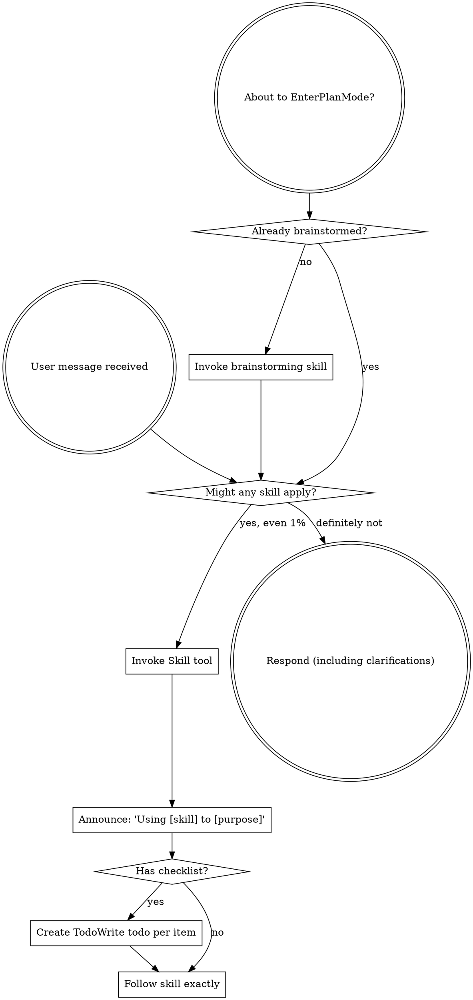

# Codex session 019f1458-e436-7300-9fd0-2180dc3600bf

- Started: `2026-06-29T17:06:40.097Z`
- Working directory: `D:\100XH100`
- Originator: `Codex Desktop`
- Codex CLI: `0.142.3`
- Source log: `C:\Users\Иван Литвак\.codex\sessions\2026\06\29\rollout-2026-06-29T20-06-40-019f1458-e436-7300-9fd0-2180dc3600bf.jsonl`
- Entries: user=2, assistant=13, tool calls=49, tool outputs=49

This is a chronological export of the user/assistant conversation and tool activity. Internal system/developer instructions and token accounting are intentionally excluded. Secret-shaped values are redacted; oversized tool outputs retain their beginning and end with the omitted character count.

## 1. User

Time: `2026-06-29T17:06:48.915Z` · source line `4`

```text
# AGENTS.md instructions for D:\100XH100

<INSTRUCTIONS>
# Project Agent Rules

## Operating Rule
- Read `AGENTS.md` before project edits.
- Update `memory/CHANGELOG.md` after meaningful code, config, or architecture changes.
- Update `memory/PROMPTS.md` with user prompts that define requirements.
- Store test outputs, logs, and verification notes under `test_results/`.
- Prefer agent-centered code: explicit contracts, deterministic tests, small files, low hidden state.

## Architecture Source
- Primary architecture contract: `ARCHITECTURE_NEED.md`.
- Current Stream 4 implementation rule: use threshold + compact + CUB/fixed-temp sort/reduce + compact; do not use Stream 4 hash-table dedup.

## Implementation Guardrails
- `State128` logical bytes are `v[0..119]`.
- `State128` padding bytes are `v[120..127]`.
- Persistent frontier padding must be zero.
- `FinalResponse` may temporarily store `target_local_idx` in `v[120..123]`.
- `Hash128` is one logical 128-bit key stored as `{lo, hi}`.
- `CandidateMeta` must remain 32 bytes and 32-byte aligned.
- Stream 3 payload id must be original candidate id, not compact index.
- Stream 4 must not apply shard top-k or semantic shard cap.

</INSTRUCTIONS>
<environment_context>
  <cwd>D:\100XH100</cwd>
  <shell>powershell</shell>
  <current_date>2026-06-29</current_date>
  <timezone>Europe/Moscow</timezone>
  <filesystem><workspace_roots><root>D:\100XH100</root></workspace_roots><permission_profile type="managed"><file_system type="restricted"><entry access="read"><special>:root</special></entry><entry access="write"><path>D:\100XH100</path></entry><entry access="write"><special>:slash_tmp</special></entry><entry access="write"><special>:tmpdir</special></entry><entry access="read"><path>D:\100XH100\.git</path></entry><entry access="read"><path>D:\100XH100\.agents</path></entry><entry access="read"><path>D:\100XH100\.codex</path></entry></file_system></permission_profile></filesystem>
</environment_context>
```

## 2. User

Time: `2026-06-29T17:06:48.929Z` · source line `6`

```text
You are the CODE QUALITY reviewer for Task 5 standalone Stream1 transformer CUDA forward. Do not edit files. Spec compliance already passed. Review commit 33f9e29760193082279a923dbb9cf8a9ae21cc13 in worktree D:\100XH100\.worktrees\stream1-piece-transformer. Base commit is 5b7efd14e42a50d51a818f41fd6b9d929dee8371.

Changed areas include:
- `cuda/stream1.hpp`, `cuda/stream1.cu`
- `tools/stream1_weight_io.hpp`
- `tests/stream1_transformer_cuda_tests.cu`
- `tests/stream1_cuda_tests.cu`, `tests/dispatcher_cuda_tests.cu`
- `CMakeLists.txt`, memory/test_results

Focus on actionable correctness/quality issues:
- Does CUDA forward match PyTorch model semantics: token build, layernorm without relu, pre-norm residual attention, SiLU FFN, output LN on CLS, output head, score quantization?
- Is attention kernel numerically safe and bounded for seq_len=51/head_dim=32? Any race/indexing bug?
- Are bf16/fp16 dtype paths fail-closed appropriately by architecture?
- Are `TransformerNetworkViewHolder` and scratch view lifetimes/device pointer tables safe?
- Does test tolerance hide systematic math bugs? Does it use real p900 reference enough?
- Did changes accidentally wire production dispatcher/runner or break MLP path?
- Is scratch reset/initialization deterministic across repeated runs?
- Any severe performance trap contradicting the FlashAttention-like requirement, beyond the documented external FA2 deferral?

Return QUALITY_PASS or QUALITY_FAIL with Critical/Important findings and file references. Ignore untracked build artifacts unless committed state is affected.
```

## 3. Codex

Time: `2026-06-29T17:07:06.638Z` · source line `9`

```text
I’ll use the project rules plus the required startup skill, then review the target commit as a code review only. I’ll keep this to committed-state evidence and avoid touching files.
```

## 4. Codex

Time: `2026-06-29T17:07:06.643Z` · source line `10`

```text
I’ll use the project rules plus the required startup skill, then review the target commit as a code review only. I’ll keep this to committed-state evidence and avoid touching files.
```

## 5. Tool call: `exec_command`

Time: `2026-06-29T17:07:06.681Z` · source line `11`

```text
{"cmd":"Get-Content -Raw 'C:\\Users\\Иван Литвак\\.codex\\plugins\\cache\\openai-curated-remote\\superpowers\\5.1.4\\skills\\using-superpowers\\SKILL.md'","workdir":"D:\\100XH100","shell":"powershell","max_output_tokens":20000}
```

## 6. Tool call: `exec_command`

Time: `2026-06-29T17:07:06.681Z` · source line `12`

```text
{"cmd":"Get-Content -Raw 'D:\\100XH100\\AGENTS.md'","workdir":"D:\\100XH100","shell":"powershell","max_output_tokens":20000}
```

## 7. Tool call: `exec_command`

Time: `2026-06-29T17:07:06.685Z` · source line `13`

```text
{"cmd":"Select-String -Path 'C:\\Users\\Иван Литвак\\.codex\\memories\\MEMORY.md' -Pattern '100XH100|Stream1|stream1|Task 5|BEAM_PREBUILT_RUNNER' -Context 2","workdir":"D:\\100XH100","shell":"powershell","max_output_tokens":20000}
```

## 8. Tool output

Time: `2026-06-29T17:07:06.989Z` · source line `14`

````text
Chunk ID: af3a1e
Wall time: 0.1077 seconds
Process exited with code 0
Original token count: 1365
Output:
---
name: using-superpowers
description: Use when starting any conversation - establishes how to find and use skills, requiring Skill tool invocation before ANY response including clarifying questions
---

<SUBAGENT-STOP>
If you were dispatched as a subagent to execute a specific task, skip this skill.
</SUBAGENT-STOP>

<EXTREMELY-IMPORTANT>
If you think there is even a 1% chance a skill might apply to what you are doing, you ABSOLUTELY MUST invoke the skill.

IF A SKILL APPLIES TO YOUR TASK, YOU DO NOT HAVE A CHOICE. YOU MUST USE IT.

This is not negotiable. This is not optional. You cannot rationalize your way out of this.
</EXTREMELY-IMPORTANT>

## Instruction Priority

Superpowers skills override default system prompt behavior, but **user instructions always take precedence**:

1. **User's explicit instructions** (CLAUDE.md, GEMINI.md, AGENTS.md, direct requests) — highest priority
2. **Superpowers skills** — override default system behavior where they conflict
3. **Default system prompt** — lowest priority

If CLAUDE.md, GEMINI.md, or AGENTS.md says "don't use TDD" and a skill says "always use TDD," follow the user's instructions. The user is in control.

## How to Access Skills

**In Claude Code:** Use the `Skill` tool. When you invoke a skill, its content is loaded and presented to you—follow it directly. Never use the Read tool on skill files.

**In Copilot CLI:** Use the `skill` tool. Skills are auto-discovered from installed plugins. The `skill` tool works the same as Claude Code's `Skill` tool.

**In Gemini CLI:** Skills activate via the `activate_skill` tool. Gemini loads skill metadata at session start and activates the full content on demand.

**In other environments:** Check your platform's documentation for how skills are loaded.

## Platform Adaptation

Skills use Claude Code tool names. Non-CC platforms: see `references/copilot-tools.md` (Copilot CLI), `references/codex-tools.md` (Codex) for tool equivalents. Gemini CLI users get the tool mapping loaded automatically via GEMINI.md.

# Using Skills

## The Rule

**Invoke relevant or requested skills BEFORE any response or action.** Even a 1% chance a skill might apply means that you should invoke the skill to check. If an invoked skill turns out to be wrong for the situation, you don't need to use it.



## Red Flags

These thoughts mean STOP—you're rationalizing:

| Thought | Reality |
|---------|---------|
| "This is just a simple question" | Questions are tasks. Check for skills. |
| "I need more context first" | Skill check comes BEFORE clarifying questions. |
| "Let me explore the codebase first" | Skills tell you HOW to explore. Check first. |
| "I can check git/files quickly" | Files lack conversation context. Check for skills. |
| "Let me gather information first" | Skills tell you HOW to gather information. |
| "This doesn't need a formal skill" | If a skill exists, use it. |
| "I remember this skill" | Skills evolve. Read current version. |
| "This doesn't count as a task" | Action = task. Check for skills. |
| "The skill is overkill" | Simple things become complex. Use it. |
| "I'll just do this one thing first" | Check BEFORE doing anything. |
| "This feels productive" | Undisciplined action wastes time. Skills prevent this. |
| "I know what that means" | Knowing the concept в‰  using the skill. Invoke it. |

## Skill Priority

When multiple skills could apply, use this order:

1. **Process skills first** (brainstorming, debugging) - these determine HOW to approach the task
2. **Implementation skills second** (frontend-design, mcp-builder) - these guide execution

"Let's build X" в†’ brainstorming first, then implementation skills.
"Fix this bug" в†’ debugging first, then domain-specific skills.

## Skill Types

**Rigid** (TDD, debugging): Follow exactly. Don't adapt away discipline.

**Flexible** (patterns): Adapt principles to context.

The skill itself tells you which.

## User Instructions

Instructions say WHAT, not HOW. "Add X" or "Fix Y" doesn't mean skip workflows.


````

## 9. Tool output

Time: `2026-06-29T17:07:07.009Z` · source line `15`

```text
Chunk ID: a494e0
Wall time: 0.1048 seconds
Process exited with code 0
Original token count: 285
Output:
# Project Agent Rules

## Operating Rule
- Read `AGENTS.md` before project edits.
- Update `memory/CHANGELOG.md` after meaningful code, config, or architecture changes.
- Update `memory/PROMPTS.md` with user prompts that define requirements.
- Store test outputs, logs, and verification notes under `test_results/`.
- Prefer agent-centered code: explicit contracts, deterministic tests, small files, low hidden state.

## Architecture Source
- Primary architecture contract: `ARCHITECTURE_NEED.md`.
- Current Stream 4 implementation rule: use threshold + compact + CUB/fixed-temp sort/reduce + compact; do not use Stream 4 hash-table dedup.

## Implementation Guardrails
- `State128` logical bytes are `v[0..119]`.
- `State128` padding bytes are `v[120..127]`.
- Persistent frontier padding must be zero.
- `FinalResponse` may temporarily store `target_local_idx` in `v[120..123]`.
- `Hash128` is one logical 128-bit key stored as `{lo, hi}`.
- `CandidateMeta` must remain 32 bytes and 32-byte aligned.
- Stream 3 payload id must be original candidate id, not compact index.
- Stream 4 must not apply shard top-k or semantic shard cap.


```

## 10. Tool output

Time: `2026-06-29T17:07:07.120Z` · source line `16`

```text
Chunk ID: d5bf93
Wall time: 0.2318 seconds
Process exited with code 0
Original token count: 1574
Output:

  C:\Users\Иван Литвак\.codex\memories\MEMORY.md:46:# Task Group: MEPhI IHES cluster publishing, shared prebuilt runner
, and inventory-driven backfill
  C:\Users\Иван Литвак\.codex\memories\MEMORY.md:47:scope: Running the IHES MEPhI cluster workflow with one shared preb
uilt `production_runner`, publishing solved puzzles into a dedicated GitHub results repo, and aggregating mixed cluster
 artifacts from on-cluster inventories.
> C:\Users\Иван Литвак\.codex\memories\MEMORY.md:48:applies_to: cwd=D:\100XH100; reuse_rule=reuse for this IHES/MEPhI r
epo family and adjacent cluster publish jobs, but treat live cluster inventory, DNS availability, and current results-r
epo schema as run-specific and recheck them before publishing.
  C:\Users\Иван Литвак\.codex\memories\MEMORY.md:49:
  C:\Users\Иван Литвак\.codex\memories\MEMORY.md:50:## Task 1: Launch IHES array jobs against one shared prebuilt runne
r, outcome success
  C:\Users\Иван Литвак\.codex\memories\MEMORY.md:52:### rollout_summary_files
  C:\Users\Иван Литвак\.codex\memories\MEMORY.md:53:
> C:\Users\Иван Литвак\.codex\memories\MEMORY.md:54:- rollout_summaries/2026-06-04T15-47-52-Dd1O-ihes_cluster_results_p
rebuilt_publish_backfill.md (cwd=\\?\D:\100XH100, rollout_path=\\?\C:\Users\Иван Литвак\.codex\sessions\2026\06\04\roll
out-2026-06-04T18-47-57-019e9351-cd3b-71c0-bf8b-69755d08d5fc.jsonl, updated_at=2026-06-26T19:51:22+00:00, thread_id=019
e9351-cd3b-71c0-bf8b-69755d08d5fc, the prebuilt runner was compiled once and reused across the A100 array workflow)
  C:\Users\Иван Литвак\.codex\memories\MEMORY.md:55:
  C:\Users\Иван Литвак\.codex\memories\MEMORY.md:56:### keywords
  C:\Users\Иван Литвак\.codex\memories\MEMORY.md:57:
> C:\Users\Иван Литвак\.codex\memories\MEMORY.md:58:- MEPhI HPC, kaf12, A100 40GB, BEAM_PREBUILT_RUNNER, prepare_ihes_p
rebuilt_runner.sh, ihes_solve_bucket_from_scratch.sh, prebuilt_runner_ready, using_prebuilt_runner, PUZZLE_LIMIT=1, dep
th=12
  C:\Users\Иван Литвак\.codex\memories\MEMORY.md:59:
  C:\Users\Иван Литвак\.codex\memories\MEMORY.md:60:## Task 2: Publish per-puzzle IHES results and backfill existing bu
cket outputs into the GitHub results repo, outcome success
  C:\Users\Иван Литвак\.codex\memories\MEMORY.md:62:### rollout_summary_files
  C:\Users\Иван Литвак\.codex\memories\MEMORY.md:63:
> C:\Users\Иван Литвак\.codex\memories\MEMORY.md:64:- rollout_summaries/2026-06-04T15-47-52-Dd1O-ihes_cluster_results_p
rebuilt_publish_backfill.md (cwd=\\?\D:\100XH100, rollout_path=\\?\C:\Users\Иван Литвак\.codex\sessions\2026\06\04\roll
out-2026-06-04T18-47-57-019e9351-cd3b-71c0-bf8b-69755d08d5fc.jsonl, updated_at=2026-06-26T19:51:22+00:00, thread_id=019
e9351-cd3b-71c0-bf8b-69755d08d5fc, the results repo structure and first backfilled puzzle sets were established)
  C:\Users\Иван Литвак\.codex\memories\MEMORY.md:65:
  C:\Users\Иван Литвак\.codex\memories\MEMORY.md:66:### keywords
  C:\Users\Иван Литвак\.codex\memories\MEMORY.md:72:### rollout_summary_files
  C:\Users\Иван Литвак\.codex\memories\MEMORY.md:73:
> C:\Users\Иван Литвак\.codex\memories\MEMORY.md:74:- rollout_summaries/2026-06-04T15-47-52-Dd1O-ihes_cluster_results_p
rebuilt_publish_backfill.md (cwd=\\?\D:\100XH100, rollout_path=\\?\C:\Users\Иван Литвак\.codex\sessions\2026\06\04\roll
out-2026-06-04T18-47-57-019e9351-cd3b-71c0-bf8b-69755d08d5fc.jsonl, updated_at=2026-06-26T19:51:22+00:00, thread_id=019
e9351-cd3b-71c0-bf8b-69755d08d5fc, a file-driven inventory plus schema fixes made the larger aggregator path workable)
  C:\Users\Иван Литвак\.codex\memories\MEMORY.md:75:
  C:\Users\Иван Литвак\.codex\memories\MEMORY.md:76:### keywords
  C:\Users\Иван Литвак\.codex\memories\MEMORY.md:87:## Reusable knowledge
  C:\Users\Иван Литвак\.codex\memories\MEMORY.md:88:
> C:\Users\Иван Литвак\.codex\memories\MEMORY.md:89:- `hpc/ihes_cube_model/prepare_ihes_prebuilt_runner.sh` builds the 
shared binary at `/mnt/pool/6/vokirova/beam8a100/ihes_cube_model/prebuilt-a100-ihes/production_runner`, and `hpc/ihes_c
ube_model/ihes_solve_bucket_from_scratch.sh` already knows how to consume `BEAM_PREBUILT_RUNNER` [Task 1]
  C:\Users\Иван Литвак\.codex\memories\MEMORY.md:90:- the verified runtime on basis exposed `world_size_effective=8`, `
NCCL 2.21.5+cuda12.4`, and eight visible A100-40GB GPUs, so the prebuilt-runner path was validated on the actual target
 hardware [Task 1]
  C:\Users\Иван Литвак\.codex\memories\MEMORY.md:91:- the durable results layout is `data/ihes_cube/puzzles/pXXXX/solut
ions.tsv`, `unique_solutions.tsv`, `metadata.env`, `summary.md`, plus root-level `index.tsv` and `improvements.tsv`; no
n-full-solution repair artifacts belong under separate `repair_segments/` trees [Task 2]
  C:\Users\Иван Литвак\.codex\memories\MEMORY.md:95:## Failures and how to do differently
  C:\Users\Иван Литвак\.codex\memories\MEMORY.md:96:
> C:\Users\Иван Литвак\.codex\memories\MEMORY.md:97:- symptom: each array task recompiles instead of reusing the solver
. cause: `BEAM_PREBUILT_RUNNER` was not wired through a separate prebuild dependency. fix: submit the prebuild first an
d make the puzzle array depend on it via `--dependency=afterok:<prebuild_job>` [Task 1]
  C:\Users\Иван Литвак\.codex\memories\MEMORY.md:98:- symptom: cluster-side publish fails after compute succeeds. cause
: the compute node cannot resolve `github.com` or otherwise lacks GitHub network access. fix: tolerate cluster-side pus
h failure and leave local commits/results ready for later push from a node with working DNS/network [Task 2]
  C:\Users\Иван Литвак\.codex\memories\MEMORY.md:99:- symptom: the backfill/index writer crashes on old rows. cause: me
tadata rows carried extra keys such as `variants` and `source_files` that were not declared in the index schema. fix: w
iden the declared schema and filter outgoing rows to declared fields before writing [Task 2][Task 3]


```

## 11. Codex

Time: `2026-06-29T17:07:21.597Z` · source line `19`

```text
The memory lookup only confirms this is the active `D:\100XH100` repo family; it does not add Stream 1 specifics. I’m switching to commit evidence now: diff first, then the CUDA/view/test paths around the requested semantics.
```

## 12. Codex

Time: `2026-06-29T17:07:21.602Z` · source line `20`

```text
The memory lookup only confirms this is the active `D:\100XH100` repo family; it does not add Stream 1 specifics. I’m switching to commit evidence now: diff first, then the CUDA/view/test paths around the requested semantics.
```

## 13. Tool call: `exec_command`

Time: `2026-06-29T17:07:21.614Z` · source line `21`

```text
{"cmd":"Get-Content -Raw 'D:\\100XH100\\.worktrees\\stream1-piece-transformer\\AGENTS.md'","workdir":"D:\\100XH100\\.worktrees\\stream1-piece-transformer","shell":"powershell","max_output_tokens":12000}
```

## 14. Tool call: `exec_command`

Time: `2026-06-29T17:07:21.619Z` · source line `22`

```text
{"cmd":"git diff --stat 5b7efd14e42a50d51a818f41fd6b9d929dee8371 33f9e29760193082279a923dbb9cf8a9ae21cc13","workdir":"D:\\100XH100\\.worktrees\\stream1-piece-transformer","shell":"powershell","max_output_tokens":12000}
```

## 15. Tool call: `exec_command`

Time: `2026-06-29T17:07:21.619Z` · source line `23`

```text
{"cmd":"git diff --name-status 5b7efd14e42a50d51a818f41fd6b9d929dee8371 33f9e29760193082279a923dbb9cf8a9ae21cc13","workdir":"D:\\100XH100\\.worktrees\\stream1-piece-transformer","shell":"powershell","max_output_tokens":12000}
```

## 16. Tool call: `exec_command`

Time: `2026-06-29T17:07:21.627Z` · source line `24`

```text
{"cmd":"git status --short","workdir":"D:\\100XH100\\.worktrees\\stream1-piece-transformer","shell":"powershell","max_output_tokens":12000}
```

## 17. Tool output

Time: `2026-06-29T17:07:21.974Z` · source line `25`

```text
Chunk ID: c3360a
Wall time: 0.1484 seconds
Process exited with code 0
Original token count: 285
Output:
# Project Agent Rules

## Operating Rule
- Read `AGENTS.md` before project edits.
- Update `memory/CHANGELOG.md` after meaningful code, config, or architecture changes.
- Update `memory/PROMPTS.md` with user prompts that define requirements.
- Store test outputs, logs, and verification notes under `test_results/`.
- Prefer agent-centered code: explicit contracts, deterministic tests, small files, low hidden state.

## Architecture Source
- Primary architecture contract: `ARCHITECTURE_NEED.md`.
- Current Stream 4 implementation rule: use threshold + compact + CUB/fixed-temp sort/reduce + compact; do not use Stream 4 hash-table dedup.

## Implementation Guardrails
- `State128` logical bytes are `v[0..119]`.
- `State128` padding bytes are `v[120..127]`.
- Persistent frontier padding must be zero.
- `FinalResponse` may temporarily store `target_local_idx` in `v[120..123]`.
- `Hash128` is one logical 128-bit key stored as `{lo, hi}`.
- `CandidateMeta` must remain 32 bytes and 32-byte aligned.
- Stream 3 payload id must be original candidate id, not compact index.
- Stream 4 must not apply shard top-k or semantic shard cap.


```

## 18. Tool output

Time: `2026-06-29T17:07:22.003Z` · source line `26`

```text
Chunk ID: 089da3
Wall time: 0.1760 seconds
Process exited with code 0
Original token count: 173
Output:
 CMakeLists.txt                                     |   5 +
 cuda/stream1.cu                                    | 468 +++++++++++++++++++++
 cuda/stream1.hpp                                   |  66 +++
 memory/CHANGELOG.md                                |  11 +-
 memory/PROMPTS.md                                  |  19 +-
 .../stream1_transformer_forward_2026-06-29.md      |  37 ++
 tests/dispatcher_cuda_tests.cu                     |   4 +-
 tests/stream1_cuda_tests.cu                        |  22 +-
 tests/stream1_transformer_cuda_tests.cu            | 175 ++++++++
 tools/stream1_weight_io.hpp                        |  81 ++++
 10 files changed, 870 insertions(+), 18 deletions(-)

```

## 19. Tool output

Time: `2026-06-29T17:07:22.003Z` · source line `27`

```text
Chunk ID: 5f0b20
Wall time: 0.1492 seconds
Process exited with code 0
Original token count: 72
Output:
M	CMakeLists.txt
M	cuda/stream1.cu
M	cuda/stream1.hpp
M	memory/CHANGELOG.md
M	memory/PROMPTS.md
A	test_results/stream1_transformer_forward_2026-06-29.md
M	tests/dispatcher_cuda_tests.cu
M	tests/stream1_cuda_tests.cu
A	tests/stream1_transformer_cuda_tests.cu
M	tools/stream1_weight_io.hpp

```

## 20. Tool output

Time: `2026-06-29T17:07:22.003Z` · source line `28`

```text
Chunk ID: a1847f
Wall time: 0.1355 seconds
Process exited with code 0
Original token count: 47
Output:
?? $null
?? build-contract-tests/
?? build-stream1-transformer-red/
?? config.obj
?? contract_tests.obj
?? docs/
?? frontier_cpu.obj
?? hash.obj
?? state.obj
?? stream3.obj
?? stream4.obj

```

## 21. Codex

Time: `2026-06-29T17:07:34.066Z` · source line `31`

```text
The committed diff is scoped to the expected Stream 1 CUDA path plus tests and docs. There are untracked build artifacts in the worktree, and I’m ignoring them as requested.
```

## 22. Codex

Time: `2026-06-29T17:07:34.071Z` · source line `32`

```text
The committed diff is scoped to the expected Stream 1 CUDA path plus tests and docs. There are untracked build artifacts in the worktree, and I’m ignoring them as requested.
```

## 23. Tool call: `exec_command`

Time: `2026-06-29T17:07:34.109Z` · source line `33`

```text
{"cmd":"git diff --unified=80 5b7efd14e42a50d51a818f41fd6b9d929dee8371 33f9e29760193082279a923dbb9cf8a9ae21cc13 -- cuda/stream1.hpp cuda/stream1.cu","workdir":"D:\\100XH100\\.worktrees\\stream1-piece-transformer","shell":"powershell","max_output_tokens":60000}
```

## 24. Tool call: `exec_command`

Time: `2026-06-29T17:07:34.152Z` · source line `34`

```text
{"cmd":"git diff --unified=80 5b7efd14e42a50d51a818f41fd6b9d929dee8371 33f9e29760193082279a923dbb9cf8a9ae21cc13 -- tools/stream1_weight_io.hpp","workdir":"D:\\100XH100\\.worktrees\\stream1-piece-transformer","shell":"powershell","max_output_tokens":30000}
```

## 25. Tool call: `exec_command`

Time: `2026-06-29T17:07:34.212Z` · source line `35`

```text
{"cmd":"git diff --unified=80 5b7efd14e42a50d51a818f41fd6b9d929dee8371 33f9e29760193082279a923dbb9cf8a9ae21cc13 -- tests/stream1_transformer_cuda_tests.cu tests/stream1_cuda_tests.cu tests/dispatcher_cuda_tests.cu CMakeLists.txt","workdir":"D:\\100XH100\\.worktrees\\stream1-piece-transformer","shell":"powershell","max_output_tokens":60000}
```

## 26. Tool output

Time: `2026-06-29T17:07:34.633Z` · source line `36`

Oversized output: `2040` characters omitted from the middle.

```text
Chunk ID: 92eaf3
Wall time: 0.1380 seconds
Process exited with code 0
Original token count: 8484
Output:
diff --git a/cuda/stream1.cu b/cuda/stream1.cu
index 6916376..b1ab785 100644
--- a/cuda/stream1.cu
+++ b/cuda/stream1.cu
@@ -1,83 +1,84 @@
 #include "stream1.hpp"
 
 #include "config.hpp"
+#include "cuda_check.hpp"
 #include "nvtx_ranges.hpp"
 
 #include <cuda_runtime.h>
 #include <cuda_bf16.h>
 #include <cuda_fp16.h>
 
 #if BEAM_HAS_CUTLASS
 #include <cutlass/bfloat16.h>
 #include <cutlass/gemm/device/gemm.h>
 #include <cutlass/epilogue/thread/linear_combination_relu.h>
 #include <cutlass/layout/matrix.h>
 #endif
 
 #include <stdexcept>
 
 namespace beam {
 
 __global__ void stream1_score_contract_kernel(
     const State128* current_frontier_states,
     const std::uint64_t* parent_base,
     const std::uint32_t* count,
     std::uint32_t* score_ring,
     std::uint32_t ring,
     std::uint32_t ring_slot,
     std::uint32_t ring_slot_count,
     std::uint32_t b_micro) {
     const std::uint32_t candidate = blockIdx.x * blockDim.x + threadIdx.x;
     const std::uint32_t total = b_micro * static_cast<std::uint32_t>(MOVE_COUNT);
     if (candidate >= total) {
         return;
     }
     const std::uint32_t parent_local = candidate / static_cast<std::uint32_t>(MOVE_COUNT);
     const std::uint32_t move = candidate % static_cast<std::uint32_t>(MOVE_COUNT);
     if (parent_local >= count[ring * ring_slot_count + ring_slot]) {
         return;
     }
 
     const std::uint64_t parent_idx = parent_base[ring * ring_slot_count + ring_slot] + parent_local;
     const State128 state = current_frontier_states[parent_idx];
     std::uint32_t accum = 0;
     for (std::uint32_t p = 0; p < STATE_LEN; ++p) {
         accum += static_cast<std::uint32_t>(state.v[p]) * static_cast<std::uint32_t>((p + 1U) * (move + 1U));
     }
     const std::uint32_t score_key = accum % (SCORE_MAX_KEY + 1U);
     const std::uint64_t offset =
         (((static_cast<std::uint64_t>(ring) * ring_slot_count + ring_slot) * b_micro + parent_local) * MOVE_COUNT) + move;
     score_ring[offset] = score_key;
 }
 
 void stream1_score_contract_cuda(
     const State128* current_frontier_states,
     const std::uint64_t* parent_base,
     const std::uint32_t* count,
     std::uint32_t* score_ring,
     std::uint32_t ring,
     std::uint32_t ring_slot,
     std::uint32_t b_micro,
     cudaStream_t stream) {
     NvtxRange range("Stream1_contract_score_launch");
     const std::uint32_t ring_slot_count = 1;
     const std::uint32_t total = b_micro * static_cast<std::uint32_t>(MOVE_COUNT);
     const dim3 block(128);
     const dim3 grid((total + block.x - 1) / block.x);
     stream1_score_contract_kernel<<<grid, block, 0, stream>>>(
         current_frontier_states,
         parent_base,
         count,
         score_ring,
         ring,
         ring_slot,
         ring_slot_count,
         b_micro);
 }
 
 __device__ float relu_device(float x) {
     return x > 0.0f ? x : 0.0f;
 }
 
 __device__ std::uint32_t score_key_from_float_device(float q) {
     q = fminf(fmaxf(q, 0.0f), SCORE_MAX_Q);
@@ -402,160 +403,627 @@ __global__ void stream1_layernorm_residual_relu_kernel(
         __syncthreads();
     }
     const float mean = reduce[0] / static_cast<float>(cols);
     float var_sum = 0.0f;
     for (std::uint32_t col = threadIdx.x; col < cols; col += blockDim.x) {
         const float x = stream1_load_scalar_device(matrix, base + col, dtype) +
                         stream1_load_scalar_device(bias, col, dtype);
         const float d = x - mean;
         var_sum += d * d;
     }
     reduce[threadIdx.x] = var_sum;
     __syncthreads();
     for (std::uint32_t stride = blockDim.x / 2U; stride > 0U; stride >>= 1U) {
         if (threadIdx.x < stride) {
             reduce[threadIdx.x] += reduce[threadIdx.x + stride];
         }
         __syncthreads();
     }
     const float inv_std = rsqrtf(reduce[0] / static_cast<float>(cols) + 1.0e-5f);
     for (std::uint32_t col = threadIdx.x; col < cols; col += blockDim.x) {
         const float x = stream1_load_scalar_device(matrix, base + col, dtype) +
                         stream1_load_scalar_device(bias, col, dtype);
         const float y = (x - mean) * inv_std *
                         stream1_load_scalar_device(gamma, col, dtype) +
                         stream1_load_scalar_device(beta, col, dtype) +
                         stream1_load_scalar_device(residual, base + col, dtype);
         stream1_store_scalar_device(matrix, base + col, relu_device(y), dtype);
     }
 }
 
 __global__ void stream1_score_epilogue_quantize_kernel(
     const half* output,
     const half* output_bias,
     const std::uint32_t* count,
     std::uint32_t* score_ring,
     std::uint32_t b_micro,
     std::uint32_t dtype) {
     const std::uint32_t i = blockIdx.x * blockDim.x + threadIdx.x;
     const std::uint32_t total = b_micro * static_cast<std::uint32_t>(MOVE_COUNT);
     if (i >= total) {
         return;
     }
     const std::uint32_t row = i / static_cast<std::uint32_t>(MOVE_COUNT);
     const std::uint32_t move = i % static_cast<std::uint32_t>(MOVE_COUNT);
     if (row >= *count) {
         return;
     }
     const float q = stream1_load_scalar_device(output, i, dtype) +
                     stream1_load_scalar_device(output_bias, move, dtype);
     score_ring[i] = score_key_from_float_device(q);
 }
 
 __global__ void stream1_single_output_quantize_kernel(
     const half* residual,
     const half* output_weight,
     const half* output_bias,
     const std::uint32_t* count,
     std::uint32_t* score_ring,
     std::uint32_t b_micro,
     std::uint32_t hidden2,
     std::uint32_t dtype) {
     const std::uint32_t i = blockIdx.x * blockDim.x + threadIdx.x;
     const std::uint32_t total = b_micro * static_cast<std::uint32_t>(MOVE_COUNT);
     if (i >= total) {
         return;
     }
     const std::uint32_t parent_local = i / static_cast<std::uint32_t>(MOVE_COUNT);
     if (parent_local >= *count) {
         return;
     }
     float q = stream1_load_scalar_device(output_bias, 0, dtype);
     const half* row = residual + static_cast<std::uint64_t>(i) * hidden2;
     for (std::uint32_t h = 0; h < hidden2; ++h) {
         q += stream1_load_scalar_device(row, h, dtype) *
              stream1_load_scalar_device(output_weight, h, dtype);
     }
     q += STREAM1_SINGLE_OUTPUT_SCORE_OFFSET;
     score_ring[i] = score_key_from_float_device(q);
 }
 
+__global__ void stream1_transformer_build_input_kernel(
+    const State128* __restrict__ current_frontier_states,
+    const std::uint64_t* __restrict__ parent_base,
+    const std::uint32_t* __restrict__ count,
+    Stream1TransformerNetworkView network,
+    half* __restrict__ tokens,
+    std::uint32_t b_micro) {
+    const std::uint32_t row_token = blockIdx.x;
+    const std::uint32_t dim = blockIdx.y * blockDim.x + threadIdx.x;
+    const std::uint32_t row = row_token / network.dims.seq_len;
+    const std::uint32_t token = row_token % network.dims.seq_len;
+    if (row >= b_micro || row >= *count || dim >= network.dims.d_model) {
+        return;
+    }
+    float value = 0.0f;
+    if (token == 0U) {
+        value = stream1_load_scalar_device(network.cls_token, dim, network.dims.dtype);
+    } else {
+        const std::uint32_t piece = token - 1U;
+        value = stream1_load_scalar_device(
+            network.fast_piece_static,
+            static_cast<std::uint64_t>(piece) * network.dims.d_model + dim,
+            network.dims.dtype);
+        const State128 state = current_frontier_states[*parent_base + row];
+        for (std::uint32_t slot = 0; slot < network.dims.max_piece_size; ++slot) {
+            const std::uint64_t piece_slot = static_cast<std::uint64_t>(piece) * network.dims.max_piece_size + slot;
+            if (network.piece_mask[piece_slot] == 0U) {
+                continue;
+            }
+            const std::uint32_t pos = static_cast<std::uint32_t>(network.piece_positions[piece_slot]);
+            const std::uint32_t state_value = static_cast<std::uint32_t>(state.v[pos]);
+            const std::uint64_t table_idx =
+                ((static_cast<std::uint64_t>(slot) * network.dims.num_classes + state_value) * network.dims.d_model) + dim;
+            value += stream1_load_scalar_device(network.fast_slot_projected, table_idx, network.dims.dtype);
+        }
+    }
+    const std::uint64_t out_idx = static_cast<std::uint64_t>(row_token) * network.dims.d_model + dim;
+    stream1_store_scalar_device(tokens, out_idx, value, network.dims.dtype);
+}
+
+__global__ void stream1_transformer_layernorm_copy_kernel(
+    const half* __restrict__ input,
+    half* __restrict__ output,
+    const half* __restrict__ gamma,
+    const half* __restrict__ beta,
+    std::uint32_t rows,
+    std::uint32_t cols,
+    std::uint32_t dtype) {
+    const std::uint32_t row = blockIdx.x;
+    if (row >= rows) {
+        return;
+    }
+    extern __shared__ float reduce[];
+    const std::uint64_t base = static_cast<std::uint64_t>(row) * cols;
+    float sum = 0.0f;
+    for (std::uint32_t col = threadIdx.x; col < cols; col += blockDim.x) {
+        sum += stream1_load_scalar_device(input, base + col, dtype);
+    }
+    reduce[threadIdx.x] = sum;
+    __syncthreads();
+    for (std::uint32_t stride = blockDim.x / 2U; stride > 0U; stride >>= 1U) {
+        if (threadIdx.x < stride) {
+            reduce[threadIdx.x] += reduce[threadIdx.x + stride];
+        }
+        __syncthreads();
+    }
+    const float mean = reduce[0] / static_cast<float>(cols);
+    float var_sum = 0.0f;
+    for (std::uint32_t col = threadIdx.x; col < cols; col += blockDim.x) {
+        const float x = stream1_load_scalar_device(input, base + col, dtype);
+        const float d = x - mean;
+        var_sum += d * d;
+    }
+    reduce[threadIdx.x] = var_sum;
+    __syncthreads();
+    for (std::uint32_t stride = blockDim.x / 2U; stride > 0U; stride >>= 1U) {
+        if (threadIdx.x < stride) {
+            reduce[threadIdx.x] += reduce[threadIdx.x + stride];
+        }
+        __syncthreads();
+    }
+    const float inv_std = rsqrtf(reduce[0] / static_cast<float>(cols) + 1.0e-5f);
+    for (std::uint32_t col = threadIdx.x; col < cols; col += blockDim.x) {
+        const float x = stream1_load_scalar_device(input, base + col, dtype);
+        const float y = (x - mean) * inv_std *
+            stream1_load_scalar_device(gamma, col, dtype) +
+            stream1_load_scalar_device(beta, col, dtype);
+        stream1_store_scalar_device(output, base + col, y, dtype);
+    }
+}
+
+__global__ void stream1_transformer_residual_bias_add_kernel(
+    half* __restrict__ tokens,
+    const half* __restrict__ branch,
+    const half* __restrict__ bias,
+    std::uint32_t total_tokens,
+    std::uint32_t d_model,
+    std::uint32_t dtype) {
+    const std::uint32_t i = blockIdx.x * blockDim.x + threadIdx.x;
+    const std::uint32_t total = total_tokens * d_model;
+    if (i >= total) {
+        return;
+    }
+    const std::uint32_t col = i % d_model;
+    const float y = stream1_load_scalar_device(tokens, i, dtype) +
+        stream1_load_scalar_device(branch, i, dtype) +
+        stream1_load_scalar_device(bias, col, dtype);
+    stream1_store_scalar_device(tokens, i, y, dtype);
+}
+
+__global__ void stream1_transformer_bias_silu_kernel(
+    half* __restrict__ matrix,
+    const half* __restrict__ bias,
+    std::uint32_t rows,
+    std::uint32_t cols,
+    std::uint32_t dtype) {
+    const std::uint32_t i = blockIdx.x * blockDim.x + threadIdx.x;
+    const std::uint32_t total = rows * cols;
+    if (i >= total) {
+        return;
+    }
+    const std::uint32_t col = i % cols;
+    const float x = stream1_load_scalar_device(matrix, i, dtype) +
+        stream1_load_scalar_device(bias, col, dtype);
+    const float y = x / (1.0f + expf(-x));
+    stream1_store_scalar_device(matrix, i, y, dtype);
+}
+
+// Standalone tiled attention for current p900 seq_len=51. Full external FA2 integration is deferred.
+__global__ void stream1_transformer_attention51_kernel(
+    const half* __restrict__ qkv,
+    const half* __restrict__ qkv_bias,
+    float* __restrict__ scores_probs,
+    half* __restrict__ context,
+    Stream1TransformerDims dims,
+    std::uint32_t b_micro) {
+    const std::uint32_t row = blockIdx.x;
+    const std::uint32_t head = blockIdx.y;
+    const std::uint32_t query = blockIdx.z;
+    const std::uint32_t tid = threadIdx.x;
+    if (row >= b_micro || head >= dims.nhead || query >= dims.seq_len) {
+        return;
+    }
+    extern __shared__ float shared[];
+    const std::uint64_t score_base =
+        (((static_cast<std::uint64_t>(row) * dims.nhead + head) * dims.seq_len + query) * dims.seq_len);
+    const std::uint32_t head_offset = head * dims.head_dim;
+    const float scale = rsqrtf(static_cast<float>(dims.head_dim));
+    float score = -3.4028234663852886e38f;
+    if (tid < dims.seq_len) {
+        float dot = 0.0f;
+        for (std::uint32_t d = 0; d < dims.head_dim; ++d) {
+            const std::uint64_t q_idx =
+                (static_cast<std::uint64_t>(row) * dims.seq_len + query) * (3ULL * dims.d_model) + head_offset + d;
+            const std::uint64_t k_idx =
+                (static_cast<std::uint64_t>(row) * dims.seq_len + tid) * (3ULL * dims.d_model) + dims.d_model + head_offset + d;
+            const float q = stream1_load_scalar_device(qkv, q_idx, dims.dtype) +
+                stream1_load_scalar_device(qkv_bias, head_offset + d, dims.dtype);
+            const float k = stream1_load_scalar_device(qkv, k_idx, dims.dtype) +
+                stream1_load_scalar_device(qkv_bias, dims.d_model + head_offset + d, dims.dtype);
+            dot += q * k;
+        }
+        score = dot * scale;
+        scores_probs[score_base + tid] = score;
+    }
+    shared[tid] = score;
+    __syncthreads();
+    for (std::uint32_t stride = blockDim.x / 2U; stride > 0U; stride >>= 1U) {
+        if (tid < stride) {
+            shared[tid] = fmaxf(shared[tid], shared[tid + stride]);
+        }
+        __syncthreads();
+    }
+    const float max_score = shared[0];
+    float exp_value = 0.0f;
+    if (tid < dims.seq_len) {
+        exp_value = expf(scores_probs[score_base + tid] - max_score);
+        scores_probs[score_base + tid] = exp_value;
+    }
+    shared[tid] = exp_value;
+    __syncthreads();
+    for (std::uint32_t stride = blockDim.x / 2U; stride > 0U; stride >>= 1U) {
+        if (tid < stride) {
+            shared[tid] += shared[tid + stride];
+        }
+        __syncthreads();
+    }
+    const float inv_sum = 1.0f / shared[0];
+    if (tid < dims.seq_len) {
+        scores_probs[score_base + tid] *= inv_sum;
+    }
+    __syncthreads();
+    if (tid < dims.head_dim) {
+        float acc = 0.0f;
+        for (std::uint32_t key = 0; key < dims.seq_len; ++key) {
+            const float prob = scores_probs[score_base + key];
+            const std::uint64_t v_idx =
+                (static_cast<std::uint64_t>(row) * dims.seq_len + key) * (3ULL * dims.d_model) +
+                2ULL * dims.d_model + head_offset + tid;
+            const float v = stream1_load_scalar_device(qkv, v_idx, dims.dtype) +
+                stream1_load_scalar_device(qkv_bias, 2ULL * dims.d_model + head_offset + tid, dims.dtype);
+            acc += prob * v;
+        }
+        const std::uint64_t out_idx =
+            (static_cast<std::uint64_t>(row) * dims.seq_len + query) * dims.d_model + head_offset + tid;
+        stream1_store_scalar_device(context, out_idx, acc, dims.dtype);
+    }
+}
+
+__global__ void stream1_transformer_cls_layernorm_kernel(
+    const half* __restrict__ tokens,
+    half* __restrict__ cls,
+    const half* __restrict__ gamma,
+    const half* __restrict__ beta,
+    Stream1TransformerDims dims,
+    std::uint32_t b_micro) {
+    const std::uint32_t row = blockIdx.x;
+    if (row >= b_micro) {
+        return;
+    }
+    extern

[... 2040 characters omitted from oversized tool output ...]

 __restrict__ score_ring,
+    std::uint32_t b_micro,
+    Stream1TransformerDims dims) {
+    const std::uint32_t i = blockIdx.x * blockDim.x + threadIdx.x;
+    const std::uint32_t total = b_micro * static_cast<std::uint32_t>(MOVE_COUNT);
+    if (i >= total) {
+        return;
+    }
+    const std::uint32_t row = i / static_cast<std::uint32_t>(MOVE_COUNT);
+    const std::uint32_t move = i % static_cast<std::uint32_t>(MOVE_COUNT);
+    if (row >= *count) {
+        return;
+    }
+    const float q = stream1_load_scalar_device(logits, static_cast<std::uint64_t>(row) * dims.output_dim + move, dims.dtype) +
+        stream1_load_scalar_device(output_bias, move, dims.dtype);
+    score_ring[i] = score_key_from_float_device(q);
+}
+
+void stream1_transformer_inference_cuda(
+    const State128* current_frontier_states,
+    const std::uint64_t* parent_base,
+    const std::uint32_t* count,
+    const Stream1TransformerNetworkView& network,
+    const Stream1TransformerScratchView& scratch,
+    std::uint32_t* score_ring,
+    std::uint32_t b_micro,
+    cudaStream_t stream) {
+    NvtxRange range("Stream1_transformer_inference_launch");
+    const Stream1TransformerDims dims = network.dims;
+    if (dims.output_dim != MOVE_COUNT) {
+        throw std::invalid_argument("Stream1 piece_transformer output_dim must equal MOVE_COUNT");
+    }
+    if (dims.d_model == 0U || dims.nhead == 0U || dims.head_dim == 0U ||
+        dims.d_model != dims.nhead * dims.head_dim) {
+        throw std::invalid_argument("Stream1 piece_transformer d_model must equal nhead * head_dim");
+    }
+    if (dims.seq_len != dims.num_pieces + 1U || dims.max_piece_size == 0U) {
+        throw std::invalid_argument("Stream1 piece_transformer sequence/piece dimensions are inconsistent");
+    }
+    if (dims.seq_len > 64U || dims.head_dim > 64U) {
+        throw std::invalid_argument("Stream1 piece_transformer fused attention tile requires seq_len<=64 and head_dim<=64");
+    }
+    if (dims.dtype == STREAM1_DTYPE_BF16) {
+        int device = 0;
+        cudaGetDevice(&device);
+        cudaDeviceProp prop{};
+        cudaGetDeviceProperties(&prop, device);
+        if (prop.major < 8) {
+            throw std::invalid_argument("Stream1 piece_transformer bf16 path requires SM80+ GPU; use fp16 weights on T4/SM75");
+        }
+    } else if (dims.dtype != STREAM1_DTYPE_FP16) {
+        throw std::invalid_argument("Stream1 piece_transformer dtype must be fp16 or bf16");
+    }
+    if (b_micro == 0U) {
+        return;
+    }
+#if BEAM_HAS_CUTLASS
+    const std::uint32_t token_rows = b_micro * dims.seq_len;
+    BEAM_CUDA_CHECK(cudaMemsetAsync(scratch.tokens, 0, static_cast<std::uint64_t>(token_rows) * dims.d_model * sizeof(half), stream));
+    BEAM_CUDA_CHECK(cudaMemsetAsync(scratch.qkv, 0, static_cast<std::uint64_t>(token_rows) * 3ULL * dims.d_model * sizeof(half), stream));
+    BEAM_CUDA_CHECK(cudaMemsetAsync(scratch.attention_scores_probs, 0, static_cast<std::uint64_t>(b_micro) * dims.nhead * dims.seq_len * dims.seq_len * sizeof(float), stream));
+    BEAM_CUDA_CHECK(cudaMemsetAsync(scratch.attention_context, 0, static_cast<std::uint64_t>(token_rows) * dims.d_model * sizeof(half), stream));
+    BEAM_CUDA_CHECK(cudaMemsetAsync(scratch.ff_hidden, 0, static_cast<std::uint64_t>(token_rows) * dims.ff_dim * sizeof(half), stream));
+    BEAM_CUDA_CHECK(cudaMemsetAsync(scratch.logits, 0, static_cast<std::uint64_t>(b_micro) * dims.output_dim * sizeof(half), stream));
+    const dim3 token_block(128);
+    const dim3 token_grid(token_rows, (dims.d_model + token_block.x - 1U) / token_block.x);
+    stream1_transformer_build_input_kernel<<<token_grid, token_block, 0, stream>>>(
+        current_frontier_states,
+        parent_base,
+        count,
+        network,
+        scratch.tokens,
+        b_micro);
+
+    stream1_transformer_layernorm_copy_kernel<<<token_rows, 256, 256 * sizeof(float), stream>>>(
+        scratch.tokens,
+        scratch.tokens,
+        network.input_ln_gamma,
+        network.input_ln_beta,
+        token_rows,
+        dims.d_model,
+        dims.dtype);
+
+    for (std::uint32_t layer = 0; layer < dims.transformer_layers; ++layer) {
+        const Stream1TransformerBlockView block = network.blocks[layer];
+        stream1_transformer_layernorm_copy_kernel<<<token_rows, 256, 256 * sizeof(float), stream>>>(
+            scratch.tokens,
+            scratch.attention_context,
+            block.ln1_gamma,
+            block.ln1_beta,
+            token_rows,
+            dims.d_model,
+            dims.dtype);
+        stream1_cutlass_linear_cuda(
+            scratch.attention_context,
+            block.attn_qkv_weight,
+            scratch.qkv,
+            token_rows,
+            dims.d_model,
+            3U * dims.d_model,
+            dims.dtype,
+            stream);
+        const dim3 attn_grid(b_micro, dims.nhead, dims.seq_len);
+        stream1_transformer_attention51_kernel<<<attn_grid, 64, 64 * sizeof(float), stream>>>(
+            scratch.qkv,
+            block.attn_qkv_bias,
+            scratch.attention_scores_probs,
+            scratch.attention_context,
+            dims,
+            b_micro);
+        stream1_cutlass_linear_cuda(
+            scratch.attention_context,
+            block.attn_out_weight,
+            scratch.qkv,
+            token_rows,
+            dims.d_model,
+            dims.d_model,
+            dims.dtype,
+            stream);
+        stream1_transformer_residual_bias_add_kernel<<<(token_rows * dims.d_model + 255U) / 256U, 256, 0, stream>>>(
+            scratch.tokens,
+            scratch.qkv,
+            block.attn_out_bias,
+            token_rows,
+            dims.d_model,
+            dims.dtype);
+
+        stream1_transformer_layernorm_copy_kernel<<<token_rows, 256, 256 * sizeof(float), stream>>>(
+            scratch.tokens,
+            scratch.attention_context,
+            block.ln2_gamma,
+            block.ln2_beta,
+            token_rows,
+            dims.d_model,
+            dims.dtype);
+        stream1_cutlass_linear_cuda(
+            scratch.attention_context,
+            block.ff1_weight,
+            scratch.ff_hidden,
+            token_rows,
+            dims.d_model,
+            dims.ff_dim,
+            dims.dtype,
+            stream);
+        stream1_transformer_bias_silu_kernel<<<(token_rows * dims.ff_dim + 255U) / 256U, 256, 0, stream>>>(
+            scratch.ff_hidden,
+            block.ff1_bias,
+            token_rows,
+            dims.ff_dim,
+            dims.dtype);
+        stream1_cutlass_linear_cuda(
+            scratch.ff_hidden,
+            block.ff2_weight,
+            scratch.attention_context,
+            token_rows,
+            dims.ff_dim,
+            dims.d_model,
+            dims.dtype,
+            stream);
+        stream1_transformer_residual_bias_add_kernel<<<(token_rows * dims.d_model + 255U) / 256U, 256, 0, stream>>>(
+            scratch.tokens,
+            scratch.attention_context,
+            block.ff2_bias,
+            token_rows,
+            dims.d_model,
+            dims.dtype);
+    }
+
+    stream1_transformer_cls_layernorm_kernel<<<b_micro, 256, 256 * sizeof(float), stream>>>(
+        scratch.tokens,
+        scratch.attention_context,
+        network.output_ln_gamma,
+        network.output_ln_beta,
+        dims,
+        b_micro);
+    stream1_cutlass_linear_cuda(
+        scratch.attention_context,
+        network.output_weight,
+        scratch.logits,
+        b_micro,
+        dims.d_model,
+        dims.output_dim,
+        dims.dtype,
+        stream);
+    stream1_transformer_score_quantize_kernel<<<(b_micro * MOVE_COUNT + 255U) / 256U, 256, 0, stream>>>(
+        scratch.logits,
+        network.output_bias,
+        count,
+        score_ring,
+        b_micro,
+        dims);
+#else
+    (void)current_frontier_states;
+    (void)parent_base;
+    (void)count;
+    (void)network;
+    (void)scratch;
+    (void)score_ring;
+    (void)b_micro;
+    (void)stream;
+    throw std::invalid_argument("Stream1 piece_transformer CUDA forward requires CUTLASS-enabled build");
+#endif
+}
 void stream1_inference_custom_cuda(
     const State128* current_frontier_states,
     const std::uint64_t* parent_base,
     const std::uint32_t* count,
     const Stream1NetworkView& network,
     std::uint32_t* score_ring,
     std::uint32_t,
     std::uint32_t,
     std::uint32_t b_micro,
     cudaStream_t stream) {
     NvtxRange range("Stream1_custom_inference_launch");
     const std::size_t shared_bytes =
         (static_cast<std::size_t>(network.dims.hidden1) + static_cast<std::size_t>(network.dims.hidden2)) * sizeof(float);
     stream1_inference_custom_kernel<<<b_micro, MOVE_COUNT, shared_bytes, stream>>>(
         current_frontier_states,
         parent_base,
         count,
         network,
         score_ring,
         0,
         0,
         b_micro);
 }
 
 void stream1_inference_cutlass_cuda(
     const State128* current_frontier_states,
     const std::uint64_t* parent_base,
     const std::uint32_t* count,
     const std::uint8_t* generators,
     const Stream1NetworkView& network,
     const Stream1CutlassScratch& scratch,
     std::uint32_t* score_ring,
     std::uint32_t b_micro,
     cudaStream_t stream) {
     NvtxRange range("Stream1_CUTLASS_inference_launch");
     if (network.dims.output_dim != MOVE_COUNT &&
         network.dims.output_dim != STREAM1_SINGLE_SCORE_OUTPUT_DIM) {
         throw std::invalid_argument("Stream1 output_dim must be 1 or MOVE_COUNT");
     }
     if (network.dims.output_dim == STREAM1_SINGLE_SCORE_OUTPUT_DIM && generators == nullptr) {
         throw std::invalid_argument("Stream1 output_dim=1 requires generator table");
     }
     const std::uint32_t inference_rows =
         b_micro * (network.dims.output_dim == STREAM1_SINGLE_SCORE_OUTPUT_DIM
             ? static_cast<std::uint32_t>(MOVE_COUNT)
             : 1U);
     if (network.dims.dtype == STREAM1_DTYPE_BF16) {
         int device = 0;
         cudaGetDevice(&device);
         cudaDeviceProp prop{};
         cudaGetDeviceProperties(&prop, device);
         if (prop.major < 8) {
             throw std::invalid_argument("Stream1 bf16 CUTLASS path requires SM80+ GPU");
         }
     }
 #if BEAM_HAS_CUTLASS
     const dim3 input_block(128);
     const dim3 input_grid(inference_rows, (network.dims.hidden1 + input_block.x * 4U - 1U) / (input_block.x * 4U));
     stream1_folded_input_half4_tiled_kernel<<<input_grid, input_block, 0, stream>>>(
         current_frontier_states,
         parent_base,
         count,
         generators,
         network.input_weight,
         network.input_bias,
         scratch.hidden1,
         network.dims,
         b_micro);
     if (network.dims.normalization == STREAM1_NORM_LAYERNORM) {
         stream1_layernorm_relu_kernel<<<inference_rows, 256, 256 * sizeof(float), stream>>>(
             scratch.hidden1,
             network.input_bias,
             network.input_ln_gamma,
             network.input_ln_beta,
             inference_rows,
             network.dims.hidden1,
             network.dims.dtype);
     }
 
     stream1_cutlass_linear_cuda(
diff --git a/cuda/stream1.hpp b/cuda/stream1.hpp
index 4d9c07d..f71f2da 100644
--- a/cuda/stream1.hpp
+++ b/cuda/stream1.hpp
@@ -1,101 +1,167 @@
 #pragma once
 
 #include "types.hpp"
 
 #include <cuda_bf16.h>
 #include <cuda_fp16.h>
 
 namespace beam {
 
 struct Stream1NetworkDims {
     std::uint32_t state_len;
     std::uint32_t num_classes;
     std::uint32_t hidden1;
     std::uint32_t hidden2;
     std::uint32_t residual_count;
     std::uint32_t output_dim;
     std::uint32_t dtype;
     std::uint32_t normalization;
 };
 
 struct Stream1NetworkView {
     const half* input_weight;
     const half* input_bias;
     const half* input_ln_gamma;
     const half* input_ln_beta;
     const half* hidden_weight;
     const half* hidden_bias;
     const half* hidden_ln_gamma;
     const half* hidden_ln_beta;
     const half* const* residual_fc1_weight;
     const half* const* residual_fc1_bias;
     const half* const* residual_fc1_ln_gamma;
     const half* const* residual_fc1_ln_beta;
     const half* const* residual_fc2_weight;
     const half* const* residual_fc2_bias;
     const half* const* residual_fc2_ln_gamma;
     const half* const* residual_fc2_ln_beta;
     const half* output_weight;
     const half* output_bias;
     Stream1NetworkDims dims;
 };
 
 struct Stream1CutlassScratch {
     half* hidden1;
     half* hidden2;
     half* residual_tmp;
     half* output;
 };
 
+struct Stream1TransformerDims {
+    std::uint32_t state_len;
+    std::uint32_t num_classes;
+    std::uint32_t num_pieces;
+    std::uint32_t max_piece_size;
+    std::uint32_t seq_len;
+    std::uint32_t d_model;
+    std::uint32_t nhead;
+    std::uint32_t head_dim;
+    std::uint32_t transformer_layers;
+    std::uint32_t ff_dim;
+    std::uint32_t output_dim;
+    std::uint32_t dtype;
+};
+
+struct Stream1TransformerBlockView {
+    const half* ln1_gamma;
+    const half* ln1_beta;
+    const half* attn_qkv_weight;
+    const half* attn_qkv_bias;
+    const half* attn_out_weight;
+    const half* attn_out_bias;
+    const half* ln2_gamma;
+    const half* ln2_beta;
+    const half* ff1_weight;
+    const half* ff1_bias;
+    const half* ff2_weight;
+    const half* ff2_bias;
+};
+
+struct Stream1TransformerNetworkView {
+    const half* fast_slot_projected;
+    const half* fast_piece_static;
+    const half* cls_token;
+    const half* input_ln_gamma;
+    const half* input_ln_beta;
+    const half* output_ln_gamma;
+    const half* output_ln_beta;
+    const Stream1TransformerBlockView* blocks;
+    const half* output_weight;
+    const half* output_bias;
+    const std::uint16_t* piece_positions;
+    const std::uint8_t* piece_mask;
+    const std::uint8_t* piece_types;
+    Stream1TransformerDims dims;
+};
+
+struct Stream1TransformerScratchView {
+    half* tokens;
+    half* qkv;
+    float* attention_scores_probs;
+    half* attention_context;
+    half* ff_hidden;
+    half* logits;
+};
+
 void stream1_score_contract_cuda(
     const State128* current_frontier_states,
     const std::uint64_t* parent_base,
     const std::uint32_t* count,
     std::uint32_t* score_ring,
     std::uint32_t ring,
     std::uint32_t ring_slot,
     std::uint32_t b_micro,
     cudaStream_t stream);
 
 void stream1_inference_custom_cuda(
     const State128* current_frontier_states,
     const std::uint64_t* parent_base,
     const std::uint32_t* count,
     const Stream1NetworkView& network,
     std::uint32_t* score_ring,
     std::uint32_t ring,
     std::uint32_t ring_slot,
     std::uint32_t b_micro,
     cudaStream_t stream);
 
 void stream1_inference_cutlass_cuda(
     const State128* current_frontier_states,
     const std::uint64_t* parent_base,
     const std::uint32_t* count,
     const std::uint8_t* generators,
     const Stream1NetworkView& network,
     const Stream1CutlassScratch& scratch,
     std::uint32_t* score_ring,
     std::uint32_t b_micro,
     cudaStream_t stream);
 
+void stream1_transformer_inference_cuda(
+    const State128* current_frontier_states,
+    const std::uint64_t* parent_base,
+    const std::uint32_t* count,
+    const Stream1TransformerNetworkView& network,
+    const Stream1TransformerScratchView& scratch,
+    std::uint32_t* score_ring,
+    std::uint32_t b_micro,
+    cudaStream_t stream);
+
 void stream1_cutlass_linear_cuda(
     const half* input,
     const half* weight,
     half* output,
     std::uint32_t rows,
     std::uint32_t input_cols,
     std::uint32_t output_cols,
     std::uint32_t dtype,
     cudaStream_t stream);
 
 void stream1_cutlass_linear_relu_cuda(
     const half* input,
     const half* weight,
     half* output,
     std::uint32_t rows,
     std::uint32_t input_cols,
     std::uint32_t output_cols,
     cudaStream_t stream);
 
 } // namespace beam

```

## 27. Tool output

Time: `2026-06-29T17:07:34.642Z` · source line `37`

```text
Chunk ID: 7af2ec
Wall time: 0.1400 seconds
Process exited with code 0
Original token count: 1744
Output:
diff --git a/tools/stream1_weight_io.hpp b/tools/stream1_weight_io.hpp
index 5fe3a49..c95afb1 100644
--- a/tools/stream1_weight_io.hpp
+++ b/tools/stream1_weight_io.hpp
@@ -811,83 +811,164 @@ inline void free_weights(DeviceWeights& device) {
         cudaFree(b.ff2_bias);
     }
     cudaFree(t.output_weight);
     cudaFree(t.output_bias);
     cudaFree(t.piece_positions);
     cudaFree(t.piece_mask);
     cudaFree(t.piece_types);
     device = DeviceWeights{};
 }
 
 inline void free_stream1_scratch(ScratchAllocation& scratch);
 
 inline ScratchAllocation alloc_stream1_scratch(
     const Stream1ModelConfig& model,
     std::uint32_t b_micro,
     std::uint32_t lane_count) {
     ScratchAllocation scratch;
     try {
         const std::uint64_t rows = stream1_inference_rows(b_micro, model) * lane_count;
         if (model.backend == STREAM1_BACKEND_MLP) {
             BEAM_CUDA_CHECK(cudaMalloc(&scratch.hidden1, rows * model.hidden1 * sizeof(half)));
             BEAM_CUDA_CHECK(cudaMalloc(&scratch.hidden2, rows * model.hidden2 * sizeof(half)));
             BEAM_CUDA_CHECK(cudaMalloc(&scratch.residual, rows * model.hidden2 * sizeof(half)));
             BEAM_CUDA_CHECK(cudaMalloc(&scratch.output, rows * model.output_dim * sizeof(half)));
             return scratch;
         }
         if (model.backend == STREAM1_BACKEND_PIECE_TRANSFORMER) {
             const std::uint64_t token_values = rows * model.seq_len * model.d_model;
             const std::uint64_t qkv_values = rows * model.seq_len * 3ULL * model.d_model;
             const std::uint64_t attention_values = rows * model.nhead * model.seq_len * model.seq_len;
             const std::uint64_t context_values = rows * model.seq_len * model.d_model;
             const std::uint64_t ff_values = rows * model.seq_len * model.ff_dim;
             const std::uint64_t logits_values = rows * model.output_dim;
             // Future attention kernels can overwrite this float score buffer with softmax probabilities in place.
             BEAM_CUDA_CHECK(cudaMalloc(&scratch.transformer_tokens, token_values * sizeof(half)));
             BEAM_CUDA_CHECK(cudaMalloc(&scratch.transformer_qkv, qkv_values * sizeof(half)));
             BEAM_CUDA_CHECK(cudaMalloc(&scratch.transformer_attention_scores_probs, attention_values * sizeof(float)));
             BEAM_CUDA_CHECK(cudaMalloc(&scratch.transformer_attention_context, context_values * sizeof(half)));
             BEAM_CUDA_CHECK(cudaMalloc(&scratch.transformer_ff_hidden, ff_values * sizeof(half)));
             BEAM_CUDA_CHECK(cudaMalloc(&scratch.transformer_logits, logits_values * sizeof(half)));
             return scratch;
         }
         throw std::runtime_error("unsupported Stream1 backend in scratch allocation");
     } catch (...) {
         free_stream1_scratch(scratch);
         throw;
     }
 }
 inline void free_stream1_scratch(ScratchAllocation& scratch) {
     cudaFree(scratch.hidden1);
     cudaFree(scratch.hidden2);
     cudaFree(scratch.residual);
     cudaFree(scratch.output);
     cudaFree(scratch.transformer_tokens);
     cudaFree(scratch.transformer_qkv);
     cudaFree(scratch.transformer_attention_scores_probs);
     cudaFree(scratch.transformer_attention_context);
     cudaFree(scratch.transformer_ff_hidden);
     cudaFree(scratch.transformer_logits);
     scratch = ScratchAllocation{};
 }
 
 inline Stream1NetworkDims network_dims(const Stream1ModelConfig& model) {
     if (model.backend != STREAM1_BACKEND_MLP) {
         throw std::runtime_error("piece_transformer Stream1 inference is not implemented in the MLP network view");
     }
     return Stream1NetworkDims{
         model.state_len,
         model.num_classes,
         model.hidden1,
         model.hidden2,
         model.residual_count,
         model.output_dim,
         model.dtype,
         model.normalization};
 }
 
 inline std::vector<const half*> const_pointer_vector(const std::vector<half*>& ptrs) {
     return std::vector<const half*>(ptrs.begin(), ptrs.end());
 }
+inline Stream1TransformerDims transformer_dims(const Stream1ModelConfig& model) {
+    if (model.backend != STREAM1_BACKEND_PIECE_TRANSFORMER) {
+        throw std::runtime_error("MLP Stream1 model cannot be viewed as a piece_transformer");
+    }
+    return Stream1TransformerDims{
+        model.state_len,
+        model.num_classes,
+        model.num_pieces,
+        model.max_piece_size,
+        model.seq_len,
+        model.d_model,
+        model.nhead,
+        model.head_dim,
+        model.transformer_layers,
+        model.ff_dim,
+        model.output_dim,
+        model.dtype};
+}
+
+struct TransformerNetworkViewHolder {
+    std::vector<Stream1TransformerBlockView> blocks;
+    Stream1TransformerNetworkView view{};
+};
+
+inline TransformerNetworkViewHolder transformer_network_view(
+    const DeviceTransformerWeights& weights,
+    const Stream1ModelConfig& model) {
+    if (model.backend != STREAM1_BACKEND_PIECE_TRANSFORMER) {
+        throw std::runtime_error("MLP Stream1 weights cannot be viewed as a piece_transformer");
+    }
+    if (weights.blocks.size() != model.transformer_layers) {
+        throw std::runtime_error("device transformer block count does not match manifest");
+    }
+    TransformerNetworkViewHolder holder;
+    holder.blocks.resize(weights.blocks.size());
+    for (std::size_t i = 0; i < weights.blocks.size(); ++i) {
+        const DeviceTransformerBlockWeights& b = weights.blocks[i];
+        holder.blocks[i] = Stream1TransformerBlockView{
+            b.ln1_gamma,
+            b.ln1_beta,
+            b.attn_qkv_weight,
+            b.attn_qkv_bias,
+            b.attn_out_weight,
+            b.attn_out_bias,
+            b.ln2_gamma,
+            b.ln2_beta,
+            b.ff1_weight,
+            b.ff1_bias,
+            b.ff2_weight,
+            b.ff2_bias};
+    }
+    holder.view = Stream1TransformerNetworkView{
+        weights.fast_slot_projected,
+        weights.fast_piece_static,
+        weights.cls_token,
+        weights.input_ln_gamma,
+        weights.input_ln_beta,
+        weights.output_ln_gamma,
+        weights.output_ln_beta,
+        holder.blocks.data(),
+        weights.output_weight,
+        weights.output_bias,
+        weights.piece_positions,
+        weights.piece_mask,
+        weights.piece_types,
+        transformer_dims(model)};
+    return holder;
+}
+
+inline void free_transformer_network_view(TransformerNetworkViewHolder& holder) {
+    holder = TransformerNetworkViewHolder{};
+}
+inline Stream1TransformerScratchView transformer_scratch_view(const ScratchAllocation& scratch) {
+    return Stream1TransformerScratchView{
+        scratch.transformer_tokens,
+        scratch.transformer_qkv,
+        scratch.transformer_attention_scores_probs,
+        scratch.transformer_attention_context,
+        scratch.transformer_ff_hidden,
+        scratch.transformer_logits};
+}
 #endif
 
 } // namespace beam::stream1_weights

```

## 28. Tool output

Time: `2026-06-29T17:07:34.652Z` · source line `38`

Oversized output: `8208` characters omitted from the middle.

```text
Chunk ID: 7c1421
Wall time: 0.1469 seconds
Process exited with code 0
Original token count: 10039
Output:
Warning: truncated output (original token count: 10039)
Total output lines: 783

diff --git a/CMakeLists.txt b/CMakeLists.txt
index 1df2655..e7cc33e 100644
--- a/CMakeLists.txt
+++ b/CMakeLists.txt
@@ -80,137 +80,142 @@ endif()
 
 add_library(beam_core
     src/config.cpp
     src/state.cpp
     src/hash.cpp
     src/history.cpp
     src/stream3.cpp
     src/stream4.cpp
     src/frontier_cpu.cpp
 )
 target_include_directories(beam_core PUBLIC src)
 target_compile_definitions(beam_core PUBLIC
     BEAM_STATE_LOGICAL_BYTES=${BEAM_STATE_LOGICAL_BYTES}
     BEAM_STATE_PHYSICAL_BYTES=${BEAM_STATE_PHYSICAL_BYTES}
     BEAM_STATE_ALIGNMENT=${BEAM_STATE_ALIGNMENT}
     BEAM_MOVE_COUNT=${BEAM_MOVE_COUNT}
 )
 
 add_executable(contract_tests tests/contract_tests.cpp)
 target_link_libraries(contract_tests PRIVATE beam_core)
 
 add_executable(history_tests tests/history_tests.cpp)
 target_link_libraries(history_tests PRIVATE beam_core)
 
 add_library(beam_cuda
     cuda/stream1.cu
     cuda/stream2.cu
     cuda/stream3.cu
     cuda/stream4.cu
     cuda/stream5.cu
     cuda/threshold.cu
     cuda/final_materialize.cu
     cuda/dispatcher.cu
     cuda/static_memory.cu
     cuda/runtime_config.cpp
 )
 target_include_directories(beam_cuda PUBLIC src cuda ${CMAKE_CUDA_TOOLKIT_INCLUDE_DIRECTORIES})
 if(CUTLASS_DIR AND EXISTS "${CUTLASS_DIR}/include")
     target_include_directories(beam_cuda PUBLIC "${CUTLASS_DIR}/include")
     if(EXISTS "${CUTLASS_DIR}/tools/util/include")
         target_include_directories(beam_cuda PUBLIC "${CUTLASS_DIR}/tools/util/include")
     endif()
     target_compile_definitions(beam_cuda PUBLIC BEAM_HAS_CUTLASS=1)
 else()
     message(FATAL_ERROR "CUTLASS_DIR is required. Pass -DCUTLASS_DIR=/path/to/cutlass or set CUTLASS_DIR.")
 endif()
 target_link_libraries(beam_cuda PUBLIC beam_core)
 target_compile_definitions(beam_cuda PUBLIC
     BEAM_ENABLE_DEBUG=$<BOOL:${BEAM_ENABLE_DEBUG}>
     BEAM_DEBUG_STREAM_TIMING=$<BOOL:${BEAM_DEBUG_STREAM_TIMING_EFFECTIVE}>
     BEAM_DEBUG_INFERENCE_TRACE=$<BOOL:${BEAM_DEBUG_INFERENCE_TRACE_EFFECTIVE}>
     BEAM_DEBUG_PATH_TRACE=$<BOOL:${BEAM_DEBUG_PATH_TRACE_EFFECTIVE}>
     BEAM_DEBUG_FINAL_VALIDATE=$<BOOL:${BEAM_DEBUG_FINAL_VALIDATE_EFFECTIVE}>
     BEAM_DEBUG_FINAL_EXCHANGE_TRACE=$<BOOL:${BEAM_DEBUG_FINAL_EXCHANGE_TRACE_EFFECTIVE}>
     BEAM_DEBUG_FINAL_HISTOGRAM_TRACE=$<BOOL:${BEAM_DEBUG_FINAL_HISTOGRAM_TRACE_EFFECTIVE}>
     BEAM_DEBUG_STREAM4_HISTOGRAM_TRACE=$<BOOL:${BEAM_DEBUG_STREAM4_HISTOGRAM_TRACE_EFFECTIVE}>
     BEAM_DEBUG_DEPTH_FLOW_TRACE=$<BOOL:${BEAM_DEBUG_DEPTH_FLOW_TRACE_EFFECTIVE}>
 )
 find_path(NCCL_INCLUDE_DIR nccl.h REQUIRED)
 find_library(NCCL_LIBRARY nccl REQUIRED)
 target_include_directories(beam_cuda PUBLIC ${NCCL_INCLUDE_DIR})
 target_link_libraries(beam_cuda PUBLIC ${NCCL_LIBRARY})
 find_library(NVTOOLSEXT_LIBRARY nvToolsExt PATHS /usr/local/cuda/lib64 /usr/local/cuda-12.8/lib64)
 if(NVTOOLSEXT_LIBRARY)
     target_link_libraries(beam_cuda PUBLIC ${NVTOOLSEXT_LIBRARY})
 endif()
 set_target_properties(beam_cuda PROPERTIES
     CUDA_STANDARD 17
     CUDA_STANDARD_REQUIRED ON
     CUDA_ARCHITECTURES "${BEAM_CUDA_ARCHITECTURES}"
 )
 
 add_executable(stream2_cuda_tests tests/stream2_cuda_tests.cu)
 target_link_libraries(stream2_cuda_tests PRIVATE beam_cuda)
 set_target_properties(stream2_cuda_tests PROPERTIES CUDA_STANDARD 17 CUDA_STANDARD_REQUIRED ON CUDA_ARCHITECTURES "${BEAM_CUDA_ARCHITECTURES}")
 
 add_executable(stream1_cuda_tests tests/stream1_cuda_tests.cu)
 target_link_libraries(stream1_cuda_tests PRIVATE beam_cuda)
 set_target_properties(stream1_cuda_tests PROPERTIES CUDA_STANDARD 17 CUDA_STANDARD_REQUIRED ON CUDA_ARCHITECTURES "${BEAM_CUDA_ARCHITECTURES}")
 
+add_executable(stream1_transformer_cuda_tests tests/stream1_transformer_cuda_tests.cu)
+target_link_libraries(stream1_transformer_cuda_tests PRIVATE beam_cuda)
+set_target_properties(stream1_transformer_cuda_tests PROPERTIES CUDA_STANDARD 17 CUDA_STANDARD_REQUIRED ON CUDA_ARCHITECTURES "${BEAM_CUDA_ARCHITECTURES}")
+
 add_executable(stream3_cuda_tests tests/stream3_cuda_tests.cu)
 target_link_libraries(stream3_cuda_tests PRIVATE beam_cuda)
 set_target_properties(stream3_cuda_tests PROPERTIES CUDA_STANDARD 17 CUDA_STANDARD_REQUIRED ON CUDA_ARCHITECTURES "${BEAM_CUDA_ARCHITECTURES}")
 
 add_executable(stream4_cuda_tests tests/stream4_cuda_tests.cu)
 target_link_libraries(stream4_cuda_tests PRIVATE beam_cuda)
 set_target_properties(stream4_cuda_tests PROPERTIES CUDA_STANDARD 17 CUDA_STANDARD_REQUIRED ON CUDA_ARCHITECTURES "${BEAM_CUDA_ARCHITECTURES}")
 
 add_executable(stream5_cuda_tests tests/stream5_cuda_tests.cu)
 target_link_libraries(stream5_cuda_tests PRIVATE beam_cuda)
 set_target_properties(stream5_cuda_tests PROPERTIES CUDA_STANDARD 17 CUDA_STANDARD_REQUIRED ON CUDA_ARCHITECTURES "${BEAM_CUDA_ARCHITECTURES}")
 
 add_executable(final_cuda_tests tests/final_cuda_tests.cu)
 target_link_libraries(final_cuda_tests PRIVATE beam_cuda)
 set_target_properties(final_cuda_tests PROPERTIES CUDA_STANDARD 17 CUDA_STANDARD_REQUIRED ON CUDA_ARCHITECTURES "${BEAM_CUDA_ARCHITECTURES}")
 
 add_executable(threshold_cuda_tests tests/threshold_cuda_tests.cu)
 target_link_libraries(threshold_cuda_tests PRIVATE beam_cuda)
 set_target_properties(threshold_cuda_tests PROPERTIES CUDA_STANDARD 17 CUDA_STANDARD_REQUIRED ON CUDA_ARCHITECTURES "${BEAM_CUDA_ARCHITECTURES}")
 
 add_executable(stitched_cuda_tests tests/stitched_cuda_tests.cu)
 target_link_libraries(stitched_cuda_tests PRIVATE beam_cuda)
 set_target_properties(stitched_cuda_tests PROPERTIES CUDA_STANDARD 17 CUDA_STANDARD_REQUIRED ON CUDA_ARCHITECTURES "${BEAM_CUDA_ARCHITECTURES}")
 
 add_executable(dispatcher_cuda_tests tests/dispatcher_cuda_tests.cu)
 target_link_libraries(dispatcher_cuda_tests PRIVATE beam_cuda)
 set_target_properties(dispatcher_cuda_tests PROPERTIES CUDA_STANDARD 17 CUDA_STANDARD_REQUIRED ON CUDA_ARCHITECTURES "${BEAM_CUDA_ARCHITECTURES}")
 
 add_executable(static_memory_cuda_tests tests/static_memory_cuda_tests.cu)
 target_link_libraries(static_memory_cuda_tests PRIVATE beam_cuda)
 set_target_properties(static_memory_cuda_tests PROPERTIES CUDA_STANDARD 17 CUDA_STANDARD_REQUIRED ON CUDA_ARCHITECTURES "${BEAM_CUDA_ARCHITECTURES}")
 
 add_executable(production_runner tools/production_runner.cu)
 target_link_libraries(production_runner PRIVATE beam_cuda)
 target_compile_definitions(production_runner PRIVATE
     BEAM_ENABLE_DEPTH_LOGS=$<BOOL:${BEAM_ENABLE_DEPTH_LOGS_EFFECTIVE}>
     BEAM_ENABLE_DEBUG_LOGS=$<BOOL:${BEAM_ENABLE_DEBUG_LOGS_EFFECTIVE}>
 )
 set_target_properties(production_runner PROPERTIES CUDA_STANDARD 17 CUDA_STANDARD_REQUIRED ON CUDA_ARCHITECTURES "${BEAM_CUDA_ARCHITECTURES}")
 
 add_executable(stream_benchmark tools/stream_benchmark.cu)
 target_link_libraries(stream_benchmark PRIVATE beam_cuda)
 set_target_properties(stream_benchmark PROPERTIES CUDA_STANDARD 17 CUDA_STANDARD_REQUIRED ON CUDA_ARCHITECTURES "${BEAM_CUDA_ARCHITECTURES}")
 
 enable_testing()
 add_test(NAME contract_tests COMMAND contract_tests)
 add_test(NAME history_tests COMMAND history_tests)
 add_test(NAME stream1_cuda_tests COMMAND stream1_cuda_tests)
+add_test(NAME stream1_transformer_cuda_tests COMMAND stream1_transformer_cuda_tests)
 add_test(NAME stream2_cuda_tests COMMAND stream2_cuda_tests)
 add_test(NAME stream3_cuda_tests COMMAND stream3_cuda_tests)
 add_test(NAME stream4_cuda_tests COMMAND stream4_cuda_tests)
 add_test(NAME stream5_cuda_tests COMMAND stream5_cuda_tests)
 add_test(NAME final_cuda_tests COMMAND final_cuda_tests)
 add_test(NAME threshold_cuda_tests COMMAND threshold_cuda_tests)
 add_test(NAME stitched_cuda_tests COMMAND stitched_cuda_tests)
 add_test(NAME dispatcher_cuda_tests COMMAND dispatcher_cuda_tests)
 add_test(NAME static_memory_cuda_tests COMMAND static_memory_cuda_tests)
diff --git a/tests/dispatcher_cuda_tests.cu b/tests/dispatcher_cuda_tests.cu
index 645c504..fa65712 100644
--- a/tests/dispatcher_cuda_tests.cu
+++ b/tests/dispatcher_cuda_tests.cu
@@ -9,161 +9,161 @@
 #include <iostream>
 #include <stdexcept>
 #include <vector>
 
 using namespace beam;
 
 namespace {
 void require(bool condition, const char* message) {
     if (!condition) {
         throw std::runtime_error(message);
     }
 }
 } // namespace
 
 int main() {
     std::filesystem::create_directories("test_results");
     std::ofstream report("test_results/dispatcher_cuda_tests_2026-05-22.md");
     report << "# Dispatcher CUDA Graph Template Tests 2026-05-22\n\n";
     BEAM_CUDA_CHECK(cudaSetDevice(0));
 
     RuntimeConfig config;
     config.b_micro = 16;
     config.stream3_batch_candidates = 16 * static_cast<std::uint32_t>(MOVE_COUNT) * 2;
     config.stream4_batch_candidates = 64;
     config.stream4_active_sort_slots = 2;
     config.ring_count = 2;
     config.shard_count = 2;
     config.shard_capacity_candidates = 128;
     config.global_spill_capacity = 128;
     config.stream4_batch_alignment = 1;
     config.user_global_beam_width = 128;
     config.solved_result_capacity = 8;
     const StaticMemoryPlan plan = make_static_memory_plan(config);
     StaticDeviceMemory memory;
     allocate_static_device_memory(plan, memory);
     BEAM_CUDA_CHECK(cudaMemset(memory.allocation, 0, memory.allocation_bytes));
 
     std::uint8_t* generators = nullptr;
     State128* central_state = nullptr;
     Hash128* zobrist = nullptr;
     half* input_weight = nullptr;
     half* input_bias = nullptr;
     half* hidden_weight = nullptr;
     half* hidden_bias = nullptr;
     half* output_weight = nullptr;
     half* output_bias = nullptr;
     half* hidden1 = nullptr;
     half* hidden2 = nullptr;
     half* residual = nullptr;
     half* output = nullptr;
     constexpr std::uint32_t hidden1_cols = 16;
     constexpr std::uint32_t hidden2_cols = 8;
     BEAM_CUDA_CHECK(cudaMalloc(&generators, MOVE_COUNT * STATE_STORAGE_LEN));
     BEAM_CUDA_CHECK(cudaMalloc(&central_state, sizeof(State128)));
     BEAM_CUDA_CHECK(cudaMalloc(&zobrist, STATE_STORAGE_LEN * STATE_VALUE_PAD * sizeof(Hash128)));
     BEAM_CUDA_CHECK(cudaMalloc(&input_weight, STATE_LEN * STATE_VALUE_PAD * hidden1_cols * sizeof(half)));
     BEAM_CUDA_CHECK(cudaMalloc(&input_bias, hidden1_cols * sizeof(half)));
     BEAM_CUDA_CHECK(cudaMalloc(&hidden_weight, hidden1_cols * hidden2_cols * sizeof(half)));
     BEAM_CUDA_CHECK(cudaMalloc(&hidden_bias, hidden2_cols * sizeof(half)));
     BEAM_CUDA_CHECK(cudaMalloc(&output_weight, hidden2_cols * MOVE_COUNT * sizeof(half)));
     BEAM_CUDA_CHECK(cudaMalloc(&output_bias, MOVE_COUNT * sizeof(half)));
     BEAM_CUDA_CHECK(cudaMalloc(&hidden1, config.b_micro * hidden1_cols * sizeof(half)));
     BEAM_CUDA_CHECK(cudaMalloc(&hidden2, config.b_micro * hidden2_cols * sizeof(half)));
     BEAM_CUDA_CHECK(cudaMalloc(&residual, config.b_micro * hidden2_cols * sizeof(half)));
     BEAM_CUDA_CHECK(cudaMalloc(&output, config.b_micro * MOVE_COUNT * sizeof(half)));
     BEAM_CUDA_CHECK(cudaMemset(generators, 0, MOVE_COUNT * STATE_STORAGE_LEN));
     BEAM_CUDA_CHECK(cudaMemset(central_state, 255, sizeof(State128)));
     BEAM_CUDA_CHECK(cudaMemset(zobrist, 0, STATE_STORAGE_LEN * STATE_VALUE_PAD * sizeof(Hash128)));
     BEAM_CUDA_CHECK(cudaMemset(input_weight, 0, STATE_LEN * STATE_VALUE_PAD * hidden1_cols * sizeof(half)));
     BEAM_CUDA_CHECK(cudaMemset(input_bias, 0, hidden1_cols * sizeof(half)));
     BEAM_CUDA_CHECK(cudaMemset(hidden_weight, 0, hidden1_cols * hidden2_cols * sizeof(half)));
     BEAM_CUDA_CHECK(cudaMemset(hidden_bias, 0, hidden2_cols * sizeof(half)));
     BEAM_CUDA_CHECK(cudaMemset(output_weight, 0, hidden2_cols * MOVE_COUNT * sizeof(half)));
     BEAM_CUDA_CHECK(cudaMemset(output_bias, 0, MOVE_COUNT * sizeof(half)));
 
     DispatcherStreams streams;
     create_dispatcher_streams(streams);
     DispatcherEvents events;
     create_dispatcher_events(events);
     CudaGraphJobTemplates graphs;
-    Stream1NetworkDims dims{STATE_LEN, STATE_VALUE_PAD, hidden1_cols, hidden2_cols, 0, static_cast<std::uint32_t>(MOVE_COUNT)};
+    Stream1NetworkDims dims{STATE_LEN, STATE_VALUE_PAD, hidden1_cols, hidden2_cols, 0, static_cast<std::uint32_t>(MOVE_COUNT), STREAM1_DTYPE_FP16, STREAM1_NORM_NONE};
     DispatcherNetwork network{
-        Stream1NetworkView{input_weight, input_bias, hidden_weight, hidden_bias, nullptr, nullptr, nullptr, nullptr, output_weight, output_bias, dims},
+        Stream1NetworkView{input_weight, input_bias, nullptr, nullptr, hidden_weight, hidden_bias, nullptr, nullptr, nullptr, nullptr, nullptr, nullptr, nullptr, nullptr, nullptr, nullptr, output_weight, output_bias, dims},
         std::vector<Stream1CutlassScratch>{Stream1CutlassScratch{hidden1, hidden2, residual, output}}};
     DispatcherDeviceTables tables{generators, central_state, zobrist};
     Stream2SolvedBuffers solved{
         memory.solved_flag,
         memory.stop_flag,
         memory.solved_count,
         memory.solved_overflow,
         memory.solved_meta_list,
         memory.solved_depth_list,
         config.solved_result_capacity};
 
     instantiate_cuda_graph_job_templates(plan, memory, tables, network, solved, streams, events, graphs);
     const std::uint32_t ring_slot_job_count = config.ring_count * plan.derived.ring_slot_count;
     require(graphs.ring_slot_graphs.size() == ring_slot_job_count, "ring slot graph count failed");
     require(graphs.ring_slot_execs.size() == ring_slot_job_count, "ring slot graph exec count failed");
     for (std::uint32_t job = 0; job < ring_slot_job_count; ++job) {
         require(graphs.ring_slot_graphs[job] != nullptr, "ring slot graph template missing");
         require(graphs.ring_slot_execs[job] != nullptr, "ring slot graph executable missing");
     }
     require(graphs.stream3_ring_graphs.size() == config.ring_count, "stream3 graph count failed");
     require(graphs.stream3_ring_execs.size() == config.ring_count, "stream3 graph exec count failed");
     for (std::uint32_t ring = 0; ring < config.ring_count; ++ring) {
         require(graphs.stream3_ring_graphs[ring] != nullptr, "stream3 graph template missing");
         require(graphs.stream3_ring_execs[ring] != nullptr, "stream3 graph executable missing");
     }
     const std::uint32_t stream4_graph_count = plan.storage_shard_count * config.stream4_active_sort_slots;
     require(graphs.stream4_shard_graphs.size() == stream4_graph_count, "stream4 graph count failed");
     require(graphs.stream4_shard_execs.size() == stream4_graph_count, "stream4 graph exec count failed");
     for (std::uint32_t graph = 0; graph < stream4_graph_count; ++graph) {
         require(graphs.stream4_shard_graphs[graph] != nullptr, "stream4 graph template missing");
         require(graphs.stream4_shard_execs[graph] != nullptr, "stream4 graph executable missing");
     }
     const std::uint64_t frontier_size =
         static_cast<std::uint64_t>(config.b_micro) * ring_slot_job_count + 3ULL;
     const DepthDispatchState state = run_depth_cuda_graphs(plan, memory, graphs, streams, frontier_size);
     BEAM_CUDA_CHECK(cudaDeviceSynchronize());
     require(state.depth_drained, "depth dispatcher must drain the depth");
     require(state.frontier_cursor == frontier_size, "depth dispatcher frontier cursor mismatch");
     require(state.ring_slot_jobs_launched == ring_slot_job_count + 1U, "ring slot launch count mismatch");
     const std::uint32_t expected_parent_jobs = static_cast<std::uint32_t>(
         (frontier_size + config.b_micro - 1ULL) / config.b_micro);
     const std::uint32_t expected_stream3_jobs =
         (expected_parent_jobs + plan.derived.ring_slot_count - 1U) / plan.derived.ring_slot_count;
     require(state.stream3_jobs_launched == expected_stream3_jobs, "stream3 launch count mismatch");
     require(state.stream4_jobs_launched > 0, "stream4 conditional scheduler did not launch dirty flush");
     require(state.stream4_jobs_launch

[... 8208 characters omitted from oversized tool output ...]

ze() * sizeof(half), cudaMemcpyHostToDevice));
     BEAM_CUDA_CHECK(cudaMemcpy(d_output_weight, output_weight.data(), output_weight.size() * sizeof(half), cudaMemcpyHostToDevice));
     BEAM_CUDA_CHECK(cudaMemcpy(d_output_bias, output_bias.data(), output_bias.size() * sizeof(half), cudaMemcpyHostToDevice));
     BEAM_CUDA_CHECK(cudaMemcpy(d_residual_fc1_weight, residual_fc1_weight.data(), residual_fc1_weight.size() * sizeof(half), cudaMemcpyHostToDevice));
     BEAM_CUDA_CHECK(cudaMemcpy(d_residual_fc1_bias, residual_fc1_bias.data(), residual_fc1_bias.size() * sizeof(half), cudaMemcpyHostToDevice));
     BEAM_CUDA_CHECK(cudaMemcpy(d_residual_fc2_weight, residual_fc2_weight.data(), residual_fc2_weight.size() * sizeof(half), cudaMemcpyHostToDevice));
     BEAM_CUDA_CHECK(cudaMemcpy(d_residual_fc2_bias, residual_fc2_bias.data(), residual_fc2_bias.size() * sizeof(half), cudaMemcpyHostToDevice));
     const half* residual_fc1_weight_ptrs[] = {d_residual_fc1_weight};
     const half* residual_fc1_bias_ptrs[] = {d_residual_fc1_bias};
     const half* residual_fc2_weight_ptrs[] = {d_residual_fc2_weight};
     const half* residual_fc2_bias_ptrs[] = {d_residual_fc2_bias};
     Stream1NetworkView network{
         d_input_weight,
         d_input_bias,
+        nullptr,
+        nullptr,
         d_hidden_weight,
         d_hidden_bias,
+        nullptr,
+        nullptr,
         residual_fc1_weight_ptrs,
         residual_fc1_bias_ptrs,
+        nullptr,
+        nullptr,
         residual_fc2_weight_ptrs,
         residual_fc2_bias_ptrs,
+        nullptr,
+        nullptr,
         d_output_weight,
         d_output_bias,
         dims};
     BEAM_CUDA_CHECK(cudaMemset(d_score, 0, MOVE_COUNT * sizeof(std::uint32_t)));
     stream1_inference_custom_cuda(d_frontier, d_parent_base, d_count, network, d_score, 0, 0, 1, 0);
     BEAM_CUDA_CHECK(cudaGetLastError());
     BEAM_CUDA_CHECK(cudaDeviceSynchronize());
     BEAM_CUDA_CHECK(cudaMemcpy(score.data(), d_score, score.size() * sizeof(std::uint32_t), cudaMemcpyDeviceToHost));
     require(score[0] > 0, "stream1 custom inference score must be positive");
     require(score[1] > score[0], "stream1 custom inference must produce move-specific scores");
 
     BEAM_CUDA_CHECK(cudaMalloc(&d_cutlass_hidden1, cutlass_b_micro * dims.hidden1 * sizeof(half)));
     BEAM_CUDA_CHECK(cudaMalloc(&d_cutlass_hidden2, cutlass_b_micro * dims.hidden2 * sizeof(half)));
     BEAM_CUDA_CHECK(cudaMalloc(&d_cutlass_residual_tmp, cutlass_b_micro * dims.hidden2 * sizeof(half)));
     BEAM_CUDA_CHECK(cudaMalloc(&d_cutlass_output, cutlass_b_micro * MOVE_COUNT * sizeof(half)));
     Stream1CutlassScratch scratch{d_cutlass_hidden1, d_cutlass_hidden2, d_cutlass_residual_tmp, d_cutlass_output};
     BEAM_CUDA_CHECK(cudaMemcpy(d_count, &cutlass_b_micro, sizeof(cutlass_b_micro), cudaMemcpyHostToDevice));
     BEAM_CUDA_CHECK(cudaMemset(d_score, 0, cutlass_b_micro * MOVE_COUNT * sizeof(std::uint32_t)));
     stream1_inference_cutlass_cuda(d_frontier, d_parent_base, d_count, nullptr, network, scratch, d_score, cutlass_b_micro, 0);
     BEAM_CUDA_CHECK(cudaGetLastError());
     BEAM_CUDA_CHECK(cudaDeviceSynchronize());
     BEAM_CUDA_CHECK(cudaMemcpy(score.data(), d_score, score.size() * sizeof(std::uint32_t), cudaMemcpyDeviceToHost));
     require(score[0] > 0, "stream1 CUTLASS inference score must be positive");
     require(score[1] > score[0], "stream1 CUTLASS inference must produce move-specific scores");
 
     half* d_child_hidden1 = nullptr;
     half* d_child_hidden2 = nullptr;
     half* d_child_residual_tmp = nullptr;
     half* d_child_output = nullptr;
     Stream1NetworkDims child_dims{
         STATE_LEN,
         STATE_VALUE_PAD,
         dims.hidden1,
         dims.hidden2,
         dims.residual_count,
-        STREAM1_SINGLE_SCORE_OUTPUT_DIM};
+        STREAM1_SINGLE_SCORE_OUTPUT_DIM,
+        STREAM1_DTYPE_FP16,
+        STREAM1_NORM_NONE};
     Stream1NetworkView child_network{
         d_input_weight,
         d_input_bias,
+        nullptr,
+        nullptr,
         d_hidden_weight,
         d_hidden_bias,
+        nullptr,
+        nullptr,
         residual_fc1_weight_ptrs,
         residual_fc1_bias_ptrs,
+        nullptr,
+        nullptr,
         residual_fc2_weight_ptrs,
         residual_fc2_bias_ptrs,
+        nullptr,
+        nullptr,
         d_output_weight,
         d_output_bias,
         child_dims};
     const std::uint32_t child_parent_count = 1;
     const std::uint32_t child_rows = static_cast<std::uint32_t>(MOVE_COUNT);
     BEAM_CUDA_CHECK(cudaMalloc(&d_child_hidden1, child_rows * child_dims.hidden1 * sizeof(half)));
     BEAM_CUDA_CHECK(cudaMalloc(&d_child_hidden2, child_rows * child_dims.hidden2 * sizeof(half)));
     BEAM_CUDA_CHECK(cudaMalloc(&d_child_residual_tmp, child_rows * child_dims.hidden2 * sizeof(half)));
     BEAM_CUDA_CHECK(cudaMalloc(&d_child_output, child_rows * child_dims.output_dim * sizeof(half)));
     Stream1CutlassScratch child_scratch{d_child_hidden1, d_child_hidden2, d_child_residual_tmp, d_child_output};
     BEAM_CUDA_CHECK(cudaMemcpy(d_count, &child_parent_count, sizeof(child_parent_count), cudaMemcpyHostToDevice));
     BEAM_CUDA_CHECK(cudaMemset(d_score, 0, MOVE_COUNT * sizeof(std::uint32_t)));
     stream1_inference_cutlass_cuda(
         d_frontier,
         d_parent_base,
         d_count,
         d_generators,
         child_network,
         child_scratch,
         d_score,
         child_parent_count,
         0);
     BEAM_CUDA_CHECK(cudaGetLastError());
     BEAM_CUDA_CHECK(cudaDeviceSynchronize());
     BEAM_CUDA_CHECK(cudaMemcpy(score.data(), d_score, score.size() * sizeof(std::uint32_t), cudaMemcpyDeviceToHost));
     require(score[0] <= SCORE_MAX_KEY, "stream1 single-output CUTLASS score key range failed");
     require(score[1] != score[0], "stream1 single-output CUTLASS must use generated child features");
 
     half* d_cutlass_in = nullptr;
     half* d_cutlass_w = nullptr;
     half* d_cutlass_out = nullptr;
     std::vector<half> cutlass_in(16 * 8, __float2half(1.0f));
     std::vector<half> cutlass_w(8 * 8, __float2half(0.0f));
     for (std::uint32_t i = 0; i < 8; ++i) {
         cutlass_w[i * 8 + i] = __float2half(1.0f);
     }
     std::vector<half> cutlass_out(16 * 8);
     BEAM_CUDA_CHECK(cudaMalloc(&d_cutlass_in, cutlass_in.size() * sizeof(half)));
     BEAM_CUDA_CHECK(cudaMalloc(&d_cutlass_w, cutlass_w.size() * sizeof(half)));
     BEAM_CUDA_CHECK(cudaMalloc(&d_cutlass_out, cutlass_out.size() * sizeof(half)));
     BEAM_CUDA_CHECK(cudaMemcpy(d_cutlass_in, cutlass_in.data(), cutlass_in.size() * sizeof(half), cudaMemcpyHostToDevice));
     BEAM_CUDA_CHECK(cudaMemcpy(d_cutlass_w, cutlass_w.data(), cutlass_w.size() * sizeof(half), cudaMemcpyHostToDevice));
     stream1_cutlass_linear_cuda(d_cutlass_in, d_cutlass_w, d_cutlass_out, 16, 8, 8, STREAM1_DTYPE_FP16, 0);
     BEAM_CUDA_CHECK(cudaGetLastError());
     BEAM_CUDA_CHECK(cudaDeviceSynchronize());
     BEAM_CUDA_CHECK(cudaMemcpy(cutlass_out.data(), d_cutlass_out, cutlass_out.size() * sizeof(half), cudaMemcpyDeviceToHost));
     require(__half2float(cutlass_out[0]) > 0.9f && __half2float(cutlass_out[9]) > 0.9f, "stream1 CUTLASS linear contract failed");
     report << "- score_key_range=pass\n";
     report << "- no_q_float_global_contract=pass\n";
     report << "- custom_inference_no_embeddingbag_kernel=pass\n";
     report << "- cutlass_linear_contract=pass\n";
     report << "- cutlass_inference_contract=pass\n";
     report << "- single_output_child_feature_contract=pass\n";
     report << "\nstatus=pass\n";
 
     cudaFree(d_frontier);
     cudaFree(d_parent_base);
     cudaFree(d_count);
     cudaFree(d_score);
     cudaFree(d_generators);
     cudaFree(d_input_weight);
     cudaFree(d_input_bias);
     cudaFree(d_hidden_weight);
     cudaFree(d_hidden_bias);
     cudaFree(d_output_weight);
     cudaFree(d_output_bias);
     cudaFree(d_cutlass_hidden1);
     cudaFree(d_cutlass_hidden2);
     cudaFree(d_cutlass_residual_tmp);
     cudaFree(d_cutlass_output);
     cudaFree(d_child_hidden1);
     cudaFree(d_child_hidden2);
     cudaFree(d_child_residual_tmp);
     cudaFree(d_child_output);
     cudaFree(d_residual_fc1_weight);
     cudaFree(d_residual_fc1_bias);
     cudaFree(d_residual_fc2_weight);
     cudaFree(d_residual_fc2_bias);
     cudaFree(d_cutlass_in);
     cudaFree(d_cutlass_w);
diff --git a/tests/stream1_transformer_cuda_tests.cu b/tests/stream1_transformer_cuda_tests.cu
new file mode 100644
index 0000000..1593dfa
--- /dev/null
+++ b/tests/stream1_transformer_cuda_tests.cu
@@ -0,0 +1,175 @@
+#include "cuda_check.hpp"
+#include "../cuda/stream1.hpp"
+#include "../tools/stream1_weight_io.hpp"
+#include "state.hpp"
+
+#include <cuda_runtime.h>
+
+#include <algorithm>
+#include <cmath>
+#include <cctype>
+#include <cstdlib>
+#include <cstdint>
+#include <filesystem>
+#include <fstream>
+#include <iostream>
+#include <iterator>
+#include <stdexcept>
+#include <string>
+#include <vector>
+
+using namespace beam;
+
+namespace {
+
+void require(bool condition, const char* message) {
+    if (!condition) {
+        throw std::runtime_error(message);
+    }
+}
+
+std::string read_text(const std::filesystem::path& path) {
+    std::ifstream file(path, std::ios::binary);
+    if (!file) {
+        throw std::runtime_error("cannot open reference file: " + path.string());
+    }
+    return std::string(std::istreambuf_iterator<char>(file), std::istreambuf_iterator<char>());
+}
+
+std::vector<double> parse_json_numbers_after(
+    const std::string& text,
+    const char* key,
+    std::size_t expected_count) {
+    const std::string quoted = std::string("\"") + key + "\"";
+    std::size_t pos = text.find(quoted);
+    if (pos == std::string::npos) {
+        throw std::runtime_error("reference JSON missing key: " + std::string(key));
+    }
+    pos = text.find('[', pos + quoted.size());
+    if (pos == std::string::npos) {
+        throw std::runtime_error("reference JSON key is not an array: " + std::string(key));
+    }
+    std::vector<double> values;
+    values.reserve(expected_count);
+    while (pos < text.size() && values.size() < expected_count) {
+        const char c = text[pos];
+        if (c == '-' || c == '+' || c == '.' || std::isdigit(static_cast<unsigned char>(c))) {
+            char* end = nullptr;
+            const double value = std::strtod(text.c_str() + pos, &end);
+            if (end == text.c_str() + pos) {
+                throw std::runtime_error("failed to parse reference JSON number");
+            }
+            values.push_back(value);
+            pos = static_cast<std::size_t>(end - text.c_str());
+            continue;
+        }
+        ++pos;
+    }
+    if (values.size() != expected_count) {
+        throw std::runtime_error(
+            "reference JSON number count mismatch for " + std::string(key) +
+            " expected=" + std::to_string(expected_count) +
+            " actual=" + std::to_string(values.size()));
+    }
+    return values;
+}
+
+std::uint32_t reference_score_key(double q) {
+    const double clamped = std::min(std::max(q, 0.0), static_cast<double>(SCORE_MAX_Q));
+    return static_cast<std::uint32_t>(std::llround(clamped * static_cast<double>(SCORE_SCALE)));
+}
+
+} // namespace
+
+int main() {
+    std::filesystem::create_directories("test_results");
+    std::ofstream report("test_results/stream1_transformer_cuda_tests_2026-06-29.md");
+    report << "# Stream1 Transformer CUDA Tests 2026-06-29\n\n";
+
+    BEAM_CUDA_CHECK(cudaSetDevice(0));
+
+    const std::filesystem::path fixture_root = "test_results/stream1_transformer_reference";
+    const std::filesystem::path weights_dir = fixture_root / "weights_fp16";
+    const std::filesystem::path reference_path = fixture_root / "reference.json";
+    const std::uint32_t reference_count = 8;
+
+    const std::string reference_json = read_text(reference_path);
+    const std::vector<double> state_numbers =
+        parse_json_numbers_after(reference_json, "states", reference_count * STATE_LEN);
+    const std::vector<double> reference_scores =
+        parse_json_numbers_after(reference_json, "scores_fp32", reference_count * MOVE_COUNT);
+
+    std::vector<State128> states(reference_count);
+    for (std::uint32_t row = 0; row < reference_count; ++row) {
+        for (std::uint32_t p = 0; p < STATE_LEN; ++p) {
+            const double value = state_numbers[static_cast<std::size_t>(row) * STATE_LEN + p];
+            states[row].v[p] = static_cast<std::uint8_t>(value);
+        }
+        clear_state_padding(states[row]);
+    }
+
+    stream1_weights::HostWeightBytes host_weights = stream1_weights::load_stream1_weights(weights_dir);
+    require(host_weights.model.backend == STREAM1_BACKEND_PIECE_TRANSFORMER, "fixture must be piece_transformer");
+    stream1_weights::DeviceWeights device_weights = stream1_weights::upload_weights(host_weights);
+    stream1_weights::ScratchAllocation scratch_allocation =
+        stream1_weights::alloc_stream1_scratch(host_weights.model, reference_count, 1);
+
+    State128* d_frontier = nullptr;
+    std::uint64_t* d_parent_base = nullptr;
+    std::uint32_t* d_count = nullptr;
+    std::uint32_t* d_score = nullptr;
+    const std::uint64_t parent_base = 0;
+    const std::uint32_t count = reference_count;
+    BEAM_CUDA_CHECK(cudaMalloc(&d_frontier, states.size() * sizeof(State128)));
+    BEAM_CUDA_CHECK(cudaMalloc(&d_parent_base, sizeof(std::uint64_t)));
+    BEAM_CUDA_CHECK(cudaMalloc(&d_count, sizeof(std::uint32_t)));
+    BEAM_CUDA_CHECK(cudaMalloc(&d_score, reference_count * MOVE_COUNT * sizeof(std::uint32_t)));
+    BEAM_CUDA_CHECK(cudaMemcpy(d_frontier, states.data(), states.size() * sizeof(State128), cudaMemcpyHostToDevice));
+    BEAM_CUDA_CHECK(cudaMemcpy(d_parent_base, &parent_base, sizeof(parent_base), cudaMemcpyHostToDevice));
+    BEAM_CUDA_CHECK(cudaMemcpy(d_count, &count, sizeof(count), cudaMemcpyHostToDevice));
+    BEAM_CUDA_CHECK(cudaMemset(d_score, 0, reference_count * MOVE_COUNT * sizeof(std::uint32_t)));
+
+    stream1_weights::TransformerNetworkViewHolder view_holder =
+        stream1_weights::transformer_network_view(device_weights.transformer, host_weights.model);
+    const Stream1TransformerScratchView scratch_view =
+        stream1_weights::transformer_scratch_view(scratch_allocation);
+
+    stream1_transformer_inference_cuda(
+        d_frontier,
+        d_parent_base,
+        d_count,
+        view_holder.view,
+        scratch_view,
+        d_score,
+        reference_count,
+        0);
+    BEAM_CUDA_CHECK(cudaGetLastError());
+    BEAM_CUDA_CHECK(cudaDeviceSynchronize());
+
+    std::vector<std::uint32_t> cuda_scores(reference_count * MOVE_COUNT);
+    BEAM_CUDA_CHECK(cudaMemcpy(cuda_scores.data(), d_score, cuda_scores.size() * sizeof(std::uint32_t), cudaMemcpyDeviceToHost));
+
+    std::uint32_t max_abs_error = 0;
+    for (std::size_t i = 0; i < cuda_scores.size(); ++i) {
+        const std::uint32_t expected = reference_score_key(reference_scores[i]);
+        const std::uint32_t actual = cuda_scores[i];
+        const std::uint32_t error = expected > actual ? expected - actual : actual - expected;
+        max_abs_error = std::max(max_abs_error, error);
+    }
+    report << "- reference_rows=" << reference_count << "\n";
+    report << "- max_abs_score_key_error=" << max_abs_error << "\n";
+    report.flush();
+    require(max_abs_error <= 3072U, "transformer CUDA score keys drifted beyond tolerance");
+    report << "- transformer_forward_reference=pass\n";
+    report << "- standalone_no_dispatcher_wiring=pass\n";
+    report << "\nstatus=pass\n";
+
+    cudaFree(d_frontier);
+    cudaFree(d_parent_base);
+    cudaFree(d_count);
+    cudaFree(d_score);
+    stream1_weights::free_stream1_scratch(scratch_allocation);
+    stream1_weights::free_weights(device_weights);
+    std::cout << "stream1_transformer_cuda_tests=pass\n";
+    return 0;
+}

```

## 29. Codex

Time: `2026-06-29T17:07:48.793Z` · source line `41`

```text
I’m narrowing on three risk classes now: semantic ordering around QKV/bias/residual/LN, device pointer lifetime for block tables, and whether tests would actually catch a biased or permuted implementation.
```

## 30. Codex

Time: `2026-06-29T17:07:48.798Z` · source line `42`

```text
I’m narrowing on three risk classes now: semantic ordering around QKV/bias/residual/LN, device pointer lifetime for block tables, and whether tests would actually catch a biased or permuted implementation.
```

## 31. Tool call: `exec_command`

Time: `2026-06-29T17:07:48.910Z` · source line `43`

```text
{"cmd":"Select-String -Path cuda\\stream1.cu -Pattern 'stream1_transformer_|stream1_cutlass_linear_cuda|stream1_load_scalar_device|STREAM1_DTYPE|score_key_from_float_device|cutlass::gemm' -Context 3","workdir":"D:\\100XH100\\.worktrees\\stream1-piece-transformer","shell":"powershell","max_output_tokens":50000}
```

## 32. Tool call: `exec_command`

Time: `2026-06-29T17:07:49.033Z` · source line `44`

```text
{"cmd":"Select-String -Path tools\\stream1_weight_io.hpp -Pattern 'struct DeviceTransformer|upload_weights|load_stream1_weights|STREAM1_BACKEND_PIECE_TRANSFORMER|piece_positions|transformer_network_view|alloc_stream1_scratch|stream1_inference_rows' -Context 3","workdir":"D:\\100XH100\\.worktrees\\stream1-piece-transformer","shell":"powershell","max_output_tokens":50000}
```

## 33. Tool call: `exec_command`

Time: `2026-06-29T17:07:49.038Z` · source line `45`

```text
{"cmd":"Select-String -Path cuda\\dispatcher.* tools\\*.cu tools\\*.hpp tests\\*.cu -Pattern 'stream1_transformer_inference_cuda|STREAM1_BACKEND_PIECE_TRANSFORMER|transformer_network_view|transformer_scratch_view' -Context 4","workdir":"D:\\100XH100\\.worktrees\\stream1-piece-transformer","shell":"powershell","max_output_tokens":50000}
```

## 34. Tool call: `exec_command`

Time: `2026-06-29T17:07:49.039Z` · source line `46`

```text
{"cmd":"Select-String -Path test_results\\stream1_transformer_forward_2026-06-29.md tests\\stream1_transformer_cuda_tests.cu -Pattern 'tolerance|max_abs|reference|dispatcher|p900|bf16|fp16|status|scores_fp32|reference_count' -Context 2","workdir":"D:\\100XH100\\.worktrees\\stream1-piece-transformer","shell":"powershell","max_output_tokens":30000}
```

## 35. Tool output

Time: `2026-06-29T17:07:49.511Z` · source line `47`

Oversized output: `3136` characters omitted from the middle.

```text
Chunk ID: 61c4f8
Wall time: 0.3946 seconds
Process exited with code 0
Original token count: 8758
Output:

  cuda\stream1.cu:80:    return x > 0.0f ? x : 0.0f;
  cuda\stream1.cu:81:}
  cuda\stream1.cu:82:
> cuda\stream1.cu:83:__device__ std::uint32_t score_key_from_float_device(float q) {
  cuda\stream1.cu:84:    q = fminf(fmaxf(q, 0.0f), SCORE_MAX_Q);
  cuda\stream1.cu:85:    return static_cast<std::uint32_t>(rintf(q * static_cast<float>(SCORE_SCALE)));
  cuda\stream1.cu:86:}
  cuda\stream1.cu:87:
> cuda\stream1.cu:88:__device__ float stream1_load_scalar_device(const half* ptr, std::uint64_t idx, std::uint32_t dtyp
e) {
> cuda\stream1.cu:89:    if (dtype == STREAM1_DTYPE_BF16) {
  cuda\stream1.cu:90:        return __bfloat162float(reinterpret_cast<const __nv_bfloat16*>(ptr)[idx]);
  cuda\stream1.cu:91:    }
  cuda\stream1.cu:92:    return __half2float(ptr[idx]);
  cuda\stream1.cu:93:}
  cuda\stream1.cu:94:
  cuda\stream1.cu:95:__device__ void stream1_store_scalar_device(half* ptr, std::uint64_t idx, float value, std::uint32
_t dtype) {
> cuda\stream1.cu:96:    if (dtype == STREAM1_DTYPE_BF16) {
  cuda\stream1.cu:97:        reinterpret_cast<__nv_bfloat16*>(ptr)[idx] = __float2bfloat16(value);
  cuda\stream1.cu:98:        return;
  cuda\stream1.cu:99:    }
  cuda\stream1.cu:144:    for (std::uint32_t h = 0; h < network.dims.hidden2; ++h) {
  cuda\stream1.cu:145:        q += hidden2[h] * __half2float(network.output_weight[h * MOVE_COUNT + move]);
  cuda\stream1.cu:146:    }
> cuda\stream1.cu:147:    score_ring[parent_local * MOVE_COUNT + move] = score_key_from_float_device(q);
  cuda\stream1.cu:148:}
  cuda\stream1.cu:149:
  cuda\stream1.cu:150:__global__ void stream1_folded_input_half4_tiled_kernel(
  cuda\stream1.cu:183:    const bool has2 = (h + 2U) < dims.hidden1;
  cuda\stream1.cu:184:    const bool has23 = (h + 3U) < dims.hidden1;
  cuda\stream1.cu:185:    const bool fp16_folded_fast_path =
> cuda\stream1.cu:186:        dims.dtype == STREAM1_DTYPE_FP16 && dims.normalization != STREAM1_NORM_LAYERNORM;
  cuda\stream1.cu:187:    if (fp16_folded_fast_path) {
  cuda\stream1.cu:188:        if (has01) {
  cuda\stream1.cu:189:            const float2 bias = __half22float2(*reinterpret_cast<const half2*>(input_bias + h));
  cuda\stream1.cu:200:            acc2 = __half2float(input_bias[h + 2U]);
  cuda\stream1.cu:201:        }
  cuda\stream1.cu:202:    } else if (dims.normalization != STREAM1_NORM_LAYERNORM) {
> cuda\stream1.cu:203:        acc0 = stream1_load_scalar_device(input_bias, h, dims.dtype);
  cuda\stream1.cu:204:        if (has01) {
> cuda\stream1.cu:205:            acc1 = stream1_load_scalar_device(input_bias, h + 1U, dims.dtype);
  cuda\stream1.cu:206:        }
  cuda\stream1.cu:207:        if (has2) {
> cuda\stream1.cu:208:            acc2 = stream1_load_scalar_device(input_bias, h + 2U, dims.dtype);
  cuda\stream1.cu:209:        }
  cuda\stream1.cu:210:        if (has23) {
> cuda\stream1.cu:211:            acc3 = stream1_load_scalar_device(input_bias, h + 3U, dims.dtype);
  cuda\stream1.cu:212:        }
  cuda\stream1.cu:213:    }
  cuda\stream1.cu:214:
  cuda\stream1.cu:235:                acc2 += __half2float(input_weight[idx + 2U]);
  cuda\stream1.cu:236:            }
  cuda\stream1.cu:237:        } else {
> cuda\stream1.cu:238:            acc0 += stream1_load_scalar_device(input_weight, idx, dims.dtype);
  cuda\stream1.cu:239:            if (has01) {
> cuda\stream1.cu:240:                acc1 += stream1_load_scalar_device(input_weight, idx + 1U, dims.dtype);
  cuda\stream1.cu:241:            }
  cuda\stream1.cu:242:            if (has2) {
> cuda\stream1.cu:243:                acc2 += stream1_load_scalar_device(input_weight, idx + 2U, dims.dtype);
  cuda\stream1.cu:244:            }
  cuda\stream1.cu:245:            if (has23) {
> cuda\stream1.cu:246:                acc3 += stream1_load_scalar_device(input_weight, idx + 3U, dims.dtype);
  cuda\stream1.cu:247:            }
  cuda\stream1.cu:248:        }
  cuda\stream1.cu:249:    }
  cuda\stream1.cu:256:        if (dims.normalization != STREAM1_NORM_LAYERNORM) {
  cuda\stream1.cu:257:            acc1 = relu_device(acc1);
  cuda\stream1.cu:258:        }
> cuda\stream1.cu:259:        if (dims.dtype == STREAM1_DTYPE_BF16) {
  cuda\stream1.cu:260:            stream1_store_scalar_device(out, 0, acc0, dims.dtype);
  cuda\stream1.cu:261:            stream1_store_scalar_device(out, 1, acc1, dims.dtype);
  cuda\stream1.cu:262:        } else {
  cuda\stream1.cu:270:            acc2 = relu_device(acc2);
  cuda\stream1.cu:271:            acc3 = relu_device(acc3);
  cuda\stream1.cu:272:        }
> cuda\stream1.cu:273:        if (dims.dtype == STREAM1_DTYPE_BF16) {
  cuda\stream1.cu:274:            stream1_store_scalar_device(out, 2, acc2, dims.dtype);
  cuda\stream1.cu:275:            stream1_store_scalar_device(out, 3, acc3, dims.dtype);
  cuda\stream1.cu:276:        } else {
  cuda\stream1.cu:296:        return;
  cuda\stream1.cu:297:    }
  cuda\stream1.cu:298:    const std::uint32_t col = i % cols;
> cuda\stream1.cu:299:    const float x = stream1_load_scalar_device(matrix, i, dtype) +
> cuda\stream1.cu:300:                    stream1_load_scalar_device(bias, col, dtype);
  cuda\stream1.cu:301:    stream1_store_scalar_device(matrix, i, relu_device(x), dtype);
  cuda\stream1.cu:302:}
  cuda\stream1.cu:303:
  cuda\stream1.cu:314:        return;
  cuda\stream1.cu:315:    }
  cuda\stream1.cu:316:    const std::uint32_t col = i % cols;
> cuda\stream1.cu:317:    const float x = stream1_load_scalar_device(matrix, i, dtype) +
> cuda\stream1.cu:318:                    stream1_load_scalar_device(residual, i, dtype) +
> cuda\stream1.cu:319:                    stream1_load_scalar_device(bias, col, dtype);
  cuda\stream1.cu:320:    stream1_store_scalar_device(matrix, i, relu_device(x), dtype);
  cuda\stream1.cu:321:}
  cuda\stream1.cu:322:
  cuda\stream1.cu:336:    const std::uint64_t base = static_cast<std::uint64_t>(row) * cols;
  cuda\stream1.cu:337:    float sum = 0.0f;
  cuda\stream1.cu:338:    for (std::uint32_t col = threadIdx.x; col < cols; col += blockDim.x) {
> cuda\stream1.cu:339:        sum += stream1_load_scalar_device(matrix, base + col, dtype) +
> cuda\stream1.cu:340:               stream1_load_scalar_device(bias, col, dtype);
  cuda\stream1.cu:341:    }
  cuda\stream1.cu:342:    reduce[threadIdx.x] = sum;
  cuda\stream1.cu:343:    __syncthreads();
  cuda\stream1.cu:350:    const float mean = reduce[0] / static_cast<float>(cols);
  cuda\stream1.cu:351:    float var_sum = 0.0f;
  cuda\stream1.cu:352:    for (std::uint32_t col = threadIdx.x; col < cols; col += blockDim.x) {
> cuda\stream1.cu:353:        const float x = stream1_load_scalar_device(matrix, base + col, dtype) +
> cuda\stream1.cu:354:                        stream1_load_scalar_device(bias, col, dtype);
  cuda\stream1.cu:355:        const float d = x - mean;
  cuda\stream1.cu:356:        var_sum += d * d;
  cuda\stream1.cu:357:    }
  cuda\stream1.cu:365:    }
  cuda\stream1.cu:366:    const float inv_std = rsqrtf(reduce[0] / static_cast<float>(cols) + 1.0e-5f);
  cuda\stream1.cu:367:    for (std::uint32_t col = threadIdx.x; col < cols; col += blockDim.x) {
> cuda\stream1.cu:368:        const float x = stream1_load_scalar_device(matrix, base + col, dtype) +
> cuda\stream1.cu:369:                        stream1_load_scalar_device(bias, col, dtype);
  cuda\stream1.cu:370:        const float y = (x - mean) * inv_std *
> cuda\stream1.cu:371:                        stream1_load_scalar_device(gamma, col, dtype) +
> cuda\stream1.cu:372:                        stream1_load_scalar_device(beta, col, dtype);
  cuda\stream1.cu:373:        stream1_store_scalar_device(matrix, base + col, relu_device(y), dtype);
  cuda\stream1.cu:374:    }
  cuda\stream1.cu:375:}
  cuda\stream1.cu:391:    const std::uint64_t base = static_cast<std::uint64_t>(row) * cols;
  cuda\stream1.cu:392:    float sum = 0.0f;
  cuda\stream1.cu:393:    for (std::uint32_t col = threadIdx.x; col < cols; col += blockDim.x) {
> cuda\stream1.cu:394:        sum += stream1_load_scalar_device(matrix, base + col, dtype) +
> cuda\stream1.cu:395:               stream1_load_scalar_device(bias, col, dtype);
  cuda\stream1.cu:396:    }
  cuda\stream1.cu:397:    reduce[threadIdx.x] = sum;
  cuda\stream1.cu:398:    __syncthreads();
  cuda\stream1.cu:405:    const float mean = reduce[0] / static_cast<float>(cols);
  cuda\stream1.cu:406:    float var_sum = 0.0f;
  cuda\stream1.cu:407:    for (std::uint32_t col = threadIdx.x; col < cols; col += blockDim.x) {
> cuda\stream1.cu:408:        const float x = stream1_load_scalar_device(matrix, base + col, dtype) +
> cuda\stream1.cu:409:                        stream1_load_scalar_device(bias, col, dtype);
  cuda\stream1.cu:410:        const float d = x - mean;
  cuda\stream1.cu:411:        var_sum += d * d;
  cuda\stream1.cu:412:    }
  cuda\stream1.cu:420:    }
  cuda\stream1.cu:421:    const float inv_std = rsqrtf(reduce[0] / static_cast<float>(cols) + 1.0e-5f);
  cuda\stream1.cu:422:    for (std::uint32_t col = threadIdx.x; col < cols; col += blockDim.x) {
> cuda\stream1.cu:423:        const float x = stream1_load_scalar_device(matrix, base + col, dtype) +
> cuda\stream1.cu:424:                        stream1_load_scalar_device(bias, col, dtype);
  cuda\stream1.cu:425:        const float y = (x - mean) * inv_std *
> cuda\stream1.cu:426:                        stream1_load_scalar_device(gamma, col, dtype) +
> cuda\stream1.cu:427:                        stream1_load_scalar_device(beta, col, dtype) +
> cuda\stream1.cu:428:                        stream1_load_scalar_device(residual, base + col, dtype);
  cuda\stream1.cu:429:        stream1_store_scalar_device(matrix, base + col, relu_device(y), dtype);
  cuda\stream1.cu:430:    }
  cuda\stream1.cu:431:}
  cuda\stream1.cu:447:    if (row >= *count) {
  cuda\stream1.cu:448:        return;
  cuda\stream1.cu:449:    }
> cuda\stream1.cu:450:    const float q = stream1_load_scalar_device(output, i, dtype) +
> cuda\stream1.cu:451:                    stream1_load_scalar_device(output_bias, move, dtype);
> cuda\stream1.cu:452:    score_ring[i] = score_key_from_float_device(q);
  cuda\stream1.cu:453:}
  cuda\stream1.cu:454:
  cuda\stream1.cu:455:__global__ void stream1_single_output_quantize_kernel(
  cuda\stream1.cu:470:    if (parent_local >= *count) {
  cuda\stream1.cu:471:        return;
  cuda\stream1.cu:472:    }
> cuda\stream1.cu:473:    float q = stream1_load_scalar_device(output_bias, 0, dtype);
  cuda\stream1.cu:474:    const half* row = residual + static_cast<std::uint64_t>(i) * hidden2;
  cuda\stream1.cu:475:    for (std::uint32_t h = 0; h < hidden2; ++h) {
> cuda\stream1.cu:476:        q += stream1_load_scalar_device(row, h, dtype) *
> cuda\stream1.cu:477:             stream1_load_scalar_device(output_weight, h, dtype);
  cuda\stream1.cu:478:    }
  cuda\stream1.cu:479:    q += STREAM1_SINGLE_OUTPUT_SCORE_OFFSET;
> cuda\stream1.cu:480:    score_ring[i] = score_key_from_float_device(q);
  cuda\stream1.cu:481:}
  cuda\stream1.cu:482:
> cuda\stream1.cu:483:__global__ void stream1_transformer_build_input_kernel(
  cuda\stream1.cu:484:    const State128* __restrict__ current_frontier_states,
  cuda\stream1.cu:485:    const std::uint64_t* __restrict__ parent_base,
  cuda\stream1.cu:486:    const std::uint32_t* __restrict__ count,
  cuda\stream1.cu:496:    }
  cuda\stream1.cu:497:    float value = 0.0f;
  cuda\stream1.cu:498:    if (token == 0U) {
> cuda\stream1.cu:499:        value = stream1_load_scalar_device(network.cls_token, dim, network.dims.dtype);
  cuda\stream1.cu:500:    } else {
  cuda\stream1.cu:501:        const std::uint32_t piece = token - 1U;
> cuda\stream1.cu:502:        value = stream1_load_scalar_device(
  cuda\stream1.cu:503:            network.fast_piece_static,
  cuda\stream1.cu:504:            static_cast<std::uint64_t>(piece) * network.dims.d_model + dim,
  cuda\stream1.cu:505:            network.dims.dtype);
  cuda\stream1.cu:513:            const std::uint32_t state_value = static_cast<std::uint32_t>(state.v[pos]);
  cuda\stream1.cu:514:            const std::uint64_t table_idx =
  cuda\stream1.cu:515:                ((static_cast<std::uint64_t>(slot) * network.dims.num_classes + state_value) * ne
twork.dims.d_model) + dim;
> cuda\stream1.cu:516:            value += stream1_load_scalar_device(network.fast_slot_projected, table_idx, network.d
ims.dtype);
  cuda\stream1.cu:517:        }
  cuda\stream1.cu:518:    }
  cuda\stream1.cu:519:    const std::uint64_t out_idx = static_cast<std::uint64_t>(row_token) * network.dims.d_model + 
dim;
  cuda\stream1.cu:520:    stream1_store_scalar_device(tokens, out_idx, value, network.dims.dtype);
  cuda\stream1.cu:521:}
  cuda\stream1.cu:522:
> cuda\stream1.cu:523:__global__ void stream1_transformer_layernorm_copy_kernel(
  cuda\stream1.cu:524:    const half* __restrict__ input,
  cuda\stream1.cu:525:    half* __restrict__ output,
  cuda\stream1.cu:526:    const half* __restrict__ gamma,
  cuda\stream1.cu:536:    const std::uint64_t base = static_cast<std::uint64_t>(row) * cols;
  cuda\stream1.cu:537:    float sum = 0.0f;
  cuda\stream1.cu:538:    for (std::uint32_t col = threadIdx.x; col < cols; col += blockDim.x) {
> cuda\stream1.cu:539:        sum += stream1_load_scalar_device(input, base + col, dtype);
  cuda\stream1.cu:540:    }
  cuda\stream1.cu:541:    reduce[threadIdx.x] = sum;
  cuda\stream1.cu:542:    __syncthreads();
  cuda\stream1.cu:549:    const float mean = reduce[0] / static_cast<float>(cols);
  cuda\stream1.cu:550:    float var_sum = 0.0f;
  cuda\stream1.cu:551:    for (std::uint32_t col = threadIdx.x; col < cols; col += blockDim.x) {
> cuda\stream1.cu:552:        const float x = stream1_load_scalar_device(input, base + col, dtype);
  cuda\stream1.cu:553:        const float d = x - mean;
  cuda\stream1.cu:554:        var_sum += d * d;
  cuda\stream1.cu:555:    }
  cuda\stream1.cu:563:    }
  cuda\stream1.cu:564:    const float inv_std = rsqrtf(reduce[0] / static_cast<float>(cols) + 1.0e-5f);
  cuda\stream1.cu:565:    for (std::uint32_t col = threadIdx.x; col < cols; col += blockDim.x) {
> cuda\stream1.cu:566:        const float x = stream1_load_scalar_device(input, base + col, dtype);
  cuda\stream1.cu:567:        const float y = (x - mean) * inv_std *
> cuda\stream1.cu:568:            stream1_load_scalar_device(gamma, col, dtype) +
> cuda\stream1.cu:569:            stream1_load_scalar_device(beta, col, dtype);
  cuda\stream1.cu:570:        stream1_store_scalar_device(output, base + col, y, dtype);
  cuda\stream1.cu:571:    }
  cuda\stream1.cu:572:}
  cuda\stream1.cu:573:
> cuda\stream1.cu:574:__global__ void stream1_transformer_residual_bias_add_kernel(
  cuda\stream1.cu:575:    half* __restrict__ tokens,
  cuda\stream1.cu:576:    const half* __restrict__ branch,
  cuda\stream1.cu:577:    const half* __restrict__ bias,
  cuda\stream1.cu:584:        return;
  cuda\stream1.cu:585:    }
  cuda\stream1.cu:586:    const std::uint32_t col = i % d_model;
> cuda\stream1.cu:587:    const float y = stream1_load_scalar_device(tokens, i, dtype) +
> cuda\stream1.cu:588:        stream1_load_scalar_device(branch, i, dtype) +
> cuda\stream1.cu:589:        stream1_load_scalar_device(bias, col, dtype);
  cuda\stream1.cu:590:    stream1_store_scalar_device(tokens, i, y, dtype);
  cuda\stream1.cu:591:}
  cuda\stream1.cu:592:
> cuda\stream1.cu:593:__global__ void stream1_transformer_bias_silu_kernel(
  cuda\stream1.cu:594:    half* __restrict__ matrix,
  cuda\stream1.cu:595:    const half* __restrict__ bias,
  cuda\stream1.cu:596:    std::uint32_t rows,
  cuda\stream1.cu:602:        return;
  cuda\stream1.cu:603:    }
  cuda\stream1.cu:604:    const s

[... 3136 characters omitted from oversized tool output ...]

11:    __syncthreads();
  cuda\stream1.cu:718:    const float mean = reduce[0] / static_cast<float>(dims.d_model);
  cuda\stream1.cu:719:    float var_sum = 0.0f;
  cuda\stream1.cu:720:    for (std::uint32_t col = threadIdx.x; col < dims.d_model; col += blockDim.x) {
> cuda\stream1.cu:721:        const float x = stream1_load_scalar_device(tokens, in_base + col, dims.dtype);
  cuda\stream1.cu:722:        const float d = x - mean;
  cuda\stream1.cu:723:        var_sum += d * d;
  cuda\stream1.cu:724:    }
  cuda\stream1.cu:732:    }
  cuda\stream1.cu:733:    const float inv_std = rsqrtf(reduce[0] / static_cast<float>(dims.d_model) + 1.0e-5f);
  cuda\stream1.cu:734:    for (std::uint32_t col = threadIdx.x; col < dims.d_model; col += blockDim.x) {
> cuda\stream1.cu:735:        const float x = stream1_load_scalar_device(tokens, in_base + col, dims.dtype);
  cuda\stream1.cu:736:        const float y = (x - mean) * inv_std *
> cuda\stream1.cu:737:            stream1_load_scalar_device(gamma, col, dims.dtype) +
> cuda\stream1.cu:738:            stream1_load_scalar_device(beta, col, dims.dtype);
  cuda\stream1.cu:739:        stream1_store_scalar_device(cls, out_base + col, y, dims.dtype);
  cuda\stream1.cu:740:    }
  cuda\stream1.cu:741:}
  cuda\stream1.cu:742:
> cuda\stream1.cu:743:__global__ void stream1_transformer_score_quantize_kernel(
  cuda\stream1.cu:744:    const half* __restrict__ logits,
  cuda\stream1.cu:745:    const half* __restrict__ output_bias,
  cuda\stream1.cu:746:    const std::uint32_t* __restrict__ count,
  cuda\stream1.cu:757:    if (row >= *count) {
  cuda\stream1.cu:758:        return;
  cuda\stream1.cu:759:    }
> cuda\stream1.cu:760:    const float q = stream1_load_scalar_device(logits, static_cast<std::uint64_t>(row) * dims.out
put_dim + move, dims.dtype) +
> cuda\stream1.cu:761:        stream1_load_scalar_device(output_bias, move, dims.dtype);
> cuda\stream1.cu:762:    score_ring[i] = score_key_from_float_device(q);
  cuda\stream1.cu:763:}
  cuda\stream1.cu:764:
> cuda\stream1.cu:765:void stream1_transformer_inference_cuda(
  cuda\stream1.cu:766:    const State128* current_frontier_states,
  cuda\stream1.cu:767:    const std::uint64_t* parent_base,
  cuda\stream1.cu:768:    const std::uint32_t* count,
  cuda\stream1.cu:771:    std::uint32_t* score_ring,
  cuda\stream1.cu:772:    std::uint32_t b_micro,
  cuda\stream1.cu:773:    cudaStream_t stream) {
> cuda\stream1.cu:774:    NvtxRange range("Stream1_transformer_inference_launch");
  cuda\stream1.cu:775:    const Stream1TransformerDims dims = network.dims;
  cuda\stream1.cu:776:    if (dims.output_dim != MOVE_COUNT) {
  cuda\stream1.cu:777:        throw std::invalid_argument("Stream1 piece_transformer output_dim must equal MOVE_COUNT")
;
  cuda\stream1.cu:786:    if (dims.seq_len > 64U || dims.head_dim > 64U) {
  cuda\stream1.cu:787:        throw std::invalid_argument("Stream1 piece_transformer fused attention tile requires seq_
len<=64 and head_dim<=64");
  cuda\stream1.cu:788:    }
> cuda\stream1.cu:789:    if (dims.dtype == STREAM1_DTYPE_BF16) {
  cuda\stream1.cu:790:        int device = 0;
  cuda\stream1.cu:791:        cudaGetDevice(&device);
  cuda\stream1.cu:792:        cudaDeviceProp prop{};
  cuda\stream1.cu:794:        if (prop.major < 8) {
  cuda\stream1.cu:795:            throw std::invalid_argument("Stream1 piece_transformer bf16 path requires SM80+ GPU; 
use fp16 weights on T4/SM75");
  cuda\stream1.cu:796:        }
> cuda\stream1.cu:797:    } else if (dims.dtype != STREAM1_DTYPE_FP16) {
  cuda\stream1.cu:798:        throw std::invalid_argument("Stream1 piece_transformer dtype must be fp16 or bf16");
  cuda\stream1.cu:799:    }
  cuda\stream1.cu:800:    if (b_micro == 0U) {
  cuda\stream1.cu:810:    BEAM_CUDA_CHECK(cudaMemsetAsync(scratch.logits, 0, static_cast<std::uint64_t>(b_micro) * dims
.output_dim * sizeof(half), stream));
  cuda\stream1.cu:811:    const dim3 token_block(128);
  cuda\stream1.cu:812:    const dim3 token_grid(token_rows, (dims.d_model + token_block.x - 1U) / token_block.x);
> cuda\stream1.cu:813:    stream1_transformer_build_input_kernel<<<token_grid, token_block, 0, stream>>>(
  cuda\stream1.cu:814:        current_frontier_states,
  cuda\stream1.cu:815:        parent_base,
  cuda\stream1.cu:816:        count,
  cuda\stream1.cu:818:        scratch.tokens,
  cuda\stream1.cu:819:        b_micro);
  cuda\stream1.cu:820:
> cuda\stream1.cu:821:    stream1_transformer_layernorm_copy_kernel<<<token_rows, 256, 256 * sizeof(float), stream>>>(
  cuda\stream1.cu:822:        scratch.tokens,
  cuda\stream1.cu:823:        scratch.tokens,
  cuda\stream1.cu:824:        network.input_ln_gamma,
  cuda\stream1.cu:829:
  cuda\stream1.cu:830:    for (std::uint32_t layer = 0; layer < dims.transformer_layers; ++layer) {
  cuda\stream1.cu:831:        const Stream1TransformerBlockView block = network.blocks[layer];
> cuda\stream1.cu:832:        stream1_transformer_layernorm_copy_kernel<<<token_rows, 256, 256 * sizeof(float), stream>
>>(
  cuda\stream1.cu:833:            scratch.tokens,
  cuda\stream1.cu:834:            scratch.attention_context,
  cuda\stream1.cu:835:            block.ln1_gamma,
  cuda\stream1.cu:837:            token_rows,
  cuda\stream1.cu:838:            dims.d_model,
  cuda\stream1.cu:839:            dims.dtype);
> cuda\stream1.cu:840:        stream1_cutlass_linear_cuda(
  cuda\stream1.cu:841:            scratch.attention_context,
  cuda\stream1.cu:842:            block.attn_qkv_weight,
  cuda\stream1.cu:843:            scratch.qkv,
  cuda\stream1.cu:847:            dims.dtype,
  cuda\stream1.cu:848:            stream);
  cuda\stream1.cu:849:        const dim3 attn_grid(b_micro, dims.nhead, dims.seq_len);
> cuda\stream1.cu:850:        stream1_transformer_attention51_kernel<<<attn_grid, 64, 64 * sizeof(float), stream>>>(
  cuda\stream1.cu:851:            scratch.qkv,
  cuda\stream1.cu:852:            block.attn_qkv_bias,
  cuda\stream1.cu:853:            scratch.attention_scores_probs,
  cuda\stream1.cu:854:            scratch.attention_context,
  cuda\stream1.cu:855:            dims,
  cuda\stream1.cu:856:            b_micro);
> cuda\stream1.cu:857:        stream1_cutlass_linear_cuda(
  cuda\stream1.cu:858:            scratch.attention_context,
  cuda\stream1.cu:859:            block.attn_out_weight,
  cuda\stream1.cu:860:            scratch.qkv,
  cuda\stream1.cu:863:            dims.d_model,
  cuda\stream1.cu:864:            dims.dtype,
  cuda\stream1.cu:865:            stream);
> cuda\stream1.cu:866:        stream1_transformer_residual_bias_add_kernel<<<(token_rows * dims.d_model + 255U) / 256U,
 256, 0, stream>>>(
  cuda\stream1.cu:867:            scratch.tokens,
  cuda\stream1.cu:868:            scratch.qkv,
  cuda\stream1.cu:869:            block.attn_out_bias,
  cuda\stream1.cu:871:            dims.d_model,
  cuda\stream1.cu:872:            dims.dtype);
  cuda\stream1.cu:873:
> cuda\stream1.cu:874:        stream1_transformer_layernorm_copy_kernel<<<token_rows, 256, 256 * sizeof(float), stream>
>>(
  cuda\stream1.cu:875:            scratch.tokens,
  cuda\stream1.cu:876:            scratch.attention_context,
  cuda\stream1.cu:877:            block.ln2_gamma,
  cuda\stream1.cu:879:            token_rows,
  cuda\stream1.cu:880:            dims.d_model,
  cuda\stream1.cu:881:            dims.dtype);
> cuda\stream1.cu:882:        stream1_cutlass_linear_cuda(
  cuda\stream1.cu:883:            scratch.attention_context,
  cuda\stream1.cu:884:            block.ff1_weight,
  cuda\stream1.cu:885:            scratch.ff_hidden,
  cuda\stream1.cu:888:            dims.ff_dim,
  cuda\stream1.cu:889:            dims.dtype,
  cuda\stream1.cu:890:            stream);
> cuda\stream1.cu:891:        stream1_transformer_bias_silu_kernel<<<(token_rows * dims.ff_dim + 255U) / 256U, 256, 0, 
stream>>>(
  cuda\stream1.cu:892:            scratch.ff_hidden,
  cuda\stream1.cu:893:            block.ff1_bias,
  cuda\stream1.cu:894:            token_rows,
  cuda\stream1.cu:895:            dims.ff_dim,
  cuda\stream1.cu:896:            dims.dtype);
> cuda\stream1.cu:897:        stream1_cutlass_linear_cuda(
  cuda\stream1.cu:898:            scratch.ff_hidden,
  cuda\stream1.cu:899:            block.ff2_weight,
  cuda\stream1.cu:900:            scratch.attention_context,
  cuda\stream1.cu:903:            dims.d_model,
  cuda\stream1.cu:904:            dims.dtype,
  cuda\stream1.cu:905:            stream);
> cuda\stream1.cu:906:        stream1_transformer_residual_bias_add_kernel<<<(token_rows * dims.d_model + 255U) / 256U,
 256, 0, stream>>>(
  cuda\stream1.cu:907:            scratch.tokens,
  cuda\stream1.cu:908:            scratch.attention_context,
  cuda\stream1.cu:909:            block.ff2_bias,
  cuda\stream1.cu:912:            dims.dtype);
  cuda\stream1.cu:913:    }
  cuda\stream1.cu:914:
> cuda\stream1.cu:915:    stream1_transformer_cls_layernorm_kernel<<<b_micro, 256, 256 * sizeof(float), stream>>>(
  cuda\stream1.cu:916:        scratch.tokens,
  cuda\stream1.cu:917:        scratch.attention_context,
  cuda\stream1.cu:918:        network.output_ln_gamma,
  cuda\stream1.cu:919:        network.output_ln_beta,
  cuda\stream1.cu:920:        dims,
  cuda\stream1.cu:921:        b_micro);
> cuda\stream1.cu:922:    stream1_cutlass_linear_cuda(
  cuda\stream1.cu:923:        scratch.attention_context,
  cuda\stream1.cu:924:        network.output_weight,
  cuda\stream1.cu:925:        scratch.logits,
  cuda\stream1.cu:928:        dims.output_dim,
  cuda\stream1.cu:929:        dims.dtype,
  cuda\stream1.cu:930:        stream);
> cuda\stream1.cu:931:    stream1_transformer_score_quantize_kernel<<<(b_micro * MOVE_COUNT + 255U) / 256U, 256, 0, str
eam>>>(
  cuda\stream1.cu:932:        scratch.logits,
  cuda\stream1.cu:933:        network.output_bias,
  cuda\stream1.cu:934:        count,
  cuda\stream1.cu:993:        b_micro * (network.dims.output_dim == STREAM1_SINGLE_SCORE_OUTPUT_DIM
  cuda\stream1.cu:994:            ? static_cast<std::uint32_t>(MOVE_COUNT)
  cuda\stream1.cu:995:            : 1U);
> cuda\stream1.cu:996:    if (network.dims.dtype == STREAM1_DTYPE_BF16) {
  cuda\stream1.cu:997:        int device = 0;
  cuda\stream1.cu:998:        cudaGetDevice(&device);
  cuda\stream1.cu:999:        cudaDeviceProp prop{};
  cuda\stream1.cu:1026:            network.dims.dtype);
  cuda\stream1.cu:1027:    }
  cuda\stream1.cu:1028:
> cuda\stream1.cu:1029:    stream1_cutlass_linear_cuda(
  cuda\stream1.cu:1030:        scratch.hidden1,
  cuda\stream1.cu:1031:        network.hidden_weight,
  cuda\stream1.cu:1032:        scratch.hidden2,
  cuda\stream1.cu:1059:    half* residual_fc1 = scratch.residual_tmp;
  cuda\stream1.cu:1060:    half* residual_fc2 = scratch.hidden1;
  cuda\stream1.cu:1061:    for (std::uint32_t block = 0; block < network.dims.residual_count; ++block) {
> cuda\stream1.cu:1062:        stream1_cutlass_linear_cuda(
  cuda\stream1.cu:1063:            residual_in,
  cuda\stream1.cu:1064:            network.residual_fc1_weight[block],
  cuda\stream1.cu:1065:            residual_fc1,
  cuda\stream1.cu:1087:                network.dims.dtype);
  cuda\stream1.cu:1088:        }
  cuda\stream1.cu:1089:
> cuda\stream1.cu:1090:        stream1_cutlass_linear_cuda(
  cuda\stream1.cu:1091:            residual_fc1,
  cuda\stream1.cu:1092:            network.residual_fc2_weight[block],
  cuda\stream1.cu:1093:            residual_fc2,
  cuda\stream1.cu:1133:            network.dims.hidden2,
  cuda\stream1.cu:1134:            network.dims.dtype);
  cuda\stream1.cu:1135:    } else {
> cuda\stream1.cu:1136:        stream1_cutlass_linear_cuda(
  cuda\stream1.cu:1137:            residual_in,
  cuda\stream1.cu:1138:            network.output_weight,
  cuda\stream1.cu:1139:            scratch.output,
  cuda\stream1.cu:1165:#endif
  cuda\stream1.cu:1166:}
  cuda\stream1.cu:1167:
> cuda\stream1.cu:1168:void stream1_cutlass_linear_cuda(
  cuda\stream1.cu:1169:    const half* input,
  cuda\stream1.cu:1170:    const half* weight,
  cuda\stream1.cu:1171:    half* output,
  cuda\stream1.cu:1176:    cudaStream_t stream) {
  cuda\stream1.cu:1177:    NvtxRange range("Stream1_CUTLASS_linear_launch");
  cuda\stream1.cu:1178:#if BEAM_HAS_CUTLASS
> cuda\stream1.cu:1179:    cutlass::gemm::GemmCoord problem(static_cast<int>(rows), static_cast<int>(output_cols), stat
ic_cast<int>(input_cols));
  cuda\stream1.cu:1180:    cutlass::Status status = cutlass::Status::kSuccess;
> cuda\stream1.cu:1181:    if (dtype == STREAM1_DTYPE_BF16) {
  cuda\stream1.cu:1182:        int device = 0;
  cuda\stream1.cu:1183:        cudaDeviceProp prop{};
  cuda\stream1.cu:1184:        cudaGetDevice(&device);
  cuda\stream1.cu:1186:        if (prop.major < 8) {
  cuda\stream1.cu:1187:            throw std::invalid_argument("Stream1 bf16 weights require SM80+ GPU; use fp16 weight
s on T4/SM75");
  cuda\stream1.cu:1188:        }
> cuda\stream1.cu:1189:        using Gemm = cutlass::gemm::device::Gemm<
  cuda\stream1.cu:1190:            cutlass::bfloat16_t,
  cuda\stream1.cu:1191:            cutlass::layout::RowMajor,
  cuda\stream1.cu:1192:            cutlass::bfloat16_t,
  cuda\stream1.cu:1196:            float,
  cuda\stream1.cu:1197:            cutlass::arch::OpClassTensorOp,
  cuda\stream1.cu:1198:            cutlass::arch::Sm80,
> cuda\stream1.cu:1199:            cutlass::gemm::GemmShape<128, 64, 32>,
> cuda\stream1.cu:1200:            cutlass::gemm::GemmShape<64, 32, 32>,
> cuda\stream1.cu:1201:            cutlass::gemm::GemmShape<16, 8, 16>>;
  cuda\stream1.cu:1202:        Gemm gemm;
  cuda\stream1.cu:1203:        typename Gemm::Arguments args{
  cuda\stream1.cu:1204:            problem,
  cuda\stream1.cu:1209:            {1.0f, 0.0f}};
  cuda\stream1.cu:1210:        status = gemm(args, nullptr, stream);
  cuda\stream1.cu:1211:    } else {
> cuda\stream1.cu:1212:        using Gemm = cutlass::gemm::device::Gemm<
  cuda\stream1.cu:1213:            cutlass::half_t,
  cuda\stream1.cu:1214:            cutlass::layout::RowMajor,
  cuda\stream1.cu:1215:            cutlass::half_t,
  cuda\stream1.cu:1219:            float,
  cuda\stream1.cu:1220:            cutlass::arch::OpClassTensorOp,
  cuda\stream1.cu:1221:            cutlass::arch::Sm75,
> cuda\stream1.cu:1222:            cutlass::gemm::GemmShape<128, 64, 32>,
> cuda\stream1.cu:1223:            cutlass::gemm::GemmShape<64, 32, 32>,
> cuda\stream1.cu:1224:            cutlass::gemm::GemmShape<16, 8, 8>>;
  cuda\stream1.cu:1225:        Gemm gemm;
  cuda\stream1.cu:1226:        typename Gemm::Arguments args{
  cuda\stream1.cu:1227:            problem,
  cuda\stream1.cu:1262:        1,
  cuda\stream1.cu:1263:        float,
  cuda\stream1.cu:1264:        float>;
> cuda\stream1.cu:1265:    using Gemm = cutlass::gemm::device::Gemm<
  cuda\stream1.cu:1266:        cutlass::half_t,
  cuda\stream1.cu:1267:        cutlass::layout::RowMajor,
  cuda\stream1.cu:1268:        cutlass::half_t,
  cuda\stream1.cu:1272:        float,
  cuda\stream1.cu:1273:        cutlass::arch::OpClassTensorOp,
  cuda\stream1.cu:1274:        cutlass::arch::Sm75,
> cuda\stream1.cu:1275:        cutlass::gemm::GemmShape<64, 64, 32>,
> cuda\stream1.cu:1276:        cutlass::gemm::GemmShape<32, 32, 32>,
> cuda\stream1.cu:1277:        cutlass::gemm::GemmShape<16, 8, 8>,
  cuda\stream1.cu:1278:        Epilogue>;
  cuda\stream1.cu:1279:    Gemm gemm;
> cuda\stream1.cu:1280:    cutlass::gemm::GemmCoord problem(static_cast<int>(rows), static_cast<int>(output_cols), stat
ic_cast<int>(input_cols));
  cuda\stream1.cu:1281:    typename Gemm::Arguments args{
  cuda\stream1.cu:1282:        problem,
  cuda\stream1.cu:1283:        {reinterpret_cast<const cutlass::half_t*>(input), static_cast<int>(input_cols)},


```

## 36. Tool output

Time: `2026-06-29T17:07:49.610Z` · source line `48`

```text
Chunk ID: 8d7710
Wall time: 0.3420 seconds
Process exited with code 0
Original token count: 3062
Output:

  tools\stream1_weight_io.hpp:58:    std::vector<HostTransformerBlockBytes> blocks;
  tools\stream1_weight_io.hpp:59:    std::vector<std::byte> output_weight;
  tools\stream1_weight_io.hpp:60:    std::vector<std::byte> output_bias;
> tools\stream1_weight_io.hpp:61:    std::vector<std::byte> piece_positions;
  tools\stream1_weight_io.hpp:62:    std::vector<std::byte> piece_mask;
  tools\stream1_weight_io.hpp:63:    std::vector<std::byte> piece_types;
  tools\stream1_weight_io.hpp:64:};
  tools\stream1_weight_io.hpp:87:};
  tools\stream1_weight_io.hpp:88:
  tools\stream1_weight_io.hpp:89:#ifndef BEAM_STREAM1_WEIGHT_IO_MANIFEST_ONLY
> tools\stream1_weight_io.hpp:90:struct DeviceTransformerBlockWeights {
  tools\stream1_weight_io.hpp:91:    half* ln1_gamma = nullptr;
  tools\stream1_weight_io.hpp:92:    half* ln1_beta = nullptr;
  tools\stream1_weight_io.hpp:93:    half* attn_qkv_weight = nullptr;
  tools\stream1_weight_io.hpp:102:    half* ff2_bias = nullptr;
  tools\stream1_weight_io.hpp:103:};
  tools\stream1_weight_io.hpp:104:
> tools\stream1_weight_io.hpp:105:struct DeviceTransformerWeights {
  tools\stream1_weight_io.hpp:106:    half* fast_slot_projected = nullptr;
  tools\stream1_weight_io.hpp:107:    half* fast_piece_static = nullptr;
  tools\stream1_weight_io.hpp:108:    half* cls_token = nullptr;
  tools\stream1_weight_io.hpp:113:    std::vector<DeviceTransformerBlockWeights> blocks;
  tools\stream1_weight_io.hpp:114:    half* output_weight = nullptr;
  tools\stream1_weight_io.hpp:115:    half* output_bias = nullptr;
> tools\stream1_weight_io.hpp:116:    std::uint16_t* piece_positions = nullptr;
  tools\stream1_weight_io.hpp:117:    std::uint8_t* piece_mask = nullptr;
  tools\stream1_weight_io.hpp:118:    std::uint8_t* piece_types = nullptr;
  tools\stream1_weight_io.hpp:119:};
  tools\stream1_weight_io.hpp:390:        return model;
  tools\stream1_weight_io.hpp:391:    }
  tools\stream1_weight_io.hpp:392:    if (backend == "piece_transformer") {
> tools\stream1_weight_io.hpp:393:        model.backend = STREAM1_BACKEND_PIECE_TRANSFORMER;
  tools\stream1_weight_io.hpp:394:        model.state_len = parse_manifest_u32(text, "state_len");
  tools\stream1_weight_io.hpp:395:        model.num_classes = parse_manifest_u32(text, "num_classes");
  tools\stream1_weight_io.hpp:396:        model.output_dim = parse_manifest_u32(text, "output_dim");
  tools\stream1_weight_io.hpp:526:        dir / ("output_weight_hxk" + suffix),
  tools\stream1_weight_io.hpp:527:        fp16_bytes(static_cast<std::uint64_t>(model.output_dim) * model.d_model));
  tools\stream1_weight_io.hpp:528:    t.output_bias = read_binary_exact(dir / ("output_bias" + suffix), fp16_bytes(mode
l.output_dim));
> tools\stream1_weight_io.hpp:529:    t.piece_positions = read_binary_exact(
> tools\stream1_weight_io.hpp:530:        dir / "piece_positions.u16",
  tools\stream1_weight_io.hpp:531:        static_cast<std::uint64_t>(model.num_pieces) * model.max_piece_size * sizeof(
std::uint16_t));
  tools\stream1_weight_io.hpp:532:    t.piece_mask = read_binary_exact(
  tools\stream1_weight_io.hpp:533:        dir / "piece_mask.u8",
  tools\stream1_weight_io.hpp:536:    return weights;
  tools\stream1_weight_io.hpp:537:}
  tools\stream1_weight_io.hpp:538:
> tools\stream1_weight_io.hpp:539:inline HostWeightBytes load_stream1_weights(const std::filesystem::path& dir) {
  tools\stream1_weight_io.hpp:540:    const Stream1ModelConfig model = load_stream1_manifest(dir);
  tools\stream1_weight_io.hpp:541:    switch (model.backend) {
  tools\stream1_weight_io.hpp:542:    case STREAM1_BACKEND_MLP:
  tools\stream1_weight_io.hpp:543:        return load_stream1_mlp_weights(dir, model);
> tools\stream1_weight_io.hpp:544:    case STREAM1_BACKEND_PIECE_TRANSFORMER:
  tools\stream1_weight_io.hpp:545:        return load_stream1_transformer_weights(dir, model);
  tools\stream1_weight_io.hpp:546:    default:
  tools\stream1_weight_io.hpp:547:        throw std::runtime_error("unsupported Stream1 backend in weight loader");
  tools\stream1_weight_io.hpp:563:    const HostTransformerBytes& t = weights.transformer;
  tools\stream1_weight_io.hpp:564:    total += t.fast_slot_projected.size() + t.fast_piece_static.size() + t.cls_token.
size() +
  tools\stream1_weight_io.hpp:565:        t.input_ln_gamma.size() + t.input_ln_beta.size() + t.output_ln_gamma.size() +
 t.output_ln_beta.size() +
> tools\stream1_weight_io.hpp:566:        t.output_weight.size() + t.output_bias.size() + t.piece_positions.size() + t.
piece_mask.size() + t.piece_types.size();
  tools\stream1_weight_io.hpp:567:    for (const HostTransformerBlockBytes& b : t.blocks) {
  tools\stream1_weight_io.hpp:568:        total += b.ln1_gamma.size() + b.ln1_beta.size() + b.attn_qkv_weight.size() + 
b.attn_qkv_bias.size() +
  tools\stream1_weight_io.hpp:569:            b.attn_out_weight.size() + b.attn_out_bias.size() + b.ln2_gamma.size() + 
b.ln2_beta.size() +
  tools\stream1_weight_io.hpp:587:    const Stream1ModelConfig& model,
  tools\stream1_weight_io.hpp:588:    std::uint32_t b_micro,
  tools\stream1_weight_io.hpp:589:    std::uint32_t lane_count) {
> tools\stream1_weight_io.hpp:590:    const std::uint64_t rows = stream1_inference_rows(b_micro, model) * lane_count;
  tools\stream1_weight_io.hpp:591:    switch (model.backend) {
  tools\stream1_weight_io.hpp:592:    case STREAM1_BACKEND_MLP:
  tools\stream1_weight_io.hpp:593:        return fp16_bytes(rows * (static_cast<std::uint64_t>(model.hidden1) + 2ULL * 
model.hidden2 + model.output_dim));
> tools\stream1_weight_io.hpp:594:    case STREAM1_BACKEND_PIECE_TRANSFORMER:
  tools\stream1_weight_io.hpp:595:        return transformer_scratch_bytes_for_rows(model, rows);
  tools\stream1_weight_io.hpp:596:    default:
  tools\stream1_weight_io.hpp:597:        throw std::runtime_error("unsupported Stream1 backend in scratch byte helper"
);
  tools\stream1_weight_io.hpp:674:    }
  tools\stream1_weight_io.hpp:675:    alloc_and_copy(d.output_weight, h.output_weight, "output_weight");
  tools\stream1_weight_io.hpp:676:    alloc_and_copy(d.output_bias, h.output_bias, "output_bias");
> tools\stream1_weight_io.hpp:677:    alloc_and_copy_typed(d.piece_positions, h.piece_positions, "piece_positions");
  tools\stream1_weight_io.hpp:678:    alloc_and_copy_typed(d.piece_mask, h.piece_mask, "piece_mask");
  tools\stream1_weight_io.hpp:679:    alloc_and_copy_typed(d.piece_types, h.piece_types, "piece_types");
  tools\stream1_weight_io.hpp:680:}
  tools\stream1_weight_io.hpp:681:
  tools\stream1_weight_io.hpp:682:inline void free_weights(DeviceWeights& device);
  tools\stream1_weight_io.hpp:683:
> tools\stream1_weight_io.hpp:684:inline DeviceWeights upload_weights(const HostWeightBytes& host) {
  tools\stream1_weight_io.hpp:685:    DeviceWeights device;
  tools\stream1_weight_io.hpp:686:    try {
> tools\stream1_weight_io.hpp:687:        if (host.model.backend == STREAM1_BACKEND_PIECE_TRANSFORMER) {
  tools\stream1_weight_io.hpp:688:            upload_transformer_weights(host, device);
  tools\stream1_weight_io.hpp:689:            return device;
  tools\stream1_weight_io.hpp:690:        }
  tools\stream1_weight_io.hpp:691:        if (host.model.backend != STREAM1_BACKEND_MLP) {
> tools\stream1_weight_io.hpp:692:            throw std::runtime_error("unsupported Stream1 backend in upload_weights")
;
  tools\stream1_weight_io.hpp:693:        }
  tools\stream1_weight_io.hpp:694:        alloc_and_copy(device.input_weight, host.input_weight, "input_weight");
  tools\stream1_weight_io.hpp:695:        alloc_and_copy(device.input_bias, host.input_bias, "input_bias");
  tools\stream1_weight_io.hpp:812:    }
  tools\stream1_weight_io.hpp:813:    cudaFree(t.output_weight);
  tools\stream1_weight_io.hpp:814:    cudaFree(t.output_bias);
> tools\stream1_weight_io.hpp:815:    cudaFree(t.piece_positions);
  tools\stream1_weight_io.hpp:816:    cudaFree(t.piece_mask);
  tools\stream1_weight_io.hpp:817:    cudaFree(t.piece_types);
  tools\stream1_weight_io.hpp:818:    device = DeviceWeights{};
  tools\stream1_weight_io.hpp:820:
  tools\stream1_weight_io.hpp:821:inline void free_stream1_scratch(ScratchAllocation& scratch);
  tools\stream1_weight_io.hpp:822:
> tools\stream1_weight_io.hpp:823:inline ScratchAllocation alloc_stream1_scratch(
  tools\stream1_weight_io.hpp:824:    const Stream1ModelConfig& model,
  tools\stream1_weight_io.hpp:825:    std::uint32_t b_micro,
  tools\stream1_weight_io.hpp:826:    std::uint32_t lane_count) {
  tools\stream1_weight_io.hpp:827:    ScratchAllocation scratch;
  tools\stream1_weight_io.hpp:828:    try {
> tools\stream1_weight_io.hpp:829:        const std::uint64_t rows = stream1_inference_rows(b_micro, model) * lane_coun
t;
  tools\stream1_weight_io.hpp:830:        if (model.backend == STREAM1_BACKEND_MLP) {
  tools\stream1_weight_io.hpp:831:            BEAM_CUDA_CHECK(cudaMalloc(&scratch.hidden1, rows * model.hidden1 * sizeo
f(half)));
  tools\stream1_weight_io.hpp:832:            BEAM_CUDA_CHECK(cudaMalloc(&scratch.hidden2, rows * model.hidden2 * sizeo
f(half)));
  tools\stream1_weight_io.hpp:834:            BEAM_CUDA_CHECK(cudaMalloc(&scratch.output, rows * model.output_dim * siz
eof(half)));
  tools\stream1_weight_io.hpp:835:            return scratch;
  tools\stream1_weight_io.hpp:836:        }
> tools\stream1_weight_io.hpp:837:        if (model.backend == STREAM1_BACKEND_PIECE_TRANSFORMER) {
  tools\stream1_weight_io.hpp:838:            const std::uint64_t token_values = rows * model.seq_len * model.d_model;
  tools\stream1_weight_io.hpp:839:            const std::uint64_t qkv_values = rows * model.seq_len * 3ULL * model.d_mo
del;
  tools\stream1_weight_io.hpp:840:            const std::uint64_t attention_values = rows * model.nhead * model.seq_len
 * model.seq_len;
  tools\stream1_weight_io.hpp:889:    return std::vector<const half*>(ptrs.begin(), ptrs.end());
  tools\stream1_weight_io.hpp:890:}
  tools\stream1_weight_io.hpp:891:inline Stream1TransformerDims transformer_dims(const Stream1ModelConfig& model) {
> tools\stream1_weight_io.hpp:892:    if (model.backend != STREAM1_BACKEND_PIECE_TRANSFORMER) {
  tools\stream1_weight_io.hpp:893:        throw std::runtime_error("MLP Stream1 model cannot be viewed as a piece_trans
former");
  tools\stream1_weight_io.hpp:894:    }
  tools\stream1_weight_io.hpp:895:    return Stream1TransformerDims{
  tools\stream1_weight_io.hpp:912:    Stream1TransformerNetworkView view{};
  tools\stream1_weight_io.hpp:913:};
  tools\stream1_weight_io.hpp:914:
> tools\stream1_weight_io.hpp:915:inline TransformerNetworkViewHolder transformer_network_view(
  tools\stream1_weight_io.hpp:916:    const DeviceTransformerWeights& weights,
  tools\stream1_weight_io.hpp:917:    const Stream1ModelConfig& model) {
> tools\stream1_weight_io.hpp:918:    if (model.backend != STREAM1_BACKEND_PIECE_TRANSFORMER) {
  tools\stream1_weight_io.hpp:919:        throw std::runtime_error("MLP Stream1 weights cannot be viewed as a piece_tra
nsformer");
  tools\stream1_weight_io.hpp:920:    }
  tools\stream1_weight_io.hpp:921:    if (weights.blocks.size() != model.transformer_layers) {
  tools\stream1_weight_io.hpp:950:        holder.blocks.data(),
  tools\stream1_weight_io.hpp:951:        weights.output_weight,
  tools\stream1_weight_io.hpp:952:        weights.output_bias,
> tools\stream1_weight_io.hpp:953:        weights.piece_positions,
  tools\stream1_weight_io.hpp:954:        weights.piece_mask,
  tools\stream1_weight_io.hpp:955:        weights.piece_types,
  tools\stream1_weight_io.hpp:956:        transformer_dims(model)};
  tools\stream1_weight_io.hpp:957:    return holder;
  tools\stream1_weight_io.hpp:958:}
  tools\stream1_weight_io.hpp:959:
> tools\stream1_weight_io.hpp:960:inline void free_transformer_network_view(TransformerNetworkViewHolder& holder) {
  tools\stream1_weight_io.hpp:961:    holder = TransformerNetworkViewHolder{};
  tools\stream1_weight_io.hpp:962:}
  tools\stream1_weight_io.hpp:963:inline Stream1TransformerScratchView transformer_scratch_view(const ScratchAllocation
& scratch) {


```

## 37. Tool output

Time: `2026-06-29T17:07:49.610Z` · source line `49`

```text
Chunk ID: 1ba26f
Wall time: 0.3070 seconds
Process exited with code 1
Original token count: 117
Output:
Select-String : A positional parameter cannot be found that accepts argument 'tools\*.cu'.
At line:2 char:1
+ Select-String -Path cuda\dispatcher.* tools\*.cu tools\*.hpp tests\*. ...
+ ~~~~~~~~~~~~~~~~~~~~~~~~~~~~~~~~~~~~~~~~~~~~~~~~~~~~~~~~~~~~~~~~~~~~~
    + CategoryInfo          : InvalidArgument: (:) [Select-String], ParameterBindingException
    + FullyQualifiedErrorId : PositionalParameterNotFound,Microsoft.PowerShell.Commands.SelectStringCommand
 

```

## 38. Tool output

Time: `2026-06-29T17:07:49.610Z` · source line `50`

```text
Chunk ID: 3440c7
Wall time: 0.3053 seconds
Process exited with code 1
Original token count: 124
Output:
Select-String : A positional parameter cannot be found that accepts argument 'tests\stream1_transformer_cuda_tests.cu'.
At line:2 char:1
+ Select-String -Path test_results\stream1_transformer_forward_2026-06- ...
+ ~~~~~~~~~~~~~~~~~~~~~~~~~~~~~~~~~~~~~~~~~~~~~~~~~~~~~~~~~~~~~~~~~~~~~
    + CategoryInfo          : InvalidArgument: (:) [Select-String], ParameterBindingException
    + FullyQualifiedErrorId : PositionalParameterNotFound,Microsoft.PowerShell.Commands.SelectStringCommand
 

```

## 39. Tool call: `exec_command`

Time: `2026-06-29T17:08:04.291Z` · source line `53`

```text
{"cmd":"rg -n \"piece_types|fast_slot_projected|fast_piece_static|scores_fp32|piece_transformer|Piece\" -S .","workdir":"D:\\100XH100\\.worktrees\\stream1-piece-transformer","shell":"powershell","max_output_tokens":50000}
```

## 40. Tool call: `exec_command`

Time: `2026-06-29T17:08:04.378Z` · source line `54`

```text
{"cmd":"$i=0; Get-Content cuda\\stream1.cu | ForEach-Object { $i++; if ($i -ge 612 -and $i -le 690) { '{0,5}: {1}' -f $i, $_ } }","workdir":"D:\\100XH100\\.worktrees\\stream1-piece-transformer","shell":"powershell","max_output_tokens":12000}
```

## 41. Tool call: `exec_command`

Time: `2026-06-29T17:08:04.384Z` · source line `55`

```text
{"cmd":"$i=0; Get-Content cuda\\stream1.cu | ForEach-Object { $i++; if ($i -ge 765 -and $i -le 939) { '{0,5}: {1}' -f $i, $_ } }","workdir":"D:\\100XH100\\.worktrees\\stream1-piece-transformer","shell":"powershell","max_output_tokens":20000}
```

## 42. Tool call: `exec_command`

Time: `2026-06-29T17:08:04.390Z` · source line `56`

```text
{"cmd":"$i=0; Get-Content tools\\stream1_weight_io.hpp | ForEach-Object { $i++; if ($i -ge 891 -and $i -le 966) { '{0,5}: {1}' -f $i, $_ } }","workdir":"D:\\100XH100\\.worktrees\\stream1-piece-transformer","shell":"powershell","max_output_tokens":12000}
```

## 43. Tool output

Time: `2026-06-29T17:08:04.580Z` · source line `57`

```text
Chunk ID: baebaf
Wall time: 0.0930 seconds
Process exited with code 0
Original token count: 4539
Output:
.\memory\PROMPTS.md:6:- User assigned Task 4 for the Stream1 piece-transformer worktree: implement transformer manifest parsing, exact-size host weight loading, device upload/free containers, and one-lane reusable scratch arena for `backend=piece_transformer`, with no fallback backend, no transformer CUDA forward kernel, no production runner/dispatcher wiring, and no Stream3/Stream4/State128/MLP contract changes.
.\memory\PROMPTS.md:7:- User requested an explicit separate Stream1 `piece_transformer` backend for the Kaggle Megaminx Q-transformer, with no fallback behavior and without breaking the current MLP backend. Manifests must be generated from checkpoint/config metadata, correctness tests come before integration, and target validation is a small 2xT4 Kaggle smoke after correctness tests pass.
.\memory\CHANGELOG.md:7:- Added Stream1 piece-transformer export tooling: an auto-detecting tools/export_stream1.py wrapper and tools/export_stream1_transformer.py for Kaggle p900 PilgrimPieceTransformer checkpoints. The exporter writes fast-slot input tables, piece layout tensors, Transformer block tensors, manifests with backend=piece_transformer, rejects non-24-output, non-4-layer, and non-1024-FF variants, and supports optional CPU fp32 reference JSON generation. Verification recorded in test_results/stream1_transformer_exporter_2026-06-29.md.
.\memory\CHANGELOG.md:8:- Added tagged Stream1 model backend config constants and transformer metadata fields, preserving existing MLP defaults. Stream1 row-mode helpers now force the piece-transformer backend to parent rows while keeping MLP one-output child-row behavior, with contract coverage recorded in `test_results/stream1_piece_transformer_task1_2026-06-29.md`. Unknown Stream1 backend values now fail closed in row-mode helpers, MLP weight validation, and manifest backend parsing; legacy manifests without `backend` still default to MLP.
.\docs\superpowers\plans\2026-06-29-stream1-piece-transformer.md:1:# Stream1 Piece Transformer Implementation Plan
.\docs\superpowers\plans\2026-06-29-stream1-piece-transformer.md:5:**Goal:** Add an explicit `piece_transformer` Stream1 backend so the existing beam search can run the Kaggle Megaminx Q-transformer model with `output_dim == MOVE_COUNT` on small 2xT4 smoke runs first, without breaking the current MLP backend.
.\docs\superpowers\plans\2026-06-29-stream1-piece-transformer.md:7:**Architecture:** Keep the MLP Stream1 path intact and add a separate transformer backend selected from `manifest.json`. The transformer path exports Kaggle's fast-form input embedding (`fast_slot_projected` and `fast_piece_static`), runs standalone CUDA correctness tests against a PyTorch reference, then wires the backend into dispatcher graph capture only after the standalone tests pass.
.\docs\superpowers\plans\2026-06-29-stream1-piece-transformer.md:61:        throw std::runtime_error("piece_transformer backend must use parent rows");
.\docs\superpowers\plans\2026-06-29-stream1-piece-transformer.md:154:    return model.backend == STREAM1_BACKEND_PIECE_TRANSFORMER ? "piece_transformer" : "mlp";
.\docs\superpowers\plans\2026-06-29-stream1-piece-transformer.md:160:Parse `backend`, defaulting to `mlp`. For `piece_transformer`, parse `num_pieces`, `max_piece_size`, `seq_len`, `d_model`, `nhead`, `head_dim`, `num_layers`, and `ff_dim`. For `mlp`, keep the current hidden/residual fields exactly as they are.
.\docs\superpowers\plans\2026-06-29-stream1-piece-transformer.md:192:When `reference_out` is set, instantiate the Kaggle model from metadata, load the checkpoint, enable fast inference, generate deterministic permutation states, and write JSON with `states`, `scores_fp32`, and metadata. The states must be generated with `torch.randperm(state_len, generator=g)` so they stay valid Megaminx-like permutations.
.\docs\superpowers\plans\2026-06-29-stream1-piece-transformer.md:211:Expected: `manifest.json` says `backend=piece_transformer`, `output_dim=24`, `seq_len=51`.
.\docs\superpowers\plans\2026-06-29-stream1-piece-transformer.md:231:fast_slot_projected = max_piece_size * num_classes * d_model
.\docs\superpowers\plans\2026-06-29-stream1-piece-transformer.md:232:fast_piece_static = num_pieces * d_model
.\docs\superpowers\plans\2026-06-29-stream1-piece-transformer.md:262:The kernel must read only `State128.v[0..119]` and build `CLS + 50 piece tokens` using `fast_piece_static`, `fast_slot_projected`, `piece_positions`, and `piece_mask`.
.\tools\stream_benchmark.cu:741:        throw std::runtime_error("piece_transformer Stream1 forward is not wired yet");
.\tools\stream1_weight_io.hpp:51:    std::vector<std::byte> fast_slot_projected;
.\tools\stream1_weight_io.hpp:52:    std::vector<std::byte> fast_piece_static;
.\tools\stream1_weight_io.hpp:63:    std::vector<std::byte> piece_types;
.\tools\stream1_weight_io.hpp:106:    half* fast_slot_projected = nullptr;
.\tools\stream1_weight_io.hpp:107:    half* fast_piece_static = nullptr;
.\tools\stream1_weight_io.hpp:118:    std::uint8_t* piece_types = nullptr;
.\tools\stream1_weight_io.hpp:294:            context + ": stream1 piece_transformer " + key + " must be " + std::to_string(expected) +
.\tools\stream1_weight_io.hpp:306:            context + ": stream1 piece_transformer " + key + " must be " + expected + " got " + actual);
.\tools\stream1_weight_io.hpp:343:        throw std::runtime_error(context + ": stream1 piece_transformer dtype must be fp16 or bf16");
.\tools\stream1_weight_io.hpp:392:    if (backend == "piece_transformer") {
.\tools\stream1_weight_io.hpp:414:    throw std::runtime_error("stream1 manifest backend must be one of accepted values: mlp, piece_transformer: " + manifest_path.string());
.\tools\stream1_weight_io.hpp:489:    t.fast_slot_projected = read_binary_exact(
.\tools\stream1_weight_io.hpp:490:        dir / ("fast_slot_projected" + suffix),
.\tools\stream1_weight_io.hpp:492:    t.fast_piece_static = read_binary_exact(
.\tools\stream1_weight_io.hpp:493:        dir / ("fast_piece_static" + suffix),
.\tools\stream1_weight_io.hpp:535:    t.piece_types = read_binary_exact(dir / "piece_types.u8", model.num_pieces);
.\tools\stream1_weight_io.hpp:564:    total += t.fast_slot_projected.size() + t.fast_piece_static.size() + t.cls_token.size() +
.\tools\stream1_weight_io.hpp:566:        t.output_weight.size() + t.output_bias.size() + t.piece_positions.size() + t.piece_mask.size() + t.piece_types.size();
.\tools\stream1_weight_io.hpp:650:    alloc_and_copy(d.fast_slot_projected, h.fast_slot_projected, "fast_slot_projected");
.\tools\stream1_weight_io.hpp:651:    alloc_and_copy(d.fast_piece_static, h.fast_piece_static, "fast_piece_static");
.\tools\stream1_weight_io.hpp:679:    alloc_and_copy_typed(d.piece_types, h.piece_types, "piece_types");
.\tools\stream1_weight_io.hpp:792:    cudaFree(t.fast_slot_projected);
.\tools\stream1_weight_io.hpp:793:    cudaFree(t.fast_piece_static);
.\tools\stream1_weight_io.hpp:817:    cudaFree(t.piece_types);
.\tools\stream1_weight_io.hpp:875:        throw std::runtime_error("piece_transformer Stream1 inference is not implemented in the MLP network view");
.\tools\stream1_weight_io.hpp:893:        throw std::runtime_error("MLP Stream1 model cannot be viewed as a piece_transformer");
.\tools\stream1_weight_io.hpp:919:        throw std::runtime_error("MLP Stream1 weights cannot be viewed as a piece_transformer");
.\tools\stream1_weight_io.hpp:943:        weights.fast_slot_projected,
.\tools\stream1_weight_io.hpp:944:        weights.fast_piece_static,
.\tools\stream1_weight_io.hpp:955:        weights.piece_types,
.\tools\production_runner.cu:3956:        throw std::runtime_error("piece_transformer Stream1 forward is not wired yet");
.\tools\export_stream1_transformer.py:2:"""Export Kaggle p900 PilgrimPieceTransformer weights for Stream1."""
.\tools\export_stream1_transformer.py:159:    piece_positions, piece_mask, piece_types = model_module.make_p900_piece_layout()
.\tools\export_stream1_transformer.py:160:    return piece_positions.cpu(), piece_mask.cpu(), piece_types.cpu()
.\tools\export_stream1_transformer.py:199:    if model_arch != "piece_transformer":
.\tools\export_stream1_transformer.py:200:        raise ValueError(f"metadata model_arch must be piece_transformer, got {model_arch!r}")
.\tools\export_stream1_transformer.py:203:        raise ValueError(f"piece_transformer export requires state_len=120, got {state_len}")
.\tools\export_stream1_transformer.py:205:        raise ValueError(f"piece_transformer export requires num_classes=120, got {num_classes}")
.\tools\export_stream1_transformer.py:212:        raise ValueError(f"piece_transformer export requires d_model=256, got {int(d_model)}")
.\tools\export_stream1_transformer.py:217:        raise ValueError(f"piece_transformer export requires max_piece_size=3, got {max_piece_size}")
.\tools\export_stream1_transformer.py:219:        raise ValueError(f"piece_transformer export requires num_pieces=50, got {num_pieces}")
.\tools\export_stream1_transformer.py:239:        raise ValueError(f"piece_transformer export requires move_count=24, got {move_count}")
.\tools\export_stream1_transformer.py:243:        raise ValueError(f"piece_transformer export requires output_dim=24, got {int(output_dim)}")
.\tools\export_stream1_transformer.py:256:        raise ValueError(f"piece_transformer export requires transformer_layers=4, got {num_layers}")
.\tools\export_stream1_transformer.py:264:        raise ValueError(f"piece_transformer export requires transformer_ff_dim=1024, got {ff_dim}")
.\tools\export_stream1_transformer.py:285:        raise ValueError(f"runtime piece_transformer export requires cls pooling, got {pooling}")
.\tools\export_stream1_transformer.py:292:        "backend": "piece_transformer",
.\tools\export_stream1_transformer.py:293:        "model_arch": "piece_transformer",
.\tools\export_stream1_transformer.py:310:        "input_embedding": "fast_slot_projected",
.\tools\export_stream1_transformer.py:319:    piece_types: torch.Tensor,
.\tools\export_stream1_transformer.py:337:    static = static + sd["piece_type_embedding.weight"].detach().float().index_select(0, piece_types.long())
.\tools\export_stream1_transformer.py:340:        "fast_slot_projected": torch.stack(slot_rows, dim=0).contiguous(),
.\tools\export_stream1_transformer.py:341:        "fast_piece_static": static.contiguous(),
.\tools\export_stream1_transformer.py:344:        "piece_types": piece_types.to(torch.uint8).contiguous(),
.\tools\export_stream1_transformer.py:368:    piece_types: torch.Tensor,
.\tools\export_stream1_transformer.py:373:    fast = build_fast_input_tables(sd, piece_positions, piece_mask, piece_types)
.\tools\export_stream1_transformer.py:374:    write_tensor(out_dir / f"fast_slot_projected{suffix}", fast["fast_slot_projected"], dtype)
.\tools\export_stream1_transformer.py:375:    write_tensor(out_dir / f"fast_piece_static{suffix}", fast["fast_piece_static"], dtype)
.\tools\export_stream1_transformer.py:400:    write_u8(out_dir / "piece_types.u8", fast["piece_types"])
.\tools\export_stream1_transformer.py:419:    return model_module.PilgrimPieceTransformer(
.\tools\export_stream1_transformer.py:457:        "scores_fp32": scores.tolist(),
.\tools\export_stream1_transformer.py:459:            "backend": "piece_transformer",
.\tools\export_stream1_transformer.py:460:            "model_arch": "piece_transformer",
.\tools\export_stream1_transformer.py:472:def export_piece_transformer(
.\tools\export_stream1_transformer.py:492:    piece_positions, piece_mask, piece_types = load_piece_layout(source_root)
.\tools\export_stream1_transformer.py:498:    if tuple(piece_types.shape) != (arch["num_pieces"],):
.\tools\export_stream1_transformer.py:501:    export_tensors(sd, out_dir, dtype, piece_positions, piece_mask, piece_types, int(arch["num_layers"]))
.\tools\export_stream1_transformer.py:518:        " format=piece_transformer"
.\tools\export_stream1_transformer.py:540:    export_piece_transformer(
.\tools\export_stream1.py:20:    from tools.export_stream1_transformer import export_piece_transformer, strip_state_prefixes
.\tools\export_stream1.py:24:    from export_stream1_transformer import export_piece_transformer, strip_state_prefixes
.\tools\export_stream1.py:75:        export_piece_transformer(
.\cuda\stream1.hpp:81:    const half* fast_slot_projected;
.\cuda\stream1.hpp:82:    const half* fast_piece_static;
.\cuda\stream1.hpp:93:    const std::uint8_t* piece_types;
.\cuda\stream1.cu:503:            network.fast_piece_static,
.\cuda\stream1.cu:516:            value += stream1_load_scalar_device(network.fast_slot_projected, table_idx, network.dims.dtype);
.\cuda\stream1.cu:777:        throw std::invalid_argument("Stream1 piece_transformer output_dim must equal MOVE_COUNT");
.\cuda\stream1.cu:781:        throw std::invalid_argument("Stream1 piece_transformer d_model must equal nhead * head_dim");
.\cuda\stream1.cu:784:        throw std::invalid_argument("Stream1 piece_transformer sequence/piece dimensions are inconsistent");
.\cuda\stream1.cu:787:        throw std::invalid_argument("Stream1 piece_transformer fused attention tile requires seq_len<=64 and head_dim<=64");
.\cuda\stream1.cu:795:            throw std::invalid_argument("Stream1 piece_transformer bf16 path requires SM80+ GPU; use fp16 weights on T4/SM75");
.\cuda\stream1.cu:798:        throw std::invalid_argument("Stream1 piece_transformer dtype must be fp16 or bf16");
.\cuda\stream1.cu:947:    throw std::invalid_argument("Stream1 piece_transformer CUDA forward requires CUTLASS-enabled build");
.\tests\contract_tests.cpp:57:        "  \"backend\": \"piece_transformer\",\n"
.\tests\contract_tests.cpp:80:        "  \"backend\": \"piece_transformer\",\n"
.\tests\contract_tests.cpp:142:    write_zero_file(dir / ("fast_slot_projected" + suffix), 3ULL * 120ULL * 256ULL * elem);
.\tests\contract_tests.cpp:143:    write_zero_file(dir / ("fast_piece_static" + suffix), 50ULL * 256ULL * elem + (bad_fast_static_size ? 1ULL : 0ULL));
.\tests\contract_tests.cpp:168:    write_zero_file(dir / "piece_types.u8", 50ULL);
.\tests\contract_tests.cpp:185:        write_transformer_manifest_fixture("stream1_manifest_backend_piece_transformer"));
.\tests\contract_tests.cpp:186:    require(transformer.backend == STREAM1_BACKEND_PIECE_TRANSFORMER, "piece_transformer manifest must parse as transformer");
.\tests\contract_tests.cpp:193:        unknown_threw = error_contains(error, "accepted values: mlp, piece_transformer");
.\tests\contract_tests.cpp:256:    require(weights.transformer.fast_slot_projected.size() == 3ULL * 120ULL * 256ULL * sizeof(std::uint16_t),
.\tests\contract_tests.cpp:257:        "fast_slot_projected exact size failed");
.\tests\contract_tests.cpp:268:        bad_size_threw = error_contains(error, "fast_piece_static") && error_contains(error, "expected=");
.\tests\contract_tests.cpp:308:        throw std::runtime_error("piece_transformer sample config metadata mismatch");
.\tests\contract_tests.cpp:311:        throw std::runtime_error("piece_transformer backend must use parent rows");
.\tests\stream1_transformer_cuda_tests.cu:100:        parse_json_numbers_after(reference_json, "scores_fp32", reference_count * MOVE_COUNT);
.\tests\stream1_transformer_cuda_tests.cu:112:    require(host_weights.model.backend == STREAM1_BACKEND_PIECE_TRANSFORMER, "fixture must be piece_transformer");
.\tests\test_stream1_transformer_exporter.py:14:def make_piece_transformer_state(num_layers=4, output_dim=24, ff_dim=1024):
.\tests\test_stream1_transformer_exporter.py:49:        "model_arch": "piece_transformer",
.\tests\test_stream1_transformer_exporter.py:67:    def test_detects_piece_transformer_from_marker_keys_after_prefix_strip(self):
.\tests\test_stream1_transformer_exporter.py:68:        sd = {f"module._orig_mod.{key}": value for key, value in make_piece_transformer_state().items()}
.\tests\test_stream1_transformer_exporter.py:74:    def test_infers_required_p900_piece_transformer_architecture(self):
.\tests\test_stream1_transformer_exporter.py:76:            make_piece_transformer_state(),
.\tests\test_stream1_transformer_exporter.py:81:        self.assertEqual(arch["backend"], "piece_transformer")
.\tests\test_stream1_transformer_exporter.py:95:    def test_rejects_consistent_non_24_move_piece_transformer(self):
.\tests\test_stream1_transformer_exporter.py:98:                make_piece_transformer_state(output_dim=23),
.\tests\test_stream1_transformer_exporter.py:104:    def test_rejects_consistent_non_4_layer_piece_transformer(self):
.\tests\test_stream1_transformer_exporter.py:107:                make_piece_transformer_state(num_layers=3),
.\tests\test_stream1_transformer_exporter.py:113:    def test_rejects_consistent_non_1024_ff_piece_transformer(self):
.\tests\test_stream1_transformer_exporter.py:116:                make_piece_transformer_state(ff_dim=2048),
.\tests\test_stream1_transformer_exporter.py:123:        sd = make_piece_transformer_state()
.\tests\test_stream1_transformer_exporter.py:126:        piece_types = torch.arange(50, dtype=torch.int64) % 2
.\tests\test_stream1_transformer_exporter.py:128:        tables = build_fast_input_tables(sd, piece_positions, piece_mask, piece_types)
.\tests\test_stream1_transformer_exporter.py:129:        self.assertEqual(tuple(tables["fast_slot_projected"].shape), (3, 120, 256))
.\tests\test_stream1_transformer_exporter.py:130:        self.assertEqual(tuple(tables["fast_piece_static"].shape), (50, 256))
.\tests\test_stream1_transformer_exporter.py:139:            + sd["piece_type_embedding.weight"].index_select(0, piece_types)
.\tests\test_stream1_transformer_exporter.py:144:        self.assertTrue(torch.equal(tables["piece_types"], piece_types.to(torch.uint8)))
.\tests\test_stream1_transformer_exporter.py:145:        self.assertTrue(torch.allclose(tables["fast_slot_projected"], torch.stack(expected_slots)))
.\tests\test_stream1_transformer_exporter.py:146:        self.assertTrue(torch.allclose(tables["fast_piece_static"], expected_static))

```

## 44. Tool output

Time: `2026-06-29T17:08:04.792Z` · source line `58`

```text
Chunk ID: da6561
Wall time: 0.1894 seconds
Process exited with code 0
Original token count: 1032
Output:
  612: __global__ void stream1_transformer_attention51_kernel(
  613:     const half* __restrict__ qkv,
  614:     const half* __restrict__ qkv_bias,
  615:     float* __restrict__ scores_probs,
  616:     half* __restrict__ context,
  617:     Stream1TransformerDims dims,
  618:     std::uint32_t b_micro) {
  619:     const std::uint32_t row = blockIdx.x;
  620:     const std::uint32_t head = blockIdx.y;
  621:     const std::uint32_t query = blockIdx.z;
  622:     const std::uint32_t tid = threadIdx.x;
  623:     if (row >= b_micro || head >= dims.nhead || query >= dims.seq_len) {
  624:         return;
  625:     }
  626:     extern __shared__ float shared[];
  627:     const std::uint64_t score_base =
  628:         (((static_cast<std::uint64_t>(row) * dims.nhead + head) * dims.seq_len + query) * dims.seq_len);
  629:     const std::uint32_t head_offset = head * dims.head_dim;
  630:     const float scale = rsqrtf(static_cast<float>(dims.head_dim));
  631:     float score = -3.4028234663852886e38f;
  632:     if (tid < dims.seq_len) {
  633:         float dot = 0.0f;
  634:         for (std::uint32_t d = 0; d < dims.head_dim; ++d) {
  635:             const std::uint64_t q_idx =
  636:                 (static_cast<std::uint64_t>(row) * dims.seq_len + query) * (3ULL * dims.d_model) + head_offset + d;
  637:             const std::uint64_t k_idx =
  638:                 (static_cast<std::uint64_t>(row) * dims.seq_len + tid) * (3ULL * dims.d_model) + dims.d_model + head_offset + d;
  639:             const float q = stream1_load_scalar_device(qkv, q_idx, dims.dtype) +
  640:                 stream1_load_scalar_device(qkv_bias, head_offset + d, dims.dtype);
  641:             const float k = stream1_load_scalar_device(qkv, k_idx, dims.dtype) +
  642:                 stream1_load_scalar_device(qkv_bias, dims.d_model + head_offset + d, dims.dtype);
  643:             dot += q * k;
  644:         }
  645:         score = dot * scale;
  646:         scores_probs[score_base + tid] = score;
  647:     }
  648:     shared[tid] = score;
  649:     __syncthreads();
  650:     for (std::uint32_t stride = blockDim.x / 2U; stride > 0U; stride >>= 1U) {
  651:         if (tid < stride) {
  652:             shared[tid] = fmaxf(shared[tid], shared[tid + stride]);
  653:         }
  654:         __syncthreads();
  655:     }
  656:     const float max_score = shared[0];
  657:     float exp_value = 0.0f;
  658:     if (tid < dims.seq_len) {
  659:         exp_value = expf(scores_probs[score_base + tid] - max_score);
  660:         scores_probs[score_base + tid] = exp_value;
  661:     }
  662:     shared[tid] = exp_value;
  663:     __syncthreads();
  664:     for (std::uint32_t stride = blockDim.x / 2U; stride > 0U; stride >>= 1U) {
  665:         if (tid < stride) {
  666:             shared[tid] += shared[tid + stride];
  667:         }
  668:         __syncthreads();
  669:     }
  670:     const float inv_sum = 1.0f / shared[0];
  671:     if (tid < dims.seq_len) {
  672:         scores_probs[score_base + tid] *= inv_sum;
  673:     }
  674:     __syncthreads();
  675:     if (tid < dims.head_dim) {
  676:         float acc = 0.0f;
  677:         for (std::uint32_t key = 0; key < dims.seq_len; ++key) {
  678:             const float prob = scores_probs[score_base + key];
  679:             const std::uint64_t v_idx =
  680:                 (static_cast<std::uint64_t>(row) * dims.seq_len + key) * (3ULL * dims.d_model) +
  681:                 2ULL * dims.d_model + head_offset + tid;
  682:             const float v = stream1_load_scalar_device(qkv, v_idx, dims.dtype) +
  683:                 stream1_load_scalar_device(qkv_bias, 2ULL * dims.d_model + head_offset + tid, dims.dtype);
  684:             acc += prob * v;
  685:         }
  686:         const std::uint64_t out_idx =
  687:             (static_cast<std::uint64_t>(row) * dims.seq_len + query) * dims.d_model + head_offset + tid;
  688:         stream1_store_scalar_device(context, out_idx, acc, dims.dtype);
  689:     }
  690: }

```

## 45. Tool output

Time: `2026-06-29T17:08:04.810Z` · source line `59`

```text
Chunk ID: 8bdb97
Wall time: 0.2188 seconds
Process exited with code 0
Original token count: 2099
Output:
  765: void stream1_transformer_inference_cuda(
  766:     const State128* current_frontier_states,
  767:     const std::uint64_t* parent_base,
  768:     const std::uint32_t* count,
  769:     const Stream1TransformerNetworkView& network,
  770:     const Stream1TransformerScratchView& scratch,
  771:     std::uint32_t* score_ring,
  772:     std::uint32_t b_micro,
  773:     cudaStream_t stream) {
  774:     NvtxRange range("Stream1_transformer_inference_launch");
  775:     const Stream1TransformerDims dims = network.dims;
  776:     if (dims.output_dim != MOVE_COUNT) {
  777:         throw std::invalid_argument("Stream1 piece_transformer output_dim must equal MOVE_COUNT");
  778:     }
  779:     if (dims.d_model == 0U || dims.nhead == 0U || dims.head_dim == 0U ||
  780:         dims.d_model != dims.nhead * dims.head_dim) {
  781:         throw std::invalid_argument("Stream1 piece_transformer d_model must equal nhead * head_dim");
  782:     }
  783:     if (dims.seq_len != dims.num_pieces + 1U || dims.max_piece_size == 0U) {
  784:         throw std::invalid_argument("Stream1 piece_transformer sequence/piece dimensions are inconsistent");
  785:     }
  786:     if (dims.seq_len > 64U || dims.head_dim > 64U) {
  787:         throw std::invalid_argument("Stream1 piece_transformer fused attention tile requires seq_len<=64 and head_dim<=64");
  788:     }
  789:     if (dims.dtype == STREAM1_DTYPE_BF16) {
  790:         int device = 0;
  791:         cudaGetDevice(&device);
  792:         cudaDeviceProp prop{};
  793:         cudaGetDeviceProperties(&prop, device);
  794:         if (prop.major < 8) {
  795:             throw std::invalid_argument("Stream1 piece_transformer bf16 path requires SM80+ GPU; use fp16 weights on T4/SM75");
  796:         }
  797:     } else if (dims.dtype != STREAM1_DTYPE_FP16) {
  798:         throw std::invalid_argument("Stream1 piece_transformer dtype must be fp16 or bf16");
  799:     }
  800:     if (b_micro == 0U) {
  801:         return;
  802:     }
  803: #if BEAM_HAS_CUTLASS
  804:     const std::uint32_t token_rows = b_micro * dims.seq_len;
  805:     BEAM_CUDA_CHECK(cudaMemsetAsync(scratch.tokens, 0, static_cast<std::uint64_t>(token_rows) * dims.d_model * sizeof(half), stream));
  806:     BEAM_CUDA_CHECK(cudaMemsetAsync(scratch.qkv, 0, static_cast<std::uint64_t>(token_rows) * 3ULL * dims.d_model * sizeof(half), stream));
  807:     BEAM_CUDA_CHECK(cudaMemsetAsync(scratch.attention_scores_probs, 0, static_cast<std::uint64_t>(b_micro) * dims.nhead * dims.seq_len * dims.seq_len * sizeof(float), stream));
  808:     BEAM_CUDA_CHECK(cudaMemsetAsync(scratch.attention_context, 0, static_cast<std::uint64_t>(token_rows) * dims.d_model * sizeof(half), stream));
  809:     BEAM_CUDA_CHECK(cudaMemsetAsync(scratch.ff_hidden, 0, static_cast<std::uint64_t>(token_rows) * dims.ff_dim * sizeof(half), stream));
  810:     BEAM_CUDA_CHECK(cudaMemsetAsync(scratch.logits, 0, static_cast<std::uint64_t>(b_micro) * dims.output_dim * sizeof(half), stream));
  811:     const dim3 token_block(128);
  812:     const dim3 token_grid(token_rows, (dims.d_model + token_block.x - 1U) / token_block.x);
  813:     stream1_transformer_build_input_kernel<<<token_grid, token_block, 0, stream>>>(
  814:         current_frontier_states,
  815:         parent_base,
  816:         count,
  817:         network,
  818:         scratch.tokens,
  819:         b_micro);
  820: 
  821:     stream1_transformer_layernorm_copy_kernel<<<token_rows, 256, 256 * sizeof(float), stream>>>(
  822:         scratch.tokens,
  823:         scratch.tokens,
  824:         network.input_ln_gamma,
  825:         network.input_ln_beta,
  826:         token_rows,
  827:         dims.d_model,
  828:         dims.dtype);
  829: 
  830:     for (std::uint32_t layer = 0; layer < dims.transformer_layers; ++layer) {
  831:         const Stream1TransformerBlockView block = network.blocks[layer];
  832:         stream1_transformer_layernorm_copy_kernel<<<token_rows, 256, 256 * sizeof(float), stream>>>(
  833:             scratch.tokens,
  834:             scratch.attention_context,
  835:             block.ln1_gamma,
  836:             block.ln1_beta,
  837:             token_rows,
  838:             dims.d_model,
  839:             dims.dtype);
  840:         stream1_cutlass_linear_cuda(
  841:             scratch.attention_context,
  842:             block.attn_qkv_weight,
  843:             scratch.qkv,
  844:             token_rows,
  845:             dims.d_model,
  846:             3U * dims.d_model,
  847:             dims.dtype,
  848:             stream);
  849:         const dim3 attn_grid(b_micro, dims.nhead, dims.seq_len);
  850:         stream1_transformer_attention51_kernel<<<attn_grid, 64, 64 * sizeof(float), stream>>>(
  851:             scratch.qkv,
  852:             block.attn_qkv_bias,
  853:             scratch.attention_scores_probs,
  854:             scratch.attention_context,
  855:             dims,
  856:             b_micro);
  857:         stream1_cutlass_linear_cuda(
  858:             scratch.attention_context,
  859:             block.attn_out_weight,
  860:             scratch.qkv,
  861:             token_rows,
  862:             dims.d_model,
  863:             dims.d_model,
  864:             dims.dtype,
  865:             stream);
  866:         stream1_transformer_residual_bias_add_kernel<<<(token_rows * dims.d_model + 255U) / 256U, 256, 0, stream>>>(
  867:             scratch.tokens,
  868:             scratch.qkv,
  869:             block.attn_out_bias,
  870:             token_rows,
  871:             dims.d_model,
  872:             dims.dtype);
  873: 
  874:         stream1_transformer_layernorm_copy_kernel<<<token_rows, 256, 256 * sizeof(float), stream>>>(
  875:             scratch.tokens,
  876:             scratch.attention_context,
  877:             block.ln2_gamma,
  878:             block.ln2_beta,
  879:             token_rows,
  880:             dims.d_model,
  881:             dims.dtype);
  882:         stream1_cutlass_linear_cuda(
  883:             scratch.attention_context,
  884:             block.ff1_weight,
  885:             scratch.ff_hidden,
  886:             token_rows,
  887:             dims.d_model,
  888:             dims.ff_dim,
  889:             dims.dtype,
  890:             stream);
  891:         stream1_transformer_bias_silu_kernel<<<(token_rows * dims.ff_dim + 255U) / 256U, 256, 0, stream>>>(
  892:             scratch.ff_hidden,
  893:             block.ff1_bias,
  894:             token_rows,
  895:             dims.ff_dim,
  896:             dims.dtype);
  897:         stream1_cutlass_linear_cuda(
  898:             scratch.ff_hidden,
  899:             block.ff2_weight,
  900:             scratch.attention_context,
  901:             token_rows,
  902:             dims.ff_dim,
  903:             dims.d_model,
  904:             dims.dtype,
  905:             stream);
  906:         stream1_transformer_residual_bias_add_kernel<<<(token_rows * dims.d_model + 255U) / 256U, 256, 0, stream>>>(
  907:             scratch.tokens,
  908:             scratch.attention_context,
  909:             block.ff2_bias,
  910:             token_rows,
  911:             dims.d_model,
  912:             dims.dtype);
  913:     }
  914: 
  915:     stream1_transformer_cls_layernorm_kernel<<<b_micro, 256, 256 * sizeof(float), stream>>>(
  916:         scratch.tokens,
  917:         scratch.attention_context,
  918:         network.output_ln_gamma,
  919:         network.output_ln_beta,
  920:         dims,
  921:         b_micro);
  922:     stream1_cutlass_linear_cuda(
  923:         scratch.attention_context,
  924:         network.output_weight,
  925:         scratch.logits,
  926:         b_micro,
  927:         dims.d_model,
  928:         dims.output_dim,
  929:         dims.dtype,
  930:         stream);
  931:     stream1_transformer_score_quantize_kernel<<<(b_micro * MOVE_COUNT + 255U) / 256U, 256, 0, stream>>>(
  932:         scratch.logits,
  933:         network.output_bias,
  934:         count,
  935:         score_ring,
  936:         b_micro,
  937:         dims);
  938: #else
  939:     (void)current_frontier_states;

```

## 46. Tool output

Time: `2026-06-29T17:08:04.810Z` · source line `60`

```text
Chunk ID: 94e0ae
Wall time: 0.1919 seconds
Process exited with code 0
Original token count: 813
Output:
  891: inline Stream1TransformerDims transformer_dims(const Stream1ModelConfig& model) {
  892:     if (model.backend != STREAM1_BACKEND_PIECE_TRANSFORMER) {
  893:         throw std::runtime_error("MLP Stream1 model cannot be viewed as a piece_transformer");
  894:     }
  895:     return Stream1TransformerDims{
  896:         model.state_len,
  897:         model.num_classes,
  898:         model.num_pieces,
  899:         model.max_piece_size,
  900:         model.seq_len,
  901:         model.d_model,
  902:         model.nhead,
  903:         model.head_dim,
  904:         model.transformer_layers,
  905:         model.ff_dim,
  906:         model.output_dim,
  907:         model.dtype};
  908: }
  909: 
  910: struct TransformerNetworkViewHolder {
  911:     std::vector<Stream1TransformerBlockView> blocks;
  912:     Stream1TransformerNetworkView view{};
  913: };
  914: 
  915: inline TransformerNetworkViewHolder transformer_network_view(
  916:     const DeviceTransformerWeights& weights,
  917:     const Stream1ModelConfig& model) {
  918:     if (model.backend != STREAM1_BACKEND_PIECE_TRANSFORMER) {
  919:         throw std::runtime_error("MLP Stream1 weights cannot be viewed as a piece_transformer");
  920:     }
  921:     if (weights.blocks.size() != model.transformer_layers) {
  922:         throw std::runtime_error("device transformer block count does not match manifest");
  923:     }
  924:     TransformerNetworkViewHolder holder;
  925:     holder.blocks.resize(weights.blocks.size());
  926:     for (std::size_t i = 0; i < weights.blocks.size(); ++i) {
  927:         const DeviceTransformerBlockWeights& b = weights.blocks[i];
  928:         holder.blocks[i] = Stream1TransformerBlockView{
  929:             b.ln1_gamma,
  930:             b.ln1_beta,
  931:             b.attn_qkv_weight,
  932:             b.attn_qkv_bias,
  933:             b.attn_out_weight,
  934:             b.attn_out_bias,
  935:             b.ln2_gamma,
  936:             b.ln2_beta,
  937:             b.ff1_weight,
  938:             b.ff1_bias,
  939:             b.ff2_weight,
  940:             b.ff2_bias};
  941:     }
  942:     holder.view = Stream1TransformerNetworkView{
  943:         weights.fast_slot_projected,
  944:         weights.fast_piece_static,
  945:         weights.cls_token,
  946:         weights.input_ln_gamma,
  947:         weights.input_ln_beta,
  948:         weights.output_ln_gamma,
  949:         weights.output_ln_beta,
  950:         holder.blocks.data(),
  951:         weights.output_weight,
  952:         weights.output_bias,
  953:         weights.piece_positions,
  954:         weights.piece_mask,
  955:         weights.piece_types,
  956:         transformer_dims(model)};
  957:     return holder;
  958: }
  959: 
  960: inline void free_transformer_network_view(TransformerNetworkViewHolder& holder) {
  961:     holder = TransformerNetworkViewHolder{};
  962: }
  963: inline Stream1TransformerScratchView transformer_scratch_view(const ScratchAllocation& scratch) {
  964:     return Stream1TransformerScratchView{
  965:         scratch.transformer_tokens,
  966:         scratch.transformer_qkv,

```

## 47. Tool call: `exec_command`

Time: `2026-06-29T17:08:15.347Z` · source line `63`

```text
{"cmd":"$i=0; Get-Content cuda\\stream1.cu | ForEach-Object { $i++; if ($i -ge 150 -and $i -le 290) { '{0,5}: {1}' -f $i, $_ } }","workdir":"D:\\100XH100\\.worktrees\\stream1-piece-transformer","shell":"powershell","max_output_tokens":20000}
```

## 48. Tool call: `exec_command`

Time: `2026-06-29T17:08:15.447Z` · source line `64`

```text
{"cmd":"$i=0; Get-Content cuda\\dispatcher.cu | ForEach-Object { $i++; if ($i -ge 1 -and $i -le 260) { '{0,5}: {1}' -f $i, $_ } }","workdir":"D:\\100XH100\\.worktrees\\stream1-piece-transformer","shell":"powershell","max_output_tokens":30000}
```

## 49. Tool call: `exec_command`

Time: `2026-06-29T17:08:15.447Z` · source line `65`

```text
{"cmd":"$i=0; Get-Content cuda\\dispatcher.hpp | ForEach-Object { $i++; if ($i -ge 1 -and $i -le 180) { '{0,5}: {1}' -f $i, $_ } }","workdir":"D:\\100XH100\\.worktrees\\stream1-piece-transformer","shell":"powershell","max_output_tokens":20000}
```

## 50. Tool call: `exec_command`

Time: `2026-06-29T17:08:15.447Z` · source line `66`

```text
{"cmd":"$i=0; Get-Content tools\\stream_benchmark.cu | ForEach-Object { $i++; if ($i -ge 720 -and $i -le 750) { '{0,5}: {1}' -f $i, $_ } }","workdir":"D:\\100XH100\\.worktrees\\stream1-piece-transformer","shell":"powershell","max_output_tokens":12000}
```

## 51. Tool output

Time: `2026-06-29T17:08:15.784Z` · source line `67`

```text
Chunk ID: 607105
Wall time: 0.2423 seconds
Process exited with code 0
Original token count: 1708
Output:
  150: __global__ void stream1_folded_input_half4_tiled_kernel(
  151:     const State128* __restrict__ current_frontier_states,
  152:     const std::uint64_t* __restrict__ parent_base,
  153:     const std::uint32_t* __restrict__ count,
  154:     const std::uint8_t* __restrict__ generators,
  155:     const half* __restrict__ input_weight,
  156:     const half* __restrict__ input_bias,
  157:     half* __restrict__ hidden1,
  158:     Stream1NetworkDims dims,
  159:     std::uint32_t b_micro) {
  160:     const std::uint32_t row = blockIdx.x;
  161:     const std::uint32_t h = (blockIdx.y * blockDim.x + threadIdx.x) * 4U;
  162:     const std::uint32_t count_value = *count;
  163:     const bool child_rows = dims.output_dim == STREAM1_SINGLE_SCORE_OUTPUT_DIM;
  164:     const std::uint32_t parent_local = child_rows ? row / static_cast<std::uint32_t>(MOVE_COUNT) : row;
  165:     const std::uint32_t move = child_rows ? row % static_cast<std::uint32_t>(MOVE_COUNT) : 0U;
  166:     const std::uint32_t row_count = b_micro * (child_rows ? static_cast<std::uint32_t>(MOVE_COUNT) : 1U);
  167:     const bool row_valid = row < row_count && parent_local < count_value;
  168:     __shared__ std::uint8_t state_shared[STATE_STORAGE_LEN];
  169:     if (row_valid && threadIdx.x < STATE_STORAGE_LEN) {
  170:         const std::uint64_t parent_idx = *parent_base + parent_local;
  171:         state_shared[threadIdx.x] = current_frontier_states[parent_idx].v[threadIdx.x];
  172:     }
  173:     __syncthreads();
  174:     if (!row_valid || h >= dims.hidden1) {
  175:         return;
  176:     }
  177: 
  178:     float acc0 = 0.0f;
  179:     float acc1 = 0.0f;
  180:     float acc2 = 0.0f;
  181:     float acc3 = 0.0f;
  182:     const bool has01 = (h + 1U) < dims.hidden1;
  183:     const bool has2 = (h + 2U) < dims.hidden1;
  184:     const bool has23 = (h + 3U) < dims.hidden1;
  185:     const bool fp16_folded_fast_path =
  186:         dims.dtype == STREAM1_DTYPE_FP16 && dims.normalization != STREAM1_NORM_LAYERNORM;
  187:     if (fp16_folded_fast_path) {
  188:         if (has01) {
  189:             const float2 bias = __half22float2(*reinterpret_cast<const half2*>(input_bias + h));
  190:             acc0 = bias.x;
  191:             acc1 = bias.y;
  192:         } else {
  193:             acc0 = __half2float(input_bias[h]);
  194:         }
  195:         if (has23) {
  196:             const float2 bias = __half22float2(*reinterpret_cast<const half2*>(input_bias + h + 2U));
  197:             acc2 = bias.x;
  198:             acc3 = bias.y;
  199:         } else if (has2) {
  200:             acc2 = __half2float(input_bias[h + 2U]);
  201:         }
  202:     } else if (dims.normalization != STREAM1_NORM_LAYERNORM) {
  203:         acc0 = stream1_load_scalar_device(input_bias, h, dims.dtype);
  204:         if (has01) {
  205:             acc1 = stream1_load_scalar_device(input_bias, h + 1U, dims.dtype);
  206:         }
  207:         if (has2) {
  208:             acc2 = stream1_load_scalar_device(input_bias, h + 2U, dims.dtype);
  209:         }
  210:         if (has23) {
  211:             acc3 = stream1_load_scalar_device(input_bias, h + 3U, dims.dtype);
  212:         }
  213:     }
  214: 
  215:     for (std::uint32_t p = 0; p < dims.state_len; ++p) {
  216:         const std::uint32_t source =
  217:             child_rows
  218:                 ? static_cast<std::uint32_t>(generators[move * STATE_STORAGE_LEN + p])
  219:                 : p;
  220:         const std::uint32_t value = static_cast<std::uint32_t>(state_shared[source]);
  221:         const std::uint32_t idx = (p * dims.num_classes + value) * dims.hidden1 + h;
  222:         if (fp16_folded_fast_path) {
  223:             if (has01) {
  224:                 const float2 w = __half22float2(*reinterpret_cast<const half2*>(input_weight + idx));
  225:                 acc0 += w.x;
  226:                 acc1 += w.y;
  227:             } else {
  228:                 acc0 += __half2float(input_weight[idx]);
  229:             }
  230:             if (has23) {
  231:                 const float2 w = __half22float2(*reinterpret_cast<const half2*>(input_weight + idx + 2U));
  232:                 acc2 += w.x;
  233:                 acc3 += w.y;
  234:             } else if (has2) {
  235:                 acc2 += __half2float(input_weight[idx + 2U]);
  236:             }
  237:         } else {
  238:             acc0 += stream1_load_scalar_device(input_weight, idx, dims.dtype);
  239:             if (has01) {
  240:                 acc1 += stream1_load_scalar_device(input_weight, idx + 1U, dims.dtype);
  241:             }
  242:             if (has2) {
  243:                 acc2 += stream1_load_scalar_device(input_weight, idx + 2U, dims.dtype);
  244:             }
  245:             if (has23) {
  246:                 acc3 += stream1_load_scalar_device(input_weight, idx + 3U, dims.dtype);
  247:             }
  248:         }
  249:     }
  250: 
  251:     half* out = hidden1 + row * dims.hidden1 + h;
  252:     if (dims.normalization != STREAM1_NORM_LAYERNORM) {
  253:         acc0 = relu_device(acc0);
  254:     }
  255:     if (has01) {
  256:         if (dims.normalization != STREAM1_NORM_LAYERNORM) {
  257:             acc1 = relu_device(acc1);
  258:         }
  259:         if (dims.dtype == STREAM1_DTYPE_BF16) {
  260:             stream1_store_scalar_device(out, 0, acc0, dims.dtype);
  261:             stream1_store_scalar_device(out, 1, acc1, dims.dtype);
  262:         } else {
  263:             *reinterpret_cast<half2*>(out) = __floats2half2_rn(acc0, acc1);
  264:         }
  265:     } else {
  266:         stream1_store_scalar_device(out, 0, acc0, dims.dtype);
  267:     }
  268:     if (has23) {
  269:         if (dims.normalization != STREAM1_NORM_LAYERNORM) {
  270:             acc2 = relu_device(acc2);
  271:             acc3 = relu_device(acc3);
  272:         }
  273:         if (dims.dtype == STREAM1_DTYPE_BF16) {
  274:             stream1_store_scalar_device(out, 2, acc2, dims.dtype);
  275:             stream1_store_scalar_device(out, 3, acc3, dims.dtype);
  276:         } else {
  277:             *reinterpret_cast<half2*>(out + 2U) = __floats2half2_rn(acc2, acc3);
  278:         }
  279:     } else if (has2) {
  280:         if (dims.normalization != STREAM1_NORM_LAYERNORM) {
  281:             acc2 = relu_device(acc2);
  282:         }
  283:         stream1_store_scalar_device(out, 2, acc2, dims.dtype);
  284:     }
  285: }
  286: 
  287: __global__ void stream1_bias_relu_kernel(
  288:     half* matrix,
  289:     const half* bias,
  290:     std::uint32_t rows,

```

## 52. Tool output

Time: `2026-06-29T17:08:15.979Z` · source line `68`

```text
Chunk ID: fffadb
Wall time: 0.3145 seconds
Process exited with code 0
Original token count: 2809
Output:
    1: #include "dispatcher.hpp"
    2: 
    3: #include "config.hpp"
    4: #include "final_materialize.hpp"
    5: #include "hash.hpp"
    6: #include "nvtx_ranges.hpp"
    7: #include "stream3.hpp"
    8: #include "stream4.hpp"
    9: #include "stream5.hpp"
   10: #include "threshold.hpp"
   11: 
   12: #include <algorithm>
   13: #include <array>
   14: #include <cstddef>
   15: #include <cstdlib>
   16: #include <cstring>
   17: #include <deque>
   18: #include <functional>
   19: #include <iostream>
   20: #include <limits>
   21: #include <stdexcept>
   22: #include <string>
   23: #include <thread>
   24: #include <vector>
   25: 
   26: #ifndef BEAM_DEBUG_STREAM_TIMING
   27: #define BEAM_DEBUG_STREAM_TIMING 0
   28: #endif
   29: 
   30: #ifndef BEAM_DEBUG_PATH_TRACE
   31: #define BEAM_DEBUG_PATH_TRACE 0
   32: #endif
   33: 
   34: #ifndef BEAM_DEBUG_FINAL_VALIDATE
   35: #define BEAM_DEBUG_FINAL_VALIDATE 0
   36: #endif
   37: 
   38: #ifndef BEAM_DEBUG_FINAL_EXCHANGE_TRACE
   39: #define BEAM_DEBUG_FINAL_EXCHANGE_TRACE 0
   40: #endif
   41: 
   42: #ifndef BEAM_DEBUG_FINAL_HISTOGRAM_TRACE
   43: #define BEAM_DEBUG_FINAL_HISTOGRAM_TRACE 0
   44: #endif
   45: 
   46: #ifndef BEAM_DEBUG_STREAM4_HISTOGRAM_TRACE
   47: #define BEAM_DEBUG_STREAM4_HISTOGRAM_TRACE 0
   48: #endif
   49: 
   50: #ifndef BEAM_DEBUG_DEPTH_FLOW_TRACE
   51: #define BEAM_DEBUG_DEPTH_FLOW_TRACE 0
   52: #endif
   53: 
   54: namespace beam {
   55: 
   56: namespace {
   57: 
   58: bool predict_stats_enabled_from_env() {
   59:     const char* value = std::getenv("BEAM_PREDICT_STATS_VERBOSE");
   60:     return value != nullptr && value[0] != '\0' && std::strtoull(value, nullptr, 10) != 0ULL;
   61: }
   62: 
   63: void check_cuda(cudaError_t status, const char* op) {
   64:     if (status != cudaSuccess) {
   65:         throw std::runtime_error(std::string(op) + ": " + cudaGetErrorString(status));
   66:     }
   67: }
   68: 
   69: void check_nccl_dispatcher(ncclResult_t status, const char* op) {
   70:     if (status != ncclSuccess) {
   71:         throw std::runtime_error(std::string(op) + ": " + ncclGetErrorString(status));
   72:     }
   73: }
   74: 
   75: constexpr std::uint32_t kFinalExchangeMaxWorldSize = 128;
   76: 
   77: struct alignas(64) FinalExchangePlan {
   78:     std::array<std::uint32_t, kFinalExchangeMaxWorldSize> count{};
   79:     std::array<std::uint32_t, kFinalExchangeMaxWorldSize + 1U> offset{};
   80:     std::uint32_t size = 0;
   81:     std::uint32_t total = 0;
   82: };
   83: 
   84: static_assert(alignof(FinalExchangePlan) == 64);
   85: 
   86: FinalExchangePlan make_final_exchange_plan(const std::uint32_t* counts, std::uint32_t count_size) {
   87:     if (count_size > kFinalExchangeMaxWorldSize) {
   88:         throw std::runtime_error("final exchange world size exceeds static control capacity");
   89:     }
   90:     FinalExchangePlan plan{};
   91:     plan.size = count_size;
   92:     std::uint64_t running = 0;
   93:     plan.offset[0] = 0;
   94:     for (std::uint32_t i = 0; i < count_size; ++i) {
   95:         plan.count[i] = counts[i];
   96:         running += counts[i];
   97:         if (running > static_cast<std::uint64_t>(std::numeric_limits<std::uint32_t>::max())) {
   98:             throw std::runtime_error("exchange item count exceeds uint32 range");
   99:         }
  100:         plan.offset[i + 1U] = static_cast<std::uint32_t>(running);
  101:     }
  102:     plan.total = static_cast<std::uint32_t>(running);
  103:     return plan;
  104: }
  105: 
  106: #if BEAM_DEBUG_STREAM_TIMING
  107: void accumulate_elapsed_ms(
  108:     cudaEvent_t start,
  109:     cudaEvent_t stop,
  110:     double& total_ms,
  111:     double* max_ms,
  112:     const char* op) {
  113:     float elapsed_ms = 0.0f;
  114:     check_cuda(cudaEventElapsedTime(&elapsed_ms, start, stop), op);
  115:     total_ms += static_cast<double>(elapsed_ms);
  116:     if (max_ms != nullptr) {
  117:         *max_ms = std::max(*max_ms, static_cast<double>(elapsed_ms));
  118:     }
  119: }
  120: #endif
  121: 
  122: #if BEAM_DEBUG_FINAL_VALIDATE
  123: void validate_prefinal_survivors_host(
  124:     const StaticMemoryPlan& plan,
  125:     StaticDeviceMemory& memory,
  126:     std::uint64_t current_frontier_size,
  127:     std::uint32_t final_threshold,
  128:     cudaStream_t stream) {
  129:     check_cuda(cudaStreamSynchronize(stream), "cudaStreamSynchronize prefinal survivor validation input");
  130:     const std::uint32_t shard_count = plan.storage_shard_count;
  131:     const std::uint32_t shard_capacity = plan.config.shard_capacity_candidates;
  132:     std::vector<std::uint32_t> clean_count(shard_count);
  133:     check_cuda(cudaMemcpy(
  134:         clean_count.data(),
  135:         memory.streams.clean_count,
  136:         static_cast<std::uint64_t>(shard_count) * sizeof(std::uint32_t),
  137:         cudaMemcpyDeviceToHost), "cudaMemcpy prefinal survivor clean_count");
  138: 
  139:     std::vector<CandidateMeta> candidates;
  140:     std::uint32_t invalid_selected_count = 0;
  141:     std::uint64_t selected_scanned = 0;
  142:     std::uint32_t first_shard = UINT32_MAX;
  143:     std::uint32_t first_local = UINT32_MAX;
  144:     CandidateMeta first_candidate{Hash128{0ULL, 0ULL}, 0ULL, 0U, 0U};
  145: 
  146:     for (std::uint32_t shard = 0; shard < shard_count; ++shard) {
  147:         const std::uint32_t count = clean_count[shard];
  148:         if (count > shard_capacity) {
  149:             throw std::runtime_error(
  150:                 "prefinal survivor validation failed: clean_count exceeds shard capacity shard=" +
  151:                 std::to_string(shard) +
  152:                 " clean_count=" + std::to_string(count) +
  153:                 " shard_capacity=" + std::to_string(shard_capacity));
  154:         }
  155:         if (count == 0U) {
  156:             continue;
  157:         }
  158:         candidates.resize(count);
  159:         const std::uint64_t shard_offset = static_cast<std::uint64_t>(shard) * shard_capacity;
  160:         check_cuda(cudaMemcpy(
  161:             candidates.data(),
  162:             memory.streams.survivor_shard + shard_offset,
  163:             static_cast<std::uint64_t>(count) * sizeof(CandidateMeta),
  164:             cudaMemcpyDeviceToHost), "cudaMemcpy prefinal survivor shard");
  165:         for (std::uint32_t local = 0; local < count; ++local) {
  166:             const CandidateMeta& candidate = candidates[local];
  167:             if (candidate.score_key > final_threshold) {
  168:                 continue;
  169:             }
  170:             ++selected_scanned;
  171:             if (candidate.parent_idx < current_frontier_size) {
  172:                 continue;
  173:             }
  174:             if (invalid_selected_count == 0U) {
  175:                 first_shard = shard;
  176:                 first_local = local;
  177:                 first_candidate = candidate;
  178:             }
  179:             ++invalid_selected_count;
  180:         }
  181:     }
  182: 
  183:     if (invalid_selected_count != 0U) {
  184:         const std::uint32_t source_rank = first_candidate.route_packed >> 16U;
  185:         const std::uint32_t owner = (first_candidate.route_packed >> 8U) & 0xffU;
  186:         const std::uint32_t move = first_candidate.route_packed & 0xffU;
  187:         throw std::runtime_error(
  188:             "prefinal survivor validation failed: invalid_selected_count=" +
  189:             std::to_string(invalid_selected_count) +
  190:             " selected_scanned=" + std::to_string(selected_scanned) +
  191:             " first_shard=" + std::to_string(first_shard) +
  192:             " first_local=" + std::to_string(first_local) +
  193:             " parent_idx=" + std::to_string(first_candidate.parent_idx) +
  194:             " current_frontier_size=" + std::to_string(current_frontier_size) +
  195:             " score_key=" + std::to_string(first_candidate.score_key) +
  196:             " final_threshold=" + std::to_string(final_threshold) +
  197:             " hash_lo=" + std::to_string(first_candidate.hash.lo) +
  198:             " hash_hi=" + std::to_string(first_candidate.hash.hi) +
  199:             " route_packed=" + std::to_string(first_candidate.route_packed) +
  200:             " source_rank=" + std::to_string(source_rank) +
  201:             " owner=" + std::to_string(owner) +
  202:             " move=" + std::to_string(move));
  203:     }
  204: }
  205: #endif
  206: 
  207: #if BEAM_DEBUG_FINAL_EXCHANGE_TRACE
  208: void log_threshold_trace(
  209:     const StaticMemoryPlan& plan,
  210:     const char* label,
  211:     const char* phase,
  212:     bool periodic,
  213:     bool local_histogram_only,
  214:     std::uint64_t threshold_width) {
  215:     std::cout << "threshold_trace"
  216:               << " rank=" << plan.config.local_rank
  217:               << " label=" << label
  218:               << " phase=" << phase
  219:               << " periodic=" << (periodic ? 1 : 0)
  220:               << " local_histogram_only=" << (local_histogram_only ? 1 : 0)
  221:               << " world_size=" << plan.config.world_size
  222:               << " storage_shard_count=" << plan.storage_shard_count
  223:               << " threshold_width=" << threshold_width
  224:               << "\n";
  225: }
  226: 
  227: void log_threshold_trace_committed(
  228:     const StaticMemoryPlan& plan,
  229:     const StaticDeviceMemory& memory,
  230:     const char* label,
  231:     const char* phase) {
  232:     std::uint32_t active = 0;
  233:     std::uint32_t threshold = UINT32_THRESHOLD_MAX;
  234:     std::uint32_t initialized[2]{};
  235:     check_cuda(cudaMemcpy(
  236:         &active,
  237:         memory.streams.current_threshold_active_index,
  238:         sizeof(active),
  239:         cudaMemcpyDeviceToHost), "cudaMemcpy threshold trace active index");
  240:     check_cuda(cudaMemcpy(
  241:         initialized,
  242:         memory.streams.threshold_initialized,
  243:         sizeof(initialized),
  244:         cudaMemcpyDeviceToHost), "cudaMemcpy threshold trace initialized");
  245:     check_cuda(cudaMemcpy(
  246:         &threshold,
  247:         memory.streams.current_threshold + (active & 1U),
  248:         sizeof(threshold),
  249:         cudaMemcpyDeviceToHost), "cudaMemcpy threshold trace value");
  250:     std::cout << "threshold_trace"
  251:               << " rank=" << plan.config.local_rank
  252:               << " label=" << label
  253:               << " phase=" << phase
  254:               << " active_index=" << (active & 1U)
  255:               << " threshold=" << threshold
  256:               << " initialized0=" << initialized[0]
  257:               << " initialized1=" << initialized[1]
  258:               << "\n";
  259: }
  260: 

```

## 53. Tool output

Time: `2026-06-29T17:08:15.979Z` · source line `69`

```text
Chunk ID: 60e3f5
Wall time: 0.2500 seconds
Process exited with code 0
Original token count: 1827
Output:
    1: #pragma once
    2: 
    3: #include "static_memory.hpp"
    4: #include "stream1.hpp"
    5: #include "stream2.hpp"
    6: 
    7: #include <cuda_runtime.h>
    8: #include <nccl.h>
    9: 
   10: #include <array>
   11: #include <cstdint>
   12: #include <vector>
   13: 
   14: #ifndef BEAM_DEBUG_DEPTH_FLOW_TRACE
   15: #define BEAM_DEBUG_DEPTH_FLOW_TRACE 0
   16: #endif
   17: 
   18: namespace beam {
   19: 
   20: struct DispatcherStreams {
   21:     cudaStream_t stream1 = nullptr;
   22:     cudaStream_t stream2 = nullptr;
   23:     cudaStream_t stream3 = nullptr;
   24:     cudaStream_t stream4 = nullptr;
   25:     cudaStream_t stream5 = nullptr;
   26:     std::vector<cudaStream_t> stream1_lanes;
   27:     std::vector<cudaStream_t> stream2_lanes;
   28:     std::vector<cudaStream_t> stream4_slot_streams;
   29:     std::vector<cudaEvent_t> stream4_slot_done;
   30:     std::array<cudaEvent_t, 3> final_build_done{};
   31:     std::array<cudaEvent_t, 3> final_history_done{};
   32:     std::array<cudaEvent_t, 3> final_request_done{};
   33:     std::array<cudaEvent_t, 3> final_response_ready{};
   34:     std::array<cudaEvent_t, 3> final_response_done{};
   35: };
   36: 
   37: struct DispatcherEvents {
   38:     cudaEvent_t stream1_done = nullptr;
   39:     cudaEvent_t stream2_done = nullptr;
   40:     cudaEvent_t stream3_done = nullptr;
   41:     std::vector<cudaEvent_t> stream1_lane_done;
   42:     std::vector<cudaEvent_t> stream2_lane_done;
   43: };
   44: 
   45: struct CudaGraphJobTemplates {
   46:     std::vector<cudaGraph_t> ring_slot_graphs;
   47:     std::vector<cudaGraphExec_t> ring_slot_execs;
   48:     std::vector<cudaGraph_t> stream3_ring_graphs;
   49:     std::vector<cudaGraphExec_t> stream3_ring_execs;
   50:     std::vector<cudaGraph_t> stream4_shard_graphs;
   51:     std::vector<cudaGraphExec_t> stream4_shard_execs;
   52: };
   53: 
   54: struct DispatcherDeviceTables {
   55:     const std::uint8_t* generators = nullptr;
   56:     const State128* central_state = nullptr;
   57:     const Hash128* zobrist = nullptr;
   58: };
   59: 
   60: struct DispatcherNetwork {
   61:     Stream1NetworkView view;
   62:     std::vector<Stream1CutlassScratch> scratch_lanes;
   63:     bool uniform_score = false;
   64: };
   65: 
   66: struct DispatcherCollective {
   67:     ncclComm_t comm = nullptr;
   68: };
   69: 
   70: struct GeneratedTrackRequest {
   71:     bool enabled = false;
   72:     std::uint64_t parent_idx = UINT64_MAX;
   73:     std::uint8_t move = 0;
   74: };
   75: 
   76: struct GeneratedTrackResult {
   77:     bool enabled = false;
   78:     bool found = false;
   79:     std::uint64_t request_parent_idx = UINT64_MAX;
   80:     std::uint8_t request_move = 0;
   81:     std::uint32_t ring = UINT32_MAX;
   82:     std::uint32_t ring_slot = UINT32_MAX;
   83:     std::uint32_t job = UINT32_MAX;
   84:     std::uint64_t parent_base = 0;
   85:     std::uint32_t count = 0;
   86:     std::uint32_t parent_local = UINT32_MAX;
   87:     std::uint64_t payload_id = UINT64_MAX;
   88:     std::uint64_t score_ring_offset = UINT64_MAX;
   89:     std::uint32_t score_key = UINT32_MAX;
   90:     Hash128 hash{UINT64_MAX, UINT64_MAX};
   91:     std::uint8_t owner = UINT8_MAX;
   92:     std::uint32_t shard = UINT32_MAX;
   93:     std::uint32_t current_threshold = UINT32_MAX;
   94:     bool parent_state_copied = false;
   95:     State128 parent_state{};
   96:     bool all_move_scores_copied = false;
   97:     std::array<std::uint32_t, MOVE_COUNT> move_score_keys{};
   98: };
   99: 
  100: struct Stream4TrackResult {
  101:     bool enabled = false;
  102:     Hash128 hash{UINT64_MAX, UINT64_MAX};
  103:     std::uint32_t score_key = UINT32_MAX;
  104:     std::uint32_t shard = UINT32_MAX;
  105: 
  106:     bool after_stream3_scanned = false;
  107:     bool after_stream3_found = false;
  108:     std::uint32_t after_stream3_location = UINT32_MAX;
  109:     std::uint32_t after_stream3_local = UINT32_MAX;
  110:     std::uint32_t after_stream3_clean_count = 0;
  111:     std::uint32_t after_stream3_dirty_count = 0;
  112:     std::uint32_t after_stream3_active_spill_count = 0;
  113:     std::uint32_t after_stream3_inactive_spill_count = 0;
  114:     std::uint32_t after_stream3_threshold = UINT32_MAX;
  115: 
  116:     std::uint32_t input_scan_count = 0;
  117:     bool input_found = false;
  118:     std::uint32_t input_slot = UINT32_MAX;
  119:     std::uint32_t input_job = UINT32_MAX;
  120:     std::uint32_t input_location = UINT32_MAX;
  121:     std::uint32_t input_local = UINT32_MAX;
  122:     std::uint32_t input_clean_count = 0;
  123:     std::uint32_t input_dirty_count = 0;
  124:     std::uint32_t input_threshold = UINT32_MAX;
  125: 
  126:     std::uint32_t output_scan_count = 0;
  127:     bool output_found = false;
  128:     std::uint32_t output_slot = UINT32_MAX;
  129:     std::uint32_t output_job = UINT32_MAX;
  130:     std::uint32_t output_local = UINT32_MAX;
  131:     std::uint32_t output_clean_count = 0;
  132:     std::uint32_t output_dirty_count = 0;
  133:     std::uint32_t output_threshold = UINT32_MAX;
  134: };
  135: 
  136: struct Stream4TrackEvent {
  137:     std::uint32_t phase = 0;
  138:     bool found = false;
  139:     std::uint32_t shard = UINT32_MAX;
  140:     std::uint32_t slot = UINT32_MAX;
  141:     std::uint32_t job = UINT32_MAX;
  142:     std::uint32_t location = UINT32_MAX;
  143:     std::uint32_t local = UINT32_MAX;
  144:     std::uint32_t clean_count = 0;
  145:     std::uint32_t dirty_count = 0;
  146:     std::uint32_t active_spill_count = 0;
  147:     std::uint32_t inactive_spill_count = 0;
  148:     std::uint32_t threshold = UINT32_MAX;
  149:     std::uint32_t score_key = UINT32_MAX;
  150: };
  151: 
  152: struct Stream3TrackResult {
  153:     bool enabled = false;
  154:     bool scanned = false;
  155:     bool unique_found = false;
  156:     std::uint32_t unique_local = UINT32_MAX;
  157:     std::uint32_t unique_count = 0;
  158:     std::uint32_t unique_score_key = UINT32_MAX;
  159:     std::uint32_t unique_payload_id = UINT32_MAX;
  160:     std::uint64_t unique_parent_idx = UINT64_MAX;
  161:     std::uint8_t unique_move = UINT8_MAX;
  162: 
  163:     bool partition_found = false;
  164:     std::uint32_t partition_local = UINT32_MAX;
  165:     std::uint32_t local_pending_count = 0;
  166:     std::uint32_t partition_unique_count = 0;
  167:     std::uint32_t group_offset = UINT32_MAX;
  168:     std::uint32_t group_raw_count = 0;
  169:     std::uint32_t local_in_group = UINT32_MAX;
  170:     std::uint32_t shard_write_count = 0;
  171:     std::uint32_t shard_spill_count = 0;
  172:     std::uint32_t shard_spill_offset = UINT32_MAX;
  173:     std::uint32_t spill_idx = UINT32_MAX;
  174:     std::uint32_t spill_capacity = 0;
  175:     bool spill_capacity_drop = false;
  176: 
  177:     std::uint32_t clean_count = 0;
  178:     std::uint32_t dirty_count = 0;
  179:     std::uint32_t processing_flag = 0;
  180:     std::uint32_t active_spill_count = 0;

```

## 54. Tool output

Time: `2026-06-29T17:08:15.979Z` · source line `70`

```text
Chunk ID: e533a6
Wall time: 0.2514 seconds
Process exited with code 0
Original token count: 520
Output:
  720: 
  721:     std::size_t free_before = 0;
  722:     std::size_t total_before = 0;
  723:     BEAM_CUDA_CHECK(cudaMemGetInfo(&free_before, &total_before));
  724: 
  725:     const std::filesystem::path generator_path = "FullBeamNice/generators/p900.json";
  726:     const std::filesystem::path puzzle_info_path = "data/puzzle_info.json";
  727:     const std::filesystem::path test_csv_path = "data/test.csv";
  728:     const char* weight_dir_env = std::getenv("BEAM_WEIGHT_DIR");
  729:     const std::filesystem::path weight_dir =
  730:         weight_dir_env != nullptr && weight_dir_env[0] != '\0'
  731:             ? std::filesystem::path(weight_dir_env)
  732:             : std::filesystem::path("build-docker/stream1_weights");
  733:     const std::vector<std::uint8_t> host_generators = load_p900_generators(generator_path);
  734:     const State128 host_central = load_central_state(puzzle_info_path);
  735:     const State128 host_initial = load_initial_state_from_test_csv(test_csv_path, puzzle_id);
  736:     const ZobristTable host_zobrist = make_deterministic_zobrist(0xC0DEC0DEULL);
  737:     const stream1_weights::HostWeightBytes host_weights =
  738:         stream1_weights::load_stream1_weights(weight_dir);
  739:     const Stream1ModelConfig& stream1_model = host_weights.model;
  740:     if (stream1_model.backend == STREAM1_BACKEND_PIECE_TRANSFORMER) {
  741:         throw std::runtime_error("piece_transformer Stream1 forward is not wired yet");
  742:     }
  743: 
  744:     const std::uint32_t max_states =
  745:         stream1_parent_batch_from_row_budget(B_MICRO_SWEEP.back(), stream1_model) *
  746:         STREAM1_CONCURRENCY_SWEEP.back();
  747:     const std::vector<State128> host_states = make_state_batch(host_initial, max_states, stream1_model.num_classes);
  748:     State128* d_states = device_alloc<State128>(max_states);
  749:     std::uint8_t* d_generators = device_alloc<std::uint8_t>(MOVE_COUNT * STATE_STORAGE_LEN);
  750:     State128* d_central = device_alloc<State128>(1);

```

## 55. Tool call: `exec_command`

Time: `2026-06-29T17:08:31.538Z` · source line `73`

```text
{"cmd":"$i=0; Get-Content tools\\export_stream1_transformer.py | ForEach-Object { $i++; if ($i -ge 310 -and $i -le 405) { '{0,5}: {1}' -f $i, $_ } }","workdir":"D:\\100XH100\\.worktrees\\stream1-piece-transformer","shell":"powershell","max_output_tokens":16000}
```

## 56. Tool call: `exec_command`

Time: `2026-06-29T17:08:31.572Z` · source line `74`

```text
{"cmd":"$i=0; Get-Content tools\\export_stream1_transformer.py | ForEach-Object { $i++; if ($i -ge 419 -and $i -le 462) { '{0,5}: {1}' -f $i, $_ } }","workdir":"D:\\100XH100\\.worktrees\\stream1-piece-transformer","shell":"powershell","max_output_tokens":12000}
```

## 57. Tool call: `exec_command`

Time: `2026-06-29T17:08:31.572Z` · source line `75`

```text
{"cmd":"$i=0; Get-Content tools\\stream1_weight_io.hpp | ForEach-Object { $i++; if ($i -ge 480 -and $i -le 535) { '{0,5}: {1}' -f $i, $_ } }","workdir":"D:\\100XH100\\.worktrees\\stream1-piece-transformer","shell":"powershell","max_output_tokens":12000}
```

## 58. Tool call: `exec_command`

Time: `2026-06-29T17:08:31.580Z` · source line `76`

```text
{"cmd":"$i=0; Get-Content src\\config.hpp | ForEach-Object { $i++; if ($i -ge 1 -and $i -le 120) { '{0,5}: {1}' -f $i, $_ } }","workdir":"D:\\100XH100\\.worktrees\\stream1-piece-transformer","shell":"powershell","max_output_tokens":12000}
```

## 59. Tool output

Time: `2026-06-29T17:08:31.877Z` · source line `77`

```text
Chunk ID: 73f1a5
Wall time: 0.1437 seconds
Process exited with code 0
Original token count: 1455
Output:
  310:         "input_embedding": "fast_slot_projected",
  311:         "move_names": move_names,
  312:     }
  313: 
  314: 
  315: def build_fast_input_tables(
  316:     sd: Mapping[str, torch.Tensor],
  317:     piece_positions: torch.Tensor,
  318:     piece_mask: torch.Tensor,
  319:     piece_types: torch.Tensor,
  320: ) -> dict[str, torch.Tensor]:
  321:     sd = strip_state_prefixes(sd)
  322:     projection_weight = sd["piece_projection.weight"].detach().float()
  323:     projection_bias = sd["piece_projection.bias"].detach().float()
  324:     embedding_weight = sd["local_value_embedding.weight"].detach().float()
  325:     d_model = projection_weight.shape[0]
  326:     max_piece_size = piece_positions.shape[1]
  327:     num_classes = embedding_weight.shape[0] // max_piece_size
  328:     slot_rows = []
  329:     for slot in range(max_piece_size):
  330:         start = slot * d_model
  331:         end = (slot + 1) * d_model
  332:         token_start = slot * num_classes
  333:         token_end = (slot + 1) * num_classes
  334:         slot_rows.append(F.linear(embedding_weight[token_start:token_end], projection_weight[:, start:end]))
  335:     piece_indices = torch.arange(piece_positions.shape[0], dtype=torch.int64)
  336:     static = sd["piece_position_embedding.weight"].detach().float().index_select(0, piece_indices)
  337:     static = static + sd["piece_type_embedding.weight"].detach().float().index_select(0, piece_types.long())
  338:     static = static + projection_bias.view(1, -1)
  339:     return {
  340:         "fast_slot_projected": torch.stack(slot_rows, dim=0).contiguous(),
  341:         "fast_piece_static": static.contiguous(),
  342:         "piece_positions": piece_positions.to(torch.int16).contiguous(),
  343:         "piece_mask": piece_mask.to(torch.uint8).contiguous(),
  344:         "piece_types": piece_types.to(torch.uint8).contiguous(),
  345:     }
  346: 
  347: 
  348: def write_u16(path: Path, tensor: torch.Tensor) -> None:
  349:     data = tensor.detach().cpu().numpy().astype("<u2", copy=False)
  350:     path.write_bytes(data.tobytes())
  351: 
  352: 
  353: def write_u8(path: Path, tensor: torch.Tensor) -> None:
  354:     data = tensor.detach().cpu().numpy().astype("u1", copy=False)
  355:     path.write_bytes(data.tobytes())
  356: 
  357: 
  358: def write_tensor(path: Path, tensor: torch.Tensor, dtype: str) -> None:
  359:     path.write_bytes(tensor_bytes(tensor.detach().float(), dtype))
  360: 
  361: 
  362: def export_tensors(
  363:     sd: Mapping[str, torch.Tensor],
  364:     out_dir: Path,
  365:     dtype: str,
  366:     piece_positions: torch.Tensor,
  367:     piece_mask: torch.Tensor,
  368:     piece_types: torch.Tensor,
  369:     num_layers: int,
  370: ) -> None:
  371:     out_dir.mkdir(parents=True, exist_ok=True)
  372:     suffix = weight_suffix(dtype)
  373:     fast = build_fast_input_tables(sd, piece_positions, piece_mask, piece_types)
  374:     write_tensor(out_dir / f"fast_slot_projected{suffix}", fast["fast_slot_projected"], dtype)
  375:     write_tensor(out_dir / f"fast_piece_static{suffix}", fast["fast_piece_static"], dtype)
  376:     write_tensor(out_dir / f"cls_token{suffix}", sd["cls_token"].view(-1), dtype)
  377:     write_vec(out_dir / f"input_ln_gamma{suffix}", sd["input_norm.weight"], dtype)
  378:     write_vec(out_dir / f"input_ln_beta{suffix}", sd["input_norm.bias"], dtype)
  379:     write_vec(out_dir / f"output_ln_gamma{suffix}", sd["output_norm.weight"], dtype)
  380:     write_vec(out_dir / f"output_ln_beta{suffix}", sd["output_norm.bias"], dtype)
  381:     for block in range(num_layers):
  382:         prefix = f"blocks.{block}"
  383:         out_prefix = f"block{block}"
  384:         write_vec(out_dir / f"{out_prefix}_ln1_gamma{suffix}", sd[f"{prefix}.norm1.weight"], dtype)
  385:         write_vec(out_dir / f"{out_prefix}_ln1_beta{suffix}", sd[f"{prefix}.norm1.bias"], dtype)
  386:         write_hxk(out_dir / f"{out_prefix}_attn_qkv_weight_hxk{suffix}", sd[f"{prefix}.attn.in_proj_weight"], dtype)
  387:         write_vec(out_dir / f"{out_prefix}_attn_qkv_bias{suffix}", sd[f"{prefix}.attn.in_proj_bias"], dtype)
  388:         write_hxk(out_dir / f"{out_prefix}_attn_out_weight_hxk{suffix}", sd[f"{prefix}.attn.out_proj.weight"], dtype)
  389:         write_vec(out_dir / f"{out_prefix}_attn_out_bias{suffix}", sd[f"{prefix}.attn.out_proj.bias"], dtype)
  390:         write_vec(out_dir / f"{out_prefix}_ln2_gamma{suffix}", sd[f"{prefix}.norm2.weight"], dtype)
  391:         write_vec(out_dir / f"{out_prefix}_ln2_beta{suffix}", sd[f"{prefix}.norm2.bias"], dtype)
  392:         write_hxk(out_dir / f"{out_prefix}_ff1_weight_hxk{suffix}", sd[f"{prefix}.ff.0.weight"], dtype)
  393:         write_vec(out_dir / f"{out_prefix}_ff1_bias{suffix}", sd[f"{prefix}.ff.0.bias"], dtype)
  394:         write_hxk(out_dir / f"{out_prefix}_ff2_weight_hxk{suffix}", sd[f"{prefix}.ff.3.weight"], dtype)
  395:         write_vec(out_dir / f"{out_prefix}_ff2_bias{suffix}", sd[f"{prefix}.ff.3.bias"], dtype)
  396:     write_hxk(out_dir / f"output_weight_hxk{suffix}", sd["output_layer.weight"], dtype)
  397:     write_vec(out_dir / f"output_bias{suffix}", sd["output_layer.bias"], dtype)
  398:     write_u16(out_dir / "piece_positions.u16", fast["piece_positions"])
  399:     write_u8(out_dir / "piece_mask.u8", fast["piece_mask"])
  400:     write_u8(out_dir / "piece_types.u8", fast["piece_types"])
  401: 
  402: 
  403: def make_reference_states(state_len: int, count: int, seed: int) -> torch.Tensor:
  404:     if count <= 0:
  405:         raise ValueError(f"reference-count must be positive when --reference-out is provided: {count}")

```

## 60. Tool output

Time: `2026-06-29T17:08:31.929Z` · source line `78`

```text
Chunk ID: a118e4
Wall time: 0.1436 seconds
Process exited with code 0
Original token count: 544
Output:
  419:     return model_module.PilgrimPieceTransformer(
  420:         state_size=int(metadata["state_size"]),
  421:         output_dim=int(output_dim),
  422:         num_classes=int(num_classes),
  423:         d_model=int(metadata["transformer_d_model"]),
  424:         nhead=int(metadata["transformer_heads"]),
  425:         num_layers=int(metadata["transformer_layers"]),
  426:         ff_dim=int(metadata["transformer_ff_dim"]),
  427:         dropout_rate=float(metadata.get("dropout", 0.0)),
  428:         activation=str(metadata["transformer_activation"]),
  429:         pooling=str(metadata["transformer_pooling"]),
  430:         piece_layout=str(metadata["piece_layout"]),
  431:         piece_embed_mode=str(metadata["piece_embed_mode"]),
  432:         max_inference_batch_size=int(metadata.get("transformer_max_inference_batch_size", 32768)),
  433:     )
  434: 
  435: 
  436: def write_reference(
  437:     reference_out: Path,
  438:     sd: Mapping[str, torch.Tensor],
  439:     metadata: Mapping[str, Any],
  440:     source_root: Path,
  441:     arch: Mapping[str, Any],
  442:     count: int,
  443:     seed: int,
  444:     weights_path: Path,
  445: ) -> None:
  446:     model = instantiate_reference_model(source_root, metadata, int(arch["output_dim"]), int(arch["num_classes"]))
  447:     model.load_state_dict(dict(sd), strict=True)
  448:     model.eval()
  449:     if hasattr(model, "set_fast_inference") and hasattr(model, "supports_fast_inference"):
  450:         if model.supports_fast_inference():
  451:             model.set_fast_inference(True)
  452:     states = make_reference_states(int(arch["state_len"]), count, seed)
  453:     with torch.inference_mode():
  454:         scores = model(states).float().cpu()
  455:     reference = {
  456:         "states": states.tolist(),
  457:         "scores_fp32": scores.tolist(),
  458:         "metadata": {
  459:             "backend": "piece_transformer",
  460:             "model_arch": "piece_transformer",
  461:             "state_len": int(arch["state_len"]),
  462:             "output_dim": int(arch["output_dim"]),

```

## 61. Tool output

Time: `2026-06-29T17:08:31.936Z` · source line `79`

```text
Chunk ID: 4e4b50
Wall time: 0.1509 seconds
Process exited with code 0
Original token count: 1074
Output:
  480:     weights.output_bias = read_binary_exact(dir / ("output_bias" + suffix), fp16_bytes(model.output_dim));
  481:     return weights;
  482: }
  483: 
  484: inline HostWeightBytes load_stream1_transformer_weights(const std::filesystem::path& dir, const Stream1ModelConfig& model) {
  485:     HostWeightBytes weights;
  486:     weights.model = model;
  487:     const std::string suffix = weight_suffix(model);
  488:     HostTransformerBytes& t = weights.transformer;
  489:     t.fast_slot_projected = read_binary_exact(
  490:         dir / ("fast_slot_projected" + suffix),
  491:         fp16_bytes(static_cast<std::uint64_t>(model.max_piece_size) * model.num_classes * model.d_model));
  492:     t.fast_piece_static = read_binary_exact(
  493:         dir / ("fast_piece_static" + suffix),
  494:         fp16_bytes(static_cast<std::uint64_t>(model.num_pieces) * model.d_model));
  495:     t.cls_token = read_binary_exact(dir / ("cls_token" + suffix), fp16_bytes(model.d_model));
  496:     t.input_ln_gamma = read_binary_exact(dir / ("input_ln_gamma" + suffix), fp16_bytes(model.d_model));
  497:     t.input_ln_beta = read_binary_exact(dir / ("input_ln_beta" + suffix), fp16_bytes(model.d_model));
  498:     t.output_ln_gamma = read_binary_exact(dir / ("output_ln_gamma" + suffix), fp16_bytes(model.d_model));
  499:     t.output_ln_beta = read_binary_exact(dir / ("output_ln_beta" + suffix), fp16_bytes(model.d_model));
  500:     t.blocks.resize(model.transformer_layers);
  501:     for (std::uint32_t block = 0; block < model.transformer_layers; ++block) {
  502:         const std::string prefix = "block" + std::to_string(block);
  503:         HostTransformerBlockBytes& b = t.blocks[block];
  504:         b.ln1_gamma = read_binary_exact(dir / (prefix + "_ln1_gamma" + suffix), fp16_bytes(model.d_model));
  505:         b.ln1_beta = read_binary_exact(dir / (prefix + "_ln1_beta" + suffix), fp16_bytes(model.d_model));
  506:         b.attn_qkv_weight = read_binary_exact(
  507:             dir / (prefix + "_attn_qkv_weight_hxk" + suffix),
  508:             fp16_bytes(3ULL * model.d_model * model.d_model));
  509:         b.attn_qkv_bias = read_binary_exact(dir / (prefix + "_attn_qkv_bias" + suffix), fp16_bytes(3ULL * model.d_model));
  510:         b.attn_out_weight = read_binary_exact(
  511:             dir / (prefix + "_attn_out_weight_hxk" + suffix),
  512:             fp16_bytes(static_cast<std::uint64_t>(model.d_model) * model.d_model));
  513:         b.attn_out_bias = read_binary_exact(dir / (prefix + "_attn_out_bias" + suffix), fp16_bytes(model.d_model));
  514:         b.ln2_gamma = read_binary_exact(dir / (prefix + "_ln2_gamma" + suffix), fp16_bytes(model.d_model));
  515:         b.ln2_beta = read_binary_exact(dir / (prefix + "_ln2_beta" + suffix), fp16_bytes(model.d_model));
  516:         b.ff1_weight = read_binary_exact(
  517:             dir / (prefix + "_ff1_weight_hxk" + suffix),
  518:             fp16_bytes(static_cast<std::uint64_t>(model.ff_dim) * model.d_model));
  519:         b.ff1_bias = read_binary_exact(dir / (prefix + "_ff1_bias" + suffix), fp16_bytes(model.ff_dim));
  520:         b.ff2_weight = read_binary_exact(
  521:             dir / (prefix + "_ff2_weight_hxk" + suffix),
  522:             fp16_bytes(static_cast<std::uint64_t>(model.d_model) * model.ff_dim));
  523:         b.ff2_bias = read_binary_exact(dir / (prefix + "_ff2_bias" + suffix), fp16_bytes(model.d_model));
  524:     }
  525:     t.output_weight = read_binary_exact(
  526:         dir / ("output_weight_hxk" + suffix),
  527:         fp16_bytes(static_cast<std::uint64_t>(model.output_dim) * model.d_model));
  528:     t.output_bias = read_binary_exact(dir / ("output_bias" + suffix), fp16_bytes(model.output_dim));
  529:     t.piece_positions = read_binary_exact(
  530:         dir / "piece_positions.u16",
  531:         static_cast<std::uint64_t>(model.num_pieces) * model.max_piece_size * sizeof(std::uint16_t));
  532:     t.piece_mask = read_binary_exact(
  533:         dir / "piece_mask.u8",
  534:         static_cast<std::uint64_t>(model.num_pieces) * model.max_piece_size);
  535:     t.piece_types = read_binary_exact(dir / "piece_types.u8", model.num_pieces);

```

## 62. Tool output

Time: `2026-06-29T17:08:31.952Z` · source line `80`

```text
Chunk ID: a0ce89
Wall time: 0.1653 seconds
Process exited with code 0
Original token count: 1306
Output:
    1: #pragma once
    2: 
    3: #include <cstddef>
    4: #include <cstdint>
    5: #include <limits>
    6: 
    7: namespace beam {
    8: 
    9: inline constexpr std::size_t STATE_LEN = BEAM_STATE_LOGICAL_BYTES;
   10: inline constexpr std::size_t STATE_STORAGE_LEN = BEAM_STATE_PHYSICAL_BYTES;
   11: inline constexpr std::size_t STATE_ALIGNMENT = BEAM_STATE_ALIGNMENT;
   12: inline constexpr std::size_t STATE_VALUE_PAD = 128;
   13: inline constexpr std::size_t MOVE_COUNT = BEAM_MOVE_COUNT;
   14: inline constexpr std::size_t FINAL_RESPONSE_TARGET_LOCAL_IDX_OFFSET = STATE_LEN;
   15: static_assert(STATE_LEN > 0);
   16: static_assert(MOVE_COUNT > 0);
   17: static_assert(MOVE_COUNT <= 255);
   18: static_assert(STATE_STORAGE_LEN >= STATE_LEN);
   19: static_assert(STATE_ALIGNMENT == 16 || STATE_ALIGNMENT == 32 || STATE_ALIGNMENT == 64);
   20: static_assert(STATE_STORAGE_LEN % STATE_ALIGNMENT == 0);
   21: static_assert(STATE_STORAGE_LEN >= STATE_LEN + sizeof(std::uint32_t), "FinalResponse requires 4 padding bytes");
   22: static_assert(STATE_VALUE_PAD <= 256);
   23: inline constexpr std::uint32_t STREAM1_SINGLE_SCORE_OUTPUT_DIM = 1;
   24: inline constexpr std::uint32_t STREAM1_BACKEND_MLP = 0;
   25: inline constexpr std::uint32_t STREAM1_BACKEND_PIECE_TRANSFORMER = 1;
   26: inline constexpr std::uint32_t STREAM1_DTYPE_FP16 = 0;
   27: inline constexpr std::uint32_t STREAM1_DTYPE_BF16 = 1;
   28: inline constexpr std::uint32_t STREAM1_NORM_NONE = 0;
   29: inline constexpr std::uint32_t STREAM1_NORM_LAYERNORM = 1;
   30: inline constexpr float STREAM1_SINGLE_OUTPUT_SCORE_OFFSET = 3.0f;
   31: 
   32: inline constexpr float SCORE_MAX_Q = 300.0f;
   33: inline constexpr std::uint32_t SCORE_SCALE = 1024;
   34: inline constexpr std::uint32_t SCORE_MAX_KEY = static_cast<std::uint32_t>(SCORE_MAX_Q) * SCORE_SCALE;
   35: inline constexpr std::uint32_t SCORE_BIN_COUNT = SCORE_MAX_KEY + 1;
   36: inline constexpr std::uint32_t GOAL_SCORE_KEY = 0;
   37: inline constexpr std::uint32_t UINT32_THRESHOLD_MAX = std::numeric_limits<std::uint32_t>::max();
   38: 
   39: struct Stream1ModelConfig {
   40:     std::uint32_t backend = STREAM1_BACKEND_MLP;
   41:     std::uint32_t state_len = static_cast<std::uint32_t>(STATE_LEN);
   42:     std::uint32_t num_classes = static_cast<std::uint32_t>(STATE_LEN);
   43:     std::uint32_t hidden1 = 1536;
   44:     std::uint32_t hidden2 = 512;
   45:     std::uint32_t residual_count = 2;
   46:     std::uint32_t output_dim = static_cast<std::uint32_t>(MOVE_COUNT);
   47:     std::uint32_t dtype = STREAM1_DTYPE_FP16;
   48:     std::uint32_t normalization = STREAM1_NORM_NONE;
   49:     std::uint32_t num_pieces = 0;
   50:     std::uint32_t max_piece_size = 0;
   51:     std::uint32_t seq_len = 0;
   52:     std::uint32_t d_model = 0;
   53:     std::uint32_t nhead = 0;
   54:     std::uint32_t head_dim = 0;
   55:     std::uint32_t transformer_layers = 0;
   56:     std::uint32_t ff_dim = 0;
   57: };
   58: 
   59: struct RuntimeConfig {
   60:     std::uint32_t b_micro = 256;
   61:     std::uint32_t inference_parallelism = 1;
   62:     std::uint32_t stream3_batch_candidates = 256 * static_cast<std::uint32_t>(MOVE_COUNT);
   63:     std::uint32_t stream4_batch_candidates = 65536;
   64:     std::uint32_t stream4_trigger_candidates = 65536;
   65:     std::uint32_t stream4_batch_alignment = 1024;
   66:     std::uint32_t stream4_active_sort_slots = 1;
   67:     std::uint32_t ring_count = 4;
   68:     std::uint32_t world_size = 1;
   69:     std::uint32_t local_rank = 0;
   70:     std::uint32_t shard_count = 64;
   71:     std::uint32_t shard_buffer_count = 2;
   72:     std::uint32_t shard_capacity_candidates = 131072;
   73:     std::uint32_t shard_capacity_scale_ppm = 1'250'000;
   74:     std::uint32_t global_spill_capacity = 1 << 20;
   75:     std::uint32_t global_spill_scale_ppm = 2'000'000;
   76:     std::uint32_t stream5_recv_capacity_scale_ppm = 2'000'000;
   77:     std::uint32_t final_materialize_chunk_candidates = 0;
   78:     std::uint32_t final_materialize_exchange_scale_ppm = 2'000'000;
   79:     std::uint64_t user_global_beam_width = 1'000'000;
   80:     std::uint32_t global_threshold_update_period_shards = 64;
   81:     std::uint32_t solved_result_capacity = 1024;
   82: };
   83: 
   84: struct DerivedConfig {
   85:     std::uint32_t ring_slot_count = 0;
   86:     std::uint64_t beam_width_alignment = 0;
   87:     std::uint64_t global_beam_width_effective = 0;
   88: };
   89: 
   90: bool stream1_uses_child_rows(const Stream1ModelConfig& model);
   91: std::uint32_t stream1_rows_per_parent(const Stream1ModelConfig& model);
   92: std::uint32_t stream1_parent_batch_from_row_budget(std::uint32_t row_budget, const Stream1ModelConfig& model);
   93: std::uint64_t stream1_inference_rows(std::uint32_t parent_batch, const Stream1ModelConfig& model);
   94: std::uint64_t round_up(std::uint64_t value, std::uint64_t alignment);
   95: DerivedConfig derive_config(const RuntimeConfig& config);
   96: std::uint32_t q_to_score_key(float q);
   97: 
   98: } // namespace beam

```

## 63. Tool call: `exec_command`

Time: `2026-06-29T17:08:43.927Z` · source line `83`

```text
{"cmd":"rg -n \"def write_hxk|def tensor_bytes|transpose|\\.t\\(\" tools/export_stream1_transformer.py tools/export_stream1.py tools/export_stream1_mlp.py","workdir":"D:\\100XH100\\.worktrees\\stream1-piece-transformer","shell":"powershell","max_output_tokens":12000}
```

## 64. Tool call: `exec_command`

Time: `2026-06-29T17:08:43.960Z` · source line `84`

```text
{"cmd":"$i=0; Get-Content tools\\export_stream1_transformer.py | ForEach-Object { $i++; if ($i -ge 1 -and $i -le 90) { '{0,5}: {1}' -f $i, $_ } }","workdir":"D:\\100XH100\\.worktrees\\stream1-piece-transformer","shell":"powershell","max_output_tokens":12000}
```

## 65. Tool call: `exec_command`

Time: `2026-06-29T17:08:43.960Z` · source line `85`

```text
{"cmd":"$i=0; Get-Content src\\config.cpp | ForEach-Object { $i++; if ($i -ge 1 -and $i -le 100) { '{0,5}: {1}' -f $i, $_ } }","workdir":"D:\\100XH100\\.worktrees\\stream1-piece-transformer","shell":"powershell","max_output_tokens":10000}
```

## 66. Tool call: `exec_command`

Time: `2026-06-29T17:08:43.960Z` · source line `86`

```text
{"cmd":"$i=0; Get-Content test_results\\stream1_transformer_forward_2026-06-29.md | ForEach-Object { $i++; '{0,5}: {1}' -f $i, $_ }","workdir":"D:\\100XH100\\.worktrees\\stream1-piece-transformer","shell":"powershell","max_output_tokens":12000}
```

## 67. Tool output

Time: `2026-06-29T17:08:44.204Z` · source line `87`

```text
Chunk ID: 54a7fb
Wall time: 0.0820 seconds
Process exited with code 0
Original token count: 108
Output:
tools/export_stream1_mlp.py:59:def tensor_bytes(tensor: torch.Tensor, dtype: ExportDType) -> bytes:
tools/export_stream1_mlp.py:88:def write_hxk(path: Path, weight_out_in: torch.Tensor, dtype: ExportDType) -> None:
tools/export_stream1_mlp.py:89:    path.write_bytes(tensor_bytes(weight_out_in.t(), dtype))
tools/export_stream1_mlp.py:248:        folded[:, pos * num_classes:(pos + 1) * num_classes] = (embedding @ block.t()).t()

```

## 68. Tool output

Time: `2026-06-29T17:08:44.334Z` · source line `88`

```text
Chunk ID: fb39e9
Wall time: 0.1732 seconds
Process exited with code 0
Original token count: 902
Output:
    1: #!/usr/bin/env python3
    2: """Export Kaggle p900 PilgrimPieceTransformer weights for Stream1."""
    3: 
    4: from __future__ import annotations
    5: 
    6: import argparse
    7: import importlib
    8: import json
    9: import re
   10: import sys
   11: from pathlib import Path
   12: from typing import Any, Mapping
   13: 
   14: import numpy as np
   15: import torch
   16: import torch.nn.functional as F
   17: 
   18: try:
   19:     from tools.export_stream1_mlp import tensor_bytes, weight_suffix, write_hxk, write_vec
   20: except ModuleNotFoundError:
   21:     sys.path.insert(0, str(Path(__file__).resolve().parent))
   22:     from export_stream1_mlp import tensor_bytes, weight_suffix, write_hxk, write_vec
   23: 
   24: 
   25: TensorDict = dict[str, torch.Tensor]
   26: REQUIRED_MOVE_COUNT = 24
   27: REQUIRED_TRANSFORMER_LAYERS = 4
   28: REQUIRED_TRANSFORMER_FF_DIM = 1024
   29: 
   30: 
   31: def unwrap_state_dict(obj: Any) -> TensorDict:
   32:     if isinstance(obj, dict):
   33:         for key in ("state_dict", "model_state_dict", "model", "net", "module"):
   34:             value = obj.get(key)
   35:             if isinstance(value, dict):
   36:                 return value
   37:         return obj
   38:     raise TypeError(f"unsupported checkpoint root type: {type(obj).__name__}")
   39: 
   40: 
   41: def strip_state_prefixes(sd: Mapping[str, Any]) -> TensorDict:
   42:     stripped: TensorDict = {}
   43:     for key, value in sd.items():
   44:         clean = str(key)
   45:         changed = True
   46:         while changed:
   47:             changed = False
   48:             for prefix in ("module.", "_orig_mod."):
   49:                 if clean.startswith(prefix):
   50:                     clean = clean[len(prefix) :]
   51:                     changed = True
   52:         stripped[clean] = value
   53:     return stripped
   54: 
   55: 
   56: def load_checkpoint_state(weights_path: Path) -> TensorDict:
   57:     checkpoint = torch.load(weights_path, map_location="cpu", weights_only=False)
   58:     sd = strip_state_prefixes(unwrap_state_dict(checkpoint))
   59:     return {key: value.detach().cpu() if isinstance(value, torch.Tensor) else value for key, value in sd.items()}
   60: 
   61: 
   62: def read_json(path: Path) -> dict[str, Any]:
   63:     return json.loads(path.read_text(encoding="utf-8"))
   64: 
   65: 
   66: def nearby_roots(weights_path: Path) -> list[Path]:
   67:     roots: list[Path] = []
   68:     for start in (weights_path.parent, *weights_path.parents):
   69:         if start not in roots:
   70:             roots.append(start)
   71:     return roots
   72: 
   73: 
   74: def locate_metadata(weights_path: Path, explicit: Path | None) -> Path:
   75:     if explicit is not None:
   76:         return explicit
   77:     candidates: list[Path] = []
   78:     for root in nearby_roots(weights_path):
   79:         logs = root / "logs"
   80:         if logs.is_dir():
   81:             candidates.extend(sorted(logs.glob("model_*.json")))
   82:     matching: list[Path] = []
   83:     for candidate in candidates:
   84:         try:
   85:             data = read_json(candidate)
   86:         except Exception:
   87:             continue
   88:         if Path(str(data.get("best_weights_file", ""))).name == weights_path.name:
   89:             matching.append(candidate)
   90:         elif str(data.get("model_id", "")) and str(data["model_id"]) in weights_path.stem:

```

## 69. Tool output

Time: `2026-06-29T17:08:44.334Z` · source line `89`

```text
Chunk ID: 7ce5ee
Wall time: 0.1354 seconds
Process exited with code 0
Original token count: 814
Output:
    1: #include "config.hpp"
    2: 
    3: #include <algorithm>
    4: #include <cmath>
    5: #include <stdexcept>
    6: 
    7: namespace beam {
    8: 
    9: bool stream1_uses_child_rows(const Stream1ModelConfig& model) {
   10:     switch (model.backend) {
   11:     case STREAM1_BACKEND_MLP:
   12:         return model.output_dim == STREAM1_SINGLE_SCORE_OUTPUT_DIM;
   13:     case STREAM1_BACKEND_PIECE_TRANSFORMER:
   14:         return false;
   15:     default:
   16:         throw std::invalid_argument("unsupported Stream1 backend");
   17:     }
   18: }
   19: 
   20: std::uint32_t stream1_rows_per_parent(const Stream1ModelConfig& model) {
   21:     return stream1_uses_child_rows(model) ? static_cast<std::uint32_t>(MOVE_COUNT) : 1U;
   22: }
   23: 
   24: std::uint32_t stream1_parent_batch_from_row_budget(std::uint32_t row_budget, const Stream1ModelConfig& model) {
   25:     const std::uint32_t rows_per_parent = stream1_rows_per_parent(model);
   26:     if (row_budget < rows_per_parent) {
   27:         throw std::invalid_argument("BEAM_B_MICRO row budget is smaller than one Stream1 parent expansion");
   28:     }
   29:     return row_budget / rows_per_parent;
   30: }
   31: 
   32: std::uint64_t stream1_inference_rows(std::uint32_t parent_batch, const Stream1ModelConfig& model) {
   33:     return static_cast<std::uint64_t>(parent_batch) * stream1_rows_per_parent(model);
   34: }
   35: 
   36: std::uint64_t round_up(std::uint64_t value, std::uint64_t alignment) {
   37:     if (alignment == 0) {
   38:         return value;
   39:     }
   40:     const std::uint64_t remainder = value % alignment;
   41:     return remainder == 0 ? value : value + alignment - remainder;
   42: }
   43: 
   44: DerivedConfig derive_config(const RuntimeConfig& config) {
   45:     DerivedConfig derived;
   46:     const std::uint32_t candidates_per_slot = config.b_micro * static_cast<std::uint32_t>(MOVE_COUNT);
   47:     if (candidates_per_slot == 0U || config.stream3_batch_candidates % candidates_per_slot != 0U) {
   48:         throw std::invalid_argument("STREAM3_BATCH_CANDIDATES must be divisible by B_MICRO * MOVE_COUNT");
   49:     }
   50:     derived.ring_slot_count = config.stream3_batch_candidates / candidates_per_slot;
   51:     if (config.inference_parallelism == 0U ||
   52:         config.inference_parallelism > derived.ring_slot_count) {
   53:         throw std::invalid_argument("STREAM1_CONCURRENCY must be in [1, RING_SLOT_COUNT]");
   54:     }
   55:     derived.beam_width_alignment =
   56:         static_cast<std::uint64_t>(config.world_size) *
   57:         static_cast<std::uint64_t>(config.shard_count) *
   58:         static_cast<std::uint64_t>(config.stream4_batch_alignment);
   59:     derived.global_beam_width_effective = round_up(config.user_global_beam_width, derived.beam_width_alignment);
   60:     return derived;
   61: }
   62: 
   63: std::uint32_t q_to_score_key(float q) {
   64:     const float clamped = std::min(std::max(q, 0.0f), SCORE_MAX_Q);
   65:     return static_cast<std::uint32_t>(std::lround(clamped * static_cast<float>(SCORE_SCALE)));
   66: }
   67: 
   68: } // namespace beam

```

## 70. Tool output

Time: `2026-06-29T17:08:44.334Z` · source line `90`

````text
Chunk ID: 171988
Wall time: 0.1286 seconds
Process exited with code 0
Original token count: 817
Output:
    1: # Stream1 Transformer Forward Verification - 2026-06-29
    2: 
    3: ## Scope
    4: - Added a standalone CUDA Stream1 piece-transformer forward entrypoint without production dispatcher/runner wiring.
    5: - Added separate `Stream1TransformerNetworkView` and `Stream1TransformerScratchView` API surfaces.
    6: - Implemented p900 input token construction from `fast_slot_projected`, `fast_piece_static`, `piece_positions`, and `piece_mask`.
    7: - Implemented input/output LayerNorm, pre-norm transformer blocks, CUTLASS linear projections, SiLU FFN activation, residual adds, and output score-key quantization.
    8: - Implemented a fused row-wise tiled attention kernel for the current `seq_len=51`, using the existing reusable attention score/probability buffer in place, with explicit scratch initialization before the standalone forward. Full external FlashAttention 2 integration is deferred; no new external dependency was added.
    9: - Kept production runner and benchmark fail-closed transformer guards unchanged.
   10: 
   11: ## Red Check
   12: 
   13: ```powershell
   14: docker run --rm -v ${PWD}:/workspace -w /workspace gpu-dev-cutlass-nsight:cuda128-sm120 bash -lc "cmake -S . -B build-stream1-transformer-red -G Ninja -DBEAM_CUDA_ARCHITECTURES=75 >/tmp/cmake-red.log && cmake --build build-stream1-transformer-red --target stream1_transformer_cuda_tests -j2"
   15: ```
   16: 
   17: Result: FAIL before implementation as expected. The new test referenced missing `TransformerNetworkViewHolder`, `transformer_network_view`, `Stream1TransformerScratchView`, `transformer_scratch_view`, and `stream1_transformer_inference_cuda` symbols.
   18: 
   19: ## Final Verification
   20: 
   21: ```powershell
   22: docker run --rm --gpus all -v ${PWD}:/workspace -w /workspace gpu-dev-cutlass-nsight:cuda128-sm120 bash -lc "cmake --build build-stream1-transformer-red --target stream1_transformer_cuda_tests -j2 >/tmp/build.log && ./build-stream1-transformer-red/stream1_transformer_cuda_tests"
   23: ```
   24: 
   25: Result: PASS, `stream1_transformer_cuda_tests=pass`. The real exporter fixture under `test_results/stream1_transformer_reference/` ran 8 p900 reference states. Max score-key error versus fp32 PyTorch reference was 1573 in the final single run, under the 3072 fp16/TensorCore tolerance. A five-run sample after scratch initialization produced max score-key errors of 1292, 1382, 1290, 1338, and 1030.
   26: 
   27: ```powershell
   28: docker run --rm --gpus all -v ${PWD}:/workspace -w /workspace gpu-dev-cutlass-nsight:cuda128-sm120 bash -lc "cmake --build build-stream1-transformer-red --target stream1_cuda_tests -j2 >/tmp/build-stream1.log && ./build-stream1-transformer-red/stream1_cuda_tests"
   29: ```
   30: 
   31: Result: PASS, `stream1_cuda_tests=pass`.
   32: 
   33: ```powershell
   34: docker run --rm --gpus all -v ${PWD}:/workspace -w /workspace gpu-dev-cutlass-nsight:cuda128-sm120 bash -lc "cmake --build build-stream1-transformer-red --target dispatcher_cuda_tests -j2"
   35: ```
   36: 
   37: Result: PASS compile. This validates the existing dispatcher test fixture against the expanded MLP network view shape; it does not wire transformer dispatch.

````

## 71. Tool call: `exec_command`

Time: `2026-06-29T17:09:08.597Z` · source line `93`

```text
{"cmd":"rg -n \"alloc_stream1_scratch|ScratchAllocation|scratch_lanes|Stream1CutlassScratch|lane_count\" tools cuda tests src -S","workdir":"D:\\100XH100\\.worktrees\\stream1-piece-transformer","shell":"powershell","max_output_tokens":40000}
```

## 72. Tool call: `exec_command`

Time: `2026-06-29T17:09:08.619Z` · source line `94`

```text
{"cmd":"$i=0; Get-Content tools\\stream1_weight_io.hpp | ForEach-Object { $i++; if ($i -ge 572 -and $i -le 620) { '{0,5}: {1}' -f $i, $_ } }","workdir":"D:\\100XH100\\.worktrees\\stream1-piece-transformer","shell":"powershell","max_output_tokens":8000}
```

## 73. Tool call: `exec_command`

Time: `2026-06-29T17:09:08.637Z` · source line `95`

```text
{"cmd":"$i=0; Get-Content tools\\stream1_weight_io.hpp | ForEach-Object { $i++; if ($i -ge 963 -and $i -le 975) { '{0,5}: {1}' -f $i, $_ } }","workdir":"D:\\100XH100\\.worktrees\\stream1-piece-transformer","shell":"powershell","max_output_tokens":8000}
```

## 74. Tool call: `exec_command`

Time: `2026-06-29T17:09:08.645Z` · source line `96`

```text
{"cmd":"$i=0; Get-Content tests\\stream1_transformer_cuda_tests.cu | ForEach-Object { $i++; if ($i -ge 80 -and $i -le 166) { '{0,5}: {1}' -f $i, $_ } }","workdir":"D:\\100XH100\\.worktrees\\stream1-piece-transformer","shell":"powershell","max_output_tokens":12000}
```

## 75. Tool output

Time: `2026-06-29T17:09:08.986Z` · source line `97`

```text
Chunk ID: 6cc777
Wall time: 0.1202 seconds
Process exited with code 0
Original token count: 994
Output:
tests\dispatcher_cuda_tests.cu:92:        std::vector<Stream1CutlassScratch>{Stream1CutlassScratch{hidden1, hidden2, residual, output}}};
tests\stream1_transformer_cuda_tests.cu:114:    stream1_weights::ScratchAllocation scratch_allocation =
tests\stream1_transformer_cuda_tests.cu:115:        stream1_weights::alloc_stream1_scratch(host_weights.model, reference_count, 1);
tests\stream1_cuda_tests.cu:165:    Stream1CutlassScratch scratch{d_cutlass_hidden1, d_cutlass_hidden2, d_cutlass_residual_tmp, d_cutlass_output};
tests\stream1_cuda_tests.cu:214:    Stream1CutlassScratch child_scratch{d_child_hidden1, d_child_hidden2, d_child_residual_tmp, d_child_output};
cuda\dispatcher.hpp:62:    std::vector<Stream1CutlassScratch> scratch_lanes;
cuda\dispatcher.cu:954:void ensure_stream12_lane_resources(DispatcherStreams& streams, DispatcherEvents& events, std::uint32_t lane_count) {
cuda\dispatcher.cu:955:    if (lane_count == 0U) {
cuda\dispatcher.cu:958:    if (streams.stream1_lanes.size() == lane_count &&
cuda\dispatcher.cu:959:        streams.stream2_lanes.size() == lane_count &&
cuda\dispatcher.cu:960:        events.stream1_lane_done.size() == lane_count &&
cuda\dispatcher.cu:961:        events.stream2_lane_done.size() == lane_count) {
cuda\dispatcher.cu:985:    streams.stream1_lanes.assign(lane_count, nullptr);
cuda\dispatcher.cu:986:    streams.stream2_lanes.assign(lane_count, nullptr);
cuda\dispatcher.cu:987:    events.stream1_lane_done.assign(lane_count, nullptr);
cuda\dispatcher.cu:988:    events.stream2_lane_done.assign(lane_count, nullptr);
cuda\dispatcher.cu:993:    for (std::uint32_t lane = 1; lane < lane_count; ++lane) {
cuda\dispatcher.cu:1290:    if (network.scratch_lanes.size() < plan.config.inference_parallelism) {
cuda\dispatcher.cu:1325:                network.scratch_lanes[lane],
tools\stream_benchmark.cu:365:            std::vector<stream1_weights::ScratchAllocation> scratch_sets;
tools\stream_benchmark.cu:366:            std::vector<Stream1CutlassScratch> scratch_views;
tools\stream_benchmark.cu:373:                scratch_sets.push_back(stream1_weights::alloc_stream1_scratch(model, parent_batch, 1));
tools\stream_benchmark.cu:374:                scratch_views.push_back(Stream1CutlassScratch{
tools\production_runner.cu:4195:    stream1_weights::ScratchAllocation stream1_scratch =
tools\production_runner.cu:4196:        stream1_weights::alloc_stream1_scratch(stream1_model, config.b_micro, config.inference_parallelism);
tools\production_runner.cu:4246:    std::vector<Stream1CutlassScratch> stream1_scratch_lanes;
tools\production_runner.cu:4247:    stream1_scratch_lanes.reserve(config.inference_parallelism);
tools\production_runner.cu:4250:        stream1_scratch_lanes.push_back(Stream1CutlassScratch{
tools\production_runner.cu:4277:        stream1_scratch_lanes,
tools\stream1_weight_io.hpp:151:struct ScratchAllocation {
tools\stream1_weight_io.hpp:589:    std::uint32_t lane_count) {
tools\stream1_weight_io.hpp:590:    const std::uint64_t rows = stream1_inference_rows(b_micro, model) * lane_count;
tools\stream1_weight_io.hpp:821:inline void free_stream1_scratch(ScratchAllocation& scratch);
tools\stream1_weight_io.hpp:823:inline ScratchAllocation alloc_stream1_scratch(
tools\stream1_weight_io.hpp:826:    std::uint32_t lane_count) {
tools\stream1_weight_io.hpp:827:    ScratchAllocation scratch;
tools\stream1_weight_io.hpp:829:        const std::uint64_t rows = stream1_inference_rows(b_micro, model) * lane_count;
tools\stream1_weight_io.hpp:859:inline void free_stream1_scratch(ScratchAllocation& scratch) {
tools\stream1_weight_io.hpp:870:    scratch = ScratchAllocation{};
tools\stream1_weight_io.hpp:963:inline Stream1TransformerScratchView transformer_scratch_view(const ScratchAllocation& scratch) {
cuda\stream1.hpp:43:struct Stream1CutlassScratch {
cuda\stream1.hpp:133:    const Stream1CutlassScratch& scratch,
cuda\stream1.cu:980:    const Stream1CutlassScratch& scratch,

```

## 76. Tool output

Time: `2026-06-29T17:09:09.051Z` · source line `98`

```text
Chunk ID: 8ebb1f
Wall time: 0.1686 seconds
Process exited with code 0
Original token count: 662
Output:
  572:     return total;
  573: }
  574: 
  575: inline std::uint64_t transformer_scratch_bytes_for_rows(const Stream1ModelConfig& model, std::uint64_t rows) {
  576:     const std::uint64_t token_values = rows * model.seq_len * model.d_model;
  577:     const std::uint64_t qkv_values = rows * model.seq_len * 3ULL * model.d_model;
  578:     const std::uint64_t attention_values = rows * model.nhead * model.seq_len * model.seq_len;
  579:     const std::uint64_t context_values = rows * model.seq_len * model.d_model;
  580:     const std::uint64_t ff_values = rows * model.seq_len * model.ff_dim;
  581:     const std::uint64_t logits_values = rows * model.output_dim;
  582:     return fp16_bytes(token_values + qkv_values + context_values + ff_values + logits_values) +
  583:         attention_values * sizeof(float);
  584: }
  585: 
  586: inline std::uint64_t stream1_scratch_bytes(
  587:     const Stream1ModelConfig& model,
  588:     std::uint32_t b_micro,
  589:     std::uint32_t lane_count) {
  590:     const std::uint64_t rows = stream1_inference_rows(b_micro, model) * lane_count;
  591:     switch (model.backend) {
  592:     case STREAM1_BACKEND_MLP:
  593:         return fp16_bytes(rows * (static_cast<std::uint64_t>(model.hidden1) + 2ULL * model.hidden2 + model.output_dim));
  594:     case STREAM1_BACKEND_PIECE_TRANSFORMER:
  595:         return transformer_scratch_bytes_for_rows(model, rows);
  596:     default:
  597:         throw std::runtime_error("unsupported Stream1 backend in scratch byte helper");
  598:     }
  599: }
  600: 
  601: inline std::uint64_t total_device_weight_bytes(const HostWeightBytes& weights) {
  602:     return total_host_weight_bytes(weights);
  603: }
  604: 
  605: #ifndef BEAM_STREAM1_WEIGHT_IO_MANIFEST_ONLY
  606: inline const half* weight_half_data(const std::vector<std::byte>& bytes) {
  607:     return reinterpret_cast<const half*>(bytes.data());
  608: }
  609: 
  610: inline void copy_bytes_to_device(void* dst, const std::vector<std::byte>& bytes, const char* name) {
  611:     if (dst == nullptr || bytes.empty()) {
  612:         throw std::runtime_error(std::string("invalid device copy input: ") + name);
  613:     }
  614:     BEAM_CUDA_CHECK(cudaMemcpy(dst, bytes.data(), bytes.size(), cudaMemcpyHostToDevice));
  615: }
  616: 
  617: inline void require_aligned(const void* ptr, std::uintptr_t alignment, const char* name) {
  618:     if (reinterpret_cast<std::uintptr_t>(ptr) % alignment != 0) {
  619:         throw std::runtime_error(std::string("device pointer alignment failed: ") + name);
  620:     }

```

## 77. Tool output

Time: `2026-06-29T17:09:09.051Z` · source line `99`

```text
Chunk ID: 990998
Wall time: 0.1621 seconds
Process exited with code 0
Original token count: 132
Output:
  963: inline Stream1TransformerScratchView transformer_scratch_view(const ScratchAllocation& scratch) {
  964:     return Stream1TransformerScratchView{
  965:         scratch.transformer_tokens,
  966:         scratch.transformer_qkv,
  967:         scratch.transformer_attention_scores_probs,
  968:         scratch.transformer_attention_context,
  969:         scratch.transformer_ff_hidden,
  970:         scratch.transformer_logits};
  971: }
  972: #endif
  973: 
  974: } // namespace beam::stream1_weights

```

## 78. Tool output

Time: `2026-06-29T17:09:09.057Z` · source line `100`

```text
Chunk ID: 5da912
Wall time: 0.1694 seconds
Process exited with code 0
Original token count: 1255
Output:
   80: }
   81: 
   82: } // namespace
   83: 
   84: int main() {
   85:     std::filesystem::create_directories("test_results");
   86:     std::ofstream report("test_results/stream1_transformer_cuda_tests_2026-06-29.md");
   87:     report << "# Stream1 Transformer CUDA Tests 2026-06-29\n\n";
   88: 
   89:     BEAM_CUDA_CHECK(cudaSetDevice(0));
   90: 
   91:     const std::filesystem::path fixture_root = "test_results/stream1_transformer_reference";
   92:     const std::filesystem::path weights_dir = fixture_root / "weights_fp16";
   93:     const std::filesystem::path reference_path = fixture_root / "reference.json";
   94:     const std::uint32_t reference_count = 8;
   95: 
   96:     const std::string reference_json = read_text(reference_path);
   97:     const std::vector<double> state_numbers =
   98:         parse_json_numbers_after(reference_json, "states", reference_count * STATE_LEN);
   99:     const std::vector<double> reference_scores =
  100:         parse_json_numbers_after(reference_json, "scores_fp32", reference_count * MOVE_COUNT);
  101: 
  102:     std::vector<State128> states(reference_count);
  103:     for (std::uint32_t row = 0; row < reference_count; ++row) {
  104:         for (std::uint32_t p = 0; p < STATE_LEN; ++p) {
  105:             const double value = state_numbers[static_cast<std::size_t>(row) * STATE_LEN + p];
  106:             states[row].v[p] = static_cast<std::uint8_t>(value);
  107:         }
  108:         clear_state_padding(states[row]);
  109:     }
  110: 
  111:     stream1_weights::HostWeightBytes host_weights = stream1_weights::load_stream1_weights(weights_dir);
  112:     require(host_weights.model.backend == STREAM1_BACKEND_PIECE_TRANSFORMER, "fixture must be piece_transformer");
  113:     stream1_weights::DeviceWeights device_weights = stream1_weights::upload_weights(host_weights);
  114:     stream1_weights::ScratchAllocation scratch_allocation =
  115:         stream1_weights::alloc_stream1_scratch(host_weights.model, reference_count, 1);
  116: 
  117:     State128* d_frontier = nullptr;
  118:     std::uint64_t* d_parent_base = nullptr;
  119:     std::uint32_t* d_count = nullptr;
  120:     std::uint32_t* d_score = nullptr;
  121:     const std::uint64_t parent_base = 0;
  122:     const std::uint32_t count = reference_count;
  123:     BEAM_CUDA_CHECK(cudaMalloc(&d_frontier, states.size() * sizeof(State128)));
  124:     BEAM_CUDA_CHECK(cudaMalloc(&d_parent_base, sizeof(std::uint64_t)));
  125:     BEAM_CUDA_CHECK(cudaMalloc(&d_count, sizeof(std::uint32_t)));
  126:     BEAM_CUDA_CHECK(cudaMalloc(&d_score, reference_count * MOVE_COUNT * sizeof(std::uint32_t)));
  127:     BEAM_CUDA_CHECK(cudaMemcpy(d_frontier, states.data(), states.size() * sizeof(State128), cudaMemcpyHostToDevice));
  128:     BEAM_CUDA_CHECK(cudaMemcpy(d_parent_base, &parent_base, sizeof(parent_base), cudaMemcpyHostToDevice));
  129:     BEAM_CUDA_CHECK(cudaMemcpy(d_count, &count, sizeof(count), cudaMemcpyHostToDevice));
  130:     BEAM_CUDA_CHECK(cudaMemset(d_score, 0, reference_count * MOVE_COUNT * sizeof(std::uint32_t)));
  131: 
  132:     stream1_weights::TransformerNetworkViewHolder view_holder =
  133:         stream1_weights::transformer_network_view(device_weights.transformer, host_weights.model);
  134:     const Stream1TransformerScratchView scratch_view =
  135:         stream1_weights::transformer_scratch_view(scratch_allocation);
  136: 
  137:     stream1_transformer_inference_cuda(
  138:         d_frontier,
  139:         d_parent_base,
  140:         d_count,
  141:         view_holder.view,
  142:         scratch_view,
  143:         d_score,
  144:         reference_count,
  145:         0);
  146:     BEAM_CUDA_CHECK(cudaGetLastError());
  147:     BEAM_CUDA_CHECK(cudaDeviceSynchronize());
  148: 
  149:     std::vector<std::uint32_t> cuda_scores(reference_count * MOVE_COUNT);
  150:     BEAM_CUDA_CHECK(cudaMemcpy(cuda_scores.data(), d_score, cuda_scores.size() * sizeof(std::uint32_t), cudaMemcpyDeviceToHost));
  151: 
  152:     std::uint32_t max_abs_error = 0;
  153:     for (std::size_t i = 0; i < cuda_scores.size(); ++i) {
  154:         const std::uint32_t expected = reference_score_key(reference_scores[i]);
  155:         const std::uint32_t actual = cuda_scores[i];
  156:         const std::uint32_t error = expected > actual ? expected - actual : actual - expected;
  157:         max_abs_error = std::max(max_abs_error, error);
  158:     }
  159:     report << "- reference_rows=" << reference_count << "\n";
  160:     report << "- max_abs_score_key_error=" << max_abs_error << "\n";
  161:     report.flush();
  162:     require(max_abs_error <= 3072U, "transformer CUDA score keys drifted beyond tolerance");
  163:     report << "- transformer_forward_reference=pass\n";
  164:     report << "- standalone_no_dispatcher_wiring=pass\n";
  165:     report << "\nstatus=pass\n";
  166: 

```

## 79. Tool call: `exec_command`

Time: `2026-06-29T17:09:17.565Z` · source line `103`

```text
{"cmd":"$i=0; Get-Content tools\\production_runner.cu | ForEach-Object { $i++; if ($i -ge 4190 -and $i -le 4265) { '{0,5}: {1}' -f $i, $_ } }","workdir":"D:\\100XH100\\.worktrees\\stream1-piece-transformer","shell":"powershell","max_output_tokens":12000}
```

## 80. Tool call: `exec_command`

Time: `2026-06-29T17:09:17.599Z` · source line `104`

```text
{"cmd":"$i=0; Get-Content tools\\stream_benchmark.cu | ForEach-Object { $i++; if ($i -ge 350 -and $i -le 382) { '{0,5}: {1}' -f $i, $_ } }","workdir":"D:\\100XH100\\.worktrees\\stream1-piece-transformer","shell":"powershell","max_output_tokens":8000}
```

## 81. Tool call: `exec_command`

Time: `2026-06-29T17:09:17.615Z` · source line `105`

```text
{"cmd":"$i=0; Get-Content cuda\\dispatcher.cu | ForEach-Object { $i++; if ($i -ge 1270 -and $i -le 1340) { '{0,5}: {1}' -f $i, $_ } }","workdir":"D:\\100XH100\\.worktrees\\stream1-piece-transformer","shell":"powershell","max_output_tokens":12000}
```

## 82. Tool output

Time: `2026-06-29T17:09:17.934Z` · source line `106`

```text
Chunk ID: d6187e
Wall time: 0.1757 seconds
Process exited with code 0
Original token count: 1337
Output:
 4190:     require_aligned(zobrist, alignof(Hash128), "zobrist");
 4191:     BEAM_CUDA_CHECK(cudaMemcpy(generators, host_generators.data(), host_generators.size(), cudaMemcpyHostToDevice));
 4192:     BEAM_CUDA_CHECK(cudaMemcpy(central_state, &host_target, sizeof(State128), cudaMemcpyHostToDevice));
 4193:     BEAM_CUDA_CHECK(cudaMemcpy(zobrist, &host_zobrist[0][0], STATE_STORAGE_LEN * STATE_VALUE_PAD * sizeof(Hash128), cudaMemcpyHostToDevice));
 4194:     stream1_weights::DeviceWeights device_weights = stream1_weights::upload_weights(host_weights);
 4195:     stream1_weights::ScratchAllocation stream1_scratch =
 4196:         stream1_weights::alloc_stream1_scratch(stream1_model, config.b_micro, config.inference_parallelism);
 4197:     TrackedSolutionPrefix tracked_solution;
 4198: #if BEAM_DEBUG_PATH_TRACE
 4199:     tracked_solution.initialize(cli_puzzle_id, host_initial, host_generators, host_zobrist, host_move_names);
 4200:     if (tracked_solution.enabled && tracked_solution.final_state_valid) {
 4201:         const Hash128 central_hash = hash_state(host_target, host_zobrist);
 4202:         const bool final_is_central = states_equal_storage(tracked_solution.final_state, host_target);
 4203:         const bool final_padding_zero = padding_is_zero(tracked_solution.final_state);
 4204:         const bool central_padding_zero = padding_is_zero(host_target);
 4205:         const bool final_hash_is_central = tracked_solution.final_hash == central_hash;
 4206:         const bool final_hash_in_solved_neighborhood =
 4207:             solved_neighborhood.suffix_by_hash.find(tracked_solution.final_hash) !=
 4208:             solved_neighborhood.suffix_by_hash.end();
 4209:         std::cout << "track_solution_host_check=1"
 4210:                   << " puzzle_id=" << cli_puzzle_id
 4211:                   << " final_is_central=" << (final_is_central ? 1 : 0)
 4212:                   << " final_padding_zero=" << (final_padding_zero ? 1 : 0)
 4213:                   << " central_padding_zero=" << (central_padding_zero ? 1 : 0)
 4214:                   << " final_hash_is_central=" << (final_hash_is_central ? 1 : 0)
 4215:                   << " final_hash_in_solved_neighborhood="
 4216:                   << (final_hash_in_solved_neighborhood ? 1 : 0)
 4217:                   << " final_hash_lo=" << tracked_solution.final_hash.lo
 4218:                   << " final_hash_hi=" << tracked_solution.final_hash.hi
 4219:                   << " central_hash_lo=" << central_hash.lo
 4220:                   << " central_hash_hi=" << central_hash.hi
 4221:                   << "\n";
 4222:     }
 4223: #endif
 4224: #if BEAM_ENABLE_DEBUG_LOGS
 4225:     std::size_t free_after_all_allocations = 0;
 4226:     std::size_t total_after_all_allocations = 0;
 4227:     BEAM_CUDA_CHECK(cudaMemGetInfo(&free_after_all_allocations, &total_after_all_allocations));
 4228:     std::cout << "gpu_free_after_all_allocations_bytes=" << free_after_all_allocations << "\n";
 4229: #endif
 4230: 
 4231:     DispatcherStreams streams;
 4232:     DispatcherEvents events;
 4233:     CudaGraphJobTemplates graphs;
 4234:     create_dispatcher_streams(streams);
 4235:     create_dispatcher_events(events);
 4236:     const Stream1NetworkDims dims = stream1_weights::network_dims(stream1_model);
 4237:     const char* stream1_mode_env = std::getenv("BEAM_STREAM1_MODE");
 4238:     const bool stream1_uniform_score =
 4239:         stream1_mode_env != nullptr && std::strcmp(stream1_mode_env, "uniform") == 0;
 4240:     if (stream1_mode_env != nullptr &&
 4241:         !stream1_uniform_score &&
 4242:         std::strcmp(stream1_mode_env, "model") != 0) {
 4243:         throw std::runtime_error("BEAM_STREAM1_MODE must be model or uniform");
 4244:     }
 4245:     std::cout << "stream1_mode=" << (stream1_uniform_score ? "uniform" : "model") << "\n";
 4246:     std::vector<Stream1CutlassScratch> stream1_scratch_lanes;
 4247:     stream1_scratch_lanes.reserve(config.inference_parallelism);
 4248:     const std::uint64_t stream1_rows_per_lane = stream1_inference_rows(config.b_micro, stream1_model);
 4249:     for (std::uint32_t lane = 0; lane < config.inference_parallelism; ++lane) {
 4250:         stream1_scratch_lanes.push_back(Stream1CutlassScratch{
 4251:             stream1_scratch.hidden1 + static_cast<std::uint64_t>(lane) * stream1_rows_per_lane * stream1_model.hidden1,
 4252:             stream1_scratch.hidden2 + static_cast<std::uint64_t>(lane) * stream1_rows_per_lane * stream1_model.hidden2,
 4253:             stream1_scratch.residual + static_cast<std::uint64_t>(lane) * stream1_rows_per_lane * stream1_model.hidden2,
 4254:             stream1_scratch.output + static_cast<std::uint64_t>(lane) * stream1_rows_per_lane * stream1_model.output_dim});
 4255:     }
 4256:     DispatcherNetwork network{
 4257:         Stream1NetworkView{
 4258:             device_weights.input_weight,
 4259:             device_weights.input_bias,
 4260:             device_weights.input_ln_gamma,
 4261:             device_weights.input_ln_beta,
 4262:             device_weights.hidden_weight,
 4263:             device_weights.hidden_bias,
 4264:             device_weights.hidden_ln_gamma,
 4265:             device_weights.hidden_ln_beta,

```

## 83. Tool output

Time: `2026-06-29T17:09:17.934Z` · source line `107`

```text
Chunk ID: 7dc609
Wall time: 0.1113 seconds
Process exited with code 0
Original token count: 541
Output:
  350:         residual_fc2_bias.data(),
  351:         weights.output_weight,
  352:         weights.output_bias,
  353:         dims};
  354: 
  355:     report << "## Stream1 TensorOp CUTLASS\n\n";
  356:     report << "| B_MICRO | concurrent_inference | ms_per_launch_group | parents_per_sec | candidates_per_sec |\n";
  357:     report << "|---:|---:|---:|---:|---:|\n";
  358:     for (std::uint32_t b_micro : B_MICRO_SWEEP) {
  359:         const std::uint32_t parent_batch = stream1_parent_batch_from_row_budget(b_micro, model);
  360:         for (std::uint32_t concurrent : STREAM1_CONCURRENCY_SWEEP) {
  361:             if (parent_batch * concurrent > max_states) {
  362:                 continue;
  363:             }
  364:             std::vector<cudaStream_t> streams = create_streams(concurrent);
  365:             std::vector<stream1_weights::ScratchAllocation> scratch_sets;
  366:             std::vector<Stream1CutlassScratch> scratch_views;
  367:             std::vector<std::uint64_t*> parent_base(concurrent, nullptr);
  368:             std::vector<std::uint32_t*> count(concurrent, nullptr);
  369:             std::vector<std::uint32_t*> score(concurrent, nullptr);
  370:             scratch_sets.reserve(concurrent);
  371:             scratch_views.reserve(concurrent);
  372:             for (std::uint32_t i = 0; i < concurrent; ++i) {
  373:                 scratch_sets.push_back(stream1_weights::alloc_stream1_scratch(model, parent_batch, 1));
  374:                 scratch_views.push_back(Stream1CutlassScratch{
  375:                     scratch_sets.back().hidden1,
  376:                     scratch_sets.back().hidden2,
  377:                     scratch_sets.back().residual,
  378:                     scratch_sets.back().output});
  379:                 parent_base[i] = device_alloc<std::uint64_t>(1);
  380:                 count[i] = device_alloc<std::uint32_t>(1);
  381:                 score[i] = device_alloc<std::uint32_t>(static_cast<std::uint64_t>(parent_batch) * MOVE_COUNT);
  382:                 const std::uint64_t base = static_cast<std::uint64_t>(i) * parent_batch;

```

## 84. Tool output

Time: `2026-06-29T17:09:17.989Z` · source line `108`

```text
Chunk ID: 7b8ef2
Wall time: 0.1684 seconds
Process exited with code 0
Original token count: 1077
Output:
 1270:     events = DispatcherEvents{};
 1271: }
 1272: 
 1273: void instantiate_cuda_graph_job_templates(
 1274:     const StaticMemoryPlan& plan,
 1275:     StaticDeviceMemory& memory,
 1276:     const DispatcherDeviceTables& tables,
 1277:     const DispatcherNetwork& network,
 1278:     Stream2SolvedBuffers solved,
 1279:     DispatcherStreams& streams,
 1280:     DispatcherEvents& events,
 1281:     CudaGraphJobTemplates& graphs) {
 1282:     NvtxRange range("Dispatcher_instantiate_cuda_graph_job_templates");
 1283:     if (!memory.current_frontier_states || !memory.scratch_pool || !tables.generators || !tables.central_state || !tables.zobrist) {
 1284:         throw std::invalid_argument("dispatcher graph templates require preallocated architecture memory and read-only tables");
 1285:     }
 1286:     if (plan.config.inference_parallelism == 0U ||
 1287:         plan.config.inference_parallelism > plan.derived.ring_slot_count) {
 1288:         throw std::invalid_argument("Stream1 concurrency must be in [1, RING_SLOT_COUNT]");
 1289:     }
 1290:     if (network.scratch_lanes.size() < plan.config.inference_parallelism) {
 1291:         throw std::invalid_argument("Stream1 scratch lane count is smaller than Stream1 concurrency");
 1292:     }
 1293:     ensure_stream12_lane_resources(streams, events, plan.config.inference_parallelism);
 1294:     ensure_stream4_slot_resources(streams, plan.config.stream4_active_sort_slots);
 1295:     const bool predict_stats_enabled = predict_stats_enabled_from_env();
 1296: 
 1297:     const std::uint32_t ring_slot_job_count = plan.config.ring_count * plan.derived.ring_slot_count;
 1298:     graphs.ring_slot_graphs.resize(ring_slot_job_count, nullptr);
 1299:     graphs.ring_slot_execs.resize(ring_slot_job_count, nullptr);
 1300:     const std::uint64_t candidates_per_slot = static_cast<std::uint64_t>(plan.config.b_micro) * MOVE_COUNT;
 1301:     for (std::uint32_t job = 0; job < ring_slot_job_count; ++job) {
 1302:         const std::uint32_t ring_slot = job % plan.derived.ring_slot_count;
 1303:         const std::uint32_t lane = ring_slot % plan.config.inference_parallelism;
 1304:         cudaStream_t stream1_lane = streams.stream1_lanes[lane];
 1305:         cudaStream_t stream2_lane = streams.stream2_lanes[lane];
 1306:         cudaEvent_t stream1_done = events.stream1_lane_done[lane];
 1307:         cudaEvent_t stream2_done = events.stream2_lane_done[lane];
 1308:         const std::uint64_t candidate_offset = static_cast<std::uint64_t>(job) * candidates_per_slot;
 1309:         check_cuda(cudaStreamBeginCapture(stream1_lane, cudaStreamCaptureModeGlobal), "cudaStreamBeginCapture ring_slot_graph");
 1310:         check_cuda(cudaEventRecord(stream1_done, stream1_lane), "cudaEventRecord ring_slot_fork");
 1311:         check_cuda(cudaStreamWaitEvent(stream2_lane, stream1_done, 0), "cudaStreamWaitEvent stream2_fork");
 1312:         if (network.uniform_score) {
 1313:             check_cuda(cudaMemsetAsync(
 1314:                 memory.streams.score_ring + candidate_offset,
 1315:                 0,
 1316:                 candidates_per_slot * sizeof(std::uint32_t),
 1317:                 stream1_lane), "cudaMemsetAsync uniform score ring");
 1318:         } else {
 1319:             stream1_inference_cutlass_cuda(
 1320:                 memory.current_frontier_states,
 1321:                 memory.streams.parent_base + job,
 1322:                 memory.streams.count + job,
 1323:                 tables.generators,
 1324:                 network.view,
 1325:                 network.scratch_lanes[lane],
 1326:                 memory.streams.score_ring + candidate_offset,
 1327:                 plan.config.b_micro,
 1328:                 stream1_lane);
 1329:         }
 1330:         stream2_hash_goal_cuda(
 1331:             memory.current_frontier_states,
 1332:             memory.streams.parent_base + job,
 1333:             memory.streams.count + job,
 1334:             tables.generators,
 1335:             tables.central_state,
 1336:             tables.zobrist,
 1337:             memory.streams.hash_ring + candidate_offset,
 1338:             0,
 1339:             0,
 1340:             plan.config.b_micro,

```

## 85. Tool call: `exec_command`

Time: `2026-06-29T17:10:01.854Z` · source line `111`

```text
{"cmd":"rg -n \"Stream1NetworkView\\{|Stream1NetworkDims\\{\" -S .","workdir":"D:\\100XH100\\.worktrees\\stream1-piece-transformer","shell":"powershell","max_output_tokens":40000}
```

## 86. Tool call: `exec_command`

Time: `2026-06-29T17:10:02.378Z` · source line `112`

```text
{"cmd":"git diff --unified=40 5b7efd14e42a50d51a818f41fd6b9d929dee8371 33f9e29760193082279a923dbb9cf8a9ae21cc13 -- tools/production_runner.cu tools/stream_benchmark.cu cuda/dispatcher.hpp cuda/dispatcher.cu","workdir":"D:\\100XH100\\.worktrees\\stream1-piece-transformer","shell":"powershell","max_output_tokens":50000}
```

## 87. Tool call: `exec_command`

Time: `2026-06-29T17:10:02.449Z` · source line `113`

```text
{"cmd":"$i=0; Get-Content tools\\production_runner.cu | ForEach-Object { $i++; if ($i -ge 4250 -and $i -le 4290) { '{0,5}: {1}' -f $i, $_ } }","workdir":"D:\\100XH100\\.worktrees\\stream1-piece-transformer","shell":"powershell","max_output_tokens":12000}
```

## 88. Tool call: `exec_command`

Time: `2026-06-29T17:10:02.952Z` · source line `114`

```text
{"cmd":"$i=0; Get-Content tools\\stream_benchmark.cu | ForEach-Object { $i++; if ($i -ge 320 -and $i -le 355) { '{0,5}: {1}' -f $i, $_ } }","workdir":"D:\\100XH100\\.worktrees\\stream1-piece-transformer","shell":"powershell","max_output_tokens":12000}
```

## 89. Tool output

Time: `2026-06-29T17:10:03.156Z` · source line `115`

```text
Chunk ID: a540d6
Wall time: 0.0644 seconds
Process exited with code 0
Original token count: 283
Output:
.\tools\stream1_weight_io.hpp:877:    return Stream1NetworkDims{
.\tools\production_runner.cu:4257:        Stream1NetworkView{
.\_push_staged_tuner\tools\stream1_weight_io.hpp:327:    return Stream1NetworkDims{
.\_push_staged_tuner\tools\production_runner.cu:3224:        Stream1NetworkView{
.\tests\dispatcher_cuda_tests.cu:91:        Stream1NetworkView{input_weight, input_bias, nullptr, nullptr, hidden_weight, hidden_bias, nullptr, nullptr, nullptr, nullptr, nullptr, nullptr, nullptr, nullptr, nullptr, nullptr, output_weight, output_bias, dims},
.\_push_final_chunk\tools\stream1_weight_io.hpp:327:    return Stream1NetworkDims{
.\_push_final_chunk\tools\production_runner.cu:3222:        Stream1NetworkView{
.\_push_staged_tuner\tests\dispatcher_cuda_tests.cu:91:        Stream1NetworkView{input_weight, input_bias, hidden_weight, hidden_bias, nullptr, nullptr, nullptr, nullptr, output_weight, output_bias, dims},
.\_push_final_chunk\tests\dispatcher_cuda_tests.cu:91:        Stream1NetworkView{input_weight, input_bias, hidden_weight, hidden_bias, nullptr, nullptr, nullptr, nullptr, output_weight, output_bias, dims},

```

## 90. Tool output

Time: `2026-06-29T17:10:03.156Z` · source line `116`

```text
Chunk ID: 6ab22e
Wall time: 0.0774 seconds
Process exited with code 0
Original token count: 0
Output:

```

## 91. Tool output

Time: `2026-06-29T17:10:03.156Z` · source line `117`

```text
Chunk ID: 24888c
Wall time: 0.1415 seconds
Process exited with code 0
Original token count: 654
Output:
 4250:         stream1_scratch_lanes.push_back(Stream1CutlassScratch{
 4251:             stream1_scratch.hidden1 + static_cast<std::uint64_t>(lane) * stream1_rows_per_lane * stream1_model.hidden1,
 4252:             stream1_scratch.hidden2 + static_cast<std::uint64_t>(lane) * stream1_rows_per_lane * stream1_model.hidden2,
 4253:             stream1_scratch.residual + static_cast<std::uint64_t>(lane) * stream1_rows_per_lane * stream1_model.hidden2,
 4254:             stream1_scratch.output + static_cast<std::uint64_t>(lane) * stream1_rows_per_lane * stream1_model.output_dim});
 4255:     }
 4256:     DispatcherNetwork network{
 4257:         Stream1NetworkView{
 4258:             device_weights.input_weight,
 4259:             device_weights.input_bias,
 4260:             device_weights.input_ln_gamma,
 4261:             device_weights.input_ln_beta,
 4262:             device_weights.hidden_weight,
 4263:             device_weights.hidden_bias,
 4264:             device_weights.hidden_ln_gamma,
 4265:             device_weights.hidden_ln_beta,
 4266:             reinterpret_cast<const half* const*>(device_weights.residual_fc1_weight_table),
 4267:             reinterpret_cast<const half* const*>(device_weights.residual_fc1_bias_table),
 4268:             reinterpret_cast<const half* const*>(device_weights.residual_fc1_ln_gamma_table),
 4269:             reinterpret_cast<const half* const*>(device_weights.residual_fc1_ln_beta_table),
 4270:             reinterpret_cast<const half* const*>(device_weights.residual_fc2_weight_table),
 4271:             reinterpret_cast<const half* const*>(device_weights.residual_fc2_bias_table),
 4272:             reinterpret_cast<const half* const*>(device_weights.residual_fc2_ln_gamma_table),
 4273:             reinterpret_cast<const half* const*>(device_weights.residual_fc2_ln_beta_table),
 4274:             device_weights.output_weight,
 4275:             device_weights.output_bias,
 4276:             dims},
 4277:         stream1_scratch_lanes,
 4278:         stream1_uniform_score};
 4279:     DispatcherDeviceTables tables{generators, central_state, zobrist};
 4280:     Stream2SolvedBuffers solved{
 4281:         memory.solved_flag,
 4282:         memory.stop_flag,
 4283:         memory.solved_count,
 4284:         memory.solved_overflow,
 4285:         memory.solved_meta_list,
 4286:         memory.solved_depth_list,
 4287:         config.solved_result_capacity,
 4288:         memory.current_depth,
 4289:         solved_neighborhood.device_table(),
 4290:         stream2_suffix.device_table(),

```

## 92. Tool output

Time: `2026-06-29T17:10:03.223Z` · source line `118`

```text
Chunk ID: 16059f
Wall time: 0.0747 seconds
Process exited with code 0
Original token count: 416
Output:
  320:         states[i].v[STATE_LEN] = 0;
  321:     }
  322:     return states;
  323: }
  324: 
  325: std::vector<Stream1Result> benchmark_stream1(
  326:     const stream1_weights::DeviceWeights& weights,
  327:     const Stream1ModelConfig& model,
  328:     const State128* states,
  329:     const std::uint8_t* generators,
  330:     std::uint32_t max_states,
  331:     std::ofstream& report) {
  332:     std::vector<Stream1Result> results;
  333:     const Stream1NetworkDims dims = stream1_weights::network_dims(model);
  334:     const std::vector<const half*> residual_fc1_weight =
  335:         stream1_weights::const_pointer_vector(weights.residual_fc1_weight);
  336:     const std::vector<const half*> residual_fc1_bias =
  337:         stream1_weights::const_pointer_vector(weights.residual_fc1_bias);
  338:     const std::vector<const half*> residual_fc2_weight =
  339:         stream1_weights::const_pointer_vector(weights.residual_fc2_weight);
  340:     const std::vector<const half*> residual_fc2_bias =
  341:         stream1_weights::const_pointer_vector(weights.residual_fc2_bias);
  342:     Stream1NetworkView network{
  343:         weights.input_weight,
  344:         weights.input_bias,
  345:         weights.hidden_weight,
  346:         weights.hidden_bias,
  347:         residual_fc1_weight.data(),
  348:         residual_fc1_bias.data(),
  349:         residual_fc2_weight.data(),
  350:         residual_fc2_bias.data(),
  351:         weights.output_weight,
  352:         weights.output_bias,
  353:         dims};
  354: 
  355:     report << "## Stream1 TensorOp CUTLASS\n\n";

```

## 93. Codex

Time: `2026-06-29T17:10:22.079Z` · source line `121`

```text
I found one concrete build quality issue outside the narrow test target: the expanded `Stream1NetworkView` aggregate shape was not propagated everywhere. I’m checking for any other committed call sites before finalizing the review.
```

## 94. Codex

Time: `2026-06-29T17:10:22.083Z` · source line `122`

```text
I found one concrete build quality issue outside the narrow test target: the expanded `Stream1NetworkView` aggregate shape was not propagated everywhere. I’m checking for any other committed call sites before finalizing the review.
```

## 95. Tool call: `exec_command`

Time: `2026-06-29T17:10:22.083Z` · source line `123`

```text
{"cmd":"git grep -n \"Stream1NetworkView{\" 33f9e29760193082279a923dbb9cf8a9ae21cc13 -- .","workdir":"D:\\100XH100\\.worktrees\\stream1-piece-transformer","shell":"powershell","max_output_tokens":20000}
```

## 96. Tool call: `exec_command`

Time: `2026-06-29T17:10:22.084Z` · source line `124`

```text
{"cmd":"git grep -n \"Stream1NetworkDims{\" 33f9e29760193082279a923dbb9cf8a9ae21cc13 -- .","workdir":"D:\\100XH100\\.worktrees\\stream1-piece-transformer","shell":"powershell","max_output_tokens":20000}
```

## 97. Tool call: `exec_command`

Time: `2026-06-29T17:10:22.084Z` · source line `125`

```text
{"cmd":"git grep -n \"stream1_transformer_inference_cuda\\|piece_transformer Stream1 forward is not wired yet\\|STREAM1_BACKEND_PIECE_TRANSFORMER\" 33f9e29760193082279a923dbb9cf8a9ae21cc13 -- cuda tools tests src CMakeLists.txt","workdir":"D:\\100XH100\\.worktrees\\stream1-piece-transformer","shell":"powershell","max_output_tokens":30000}
```

## 98. Tool call: `exec_command`

Time: `2026-06-29T17:10:22.084Z` · source line `126`

```text
{"cmd":"git ls-files -- tools/stream_benchmark.cu tools/production_runner.cu cuda/stream1.hpp cuda/stream1.cu tests/stream1_transformer_cuda_tests.cu","workdir":"D:\\100XH100\\.worktrees\\stream1-piece-transformer","shell":"powershell","max_output_tokens":10000}
```

## 99. Tool output

Time: `2026-06-29T17:10:23.398Z` · source line `127`

```text
Chunk ID: e6c5a9
Wall time: 1.1092 seconds
Process exited with code 0
Original token count: 283
Output:
33f9e29760193082279a923dbb9cf8a9ae21cc13:_push_final_chunk/tests/dispatcher_cuda_tests.cu:91:        Stream1NetworkView{input_weight, input_bias, hidden_weight, hidden_bias, nullptr, nullptr, nullptr, nullptr, output_weight, output_bias, dims},
33f9e29760193082279a923dbb9cf8a9ae21cc13:_push_final_chunk/tools/production_runner.cu:3222:        Stream1NetworkView{
33f9e29760193082279a923dbb9cf8a9ae21cc13:_push_staged_tuner/tests/dispatcher_cuda_tests.cu:91:        Stream1NetworkView{input_weight, input_bias, hidden_weight, hidden_bias, nullptr, nullptr, nullptr, nullptr, output_weight, output_bias, dims},
33f9e29760193082279a923dbb9cf8a9ae21cc13:_push_staged_tuner/tools/production_runner.cu:3224:        Stream1NetworkView{
33f9e29760193082279a923dbb9cf8a9ae21cc13:tests/dispatcher_cuda_tests.cu:91:        Stream1NetworkView{input_weight, input_bias, nullptr, nullptr, hidden_weight, hidden_bias, nullptr, nullptr, nullptr, nullptr, nullptr, nullptr, nullptr, nullptr, nullptr, nullptr, output_weight, output_bias, dims},
33f9e29760193082279a923dbb9cf8a9ae21cc13:tools/production_runner.cu:4257:        Stream1NetworkView{

```

## 100. Tool output

Time: `2026-06-29T17:10:23.398Z` · source line `128`

```text
Chunk ID: 5ecdb9
Wall time: 1.1087 seconds
Process exited with code 0
Original token count: 88
Output:
33f9e29760193082279a923dbb9cf8a9ae21cc13:_push_final_chunk/tools/stream1_weight_io.hpp:327:    return Stream1NetworkDims{
33f9e29760193082279a923dbb9cf8a9ae21cc13:_push_staged_tuner/tools/stream1_weight_io.hpp:327:    return Stream1NetworkDims{
33f9e29760193082279a923dbb9cf8a9ae21cc13:tools/stream1_weight_io.hpp:877:    return Stream1NetworkDims{

```

## 101. Tool output

Time: `2026-06-29T17:10:23.398Z` · source line `129`

```text
Chunk ID: 317089
Wall time: 0.1724 seconds
Process exited with code 0
Original token count: 745
Output:
33f9e29760193082279a923dbb9cf8a9ae21cc13:cuda/stream1.cu:765:void stream1_transformer_inference_cuda(
33f9e29760193082279a923dbb9cf8a9ae21cc13:cuda/stream1.hpp:138:void stream1_transformer_inference_cuda(
33f9e29760193082279a923dbb9cf8a9ae21cc13:src/config.cpp:13:    case STREAM1_BACKEND_PIECE_TRANSFORMER:
33f9e29760193082279a923dbb9cf8a9ae21cc13:src/config.hpp:25:inline constexpr std::uint32_t STREAM1_BACKEND_PIECE_TRANSFORMER = 1;
33f9e29760193082279a923dbb9cf8a9ae21cc13:tests/contract_tests.cpp:186:    require(transformer.backend == STREAM1_BACKEND_PIECE_TRANSFORMER, "piece_transformer manifest must parse as transformer");
33f9e29760193082279a923dbb9cf8a9ae21cc13:tests/contract_tests.cpp:200:    require(model.backend == STREAM1_BACKEND_PIECE_TRANSFORMER, "transformer backend parse failed");
33f9e29760193082279a923dbb9cf8a9ae21cc13:tests/contract_tests.cpp:254:    require(weights.model.backend == STREAM1_BACKEND_PIECE_TRANSFORMER, "transformer weights must keep backend metadata");
33f9e29760193082279a923dbb9cf8a9ae21cc13:tests/contract_tests.cpp:295:    transformer.backend = STREAM1_BACKEND_PIECE_TRANSFORMER;
33f9e29760193082279a923dbb9cf8a9ae21cc13:tests/stream1_transformer_cuda_tests.cu:112:    require(host_weights.model.backend == STREAM1_BACKEND_PIECE_TRANSFORMER, "fixture must be piece_transformer");
33f9e29760193082279a923dbb9cf8a9ae21cc13:tests/stream1_transformer_cuda_tests.cu:137:    stream1_transformer_inference_cuda(
33f9e29760193082279a923dbb9cf8a9ae21cc13:tools/production_runner.cu:3955:    if (stream1_model.backend == STREAM1_BACKEND_PIECE_TRANSFORMER) {
33f9e29760193082279a923dbb9cf8a9ae21cc13:tools/production_runner.cu:3956:        throw std::runtime_error("piece_transformer Stream1 forward is not wired yet");
33f9e29760193082279a923dbb9cf8a9ae21cc13:tools/stream1_weight_io.hpp:393:        model.backend = STREAM1_BACKEND_PIECE_TRANSFORMER;
33f9e29760193082279a923dbb9cf8a9ae21cc13:tools/stream1_weight_io.hpp:544:    case STREAM1_BACKEND_PIECE_TRANSFORMER:
33f9e29760193082279a923dbb9cf8a9ae21cc13:tools/stream1_weight_io.hpp:594:    case STREAM1_BACKEND_PIECE_TRANSFORMER:
33f9e29760193082279a923dbb9cf8a9ae21cc13:tools/stream1_weight_io.hpp:687:        if (host.model.backend == STREAM1_BACKEND_PIECE_TRANSFORMER) {
33f9e29760193082279a923dbb9cf8a9ae21cc13:tools/stream1_weight_io.hpp:837:        if (model.backend == STREAM1_BACKEND_PIECE_TRANSFORMER) {
33f9e29760193082279a923dbb9cf8a9ae21cc13:tools/stream1_weight_io.hpp:892:    if (model.backend != STREAM1_BACKEND_PIECE_TRANSFORMER) {
33f9e29760193082279a923dbb9cf8a9ae21cc13:tools/stream1_weight_io.hpp:918:    if (model.backend != STREAM1_BACKEND_PIECE_TRANSFORMER) {
33f9e29760193082279a923dbb9cf8a9ae21cc13:tools/stream_benchmark.cu:740:    if (stream1_model.backend == STREAM1_BACKEND_PIECE_TRANSFORMER) {
33f9e29760193082279a923dbb9cf8a9ae21cc13:tools/stream_benchmark.cu:741:        throw std::runtime_error("piece_transformer Stream1 forward is not wired yet");

```

## 102. Tool output

Time: `2026-06-29T17:10:23.398Z` · source line `130`

```text
Chunk ID: 90bf9a
Wall time: 0.1379 seconds
Process exited with code 0
Original token count: 32
Output:
cuda/stream1.cu
cuda/stream1.hpp
tests/stream1_transformer_cuda_tests.cu
tools/production_runner.cu
tools/stream_benchmark.cu

```

## 103. Tool call: `exec_command`

Time: `2026-06-29T17:10:32.867Z` · source line `133`

```text
{"cmd":"git grep -n \"Stream1NetworkView network\" 33f9e29760193082279a923dbb9cf8a9ae21cc13 -- .","workdir":"D:\\100XH100\\.worktrees\\stream1-piece-transformer","shell":"powershell","max_output_tokens":12000}
```

## 104. Tool call: `exec_command`

Time: `2026-06-29T17:10:32.956Z` · source line `134`

```text
{"cmd":"git show 33f9e29760193082279a923dbb9cf8a9ae21cc13:tools/stream_benchmark.cu | Select-String -Pattern 'Stream1NetworkView network' -Context 0,14","workdir":"D:\\100XH100\\.worktrees\\stream1-piece-transformer","shell":"powershell","max_output_tokens":12000}
```

## 105. Tool call: `exec_command`

Time: `2026-06-29T17:10:32.956Z` · source line `135`

```text
{"cmd":"git ls-tree -r --name-only 33f9e29760193082279a923dbb9cf8a9ae21cc13 | Select-String -Pattern '^_push_'","workdir":"D:\\100XH100\\.worktrees\\stream1-piece-transformer","shell":"powershell","max_output_tokens":12000}
```

## 106. Tool output

Time: `2026-06-29T17:10:33.996Z` · source line `136`

```text
Chunk ID: 0a11fc
Wall time: 0.9323 seconds
Process exited with code 0
Original token count: 253
Output:
33f9e29760193082279a923dbb9cf8a9ae21cc13:_push_final_chunk/cuda/stream1.cu:89:    Stream1NetworkView network,
33f9e29760193082279a923dbb9cf8a9ae21cc13:_push_final_chunk/tests/stream1_cuda_tests.cu:133:    Stream1NetworkView network{
33f9e29760193082279a923dbb9cf8a9ae21cc13:_push_final_chunk/tools/stream_benchmark.cu:342:    Stream1NetworkView network{
33f9e29760193082279a923dbb9cf8a9ae21cc13:_push_staged_tuner/cuda/stream1.cu:89:    Stream1NetworkView network,
33f9e29760193082279a923dbb9cf8a9ae21cc13:_push_staged_tuner/tests/stream1_cuda_tests.cu:133:    Stream1NetworkView network{
33f9e29760193082279a923dbb9cf8a9ae21cc13:_push_staged_tuner/tools/stream_benchmark.cu:342:    Stream1NetworkView network{
33f9e29760193082279a923dbb9cf8a9ae21cc13:cuda/stream1.cu:107:    Stream1NetworkView network,
33f9e29760193082279a923dbb9cf8a9ae21cc13:tests/stream1_cuda_tests.cu:133:    Stream1NetworkView network{
33f9e29760193082279a923dbb9cf8a9ae21cc13:tools/stream_benchmark.cu:342:    Stream1NetworkView network{

```

## 107. Tool output

Time: `2026-06-29T17:10:33.997Z` · source line `137`

```text
Chunk ID: 164b82
Wall time: 0.2269 seconds
Process exited with code 0
Original token count: 146
Output:

>     Stream1NetworkView network{
          weights.input_weight,
          weights.input_bias,
          weights.hidden_weight,
          weights.hidden_bias,
          residual_fc1_weight.data(),
          residual_fc1_bias.data(),
          residual_fc2_weight.data(),
          residual_fc2_bias.data(),
          weights.output_weight,
          weights.output_bias,
          dims};
  
      report << "## Stream1 TensorOp CUTLASS\n\n";
      report << "| B_MICRO | concurrent_inference | ms_per_launch_group | parents_per_sec | candidates_per_sec |\n";


```

## 108. Tool output

Time: `2026-06-29T17:10:33.997Z` · source line `138`

```text
Chunk ID: c9042f
Wall time: 0.2981 seconds
Process exited with code 0
Original token count: 2246
Output:

_push_final_chunk/.gitattributes
_push_final_chunk/.gitignore
_push_final_chunk/AGENTS.md
_push_final_chunk/ARCHITECTURE_NEED.md
_push_final_chunk/CMakeLists.txt
_push_final_chunk/Dockerfile
_push_final_chunk/FullBeamNice/generators/p900.json
_push_final_chunk/FullBeamNice/logs/model_p900-t000-q-sym_1777988767.json
_push_final_chunk/FullBeamNice/notebooks/q_model_inference_standalone.ipynb
_push_final_chunk/FullBeamNice/targets/p900-t000.pt
_push_final_chunk/README.md
_push_final_chunk/cuda/cub_compat.hpp
_push_final_chunk/cuda/cuda_check.hpp
_push_final_chunk/cuda/dispatcher.cu
_push_final_chunk/cuda/dispatcher.hpp
_push_final_chunk/cuda/final_materialize.cu
_push_final_chunk/cuda/final_materialize.hpp
_push_final_chunk/cuda/nvtx_ranges.hpp
_push_final_chunk/cuda/runtime_config.cpp
_push_final_chunk/cuda/runtime_config.hpp
_push_final_chunk/cuda/static_memory.cu
_push_final_chunk/cuda/static_memory.hpp
_push_final_chunk/cuda/stream1.cu
_push_final_chunk/cuda/stream1.hpp
_push_final_chunk/cuda/stream2.cu
_push_final_chunk/cuda/stream2.hpp
_push_final_chunk/cuda/stream3.cu
_push_final_chunk/cuda/stream3.hpp
_push_final_chunk/cuda/stream4.cu
_push_final_chunk/cuda/stream4.hpp
_push_final_chunk/cuda/stream5.cu
_push_final_chunk/cuda/stream5.hpp
_push_final_chunk/cuda/threshold.cu
_push_final_chunk/cuda/threshold.hpp
_push_final_chunk/data/puzzle_info.json
_push_final_chunk/data/sample_submission.csv
_push_final_chunk/data/test.csv
_push_final_chunk/docker-compose.yml
_push_final_chunk/hpc/README_8xa100.md
_push_final_chunk/hpc/mephi_8xa100_common.sh
_push_final_chunk/hpc/start_8xa100_beamsearch.sh
_push_final_chunk/hpc/start_8xa100_best.sh
_push_final_chunk/hpc/tune_8xa100_pipeline.sh
_push_final_chunk/hpc/tune_8xa100_stream1.sh
_push_final_chunk/kaggle/beam_kernel.ipynb
_push_final_chunk/kaggle/cayley-beam-gpu-runner.ipynb
_push_final_chunk/kaggle/kernel-metadata.json
_push_final_chunk/memory/CHANGELOG.md
_push_final_chunk/memory/PROMPTS.md
_push_final_chunk/src/config.cpp
_push_final_chunk/src/config.hpp
_push_final_chunk/src/frontier_cpu.cpp
_push_final_chunk/src/frontier_cpu.hpp
_push_final_chunk/src/hash.cpp
_push_final_chunk/src/hash.hpp
_push_final_chunk/src/history.cpp
_push_final_chunk/src/history.hpp
_push_final_chunk/src/state.cpp
_push_final_chunk/src/state.hpp
_push_final_chunk/src/stream3.cpp
_push_final_chunk/src/stream3.hpp
_push_final_chunk/src/stream4.cpp
_push_final_chunk/src/stream4.hpp
_push_final_chunk/src/types.hpp
_push_final_chunk/stream1_weights/hidden_bias.fp16
_push_final_chunk/stream1_weights/hidden_weight_hxk.fp16
_push_final_chunk/stream1_weights/input_bias.fp16
_push_final_chunk/stream1_weights/input_weight_hxk.fp16
_push_final_chunk/stream1_weights/manifest.json
_push_final_chunk/stream1_weights/output_bias.fp16
_push_final_chunk/stream1_weights/output_weight_hxk.fp16
_push_final_chunk/stream1_weights/residual0_fc1_bias.fp16
_push_final_chunk/stream1_weights/residual0_fc1_weight_hxk.fp16
_push_final_chunk/stream1_weights/residual0_fc2_bias.fp16
_push_final_chunk/stream1_weights/residual0_fc2_weight_hxk.fp16
_push_final_chunk/stream1_weights/residual1_fc1_bias.fp16
_push_final_chunk/stream1_weights/residual1_fc1_weight_hxk.fp16
_push_final_chunk/stream1_weights/residual1_fc2_bias.fp16
_push_final_chunk/stream1_weights/residual1_fc2_weight_hxk.fp16
_push_final_chunk/stream1_weights/residual2_fc1_bias.fp16
_push_final_chunk/stream1_weights/residual2_fc1_weight_hxk.fp16
_push_final_chunk/stream1_weights/residual2_fc2_bias.fp16
_push_final_chunk/stream1_weights/residual2_fc2_weight_hxk.fp16
_push_final_chunk/tests/contract_tests.cpp
_push_final_chunk/tests/dispatcher_cuda_tests.cu
_push_final_chunk/tests/final_cuda_tests.cu
_push_final_chunk/tests/history_tests.cpp
_push_final_chunk/tests/static_memory_cuda_tests.cu
_push_final_chunk/tests/stitched_cuda_tests.cu
_push_final_chunk/tests/stream1_cuda_tests.cu
_push_final_chunk/tests/stream2_cuda_tests.cu
_push_final_chunk/tests/stream3_cuda_tests.cu
_push_final_chunk/tests/stream4_cuda_tests.cu
_push_final_chunk/tests/stream5_cuda_tests.cu
_push_final_chunk/tests/threshold_cuda_tests.cu
_push_final_chunk/tools/export_stream1_mlp.py
_push_final_chunk/tools/production_runner.cu
_push_final_chunk/tools/stream1_weight_io.hpp
_push_final_chunk/tools/stream_benchmark.cu
_push_staged_tuner/.gitattributes
_push_staged_tuner/.gitignore
_push_staged_tuner/AGENTS.md
_push_staged_tuner/ARCHITECTURE_NEED.md
_push_staged_tuner/CMakeLists.txt
_push_staged_tuner/Dockerfile
_push_staged_tuner/FullBeamNice/generators/p900.json
_push_staged_tuner/FullBeamNice/logs/model_p900-t000-q-sym_1777988767.json
_push_staged_tuner/FullBeamNice/notebooks/q_model_inference_standalone.ipynb
_push_staged_tuner/FullBeamNice/targets/p900-t000.pt
_push_staged_tuner/README.md
_push_staged_tuner/cuda/cub_compat.hpp
_push_staged_tuner/cuda/cuda_check.hpp
_push_staged_tuner/cuda/dispatcher.cu
_push_staged_tuner/cuda/dispatcher.hpp
_push_staged_tuner/cuda/final_materialize.cu
_push_staged_tuner/cuda/final_materialize.hpp
_push_staged_tuner/cuda/nvtx_ranges.hpp
_push_staged_tuner/cuda/runtime_config.cpp
_push_staged_tuner/cuda/runtime_config.hpp
_push_staged_tuner/cuda/static_memory.cu
_push_staged_tuner/cuda/static_memory.hpp
_push_staged_tuner/cuda/stream1.cu
_push_staged_tuner/cuda/stream1.hpp
_push_staged_tuner/cuda/stream2.cu
_push_staged_tuner/cuda/stream2.hpp
_push_staged_tuner/cuda/stream3.cu
_push_staged_tuner/cuda/stream3.hpp
_push_staged_tuner/cuda/stream4.cu
_push_staged_tuner/cuda/stream4.hpp
_push_staged_tuner/cuda/stream5.cu
_push_staged_tuner/cuda/stream5.hpp
_push_staged_tuner/cuda/threshold.cu
_push_staged_tuner/cuda/threshold.hpp
_push_staged_tuner/data/puzzle_info.json
_push_staged_tuner/data/sample_submission.csv
_push_staged_tuner/data/test.csv
_push_staged_tuner/docker-compose.yml
_push_staged_tuner/hpc/README_8xa100.md
_push_staged_tuner/hpc/mephi_8xa100_common.sh
_push_staged_tuner/hpc/start_8xa100_beamsearch.sh
_push_staged_tuner/hpc/start_8xa100_best.sh
_push_staged_tuner/hpc/tune_8xa100_pipeline.sh
_push_staged_tuner/hpc/tune_8xa100_staged.sh
_push_staged_tuner/hpc/tune_8xa100_stream1.sh
_push_staged_tuner/kaggle/beam_kernel.ipynb
_push_staged_tuner/kaggle/cayley-beam-gpu-runner.ipynb
_push_staged_tuner/kaggle/kernel-metadata.json
_push_staged_tuner/memory/CHANGELOG.md
_push_staged_tuner/memory/PROMPTS.md
_push_staged_tuner/src/config.cpp
_push_staged_tuner/src/config.hpp
_push_staged_tuner/src/frontier_cpu.cpp
_push_staged_tuner/src/frontier_cpu.hpp
_push_staged_tuner/src/hash.cpp
_push_staged_tuner/src/hash.hpp
_push_staged_tuner/src/history.cpp
_push_staged_tuner/src/history.hpp
_push_staged_tuner/src/state.cpp
_push_staged_tuner/src/state.hpp
_push_staged_tuner/src/stream3.cpp
_push_staged_tuner/src/stream3.hpp
_push_staged_tuner/src/stream4.cpp
_push_staged_tuner/src/stream4.hpp
_push_staged_tuner/src/types.hpp
_push_staged_tuner/stream1_weights/hidden_bias.fp16
_push_staged_tuner/stream1_weights/hidden_weight_hxk.fp16
_push_staged_tuner/stream1_weights/input_bias.fp16
_push_staged_tuner/stream1_weights/input_weight_hxk.fp16
_push_staged_tuner/stream1_weights/manifest.json
_push_staged_tuner/stream1_weights/output_bias.fp16
_push_staged_tuner/stream1_weights/output_weight_hxk.fp16
_push_staged_tuner/stream1_weights/residual0_fc1_bias.fp16
_push_staged_tuner/stream1_weights/residual0_fc1_weight_hxk.fp16
_push_staged_tuner/stream1_weights/residual0_fc2_bias.fp16
_push_staged_tuner/stream1_weights/residual0_fc2_weight_hxk.fp16
_push_staged_tuner/stream1_weights/residual1_fc1_bias.fp16
_push_staged_tuner/stream1_weights/residual1_fc1_weight_hxk.fp16
_push_staged_tuner/stream1_weights/residual1_fc2_bias.fp16
_push_staged_tuner/stream1_weights/residual1_fc2_weight_hxk.fp16
_push_staged_tuner/stream1_weights/residual2_fc1_bias.fp16
_push_staged_tuner/stream1_weights/residual2_fc1_weight_hxk.fp16
_push_staged_tuner/stream1_weights/residual2_fc2_bias.fp16
_push_staged_tuner/stream1_weights/residual2_fc2_weight_hxk.fp16
_push_staged_tuner/tests/contract_tests.cpp
_push_staged_tuner/tests/dispatcher_cuda_tests.cu
_push_staged_tuner/tests/final_cuda_tests.cu
_push_staged_tuner/tests/history_tests.cpp
_push_staged_tuner/tests/static_memory_cuda_tests.cu
_push_staged_tuner/tests/stitched_cuda_tests.cu
_push_staged_tuner/tests/stream1_cuda_tests.cu
_push_staged_tuner/tests/stream2_cuda_tests.cu
_push_staged_tuner/tests/stream3_cuda_tests.cu
_push_staged_tuner/tests/stream4_cuda_tests.cu
_push_staged_tuner/tests/stream5_cuda_tests.cu
_push_staged_tuner/tests/threshold_cuda_tests.cu
_push_staged_tuner/tools/export_stream1_mlp.py
_push_staged_tuner/tools/production_runner.cu
_push_staged_tuner/tools/stream1_weight_io.hpp
_push_staged_tuner/tools/stream_benchmark.cu


```

## 109. Codex

Time: `2026-06-29T17:10:42.299Z` · source line `141`

```text
The stale benchmark initializer is enough for a fail, because `stream_benchmark` is a declared CMake target and the new header shape changes its compilation contract. I’m doing one bounded compile probe of that target to confirm the failure mode, without changing source files.
```

## 110. Tool call: `exec_command`

Time: `2026-06-29T17:10:44.486Z` · source line `143`

```text
{"cmd":"cmake --build build-stream1-transformer-red --target stream_benchmark -j2","workdir":"D:\\100XH100\\.worktrees\\stream1-piece-transformer","shell":"powershell","yield_time_ms":30000,"max_output_tokens":30000}
```

## 111. Tool output

Time: `2026-06-29T17:10:44.730Z` · source line `144`

```text
Chunk ID: 83c82f
Wall time: 0.0459 seconds
Process exited with code 1
Original token count: 123
Output:
CMake Error: The current CMakeCache.txt directory D:/100XH100/.worktrees/stream1-piece-transformer/build-stream1-transformer-red/CMakeCache.txt is different than the directory /workspace/build-stream1-transformer-red where CMakeCache.txt was created. This may result in binaries being created in the wrong place. If you are not sure, reedit the CMakeCache.txt
no such file or directory
CMake Error: Generator: execution of make failed. Make command was: /usr/bin/ninja -j 2 stream_benchmark

```

## 112. Codex

Time: `2026-06-29T17:11:13.243Z` · source line `147`

```text
QUALITY_FAIL

**Critical Findings**
None found in the standalone transformer CUDA forward itself.

**Important Findings**
1. [tools/stream_benchmark.cu](D:/100XH100/.worktrees/stream1-piece-transformer/tools/stream_benchmark.cu:342) still uses the old `Stream1NetworkView` aggregate shape after [cuda/stream1.hpp](D:/100XH100/.worktrees/stream1-piece-transformer/cuda/stream1.hpp:20) added LN pointer fields. This target is declared in [CMakeLists.txt](D:/100XH100/.worktrees/stream1-piece-transformer/CMakeLists.txt:129), so the committed tree can break the MLP benchmark build. The initializer now shifts fields incorrectly and reaches an incompatible `const half* const*` to `const half*` slot.

**Review Notes**
The standalone transformer path otherwise looks semantically aligned: token build uses exported fast tables, transformer LNs do not apply ReLU, block flow is pre-norm residual attention plus SiLU FFN, CLS output LN/head/bias/quantization are present, and production runner/benchmark still fail closed for transformer backend. Attention indexing is bounded for `seq_len=51/head_dim=32`, and scratch buffers are explicitly reset before each forward.

I did not edit files. I attempted a local build probe, but the existing build dir has a container-path `CMakeCache.txt`, so the compile probe did not reach source compilation.


```

## 113. Codex

Time: `2026-06-29T17:11:13.249Z` · source line `148`

```text
QUALITY_FAIL

**Critical Findings**
None found in the standalone transformer CUDA forward itself.

**Important Findings**
1. [tools/stream_benchmark.cu](D:/100XH100/.worktrees/stream1-piece-transformer/tools/stream_benchmark.cu:342) still uses the old `Stream1NetworkView` aggregate shape after [cuda/stream1.hpp](D:/100XH100/.worktrees/stream1-piece-transformer/cuda/stream1.hpp:20) added LN pointer fields. This target is declared in [CMakeLists.txt](D:/100XH100/.worktrees/stream1-piece-transformer/CMakeLists.txt:129), so the committed tree can break the MLP benchmark build. The initializer now shifts fields incorrectly and reaches an incompatible `const half* const*` to `const half*` slot.

**Review Notes**
The standalone transformer path otherwise looks semantically aligned: token build uses exported fast tables, transformer LNs do not apply ReLU, block flow is pre-norm residual attention plus SiLU FFN, CLS output LN/head/bias/quantization are present, and production runner/benchmark still fail closed for transformer backend. Attention indexing is bounded for `seq_len=51/head_dim=32`, and scratch buffers are explicitly reset before each forward.

I did not edit files. I attempted a local build probe, but the existing build dir has a container-path `CMakeCache.txt`, so the compile probe did not reach source compilation.

<oai-mem-citation>
<citation_entries>
MEMORY.md:46-48|note=[repo family context]
</citation_entries>
<rollout_ids>
</rollout_ids>
</oai-mem-citation>
```
