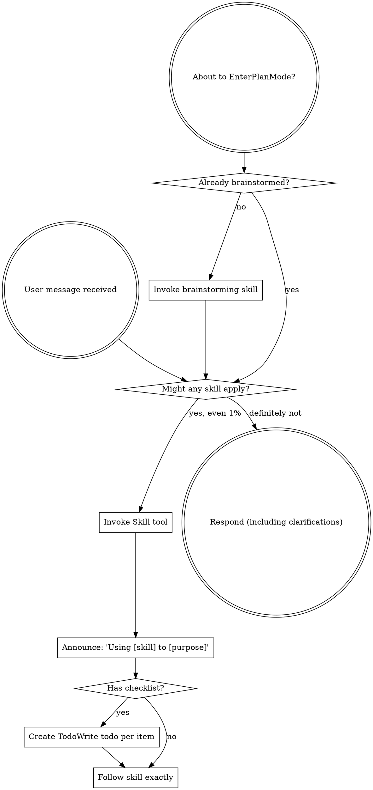
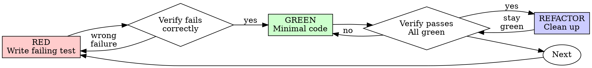

# Codex session 019f145d-f1a8-7da0-893d-2507f0b95122

- Started: `2026-06-29T17:12:14.202Z`
- Working directory: `D:\100XH100`
- Originator: `Codex Desktop`
- Codex CLI: `0.142.3`
- Source log: `C:\Users\Иван Литвак\.codex\sessions\2026\06\29\rollout-2026-06-29T20-12-14-019f145d-f1a8-7da0-893d-2507f0b95122.jsonl`
- Entries: user=2, assistant=36, tool calls=45, tool outputs=45

This is a chronological export of the user/assistant conversation and tool activity. Internal system/developer instructions and token accounting are intentionally excluded. Secret-shaped values are redacted; oversized tool outputs retain their beginning and end with the omitted character count.

## 1. User

Time: `2026-06-29T17:13:04.286Z` · source line `4`

```text
# AGENTS.md instructions for D:\100XH100

<INSTRUCTIONS>
# Project Agent Rules

## Operating Rule
- Read `AGENTS.md` before project edits.
- Update `memory/CHANGELOG.md` after meaningful code, config, or architecture changes.
- Update `memory/PROMPTS.md` with user prompts that define requirements.
- Store test outputs, logs, and verification notes under `test_results/`.
- Prefer agent-centered code: explicit contracts, deterministic tests, small files, low hidden state.

## Architecture Source
- Primary architecture contract: `ARCHITECTURE_NEED.md`.
- Current Stream 4 implementation rule: use threshold + compact + CUB/fixed-temp sort/reduce + compact; do not use Stream 4 hash-table dedup.

## Implementation Guardrails
- `State128` logical bytes are `v[0..119]`.
- `State128` padding bytes are `v[120..127]`.
- Persistent frontier padding must be zero.
- `FinalResponse` may temporarily store `target_local_idx` in `v[120..123]`.
- `Hash128` is one logical 128-bit key stored as `{lo, hi}`.
- `CandidateMeta` must remain 32 bytes and 32-byte aligned.
- Stream 3 payload id must be original candidate id, not compact index.
- Stream 4 must not apply shard top-k or semantic shard cap.

</INSTRUCTIONS>
<environment_context>
  <cwd>D:\100XH100</cwd>
  <shell>powershell</shell>
  <current_date>2026-06-29</current_date>
  <timezone>Europe/Moscow</timezone>
  <filesystem><workspace_roots><root>D:\100XH100</root></workspace_roots><permission_profile type="managed"><file_system type="restricted"><entry access="read"><special>:root</special></entry><entry access="write"><path>D:\100XH100</path></entry><entry access="write"><special>:slash_tmp</special></entry><entry access="write"><special>:tmpdir</special></entry><entry access="read"><path>D:\100XH100\.git</path></entry><entry access="read"><path>D:\100XH100\.agents</path></entry><entry access="read"><path>D:\100XH100\.codex</path></entry></file_system></permission_profile></filesystem>
</environment_context>
```

## 2. User

Time: `2026-06-29T17:13:04.296Z` · source line `6`

```text
You are a fresh Worker for Task 5 quality-fix. Edit files directly in worktree `D:\100XH100\.worktrees\stream1-piece-transformer`. Current HEAD is `33f9e29760193082279a923dbb9cf8a9ae21cc13`.

Quality review found one Important issue:
- `tools/stream_benchmark.cu` still uses the old `Stream1NetworkView` aggregate initializer around line 342. `cuda/stream1.hpp` now has LN pointer fields in `Stream1NetworkView`, so the benchmark target can fail to compile or shift fields incorrectly.

Task:
1. Fix `tools/stream_benchmark.cu` MLP network construction to match the expanded `Stream1NetworkView` shape, including input/hidden/residual LN pointer tables where applicable. Follow the pattern used in `production_runner.cu`, `tests/stream1_cuda_tests.cu`, or `tests/dispatcher_cuda_tests.cu`.
2. Do not change transformer forward semantics.
3. Do not wire production transformer dispatch.
4. Run at least a compile/build check for `stream_benchmark` if possible, plus `stream1_transformer_cuda_tests` if practical. Update `test_results/stream1_transformer_forward_2026-06-29.md` with the quality-fix verification.
5. Amend the Task 5 commit. Return DONE with commit SHA and verification.

Keep scope narrow. No fallback backend.
```

## 3. Codex

Time: `2026-06-29T17:13:21.663Z` · source line `8`

```text
I’ll use the project rules plus the relevant D:\100XH100 memory, then patch only the benchmark/test-result surface and amend the existing Task 5 commit.
```

## 4. Codex

Time: `2026-06-29T17:13:21.666Z` · source line `9`

```text
I’ll use the project rules plus the relevant D:\100XH100 memory, then patch only the benchmark/test-result surface and amend the existing Task 5 commit.
```

## 5. Tool call: `exec_command`

Time: `2026-06-29T17:13:21.666Z` · source line `10`

```text
{"cmd":"Get-Content AGENTS.md","workdir":"D:\\100XH100","shell":"powershell","yield_time_ms":10000,"max_output_tokens":12000}
```

## 6. Tool call: `exec_command`

Time: `2026-06-29T17:13:21.685Z` · source line `11`

```text
{"cmd":"Select-String -Path C:\\Users\\Иван Литвак\\.codex\\memories\\MEMORY.md -Pattern \"BEAM_PREBUILT_RUNNER|D:\\\\100XH100|stream1|Task 5|Stream1NetworkView\" -Context 2,2","workdir":"D:\\100XH100","shell":"powershell","yield_time_ms":10000,"max_output_tokens":12000}
```

## 7. Tool output

Time: `2026-06-29T17:13:22.273Z` · source line `12`

```text
Chunk ID: b1c7cd
Wall time: 0.0729 seconds
Process exited with code 0
Original token count: 290
Output:
# Project Agent Rules

## Operating Rule
- Read `AGENTS.md` before project edits.
- Update `memory/CHANGELOG.md` after meaningful code, config, or architecture changes.
- Update `memory/PROMPTS.md` with user prompts that define requirements.
- Store test outputs, logs, and verification notes under `test_results/`.
- Prefer agent-centered code: explicit contracts, deterministic tests, small files, low hidden state.

## Architecture Source
- Primary architecture contract: `ARCHITECTURE_NEED.md`.
- Current Stream 4 implementation rule: use threshold + compact + CUB/fixed-temp sort/reduce + compact; do not use Stream 4 hash-table dedup.

## Implementation Guardrails
- `State128` logical bytes are `v[0..119]`.
- `State128` padding bytes are `v[120..127]`.
- Persistent frontier padding must be zero.
- `FinalResponse` may temporarily store `target_local_idx` in `v[120..123]`.
- `Hash128` is one logical 128-bit key stored as `{lo, hi}`.
- `CandidateMeta` must remain 32 bytes and 32-byte aligned.
- Stream 3 payload id must be original candidate id, not compact index.
- Stream 4 must not apply shard top-k or semantic shard cap.

```

## 8. Tool output

Time: `2026-06-29T17:13:22.404Z` · source line `13`

```text
Chunk ID: 3d69b4
Wall time: 0.1986 seconds
Process exited with code 1
Original token count: 127
Output:
Select-String : A positional parameter cannot be found that accepts argument 'Литвак\.codex\memories\MEMORY.md'.
At line:2 char:1
+ Select-String -Path C:\Users\Иван Литвак\.codex\memories\MEMORY.md -P ...
+ ~~~~~~~~~~~~~~~~~~~~~~~~~~~~~~~~~~~~~~~~~~~~~~~~~~~~~~~~~~~~~~~~~~~~~
    + CategoryInfo          : InvalidArgument: (:) [Select-String], ParameterBindingException
    + FullyQualifiedErrorId : PositionalParameterNotFound,Microsoft.PowerShell.Commands.SelectStringCommand
 

```

## 9. Codex

Time: `2026-06-29T17:13:34.471Z` · source line `16`

```text
AGENTS confirms the changelog, prompt log, and test-results updates are required. The memory lookup hit a PowerShell quoting issue, so I’m correcting that and then I’ll inspect the exact `Stream1NetworkView` call sites before editing.
```

## 10. Codex

Time: `2026-06-29T17:13:34.475Z` · source line `17`

```text
AGENTS confirms the changelog, prompt log, and test-results updates are required. The memory lookup hit a PowerShell quoting issue, so I’m correcting that and then I’ll inspect the exact `Stream1NetworkView` call sites before editing.
```

## 11. Tool call: `exec_command`

Time: `2026-06-29T17:13:34.475Z` · source line `18`

```text
{"cmd":"Get-Content \"C:\\Users\\Иван Литвак\\.codex\\plugins\\cache\\openai-curated-remote\\superpowers\\5.1.4\\skills\\using-superpowers\\SKILL.md\"","workdir":"D:\\100XH100","shell":"powershell","yield_time_ms":10000,"max_output_tokens":12000}
```

## 12. Tool call: `exec_command`

Time: `2026-06-29T17:13:34.496Z` · source line `19`

```text
{"cmd":"Select-String -Path \"C:\\Users\\Иван Литвак\\.codex\\memories\\MEMORY.md\" -Pattern \"D:\\\\100XH100|stream1|Task 5|Stream1NetworkView\" -Context 2,2","workdir":"D:\\100XH100","shell":"powershell","yield_time_ms":10000,"max_output_tokens":12000}
```

## 13. Tool call: `exec_command`

Time: `2026-06-29T17:13:34.505Z` · source line `20`

```text
{"cmd":"git status --short","workdir":"D:\\100XH100\\.worktrees\\stream1-piece-transformer","shell":"powershell","yield_time_ms":10000,"max_output_tokens":12000}
```

## 14. Tool call: `exec_command`

Time: `2026-06-29T17:13:34.514Z` · source line `21`

```text
{"cmd":"rg -n \"Stream1NetworkView|stream_benchmark|stream1_transformer\" tools cuda tests production_runner.cu memory test_results","workdir":"D:\\100XH100\\.worktrees\\stream1-piece-transformer","shell":"powershell","yield_time_ms":10000,"max_output_tokens":30000}
```

## 15. Tool output

Time: `2026-06-29T17:13:34.767Z` · source line `22`

````text
Chunk ID: f1efeb
Wall time: 0.0967 seconds
Process exited with code 0
Original token count: 1393
Output:
---
name: using-superpowers
description: Use when starting any conversation - establishes how to find and use skills, requiring Skill tool invocation before ANY response including clarifying questions
---

<SUBAGENT-STOP>
If you were dispatched as a subagent to execute a specific task, skip this skill.
</SUBAGENT-STOP>

<EXTREMELY-IMPORTANT>
If you think there is even a 1% chance a skill might apply to what you are doing, you ABSOLUTELY MUST invoke the skill.

IF A SKILL APPLIES TO YOUR TASK, YOU DO NOT HAVE A CHOICE. YOU MUST USE IT.

This is not negotiable. This is not optional. You cannot rationalize your way out of this.
</EXTREMELY-IMPORTANT>

## Instruction Priority

Superpowers skills override default system prompt behavior, but **user instructions always take precedence**:

1. **User's explicit instructions** (CLAUDE.md, GEMINI.md, AGENTS.md, direct requests) — highest priority
2. **Superpowers skills** — override default system behavior where they conflict
3. **Default system prompt** — lowest priority

If CLAUDE.md, GEMINI.md, or AGENTS.md says "don't use TDD" and a skill says "always use TDD," follow the user's instructions. The user is in control.

## How to Access Skills

**In Claude Code:** Use the `Skill` tool. When you invoke a skill, its content is loaded and presented to you—follow it directly. Never use the Read tool on skill files.

**In Copilot CLI:** Use the `skill` tool. Skills are auto-discovered from installed plugins. The `skill` tool works the same as Claude Code's `Skill` tool.

**In Gemini CLI:** Skills activate via the `activate_skill` tool. Gemini loads skill metadata at session start and activates the full content on demand.

**In other environments:** Check your platform's documentation for how skills are loaded.

## Platform Adaptation

Skills use Claude Code tool names. Non-CC platforms: see `references/copilot-tools.md` (Copilot CLI), `references/codex-tools.md` (Codex) for tool equivalents. Gemini CLI users get the tool mapping loaded automatically via GEMINI.md.

# Using Skills

## The Rule

**Invoke relevant or requested skills BEFORE any response or action.** Even a 1% chance a skill might apply means that you should invoke the skill to check. If an invoked skill turns out to be wrong for the situation, you don't need to use it.



## Red Flags

These thoughts mean STOP—you're rationalizing:

| Thought | Reality |
|---------|---------|
| "This is just a simple question" | Questions are tasks. Check for skills. |
| "I need more context first" | Skill check comes BEFORE clarifying questions. |
| "Let me explore the codebase first" | Skills tell you HOW to explore. Check first. |
| "I can check git/files quickly" | Files lack conversation context. Check for skills. |
| "Let me gather information first" | Skills tell you HOW to gather information. |
| "This doesn't need a formal skill" | If a skill exists, use it. |
| "I remember this skill" | Skills evolve. Read current version. |
| "This doesn't count as a task" | Action = task. Check for skills. |
| "The skill is overkill" | Simple things become complex. Use it. |
| "I'll just do this one thing first" | Check BEFORE doing anything. |
| "This feels productive" | Undisciplined action wastes time. Skills prevent this. |
| "I know what that means" | Knowing the concept в‰  using the skill. Invoke it. |

## Skill Priority

When multiple skills could apply, use this order:

1. **Process skills first** (brainstorming, debugging) - these determine HOW to approach the task
2. **Implementation skills second** (frontend-design, mcp-builder) - these guide execution

"Let's build X" в†’ brainstorming first, then implementation skills.
"Fix this bug" в†’ debugging first, then domain-specific skills.

## Skill Types

**Rigid** (TDD, debugging): Follow exactly. Don't adapt away discipline.

**Flexible** (patterns): Adapt principles to context.

The skill itself tells you which.

## User Instructions

Instructions say WHAT, not HOW. "Add X" or "Fix Y" doesn't mean skip workflows.

````

## 16. Tool output

Time: `2026-06-29T17:13:34.880Z` · source line `23`

```text
Chunk ID: a3d55b
Wall time: 0.1752 seconds
Process exited with code 0
Original token count: 844
Output:

  C:\Users\Иван Литвак\.codex\memories\MEMORY.md:46:# Task Group: MEPhI IHES cluster publishing, shared prebuilt runner
, and inventory-driven backfill
  C:\Users\Иван Литвак\.codex\memories\MEMORY.md:47:scope: Running the IHES MEPhI cluster workflow with one shared preb
uilt `production_runner`, publishing solved puzzles into a dedicated GitHub results repo, and aggregating mixed cluster
 artifacts from on-cluster inventories.
> C:\Users\Иван Литвак\.codex\memories\MEMORY.md:48:applies_to: cwd=D:\100XH100; reuse_rule=reuse for this IHES/MEPhI r
epo family and adjacent cluster publish jobs, but treat live cluster inventory, DNS availability, and current results-r
epo schema as run-specific and recheck them before publishing.
  C:\Users\Иван Литвак\.codex\memories\MEMORY.md:49:
  C:\Users\Иван Литвак\.codex\memories\MEMORY.md:50:## Task 1: Launch IHES array jobs against one shared prebuilt runne
r, outcome success
  C:\Users\Иван Литвак\.codex\memories\MEMORY.md:52:### rollout_summary_files
  C:\Users\Иван Литвак\.codex\memories\MEMORY.md:53:
> C:\Users\Иван Литвак\.codex\memories\MEMORY.md:54:- rollout_summaries/2026-06-04T15-47-52-Dd1O-ihes_cluster_results_p
rebuilt_publish_backfill.md (cwd=\\?\D:\100XH100, rollout_path=\\?\C:\Users\Иван Литвак\.codex\sessions\2026\06\04\roll
out-2026-06-04T18-47-57-019e9351-cd3b-71c0-bf8b-69755d08d5fc.jsonl, updated_at=2026-06-26T19:51:22+00:00, thread_id=019
e9351-cd3b-71c0-bf8b-69755d08d5fc, the prebuilt runner was compiled once and reused across the A100 array workflow)
  C:\Users\Иван Литвак\.codex\memories\MEMORY.md:55:
  C:\Users\Иван Литвак\.codex\memories\MEMORY.md:56:### keywords
  C:\Users\Иван Литвак\.codex\memories\MEMORY.md:62:### rollout_summary_files
  C:\Users\Иван Литвак\.codex\memories\MEMORY.md:63:
> C:\Users\Иван Литвак\.codex\memories\MEMORY.md:64:- rollout_summaries/2026-06-04T15-47-52-Dd1O-ihes_cluster_results_p
rebuilt_publish_backfill.md (cwd=\\?\D:\100XH100, rollout_path=\\?\C:\Users\Иван Литвак\.codex\sessions\2026\06\04\roll
out-2026-06-04T18-47-57-019e9351-cd3b-71c0-bf8b-69755d08d5fc.jsonl, updated_at=2026-06-26T19:51:22+00:00, thread_id=019
e9351-cd3b-71c0-bf8b-69755d08d5fc, the results repo structure and first backfilled puzzle sets were established)
  C:\Users\Иван Литвак\.codex\memories\MEMORY.md:65:
  C:\Users\Иван Литвак\.codex\memories\MEMORY.md:66:### keywords
  C:\Users\Иван Литвак\.codex\memories\MEMORY.md:72:### rollout_summary_files
  C:\Users\Иван Литвак\.codex\memories\MEMORY.md:73:
> C:\Users\Иван Литвак\.codex\memories\MEMORY.md:74:- rollout_summaries/2026-06-04T15-47-52-Dd1O-ihes_cluster_results_p
rebuilt_publish_backfill.md (cwd=\\?\D:\100XH100, rollout_path=\\?\C:\Users\Иван Литвак\.codex\sessions\2026\06\04\roll
out-2026-06-04T18-47-57-019e9351-cd3b-71c0-bf8b-69755d08d5fc.jsonl, updated_at=2026-06-26T19:51:22+00:00, thread_id=019
e9351-cd3b-71c0-bf8b-69755d08d5fc, a file-driven inventory plus schema fixes made the larger aggregator path workable)
  C:\Users\Иван Литвак\.codex\memories\MEMORY.md:75:
  C:\Users\Иван Литвак\.codex\memories\MEMORY.md:76:### keywords


```

## 17. Tool output

Time: `2026-06-29T17:13:35.017Z` · source line `24`

```text
Chunk ID: d821e2
Wall time: 0.3056 seconds
Process exited with code 0
Original token count: 47
Output:
?? $null
?? build-contract-tests/
?? build-stream1-transformer-red/
?? config.obj
?? contract_tests.obj
?? docs/
?? frontier_cpu.obj
?? hash.obj
?? state.obj
?? stream3.obj
?? stream4.obj

```

## 18. Tool output

Time: `2026-06-29T17:13:35.021Z` · source line `25`

```text
Chunk ID: 609335
Wall time: 0.2932 seconds
Process exited with code 1
Original token count: 4447
Output:
rg: production_runner.cu: Не удается найти указанный файл. (os error 2)
memory\CHANGELOG.md:4:- Added the standalone CUDA Stream1 piece-transformer forward path without production dispatcher/runner wiring. The new transformer-specific view/scratch API runs p900 parent rows through fast input token construction, input/output LayerNorm, four pre-norm attention/FFN blocks, CUTLASS linear projections, a fused row-wise seq_len=51 attention kernel, SiLU FFN activation, residual adds, and score-key quantization. Existing MLP/dispatcher tests were updated for the expanded MLP view initializer shape. Verification recorded in `test_results/stream1_transformer_forward_2026-06-29.md`.
memory\CHANGELOG.md:5:- Hardened the Stream1 piece-transformer loader quality gates. Manifest fallback u32 parsing now only falls back when the primary key is absent and rejects conflicting primary/fallback values, runner and benchmark entry points fail closed before transformer runtime sizing/allocation because forward dispatch is not wired, and Stream1 weight/scratch allocation paths free partial CUDA allocations on exceptions. Verification recorded in `test_results/stream1_transformer_loader_2026-06-29.md`.
memory\CHANGELOG.md:6:- Added the Stream1 piece-transformer host loader path and scratch arena scaffolding without wiring transformer inference. The weight loader now parses and validates the exact p900 piece-transformer manifest contract, loads exported transformer tensors and piece layout tables with exact byte sizes, exposes host/device/scratch byte helpers, and keeps MLP loading on an explicit separate branch. Verification recorded in `test_results/stream1_transformer_loader_2026-06-29.md`.
memory\CHANGELOG.md:7:- Added Stream1 piece-transformer export tooling: an auto-detecting tools/export_stream1.py wrapper and tools/export_stream1_transformer.py for Kaggle p900 PilgrimPieceTransformer checkpoints. The exporter writes fast-slot input tables, piece layout tensors, Transformer block tensors, manifests with backend=piece_transformer, rejects non-24-output, non-4-layer, and non-1024-FF variants, and supports optional CPU fp32 reference JSON generation. Verification recorded in test_results/stream1_transformer_exporter_2026-06-29.md.
memory\CHANGELOG.md:335:- Added `stream_benchmark` target. The benchmark loads real generators, real puzzle data, real fp16 Stream 1 weights, and writes per-stream tables to `test_results/per_stream_benchmark_2026-05-22.md`.
memory\CHANGELOG.md:587:- Implemented a manifest-driven Stream1 MLP runtime interface. Added `Stream1ModelConfig`, common `tools/stream1_weight_io.hpp`, dynamic residual-block weight loading/upload/scratch allocation, and Stream1 model-aware non-static VRAM budgeting. `production_runner` and `stream_benchmark` now read `stream1_weights/manifest.json` and support MLP profiles with different `hd1`, `hd2`, and `nrd` while preserving the existing CUTLASS inference path. Added `tools/export_stream1_mlp.py` to export any QMLP-style `.pth` model into folded FP16 runtime weights and manifest. Verification passed: old model export reproduced current `.fp16` files byte-for-byte; new model exported as `hd1=2048`, `hd2=1024`, `nrd=3`; Docker CUDA build targets `production_runner`, `stream_benchmark`, and `stream1_cuda_tests` passed.
memory\CHANGELOG.md:595:- Prepared a benchmark-only Kaggle measurement pass for the new Stream1 model. `stream_benchmark` now sweeps `B_MICRO=[2048,4096,8192,16384]` and `STREAM1_CONCURRENCY=[1,2,4,8]`; the isolated Stream3 benchmark uses `ring_slot_count=4`, so `B_MICRO=2048` matches the current production `STREAM3_BATCH_CANDIDATES=196608`. Kaggle notebooks enable `RUN_STREAM_BENCHMARK=True`, run the full stream benchmark instead of `BEAM_STREAM_MICRO_ONLY`, and set `RUN_TIMEOUT_SEC=1` so the production runner is auto-stopped after the benchmark. Docker verification: `stream_benchmark` target rebuilt successfully.
memory\CHANGELOG.md:596:- Kaggle version 132 produced the requested Stream1 T4 table but exposed a benchmark-tool-only crash before Stream3: full `stream_benchmark` had stale threshold-buffer assumptions after production threshold double-buffering. Fixed only `tools/stream_benchmark.cu` by attaching separate benchmark-owned threshold buffers for Stream3/Stream4 microbenchmarks; no dispatcher, production runner, runtime architecture, or algorithm code changed. Verification passed: Docker rebuilt `stream_benchmark` and a local full `stream_benchmark` smoke completed through Stream1/2/3/4.
memory\CHANGELOG.md:597:- Kaggle version 133 completed the full T4 stream benchmark. Stream1 isolated best for the new model is `B_MICRO=2048`, `STREAM1_CONCURRENCY=8`, about `15.50M candidates/sec`; current production config `B_MICRO=2048`, `STREAM1_CONCURRENCY=4` is about `13.56M candidates/sec`. Isolated Stream3 with current-sized batch (`B_MICRO=2048`, `ring_slot_count=4`, `196608` candidates) measures `1.0001ms/job` and `196.60M candidates/sec`. Production v131 `throughput_probe` shows `stream3_batch_ms????????19..21ms` and `9.4..10.3M candidates/sec`, meaning production `stream3_ring_ms` is dominated by the Stream1/2/3 ring critical segment and waiting/orchestration rather than pure Stream3 kernel compute. Report saved as `test_results/kaggle_v133_stream_benchmark_analysis_2026-05-30.md`.
memory\CHANGELOG.md:600:- Implemented Stream1-only support for model manifests with `output_dim=1`. Runtime now auto-detects `output_dim=1`, treats `BEAM_B_MICRO` as the Stream1 row budget, runs `floor(BEAM_B_MICRO / 24)` parent states per Stream1 job, expands parent+move features inside the Stream1 input kernel without writing child `State128` arrays, preserves the existing candidate score order for Stream2/3/4/5, and keeps `output_dim=24` behavior unchanged. The heavy hidden/residual MLP stages still use CUTLASS; the final `N=1` score head uses a small direct CUDA kernel after the existing CUTLASS profile produced a misaligned-address failure for `N=1`. Verification passed: Docker build targets `stream1_cuda_tests`, `production_runner`, and `stream_benchmark`; Docker `stream1_cuda_tests`; old `output_dim=24` production smoke `production_runner 0 1 4096`; `git diff --check`. Report saved as `test_results/stream1_output_dim1_support_2026-05-30.md`.
memory\CHANGELOG.md:616:- Extended `tools/stream_benchmark.cu` Stream1 sweep to include `B_MICRO=32768,65536` and `STREAM1_CONCURRENCY=16,32`. Molab native `sm_120` Stream1 benchmark on puzzle `992` found the best measured point at `B_MICRO=4096`, `STREAM1_CONCURRENCY=2`, `125.03M candidates/sec`; larger batches and concurrency 16/32 were slower. Report saved as `test_results/molab_stream1_extended_sweep_2026-06-03.md`.
memory\CHANGELOG.md:636:- Added a MEPhI 8xA100 tuning launcher set. `tune_8xa100_stream1.sh` builds/runs `stream_benchmark` and writes `logs/best_stream1.env`; `tune_8xa100_pipeline.sh` runs 8-rank torchrun production sweeps to depth 12 across shard count, Stream3 ring slots, Stream4 batch, and trigger size, records pass/fail plus average full-depth runtime in TSV, and writes `logs/best_pipeline.env`; `start_8xa100_best.sh` sources that best config for the final production run. Shared MEPhI preflight/build/torchrun/capacity logic now lives in `hpc/mephi_8xa100_common.sh`.
memory\CHANGELOG.md:637:- Fixed MEPhI tuning launcher issues found on `basis`: SLURM spools submitted scripts under `/var/lib/slurm/slurmd/job...`, so the tuning scripts now source `mephi_8xa100_common.sh` from `${SLURM_SUBMIT_DIR:-$(pwd)}` instead of `BASH_SOURCE[0]`; `tune_8xa100_stream1.sh` now parses `b_micro=` from `stream_benchmark` output when writing `logs/best_stream1.env`.
test_results\contract_tests_2026-05-20.md:7:- stream1_transformer_manifest_contract=pass
test_results\contract_tests_2026-05-20.md:8:- stream1_transformer_weight_size_contract=pass
cuda\stream1.hpp:21:struct Stream1NetworkView {
cuda\stream1.hpp:120:    const Stream1NetworkView& network,
cuda\stream1.hpp:132:    const Stream1NetworkView& network,
cuda\stream1.hpp:138:void stream1_transformer_inference_cuda(
cuda\dispatcher.hpp:61:    Stream1NetworkView view;
tests\contract_tests.cpp:197:void test_stream1_transformer_manifest_contract() {
tests\contract_tests.cpp:199:        write_transformer_manifest_fixture("stream1_transformer_manifest_ok"));
tests\contract_tests.cpp:216:            write_transformer_manifest_fixture("stream1_transformer_manifest_bad_seq_len", 52));
tests\contract_tests.cpp:226:                "stream1_transformer_manifest_bad_primary_layer",
tests\contract_tests.cpp:239:                "stream1_transformer_manifest_mismatched_layers",
tests\contract_tests.cpp:250:void test_stream1_transformer_weight_size_contract() {
tests\contract_tests.cpp:251:    const std::filesystem::path ok_dir = write_transformer_manifest_fixture("stream1_transformer_weight_sizes_ok");
tests\contract_tests.cpp:262:    const std::filesystem::path bad_dir = write_transformer_manifest_fixture("stream1_transformer_weight_sizes_bad");
tests\contract_tests.cpp:352:    test_stream1_transformer_manifest_contract();
tests\contract_tests.cpp:353:    report << "- stream1_transformer_manifest_contract=pass\n";
tests\contract_tests.cpp:354:    test_stream1_transformer_weight_size_contract();
tests\contract_tests.cpp:355:    report << "- stream1_transformer_weight_size_contract=pass\n";
cuda\stream1.cu:107:    Stream1NetworkView network,
cuda\stream1.cu:483:__global__ void stream1_transformer_build_input_kernel(
cuda\stream1.cu:523:__global__ void stream1_transformer_layernorm_copy_kernel(
cuda\stream1.cu:574:__global__ void stream1_transformer_residual_bias_add_kernel(
cuda\stream1.cu:593:__global__ void stream1_transformer_bias_silu_kernel(
cuda\stream1.cu:612:__global__ void stream1_transformer_attention51_kernel(
cuda\stream1.cu:692:__global__ void stream1_transformer_cls_layernorm_kernel(
cuda\stream1.cu:743:__global__ void stream1_transformer_score_quantize_kernel(
cuda\stream1.cu:765:void stream1_transformer_inference_cuda(
cuda\stream1.cu:813:    stream1_transformer_build_input_kernel<<<token_grid, token_block, 0, stream>>>(
cuda\stream1.cu:821:    stream1_transformer_layernorm_copy_kernel<<<token_rows, 256, 256 * sizeof(float), stream>>>(
cuda\stream1.cu:832:        stream1_transformer_layernorm_copy_kernel<<<token_rows, 256, 256 * sizeof(float), stream>>>(
cuda\stream1.cu:850:        stream1_transformer_attention51_kernel<<<attn_grid, 64, 64 * sizeof(float), stream>>>(
cuda\stream1.cu:866:        stream1_transformer_residual_bias_add_kernel<<<(token_rows * dims.d_model + 255U) / 256U, 256, 0, stream>>>(
cuda\stream1.cu:874:        stream1_transformer_layernorm_copy_kernel<<<token_rows, 256, 256 * sizeof(float), stream>>>(
cuda\stream1.cu:891:        stream1_transformer_bias_silu_kernel<<<(token_rows * dims.ff_dim + 255U) / 256U, 256, 0, stream>>>(
cuda\stream1.cu:906:        stream1_transformer_residual_bias_add_kernel<<<(token_rows * dims.d_model + 255U) / 256U, 256, 0, stream>>>(
cuda\stream1.cu:915:    stream1_transformer_cls_layernorm_kernel<<<b_micro, 256, 256 * sizeof(float), stream>>>(
cuda\stream1.cu:931:    stream1_transformer_score_quantize_kernel<<<(b_micro * MOVE_COUNT + 255U) / 256U, 256, 0, stream>>>(
cuda\stream1.cu:954:    const Stream1NetworkView& network,
cuda\stream1.cu:979:    const Stream1NetworkView& network,
tools\export_stream1.py:20:    from tools.export_stream1_transformer import export_piece_transformer, strip_state_prefixes
tools\export_stream1.py:24:    from export_stream1_transformer import export_piece_transformer, strip_state_prefixes
tests\dispatcher_cuda_tests.cu:91:        Stream1NetworkView{input_weight, input_bias, nullptr, nullptr, hidden_weight, hidden_bias, nullptr, nullptr, nullptr, nullptr, nullptr, nullptr, nullptr, nullptr, nullptr, nullptr, output_weight, output_bias, dims},
tools\production_runner.cu:4257:        Stream1NetworkView{
tools\stream1_weight_io.hpp:484:inline HostWeightBytes load_stream1_transformer_weights(const std::filesystem::path& dir, const Stream1ModelConfig& model) {
tools\stream1_weight_io.hpp:545:        return load_stream1_transformer_weights(dir, model);
tools\stream_benchmark.cu:342:    Stream1NetworkView network{
tools\stream_benchmark.cu:714:        std::cerr << "usage: stream_benchmark [puzzle_id]\n";
tools\stream_benchmark.cu:765:        report_env != nullptr ? std::string(report_env) : std::string("test_results/per_stream_benchmark_2026-05-24.md");
tools\stream_benchmark.cu:783:    std::cout << "stream_benchmark_start=1\n";
tools\stream_benchmark.cu:805:    std::cout << "stream_benchmark_report=" << report_path << "\n";
tests\stream1_cuda_tests.cu:133:    Stream1NetworkView network{
tests\stream1_cuda_tests.cu:188:    Stream1NetworkView child_network{
tests\stream1_transformer_cuda_tests.cu:86:    std::ofstream report("test_results/stream1_transformer_cuda_tests_2026-06-29.md");
tests\stream1_transformer_cuda_tests.cu:91:    const std::filesystem::path fixture_root = "test_results/stream1_transformer_reference";
tests\stream1_transformer_cuda_tests.cu:137:    stream1_transformer_inference_cuda(
tests\stream1_transformer_cuda_tests.cu:173:    std::cout << "stream1_transformer_cuda_tests=pass\n";
tests\test_stream1_transformer_exporter.py:7:from tools.export_stream1_transformer import (
test_results\mephi_8xa100_tuning_scripts_2026-06-04.md:8:   - builds `stream_benchmark`;
test_results\mephi_8xa100_tuning_scripts_2026-06-04.md:68:  `stream_benchmark` logs `b_micro=...`, while the first launcher parsed
test_results\stream1_output_dim1_support_2026-05-30.md:19:command=docker compose run --rm beam-tests bash -lc "cmake --build build-docker --target stream1_cuda_tests production_runner stream_benchmark -j 2"
test_results\stream1_output_dim1_support_2026-05-30.md:24:command=docker compose run --rm beam-tests bash -lc "cmake --build build-docker --target stream1_cuda_tests production_runner stream_benchmark -j 2 && build-docker/stream1_cuda_tests"
test_results\stream1_transformer_exporter_2026-06-29.md:5:- Added `tools/export_stream1_transformer.py` for Kaggle p900 `piece_transformer` checkpoints.
test_results\stream1_transformer_exporter_2026-06-29.md:6:- Added Python unit coverage in `tests/test_stream1_transformer_exporter.py`.
test_results\stream1_transformer_exporter_2026-06-29.md:12:$env:PYTHONDONTWRITEBYTECODE='1'; py -B -m unittest discover -s tests -p "test_stream1_transformer_exporter.py" -v
test_results\stream1_transformer_exporter_2026-06-29.md:18:$env:PYTHONDONTWRITEBYTECODE='1'; py -B tools\export_stream1.py --weights 'C:\tmp\megaminx_qtransformer\megaminx-transformer\weights\p900-t000-q-rw-sym_1782210824_best.pth' --out test_results\stream1_transformer_reference\weights_fp16 --dtype fp16 --format auto --num-classes 120 --reference-out test_results\stream1_transformer_reference\reference.json --reference-count 8 --reference-seed 12345
test_results\stream1_transformer_exporter_2026-06-29.md:24:stream1_export_done out_dir=test_results\stream1_transformer_reference\weights_fp16 format=piece_transformer dtype=fp16 seq_len=51 d_model=256 layers=4 output_dim=24
test_results\stream1_transformer_exporter_2026-06-29.md:34:$env:PYTHONDONTWRITEBYTECODE='1'; py -B -c "from pathlib import Path; [compile(Path(p).read_text(encoding='utf-8-sig'), p, 'exec') for p in ['tools/export_stream1.py','tools/export_stream1_transformer.py','tools/export_stream1_mlp.py','tests/test_stream1_transformer_exporter.py']]; print('syntax_ok')"
test_results\stream1_transformer_exporter_2026-06-29.md:41:Manifest fields from `test_results/stream1_transformer_reference/weights_fp16/manifest.json`:
test_results\stream1_transformer_forward_2026-06-29.md:14:docker run --rm -v ${PWD}:/workspace -w /workspace gpu-dev-cutlass-nsight:cuda128-sm120 bash -lc "cmake -S . -B build-stream1-transformer-red -G Ninja -DBEAM_CUDA_ARCHITECTURES=75 >/tmp/cmake-red.log && cmake --build build-stream1-transformer-red --target stream1_transformer_cuda_tests -j2"
test_results\stream1_transformer_forward_2026-06-29.md:17:Result: FAIL before implementation as expected. The new test referenced missing `TransformerNetworkViewHolder`, `transformer_network_view`, `Stream1TransformerScratchView`, `transformer_scratch_view`, and `stream1_transformer_inference_cuda` symbols.
test_results\stream1_transformer_forward_2026-06-29.md:22:docker run --rm --gpus all -v ${PWD}:/workspace -w /workspace gpu-dev-cutlass-nsight:cuda128-sm120 bash -lc "cmake --build build-stream1-transformer-red --target stream1_transformer_cuda_tests -j2 >/tmp/build.log && ./build-stream1-transformer-red/stream1_transformer_cuda_tests"
test_results\stream1_transformer_forward_2026-06-29.md:25:Result: PASS, `stream1_transformer_cuda_tests=pass`. The real exporter fixture under `test_results/stream1_transformer_reference/` ran 8 p900 reference states. Max score-key error versus fp32 PyTorch reference was 1573 in the final single run, under the 3072 fp16/TensorCore tolerance. A five-run sample after scratch initialization produced max score-key errors of 1292, 1382, 1290, 1338, and 1030.
test_results\stream1_transformer_loader_2026-06-29.md:31:$env:PYTHONDONTWRITEBYTECODE='1'; py -B -m unittest discover -s tests -p "test_stream1_transformer_exporter.py" -v
test_results\stream1_transformer_loader_2026-06-29.md:56:- Added fail-closed `piece_transformer Stream1 forward is not wired yet` guards in `production_runner` and `stream_benchmark` before transformer runtime sizing or GPU allocation paths.
test_results\stream1_transformer_loader_2026-06-29.md:79:$env:PYTHONDONTWRITEBYTECODE='1'; py -B -m unittest discover -s tests -p "test_stream1_transformer_exporter.py" -v

```

## 19. Codex

Time: `2026-06-29T17:13:41.904Z` · source line `28`

```text
I’m using the superpowers process guidance now; this is a narrow bugfix, so I’m also loading the TDD/verification guidance before changing files.
```

## 20. Codex

Time: `2026-06-29T17:13:41.908Z` · source line `29`

```text
I’m using the superpowers process guidance now; this is a narrow bugfix, so I’m also loading the TDD/verification guidance before changing files.
```

## 21. Tool call: `exec_command`

Time: `2026-06-29T17:13:41.931Z` · source line `30`

```text
{"cmd":"Get-Content \"C:\\Users\\Иван Литвак\\.codex\\plugins\\cache\\openai-curated-remote\\superpowers\\5.1.4\\skills\\test-driven-development\\SKILL.md\"","workdir":"D:\\100XH100\\.worktrees\\stream1-piece-transformer","shell":"powershell","yield_time_ms":10000,"max_output_tokens":20000}
```

## 22. Tool call: `exec_command`

Time: `2026-06-29T17:13:41.942Z` · source line `31`

```text
{"cmd":"Get-Content \"C:\\Users\\Иван Литвак\\.codex\\plugins\\cache\\openai-curated-remote\\superpowers\\5.1.4\\skills\\verification-before-completion\\SKILL.md\"","workdir":"D:\\100XH100\\.worktrees\\stream1-piece-transformer","shell":"powershell","yield_time_ms":10000,"max_output_tokens":20000}
```

## 23. Tool output

Time: `2026-06-29T17:13:42.275Z` · source line `32`

````text
Chunk ID: 7a6188
Wall time: 0.1514 seconds
Process exited with code 0
Original token count: 2565
Output:
---
name: test-driven-development
description: Use when implementing any feature or bugfix, before writing implementation code
---

# Test-Driven Development (TDD)

## Overview

Write the test first. Watch it fail. Write minimal code to pass.

**Core principle:** If you didn't watch the test fail, you don't know if it tests the right thing.

**Violating the letter of the rules is violating the spirit of the rules.**

## When to Use

**Always:**
- New features
- Bug fixes
- Refactoring
- Behavior changes

**Exceptions (ask your human partner):**
- Throwaway prototypes
- Generated code
- Configuration files

Thinking "skip TDD just this once"? Stop. That's rationalization.

## The Iron Law

```
NO PRODUCTION CODE WITHOUT A FAILING TEST FIRST
```

Write code before the test? Delete it. Start over.

**No exceptions:**
- Don't keep it as "reference"
- Don't "adapt" it while writing tests
- Don't look at it
- Delete means delete

Implement fresh from tests. Period.

## Red-Green-Refactor



### RED - Write Failing Test

Write one minimal test showing what should happen.

<Good>
```typescript
test('retries failed operations 3 times', async () => {
  let attempts = 0;
  const operation = () => {
    attempts++;
    if (attempts < 3) throw new Error('fail');
    return 'success';
  };

  const result = await retryOperation(operation);

  expect(result).toBe('success');
  expect(attempts).toBe(3);
});
```
Clear name, tests real behavior, one thing
</Good>

<Bad>
```typescript
test('retry works', async () => {
  const mock = jest.fn()
    .mockRejectedValueOnce(new Error())
    .mockRejectedValueOnce(new Error())
    .mockResolvedValueOnce('success');
  await retryOperation(mock);
  expect(mock).toHaveBeenCalledTimes(3);
});
```
Vague name, tests mock not code
</Bad>

**Requirements:**
- One behavior
- Clear name
- Real code (no mocks unless unavoidable)

### Verify RED - Watch It Fail

**MANDATORY. Never skip.**

```bash
npm test path/to/test.test.ts
```

Confirm:
- Test fails (not errors)
- Failure message is expected
- Fails because feature missing (not typos)

**Test passes?** You're testing existing behavior. Fix test.

**Test errors?** Fix error, re-run until it fails correctly.

### GREEN - Minimal Code

Write simplest code to pass the test.

<Good>
```typescript
async function retryOperation<T>(fn: () => Promise<T>): Promise<T> {
  for (let i = 0; i < 3; i++) {
    try {
      return await fn();
    } catch (e) {
      if (i === 2) throw e;
    }
  }
  throw new Error('unreachable');
}
```
Just enough to pass
</Good>

<Bad>
```typescript
async function retryOperation<T>(
  fn: () => Promise<T>,
  options?: {
    maxRetries?: number;
    backoff?: 'linear' | 'exponential';
    onRetry?: (attempt: number) => void;
  }
): Promise<T> {
  // YAGNI
}
```
Over-engineered
</Bad>

Don't add features, refactor other code, or "improve" beyond the test.

### Verify GREEN - Watch It Pass

**MANDATORY.**

```bash
npm test path/to/test.test.ts
```

Confirm:
- Test passes
- Other tests still pass
- Output pristine (no errors, warnings)

**Test fails?** Fix code, not test.

**Other tests fail?** Fix now.

### REFACTOR - Clean Up

After green only:
- Remove duplication
- Improve names
- Extract helpers

Keep tests green. Don't add behavior.

### Repeat

Next failing test for next feature.

## Good Tests

| Quality | Good | Bad |
|---------|------|-----|
| **Minimal** | One thing. "and" in name? Split it. | `test('validates email and domain and whitespace')` |
| **Clear** | Name describes behavior | `test('test1')` |
| **Shows intent** | Demonstrates desired API | Obscures what code should do |

## Why Order Matters

**"I'll write tests after to verify it works"**

Tests written after code pass immediately. Passing immediately proves nothing:
- Might test wrong thing
- Might test implementation, not behavior
- Might miss edge cases you forgot
- You never saw it catch the bug

Test-first forces you to see the test fail, proving it actually tests something.

**"I already manually tested all the edge cases"**

Manual testing is ad-hoc. You think you tested everything but:
- No record of what you tested
- Can't re-run when code changes
- Easy to forget cases under pressure
- "It worked when I tried it" в‰  comprehensive

Automated tests are systematic. They run the same way every time.

**"Deleting X hours of work is wasteful"**

Sunk cost fallacy. The time is already gone. Your choice now:
- Delete and rewrite with TDD (X more hours, high confidence)
- Keep it and add tests after (30 min, low confidence, likely bugs)

The "waste" is keeping code you can't trust. Working code without real tests is technical debt.

**"TDD is dogmatic, being pragmatic means adapting"**

TDD IS pragmatic:
- Finds bugs before commit (faster than debugging after)
- Prevents regressions (tests catch breaks immediately)
- Documents behavior (tests show how to use code)
- Enables refactoring (change freely, tests catch breaks)

"Pragmatic" shortcuts = debugging in production = slower.

**"Tests after achieve the same goals - it's spirit not ritual"**

No. Tests-after answer "What does this do?" Tests-first answer "What should this do?"

Tests-after are biased by your implementation. You test what you built, not what's required. You verify remembered edge cases, not discovered ones.

Tests-first force edge case discovery before implementing. Tests-after verify you remembered everything (you didn't).

30 minutes of tests after в‰  TDD. You get coverage, lose proof tests work.

## Common Rationalizations

| Excuse | Reality |
|--------|---------|
| "Too simple to test" | Simple code breaks. Test takes 30 seconds. |
| "I'll test after" | Tests passing immediately prove nothing. |
| "Tests after achieve same goals" | Tests-after = "what does this do?" Tests-first = "what should this do?" |
| "Already manually tested" | Ad-hoc в‰  systematic. No record, can't re-run. |
| "Deleting X hours is wasteful" | Sunk cost fallacy. Keeping unverified code is technical debt. |
| "Keep as reference, write tests first" | You'll adapt it. That's testing after. Delete means delete. |
| "Need to explore first" | Fine. Throw away exploration, start with TDD. |
| "Test hard = design unclear" | Listen to test. Hard to test = hard to use. |
| "TDD will slow me down" | TDD faster than debugging. Pragmatic = test-first. |
| "Manual test faster" | Manual doesn't prove edge cases. You'll re-test every change. |
| "Existing code has no tests" | You're improving it. Add tests for existing code. |

## Red Flags - STOP and Start Over

- Code before test
- Test after implementation
- Test passes immediately
- Can't explain why test failed
- Tests added "later"
- Rationalizing "just this once"
- "I already manually tested it"
- "Tests after achieve the same purpose"
- "It's about spirit not ritual"
- "Keep as reference" or "adapt existing code"
- "Already spent X hours, deleting is wasteful"
- "TDD is dogmatic, I'm being pragmatic"
- "This is different because..."

**All of these mean: Delete code. Start over with TDD.**

## Example: Bug Fix

**Bug:** Empty email accepted

**RED**
```typescript
test('rejects empty email', async () => {
  const result = await submitForm({ email: '' });
  expect(result.error).toBe('Email required');
});
```

**Verify RED**
```bash
$ npm test
FAIL: expected 'Email required', got undefined
```

**GREEN**
```typescript
function submitForm(data: FormData) {
  if (!data.email?.trim()) {
    return { error: 'Email required' };
  }
  // ...
}
```

**Verify GREEN**
```bash
$ npm test
PASS
```

**REFACTOR**
Extract validation for multiple fields if needed.

## Verification Checklist

Before marking work complete:

- [ ] Every new function/method has a test
- [ ] Watched each test fail before implementing
- [ ] Each test failed for expected reason (feature missing, not typo)
- [ ] Wrote minimal code to pass each test
- [ ] All tests pass
- [ ] Output pristine (no errors, warnings)
- [ ] Tests use real code (mocks only if unavoidable)
- [ ] Edge cases and errors covered

Can't check all boxes? You skipped TDD. Start over.

## When Stuck

| Problem | Solution |
|---------|----------|
| Don't know how to test | Write wished-for API. Write assertion first. Ask your human partner. |
| Test too complicated | Design too complicated. Simplify interface. |
| Must mock everything | Code too coupled. Use dependency injection. |
| Test setup huge | Extract helpers. Still complex? Simplify design. |

## Debugging Integration

Bug found? Write failing test reproducing it. Follow TDD cycle. Test proves fix and prevents regression.

Never fix bugs without a test.

## Testing Anti-Patterns

When adding mocks or test utilities, read @testing-anti-patterns.md to avoid common pitfalls:
- Testing mock behavior instead of real behavior
- Adding test-only methods to production classes
- Mocking without understanding dependencies

## Final Rule

```
Production code в†’ test exists and failed first
Otherwise в†’ not TDD
```

No exceptions without your human partner's permission.

````

## 24. Tool output

Time: `2026-06-29T17:13:42.275Z` · source line `33`

````text
Chunk ID: c051fb
Wall time: 0.0988 seconds
Process exited with code 0
Original token count: 1113
Output:
---
name: verification-before-completion
description: Use when about to claim work is complete, fixed, or passing, before committing or creating PRs - requires running verification commands and confirming output before making any success claims; evidence before assertions always
---

# Verification Before Completion

## Overview

Claiming work is complete without verification is dishonesty, not efficiency.

**Core principle:** Evidence before claims, always.

**Violating the letter of this rule is violating the spirit of this rule.**

## The Iron Law

```
NO COMPLETION CLAIMS WITHOUT FRESH VERIFICATION EVIDENCE
```

If you haven't run the verification command in this message, you cannot claim it passes.

## The Gate Function

```
BEFORE claiming any status or expressing satisfaction:

1. IDENTIFY: What command proves this claim?
2. RUN: Execute the FULL command (fresh, complete)
3. READ: Full output, check exit code, count failures
4. VERIFY: Does output confirm the claim?
   - If NO: State actual status with evidence
   - If YES: State claim WITH evidence
5. ONLY THEN: Make the claim

Skip any step = lying, not verifying
```

## Common Failures

| Claim | Requires | Not Sufficient |
|-------|----------|----------------|
| Tests pass | Test command output: 0 failures | Previous run, "should pass" |
| Linter clean | Linter output: 0 errors | Partial check, extrapolation |
| Build succeeds | Build command: exit 0 | Linter passing, logs look good |
| Bug fixed | Test original symptom: passes | Code changed, assumed fixed |
| Regression test works | Red-green cycle verified | Test passes once |
| Agent completed | VCS diff shows changes | Agent reports "success" |
| Requirements met | Line-by-line checklist | Tests passing |

## Red Flags - STOP

- Using "should", "probably", "seems to"
- Expressing satisfaction before verification ("Great!", "Perfect!", "Done!", etc.)
- About to commit/push/PR without verification
- Trusting agent success reports
- Relying on partial verification
- Thinking "just this once"
- Tired and wanting work over
- **ANY wording implying success without having run verification**

## Rationalization Prevention

| Excuse | Reality |
|--------|---------|
| "Should work now" | RUN the verification |
| "I'm confident" | Confidence в‰  evidence |
| "Just this once" | No exceptions |
| "Linter passed" | Linter в‰  compiler |
| "Agent said success" | Verify independently |
| "I'm tired" | Exhaustion в‰  excuse |
| "Partial check is enough" | Partial proves nothing |
| "Different words so rule doesn't apply" | Spirit over letter |

## Key Patterns

**Tests:**
```
вњ… [Run test command] [See: 34/34 pass] "All tests pass"
вќЊ "Should pass now" / "Looks correct"
```

**Regression tests (TDD Red-Green):**
```
вњ… Write в†’ Run (pass) в†’ Revert fix в†’ Run (MUST FAIL) в†’ Restore в†’ Run (pass)
вќЊ "I've written a regression test" (without red-green verification)
```

**Build:**
```
вњ… [Run build] [See: exit 0] "Build passes"
вќЊ "Linter passed" (linter doesn't check compilation)
```

**Requirements:**
```
вњ… Re-read plan в†’ Create checklist в†’ Verify each в†’ Report gaps or completion
вќЊ "Tests pass, phase complete"
```

**Agent delegation:**
```
вњ… Agent reports success в†’ Check VCS diff в†’ Verify changes в†’ Report actual state
вќЊ Trust agent report
```

## Why This Matters

From 24 failure memories:
- your human partner said "I don't believe you" - trust broken
- Undefined functions shipped - would crash
- Missing requirements shipped - incomplete features
- Time wasted on false completion в†’ redirect в†’ rework
- Violates: "Honesty is a core value. If you lie, you'll be replaced."

## When To Apply

**ALWAYS before:**
- ANY variation of success/completion claims
- ANY expression of satisfaction
- ANY positive statement about work state
- Committing, PR creation, task completion
- Moving to next task
- Delegating to agents

**Rule applies to:**
- Exact phrases
- Paraphrases and synonyms
- Implications of success
- ANY communication suggesting completion/correctness

## The Bottom Line

**No shortcuts for verification.**

Run the command. Read the output. THEN claim the result.

This is non-negotiable.

````

## 25. Codex

Time: `2026-06-29T17:13:52.541Z` · source line `36`

```text
The TDD guidance wants a red check first. For this issue the red signal is the compile failure on `stream_benchmark`, so I’m going to run that target before patching, then rebuild after the fix.
```

## 26. Codex

Time: `2026-06-29T17:13:52.545Z` · source line `37`

```text
The TDD guidance wants a red check first. For this issue the red signal is the compile failure on `stream_benchmark`, so I’m going to run that target before patching, then rebuild after the fix.
```

## 27. Tool call: `exec_command`

Time: `2026-06-29T17:13:52.592Z` · source line `38`

```text
{"cmd":"Get-Content cuda\\stream1.hpp","workdir":"D:\\100XH100\\.worktrees\\stream1-piece-transformer","shell":"powershell","yield_time_ms":10000,"max_output_tokens":20000}
```

## 28. Tool call: `exec_command`

Time: `2026-06-29T17:13:52.592Z` · source line `39`

```text
{"cmd":"Get-Content tools\\stream_benchmark.cu | Select-Object -Skip 310 -First 70","workdir":"D:\\100XH100\\.worktrees\\stream1-piece-transformer","shell":"powershell","yield_time_ms":10000,"max_output_tokens":12000}
```

## 29. Tool call: `exec_command`

Time: `2026-06-29T17:13:52.593Z` · source line `40`

```text
{"cmd":"Get-Content tools\\production_runner.cu | Select-Object -Skip 4240 -First 60","workdir":"D:\\100XH100\\.worktrees\\stream1-piece-transformer","shell":"powershell","yield_time_ms":10000,"max_output_tokens":12000}
```

## 30. Tool call: `exec_command`

Time: `2026-06-29T17:13:52.652Z` · source line `41`

```text
{"cmd":"Get-Content tests\\stream1_cuda_tests.cu | Select-Object -Skip 120 -First 90","workdir":"D:\\100XH100\\.worktrees\\stream1-piece-transformer","shell":"powershell","yield_time_ms":10000,"max_output_tokens":12000}
```

## 31. Tool call: `exec_command`

Time: `2026-06-29T17:13:52.652Z` · source line `42`

```text
{"cmd":"Get-Content tests\\dispatcher_cuda_tests.cu | Select-Object -Skip 70 -First 45","workdir":"D:\\100XH100\\.worktrees\\stream1-piece-transformer","shell":"powershell","yield_time_ms":10000,"max_output_tokens":12000}
```

## 32. Tool output

Time: `2026-06-29T17:13:52.951Z` · source line `43`

```text
Chunk ID: 18bdc3
Wall time: 0.1474 seconds
Process exited with code 0
Original token count: 1157
Output:
#pragma once

#include "types.hpp"

#include <cuda_bf16.h>
#include <cuda_fp16.h>

namespace beam {

struct Stream1NetworkDims {
    std::uint32_t state_len;
    std::uint32_t num_classes;
    std::uint32_t hidden1;
    std::uint32_t hidden2;
    std::uint32_t residual_count;
    std::uint32_t output_dim;
    std::uint32_t dtype;
    std::uint32_t normalization;
};

struct Stream1NetworkView {
    const half* input_weight;
    const half* input_bias;
    const half* input_ln_gamma;
    const half* input_ln_beta;
    const half* hidden_weight;
    const half* hidden_bias;
    const half* hidden_ln_gamma;
    const half* hidden_ln_beta;
    const half* const* residual_fc1_weight;
    const half* const* residual_fc1_bias;
    const half* const* residual_fc1_ln_gamma;
    const half* const* residual_fc1_ln_beta;
    const half* const* residual_fc2_weight;
    const half* const* residual_fc2_bias;
    const half* const* residual_fc2_ln_gamma;
    const half* const* residual_fc2_ln_beta;
    const half* output_weight;
    const half* output_bias;
    Stream1NetworkDims dims;
};

struct Stream1CutlassScratch {
    half* hidden1;
    half* hidden2;
    half* residual_tmp;
    half* output;
};

struct Stream1TransformerDims {
    std::uint32_t state_len;
    std::uint32_t num_classes;
    std::uint32_t num_pieces;
    std::uint32_t max_piece_size;
    std::uint32_t seq_len;
    std::uint32_t d_model;
    std::uint32_t nhead;
    std::uint32_t head_dim;
    std::uint32_t transformer_layers;
    std::uint32_t ff_dim;
    std::uint32_t output_dim;
    std::uint32_t dtype;
};

struct Stream1TransformerBlockView {
    const half* ln1_gamma;
    const half* ln1_beta;
    const half* attn_qkv_weight;
    const half* attn_qkv_bias;
    const half* attn_out_weight;
    const half* attn_out_bias;
    const half* ln2_gamma;
    const half* ln2_beta;
    const half* ff1_weight;
    const half* ff1_bias;
    const half* ff2_weight;
    const half* ff2_bias;
};

struct Stream1TransformerNetworkView {
    const half* fast_slot_projected;
    const half* fast_piece_static;
    const half* cls_token;
    const half* input_ln_gamma;
    const half* input_ln_beta;
    const half* output_ln_gamma;
    const half* output_ln_beta;
    const Stream1TransformerBlockView* blocks;
    const half* output_weight;
    const half* output_bias;
    const std::uint16_t* piece_positions;
    const std::uint8_t* piece_mask;
    const std::uint8_t* piece_types;
    Stream1TransformerDims dims;
};

struct Stream1TransformerScratchView {
    half* tokens;
    half* qkv;
    float* attention_scores_probs;
    half* attention_context;
    half* ff_hidden;
    half* logits;
};

void stream1_score_contract_cuda(
    const State128* current_frontier_states,
    const std::uint64_t* parent_base,
    const std::uint32_t* count,
    std::uint32_t* score_ring,
    std::uint32_t ring,
    std::uint32_t ring_slot,
    std::uint32_t b_micro,
    cudaStream_t stream);

void stream1_inference_custom_cuda(
    const State128* current_frontier_states,
    const std::uint64_t* parent_base,
    const std::uint32_t* count,
    const Stream1NetworkView& network,
    std::uint32_t* score_ring,
    std::uint32_t ring,
    std::uint32_t ring_slot,
    std::uint32_t b_micro,
    cudaStream_t stream);

void stream1_inference_cutlass_cuda(
    const State128* current_frontier_states,
    const std::uint64_t* parent_base,
    const std::uint32_t* count,
    const std::uint8_t* generators,
    const Stream1NetworkView& network,
    const Stream1CutlassScratch& scratch,
    std::uint32_t* score_ring,
    std::uint32_t b_micro,
    cudaStream_t stream);

void stream1_transformer_inference_cuda(
    const State128* current_frontier_states,
    const std::uint64_t* parent_base,
    const std::uint32_t* count,
    const Stream1TransformerNetworkView& network,
    const Stream1TransformerScratchView& scratch,
    std::uint32_t* score_ring,
    std::uint32_t b_micro,
    cudaStream_t stream);

void stream1_cutlass_linear_cuda(
    const half* input,
    const half* weight,
    half* output,
    std::uint32_t rows,
    std::uint32_t input_cols,
    std::uint32_t output_cols,
    std::uint32_t dtype,
    cudaStream_t stream);

void stream1_cutlass_linear_relu_cuda(
    const half* input,
    const half* weight,
    half* output,
    std::uint32_t rows,
    std::uint32_t input_cols,
    std::uint32_t output_cols,
    cudaStream_t stream);

} // namespace beam

```

## 33. Tool output

Time: `2026-06-29T17:13:53.002Z` · source line `44`

```text
Chunk ID: c16fcf
Wall time: 0.2002 seconds
Process exited with code 0
Original token count: 822
Output:
};

std::vector<State128> make_state_batch(
    State128 seed,
    std::uint32_t count,
    std::uint32_t num_classes) {
    std::vector<State128> states(count, seed);
    for (std::uint32_t i = 0; i < count; ++i) {
        states[i].v[0] = static_cast<std::uint8_t>((states[i].v[0] + i) % num_classes);
        states[i].v[STATE_LEN] = 0;
    }
    return states;
}

std::vector<Stream1Result> benchmark_stream1(
    const stream1_weights::DeviceWeights& weights,
    const Stream1ModelConfig& model,
    const State128* states,
    const std::uint8_t* generators,
    std::uint32_t max_states,
    std::ofstream& report) {
    std::vector<Stream1Result> results;
    const Stream1NetworkDims dims = stream1_weights::network_dims(model);
    const std::vector<const half*> residual_fc1_weight =
        stream1_weights::const_pointer_vector(weights.residual_fc1_weight);
    const std::vector<const half*> residual_fc1_bias =
        stream1_weights::const_pointer_vector(weights.residual_fc1_bias);
    const std::vector<const half*> residual_fc2_weight =
        stream1_weights::const_pointer_vector(weights.residual_fc2_weight);
    const std::vector<const half*> residual_fc2_bias =
        stream1_weights::const_pointer_vector(weights.residual_fc2_bias);
    Stream1NetworkView network{
        weights.input_weight,
        weights.input_bias,
        weights.hidden_weight,
        weights.hidden_bias,
        residual_fc1_weight.data(),
        residual_fc1_bias.data(),
        residual_fc2_weight.data(),
        residual_fc2_bias.data(),
        weights.output_weight,
        weights.output_bias,
        dims};

    report << "## Stream1 TensorOp CUTLASS\n\n";
    report << "| B_MICRO | concurrent_inference | ms_per_launch_group | parents_per_sec | candidates_per_sec |\n";
    report << "|---:|---:|---:|---:|---:|\n";
    for (std::uint32_t b_micro : B_MICRO_SWEEP) {
        const std::uint32_t parent_batch = stream1_parent_batch_from_row_budget(b_micro, model);
        for (std::uint32_t concurrent : STREAM1_CONCURRENCY_SWEEP) {
            if (parent_batch * concurrent > max_states) {
                continue;
            }
            std::vector<cudaStream_t> streams = create_streams(concurrent);
            std::vector<stream1_weights::ScratchAllocation> scratch_sets;
            std::vector<Stream1CutlassScratch> scratch_views;
            std::vector<std::uint64_t*> parent_base(concurrent, nullptr);
            std::vector<std::uint32_t*> count(concurrent, nullptr);
            std::vector<std::uint32_t*> score(concurrent, nullptr);
            scratch_sets.reserve(concurrent);
            scratch_views.reserve(concurrent);
            for (std::uint32_t i = 0; i < concurrent; ++i) {
                scratch_sets.push_back(stream1_weights::alloc_stream1_scratch(model, parent_batch, 1));
                scratch_views.push_back(Stream1CutlassScratch{
                    scratch_sets.back().hidden1,
                    scratch_sets.back().hidden2,
                    scratch_sets.back().residual,
                    scratch_sets.back().output});
                parent_base[i] = device_alloc<std::uint64_t>(1);
                count[i] = device_alloc<std::uint32_t>(1);

```

## 34. Tool output

Time: `2026-06-29T17:13:53.055Z` · source line `45`

```text
Chunk ID: d81b82
Wall time: 0.2461 seconds
Process exited with code 0
Original token count: 823
Output:
        !stream1_uniform_score &&
        std::strcmp(stream1_mode_env, "model") != 0) {
        throw std::runtime_error("BEAM_STREAM1_MODE must be model or uniform");
    }
    std::cout << "stream1_mode=" << (stream1_uniform_score ? "uniform" : "model") << "\n";
    std::vector<Stream1CutlassScratch> stream1_scratch_lanes;
    stream1_scratch_lanes.reserve(config.inference_parallelism);
    const std::uint64_t stream1_rows_per_lane = stream1_inference_rows(config.b_micro, stream1_model);
    for (std::uint32_t lane = 0; lane < config.inference_parallelism; ++lane) {
        stream1_scratch_lanes.push_back(Stream1CutlassScratch{
            stream1_scratch.hidden1 + static_cast<std::uint64_t>(lane) * stream1_rows_per_lane * stream1_model.hidden1,
            stream1_scratch.hidden2 + static_cast<std::uint64_t>(lane) * stream1_rows_per_lane * stream1_model.hidden2,
            stream1_scratch.residual + static_cast<std::uint64_t>(lane) * stream1_rows_per_lane * stream1_model.hidden2,
            stream1_scratch.output + static_cast<std::uint64_t>(lane) * stream1_rows_per_lane * stream1_model.output_dim});
    }
    DispatcherNetwork network{
        Stream1NetworkView{
            device_weights.input_weight,
            device_weights.input_bias,
            device_weights.input_ln_gamma,
            device_weights.input_ln_beta,
            device_weights.hidden_weight,
            device_weights.hidden_bias,
            device_weights.hidden_ln_gamma,
            device_weights.hidden_ln_beta,
            reinterpret_cast<const half* const*>(device_weights.residual_fc1_weight_table),
            reinterpret_cast<const half* const*>(device_weights.residual_fc1_bias_table),
            reinterpret_cast<const half* const*>(device_weights.residual_fc1_ln_gamma_table),
            reinterpret_cast<const half* const*>(device_weights.residual_fc1_ln_beta_table),
            reinterpret_cast<const half* const*>(device_weights.residual_fc2_weight_table),
            reinterpret_cast<const half* const*>(device_weights.residual_fc2_bias_table),
            reinterpret_cast<const half* const*>(device_weights.residual_fc2_ln_gamma_table),
            reinterpret_cast<const half* const*>(device_weights.residual_fc2_ln_beta_table),
            device_weights.output_weight,
            device_weights.output_bias,
            dims},
        stream1_scratch_lanes,
        stream1_uniform_score};
    DispatcherDeviceTables tables{generators, central_state, zobrist};
    Stream2SolvedBuffers solved{
        memory.solved_flag,
        memory.stop_flag,
        memory.solved_count,
        memory.solved_overflow,
        memory.solved_meta_list,
        memory.solved_depth_list,
        config.solved_result_capacity,
        memory.current_depth,
        solved_neighborhood.device_table(),
        stream2_suffix.device_table(),
        memory.solved_suffix_list,
        solve_bucket_mode ? 0U : 1U};
    instantiate_cuda_graph_job_templates(plan, memory, tables, network, solved, streams, events, graphs);
#if BEAM_ENABLE_DEBUG_LOGS
    std::cout << "runner_phase=graphs_instantiated\n";
#endif

    if (!repair_resident_mode) {
        RepairTask task;
        task.repair_id = cli_puzzle_id;

```

## 35. Tool output

Time: `2026-06-29T17:13:53.073Z` · source line `46`

```text
Chunk ID: 9dd291
Wall time: 0.2103 seconds
Process exited with code 0
Original token count: 1206
Output:
    BEAM_CUDA_CHECK(cudaMemcpy(d_hidden_weight, hidden_weight.data(), hidden_weight.size() * sizeof(half), cudaMemcpyHostToDevice));
    BEAM_CUDA_CHECK(cudaMemcpy(d_hidden_bias, hidden_bias.data(), hidden_bias.size() * sizeof(half), cudaMemcpyHostToDevice));
    BEAM_CUDA_CHECK(cudaMemcpy(d_output_weight, output_weight.data(), output_weight.size() * sizeof(half), cudaMemcpyHostToDevice));
    BEAM_CUDA_CHECK(cudaMemcpy(d_output_bias, output_bias.data(), output_bias.size() * sizeof(half), cudaMemcpyHostToDevice));
    BEAM_CUDA_CHECK(cudaMemcpy(d_residual_fc1_weight, residual_fc1_weight.data(), residual_fc1_weight.size() * sizeof(half), cudaMemcpyHostToDevice));
    BEAM_CUDA_CHECK(cudaMemcpy(d_residual_fc1_bias, residual_fc1_bias.data(), residual_fc1_bias.size() * sizeof(half), cudaMemcpyHostToDevice));
    BEAM_CUDA_CHECK(cudaMemcpy(d_residual_fc2_weight, residual_fc2_weight.data(), residual_fc2_weight.size() * sizeof(half), cudaMemcpyHostToDevice));
    BEAM_CUDA_CHECK(cudaMemcpy(d_residual_fc2_bias, residual_fc2_bias.data(), residual_fc2_bias.size() * sizeof(half), cudaMemcpyHostToDevice));
    const half* residual_fc1_weight_ptrs[] = {d_residual_fc1_weight};
    const half* residual_fc1_bias_ptrs[] = {d_residual_fc1_bias};
    const half* residual_fc2_weight_ptrs[] = {d_residual_fc2_weight};
    const half* residual_fc2_bias_ptrs[] = {d_residual_fc2_bias};
    Stream1NetworkView network{
        d_input_weight,
        d_input_bias,
        nullptr,
        nullptr,
        d_hidden_weight,
        d_hidden_bias,
        nullptr,
        nullptr,
        residual_fc1_weight_ptrs,
        residual_fc1_bias_ptrs,
        nullptr,
        nullptr,
        residual_fc2_weight_ptrs,
        residual_fc2_bias_ptrs,
        nullptr,
        nullptr,
        d_output_weight,
        d_output_bias,
        dims};
    BEAM_CUDA_CHECK(cudaMemset(d_score, 0, MOVE_COUNT * sizeof(std::uint32_t)));
    stream1_inference_custom_cuda(d_frontier, d_parent_base, d_count, network, d_score, 0, 0, 1, 0);
    BEAM_CUDA_CHECK(cudaGetLastError());
    BEAM_CUDA_CHECK(cudaDeviceSynchronize());
    BEAM_CUDA_CHECK(cudaMemcpy(score.data(), d_score, score.size() * sizeof(std::uint32_t), cudaMemcpyDeviceToHost));
    require(score[0] > 0, "stream1 custom inference score must be positive");
    require(score[1] > score[0], "stream1 custom inference must produce move-specific scores");

    BEAM_CUDA_CHECK(cudaMalloc(&d_cutlass_hidden1, cutlass_b_micro * dims.hidden1 * sizeof(half)));
    BEAM_CUDA_CHECK(cudaMalloc(&d_cutlass_hidden2, cutlass_b_micro * dims.hidden2 * sizeof(half)));
    BEAM_CUDA_CHECK(cudaMalloc(&d_cutlass_residual_tmp, cutlass_b_micro * dims.hidden2 * sizeof(half)));
    BEAM_CUDA_CHECK(cudaMalloc(&d_cutlass_output, cutlass_b_micro * MOVE_COUNT * sizeof(half)));
    Stream1CutlassScratch scratch{d_cutlass_hidden1, d_cutlass_hidden2, d_cutlass_residual_tmp, d_cutlass_output};
    BEAM_CUDA_CHECK(cudaMemcpy(d_count, &cutlass_b_micro, sizeof(cutlass_b_micro), cudaMemcpyHostToDevice));
    BEAM_CUDA_CHECK(cudaMemset(d_score, 0, cutlass_b_micro * MOVE_COUNT * sizeof(std::uint32_t)));
    stream1_inference_cutlass_cuda(d_frontier, d_parent_base, d_count, nullptr, network, scratch, d_score, cutlass_b_micro, 0);
    BEAM_CUDA_CHECK(cudaGetLastError());
    BEAM_CUDA_CHECK(cudaDeviceSynchronize());
    BEAM_CUDA_CHECK(cudaMemcpy(score.data(), d_score, score.size() * sizeof(std::uint32_t), cudaMemcpyDeviceToHost));
    require(score[0] > 0, "stream1 CUTLASS inference score must be positive");
    require(score[1] > score[0], "stream1 CUTLASS inference must produce move-specific scores");

    half* d_child_hidden1 = nullptr;
    half* d_child_hidden2 = nullptr;
    half* d_child_residual_tmp = nullptr;
    half* d_child_output = nullptr;
    Stream1NetworkDims child_dims{
        STATE_LEN,
        STATE_VALUE_PAD,
        dims.hidden1,
        dims.hidden2,
        dims.residual_count,
        STREAM1_SINGLE_SCORE_OUTPUT_DIM,
        STREAM1_DTYPE_FP16,
        STREAM1_NORM_NONE};
    Stream1NetworkView child_network{
        d_input_weight,
        d_input_bias,
        nullptr,
        nullptr,
        d_hidden_weight,
        d_hidden_bias,
        nullptr,
        nullptr,
        residual_fc1_weight_ptrs,
        residual_fc1_bias_ptrs,
        nullptr,
        nullptr,
        residual_fc2_weight_ptrs,
        residual_fc2_bias_ptrs,
        nullptr,
        nullptr,
        d_output_weight,
        d_output_bias,
        child_dims};
    const std::uint32_t child_parent_count = 1;
    const std::uint32_t child_rows = static_cast<std::uint32_t>(MOVE_COUNT);
    BEAM_CUDA_CHECK(cudaMalloc(&d_child_hidden1, child_rows * child_dims.hidden1 * sizeof(half)));

```

## 36. Tool output

Time: `2026-06-29T17:13:53.098Z` · source line `47`

```text
Chunk ID: 3fda09
Wall time: 0.2042 seconds
Process exited with code 0
Original token count: 812
Output:
    BEAM_CUDA_CHECK(cudaMalloc(&hidden2, config.b_micro * hidden2_cols * sizeof(half)));
    BEAM_CUDA_CHECK(cudaMalloc(&residual, config.b_micro * hidden2_cols * sizeof(half)));
    BEAM_CUDA_CHECK(cudaMalloc(&output, config.b_micro * MOVE_COUNT * sizeof(half)));
    BEAM_CUDA_CHECK(cudaMemset(generators, 0, MOVE_COUNT * STATE_STORAGE_LEN));
    BEAM_CUDA_CHECK(cudaMemset(central_state, 255, sizeof(State128)));
    BEAM_CUDA_CHECK(cudaMemset(zobrist, 0, STATE_STORAGE_LEN * STATE_VALUE_PAD * sizeof(Hash128)));
    BEAM_CUDA_CHECK(cudaMemset(input_weight, 0, STATE_LEN * STATE_VALUE_PAD * hidden1_cols * sizeof(half)));
    BEAM_CUDA_CHECK(cudaMemset(input_bias, 0, hidden1_cols * sizeof(half)));
    BEAM_CUDA_CHECK(cudaMemset(hidden_weight, 0, hidden1_cols * hidden2_cols * sizeof(half)));
    BEAM_CUDA_CHECK(cudaMemset(hidden_bias, 0, hidden2_cols * sizeof(half)));
    BEAM_CUDA_CHECK(cudaMemset(output_weight, 0, hidden2_cols * MOVE_COUNT * sizeof(half)));
    BEAM_CUDA_CHECK(cudaMemset(output_bias, 0, MOVE_COUNT * sizeof(half)));

    DispatcherStreams streams;
    create_dispatcher_streams(streams);
    DispatcherEvents events;
    create_dispatcher_events(events);
    CudaGraphJobTemplates graphs;
    Stream1NetworkDims dims{STATE_LEN, STATE_VALUE_PAD, hidden1_cols, hidden2_cols, 0, static_cast<std::uint32_t>(MOVE_COUNT), STREAM1_DTYPE_FP16, STREAM1_NORM_NONE};
    DispatcherNetwork network{
        Stream1NetworkView{input_weight, input_bias, nullptr, nullptr, hidden_weight, hidden_bias, nullptr, nullptr, nullptr, nullptr, nullptr, nullptr, nullptr, nullptr, nullptr, nullptr, output_weight, output_bias, dims},
        std::vector<Stream1CutlassScratch>{Stream1CutlassScratch{hidden1, hidden2, residual, output}}};
    DispatcherDeviceTables tables{generators, central_state, zobrist};
    Stream2SolvedBuffers solved{
        memory.solved_flag,
        memory.stop_flag,
        memory.solved_count,
        memory.solved_overflow,
        memory.solved_meta_list,
        memory.solved_depth_list,
        config.solved_result_capacity};

    instantiate_cuda_graph_job_templates(plan, memory, tables, network, solved, streams, events, graphs);
    const std::uint32_t ring_slot_job_count = config.ring_count * plan.derived.ring_slot_count;
    require(graphs.ring_slot_graphs.size() == ring_slot_job_count, "ring slot graph count failed");
    require(graphs.ring_slot_execs.size() == ring_slot_job_count, "ring slot graph exec count failed");
    for (std::uint32_t job = 0; job < ring_slot_job_count; ++job) {
        require(graphs.ring_slot_graphs[job] != nullptr, "ring slot graph template missing");
        require(graphs.ring_slot_execs[job] != nullptr, "ring slot graph executable missing");
    }
    require(graphs.stream3_ring_graphs.size() == config.ring_count, "stream3 graph count failed");
    require(graphs.stream3_ring_execs.size() == config.ring_count, "stream3 graph exec count failed");
    for (std::uint32_t ring = 0; ring < config.ring_count; ++ring) {
        require(graphs.stream3_ring_graphs[ring] != nullptr, "stream3 graph template missing");
        require(graphs.stream3_ring_execs[ring] != nullptr, "stream3 graph executable missing");

```

## 37. Codex

Time: `2026-06-29T17:14:03.031Z` · source line `50`

```text
The benchmark initializer is indeed missing the four LayerNorm pointer slots and four residual LN pointer tables. I’m checking the local build layout now so the compile repro uses the existing configured build if possible.
```

## 38. Codex

Time: `2026-06-29T17:14:03.035Z` · source line `51`

```text
The benchmark initializer is indeed missing the four LayerNorm pointer slots and four residual LN pointer tables. I’m checking the local build layout now so the compile repro uses the existing configured build if possible.
```

## 39. Tool call: `exec_command`

Time: `2026-06-29T17:14:03.069Z` · source line `52`

```text
{"cmd":"Get-ChildItem -Name | Select-String -Pattern \"^build\"","workdir":"D:\\100XH100\\.worktrees\\stream1-piece-transformer","shell":"powershell","yield_time_ms":10000,"max_output_tokens":12000}
```

## 40. Tool call: `exec_command`

Time: `2026-06-29T17:14:03.172Z` · source line `53`

```text
{"cmd":"rg -n \"struct DeviceWeights|input_ln_gamma|residual_fc1_ln_gamma_table|const_pointer_vector\" tools\\stream1_weight_io.hpp","workdir":"D:\\100XH100\\.worktrees\\stream1-piece-transformer","shell":"powershell","yield_time_ms":10000,"max_output_tokens":16000}
```

## 41. Tool call: `exec_command`

Time: `2026-06-29T17:14:03.172Z` · source line `54`

```text
{"cmd":"Get-Content tools\\stream1_weight_io.hpp | Select-Object -Skip 250 -First 160","workdir":"D:\\100XH100\\.worktrees\\stream1-piece-transformer","shell":"powershell","yield_time_ms":10000,"max_output_tokens":20000}
```

## 42. Tool call: `exec_command`

Time: `2026-06-29T17:14:03.172Z` · source line `55`

```text
{"cmd":"Get-Content test_results\\stream1_transformer_forward_2026-06-29.md","workdir":"D:\\100XH100\\.worktrees\\stream1-piece-transformer","shell":"powershell","yield_time_ms":10000,"max_output_tokens":16000}
```

## 43. Tool call: `exec_command`

Time: `2026-06-29T17:14:03.172Z` · source line `56`

```text
{"cmd":"Get-Content memory\\PROMPTS.md | Select-Object -First 40","workdir":"D:\\100XH100\\.worktrees\\stream1-piece-transformer","shell":"powershell","yield_time_ms":10000,"max_output_tokens":8000}
```

## 44. Tool output

Time: `2026-06-29T17:14:03.382Z` · source line `57`

```text
Chunk ID: 61aee1
Wall time: 0.1229 seconds
Process exited with code 0
Original token count: 15
Output:

build-contract-tests
build-stream1-transformer-red


```

## 45. Tool output

Time: `2026-06-29T17:14:03.827Z` · source line `58`

```text
Chunk ID: d2b8df
Wall time: 0.0907 seconds
Process exited with code 0
Original token count: 315
Output:
54:    std::vector<std::byte> input_ln_gamma;
70:    std::vector<std::byte> input_ln_gamma;
109:    half* input_ln_gamma = nullptr;
121:struct DeviceWeights {
124:    half* input_ln_gamma = nullptr;
140:    half** residual_fc1_ln_gamma_table = nullptr;
433:        weights.input_ln_gamma = read_binary_exact(dir / ("input_ln_gamma" + suffix), fp16_bytes(model.hidden1));
496:    t.input_ln_gamma = read_binary_exact(dir / ("input_ln_gamma" + suffix), fp16_bytes(model.d_model));
553:        weights.input_ln_gamma.size() + weights.input_ln_beta.size() +
565:        t.input_ln_gamma.size() + t.input_ln_beta.size() + t.output_ln_gamma.size() + t.output_ln_beta.size() +
653:    alloc_and_copy(d.input_ln_gamma, h.input_ln_gamma, "input_ln_gamma");
697:            alloc_and_copy(device.input_ln_gamma, host.input_ln_gamma, "input_ln_gamma");
734:            alloc_managed_pointer_table(device.residual_fc1_ln_gamma_table, device.residual_fc1_ln_gamma, "residual_fc1_ln_gamma_table");
751:    cudaFree(device.input_ln_gamma);
783:    cudaFree(device.residual_fc1_ln_gamma_table);
795:    cudaFree(t.input_ln_gamma);
888:inline std::vector<const half*> const_pointer_vector(const std::vector<half*>& ptrs) {
946:        weights.input_ln_gamma,

```

## 46. Tool output

Time: `2026-06-29T17:14:03.935Z` · source line `59`

```text
Chunk ID: d5a638
Wall time: 0.2045 seconds
Process exited with code 0
Original token count: 2050
Output:
    return primary;
}

inline std::string parse_manifest_string(const std::string& text, const char* key) {
    const std::string quoted = std::string("\"") + key + "\"";
    std::size_t pos = text.find(quoted);
    if (pos == std::string::npos) {
        throw std::runtime_error("stream1 manifest missing key: " + std::string(key));
    }
    pos = text.find(':', pos + quoted.size());
    if (pos == std::string::npos) {
        throw std::runtime_error("stream1 manifest malformed key: " + std::string(key));
    }
    pos = text.find('"', pos + 1);
    if (pos == std::string::npos) {
        throw std::runtime_error("stream1 manifest string missing opening quote: " + std::string(key));
    }
    const std::size_t start = pos + 1;
    pos = text.find('"', start);
    if (pos == std::string::npos) {
        throw std::runtime_error("stream1 manifest string missing closing quote: " + std::string(key));
    }
    return text.substr(start, pos - start);
}

inline std::string parse_manifest_string_default(
    const std::string& text,
    const char* key,
    const std::string& default_value) {
    try {
        return parse_manifest_string(text, key);
    } catch (const std::runtime_error&) {
        return default_value;
    }
}

inline void require_manifest_u32(
    std::uint32_t actual,
    std::uint32_t expected,
    const char* key,
    const std::string& context) {
    if (actual != expected) {
        throw std::runtime_error(
            context + ": stream1 piece_transformer " + key + " must be " + std::to_string(expected) +
            " got " + std::to_string(actual));
    }
}

inline void require_manifest_string(
    const std::string& actual,
    const char* expected,
    const char* key,
    const std::string& context) {
    if (actual != expected) {
        throw std::runtime_error(
            context + ": stream1 piece_transformer " + key + " must be " + expected + " got " + actual);
    }
}

inline void validate_mlp_model_config(const Stream1ModelConfig& model, const std::string& context) {
    if (model.state_len != STATE_LEN) {
        throw std::runtime_error(context + ": stream1 state_len must match compile-time STATE_LEN");
    }
    if (model.num_classes < STATE_LEN ||
        (model.output_dim != MOVE_COUNT && model.output_dim != STREAM1_SINGLE_SCORE_OUTPUT_DIM)) {
        throw std::runtime_error(context + ": stream1 num_classes/output_dim incompatible with current puzzle");
    }
    if (model.dtype != STREAM1_DTYPE_FP16 && model.dtype != STREAM1_DTYPE_BF16) {
        throw std::runtime_error(context + ": stream1 dtype must be fp16 or bf16");
    }
    if (model.normalization != STREAM1_NORM_NONE && model.normalization != STREAM1_NORM_LAYERNORM) {
        throw std::runtime_error(context + ": stream1 normalization must be none or layernorm");
    }
    if (model.hidden1 == 0U || model.hidden2 == 0U || model.residual_count == 0U) {
        throw std::runtime_error(context + ": stream1 hidden sizes and residual_count must be nonzero");
    }
    if (model.hidden1 < model.hidden2) {
        throw std::runtime_error(context + ": stream1 hidden1 must be >= hidden2 because Stream1 reuses hidden1 scratch for residual output");
    }
    if (model.hidden1 % 8U != 0U || model.hidden2 % 8U != 0U) {
        throw std::runtime_error(context + ": stream1 hidden sizes must be multiples of 8 for TensorOp path");
    }
}

inline void validate_transformer_model_config(
    const Stream1ModelConfig& model,
    const std::string& activation,
    const std::string& pooling,
    const std::string& piece_layout,
    const std::string& piece_embed_mode,
    const std::string& context) {
    if (model.dtype != STREAM1_DTYPE_FP16 && model.dtype != STREAM1_DTYPE_BF16) {
        throw std::runtime_error(context + ": stream1 piece_transformer dtype must be fp16 or bf16");
    }
    require_manifest_u32(model.state_len, static_cast<std::uint32_t>(STATE_LEN), "state_len", context);
    require_manifest_u32(model.num_classes, TRANSFORMER_NUM_CLASSES, "num_classes", context);
    require_manifest_u32(model.output_dim, static_cast<std::uint32_t>(MOVE_COUNT), "output_dim", context);
    require_manifest_u32(model.num_pieces, TRANSFORMER_NUM_PIECES, "num_pieces", context);
    require_manifest_u32(model.max_piece_size, TRANSFORMER_MAX_PIECE_SIZE, "max_piece_size", context);
    require_manifest_u32(model.seq_len, TRANSFORMER_SEQ_LEN, "seq_len", context);
    require_manifest_u32(model.d_model, TRANSFORMER_D_MODEL, "d_model", context);
    require_manifest_u32(model.nhead, TRANSFORMER_NHEAD, "nhead", context);
    require_manifest_u32(model.head_dim, TRANSFORMER_HEAD_DIM, "head_dim", context);
    require_manifest_u32(model.transformer_layers, TRANSFORMER_LAYERS, "transformer_layers", context);
    require_manifest_u32(model.ff_dim, TRANSFORMER_FF_DIM, "ff_dim", context);
    require_manifest_string(activation, "silu", "activation", context);
    require_manifest_string(pooling, "cls", "pooling", context);
    require_manifest_string(piece_layout, "p900", "piece_layout", context);
    require_manifest_string(piece_embed_mode, "full_s120", "piece_embed_mode", context);
}

inline Stream1ModelConfig load_stream1_manifest(const std::filesystem::path& dir) {
    const std::filesystem::path manifest_path = dir / "manifest.json";
    const std::string text = read_text_exact(manifest_path);
    const std::string dtype = parse_manifest_string(text, "dtype");
    if (dtype != "fp16" && dtype != "bf16") {
        throw std::runtime_error("stream1 manifest dtype must be fp16 or bf16: " + manifest_path.string());
    }

    Stream1ModelConfig model;
    model.dtype = dtype == "bf16" ? STREAM1_DTYPE_BF16 : STREAM1_DTYPE_FP16;
    const std::string backend = parse_manifest_string_default(text, "backend", "mlp");
    if (backend == "mlp") {
        model.backend = STREAM1_BACKEND_MLP;
        model.state_len = parse_manifest_u32(text, "state_len");
        model.num_classes = parse_manifest_u32(text, "num_classes");
        model.hidden1 = parse_manifest_u32_any(text, "hidden1", "hd1");
        model.hidden2 = parse_manifest_u32_any(text, "hidden2", "hd2");
        model.residual_count = parse_manifest_u32_any(text, "residual_count", "nrd");
        model.output_dim = parse_manifest_u32(text, "output_dim");
        const std::string normalization = parse_manifest_string_default(text, "normalization", "none");
        if (normalization == "layernorm") {
            model.normalization = STREAM1_NORM_LAYERNORM;
        } else if (normalization == "none" || normalization == "batchnorm_folded") {
            model.normalization = STREAM1_NORM_NONE;
        } else {
            throw std::runtime_error("stream1 manifest normalization must be none, batchnorm_folded, or layernorm: " + manifest_path.string());
        }
        validate_mlp_model_config(model, manifest_path.string());
        return model;
    }
    if (backend == "piece_transformer") {
        model.backend = STREAM1_BACKEND_PIECE_TRANSFORMER;
        model.state_len = parse_manifest_u32(text, "state_len");
        model.num_classes = parse_manifest_u32(text, "num_classes");
        model.output_dim = parse_manifest_u32(text, "output_dim");
        model.num_pieces = parse_manifest_u32(text, "num_pieces");
        model.max_piece_size = parse_manifest_u32(text, "max_piece_size");
        model.seq_len = parse_manifest_u32(text, "seq_len");
        model.d_model = parse_manifest_u32(text, "d_model");
        model.nhead = parse_manifest_u32(text, "nhead");
        model.head_dim = parse_manifest_u32(text, "head_dim");
        model.transformer_layers = parse_manifest_u32_any(text, "transformer_layers", "num_layers");
        model.ff_dim = parse_manifest_u32(text, "ff_dim");
        validate_transformer_model_config(
            model,
            parse_manifest_string(text, "activation"),
            parse_manifest_string(text, "pooling"),
            parse_manifest_string(text, "piece_layout"),
            parse_manifest_string(text, "piece_embed_mode"),

```

## 47. Tool output

Time: `2026-06-29T17:14:03.936Z` · source line `60`

````text
Chunk ID: c6cf43
Wall time: 0.1187 seconds
Process exited with code 0
Original token count: 752
Output:
# Stream1 Transformer Forward Verification - 2026-06-29

## Scope
- Added a standalone CUDA Stream1 piece-transformer forward entrypoint without production dispatcher/runner wiring.
- Added separate `Stream1TransformerNetworkView` and `Stream1TransformerScratchView` API surfaces.
- Implemented p900 input token construction from `fast_slot_projected`, `fast_piece_static`, `piece_positions`, and `piece_mask`.
- Implemented input/output LayerNorm, pre-norm transformer blocks, CUTLASS linear projections, SiLU FFN activation, residual adds, and output score-key quantization.
- Implemented a fused row-wise tiled attention kernel for the current `seq_len=51`, using the existing reusable attention score/probability buffer in place, with explicit scratch initialization before the standalone forward. Full external FlashAttention 2 integration is deferred; no new external dependency was added.
- Kept production runner and benchmark fail-closed transformer guards unchanged.

## Red Check

```powershell
docker run --rm -v ${PWD}:/workspace -w /workspace gpu-dev-cutlass-nsight:cuda128-sm120 bash -lc "cmake -S . -B build-stream1-transformer-red -G Ninja -DBEAM_CUDA_ARCHITECTURES=75 >/tmp/cmake-red.log && cmake --build build-stream1-transformer-red --target stream1_transformer_cuda_tests -j2"
```

Result: FAIL before implementation as expected. The new test referenced missing `TransformerNetworkViewHolder`, `transformer_network_view`, `Stream1TransformerScratchView`, `transformer_scratch_view`, and `stream1_transformer_inference_cuda` symbols.

## Final Verification

```powershell
docker run --rm --gpus all -v ${PWD}:/workspace -w /workspace gpu-dev-cutlass-nsight:cuda128-sm120 bash -lc "cmake --build build-stream1-transformer-red --target stream1_transformer_cuda_tests -j2 >/tmp/build.log && ./build-stream1-transformer-red/stream1_transformer_cuda_tests"
```

Result: PASS, `stream1_transformer_cuda_tests=pass`. The real exporter fixture under `test_results/stream1_transformer_reference/` ran 8 p900 reference states. Max score-key error versus fp32 PyTorch reference was 1573 in the final single run, under the 3072 fp16/TensorCore tolerance. A five-run sample after scratch initialization produced max score-key errors of 1292, 1382, 1290, 1338, and 1030.

```powershell
docker run --rm --gpus all -v ${PWD}:/workspace -w /workspace gpu-dev-cutlass-nsight:cuda128-sm120 bash -lc "cmake --build build-stream1-transformer-red --target stream1_cuda_tests -j2 >/tmp/build-stream1.log && ./build-stream1-transformer-red/stream1_cuda_tests"
```

Result: PASS, `stream1_cuda_tests=pass`.

```powershell
docker run --rm --gpus all -v ${PWD}:/workspace -w /workspace gpu-dev-cutlass-nsight:cuda128-sm120 bash -lc "cmake --build build-stream1-transformer-red --target dispatcher_cuda_tests -j2"
```

Result: PASS compile. This validates the existing dispatcher test fixture against the expanded MLP network view shape; it does not wire transformer dispatch.

````

## 48. Tool output

Time: `2026-06-29T17:14:03.936Z` · source line `61`

```text
Chunk ID: eebdde
Wall time: 0.1773 seconds
Process exited with code 0
Original token count: 874
Output:
# Prompt History

## 2026-06-29
- User assigned Task 5 for the Stream1 piece-transformer worktree: implement only the standalone CUDA transformer forward path, keep production dispatcher/runner fail-closed guards, add separate transformer view/scratch API, match exported p900 fast input construction and 4-block pre-norm transformer architecture, use no fallback backend, prepare a fused/tiled attention path for seq_len=51 without adding a new FA2 dependency, verify against the real exported reference where available, and commit the work.
- User added a later-task requirement for Stream1 piece-transformer forward: use FlashAttention 2 or similar attention speedups where applicable, preserve the exported weight format, and keep the forward path broadly compatible with transformer-style architectures. Task 4 quality fix must only record this requirement, not implement transformer forward.
- User assigned Task 4 for the Stream1 piece-transformer worktree: implement transformer manifest parsing, exact-size host weight loading, device upload/free containers, and one-lane reusable scratch arena for `backend=piece_transformer`, with no fallback backend, no transformer CUDA forward kernel, no production runner/dispatcher wiring, and no Stream3/Stream4/State128/MLP contract changes.
- User requested an explicit separate Stream1 `piece_transformer` backend for the Kaggle Megaminx Q-transformer, with no fallback behavior and without breaking the current MLP backend. Manifests must be generated from checkpoint/config metadata, correctness tests come before integration, and target validation is a small 2xT4 Kaggle smoke after correctness tests pass.

## 2026-06-20
- User cancelled the segment/frequent-prefix repair direction and requested a
  normal beam-search-to-center mode for puzzles with known solution length 23.
  Requirements: do not stop immediately on first solution; finish the current
  depth and the next depth, collect all solutions from all ranks, store found
  solutions in a static device bucket and host RAM, report counts by solution
  length, and name the mode `solve-bucket`.
- User clarified that the solve-bucket launcher must run both original and
  reflected variants, like the previous original-plus-reflected workflow.

## 2026-06-13
- User requested bf16 support for the IHES one-output Stream1 model on the
  existing CUTLASS path, with no CUDA fallback behavior.
- User requested stopping the current IHES depth-200 run and adding a `+3`
  runtime score offset for the single-output model because its output range can
  start at `-3`.
- User provided an IHES submission CSV and requested tracing a known solution
  through the beam pipeline to find why the solver does not detect it.
- User required the debug tracker to follow a tracked solution across ranks,
  without changing the beam-search architecture.

## 2026-06-12
- User requested making the beam search compile natively for each puzzle's
  state size instead of hard-coding `State128`, with state logical length and
  alignment derived from puzzle config at compile time.
- User asked to try the `cayleypy-ihes-cube` Kaggle competition locally,
  requiring compile-time move-count specialization and direct `puzzle_info`
  generator loading.
- User requested pushing all cluster-start files for IHES cube tests to GitHub.
- User requested avoiding `scancel`, using SLURM dependencies instead, and
  setting cluster script time limits to 24 hours.


```

## 49. Codex

Time: `2026-06-29T17:14:09.776Z` · source line `64`

```text
There is an existing `build-stream1-transformer-red` tree, so I’ll use that for the compile repro instead of introducing a new build directory. Docker needs unsandboxed process access, so I’m requesting escalation for the build checks.
```

## 50. Codex

Time: `2026-06-29T17:14:09.780Z` · source line `65`

```text
There is an existing `build-stream1-transformer-red` tree, so I’ll use that for the compile repro instead of introducing a new build directory. Docker needs unsandboxed process access, so I’m requesting escalation for the build checks.
```

## 51. Tool call: `exec_command`

Time: `2026-06-29T17:14:14.350Z` · source line `66`

```text
{"cmd":"docker run --rm -v ${PWD}:/workspace -w /workspace gpu-dev-cutlass-nsight:cuda128-sm120 bash -lc \"cmake --build build-stream1-transformer-red --target stream_benchmark -j2\"","workdir":"D:\\100XH100\\.worktrees\\stream1-piece-transformer","shell":"powershell","yield_time_ms":30000,"max_output_tokens":30000,"sandbox_permissions":"require_escalated","justification":"Docker build needs process/container access outside the workspace sandbox to compile the CUDA target."}
```

## 52. Tool output

Time: `2026-06-29T17:14:31.020Z` · source line `67`

```text
Chunk ID: 7cb61c
Wall time: 3.0145 seconds
Process exited with code 1
Original token count: 835
Output:

==========
== CUDA ==
==========

CUDA Version 12.8.1

Container image Copyright (c) 2016-2023, NVIDIA CORPORATION & AFFILIATES. All rights reserved.

This container image and its contents are governed by the NVIDIA Deep Learning Container License.
By pulling and using the container, you accept the terms and conditions of this license:
https://developer.nvidia.com/ngc/nvidia-deep-learning-container-license

A copy of this license is made available in this container at /NGC-DL-CONTAINER-LICENSE for your convenience.

WARNING: The NVIDIA Driver was not detected.  GPU functionality will not be available.
   Use the NVIDIA Container Toolkit to start this container with GPU support; see
   https://docs.nvidia.com/datacenter/cloud-native/ .

[1/2] Building CUDA object CMakeFiles/stream_benchmark.dir/tools/stream_benchmark.cu.o
FAILED: CMakeFiles/stream_benchmark.dir/tools/stream_benchmark.cu.o 
/usr/local/cuda/bin/nvcc -forward-unknown-to-host-compiler -DBEAM_DEBUG_DEPTH_FLOW_TRACE=0 -DBEAM_DEBUG_FINAL_EXCHANGE_TRACE=0 -DBEAM_DEBUG_FINAL_HISTOGRAM_TRACE=0 -DBEAM_DEBUG_FINAL_VALIDATE=0 -DBEAM_DEBUG_INFERENCE_TRACE=0 -DBEAM_DEBUG_PATH_TRACE=0 -DBEAM_DEBUG_STREAM4_HISTOGRAM_TRACE=0 -DBEAM_DEBUG_STREAM_TIMING=0 -DBEAM_ENABLE_DEBUG=0 -DBEAM_HAS_CUTLASS=1 -DBEAM_MOVE_COUNT=24 -DBEAM_STATE_ALIGNMENT=16 -DBEAM_STATE_LOGICAL_BYTES=120 -DBEAM_STATE_PHYSICAL_BYTES=128 -I/workspace/src -I/workspace/cuda -I/usr/local/cuda/targets/x86_64-linux/include -I/opt/cutlass/include -I/opt/cutlass/tools/util/include --generate-code=arch=compute_75,code=[compute_75,sm_75] -std=c++17 -MD -MT CMakeFiles/stream_benchmark.dir/tools/stream_benchmark.cu.o -MF CMakeFiles/stream_benchmark.dir/tools/stream_benchmark.cu.o.d -x cu -c /workspace/tools/stream_benchmark.cu -o CMakeFiles/stream_benchmark.dir/tools/stream_benchmark.cu.o
/workspace/tools/stream_benchmark.cu(347): error: a value of type "const half *const *" cannot be used to initialize an entity of type "const half *"
          residual_fc1_weight.data(),
          ^

/workspace/tools/stream_benchmark.cu(348): error: a value of type "const half *const *" cannot be used to initialize an entity of type "const half *"
          residual_fc1_bias.data(),
          ^

/workspace/tools/stream_benchmark.cu(349): error: a value of type "const half *const *" cannot be used to initialize an entity of type "const half *"
          residual_fc2_weight.data(),
          ^

/workspace/tools/stream_benchmark.cu(350): error: a value of type "const half *const *" cannot be used to initialize an entity of type "const half *"
          residual_fc2_bias.data(),
          ^

/workspace/tools/stream_benchmark.cu(351): error: a value of type "half *" (aka "__half *") cannot be used to initialize an entity of type "const half *const *"
          weights.output_weight,
          ^

/workspace/tools/stream_benchmark.cu(352): error: a value of type "half *" (aka "__half *") cannot be used to initialize an entity of type "const half *const *"
          weights.output_bias,
          ^

/workspace/tools/stream_benchmark.cu(353): error: no suitable conversion function from "const beam::Stream1NetworkDims" to "const half *const *" exists
          dims};
          ^

7 errors detected in the compilation of "/workspace/tools/stream_benchmark.cu".
ninja: build stopped: subcommand failed.

```

## 53. Codex

Time: `2026-06-29T17:14:37.534Z` · source line `70`

```text
The red compile failure matches the review: `stream_benchmark.cu` is shifted at the residual pointer table fields. I’m patching that initializer to pass the MLP LN pointers/tables in the same order as `production_runner`.
```

## 54. Codex

Time: `2026-06-29T17:14:37.539Z` · source line `71`

```text
The red compile failure matches the review: `stream_benchmark.cu` is shifted at the residual pointer table fields. I’m patching that initializer to pass the MLP LN pointers/tables in the same order as `production_runner`.
```

## 55. Tool call: `exec_command`

Time: `2026-06-29T17:14:37.549Z` · source line `72`

```text
{"cmd":"Get-Content tools\\stream1_weight_io.hpp | Select-Object -Skip 635 -First 130","workdir":"D:\\100XH100\\.worktrees\\stream1-piece-transformer","shell":"powershell","yield_time_ms":10000,"max_output_tokens":20000}
```

## 56. Tool call: `exec_command`

Time: `2026-06-29T17:14:37.588Z` · source line `73`

```text
{"cmd":"Get-Content tools\\stream1_weight_io.hpp | Select-Object -Skip 880 -First 85","workdir":"D:\\100XH100\\.worktrees\\stream1-piece-transformer","shell":"powershell","yield_time_ms":10000,"max_output_tokens":14000}
```

## 57. Tool output

Time: `2026-06-29T17:14:37.861Z` · source line `74`

```text
Chunk ID: 53e7c3
Wall time: 0.1133 seconds
Process exited with code 0
Original token count: 2024
Output:
        table = nullptr;
        return;
    }
    BEAM_CUDA_CHECK(cudaMallocManaged(&table, ptrs.size() * sizeof(half*)));
    for (std::size_t i = 0; i < ptrs.size(); ++i) {
        table[i] = ptrs[i];
    }
    BEAM_CUDA_CHECK(cudaDeviceSynchronize());
    require_aligned(table, alignof(half*), name);
}

inline void upload_transformer_weights(const HostWeightBytes& host, DeviceWeights& device) {
    const HostTransformerBytes& h = host.transformer;
    DeviceTransformerWeights& d = device.transformer;
    alloc_and_copy(d.fast_slot_projected, h.fast_slot_projected, "fast_slot_projected");
    alloc_and_copy(d.fast_piece_static, h.fast_piece_static, "fast_piece_static");
    alloc_and_copy(d.cls_token, h.cls_token, "cls_token");
    alloc_and_copy(d.input_ln_gamma, h.input_ln_gamma, "input_ln_gamma");
    alloc_and_copy(d.input_ln_beta, h.input_ln_beta, "input_ln_beta");
    alloc_and_copy(d.output_ln_gamma, h.output_ln_gamma, "output_ln_gamma");
    alloc_and_copy(d.output_ln_beta, h.output_ln_beta, "output_ln_beta");
    d.blocks.resize(h.blocks.size());
    for (std::size_t i = 0; i < h.blocks.size(); ++i) {
        const std::string prefix = "block" + std::to_string(i);
        const HostTransformerBlockBytes& hb = h.blocks[i];
        DeviceTransformerBlockWeights& db = d.blocks[i];
        alloc_and_copy(db.ln1_gamma, hb.ln1_gamma, (prefix + "_ln1_gamma").c_str());
        alloc_and_copy(db.ln1_beta, hb.ln1_beta, (prefix + "_ln1_beta").c_str());
        alloc_and_copy(db.attn_qkv_weight, hb.attn_qkv_weight, (prefix + "_attn_qkv_weight").c_str());
        alloc_and_copy(db.attn_qkv_bias, hb.attn_qkv_bias, (prefix + "_attn_qkv_bias").c_str());
        alloc_and_copy(db.attn_out_weight, hb.attn_out_weight, (prefix + "_attn_out_weight").c_str());
        alloc_and_copy(db.attn_out_bias, hb.attn_out_bias, (prefix + "_attn_out_bias").c_str());
        alloc_and_copy(db.ln2_gamma, hb.ln2_gamma, (prefix + "_ln2_gamma").c_str());
        alloc_and_copy(db.ln2_beta, hb.ln2_beta, (prefix + "_ln2_beta").c_str());
        alloc_and_copy(db.ff1_weight, hb.ff1_weight, (prefix + "_ff1_weight").c_str());
        alloc_and_copy(db.ff1_bias, hb.ff1_bias, (prefix + "_ff1_bias").c_str());
        alloc_and_copy(db.ff2_weight, hb.ff2_weight, (prefix + "_ff2_weight").c_str());
        alloc_and_copy(db.ff2_bias, hb.ff2_bias, (prefix + "_ff2_bias").c_str());
    }
    alloc_and_copy(d.output_weight, h.output_weight, "output_weight");
    alloc_and_copy(d.output_bias, h.output_bias, "output_bias");
    alloc_and_copy_typed(d.piece_positions, h.piece_positions, "piece_positions");
    alloc_and_copy_typed(d.piece_mask, h.piece_mask, "piece_mask");
    alloc_and_copy_typed(d.piece_types, h.piece_types, "piece_types");
}

inline void free_weights(DeviceWeights& device);

inline DeviceWeights upload_weights(const HostWeightBytes& host) {
    DeviceWeights device;
    try {
        if (host.model.backend == STREAM1_BACKEND_PIECE_TRANSFORMER) {
            upload_transformer_weights(host, device);
            return device;
        }
        if (host.model.backend != STREAM1_BACKEND_MLP) {
            throw std::runtime_error("unsupported Stream1 backend in upload_weights");
        }
        alloc_and_copy(device.input_weight, host.input_weight, "input_weight");
        alloc_and_copy(device.input_bias, host.input_bias, "input_bias");
        if (host.model.normalization == STREAM1_NORM_LAYERNORM) {
            alloc_and_copy(device.input_ln_gamma, host.input_ln_gamma, "input_ln_gamma");
            alloc_and_copy(device.input_ln_beta, host.input_ln_beta, "input_ln_beta");
        }
        alloc_and_copy(device.hidden_weight, host.hidden_weight, "hidden_weight");
        alloc_and_copy(device.hidden_bias, host.hidden_bias, "hidden_bias");
        if (host.model.normalization == STREAM1_NORM_LAYERNORM) {
            alloc_and_copy(device.hidden_ln_gamma, host.hidden_ln_gamma, "hidden_ln_gamma");
            alloc_and_copy(device.hidden_ln_beta, host.hidden_ln_beta, "hidden_ln_beta");
        }
        device.residual_fc1_weight.resize(host.model.residual_count);
        device.residual_fc1_bias.resize(host.model.residual_count);
        device.residual_fc1_ln_gamma.resize(host.model.residual_count);
        device.residual_fc1_ln_beta.resize(host.model.residual_count);
        device.residual_fc2_weight.resize(host.model.residual_count);
        device.residual_fc2_bias.resize(host.model.residual_count);
        device.residual_fc2_ln_gamma.resize(host.model.residual_count);
        device.residual_fc2_ln_beta.resize(host.model.residual_count);
        for (std::uint32_t block = 0; block < host.model.residual_count; ++block) {
            const std::string prefix = "residual" + std::to_string(block);
            alloc_and_copy(device.residual_fc1_weight[block], host.residual_fc1_weight[block], (prefix + "_fc1_weight").c_str());
            alloc_and_copy(device.residual_fc1_bias[block], host.residual_fc1_bias[block], (prefix + "_fc1_bias").c_str());
            if (host.model.normalization == STREAM1_NORM_LAYERNORM) {
                alloc_and_copy(device.residual_fc1_ln_gamma[block], host.residual_fc1_ln_gamma[block], (prefix + "_fc1_ln_gamma").c_str());
                alloc_and_copy(device.residual_fc1_ln_beta[block], host.residual_fc1_ln_beta[block], (prefix + "_fc1_ln_beta").c_str());
            }
            alloc_and_copy(device.residual_fc2_weight[block], host.residual_fc2_weight[block], (prefix + "_fc2_weight").c_str());
            alloc_and_copy(device.residual_fc2_bias[block], host.residual_fc2_bias[block], (prefix + "_fc2_bias").c_str());
            if (host.model.normalization == STREAM1_NORM_LAYERNORM) {
                alloc_and_copy(device.residual_fc2_ln_gamma[block], host.residual_fc2_ln_gamma[block], (prefix + "_fc2_ln_gamma").c_str());
                alloc_and_copy(device.residual_fc2_ln_beta[block], host.residual_fc2_ln_beta[block], (prefix + "_fc2_ln_beta").c_str());
            }
        }
        alloc_managed_pointer_table(device.residual_fc1_weight_table, device.residual_fc1_weight, "residual_fc1_weight_table");
        alloc_managed_pointer_table(device.residual_fc1_bias_table, device.residual_fc1_bias, "residual_fc1_bias_table");
        alloc_managed_pointer_table(device.residual_fc2_weight_table, device.residual_fc2_weight, "residual_fc2_weight_table");
        alloc_managed_pointer_table(device.residual_fc2_bias_table, device.residual_fc2_bias, "residual_fc2_bias_table");
        if (host.model.normalization == STREAM1_NORM_LAYERNORM) {
            alloc_managed_pointer_table(device.residual_fc1_ln_gamma_table, device.residual_fc1_ln_gamma, "residual_fc1_ln_gamma_table");
            alloc_managed_pointer_table(device.residual_fc1_ln_beta_table, device.residual_fc1_ln_beta, "residual_fc1_ln_beta_table");
            alloc_managed_pointer_table(device.residual_fc2_ln_gamma_table, device.residual_fc2_ln_gamma, "residual_fc2_ln_gamma_table");
            alloc_managed_pointer_table(device.residual_fc2_ln_beta_table, device.residual_fc2_ln_beta, "residual_fc2_ln_beta_table");
        }
        alloc_and_copy(device.output_weight, host.output_weight, "output_weight");
        alloc_and_copy(device.output_bias, host.output_bias, "output_bias");
        return device;
    } catch (...) {
        free_weights(device);
        throw;
    }
}

inline void free_weights(DeviceWeights& device) {
    cudaFree(device.input_weight);
    cudaFree(device.input_bias);
    cudaFree(device.input_ln_gamma);
    cudaFree(device.input_ln_beta);
    cudaFree(device.hidden_weight);
    cudaFree(device.hidden_bias);
    cudaFree(device.hidden_ln_gamma);
    cudaFree(device.hidden_ln_beta);
    for (half* ptr : device.residual_fc1_weight) {
        cudaFree(ptr);
    }
    for (half* ptr : device.residual_fc1_bias) {
        cudaFree(ptr);
    }
    for (half* ptr : device.residual_fc1_ln_gamma) {
        cudaFree(ptr);
    }

```

## 58. Tool output

Time: `2026-06-29T17:14:37.891Z` · source line `75`

```text
Chunk ID: 6a5046
Wall time: 0.1033 seconds
Process exited with code 0
Original token count: 746
Output:
        model.hidden2,
        model.residual_count,
        model.output_dim,
        model.dtype,
        model.normalization};
}

inline std::vector<const half*> const_pointer_vector(const std::vector<half*>& ptrs) {
    return std::vector<const half*>(ptrs.begin(), ptrs.end());
}
inline Stream1TransformerDims transformer_dims(const Stream1ModelConfig& model) {
    if (model.backend != STREAM1_BACKEND_PIECE_TRANSFORMER) {
        throw std::runtime_error("MLP Stream1 model cannot be viewed as a piece_transformer");
    }
    return Stream1TransformerDims{
        model.state_len,
        model.num_classes,
        model.num_pieces,
        model.max_piece_size,
        model.seq_len,
        model.d_model,
        model.nhead,
        model.head_dim,
        model.transformer_layers,
        model.ff_dim,
        model.output_dim,
        model.dtype};
}

struct TransformerNetworkViewHolder {
    std::vector<Stream1TransformerBlockView> blocks;
    Stream1TransformerNetworkView view{};
};

inline TransformerNetworkViewHolder transformer_network_view(
    const DeviceTransformerWeights& weights,
    const Stream1ModelConfig& model) {
    if (model.backend != STREAM1_BACKEND_PIECE_TRANSFORMER) {
        throw std::runtime_error("MLP Stream1 weights cannot be viewed as a piece_transformer");
    }
    if (weights.blocks.size() != model.transformer_layers) {
        throw std::runtime_error("device transformer block count does not match manifest");
    }
    TransformerNetworkViewHolder holder;
    holder.blocks.resize(weights.blocks.size());
    for (std::size_t i = 0; i < weights.blocks.size(); ++i) {
        const DeviceTransformerBlockWeights& b = weights.blocks[i];
        holder.blocks[i] = Stream1TransformerBlockView{
            b.ln1_gamma,
            b.ln1_beta,
            b.attn_qkv_weight,
            b.attn_qkv_bias,
            b.attn_out_weight,
            b.attn_out_bias,
            b.ln2_gamma,
            b.ln2_beta,
            b.ff1_weight,
            b.ff1_bias,
            b.ff2_weight,
            b.ff2_bias};
    }
    holder.view = Stream1TransformerNetworkView{
        weights.fast_slot_projected,
        weights.fast_piece_static,
        weights.cls_token,
        weights.input_ln_gamma,
        weights.input_ln_beta,
        weights.output_ln_gamma,
        weights.output_ln_beta,
        holder.blocks.data(),
        weights.output_weight,
        weights.output_bias,
        weights.piece_positions,
        weights.piece_mask,
        weights.piece_types,
        transformer_dims(model)};
    return holder;
}

inline void free_transformer_network_view(TransformerNetworkViewHolder& holder) {
    holder = TransformerNetworkViewHolder{};
}
inline Stream1TransformerScratchView transformer_scratch_view(const ScratchAllocation& scratch) {
    return Stream1TransformerScratchView{
        scratch.transformer_tokens,

```

## 59. Tool call: `exec_command`

Time: `2026-06-29T17:14:43.992Z` · source line `78`

```text
{"cmd":"rg -n \"residual_fc1_weight|residual_fc1_ln_gamma|hidden_ln_gamma|input_ln_gamma\" cuda\\stream1.cu","workdir":"D:\\100XH100\\.worktrees\\stream1-piece-transformer","shell":"powershell","yield_time_ms":10000,"max_output_tokens":20000}
```

## 60. Tool output

Time: `2026-06-29T17:14:44.568Z` · source line `79`

```text
Chunk ID: eb55f4
Wall time: 0.0283 seconds
Process exited with code 0
Original token count: 58
Output:
824:        network.input_ln_gamma,
1022:            network.input_ln_gamma,
1044:            network.hidden_ln_gamma,
1064:            network.residual_fc1_weight[block],
1076:                network.residual_fc1_ln_gamma[block],

```

## 61. Tool call: `exec_command`

Time: `2026-06-29T17:14:49.190Z` · source line `81`

```text
{"cmd":"Get-Content cuda\\stream1.cu | Select-Object -Skip 990 -First 105","workdir":"D:\\100XH100\\.worktrees\\stream1-piece-transformer","shell":"powershell","yield_time_ms":10000,"max_output_tokens":16000}
```

## 62. Tool output

Time: `2026-06-29T17:14:49.487Z` · source line `82`

```text
Chunk ID: ab697c
Wall time: 0.0959 seconds
Process exited with code 0
Original token count: 979
Output:
    }
    const std::uint32_t inference_rows =
        b_micro * (network.dims.output_dim == STREAM1_SINGLE_SCORE_OUTPUT_DIM
            ? static_cast<std::uint32_t>(MOVE_COUNT)
            : 1U);
    if (network.dims.dtype == STREAM1_DTYPE_BF16) {
        int device = 0;
        cudaGetDevice(&device);
        cudaDeviceProp prop{};
        cudaGetDeviceProperties(&prop, device);
        if (prop.major < 8) {
            throw std::invalid_argument("Stream1 bf16 CUTLASS path requires SM80+ GPU");
        }
    }
#if BEAM_HAS_CUTLASS
    const dim3 input_block(128);
    const dim3 input_grid(inference_rows, (network.dims.hidden1 + input_block.x * 4U - 1U) / (input_block.x * 4U));
    stream1_folded_input_half4_tiled_kernel<<<input_grid, input_block, 0, stream>>>(
        current_frontier_states,
        parent_base,
        count,
        generators,
        network.input_weight,
        network.input_bias,
        scratch.hidden1,
        network.dims,
        b_micro);
    if (network.dims.normalization == STREAM1_NORM_LAYERNORM) {
        stream1_layernorm_relu_kernel<<<inference_rows, 256, 256 * sizeof(float), stream>>>(
            scratch.hidden1,
            network.input_bias,
            network.input_ln_gamma,
            network.input_ln_beta,
            inference_rows,
            network.dims.hidden1,
            network.dims.dtype);
    }

    stream1_cutlass_linear_cuda(
        scratch.hidden1,
        network.hidden_weight,
        scratch.hidden2,
        inference_rows,
        network.dims.hidden1,
        network.dims.hidden2,
        network.dims.dtype,
        stream);

    const std::uint32_t hidden2_total = inference_rows * network.dims.hidden2;
    if (network.dims.normalization == STREAM1_NORM_LAYERNORM) {
        stream1_layernorm_relu_kernel<<<inference_rows, 256, 256 * sizeof(float), stream>>>(
            scratch.hidden2,
            network.hidden_bias,
            network.hidden_ln_gamma,
            network.hidden_ln_beta,
            inference_rows,
            network.dims.hidden2,
            network.dims.dtype);
    } else {
        stream1_bias_relu_kernel<<<(hidden2_total + 255U) / 256U, 256, 0, stream>>>(
            scratch.hidden2,
            network.hidden_bias,
            inference_rows,
            network.dims.hidden2,
            network.dims.dtype);
    }

    half* residual_in = scratch.hidden2;
    half* residual_fc1 = scratch.residual_tmp;
    half* residual_fc2 = scratch.hidden1;
    for (std::uint32_t block = 0; block < network.dims.residual_count; ++block) {
        stream1_cutlass_linear_cuda(
            residual_in,
            network.residual_fc1_weight[block],
            residual_fc1,
            inference_rows,
            network.dims.hidden2,
            network.dims.hidden2,
            network.dims.dtype,
            stream);

        if (network.dims.normalization == STREAM1_NORM_LAYERNORM) {
            stream1_layernorm_relu_kernel<<<inference_rows, 256, 256 * sizeof(float), stream>>>(
                residual_fc1,
                network.residual_fc1_bias[block],
                network.residual_fc1_ln_gamma[block],
                network.residual_fc1_ln_beta[block],
                inference_rows,
                network.dims.hidden2,
                network.dims.dtype);
        } else {
            stream1_bias_relu_kernel<<<(hidden2_total + 255U) / 256U, 256, 0, stream>>>(
                residual_fc1,
                network.residual_fc1_bias[block],
                inference_rows,
                network.dims.hidden2,
                network.dims.dtype);
        }

        stream1_cutlass_linear_cuda(
            residual_fc1,
            network.residual_fc2_weight[block],
            residual_fc2,
            inference_rows,
            network.dims.hidden2,

```

## 63. Tool call: `exec_command`

Time: `2026-06-29T17:14:53.390Z` · source line `84`

```text
{"cmd":"Get-Content cuda\\stream1.cu | Select-Object -Skip 1095 -First 60","workdir":"D:\\100XH100\\.worktrees\\stream1-piece-transformer","shell":"powershell","yield_time_ms":10000,"max_output_tokens":10000}
```

## 64. Tool output

Time: `2026-06-29T17:14:53.697Z` · source line `85`

```text
Chunk ID: d50567
Wall time: 0.1000 seconds
Process exited with code 0
Original token count: 550
Output:
            network.dims.hidden2,
            network.dims.dtype,
            stream);

        if (network.dims.normalization == STREAM1_NORM_LAYERNORM) {
            stream1_layernorm_residual_relu_kernel<<<inference_rows, 256, 256 * sizeof(float), stream>>>(
                residual_fc2,
                residual_in,
                network.residual_fc2_bias[block],
                network.residual_fc2_ln_gamma[block],
                network.residual_fc2_ln_beta[block],
                inference_rows,
                network.dims.hidden2,
                network.dims.dtype);
        } else {
            stream1_residual_add_bias_relu_kernel<<<(hidden2_total + 255U) / 256U, 256, 0, stream>>>(
                residual_fc2,
                residual_in,
                network.residual_fc2_bias[block],
                inference_rows,
                network.dims.hidden2,
                network.dims.dtype);
        }

        residual_in = residual_fc2;
        residual_fc2 = residual_in == scratch.hidden1 ? scratch.hidden2 : scratch.hidden1;
    }

    const std::uint32_t output_total = b_micro * static_cast<std::uint32_t>(MOVE_COUNT);
    if (network.dims.output_dim == STREAM1_SINGLE_SCORE_OUTPUT_DIM) {
        stream1_single_output_quantize_kernel<<<(output_total + 255U) / 256U, 256, 0, stream>>>(
            residual_in,
            network.output_weight,
            network.output_bias,
            count,
            score_ring,
            b_micro,
            network.dims.hidden2,
            network.dims.dtype);
    } else {
        stream1_cutlass_linear_cuda(
            residual_in,
            network.output_weight,
            scratch.output,
            inference_rows,
            network.dims.hidden2,
            network.dims.output_dim,
            network.dims.dtype,
            stream);

        stream1_score_epilogue_quantize_kernel<<<(output_total + 255U) / 256U, 256, 0, stream>>>(
            scratch.output,
            network.output_bias,
            count,
            score_ring,
            b_micro,
            network.dims.dtype);
    }
#else
    (void)current_frontier_states;

```

## 65. Codex

Time: `2026-06-29T17:15:05.461Z` · source line `88`

```text
I’m keeping the fix to the benchmark MLP view construction only: same fields, same runtime path, just the expanded view shape with LayerNorm pointers populated from loaded device weights.
```

## 66. Tool call: `apply_patch`

Time: `2026-06-29T17:15:13.034Z` · source line `90`

```text
*** Begin Patch
*** Update File: D:\100XH100\.worktrees\stream1-piece-transformer\tools\stream_benchmark.cu
@@
-    const std::vector<const half*> residual_fc1_weight =
-        stream1_weights::const_pointer_vector(weights.residual_fc1_weight);
-    const std::vector<const half*> residual_fc1_bias =
-        stream1_weights::const_pointer_vector(weights.residual_fc1_bias);
-    const std::vector<const half*> residual_fc2_weight =
-        stream1_weights::const_pointer_vector(weights.residual_fc2_weight);
-    const std::vector<const half*> residual_fc2_bias =
-        stream1_weights::const_pointer_vector(weights.residual_fc2_bias);
     Stream1NetworkView network{
         weights.input_weight,
         weights.input_bias,
+        weights.input_ln_gamma,
+        weights.input_ln_beta,
         weights.hidden_weight,
         weights.hidden_bias,
-        residual_fc1_weight.data(),
-        residual_fc1_bias.data(),
-        residual_fc2_weight.data(),
-        residual_fc2_bias.data(),
+        weights.hidden_ln_gamma,
+        weights.hidden_ln_beta,
+        reinterpret_cast<const half* const*>(weights.residual_fc1_weight_table),
+        reinterpret_cast<const half* const*>(weights.residual_fc1_bias_table),
+        reinterpret_cast<const half* const*>(weights.residual_fc1_ln_gamma_table),
+        reinterpret_cast<const half* const*>(weights.residual_fc1_ln_beta_table),
+        reinterpret_cast<const half* const*>(weights.residual_fc2_weight_table),
+        reinterpret_cast<const half* const*>(weights.residual_fc2_bias_table),
+        reinterpret_cast<const half* const*>(weights.residual_fc2_ln_gamma_table),
+        reinterpret_cast<const half* const*>(weights.residual_fc2_ln_beta_table),
         weights.output_weight,
         weights.output_bias,
         dims};
*** End Patch

```

## 67. Tool output

Time: `2026-06-29T17:15:13.088Z` · source line `91`

```text
apply_patch verification failed: Failed to read file to update D:\100XH100\.worktrees\stream1-piece-transformer\tools\stream_benchmark.cu: failed to prepare fs sandbox: failed to prepare windows sandbox wrapper: windows unelevated restricted-token sandbox cannot enforce split writable root sets directly; refusing to run unsandboxed
```

## 68. Codex

Time: `2026-06-29T17:15:17.443Z` · source line `94`

```text
`apply_patch` failed because the Windows sandbox wrapper can’t enforce this worktree path form. I’m retrying with a relative path from the worktree; if that still fails, I’ll use a scoped PowerShell text replacement inside the writable worktree.
```

## 69. Tool call: `apply_patch`

Time: `2026-06-29T17:15:24.547Z` · source line `96`

```text
*** Begin Patch
*** Update File: tools\stream_benchmark.cu
@@
-    const std::vector<const half*> residual_fc1_weight =
-        stream1_weights::const_pointer_vector(weights.residual_fc1_weight);
-    const std::vector<const half*> residual_fc1_bias =
-        stream1_weights::const_pointer_vector(weights.residual_fc1_bias);
-    const std::vector<const half*> residual_fc2_weight =
-        stream1_weights::const_pointer_vector(weights.residual_fc2_weight);
-    const std::vector<const half*> residual_fc2_bias =
-        stream1_weights::const_pointer_vector(weights.residual_fc2_bias);
     Stream1NetworkView network{
         weights.input_weight,
         weights.input_bias,
+        weights.input_ln_gamma,
+        weights.input_ln_beta,
         weights.hidden_weight,
         weights.hidden_bias,
-        residual_fc1_weight.data(),
-        residual_fc1_bias.data(),
-        residual_fc2_weight.data(),
-        residual_fc2_bias.data(),
+        weights.hidden_ln_gamma,
+        weights.hidden_ln_beta,
+        reinterpret_cast<const half* const*>(weights.residual_fc1_weight_table),
+        reinterpret_cast<const half* const*>(weights.residual_fc1_bias_table),
+        reinterpret_cast<const half* const*>(weights.residual_fc1_ln_gamma_table),
+        reinterpret_cast<const half* const*>(weights.residual_fc1_ln_beta_table),
+        reinterpret_cast<const half* const*>(weights.residual_fc2_weight_table),
+        reinterpret_cast<const half* const*>(weights.residual_fc2_bias_table),
+        reinterpret_cast<const half* const*>(weights.residual_fc2_ln_gamma_table),
+        reinterpret_cast<const half* const*>(weights.residual_fc2_ln_beta_table),
         weights.output_weight,
         weights.output_bias,
         dims};
*** End Patch

```

## 70. Tool output

Time: `2026-06-29T17:15:24.562Z` · source line `97`

```text
apply_patch verification failed: Failed to read file to update D:\100XH100\tools\stream_benchmark.cu: failed to prepare fs sandbox: failed to prepare windows sandbox wrapper: windows unelevated restricted-token sandbox cannot enforce split writable root sets directly; refusing to run unsandboxed
```

## 71. Codex

Time: `2026-06-29T17:15:28.287Z` · source line `100`

```text
The patch tool is blocked by the sandbox on this Windows path, so I’m using a narrowly scoped PowerShell replacement against `tools/stream_benchmark.cu` in the target worktree.
```

## 72. Tool call: `exec_command`

Time: `2026-06-29T17:15:38.623Z` · source line `102`

```text
{"cmd":"$path = 'tools\\stream_benchmark.cu'\n$text = Get-Content -Raw -Path $path\n$old = @'\n    const std::vector<const half*> residual_fc1_weight =\n        stream1_weights::const_pointer_vector(weights.residual_fc1_weight);\n    const std::vector<const half*> residual_fc1_bias =\n        stream1_weights::const_pointer_vector(weights.residual_fc1_bias);\n    const std::vector<const half*> residual_fc2_weight =\n        stream1_weights::const_pointer_vector(weights.residual_fc2_weight);\n    const std::vector<const half*> residual_fc2_bias =\n        stream1_weights::const_pointer_vector(weights.residual_fc2_bias);\n    Stream1NetworkView network{\n        weights.input_weight,\n        weights.input_bias,\n        weights.hidden_weight,\n        weights.hidden_bias,\n        residual_fc1_weight.data(),\n        residual_fc1_bias.data(),\n        residual_fc2_weight.data(),\n        residual_fc2_bias.data(),\n        weights.output_weight,\n        weights.output_bias,\n        dims};\n'@\n$new = @'\n    Stream1NetworkView network{\n        weights.input_weight,\n        weights.input_bias,\n        weights.input_ln_gamma,\n        weights.input_ln_beta,\n        weights.hidden_weight,\n        weights.hidden_bias,\n        weights.hidden_ln_gamma,\n        weights.hidden_ln_beta,\n        reinterpret_cast<const half* const*>(weights.residual_fc1_weight_table),\n        reinterpret_cast<const half* const*>(weights.residual_fc1_bias_table),\n        reinterpret_cast<const half* const*>(weights.residual_fc1_ln_gamma_table),\n        reinterpret_cast<const half* const*>(weights.residual_fc1_ln_beta_table),\n        reinterpret_cast<const half* const*>(weights.residual_fc2_weight_table),\n        reinterpret_cast<const half* const*>(weights.residual_fc2_bias_table),\n        reinterpret_cast<const half* const*>(weights.residual_fc2_ln_gamma_table),\n        reinterpret_cast<const half* const*>(weights.residual_fc2_ln_beta_table),\n        weights.output_weight,\n        weights.output_bias,\n        dims};\n'@\nif (-not $text.Contains($old)) { throw 'target block not found' }\n$text = $text.Replace($old, $new)\nSet-Content -Path $path -Value $text -NoNewline","workdir":"D:\\100XH100\\.worktrees\\stream1-piece-transformer","shell":"powershell","yield_time_ms":10000,"max_output_tokens":12000}
```

## 73. Tool output

Time: `2026-06-29T17:15:38.984Z` · source line `103`

```text
Chunk ID: f12eae
Wall time: 0.1645 seconds
Process exited with code 1
Original token count: 85
Output:
target block not found
At line:48 char:34
+ if (-not $text.Contains($old)) { throw 'target block not found' }
+                                  ~~~~~~~~~~~~~~~~~~~~~~~~~~~~~~
    + CategoryInfo          : OperationStopped: (target block not found:String) [], RuntimeException
    + FullyQualifiedErrorId : target block not found
 

```

## 74. Codex

Time: `2026-06-29T17:15:43.126Z` · source line `106`

```text
The exact block match missed line-ending/spacing details, so I’m switching to a regex replacement anchored on the local initializer block and will verify the resulting snippet immediately.
```

## 75. Tool call: `exec_command`

Time: `2026-06-29T17:15:56.615Z` · source line `108`

```text
{"cmd":"$path = 'tools\\stream_benchmark.cu'\n$text = Get-Content -Raw -Path $path\n$pattern = '(?s)    const std::vector<const half\\*> residual_fc1_weight =\\r?\\n        stream1_weights::const_pointer_vector\\(weights\\.residual_fc1_weight\\);\\r?\\n    const std::vector<const half\\*> residual_fc1_bias =\\r?\\n        stream1_weights::const_pointer_vector\\(weights\\.residual_fc1_bias\\);\\r?\\n    const std::vector<const half\\*> residual_fc2_weight =\\r?\\n        stream1_weights::const_pointer_vector\\(weights\\.residual_fc2_weight\\);\\r?\\n    const std::vector<const half\\*> residual_fc2_bias =\\r?\\n        stream1_weights::const_pointer_vector\\(weights\\.residual_fc2_bias\\);\\r?\\n    Stream1NetworkView network\\{\\r?\\n        weights\\.input_weight,\\r?\\n        weights\\.input_bias,\\r?\\n        weights\\.hidden_weight,\\r?\\n        weights\\.hidden_bias,\\r?\\n        residual_fc1_weight\\.data\\(\\),\\r?\\n        residual_fc1_bias\\.data\\(\\),\\r?\\n        residual_fc2_weight\\.data\\(\\),\\r?\\n        residual_fc2_bias\\.data\\(\\),\\r?\\n        weights\\.output_weight,\\r?\\n        weights\\.output_bias,\\r?\\n        dims\\};'\n$replacement = @'\n    Stream1NetworkView network{\n        weights.input_weight,\n        weights.input_bias,\n        weights.input_ln_gamma,\n        weights.input_ln_beta,\n        weights.hidden_weight,\n        weights.hidden_bias,\n        weights.hidden_ln_gamma,\n        weights.hidden_ln_beta,\n        reinterpret_cast<const half* const*>(weights.residual_fc1_weight_table),\n        reinterpret_cast<const half* const*>(weights.residual_fc1_bias_table),\n        reinterpret_cast<const half* const*>(weights.residual_fc1_ln_gamma_table),\n        reinterpret_cast<const half* const*>(weights.residual_fc1_ln_beta_table),\n        reinterpret_cast<const half* const*>(weights.residual_fc2_weight_table),\n        reinterpret_cast<const half* const*>(weights.residual_fc2_bias_table),\n        reinterpret_cast<const half* const*>(weights.residual_fc2_ln_gamma_table),\n        reinterpret_cast<const half* const*>(weights.residual_fc2_ln_beta_table),\n        weights.output_weight,\n        weights.output_bias,\n        dims};\n'@\n$updated = [regex]::Replace($text, $pattern, $replacement, 1)\nif ($updated -eq $text) { throw 'target regex did not replace' }\nSet-Content -Path $path -Value $updated -NoNewline\nGet-Content tools\\stream_benchmark.cu | Select-Object -Skip 330 -First 35","workdir":"D:\\100XH100\\.worktrees\\stream1-piece-transformer","shell":"powershell","yield_time_ms":10000,"max_output_tokens":14000}
```

## 76. Tool output

Time: `2026-06-29T17:15:56.946Z` · source line `109`

```text
Chunk ID: 5f8b84
Wall time: 0.1289 seconds
Process exited with code 0
Original token count: 464
Output:
    std::ofstream& report) {
    std::vector<Stream1Result> results;
    const Stream1NetworkDims dims = stream1_weights::network_dims(model);
    Stream1NetworkView network{
        weights.input_weight,
        weights.input_bias,
        weights.input_ln_gamma,
        weights.input_ln_beta,
        weights.hidden_weight,
        weights.hidden_bias,
        weights.hidden_ln_gamma,
        weights.hidden_ln_beta,
        reinterpret_cast<const half* const*>(weights.residual_fc1_weight_table),
        reinterpret_cast<const half* const*>(weights.residual_fc1_bias_table),
        reinterpret_cast<const half* const*>(weights.residual_fc1_ln_gamma_table),
        reinterpret_cast<const half* const*>(weights.residual_fc1_ln_beta_table),
        reinterpret_cast<const half* const*>(weights.residual_fc2_weight_table),
        reinterpret_cast<const half* const*>(weights.residual_fc2_bias_table),
        reinterpret_cast<const half* const*>(weights.residual_fc2_ln_gamma_table),
        reinterpret_cast<const half* const*>(weights.residual_fc2_ln_beta_table),
        weights.output_weight,
        weights.output_bias,
        dims};

    report << "## Stream1 TensorOp CUTLASS\n\n";
    report << "| B_MICRO | concurrent_inference | ms_per_launch_group | parents_per_sec | candidates_per_sec |\n";
    report << "|---:|---:|---:|---:|---:|\n";
    for (std::uint32_t b_micro : B_MICRO_SWEEP) {
        const std::uint32_t parent_batch = stream1_parent_batch_from_row_budget(b_micro, model);
        for (std::uint32_t concurrent : STREAM1_CONCURRENCY_SWEEP) {
            if (parent_batch * concurrent > max_states) {
                continue;
            }
            std::vector<cudaStream_t> streams = create_streams(concurrent);
            std::vector<stream1_weights::ScratchAllocation> scratch_sets;

```

## 77. Codex

Time: `2026-06-29T17:16:02.991Z` · source line `112`

```text
The benchmark source now matches the expanded view shape. I’m rebuilding `stream_benchmark` next; then I’ll run the transformer CUDA test if the container/GPU path allows it.
```

## 78. Tool call: `exec_command`

Time: `2026-06-29T17:16:05.401Z` · source line `114`

```text
{"cmd":"docker run --rm -v ${PWD}:/workspace -w /workspace gpu-dev-cutlass-nsight:cuda128-sm120 bash -lc \"cmake --build build-stream1-transformer-red --target stream_benchmark -j2\"","workdir":"D:\\100XH100\\.worktrees\\stream1-piece-transformer","shell":"powershell","yield_time_ms":30000,"max_output_tokens":30000,"sandbox_permissions":"require_escalated","justification":"Docker build needs process/container access outside the workspace sandbox to compile the CUDA target."}
```

## 79. Tool output

Time: `2026-06-29T17:16:17.329Z` · source line `115`

```text
Chunk ID: 139bd0
Wall time: 7.9671 seconds
Process exited with code 0
Original token count: 220
Output:

==========
== CUDA ==
==========

CUDA Version 12.8.1

Container image Copyright (c) 2016-2023, NVIDIA CORPORATION & AFFILIATES. All rights reserved.

This container image and its contents are governed by the NVIDIA Deep Learning Container License.
By pulling and using the container, you accept the terms and conditions of this license:
https://developer.nvidia.com/ngc/nvidia-deep-learning-container-license

A copy of this license is made available in this container at /NGC-DL-CONTAINER-LICENSE for your convenience.

WARNING: The NVIDIA Driver was not detected.  GPU functionality will not be available.
   Use the NVIDIA Container Toolkit to start this container with GPU support; see
   https://docs.nvidia.com/datacenter/cloud-native/ .

[1/2] Building CUDA object CMakeFiles/stream_benchmark.dir/tools/stream_benchmark.cu.o
[2/2] Linking CXX executable stream_benchmark

```

## 80. Codex

Time: `2026-06-29T17:16:25.272Z` · source line `118`

```text
`stream_benchmark` now compiles. I’m running the requested transformer CUDA test command with `--gpus all`; if this host has no Docker GPU runtime available, I’ll record that as a verification limitation rather than pretending it ran.
```

## 81. Tool call: `exec_command`

Time: `2026-06-29T17:16:26.885Z` · source line `120`

```text
{"cmd":"docker run --rm --gpus all -v ${PWD}:/workspace -w /workspace gpu-dev-cutlass-nsight:cuda128-sm120 bash -lc \"cmake --build build-stream1-transformer-red --target stream1_transformer_cuda_tests -j2 && ./build-stream1-transformer-red/stream1_transformer_cuda_tests\"","workdir":"D:\\100XH100\\.worktrees\\stream1-piece-transformer","shell":"powershell","yield_time_ms":30000,"max_output_tokens":30000,"sandbox_permissions":"require_escalated","justification":"Running CUDA tests in Docker needs GPU/container access outside the workspace sandbox."}
```

## 82. Tool output

Time: `2026-06-29T17:16:41.964Z` · source line `121`

```text
Chunk ID: 468175
Wall time: 3.7457 seconds
Process exited with code 0
Original token count: 146
Output:

==========
== CUDA ==
==========

CUDA Version 12.8.1

Container image Copyright (c) 2016-2023, NVIDIA CORPORATION & AFFILIATES. All rights reserved.

This container image and its contents are governed by the NVIDIA Deep Learning Container License.
By pulling and using the container, you accept the terms and conditions of this license:
https://developer.nvidia.com/ngc/nvidia-deep-learning-container-license

A copy of this license is made available in this container at /NGC-DL-CONTAINER-LICENSE for your convenience.

ninja: no work to do.
stream1_transformer_cuda_tests=pass

```

## 83. Codex

Time: `2026-06-29T17:16:46.246Z` · source line `124`

```text
Both verification commands have fresh evidence, including the transformer CUDA test passing. I’m recording the quality-fix prompt and verification in the required project logs now.
```

## 84. Tool call: `exec_command`

Time: `2026-06-29T17:17:00.899Z` · source line `126`

````text
{"cmd":"$promptPath = 'memory\\PROMPTS.md'\n$prompt = '- User assigned Task 5 quality-fix for the Stream1 piece-transformer worktree: fix only `tools/stream_benchmark.cu` MLP `Stream1NetworkView` construction after LN pointer fields were added, do not change transformer forward semantics, do not wire production transformer dispatch, run a `stream_benchmark` compile check and `stream1_transformer_cuda_tests` if practical, update verification notes, amend the Task 5 commit, and return the final commit SHA.'\n$promptText = Get-Content -Raw -Path $promptPath\n$promptText = $promptText -replace '(## 2026-06-29\\r?\\n)', \"`$1$prompt`r`n\"\nSet-Content -Path $promptPath -Value $promptText -NoNewline\n\n$changelogPath = 'memory\\CHANGELOG.md'\n$change = '- Fixed the benchmark-only Stream1 MLP network view construction after the expanded LayerNorm pointer fields were added. `stream_benchmark` now passes input/hidden LayerNorm pointers and residual LayerNorm pointer tables from loaded device weights, matching the production MLP view shape without changing transformer forward semantics or wiring transformer dispatch. Verification recorded in `test_results/stream1_transformer_forward_2026-06-29.md`.'\n$changeText = Get-Content -Raw -Path $changelogPath\n$changeText = $changeText -replace '(## 2026-06-29\\r?\\n)', \"`$1$change`r`n\"\nSet-Content -Path $changelogPath -Value $changeText -NoNewline\n\nAdd-Content -Path 'test_results\\stream1_transformer_forward_2026-06-29.md' -Value @'\n\n## Task 5 Quality Fix Verification\n\nScope: fixed `tools/stream_benchmark.cu` MLP `Stream1NetworkView` construction to include the expanded input/hidden/residual LayerNorm pointer fields. No transformer forward semantics changed, and production transformer dispatch remains unwired.\n\nRed compile check before fix:\n\n```powershell\ndocker run --rm -v ${PWD}:/workspace -w /workspace gpu-dev-cutlass-nsight:cuda128-sm120 bash -lc \"cmake --build build-stream1-transformer-red --target stream_benchmark -j2\"\n```\n\nResult: FAIL as expected. `tools/stream_benchmark.cu` attempted to initialize residual pointer tables into the new scalar LayerNorm pointer fields and failed with CUDA compile errors at lines 347-353.\n\nFinal `stream_benchmark` compile check:\n\n```powershell\ndocker run --rm -v ${PWD}:/workspace -w /workspace gpu-dev-cutlass-nsight:cuda128-sm120 bash -lc \"cmake --build build-stream1-transformer-red --target stream_benchmark -j2\"\n```\n\nResult: PASS. The target rebuilt and linked `stream_benchmark` successfully.\n\nTransformer CUDA regression check:\n\n```powershell\ndocker run --rm --gpus all -v ${PWD}:/workspace -w /workspace gpu-dev-cutlass-nsight:cuda128-sm120 bash -lc \"cmake --build build-stream1-transformer-red --target stream1_transformer_cuda_tests -j2 && ./build-stream1-transformer-red/stream1_transformer_cuda_tests\"\n```\n\nResult: PASS, `stream1_transformer_cuda_tests=pass`.\n'@","workdir":"D:\\100XH100\\.worktrees\\stream1-piece-transformer","shell":"powershell","yield_time_ms":10000,"max_output_tokens":12000}
````

## 85. Tool output

Time: `2026-06-29T17:17:01.163Z` · source line `127`

```text
Chunk ID: 2a3652
Wall time: 0.0622 seconds
Process exited with code 0
Original token count: 0
Output:

```

## 86. Codex

Time: `2026-06-29T17:17:10.273Z` · source line `130`

```text
The required logs are updated. I’m checking the diff now for scope and formatting before amending the commit.
```

## 87. Codex

Time: `2026-06-29T17:17:10.279Z` · source line `131`

```text
The required logs are updated. I’m checking the diff now for scope and formatting before amending the commit.
```

## 88. Tool call: `exec_command`

Time: `2026-06-29T17:17:10.295Z` · source line `132`

```text
{"cmd":"git diff -- tools/stream_benchmark.cu memory/CHANGELOG.md memory/PROMPTS.md test_results/stream1_transformer_forward_2026-06-29.md","workdir":"D:\\100XH100\\.worktrees\\stream1-piece-transformer","shell":"powershell","yield_time_ms":10000,"max_output_tokens":30000}
```

## 89. Tool call: `exec_command`

Time: `2026-06-29T17:17:10.376Z` · source line `133`

```text
{"cmd":"git status --short","workdir":"D:\\100XH100\\.worktrees\\stream1-piece-transformer","shell":"powershell","yield_time_ms":10000,"max_output_tokens":12000}
```

## 90. Tool call: `exec_command`

Time: `2026-06-29T17:17:10.376Z` · source line `134`

```text
{"cmd":"git log -1 --oneline","workdir":"D:\\100XH100\\.worktrees\\stream1-piece-transformer","shell":"powershell","yield_time_ms":10000,"max_output_tokens":8000}
```

## 91. Tool output

Time: `2026-06-29T17:17:10.923Z` · source line `135`

````text
Chunk ID: 9e4219
Wall time: 0.4313 seconds
Process exited with code 0
Original token count: 2156
Output:
warning: in the working copy of 'memory/CHANGELOG.md', CRLF will be replaced by LF the next time Git touches it
warning: in the working copy of 'memory/PROMPTS.md', CRLF will be replaced by LF the next time Git touches it
warning: in the working copy of 'test_results/stream1_transformer_forward_2026-06-29.md', CRLF will be replaced by LF the next time Git touches it
warning: in the working copy of 'tools/stream_benchmark.cu', CRLF will be replaced by LF the next time Git touches it
diff --git a/memory/CHANGELOG.md b/memory/CHANGELOG.md
index 3004025..28b0344 100644
--- a/memory/CHANGELOG.md
+++ b/memory/CHANGELOG.md
@@ -1,6 +1,7 @@
 # Changelog
 
 ## 2026-06-29
+- Fixed the benchmark-only Stream1 MLP network view construction after the expanded LayerNorm pointer fields were added. `stream_benchmark` now passes input/hidden LayerNorm pointers and residual LayerNorm pointer tables from loaded device weights, matching the production MLP view shape without changing transformer forward semantics or wiring transformer dispatch. Verification recorded in `test_results/stream1_transformer_forward_2026-06-29.md`.
 - Added the standalone CUDA Stream1 piece-transformer forward path without production dispatcher/runner wiring. The new transformer-specific view/scratch API runs p900 parent rows through fast input token construction, input/output LayerNorm, four pre-norm attention/FFN blocks, CUTLASS linear projections, a fused row-wise seq_len=51 attention kernel, SiLU FFN activation, residual adds, and score-key quantization. Existing MLP/dispatcher tests were updated for the expanded MLP view initializer shape. Verification recorded in `test_results/stream1_transformer_forward_2026-06-29.md`.
 - Hardened the Stream1 piece-transformer loader quality gates. Manifest fallback u32 parsing now only falls back when the primary key is absent and rejects conflicting primary/fallback values, runner and benchmark entry points fail closed before transformer runtime sizing/allocation because forward dispatch is not wired, and Stream1 weight/scratch allocation paths free partial CUDA allocations on exceptions. Verification recorded in `test_results/stream1_transformer_loader_2026-06-29.md`.
 - Added the Stream1 piece-transformer host loader path and scratch arena scaffolding without wiring transformer inference. The weight loader now parses and validates the exact p900 piece-transformer manifest contract, loads exported transformer tensors and piece layout tables with exact byte sizes, exposes host/device/scratch byte helpers, and keeps MLP loading on an explicit separate branch. Verification recorded in `test_results/stream1_transformer_loader_2026-06-29.md`.
diff --git a/memory/PROMPTS.md b/memory/PROMPTS.md
index cd27b2c..d3787bc 100644
--- a/memory/PROMPTS.md
+++ b/memory/PROMPTS.md
@@ -1,6 +1,7 @@
 # Prompt History
 
 ## 2026-06-29
+- User assigned Task 5 quality-fix for the Stream1 piece-transformer worktree: fix only `tools/stream_benchmark.cu` MLP `Stream1NetworkView` construction after LN pointer fields were added, do not change transformer forward semantics, do not wire production transformer dispatch, run a `stream_benchmark` compile check and `stream1_transformer_cuda_tests` if practical, update verification notes, amend the Task 5 commit, and return the final commit SHA.
 - User assigned Task 5 for the Stream1 piece-transformer worktree: implement only the standalone CUDA transformer forward path, keep production dispatcher/runner fail-closed guards, add separate transformer view/scratch API, match exported p900 fast input construction and 4-block pre-norm transformer architecture, use no fallback backend, prepare a fused/tiled attention path for seq_len=51 without adding a new FA2 dependency, verify against the real exported reference where available, and commit the work.
 - User added a later-task requirement for Stream1 piece-transformer forward: use FlashAttention 2 or similar attention speedups where applicable, preserve the exported weight format, and keep the forward path broadly compatible with transformer-style architectures. Task 4 quality fix must only record this requirement, not implement transformer forward.
 - User assigned Task 4 for the Stream1 piece-transformer worktree: implement transformer manifest parsing, exact-size host weight loading, device upload/free containers, and one-lane reusable scratch arena for `backend=piece_transformer`, with no fallback backend, no transformer CUDA forward kernel, no production runner/dispatcher wiring, and no Stream3/Stream4/State128/MLP contract changes.
diff --git a/test_results/stream1_transformer_forward_2026-06-29.md b/test_results/stream1_transformer_forward_2026-06-29.md
index c21b15e..7bc7c6d 100644
--- a/test_results/stream1_transformer_forward_2026-06-29.md
+++ b/test_results/stream1_transformer_forward_2026-06-29.md
@@ -35,3 +35,31 @@ docker run --rm --gpus all -v ${PWD}:/workspace -w /workspace gpu-dev-cutlass-ns
 ```
 
 Result: PASS compile. This validates the existing dispatcher test fixture against the expanded MLP network view shape; it does not wire transformer dispatch.
+
+## Task 5 Quality Fix Verification
+
+Scope: fixed `tools/stream_benchmark.cu` MLP `Stream1NetworkView` construction to include the expanded input/hidden/residual LayerNorm pointer fields. No transformer forward semantics changed, and production transformer dispatch remains unwired.
+
+Red compile check before fix:
+
+```powershell
+docker run --rm -v ${PWD}:/workspace -w /workspace gpu-dev-cutlass-nsight:cuda128-sm120 bash -lc "cmake --build build-stream1-transformer-red --target stream_benchmark -j2"
+```
+
+Result: FAIL as expected. `tools/stream_benchmark.cu` attempted to initialize residual pointer tables into the new scalar LayerNorm pointer fields and failed with CUDA compile errors at lines 347-353.
+
+Final `stream_benchmark` compile check:
+
+```powershell
+docker run --rm -v ${PWD}:/workspace -w /workspace gpu-dev-cutlass-nsight:cuda128-sm120 bash -lc "cmake --build build-stream1-transformer-red --target stream_benchmark -j2"
+```
+
+Result: PASS. The target rebuilt and linked `stream_benchmark` successfully.
+
+Transformer CUDA regression check:
+
+```powershell
+docker run --rm --gpus all -v ${PWD}:/workspace -w /workspace gpu-dev-cutlass-nsight:cuda128-sm120 bash -lc "cmake --build build-stream1-transformer-red --target stream1_transformer_cuda_tests -j2 && ./build-stream1-transformer-red/stream1_transformer_cuda_tests"
+```
+
+Result: PASS, `stream1_transformer_cuda_tests=pass`.
diff --git a/tools/stream_benchmark.cu b/tools/stream_benchmark.cu
index fb52918..907e10d 100644
--- a/tools/stream_benchmark.cu
+++ b/tools/stream_benchmark.cu
@@ -331,23 +331,23 @@ std::vector<Stream1Result> benchmark_stream1(
     std::ofstream& report) {
     std::vector<Stream1Result> results;
     const Stream1NetworkDims dims = stream1_weights::network_dims(model);
-    const std::vector<const half*> residual_fc1_weight =
-        stream1_weights::const_pointer_vector(weights.residual_fc1_weight);
-    const std::vector<const half*> residual_fc1_bias =
-        stream1_weights::const_pointer_vector(weights.residual_fc1_bias);
-    const std::vector<const half*> residual_fc2_weight =
-        stream1_weights::const_pointer_vector(weights.residual_fc2_weight);
-    const std::vector<const half*> residual_fc2_bias =
-        stream1_weights::const_pointer_vector(weights.residual_fc2_bias);
     Stream1NetworkView network{
         weights.input_weight,
         weights.input_bias,
+        weights.input_ln_gamma,
+        weights.input_ln_beta,
         weights.hidden_weight,
         weights.hidden_bias,
-        residual_fc1_weight.data(),
-        residual_fc1_bias.data(),
-        residual_fc2_weight.data(),
-        residual_fc2_bias.data(),
+        weights.hidden_ln_gamma,
+        weights.hidden_ln_beta,
+        reinterpret_cast<const half* const*>(weights.residual_fc1_weight_table),
+        reinterpret_cast<const half* const*>(weights.residual_fc1_bias_table),
+        reinterpret_cast<const half* const*>(weights.residual_fc1_ln_gamma_table),
+        reinterpret_cast<const half* const*>(weights.residual_fc1_ln_beta_table),
+        reinterpret_cast<const half* const*>(weights.residual_fc2_weight_table),
+        reinterpret_cast<const half* const*>(weights.residual_fc2_bias_table),
+        reinterpret_cast<const half* const*>(weights.residual_fc2_ln_gamma_table),
+        reinterpret_cast<const half* const*>(weights.residual_fc2_ln_beta_table),
         weights.output_weight,
         weights.output_bias,
         dims};

````

## 92. Tool output

Time: `2026-06-29T17:17:10.923Z` · source line `136`

```text
Chunk ID: c420e1
Wall time: 0.3355 seconds
Process exited with code 0
Original token count: 80
Output:
 M memory/CHANGELOG.md
 M memory/PROMPTS.md
 M test_results/stream1_transformer_forward_2026-06-29.md
 M tools/stream_benchmark.cu
?? $null
?? build-contract-tests/
?? build-stream1-transformer-red/
?? config.obj
?? contract_tests.obj
?? docs/
?? frontier_cpu.obj
?? hash.obj
?? state.obj
?? stream3.obj
?? stream4.obj

```

## 93. Tool output

Time: `2026-06-29T17:17:10.929Z` · source line `137`

```text
Chunk ID: 7357cf
Wall time: 0.3409 seconds
Process exited with code 0
Original token count: 14
Output:
33f9e29 Add standalone Stream1 transformer CUDA forward

```

## 94. Codex

Time: `2026-06-29T17:17:16.370Z` · source line `140`

```text
The diff is narrow and only touches the requested benchmark plus required logs. I’m running `git diff --check`, then I’ll stage those four files and amend the current Task 5 commit.
```

## 95. Codex

Time: `2026-06-29T17:17:16.375Z` · source line `141`

```text
The diff is narrow and only touches the requested benchmark plus required logs. I’m running `git diff --check`, then I’ll stage those four files and amend the current Task 5 commit.
```

## 96. Tool call: `exec_command`

Time: `2026-06-29T17:17:18.349Z` · source line `142`

```text
{"cmd":"git diff --check -- tools/stream_benchmark.cu memory/CHANGELOG.md memory/PROMPTS.md test_results/stream1_transformer_forward_2026-06-29.md","workdir":"D:\\100XH100\\.worktrees\\stream1-piece-transformer","shell":"powershell","yield_time_ms":10000,"max_output_tokens":12000}
```

## 97. Tool output

Time: `2026-06-29T17:17:18.908Z` · source line `143`

```text
Chunk ID: d0e0e1
Wall time: 0.0900 seconds
Process exited with code 0
Original token count: 122
Output:
warning: in the working copy of 'memory/CHANGELOG.md', CRLF will be replaced by LF the next time Git touches it
warning: in the working copy of 'memory/PROMPTS.md', CRLF will be replaced by LF the next time Git touches it
warning: in the working copy of 'test_results/stream1_transformer_forward_2026-06-29.md', CRLF will be replaced by LF the next time Git touches it
warning: in the working copy of 'tools/stream_benchmark.cu', CRLF will be replaced by LF the next time Git touches it

```

## 98. Codex

Time: `2026-06-29T17:17:21.456Z` · source line `145`

```text
`git diff --check` returned exit 0; the only messages are line-ending normalization warnings. I’m staging the scoped files now.
```

## 99. Tool call: `exec_command`

Time: `2026-06-29T17:17:23.632Z` · source line `147`

```text
{"cmd":"git add tools/stream_benchmark.cu memory/CHANGELOG.md memory/PROMPTS.md test_results/stream1_transformer_forward_2026-06-29.md","workdir":"D:\\100XH100\\.worktrees\\stream1-piece-transformer","shell":"powershell","yield_time_ms":10000,"max_output_tokens":12000,"sandbox_permissions":"require_escalated","justification":"Staging files writes to the git index under .git, which is outside normal workspace file edits."}
```

## 100. Tool output

Time: `2026-06-29T17:17:23.919Z` · source line `148`

```text
Chunk ID: 1f991d
Wall time: 0.0949 seconds
Process exited with code 1
Original token count: 172
Output:
warning: in the working copy of 'memory/CHANGELOG.md', CRLF will be replaced by LF the next time Git touches it
warning: in the working copy of 'memory/PROMPTS.md', CRLF will be replaced by LF the next time Git touches it
warning: in the working copy of 'test_results/stream1_transformer_forward_2026-06-29.md', CRLF will be replaced by LF the next time Git touches it
warning: in the working copy of 'tools/stream_benchmark.cu', CRLF will be replaced by LF the next time Git touches it
The following paths are ignored by one of your .gitignore files:
test_results
hint: Use -f if you really want to add them.
hint: Disable this message with "git config set advice.addIgnoredFile false"

```

## 101. Codex

Time: `2026-06-29T17:17:31.656Z` · source line `151`

```text
Staging stopped because `test_results/` is ignored; that file is explicitly required by AGENTS, so I’m staging it with `-f` alongside the other scoped files.
```

## 102. Codex

Time: `2026-06-29T17:17:31.661Z` · source line `152`

```text
Staging stopped because `test_results/` is ignored; that file is explicitly required by AGENTS, so I’m staging it with `-f` alongside the other scoped files.
```

## 103. Tool call: `exec_command`

Time: `2026-06-29T17:17:31.698Z` · source line `153`

```text
{"cmd":"git status --short","workdir":"D:\\100XH100\\.worktrees\\stream1-piece-transformer","shell":"powershell","yield_time_ms":10000,"max_output_tokens":12000}
```

## 104. Tool call: `exec_command`

Time: `2026-06-29T17:17:31.792Z` · source line `154`

```text
{"cmd":"git add tools/stream_benchmark.cu memory/CHANGELOG.md memory/PROMPTS.md","workdir":"D:\\100XH100\\.worktrees\\stream1-piece-transformer","shell":"powershell","yield_time_ms":10000,"max_output_tokens":12000,"sandbox_permissions":"require_escalated","justification":"Staging files writes to the git index under .git, which is outside normal workspace file edits."}
```

## 105. Tool output

Time: `2026-06-29T17:17:31.987Z` · source line `155`

```text
Chunk ID: 85f012
Wall time: 0.0684 seconds
Process exited with code 0
Original token count: 80
Output:
M  memory/CHANGELOG.md
M  memory/PROMPTS.md
M  test_results/stream1_transformer_forward_2026-06-29.md
M  tools/stream_benchmark.cu
?? $null
?? build-contract-tests/
?? build-stream1-transformer-red/
?? config.obj
?? contract_tests.obj
?? docs/
?? frontier_cpu.obj
?? hash.obj
?? state.obj
?? stream3.obj
?? stream4.obj

```

## 106. Tool output

Time: `2026-06-29T17:17:32.029Z` · source line `156`

```text
Chunk ID: a6fa6c
Wall time: 0.0444 seconds
Process exited with code 0
Original token count: 0
Output:

```

## 107. Codex

Time: `2026-06-29T17:17:35.962Z` · source line `158`

```text
The non-ignored files are staged; I’m force-staging the required ignored verification note now.
```

## 108. Tool call: `exec_command`

Time: `2026-06-29T17:17:37.904Z` · source line `160`

```text
{"cmd":"git add -f test_results/stream1_transformer_forward_2026-06-29.md","workdir":"D:\\100XH100\\.worktrees\\stream1-piece-transformer","shell":"powershell","yield_time_ms":10000,"max_output_tokens":12000,"sandbox_permissions":"require_escalated","justification":"Force-staging the required ignored test_results note writes to the git index under .git."}
```

## 109. Tool output

Time: `2026-06-29T17:17:38.121Z` · source line `161`

```text
Chunk ID: ebbf0e
Wall time: 0.0274 seconds
Process exited with code 0
Original token count: 0
Output:

```

## 110. Codex

Time: `2026-06-29T17:17:44.244Z` · source line `164`

```text
All required files should now be in the index. I’ll verify the staged set before amending so the unrelated untracked files stay out of the commit.
```

## 111. Codex

Time: `2026-06-29T17:17:44.249Z` · source line `165`

```text
All required files should now be in the index. I’ll verify the staged set before amending so the unrelated untracked files stay out of the commit.
```

## 112. Tool call: `exec_command`

Time: `2026-06-29T17:17:44.260Z` · source line `166`

```text
{"cmd":"git diff --cached --name-status","workdir":"D:\\100XH100\\.worktrees\\stream1-piece-transformer","shell":"powershell","yield_time_ms":10000,"max_output_tokens":12000}
```

## 113. Tool call: `exec_command`

Time: `2026-06-29T17:17:44.260Z` · source line `167`

```text
{"cmd":"git status --short","workdir":"D:\\100XH100\\.worktrees\\stream1-piece-transformer","shell":"powershell","yield_time_ms":10000,"max_output_tokens":12000}
```

## 114. Tool output

Time: `2026-06-29T17:17:44.806Z` · source line `168`

```text
Chunk ID: 80312e
Wall time: 0.3387 seconds
Process exited with code 0
Original token count: 32
Output:
M	memory/CHANGELOG.md
M	memory/PROMPTS.md
M	test_results/stream1_transformer_forward_2026-06-29.md
M	tools/stream_benchmark.cu

```

## 115. Tool output

Time: `2026-06-29T17:17:44.807Z` · source line `169`

```text
Chunk ID: cc6452
Wall time: 0.3387 seconds
Process exited with code 0
Original token count: 80
Output:
M  memory/CHANGELOG.md
M  memory/PROMPTS.md
M  test_results/stream1_transformer_forward_2026-06-29.md
M  tools/stream_benchmark.cu
?? $null
?? build-contract-tests/
?? build-stream1-transformer-red/
?? config.obj
?? contract_tests.obj
?? docs/
?? frontier_cpu.obj
?? hash.obj
?? state.obj
?? stream3.obj
?? stream4.obj

```

## 116. Codex

Time: `2026-06-29T17:17:47.883Z` · source line `171`

```text
The staged set is exactly the four intended files. I’m amending the current Task 5 commit without changing its message.
```

## 117. Tool call: `exec_command`

Time: `2026-06-29T17:17:49.548Z` · source line `173`

```text
{"cmd":"git commit --amend --no-edit","workdir":"D:\\100XH100\\.worktrees\\stream1-piece-transformer","shell":"powershell","yield_time_ms":30000,"max_output_tokens":20000,"sandbox_permissions":"require_escalated","justification":"Amending the commit writes git objects and refs under .git."}
```

## 118. Tool output

Time: `2026-06-29T17:17:49.798Z` · source line `174`

```text
Chunk ID: cf73d8
Wall time: 0.0605 seconds
Process exited with code 0
Original token count: 80
Output:
[codex/stream1-piece-transformer 3d93d35] Add standalone Stream1 transformer CUDA forward
 Date: Mon Jun 29 20:00:49 2026 +0300
 11 files changed, 912 insertions(+), 30 deletions(-)
 create mode 100644 test_results/stream1_transformer_forward_2026-06-29.md
 create mode 100644 tests/stream1_transformer_cuda_tests.cu

```

## 119. Codex

Time: `2026-06-29T17:17:57.065Z` · source line `177`

```text
The amend succeeded. I’m doing a final status/SHA check now; the untracked build artifacts pre-existed and remain outside the commit.
```

## 120. Codex

Time: `2026-06-29T17:17:57.070Z` · source line `178`

```text
The amend succeeded. I’m doing a final status/SHA check now; the untracked build artifacts pre-existed and remain outside the commit.
```

## 121. Tool call: `exec_command`

Time: `2026-06-29T17:17:57.070Z` · source line `179`

```text
{"cmd":"git rev-parse HEAD","workdir":"D:\\100XH100\\.worktrees\\stream1-piece-transformer","shell":"powershell","yield_time_ms":10000,"max_output_tokens":8000}
```

## 122. Tool call: `exec_command`

Time: `2026-06-29T17:17:57.070Z` · source line `180`

```text
{"cmd":"git status --short","workdir":"D:\\100XH100\\.worktrees\\stream1-piece-transformer","shell":"powershell","yield_time_ms":10000,"max_output_tokens":12000}
```

## 123. Tool call: `exec_command`

Time: `2026-06-29T17:17:57.070Z` · source line `181`

```text
{"cmd":"git diff --stat HEAD~1..HEAD","workdir":"D:\\100XH100\\.worktrees\\stream1-piece-transformer","shell":"powershell","yield_time_ms":10000,"max_output_tokens":12000}
```

## 124. Tool output

Time: `2026-06-29T17:17:57.344Z` · source line `182`

```text
Chunk ID: f69323
Wall time: 0.0731 seconds
Process exited with code 0
Original token count: 11
Output:
3d93d35cddc0de57df6225a2614487891741ec3c

```

## 125. Tool output

Time: `2026-06-29T17:17:57.395Z` · source line `183`

```text
Chunk ID: 7043bf
Wall time: 0.0956 seconds
Process exited with code 0
Original token count: 47
Output:
?? $null
?? build-contract-tests/
?? build-stream1-transformer-red/
?? config.obj
?? contract_tests.obj
?? docs/
?? frontier_cpu.obj
?? hash.obj
?? state.obj
?? stream3.obj
?? stream4.obj

```

## 126. Tool output

Time: `2026-06-29T17:17:57.395Z` · source line `184`

```text
Chunk ID: 959d0b
Wall time: 0.1079 seconds
Process exited with code 0
Original token count: 189
Output:
 CMakeLists.txt                                     |   5 +
 cuda/stream1.cu                                    | 468 +++++++++++++++++++++
 cuda/stream1.hpp                                   |  66 +++
 memory/CHANGELOG.md                                |  12 +-
 memory/PROMPTS.md                                  |  20 +-
 .../stream1_transformer_forward_2026-06-29.md      |  65 +++
 tests/dispatcher_cuda_tests.cu                     |   4 +-
 tests/stream1_cuda_tests.cu                        |  22 +-
 tests/stream1_transformer_cuda_tests.cu            | 175 ++++++++
 tools/stream1_weight_io.hpp                        |  81 ++++
 tools/stream_benchmark.cu                          |  24 +-
 11 files changed, 912 insertions(+), 30 deletions(-)

```

## 127. Codex

Time: `2026-06-29T17:18:13.453Z` · source line `187`

```text
DONE. Amended Task 5 commit:

`3d93d35cddc0de57df6225a2614487891741ec3c`

Fixed [tools/stream_benchmark.cu](D:/100XH100/.worktrees/stream1-piece-transformer/tools/stream_benchmark.cu) so the MLP `Stream1NetworkView` initializer includes input/hidden LN pointers and residual LN pointer tables, matching the expanded view shape. No transformer forward semantics changed, and no production transformer dispatch was wired.

Verification:
- Red check before fix: `stream_benchmark` compile failed on shifted `Stream1NetworkView` fields.
- Final build: `stream_benchmark` rebuilt and linked successfully.
- Regression: `stream1_transformer_cuda_tests=pass`.
- `git diff --check` exited 0, with only CRLF normalization warnings.

Working tree has only pre-existing/uncommitted untracked build artifacts left outside the commit.

::git-stage{cwd="D:\100XH100\.worktrees\stream1-piece-transformer"}
::git-commit{cwd="D:\100XH100\.worktrees\stream1-piece-transformer"}


```

## 128. Codex

Time: `2026-06-29T17:18:13.457Z` · source line `188`

```text
DONE. Amended Task 5 commit:

`3d93d35cddc0de57df6225a2614487891741ec3c`

Fixed [tools/stream_benchmark.cu](D:/100XH100/.worktrees/stream1-piece-transformer/tools/stream_benchmark.cu) so the MLP `Stream1NetworkView` initializer includes input/hidden LN pointers and residual LN pointer tables, matching the expanded view shape. No transformer forward semantics changed, and no production transformer dispatch was wired.

Verification:
- Red check before fix: `stream_benchmark` compile failed on shifted `Stream1NetworkView` fields.
- Final build: `stream_benchmark` rebuilt and linked successfully.
- Regression: `stream1_transformer_cuda_tests=pass`.
- `git diff --check` exited 0, with only CRLF normalization warnings.

Working tree has only pre-existing/uncommitted untracked build artifacts left outside the commit.

::git-stage{cwd="D:\100XH100\.worktrees\stream1-piece-transformer"}
::git-commit{cwd="D:\100XH100\.worktrees\stream1-piece-transformer"}

<oai-mem-citation>
<citation_entries>
MEMORY.md:46-48|note=[confirmed D:\100XH100 memory applies to this repo family]
MEMORY.md:54-54|note=[identified related prior rollout id]
</citation_entries>
<rollout_ids>
019e9351-cd3b-71c0-bf8b-69755d08d5fc
</rollout_ids>
</oai-mem-citation>
```
