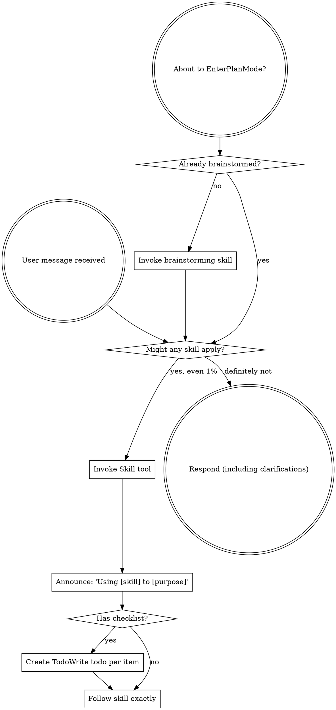
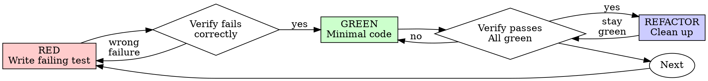

# Codex session 019f1467-0b3c-7991-aea8-a14f1a20495d

- Started: `2026-06-29T17:22:11.504Z`
- Working directory: `D:\100XH100`
- Originator: `Codex Desktop`
- Codex CLI: `0.142.3`
- Source log: `C:\Users\Иван Литвак\.codex\sessions\2026\06\29\rollout-2026-06-29T20-22-11-019f1467-0b3c-7991-aea8-a14f1a20495d.jsonl`
- Entries: user=2, assistant=32, tool calls=39, tool outputs=39

This is a chronological export of the user/assistant conversation and tool activity. Internal system/developer instructions and token accounting are intentionally excluded. Secret-shaped values are redacted; oversized tool outputs retain their beginning and end with the omitted character count.

## 1. User

Time: `2026-06-29T17:22:19.464Z` · source line `4`

```text
# AGENTS.md instructions for D:\100XH100

<INSTRUCTIONS>
# Project Agent Rules

## Operating Rule
- Read `AGENTS.md` before project edits.
- Update `memory/CHANGELOG.md` after meaningful code, config, or architecture changes.
- Update `memory/PROMPTS.md` with user prompts that define requirements.
- Store test outputs, logs, and verification notes under `test_results/`.
- Prefer agent-centered code: explicit contracts, deterministic tests, small files, low hidden state.

## Architecture Source
- Primary architecture contract: `ARCHITECTURE_NEED.md`.
- Current Stream 4 implementation rule: use threshold + compact + CUB/fixed-temp sort/reduce + compact; do not use Stream 4 hash-table dedup.

## Implementation Guardrails
- `State128` logical bytes are `v[0..119]`.
- `State128` padding bytes are `v[120..127]`.
- Persistent frontier padding must be zero.
- `FinalResponse` may temporarily store `target_local_idx` in `v[120..123]`.
- `Hash128` is one logical 128-bit key stored as `{lo, hi}`.
- `CandidateMeta` must remain 32 bytes and 32-byte aligned.
- Stream 3 payload id must be original candidate id, not compact index.
- Stream 4 must not apply shard top-k or semantic shard cap.

</INSTRUCTIONS>
<environment_context>
  <cwd>D:\100XH100</cwd>
  <shell>powershell</shell>
  <current_date>2026-06-29</current_date>
  <timezone>Europe/Moscow</timezone>
  <filesystem><workspace_roots><root>D:\100XH100</root></workspace_roots><permission_profile type="managed"><file_system type="restricted"><entry access="read"><special>:root</special></entry><entry access="write"><path>D:\100XH100</path></entry><entry access="write"><special>:slash_tmp</special></entry><entry access="write"><special>:tmpdir</special></entry><entry access="read"><path>D:\100XH100\.git</path></entry><entry access="read"><path>D:\100XH100\.agents</path></entry><entry access="read"><path>D:\100XH100\.codex</path></entry></file_system></permission_profile></filesystem>
</environment_context>
```

## 2. User

Time: `2026-06-29T17:22:19.474Z` · source line `6`

```text
You are a fresh Worker for Task 5 spec-fix. Edit files in worktree `D:\100XH100\.worktrees\stream1-piece-transformer`. Current HEAD is `3d93d35cddc0de57df6225a2614487891741ec3c`.

Spec review failed because `CMakeLists.txt` registers `stream1_transformer_cuda_tests`, but `tests/stream1_transformer_cuda_tests.cu` hard-requires ignored fixture `test_results/stream1_transformer_reference`, so clean checkout CTest is broken.

Task:
1. Make `stream1_transformer_cuda_tests` safe in a clean checkout. Preferred behavior: if `test_results/stream1_transformer_reference/weights_fp16/manifest.json` or `reference.json` is missing, print a clear skip line (e.g. `stream1_transformer_cuda_tests=skip missing_reference_fixture`), write that to the test report, and return 0. When fixture exists, continue running the full real p900 reference test exactly as before.
2. Do not weaken the full fixture test when fixture exists.
3. Update `test_results/stream1_transformer_forward_2026-06-29.md` documenting both clean-checkout skip behavior and full fixture verification.
4. Run `stream1_transformer_cuda_tests` in current fixture-present environment, and if feasible test missing fixture behavior by temporarily setting/renaming path or adding env override. Do not delete real fixture.
5. Amend Task 5 commit. Return DONE with commit SHA and verification.

Keep scope narrow. No production dispatcher wiring, no fallback backend.
```

## 3. Codex

Time: `2026-06-29T17:22:36.618Z` · source line `9`

```text
I’ll use the project rules plus the relevant Superpowers workflow skills, then make the smallest test-harness change in the requested worktree and amend the existing Task 5 commit.
```

## 4. Codex

Time: `2026-06-29T17:22:36.624Z` · source line `10`

```text
I’ll use the project rules plus the relevant Superpowers workflow skills, then make the smallest test-harness change in the requested worktree and amend the existing Task 5 commit.
```

## 5. Tool call: `exec_command`

Time: `2026-06-29T17:22:36.624Z` · source line `11`

```text
{"cmd":"Get-Content -LiteralPath 'C:\\Users\\Иван Литвак\\.codex\\plugins\\cache\\openai-curated-remote\\superpowers\\5.1.4\\skills\\using-superpowers\\SKILL.md'","workdir":"D:\\100XH100","shell":"powershell","yield_time_ms":10000,"max_output_tokens":20000}
```

## 6. Tool call: `exec_command`

Time: `2026-06-29T17:22:36.624Z` · source line `12`

```text
{"cmd":"Get-Content -LiteralPath 'C:\\Users\\Иван Литвак\\.codex\\plugins\\cache\\openai-curated-remote\\superpowers\\5.1.4\\skills\\test-driven-development\\SKILL.md'","workdir":"D:\\100XH100","shell":"powershell","yield_time_ms":10000,"max_output_tokens":20000}
```

## 7. Tool call: `exec_command`

Time: `2026-06-29T17:22:36.655Z` · source line `13`

```text
{"cmd":"Select-String -Path 'C:\\Users\\Иван Литвак\\.codex\\memories\\MEMORY.md' -Pattern 'D:\\\\100XH100|stream1|stream1_transformer|BEAM_PREBUILT_RUNNER' -Context 2,3","workdir":"D:\\100XH100","shell":"powershell","yield_time_ms":10000,"max_output_tokens":20000}
```

## 8. Tool output

Time: `2026-06-29T17:22:37.311Z` · source line `14`

````text
Chunk ID: 43cb6e
Wall time: 0.1643 seconds
Process exited with code 0
Original token count: 1393
Output:
---
name: using-superpowers
description: Use when starting any conversation - establishes how to find and use skills, requiring Skill tool invocation before ANY response including clarifying questions
---

<SUBAGENT-STOP>
If you were dispatched as a subagent to execute a specific task, skip this skill.
</SUBAGENT-STOP>

<EXTREMELY-IMPORTANT>
If you think there is even a 1% chance a skill might apply to what you are doing, you ABSOLUTELY MUST invoke the skill.

IF A SKILL APPLIES TO YOUR TASK, YOU DO NOT HAVE A CHOICE. YOU MUST USE IT.

This is not negotiable. This is not optional. You cannot rationalize your way out of this.
</EXTREMELY-IMPORTANT>

## Instruction Priority

Superpowers skills override default system prompt behavior, but **user instructions always take precedence**:

1. **User's explicit instructions** (CLAUDE.md, GEMINI.md, AGENTS.md, direct requests) — highest priority
2. **Superpowers skills** — override default system behavior where they conflict
3. **Default system prompt** — lowest priority

If CLAUDE.md, GEMINI.md, or AGENTS.md says "don't use TDD" and a skill says "always use TDD," follow the user's instructions. The user is in control.

## How to Access Skills

**In Claude Code:** Use the `Skill` tool. When you invoke a skill, its content is loaded and presented to you—follow it directly. Never use the Read tool on skill files.

**In Copilot CLI:** Use the `skill` tool. Skills are auto-discovered from installed plugins. The `skill` tool works the same as Claude Code's `Skill` tool.

**In Gemini CLI:** Skills activate via the `activate_skill` tool. Gemini loads skill metadata at session start and activates the full content on demand.

**In other environments:** Check your platform's documentation for how skills are loaded.

## Platform Adaptation

Skills use Claude Code tool names. Non-CC platforms: see `references/copilot-tools.md` (Copilot CLI), `references/codex-tools.md` (Codex) for tool equivalents. Gemini CLI users get the tool mapping loaded automatically via GEMINI.md.

# Using Skills

## The Rule

**Invoke relevant or requested skills BEFORE any response or action.** Even a 1% chance a skill might apply means that you should invoke the skill to check. If an invoked skill turns out to be wrong for the situation, you don't need to use it.



## Red Flags

These thoughts mean STOP—you're rationalizing:

| Thought | Reality |
|---------|---------|
| "This is just a simple question" | Questions are tasks. Check for skills. |
| "I need more context first" | Skill check comes BEFORE clarifying questions. |
| "Let me explore the codebase first" | Skills tell you HOW to explore. Check first. |
| "I can check git/files quickly" | Files lack conversation context. Check for skills. |
| "Let me gather information first" | Skills tell you HOW to gather information. |
| "This doesn't need a formal skill" | If a skill exists, use it. |
| "I remember this skill" | Skills evolve. Read current version. |
| "This doesn't count as a task" | Action = task. Check for skills. |
| "The skill is overkill" | Simple things become complex. Use it. |
| "I'll just do this one thing first" | Check BEFORE doing anything. |
| "This feels productive" | Undisciplined action wastes time. Skills prevent this. |
| "I know what that means" | Knowing the concept в‰  using the skill. Invoke it. |

## Skill Priority

When multiple skills could apply, use this order:

1. **Process skills first** (brainstorming, debugging) - these determine HOW to approach the task
2. **Implementation skills second** (frontend-design, mcp-builder) - these guide execution

"Let's build X" в†’ brainstorming first, then implementation skills.
"Fix this bug" в†’ debugging first, then domain-specific skills.

## Skill Types

**Rigid** (TDD, debugging): Follow exactly. Don't adapt away discipline.

**Flexible** (patterns): Adapt principles to context.

The skill itself tells you which.

## User Instructions

Instructions say WHAT, not HOW. "Add X" or "Fix Y" doesn't mean skip workflows.

````

## 9. Tool output

Time: `2026-06-29T17:22:37.374Z` · source line `15`

````text
Chunk ID: 3cceee
Wall time: 0.2143 seconds
Process exited with code 0
Original token count: 2565
Output:
---
name: test-driven-development
description: Use when implementing any feature or bugfix, before writing implementation code
---

# Test-Driven Development (TDD)

## Overview

Write the test first. Watch it fail. Write minimal code to pass.

**Core principle:** If you didn't watch the test fail, you don't know if it tests the right thing.

**Violating the letter of the rules is violating the spirit of the rules.**

## When to Use

**Always:**
- New features
- Bug fixes
- Refactoring
- Behavior changes

**Exceptions (ask your human partner):**
- Throwaway prototypes
- Generated code
- Configuration files

Thinking "skip TDD just this once"? Stop. That's rationalization.

## The Iron Law

```
NO PRODUCTION CODE WITHOUT A FAILING TEST FIRST
```

Write code before the test? Delete it. Start over.

**No exceptions:**
- Don't keep it as "reference"
- Don't "adapt" it while writing tests
- Don't look at it
- Delete means delete

Implement fresh from tests. Period.

## Red-Green-Refactor



### RED - Write Failing Test

Write one minimal test showing what should happen.

<Good>
```typescript
test('retries failed operations 3 times', async () => {
  let attempts = 0;
  const operation = () => {
    attempts++;
    if (attempts < 3) throw new Error('fail');
    return 'success';
  };

  const result = await retryOperation(operation);

  expect(result).toBe('success');
  expect(attempts).toBe(3);
});
```
Clear name, tests real behavior, one thing
</Good>

<Bad>
```typescript
test('retry works', async () => {
  const mock = jest.fn()
    .mockRejectedValueOnce(new Error())
    .mockRejectedValueOnce(new Error())
    .mockResolvedValueOnce('success');
  await retryOperation(mock);
  expect(mock).toHaveBeenCalledTimes(3);
});
```
Vague name, tests mock not code
</Bad>

**Requirements:**
- One behavior
- Clear name
- Real code (no mocks unless unavoidable)

### Verify RED - Watch It Fail

**MANDATORY. Never skip.**

```bash
npm test path/to/test.test.ts
```

Confirm:
- Test fails (not errors)
- Failure message is expected
- Fails because feature missing (not typos)

**Test passes?** You're testing existing behavior. Fix test.

**Test errors?** Fix error, re-run until it fails correctly.

### GREEN - Minimal Code

Write simplest code to pass the test.

<Good>
```typescript
async function retryOperation<T>(fn: () => Promise<T>): Promise<T> {
  for (let i = 0; i < 3; i++) {
    try {
      return await fn();
    } catch (e) {
      if (i === 2) throw e;
    }
  }
  throw new Error('unreachable');
}
```
Just enough to pass
</Good>

<Bad>
```typescript
async function retryOperation<T>(
  fn: () => Promise<T>,
  options?: {
    maxRetries?: number;
    backoff?: 'linear' | 'exponential';
    onRetry?: (attempt: number) => void;
  }
): Promise<T> {
  // YAGNI
}
```
Over-engineered
</Bad>

Don't add features, refactor other code, or "improve" beyond the test.

### Verify GREEN - Watch It Pass

**MANDATORY.**

```bash
npm test path/to/test.test.ts
```

Confirm:
- Test passes
- Other tests still pass
- Output pristine (no errors, warnings)

**Test fails?** Fix code, not test.

**Other tests fail?** Fix now.

### REFACTOR - Clean Up

After green only:
- Remove duplication
- Improve names
- Extract helpers

Keep tests green. Don't add behavior.

### Repeat

Next failing test for next feature.

## Good Tests

| Quality | Good | Bad |
|---------|------|-----|
| **Minimal** | One thing. "and" in name? Split it. | `test('validates email and domain and whitespace')` |
| **Clear** | Name describes behavior | `test('test1')` |
| **Shows intent** | Demonstrates desired API | Obscures what code should do |

## Why Order Matters

**"I'll write tests after to verify it works"**

Tests written after code pass immediately. Passing immediately proves nothing:
- Might test wrong thing
- Might test implementation, not behavior
- Might miss edge cases you forgot
- You never saw it catch the bug

Test-first forces you to see the test fail, proving it actually tests something.

**"I already manually tested all the edge cases"**

Manual testing is ad-hoc. You think you tested everything but:
- No record of what you tested
- Can't re-run when code changes
- Easy to forget cases under pressure
- "It worked when I tried it" в‰  comprehensive

Automated tests are systematic. They run the same way every time.

**"Deleting X hours of work is wasteful"**

Sunk cost fallacy. The time is already gone. Your choice now:
- Delete and rewrite with TDD (X more hours, high confidence)
- Keep it and add tests after (30 min, low confidence, likely bugs)

The "waste" is keeping code you can't trust. Working code without real tests is technical debt.

**"TDD is dogmatic, being pragmatic means adapting"**

TDD IS pragmatic:
- Finds bugs before commit (faster than debugging after)
- Prevents regressions (tests catch breaks immediately)
- Documents behavior (tests show how to use code)
- Enables refactoring (change freely, tests catch breaks)

"Pragmatic" shortcuts = debugging in production = slower.

**"Tests after achieve the same goals - it's spirit not ritual"**

No. Tests-after answer "What does this do?" Tests-first answer "What should this do?"

Tests-after are biased by your implementation. You test what you built, not what's required. You verify remembered edge cases, not discovered ones.

Tests-first force edge case discovery before implementing. Tests-after verify you remembered everything (you didn't).

30 minutes of tests after в‰  TDD. You get coverage, lose proof tests work.

## Common Rationalizations

| Excuse | Reality |
|--------|---------|
| "Too simple to test" | Simple code breaks. Test takes 30 seconds. |
| "I'll test after" | Tests passing immediately prove nothing. |
| "Tests after achieve same goals" | Tests-after = "what does this do?" Tests-first = "what should this do?" |
| "Already manually tested" | Ad-hoc в‰  systematic. No record, can't re-run. |
| "Deleting X hours is wasteful" | Sunk cost fallacy. Keeping unverified code is technical debt. |
| "Keep as reference, write tests first" | You'll adapt it. That's testing after. Delete means delete. |
| "Need to explore first" | Fine. Throw away exploration, start with TDD. |
| "Test hard = design unclear" | Listen to test. Hard to test = hard to use. |
| "TDD will slow me down" | TDD faster than debugging. Pragmatic = test-first. |
| "Manual test faster" | Manual doesn't prove edge cases. You'll re-test every change. |
| "Existing code has no tests" | You're improving it. Add tests for existing code. |

## Red Flags - STOP and Start Over

- Code before test
- Test after implementation
- Test passes immediately
- Can't explain why test failed
- Tests added "later"
- Rationalizing "just this once"
- "I already manually tested it"
- "Tests after achieve the same purpose"
- "It's about spirit not ritual"
- "Keep as reference" or "adapt existing code"
- "Already spent X hours, deleting is wasteful"
- "TDD is dogmatic, I'm being pragmatic"
- "This is different because..."

**All of these mean: Delete code. Start over with TDD.**

## Example: Bug Fix

**Bug:** Empty email accepted

**RED**
```typescript
test('rejects empty email', async () => {
  const result = await submitForm({ email: '' });
  expect(result.error).toBe('Email required');
});
```

**Verify RED**
```bash
$ npm test
FAIL: expected 'Email required', got undefined
```

**GREEN**
```typescript
function submitForm(data: FormData) {
  if (!data.email?.trim()) {
    return { error: 'Email required' };
  }
  // ...
}
```

**Verify GREEN**
```bash
$ npm test
PASS
```

**REFACTOR**
Extract validation for multiple fields if needed.

## Verification Checklist

Before marking work complete:

- [ ] Every new function/method has a test
- [ ] Watched each test fail before implementing
- [ ] Each test failed for expected reason (feature missing, not typo)
- [ ] Wrote minimal code to pass each test
- [ ] All tests pass
- [ ] Output pristine (no errors, warnings)
- [ ] Tests use real code (mocks only if unavoidable)
- [ ] Edge cases and errors covered

Can't check all boxes? You skipped TDD. Start over.

## When Stuck

| Problem | Solution |
|---------|----------|
| Don't know how to test | Write wished-for API. Write assertion first. Ask your human partner. |
| Test too complicated | Design too complicated. Simplify interface. |
| Must mock everything | Code too coupled. Use dependency injection. |
| Test setup huge | Extract helpers. Still complex? Simplify design. |

## Debugging Integration

Bug found? Write failing test reproducing it. Follow TDD cycle. Test proves fix and prevents regression.

Never fix bugs without a test.

## Testing Anti-Patterns

When adding mocks or test utilities, read @testing-anti-patterns.md to avoid common pitfalls:
- Testing mock behavior instead of real behavior
- Adding test-only methods to production classes
- Mocking without understanding dependencies

## Final Rule

```
Production code в†’ test exists and failed first
Otherwise в†’ not TDD
```

No exceptions without your human partner's permission.

````

## 10. Tool output

Time: `2026-06-29T17:22:37.503Z` · source line `16`

```text
Chunk ID: ff1ebe
Wall time: 0.3511 seconds
Process exited with code 0
Original token count: 1798
Output:

  C:\Users\Иван Литвак\.codex\memories\MEMORY.md:46:# Task Group: MEPhI IHES cluster publishing, shared prebuilt runner
, and inventory-driven backfill
  C:\Users\Иван Литвак\.codex\memories\MEMORY.md:47:scope: Running the IHES MEPhI cluster workflow with one shared preb
uilt `production_runner`, publishing solved puzzles into a dedicated GitHub results repo, and aggregating mixed cluster
 artifacts from on-cluster inventories.
> C:\Users\Иван Литвак\.codex\memories\MEMORY.md:48:applies_to: cwd=D:\100XH100; reuse_rule=reuse for this IHES/MEPhI r
epo family and adjacent cluster publish jobs, but treat live cluster inventory, DNS availability, and current results-r
epo schema as run-specific and recheck them before publishing.
  C:\Users\Иван Литвак\.codex\memories\MEMORY.md:49:
  C:\Users\Иван Литвак\.codex\memories\MEMORY.md:50:## Task 1: Launch IHES array jobs against one shared prebuilt runne
r, outcome success
  C:\Users\Иван Литвак\.codex\memories\MEMORY.md:51:
  C:\Users\Иван Литвак\.codex\memories\MEMORY.md:52:### rollout_summary_files
  C:\Users\Иван Литвак\.codex\memories\MEMORY.md:53:
> C:\Users\Иван Литвак\.codex\memories\MEMORY.md:54:- rollout_summaries/2026-06-04T15-47-52-Dd1O-ihes_cluster_results_p
rebuilt_publish_backfill.md (cwd=\\?\D:\100XH100, rollout_path=\\?\C:\Users\Иван Литвак\.codex\sessions\2026\06\04\roll
out-2026-06-04T18-47-57-019e9351-cd3b-71c0-bf8b-69755d08d5fc.jsonl, updated_at=2026-06-26T19:51:22+00:00, thread_id=019
e9351-cd3b-71c0-bf8b-69755d08d5fc, the prebuilt runner was compiled once and reused across the A100 array workflow)
  C:\Users\Иван Литвак\.codex\memories\MEMORY.md:55:
  C:\Users\Иван Литвак\.codex\memories\MEMORY.md:56:### keywords
  C:\Users\Иван Литвак\.codex\memories\MEMORY.md:57:
> C:\Users\Иван Литвак\.codex\memories\MEMORY.md:58:- MEPhI HPC, kaf12, A100 40GB, BEAM_PREBUILT_RUNNER, prepare_ihes_p
rebuilt_runner.sh, ihes_solve_bucket_from_scratch.sh, prebuilt_runner_ready, using_prebuilt_runner, PUZZLE_LIMIT=1, dep
th=12
  C:\Users\Иван Литвак\.codex\memories\MEMORY.md:59:
  C:\Users\Иван Литвак\.codex\memories\MEMORY.md:60:## Task 2: Publish per-puzzle IHES results and backfill existing bu
cket outputs into the GitHub results repo, outcome success
  C:\Users\Иван Литвак\.codex\memories\MEMORY.md:61:
  C:\Users\Иван Литвак\.codex\memories\MEMORY.md:62:### rollout_summary_files
  C:\Users\Иван Литвак\.codex\memories\MEMORY.md:63:
> C:\Users\Иван Литвак\.codex\memories\MEMORY.md:64:- rollout_summaries/2026-06-04T15-47-52-Dd1O-ihes_cluster_results_p
rebuilt_publish_backfill.md (cwd=\\?\D:\100XH100, rollout_path=\\?\C:\Users\Иван Литвак\.codex\sessions\2026\06\04\roll
out-2026-06-04T18-47-57-019e9351-cd3b-71c0-bf8b-69755d08d5fc.jsonl, updated_at=2026-06-26T19:51:22+00:00, thread_id=019
e9351-cd3b-71c0-bf8b-69755d08d5fc, the results repo structure and first backfilled puzzle sets were established)
  C:\Users\Иван Литвак\.codex\memories\MEMORY.md:65:
  C:\Users\Иван Литвак\.codex\memories\MEMORY.md:66:### keywords
  C:\Users\Иван Литвак\.codex\memories\MEMORY.md:67:
  C:\Users\Иван Литвак\.codex\memories\MEMORY.md:72:### rollout_summary_files
  C:\Users\Иван Литвак\.codex\memories\MEMORY.md:73:
> C:\Users\Иван Литвак\.codex\memories\MEMORY.md:74:- rollout_summaries/2026-06-04T15-47-52-Dd1O-ihes_cluster_results_p
rebuilt_publish_backfill.md (cwd=\\?\D:\100XH100, rollout_path=\\?\C:\Users\Иван Литвак\.codex\sessions\2026\06\04\roll
out-2026-06-04T18-47-57-019e9351-cd3b-71c0-bf8b-69755d08d5fc.jsonl, updated_at=2026-06-26T19:51:22+00:00, thread_id=019
e9351-cd3b-71c0-bf8b-69755d08d5fc, a file-driven inventory plus schema fixes made the larger aggregator path workable)
  C:\Users\Иван Литвак\.codex\memories\MEMORY.md:75:
  C:\Users\Иван Литвак\.codex\memories\MEMORY.md:76:### keywords
  C:\Users\Иван Литвак\.codex\memories\MEMORY.md:77:
  C:\Users\Иван Литвак\.codex\memories\MEMORY.md:87:## Reusable knowledge
  C:\Users\Иван Литвак\.codex\memories\MEMORY.md:88:
> C:\Users\Иван Литвак\.codex\memories\MEMORY.md:89:- `hpc/ihes_cube_model/prepare_ihes_prebuilt_runner.sh` builds the 
shared binary at `/mnt/pool/6/vokirova/beam8a100/ihes_cube_model/prebuilt-a100-ihes/production_runner`, and `hpc/ihes_c
ube_model/ihes_solve_bucket_from_scratch.sh` already knows how to consume `BEAM_PREBUILT_RUNNER` [Task 1]
  C:\Users\Иван Литвак\.codex\memories\MEMORY.md:90:- the verified runtime on basis exposed `world_size_effective=8`, `
NCCL 2.21.5+cuda12.4`, and eight visible A100-40GB GPUs, so the prebuilt-runner path was validated on the actual target
 hardware [Task 1]
  C:\Users\Иван Литвак\.codex\memories\MEMORY.md:91:- the durable results layout is `data/ihes_cube/puzzles/pXXXX/solut
ions.tsv`, `unique_solutions.tsv`, `metadata.env`, `summary.md`, plus root-level `index.tsv` and `improvements.tsv`; no
n-full-solution repair artifacts belong under separate `repair_segments/` trees [Task 2]
  C:\Users\Иван Литвак\.codex\memories\MEMORY.md:92:- the published cluster inventory lives under `data/ihes_cube/raw_i
nventory/` and should be the first routing layer when a future agent needs to inspect the cluster-side file set without
 reopening the live cluster [Task 2][Task 3]
  C:\Users\Иван Литвак\.codex\memories\MEMORY.md:95:## Failures and how to do differently
  C:\Users\Иван Литвак\.codex\memories\MEMORY.md:96:
> C:\Users\Иван Литвак\.codex\memories\MEMORY.md:97:- symptom: each array task recompiles instead of reusing the solver
. cause: `BEAM_PREBUILT_RUNNER` was not wired through a separate prebuild dependency. fix: submit the prebuild first an
d make the puzzle array depend on it via `--dependency=afterok:<prebuild_job>` [Task 1]
  C:\Users\Иван Литвак\.codex\memories\MEMORY.md:98:- symptom: cluster-side publish fails after compute succeeds. cause
: the compute node cannot resolve `github.com` or otherwise lacks GitHub network access. fix: tolerate cluster-side pus
h failure and leave local commits/results ready for later push from a node with working DNS/network [Task 2]
  C:\Users\Иван Литвак\.codex\memories\MEMORY.md:99:- symptom: the backfill/index writer crashes on old rows. cause: me
tadata rows carried extra keys such as `variants` and `source_files` that were not declared in the index schema. fix: w
iden the declared schema and filter outgoing rows to declared fields before writing [Task 2][Task 3]
  C:\Users\Иван Литвак\.codex\memories\MEMORY.md:100:- symptom: one-pass "aggregate everything" scripts become noisy an
d brittle. cause: mixed artifact families and header-only files are treated uniformly. fix: partition by artifact type 
first and skip empty/header-only files (`st_size <= 200` or similar threshold) [Task 3]


```

## 11. Codex

Time: `2026-06-29T17:22:46.305Z` · source line `19`

```text
Using `superpowers:test-driven-development` for the harness behavior change. I’m treating the “missing fixture exits 0 with a report line” as the regression case and will verify both missing-fixture and fixture-present paths.
```

## 12. Codex

Time: `2026-06-29T17:22:46.312Z` · source line `20`

```text
Using `superpowers:test-driven-development` for the harness behavior change. I’m treating the “missing fixture exits 0 with a report line” as the regression case and will verify both missing-fixture and fixture-present paths.
```

## 13. Tool call: `exec_command`

Time: `2026-06-29T17:22:46.312Z` · source line `21`

```text
{"cmd":"Get-Content -LiteralPath 'D:\\100XH100\\.worktrees\\stream1-piece-transformer\\AGENTS.md'","workdir":"D:\\100XH100\\.worktrees\\stream1-piece-transformer","shell":"powershell","yield_time_ms":10000,"max_output_tokens":20000}
```

## 14. Tool call: `exec_command`

Time: `2026-06-29T17:22:46.312Z` · source line `22`

```text
{"cmd":"git status --short --branch","workdir":"D:\\100XH100\\.worktrees\\stream1-piece-transformer","shell":"powershell","yield_time_ms":10000,"max_output_tokens":12000}
```

## 15. Tool call: `exec_command`

Time: `2026-06-29T17:22:46.312Z` · source line `23`

```text
{"cmd":"git rev-parse HEAD","workdir":"D:\\100XH100\\.worktrees\\stream1-piece-transformer","shell":"powershell","yield_time_ms":10000,"max_output_tokens":12000}
```

## 16. Tool call: `exec_command`

Time: `2026-06-29T17:22:46.312Z` · source line `24`

```text
{"cmd":"Get-Content -LiteralPath 'D:\\100XH100\\.worktrees\\stream1-piece-transformer\\tests\\stream1_transformer_cuda_tests.cu'","workdir":"D:\\100XH100\\.worktrees\\stream1-piece-transformer","shell":"powershell","yield_time_ms":10000,"max_output_tokens":30000}
```

## 17. Tool output

Time: `2026-06-29T17:22:46.635Z` · source line `25`

```text
Chunk ID: 14d576
Wall time: 0.1102 seconds
Process exited with code 0
Original token count: 290
Output:
# Project Agent Rules

## Operating Rule
- Read `AGENTS.md` before project edits.
- Update `memory/CHANGELOG.md` after meaningful code, config, or architecture changes.
- Update `memory/PROMPTS.md` with user prompts that define requirements.
- Store test outputs, logs, and verification notes under `test_results/`.
- Prefer agent-centered code: explicit contracts, deterministic tests, small files, low hidden state.

## Architecture Source
- Primary architecture contract: `ARCHITECTURE_NEED.md`.
- Current Stream 4 implementation rule: use threshold + compact + CUB/fixed-temp sort/reduce + compact; do not use Stream 4 hash-table dedup.

## Implementation Guardrails
- `State128` logical bytes are `v[0..119]`.
- `State128` padding bytes are `v[120..127]`.
- Persistent frontier padding must be zero.
- `FinalResponse` may temporarily store `target_local_idx` in `v[120..123]`.
- `Hash128` is one logical 128-bit key stored as `{lo, hi}`.
- `CandidateMeta` must remain 32 bytes and 32-byte aligned.
- Stream 3 payload id must be original candidate id, not compact index.
- Stream 4 must not apply shard top-k or semantic shard cap.

```

## 18. Tool output

Time: `2026-06-29T17:22:47.000Z` · source line `26`

```text
Chunk ID: 064f02
Wall time: 0.4476 seconds
Process exited with code 0
Original token count: 56
Output:
## codex/stream1-piece-transformer
?? $null
?? build-contract-tests/
?? build-stream1-transformer-red/
?? config.obj
?? contract_tests.obj
?? docs/
?? frontier_cpu.obj
?? hash.obj
?? state.obj
?? stream3.obj
?? stream4.obj

```

## 19. Tool output

Time: `2026-06-29T17:22:47.001Z` · source line `27`

```text
Chunk ID: 7b4001
Wall time: 0.0975 seconds
Process exited with code 0
Original token count: 11
Output:
3d93d35cddc0de57df6225a2614487891741ec3c

```

## 20. Tool output

Time: `2026-06-29T17:22:47.001Z` · source line `28`

```text
Chunk ID: 92bd02
Wall time: 0.1291 seconds
Process exited with code 0
Original token count: 1845
Output:
#include "cuda_check.hpp"
#include "../cuda/stream1.hpp"
#include "../tools/stream1_weight_io.hpp"
#include "state.hpp"

#include <cuda_runtime.h>

#include <algorithm>
#include <cmath>
#include <cctype>
#include <cstdlib>
#include <cstdint>
#include <filesystem>
#include <fstream>
#include <iostream>
#include <iterator>
#include <stdexcept>
#include <string>
#include <vector>

using namespace beam;

namespace {

void require(bool condition, const char* message) {
    if (!condition) {
        throw std::runtime_error(message);
    }
}

std::string read_text(const std::filesystem::path& path) {
    std::ifstream file(path, std::ios::binary);
    if (!file) {
        throw std::runtime_error("cannot open reference file: " + path.string());
    }
    return std::string(std::istreambuf_iterator<char>(file), std::istreambuf_iterator<char>());
}

std::vector<double> parse_json_numbers_after(
    const std::string& text,
    const char* key,
    std::size_t expected_count) {
    const std::string quoted = std::string("\"") + key + "\"";
    std::size_t pos = text.find(quoted);
    if (pos == std::string::npos) {
        throw std::runtime_error("reference JSON missing key: " + std::string(key));
    }
    pos = text.find('[', pos + quoted.size());
    if (pos == std::string::npos) {
        throw std::runtime_error("reference JSON key is not an array: " + std::string(key));
    }
    std::vector<double> values;
    values.reserve(expected_count);
    while (pos < text.size() && values.size() < expected_count) {
        const char c = text[pos];
        if (c == '-' || c == '+' || c == '.' || std::isdigit(static_cast<unsigned char>(c))) {
            char* end = nullptr;
            const double value = std::strtod(text.c_str() + pos, &end);
            if (end == text.c_str() + pos) {
                throw std::runtime_error("failed to parse reference JSON number");
            }
            values.push_back(value);
            pos = static_cast<std::size_t>(end - text.c_str());
            continue;
        }
        ++pos;
    }
    if (values.size() != expected_count) {
        throw std::runtime_error(
            "reference JSON number count mismatch for " + std::string(key) +
            " expected=" + std::to_string(expected_count) +
            " actual=" + std::to_string(values.size()));
    }
    return values;
}

std::uint32_t reference_score_key(double q) {
    const double clamped = std::min(std::max(q, 0.0), static_cast<double>(SCORE_MAX_Q));
    return static_cast<std::uint32_t>(std::llround(clamped * static_cast<double>(SCORE_SCALE)));
}

} // namespace

int main() {
    std::filesystem::create_directories("test_results");
    std::ofstream report("test_results/stream1_transformer_cuda_tests_2026-06-29.md");
    report << "# Stream1 Transformer CUDA Tests 2026-06-29\n\n";

    BEAM_CUDA_CHECK(cudaSetDevice(0));

    const std::filesystem::path fixture_root = "test_results/stream1_transformer_reference";
    const std::filesystem::path weights_dir = fixture_root / "weights_fp16";
    const std::filesystem::path reference_path = fixture_root / "reference.json";
    const std::uint32_t reference_count = 8;

    const std::string reference_json = read_text(reference_path);
    const std::vector<double> state_numbers =
        parse_json_numbers_after(reference_json, "states", reference_count * STATE_LEN);
    const std::vector<double> reference_scores =
        parse_json_numbers_after(reference_json, "scores_fp32", reference_count * MOVE_COUNT);

    std::vector<State128> states(reference_count);
    for (std::uint32_t row = 0; row < reference_count; ++row) {
        for (std::uint32_t p = 0; p < STATE_LEN; ++p) {
            const double value = state_numbers[static_cast<std::size_t>(row) * STATE_LEN + p];
            states[row].v[p] = static_cast<std::uint8_t>(value);
        }
        clear_state_padding(states[row]);
    }

    stream1_weights::HostWeightBytes host_weights = stream1_weights::load_stream1_weights(weights_dir);
    require(host_weights.model.backend == STREAM1_BACKEND_PIECE_TRANSFORMER, "fixture must be piece_transformer");
    stream1_weights::DeviceWeights device_weights = stream1_weights::upload_weights(host_weights);
    stream1_weights::ScratchAllocation scratch_allocation =
        stream1_weights::alloc_stream1_scratch(host_weights.model, reference_count, 1);

    State128* d_frontier = nullptr;
    std::uint64_t* d_parent_base = nullptr;
    std::uint32_t* d_count = nullptr;
    std::uint32_t* d_score = nullptr;
    const std::uint64_t parent_base = 0;
    const std::uint32_t count = reference_count;
    BEAM_CUDA_CHECK(cudaMalloc(&d_frontier, states.size() * sizeof(State128)));
    BEAM_CUDA_CHECK(cudaMalloc(&d_parent_base, sizeof(std::uint64_t)));
    BEAM_CUDA_CHECK(cudaMalloc(&d_count, sizeof(std::uint32_t)));
    BEAM_CUDA_CHECK(cudaMalloc(&d_score, reference_count * MOVE_COUNT * sizeof(std::uint32_t)));
    BEAM_CUDA_CHECK(cudaMemcpy(d_frontier, states.data(), states.size() * sizeof(State128), cudaMemcpyHostToDevice));
    BEAM_CUDA_CHECK(cudaMemcpy(d_parent_base, &parent_base, sizeof(parent_base), cudaMemcpyHostToDevice));
    BEAM_CUDA_CHECK(cudaMemcpy(d_count, &count, sizeof(count), cudaMemcpyHostToDevice));
    BEAM_CUDA_CHECK(cudaMemset(d_score, 0, reference_count * MOVE_COUNT * sizeof(std::uint32_t)));

    stream1_weights::TransformerNetworkViewHolder view_holder =
        stream1_weights::transformer_network_view(device_weights.transformer, host_weights.model);
    const Stream1TransformerScratchView scratch_view =
        stream1_weights::transformer_scratch_view(scratch_allocation);

    stream1_transformer_inference_cuda(
        d_frontier,
        d_parent_base,
        d_count,
        view_holder.view,
        scratch_view,
        d_score,
        reference_count,
        0);
    BEAM_CUDA_CHECK(cudaGetLastError());
    BEAM_CUDA_CHECK(cudaDeviceSynchronize());

    std::vector<std::uint32_t> cuda_scores(reference_count * MOVE_COUNT);
    BEAM_CUDA_CHECK(cudaMemcpy(cuda_scores.data(), d_score, cuda_scores.size() * sizeof(std::uint32_t), cudaMemcpyDeviceToHost));

    std::uint32_t max_abs_error = 0;
    for (std::size_t i = 0; i < cuda_scores.size(); ++i) {
        const std::uint32_t expected = reference_score_key(reference_scores[i]);
        const std::uint32_t actual = cuda_scores[i];
        const std::uint32_t error = expected > actual ? expected - actual : actual - expected;
        max_abs_error = std::max(max_abs_error, error);
    }
    report << "- reference_rows=" << reference_count << "\n";
    report << "- max_abs_score_key_error=" << max_abs_error << "\n";
    report.flush();
    require(max_abs_error <= 3072U, "transformer CUDA score keys drifted beyond tolerance");
    report << "- transformer_forward_reference=pass\n";
    report << "- standalone_no_dispatcher_wiring=pass\n";
    report << "\nstatus=pass\n";

    cudaFree(d_frontier);
    cudaFree(d_parent_base);
    cudaFree(d_count);
    cudaFree(d_score);
    stream1_weights::free_stream1_scratch(scratch_allocation);
    stream1_weights::free_weights(device_weights);
    std::cout << "stream1_transformer_cuda_tests=pass\n";
    return 0;
}

```

## 21. Codex

Time: `2026-06-29T17:22:58.758Z` · source line `31`

```text
I found the CUDA test currently opens `test_results/stream1_transformer_reference/reference.json` unconditionally, so a clean checkout fails before it can report a skip. Next I’m checking the existing build/test layout and then I’ll capture that failing behavior before patching.
```

## 22. Codex

Time: `2026-06-29T17:22:58.763Z` · source line `32`

```text
I found the CUDA test currently opens `test_results/stream1_transformer_reference/reference.json` unconditionally, so a clean checkout fails before it can report a skip. Next I’m checking the existing build/test layout and then I’ll capture that failing behavior before patching.
```

## 23. Tool call: `exec_command`

Time: `2026-06-29T17:22:58.781Z` · source line `33`

```text
{"cmd":"Select-String -Path 'D:\\100XH100\\.worktrees\\stream1-piece-transformer\\CMakeLists.txt' -Pattern 'stream1_transformer_cuda_tests' -Context 4,8","workdir":"D:\\100XH100\\.worktrees\\stream1-piece-transformer","shell":"powershell","yield_time_ms":10000,"max_output_tokens":12000}
```

## 24. Tool call: `exec_command`

Time: `2026-06-29T17:22:58.812Z` · source line `34`

```text
{"cmd":"Get-ChildItem -LiteralPath 'D:\\100XH100\\.worktrees\\stream1-piece-transformer' -Directory -Filter 'build*' | Select-Object -ExpandProperty FullName","workdir":"D:\\100XH100\\.worktrees\\stream1-piece-transformer","shell":"powershell","yield_time_ms":10000,"max_output_tokens":12000}
```

## 25. Tool call: `exec_command`

Time: `2026-06-29T17:22:58.825Z` · source line `35`

```text
{"cmd":"Get-Content -LiteralPath 'D:\\100XH100\\.worktrees\\stream1-piece-transformer\\test_results\\stream1_transformer_forward_2026-06-29.md'","workdir":"D:\\100XH100\\.worktrees\\stream1-piece-transformer","shell":"powershell","yield_time_ms":10000,"max_output_tokens":20000}
```

## 26. Tool call: `exec_command`

Time: `2026-06-29T17:22:58.895Z` · source line `36`

```text
{"cmd":"Get-Content -LiteralPath 'D:\\100XH100\\.worktrees\\stream1-piece-transformer\\memory\\CHANGELOG.md' -Tail 80","workdir":"D:\\100XH100\\.worktrees\\stream1-piece-transformer","shell":"powershell","yield_time_ms":10000,"max_output_tokens":16000}
```

## 27. Tool call: `exec_command`

Time: `2026-06-29T17:22:58.895Z` · source line `37`

```text
{"cmd":"Get-Content -LiteralPath 'D:\\100XH100\\.worktrees\\stream1-piece-transformer\\memory\\PROMPTS.md' -Tail 80","workdir":"D:\\100XH100\\.worktrees\\stream1-piece-transformer","shell":"powershell","yield_time_ms":10000,"max_output_tokens":16000}
```

## 28. Tool output

Time: `2026-06-29T17:22:59.176Z` · source line `38`

```text
Chunk ID: 58aacc
Wall time: 0.1962 seconds
Process exited with code 0
Original token count: 628
Output:

  CMakeLists.txt:156:add_executable(stream1_cuda_tests tests/stream1_cuda_tests.cu)
  CMakeLists.txt:157:target_link_libraries(stream1_cuda_tests PRIVATE beam_cuda)
  CMakeLists.txt:158:set_target_properties(stream1_cuda_tests PROPERTIES CUDA_STANDARD 17 CUDA_STANDARD_REQUIRED ON CUD
A_ARCHITECTURES "${BEAM_CUDA_ARCHITECTURES}")
  CMakeLists.txt:159:
> CMakeLists.txt:160:add_executable(stream1_transformer_cuda_tests tests/stream1_transformer_cuda_tests.cu)
> CMakeLists.txt:161:target_link_libraries(stream1_transformer_cuda_tests PRIVATE beam_cuda)
> CMakeLists.txt:162:set_target_properties(stream1_transformer_cuda_tests PROPERTIES CUDA_STANDARD 17 CUDA_STANDARD_REQ
UIRED ON CUDA_ARCHITECTURES "${BEAM_CUDA_ARCHITECTURES}")
  CMakeLists.txt:163:
  CMakeLists.txt:164:add_executable(stream3_cuda_tests tests/stream3_cuda_tests.cu)
  CMakeLists.txt:165:target_link_libraries(stream3_cuda_tests PRIVATE beam_cuda)
  CMakeLists.txt:166:set_target_properties(stream3_cuda_tests PROPERTIES CUDA_STANDARD 17 CUDA_STANDARD_REQUIRED ON CUD
A_ARCHITECTURES "${BEAM_CUDA_ARCHITECTURES}")
  CMakeLists.txt:167:
  CMakeLists.txt:168:add_executable(stream4_cuda_tests tests/stream4_cuda_tests.cu)
  CMakeLists.txt:169:target_link_libraries(stream4_cuda_tests PRIVATE beam_cuda)
  CMakeLists.txt:170:set_target_properties(stream4_cuda_tests PROPERTIES CUDA_STANDARD 17 CUDA_STANDARD_REQUIRED ON CUD
A_ARCHITECTURES "${BEAM_CUDA_ARCHITECTURES}")
  CMakeLists.txt:208:enable_testing()
  CMakeLists.txt:209:add_test(NAME contract_tests COMMAND contract_tests)
  CMakeLists.txt:210:add_test(NAME history_tests COMMAND history_tests)
  CMakeLists.txt:211:add_test(NAME stream1_cuda_tests COMMAND stream1_cuda_tests)
> CMakeLists.txt:212:add_test(NAME stream1_transformer_cuda_tests COMMAND stream1_transformer_cuda_tests)
  CMakeLists.txt:213:add_test(NAME stream2_cuda_tests COMMAND stream2_cuda_tests)
  CMakeLists.txt:214:add_test(NAME stream3_cuda_tests COMMAND stream3_cuda_tests)
  CMakeLists.txt:215:add_test(NAME stream4_cuda_tests COMMAND stream4_cuda_tests)
  CMakeLists.txt:216:add_test(NAME stream5_cuda_tests COMMAND stream5_cuda_tests)
  CMakeLists.txt:217:add_test(NAME final_cuda_tests COMMAND final_cuda_tests)
  CMakeLists.txt:218:add_test(NAME threshold_cuda_tests COMMAND threshold_cuda_tests)
  CMakeLists.txt:219:add_test(NAME stitched_cuda_tests COMMAND stitched_cuda_tests)
  CMakeLists.txt:220:add_test(NAME dispatcher_cuda_tests COMMAND dispatcher_cuda_tests)


```

## 29. Tool output

Time: `2026-06-29T17:22:59.213Z` · source line `39`

```text
Chunk ID: 4d90f4
Wall time: 0.1903 seconds
Process exited with code 0
Original token count: 38
Output:
D:\100XH100\.worktrees\stream1-piece-transformer\build-contract-tests
D:\100XH100\.worktrees\stream1-piece-transformer\build-stream1-transformer-red

```

## 30. Tool output

Time: `2026-06-29T17:22:59.213Z` · source line `40`

````text
Chunk ID: 1f6275
Wall time: 0.1374 seconds
Process exited with code 0
Original token count: 1107
Output:
# Stream1 Transformer Forward Verification - 2026-06-29

## Scope
- Added a standalone CUDA Stream1 piece-transformer forward entrypoint without production dispatcher/runner wiring.
- Added separate `Stream1TransformerNetworkView` and `Stream1TransformerScratchView` API surfaces.
- Implemented p900 input token construction from `fast_slot_projected`, `fast_piece_static`, `piece_positions`, and `piece_mask`.
- Implemented input/output LayerNorm, pre-norm transformer blocks, CUTLASS linear projections, SiLU FFN activation, residual adds, and output score-key quantization.
- Implemented a fused row-wise tiled attention kernel for the current `seq_len=51`, using the existing reusable attention score/probability buffer in place, with explicit scratch initialization before the standalone forward. Full external FlashAttention 2 integration is deferred; no new external dependency was added.
- Kept production runner and benchmark fail-closed transformer guards unchanged.

## Red Check

```powershell
docker run --rm -v ${PWD}:/workspace -w /workspace gpu-dev-cutlass-nsight:cuda128-sm120 bash -lc "cmake -S . -B build-stream1-transformer-red -G Ninja -DBEAM_CUDA_ARCHITECTURES=75 >/tmp/cmake-red.log && cmake --build build-stream1-transformer-red --target stream1_transformer_cuda_tests -j2"
```

Result: FAIL before implementation as expected. The new test referenced missing `TransformerNetworkViewHolder`, `transformer_network_view`, `Stream1TransformerScratchView`, `transformer_scratch_view`, and `stream1_transformer_inference_cuda` symbols.

## Final Verification

```powershell
docker run --rm --gpus all -v ${PWD}:/workspace -w /workspace gpu-dev-cutlass-nsight:cuda128-sm120 bash -lc "cmake --build build-stream1-transformer-red --target stream1_transformer_cuda_tests -j2 >/tmp/build.log && ./build-stream1-transformer-red/stream1_transformer_cuda_tests"
```

Result: PASS, `stream1_transformer_cuda_tests=pass`. The real exporter fixture under `test_results/stream1_transformer_reference/` ran 8 p900 reference states. Max score-key error versus fp32 PyTorch reference was 1573 in the final single run, under the 3072 fp16/TensorCore tolerance. A five-run sample after scratch initialization produced max score-key errors of 1292, 1382, 1290, 1338, and 1030.

```powershell
docker run --rm --gpus all -v ${PWD}:/workspace -w /workspace gpu-dev-cutlass-nsight:cuda128-sm120 bash -lc "cmake --build build-stream1-transformer-red --target stream1_cuda_tests -j2 >/tmp/build-stream1.log && ./build-stream1-transformer-red/stream1_cuda_tests"
```

Result: PASS, `stream1_cuda_tests=pass`.

```powershell
docker run --rm --gpus all -v ${PWD}:/workspace -w /workspace gpu-dev-cutlass-nsight:cuda128-sm120 bash -lc "cmake --build build-stream1-transformer-red --target dispatcher_cuda_tests -j2"
```

Result: PASS compile. This validates the existing dispatcher test fixture against the expanded MLP network view shape; it does not wire transformer dispatch.

## Task 5 Quality Fix Verification

Scope: fixed `tools/stream_benchmark.cu` MLP `Stream1NetworkView` construction to include the expanded input/hidden/residual LayerNorm pointer fields. No transformer forward semantics changed, and production transformer dispatch remains unwired.

Red compile check before fix:

```powershell
docker run --rm -v ${PWD}:/workspace -w /workspace gpu-dev-cutlass-nsight:cuda128-sm120 bash -lc "cmake --build build-stream1-transformer-red --target stream_benchmark -j2"
```

Result: FAIL as expected. `tools/stream_benchmark.cu` attempted to initialize residual pointer tables into the new scalar LayerNorm pointer fields and failed with CUDA compile errors at lines 347-353.

Final `stream_benchmark` compile check:

```powershell
docker run --rm -v ${PWD}:/workspace -w /workspace gpu-dev-cutlass-nsight:cuda128-sm120 bash -lc "cmake --build build-stream1-transformer-red --target stream_benchmark -j2"
```

Result: PASS. The target rebuilt and linked `stream_benchmark` successfully.

Transformer CUDA regression check:

```powershell
docker run --rm --gpus all -v ${PWD}:/workspace -w /workspace gpu-dev-cutlass-nsight:cuda128-sm120 bash -lc "cmake --build build-stream1-transformer-red --target stream1_transformer_cuda_tests -j2 && ./build-stream1-transformer-red/stream1_transformer_cuda_tests"
```

Result: PASS, `stream1_transformer_cuda_tests=pass`.

````

## 31. Tool output

Time: `2026-06-29T17:22:59.259Z` · source line `41`

```text
Chunk ID: c85f75
Wall time: 0.1412 seconds
Process exited with code 0
Original token count: 1806
Output:
  block stepping by `K1 + search_depth` by default and optional diversity
  windows via `--search-depths 1-7`. Added
  `hpc/ihes_cube_model/ihes_solution_repair.sh`, where one SLURM array task
  repairs one original solution: it compiles once, runs all segments for that
  solution sequentially, records segment metadata, stitches candidates per
  repair depth, and prints the best candidate.
- Added the IHES unique-solutions input file
  `hpc/ihes_cube_model/solv_uniq.csv` so cluster repair jobs can be prepared
  through GitHub without manually uploading the Telegram copy.
- Added `SOLUTION_ROW_OFFSET` support to
  `hpc/ihes_cube_model/ihes_solution_repair.sh` so MEPhI SLURM chunks can use
  array indices `0-999` repeatedly while selecting later rows from
  `solution_repair_solutions.csv`.
- Added prebuilt IHES repair runner support. `prepare_ihes_prebuilt_runner.sh`
  builds one stable `production_runner` under `prebuilt-a100-ihes`, and
  `ihes_solution_repair.sh` can reuse it through `BEAM_PREBUILT_RUNNER` instead
  of running CMake/NVCC inside every solution-repair array task.
- Added an explicit IHES solution repair execution mode switch:
  `BEAM_SOLUTION_REPAIR_MODE=plan` runs all segments through one outer
  `torchrun`, while `BEAM_SOLUTION_REPAIR_MODE=legacy` preserves the previous
  one-`torchrun`-per-segment behavior. Unknown modes fail immediately; there is
  no automatic fallback.
- Added `run_solution_repair_plan.sh` and common `beam_torchrun_segment_plan`
  orchestration so plan mode runs the whole segment list inside one outer
  distributed launch. Both plan and legacy modes now set
  `BEAM_HISTORY_DISK_PATH` per segment so history directories remain isolated;
  plan mode leaves cleanup to the existing job-level safe cleanup after the
  outer distributed run exits.
- Fixed plan-mode launcher execution by invoking `run_solution_repair_plan.sh`
  through `/bin/bash` inside the distributed wrapper, so it does not depend on
  the repository file executable bit after `git fetch/reset`.
- Added `hpc/ihes_cube_model/prepare_solution_repair_single_window.sh` for the
  current IHES repair workflow. It prepares `solution_repair_*` CSV files with
  exactly one block window, `window = K1 + 7` by default, instead of generating
  the previous diversity sweep over `K1+1..K1+7`.
- Replaced the plan-mode repair launcher internals with a native lightweight
  rank launcher while leaving legacy mode on `torchrun`. Plan mode now starts
  `WORLD_SIZE_EFFECTIVE` shell ranks directly with `RANK`, `LOCAL_RANK`, and
  `WORLD_SIZE` set, writes only rank 0 to the main log, and stores nonzero ranks
  under the existing rank log directory.
- Added an explicit `BEAM_SOLUTION_REPAIR_MODE=legacy_native` mode for the
  current IHES solution repair workflow. It keeps the per-segment legacy
  execution model, but launches each segment through a lightweight native
  8-rank shell launcher instead of `torchrun`; existing `legacy` and `plan`
  modes are unchanged.
- Added a dedicated resident IHES solution-repair mode. `production_runner`
  now supports `BEAM_REPAIR_SOLUTIONS_CSV`, builds block segment tasks directly
  from `solv_uniq.csv` plus `BEAM_TEST_CSV`, and runs them in one process/rank
  group while reusing CUDA/NCCL/model/static allocations. The solved-neighborhood
  device table now has a stable arena path: later segment targets rebuild the
  CPU K1 table and overwrite the same device pointers, so CUDA graph templates
  can be reused as long as the radius/bucket/slot shape stays fixed. Added
  `BEAM_SOLUTION_REPAIR_MODE=resident` to `hpc/ihes_cube_model/ihes_solution_repair.sh`
  to launch this path and write a per-segment TSV.
- Fixed resident repair input parsing for the actual `solv_uniq.csv` format,
  which is a JSON object mapping puzzle ids to arrays of solution paths, not
  only a two-column CSV.
- Fixed resident repair stable solved-neighborhood reuse across target states.
  Subsequent K1 tables are now packed into the first segment's fixed bucket
  count so CUDA graph templates can keep the same device pointers and bucket
  mask even when a later target has a slightly different deduplicated entry
  count.
- Added resident repair CPU K1 prefetching. In resident mode a bounded host RAM
  queue now prepares solved-neighborhood K1 tables for upcoming segment tasks
  while the GPU is solving the current one. `BEAM_REPAIR_K1_PREFETCH_TASKS`
  controls the number of ready tasks kept in RAM, defaulting to 10; `0`
  disables it. The stable device arena remains a single table, with a small
  configurable bucket-count reserve via `BEAM_REPAIR_K1_STABLE_BUCKET_SCALE_PPM`.

- Fixed IHES solve-bucket reflected aggregation safety. The wrapper now normalizes each known path orientation against the original puzzle before reflected-state synthesis, and validates every found path against the original puzzle before writing aggregate improvements, preventing false reflected improvements from mixed-orientation solv_uniq.csv entries.

- Added hpc/ihes_cube_model/ihes_solve_bucket_from_scratch.sh, an IHES bucket workflow that uses solv_uniq.csv only to select puzzle ids with baseline lengths 23,24, solves original states from scratch, stores all bucket solutions, and only runs reflected buckets from actually found original solutions until a shorter-than-baseline solution is found.

- Improved hpc/ihes_cube_model/ihes_solve_bucket_from_scratch.sh resume behavior and reflected-source deduplication. Reflected sources are now deduplicated by the reflected state hash, not just by identical path text; stable FRESH_RUN_TAG output/progress files prevent result truncation on restart; original and reflected done markers let a restarted job continue the current puzzle instead of re-running completed sources.

- Added optional public results publishing to hpc/ihes_cube_model/ihes_solve_bucket_from_scratch.sh. When PUBLISH_RESULTS_REPO_URL or an existing PUBLISH_RESULTS_DIR checkout is configured, each completed puzzle writes per-puzzle solutions.tsv, unique_solutions.tsv, metadata.env, summary.md, plus global IHES index/improvements TSV files and commits/pushes them to the separate results repository. The solver/CUDA architecture is unchanged; publishing is best-effort so completed local logs are retained if GitHub auth or network fails. Verification note: test_results/ihes_bucket_public_results_publish_2026-06-26.md.

- Updated IHES fresh bucket array documentation to use one shared precompiled production_runner. The documented flow submits prepare_ihes_prebuilt_runner.sh first, then submits the puzzle array with --dependency=afterok:<prebuild_job> and BEAM_PREBUILT_RUNNER=/mnt/pool/6/vokirova/beam8a100/ihes_cube_model/prebuilt-a100-ihes/production_runner so each one-puzzle task reuses the same binary instead of rebuilding.

- Fixed IHES live results publishing index generation after raw/backfill metadata added extra keys. The fresh bucket publisher now includes variants/source_files columns in data/ihes_cube/index.tsv and filters metadata rows to declared fields before writing index/improvements, so older per-puzzle metadata cannot crash publishing.

```

## 32. Tool output

Time: `2026-06-29T17:22:59.260Z` · source line `42`

```text
Chunk ID: af07fa
Wall time: 0.1429 seconds
Process exited with code 0
Original token count: 1626
Output:
- User provided local IHES model file
  `C:/Users/???????????????? ??????????????????????????/Downloads/p888-t000_1778521793_e32692.pth` and requested
  launching the IHES cube solver with that model on MEPhI. The model is a
  BatchNorm-folded QMLP-style checkpoint with `input_dim=5184=72*72`,
  `hd1=2556`, `hd2=218`, `nrd=16`, and `output_dim=1`; IHES move count is 18,
  so one-output row budgeting must divide `BEAM_B_MICRO` by 18, not by the
  megaminx-specific 24.
- User forbade changing solver architecture without discussion, but allowed
  diagnostics. User asked to verify whether padding is zeroed everywhere and
  why the tracked IHES solution path reaches the frontier but is not detected
  as solved.
- User identified the IHES tracked-path mismatch as a script/data-path issue
  and requested pushing the corrected GitHub version plus cluster commands.
- User requested stopping the direct IHES length-24 jobs and rerunning those
  puzzles with both original and reflected solving, because the current
  `ihes24_*` jobs only solve the original state.
- User requested a clear project README explaining how to run the solver on a
  cluster, Kaggle, and similar environments; then clarified it should avoid
  specific MEPhI cluster rules and instead document generic 1-GPU and
  multi-GPU `torchrun` usage.
- User requested implementing segment repair for IHES solutions: provide custom
  start and target states to the runner, build K1 BFS from the target state,
  keep history/reconstruction unchanged so the runner returns `state_i ->
  state_j`, and splice `original_prefix + repaired_segment + original_suffix`.
  The first requested sweep is suffix/segment repair with size `K1 + max_depth`,
  where `max_depth` is the largest depth whose full frontier layer fits into the
  configured beam width.
- User clarified the desired cluster workflow: process the whole
  `solv_uniq.csv`, with one SLURM job per original solution. Inside each job,
  repair segments sequentially using block step `K1 + 7` for `beam=900M`, stitch
  the repaired segments, write all new paths and metadata, and optionally add
  diversity by testing windows `K1+1` through `K1+7`.
- User requested adding `solv_uniq.csv` to GitHub so the cluster can receive it
  through the normal repository update path instead of manual upload.
- User observed MEPhI rejecting repair arrays above index `999` and requested
  continuing the full `solv_uniq.csv` submission; the repair launcher should
  support chunk offsets so each submitted SLURM array can stay within
  `0-999`.
- User requested precompiled IHES repair jobs: compile the runner once and then
  vary only runtime start/target states so K1 is recomputed per segment without
  paying CMake/NVCC cost for every solution-repair task.
- User clarified that fallback behavior is not acceptable, but explicit modes
  are: keep the old repair behavior as a named mode and add the new plan mode
  as another named mode.
- User requested removing the repair diversity windows for now: generate only
  one segment grid with `window = K1 + 7` and run that.
- User requested a small purpose-built launcher for plan mode instead of
  `torchrun`, while keeping legacy mode on `torchrun`.
- User clarified the immediate request: do not broadly replace legacy behavior;
  add a runner without `torchrun` specifically for the current IHES repair task,
  and inspect current logs first.
- User requested a separate special repair mode where the beam-search runner
  itself reads `solv_uniq.csv`, creates the segment plan, processes every
  segment quickly, cleans per-segment state/history internally, saves all needed
  metadata to disk, and uses a stable device arena for solved-neighborhood so
  target K1 tables are overwritten without recreating CUDA graph templates.
- User clarified resident repair prefetch requirements: do not change K1 depth
  to 10; instead keep data for the next 10 queued segment tasks prepared in CPU
  RAM, whether they are windows from the current puzzle/solution or upcoming
  ones, so GPU execution can advance to the next task without waiting for K1
  CPU preparation. The buffer must be host RAM, not VRAM.
- User requested debugging why `K1 + 7` repair windows are reported as missed
  even though the full BFS frontier should fit in the configured beam width,
  and requested an explicit repair mode without model scoring where Stream1 is
  effectively disabled rather than using model scores or fallback behavior.
- User requested changing resident repair processing order so the run starts
  from high puzzle ids (`1000`, `999`, ...), instead of beginning at puzzle
  `0`, then `1`, and so on.

- User requested locally verifying why the reported IHES solve-bucket reflected improvement for puzzle 27 did not actually solve the puzzle, using the GitHub code/data. The required fix is to ensure reported solve-bucket improvements are real solutions for their corresponding original puzzle ids.

- User requested replacing the IHES solve-bucket workflow with a fresh original-plus-reflected search: choose puzzle ids whose solv_uniq.csv baseline length is 23 or 24, solve original from scratch while saving all bucket solutions, skip reflected if original improves, otherwise reflect from found original solutions sequentially until a shorter solution is found, and persist all found solutions for future analysis.

- User requested adding reflected deduplication for different paths that lead to the same state, and restart-safe progress so the current puzzle does not lose completed original/reflected work after a job restart.

- User clarified that PUZZLE_LIMIT=1 should be used for one-puzzle-per-array-task scheduling, but the overall run should cover many puzzles. User requested automatic publishing after each puzzle to https://github.com/TryDotAtwo/cayleypy-beam-results, with each puzzle's solutions and metadata saved in its own folder so other people can inspect and reuse the results.

- User clarified that all one-puzzle array jobs should use one shared precompiled beam-search binary instead of rebuilding production_runner in every job.

- User showed a completed IHES puzzle 33 run where compute succeeded but GitHub publishing failed because compute nodes could not resolve github.com and index generation crashed on metadata fields variants/source_files; requested continuing to collect and publish all cluster IHES results robustly.

```

## 33. Codex

Time: `2026-06-29T17:23:08.684Z` · source line `45`

```text
The worktree is at the requested HEAD with unrelated untracked build/object artifacts already present. I’ll leave those alone and only touch the CUDA test, the requested verification report, and the required memory notes.
```

## 34. Codex

Time: `2026-06-29T17:23:08.690Z` · source line `46`

```text
The worktree is at the requested HEAD with unrelated untracked build/object artifacts already present. I’ll leave those alone and only touch the CUDA test, the requested verification report, and the required memory notes.
```

## 35. Tool call: `exec_command`

Time: `2026-06-29T17:23:08.708Z` · source line `47`

```text
{"cmd":"Test-Path -LiteralPath 'D:\\100XH100\\.worktrees\\stream1-piece-transformer\\test_results\\stream1_transformer_reference\\weights_fp16\\manifest.json'; Test-Path -LiteralPath 'D:\\100XH100\\.worktrees\\stream1-piece-transformer\\test_results\\stream1_transformer_reference\\reference.json'","workdir":"D:\\100XH100\\.worktrees\\stream1-piece-transformer","shell":"powershell","yield_time_ms":10000,"max_output_tokens":12000}
```

## 36. Tool call: `exec_command`

Time: `2026-06-29T17:23:08.710Z` · source line `48`

```text
{"cmd":"docker run --rm --gpus all -v ${PWD}:/workspace -w /workspace gpu-dev-cutlass-nsight:cuda128-sm120 bash -lc \"cmake --build build-stream1-transformer-red --target stream1_transformer_cuda_tests -j2 >/tmp/build.log && mv test_results/stream1_transformer_reference test_results/stream1_transformer_reference.tmp_missing && ./build-stream1-transformer-red/stream1_transformer_cuda_tests; status=$?; mv test_results/stream1_transformer_reference.tmp_missing test_results/stream1_transformer_reference; exit $status\"","workdir":"D:\\100XH100\\.worktrees\\stream1-piece-transformer","shell":"powershell","yield_time_ms":30000,"max_output_tokens":20000}
```

## 37. Tool output

Time: `2026-06-29T17:23:08.982Z` · source line `49`

```text
Chunk ID: afe6f1
Wall time: 0.0728 seconds
Process exited with code 0
Original token count: 3
Output:
True
True

```

## 38. Tool output

Time: `2026-06-29T17:23:09.125Z` · source line `50`

```text
Chunk ID: 4eef89
Wall time: 0.0000 seconds
Process exited with code 1
Original token count: 27
Output:
permission denied while trying to connect to the docker API at npipe:////./pipe/dockerDesktopLinuxEngine

```

## 39. Codex

Time: `2026-06-29T17:23:12.437Z` · source line `53`

```text
The fixture is present. The first red check was blocked by Docker API permissions from the sandbox, so I’m rerunning that same missing-fixture check with escalated Docker access.
```

## 40. Tool call: `exec_command`

Time: `2026-06-29T17:23:16.166Z` · source line `55`

```text
{"cmd":"docker run --rm --gpus all -v ${PWD}:/workspace -w /workspace gpu-dev-cutlass-nsight:cuda128-sm120 bash -lc \"cmake --build build-stream1-transformer-red --target stream1_transformer_cuda_tests -j2 >/tmp/build.log && mv test_results/stream1_transformer_reference test_results/stream1_transformer_reference.tmp_missing && ./build-stream1-transformer-red/stream1_transformer_cuda_tests; status=$?; mv test_results/stream1_transformer_reference.tmp_missing test_results/stream1_transformer_reference; exit $status\"","workdir":"D:\\100XH100\\.worktrees\\stream1-piece-transformer","shell":"powershell","yield_time_ms":30000,"max_output_tokens":20000,"sandbox_permissions":"require_escalated","justification":"Docker GPU test execution needs access to the Docker Desktop engine outside the filesystem sandbox."}
```

## 41. Tool output

Time: `2026-06-29T17:23:37.990Z` · source line `56`

```text
Chunk ID: ea4d3e
Wall time: 4.7951 seconds
Process exited with code 0
Original token count: 203
Output:

==========
== CUDA ==
==========

CUDA Version 12.8.1

Container image Copyright (c) 2016-2023, NVIDIA CORPORATION & AFFILIATES. All rights reserved.

This container image and its contents are governed by the NVIDIA Deep Learning Container License.
By pulling and using the container, you accept the terms and conditions of this license:
https://developer.nvidia.com/ngc/nvidia-deep-learning-container-license

A copy of this license is made available in this container at /NGC-DL-CONTAINER-LICENSE for your convenience.

terminate called after throwing an instance of 'std::runtime_error'
  what():  cannot open reference file: test_results/stream1_transformer_reference/reference.json
bash: line 1:    30 Aborted                 (core dumped) ./build-stream1-transformer-red/stream1_transformer_cuda_tests

```

## 42. Codex

Time: `2026-06-29T17:23:47.483Z` · source line `59`

```text
The red check reproduced the review failure: with the fixture directory temporarily renamed, the binary aborts on `cannot open reference file`. I’m patching the harness so fixture discovery happens before CUDA initialization and supports an override for non-destructive missing-fixture verification.
```

## 43. Codex

Time: `2026-06-29T17:23:47.484Z` · source line `60`

```text
The red check reproduced the review failure: with the fixture directory temporarily renamed, the binary aborts on `cannot open reference file`. I’m patching the harness so fixture discovery happens before CUDA initialization and supports an override for non-destructive missing-fixture verification.
```

## 44. Tool call: `apply_patch`

Time: `2026-06-29T17:23:57.620Z` · source line `61`

```text
*** Begin Patch
*** Update File: D:\100XH100\.worktrees\stream1-piece-transformer\tests\stream1_transformer_cuda_tests.cu
@@
 std::uint32_t reference_score_key(double q) {
     const double clamped = std::min(std::max(q, 0.0), static_cast<double>(SCORE_MAX_Q));
     return static_cast<std::uint32_t>(std::llround(clamped * static_cast<double>(SCORE_SCALE)));
 }
 
+std::filesystem::path reference_fixture_root() {
+    const char* override_path = std::getenv("BEAM_STREAM1_TRANSFORMER_REFERENCE_DIR");
+    if (override_path != nullptr && override_path[0] != '\0') {
+        return std::filesystem::path(override_path);
+    }
+    return std::filesystem::path("test_results/stream1_transformer_reference");
+}
+
 } // namespace
 
 int main() {
     std::filesystem::create_directories("test_results");
     std::ofstream report("test_results/stream1_transformer_cuda_tests_2026-06-29.md");
     report << "# Stream1 Transformer CUDA Tests 2026-06-29\n\n";
 
-    BEAM_CUDA_CHECK(cudaSetDevice(0));
-
-    const std::filesystem::path fixture_root = "test_results/stream1_transformer_reference";
+    const std::filesystem::path fixture_root = reference_fixture_root();
     const std::filesystem::path weights_dir = fixture_root / "weights_fp16";
+    const std::filesystem::path manifest_path = weights_dir / "manifest.json";
     const std::filesystem::path reference_path = fixture_root / "reference.json";
     const std::uint32_t reference_count = 8;
 
+    if (!std::filesystem::exists(manifest_path) || !std::filesystem::exists(reference_path)) {
+        const std::string skip_line = "stream1_transformer_cuda_tests=skip missing_reference_fixture";
+        report << skip_line << "\n";
+        report << "- fixture_root=" << fixture_root.generic_string() << "\n";
+        report << "- manifest_json=" << manifest_path.generic_string() << "\n";
+        report << "- reference_json=" << reference_path.generic_string() << "\n";
+        report << "\nstatus=skip missing_reference_fixture\n";
+        std::cout << skip_line << "\n";
+        return 0;
+    }
+
+    BEAM_CUDA_CHECK(cudaSetDevice(0));
+
     const std::string reference_json = read_text(reference_path);
*** End Patch

```

## 45. Tool output

Time: `2026-06-29T17:23:57.751Z` · source line `62`

```text
apply_patch verification failed: Failed to read file to update D:\100XH100\.worktrees\stream1-piece-transformer\tests\stream1_transformer_cuda_tests.cu: failed to prepare fs sandbox: failed to prepare windows sandbox wrapper: windows unelevated restricted-token sandbox cannot enforce split writable root sets directly; refusing to run unsandboxed
```

## 46. Codex

Time: `2026-06-29T17:24:02.912Z` · source line `65`

```text
`apply_patch` could not run in this Windows sandbox for this worktree, so I’m using a narrow PowerShell text replacement against the single test file. The edit is still limited to fixture-root selection and early skip reporting.
```

## 47. Codex

Time: `2026-06-29T17:24:02.918Z` · source line `66`

```text
`apply_patch` could not run in this Windows sandbox for this worktree, so I’m using a narrow PowerShell text replacement against the single test file. The edit is still limited to fixture-root selection and early skip reporting.
```

## 48. Tool call: `exec_command`

Time: `2026-06-29T17:24:19.839Z` · source line `67`

```text
{"cmd":"$path = 'D:\\100XH100\\.worktrees\\stream1-piece-transformer\\tests\\stream1_transformer_cuda_tests.cu'\n$text = Get-Content -LiteralPath $path -Raw\n$old = @'\nstd::uint32_t reference_score_key(double q) {\n    const double clamped = std::min(std::max(q, 0.0), static_cast<double>(SCORE_MAX_Q));\n    return static_cast<std::uint32_t>(std::llround(clamped * static_cast<double>(SCORE_SCALE)));\n}\n\n} // namespace\n\nint main() {\n    std::filesystem::create_directories(\"test_results\");\n    std::ofstream report(\"test_results/stream1_transformer_cuda_tests_2026-06-29.md\");\n    report << \"# Stream1 Transformer CUDA Tests 2026-06-29\\n\\n\";\n\n    BEAM_CUDA_CHECK(cudaSetDevice(0));\n\n    const std::filesystem::path fixture_root = \"test_results/stream1_transformer_reference\";\n    const std::filesystem::path weights_dir = fixture_root / \"weights_fp16\";\n    const std::filesystem::path reference_path = fixture_root / \"reference.json\";\n    const std::uint32_t reference_count = 8;\n\n    const std::string reference_json = read_text(reference_path);\n'@\n$new = @'\nstd::uint32_t reference_score_key(double q) {\n    const double clamped = std::min(std::max(q, 0.0), static_cast<double>(SCORE_MAX_Q));\n    return static_cast<std::uint32_t>(std::llround(clamped * static_cast<double>(SCORE_SCALE)));\n}\n\nstd::filesystem::path reference_fixture_root() {\n    const char* override_path = std::getenv(\"BEAM_STREAM1_TRANSFORMER_REFERENCE_DIR\");\n    if (override_path != nullptr && override_path[0] != '\\0') {\n        return std::filesystem::path(override_path);\n    }\n    return std::filesystem::path(\"test_results/stream1_transformer_reference\");\n}\n\n} // namespace\n\nint main() {\n    std::filesystem::create_directories(\"test_results\");\n    std::ofstream report(\"test_results/stream1_transformer_cuda_tests_2026-06-29.md\");\n    report << \"# Stream1 Transformer CUDA Tests 2026-06-29\\n\\n\";\n\n    const std::filesystem::path fixture_root = reference_fixture_root();\n    const std::filesystem::path weights_dir = fixture_root / \"weights_fp16\";\n    const std::filesystem::path manifest_path = weights_dir / \"manifest.json\";\n    const std::filesystem::path reference_path = fixture_root / \"reference.json\";\n    const std::uint32_t reference_count = 8;\n\n    if (!std::filesystem::exists(manifest_path) || !std::filesystem::exists(reference_path)) {\n        const std::string skip_line = \"stream1_transformer_cuda_tests=skip missing_reference_fixture\";\n        report << skip_line << \"\\n\";\n        report << \"- fixture_root=\" << fixture_root.generic_string() << \"\\n\";\n        report << \"- manifest_json=\" << manifest_path.generic_string() << \"\\n\";\n        report << \"- reference_json=\" << reference_path.generic_string() << \"\\n\";\n        report << \"\\nstatus=skip missing_reference_fixture\\n\";\n        std::cout << skip_line << \"\\n\";\n        return 0;\n    }\n\n    BEAM_CUDA_CHECK(cudaSetDevice(0));\n\n    const std::string reference_json = read_text(reference_path);\n'@\nif (-not $text.Contains($old)) { throw 'expected block not found' }\n$text = $text.Replace($old, $new)\nSet-Content -LiteralPath $path -Value $text -NoNewline","workdir":"D:\\100XH100\\.worktrees\\stream1-piece-transformer","shell":"powershell","yield_time_ms":10000,"max_output_tokens":12000}
```

## 49. Tool output

Time: `2026-06-29T17:24:20.187Z` · source line `68`

```text
Chunk ID: a8ba6b
Wall time: 0.1481 seconds
Process exited with code 1
Original token count: 88
Output:
expected block not found
At line:68 char:34
+ if (-not $text.Contains($old)) { throw 'expected block not found' }
+                                  ~~~~~~~~~~~~~~~~~~~~~~~~~~~~~~~~
    + CategoryInfo          : OperationStopped: (expected block not found:String) [], RuntimeException
    + FullyQualifiedErrorId : expected block not found
 

```

## 50. Codex

Time: `2026-06-29T17:24:24.332Z` · source line `71`

```text
The first replacement guard did its job and refused to edit because the exact block did not match the file bytes. I’m reading the nearby lines with numbers and then applying a smaller anchored replacement.
```

## 51. Tool call: `exec_command`

Time: `2026-06-29T17:24:26.729Z` · source line `73`

```text
{"cmd":"$i=1; Get-Content -LiteralPath 'D:\\100XH100\\.worktrees\\stream1-piece-transformer\\tests\\stream1_transformer_cuda_tests.cu' | ForEach-Object { if ($i -ge 65 -and $i -le 105) { '{0,4}: {1}' -f $i, $_ }; $i++ }","workdir":"D:\\100XH100\\.worktrees\\stream1-piece-transformer","shell":"powershell","yield_time_ms":10000,"max_output_tokens":12000}
```

## 52. Tool output

Time: `2026-06-29T17:24:27.028Z` · source line `74`

```text
Chunk ID: b81a21
Wall time: 0.1058 seconds
Process exited with code 0
Original token count: 511
Output:
  65:         }
  66:         ++pos;
  67:     }
  68:     if (values.size() != expected_count) {
  69:         throw std::runtime_error(
  70:             "reference JSON number count mismatch for " + std::string(key) +
  71:             " expected=" + std::to_string(expected_count) +
  72:             " actual=" + std::to_string(values.size()));
  73:     }
  74:     return values;
  75: }
  76: 
  77: std::uint32_t reference_score_key(double q) {
  78:     const double clamped = std::min(std::max(q, 0.0), static_cast<double>(SCORE_MAX_Q));
  79:     return static_cast<std::uint32_t>(std::llround(clamped * static_cast<double>(SCORE_SCALE)));
  80: }
  81: 
  82: } // namespace
  83: 
  84: int main() {
  85:     std::filesystem::create_directories("test_results");
  86:     std::ofstream report("test_results/stream1_transformer_cuda_tests_2026-06-29.md");
  87:     report << "# Stream1 Transformer CUDA Tests 2026-06-29\n\n";
  88: 
  89:     BEAM_CUDA_CHECK(cudaSetDevice(0));
  90: 
  91:     const std::filesystem::path fixture_root = "test_results/stream1_transformer_reference";
  92:     const std::filesystem::path weights_dir = fixture_root / "weights_fp16";
  93:     const std::filesystem::path reference_path = fixture_root / "reference.json";
  94:     const std::uint32_t reference_count = 8;
  95: 
  96:     const std::string reference_json = read_text(reference_path);
  97:     const std::vector<double> state_numbers =
  98:         parse_json_numbers_after(reference_json, "states", reference_count * STATE_LEN);
  99:     const std::vector<double> reference_scores =
 100:         parse_json_numbers_after(reference_json, "scores_fp32", reference_count * MOVE_COUNT);
 101: 
 102:     std::vector<State128> states(reference_count);
 103:     for (std::uint32_t row = 0; row < reference_count; ++row) {
 104:         for (std::uint32_t p = 0; p < STATE_LEN; ++p) {
 105:             const double value = state_numbers[static_cast<std::size_t>(row) * STATE_LEN + p];

```

## 53. Tool call: `exec_command`

Time: `2026-06-29T17:24:48.518Z` · source line `77`

```text
{"cmd":"$path = 'D:\\100XH100\\.worktrees\\stream1-piece-transformer\\tests\\stream1_transformer_cuda_tests.cu'\n$text = Get-Content -LiteralPath $path -Raw\n$needle = @'\nstd::uint32_t reference_score_key(double q) {\n    const double clamped = std::min(std::max(q, 0.0), static_cast<double>(SCORE_MAX_Q));\n    return static_cast<std::uint32_t>(std::llround(clamped * static_cast<double>(SCORE_SCALE)));\n}\n'@\n$insert = @'\nstd::uint32_t reference_score_key(double q) {\n    const double clamped = std::min(std::max(q, 0.0), static_cast<double>(SCORE_MAX_Q));\n    return static_cast<std::uint32_t>(std::llround(clamped * static_cast<double>(SCORE_SCALE)));\n}\n\nstd::filesystem::path reference_fixture_root() {\n    const char* override_path = std::getenv(\"BEAM_STREAM1_TRANSFORMER_REFERENCE_DIR\");\n    if (override_path != nullptr && override_path[0] != '\\0') {\n        return std::filesystem::path(override_path);\n    }\n    return std::filesystem::path(\"test_results/stream1_transformer_reference\");\n}\n'@\nif (-not $text.Contains($needle)) { throw 'score-key block not found' }\n$text = $text.Replace($needle, $insert)\n$oldMain = @'\n    BEAM_CUDA_CHECK(cudaSetDevice(0));\n\n    const std::filesystem::path fixture_root = \"test_results/stream1_transformer_reference\";\n    const std::filesystem::path weights_dir = fixture_root / \"weights_fp16\";\n    const std::filesystem::path reference_path = fixture_root / \"reference.json\";\n    const std::uint32_t reference_count = 8;\n\n    const std::string reference_json = read_text(reference_path);\n'@\n$newMain = @'\n    const std::filesystem::path fixture_root = reference_fixture_root();\n    const std::filesystem::path weights_dir = fixture_root / \"weights_fp16\";\n    const std::filesystem::path manifest_path = weights_dir / \"manifest.json\";\n    const std::filesystem::path reference_path = fixture_root / \"reference.json\";\n    const std::uint32_t reference_count = 8;\n\n    if (!std::filesystem::exists(manifest_path) || !std::filesystem::exists(reference_path)) {\n        const std::string skip_line = \"stream1_transformer_cuda_tests=skip missing_reference_fixture\";\n        report << skip_line << \"\\n\";\n        report << \"- fixture_root=\" << fixture_root.generic_string() << \"\\n\";\n        report << \"- manifest_json=\" << manifest_path.generic_string() << \"\\n\";\n        report << \"- reference_json=\" << reference_path.generic_string() << \"\\n\";\n        report << \"\\nstatus=skip missing_reference_fixture\\n\";\n        std::cout << skip_line << \"\\n\";\n        return 0;\n    }\n\n    BEAM_CUDA_CHECK(cudaSetDevice(0));\n\n    const std::string reference_json = read_text(reference_path);\n'@\nif (-not $text.Contains($oldMain)) { throw 'main fixture block not found' }\n$text = $text.Replace($oldMain, $newMain)\nSet-Content -LiteralPath $path -Value $text -NoNewline","workdir":"D:\\100XH100\\.worktrees\\stream1-piece-transformer","shell":"powershell","yield_time_ms":10000,"max_output_tokens":12000}
```

## 54. Tool output

Time: `2026-06-29T17:24:48.879Z` · source line `78`

```text
Chunk ID: 239cbf
Wall time: 0.1610 seconds
Process exited with code 1
Original token count: 91
Output:
score-key block not found
At line:24 char:37
+ ...  (-not $text.Contains($needle)) { throw 'score-key block not found' }
+                                       ~~~~~~~~~~~~~~~~~~~~~~~~~~~~~~~~~
    + CategoryInfo          : OperationStopped: (score-key block not found:String) [], RuntimeException
    + FullyQualifiedErrorId : score-key block not found
 

```

## 55. Codex

Time: `2026-06-29T17:24:52.802Z` · source line `81`

```text
The file matching issue is just byte-level newline/string matching, not a code conflict. I’m switching to regex anchors around the exact function and main fixture block.
```

## 56. Tool call: `exec_command`

Time: `2026-06-29T17:25:09.656Z` · source line `83`

```text
{"cmd":"$path = 'D:\\100XH100\\.worktrees\\stream1-piece-transformer\\tests\\stream1_transformer_cuda_tests.cu'\n$text = Get-Content -LiteralPath $path -Raw\n$pattern1 = 'std::uint32_t reference_score_key\\(double q\\) \\{\\r?\\n    const double clamped = std::min\\(std::max\\(q, 0\\.0\\), static_cast<double>\\(SCORE_MAX_Q\\)\\);\\r?\\n    return static_cast<std::uint32_t>\\(std::llround\\(clamped \\* static_cast<double>\\(SCORE_SCALE\\)\\)\\);\\r?\\n\\}'\n$replacement1 = @'\nstd::uint32_t reference_score_key(double q) {\n    const double clamped = std::min(std::max(q, 0.0), static_cast<double>(SCORE_MAX_Q));\n    return static_cast<std::uint32_t>(std::llround(clamped * static_cast<double>(SCORE_SCALE)));\n}\n\nstd::filesystem::path reference_fixture_root() {\n    const char* override_path = std::getenv(\"BEAM_STREAM1_TRANSFORMER_REFERENCE_DIR\");\n    if (override_path != nullptr && override_path[0] != '\\0') {\n        return std::filesystem::path(override_path);\n    }\n    return std::filesystem::path(\"test_results/stream1_transformer_reference\");\n}\n'@\n$text2 = [regex]::Replace($text, $pattern1, $replacement1, 1)\nif ($text2 -eq $text) { throw 'score-key regex did not replace' }\n$text = $text2\n$pattern2 = '    BEAM_CUDA_CHECK\\(cudaSetDevice\\(0\\)\\);\\r?\\n\\r?\\n    const std::filesystem::path fixture_root = \"test_results/stream1_transformer_reference\";\\r?\\n    const std::filesystem::path weights_dir = fixture_root / \"weights_fp16\";\\r?\\n    const std::filesystem::path reference_path = fixture_root / \"reference\\.json\";\\r?\\n    const std::uint32_t reference_count = 8;\\r?\\n\\r?\\n    const std::string reference_json = read_text\\(reference_path\\);'\n$replacement2 = @'\n    const std::filesystem::path fixture_root = reference_fixture_root();\n    const std::filesystem::path weights_dir = fixture_root / \"weights_fp16\";\n    const std::filesystem::path manifest_path = weights_dir / \"manifest.json\";\n    const std::filesystem::path reference_path = fixture_root / \"reference.json\";\n    const std::uint32_t reference_count = 8;\n\n    if (!std::filesystem::exists(manifest_path) || !std::filesystem::exists(reference_path)) {\n        const std::string skip_line = \"stream1_transformer_cuda_tests=skip missing_reference_fixture\";\n        report << skip_line << \"\\n\";\n        report << \"- fixture_root=\" << fixture_root.generic_string() << \"\\n\";\n        report << \"- manifest_json=\" << manifest_path.generic_string() << \"\\n\";\n        report << \"- reference_json=\" << reference_path.generic_string() << \"\\n\";\n        report << \"\\nstatus=skip missing_reference_fixture\\n\";\n        std::cout << skip_line << \"\\n\";\n        return 0;\n    }\n\n    BEAM_CUDA_CHECK(cudaSetDevice(0));\n\n    const std::string reference_json = read_text(reference_path);\n'@\n$text2 = [regex]::Replace($text, $pattern2, $replacement2, 1)\nif ($text2 -eq $text) { throw 'main fixture regex did not replace' }\nSet-Content -LiteralPath $path -Value $text2 -NoNewline","workdir":"D:\\100XH100\\.worktrees\\stream1-piece-transformer","shell":"powershell","yield_time_ms":10000,"max_output_tokens":12000}
```

## 57. Tool output

Time: `2026-06-29T17:25:10.190Z` · source line `84`

```text
Chunk ID: 5577dd
Wall time: 0.0940 seconds
Process exited with code 0
Original token count: 0
Output:

```

## 58. Tool call: `exec_command`

Time: `2026-06-29T17:25:15.574Z` · source line `87`

```text
{"cmd":"$i=1; Get-Content -LiteralPath 'D:\\100XH100\\.worktrees\\stream1-piece-transformer\\tests\\stream1_transformer_cuda_tests.cu' | ForEach-Object { if ($i -ge 75 -and $i -le 120) { '{0,4}: {1}' -f $i, $_ }; $i++ }","workdir":"D:\\100XH100\\.worktrees\\stream1-piece-transformer","shell":"powershell","yield_time_ms":10000,"max_output_tokens":12000}
```

## 59. Tool output

Time: `2026-06-29T17:25:16.198Z` · source line `88`

```text
Chunk ID: f0d178
Wall time: 0.0801 seconds
Process exited with code 0
Original token count: 622
Output:
  75: }
  76: 
  77: std::uint32_t reference_score_key(double q) {
  78:     const double clamped = std::min(std::max(q, 0.0), static_cast<double>(SCORE_MAX_Q));
  79:     return static_cast<std::uint32_t>(std::llround(clamped * static_cast<double>(SCORE_SCALE)));
  80: }
  81: 
  82: std::filesystem::path reference_fixture_root() {
  83:     const char* override_path = std::getenv("BEAM_STREAM1_TRANSFORMER_REFERENCE_DIR");
  84:     if (override_path != nullptr && override_path[0] != '\0') {
  85:         return std::filesystem::path(override_path);
  86:     }
  87:     return std::filesystem::path("test_results/stream1_transformer_reference");
  88: }
  89: 
  90: } // namespace
  91: 
  92: int main() {
  93:     std::filesystem::create_directories("test_results");
  94:     std::ofstream report("test_results/stream1_transformer_cuda_tests_2026-06-29.md");
  95:     report << "# Stream1 Transformer CUDA Tests 2026-06-29\n\n";
  96: 
  97:     const std::filesystem::path fixture_root = reference_fixture_root();
  98:     const std::filesystem::path weights_dir = fixture_root / "weights_fp16";
  99:     const std::filesystem::path manifest_path = weights_dir / "manifest.json";
 100:     const std::filesystem::path reference_path = fixture_root / "reference.json";
 101:     const std::uint32_t reference_count = 8;
 102: 
 103:     if (!std::filesystem::exists(manifest_path) || !std::filesystem::exists(reference_path)) {
 104:         const std::string skip_line = "stream1_transformer_cuda_tests=skip missing_reference_fixture";
 105:         report << skip_line << "\n";
 106:         report << "- fixture_root=" << fixture_root.generic_string() << "\n";
 107:         report << "- manifest_json=" << manifest_path.generic_string() << "\n";
 108:         report << "- reference_json=" << reference_path.generic_string() << "\n";
 109:         report << "\nstatus=skip missing_reference_fixture\n";
 110:         std::cout << skip_line << "\n";
 111:         return 0;
 112:     }
 113: 
 114:     BEAM_CUDA_CHECK(cudaSetDevice(0));
 115: 
 116:     const std::string reference_json = read_text(reference_path);
 117:     const std::vector<double> state_numbers =
 118:         parse_json_numbers_after(reference_json, "states", reference_count * STATE_LEN);
 119:     const std::vector<double> reference_scores =
 120:         parse_json_numbers_after(reference_json, "scores_fp32", reference_count * MOVE_COUNT);

```

## 60. Codex

Time: `2026-06-29T17:25:20.231Z` · source line `91`

```text
The harness now checks for both `weights_fp16/manifest.json` and `reference.json` before calling CUDA. I’m rebuilding and running the missing-fixture path through an environment override first, then the real fixture path.
```

## 61. Tool call: `exec_command`

Time: `2026-06-29T17:25:23.687Z` · source line `93`

```text
{"cmd":"docker run --rm --gpus all -v ${PWD}:/workspace -w /workspace gpu-dev-cutlass-nsight:cuda128-sm120 bash -lc \"cmake --build build-stream1-transformer-red --target stream1_transformer_cuda_tests -j2 && BEAM_STREAM1_TRANSFORMER_REFERENCE_DIR=test_results/stream1_transformer_reference_missing ./build-stream1-transformer-red/stream1_transformer_cuda_tests && cat test_results/stream1_transformer_cuda_tests_2026-06-29.md\"","workdir":"D:\\100XH100\\.worktrees\\stream1-piece-transformer","shell":"powershell","yield_time_ms":30000,"max_output_tokens":30000,"sandbox_permissions":"require_escalated","justification":"Docker GPU test execution needs access to the Docker Desktop engine outside the filesystem sandbox."}
```

## 62. Tool output

Time: `2026-06-29T17:25:37.664Z` · source line `94`

```text
Chunk ID: d20675
Wall time: 8.9029 seconds
Process exited with code 0
Original token count: 288
Output:

==========
== CUDA ==
==========

CUDA Version 12.8.1

Container image Copyright (c) 2016-2023, NVIDIA CORPORATION & AFFILIATES. All rights reserved.

This container image and its contents are governed by the NVIDIA Deep Learning Container License.
By pulling and using the container, you accept the terms and conditions of this license:
https://developer.nvidia.com/ngc/nvidia-deep-learning-container-license

A copy of this license is made available in this container at /NGC-DL-CONTAINER-LICENSE for your convenience.

[1/2] Building CUDA object CMakeFiles/stream1_transformer_cuda_tests.dir/tests/stream1_transformer_cuda_tests.cu.o
[2/2] Linking CXX executable stream1_transformer_cuda_tests
stream1_transformer_cuda_tests=skip missing_reference_fixture
# Stream1 Transformer CUDA Tests 2026-06-29

stream1_transformer_cuda_tests=skip missing_reference_fixture
- fixture_root=test_results/stream1_transformer_reference_missing
- manifest_json=test_results/stream1_transformer_reference_missing/weights_fp16/manifest.json
- reference_json=test_results/stream1_transformer_reference_missing/reference.json

status=skip missing_reference_fixture

```

## 63. Codex

Time: `2026-06-29T17:25:42.757Z` · source line `96`

```text
The missing-fixture path now returns 0 and writes the requested skip line into the report. I’m running the fixture-present CUDA reference test next to confirm the full p900 check still executes.
```

## 64. Codex

Time: `2026-06-29T17:25:42.763Z` · source line `97`

```text
The missing-fixture path now returns 0 and writes the requested skip line into the report. I’m running the fixture-present CUDA reference test next to confirm the full p900 check still executes.
```

## 65. Tool call: `exec_command`

Time: `2026-06-29T17:25:46.235Z` · source line `98`

```text
{"cmd":"docker run --rm --gpus all -v ${PWD}:/workspace -w /workspace gpu-dev-cutlass-nsight:cuda128-sm120 bash -lc \"./build-stream1-transformer-red/stream1_transformer_cuda_tests && cat test_results/stream1_transformer_cuda_tests_2026-06-29.md\"","workdir":"D:\\100XH100\\.worktrees\\stream1-piece-transformer","shell":"powershell","yield_time_ms":30000,"max_output_tokens":30000,"sandbox_permissions":"require_escalated","justification":"Docker GPU test execution needs access to the Docker Desktop engine outside the filesystem sandbox."}
```

## 66. Tool output

Time: `2026-06-29T17:25:54.666Z` · source line `99`

```text
Chunk ID: f74aef
Wall time: 3.8593 seconds
Process exited with code 0
Original token count: 186
Output:

==========
== CUDA ==
==========

CUDA Version 12.8.1

Container image Copyright (c) 2016-2023, NVIDIA CORPORATION & AFFILIATES. All rights reserved.

This container image and its contents are governed by the NVIDIA Deep Learning Container License.
By pulling and using the container, you accept the terms and conditions of this license:
https://developer.nvidia.com/ngc/nvidia-deep-learning-container-license

A copy of this license is made available in this container at /NGC-DL-CONTAINER-LICENSE for your convenience.

stream1_transformer_cuda_tests=pass
# Stream1 Transformer CUDA Tests 2026-06-29

- reference_rows=8
- max_abs_score_key_error=745
- transformer_forward_reference=pass
- standalone_no_dispatcher_wiring=pass

status=pass

```

## 67. Codex

Time: `2026-06-29T17:26:00.844Z` · source line `102`

```text
The fixture-present run still executes the real 8-row p900 reference path and passed with `max_abs_score_key_error=745`. I’m updating the persistent verification notes and project memory files now.
```

## 68. Codex

Time: `2026-06-29T17:26:00.849Z` · source line `103`

```text
The fixture-present run still executes the real 8-row p900 reference path and passed with `max_abs_score_key_error=745`. I’m updating the persistent verification notes and project memory files now.
```

## 69. Tool call: `exec_command`

Time: `2026-06-29T17:26:15.469Z` · source line `104`

````text
{"cmd":"Add-Content -LiteralPath 'D:\\100XH100\\.worktrees\\stream1-piece-transformer\\test_results\\stream1_transformer_forward_2026-06-29.md' -Value @'\n\n## Task 5 Spec-Fix: Clean Checkout Fixture Skip\n\nScope: made the registered `stream1_transformer_cuda_tests` safe when the ignored reference fixture is absent from a clean checkout. The test now checks for both `test_results/stream1_transformer_reference/weights_fp16/manifest.json` and `test_results/stream1_transformer_reference/reference.json` before CUDA initialization. If either file is absent, it prints and records `stream1_transformer_cuda_tests=skip missing_reference_fixture` and exits 0. When the fixture exists, the full real p900 reference test is unchanged.\n\nMissing-fixture verification without deleting the real fixture:\n\n```powershell\ndocker run --rm --gpus all -v ${PWD}:/workspace -w /workspace gpu-dev-cutlass-nsight:cuda128-sm120 bash -lc \"cmake --build build-stream1-transformer-red --target stream1_transformer_cuda_tests -j2 && BEAM_STREAM1_TRANSFORMER_REFERENCE_DIR=test_results/stream1_transformer_reference_missing ./build-stream1-transformer-red/stream1_transformer_cuda_tests && cat test_results/stream1_transformer_cuda_tests_2026-06-29.md\"\n```\n\nResult: PASS skip behavior. The binary returned 0, printed `stream1_transformer_cuda_tests=skip missing_reference_fixture`, and wrote the same skip line plus missing fixture paths to `test_results/stream1_transformer_cuda_tests_2026-06-29.md`.\n\nFixture-present verification:\n\n```powershell\ndocker run --rm --gpus all -v ${PWD}:/workspace -w /workspace gpu-dev-cutlass-nsight:cuda128-sm120 bash -lc \"./build-stream1-transformer-red/stream1_transformer_cuda_tests && cat test_results/stream1_transformer_cuda_tests_2026-06-29.md\"\n```\n\nResult: PASS, `stream1_transformer_cuda_tests=pass`. The real exporter fixture under `test_results/stream1_transformer_reference/` ran 8 p900 reference states. Max score-key error was 745, under the unchanged 3072 fp16/TensorCore tolerance.\n'@\nAdd-Content -LiteralPath 'D:\\100XH100\\.worktrees\\stream1-piece-transformer\\memory\\CHANGELOG.md' -Value @'\n\n- Fixed the registered `stream1_transformer_cuda_tests` clean-checkout behavior. The CUDA test now skips with `stream1_transformer_cuda_tests=skip missing_reference_fixture` and exits 0 when the ignored p900 reference fixture manifest or reference JSON is absent, while preserving the full fixture-backed p900 reference verification when those files exist. Verification note: `test_results/stream1_transformer_forward_2026-06-29.md`.\n'@\nAdd-Content -LiteralPath 'D:\\100XH100\\.worktrees\\stream1-piece-transformer\\memory\\PROMPTS.md' -Value @'\n\n- User requested Task 5 spec-fix in `D:\\100XH100\\.worktrees\\stream1-piece-transformer`: make registered `stream1_transformer_cuda_tests` safe in clean checkout by skipping with a clear report line when ignored reference fixture files are absent, preserve the full p900 fixture test when present, document clean-checkout and fixture-present verification, run both paths if feasible, and amend the Task 5 commit without production dispatcher wiring or fallback backend.\n'@","workdir":"D:\\100XH100\\.worktrees\\stream1-piece-transformer","shell":"powershell","yield_time_ms":10000,"max_output_tokens":12000}
````

## 70. Tool output

Time: `2026-06-29T17:26:16.129Z` · source line `105`

```text
Chunk ID: bb5fb6
Wall time: 0.1571 seconds
Process exited with code 0
Original token count: 0
Output:

```

## 71. Codex

Time: `2026-06-29T17:26:26.186Z` · source line `108`

```text
The requested report now records both skip and full-fixture verification, and `memory/CHANGELOG.md` plus `memory/PROMPTS.md` have narrow entries for this requirement. I’m reviewing the diff before staging and amending.
```

## 72. Codex

Time: `2026-06-29T17:26:26.191Z` · source line `109`

```text
The requested report now records both skip and full-fixture verification, and `memory/CHANGELOG.md` plus `memory/PROMPTS.md` have narrow entries for this requirement. I’m reviewing the diff before staging and amending.
```

## 73. Tool call: `exec_command`

Time: `2026-06-29T17:26:26.240Z` · source line `110`

```text
{"cmd":"git diff -- tests/stream1_transformer_cuda_tests.cu test_results/stream1_transformer_forward_2026-06-29.md memory/CHANGELOG.md memory/PROMPTS.md","workdir":"D:\\100XH100\\.worktrees\\stream1-piece-transformer","shell":"powershell","yield_time_ms":10000,"max_output_tokens":30000}
```

## 74. Tool call: `exec_command`

Time: `2026-06-29T17:26:26.290Z` · source line `111`

```text
{"cmd":"git status --short","workdir":"D:\\100XH100\\.worktrees\\stream1-piece-transformer","shell":"powershell","yield_time_ms":10000,"max_output_tokens":12000}
```

## 75. Tool output

Time: `2026-06-29T17:26:26.891Z` · source line `112`

````text
Chunk ID: a4f774
Wall time: 0.1426 seconds
Process exited with code 0
Original token count: 1887
Output:
warning: in the working copy of 'memory/CHANGELOG.md', CRLF will be replaced by LF the next time Git touches it
warning: in the working copy of 'memory/PROMPTS.md', CRLF will be replaced by LF the next time Git touches it
warning: in the working copy of 'test_results/stream1_transformer_forward_2026-06-29.md', CRLF will be replaced by LF the next time Git touches it
warning: in the working copy of 'tests/stream1_transformer_cuda_tests.cu', CRLF will be replaced by LF the next time Git touches it
diff --git a/memory/CHANGELOG.md b/memory/CHANGELOG.md
index 28b0344..7ee3c93 100644
--- a/memory/CHANGELOG.md
+++ b/memory/CHANGELOG.md
@@ -751,3 +751,5 @@
 - Updated IHES fresh bucket array documentation to use one shared precompiled production_runner. The documented flow submits prepare_ihes_prebuilt_runner.sh first, then submits the puzzle array with --dependency=afterok:<prebuild_job> and BEAM_PREBUILT_RUNNER=/mnt/pool/6/vokirova/beam8a100/ihes_cube_model/prebuilt-a100-ihes/production_runner so each one-puzzle task reuses the same binary instead of rebuilding.
 
 - Fixed IHES live results publishing index generation after raw/backfill metadata added extra keys. The fresh bucket publisher now includes variants/source_files columns in data/ihes_cube/index.tsv and filters metadata rows to declared fields before writing index/improvements, so older per-puzzle metadata cannot crash publishing.
+
+- Fixed the registered `stream1_transformer_cuda_tests` clean-checkout behavior. The CUDA test now skips with `stream1_transformer_cuda_tests=skip missing_reference_fixture` and exits 0 when the ignored p900 reference fixture manifest or reference JSON is absent, while preserving the full fixture-backed p900 reference verification when those files exist. Verification note: `test_results/stream1_transformer_forward_2026-06-29.md`.
diff --git a/memory/PROMPTS.md b/memory/PROMPTS.md
index d3787bc..cb328f9 100644
--- a/memory/PROMPTS.md
+++ b/memory/PROMPTS.md
@@ -418,3 +418,5 @@
 - User clarified that all one-puzzle array jobs should use one shared precompiled beam-search binary instead of rebuilding production_runner in every job.
 
 - User showed a completed IHES puzzle 33 run where compute succeeded but GitHub publishing failed because compute nodes could not resolve github.com and index generation crashed on metadata fields variants/source_files; requested continuing to collect and publish all cluster IHES results robustly.
+
+- User requested Task 5 spec-fix in `D:\100XH100\.worktrees\stream1-piece-transformer`: make registered `stream1_transformer_cuda_tests` safe in clean checkout by skipping with a clear report line when ignored reference fixture files are absent, preserve the full p900 fixture test when present, document clean-checkout and fixture-present verification, run both paths if feasible, and amend the Task 5 commit without production dispatcher wiring or fallback backend.
diff --git a/test_results/stream1_transformer_forward_2026-06-29.md b/test_results/stream1_transformer_forward_2026-06-29.md
index 7bc7c6d..c76561b 100644
--- a/test_results/stream1_transformer_forward_2026-06-29.md
+++ b/test_results/stream1_transformer_forward_2026-06-29.md
@@ -63,3 +63,23 @@ docker run --rm --gpus all -v ${PWD}:/workspace -w /workspace gpu-dev-cutlass-ns
 ```
 
 Result: PASS, `stream1_transformer_cuda_tests=pass`.
+
+## Task 5 Spec-Fix: Clean Checkout Fixture Skip
+
+Scope: made the registered `stream1_transformer_cuda_tests` safe when the ignored reference fixture is absent from a clean checkout. The test now checks for both `test_results/stream1_transformer_reference/weights_fp16/manifest.json` and `test_results/stream1_transformer_reference/reference.json` before CUDA initialization. If either file is absent, it prints and records `stream1_transformer_cuda_tests=skip missing_reference_fixture` and exits 0. When the fixture exists, the full real p900 reference test is unchanged.
+
+Missing-fixture verification without deleting the real fixture:
+
+```powershell
+docker run --rm --gpus all -v ${PWD}:/workspace -w /workspace gpu-dev-cutlass-nsight:cuda128-sm120 bash -lc "cmake --build build-stream1-transformer-red --target stream1_transformer_cuda_tests -j2 && BEAM_STREAM1_TRANSFORMER_REFERENCE_DIR=test_results/stream1_transformer_reference_missing ./build-stream1-transformer-red/stream1_transformer_cuda_tests && cat test_results/stream1_transformer_cuda_tests_2026-06-29.md"
+```
+
+Result: PASS skip behavior. The binary returned 0, printed `stream1_transformer_cuda_tests=skip missing_reference_fixture`, and wrote the same skip line plus missing fixture paths to `test_results/stream1_transformer_cuda_tests_2026-06-29.md`.
+
+Fixture-present verification:
+
+```powershell
+docker run --rm --gpus all -v ${PWD}:/workspace -w /workspace gpu-dev-cutlass-nsight:cuda128-sm120 bash -lc "./build-stream1-transformer-red/stream1_transformer_cuda_tests && cat test_results/stream1_transformer_cuda_tests_2026-06-29.md"
+```
+
+Result: PASS, `stream1_transformer_cuda_tests=pass`. The real exporter fixture under `test_results/stream1_transformer_reference/` ran 8 p900 reference states. Max score-key error was 745, under the unchanged 3072 fp16/TensorCore tolerance.
diff --git a/tests/stream1_transformer_cuda_tests.cu b/tests/stream1_transformer_cuda_tests.cu
index 1593dfa..1853321 100644
--- a/tests/stream1_transformer_cuda_tests.cu
+++ b/tests/stream1_transformer_cuda_tests.cu
@@ -79,6 +79,14 @@ std::uint32_t reference_score_key(double q) {
     return static_cast<std::uint32_t>(std::llround(clamped * static_cast<double>(SCORE_SCALE)));
 }
 
+std::filesystem::path reference_fixture_root() {
+    const char* override_path = std::getenv("BEAM_STREAM1_TRANSFORMER_REFERENCE_DIR");
+    if (override_path != nullptr && override_path[0] != '\0') {
+        return std::filesystem::path(override_path);
+    }
+    return std::filesystem::path("test_results/stream1_transformer_reference");
+}
+
 } // namespace
 
 int main() {
@@ -86,13 +94,25 @@ int main() {
     std::ofstream report("test_results/stream1_transformer_cuda_tests_2026-06-29.md");
     report << "# Stream1 Transformer CUDA Tests 2026-06-29\n\n";
 
-    BEAM_CUDA_CHECK(cudaSetDevice(0));
-
-    const std::filesystem::path fixture_root = "test_results/stream1_transformer_reference";
+    const std::filesystem::path fixture_root = reference_fixture_root();
     const std::filesystem::path weights_dir = fixture_root / "weights_fp16";
+    const std::filesystem::path manifest_path = weights_dir / "manifest.json";
     const std::filesystem::path reference_path = fixture_root / "reference.json";
     const std::uint32_t reference_count = 8;
 
+    if (!std::filesystem::exists(manifest_path) || !std::filesystem::exists(reference_path)) {
+        const std::string skip_line = "stream1_transformer_cuda_tests=skip missing_reference_fixture";
+        report << skip_line << "\n";
+        report << "- fixture_root=" << fixture_root.generic_string() << "\n";
+        report << "- manifest_json=" << manifest_path.generic_string() << "\n";
+        report << "- reference_json=" << reference_path.generic_string() << "\n";
+        report << "\nstatus=skip missing_reference_fixture\n";
+        std::cout << skip_line << "\n";
+        return 0;
+    }
+
+    BEAM_CUDA_CHECK(cudaSetDevice(0));
+
     const std::string reference_json = read_text(reference_path);
     const std::vector<double> state_numbers =
         parse_json_numbers_after(reference_json, "states", reference_count * STATE_LEN);

````

## 76. Tool output

Time: `2026-06-29T17:26:26.891Z` · source line `113`

```text
Chunk ID: 3cf4b4
Wall time: 0.1143 seconds
Process exited with code 0
Original token count: 84
Output:
 M memory/CHANGELOG.md
 M memory/PROMPTS.md
 M test_results/stream1_transformer_forward_2026-06-29.md
 M tests/stream1_transformer_cuda_tests.cu
?? $null
?? build-contract-tests/
?? build-stream1-transformer-red/
?? config.obj
?? contract_tests.obj
?? docs/
?? frontier_cpu.obj
?? hash.obj
?? state.obj
?? stream3.obj
?? stream4.obj

```

## 77. Codex

Time: `2026-06-29T17:26:31.781Z` · source line `116`

```text
The diff is scoped as requested. Before amending, I’m doing one more targeted CTest-style invocation with the missing fixture override so the registered test behavior is covered, then I’ll stage only the four intended files.
```

## 78. Tool call: `exec_command`

Time: `2026-06-29T17:26:34.704Z` · source line `118`

```text
{"cmd":"docker run --rm --gpus all -v ${PWD}:/workspace -w /workspace gpu-dev-cutlass-nsight:cuda128-sm120 bash -lc \"BEAM_STREAM1_TRANSFORMER_REFERENCE_DIR=test_results/stream1_transformer_reference_missing ctest --test-dir build-stream1-transformer-red -R '^stream1_transformer_cuda_tests$' --output-on-failure\"","workdir":"D:\\100XH100\\.worktrees\\stream1-piece-transformer","shell":"powershell","yield_time_ms":30000,"max_output_tokens":30000,"sandbox_permissions":"require_escalated","justification":"Docker GPU test execution needs access to the Docker Desktop engine outside the filesystem sandbox."}
```

## 79. Tool output

Time: `2026-06-29T17:26:48.632Z` · source line `119`

```text
Chunk ID: 7b21c1
Wall time: 2.7724 seconds
Process exited with code 0
Original token count: 213
Output:

==========
== CUDA ==
==========

CUDA Version 12.8.1

Container image Copyright (c) 2016-2023, NVIDIA CORPORATION & AFFILIATES. All rights reserved.

This container image and its contents are governed by the NVIDIA Deep Learning Container License.
By pulling and using the container, you accept the terms and conditions of this license:
https://developer.nvidia.com/ngc/nvidia-deep-learning-container-license

A copy of this license is made available in this container at /NGC-DL-CONTAINER-LICENSE for your convenience.

Internal ctest changing into directory: /workspace/build-stream1-transformer-red
Test project /workspace/build-stream1-transformer-red
    Start 4: stream1_transformer_cuda_tests
1/1 Test #4: stream1_transformer_cuda_tests ...   Passed    0.02 sec

100% tests passed, 0 tests failed out of 1

Total Test time (real) =   0.04 sec

```

## 80. Codex

Time: `2026-06-29T17:26:57.747Z` · source line `122`

```text
The registered CTest entry also passes under the missing-fixture override, so clean-checkout behavior is covered at the CTest layer. I’m adding that exact verification note, then staging the intended files and amending the commit.
```

## 81. Tool call: `exec_command`

Time: `2026-06-29T17:27:02.137Z` · source line `124`

````text
{"cmd":"Add-Content -LiteralPath 'D:\\100XH100\\.worktrees\\stream1-piece-transformer\\test_results\\stream1_transformer_forward_2026-06-29.md' -Value @'\n\nRegistered CTest verification with the missing-fixture override:\n\n```powershell\ndocker run --rm --gpus all -v ${PWD}:/workspace -w /workspace gpu-dev-cutlass-nsight:cuda128-sm120 bash -lc \"BEAM_STREAM1_TRANSFORMER_REFERENCE_DIR=test_results/stream1_transformer_reference_missing ctest --test-dir build-stream1-transformer-red -R '^stream1_transformer_cuda_tests$' --output-on-failure\"\n```\n\nResult: PASS, `100% tests passed, 0 tests failed out of 1`; `stream1_transformer_cuda_tests` completed in 0.02 sec.\n'@","workdir":"D:\\100XH100\\.worktrees\\stream1-piece-transformer","shell":"powershell","yield_time_ms":10000,"max_output_tokens":12000}
````

## 82. Tool output

Time: `2026-06-29T17:27:02.447Z` · source line `125`

```text
Chunk ID: bf4ea8
Wall time: 0.0937 seconds
Process exited with code 0
Original token count: 0
Output:

```

## 83. Tool call: `exec_command`

Time: `2026-06-29T17:27:08.261Z` · source line `128`

```text
{"cmd":"git add tests/stream1_transformer_cuda_tests.cu test_results/stream1_transformer_forward_2026-06-29.md memory/CHANGELOG.md memory/PROMPTS.md","workdir":"D:\\100XH100\\.worktrees\\stream1-piece-transformer","shell":"powershell","yield_time_ms":10000,"max_output_tokens":12000,"sandbox_permissions":"require_escalated","justification":"Staging changes writes to the git index outside the writable file roots."}
```

## 84. Tool output

Time: `2026-06-29T17:27:08.510Z` · source line `129`

```text
Chunk ID: 471108
Wall time: 0.0501 seconds
Process exited with code 1
Original token count: 176
Output:
warning: in the working copy of 'memory/CHANGELOG.md', CRLF will be replaced by LF the next time Git touches it
warning: in the working copy of 'memory/PROMPTS.md', CRLF will be replaced by LF the next time Git touches it
warning: in the working copy of 'test_results/stream1_transformer_forward_2026-06-29.md', CRLF will be replaced by LF the next time Git touches it
warning: in the working copy of 'tests/stream1_transformer_cuda_tests.cu', CRLF will be replaced by LF the next time Git touches it
The following paths are ignored by one of your .gitignore files:
test_results
hint: Use -f if you really want to add them.
hint: Disable this message with "git config set advice.addIgnoredFile false"

```

## 85. Codex

Time: `2026-06-29T17:27:14.613Z` · source line `132`

```text
`git add` staged nothing because the `test_results` directory is ignored even though the verification file is tracked in this branch. I’m staging tracked updates with `git add -u` and forcing just the requested report file.
```

## 86. Codex

Time: `2026-06-29T17:27:14.619Z` · source line `133`

```text
`git add` staged nothing because the `test_results` directory is ignored even though the verification file is tracked in this branch. I’m staging tracked updates with `git add -u` and forcing just the requested report file.
```

## 87. Tool call: `exec_command`

Time: `2026-06-29T17:27:15.470Z` · source line `134`

```text
{"cmd":"git add -u tests/stream1_transformer_cuda_tests.cu memory/CHANGELOG.md memory/PROMPTS.md && git add -f test_results/stream1_transformer_forward_2026-06-29.md","workdir":"D:\\100XH100\\.worktrees\\stream1-piece-transformer","shell":"powershell","yield_time_ms":10000,"max_output_tokens":12000,"sandbox_permissions":"require_escalated","justification":"Staging changes writes to the git index outside the writable file roots."}
```

## 88. Tool output

Time: `2026-06-29T17:27:19.883Z` · source line `135`

```text
Chunk ID: b7e9e2
Wall time: 0.0324 seconds
Process exited with code 1
Original token count: 94
Output:
At line:2 char:90
+ ... former_cuda_tests.cu memory/CHANGELOG.md memory/PROMPTS.md && git add ...
+                                                                ~~
The token '&&' is not a valid statement separator in this version.
    + CategoryInfo          : ParserError: (:) [], ParentContainsErrorRecordException
    + FullyQualifiedErrorId : InvalidEndOfLine
 

```

## 89. Tool call: `exec_command`

Time: `2026-06-29T17:27:24.933Z` · source line `138`

```text
{"cmd":"git add -u tests/stream1_transformer_cuda_tests.cu memory/CHANGELOG.md memory/PROMPTS.md","workdir":"D:\\100XH100\\.worktrees\\stream1-piece-transformer","shell":"powershell","yield_time_ms":10000,"max_output_tokens":12000,"sandbox_permissions":"require_escalated","justification":"Staging changes writes to the git index outside the writable file roots."}
```

## 90. Tool output

Time: `2026-06-29T17:27:25.459Z` · source line `139`

```text
Chunk ID: 1047fc
Wall time: 0.0411 seconds
Process exited with code 0
Original token count: 0
Output:

```

## 91. Codex

Time: `2026-06-29T17:27:33.918Z` · source line `141`

```text
The tracked source and memory changes are staged. I’m forcing the single ignored verification report now, then I’ll amend the Task 5 commit.
```

## 92. Codex

Time: `2026-06-29T17:27:33.923Z` · source line `142`

```text
The tracked source and memory changes are staged. I’m forcing the single ignored verification report now, then I’ll amend the Task 5 commit.
```

## 93. Tool call: `exec_command`

Time: `2026-06-29T17:27:35.843Z` · source line `143`

```text
{"cmd":"git add -f test_results/stream1_transformer_forward_2026-06-29.md","workdir":"D:\\100XH100\\.worktrees\\stream1-piece-transformer","shell":"powershell","yield_time_ms":10000,"max_output_tokens":12000,"sandbox_permissions":"require_escalated","justification":"Staging the requested ignored verification report writes to the git index outside the writable file roots."}
```

## 94. Tool output

Time: `2026-06-29T17:27:36.256Z` · source line `144`

```text
Chunk ID: b35a4d
Wall time: 0.0255 seconds
Process exited with code 0
Original token count: 0
Output:

```

## 95. Tool call: `exec_command`

Time: `2026-06-29T17:27:41.285Z` · source line `147`

```text
{"cmd":"git diff --cached --stat","workdir":"D:\\100XH100\\.worktrees\\stream1-piece-transformer","shell":"powershell","yield_time_ms":10000,"max_output_tokens":12000}
```

## 96. Tool call: `exec_command`

Time: `2026-06-29T17:27:41.309Z` · source line `148`

```text
{"cmd":"git status --short","workdir":"D:\\100XH100\\.worktrees\\stream1-piece-transformer","shell":"powershell","yield_time_ms":10000,"max_output_tokens":12000}
```

## 97. Tool output

Time: `2026-06-29T17:27:41.548Z` · source line `149`

```text
Chunk ID: d28ed8
Wall time: 0.0610 seconds
Process exited with code 0
Original token count: 83
Output:
 memory/CHANGELOG.md                                |  2 ++
 memory/PROMPTS.md                                  |  2 ++
 .../stream1_transformer_forward_2026-06-29.md      | 28 ++++++++++++++++++++++
 tests/stream1_transformer_cuda_tests.cu            | 26 +++++++++++++++++---
 4 files changed, 55 insertions(+), 3 deletions(-)

```

## 98. Tool output

Time: `2026-06-29T17:27:41.574Z` · source line `150`

```text
Chunk ID: fb057f
Wall time: 0.0657 seconds
Process exited with code 0
Original token count: 84
Output:
M  memory/CHANGELOG.md
M  memory/PROMPTS.md
M  test_results/stream1_transformer_forward_2026-06-29.md
M  tests/stream1_transformer_cuda_tests.cu
?? $null
?? build-contract-tests/
?? build-stream1-transformer-red/
?? config.obj
?? contract_tests.obj
?? docs/
?? frontier_cpu.obj
?? hash.obj
?? state.obj
?? stream3.obj
?? stream4.obj

```

## 99. Codex

Time: `2026-06-29T17:27:44.983Z` · source line `153`

```text
Only the four intended files are staged; the pre-existing untracked build/object artifacts remain untouched. I’m amending the current Task 5 commit now.
```

## 100. Tool call: `exec_command`

Time: `2026-06-29T17:27:46.561Z` · source line `155`

```text
{"cmd":"git commit --amend --no-edit","workdir":"D:\\100XH100\\.worktrees\\stream1-piece-transformer","shell":"powershell","yield_time_ms":30000,"max_output_tokens":30000,"sandbox_permissions":"require_escalated","justification":"Amending the commit updates git objects and refs outside the writable file roots."}
```

## 101. Tool output

Time: `2026-06-29T17:27:46.798Z` · source line `156`

```text
Chunk ID: a7cddd
Wall time: 0.0546 seconds
Process exited with code 0
Original token count: 80
Output:
[codex/stream1-piece-transformer 6b5dbf5] Add standalone Stream1 transformer CUDA forward
 Date: Mon Jun 29 20:00:49 2026 +0300
 11 files changed, 964 insertions(+), 30 deletions(-)
 create mode 100644 test_results/stream1_transformer_forward_2026-06-29.md
 create mode 100644 tests/stream1_transformer_cuda_tests.cu

```

## 102. Tool call: `exec_command`

Time: `2026-06-29T17:27:51.214Z` · source line `159`

```text
{"cmd":"Get-Content -LiteralPath 'C:\\Users\\Иван Литвак\\.codex\\plugins\\cache\\openai-curated-remote\\superpowers\\5.1.4\\skills\\verification-before-completion\\SKILL.md'","workdir":"D:\\100XH100\\.worktrees\\stream1-piece-transformer","shell":"powershell","yield_time_ms":10000,"max_output_tokens":20000}
```

## 103. Tool output

Time: `2026-06-29T17:27:51.478Z` · source line `160`

````text
Chunk ID: 7d70a4
Wall time: 0.0674 seconds
Process exited with code 0
Original token count: 1113
Output:
---
name: verification-before-completion
description: Use when about to claim work is complete, fixed, or passing, before committing or creating PRs - requires running verification commands and confirming output before making any success claims; evidence before assertions always
---

# Verification Before Completion

## Overview

Claiming work is complete without verification is dishonesty, not efficiency.

**Core principle:** Evidence before claims, always.

**Violating the letter of this rule is violating the spirit of this rule.**

## The Iron Law

```
NO COMPLETION CLAIMS WITHOUT FRESH VERIFICATION EVIDENCE
```

If you haven't run the verification command in this message, you cannot claim it passes.

## The Gate Function

```
BEFORE claiming any status or expressing satisfaction:

1. IDENTIFY: What command proves this claim?
2. RUN: Execute the FULL command (fresh, complete)
3. READ: Full output, check exit code, count failures
4. VERIFY: Does output confirm the claim?
   - If NO: State actual status with evidence
   - If YES: State claim WITH evidence
5. ONLY THEN: Make the claim

Skip any step = lying, not verifying
```

## Common Failures

| Claim | Requires | Not Sufficient |
|-------|----------|----------------|
| Tests pass | Test command output: 0 failures | Previous run, "should pass" |
| Linter clean | Linter output: 0 errors | Partial check, extrapolation |
| Build succeeds | Build command: exit 0 | Linter passing, logs look good |
| Bug fixed | Test original symptom: passes | Code changed, assumed fixed |
| Regression test works | Red-green cycle verified | Test passes once |
| Agent completed | VCS diff shows changes | Agent reports "success" |
| Requirements met | Line-by-line checklist | Tests passing |

## Red Flags - STOP

- Using "should", "probably", "seems to"
- Expressing satisfaction before verification ("Great!", "Perfect!", "Done!", etc.)
- About to commit/push/PR without verification
- Trusting agent success reports
- Relying on partial verification
- Thinking "just this once"
- Tired and wanting work over
- **ANY wording implying success without having run verification**

## Rationalization Prevention

| Excuse | Reality |
|--------|---------|
| "Should work now" | RUN the verification |
| "I'm confident" | Confidence в‰  evidence |
| "Just this once" | No exceptions |
| "Linter passed" | Linter в‰  compiler |
| "Agent said success" | Verify independently |
| "I'm tired" | Exhaustion в‰  excuse |
| "Partial check is enough" | Partial proves nothing |
| "Different words so rule doesn't apply" | Spirit over letter |

## Key Patterns

**Tests:**
```
вњ… [Run test command] [See: 34/34 pass] "All tests pass"
вќЊ "Should pass now" / "Looks correct"
```

**Regression tests (TDD Red-Green):**
```
вњ… Write в†’ Run (pass) в†’ Revert fix в†’ Run (MUST FAIL) в†’ Restore в†’ Run (pass)
вќЊ "I've written a regression test" (without red-green verification)
```

**Build:**
```
вњ… [Run build] [See: exit 0] "Build passes"
вќЊ "Linter passed" (linter doesn't check compilation)
```

**Requirements:**
```
вњ… Re-read plan в†’ Create checklist в†’ Verify each в†’ Report gaps or completion
вќЊ "Tests pass, phase complete"
```

**Agent delegation:**
```
вњ… Agent reports success в†’ Check VCS diff в†’ Verify changes в†’ Report actual state
вќЊ Trust agent report
```

## Why This Matters

From 24 failure memories:
- your human partner said "I don't believe you" - trust broken
- Undefined functions shipped - would crash
- Missing requirements shipped - incomplete features
- Time wasted on false completion в†’ redirect в†’ rework
- Violates: "Honesty is a core value. If you lie, you'll be replaced."

## When To Apply

**ALWAYS before:**
- ANY variation of success/completion claims
- ANY expression of satisfaction
- ANY positive statement about work state
- Committing, PR creation, task completion
- Moving to next task
- Delegating to agents

**Rule applies to:**
- Exact phrases
- Paraphrases and synonyms
- Implications of success
- ANY communication suggesting completion/correctness

## The Bottom Line

**No shortcuts for verification.**

Run the command. Read the output. THEN claim the result.

This is non-negotiable.

````

## 104. Codex

Time: `2026-06-29T17:28:00.926Z` · source line `163`

```text
Using `superpowers:verification-before-completion` for the close-out check. I’m confirming the amended SHA and final worktree state before reporting back.
```

## 105. Tool call: `exec_command`

Time: `2026-06-29T17:28:00.926Z` · source line `165`

```text
{"cmd":"git rev-parse HEAD","workdir":"D:\\100XH100\\.worktrees\\stream1-piece-transformer","shell":"powershell","yield_time_ms":10000,"max_output_tokens":12000}
```

## 106. Tool call: `exec_command`

Time: `2026-06-29T17:28:00.927Z` · source line `166`

```text
{"cmd":"git status --short --branch","workdir":"D:\\100XH100\\.worktrees\\stream1-piece-transformer","shell":"powershell","yield_time_ms":10000,"max_output_tokens":12000}
```

## 107. Tool call: `exec_command`

Time: `2026-06-29T17:28:00.927Z` · source line `167`

```text
{"cmd":"git diff --cached --stat","workdir":"D:\\100XH100\\.worktrees\\stream1-piece-transformer","shell":"powershell","yield_time_ms":10000,"max_output_tokens":12000}
```

## 108. Tool output

Time: `2026-06-29T17:28:01.359Z` · source line `168`

```text
Chunk ID: 9e5687
Wall time: 0.0693 seconds
Process exited with code 0
Original token count: 11
Output:
6b5dbf58a94714fec965808318f98483680af46a

```

## 109. Tool output

Time: `2026-06-29T17:28:01.366Z` · source line `169`

```text
Chunk ID: bd314e
Wall time: 0.0861 seconds
Process exited with code 0
Original token count: 56
Output:
## codex/stream1-piece-transformer
?? $null
?? build-contract-tests/
?? build-stream1-transformer-red/
?? config.obj
?? contract_tests.obj
?? docs/
?? frontier_cpu.obj
?? hash.obj
?? state.obj
?? stream3.obj
?? stream4.obj

```

## 110. Tool output

Time: `2026-06-29T17:28:01.366Z` · source line `170`

```text
Chunk ID: 3cc298
Wall time: 0.0755 seconds
Process exited with code 0
Original token count: 0
Output:

```

## 111. Codex

Time: `2026-06-29T17:30:28.693Z` · source line `173`

```text
DONE. Amended Task 5 commit:

`6b5dbf58a94714fec965808318f98483680af46a`

Changed `tests/stream1_transformer_cuda_tests.cu` so missing `weights_fp16/manifest.json` or `reference.json` prints/writes:

`stream1_transformer_cuda_tests=skip missing_reference_fixture`

and exits 0 before CUDA initialization. Fixture-present path still runs the full p900 reference test.

Verification:
- Missing fixture override: passed, returned 0 and wrote skip report.
- Registered CTest with missing fixture override: `100% tests passed, 0 tests failed out of 1`.
- Fixture-present run: `stream1_transformer_cuda_tests=pass`, 8 reference rows, `max_abs_score_key_error=745`.

Updated:
- `test_results/stream1_transformer_forward_2026-06-29.md`
- `memory/CHANGELOG.md`
- `memory/PROMPTS.md`

Only pre-existing untracked build/object artifacts remain in the worktree.

::git-stage{cwd="D:\100XH100\.worktrees\stream1-piece-transformer"}
::git-commit{cwd="D:\100XH100\.worktrees\stream1-piece-transformer"}


```

## 112. Codex

Time: `2026-06-29T17:30:28.698Z` · source line `174`

```text
DONE. Amended Task 5 commit:

`6b5dbf58a94714fec965808318f98483680af46a`

Changed `tests/stream1_transformer_cuda_tests.cu` so missing `weights_fp16/manifest.json` or `reference.json` prints/writes:

`stream1_transformer_cuda_tests=skip missing_reference_fixture`

and exits 0 before CUDA initialization. Fixture-present path still runs the full p900 reference test.

Verification:
- Missing fixture override: passed, returned 0 and wrote skip report.
- Registered CTest with missing fixture override: `100% tests passed, 0 tests failed out of 1`.
- Fixture-present run: `stream1_transformer_cuda_tests=pass`, 8 reference rows, `max_abs_score_key_error=745`.

Updated:
- `test_results/stream1_transformer_forward_2026-06-29.md`
- `memory/CHANGELOG.md`
- `memory/PROMPTS.md`

Only pre-existing untracked build/object artifacts remain in the worktree.

::git-stage{cwd="D:\100XH100\.worktrees\stream1-piece-transformer"}
::git-commit{cwd="D:\100XH100\.worktrees\stream1-piece-transformer"}

<oai-mem-citation>
<citation_entries>
MEMORY.md:46-54|note=[checked D100XH100 repo-family context before editing]
</citation_entries>
<rollout_ids>
019e9351-cd3b-71c0-bf8b-69755d08d5fc
</rollout_ids>
</oai-mem-citation>
```
