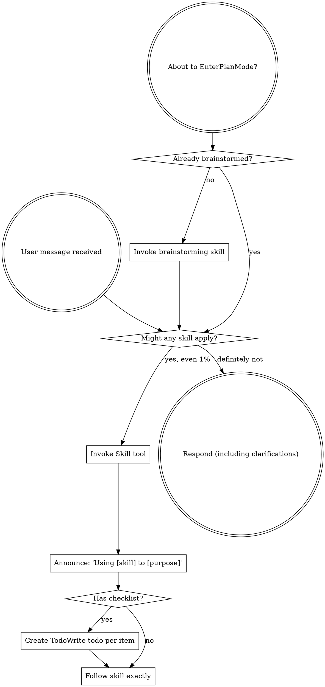
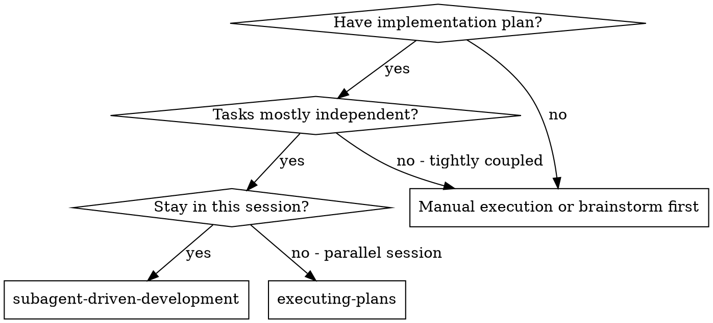
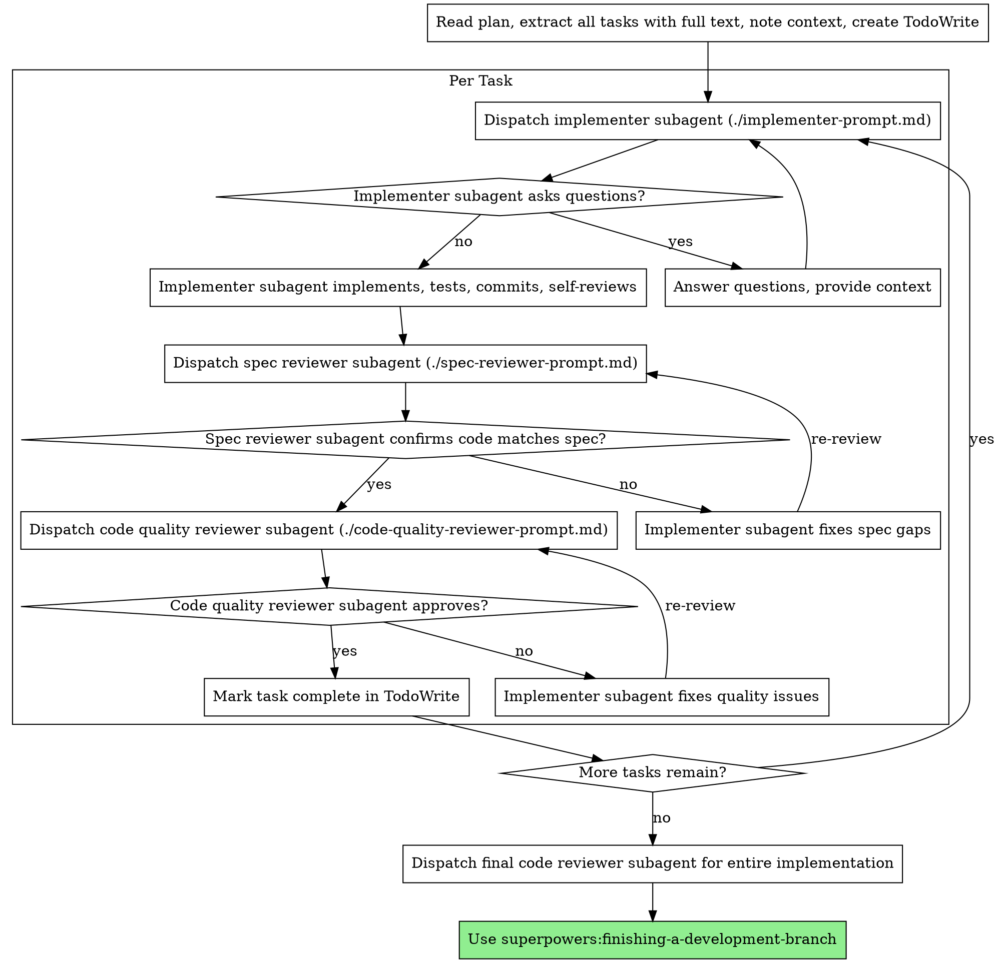
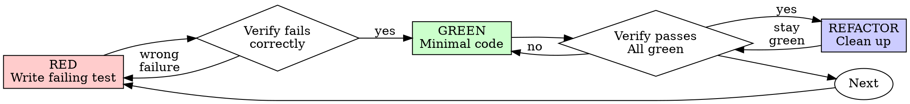

# Codex session 019f1477-9075-71c1-a068-60cc70330821

- Started: `2026-06-29T17:40:12.936Z`
- Working directory: `D:\100XH100`
- Originator: `Codex Desktop`
- Codex CLI: `0.142.3`
- Source log: `C:\Users\Иван Литвак\.codex\sessions\2026\06\29\rollout-2026-06-29T20-40-12-019f1477-9075-71c1-a068-60cc70330821.jsonl`
- Entries: user=4, assistant=78, tool calls=98, tool outputs=98

This is a chronological export of the user/assistant conversation and tool activity. Internal system/developer instructions and token accounting are intentionally excluded. Secret-shaped values are redacted; oversized tool outputs retain their beginning and end with the omitted character count.

## 1. User

Time: `2026-06-29T17:40:30.694Z` · source line `4`

```text
# AGENTS.md instructions for D:\100XH100

<INSTRUCTIONS>
# Project Agent Rules

## Operating Rule
- Read `AGENTS.md` before project edits.
- Update `memory/CHANGELOG.md` after meaningful code, config, or architecture changes.
- Update `memory/PROMPTS.md` with user prompts that define requirements.
- Store test outputs, logs, and verification notes under `test_results/`.
- Prefer agent-centered code: explicit contracts, deterministic tests, small files, low hidden state.

## Architecture Source
- Primary architecture contract: `ARCHITECTURE_NEED.md`.
- Current Stream 4 implementation rule: use threshold + compact + CUB/fixed-temp sort/reduce + compact; do not use Stream 4 hash-table dedup.

## Implementation Guardrails
- `State128` logical bytes are `v[0..119]`.
- `State128` padding bytes are `v[120..127]`.
- Persistent frontier padding must be zero.
- `FinalResponse` may temporarily store `target_local_idx` in `v[120..123]`.
- `Hash128` is one logical 128-bit key stored as `{lo, hi}`.
- `CandidateMeta` must remain 32 bytes and 32-byte aligned.
- Stream 3 payload id must be original candidate id, not compact index.
- Stream 4 must not apply shard top-k or semantic shard cap.

</INSTRUCTIONS>
<environment_context>
  <cwd>D:\100XH100</cwd>
  <shell>powershell</shell>
  <current_date>2026-06-29</current_date>
  <timezone>Europe/Moscow</timezone>
  <filesystem><workspace_roots><root>D:\100XH100</root></workspace_roots><permission_profile type="managed"><file_system type="restricted"><entry access="read"><special>:root</special></entry><entry access="write"><path>D:\100XH100</path></entry><entry access="write"><special>:slash_tmp</special></entry><entry access="write"><special>:tmpdir</special></entry><entry access="read"><path>D:\100XH100\.git</path></entry><entry access="read"><path>D:\100XH100\.agents</path></entry><entry access="read"><path>D:\100XH100\.codex</path></entry></file_system></permission_profile></filesystem>
</environment_context>
```

## 2. User

Time: `2026-06-29T17:40:30.710Z` · source line `6`

```text
You are Worker for Task 6 in subagent-driven workflow: runtime dispatcher wiring for Stream1 piece-transformer. Edit files directly in worktree `D:\100XH100\.worktrees\stream1-piece-transformer`. Current HEAD `6b5dbf58a94714fec965808318f98483680af46a` has standalone transformer forward passing.

Read first:
- `AGENTS.md`
- `cuda/dispatcher.hpp`, `cuda/dispatcher.cu`
- `cuda/stream1.hpp`, `cuda/stream1.cu`
- `tools/stream1_weight_io.hpp`
- `tools/production_runner.cu`
- `tools/stream_benchmark.cu`
- `tests/dispatcher_cuda_tests.cu`
- `tests/stream1_transformer_cuda_tests.cu`
- `memory/CHANGELOG.md`, `memory/PROMPTS.md`

Task 6 goal:
Wire Stream1 piece-transformer into the runtime dispatcher/production runner in a controlled way. This is now allowed; remove fail-closed production/benchmark guards only when the correct transformer path is wired. NO fallback backend.

Required behavior:
1. `DispatcherNetwork` must support either MLP or piece-transformer backend explicitly. Do not overload MLP fields to mean transformer.
2. In `instantiate_cuda_graph_job_templates`, branch Stream1 launch:
   - uniform score mode still memset score ring as before.
   - MLP backend calls `stream1_inference_cutlass_cuda` as before.
   - piece-transformer backend calls `stream1_transformer_inference_cuda` with the correct transformer network view and per-lane scratch view.
   - unknown backend throws.
3. `production_runner.cu` must build the correct dispatcher network from `host_weights.model.backend`:
   - MLP: existing network_dims / Stream1NetworkView / Stream1CutlassScratch lane slicing.
   - piece-transformer: `transformer_network_view(device_weights.transformer, stream1_model)` and `transformer_scratch_view(...)` lane slicing. Use row stride based on transformer scratch dimensions, not MLP hidden fields. If current helper lacks lane slicing, add it cleanly in `stream1_weight_io.hpp`.
4. Runtime sizing must use transformer scratch bytes for piece-transformer. Task 4 helper exists (`stream1_scratch_bytes`); ensure `cuda/runtime_config.cpp` uses it instead of MLP estimate, or otherwise estimates correctly. Do not undercount memory.
5. `stream_benchmark.cu` can remain MLP-only and fail closed for transformer, unless you add explicit transformer benchmark path. Do not leave a misleading partially-wired benchmark.
6. `BEAM_STREAM1_MODE=uniform` should still work for either backend without launching model inference.
7. Add/update tests:
   - Existing dispatcher CUDA test for MLP still compiles/runs.
   - Add or extend a dispatcher-level CUDA test for transformer branch if practical, at least compile/capture using small fixture/reference path. If full graph test is too heavy, add focused test that instantiates ring-slot graph with transformer network and runs one depth on tiny frontier.
   - Production runner compile must pass.
8. Keep production runner logs clear: print backend and transformer dims when backend is piece-transformer; existing MLP hidden logs should not be misleading.
9. Update `memory/CHANGELOG.md`, `memory/PROMPTS.md` if needed, and write `test_results/stream1_transformer_runtime_wiring_2026-06-29.md`.
10. Commit changes.

Verification:
- Run Docker CUDA build/tests if possible using `gpu-dev-cutlass-nsight:cuda128-sm120`.
- Required targets to at least build: `production_runner`, `dispatcher_cuda_tests`, `stream1_transformer_cuda_tests`.
- Run: `stream1_transformer_cuda_tests`; run `stream1_cuda_tests`; run dispatcher test if it is not too expensive.
- If you run a small production runner smoke with transformer weights, use tiny beam/depth and document exact command. Do not submit cluster jobs.

Hard constraints:
- NO fallback backend.
- Do not alter State128, Stream3, Stream4 contracts.
- Do not change exported weight format.
- Do not remove clean-checkout skip behavior from transformer test.
- Keep changes narrow; if architecture looks wrong, stop with NEEDS_CONTEXT.
```

## 3. Codex

Time: `2026-06-29T17:40:53.694Z` · source line `9`

```text
I’ll use the relevant workflow skills first, then read the project rules and target files in the requested worktree before touching code. After that I’ll make the narrow dispatcher/runtime changes and verify the CUDA targets as far as this environment allows.
```

## 4. Codex

Time: `2026-06-29T17:40:53.698Z` · source line `10`

```text
I’ll use the relevant workflow skills first, then read the project rules and target files in the requested worktree before touching code. After that I’ll make the narrow dispatcher/runtime changes and verify the CUDA targets as far as this environment allows.
```

## 5. Tool call: `exec_command`

Time: `2026-06-29T17:40:53.715Z` · source line `11`

```text
{"cmd":"Get-Content -LiteralPath 'C:\\Users\\Иван Литвак\\.codex\\plugins\\cache\\openai-curated-remote\\superpowers\\5.1.4\\skills\\using-superpowers\\SKILL.md'","workdir":"D:\\100XH100","shell":"powershell","max_output_tokens":20000}
```

## 6. Tool call: `exec_command`

Time: `2026-06-29T17:40:53.739Z` · source line `12`

```text
{"cmd":"Get-Content -LiteralPath 'C:\\Users\\Иван Литвак\\.codex\\plugins\\cache\\openai-curated-remote\\superpowers\\5.1.4\\skills\\subagent-driven-development\\SKILL.md'","workdir":"D:\\100XH100","shell":"powershell","max_output_tokens":20000}
```

## 7. Tool call: `exec_command`

Time: `2026-06-29T17:40:53.739Z` · source line `13`

```text
{"cmd":"Get-Content -LiteralPath 'C:\\Users\\Иван Литвак\\.codex\\plugins\\cache\\openai-curated-remote\\superpowers\\5.1.4\\skills\\test-driven-development\\SKILL.md'","workdir":"D:\\100XH100","shell":"powershell","max_output_tokens":20000}
```

## 8. Tool call: `exec_command`

Time: `2026-06-29T17:40:53.740Z` · source line `14`

```text
{"cmd":"rg -n \"stream1|piece-transformer|BEAM_PREBUILT_RUNNER|D:\\\\100XH100|cayleypy-beam-results\" 'C:\\Users\\Иван Литвак\\.codex\\memories\\MEMORY.md'","workdir":"D:\\100XH100","shell":"powershell","max_output_tokens":12000}
```

## 9. Tool output

Time: `2026-06-29T17:40:53.998Z` · source line `15`

````text
Chunk ID: 24d84b
Wall time: 0.0893 seconds
Process exited with code 0
Original token count: 1393
Output:
---
name: using-superpowers
description: Use when starting any conversation - establishes how to find and use skills, requiring Skill tool invocation before ANY response including clarifying questions
---

<SUBAGENT-STOP>
If you were dispatched as a subagent to execute a specific task, skip this skill.
</SUBAGENT-STOP>

<EXTREMELY-IMPORTANT>
If you think there is even a 1% chance a skill might apply to what you are doing, you ABSOLUTELY MUST invoke the skill.

IF A SKILL APPLIES TO YOUR TASK, YOU DO NOT HAVE A CHOICE. YOU MUST USE IT.

This is not negotiable. This is not optional. You cannot rationalize your way out of this.
</EXTREMELY-IMPORTANT>

## Instruction Priority

Superpowers skills override default system prompt behavior, but **user instructions always take precedence**:

1. **User's explicit instructions** (CLAUDE.md, GEMINI.md, AGENTS.md, direct requests) — highest priority
2. **Superpowers skills** — override default system behavior where they conflict
3. **Default system prompt** — lowest priority

If CLAUDE.md, GEMINI.md, or AGENTS.md says "don't use TDD" and a skill says "always use TDD," follow the user's instructions. The user is in control.

## How to Access Skills

**In Claude Code:** Use the `Skill` tool. When you invoke a skill, its content is loaded and presented to you—follow it directly. Never use the Read tool on skill files.

**In Copilot CLI:** Use the `skill` tool. Skills are auto-discovered from installed plugins. The `skill` tool works the same as Claude Code's `Skill` tool.

**In Gemini CLI:** Skills activate via the `activate_skill` tool. Gemini loads skill metadata at session start and activates the full content on demand.

**In other environments:** Check your platform's documentation for how skills are loaded.

## Platform Adaptation

Skills use Claude Code tool names. Non-CC platforms: see `references/copilot-tools.md` (Copilot CLI), `references/codex-tools.md` (Codex) for tool equivalents. Gemini CLI users get the tool mapping loaded automatically via GEMINI.md.

# Using Skills

## The Rule

**Invoke relevant or requested skills BEFORE any response or action.** Even a 1% chance a skill might apply means that you should invoke the skill to check. If an invoked skill turns out to be wrong for the situation, you don't need to use it.



## Red Flags

These thoughts mean STOP—you're rationalizing:

| Thought | Reality |
|---------|---------|
| "This is just a simple question" | Questions are tasks. Check for skills. |
| "I need more context first" | Skill check comes BEFORE clarifying questions. |
| "Let me explore the codebase first" | Skills tell you HOW to explore. Check first. |
| "I can check git/files quickly" | Files lack conversation context. Check for skills. |
| "Let me gather information first" | Skills tell you HOW to gather information. |
| "This doesn't need a formal skill" | If a skill exists, use it. |
| "I remember this skill" | Skills evolve. Read current version. |
| "This doesn't count as a task" | Action = task. Check for skills. |
| "The skill is overkill" | Simple things become complex. Use it. |
| "I'll just do this one thing first" | Check BEFORE doing anything. |
| "This feels productive" | Undisciplined action wastes time. Skills prevent this. |
| "I know what that means" | Knowing the concept в‰  using the skill. Invoke it. |

## Skill Priority

When multiple skills could apply, use this order:

1. **Process skills first** (brainstorming, debugging) - these determine HOW to approach the task
2. **Implementation skills second** (frontend-design, mcp-builder) - these guide execution

"Let's build X" в†’ brainstorming first, then implementation skills.
"Fix this bug" в†’ debugging first, then domain-specific skills.

## Skill Types

**Rigid** (TDD, debugging): Follow exactly. Don't adapt away discipline.

**Flexible** (patterns): Adapt principles to context.

The skill itself tells you which.

## User Instructions

Instructions say WHAT, not HOW. "Add X" or "Fix Y" doesn't mean skip workflows.

````

## 10. Tool output

Time: `2026-06-29T17:40:54.073Z` · source line `16`

````text
Chunk ID: 02c950
Wall time: 0.1148 seconds
Process exited with code 0
Original token count: 3217
Output:
---
name: subagent-driven-development
description: Use when executing implementation plans with independent tasks in the current session
---

# Subagent-Driven Development

Execute plan by dispatching fresh subagent per task, with two-stage review after each: spec compliance review first, then code quality review.

**Why subagents:** You delegate tasks to specialized agents with isolated context. By precisely crafting their instructions and context, you ensure they stay focused and succeed at their task. They should never inherit your session's context or history — you construct exactly what they need. This also preserves your own context for coordination work.

**Core principle:** Fresh subagent per task + two-stage review (spec then quality) = high quality, fast iteration

**Continuous execution:** Do not pause to check in with your human partner between tasks. Execute all tasks from the plan without stopping. The only reasons to stop are: BLOCKED status you cannot resolve, ambiguity that genuinely prevents progress, or all tasks complete. "Should I continue?" prompts and progress summaries waste their time — they asked you to execute the plan, so execute it.

## When to Use



**vs. Executing Plans (parallel session):**
- Same session (no context switch)
- Fresh subagent per task (no context pollution)
- Two-stage review after each task: spec compliance first, then code quality
- Faster iteration (no human-in-loop between tasks)

## The Process



## Model Selection

Use the least powerful model that can handle each role to conserve cost and increase speed.

**Mechanical implementation tasks** (isolated functions, clear specs, 1-2 files): use a fast, cheap model. Most implementation tasks are mechanical when the plan is well-specified.

**Integration and judgment tasks** (multi-file coordination, pattern matching, debugging): use a standard model.

**Architecture, design, and review tasks**: use the most capable available model.

**Task complexity signals:**
- Touches 1-2 files with a complete spec в†’ cheap model
- Touches multiple files with integration concerns в†’ standard model
- Requires design judgment or broad codebase understanding в†’ most capable model

## Handling Implementer Status

Implementer subagents report one of four statuses. Handle each appropriately:

**DONE:** Proceed to spec compliance review.

**DONE_WITH_CONCERNS:** The implementer completed the work but flagged doubts. Read the concerns before proceeding. If the concerns are about correctness or scope, address them before review. If they're observations (e.g., "this file is getting large"), note them and proceed to review.

**NEEDS_CONTEXT:** The implementer needs information that wasn't provided. Provide the missing context and re-dispatch.

**BLOCKED:** The implementer cannot complete the task. Assess the blocker:
1. If it's a context problem, provide more context and re-dispatch with the same model
2. If the task requires more reasoning, re-dispatch with a more capable model
3. If the task is too large, break it into smaller pieces
4. If the plan itself is wrong, escalate to the human

**Never** ignore an escalation or force the same model to retry without changes. If the implementer said it's stuck, something needs to change.

## Prompt Templates

- `./implementer-prompt.md` - Dispatch implementer subagent
- `./spec-reviewer-prompt.md` - Dispatch spec compliance reviewer subagent
- `./code-quality-reviewer-prompt.md` - Dispatch code quality reviewer subagent

## Example Workflow

```
You: I'm using Subagent-Driven Development to execute this plan.

[Read plan file once: docs/superpowers/plans/feature-plan.md]
[Extract all 5 tasks with full text and context]
[Create TodoWrite with all tasks]

Task 1: Hook installation script

[Get Task 1 text and context (already extracted)]
[Dispatch implementation subagent with full task text + context]

Implementer: "Before I begin - should the hook be installed at user or system level?"

You: "User level (~/.config/superpowers/hooks/)"

Implementer: "Got it. Implementing now..."
[Later] Implementer:
  - Implemented install-hook command
  - Added tests, 5/5 passing
  - Self-review: Found I missed --force flag, added it
  - Committed

[Dispatch spec compliance reviewer]
Spec reviewer: вњ… Spec compliant - all requirements met, nothing extra

[Get git SHAs, dispatch code quality reviewer]
Code reviewer: Strengths: Good test coverage, clean. Issues: None. Approved.

[Mark Task 1 complete]

Task 2: Recovery modes

[Get Task 2 text and context (already extracted)]
[Dispatch implementation subagent with full task text + context]

Implementer: [No questions, proceeds]
Implementer:
  - Added verify/repair modes
  - 8/8 tests passing
  - Self-review: All good
  - Committed

[Dispatch spec compliance reviewer]
Spec reviewer: вќЊ Issues:
  - Missing: Progress reporting (spec says "report every 100 items")
  - Extra: Added --json flag (not requested)

[Implementer fixes issues]
Implementer: Removed --json flag, added progress reporting

[Spec reviewer reviews again]
Spec reviewer: вњ… Spec compliant now

[Dispatch code quality reviewer]
Code reviewer: Strengths: Solid. Issues (Important): Magic number (100)

[Implementer fixes]
Implementer: Extracted PROGRESS_INTERVAL constant

[Code reviewer reviews again]
Code reviewer: вњ… Approved

[Mark Task 2 complete]

...

[After all tasks]
[Dispatch final code-reviewer]
Final reviewer: All requirements met, ready to merge

Done!
```

## Advantages

**vs. Manual execution:**
- Subagents follow TDD naturally
- Fresh context per task (no confusion)
- Parallel-safe (subagents don't interfere)
- Subagent can ask questions (before AND during work)

**vs. Executing Plans:**
- Same session (no handoff)
- Continuous progress (no waiting)
- Review checkpoints automatic

**Efficiency gains:**
- No file reading overhead (controller provides full text)
- Controller curates exactly what context is needed
- Subagent gets complete information upfront
- Questions surfaced before work begins (not after)

**Quality gates:**
- Self-review catches issues before handoff
- Two-stage review: spec compliance, then code quality
- Review loops ensure fixes actually work
- Spec compliance prevents over/under-building
- Code quality ensures implementation is well-built

**Cost:**
- More subagent invocations (implementer + 2 reviewers per task)
- Controller does more prep work (extracting all tasks upfront)
- Review loops add iterations
- But catches issues early (cheaper than debugging later)

## Red Flags

**Never:**
- Start implementation on main/master branch without explicit user consent
- Skip reviews (spec compliance OR code quality)
- Proceed with unfixed issues
- Dispatch multiple implementation subagents in parallel (conflicts)
- Make subagent read plan file (provide full text instead)
- Skip scene-setting context (subagent needs to understand where task fits)
- Ignore subagent questions (answer before letting them proceed)
- Accept "close enough" on spec compliance (spec reviewer found issues = not done)
- Skip review loops (reviewer found issues = implementer fixes = review again)
- Let implementer self-review replace actual review (both are needed)
- **Start code quality review before spec compliance is вњ…** (wrong order)
- Move to next task while either review has open issues

**If subagent asks questions:**
- Answer clearly and completely
- Provide additional context if needed
- Don't rush them into implementation

**If reviewer finds issues:**
- Implementer (same subagent) fixes them
- Reviewer reviews again
- Repeat until approved
- Don't skip the re-review

**If subagent fails task:**
- Dispatch fix subagent with specific instructions
- Don't try to fix manually (context pollution)

## Integration

**Required workflow skills:**
- **superpowers:using-git-worktrees** - Ensures isolated workspace (creates one or verifies existing)
- **superpowers:writing-plans** - Creates the plan this skill executes
- **superpowers:requesting-code-review** - Code review template for reviewer subagents
- **superpowers:finishing-a-development-branch** - Complete development after all tasks

**Subagents should use:**
- **superpowers:test-driven-development** - Subagents follow TDD for each task

**Alternative workflow:**
- **superpowers:executing-plans** - Use for parallel session instead of same-session execution

````

## 11. Tool output

Time: `2026-06-29T17:40:54.082Z` · source line `17`

````text
Chunk ID: cec7e2
Wall time: 0.1349 seconds
Process exited with code 0
Original token count: 2565
Output:
---
name: test-driven-development
description: Use when implementing any feature or bugfix, before writing implementation code
---

# Test-Driven Development (TDD)

## Overview

Write the test first. Watch it fail. Write minimal code to pass.

**Core principle:** If you didn't watch the test fail, you don't know if it tests the right thing.

**Violating the letter of the rules is violating the spirit of the rules.**

## When to Use

**Always:**
- New features
- Bug fixes
- Refactoring
- Behavior changes

**Exceptions (ask your human partner):**
- Throwaway prototypes
- Generated code
- Configuration files

Thinking "skip TDD just this once"? Stop. That's rationalization.

## The Iron Law

```
NO PRODUCTION CODE WITHOUT A FAILING TEST FIRST
```

Write code before the test? Delete it. Start over.

**No exceptions:**
- Don't keep it as "reference"
- Don't "adapt" it while writing tests
- Don't look at it
- Delete means delete

Implement fresh from tests. Period.

## Red-Green-Refactor



### RED - Write Failing Test

Write one minimal test showing what should happen.

<Good>
```typescript
test('retries failed operations 3 times', async () => {
  let attempts = 0;
  const operation = () => {
    attempts++;
    if (attempts < 3) throw new Error('fail');
    return 'success';
  };

  const result = await retryOperation(operation);

  expect(result).toBe('success');
  expect(attempts).toBe(3);
});
```
Clear name, tests real behavior, one thing
</Good>

<Bad>
```typescript
test('retry works', async () => {
  const mock = jest.fn()
    .mockRejectedValueOnce(new Error())
    .mockRejectedValueOnce(new Error())
    .mockResolvedValueOnce('success');
  await retryOperation(mock);
  expect(mock).toHaveBeenCalledTimes(3);
});
```
Vague name, tests mock not code
</Bad>

**Requirements:**
- One behavior
- Clear name
- Real code (no mocks unless unavoidable)

### Verify RED - Watch It Fail

**MANDATORY. Never skip.**

```bash
npm test path/to/test.test.ts
```

Confirm:
- Test fails (not errors)
- Failure message is expected
- Fails because feature missing (not typos)

**Test passes?** You're testing existing behavior. Fix test.

**Test errors?** Fix error, re-run until it fails correctly.

### GREEN - Minimal Code

Write simplest code to pass the test.

<Good>
```typescript
async function retryOperation<T>(fn: () => Promise<T>): Promise<T> {
  for (let i = 0; i < 3; i++) {
    try {
      return await fn();
    } catch (e) {
      if (i === 2) throw e;
    }
  }
  throw new Error('unreachable');
}
```
Just enough to pass
</Good>

<Bad>
```typescript
async function retryOperation<T>(
  fn: () => Promise<T>,
  options?: {
    maxRetries?: number;
    backoff?: 'linear' | 'exponential';
    onRetry?: (attempt: number) => void;
  }
): Promise<T> {
  // YAGNI
}
```
Over-engineered
</Bad>

Don't add features, refactor other code, or "improve" beyond the test.

### Verify GREEN - Watch It Pass

**MANDATORY.**

```bash
npm test path/to/test.test.ts
```

Confirm:
- Test passes
- Other tests still pass
- Output pristine (no errors, warnings)

**Test fails?** Fix code, not test.

**Other tests fail?** Fix now.

### REFACTOR - Clean Up

After green only:
- Remove duplication
- Improve names
- Extract helpers

Keep tests green. Don't add behavior.

### Repeat

Next failing test for next feature.

## Good Tests

| Quality | Good | Bad |
|---------|------|-----|
| **Minimal** | One thing. "and" in name? Split it. | `test('validates email and domain and whitespace')` |
| **Clear** | Name describes behavior | `test('test1')` |
| **Shows intent** | Demonstrates desired API | Obscures what code should do |

## Why Order Matters

**"I'll write tests after to verify it works"**

Tests written after code pass immediately. Passing immediately proves nothing:
- Might test wrong thing
- Might test implementation, not behavior
- Might miss edge cases you forgot
- You never saw it catch the bug

Test-first forces you to see the test fail, proving it actually tests something.

**"I already manually tested all the edge cases"**

Manual testing is ad-hoc. You think you tested everything but:
- No record of what you tested
- Can't re-run when code changes
- Easy to forget cases under pressure
- "It worked when I tried it" в‰  comprehensive

Automated tests are systematic. They run the same way every time.

**"Deleting X hours of work is wasteful"**

Sunk cost fallacy. The time is already gone. Your choice now:
- Delete and rewrite with TDD (X more hours, high confidence)
- Keep it and add tests after (30 min, low confidence, likely bugs)

The "waste" is keeping code you can't trust. Working code without real tests is technical debt.

**"TDD is dogmatic, being pragmatic means adapting"**

TDD IS pragmatic:
- Finds bugs before commit (faster than debugging after)
- Prevents regressions (tests catch breaks immediately)
- Documents behavior (tests show how to use code)
- Enables refactoring (change freely, tests catch breaks)

"Pragmatic" shortcuts = debugging in production = slower.

**"Tests after achieve the same goals - it's spirit not ritual"**

No. Tests-after answer "What does this do?" Tests-first answer "What should this do?"

Tests-after are biased by your implementation. You test what you built, not what's required. You verify remembered edge cases, not discovered ones.

Tests-first force edge case discovery before implementing. Tests-after verify you remembered everything (you didn't).

30 minutes of tests after в‰  TDD. You get coverage, lose proof tests work.

## Common Rationalizations

| Excuse | Reality |
|--------|---------|
| "Too simple to test" | Simple code breaks. Test takes 30 seconds. |
| "I'll test after" | Tests passing immediately prove nothing. |
| "Tests after achieve same goals" | Tests-after = "what does this do?" Tests-first = "what should this do?" |
| "Already manually tested" | Ad-hoc в‰  systematic. No record, can't re-run. |
| "Deleting X hours is wasteful" | Sunk cost fallacy. Keeping unverified code is technical debt. |
| "Keep as reference, write tests first" | You'll adapt it. That's testing after. Delete means delete. |
| "Need to explore first" | Fine. Throw away exploration, start with TDD. |
| "Test hard = design unclear" | Listen to test. Hard to test = hard to use. |
| "TDD will slow me down" | TDD faster than debugging. Pragmatic = test-first. |
| "Manual test faster" | Manual doesn't prove edge cases. You'll re-test every change. |
| "Existing code has no tests" | You're improving it. Add tests for existing code. |

## Red Flags - STOP and Start Over

- Code before test
- Test after implementation
- Test passes immediately
- Can't explain why test failed
- Tests added "later"
- Rationalizing "just this once"
- "I already manually tested it"
- "Tests after achieve the same purpose"
- "It's about spirit not ritual"
- "Keep as reference" or "adapt existing code"
- "Already spent X hours, deleting is wasteful"
- "TDD is dogmatic, I'm being pragmatic"
- "This is different because..."

**All of these mean: Delete code. Start over with TDD.**

## Example: Bug Fix

**Bug:** Empty email accepted

**RED**
```typescript
test('rejects empty email', async () => {
  const result = await submitForm({ email: '' });
  expect(result.error).toBe('Email required');
});
```

**Verify RED**
```bash
$ npm test
FAIL: expected 'Email required', got undefined
```

**GREEN**
```typescript
function submitForm(data: FormData) {
  if (!data.email?.trim()) {
    return { error: 'Email required' };
  }
  // ...
}
```

**Verify GREEN**
```bash
$ npm test
PASS
```

**REFACTOR**
Extract validation for multiple fields if needed.

## Verification Checklist

Before marking work complete:

- [ ] Every new function/method has a test
- [ ] Watched each test fail before implementing
- [ ] Each test failed for expected reason (feature missing, not typo)
- [ ] Wrote minimal code to pass each test
- [ ] All tests pass
- [ ] Output pristine (no errors, warnings)
- [ ] Tests use real code (mocks only if unavoidable)
- [ ] Edge cases and errors covered

Can't check all boxes? You skipped TDD. Start over.

## When Stuck

| Problem | Solution |
|---------|----------|
| Don't know how to test | Write wished-for API. Write assertion first. Ask your human partner. |
| Test too complicated | Design too complicated. Simplify interface. |
| Must mock everything | Code too coupled. Use dependency injection. |
| Test setup huge | Extract helpers. Still complex? Simplify design. |

## Debugging Integration

Bug found? Write failing test reproducing it. Follow TDD cycle. Test proves fix and prevents regression.

Never fix bugs without a test.

## Testing Anti-Patterns

When adding mocks or test utilities, read @testing-anti-patterns.md to avoid common pitfalls:
- Testing mock behavior instead of real behavior
- Adding test-only methods to production classes
- Mocking without understanding dependencies

## Final Rule

```
Production code в†’ test exists and failed first
Otherwise в†’ not TDD
```

No exceptions without your human partner's permission.

````

## 12. Tool output

Time: `2026-06-29T17:40:54.082Z` · source line `18`

```text
Chunk ID: 2dbf62
Wall time: 0.0712 seconds
Process exited with code 0
Original token count: 625
Output:
48:applies_to: cwd=D:\100XH100; reuse_rule=reuse for this IHES/MEPhI repo family and adjacent cluster publish jobs, but treat live cluster inventory, DNS availability, and current results-repo schema as run-specific and recheck them before publishing.
54:- rollout_summaries/2026-06-04T15-47-52-Dd1O-ihes_cluster_results_prebuilt_publish_backfill.md (cwd=\\?\D:\100XH100, rollout_path=\\?\C:\Users\Иван Литвак\.codex\sessions\2026\06\04\rollout-2026-06-04T18-47-57-019e9351-cd3b-71c0-bf8b-69755d08d5fc.jsonl, updated_at=2026-06-26T19:51:22+00:00, thread_id=019e9351-cd3b-71c0-bf8b-69755d08d5fc, the prebuilt runner was compiled once and reused across the A100 array workflow)
58:- MEPhI HPC, kaf12, A100 40GB, BEAM_PREBUILT_RUNNER, prepare_ihes_prebuilt_runner.sh, ihes_solve_bucket_from_scratch.sh, prebuilt_runner_ready, using_prebuilt_runner, PUZZLE_LIMIT=1, depth=12
64:- rollout_summaries/2026-06-04T15-47-52-Dd1O-ihes_cluster_results_prebuilt_publish_backfill.md (cwd=\\?\D:\100XH100, rollout_path=\\?\C:\Users\Иван Литвак\.codex\sessions\2026\06\04\rollout-2026-06-04T18-47-57-019e9351-cd3b-71c0-bf8b-69755d08d5fc.jsonl, updated_at=2026-06-26T19:51:22+00:00, thread_id=019e9351-cd3b-71c0-bf8b-69755d08d5fc, the results repo structure and first backfilled puzzle sets were established)
68:- cayleypy-beam-results, p0027, p0031, p0033, data/ihes_cube/index.tsv, improvements.tsv, unique_solutions.tsv, metadata.env, summary.md, solve_bucket_fresh, github.com DNS
74:- rollout_summaries/2026-06-04T15-47-52-Dd1O-ihes_cluster_results_prebuilt_publish_backfill.md (cwd=\\?\D:\100XH100, rollout_path=\\?\C:\Users\Иван Литвак\.codex\sessions\2026\06\04\rollout-2026-06-04T18-47-57-019e9351-cd3b-71c0-bf8b-69755d08d5fc.jsonl, updated_at=2026-06-26T19:51:22+00:00, thread_id=019e9351-cd3b-71c0-bf8b-69755d08d5fc, a file-driven inventory plus schema fixes made the larger aggregator path workable)
89:- `hpc/ihes_cube_model/prepare_ihes_prebuilt_runner.sh` builds the shared binary at `/mnt/pool/6/vokirova/beam8a100/ihes_cube_model/prebuilt-a100-ihes/production_runner`, and `hpc/ihes_cube_model/ihes_solve_bucket_from_scratch.sh` already knows how to consume `BEAM_PREBUILT_RUNNER` [Task 1]
97:- symptom: each array task recompiles instead of reusing the solver. cause: `BEAM_PREBUILT_RUNNER` was not wired through a separate prebuild dependency. fix: submit the prebuild first and make the puzzle array depend on it via `--dependency=afterok:<prebuild_job>` [Task 1]

```

## 13. Codex

Time: `2026-06-29T17:41:07.704Z` · source line `21`

```text
Using `subagent-driven-development` only as context because I’m already the dispatched worker for Task 6, and `test-driven-development` for the behavior change. I also did a quick memory lookup for this repo family; it only pointed to general D:\100XH100 operating context, not specific Stream1 transformer wiring.
```

## 14. Codex

Time: `2026-06-29T17:41:07.708Z` · source line `22`

```text
Using `subagent-driven-development` only as context because I’m already the dispatched worker for Task 6, and `test-driven-development` for the behavior change. I also did a quick memory lookup for this repo family; it only pointed to general D:\100XH100 operating context, not specific Stream1 transformer wiring.
```

## 15. Tool call: `exec_command`

Time: `2026-06-29T17:41:07.727Z` · source line `23`

```text
{"cmd":"Get-Content -LiteralPath 'D:\\100XH100\\.worktrees\\stream1-piece-transformer\\AGENTS.md'","workdir":"D:\\100XH100\\.worktrees\\stream1-piece-transformer","shell":"powershell","max_output_tokens":20000}
```

## 16. Tool call: `exec_command`

Time: `2026-06-29T17:41:07.731Z` · source line `24`

```text
{"cmd":"Get-Content -LiteralPath 'D:\\100XH100\\.worktrees\\stream1-piece-transformer\\cuda\\dispatcher.hpp'","workdir":"D:\\100XH100\\.worktrees\\stream1-piece-transformer","shell":"powershell","max_output_tokens":30000}
```

## 17. Tool call: `exec_command`

Time: `2026-06-29T17:41:07.737Z` · source line `25`

```text
{"cmd":"Get-Content -LiteralPath 'D:\\100XH100\\.worktrees\\stream1-piece-transformer\\cuda\\dispatcher.cu'","workdir":"D:\\100XH100\\.worktrees\\stream1-piece-transformer","shell":"powershell","max_output_tokens":50000}
```

## 18. Tool call: `exec_command`

Time: `2026-06-29T17:41:07.749Z` · source line `26`

```text
{"cmd":"Get-Content -LiteralPath 'D:\\100XH100\\.worktrees\\stream1-piece-transformer\\cuda\\stream1.hpp'","workdir":"D:\\100XH100\\.worktrees\\stream1-piece-transformer","shell":"powershell","max_output_tokens":40000}
```

## 19. Tool call: `exec_command`

Time: `2026-06-29T17:41:07.762Z` · source line `27`

```text
{"cmd":"Get-Content -LiteralPath 'D:\\100XH100\\.worktrees\\stream1-piece-transformer\\cuda\\stream1.cu'","workdir":"D:\\100XH100\\.worktrees\\stream1-piece-transformer","shell":"powershell","max_output_tokens":50000}
```

## 20. Tool output

Time: `2026-06-29T17:41:08.012Z` · source line `28`

```text
Chunk ID: f2dfa3
Wall time: 0.0818 seconds
Process exited with code 0
Original token count: 290
Output:
# Project Agent Rules

## Operating Rule
- Read `AGENTS.md` before project edits.
- Update `memory/CHANGELOG.md` after meaningful code, config, or architecture changes.
- Update `memory/PROMPTS.md` with user prompts that define requirements.
- Store test outputs, logs, and verification notes under `test_results/`.
- Prefer agent-centered code: explicit contracts, deterministic tests, small files, low hidden state.

## Architecture Source
- Primary architecture contract: `ARCHITECTURE_NEED.md`.
- Current Stream 4 implementation rule: use threshold + compact + CUB/fixed-temp sort/reduce + compact; do not use Stream 4 hash-table dedup.

## Implementation Guardrails
- `State128` logical bytes are `v[0..119]`.
- `State128` padding bytes are `v[120..127]`.
- Persistent frontier padding must be zero.
- `FinalResponse` may temporarily store `target_local_idx` in `v[120..123]`.
- `Hash128` is one logical 128-bit key stored as `{lo, hi}`.
- `CandidateMeta` must remain 32 bytes and 32-byte aligned.
- Stream 3 payload id must be original candidate id, not compact index.
- Stream 4 must not apply shard top-k or semantic shard cap.

```

## 21. Tool output

Time: `2026-06-29T17:41:08.081Z` · source line `29`

```text
Chunk ID: 50e9b4
Wall time: 0.1446 seconds
Process exited with code 0
Original token count: 2681
Output:
#pragma once

#include "static_memory.hpp"
#include "stream1.hpp"
#include "stream2.hpp"

#include <cuda_runtime.h>
#include <nccl.h>

#include <array>
#include <cstdint>
#include <vector>

#ifndef BEAM_DEBUG_DEPTH_FLOW_TRACE
#define BEAM_DEBUG_DEPTH_FLOW_TRACE 0
#endif

namespace beam {

struct DispatcherStreams {
    cudaStream_t stream1 = nullptr;
    cudaStream_t stream2 = nullptr;
    cudaStream_t stream3 = nullptr;
    cudaStream_t stream4 = nullptr;
    cudaStream_t stream5 = nullptr;
    std::vector<cudaStream_t> stream1_lanes;
    std::vector<cudaStream_t> stream2_lanes;
    std::vector<cudaStream_t> stream4_slot_streams;
    std::vector<cudaEvent_t> stream4_slot_done;
    std::array<cudaEvent_t, 3> final_build_done{};
    std::array<cudaEvent_t, 3> final_history_done{};
    std::array<cudaEvent_t, 3> final_request_done{};
    std::array<cudaEvent_t, 3> final_response_ready{};
    std::array<cudaEvent_t, 3> final_response_done{};
};

struct DispatcherEvents {
    cudaEvent_t stream1_done = nullptr;
    cudaEvent_t stream2_done = nullptr;
    cudaEvent_t stream3_done = nullptr;
    std::vector<cudaEvent_t> stream1_lane_done;
    std::vector<cudaEvent_t> stream2_lane_done;
};

struct CudaGraphJobTemplates {
    std::vector<cudaGraph_t> ring_slot_graphs;
    std::vector<cudaGraphExec_t> ring_slot_execs;
    std::vector<cudaGraph_t> stream3_ring_graphs;
    std::vector<cudaGraphExec_t> stream3_ring_execs;
    std::vector<cudaGraph_t> stream4_shard_graphs;
    std::vector<cudaGraphExec_t> stream4_shard_execs;
};

struct DispatcherDeviceTables {
    const std::uint8_t* generators = nullptr;
    const State128* central_state = nullptr;
    const Hash128* zobrist = nullptr;
};

struct DispatcherNetwork {
    Stream1NetworkView view;
    std::vector<Stream1CutlassScratch> scratch_lanes;
    bool uniform_score = false;
};

struct DispatcherCollective {
    ncclComm_t comm = nullptr;
};

struct GeneratedTrackRequest {
    bool enabled = false;
    std::uint64_t parent_idx = UINT64_MAX;
    std::uint8_t move = 0;
};

struct GeneratedTrackResult {
    bool enabled = false;
    bool found = false;
    std::uint64_t request_parent_idx = UINT64_MAX;
    std::uint8_t request_move = 0;
    std::uint32_t ring = UINT32_MAX;
    std::uint32_t ring_slot = UINT32_MAX;
    std::uint32_t job = UINT32_MAX;
    std::uint64_t parent_base = 0;
    std::uint32_t count = 0;
    std::uint32_t parent_local = UINT32_MAX;
    std::uint64_t payload_id = UINT64_MAX;
    std::uint64_t score_ring_offset = UINT64_MAX;
    std::uint32_t score_key = UINT32_MAX;
    Hash128 hash{UINT64_MAX, UINT64_MAX};
    std::uint8_t owner = UINT8_MAX;
    std::uint32_t shard = UINT32_MAX;
    std::uint32_t current_threshold = UINT32_MAX;
    bool parent_state_copied = false;
    State128 parent_state{};
    bool all_move_scores_copied = false;
    std::array<std::uint32_t, MOVE_COUNT> move_score_keys{};
};

struct Stream4TrackResult {
    bool enabled = false;
    Hash128 hash{UINT64_MAX, UINT64_MAX};
    std::uint32_t score_key = UINT32_MAX;
    std::uint32_t shard = UINT32_MAX;

    bool after_stream3_scanned = false;
    bool after_stream3_found = false;
    std::uint32_t after_stream3_location = UINT32_MAX;
    std::uint32_t after_stream3_local = UINT32_MAX;
    std::uint32_t after_stream3_clean_count = 0;
    std::uint32_t after_stream3_dirty_count = 0;
    std::uint32_t after_stream3_active_spill_count = 0;
    std::uint32_t after_stream3_inactive_spill_count = 0;
    std::uint32_t after_stream3_threshold = UINT32_MAX;

    std::uint32_t input_scan_count = 0;
    bool input_found = false;
    std::uint32_t input_slot = UINT32_MAX;
    std::uint32_t input_job = UINT32_MAX;
    std::uint32_t input_location = UINT32_MAX;
    std::uint32_t input_local = UINT32_MAX;
    std::uint32_t input_clean_count = 0;
    std::uint32_t input_dirty_count = 0;
    std::uint32_t input_threshold = UINT32_MAX;

    std::uint32_t output_scan_count = 0;
    bool output_found = false;
    std::uint32_t output_slot = UINT32_MAX;
    std::uint32_t output_job = UINT32_MAX;
    std::uint32_t output_local = UINT32_MAX;
    std::uint32_t output_clean_count = 0;
    std::uint32_t output_dirty_count = 0;
    std::uint32_t output_threshold = UINT32_MAX;
};

struct Stream4TrackEvent {
    std::uint32_t phase = 0;
    bool found = false;
    std::uint32_t shard = UINT32_MAX;
    std::uint32_t slot = UINT32_MAX;
    std::uint32_t job = UINT32_MAX;
    std::uint32_t location = UINT32_MAX;
    std::uint32_t local = UINT32_MAX;
    std::uint32_t clean_count = 0;
    std::uint32_t dirty_count = 0;
    std::uint32_t active_spill_count = 0;
    std::uint32_t inactive_spill_count = 0;
    std::uint32_t threshold = UINT32_MAX;
    std::uint32_t score_key = UINT32_MAX;
};

struct Stream3TrackResult {
    bool enabled = false;
    bool scanned = false;
    bool unique_found = false;
    std::uint32_t unique_local = UINT32_MAX;
    std::uint32_t unique_count = 0;
    std::uint32_t unique_score_key = UINT32_MAX;
    std::uint32_t unique_payload_id = UINT32_MAX;
    std::uint64_t unique_parent_idx = UINT64_MAX;
    std::uint8_t unique_move = UINT8_MAX;

    bool partition_found = false;
    std::uint32_t partition_local = UINT32_MAX;
    std::uint32_t local_pending_count = 0;
    std::uint32_t partition_unique_count = 0;
    std::uint32_t group_offset = UINT32_MAX;
    std::uint32_t group_raw_count = 0;
    std::uint32_t local_in_group = UINT32_MAX;
    std::uint32_t shard_write_count = 0;
    std::uint32_t shard_spill_count = 0;
    std::uint32_t shard_spill_offset = UINT32_MAX;
    std::uint32_t spill_idx = UINT32_MAX;
    std::uint32_t spill_capacity = 0;
    bool spill_capacity_drop = false;

    std::uint32_t clean_count = 0;
    std::uint32_t dirty_count = 0;
    std::uint32_t processing_flag = 0;
    std::uint32_t active_spill_count = 0;
    std::uint32_t inactive_spill_count = 0;
};

struct DepthDispatchState {
    std::uint64_t frontier_cursor = 0;
    std::uint64_t frontier_size = 0;
    std::uint32_t ring_slot_jobs_launched = 0;
    std::uint32_t stream3_jobs_launched = 0;
    std::uint32_t stream4_jobs_launched = 0;
    std::uint32_t stream4_active_sort_slots_used = 0;
    std::uint32_t threshold_updates = 0;
    double stream12_ms_total = 0.0;
    double stream12_ms_max = 0.0;
    double stream3_ring_ms_total = 0.0;
    double stream3_ring_ms_max = 0.0;
    double stream3_spill_drain_ms_total = 0.0;
    double stream4_ms_total = 0.0;
    double stream4_ms_max = 0.0;
    double stream5_ms_total = 0.0;
    std::uint32_t stream4_pending_shards_max = 0;
    std::uint32_t stream4_busy_slots_max = 0;
    std::uint32_t global_spill_peak = 0;
#if BEAM_DEBUG_DEPTH_FLOW_TRACE
    std::uint32_t depth_for_log = UINT32_MAX;
    std::uint32_t threshold_start = UINT32_MAX;
    std::uint32_t threshold_start_initialized = 0;
    std::uint32_t threshold_end = UINT32_MAX;
    std::uint32_t threshold_end_initialized = 0;
    std::uint64_t generated_candidates_total = 0;
    std::uint64_t stream3_threshold_pass_total = 0;
    std::uint64_t stream3_unique_total = 0;
    std::uint64_t stream3_local_pending_total = 0;
    std::uint64_t stream3_remote_send_total = 0;
    std::uint64_t stream5_recv_total = 0;
    std::uint64_t stream3_local_write_total = 0;
    std::uint64_t stream3_local_spill_total = 0;
    std::uint64_t stream3_remote_write_total = 0;
    std::uint64_t stream3_remote_spill_total = 0;
    std::uint64_t stream4_clean_after_drain_total = 0;
    std::uint64_t stream4_dirty_after_drain_total = 0;
#endif
    bool depth_drained = false;
    bool stop_requested = false;
    GeneratedTrackResult tracked_generated;
    Stream3TrackResult tracked_stream3;
    Stream4TrackResult tracked_stream4;
    std::vector<Stream4TrackEvent> tracked_stream4_events;
};

struct FinalizeDepthState {
    std::uint64_t next_frontier_size = 0;
    std::uint32_t final_threshold = 0;
    std::uint32_t final_candidate_count = 0;
    std::uint32_t final_request_count = 0;
    bool tracked_prefinal_enabled = false;
    std::uint32_t tracked_prefinal_matches = 0;
    std::uint32_t tracked_prefinal_best_score_key = UINT32_MAX;
    std::uint64_t tracked_prefinal_first_index = 0;
    std::uint64_t tracked_prefinal_best_index = 0;
    std::uint32_t tracked_prefinal_best_shard = UINT32_MAX;
    std::uint32_t tracked_prefinal_best_local = UINT32_MAX;
    std::uint64_t tracked_prefinal_best_parent_idx = UINT64_MAX;
    std::uint32_t tracked_prefinal_best_route_packed = UINT32_MAX;
#if BEAM_DEBUG_DEPTH_FLOW_TRACE
    std::uint64_t local_clean_before_final = 0;
    std::uint64_t final_global_less = 0;
    std::uint64_t final_global_equal = 0;
    std::uint64_t final_total_available = 0;
    std::uint64_t final_global_keep_count = 0;
#endif
    double stream5_threshold_ms = 0.0;
    double stream3_final_filter_ms = 0.0;
    double stream3_final_materialize_ms = 0.0;
    double stream3_reset_ms = 0.0;
};

void create_dispatcher_streams(DispatcherStreams& streams);
void destroy_dispatcher_streams(DispatcherStreams& streams);
void create_dispatcher_events(DispatcherEvents& events);
void destroy_dispatcher_events(DispatcherEvents& events);

void instantiate_cuda_graph_job_templates(
    const StaticMemoryPlan& plan,
    StaticDeviceMemory& memory,
    const DispatcherDeviceTables& tables,
    const DispatcherNetwork& network,
    Stream2SolvedBuffers solved,
    DispatcherStreams& streams,
    DispatcherEvents& events,
    CudaGraphJobTemplates& graphs);

void destroy_cuda_graph_job_templates(CudaGraphJobTemplates& graphs);

DepthDispatchState run_depth_cuda_graphs(
    const StaticMemoryPlan& plan,
    StaticDeviceMemory& memory,
    CudaGraphJobTemplates& graphs,
    DispatcherStreams& streams,
    std::uint64_t frontier_size,
    GeneratedTrackRequest track_request = {},
    const DispatcherCollective* collective = nullptr);

FinalizeDepthState finalize_depth_single_gpu(
    const StaticMemoryPlan& plan,
    StaticDeviceMemory& memory,
    const DispatcherDeviceTables& tables,
    DispatcherStreams& streams,
    std::uint64_t current_frontier_size,
    CandidateMeta* history_host_buffer = nullptr,
    std::uint32_t history_host_capacity = 0,
    cudaStream_t history_stream = nullptr,
    cudaEvent_t history_copy_done = nullptr,
    const Hash128* tracked_prefinal_hash = nullptr,
    const DispatcherCollective* collective = nullptr);

} // namespace beam

```

## 22. Tool output

Time: `2026-06-29T17:41:08.624Z` · source line `30`

Oversized output: `8212` characters omitted from the middle.

```text
Chunk ID: 80a9e3
Wall time: 0.6753 seconds
Process exited with code 0
Original token count: 59363
Output:
Warning: truncated output (original token count: 59363)
Total output lines: 4972

#include "dispatcher.hpp"

#include "config.hpp"
#include "final_materialize.hpp"
#include "hash.hpp"
#include "nvtx_ranges.hpp"
#include "stream3.hpp"
#include "stream4.hpp"
#include "stream5.hpp"
#include "threshold.hpp"

#include <algorithm>
#include <array>
#include <cstddef>
#include <cstdlib>
#include <cstring>
#include <deque>
#include <functional>
#include <iostream>
#include <limits>
#include <stdexcept>
#include <string>
#include <thread>
#include <vector>

#ifndef BEAM_DEBUG_STREAM_TIMING
#define BEAM_DEBUG_STREAM_TIMING 0
#endif

#ifndef BEAM_DEBUG_PATH_TRACE
#define BEAM_DEBUG_PATH_TRACE 0
#endif

#ifndef BEAM_DEBUG_FINAL_VALIDATE
#define BEAM_DEBUG_FINAL_VALIDATE 0
#endif

#ifndef BEAM_DEBUG_FINAL_EXCHANGE_TRACE
#define BEAM_DEBUG_FINAL_EXCHANGE_TRACE 0
#endif

#ifndef BEAM_DEBUG_FINAL_HISTOGRAM_TRACE
#define BEAM_DEBUG_FINAL_HISTOGRAM_TRACE 0
#endif

#ifndef BEAM_DEBUG_STREAM4_HISTOGRAM_TRACE
#define BEAM_DEBUG_STREAM4_HISTOGRAM_TRACE 0
#endif

#ifndef BEAM_DEBUG_DEPTH_FLOW_TRACE
#define BEAM_DEBUG_DEPTH_FLOW_TRACE 0
#endif

namespace beam {

namespace {

bool predict_stats_enabled_from_env() {
    const char* value = std::getenv("BEAM_PREDICT_STATS_VERBOSE");
    return value != nullptr && value[0] != '\0' && std::strtoull(value, nullptr, 10) != 0ULL;
}

void check_cuda(cudaError_t status, const char* op) {
    if (status != cudaSuccess) {
        throw std::runtime_error(std::string(op) + ": " + cudaGetErrorString(status));
    }
}

void check_nccl_dispatcher(ncclResult_t status, const char* op) {
    if (status != ncclSuccess) {
        throw std::runtime_error(std::string(op) + ": " + ncclGetErrorString(status));
    }
}

constexpr std::uint32_t kFinalExchangeMaxWorldSize = 128;

struct alignas(64) FinalExchangePlan {
    std::array<std::uint32_t, kFinalExchangeMaxWorldSize> count{};
    std::array<std::uint32_t, kFinalExchangeMaxWorldSize + 1U> offset{};
    std::uint32_t size = 0;
    std::uint32_t total = 0;
};

static_assert(alignof(FinalExchangePlan) == 64);

FinalExchangePlan make_final_exchange_plan(const std::uint32_t* counts, std::uint32_t count_size) {
    if (count_size > kFinalExchangeMaxWorldSize) {
        throw std::runtime_error("final exchange world size exceeds static control capacity");
    }
    FinalExchangePlan plan{};
    plan.size = count_size;
    std::uint64_t running = 0;
    plan.offset[0] = 0;
    for (std::uint32_t i = 0; i < count_size; ++i) {
        plan.count[i] = counts[i];
        running += counts[i];
        if (running > static_cast<std::uint64_t>(std::numeric_limits<std::uint32_t>::max())) {
            throw std::runtime_error("exchange item count exceeds uint32 range");
        }
        plan.offset[i + 1U] = static_cast<std::uint32_t>(running);
    }
    plan.total = static_cast<std::uint32_t>(running);
    return plan;
}

#if BEAM_DEBUG_STREAM_TIMING
void accumulate_elapsed_ms(
    cudaEvent_t start,
    cudaEvent_t stop,
    double& total_ms,
    double* max_ms,
    const char* op) {
    float elapsed_ms = 0.0f;
    check_cuda(cudaEventElapsedTime(&elapsed_ms, start, stop), op);
    total_ms += static_cast<double>(elapsed_ms);
    if (max_ms != nullptr) {
        *max_ms = std::max(*max_ms, static_cast<double>(elapsed_ms));
    }
}
#endif

#if BEAM_DEBUG_FINAL_VALIDATE
void validate_prefinal_survivors_host(
    const StaticMemoryPlan& plan,
    StaticDeviceMemory& memory,
    std::uint64_t current_frontier_size,
    std::uint32_t final_threshold,
    cudaStream_t stream) {
    check_cuda(cudaStreamSynchronize(stream), "cudaStreamSynchronize prefinal survivor validation input");
    const std::uint32_t shard_count = plan.storage_shard_count;
    const std::uint32_t shard_capacity = plan.config.shard_capacity_candidates;
    std::vector<std::uint32_t> clean_count(shard_count);
    check_cuda(cudaMemcpy(
        clean_count.data(),
        memory.streams.clean_count,
        static_cast<std::uint64_t>(shard_count) * sizeof(std::uint32_t),
        cudaMemcpyDeviceToHost), "cudaMemcpy prefinal survivor clean_count");

    std::vector<CandidateMeta> candidates;
    std::uint32_t invalid_selected_count = 0;
    std::uint64_t selected_scanned = 0;
    std::uint32_t first_shard = UINT32_MAX;
    std::uint32_t first_local = UINT32_MAX;
    CandidateMeta first_candidate{Hash128{0ULL, 0ULL}, 0ULL, 0U, 0U};

    for (std::uint32_t shard = 0; shard < shard_count; ++shard) {
        const std::uint32_t count = clean_count[shard];
        if (count > shard_capacity) {
            throw std::runtime_error(
                "prefinal survivor validation failed: clean_count exceeds shard capacity shard=" +
                std::to_string(shard) +
                " clean_count=" + std::to_string(count) +
                " shard_capacity=" + std::to_string(shard_capacity));
        }
        if (count == 0U) {
            continue;
        }
        candidates.resize(count);
        const std::uint64_t shard_offset = static_cast<std::uint64_t>(shard) * shard_capacity;
        check_cuda(cudaMemcpy(
            candidates.data(),
            memory.streams.survivor_shard + shard_offset,
            static_cast<std::uint64_t>(count) * sizeof(CandidateMeta),
            cudaMemcpyDeviceToHost), "cudaMemcpy prefinal survivor shard");
        for (std::uint32_t local = 0; local < count; ++local) {
            const CandidateMeta& candidate = candidates[local];
            if (candidate.score_key > final_threshold) {
                continue;
            }
            ++selected_scanned;
            if (candidate.parent_idx < current_frontier_size) {
                continue;
            }
            if (invalid_selected_count == 0U) {
                first_shard = shard;
                first_local = local;
                first_candidate = candidate;
            }
            ++invalid_selected_count;
        }
    }

    if (invalid_selected_count != 0U) {
        const std::uint32_t source_rank = first_candidate.route_packed >> 16U;
        const std::uint32_t owner = (first_candidate.route_packed >> 8U) & 0xffU;
        const std::uint32_t move = first_candidate.route_packed & 0xffU;
        throw std::runtime_error(
            "prefinal survivor validation failed: invalid_selected_count=" +
            std::to_string(invalid_selected_count) +
            " selected_scanned=" + std::to_string(selected_scanned) +
            " first_shard=" + std::to_string(first_shard) +
            " first_local=" + std::to_string(first_local) +
            " parent_idx=" + std::to_string(first_candidate.parent_idx) +
            " current_frontier_size=" + std::to_string(current_frontier_size) +
            " score_key=" + std::to_string(first_candidate.score_key) +
            " final_threshold=" + std::to_string(final_threshold) +
            " hash_lo=" + std::to_string(first_candidate.hash.lo) +
            " hash_hi=" + std::to_string(first_candidate.hash.hi) +
            " route_packed=" + std::to_string(first_candidate.route_packed) +
            " source_rank=" + std::to_string(source_rank) +
            " owner=" + std::to_string(owner) +
            " move=" + std::to_string(move));
    }
}
#endif

#if BEAM_DEBUG_FINAL_EXCHANGE_TRACE
void log_threshold_trace(
    const StaticMemoryPlan& plan,
    const char* label,
    const char* phase,
    bool periodic,
    bool local_histogram_only,
    std::uint64_t threshold_width) {
    std::cout << "threshold_trace"
              << " rank=" << plan.config.local_rank
              << " label=" << label
              << " phase=" << phase
              << " periodic=" << (periodic ? 1 : 0)
              << " local_histogram_only=" << (local_histogram_only ? 1 : 0)
              << " world_size=" << plan.config.world_size
              << " storage_shard_count=" << plan.storage_shard_count
              << " threshold_width=" << threshold_width
              << "\n";
}

void log_threshold_trace_committed(
    const StaticMemoryPlan& plan,
    const StaticDeviceMemory& memory,
    const char* label,
    const char* phase) {
    std::uint32_t active = 0;
    std::uint32_t threshold = UINT32_THRESHOLD_MAX;
    std::uint32_t initialized[2]{};
    check_cuda(cudaMemcpy(
        &active,
        memory.streams.current_threshold_active_index,
        sizeof(active),
        cudaMemcpyDeviceToHost), "cudaMemcpy threshold trace active index");
    check_cuda(cudaMemcpy(
        initialized,
        memory.streams.threshold_initialized,
        sizeof(initialized),
        cudaMemcpyDeviceToHost), "cudaMemcpy threshold trace initialized");
    check_cuda(cudaMemcpy(
        &threshold,
        memory.streams.current_threshold + (active & 1U),
        sizeof(threshold),
        cudaMemcpyDeviceToHost), "cudaMemcpy threshold trace value");
    std::cout << "threshold_trace"
              << " rank=" << plan.config.local_rank
              << " label=" << label
              << " phase=" << phase
              << " active_index=" << (active & 1U)
              << " threshold=" << threshold
              << " initialized0=" << initialized[0]
              << " initialized1=" << initialized[1]
              << "\n";
}

void log_final_exchange_counts(
    const char* label,
    std::uint32_t local_rank,
    const FinalExchangePlan& plan) {
    std::cout << "final_exchange_trace"
              << " rank=" << local_rank
              << " label=" << label
              << " count_size=" << plan.size
              << " offset_size=" << (plan.size + 1U);
    for (std::uint32_t i = 0; i < plan.size; ++i) {
        std::cout << " count" << i << "=" << plan.count[i];
    }
    for (std::uint32_t i = 0; i <= plan.size; ++i) {
        std::cout << " offset" << i << "=" << plan.offset[i];
    }
    std::cout << "\n";
}
#endif

#if BEAM_DEBUG_FINAL_HISTOGRAM_TRACE || BEAM_DEBUG_STREAM4_HISTOGRAM_TRACE
struct HistogramSummary {
    std::uint64_t total = 0;
    std::uint64_t less = 0;
    std::uint64_t equal = 0;
    std::uint32_t selected_threshold = UINT32_THRESHOLD_MAX;
};

std::string delta_u64_string(std::uint64_t observed, std::uint64_t expected) {
    if (observed >= expected) {
        return "+" + std::to_string(observed - expected);
    }
    return "-" + std::to_string(expected - observed);
}

template <typename Value>
HistogramSummary summarize_histogram(
    const Value* hist,
    std::uint32_t threshold,
    std::uint64_t keep_count) {
    HistogramSummary summary{};
    std::uint64_t cumulative = 0;
    for (std::uint32_t score = 0; score < SCORE_BIN_COUNT; ++score) {
        const std::uint64_t value = static_cast<std::uint64_t>(hist[score]);
        summary.total += value;
        if (score < threshold) {
            summary.less += value;
        } else if (score == threshold) {
            summary.equal = value;
        }
        if (summary.selected_threshold == UINT32_THRESHOLD_MAX) {
            cumulative += value;
            if (cumulative >= keep_count) {
                summary.selected_threshold = score;
            }
        }
    }
    if (threshold >= SCORE_BIN_COUNT) {
        summary.less = summary.total;
        summary.equal = 0;
    }
    return summary;
}
#endif

#if BEAM_DEBUG_FINAL_HISTOGRAM_TRACE
struct FinalShardExactDebug {
    std::uint64_t total = 0;
    std::uint64_t less = 0;
    std::uint64_t equal = 0;
    std::uint64_t invalid_score = 0;
    std::uint32_t min_score = UINT32_THRESHOLD_MAX;
    std::uint32_t max_score = 0;
};

struct FinalBinDiffDebug {
    std::uint32_t score = 0;
    std::uint64_t hist = 0;
    std::uint64_t exact = 0;
    std::uint64_t abs_diff = 0;
};

void log_final_histogram_trace(
    const StaticMemoryPlan& plan,
    const StaticDeviceMemory& memory,
    std::uint32_t final_threshold,
    std::uint64_t global_keep_count,
    std::uint64_t exact_global_less,
    std::uint64_t exact_global_equal,
    std::uint32_t exact_local_less,
    std::uint32_t exact_local_equal) {
    const std::uint32_t local_rank = plan.config.local_rank;
    const std::uint32_t shard_count = plan.storage_shard_count;
    const std::uint64_t shard_hist_items =
        static_cast<std::uint64_t>(shard_count) * SCORE_BIN_COUNT;

    std::vector<std::uint64_t> global_hist(SCORE_BIN_COUNT);
    std::vector<std::uint64_t> local_hist(SCORE_BIN_COUNT);
    std::vector<std::uint32_t> hist_a(shard_hist_items);
    std::vector<std::uint32_t> hist_b(shard_hist_items);
    std::vector<std::uint32_t> active_snapshot(shard_count);
    std::vector<std::uint32_t> clean_count(shard_count);
    std::vector<std::uint64_t> exact_hist(SCORE_BIN_COUNT);
    std::vector<FinalShardExactDebug> exact_shard(shard_count);

    check_cuda(cudaMemcpy(
        global_hist.data(),
        memory.streams.global_score_hist,
        SCORE_BIN_COUNT * sizeof(std::uint64_t),
        cudaMemcpyDeviceToHost), "cudaMemcpy final histogram trace global hist");
    check_cuda(cudaMemcpy(
        local_hist.data(),
        memory.streams.local_score_hist,
        SCORE_BIN_COUNT * sizeof(std::uint64_t),
        cudaMemcpyDeviceToHost), "cudaMemcpy final histogram trace local hist");
    check_cuda(cudaMemcpy(
        hist_a.data(),
        memory.streams.shard_score_hist_a,
        shard_hist_items * sizeof(std::uint32_t),
        cudaMemcpyDeviceToHost), "cudaMemcpy final histogram trace hist a");
    check_cuda(cudaMemcpy(
        hist_b.data(),
        memory.streams.shard_score_hist_b,
        shard_hist_items * sizeof(std::uint32_t),
        cudaMemcpyDeviceToHost), "cudaMemcpy final histogram trace hist b");
    check_cuda(cudaMemcpy(
        active_snapshot.data(),
        memory.streams.threshold_hist_active_snapshot,
        static_cast<std::uint64_t>(shard_count) * sizeof(std::uint32_t),
        cudaMemcpyDeviceToHost), "cudaMemcpy final histogram trace active snapshot");
    check_cuda(cudaMemcpy(
        clean_count.data(),
        memory.streams.clean_count,
        static_cast<std::uint64_t>(shard_count) * sizeof(std::uint32_t),
        cudaMemcpyDeviceToHost), "cudaMemcpy final histogram trace clean count");

    std::vector<CandidateMeta> shard_candidates;
    std::uint32_t max_clean_count = 0;
    for (std::uint32_t shard = 0; shard < shard_count; ++shard) {
        max_clean_count = std::max(max_clean_count, clean_count[shard]);
    }
    shard_candidates.resize(max_clean_count);
    for (std::uint32_t shard = 0; shard < shard_count; ++shard) {
        const std::uint32_t count = clean_count[shard];
        if (count == 0U) {
            continue;
        }
        const std::uint64_t shard_offset =
            static_cast<std::uint64_t>(shard) * plan.config.shard_capacity_candidates;
        check_cuda(cudaMemcpy(
            shard_candidates.data(),
            memory.streams.survivor_shard + shard_offset,
            static_cast<std::uint64_t>(count) * sizeof(CandidateMeta),
            cudaMemcpyDeviceToHost), "cudaMemcpy final histogram trace survivor shard");
        FinalShardExactDebug& exact = exact_shard[shard];
        for (std::uint32_t i = 0; i < count; ++i) {
            const std::uint32_t score = shard_candidates[i].score_key;
            ++exact.total;
            exact.min_score = std::min(exact.min_score, score);
            exact.max_score = std::max(exact.max_score, score);
            if (score < final_threshold) {
                ++exact.less;
            } else if (score == final_threshold) {
           

[... 8212 characters omitted from oversized tool output ...]

 throw std::runtime_error("history recv count does not match local final target count");
        }
        if (response_recv_total_all != local_target_count) {
            throw std::runtime_error("response recv count does not match local final target count");
        }
        check_cuda(cudaStreamSynchronize(streams.stream3), "cudaStreamSynchronize final chunk pipeline before history copy");
        if (history_host_buffer != nullptr) {
            if (history_stream == nullptr || history_copy_done == nullptr) {
                throw std::invalid_argument("history copy requires history stream and completion event");
            }
            if (local_target_count != 0U) {
                check_cuda(cudaMemcpyAsync(
                    history_host_buffer,
                    memory.final.final_candidate_buffer,
                    static_cast<std::uint64_t>(local_target_count) * sizeof(CandidateMeta),
                    cudaMemcpyDeviceToHost,
                    history_stream), "cudaMemcpyAsync final candidates to host history");
            }
            check_cuda(cudaEventRecord(history_copy_done, history_stream), "cudaEventRecord history copy done");
        }
        if (local_target_count != 0U) {
            check_cuda(cudaMemcpyAsync(
                memory.current_frontier_states,
                memory.final.next_frontier_states_tmp,
                static_cast<std::uint64_t>(local_target_count) * sizeof(State128),
                cudaMemcpyDeviceToDevice,
                streams.stream3), "cudaMemcpyAsync multi next frontier to current");
        }
        check_cuda(cudaStreamSynchronize(streams.stream3), "cudaStreamSynchronize multi final materialize");

        result.final_candidate_count = local_target_count;
        result.final_request_count = request_work_total_all;
        result.next_frontier_size = local_target_count;

        check_cuda(cudaMemsetAsync(
            memory.streams.clean_count,
            0,
            static_cast<std::uint64_t>(plan.storage_shard_count) * sizeof(std::uint32_t),
            streams.stream3), "cudaMemsetAsync reset clean count");
        check_cuda(cudaMemsetAsync(
            memory.streams.dirty_count,
            0,
            static_cast<std::uint64_t>(plan.storage_shard_count) * sizeof(std::uint32_t),
            streams.stream3), "cudaMemsetAsync reset dirty count");
        check_cuda(cudaMemsetAsync(
            memory.streams.processing_flag,
            0,
            static_cast<std::uint64_t>(plan.storage_shard_count) * sizeof(std::uint32_t),
            streams.stream3), "cudaMemsetAsync reset processing flag");
        check_cuda(cudaMemsetAsync(
            memory.streams.stream3_ready_flag,
            0,
            static_cast<std::uint64_t>(plan.storage_shard_count) * sizeof(std::uint32_t),
            streams.stream3), "cudaMemsetAsync reset stream3 ready flag");
        check_cuda(cudaMemsetAsync(
            memory.streams.stream3_ready_shard_list,
            0,
            static_cast<std::uint64_t>(plan.storage_shard_count) * sizeof(std::uint32_t),
            streams.stream3), "cudaMemsetAsync reset stream3 ready shard list");
        check_cuda(cudaMemsetAsync(
            memory.streams.stream3_ready_count,
            0,
            sizeof(std::uint32_t),
            streams.stream3), "cudaMemsetAsync reset stream3 ready count");
        check_cuda(cudaMemsetAsync(
            memory.streams.global_spill_count,
            0,
            2ULL * sizeof(std::uint32_t),
            streams.stream3), "cudaMemsetAsync reset global spill counts");
        check_cuda(cudaMemsetAsync(
            memory.streams.global_spill_active_index,
            0,
            sizeof(std::uint32_t),
            streams.stream3), "cudaMemsetAsync reset global spill active index");
        check_cuda(cudaMemsetAsync(
            memory.streams.stream3_write_buffer_index,
            0,
            static_cast<std::uint64_t>(plan.config.shard_count) * sizeof(std::uint32_t),
            streams.stream3), "cudaMemsetAsync reset stream3 write buffer index");
        check_cuda(cudaMemsetAsync(
            memory.streams.shard_score_hist_a,
            0,
            static_cast<std::uint64_t>(plan.storage_shard_count) * SCORE_BIN_COUNT * sizeof(std::uint32_t),
            streams.stream3), "cudaMemsetAsync reset shard score hist a");
        check_cuda(cudaMemsetAsync(
            memory.streams.shard_score_hist_b,
            0,
            static_cast<std::uint64_t>(plan.storage_shard_count) * SCORE_BIN_COUNT * sizeof(std::uint32_t),
            streams.stream3), "cudaMemsetAsync reset shard score hist b");
        check_cuda(cudaMemsetAsync(
            memory.streams.shard_score_hist_active_index,
            0,
            static_cast<std::uint64_t>(plan.storage_shard_count) * sizeof(std::uint32_t),
            streams.stream3), "cudaMemsetAsync reset shard score hist active index");
        check_cuda(cudaMemsetAsync(
            memory.streams.threshold_initialized,
            0,
            2ULL * sizeof(std::uint32_t),
            streams.stream3), "cudaMemsetAsync reset threshold initialized");
        check_cuda(cudaMemsetAsync(
            memory.streams.current_threshold,
            0xff,
            2ULL * sizeof(std::uint32_t),
            streams.stream3), "cudaMemsetAsync reset threshold");
        check_cuda(cudaMemsetAsync(
            memory.streams.current_threshold_active_index,
            0,
            sizeof(std::uint32_t),
            streams.stream3), "cudaMemsetAsync reset threshold active index");
        check_cuda(cudaMemsetAsync(
            memory.streams.threshold_request_local,
            0,
            sizeof(std::uint32_t),
            streams.stream3), "cudaMemsetAsync reset threshold local request");
        check_cuda(cudaMemsetAsync(
            memory.streams.threshold_request_global,
            0,
            sizeof(std::uint32_t),
            streams.stream3), "cudaMemsetAsync reset threshold global request");
        check_cuda(cudaStreamSynchronize(streams.stream3), "cudaStreamSynchronize multi final reset");
        return result;
    }

#if BEAM_DEBUG_STREAM_TIMING
    record_timing_start(streams.stream3, "cudaEventRecord final filter timing start");
#endif
#if BEAM_DEBUG_FINAL_VALIDATE
    check_cuda(cudaMemsetAsync(
        memory.final.final_request_buffer,
        0xff,
        static_cast<std::uint64_t>(plan.frontier_states) * sizeof(FinalRequest),
        streams.stream3), "cudaMemsetAsync debug init final request buffer");
#endif
    final_filter_load_balance_cuda(
        memory.streams.survivor_shard,
        memory.streams.clean_count,
        memory.final.final_keep_flags,
        memory.final.final_block_counts,
        memory.final.final_block_offsets,
        memory.final.final_candidate_buffer,
        memory.final.final_candidate_count,
        memory.final.final_request_buffer,
        memory.final.final_request_count,
        memory.final.final_send_count,
        memory.final.final_send_offset,
        final_threshold,
        plan.config.local_rank,
        plan.config.world_size,
        0,
        plan.derived.global_beam_width_effective,
        static_cast<std::uint32_t>(plan.frontier_states),
        plan.storage_shard_count,
        plan.config.shard_capacity_candidates,
        plan.config.stream4_batch_candidates,
        streams.stream3);
#if BEAM_DEBUG_STREAM_TIMING
    record_timing_stop_and_sync(
        streams.stream3,
        result.stream3_final_filter_ms,
        "cudaEventRecord final filter timing stop",
        "cudaStreamSynchronize final filter load balance",
        "cudaEventElapsedTime stream3 final filter");
#else
    check_cuda(cudaStreamSynchronize(streams.stream3), "cudaStreamSynchronize final filter load balance");
#endif

    std::uint32_t final_candidate_count = 0;
    std::uint32_t final_request_count = 0;
    check_cuda(cudaMemcpy(
        &final_candidate_count,
        memory.final.final_candidate_count,
        sizeof(final_candidate_count),
        cudaMemcpyDeviceToHost), "cudaMemcpy final candidate count");
    check_cuda(cudaMemcpy(
        &final_request_count,
        memory.final.final_request_count,
        sizeof(final_request_count),
        cudaMemcpyDeviceToHost), "cudaMemcpy final request count");
    if (final_candidate_count > plan.frontier_states || final_request_count > plan.frontier_states) {
        throw std::runtime_error(
            "final output count exceeds allocated local frontier capacity: candidates=" +
            std::to_string(final_candidate_count) +
            " requests=" + std::to_string(final_request_count) +
            " capacity=" + std::to_string(plan.frontier_states));
    }
    if (history_host_buffer != nullptr) {
        if (history_stream == nullptr || history_copy_done == nullptr) {
            throw std::invalid_argument("history copy requires history stream and completion event");
        }
        if (final_candidate_count > history_host_capacity) {
            throw std::runtime_error("history host buffer capacity is smaller than final candidate count");
        }
        if (final_candidate_count != 0U) {
            check_cuda(cudaMemcpyAsync(
                history_host_buffer,
                memory.final.final_candidate_buffer,
                static_cast<std::uint64_t>(final_candidate_count) * sizeof(CandidateMeta),
                cudaMemcpyDeviceToHost,
                history_stream), "cudaMemcpyAsync final candidates to host history");
        }
        check_cuda(cudaEventRecord(history_copy_done, history_stream), "cudaEventRecord history copy done");
    }

#if BEAM_DEBUG_STREAM_TIMING
    record_timing_start(streams.stream3, "cudaEventRecord final materialize timing start");
#endif
    if (final_request_count != 0) {
#if BEAM_DEBUG_FINAL_VALIDATE
        validate_final_requests_cuda(
            memory.final.final_request_buffer,
            final_request_count,
            current_frontier_size,
            final_request_count,
            memory.final.final_validation_error,
            streams.stream3);
#endif
        final_materialize_cuda(
            memory.current_frontier_states,
            memory.final.final_request_buffer,
            tables.generators,
            memory.final.final_response_buffer,
            memory.final.next_frontier_states_tmp,
            final_request_count,
            streams.stream3);
        check_cuda(cudaMemcpyAsync(
            memory.current_frontier_states,
            memory.final.next_frontier_states_tmp,
            static_cast<std::uint64_t>(final_request_count) * sizeof(State128),
            cudaMemcpyDeviceToDevice,
            streams.stream3), "cudaMemcpyAsync next frontier to current");
    }
#if BEAM_DEBUG_STREAM_TIMING
    record_timing_stop_and_sync(
        streams.stream3,
        result.stream3_final_materialize_ms,
        "cudaEventRecord final materialize timing stop",
        "cudaStreamSynchronize final materialize",
        "cudaEventElapsedTime stream3 final materialize");
#else
    check_cuda(cudaStreamSynchronize(streams.stream3), "cudaStreamSynchronize final materialize");
#endif
#if BEAM_DEBUG_STREAM_TIMING
    record_timing_start(streams.stream3, "cudaEventRecord final reset timing start");
#endif
    check_cuda(cudaMemsetAsync(
        memory.streams.clean_count,
        0,
        static_cast<std::uint64_t>(plan.storage_shard_count) * sizeof(std::uint32_t),
        streams.stream3), "cudaMemsetAsync reset clean count");
    check_cuda(cudaMemsetAsync(
        memory.streams.dirty_count,
        0,
        static_cast<std::uint64_t>(plan.storage_shard_count) * sizeof(std::uint32_t),
        streams.stream3), "cudaMemsetAsync reset dirty count");
    check_cuda(cudaMemsetAsync(
        memory.streams.processing_flag,
        0,
        static_cast<std::uint64_t>(plan.storage_shard_count) * sizeof(std::uint32_t),
        streams.stream3), "cudaMemsetAsync reset processing flag");
    check_cuda(cudaMemsetAsync(
        memory.streams.stream3_ready_flag,
        0,
        static_cast<std::uint64_t>(plan.storage_shard_count) * sizeof(std::uint32_t),
        streams.stream3), "cudaMemsetAsync reset stream3 ready flag");
    check_cuda(cudaMemsetAsync(
        memory.streams.stream3_ready_shard_list,
        0,
        static_cast<std::uint64_t>(plan.storage_shard_count) * sizeof(std::uint32_t),
        streams.stream3), "cudaMemsetAsync reset stream3 ready shard list");
    check_cuda(cudaMemsetAsync(
        memory.streams.stream3_ready_count,
        0,
        sizeof(std::uint32_t),
        streams.stream3), "cudaMemsetAsync reset stream3 ready count");
    check_cuda(cudaMemsetAsync(
        memory.streams.global_spill_count,
        0,
        2ULL * sizeof(std::uint32_t),
        streams.stream3), "cudaMemsetAsync reset global spill count");
    check_cuda(cudaMemsetAsync(
        memory.streams.global_spill_active_index,
        0,
        sizeof(std::uint32_t),
        streams.stream3), "cudaMemsetAsync reset global spill active index");
    check_cuda(cudaMemsetAsync(
        memory.streams.stream3_write_buffer_index,
        0,
        static_cast<std::uint64_t>(plan.config.shard_count) * sizeof(std::uint32_t),
        streams.stream3), "cudaMemsetAsync reset stream3 write buffer index");
    check_cuda(cudaMemsetAsync(
        memory.streams.shard_score_hist_a,
        0,
        static_cast<std::uint64_t>(plan.storage_shard_count) * SCORE_BIN_COUNT * sizeof(std::uint32_t),
        streams.stream3), "cudaMemsetAsync reset shard score hist a");
    check_cuda(cudaMemsetAsync(
        memory.streams.shard_score_hist_b,
        0,
        static_cast<std::uint64_t>(plan.storage_shard_count) * SCORE_BIN_COUNT * sizeof(std::uint32_t),
        streams.stream3), "cudaMemsetAsync reset shard score hist b");
    check_cuda(cudaMemsetAsync(
        memory.streams.shard_score_hist_active_index,
        0,
        static_cast<std::uint64_t>(plan.storage_shard_count) * sizeof(std::uint32_t),
        streams.stream3), "cudaMemsetAsync reset shard score hist active index");
    check_cuda(cudaMemsetAsync(memory.streams.current_threshold, 0xff, 2ULL * sizeof(std::uint32_t), streams.stream3),
        "cudaMemsetAsync reset current threshold");
    check_cuda(cudaMemsetAsync(memory.streams.threshold_initialized, 0, 2ULL * sizeof(std::uint32_t), streams.stream3),
        "cudaMemsetAsync reset threshold initialized");
    check_cuda(cudaMemsetAsync(memory.streams.current_threshold_active_index, 0, sizeof(std::uint32_t), streams.stream3),
        "cudaMemsetAsync reset current threshold active index");
    check_cuda(cudaMemsetAsync(memory.streams.threshold_request_local, 0, sizeof(std::uint32_t), streams.stream3),
        "cudaMemsetAsync reset threshold local request");
    check_cuda(cudaMemsetAsync(memory.streams.threshold_request_global, 0, sizeof(std::uint32_t), streams.stream3),
        "cudaMemsetAsync reset threshold global request");
#if BEAM_DEBUG_STREAM_TIMING
    record_timing_stop_and_sync(
        streams.stream3,
        result.stream3_reset_ms,
        "cudaEventRecord final reset timing stop",
        "cudaStreamSynchronize threshold reset",
        "cudaEventElapsedTime stream3 final reset");
#else
    check_cuda(cudaStreamSynchronize(streams.stream3), "cudaStreamSynchronize threshold reset");
#endif

    result.next_frontier_size = final_request_count;
    result.final_threshold = final_threshold;
    result.final_candidate_count = final_candidate_count;
    result.final_request_count = final_request_count;
    return result;
}

} // namespace beam

```

## 23. Tool output

Time: `2026-06-29T17:41:08.624Z` · source line `31`

```text
Chunk ID: 56ba71
Wall time: 0.1226 seconds
Process exited with code 0
Original token count: 1157
Output:
#pragma once

#include "types.hpp"

#include <cuda_bf16.h>
#include <cuda_fp16.h>

namespace beam {

struct Stream1NetworkDims {
    std::uint32_t state_len;
    std::uint32_t num_classes;
    std::uint32_t hidden1;
    std::uint32_t hidden2;
    std::uint32_t residual_count;
    std::uint32_t output_dim;
    std::uint32_t dtype;
    std::uint32_t normalization;
};

struct Stream1NetworkView {
    const half* input_weight;
    const half* input_bias;
    const half* input_ln_gamma;
    const half* input_ln_beta;
    const half* hidden_weight;
    const half* hidden_bias;
    const half* hidden_ln_gamma;
    const half* hidden_ln_beta;
    const half* const* residual_fc1_weight;
    const half* const* residual_fc1_bias;
    const half* const* residual_fc1_ln_gamma;
    const half* const* residual_fc1_ln_beta;
    const half* const* residual_fc2_weight;
    const half* const* residual_fc2_bias;
    const half* const* residual_fc2_ln_gamma;
    const half* const* residual_fc2_ln_beta;
    const half* output_weight;
    const half* output_bias;
    Stream1NetworkDims dims;
};

struct Stream1CutlassScratch {
    half* hidden1;
    half* hidden2;
    half* residual_tmp;
    half* output;
};

struct Stream1TransformerDims {
    std::uint32_t state_len;
    std::uint32_t num_classes;
    std::uint32_t num_pieces;
    std::uint32_t max_piece_size;
    std::uint32_t seq_len;
    std::uint32_t d_model;
    std::uint32_t nhead;
    std::uint32_t head_dim;
    std::uint32_t transformer_layers;
    std::uint32_t ff_dim;
    std::uint32_t output_dim;
    std::uint32_t dtype;
};

struct Stream1TransformerBlockView {
    const half* ln1_gamma;
    const half* ln1_beta;
    const half* attn_qkv_weight;
    const half* attn_qkv_bias;
    const half* attn_out_weight;
    const half* attn_out_bias;
    const half* ln2_gamma;
    const half* ln2_beta;
    const half* ff1_weight;
    const half* ff1_bias;
    const half* ff2_weight;
    const half* ff2_bias;
};

struct Stream1TransformerNetworkView {
    const half* fast_slot_projected;
    const half* fast_piece_static;
    const half* cls_token;
    const half* input_ln_gamma;
    const half* input_ln_beta;
    const half* output_ln_gamma;
    const half* output_ln_beta;
    const Stream1TransformerBlockView* blocks;
    const half* output_weight;
    const half* output_bias;
    const std::uint16_t* piece_positions;
    const std::uint8_t* piece_mask;
    const std::uint8_t* piece_types;
    Stream1TransformerDims dims;
};

struct Stream1TransformerScratchView {
    half* tokens;
    half* qkv;
    float* attention_scores_probs;
    half* attention_context;
    half* ff_hidden;
    half* logits;
};

void stream1_score_contract_cuda(
    const State128* current_frontier_states,
    const std::uint64_t* parent_base,
    const std::uint32_t* count,
    std::uint32_t* score_ring,
    std::uint32_t ring,
    std::uint32_t ring_slot,
    std::uint32_t b_micro,
    cudaStream_t stream);

void stream1_inference_custom_cuda(
    const State128* current_frontier_states,
    const std::uint64_t* parent_base,
    const std::uint32_t* count,
    const Stream1NetworkView& network,
    std::uint32_t* score_ring,
    std::uint32_t ring,
    std::uint32_t ring_slot,
    std::uint32_t b_micro,
    cudaStream_t stream);

void stream1_inference_cutlass_cuda(
    const State128* current_frontier_states,
    const std::uint64_t* parent_base,
    const std::uint32_t* count,
    const std::uint8_t* generators,
    const Stream1NetworkView& network,
    const Stream1CutlassScratch& scratch,
    std::uint32_t* score_ring,
    std::uint32_t b_micro,
    cudaStream_t stream);

void stream1_transformer_inference_cuda(
    const State128* current_frontier_states,
    const std::uint64_t* parent_base,
    const std::uint32_t* count,
    const Stream1TransformerNetworkView& network,
    const Stream1TransformerScratchView& scratch,
    std::uint32_t* score_ring,
    std::uint32_t b_micro,
    cudaStream_t stream);

void stream1_cutlass_linear_cuda(
    const half* input,
    const half* weight,
    half* output,
    std::uint32_t rows,
    std::uint32_t input_cols,
    std::uint32_t output_cols,
    std::uint32_t dtype,
    cudaStream_t stream);

void stream1_cutlass_linear_relu_cuda(
    const half* input,
    const half* weight,
    half* output,
    std::uint32_t rows,
    std::uint32_t input_cols,
    std::uint32_t output_cols,
    cudaStream_t stream);

} // namespace beam

```

## 24. Tool output

Time: `2026-06-29T17:41:08.625Z` · source line `32`

Oversized output: `8211` characters omitted from the middle.

```text
Chunk ID: 363cd9
Wall time: 0.2682 seconds
Process exited with code 0
Original token count: 12918
Output:
Warning: truncated output (original token count: 12918)
Total output lines: 1303

#include "stream1.hpp"

#include "config.hpp"
#include "cuda_check.hpp"
#include "nvtx_ranges.hpp"

#include <cuda_runtime.h>
#include <cuda_bf16.h>
#include <cuda_fp16.h>

#if BEAM_HAS_CUTLASS
#include <cutlass/bfloat16.h>
#include <cutlass/gemm/device/gemm.h>
#include <cutlass/epilogue/thread/linear_combination_relu.h>
#include <cutlass/layout/matrix.h>
#endif

#include <stdexcept>

namespace beam {

__global__ void stream1_score_contract_kernel(
    const State128* current_frontier_states,
    const std::uint64_t* parent_base,
    const std::uint32_t* count,
    std::uint32_t* score_ring,
    std::uint32_t ring,
    std::uint32_t ring_slot,
    std::uint32_t ring_slot_count,
    std::uint32_t b_micro) {
    const std::uint32_t candidate = blockIdx.x * blockDim.x + threadIdx.x;
    const std::uint32_t total = b_micro * static_cast<std::uint32_t>(MOVE_COUNT);
    if (candidate >= total) {
        return;
    }
    const std::uint32_t parent_local = candidate / static_cast<std::uint32_t>(MOVE_COUNT);
    const std::uint32_t move = candidate % static_cast<std::uint32_t>(MOVE_COUNT);
    if (parent_local >= count[ring * ring_slot_count + ring_slot]) {
        return;
    }

    const std::uint64_t parent_idx = parent_base[ring * ring_slot_count + ring_slot] + parent_local;
    const State128 state = current_frontier_states[parent_idx];
    std::uint32_t accum = 0;
    for (std::uint32_t p = 0; p < STATE_LEN; ++p) {
        accum += static_cast<std::uint32_t>(state.v[p]) * static_cast<std::uint32_t>((p + 1U) * (move + 1U));
    }
    const std::uint32_t score_key = accum % (SCORE_MAX_KEY + 1U);
    const std::uint64_t offset =
        (((static_cast<std::uint64_t>(ring) * ring_slot_count + ring_slot) * b_micro + parent_local) * MOVE_COUNT) + move;
    score_ring[offset] = score_key;
}

void stream1_score_contract_cuda(
    const State128* current_frontier_states,
    const std::uint64_t* parent_base,
    const std::uint32_t* count,
    std::uint32_t* score_ring,
    std::uint32_t ring,
    std::uint32_t ring_slot,
    std::uint32_t b_micro,
    cudaStream_t stream) {
    NvtxRange range("Stream1_contract_score_launch");
    const std::uint32_t ring_slot_count = 1;
    const std::uint32_t total = b_micro * static_cast<std::uint32_t>(MOVE_COUNT);
    const dim3 block(128);
    const dim3 grid((total + block.x - 1) / block.x);
    stream1_score_contract_kernel<<<grid, block, 0, stream>>>(
        current_frontier_states,
        parent_base,
        count,
        score_ring,
        ring,
        ring_slot,
        ring_slot_count,
        b_micro);
}

__device__ float relu_device(float x) {
    return x > 0.0f ? x : 0.0f;
}

__device__ std::uint32_t score_key_from_float_device(float q) {
    q = fminf(fmaxf(q, 0.0f), SCORE_MAX_Q);
    return static_cast<std::uint32_t>(rintf(q * static_cast<float>(SCORE_SCALE)));
}

__device__ float stream1_load_scalar_device(const half* ptr, std::uint64_t idx, std::uint32_t dtype) {
    if (dtype == STREAM1_DTYPE_BF16) {
        return __bfloat162float(reinterpret_cast<const __nv_bfloat16*>(ptr)[idx]);
    }
    return __half2float(ptr[idx]);
}

__device__ void stream1_store_scalar_device(half* ptr, std::uint64_t idx, float value, std::uint32_t dtype) {
    if (dtype == STREAM1_DTYPE_BF16) {
        reinterpret_cast<__nv_bfloat16*>(ptr)[idx] = __float2bfloat16(value);
        return;
    }
    ptr[idx] = __float2half(value);
}

__global__ void stream1_inference_custom_kernel(
    const State128* current_frontier_states,
    const std::uint64_t* parent_base,
    const std::uint32_t* count,
    Stream1NetworkView network,
    std::uint32_t* score_ring,
    std::uint32_t ring,
    std::uint32_t ring_slot,
    std::uint32_t b_micro) {
    const std::uint32_t parent_local = blockIdx.x;
    const std::uint32_t move = threadIdx.x;
    if (parent_local >= b_micro || parent_local >= *count || move >= MOVE_COUNT) {
        return;
    }
    extern __shared__ float scratch[];
    float* hidden1 = scratch;
    float* hidden2 = scratch + network.dims.hidden1;

    const State128 state = current_frontier_states[*parent_base + parent_local];
    for (std::uint32_t h = move; h < network.dims.hidden1; h += MOVE_COUNT) {
        float acc = __half2float(network.input_bias[h]);
        for (std::uint32_t p = 0; p < network.dims.state_len; ++p) {
            const std::uint32_t value = static_cast<std::uint32_t>(state.v[p]);
            const std::uint32_t idx = (p * network.dims.num_classes + value) * network.dims.hidden1 + h;
            acc += __half2float(network.input_weight[idx]);
        }
        hidden1[h] = relu_device(acc);
    }
    __syncthreads();

    for (std::uint32_t h = move; h < network.dims.hidden2; h += MOVE_COUNT) {
        float acc = __half2float(network.hidden_bias[h]);
        for (std::uint32_t k = 0; k < network.dims.hidden1; ++k) {
            const std::uint32_t idx = k * network.dims.hidden2 + h;
            acc += hidden1[k] * __half2float(network.hidden_weight[idx]);
        }
        hidden2[h] = relu_device(acc);
    }
    __syncthreads();

    float q = __half2float(network.output_bias[move]);
    for (std::uint32_t h = 0; h < network.dims.hidden2; ++h) {
        q += hidden2[h] * __half2float(network.output_weight[h * MOVE_COUNT + move]);
    }
    score_ring[parent_local * MOVE_COUNT + move] = score_key_from_float_device(q);
}

__global__ void stream1_folded_input_half4_tiled_kernel(
    const State128* __restrict__ current_frontier_states,
    const std::uint64_t* __restrict__ parent_base,
    const std::uint32_t* __restrict__ count,
    const std::uint8_t* __restrict__ generators,
    const half* __restrict__ input_weight,
    const half* __restrict__ input_bias,
    half* __restrict__ hidden1,
    Stream1NetworkDims dims,
    std::uint32_t b_micro) {
    const std::uint32_t row = blockIdx.x;
    const std::uint32_t h = (blockIdx.y * blockDim.x + threadIdx.x) * 4U;
    const std::uint32_t count_value = *count;
    const bool child_rows = dims.output_dim == STREAM1_SINGLE_SCORE_OUTPUT_DIM;
    const std::uint32_t parent_local = child_rows ? row / static_cast<std::uint32_t>(MOVE_COUNT) : row;
    const std::uint32_t move = child_rows ? row % static_cast<std::uint32_t>(MOVE_COUNT) : 0U;
    const std::uint32_t row_count = b_micro * (child_rows ? static_cast<std::uint32_t>(MOVE_COUNT) : 1U);
    const bool row_valid = row < row_count && parent_local < count_value;
    __shared__ std::uint8_t state_shared[STATE_STORAGE_LEN];
    if (row_valid && threadIdx.x < STATE_STORAGE_LEN) {
        const std::uint64_t parent_idx = *parent_base + parent_local;
        state_shared[threadIdx.x] = current_frontier_states[parent_idx].v[threadIdx.x];
    }
    __syncthreads();
    if (!row_valid || h >= dims.hidden1) {
        return;
    }

    float acc0 = 0.0f;
    float acc1 = 0.0f;
    float acc2 = 0.0f;
    float acc3 = 0.0f;
    const bool has01 = (h + 1U) < dims.hidden1;
    const bool has2 = (h + 2U) < dims.hidden1;
    const bool has23 = (h + 3U) < dims.hidden1;
    const bool fp16_folded_fast_path =
        dims.dtype == STREAM1_DTYPE_FP16 && dims.normalization != STREAM1_NORM_LAYERNORM;
    if (fp16_folded_fast_path) {
        if (has01) {
            const float2 bias = __half22float2(*reinterpret_cast<const half2*>(input_bias + h));
            acc0 = bias.x;
            acc1 = bias.y;
        } else {
            acc0 = __half2float(input_bias[h]);
        }
        if (has23) {
            const float2 bias = __half22float2(*reinterpret_cast<const half2*>(input_bias + h + 2U));
            acc2 = bias.x;
            acc3 = bias.y;
        } else if (has2) {
            acc2 = __half2float(input_bias[h + 2U]);
        }
    } else if (dims.normalization != STREAM1_NORM_LAYERNORM) {
        acc0 = stream1_load_scalar_device(input_bias, h, dims.dtype);
        if (has01) {
            acc1 = stream1_load_scalar_device(input_bias, h + 1U, dims.dtype);
        }
        if (has2) {
            acc2 = stream1_load_scalar_device(input_bias, h + 2U, dims.dtype);
        }
        if (has23) {
            acc3 = stream1_load_scalar_device(input_bias, h + 3U, dims.dtype);
        }
    }

    for (std::uint32_t p = 0; p < dims.state_len; ++p) {
        const std::uint32_t source =
            child_rows
                ? static_cast<std::uint32_t>(generators[move * STATE_STORAGE_LEN + p])
                : p;
        const std::uint32_t value = static_cast<std::uint32_t>(state_shared[source]);
        const std::uint32_t idx = (p * dims.num_classes + value) * dims.hidden1 + h;
        if (fp16_folded_fast_path) {
            if (has01) {
                const float2 w = __half22float2(*reinterpret_cast<const half2*>(input_weight + idx));
                acc0 += w.x;
                acc1 += w.y;
            } else {
                acc0 += __half2float(input_weight[idx]);
            }
            if (has23) {
                const float2 w = __half22float2(*reinterpret_cast<const half2*>(input_weight + idx + 2U));
                acc2 += w.x;
                acc3 += w.y;
            } else if (has2) {
                acc2 += __half2float(input_weight[idx + 2U]);
            }
        } else {
            acc0 += stream1_load_scalar_device(input_weight, idx, dims.dtype);
            if (has01) {
                acc1 += stream1_load_scalar_device(input_weight, idx + 1U, dims.dtype);
            }
            if (has2) {
                acc2 += stream1_load_scalar_device(input_weight, idx + 2U, dims.dtype);
            }
            if (has23) {
                acc3 += stream1_load_scalar_device(input_weight, idx + 3U, dims.dtype);
            }
        }
    }

    half* out = hidden1 + row * dims.hidden1 + h;
    if (dims.normalization != STREAM1_NORM_LAYERNORM) {
        acc0 = relu_device(acc0);
    }
    if (has01) {
        if (dims.normalization != STREAM1_NORM_LAYERNORM) {
            acc1 = relu_device(acc1);
        }
        if (dims.dtype == STREAM1_DTYPE_BF16) {
            stream1_store_scalar_device(out, 0, acc0, dims.dtype);
            stream1_store_scalar_device(out, 1, acc1, dims.dtype);
        } else {
            *reinterpret_cast<half2*>(out) = __floats2half2_rn(acc0, acc1);
        }
    } else {
        stream1_store_scalar_device(out, 0, acc0, dims.dtype);
    }
    if (has23) {
        if (dims.normalization != STREAM1_NORM_LAYERNORM) {
            acc2 = relu_device(acc2);
            acc3 = relu_device(acc3);
        }
        if (dims.dtype == STREAM1_DTYPE_BF16) {
            stream1_store_scalar_device(out, 2, acc2, dims.dtype);
            stream1_store_scalar_device(out, 3, acc3, dims.dtype);
        } else {
            *reinterpret_cast<half2*>(out + 2U) = __floats2half2_rn(acc2, acc3);
        }
    } else if (has2) {
        if (dims.normalization != STREAM1_NORM_LAYERNORM) {
            acc2 = relu_device(acc2);
        }
        stream1_store_scalar_device(out, 2, acc2, dims.dtype);
    }
}

__global__ void stream1_bias_relu_kernel(
    half* matrix,
    const half* bias,
    std::uint32_t rows,
    std::uint32_t cols,
    std::uint32_t dtype) {
    const std::uint32_t i = blockIdx.x * blockDim.x + threadIdx.x;
    const std::uint32_t total = rows * cols;
    if (i >= total) {
        return;
    }
    const std::uint32_t col = i % cols;
    const float x = stream1_load_scalar_device(matrix, i, dtype) +
                    stream1_load_scalar_device(bias, col, dtype);
    stream1_store_scalar_device(matrix, i, relu_device(x), dtype);
}

__global__ void stream1_residual_add_bias_relu_kernel(
    half* matrix,
    const half* residual,
    const half* bias,
    std::uint32_t rows,
    std::uint32_t cols,
    std::uint32_t dtype) {
    const std::uint32_t i = blockIdx.x * blockDim.x + threadIdx.x;
    const std::uint32_t total = rows * cols;
    if (i >= total) {
        return;
    }
    const std::uint32_t col = i % cols;
    const float x = stream1_load_scalar_device(matrix, i, dtype) +
                    stream1_load_scalar_device(residual, i, dtype) +
                    stream1_load_scalar_device(bias, col, dtype);
    stream1_store_scalar_device(matrix, i, relu_device(x), dtype);
}

__global__ void stream1_layernorm_relu_kernel(
    half* matrix,
    const half* bias,
    const half* gamma,
    const half* beta,
    std::uint32_t rows,
    std::uint32_t cols,
    std::uint32_t dtype) {
    const std::uint32_t row = blockIdx.x;
    if (row >= rows) {
        return;
    }
    extern __shared__ float reduce[];
    const std::uint64_t base = static_cast<std::uint64_t>(row) * cols;
    float sum = 0.0f;
    for (std::uint32_t col = threadIdx.x; col < cols; col += blockDim.x) {
        sum += stream1_load_scalar_device(matrix, base + col, dtype) +
               stream1_load_scalar_device(bias, col, dtype);
    }
    reduce[threadIdx.x] = sum;
    __syncthreads();
    for (std::uint32_t stride = blockDim.x / 2U; stride > 0U; stride >>= 1U) {
        if (threadIdx.x < stride) {
            reduce[threadIdx.x] += reduce[threadIdx.x + stride];
        }
        __syncthreads();
    }
    const float mean = reduce[0] / static_cast<float>(cols);
    float var_sum = 0.0f;
    for (std::uint32_t col = threadIdx.x; col < cols; col += blockDim.x) {
        const float x = stream1_load_scalar_device(matrix, base + col, dtype) +
                        stream1_load_scalar_device(bias, col, dtype);
        const float d = x - mean;
        var_sum += d * d;
    }
    reduce[threadIdx.x] = var_sum;
    __syncthreads();
    for (std::uint32_t stride = blockDim.x / 2U; stride > 0U; stride >>= 1U) {
        if (threadIdx.x < stride) {
            reduce[threadIdx.x] += reduce[threadIdx.x + stride];
        }
        __syncthreads();
    }
    const float inv_std = rsqrtf(reduce[0] / static_cast<float>(cols) + 1.0e-5f);
    for (std::uint32_t col = threadIdx.x; col < cols; col += blockDim.x) {
        const float x = stream1_load_scalar_device(matrix, base + col, dtype) +
                        stream1_load_scalar_device(bias, col, dtype);
        const float y = (x - mean) * inv_std *
                        stream1_load_scalar_device(gamma, col, dtype) +
                        stream1_load_scalar_device(beta, col, dtype);
        stream1_store_scalar_device(matrix, base + col, relu_device(y), dtype);
    }
}

__global__ void stream1_layernorm_residual_relu_kernel(
    half* matrix,
    const half* residual,
    const half* bias,
    const half* gamma,
    const half* beta,
    std::uint32_t rows,
    std::uint32_t cols,
    std::uint32_t dtype) {
    const std::uint32_t row = blockIdx.x;
    if (row >= rows) {
        return;
    }
    extern __shared__ float reduce[];
    const std::uint64_t base = static_cast<std::uint64_t>(row) * cols;
    float sum = 0.0f;
    for (std::uint32_t col = threadIdx.x; col < cols; col += blockDim.x) {
        sum += stream1_load_scalar_device(matrix, base + col, dtype) +
               stream1_load_scalar_device(bias, col, dtype);
    }
    reduce[threadIdx.x] = sum;
    __syncthreads();
    for (std::uint32_t stride = blockDim.x / 2U; stride > 0U; stride >>= 1U) {
        if (threadIdx.x < stride) {
            reduce[threadIdx.x] += reduce[threadIdx.x + stride];
        }
        __syncthreads();
    }
    const float mean = reduce[0] / static_cast<float>(cols);
    float var_sum = 0.0f;
    for (std::uint32_t col =

[... 8211 characters omitted from oversized tool output ...]

on_context,
            dims,
            b_micro);
        stream1_cutlass_linear_cuda(
            scratch.attention_context,
            block.attn_out_weight,
            scratch.qkv,
            token_rows,
            dims.d_model,
            dims.d_model,
            dims.dtype,
            stream);
        stream1_transformer_residual_bias_add_kernel<<<(token_rows * dims.d_model + 255U) / 256U, 256, 0, stream>>>(
            scratch.tokens,
            scratch.qkv,
            block.attn_out_bias,
            token_rows,
            dims.d_model,
            dims.dtype);

        stream1_transformer_layernorm_copy_kernel<<<token_rows, 256, 256 * sizeof(float), stream>>>(
            scratch.tokens,
            scratch.attention_context,
            block.ln2_gamma,
            block.ln2_beta,
            token_rows,
            dims.d_model,
            dims.dtype);
        stream1_cutlass_linear_cuda(
            scratch.attention_context,
            block.ff1_weight,
            scratch.ff_hidden,
            token_rows,
            dims.d_model,
            dims.ff_dim,
            dims.dtype,
            stream);
        stream1_transformer_bias_silu_kernel<<<(token_rows * dims.ff_dim + 255U) / 256U, 256, 0, stream>>>(
            scratch.ff_hidden,
            block.ff1_bias,
            token_rows,
            dims.ff_dim,
            dims.dtype);
        stream1_cutlass_linear_cuda(
            scratch.ff_hidden,
            block.ff2_weight,
            scratch.attention_context,
            token_rows,
            dims.ff_dim,
            dims.d_model,
            dims.dtype,
            stream);
        stream1_transformer_residual_bias_add_kernel<<<(token_rows * dims.d_model + 255U) / 256U, 256, 0, stream>>>(
            scratch.tokens,
            scratch.attention_context,
            block.ff2_bias,
            token_rows,
            dims.d_model,
            dims.dtype);
    }

    stream1_transformer_cls_layernorm_kernel<<<b_micro, 256, 256 * sizeof(float), stream>>>(
        scratch.tokens,
        scratch.attention_context,
        network.output_ln_gamma,
        network.output_ln_beta,
        dims,
        b_micro);
    stream1_cutlass_linear_cuda(
        scratch.attention_context,
        network.output_weight,
        scratch.logits,
        b_micro,
        dims.d_model,
        dims.output_dim,
        dims.dtype,
        stream);
    stream1_transformer_score_quantize_kernel<<<(b_micro * MOVE_COUNT + 255U) / 256U, 256, 0, stream>>>(
        scratch.logits,
        network.output_bias,
        count,
        score_ring,
        b_micro,
        dims);
#else
    (void)current_frontier_states;
    (void)parent_base;
    (void)count;
    (void)network;
    (void)scratch;
    (void)score_ring;
    (void)b_micro;
    (void)stream;
    throw std::invalid_argument("Stream1 piece_transformer CUDA forward requires CUTLASS-enabled build");
#endif
}
void stream1_inference_custom_cuda(
    const State128* current_frontier_states,
    const std::uint64_t* parent_base,
    const std::uint32_t* count,
    const Stream1NetworkView& network,
    std::uint32_t* score_ring,
    std::uint32_t,
    std::uint32_t,
    std::uint32_t b_micro,
    cudaStream_t stream) {
    NvtxRange range("Stream1_custom_inference_launch");
    const std::size_t shared_bytes =
        (static_cast<std::size_t>(network.dims.hidden1) + static_cast<std::size_t>(network.dims.hidden2)) * sizeof(float);
    stream1_inference_custom_kernel<<<b_micro, MOVE_COUNT, shared_bytes, stream>>>(
        current_frontier_states,
        parent_base,
        count,
        network,
        score_ring,
        0,
        0,
        b_micro);
}

void stream1_inference_cutlass_cuda(
    const State128* current_frontier_states,
    const std::uint64_t* parent_base,
    const std::uint32_t* count,
    const std::uint8_t* generators,
    const Stream1NetworkView& network,
    const Stream1CutlassScratch& scratch,
    std::uint32_t* score_ring,
    std::uint32_t b_micro,
    cudaStream_t stream) {
    NvtxRange range("Stream1_CUTLASS_inference_launch");
    if (network.dims.output_dim != MOVE_COUNT &&
        network.dims.output_dim != STREAM1_SINGLE_SCORE_OUTPUT_DIM) {
        throw std::invalid_argument("Stream1 output_dim must be 1 or MOVE_COUNT");
    }
    if (network.dims.output_dim == STREAM1_SINGLE_SCORE_OUTPUT_DIM && generators == nullptr) {
        throw std::invalid_argument("Stream1 output_dim=1 requires generator table");
    }
    const std::uint32_t inference_rows =
        b_micro * (network.dims.output_dim == STREAM1_SINGLE_SCORE_OUTPUT_DIM
            ? static_cast<std::uint32_t>(MOVE_COUNT)
            : 1U);
    if (network.dims.dtype == STREAM1_DTYPE_BF16) {
        int device = 0;
        cudaGetDevice(&device);
        cudaDeviceProp prop{};
        cudaGetDeviceProperties(&prop, device);
        if (prop.major < 8) {
            throw std::invalid_argument("Stream1 bf16 CUTLASS path requires SM80+ GPU");
        }
    }
#if BEAM_HAS_CUTLASS
    const dim3 input_block(128);
    const dim3 input_grid(inference_rows, (network.dims.hidden1 + input_block.x * 4U - 1U) / (input_block.x * 4U));
    stream1_folded_input_half4_tiled_kernel<<<input_grid, input_block, 0, stream>>>(
        current_frontier_states,
        parent_base,
        count,
        generators,
        network.input_weight,
        network.input_bias,
        scratch.hidden1,
        network.dims,
        b_micro);
    if (network.dims.normalization == STREAM1_NORM_LAYERNORM) {
        stream1_layernorm_relu_kernel<<<inference_rows, 256, 256 * sizeof(float), stream>>>(
            scratch.hidden1,
            network.input_bias,
            network.input_ln_gamma,
            network.input_ln_beta,
            inference_rows,
            network.dims.hidden1,
            network.dims.dtype);
    }

    stream1_cutlass_linear_cuda(
        scratch.hidden1,
        network.hidden_weight,
        scratch.hidden2,
        inference_rows,
        network.dims.hidden1,
        network.dims.hidden2,
        network.dims.dtype,
        stream);

    const std::uint32_t hidden2_total = inference_rows * network.dims.hidden2;
    if (network.dims.normalization == STREAM1_NORM_LAYERNORM) {
        stream1_layernorm_relu_kernel<<<inference_rows, 256, 256 * sizeof(float), stream>>>(
            scratch.hidden2,
            network.hidden_bias,
            network.hidden_ln_gamma,
            network.hidden_ln_beta,
            inference_rows,
            network.dims.hidden2,
            network.dims.dtype);
    } else {
        stream1_bias_relu_kernel<<<(hidden2_total + 255U) / 256U, 256, 0, stream>>>(
            scratch.hidden2,
            network.hidden_bias,
            inference_rows,
            network.dims.hidden2,
            network.dims.dtype);
    }

    half* residual_in = scratch.hidden2;
    half* residual_fc1 = scratch.residual_tmp;
    half* residual_fc2 = scratch.hidden1;
    for (std::uint32_t block = 0; block < network.dims.residual_count; ++block) {
        stream1_cutlass_linear_cuda(
            residual_in,
            network.residual_fc1_weight[block],
            residual_fc1,
            inference_rows,
            network.dims.hidden2,
            network.dims.hidden2,
            network.dims.dtype,
            stream);

        if (network.dims.normalization == STREAM1_NORM_LAYERNORM) {
            stream1_layernorm_relu_kernel<<<inference_rows, 256, 256 * sizeof(float), stream>>>(
                residual_fc1,
                network.residual_fc1_bias[block],
                network.residual_fc1_ln_gamma[block],
                network.residual_fc1_ln_beta[block],
                inference_rows,
                network.dims.hidden2,
                network.dims.dtype);
        } else {
            stream1_bias_relu_kernel<<<(hidden2_total + 255U) / 256U, 256, 0, stream>>>(
                residual_fc1,
                network.residual_fc1_bias[block],
                inference_rows,
                network.dims.hidden2,
                network.dims.dtype);
        }

        stream1_cutlass_linear_cuda(
            residual_fc1,
            network.residual_fc2_weight[block],
            residual_fc2,
            inference_rows,
            network.dims.hidden2,
            network.dims.hidden2,
            network.dims.dtype,
            stream);

        if (network.dims.normalization == STREAM1_NORM_LAYERNORM) {
            stream1_layernorm_residual_relu_kernel<<<inference_rows, 256, 256 * sizeof(float), stream>>>(
                residual_fc2,
                residual_in,
                network.residual_fc2_bias[block],
                network.residual_fc2_ln_gamma[block],
                network.residual_fc2_ln_beta[block],
                inference_rows,
                network.dims.hidden2,
                network.dims.dtype);
        } else {
            stream1_residual_add_bias_relu_kernel<<<(hidden2_total + 255U) / 256U, 256, 0, stream>>>(
                residual_fc2,
                residual_in,
                network.residual_fc2_bias[block],
                inference_rows,
                network.dims.hidden2,
                network.dims.dtype);
        }

        residual_in = residual_fc2;
        residual_fc2 = residual_in == scratch.hidden1 ? scratch.hidden2 : scratch.hidden1;
    }

    const std::uint32_t output_total = b_micro * static_cast<std::uint32_t>(MOVE_COUNT);
    if (network.dims.output_dim == STREAM1_SINGLE_SCORE_OUTPUT_DIM) {
        stream1_single_output_quantize_kernel<<<(output_total + 255U) / 256U, 256, 0, stream>>>(
            residual_in,
            network.output_weight,
            network.output_bias,
            count,
            score_ring,
            b_micro,
            network.dims.hidden2,
            network.dims.dtype);
    } else {
        stream1_cutlass_linear_cuda(
            residual_in,
            network.output_weight,
            scratch.output,
            inference_rows,
            network.dims.hidden2,
            network.dims.output_dim,
            network.dims.dtype,
            stream);

        stream1_score_epilogue_quantize_kernel<<<(output_total + 255U) / 256U, 256, 0, stream>>>(
            scratch.output,
            network.output_bias,
            count,
            score_ring,
            b_micro,
            network.dims.dtype);
    }
#else
    (void)current_frontier_states;
    (void)parent_base;
    (void)count;
    (void)generators;
    (void)network;
    (void)scratch;
    (void)score_ring;
    (void)b_micro;
    (void)stream;
    cudaGetLastError();
#endif
}

void stream1_cutlass_linear_cuda(
    const half* input,
    const half* weight,
    half* output,
    std::uint32_t rows,
    std::uint32_t input_cols,
    std::uint32_t output_cols,
    std::uint32_t dtype,
    cudaStream_t stream) {
    NvtxRange range("Stream1_CUTLASS_linear_launch");
#if BEAM_HAS_CUTLASS
    cutlass::gemm::GemmCoord problem(static_cast<int>(rows), static_cast<int>(output_cols), static_cast<int>(input_cols));
    cutlass::Status status = cutlass::Status::kSuccess;
    if (dtype == STREAM1_DTYPE_BF16) {
        int device = 0;
        cudaDeviceProp prop{};
        cudaGetDevice(&device);
        cudaGetDeviceProperties(&prop, device);
        if (prop.major < 8) {
            throw std::invalid_argument("Stream1 bf16 weights require SM80+ GPU; use fp16 weights on T4/SM75");
        }
        using Gemm = cutlass::gemm::device::Gemm<
            cutlass::bfloat16_t,
            cutlass::layout::RowMajor,
            cutlass::bfloat16_t,
            cutlass::layout::RowMajor,
            cutlass::bfloat16_t,
            cutlass::layout::RowMajor,
            float,
            cutlass::arch::OpClassTensorOp,
            cutlass::arch::Sm80,
            cutlass::gemm::GemmShape<128, 64, 32>,
            cutlass::gemm::GemmShape<64, 32, 32>,
            cutlass::gemm::GemmShape<16, 8, 16>>;
        Gemm gemm;
        typename Gemm::Arguments args{
            problem,
            {reinterpret_cast<const cutlass::bfloat16_t*>(input), static_cast<int>(input_cols)},
            {reinterpret_cast<const cutlass::bfloat16_t*>(weight), static_cast<int>(output_cols)},
            {reinterpret_cast<cutlass::bfloat16_t*>(output), static_cast<int>(output_cols)},
            {reinterpret_cast<cutlass::bfloat16_t*>(output), static_cast<int>(output_cols)},
            {1.0f, 0.0f}};
        status = gemm(args, nullptr, stream);
    } else {
        using Gemm = cutlass::gemm::device::Gemm<
            cutlass::half_t,
            cutlass::layout::RowMajor,
            cutlass::half_t,
            cutlass::layout::RowMajor,
            cutlass::half_t,
            cutlass::layout::RowMajor,
            float,
            cutlass::arch::OpClassTensorOp,
            cutlass::arch::Sm75,
            cutlass::gemm::GemmShape<128, 64, 32>,
            cutlass::gemm::GemmShape<64, 32, 32>,
            cutlass::gemm::GemmShape<16, 8, 8>>;
        Gemm gemm;
        typename Gemm::Arguments args{
            problem,
            {reinterpret_cast<const cutlass::half_t*>(input), static_cast<int>(input_cols)},
            {reinterpret_cast<const cutlass::half_t*>(weight), static_cast<int>(output_cols)},
            {reinterpret_cast<cutlass::half_t*>(output), static_cast<int>(output_cols)},
            {reinterpret_cast<cutlass::half_t*>(output), static_cast<int>(output_cols)},
            {1.0f, 0.0f}};
        status = gemm(args, nullptr, stream);
    }
    if (status != cutlass::Status::kSuccess) {
        cudaGetLastError();
    }
#else
    (void)input;
    (void)weight;
    (void)output;
    (void)rows;
    (void)input_cols;
    (void)output_cols;
    (void)dtype;
    (void)stream;
#endif
}

void stream1_cutlass_linear_relu_cuda(
    const half* input,
    const half* weight,
    half* output,
    std::uint32_t rows,
    std::uint32_t input_cols,
    std::uint32_t output_cols,
    cudaStream_t stream) {
    NvtxRange range("Stream1_CUTLASS_linear_relu_epilogue_launch");
#if BEAM_HAS_CUTLASS
    using Epilogue = cutlass::epilogue::thread::LinearCombinationRelu<
        cutlass::half_t,
        1,
        float,
        float>;
    using Gemm = cutlass::gemm::device::Gemm<
        cutlass::half_t,
        cutlass::layout::RowMajor,
        cutlass::half_t,
        cutlass::layout::RowMajor,
        cutlass::half_t,
        cutlass::layout::RowMajor,
        float,
        cutlass::arch::OpClassTensorOp,
        cutlass::arch::Sm75,
        cutlass::gemm::GemmShape<64, 64, 32>,
        cutlass::gemm::GemmShape<32, 32, 32>,
        cutlass::gemm::GemmShape<16, 8, 8>,
        Epilogue>;
    Gemm gemm;
    cutlass::gemm::GemmCoord problem(static_cast<int>(rows), static_cast<int>(output_cols), static_cast<int>(input_cols));
    typename Gemm::Arguments args{
        problem,
        {reinterpret_cast<const cutlass::half_t*>(input), static_cast<int>(input_cols)},
        {reinterpret_cast<const cutlass::half_t*>(weight), static_cast<int>(output_cols)},
        {reinterpret_cast<cutlass::half_t*>(output), static_cast<int>(output_cols)},
        {reinterpret_cast<cutlass::half_t*>(output), static_cast<int>(output_cols)},
        {1.0f, 0.0f}};
    const auto status = gemm(args, nullptr, stream);
    if (status != cutlass::Status::kSuccess) {
        cudaGetLastError();
    }
#else
    (void)input;
    (void)weight;
    (void)output;
    (void)rows;
    (void)input_cols;
    (void)output_cols;
    (void)stream;
#endif
}

} // namespace beam

```

## 25. Codex

Time: `2026-06-29T17:41:20.687Z` · source line `35`

```text
I’ve read the project guardrails and the core Stream1 interfaces. The dispatcher file is large, so I’m switching to targeted reads around graph instantiation, backend guards, and scratch/view helpers to avoid missing the relevant branch points.
```

## 26. Codex

Time: `2026-06-29T17:41:20.692Z` · source line `36`

```text
I’ve read the project guardrails and the core Stream1 interfaces. The dispatcher file is large, so I’m switching to targeted reads around graph instantiation, backend guards, and scratch/view helpers to avoid missing the relevant branch points.
```

## 27. Tool call: `exec_command`

Time: `2026-06-29T17:41:20.724Z` · source line `37`

```text
{"cmd":"rg -n \"instantiate_cuda_graph_job_templates|stream1_inference_cutlass_cuda|stream1_score_contract_cuda|uniform_score|DispatcherNetwork|stream1_transformer|piece_transformer|backend\" cuda\\dispatcher.cu cuda\\dispatcher.hpp tools\\stream1_weight_io.hpp tools\\production_runner.cu tools\\stream_benchmark.cu tests\\dispatcher_cuda_tests.cu tests\\stream1_transformer_cuda_tests.cu cuda\\runtime_config.cpp CMakeLists.txt tests\\CMakeLists.txt","workdir":"D:\\100XH100\\.worktrees\\stream1-piece-transformer","shell":"powershell","max_output_tokens":30000}
```

## 28. Tool call: `exec_command`

Time: `2026-06-29T17:41:20.724Z` · source line `38`

```text
{"cmd":"Get-Content -LiteralPath 'D:\\100XH100\\.worktrees\\stream1-piece-transformer\\tools\\stream1_weight_io.hpp'","workdir":"D:\\100XH100\\.worktrees\\stream1-piece-transformer","shell":"powershell","max_output_tokens":50000}
```

## 29. Tool call: `exec_command`

Time: `2026-06-29T17:41:20.724Z` · source line `39`

```text
{"cmd":"Get-Content -LiteralPath 'D:\\100XH100\\.worktrees\\stream1-piece-transformer\\tools\\production_runner.cu'","workdir":"D:\\100XH100\\.worktrees\\stream1-piece-transformer","shell":"powershell","max_output_tokens":60000}
```

## 30. Tool call: `exec_command`

Time: `2026-06-29T17:41:20.744Z` · source line `40`

```text
{"cmd":"Get-Content -LiteralPath 'D:\\100XH100\\.worktrees\\stream1-piece-transformer\\tools\\stream_benchmark.cu'","workdir":"D:\\100XH100\\.worktrees\\stream1-piece-transformer","shell":"powershell","max_output_tokens":40000}
```

## 31. Tool call: `exec_command`

Time: `2026-06-29T17:41:20.744Z` · source line `41`

```text
{"cmd":"Get-Content -LiteralPath 'D:\\100XH100\\.worktrees\\stream1-piece-transformer\\tests\\dispatcher_cuda_tests.cu'","workdir":"D:\\100XH100\\.worktrees\\stream1-piece-transformer","shell":"powershell","max_output_tokens":50000}
```

## 32. Tool output

Time: `2026-06-29T17:41:21.341Z` · source line `42`

```text
Chunk ID: aa17e1
Wall time: 0.0982 seconds
Process exited with code 1
Original token count: 1805
Output:
rg: tests\CMakeLists.txt: Не удается найти указанный файл. (os error 2)
CMakeLists.txt:160:add_executable(stream1_transformer_cuda_tests tests/stream1_transformer_cuda_tests.cu)
CMakeLists.txt:161:target_link_libraries(stream1_transformer_cuda_tests PRIVATE beam_cuda)
CMakeLists.txt:162:set_target_properties(stream1_transformer_cuda_tests PROPERTIES CUDA_STANDARD 17 CUDA_STANDARD_REQUIRED ON CUDA_ARCHITECTURES "${BEAM_CUDA_ARCHITECTURES}")
CMakeLists.txt:212:add_test(NAME stream1_transformer_cuda_tests COMMAND stream1_transformer_cuda_tests)
tests\stream1_transformer_cuda_tests.cu:87:    return std::filesystem::path("test_results/stream1_transformer_reference");
tests\stream1_transformer_cuda_tests.cu:94:    std::ofstream report("test_results/stream1_transformer_cuda_tests_2026-06-29.md");
tests\stream1_transformer_cuda_tests.cu:104:        const std::string skip_line = "stream1_transformer_cuda_tests=skip missing_reference_fixture";
tests\stream1_transformer_cuda_tests.cu:132:    require(host_weights.model.backend == STREAM1_BACKEND_PIECE_TRANSFORMER, "fixture must be piece_transformer");
tests\stream1_transformer_cuda_tests.cu:157:    stream1_transformer_inference_cuda(
tests\stream1_transformer_cuda_tests.cu:193:    std::cout << "stream1_transformer_cuda_tests=pass\n";
cuda\dispatcher.hpp:60:struct DispatcherNetwork {
cuda\dispatcher.hpp:63:    bool uniform_score = false;
cuda\dispatcher.hpp:262:void instantiate_cuda_graph_job_templates(
cuda\dispatcher.hpp:266:    const DispatcherNetwork& network,
tools\stream1_weight_io.hpp:294:            context + ": stream1 piece_transformer " + key + " must be " + std::to_string(expected) +
tools\stream1_weight_io.hpp:306:            context + ": stream1 piece_transformer " + key + " must be " + expected + " got " + actual);
tools\stream1_weight_io.hpp:343:        throw std::runtime_error(context + ": stream1 piece_transformer dtype must be fp16 or bf16");
tools\stream1_weight_io.hpp:372:    const std::string backend = parse_manifest_string_default(text, "backend", "mlp");
tools\stream1_weight_io.hpp:373:    if (backend == "mlp") {
tools\stream1_weight_io.hpp:374:        model.backend = STREAM1_BACKEND_MLP;
tools\stream1_weight_io.hpp:392:    if (backend == "piece_transformer") {
tools\stream1_weight_io.hpp:393:        model.backend = STREAM1_BACKEND_PIECE_TRANSFORMER;
tools\stream1_weight_io.hpp:414:    throw std::runtime_error("stream1 manifest backend must be one of accepted values: mlp, piece_transformer: " + manifest_path.string());
tools\stream1_weight_io.hpp:484:inline HostWeightBytes load_stream1_transformer_weights(const std::filesystem::path& dir, const Stream1ModelConfig& model) {
tools\stream1_weight_io.hpp:541:    switch (model.backend) {
tools\stream1_weight_io.hpp:545:        return load_stream1_transformer_weights(dir, model);
tools\stream1_weight_io.hpp:547:        throw std::runtime_error("unsupported Stream1 backend in weight loader");
tools\stream1_weight_io.hpp:591:    switch (model.backend) {
tools\stream1_weight_io.hpp:597:        throw std::runtime_error("unsupported Stream1 backend in scratch byte helper");
tools\stream1_weight_io.hpp:687:        if (host.model.backend == STREAM1_BACKEND_PIECE_TRANSFORMER) {
tools\stream1_weight_io.hpp:691:        if (host.model.backend != STREAM1_BACKEND_MLP) {
tools\stream1_weight_io.hpp:692:            throw std::runtime_error("unsupported Stream1 backend in upload_weights");
tools\stream1_weight_io.hpp:830:        if (model.backend == STREAM1_BACKEND_MLP) {
tools\stream1_weight_io.hpp:837:        if (model.backend == STREAM1_BACKEND_PIECE_TRANSFORMER) {
tools\stream1_weight_io.hpp:853:        throw std::runtime_error("unsupported Stream1 backend in scratch allocation");
tools\stream1_weight_io.hpp:874:    if (model.backend != STREAM1_BACKEND_MLP) {
tools\stream1_weight_io.hpp:875:        throw std::runtime_error("piece_transformer Stream1 inference is not implemented in the MLP network view");
tools\stream1_weight_io.hpp:892:    if (model.backend != STREAM1_BACKEND_PIECE_TRANSFORMER) {
tools\stream1_weight_io.hpp:893:        throw std::runtime_error("MLP Stream1 model cannot be viewed as a piece_transformer");
tools\stream1_weight_io.hpp:918:    if (model.backend != STREAM1_BACKEND_PIECE_TRANSFORMER) {
tools\stream1_weight_io.hpp:919:        throw std::runtime_error("MLP Stream1 weights cannot be viewed as a piece_transformer");
tools\production_runner.cu:1355:    std::uint32_t backend = STREAM2_SUFFIX_BACKEND_BASE_GENERATORS;
tools\production_runner.cu:1356:    std::string backend_name = "base_generators";
tools\production_runner.cu:1377:        table.backend = backend;
tools\production_runner.cu:1415:std::uint32_t parse_stream2_suffix_backend(const std::string& backend) {
tools\production_runner.cu:1416:    if (backend == "base_generators") {
tools\production_runner.cu:1419:    if (backend == "composed_permutations") {
tools\production_runner.cu:1481:    const char* backend_env = std::getenv("BEAM_STREAM2_SUFFIX_BACKEND");
tools\production_runner.cu:1482:    runtime.backend_name =
tools\production_runner.cu:1483:        (backend_env == nullptr || backend_env[0] == '\0') ? "base_generators" : backend_env;
tools\production_runner.cu:1484:    runtime.backend = parse_stream2_suffix_backend(runtime.backend_name);
tools\production_runner.cu:1523:    if (runtime.backend == STREAM2_SUFFIX_BACKEND_COMPOSED_PERMUTATIONS) {
tools\production_runner.cu:3955:    if (stream1_model.backend == STREAM1_BACKEND_PIECE_TRANSFORMER) {
tools\production_runner.cu:3956:        throw std::runtime_error("piece_transformer Stream1 forward is not wired yet");
tools\production_runner.cu:4156:    std::cout << "stream2_suffix_backend=" << stream2_suffix.backend_name << "\n";
tools\production_runner.cu:4238:    const bool stream1_uniform_score =
tools\production_runner.cu:4241:        !stream1_uniform_score &&
tools\production_runner.cu:4245:    std::cout << "stream1_mode=" << (stream1_uniform_score ? "uniform" : "model") << "\n";
tools\production_runner.cu:4256:    DispatcherNetwork network{
tools\production_runner.cu:4278:        stream1_uniform_score};
tools\production_runner.cu:4293:    instantiate_cuda_graph_job_templates(plan, memory, tables, network, solved, streams, events, graphs);
cuda\dispatcher.cu:1273:void instantiate_cuda_graph_job_templates(
cuda\dispatcher.cu:1277:    const DispatcherNetwork& network,
cuda\dispatcher.cu:1282:    NvtxRange range("Dispatcher_instantiate_cuda_graph_job_templates");
cuda\dispatcher.cu:1312:        if (network.uniform_score) {
cuda\dispatcher.cu:1319:            stream1_inference_cutlass_cuda(
tools\stream_benchmark.cu:389:                    stream1_inference_cutlass_cuda(
tools\stream_benchmark.cu:740:    if (stream1_model.backend == STREAM1_BACKEND_PIECE_TRANSFORMER) {
tools\stream_benchmark.cu:741:        throw std::runtime_error("piece_transformer Stream1 forward is not wired yet");
tests\dispatcher_cuda_tests.cu:90:    DispatcherNetwork network{
tests\dispatcher_cuda_tests.cu:103:    instantiate_cuda_graph_job_templates(plan, memory, tables, network, solved, streams, events, graphs);

```

## 33. Tool output

Time: `2026-06-29T17:41:21.506Z` · source line `43`

Oversized output: `8210` characters omitted from the middle.

```text
Chunk ID: c4434e
Wall time: 0.2637 seconds
Process exited with code 0
Original token count: 11830
Output:
Warning: truncated output (original token count: 11830)
Total output lines: 974

#pragma once

#include "../src/config.hpp"

#ifndef BEAM_STREAM1_WEIGHT_IO_MANIFEST_ONLY
#include "cuda_check.hpp"
#include "../cuda/stream1.hpp"

#include <cuda_fp16.h>
#include <cuda_runtime.h>
#endif

#include <cstddef>
#include <cstdint>
#include <filesystem>
#include <fstream>
#include <iterator>
#include <limits>
#include <stdexcept>
#include <string>
#include <vector>

namespace beam::stream1_weights {

inline constexpr std::uint32_t TRANSFORMER_NUM_CLASSES = 120;
inline constexpr std::uint32_t TRANSFORMER_NUM_PIECES = 50;
inline constexpr std::uint32_t TRANSFORMER_MAX_PIECE_SIZE = 3;
inline constexpr std::uint32_t TRANSFORMER_SEQ_LEN = 51;
inline constexpr std::uint32_t TRANSFORMER_D_MODEL = 256;
inline constexpr std::uint32_t TRANSFORMER_NHEAD = 8;
inline constexpr std::uint32_t TRANSFORMER_HEAD_DIM = 32;
inline constexpr std::uint32_t TRANSFORMER_LAYERS = 4;
inline constexpr std::uint32_t TRANSFORMER_FF_DIM = 1024;

struct HostTransformerBlockBytes {
    std::vector<std::byte> ln1_gamma;
    std::vector<std::byte> ln1_beta;
    std::vector<std::byte> attn_qkv_weight;
    std::vector<std::byte> attn_qkv_bias;
    std::vector<std::byte> attn_out_weight;
    std::vector<std::byte> attn_out_bias;
    std::vector<std::byte> ln2_gamma;
    std::vector<std::byte> ln2_beta;
    std::vector<std::byte> ff1_weight;
    std::vector<std::byte> ff1_bias;
    std::vector<std::byte> ff2_weight;
    std::vector<std::byte> ff2_bias;
};

struct HostTransformerBytes {
    std::vector<std::byte> fast_slot_projected;
    std::vector<std::byte> fast_piece_static;
    std::vector<std::byte> cls_token;
    std::vector<std::byte> input_ln_gamma;
    std::vector<std::byte> input_ln_beta;
    std::vector<std::byte> output_ln_gamma;
    std::vector<std::byte> output_ln_beta;
    std::vector<HostTransformerBlockBytes> blocks;
    std::vector<std::byte> output_weight;
    std::vector<std::byte> output_bias;
    std::vector<std::byte> piece_positions;
    std::vector<std::byte> piece_mask;
    std::vector<std::byte> piece_types;
};

struct HostWeightBytes {
    Stream1ModelConfig model;
    std::vector<std::byte> input_weight;
    std::vector<std::byte> input_bias;
    std::vector<std::byte> input_ln_gamma;
    std::vector<std::byte> input_ln_beta;
    std::vector<std::byte> hidden_weight;
    std::vector<std::byte> hidden_bias;
    std::vector<std::byte> hidden_ln_gamma;
    std::vector<std::byte> hidden_ln_beta;
    std::vector<std::vector<std::byte>> residual_fc1_weight;
    std::vector<std::vector<std::byte>> residual_fc1_bias;
    std::vector<std::vector<std::byte>> residual_fc1_ln_gamma;
    std::vector<std::vector<std::byte>> residual_fc1_ln_beta;
    std::vector<std::vector<std::byte>> residual_fc2_weight;
    std::vector<std::vector<std::byte>> residual_fc2_bias;
    std::vector<std::vector<std::byte>> residual_fc2_ln_gamma;
    std::vector<std::vector<std::byte>> residual_fc2_ln_beta;
    std::vector<std::byte> output_weight;
    std::vector<std::byte> output_bias;
    HostTransformerBytes transformer;
};

#ifndef BEAM_STREAM1_WEIGHT_IO_MANIFEST_ONLY
struct DeviceTransformerBlockWeights {
    half* ln1_gamma = nullptr;
    half* ln1_beta = nullptr;
    half* attn_qkv_weight = nullptr;
    half* attn_qkv_bias = nullptr;
    half* attn_out_weight = nullptr;
    half* attn_out_bias = nullptr;
    half* ln2_gamma = nullptr;
    half* ln2_beta = nullptr;
    half* ff1_weight = nullptr;
    half* ff1_bias = nullptr;
    half* ff2_weight = nullptr;
    half* ff2_bias = nullptr;
};

struct DeviceTransformerWeights {
    half* fast_slot_projected = nullptr;
    half* fast_piece_static = nullptr;
    half* cls_token = nullptr;
    half* input_ln_gamma = nullptr;
    half* input_ln_beta = nullptr;
    half* output_ln_gamma = nullptr;
    half* output_ln_beta = nullptr;
    std::vector<DeviceTransformerBlockWeights> blocks;
    half* output_weight = nullptr;
    half* output_bias = nullptr;
    std::uint16_t* piece_positions = nullptr;
    std::uint8_t* piece_mask = nullptr;
    std::uint8_t* piece_types = nullptr;
};

struct DeviceWeights {
    half* input_weight = nullptr;
    half* input_bias = nullptr;
    half* input_ln_gamma = nullptr;
    half* input_ln_beta = nullptr;
    half* hidden_weight = nullptr;
    half* hidden_bias = nullptr;
    half* hidden_ln_gamma = nullptr;
    half* hidden_ln_beta = nullptr;
    std::vector<half*> residual_fc1_weight;
    std::vector<half*> residual_fc1_bias;
    std::vector<half*> residual_fc1_ln_gamma;
    std::vector<half*> residual_fc1_ln_beta;
    std::vector<half*> residual_fc2_weight;
    std::vector<half*> residual_fc2_bias;
    std::vector<half*> residual_fc2_ln_gamma;
    std::vector<half*> residual_fc2_ln_beta;
    half** residual_fc1_weight_table = nullptr;
    half** residual_fc1_bias_table = nullptr;
    half** residual_fc1_ln_gamma_table = nullptr;
    half** residual_fc1_ln_beta_table = nullptr;
    half** residual_fc2_weight_table = nullptr;
    half** residual_fc2_bias_table = nullptr;
    half** residual_fc2_ln_gamma_table = nullptr;
    half** residual_fc2_ln_beta_table = nullptr;
    half* output_weight = nullptr;
    half* output_bias = nullptr;
    DeviceTransformerWeights transformer;
};

struct ScratchAllocation {
    half* hidden1 = nullptr;
    half* hidden2 = nullptr;
    half* residual = nullptr;
    half* output = nullptr;
    half* transformer_tokens = nullptr;
    half* transformer_qkv = nullptr;
    float* transformer_attention_scores_probs = nullptr;
    half* transformer_attention_context = nullptr;
    half* transformer_ff_hidden = nullptr;
    half* transformer_logits = nullptr;
};
#endif

inline std::string read_text_exact(const std::filesystem::path& path) {
    std::ifstream file(path, std::ios::binary);
    if (!file) {
        throw std::runtime_error("cannot open required text file: " + path.string());
    }
    return std::string(std::istreambuf_iterator<char>(file), std::istreambuf_iterator<char>());
}

inline std::vector<std::byte> read_binary_exact(
    const std::filesystem::path& path,
    std::uint64_t expected_bytes) {
    if (expected_bytes > static_cast<std::uint64_t>(std::numeric_limits<std::size_t>::max())) {
        throw std::runtime_error("binary expected size exceeds size_t: " + path.string());
    }
    std::ifstream file(path, std::ios::binary);
    if (!file) {
        throw std::runtime_error("cannot open required binary file: " + path.string());
    }
    std::vector<std::byte> bytes(static_cast<std::size_t>(expected_bytes));
    file.read(reinterpret_cast<char*>(bytes.data()), static_cast<std::streamsize>(bytes.size()));
    const std::size_t actual = static_cast<std::size_t>(file.gcount());
    file.peek();
    if (actual != bytes.size() || !file.eof()) {
        throw std::runtime_error(
            "binary file size mismatch: " + path.string() +
            " expected=" + std::to_string(bytes.size()) +
            " actual_read=" + std::to_string(actual));
    }
    return bytes;
}

inline bool manifest_has_key(const std::string& text, const char* key) {
    const std::string quoted = std::string("\"") + key + "\"";
    return text.find(quoted) != std::string::npos;
}

inline std::uint32_t parse_manifest_u32(const std::string& text, const char* key) {
    const std::string quoted = std::string("\"") + key + "\"";
    std::size_t pos = text.find(quoted);
    if (pos == std::string::npos) {
        throw std::runtime_error("stream1 manifest missing key: " + std::string(key));
    }
    pos = text.find(':', pos + quoted.size());
    if (pos == std::string::npos) {
        throw std::runtime_error("stream1 manifest malformed key: " + std::string(key));
    }
    ++pos;
    while (pos < text.size() && (text[pos] == ' ' || text[pos] == '\t' || text[pos] == '\r' || text[pos] == '\n')) {
        ++pos;
    }
    std::uint64_t value = 0;
    std::size_t digits = 0;
    while (pos < text.size() && text[pos] >= '0' && text[pos] <= '9') {
        value = value * 10ULL + static_cast<std::uint64_t>(text[pos] - '0');
        if (value > std::numeric_limits<std::uint32_t>::max()) {
            throw std::runtime_error("stream1 manifest key exceeds uint32: " + std::string(key));
        }
        ++pos;
        ++digits;
    }
    if (digits == 0) {
        throw std::runtime_error("stream1 manifest key is not uint32: " + std::string(key));
    }
    return static_cast<std::uint32_t>(value);
}

inline std::uint32_t parse_manifest_u32_any(
    const std::string& text,
    const char* primary_key,
    const char* fallback_key) {
    const bool primary_present = manifest_has_key(text, primary_key);
    const bool fallback_present = manifest_has_key(text, fallback_key);
    if (!primary_present) {
        return parse_manifest_u32(text, fallback_key);
    }
    const std::uint32_t primary = parse_manifest_u32(text, primary_key);
    if (!fallback_present) {
        return primary;
    }
    const std::uint32_t fallback = parse_manifest_u32(text, fallback_key);
    if (primary != fallback) {
        throw std::runtime_error(
            "stream1 manifest conflicting uint32 keys: " + std::string(primary_key) +
            "=" + std::to_string(primary) + " " + std::string(fallback_key) +
            "=" + std::to_string(fallback));
    }
    return primary;
}

inline std::string parse_manifest_string(const std::string& text, const char* key) {
    const std::string quoted = std::string("\"") + key + "\"";
    std::size_t pos = text.find(quoted);
    if (pos == std::string::npos) {
        throw std::runtime_error("stream1 manifest missing key: " + std::string(key));
    }
    pos = text.find(':', pos + quoted.size());
    if (pos == std::string::npos) {
        throw std::runtime_error("stream1 manifest malformed key: " + std::string(key));
    }
    pos = text.find('"', pos + 1);
    if (pos == std::string::npos) {
        throw std::runtime_error("stream1 manifest string missing opening quote: " + std::string(key));
    }
    const std::size_t start = pos + 1;
    pos = text.find('"', start);
    if (pos == std::string::npos) {
        throw std::runtime_error("stream1 manifest string missing closing quote: " + std::string(key));
    }
    return text.substr(start, pos - start);
}

inline std::string parse_manifest_string_default(
    const std::string& text,
    const char* key,
    const std::string& default_value) {
    try {
        return parse_manifest_string(text, key);
    } catch (const std::runtime_error&) {
        return default_value;
    }
}

inline void require_manifest_u32(
    std::uint32_t actual,
    std::uint32_t expected,
    const char* key,
    const std::string& context) {
    if (actual != expected) {
        throw std::runtime_error(
            context + ": stream1 piece_transformer " + key + " must be " + std::to_string(expected) +
            " got " + std::to_string(actual));
    }
}

inline void require_manifest_string(
    const std::string& actual,
    const char* expected,
    const char* key,
    const std::string& context) {
    if (actual != expected) {
        throw std::runtime_error(
            context + ": stream1 piece_transformer " + key + " must be " + expected + " got " + actual);
    }
}

inline void validate_mlp_model_config(const Stream1ModelConfig& model, const std::string& context) {
    if (model.state_len != STATE_LEN) {
        throw std::runtime_error(context + ": stream1 state_len must match compile-time STATE_LEN");
    }
    if (model.num_classes < STATE_LEN ||
        (model.output_dim != MOVE_COUNT && model.output_dim != STREAM1_SINGLE_SCORE_OUTPUT_DIM)) {
        throw std::runtime_error(context + ": stream1 num_classes/output_dim incompatible with current puzzle");
    }
    if (model.dtype != STREAM1_DTYPE_FP16 && model.dtype != STREAM1_DTYPE_BF16) {
        throw std::runtime_error(context + ": stream1 dtype must be fp16 or bf16");
    }
    if (model.normalization != STREAM1_NORM_NONE && model.normalization != STREAM1_NORM_LAYERNORM) {
        throw std::runtime_error(context + ": stream1 normalization must be none or layernorm");
    }
    if (model.hidden1 == 0U || model.hidden2 == 0U || model.residual_count == 0U) {
        throw std::runtime_error(context + ": stream1 hidden sizes and residual_count must be nonzero");
    }
    if (model.hidden1 < model.hidden2) {
        throw std::runtime_error(context + ": stream1 hidden1 must be >= hidden2 because Stream1 reuses hidden1 scratch for residual output");
    }
    if (model.hidden1 % 8U != 0U || model.hidden2 % 8U != 0U) {
        throw std::runtime_error(context + ": stream1 hidden sizes must be multiples of 8 for TensorOp path");
    }
}

inline void validate_transformer_model_config(
    const Stream1ModelConfig& model,
    const std::string& activation,
    const std::string& pooling,
    const std::string& piece_layout,
    const std::string& piece_embed_mode,
    const std::string& context) {
    if (model.dtype != STREAM1_DTYPE_FP16 && model.dtype != STREAM1_DTYPE_BF16) {
        throw std::runtime_error(context + ": stream1 piece_transformer dtype must be fp16 or bf16");
    }
    require_manifest_u32(model.state_len, static_cast<std::uint32_t>(STATE_LEN), "state_len", context);
    require_manifest_u32(model.num_classes, TRANSFORMER_NUM_CLASSES, "num_classes", context);
    require_manifest_u32(model.output_dim, static_cast<std::uint32_t>(MOVE_COUNT), "output_dim", context);
    require_manifest_u32(model.num_pieces, TRANSFORMER_NUM_PIECES, "num_pieces", context);
    require_manifest_u32(model.max_piece_size, TRANSFORMER_MAX_PIECE_SIZE, "max_piece_size", context);
    require_manifest_u32(model.seq_len, TRANSFORMER_SEQ_LEN, "seq_len", context);
    require_manifest_u32(model.d_model, TRANSFORMER_D_MODEL, "d_model", context);
    require_manifest_u32(model.nhead, TRANSFORMER_NHEAD, "nhead", context);
    require_manifest_u32(model.head_dim, TRANSFORMER_HEAD_DIM, "head_dim", context);
    require_manifest_u32(model.transformer_layers, TRANSFORMER_LAYERS, "transformer_layers", context);
    require_manifest_u32(model.ff_dim, TRANSFORMER_FF_DIM, "ff_dim", context);
    require_manifest_string(activation, "silu", "activation", context);
    require_manifest_string(pooling, "cls", "pooling", context);
    require_manifest_string(piece_layout, "p900", "piece_layout", context);
    require_manifest_string(piece_embed_mode, "full_s120", "piece_embed_mode", context);
}

inline Stream1ModelConfig load_stream1_manifest(const std::filesystem::path& dir) {
    const std::filesystem::path manifest_path = dir / "manifest.json";
    const std::string text = read_text_exact(manifest_path);
    const std::string dtype = parse_manifest_string(text, "dtype");
    if (dtype != "fp16" && dtype != "bf16") {
        throw std::runtime_error("stream1 manifest dtype must be fp16 or bf16: " + manifest_path.string());
    }

    Stream1ModelConfig model;
    model.dtype = dtype == "bf16" ? STREAM1_DTYPE_BF16 : STREAM1_DTYPE_FP16;
    const std::string backend = parse_manifest_string_default(text, "backend", "mlp");
    if (backend == "mlp") {
        model.backend = STREAM1_BACKEND_MLP;
        model.state_len = parse_manifest_u32(text, "state_len");
        model.num_classes = parse_manifest_u32(text, "num_classes");
        model.hidden1 = parse_manifest_u32_any(text, "hidden1", "hd1");
        model.hidden2 = parse_manifest_u32_any(text, "hidden2", "hd2");
        model.resi

[... 8210 characters omitted from oversized tool output ...]

ostTransformerBytes& h = host.transformer;
    DeviceTransformerWeights& d = device.transformer;
    alloc_and_copy(d.fast_slot_projected, h.fast_slot_projected, "fast_slot_projected");
    alloc_and_copy(d.fast_piece_static, h.fast_piece_static, "fast_piece_static");
    alloc_and_copy(d.cls_token, h.cls_token, "cls_token");
    alloc_and_copy(d.input_ln_gamma, h.input_ln_gamma, "input_ln_gamma");
    alloc_and_copy(d.input_ln_beta, h.input_ln_beta, "input_ln_beta");
    alloc_and_copy(d.output_ln_gamma, h.output_ln_gamma, "output_ln_gamma");
    alloc_and_copy(d.output_ln_beta, h.output_ln_beta, "output_ln_beta");
    d.blocks.resize(h.blocks.size());
    for (std::size_t i = 0; i < h.blocks.size(); ++i) {
        const std::string prefix = "block" + std::to_string(i);
        const HostTransformerBlockBytes& hb = h.blocks[i];
        DeviceTransformerBlockWeights& db = d.blocks[i];
        alloc_and_copy(db.ln1_gamma, hb.ln1_gamma, (prefix + "_ln1_gamma").c_str());
        alloc_and_copy(db.ln1_beta, hb.ln1_beta, (prefix + "_ln1_beta").c_str());
        alloc_and_copy(db.attn_qkv_weight, hb.attn_qkv_weight, (prefix + "_attn_qkv_weight").c_str());
        alloc_and_copy(db.attn_qkv_bias, hb.attn_qkv_bias, (prefix + "_attn_qkv_bias").c_str());
        alloc_and_copy(db.attn_out_weight, hb.attn_out_weight, (prefix + "_attn_out_weight").c_str());
        alloc_and_copy(db.attn_out_bias, hb.attn_out_bias, (prefix + "_attn_out_bias").c_str());
        alloc_and_copy(db.ln2_gamma, hb.ln2_gamma, (prefix + "_ln2_gamma").c_str());
        alloc_and_copy(db.ln2_beta, hb.ln2_beta, (prefix + "_ln2_beta").c_str());
        alloc_and_copy(db.ff1_weight, hb.ff1_weight, (prefix + "_ff1_weight").c_str());
        alloc_and_copy(db.ff1_bias, hb.ff1_bias, (prefix + "_ff1_bias").c_str());
        alloc_and_copy(db.ff2_weight, hb.ff2_weight, (prefix + "_ff2_weight").c_str());
        alloc_and_copy(db.ff2_bias, hb.ff2_bias, (prefix + "_ff2_bias").c_str());
    }
    alloc_and_copy(d.output_weight, h.output_weight, "output_weight");
    alloc_and_copy(d.output_bias, h.output_bias, "output_bias");
    alloc_and_copy_typed(d.piece_positions, h.piece_positions, "piece_positions");
    alloc_and_copy_typed(d.piece_mask, h.piece_mask, "piece_mask");
    alloc_and_copy_typed(d.piece_types, h.piece_types, "piece_types");
}

inline void free_weights(DeviceWeights& device);

inline DeviceWeights upload_weights(const HostWeightBytes& host) {
    DeviceWeights device;
    try {
        if (host.model.backend == STREAM1_BACKEND_PIECE_TRANSFORMER) {
            upload_transformer_weights(host, device);
            return device;
        }
        if (host.model.backend != STREAM1_BACKEND_MLP) {
            throw std::runtime_error("unsupported Stream1 backend in upload_weights");
        }
        alloc_and_copy(device.input_weight, host.input_weight, "input_weight");
        alloc_and_copy(device.input_bias, host.input_bias, "input_bias");
        if (host.model.normalization == STREAM1_NORM_LAYERNORM) {
            alloc_and_copy(device.input_ln_gamma, host.input_ln_gamma, "input_ln_gamma");
            alloc_and_copy(device.input_ln_beta, host.input_ln_beta, "input_ln_beta");
        }
        alloc_and_copy(device.hidden_weight, host.hidden_weight, "hidden_weight");
        alloc_and_copy(device.hidden_bias, host.hidden_bias, "hidden_bias");
        if (host.model.normalization == STREAM1_NORM_LAYERNORM) {
            alloc_and_copy(device.hidden_ln_gamma, host.hidden_ln_gamma, "hidden_ln_gamma");
            alloc_and_copy(device.hidden_ln_beta, host.hidden_ln_beta, "hidden_ln_beta");
        }
        device.residual_fc1_weight.resize(host.model.residual_count);
        device.residual_fc1_bias.resize(host.model.residual_count);
        device.residual_fc1_ln_gamma.resize(host.model.residual_count);
        device.residual_fc1_ln_beta.resize(host.model.residual_count);
        device.residual_fc2_weight.resize(host.model.residual_count);
        device.residual_fc2_bias.resize(host.model.residual_count);
        device.residual_fc2_ln_gamma.resize(host.model.residual_count);
        device.residual_fc2_ln_beta.resize(host.model.residual_count);
        for (std::uint32_t block = 0; block < host.model.residual_count; ++block) {
            const std::string prefix = "residual" + std::to_string(block);
            alloc_and_copy(device.residual_fc1_weight[block], host.residual_fc1_weight[block], (prefix + "_fc1_weight").c_str());
            alloc_and_copy(device.residual_fc1_bias[block], host.residual_fc1_bias[block], (prefix + "_fc1_bias").c_str());
            if (host.model.normalization == STREAM1_NORM_LAYERNORM) {
                alloc_and_copy(device.residual_fc1_ln_gamma[block], host.residual_fc1_ln_gamma[block], (prefix + "_fc1_ln_gamma").c_str());
                alloc_and_copy(device.residual_fc1_ln_beta[block], host.residual_fc1_ln_beta[block], (prefix + "_fc1_ln_beta").c_str());
            }
            alloc_and_copy(device.residual_fc2_weight[block], host.residual_fc2_weight[block], (prefix + "_fc2_weight").c_str());
            alloc_and_copy(device.residual_fc2_bias[block], host.residual_fc2_bias[block], (prefix + "_fc2_bias").c_str());
            if (host.model.normalization == STREAM1_NORM_LAYERNORM) {
                alloc_and_copy(device.residual_fc2_ln_gamma[block], host.residual_fc2_ln_gamma[block], (prefix + "_fc2_ln_gamma").c_str());
                alloc_and_copy(device.residual_fc2_ln_beta[block], host.residual_fc2_ln_beta[block], (prefix + "_fc2_ln_beta").c_str());
            }
        }
        alloc_managed_pointer_table(device.residual_fc1_weight_table, device.residual_fc1_weight, "residual_fc1_weight_table");
        alloc_managed_pointer_table(device.residual_fc1_bias_table, device.residual_fc1_bias, "residual_fc1_bias_table");
        alloc_managed_pointer_table(device.residual_fc2_weight_table, device.residual_fc2_weight, "residual_fc2_weight_table");
        alloc_managed_pointer_table(device.residual_fc2_bias_table, device.residual_fc2_bias, "residual_fc2_bias_table");
        if (host.model.normalization == STREAM1_NORM_LAYERNORM) {
            alloc_managed_pointer_table(device.residual_fc1_ln_gamma_table, device.residual_fc1_ln_gamma, "residual_fc1_ln_gamma_table");
            alloc_managed_pointer_table(device.residual_fc1_ln_beta_table, device.residual_fc1_ln_beta, "residual_fc1_ln_beta_table");
            alloc_managed_pointer_table(device.residual_fc2_ln_gamma_table, device.residual_fc2_ln_gamma, "residual_fc2_ln_gamma_table");
            alloc_managed_pointer_table(device.residual_fc2_ln_beta_table, device.residual_fc2_ln_beta, "residual_fc2_ln_beta_table");
        }
        alloc_and_copy(device.output_weight, host.output_weight, "output_weight");
        alloc_and_copy(device.output_bias, host.output_bias, "output_bias");
        return device;
    } catch (...) {
        free_weights(device);
        throw;
    }
}

inline void free_weights(DeviceWeights& device) {
    cudaFree(device.input_weight);
    cudaFree(device.input_bias);
    cudaFree(device.input_ln_gamma);
    cudaFree(device.input_ln_beta);
    cudaFree(device.hidden_weight);
    cudaFree(device.hidden_bias);
    cudaFree(device.hidden_ln_gamma);
    cudaFree(device.hidden_ln_beta);
    for (half* ptr : device.residual_fc1_weight) {
        cudaFree(ptr);
    }
    for (half* ptr : device.residual_fc1_bias) {
        cudaFree(ptr);
    }
    for (half* ptr : device.residual_fc1_ln_gamma) {
        cudaFree(ptr);
    }
    for (half* ptr : device.residual_fc1_ln_beta) {
        cudaFree(ptr);
    }
    for (half* ptr : device.residual_fc2_weight) {
        cudaFree(ptr);
    }
    for (half* ptr : device.residual_fc2_bias) {
        cudaFree(ptr);
    }
    for (half* ptr : device.residual_fc2_ln_gamma) {
        cudaFree(ptr);
    }
    for (half* ptr : device.residual_fc2_ln_beta) {
        cudaFree(ptr);
    }
    cudaFree(device.residual_fc1_weight_table);
    cudaFree(device.residual_fc1_bias_table);
    cudaFree(device.residual_fc1_ln_gamma_table);
    cudaFree(device.residual_fc1_ln_beta_table);
    cudaFree(device.residual_fc2_weight_table);
    cudaFree(device.residual_fc2_bias_table);
    cudaFree(device.residual_fc2_ln_gamma_table);
    cudaFree(device.residual_fc2_ln_beta_table);
    cudaFree(device.output_weight);
    cudaFree(device.output_bias);
    DeviceTransformerWeights& t = device.transformer;
    cudaFree(t.fast_slot_projected);
    cudaFree(t.fast_piece_static);
    cudaFree(t.cls_token);
    cudaFree(t.input_ln_gamma);
    cudaFree(t.input_ln_beta);
    cudaFree(t.output_ln_gamma);
    cudaFree(t.output_ln_beta);
    for (DeviceTransformerBlockWeights& b : t.blocks) {
        cudaFree(b.ln1_gamma);
        cudaFree(b.ln1_beta);
        cudaFree(b.attn_qkv_weight);
        cudaFree(b.attn_qkv_bias);
        cudaFree(b.attn_out_weight);
        cudaFree(b.attn_out_bias);
        cudaFree(b.ln2_gamma);
        cudaFree(b.ln2_beta);
        cudaFree(b.ff1_weight);
        cudaFree(b.ff1_bias);
        cudaFree(b.ff2_weight);
        cudaFree(b.ff2_bias);
    }
    cudaFree(t.output_weight);
    cudaFree(t.output_bias);
    cudaFree(t.piece_positions);
    cudaFree(t.piece_mask);
    cudaFree(t.piece_types);
    device = DeviceWeights{};
}

inline void free_stream1_scratch(ScratchAllocation& scratch);

inline ScratchAllocation alloc_stream1_scratch(
    const Stream1ModelConfig& model,
    std::uint32_t b_micro,
    std::uint32_t lane_count) {
    ScratchAllocation scratch;
    try {
        const std::uint64_t rows = stream1_inference_rows(b_micro, model) * lane_count;
        if (model.backend == STREAM1_BACKEND_MLP) {
            BEAM_CUDA_CHECK(cudaMalloc(&scratch.hidden1, rows * model.hidden1 * sizeof(half)));
            BEAM_CUDA_CHECK(cudaMalloc(&scratch.hidden2, rows * model.hidden2 * sizeof(half)));
            BEAM_CUDA_CHECK(cudaMalloc(&scratch.residual, rows * model.hidden2 * sizeof(half)));
            BEAM_CUDA_CHECK(cudaMalloc(&scratch.output, rows * model.output_dim * sizeof(half)));
            return scratch;
        }
        if (model.backend == STREAM1_BACKEND_PIECE_TRANSFORMER) {
            const std::uint64_t token_values = rows * model.seq_len * model.d_model;
            const std::uint64_t qkv_values = rows * model.seq_len * 3ULL * model.d_model;
            const std::uint64_t attention_values = rows * model.nhead * model.seq_len * model.seq_len;
            const std::uint64_t context_values = rows * model.seq_len * model.d_model;
            const std::uint64_t ff_values = rows * model.seq_len * model.ff_dim;
            const std::uint64_t logits_values = rows * model.output_dim;
            // Future attention kernels can overwrite this float score buffer with softmax probabilities in place.
            BEAM_CUDA_CHECK(cudaMalloc(&scratch.transformer_tokens, token_values * sizeof(half)));
            BEAM_CUDA_CHECK(cudaMalloc(&scratch.transformer_qkv, qkv_values * sizeof(half)));
            BEAM_CUDA_CHECK(cudaMalloc(&scratch.transformer_attention_scores_probs, attention_values * sizeof(float)));
            BEAM_CUDA_CHECK(cudaMalloc(&scratch.transformer_attention_context, context_values * sizeof(half)));
            BEAM_CUDA_CHECK(cudaMalloc(&scratch.transformer_ff_hidden, ff_values * sizeof(half)));
            BEAM_CUDA_CHECK(cudaMalloc(&scratch.transformer_logits, logits_values * sizeof(half)));
            return scratch;
        }
        throw std::runtime_error("unsupported Stream1 backend in scratch allocation");
    } catch (...) {
        free_stream1_scratch(scratch);
        throw;
    }
}
inline void free_stream1_scratch(ScratchAllocation& scratch) {
    cudaFree(scratch.hidden1);
    cudaFree(scratch.hidden2);
    cudaFree(scratch.residual);
    cudaFree(scratch.output);
    cudaFree(scratch.transformer_tokens);
    cudaFree(scratch.transformer_qkv);
    cudaFree(scratch.transformer_attention_scores_probs);
    cudaFree(scratch.transformer_attention_context);
    cudaFree(scratch.transformer_ff_hidden);
    cudaFree(scratch.transformer_logits);
    scratch = ScratchAllocation{};
}

inline Stream1NetworkDims network_dims(const Stream1ModelConfig& model) {
    if (model.backend != STREAM1_BACKEND_MLP) {
        throw std::runtime_error("piece_transformer Stream1 inference is not implemented in the MLP network view");
    }
    return Stream1NetworkDims{
        model.state_len,
        model.num_classes,
        model.hidden1,
        model.hidden2,
        model.residual_count,
        model.output_dim,
        model.dtype,
        model.normalization};
}

inline std::vector<const half*> const_pointer_vector(const std::vector<half*>& ptrs) {
    return std::vector<const half*>(ptrs.begin(), ptrs.end());
}
inline Stream1TransformerDims transformer_dims(const Stream1ModelConfig& model) {
    if (model.backend != STREAM1_BACKEND_PIECE_TRANSFORMER) {
        throw std::runtime_error("MLP Stream1 model cannot be viewed as a piece_transformer");
    }
    return Stream1TransformerDims{
        model.state_len,
        model.num_classes,
        model.num_pieces,
        model.max_piece_size,
        model.seq_len,
        model.d_model,
        model.nhead,
        model.head_dim,
        model.transformer_layers,
        model.ff_dim,
        model.output_dim,
        model.dtype};
}

struct TransformerNetworkViewHolder {
    std::vector<Stream1TransformerBlockView> blocks;
    Stream1TransformerNetworkView view{};
};

inline TransformerNetworkViewHolder transformer_network_view(
    const DeviceTransformerWeights& weights,
    const Stream1ModelConfig& model) {
    if (model.backend != STREAM1_BACKEND_PIECE_TRANSFORMER) {
        throw std::runtime_error("MLP Stream1 weights cannot be viewed as a piece_transformer");
    }
    if (weights.blocks.size() != model.transformer_layers) {
        throw std::runtime_error("device transformer block count does not match manifest");
    }
    TransformerNetworkViewHolder holder;
    holder.blocks.resize(weights.blocks.size());
    for (std::size_t i = 0; i < weights.blocks.size(); ++i) {
        const DeviceTransformerBlockWeights& b = weights.blocks[i];
        holder.blocks[i] = Stream1TransformerBlockView{
            b.ln1_gamma,
            b.ln1_beta,
            b.attn_qkv_weight,
            b.attn_qkv_bias,
            b.attn_out_weight,
            b.attn_out_bias,
            b.ln2_gamma,
            b.ln2_beta,
            b.ff1_weight,
            b.ff1_bias,
            b.ff2_weight,
            b.ff2_bias};
    }
    holder.view = Stream1TransformerNetworkView{
        weights.fast_slot_projected,
        weights.fast_piece_static,
        weights.cls_token,
        weights.input_ln_gamma,
        weights.input_ln_beta,
        weights.output_ln_gamma,
        weights.output_ln_beta,
        holder.blocks.data(),
        weights.output_weight,
        weights.output_bias,
        weights.piece_positions,
        weights.piece_mask,
        weights.piece_types,
        transformer_dims(model)};
    return holder;
}

inline void free_transformer_network_view(TransformerNetworkViewHolder& holder) {
    holder = TransformerNetworkViewHolder{};
}
inline Stream1TransformerScratchView transformer_scratch_view(const ScratchAllocation& scratch) {
    return Stream1TransformerScratchView{
        scratch.transformer_tokens,
        scratch.transformer_qkv,
        scratch.transformer_attention_scores_probs,
        scratch.transformer_attention_context,
        scratch.transformer_ff_hidden,
        scratch.transformer_logits};
}
#endif

} // namespace beam::stream1_weights

```

## 34. Tool output

Time: `2026-06-29T17:41:21.946Z` · source line `44`

Oversized output: `8212` characters omitted from the middle.

```text
Chunk ID: 6a25cc
Wall time: 0.6985 seconds
Process exited with code 0
Original token count: 58729
Output:
Warning: truncated output (original token count: 58729)
Total output lines: 5133

#include "cuda_check.hpp"
#include "stream1_weight_io.hpp"
#include "../cuda/dispatcher.hpp"
#include "../cuda/runtime_config.hpp"
#include "../src/hash.hpp"
#include "../src/state.hpp"

#include <cuda_fp16.h>
#include <cuda_runtime.h>

#include <algorithm>
#include <array>
#include <chrono>
#include <condition_variable>
#include <cstdint>
#include <cstdlib>
#include <cstring>
#include <deque>
#include <filesystem>
#include <fstream>
#include <future>
#include <iomanip>
#include <iostream>
#include <limits>
#include <memory>
#include <mutex>
#include <new>
#include <numeric>
#include <map>
#include <sstream>
#include <stdexcept>
#include <string>
#include <thread>
#include <unordered_map>
#include <vector>

using namespace beam;

#ifndef BEAM_ENABLE_DEPTH_LOGS
#define BEAM_ENABLE_DEPTH_LOGS 0
#endif

#ifndef BEAM_ENABLE_DEBUG_LOGS
#define BEAM_ENABLE_DEBUG_LOGS 0
#endif

#ifndef BEAM_DEBUG_STREAM_TIMING
#define BEAM_DEBUG_STREAM_TIMING 0
#endif

#ifndef BEAM_DEBUG_INFERENCE_TRACE
#define BEAM_DEBUG_INFERENCE_TRACE 0
#endif

#ifndef BEAM_DEBUG_PATH_TRACE
#define BEAM_DEBUG_PATH_TRACE 0
#endif

#ifndef BEAM_DEBUG_DEPTH_FLOW_TRACE
#define BEAM_DEBUG_DEPTH_FLOW_TRACE 0
#endif

namespace {

std::uint64_t parse_u64(const char* text, const char* name) {
    char* end = nullptr;
    const unsigned long long value = std::strtoull(text, &end, 10);
    if (end == text || *end != '\0') {
        throw std::invalid_argument(std::string("invalid numeric argument: ") + name);
    }
    return static_cast<std::uint64_t>(value);
}

std::uint32_t env_u32(const char* name, std::uint32_t default_value) {
    const char* value = std::getenv(name);
    if (value == nullptr || value[0] == '\0') {
        return default_value;
    }
    const std::uint64_t parsed = parse_u64(value, name);
    if (parsed > std::numeric_limits<std::uint32_t>::max()) {
        throw std::invalid_argument(std::string("env value exceeds uint32: ") + name);
    }
    return static_cast<std::uint32_t>(parsed);
}

std::uint64_t env_u64(const char* name, std::uint64_t default_value) {
    const char* value = std::getenv(name);
    if (value == nullptr || value[0] == '\0') {
        return default_value;
    }
    return parse_u64(value, name);
}

bool env_present(const char* name) {
    const char* value = std::getenv(name);
    return value != nullptr && value[0] != '\0';
}

std::uint32_t env_or_default_u32(const char* name, std::uint32_t default_value) {
    return env_present(name) ? env_u32(name, default_value) : default_value;
}

bool env_bool(const char* name, bool default_value) {
    const char* value = std::getenv(name);
    if (value == nullptr || value[0] == '\0') {
        return default_value;
    }
    return std::strcmp(value, "1") == 0 ||
        std::strcmp(value, "true") == 0 ||
        std::strcmp(value, "TRUE") == 0 ||
        std::strcmp(value, "on") == 0 ||
        std::strcmp(value, "ON") == 0;
}

std::filesystem::path env_path(const char* name, const char* default_value) {
    const char* value = std::getenv(name);
    if (value == nullptr || value[0] == '\0') {
        return std::filesystem::path(default_value);
    }
    return std::filesystem::path(value);
}

struct PredictStatsConfig {
    std::uint32_t verbose = 0;
    std::filesystem::path jsonl_path;
};

struct PredictStatsSummary {
    std::uint64_t count = 0;
    std::uint32_t min_key = 0;
    std::uint32_t p01_key = 0;
    std::uint32_t p05_key = 0;
    std::uint32_t p50_key = 0;
    std::uint32_t p95_key = 0;
    std::uint32_t p99_key = 0;
    std::uint32_t max_key = 0;
    double mean_key = 0.0;
};

PredictStatsConfig predict_stats_config_from_env() {
    PredictStatsConfig config{};
    config.verbose = env_u32("BEAM_PREDICT_STATS_VERBOSE", 0);
    config.jsonl_path = env_path("BEAM_PREDICT_STATS_PATH", "");
    return config;
}

double score_key_to_score(std::uint32_t key) {
    return static_cast<double>(key) / static_cast<double>(SCORE_SCALE);
}

double score_key_to_score(double key) {
    return key / static_cast<double>(SCORE_SCALE);
}

std::uint32_t percentile_from_hist(
    const std::vector<std::uint64_t>& hist,
    std::uint64_t count,
    std::uint32_t percentile) {
    if (count == 0U) {
        return 0;
    }
    const std::uint64_t target =
        (count * static_cast<std::uint64_t>(percentile) + 99ULL) / 100ULL;
    std::uint64_t cumulative = 0;
    for (std::uint32_t score = 0; score < hist.size(); ++score) {
        cumulative += hist[score];
        if (cumulative >= std::max<std::uint64_t>(target, 1ULL)) {
            return score;
        }
    }
    return static_cast<std::uint32_t>(hist.size() - 1U);
}

PredictStatsSummary summarize_score_hist(const std::vector<std::uint64_t>& hist) {
    PredictStatsSummary summary{};
    long double weighted_sum = 0.0L;
    bool seen = false;
    for (std::uint32_t score = 0; score < hist.size(); ++score) {
        const std::uint64_t value = hist[score];
        if (value == 0U) {
            continue;
        }
        if (!seen) {
            summary.min_key = score;
            seen = true;
        }
        summary.max_key = score;
        summary.count += value;
        weighted_sum += static_cast<long double>(score) * static_cast<long double>(value);
    }
    if (summary.count == 0U) {
        return summary;
    }
    summary.mean_key = static_cast<double>(weighted_sum / static_cast<long double>(summary.count));
    summary.p01_key = percentile_from_hist(hist, summary.count, 1);
    summary.p05_key = percentile_from_hist(hist, summary.count, 5);
    summary.p50_key = percentile_from_hist(hist, summary.count, 50);
    summary.p95_key = percentile_from_hist(hist, summary.count, 95);
    summary.p99_key = percentile_from_hist(hist, summary.count, 99);
    return summary;
}

PredictStatsSummary summarize_frontier_scores(
    const CandidateMeta* candidates,
    std::uint32_t count) {
    PredictStatsSummary summary{};
    if (candidates == nullptr || count == 0U) {
        return summary;
    }
    std::vector<std::uint64_t> hist(SCORE_BIN_COUNT);
    std::uint64_t overflow = 0;
    for (std::uint32_t i = 0; i < count; ++i) {
        const std::uint32_t score = candidates[i].score_key;
        if (score < SCORE_BIN_COUNT) {
            ++hist[score];
        } else {
            ++overflow;
        }
    }
    summary = summarize_score_hist(hist);
    summary.count += overflow;
    return summary;
}

void write_predict_stats_jsonl(
    const std::filesystem::path& path,
    std::uint32_t depth,
    const PredictStatsSummary& score,
    const PredictStatsSummary& frontier,
    std::uint32_t threshold,
    std::uint32_t final_candidate_count,
    std::uint64_t generated_candidates) {
    if (path.empty()) {
        return;
    }
    std::ofstream out(path, std::ios::app);
    if (!out) {
        throw std::runtime_error("cannot open BEAM_PREDICT_STATS_PATH for append: " + path.string());
    }
    out << std::setprecision(10)
        << "{\"depth\":" << depth
        << ",\"generated_count\":" << generated_candidates
        << ",\"hist_count\":" << score.count
        << ",\"score_min\":" << score_key_to_score(score.min_key)
        << ",\"score_p01\":" << score_key_to_score(score.p01_key)
        << ",\"score_p05\":" << score_key_to_score(score.p05_key)
        << ",\"score_mean\":" << score_key_to_score(score.mean_key)
        << ",\"score_p50\":" << score_key_to_score(score.p50_key)
        << ",\"score_p95\":" << score_key_to_score(score.p95_key)
        << ",\"score_p99\":" << score_key_to_score(score.p99_key)
        << ",\"score_max\":" << score_key_to_score(score.max_key)
        << ",\"best_frontier_min\":" << score_key_to_score(frontier.min_key)
        << ",\"best_frontier_mean\":" << score_key_to_score(frontier.mean_key)
        << ",\"frontier_p50\":" << score_key_to_score(frontier.p50_key)
        << ",\"frontier_p99\":" << score_key_to_score(frontier.p99_key)
        << ",\"threshold\":" << score_key_to_score(threshold)
        << ",\"final_candidate_count\":" << final_candidate_count
        << "}\n";
}

void log_predict_stats(
    const PredictStatsConfig& config,
    std::uint32_t depth,
    const std::vector<std::uint64_t>& score_hist,
    const CandidateMeta* final_candidates,
    const FinalizeDepthState& final_state,
    std::uint64_t generated_candidates) {
    if (config.verbose == 0U) {
        return;
    }
    const PredictStatsSummary score = summarize_score_hist(score_hist);
    const PredictStatsSummary frontier =
        summarize_frontier_scores(final_candidates, final_state.final_candidate_count);
    std::cout << std::setprecision(6)
              << "predict_stats"
              << " depth=" << depth
              << " generated_count=" << generated_candidates
              << " hist_count=" << score.count
              << " score_min=" << score_key_to_score(score.min_key)
              << " score_p01=" << score_key_to_score(score.p01_key)
              << " score_p05=" << score_key_to_score(score.p05_key)
              << " score_mean=" << score_key_to_score(score.mean_key)
              << " score_p50=" << score_key_to_score(score.p50_key)
              << " score_p95=" << score_key_to_score(score.p95_key)
              << " score_p99=" << score_key_to_score(score.p99_key)
              << " score_max=" << score_key_to_score(score.max_key)
              << " best_frontier_min=" << score_key_to_score(frontier.min_key)
              << " best_frontier_mean=" << score_key_to_score(frontier.mean_key)
              << " threshold=" << score_key_to_score(final_state.final_threshold)
              << "\n";
    if (config.verbose >= 10U) {
        std::cout << "predict_stats_detail"
                  << " depth=" << depth
                  << " frontier_p01=" << score_key_to_score(frontier.p01_key)
                  << " frontier_p05=" << score_key_to_score(frontier.p05_key)
                  << " frontier_p50=" << score_key_to_score(frontier.p50_key)
                  << " frontier_p95=" << score_key_to_score(frontier.p95_key)
                  << " frontier_p99=" << score_key_to_score(frontier.p99_key)
                  << " frontier_max=" << score_key_to_score(frontier.max_key)
                  << " selected_ratio="
                  << (generated_candidates == 0U
                          ? 0.0
                          : static_cast<double>(final_state.final_candidate_count) /
                                static_cast<double>(generated_candidates))
                  << "\n";
    }
    write_predict_stats_jsonl(
        config.jsonl_path,
        depth,
        score,
        frontier,
        final_state.final_threshold,
        final_state.final_candidate_count,
        generated_candidates);
}

std::uint32_t parse_next_u32(const std::string& text, std::size_t& pos, const char* context) {
    while (pos < text.size() && (text[pos] < '0' || text[pos] > '9')) {
        ++pos;
    }
    if (pos >= text.size()) {
        throw std::runtime_error(std::string("missing integer in ") + context);
    }
    std::uint64_t value = 0;
    while (pos < text.size() && text[pos] >= '0' && text[pos] <= '9') {
        value = value * 10ULL + static_cast<std::uint64_t>(text[pos] - '0');
        if (value > std::numeric_limits<std::uint8_t>::max()) {
            throw std::runtime_error(std::string("integer out of uint8 range in ") + context);
        }
        ++pos;
    }
    return static_cast<std::uint32_t>(value);
}

std::string read_text_file(const std::filesystem::path& path) {
    std::ifstream file(path, std::ios::binary);
    if (!file) {
        throw std::runtime_error("cannot open required text file: " + path.string());
    }
    return std::string(std::istreambuf_iterator<char>(file), std::istreambuf_iterator<char>());
}

std::vector<std::uint8_t> load_p900_generators(const std::filesystem::path& path) {
    const std::string text = read_text_file(path);
    std::size_t pos = text.find("\"actions\"");
    const bool actions_format = pos != std::string::npos;
    if (!actions_format) {
        pos = text.find("\"generators\"");
        if (pos == std::string::npos) {
            throw std::runtime_error("generator json missing actions/generators");
        }
    }
    if (actions_format) {
        pos = text.find('[', pos);
    } else {
        pos = text.find('{', text.find("\"generators\""));
    }
    if (pos == std::string::npos) {
        throw std::runtime_error("generator json malformed actions/generators");
    }
    std::vector<std::uint8_t> generators(MOVE_COUNT * STATE_STORAGE_LEN);
    for (std::uint32_t move = 0; move < MOVE_COUNT; ++move) {
        pos = text.find('[', pos + 1);
        if (pos == std::string::npos) {
            throw std::runtime_error("generator json missing move array");
        }
        for (std::uint32_t p = 0; p < STATE_LEN; ++p) {
            generators[move * STATE_STORAGE_LEN + p] =
                static_cast<std::uint8_t>(parse_next_u32(text, pos, "generator"));
        }
        for (std::uint32_t p = STATE_LEN; p < STATE_STORAGE_LEN; ++p) {
            generators[move * STATE_STORAGE_LEN + p] = static_cast<std::uint8_t>(p);
        }
    }
    return generators;
}

std::vector<std::string> load_p900_move_names(const std::filesystem::path& path) {
    const std::string text = read_text_file(path);
    std::size_t pos = text.find("\"names\"");
    const bool names_format = pos != std::string::npos;
    if (names_format) {
        pos = text.find('[', pos);
        if (pos == std::string::npos) {
            throw std::runtime_error("generator json malformed names");
        }
    } else {
        pos = text.find("\"generators\"");
        if (pos == std::string::npos) {
            throw std::runtime_error("generator json missing names/generators");
        }
        pos = text.find('{', pos);
        if (pos == std::string::npos) {
            throw std::runtime_error("generator json malformed generators");
        }
    }
    std::vector<std::string> names;
    while (names.size() < MOVE_COUNT) {
        const std::size_t begin = text.find('"', pos + 1);
        if (begin == std::string::npos) {
            throw std::runtime_error("p900 generator json missing move name");
        }
        const std::size_t end = text.find('"', begin + 1);
        if (end == std::string::npos) {
            throw std::runtime_error("p900 generator json malformed move name");
        }
        names.push_back(text.substr(begin + 1, end - begin - 1));
        pos = end;
        if (!names_format) {
            const std::size_t colon = text.find(':', pos);
            const std::size_t array = text.find('[', pos);
            if (colon == std::string::npos || array == std::string::npos || colon > array) {
                throw std::runtime_error("generator json malformed generator entry");
            }
            pos = array;
        }
    }
    return names;
}

State128 load_central_state(const std::filesystem::path& path) {
    const std::string text = read_text_file(path);
    std::size_t pos = text.find("\"central_state\"");
    if (pos == std::string::npos) {
        throw std::runtime_error("puzzle info json missing central_state");
    }
    pos = text.find('[', pos);
    if (pos == std::string::npos) {
        throw std::runtime_error("puzzle info json malformed central_state");
    }
    State128 state{};
    for (s

[... 8212 characters omitted from oversized tool output ...]

tion_found = true;
            break;
        }

        CpuCandidateHistory::Slot& history_slot = history.acquire_slot();
        const FinalizeDepthState final_state = finalize_depth_single_gpu(
            plan,
            memory,
            tables,
            streams,
            frontier_size,
            history_slot.host,
            history_slot.capacity,
            history.copy_stream,
            history_slot.copy_done,
#if BEAM_DEBUG_PATH_TRACE
            tracked_solution.hash_for_depth(depth),
            collective_ptr);
#else
            nullptr,
            collective_ptr);
#endif
#if BEAM_DEBUG_PATH_TRACE
        if (tracked_solution.enabled) {
            BEAM_CUDA_CHECK(cudaEventSynchronize(history_slot.copy_done));
            tracked_solution.log_prefinal(
                puzzle_id,
                depth,
                final_state,
                host_move_names);
            tracked_solution.scan_depth(
                puzzle_id,
                depth,
                history_slot.host,
                final_state.final_candidate_count,
                final_state.final_threshold,
                host_move_names,
                world_size <= 1U);
            tracked_solution.sync_depth_across_ranks(
                puzzle_id,
                depth,
                plan,
                memory,
                streams,
                nccl_runtime.comm,
                world_size,
                rank);
        }
#endif
        if (predict_stats.verbose != 0U) {
            BEAM_CUDA_CHECK(cudaEventSynchronize(history_slot.copy_done));
            log_predict_stats(
                predict_stats,
                depth,
                predict_score_hist,
                history_slot.host,
                final_state,
                state.frontier_size * static_cast<std::uint64_t>(MOVE_COUNT));
        }
        history.commit_slot(history_slot, depth, final_state.final_candidate_count);
        history.pump_completed(false);
        frontier_size = final_state.next_frontier_size;
        last_final_frontier_size = frontier_size;
        last_final_threshold = final_state.final_threshold;
#if BEAM_DEBUG_DEPTH_FLOW_TRACE
        std::cout << "depth_flow_trace"
                  << " rank=" << rank
                  << " depth=" << depth
                  << " phase=summary"
                  << " frontier_size=" << state.frontier_size
                  << " generated=" << state.generated_candidates_total
                  << " threshold_start=" << state.threshold_start
                  << " threshold_start_initialized=" << state.threshold_start_initialized
                  << " threshold_end=" << state.threshold_end
                  << " threshold_end_initialized=" << state.threshold_end_initialized
                  << " stream3_threshold_pass=" << state.stream3_threshold_pass_total
                  << " stream3_unique=" << state.stream3_unique_total
                  << " stream3_local_pending=" << state.stream3_local_pending_total
                  << " stream3_remote_send=" << state.stream3_remote_send_total
                  << " stream5_recv=" << state.stream5_recv_total
                  << " stream3_local_write=" << state.stream3_local_write_total
                  << " stream3_local_spill=" << state.stream3_local_spill_total
                  << " stream3_remote_write=" << state.stream3_remote_write_total
                  << " stream3_remote_spill=" << state.stream3_remote_spill_total
                  << " stream4_clean_after_drain=" << state.stream4_clean_after_drain_total
                  << " stream4_dirty_after_drain=" << state.stream4_dirty_after_drain_total
                  << " final_local_clean=" << final_state.local_clean_before_final
                  << " final_global_less=" << final_state.final_global_less
                  << " final_global_equal=" << final_state.final_global_equal
                  << " final_total_available=" << final_state.final_total_available
                  << " final_global_keep=" << final_state.final_global_keep_count
                  << " final_threshold=" << final_state.final_threshold
                  << " final_candidate_count=" << final_state.final_candidate_count
                  << " final_request_count=" << final_state.final_request_count
                  << " next_frontier_size=" << final_state.next_frontier_size
                  << "\n";
#endif
        const auto depth_end = std::chrono::steady_clock::now();
        const double depth_sec = std::chrono::duration<double>(depth_end - depth_start).count();
#if BEAM_ENABLE_DEPTH_LOGS
        if (emit_depth_log) {
#if BEAM_DEBUG_STREAM_TIMING
        const double stream4_avg_ms =
            state.stream4_jobs_launched == 0U ? 0.0 :
            state.stream4_ms_total / static_cast<double>(state.stream4_jobs_launched);
        const double stream3_batch_ms =
            state.stream3_jobs_launched == 0U ? 0.0 :
            state.stream3_ring_ms_total / static_cast<double>(state.stream3_jobs_launched);
        const double stream3_candidates_per_sec =
            state.stream3_ring_ms_total <= 0.0 ? 0.0 :
            (static_cast<double>(state.stream3_jobs_launched) *
             static_cast<double>(config.stream3_batch_candidates) * 1000.0) /
            state.stream3_ring_ms_total;
        const double stream4_candidates_per_sec =
            state.stream4_ms_total <= 0.0 ? 0.0 :
            (static_cast<double>(state.stream4_jobs_launched) *
             static_cast<double>(config.stream4_batch_candidates) * 1000.0) /
            state.stream4_ms_total;
        const std::uint64_t spill_peak_ratio_ppm =
            config.global_spill_capacity == 0U ? 0ULL :
            (static_cast<std::uint64_t>(state.global_spill_peak) * 1'000'000ULL) /
                static_cast<std::uint64_t>(config.global_spill_capacity);
        const double stream5_ms_total = state.stream5_ms_total + final_state.stream5_threshold_ms;
#endif
        std::cout << "depth_done=" << depth
                  << " depth_sec=" << depth_sec
                  << " ring_slot_jobs=" << state.ring_slot_jobs_launched
                  << " stream3_jobs=" << state.stream3_jobs_launched
                  << " stream4_jobs=" << state.stream4_jobs_launched
                  << " stream4_slots_used=" << state.stream4_active_sort_slots_used
#if BEAM_DEBUG_STREAM_TIMING
                  << " stream12_ms=" << state.stream12_ms_total
                  << " stream12_max_ms=" << state.stream12_ms_max
                  << " stream3_ring_ms=" << state.stream3_ring_ms_total
                  << " stream3_ring_max_ms=" << state.stream3_ring_ms_max
                  << " stream3_spill_drain_ms=" << state.stream3_spill_drain_ms_total
                  << " stream3_final_filter_ms=" << final_state.stream3_final_filter_ms
                  << " stream3_final_materialize_ms=" << final_state.stream3_final_materialize_ms
                  << " stream3_reset_ms=" << final_state.stream3_reset_ms
                  << " stream4_ms=" << state.stream4_ms_total
                  << " stream4_max_ms=" << state.stream4_ms_max
                  << " stream4_avg_ms=" << stream4_avg_ms
                  << " stream5_ms=" << stream5_ms_total
                  << " stream4_pending_max=" << state.stream4_pending_shards_max
                  << " stream4_busy_max=" << state.stream4_busy_slots_max
                  << " global_spill_peak=" << state.global_spill_peak
#endif
                  << " threshold_updates_depth=" << state.threshold_updates
                  << " final_threshold=" << final_state.final_threshold
                  << " final_candidate_count=" << final_state.final_candidate_count
                  << " final_request_count=" << final_state.final_request_count
                  << " next_frontier_size=" << frontier_size
                  << " history_bytes_received=" << history.bytes_received
                  << " history_bytes_stored=" << history.bytes_stored
                  << " history_bytes_stored_ram=" << history.bytes_stored_ram
                  << " history_bytes_stored_disk=" << history.bytes_stored_disk
                  << " history_bytes_pruned=" << history.bytes_pruned << "\n";
#if BEAM_DEBUG_STREAM_TIMING
        std::cout << "throughput_probe"
                  << " depth=" << depth
                  << " stream3_batch_ms=" << stream3_batch_ms
                  << " stream3_candidates_per_sec=" << stream3_candidates_per_sec
                  << " stream4_batch_ms=" << stream4_avg_ms
                  << " stream4_candidates_per_sec=" << stream4_candidates_per_sec
                  << " spill_peak=" << state.global_spill_peak
                  << " spill_capacity=" << config.global_spill_capacity
                  << " spill_peak_ratio_ppm=" << spill_peak_ratio_ppm << "\n";
#endif
        }
#endif
        if (frontier_size == 0) {
            break;
        }
#if BEAM_DEBUG_PATH_TRACE
        if (tracked_solution.should_stop_after_missing(depth)) {
            std::cout << "track_solution_stop=1"
                      << " puzzle_id=" << puzzle_id
                      << " depth=" << depth
                      << " reason=tracked_path_missing_extra_depths_elapsed"
                      << " first_missing_depth=" << tracked_solution.first_missing_depth
                      << " extra_depths=" << tracked_solution.missing_stop_extra_depths
                      << "\n";
            break;
        }
        if (tracked_solution.enabled &&
            tracked_solution.stop_after_path &&
            depth + 1U >= tracked_solution.moves.size()) {
            std::cout << "track_solution_stop=1"
                      << " puzzle_id=" << puzzle_id
                      << " depth=" << depth
                      << " reason=tracked_path_exhausted_without_solution\n";
            break;
        }
#endif
    }
    const auto end = std::chrono::steady_clock::now();
    const double elapsed_sec = std::chrono::duration<double>(end - start).count();
    const auto history_flush_start = std::chrono::steady_clock::now();
    history.finish_all();
    const auto history_flush_end = std::chrono::steady_clock::now();
    const double history_flush_sec = std::chrono::duration<double>(history_flush_end - history_flush_start).count();
    const double avg_depth_sec = completed_depths == 0 ? 0.0 : elapsed_sec / static_cast<double>(completed_depths);
#if BEAM_ENABLE_DEBUG_LOGS
    std::cout << "elapsed_sec=" << elapsed_sec << "\n";
    std::cout << "avg_depth_sec=" << avg_depth_sec << "\n";
    std::cout << "completed_depths=" << completed_depths << "\n";
    std::cout << "last_final_frontier_size=" << last_final_frontier_size << "\n";
    std::cout << "last_final_threshold=" << last_final_threshold << "\n";
    std::cout << "threshold_updates=" << total_threshold_updates << "\n";
    std::cout << "solution_found=" << (solution_found ? 1 : 0) << "\n";
    std::cout << "history_mode=" << history_mode_name(history.mode) << "\n";
    std::cout << "history_depth_count=" << history.depth_counts.size() << "\n";
    std::cout << "history_bytes_received=" << history.bytes_received << "\n";
    std::cout << "history_bytes_stored=" << history.bytes_stored << "\n";
    std::cout << "history_bytes_stored_ram=" << history.bytes_stored_ram << "\n";
    std::cout << "history_bytes_stored_disk=" << history.bytes_stored_disk << "\n";
    std::cout << "history_bytes_pruned=" << history.bytes_pruned << "\n";
    std::cout << "history_flush_sec=" << history_flush_sec << "\n";
#endif
    if (solve_bucket_mode && rank == 0U) {
        std::map<std::uint32_t, std::uint64_t> counts_by_length;
        for (const SolveBucketRecord& record : solve_bucket_records) {
            ++counts_by_length[record.total_depth];
        }
        std::cout << "solve_bucket_summary=1"
                  << " puzzle_id=" << repair_task.puzzle_id
                  << " records=" << solve_bucket_records.size()
                  << " best_length=" << task_solution_length
                  << " known_length=" << solve_bucket_known_length
                  << " result_tsv=" << solve_bucket_result_path.string()
                  << "\n";
        for (const auto& [length, count] : counts_by_length) {
            std::cout << "solve_bucket_length_count"
                      << " puzzle_id=" << repair_task.puzzle_id
                      << " length=" << length
                      << " count=" << count << "\n";
        }
        if (task_solution_length >= 0) {
            std::cout << "puzzle_solved=1"
                      << " puzzle_id=" << repair_task.puzzle_id
                      << " seconds=" << elapsed_sec
                      << " solution_length=" << task_solution_length
                      << " solution=" << task_solution_path
                      << "\n";
        }
    }
    if (!solution_found) {
        const std::filesystem::path no_solution_log =
            std::filesystem::path("test_results") /
            ("no_solution_p" + std::to_string(puzzle_id) +
             "_d" + std::to_string(depth_limit) +
             "_b" + std::to_string(beam) + ".log");
        std::ofstream no_solution(no_solution_log);
        no_solution << "solution_found=0\n";
        no_solution << "completed_depths=" << completed_depths << "\n";
        no_solution << "history_mode=" << history_mode_name(history.mode) << "\n";
        no_solution << "history_dir=" << history.dir.string() << "\n";
        no_solution << "history_depth_count=" << history.depth_counts.size() << "\n";
        no_solution << "history_bytes_received=" << history.bytes_received << "\n";
        no_solution << "history_bytes_stored=" << history.bytes_stored << "\n";
        no_solution << "history_bytes_stored_ram=" << history.bytes_stored_ram << "\n";
        no_solution << "history_bytes_stored_disk=" << history.bytes_stored_disk << "\n";
        no_solution << "history_bytes_pruned=" << history.bytes_pruned << "\n";
        std::cout << "puzzle_solved=0"
                  << " puzzle_id=" << puzzle_id
                  << " seconds=" << elapsed_sec
                  << " solution_length=-1"
                  << " solution="
                  << "\n";
#if BEAM_ENABLE_DEBUG_LOGS
        std::cout << "no_solution_log=" << no_solution_log.string() << "\n";
#endif
    }

    history.destroy();
    if (repair_resident_mode && rank == 0U) {
        const std::int64_t old_len = static_cast<std::int64_t>(repair_task.old_segment_len);
        repair_result
            << repair_task.solution_job_id << '\t'
            << repair_task.repair_id << '\t'
            << repair_task.puzzle_id << '\t'
            << repair_task.start_step << '\t'
            << repair_task.target_step << '\t'
            << repair_task.old_segment_len << '\t'
            << (solution_found ? 1 : 0) << '\t'
            << (solution_found ? task_solution_length : old_len) << '\t'
            << ((solution_found ? task_solution_length : old_len) - old_len) << '\t'
            << (solution_found ? task_solution_path : repair_task.old_segment_path) << '\t'
            << repair_task.prefix_path << '\t'
            << repair_task.suffix_path << '\n';
        repair_result.flush();
    }
    }
    destroy_cuda_graph_job_templates(graphs);
    destroy_dispatcher_events(events);
    destroy_dispatcher_streams(streams);
    free_static_device_memory(memory);
    solved_neighborhood.destroy();
    stream2_suffix.destroy();
    cudaFree(generators);
    cudaFree(central_state);
    cudaFree(zobrist);
    stream1_weights::free_weights(device_weights);
    stream1_weights::free_stream1_scratch(stream1_scratch);
    return 0;
}

```

## 35. Tool output

Time: `2026-06-29T17:41:21.946Z` · source line `45`

Oversized output: `6974` characters omitted from the middle.

```text
Chunk ID: c4d73d
Wall time: 0.2321 seconds
Process exited with code 0
Original token count: 9718
Output:
#include "cuda_check.hpp"
#include "stream1_weight_io.hpp"
#include "../cuda/stream1.hpp"
#include "../cuda/stream2.hpp"
#include "../cuda/stream3.hpp"
#include "../cuda/stream4.hpp"
#include "../cuda/static_memory.hpp"
#include "../src/hash.hpp"

#include <cuda_fp16.h>
#include <cuda_runtime.h>

#include <algorithm>
#include <array>
#include <cstddef>
#include <cstdint>
#include <cstdlib>
#include <filesystem>
#include <fstream>
#include <iomanip>
#include <iostream>
#include <limits>
#include <stdexcept>
#include <string>
#include <vector>

using namespace beam;

namespace {

inline constexpr std::array<std::uint32_t, 6> B_MICRO_SWEEP{2048, 4096, 8192, 16384, 32768, 65536};
inline constexpr std::array<std::uint32_t, 6> STREAM1_CONCURRENCY_SWEEP{1, 2, 4, 8, 16, 32};
inline constexpr std::array<std::uint32_t, 6> STREAM4_BATCH_SWEEP{196608, 262144, 393216, 524288, 699392, 1048576};
inline constexpr std::array<std::uint32_t, 4> STREAM4_SHARD_CAPACITY_SWEEP{1048576, 2621440, 5242880, 10485760};

void publish_threshold_for_benchmark(StaticDeviceMemory& memory, std::uint32_t threshold) {
    const std::uint32_t thresholds[2]{threshold, threshold};
    const std::uint32_t initialized[2]{1U, 1U};
    const std::uint32_t active = 0;
    BEAM_CUDA_CHECK(cudaMemcpy(
        memory.streams.current_threshold,
        thresholds,
        sizeof(thresholds),
        cudaMemcpyHostToDevice));
    BEAM_CUDA_CHECK(cudaMemcpy(
        memory.streams.threshold_initialized,
        initialized,
        sizeof(initialized),
        cudaMemcpyHostToDevice));
    BEAM_CUDA_CHECK(cudaMemcpy(
        memory.streams.current_threshold_active_index,
        &active,
        sizeof(active),
        cudaMemcpyHostToDevice));
}

struct BenchmarkThresholdBuffers {
    std::uint32_t* current_threshold = nullptr;
    std::uint32_t* threshold_initialized = nullptr;
    std::uint32_t* active_index = nullptr;
};

BenchmarkThresholdBuffers alloc_benchmark_threshold_buffers() {
    BenchmarkThresholdBuffers buffers;
    BEAM_CUDA_CHECK(cudaMalloc(&buffers.current_threshold, 2ULL * sizeof(std::uint32_t)));
    BEAM_CUDA_CHECK(cudaMalloc(&buffers.threshold_initialized, 2ULL * sizeof(std::uint32_t)));
    BEAM_CUDA_CHECK(cudaMalloc(&buffers.active_index, sizeof(std::uint32_t)));
    return buffers;
}

void attach_benchmark_threshold_buffers(StaticDeviceMemory& memory, const BenchmarkThresholdBuffers& buffers) {
    memory.streams.current_threshold = buffers.current_threshold;
    memory.streams.threshold_initialized = buffers.threshold_initialized;
    memory.streams.current_threshold_active_index = buffers.active_index;
}

void free_benchmark_threshold_buffers(BenchmarkThresholdBuffers& buffers) {
    cudaFree(buffers.current_threshold);
    cudaFree(buffers.threshold_initialized);
    cudaFree(buffers.active_index);
    buffers = {};
}

std::uint64_t parse_u64(const char* text, const char* name) {
    char* end = nullptr;
    const unsigned long long value = std::strtoull(text, &end, 10);
    if (end == text || *end != '\0') {
        throw std::invalid_argument(std::string("invalid numeric argument: ") + name);
    }
    return static_cast<std::uint64_t>(value);
}

std::uint32_t parse_next_u32(const std::string& text, std::size_t& pos, const char* context) {
    while (pos < text.size() && (text[pos] < '0' || text[pos] > '9')) {
        ++pos;
    }
    if (pos >= text.size()) {
        throw std::runtime_error(std::string("missing integer in ") + context);
    }
    std::uint64_t value = 0;
    while (pos < text.size() && text[pos] >= '0' && text[pos] <= '9') {
        value = value * 10ULL + static_cast<std::uint64_t>(text[pos] - '0');
        if (value > std::numeric_limits<std::uint8_t>::max()) {
            throw std::runtime_error(std::string("integer out of uint8 range in ") + context);
        }
        ++pos;
    }
    return static_cast<std::uint32_t>(value);
}

std::string read_text_file(const std::filesystem::path& path) {
    std::ifstream file(path, std::ios::binary);
    if (!file) {
        throw std::runtime_error("cannot open required text file: " + path.string());
    }
    return std::string(std::istreambuf_iterator<char>(file), std::istreambuf_iterator<char>());
}

std::vector<std::uint8_t> load_p900_generators(const std::filesystem::path& path) {
    const std::string text = read_text_file(path);
    std::size_t pos = text.find("\"actions\"");
    if (pos == std::string::npos) {
        throw std::runtime_error("p900 generator json missing actions");
    }
    pos = text.find('[', pos);
    if (pos == std::string::npos) {
        throw std::runtime_error("p900 generator json malformed actions");
    }
    std::vector<std::uint8_t> generators(MOVE_COUNT * STATE_STORAGE_LEN);
    for (std::uint32_t move = 0; move < MOVE_COUNT; ++move) {
        pos = text.find('[', pos + 1);
        if (pos == std::string::npos) {
            throw std::runtime_error("p900 generator json missing move array");
        }
        for (std::uint32_t p = 0; p < STATE_LEN; ++p) {
            generators[move * STATE_STORAGE_LEN + p] =
                static_cast<std::uint8_t>(parse_next_u32(text, pos, "p900 generator"));
        }
        for (std::uint32_t p = STATE_LEN; p < STATE_STORAGE_LEN; ++p) {
            generators[move * STATE_STORAGE_LEN + p] = static_cast<std::uint8_t>(p);
        }
    }
    return generators;
}

State128 load_central_state(const std::filesystem::path& path) {
    const std::string text = read_text_file(path);
    std::size_t pos = text.find("\"central_state\"");
    if (pos == std::string::npos) {
        throw std::runtime_error("puzzle info json missing central_state");
    }
    pos = text.find('[', pos);
    if (pos == std::string::npos) {
        throw std::runtime_error("puzzle info json malformed central_state");
    }
    State128 state{};
    for (std::uint32_t p = 0; p < STATE_LEN; ++p) {
        state.v[p] = static_cast<std::uint8_t>(parse_next_u32(text, pos, "central_state"));
    }
    for (std::uint32_t p = STATE_LEN; p < STATE_STORAGE_LEN; ++p) {
        state.v[p] = 0;
    }
    return state;
}

State128 load_initial_state_from_test_csv(const std::filesystem::path& path, std::uint64_t puzzle_id) {
    std::ifstream file(path);
    if (!file) {
        throw std::runtime_error("cannot open required csv file: " + path.string());
    }
    std::string line;
    std::getline(file, line);
    while (std::getline(file, line)) {
        const std::size_t comma = line.find(',');
        if (comma == std::string::npos) {
            continue;
        }
        const std::uint64_t row_id = parse_u64(line.substr(0, comma).c_str(), "initial_state_id");
        if (row_id != puzzle_id) {
            continue;
        }
        const std::size_t first_quote = line.find('"', comma);
        const std::size_t last_quote = line.rfind('"');
        if (first_quote == std::string::npos || last_quote == std::string::npos || last_quote <= first_quote) {
            throw std::runtime_error("test csv malformed initial_state row");
        }
        const std::string state_text = line.substr(first_quote + 1, last_quote - first_quote - 1);
        std::size_t pos = 0;
        State128 state{};
        for (std::uint32_t p = 0; p < STATE_LEN; ++p) {
            state.v[p] = static_cast<std::uint8_t>(parse_next_u32(state_text, pos, "initial_state"));
        }
        for (std::uint32_t p = STATE_LEN; p < STATE_STORAGE_LEN; ++p) {
            state.v[p] = 0;
        }
        return state;
    }
    throw std::runtime_error("requested puzzle_id not found in test csv");
}

void require_aligned(const void* ptr, std::uintptr_t alignment, const char* name) {
    if (reinterpret_cast<std::uintptr_t>(ptr) % alignment != 0) {
        throw std::runtime_error(std::string("device pointer alignment failed: ") + name);
    }
}

template <typename T>
T* device_alloc(std::uint64_t count) {
    T* ptr = nullptr;
    BEAM_CUDA_CHECK(cudaMalloc(&ptr, count * sizeof(T)));
    return ptr;
}

struct Timer {
    cudaStream_t control = nullptr;
    cudaEvent_t start = nullptr;
    cudaEvent_t stop = nullptr;
    std::vector<cudaEvent_t> done;

    explicit Timer(std::uint32_t stream_count) {
        BEAM_CUDA_CHECK(cudaStreamCreateWithFlags(&control, cudaStreamNonBlocking));
        BEAM_CUDA_CHECK(cudaEventCreate(&start));
        BEAM_CUDA_CHECK(cudaEventCreate(&stop));
        done.resize(stream_count);
        for (cudaEvent_t& event : done) {
            BEAM_CUDA_CHECK(cudaEventCreate(&event));
        }
    }

    ~Timer() {
        for (cudaEvent_t event : done) {
            cudaEventDestroy(event);
        }
        cudaEventDestroy(start);
        cudaEventDestroy(stop);
        cudaStreamDestroy(control);
    }
};

template <typename Fn>
float time_gpu_ms(const std::vector<cudaStream_t>& streams, std::uint32_t iterations, Fn launch) {
    Timer timer(static_cast<std::uint32_t>(streams.size()));
    BEAM_CUDA_CHECK(cudaDeviceSynchronize());
    launch();
    BEAM_CUDA_CHECK(cudaDeviceSynchronize());
    BEAM_CUDA_CHECK(cudaEventRecord(timer.start, timer.control));
    for (cudaStream_t stream : streams) {
        BEAM_CUDA_CHECK(cudaStreamWaitEvent(stream, timer.start, 0));
    }
    for (std::uint32_t i = 0; i < iterations; ++i) {
        launch();
    }
    for (std::uint32_t i = 0; i < streams.size(); ++i) {
        BEAM_CUDA_CHECK(cudaEventRecord(timer.done[i], streams[i]));
        BEAM_CUDA_CHECK(cudaStreamWaitEvent(timer.control, timer.done[i], 0));
    }
    BEAM_CUDA_CHECK(cudaEventRecord(timer.stop, timer.control));
    BEAM_CUDA_CHECK(cudaEventSynchronize(timer.stop));
    float elapsed_ms = 0.0f;
    BEAM_CUDA_CHECK(cudaEventElapsedTime(&elapsed_ms, timer.start, timer.stop));
    return elapsed_ms / static_cast<float>(iterations);
}

template <typename Fn>
float time_single_stream_ms(cudaStream_t stream, Fn launch) {
    cudaEvent_t start = nullptr;
    cudaEvent_t stop = nullptr;
    BEAM_CUDA_CHECK(cudaEventCreate(&start));
    BEAM_CUDA_CHECK(cudaEventCreate(&stop));
    BEAM_CUDA_CHECK(cudaDeviceSynchronize());
    BEAM_CUDA_CHECK(cudaEventRecord(start, stream));
    launch();
    BEAM_CUDA_CHECK(cudaEventRecord(stop, stream));
    BEAM_CUDA_CHECK(cudaEventSynchronize(stop));
    float elapsed_ms = 0.0f;
    BEAM_CUDA_CHECK(cudaEventElapsedTime(&elapsed_ms, start, stop));
    cudaEventDestroy(start);
    cudaEventDestroy(stop);
    return elapsed_ms;
}

std::vector<cudaStream_t> create_streams(std::uint32_t count) {
    std::vector<cudaStream_t> streams(count);
    for (cudaStream_t& stream : streams) {
        BEAM_CUDA_CHECK(cudaStreamCreateWithFlags(&stream, cudaStreamNonBlocking));
    }
    return streams;
}

void destroy_streams(std::vector<cudaStream_t>& streams) {
    for (cudaStream_t stream : streams) {
        cudaStreamDestroy(stream);
    }
    streams.clear();
}

struct Stream1Result {
    std::uint32_t b_micro = 0;
    std::uint32_t concurrent = 0;
    float ms = 0.0f;
    double parent_per_sec = 0.0;
    double candidate_per_sec = 0.0;
};

struct StreamResult {
    std::string name;
    std::uint32_t param_a = 0;
    std::uint32_t param_b = 0;
    float ms = 0.0f;
    double candidate_per_sec = 0.0;
};

std::vector<State128> make_state_batch(
    State128 seed,
    std::uint32_t count,
    std::uint32_t num_classes) {
    std::vector<State128> states(count, seed);
    for (std::uint32_t i = 0; i < count; ++i) {
        states[i].v[0] = static_cast<std::uint8_t>((states[i].v[0] + i) % num_classes);
        states[i].v[STATE_LEN] = 0;
    }
    return states;
}

std::vector<Stream1Result> benchmark_stream1(
    const stream1_weights::DeviceWeights& weights,
    const Stream1ModelConfig& model,
    const State128* states,
    const std::uint8_t* generators,
    std::uint32_t max_states,
    std::ofstream& report) {
    std::vector<Stream1Result> results;
    const Stream1NetworkDims dims = stream1_weights::network_dims(model);
    Stream1NetworkView network{
        weights.input_weight,
        weights.input_bias,
        weights.input_ln_gamma,
        weights.input_ln_beta,
        weights.hidden_weight,
        weights.hidden_bias,
        weights.hidden_ln_gamma,
        weights.hidden_ln_beta,
        reinterpret_cast<const half* const*>(weights.residual_fc1_weight_table),
        reinterpret_cast<const half* const*>(weights.residual_fc1_bias_table),
        reinterpret_cast<const half* const*>(weights.residual_fc1_ln_gamma_table),
        reinterpret_cast<const half* const*>(weights.residual_fc1_ln_beta_table),
        reinterpret_cast<const half* const*>(weights.residual_fc2_weight_table),
        reinterpret_cast<const half* const*>(weights.residual_fc2_bias_table),
        reinterpret_cast<const half* const*>(weights.residual_fc2_ln_gamma_table),
        reinterpret_cast<const half* const*>(weights.residual_fc2_ln_beta_table),
        weights.output_weight,
        weights.output_bias,
        dims};

    report << "## Stream1 TensorOp CUTLASS\n\n";
    report << "| B_MICRO | concurrent_inference | ms_per_launch_group | parents_per_sec | candidates_per_sec |\n";
    report << "|---:|---:|---:|---:|---:|\n";
    for (std::uint32_t b_micro : B_MICRO_SWEEP) {
        const std::uint32_t parent_batch = stream1_parent_batch_from_row_budget(b_micro, model);
        for (std::uint32_t concurrent : STREAM1_CONCURRENCY_SWEEP) {
            if (parent_batch * concurrent > max_states) {
                continue;
            }
            std::vector<cudaStream_t> streams = create_streams(concurrent);
            std::vector<stream1_weights::ScratchAllocation> scratch_sets;
            std::vector<Stream1CutlassScratch> scratch_views;
            std::vector<std::uint64_t*> parent_base(concurrent, nullptr);
            std::vector<std::uint32_t*> count(concurrent, nullptr);
            std::vector<std::uint32_t*> score(concurrent, nullptr);
            scratch_sets.reserve(concurrent);
            scratch_views.reserve(concurrent);
            for (std::uint32_t i = 0; i < concurrent; ++i) {
                scratch_sets.push_back(stream1_weights::alloc_stream1_scratch(model, parent_batch, 1));
                scratch_views.push_back(Stream1CutlassScratch{
                    scratch_sets.back().hidden1,
                    scratch_sets.back().hidden2,
                    scratch_sets.back().residual,
                    scratch_sets.back().output});
                parent_base[i] = device_alloc<std::uint64_t>(1);
                count[i] = device_alloc<std::uint32_t>(1);
                score[i] = device_alloc<std::uint32_t>(static_cast<std::uint64_t>(parent_batch) * MOVE_COUNT);
                const std::uint64_t base = static_cast<std::uint64_t>(i) * parent_batch;
                BEAM_CUDA_CHECK(cudaMemcpy(parent_base[i], &base, sizeof(base), cudaMemcpyHostToDevice));
                BEAM_CUDA_CHECK(cudaMemcpy(count[i], &parent_batch, sizeof(parent_batch), cudaMemcpyHostToDevice));
            }
            const std::uint32_t iterations = b_micro >= 4096 ? 6U : 10U;
            const float ms = time_gpu_ms(streams, iterations, [&]() {
                for (std::uint32_t i = 0; i < concurrent; ++i) {
                    stream1_inference_cutlass_cuda(
                        states,
                        parent_base[i],
                        count[i],
                        generators,
                        network,
                        scratch_views[i],
                        score[i],
     

[... 6974 characters omitted from oversized tool output ...]

::uint32_t), streams[0]));
            BEAM_CUDA_CHECK(cudaMemsetAsync(memory.streams.global_spill_count, 0, 2 * sizeof(std::uint32_t), streams[0]));
            BEAM_CUDA_CHECK(cudaMemsetAsync(memory.streams.global_spill_active_index, 0, sizeof(std::uint32_t), streams[0]));
            stream3_pack_threshold_device_threshold_cuda(
                memory.streams.score_ring,
                memory.streams.hash_ring,
                memory.streams.parent_base,
                memory.streams.count,
                memory.streams.stream3_key_a,
                memory.streams.stream3_val_a,
                memory.streams.stream3_key_b,
                memory.streams.stream3_val_b,
                memory.streams.unique_key,
                memory.streams.unique_val,
                memory.streams.stream3_keep_flags,
                memory.streams.stream3_block_counts,
                memory.streams.stream3_block_offsets,
                memory.streams.unique_count,
                memory.streams.stream3_cub_temp,
                memory.streams.stream3_cub_temp_bytes,
                memory.streams.current_threshold,
                memory.streams.current_threshold_active_index,
                b_micro,
                candidate_count,
                streams[0]);
            stream3_restore_collect_single_owner_cuda(
                memory.streams.unique_key,
                memory.streams.unique_val,
                memory.streams.unique_count,
                memory.streams.parent_base,
                memory.streams.local_pending_count,
                memory.streams.send_count,
                memory.streams.send_offset,
                memory.streams.survivor_shard,
                memory.streams.clean_count,
                memory.streams.dirty_count,
                memory.streams.processing_flag,
                memory.streams.global_spill_buffer_a,
                memory.streams.global_spill_buffer_b,
                memory.streams.global_spill_count,
                memory.streams.global_spill_active_index,
                memory.streams.stream3_write_buffer_index,
                memory.streams.stream3_shard_counts,
                memory.streams.stream3_shard_offsets,
                memory.streams.stream3_spill_counts,
                memory.streams.stream3_spill_offsets,
                memory.streams.stream3_partition_key_a,
                memory.streams.stream3_partition_key_b,
                memory.streams.stream3_partition_val_a,
                memory.streams.stream3_partition_val_b,
                memory.streams.stream3_partition_unique_shard,
                memory.streams.stream3_partition_unique_counts,
                memory.streams.stream3_partition_unique_count,
                memory.streams.stream3_cub_temp,
                memory.streams.stream3_cub_temp_bytes,
                0,
                b_micro,
                candidate_count,
                config.shard_count,
                config.shard_buffer_count,
                config.shard_capacity_candidates,
                config.stream4_batch_candidates,
                config.global_spill_capacity,
                streams[0]);
        });
        const double candidate_per_sec = static_cast<double>(candidate_count) * 1000.0 / static_cast<double>(ms);
        results.push_back(StreamResult{"Stream3", b_micro, ring_slot_count, ms, candidate_per_sec});
        report << "|" << b_micro << "|" << ring_slot_count << "|" << candidate_count << "|" << std::fixed << std::setprecision(4) << ms << "|" << std::setprecision(1) << candidate_per_sec << "|\n";
        free_benchmark_threshold_buffers(threshold_buffers);
        free_static_device_memory(memory);
        destroy_streams(streams);
    }
    report << "\n";
    return results;
}

std::vector<StreamResult> benchmark_stream4(std::ofstream& report) {
    std::vector<StreamResult> results;
    report << "## Stream4 Threshold Compact Sort Reduce\n\n";
    report << "| shard_capacity | STREAM4_BATCH_CANDIDATES | input_count | ms_per_job | shard_items_per_sec | batch_candidates_per_sec | allocation_bytes |\n";
    report << "|---:|---:|---:|---:|---:|---:|---:|\n";
    for (std::uint32_t capacity : STREAM4_SHARD_CAPACITY_SWEEP) {
        std::vector<CandidateMeta> host(capacity);
        for (std::uint32_t i = 0; i < capacity; ++i) {
            host[i].hash = Hash128{static_cast<std::uint64_t>(i), static_cast<std::uint64_t>(capacity - i)};
            host[i].parent_idx = i;
            host[i].score_key = i % SCORE_BIN_COUNT;
            host[i].route_packed = i % MOVE_COUNT;
        }
        for (std::uint32_t batch : STREAM4_BATCH_SWEEP) {
            if (batch > capacity) {
                continue;
            }
            RuntimeConfig config;
            config.b_micro = 8192;
            config.stream3_batch_candidates = config.b_micro * static_cast<std::uint32_t>(MOVE_COUNT);
            config.stream4_batch_candidates = batch;
            config.stream4_active_sort_slots = 1;
            config.ring_count = 1;
            config.shard_count = 1;
            config.shard_capacity_candidates = capacity;
            config.global_spill_capacity = config.stream3_batch_candidates;
            config.user_global_beam_width = batch;
            StaticMemoryPlan plan = make_static_memory_plan(config);
            StaticDeviceMemory memory;
            allocate_static_device_memory(plan, memory);
            BenchmarkThresholdBuffers threshold_buffers = alloc_benchmark_threshold_buffers();
            attach_benchmark_threshold_buffers(memory, threshold_buffers);
            BEAM_CUDA_CHECK(cudaMemset(memory.allocation, 0, memory.allocation_bytes));
            std::vector<cudaStream_t> streams = create_streams(1);
            const std::uint32_t clean_count = 0;
            const std::uint32_t dirty_count = batch;
            const std::uint32_t threshold = SCORE_MAX_KEY;
            const std::uint32_t processing_flag = 0;
            BEAM_CUDA_CHECK(cudaMemcpy(memory.streams.survivor_shard, host.data(), capacity * sizeof(CandidateMeta), cudaMemcpyHostToDevice));
            BEAM_CUDA_CHECK(cudaMemcpy(memory.streams.clean_count, &clean_count, sizeof(clean_count), cudaMemcpyHostToDevice));
            BEAM_CUDA_CHECK(cudaMemcpy(memory.streams.dirty_count, &dirty_count, sizeof(dirty_count), cudaMemcpyHostToDevice));
            publish_threshold_for_benchmark(memory, threshold);
            BEAM_CUDA_CHECK(cudaMemcpy(memory.streams.processing_flag, &processing_flag, sizeof(processing_flag), cudaMemcpyHostToDevice));
            auto launch_stream4 = [&]() {
                stream4_shard_job_device_threshold_cuda(
                    memory.streams.survivor_shard,
                    memory.streams.clean_count,
                    memory.streams.dirty_count,
                    memory.streams.processing_flag,
                    memory.streams.current_threshold,
                    memory.streams.current_threshold_active_index,
                    capacity,
                    memory.streams.stream4_key_a,
                    memory.streams.stream4_key_b,
                    memory.streams.stream4_val_a,
                    memory.streams.stream4_val_b,
                    memory.streams.stream4_score_key_a,
                    memory.streams.stream4_score_key_b,
                    memory.streams.stream4_score_count_a,
                    memory.streams.stream4_score_count_b,
                    memory.streams.stream4_keep_flags,
                    memory.streams.stream4_block_counts,
                    memory.streams.stream4_block_offsets,
                    memory.streams.stream4_count,
                    memory.streams.shard_score_hist_a,
                    memory.streams.shard_score_hist_b,
                    memory.streams.shard_score_hist_active_index,
                    memory.streams.stream4_cub_temp,
                    memory.streams.stream4_cub_temp_bytes,
                    streams[0]);
            };
            launch_stream4();
            BEAM_CUDA_CHECK(cudaStreamSynchronize(streams[0]));
            BEAM_CUDA_CHECK(cudaMemcpy(memory.streams.survivor_shard, host.data(), capacity * sizeof(CandidateMeta), cudaMemcpyHostToDevice));
            BEAM_CUDA_CHECK(cudaMemcpy(memory.streams.clean_count, &clean_count, sizeof(clean_count), cudaMemcpyHostToDevice));
            BEAM_CUDA_CHECK(cudaMemcpy(memory.streams.dirty_count, &dirty_count, sizeof(dirty_count), cudaMemcpyHostToDevice));
            publish_threshold_for_benchmark(memory, threshold);
            BEAM_CUDA_CHECK(cudaMemcpy(memory.streams.processing_flag, &processing_flag, sizeof(processing_flag), cudaMemcpyHostToDevice));
            const float ms = time_single_stream_ms(streams[0], launch_stream4);
            const double shard_items_per_sec =
                static_cast<double>(capacity) * 1000.0 / static_cast<double>(ms);
            const double batch_candidates_per_sec =
                static_cast<double>(batch) * 1000.0 / static_cast<double>(ms);
            results.push_back(StreamResult{"Stream4", batch, capacity, ms, shard_items_per_sec});
            report << "|" << capacity
                   << "|" << batch
                   << "|" << dirty_count
                   << "|" << std::fixed << std::setprecision(4) << ms
                   << "|" << std::setprecision(1) << shard_items_per_sec
                   << "|" << batch_candidates_per_sec
                   << "|" << plan.total_device_bytes
                   << "|\n";
            std::cout << "stream4_micro"
                      << " shard_capacity=" << capacity
                      << " stream4_batch=" << batch
                      << " input_count=" << dirty_count
                      << " ms_per_job=" << std::fixed << std::setprecision(4) << ms
                      << " shard_items_per_sec=" << std::setprecision(1) << shard_items_per_sec
                      << " batch_candidates_per_sec=" << batch_candidates_per_sec
                      << " allocation_bytes=" << plan.total_device_bytes
                      << "\n";
            destroy_streams(streams);
            free_benchmark_threshold_buffers(threshold_buffers);
            free_static_device_memory(memory);
        }
    }
    report << "\n";
    return results;
}

} // namespace

int main(int argc, char** argv) {
    if (argc != 1 && argc != 2) {
        std::cerr << "usage: stream_benchmark [puzzle_id]\n";
        return 2;
    }
    std::cout << std::unitbuf;
    const std::uint64_t puzzle_id = argc == 2 ? parse_u64(argv[1], "puzzle_id") : 0;
    BEAM_CUDA_CHECK(cudaSetDevice(0));

    std::size_t free_before = 0;
    std::size_t total_before = 0;
    BEAM_CUDA_CHECK(cudaMemGetInfo(&free_before, &total_before));

    const std::filesystem::path generator_path = "FullBeamNice/generators/p900.json";
    const std::filesystem::path puzzle_info_path = "data/puzzle_info.json";
    const std::filesystem::path test_csv_path = "data/test.csv";
    const char* weight_dir_env = std::getenv("BEAM_WEIGHT_DIR");
    const std::filesystem::path weight_dir =
        weight_dir_env != nullptr && weight_dir_env[0] != '\0'
            ? std::filesystem::path(weight_dir_env)
            : std::filesystem::path("build-docker/stream1_weights");
    const std::vector<std::uint8_t> host_generators = load_p900_generators(generator_path);
    const State128 host_central = load_central_state(puzzle_info_path);
    const State128 host_initial = load_initial_state_from_test_csv(test_csv_path, puzzle_id);
    const ZobristTable host_zobrist = make_deterministic_zobrist(0xC0DEC0DEULL);
    const stream1_weights::HostWeightBytes host_weights =
        stream1_weights::load_stream1_weights(weight_dir);
    const Stream1ModelConfig& stream1_model = host_weights.model;
    if (stream1_model.backend == STREAM1_BACKEND_PIECE_TRANSFORMER) {
        throw std::runtime_error("piece_transformer Stream1 forward is not wired yet");
    }

    const std::uint32_t max_states =
        stream1_parent_batch_from_row_budget(B_MICRO_SWEEP.back(), stream1_model) *
        STREAM1_CONCURRENCY_SWEEP.back();
    const std::vector<State128> host_states = make_state_batch(host_initial, max_states, stream1_model.num_classes);
    State128* d_states = device_alloc<State128>(max_states);
    std::uint8_t* d_generators = device_alloc<std::uint8_t>(MOVE_COUNT * STATE_STORAGE_LEN);
    State128* d_central = device_alloc<State128>(1);
    Hash128* d_zobrist = device_alloc<Hash128>(STATE_STORAGE_LEN * STATE_VALUE_PAD);
    BEAM_CUDA_CHECK(cudaMemcpy(d_states, host_states.data(), host_states.size() * sizeof(State128), cudaMemcpyHostToDevice));
    BEAM_CUDA_CHECK(cudaMemcpy(d_generators, host_generators.data(), host_generators.size(), cudaMemcpyHostToDevice));
    BEAM_CUDA_CHECK(cudaMemcpy(d_central, &host_central, sizeof(State128), cudaMemcpyHostToDevice));
    BEAM_CUDA_CHECK(cudaMemcpy(d_zobrist, &host_zobrist[0][0], STATE_STORAGE_LEN * STATE_VALUE_PAD * sizeof(Hash128), cudaMemcpyHostToDevice));
    require_aligned(d_states, alignof(State128), "states");
    require_aligned(d_generators, 16, "generators");
    require_aligned(d_central, alignof(State128), "central");
    require_aligned(d_zobrist, alignof(Hash128), "zobrist");
    stream1_weights::DeviceWeights weights = stream1_weights::upload_weights(host_weights);

    std::filesystem::create_directories("test_results");
    const char* report_env = std::getenv("BEAM_STREAM_BENCH_REPORT");
    const std::string report_path =
        report_env != nullptr ? std::string(report_env) : std::string("test_results/per_stream_benchmark_2026-05-24.md");
    const bool stream_micro_only = std::getenv("BEAM_STREAM_MICRO_ONLY") != nullptr;
    std::ofstream report(report_path);
    report << "# Per Stream Benchmark 2026-05-22\n\n";
    report << "- puzzle_id=" << puzzle_id << "\n";
    report << "- gpu_total_bytes=" << total_before << "\n";
    report << "- gpu_free_before_bytes=" << free_before << "\n";
    report << "- generator_path=" << generator_path.string() << "\n";
    report << "- puzzle_info_path=" << puzzle_info_path.string() << "\n";
    report << "- test_csv_path=" << test_csv_path.string() << "\n";
    report << "- weight_dir=" << weight_dir.string() << "\n";
    report << "- stream1_model_hidden1=" << stream1_model.hidden1 << "\n";
    report << "- stream1_model_hidden2=" << stream1_model.hidden2 << "\n";
    report << "- stream1_model_residual_count=" << stream1_model.residual_count << "\n";
    report << "- stream1_model_output_dim=" << stream1_model.output_dim << "\n";
    report << "- stream1_model_weight_bytes=" << stream1_weights::total_host_weight_bytes(host_weights) << "\n";
    report << "- cuda_architectures=75,86\n";
    report << "- stream1_gemm=TensorOp_Sm75_common_for_T4_and_RTX3070\n\n";
    std::cout << "stream_benchmark_start=1\n";
    benchmark_stream1(weights, stream1_model, d_states, d_generators, max_states, report);
    std::cout << "stream1_benchmark_done=1\n";
    if (!stream_micro_only) {
        benchmark_stream2(d_states, d_generators, d_central, d_zobrist, report);
        std::cout << "stream2_benchmark_done=1\n";
        benchmark_stream3(report);
        std::cout << "stream3_benchmark_done=1\n";
    }
    benchmark_stream4(report);
    std::cout << "stream4_benchmark_done=1\n";

    report << "## Status\n\n";
    report << "- status=pass\n";
    report.close();

    stream1_weights::free_weights(weights);
    cudaFree(d_states);
    cudaFree(d_generators);
    cudaFree(d_central);
    cudaFree(d_zobrist);
    BEAM_CUDA_CHECK(cudaDeviceSynchronize());
    std::cout << "stream_benchmark_report=" << report_path << "\n";
    return 0;
}

```

## 36. Tool output

Time: `2026-06-29T17:41:21.946Z` · source line `46`

```text
Chunk ID: 40d67c
Wall time: 0.1702 seconds
Process exited with code 0
Original token count: 2295
Output:
#include "cuda_check.hpp"
#include "../cuda/dispatcher.hpp"

#include <cuda_fp16.h>
#include <cuda_runtime.h>

#include <filesystem>
#include <fstream>
#include <iostream>
#include <stdexcept>
#include <vector>

using namespace beam;

namespace {
void require(bool condition, const char* message) {
    if (!condition) {
        throw std::runtime_error(message);
    }
}
} // namespace

int main() {
    std::filesystem::create_directories("test_results");
    std::ofstream report("test_results/dispatcher_cuda_tests_2026-05-22.md");
    report << "# Dispatcher CUDA Graph Template Tests 2026-05-22\n\n";
    BEAM_CUDA_CHECK(cudaSetDevice(0));

    RuntimeConfig config;
    config.b_micro = 16;
    config.stream3_batch_candidates = 16 * static_cast<std::uint32_t>(MOVE_COUNT) * 2;
    config.stream4_batch_candidates = 64;
    config.stream4_active_sort_slots = 2;
    config.ring_count = 2;
    config.shard_count = 2;
    config.shard_capacity_candidates = 128;
    config.global_spill_capacity = 128;
    config.stream4_batch_alignment = 1;
    config.user_global_beam_width = 128;
    config.solved_result_capacity = 8;
    const StaticMemoryPlan plan = make_static_memory_plan(config);
    StaticDeviceMemory memory;
    allocate_static_device_memory(plan, memory);
    BEAM_CUDA_CHECK(cudaMemset(memory.allocation, 0, memory.allocation_bytes));

    std::uint8_t* generators = nullptr;
    State128* central_state = nullptr;
    Hash128* zobrist = nullptr;
    half* input_weight = nullptr;
    half* input_bias = nullptr;
    half* hidden_weight = nullptr;
    half* hidden_bias = nullptr;
    half* output_weight = nullptr;
    half* output_bias = nullptr;
    half* hidden1 = nullptr;
    half* hidden2 = nullptr;
    half* residual = nullptr;
    half* output = nullptr;
    constexpr std::uint32_t hidden1_cols = 16;
    constexpr std::uint32_t hidden2_cols = 8;
    BEAM_CUDA_CHECK(cudaMalloc(&generators, MOVE_COUNT * STATE_STORAGE_LEN));
    BEAM_CUDA_CHECK(cudaMalloc(&central_state, sizeof(State128)));
    BEAM_CUDA_CHECK(cudaMalloc(&zobrist, STATE_STORAGE_LEN * STATE_VALUE_PAD * sizeof(Hash128)));
    BEAM_CUDA_CHECK(cudaMalloc(&input_weight, STATE_LEN * STATE_VALUE_PAD * hidden1_cols * sizeof(half)));
    BEAM_CUDA_CHECK(cudaMalloc(&input_bias, hidden1_cols * sizeof(half)));
    BEAM_CUDA_CHECK(cudaMalloc(&hidden_weight, hidden1_cols * hidden2_cols * sizeof(half)));
    BEAM_CUDA_CHECK(cudaMalloc(&hidden_bias, hidden2_cols * sizeof(half)));
    BEAM_CUDA_CHECK(cudaMalloc(&output_weight, hidden2_cols * MOVE_COUNT * sizeof(half)));
    BEAM_CUDA_CHECK(cudaMalloc(&output_bias, MOVE_COUNT * sizeof(half)));
    BEAM_CUDA_CHECK(cudaMalloc(&hidden1, config.b_micro * hidden1_cols * sizeof(half)));
    BEAM_CUDA_CHECK(cudaMalloc(&hidden2, config.b_micro * hidden2_cols * sizeof(half)));
    BEAM_CUDA_CHECK(cudaMalloc(&residual, config.b_micro * hidden2_cols * sizeof(half)));
    BEAM_CUDA_CHECK(cudaMalloc(&output, config.b_micro * MOVE_COUNT * sizeof(half)));
    BEAM_CUDA_CHECK(cudaMemset(generators, 0, MOVE_COUNT * STATE_STORAGE_LEN));
    BEAM_CUDA_CHECK(cudaMemset(central_state, 255, sizeof(State128)));
    BEAM_CUDA_CHECK(cudaMemset(zobrist, 0, STATE_STORAGE_LEN * STATE_VALUE_PAD * sizeof(Hash128)));
    BEAM_CUDA_CHECK(cudaMemset(input_weight, 0, STATE_LEN * STATE_VALUE_PAD * hidden1_cols * sizeof(half)));
    BEAM_CUDA_CHECK(cudaMemset(input_bias, 0, hidden1_cols * sizeof(half)));
    BEAM_CUDA_CHECK(cudaMemset(hidden_weight, 0, hidden1_cols * hidden2_cols * sizeof(half)));
    BEAM_CUDA_CHECK(cudaMemset(hidden_bias, 0, hidden2_cols * sizeof(half)));
    BEAM_CUDA_CHECK(cudaMemset(output_weight, 0, hidden2_cols * MOVE_COUNT * sizeof(half)));
    BEAM_CUDA_CHECK(cudaMemset(output_bias, 0, MOVE_COUNT * sizeof(half)));

    DispatcherStreams streams;
    create_dispatcher_streams(streams);
    DispatcherEvents events;
    create_dispatcher_events(events);
    CudaGraphJobTemplates graphs;
    Stream1NetworkDims dims{STATE_LEN, STATE_VALUE_PAD, hidden1_cols, hidden2_cols, 0, static_cast<std::uint32_t>(MOVE_COUNT), STREAM1_DTYPE_FP16, STREAM1_NORM_NONE};
    DispatcherNetwork network{
        Stream1NetworkView{input_weight, input_bias, nullptr, nullptr, hidden_weight, hidden_bias, nullptr, nullptr, nullptr, nullptr, nullptr, nullptr, nullptr, nullptr, nullptr, nullptr, output_weight, output_bias, dims},
        std::vector<Stream1CutlassScratch>{Stream1CutlassScratch{hidden1, hidden2, residual, output}}};
    DispatcherDeviceTables tables{generators, central_state, zobrist};
    Stream2SolvedBuffers solved{
        memory.solved_flag,
        memory.stop_flag,
        memory.solved_count,
        memory.solved_overflow,
        memory.solved_meta_list,
        memory.solved_depth_list,
        config.solved_result_capacity};

    instantiate_cuda_graph_job_templates(plan, memory, tables, network, solved, streams, events, graphs);
    const std::uint32_t ring_slot_job_count = config.ring_count * plan.derived.ring_slot_count;
    require(graphs.ring_slot_graphs.size() == ring_slot_job_count, "ring slot graph count failed");
    require(graphs.ring_slot_execs.size() == ring_slot_job_count, "ring slot graph exec count failed");
    for (std::uint32_t job = 0; job < ring_slot_job_count; ++job) {
        require(graphs.ring_slot_graphs[job] != nullptr, "ring slot graph template missing");
        require(graphs.ring_slot_execs[job] != nullptr, "ring slot graph executable missing");
    }
    require(graphs.stream3_ring_graphs.size() == config.ring_count, "stream3 graph count failed");
    require(graphs.stream3_ring_execs.size() == config.ring_count, "stream3 graph exec count failed");
    for (std::uint32_t ring = 0; ring < config.ring_count; ++ring) {
        require(graphs.stream3_ring_graphs[ring] != nullptr, "stream3 graph template missing");
        require(graphs.stream3_ring_execs[ring] != nullptr, "stream3 graph executable missing");
    }
    const std::uint32_t stream4_graph_count = plan.storage_shard_count * config.stream4_active_sort_slots;
    require(graphs.stream4_shard_graphs.size() == stream4_graph_count, "stream4 graph count failed");
    require(graphs.stream4_shard_execs.size() == stream4_graph_count, "stream4 graph exec count failed");
    for (std::uint32_t graph = 0; graph < stream4_graph_count; ++graph) {
        require(graphs.stream4_shard_graphs[graph] != nullptr, "stream4 graph template missing");
        require(graphs.stream4_shard_execs[graph] != nullptr, "stream4 graph executable missing");
    }
    const std::uint64_t frontier_size =
        static_cast<std::uint64_t>(config.b_micro) * ring_slot_job_count + 3ULL;
    const DepthDispatchState state = run_depth_cuda_graphs(plan, memory, graphs, streams, frontier_size);
    BEAM_CUDA_CHECK(cudaDeviceSynchronize());
    require(state.depth_drained, "depth dispatcher must drain the depth");
    require(state.frontier_cursor == frontier_size, "depth dispatcher frontier cursor mismatch");
    require(state.ring_slot_jobs_launched == ring_slot_job_count + 1U, "ring slot launch count mismatch");
    const std::uint32_t expected_parent_jobs = static_cast<std::uint32_t>(
        (frontier_size + config.b_micro - 1ULL) / config.b_micro);
    const std::uint32_t expected_stream3_jobs =
        (expected_parent_jobs + plan.derived.ring_slot_count - 1U) / plan.derived.ring_slot_count;
    require(state.stream3_jobs_launched == expected_stream3_jobs, "stream3 launch count mismatch");
    require(state.stream4_jobs_launched > 0, "stream4 conditional scheduler did not launch dirty flush");
    require(state.stream4_jobs_launched <= config.shard_count * 2U, "stream4 conditional scheduler launched too many jobs");
    require(state.stream4_active_sort_slots_used > 0, "stream4 active sort slot usage missing");
    require(state.stream4_active_sort_slots_used <= config.stream4_active_sort_slots, "stream4 active sort slot usage mismatch");
    report << "- stream4_conditional_launches=" << state.stream4_jobs_launched << "\n";
    report << "- stream4_active_sort_slots_used=" << state.stream4_active_sort_slots_used << "\n";

    destroy_cuda_graph_job_templates(graphs);
    destroy_dispatcher_events(events);
    destroy_dispatcher_streams(streams);
    free_static_device_memory(memory);
    cudaFree(generators);
    cudaFree(central_state);
    cudaFree(zobrist);
    cudaFree(input_weight);
    cudaFree(input_bias);
    cudaFree(hidden_weight);
    cudaFree(hidden_bias);
    cudaFree(output_weight);
    cudaFree(output_bias);
    cudaFree(hidden1);
    cudaFree(hidden2);
    cudaFree(residual);
    cudaFree(output);

    report << "- cuda_graph_ring_slot_templates=pass\n";
    report << "- cuda_graph_stream3_ring_templates=pass\n";
    report << "- cuda_graph_stream4_shard_templates=pass\n";
    report << "- depth_cuda_graph_dispatch=pass\n";
    report << "- static_memory_used_for_pipeline_buffers=pass\n";
    report << "\nstatus=pass\n";
    std::cout << "dispatcher_cuda_tests=pass\n";
    return 0;
}

```

## 37. Tool call: `exec_command`

Time: `2026-06-29T17:41:32.824Z` · source line `49`

```text
{"cmd":"$p='cuda\\dispatcher.cu'; $lines=Get-Content -LiteralPath $p; $lines[1240..1365]","workdir":"D:\\100XH100\\.worktrees\\stream1-piece-transformer","shell":"powershell","max_output_tokens":24000}
```

## 38. Tool call: `exec_command`

Time: `2026-06-29T17:41:32.858Z` · source line `50`

```text
{"cmd":"$p='tools\\production_runner.cu'; $lines=Get-Content -LiteralPath $p; $lines[3920..4310]","workdir":"D:\\100XH100\\.worktrees\\stream1-piece-transformer","shell":"powershell","max_output_tokens":50000}
```

## 39. Tool call: `exec_command`

Time: `2026-06-29T17:41:32.909Z` · source line `51`

```text
{"cmd":"Get-Content -LiteralPath 'D:\\100XH100\\.worktrees\\stream1-piece-transformer\\cuda\\runtime_config.cpp'","workdir":"D:\\100XH100\\.worktrees\\stream1-piece-transformer","shell":"powershell","max_output_tokens":50000}
```

## 40. Tool call: `exec_command`

Time: `2026-06-29T17:41:32.918Z` · source line `52`

```text
{"cmd":"Get-Content -LiteralPath 'D:\\100XH100\\.worktrees\\stream1-piece-transformer\\tests\\stream1_transformer_cuda_tests.cu'","workdir":"D:\\100XH100\\.worktrees\\stream1-piece-transformer","shell":"powershell","max_output_tokens":50000}
```

## 41. Tool call: `exec_command`

Time: `2026-06-29T17:41:32.925Z` · source line `53`

```text
{"cmd":"Get-Content -LiteralPath 'D:\\100XH100\\.worktrees\\stream1-piece-transformer\\memory\\CHANGELOG.md'; Get-Content -LiteralPath 'D:\\100XH100\\.worktrees\\stream1-piece-transformer\\memory\\PROMPTS.md'","workdir":"D:\\100XH100\\.worktrees\\stream1-piece-transformer","shell":"powershell","max_output_tokens":30000}
```

## 42. Tool output

Time: `2026-06-29T17:41:33.176Z` · source line `54`

```text
Chunk ID: fd21ff
Wall time: 0.1582 seconds
Process exited with code 0
Original token count: 1683
Output:

void create_dispatcher_events(DispatcherEvents& events) {
    check_cuda(cudaEventCreateWithFlags(&events.stream1_done, cudaEventDisableTiming), "cudaEventCreate stream1_done");
    check_cuda(cudaEventCreateWithFlags(&events.stream2_done, cudaEventDisableTiming), "cudaEventCreate stream2_done");
    check_cuda(cudaEventCreateWithFlags(&events.stream3_done, cudaEventDisableTiming), "cudaEventCreate stream3_done");
}

void destroy_dispatcher_events(DispatcherEvents& events) {
    for (std::size_t lane = 1; lane < events.stream1_lane_done.size(); ++lane) {
        if (events.stream1_lane_done[lane]) {
            cudaEventDestroy(events.stream1_lane_done[lane]);
        }
    }
    for (std::size_t lane = 1; lane < events.stream2_lane_done.size(); ++lane) {
        if (events.stream2_lane_done[lane]) {
            cudaEventDestroy(events.stream2_lane_done[lane]);
        }
    }
    events.stream1_lane_done.clear();
    events.stream2_lane_done.clear();
    if (events.stream1_done) {
        cudaEventDestroy(events.stream1_done);
    }
    if (events.stream2_done) {
        cudaEventDestroy(events.stream2_done);
    }
    if (events.stream3_done) {
        cudaEventDestroy(events.stream3_done);
    }
    events = DispatcherEvents{};
}

void instantiate_cuda_graph_job_templates(
    const StaticMemoryPlan& plan,
    StaticDeviceMemory& memory,
    const DispatcherDeviceTables& tables,
    const DispatcherNetwork& network,
    Stream2SolvedBuffers solved,
    DispatcherStreams& streams,
    DispatcherEvents& events,
    CudaGraphJobTemplates& graphs) {
    NvtxRange range("Dispatcher_instantiate_cuda_graph_job_templates");
    if (!memory.current_frontier_states || !memory.scratch_pool || !tables.generators || !tables.central_state || !tables.zobrist) {
        throw std::invalid_argument("dispatcher graph templates require preallocated architecture memory and read-only tables");
    }
    if (plan.config.inference_parallelism == 0U ||
        plan.config.inference_parallelism > plan.derived.ring_slot_count) {
        throw std::invalid_argument("Stream1 concurrency must be in [1, RING_SLOT_COUNT]");
    }
    if (network.scratch_lanes.size() < plan.config.inference_parallelism) {
        throw std::invalid_argument("Stream1 scratch lane count is smaller than Stream1 concurrency");
    }
    ensure_stream12_lane_resources(streams, events, plan.config.inference_parallelism);
    ensure_stream4_slot_resources(streams, plan.config.stream4_active_sort_slots);
    const bool predict_stats_enabled = predict_stats_enabled_from_env();

    const std::uint32_t ring_slot_job_count = plan.config.ring_count * plan.derived.ring_slot_count;
    graphs.ring_slot_graphs.resize(ring_slot_job_count, nullptr);
    graphs.ring_slot_execs.resize(ring_slot_job_count, nullptr);
    const std::uint64_t candidates_per_slot = static_cast<std::uint64_t>(plan.config.b_micro) * MOVE_COUNT;
    for (std::uint32_t job = 0; job < ring_slot_job_count; ++job) {
        const std::uint32_t ring_slot = job % plan.derived.ring_slot_count;
        const std::uint32_t lane = ring_slot % plan.config.inference_parallelism;
        cudaStream_t stream1_lane = streams.stream1_lanes[lane];
        cudaStream_t stream2_lane = streams.stream2_lanes[lane];
        cudaEvent_t stream1_done = events.stream1_lane_done[lane];
        cudaEvent_t stream2_done = events.stream2_lane_done[lane];
        const std::uint64_t candidate_offset = static_cast<std::uint64_t>(job) * candidates_per_slot;
        check_cuda(cudaStreamBeginCapture(stream1_lane, cudaStreamCaptureModeGlobal), "cudaStreamBeginCapture ring_slot_graph");
        check_cuda(cudaEventRecord(stream1_done, stream1_lane), "cudaEventRecord ring_slot_fork");
        check_cuda(cudaStreamWaitEvent(stream2_lane, stream1_done, 0), "cudaStreamWaitEvent stream2_fork");
        if (network.uniform_score) {
            check_cuda(cudaMemsetAsync(
                memory.streams.score_ring + candidate_offset,
                0,
                candidates_per_slot * sizeof(std::uint32_t),
                stream1_lane), "cudaMemsetAsync uniform score ring");
        } else {
            stream1_inference_cutlass_cuda(
                memory.current_frontier_states,
                memory.streams.parent_base + job,
                memory.streams.count + job,
                tables.generators,
                network.view,
                network.scratch_lanes[lane],
                memory.streams.score_ring + candidate_offset,
                plan.config.b_micro,
                stream1_lane);
        }
        stream2_hash_goal_cuda(
            memory.current_frontier_states,
            memory.streams.parent_base + job,
            memory.streams.count + job,
            tables.generators,
            tables.central_state,
            tables.zobrist,
            memory.streams.hash_ring + candidate_offset,
            0,
            0,
            plan.config.b_micro,
            0,
            plan.config.local_rank,
            solved,
            stream2_lane);
        check_cuda(cudaEventRecord(stream2_done, stream2_lane), "cudaEventRecord ring_slot_join");
        check_cuda(cudaStreamWaitEvent(stream1_lane, stream2_done, 0), "cudaStreamWaitEvent stream1_join");
        instantiate_captured_graph(stream1_lane, graphs.ring_slot_graphs[job], graphs.ring_slot_execs[job]);
    }

    graphs.stream3_ring_graphs.resize(plan.config.ring_count, nullptr);
    graphs.stream3_ring_execs.resize(plan.config.ring_count, nullptr);
    for (std::uint32_t ring = 0; ring < plan.config.ring_count; ++ring) {
        const std::uint64_t ring_candidate_offset = static_cast<std::uint64_t>(ring) * plan.config.stream3_batch_candidates;
        const std::uint64_t stream5_send_slot =
            plan.config.world_size > 1U ? static_cast<std::uint64_t>(ring) : 0ULL;
        CandidateMeta* ring_remote_send_buffer =
            memory.streams.remote_send_buffer + stream5_send_slot * plan.stream5_send_slot_capacity;
        check_cuda(cudaStreamBeginCapture(streams.stream3, cudaStreamCaptureModeGlobal), "cudaStreamBeginCapture stream3_ring_graph");
        if (predict_stats_enabled) {
            stream3_accumulate_score_hist_cuda(
                memory.streams.score_ring + ring_candidate_offset,
                memory.streams.count + static_cast<std::uint64_t>(ring) * plan.derived.ring_slot_count,
                memory.streams.stream3_score_key_a,
                memory.streams.stream3_score_key_b,
                memory.streams.stream3_score_count_a,
                memory.streams.stream3_score_count_b,

```

## 43. Tool output

Time: `2026-06-29T17:41:33.269Z` · source line `55`

```text
Chunk ID: b9607f
Wall time: 0.2179 seconds
Process exited with code 0
Original token count: 6228
Output:
}

} // namespace

int main(int argc, char** argv) {
    if (argc != 4 && argc != 6) {
        std::cerr << "usage: production_runner <puzzle_id> <depth> <beam> [world_size] [local_rank]\n";
        return 2;
    }
    const std::uint64_t cli_puzzle_id = parse_u64(argv[1], "puzzle_id");
    const std::uint32_t cli_depth_limit = static_cast<std::uint32_t>(parse_u64(argv[2], "depth"));
    const std::uint64_t beam = parse_u64(argv[3], "beam");
    const std::uint32_t world_size_arg = argc == 6 ? static_cast<std::uint32_t>(parse_u64(argv[4], "world_size")) : 1U;
    const std::uint32_t rank_arg = argc == 6 ? static_cast<std::uint32_t>(parse_u64(argv[5], "local_rank")) : 0U;
    const std::uint32_t world_size = env_or_default_u32("WORLD_SIZE", world_size_arg);
    const std::uint32_t rank = env_or_default_u32("RANK", rank_arg);
    const std::uint32_t device_local_rank = env_or_default_u32("LOCAL_RANK", rank);
    if (world_size == 0 || world_size > 255 || rank >= world_size) {
        throw std::invalid_argument("world_size must be in [1,255] and rank must be less than world_size");
    }
    std::cout << std::unitbuf;

    BEAM_CUDA_CHECK(cudaSetDevice(static_cast<int>(device_local_rank)));
    NcclRuntime nccl_runtime = create_nccl_runtime(world_size, rank);
    DispatcherCollective collective{nccl_runtime.comm};
    const DispatcherCollective* collective_ptr = world_size > 1U ? &collective : nullptr;
    std::size_t free_before = 0;
    std::size_t total_before = 0;
    BEAM_CUDA_CHECK(cudaMemGetInfo(&free_before, &total_before));

    const std::filesystem::path weight_dir = env_path("BEAM_WEIGHT_DIR", "stream1_weights");
    const stream1_weights::HostWeightBytes host_weights =
        stream1_weights::load_stream1_weights(weight_dir);
    const Stream1ModelConfig& stream1_model = host_weights.model;
    if (stream1_model.backend == STREAM1_BACKEND_PIECE_TRANSFORMER) {
        throw std::runtime_error("piece_transformer Stream1 forward is not wired yet");
    }
    const RuntimeConfigBuild config_build =
        build_runtime_config_from_budget(beam, world_size, rank, stream1_model, free_before);
    const RuntimeConfig config = config_build.config;
    const StaticMemoryPlan plan = config_build.plan;
#if BEAM_ENABLE_DEBUG_LOGS
    std::cout << "puzzle_id=" << cli_puzzle_id << "\n";
    std::cout << "depth_limit=" << cli_depth_limit << "\n";
    std::cout << "RUNTIME_CONFIG_MODE=" << (config_build.manual_config ? "manual" : "auto") << "\n";
    std::cout << "USER_GLOBAL_BEAM_WIDTH=" << beam << "\n";
    std::cout << "WORLD_SIZE=" << config.world_size << "\n";
    std::cout << "LOCAL_RANK=" << config.local_rank << "\n";
    std::cout << "CUDA_DEVICE_LOCAL_RANK=" << device_local_rank << "\n";
    std::cout << "B_MICRO=" << config.b_micro << "\n";
    std::cout << "STREAM1_ROWS_PER_JOB=" << stream1_inference_rows(config.b_micro, stream1_model) << "\n";
    std::cout << "STREAM1_CONCURRENCY=" << config.inference_parallelism << "\n";
    std::cout << "STREAM3_RING_SLOTS=" << config_build.stream3_ring_slots << "\n";
    std::cout << "RING_COUNT=" << config.ring_count << "\n";
    std::cout << "RING_SLOT_COUNT=" << plan.derived.ring_slot_count << "\n";
    std::cout << "STREAM3_BATCH_CANDIDATES=" << config.stream3_batch_candidates << "\n";
    std::cout << "STREAM5_BATCH_CANDIDATES=" << config.stream3_batch_candidates << "\n";
    std::cout << "SHARD_COUNT=" << config.shard_count << "\n";
    std::cout << "SHARD_BUFFER_COUNT=" << config.shard_buffer_count << "\n";
    std::cout << "STORAGE_SHARD_COUNT=" << plan.storage_shard_count << "\n";
    std::cout << "STREAM4_BATCH_CANDIDATES=" << config.stream4_batch_candidates << "\n";
    std::cout << "STREAM4_TRIGGER_CANDIDATES=" << config.stream4_trigger_candidates << "\n";
    std::cout << "STREAM4_BATCH_ALIGNMENT=" << config.stream4_batch_alignment << "\n";
    std::cout << "STREAM4_ACTIVE_SORT_SLOTS=" << config.stream4_active_sort_slots << "\n";
    std::cout << "SHARD_CAPACITY_CANDIDATES=" << config.shard_capacity_candidates << "\n";
    std::cout << "SHARD_CAPACITY_SCALE_PPM=" << config.shard_capacity_scale_ppm << "\n";
    std::cout << "GLOBAL_SPILL_CAPACITY=" << config.global_spill_capacity << "\n";
    std::cout << "GLOBAL_SPILL_SCALE_PPM=" << config.global_spill_scale_ppm << "\n";
    std::cout << "STREAM5_RECV_CAPACITY_SCALE_PPM=" << config.stream5_recv_capacity_scale_ppm << "\n";
    std::cout << "FINAL_MATERIALIZE_CHUNK_CANDIDATES=" << config.final_materialize_chunk_candidates << "\n";
    std::cout << "FINAL_MATERIALIZE_EXCHANGE_SCALE_PPM=" << config.final_materialize_exchange_scale_ppm << "\n";
    std::cout << "STREAM5_SLOT_COUNT=" << plan.stream5_slot_count << "\n";
    std::cout << "STREAM5_SEND_SLOT_CANDIDATES=" << plan.stream5_send_slot_capacity << "\n";
    std::cout << "STREAM5_RECV_SLOT_CANDIDATES=" << plan.stream5_recv_slot_capacity << "\n";
    std::cout << "FINAL_MATERIALIZE_EXCHANGE_CANDIDATES=" << plan.final_materialize_exchange_capacity << "\n";
    std::cout << "N_LOCAL=" << local_frontier_capacity(config) << "\n";
    std::cout << "LOGICAL_SHARD_SIZE=" << logical_shard_size_for(config) << "\n";
    std::cout << "GROSS_CANDIDATES_PER_DEPTH_EST=" << config_build.gross_candidates_per_depth_est << "\n";
    std::cout << "STREAM3_JOBS_PER_DEPTH_EST=" << config_build.stream3_jobs_per_depth_est << "\n";
    std::cout << "STREAM3_SORT_WORK_UNITS_EST=" << config_build.stream3_sort_work_units_est << "\n";
    std::cout << "STREAM4_FLOW_SCALE_PPM=" << config_build.stream4_flow_scale_ppm << "\n";
    std::cout << "STREAM4_INPUT_CANDIDATES_PER_DEPTH_EST=" << config_build.stream4_input_candidates_per_depth_est << "\n";
    std::cout << "STREAM4_JOBS_PER_SHARD_EST=" << config_build.stream4_jobs_per_shard_est << "\n";
    std::cout << "STREAM4_JOBS_PER_DEPTH_EST=" << config_build.stream4_jobs_per_depth_est << "\n";
    std::cout << "STREAM4_WAVES_PER_DEPTH_EST=" << config_build.stream4_waves_per_depth_est << "\n";
    std::cout << "STREAM4_SORT_WORK_UNITS_EST=" << config_build.stream4_sort_work_units_est << "\n";
    std::cout << "GLOBAL_THRESHOLD_UPDATE_PERIOD_SHARDS=" << config.global_threshold_update_period_shards << "\n";
    std::cout << "GLOBAL_BEAM_WIDTH_EFFECTIVE=" << plan.derived.global_beam_width_effective << "\n";
    std::cout << "BEAM_WIDTH_ALIGNMENT=" << plan.derived.beam_width_alignment << "\n";
    std::cout << "SCORE_SCALE=" << SCORE_SCALE << "\n";
    std::cout << "SCORE_MAX_KEY=" << SCORE_MAX_KEY << "\n";
    std::cout << "SCORE_BIN_COUNT=" << SCORE_BIN_COUNT << "\n";
    std::cout << "SOLVED_RESULT_CAPACITY=" << config.solved_result_capacity << "\n";
    std::cout << "gpu_total_bytes=" << total_before << "\n";
    std::cout << "gpu_free_before_bytes=" << free_before << "\n";
    std::cout << "gpu_headroom_bytes=" << config_build.gpu_headroom_bytes << "\n";
    std::cout << "gpu_budget_bytes=" << config_build.gpu_budget_bytes << "\n";
    std::cout << "static_allocation_bytes=" << plan.total_device_bytes << "\n";
    std::cout << "estimated_non_static_device_bytes=" << config_build.estimated_non_static_device_bytes << "\n";
    std::cout << "estimated_required_device_bytes=" << config_build.estimated_required_device_bytes << "\n";
    std::cout << "current_frontier_bytes=" << plan.current_frontier_bytes << "\n";
    std::cout << "solved_bytes=" << plan.solved_bytes << "\n";
    std::cout << "scratch_pool_bytes=" << plan.scratch_pool_bytes << "\n";
    std::cout << "layout_phase1_streams_bytes=" << plan.layout_phase1_streams_bytes << "\n";
    std::cout << "layout_phase2_select_bytes=" << plan.layout_phase2_select_bytes << "\n";
    std::cout << "layout_phase3_materialize_bytes=" << plan.layout_phase3_materialize_bytes << "\n";
    std::cout << "layout_streams_bytes=" << plan.layout_streams_bytes << "\n";
    std::cout << "layout_final_budget_bytes=" << plan.layout_final_budget_bytes << "\n";
    std::cout << "layout_final_bytes=" << plan.layout_final_bytes << "\n";
    std::cout << "frontier_state_capacity=" << plan.frontier_states << "\n";
#endif

    const std::filesystem::path generator_path =
        env_path("BEAM_GENERATOR_PATH", "FullBeamNice/generators/p900.json");
    const std::filesystem::path puzzle_info_path =
        env_path("BEAM_PUZZLE_INFO_JSON", "data/puzzle_info.json");
    const std::filesystem::path test_csv_path =
        env_path("BEAM_TEST_CSV", "data/test.csv");
    const std::vector<std::uint8_t> host_generators = load_p900_generators(generator_path);
    const std::vector<std::string> host_move_names = load_p900_move_names(generator_path);
    const State128 host_central = load_central_state(puzzle_info_path);
    const bool repair_resident_mode = env_present("BEAM_REPAIR_SOLUTIONS_CSV");
    const bool solve_bucket_mode = env_bool("BEAM_SOLVE_BUCKET_MODE", false);
    const std::uint32_t solve_bucket_extra_depths =
        env_u32("BEAM_SOLVE_BUCKET_EXTRA_DEPTHS", 1U);
    const std::uint32_t solve_bucket_known_length =
        env_u32("BEAM_SOLVE_BUCKET_KNOWN_LENGTH", 0U);
    const std::filesystem::path solve_bucket_result_path =
        env_path("BEAM_SOLVE_BUCKET_RESULT_TSV", "test_results/solve_bucket_solutions.tsv");
    State128 host_initial =
        repair_resident_mode ? host_central : load_initial_state_from_test_csv(test_csv_path, cli_puzzle_id);
    State128 host_target = host_central;
    const bool start_override_enabled = load_state_override(
        "BEAM_START_STATE_TEXT",
        "BEAM_START_STATE_FILE",
        host_initial,
        "start_state_override");
    const bool target_override_enabled = load_state_override(
        "BEAM_TARGET_STATE_TEXT",
        "BEAM_TARGET_STATE_FILE",
        host_target,
        "target_state_override");
    const ZobristTable host_zobrist = make_deterministic_zobrist(0xC0DEC0DEULL);
    std::vector<RepairTask> repair_tasks;
    if (repair_resident_mode) {
        const std::filesystem::path repair_solutions_csv = env_path("BEAM_REPAIR_SOLUTIONS_CSV", "");
        const std::uint32_t repair_k1_radius =
            env_u32("BEAM_REPAIR_K1_RADIUS", env_u32("BEAM_SOLVED_NEIGHBORHOOD_RADIUS", 0));
        const std::uint32_t repair_search_depth =
            env_u32("BEAM_REPAIR_SEARCH_DEPTH", cli_depth_limit);
        const std::uint64_t repair_first_solution = env_u64("BEAM_REPAIR_FIRST_SOLUTION", 0);
        const std::uint64_t repair_MAX_solutions = env_u64("BEAM_REPAIR_MAX_SOLUTIONS", 0);
        const std::map<std::uint64_t, State128> initial_states =
            load_initial_states_from_test_csv(test_csv_path);
        const std::vector<RepairSolutionAssembly> repair_solutions =
            build_repair_solutions_from_csv(
                repair_solutions_csv,
                initial_states,
                host_generators,
                host_move_names,
                repair_k1_radius,
                repair_search_depth,
                repair_first_solution,
                repair_MAX_solutions);
        for (const RepairSolutionAssembly& solution : repair_solutions) {
            repair_tasks.insert(repair_tasks.end(), solution.tasks.begin(), solution.tasks.end());
        }
        if (repair_tasks.empty()) {
            throw std::runtime_error("repair resident mode produced no segment tasks");
        }
        host_initial = repair_tasks.front().start_state;
        host_target = repair_tasks.front().target_state;
        std::cout << "repair_resident_mode=1\n";
        std::cout << "repair_solutions_csv=" << repair_solutions_csv.string() << "\n";
        std::cout << "repair_segment_tasks=" << repair_tasks.size() << "\n";
        std::cout << "repair_k1_radius=" << repair_k1_radius << "\n";
        std::cout << "repair_search_depth=" << repair_search_depth << "\n";
    }
    HostSolvedNeighborhood initial_solved_neighborhood =
        build_solved_neighborhood_host(host_target, host_generators, host_zobrist);
    if (repair_resident_mode && initial_solved_neighborhood.enabled()) {
        const std::uint64_t stable_bucket_scale_ppm =
            env_u64("BEAM_REPAIR_K1_STABLE_BUCKET_SCALE_PPM", 2'000'000ULL);
        const std::uint64_t scaled_bucket_count = next_power_of_two_u64(
            std::max<std::uint64_t>(
                initial_solved_neighborhood.bucket_count,
                (static_cast<std::uint64_t>(initial_solved_neighborhood.bucket_count) *
                     stable_bucket_scale_ppm +
                 999'999ULL) /
                    1'000'000ULL));
        if (scaled_bucket_count > std::numeric_limits<std::uint32_t>::max()) {
            throw std::runtime_error("resident K1 stable bucket count exceeds uint32 range");
        }
        if (scaled_bucket_count != initial_solved_neighborhood.bucket_count) {
            initial_solved_neighborhood = build_solved_neighborhood_host(
                host_target,
                host_generators,
                host_zobrist,
                static_cast<std::uint32_t>(scaled_bucket_count));
        }
        std::cout << "repair_k1_stable_bucket_count=" << initial_solved_neighborhood.bucket_count << "\n";
        std::cout << "repair_k1_stable_bucket_scale_ppm=" << stable_bucket_scale_ppm << "\n";
    }
    SolvedNeighborhoodRuntime solved_neighborhood =
        upload_solved_neighborhood_runtime(std::move(initial_solved_neighborhood));
    Stream2SuffixRuntime stream2_suffix = build_stream2_suffix_runtime(host_generators);
#if BEAM_ENABLE_DEBUG_LOGS
    std::cout << "real_assets=enabled\n";
    std::cout << "generator_path=" << generator_path.string() << "\n";
    std::cout << "puzzle_info_path=" << puzzle_info_path.string() << "\n";
    std::cout << "test_csv_path=" << test_csv_path.string() << "\n";
    std::cout << "start_state_override=" << (start_override_enabled ? 1 : 0) << "\n";
    std::cout << "target_state_override=" << (target_override_enabled ? 1 : 0) << "\n";
    std::cout << "solve_bucket_mode=" << (solve_bucket_mode ? 1 : 0) << "\n";
    if (solve_bucket_mode) {
        std::cout << "solve_bucket_extra_depths=" << solve_bucket_extra_depths << "\n";
        std::cout << "solve_bucket_known_length=" << solve_bucket_known_length << "\n";
        std::cout << "solve_bucket_result_tsv=" << solve_bucket_result_path.string() << "\n";
    }
    std::cout << "weight_dir=" << weight_dir.string() << "\n";
    std::cout << "stream1_model_state_len=" << stream1_model.state_len << "\n";
    std::cout << "stream1_model_num_classes=" << stream1_model.num_classes << "\n";
    std::cout << "stream1_model_hidden1=" << stream1_model.hidden1 << "\n";
    std::cout << "stream1_model_hidden2=" << stream1_model.hidden2 << "\n";
    std::cout << "stream1_model_residual_count=" << stream1_model.residual_count << "\n";
    std::cout << "stream1_model_output_dim=" << stream1_model.output_dim << "\n";
    std::cout << "stream1_model_dtype=" << (stream1_model.dtype == STREAM1_DTYPE_BF16 ? "bf16" : "fp16") << "\n";
    std::cout << "stream1_model_normalization="
              << (stream1_model.normalization == STREAM1_NORM_LAYERNORM ? "layernorm" : "none") << "\n";
    std::cout << "stream1_model_weight_bytes=" << stream1_weights::total_host_weight_bytes(host_weights) << "\n";
    std::cout << "solved_neighborhood_radius=" << solved_neighborhood.radius << "\n";
    std::cout << "solved_neighborhood_entries=" << solved_neighborhood.entry_count << "\n";
    std::cout << "solved_neighborhood_bucket_count=" << solved_neighborhood.bucket_count << "\n";
    std::cout << "solved_neighborhood_device_bytes=" << solved_neighborhood.device_bytes << "\n";
    std::cout << "stream2_suffix_radius=" << stream2_suffix.radius << "\n";
    std::cout << "stream2_suffix_backend=" << stream2_suffix.backend_name << "\n";
    std::cout << "stream2_suffix_entries=" << stream2_suffix.entry_count << "\n";
    std::cout << "stream2_suffix_device_bytes=" << stream2_suffix.device_bytes << "\n";
#endif

    StaticDeviceMemory memory;
    allocate_static_device_memory(plan, memory);
    BEAM_CUDA_CHECK(cudaMemset(memory.allocation, 0, memory.allocation_bytes));
    BEAM_CUDA_CHECK(cudaMemset(memory.current_frontier_states, 0, plan.current_frontier_bytes));
    if (rank == 0U) {
        BEAM_CUDA_CHECK(cudaMemcpy(memory.current_frontier_states, &host_initial, sizeof(State128), cudaMemcpyHostToDevice));
    }
    BEAM_CUDA_CHECK(cudaMemset(memory.streams.current_threshold, 0xff, 2ULL * sizeof(std::uint32_t)));
    BEAM_CUDA_CHECK(cudaMemset(memory.streams.threshold_initialized, 0, 2ULL * sizeof(std::uint32_t)));
    BEAM_CUDA_CHECK(cudaMemset(memory.streams.current_threshold_active_index, 0, sizeof(std::uint32_t)));
    BEAM_CUDA_CHECK(cudaMemset(memory.streams.threshold_request_local, 0, sizeof(std::uint32_t)));
    BEAM_CUDA_CHECK(cudaMemset(memory.streams.threshold_request_global, 0, sizeof(std::uint32_t)));

    std::size_t free_after = 0;
    std::size_t total_after = 0;
    BEAM_CUDA_CHECK(cudaMemGetInfo(&free_after, &total_after));
#if BEAM_ENABLE_DEBUG_LOGS
    std::cout << "gpu_free_after_static_alloc_bytes=" << free_after << "\n";
    std::cout << "runner_phase=allocations_done\n";
#endif

    std::uint8_t* generators = nullptr;
    State128* central_state = nullptr;
    Hash128* zobrist = nullptr;
    BEAM_CUDA_CHECK(cudaMalloc(&generators, host_generators.size()));
    BEAM_CUDA_CHECK(cudaMalloc(&central_state, sizeof(State128)));
    BEAM_CUDA_CHECK(cudaMalloc(&zobrist, STATE_STORAGE_LEN * STATE_VALUE_PAD * sizeof(Hash128)));
    require_aligned(generators, 16, "generators");
    require_aligned(central_state, alignof(State128), "central_state");
    require_aligned(zobrist, alignof(Hash128), "zobrist");
    BEAM_CUDA_CHECK(cudaMemcpy(generators, host_generators.data(), host_generators.size(), cudaMemcpyHostToDevice));
    BEAM_CUDA_CHECK(cudaMemcpy(central_state, &host_target, sizeof(State128), cudaMemcpyHostToDevice));
    BEAM_CUDA_CHECK(cudaMemcpy(zobrist, &host_zobrist[0][0], STATE_STORAGE_LEN * STATE_VALUE_PAD * sizeof(Hash128), cudaMemcpyHostToDevice));
    stream1_weights::DeviceWeights device_weights = stream1_weights::upload_weights(host_weights);
    stream1_weights::ScratchAllocation stream1_scratch =
        stream1_weights::alloc_stream1_scratch(stream1_model, config.b_micro, config.inference_parallelism);
    TrackedSolutionPrefix tracked_solution;
#if BEAM_DEBUG_PATH_TRACE
    tracked_solution.initialize(cli_puzzle_id, host_initial, host_generators, host_zobrist, host_move_names);
    if (tracked_solution.enabled && tracked_solution.final_state_valid) {
        const Hash128 central_hash = hash_state(host_target, host_zobrist);
        const bool final_is_central = states_equal_storage(tracked_solution.final_state, host_target);
        const bool final_padding_zero = padding_is_zero(tracked_solution.final_state);
        const bool central_padding_zero = padding_is_zero(host_target);
        const bool final_hash_is_central = tracked_solution.final_hash == central_hash;
        const bool final_hash_in_solved_neighborhood =
            solved_neighborhood.suffix_by_hash.find(tracked_solution.final_hash) !=
            solved_neighborhood.suffix_by_hash.end();
        std::cout << "track_solution_host_check=1"
                  << " puzzle_id=" << cli_puzzle_id
                  << " final_is_central=" << (final_is_central ? 1 : 0)
                  << " final_padding_zero=" << (final_padding_zero ? 1 : 0)
                  << " central_padding_zero=" << (central_padding_zero ? 1 : 0)
                  << " final_hash_is_central=" << (final_hash_is_central ? 1 : 0)
                  << " final_hash_in_solved_neighborhood="
                  << (final_hash_in_solved_neighborhood ? 1 : 0)
                  << " final_hash_lo=" << tracked_solution.final_hash.lo
                  << " final_hash_hi=" << tracked_solution.final_hash.hi
                  << " central_hash_lo=" << central_hash.lo
                  << " central_hash_hi=" << central_hash.hi
                  << "\n";
    }
#endif
#if BEAM_ENABLE_DEBUG_LOGS
    std::size_t free_after_all_allocations = 0;
    std::size_t total_after_all_allocations = 0;
    BEAM_CUDA_CHECK(cudaMemGetInfo(&free_after_all_allocations, &total_after_all_allocations));
    std::cout << "gpu_free_after_all_allocations_bytes=" << free_after_all_allocations << "\n";
#endif

    DispatcherStreams streams;
    DispatcherEvents events;
    CudaGraphJobTemplates graphs;
    create_dispatcher_streams(streams);
    create_dispatcher_events(events);
    const Stream1NetworkDims dims = stream1_weights::network_dims(stream1_model);
    const char* stream1_mode_env = std::getenv("BEAM_STREAM1_MODE");
    const bool stream1_uniform_score =
        stream1_mode_env != nullptr && std::strcmp(stream1_mode_env, "uniform") == 0;
    if (stream1_mode_env != nullptr &&
        !stream1_uniform_score &&
        std::strcmp(stream1_mode_env, "model") != 0) {
        throw std::runtime_error("BEAM_STREAM1_MODE must be model or uniform");
    }
    std::cout << "stream1_mode=" << (stream1_uniform_score ? "uniform" : "model") << "\n";
    std::vector<Stream1CutlassScratch> stream1_scratch_lanes;
    stream1_scratch_lanes.reserve(config.inference_parallelism);
    const std::uint64_t stream1_rows_per_lane = stream1_inference_rows(config.b_micro, stream1_model);
    for (std::uint32_t lane = 0; lane < config.inference_parallelism; ++lane) {
        stream1_scratch_lanes.push_back(Stream1CutlassScratch{
            stream1_scratch.hidden1 + static_cast<std::uint64_t>(lane) * stream1_rows_per_lane * stream1_model.hidden1,
            stream1_scratch.hidden2 + static_cast<std::uint64_t>(lane) * stream1_rows_per_lane * stream1_model.hidden2,
            stream1_scratch.residual + static_cast<std::uint64_t>(lane) * stream1_rows_per_lane * stream1_model.hidden2,
            stream1_scratch.output + static_cast<std::uint64_t>(lane) * stream1_rows_per_lane * stream1_model.output_dim});
    }
    DispatcherNetwork network{
        Stream1NetworkView{
            device_weights.input_weight,
            device_weights.input_bias,
            device_weights.input_ln_gamma,
            device_weights.input_ln_beta,
            device_weights.hidden_weight,
            device_weights.hidden_bias,
            device_weights.hidden_ln_gamma,
            device_weights.hidden_ln_beta,
            reinterpret_cast<const half* const*>(device_weights.residual_fc1_weight_table),
            reinterpret_cast<const half* const*>(device_weights.residual_fc1_bias_table),
            reinterpret_cast<const half* const*>(device_weights.residual_fc1_ln_gamma_table),
            reinterpret_cast<const half* const*>(device_weights.residual_fc1_ln_beta_table),
            reinterpret_cast<const half* const*>(device_weights.residual_fc2_weight_table),
            reinterpret_cast<const half* const*>(device_weights.residual_fc2_bias_table),
            reinterpret_cast<const half* const*>(device_weights.residual_fc2_ln_gamma_table),
            reinterpret_cast<const half* const*>(device_weights.residual_fc2_ln_beta_table),
            device_weights.output_weight,
            device_weights.output_bias,
            dims},
        stream1_scratch_lanes,
        stream1_uniform_score};
    DispatcherDeviceTables tables{generators, central_state, zobrist};
    Stream2SolvedBuffers solved{
        memory.solved_flag,
        memory.stop_flag,
        memory.solved_count,
        memory.solved_overflow,
        memory.solved_meta_list,
        memory.solved_depth_list,
        config.solved_result_capacity,
        memory.current_depth,
        solved_neighborhood.device_table(),
        stream2_suffix.device_table(),
        memory.solved_suffix_list,
        solve_bucket_mode ? 0U : 1U};
    instantiate_cuda_graph_job_templates(plan, memory, tables, network, solved, streams, events, graphs);
#if BEAM_ENABLE_DEBUG_LOGS
    std::cout << "runner_phase=graphs_instantiated\n";
#endif

    if (!repair_resident_mode) {
        RepairTask task;
        task.repair_id = cli_puzzle_id;
        task.solution_job_id = cli_puzzle_id;
        task.puzzle_id = cli_puzzle_id;
        task.depth_limit = cli_depth_limit;
        task.start_state = host_initial;
        task.target_state = host_target;
        repair_tasks.push_back(std::move(task));
    }
    const std::filesystem::path repair_result_path =
        env_path("BEAM_REPAIR_RESULT_TSV", "test_results/repair_resident_segments.tsv");
    std::ofstream repair_result;
    if (repair_resident_mode && rank == 0U) {

```

## 44. Tool output

Time: `2026-06-29T17:41:33.339Z` · source line `56`

Oversized output: `1680` characters omitted from the middle.

```text
Chunk ID: 6ea81c
Wall time: 0.2207 seconds
Process exited with code 0
Original token count: 8394
Output:
#include "runtime_config.hpp"

#include <algorithm>
#include <cstring>
#include <cstdlib>
#include <limits>
#include <stdexcept>
#include <string>
#include <vector>

namespace beam {

namespace {

std::uint64_t parse_u64(const char* text, const char* name) {
    char* end = nullptr;
    const unsigned long long value = std::strtoull(text, &end, 10);
    if (end == text || *end != '\0') {
        throw std::invalid_argument(std::string("invalid numeric argument: ") + name);
    }
    return static_cast<std::uint64_t>(value);
}

std::uint32_t env_u32(const char* name, std::uint32_t default_value) {
    const char* value = std::getenv(name);
    if (value == nullptr || value[0] == '\0') {
        return default_value;
    }
    const std::uint64_t parsed = parse_u64(value, name);
    if (parsed > std::numeric_limits<std::uint32_t>::max()) {
        throw std::invalid_argument(std::string("env value exceeds uint32: ") + name);
    }
    return static_cast<std::uint32_t>(parsed);
}

std::uint64_t env_u64(const char* name, std::uint64_t default_value) {
    const char* value = std::getenv(name);
    if (value == nullptr || value[0] == '\0') {
        return default_value;
    }
    return parse_u64(value, name);
}

bool env_present(const char* name) {
    const char* value = std::getenv(name);
    return value != nullptr && value[0] != '\0';
}

bool env_equals(const char* name, const char* expected) {
    const char* value = std::getenv(name);
    return value != nullptr && std::strcmp(value, expected) == 0;
}

std::uint32_t required_env_u32(const char* name) {
    if (!env_present(name)) {
        throw std::invalid_argument(std::string("manual runtime config requires env: ") + name);
    }
    return env_u32(name, 0);
}

std::uint32_t checked_u32(std::uint64_t value, const char* name) {
    if (value > std::numeric_limits<std::uint32_t>::max()) {
        throw std::invalid_argument(std::string("value exceeds uint32: ") + name);
    }
    return static_cast<std::uint32_t>(value);
}

std::uint32_t round_up_u32(std::uint64_t value, std::uint32_t alignment) {
    return checked_u32(round_up(value, alignment), "round_up_u32");
}

std::uint64_t scaled_round_up(std::uint64_t value, std::uint64_t ppm) {
    constexpr std::uint64_t scale = 1'000'000ULL;
    return (value * ppm + scale - 1ULL) / scale;
}

std::uint64_t ceil_log2_u64(std::uint64_t value) {
    if (value <= 1ULL) {
        return 0ULL;
    }
    std::uint64_t bits = 0;
    std::uint64_t current = value - 1ULL;
    while (current != 0ULL) {
        current >>= 1U;
        ++bits;
    }
    return bits;
}

std::uint64_t estimate_stream1_weight_bytes(const Stream1ModelConfig& model) {
    constexpr std::uint64_t fp16 = sizeof(std::uint16_t);
    std::uint64_t total = 0;
    total += static_cast<std::uint64_t>(model.state_len) * model.num_classes * model.hidden1 * fp16;
    total += static_cast<std::uint64_t>(model.hidden1) * fp16;
    total += static_cast<std::uint64_t>(model.hidden1) * model.hidden2 * fp16;
    total += static_cast<std::uint64_t>(model.hidden2) * fp16;
    total += 2ULL * static_cast<std::uint64_t>(model.residual_count) * model.hidden2 * model.hidden2 * fp16;
    total += 2ULL * static_cast<std::uint64_t>(model.residual_count) * model.hidden2 * fp16;
    total += static_cast<std::uint64_t>(model.hidden2) * model.output_dim * fp16;
    total += static_cast<std::uint64_t>(model.output_dim) * fp16;
    return total;
}

std::uint64_t estimate_read_only_table_bytes() {
    return static_cast<std::uint64_t>(MOVE_COUNT) * STATE_STORAGE_LEN * sizeof(std::uint8_t) +
           sizeof(State128) +
           static_cast<std::uint64_t>(STATE_STORAGE_LEN) * STATE_VALUE_PAD * sizeof(Hash128);
}

std::uint64_t estimate_stream1_scratch_bytes(std::uint32_t b_micro, const Stream1ModelConfig& model) {
    return stream1_inference_rows(b_micro, model) *
           (static_cast<std::uint64_t>(model.hidden1) + 2ULL * model.hidden2 + model.output_dim) *
           sizeof(std::uint16_t);
}

std::uint64_t estimate_non_static_device_bytes(
    const RuntimeConfig& config,
    const Stream1ModelConfig& stream1_model) {
    return estimate_read_only_table_bytes() +
           estimate_stream1_weight_bytes(stream1_model) +
           static_cast<std::uint64_t>(config.inference_parallelism) *
               estimate_stream1_scratch_bytes(config.b_micro, stream1_model);
}

std::uint64_t beam_alignment_for(const RuntimeConfig& config) {
    return static_cast<std::uint64_t>(config.world_size) *
           static_cast<std::uint64_t>(config.shard_count) *
           static_cast<std::uint64_t>(config.stream4_batch_alignment);
}

std::uint64_t ring_slot_candidate_count(const RuntimeConfig& config) {
    return static_cast<std::uint64_t>(config.b_micro) * static_cast<std::uint64_t>(MOVE_COUNT);
}

std::uint64_t aligned_global_beam_width(const RuntimeConfig& config) {
    return round_up(config.user_global_beam_width, beam_alignment_for(config));
}

std::uint32_t set_stream3_batch_from_ring_slots(RuntimeConfig& config, std::uint32_t ring_slot_count) {
    const std::uint64_t slot_candidates = ring_slot_candidate_count(config);
    const std::uint64_t stream3_batch =
        static_cast<std::uint64_t>(ring_slot_count) * slot_candidates;
    if (ring_slot_count == 0U || stream3_batch == 0ULL) {
        throw std::invalid_argument("RING_SLOT_COUNT and STREAM3_BATCH_CANDIDATES must be nonzero");
    }
    config.stream3_batch_candidates = checked_u32(stream3_batch, "stream3_batch_candidates");
    return ring_slot_count;
}

void set_ring_count_from_logical_shard(RuntimeConfig& config) {
    const std::uint64_t slot_candidates = ring_slot_candidate_count(config);
    const std::uint64_t local_capacity = local_frontier_capacity(config);
    const std::uint64_t logical_shard_size = ceil_div_u64(local_capacity, config.shard_count);
    config.ring_count = checked_u32(ceil_div_u64(logical_shard_size, slot_candidates), "ring_count");
    if (config.ring_count == 0U) {
        throw std::invalid_argument("derived RING_COUNT must be nonzero");
    }
}

void set_shard_capacity_from_logical_shard(RuntimeConfig& config) {
    const std::uint64_t logical_shard_size = logical_shard_size_for(config);
    const std::uint64_t scaled_capacity =
        std::max<std::uint64_t>(
            logical_shard_size,
            scaled_round_up(logical_shard_size, config.shard_capacity_scale_ppm));
    if (env_present("BEAM_SHARD_CAPACITY_CANDIDATES")) {
        config.shard_capacity_candidates = env_u32("BEAM_SHARD_CAPACITY_CANDIDATES", 1);
        if (static_cast<std::uint64_t>(config.shard_capacity_candidates) < logical_shard_size) {
            throw std::invalid_argument("BEAM_SHARD_CAPACITY_CANDIDATES must be at least LOGICAL_SHARD_SIZE");
        }
    } else {
        config.shard_capacity_candidates = round_up_u32(scaled_capacity, config.stream4_batch_alignment);
    }
}

void set_global_spill_capacity(RuntimeConfig& config) {
    if (config.shard_buffer_count > 1U) {
        config.global_spill_capacity = env_u32("BEAM_GLOBAL_SPILL_CAPACITY", 0);
        return;
    }
    const std::uint64_t stream3_batch = static_cast<std::uint64_t>(config.stream3_batch_candidates);
    const std::uint64_t stream4_worker_count =
        static_cast<std::uint64_t>(config.stream4_active_sort_slots);
    const std::uint64_t worker_spill = stream4_worker_count * stream3_batch;
    const std::uint64_t worker_backlog_spill = stream4_worker_count * worker_spill;
    const std::uint64_t scaled_worker_backlog_spill =
        scaled_round_up(worker_backlog_spill, config.global_spill_scale_ppm);
    const std::uint64_t minimum_spill =
        std::max<std::uint64_t>(
            std::max<std::uint64_t>(stream3_batch, worker_spill),
            scaled_worker_backlog_spill);
    if (env_present("BEAM_GLOBAL_SPILL_CAPACITY")) {
        config.global_spill_capacity = env_u32("BEAM_GLOBAL_SPILL_CAPACITY", 1U << 20);
        if (config.global_spill_capacity < minimum_spill) {
            throw std::invalid_argument("BEAM_GLOBAL_SPILL_CAPACITY is below STREAM4 worker backlog spill bound");
        }
    } else {
        config.global_spill_capacity = round_up_u32(minimum_spill, config.stream4_batch_alignment);
    }
}

struct RuntimeConfigCandidate {
    RuntimeConfig config;
    StaticMemoryPlan plan;
    std::uint32_t ring_slot_count = 0;
    std::uint64_t local_frontier_capacity = 0;
    std::uint64_t logical_shard_size = 0;
    std::uint64_t gross_generated_candidates = 0;
    std::uint64_t stream3_jobs_per_depth = 0;
    std::uint64_t stream3_sort_work_units = 0;
    std::uint64_t stream4_input_candidates = 0;
    std::uint64_t stream4_jobs_per_shard = 0;
    std::uint64_t stream4_jobs_per_depth = 0;
    std::uint64_t stream4_waves_per_depth = 0;
    std::uint64_t stream4_sort_work_units = 0;
    std::uint64_t score = std::numeric_limits<std::uint64_t>::max();
    std::uint64_t estimated_required_device_bytes = 0;
};

std::vector<std::uint32_t> ring_slot_count_candidates() {
    if (env_present("BEAM_STREAM3_RING_SLOTS")) {
        const std::uint32_t ring_slots = env_u32("BEAM_STREAM3_RING_SLOTS", 1);
        if (ring_slots == 0U) {
            throw std::invalid_argument("BEAM_STREAM3_RING_SLOTS must be nonzero");
        }
        return {ring_slots};
    }
    const std::uint32_t min_ring_slots = env_u32("BEAM_MIN_STREAM3_RING_SLOTS", 1);
    const std::uint32_t max_ring_slots = env_u32("BEAM_MAX_STREAM3_RING_SLOTS", 8);
    if (min_ring_slots == 0U || max_ring_slots == 0U || min_ring_slots > max_ring_slots) {
        throw std::invalid_argument("BEAM_MIN_STREAM3_RING_SLOTS/BEAM_MAX_STREAM3_RING_SLOTS invalid");
    }
    std::vector<std::uint32_t> ring_slots;
    for (std::uint32_t value = min_ring_slots; value <= max_ring_slots; ++value) {
        ring_slots.push_back(value);
    }
    return ring_slots;
}

std::vector<std::uint32_t> shard_count_candidates(std::uint32_t active_sort_slots) {
    if (env_present("BEAM_SHARD_COUNT")) {
        const std::uint32_t shard_count = env_u32("BEAM_SHARD_COUNT", 1);
        if (shard_count == 0U) {
            throw std::invalid_argument("BEAM_SHARD_COUNT must be nonzero");
        }
        return {shard_count};
    }
    const std::uint32_t max_shards = env_u32("BEAM_MAX_SHARD_COUNT", 128);
    const std::uint32_t min_shards = env_u32(
        "BEAM_MIN_SHARD_COUNT",
        std::max<std::uint32_t>(active_sort_slots, 1U));
    if (max_shards == 0U || min_shards == 0U || min_shards > max_shards) {
        throw std::invalid_argument("BEAM_MIN_SHARD_COUNT/BEAM_MAX_SHARD_COUNT invalid");
    }
    std::vector<std::uint32_t> shards;
    shards.reserve(max_shards - min_shards + 1U);
    for (std::uint32_t shard = min_shards; shard <= max_shards; ++shard) {
        shards.push_back(shard);
    }
    return shards;
}

void add_unique_batch(std::vector<std::uint32_t>& batches, std::uint64_t value, std::uint32_t unit) {
    if (value == 0ULL) {
        return;
    }
    const std::uint32_t batch = round_up_u32(value, unit);
    if (std::find(batches.begin(), batches.end(), batch) == batches.end()) {
        batches.push_back(batch);
    }
}

std::vector<std::uint32_t> stream4_batch_candidates(
    const RuntimeConfig& base,
    std::uint64_t logical_shard_size,
    std::uint32_t ring_slot_count) {
    const std::uint64_t stream3_batch =
        static_cast<std::uint64_t>(ring_slot_count) * ring_slot_candidate_count(base);
    if (env_present("BEAM_STREAM4_BATCH_CANDIDATES")) {
        const std::uint32_t batch = env_u32("BEAM_STREAM4_BATCH_CANDIDATES", 65536);
        if (batch == 0U) {
            throw std::invalid_argument("BEAM_STREAM4_BATCH_CANDIDATES must be nonzero");
        }
        if (batch % base.stream4_batch_alignment != 0U) {
            throw std::invalid_argument("BEAM_STREAM4_BATCH_CANDIDATES must be aligned to STREAM4_BATCH_ALIGNMENT");
        }
        return {batch};
    }

    const std::uint64_t min_batch =
        env_u64("BEAM_MIN_STREAM4_BATCH_CANDIDATES", base.stream4_batch_alignment);
    const std::uint64_t max_batch = std::min<std::uint64_t>(
        env_u64("BEAM_MAX_STREAM4_BATCH_CANDIDATES", std::max(logical_shard_size, stream3_batch)),
        static_cast<std::uint64_t>(std::numeric_limits<int>::max() / 2));
    if (min_batch > max_batch) {
        return {};
    }

    std::vector<std::uint32_t> batches;
    add_unique_batch(batches, min_batch, base.stream4_batch_alignment);
    for (std::uint32_t div : {1U, 2U, 3U, 4U, 6U, 8U, 12U, 16U, 24U, 32U}) {
        add_unique_batch(batches, ceil_div_u64(logical_shard_size, div), base.stream4_batch_alignment);
    }
    for (std::uint64_t batch = min_batch; batch <= max_batch / 2ULL; batch *= 2ULL) {
        add_unique_batch(batches, batch, base.stream4_batch_alignment);
    }
    std::sort(batches.begin(), batches.end());
    batches.erase(std::remove_if(
        batches.begin(),
        batches.end(),
        [&](std::uint32_t batch) {
            return static_cast<std::uint64_t>(batch) < min_batch ||
                   static_cast<std::uint64_t>(batch) > max_batch;
        }), batches.end());
    return batches;
}

bool try_make_candidate(
    const RuntimeConfig& base,
    std::uint32_t shard_count,
    std::uint32_t stream4_batch,
    std::uint32_t ring_slot_count,
    std::uint32_t min_stream4_jobs_per_shard,
    std::uint32_t target_stream4_jobs_per_shard,
    std::uint32_t target_shards_per_sort_slot,
    std::uint32_t stream4_flow_scale_ppm,
    std::uint64_t gpu_budget_bytes,
    std::uint64_t non_static_bytes,
    RuntimeConfigCandidate& out) {
    RuntimeConfig config = base;
    config.shard_count = shard_count;
    config.stream4_batch_candidates = stream4_batch;
    config.stream4_trigger_candidates = env_u32("BEAM_STREAM4_TRIGGER_CANDIDATES", stream4_batch);
    if (config.stream4_trigger_candidates == 0U) {
        throw std::invalid_argument("BEAM_STREAM4_TRIGGER_CANDIDATES must be nonzero");
    }
    set_stream3_batch_from_ring_slots(config, ring_slot_count);
    if (config.inference_parallelism > ring_slot_count) {
        return false;
    }
    set_ring_count_from_logical_shard(config);
    set_shard_capacity_from_logical_shard(config);
    set_global_spill_capacity(config);
    if (config.stream4_batch_candidates > config.shard_capacity_candidates ||
        config.stream4_trigger_candidates > config.shard_capacity_candidates) {
        return false;
    }
    if (config.stream3_batch_candidates > config.shard_capacity_candidates) {
        return false;
    }

    const StaticMemoryPlan plan = make_static_memory_plan(config);
    const std::uint64_t required =
        static_cast<std::uint64_t>(plan.total_device_bytes) + non_static_bytes;
    if (required > gpu_budget_bytes) {
        return false;
    }

    const std::uint64_t local_capacity = local_frontier_capacity(config);
    const std::uint64_t logical_shard = ceil_div_u64(local_capacity, shard_count);
    const std::uint64_t gross_candidates = gross_generated_candidates_per_depth(config);
    const std::uint64_t stream3_jobs = estimated_stream3_jobs_per_depth(config);
    const std::uint64_t stream3_sort_work =
        estimated_sort_work_units(gross_candidates, config.stream3_batch_candidates);
    const std::uint64_t stream4_input =
        estimated_stream4_input_candidates_per_depth(config, stream4_flow_scale_ppm);
    const std::uint64_t stream4_jobs_per_shard =
        estimated_stream4_jobs_per_shard(config, stream4_flow_scale_ppm);
    if 

[... 1680 characters omitted from oversized tool output ...]

ring_slot_count = ring_slot_count;
    out.local_frontier_capacity = local_capacity;
    out.logical_shard_size = logical_shard;
    out.gross_generated_candidates = gross_candidates;
    out.stream3_jobs_per_depth = stream3_jobs;
    out.stream3_sort_work_units = stream3_sort_work;
    out.stream4_input_candidates = stream4_input;
    out.stream4_jobs_per_shard = stream4_jobs_per_shard;
    out.stream4_jobs_per_depth = stream4_jobs;
    out.stream4_waves_per_depth = stream4_waves;
    out.stream4_sort_work_units = stream4_sort_work;
    out.score = score;
    out.estimated_required_device_bytes = required;
    return true;
}

void fill_runtime_config_build_estimates(
    RuntimeConfigBuild& build,
    const Stream1ModelConfig& stream1_model,
    std::uint32_t stream4_flow_scale_ppm,
    std::uint64_t free_before_bytes) {
    build.plan = make_static_memory_plan(build.config);
    build.stream4_flow_scale_ppm = stream4_flow_scale_ppm;
    build.gross_candidates_per_depth_est = gross_generated_candidates_per_depth(build.config);
    build.stream3_jobs_per_depth_est = estimated_stream3_jobs_per_depth(build.config);
    build.stream3_sort_work_units_est =
        estimated_sort_work_units(build.gross_candidates_per_depth_est, build.config.stream3_batch_candidates);
    build.stream4_input_candidates_per_depth_est =
        estimated_stream4_input_candidates_per_depth(build.config, stream4_flow_scale_ppm);
    build.stream4_jobs_per_shard_est =
        estimated_stream4_jobs_per_shard(build.config, stream4_flow_scale_ppm);
    build.stream4_jobs_per_depth_est =
        estimated_stream4_jobs_per_depth(build.config, stream4_flow_scale_ppm);
    build.stream4_waves_per_depth_est =
        ceil_div_u64(build.stream4_jobs_per_depth_est, build.config.stream4_active_sort_slots);
    build.stream4_sort_work_units_est =
        estimated_sort_work_units(
            build.stream4_input_candidates_per_depth_est,
            build.config.stream4_batch_candidates);
    build.estimated_non_static_device_bytes =
        estimate_non_static_device_bytes(build.config, stream1_model);
    build.estimated_required_device_bytes =
        static_cast<std::uint64_t>(build.plan.total_device_bytes) +
        build.estimated_non_static_device_bytes;
    if (build.estimated_required_device_bytes > build.gpu_budget_bytes) {
        throw std::runtime_error(
            "manual runtime config exceeds GPU budget: required=" +
            std::to_string(build.estimated_required_device_bytes) +
            " budget=" + std::to_string(build.gpu_budget_bytes) +
            " free_before=" + std::to_string(free_before_bytes) +
            " headroom=" + std::to_string(build.gpu_headroom_bytes));
    }
}

RuntimeConfigBuild build_manual_runtime_config(
    RuntimeConfig base,
    const Stream1ModelConfig& stream1_model,
    std::uint64_t free_before_bytes,
    std::uint64_t gpu_headroom_bytes,
    std::uint32_t stream4_flow_scale_ppm) {
    RuntimeConfigBuild build;
    build.manual_config = true;
    build.config = base;
    build.gpu_headroom_bytes = gpu_headroom_bytes;
    build.gpu_budget_bytes =
        free_before_bytes > build.gpu_headroom_bytes ? free_before_bytes - build.gpu_headroom_bytes : 0ULL;
    build.stream3_ring_slots = required_env_u32("BEAM_STREAM3_RING_SLOTS");
    build.config.shard_count = required_env_u32("BEAM_SHARD_COUNT");
    build.config.shard_buffer_count = env_u32("BEAM_SHARD_BUFFER_COUNT", 2);
    build.config.stream4_batch_candidates = required_env_u32("BEAM_STREAM4_BATCH_CANDIDATES");
    build.config.stream4_trigger_candidates =
        env_u32("BEAM_STREAM4_TRIGGER_CANDIDATES", build.config.stream4_batch_candidates);
    build.config.shard_capacity_candidates = required_env_u32("BEAM_SHARD_CAPACITY_CANDIDATES");
    build.config.global_spill_capacity =
        build.config.shard_buffer_count > 1U ? env_u32("BEAM_GLOBAL_SPILL_CAPACITY", 0) :
        required_env_u32("BEAM_GLOBAL_SPILL_CAPACITY");
    set_stream3_batch_from_ring_slots(build.config, build.stream3_ring_slots);
    if (build.config.inference_parallelism > build.stream3_ring_slots) {
        throw std::invalid_argument("manual BEAM_STREAM1_CONCURRENCY must be <= BEAM_STREAM3_RING_SLOTS");
    }
    if (env_present("BEAM_RING_COUNT")) {
        build.config.ring_count = env_u32("BEAM_RING_COUNT", 1);
    } else {
        set_ring_count_from_logical_shard(build.config);
    }
    if (build.config.stream4_batch_candidates % build.config.stream4_batch_alignment != 0U) {
        throw std::invalid_argument("manual BEAM_STREAM4_BATCH_CANDIDATES must be aligned to BEAM_STREAM4_BATCH_ALIGNMENT");
    }
    if (build.config.stream4_trigger_candidates == 0U) {
        throw std::invalid_argument("manual BEAM_STREAM4_TRIGGER_CANDIDATES must be nonzero");
    }
    if (build.config.shard_capacity_candidates < logical_shard_size_for(build.config)) {
        throw std::invalid_argument("manual BEAM_SHARD_CAPACITY_CANDIDATES must be at least LOGICAL_SHARD_SIZE");
    }
    if (build.config.stream4_batch_candidates > build.config.shard_capacity_candidates) {
        throw std::invalid_argument("manual BEAM_STREAM4_BATCH_CANDIDATES must not exceed BEAM_SHARD_CAPACITY_CANDIDATES");
    }
    if (build.config.stream4_trigger_candidates > build.config.shard_capacity_candidates) {
        throw std::invalid_argument("manual BEAM_STREAM4_TRIGGER_CANDIDATES must not exceed BEAM_SHARD_CAPACITY_CANDIDATES");
    }
    if (build.config.stream3_batch_candidates > build.config.shard_capacity_candidates) {
        throw std::invalid_argument("manual STREAM3_BATCH_CANDIDATES must not exceed BEAM_SHARD_CAPACITY_CANDIDATES");
    }
    if (build.config.shard_buffer_count != 2U) {
        throw std::invalid_argument("manual BEAM_SHARD_BUFFER_COUNT must be 2");
    }
    if (build.config.ring_count == 0U) {
        throw std::invalid_argument("manual RING_COUNT must be nonzero");
    }
    fill_runtime_config_build_estimates(build, stream1_model, stream4_flow_scale_ppm, free_before_bytes);
    return build;
}

} // namespace

std::uint64_t ceil_div_u64(std::uint64_t numerator, std::uint64_t denominator) {
    if (denominator == 0) {
        throw std::invalid_argument("ceil_div denominator is zero");
    }
    return (numerator + denominator - 1ULL) / denominator;
}

std::uint64_t local_frontier_capacity(const RuntimeConfig& config) {
    return ceil_div_u64(aligned_global_beam_width(config), config.world_size);
}

std::uint64_t logical_shard_size_for(const RuntimeConfig& config) {
    return ceil_div_u64(local_frontier_capacity(config), config.shard_count);
}

std::uint64_t gross_generated_candidates_per_depth(const RuntimeConfig& config) {
    return local_frontier_capacity(config) * static_cast<std::uint64_t>(MOVE_COUNT);
}

std::uint64_t estimated_stream3_jobs_per_depth(const RuntimeConfig& config) {
    return ceil_div_u64(gross_generated_candidates_per_depth(config), config.stream3_batch_candidates);
}

std::uint64_t estimated_stream4_input_candidates_per_depth(
    const RuntimeConfig& config,
    std::uint32_t stream4_flow_scale_ppm) {
    return scaled_round_up(gross_generated_candidates_per_depth(config), stream4_flow_scale_ppm);
}

std::uint64_t estimated_stream4_jobs_per_shard(
    const RuntimeConfig& config,
    std::uint32_t stream4_flow_scale_ppm) {
    const std::uint64_t per_shard_input =
        ceil_div_u64(estimated_stream4_input_candidates_per_depth(config, stream4_flow_scale_ppm), config.shard_count);
    if (config.stream4_trigger_candidates == 0U) {
        throw std::invalid_argument("STREAM4_TRIGGER_CANDIDATES must be nonzero");
    }
    const std::uint64_t trigger =
        std::min<std::uint64_t>(config.stream4_trigger_candidates, config.shard_capacity_candidates);
    return ceil_div_u64(per_shard_input, trigger);
}

std::uint64_t estimated_stream4_jobs_per_depth(
    const RuntimeConfig& config,
    std::uint32_t stream4_flow_scale_ppm) {
    return static_cast<std::uint64_t>(config.shard_count) *
           estimated_stream4_jobs_per_shard(config, stream4_flow_scale_ppm);
}

std::uint64_t estimated_sort_work_units(std::uint64_t items, std::uint64_t batch) {
    return items * std::max<std::uint64_t>(ceil_log2_u64(batch), 1ULL);
}

RuntimeConfigBuild build_runtime_config_from_budget(
    std::uint64_t beam,
    std::uint32_t world_size,
    std::uint32_t local_rank,
    const Stream1ModelConfig& stream1_model,
    std::uint64_t free_before_bytes) {
    RuntimeConfigBuild build;
    RuntimeConfig& config = build.config;
    config.user_global_beam_width = beam;
    config.world_size = world_size;
    config.local_rank = local_rank;
    const std::uint32_t stream1_row_budget = env_u32("BEAM_B_MICRO", 8192);
    config.b_micro = stream1_parent_batch_from_row_budget(stream1_row_budget, stream1_model);
    config.stream4_batch_alignment =
        env_present("BEAM_STREAM4_BATCH_ALIGNMENT")
            ? env_u32("BEAM_STREAM4_BATCH_ALIGNMENT", 1024)
            : env_u32("BEAM_STREAM4_BATCH_CANDIDATES_PER_SHARD_UNIT", 1024);
    config.stream4_active_sort_slots = env_u32("BEAM_STREAM4_ACTIVE_SORT_SLOTS", 4);
    config.inference_parallelism = env_u32("BEAM_STREAM1_CONCURRENCY", 1);
    config.shard_buffer_count = env_u32("BEAM_SHARD_BUFFER_COUNT", 2);
    config.shard_capacity_scale_ppm = env_u32("BEAM_SHARD_CAPACITY_SCALE_PPM", 1'250'000);
    config.global_spill_scale_ppm = env_u32("BEAM_GLOBAL_SPILL_SCALE_PPM", 2'000'000);
    config.stream5_recv_capacity_scale_ppm = env_u32("BEAM_STREAM5_RECV_CAPACITY_SCALE_PPM", 2'000'000);
    config.final_materialize_chunk_candidates = env_u32("BEAM_FINAL_MATERIALIZE_CHUNK_CANDIDATES", 0);
    config.final_materialize_exchange_scale_ppm =
        env_u32("BEAM_FINAL_MATERIALIZE_EXCHANGE_SCALE_PPM", 2'000'000);
    config.global_threshold_update_period_shards =
        env_u32("BEAM_GLOBAL_THRESHOLD_UPDATE_PERIOD_SHARDS", 64);
    config.solved_result_capacity = env_u32("BEAM_SOLVED_RESULT_CAPACITY", 1024);
    build.gpu_headroom_bytes = env_u64("BEAM_GPU_HEADROOM_BYTES", 768ULL * 1024ULL * 1024ULL);
    build.gpu_budget_bytes =
        free_before_bytes > build.gpu_headroom_bytes ? free_before_bytes - build.gpu_headroom_bytes : 0ULL;
    if (config.b_micro == 0U || config.inference_parallelism == 0U ||
        config.stream4_batch_alignment == 0U ||
        config.stream4_active_sort_slots == 0U || config.shard_buffer_count != 2U ||
        config.shard_capacity_scale_ppm == 0U ||
        config.global_spill_scale_ppm == 0U || config.stream5_recv_capacity_scale_ppm == 0U ||
        config.final_materialize_exchange_scale_ppm == 0U) {
        throw std::invalid_argument("B_MICRO, STREAM1_CONCURRENCY, STREAM4_ACTIVE_SORT_SLOTS, STREAM4_BATCH_ALIGNMENT, SHARD_BUFFER_COUNT, and capacity/spill scale values must be valid");
    }

    const std::uint32_t min_stream4_jobs_per_shard =
        env_u32("BEAM_MIN_STREAM4_JOBS_PER_SHARD", 1);
    const std::uint32_t target_stream4_jobs_per_shard =
        env_u32("BEAM_TARGET_STREAM4_JOBS_PER_SHARD", 4);
    const std::uint32_t target_shards_per_sort_slot =
        env_u32("BEAM_TARGET_SHARDS_PER_SORT_SLOT", 4);
    const std::uint32_t stream4_flow_scale_ppm =
        env_u32("BEAM_STREAM4_FLOW_SCALE_PPM", 2'500'000);
    if (min_stream4_jobs_per_shard == 0U || target_stream4_jobs_per_shard == 0U ||
        target_shards_per_sort_slot == 0U || stream4_flow_scale_ppm == 0U) {
        throw std::invalid_argument("BEAM_*STREAM4_JOBS_PER_SHARD, BEAM_TARGET_SHARDS_PER_SORT_SLOT, and BEAM_STREAM4_FLOW_SCALE_PPM must be nonzero");
    }
    if (env_equals("BEAM_RUNTIME_CONFIG_MODE", "manual") || env_present("BEAM_MANUAL_CONFIG")) {
        return build_manual_runtime_config(
            config,
            stream1_model,
            free_before_bytes,
            build.gpu_headroom_bytes,
            stream4_flow_scale_ppm);
    }
    build.estimated_non_static_device_bytes = estimate_non_static_device_bytes(config, stream1_model);
    const std::vector<std::uint32_t> ring_slots_options = ring_slot_count_candidates();

    RuntimeConfigCandidate best;
    bool found = false;
    const std::uint32_t requested_sort_slots = config.stream4_active_sort_slots;
    for (std::uint32_t sort_slots = requested_sort_slots; sort_slots >= 1U;) {
        RuntimeConfig base = config;
        base.stream4_active_sort_slots = sort_slots;
        for (std::uint32_t shard_count : shard_count_candidates(sort_slots)) {
            base.shard_count = shard_count;
            const std::uint64_t local_capacity = local_frontier_capacity(base);
            const std::uint64_t logical_shard = ceil_div_u64(local_capacity, shard_count);
            for (std::uint32_t ring_slot_count : ring_slots_options) {
                for (std::uint32_t batch : stream4_batch_candidates(base, logical_shard, ring_slot_count)) {
                    RuntimeConfigCandidate candidate;
                    if (!try_make_candidate(
                            base,
                            shard_count,
                            batch,
                            ring_slot_count,
                            min_stream4_jobs_per_shard,
                            target_stream4_jobs_per_shard,
                            target_shards_per_sort_slot,
                            stream4_flow_scale_ppm,
                            build.gpu_budget_bytes,
                            build.estimated_non_static_device_bytes,
                            candidate)) {
                        continue;
                    }
                    if (!found || candidate.score < best.score ||
                        (candidate.score == best.score &&
                         candidate.estimated_required_device_bytes < best.estimated_required_device_bytes)) {
                        best = candidate;
                        found = true;
                    }
                }
            }
        }
        if (found || env_present("BEAM_STREAM4_ACTIVE_SORT_SLOTS")) {
            break;
        }
        if (sort_slots == 1U) {
            break;
        }
        sort_slots = std::max<std::uint32_t>(1U, sort_slots / 2U);
    }

    if (!found) {
        throw std::runtime_error(
            "no runtime config fits GPU/final-layout budget: budget=" +
            std::to_string(build.gpu_budget_bytes) +
            " free_before=" + std::to_string(free_before_bytes) +
            " headroom=" + std::to_string(build.gpu_headroom_bytes));
    }
    build.config = best.config;
    build.plan = best.plan;
    build.stream3_ring_slots = best.ring_slot_count;
    build.estimated_required_device_bytes = best.estimated_required_device_bytes;
    build.gross_candidates_per_depth_est = best.gross_generated_candidates;
    build.stream3_jobs_per_depth_est = best.stream3_jobs_per_depth;
    build.stream3_sort_work_units_est = best.stream3_sort_work_units;
    build.stream4_flow_scale_ppm = stream4_flow_scale_ppm;
    build.stream4_input_candidates_per_depth_est = best.stream4_input_candidates;
    build.stream4_jobs_per_shard_est = best.stream4_jobs_per_shard;
    build.stream4_jobs_per_depth_est = best.stream4_jobs_per_depth;
    build.stream4_waves_per_depth_est = best.stream4_waves_per_depth;
    build.stream4_sort_work_units_est = best.stream4_sort_work_units;
    return build;
}

RuntimeConfigBuild build_runtime_config_from_budget(
    std::uint64_t beam,
    std::uint32_t world_size,
    std::uint32_t local_rank,
    std::uint64_t free_before_bytes) {
    return build_runtime_config_from_budget(
        beam,
        world_size,
        local_rank,
        Stream1ModelConfig{},
        free_before_bytes);
}

} // namespace beam

```

## 45. Tool output

Time: `2026-06-29T17:41:33.339Z` · source line `57`

```text
Chunk ID: 65cb69
Wall time: 0.1334 seconds
Process exited with code 0
Original token count: 2101
Output:
#include "cuda_check.hpp"
#include "../cuda/stream1.hpp"
#include "../tools/stream1_weight_io.hpp"
#include "state.hpp"

#include <cuda_runtime.h>

#include <algorithm>
#include <cmath>
#include <cctype>
#include <cstdlib>
#include <cstdint>
#include <filesystem>
#include <fstream>
#include <iostream>
#include <iterator>
#include <stdexcept>
#include <string>
#include <vector>

using namespace beam;

namespace {

void require(bool condition, const char* message) {
    if (!condition) {
        throw std::runtime_error(message);
    }
}

std::string read_text(const std::filesystem::path& path) {
    std::ifstream file(path, std::ios::binary);
    if (!file) {
        throw std::runtime_error("cannot open reference file: " + path.string());
    }
    return std::string(std::istreambuf_iterator<char>(file), std::istreambuf_iterator<char>());
}

std::vector<double> parse_json_numbers_after(
    const std::string& text,
    const char* key,
    std::size_t expected_count) {
    const std::string quoted = std::string("\"") + key + "\"";
    std::size_t pos = text.find(quoted);
    if (pos == std::string::npos) {
        throw std::runtime_error("reference JSON missing key: " + std::string(key));
    }
    pos = text.find('[', pos + quoted.size());
    if (pos == std::string::npos) {
        throw std::runtime_error("reference JSON key is not an array: " + std::string(key));
    }
    std::vector<double> values;
    values.reserve(expected_count);
    while (pos < text.size() && values.size() < expected_count) {
        const char c = text[pos];
        if (c == '-' || c == '+' || c == '.' || std::isdigit(static_cast<unsigned char>(c))) {
            char* end = nullptr;
            const double value = std::strtod(text.c_str() + pos, &end);
            if (end == text.c_str() + pos) {
                throw std::runtime_error("failed to parse reference JSON number");
            }
            values.push_back(value);
            pos = static_cast<std::size_t>(end - text.c_str());
            continue;
        }
        ++pos;
    }
    if (values.size() != expected_count) {
        throw std::runtime_error(
            "reference JSON number count mismatch for " + std::string(key) +
            " expected=" + std::to_string(expected_count) +
            " actual=" + std::to_string(values.size()));
    }
    return values;
}

std::uint32_t reference_score_key(double q) {
    const double clamped = std::min(std::max(q, 0.0), static_cast<double>(SCORE_MAX_Q));
    return static_cast<std::uint32_t>(std::llround(clamped * static_cast<double>(SCORE_SCALE)));
}

std::filesystem::path reference_fixture_root() {
    const char* override_path = std::getenv("BEAM_STREAM1_TRANSFORMER_REFERENCE_DIR");
    if (override_path != nullptr && override_path[0] != '\0') {
        return std::filesystem::path(override_path);
    }
    return std::filesystem::path("test_results/stream1_transformer_reference");
}

} // namespace

int main() {
    std::filesystem::create_directories("test_results");
    std::ofstream report("test_results/stream1_transformer_cuda_tests_2026-06-29.md");
    report << "# Stream1 Transformer CUDA Tests 2026-06-29\n\n";

    const std::filesystem::path fixture_root = reference_fixture_root();
    const std::filesystem::path weights_dir = fixture_root / "weights_fp16";
    const std::filesystem::path manifest_path = weights_dir / "manifest.json";
    const std::filesystem::path reference_path = fixture_root / "reference.json";
    const std::uint32_t reference_count = 8;

    if (!std::filesystem::exists(manifest_path) || !std::filesystem::exists(reference_path)) {
        const std::string skip_line = "stream1_transformer_cuda_tests=skip missing_reference_fixture";
        report << skip_line << "\n";
        report << "- fixture_root=" << fixture_root.generic_string() << "\n";
        report << "- manifest_json=" << manifest_path.generic_string() << "\n";
        report << "- reference_json=" << reference_path.generic_string() << "\n";
        report << "\nstatus=skip missing_reference_fixture\n";
        std::cout << skip_line << "\n";
        return 0;
    }

    BEAM_CUDA_CHECK(cudaSetDevice(0));

    const std::string reference_json = read_text(reference_path);
    const std::vector<double> state_numbers =
        parse_json_numbers_after(reference_json, "states", reference_count * STATE_LEN);
    const std::vector<double> reference_scores =
        parse_json_numbers_after(reference_json, "scores_fp32", reference_count * MOVE_COUNT);

    std::vector<State128> states(reference_count);
    for (std::uint32_t row = 0; row < reference_count; ++row) {
        for (std::uint32_t p = 0; p < STATE_LEN; ++p) {
            const double value = state_numbers[static_cast<std::size_t>(row) * STATE_LEN + p];
            states[row].v[p] = static_cast<std::uint8_t>(value);
        }
        clear_state_padding(states[row]);
    }

    stream1_weights::HostWeightBytes host_weights = stream1_weights::load_stream1_weights(weights_dir);
    require(host_weights.model.backend == STREAM1_BACKEND_PIECE_TRANSFORMER, "fixture must be piece_transformer");
    stream1_weights::DeviceWeights device_weights = stream1_weights::upload_weights(host_weights);
    stream1_weights::ScratchAllocation scratch_allocation =
        stream1_weights::alloc_stream1_scratch(host_weights.model, reference_count, 1);

    State128* d_frontier = nullptr;
    std::uint64_t* d_parent_base = nullptr;
    std::uint32_t* d_count = nullptr;
    std::uint32_t* d_score = nullptr;
    const std::uint64_t parent_base = 0;
    const std::uint32_t count = reference_count;
    BEAM_CUDA_CHECK(cudaMalloc(&d_frontier, states.size() * sizeof(State128)));
    BEAM_CUDA_CHECK(cudaMalloc(&d_parent_base, sizeof(std::uint64_t)));
    BEAM_CUDA_CHECK(cudaMalloc(&d_count, sizeof(std::uint32_t)));
    BEAM_CUDA_CHECK(cudaMalloc(&d_score, reference_count * MOVE_COUNT * sizeof(std::uint32_t)));
    BEAM_CUDA_CHECK(cudaMemcpy(d_frontier, states.data(), states.size() * sizeof(State128), cudaMemcpyHostToDevice));
    BEAM_CUDA_CHECK(cudaMemcpy(d_parent_base, &parent_base, sizeof(parent_base), cudaMemcpyHostToDevice));
    BEAM_CUDA_CHECK(cudaMemcpy(d_count, &count, sizeof(count), cudaMemcpyHostToDevice));
    BEAM_CUDA_CHECK(cudaMemset(d_score, 0, reference_count * MOVE_COUNT * sizeof(std::uint32_t)));

    stream1_weights::TransformerNetworkViewHolder view_holder =
        stream1_weights::transformer_network_view(device_weights.transformer, host_weights.model);
    const Stream1TransformerScratchView scratch_view =
        stream1_weights::transformer_scratch_view(scratch_allocation);

    stream1_transformer_inference_cuda(
        d_frontier,
        d_parent_base,
        d_count,
        view_holder.view,
        scratch_view,
        d_score,
        reference_count,
        0);
    BEAM_CUDA_CHECK(cudaGetLastError());
    BEAM_CUDA_CHECK(cudaDeviceSynchronize());

    std::vector<std::uint32_t> cuda_scores(reference_count * MOVE_COUNT);
    BEAM_CUDA_CHECK(cudaMemcpy(cuda_scores.data(), d_score, cuda_scores.size() * sizeof(std::uint32_t), cudaMemcpyDeviceToHost));

    std::uint32_t max_abs_error = 0;
    for (std::size_t i = 0; i < cuda_scores.size(); ++i) {
        const std::uint32_t expected = reference_score_key(reference_scores[i]);
        const std::uint32_t actual = cuda_scores[i];
        const std::uint32_t error = expected > actual ? expected - actual : actual - expected;
        max_abs_error = std::max(max_abs_error, error);
    }
    report << "- reference_rows=" << reference_count << "\n";
    report << "- max_abs_score_key_error=" << max_abs_error << "\n";
    report.flush();
    require(max_abs_error <= 3072U, "transformer CUDA score keys drifted beyond tolerance");
    report << "- transformer_forward_reference=pass\n";
    report << "- standalone_no_dispatcher_wiring=pass\n";
    report << "\nstatus=pass\n";

    cudaFree(d_frontier);
    cudaFree(d_parent_base);
    cudaFree(d_count);
    cudaFree(d_score);
    stream1_weights::free_stream1_scratch(scratch_allocation);
    stream1_weights::free_weights(device_weights);
    std::cout << "stream1_transformer_cuda_tests=pass\n";
    return 0;
}

```

## 46. Tool output

Time: `2026-06-29T17:41:33.416Z` · source line `58`

Oversized output: `8212` characters omitted from the middle.

```text
Chunk ID: a92cc4
Wall time: 0.2656 seconds
Process exited with code 0
Original token count: 63592
Output:
Warning: truncated output (original token count: 63592)
Total output lines: 1177

# Changelog

## 2026-06-29
- Fixed the benchmark-only Stream1 MLP network view construction after the expanded LayerNorm pointer fields were added. `stream_benchmark` now passes input/hidden LayerNorm pointers and residual LayerNorm pointer tables from loaded device weights, matching the production MLP view shape without changing transformer forward semantics or wiring transformer dispatch. Verification recorded in `test_results/stream1_transformer_forward_2026-06-29.md`.
- Added the standalone CUDA Stream1 piece-transformer forward path without production dispatcher/runner wiring. The new transformer-specific view/scratch API runs p900 parent rows through fast input token construction, input/output LayerNorm, four pre-norm attention/FFN blocks, CUTLASS linear projections, a fused row-wise seq_len=51 attention kernel, SiLU FFN activation, residual adds, and score-key quantization. Existing MLP/dispatcher tests were updated for the expanded MLP view initializer shape. Verification recorded in `test_results/stream1_transformer_forward_2026-06-29.md`.
- Hardened the Stream1 piece-transformer loader quality gates. Manifest fallback u32 parsing now only falls back when the primary key is absent and rejects conflicting primary/fallback values, runner and benchmark entry points fail closed before transformer runtime sizing/allocation because forward dispatch is not wired, and Stream1 weight/scratch allocation paths free partial CUDA allocations on exceptions. Verification recorded in `test_results/stream1_transformer_loader_2026-06-29.md`.
- Added the Stream1 piece-transformer host loader path and scratch arena scaffolding without wiring transformer inference. The weight loader now parses and validates the exact p900 piece-transformer manifest contract, loads exported transformer tensors and piece layout tables with exact byte sizes, exposes host/device/scratch byte helpers, and keeps MLP loading on an explicit separate branch. Verification recorded in `test_results/stream1_transformer_loader_2026-06-29.md`.
- Added Stream1 piece-transformer export tooling: an auto-detecting tools/export_stream1.py wrapper and tools/export_stream1_transformer.py for Kaggle p900 PilgrimPieceTransformer checkpoints. The exporter writes fast-slot input tables, piece layout tensors, Transformer block tensors, manifests with backend=piece_transformer, rejects non-24-output, non-4-layer, and non-1024-FF variants, and supports optional CPU fp32 reference JSON generation. Verification recorded in test_results/stream1_transformer_exporter_2026-06-29.md.
- Added tagged Stream1 model backend config constants and transformer metadata fields, preserving existing MLP defaults. Stream1 row-mode helpers now force the piece-transformer backend to parent rows while keeping MLP one-output child-row behavior, with contract coverage recorded in `test_results/stream1_piece_transformer_task1_2026-06-29.md`. Unknown Stream1 backend values now fail closed in row-mode helpers, MLP weight validation, and manifest backend parsing; legacy manifests without `backend` still default to MLP.

## 2026-06-20
- Added `BEAM_SOLVE_BUCKET_MODE` for ordinary solve-to-center runs that keep
  searching after the first hit. Stream2 can now record solved candidates
  without setting `stop_flag`; the runner completes the hit depth, completes
  `BEAM_SOLVE_BUCKET_EXTRA_DEPTHS` more depths, gathers solved buckets from all
  ranks, reconstructs every stored solution, and writes per-length summaries.
- Added `hpc/ihes_cube_model/ihes_solve_bucket.sh`, a 8-GPU IHES launcher that
  selects known length-23 puzzles from `solv_uniq.csv`, runs original and
  reflected solve-bucket passes, and writes a compact TSV with the best found
  original-facing solution for each variant.
- Changed resident solution-repair task ordering to process higher puzzle ids
  first. Parsed solution rows are now stably sorted by descending `puzzle_id`,
  so `1000, 999, ...` are prioritized while preserving per-puzzle solution
  order.
- Added an explicit `BEAM_STREAM1_MODE=uniform` runtime mode for repair/debug
  runs. In this mode Stream1 model inference is not launched; the captured
  ring-slot graph fills the score ring with zero scores so selection behaves as
  an unscored BFS frontier subject only to the configured beam width and
  dedup/final materialization.
- Fixed distributed repair result reconstruction so rank 0 is always the
  reconstruction controller after a global solved stop. Previously rank 0 could
  write `segment_solved=1` with `segment_len=-1` when another rank owned the
  solved candidate, which made resident repair TSV aggregation report false
  misses or false deltas.

## 2026-06-13
- Made the path-trace debugger rank-aware for distributed runs. After each
  local prefix scan, ranks exchange tiny debug packets with NCCL so only the
  rank that owns the tracked prefix continues issuing the next tracked move.
- Fixed the path-trace prefinal hash scanner to store its temporary block
  indices in the survivor-sized final select scratch instead of the final
  request buffer, which is not a valid scratch target on the multi-rank final
  materialization path.
- Made MEPhI CMake debug flags in `mephi_8xa100_common.sh` overridable from
  the SLURM environment, so path tracing can be compiled for targeted
  diagnostics without changing the default fast launcher behavior.
- Added the `+3.0` score offset for Stream1 single-output model quantization so
  models trained with outputs starting at `-3` are shifted into the nonnegative
  runtime score-key range before clamping.
- Enabled the non-LayerNorm Stream1 CUTLASS runtime path to consume bf16
  exported weights. The post-GEMM bias/ReLU and residual add kernels now use
  dtype-aware scalar loads/stores, while the existing fp16 half2 fast path is
  unchanged.
- Added an early SM80+ guard for bf16 Stream1 inference so bf16 runs fail
  before kernel launch on GPUs that cannot execute the CUTLASS bf16 path.

## 2026-06-12
- Started compile-time puzzle state specialization. CMake now infers
  `BEAM_STATE_LOGICAL_BYTES` from `data/puzzle_info.json` by default, computes
  aligned `BEAM_STATE_PHYSICAL_BYTES`, and passes state size/alignment into all
  targets as compile definitions.
- Replaced the fixed `State128` storage definition with a configurable
  `StatePacked` alias, while preserving the existing `State128` type name for
  incremental compatibility. Final-response temporary metadata now uses the
  first padding bytes after `STATE_LEN` instead of hard-coded `v[120]`.
- Made final materialization state buffers align to `alignof(State128)` /
  `alignof(FinalResponse)`, and made the old batchnorm-folded Stream1 exporter
  accept configurable `--num-classes`.
- Added a CMake-script state-sizing smoke check that verifies the current
  megaminx shape remains `120` logical bytes / `128` physical bytes and that
  exact-alignment state lengths still reserve padding for finalization metadata.
- Extended compile-time puzzle specialization to infer `BEAM_MOVE_COUNT` from
  `puzzle_info.json`, keeping megaminx at 24 moves and allowing IHES cube to
  compile with 18 moves.
- Made `production_runner` read generators/move names from either the old
  `actions`/`names` JSON or top-level `generators` JSON, and added
  `BEAM_GENERATOR_PATH` so non-megaminx runs can use `data/puzzle_info.json`
  directly.
- Added `hpc/ihes_cube_smoke/`, a GitHub-tracked MEPhI SLURM smoke package for
  `cayleypy-ihes-cube`. It downloads Kaggle data, creates dummy 1-output fp16
  weights, compiles with `STATE_LEN=72` / `MOVE_COUNT=18`, and runs a tiny
  single-GPU pipeline check.
- Standardized tracked HPC SLURM scripts to a `24:00:00` walltime and documented
  dependency-based IHES smoke submission so new checks can wait for existing
  jobs instead of cancelling them.

## 2026-06-11
- Added `hpc/portable_8xa100_80gb/`, a portable 8xA100 80GB SLURM launch
  package for `BEAM_WIDTH=1400000000` with `SHARD_COUNT=64`. The launcher runs
  the full original-plus-reflected solve workflow and uses per-job build/history
  directories to avoid cross-job collisions.
- Made `hpc/mephi_8xa100_common.sh` support both the MEPhI `workdir/repo`
  layout and a normal cloned repository root, while keeping cleanup constrained
  to known build/history child directories.
- Made NCCL include/library paths auto-detect from the active venv's
  `nvidia.nccl` package unless explicitly provided.
- Changed `hpc/solve_then_reflect.sh` to source its common script from explicit
  `BEAM_COMMON_SH` when provided; no fallback path is used.
- Ignored portable run artifacts (`build-a100*`, `history*`) and `core.*`
  dumps in `.gitignore`.

## 2026-06-05
- Prepared Kaggle and Molab experiment artifacts for GitHub publication:
  updated the main Kaggle notebooks for multi-model Stream1 test selection,
  added torchrun Kaggle package variants, added Molab probe scripts, and
  preserved local push snapshot folders for reproducibility.
- Updated MEPhI 8xA100 launch/tuning defaults to use the cluster-measured
  Stream1 winner: `BEAM_B_MICRO=8192`, `BEAM_STREAM1_CONCURRENCY=8`, and
  `BEAM_STREAM3_RING_SLOTS=8`. The staged and Cartesian tuners now default the
  Stream3 ring-slot sweep to `8`, and tuner launchers clamp ring slots upward
  when a sourced `best_stream1.env` requests higher Stream1 concurrency.
- Reduced MEPhI tuning SLURM time limits in the repository to `02:00:00` for
  `tune_8xa100_staged.sh` and `tune_8xa100_pipeline.sh`.

## 2026-06-04
- Added `hpc/tune_8xa100_staged.sh`, a staged MEPhI tuner that optimizes one
  parameter family at a time instead of running the full Cartesian pipeline
  sweep. The stages are shard count, Stream3 ring slots, Stream4 batch,
  Stream4 trigger multiplier, final materialization chunk, and final exchange
  scale; each stage writes the current best config to `logs/best_pipeline.env`.
- Added `BEAM_FINAL_MATERIALIZE_EXCHANGE_SCALE_PPM` and changed final
  materialization exchange slot sizing from `final_chunk * WORLD_SIZE` to
  `max(final_chunk, final_chunk * scale_ppm / 1e6)`. The final exchange path
  still exchanges counts first and fails before payload copy if actual receive
  totals exceed the scaled slot capacity. MEPhI defaults use `1200000`.
- Changed the MEPhI pipeline tuning default final materialization sweep to
  `65536 131072 262144 524288` so `best_pipeline.env` selects a measured
  memory/speed tradeoff instead of preserving the old Stream3-sized final
  chunk by default. Verified shell syntax with Docker `bash:5.2`.
- Added `BEAM_FINAL_MATERIALIZE_CHUNK_CANDIDATES` to decouple final materialization chunk capacity from `STREAM3_BATCH_CANDIDATES`. The default `0` preserves the old behavior; MEPhI pipeline tuning can now sweep `FINAL_MATERIALIZE_CHUNK_SWEEP`, records `final_chunk` in the summary, and writes the winning value into `best_pipeline.env`.
- Prepared MEPhI HPC 8xA100 SLURM launch artifacts for the multi-GPU
  `production_runner` beam search: `hpc/start_8xa100_beamsearch.sh`,
  `hpc/README_8xa100.md`, and verification note
  `test_results/mephi_8xa100_launch_prep_2026-06-04.md`. The script targets
  `puzzle=992`, `depth=80`, global `beam=260000000`, `WORLD_SIZE=8`,
  `sm_80`, K1 radius `5`, static-hybrid history, and torchrun `--no-python`.
  Per MEPhI rules, no hidden cluster submission was performed; submission must
  go through the visible `ssh mephi` -> `ssh basis` gateway with
  `sbatch -p kaf12 start.sh`.
- Updated the MEPhI 8xA100 script per user follow-up: initial run depth is now
  `12`, and the script clones/updates GitHub
  `https://github.com/TryDotAtwo/MultiGPUBeamSearch.git` branch `main` into
  the job directory before building.
- Added guarded cleanup to the MEPhI script: it removes only the resolved
  per-job build directory, removes the resolved per-job history directory only
  on successful completion, keeps history after failures, and never touches the
  repository, logs, SLURM output, prediction stats, or shared CUTLASS checkout.
  After cluster validation, the script now uses `#SBATCH --ntasks=1`,
  `#SBATCH --gres=gpu:8`, and `#SBATCH --cpus-per-task=8`, and avoids all
  network operations inside the compute job because `t2n1` cannot resolve
  `github.com`; repo/CUTLASS preparation is done from the visible `basis`
  shell before `sbatch`.

## 2026-06-03
- Added optional Stream3 raw prediction score statistics behind
  `BEAM_PREDICT_STATS_VERBOSE`. The Stream3 graph can now collect per-depth
  score histograms directly from `score_ring` using CUB sort/reduce, without
  touching Stream1 or Stream2. Runner logs min/p01/p05/mean/p50/p95/p99/max,
  frontier min/mean, threshold, and optional JSONL output via
  `BEAM_PREDICT_STATS_PATH`. Verified with Docker `production_runner` build and
  a small GPU smoke where `hist_count` matched raw generated counts.
- Launched Molab puzzle 992 with beam 250M, depth 80, `BEAM_SOLVED_NEIGHBORHOOD_RADIUS=5`,
  and `BEAM_HISTORY_MODE=static_hybrid` using 96 GiB RAM plus 192 GiB disk history budget.
  The initial cwd error for `stream1_weights/manifest.json` was corrected by running from
  `/tmp/molab_beam_100m24/repo`; the rerun reached full 250M frontier and completed depth 7.
- Recorded a clean native `sm_120` Molab run of puzzle 992 with beam 250M to
  depth 10 and measured full-frontier steps around 52.5s/depth.
- Captured measured Molab resources: 160 GiB RAM available, clean 95.59 GiB
  VRAM, and large notebook/disk mounts available.
- Estimated depth-80 static-hybrid history budget for beam 250M at about
  263.74 GiB total history, with a practical split of 96-112 GiB RAM plus disk
  spill.
- Ran molab GPU Stream1-like 24-output benchmark after user switched compute to
  NVIDIA RTX PRO 6000 Blackwell Server Edition. PyTorch/CUDA scored
  `100,000,008` move candidates from `4,166,667` random parent states in
  `6.415419008s` (`15.587M candidate scores/s`) with `811,996,672` bytes peak
  PyTorch CUDA allocation. C++/CUDA `production_runner` was not built because
  the molab GPU runtime still lacked `nvcc`, `cmake`, and `ninja`. Report saved
  as `test_results/molab_100m24_stream1_benchmark_2026-06-03.md`.
- Added `molab/` workspace with molab-specific README and probe scripts for
  runtime/GPU inspection and project sanity checks.
- Extended `molab/probe_cell.py` to report cgroup CPU/RAM quota and run
  CPU-only `contract_tests`/`history_tests` when CUDA tooling is unavailable.
- Probed signed-in molab runtime. Current notebook session was CPU-only:
  `nvidia-smi`, `nvcc`, `cmake`, and `ninja` were unavailable, and
  `torch.cuda.device_count()` was `0`.
- Ran CPU-side project checks on molab from public GitHub clone
  `04cb391 Fix Stream3 and Stream4 batch capacity guard`:
  `contract_tests=pass` and `history_tests=pass`.
- Recorded molab runtime findings and command outputs in
  `test_results/molab_runtime_probe_2026-06-03.md`.

## 2026-05-20
- Created agent memory files and project rules.
- Added C++20 reference implementation for architecture contracts, state operations, Hash128, Stream 3 dedup, Stream 4 fixed-capacity dedup, thresholding, and CPU frontier expansion.
- Added contract test executable writing verification artifacts to `test_results/`.
- Added Docker GPU test scaffold, CUDA targets, Stream 2 hash/goal kernel, Stream 3 threshold/pack kernel, Stream 4 small fixed-capacity dedup kernel, and per-stream CUDA tests.
- Added Stream 5 single-rank exchange contract kernel and final materialization contract kernel with Docker GPU tests.
- Added Stream 1 deterministic CUDA score contract and stitched sing

[... 8212 characters omitted from oversized tool output ...]

p Stream2/3/4 downstream contracts unchanged, and use the existing CUTLASS path with `N=1`.
- User clarified the implementation constraint for `output_dim=1`: do not touch Stream2/3/4/5 logic. Adapt only Stream1 and Stream1-related runtime sizing so downstream streams continue to receive the unchanged `parents * 24` candidate layout.
- User requested a Kaggle push where the first config line is a variable for a model-parameter link. Requirement: user can paste a `.pth` URL/path into the notebook, and the notebook must export weights for either `output_dim=1` or `output_dim=24` automatically before running on T4x2.
- User rejected the guard requiring `STREAM4_BATCH_CANDIDATES >= STREAM3_BATCH_CANDIDATES`. Correct invariant: `STREAM3_BATCH_CANDIDATES` must fit into one physical shard buffer, so `STREAM3_BATCH_CANDIDATES <= SHARD_CAPACITY_CANDIDATES`; Stream4 batch may be smaller than Stream3 batch.
- User provided local `weights_megaminx2048_512_8_e4000.pth` and requested local Docker profiling for the same one-output model/config because Kaggle `beam=2**22` runtime looked much slower than expected. Goal: determine whether the slowdown is real Stream1 inference cost or a config/runtime issue.
- User provided Kaggle `output_dim=24` depth logs for `BEAM_WIDTH=2**22` showing full-depth runtimes around `24..27s` and requested comparing this against the one-output profiling because the 24-output model also appears much slower than expected.
- User redirected the speed investigation away from Docker and required Kaggle-only testing with `WORLD_SIZE=1`, multiple Stream1 models, and `BEAM_WIDTH=2**22`; historical target runtime is roughly `3..9s` per full depth, while current logs show much slower runtimes.
- User asked what prevents uploading and running a precompiled binary on Molab after the 100M/24-output GPU benchmark.
- User requested a native `sm_120` Molab build and, conditionally, a Stream1 improvement using Transformer Engine if Transformer Engine is available in the Molab environment.
- User requested running Molab beam search for puzzle `992` with about `100M` beam, the current `output_dim=24` model, and only per-depth debug logs.
- User requested diagnosing the Molab `puzzle=992`, `beam=100000000`, `output_dim=24` crash after the run reached depth 7 and failed during final materialization.
- User requested finding the exact source of the Molab survivor/final materialization corruption and fixing it.
- User requested extending the Molab Stream1 benchmark sweep with `STREAM1_CONCURRENCY=16,32` and `B_MICRO=32768,65536` as powers-of-two continuation, then using the best Stream1 point before shard tuning.
- User requested tuning Stream4 batch size, shard size, and shard count for the algorithm after selecting the best Stream1 `B_MICRO` and inference concurrency.
- User requested a Molab full run for puzzle `992` with `beam=260_000_000`, `depth=80`, `BEAM_SOLVED_NEIGHBORHOOD_RADIUS=5`, static-hybrid history, Stream3 prediction statistics enabled, and a separate notebook cell that plots the collected per-depth prediction statistics after the run.
- User requested a personal Codex plugin that should be used whenever an agent wants to work with Molab, and explicitly asked to use Plugin Eval for validation.
- User requested a Kaggle notebook for an H100/multi-GPU run that launches the existing working multi-GPU `production_runner` via `torchrun`, using global `beam=260_000_000`, `depth=80`, puzzle `992`, K1 radius `5`, static-hybrid history, and the provided Stream1/3/4/shard environment config.
- User clarified that torchrun GPU/node topology must be configured explicitly through `TORCHRUN_NPROC_PER_NODE` and `TORCHRUN_NNODES`; the notebook should derive world size from those torchrun settings, not auto-detect GPU count as the source of truth.
- User explicitly approved pushing the torchrun Kaggle notebook publicly, and required using only the multi-node/rendezvous torchrun launcher path while still working correctly for a single-node 2xT4 run.
- User requested not changing the H100 torchrun notebook further, and instead creating a second Kaggle notebook for validating torchrun machinery on 2xT4 using the provided `2**24` beam, puzzle `992`, depth `80`, `repo_output1` model path, static-hybrid history, and T4-friendly runtime parameters.
- User clarified that the T4 torchrun notebook should mirror the existing `cayley-beam-gpu-runner` style, but launch through torchrun and use only the repository 24-output model; the 1-output model/input path should not be used for this machinery check.
- User requested exactly two torchrun notebooks, one for H100 and one for 2xT4, with the same settings except CUDA architecture, using puzzle `0` and depth `10`.
- User requested cleaning only artifacts that are definitely not needed for work, explicitly excluding test scripts and working scripts.
- User noted that `test_results/` is about 25 GB and asked whether it can be cleaned.
- User requested reading project memory and creating a personal Codex plugin for Kaggle work, covering Kaggle CLI/notebook/kernel/dataset workflows, GPU validation runs, log monitoring, and project-specific safety rules.
- User requested implementing a personal Codex plugin `highload-gpu` / `HighloadGpu` with multiple skills for high-load GPU and multi-GPU system design, Python/Rust/C++/CUDA stack boundaries, NVIDIA documentation lookup, C++/CUDA/CUTLASS/CUB/NCCL hot paths, Nsight Systems, Nsight Compute, Compute Sanitizer, benchmarking sweeps, and remote Kaggle/Molab/H100/T4/Blackwell profiling. User required the full source guidance map with links to be embedded.
- User requested creating a personal Codex plugin for Docker usage, including Docker workflows for HighloadGpu/GPU development environments.
- User requested adding a dedicated Docker plugin skill that teaches Codex to avoid creating unnecessary duplicate images, reuse existing images/tags/cache, and make containers write useful logs to stdout/stderr for `docker logs` / Compose logs.
- User requested checking MEPhI FAQ before installing Ninja, then approved installing Ninja safely via a venv under `/mnt/pool/3/vokirova` and updating GitHub so the cluster `start.sh` can be refreshed from the repository before launch.
- User installed PyTorch and `nvidia-nccl-cu12` into the existing MEPhI `ninja-venv` and requested updating the GitHub launch script to use those NCCL include/library paths and venv Python for torchrun.
- User asked to inspect the published Kaggle notebook `trydotatwo/cayley-beam-gpu-runner` and requested making the MEPhI `start.sh` follow that notebook's runtime derivation, adding torchrun topology on top.
- User approved updating the MEPhI torchrun launcher with the Kaggle runner's `BEAM_NCCL_ID_FILE` rendezvous-file behavior after `ncclCommInitRank` failed.
- User requested that MEPhI cluster monitoring use the actual current job id automatically and that launcher logs only show rank 0 in the main output while other ranks write their own logs automatically.
- User requested replacing the single MEPhI 8xA100 launcher with a tuning workflow: script 1 benchmarks `B_MICRO` and Stream1 inference concurrency, script 2 sweeps shard count plus Stream3/Stream4 batch sizing through depth 12 for speed/crash behavior, and script 3 launches the best selected parameters.
- User confirmed the MEPhI A100 Stream1 sweep result should be used:
  `B_MICRO=8192`, `STREAM1_CONCURRENCY=8`, and `STREAM3_RING_SLOTS=8`; the
  ring-slot value should not be left at `4` because it invalidates the selected
  Stream1 concurrency.
- User requested a repeatable MEPhI script that first solves a puzzle from
  `data/test.csv`, then applies the found solution to the central solved state
  to create a reflected synthetic puzzle, solves that synthetic puzzle, and
  prints both solutions plus the inverted reflected solution as a candidate for
  the original puzzle.
- User requested adding script support for comparing pure solution lengths and
  showing deltas between an existing submission and newly found solutions.
- User requested making the Artgor `m_az_v4_v_only.pt` ResMLPDistance model
  runnable in the project's Stream1 runtime by adding LayerNorm-aware export
  and runtime support, using bf16 on modern GPUs and fp16 on T4, with no
  fallback CUDA path.
- User requested downloading the Artgor value-only model, exporting it for
  Stream1, pushing the exported weights to GitHub, and using that model for a
  MEPhI cluster run on puzzle `991`.
- User clarified that for one-output models `BEAM_B_MICRO` should be treated as
  a Stream1 row budget and divided by `24` to get the effective parent batch;
  otherwise the 8xA100 run overloads GPU buffers by treating `8192` as parent
  rows and materializing `8192 * 24` model rows.
- User requested a reflected-only MEPhI job with a 24-hour SLURM limit, using
  the already found puzzle `991` original solution instead of spending time
  solving the original again.
- User provided local IHES model file
  `C:/Users/???????????????? ??????????????????????????/Downloads/p888-t000_1778521793_e32692.pth` and requested
  launching the IHES cube solver with that model on MEPhI. The model is a
  BatchNorm-folded QMLP-style checkpoint with `input_dim=5184=72*72`,
  `hd1=2556`, `hd2=218`, `nrd=16`, and `output_dim=1`; IHES move count is 18,
  so one-output row budgeting must divide `BEAM_B_MICRO` by 18, not by the
  megaminx-specific 24.
- User forbade changing solver architecture without discussion, but allowed
  diagnostics. User asked to verify whether padding is zeroed everywhere and
  why the tracked IHES solution path reaches the frontier but is not detected
  as solved.
- User identified the IHES tracked-path mismatch as a script/data-path issue
  and requested pushing the corrected GitHub version plus cluster commands.
- User requested stopping the direct IHES length-24 jobs and rerunning those
  puzzles with both original and reflected solving, because the current
  `ihes24_*` jobs only solve the original state.
- User requested a clear project README explaining how to run the solver on a
  cluster, Kaggle, and similar environments; then clarified it should avoid
  specific MEPhI cluster rules and instead document generic 1-GPU and
  multi-GPU `torchrun` usage.
- User requested implementing segment repair for IHES solutions: provide custom
  start and target states to the runner, build K1 BFS from the target state,
  keep history/reconstruction unchanged so the runner returns `state_i ->
  state_j`, and splice `original_prefix + repaired_segment + original_suffix`.
  The first requested sweep is suffix/segment repair with size `K1 + max_depth`,
  where `max_depth` is the largest depth whose full frontier layer fits into the
  configured beam width.
- User clarified the desired cluster workflow: process the whole
  `solv_uniq.csv`, with one SLURM job per original solution. Inside each job,
  repair segments sequentially using block step `K1 + 7` for `beam=900M`, stitch
  the repaired segments, write all new paths and metadata, and optionally add
  diversity by testing windows `K1+1` through `K1+7`.
- User requested adding `solv_uniq.csv` to GitHub so the cluster can receive it
  through the normal repository update path instead of manual upload.
- User observed MEPhI rejecting repair arrays above index `999` and requested
  continuing the full `solv_uniq.csv` submission; the repair launcher should
  support chunk offsets so each submitted SLURM array can stay within
  `0-999`.
- User requested precompiled IHES repair jobs: compile the runner once and then
  vary only runtime start/target states so K1 is recomputed per segment without
  paying CMake/NVCC cost for every solution-repair task.
- User clarified that fallback behavior is not acceptable, but explicit modes
  are: keep the old repair behavior as a named mode and add the new plan mode
  as another named mode.
- User requested removing the repair diversity windows for now: generate only
  one segment grid with `window = K1 + 7` and run that.
- User requested a small purpose-built launcher for plan mode instead of
  `torchrun`, while keeping legacy mode on `torchrun`.
- User clarified the immediate request: do not broadly replace legacy behavior;
  add a runner without `torchrun` specifically for the current IHES repair task,
  and inspect current logs first.
- User requested a separate special repair mode where the beam-search runner
  itself reads `solv_uniq.csv`, creates the segment plan, processes every
  segment quickly, cleans per-segment state/history internally, saves all needed
  metadata to disk, and uses a stable device arena for solved-neighborhood so
  target K1 tables are overwritten without recreating CUDA graph templates.
- User clarified resident repair prefetch requirements: do not change K1 depth
  to 10; instead keep data for the next 10 queued segment tasks prepared in CPU
  RAM, whether they are windows from the current puzzle/solution or upcoming
  ones, so GPU execution can advance to the next task without waiting for K1
  CPU preparation. The buffer must be host RAM, not VRAM.
- User requested debugging why `K1 + 7` repair windows are reported as missed
  even though the full BFS frontier should fit in the configured beam width,
  and requested an explicit repair mode without model scoring where Stream1 is
  effectively disabled rather than using model scores or fallback behavior.
- User requested changing resident repair processing order so the run starts
  from high puzzle ids (`1000`, `999`, ...), instead of beginning at puzzle
  `0`, then `1`, and so on.

- User requested locally verifying why the reported IHES solve-bucket reflected improvement for puzzle 27 did not actually solve the puzzle, using the GitHub code/data. The required fix is to ensure reported solve-bucket improvements are real solutions for their corresponding original puzzle ids.

- User requested replacing the IHES solve-bucket workflow with a fresh original-plus-reflected search: choose puzzle ids whose solv_uniq.csv baseline length is 23 or 24, solve original from scratch while saving all bucket solutions, skip reflected if original improves, otherwise reflect from found original solutions sequentially until a shorter solution is found, and persist all found solutions for future analysis.

- User requested adding reflected deduplication for different paths that lead to the same state, and restart-safe progress so the current puzzle does not lose completed original/reflected work after a job restart.

- User clarified that PUZZLE_LIMIT=1 should be used for one-puzzle-per-array-task scheduling, but the overall run should cover many puzzles. User requested automatic publishing after each puzzle to https://github.com/TryDotAtwo/cayleypy-beam-results, with each puzzle's solutions and metadata saved in its own folder so other people can inspect and reuse the results.

- User clarified that all one-puzzle array jobs should use one shared precompiled beam-search binary instead of rebuilding production_runner in every job.

- User showed a completed IHES puzzle 33 run where compute succeeded but GitHub publishing failed because compute nodes could not resolve github.com and index generation crashed on metadata fields variants/source_files; requested continuing to collect and publish all cluster IHES results robustly.

- User requested Task 5 spec-fix in `D:\100XH100\.worktrees\stream1-piece-transformer`: make registered `stream1_transformer_cuda_tests` safe in clean checkout by skipping with a clear report line when ignored reference fixture files are absent, preserve the full p900 fixture test when present, document clean-checkout and fixture-present verification, run both paths if feasible, and amend the Task 5 commit without production dispatcher wiring or fallback backend.

```

## 47. Codex

Time: `2026-06-29T17:41:45.367Z` · source line `61`

```text
The current branch still has the expected fail-closed runner guard for transformer and a dispatcher that only owns an MLP view. I also found the runtime memory estimate still using an MLP-only scratch formula, so Task 6 needs both explicit backend selection and the shared scratch-byte helper in config sizing.
```

## 48. Codex

Time: `2026-06-29T17:41:45.371Z` · source line `62`

```text
The current branch still has the expected fail-closed runner guard for transformer and a dispatcher that only owns an MLP view. I also found the runtime memory estimate still using an MLP-only scratch formula, so Task 6 needs both explicit backend selection and the shared scratch-byte helper in config sizing.
```

## 49. Tool call: `exec_command`

Time: `2026-06-29T17:41:45.392Z` · source line `63`

```text
{"cmd":"Get-Content -LiteralPath 'D:\\100XH100\\.worktrees\\stream1-piece-transformer\\cuda\\runtime_config.hpp'","workdir":"D:\\100XH100\\.worktrees\\stream1-piece-transformer","shell":"powershell","max_output_tokens":30000}
```

## 50. Tool call: `exec_command`

Time: `2026-06-29T17:41:45.429Z` · source line `64`

```text
{"cmd":"$p='tools\\stream1_weight_io.hpp'; $lines=Get-Content -LiteralPath $p; $lines[560..940]","workdir":"D:\\100XH100\\.worktrees\\stream1-piece-transformer","shell":"powershell","max_output_tokens":50000}
```

## 51. Tool call: `exec_command`

Time: `2026-06-29T17:41:45.432Z` · source line `65`

```text
{"cmd":"rg -n \"STREAM1_BACKEND|stream1_inference_rows|stream1_parent_batch_from_row_budget|Stream1ModelConfig\" cuda src tools tests -g \"*.hpp\" -g \"*.cpp\" -g \"*.cu\"","workdir":"D:\\100XH100\\.worktrees\\stream1-piece-transformer","shell":"powershell","max_output_tokens":30000}
```

## 52. Tool call: `exec_command`

Time: `2026-06-29T17:41:45.440Z` · source line `66`

```text
{"cmd":"git status --short; git rev-parse HEAD; git branch --show-current","workdir":"D:\\100XH100\\.worktrees\\stream1-piece-transformer","shell":"powershell","max_output_tokens":12000}
```

## 53. Tool output

Time: `2026-06-29T17:41:45.933Z` · source line `67`

```text
Chunk ID: af89a1
Wall time: 0.1231 seconds
Process exited with code 0
Original token count: 554
Output:
#pragma once

#include "static_memory.hpp"

#include <cstdint>

namespace beam {

struct RuntimeConfigBuild {
    RuntimeConfig config;
    StaticMemoryPlan plan;
    bool manual_config = false;
    std::uint32_t stream3_ring_slots = 0;
    std::uint64_t gpu_headroom_bytes = 0;
    std::uint64_t gpu_budget_bytes = 0;
    std::uint64_t estimated_non_static_device_bytes = 0;
    std::uint64_t estimated_required_device_bytes = 0;
    std::uint64_t gross_candidates_per_depth_est = 0;
    std::uint64_t stream3_jobs_per_depth_est = 0;
    std::uint64_t stream3_sort_work_units_est = 0;
    std::uint32_t stream4_flow_scale_ppm = 0;
    std::uint64_t stream4_input_candidates_per_depth_est = 0;
    std::uint64_t stream4_jobs_per_shard_est = 0;
    std::uint64_t stream4_jobs_per_depth_est = 0;
    std::uint64_t stream4_waves_per_depth_est = 0;
    std::uint64_t stream4_sort_work_units_est = 0;
};

std::uint64_t ceil_div_u64(std::uint64_t numerator, std::uint64_t denominator);
std::uint64_t local_frontier_capacity(const RuntimeConfig& config);
std::uint64_t logical_shard_size_for(const RuntimeConfig& config);
std::uint64_t gross_generated_candidates_per_depth(const RuntimeConfig& config);
std::uint64_t estimated_stream3_jobs_per_depth(const RuntimeConfig& config);
std::uint64_t estimated_stream4_input_candidates_per_depth(
    const RuntimeConfig& config,
    std::uint32_t stream4_flow_scale_ppm);
std::uint64_t estimated_stream4_jobs_per_shard(
    const RuntimeConfig& config,
    std::uint32_t stream4_flow_scale_ppm);
std::uint64_t estimated_stream4_jobs_per_depth(
    const RuntimeConfig& config,
    std::uint32_t stream4_flow_scale_ppm);
std::uint64_t estimated_sort_work_units(std::uint64_t items, std::uint64_t batch);

RuntimeConfigBuild build_runtime_config_from_budget(
    std::uint64_t beam,
    std::uint32_t world_size,
    std::uint32_t local_rank,
    const Stream1ModelConfig& stream1_model,
    std::uint64_t free_before_bytes);

RuntimeConfigBuild build_runtime_config_from_budget(
    std::uint64_t beam,
    std::uint32_t world_size,
    std::uint32_t local_rank,
    std::uint64_t free_before_bytes);

} // namespace beam

```

## 54. Tool output

Time: `2026-06-29T17:41:45.992Z` · source line `68`

```text
Chunk ID: 67236a
Wall time: 0.1599 seconds
Process exited with code 0
Original token count: 4769
Output:
            weights.residual_fc2_ln_gamma[block].size() + weights.residual_fc2_ln_beta[block].size();
    }
    const HostTransformerBytes& t = weights.transformer;
    total += t.fast_slot_projected.size() + t.fast_piece_static.size() + t.cls_token.size() +
        t.input_ln_gamma.size() + t.input_ln_beta.size() + t.output_ln_gamma.size() + t.output_ln_beta.size() +
        t.output_weight.size() + t.output_bias.size() + t.piece_positions.size() + t.piece_mask.size() + t.piece_types.size();
    for (const HostTransformerBlockBytes& b : t.blocks) {
        total += b.ln1_gamma.size() + b.ln1_beta.size() + b.attn_qkv_weight.size() + b.attn_qkv_bias.size() +
            b.attn_out_weight.size() + b.attn_out_bias.size() + b.ln2_gamma.size() + b.ln2_beta.size() +
            b.ff1_weight.size() + b.ff1_bias.size() + b.ff2_weight.size() + b.ff2_bias.size();
    }
    return total;
}

inline std::uint64_t transformer_scratch_bytes_for_rows(const Stream1ModelConfig& model, std::uint64_t rows) {
    const std::uint64_t token_values = rows * model.seq_len * model.d_model;
    const std::uint64_t qkv_values = rows * model.seq_len * 3ULL * model.d_model;
    const std::uint64_t attention_values = rows * model.nhead * model.seq_len * model.seq_len;
    const std::uint64_t context_values = rows * model.seq_len * model.d_model;
    const std::uint64_t ff_values = rows * model.seq_len * model.ff_dim;
    const std::uint64_t logits_values = rows * model.output_dim;
    return fp16_bytes(token_values + qkv_values + context_values + ff_values + logits_values) +
        attention_values * sizeof(float);
}

inline std::uint64_t stream1_scratch_bytes(
    const Stream1ModelConfig& model,
    std::uint32_t b_micro,
    std::uint32_t lane_count) {
    const std::uint64_t rows = stream1_inference_rows(b_micro, model) * lane_count;
    switch (model.backend) {
    case STREAM1_BACKEND_MLP:
        return fp16_bytes(rows * (static_cast<std::uint64_t>(model.hidden1) + 2ULL * model.hidden2 + model.output_dim));
    case STREAM1_BACKEND_PIECE_TRANSFORMER:
        return transformer_scratch_bytes_for_rows(model, rows);
    default:
        throw std::runtime_error("unsupported Stream1 backend in scratch byte helper");
    }
}

inline std::uint64_t total_device_weight_bytes(const HostWeightBytes& weights) {
    return total_host_weight_bytes(weights);
}

#ifndef BEAM_STREAM1_WEIGHT_IO_MANIFEST_ONLY
inline const half* weight_half_data(const std::vector<std::byte>& bytes) {
    return reinterpret_cast<const half*>(bytes.data());
}

inline void copy_bytes_to_device(void* dst, const std::vector<std::byte>& bytes, const char* name) {
    if (dst == nullptr || bytes.empty()) {
        throw std::runtime_error(std::string("invalid device copy input: ") + name);
    }
    BEAM_CUDA_CHECK(cudaMemcpy(dst, bytes.data(), bytes.size(), cudaMemcpyHostToDevice));
}

inline void require_aligned(const void* ptr, std::uintptr_t alignment, const char* name) {
    if (reinterpret_cast<std::uintptr_t>(ptr) % alignment != 0) {
        throw std::runtime_error(std::string("device pointer alignment failed: ") + name);
    }
}

template <typename T>
inline void alloc_and_copy_typed(T*& dst, const std::vector<std::byte>& src, const char* name) {
    BEAM_CUDA_CHECK(cudaMalloc(reinterpret_cast<void**>(&dst), src.size()));
    copy_bytes_to_device(dst, src, name);
    require_aligned(dst, 16, name);
}

inline void alloc_and_copy(half*& dst, const std::vector<std::byte>& src, const char* name) {
    alloc_and_copy_typed(dst, src, name);
}

inline void alloc_managed_pointer_table(half**& table, const std::vector<half*>& ptrs, const char* name) {
    if (ptrs.empty()) {
        table = nullptr;
        return;
    }
    BEAM_CUDA_CHECK(cudaMallocManaged(&table, ptrs.size() * sizeof(half*)));
    for (std::size_t i = 0; i < ptrs.size(); ++i) {
        table[i] = ptrs[i];
    }
    BEAM_CUDA_CHECK(cudaDeviceSynchronize());
    require_aligned(table, alignof(half*), name);
}

inline void upload_transformer_weights(const HostWeightBytes& host, DeviceWeights& device) {
    const HostTransformerBytes& h = host.transformer;
    DeviceTransformerWeights& d = device.transformer;
    alloc_and_copy(d.fast_slot_projected, h.fast_slot_projected, "fast_slot_projected");
    alloc_and_copy(d.fast_piece_static, h.fast_piece_static, "fast_piece_static");
    alloc_and_copy(d.cls_token, h.cls_token, "cls_token");
    alloc_and_copy(d.input_ln_gamma, h.input_ln_gamma, "input_ln_gamma");
    alloc_and_copy(d.input_ln_beta, h.input_ln_beta, "input_ln_beta");
    alloc_and_copy(d.output_ln_gamma, h.output_ln_gamma, "output_ln_gamma");
    alloc_and_copy(d.output_ln_beta, h.output_ln_beta, "output_ln_beta");
    d.blocks.resize(h.blocks.size());
    for (std::size_t i = 0; i < h.blocks.size(); ++i) {
        const std::string prefix = "block" + std::to_string(i);
        const HostTransformerBlockBytes& hb = h.blocks[i];
        DeviceTransformerBlockWeights& db = d.blocks[i];
        alloc_and_copy(db.ln1_gamma, hb.ln1_gamma, (prefix + "_ln1_gamma").c_str());
        alloc_and_copy(db.ln1_beta, hb.ln1_beta, (prefix + "_ln1_beta").c_str());
        alloc_and_copy(db.attn_qkv_weight, hb.attn_qkv_weight, (prefix + "_attn_qkv_weight").c_str());
        alloc_and_copy(db.attn_qkv_bias, hb.attn_qkv_bias, (prefix + "_attn_qkv_bias").c_str());
        alloc_and_copy(db.attn_out_weight, hb.attn_out_weight, (prefix + "_attn_out_weight").c_str());
        alloc_and_copy(db.attn_out_bias, hb.attn_out_bias, (prefix + "_attn_out_bias").c_str());
        alloc_and_copy(db.ln2_gamma, hb.ln2_gamma, (prefix + "_ln2_gamma").c_str());
        alloc_and_copy(db.ln2_beta, hb.ln2_beta, (prefix + "_ln2_beta").c_str());
        alloc_and_copy(db.ff1_weight, hb.ff1_weight, (prefix + "_ff1_weight").c_str());
        alloc_and_copy(db.ff1_bias, hb.ff1_bias, (prefix + "_ff1_bias").c_str());
        alloc_and_copy(db.ff2_weight, hb.ff2_weight, (prefix + "_ff2_weight").c_str());
        alloc_and_copy(db.ff2_bias, hb.ff2_bias, (prefix + "_ff2_bias").c_str());
    }
    alloc_and_copy(d.output_weight, h.output_weight, "output_weight");
    alloc_and_copy(d.output_bias, h.output_bias, "output_bias");
    alloc_and_copy_typed(d.piece_positions, h.piece_positions, "piece_positions");
    alloc_and_copy_typed(d.piece_mask, h.piece_mask, "piece_mask");
    alloc_and_copy_typed(d.piece_types, h.piece_types, "piece_types");
}

inline void free_weights(DeviceWeights& device);

inline DeviceWeights upload_weights(const HostWeightBytes& host) {
    DeviceWeights device;
    try {
        if (host.model.backend == STREAM1_BACKEND_PIECE_TRANSFORMER) {
            upload_transformer_weights(host, device);
            return device;
        }
        if (host.model.backend != STREAM1_BACKEND_MLP) {
            throw std::runtime_error("unsupported Stream1 backend in upload_weights");
        }
        alloc_and_copy(device.input_weight, host.input_weight, "input_weight");
        alloc_and_copy(device.input_bias, host.input_bias, "input_bias");
        if (host.model.normalization == STREAM1_NORM_LAYERNORM) {
            alloc_and_copy(device.input_ln_gamma, host.input_ln_gamma, "input_ln_gamma");
            alloc_and_copy(device.input_ln_beta, host.input_ln_beta, "input_ln_beta");
        }
        alloc_and_copy(device.hidden_weight, host.hidden_weight, "hidden_weight");
        alloc_and_copy(device.hidden_bias, host.hidden_bias, "hidden_bias");
        if (host.model.normalization == STREAM1_NORM_LAYERNORM) {
            alloc_and_copy(device.hidden_ln_gamma, host.hidden_ln_gamma, "hidden_ln_gamma");
            alloc_and_copy(device.hidden_ln_beta, host.hidden_ln_beta, "hidden_ln_beta");
        }
        device.residual_fc1_weight.resize(host.model.residual_count);
        device.residual_fc1_bias.resize(host.model.residual_count);
        device.residual_fc1_ln_gamma.resize(host.model.residual_count);
        device.residual_fc1_ln_beta.resize(host.model.residual_count);
        device.residual_fc2_weight.resize(host.model.residual_count);
        device.residual_fc2_bias.resize(host.model.residual_count);
        device.residual_fc2_ln_gamma.resize(host.model.residual_count);
        device.residual_fc2_ln_beta.resize(host.model.residual_count);
        for (std::uint32_t block = 0; block < host.model.residual_count; ++block) {
            const std::string prefix = "residual" + std::to_string(block);
            alloc_and_copy(device.residual_fc1_weight[block], host.residual_fc1_weight[block], (prefix + "_fc1_weight").c_str());
            alloc_and_copy(device.residual_fc1_bias[block], host.residual_fc1_bias[block], (prefix + "_fc1_bias").c_str());
            if (host.model.normalization == STREAM1_NORM_LAYERNORM) {
                alloc_and_copy(device.residual_fc1_ln_gamma[block], host.residual_fc1_ln_gamma[block], (prefix + "_fc1_ln_gamma").c_str());
                alloc_and_copy(device.residual_fc1_ln_beta[block], host.residual_fc1_ln_beta[block], (prefix + "_fc1_ln_beta").c_str());
            }
            alloc_and_copy(device.residual_fc2_weight[block], host.residual_fc2_weight[block], (prefix + "_fc2_weight").c_str());
            alloc_and_copy(device.residual_fc2_bias[block], host.residual_fc2_bias[block], (prefix + "_fc2_bias").c_str());
            if (host.model.normalization == STREAM1_NORM_LAYERNORM) {
                alloc_and_copy(device.residual_fc2_ln_gamma[block], host.residual_fc2_ln_gamma[block], (prefix + "_fc2_ln_gamma").c_str());
                alloc_and_copy(device.residual_fc2_ln_beta[block], host.residual_fc2_ln_beta[block], (prefix + "_fc2_ln_beta").c_str());
            }
        }
        alloc_managed_pointer_table(device.residual_fc1_weight_table, device.residual_fc1_weight, "residual_fc1_weight_table");
        alloc_managed_pointer_table(device.residual_fc1_bias_table, device.residual_fc1_bias, "residual_fc1_bias_table");
        alloc_managed_pointer_table(device.residual_fc2_weight_table, device.residual_fc2_weight, "residual_fc2_weight_table");
        alloc_managed_pointer_table(device.residual_fc2_bias_table, device.residual_fc2_bias, "residual_fc2_bias_table");
        if (host.model.normalization == STREAM1_NORM_LAYERNORM) {
            alloc_managed_pointer_table(device.residual_fc1_ln_gamma_table, device.residual_fc1_ln_gamma, "residual_fc1_ln_gamma_table");
            alloc_managed_pointer_table(device.residual_fc1_ln_beta_table, device.residual_fc1_ln_beta, "residual_fc1_ln_beta_table");
            alloc_managed_pointer_table(device.residual_fc2_ln_gamma_table, device.residual_fc2_ln_gamma, "residual_fc2_ln_gamma_table");
            alloc_managed_pointer_table(device.residual_fc2_ln_beta_table, device.residual_fc2_ln_beta, "residual_fc2_ln_beta_table");
        }
        alloc_and_copy(device.output_weight, host.output_weight, "output_weight");
        alloc_and_copy(device.output_bias, host.output_bias, "output_bias");
        return device;
    } catch (...) {
        free_weights(device);
        throw;
    }
}

inline void free_weights(DeviceWeights& device) {
    cudaFree(device.input_weight);
    cudaFree(device.input_bias);
    cudaFree(device.input_ln_gamma);
    cudaFree(device.input_ln_beta);
    cudaFree(device.hidden_weight);
    cudaFree(device.hidden_bias);
    cudaFree(device.hidden_ln_gamma);
    cudaFree(device.hidden_ln_beta);
    for (half* ptr : device.residual_fc1_weight) {
        cudaFree(ptr);
    }
    for (half* ptr : device.residual_fc1_bias) {
        cudaFree(ptr);
    }
    for (half* ptr : device.residual_fc1_ln_gamma) {
        cudaFree(ptr);
    }
    for (half* ptr : device.residual_fc1_ln_beta) {
        cudaFree(ptr);
    }
    for (half* ptr : device.residual_fc2_weight) {
        cudaFree(ptr);
    }
    for (half* ptr : device.residual_fc2_bias) {
        cudaFree(ptr);
    }
    for (half* ptr : device.residual_fc2_ln_gamma) {
        cudaFree(ptr);
    }
    for (half* ptr : device.residual_fc2_ln_beta) {
        cudaFree(ptr);
    }
    cudaFree(device.residual_fc1_weight_table);
    cudaFree(device.residual_fc1_bias_table);
    cudaFree(device.residual_fc1_ln_gamma_table);
    cudaFree(device.residual_fc1_ln_beta_table);
    cudaFree(device.residual_fc2_weight_table);
    cudaFree(device.residual_fc2_bias_table);
    cudaFree(device.residual_fc2_ln_gamma_table);
    cudaFree(device.residual_fc2_ln_beta_table);
    cudaFree(device.output_weight);
    cudaFree(device.output_bias);
    DeviceTransformerWeights& t = device.transformer;
    cudaFree(t.fast_slot_projected);
    cudaFree(t.fast_piece_static);
    cudaFree(t.cls_token);
    cudaFree(t.input_ln_gamma);
    cudaFree(t.input_ln_beta);
    cudaFree(t.output_ln_gamma);
    cudaFree(t.output_ln_beta);
    for (DeviceTransformerBlockWeights& b : t.blocks) {
        cudaFree(b.ln1_gamma);
        cudaFree(b.ln1_beta);
        cudaFree(b.attn_qkv_weight);
        cudaFree(b.attn_qkv_bias);
        cudaFree(b.attn_out_weight);
        cudaFree(b.attn_out_bias);
        cudaFree(b.ln2_gamma);
        cudaFree(b.ln2_beta);
        cudaFree(b.ff1_weight);
        cudaFree(b.ff1_bias);
        cudaFree(b.ff2_weight);
        cudaFree(b.ff2_bias);
    }
    cudaFree(t.output_weight);
    cudaFree(t.output_bias);
    cudaFree(t.piece_positions);
    cudaFree(t.piece_mask);
    cudaFree(t.piece_types);
    device = DeviceWeights{};
}

inline void free_stream1_scratch(ScratchAllocation& scratch);

inline ScratchAllocation alloc_stream1_scratch(
    const Stream1ModelConfig& model,
    std::uint32_t b_micro,
    std::uint32_t lane_count) {
    ScratchAllocation scratch;
    try {
        const std::uint64_t rows = stream1_inference_rows(b_micro, model) * lane_count;
        if (model.backend == STREAM1_BACKEND_MLP) {
            BEAM_CUDA_CHECK(cudaMalloc(&scratch.hidden1, rows * model.hidden1 * sizeof(half)));
            BEAM_CUDA_CHECK(cudaMalloc(&scratch.hidden2, rows * model.hidden2 * sizeof(half)));
            BEAM_CUDA_CHECK(cudaMalloc(&scratch.residual, rows * model.hidden2 * sizeof(half)));
            BEAM_CUDA_CHECK(cudaMalloc(&scratch.output, rows * model.output_dim * sizeof(half)));
            return scratch;
        }
        if (model.backend == STREAM1_BACKEND_PIECE_TRANSFORMER) {
            const std::uint64_t token_values = rows * model.seq_len * model.d_model;
            const std::uint64_t qkv_values = rows * model.seq_len * 3ULL * model.d_model;
            const std::uint64_t attention_values = rows * model.nhead * model.seq_len * model.seq_len;
            const std::uint64_t context_values = rows * model.seq_len * model.d_model;
            const std::uint64_t ff_values = rows * model.seq_len * model.ff_dim;
            const std::uint64_t logits_values = rows * model.output_dim;
            // Future attention kernels can overwrite this float score buffer with softmax probabilities in place.
            BEAM_CUDA_CHECK(cudaMalloc(&scratch.transformer_tokens, token_values * sizeof(half)));
            BEAM_CUDA_CHECK(cudaMalloc(&scratch.transformer_qkv, qkv_values * sizeof(half)));
            BEAM_CUDA_CHECK(cudaMalloc(&scratch.transformer_attention_scores_probs, attention_values * sizeof(float)));
            BEAM_CUDA_CHECK(cudaMalloc(&scratch.transformer_attention_context, context_values * sizeof(half)));
            BEAM_CUDA_CHECK(cudaMalloc(&scratch.transformer_ff_hidden, ff_values * sizeof(half)));
            BEAM_CUDA_CHECK(cudaMalloc(&scratch.transformer_logits, logits_values * sizeof(half)));
            return scratch;
        }
        throw std::runtime_error("unsupported Stream1 backend in scratch allocation");
    } catch (...) {
        free_stream1_scratch(scratch);
        throw;
    }
}
inline void free_stream1_scratch(ScratchAllocation& scratch) {
    cudaFree(scratch.hidden1);
    cudaFree(scratch.hidden2);
    cudaFree(scratch.residual);
    cudaFree(scratch.output);
    cudaFree(scratch.transformer_tokens);
    cudaFree(scratch.transformer_qkv);
    cudaFree(scratch.transformer_attention_scores_probs);
    cudaFree(scratch.transformer_attention_context);
    cudaFree(scratch.transformer_ff_hidden);
    cudaFree(scratch.transformer_logits);
    scratch = ScratchAllocation{};
}

inline Stream1NetworkDims network_dims(const Stream1ModelConfig& model) {
    if (model.backend != STREAM1_BACKEND_MLP) {
        throw std::runtime_error("piece_transformer Stream1 inference is not implemented in the MLP network view");
    }
    return Stream1NetworkDims{
        model.state_len,
        model.num_classes,
        model.hidden1,
        model.hidden2,
        model.residual_count,
        model.output_dim,
        model.dtype,
        model.normalization};
}

inline std::vector<const half*> const_pointer_vector(const std::vector<half*>& ptrs) {
    return std::vector<const half*>(ptrs.begin(), ptrs.end());
}
inline Stream1TransformerDims transformer_dims(const Stream1ModelConfig& model) {
    if (model.backend != STREAM1_BACKEND_PIECE_TRANSFORMER) {
        throw std::runtime_error("MLP Stream1 model cannot be viewed as a piece_transformer");
    }
    return Stream1TransformerDims{
        model.state_len,
        model.num_classes,
        model.num_pieces,
        model.max_piece_size,
        model.seq_len,
        model.d_model,
        model.nhead,
        model.head_dim,
        model.transformer_layers,
        model.ff_dim,
        model.output_dim,
        model.dtype};
}

struct TransformerNetworkViewHolder {
    std::vector<Stream1TransformerBlockView> blocks;
    Stream1TransformerNetworkView view{};
};

inline TransformerNetworkViewHolder transformer_network_view(
    const DeviceTransformerWeights& weights,
    const Stream1ModelConfig& model) {
    if (model.backend != STREAM1_BACKEND_PIECE_TRANSFORMER) {
        throw std::runtime_error("MLP Stream1 weights cannot be viewed as a piece_transformer");
    }
    if (weights.blocks.size() != model.transformer_layers) {
        throw std::runtime_error("device transformer block count does not match manifest");
    }
    TransformerNetworkViewHolder holder;
    holder.blocks.resize(weights.blocks.size());
    for (std::size_t i = 0; i < weights.blocks.size(); ++i) {
        const DeviceTransformerBlockWeights& b = weights.blocks[i];
        holder.blocks[i] = Stream1TransformerBlockView{
            b.ln1_gamma,
            b.ln1_beta,
            b.attn_qkv_weight,
            b.attn_qkv_bias,
            b.attn_out_weight,
            b.attn_out_bias,
            b.ln2_gamma,
            b.ln2_beta,
            b.ff1_weight,
            b.ff1_bias,
            b.ff2_weight,
            b.ff2_bias};
    }

```

## 55. Tool output

Time: `2026-06-29T17:41:45.993Z` · source line `69`

```text
Chunk ID: 622e5a
Wall time: 0.0806 seconds
Process exited with code 0
Original token count: 2013
Output:
src\config.cpp:9:bool stream1_uses_child_rows(const Stream1ModelConfig& model) {
src\config.cpp:11:    case STREAM1_BACKEND_MLP:
src\config.cpp:13:    case STREAM1_BACKEND_PIECE_TRANSFORMER:
src\config.cpp:20:std::uint32_t stream1_rows_per_parent(const Stream1ModelConfig& model) {
src\config.cpp:24:std::uint32_t stream1_parent_batch_from_row_budget(std::uint32_t row_budget, const Stream1ModelConfig& model) {
src\config.cpp:32:std::uint64_t stream1_inference_rows(std::uint32_t parent_batch, const Stream1ModelConfig& model) {
tests\contract_tests.cpp:176:    const Stream1ModelConfig legacy = beam::stream1_weights::load_stream1_manifest(
tests\contract_tests.cpp:178:    require(legacy.backend == STREAM1_BACKEND_MLP, "legacy Stream1 manifest without backend must load as MLP");
tests\contract_tests.cpp:180:    const Stream1ModelConfig explicit_mlp = beam::stream1_weights::load_stream1_manifest(
tests\contract_tests.cpp:182:    require(explicit_mlp.backend == STREAM1_BACKEND_MLP, "explicit MLP Stream1 manifest must load as MLP");
tests\contract_tests.cpp:184:    const Stream1ModelConfig transformer = beam::stream1_weights::load_stream1_manifest(
tests\contract_tests.cpp:186:    require(transformer.backend == STREAM1_BACKEND_PIECE_TRANSFORMER, "piece_transformer manifest must parse as transformer");
tests\contract_tests.cpp:198:    const Stream1ModelConfig model = beam::stream1_weights::load_stream1_manifest(
tests\contract_tests.cpp:200:    require(model.backend == STREAM1_BACKEND_PIECE_TRANSFORMER, "transformer backend parse failed");
tests\contract_tests.cpp:254:    require(weights.model.backend == STREAM1_BACKEND_PIECE_TRANSFORMER, "transformer weights must keep backend metadata");
tests\contract_tests.cpp:275:    require(weights.model.backend == STREAM1_BACKEND_MLP, "existing stream1_weights manifest must load as MLP");
tests\contract_tests.cpp:281:    Stream1ModelConfig default_mlp;
tests\contract_tests.cpp:282:    require(default_mlp.backend == STREAM1_BACKEND_MLP, "default Stream1 backend must be MLP");
tests\contract_tests.cpp:287:    Stream1ModelConfig mlp;
tests\contract_tests.cpp:288:    mlp.backend = STREAM1_BACKEND_MLP;
tests\contract_tests.cpp:294:    Stream1ModelConfig transformer;
tests\contract_tests.cpp:295:    transformer.backend = STREAM1_BACKEND_PIECE_TRANSFORMER;
tests\contract_tests.cpp:314:    Stream1ModelConfig invalid;
tools\production_runner.cu:3630:    const Stream1ModelConfig& model = weights.model;
tools\production_runner.cu:3954:    const Stream1ModelConfig& stream1_model = host_weights.model;
tools\production_runner.cu:3955:    if (stream1_model.backend == STREAM1_BACKEND_PIECE_TRANSFORMER) {
tools\production_runner.cu:3971:    std::cout << "STREAM1_ROWS_PER_JOB=" << stream1_inference_rows(config.b_micro, stream1_model) << "\n";
tools\production_runner.cu:4248:    const std::uint64_t stream1_rows_per_lane = stream1_inference_rows(config.b_micro, stream1_model);
tools\stream_benchmark.cu:327:    const Stream1ModelConfig& model,
tools\stream_benchmark.cu:359:        const std::uint32_t parent_batch = stream1_parent_batch_from_row_budget(b_micro, model);
tools\stream_benchmark.cu:739:    const Stream1ModelConfig& stream1_model = host_weights.model;
tools\stream_benchmark.cu:740:    if (stream1_model.backend == STREAM1_BACKEND_PIECE_TRANSFORMER) {
tools\stream_benchmark.cu:745:        stream1_parent_batch_from_row_budget(B_MICRO_SWEEP.back(), stream1_model) *
src\config.hpp:24:inline constexpr std::uint32_t STREAM1_BACKEND_MLP = 0;
src\config.hpp:25:inline constexpr std::uint32_t STREAM1_BACKEND_PIECE_TRANSFORMER = 1;
src\config.hpp:39:struct Stream1ModelConfig {
src\config.hpp:40:    std::uint32_t backend = STREAM1_BACKEND_MLP;
src\config.hpp:90:bool stream1_uses_child_rows(const Stream1ModelConfig& model);
src\config.hpp:91:std::uint32_t stream1_rows_per_parent(const Stream1ModelConfig& model);
src\config.hpp:92:std::uint32_t stream1_parent_batch_from_row_budget(std::uint32_t row_budget, const Stream1ModelConfig& model);
src\config.hpp:93:std::uint64_t stream1_inference_rows(std::uint32_t parent_batch, const Stream1ModelConfig& model);
tools\stream1_weight_io.hpp:67:    Stream1ModelConfig model;
tools\stream1_weight_io.hpp:310:inline void validate_mlp_model_config(const Stream1ModelConfig& model, const std::string& context) {
tools\stream1_weight_io.hpp:336:    const Stream1ModelConfig& model,
tools\stream1_weight_io.hpp:362:inline Stream1ModelConfig load_stream1_manifest(const std::filesystem::path& dir) {
tools\stream1_weight_io.hpp:370:    Stream1ModelConfig model;
tools\stream1_weight_io.hpp:374:        model.backend = STREAM1_BACKEND_MLP;
tools\stream1_weight_io.hpp:393:        model.backend = STREAM1_BACKEND_PIECE_TRANSFORMER;
tools\stream1_weight_io.hpp:416:inline const char* weight_suffix(const Stream1ModelConfig& model) {
tools\stream1_weight_io.hpp:424:inline HostWeightBytes load_stream1_mlp_weights(const std::filesystem::path& dir, const Stream1ModelConfig& model) {
tools\stream1_weight_io.hpp:484:inline HostWeightBytes load_stream1_transformer_weights(const std::filesystem::path& dir, const Stream1ModelConfig& model) {
tools\stream1_weight_io.hpp:540:    const Stream1ModelConfig model = load_stream1_manifest(dir);
tools\stream1_weight_io.hpp:542:    case STREAM1_BACKEND_MLP:
tools\stream1_weight_io.hpp:544:    case STREAM1_BACKEND_PIECE_TRANSFORMER:
tools\stream1_weight_io.hpp:575:inline std::uint64_t transformer_scratch_bytes_for_rows(const Stream1ModelConfig& model, std::uint64_t rows) {
tools\stream1_weight_io.hpp:587:    const Stream1ModelConfig& model,
tools\stream1_weight_io.hpp:590:    const std::uint64_t rows = stream1_inference_rows(b_micro, model) * lane_count;
tools\stream1_weight_io.hpp:592:    case STREAM1_BACKEND_MLP:
tools\stream1_weight_io.hpp:594:    case STREAM1_BACKEND_PIECE_TRANSFORMER:
tools\stream1_weight_io.hpp:687:        if (host.model.backend == STREAM1_BACKEND_PIECE_TRANSFORMER) {
tools\stream1_weight_io.hpp:691:        if (host.model.backend != STREAM1_BACKEND_MLP) {
tools\stream1_weight_io.hpp:824:    const Stream1ModelConfig& model,
tools\stream1_weight_io.hpp:829:        const std::uint64_t rows = stream1_inference_rows(b_micro, model) * lane_count;
tools\stream1_weight_io.hpp:830:        if (model.backend == STREAM1_BACKEND_MLP) {
tools\stream1_weight_io.hpp:837:        if (model.backend == STREAM1_BACKEND_PIECE_TRANSFORMER) {
tools\stream1_weight_io.hpp:873:inline Stream1NetworkDims network_dims(const Stream1ModelConfig& model) {
tools\stream1_weight_io.hpp:874:    if (model.backend != STREAM1_BACKEND_MLP) {
tools\stream1_weight_io.hpp:891:inline Stream1TransformerDims transformer_dims(const Stream1ModelConfig& model) {
tools\stream1_weight_io.hpp:892:    if (model.backend != STREAM1_BACKEND_PIECE_TRANSFORMER) {
tools\stream1_weight_io.hpp:917:    const Stream1ModelConfig& model) {
tools\stream1_weight_io.hpp:918:    if (model.backend != STREAM1_BACKEND_PIECE_TRANSFORMER) {
cuda\runtime_config.cpp:90:std::uint64_t estimate_stream1_weight_bytes(const Stream1ModelConfig& model) {
cuda\runtime_config.cpp:110:std::uint64_t estimate_stream1_scratch_bytes(std::uint32_t b_micro, const Stream1ModelConfig& model) {
cuda\runtime_config.cpp:111:    return stream1_inference_rows(b_micro, model) *
cuda\runtime_config.cpp:118:    const Stream1ModelConfig& stream1_model) {
cuda\runtime_config.cpp:420:    const Stream1ModelConfig& stream1_model,
cuda\runtime_config.cpp:458:    const Stream1ModelConfig& stream1_model,
cuda\runtime_config.cpp:574:    const Stream1ModelConfig& stream1_model,
cuda\runtime_config.cpp:582:    config.b_micro = stream1_parent_batch_from_row_budget(stream1_row_budget, stream1_model);
cuda\runtime_config.cpp:711:        Stream1ModelConfig{},
tests\stream1_transformer_cuda_tests.cu:132:    require(host_weights.model.backend == STREAM1_BACKEND_PIECE_TRANSFORMER, "fixture must be piece_transformer");
cuda\runtime_config.hpp:49:    const Stream1ModelConfig& stream1_model,

```

## 56. Tool output

Time: `2026-06-29T17:41:46.019Z` · source line `70`

```text
Chunk ID: 0e2e29
Wall time: 0.1886 seconds
Process exited with code 0
Original token count: 66
Output:
?? $null
?? build-contract-tests/
?? build-stream1-transformer-red/
?? config.obj
?? contract_tests.obj
?? docs/
?? frontier_cpu.obj
?? hash.obj
?? state.obj
?? stream3.obj
?? stream4.obj
6b5dbf58a94714fec965808318f98483680af46a
codex/stream1-piece-transformer

```

## 57. Codex

Time: `2026-06-29T17:41:58.466Z` · source line `73`

```text
I’m going to add the dispatcher-level transformer branch test first, expecting it to fail at compile because `DispatcherNetwork` has no explicit transformer backend yet. Then I’ll implement the minimal API/runtime wiring to satisfy that test and the runner requirements.
```

## 58. Tool call: `update_plan`

Time: `2026-06-29T17:42:00.096Z` · source line `75`

```text
{"plan":[{"step":"Add failing dispatcher transformer branch test","status":"in_progress"},{"step":"Implement explicit dispatcher backends and runner wiring","status":"pending"},{"step":"Fix runtime sizing and logs","status":"pending"},{"step":"Run CUDA build/tests and document results","status":"pending"},{"step":"Update memory files and commit","status":"pending"}]}
```

## 59. Tool output

Time: `2026-06-29T17:42:00.159Z` · source line `76`

```text
Plan updated
```

## 60. Codex

Time: `2026-06-29T17:42:13.267Z` · source line `79`

```text
The red test will use the real dispatcher graph path rather than only checking a struct flag: it allocates a tiny transformer fixture, instantiates ring-slot graphs, and runs one small depth. The tensor sizes follow the fixed p900 transformer contract, but the weights are zeroed so the test stays deterministic.
```

## 61. Tool call: `apply_patch`

Time: `2026-06-29T17:42:56.436Z` · source line `81`

```text
*** Begin Patch
*** Update File: D:\100XH100\.worktrees\stream1-piece-transformer\tests\dispatcher_cuda_tests.cu
@@
 #include "cuda_check.hpp"
 #include "../cuda/dispatcher.hpp"
+#include "../tools/stream1_weight_io.hpp"
 
 #include <cuda_fp16.h>
 #include <cuda_runtime.h>
 
+#include <array>
 #include <filesystem>
 #include <fstream>
 #include <iostream>
 #include <stdexcept>
 #include <vector>
@@
 namespace {
 void require(bool condition, const char* message) {
     if (!condition) {
         throw std::runtime_error(message);
     }
 }
+
+template <typename T>
+T* cuda_alloc_count(std::uint64_t count, const char* name) {
+    T* ptr = nullptr;
+    cudaError_t status = cudaMalloc(&ptr, count * sizeof(T));
+    if (status != cudaSuccess) {
+        throw std::runtime_error(std::string("cudaMalloc failed for ") + name + ": " + cudaGetErrorString(status));
+    }
+    BEAM_CUDA_CHECK(cudaMemset(ptr, 0, count * sizeof(T)));
+    return ptr;
+}
+
+struct TransformerDispatcherFixture {
+    std::vector<half*> half_allocations;
+    std::uint16_t* piece_positions = nullptr;
+    std::uint8_t* piece_mask = nullptr;
+    std::uint8_t* piece_types = nullptr;
+    std::vector<Stream1TransformerBlockView> blocks;
+    Stream1TransformerNetworkView view{};
+    Stream1TransformerScratchView scratch{};
+    stream1_weights::ScratchAllocation scratch_allocation{};
+
+    half* alloc_half(std::uint64_t count, const char* name) {
+        half* ptr = cuda_alloc_count<half>(count, name);
+        half_allocations.push_back(ptr);
+        return ptr;
+    }
+
+    void destroy() {
+        for (half* ptr : half_allocations) {
+            cudaFree(ptr);
+        }
+        half_allocations.clear();
+        cudaFree(piece_positions);
+        cudaFree(piece_mask);
+        cudaFree(piece_types);
+        piece_positions = nullptr;
+        piece_mask = nullptr;
+        piece_types = nullptr;
+        stream1_weights::free_stream1_scratch(scratch_allocation);
+        view = {};
+        scratch = {};
+        blocks.clear();
+    }
+};
+
+Stream1ModelConfig tiny_transformer_model() {
+    Stream1ModelConfig model;
+    model.backend = STREAM1_BACKEND_PIECE_TRANSFORMER;
+    model.state_len = STATE_LEN;
+    model.num_classes = stream1_weights::TRANSFORMER_NUM_CLASSES;
+    model.output_dim = static_cast<std::uint32_t>(MOVE_COUNT);
+    model.num_pieces = stream1_weights::TRANSFORMER_NUM_PIECES;
+    model.max_piece_size = stream1_weights::TRANSFORMER_MAX_PIECE_SIZE;
+    model.seq_len = stream1_weights::TRANSFORMER_SEQ_LEN;
+    model.d_model = stream1_weights::TRANSFORMER_D_MODEL;
+    model.nhead = stream1_weights::TRANSFORMER_NHEAD;
+    model.head_dim = stream1_weights::TRANSFORMER_HEAD_DIM;
+    model.transformer_layers = stream1_weights::TRANSFORMER_LAYERS;
+    model.ff_dim = stream1_weights::TRANSFORMER_FF_DIM;
+    model.dtype = STREAM1_DTYPE_FP16;
+    return model;
+}
+
+TransformerDispatcherFixture make_transformer_dispatcher_fixture(
+    const Stream1ModelConfig& model,
+    std::uint32_t b_micro) {
+    TransformerDispatcherFixture fixture;
+    fixture.blocks.resize(model.transformer_layers);
+    fixture.view.fast_slot_projected =
+        fixture.alloc_half(static_cast<std::uint64_t>(model.state_len) * model.num_classes * model.d_model, "fast_slot_projected");
+    fixture.view.fast_piece_static =
+        fixture.alloc_half(static_cast<std::uint64_t>(model.num_pieces) * model.d_model, "fast_piece_static");
+    fixture.view.cls_token = fixture.alloc_half(model.d_model, "cls_token");
+    fixture.view.input_ln_gamma = fixture.alloc_half(model.d_model, "input_ln_gamma");
+    fixture.view.input_ln_beta = fixture.alloc_half(model.d_model, "input_ln_beta");
+    fixture.view.output_ln_gamma = fixture.alloc_half(model.d_model, "output_ln_gamma");
+    fixture.view.output_ln_beta = fixture.alloc_half(model.d_model, "output_ln_beta");
+    for (std::uint32_t layer = 0; layer < model.transformer_layers; ++layer) {
+        fixture.blocks[layer] = Stream1TransformerBlockView{
+            fixture.alloc_half(model.d_model, "ln1_gamma"),
+            fixture.alloc_half(model.d_model, "ln1_beta"),
+            fixture.alloc_half(static_cast<std::uint64_t>(model.d_model) * 3ULL * model.d_model, "attn_qkv_weight"),
+            fixture.alloc_half(3ULL * model.d_model, "attn_qkv_bias"),
+            fixture.alloc_half(static_cast<std::uint64_t>(model.d_model) * model.d_model, "attn_out_weight"),
+            fixture.alloc_half(model.d_model, "attn_out_bias"),
+            fixture.alloc_half(model.d_model, "ln2_gamma"),
+            fixture.alloc_half(model.d_model, "ln2_beta"),
+            fixture.alloc_half(static_cast<std::uint64_t>(model.d_model) * model.ff_dim, "ff1_weight"),
+            fixture.alloc_half(model.ff_dim, "ff1_bias"),
+            fixture.alloc_half(static_cast<std::uint64_t>(model.ff_dim) * model.d_model, "ff2_weight"),
+            fixture.alloc_half(model.d_model, "ff2_bias")};
+    }
+    fixture.view.blocks = fixture.blocks.data();
+    fixture.view.output_weight =
+        fixture.alloc_half(static_cast<std::uint64_t>(model.d_model) * model.output_dim, "output_weight");
+    fixture.view.output_bias = fixture.alloc_half(model.output_dim, "output_bias");
+    fixture.piece_positions = cuda_alloc_count<std::uint16_t>(
+        static_cast<std::uint64_t>(model.num_pieces) * model.max_piece_size,
+        "piece_positions");
+    fixture.piece_mask = cuda_alloc_count<std::uint8_t>(
+        static_cast<std::uint64_t>(model.num_pieces) * model.max_piece_size,
+        "piece_mask");
+    fixture.piece_types = cuda_alloc_count<std::uint8_t>(
+        model.num_pieces,
+        "piece_types");
+    fixture.view.piece_positions = fixture.piece_positions;
+    fixture.view.piece_mask = fixture.piece_mask;
+    fixture.view.piece_types = fixture.piece_types;
+    fixture.view.dims = stream1_weights::transformer_dims(model);
+    fixture.scratch_allocation = stream1_weights::alloc_stream1_scratch(model, b_micro, 1);
+    fixture.scratch = stream1_weights::transformer_scratch_view(fixture.scratch_allocation);
+    return fixture;
+}
+
+void run_transformer_dispatcher_graph_test(std::ofstream& report) {
+    const Stream1ModelConfig model = tiny_transformer_model();
+    RuntimeConfig config;
+    config.b_micro = 4;
+    config.stream3_batch_candidates = 4 * static_cast<std::uint32_t>(MOVE_COUNT);
+    config.stream4_batch_candidates = 64;
+    config.stream4_active_sort_slots = 1;
+    config.ring_count = 1;
+    config.shard_count = 1;
+    config.shard_capacity_candidates = 128;
+    config.global_spill_capacity = 128;
+    config.stream4_batch_alignment = 1;
+    config.user_global_beam_width = 64;
+    config.solved_result_capacity = 8;
+    const StaticMemoryPlan plan = make_static_memory_plan(config);
+    StaticDeviceMemory memory;
+    allocate_static_device_memory(plan, memory);
+    BEAM_CUDA_CHECK(cudaMemset(memory.allocation, 0, memory.allocation_bytes));
+
+    std::uint8_t* generators = nullptr;
+    State128* central_state = nullptr;
+    Hash128* zobrist = nullptr;
+    BEAM_CUDA_CHECK(cudaMalloc(&generators, MOVE_COUNT * STATE_STORAGE_LEN));
+    BEAM_CUDA_CHECK(cudaMalloc(&central_state, sizeof(State128)));
+    BEAM_CUDA_CHECK(cudaMalloc(&zobrist, STATE_STORAGE_LEN * STATE_VALUE_PAD * sizeof(Hash128)));
+    BEAM_CUDA_CHECK(cudaMemset(generators, 0, MOVE_COUNT * STATE_STORAGE_LEN));
+    BEAM_CUDA_CHECK(cudaMemset(central_state, 255, sizeof(State128)));
+    BEAM_CUDA_CHECK(cudaMemset(zobrist, 0, STATE_STORAGE_LEN * STATE_VALUE_PAD * sizeof(Hash128)));
+
+    TransformerDispatcherFixture fixture = make_transformer_dispatcher_fixture(model, config.b_micro);
+    DispatcherStreams streams;
+    DispatcherEvents events;
+    CudaGraphJobTemplates graphs;
+    create_dispatcher_streams(streams);
+    create_dispatcher_events(events);
+    DispatcherNetwork network{};
+    network.backend = DispatcherStream1Backend::PieceTransformer;
+    network.transformer_view = fixture.view;
+    network.transformer_scratch_lanes = {fixture.scratch};
+    DispatcherDeviceTables tables{generators, central_state, zobrist};
+    Stream2SolvedBuffers solved{
+        memory.solved_flag,
+        memory.stop_flag,
+        memory.solved_count,
+        memory.solved_overflow,
+        memory.solved_meta_list,
+        memory.solved_depth_list,
+        config.solved_result_capacity};
+
+    instantiate_cuda_graph_job_templates(plan, memory, tables, network, solved, streams, events, graphs);
+    const DepthDispatchState state = run_depth_cuda_graphs(plan, memory, graphs, streams, config.b_micro);
+    BEAM_CUDA_CHECK(cudaDeviceSynchronize());
+    require(state.depth_drained, "transformer depth dispatcher must drain the depth");
+    require(state.ring_slot_jobs_launched == 1U, "transformer ring slot launch count mismatch");
+    report << "- transformer_dispatcher_branch=pass\n";
+
+    destroy_cuda_graph_job_templates(graphs);
+    destroy_dispatcher_events(events);
+    destroy_dispatcher_streams(streams);
+    fixture.destroy();
+    free_static_device_memory(memory);
+    cudaFree(generators);
+    cudaFree(central_state);
+    cudaFree(zobrist);
+}
 } // namespace
@@
     report << "- stream4_conditional_launches=" << state.stream4_jobs_launched << "\n";
     report << "- stream4_active_sort_slots_used=" << state.stream4_active_sort_slots_used << "\n";
+    run_transformer_dispatcher_graph_test(report);
 
     destroy_cuda_graph_job_templates(graphs);
*** End Patch

```

## 62. Tool output

Time: `2026-06-29T17:42:56.462Z` · source line `82`

```text
apply_patch verification failed: Failed to read file to update D:\100XH100\.worktrees\stream1-piece-transformer\tests\dispatcher_cuda_tests.cu: failed to prepare fs sandbox: failed to prepare windows sandbox wrapper: windows unelevated restricted-token sandbox cannot enforce split writable root sets directly; refusing to run unsandboxed
```

## 63. Codex

Time: `2026-06-29T17:43:01.479Z` · source line `85`

```text
The first patch attempt hit a Windows sandbox path issue with an absolute path. I’ll retry the same edit using a workspace-relative path from the worktree.
```

## 64. Codex

Time: `2026-06-29T17:43:01.483Z` · source line `86`

```text
The first patch attempt hit a Windows sandbox path issue with an absolute path. I’ll retry the same edit using a workspace-relative path from the worktree.
```

## 65. Tool call: `apply_patch`

Time: `2026-06-29T17:43:03.588Z` · source line `87`

```text
*** Begin Patch
*** Update File: .worktrees/stream1-piece-transformer/tests/dispatcher_cuda_tests.cu
@@
 #include "cuda_check.hpp"
 #include "../cuda/dispatcher.hpp"
+#include "../tools/stream1_weight_io.hpp"
 
 #include <cuda_fp16.h>
 #include <cuda_runtime.h>
 
+#include <array>
 #include <filesystem>
 #include <fstream>
 #include <iostream>
 #include <stdexcept>
 #include <vector>
*** End Patch

```

## 66. Tool output

Time: `2026-06-29T17:43:03.726Z` · source line `88`

```text
apply_patch verification failed: Failed to read file to update D:\100XH100\.worktrees\stream1-piece-transformer\tests\dispatcher_cuda_tests.cu: failed to prepare fs sandbox: failed to prepare windows sandbox wrapper: windows unelevated restricted-token sandbox cannot enforce split writable root sets directly; refusing to run unsandboxed
```

## 67. Codex

Time: `2026-06-29T17:43:14.029Z` · source line `91`

```text
`apply_patch` is unavailable in this Windows sandbox for this worktree, so I’m switching to PowerShell file edits scoped to `D:\100XH100\.worktrees\stream1-piece-transformer`. I’ll keep the edits explicit and narrow.
```

## 68. Tool call: `exec_command`

Time: `2026-06-29T17:43:19.527Z` · source line `93`

```text
{"cmd":"$path='D:\\100XH100\\.worktrees\\stream1-piece-transformer\\tests\\dispatcher_cuda_tests.cu'\n$text=[System.IO.File]::ReadAllText($path)\n$text=$text.Replace('#include \"cuda_check.hpp\"' + [Environment]::NewLine + '#include \"../cuda/dispatcher.hpp\"', '#include \"cuda_check.hpp\"' + [Environment]::NewLine + '#include \"../cuda/dispatcher.hpp\"' + [Environment]::NewLine + '#include \"../tools/stream1_weight_io.hpp\"')\n$text=$text.Replace('#include <cuda_runtime.h>' + [Environment]::NewLine + [Environment]::NewLine + '#include <filesystem>', '#include <cuda_runtime.h>' + [Environment]::NewLine + [Environment]::NewLine + '#include <array>' + [Environment]::NewLine + '#include <filesystem>')\n[System.IO.File]::WriteAllText($path,$text)","workdir":"D:\\100XH100\\.worktrees\\stream1-piece-transformer","shell":"powershell","yield_time_ms":1000,"max_output_tokens":12000}
```

## 69. Tool output

Time: `2026-06-29T17:43:19.765Z` · source line `94`

```text
Chunk ID: 417592
Wall time: 0.0443 seconds
Process exited with code 0
Original token count: 0
Output:

```

## 70. Tool call: `exec_command`

Time: `2026-06-29T17:44:12.083Z` · source line `97`

```text
{"cmd":"$path='D:\\100XH100\\.worktrees\\stream1-piece-transformer\\tests\\dispatcher_cuda_tests.cu'\n$text=[System.IO.File]::ReadAllText($path)\n$needle=@'\nvoid require(bool condition, const char* message) {\n    if (!condition) {\n        throw std::runtime_error(message);\n    }\n}\n'@\n$insert=@'\nvoid require(bool condition, const char* message) {\n    if (!condition) {\n        throw std::runtime_error(message);\n    }\n}\n\ntemplate <typename T>\nT* cuda_alloc_count(std::uint64_t count, const char* name) {\n    T* ptr = nullptr;\n    cudaError_t status = cudaMalloc(&ptr, count * sizeof(T));\n    if (status != cudaSuccess) {\n        throw std::runtime_error(std::string(\"cudaMalloc failed for \") + name + \": \" + cudaGetErrorString(status));\n    }\n    BEAM_CUDA_CHECK(cudaMemset(ptr, 0, count * sizeof(T)));\n    return ptr;\n}\n\nstruct TransformerDispatcherFixture {\n    std::vector<half*> half_allocations;\n    std::uint16_t* piece_positions = nullptr;\n    std::uint8_t* piece_mask = nullptr;\n    std::uint8_t* piece_types = nullptr;\n    std::vector<Stream1TransformerBlockView> blocks;\n    Stream1TransformerNetworkView view{};\n    Stream1TransformerScratchView scratch{};\n    stream1_weights::ScratchAllocation scratch_allocation{};\n\n    half* alloc_half(std::uint64_t count, const char* name) {\n        half* ptr = cuda_alloc_count<half>(count, name);\n        half_allocations.push_back(ptr);\n        return ptr;\n    }\n\n    void destroy() {\n        for (half* ptr : half_allocations) {\n            cudaFree(ptr);\n        }\n        half_allocations.clear();\n        cudaFree(piece_positions);\n        cudaFree(piece_mask);\n        cudaFree(piece_types);\n        piece_positions = nullptr;\n        piece_mask = nullptr;\n        piece_types = nullptr;\n        stream1_weights::free_stream1_scratch(scratch_allocation);\n        view = {};\n        scratch = {};\n        blocks.clear();\n    }\n};\n\nStream1ModelConfig tiny_transformer_model() {\n    Stream1ModelConfig model;\n    model.backend = STREAM1_BACKEND_PIECE_TRANSFORMER;\n    model.state_len = STATE_LEN;\n    model.num_classes = stream1_weights::TRANSFORMER_NUM_CLASSES;\n    model.output_dim = static_cast<std::uint32_t>(MOVE_COUNT);\n    model.num_pieces = stream1_weights::TRANSFORMER_NUM_PIECES;\n    model.max_piece_size = stream1_weights::TRANSFORMER_MAX_PIECE_SIZE;\n    model.seq_len = stream1_weights::TRANSFORMER_SEQ_LEN;\n    model.d_model = stream1_weights::TRANSFORMER_D_MODEL;\n    model.nhead = stream1_weights::TRANSFORMER_NHEAD;\n    model.head_dim = stream1_weights::TRANSFORMER_HEAD_DIM;\n    model.transformer_layers = stream1_weights::TRANSFORMER_LAYERS;\n    model.ff_dim = stream1_weights::TRANSFORMER_FF_DIM;\n    model.dtype = STREAM1_DTYPE_FP16;\n    return model;\n}\n\nTransformerDispatcherFixture make_transformer_dispatcher_fixture(\n    const Stream1ModelConfig& model,\n    std::uint32_t b_micro) {\n    TransformerDispatcherFixture fixture;\n    fixture.blocks.resize(model.transformer_layers);\n    fixture.view.fast_slot_projected =\n        fixture.alloc_half(static_cast<std::uint64_t>(model.state_len) * model.num_classes * model.d_model, \"fast_slot_projected\");\n    fixture.view.fast_piece_static =\n        fixture.alloc_half(static_cast<std::uint64_t>(model.num_pieces) * model.d_model, \"fast_piece_static\");\n    fixture.view.cls_token = fixture.alloc_half(model.d_model, \"cls_token\");\n    fixture.view.input_ln_gamma = fixture.alloc_half(model.d_model, \"input_ln_gamma\");\n    fixture.view.input_ln_beta = fixture.alloc_half(model.d_model, \"input_ln_beta\");\n    fixture.view.output_ln_gamma = fixture.alloc_half(model.d_model, \"output_ln_gamma\");\n    fixture.view.output_ln_beta = fixture.alloc_half(model.d_model, \"output_ln_beta\");\n    for (std::uint32_t layer = 0; layer < model.transformer_layers; ++layer) {\n        fixture.blocks[layer] = Stream1TransformerBlockView{\n            fixture.alloc_half(model.d_model, \"ln1_gamma\"),\n            fixture.alloc_half(model.d_model, \"ln1_beta\"),\n            fixture.alloc_half(static_cast<std::uint64_t>(model.d_model) * 3ULL * model.d_model, \"attn_qkv_weight\"),\n            fixture.alloc_half(3ULL * model.d_model, \"attn_qkv_bias\"),\n            fixture.alloc_half(static_cast<std::uint64_t>(model.d_model) * model.d_model, \"attn_out_weight\"),\n            fixture.alloc_half(model.d_model, \"attn_out_bias\"),\n            fixture.alloc_half(model.d_model, \"ln2_gamma\"),\n            fixture.alloc_half(model.d_model, \"ln2_beta\"),\n            fixture.alloc_half(static_cast<std::uint64_t>(model.d_model) * model.ff_dim, \"ff1_weight\"),\n            fixture.alloc_half(model.ff_dim, \"ff1_bias\"),\n            fixture.alloc_half(static_cast<std::uint64_t>(model.ff_dim) * model.d_model, \"ff2_weight\"),\n            fixture.alloc_half(model.d_model, \"ff2_bias\")};\n    }\n    fixture.view.blocks = fixture.blocks.data();\n    fixture.view.output_weight =\n        fixture.alloc_half(static_cast<std::uint64_t>(model.d_model) * model.output_dim, \"output_weight\");\n    fixture.view.output_bias = fixture.alloc_half(model.output_dim, \"output_bias\");\n    fixture.piece_positions = cuda_alloc_count<std::uint16_t>(\n        static_cast<std::uint64_t>(model.num_pieces) * model.max_piece_size,\n        \"piece_positions\");\n    fixture.piece_mask = cuda_alloc_count<std::uint8_t>(\n        static_cast<std::uint64_t>(model.num_pieces) * model.max_piece_size,\n        \"piece_mask\");\n    fixture.piece_types = cuda_alloc_count<std::uint8_t>(\n        model.num_pieces,\n        \"piece_types\");\n    fixture.view.piece_positions = fixture.piece_positions;\n    fixture.view.piece_mask = fixture.piece_mask;\n    fixture.view.piece_types = fixture.piece_types;\n    fixture.view.dims = stream1_weights::transformer_dims(model);\n    fixture.scratch_allocation = stream1_weights::alloc_stream1_scratch(model, b_micro, 1);\n    fixture.scratch = stream1_weights::transformer_scratch_view(fixture.scratch_allocation);\n    return fixture;\n}\n\nvoid run_transformer_dispatcher_graph_test(std::ofstream& report) {\n    const Stream1ModelConfig model = tiny_transformer_model();\n    RuntimeConfig config;\n    config.b_micro = 4;\n    config.stream3_batch_candidates = 4 * static_cast<std::uint32_t>(MOVE_COUNT);\n    config.stream4_batch_candidates = 64;\n    config.stream4_active_sort_slots = 1;\n    config.ring_count = 1;\n    config.shard_count = 1;\n    config.shard_capacity_candidates = 128;\n    config.global_spill_capacity = 128;\n    config.stream4_batch_alignment = 1;\n    config.user_global_beam_width = 64;\n    config.solved_result_capacity = 8;\n    const StaticMemoryPlan plan = make_static_memory_plan(config);\n    StaticDeviceMemory memory;\n    allocate_static_device_memory(plan, memory);\n    BEAM_CUDA_CHECK(cudaMemset(memory.allocation, 0, memory.allocation_bytes));\n\n    std::uint8_t* generators = nullptr;\n    State128* central_state = nullptr;\n    Hash128* zobrist = nullptr;\n    BEAM_CUDA_CHECK(cudaMalloc(&generators, MOVE_COUNT * STATE_STORAGE_LEN));\n    BEAM_CUDA_CHECK(cudaMalloc(&central_state, sizeof(State128)));\n    BEAM_CUDA_CHECK(cudaMalloc(&zobrist, STATE_STORAGE_LEN * STATE_VALUE_PAD * sizeof(Hash128)));\n    BEAM_CUDA_CHECK(cudaMemset(generators, 0, MOVE_COUNT * STATE_STORAGE_LEN));\n    BEAM_CUDA_CHECK(cudaMemset(central_state, 255, sizeof(State128)));\n    BEAM_CUDA_CHECK(cudaMemset(zobrist, 0, STATE_STORAGE_LEN * STATE_VALUE_PAD * sizeof(Hash128)));\n\n    TransformerDispatcherFixture fixture = make_transformer_dispatcher_fixture(model, config.b_micro);\n    DispatcherStreams streams;\n    DispatcherEvents events;\n    CudaGraphJobTemplates graphs;\n    create_dispatcher_streams(streams);\n    create_dispatcher_events(events);\n    DispatcherNetwork network{};\n    network.backend = DispatcherStream1Backend::PieceTransformer;\n    network.transformer_view = fixture.view;\n    network.transformer_scratch_lanes = {fixture.scratch};\n    DispatcherDeviceTables tables{generators, central_state, zobrist};\n    Stream2SolvedBuffers solved{\n        memory.solved_flag,\n        memory.stop_flag,\n        memory.solved_count,\n        memory.solved_overflow,\n        memory.solved_meta_list,\n        memory.solved_depth_list,\n        config.solved_result_capacity};\n\n    instantiate_cuda_graph_job_templates(plan, memory, tables, network, solved, streams, events, graphs);\n    const DepthDispatchState state = run_depth_cuda_graphs(plan, memory, graphs, streams, config.b_micro);\n    BEAM_CUDA_CHECK(cudaDeviceSynchronize());\n    require(state.depth_drained, \"transformer depth dispatcher must drain the depth\");\n    require(state.ring_slot_jobs_launched == 1U, \"transformer ring slot launch count mismatch\");\n    report << \"- transformer_dispatcher_branch=pass\\n\";\n\n    destroy_cuda_graph_job_templates(graphs);\n    destroy_dispatcher_events(events);\n    destroy_dispatcher_streams(streams);\n    fixture.destroy();\n    free_static_device_memory(memory);\n    cudaFree(generators);\n    cudaFree(central_state);\n    cudaFree(zobrist);\n}\n'@\nif (-not $text.Contains($needle)) { throw 'needle not found' }\n$text=$text.Replace($needle,$insert)\n$text=$text.Replace('    report << \"- stream4_conditional_launches=\" << state.stream4_jobs_launched << \"\\n\";' + [Environment]::NewLine + '    report << \"- stream4_active_sort_slots_used=\" << state.stream4_active_sort_slots_used << \"\\n\";', '    report << \"- stream4_conditional_launches=\" << state.stream4_jobs_launched << \"\\n\";' + [Environment]::NewLine + '    report << \"- stream4_active_sort_slots_used=\" << state.stream4_active_sort_slots_used << \"\\n\";' + [Environment]::NewLine + '    run_transformer_dispatcher_graph_test(report);')\n[System.IO.File]::WriteAllText($path,$text)","workdir":"D:\\100XH100\\.worktrees\\stream1-piece-transformer","shell":"powershell","yield_time_ms":1000,"max_output_tokens":20000}
```

## 71. Tool output

Time: `2026-06-29T17:44:12.315Z` · source line `98`

```text
Chunk ID: 15be3a
Wall time: 0.0304 seconds
Process exited with code 0
Original token count: 0
Output:

```

## 72. Tool call: `exec_command`

Time: `2026-06-29T17:44:20.174Z` · source line `101`

```text
{"cmd":"docker images --format \"{{.Repository}}:{{.Tag}}\"","workdir":"D:\\100XH100\\.worktrees\\stream1-piece-transformer","shell":"powershell","max_output_tokens":12000}
```

## 73. Tool call: `exec_command`

Time: `2026-06-29T17:44:20.174Z` · source line `102`

```text
{"cmd":"Get-ChildItem -LiteralPath . -Directory | Select-Object -ExpandProperty Name","workdir":"D:\\100XH100\\.worktrees\\stream1-piece-transformer","shell":"powershell","max_output_tokens":12000}
```

## 74. Tool call: `exec_command`

Time: `2026-06-29T17:44:20.174Z` · source line `103`

```text
{"cmd":"git diff -- tests\\dispatcher_cuda_tests.cu","workdir":"D:\\100XH100\\.worktrees\\stream1-piece-transformer","shell":"powershell","max_output_tokens":30000}
```

## 75. Tool output

Time: `2026-06-29T17:44:20.579Z` · source line `104`

```text
Chunk ID: 467aea
Wall time: 0.1745 seconds
Process exited with code 0
Original token count: 68
Output:
autolean-lean-gpu:latest
bash:5.2
qwen-legal-corpus-parser:smoke-current
qwen-legal-corpus-smoke:local
qwen-legal-corpus-parser:smoke-10tb
qwen-legal-corpus-parser:smoke
qwen-legal-corpus-parser:latest
gpu-dev-cutlass-nsight:cuda128-sm120
leanprovercommunity/lean:latest

```

## 76. Tool output

Time: `2026-06-29T17:44:20.579Z` · source line `105`

```text
Chunk ID: 0c1d65
Wall time: 0.1711 seconds
Process exited with code 0
Original token count: 73
Output:
build-contract-tests
build-stream1-transformer-red
cmake
cuda
data
docs
FullBeamNice
hpc
kaggle
kaggle_t4_torchrun
kaggle_torchrun
memory
molab
prompt_history
src
stream1_weights
stream1_weights_artgor_bf16
tests
test_results
tools
_push_final_chunk
_push_staged_tuner

```

## 77. Tool output

Time: `2026-06-29T17:44:20.579Z` · source line `106`

```text
Chunk ID: a0de60
Wall time: 0.1696 seconds
Process exited with code 0
Original token count: 2257
Output:
diff --git a/tests/dispatcher_cuda_tests.cu b/tests/dispatcher_cuda_tests.cu
index fa65712..dd2b1c4 100644
--- a/tests/dispatcher_cuda_tests.cu
+++ b/tests/dispatcher_cuda_tests.cu
@@ -18,6 +18,186 @@ void require(bool condition, const char* message) {
         throw std::runtime_error(message);
     }
 }
+
+template <typename T>
+T* cuda_alloc_count(std::uint64_t count, const char* name) {
+    T* ptr = nullptr;
+    cudaError_t status = cudaMalloc(&ptr, count * sizeof(T));
+    if (status != cudaSuccess) {
+        throw std::runtime_error(std::string("cudaMalloc failed for ") + name + ": " + cudaGetErrorString(status));
+    }
+    BEAM_CUDA_CHECK(cudaMemset(ptr, 0, count * sizeof(T)));
+    return ptr;
+}
+
+struct TransformerDispatcherFixture {
+    std::vector<half*> half_allocations;
+    std::uint16_t* piece_positions = nullptr;
+    std::uint8_t* piece_mask = nullptr;
+    std::uint8_t* piece_types = nullptr;
+    std::vector<Stream1TransformerBlockView> blocks;
+    Stream1TransformerNetworkView view{};
+    Stream1TransformerScratchView scratch{};
+    stream1_weights::ScratchAllocation scratch_allocation{};
+
+    half* alloc_half(std::uint64_t count, const char* name) {
+        half* ptr = cuda_alloc_count<half>(count, name);
+        half_allocations.push_back(ptr);
+        return ptr;
+    }
+
+    void destroy() {
+        for (half* ptr : half_allocations) {
+            cudaFree(ptr);
+        }
+        half_allocations.clear();
+        cudaFree(piece_positions);
+        cudaFree(piece_mask);
+        cudaFree(piece_types);
+        piece_positions = nullptr;
+        piece_mask = nullptr;
+        piece_types = nullptr;
+        stream1_weights::free_stream1_scratch(scratch_allocation);
+        view = {};
+        scratch = {};
+        blocks.clear();
+    }
+};
+
+Stream1ModelConfig tiny_transformer_model() {
+    Stream1ModelConfig model;
+    model.backend = STREAM1_BACKEND_PIECE_TRANSFORMER;
+    model.state_len = STATE_LEN;
+    model.num_classes = stream1_weights::TRANSFORMER_NUM_CLASSES;
+    model.output_dim = static_cast<std::uint32_t>(MOVE_COUNT);
+    model.num_pieces = stream1_weights::TRANSFORMER_NUM_PIECES;
+    model.max_piece_size = stream1_weights::TRANSFORMER_MAX_PIECE_SIZE;
+    model.seq_len = stream1_weights::TRANSFORMER_SEQ_LEN;
+    model.d_model = stream1_weights::TRANSFORMER_D_MODEL;
+    model.nhead = stream1_weights::TRANSFORMER_NHEAD;
+    model.head_dim = stream1_weights::TRANSFORMER_HEAD_DIM;
+    model.transformer_layers = stream1_weights::TRANSFORMER_LAYERS;
+    model.ff_dim = stream1_weights::TRANSFORMER_FF_DIM;
+    model.dtype = STREAM1_DTYPE_FP16;
+    return model;
+}
+
+TransformerDispatcherFixture make_transformer_dispatcher_fixture(
+    const Stream1ModelConfig& model,
+    std::uint32_t b_micro) {
+    TransformerDispatcherFixture fixture;
+    fixture.blocks.resize(model.transformer_layers);
+    fixture.view.fast_slot_projected =
+        fixture.alloc_half(static_cast<std::uint64_t>(model.state_len) * model.num_classes * model.d_model, "fast_slot_projected");
+    fixture.view.fast_piece_static =
+        fixture.alloc_half(static_cast<std::uint64_t>(model.num_pieces) * model.d_model, "fast_piece_static");
+    fixture.view.cls_token = fixture.alloc_half(model.d_model, "cls_token");
+    fixture.view.input_ln_gamma = fixture.alloc_half(model.d_model, "input_ln_gamma");
+    fixture.view.input_ln_beta = fixture.alloc_half(model.d_model, "input_ln_beta");
+    fixture.view.output_ln_gamma = fixture.alloc_half(model.d_model, "output_ln_gamma");
+    fixture.view.output_ln_beta = fixture.alloc_half(model.d_model, "output_ln_beta");
+    for (std::uint32_t layer = 0; layer < model.transformer_layers; ++layer) {
+        fixture.blocks[layer] = Stream1TransformerBlockView{
+            fixture.alloc_half(model.d_model, "ln1_gamma"),
+            fixture.alloc_half(model.d_model, "ln1_beta"),
+            fixture.alloc_half(static_cast<std::uint64_t>(model.d_model) * 3ULL * model.d_model, "attn_qkv_weight"),
+            fixture.alloc_half(3ULL * model.d_model, "attn_qkv_bias"),
+            fixture.alloc_half(static_cast<std::uint64_t>(model.d_model) * model.d_model, "attn_out_weight"),
+            fixture.alloc_half(model.d_model, "attn_out_bias"),
+            fixture.alloc_half(model.d_model, "ln2_gamma"),
+            fixture.alloc_half(model.d_model, "ln2_beta"),
+            fixture.alloc_half(static_cast<std::uint64_t>(model.d_model) * model.ff_dim, "ff1_weight"),
+            fixture.alloc_half(model.ff_dim, "ff1_bias"),
+            fixture.alloc_half(static_cast<std::uint64_t>(model.ff_dim) * model.d_model, "ff2_weight"),
+            fixture.alloc_half(model.d_model, "ff2_bias")};
+    }
+    fixture.view.blocks = fixture.blocks.data();
+    fixture.view.output_weight =
+        fixture.alloc_half(static_cast<std::uint64_t>(model.d_model) * model.output_dim, "output_weight");
+    fixture.view.output_bias = fixture.alloc_half(model.output_dim, "output_bias");
+    fixture.piece_positions = cuda_alloc_count<std::uint16_t>(
+        static_cast<std::uint64_t>(model.num_pieces) * model.max_piece_size,
+        "piece_positions");
+    fixture.piece_mask = cuda_alloc_count<std::uint8_t>(
+        static_cast<std::uint64_t>(model.num_pieces) * model.max_piece_size,
+        "piece_mask");
+    fixture.piece_types = cuda_alloc_count<std::uint8_t>(
+        model.num_pieces,
+        "piece_types");
+    fixture.view.piece_positions = fixture.piece_positions;
+    fixture.view.piece_mask = fixture.piece_mask;
+    fixture.view.piece_types = fixture.piece_types;
+    fixture.view.dims = stream1_weights::transformer_dims(model);
+    fixture.scratch_allocation = stream1_weights::alloc_stream1_scratch(model, b_micro, 1);
+    fixture.scratch = stream1_weights::transformer_scratch_view(fixture.scratch_allocation);
+    return fixture;
+}
+
+void run_transformer_dispatcher_graph_test(std::ofstream& report) {
+    const Stream1ModelConfig model = tiny_transformer_model();
+    RuntimeConfig config;
+    config.b_micro = 4;
+    config.stream3_batch_candidates = 4 * static_cast<std::uint32_t>(MOVE_COUNT);
+    config.stream4_batch_candidates = 64;
+    config.stream4_active_sort_slots = 1;
+    config.ring_count = 1;
+    config.shard_count = 1;
+    config.shard_capacity_candidates = 128;
+    config.global_spill_capacity = 128;
+    config.stream4_batch_alignment = 1;
+    config.user_global_beam_width = 64;
+    config.solved_result_capacity = 8;
+    const StaticMemoryPlan plan = make_static_memory_plan(config);
+    StaticDeviceMemory memory;
+    allocate_static_device_memory(plan, memory);
+    BEAM_CUDA_CHECK(cudaMemset(memory.allocation, 0, memory.allocation_bytes));
+
+    std::uint8_t* generators = nullptr;
+    State128* central_state = nullptr;
+    Hash128* zobrist = nullptr;
+    BEAM_CUDA_CHECK(cudaMalloc(&generators, MOVE_COUNT * STATE_STORAGE_LEN));
+    BEAM_CUDA_CHECK(cudaMalloc(&central_state, sizeof(State128)));
+    BEAM_CUDA_CHECK(cudaMalloc(&zobrist, STATE_STORAGE_LEN * STATE_VALUE_PAD * sizeof(Hash128)));
+    BEAM_CUDA_CHECK(cudaMemset(generators, 0, MOVE_COUNT * STATE_STORAGE_LEN));
+    BEAM_CUDA_CHECK(cudaMemset(central_state, 255, sizeof(State128)));
+    BEAM_CUDA_CHECK(cudaMemset(zobrist, 0, STATE_STORAGE_LEN * STATE_VALUE_PAD * sizeof(Hash128)));
+
+    TransformerDispatcherFixture fixture = make_transformer_dispatcher_fixture(model, config.b_micro);
+    DispatcherStreams streams;
+    DispatcherEvents events;
+    CudaGraphJobTemplates graphs;
+    create_dispatcher_streams(streams);
+    create_dispatcher_events(events);
+    DispatcherNetwork network{};
+    network.backend = DispatcherStream1Backend::PieceTransformer;
+    network.transformer_view = fixture.view;
+    network.transformer_scratch_lanes = {fixture.scratch};
+    DispatcherDeviceTables tables{generators, central_state, zobrist};
+    Stream2SolvedBuffers solved{
+        memory.solved_flag,
+        memory.stop_flag,
+        memory.solved_count,
+        memory.solved_overflow,
+        memory.solved_meta_list,
+        memory.solved_depth_list,
+        config.solved_result_capacity};
+
+    instantiate_cuda_graph_job_templates(plan, memory, tables, network, solved, streams, events, graphs);
+    const DepthDispatchState state = run_depth_cuda_graphs(plan, memory, graphs, streams, config.b_micro);
+    BEAM_CUDA_CHECK(cudaDeviceSynchronize());
+    require(state.depth_drained, "transformer depth dispatcher must drain the depth");
+    require(state.ring_slot_jobs_launched == 1U, "transformer ring slot launch count mismatch");
+    report << "- transformer_dispatcher_branch=pass\n";
+
+    destroy_cuda_graph_job_templates(graphs);
+    destroy_dispatcher_events(events);
+    destroy_dispatcher_streams(streams);
+    fixture.destroy();
+    free_static_device_memory(memory);
+    cudaFree(generators);
+    cudaFree(central_state);
+    cudaFree(zobrist);
+}
 } // namespace
 
 int main() {

```

## 78. Codex

Time: `2026-06-29T17:44:25.159Z` · source line `108`

```text
The test is now in place and deliberately refers to the dispatcher backend API that does not exist yet. I’m going to build just `dispatcher_cuda_tests` in Docker to capture the expected red failure before changing production code.
```

## 79. Codex

Time: `2026-06-29T17:44:25.160Z` · source line `109`

```text
The test is now in place and deliberately refers to the dispatcher backend API that does not exist yet. I’m going to build just `dispatcher_cuda_tests` in Docker to capture the expected red failure before changing production code.
```

## 80. Tool call: `exec_command`

Time: `2026-06-29T17:44:28.049Z` · source line `110`

```text
{"cmd":"docker run --rm --gpus all -v D:\\100XH100\\.worktrees\\stream1-piece-transformer:/workspace -w /workspace gpu-dev-cutlass-nsight:cuda128-sm120 bash -lc \"cmake -S . -B build-task6-red -G Ninja -DCMAKE_BUILD_TYPE=Release -DBEAM_CUDA_ARCHITECTURES=120 >/tmp/cmake-task6-red.log && cmake --build build-task6-red --target dispatcher_cuda_tests -j2\"","workdir":"D:\\100XH100\\.worktrees\\stream1-piece-transformer","shell":"powershell","yield_time_ms":30000,"max_output_tokens":30000}
```

## 81. Tool output

Time: `2026-06-29T17:44:58.242Z` · source line `111`

```text
Chunk ID: 883819
Wall time: 30.0105 seconds
Process running with session ID 56453
Original token count: 2011
Output:

==========
== CUDA ==
==========

CUDA Version 12.8.1

Container image Copyright (c) 2016-2023, NVIDIA CORPORATION & AFFILIATES. All rights reserved.

This container image and its contents are governed by the NVIDIA Deep Learning Container License.
By pulling and using the container, you accept the terms and conditions of this license:
https://developer.nvidia.com/ngc/nvidia-deep-learning-container-license

A copy of this license is made available in this container at /NGC-DL-CONTAINER-LICENSE for your convenience.

[1/21] Building CXX object CMakeFiles/beam_core.dir/src/state.cpp.o
[2/21] Building CXX object CMakeFiles/beam_core.dir/src/config.cpp.o
[3/21] Building CXX object CMakeFiles/beam_core.dir/src/history.cpp.o
[4/21] Building CXX object CMakeFiles/beam_core.dir/src/hash.cpp.o
[5/21] Building CXX object CMakeFiles/beam_core.dir/src/stream4.cpp.o
In file included from /usr/include/c++/11/bits/stl_algo.h:61,
                 from /usr/include/c++/11/vector:62,
                 from /workspace/src/stream4.hpp:5,
                 from /workspace/src/stream4.cpp:1:
/usr/include/c++/11/bits/stl_heap.h: In function 'constexpr void std::__adjust_heap(_RandomAccessIterator, _Distance, _Distance, _Tp, _Compare) [with _RandomAccessIterator = __gnu_cxx::__normal_iterator<beam::CandidateMeta*, std::vector<beam::CandidateMeta> >; _Distance = long int; _Tp = beam::CandidateMeta; _Compare = __gnu_cxx::__ops::_Iter_comp_iter<beam::stream4_threshold_sort_dedup(const std::vector<beam::CandidateMeta>&, uint32_t)::<lambda(const beam::CandidateMeta&, const beam::CandidateMeta&)> >]':
/usr/include/c++/11/bits/stl_heap.h:223:5: note: the ABI for passing parameters with 32-byte alignment has changed in GCC 4.6
  223 |     __adjust_heap(_RandomAccessIterator __first, _Distance __holeIndex,
      |     ^~~~~~~~~~~~~
[6/21] Building CXX object CMakeFiles/beam_core.dir/src/stream3.cpp.o
[7/21] Building CXX object CMakeFiles/beam_core.dir/src/frontier_cpu.cpp.o
In file included from /usr/include/c++/11/bits/stl_algo.h:61,
                 from /usr/include/c++/11/vector:62,
                 from /workspace/src/state.hpp:5,
                 from /workspace/src/frontier_cpu.hpp:4,
                 from /workspace/src/frontier_cpu.cpp:1:
/usr/include/c++/11/bits/stl_heap.h: In function 'constexpr void std::__adjust_heap(_RandomAccessIterator, _Distance, _Distance, _Tp, _Compare) [with _RandomAccessIterator = __gnu_cxx::__normal_iterator<beam::CandidateMeta*, std::vector<beam::CandidateMeta> >; _Distance = long int; _Tp = beam::CandidateMeta; _Compare = __gnu_cxx::__ops::_Iter_comp_iter<beam::expand_depth_cpu_reference(const std::vector<beam::StatePacked>&, const std::vector<std::array<unsigned char, 128> >&, const State128&, const ZobristTable&, uint32_t, uint64_t)::<lambda(const beam::CandidateMeta&, const beam::CandidateMeta&)> >]':
/usr/include/c++/11/bits/stl_heap.h:223:5: note: the ABI for passing parameters with 32-byte alignment has changed in GCC 4.6
  223 |     __adjust_heap(_RandomAccessIterator __first, _Distance __holeIndex,
      |     ^~~~~~~~~~~~~
[8/21] Linking CXX static library libbeam_core.a
[9/21] Building CUDA object CMakeFiles/beam_cuda.dir/cuda/stream2.cu.o
[10/21] Building CUDA object CMakeFiles/beam_cuda.dir/cuda/stream1.cu.o
/opt/cutlass/include/cutlass/conv/conv3d_problem_size.h(215): warning #20013-D: calling a constexpr __host__ function("get") from a __host__ __device__ function("Conv3dProblemSize") is not allowed. The experimental flag '--expt-relaxed-constexpr' can be used to allow this.
        {std::get<0>(padding)[1], std::get<1>(padding)[1],
         ^

Remark: The warnings can be suppressed with "-diag-suppress <warning-number>"

/opt/cutlass/include/cutlass/conv/conv3d_problem_size.h(215): warning #20013-D: calling a constexpr __host__ function("get") from a __host__ __device__ function("Conv3dProblemSize") is not allowed. The experimental flag '--expt-relaxed-constexpr' can be used to allow this.
        {std::get<0>(padding)[1], std::get<1>(padding)[1],
                                  ^

/opt/cutlass/include/cutlass/conv/conv3d_problem_size.h(216): warning #20013-D: calling a constexpr __host__ function("get") from a __host__ __device__ function("Conv3dProblemSize") is not allowed. The experimental flag '--expt-relaxed-constexpr' can be used to allow this.
         std::get<0>(padding)[2], std::get<1>(padding)[2]},
         ^

/opt/cutlass/include/cutlass/conv/conv3d_problem_size.h(216): warning #20013-D: calling a constexpr __host__ function("get") from a __host__ __device__ function("Conv3dProblemSize") is not allowed. The experimental flag '--expt-relaxed-constexpr' can be used to allow this.
         std::get<0>(padding)[2], std::get<1>(padding)[2]},
                                  ^

/opt/cutlass/include/cutlass/conv/conv3d_problem_size.h(221): warning #20013-D: calling a constexpr __host__ function("get") from a __host__ __device__ function("Conv3dProblemSize") is not allowed. The experimental flag '--expt-relaxed-constexpr' can be used to allow this.
      pad_d(std::get<0>(padding)[0]), stride_d(stride[0]), dilation_d(dilation[0])
            ^

/opt/cutlass/include/cutlass/conv/conv3d_problem_size.h(224): warning #20013-D: calling a constexpr __host__ function("get") from a __host__ __device__ function("Conv3dProblemSize") is not allowed. The experimental flag '--expt-relaxed-constexpr' can be used to allow this.
        Z = ((D + pad_d + std::get<1>(padding)[0] - T * dilation_d) / stride_d) + 1;
                          ^

/opt/cutlass/include/cutlass/conv/conv3d_problem_size.h(215): warning #20015-D: calling a constexpr __host__ function from a __host__ __device__ function is not allowed. The experimental flag '--expt-relaxed-constexpr' can be used to allow this.
        {std::get<0>(padding)[1], std::get<1>(padding)[1],
                    ^

/opt/cutlass/include/cutlass/conv/conv3d_problem_size.h(215): warning #20015-D: calling a constexpr __host__ function from a __host__ __device__ function is not allowed. The experimental flag '--expt-relaxed-constexpr' can be used to allow this.
        {std::get<0>(padding)[1], std::get<1>(padding)[1],
                                             ^

/opt/cutlass/include/cutlass/conv/conv3d_problem_size.h(216): warning #20015-D: calling a constexpr __host__ function from a __host__ __device__ function is not allowed. The experimental flag '--expt-relaxed-constexpr' can be used to allow this.
         std::get<0>(padding)[2], std::get<1>(padding)[2]},
                    ^

/opt/cutlass/include/cutlass/conv/conv3d_problem_size.h(216): warning #20015-D: calling a constexpr __host__ function from a __host__ __device__ function is not allowed. The experimental flag '--expt-relaxed-constexpr' can be used to allow this.
         std::get<0>(padding)[2], std::get<1>(padding)[2]},
                                             ^

/opt/cutlass/include/cutlass/conv/conv3d_problem_size.h(221): warning #20015-D: calling a constexpr __host__ function from a __host__ __device__ function is not allowed. The experimental flag '--expt-relaxed-constexpr' can be used to allow this.
      pad_d(std::get<0>(padding)[0]), stride_d(stride[0]), dilation_d(dilation[0])
                       ^

/opt/cutlass/include/cutlass/conv/conv3d_problem_size.h(224): warning #20015-D: calling a constexpr __host__ function from a __host__ __device__ function is not allowed. The experimental flag '--expt-relaxed-constexpr' can be used to allow this.
        Z = ((D + pad_d + std::get<1>(padding)[0] - T * dilation_d) / stride_d) + 1;
                                     ^

[11/21] Building CUDA object CMakeFiles/beam_cuda.dir/cuda/stream3.cu.o
/workspace/cuda/stream3.cu(129): warning #177-D: function "beam::<unnamed>::stream3_debug_store_count_kernel" was declared but never referenced
  __attribute__((global)) void stream3_debug_store_count_kernel(
                               ^

Remark: The warnings can be suppressed with "-diag-suppress <warning-number>"


```

## 82. Codex

Time: `2026-06-29T17:45:01.485Z` · source line `114`

```text
The red build is still running through shared CUDA objects. I’m waiting for the test target compile step, where the new dispatcher API references should fail.
```

## 83. Tool call: `write_stdin`

Time: `2026-06-29T17:45:02.195Z` · source line `116`

```text
{"session_id":56453,"chars":"","yield_time_ms":30000,"max_output_tokens":30000}
```

## 84. Tool output

Time: `2026-06-29T17:45:27.409Z` · source line `117`

```text
Chunk ID: acb9a0
Wall time: 25.2066 seconds
Process exited with code 1
Original token count: 1602
Output:
[12/21] Building CUDA object CMakeFiles/beam_cuda.dir/cuda/stream5.cu.o
[13/21] Building CUDA object CMakeFiles/beam_cuda.dir/cuda/stream4.cu.o
[14/21] Building CUDA object CMakeFiles/beam_cuda.dir/cuda/threshold.cu.o
[15/21] Building CUDA object CMakeFiles/beam_cuda.dir/cuda/dispatcher.cu.o
[16/21] Building CUDA object CMakeFiles/beam_cuda.dir/cuda/final_materialize.cu.o
[17/21] Building CXX object CMakeFiles/beam_cuda.dir/cuda/runtime_config.cpp.o
[18/21] Building CUDA object CMakeFiles/dispatcher_cuda_tests.dir/tests/dispatcher_cuda_tests.cu.o
FAILED: CMakeFiles/dispatcher_cuda_tests.dir/tests/dispatcher_cuda_tests.cu.o 
/usr/local/cuda/bin/nvcc -forward-unknown-to-host-compiler -DBEAM_DEBUG_DEPTH_FLOW_TRACE=0 -DBEAM_DEBUG_FINAL_EXCHANGE_TRACE=0 -DBEAM_DEBUG_FINAL_HISTOGRAM_TRACE=0 -DBEAM_DEBUG_FINAL_VALIDATE=0 -DBEAM_DEBUG_INFERENCE_TRACE=0 -DBEAM_DEBUG_PATH_TRACE=0 -DBEAM_DEBUG_STREAM4_HISTOGRAM_TRACE=0 -DBEAM_DEBUG_STREAM_TIMING=0 -DBEAM_ENABLE_DEBUG=0 -DBEAM_HAS_CUTLASS=1 -DBEAM_MOVE_COUNT=24 -DBEAM_STATE_ALIGNMENT=16 -DBEAM_STATE_LOGICAL_BYTES=120 -DBEAM_STATE_PHYSICAL_BYTES=128 -I/workspace/src -I/workspace/cuda -I/usr/local/cuda/targets/x86_64-linux/include -I/opt/cutlass/include -I/opt/cutlass/tools/util/include -O3 -DNDEBUG --generate-code=arch=compute_120,code=[compute_120,sm_120] -std=c++17 -MD -MT CMakeFiles/dispatcher_cuda_tests.dir/tests/dispatcher_cuda_tests.cu.o -MF CMakeFiles/dispatcher_cuda_tests.dir/tests/dispatcher_cuda_tests.cu.o.d -x cu -c /workspace/tests/dispatcher_cuda_tests.cu -o CMakeFiles/dispatcher_cuda_tests.dir/tests/dispatcher_cuda_tests.cu.o
/workspace/tests/dispatcher_cuda_tests.cu(41): error: this declaration has no storage class or type specifier
      stream1_weights::ScratchAllocation scratch_allocation{};
      ^

/workspace/tests/dispatcher_cuda_tests.cu(41): error: expected a ";"
      stream1_weights::ScratchAllocation scratch_allocation{};
                     ^

/workspace/tests/dispatcher_cuda_tests.cu(60): error: name followed by "::" must be a class or namespace name
          stream1_weights::free_stream1_scratch(scratch_allocation);
          ^

/workspace/tests/dispatcher_cuda_tests.cu(60): error: identifier "scratch_allocation" is undefined
          stream1_weights::free_stream1_scratch(scratch_allocation);
                                                ^

/workspace/tests/dispatcher_cuda_tests.cu(71): error: name followed by "::" must be a class or namespace name
      model.num_classes = stream1_weights::TRANSFORMER_NUM_CLASSES;
                          ^

/workspace/tests/dispatcher_cuda_tests.cu(73): error: name followed by "::" must be a class or namespace name
      model.num_pieces = stream1_weights::TRANSFORMER_NUM_PIECES;
                         ^

/workspace/tests/dispatcher_cuda_tests.cu(74): error: name followed by "::" must be a class or namespace name
      model.max_piece_size = stream1_weights::TRANSFORMER_MAX_PIECE_SIZE;
                             ^

/workspace/tests/dispatcher_cuda_tests.cu(75): error: name followed by "::" must be a class or namespace name
      model.seq_len = stream1_weights::TRANSFORMER_SEQ_LEN;
                      ^

/workspace/tests/dispatcher_cuda_tests.cu(76): error: name followed by "::" must be a class or namespace name
      model.d_model = stream1_weights::TRANSFORMER_D_MODEL;
                      ^

/workspace/tests/dispatcher_cuda_tests.cu(77): error: name followed by "::" must be a class or namespace name
      model.nhead = stream1_weights::TRANSFORMER_NHEAD;
                    ^

/workspace/tests/dispatcher_cuda_tests.cu(78): error: name followed by "::" must be a class or namespace name
      model.head_dim = stream1_weights::TRANSFORMER_HEAD_DIM;
                       ^

/workspace/tests/dispatcher_cuda_tests.cu(79): error: name followed by "::" must be a class or namespace name
      model.transformer_layers = stream1_weights::TRANSFORMER_LAYERS;
                                 ^

/workspace/tests/dispatcher_cuda_tests.cu(80): error: name followed by "::" must be a class or namespace name
      model.ff_dim = stream1_weights::TRANSFORMER_FF_DIM;
                     ^

/workspace/tests/dispatcher_cuda_tests.cu(130): error: name followed by "::" must be a class or namespace name
      fixture.view.dims = stream1_weights::transformer_dims(model);
                          ^

/workspace/tests/dispatcher_cuda_tests.cu(131): error: class "<unnamed>::TransformerDispatcherFixture" has no member "scratch_allocation"
      fixture.scratch_allocation = stream1_weights::alloc_stream1_scratch(model, b_micro, 1);
              ^

/workspace/tests/dispatcher_cuda_tests.cu(131): error: name followed by "::" must be a class or namespace name
      fixture.scratch_allocation = stream1_weights::alloc_stream1_scratch(model, b_micro, 1);
                                   ^

/workspace/tests/dispatcher_cuda_tests.cu(132): error: name followed by "::" must be a class or namespace name
      fixture.scratch = stream1_weights::transformer_scratch_view(fixture.scratch_allocation);
                        ^

/workspace/tests/dispatcher_cuda_tests.cu(132): error: class "<unnamed>::TransformerDispatcherFixture" has no member "scratch_allocation"
      fixture.scratch = stream1_weights::transformer_scratch_view(fixture.scratch_allocation);
                                                                          ^

/workspace/tests/dispatcher_cuda_tests.cu(172): error: class "beam::DispatcherNetwork" has no member "backend"
      network.backend = DispatcherStream1Backend::PieceTransformer;
              ^

/workspace/tests/dispatcher_cuda_tests.cu(172): error: name followed by "::" must be a class or namespace name
      network.backend = DispatcherStream1Backend::PieceTransformer;
                        ^

/workspace/tests/dispatcher_cuda_tests.cu(173): error: class "beam::DispatcherNetwork" has no member "transformer_view"
      network.transformer_view = fixture.view;
              ^

/workspace/tests/dispatcher_cuda_tests.cu(174): error: class "beam::DispatcherNetwork" has no member "transformer_scratch_lanes"
      network.transformer_scratch_lanes = {fixture.scratch};
              ^

22 errors detected in the compilation of "/workspace/tests/dispatcher_cuda_tests.cu".
[19/21] Building CUDA object CMakeFiles/beam_cuda.dir/cuda/static_memory.cu.o
ninja: build stopped: subcommand failed.

```

## 85. Tool call: `exec_command`

Time: `2026-06-29T17:45:31.605Z` · source line `120`

```text
{"cmd":"Get-Content -LiteralPath 'D:\\100XH100\\.worktrees\\stream1-piece-transformer\\tests\\dispatcher_cuda_tests.cu' -TotalCount 16","workdir":"D:\\100XH100\\.worktrees\\stream1-piece-transformer","shell":"powershell","max_output_tokens":4000}
```

## 86. Tool output

Time: `2026-06-29T17:45:31.871Z` · source line `121`

```text
Chunk ID: 35b98f
Wall time: 0.0585 seconds
Process exited with code 0
Original token count: 79
Output:
#include "cuda_check.hpp"
#include "../cuda/dispatcher.hpp"

#include <cuda_fp16.h>
#include <cuda_runtime.h>

#include <filesystem>
#include <fstream>
#include <iostream>
#include <stdexcept>
#include <vector>

using namespace beam;

namespace {
void require(bool condition, const char* message) {

```

## 87. Codex

Time: `2026-06-29T17:50:06.711Z` · source line `124`

```text
The red build failed, but first on a missing test include rather than the intended dispatcher API. I’m correcting the test-only include and re-running the same target so the failure proves the dispatcher backend wiring is missing.
```

## 88. Codex

Time: `2026-06-29T17:50:06.712Z` · source line `125`

```text
The red build failed, but first on a missing test include rather than the intended dispatcher API. I’m correcting the test-only include and re-running the same target so the failure proves the dispatcher backend wiring is missing.
```

## 89. Tool call: `exec_command`

Time: `2026-06-29T17:50:09.639Z` · source line `126`

```text
{"cmd":"$path='D:\\100XH100\\.worktrees\\stream1-piece-transformer\\tests\\dispatcher_cuda_tests.cu'\n$text=[System.IO.File]::ReadAllText($path)\n$text=$text.Replace('#include \"../cuda/dispatcher.hpp\"', '#include \"../cuda/dispatcher.hpp\"' + [Environment]::NewLine + '#include \"../tools/stream1_weight_io.hpp\"')\n[System.IO.File]::WriteAllText($path,$text)","workdir":"D:\\100XH100\\.worktrees\\stream1-piece-transformer","shell":"powershell","yield_time_ms":1000,"max_output_tokens":4000}
```

## 90. Tool output

Time: `2026-06-29T17:50:10.052Z` · source line `127`

```text
Chunk ID: ceca61
Wall time: 0.0279 seconds
Process exited with code 0
Original token count: 0
Output:

```

## 91. Codex

Time: `2026-06-29T17:50:12.773Z` · source line `129`

```text
The test-only include is fixed. I’m rebuilding the red target now; this should fail specifically on `DispatcherNetwork` lacking explicit transformer backend fields.
```

## 92. Codex

Time: `2026-06-29T17:50:12.774Z` · source line `130`

```text
The test-only include is fixed. I’m rebuilding the red target now; this should fail specifically on `DispatcherNetwork` lacking explicit transformer backend fields.
```

## 93. Tool call: `exec_command`

Time: `2026-06-29T17:50:14.934Z` · source line `131`

```text
{"cmd":"docker run --rm --gpus all -v D:\\100XH100\\.worktrees\\stream1-piece-transformer:/workspace -w /workspace gpu-dev-cutlass-nsight:cuda128-sm120 bash -lc \"cmake --build build-task6-red --target dispatcher_cuda_tests -j2\"","workdir":"D:\\100XH100\\.worktrees\\stream1-piece-transformer","shell":"powershell","yield_time_ms":30000,"max_output_tokens":20000}
```

## 94. Tool output

Time: `2026-06-29T17:50:21.210Z` · source line `132`

```text
Chunk ID: 4aa5f5
Wall time: 5.9224 seconds
Process exited with code 1
Original token count: 660
Output:

==========
== CUDA ==
==========

CUDA Version 12.8.1

Container image Copyright (c) 2016-2023, NVIDIA CORPORATION & AFFILIATES. All rights reserved.

This container image and its contents are governed by the NVIDIA Deep Learning Container License.
By pulling and using the container, you accept the terms and conditions of this license:
https://developer.nvidia.com/ngc/nvidia-deep-learning-container-license

A copy of this license is made available in this container at /NGC-DL-CONTAINER-LICENSE for your convenience.

[1/3] Building CUDA object CMakeFiles/dispatcher_cuda_tests.dir/tests/dispatcher_cuda_tests.cu.o
FAILED: CMakeFiles/dispatcher_cuda_tests.dir/tests/dispatcher_cuda_tests.cu.o 
/usr/local/cuda/bin/nvcc -forward-unknown-to-host-compiler -DBEAM_DEBUG_DEPTH_FLOW_TRACE=0 -DBEAM_DEBUG_FINAL_EXCHANGE_TRACE=0 -DBEAM_DEBUG_FINAL_HISTOGRAM_TRACE=0 -DBEAM_DEBUG_FINAL_VALIDATE=0 -DBEAM_DEBUG_INFERENCE_TRACE=0 -DBEAM_DEBUG_PATH_TRACE=0 -DBEAM_DEBUG_STREAM4_HISTOGRAM_TRACE=0 -DBEAM_DEBUG_STREAM_TIMING=0 -DBEAM_ENABLE_DEBUG=0 -DBEAM_HAS_CUTLASS=1 -DBEAM_MOVE_COUNT=24 -DBEAM_STATE_ALIGNMENT=16 -DBEAM_STATE_LOGICAL_BYTES=120 -DBEAM_STATE_PHYSICAL_BYTES=128 -I/workspace/src -I/workspace/cuda -I/usr/local/cuda/targets/x86_64-linux/include -I/opt/cutlass/include -I/opt/cutlass/tools/util/include -O3 -DNDEBUG --generate-code=arch=compute_120,code=[compute_120,sm_120] -std=c++17 -MD -MT CMakeFiles/dispatcher_cuda_tests.dir/tests/dispatcher_cuda_tests.cu.o -MF CMakeFiles/dispatcher_cuda_tests.dir/tests/dispatcher_cuda_tests.cu.o.d -x cu -c /workspace/tests/dispatcher_cuda_tests.cu -o CMakeFiles/dispatcher_cuda_tests.dir/tests/dispatcher_cuda_tests.cu.o
/workspace/tests/dispatcher_cuda_tests.cu(173): error: class "beam::DispatcherNetwork" has no member "backend"
      network.backend = DispatcherStream1Backend::PieceTransformer;
              ^

/workspace/tests/dispatcher_cuda_tests.cu(173): error: name followed by "::" must be a class or namespace name
      network.backend = DispatcherStream1Backend::PieceTransformer;
                        ^

/workspace/tests/dispatcher_cuda_tests.cu(174): error: class "beam::DispatcherNetwork" has no member "transformer_view"
      network.transformer_view = fixture.view;
              ^

/workspace/tests/dispatcher_cuda_tests.cu(175): error: class "beam::DispatcherNetwork" has no member "transformer_scratch_lanes"
      network.transformer_scratch_lanes = {fixture.scratch};
              ^

4 errors detected in the compilation of "/workspace/tests/dispatcher_cuda_tests.cu".
[2/3] Linking CXX static library libbeam_cuda.a
ninja: build stopped: subcommand failed.

```

## 95. Tool call: `update_plan`

Time: `2026-06-29T17:50:27.541Z` · source line `135`

```text
{"plan":[{"step":"Add failing dispatcher transformer branch test","status":"completed"},{"step":"Implement explicit dispatcher backends and runner wiring","status":"in_progress"},{"step":"Fix runtime sizing and logs","status":"pending"},{"step":"Run CUDA build/tests and document results","status":"pending"},{"step":"Update memory files and commit","status":"pending"}]}
```

## 96. Tool output

Time: `2026-06-29T17:50:27.595Z` · source line `136`

```text
Plan updated
```

## 97. Tool call: `exec_command`

Time: `2026-06-29T17:51:07.593Z` · source line `139`

```text
{"cmd":"$p='cuda\\stream1.cu'; $lines=Get-Content -LiteralPath $p; $lines[480..620]","workdir":"D:\\100XH100\\.worktrees\\stream1-piece-transformer","shell":"powershell","max_output_tokens":22000}
```

## 98. Tool call: `exec_command`

Time: `2026-06-29T17:51:07.623Z` · source line `140`

```text
{"cmd":"Get-Content -LiteralPath 'src\\config.cpp'; Get-Content -LiteralPath 'src\\config.hpp'","workdir":"D:\\100XH100\\.worktrees\\stream1-piece-transformer","shell":"powershell","max_output_tokens":20000}
```

## 99. Tool output

Time: `2026-06-29T17:51:08.514Z` · source line `141`

```text
Chunk ID: e4fb09
Wall time: 0.2950 seconds
Process exited with code 0
Original token count: 1499
Output:
}

__global__ void stream1_transformer_build_input_kernel(
    const State128* __restrict__ current_frontier_states,
    const std::uint64_t* __restrict__ parent_base,
    const std::uint32_t* __restrict__ count,
    Stream1TransformerNetworkView network,
    half* __restrict__ tokens,
    std::uint32_t b_micro) {
    const std::uint32_t row_token = blockIdx.x;
    const std::uint32_t dim = blockIdx.y * blockDim.x + threadIdx.x;
    const std::uint32_t row = row_token / network.dims.seq_len;
    const std::uint32_t token = row_token % network.dims.seq_len;
    if (row >= b_micro || row >= *count || dim >= network.dims.d_model) {
        return;
    }
    float value = 0.0f;
    if (token == 0U) {
        value = stream1_load_scalar_device(network.cls_token, dim, network.dims.dtype);
    } else {
        const std::uint32_t piece = token - 1U;
        value = stream1_load_scalar_device(
            network.fast_piece_static,
            static_cast<std::uint64_t>(piece) * network.dims.d_model + dim,
            network.dims.dtype);
        const State128 state = current_frontier_states[*parent_base + row];
        for (std::uint32_t slot = 0; slot < network.dims.max_piece_size; ++slot) {
            const std::uint64_t piece_slot = static_cast<std::uint64_t>(piece) * network.dims.max_piece_size + slot;
            if (network.piece_mask[piece_slot] == 0U) {
                continue;
            }
            const std::uint32_t pos = static_cast<std::uint32_t>(network.piece_positions[piece_slot]);
            const std::uint32_t state_value = static_cast<std::uint32_t>(state.v[pos]);
            const std::uint64_t table_idx =
                ((static_cast<std::uint64_t>(slot) * network.dims.num_classes + state_value) * network.dims.d_model) + dim;
            value += stream1_load_scalar_device(network.fast_slot_projected, table_idx, network.dims.dtype);
        }
    }
    const std::uint64_t out_idx = static_cast<std::uint64_t>(row_token) * network.dims.d_model + dim;
    stream1_store_scalar_device(tokens, out_idx, value, network.dims.dtype);
}

__global__ void stream1_transformer_layernorm_copy_kernel(
    const half* __restrict__ input,
    half* __restrict__ output,
    const half* __restrict__ gamma,
    const half* __restrict__ beta,
    std::uint32_t rows,
    std::uint32_t cols,
    std::uint32_t dtype) {
    const std::uint32_t row = blockIdx.x;
    if (row >= rows) {
        return;
    }
    extern __shared__ float reduce[];
    const std::uint64_t base = static_cast<std::uint64_t>(row) * cols;
    float sum = 0.0f;
    for (std::uint32_t col = threadIdx.x; col < cols; col += blockDim.x) {
        sum += stream1_load_scalar_device(input, base + col, dtype);
    }
    reduce[threadIdx.x] = sum;
    __syncthreads();
    for (std::uint32_t stride = blockDim.x / 2U; stride > 0U; stride >>= 1U) {
        if (threadIdx.x < stride) {
            reduce[threadIdx.x] += reduce[threadIdx.x + stride];
        }
        __syncthreads();
    }
    const float mean = reduce[0] / static_cast<float>(cols);
    float var_sum = 0.0f;
    for (std::uint32_t col = threadIdx.x; col < cols; col += blockDim.x) {
        const float x = stream1_load_scalar_device(input, base + col, dtype);
        const float d = x - mean;
        var_sum += d * d;
    }
    reduce[threadIdx.x] = var_sum;
    __syncthreads();
    for (std::uint32_t stride = blockDim.x / 2U; stride > 0U; stride >>= 1U) {
        if (threadIdx.x < stride) {
            reduce[threadIdx.x] += reduce[threadIdx.x + stride];
        }
        __syncthreads();
    }
    const float inv_std = rsqrtf(reduce[0] / static_cast<float>(cols) + 1.0e-5f);
    for (std::uint32_t col = threadIdx.x; col < cols; col += blockDim.x) {
        const float x = stream1_load_scalar_device(input, base + col, dtype);
        const float y = (x - mean) * inv_std *
            stream1_load_scalar_device(gamma, col, dtype) +
            stream1_load_scalar_device(beta, col, dtype);
        stream1_store_scalar_device(output, base + col, y, dtype);
    }
}

__global__ void stream1_transformer_residual_bias_add_kernel(
    half* __restrict__ tokens,
    const half* __restrict__ branch,
    const half* __restrict__ bias,
    std::uint32_t total_tokens,
    std::uint32_t d_model,
    std::uint32_t dtype) {
    const std::uint32_t i = blockIdx.x * blockDim.x + threadIdx.x;
    const std::uint32_t total = total_tokens * d_model;
    if (i >= total) {
        return;
    }
    const std::uint32_t col = i % d_model;
    const float y = stream1_load_scalar_device(tokens, i, dtype) +
        stream1_load_scalar_device(branch, i, dtype) +
        stream1_load_scalar_device(bias, col, dtype);
    stream1_store_scalar_device(tokens, i, y, dtype);
}

__global__ void stream1_transformer_bias_silu_kernel(
    half* __restrict__ matrix,
    const half* __restrict__ bias,
    std::uint32_t rows,
    std::uint32_t cols,
    std::uint32_t dtype) {
    const std::uint32_t i = blockIdx.x * blockDim.x + threadIdx.x;
    const std::uint32_t total = rows * cols;
    if (i >= total) {
        return;
    }
    const std::uint32_t col = i % cols;
    const float x = stream1_load_scalar_device(matrix, i, dtype) +
        stream1_load_scalar_device(bias, col, dtype);
    const float y = x / (1.0f + expf(-x));
    stream1_store_scalar_device(matrix, i, y, dtype);
}

// Standalone tiled attention for current p900 seq_len=51. Full external FA2 integration is deferred.
__global__ void stream1_transformer_attention51_kernel(
    const half* __restrict__ qkv,
    const half* __restrict__ qkv_bias,
    float* __restrict__ scores_probs,
    half* __restrict__ context,
    Stream1TransformerDims dims,
    std::uint32_t b_micro) {
    const std::uint32_t row = blockIdx.x;
    const std::uint32_t head = blockIdx.y;
    const std::uint32_t query = blockIdx.z;

```

## 100. Tool output

Time: `2026-06-29T17:51:08.524Z` · source line `142`

```text
Chunk ID: a5089b
Wall time: 0.2961 seconds
Process exited with code 0
Original token count: 1829
Output:
#include "config.hpp"

#include <algorithm>
#include <cmath>
#include <stdexcept>

namespace beam {

bool stream1_uses_child_rows(const Stream1ModelConfig& model) {
    switch (model.backend) {
    case STREAM1_BACKEND_MLP:
        return model.output_dim == STREAM1_SINGLE_SCORE_OUTPUT_DIM;
    case STREAM1_BACKEND_PIECE_TRANSFORMER:
        return false;
    default:
        throw std::invalid_argument("unsupported Stream1 backend");
    }
}

std::uint32_t stream1_rows_per_parent(const Stream1ModelConfig& model) {
    return stream1_uses_child_rows(model) ? static_cast<std::uint32_t>(MOVE_COUNT) : 1U;
}

std::uint32_t stream1_parent_batch_from_row_budget(std::uint32_t row_budget, const Stream1ModelConfig& model) {
    const std::uint32_t rows_per_parent = stream1_rows_per_parent(model);
    if (row_budget < rows_per_parent) {
        throw std::invalid_argument("BEAM_B_MICRO row budget is smaller than one Stream1 parent expansion");
    }
    return row_budget / rows_per_parent;
}

std::uint64_t stream1_inference_rows(std::uint32_t parent_batch, const Stream1ModelConfig& model) {
    return static_cast<std::uint64_t>(parent_batch) * stream1_rows_per_parent(model);
}

std::uint64_t round_up(std::uint64_t value, std::uint64_t alignment) {
    if (alignment == 0) {
        return value;
    }
    const std::uint64_t remainder = value % alignment;
    return remainder == 0 ? value : value + alignment - remainder;
}

DerivedConfig derive_config(const RuntimeConfig& config) {
    DerivedConfig derived;
    const std::uint32_t candidates_per_slot = config.b_micro * static_cast<std::uint32_t>(MOVE_COUNT);
    if (candidates_per_slot == 0U || config.stream3_batch_candidates % candidates_per_slot != 0U) {
        throw std::invalid_argument("STREAM3_BATCH_CANDIDATES must be divisible by B_MICRO * MOVE_COUNT");
    }
    derived.ring_slot_count = config.stream3_batch_candidates / candidates_per_slot;
    if (config.inference_parallelism == 0U ||
        config.inference_parallelism > derived.ring_slot_count) {
        throw std::invalid_argument("STREAM1_CONCURRENCY must be in [1, RING_SLOT_COUNT]");
    }
    derived.beam_width_alignment =
        static_cast<std::uint64_t>(config.world_size) *
        static_cast<std::uint64_t>(config.shard_count) *
        static_cast<std::uint64_t>(config.stream4_batch_alignment);
    derived.global_beam_width_effective = round_up(config.user_global_beam_width, derived.beam_width_alignment);
    return derived;
}

std::uint32_t q_to_score_key(float q) {
    const float clamped = std::min(std::max(q, 0.0f), SCORE_MAX_Q);
    return static_cast<std::uint32_t>(std::lround(clamped * static_cast<float>(SCORE_SCALE)));
}

} // namespace beam
#pragma once

#include <cstddef>
#include <cstdint>
#include <limits>

namespace beam {

inline constexpr std::size_t STATE_LEN = BEAM_STATE_LOGICAL_BYTES;
inline constexpr std::size_t STATE_STORAGE_LEN = BEAM_STATE_PHYSICAL_BYTES;
inline constexpr std::size_t STATE_ALIGNMENT = BEAM_STATE_ALIGNMENT;
inline constexpr std::size_t STATE_VALUE_PAD = 128;
inline constexpr std::size_t MOVE_COUNT = BEAM_MOVE_COUNT;
inline constexpr std::size_t FINAL_RESPONSE_TARGET_LOCAL_IDX_OFFSET = STATE_LEN;
static_assert(STATE_LEN > 0);
static_assert(MOVE_COUNT > 0);
static_assert(MOVE_COUNT <= 255);
static_assert(STATE_STORAGE_LEN >= STATE_LEN);
static_assert(STATE_ALIGNMENT == 16 || STATE_ALIGNMENT == 32 || STATE_ALIGNMENT == 64);
static_assert(STATE_STORAGE_LEN % STATE_ALIGNMENT == 0);
static_assert(STATE_STORAGE_LEN >= STATE_LEN + sizeof(std::uint32_t), "FinalResponse requires 4 padding bytes");
static_assert(STATE_VALUE_PAD <= 256);
inline constexpr std::uint32_t STREAM1_SINGLE_SCORE_OUTPUT_DIM = 1;
inline constexpr std::uint32_t STREAM1_BACKEND_MLP = 0;
inline constexpr std::uint32_t STREAM1_BACKEND_PIECE_TRANSFORMER = 1;
inline constexpr std::uint32_t STREAM1_DTYPE_FP16 = 0;
inline constexpr std::uint32_t STREAM1_DTYPE_BF16 = 1;
inline constexpr std::uint32_t STREAM1_NORM_NONE = 0;
inline constexpr std::uint32_t STREAM1_NORM_LAYERNORM = 1;
inline constexpr float STREAM1_SINGLE_OUTPUT_SCORE_OFFSET = 3.0f;

inline constexpr float SCORE_MAX_Q = 300.0f;
inline constexpr std::uint32_t SCORE_SCALE = 1024;
inline constexpr std::uint32_t SCORE_MAX_KEY = static_cast<std::uint32_t>(SCORE_MAX_Q) * SCORE_SCALE;
inline constexpr std::uint32_t SCORE_BIN_COUNT = SCORE_MAX_KEY + 1;
inline constexpr std::uint32_t GOAL_SCORE_KEY = 0;
inline constexpr std::uint32_t UINT32_THRESHOLD_MAX = std::numeric_limits<std::uint32_t>::max();

struct Stream1ModelConfig {
    std::uint32_t backend = STREAM1_BACKEND_MLP;
    std::uint32_t state_len = static_cast<std::uint32_t>(STATE_LEN);
    std::uint32_t num_classes = static_cast<std::uint32_t>(STATE_LEN);
    std::uint32_t hidden1 = 1536;
    std::uint32_t hidden2 = 512;
    std::uint32_t residual_count = 2;
    std::uint32_t output_dim = static_cast<std::uint32_t>(MOVE_COUNT);
    std::uint32_t dtype = STREAM1_DTYPE_FP16;
    std::uint32_t normalization = STREAM1_NORM_NONE;
    std::uint32_t num_pieces = 0;
    std::uint32_t max_piece_size = 0;
    std::uint32_t seq_len = 0;
    std::uint32_t d_model = 0;
    std::uint32_t nhead = 0;
    std::uint32_t head_dim = 0;
    std::uint32_t transformer_layers = 0;
    std::uint32_t ff_dim = 0;
};

struct RuntimeConfig {
    std::uint32_t b_micro = 256;
    std::uint32_t inference_parallelism = 1;
    std::uint32_t stream3_batch_candidates = 256 * static_cast<std::uint32_t>(MOVE_COUNT);
    std::uint32_t stream4_batch_candidates = 65536;
    std::uint32_t stream4_trigger_candidates = 65536;
    std::uint32_t stream4_batch_alignment = 1024;
    std::uint32_t stream4_active_sort_slots = 1;
    std::uint32_t ring_count = 4;
    std::uint32_t world_size = 1;
    std::uint32_t local_rank = 0;
    std::uint32_t shard_count = 64;
    std::uint32_t shard_buffer_count = 2;
    std::uint32_t shard_capacity_candidates = 131072;
    std::uint32_t shard_capacity_scale_ppm = 1'250'000;
    std::uint32_t global_spill_capacity = 1 << 20;
    std::uint32_t global_spill_scale_ppm = 2'000'000;
    std::uint32_t stream5_recv_capacity_scale_ppm = 2'000'000;
    std::uint32_t final_materialize_chunk_candidates = 0;
    std::uint32_t final_materialize_exchange_scale_ppm = 2'000'000;
    std::uint64_t user_global_beam_width = 1'000'000;
    std::uint32_t global_threshold_update_period_shards = 64;
    std::uint32_t solved_result_capacity = 1024;
};

struct DerivedConfig {
    std::uint32_t ring_slot_count = 0;
    std::uint64_t beam_width_alignment = 0;
    std::uint64_t global_beam_width_effective = 0;
};

bool stream1_uses_child_rows(const Stream1ModelConfig& model);
std::uint32_t stream1_rows_per_parent(const Stream1ModelConfig& model);
std::uint32_t stream1_parent_batch_from_row_budget(std::uint32_t row_budget, const Stream1ModelConfig& model);
std::uint64_t stream1_inference_rows(std::uint32_t parent_batch, const Stream1ModelConfig& model);
std::uint64_t round_up(std::uint64_t value, std::uint64_t alignment);
DerivedConfig derive_config(const RuntimeConfig& config);
std::uint32_t q_to_score_key(float q);

} // namespace beam

```

## 101. Codex

Time: `2026-06-29T17:51:15.691Z` · source line `145`

```text
The red failure is now on the intended missing dispatcher API. I’m implementing explicit `Mlp` versus `PieceTransformer` dispatcher fields and then updating the runner to construct the right view/scratch lanes for each backend.
```

## 102. Codex

Time: `2026-06-29T17:51:15.692Z` · source line `146`

```text
The red failure is now on the intended missing dispatcher API. I’m implementing explicit `Mlp` versus `PieceTransformer` dispatcher fields and then updating the runner to construct the right view/scratch lanes for each backend.
```

## 103. Tool call: `exec_command`

Time: `2026-06-29T17:51:21.576Z` · source line `147`

```text
{"cmd":"$path='D:\\100XH100\\.worktrees\\stream1-piece-transformer\\cuda\\dispatcher.hpp'\n$text=[System.IO.File]::ReadAllText($path)\n$old=@'\nstruct DispatcherNetwork {\n    Stream1NetworkView view;\n    std::vector<Stream1CutlassScratch> scratch_lanes;\n    bool uniform_score = false;\n};\n'@\n$new=@'\nenum class DispatcherStream1Backend : std::uint8_t {\n    Mlp = 0,\n    PieceTransformer = 1,\n};\n\nstruct DispatcherNetwork {\n    DispatcherStream1Backend backend = DispatcherStream1Backend::Mlp;\n    Stream1NetworkView mlp_view{};\n    std::vector<Stream1CutlassScratch> mlp_scratch_lanes;\n    Stream1TransformerNetworkView transformer_view{};\n    std::vector<Stream1TransformerScratchView> transformer_scratch_lanes;\n    bool uniform_score = false;\n};\n'@\nif (-not $text.Contains($old)) { throw 'dispatcher network block not found' }\n$text=$text.Replace($old,$new)\n[System.IO.File]::WriteAllText($path,$text)","workdir":"D:\\100XH100\\.worktrees\\stream1-piece-transformer","shell":"powershell","yield_time_ms":1000,"max_output_tokens":4000}
```

## 104. Tool output

Time: `2026-06-29T17:51:22.129Z` · source line `148`

```text
Chunk ID: 9d805f
Wall time: 0.0986 seconds
Process exited with code 0
Original token count: 0
Output:

```

## 105. Tool call: `exec_command`

Time: `2026-06-29T17:51:41.872Z` · source line `151`

```text
{"cmd":"$path='D:\\100XH100\\.worktrees\\stream1-piece-transformer\\cuda\\dispatcher.cu'\n$text=[System.IO.File]::ReadAllText($path)\n$old=@'\n    if (network.scratch_lanes.size() < plan.config.inference_parallelism) {\n        throw std::invalid_argument(\"Stream1 scratch lane count is smaller than Stream1 concurrency\");\n    }\n'@\n$new=@'\n    const bool known_stream1_backend =\n        network.backend == DispatcherStream1Backend::Mlp ||\n        network.backend == DispatcherStream1Backend::PieceTransformer;\n    if (!known_stream1_backend) {\n        throw std::invalid_argument(\"unknown Stream1 dispatcher backend\");\n    }\n    if (!network.uniform_score) {\n        if (network.backend == DispatcherStream1Backend::Mlp &&\n            network.mlp_scratch_lanes.size() < plan.config.inference_parallelism) {\n            throw std::invalid_argument(\"Stream1 MLP scratch lane count is smaller than Stream1 concurrency\");\n        }\n        if (network.backend == DispatcherStream1Backend::PieceTransformer &&\n            network.transformer_scratch_lanes.size() < plan.config.inference_parallelism) {\n            throw std::invalid_argument(\"Stream1 transformer scratch lane count is smaller than Stream1 concurrency\");\n        }\n    }\n'@\nif (-not $text.Contains($old)) { throw 'scratch check not found' }\n$text=$text.Replace($old,$new)\n$old=@'\n        if (network.uniform_score) {\n            check_cuda(cudaMemsetAsync(\n                memory.streams.score_ring + candidate_offset,\n                0,\n                candidates_per_slot * sizeof(std::uint32_t),\n                stream1_lane), \"cudaMemsetAsync uniform score ring\");\n        } else {\n            stream1_inference_cutlass_cuda(\n                memory.current_frontier_states,\n                memory.streams.parent_base + job,\n                memory.streams.count + job,\n                tables.generators,\n                network.view,\n                network.scratch_lanes[lane],\n                memory.streams.score_ring + candidate_offset,\n                plan.config.b_micro,\n                stream1_lane);\n        }\n'@\n$new=@'\n        if (network.uniform_score) {\n            check_cuda(cudaMemsetAsync(\n                memory.streams.score_ring + candidate_offset,\n                0,\n                candidates_per_slot * sizeof(std::uint32_t),\n                stream1_lane), \"cudaMemsetAsync uniform score ring\");\n        } else if (network.backend == DispatcherStream1Backend::Mlp) {\n            stream1_inference_cutlass_cuda(\n                memory.current_frontier_states,\n                memory.streams.parent_base + job,\n                memory.streams.count + job,\n                tables.generators,\n                network.mlp_view,\n                network.mlp_scratch_lanes[lane],\n                memory.streams.score_ring + candidate_offset,\n                plan.config.b_micro,\n                stream1_lane);\n        } else if (network.backend == DispatcherStream1Backend::PieceTransformer) {\n            stream1_transformer_inference_cuda(\n                memory.current_frontier_states,\n                memory.streams.parent_base + job,\n                memory.streams.count + job,\n                network.transformer_view,\n                network.transformer_scratch_lanes[lane],\n                memory.streams.score_ring + candidate_offset,\n                plan.config.b_micro,\n                stream1_lane);\n        } else {\n            throw std::invalid_argument(\"unknown Stream1 dispatcher backend\");\n        }\n'@\nif (-not $text.Contains($old)) { throw 'stream1 branch not found' }\n$text=$text.Replace($old,$new)\n[System.IO.File]::WriteAllText($path,$text)","workdir":"D:\\100XH100\\.worktrees\\stream1-piece-transformer","shell":"powershell","yield_time_ms":1000,"max_output_tokens":8000}
```

## 106. Tool output

Time: `2026-06-29T17:51:42.175Z` · source line `152`

```text
Chunk ID: 15a92a
Wall time: 0.0652 seconds
Process exited with code 0
Original token count: 0
Output:

```

## 107. Tool call: `exec_command`

Time: `2026-06-29T17:51:52.653Z` · source line `155`

```text
{"cmd":"$path='D:\\100XH100\\.worktrees\\stream1-piece-transformer\\tests\\dispatcher_cuda_tests.cu'\n$text=[System.IO.File]::ReadAllText($path)\n$text=$text.Replace('#include <iostream>' + [Environment]::NewLine + '#include <stdexcept>', '#include <iostream>' + [Environment]::NewLine + '#include <stdexcept>' + [Environment]::NewLine + '#include <string>')\n$old=@'\n    DispatcherNetwork network{\n        Stream1NetworkView{input_weight, input_bias, nullptr, nullptr, hidden_weight, hidden_bias, nullptr, nullptr, nullptr, nullptr, nullptr, nullptr, nullptr, nullptr, nullptr, nullptr, output_weight, output_bias, dims},\n        std::vector<Stream1CutlassScratch>{Stream1CutlassScratch{hidden1, hidden2, residual, output}}};\n'@\n$new=@'\n    DispatcherNetwork network{};\n    network.backend = DispatcherStream1Backend::Mlp;\n    network.mlp_view = Stream1NetworkView{input_weight, input_bias, nullptr, nullptr, hidden_weight, hidden_bias, nullptr, nullptr, nullptr, nullptr, nullptr, nullptr, nullptr, nullptr, nullptr, nullptr, output_weight, output_bias, dims};\n    network.mlp_scratch_lanes = std::vector<Stream1CutlassScratch>{Stream1CutlassScratch{hidden1, hidden2, residual, output}};\n'@\nif (-not $text.Contains($old)) { throw 'old mlp dispatcher network init not found' }\n$text=$text.Replace($old,$new)\n[System.IO.File]::WriteAllText($path,$text)","workdir":"D:\\100XH100\\.worktrees\\stream1-piece-transformer","shell":"powershell","yield_time_ms":1000,"max_output_tokens":4000}
```

## 108. Tool output

Time: `2026-06-29T17:51:53.174Z` · source line `156`

```text
Chunk ID: dee2ac
Wall time: 0.0311 seconds
Process exited with code 0
Original token count: 0
Output:

```

## 109. Codex

Time: `2026-06-29T17:51:56.745Z` · source line `159`

```text
The dispatcher now has separate MLP and transformer surfaces. Next I’m adding lane-sliced scratch helpers so production code doesn’t hand-roll transformer offsets from MLP hidden dimensions.
```

## 110. Tool call: `exec_command`

Time: `2026-06-29T17:52:12.212Z` · source line `161`

```text
{"cmd":"$path='D:\\100XH100\\.worktrees\\stream1-piece-transformer\\tools\\stream1_weight_io.hpp'\n$text=[System.IO.File]::ReadAllText($path)\n$old=@'\ninline void free_transformer_network_view(TransformerNetworkViewHolder& holder) {\n    holder = TransformerNetworkViewHolder{};\n}\ninline Stream1TransformerScratchView transformer_scratch_view(const ScratchAllocation& scratch) {\n    return Stream1TransformerScratchView{\n        scratch.transformer_tokens,\n        scratch.transformer_qkv,\n        scratch.transformer_attention_scores_probs,\n        scratch.transformer_attention_context,\n        scratch.transformer_ff_hidden,\n        scratch.transformer_logits};\n}\n'@\n$new=@'\ninline void free_transformer_network_view(TransformerNetworkViewHolder& holder) {\n    holder = TransformerNetworkViewHolder{};\n}\n\ninline Stream1CutlassScratch mlp_scratch_view(\n    const ScratchAllocation& scratch,\n    const Stream1ModelConfig& model,\n    std::uint32_t b_micro,\n    std::uint32_t lane) {\n    if (model.backend != STREAM1_BACKEND_MLP) {\n        throw std::runtime_error(\"piece_transformer Stream1 scratch cannot be viewed as MLP scratch\");\n    }\n    const std::uint64_t rows = stream1_inference_rows(b_micro, model);\n    const std::uint64_t lane_rows = static_cast<std::uint64_t>(lane) * rows;\n    return Stream1CutlassScratch{\n        scratch.hidden1 + lane_rows * model.hidden1,\n        scratch.hidden2 + lane_rows * model.hidden2,\n        scratch.residual + lane_rows * model.hidden2,\n        scratch.output + lane_rows * model.output_dim};\n}\n\ninline Stream1TransformerScratchView transformer_scratch_view(const ScratchAllocation& scratch) {\n    return Stream1TransformerScratchView{\n        scratch.transformer_tokens,\n        scratch.transformer_qkv,\n        scratch.transformer_attention_scores_probs,\n        scratch.transformer_attention_context,\n        scratch.transformer_ff_hidden,\n        scratch.transformer_logits};\n}\n\ninline Stream1TransformerScratchView transformer_scratch_view(\n    const ScratchAllocation& scratch,\n    const Stream1ModelConfig& model,\n    std::uint32_t b_micro,\n    std::uint32_t lane) {\n    if (model.backend != STREAM1_BACKEND_PIECE_TRANSFORMER) {\n        throw std::runtime_error(\"MLP Stream1 scratch cannot be viewed as a piece_transformer\");\n    }\n    const std::uint64_t rows = stream1_inference_rows(b_micro, model);\n    const std::uint64_t lane_rows = static_cast<std::uint64_t>(lane) * rows;\n    return Stream1TransformerScratchView{\n        scratch.transformer_tokens + lane_rows * model.seq_len * model.d_model,\n        scratch.transformer_qkv + lane_rows * model.seq_len * 3ULL * model.d_model,\n        scratch.transformer_attention_scores_probs + lane_rows * model.nhead * model.seq_len * model.seq_len,\n        scratch.transformer_attention_context + lane_rows * model.seq_len * model.d_model,\n        scratch.transformer_ff_hidden + lane_rows * model.seq_len * model.ff_dim,\n        scratch.transformer_logits + lane_rows * model.output_dim};\n}\n'@\nif (-not $text.Contains($old)) { throw 'scratch helper block not found' }\n$text=$text.Replace($old,$new)\n[System.IO.File]::WriteAllText($path,$text)","workdir":"D:\\100XH100\\.worktrees\\stream1-piece-transformer","shell":"powershell","yield_time_ms":1000,"max_output_tokens":4000}
```

## 111. Tool output

Time: `2026-06-29T17:52:12.560Z` · source line `162`

```text
Chunk ID: e528ef
Wall time: 0.0869 seconds
Process exited with code 0
Original token count: 0
Output:

```

## 112. Tool call: `exec_command`

Time: `2026-06-29T17:52:23.534Z` · source line `165`

```text
{"cmd":"$path='D:\\100XH100\\.worktrees\\stream1-piece-transformer\\tools\\production_runner.cu'\n$text=[System.IO.File]::ReadAllText($path)\n$old=@'\n    const Stream1ModelConfig& stream1_model = host_weights.model;\n    if (stream1_model.backend == STREAM1_BACKEND_PIECE_TRANSFORMER) {\n        throw std::runtime_error(\"piece_transformer Stream1 forward is not wired yet\");\n    }\n'@\n$new=@'\n    const Stream1ModelConfig& stream1_model = host_weights.model;\n'@\nif (-not $text.Contains($old)) { throw 'production transformer guard not found' }\n$text=$text.Replace($old,$new)\n[System.IO.File]::WriteAllText($path,$text)","workdir":"D:\\100XH100\\.worktrees\\stream1-piece-transformer","shell":"powershell","yield_time_ms":1000,"max_output_tokens":4000}
```

## 113. Tool output

Time: `2026-06-29T17:52:23.884Z` · source line `166`

```text
Chunk ID: 610fee
Wall time: 0.1239 seconds
Process exited with code 1
Original token count: 101
Output:
production transformer guard not found
At line:13 char:34
+ ... xt.Contains($old)) { throw 'production transformer guard not found' }
+                          ~~~~~~~~~~~~~~~~~~~~~~~~~~~~~~~~~~~~~~~~~~~~~~
    + CategoryInfo          : OperationStopped: (production transformer guard not found:String) [], RuntimeException
    + FullyQualifiedErrorId : production transformer guard not found
 

```

## 114. Codex

Time: `2026-06-29T17:52:27.328Z` · source line `169`

```text
I hit a context mismatch while removing the old runner guard, so I’m reading the exact nearby lines and applying a tighter replacement.
```

## 115. Codex

Time: `2026-06-29T17:52:27.329Z` · source line `170`

```text
I hit a context mismatch while removing the old runner guard, so I’m reading the exact nearby lines and applying a tighter replacement.
```

## 116. Tool call: `exec_command`

Time: `2026-06-29T17:52:28.715Z` · source line `171`

```text
{"cmd":"$lines=Get-Content -LiteralPath 'tools\\production_runner.cu'; $lines[3948..3962]","workdir":"D:\\100XH100\\.worktrees\\stream1-piece-transformer","shell":"powershell","max_output_tokens":4000}
```

## 117. Tool output

Time: `2026-06-29T17:52:29.096Z` · source line `172`

```text
Chunk ID: 76505b
Wall time: 0.1287 seconds
Process exited with code 0
Original token count: 213
Output:
    BEAM_CUDA_CHECK(cudaMemGetInfo(&free_before, &total_before));

    const std::filesystem::path weight_dir = env_path("BEAM_WEIGHT_DIR", "stream1_weights");
    const stream1_weights::HostWeightBytes host_weights =
        stream1_weights::load_stream1_weights(weight_dir);
    const Stream1ModelConfig& stream1_model = host_weights.model;
    if (stream1_model.backend == STREAM1_BACKEND_PIECE_TRANSFORMER) {
        throw std::runtime_error("piece_transformer Stream1 forward is not wired yet");
    }
    const RuntimeConfigBuild config_build =
        build_runtime_config_from_budget(beam, world_size, rank, stream1_model, free_before);
    const RuntimeConfig config = config_build.config;
    const StaticMemoryPlan plan = config_build.plan;
#if BEAM_ENABLE_DEBUG_LOGS
    std::cout << "puzzle_id=" << cli_puzzle_id << "\n";

```

## 118. Tool call: `exec_command`

Time: `2026-06-29T17:52:35.542Z` · source line `175`

```text
{"cmd":"$path='D:\\100XH100\\.worktrees\\stream1-piece-transformer\\tools\\production_runner.cu'\n$text=[System.IO.File]::ReadAllText($path)\n$text=[System.Text.RegularExpressions.Regex]::Replace($text,'\\r?\\n    if \\(stream1_model\\.backend == STREAM1_BACKEND_PIECE_TRANSFORMER\\) \\{\\r?\\n        throw std::runtime_error\\(\"piece_transformer Stream1 forward is not wired yet\"\\);\\r?\\n    \\}','')\n[System.IO.File]::WriteAllText($path,$text)","workdir":"D:\\100XH100\\.worktrees\\stream1-piece-transformer","shell":"powershell","yield_time_ms":1000,"max_output_tokens":4000}
```

## 119. Tool output

Time: `2026-06-29T17:52:35.842Z` · source line `176`

```text
Chunk ID: d9e1f4
Wall time: 0.0481 seconds
Process exited with code 0
Original token count: 0
Output:

```

## 120. Codex

Time: `2026-06-29T17:52:40.409Z` · source line `179`

```text
The fail-closed production guard is removed now. I’m updating production logs so transformer runs report transformer shape instead of stale MLP hidden fields.
```

## 121. Codex

Time: `2026-06-29T17:52:40.410Z` · source line `180`

```text
The fail-closed production guard is removed now. I’m updating production logs so transformer runs report transformer shape instead of stale MLP hidden fields.
```

## 122. Tool call: `exec_command`

Time: `2026-06-29T17:52:59.292Z` · source line `181`

```text
{"cmd":"$path='D:\\100XH100\\.worktrees\\stream1-piece-transformer\\tools\\production_runner.cu'\n$text=[System.IO.File]::ReadAllText($path)\n$old=@'\n    std::cout << \"weight_dir=\" << weight_dir.string() << \"\\n\";\n    std::cout << \"stream1_model_state_len=\" << stream1_model.state_len << \"\\n\";\n    std::cout << \"stream1_model_num_classes=\" << stream1_model.num_classes << \"\\n\";\n    std::cout << \"stream1_model_hidden1=\" << stream1_model.hidden1 << \"\\n\";\n    std::cout << \"stream1_model_hidden2=\" << stream1_model.hidden2 << \"\\n\";\n    std::cout << \"stream1_model_residual_count=\" << stream1_model.residual_count << \"\\n\";\n    std::cout << \"stream1_model_output_dim=\" << stream1_model.output_dim << \"\\n\";\n    std::cout << \"stream1_model_dtype=\" << (stream1_model.dtype == STREAM1_DTYPE_BF16 ? \"bf16\" : \"fp16\") << \"\\n\";\n    std::cout << \"stream1_model_normalization=\"\n              << (stream1_model.normalization == STREAM1_NORM_LAYERNORM ? \"layernorm\" : \"none\") << \"\\n\";\n    std::cout << \"stream1_model_weight_bytes=\" << stream1_weights::total_host_weight_bytes(host_weights) << \"\\n\";\n'@\n$new=@'\n    std::cout << \"weight_dir=\" << weight_dir.string() << \"\\n\";\n    std::cout << \"stream1_model_backend=\"\n              << (stream1_model.backend == STREAM1_BACKEND_PIECE_TRANSFORMER ? \"piece_transformer\" : \"mlp\") << \"\\n\";\n    std::cout << \"stream1_model_state_len=\" << stream1_model.state_len << \"\\n\";\n    std::cout << \"stream1_model_num_classes=\" << stream1_model.num_classes << \"\\n\";\n    if (stream1_model.backend == STREAM1_BACKEND_MLP) {\n        std::cout << \"stream1_model_hidden1=\" << stream1_model.hidden1 << \"\\n\";\n        std::cout << \"stream1_model_hidden2=\" << stream1_model.hidden2 << \"\\n\";\n        std::cout << \"stream1_model_residual_count=\" << stream1_model.residual_count << \"\\n\";\n        std::cout << \"stream1_model_normalization=\"\n                  << (stream1_model.normalization == STREAM1_NORM_LAYERNORM ? \"layernorm\" : \"none\") << \"\\n\";\n    } else if (stream1_model.backend == STREAM1_BACKEND_PIECE_TRANSFORMER) {\n        std::cout << \"stream1_model_num_pieces=\" << stream1_model.num_pieces << \"\\n\";\n        std::cout << \"stream1_model_max_piece_size=\" << stream1_model.max_piece_size << \"\\n\";\n        std::cout << \"stream1_model_seq_len=\" << stream1_model.seq_len << \"\\n\";\n        std::cout << \"stream1_model_d_model=\" << stream1_model.d_model << \"\\n\";\n        std::cout << \"stream1_model_nhead=\" << stream1_model.nhead << \"\\n\";\n        std::cout << \"stream1_model_head_dim=\" << stream1_model.head_dim << \"\\n\";\n        std::cout << \"stream1_model_transformer_layers=\" << stream1_model.transformer_layers << \"\\n\";\n        std::cout << \"stream1_model_ff_dim=\" << stream1_model.ff_dim << \"\\n\";\n    }\n    std::cout << \"stream1_model_output_dim=\" << stream1_model.output_dim << \"\\n\";\n    std::cout << \"stream1_model_dtype=\" << (stream1_model.dtype == STREAM1_DTYPE_BF16 ? \"bf16\" : \"fp16\") << \"\\n\";\n    std::cout << \"stream1_model_weight_bytes=\" << stream1_weights::total_host_weight_bytes(host_weights) << \"\\n\";\n'@\nif (-not $text.Contains($old)) { throw 'debug stream1 model log block not found' }\n$text=$text.Replace($old,$new)\n[System.IO.File]::WriteAllText($path,$text)","workdir":"D:\\100XH100\\.worktrees\\stream1-piece-transformer","shell":"powershell","yield_time_ms":1000,"max_output_tokens":4000}
```

## 123. Tool output

Time: `2026-06-29T17:52:59.670Z` · source line `182`

```text
Chunk ID: 0dcfae
Wall time: 0.1548 seconds
Process exited with code 1
Original token count: 102
Output:
debug stream1 model log block not found
At line:43 char:34
+ ... t.Contains($old)) { throw 'debug stream1 model log block not found' }
+                         ~~~~~~~~~~~~~~~~~~~~~~~~~~~~~~~~~~~~~~~~~~~~~~~
    + CategoryInfo          : OperationStopped: (debug stream1 model log block not found:String) [], RuntimeException
    + FullyQualifiedErrorId : debug stream1 model log block not found
 

```

## 124. Tool call: `exec_command`

Time: `2026-06-29T17:53:04.591Z` · source line `185`

```text
{"cmd":"$lines=Get-Content -LiteralPath 'tools\\production_runner.cu'; $lines[4128..4165]","workdir":"D:\\100XH100\\.worktrees\\stream1-piece-transformer","shell":"powershell","max_output_tokens":8000}
```

## 125. Tool output

Time: `2026-06-29T17:53:04.946Z` · source line `186`

```text
Chunk ID: 81e768
Wall time: 0.1130 seconds
Process exited with code 0
Original token count: 714
Output:
    std::cout << "start_state_override=" << (start_override_enabled ? 1 : 0) << "\n";
    std::cout << "target_state_override=" << (target_override_enabled ? 1 : 0) << "\n";
    std::cout << "solve_bucket_mode=" << (solve_bucket_mode ? 1 : 0) << "\n";
    if (solve_bucket_mode) {
        std::cout << "solve_bucket_extra_depths=" << solve_bucket_extra_depths << "\n";
        std::cout << "solve_bucket_known_length=" << solve_bucket_known_length << "\n";
        std::cout << "solve_bucket_result_tsv=" << solve_bucket_result_path.string() << "\n";
    }
    std::cout << "weight_dir=" << weight_dir.string() << "\n";
    std::cout << "stream1_model_state_len=" << stream1_model.state_len << "\n";
    std::cout << "stream1_model_num_classes=" << stream1_model.num_classes << "\n";
    std::cout << "stream1_model_hidden1=" << stream1_model.hidden1 << "\n";
    std::cout << "stream1_model_hidden2=" << stream1_model.hidden2 << "\n";
    std::cout << "stream1_model_residual_count=" << stream1_model.residual_count << "\n";
    std::cout << "stream1_model_output_dim=" << stream1_model.output_dim << "\n";
    std::cout << "stream1_model_dtype=" << (stream1_model.dtype == STREAM1_DTYPE_BF16 ? "bf16" : "fp16") << "\n";
    std::cout << "stream1_model_normalization="
              << (stream1_model.normalization == STREAM1_NORM_LAYERNORM ? "layernorm" : "none") << "\n";
    std::cout << "stream1_model_weight_bytes=" << stream1_weights::total_host_weight_bytes(host_weights) << "\n";
    std::cout << "solved_neighborhood_radius=" << solved_neighborhood.radius << "\n";
    std::cout << "solved_neighborhood_entries=" << solved_neighborhood.entry_count << "\n";
    std::cout << "solved_neighborhood_bucket_count=" << solved_neighborhood.bucket_count << "\n";
    std::cout << "solved_neighborhood_device_bytes=" << solved_neighborhood.device_bytes << "\n";
    std::cout << "stream2_suffix_radius=" << stream2_suffix.radius << "\n";
    std::cout << "stream2_suffix_backend=" << stream2_suffix.backend_name << "\n";
    std::cout << "stream2_suffix_entries=" << stream2_suffix.entry_count << "\n";
    std::cout << "stream2_suffix_device_bytes=" << stream2_suffix.device_bytes << "\n";
#endif

    StaticDeviceMemory memory;
    allocate_static_device_memory(plan, memory);
    BEAM_CUDA_CHECK(cudaMemset(memory.allocation, 0, memory.allocation_bytes));
    BEAM_CUDA_CHECK(cudaMemset(memory.current_frontier_states, 0, plan.current_frontier_bytes));
    if (rank == 0U) {
        BEAM_CUDA_CHECK(cudaMemcpy(memory.current_frontier_states, &host_initial, sizeof(State128), cudaMemcpyHostToDevice));
    }
    BEAM_CUDA_CHECK(cudaMemset(memory.streams.current_threshold, 0xff, 2ULL * sizeof(std::uint32_t)));
    BEAM_CUDA_CHECK(cudaMemset(memory.streams.threshold_initialized, 0, 2ULL * sizeof(std::uint32_t)));

```

## 126. Tool call: `exec_command`

Time: `2026-06-29T17:53:27.813Z` · source line `189`

```text
{"cmd":"$path='D:\\100XH100\\.worktrees\\stream1-piece-transformer\\tools\\production_runner.cu'\n$text=[System.IO.File]::ReadAllText($path)\n$pattern='    std::cout << \"weight_dir=\" << weight_dir\\.string\\(\\) << \"\\\\n\";\\r?\\n    std::cout << \"stream1_model_state_len=\" << stream1_model\\.state_len << \"\\\\n\";\\r?\\n    std::cout << \"stream1_model_num_classes=\" << stream1_model\\.num_classes << \"\\\\n\";\\r?\\n    std::cout << \"stream1_model_hidden1=\" << stream1_model\\.hidden1 << \"\\\\n\";\\r?\\n    std::cout << \"stream1_model_hidden2=\" << stream1_model\\.hidden2 << \"\\\\n\";\\r?\\n    std::cout << \"stream1_model_residual_count=\" << stream1_model\\.residual_count << \"\\\\n\";\\r?\\n    std::cout << \"stream1_model_output_dim=\" << stream1_model\\.output_dim << \"\\\\n\";\\r?\\n    std::cout << \"stream1_model_dtype=\" << \\(stream1_model\\.dtype == STREAM1_DTYPE_BF16 \\? \"bf16\" : \"fp16\"\\) << \"\\\\n\";\\r?\\n    std::cout << \"stream1_model_normalization=\"\\r?\\n              << \\(stream1_model\\.normalization == STREAM1_NORM_LAYERNORM \\? \"layernorm\" : \"none\"\\) << \"\\\\n\";\\r?\\n    std::cout << \"stream1_model_weight_bytes=\" << stream1_weights::total_host_weight_bytes\\(host_weights\\) << \"\\\\n\";'\n$replacement=@'\n    std::cout << \"weight_dir=\" << weight_dir.string() << \"\\n\";\n    std::cout << \"stream1_model_backend=\"\n              << (stream1_model.backend == STREAM1_BACKEND_PIECE_TRANSFORMER ? \"piece_transformer\" : \"mlp\") << \"\\n\";\n    std::cout << \"stream1_model_state_len=\" << stream1_model.state_len << \"\\n\";\n    std::cout << \"stream1_model_num_classes=\" << stream1_model.num_classes << \"\\n\";\n    if (stream1_model.backend == STREAM1_BACKEND_MLP) {\n        std::cout << \"stream1_model_hidden1=\" << stream1_model.hidden1 << \"\\n\";\n        std::cout << \"stream1_model_hidden2=\" << stream1_model.hidden2 << \"\\n\";\n        std::cout << \"stream1_model_residual_count=\" << stream1_model.residual_count << \"\\n\";\n        std::cout << \"stream1_model_normalization=\"\n                  << (stream1_model.normalization == STREAM1_NORM_LAYERNORM ? \"layernorm\" : \"none\") << \"\\n\";\n    } else if (stream1_model.backend == STREAM1_BACKEND_PIECE_TRANSFORMER) {\n        std::cout << \"stream1_model_num_pieces=\" << stream1_model.num_pieces << \"\\n\";\n        std::cout << \"stream1_model_max_piece_size=\" << stream1_model.max_piece_size << \"\\n\";\n        std::cout << \"stream1_model_seq_len=\" << stream1_model.seq_len << \"\\n\";\n        std::cout << \"stream1_model_d_model=\" << stream1_model.d_model << \"\\n\";\n        std::cout << \"stream1_model_nhead=\" << stream1_model.nhead << \"\\n\";\n        std::cout << \"stream1_model_head_dim=\" << stream1_model.head_dim << \"\\n\";\n        std::cout << \"stream1_model_transformer_layers=\" << stream1_model.transformer_layers << \"\\n\";\n        std::cout << \"stream1_model_ff_dim=\" << stream1_model.ff_dim << \"\\n\";\n    }\n    std::cout << \"stream1_model_output_dim=\" << stream1_model.output_dim << \"\\n\";\n    std::cout << \"stream1_model_dtype=\" << (stream1_model.dtype == STREAM1_DTYPE_BF16 ? \"bf16\" : \"fp16\") << \"\\n\";\n    std::cout << \"stream1_model_weight_bytes=\" << stream1_weights::total_host_weight_bytes(host_weights) << \"\\n\";\n'@\n$new=[System.Text.RegularExpressions.Regex]::Replace($text,$pattern,$replacement)\nif ($new -eq $text) { throw 'regex did not replace stream1 debug log block' }\n[System.IO.File]::WriteAllText($path,$new)","workdir":"D:\\100XH100\\.worktrees\\stream1-piece-transformer","shell":"powershell","yield_time_ms":1000,"max_output_tokens":4000}
```

## 127. Tool output

Time: `2026-06-29T17:53:28.043Z` · source line `190`

```text
Chunk ID: 3a10ff
Wall time: 0.0312 seconds
Process exited with code 0
Original token count: 0
Output:

```

## 128. Tool call: `exec_command`

Time: `2026-06-29T17:53:40.386Z` · source line `193`

```text
{"cmd":"$lines=Get-Content -LiteralPath 'tools\\production_runner.cu'; $lines[4230..4295]","workdir":"D:\\100XH100\\.worktrees\\stream1-piece-transformer","shell":"powershell","max_output_tokens":12000}
```

## 129. Tool output

Time: `2026-06-29T17:53:41.036Z` · source line `194`

```text
Chunk ID: a72025
Wall time: 0.1372 seconds
Process exited with code 0
Original token count: 907
Output:
                  << "\n";
    }
#endif
#if BEAM_ENABLE_DEBUG_LOGS
    std::size_t free_after_all_allocations = 0;
    std::size_t total_after_all_allocations = 0;
    BEAM_CUDA_CHECK(cudaMemGetInfo(&free_after_all_allocations, &total_after_all_allocations));
    std::cout << "gpu_free_after_all_allocations_bytes=" << free_after_all_allocations << "\n";
#endif

    DispatcherStreams streams;
    DispatcherEvents events;
    CudaGraphJobTemplates graphs;
    create_dispatcher_streams(streams);
    create_dispatcher_events(events);
    const Stream1NetworkDims dims = stream1_weights::network_dims(stream1_model);
    const char* stream1_mode_env = std::getenv("BEAM_STREAM1_MODE");
    const bool stream1_uniform_score =
        stream1_mode_env != nullptr && std::strcmp(stream1_mode_env, "uniform") == 0;
    if (stream1_mode_env != nullptr &&
        !stream1_uniform_score &&
        std::strcmp(stream1_mode_env, "model") != 0) {
        throw std::runtime_error("BEAM_STREAM1_MODE must be model or uniform");
    }
    std::cout << "stream1_mode=" << (stream1_uniform_score ? "uniform" : "model") << "\n";
    std::vector<Stream1CutlassScratch> stream1_scratch_lanes;
    stream1_scratch_lanes.reserve(config.inference_parallelism);
    const std::uint64_t stream1_rows_per_lane = stream1_inference_rows(config.b_micro, stream1_model);
    for (std::uint32_t lane = 0; lane < config.inference_parallelism; ++lane) {
        stream1_scratch_lanes.push_back(Stream1CutlassScratch{
            stream1_scratch.hidden1 + static_cast<std::uint64_t>(lane) * stream1_rows_per_lane * stream1_model.hidden1,
            stream1_scratch.hidden2 + static_cast<std::uint64_t>(lane) * stream1_rows_per_lane * stream1_model.hidden2,
            stream1_scratch.residual + static_cast<std::uint64_t>(lane) * stream1_rows_per_lane * stream1_model.hidden2,
            stream1_scratch.output + static_cast<std::uint64_t>(lane) * stream1_rows_per_lane * stream1_model.output_dim});
    }
    DispatcherNetwork network{
        Stream1NetworkView{
            device_weights.input_weight,
            device_weights.input_bias,
            device_weights.input_ln_gamma,
            device_weights.input_ln_beta,
            device_weights.hidden_weight,
            device_weights.hidden_bias,
            device_weights.hidden_ln_gamma,
            device_weights.hidden_ln_beta,
            reinterpret_cast<const half* const*>(device_weights.residual_fc1_weight_table),
            reinterpret_cast<const half* const*>(device_weights.residual_fc1_bias_table),
            reinterpret_cast<const half* const*>(device_weights.residual_fc1_ln_gamma_table),
            reinterpret_cast<const half* const*>(device_weights.residual_fc1_ln_beta_table),
            reinterpret_cast<const half* const*>(device_weights.residual_fc2_weight_table),
            reinterpret_cast<const half* const*>(device_weights.residual_fc2_bias_table),
            reinterpret_cast<const half* const*>(device_weights.residual_fc2_ln_gamma_table),
            reinterpret_cast<const half* const*>(device_weights.residual_fc2_ln_beta_table),
            device_weights.output_weight,
            device_weights.output_bias,
            dims},
        stream1_scratch_lanes,
        stream1_uniform_score};
    DispatcherDeviceTables tables{generators, central_state, zobrist};
    Stream2SolvedBuffers solved{
        memory.solved_flag,
        memory.stop_flag,
        memory.solved_count,
        memory.solved_overflow,
        memory.solved_meta_list,
        memory.solved_depth_list,

```

## 130. Codex

Time: `2026-06-29T17:53:46.083Z` · source line `197`

```text
I’m replacing the production runner’s single MLP network construction with a backend switch. For transformer, the network view and lane scratch offsets come from `stream1_weight_io.hpp` helpers, so uniform mode can still skip inference while model mode launches the correct backend.
```

## 131. Codex

Time: `2026-06-29T17:53:46.088Z` · source line `198`

```text
I’m replacing the production runner’s single MLP network construction with a backend switch. For transformer, the network view and lane scratch offsets come from `stream1_weight_io.hpp` helpers, so uniform mode can still skip inference while model mode launches the correct backend.
```

## 132. Tool call: `exec_command`

Time: `2026-06-29T17:54:07.031Z` · source line `199`

```text
{"cmd":"$path='D:\\100XH100\\.worktrees\\stream1-piece-transformer\\tools\\production_runner.cu'\n$text=[System.IO.File]::ReadAllText($path)\n$start=$text.IndexOf('    const Stream1NetworkDims dims = stream1_weights::network_dims(stream1_model);')\n$end=$text.IndexOf('    DispatcherDeviceTables tables{generators, central_state, zobrist};',$start)\nif ($start -lt 0 -or $end -lt 0) { throw 'network construction block bounds not found' }\n$replacement=@'\n    const char* stream1_mode_env = std::getenv(\"BEAM_STREAM1_MODE\");\n    const bool stream1_uniform_score =\n        stream1_mode_env != nullptr && std::strcmp(stream1_mode_env, \"uniform\") == 0;\n    if (stream1_mode_env != nullptr &&\n        !stream1_uniform_score &&\n        std::strcmp(stream1_mode_env, \"model\") != 0) {\n        throw std::runtime_error(\"BEAM_STREAM1_MODE must be model or uniform\");\n    }\n    std::cout << \"stream1_mode=\" << (stream1_uniform_score ? \"uniform\" : \"model\") << \"\\n\";\n    std::cout << \"stream1_backend=\"\n              << (stream1_model.backend == STREAM1_BACKEND_PIECE_TRANSFORMER ? \"piece_transformer\" : \"mlp\") << \"\\n\";\n    if (stream1_model.backend == STREAM1_BACKEND_PIECE_TRANSFORMER) {\n        std::cout << \"stream1_transformer_dims\"\n                  << \" seq_len=\" << stream1_model.seq_len\n                  << \" d_model=\" << stream1_model.d_model\n                  << \" nhead=\" << stream1_model.nhead\n                  << \" head_dim=\" << stream1_model.head_dim\n                  << \" layers=\" << stream1_model.transformer_layers\n                  << \" ff_dim=\" << stream1_model.ff_dim\n                  << \" output_dim=\" << stream1_model.output_dim\n                  << \"\\n\";\n    }\n\n    DispatcherNetwork network{};\n    network.uniform_score = stream1_uniform_score;\n    stream1_weights::TransformerNetworkViewHolder transformer_view_holder;\n    if (stream1_model.backend == STREAM1_BACKEND_MLP) {\n        const Stream1NetworkDims dims = stream1_weights::network_dims(stream1_model);\n        network.backend = DispatcherStream1Backend::Mlp;\n        network.mlp_view = Stream1NetworkView{\n            device_weights.input_weight,\n            device_weights.input_bias,\n            device_weights.input_ln_gamma,\n            device_weights.input_ln_beta,\n            device_weights.hidden_weight,\n            device_weights.hidden_bias,\n            device_weights.hidden_ln_gamma,\n            device_weights.hidden_ln_beta,\n            reinterpret_cast<const half* const*>(device_weights.residual_fc1_weight_table),\n            reinterpret_cast<const half* const*>(device_weights.residual_fc1_bias_table),\n            reinterpret_cast<const half* const*>(device_weights.residual_fc1_ln_gamma_table),\n            reinterpret_cast<const half* const*>(device_weights.residual_fc1_ln_beta_table),\n            reinterpret_cast<const half* const*>(device_weights.residual_fc2_weight_table),\n            reinterpret_cast<const half* const*>(device_weights.residual_fc2_bias_table),\n            reinterpret_cast<const half* const*>(device_weights.residual_fc2_ln_gamma_table),\n            reinterpret_cast<const half* const*>(device_weights.residual_fc2_ln_beta_table),\n            device_weights.output_weight,\n            device_weights.output_bias,\n            dims};\n        network.mlp_scratch_lanes.reserve(config.inference_parallelism);\n        for (std::uint32_t lane = 0; lane < config.inference_parallelism; ++lane) {\n            network.mlp_scratch_lanes.push_back(\n                stream1_weights::mlp_scratch_view(stream1_scratch, stream1_model, config.b_micro, lane));\n        }\n    } else if (stream1_model.backend == STREAM1_BACKEND_PIECE_TRANSFORMER) {\n        transformer_view_holder =\n            stream1_weights::transformer_network_view(device_weights.transformer, stream1_model);\n        network.backend = DispatcherStream1Backend::PieceTransformer;\n        network.transformer_view = transformer_view_holder.view;\n        network.transformer_scratch_lanes.reserve(config.inference_parallelism);\n        for (std::uint32_t lane = 0; lane < config.inference_parallelism; ++lane) {\n            network.transformer_scratch_lanes.push_back(\n                stream1_weights::transformer_scratch_view(stream1_scratch, stream1_model, config.b_micro, lane));\n        }\n    } else {\n        throw std::runtime_error(\"unsupported Stream1 backend in production runner\");\n    }\n'@\n$text=$text.Substring(0,$start)+$replacement+$text.Substring($end)\n[System.IO.File]::WriteAllText($path,$text)","workdir":"D:\\100XH100\\.worktrees\\stream1-piece-transformer","shell":"powershell","yield_time_ms":1000,"max_output_tokens":4000}
```

## 133. Tool output

Time: `2026-06-29T17:54:07.666Z` · source line `200`

```text
Chunk ID: b144ad
Wall time: 0.0942 seconds
Process exited with code 0
Original token count: 0
Output:

```

## 134. Codex

Time: `2026-06-29T17:54:17.048Z` · source line `203`

```text
I need to sanity-check the generated runner snippet now; PowerShell here-strings can preserve escaping, so I’m verifying the code text before moving on.
```

## 135. Tool call: `exec_command`

Time: `2026-06-29T17:54:18.454Z` · source line `205`

```text
{"cmd":"$lines=Get-Content -LiteralPath 'tools\\production_runner.cu'; $lines[4240..4325]","workdir":"D:\\100XH100\\.worktrees\\stream1-piece-transformer","shell":"powershell","max_output_tokens":16000}
```

## 136. Tool output

Time: `2026-06-29T17:54:19.003Z` · source line `206`

```text
Chunk ID: 68b967
Wall time: 0.1153 seconds
Process exited with code 0
Original token count: 1198
Output:
    DispatcherStreams streams;
    DispatcherEvents events;
    CudaGraphJobTemplates graphs;
    create_dispatcher_streams(streams);
    create_dispatcher_events(events);
    const char* stream1_mode_env = std::getenv("BEAM_STREAM1_MODE");
    const bool stream1_uniform_score =
        stream1_mode_env != nullptr && std::strcmp(stream1_mode_env, "uniform") == 0;
    if (stream1_mode_env != nullptr &&
        !stream1_uniform_score &&
        std::strcmp(stream1_mode_env, "model") != 0) {
        throw std::runtime_error("BEAM_STREAM1_MODE must be model or uniform");
    }
    std::cout << "stream1_mode=" << (stream1_uniform_score ? "uniform" : "model") << "\n";
    std::cout << "stream1_backend="
              << (stream1_model.backend == STREAM1_BACKEND_PIECE_TRANSFORMER ? "piece_transformer" : "mlp") << "\n";
    if (stream1_model.backend == STREAM1_BACKEND_PIECE_TRANSFORMER) {
        std::cout << "stream1_transformer_dims"
                  << " seq_len=" << stream1_model.seq_len
                  << " d_model=" << stream1_model.d_model
                  << " nhead=" << stream1_model.nhead
                  << " head_dim=" << stream1_model.head_dim
                  << " layers=" << stream1_model.transformer_layers
                  << " ff_dim=" << stream1_model.ff_dim
                  << " output_dim=" << stream1_model.output_dim
                  << "\n";
    }

    DispatcherNetwork network{};
    network.uniform_score = stream1_uniform_score;
    stream1_weights::TransformerNetworkViewHolder transformer_view_holder;
    if (stream1_model.backend == STREAM1_BACKEND_MLP) {
        const Stream1NetworkDims dims = stream1_weights::network_dims(stream1_model);
        network.backend = DispatcherStream1Backend::Mlp;
        network.mlp_view = Stream1NetworkView{
            device_weights.input_weight,
            device_weights.input_bias,
            device_weights.input_ln_gamma,
            device_weights.input_ln_beta,
            device_weights.hidden_weight,
            device_weights.hidden_bias,
            device_weights.hidden_ln_gamma,
            device_weights.hidden_ln_beta,
            reinterpret_cast<const half* const*>(device_weights.residual_fc1_weight_table),
            reinterpret_cast<const half* const*>(device_weights.residual_fc1_bias_table),
            reinterpret_cast<const half* const*>(device_weights.residual_fc1_ln_gamma_table),
            reinterpret_cast<const half* const*>(device_weights.residual_fc1_ln_beta_table),
            reinterpret_cast<const half* const*>(device_weights.residual_fc2_weight_table),
            reinterpret_cast<const half* const*>(device_weights.residual_fc2_bias_table),
            reinterpret_cast<const half* const*>(device_weights.residual_fc2_ln_gamma_table),
            reinterpret_cast<const half* const*>(device_weights.residual_fc2_ln_beta_table),
            device_weights.output_weight,
            device_weights.output_bias,
            dims};
        network.mlp_scratch_lanes.reserve(config.inference_parallelism);
        for (std::uint32_t lane = 0; lane < config.inference_parallelism; ++lane) {
            network.mlp_scratch_lanes.push_back(
                stream1_weights::mlp_scratch_view(stream1_scratch, stream1_model, config.b_micro, lane));
        }
    } else if (stream1_model.backend == STREAM1_BACKEND_PIECE_TRANSFORMER) {
        transformer_view_holder =
            stream1_weights::transformer_network_view(device_weights.transformer, stream1_model);
        network.backend = DispatcherStream1Backend::PieceTransformer;
        network.transformer_view = transformer_view_holder.view;
        network.transformer_scratch_lanes.reserve(config.inference_parallelism);
        for (std::uint32_t lane = 0; lane < config.inference_parallelism; ++lane) {
            network.transformer_scratch_lanes.push_back(
                stream1_weights::transformer_scratch_view(stream1_scratch, stream1_model, config.b_micro, lane));
        }
    } else {
        throw std::runtime_error("unsupported Stream1 backend in production runner");
    }    DispatcherDeviceTables tables{generators, central_state, zobrist};
    Stream2SolvedBuffers solved{
        memory.solved_flag,
        memory.stop_flag,
        memory.solved_count,
        memory.solved_overflow,
        memory.solved_meta_list,
        memory.solved_depth_list,
        config.solved_result_capacity,
        memory.current_depth,
        solved_neighborhood.device_table(),
        stream2_suffix.device_table(),
        memory.solved_suffix_list,
        solve_bucket_mode ? 0U : 1U};
    instantiate_cuda_graph_job_templates(plan, memory, tables, network, solved, streams, events, graphs);

```

## 137. Codex

Time: `2026-06-29T17:54:45.143Z` · source line `209`

```text
The runner snippet is structurally right, but one line got joined during replacement. I’m fixing that formatting before compiling.
```

## 138. Tool call: `exec_command`

Time: `2026-06-29T17:54:47.865Z` · source line `211`

```text
{"cmd":"$path='D:\\100XH100\\.worktrees\\stream1-piece-transformer\\tools\\production_runner.cu'\n$text=[System.IO.File]::ReadAllText($path)\n$text=$text.Replace('    }    DispatcherDeviceTables tables', '    }' + [Environment]::NewLine + '    DispatcherDeviceTables tables')\n[System.IO.File]::WriteAllText($path,$text)","workdir":"D:\\100XH100\\.worktrees\\stream1-piece-transformer","shell":"powershell","yield_time_ms":1000,"max_output_tokens":4000}
```

## 139. Tool output

Time: `2026-06-29T17:54:48.213Z` · source line `212`

```text
Chunk ID: 2d2438
Wall time: 0.0660 seconds
Process exited with code 0
Original token count: 0
Output:

```

## 140. Codex

Time: `2026-06-29T17:54:53.620Z` · source line `215`

```text
The formatting issue is fixed. I’m now updating runtime memory estimates so transformer scratch and transformer weights are counted explicitly, not through the old MLP formula.
```

## 141. Codex

Time: `2026-06-29T17:54:53.626Z` · source line `216`

```text
The formatting issue is fixed. I’m now updating runtime memory estimates so transformer scratch and transformer weights are counted explicitly, not through the old MLP formula.
```

## 142. Tool call: `exec_command`

Time: `2026-06-29T17:55:00.177Z` · source line `217`

```text
{"cmd":"$lines=Get-Content -LiteralPath 'tools\\production_runner.cu'; $lines[4136..4168]","workdir":"D:\\100XH100\\.worktrees\\stream1-piece-transformer","shell":"powershell","max_output_tokens":8000}
```

## 143. Tool output

Time: `2026-06-29T17:55:00.935Z` · source line `218`

```text
Chunk ID: f9bf02
Wall time: 0.1638 seconds
Process exited with code 0
Original token count: 668
Output:
    std::cout << "weight_dir=" << weight_dir.string() << "\n";
    std::cout << "stream1_model_backend="
              << (stream1_model.backend == STREAM1_BACKEND_PIECE_TRANSFORMER ? "piece_transformer" : "mlp") << "\n";
    std::cout << "stream1_model_state_len=" << stream1_model.state_len << "\n";
    std::cout << "stream1_model_num_classes=" << stream1_model.num_classes << "\n";
    if (stream1_model.backend == STREAM1_BACKEND_MLP) {
        std::cout << "stream1_model_hidden1=" << stream1_model.hidden1 << "\n";
        std::cout << "stream1_model_hidden2=" << stream1_model.hidden2 << "\n";
        std::cout << "stream1_model_residual_count=" << stream1_model.residual_count << "\n";
        std::cout << "stream1_model_normalization="
                  << (stream1_model.normalization == STREAM1_NORM_LAYERNORM ? "layernorm" : "none") << "\n";
    } else if (stream1_model.backend == STREAM1_BACKEND_PIECE_TRANSFORMER) {
        std::cout << "stream1_model_num_pieces=" << stream1_model.num_pieces << "\n";
        std::cout << "stream1_model_max_piece_size=" << stream1_model.max_piece_size << "\n";
        std::cout << "stream1_model_seq_len=" << stream1_model.seq_len << "\n";
        std::cout << "stream1_model_d_model=" << stream1_model.d_model << "\n";
        std::cout << "stream1_model_nhead=" << stream1_model.nhead << "\n";
        std::cout << "stream1_model_head_dim=" << stream1_model.head_dim << "\n";
        std::cout << "stream1_model_transformer_layers=" << stream1_model.transformer_layers << "\n";
        std::cout << "stream1_model_ff_dim=" << stream1_model.ff_dim << "\n";
    }
    std::cout << "stream1_model_output_dim=" << stream1_model.output_dim << "\n";
    std::cout << "stream1_model_dtype=" << (stream1_model.dtype == STREAM1_DTYPE_BF16 ? "bf16" : "fp16") << "\n";
    std::cout << "stream1_model_weight_bytes=" << stream1_weights::total_host_weight_bytes(host_weights) << "\n";
    std::cout << "solved_neighborhood_radius=" << solved_neighborhood.radius << "\n";
    std::cout << "solved_neighborhood_entries=" << solved_neighborhood.entry_count << "\n";
    std::cout << "solved_neighborhood_bucket_count=" << solved_neighborhood.bucket_count << "\n";
    std::cout << "solved_neighborhood_device_bytes=" << solved_neighborhood.device_bytes << "\n";
    std::cout << "stream2_suffix_radius=" << stream2_suffix.radius << "\n";
    std::cout << "stream2_suffix_backend=" << stream2_suffix.backend_name << "\n";
    std::cout << "stream2_suffix_entries=" << stream2_suffix.entry_count << "\n";
    std::cout << "stream2_suffix_device_bytes=" << stream2_suffix.device_bytes << "\n";
#endif

```

## 144. Tool call: `exec_command`

Time: `2026-06-29T17:55:31.634Z` · source line `221`

```text
{"cmd":"$path='D:\\100XH100\\.worktrees\\stream1-piece-transformer\\cuda\\runtime_config.cpp'\n$text=[System.IO.File]::ReadAllText($path)\n$text=$text.Replace('#include \"runtime_config.hpp\"', '#include \"runtime_config.hpp\"' + [Environment]::NewLine + '#define BEAM_STREAM1_WEIGHT_IO_MANIFEST_ONLY' + [Environment]::NewLine + '#include \"../tools/stream1_weight_io.hpp\"')\n$start=$text.IndexOf('std::uint64_t estimate_stream1_weight_bytes(const Stream1ModelConfig& model) {')\n$end=$text.IndexOf('std::uint64_t estimate_read_only_table_bytes()', $start)\nif ($start -lt 0 -or $end -lt 0) { throw 'weight estimate block bounds not found' }\n$replacement=@'\nstd::uint64_t estimate_stream1_weight_bytes(const Stream1ModelConfig& model) {\n    constexpr std::uint64_t fp16 = sizeof(std::uint16_t);\n    switch (model.backend) {\n    case STREAM1_BACKEND_MLP: {\n        std::uint64_t total = 0;\n        total += static_cast<std::uint64_t>(model.state_len) * model.num_classes * model.hidden1 * fp16;\n        total += static_cast<std::uint64_t>(model.hidden1) * fp16;\n        if (model.normalization == STREAM1_NORM_LAYERNORM) {\n            total += 2ULL * static_cast<std::uint64_t>(model.hidden1) * fp16;\n        }\n        total += static_cast<std::uint64_t>(model.hidden1) * model.hidden2 * fp16;\n        total += static_cast<std::uint64_t>(model.hidden2) * fp16;\n        if (model.normalization == STREAM1_NORM_LAYERNORM) {\n            total += 2ULL * static_cast<std::uint64_t>(model.hidden2) * fp16;\n        }\n        total += 2ULL * static_cast<std::uint64_t>(model.residual_count) * model.hidden2 * model.hidden2 * fp16;\n        total += 2ULL * static_cast<std::uint64_t>(model.residual_count) * model.hidden2 * fp16;\n        if (model.normalization == STREAM1_NORM_LAYERNORM) {\n            total += 4ULL * static_cast<std::uint64_t>(model.residual_count) * model.hidden2 * fp16;\n        }\n        total += static_cast<std::uint64_t>(model.hidden2) * model.output_dim * fp16;\n        total += static_cast<std::uint64_t>(model.output_dim) * fp16;\n        return total;\n    }\n    case STREAM1_BACKEND_PIECE_TRANSFORMER: {\n        std::uint64_t half_values = 0;\n        half_values += static_cast<std::uint64_t>(model.state_len) * model.num_classes * model.d_model;\n        half_values += static_cast<std::uint64_t>(model.num_pieces) * model.d_model;\n        half_values += model.d_model;\n        half_values += 4ULL * model.d_model;\n        for (std::uint32_t layer = 0; layer < model.transformer_layers; ++layer) {\n            half_values += 2ULL * model.d_model;\n            half_values += static_cast<std::uint64_t>(model.d_model) * 3ULL * model.d_model;\n            half_values += 3ULL * model.d_model;\n            half_values += static_cast<std::uint64_t>(model.d_model) * model.d_model;\n            half_values += model.d_model;\n            half_values += 2ULL * model.d_model;\n            half_values += static_cast<std::uint64_t>(model.d_model) * model.ff_dim;\n            half_values += model.ff_dim;\n            half_values += static_cast<std::uint64_t>(model.ff_dim) * model.d_model;\n            half_values += model.d_model;\n        }\n        half_values += static_cast<std::uint64_t>(model.d_model) * model.output_dim;\n        half_values += model.output_dim;\n        const std::uint64_t piece_table_bytes =\n            static_cast<std::uint64_t>(model.num_pieces) * model.max_piece_size * sizeof(std::uint16_t) +\n            static_cast<std::uint64_t>(model.num_pieces) * model.max_piece_size * sizeof(std::uint8_t) +\n            static_cast<std::uint64_t>(model.num_pieces) * sizeof(std::uint8_t);\n        return half_values * fp16 + piece_table_bytes;\n    }\n    default:\n        throw std::invalid_argument(\"unsupported Stream1 backend in weight byte estimate\");\n    }\n}\n\n'@\n$text=$text.Substring(0,$start)+$replacement+$text.Substring($end)\n$old=@'\nstd::uint64_t estimate_stream1_scratch_bytes(std::uint32_t b_micro, const Stream1ModelConfig& model) {\n    return stream1_inference_rows(b_micro, model) *\n           (static_cast<std::uint64_t>(model.hidden1) + 2ULL * model.hidden2 + model.output_dim) *\n           sizeof(std::uint16_t);\n}\n\nstd::uint64_t estimate_non_static_device_bytes(\n    const RuntimeConfig& config,\n    const Stream1ModelConfig& stream1_model) {\n    return estimate_read_only_table_bytes() +\n           estimate_stream1_weight_bytes(stream1_model) +\n           static_cast<std::uint64_t>(config.inference_parallelism) *\n               estimate_stream1_scratch_bytes(config.b_micro, stream1_model);\n}\n'@\n$new=@'\nstd::uint64_t estimate_non_static_device_bytes(\n    const RuntimeConfig& config,\n    const Stream1ModelConfig& stream1_model) {\n    return estimate_read_only_table_bytes() +\n           estimate_stream1_weight_bytes(stream1_model) +\n           stream1_weights::stream1_scratch_bytes(\n               stream1_model,\n               config.b_micro,\n               config.inference_parallelism);\n}\n'@\nif (-not $text.Contains($old)) { throw 'scratch estimate block not found' }\n$text=$text.Replace($old,$new)\n[System.IO.File]::WriteAllText($path,$text)","workdir":"D:\\100XH100\\.worktrees\\stream1-piece-transformer","shell":"powershell","yield_time_ms":1000,"max_output_tokens":5000}
```

## 145. Tool output

Time: `2026-06-29T17:55:32.490Z` · source line `222`

```text
Chunk ID: b278fb
Wall time: 0.1157 seconds
Process exited with code 0
Original token count: 0
Output:

```

## 146. Tool call: `exec_command`

Time: `2026-06-29T17:55:38.889Z` · source line `225`

```text
{"cmd":"$path='D:\\100XH100\\.worktrees\\stream1-piece-transformer\\tools\\stream_benchmark.cu'\n$text=[System.IO.File]::ReadAllText($path)\n$text=$text.Replace('throw std::runtime_error(\"piece_transformer Stream1 forward is not wired yet\");','throw std::runtime_error(\"stream_benchmark is MLP-only; piece_transformer benchmark path is not implemented\");')\n[System.IO.File]::WriteAllText($path,$text)","workdir":"D:\\100XH100\\.worktrees\\stream1-piece-transformer","shell":"powershell","yield_time_ms":1000,"max_output_tokens":4000}
```

## 147. Tool output

Time: `2026-06-29T17:55:39.253Z` · source line `226`

```text
Chunk ID: b8fb2e
Wall time: 0.0261 seconds
Process exited with code 0
Original token count: 0
Output:

```

## 148. Tool call: `exec_command`

Time: `2026-06-29T17:55:47.896Z` · source line `229`

```text
{"cmd":"$path='D:\\100XH100\\.worktrees\\stream1-piece-transformer\\tests\\stream1_transformer_cuda_tests.cu'\n$text=[System.IO.File]::ReadAllText($path)\n$text=$text.Replace('    report << \"- standalone_no_dispatcher_wiring=pass\\n\";','    report << \"- standalone_transformer_forward=pass\\n\";')\n[System.IO.File]::WriteAllText($path,$text)","workdir":"D:\\100XH100\\.worktrees\\stream1-piece-transformer","shell":"powershell","yield_time_ms":1000,"max_output_tokens":4000}
```

## 149. Tool output

Time: `2026-06-29T17:55:48.318Z` · source line `230`

```text
Chunk ID: 09de65
Wall time: 0.0495 seconds
Process exited with code 0
Original token count: 0
Output:

```

## 150. Codex

Time: `2026-06-29T17:55:59.314Z` · source line `233`

```text
The core wiring is in place: dispatcher branches by backend, production builds MLP or transformer views explicitly, and benchmark remains honestly MLP-only. I’m scanning for stale old field names and fail-closed text before compiling.
```

## 151. Codex

Time: `2026-06-29T17:55:59.321Z` · source line `234`

```text
The core wiring is in place: dispatcher branches by backend, production builds MLP or transformer views explicitly, and benchmark remains honestly MLP-only. I’m scanning for stale old field names and fail-closed text before compiling.
```

## 152. Tool call: `exec_command`

Time: `2026-06-29T17:55:59.349Z` · source line `235`

```text
{"cmd":"rg -n \"network\\.view|scratch_lanes|piece_transformer Stream1 forward is not wired yet|standalone_no_dispatcher_wiring|stream1_model_hidden|network_dims\\(stream1_model\\)\" cuda tools tests","workdir":"D:\\100XH100\\.worktrees\\stream1-piece-transformer","shell":"powershell","max_output_tokens":12000}
```

## 153. Tool call: `exec_command`

Time: `2026-06-29T17:55:59.374Z` · source line `236`

```text
{"cmd":"git diff --stat; git diff -- cuda\\dispatcher.hpp cuda\\dispatcher.cu tools\\stream1_weight_io.hpp cuda\\runtime_config.cpp tools\\production_runner.cu tools\\stream_benchmark.cu tests\\dispatcher_cuda_tests.cu tests\\stream1_transformer_cuda_tests.cu","workdir":"D:\\100XH100\\.worktrees\\stream1-piece-transformer","shell":"powershell","max_output_tokens":50000}
```

## 154. Tool output

Time: `2026-06-29T17:55:59.898Z` · source line `237`

```text
Chunk ID: 8363cf
Wall time: 0.2957 seconds
Process exited with code 0
Original token count: 439
Output:
tools\production_runner.cu:4143:        std::cout << "stream1_model_hidden1=" << stream1_model.hidden1 << "\n";
tools\production_runner.cu:4144:        std::cout << "stream1_model_hidden2=" << stream1_model.hidden2 << "\n";
tools\production_runner.cu:4273:        const Stream1NetworkDims dims = stream1_weights::network_dims(stream1_model);
tools\production_runner.cu:4295:        network.mlp_scratch_lanes.reserve(config.inference_parallelism);
tools\production_runner.cu:4297:            network.mlp_scratch_lanes.push_back(
tools\production_runner.cu:4305:        network.transformer_scratch_lanes.reserve(config.inference_parallelism);
tools\production_runner.cu:4307:            network.transformer_scratch_lanes.push_back(
tools\stream_benchmark.cu:776:    report << "- stream1_model_hidden1=" << stream1_model.hidden1 << "\n";
tools\stream_benchmark.cu:777:    report << "- stream1_model_hidden2=" << stream1_model.hidden2 << "\n";
cuda\dispatcher.hpp:68:    std::vector<Stream1CutlassScratch> mlp_scratch_lanes;
cuda\dispatcher.hpp:70:    std::vector<Stream1TransformerScratchView> transformer_scratch_lanes;
cuda\dispatcher.cu:1298:            network.mlp_scratch_lanes.size() < plan.config.inference_parallelism) {
cuda\dispatcher.cu:1302:            network.transformer_scratch_lanes.size() < plan.config.inference_parallelism) {
cuda\dispatcher.cu:1338:                network.mlp_scratch_lanes[lane],
cuda\dispatcher.cu:1348:                network.transformer_scratch_lanes[lane],
tests\dispatcher_cuda_tests.cu:175:    network.transformer_scratch_lanes = {fixture.scratch};
tests\dispatcher_cuda_tests.cu:274:    network.mlp_scratch_lanes = std::vector<Stream1CutlassScratch>{Stream1CutlassScratch{hidden1, hidden2, residual, output}};

```

## 155. Tool output

Time: `2026-06-29T17:55:59.996Z` · source line `238`

Oversized output: `1821` characters omitted from the middle.

```text
Chunk ID: e3236c
Wall time: 0.3529 seconds
Process exited with code 0
Original token count: 8429
Output:
warning: in the working copy of 'cuda/runtime_config.cpp', CRLF will be replaced by LF the next time Git touches it
warning: in the working copy of 'tests/dispatcher_cuda_tests.cu', CRLF will be replaced by LF the next time Git touches it
warning: in the working copy of 'tests/stream1_transformer_cuda_tests.cu', CRLF will be replaced by LF the next time Git touches it
warning: in the working copy of 'tools/production_runner.cu', CRLF will be replaced by LF the next time Git touches it
warning: in the working copy of 'tools/stream1_weight_io.hpp', CRLF will be replaced by LF the next time Git touches it
warning: in the working copy of 'tools/stream_benchmark.cu', CRLF will be replaced by LF the next time Git touches it
 cuda/dispatcher.cu                      |  35 +++++-
 cuda/dispatcher.hpp                     |  12 +-
 cuda/runtime_config.cpp                 |  76 +++++++++----
 tests/dispatcher_cuda_tests.cu          | 188 +++++++++++++++++++++++++++++++-
 tests/stream1_transformer_cuda_tests.cu |   2 +-
 tools/production_runner.cu              |  82 ++++++++++----
 tools/stream1_weight_io.hpp             |  37 +++++++
 tools/stream_benchmark.cu               |   2 +-
 8 files changed, 379 insertions(+), 55 deletions(-)
warning: in the working copy of 'cuda/runtime_config.cpp', CRLF will be replaced by LF the next time Git touches it
warning: in the working copy of 'tests/dispatcher_cuda_tests.cu', CRLF will be replaced by LF the next time Git touches it
warning: in the working copy of 'tests/stream1_transformer_cuda_tests.cu', CRLF will be replaced by LF the next time Git touches it
warning: in the working copy of 'tools/production_runner.cu', CRLF will be replaced by LF the next time Git touches it
warning: in the working copy of 'tools/stream1_weight_io.hpp', CRLF will be replaced by LF the next time Git touches it
warning: in the working copy of 'tools/stream_benchmark.cu', CRLF will be replaced by LF the next time Git touches it
diff --git a/cuda/dispatcher.cu b/cuda/dispatcher.cu
index b7aa4e1..e13f0dd 100644
--- a/cuda/dispatcher.cu
+++ b/cuda/dispatcher.cu
@@ -1287,8 +1287,21 @@ void instantiate_cuda_graph_job_templates(
         plan.config.inference_parallelism > plan.derived.ring_slot_count) {
         throw std::invalid_argument("Stream1 concurrency must be in [1, RING_SLOT_COUNT]");
     }
-    if (network.scratch_lanes.size() < plan.config.inference_parallelism) {
-        throw std::invalid_argument("Stream1 scratch lane count is smaller than Stream1 concurrency");
+    const bool known_stream1_backend =
+        network.backend == DispatcherStream1Backend::Mlp ||
+        network.backend == DispatcherStream1Backend::PieceTransformer;
+    if (!known_stream1_backend) {
+        throw std::invalid_argument("unknown Stream1 dispatcher backend");
+    }
+    if (!network.uniform_score) {
+        if (network.backend == DispatcherStream1Backend::Mlp &&
+            network.mlp_scratch_lanes.size() < plan.config.inference_parallelism) {
+            throw std::invalid_argument("Stream1 MLP scratch lane count is smaller than Stream1 concurrency");
+        }
+        if (network.backend == DispatcherStream1Backend::PieceTransformer &&
+            network.transformer_scratch_lanes.size() < plan.config.inference_parallelism) {
+            throw std::invalid_argument("Stream1 transformer scratch lane count is smaller than Stream1 concurrency");
+        }
     }
     ensure_stream12_lane_resources(streams, events, plan.config.inference_parallelism);
     ensure_stream4_slot_resources(streams, plan.config.stream4_active_sort_slots);
@@ -1315,17 +1328,29 @@ void instantiate_cuda_graph_job_templates(
                 0,
                 candidates_per_slot * sizeof(std::uint32_t),
                 stream1_lane), "cudaMemsetAsync uniform score ring");
-        } else {
+        } else if (network.backend == DispatcherStream1Backend::Mlp) {
             stream1_inference_cutlass_cuda(
                 memory.current_frontier_states,
                 memory.streams.parent_base + job,
                 memory.streams.count + job,
                 tables.generators,
-                network.view,
-                network.scratch_lanes[lane],
+                network.mlp_view,
+                network.mlp_scratch_lanes[lane],
                 memory.streams.score_ring + candidate_offset,
                 plan.config.b_micro,
                 stream1_lane);
+        } else if (network.backend == DispatcherStream1Backend::PieceTransformer) {
+            stream1_transformer_inference_cuda(
+                memory.current_frontier_states,
+                memory.streams.parent_base + job,
+                memory.streams.count + job,
+                network.transformer_view,
+                network.transformer_scratch_lanes[lane],
+                memory.streams.score_ring + candidate_offset,
+                plan.config.b_micro,
+                stream1_lane);
+        } else {
+            throw std::invalid_argument("unknown Stream1 dispatcher backend");
         }
         stream2_hash_goal_cuda(
             memory.current_frontier_states,
diff --git a/cuda/dispatcher.hpp b/cuda/dispatcher.hpp
index d0cd448..d07515f 100644
--- a/cuda/dispatcher.hpp
+++ b/cuda/dispatcher.hpp
@@ -57,9 +57,17 @@ struct DispatcherDeviceTables {
     const Hash128* zobrist = nullptr;
 };
 
+enum class DispatcherStream1Backend : std::uint8_t {
+    Mlp = 0,
+    PieceTransformer = 1,
+};
+
 struct DispatcherNetwork {
-    Stream1NetworkView view;
-    std::vector<Stream1CutlassScratch> scratch_lanes;
+    DispatcherStream1Backend backend = DispatcherStream1Backend::Mlp;
+    Stream1NetworkView mlp_view{};
+    std::vector<Stream1CutlassScratch> mlp_scratch_lanes;
+    Stream1TransformerNetworkView transformer_view{};
+    std::vector<Stream1TransformerScratchView> transformer_scratch_lanes;
     bool uniform_score = false;
 };
 
diff --git a/cuda/runtime_config.cpp b/cuda/runtime_config.cpp
index cb0dcf9..7bcc03c 100644
--- a/cuda/runtime_config.cpp
+++ b/cuda/runtime_config.cpp
@@ -1,4 +1,6 @@
 #include "runtime_config.hpp"
+#define BEAM_STREAM1_WEIGHT_IO_MANIFEST_ONLY
+#include "../tools/stream1_weight_io.hpp"
 
 #include <algorithm>
 #include <cstring>
@@ -89,37 +91,73 @@ std::uint64_t ceil_log2_u64(std::uint64_t value) {
 
 std::uint64_t estimate_stream1_weight_bytes(const Stream1ModelConfig& model) {
     constexpr std::uint64_t fp16 = sizeof(std::uint16_t);
-    std::uint64_t total = 0;
-    total += static_cast<std::uint64_t>(model.state_len) * model.num_classes * model.hidden1 * fp16;
-    total += static_cast<std::uint64_t>(model.hidden1) * fp16;
-    total += static_cast<std::uint64_t>(model.hidden1) * model.hidden2 * fp16;
-    total += static_cast<std::uint64_t>(model.hidden2) * fp16;
-    total += 2ULL * static_cast<std::uint64_t>(model.residual_count) * model.hidden2 * model.hidden2 * fp16;
-    total += 2ULL * static_cast<std::uint64_t>(model.residual_count) * model.hidden2 * fp16;
-    total += static_cast<std::uint64_t>(model.hidden2) * model.output_dim * fp16;
-    total += static_cast<std::uint64_t>(model.output_dim) * fp16;
-    return total;
+    switch (model.backend) {
+    case STREAM1_BACKEND_MLP: {
+        std::uint64_t total = 0;
+        total += static_cast<std::uint64_t>(model.state_len) * model.num_classes * model.hidden1 * fp16;
+        total += static_cast<std::uint64_t>(model.hidden1) * fp16;
+        if (model.normalization == STREAM1_NORM_LAYERNORM) {
+            total += 2ULL * static_cast<std::uint64_t>(model.hidden1) * fp16;
+        }
+        total += static_cast<std::uint64_t>(model.hidden1) * model.hidden2 * fp16;
+        total += static_cast<std::uint64_t>(model.hidden2) * fp16;
+        if (model.normalization == STREAM1_NORM_LAYERNORM) {
+            total += 2ULL * static_cast<std::uint64_t>(model.hidden2) * fp16;
+        }
+        total += 2ULL * static_cast<std::uint64_t>(model.residual_count) * model.hidden2 * model.hidden2 * fp16;
+        total += 2ULL * static_cast<std::uint64_t>(model.residual_count) * model.hidden2 * fp16;
+        if (model.normalization == STREAM1_NORM_LAYERNORM) {
+            total += 4ULL * static_cast<std::uint64_t>(model.residual_count) * model.hidden2 * fp16;
+        }
+        total += static_cast<std::uint64_t>(model.hidden2) * model.output_dim * fp16;
+        total += static_cast<std::uint64_t>(model.output_dim) * fp16;
+        return total;
+    }
+    case STREAM1_BACKEND_PIECE_TRANSFORMER: {
+        std::uint64_t half_values = 0;
+        half_values += static_cast<std::uint64_t>(model.state_len) * model.num_classes * model.d_model;
+        half_values += static_cast<std::uint64_t>(model.num_pieces) * model.d_model;
+        half_values += model.d_model;
+        half_values += 4ULL * model.d_model;
+        for (std::uint32_t layer = 0; layer < model.transformer_layers; ++layer) {
+            half_values += 2ULL * model.d_model;
+            half_values += static_cast<std::uint64_t>(model.d_model) * 3ULL * model.d_model;
+            half_values += 3ULL * model.d_model;
+            half_values += static_cast<std::uint64_t>(model.d_model) * model.d_model;
+            half_values += model.d_model;
+            half_values += 2ULL * model.d_model;
+            half_values += static_cast<std::uint64_t>(model.d_model) * model.ff_dim;
+            half_values += model.ff_dim;
+            half_values += static_cast<std::uint64_t>(model.ff_dim) * model.d_model;
+            half_values += model.d_model;
+        }
+        half_values += static_cast<std::uint64_t>(model.d_model) * model.output_dim;
+        half_values += model.output_dim;
+        const std::uint64_t piece_table_bytes =
+            static_cast<std::uint64_t>(model.num_pieces) * model.max_piece_size * sizeof(std::uint16_t) +
+            static_cast<std::uint64_t>(model.num_pieces) * model.max_piece_size * sizeof(std::uint8_t) +
+            static_cast<std::uint64_t>(model.num_pieces) * sizeof(std::uint8_t);
+        return half_values * fp16 + piece_table_bytes;
+    }
+    default:
+        throw std::invalid_argument("unsupported Stream1 backend in weight byte estimate");
+    }
 }
-
 std::uint64_t estimate_read_only_table_bytes() {
     return static_cast<std::uint64_t>(MOVE_COUNT) * STATE_STORAGE_LEN * sizeof(std::uint8_t) +
            sizeof(State128) +
            static_cast<std::uint64_t>(STATE_STORAGE_LEN) * STATE_VALUE_PAD * sizeof(Hash128);
 }
 
-std::uint64_t estimate_stream1_scratch_bytes(std::uint32_t b_micro, const Stream1ModelConfig& model) {
-    return stream1_inference_rows(b_micro, model) *
-           (static_cast<std::uint64_t>(model.hidden1) + 2ULL * model.hidden2 + model.output_dim) *
-           sizeof(std::uint16_t);
-}
-
 std::uint64_t estimate_non_static_device_bytes(
     const RuntimeConfig& config,
     const Stream1ModelConfig& stream1_model) {
     return estimate_read_only_table_bytes() +
            estimate_stream1_weight_bytes(stream1_model) +
-           static_cast<std::uint64_t>(config.inference_parallelism) *
-               estimate_stream1_scratch_bytes(config.b_micro, stream1_model);
+           stream1_weights::stream1_scratch_bytes(
+               stream1_model,
+               config.b_micro,
+               config.inference_parallelism);
 }
 
 std::uint64_t beam_alignment_for(const RuntimeConfig& config) {
diff --git a/tests/dispatcher_cuda_tests.cu b/tests/dispatcher_cuda_tests.cu
index fa65712..2457c93 100644
--- a/tests/dispatcher_cuda_tests.cu
+++ b/tests/dispatcher_cuda_tests.cu
@@ -1,5 +1,6 @@
 #include "cuda_check.hpp"
 #include "../cuda/dispatcher.hpp"
+#include "../tools/stream1_weight_io.hpp"
 
 #include <cuda_fp16.h>
 #include <cuda_runtime.h>
@@ -18,6 +19,186 @@ void require(bool condition, const char* message) {
         throw std::runtime_error(message);
     }
 }
+
+template <typename T>
+T* cuda_alloc_count(std::uint64_t count, const char* name) {
+    T* ptr = nullptr;
+    cudaError_t status = cudaMalloc(&ptr, count * sizeof(T));
+    if (status != cudaSuccess) {
+        throw std::runtime_error(std::string("cudaMalloc failed for ") + name + ": " + cudaGetErrorString(status));
+    }
+    BEAM_CUDA_CHECK(cudaMemset(ptr, 0, count * sizeof(T)));
+    return ptr;
+}
+
+struct TransformerDispatcherFixture {
+    std::vector<half*> half_allocations;
+    std::uint16_t* piece_positions = nullptr;
+    std::uint8_t* piece_mask = nullptr;
+    std::uint8_t* piece_types = nullptr;
+    std::vector<Stream1TransformerBlockView> blocks;
+    Stream1TransformerNetworkView view{};
+    Stream1TransformerScratchView scratch{};
+    stream1_weights::ScratchAllocation scratch_allocation{};
+
+    half* alloc_half(std::uint64_t count, const char* name) {
+        half* ptr = cuda_alloc_count<half>(count, name);
+        half_allocations.push_back(ptr);
+        return ptr;
+    }
+
+    void destroy() {
+        for (half* ptr : half_allocations) {
+            cudaFree(ptr);
+        }
+        half_allocations.clear();
+        cudaFree(piece_positions);
+        cudaFree(piece_mask);
+        cudaFree(piece_types);
+        piece_positions = nullptr;
+        piece_mask = nullptr;
+        piece_types = nullptr;
+        stream1_weights::free_stream1_scratch(scratch_allocation);
+        view = {};
+        scratch = {};
+        blocks.clear();
+    }
+};
+
+Stream1ModelConfig tiny_transformer_model() {
+    Stream1ModelConfig model;
+    model.backend = STREAM1_BACKEND_PIECE_TRANSFORMER;
+    model.state_len = STATE_LEN;
+    model.num_classes = stream1_weights::TRANSFORMER_NUM_CLASSES;
+    model.output_dim = static_cast<std::uint32_t>(MOVE_COUNT);
+    model.num_pieces = stream1_weights::TRANSFORMER_NUM_PIECES;
+    model.max_piece_size = stream1_weights::TRANSFORMER_MAX_PIECE_SIZE;
+    model.seq_len = stream1_weights::TRANSFORMER_SEQ_LEN;
+    model.d_model = stream1_weights::TRANSFORMER_D_MODEL;
+    model.nhead = stream1_weights::TRANSFORMER_NHEAD;
+    model.head_dim = stream1_weights::TRANSFORMER_HEAD_DIM;
+    model.transformer_layers = stream1_weights::TRANSFORMER_LAYERS;
+    model.ff_dim = stream1_weights::TRANSFORMER_FF_DIM;
+    model.dtype = STREAM1_DTYPE_FP16;
+    return model;
+}
+
+TransformerDispatcherFixture make_transformer_dispatcher_fixture(
+    const Stream1ModelConfig& model,
+    std::uint32_t b_micro) {
+    TransformerDispatcherFixture fixture;
+    fixture.blocks.resize(model.transformer_layers);
+    fixture.view.fast_slot_projected =
+        fixture.alloc_half(static_cast<std::uint64_t>(model.state_len) * model.num_classes * model.d_model, "fast_slot_projected");
+    fixture.view.fast_piece_static =
+        fixture.alloc_half(static_cast<std::uint64_t>(model.num_pieces) * model.d_model, "fast_piece_static");
+    fixture.view.cls_token = fixture.alloc_half(model.d_model, "cls_token");
+    fixture.view.input_ln_gamma = fixture.alloc_half(model.d_model, "input_ln_gamma");
+    fixture.view.input_ln_beta = fixture.alloc_half(model.d_model, "input_ln_beta");
+    fixture.view.output_ln_gamma = fixture.alloc_half(model.d_model, "output_ln_gamma");
+    fixture.view.output_ln_beta = fixture.alloc_half(model.d_model, "output_ln_beta");
+    for (std::uint32_t layer = 0; layer < model.transformer_layers; ++layer) {
+        fixture.blocks[layer] = Stream1TransformerBlockView{
+            fixture.alloc_half(model.d_model, "ln1_gamma"),
+            fixture.alloc_half(model.d_model, "ln1_beta"),
+            fixture.alloc_half(static_cast<std::uint64_t>(model.d_model) * 3ULL * model.d_model, "attn_qkv_weight"),
+            fixture.alloc_half(3ULL * model.d_model, "attn_qkv_bias"),
+            fixture.alloc_half(static_cast<std::uint64_t>(model.d_model) * model.d_model, "attn_out_weight"),
+            fixture.alloc_half(model.d_model, "attn_out_bias"),
+       

[... 1821 characters omitted from oversized tool output ...]

tch_candidates = 4 * static_cast<std::uint32_t>(MOVE_COUNT);
+    config.stream4_batch_candidates = 64;
+    config.stream4_active_sort_slots = 1;
+    config.ring_count = 1;
+    config.shard_count = 1;
+    config.shard_capacity_candidates = 128;
+    config.global_spill_capacity = 128;
+    config.stream4_batch_alignment = 1;
+    config.user_global_beam_width = 64;
+    config.solved_result_capacity = 8;
+    const StaticMemoryPlan plan = make_static_memory_plan(config);
+    StaticDeviceMemory memory;
+    allocate_static_device_memory(plan, memory);
+    BEAM_CUDA_CHECK(cudaMemset(memory.allocation, 0, memory.allocation_bytes));
+
+    std::uint8_t* generators = nullptr;
+    State128* central_state = nullptr;
+    Hash128* zobrist = nullptr;
+    BEAM_CUDA_CHECK(cudaMalloc(&generators, MOVE_COUNT * STATE_STORAGE_LEN));
+    BEAM_CUDA_CHECK(cudaMalloc(&central_state, sizeof(State128)));
+    BEAM_CUDA_CHECK(cudaMalloc(&zobrist, STATE_STORAGE_LEN * STATE_VALUE_PAD * sizeof(Hash128)));
+    BEAM_CUDA_CHECK(cudaMemset(generators, 0, MOVE_COUNT * STATE_STORAGE_LEN));
+    BEAM_CUDA_CHECK(cudaMemset(central_state, 255, sizeof(State128)));
+    BEAM_CUDA_CHECK(cudaMemset(zobrist, 0, STATE_STORAGE_LEN * STATE_VALUE_PAD * sizeof(Hash128)));
+
+    TransformerDispatcherFixture fixture = make_transformer_dispatcher_fixture(model, config.b_micro);
+    DispatcherStreams streams;
+    DispatcherEvents events;
+    CudaGraphJobTemplates graphs;
+    create_dispatcher_streams(streams);
+    create_dispatcher_events(events);
+    DispatcherNetwork network{};
+    network.backend = DispatcherStream1Backend::PieceTransformer;
+    network.transformer_view = fixture.view;
+    network.transformer_scratch_lanes = {fixture.scratch};
+    DispatcherDeviceTables tables{generators, central_state, zobrist};
+    Stream2SolvedBuffers solved{
+        memory.solved_flag,
+        memory.stop_flag,
+        memory.solved_count,
+        memory.solved_overflow,
+        memory.solved_meta_list,
+        memory.solved_depth_list,
+        config.solved_result_capacity};
+
+    instantiate_cuda_graph_job_templates(plan, memory, tables, network, solved, streams, events, graphs);
+    const DepthDispatchState state = run_depth_cuda_graphs(plan, memory, graphs, streams, config.b_micro);
+    BEAM_CUDA_CHECK(cudaDeviceSynchronize());
+    require(state.depth_drained, "transformer depth dispatcher must drain the depth");
+    require(state.ring_slot_jobs_launched == 1U, "transformer ring slot launch count mismatch");
+    report << "- transformer_dispatcher_branch=pass\n";
+
+    destroy_cuda_graph_job_templates(graphs);
+    destroy_dispatcher_events(events);
+    destroy_dispatcher_streams(streams);
+    fixture.destroy();
+    free_static_device_memory(memory);
+    cudaFree(generators);
+    cudaFree(central_state);
+    cudaFree(zobrist);
+}
 } // namespace
 
 int main() {
@@ -87,9 +268,10 @@ int main() {
     create_dispatcher_events(events);
     CudaGraphJobTemplates graphs;
     Stream1NetworkDims dims{STATE_LEN, STATE_VALUE_PAD, hidden1_cols, hidden2_cols, 0, static_cast<std::uint32_t>(MOVE_COUNT), STREAM1_DTYPE_FP16, STREAM1_NORM_NONE};
-    DispatcherNetwork network{
-        Stream1NetworkView{input_weight, input_bias, nullptr, nullptr, hidden_weight, hidden_bias, nullptr, nullptr, nullptr, nullptr, nullptr, nullptr, nullptr, nullptr, nullptr, nullptr, output_weight, output_bias, dims},
-        std::vector<Stream1CutlassScratch>{Stream1CutlassScratch{hidden1, hidden2, residual, output}}};
+    DispatcherNetwork network{};
+    network.backend = DispatcherStream1Backend::Mlp;
+    network.mlp_view = Stream1NetworkView{input_weight, input_bias, nullptr, nullptr, hidden_weight, hidden_bias, nullptr, nullptr, nullptr, nullptr, nullptr, nullptr, nullptr, nullptr, nullptr, nullptr, output_weight, output_bias, dims};
+    network.mlp_scratch_lanes = std::vector<Stream1CutlassScratch>{Stream1CutlassScratch{hidden1, hidden2, residual, output}};
     DispatcherDeviceTables tables{generators, central_state, zobrist};
     Stream2SolvedBuffers solved{
         memory.solved_flag,
diff --git a/tests/stream1_transformer_cuda_tests.cu b/tests/stream1_transformer_cuda_tests.cu
index 1853321..5490d6a 100644
--- a/tests/stream1_transformer_cuda_tests.cu
+++ b/tests/stream1_transformer_cuda_tests.cu
@@ -181,7 +181,7 @@ int main() {
     report.flush();
     require(max_abs_error <= 3072U, "transformer CUDA score keys drifted beyond tolerance");
     report << "- transformer_forward_reference=pass\n";
-    report << "- standalone_no_dispatcher_wiring=pass\n";
+    report << "- standalone_transformer_forward=pass\n";
     report << "\nstatus=pass\n";
 
     cudaFree(d_frontier);
diff --git a/tools/production_runner.cu b/tools/production_runner.cu
index b48e527..2fefa27 100644
--- a/tools/production_runner.cu
+++ b/tools/production_runner.cu
@@ -3952,9 +3952,6 @@ int main(int argc, char** argv) {
     const stream1_weights::HostWeightBytes host_weights =
         stream1_weights::load_stream1_weights(weight_dir);
     const Stream1ModelConfig& stream1_model = host_weights.model;
-    if (stream1_model.backend == STREAM1_BACKEND_PIECE_TRANSFORMER) {
-        throw std::runtime_error("piece_transformer Stream1 forward is not wired yet");
-    }
     const RuntimeConfigBuild config_build =
         build_runtime_config_from_budget(beam, world_size, rank, stream1_model, free_before);
     const RuntimeConfig config = config_build.config;
@@ -4138,15 +4135,28 @@ int main(int argc, char** argv) {
         std::cout << "solve_bucket_result_tsv=" << solve_bucket_result_path.string() << "\n";
     }
     std::cout << "weight_dir=" << weight_dir.string() << "\n";
+    std::cout << "stream1_model_backend="
+              << (stream1_model.backend == STREAM1_BACKEND_PIECE_TRANSFORMER ? "piece_transformer" : "mlp") << "\n";
     std::cout << "stream1_model_state_len=" << stream1_model.state_len << "\n";
     std::cout << "stream1_model_num_classes=" << stream1_model.num_classes << "\n";
-    std::cout << "stream1_model_hidden1=" << stream1_model.hidden1 << "\n";
-    std::cout << "stream1_model_hidden2=" << stream1_model.hidden2 << "\n";
-    std::cout << "stream1_model_residual_count=" << stream1_model.residual_count << "\n";
+    if (stream1_model.backend == STREAM1_BACKEND_MLP) {
+        std::cout << "stream1_model_hidden1=" << stream1_model.hidden1 << "\n";
+        std::cout << "stream1_model_hidden2=" << stream1_model.hidden2 << "\n";
+        std::cout << "stream1_model_residual_count=" << stream1_model.residual_count << "\n";
+        std::cout << "stream1_model_normalization="
+                  << (stream1_model.normalization == STREAM1_NORM_LAYERNORM ? "layernorm" : "none") << "\n";
+    } else if (stream1_model.backend == STREAM1_BACKEND_PIECE_TRANSFORMER) {
+        std::cout << "stream1_model_num_pieces=" << stream1_model.num_pieces << "\n";
+        std::cout << "stream1_model_max_piece_size=" << stream1_model.max_piece_size << "\n";
+        std::cout << "stream1_model_seq_len=" << stream1_model.seq_len << "\n";
+        std::cout << "stream1_model_d_model=" << stream1_model.d_model << "\n";
+        std::cout << "stream1_model_nhead=" << stream1_model.nhead << "\n";
+        std::cout << "stream1_model_head_dim=" << stream1_model.head_dim << "\n";
+        std::cout << "stream1_model_transformer_layers=" << stream1_model.transformer_layers << "\n";
+        std::cout << "stream1_model_ff_dim=" << stream1_model.ff_dim << "\n";
+    }
     std::cout << "stream1_model_output_dim=" << stream1_model.output_dim << "\n";
     std::cout << "stream1_model_dtype=" << (stream1_model.dtype == STREAM1_DTYPE_BF16 ? "bf16" : "fp16") << "\n";
-    std::cout << "stream1_model_normalization="
-              << (stream1_model.normalization == STREAM1_NORM_LAYERNORM ? "layernorm" : "none") << "\n";
     std::cout << "stream1_model_weight_bytes=" << stream1_weights::total_host_weight_bytes(host_weights) << "\n";
     std::cout << "solved_neighborhood_radius=" << solved_neighborhood.radius << "\n";
     std::cout << "solved_neighborhood_entries=" << solved_neighborhood.entry_count << "\n";
@@ -4233,7 +4243,6 @@ int main(int argc, char** argv) {
     CudaGraphJobTemplates graphs;
     create_dispatcher_streams(streams);
     create_dispatcher_events(events);
-    const Stream1NetworkDims dims = stream1_weights::network_dims(stream1_model);
     const char* stream1_mode_env = std::getenv("BEAM_STREAM1_MODE");
     const bool stream1_uniform_score =
         stream1_mode_env != nullptr && std::strcmp(stream1_mode_env, "uniform") == 0;
@@ -4243,18 +4252,27 @@ int main(int argc, char** argv) {
         throw std::runtime_error("BEAM_STREAM1_MODE must be model or uniform");
     }
     std::cout << "stream1_mode=" << (stream1_uniform_score ? "uniform" : "model") << "\n";
-    std::vector<Stream1CutlassScratch> stream1_scratch_lanes;
-    stream1_scratch_lanes.reserve(config.inference_parallelism);
-    const std::uint64_t stream1_rows_per_lane = stream1_inference_rows(config.b_micro, stream1_model);
-    for (std::uint32_t lane = 0; lane < config.inference_parallelism; ++lane) {
-        stream1_scratch_lanes.push_back(Stream1CutlassScratch{
-            stream1_scratch.hidden1 + static_cast<std::uint64_t>(lane) * stream1_rows_per_lane * stream1_model.hidden1,
-            stream1_scratch.hidden2 + static_cast<std::uint64_t>(lane) * stream1_rows_per_lane * stream1_model.hidden2,
-            stream1_scratch.residual + static_cast<std::uint64_t>(lane) * stream1_rows_per_lane * stream1_model.hidden2,
-            stream1_scratch.output + static_cast<std::uint64_t>(lane) * stream1_rows_per_lane * stream1_model.output_dim});
-    }
-    DispatcherNetwork network{
-        Stream1NetworkView{
+    std::cout << "stream1_backend="
+              << (stream1_model.backend == STREAM1_BACKEND_PIECE_TRANSFORMER ? "piece_transformer" : "mlp") << "\n";
+    if (stream1_model.backend == STREAM1_BACKEND_PIECE_TRANSFORMER) {
+        std::cout << "stream1_transformer_dims"
+                  << " seq_len=" << stream1_model.seq_len
+                  << " d_model=" << stream1_model.d_model
+                  << " nhead=" << stream1_model.nhead
+                  << " head_dim=" << stream1_model.head_dim
+                  << " layers=" << stream1_model.transformer_layers
+                  << " ff_dim=" << stream1_model.ff_dim
+                  << " output_dim=" << stream1_model.output_dim
+                  << "\n";
+    }
+
+    DispatcherNetwork network{};
+    network.uniform_score = stream1_uniform_score;
+    stream1_weights::TransformerNetworkViewHolder transformer_view_holder;
+    if (stream1_model.backend == STREAM1_BACKEND_MLP) {
+        const Stream1NetworkDims dims = stream1_weights::network_dims(stream1_model);
+        network.backend = DispatcherStream1Backend::Mlp;
+        network.mlp_view = Stream1NetworkView{
             device_weights.input_weight,
             device_weights.input_bias,
             device_weights.input_ln_gamma,
@@ -4273,9 +4291,25 @@ int main(int argc, char** argv) {
             reinterpret_cast<const half* const*>(device_weights.residual_fc2_ln_beta_table),
             device_weights.output_weight,
             device_weights.output_bias,
-            dims},
-        stream1_scratch_lanes,
-        stream1_uniform_score};
+            dims};
+        network.mlp_scratch_lanes.reserve(config.inference_parallelism);
+        for (std::uint32_t lane = 0; lane < config.inference_parallelism; ++lane) {
+            network.mlp_scratch_lanes.push_back(
+                stream1_weights::mlp_scratch_view(stream1_scratch, stream1_model, config.b_micro, lane));
+        }
+    } else if (stream1_model.backend == STREAM1_BACKEND_PIECE_TRANSFORMER) {
+        transformer_view_holder =
+            stream1_weights::transformer_network_view(device_weights.transformer, stream1_model);
+        network.backend = DispatcherStream1Backend::PieceTransformer;
+        network.transformer_view = transformer_view_holder.view;
+        network.transformer_scratch_lanes.reserve(config.inference_parallelism);
+        for (std::uint32_t lane = 0; lane < config.inference_parallelism; ++lane) {
+            network.transformer_scratch_lanes.push_back(
+                stream1_weights::transformer_scratch_view(stream1_scratch, stream1_model, config.b_micro, lane));
+        }
+    } else {
+        throw std::runtime_error("unsupported Stream1 backend in production runner");
+    }
     DispatcherDeviceTables tables{generators, central_state, zobrist};
     Stream2SolvedBuffers solved{
         memory.solved_flag,
diff --git a/tools/stream1_weight_io.hpp b/tools/stream1_weight_io.hpp
index c95afb1..6146456 100644
--- a/tools/stream1_weight_io.hpp
+++ b/tools/stream1_weight_io.hpp
@@ -960,6 +960,24 @@ inline TransformerNetworkViewHolder transformer_network_view(
 inline void free_transformer_network_view(TransformerNetworkViewHolder& holder) {
     holder = TransformerNetworkViewHolder{};
 }
+
+inline Stream1CutlassScratch mlp_scratch_view(
+    const ScratchAllocation& scratch,
+    const Stream1ModelConfig& model,
+    std::uint32_t b_micro,
+    std::uint32_t lane) {
+    if (model.backend != STREAM1_BACKEND_MLP) {
+        throw std::runtime_error("piece_transformer Stream1 scratch cannot be viewed as MLP scratch");
+    }
+    const std::uint64_t rows = stream1_inference_rows(b_micro, model);
+    const std::uint64_t lane_rows = static_cast<std::uint64_t>(lane) * rows;
+    return Stream1CutlassScratch{
+        scratch.hidden1 + lane_rows * model.hidden1,
+        scratch.hidden2 + lane_rows * model.hidden2,
+        scratch.residual + lane_rows * model.hidden2,
+        scratch.output + lane_rows * model.output_dim};
+}
+
 inline Stream1TransformerScratchView transformer_scratch_view(const ScratchAllocation& scratch) {
     return Stream1TransformerScratchView{
         scratch.transformer_tokens,
@@ -969,6 +987,25 @@ inline Stream1TransformerScratchView transformer_scratch_view(const ScratchAlloc
         scratch.transformer_ff_hidden,
         scratch.transformer_logits};
 }
+
+inline Stream1TransformerScratchView transformer_scratch_view(
+    const ScratchAllocation& scratch,
+    const Stream1ModelConfig& model,
+    std::uint32_t b_micro,
+    std::uint32_t lane) {
+    if (model.backend != STREAM1_BACKEND_PIECE_TRANSFORMER) {
+        throw std::runtime_error("MLP Stream1 scratch cannot be viewed as a piece_transformer");
+    }
+    const std::uint64_t rows = stream1_inference_rows(b_micro, model);
+    const std::uint64_t lane_rows = static_cast<std::uint64_t>(lane) * rows;
+    return Stream1TransformerScratchView{
+        scratch.transformer_tokens + lane_rows * model.seq_len * model.d_model,
+        scratch.transformer_qkv + lane_rows * model.seq_len * 3ULL * model.d_model,
+        scratch.transformer_attention_scores_probs + lane_rows * model.nhead * model.seq_len * model.seq_len,
+        scratch.transformer_attention_context + lane_rows * model.seq_len * model.d_model,
+        scratch.transformer_ff_hidden + lane_rows * model.seq_len * model.ff_dim,
+        scratch.transformer_logits + lane_rows * model.output_dim};
+}
 #endif
 
 } // namespace beam::stream1_weights
diff --git a/tools/stream_benchmark.cu b/tools/stream_benchmark.cu
index 907e10d..3781716 100644
--- a/tools/stream_benchmark.cu
+++ b/tools/stream_benchmark.cu
@@ -738,7 +738,7 @@ int main(int argc, char** argv) {
         stream1_weights::load_stream1_weights(weight_dir);
     const Stream1ModelConfig& stream1_model = host_weights.model;
     if (stream1_model.backend == STREAM1_BACKEND_PIECE_TRANSFORMER) {
-        throw std::runtime_error("piece_transformer Stream1 forward is not wired yet");
+        throw std::runtime_error("stream_benchmark is MLP-only; piece_transformer benchmark path is not implemented");
     }
 
     const std::uint32_t max_states =

```

## 156. Codex

Time: `2026-06-29T17:56:05.495Z` · source line `241`

```text
The diff scan only shows MLP hidden logs inside the MLP-only branches and the MLP-only benchmark, which is expected. I’m compiling the required targets now to catch API and CUDA build issues.
```

## 157. Codex

Time: `2026-06-29T17:56:05.502Z` · source line `242`

```text
The diff scan only shows MLP hidden logs inside the MLP-only branches and the MLP-only benchmark, which is expected. I’m compiling the required targets now to catch API and CUDA build issues.
```

## 158. Tool call: `exec_command`

Time: `2026-06-29T17:56:08.468Z` · source line `243`

```text
{"cmd":"docker run --rm --gpus all -v D:\\100XH100\\.worktrees\\stream1-piece-transformer:/workspace -w /workspace gpu-dev-cutlass-nsight:cuda128-sm120 bash -lc \"cmake -S . -B build-task6 -G Ninja -DCMAKE_BUILD_TYPE=Release -DBEAM_CUDA_ARCHITECTURES=120 && cmake --build build-task6 --target production_runner dispatcher_cuda_tests stream1_transformer_cuda_tests -j2\"","workdir":"D:\\100XH100\\.worktrees\\stream1-piece-transformer","shell":"powershell","yield_time_ms":30000,"max_output_tokens":30000}
```

## 159. Tool output

Time: `2026-06-29T17:56:39.031Z` · source line `244`

```text
Chunk ID: 3a3d68
Wall time: 30.0130 seconds
Process running with session ID 43116
Original token count: 2102
Output:

==========
== CUDA ==
==========

CUDA Version 12.8.1

Container image Copyright (c) 2016-2023, NVIDIA CORPORATION & AFFILIATES. All rights reserved.

This container image and its contents are governed by the NVIDIA Deep Learning Container License.
By pulling and using the container, you accept the terms and conditions of this license:
https://developer.nvidia.com/ngc/nvidia-deep-learning-container-license

A copy of this license is made available in this container at /NGC-DL-CONTAINER-LICENSE for your convenience.

-- Beam state logical bytes: 120
-- Beam state physical bytes: 128
-- Beam state alignment: 16
-- Beam move count: 24
-- The CXX compiler identification is GNU 11.4.0
-- The CUDA compiler identification is NVIDIA 12.8.93
-- Detecting CXX compiler ABI info
-- Detecting CXX compiler ABI info - done
-- Check for working CXX compiler: /usr/bin/c++ - skipped
-- Detecting CXX compile features
-- Detecting CXX compile features - done
-- Detecting CUDA compiler ABI info
-- Detecting CUDA compiler ABI info - done
-- Check for working CUDA compiler: /usr/local/cuda/bin/nvcc - skipped
-- Detecting CUDA compile features
-- Detecting CUDA compile features - done
-- Configuring done
-- Generating done
-- Build files have been written to: /workspace/build-task6
[1/25] Building CXX object CMakeFiles/beam_core.dir/src/state.cpp.o
[2/25] Building CXX object CMakeFiles/beam_core.dir/src/config.cpp.o
[3/25] Building CXX object CMakeFiles/beam_core.dir/src/history.cpp.o
[4/25] Building CXX object CMakeFiles/beam_core.dir/src/hash.cpp.o
[5/25] Building CXX object CMakeFiles/beam_core.dir/src/stream4.cpp.o
In file included from /usr/include/c++/11/bits/stl_algo.h:61,
                 from /usr/include/c++/11/vector:62,
                 from /workspace/src/stream4.hpp:5,
                 from /workspace/src/stream4.cpp:1:
/usr/include/c++/11/bits/stl_heap.h: In function 'constexpr void std::__adjust_heap(_RandomAccessIterator, _Distance, _Distance, _Tp, _Compare) [with _RandomAccessIterator = __gnu_cxx::__normal_iterator<beam::CandidateMeta*, std::vector<beam::CandidateMeta> >; _Distance = long int; _Tp = beam::CandidateMeta; _Compare = __gnu_cxx::__ops::_Iter_comp_iter<beam::stream4_threshold_sort_dedup(const std::vector<beam::CandidateMeta>&, uint32_t)::<lambda(const beam::CandidateMeta&, const beam::CandidateMeta&)> >]':
/usr/include/c++/11/bits/stl_heap.h:223:5: note: the ABI for passing parameters with 32-byte alignment has changed in GCC 4.6
  223 |     __adjust_heap(_RandomAccessIterator __first, _Distance __holeIndex,
      |     ^~~~~~~~~~~~~
[6/25] Building CXX object CMakeFiles/beam_core.dir/src/stream3.cpp.o
[7/25] Building CXX object CMakeFiles/beam_core.dir/src/frontier_cpu.cpp.o
In file included from /usr/include/c++/11/bits/stl_algo.h:61,
                 from /usr/include/c++/11/vector:62,
                 from /workspace/src/state.hpp:5,
                 from /workspace/src/frontier_cpu.hpp:4,
                 from /workspace/src/frontier_cpu.cpp:1:
/usr/include/c++/11/bits/stl_heap.h: In function 'constexpr void std::__adjust_heap(_RandomAccessIterator, _Distance, _Distance, _Tp, _Compare) [with _RandomAccessIterator = __gnu_cxx::__normal_iterator<beam::CandidateMeta*, std::vector<beam::CandidateMeta> >; _Distance = long int; _Tp = beam::CandidateMeta; _Compare = __gnu_cxx::__ops::_Iter_comp_iter<beam::expand_depth_cpu_reference(const std::vector<beam::StatePacked>&, const std::vector<std::array<unsigned char, 128> >&, const State128&, const ZobristTable&, uint32_t, uint64_t)::<lambda(const beam::CandidateMeta&, const beam::CandidateMeta&)> >]':
/usr/include/c++/11/bits/stl_heap.h:223:5: note: the ABI for passing parameters with 32-byte alignment has changed in GCC 4.6
  223 |     __adjust_heap(_RandomAccessIterator __first, _Distance __holeIndex,
      |     ^~~~~~~~~~~~~
[8/25] Linking CXX static library libbeam_core.a
[9/25] Building CUDA object CMakeFiles/beam_cuda.dir/cuda/stream2.cu.o
[10/25] Building CUDA object CMakeFiles/beam_cuda.dir/cuda/stream1.cu.o
/opt/cutlass/include/cutlass/conv/conv3d_problem_size.h(215): warning #20013-D: calling a constexpr __host__ function("get") from a __host__ __device__ function("Conv3dProblemSize") is not allowed. The experimental flag '--expt-relaxed-constexpr' can be used to allow this.
        {std::get<0>(padding)[1], std::get<1>(padding)[1],
         ^

Remark: The warnings can be suppressed with "-diag-suppress <warning-number>"

/opt/cutlass/include/cutlass/conv/conv3d_problem_size.h(215): warning #20013-D: calling a constexpr __host__ function("get") from a __host__ __device__ function("Conv3dProblemSize") is not allowed. The experimental flag '--expt-relaxed-constexpr' can be used to allow this.
        {std::get<0>(padding)[1], std::get<1>(padding)[1],
                                  ^

/opt/cutlass/include/cutlass/conv/conv3d_problem_size.h(216): warning #20013-D: calling a constexpr __host__ function("get") from a __host__ __device__ function("Conv3dProblemSize") is not allowed. The experimental flag '--expt-relaxed-constexpr' can be used to allow this.
         std::get<0>(padding)[2], std::get<1>(padding)[2]},
         ^

/opt/cutlass/include/cutlass/conv/conv3d_problem_size.h(216): warning #20013-D: calling a constexpr __host__ function("get") from a __host__ __device__ function("Conv3dProblemSize") is not allowed. The experimental flag '--expt-relaxed-constexpr' can be used to allow this.
         std::get<0>(padding)[2], std::get<1>(padding)[2]},
                                  ^

/opt/cutlass/include/cutlass/conv/conv3d_problem_size.h(221): warning #20013-D: calling a constexpr __host__ function("get") from a __host__ __device__ function("Conv3dProblemSize") is not allowed. The experimental flag '--expt-relaxed-constexpr' can be used to allow this.
      pad_d(std::get<0>(padding)[0]), stride_d(stride[0]), dilation_d(dilation[0])
            ^

/opt/cutlass/include/cutlass/conv/conv3d_problem_size.h(224): warning #20013-D: calling a constexpr __host__ function("get") from a __host__ __device__ function("Conv3dProblemSize") is not allowed. The experimental flag '--expt-relaxed-constexpr' can be used to allow this.
        Z = ((D + pad_d + std::get<1>(padding)[0] - T * dilation_d) / stride_d) + 1;
                          ^

/opt/cutlass/include/cutlass/conv/conv3d_problem_size.h(215): warning #20015-D: calling a constexpr __host__ function from a __host__ __device__ function is not allowed. The experimental flag '--expt-relaxed-constexpr' can be used to allow this.
        {std::get<0>(padding)[1], std::get<1>(padding)[1],
                    ^

/opt/cutlass/include/cutlass/conv/conv3d_problem_size.h(215): warning #20015-D: calling a constexpr __host__ function from a __host__ __device__ function is not allowed. The experimental flag '--expt-relaxed-constexpr' can be used to allow this.
        {std::get<0>(padding)[1], std::get<1>(padding)[1],
                                             ^

/opt/cutlass/include/cutlass/conv/conv3d_problem_size.h(216): warning #20015-D: calling a constexpr __host__ function from a __host__ __device__ function is not allowed. The experimental flag '--expt-relaxed-constexpr' can be used to allow this.
         std::get<0>(padding)[2], std::get<1>(padding)[2]},
                    ^

/opt/cutlass/include/cutlass/conv/conv3d_problem_size.h(216): warning #20015-D: calling a constexpr __host__ function from a __host__ __device__ function is not allowed. The experimental flag '--expt-relaxed-constexpr' can be used to allow this.
         std::get<0>(padding)[2], std::get<1>(padding)[2]},
                                             ^

/opt/cutlass/include/cutlass/conv/conv3d_problem_size.h(221): warning #20015-D: calling a constexpr __host__ function from a __host__ __device__ function is not allowed. The experimental flag '--expt-relaxed-constexpr' can be used to allow this.
      pad_d(std::get<0>(padding)[0]), stride_d(stride[0]), dilation_d(dilation[0])
                       ^

/opt/cutlass/include/cutlass/conv/conv3d_problem_size.h(224): warning #20015-D: calling a constexpr __host__ function from a __host__ __device__ function is not allowed. The experimental flag '--expt-relaxed-constexpr' can be used to allow this.
        Z = ((D + pad_d + std::get<1>(padding)[0] - T * dilation_d) / stride_d) + 1;
                                     ^


```

## 160. Codex

Time: `2026-06-29T17:56:44.219Z` · source line `247`

```text
The build is still compiling CUDA objects. No production-code errors yet; I’m waiting through the remaining targets.
```

## 161. Codex

Time: `2026-06-29T17:56:44.228Z` · source line `248`

```text
The build is still compiling CUDA objects. No production-code errors yet; I’m waiting through the remaining targets.
```

## 162. Tool call: `write_stdin`

Time: `2026-06-29T17:56:44.708Z` · source line `249`

```text
{"session_id":43116,"chars":"","yield_time_ms":30000,"max_output_tokens":30000}
```

## 163. Tool output

Time: `2026-06-29T17:57:14.721Z` · source line `250`

```text
Chunk ID: 3f423c
Wall time: 30.0063 seconds
Process running with session ID 43116
Original token count: 242
Output:
[11/25] Building CUDA object CMakeFiles/beam_cuda.dir/cuda/stream3.cu.o
/workspace/cuda/stream3.cu(129): warning #177-D: function "beam::<unnamed>::stream3_debug_store_count_kernel" was declared but never referenced
  __attribute__((global)) void stream3_debug_store_count_kernel(
                               ^

Remark: The warnings can be suppressed with "-diag-suppress <warning-number>"

[12/25] Building CUDA object CMakeFiles/beam_cuda.dir/cuda/stream5.cu.o
[13/25] Building CUDA object CMakeFiles/beam_cuda.dir/cuda/threshold.cu.o
[14/25] Building CUDA object CMakeFiles/beam_cuda.dir/cuda/stream4.cu.o
[15/25] Building CUDA object CMakeFiles/beam_cuda.dir/cuda/dispatcher.cu.o
[16/25] Building CUDA object CMakeFiles/beam_cuda.dir/cuda/final_materialize.cu.o
[17/25] Building CXX object CMakeFiles/beam_cuda.dir/cuda/runtime_config.cpp.o
[18/25] Building CUDA object CMakeFiles/stream1_transformer_cuda_tests.dir/tests/stream1_transformer_cuda_tests.cu.o

```

## 164. Codex

Time: `2026-06-29T17:57:33.887Z` · source line `252`

```text
The build has reached the updated runtime config and transformer test target. I’m continuing to the final compile/link steps.
```

## 165. Codex

Time: `2026-06-29T17:57:33.901Z` · source line `253`

```text
The build has reached the updated runtime config and transformer test target. I’m continuing to the final compile/link steps.
```

## 166. Tool call: `write_stdin`

Time: `2026-06-29T17:57:34.551Z` · source line `254`

```text
{"session_id":43116,"chars":"","yield_time_ms":30000,"max_output_tokens":30000}
```

## 167. Tool output

Time: `2026-06-29T17:57:36.096Z` · source line `255`

```text
Chunk ID: 79a2e3
Wall time: 1.5310 seconds
Process exited with code 0
Original token count: 555
Output:
[19/25] Building CUDA object CMakeFiles/dispatcher_cuda_tests.dir/tests/dispatcher_cuda_tests.cu.o
/workspace/tests/dispatcher_cuda_tests.cu(137): warning #177-D: function "<unnamed>::run_transformer_dispatcher_graph_test" was declared but never referenced
  void run_transformer_dispatcher_graph_test(std::ofstream& report) {
       ^

Remark: The warnings can be suppressed with "-diag-suppress <warning-number>"

[20/25] Building CUDA object CMakeFiles/beam_cuda.dir/cuda/static_memory.cu.o
[21/25] Linking CXX static library libbeam_cuda.a
[22/25] Linking CXX executable stream1_transformer_cuda_tests
[23/25] Linking CXX executable dispatcher_cuda_tests
[24/25] Building CUDA object CMakeFiles/production_runner.dir/tools/production_runner.cu.o
/workspace/tools/production_runner.cu(4207): warning #177-D: variable "tracked_solution" was declared but never referenced
      TrackedSolutionPrefix tracked_solution;
                            ^

Remark: The warnings can be suppressed with "-diag-suppress <warning-number>"

/workspace/tools/production_runner.cu(1240): warning #177-D: function "<unnamed>::build_solved_neighborhood_runtime" was declared but never referenced
  SolvedNeighborhoodRuntime build_solved_neighborhood_runtime(
                            ^

/workspace/tools/production_runner.cu(1283): warning #177-D: function "<unnamed>::RepairSolvedNeighborhoodPrefetch::enabled" was declared but never referenced
      bool enabled() const {
           ^

/workspace/tools/production_runner.cu(1539): warning #177-D: function "<unnamed>::track_location_name" was declared but never referenced
  const char* track_location_name(std::uint32_t location) {
              ^

/workspace/tools/production_runner.cu(1556): warning #177-D: function "<unnamed>::track_stream4_phase_name" was declared but never referenced
  const char* track_stream4_phase_name(std::uint32_t phase) {
              ^

/workspace/tools/production_runner.cu(3806): warning #177-D: function "<unnamed>::NcclRuntime::operator=(<unnamed>::NcclRuntime &&) noexcept" was declared but never referenced
      NcclRuntime& operator=(NcclRuntime&& other) noexcept {
                   ^

[25/25] Linking CXX executable production_runner

```

## 168. Codex

Time: `2026-06-29T17:57:43.592Z` · source line `258`

```text
The required targets build, but the compiler warned the new transformer dispatcher test helper is unreferenced. That means the call insertion missed; I’m fixing that before running tests.
```

## 169. Codex

Time: `2026-06-29T17:57:43.593Z` · source line `259`

```text
The required targets build, but the compiler warned the new transformer dispatcher test helper is unreferenced. That means the call insertion missed; I’m fixing that before running tests.
```

## 170. Tool call: `exec_command`

Time: `2026-06-29T17:57:45.313Z` · source line `260`

```text
{"cmd":"rg -n \"run_transformer_dispatcher_graph_test|stream4_conditional_launches|depth_cuda_graph_dispatch\" tests\\dispatcher_cuda_tests.cu","workdir":"D:\\100XH100\\.worktrees\\stream1-piece-transformer","shell":"powershell","max_output_tokens":4000}
```

## 171. Tool output

Time: `2026-06-29T17:57:45.772Z` · source line `261`

```text
Chunk ID: 5bd367
Wall time: 0.0721 seconds
Process exited with code 0
Original token count: 55
Output:
137:void run_transformer_dispatcher_graph_test(std::ofstream& report) {
322:    report << "- stream4_conditional_launches=" << state.stream4_jobs_launched << "\n";
346:    report << "- depth_cuda_graph_dispatch=pass\n";

```

## 172. Codex

Time: `2026-06-29T17:57:55.118Z` · source line `264`

```text
I found the missing call site. I’ll insert it after the existing MLP dispatcher depth assertions so the test covers both branches in one executable.
```

## 173. Codex

Time: `2026-06-29T17:57:55.125Z` · source line `265`

```text
I found the missing call site. I’ll insert it after the existing MLP dispatcher depth assertions so the test covers both branches in one executable.
```

## 174. Tool call: `exec_command`

Time: `2026-06-29T17:57:58.863Z` · source line `266`

```text
{"cmd":"$path='D:\\100XH100\\.worktrees\\stream1-piece-transformer\\tests\\dispatcher_cuda_tests.cu'\n$text=[System.IO.File]::ReadAllText($path)\n$needle='    report << \"- stream4_active_sort_slots_used=\" << state.stream4_active_sort_slots_used << \"\\n\";'\nif (-not $text.Contains($needle)) { throw 'stream4 report needle not found' }\n$text=$text.Replace($needle, $needle + [Environment]::NewLine + '    run_transformer_dispatcher_graph_test(report);')\n[System.IO.File]::WriteAllText($path,$text)","workdir":"D:\\100XH100\\.worktrees\\stream1-piece-transformer","shell":"powershell","yield_time_ms":1000,"max_output_tokens":4000}
```

## 175. Tool output

Time: `2026-06-29T17:57:59.363Z` · source line `267`

```text
Chunk ID: 08e815
Wall time: 0.0737 seconds
Process exited with code 0
Original token count: 0
Output:

```

## 176. Codex

Time: `2026-06-29T17:58:03.430Z` · source line `270`

```text
The dispatcher test now calls the transformer branch. I’m rebuilding `dispatcher_cuda_tests` to make sure the warning is gone and the executable includes the new path.
```

## 177. Tool call: `exec_command`

Time: `2026-06-29T17:58:05.698Z` · source line `272`

```text
{"cmd":"docker run --rm --gpus all -v D:\\100XH100\\.worktrees\\stream1-piece-transformer:/workspace -w /workspace gpu-dev-cutlass-nsight:cuda128-sm120 bash -lc \"cmake --build build-task6 --target dispatcher_cuda_tests -j2\"","workdir":"D:\\100XH100\\.worktrees\\stream1-piece-transformer","shell":"powershell","yield_time_ms":30000,"max_output_tokens":20000}
```

## 178. Tool output

Time: `2026-06-29T17:58:13.793Z` · source line `273`

```text
Chunk ID: 0e1e7a
Wall time: 7.8970 seconds
Process exited with code 0
Original token count: 168
Output:

==========
== CUDA ==
==========

CUDA Version 12.8.1

Container image Copyright (c) 2016-2023, NVIDIA CORPORATION & AFFILIATES. All rights reserved.

This container image and its contents are governed by the NVIDIA Deep Learning Container License.
By pulling and using the container, you accept the terms and conditions of this license:
https://developer.nvidia.com/ngc/nvidia-deep-learning-container-license

A copy of this license is made available in this container at /NGC-DL-CONTAINER-LICENSE for your convenience.

[1/2] Building CUDA object CMakeFiles/dispatcher_cuda_tests.dir/tests/dispatcher_cuda_tests.cu.o
[2/2] Linking CXX executable dispatcher_cuda_tests

```

## 179. Codex

Time: `2026-06-29T17:58:19.560Z` · source line `276`

```text
The dispatcher test rebuilt cleanly with the transformer branch included. I’m building `stream1_cuda_tests` and then running the requested CUDA tests inside the same Docker image.
```

## 180. Codex

Time: `2026-06-29T17:58:19.571Z` · source line `277`

```text
The dispatcher test rebuilt cleanly with the transformer branch included. I’m building `stream1_cuda_tests` and then running the requested CUDA tests inside the same Docker image.
```

## 181. Tool call: `exec_command`

Time: `2026-06-29T17:58:22.342Z` · source line `278`

```text
{"cmd":"docker run --rm --gpus all -v D:\\100XH100\\.worktrees\\stream1-piece-transformer:/workspace -w /workspace gpu-dev-cutlass-nsight:cuda128-sm120 bash -lc \"cmake --build build-task6 --target stream1_cuda_tests -j2 && ./build-task6/stream1_transformer_cuda_tests && ./build-task6/stream1_cuda_tests && ./build-task6/dispatcher_cuda_tests\"","workdir":"D:\\100XH100\\.worktrees\\stream1-piece-transformer","shell":"powershell","yield_time_ms":30000,"max_output_tokens":30000}
```

## 182. Tool output

Time: `2026-06-29T17:58:35.837Z` · source line `279`

```text
Chunk ID: bed20d
Wall time: 13.2187 seconds
Process exited with code 1
Original token count: 252
Output:

==========
== CUDA ==
==========

CUDA Version 12.8.1

Container image Copyright (c) 2016-2023, NVIDIA CORPORATION & AFFILIATES. All rights reserved.

This container image and its contents are governed by the NVIDIA Deep Learning Container License.
By pulling and using the container, you accept the terms and conditions of this license:
https://developer.nvidia.com/ngc/nvidia-deep-learning-container-license

A copy of this license is made available in this container at /NGC-DL-CONTAINER-LICENSE for your convenience.

[1/2] Building CUDA object CMakeFiles/stream1_cuda_tests.dir/tests/stream1_cuda_tests.cu.o
[2/2] Linking CXX executable stream1_cuda_tests
terminate called after throwing an instance of 'std::runtime_error'
  what():  CUDA error: cudaGetLastError() file=/workspace/tests/stream1_transformer_cuda_tests.cu line=166 message=no kernel image is available for execution on the device
bash: line 1:    55 Aborted                 (core dumped) ./build-task6/stream1_transformer_cuda_tests

```

## 183. Codex

Time: `2026-06-29T17:58:41.960Z` · source line `282`

```text
`stream1_transformer_cuda_tests` failed before exercising the code because the build was compiled for `sm_120`, while the available GPU cannot execute that image. I’m switching the verification build to the local GPU architecture rather than treating this as a code failure.
```

## 184. Codex

Time: `2026-06-29T17:58:41.968Z` · source line `283`

```text
`stream1_transformer_cuda_tests` failed before exercising the code because the build was compiled for `sm_120`, while the available GPU cannot execute that image. I’m switching the verification build to the local GPU architecture rather than treating this as a code failure.
```

## 185. Tool call: `exec_command`

Time: `2026-06-29T17:58:43.999Z` · source line `284`

```text
{"cmd":"Get-Content -LiteralPath 'C:\\Users\\Иван Литвак\\.codex\\plugins\\cache\\openai-curated-remote\\superpowers\\5.1.4\\skills\\systematic-debugging\\SKILL.md'","workdir":"D:\\100XH100\\.worktrees\\stream1-piece-transformer","shell":"powershell","max_output_tokens":20000}
```

## 186. Tool output

Time: `2026-06-29T17:58:45.072Z` · source line `285`

````text
Chunk ID: fd07c8
Wall time: 0.1759 seconds
Process exited with code 0
Original token count: 2559
Output:
---
name: systematic-debugging
description: Use when encountering any bug, test failure, or unexpected behavior, before proposing fixes
---

# Systematic Debugging

## Overview

Random fixes waste time and create new bugs. Quick patches mask underlying issues.

**Core principle:** ALWAYS find root cause before attempting fixes. Symptom fixes are failure.

**Violating the letter of this process is violating the spirit of debugging.**

## The Iron Law

```
NO FIXES WITHOUT ROOT CAUSE INVESTIGATION FIRST
```

If you haven't completed Phase 1, you cannot propose fixes.

## When to Use

Use for ANY technical issue:
- Test failures
- Bugs in production
- Unexpected behavior
- Performance problems
- Build failures
- Integration issues

**Use this ESPECIALLY when:**
- Under time pressure (emergencies make guessing tempting)
- "Just one quick fix" seems obvious
- You've already tried multiple fixes
- Previous fix didn't work
- You don't fully understand the issue

**Don't skip when:**
- Issue seems simple (simple bugs have root causes too)
- You're in a hurry (rushing guarantees rework)
- Manager wants it fixed NOW (systematic is faster than thrashing)

## The Four Phases

You MUST complete each phase before proceeding to the next.

### Phase 1: Root Cause Investigation

**BEFORE attempting ANY fix:**

1. **Read Error Messages Carefully**
   - Don't skip past errors or warnings
   - They often contain the exact solution
   - Read stack traces completely
   - Note line numbers, file paths, error codes

2. **Reproduce Consistently**
   - Can you trigger it reliably?
   - What are the exact steps?
   - Does it happen every time?
   - If not reproducible в†’ gather more data, don't guess

3. **Check Recent Changes**
   - What changed that could cause this?
   - Git diff, recent commits
   - New dependencies, config changes
   - Environmental differences

4. **Gather Evidence in Multi-Component Systems**

   **WHEN system has multiple components (CI в†’ build в†’ signing, API в†’ service в†’ database):**

   **BEFORE proposing fixes, add diagnostic instrumentation:**
   ```
   For EACH component boundary:
     - Log what data enters component
     - Log what data exits component
     - Verify environment/config propagation
     - Check state at each layer

   Run once to gather evidence showing WHERE it breaks
   THEN analyze evidence to identify failing component
   THEN investigate that specific component
   ```

   **Example (multi-layer system):**
   ```bash
   # Layer 1: Workflow
   echo "=== Secrets available in workflow: ==="
   echo "IDENTITY: ${IDENTITY:+SET}${IDENTITY:-UNSET}"

   # Layer 2: Build script
   echo "=== Env vars in build script: ==="
   env | grep IDENTITY || echo "IDENTITY not in environment"

   # Layer 3: Signing script
   echo "=== Keychain state: ==="
   security list-keychains
   security find-identity -v

   # Layer 4: Actual signing
   codesign --sign "$IDENTITY" --verbose=4 "$APP"
   ```

   **This reveals:** Which layer fails (secrets в†’ workflow вњ“, workflow в†’ build вњ—)

5. **Trace Data Flow**

   **WHEN error is deep in call stack:**

   See `root-cause-tracing.md` in this directory for the complete backward tracing technique.

   **Quick version:**
   - Where does bad value originate?
   - What called this with bad value?
   - Keep tracing up until you find the source
   - Fix at source, not at symptom

### Phase 2: Pattern Analysis

**Find the pattern before fixing:**

1. **Find Working Examples**
   - Locate similar working code in same codebase
   - What works that's similar to what's broken?

2. **Compare Against References**
   - If implementing pattern, read reference implementation COMPLETELY
   - Don't skim - read every line
   - Understand the pattern fully before applying

3. **Identify Differences**
   - What's different between working and broken?
   - List every difference, however small
   - Don't assume "that can't matter"

4. **Understand Dependencies**
   - What other components does this need?
   - What settings, config, environment?
   - What assumptions does it make?

### Phase 3: Hypothesis and Testing

**Scientific method:**

1. **Form Single Hypothesis**
   - State clearly: "I think X is the root cause because Y"
   - Write it down
   - Be specific, not vague

2. **Test Minimally**
   - Make the SMALLEST possible change to test hypothesis
   - One variable at a time
   - Don't fix multiple things at once

3. **Verify Before Continuing**
   - Did it work? Yes в†’ Phase 4
   - Didn't work? Form NEW hypothesis
   - DON'T add more fixes on top

4. **When You Don't Know**
   - Say "I don't understand X"
   - Don't pretend to know
   - Ask for help
   - Research more

### Phase 4: Implementation

**Fix the root cause, not the symptom:**

1. **Create Failing Test Case**
   - Simplest possible reproduction
   - Automated test if possible
   - One-off test script if no framework
   - MUST have before fixing
   - Use the `superpowers:test-driven-development` skill for writing proper failing tests

2. **Implement Single Fix**
   - Address the root cause identified
   - ONE change at a time
   - No "while I'm here" improvements
   - No bundled refactoring

3. **Verify Fix**
   - Test passes now?
   - No other tests broken?
   - Issue actually resolved?

4. **If Fix Doesn't Work**
   - STOP
   - Count: How many fixes have you tried?
   - If < 3: Return to Phase 1, re-analyze with new information
   - **If ≥ 3: STOP and question the architecture (step 5 below)**
   - DON'T attempt Fix #4 without architectural discussion

5. **If 3+ Fixes Failed: Question Architecture**

   **Pattern indicating architectural problem:**
   - Each fix reveals new shared state/coupling/problem in different place
   - Fixes require "massive refactoring" to implement
   - Each fix creates new symptoms elsewhere

   **STOP and question fundamentals:**
   - Is this pattern fundamentally sound?
   - Are we "sticking with it through sheer inertia"?
   - Should we refactor architecture vs. continue fixing symptoms?

   **Discuss with your human partner before attempting more fixes**

   This is NOT a failed hypothesis - this is a wrong architecture.

## Red Flags - STOP and Follow Process

If you catch yourself thinking:
- "Quick fix for now, investigate later"
- "Just try changing X and see if it works"
- "Add multiple changes, run tests"
- "Skip the test, I'll manually verify"
- "It's probably X, let me fix that"
- "I don't fully understand but this might work"
- "Pattern says X but I'll adapt it differently"
- "Here are the main problems: [lists fixes without investigation]"
- Proposing solutions before tracing data flow
- **"One more fix attempt" (when already tried 2+)**
- **Each fix reveals new problem in different place**

**ALL of these mean: STOP. Return to Phase 1.**

**If 3+ fixes failed:** Question the architecture (see Phase 4.5)

## your human partner's Signals You're Doing It Wrong

**Watch for these redirections:**
- "Is that not happening?" - You assumed without verifying
- "Will it show us...?" - You should have added evidence gathering
- "Stop guessing" - You're proposing fixes without understanding
- "Ultrathink this" - Question fundamentals, not just symptoms
- "We're stuck?" (frustrated) - Your approach isn't working

**When you see these:** STOP. Return to Phase 1.

## Common Rationalizations

| Excuse | Reality |
|--------|---------|
| "Issue is simple, don't need process" | Simple issues have root causes too. Process is fast for simple bugs. |
| "Emergency, no time for process" | Systematic debugging is FASTER than guess-and-check thrashing. |
| "Just try this first, then investigate" | First fix sets the pattern. Do it right from the start. |
| "I'll write test after confirming fix works" | Untested fixes don't stick. Test first proves it. |
| "Multiple fixes at once saves time" | Can't isolate what worked. Causes new bugs. |
| "Reference too long, I'll adapt the pattern" | Partial understanding guarantees bugs. Read it completely. |
| "I see the problem, let me fix it" | Seeing symptoms в‰  understanding root cause. |
| "One more fix attempt" (after 2+ failures) | 3+ failures = architectural problem. Question pattern, don't fix again. |

## Quick Reference

| Phase | Key Activities | Success Criteria |
|-------|---------------|------------------|
| **1. Root Cause** | Read errors, reproduce, check changes, gather evidence | Understand WHAT and WHY |
| **2. Pattern** | Find working examples, compare | Identify differences |
| **3. Hypothesis** | Form theory, test minimally | Confirmed or new hypothesis |
| **4. Implementation** | Create test, fix, verify | Bug resolved, tests pass |

## When Process Reveals "No Root Cause"

If systematic investigation reveals issue is truly environmental, timing-dependent, or external:

1. You've completed the process
2. Document what you investigated
3. Implement appropriate handling (retry, timeout, error message)
4. Add monitoring/logging for future investigation

**But:** 95% of "no root cause" cases are incomplete investigation.

## Supporting Techniques

These techniques are part of systematic debugging and available in this directory:

- **`root-cause-tracing.md`** - Trace bugs backward through call stack to find original trigger
- **`defense-in-depth.md`** - Add validation at multiple layers after finding root cause
- **`condition-based-waiting.md`** - Replace arbitrary timeouts with condition polling

**Related skills:**
- **superpowers:test-driven-development** - For creating failing test case (Phase 4, Step 1)
- **superpowers:verification-before-completion** - Verify fix worked before claiming success

## Real-World Impact

From debugging sessions:
- Systematic approach: 15-30 minutes to fix
- Random fixes approach: 2-3 hours of thrashing
- First-time fix rate: 95% vs 40%
- New bugs introduced: Near zero vs common

````

## 187. Codex

Time: `2026-06-29T17:58:49.530Z` · source line `288`

```text
Using systematic debugging for the test failure: the error is `no kernel image is available`, which points to a compiled-architecture mismatch. I’m checking the visible GPU and rebuilding for that architecture.
```

## 188. Codex

Time: `2026-06-29T17:58:49.531Z` · source line `289`

```text
Using systematic debugging for the test failure: the error is `no kernel image is available`, which points to a compiled-architecture mismatch. I’m checking the visible GPU and rebuilding for that architecture.
```

## 189. Tool call: `exec_command`

Time: `2026-06-29T17:58:51.411Z` · source line `290`

```text
{"cmd":"docker run --rm --gpus all gpu-dev-cutlass-nsight:cuda128-sm120 nvidia-smi --query-gpu=name,compute_cap --format=csv,noheader","workdir":"D:\\100XH100\\.worktrees\\stream1-piece-transformer","shell":"powershell","yield_time_ms":30000,"max_output_tokens":12000}
```

## 190. Tool output

Time: `2026-06-29T17:58:52.620Z` · source line `291`

```text
Chunk ID: ceb9a5
Wall time: 0.0000 seconds
Process exited with code 1
Original token count: 27
Output:
permission denied while trying to connect to the docker API at npipe:////./pipe/dockerDesktopLinuxEngine

```

## 191. Codex

Time: `2026-06-29T17:58:57.367Z` · source line `294`

```text
Docker access was denied on a fresh probe even though the earlier container ran. I’m retrying the GPU query with elevated Docker access, then I’ll rebuild for the reported compute capability.
```

## 192. Tool call: `exec_command`

Time: `2026-06-29T17:58:59.579Z` · source line `296`

```text
{"cmd":"docker run --rm --gpus all gpu-dev-cutlass-nsight:cuda128-sm120 nvidia-smi --query-gpu=name,compute_cap --format=csv,noheader","workdir":"D:\\100XH100\\.worktrees\\stream1-piece-transformer","shell":"powershell","yield_time_ms":30000,"max_output_tokens":12000,"sandbox_permissions":"require_escalated","justification":"Docker GPU verification needs access to the Docker engine and NVIDIA runtime outside the filesystem sandbox."}
```

## 193. Tool output

Time: `2026-06-29T17:59:16.436Z` · source line `297`

```text
Chunk ID: d7b3f0
Wall time: 2.4573 seconds
Process exited with code 0
Original token count: 141
Output:

==========
== CUDA ==
==========

CUDA Version 12.8.1

Container image Copyright (c) 2016-2023, NVIDIA CORPORATION & AFFILIATES. All rights reserved.

This container image and its contents are governed by the NVIDIA Deep Learning Container License.
By pulling and using the container, you accept the terms and conditions of this license:
https://developer.nvidia.com/ngc/nvidia-deep-learning-container-license

A copy of this license is made available in this container at /NGC-DL-CONTAINER-LICENSE for your convenience.

NVIDIA GeForce RTX 3070 Laptop GPU, 8.6

```

## 194. Codex

Time: `2026-06-29T17:59:20.481Z` · source line `300`

```text
The visible GPU is an RTX 3070 Laptop GPU, compute capability 8.6. I’m rebuilding the verification tree for `sm_86` and rerunning the tests.
```

## 195. Tool call: `exec_command`

Time: `2026-06-29T17:59:24.760Z` · source line `302`

```text
{"cmd":"docker run --rm --gpus all -v D:\\100XH100\\.worktrees\\stream1-piece-transformer:/workspace -w /workspace gpu-dev-cutlass-nsight:cuda128-sm120 bash -lc \"cmake -S . -B build-task6-sm86 -G Ninja -DCMAKE_BUILD_TYPE=Release -DBEAM_CUDA_ARCHITECTURES=86 && cmake --build build-task6-sm86 --target production_runner dispatcher_cuda_tests stream1_transformer_cuda_tests stream1_cuda_tests -j2 && ./build-task6-sm86/stream1_transformer_cuda_tests && ./build-task6-sm86/stream1_cuda_tests && ./build-task6-sm86/dispatcher_cuda_tests\"","workdir":"D:\\100XH100\\.worktrees\\stream1-piece-transformer","shell":"powershell","yield_time_ms":30000,"max_output_tokens":30000,"sandbox_permissions":"require_escalated","justification":"Docker CUDA build and GPU tests require Docker engine and NVIDIA runtime access outside the filesystem sandbox."}
```

## 196. Tool output

Time: `2026-06-29T17:59:55.009Z` · source line `303`

```text
Chunk ID: 7d5950
Wall time: 30.0028 seconds
Process running with session ID 40861
Original token count: 2103
Output:

==========
== CUDA ==
==========

CUDA Version 12.8.1

Container image Copyright (c) 2016-2023, NVIDIA CORPORATION & AFFILIATES. All rights reserved.

This container image and its contents are governed by the NVIDIA Deep Learning Container License.
By pulling and using the container, you accept the terms and conditions of this license:
https://developer.nvidia.com/ngc/nvidia-deep-learning-container-license

A copy of this license is made available in this container at /NGC-DL-CONTAINER-LICENSE for your convenience.

-- Beam state logical bytes: 120
-- Beam state physical bytes: 128
-- Beam state alignment: 16
-- Beam move count: 24
-- The CXX compiler identification is GNU 11.4.0
-- The CUDA compiler identification is NVIDIA 12.8.93
-- Detecting CXX compiler ABI info
-- Detecting CXX compiler ABI info - done
-- Check for working CXX compiler: /usr/bin/c++ - skipped
-- Detecting CXX compile features
-- Detecting CXX compile features - done
-- Detecting CUDA compiler ABI info
-- Detecting CUDA compiler ABI info - done
-- Check for working CUDA compiler: /usr/local/cuda/bin/nvcc - skipped
-- Detecting CUDA compile features
-- Detecting CUDA compile features - done
-- Configuring done
-- Generating done
-- Build files have been written to: /workspace/build-task6-sm86
[1/27] Building CXX object CMakeFiles/beam_core.dir/src/state.cpp.o
[2/27] Building CXX object CMakeFiles/beam_core.dir/src/config.cpp.o
[3/27] Building CXX object CMakeFiles/beam_core.dir/src/history.cpp.o
[4/27] Building CXX object CMakeFiles/beam_core.dir/src/hash.cpp.o
[5/27] Building CXX object CMakeFiles/beam_core.dir/src/stream4.cpp.o
In file included from /usr/include/c++/11/bits/stl_algo.h:61,
                 from /usr/include/c++/11/vector:62,
                 from /workspace/src/stream4.hpp:5,
                 from /workspace/src/stream4.cpp:1:
/usr/include/c++/11/bits/stl_heap.h: In function 'constexpr void std::__adjust_heap(_RandomAccessIterator, _Distance, _Distance, _Tp, _Compare) [with _RandomAccessIterator = __gnu_cxx::__normal_iterator<beam::CandidateMeta*, std::vector<beam::CandidateMeta> >; _Distance = long int; _Tp = beam::CandidateMeta; _Compare = __gnu_cxx::__ops::_Iter_comp_iter<beam::stream4_threshold_sort_dedup(const std::vector<beam::CandidateMeta>&, uint32_t)::<lambda(const beam::CandidateMeta&, const beam::CandidateMeta&)> >]':
/usr/include/c++/11/bits/stl_heap.h:223:5: note: the ABI for passing parameters with 32-byte alignment has changed in GCC 4.6
  223 |     __adjust_heap(_RandomAccessIterator __first, _Distance __holeIndex,
      |     ^~~~~~~~~~~~~
[6/27] Building CXX object CMakeFiles/beam_core.dir/src/stream3.cpp.o
[7/27] Building CXX object CMakeFiles/beam_core.dir/src/frontier_cpu.cpp.o
In file included from /usr/include/c++/11/bits/stl_algo.h:61,
                 from /usr/include/c++/11/vector:62,
                 from /workspace/src/state.hpp:5,
                 from /workspace/src/frontier_cpu.hpp:4,
                 from /workspace/src/frontier_cpu.cpp:1:
/usr/include/c++/11/bits/stl_heap.h: In function 'constexpr void std::__adjust_heap(_RandomAccessIterator, _Distance, _Distance, _Tp, _Compare) [with _RandomAccessIterator = __gnu_cxx::__normal_iterator<beam::CandidateMeta*, std::vector<beam::CandidateMeta> >; _Distance = long int; _Tp = beam::CandidateMeta; _Compare = __gnu_cxx::__ops::_Iter_comp_iter<beam::expand_depth_cpu_reference(const std::vector<beam::StatePacked>&, const std::vector<std::array<unsigned char, 128> >&, const State128&, const ZobristTable&, uint32_t, uint64_t)::<lambda(const beam::CandidateMeta&, const beam::CandidateMeta&)> >]':
/usr/include/c++/11/bits/stl_heap.h:223:5: note: the ABI for passing parameters with 32-byte alignment has changed in GCC 4.6
  223 |     __adjust_heap(_RandomAccessIterator __first, _Distance __holeIndex,
      |     ^~~~~~~~~~~~~
[8/27] Linking CXX static library libbeam_core.a
[9/27] Building CUDA object CMakeFiles/beam_cuda.dir/cuda/stream2.cu.o
[10/27] Building CUDA object CMakeFiles/beam_cuda.dir/cuda/stream1.cu.o
/opt/cutlass/include/cutlass/conv/conv3d_problem_size.h(215): warning #20013-D: calling a constexpr __host__ function("get") from a __host__ __device__ function("Conv3dProblemSize") is not allowed. The experimental flag '--expt-relaxed-constexpr' can be used to allow this.
        {std::get<0>(padding)[1], std::get<1>(padding)[1],
         ^

Remark: The warnings can be suppressed with "-diag-suppress <warning-number>"

/opt/cutlass/include/cutlass/conv/conv3d_problem_size.h(215): warning #20013-D: calling a constexpr __host__ function("get") from a __host__ __device__ function("Conv3dProblemSize") is not allowed. The experimental flag '--expt-relaxed-constexpr' can be used to allow this.
        {std::get<0>(padding)[1], std::get<1>(padding)[1],
                                  ^

/opt/cutlass/include/cutlass/conv/conv3d_problem_size.h(216): warning #20013-D: calling a constexpr __host__ function("get") from a __host__ __device__ function("Conv3dProblemSize") is not allowed. The experimental flag '--expt-relaxed-constexpr' can be used to allow this.
         std::get<0>(padding)[2], std::get<1>(padding)[2]},
         ^

/opt/cutlass/include/cutlass/conv/conv3d_problem_size.h(216): warning #20013-D: calling a constexpr __host__ function("get") from a __host__ __device__ function("Conv3dProblemSize") is not allowed. The experimental flag '--expt-relaxed-constexpr' can be used to allow this.
         std::get<0>(padding)[2], std::get<1>(padding)[2]},
                                  ^

/opt/cutlass/include/cutlass/conv/conv3d_problem_size.h(221): warning #20013-D: calling a constexpr __host__ function("get") from a __host__ __device__ function("Conv3dProblemSize") is not allowed. The experimental flag '--expt-relaxed-constexpr' can be used to allow this.
      pad_d(std::get<0>(padding)[0]), stride_d(stride[0]), dilation_d(dilation[0])
            ^

/opt/cutlass/include/cutlass/conv/conv3d_problem_size.h(224): warning #20013-D: calling a constexpr __host__ function("get") from a __host__ __device__ function("Conv3dProblemSize") is not allowed. The experimental flag '--expt-relaxed-constexpr' can be used to allow this.
        Z = ((D + pad_d + std::get<1>(padding)[0] - T * dilation_d) / stride_d) + 1;
                          ^

/opt/cutlass/include/cutlass/conv/conv3d_problem_size.h(215): warning #20015-D: calling a constexpr __host__ function from a __host__ __device__ function is not allowed. The experimental flag '--expt-relaxed-constexpr' can be used to allow this.
        {std::get<0>(padding)[1], std::get<1>(padding)[1],
                    ^

/opt/cutlass/include/cutlass/conv/conv3d_problem_size.h(215): warning #20015-D: calling a constexpr __host__ function from a __host__ __device__ function is not allowed. The experimental flag '--expt-relaxed-constexpr' can be used to allow this.
        {std::get<0>(padding)[1], std::get<1>(padding)[1],
                                             ^

/opt/cutlass/include/cutlass/conv/conv3d_problem_size.h(216): warning #20015-D: calling a constexpr __host__ function from a __host__ __device__ function is not allowed. The experimental flag '--expt-relaxed-constexpr' can be used to allow this.
         std::get<0>(padding)[2], std::get<1>(padding)[2]},
                    ^

/opt/cutlass/include/cutlass/conv/conv3d_problem_size.h(216): warning #20015-D: calling a constexpr __host__ function from a __host__ __device__ function is not allowed. The experimental flag '--expt-relaxed-constexpr' can be used to allow this.
         std::get<0>(padding)[2], std::get<1>(padding)[2]},
                                             ^

/opt/cutlass/include/cutlass/conv/conv3d_problem_size.h(221): warning #20015-D: calling a constexpr __host__ function from a __host__ __device__ function is not allowed. The experimental flag '--expt-relaxed-constexpr' can be used to allow this.
      pad_d(std::get<0>(padding)[0]), stride_d(stride[0]), dilation_d(dilation[0])
                       ^

/opt/cutlass/include/cutlass/conv/conv3d_problem_size.h(224): warning #20015-D: calling a constexpr __host__ function from a __host__ __device__ function is not allowed. The experimental flag '--expt-relaxed-constexpr' can be used to allow this.
        Z = ((D + pad_d + std::get<1>(padding)[0] - T * dilation_d) / stride_d) + 1;
                                     ^


```

## 197. Codex

Time: `2026-06-29T17:59:59.395Z` · source line `306`

```text
The `sm_86` build is running through the CUDA targets. The architecture mismatch is addressed; I’m waiting for the test executions now.
```

## 198. Tool call: `write_stdin`

Time: `2026-06-29T18:00:00.412Z` · source line `308`

```text
{"session_id":40861,"chars":"","yield_time_ms":30000,"max_output_tokens":30000}
```

## 199. Tool output

Time: `2026-06-29T18:00:30.440Z` · source line `309`

```text
Chunk ID: 78f9d0
Wall time: 30.0139 seconds
Process running with session ID 40861
Original token count: 236
Output:
[11/27] Building CUDA object CMakeFiles/beam_cuda.dir/cuda/stream3.cu.o
/workspace/cuda/stream3.cu(129): warning #177-D: function "beam::<unnamed>::stream3_debug_store_count_kernel" was declared but never referenced
  __attribute__((global)) void stream3_debug_store_count_kernel(
                               ^

Remark: The warnings can be suppressed with "-diag-suppress <warning-number>"

[12/27] Building CUDA object CMakeFiles/beam_cuda.dir/cuda/stream5.cu.o
[13/27] Building CUDA object CMakeFiles/beam_cuda.dir/cuda/stream4.cu.o
[14/27] Building CUDA object CMakeFiles/beam_cuda.dir/cuda/threshold.cu.o
[15/27] Building CUDA object CMakeFiles/beam_cuda.dir/cuda/dispatcher.cu.o
[16/27] Building CUDA object CMakeFiles/beam_cuda.dir/cuda/final_materialize.cu.o
[17/27] Building CXX object CMakeFiles/beam_cuda.dir/cuda/runtime_config.cpp.o
[18/27] Building CUDA object CMakeFiles/stream1_cuda_tests.dir/tests/stream1_cuda_tests.cu.o

```

## 200. Codex

Time: `2026-06-29T18:00:34.280Z` · source line `311`

```text
The build has reached the test executables. Continuing through link and run.
```

## 201. Tool call: `write_stdin`

Time: `2026-06-29T18:00:34.966Z` · source line `313`

```text
{"session_id":40861,"chars":"","yield_time_ms":30000,"max_output_tokens":30000}
```

## 202. Tool output

Time: `2026-06-29T18:00:58.126Z` · source line `314`

```text
Chunk ID: b02300
Wall time: 23.1427 seconds
Process exited with code 0
Original token count: 539
Output:
[19/27] Building CUDA object CMakeFiles/stream1_transformer_cuda_tests.dir/tests/stream1_transformer_cuda_tests.cu.o
[20/27] Building CUDA object CMakeFiles/dispatcher_cuda_tests.dir/tests/dispatcher_cuda_tests.cu.o
[21/27] Building CUDA object CMakeFiles/beam_cuda.dir/cuda/static_memory.cu.o
[22/27] Linking CXX static library libbeam_cuda.a
[23/27] Linking CXX executable stream1_cuda_tests
[24/27] Linking CXX executable stream1_transformer_cuda_tests
[25/27] Linking CXX executable dispatcher_cuda_tests
[26/27] Building CUDA object CMakeFiles/production_runner.dir/tools/production_runner.cu.o
/workspace/tools/production_runner.cu(4207): warning #177-D: variable "tracked_solution" was declared but never referenced
      TrackedSolutionPrefix tracked_solution;
                            ^

Remark: The warnings can be suppressed with "-diag-suppress <warning-number>"

/workspace/tools/production_runner.cu(1240): warning #177-D: function "<unnamed>::build_solved_neighborhood_runtime" was declared but never referenced
  SolvedNeighborhoodRuntime build_solved_neighborhood_runtime(
                            ^

/workspace/tools/production_runner.cu(1283): warning #177-D: function "<unnamed>::RepairSolvedNeighborhoodPrefetch::enabled" was declared but never referenced
      bool enabled() const {
           ^

/workspace/tools/production_runner.cu(1539): warning #177-D: function "<unnamed>::track_location_name" was declared but never referenced
  const char* track_location_name(std::uint32_t location) {
              ^

/workspace/tools/production_runner.cu(1556): warning #177-D: function "<unnamed>::track_stream4_phase_name" was declared but never referenced
  const char* track_stream4_phase_name(std::uint32_t phase) {
              ^

/workspace/tools/production_runner.cu(3806): warning #177-D: function "<unnamed>::NcclRuntime::operator=(<unnamed>::NcclRuntime &&) noexcept" was declared but never referenced
      NcclRuntime& operator=(NcclRuntime&& other) noexcept {
                   ^

[27/27] Linking CXX executable production_runner
stream1_transformer_cuda_tests=pass
stream1_cuda_tests=pass
dispatcher_cuda_tests=pass

```

## 203. Codex

Time: `2026-06-29T18:01:15.216Z` · source line `317`

```text
The required build and CUDA tests pass on `sm_86`. Because the transformer fixture is present locally, I’m also running a tiny production runner smoke with transformer weights and a very small manual-ish runtime envelope to verify the production path logs and graph instantiation.
```

## 204. Tool call: `exec_command`

Time: `2026-06-29T18:01:21.850Z` · source line `319`

```text
{"cmd":"docker run --rm --gpus all -v D:\\100XH100\\.worktrees\\stream1-piece-transformer:/workspace -w /workspace gpu-dev-cutlass-nsight:cuda128-sm120 bash -lc \"BEAM_WEIGHT_DIR=test_results/stream1_transformer_reference/weights_fp16 BEAM_B_MICRO=4 BEAM_STREAM3_RING_SLOTS=1 BEAM_SHARD_COUNT=1 BEAM_MAX_STREAM4_BATCH_CANDIDATES=64 BEAM_MIN_STREAM4_BATCH_CANDIDATES=64 BEAM_STREAM4_ACTIVE_SORT_SLOTS=1 BEAM_STREAM4_BATCH_ALIGNMENT=1 BEAM_GPU_HEADROOM_BYTES=0 ./build-task6-sm86/production_runner 0 1 16\"","workdir":"D:\\100XH100\\.worktrees\\stream1-piece-transformer","shell":"powershell","yield_time_ms":30000,"max_output_tokens":20000,"sandbox_permissions":"require_escalated","justification":"Tiny production runner smoke needs Docker engine and NVIDIA runtime access outside the filesystem sandbox."}
```

## 205. Tool output

Time: `2026-06-29T18:01:35.656Z` · source line `320`

```text
Chunk ID: 8e240a
Wall time: 12.8163 seconds
Process exited with code 1
Original token count: 176
Output:

==========
== CUDA ==
==========

CUDA Version 12.8.1

Container image Copyright (c) 2016-2023, NVIDIA CORPORATION & AFFILIATES. All rights reserved.

This container image and its contents are governed by the NVIDIA Deep Learning Container License.
By pulling and using the container, you accept the terms and conditions of this license:
https://developer.nvidia.com/ngc/nvidia-deep-learning-container-license

A copy of this license is made available in this container at /NGC-DL-CONTAINER-LICENSE for your convenience.

terminate called after throwing an instance of 'std::runtime_error'
  what():  no runtime config fits GPU/final-layout budget: budget=7463763968 free_before=7463763968 headroom=0

```

## 206. User

Time: `2026-06-29T18:01:35.692Z` · source line `322`

```text
Status check: please report briefly current progress, files touched, blockers if any, and next concrete step. Continue work unless blocked.
```

## 207. User

Time: `2026-06-29T18:01:35.693Z` · source line `323`

```text
Status check: please report briefly current progress, files touched, blockers if any, and next concrete step. Continue work unless blocked.
```

## 208. Codex

Time: `2026-06-29T18:01:49.843Z` · source line `325`

```text
Status: dispatcher/backend wiring is implemented and the required targets build in Docker. Files touched so far: `cuda/dispatcher.hpp`, `cuda/dispatcher.cu`, `cuda/runtime_config.cpp`, `tools/stream1_weight_io.hpp`, `tools/production_runner.cu`, `tools/stream_benchmark.cu`, `tests/dispatcher_cuda_tests.cu`, `tests/stream1_transformer_cuda_tests.cu`.

Verification so far: `production_runner`, `dispatcher_cuda_tests`, `stream1_transformer_cuda_tests`, and `stream1_cuda_tests` built for local `sm_86`; `stream1_transformer_cuda_tests`, `stream1_cuda_tests`, and `dispatcher_cuda_tests` passed. No code blocker. One optional tiny production smoke failed because auto runtime config could not fit the deliberately tiny beam/config, so next I’m rerunning that smoke with explicit manual runtime sizing, then I’ll write `test_results/stream1_transformer_runtime_wiring_2026-06-29.md`, update memory files, and commit.
```

## 209. Codex

Time: `2026-06-29T18:01:49.844Z` · source line `326`

```text
Status: dispatcher/backend wiring is implemented and the required targets build in Docker. Files touched so far: `cuda/dispatcher.hpp`, `cuda/dispatcher.cu`, `cuda/runtime_config.cpp`, `tools/stream1_weight_io.hpp`, `tools/production_runner.cu`, `tools/stream_benchmark.cu`, `tests/dispatcher_cuda_tests.cu`, `tests/stream1_transformer_cuda_tests.cu`.

Verification so far: `production_runner`, `dispatcher_cuda_tests`, `stream1_transformer_cuda_tests`, and `stream1_cuda_tests` built for local `sm_86`; `stream1_transformer_cuda_tests`, `stream1_cuda_tests`, and `dispatcher_cuda_tests` passed. No code blocker. One optional tiny production smoke failed because auto runtime config could not fit the deliberately tiny beam/config, so next I’m rerunning that smoke with explicit manual runtime sizing, then I’ll write `test_results/stream1_transformer_runtime_wiring_2026-06-29.md`, update memory files, and commit.
```

## 210. Tool call: `exec_command`

Time: `2026-06-29T18:01:54.633Z` · source line `327`

```text
{"cmd":"docker run --rm --gpus all -v D:\\100XH100\\.worktrees\\stream1-piece-transformer:/workspace -w /workspace gpu-dev-cutlass-nsight:cuda128-sm120 bash -lc \"BEAM_RUNTIME_CONFIG_MODE=manual BEAM_WEIGHT_DIR=test_results/stream1_transformer_reference/weights_fp16 BEAM_B_MICRO=4 BEAM_STREAM3_RING_SLOTS=1 BEAM_SHARD_COUNT=1 BEAM_SHARD_BUFFER_COUNT=2 BEAM_SHARD_CAPACITY_CANDIDATES=128 BEAM_STREAM4_BATCH_CANDIDATES=64 BEAM_STREAM4_TRIGGER_CANDIDATES=64 BEAM_STREAM4_ACTIVE_SORT_SLOTS=1 BEAM_STREAM4_BATCH_ALIGNMENT=1 BEAM_GPU_HEADROOM_BYTES=0 ./build-task6-sm86/production_runner 0 1 16\"","workdir":"D:\\100XH100\\.worktrees\\stream1-piece-transformer","shell":"powershell","yield_time_ms":30000,"max_output_tokens":20000,"sandbox_permissions":"require_escalated","justification":"Tiny production runner smoke needs Docker engine and NVIDIA runtime access outside the filesystem sandbox."}
```

## 211. Tool output

Time: `2026-06-29T18:01:57.774Z` · source line `328`

```text
Chunk ID: c0bbf9
Wall time: 2.9098 seconds
Process exited with code 0
Original token count: 189
Output:

==========
== CUDA ==
==========

CUDA Version 12.8.1

Container image Copyright (c) 2016-2023, NVIDIA CORPORATION & AFFILIATES. All rights reserved.

This container image and its contents are governed by the NVIDIA Deep Learning Container License.
By pulling and using the container, you accept the terms and conditions of this license:
https://developer.nvidia.com/ngc/nvidia-deep-learning-container-license

A copy of this license is made available in this container at /NGC-DL-CONTAINER-LICENSE for your convenience.

stream1_mode=model
stream1_backend=piece_transformer
stream1_transformer_dims seq_len=51 d_model=256 nhead=8 head_dim=32 layers=4 ff_dim=1024 output_dim=24
puzzle_solved=0 puzzle_id=0 seconds=0.0690469 solution_length=-1 solution=

```

## 212. Codex

Time: `2026-06-29T18:02:03.361Z` · source line `331`

```text
The manual tiny production smoke passed and printed the transformer backend/dims, confirming the production runner reaches the transformer dispatcher path. I’m also checking `BEAM_STREAM1_MODE=uniform` against transformer weights to confirm it skips model inference cleanly.
```

## 213. Codex

Time: `2026-06-29T18:02:03.379Z` · source line `332`

```text
The manual tiny production smoke passed and printed the transformer backend/dims, confirming the production runner reaches the transformer dispatcher path. I’m also checking `BEAM_STREAM1_MODE=uniform` against transformer weights to confirm it skips model inference cleanly.
```

## 214. Tool call: `exec_command`

Time: `2026-06-29T18:02:23.645Z` · source line `334`

```text
{"cmd":"docker run --rm --gpus all -v D:\\100XH100\\.worktrees\\stream1-piece-transformer:/workspace -w /workspace gpu-dev-cutlass-nsight:cuda128-sm120 bash -lc \"BEAM_RUNTIME_CONFIG_MODE=manual BEAM_STREAM1_MODE=uniform BEAM_WEIGHT_DIR=test_results/stream1_transformer_reference/weights_fp16 BEAM_B_MICRO=4 BEAM_STREAM3_RING_SLOTS=1 BEAM_SHARD_COUNT=1 BEAM_SHARD_BUFFER_COUNT=2 BEAM_SHARD_CAPACITY_CANDIDATES=128 BEAM_STREAM4_BATCH_CANDIDATES=64 BEAM_STREAM4_TRIGGER_CANDIDATES=64 BEAM_STREAM4_ACTIVE_SORT_SLOTS=1 BEAM_STREAM4_BATCH_ALIGNMENT=1 BEAM_GPU_HEADROOM_BYTES=0 ./build-task6-sm86/production_runner 0 1 16\"","workdir":"D:\\100XH100\\.worktrees\\stream1-piece-transformer","shell":"powershell","yield_time_ms":30000,"max_output_tokens":20000,"sandbox_permissions":"require_escalated","justification":"Tiny production runner uniform-mode smoke needs Docker engine and NVIDIA runtime access outside the filesystem sandbox."}
```

## 215. Tool output

Time: `2026-06-29T18:02:25.813Z` · source line `335`

```text
Chunk ID: 389bff
Wall time: 1.9787 seconds
Process exited with code 0
Original token count: 189
Output:

==========
== CUDA ==
==========

CUDA Version 12.8.1

Container image Copyright (c) 2016-2023, NVIDIA CORPORATION & AFFILIATES. All rights reserved.

This container image and its contents are governed by the NVIDIA Deep Learning Container License.
By pulling and using the container, you accept the terms and conditions of this license:
https://developer.nvidia.com/ngc/nvidia-deep-learning-container-license

A copy of this license is made available in this container at /NGC-DL-CONTAINER-LICENSE for your convenience.

stream1_mode=uniform
stream1_backend=piece_transformer
stream1_transformer_dims seq_len=51 d_model=256 nhead=8 head_dim=32 layers=4 ff_dim=1024 output_dim=24
puzzle_solved=0 puzzle_id=0 seconds=0.0454486 solution_length=-1 solution=

```

## 216. Codex

Time: `2026-06-29T18:02:30.686Z` · source line `338`

```text
Uniform mode with transformer weights also passed. I’m writing the verification note and updating the project memory files now, then I’ll do a final diff/status check and commit.
```

## 217. Tool call: `update_plan`

Time: `2026-06-29T18:02:32.322Z` · source line `340`

```text
{"plan":[{"step":"Add failing dispatcher transformer branch test","status":"completed"},{"step":"Implement explicit dispatcher backends and runner wiring","status":"completed"},{"step":"Fix runtime sizing and logs","status":"completed"},{"step":"Run CUDA build/tests and document results","status":"in_progress"},{"step":"Update memory files and commit","status":"pending"}]}
```

## 218. Tool output

Time: `2026-06-29T18:02:32.393Z` · source line `341`

```text
Plan updated
```

## 219. Tool call: `exec_command`

Time: `2026-06-29T18:02:38.922Z` · source line `343`

```text
{"cmd":"Get-Content -LiteralPath 'memory\\PROMPTS.md' -Tail 80","workdir":"D:\\100XH100\\.worktrees\\stream1-piece-transformer","shell":"powershell","max_output_tokens":12000}
```

## 220. Tool call: `exec_command`

Time: `2026-06-29T18:02:38.966Z` · source line `344`

```text
{"cmd":"Get-Content -LiteralPath 'memory\\CHANGELOG.md' -TotalCount 40","workdir":"D:\\100XH100\\.worktrees\\stream1-piece-transformer","shell":"powershell","max_output_tokens":12000}
```

## 221. Tool call: `exec_command`

Time: `2026-06-29T18:02:38.966Z` · source line `345`

```text
{"cmd":"Get-ChildItem -LiteralPath 'test_results\\stream1_transformer_reference' -Force | Select-Object -ExpandProperty Name","workdir":"D:\\100XH100\\.worktrees\\stream1-piece-transformer","shell":"powershell","max_output_tokens":12000}
```

## 222. Tool output

Time: `2026-06-29T18:02:39.876Z` · source line `346`

```text
Chunk ID: 6b3500
Wall time: 0.3589 seconds
Process exited with code 0
Original token count: 1705
Output:
  launching the IHES cube solver with that model on MEPhI. The model is a
  BatchNorm-folded QMLP-style checkpoint with `input_dim=5184=72*72`,
  `hd1=2556`, `hd2=218`, `nrd=16`, and `output_dim=1`; IHES move count is 18,
  so one-output row budgeting must divide `BEAM_B_MICRO` by 18, not by the
  megaminx-specific 24.
- User forbade changing solver architecture without discussion, but allowed
  diagnostics. User asked to verify whether padding is zeroed everywhere and
  why the tracked IHES solution path reaches the frontier but is not detected
  as solved.
- User identified the IHES tracked-path mismatch as a script/data-path issue
  and requested pushing the corrected GitHub version plus cluster commands.
- User requested stopping the direct IHES length-24 jobs and rerunning those
  puzzles with both original and reflected solving, because the current
  `ihes24_*` jobs only solve the original state.
- User requested a clear project README explaining how to run the solver on a
  cluster, Kaggle, and similar environments; then clarified it should avoid
  specific MEPhI cluster rules and instead document generic 1-GPU and
  multi-GPU `torchrun` usage.
- User requested implementing segment repair for IHES solutions: provide custom
  start and target states to the runner, build K1 BFS from the target state,
  keep history/reconstruction unchanged so the runner returns `state_i ->
  state_j`, and splice `original_prefix + repaired_segment + original_suffix`.
  The first requested sweep is suffix/segment repair with size `K1 + max_depth`,
  where `max_depth` is the largest depth whose full frontier layer fits into the
  configured beam width.
- User clarified the desired cluster workflow: process the whole
  `solv_uniq.csv`, with one SLURM job per original solution. Inside each job,
  repair segments sequentially using block step `K1 + 7` for `beam=900M`, stitch
  the repaired segments, write all new paths and metadata, and optionally add
  diversity by testing windows `K1+1` through `K1+7`.
- User requested adding `solv_uniq.csv` to GitHub so the cluster can receive it
  through the normal repository update path instead of manual upload.
- User observed MEPhI rejecting repair arrays above index `999` and requested
  continuing the full `solv_uniq.csv` submission; the repair launcher should
  support chunk offsets so each submitted SLURM array can stay within
  `0-999`.
- User requested precompiled IHES repair jobs: compile the runner once and then
  vary only runtime start/target states so K1 is recomputed per segment without
  paying CMake/NVCC cost for every solution-repair task.
- User clarified that fallback behavior is not acceptable, but explicit modes
  are: keep the old repair behavior as a named mode and add the new plan mode
  as another named mode.
- User requested removing the repair diversity windows for now: generate only
  one segment grid with `window = K1 + 7` and run that.
- User requested a small purpose-built launcher for plan mode instead of
  `torchrun`, while keeping legacy mode on `torchrun`.
- User clarified the immediate request: do not broadly replace legacy behavior;
  add a runner without `torchrun` specifically for the current IHES repair task,
  and inspect current logs first.
- User requested a separate special repair mode where the beam-search runner
  itself reads `solv_uniq.csv`, creates the segment plan, processes every
  segment quickly, cleans per-segment state/history internally, saves all needed
  metadata to disk, and uses a stable device arena for solved-neighborhood so
  target K1 tables are overwritten without recreating CUDA graph templates.
- User clarified resident repair prefetch requirements: do not change K1 depth
  to 10; instead keep data for the next 10 queued segment tasks prepared in CPU
  RAM, whether they are windows from the current puzzle/solution or upcoming
  ones, so GPU execution can advance to the next task without waiting for K1
  CPU preparation. The buffer must be host RAM, not VRAM.
- User requested debugging why `K1 + 7` repair windows are reported as missed
  even though the full BFS frontier should fit in the configured beam width,
  and requested an explicit repair mode without model scoring where Stream1 is
  effectively disabled rather than using model scores or fallback behavior.
- User requested changing resident repair processing order so the run starts
  from high puzzle ids (`1000`, `999`, ...), instead of beginning at puzzle
  `0`, then `1`, and so on.

- User requested locally verifying why the reported IHES solve-bucket reflected improvement for puzzle 27 did not actually solve the puzzle, using the GitHub code/data. The required fix is to ensure reported solve-bucket improvements are real solutions for their corresponding original puzzle ids.

- User requested replacing the IHES solve-bucket workflow with a fresh original-plus-reflected search: choose puzzle ids whose solv_uniq.csv baseline length is 23 or 24, solve original from scratch while saving all bucket solutions, skip reflected if original improves, otherwise reflect from found original solutions sequentially until a shorter solution is found, and persist all found solutions for future analysis.

- User requested adding reflected deduplication for different paths that lead to the same state, and restart-safe progress so the current puzzle does not lose completed original/reflected work after a job restart.

- User clarified that PUZZLE_LIMIT=1 should be used for one-puzzle-per-array-task scheduling, but the overall run should cover many puzzles. User requested automatic publishing after each puzzle to https://github.com/TryDotAtwo/cayleypy-beam-results, with each puzzle's solutions and metadata saved in its own folder so other people can inspect and reuse the results.

- User clarified that all one-puzzle array jobs should use one shared precompiled beam-search binary instead of rebuilding production_runner in every job.

- User showed a completed IHES puzzle 33 run where compute succeeded but GitHub publishing failed because compute nodes could not resolve github.com and index generation crashed on metadata fields variants/source_files; requested continuing to collect and publish all cluster IHES results robustly.

- User requested Task 5 spec-fix in `D:\100XH100\.worktrees\stream1-piece-transformer`: make registered `stream1_transformer_cuda_tests` safe in clean checkout by skipping with a clear report line when ignored reference fixture files are absent, preserve the full p900 fixture test when present, document clean-checkout and fixture-present verification, run both paths if feasible, and amend the Task 5 commit without production dispatcher wiring or fallback backend.

```

## 223. Tool output

Time: `2026-06-29T18:02:39.877Z` · source line `347`

```text
Chunk ID: 42f1ac
Wall time: 0.3329 seconds
Process exited with code 0
Original token count: 1260
Output:
# Changelog

## 2026-06-29
- Fixed the benchmark-only Stream1 MLP network view construction after the expanded LayerNorm pointer fields were added. `stream_benchmark` now passes input/hidden LayerNorm pointers and residual LayerNorm pointer tables from loaded device weights, matching the production MLP view shape without changing transformer forward semantics or wiring transformer dispatch. Verification recorded in `test_results/stream1_transformer_forward_2026-06-29.md`.
- Added the standalone CUDA Stream1 piece-transformer forward path without production dispatcher/runner wiring. The new transformer-specific view/scratch API runs p900 parent rows through fast input token construction, input/output LayerNorm, four pre-norm attention/FFN blocks, CUTLASS linear projections, a fused row-wise seq_len=51 attention kernel, SiLU FFN activation, residual adds, and score-key quantization. Existing MLP/dispatcher tests were updated for the expanded MLP view initializer shape. Verification recorded in `test_results/stream1_transformer_forward_2026-06-29.md`.
- Hardened the Stream1 piece-transformer loader quality gates. Manifest fallback u32 parsing now only falls back when the primary key is absent and rejects conflicting primary/fallback values, runner and benchmark entry points fail closed before transformer runtime sizing/allocation because forward dispatch is not wired, and Stream1 weight/scratch allocation paths free partial CUDA allocations on exceptions. Verification recorded in `test_results/stream1_transformer_loader_2026-06-29.md`.
- Added the Stream1 piece-transformer host loader path and scratch arena scaffolding without wiring transformer inference. The weight loader now parses and validates the exact p900 piece-transformer manifest contract, loads exported transformer tensors and piece layout tables with exact byte sizes, exposes host/device/scratch byte helpers, and keeps MLP loading on an explicit separate branch. Verification recorded in `test_results/stream1_transformer_loader_2026-06-29.md`.
- Added Stream1 piece-transformer export tooling: an auto-detecting tools/export_stream1.py wrapper and tools/export_stream1_transformer.py for Kaggle p900 PilgrimPieceTransformer checkpoints. The exporter writes fast-slot input tables, piece layout tensors, Transformer block tensors, manifests with backend=piece_transformer, rejects non-24-output, non-4-layer, and non-1024-FF variants, and supports optional CPU fp32 reference JSON generation. Verification recorded in test_results/stream1_transformer_exporter_2026-06-29.md.
- Added tagged Stream1 model backend config constants and transformer metadata fields, preserving existing MLP defaults. Stream1 row-mode helpers now force the piece-transformer backend to parent rows while keeping MLP one-output child-row behavior, with contract coverage recorded in `test_results/stream1_piece_transformer_task1_2026-06-29.md`. Unknown Stream1 backend values now fail closed in row-mode helpers, MLP weight validation, and manifest backend parsing; legacy manifests without `backend` still default to MLP.

## 2026-06-20
- Added `BEAM_SOLVE_BUCKET_MODE` for ordinary solve-to-center runs that keep
  searching after the first hit. Stream2 can now record solved candidates
  without setting `stop_flag`; the runner completes the hit depth, completes
  `BEAM_SOLVE_BUCKET_EXTRA_DEPTHS` more depths, gathers solved buckets from all
  ranks, reconstructs every stored solution, and writes per-length summaries.
- Added `hpc/ihes_cube_model/ihes_solve_bucket.sh`, a 8-GPU IHES launcher that
  selects known length-23 puzzles from `solv_uniq.csv`, runs original and
  reflected solve-bucket passes, and writes a compact TSV with the best found
  original-facing solution for each variant.
- Changed resident solution-repair task ordering to process higher puzzle ids
  first. Parsed solution rows are now stably sorted by descending `puzzle_id`,
  so `1000, 999, ...` are prioritized while preserving per-puzzle solution
  order.
- Added an explicit `BEAM_STREAM1_MODE=uniform` runtime mode for repair/debug
  runs. In this mode Stream1 model inference is not launched; the captured
  ring-slot graph fills the score ring with zero scores so selection behaves as
  an unscored BFS frontier subject only to the configured beam width and
  dedup/final materialization.
- Fixed distributed repair result reconstruction so rank 0 is always the
  reconstruction controller after a global solved stop. Previously rank 0 could
  write `segment_solved=1` with `segment_len=-1` when another rank owned the
  solved candidate, which made resident repair TSV aggregation report false
  misses or false deltas.

## 2026-06-13
- Made the path-trace debugger rank-aware for distributed runs. After each
  local prefix scan, ranks exchange tiny debug packets with NCCL so only the
  rank that owns the tracked prefix continues issuing the next tracked move.
- Fixed the path-trace prefinal hash scanner to store its temporary block

```

## 224. Tool output

Time: `2026-06-29T18:02:39.991Z` · source line `348`

```text
Chunk ID: 52a7fc
Wall time: 0.4686 seconds
Process exited with code 0
Original token count: 8
Output:
weights_fp16
reference.json

```

## 225. Codex

Time: `2026-06-29T18:02:44.710Z` · source line `351`

```text
The reference fixture exists, so the standalone transformer test ran the full fixture path rather than the clean-checkout skip path. I’m recording both the successful fixture-present run and the earlier `sm_120` architecture-mismatch observation in the verification note.
```

## 226. Tool call: `exec_command`

Time: `2026-06-29T18:03:18.353Z` · source line `353`

```text
{"cmd":"$report='D:\\100XH100\\.worktrees\\stream1-piece-transformer\\test_results\\stream1_transformer_runtime_wiring_2026-06-29.md'\n$content=@'\n# Stream1 Transformer Runtime Wiring 2026-06-29\n\n## Scope\n- Wired Stream1 runtime dispatcher and production runner to select explicit Stream1 backends: MLP or piece_transformer.\n- Kept `BEAM_STREAM1_MODE=uniform` as a model-inference skip path for both backends.\n- Kept `stream_benchmark` MLP-only with an explicit fail-closed message for piece_transformer.\n- Did not change State128, Stream3, Stream4, or exported weight format contracts.\n\n## Red Test\n- Added a dispatcher-level CUDA graph branch test that constructs a tiny piece_transformer network view and scratch view, captures ring-slot graph templates, and runs one small depth.\n- Initial red build command:\n  `docker run --rm --gpus all -v D:\\100XH100\\.worktrees\\stream1-piece-transformer:/workspace -w /workspace gpu-dev-cutlass-nsight:cuda128-sm120 bash -lc \"cmake --build build-task6-red --target dispatcher_cuda_tests -j2\"`\n- Expected failure before implementation: `DispatcherNetwork` had no `backend`, `transformer_view`, or `transformer_scratch_lanes` fields.\n\n## Build Verification\n- Image: `gpu-dev-cutlass-nsight:cuda128-sm120`.\n- Visible local GPU for runnable tests: `NVIDIA GeForce RTX 3070 Laptop GPU, compute_cap=8.6`.\n- Required `sm_120` target build command:\n  `docker run --rm --gpus all -v D:\\100XH100\\.worktrees\\stream1-piece-transformer:/workspace -w /workspace gpu-dev-cutlass-nsight:cuda128-sm120 bash -lc \"cmake -S . -B build-task6 -G Ninja -DCMAKE_BUILD_TYPE=Release -DBEAM_CUDA_ARCHITECTURES=120 && cmake --build build-task6 --target production_runner dispatcher_cuda_tests stream1_transformer_cuda_tests -j2\"`\n- Result: `production_runner`, `dispatcher_cuda_tests`, and `stream1_transformer_cuda_tests` built for `sm_120`.\n- Running `sm_120` binaries on the local `sm_86` GPU failed as expected with `no kernel image is available for execution on the device`; reran execution build for `sm_86`.\n\n## Test Verification\n- Runnable build and test command:\n  `docker run --rm --gpus all -v D:\\100XH100\\.worktrees\\stream1-piece-transformer:/workspace -w /workspace gpu-dev-cutlass-nsight:cuda128-sm120 bash -lc \"cmake -S . -B build-task6-sm86 -G Ninja -DCMAKE_BUILD_TYPE=Release -DBEAM_CUDA_ARCHITECTURES=86 && cmake --build build-task6-sm86 --target production_runner dispatcher_cuda_tests stream1_transformer_cuda_tests stream1_cuda_tests -j2 && ./build-task6-sm86/stream1_transformer_cuda_tests && ./build-task6-sm86/stream1_cuda_tests && ./build-task6-sm86/dispatcher_cuda_tests\"`\n- Result:\n  - `stream1_transformer_cuda_tests=pass`\n  - `stream1_cuda_tests=pass`\n  - `dispatcher_cuda_tests=pass`\n- The local fixture path `test_results/stream1_transformer_reference/weights_fp16` was present, so `stream1_transformer_cuda_tests` exercised the fixture-present reference path.\n\n## Production Smoke\n- Transformer model-mode smoke command:\n  `docker run --rm --gpus all -v D:\\100XH100\\.worktrees\\stream1-piece-transformer:/workspace -w /workspace gpu-dev-cutlass-nsight:cuda128-sm120 bash -lc \"BEAM_RUNTIME_CONFIG_MODE=manual BEAM_WEIGHT_DIR=test_results/stream1_transformer_reference/weights_fp16 BEAM_B_MICRO=4 BEAM_STREAM3_RING_SLOTS=1 BEAM_SHARD_COUNT=1 BEAM_SHARD_BUFFER_COUNT=2 BEAM_SHARD_CAPACITY_CANDIDATES=128 BEAM_STREAM4_BATCH_CANDIDATES=64 BEAM_STREAM4_TRIGGER_CANDIDATES=64 BEAM_STREAM4_ACTIVE_SORT_SLOTS=1 BEAM_STREAM4_BATCH_ALIGNMENT=1 BEAM_GPU_HEADROOM_BYTES=0 ./build-task6-sm86/production_runner 0 1 16\"`\n- Result:\n  - `stream1_mode=model`\n  - `stream1_backend=piece_transformer`\n  - `stream1_transformer_dims seq_len=51 d_model=256 nhead=8 head_dim=32 layers=4 ff_dim=1024 output_dim=24`\n  - `puzzle_solved=0 puzzle_id=0 ...`\n\n- Transformer uniform-mode smoke command:\n  `docker run --rm --gpus all -v D:\\100XH100\\.worktrees\\stream1-piece-transformer:/workspace -w /workspace gpu-dev-cutlass-nsight:cuda128-sm120 bash -lc \"BEAM_RUNTIME_CONFIG_MODE=manual BEAM_STREAM1_MODE=uniform BEAM_WEIGHT_DIR=test_results/stream1_transformer_reference/weights_fp16 BEAM_B_MICRO=4 BEAM_STREAM3_RING_SLOTS=1 BEAM_SHARD_COUNT=1 BEAM_SHARD_BUFFER_COUNT=2 BEAM_SHARD_CAPACITY_CANDIDATES=128 BEAM_STREAM4_BATCH_CANDIDATES=64 BEAM_STREAM4_TRIGGER_CANDIDATES=64 BEAM_STREAM4_ACTIVE_SORT_SLOTS=1 BEAM_STREAM4_BATCH_ALIGNMENT=1 BEAM_GPU_HEADROOM_BYTES=0 ./build-task6-sm86/production_runner 0 1 16\"`\n- Result:\n  - `stream1_mode=uniform`\n  - `stream1_backend=piece_transformer`\n  - `stream1_transformer_dims seq_len=51 d_model=256 nhead=8 head_dim=32 layers=4 ff_dim=1024 output_dim=24`\n  - `puzzle_solved=0 puzzle_id=0 ...`\n\n## Notes\n- A first tiny smoke using auto runtime config and transformer weights failed with `no runtime config fits GPU/final-layout budget`; rerunning with explicit manual sizing passed. This was a configuration search limitation for the deliberately tiny smoke, not a dispatcher wiring failure.\n- No cluster jobs were submitted.\n'@\n[System.IO.File]::WriteAllText($report,$content)\n\n$changelog='D:\\100XH100\\.worktrees\\stream1-piece-transformer\\memory\\CHANGELOG.md'\n$text=[System.IO.File]::ReadAllText($changelog)\n$needle=\"## 2026-06-29`r`n\"\nif (-not $text.Contains($needle)) { $needle=\"## 2026-06-29`n\" }\n$entry='- Wired Stream1 piece-transformer into runtime dispatcher and `production_runner` behind an explicit backend selection. Dispatcher graph capture now branches between uniform score memset, MLP CUTLASS inference, and piece-transformer inference with transformer-specific view/scratch lanes; runtime sizing counts transformer scratch bytes; `stream_benchmark` remains explicitly MLP-only. Verification recorded in `test_results/stream1_transformer_runtime_wiring_2026-06-29.md`.' + [Environment]::NewLine\n$text=$text.Replace($needle,$needle+$entry)\n[System.IO.File]::WriteAllText($changelog,$text)\n\n$prompts='D:\\100XH100\\.worktrees\\stream1-piece-transformer\\memory\\PROMPTS.md'\n$text=[System.IO.File]::ReadAllText($prompts)\n$entry=@'\n\n- User requested Task 6 in `D:\\100XH100\\.worktrees\\stream1-piece-transformer`: wire Stream1 piece-transformer into dispatcher and production runner with explicit MLP vs piece-transformer backend selection, no fallback backend, uniform mode preserved, transformer scratch-aware runtime sizing, MLP-only benchmark fail-closed unless explicitly wired, dispatcher-level transformer coverage if practical, clear production logs, verification note, and commit.\n'@\n[System.IO.File]::WriteAllText($prompts,$text+$entry)","workdir":"D:\\100XH100\\.worktrees\\stream1-piece-transformer","shell":"powershell","yield_time_ms":1000,"max_output_tokens":4000}
```

## 227. Tool output

Time: `2026-06-29T18:03:19.554Z` · source line `354`

```text
Chunk ID: f69240
Wall time: 0.0983 seconds
Process exited with code 0
Original token count: 0
Output:

```

## 228. Codex

Time: `2026-06-29T18:03:24.246Z` · source line `357`

```text
The verification note, changelog, and prompt memory are written. I’m doing a final status/diff scan now, then I’ll stage only the Task 6 files and commit.
```

## 229. Tool call: `update_plan`

Time: `2026-06-29T18:03:25.825Z` · source line `359`

```text
{"plan":[{"step":"Add failing dispatcher transformer branch test","status":"completed"},{"step":"Implement explicit dispatcher backends and runner wiring","status":"completed"},{"step":"Fix runtime sizing and logs","status":"completed"},{"step":"Run CUDA build/tests and document results","status":"completed"},{"step":"Update memory files and commit","status":"in_progress"}]}
```

## 230. Tool output

Time: `2026-06-29T18:03:25.872Z` · source line `360`

```text
Plan updated
```

## 231. Tool call: `exec_command`

Time: `2026-06-29T18:03:50.226Z` · source line `362`

```text
{"cmd":"git status --short","workdir":"D:\\100XH100\\.worktrees\\stream1-piece-transformer","shell":"powershell","max_output_tokens":12000}
```

## 232. Tool call: `exec_command`

Time: `2026-06-29T18:03:50.253Z` · source line `363`

```text
{"cmd":"git diff --check","workdir":"D:\\100XH100\\.worktrees\\stream1-piece-transformer","shell":"powershell","max_output_tokens":12000}
```

## 233. Tool call: `exec_command`

Time: `2026-06-29T18:03:50.262Z` · source line `364`

```text
{"cmd":"rg -n \"piece_transformer Stream1 forward is not wired yet|network\\.view|network\\.scratch_lanes|standalone_no_dispatcher_wiring\" cuda tools tests memory test_results","workdir":"D:\\100XH100\\.worktrees\\stream1-piece-transformer","shell":"powershell","max_output_tokens":12000}
```

## 234. Tool call: `exec_command`

Time: `2026-06-29T18:03:50.262Z` · source line `365`

```text
{"cmd":"Get-Content -LiteralPath 'test_results\\stream1_transformer_runtime_wiring_2026-06-29.md' -TotalCount 120","workdir":"D:\\100XH100\\.worktrees\\stream1-piece-transformer","shell":"powershell","max_output_tokens":20000}
```

## 235. Tool output

Time: `2026-06-29T18:03:51.298Z` · source line `366`

```text
Chunk ID: 94a072
Wall time: 0.7049 seconds
Process exited with code 0
Original token count: 132
Output:
 M cuda/dispatcher.cu
 M cuda/dispatcher.hpp
 M cuda/runtime_config.cpp
 M memory/CHANGELOG.md
 M memory/PROMPTS.md
 M tests/dispatcher_cuda_tests.cu
 M tests/stream1_transformer_cuda_tests.cu
 M tools/production_runner.cu
 M tools/stream1_weight_io.hpp
 M tools/stream_benchmark.cu
?? $null
?? build-contract-tests/
?? build-stream1-transformer-red/
?? build-task6-red/
?? build-task6-sm86/
?? build-task6/
?? config.obj
?? contract_tests.obj
?? docs/
?? frontier_cpu.obj
?? hash.obj
?? state.obj
?? stream3.obj
?? stream4.obj

```

## 236. Tool output

Time: `2026-06-29T18:03:51.348Z` · source line `367`

```text
Chunk ID: 45ce39
Wall time: 0.7275 seconds
Process exited with code 0
Original token count: 238
Output:
warning: in the working copy of 'cuda/runtime_config.cpp', CRLF will be replaced by LF the next time Git touches it
warning: in the working copy of 'memory/CHANGELOG.md', CRLF will be replaced by LF the next time Git touches it
warning: in the working copy of 'memory/PROMPTS.md', CRLF will be replaced by LF the next time Git touches it
warning: in the working copy of 'tests/dispatcher_cuda_tests.cu', CRLF will be replaced by LF the next time Git touches it
warning: in the working copy of 'tests/stream1_transformer_cuda_tests.cu', CRLF will be replaced by LF the next time Git touches it
warning: in the working copy of 'tools/production_runner.cu', CRLF will be replaced by LF the next time Git touches it
warning: in the working copy of 'tools/stream1_weight_io.hpp', CRLF will be replaced by LF the next time Git touches it
warning: in the working copy of 'tools/stream_benchmark.cu', CRLF will be replaced by LF the next time Git touches it

```

## 237. Tool output

Time: `2026-06-29T18:03:51.355Z` · source line `368`

```text
Chunk ID: 727876
Wall time: 0.6917 seconds
Process exited with code 0
Original token count: 61
Output:
test_results\stream1_transformer_loader_2026-06-29.md:56:- Added fail-closed `piece_transformer Stream1 forward is not wired yet` guards in `production_runner` and `stream_benchmark` before transformer runtime sizing or GPU allocation paths.

```

## 238. Tool output

Time: `2026-06-29T18:03:51.355Z` · source line `369`

```text
Chunk ID: 03cd51
Wall time: 0.2604 seconds
Process exited with code 0
Original token count: 1221
Output:
# Stream1 Transformer Runtime Wiring 2026-06-29

## Scope
- Wired Stream1 runtime dispatcher and production runner to select explicit Stream1 backends: MLP or piece_transformer.
- Kept `BEAM_STREAM1_MODE=uniform` as a model-inference skip path for both backends.
- Kept `stream_benchmark` MLP-only with an explicit fail-closed message for piece_transformer.
- Did not change State128, Stream3, Stream4, or exported weight format contracts.

## Red Test
- Added a dispatcher-level CUDA graph branch test that constructs a tiny piece_transformer network view and scratch view, captures ring-slot graph templates, and runs one small depth.
- Initial red build command:
  `docker run --rm --gpus all -v D:\100XH100\.worktrees\stream1-piece-transformer:/workspace -w /workspace gpu-dev-cutlass-nsight:cuda128-sm120 bash -lc "cmake --build build-task6-red --target dispatcher_cuda_tests -j2"`
- Expected failure before implementation: `DispatcherNetwork` had no `backend`, `transformer_view`, or `transformer_scratch_lanes` fields.

## Build Verification
- Image: `gpu-dev-cutlass-nsight:cuda128-sm120`.
- Visible local GPU for runnable tests: `NVIDIA GeForce RTX 3070 Laptop GPU, compute_cap=8.6`.
- Required `sm_120` target build command:
  `docker run --rm --gpus all -v D:\100XH100\.worktrees\stream1-piece-transformer:/workspace -w /workspace gpu-dev-cutlass-nsight:cuda128-sm120 bash -lc "cmake -S . -B build-task6 -G Ninja -DCMAKE_BUILD_TYPE=Release -DBEAM_CUDA_ARCHITECTURES=120 && cmake --build build-task6 --target production_runner dispatcher_cuda_tests stream1_transformer_cuda_tests -j2"`
- Result: `production_runner`, `dispatcher_cuda_tests`, and `stream1_transformer_cuda_tests` built for `sm_120`.
- Running `sm_120` binaries on the local `sm_86` GPU failed as expected with `no kernel image is available for execution on the device`; reran execution build for `sm_86`.

## Test Verification
- Runnable build and test command:
  `docker run --rm --gpus all -v D:\100XH100\.worktrees\stream1-piece-transformer:/workspace -w /workspace gpu-dev-cutlass-nsight:cuda128-sm120 bash -lc "cmake -S . -B build-task6-sm86 -G Ninja -DCMAKE_BUILD_TYPE=Release -DBEAM_CUDA_ARCHITECTURES=86 && cmake --build build-task6-sm86 --target production_runner dispatcher_cuda_tests stream1_transformer_cuda_tests stream1_cuda_tests -j2 && ./build-task6-sm86/stream1_transformer_cuda_tests && ./build-task6-sm86/stream1_cuda_tests && ./build-task6-sm86/dispatcher_cuda_tests"`
- Result:
  - `stream1_transformer_cuda_tests=pass`
  - `stream1_cuda_tests=pass`
  - `dispatcher_cuda_tests=pass`
- The local fixture path `test_results/stream1_transformer_reference/weights_fp16` was present, so `stream1_transformer_cuda_tests` exercised the fixture-present reference path.

## Production Smoke
- Transformer model-mode smoke command:
  `docker run --rm --gpus all -v D:\100XH100\.worktrees\stream1-piece-transformer:/workspace -w /workspace gpu-dev-cutlass-nsight:cuda128-sm120 bash -lc "BEAM_RUNTIME_CONFIG_MODE=manual BEAM_WEIGHT_DIR=test_results/stream1_transformer_reference/weights_fp16 BEAM_B_MICRO=4 BEAM_STREAM3_RING_SLOTS=1 BEAM_SHARD_COUNT=1 BEAM_SHARD_BUFFER_COUNT=2 BEAM_SHARD_CAPACITY_CANDIDATES=128 BEAM_STREAM4_BATCH_CANDIDATES=64 BEAM_STREAM4_TRIGGER_CANDIDATES=64 BEAM_STREAM4_ACTIVE_SORT_SLOTS=1 BEAM_STREAM4_BATCH_ALIGNMENT=1 BEAM_GPU_HEADROOM_BYTES=0 ./build-task6-sm86/production_runner 0 1 16"`
- Result:
  - `stream1_mode=model`
  - `stream1_backend=piece_transformer`
  - `stream1_transformer_dims seq_len=51 d_model=256 nhead=8 head_dim=32 layers=4 ff_dim=1024 output_dim=24`
  - `puzzle_solved=0 puzzle_id=0 ...`

- Transformer uniform-mode smoke command:
  `docker run --rm --gpus all -v D:\100XH100\.worktrees\stream1-piece-transformer:/workspace -w /workspace gpu-dev-cutlass-nsight:cuda128-sm120 bash -lc "BEAM_RUNTIME_CONFIG_MODE=manual BEAM_STREAM1_MODE=uniform BEAM_WEIGHT_DIR=test_results/stream1_transformer_reference/weights_fp16 BEAM_B_MICRO=4 BEAM_STREAM3_RING_SLOTS=1 BEAM_SHARD_COUNT=1 BEAM_SHARD_BUFFER_COUNT=2 BEAM_SHARD_CAPACITY_CANDIDATES=128 BEAM_STREAM4_BATCH_CANDIDATES=64 BEAM_STREAM4_TRIGGER_CANDIDATES=64 BEAM_STREAM4_ACTIVE_SORT_SLOTS=1 BEAM_STREAM4_BATCH_ALIGNMENT=1 BEAM_GPU_HEADROOM_BYTES=0 ./build-task6-sm86/production_runner 0 1 16"`
- Result:
  - `stream1_mode=uniform`
  - `stream1_backend=piece_transformer`
  - `stream1_transformer_dims seq_len=51 d_model=256 nhead=8 head_dim=32 layers=4 ff_dim=1024 output_dim=24`
  - `puzzle_solved=0 puzzle_id=0 ...`

## Notes
- A first tiny smoke using auto runtime config and transformer weights failed with `no runtime config fits GPU/final-layout budget`; rerunning with explicit manual sizing passed. This was a configuration search limitation for the deliberately tiny smoke, not a dispatcher wiring failure.
- No cluster jobs were submitted.

```

## 239. Codex

Time: `2026-06-29T18:04:00.729Z` · source line `372`

```text
`git diff --check` is clean. I’m removing only the build directories I created for this task (`build-task6*`) before staging; other untracked files were already present or unrelated and I’ll leave them alone.
```

## 240. Codex

Time: `2026-06-29T18:04:00.730Z` · source line `373`

```text
`git diff --check` is clean. I’m removing only the build directories I created for this task (`build-task6*`) before staging; other untracked files were already present or unrelated and I’ll leave them alone.
```

## 241. Tool call: `exec_command`

Time: `2026-06-29T18:04:04.686Z` · source line `374`

```text
{"cmd":"$root=(Resolve-Path -LiteralPath 'D:\\100XH100\\.worktrees\\stream1-piece-transformer').Path\n$targets=@('build-task6','build-task6-red','build-task6-sm86') | ForEach-Object { Join-Path $root $_ }\nforeach ($target in $targets) {\n  if (Test-Path -LiteralPath $target) {\n    $resolved=(Resolve-Path -LiteralPath $target).Path\n    if (-not $resolved.StartsWith($root + [System.IO.Path]::DirectorySeparatorChar)) { throw \"refusing to remove outside worktree: $resolved\" }\n    Remove-Item -LiteralPath $resolved -Recurse -Force\n  }\n}","workdir":"D:\\100XH100\\.worktrees\\stream1-piece-transformer","shell":"powershell","yield_time_ms":1000,"max_output_tokens":4000}
```

## 242. Tool output

Time: `2026-06-29T18:04:14.708Z` · source line `375`

```text
Chunk ID: 81aba6
Wall time: 2.0482 seconds
Process running with session ID 10909
Original token count: 2817
Output:
Remove-Item : Cannot remove item D:\100XH100\.worktrees\stream1-piece-transformer\build-task6\CMakeFiles\3.22.1\Compile
rIdCUDA\tmp\a_dlink.fatbin: Access to the path 'a_dlink.fatbin' is denied.
At line:8 char:5
+     Remove-Item -LiteralPath $resolved -Recurse -Force
+     ~~~~~~~~~~~~~~~~~~~~~~~~~~~~~~~~~~~~~~~~~~~~~~~~~~
    + CategoryInfo          : PermissionDenied: (a_dlink.fatbin:FileInfo) [Remove-Item], UnauthorizedAccessException
    + FullyQualifiedErrorId : RemoveFileSystemItemUnAuthorizedAccess,Microsoft.PowerShell.Commands.RemoveItemCommand
Remove-Item : Cannot remove item D:\100XH100\.worktrees\stream1-piece-transformer\build-task6\CMakeFiles\3.22.1\Compile
rIdCUDA\tmp\a_dlink.fatbin.c: Access to the path 'a_dlink.fatbin.c' is denied.
At line:8 char:5
+     Remove-Item -LiteralPath $resolved -Recurse -Force
+     ~~~~~~~~~~~~~~~~~~~~~~~~~~~~~~~~~~~~~~~~~~~~~~~~~~
    + CategoryInfo          : PermissionDenied: (a_dlink.fatbin.c:FileInfo) [Remove-Item], UnauthorizedAccessException
    + FullyQualifiedErrorId : RemoveFileSystemItemUnAuthorizedAccess,Microsoft.PowerShell.Commands.RemoveItemCommand
Remove-Item : Cannot remove item D:\100XH100\.worktrees\stream1-piece-transformer\build-task6\CMakeFiles\3.22.1\Compile
rIdCUDA\tmp\a_dlink.o: Access to the path 'a_dlink.o' is denied.
At line:8 char:5
+     Remove-Item -LiteralPath $resolved -Recurse -Force
+     ~~~~~~~~~~~~~~~~~~~~~~~~~~~~~~~~~~~~~~~~~~~~~~~~~~
    + CategoryInfo          : PermissionDenied: (a_dlink.o:FileInfo) [Remove-Item], UnauthorizedAccessException
    + FullyQualifiedErrorId : RemoveFileSystemItemUnAuthorizedAccess,Microsoft.PowerShell.Commands.RemoveItemCommand
Remove-Item : Cannot remove item D:\100XH100\.worktrees\stream1-piece-transformer\build-task6\CMakeFiles\3.22.1\Compile
rIdCUDA\tmp\a_dlink.reg.c: Access to the path 'a_dlink.reg.c' is denied.
At line:8 char:5
+     Remove-Item -LiteralPath $resolved -Recurse -Force
+     ~~~~~~~~~~~~~~~~~~~~~~~~~~~~~~~~~~~~~~~~~~~~~~~~~~
    + CategoryInfo          : PermissionDenied: (a_dlink.reg.c:FileInfo) [Remove-Item], UnauthorizedAccessException
    + FullyQualifiedErrorId : RemoveFileSystemItemUnAuthorizedAccess,Microsoft.PowerShell.Commands.RemoveItemCommand
Remove-Item : Cannot remove item D:\100XH100\.worktrees\stream1-piece-transformer\build-task6\CMakeFiles\3.22.1\Compile
rIdCUDA\tmp\a_dlink.sm_52.cubin: Access to the path 'a_dlink.sm_52.cubin' is denied.
At line:8 char:5
+     Remove-Item -LiteralPath $resolved -Recurse -Force
+     ~~~~~~~~~~~~~~~~~~~~~~~~~~~~~~~~~~~~~~~~~~~~~~~~~~
    + CategoryInfo          : PermissionDenied: (a_dlink.sm_52.cubin:FileInfo) [Remove-Item], UnauthorizedAccessExcept 
   ion
    + FullyQualifiedErrorId : RemoveFileSystemItemUnAuthorizedAccess,Microsoft.PowerShell.Commands.RemoveItemCommand
Remove-Item : Cannot remove item D:\100XH100\.worktrees\stream1-piece-transformer\build-task6\CMakeFiles\3.22.1\Compile
rIdCUDA\tmp\CMakeCUDACompilerId.cpp1.ii: Access to the path 'CMakeCUDACompilerId.cpp1.ii' is denied.
At line:8 char:5
+     Remove-Item -LiteralPath $resolved -Recurse -Force
+     ~~~~~~~~~~~~~~~~~~~~~~~~~~~~~~~~~~~~~~~~~~~~~~~~~~
    + CategoryInfo          : PermissionDenied: (CMakeCUDACompilerId.cpp1.ii:FileInfo) [Remove-Item], UnauthorizedAcce 
   ssException
    + FullyQualifiedErrorId : RemoveFileSystemItemUnAuthorizedAccess,Microsoft.PowerShell.Commands.RemoveItemCommand
Remove-Item : Cannot remove item D:\100XH100\.worktrees\stream1-piece-transformer\build-task6\CMakeFiles\3.22.1\Compile
rIdCUDA\tmp\CMakeCUDACompilerId.cpp4.ii: Access to the path 'CMakeCUDACompilerId.cpp4.ii' is denied.
At line:8 char:5
+     Remove-Item -LiteralPath $resolved -Recurse -Force
+     ~~~~~~~~~~~~~~~~~~~~~~~~~~~~~~~~~~~~~~~~~~~~~~~~~~
    + CategoryInfo          : PermissionDenied: (CMakeCUDACompilerId.cpp4.ii:FileInfo) [Remove-Item], UnauthorizedAcce 
   ssException
    + FullyQualifiedErrorId : RemoveFileSystemItemUnAuthorizedAccess,Microsoft.PowerShell.Commands.RemoveItemCommand
Remove-Item : Cannot remove item D:\100XH100\.worktrees\stream1-piece-transformer\build-task6\CMakeFiles\3.22.1\Compile
rIdCUDA\tmp\CMakeCUDACompilerId.cudafe1.c: Access to the path 'CMakeCUDACompilerId.cudafe1.c' is denied.
At line:8 char:5
+     Remove-Item -LiteralPath $resolved -Recurse -Force
+     ~~~~~~~~~~~~~~~~~~~~~~~~~~~~~~~~~~~~~~~~~~~~~~~~~~
    + CategoryInfo          : PermissionDenied: (CMakeCUDACompilerId.cudafe1.c:FileInfo) [Remove-Item], UnauthorizedAc 
   cessException
    + FullyQualifiedErrorId : RemoveFileSystemItemUnAuthorizedAccess,Microsoft.PowerShell.Commands.RemoveItemCommand
Remove-Item : Cannot remove item D:\100XH100\.worktrees\stream1-piece-transformer\build-task6\CMakeFiles\3.22.1\Compile
rIdCUDA\tmp\CMakeCUDACompilerId.cudafe1.cpp: Access to the path 'CMakeCUDACompilerId.cudafe1.cpp' is denied.
At line:8 char:5
+     Remove-Item -LiteralPath $resolved -Recurse -Force
+     ~~~~~~~~~~~~~~~~~~~~~~~~~~~~~~~~~~~~~~~~~~~~~~~~~~
    + CategoryInfo          : PermissionDenied: (CMakeCUDACompilerId.cudafe1.cpp:FileInfo) [Remove-Item], Unauthorized 
   AccessException
    + FullyQualifiedErrorId : RemoveFileSystemItemUnAuthorizedAccess,Microsoft.PowerShell.Commands.RemoveItemCommand
Remove-Item : Cannot remove item D:\100XH100\.worktrees\stream1-piece-transformer\build-task6\CMakeFiles\3.22.1\Compile
rIdCUDA\tmp\CMakeCUDACompilerId.cudafe1.gpu: Access to the path 'CMakeCUDACompilerId.cudafe1.gpu' is denied.
At line:8 char:5
+     Remove-Item -LiteralPath $resolved -Recurse -Force
+     ~~~~~~~~~~~~~~~~~~~~~~~~~~~~~~~~~~~~~~~~~~~~~~~~~~
    + CategoryInfo          : PermissionDenied: (CMakeCUDACompilerId.cudafe1.gpu:FileInfo) [Remove-Item], Unauthorized 
   AccessException
    + FullyQualifiedErrorId : RemoveFileSystemItemUnAuthorizedAccess,Microsoft.PowerShell.Commands.RemoveItemCommand
Remove-Item : Cannot remove item D:\100XH100\.worktrees\stream1-piece-transformer\build-task6\CMakeFiles\3.22.1\Compile
rIdCUDA\tmp\CMakeCUDACompilerId.cudafe1.stub.c: Access to the path 'CMakeCUDACompilerId.cudafe1.stub.c' is denied.
At line:8 char:5
+     Remove-Item -LiteralPath $resolved -Recurse -Force
+     ~~~~~~~~~~~~~~~~~~~~~~~~~~~~~~~~~~~~~~~~~~~~~~~~~~
    + CategoryInfo          : PermissionDenied: (CMakeCUDACompilerId.cudafe1.stub.c:FileInfo) [Remove-Item], Unauthori 
   zedAccessException
    + FullyQualifiedErrorId : RemoveFileSystemItemUnAuthorizedAccess,Microsoft.PowerShell.Commands.RemoveItemCommand
Remove-Item : Cannot remove item D:\100XH100\.worktrees\stream1-piece-transformer\build-task6\CMakeFiles\3.22.1\Compile
rIdCUDA\tmp\CMakeCUDACompilerId.fatbin: Access to the path 'CMakeCUDACompilerId.fatbin' is denied.
At line:8 char:5
+     Remove-Item -LiteralPath $resolved -Recurse -Force
+     ~~~~~~~~~~~~~~~~~~~~~~~~~~~~~~~~~~~~~~~~~~~~~~~~~~
    + CategoryInfo          : PermissionDenied: (CMakeCUDACompilerId.fatbin:FileInfo) [Remove-Item], UnauthorizedAcces 
   sException
    + FullyQualifiedErrorId : RemoveFileSystemItemUnAuthorizedAccess,Microsoft.PowerShell.Commands.RemoveItemCommand
Remove-Item : Cannot remove item D:\100XH100\.worktrees\stream1-piece-transformer\build-task6\CMakeFiles\3.22.1\Compile
rIdCUDA\tmp\CMakeCUDACompilerId.fatbin.c: Access to the path 'CMakeCUDACompilerId.fatbin.c' is denied.
At line:8 char:5
+     Remove-Item -LiteralPath $resolved -Recurse -Force
+     ~~~~~~~~~~~~~~~~~~~~~~~~~~~~~~~~~~~~~~~~~~~~~~~~~~
    + CategoryInfo          : PermissionDenied: (CMakeCUDACompilerId.fatbin.c:FileInfo) [Remove-Item], UnauthorizedAcc 
   essException
    + FullyQualifiedErrorId : RemoveFileSystemItemUnAuthorizedAccess,Microsoft.PowerShell.Commands.RemoveItemCommand
Remove-Item : Cannot remove item D:\100XH100\.worktrees\stream1-piece-transformer\build-task6\CMakeFiles\3.22.1\Compile
rIdCUDA\tmp\CMakeCUDACompilerId.module_id: Access to the path 'CMakeCUDACompilerId.module_id' is denied.
At line:8 char:5
+     Remove-Item -LiteralPath $resolved -Recurse -Force
+     ~~~~~~~~~~~~~~~~~~~~~~~~~~~~~~~~~~~~~~~~~~~~~~~~~~
    + CategoryInfo          : PermissionDenied: (CMakeCUDACompilerId.module_id:FileInfo) [Remove-Item], UnauthorizedAc 
   cessException
    + FullyQualifiedErrorId : RemoveFileSystemItemUnAuthorizedAccess,Microsoft.PowerShell.Commands.RemoveItemCommand
Remove-Item : Cannot remove item D:\100XH100\.worktrees\stream1-piece-transformer\build-task6\CMakeFiles\3.22.1\Compile
rIdCUDA\tmp\CMakeCUDACompilerId.o: Access to the path 'CMakeCUDACompilerId.o' is denied.
At line:8 char:5
+     Remove-Item -LiteralPath $resolved -Recurse -Force
+     ~~~~~~~~~~~~~~~~~~~~~~~~~~~~~~~~~~~~~~~~~~~~~~~~~~
    + CategoryInfo          : PermissionDenied: (CMakeCUDACompilerId.o:FileInfo) [Remove-Item], UnauthorizedAccessExce 
   ption
    + FullyQualifiedErrorId : RemoveFileSystemItemUnAuthorizedAccess,Microsoft.PowerShell.Commands.RemoveItemCommand
Remove-Item : Cannot remove item D:\100XH100\.worktrees\stream1-piece-transformer\build-task6\CMakeFiles\3.22.1\Compile
rIdCUDA\tmp\CMakeCUDACompilerId.ptx: Access to the path 'CMakeCUDACompilerId.ptx' is denied.
At line:8 char:5
+     Remove-Item -LiteralPath $resolved -Recurse -Force
+     ~~~~~~~~~~~~~~~~~~~~~~~~~~~~~~~~~~~~~~~~~~~~~~~~~~
    + CategoryInfo          : PermissionDenied: (CMakeCUDACompilerId.ptx:FileInfo) [Remove-Item], UnauthorizedAccessEx 
   ception
    + FullyQualifiedErrorId : RemoveFileSystemItemUnAuthorizedAccess,Microsoft.PowerShell.Commands.RemoveItemCommand
Remove-Item : Cannot remove item D:\100XH100\.worktrees\stream1-piece-transformer\build-task6\CMakeFiles\3.22.1\Compile
rIdCUDA\tmp\CMakeCUDACompilerId.sm_52.cubin: Access to the path 'CMakeCUDACompilerId.sm_52.cubin' is denied.
At line:8 char:5
+     Remove-Item -LiteralPath $resolved -Recurse -Force
+     ~~~~~~~~~~~~~~~~~~~~~~~~~~~~~~~~~~~~~~~~~~~~~~~~~~
    + CategoryInfo          : PermissionDenied: (CMakeCUDACompilerId.sm_52.cubin:FileInfo) [Remove-Item], Unauthorized 
   AccessException
    + FullyQualifiedErrorId : RemoveFileSystemItemUnAuthorizedAccess,Microsoft.PowerShell.Commands.RemoveItemCommand
Remove-Item : Cannot remove item D:\100XH100\.worktrees\stream1-piece-transformer\build-task6\CMakeFiles\3.22.1\Compile
rIdCUDA\tmp: Access to the path 'tmp' is denied.
At line:8 char:5
+     Remove-Item -LiteralPath $resolved -Recurse -Force
+     ~~~~~~~~~~~~~~~~~~~~~~~~~~~~~~~~~~~~~~~~~~~~~~~~~~
    + CategoryInfo          : WriteError: (tmp:DirectoryInfo) [Remove-Item], IOException
    + FullyQualifiedErrorId : RemoveFileSystemItemIOError,Microsoft.PowerShell.Commands.RemoveItemCommand
Remove-Item : Cannot remove item D:\100XH100\.worktrees\stream1-piece-transformer\build-task6\CMakeFiles\3.22.1\Compile
rIdCUDA\a.out: Access to the path 'a.out' is denied.
At line:8 char:5
+     Remove-Item -LiteralPath $resolved -Recurse -Force
+     ~~~~~~~~~~~~~~~~~~~~~~~~~~~~~~~~~~~~~~~~~~~~~~~~~~
    + CategoryInfo          : PermissionDenied: (a.out:FileInfo) [Remove-Item], UnauthorizedAccessException
    + FullyQualifiedErrorId : RemoveFileSystemItemUnAuthorizedAccess,Microsoft.PowerShell.Commands.RemoveItemCommand

```

## 243. Codex

Time: `2026-06-29T18:04:19.974Z` · source line `378`

```text
Cleanup of generated Docker build directories was partially blocked by Windows file permissions on CMake compiler-id files. That is not a code blocker; I’ll leave any remaining untracked build artifacts unstaged and proceed with the source/test-result commit.
```

## 244. Codex

Time: `2026-06-29T18:04:19.985Z` · source line `379`

```text
Cleanup of generated Docker build directories was partially blocked by Windows file permissions on CMake compiler-id files. That is not a code blocker; I’ll leave any remaining untracked build artifacts unstaged and proceed with the source/test-result commit.
```

## 245. Tool call: `write_stdin`

Time: `2026-06-29T18:04:20.726Z` · source line `380`

```text
{"session_id":10909,"chars":"","yield_time_ms":1000,"max_output_tokens":4000}
```

## 246. Tool output

Time: `2026-06-29T18:04:24.357Z` · source line `381`

```text
Chunk ID: 560359
Wall time: 3.6117 seconds
Process exited with code 1
Original token count: 39693
Output:
Warning: truncated output (original token count: 39693)
Total output lines: 2108

Remove-Item : Cannot remove item D:\100XH100\.worktrees\stream1-piece-transformer\build-task6\CMakeFiles\3.22.1\Compile
rIdCUDA\CMakeCUDACompilerId.cu: Access to the path 'CMakeCUDACompilerId.cu' is denied.
At line:8 char:5
+     Remove-Item -LiteralPath $resolved -Recurse -Force
+     ~~~~~~~~~~~~~~~~~~~~~~~~~~~~~~~~~~~~~~~~~~~~~~~~~~
    + CategoryInfo          : PermissionDenied: (CMakeCUDACompilerId.cu:FileInfo) [Remove-Item], UnauthorizedAccessExc 
   eption
    + FullyQualifiedErrorId : RemoveFileSystemItemUnAuthorizedAccess,Microsoft.PowerShell.Commands.RemoveItemCommand
Remove-Item : Cannot remove item D:\100XH100\.worktrees\stream1-piece-transformer\build-task6\CMakeFiles\3.22.1\Compile
rIdCUDA: Access to the path 'CompilerIdCUDA' is denied.
At line:8 char:5
+     Remove-Item -LiteralPath $resolved -Recurse -Force
+     ~~~~~~~~~~~~~~~~~~~~~~~~~~~~~~~~~~~~~~~~~~~~~~~~~~
    + CategoryInfo          : WriteError: (CompilerIdCUDA:DirectoryInfo) [Remove-Item], IOException
    + FullyQualifiedErrorId : RemoveFileSystemItemIOError,Microsoft.PowerShell.Commands.RemoveItemCommand
Remove-Item : Cannot remove item D:\100XH100\.worktrees\stream1-piece-transformer\build-task6\CMakeFiles\3.22.1\Compile
rIdCXX\tmp: Access to the path 'tmp' is denied.
At line:8 char:5
+     Remove-Item -LiteralPath $resolved -Recurse -Force
+     ~~~~~~~~~~~~~~~~~~~~~~~~~~~~~~~~~~~~~~~~~~~~~~~~~~
    + CategoryInfo          : WriteError: (tmp:DirectoryInfo) [Remove-Item], IOException
    + FullyQualifiedErrorId : RemoveFileSystemItemIOError,Microsoft.PowerShell.Commands.RemoveItemCommand
Remove-Item : Cannot remove item D:\100XH100\.worktrees\stream1-piece-transformer\build-task6\CMakeFiles\3.22.1\Compile
rIdCXX\a.out: Access to the path 'a.out' is denied.
At line:8 char:5
+     Remove-Item -LiteralPath $resolved -Recurse -Force
+     ~~~~~~~~~~~~~~~~~~~~~~~~~~~~~~~~~~~~~~~~~~~~~~~~~~
    + CategoryInfo          : PermissionDenied: (a.out:FileInfo) [Remove-Item], UnauthorizedAccessException
    + FullyQualifiedErrorId : RemoveFileSystemItemUnAuthorizedAccess,Microsoft.PowerShell.Commands.RemoveItemCommand
Remove-Item : Cannot remove item D:\100XH100\.worktrees\stream1-piece-transformer\build-task6\CMakeFiles\3.22.1\Compile
rIdCXX\CMakeCXXCompilerId.cpp: Access to the path 'CMakeCXXCompilerId.cpp' is denied.
At line:8 char:5
+     Remove-Item -LiteralPath $resolved -Recurse -Force
+     ~~~~~~~~~~~~~~~~~~~~~~~~~~~~~~~~~~~~~~~~~~~~~~~~~~
    + CategoryInfo          : PermissionDenied: (CMakeCXXCompilerId.cpp:FileInfo) [Remove-Item], UnauthorizedAccessExc 
   eption
    + FullyQualifiedErrorId : RemoveFileSystemItemUnAuthorizedAccess,Microsoft.PowerShell.Commands.RemoveItemCommand
Remove-Item : Cannot remove item D:\100XH100\.worktrees\stream1-piece-transformer\build-task6\CMakeFiles\3.22.1\Compile
rIdCXX: Access to the path 'CompilerIdCXX' is denied.
At line:8 char:5
+     Remove-Item -LiteralPath $resolved -Recurse -Force
+     ~~~~~~~~~~~~~~~~~~~~~~~~~~~~~~~~~~~~~~~~~~~~~~~~~~
    + CategoryInfo          : WriteError: (CompilerIdCXX:DirectoryInfo) [Remove-Item], IOException
    + FullyQualifiedErrorId : RemoveFileSystemItemIOError,Microsoft.PowerShell.Commands.RemoveItemCommand
Remove-Item : Cannot remove item D:\100XH100\.worktrees\stream1-piece-transformer\build-task6\CMakeFiles\3.22.1\CMakeCU
DACompiler.cmake: Access to the path 'CMakeCUDACompiler.cmake' is denied.
At line:8 char:5
+     Remove-Item -LiteralPath $resolved -Recurse -Force
+     ~~~~~~~~~~~~~~~~~~~~~~~~~~~~~~~~~~~~~~~~~~~~~~~~~~
    + CategoryInfo          : PermissionDenied: (CMakeCUDACompiler.cmake:FileInfo) [Remove-Item], UnauthorizedAccessEx 
   ception
    + FullyQualifiedErrorId : RemoveFileSystemItemUnAuthorizedAccess,Microsoft.PowerShell.Commands.RemoveItemCommand
Remove-Item : Cannot remove item D:\100XH100\.worktrees\stream1-piece-transformer\build-task6\CMakeFiles\3.22.1\CMakeCX
XCompiler.cmake: Access to the path 'CMakeCXXCompiler.cmake' is denied.
At line:8 char:5
+     Remove-Item -LiteralPath $resolved -Recurse -Force
+     ~~~~~~~~~~~~~~~~~~~~~~~~~~~~~~~~~~~~~~~~~~~~~~~~~~
    + CategoryInfo          : PermissionDenied: (CMakeCXXCompiler.cmake:FileInfo) [Remove-Item], UnauthorizedAccessExc 
   eption
    + FullyQualifiedErrorId : RemoveFileSystemItemUnAuthorizedAccess,Microsoft.PowerShell.Commands.RemoveItemCommand
Remove-Item : Cannot remove item D:\100XH100\.worktrees\stream1-piece-transformer\build-task6\CMakeFiles\3.22.1\CMakeDe
termineCompilerABI_CUDA.bin: Access to the path 'CMakeDetermineCompilerABI_CUDA.bin' is denied.
At line:8 char:5
+     Remove-Item -LiteralPath $resolved -Recurse -Force
+     ~~~~~~~~~~~~~~~~~~~~~~~~~~~~~~~~~~~~~~~~~~~~~~~~~~
    + CategoryInfo          : PermissionDenied: (CMakeDetermineCompilerABI_CUDA.bin:FileInfo) [Remove-Item], Unauthori 
   zedAccessException
    + FullyQualifiedErrorId : RemoveFileSystemItemUnAuthorizedAccess,Microsoft.PowerShell.Commands.RemoveItemCommand
Remove-Item : Cannot remove item D:\100XH100\.worktrees\stream1-piece-transformer\build-task6\CMakeFiles\3.22.1\CMakeDe
termineCompilerABI_CXX.bin: Access to the path 'CMakeDetermineCompilerABI_CXX.bin' is denied.
At line:8 char:5
+     Remove-Item -LiteralPath $resolved -Recurse -Force
+     ~~~~~~~~~~~~~~~~~~~~~~~~~~~~~~~~~~~~~~~~~~~~~~~~~~
    + CategoryInfo          : PermissionDenied: (CMakeDetermineCompilerABI_CXX.bin:FileInfo) [Remove-Item], Unauthoriz 
   edAccessException
    + FullyQualifiedErrorId : RemoveFileSystemItemUnAuthorizedAccess,Microsoft.PowerShell.Commands.RemoveItemCommand
Remove-Item : Cannot remove item D:\100XH100\.worktrees\stream1-piece-transformer\build-task6\CMakeFiles\3.22.1\CMakeSy
stem.cmake: Access to the path 'CMakeSystem.cmake' is denied.
At line:8 char:5
+     Remove-Item -LiteralPath $resolved -Recurse -Force
+     ~~~~~~~~~~~~~~~~~~~~~~~~~~~~~~~~~~~~~~~~~~~~~~~~~~
    + CategoryInfo          : PermissionDenied: (CMakeSystem.cmake:FileInfo) [Remove-Item], UnauthorizedAccessExceptio 
   n
    + FullyQualifiedErrorId : RemoveFileSystemItemUnAuthorizedAccess,Microsoft.PowerShell.Commands.RemoveItemCommand
Remove-Item : Cannot remove item D:\100XH100\.worktrees\stream1-piece-transformer\build-task6\CMakeFiles\3.22.1: Access
 to the path '3.22.1' is denied.
At line:8 char:5
+     Remove-Item -LiteralPath $resolved -Recurse -Force
+     ~~~~~~~~~~~~~~~~~~~~~~~~~~~~~~~~~~~~~~~~~~~~~~~~~~
    + CategoryInfo          : WriteError: (3.22.1:DirectoryInfo) [Remove-Item], IOException
    + FullyQualifiedErrorId : RemoveFileSystemItemIOError,Microsoft.PowerShell.Commands.RemoveItemCommand
Remove-Item : Cannot remove item D:\100XH100\.worktrees\stream1-piece-transformer\build-task6\CMakeFiles\beam_core.dir\
src\config.cpp.o: Access to the path 'config.cpp.o' is denied.
At line:8 char:5
+     Remove-Item -LiteralPath $resolved -Recurse -Force
+     ~~~~~~~~~~~~~~~~~~~~~~~~~~~~~~~~~~~~~~~~~~~~~~~~~~
    + CategoryInfo          : PermissionDenied: (config.cpp.o:FileInfo) [Remove-Item], UnauthorizedAccessException
    + FullyQualifiedErrorId : RemoveFileSystemItemUnAuthorizedAccess,Microsoft.PowerShell.Commands.RemoveItemCommand
Remove-Item : Cannot remove item D:\100XH100\.worktrees\stream1-piece-transformer\build-task6\CMakeFiles\beam_core.dir\
src\frontier_cpu.cpp.o: Access to the path 'frontier_cpu.cpp.o' is denied.
At line:8 char:5
+     Remove-Item -LiteralPath $resolved -Recurse -Force
+     ~~~~~~~~~~~~~~~~~~~~~~~~~~~~~~~~~~~~~~~~~~~~~~~~~~
    + CategoryInfo          : PermissionDenied: (frontier_cpu.cpp.o:FileInfo) [Remove-Item], UnauthorizedAccessExcepti 
   on
    + FullyQualifiedErrorId : RemoveFileSystemItemUnAuthorizedAccess,Microsoft.PowerShell.Commands.RemoveItemCommand
Remove-Item : Cannot remove item D:\100XH100\.worktrees\stream1-piece-transformer\build-task6\CMakeFiles\beam_core.dir\
src\hash.cpp.o: Access to the path 'hash.cpp.o' is deni…35693 tokens truncated…' is denied.
At line:8 char:5
+     Remove-Item -LiteralPath $resolved -Recurse -Force
+     ~~~~~~~~~~~~~~~~~~~~~~~~~~~~~~~~~~~~~~~~~~~~~~~~~~
    + CategoryInfo          : PermissionDenied: (TargetDirectories.txt:FileInfo) [Remove-Item], UnauthorizedAccessExce 
   ption
    + FullyQualifiedErrorId : RemoveFileSystemItemUnAuthorizedAccess,Microsoft.PowerShell.Commands.RemoveItemCommand
Remove-Item : Cannot remove item D:\100XH100\.worktrees\stream1-piece-transformer\build-task6-sm86\CMakeFiles: Access t
o the path 'CMakeFiles' is denied.
At line:8 char:5
+     Remove-Item -LiteralPath $resolved -Recurse -Force
+     ~~~~~~~~~~~~~~~~~~~~~~~~~~~~~~~~~~~~~~~~~~~~~~~~~~
    + CategoryInfo          : WriteError: (CMakeFiles:DirectoryInfo) [Remove-Item], IOException
    + FullyQualifiedErrorId : RemoveFileSystemItemIOError,Microsoft.PowerShell.Commands.RemoveItemCommand
Remove-Item : Cannot remove item D:\100XH100\.worktrees\stream1-piece-transformer\build-task6-sm86\.ninja_deps: Access 
to the path '.ninja_deps' is denied.
At line:8 char:5
+     Remove-Item -LiteralPath $resolved -Recurse -Force
+     ~~~~~~~~~~~~~~~~~~~~~~~~~~~~~~~~~~~~~~~~~~~~~~~~~~
    + CategoryInfo          : PermissionDenied: (.ninja_deps:FileInfo) [Remove-Item], UnauthorizedAccessException
    + FullyQualifiedErrorId : RemoveFileSystemItemUnAuthorizedAccess,Microsoft.PowerShell.Commands.RemoveItemCommand
Remove-Item : Cannot remove item D:\100XH100\.worktrees\stream1-piece-transformer\build-task6-sm86\.ninja_log: Access t
o the path '.ninja_log' is denied.
At line:8 char:5
+     Remove-Item -LiteralPath $resolved -Recurse -Force
+     ~~~~~~~~~~~~~~~~~~~~~~~~~~~~~~~~~~~~~~~~~~~~~~~~~~
    + CategoryInfo          : PermissionDenied: (.ninja_log:FileInfo) [Remove-Item], UnauthorizedAccessException
    + FullyQualifiedErrorId : RemoveFileSystemItemUnAuthorizedAccess,Microsoft.PowerShell.Commands.RemoveItemCommand
Remove-Item : Cannot remove item D:\100XH100\.worktrees\stream1-piece-transformer\build-task6-sm86\build.ninja: Access 
to the path 'build.ninja' is denied.
At line:8 char:5
+     Remove-Item -LiteralPath $resolved -Recurse -Force
+     ~~~~~~~~~~~~~~~~~~~~~~~~~~~~~~~~~~~~~~~~~~~~~~~~~~
    + CategoryInfo          : PermissionDenied: (build.ninja:FileInfo) [Remove-Item], UnauthorizedAccessException
    + FullyQualifiedErrorId : RemoveFileSystemItemUnAuthorizedAccess,Microsoft.PowerShell.Commands.RemoveItemCommand
Remove-Item : Cannot remove item D:\100XH100\.worktrees\stream1-piece-transformer\build-task6-sm86\CMakeCache.txt: Acce
ss to the path 'CMakeCache.txt' is denied.
At line:8 char:5
+     Remove-Item -LiteralPath $resolved -Recurse -Force
+     ~~~~~~~~~~~~~~~~~~~~~~~~~~~~~~~~~~~~~~~~~~~~~~~~~~
    + CategoryInfo          : PermissionDenied: (CMakeCache.txt:FileInfo) [Remove-Item], UnauthorizedAccessException
    + FullyQualifiedErrorId : RemoveFileSystemItemUnAuthorizedAccess,Microsoft.PowerShell.Commands.RemoveItemCommand
Remove-Item : Cannot remove item D:\100XH100\.worktrees\stream1-piece-transformer\build-task6-sm86\cmake_install.cmake:
 Access to the path 'cmake_install.cmake' is denied.
At line:8 char:5
+     Remove-Item -LiteralPath $resolved -Recurse -Force
+     ~~~~~~~~~~~~~~~~~~~~~~~~~~~~~~~~~~~~~~~~~~~~~~~~~~
    + CategoryInfo          : PermissionDenied: (cmake_install.cmake:FileInfo) [Remove-Item], UnauthorizedAccessExcept 
   ion
    + FullyQualifiedErrorId : RemoveFileSystemItemUnAuthorizedAccess,Microsoft.PowerShell.Commands.RemoveItemCommand
Remove-Item : Cannot remove item D:\100XH100\.worktrees\stream1-piece-transformer\build-task6-sm86\CTestTestfile.cmake:
 Access to the path 'CTestTestfile.cmake' is denied.
At line:8 char:5
+     Remove-Item -LiteralPath $resolved -Recurse -Force
+     ~~~~~~~~~~~~~~~~~~~~~~~~~~~~~~~~~~~~~~~~~~~~~~~~~~
    + CategoryInfo          : PermissionDenied: (CTestTestfile.cmake:FileInfo) [Remove-Item], UnauthorizedAccessExcept 
   ion
    + FullyQualifiedErrorId : RemoveFileSystemItemUnAuthorizedAccess,Microsoft.PowerShell.Commands.RemoveItemCommand
Remove-Item : Cannot remove item D:\100XH100\.worktrees\stream1-piece-transformer\build-task6-sm86\dispatcher_cuda_test
s: Access to the path 'dispatcher_cuda_tests' is denied.
At line:8 char:5
+     Remove-Item -LiteralPath $resolved -Recurse -Force
+     ~~~~~~~~~~~~~~~~~~~~~~~~~~~~~~~~~~~~~~~~~~~~~~~~~~
    + CategoryInfo          : PermissionDenied: (dispatcher_cuda_tests:FileInfo) [Remove-Item], UnauthorizedAccessExce 
   ption
    + FullyQualifiedErrorId : RemoveFileSystemItemUnAuthorizedAccess,Microsoft.PowerShell.Commands.RemoveItemCommand
Remove-Item : Cannot remove item D:\100XH100\.worktrees\stream1-piece-transformer\build-task6-sm86\libbeam_core.a: Acce
ss to the path 'libbeam_core.a' is denied.
At line:8 char:5
+     Remove-Item -LiteralPath $resolved -Recurse -Force
+     ~~~~~~~~~~~~~~~~~~~~~~~~~~~~~~~~~~~~~~~~~~~~~~~~~~
    + CategoryInfo          : PermissionDenied: (libbeam_core.a:FileInfo) [Remove-Item], UnauthorizedAccessException
    + FullyQualifiedErrorId : RemoveFileSystemItemUnAuthorizedAccess,Microsoft.PowerShell.Commands.RemoveItemCommand
Remove-Item : Cannot remove item D:\100XH100\.worktrees\stream1-piece-transformer\build-task6-sm86\libbeam_cuda.a: Acce
ss to the path 'libbeam_cuda.a' is denied.
At line:8 char:5
+     Remove-Item -LiteralPath $resolved -Recurse -Force
+     ~~~~~~~~~~~~~~~~~~~~~~~~~~~~~~~~~~~~~~~~~~~~~~~~~~
    + CategoryInfo          : PermissionDenied: (libbeam_cuda.a:FileInfo) [Remove-Item], UnauthorizedAccessException
    + FullyQualifiedErrorId : RemoveFileSystemItemUnAuthorizedAccess,Microsoft.PowerShell.Commands.RemoveItemCommand
Remove-Item : Cannot remove item D:\100XH100\.worktrees\stream1-piece-transformer\build-task6-sm86\production_runner: A
ccess to the path 'production_runner' is denied.
At line:8 char:5
+     Remove-Item -LiteralPath $resolved -Recurse -Force
+     ~~~~~~~~~~~~~~~~~~~~~~~~~~~~~~~~~~~~~~~~~~~~~~~~~~
    + CategoryInfo          : PermissionDenied: (production_runner:FileInfo) [Remove-Item], UnauthorizedAccessExceptio 
   n
    + FullyQualifiedErrorId : RemoveFileSystemItemUnAuthorizedAccess,Microsoft.PowerShell.Commands.RemoveItemCommand
Remove-Item : Cannot remove item D:\100XH100\.worktrees\stream1-piece-transformer\build-task6-sm86\stream1_cuda_tests: 
Access to the path 'stream1_cuda_tests' is denied.
At line:8 char:5
+     Remove-Item -LiteralPath $resolved -Recurse -Force
+     ~~~~~~~~~~~~~~~~~~~~~~~~~~~~~~~~~~~~~~~~~~~~~~~~~~
    + CategoryInfo          : PermissionDenied: (stream1_cuda_tests:FileInfo) [Remove-Item], UnauthorizedAccessExcepti 
   on
    + FullyQualifiedErrorId : RemoveFileSystemItemUnAuthorizedAccess,Microsoft.PowerShell.Commands.RemoveItemCommand
Remove-Item : Cannot remove item D:\100XH100\.worktrees\stream1-piece-transformer\build-task6-sm86\stream1_transformer_
cuda_tests: Access to the path 'stream1_transformer_cuda_tests' is denied.
At line:8 char:5
+     Remove-Item -LiteralPath $resolved -Recurse -Force
+     ~~~~~~~~~~~~~~~~~~~~~~~~~~~~~~~~~~~~~~~~~~~~~~~~~~
    + CategoryInfo          : PermissionDenied: (stream1_transformer_cuda_tests:FileInfo) [Remove-Item], UnauthorizedA 
   ccessException
    + FullyQualifiedErrorId : RemoveFileSystemItemUnAuthorizedAccess,Microsoft.PowerShell.Commands.RemoveItemCommand
Remove-Item : Cannot remove item D:\100XH100\.worktrees\stream1-piece-transformer\build-task6-sm86: Access to the path 
'D:\100XH100\.worktrees\stream1-piece-transformer\build-task6-sm86' is denied.
At line:8 char:5
+     Remove-Item -LiteralPath $resolved -Recurse -Force
+     ~~~~~~~~~~~~~~~~~~~~~~~~~~~~~~~~~~~~~~~~~~~~~~~~~~
    + CategoryInfo          : WriteError: (D:\100XH100\.wo...uild-task6-sm86:DirectoryInfo) [Remove-Item], IOException
    + FullyQualifiedErrorId : RemoveFileSystemItemIOError,Microsoft.PowerShell.Commands.RemoveItemCommand

```

## 247. Tool call: `exec_command`

Time: `2026-06-29T18:04:30.919Z` · source line `384`

```text
{"cmd":"git add cuda/dispatcher.hpp cuda/dispatcher.cu cuda/runtime_config.cpp tools/stream1_weight_io.hpp tools/production_runner.cu tools/stream_benchmark.cu tests/dispatcher_cuda_tests.cu tests/stream1_transformer_cuda_tests.cu memory/CHANGELOG.md memory/PROMPTS.md test_results/stream1_transformer_runtime_wiring_2026-06-29.md","workdir":"D:\\100XH100\\.worktrees\\stream1-piece-transformer","shell":"powershell","yield_time_ms":1000,"max_output_tokens":12000}
```

## 248. Tool output

Time: `2026-06-29T18:04:32.650Z` · source line `385`

```text
Chunk ID: 7f6fd3
Wall time: 1.4634 seconds
Process exited with code 1
Original token count: 288
Output:
warning: in the working copy of 'cuda/runtime_config.cpp', CRLF will be replaced by LF the next time Git touches it
warning: in the working copy of 'memory/CHANGELOG.md', CRLF will be replaced by LF the next time Git touches it
warning: in the working copy of 'memory/PROMPTS.md', CRLF will be replaced by LF the next time Git touches it
warning: in the working copy of 'tests/dispatcher_cuda_tests.cu', CRLF will be replaced by LF the next time Git touches it
warning: in the working copy of 'tests/stream1_transformer_cuda_tests.cu', CRLF will be replaced by LF the next time Git touches it
warning: in the working copy of 'tools/production_runner.cu', CRLF will be replaced by LF the next time Git touches it
warning: in the working copy of 'tools/stream1_weight_io.hpp', CRLF will be replaced by LF the next time Git touches it
warning: in the working copy of 'tools/stream_benchmark.cu', CRLF will be replaced by LF the next time Git touches it
The following paths are ignored by one of your .gitignore files:
test_results
hint: Use -f if you really want to add them.
hint: Disable this message with "git config set advice.addIgnoredFile false"

```

## 249. Codex

Time: `2026-06-29T18:04:36.808Z` · source line `388`

```text
The normal `git add` staged source and memory files but refused the ignored `test_results/` report, as expected. I’m force-adding just that verification note.
```

## 250. Tool call: `exec_command`

Time: `2026-06-29T18:04:38.361Z` · source line `390`

```text
{"cmd":"git add -f test_results/stream1_transformer_runtime_wiring_2026-06-29.md","workdir":"D:\\100XH100\\.worktrees\\stream1-piece-transformer","shell":"powershell","yield_time_ms":1000,"max_output_tokens":8000}
```

## 251. Tool output

Time: `2026-06-29T18:04:39.570Z` · source line `391`

```text
Chunk ID: 73f4c3
Wall time: 0.3573 seconds
Process exited with code 0
Original token count: 0
Output:

```

## 252. Codex

Time: `2026-06-29T18:04:48.350Z` · source line `394`

```text
The verification note is staged now. I’m checking exactly what is staged before committing.
```

## 253. Codex

Time: `2026-06-29T18:04:48.358Z` · source line `395`

```text
The verification note is staged now. I’m checking exactly what is staged before committing.
```

## 254. Tool call: `exec_command`

Time: `2026-06-29T18:04:48.392Z` · source line `396`

```text
{"cmd":"git status --short","workdir":"D:\\100XH100\\.worktrees\\stream1-piece-transformer","shell":"powershell","max_output_tokens":12000}
```

## 255. Tool call: `exec_command`

Time: `2026-06-29T18:04:48.396Z` · source line `397`

```text
{"cmd":"git diff --cached --stat","workdir":"D:\\100XH100\\.worktrees\\stream1-piece-transformer","shell":"powershell","max_output_tokens":12000}
```

## 256. Tool call: `exec_command`

Time: `2026-06-29T18:04:48.434Z` · source line `398`

```text
{"cmd":"git diff --cached --check","workdir":"D:\\100XH100\\.worktrees\\stream1-piece-transformer","shell":"powershell","max_output_tokens":12000}
```

## 257. Tool output

Time: `2026-06-29T18:04:49.351Z` · source line `399`

```text
Chunk ID: e3a135
Wall time: 0.5848 seconds
Process exited with code 0
Original token count: 149
Output:
M  cuda/dispatcher.cu
M  cuda/dispatcher.hpp
M  cuda/runtime_config.cpp
M  memory/CHANGELOG.md
M  memory/PROMPTS.md
A  test_results/stream1_transformer_runtime_wiring_2026-06-29.md
M  tests/dispatcher_cuda_tests.cu
M  tests/stream1_transformer_cuda_tests.cu
M  tools/production_runner.cu
M  tools/stream1_weight_io.hpp
M  tools/stream_benchmark.cu
?? $null
?? build-contract-tests/
?? build-stream1-transformer-red/
?? build-task6-red/
?? build-task6-sm86/
?? build-task6/
?? config.obj
?? contract_tests.obj
?? docs/
?? frontier_cpu.obj
?? hash.obj
?? state.obj
?? stream3.obj
?? stream4.obj

```

## 258. Tool output

Time: `2026-06-29T18:04:49.393Z` · source line `400`

```text
Chunk ID: 563ec0
Wall time: 0.5857 seconds
Process exited with code 0
Original token count: 191
Output:
 cuda/dispatcher.cu                                 |  35 +++-
 cuda/dispatcher.hpp                                |  12 +-
 cuda/runtime_config.cpp                            |  76 ++++++---
 memory/CHANGELOG.md                                |   1 +
 memory/PROMPTS.md                                  |   2 +
 ...tream1_transformer_runtime_wiring_2026-06-29.md |  51 ++++++
 tests/dispatcher_cuda_tests.cu                     | 189 ++++++++++++++++++++-
 tests/stream1_transformer_cuda_tests.cu            |   2 +-
 tools/production_runner.cu                         |  82 ++++++---
 tools/stream1_weight_io.hpp                        |  37 ++++
 tools/stream_benchmark.cu                          |   2 +-
 11 files changed, 434 insertions(+), 55 deletions(-)

```

## 259. Tool output

Time: `2026-06-29T18:04:49.395Z` · source line `401`

```text
Chunk ID: 12421e
Wall time: 0.5808 seconds
Process exited with code 0
Original token count: 0
Output:

```

## 260. Codex

Time: `2026-06-29T18:04:54.244Z` · source line `404`

```text
Staged contents are limited to Task 6 source, tests, memory, and the verification report. There are still untracked build artifacts owned/locked by the Docker run plus pre-existing untracked files; they are not staged.
```

## 261. Tool call: `exec_command`

Time: `2026-06-29T18:04:56.147Z` · source line `406`

```text
{"cmd":"Get-Content -LiteralPath 'C:\\Users\\Иван Литвак\\.codex\\plugins\\cache\\openai-curated-remote\\superpowers\\5.1.4\\skills\\verification-before-completion\\SKILL.md'","workdir":"D:\\100XH100\\.worktrees\\stream1-piece-transformer","shell":"powershell","max_output_tokens":20000}
```

## 262. Tool output

Time: `2026-06-29T18:04:56.726Z` · source line `407`

````text
Chunk ID: 7b3746
Wall time: 0.2774 seconds
Process exited with code 0
Original token count: 1113
Output:
---
name: verification-before-completion
description: Use when about to claim work is complete, fixed, or passing, before committing or creating PRs - requires running verification commands and confirming output before making any success claims; evidence before assertions always
---

# Verification Before Completion

## Overview

Claiming work is complete without verification is dishonesty, not efficiency.

**Core principle:** Evidence before claims, always.

**Violating the letter of this rule is violating the spirit of this rule.**

## The Iron Law

```
NO COMPLETION CLAIMS WITHOUT FRESH VERIFICATION EVIDENCE
```

If you haven't run the verification command in this message, you cannot claim it passes.

## The Gate Function

```
BEFORE claiming any status or expressing satisfaction:

1. IDENTIFY: What command proves this claim?
2. RUN: Execute the FULL command (fresh, complete)
3. READ: Full output, check exit code, count failures
4. VERIFY: Does output confirm the claim?
   - If NO: State actual status with evidence
   - If YES: State claim WITH evidence
5. ONLY THEN: Make the claim

Skip any step = lying, not verifying
```

## Common Failures

| Claim | Requires | Not Sufficient |
|-------|----------|----------------|
| Tests pass | Test command output: 0 failures | Previous run, "should pass" |
| Linter clean | Linter output: 0 errors | Partial check, extrapolation |
| Build succeeds | Build command: exit 0 | Linter passing, logs look good |
| Bug fixed | Test original symptom: passes | Code changed, assumed fixed |
| Regression test works | Red-green cycle verified | Test passes once |
| Agent completed | VCS diff shows changes | Agent reports "success" |
| Requirements met | Line-by-line checklist | Tests passing |

## Red Flags - STOP

- Using "should", "probably", "seems to"
- Expressing satisfaction before verification ("Great!", "Perfect!", "Done!", etc.)
- About to commit/push/PR without verification
- Trusting agent success reports
- Relying on partial verification
- Thinking "just this once"
- Tired and wanting work over
- **ANY wording implying success without having run verification**

## Rationalization Prevention

| Excuse | Reality |
|--------|---------|
| "Should work now" | RUN the verification |
| "I'm confident" | Confidence в‰  evidence |
| "Just this once" | No exceptions |
| "Linter passed" | Linter в‰  compiler |
| "Agent said success" | Verify independently |
| "I'm tired" | Exhaustion в‰  excuse |
| "Partial check is enough" | Partial proves nothing |
| "Different words so rule doesn't apply" | Spirit over letter |

## Key Patterns

**Tests:**
```
вњ… [Run test command] [See: 34/34 pass] "All tests pass"
вќЊ "Should pass now" / "Looks correct"
```

**Regression tests (TDD Red-Green):**
```
вњ… Write в†’ Run (pass) в†’ Revert fix в†’ Run (MUST FAIL) в†’ Restore в†’ Run (pass)
вќЊ "I've written a regression test" (without red-green verification)
```

**Build:**
```
вњ… [Run build] [See: exit 0] "Build passes"
вќЊ "Linter passed" (linter doesn't check compilation)
```

**Requirements:**
```
вњ… Re-read plan в†’ Create checklist в†’ Verify each в†’ Report gaps or completion
вќЊ "Tests pass, phase complete"
```

**Agent delegation:**
```
вњ… Agent reports success в†’ Check VCS diff в†’ Verify changes в†’ Report actual state
вќЊ Trust agent report
```

## Why This Matters

From 24 failure memories:
- your human partner said "I don't believe you" - trust broken
- Undefined functions shipped - would crash
- Missing requirements shipped - incomplete features
- Time wasted on false completion в†’ redirect в†’ rework
- Violates: "Honesty is a core value. If you lie, you'll be replaced."

## When To Apply

**ALWAYS before:**
- ANY variation of success/completion claims
- ANY expression of satisfaction
- ANY positive statement about work state
- Committing, PR creation, task completion
- Moving to next task
- Delegating to agents

**Rule applies to:**
- Exact phrases
- Paraphrases and synonyms
- Implications of success
- ANY communication suggesting completion/correctness

## The Bottom Line

**No shortcuts for verification.**

Run the command. Read the output. THEN claim the result.

This is non-negotiable.

````

## 263. Codex

Time: `2026-06-29T18:05:02.816Z` · source line `410`

```text
Using verification-before-completion before committing: the fresh verification commands already ran after the final code changes, and `git diff --cached --check` is clean after staging. I’m committing the staged Task 6 changes now.
```

## 264. Codex

Time: `2026-06-29T18:05:02.824Z` · source line `411`

```text
Using verification-before-completion before committing: the fresh verification commands already ran after the final code changes, and `git diff --cached --check` is clean after staging. I’m committing the staged Task 6 changes now.
```

## 265. Tool call: `exec_command`

Time: `2026-06-29T18:05:04.203Z` · source line `412`

```text
{"cmd":"git commit -m \"Wire Stream1 transformer runtime dispatch\"","workdir":"D:\\100XH100\\.worktrees\\stream1-piece-transformer","shell":"powershell","yield_time_ms":30000,"max_output_tokens":20000}
```

## 266. Tool output

Time: `2026-06-29T18:05:05.460Z` · source line `413`

```text
Chunk ID: de1506
Wall time: 0.4821 seconds
Process exited with code 0
Original token count: 55
Output:
[codex/stream1-piece-transformer 6c8f574] Wire Stream1 transformer runtime dispatch
 11 files changed, 434 insertions(+), 55 deletions(-)
 create mode 100644 test_results/stream1_transformer_runtime_wiring_2026-06-29.md

```

## 267. Codex

Time: `2026-06-29T18:05:11.799Z` · source line `416`

```text
The commit succeeded. I’m doing one final status check so the final report can distinguish committed changes from leftover untracked build artifacts.
```

## 268. Codex

Time: `2026-06-29T18:05:11.800Z` · source line `417`

```text
The commit succeeded. I’m doing one final status check so the final report can distinguish committed changes from leftover untracked build artifacts.
```

## 269. Tool call: `update_plan`

Time: `2026-06-29T18:05:13.902Z` · source line `418`

```text
{"plan":[{"step":"Add failing dispatcher transformer branch test","status":"completed"},{"step":"Implement explicit dispatcher backends and runner wiring","status":"completed"},{"step":"Fix runtime sizing and logs","status":"completed"},{"step":"Run CUDA build/tests and document results","status":"completed"},{"step":"Update memory files and commit","status":"completed"}]}
```

## 270. Tool output

Time: `2026-06-29T18:05:14.571Z` · source line `419`

```text
Plan updated
```

## 271. Tool call: `exec_command`

Time: `2026-06-29T18:05:21.838Z` · source line `421`

```text
{"cmd":"git status --short","workdir":"D:\\100XH100\\.worktrees\\stream1-piece-transformer","shell":"powershell","max_output_tokens":12000}
```

## 272. Tool call: `exec_command`

Time: `2026-06-29T18:05:21.978Z` · source line `422`

```text
{"cmd":"git rev-parse HEAD","workdir":"D:\\100XH100\\.worktrees\\stream1-piece-transformer","shell":"powershell","max_output_tokens":4000}
```

## 273. Tool call: `exec_command`

Time: `2026-06-29T18:05:22.004Z` · source line `423`

```text
{"cmd":"git show --stat --oneline --no-renames HEAD","workdir":"D:\\100XH100\\.worktrees\\stream1-piece-transformer","shell":"powershell","max_output_tokens":12000}
```

## 274. Tool output

Time: `2026-06-29T18:05:22.628Z` · source line `424`

```text
Chunk ID: 26d7af
Wall time: 0.5432 seconds
Process exited with code 0
Original token count: 62
Output:
?? $null
?? build-contract-tests/
?? build-stream1-transformer-red/
?? build-task6-red/
?? build-task6-sm86/
?? build-task6/
?? config.obj
?? contract_tests.obj
?? docs/
?? frontier_cpu.obj
?? hash.obj
?? state.obj
?? stream3.obj
?? stream4.obj

```

## 275. Tool output

Time: `2026-06-29T18:05:22.968Z` · source line `425`

```text
Chunk ID: b2f09b
Wall time: 0.2692 seconds
Process exited with code 0
Original token count: 11
Output:
6c8f5743f1a08d21ad3b2a55031502efddac7a56

```

## 276. Tool output

Time: `2026-06-29T18:05:22.974Z` · source line `426`

```text
Chunk ID: 34210c
Wall time: 0.2610 seconds
Process exited with code 0
Original token count: 204
Output:
6c8f574 Wire Stream1 transformer runtime dispatch
 cuda/dispatcher.cu                                 |  35 +++-
 cuda/dispatcher.hpp                                |  12 +-
 cuda/runtime_config.cpp                            |  76 ++++++---
 memory/CHANGELOG.md                                |   1 +
 memory/PROMPTS.md                                  |   2 +
 ...tream1_transformer_runtime_wiring_2026-06-29.md |  51 ++++++
 tests/dispatcher_cuda_tests.cu                     | 189 ++++++++++++++++++++-
 tests/stream1_transformer_cuda_tests.cu            |   2 +-
 tools/production_runner.cu                         |  82 ++++++---
 tools/stream1_weight_io.hpp                        |  37 ++++
 tools/stream_benchmark.cu                          |   2 +-
 11 files changed, 434 insertions(+), 55 deletions(-)

```

## 277. Codex

Time: `2026-06-29T18:05:38.057Z` · source line `429`

```text
Implemented and committed Task 6.

Commit: `6c8f5743f1a08d21ad3b2a55031502efddac7a56` (`Wire Stream1 transformer runtime dispatch`)

What changed:
- Added explicit dispatcher Stream1 backend selection: MLP vs piece-transformer.
- Wired `production_runner` to build the correct backend view/scratch lanes.
- Updated runtime memory sizing to count transformer scratch bytes.
- Kept `stream_benchmark` explicitly MLP-only.
- Added dispatcher-level transformer graph coverage.
- Updated `memory/CHANGELOG.md`, `memory/PROMPTS.md`, and `test_results/stream1_transformer_runtime_wiring_2026-06-29.md`.

Verification:
- Built required targets for `sm_120`: `production_runner`, `dispatcher_cuda_tests`, `stream1_transformer_cuda_tests`.
- Built/reran for local `sm_86` GPU:
  - `stream1_transformer_cuda_tests=pass`
  - `stream1_cuda_tests=pass`
  - `dispatcher_cuda_tests=pass`
- Tiny production smoke passed for transformer model mode and `BEAM_STREAM1_MODE=uniform`.

No code blockers. There are untracked build artifacts left from Docker builds; cleanup was blocked by Windows permissions on root-owned CMake output, and they were not staged.

::git-commit{cwd="D:\100XH100\.worktrees\stream1-piece-transformer"}


```

## 278. Codex

Time: `2026-06-29T18:05:38.068Z` · source line `430`

```text
Implemented and committed Task 6.

Commit: `6c8f5743f1a08d21ad3b2a55031502efddac7a56` (`Wire Stream1 transformer runtime dispatch`)

What changed:
- Added explicit dispatcher Stream1 backend selection: MLP vs piece-transformer.
- Wired `production_runner` to build the correct backend view/scratch lanes.
- Updated runtime memory sizing to count transformer scratch bytes.
- Kept `stream_benchmark` explicitly MLP-only.
- Added dispatcher-level transformer graph coverage.
- Updated `memory/CHANGELOG.md`, `memory/PROMPTS.md`, and `test_results/stream1_transformer_runtime_wiring_2026-06-29.md`.

Verification:
- Built required targets for `sm_120`: `production_runner`, `dispatcher_cuda_tests`, `stream1_transformer_cuda_tests`.
- Built/reran for local `sm_86` GPU:
  - `stream1_transformer_cuda_tests=pass`
  - `stream1_cuda_tests=pass`
  - `dispatcher_cuda_tests=pass`
- Tiny production smoke passed for transformer model mode and `BEAM_STREAM1_MODE=uniform`.

No code blockers. There are untracked build artifacts left from Docker builds; cleanup was blocked by Windows permissions on root-owned CMake output, and they were not staged.

::git-commit{cwd="D:\100XH100\.worktrees\stream1-piece-transformer"}

<oai-mem-citation>
<citation_entries>
MEMORY.md:48-54|note=[repo family context for D100XH100 worktree]
</citation_entries>
<rollout_ids>
019e9351-cd3b-71c0-bf8b-69755d08d5fc
</rollout_ids>
</oai-mem-citation>
```
