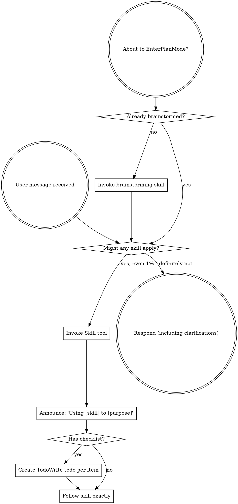

# Codex session 019f1497-3535-7b41-8d23-3733ec278b2c

- Started: `2026-06-29T18:14:47.056Z`
- Working directory: `D:\100XH100`
- Originator: `Codex Desktop`
- Codex CLI: `0.142.3`
- Source log: `C:\Users\Иван Литвак\.codex\sessions\2026\06\29\rollout-2026-06-29T21-14-47-019f1497-3535-7b41-8d23-3733ec278b2c.jsonl`
- Entries: user=2, assistant=19, tool calls=43, tool outputs=43

This is a chronological export of the user/assistant conversation and tool activity. Internal system/developer instructions and token accounting are intentionally excluded. Secret-shaped values are redacted; oversized tool outputs retain their beginning and end with the omitted character count.

## 1. User

Time: `2026-06-29T18:14:52.492Z` · source line `4`

```text
# AGENTS.md instructions for D:\100XH100

<INSTRUCTIONS>
# Project Agent Rules

## Operating Rule
- Read `AGENTS.md` before project edits.
- Update `memory/CHANGELOG.md` after meaningful code, config, or architecture changes.
- Update `memory/PROMPTS.md` with user prompts that define requirements.
- Store test outputs, logs, and verification notes under `test_results/`.
- Prefer agent-centered code: explicit contracts, deterministic tests, small files, low hidden state.

## Architecture Source
- Primary architecture contract: `ARCHITECTURE_NEED.md`.
- Current Stream 4 implementation rule: use threshold + compact + CUB/fixed-temp sort/reduce + compact; do not use Stream 4 hash-table dedup.

## Implementation Guardrails
- `State128` logical bytes are `v[0..119]`.
- `State128` padding bytes are `v[120..127]`.
- Persistent frontier padding must be zero.
- `FinalResponse` may temporarily store `target_local_idx` in `v[120..123]`.
- `Hash128` is one logical 128-bit key stored as `{lo, hi}`.
- `CandidateMeta` must remain 32 bytes and 32-byte aligned.
- Stream 3 payload id must be original candidate id, not compact index.
- Stream 4 must not apply shard top-k or semantic shard cap.

</INSTRUCTIONS>
<environment_context>
  <cwd>D:\100XH100</cwd>
  <shell>powershell</shell>
  <current_date>2026-06-29</current_date>
  <timezone>Europe/Moscow</timezone>
  <filesystem><workspace_roots><root>D:\100XH100</root></workspace_roots><permission_profile type="managed"><file_system type="restricted"><entry access="read"><special>:root</special></entry><entry access="write"><path>D:\100XH100</path></entry><entry access="write"><special>:slash_tmp</special></entry><entry access="write"><special>:tmpdir</special></entry><entry access="read"><path>D:\100XH100\.git</path></entry><entry access="read"><path>D:\100XH100\.agents</path></entry><entry access="read"><path>D:\100XH100\.codex</path></entry></file_system></permission_profile></filesystem>
</environment_context>
```

## 2. User

Time: `2026-06-29T18:14:52.518Z` · source line `6`

```text
Code-quality review only. Worktree: D:\100XH100\.worktrees\stream1-piece-transformer. Review commit range 6b5dbf58a94714fec965808318f98483680af46a..6c8f5743f1a08d21ad3b2a55031502efddac7a56.

Context: Task 6 wired Stream1 piece_transformer runtime dispatch after standalone CUDA transformer forward. Spec compliance already passed. Now look for bugs, memory under/over allocation, lifetime errors, graph-capture hazards, scratch lane slicing mistakes, config sizing mistakes, stale assumptions, missing tests that could hide a real bug, or quality issues that should be fixed before continuing.

Project guardrails: no fallback backend; no architecture changes; no State128/Stream3/Stream4 contract changes; padding rules unchanged; Stream4 no hash-table dedup/top-k caps.

Important areas to inspect:
- cuda/dispatcher.hpp and cuda/dispatcher.cu backend dispatch and uniform path.
- tools/production_runner.cu backend-specific view/scratch construction and object lifetimes during graph capture/replay.
- tools/stream1_weight_io.hpp scratch view helpers and transformer view holder lifetimes.
- cuda/runtime_config.cpp estimates using stream1_scratch_bytes and includes/manifest-only behavior.
- tests/dispatcher_cuda_tests.cu coverage quality.
- stream_benchmark fail-closed behavior.

Return findings first with severity and file/line references. If no issues, say approved. Do not modify files.
```

## 3. Codex

Time: `2026-06-29T18:15:11.180Z` · source line `9`

```text
I’ll do this as a review only: first I’m loading the applicable project/skill instructions and the relevant prior memory for `D:\100XH100`, then I’ll inspect the commit diff and affected call paths without editing files.
```

## 4. Codex

Time: `2026-06-29T18:15:11.189Z` · source line `10`

```text
I’ll do this as a review only: first I’m loading the applicable project/skill instructions and the relevant prior memory for `D:\100XH100`, then I’ll inspect the commit diff and affected call paths without editing files.
```

## 5. Tool call: `exec_command`

Time: `2026-06-29T18:15:11.219Z` · source line `11`

```text
{"cmd":"Get-Content -LiteralPath 'C:\\Users\\Иван Литвак\\.codex\\skills\\.system\\superpowers\\using-superpowers\\SKILL.md'","workdir":"D:\\100XH100","shell":"powershell","max_output_tokens":12000}
```

## 6. Tool call: `exec_command`

Time: `2026-06-29T18:15:11.239Z` · source line `12`

```text
{"cmd":"Get-Content -LiteralPath 'D:\\100XH100\\.worktrees\\stream1-piece-transformer\\AGENTS.md'","workdir":"D:\\100XH100","shell":"powershell","max_output_tokens":12000}
```

## 7. Tool call: `exec_command`

Time: `2026-06-29T18:15:11.246Z` · source line `13`

```text
{"cmd":"rg -n \"stream1|piece_transformer|BEAM_PREBUILT_RUNNER|D:\\\\100XH100|CandidateMeta|State128\" 'C:\\Users\\Иван Литвак\\.codex\\memories\\MEMORY.md'","workdir":"D:\\100XH100","shell":"powershell","max_output_tokens":12000}
```

## 8. Tool output

Time: `2026-06-29T18:15:12.413Z` · source line `14`

```text
Chunk ID: a497e3
Wall time: 0.3822 seconds
Process exited with code 1
Original token count: 142
Output:
Get-Content : Cannot find path 'C:\Users\Иван Литвак\.codex\skills\.system\superpowers\using-superpowers\SKILL.md' beca
use it does not exist.
At line:2 char:1
+ Get-Content -LiteralPath 'C:\Users\Иван Литвак\.codex\skills\.system\ ...
+ ~~~~~~~~~~~~~~~~~~~~~~~~~~~~~~~~~~~~~~~~~~~~~~~~~~~~~~~~~~~~~~~~~~~~~
    + CategoryInfo          : ObjectNotFound: (C:\Users\Иван Л...powers\SKILL.md:String) [Get-Content], ItemNotFoundEx 
   ception
    + FullyQualifiedErrorId : PathNotFound,Microsoft.PowerShell.Commands.GetContentCommand
 

```

## 9. Tool output

Time: `2026-06-29T18:15:12.413Z` · source line `15`

```text
Chunk ID: 14a404
Wall time: 0.2571 seconds
Process exited with code 0
Original token count: 290
Output:
# Project Agent Rules

## Operating Rule
- Read `AGENTS.md` before project edits.
- Update `memory/CHANGELOG.md` after meaningful code, config, or architecture changes.
- Update `memory/PROMPTS.md` with user prompts that define requirements.
- Store test outputs, logs, and verification notes under `test_results/`.
- Prefer agent-centered code: explicit contracts, deterministic tests, small files, low hidden state.

## Architecture Source
- Primary architecture contract: `ARCHITECTURE_NEED.md`.
- Current Stream 4 implementation rule: use threshold + compact + CUB/fixed-temp sort/reduce + compact; do not use Stream 4 hash-table dedup.

## Implementation Guardrails
- `State128` logical bytes are `v[0..119]`.
- `State128` padding bytes are `v[120..127]`.
- Persistent frontier padding must be zero.
- `FinalResponse` may temporarily store `target_local_idx` in `v[120..123]`.
- `Hash128` is one logical 128-bit key stored as `{lo, hi}`.
- `CandidateMeta` must remain 32 bytes and 32-byte aligned.
- Stream 3 payload id must be original candidate id, not compact index.
- Stream 4 must not apply shard top-k or semantic shard cap.

```

## 10. Tool output

Time: `2026-06-29T18:15:12.413Z` · source line `16`

```text
Chunk ID: f77452
Wall time: 0.2178 seconds
Process exited with code 0
Original token count: 581
Output:
48:applies_to: cwd=D:\100XH100; reuse_rule=reuse for this IHES/MEPhI repo family and adjacent cluster publish jobs, but treat live cluster inventory, DNS availability, and current results-repo schema as run-specific and recheck them before publishing.
54:- rollout_summaries/2026-06-04T15-47-52-Dd1O-ihes_cluster_results_prebuilt_publish_backfill.md (cwd=\\?\D:\100XH100, rollout_path=\\?\C:\Users\Иван Литвак\.codex\sessions\2026\06\04\rollout-2026-06-04T18-47-57-019e9351-cd3b-71c0-bf8b-69755d08d5fc.jsonl, updated_at=2026-06-26T19:51:22+00:00, thread_id=019e9351-cd3b-71c0-bf8b-69755d08d5fc, the prebuilt runner was compiled once and reused across the A100 array workflow)
58:- MEPhI HPC, kaf12, A100 40GB, BEAM_PREBUILT_RUNNER, prepare_ihes_prebuilt_runner.sh, ihes_solve_bucket_from_scratch.sh, prebuilt_runner_ready, using_prebuilt_runner, PUZZLE_LIMIT=1, depth=12
64:- rollout_summaries/2026-06-04T15-47-52-Dd1O-ihes_cluster_results_prebuilt_publish_backfill.md (cwd=\\?\D:\100XH100, rollout_path=\\?\C:\Users\Иван Литвак\.codex\sessions\2026\06\04\rollout-2026-06-04T18-47-57-019e9351-cd3b-71c0-bf8b-69755d08d5fc.jsonl, updated_at=2026-06-26T19:51:22+00:00, thread_id=019e9351-cd3b-71c0-bf8b-69755d08d5fc, the results repo structure and first backfilled puzzle sets were established)
74:- rollout_summaries/2026-06-04T15-47-52-Dd1O-ihes_cluster_results_prebuilt_publish_backfill.md (cwd=\\?\D:\100XH100, rollout_path=\\?\C:\Users\Иван Литвак\.codex\sessions\2026\06\04\rollout-2026-06-04T18-47-57-019e9351-cd3b-71c0-bf8b-69755d08d5fc.jsonl, updated_at=2026-06-26T19:51:22+00:00, thread_id=019e9351-cd3b-71c0-bf8b-69755d08d5fc, a file-driven inventory plus schema fixes made the larger aggregator path workable)
89:- `hpc/ihes_cube_model/prepare_ihes_prebuilt_runner.sh` builds the shared binary at `/mnt/pool/6/vokirova/beam8a100/ihes_cube_model/prebuilt-a100-ihes/production_runner`, and `hpc/ihes_cube_model/ihes_solve_bucket_from_scratch.sh` already knows how to consume `BEAM_PREBUILT_RUNNER` [Task 1]
97:- symptom: each array task recompiles instead of reusing the solver. cause: `BEAM_PREBUILT_RUNNER` was not wired through a separate prebuild dependency. fix: submit the prebuild first and make the puzzle array depend on it via `--dependency=afterok:<prebuild_job>` [Task 1]

```

## 11. Codex

Time: `2026-06-29T18:15:18.343Z` · source line `19`

```text
I found the project guardrails in the target worktree and confirmed the memory registry only has broader `D:\100XH100` operational notes, not Stream1-specific review guidance. The superpowers skill path in the expanded list differs from the first path I tried, so I’m loading the actual cached skill entry now.
```

## 12. Codex

Time: `2026-06-29T18:15:18.351Z` · source line `20`

```text
I found the project guardrails in the target worktree and confirmed the memory registry only has broader `D:\100XH100` operational notes, not Stream1-specific review guidance. The superpowers skill path in the expanded list differs from the first path I tried, so I’m loading the actual cached skill entry now.
```

## 13. Tool call: `exec_command`

Time: `2026-06-29T18:15:19.977Z` · source line `21`

```text
{"cmd":"Get-Content -LiteralPath 'C:\\Users\\Иван Литвак\\.codex\\plugins\\cache\\openai-curated-remote\\superpowers\\5.1.4\\skills\\using-superpowers\\SKILL.md'","workdir":"D:\\100XH100","shell":"powershell","max_output_tokens":12000}
```

## 14. Tool output

Time: `2026-06-29T18:15:20.625Z` · source line `22`

````text
Chunk ID: 2c9871
Wall time: 0.2326 seconds
Process exited with code 0
Original token count: 1393
Output:
---
name: using-superpowers
description: Use when starting any conversation - establishes how to find and use skills, requiring Skill tool invocation before ANY response including clarifying questions
---

<SUBAGENT-STOP>
If you were dispatched as a subagent to execute a specific task, skip this skill.
</SUBAGENT-STOP>

<EXTREMELY-IMPORTANT>
If you think there is even a 1% chance a skill might apply to what you are doing, you ABSOLUTELY MUST invoke the skill.

IF A SKILL APPLIES TO YOUR TASK, YOU DO NOT HAVE A CHOICE. YOU MUST USE IT.

This is not negotiable. This is not optional. You cannot rationalize your way out of this.
</EXTREMELY-IMPORTANT>

## Instruction Priority

Superpowers skills override default system prompt behavior, but **user instructions always take precedence**:

1. **User's explicit instructions** (CLAUDE.md, GEMINI.md, AGENTS.md, direct requests) — highest priority
2. **Superpowers skills** — override default system behavior where they conflict
3. **Default system prompt** — lowest priority

If CLAUDE.md, GEMINI.md, or AGENTS.md says "don't use TDD" and a skill says "always use TDD," follow the user's instructions. The user is in control.

## How to Access Skills

**In Claude Code:** Use the `Skill` tool. When you invoke a skill, its content is loaded and presented to you—follow it directly. Never use the Read tool on skill files.

**In Copilot CLI:** Use the `skill` tool. Skills are auto-discovered from installed plugins. The `skill` tool works the same as Claude Code's `Skill` tool.

**In Gemini CLI:** Skills activate via the `activate_skill` tool. Gemini loads skill metadata at session start and activates the full content on demand.

**In other environments:** Check your platform's documentation for how skills are loaded.

## Platform Adaptation

Skills use Claude Code tool names. Non-CC platforms: see `references/copilot-tools.md` (Copilot CLI), `references/codex-tools.md` (Codex) for tool equivalents. Gemini CLI users get the tool mapping loaded automatically via GEMINI.md.

# Using Skills

## The Rule

**Invoke relevant or requested skills BEFORE any response or action.** Even a 1% chance a skill might apply means that you should invoke the skill to check. If an invoked skill turns out to be wrong for the situation, you don't need to use it.



## Red Flags

These thoughts mean STOP—you're rationalizing:

| Thought | Reality |
|---------|---------|
| "This is just a simple question" | Questions are tasks. Check for skills. |
| "I need more context first" | Skill check comes BEFORE clarifying questions. |
| "Let me explore the codebase first" | Skills tell you HOW to explore. Check first. |
| "I can check git/files quickly" | Files lack conversation context. Check for skills. |
| "Let me gather information first" | Skills tell you HOW to gather information. |
| "This doesn't need a formal skill" | If a skill exists, use it. |
| "I remember this skill" | Skills evolve. Read current version. |
| "This doesn't count as a task" | Action = task. Check for skills. |
| "The skill is overkill" | Simple things become complex. Use it. |
| "I'll just do this one thing first" | Check BEFORE doing anything. |
| "This feels productive" | Undisciplined action wastes time. Skills prevent this. |
| "I know what that means" | Knowing the concept в‰  using the skill. Invoke it. |

## Skill Priority

When multiple skills could apply, use this order:

1. **Process skills first** (brainstorming, debugging) - these determine HOW to approach the task
2. **Implementation skills second** (frontend-design, mcp-builder) - these guide execution

"Let's build X" в†’ brainstorming first, then implementation skills.
"Fix this bug" в†’ debugging first, then domain-specific skills.

## Skill Types

**Rigid** (TDD, debugging): Follow exactly. Don't adapt away discipline.

**Flexible** (patterns): Adapt principles to context.

The skill itself tells you which.

## User Instructions

Instructions say WHAT, not HOW. "Add X" or "Fix Y" doesn't mean skip workflows.

````

## 15. Codex

Time: `2026-06-29T18:15:36.750Z` · source line `25`

```text
Using `superpowers:using-superpowers` for the required skill check. No task-specific implementation skill is a better fit here; I’m applying the repository review stance and keeping the worktree read-only.
```

## 16. Codex

Time: `2026-06-29T18:15:36.758Z` · source line `26`

```text
Using `superpowers:using-superpowers` for the required skill check. No task-specific implementation skill is a better fit here; I’m applying the repository review stance and keeping the worktree read-only.
```

## 17. Tool call: `exec_command`

Time: `2026-06-29T18:15:36.774Z` · source line `27`

```text
{"cmd":"git status --short --branch","workdir":"D:\\100XH100\\.worktrees\\stream1-piece-transformer","shell":"powershell","max_output_tokens":12000}
```

## 18. Tool call: `exec_command`

Time: `2026-06-29T18:15:36.774Z` · source line `28`

```text
{"cmd":"git diff --stat 6b5dbf58a94714fec965808318f98483680af46a..6c8f5743f1a08d21ad3b2a55031502efddac7a56","workdir":"D:\\100XH100\\.worktrees\\stream1-piece-transformer","shell":"powershell","max_output_tokens":12000}
```

## 19. Tool call: `exec_command`

Time: `2026-06-29T18:15:36.774Z` · source line `29`

```text
{"cmd":"git diff --name-status 6b5dbf58a94714fec965808318f98483680af46a..6c8f5743f1a08d21ad3b2a55031502efddac7a56","workdir":"D:\\100XH100\\.worktrees\\stream1-piece-transformer","shell":"powershell","max_output_tokens":12000}
```

## 20. Tool call: `exec_command`

Time: `2026-06-29T18:15:36.784Z` · source line `30`

```text
{"cmd":"git diff --check 6b5dbf58a94714fec965808318f98483680af46a..6c8f5743f1a08d21ad3b2a55031502efddac7a56","workdir":"D:\\100XH100\\.worktrees\\stream1-piece-transformer","shell":"powershell","max_output_tokens":12000}
```

## 21. Tool output

Time: `2026-06-29T18:15:37.459Z` · source line `31`

```text
Chunk ID: ed9eb8
Wall time: 0.3894 seconds
Process exited with code 0
Original token count: 70
Output:
## codex/stream1-piece-transformer
?? $null
?? build-contract-tests/
?? build-stream1-transformer-red/
?? build-task6-red/
?? build-task6-sm86/
?? build-task6/
?? config.obj
?? contract_tests.obj
?? docs/
?? frontier_cpu.obj
?? hash.obj
?? state.obj
?? stream3.obj
?? stream4.obj

```

## 22. Tool output

Time: `2026-06-29T18:15:37.491Z` · source line `32`

```text
Chunk ID: 9016c5
Wall time: 0.3910 seconds
Process exited with code 0
Original token count: 191
Output:
 cuda/dispatcher.cu                                 |  35 +++-
 cuda/dispatcher.hpp                                |  12 +-
 cuda/runtime_config.cpp                            |  76 ++++++---
 memory/CHANGELOG.md                                |   1 +
 memory/PROMPTS.md                                  |   2 +
 ...tream1_transformer_runtime_wiring_2026-06-29.md |  51 ++++++
 tests/dispatcher_cuda_tests.cu                     | 189 ++++++++++++++++++++-
 tests/stream1_transformer_cuda_tests.cu            |   2 +-
 tools/production_runner.cu                         |  82 ++++++---
 tools/stream1_weight_io.hpp                        |  37 ++++
 tools/stream_benchmark.cu                          |   2 +-
 11 files changed, 434 insertions(+), 55 deletions(-)

```

## 23. Tool output

Time: `2026-06-29T18:15:38.150Z` · source line `33`

```text
Chunk ID: 05ef79
Wall time: 0.5895 seconds
Process exited with code 0
Original token count: 85
Output:
M	cuda/dispatcher.cu
M	cuda/dispatcher.hpp
M	cuda/runtime_config.cpp
M	memory/CHANGELOG.md
M	memory/PROMPTS.md
A	test_results/stream1_transformer_runtime_wiring_2026-06-29.md
M	tests/dispatcher_cuda_tests.cu
M	tests/stream1_transformer_cuda_tests.cu
M	tools/production_runner.cu
M	tools/stream1_weight_io.hpp
M	tools/stream_benchmark.cu

```

## 24. Tool output

Time: `2026-06-29T18:15:38.182Z` · source line `34`

```text
Chunk ID: c8d8d4
Wall time: 0.6211 seconds
Process exited with code 0
Original token count: 0
Output:

```

## 25. Codex

Time: `2026-06-29T18:15:51.447Z` · source line `37`

```text
The range is compact and `git diff --check` is clean. I’m now reading the changed runtime path plus the surrounding APIs so any finding is grounded in the actual call contracts rather than the patch alone.
```

## 26. Codex

Time: `2026-06-29T18:15:51.455Z` · source line `38`

```text
The range is compact and `git diff --check` is clean. I’m now reading the changed runtime path plus the surrounding APIs so any finding is grounded in the actual call contracts rather than the patch alone.
```

## 27. Tool call: `exec_command`

Time: `2026-06-29T18:15:51.692Z` · source line `39`

```text
{"cmd":"git diff --unified=80 6b5dbf58a94714fec965808318f98483680af46a..6c8f5743f1a08d21ad3b2a55031502efddac7a56 -- cuda/dispatcher.hpp cuda/dispatcher.cu","workdir":"D:\\100XH100\\.worktrees\\stream1-piece-transformer","shell":"powershell","max_output_tokens":50000}
```

## 28. Tool call: `exec_command`

Time: `2026-06-29T18:15:51.839Z` · source line `40`

```text
{"cmd":"git diff --unified=80 6b5dbf58a94714fec965808318f98483680af46a..6c8f5743f1a08d21ad3b2a55031502efddac7a56 -- tools/production_runner.cu tools/stream1_weight_io.hpp","workdir":"D:\\100XH100\\.worktrees\\stream1-piece-transformer","shell":"powershell","max_output_tokens":60000}
```

## 29. Tool call: `exec_command`

Time: `2026-06-29T18:15:51.840Z` · source line `41`

```text
{"cmd":"git diff --unified=80 6b5dbf58a94714fec965808318f98483680af46a..6c8f5743f1a08d21ad3b2a55031502efddac7a56 -- cuda/runtime_config.cpp tools/stream_benchmark.cu","workdir":"D:\\100XH100\\.worktrees\\stream1-piece-transformer","shell":"powershell","max_output_tokens":50000}
```

## 30. Tool call: `exec_command`

Time: `2026-06-29T18:15:51.840Z` · source line `42`

```text
{"cmd":"git diff --unified=80 6b5dbf58a94714fec965808318f98483680af46a..6c8f5743f1a08d21ad3b2a55031502efddac7a56 -- tests/dispatcher_cuda_tests.cu tests/stream1_transformer_cuda_tests.cu","workdir":"D:\\100XH100\\.worktrees\\stream1-piece-transformer","shell":"powershell","max_output_tokens":60000}
```

## 31. Tool output

Time: `2026-06-29T18:15:53.113Z` · source line `43`

```text
Chunk ID: e43b13
Wall time: 0.9870 seconds
Process exited with code 0
Original token count: 4170
Output:
diff --git a/cuda/dispatcher.cu b/cuda/dispatcher.cu
index b7aa4e1..e13f0dd 100644
--- a/cuda/dispatcher.cu
+++ b/cuda/dispatcher.cu
@@ -1210,199 +1210,224 @@ void destroy_dispatcher_streams(DispatcherStreams& streams) {
     }
     if (streams.stream4) {
         cudaStreamDestroy(streams.stream4);
     }
     if (streams.stream5) {
         cudaStreamDestroy(streams.stream5);
     }
     for (cudaStream_t stream : streams.stream4_slot_streams) {
         if (stream) {
             cudaStreamDestroy(stream);
         }
     }
     for (cudaEvent_t event : streams.stream4_slot_done) {
         if (event) {
             cudaEventDestroy(event);
         }
     }
     auto destroy_group = [](std::array<cudaEvent_t, 3>& events) {
         for (cudaEvent_t event : events) {
             if (event) {
                 cudaEventDestroy(event);
             }
         }
     };
     destroy_group(streams.final_build_done);
     destroy_group(streams.final_history_done);
     destroy_group(streams.final_request_done);
     destroy_group(streams.final_response_ready);
     destroy_group(streams.final_response_done);
     streams = DispatcherStreams{};
 }
 
 void create_dispatcher_events(DispatcherEvents& events) {
     check_cuda(cudaEventCreateWithFlags(&events.stream1_done, cudaEventDisableTiming), "cudaEventCreate stream1_done");
     check_cuda(cudaEventCreateWithFlags(&events.stream2_done, cudaEventDisableTiming), "cudaEventCreate stream2_done");
     check_cuda(cudaEventCreateWithFlags(&events.stream3_done, cudaEventDisableTiming), "cudaEventCreate stream3_done");
 }
 
 void destroy_dispatcher_events(DispatcherEvents& events) {
     for (std::size_t lane = 1; lane < events.stream1_lane_done.size(); ++lane) {
         if (events.stream1_lane_done[lane]) {
             cudaEventDestroy(events.stream1_lane_done[lane]);
         }
     }
     for (std::size_t lane = 1; lane < events.stream2_lane_done.size(); ++lane) {
         if (events.stream2_lane_done[lane]) {
             cudaEventDestroy(events.stream2_lane_done[lane]);
         }
     }
     events.stream1_lane_done.clear();
     events.stream2_lane_done.clear();
     if (events.stream1_done) {
         cudaEventDestroy(events.stream1_done);
     }
     if (events.stream2_done) {
         cudaEventDestroy(events.stream2_done);
     }
     if (events.stream3_done) {
         cudaEventDestroy(events.stream3_done);
     }
     events = DispatcherEvents{};
 }
 
 void instantiate_cuda_graph_job_templates(
     const StaticMemoryPlan& plan,
     StaticDeviceMemory& memory,
     const DispatcherDeviceTables& tables,
     const DispatcherNetwork& network,
     Stream2SolvedBuffers solved,
     DispatcherStreams& streams,
     DispatcherEvents& events,
     CudaGraphJobTemplates& graphs) {
     NvtxRange range("Dispatcher_instantiate_cuda_graph_job_templates");
     if (!memory.current_frontier_states || !memory.scratch_pool || !tables.generators || !tables.central_state || !tables.zobrist) {
         throw std::invalid_argument("dispatcher graph templates require preallocated architecture memory and read-only tables");
     }
     if (plan.config.inference_parallelism == 0U ||
         plan.config.inference_parallelism > plan.derived.ring_slot_count) {
         throw std::invalid_argument("Stream1 concurrency must be in [1, RING_SLOT_COUNT]");
     }
-    if (network.scratch_lanes.size() < plan.config.inference_parallelism) {
-        throw std::invalid_argument("Stream1 scratch lane count is smaller than Stream1 concurrency");
+    const bool known_stream1_backend =
+        network.backend == DispatcherStream1Backend::Mlp ||
+        network.backend == DispatcherStream1Backend::PieceTransformer;
+    if (!known_stream1_backend) {
+        throw std::invalid_argument("unknown Stream1 dispatcher backend");
+    }
+    if (!network.uniform_score) {
+        if (network.backend == DispatcherStream1Backend::Mlp &&
+            network.mlp_scratch_lanes.size() < plan.config.inference_parallelism) {
+            throw std::invalid_argument("Stream1 MLP scratch lane count is smaller than Stream1 concurrency");
+        }
+        if (network.backend == DispatcherStream1Backend::PieceTransformer &&
+            network.transformer_scratch_lanes.size() < plan.config.inference_parallelism) {
+            throw std::invalid_argument("Stream1 transformer scratch lane count is smaller than Stream1 concurrency");
+        }
     }
     ensure_stream12_lane_resources(streams, events, plan.config.inference_parallelism);
     ensure_stream4_slot_resources(streams, plan.config.stream4_active_sort_slots);
     const bool predict_stats_enabled = predict_stats_enabled_from_env();
 
     const std::uint32_t ring_slot_job_count = plan.config.ring_count * plan.derived.ring_slot_count;
     graphs.ring_slot_graphs.resize(ring_slot_job_count, nullptr);
     graphs.ring_slot_execs.resize(ring_slot_job_count, nullptr);
     const std::uint64_t candidates_per_slot = static_cast<std::uint64_t>(plan.config.b_micro) * MOVE_COUNT;
     for (std::uint32_t job = 0; job < ring_slot_job_count; ++job) {
         const std::uint32_t ring_slot = job % plan.derived.ring_slot_count;
         const std::uint32_t lane = ring_slot % plan.config.inference_parallelism;
         cudaStream_t stream1_lane = streams.stream1_lanes[lane];
         cudaStream_t stream2_lane = streams.stream2_lanes[lane];
         cudaEvent_t stream1_done = events.stream1_lane_done[lane];
         cudaEvent_t stream2_done = events.stream2_lane_done[lane];
         const std::uint64_t candidate_offset = static_cast<std::uint64_t>(job) * candidates_per_slot;
         check_cuda(cudaStreamBeginCapture(stream1_lane, cudaStreamCaptureModeGlobal), "cudaStreamBeginCapture ring_slot_graph");
         check_cuda(cudaEventRecord(stream1_done, stream1_lane), "cudaEventRecord ring_slot_fork");
         check_cuda(cudaStreamWaitEvent(stream2_lane, stream1_done, 0), "cudaStreamWaitEvent stream2_fork");
         if (network.uniform_score) {
             check_cuda(cudaMemsetAsync(
                 memory.streams.score_ring + candidate_offset,
                 0,
                 candidates_per_slot * sizeof(std::uint32_t),
                 stream1_lane), "cudaMemsetAsync uniform score ring");
-        } else {
+        } else if (network.backend == DispatcherStream1Backend::Mlp) {
             stream1_inference_cutlass_cuda(
                 memory.current_frontier_states,
                 memory.streams.parent_base + job,
                 memory.streams.count + job,
                 tables.generators,
-                network.view,
-                network.scratch_lanes[lane],
+                network.mlp_view,
+                network.mlp_scratch_lanes[lane],
                 memory.streams.score_ring + candidate_offset,
                 plan.config.b_micro,
                 stream1_lane);
+        } else if (network.backend == DispatcherStream1Backend::PieceTransformer) {
+            stream1_transformer_inference_cuda(
+                memory.current_frontier_states,
+                memory.streams.parent_base + job,
+                memory.streams.count + job,
+                network.transformer_view,
+                network.transformer_scratch_lanes[lane],
+                memory.streams.score_ring + candidate_offset,
+                plan.config.b_micro,
+                stream1_lane);
+        } else {
+            throw std::invalid_argument("unknown Stream1 dispatcher backend");
         }
         stream2_hash_goal_cuda(
             memory.current_frontier_states,
             memory.streams.parent_base + job,
             memory.streams.count + job,
             tables.generators,
             tables.central_state,
             tables.zobrist,
             memory.streams.hash_ring + candidate_offset,
             0,
             0,
             plan.config.b_micro,
             0,
             plan.config.local_rank,
             solved,
             stream2_lane);
         check_cuda(cudaEventRecord(stream2_done, stream2_lane), "cudaEventRecord ring_slot_join");
         check_cuda(cudaStreamWaitEvent(stream1_lane, stream2_done, 0), "cudaStreamWaitEvent stream1_join");
         instantiate_captured_graph(stream1_lane, graphs.ring_slot_graphs[job], graphs.ring_slot_execs[job]);
     }
 
     graphs.stream3_ring_graphs.resize(plan.config.ring_count, nullptr);
     graphs.stream3_ring_execs.resize(plan.config.ring_count, nullptr);
     for (std::uint32_t ring = 0; ring < plan.config.ring_count; ++ring) {
         const std::uint64_t ring_candidate_offset = static_cast<std::uint64_t>(ring) * plan.config.stream3_batch_candidates;
         const std::uint64_t stream5_send_slot =
             plan.config.world_size > 1U ? static_cast<std::uint64_t>(ring) : 0ULL;
         CandidateMeta* ring_remote_send_buffer =
             memory.streams.remote_send_buffer + stream5_send_slot * plan.stream5_send_slot_capacity;
         check_cuda(cudaStreamBeginCapture(streams.stream3, cudaStreamCaptureModeGlobal), "cudaStreamBeginCapture stream3_ring_graph");
         if (predict_stats_enabled) {
             stream3_accumulate_score_hist_cuda(
                 memory.streams.score_ring + ring_candidate_offset,
                 memory.streams.count + static_cast<std::uint64_t>(ring) * plan.derived.ring_slot_count,
                 memory.streams.stream3_score_key_a,
                 memory.streams.stream3_score_key_b,
                 memory.streams.stream3_score_count_a,
                 memory.streams.stream3_score_count_b,
                 memory.streams.stream3_score_unique_count,
                 memory.streams.stream3_score_hist,
                 memory.streams.stream3_cub_temp,
                 memory.streams.stream3_cub_temp_bytes,
                 plan.config.b_micro,
                 plan.config.stream3_batch_candidates,
                 streams.stream3);
         }
         stream3_pack_threshold_device_threshold_cuda(
             memory.streams.score_ring + ring_candidate_offset,
             memory.streams.hash_ring + ring_candidate_offset,
             memory.streams.parent_base + static_cast<std::uint64_t>(ring) * plan.derived.ring_slot_count,
             memory.streams.count + static_cast<std::uint64_t>(ring) * plan.derived.ring_slot_count,
             memory.streams.stream3_key_a,
             memory.streams.stream3_val_a,
             memory.streams.stream3_key_b,
             memory.streams.stream3_val_b,
             memory.streams.unique_key,
             memory.streams.unique_val,
             memory.streams.stream3_keep_flags,
             memory.streams.stream3_block_counts,
             memory.streams.stream3_block_offsets,
             memory.streams.unique_count,
             memory.streams.stream3_cub_temp,
             memory.streams.stream3_cub_temp_bytes,
             memory.streams.current_threshold,
             memory.streams.current_threshold_active_index,
             plan.config.b_micro,
             plan.config.stream3_batch_candidates,
             streams.stream3,
 #if BEAM_DEBUG_DEPTH_FLOW_TRACE
             memory.streams.stream3_threshold_pass_count_by_ring,
             memory.streams.stream3_unique_count_by_ring,
 #else
             nullptr,
             nullptr,
 #endif
             ring);
         if (plan.config.world_size != 1U) {
             stream3_restore_owner_split_cuda(
                 memory.streams.unique_key,
                 memory.streams.unique_val,
diff --git a/cuda/dispatcher.hpp b/cuda/dispatcher.hpp
index d0cd448..d07515f 100644
--- a/cuda/dispatcher.hpp
+++ b/cuda/dispatcher.hpp
@@ -1,142 +1,150 @@
 #pragma once
 
 #include "static_memory.hpp"
 #include "stream1.hpp"
 #include "stream2.hpp"
 
 #include <cuda_runtime.h>
 #include <nccl.h>
 
 #include <array>
 #include <cstdint>
 #include <vector>
 
 #ifndef BEAM_DEBUG_DEPTH_FLOW_TRACE
 #define BEAM_DEBUG_DEPTH_FLOW_TRACE 0
 #endif
 
 namespace beam {
 
 struct DispatcherStreams {
     cudaStream_t stream1 = nullptr;
     cudaStream_t stream2 = nullptr;
     cudaStream_t stream3 = nullptr;
     cudaStream_t stream4 = nullptr;
     cudaStream_t stream5 = nullptr;
     std::vector<cudaStream_t> stream1_lanes;
     std::vector<cudaStream_t> stream2_lanes;
     std::vector<cudaStream_t> stream4_slot_streams;
     std::vector<cudaEvent_t> stream4_slot_done;
     std::array<cudaEvent_t, 3> final_build_done{};
     std::array<cudaEvent_t, 3> final_history_done{};
     std::array<cudaEvent_t, 3> final_request_done{};
     std::array<cudaEvent_t, 3> final_response_ready{};
     std::array<cudaEvent_t, 3> final_response_done{};
 };
 
 struct DispatcherEvents {
     cudaEvent_t stream1_done = nullptr;
     cudaEvent_t stream2_done = nullptr;
     cudaEvent_t stream3_done = nullptr;
     std::vector<cudaEvent_t> stream1_lane_done;
     std::vector<cudaEvent_t> stream2_lane_done;
 };
 
 struct CudaGraphJobTemplates {
     std::vector<cudaGraph_t> ring_slot_graphs;
     std::vector<cudaGraphExec_t> ring_slot_execs;
     std::vector<cudaGraph_t> stream3_ring_graphs;
     std::vector<cudaGraphExec_t> stream3_ring_execs;
     std::vector<cudaGraph_t> stream4_shard_graphs;
     std::vector<cudaGraphExec_t> stream4_shard_execs;
 };
 
 struct DispatcherDeviceTables {
     const std::uint8_t* generators = nullptr;
     const State128* central_state = nullptr;
     const Hash128* zobrist = nullptr;
 };
 
+enum class DispatcherStream1Backend : std::uint8_t {
+    Mlp = 0,
+    PieceTransformer = 1,
+};
+
 struct DispatcherNetwork {
-    Stream1NetworkView view;
-    std::vector<Stream1CutlassScratch> scratch_lanes;
+    DispatcherStream1Backend backend = DispatcherStream1Backend::Mlp;
+    Stream1NetworkView mlp_view{};
+    std::vector<Stream1CutlassScratch> mlp_scratch_lanes;
+    Stream1TransformerNetworkView transformer_view{};
+    std::vector<Stream1TransformerScratchView> transformer_scratch_lanes;
     bool uniform_score = false;
 };
 
 struct DispatcherCollective {
     ncclComm_t comm = nullptr;
 };
 
 struct GeneratedTrackRequest {
     bool enabled = false;
     std::uint64_t parent_idx = UINT64_MAX;
     std::uint8_t move = 0;
 };
 
 struct GeneratedTrackResult {
     bool enabled = false;
     bool found = false;
     std::uint64_t request_parent_idx = UINT64_MAX;
     std::uint8_t request_move = 0;
     std::uint32_t ring = UINT32_MAX;
     std::uint32_t ring_slot = UINT32_MAX;
     std::uint32_t job = UINT32_MAX;
     std::uint64_t parent_base = 0;
     std::uint32_t count = 0;
     std::uint32_t parent_local = UINT32_MAX;
     std::uint64_t payload_id = UINT64_MAX;
     std::uint64_t score_ring_offset = UINT64_MAX;
     std::uint32_t score_key = UINT32_MAX;
     Hash128 hash{UINT64_MAX, UINT64_MAX};
     std::uint8_t owner = UINT8_MAX;
     std::uint32_t shard = UINT32_MAX;
     std::uint32_t current_threshold = UINT32_MAX;
     bool parent_state_copied = false;
     State128 parent_state{};
     bool all_move_scores_copied = false;
     std::array<std::uint32_t, MOVE_COUNT> move_score_keys{};
 };
 
 struct Stream4TrackResult {
     bool enabled = false;
     Hash128 hash{UINT64_MAX, UINT64_MAX};
     std::uint32_t score_key = UINT32_MAX;
     std::uint32_t shard = UINT32_MAX;
 
     bool after_stream3_scanned = false;
     bool after_stream3_found = false;
     std::uint32_t after_stream3_location = UINT32_MAX;
     std::uint32_t after_stream3_local = UINT32_MAX;
     std::uint32_t after_stream3_clean_count = 0;
     std::uint32_t after_stream3_dirty_count = 0;
     std::uint32_t after_stream3_active_spill_count = 0;
     std::uint32_t after_stream3_inactive_spill_count = 0;
     std::uint32_t after_stream3_threshold = UINT32_MAX;
 
     std::uint32_t input_scan_count = 0;
     bool input_found = false;
     std::uint32_t input_slot = UINT32_MAX;
     std::uint32_t input_job = UINT32_MAX;
     std::uint32_t input_location = UINT32_MAX;
     std::uint32_t input_local = UINT32_MAX;
     std::uint32_t input_clean_count = 0;
     std::uint32_t input_dirty_count = 0;
     std::uint32_t input_threshold = UINT32_MAX;
 
     std::uint32_t output_scan_count = 0;
     bool output_found = false;
     std::uint32_t output_slot = UINT32_MAX;
     std::uint32_t output_job = UINT32_MAX;
     std::uint32_t output_local = UINT32_MAX;
     std::uint32_t output_clean_count = 0;
     std::uint32_t output_dirty_count = 0;
     std::uint32_t output_threshold = UINT32_MAX;
 };
 
 struct Stream4TrackEvent {
     std::uint32_t phase = 0;
     bool found = false;
     std::uint32_t shard = UINT32_MAX;
     std::uint32_t slot = UINT32_MAX;
     std::uint32_t job = UINT32_MAX;
     std::uint32_t location = UINT32_MAX;

```

## 32. Tool output

Time: `2026-06-29T18:15:53.113Z` · source line `44`

Oversized output: `5380` characters omitted from the middle.

```text
Chunk ID: 010cde
Wall time: 0.5403 seconds
Process exited with code 0
Original token count: 9319
Output:
diff --git a/tools/production_runner.cu b/tools/production_runner.cu
index b48e527..2fefa27 100644
--- a/tools/production_runner.cu
+++ b/tools/production_runner.cu
@@ -3875,163 +3875,160 @@ std::uint32_t propagate_stop_flag(
     }
     require_nccl(
         ncclAllReduce(
             memory.stop_flag,
             memory.global_stop_flag,
             1,
             ncclUint32,
             ncclMax,
             comm,
             streams.stream5),
         "ncclAllReduce stop flag");
     BEAM_CUDA_CHECK(cudaMemcpyAsync(
         memory.stop_flag,
         memory.global_stop_flag,
         sizeof(std::uint32_t),
         cudaMemcpyDeviceToDevice,
         streams.stream5));
     BEAM_CUDA_CHECK(cudaStreamSynchronize(streams.stream5));
     std::uint32_t stop_value = 0;
     BEAM_CUDA_CHECK(cudaMemcpy(&stop_value, memory.stop_flag, sizeof(stop_value), cudaMemcpyDeviceToHost));
     return stop_value;
 }
 
 void reset_static_memory_for_task(
     const StaticMemoryPlan& plan,
     StaticDeviceMemory& memory,
     const State128& host_initial,
     State128* central_state,
     const State128& host_target,
     std::uint32_t rank) {
     BEAM_CUDA_CHECK(cudaMemset(memory.allocation, 0, memory.allocation_bytes));
     BEAM_CUDA_CHECK(cudaMemset(memory.current_frontier_states, 0, plan.current_frontier_bytes));
     if (rank == 0U) {
         BEAM_CUDA_CHECK(cudaMemcpy(
             memory.current_frontier_states,
             &host_initial,
             sizeof(State128),
             cudaMemcpyHostToDevice));
     }
     BEAM_CUDA_CHECK(cudaMemcpy(central_state, &host_target, sizeof(State128), cudaMemcpyHostToDevice));
     BEAM_CUDA_CHECK(cudaMemset(memory.streams.current_threshold, 0xff, 2ULL * sizeof(std::uint32_t)));
     BEAM_CUDA_CHECK(cudaMemset(memory.streams.threshold_initialized, 0, 2ULL * sizeof(std::uint32_t)));
     BEAM_CUDA_CHECK(cudaMemset(memory.streams.current_threshold_active_index, 0, sizeof(std::uint32_t)));
     BEAM_CUDA_CHECK(cudaMemset(memory.streams.threshold_request_local, 0, sizeof(std::uint32_t)));
     BEAM_CUDA_CHECK(cudaMemset(memory.streams.threshold_request_global, 0, sizeof(std::uint32_t)));
     BEAM_CUDA_CHECK(cudaDeviceSynchronize());
 }
 
 } // namespace
 
 int main(int argc, char** argv) {
     if (argc != 4 && argc != 6) {
         std::cerr << "usage: production_runner <puzzle_id> <depth> <beam> [world_size] [local_rank]\n";
         return 2;
     }
     const std::uint64_t cli_puzzle_id = parse_u64(argv[1], "puzzle_id");
     const std::uint32_t cli_depth_limit = static_cast<std::uint32_t>(parse_u64(argv[2], "depth"));
     const std::uint64_t beam = parse_u64(argv[3], "beam");
     const std::uint32_t world_size_arg = argc == 6 ? static_cast<std::uint32_t>(parse_u64(argv[4], "world_size")) : 1U;
     const std::uint32_t rank_arg = argc == 6 ? static_cast<std::uint32_t>(parse_u64(argv[5], "local_rank")) : 0U;
     const std::uint32_t world_size = env_or_default_u32("WORLD_SIZE", world_size_arg);
     const std::uint32_t rank = env_or_default_u32("RANK", rank_arg);
     const std::uint32_t device_local_rank = env_or_default_u32("LOCAL_RANK", rank);
     if (world_size == 0 || world_size > 255 || rank >= world_size) {
         throw std::invalid_argument("world_size must be in [1,255] and rank must be less than world_size");
     }
     std::cout << std::unitbuf;
 
     BEAM_CUDA_CHECK(cudaSetDevice(static_cast<int>(device_local_rank)));
     NcclRuntime nccl_runtime = create_nccl_runtime(world_size, rank);
     DispatcherCollective collective{nccl_runtime.comm};
     const DispatcherCollective* collective_ptr = world_size > 1U ? &collective : nullptr;
     std::size_t free_before = 0;
     std::size_t total_before = 0;
     BEAM_CUDA_CHECK(cudaMemGetInfo(&free_before, &total_before));
 
     const std::filesystem::path weight_dir = env_path("BEAM_WEIGHT_DIR", "stream1_weights");
     const stream1_weights::HostWeightBytes host_weights =
         stream1_weights::load_stream1_weights(weight_dir);
     const Stream1ModelConfig& stream1_model = host_weights.model;
-    if (stream1_model.backend == STREAM1_BACKEND_PIECE_TRANSFORMER) {
-        throw std::runtime_error("piece_transformer Stream1 forward is not wired yet");
-    }
     const RuntimeConfigBuild config_build =
         build_runtime_config_from_budget(beam, world_size, rank, stream1_model, free_before);
     const RuntimeConfig config = config_build.config;
     const StaticMemoryPlan plan = config_build.plan;
 #if BEAM_ENABLE_DEBUG_LOGS
     std::cout << "puzzle_id=" << cli_puzzle_id << "\n";
     std::cout << "depth_limit=" << cli_depth_limit << "\n";
     std::cout << "RUNTIME_CONFIG_MODE=" << (config_build.manual_config ? "manual" : "auto") << "\n";
     std::cout << "USER_GLOBAL_BEAM_WIDTH=" << beam << "\n";
     std::cout << "WORLD_SIZE=" << config.world_size << "\n";
     std::cout << "LOCAL_RANK=" << config.local_rank << "\n";
     std::cout << "CUDA_DEVICE_LOCAL_RANK=" << device_local_rank << "\n";
     std::cout << "B_MICRO=" << config.b_micro << "\n";
     std::cout << "STREAM1_ROWS_PER_JOB=" << stream1_inference_rows(config.b_micro, stream1_model) << "\n";
     std::cout << "STREAM1_CONCURRENCY=" << config.inference_parallelism << "\n";
     std::cout << "STREAM3_RING_SLOTS=" << config_build.stream3_ring_slots << "\n";
     std::cout << "RING_COUNT=" << config.ring_count << "\n";
     std::cout << "RING_SLOT_COUNT=" << plan.derived.ring_slot_count << "\n";
     std::cout << "STREAM3_BATCH_CANDIDATES=" << config.stream3_batch_candidates << "\n";
     std::cout << "STREAM5_BATCH_CANDIDATES=" << config.stream3_batch_candidates << "\n";
     std::cout << "SHARD_COUNT=" << config.shard_count << "\n";
     std::cout << "SHARD_BUFFER_COUNT=" << config.shard_buffer_count << "\n";
     std::cout << "STORAGE_SHARD_COUNT=" << plan.storage_shard_count << "\n";
     std::cout << "STREAM4_BATCH_CANDIDATES=" << config.stream4_batch_candidates << "\n";
     std::cout << "STREAM4_TRIGGER_CANDIDATES=" << config.stream4_trigger_candidates << "\n";
     std::cout << "STREAM4_BATCH_ALIGNMENT=" << config.stream4_batch_alignment << "\n";
     std::cout << "STREAM4_ACTIVE_SORT_SLOTS=" << config.stream4_active_sort_slots << "\n";
     std::cout << "SHARD_CAPACITY_CANDIDATES=" << config.shard_capacity_candidates << "\n";
     std::cout << "SHARD_CAPACITY_SCALE_PPM=" << config.shard_capacity_scale_ppm << "\n";
     std::cout << "GLOBAL_SPILL_CAPACITY=" << config.global_spill_capacity << "\n";
     std::cout << "GLOBAL_SPILL_SCALE_PPM=" << config.global_spill_scale_ppm << "\n";
     std::cout << "STREAM5_RECV_CAPACITY_SCALE_PPM=" << config.stream5_recv_capacity_scale_ppm << "\n";
     std::cout << "FINAL_MATERIALIZE_CHUNK_CANDIDATES=" << config.final_materialize_chunk_candidates << "\n";
     std::cout << "FINAL_MATERIALIZE_EXCHANGE_SCALE_PPM=" << config.final_materialize_exchange_scale_ppm << "\n";
     std::cout << "STREAM5_SLOT_COUNT=" << plan.stream5_slot_count << "\n";
     std::cout << "STREAM5_SEND_SLOT_CANDIDATES=" << plan.stream5_send_slot_capacity << "\n";
     std::cout << "STREAM5_RECV_SLOT_CANDIDATES=" << plan.stream5_recv_slot_capacity << "\n";
     std::cout << "FINAL_MATERIALIZE_EXCHANGE_CANDIDATES=" << plan.final_materialize_exchange_capacity << "\n";
     std::cout << "N_LOCAL=" << local_frontier_capacity(config) << "\n";
     std::cout << "LOGICAL_SHARD_SIZE=" << logical_shard_size_for(config) << "\n";
     std::cout << "GROSS_CANDIDATES_PER_DEPTH_EST=" << config_build.gross_candidates_per_depth_est << "\n";
     std::cout << "STREAM3_JOBS_PER_DEPTH_EST=" << config_build.stream3_jobs_per_depth_est << "\n";
     std::cout << "STREAM3_SORT_WORK_UNITS_EST=" << config_build.stream3_sort_work_units_est << "\n";
     std::cout << "STREAM4_FLOW_SCALE_PPM=" << config_build.stream4_flow_scale_ppm << "\n";
     std::cout << "STREAM4_INPUT_CANDIDATES_PER_DEPTH_EST=" << config_build.stream4_input_candidates_per_depth_est << "\n";
     std::cout << "STREAM4_JOBS_PER_SHARD_EST=" << config_build.stream4_jobs_per_shard_est << "\n";
     std::cout << "STREAM4_JOBS_PER_DEPTH_EST=" << config_build.stream4_jobs_per_depth_est << "\n";
     std::cout << "STREAM4_WAVES_PER_DEPTH_EST=" << config_build.stream4_waves_per_depth_est << "\n";
     std::cout << "STREAM4_SORT_WORK_UNITS_EST=" << config_build.stream4_sort_work_units_est << "\n";
     std::cout << "GLOBAL_THRESHOLD_UPDATE_PERIOD_SHARDS=" << config.global_threshold_update_period_shards << "\n";
     std::cout << "GLOBAL_BEAM_WIDTH_EFFECTIVE=" << plan.derived.global_beam_width_effective << "\n";
     std::cout << "BEAM_WIDTH_ALIGNMENT=" << plan.derived.beam_width_alignment << "\n";
     std::cout << "SCORE_SCALE=" << SCORE_SCALE << "\n";
     std::cout << "SCORE_MAX_KEY=" << SCORE_MAX_KEY << "\n";
     std::cout << "SCORE_BIN_COUNT=" << SCORE_BIN_COUNT << "\n";
     std::cout << "SOLVED_RESULT_CAPACITY=" << config.solved_result_capacity << "\n";
     std::cout << "gpu_total_bytes=" << total_before << "\n";
     std::cout << "gpu_free_before_bytes=" << free_before << "\n";
     std::cout << "gpu_headroom_bytes=" << config_build.gpu_headroom_bytes << "\n";
     std::cout << "gpu_budget_bytes=" << config_build.gpu_budget_bytes << "\n";
     std::cout << "static_allocation_bytes=" << plan.total_device_bytes << "\n";
     std::cout << "estimated_non_static_device_bytes=" << config_build.estimated_non_static_device_bytes << "\n";
     std::cout << "estimated_required_device_bytes=" << config_build.estimated_required_device_bytes << "\n";
     std::cout << "current_frontier_bytes=" << plan.current_frontier_bytes << "\n";
     std::cout << "solved_bytes=" << plan.solved_bytes << "\n";
     std::cout << "scratch_pool_bytes=" << plan.scratch_pool_bytes << "\n";
     std::cout << "layout_phase1_streams_bytes=" << plan.layout_phase1_streams_bytes << "\n";
     std::cout << "layout_phase2_select_bytes=" << plan.layout_phase2_select_bytes << "\n";
     std::cout << "layout_phase3_materialize_bytes=" << plan.layout_phase3_materialize_bytes << "\n";
     std::cout << "layout_streams_bytes=" << plan.layout_streams_bytes << "\n";
     std::cout << "layout_final_budget_bytes=" << plan.layout_final_budget_bytes << "\n";
     std::cout << "layout_final_bytes=" << plan.layout_final_bytes << "\n";
     std::cout << "frontier_state_capacity=" << plan.frontier_states << "\n";
 #endif
 
     const std::filesystem::path generator_path =
         env_path("BEAM_GENERATOR_PATH", "FullBeamNice/generators/p900.json");
     const std::filesystem::path puzzle_info_path =
         env_path("BEAM_PUZZLE_INFO_JSON", "data/puzzle_info.json");
     const std::filesystem::path test_csv_path =
@@ -4061,298 +4058,335 @@ int main(int argc, char** argv) {
         host_target,
         "target_state_override");
     const ZobristTable host_zobrist = make_deterministic_zobrist(0xC0DEC0DEULL);
     std::vector<RepairTask> repair_tasks;
     if (repair_resident_mode) {
         const std::filesystem::path repair_solutions_csv = env_path("BEAM_REPAIR_SOLUTIONS_CSV", "");
         const std::uint32_t repair_k1_radius =
             env_u32("BEAM_REPAIR_K1_RADIUS", env_u32("BEAM_SOLVED_NEIGHBORHOOD_RADIUS", 0));
         const std::uint32_t repair_search_depth =
             env_u32("BEAM_REPAIR_SEARCH_DEPTH", cli_depth_limit);
         const std::uint64_t repair_first_solution = env_u64("BEAM_REPAIR_FIRST_SOLUTION", 0);
         const std::uint64_t repair_MAX_solutions = env_u64("BEAM_REPAIR_MAX_SOLUTIONS", 0);
         const std::map<std::uint64_t, State128> initial_states =
             load_initial_states_from_test_csv(test_csv_path);
         const std::vector<RepairSolutionAssembly> repair_solutions =
             build_repair_solutions_from_csv(
                 repair_solutions_csv,
                 initial_states,
                 host_generators,
                 host_move_names,
                 repair_k1_radius,
                 repair_search_depth,
                 repair_first_solution,
                 repair_MAX_solutions);
         for (const RepairSolutionAssembly& solution : repair_solutions) {
             repair_tasks.insert(repair_tasks.end(), solution.tasks.begin(), solution.tasks.end());
         }
         if (repair_tasks.empty()) {
             throw std::runtime_error("repair resident mode produced no segment tasks");
         }
         host_initial = repair_tasks.front().start_state;
         host_target = repair_tasks.front().target_state;
         std::cout << "repair_resident_mode=1\n";
         std::cout << "repair_solutions_csv=" << repair_solutions_csv.string() << "\n";
         std::cout << "repair_segment_tasks=" << repair_tasks.size() << "\n";
         std::cout << "repair_k1_radius=" << repair_k1_radius << "\n";
         std::cout << "repair_search_depth=" << repair_search_depth << "\n";
     }
     HostSolvedNeighborhood initial_solved_neighborhood =
         build_solved_neighborhood_host(host_target, host_generators, host_zobrist);
     if (repair_resident_mode && initial_solved_neighborhood.enabled()) {
         const std::uint64_t stable_bucket_scale_ppm =
             env_u64("BEAM_REPAIR_K1_STABLE_BUCKET_SCALE_PPM", 2'000'000ULL);
         const std::uint64_t scaled_bucket_count = next_power_of_two_u64(
             std::max<std::uint64_t>(
                 initial_solved_neighborhood.bucket_count,
                 (static_cast<std::uint64_t>(initial_solved_neighborhood.bucket_count) *
                      stable_bucket_scale_ppm +
                  999'999ULL) /
                     1'000'000ULL));
         if (scaled_bucket_count > std::numeric_limits<std::uint32_t>::max()) {
             throw std::runtime_error("resident K1 stable bucket count exceeds uint32 range");
         }
         if (scaled_bucket_count != initial_solved_neighborhood.bucket_count) {
             initial_solved_neighborhood = build_solved_neighborhood_host(
                 host_target,
                 host_generators,
                 host_zobrist,
                 static_cast<std::uint32_t>(scaled_bucket_count));
         }
         std::cout << "repair_k1_stable_bucket_count=" << initial_solved_neighborhood.bucket_count << "\n";
         std::cout << "repair_k1_stable_bucket_scale_ppm=" << stable_bucket_scale_ppm << "\n";
     }
     SolvedNeighborhoodRuntime solved_neighborhood =
         upload_solved_neighborhood_runtime(std::move(initial_solved_neighborhood));
     Stream2SuffixRuntime stream2_suffix = build_stream2_suffix_runtime(host_generators);
 #if BEAM_ENABLE_DEBUG_LOGS
     std::cout << "real_assets=enabled\n";
     std::cout << "generator_path=" << generator_path.string() << "\n";
     std::cout << "puzzle_info_path=" << puzzle_info_path.string() << "\n";
     std::cout << "test_csv_path=" << test_csv_path.string() << "\n";
     std::cout << "start_state_override=" << (start_override_enabled ? 1 : 0) << "\n";
     std::cout << "target_state_override=" << (target_override_enabled ? 1 : 0) << "\n";
     std::cout << "solve_bucket_mode=" << (solve_bucket_mode ? 1 : 0) << "\n";
     if (solve_bucket_mode) {
         std::cout << "solve_bucket_extra_depths=" << solve_bucket_extra_depths << "\n";
         std::cout << "solve_bucket_known_length=" << solve_bucket_known_length << "\n";
         std::cout << "solve_bucket_result_tsv=" << solve_bucket_result_path.string() << "\n";
     }
     std::cout << "weight_dir=" << weight_dir.string() << "\n";
+    std::cout << "stream1_model_backend="
+              << (stream1_model.backend == STREAM1_BACKEND_PIECE_TRANSFORMER ? "piece_transformer" : "mlp") << "\n";
     std::cout << "stream1_model_state_len=" << stream1_model.state_len << "\n";
     std::cout << "stream1_model_num_classes=" << stream1_model.num_classes << "\n";
-    std::cout << "stream1_model_hidden1=" << stream1_model.hidden1 << "\n";
-    std::cout << "stre

[... 5380 characters omitted from oversized tool output ...]

orage(tracked_solution.final_state, host_target);
         const bool final_padding_zero = padding_is_zero(tracked_solution.final_state);
         const bool central_padding_zero = padding_is_zero(host_target);
         const bool final_hash_is_central = tracked_solution.final_hash == central_hash;
         const bool final_hash_in_solved_neighborhood =
             solved_neighborhood.suffix_by_hash.find(tracked_solution.final_hash) !=
             solved_neighborhood.suffix_by_hash.end();
         std::cout << "track_solution_host_check=1"
                   << " puzzle_id=" << cli_puzzle_id
                   << " final_is_central=" << (final_is_central ? 1 : 0)
                   << " final_padding_zero=" << (final_padding_zero ? 1 : 0)
                   << " central_padding_zero=" << (central_padding_zero ? 1 : 0)
                   << " final_hash_is_central=" << (final_hash_is_central ? 1 : 0)
                   << " final_hash_in_solved_neighborhood="
                   << (final_hash_in_solved_neighborhood ? 1 : 0)
                   << " final_hash_lo=" << tracked_solution.final_hash.lo
                   << " final_hash_hi=" << tracked_solution.final_hash.hi
                   << " central_hash_lo=" << central_hash.lo
                   << " central_hash_hi=" << central_hash.hi
                   << "\n";
     }
 #endif
 #if BEAM_ENABLE_DEBUG_LOGS
     std::size_t free_after_all_allocations = 0;
     std::size_t total_after_all_allocations = 0;
     BEAM_CUDA_CHECK(cudaMemGetInfo(&free_after_all_allocations, &total_after_all_allocations));
     std::cout << "gpu_free_after_all_allocations_bytes=" << free_after_all_allocations << "\n";
 #endif
 
     DispatcherStreams streams;
     DispatcherEvents events;
     CudaGraphJobTemplates graphs;
     create_dispatcher_streams(streams);
     create_dispatcher_events(events);
-    const Stream1NetworkDims dims = stream1_weights::network_dims(stream1_model);
     const char* stream1_mode_env = std::getenv("BEAM_STREAM1_MODE");
     const bool stream1_uniform_score =
         stream1_mode_env != nullptr && std::strcmp(stream1_mode_env, "uniform") == 0;
     if (stream1_mode_env != nullptr &&
         !stream1_uniform_score &&
         std::strcmp(stream1_mode_env, "model") != 0) {
         throw std::runtime_error("BEAM_STREAM1_MODE must be model or uniform");
     }
     std::cout << "stream1_mode=" << (stream1_uniform_score ? "uniform" : "model") << "\n";
-    std::vector<Stream1CutlassScratch> stream1_scratch_lanes;
-    stream1_scratch_lanes.reserve(config.inference_parallelism);
-    const std::uint64_t stream1_rows_per_lane = stream1_inference_rows(config.b_micro, stream1_model);
-    for (std::uint32_t lane = 0; lane < config.inference_parallelism; ++lane) {
-        stream1_scratch_lanes.push_back(Stream1CutlassScratch{
-            stream1_scratch.hidden1 + static_cast<std::uint64_t>(lane) * stream1_rows_per_lane * stream1_model.hidden1,
-            stream1_scratch.hidden2 + static_cast<std::uint64_t>(lane) * stream1_rows_per_lane * stream1_model.hidden2,
-            stream1_scratch.residual + static_cast<std::uint64_t>(lane) * stream1_rows_per_lane * stream1_model.hidden2,
-            stream1_scratch.output + static_cast<std::uint64_t>(lane) * stream1_rows_per_lane * stream1_model.output_dim});
-    }
-    DispatcherNetwork network{
-        Stream1NetworkView{
+    std::cout << "stream1_backend="
+              << (stream1_model.backend == STREAM1_BACKEND_PIECE_TRANSFORMER ? "piece_transformer" : "mlp") << "\n";
+    if (stream1_model.backend == STREAM1_BACKEND_PIECE_TRANSFORMER) {
+        std::cout << "stream1_transformer_dims"
+                  << " seq_len=" << stream1_model.seq_len
+                  << " d_model=" << stream1_model.d_model
+                  << " nhead=" << stream1_model.nhead
+                  << " head_dim=" << stream1_model.head_dim
+                  << " layers=" << stream1_model.transformer_layers
+                  << " ff_dim=" << stream1_model.ff_dim
+                  << " output_dim=" << stream1_model.output_dim
+                  << "\n";
+    }
+
+    DispatcherNetwork network{};
+    network.uniform_score = stream1_uniform_score;
+    stream1_weights::TransformerNetworkViewHolder transformer_view_holder;
+    if (stream1_model.backend == STREAM1_BACKEND_MLP) {
+        const Stream1NetworkDims dims = stream1_weights::network_dims(stream1_model);
+        network.backend = DispatcherStream1Backend::Mlp;
+        network.mlp_view = Stream1NetworkView{
             device_weights.input_weight,
             device_weights.input_bias,
             device_weights.input_ln_gamma,
             device_weights.input_ln_beta,
             device_weights.hidden_weight,
             device_weights.hidden_bias,
             device_weights.hidden_ln_gamma,
             device_weights.hidden_ln_beta,
             reinterpret_cast<const half* const*>(device_weights.residual_fc1_weight_table),
             reinterpret_cast<const half* const*>(device_weights.residual_fc1_bias_table),
             reinterpret_cast<const half* const*>(device_weights.residual_fc1_ln_gamma_table),
             reinterpret_cast<const half* const*>(device_weights.residual_fc1_ln_beta_table),
             reinterpret_cast<const half* const*>(device_weights.residual_fc2_weight_table),
             reinterpret_cast<const half* const*>(device_weights.residual_fc2_bias_table),
             reinterpret_cast<const half* const*>(device_weights.residual_fc2_ln_gamma_table),
             reinterpret_cast<const half* const*>(device_weights.residual_fc2_ln_beta_table),
             device_weights.output_weight,
             device_weights.output_bias,
-            dims},
-        stream1_scratch_lanes,
-        stream1_uniform_score};
+            dims};
+        network.mlp_scratch_lanes.reserve(config.inference_parallelism);
+        for (std::uint32_t lane = 0; lane < config.inference_parallelism; ++lane) {
+            network.mlp_scratch_lanes.push_back(
+                stream1_weights::mlp_scratch_view(stream1_scratch, stream1_model, config.b_micro, lane));
+        }
+    } else if (stream1_model.backend == STREAM1_BACKEND_PIECE_TRANSFORMER) {
+        transformer_view_holder =
+            stream1_weights::transformer_network_view(device_weights.transformer, stream1_model);
+        network.backend = DispatcherStream1Backend::PieceTransformer;
+        network.transformer_view = transformer_view_holder.view;
+        network.transformer_scratch_lanes.reserve(config.inference_parallelism);
+        for (std::uint32_t lane = 0; lane < config.inference_parallelism; ++lane) {
+            network.transformer_scratch_lanes.push_back(
+                stream1_weights::transformer_scratch_view(stream1_scratch, stream1_model, config.b_micro, lane));
+        }
+    } else {
+        throw std::runtime_error("unsupported Stream1 backend in production runner");
+    }
     DispatcherDeviceTables tables{generators, central_state, zobrist};
     Stream2SolvedBuffers solved{
         memory.solved_flag,
         memory.stop_flag,
         memory.solved_count,
         memory.solved_overflow,
         memory.solved_meta_list,
         memory.solved_depth_list,
         config.solved_result_capacity,
         memory.current_depth,
         solved_neighborhood.device_table(),
         stream2_suffix.device_table(),
         memory.solved_suffix_list,
         solve_bucket_mode ? 0U : 1U};
     instantiate_cuda_graph_job_templates(plan, memory, tables, network, solved, streams, events, graphs);
 #if BEAM_ENABLE_DEBUG_LOGS
     std::cout << "runner_phase=graphs_instantiated\n";
 #endif
 
     if (!repair_resident_mode) {
         RepairTask task;
         task.repair_id = cli_puzzle_id;
         task.solution_job_id = cli_puzzle_id;
         task.puzzle_id = cli_puzzle_id;
         task.depth_limit = cli_depth_limit;
         task.start_state = host_initial;
         task.target_state = host_target;
         repair_tasks.push_back(std::move(task));
     }
     const std::filesystem::path repair_result_path =
         env_path("BEAM_REPAIR_RESULT_TSV", "test_results/repair_resident_segments.tsv");
     std::ofstream repair_result;
     if (repair_resident_mode && rank == 0U) {
         const std::filesystem::path parent = repair_result_path.parent_path();
         if (!parent.empty()) {
             std::filesystem::create_directories(parent);
         }
         repair_result.open(repair_result_path, std::ios::out | std::ios::trunc);
         if (!repair_result) {
             throw std::runtime_error("cannot open repair result tsv: " + repair_result_path.string());
         }
         repair_result
             << "solution_job_id\trepair_id\tpuzzle_id\tstart_step\ttarget_step\told_segment_len"
             << "\tsegment_solved\tsegment_len\tsegment_delta\tsegment_path\tprefix_path\tsuffix_path\n";
     }
     std::ofstream solve_bucket_result;
     if (solve_bucket_mode && rank == 0U) {
         const std::filesystem::path parent = solve_bucket_result_path.parent_path();
         if (!parent.empty()) {
             std::filesystem::create_directories(parent);
         }
         solve_bucket_result.open(solve_bucket_result_path, std::ios::out | std::ios::trunc);
         if (!solve_bucket_result) {
             throw std::runtime_error("cannot open solve bucket result tsv: " + solve_bucket_result_path.string());
         }
         solve_bucket_result
             << "puzzle_id\tdepth_index\tfound_depth\ttotal_depth\tknown_length\tdelta"
             << "\towner_rank\tsolution_path\n";
     }
     const std::size_t repair_k1_prefetch_tasks =
         repair_resident_mode ? static_cast<std::size_t>(env_u64("BEAM_REPAIR_K1_PREFETCH_TASKS", 10)) : 0U;
     std::unique_ptr<RepairSolvedNeighborhoodPrefetch> repair_k1_prefetch;
     if (repair_resident_mode && repair_k1_prefetch_tasks != 0U && repair_tasks.size() > 1U) {
         repair_k1_prefetch = std::make_unique<RepairSolvedNeighborhoodPrefetch>(
             repair_tasks,
             host_generators,
             host_zobrist,
             solved_neighborhood.bucket_count,
             1U,
             repair_k1_prefetch_tasks);
         std::cout << "repair_k1_prefetch_tasks=" << repair_k1_prefetch_tasks << "\n";
     }
 
     for (std::size_t task_index = 0; task_index < repair_tasks.size(); ++task_index) {
     const RepairTask& repair_task = repair_tasks[task_index];
     const std::uint64_t puzzle_id = repair_task.repair_id;
     const std::uint32_t depth_limit = repair_task.depth_limit;
     host_initial = repair_task.start_state;
     host_target = repair_task.target_state;
     if (task_index != 0U) {
diff --git a/tools/stream1_weight_io.hpp b/tools/stream1_weight_io.hpp
index c95afb1..6146456 100644
--- a/tools/stream1_weight_io.hpp
+++ b/tools/stream1_weight_io.hpp
@@ -883,92 +883,129 @@ inline Stream1NetworkDims network_dims(const Stream1ModelConfig& model) {
         model.output_dim,
         model.dtype,
         model.normalization};
 }
 
 inline std::vector<const half*> const_pointer_vector(const std::vector<half*>& ptrs) {
     return std::vector<const half*>(ptrs.begin(), ptrs.end());
 }
 inline Stream1TransformerDims transformer_dims(const Stream1ModelConfig& model) {
     if (model.backend != STREAM1_BACKEND_PIECE_TRANSFORMER) {
         throw std::runtime_error("MLP Stream1 model cannot be viewed as a piece_transformer");
     }
     return Stream1TransformerDims{
         model.state_len,
         model.num_classes,
         model.num_pieces,
         model.max_piece_size,
         model.seq_len,
         model.d_model,
         model.nhead,
         model.head_dim,
         model.transformer_layers,
         model.ff_dim,
         model.output_dim,
         model.dtype};
 }
 
 struct TransformerNetworkViewHolder {
     std::vector<Stream1TransformerBlockView> blocks;
     Stream1TransformerNetworkView view{};
 };
 
 inline TransformerNetworkViewHolder transformer_network_view(
     const DeviceTransformerWeights& weights,
     const Stream1ModelConfig& model) {
     if (model.backend != STREAM1_BACKEND_PIECE_TRANSFORMER) {
         throw std::runtime_error("MLP Stream1 weights cannot be viewed as a piece_transformer");
     }
     if (weights.blocks.size() != model.transformer_layers) {
         throw std::runtime_error("device transformer block count does not match manifest");
     }
     TransformerNetworkViewHolder holder;
     holder.blocks.resize(weights.blocks.size());
     for (std::size_t i = 0; i < weights.blocks.size(); ++i) {
         const DeviceTransformerBlockWeights& b = weights.blocks[i];
         holder.blocks[i] = Stream1TransformerBlockView{
             b.ln1_gamma,
             b.ln1_beta,
             b.attn_qkv_weight,
             b.attn_qkv_bias,
             b.attn_out_weight,
             b.attn_out_bias,
             b.ln2_gamma,
             b.ln2_beta,
             b.ff1_weight,
             b.ff1_bias,
             b.ff2_weight,
             b.ff2_bias};
     }
     holder.view = Stream1TransformerNetworkView{
         weights.fast_slot_projected,
         weights.fast_piece_static,
         weights.cls_token,
         weights.input_ln_gamma,
         weights.input_ln_beta,
         weights.output_ln_gamma,
         weights.output_ln_beta,
         holder.blocks.data(),
         weights.output_weight,
         weights.output_bias,
         weights.piece_positions,
         weights.piece_mask,
         weights.piece_types,
         transformer_dims(model)};
     return holder;
 }
 
 inline void free_transformer_network_view(TransformerNetworkViewHolder& holder) {
     holder = TransformerNetworkViewHolder{};
 }
+
+inline Stream1CutlassScratch mlp_scratch_view(
+    const ScratchAllocation& scratch,
+    const Stream1ModelConfig& model,
+    std::uint32_t b_micro,
+    std::uint32_t lane) {
+    if (model.backend != STREAM1_BACKEND_MLP) {
+        throw std::runtime_error("piece_transformer Stream1 scratch cannot be viewed as MLP scratch");
+    }
+    const std::uint64_t rows = stream1_inference_rows(b_micro, model);
+    const std::uint64_t lane_rows = static_cast<std::uint64_t>(lane) * rows;
+    return Stream1CutlassScratch{
+        scratch.hidden1 + lane_rows * model.hidden1,
+        scratch.hidden2 + lane_rows * model.hidden2,
+        scratch.residual + lane_rows * model.hidden2,
+        scratch.output + lane_rows * model.output_dim};
+}
+
 inline Stream1TransformerScratchView transformer_scratch_view(const ScratchAllocation& scratch) {
     return Stream1TransformerScratchView{
         scratch.transformer_tokens,
         scratch.transformer_qkv,
         scratch.transformer_attention_scores_probs,
         scratch.transformer_attention_context,
         scratch.transformer_ff_hidden,
         scratch.transformer_logits};
 }
+
+inline Stream1TransformerScratchView transformer_scratch_view(
+    const ScratchAllocation& scratch,
+    const Stream1ModelConfig& model,
+    std::uint32_t b_micro,
+    std::uint32_t lane) {
+    if (model.backend != STREAM1_BACKEND_PIECE_TRANSFORMER) {
+        throw std::runtime_error("MLP Stream1 scratch cannot be viewed as a piece_transformer");
+    }
+    const std::uint64_t rows = stream1_inference_rows(b_micro, model);
+    const std::uint64_t lane_rows = static_cast<std::uint64_t>(lane) * rows;
+    return Stream1TransformerScratchView{
+        scratch.transformer_tokens + lane_rows * model.seq_len * model.d_model,
+        scratch.transformer_qkv + lane_rows * model.seq_len * 3ULL * model.d_model,
+        scratch.transformer_attention_scores_probs + lane_rows * model.nhead * model.seq_len * model.seq_len,
+        scratch.transformer_attention_context + lane_rows * model.seq_len * model.d_model,
+        scratch.transformer_ff_hidden + lane_rows * model.seq_len * model.ff_dim,
+        scratch.transformer_logits + lane_rows * model.output_dim};
+}
 #endif
 
 } // namespace beam::stream1_weights

```

## 33. Tool output

Time: `2026-06-29T18:15:53.520Z` · source line `45`

```text
Chunk ID: 0b36f6
Wall time: 1.2836 seconds
Process exited with code 0
Original token count: 5172
Output:
diff --git a/cuda/runtime_config.cpp b/cuda/runtime_config.cpp
index cb0dcf9..7bcc03c 100644
--- a/cuda/runtime_config.cpp
+++ b/cuda/runtime_config.cpp
@@ -1,202 +1,240 @@
 #include "runtime_config.hpp"
+#define BEAM_STREAM1_WEIGHT_IO_MANIFEST_ONLY
+#include "../tools/stream1_weight_io.hpp"
 
 #include <algorithm>
 #include <cstring>
 #include <cstdlib>
 #include <limits>
 #include <stdexcept>
 #include <string>
 #include <vector>
 
 namespace beam {
 
 namespace {
 
 std::uint64_t parse_u64(const char* text, const char* name) {
     char* end = nullptr;
     const unsigned long long value = std::strtoull(text, &end, 10);
     if (end == text || *end != '\0') {
         throw std::invalid_argument(std::string("invalid numeric argument: ") + name);
     }
     return static_cast<std::uint64_t>(value);
 }
 
 std::uint32_t env_u32(const char* name, std::uint32_t default_value) {
     const char* value = std::getenv(name);
     if (value == nullptr || value[0] == '\0') {
         return default_value;
     }
     const std::uint64_t parsed = parse_u64(value, name);
     if (parsed > std::numeric_limits<std::uint32_t>::max()) {
         throw std::invalid_argument(std::string("env value exceeds uint32: ") + name);
     }
     return static_cast<std::uint32_t>(parsed);
 }
 
 std::uint64_t env_u64(const char* name, std::uint64_t default_value) {
     const char* value = std::getenv(name);
     if (value == nullptr || value[0] == '\0') {
         return default_value;
     }
     return parse_u64(value, name);
 }
 
 bool env_present(const char* name) {
     const char* value = std::getenv(name);
     return value != nullptr && value[0] != '\0';
 }
 
 bool env_equals(const char* name, const char* expected) {
     const char* value = std::getenv(name);
     return value != nullptr && std::strcmp(value, expected) == 0;
 }
 
 std::uint32_t required_env_u32(const char* name) {
     if (!env_present(name)) {
         throw std::invalid_argument(std::string("manual runtime config requires env: ") + name);
     }
     return env_u32(name, 0);
 }
 
 std::uint32_t checked_u32(std::uint64_t value, const char* name) {
     if (value > std::numeric_limits<std::uint32_t>::max()) {
         throw std::invalid_argument(std::string("value exceeds uint32: ") + name);
     }
     return static_cast<std::uint32_t>(value);
 }
 
 std::uint32_t round_up_u32(std::uint64_t value, std::uint32_t alignment) {
     return checked_u32(round_up(value, alignment), "round_up_u32");
 }
 
 std::uint64_t scaled_round_up(std::uint64_t value, std::uint64_t ppm) {
     constexpr std::uint64_t scale = 1'000'000ULL;
     return (value * ppm + scale - 1ULL) / scale;
 }
 
 std::uint64_t ceil_log2_u64(std::uint64_t value) {
     if (value <= 1ULL) {
         return 0ULL;
     }
     std::uint64_t bits = 0;
     std::uint64_t current = value - 1ULL;
     while (current != 0ULL) {
         current >>= 1U;
         ++bits;
     }
     return bits;
 }
 
 std::uint64_t estimate_stream1_weight_bytes(const Stream1ModelConfig& model) {
     constexpr std::uint64_t fp16 = sizeof(std::uint16_t);
-    std::uint64_t total = 0;
-    total += static_cast<std::uint64_t>(model.state_len) * model.num_classes * model.hidden1 * fp16;
-    total += static_cast<std::uint64_t>(model.hidden1) * fp16;
-    total += static_cast<std::uint64_t>(model.hidden1) * model.hidden2 * fp16;
-    total += static_cast<std::uint64_t>(model.hidden2) * fp16;
-    total += 2ULL * static_cast<std::uint64_t>(model.residual_count) * model.hidden2 * model.hidden2 * fp16;
-    total += 2ULL * static_cast<std::uint64_t>(model.residual_count) * model.hidden2 * fp16;
-    total += static_cast<std::uint64_t>(model.hidden2) * model.output_dim * fp16;
-    total += static_cast<std::uint64_t>(model.output_dim) * fp16;
-    return total;
+    switch (model.backend) {
+    case STREAM1_BACKEND_MLP: {
+        std::uint64_t total = 0;
+        total += static_cast<std::uint64_t>(model.state_len) * model.num_classes * model.hidden1 * fp16;
+        total += static_cast<std::uint64_t>(model.hidden1) * fp16;
+        if (model.normalization == STREAM1_NORM_LAYERNORM) {
+            total += 2ULL * static_cast<std::uint64_t>(model.hidden1) * fp16;
+        }
+        total += static_cast<std::uint64_t>(model.hidden1) * model.hidden2 * fp16;
+        total += static_cast<std::uint64_t>(model.hidden2) * fp16;
+        if (model.normalization == STREAM1_NORM_LAYERNORM) {
+            total += 2ULL * static_cast<std::uint64_t>(model.hidden2) * fp16;
+        }
+        total += 2ULL * static_cast<std::uint64_t>(model.residual_count) * model.hidden2 * model.hidden2 * fp16;
+        total += 2ULL * static_cast<std::uint64_t>(model.residual_count) * model.hidden2 * fp16;
+        if (model.normalization == STREAM1_NORM_LAYERNORM) {
+            total += 4ULL * static_cast<std::uint64_t>(model.residual_count) * model.hidden2 * fp16;
+        }
+        total += static_cast<std::uint64_t>(model.hidden2) * model.output_dim * fp16;
+        total += static_cast<std::uint64_t>(model.output_dim) * fp16;
+        return total;
+    }
+    case STREAM1_BACKEND_PIECE_TRANSFORMER: {
+        std::uint64_t half_values = 0;
+        half_values += static_cast<std::uint64_t>(model.state_len) * model.num_classes * model.d_model;
+        half_values += static_cast<std::uint64_t>(model.num_pieces) * model.d_model;
+        half_values += model.d_model;
+        half_values += 4ULL * model.d_model;
+        for (std::uint32_t layer = 0; layer < model.transformer_layers; ++layer) {
+            half_values += 2ULL * model.d_model;
+            half_values += static_cast<std::uint64_t>(model.d_model) * 3ULL * model.d_model;
+            half_values += 3ULL * model.d_model;
+            half_values += static_cast<std::uint64_t>(model.d_model) * model.d_model;
+            half_values += model.d_model;
+            half_values += 2ULL * model.d_model;
+            half_values += static_cast<std::uint64_t>(model.d_model) * model.ff_dim;
+            half_values += model.ff_dim;
+            half_values += static_cast<std::uint64_t>(model.ff_dim) * model.d_model;
+            half_values += model.d_model;
+        }
+        half_values += static_cast<std::uint64_t>(model.d_model) * model.output_dim;
+        half_values += model.output_dim;
+        const std::uint64_t piece_table_bytes =
+            static_cast<std::uint64_t>(model.num_pieces) * model.max_piece_size * sizeof(std::uint16_t) +
+            static_cast<std::uint64_t>(model.num_pieces) * model.max_piece_size * sizeof(std::uint8_t) +
+            static_cast<std::uint64_t>(model.num_pieces) * sizeof(std::uint8_t);
+        return half_values * fp16 + piece_table_bytes;
+    }
+    default:
+        throw std::invalid_argument("unsupported Stream1 backend in weight byte estimate");
+    }
 }
-
 std::uint64_t estimate_read_only_table_bytes() {
     return static_cast<std::uint64_t>(MOVE_COUNT) * STATE_STORAGE_LEN * sizeof(std::uint8_t) +
            sizeof(State128) +
            static_cast<std::uint64_t>(STATE_STORAGE_LEN) * STATE_VALUE_PAD * sizeof(Hash128);
 }
 
-std::uint64_t estimate_stream1_scratch_bytes(std::uint32_t b_micro, const Stream1ModelConfig& model) {
-    return stream1_inference_rows(b_micro, model) *
-           (static_cast<std::uint64_t>(model.hidden1) + 2ULL * model.hidden2 + model.output_dim) *
-           sizeof(std::uint16_t);
-}
-
 std::uint64_t estimate_non_static_device_bytes(
     const RuntimeConfig& config,
     const Stream1ModelConfig& stream1_model) {
     return estimate_read_only_table_bytes() +
            estimate_stream1_weight_bytes(stream1_model) +
-           static_cast<std::uint64_t>(config.inference_parallelism) *
-               estimate_stream1_scratch_bytes(config.b_micro, stream1_model);
+           stream1_weights::stream1_scratch_bytes(
+               stream1_model,
+               config.b_micro,
+               config.inference_parallelism);
 }
 
 std::uint64_t beam_alignment_for(const RuntimeConfig& config) {
     return static_cast<std::uint64_t>(config.world_size) *
            static_cast<std::uint64_t>(config.shard_count) *
            static_cast<std::uint64_t>(config.stream4_batch_alignment);
 }
 
 std::uint64_t ring_slot_candidate_count(const RuntimeConfig& config) {
     return static_cast<std::uint64_t>(config.b_micro) * static_cast<std::uint64_t>(MOVE_COUNT);
 }
 
 std::uint64_t aligned_global_beam_width(const RuntimeConfig& config) {
     return round_up(config.user_global_beam_width, beam_alignment_for(config));
 }
 
 std::uint32_t set_stream3_batch_from_ring_slots(RuntimeConfig& config, std::uint32_t ring_slot_count) {
     const std::uint64_t slot_candidates = ring_slot_candidate_count(config);
     const std::uint64_t stream3_batch =
         static_cast<std::uint64_t>(ring_slot_count) * slot_candidates;
     if (ring_slot_count == 0U || stream3_batch == 0ULL) {
         throw std::invalid_argument("RING_SLOT_COUNT and STREAM3_BATCH_CANDIDATES must be nonzero");
     }
     config.stream3_batch_candidates = checked_u32(stream3_batch, "stream3_batch_candidates");
     return ring_slot_count;
 }
 
 void set_ring_count_from_logical_shard(RuntimeConfig& config) {
     const std::uint64_t slot_candidates = ring_slot_candidate_count(config);
     const std::uint64_t local_capacity = local_frontier_capacity(config);
     const std::uint64_t logical_shard_size = ceil_div_u64(local_capacity, config.shard_count);
     config.ring_count = checked_u32(ceil_div_u64(logical_shard_size, slot_candidates), "ring_count");
     if (config.ring_count == 0U) {
         throw std::invalid_argument("derived RING_COUNT must be nonzero");
     }
 }
 
 void set_shard_capacity_from_logical_shard(RuntimeConfig& config) {
     const std::uint64_t logical_shard_size = logical_shard_size_for(config);
     const std::uint64_t scaled_capacity =
         std::max<std::uint64_t>(
             logical_shard_size,
             scaled_round_up(logical_shard_size, config.shard_capacity_scale_ppm));
     if (env_present("BEAM_SHARD_CAPACITY_CANDIDATES")) {
         config.shard_capacity_candidates = env_u32("BEAM_SHARD_CAPACITY_CANDIDATES", 1);
         if (static_cast<std::uint64_t>(config.shard_capacity_candidates) < logical_shard_size) {
             throw std::invalid_argument("BEAM_SHARD_CAPACITY_CANDIDATES must be at least LOGICAL_SHARD_SIZE");
         }
     } else {
         config.shard_capacity_candidates = round_up_u32(scaled_capacity, config.stream4_batch_alignment);
     }
 }
 
 void set_global_spill_capacity(RuntimeConfig& config) {
     if (config.shard_buffer_count > 1U) {
         config.global_spill_capacity = env_u32("BEAM_GLOBAL_SPILL_CAPACITY", 0);
         return;
     }
     const std::uint64_t stream3_batch = static_cast<std::uint64_t>(config.stream3_batch_candidates);
     const std::uint64_t stream4_worker_count =
         static_cast<std::uint64_t>(config.stream4_active_sort_slots);
     const std::uint64_t worker_spill = stream4_worker_count * stream3_batch;
     const std::uint64_t worker_backlog_spill = stream4_worker_count * worker_spill;
     const std::uint64_t scaled_worker_backlog_spill =
         scaled_round_up(worker_backlog_spill, config.global_spill_scale_ppm);
     const std::uint64_t minimum_spill =
         std::max<std::uint64_t>(
             std::max<std::uint64_t>(stream3_batch, worker_spill),
             scaled_worker_backlog_spill);
     if (env_present("BEAM_GLOBAL_SPILL_CAPACITY")) {
         config.global_spill_capacity = env_u32("BEAM_GLOBAL_SPILL_CAPACITY", 1U << 20);
         if (config.global_spill_capacity < minimum_spill) {
             throw std::invalid_argument("BEAM_GLOBAL_SPILL_CAPACITY is below STREAM4 worker backlog spill bound");
         }
     } else {
         config.global_spill_capacity = round_up_u32(minimum_spill, config.stream4_batch_alignment);
     }
 }
 
 struct RuntimeConfigCandidate {
diff --git a/tools/stream_benchmark.cu b/tools/stream_benchmark.cu
index 907e10d..3781716 100644
--- a/tools/stream_benchmark.cu
+++ b/tools/stream_benchmark.cu
@@ -661,147 +661,147 @@ std::vector<StreamResult> benchmark_stream4(std::ofstream& report) {
                     memory.streams.stream4_block_counts,
                     memory.streams.stream4_block_offsets,
                     memory.streams.stream4_count,
                     memory.streams.shard_score_hist_a,
                     memory.streams.shard_score_hist_b,
                     memory.streams.shard_score_hist_active_index,
                     memory.streams.stream4_cub_temp,
                     memory.streams.stream4_cub_temp_bytes,
                     streams[0]);
             };
             launch_stream4();
             BEAM_CUDA_CHECK(cudaStreamSynchronize(streams[0]));
             BEAM_CUDA_CHECK(cudaMemcpy(memory.streams.survivor_shard, host.data(), capacity * sizeof(CandidateMeta), cudaMemcpyHostToDevice));
             BEAM_CUDA_CHECK(cudaMemcpy(memory.streams.clean_count, &clean_count, sizeof(clean_count), cudaMemcpyHostToDevice));
             BEAM_CUDA_CHECK(cudaMemcpy(memory.streams.dirty_count, &dirty_count, sizeof(dirty_count), cudaMemcpyHostToDevice));
             publish_threshold_for_benchmark(memory, threshold);
             BEAM_CUDA_CHECK(cudaMemcpy(memory.streams.processing_flag, &processing_flag, sizeof(processing_flag), cudaMemcpyHostToDevice));
             const float ms = time_single_stream_ms(streams[0], launch_stream4);
             const double shard_items_per_sec =
                 static_cast<double>(capacity) * 1000.0 / static_cast<double>(ms);
             const double batch_candidates_per_sec =
                 static_cast<double>(batch) * 1000.0 / static_cast<double>(ms);
             results.push_back(StreamResult{"Stream4", batch, capacity, ms, shard_items_per_sec});
             report << "|" << capacity
                    << "|" << batch
                    << "|" << dirty_count
                    << "|" << std::fixed << std::setprecision(4) << ms
                    << "|" << std::setprecision(1) << shard_items_per_sec
                    << "|" << batch_candidates_per_sec
                    << "|" << plan.total_device_bytes
                    << "|\n";
             std::cout << "stream4_micro"
                       << " shard_capacity=" << capacity
                       << " stream4_batch=" << batch
                       << " input_count=" << dirty_count
                       << " ms_per_job=" << std::fixed << std::setprecision(4) << ms
                       << " shard_items_per_sec=" << std::setprecision(1) << shard_items_per_sec
                       << " batch_candidates_per_sec=" << batch_candidates_per_sec
                       << " allocation_bytes=" << plan.total_device_bytes
                       << "\n";
             destroy_streams(streams);
             free_benchmark_threshold_buffers(threshold_buffers);
             free_static_device_memory(memory);
         }
     }
     report << "\n";
     return results;
 }
 
 } // namespace
 
 int main(int argc, char** argv) {
     if (argc != 1 && argc != 2) {
         std::cerr << "usage: stream_benchmark [puzzle_id]\n";
         return 2;
     }
     std::cout << std::unitbuf;
     const std::uint64_t puzzle_id = argc == 2 ? parse_u64(argv[1], "puzzle_id") : 0;
     BEAM_CUDA_CHECK(cudaSetDevice(0));
 
     std::size_t free_before = 0;
     std::size_t total_before = 0;
     BEAM_CUDA_CHECK(cudaMemGetInfo(&free_before, &total_before));
 
     const std::filesystem::path generator_path = "FullBeamNice/generators/p900.json";
     const std::filesystem::path puzzle_info_path = "data/puzzle_info.json";
     const std::filesystem::path test_csv_path = "data/test.csv";
     const char* weight_dir_env = std::getenv("BEAM_WEIGHT_DIR");
     const std::filesystem::path weight_dir =
         weight_dir_env != nullptr && weight_dir_env[0] != '\0'
             ? std::filesystem::path(weight_dir_env)
             : std::filesystem::path("build-docker/stream1_weights");
     const std::vector<std::uint8_t> host_generators = load_p900_generators(generator_path);
     const State128 host_central = load_central_state(puzzle_info_path);
     const State128 host_initial = load_initial_state_from_test_csv(test_csv_path, puzzle_id);
     const ZobristTable host_zobrist = make_deterministic_zobrist(0xC0DEC0DEULL);
     const stream1_weights::HostWeightBytes host_weights =
         stream1_weights::load_stream1_weights(weight_dir);
     const Stream1ModelConfig& stream1_model = host_weights.model;
     if (stream1_model.backend == STREAM1_BACKEND_PIECE_TRANSFORMER) {
-        throw std::runtime_error("piece_transformer Stream1 forward is not wired yet");
+        throw std::runtime_error("stream_benchmark is MLP-only; piece_transformer benchmark path is not implemented");
     }
 
     const std::uint32_t max_states =
         stream1_parent_batch_from_row_budget(B_MICRO_SWEEP.back(), stream1_model) *
         STREAM1_CONCURRENCY_SWEEP.back();
     const std::vector<State128> host_states = make_state_batch(host_initial, max_states, stream1_model.num_classes);
     State128* d_states = device_alloc<State128>(max_states);
     std::uint8_t* d_generators = device_alloc<std::uint8_t>(MOVE_COUNT * STATE_STORAGE_LEN);
     State128* d_central = device_alloc<State128>(1);
     Hash128* d_zobrist = device_alloc<Hash128>(STATE_STORAGE_LEN * STATE_VALUE_PAD);
     BEAM_CUDA_CHECK(cudaMemcpy(d_states, host_states.data(), host_states.size() * sizeof(State128), cudaMemcpyHostToDevice));
     BEAM_CUDA_CHECK(cudaMemcpy(d_generators, host_generators.data(), host_generators.size(), cudaMemcpyHostToDevice));
     BEAM_CUDA_CHECK(cudaMemcpy(d_central, &host_central, sizeof(State128), cudaMemcpyHostToDevice));
     BEAM_CUDA_CHECK(cudaMemcpy(d_zobrist, &host_zobrist[0][0], STATE_STORAGE_LEN * STATE_VALUE_PAD * sizeof(Hash128), cudaMemcpyHostToDevice));
     require_aligned(d_states, alignof(State128), "states");
     require_aligned(d_generators, 16, "generators");
     require_aligned(d_central, alignof(State128), "central");
     require_aligned(d_zobrist, alignof(Hash128), "zobrist");
     stream1_weights::DeviceWeights weights = stream1_weights::upload_weights(host_weights);
 
     std::filesystem::create_directories("test_results");
     const char* report_env = std::getenv("BEAM_STREAM_BENCH_REPORT");
     const std::string report_path =
         report_env != nullptr ? std::string(report_env) : std::string("test_results/per_stream_benchmark_2026-05-24.md");
     const bool stream_micro_only = std::getenv("BEAM_STREAM_MICRO_ONLY") != nullptr;
     std::ofstream report(report_path);
     report << "# Per Stream Benchmark 2026-05-22\n\n";
     report << "- puzzle_id=" << puzzle_id << "\n";
     report << "- gpu_total_bytes=" << total_before << "\n";
     report << "- gpu_free_before_bytes=" << free_before << "\n";
     report << "- generator_path=" << generator_path.string() << "\n";
     report << "- puzzle_info_path=" << puzzle_info_path.string() << "\n";
     report << "- test_csv_path=" << test_csv_path.string() << "\n";
     report << "- weight_dir=" << weight_dir.string() << "\n";
     report << "- stream1_model_hidden1=" << stream1_model.hidden1 << "\n";
     report << "- stream1_model_hidden2=" << stream1_model.hidden2 << "\n";
     report << "- stream1_model_residual_count=" << stream1_model.residual_count << "\n";
     report << "- stream1_model_output_dim=" << stream1_model.output_dim << "\n";
     report << "- stream1_model_weight_bytes=" << stream1_weights::total_host_weight_bytes(host_weights) << "\n";
     report << "- cuda_architectures=75,86\n";
     report << "- stream1_gemm=TensorOp_Sm75_common_for_T4_and_RTX3070\n\n";
     std::cout << "stream_benchmark_start=1\n";
     benchmark_stream1(weights, stream1_model, d_states, d_generators, max_states, report);
     std::cout << "stream1_benchmark_done=1\n";
     if (!stream_micro_only) {
         benchmark_stream2(d_states, d_generators, d_central, d_zobrist, report);
         std::cout << "stream2_benchmark_done=1\n";
         benchmark_stream3(report);
         std::cout << "stream3_benchmark_done=1\n";
     }
     benchmark_stream4(report);
     std::cout << "stream4_benchmark_done=1\n";
 
     report << "## Status\n\n";
     report << "- status=pass\n";
     report.close();
 
     stream1_weights::free_weights(weights);
     cudaFree(d_states);
     cudaFree(d_generators);
     cudaFree(d_central);
     cudaFree(d_zobrist);
     BEAM_CUDA_CHECK(cudaDeviceSynchronize());
     std::cout << "stream_benchmark_report=" << report_path << "\n";
     return 0;
 }

```

## 34. Tool output

Time: `2026-06-29T18:15:53.520Z` · source line `46`

```text
Chunk ID: d90aa8
Wall time: 1.3130 seconds
Process exited with code 0
Original token count: 5900
Output:
diff --git a/tests/dispatcher_cuda_tests.cu b/tests/dispatcher_cuda_tests.cu
index fa65712..188ba9a 100644
--- a/tests/dispatcher_cuda_tests.cu
+++ b/tests/dispatcher_cuda_tests.cu
@@ -1,169 +1,352 @@
 #include "cuda_check.hpp"
 #include "../cuda/dispatcher.hpp"
+#include "../tools/stream1_weight_io.hpp"
 
 #include <cuda_fp16.h>
 #include <cuda_runtime.h>
 
 #include <filesystem>
 #include <fstream>
 #include <iostream>
 #include <stdexcept>
 #include <vector>
 
 using namespace beam;
 
 namespace {
 void require(bool condition, const char* message) {
     if (!condition) {
         throw std::runtime_error(message);
     }
 }
+
+template <typename T>
+T* cuda_alloc_count(std::uint64_t count, const char* name) {
+    T* ptr = nullptr;
+    cudaError_t status = cudaMalloc(&ptr, count * sizeof(T));
+    if (status != cudaSuccess) {
+        throw std::runtime_error(std::string("cudaMalloc failed for ") + name + ": " + cudaGetErrorString(status));
+    }
+    BEAM_CUDA_CHECK(cudaMemset(ptr, 0, count * sizeof(T)));
+    return ptr;
+}
+
+struct TransformerDispatcherFixture {
+    std::vector<half*> half_allocations;
+    std::uint16_t* piece_positions = nullptr;
+    std::uint8_t* piece_mask = nullptr;
+    std::uint8_t* piece_types = nullptr;
+    std::vector<Stream1TransformerBlockView> blocks;
+    Stream1TransformerNetworkView view{};
+    Stream1TransformerScratchView scratch{};
+    stream1_weights::ScratchAllocation scratch_allocation{};
+
+    half* alloc_half(std::uint64_t count, const char* name) {
+        half* ptr = cuda_alloc_count<half>(count, name);
+        half_allocations.push_back(ptr);
+        return ptr;
+    }
+
+    void destroy() {
+        for (half* ptr : half_allocations) {
+            cudaFree(ptr);
+        }
+        half_allocations.clear();
+        cudaFree(piece_positions);
+        cudaFree(piece_mask);
+        cudaFree(piece_types);
+        piece_positions = nullptr;
+        piece_mask = nullptr;
+        piece_types = nullptr;
+        stream1_weights::free_stream1_scratch(scratch_allocation);
+        view = {};
+        scratch = {};
+        blocks.clear();
+    }
+};
+
+Stream1ModelConfig tiny_transformer_model() {
+    Stream1ModelConfig model;
+    model.backend = STREAM1_BACKEND_PIECE_TRANSFORMER;
+    model.state_len = STATE_LEN;
+    model.num_classes = stream1_weights::TRANSFORMER_NUM_CLASSES;
+    model.output_dim = static_cast<std::uint32_t>(MOVE_COUNT);
+    model.num_pieces = stream1_weights::TRANSFORMER_NUM_PIECES;
+    model.max_piece_size = stream1_weights::TRANSFORMER_MAX_PIECE_SIZE;
+    model.seq_len = stream1_weights::TRANSFORMER_SEQ_LEN;
+    model.d_model = stream1_weights::TRANSFORMER_D_MODEL;
+    model.nhead = stream1_weights::TRANSFORMER_NHEAD;
+    model.head_dim = stream1_weights::TRANSFORMER_HEAD_DIM;
+    model.transformer_layers = stream1_weights::TRANSFORMER_LAYERS;
+    model.ff_dim = stream1_weights::TRANSFORMER_FF_DIM;
+    model.dtype = STREAM1_DTYPE_FP16;
+    return model;
+}
+
+TransformerDispatcherFixture make_transformer_dispatcher_fixture(
+    const Stream1ModelConfig& model,
+    std::uint32_t b_micro) {
+    TransformerDispatcherFixture fixture;
+    fixture.blocks.resize(model.transformer_layers);
+    fixture.view.fast_slot_projected =
+        fixture.alloc_half(static_cast<std::uint64_t>(model.state_len) * model.num_classes * model.d_model, "fast_slot_projected");
+    fixture.view.fast_piece_static =
+        fixture.alloc_half(static_cast<std::uint64_t>(model.num_pieces) * model.d_model, "fast_piece_static");
+    fixture.view.cls_token = fixture.alloc_half(model.d_model, "cls_token");
+    fixture.view.input_ln_gamma = fixture.alloc_half(model.d_model, "input_ln_gamma");
+    fixture.view.input_ln_beta = fixture.alloc_half(model.d_model, "input_ln_beta");
+    fixture.view.output_ln_gamma = fixture.alloc_half(model.d_model, "output_ln_gamma");
+    fixture.view.output_ln_beta = fixture.alloc_half(model.d_model, "output_ln_beta");
+    for (std::uint32_t layer = 0; layer < model.transformer_layers; ++layer) {
+        fixture.blocks[layer] = Stream1TransformerBlockView{
+            fixture.alloc_half(model.d_model, "ln1_gamma"),
+            fixture.alloc_half(model.d_model, "ln1_beta"),
+            fixture.alloc_half(static_cast<std::uint64_t>(model.d_model) * 3ULL * model.d_model, "attn_qkv_weight"),
+            fixture.alloc_half(3ULL * model.d_model, "attn_qkv_bias"),
+            fixture.alloc_half(static_cast<std::uint64_t>(model.d_model) * model.d_model, "attn_out_weight"),
+            fixture.alloc_half(model.d_model, "attn_out_bias"),
+            fixture.alloc_half(model.d_model, "ln2_gamma"),
+            fixture.alloc_half(model.d_model, "ln2_beta"),
+            fixture.alloc_half(static_cast<std::uint64_t>(model.d_model) * model.ff_dim, "ff1_weight"),
+            fixture.alloc_half(model.ff_dim, "ff1_bias"),
+            fixture.alloc_half(static_cast<std::uint64_t>(model.ff_dim) * model.d_model, "ff2_weight"),
+            fixture.alloc_half(model.d_model, "ff2_bias")};
+    }
+    fixture.view.blocks = fixture.blocks.data();
+    fixture.view.output_weight =
+        fixture.alloc_half(static_cast<std::uint64_t>(model.d_model) * model.output_dim, "output_weight");
+    fixture.view.output_bias = fixture.alloc_half(model.output_dim, "output_bias");
+    fixture.piece_positions = cuda_alloc_count<std::uint16_t>(
+        static_cast<std::uint64_t>(model.num_pieces) * model.max_piece_size,
+        "piece_positions");
+    fixture.piece_mask = cuda_alloc_count<std::uint8_t>(
+        static_cast<std::uint64_t>(model.num_pieces) * model.max_piece_size,
+        "piece_mask");
+    fixture.piece_types = cuda_alloc_count<std::uint8_t>(
+        model.num_pieces,
+        "piece_types");
+    fixture.view.piece_positions = fixture.piece_positions;
+    fixture.view.piece_mask = fixture.piece_mask;
+    fixture.view.piece_types = fixture.piece_types;
+    fixture.view.dims = stream1_weights::transformer_dims(model);
+    fixture.scratch_allocation = stream1_weights::alloc_stream1_scratch(model, b_micro, 1);
+    fixture.scratch = stream1_weights::transformer_scratch_view(fixture.scratch_allocation);
+    return fixture;
+}
+
+void run_transformer_dispatcher_graph_test(std::ofstream& report) {
+    const Stream1ModelConfig model = tiny_transformer_model();
+    RuntimeConfig config;
+    config.b_micro = 4;
+    config.stream3_batch_candidates = 4 * static_cast<std::uint32_t>(MOVE_COUNT);
+    config.stream4_batch_candidates = 64;
+    config.stream4_active_sort_slots = 1;
+    config.ring_count = 1;
+    config.shard_count = 1;
+    config.shard_capacity_candidates = 128;
+    config.global_spill_capacity = 128;
+    config.stream4_batch_alignment = 1;
+    config.user_global_beam_width = 64;
+    config.solved_result_capacity = 8;
+    const StaticMemoryPlan plan = make_static_memory_plan(config);
+    StaticDeviceMemory memory;
+    allocate_static_device_memory(plan, memory);
+    BEAM_CUDA_CHECK(cudaMemset(memory.allocation, 0, memory.allocation_bytes));
+
+    std::uint8_t* generators = nullptr;
+    State128* central_state = nullptr;
+    Hash128* zobrist = nullptr;
+    BEAM_CUDA_CHECK(cudaMalloc(&generators, MOVE_COUNT * STATE_STORAGE_LEN));
+    BEAM_CUDA_CHECK(cudaMalloc(&central_state, sizeof(State128)));
+    BEAM_CUDA_CHECK(cudaMalloc(&zobrist, STATE_STORAGE_LEN * STATE_VALUE_PAD * sizeof(Hash128)));
+    BEAM_CUDA_CHECK(cudaMemset(generators, 0, MOVE_COUNT * STATE_STORAGE_LEN));
+    BEAM_CUDA_CHECK(cudaMemset(central_state, 255, sizeof(State128)));
+    BEAM_CUDA_CHECK(cudaMemset(zobrist, 0, STATE_STORAGE_LEN * STATE_VALUE_PAD * sizeof(Hash128)));
+
+    TransformerDispatcherFixture fixture = make_transformer_dispatcher_fixture(model, config.b_micro);
+    DispatcherStreams streams;
+    DispatcherEvents events;
+    CudaGraphJobTemplates graphs;
+    create_dispatcher_streams(streams);
+    create_dispatcher_events(events);
+    DispatcherNetwork network{};
+    network.backend = DispatcherStream1Backend::PieceTransformer;
+    network.transformer_view = fixture.view;
+    network.transformer_scratch_lanes = {fixture.scratch};
+    DispatcherDeviceTables tables{generators, central_state, zobrist};
+    Stream2SolvedBuffers solved{
+        memory.solved_flag,
+        memory.stop_flag,
+        memory.solved_count,
+        memory.solved_overflow,
+        memory.solved_meta_list,
+        memory.solved_depth_list,
+        config.solved_result_capacity};
+
+    instantiate_cuda_graph_job_templates(plan, memory, tables, network, solved, streams, events, graphs);
+    const DepthDispatchState state = run_depth_cuda_graphs(plan, memory, graphs, streams, config.b_micro);
+    BEAM_CUDA_CHECK(cudaDeviceSynchronize());
+    require(state.depth_drained, "transformer depth dispatcher must drain the depth");
+    require(state.ring_slot_jobs_launched == 1U, "transformer ring slot launch count mismatch");
+    report << "- transformer_dispatcher_branch=pass\n";
+
+    destroy_cuda_graph_job_templates(graphs);
+    destroy_dispatcher_events(events);
+    destroy_dispatcher_streams(streams);
+    fixture.destroy();
+    free_static_device_memory(memory);
+    cudaFree(generators);
+    cudaFree(central_state);
+    cudaFree(zobrist);
+}
 } // namespace
 
 int main() {
     std::filesystem::create_directories("test_results");
     std::ofstream report("test_results/dispatcher_cuda_tests_2026-05-22.md");
     report << "# Dispatcher CUDA Graph Template Tests 2026-05-22\n\n";
     BEAM_CUDA_CHECK(cudaSetDevice(0));
 
     RuntimeConfig config;
     config.b_micro = 16;
     config.stream3_batch_candidates = 16 * static_cast<std::uint32_t>(MOVE_COUNT) * 2;
     config.stream4_batch_candidates = 64;
     config.stream4_active_sort_slots = 2;
     config.ring_count = 2;
     config.shard_count = 2;
     config.shard_capacity_candidates = 128;
     config.global_spill_capacity = 128;
     config.stream4_batch_alignment = 1;
     config.user_global_beam_width = 128;
     config.solved_result_capacity = 8;
     const StaticMemoryPlan plan = make_static_memory_plan(config);
     StaticDeviceMemory memory;
     allocate_static_device_memory(plan, memory);
     BEAM_CUDA_CHECK(cudaMemset(memory.allocation, 0, memory.allocation_bytes));
 
     std::uint8_t* generators = nullptr;
     State128* central_state = nullptr;
     Hash128* zobrist = nullptr;
     half* input_weight = nullptr;
     half* input_bias = nullptr;
     half* hidden_weight = nullptr;
     half* hidden_bias = nullptr;
     half* output_weight = nullptr;
     half* output_bias = nullptr;
     half* hidden1 = nullptr;
     half* hidden2 = nullptr;
     half* residual = nullptr;
     half* output = nullptr;
     constexpr std::uint32_t hidden1_cols = 16;
     constexpr std::uint32_t hidden2_cols = 8;
     BEAM_CUDA_CHECK(cudaMalloc(&generators, MOVE_COUNT * STATE_STORAGE_LEN));
     BEAM_CUDA_CHECK(cudaMalloc(&central_state, sizeof(State128)));
     BEAM_CUDA_CHECK(cudaMalloc(&zobrist, STATE_STORAGE_LEN * STATE_VALUE_PAD * sizeof(Hash128)));
     BEAM_CUDA_CHECK(cudaMalloc(&input_weight, STATE_LEN * STATE_VALUE_PAD * hidden1_cols * sizeof(half)));
     BEAM_CUDA_CHECK(cudaMalloc(&input_bias, hidden1_cols * sizeof(half)));
     BEAM_CUDA_CHECK(cudaMalloc(&hidden_weight, hidden1_cols * hidden2_cols * sizeof(half)));
     BEAM_CUDA_CHECK(cudaMalloc(&hidden_bias, hidden2_cols * sizeof(half)));
     BEAM_CUDA_CHECK(cudaMalloc(&output_weight, hidden2_cols * MOVE_COUNT * sizeof(half)));
     BEAM_CUDA_CHECK(cudaMalloc(&output_bias, MOVE_COUNT * sizeof(half)));
     BEAM_CUDA_CHECK(cudaMalloc(&hidden1, config.b_micro * hidden1_cols * sizeof(half)));
     BEAM_CUDA_CHECK(cudaMalloc(&hidden2, config.b_micro * hidden2_cols * sizeof(half)));
     BEAM_CUDA_CHECK(cudaMalloc(&residual, config.b_micro * hidden2_cols * sizeof(half)));
     BEAM_CUDA_CHECK(cudaMalloc(&output, config.b_micro * MOVE_COUNT * sizeof(half)));
     BEAM_CUDA_CHECK(cudaMemset(generators, 0, MOVE_COUNT * STATE_STORAGE_LEN));
     BEAM_CUDA_CHECK(cudaMemset(central_state, 255, sizeof(State128)));
     BEAM_CUDA_CHECK(cudaMemset(zobrist, 0, STATE_STORAGE_LEN * STATE_VALUE_PAD * sizeof(Hash128)));
     BEAM_CUDA_CHECK(cudaMemset(input_weight, 0, STATE_LEN * STATE_VALUE_PAD * hidden1_cols * sizeof(half)));
     BEAM_CUDA_CHECK(cudaMemset(input_bias, 0, hidden1_cols * sizeof(half)));
     BEAM_CUDA_CHECK(cudaMemset(hidden_weight, 0, hidden1_cols * hidden2_cols * sizeof(half)));
     BEAM_CUDA_CHECK(cudaMemset(hidden_bias, 0, hidden2_cols * sizeof(half)));
     BEAM_CUDA_CHECK(cudaMemset(output_weight, 0, hidden2_cols * MOVE_COUNT * sizeof(half)));
     BEAM_CUDA_CHECK(cudaMemset(output_bias, 0, MOVE_COUNT * sizeof(half)));
 
     DispatcherStreams streams;
     create_dispatcher_streams(streams);
     DispatcherEvents events;
     create_dispatcher_events(events);
     CudaGraphJobTemplates graphs;
     Stream1NetworkDims dims{STATE_LEN, STATE_VALUE_PAD, hidden1_cols, hidden2_cols, 0, static_cast<std::uint32_t>(MOVE_COUNT), STREAM1_DTYPE_FP16, STREAM1_NORM_NONE};
-    DispatcherNetwork network{
-        Stream1NetworkView{input_weight, input_bias, nullptr, nullptr, hidden_weight, hidden_bias, nullptr, nullptr, nullptr, nullptr, nullptr, nullptr, nullptr, nullptr, nullptr, nullptr, output_weight, output_bias, dims},
-        std::vector<Stream1CutlassScratch>{Stream1CutlassScratch{hidden1, hidden2, residual, output}}};
+    DispatcherNetwork network{};
+    network.backend = DispatcherStream1Backend::Mlp;
+    network.mlp_view = Stream1NetworkView{input_weight, input_bias, nullptr, nullptr, hidden_weight, hidden_bias, nullptr, nullptr, nullptr, nullptr, nullptr, nullptr, nullptr, nullptr, nullptr, nullptr, output_weight, output_bias, dims};
+    network.mlp_scratch_lanes = std::vector<Stream1CutlassScratch>{Stream1CutlassScratch{hidden1, hidden2, residual, output}};
     DispatcherDeviceTables tables{generators, central_state, zobrist};
     Stream2SolvedBuffers solved{
         memory.solved_flag,
         memory.stop_flag,
         memory.solved_count,
         memory.solved_overflow,
         memory.solved_meta_list,
         memory.solved_depth_list,
         config.solved_result_capacity};
 
     instantiate_cuda_graph_job_templates(plan, memory, tables, network, solved, streams, events, graphs);
     const std::uint32_t ring_slot_job_count = config.ring_count * plan.derived.ring_slot_count;
     require(graphs.ring_slot_graphs.size() == ring_slot_job_count, "ring slot graph count failed");
     require(graphs.ring_slot_execs.size() == ring_slot_job_count, "ring slot graph exec count failed");
     for (std::uint32_t job = 0; job < ring_slot_job_count; ++job) {
         require(graphs.ring_slot_graphs[job] != nullptr, "ring slot graph template missing");
         require(graphs.ring_slot_execs[job] != nullptr, "ring slot graph executable missing");
     }
     require(graphs.stream3_ring_graphs.size() == config.ring_count, "stream3 graph count failed");
     require(graphs.stream3_ring_execs.size() == config.ring_count, "stream3 graph exec count failed");
     for (std::uint32_t ring = 0; ring < config.ring_count; ++ring) {
         require(graphs.stream3_ring_graphs[ring] != nullptr, "stream3 graph template missing");
         require(graphs.stream3_ring_execs[ring] != nullptr, "stream3 graph executable missing");
     }
     const std::uint32_t stream4_graph_count = plan.storage_shard_count * config.stream4_active_sort_slots;
     require(graphs.stream4_shard_graphs.size() == stream4_graph_count, "stream4 graph count failed");
     require(graphs.stream4_shard_execs.size() == stream4_graph_count, "stream4 graph exec count failed");
     for (std::uint32_t graph = 0; graph < stream4_graph_count; ++graph) {
         require(graphs.stream4_shard_graphs[graph] != nullptr, "stream4 graph template missing");
         require(graphs.stream4_shard_execs[graph] != nullptr, "stream4 graph executable missing");
     }
     const std::uint64_t frontier_size =
         static_cast<std::uint64_t>(config.b_micro) * ring_slot_job_count + 3ULL;
     const DepthDispatchState state = run_depth_cuda_graphs(plan, memory, graphs, streams, frontier_size);
     BEAM_CUDA_CHECK(cudaDeviceSynchronize());
     require(state.depth_drained, "depth dispatcher must drain the depth");
     require(state.frontier_cursor == frontier_size, "depth dispatcher frontier cursor mismatch");
     require(state.ring_slot_jobs_launched == ring_slot_job_count + 1U, "ring slot launch count mismatch");
     const std::uint32_t expected_parent_jobs = static_cast<std::uint32_t>(
         (frontier_size + config.b_micro - 1ULL) / config.b_micro);
     const std::uint32_t expected_stream3_jobs =
         (expected_parent_jobs + plan.derived.ring_slot_count - 1U) / plan.derived.ring_slot_count;
     require(state.stream3_jobs_launched == expected_stream3_jobs, "stream3 launch count mismatch");
     require(state.stream4_jobs_launched > 0, "stream4 conditional scheduler did not launch dirty flush");
     require(state.stream4_jobs_launched <= config.shard_count * 2U, "stream4 conditional scheduler launched too many jobs");
     require(state.stream4_active_sort_slots_used > 0, "stream4 active sort slot usage missing");
     require(state.stream4_active_sort_slots_used <= config.stream4_active_sort_slots, "stream4 active sort slot usage mismatch");
     report << "- stream4_conditional_launches=" << state.stream4_jobs_launched << "\n";
     report << "- stream4_active_sort_slots_used=" << state.stream4_active_sort_slots_used << "\n";
+    run_transformer_dispatcher_graph_test(report);
 
     destroy_cuda_graph_job_templates(graphs);
     destroy_dispatcher_events(events);
     destroy_dispatcher_streams(streams);
     free_static_device_memory(memory);
     cudaFree(generators);
     cudaFree(central_state);
     cudaFree(zobrist);
     cudaFree(input_weight);
     cudaFree(input_bias);
     cudaFree(hidden_weight);
     cudaFree(hidden_bias);
     cudaFree(output_weight);
     cudaFree(output_bias);
     cudaFree(hidden1);
     cudaFree(hidden2);
     cudaFree(residual);
     cudaFree(output);
 
     report << "- cuda_graph_ring_slot_templates=pass\n";
     report << "- cuda_graph_stream3_ring_templates=pass\n";
     report << "- cuda_graph_stream4_shard_templates=pass\n";
     report << "- depth_cuda_graph_dispatch=pass\n";
     report << "- static_memory_used_for_pipeline_buffers=pass\n";
     report << "\nstatus=pass\n";
     std::cout << "dispatcher_cuda_tests=pass\n";
     return 0;
 }
diff --git a/tests/stream1_transformer_cuda_tests.cu b/tests/stream1_transformer_cuda_tests.cu
index 1853321..5490d6a 100644
--- a/tests/stream1_transformer_cuda_tests.cu
+++ b/tests/stream1_transformer_cuda_tests.cu
@@ -104,92 +104,92 @@ int main() {
         const std::string skip_line = "stream1_transformer_cuda_tests=skip missing_reference_fixture";
         report << skip_line << "\n";
         report << "- fixture_root=" << fixture_root.generic_string() << "\n";
         report << "- manifest_json=" << manifest_path.generic_string() << "\n";
         report << "- reference_json=" << reference_path.generic_string() << "\n";
         report << "\nstatus=skip missing_reference_fixture\n";
         std::cout << skip_line << "\n";
         return 0;
     }
 
     BEAM_CUDA_CHECK(cudaSetDevice(0));
 
     const std::string reference_json = read_text(reference_path);
     const std::vector<double> state_numbers =
         parse_json_numbers_after(reference_json, "states", reference_count * STATE_LEN);
     const std::vector<double> reference_scores =
         parse_json_numbers_after(reference_json, "scores_fp32", reference_count * MOVE_COUNT);
 
     std::vector<State128> states(reference_count);
     for (std::uint32_t row = 0; row < reference_count; ++row) {
         for (std::uint32_t p = 0; p < STATE_LEN; ++p) {
             const double value = state_numbers[static_cast<std::size_t>(row) * STATE_LEN + p];
             states[row].v[p] = static_cast<std::uint8_t>(value);
         }
         clear_state_padding(states[row]);
     }
 
     stream1_weights::HostWeightBytes host_weights = stream1_weights::load_stream1_weights(weights_dir);
     require(host_weights.model.backend == STREAM1_BACKEND_PIECE_TRANSFORMER, "fixture must be piece_transformer");
     stream1_weights::DeviceWeights device_weights = stream1_weights::upload_weights(host_weights);
     stream1_weights::ScratchAllocation scratch_allocation =
         stream1_weights::alloc_stream1_scratch(host_weights.model, reference_count, 1);
 
     State128* d_frontier = nullptr;
     std::uint64_t* d_parent_base = nullptr;
     std::uint32_t* d_count = nullptr;
     std::uint32_t* d_score = nullptr;
     const std::uint64_t parent_base = 0;
     const std::uint32_t count = reference_count;
     BEAM_CUDA_CHECK(cudaMalloc(&d_frontier, states.size() * sizeof(State128)));
     BEAM_CUDA_CHECK(cudaMalloc(&d_parent_base, sizeof(std::uint64_t)));
     BEAM_CUDA_CHECK(cudaMalloc(&d_count, sizeof(std::uint32_t)));
     BEAM_CUDA_CHECK(cudaMalloc(&d_score, reference_count * MOVE_COUNT * sizeof(std::uint32_t)));
     BEAM_CUDA_CHECK(cudaMemcpy(d_frontier, states.data(), states.size() * sizeof(State128), cudaMemcpyHostToDevice));
     BEAM_CUDA_CHECK(cudaMemcpy(d_parent_base, &parent_base, sizeof(parent_base), cudaMemcpyHostToDevice));
     BEAM_CUDA_CHECK(cudaMemcpy(d_count, &count, sizeof(count), cudaMemcpyHostToDevice));
     BEAM_CUDA_CHECK(cudaMemset(d_score, 0, reference_count * MOVE_COUNT * sizeof(std::uint32_t)));
 
     stream1_weights::TransformerNetworkViewHolder view_holder =
         stream1_weights::transformer_network_view(device_weights.transformer, host_weights.model);
     const Stream1TransformerScratchView scratch_view =
         stream1_weights::transformer_scratch_view(scratch_allocation);
 
     stream1_transformer_inference_cuda(
         d_frontier,
         d_parent_base,
         d_count,
         view_holder.view,
         scratch_view,
         d_score,
         reference_count,
         0);
     BEAM_CUDA_CHECK(cudaGetLastError());
     BEAM_CUDA_CHECK(cudaDeviceSynchronize());
 
     std::vector<std::uint32_t> cuda_scores(reference_count * MOVE_COUNT);
     BEAM_CUDA_CHECK(cudaMemcpy(cuda_scores.data(), d_score, cuda_scores.size() * sizeof(std::uint32_t), cudaMemcpyDeviceToHost));
 
     std::uint32_t max_abs_error = 0;
     for (std::size_t i = 0; i < cuda_scores.size(); ++i) {
         const std::uint32_t expected = reference_score_key(reference_scores[i]);
         const std::uint32_t actual = cuda_scores[i];
         const std::uint32_t error = expected > actual ? expected - actual : actual - expected;
         max_abs_error = std::max(max_abs_error, error);
     }
     report << "- reference_rows=" << reference_count << "\n";
     report << "- max_abs_score_key_error=" << max_abs_error << "\n";
     report.flush();
     require(max_abs_error <= 3072U, "transformer CUDA score keys drifted beyond tolerance");
     report << "- transformer_forward_reference=pass\n";
-    report << "- standalone_no_dispatcher_wiring=pass\n";
+    report << "- standalone_transformer_forward=pass\n";
     report << "\nstatus=pass\n";
 
     cudaFree(d_frontier);
     cudaFree(d_parent_base);
     cudaFree(d_count);
     cudaFree(d_score);
     stream1_weights::free_stream1_scratch(scratch_allocation);
     stream1_weights::free_weights(device_weights);
     std::cout << "stream1_transformer_cuda_tests=pass\n";
     return 0;
 }

```

## 35. Codex

Time: `2026-06-29T18:16:06.589Z` · source line `49`

```text
The main dispatch change is a backend split rather than a big rewrite. I’m checking the scratch allocation formulas against the new per-lane slicing and the graph-capture lifetime rules, because those are the highest-risk areas in this patch.
```

## 36. Codex

Time: `2026-06-29T18:16:06.600Z` · source line `50`

```text
The main dispatch change is a backend split rather than a big rewrite. I’m checking the scratch allocation formulas against the new per-lane slicing and the graph-capture lifetime rules, because those are the highest-risk areas in this patch.
```

## 37. Tool call: `exec_command`

Time: `2026-06-29T18:16:06.619Z` · source line `51`

```text
{"cmd":"rg -n \"stream1_scratch_bytes|alloc_stream1_scratch|free_stream1_scratch|ScratchAllocation|transformer_scratch_view|mlp_scratch_view|stream1_inference_rows|struct Stream1TransformerScratchView|stream1_transformer_inference_cuda|Stream1TransformerScratchView\" tools cuda tests -g \"*.hpp\" -g \"*.cu\" -g \"*.cpp\"","workdir":"D:\\100XH100\\.worktrees\\stream1-piece-transformer","shell":"powershell","max_output_tokens":30000}
```

## 38. Tool call: `exec_command`

Time: `2026-06-29T18:16:06.624Z` · source line `52`

```text
{"cmd":"rg -n \"ensure_stream12_lane_resources|create_dispatcher_events|destroy_dispatcher_events|stream1_lane_done|stream2_lane_done|instantiate_cuda_graph_job_templates|run_depth_cuda_graphs|cudaGraphLaunch\" cuda/dispatcher.cu cuda/dispatcher.hpp","workdir":"D:\\100XH100\\.worktrees\\stream1-piece-transformer","shell":"powershell","max_output_tokens":30000}
```

## 39. Tool call: `exec_command`

Time: `2026-06-29T18:16:06.638Z` · source line `53`

```text
{"cmd":"rg -n \"BEAM_STREAM1_WEIGHT_IO_MANIFEST_ONLY|#ifndef BEAM_STREAM1_WEIGHT_IO_MANIFEST_ONLY|load_stream1_weights|upload_weights|DeviceTransformerWeights|HostWeightBytes|total_host_weight_bytes\" tools/stream1_weight_io.hpp cuda/runtime_config.cpp","workdir":"D:\\100XH100\\.worktrees\\stream1-piece-transformer","shell":"powershell","max_output_tokens":30000}
```

## 40. Tool call: `exec_command`

Time: `2026-06-29T18:16:06.644Z` · source line `54`

```text
{"cmd":"rg -n \"STREAM1_BACKEND|piece_transformer|manifest|hidden1|residual_count|normalization|num_pieces|piece_positions|piece_mask|piece_types\" tools/stream1_weight_io.hpp cuda/runtime_config.cpp cuda/runtime_config.hpp","workdir":"D:\\100XH100\\.worktrees\\stream1-piece-transformer","shell":"powershell","max_output_tokens":30000}
```

## 41. Tool output

Time: `2026-06-29T18:16:07.544Z` · source line `55`

```text
Chunk ID: 19d1a8
Wall time: 0.3691 seconds
Process exited with code 0
Original token count: 1123
Output:
cuda\dispatcher.hpp:70:    std::vector<Stream1TransformerScratchView> transformer_scratch_lanes;
cuda\dispatcher.cu:1343:            stream1_transformer_inference_cuda(
tools\stream_benchmark.cu:365:            std::vector<stream1_weights::ScratchAllocation> scratch_sets;
tools\stream_benchmark.cu:373:                scratch_sets.push_back(stream1_weights::alloc_stream1_scratch(model, parent_batch, 1));
tools\stream_benchmark.cu:421:                stream1_weights::free_stream1_scratch(scratch_sets[i]);
tools\stream1_weight_io.hpp:151:struct ScratchAllocation {
tools\stream1_weight_io.hpp:586:inline std::uint64_t stream1_scratch_bytes(
tools\stream1_weight_io.hpp:590:    const std::uint64_t rows = stream1_inference_rows(b_micro, model) * lane_count;
tools\stream1_weight_io.hpp:821:inline void free_stream1_scratch(ScratchAllocation& scratch);
tools\stream1_weight_io.hpp:823:inline ScratchAllocation alloc_stream1_scratch(
tools\stream1_weight_io.hpp:827:    ScratchAllocation scratch;
tools\stream1_weight_io.hpp:829:        const std::uint64_t rows = stream1_inference_rows(b_micro, model) * lane_count;
tools\stream1_weight_io.hpp:855:        free_stream1_scratch(scratch);
tools\stream1_weight_io.hpp:859:inline void free_stream1_scratch(ScratchAllocation& scratch) {
tools\stream1_weight_io.hpp:870:    scratch = ScratchAllocation{};
tools\stream1_weight_io.hpp:964:inline Stream1CutlassScratch mlp_scratch_view(
tools\stream1_weight_io.hpp:965:    const ScratchAllocation& scratch,
tools\stream1_weight_io.hpp:972:    const std::uint64_t rows = stream1_inference_rows(b_micro, model);
tools\stream1_weight_io.hpp:981:inline Stream1TransformerScratchView transformer_scratch_view(const ScratchAllocation& scratch) {
tools\stream1_weight_io.hpp:982:    return Stream1TransformerScratchView{
tools\stream1_weight_io.hpp:991:inline Stream1TransformerScratchView transformer_scratch_view(
tools\stream1_weight_io.hpp:992:    const ScratchAllocation& scratch,
tools\stream1_weight_io.hpp:999:    const std::uint64_t rows = stream1_inference_rows(b_micro, model);
tools\stream1_weight_io.hpp:1001:    return Stream1TransformerScratchView{
tests\dispatcher_cuda_tests.cu:41:    Stream1TransformerScratchView scratch{};
tests\dispatcher_cuda_tests.cu:42:    stream1_weights::ScratchAllocation scratch_allocation{};
tests\dispatcher_cuda_tests.cu:61:        stream1_weights::free_stream1_scratch(scratch_allocation);
tests\dispatcher_cuda_tests.cu:132:    fixture.scratch_allocation = stream1_weights::alloc_stream1_scratch(model, b_micro, 1);
tests\dispatcher_cuda_tests.cu:133:    fixture.scratch = stream1_weights::transformer_scratch_view(fixture.scratch_allocation);
cuda\runtime_config.cpp:157:           stream1_weights::stream1_scratch_bytes(
tools\production_runner.cu:3968:    std::cout << "STREAM1_ROWS_PER_JOB=" << stream1_inference_rows(config.b_micro, stream1_model) << "\n";
tools\production_runner.cu:4205:    stream1_weights::ScratchAllocation stream1_scratch =
tools\production_runner.cu:4206:        stream1_weights::alloc_stream1_scratch(stream1_model, config.b_micro, config.inference_parallelism);
tools\production_runner.cu:4298:                stream1_weights::mlp_scratch_view(stream1_scratch, stream1_model, config.b_micro, lane));
tools\production_runner.cu:4308:                stream1_weights::transformer_scratch_view(stream1_scratch, stream1_model, config.b_micro, lane));
tools\production_runner.cu:5165:    stream1_weights::free_stream1_scratch(stream1_scratch);
tests\stream1_transformer_cuda_tests.cu:134:    stream1_weights::ScratchAllocation scratch_allocation =
tests\stream1_transformer_cuda_tests.cu:135:        stream1_weights::alloc_stream1_scratch(host_weights.model, reference_count, 1);
tests\stream1_transformer_cuda_tests.cu:154:    const Stream1TransformerScratchView scratch_view =
tests\stream1_transformer_cuda_tests.cu:155:        stream1_weights::transformer_scratch_view(scratch_allocation);
tests\stream1_transformer_cuda_tests.cu:157:    stream1_transformer_inference_cuda(
tests\stream1_transformer_cuda_tests.cu:191:    stream1_weights::free_stream1_scratch(scratch_allocation);
cuda\stream1.hpp:97:struct Stream1TransformerScratchView {
cuda\stream1.hpp:138:void stream1_transformer_inference_cuda(
cuda\stream1.hpp:143:    const Stream1TransformerScratchView& scratch,
cuda\stream1.cu:765:void stream1_transformer_inference_cuda(
cuda\stream1.cu:770:    const Stream1TransformerScratchView& scratch,

```

## 42. Tool output

Time: `2026-06-29T18:16:07.570Z` · source line `56`

```text
Chunk ID: 76c4c0
Wall time: 0.3859 seconds
Process exited with code 0
Original token count: 927
Output:
cuda/dispatcher.hpp:41:    std::vector<cudaEvent_t> stream1_lane_done;
cuda/dispatcher.hpp:42:    std::vector<cudaEvent_t> stream2_lane_done;
cuda/dispatcher.hpp:267:void create_dispatcher_events(DispatcherEvents& events);
cuda/dispatcher.hpp:268:void destroy_dispatcher_events(DispatcherEvents& events);
cuda/dispatcher.hpp:270:void instantiate_cuda_graph_job_templates(
cuda/dispatcher.hpp:282:DepthDispatchState run_depth_cuda_graphs(
cuda/dispatcher.cu:954:void ensure_stream12_lane_resources(DispatcherStreams& streams, DispatcherEvents& events, std::uint32_t lane_count) {
cuda/dispatcher.cu:960:        events.stream1_lane_done.size() == lane_count &&
cuda/dispatcher.cu:961:        events.stream2_lane_done.size() == lane_count) {
cuda/dispatcher.cu:974:    for (std::size_t lane = 1; lane < events.stream1_lane_done.size(); ++lane) {
cuda/dispatcher.cu:975:        if (events.stream1_lane_done[lane]) {
cuda/dispatcher.cu:976:            cudaEventDestroy(events.stream1_lane_done[lane]);
cuda/dispatcher.cu:979:    for (std::size_t lane = 1; lane < events.stream2_lane_done.size(); ++lane) {
cuda/dispatcher.cu:980:        if (events.stream2_lane_done[lane]) {
cuda/dispatcher.cu:981:            cudaEventDestroy(events.stream2_lane_done[lane]);
cuda/dispatcher.cu:987:    events.stream1_lane_done.assign(lane_count, nullptr);
cuda/dispatcher.cu:988:    events.stream2_lane_done.assign(lane_count, nullptr);
cuda/dispatcher.cu:991:    events.stream1_lane_done[0] = events.stream1_done;
cuda/dispatcher.cu:992:    events.stream2_lane_done[0] = events.stream2_done;
cuda/dispatcher.cu:996:        check_cuda(cudaEventCreateWithFlags(&events.stream1_lane_done[lane], cudaEventDisableTiming), "cudaEventCreate stream1 lane done");
cuda/dispatcher.cu:997:        check_cuda(cudaEventCreateWithFlags(&events.stream2_lane_done[lane], cudaEventDisableTiming), "cudaEventCreate stream2 lane done");
cuda/dispatcher.cu:1242:void create_dispatcher_events(DispatcherEvents& events) {
cuda/dispatcher.cu:1248:void destroy_dispatcher_events(DispatcherEvents& events) {
cuda/dispatcher.cu:1249:    for (std::size_t lane = 1; lane < events.stream1_lane_done.size(); ++lane) {
cuda/dispatcher.cu:1250:        if (events.stream1_lane_done[lane]) {
cuda/dispatcher.cu:1251:            cudaEventDestroy(events.stream1_lane_done[lane]);
cuda/dispatcher.cu:1254:    for (std::size_t lane = 1; lane < events.stream2_lane_done.size(); ++lane) {
cuda/dispatcher.cu:1255:        if (events.stream2_lane_done[lane]) {
cuda/dispatcher.cu:1256:            cudaEventDestroy(events.stream2_lane_done[lane]);
cuda/dispatcher.cu:1259:    events.stream1_lane_done.clear();
cuda/dispatcher.cu:1260:    events.stream2_lane_done.clear();
cuda/dispatcher.cu:1273:void instantiate_cuda_graph_job_templates(
cuda/dispatcher.cu:1282:    NvtxRange range("Dispatcher_instantiate_cuda_graph_job_templates");
cuda/dispatcher.cu:1306:    ensure_stream12_lane_resources(streams, events, plan.config.inference_parallelism);
cuda/dispatcher.cu:1319:        cudaEvent_t stream1_done = events.stream1_lane_done[lane];
cuda/dispatcher.cu:1320:        cudaEvent_t stream2_done = events.stream2_lane_done[lane];
cuda/dispatcher.cu:1663:DepthDispatchState run_depth_cuda_graphs(
cuda/dispatcher.cu:2929:                    check_cuda(cudaGraphLaunch(graphs.ring_slot_execs[job], lane_stream), "cudaGraphLaunch ring_slot");
cuda/dispatcher.cu:3374:            cudaGraphLaunch(graphs.stream4_shard_execs[graph_idx], streams.stream4_slot_streams[slot]),
cuda/dispatcher.cu:3375:            "cudaGraphLaunch stream4");
cuda/dispatcher.cu:3573:        check_cuda(cudaGraphLaunch(graphs.stream3_ring_execs[ring], streams.stream3), "cudaGraphLaunch stream3");

```

## 43. Tool output

Time: `2026-06-29T18:16:07.571Z` · source line `57`

```text
Chunk ID: 5730b7
Wall time: 0.3793 seconds
Process exited with code 0
Original token count: 487
Output:
tools/stream1_weight_io.hpp:5:#ifndef BEAM_STREAM1_WEIGHT_IO_MANIFEST_ONLY
tools/stream1_weight_io.hpp:66:struct HostWeightBytes {
tools/stream1_weight_io.hpp:89:#ifndef BEAM_STREAM1_WEIGHT_IO_MANIFEST_ONLY
tools/stream1_weight_io.hpp:105:struct DeviceTransformerWeights {
tools/stream1_weight_io.hpp:148:    DeviceTransformerWeights transformer;
tools/stream1_weight_io.hpp:424:inline HostWeightBytes load_stream1_mlp_weights(const std::filesystem::path& dir, const Stream1ModelConfig& model) {
tools/stream1_weight_io.hpp:425:    HostWeightBytes weights;
tools/stream1_weight_io.hpp:484:inline HostWeightBytes load_stream1_transformer_weights(const std::filesystem::path& dir, const Stream1ModelConfig& model) {
tools/stream1_weight_io.hpp:485:    HostWeightBytes weights;
tools/stream1_weight_io.hpp:539:inline HostWeightBytes load_stream1_weights(const std::filesystem::path& dir) {
tools/stream1_weight_io.hpp:551:inline std::uint64_t total_host_weight_bytes(const HostWeightBytes& weights) {
tools/stream1_weight_io.hpp:601:inline std::uint64_t total_device_weight_bytes(const HostWeightBytes& weights) {
tools/stream1_weight_io.hpp:602:    return total_host_weight_bytes(weights);
tools/stream1_weight_io.hpp:605:#ifndef BEAM_STREAM1_WEIGHT_IO_MANIFEST_ONLY
tools/stream1_weight_io.hpp:647:inline void upload_transformer_weights(const HostWeightBytes& host, DeviceWeights& device) {
tools/stream1_weight_io.hpp:649:    DeviceTransformerWeights& d = device.transformer;
tools/stream1_weight_io.hpp:684:inline DeviceWeights upload_weights(const HostWeightBytes& host) {
tools/stream1_weight_io.hpp:692:            throw std::runtime_error("unsupported Stream1 backend in upload_weights");
tools/stream1_weight_io.hpp:791:    DeviceTransformerWeights& t = device.transformer;
tools/stream1_weight_io.hpp:916:    const DeviceTransformerWeights& weights,
cuda/runtime_config.cpp:2:#define BEAM_STREAM1_WEIGHT_IO_MANIFEST_ONLY

```

## 44. Tool output

Time: `2026-06-29T18:16:07.571Z` · source line `58`

```text
Chunk ID: e47ddd
Wall time: 0.3781 seconds
Process exited with code 0
Original token count: 4839
Output:
cuda/runtime_config.cpp:95:    case STREAM1_BACKEND_MLP: {
cuda/runtime_config.cpp:97:        total += static_cast<std::uint64_t>(model.state_len) * model.num_classes * model.hidden1 * fp16;
cuda/runtime_config.cpp:98:        total += static_cast<std::uint64_t>(model.hidden1) * fp16;
cuda/runtime_config.cpp:99:        if (model.normalization == STREAM1_NORM_LAYERNORM) {
cuda/runtime_config.cpp:100:            total += 2ULL * static_cast<std::uint64_t>(model.hidden1) * fp16;
cuda/runtime_config.cpp:102:        total += static_cast<std::uint64_t>(model.hidden1) * model.hidden2 * fp16;
cuda/runtime_config.cpp:104:        if (model.normalization == STREAM1_NORM_LAYERNORM) {
cuda/runtime_config.cpp:107:        total += 2ULL * static_cast<std::uint64_t>(model.residual_count) * model.hidden2 * model.hidden2 * fp16;
cuda/runtime_config.cpp:108:        total += 2ULL * static_cast<std::uint64_t>(model.residual_count) * model.hidden2 * fp16;
cuda/runtime_config.cpp:109:        if (model.normalization == STREAM1_NORM_LAYERNORM) {
cuda/runtime_config.cpp:110:            total += 4ULL * static_cast<std::uint64_t>(model.residual_count) * model.hidden2 * fp16;
cuda/runtime_config.cpp:116:    case STREAM1_BACKEND_PIECE_TRANSFORMER: {
cuda/runtime_config.cpp:119:        half_values += static_cast<std::uint64_t>(model.num_pieces) * model.d_model;
cuda/runtime_config.cpp:137:            static_cast<std::uint64_t>(model.num_pieces) * model.max_piece_size * sizeof(std::uint16_t) +
cuda/runtime_config.cpp:138:            static_cast<std::uint64_t>(model.num_pieces) * model.max_piece_size * sizeof(std::uint8_t) +
cuda/runtime_config.cpp:139:            static_cast<std::uint64_t>(model.num_pieces) * sizeof(std::uint8_t);
tools/stream1_weight_io.hpp:61:    std::vector<std::byte> piece_positions;
tools/stream1_weight_io.hpp:62:    std::vector<std::byte> piece_mask;
tools/stream1_weight_io.hpp:63:    std::vector<std::byte> piece_types;
tools/stream1_weight_io.hpp:116:    std::uint16_t* piece_positions = nullptr;
tools/stream1_weight_io.hpp:117:    std::uint8_t* piece_mask = nullptr;
tools/stream1_weight_io.hpp:118:    std::uint8_t* piece_types = nullptr;
tools/stream1_weight_io.hpp:152:    half* hidden1 = nullptr;
tools/stream1_weight_io.hpp:196:inline bool manifest_has_key(const std::string& text, const char* key) {
tools/stream1_weight_io.hpp:201:inline std::uint32_t parse_manifest_u32(const std::string& text, const char* key) {
tools/stream1_weight_io.hpp:205:        throw std::runtime_error("stream1 manifest missing key: " + std::string(key));
tools/stream1_weight_io.hpp:209:        throw std::runtime_error("stream1 manifest malformed key: " + std::string(key));
tools/stream1_weight_io.hpp:220:            throw std::runtime_error("stream1 manifest key exceeds uint32: " + std::string(key));
tools/stream1_weight_io.hpp:226:        throw std::runtime_error("stream1 manifest key is not uint32: " + std::string(key));
tools/stream1_weight_io.hpp:231:inline std::uint32_t parse_manifest_u32_any(
tools/stream1_weight_io.hpp:235:    const bool primary_present = manifest_has_key(text, primary_key);
tools/stream1_weight_io.hpp:236:    const bool fallback_present = manifest_has_key(text, fallback_key);
tools/stream1_weight_io.hpp:238:        return parse_manifest_u32(text, fallback_key);
tools/stream1_weight_io.hpp:240:    const std::uint32_t primary = parse_manifest_u32(text, primary_key);
tools/stream1_weight_io.hpp:244:    const std::uint32_t fallback = parse_manifest_u32(text, fallback_key);
tools/stream1_weight_io.hpp:247:            "stream1 manifest conflicting uint32 keys: " + std::string(primary_key) +
tools/stream1_weight_io.hpp:254:inline std::string parse_manifest_string(const std::string& text, const char* key) {
tools/stream1_weight_io.hpp:258:        throw std::runtime_error("stream1 manifest missing key: " + std::string(key));
tools/stream1_weight_io.hpp:262:        throw std::runtime_error("stream1 manifest malformed key: " + std::string(key));
tools/stream1_weight_io.hpp:266:        throw std::runtime_error("stream1 manifest string missing opening quote: " + std::string(key));
tools/stream1_weight_io.hpp:271:        throw std::runtime_error("stream1 manifest string missing closing quote: " + std::string(key));
tools/stream1_weight_io.hpp:276:inline std::string parse_manifest_string_default(
tools/stream1_weight_io.hpp:281:        return parse_manifest_string(text, key);
tools/stream1_weight_io.hpp:287:inline void require_manifest_u32(
tools/stream1_weight_io.hpp:294:            context + ": stream1 piece_transformer " + key + " must be " + std::to_string(expected) +
tools/stream1_weight_io.hpp:299:inline void require_manifest_string(
tools/stream1_weight_io.hpp:306:            context + ": stream1 piece_transformer " + key + " must be " + expected + " got " + actual);
tools/stream1_weight_io.hpp:321:    if (model.normalization != STREAM1_NORM_NONE && model.normalization != STREAM1_NORM_LAYERNORM) {
tools/stream1_weight_io.hpp:322:        throw std::runtime_error(context + ": stream1 normalization must be none or layernorm");
tools/stream1_weight_io.hpp:324:    if (model.hidden1 == 0U || model.hidden2 == 0U || model.residual_count == 0U) {
tools/stream1_weight_io.hpp:325:        throw std::runtime_error(context + ": stream1 hidden sizes and residual_count must be nonzero");
tools/stream1_weight_io.hpp:327:    if (model.hidden1 < model.hidden2) {
tools/stream1_weight_io.hpp:328:        throw std::runtime_error(context + ": stream1 hidden1 must be >= hidden2 because Stream1 reuses hidden1 scratch for residual output");
tools/stream1_weight_io.hpp:330:    if (model.hidden1 % 8U != 0U || model.hidden2 % 8U != 0U) {
tools/stream1_weight_io.hpp:343:        throw std::runtime_error(context + ": stream1 piece_transformer dtype must be fp16 or bf16");
tools/stream1_weight_io.hpp:345:    require_manifest_u32(model.state_len, static_cast<std::uint32_t>(STATE_LEN), "state_len", context);
tools/stream1_weight_io.hpp:346:    require_manifest_u32(model.num_classes, TRANSFORMER_NUM_CLASSES, "num_classes", context);
tools/stream1_weight_io.hpp:347:    require_manifest_u32(model.output_dim, static_cast<std::uint32_t>(MOVE_COUNT), "output_dim", context);
tools/stream1_weight_io.hpp:348:    require_manifest_u32(model.num_pieces, TRANSFORMER_NUM_PIECES, "num_pieces", context);
tools/stream1_weight_io.hpp:349:    require_manifest_u32(model.max_piece_size, TRANSFORMER_MAX_PIECE_SIZE, "max_piece_size", context);
tools/stream1_weight_io.hpp:350:    require_manifest_u32(model.seq_len, TRANSFORMER_SEQ_LEN, "seq_len", context);
tools/stream1_weight_io.hpp:351:    require_manifest_u32(model.d_model, TRANSFORMER_D_MODEL, "d_model", context);
tools/stream1_weight_io.hpp:352:    require_manifest_u32(model.nhead, TRANSFORMER_NHEAD, "nhead", context);
tools/stream1_weight_io.hpp:353:    require_manifest_u32(model.head_dim, TRANSFORMER_HEAD_DIM, "head_dim", context);
tools/stream1_weight_io.hpp:354:    require_manifest_u32(model.transformer_layers, TRANSFORMER_LAYERS, "transformer_layers", context);
tools/stream1_weight_io.hpp:355:    require_manifest_u32(model.ff_dim, TRANSFORMER_FF_DIM, "ff_dim", context);
tools/stream1_weight_io.hpp:356:    require_manifest_string(activation, "silu", "activation", context);
tools/stream1_weight_io.hpp:357:    require_manifest_string(pooling, "cls", "pooling", context);
tools/stream1_weight_io.hpp:358:    require_manifest_string(piece_layout, "p900", "piece_layout", context);
tools/stream1_weight_io.hpp:359:    require_manifest_string(piece_embed_mode, "full_s120", "piece_embed_mode", context);
tools/stream1_weight_io.hpp:362:inline Stream1ModelConfig load_stream1_manifest(const std::filesystem::path& dir) {
tools/stream1_weight_io.hpp:363:    const std::filesystem::path manifest_path = dir / "manifest.json";
tools/stream1_weight_io.hpp:364:    const std::string text = read_text_exact(manifest_path);
tools/stream1_weight_io.hpp:365:    const std::string dtype = parse_manifest_string(text, "dtype");
tools/stream1_weight_io.hpp:367:        throw std::runtime_error("stream1 manifest dtype must be fp16 or bf16: " + manifest_path.string());
tools/stream1_weight_io.hpp:372:    const std::string backend = parse_manifest_string_default(text, "backend", "mlp");
tools/stream1_weight_io.hpp:374:        model.backend = STREAM1_BACKEND_MLP;
tools/stream1_weight_io.hpp:375:        model.state_len = parse_manifest_u32(text, "state_len");
tools/stream1_weight_io.hpp:376:        model.num_classes = parse_manifest_u32(text, "num_classes");
tools/stream1_weight_io.hpp:377:        model.hidden1 = parse_manifest_u32_any(text, "hidden1", "hd1");
tools/stream1_weight_io.hpp:378:        model.hidden2 = parse_manifest_u32_any(text, "hidden2", "hd2");
tools/stream1_weight_io.hpp:379:        model.residual_count = parse_manifest_u32_any(text, "residual_count", "nrd");
tools/stream1_weight_io.hpp:380:        model.output_dim = parse_manifest_u32(text, "output_dim");
tools/stream1_weight_io.hpp:381:        const std::string normalization = parse_manifest_string_default(text, "normalization", "none");
tools/stream1_weight_io.hpp:382:        if (normalization == "layernorm") {
tools/stream1_weight_io.hpp:383:            model.normalization = STREAM1_NORM_LAYERNORM;
tools/stream1_weight_io.hpp:384:        } else if (normalization == "none" || normalization == "batchnorm_folded") {
tools/stream1_weight_io.hpp:385:            model.normalization = STREAM1_NORM_NONE;
tools/stream1_weight_io.hpp:387:            throw std::runtime_error("stream1 manifest normalization must be none, batchnorm_folded, or layernorm: " + manifest_path.string());
tools/stream1_weight_io.hpp:389:        validate_mlp_model_config(model, manifest_path.string());
tools/stream1_weight_io.hpp:392:    if (backend == "piece_transformer") {
tools/stream1_weight_io.hpp:393:        model.backend = STREAM1_BACKEND_PIECE_TRANSFORMER;
tools/stream1_weight_io.hpp:394:        model.state_len = parse_manifest_u32(text, "state_len");
tools/stream1_weight_io.hpp:395:        model.num_classes = parse_manifest_u32(text, "num_classes");
tools/stream1_weight_io.hpp:396:        model.output_dim = parse_manifest_u32(text, "output_dim");
tools/stream1_weight_io.hpp:397:        model.num_pieces = parse_manifest_u32(text, "num_pieces");
tools/stream1_weight_io.hpp:398:        model.max_piece_size = parse_manifest_u32(text, "max_piece_size");
tools/stream1_weight_io.hpp:399:        model.seq_len = parse_manifest_u32(text, "seq_len");
tools/stream1_weight_io.hpp:400:        model.d_model = parse_manifest_u32(text, "d_model");
tools/stream1_weight_io.hpp:401:        model.nhead = parse_manifest_u32(text, "nhead");
tools/stream1_weight_io.hpp:402:        model.head_dim = parse_manifest_u32(text, "head_dim");
tools/stream1_weight_io.hpp:403:        model.transformer_layers = parse_manifest_u32_any(text, "transformer_layers", "num_layers");
tools/stream1_weight_io.hpp:404:        model.ff_dim = parse_manifest_u32(text, "ff_dim");
tools/stream1_weight_io.hpp:407:            parse_manifest_string(text, "activation"),
tools/stream1_weight_io.hpp:408:            parse_manifest_string(text, "pooling"),
tools/stream1_weight_io.hpp:409:            parse_manifest_string(text, "piece_layout"),
tools/stream1_weight_io.hpp:410:            parse_manifest_string(text, "piece_embed_mode"),
tools/stream1_weight_io.hpp:411:            manifest_path.string());
tools/stream1_weight_io.hpp:414:    throw std::runtime_error("stream1 manifest backend must be one of accepted values: mlp, piece_transformer: " + manifest_path.string());
tools/stream1_weight_io.hpp:430:        fp16_bytes(static_cast<std::uint64_t>(model.state_len) * model.num_classes * model.hidden1));
tools/stream1_weight_io.hpp:431:    weights.input_bias = read_binary_exact(dir / ("input_bias" + suffix), fp16_bytes(model.hidden1));
tools/stream1_weight_io.hpp:432:    if (model.normalization == STREAM1_NORM_LAYERNORM) {
tools/stream1_weight_io.hpp:433:        weights.input_ln_gamma = read_binary_exact(dir / ("input_ln_gamma" + suffix), fp16_bytes(model.hidden1));
tools/stream1_weight_io.hpp:434:        weights.input_ln_beta = read_binary_exact(dir / ("input_ln_beta" + suffix), fp16_bytes(model.hidden1));
tools/stream1_weight_io.hpp:438:        fp16_bytes(static_cast<std::uint64_t>(model.hidden1) * model.hidden2));
tools/stream1_weight_io.hpp:440:    if (model.normalization == STREAM1_NORM_LAYERNORM) {
tools/stream1_weight_io.hpp:444:    weights.residual_fc1_weight.resize(model.residual_count);
tools/stream1_weight_io.hpp:445:    weights.residual_fc1_bias.resize(model.residual_count);
tools/stream1_weight_io.hpp:446:    weights.residual_fc1_ln_gamma.resize(model.residual_count);
tools/stream1_weight_io.hpp:447:    weights.residual_fc1_ln_beta.resize(model.residual_count);
tools/stream1_weight_io.hpp:448:    weights.residual_fc2_weight.resize(model.residual_count);
tools/stream1_weight_io.hpp:449:    weights.residual_fc2_bias.resize(model.residual_count);
tools/stream1_weight_io.hpp:450:    weights.residual_fc2_ln_gamma.resize(model.residual_count);
tools/stream1_weight_io.hpp:451:    weights.residual_fc2_ln_beta.resize(model.residual_count);
tools/stream1_weight_io.hpp:452:    for (std::uint32_t block = 0; block < model.residual_count; ++block) {
tools/stream1_weight_io.hpp:459:        if (model.normalization == STREAM1_NORM_LAYERNORM) {
tools/stream1_weight_io.hpp:470:        if (model.normalization == STREAM1_NORM_LAYERNORM) {
tools/stream1_weight_io.hpp:494:        fp16_bytes(static_cast<std::uint64_t>(model.num_pieces) * model.d_model));
tools/stream1_weight_io.hpp:529:    t.piece_positions = read_binary_exact(
tools/stream1_weight_io.hpp:530:        dir / "piece_positions.u16",
tools/stream1_weight_io.hpp:531:        static_cast<std::uint64_t>(model.num_pieces) * model.max_piece_size * sizeof(std::uint16_t));
tools/stream1_weight_io.hpp:532:    t.piece_mask = read_binary_exact(
tools/stream1_weight_io.hpp:533:        dir / "piece_mask.u8",
tools/stream1_weight_io.hpp:534:        static_cast<std::uint64_t>(model.num_pieces) * model.max_piece_size);
tools/stream1_weight_io.hpp:535:    t.piece_types = read_binary_exact(dir / "piece_types.u8", model.num_pieces);
tools/stream1_weight_io.hpp:540:    const Stream1ModelConfig model = load_stream1_manifest(dir);
tools/stream1_weight_io.hpp:542:    case STREAM1_BACKEND_MLP:
tools/stream1_weight_io.hpp:544:    case STREAM1_BACKEND_PIECE_TRANSFORMER:
tools/stream1_weight_io.hpp:566:        t.output_weight.size() + t.output_bias.size() + t.piece_positions.size() + t.piece_mask.size() + t.piece_types.size();
tools/stream1_weight_io.hpp:592:    case STREAM1_BACKEND_MLP:
tools/stream1_weight_io.hpp:593:        return fp16_bytes(rows * (static_cast<std::uint64_t>(model.hidden1) + 2ULL * model.hidden2 + model.output_dim));
tools/stream1_weight_io.hpp:594:    case STREAM1_BACKEND_PIECE_TRANSFORMER:
tools/stream1_weight_io.hpp:677:    alloc_and_copy_typed(d.piece_positions, h.piece_positions, "piece_positions");
tools/stream1_weight_io.hpp:678:    alloc_and_copy_typed(d.piece_mask, h.piece_mask, "piece_mask");
tools/stream1_weight_io.hpp:679:    alloc_and_copy_typed(d.piece_types, h.piece_types, "piece_types");
tools/stream1_weight_io.hpp:687:        if (host.model.backend == STREAM1_BACKEND_PIECE_TRANSFORMER) {
tools/stream1_weight_io.hpp:691:        if (host.model.backend != STREAM1_BACKEND_MLP) {
tools/stream1_weight_io.hpp:696:        if (host.model.normalization == STREAM1_NORM_LAYERNORM) {
tools/stream1_weight_io.hpp:702:        if (host.model.normalization == STREAM1_NORM_LAYERNORM) {
tools/stream1_weight_io.hpp:706:        device.residual_fc1_weight.resize(host.model.residual_count);
tools/stream1_weight_io.hpp:707:        device.residual_fc1_bias.resize(host.model.residual_count);
tools/stream1_weight_io.hpp:708:        device.residual_fc1_ln_gamma.resize(host.model.residual_count);
tools/stream1_weight_io.hpp:709:        device.residual_fc1_ln_beta.resize(host.model.residual_count);
tools/stream1_weight_io.hpp:710:        device.residual_fc2_weight.resize(host.model.residual_count);
tools/stream1_weight_io.hpp:711:        device.residual_fc2_bias.resize(host.model.residual_count);
tools/stream1_weight_io.hpp:712:        device.residual_fc2_ln_gamma.resize(host.model.residual_count);
tools/stream1_weight_io.hpp:713:        device.residual_fc2_ln_beta.resize(host.model.residual_count);
tools/stream1_weight_io.hpp:714:        for (std::uint32_t block = 0; block < host.model.residual_count; ++block) {
tools/stream1_weight_io.hpp:718:            if (host.model.normalization == STREAM1_NORM_LAYERNORM) {
tools/stream1_weight_io.hpp:724:            if (host.model.normalization == STREAM1_NORM_LAYERNORM) {
tools/stream1_weight_io.hpp:733:        if (host.model.normalization == STREAM1_NORM_LAYERNORM) {
tools/stream1_weight_io.hpp:815:    cudaFree(t.piece_positions);
tools/stream1_weight_io.hpp:816:    cudaFree(t.piece_mask);
tools/stream1_weight_io.hpp:817:    cudaFree(t.piece_types);
tools/stream1_weight_io.hpp:830:        if (model.backend == STREAM1_BACKEND_MLP) {
tools/stream1_weight_io.hpp:831:            BEAM_CUDA_CHECK(cudaMalloc(&scratch.hidden1, rows * model.hidden1 * sizeof(half)));
tools/stream1_weight_io.hpp:837:        if (model.backend == STREAM1_BACKEND_PIECE_TRANSFORMER) {
tools/stream1_weight_io.hpp:860:    cudaFree(scratch.hidden1);
tools/stream1_weight_io.hpp:874:    if (model.backend != STREAM1_BACKEND_MLP) {
tools/stream1_weight_io.hpp:875:        throw std::runtime_error("piece_transformer Stream1 inference is not implemented in the MLP network view");
tools/stream1_weight_io.hpp:880:        model.hidden1,
tools/stream1_weight_io.hpp:882:        model.residual_count,
tools/stream1_weight_io.hpp:885:        model.normalization};
tools/stream1_weight_io.hpp:892:    if (model.backend != STREAM1_BACKEND_PIECE_TRANSFORMER) {
tools/stream1_weight_io.hpp:893:        throw std::runtime_error("MLP Stream1 model cannot be viewed as a piece_transformer");
tools/stream1_weight_io.hpp:898:        model.num_pieces,
tools/stream1_weight_io.hpp:918:    if (model.backend != STREAM1_BACKEND_PIECE_TRANSFORMER) {
tools/stream1_weight_io.hpp:919:        throw std::runtime_error("MLP Stream1 weights cannot be viewed as a piece_transformer");
tools/stream1_weight_io.hpp:922:        throw std::runtime_error("device transformer block count does not match manifest");
tools/stream1_weight_io.hpp:953:        weights.piece_positions,
tools/stream1_weight_io.hpp:954:        weights.piece_mask,
tools/stream1_weight_io.hpp:955:        weights.piece_types,
tools/stream1_weight_io.hpp:969:    if (model.backend != STREAM1_BACKEND_MLP) {
tools/stream1_weight_io.hpp:970:        throw std::runtime_error("piece_transformer Stream1 scratch cannot be viewed as MLP scratch");
tools/stream1_weight_io.hpp:975:        scratch.hidden1 + lane_rows * model.hidden1,
tools/stream1_weight_io.hpp:996:    if (model.backend != STREAM1_BACKEND_PIECE_TRANSFORMER) {
tools/stream1_weight_io.hpp:997:        throw std::runtime_error("MLP Stream1 scratch cannot be viewed as a piece_transformer");

```

## 45. Tool call: `exec_command`

Time: `2026-06-29T18:16:22.604Z` · source line `61`

```text
{"cmd":"$p='D:\\100XH100\\.worktrees\\stream1-piece-transformer\\tools\\stream1_weight_io.hpp'; $lines=Get-Content -LiteralPath $p; for($i=560;$i -le 610;$i++){ if($i -le $lines.Length){ '{0,5}: {1}' -f $i,$lines[$i-1] }}","workdir":"D:\\100XH100\\.worktrees\\stream1-piece-transformer","shell":"powershell","max_output_tokens":12000}
```

## 46. Tool call: `exec_command`

Time: `2026-06-29T18:16:22.673Z` · source line `62`

```text
{"cmd":"$p='D:\\100XH100\\.worktrees\\stream1-piece-transformer\\tools\\stream1_weight_io.hpp'; $lines=Get-Content -LiteralPath $p; for($i=820;$i -le 1010;$i++){ if($i -le $lines.Length){ '{0,5}: {1}' -f $i,$lines[$i-1] }}","workdir":"D:\\100XH100\\.worktrees\\stream1-piece-transformer","shell":"powershell","max_output_tokens":25000}
```

## 47. Tool call: `exec_command`

Time: `2026-06-29T18:16:22.725Z` · source line `63`

```text
{"cmd":"$p='D:\\100XH100\\.worktrees\\stream1-piece-transformer\\cuda\\stream1.hpp'; $lines=Get-Content -LiteralPath $p; for($i=1;$i -le 160;$i++){ if($i -le $lines.Length){ '{0,5}: {1}' -f $i,$lines[$i-1] }}","workdir":"D:\\100XH100\\.worktrees\\stream1-piece-transformer","shell":"powershell","max_output_tokens":16000}
```

## 48. Tool call: `exec_command`

Time: `2026-06-29T18:16:22.751Z` · source line `64`

```text
{"cmd":"$p='D:\\100XH100\\.worktrees\\stream1-piece-transformer\\cuda\\stream1.cu'; $lines=Get-Content -LiteralPath $p; for($i=720;$i -le 840;$i++){ if($i -le $lines.Length){ '{0,5}: {1}' -f $i,$lines[$i-1] }}","workdir":"D:\\100XH100\\.worktrees\\stream1-piece-transformer","shell":"powershell","max_output_tokens":22000}
```

## 49. Tool output

Time: `2026-06-29T18:16:23.644Z` · source line `65`

```text
Chunk ID: d8ea35
Wall time: 0.3573 seconds
Process exited with code 0
Original token count: 789
Output:
  560:             weights.residual_fc2_weight[block].size() + weights.residual_fc2_bias[block].size() +
  561:             weights.residual_fc2_ln_gamma[block].size() + weights.residual_fc2_ln_beta[block].size();
  562:     }
  563:     const HostTransformerBytes& t = weights.transformer;
  564:     total += t.fast_slot_projected.size() + t.fast_piece_static.size() + t.cls_token.size() +
  565:         t.input_ln_gamma.size() + t.input_ln_beta.size() + t.output_ln_gamma.size() + t.output_ln_beta.size() +
  566:         t.output_weight.size() + t.output_bias.size() + t.piece_positions.size() + t.piece_mask.size() + t.piece_types.size();
  567:     for (const HostTransformerBlockBytes& b : t.blocks) {
  568:         total += b.ln1_gamma.size() + b.ln1_beta.size() + b.attn_qkv_weight.size() + b.attn_qkv_bias.size() +
  569:             b.attn_out_weight.size() + b.attn_out_bias.size() + b.ln2_gamma.size() + b.ln2_beta.size() +
  570:             b.ff1_weight.size() + b.ff1_bias.size() + b.ff2_weight.size() + b.ff2_bias.size();
  571:     }
  572:     return total;
  573: }
  574: 
  575: inline std::uint64_t transformer_scratch_bytes_for_rows(const Stream1ModelConfig& model, std::uint64_t rows) {
  576:     const std::uint64_t token_values = rows * model.seq_len * model.d_model;
  577:     const std::uint64_t qkv_values = rows * model.seq_len * 3ULL * model.d_model;
  578:     const std::uint64_t attention_values = rows * model.nhead * model.seq_len * model.seq_len;
  579:     const std::uint64_t context_values = rows * model.seq_len * model.d_model;
  580:     const std::uint64_t ff_values = rows * model.seq_len * model.ff_dim;
  581:     const std::uint64_t logits_values = rows * model.output_dim;
  582:     return fp16_bytes(token_values + qkv_values + context_values + ff_values + logits_values) +
  583:         attention_values * sizeof(float);
  584: }
  585: 
  586: inline std::uint64_t stream1_scratch_bytes(
  587:     const Stream1ModelConfig& model,
  588:     std::uint32_t b_micro,
  589:     std::uint32_t lane_count) {
  590:     const std::uint64_t rows = stream1_inference_rows(b_micro, model) * lane_count;
  591:     switch (model.backend) {
  592:     case STREAM1_BACKEND_MLP:
  593:         return fp16_bytes(rows * (static_cast<std::uint64_t>(model.hidden1) + 2ULL * model.hidden2 + model.output_dim));
  594:     case STREAM1_BACKEND_PIECE_TRANSFORMER:
  595:         return transformer_scratch_bytes_for_rows(model, rows);
  596:     default:
  597:         throw std::runtime_error("unsupported Stream1 backend in scratch byte helper");
  598:     }
  599: }
  600: 
  601: inline std::uint64_t total_device_weight_bytes(const HostWeightBytes& weights) {
  602:     return total_host_weight_bytes(weights);
  603: }
  604: 
  605: #ifndef BEAM_STREAM1_WEIGHT_IO_MANIFEST_ONLY
  606: inline const half* weight_half_data(const std::vector<std::byte>& bytes) {
  607:     return reinterpret_cast<const half*>(bytes.data());
  608: }
  609: 
  610: inline void copy_bytes_to_device(void* dst, const std::vector<std::byte>& bytes, const char* name) {

```

## 50. Tool output

Time: `2026-06-29T18:16:23.781Z` · source line `66`

```text
Chunk ID: 494b43
Wall time: 0.4933 seconds
Process exited with code 0
Original token count: 2410
Output:
  820: 
  821: inline void free_stream1_scratch(ScratchAllocation& scratch);
  822: 
  823: inline ScratchAllocation alloc_stream1_scratch(
  824:     const Stream1ModelConfig& model,
  825:     std::uint32_t b_micro,
  826:     std::uint32_t lane_count) {
  827:     ScratchAllocation scratch;
  828:     try {
  829:         const std::uint64_t rows = stream1_inference_rows(b_micro, model) * lane_count;
  830:         if (model.backend == STREAM1_BACKEND_MLP) {
  831:             BEAM_CUDA_CHECK(cudaMalloc(&scratch.hidden1, rows * model.hidden1 * sizeof(half)));
  832:             BEAM_CUDA_CHECK(cudaMalloc(&scratch.hidden2, rows * model.hidden2 * sizeof(half)));
  833:             BEAM_CUDA_CHECK(cudaMalloc(&scratch.residual, rows * model.hidden2 * sizeof(half)));
  834:             BEAM_CUDA_CHECK(cudaMalloc(&scratch.output, rows * model.output_dim * sizeof(half)));
  835:             return scratch;
  836:         }
  837:         if (model.backend == STREAM1_BACKEND_PIECE_TRANSFORMER) {
  838:             const std::uint64_t token_values = rows * model.seq_len * model.d_model;
  839:             const std::uint64_t qkv_values = rows * model.seq_len * 3ULL * model.d_model;
  840:             const std::uint64_t attention_values = rows * model.nhead * model.seq_len * model.seq_len;
  841:             const std::uint64_t context_values = rows * model.seq_len * model.d_model;
  842:             const std::uint64_t ff_values = rows * model.seq_len * model.ff_dim;
  843:             const std::uint64_t logits_values = rows * model.output_dim;
  844:             // Future attention kernels can overwrite this float score buffer with softmax probabilities in place.
  845:             BEAM_CUDA_CHECK(cudaMalloc(&scratch.transformer_tokens, token_values * sizeof(half)));
  846:             BEAM_CUDA_CHECK(cudaMalloc(&scratch.transformer_qkv, qkv_values * sizeof(half)));
  847:             BEAM_CUDA_CHECK(cudaMalloc(&scratch.transformer_attention_scores_probs, attention_values * sizeof(float)));
  848:             BEAM_CUDA_CHECK(cudaMalloc(&scratch.transformer_attention_context, context_values * sizeof(half)));
  849:             BEAM_CUDA_CHECK(cudaMalloc(&scratch.transformer_ff_hidden, ff_values * sizeof(half)));
  850:             BEAM_CUDA_CHECK(cudaMalloc(&scratch.transformer_logits, logits_values * sizeof(half)));
  851:             return scratch;
  852:         }
  853:         throw std::runtime_error("unsupported Stream1 backend in scratch allocation");
  854:     } catch (...) {
  855:         free_stream1_scratch(scratch);
  856:         throw;
  857:     }
  858: }
  859: inline void free_stream1_scratch(ScratchAllocation& scratch) {
  860:     cudaFree(scratch.hidden1);
  861:     cudaFree(scratch.hidden2);
  862:     cudaFree(scratch.residual);
  863:     cudaFree(scratch.output);
  864:     cudaFree(scratch.transformer_tokens);
  865:     cudaFree(scratch.transformer_qkv);
  866:     cudaFree(scratch.transformer_attention_scores_probs);
  867:     cudaFree(scratch.transformer_attention_context);
  868:     cudaFree(scratch.transformer_ff_hidden);
  869:     cudaFree(scratch.transformer_logits);
  870:     scratch = ScratchAllocation{};
  871: }
  872: 
  873: inline Stream1NetworkDims network_dims(const Stream1ModelConfig& model) {
  874:     if (model.backend != STREAM1_BACKEND_MLP) {
  875:         throw std::runtime_error("piece_transformer Stream1 inference is not implemented in the MLP network view");
  876:     }
  877:     return Stream1NetworkDims{
  878:         model.state_len,
  879:         model.num_classes,
  880:         model.hidden1,
  881:         model.hidden2,
  882:         model.residual_count,
  883:         model.output_dim,
  884:         model.dtype,
  885:         model.normalization};
  886: }
  887: 
  888: inline std::vector<const half*> const_pointer_vector(const std::vector<half*>& ptrs) {
  889:     return std::vector<const half*>(ptrs.begin(), ptrs.end());
  890: }
  891: inline Stream1TransformerDims transformer_dims(const Stream1ModelConfig& model) {
  892:     if (model.backend != STREAM1_BACKEND_PIECE_TRANSFORMER) {
  893:         throw std::runtime_error("MLP Stream1 model cannot be viewed as a piece_transformer");
  894:     }
  895:     return Stream1TransformerDims{
  896:         model.state_len,
  897:         model.num_classes,
  898:         model.num_pieces,
  899:         model.max_piece_size,
  900:         model.seq_len,
  901:         model.d_model,
  902:         model.nhead,
  903:         model.head_dim,
  904:         model.transformer_layers,
  905:         model.ff_dim,
  906:         model.output_dim,
  907:         model.dtype};
  908: }
  909: 
  910: struct TransformerNetworkViewHolder {
  911:     std::vector<Stream1TransformerBlockView> blocks;
  912:     Stream1TransformerNetworkView view{};
  913: };
  914: 
  915: inline TransformerNetworkViewHolder transformer_network_view(
  916:     const DeviceTransformerWeights& weights,
  917:     const Stream1ModelConfig& model) {
  918:     if (model.backend != STREAM1_BACKEND_PIECE_TRANSFORMER) {
  919:         throw std::runtime_error("MLP Stream1 weights cannot be viewed as a piece_transformer");
  920:     }
  921:     if (weights.blocks.size() != model.transformer_layers) {
  922:         throw std::runtime_error("device transformer block count does not match manifest");
  923:     }
  924:     TransformerNetworkViewHolder holder;
  925:     holder.blocks.resize(weights.blocks.size());
  926:     for (std::size_t i = 0; i < weights.blocks.size(); ++i) {
  927:         const DeviceTransformerBlockWeights& b = weights.blocks[i];
  928:         holder.blocks[i] = Stream1TransformerBlockView{
  929:             b.ln1_gamma,
  930:             b.ln1_beta,
  931:             b.attn_qkv_weight,
  932:             b.attn_qkv_bias,
  933:             b.attn_out_weight,
  934:             b.attn_out_bias,
  935:             b.ln2_gamma,
  936:             b.ln2_beta,
  937:             b.ff1_weight,
  938:             b.ff1_bias,
  939:             b.ff2_weight,
  940:             b.ff2_bias};
  941:     }
  942:     holder.view = Stream1TransformerNetworkView{
  943:         weights.fast_slot_projected,
  944:         weights.fast_piece_static,
  945:         weights.cls_token,
  946:         weights.input_ln_gamma,
  947:         weights.input_ln_beta,
  948:         weights.output_ln_gamma,
  949:         weights.output_ln_beta,
  950:         holder.blocks.data(),
  951:         weights.output_weight,
  952:         weights.output_bias,
  953:         weights.piece_positions,
  954:         weights.piece_mask,
  955:         weights.piece_types,
  956:         transformer_dims(model)};
  957:     return holder;
  958: }
  959: 
  960: inline void free_transformer_network_view(TransformerNetworkViewHolder& holder) {
  961:     holder = TransformerNetworkViewHolder{};
  962: }
  963: 
  964: inline Stream1CutlassScratch mlp_scratch_view(
  965:     const ScratchAllocation& scratch,
  966:     const Stream1ModelConfig& model,
  967:     std::uint32_t b_micro,
  968:     std::uint32_t lane) {
  969:     if (model.backend != STREAM1_BACKEND_MLP) {
  970:         throw std::runtime_error("piece_transformer Stream1 scratch cannot be viewed as MLP scratch");
  971:     }
  972:     const std::uint64_t rows = stream1_inference_rows(b_micro, model);
  973:     const std::uint64_t lane_rows = static_cast<std::uint64_t>(lane) * rows;
  974:     return Stream1CutlassScratch{
  975:         scratch.hidden1 + lane_rows * model.hidden1,
  976:         scratch.hidden2 + lane_rows * model.hidden2,
  977:         scratch.residual + lane_rows * model.hidden2,
  978:         scratch.output + lane_rows * model.output_dim};
  979: }
  980: 
  981: inline Stream1TransformerScratchView transformer_scratch_view(const ScratchAllocation& scratch) {
  982:     return Stream1TransformerScratchView{
  983:         scratch.transformer_tokens,
  984:         scratch.transformer_qkv,
  985:         scratch.transformer_attention_scores_probs,
  986:         scratch.transformer_attention_context,
  987:         scratch.transformer_ff_hidden,
  988:         scratch.transformer_logits};
  989: }
  990: 
  991: inline Stream1TransformerScratchView transformer_scratch_view(
  992:     const ScratchAllocation& scratch,
  993:     const Stream1ModelConfig& model,
  994:     std::uint32_t b_micro,
  995:     std::uint32_t lane) {
  996:     if (model.backend != STREAM1_BACKEND_PIECE_TRANSFORMER) {
  997:         throw std::runtime_error("MLP Stream1 scratch cannot be viewed as a piece_transformer");
  998:     }
  999:     const std::uint64_t rows = stream1_inference_rows(b_micro, model);
 1000:     const std::uint64_t lane_rows = static_cast<std::uint64_t>(lane) * rows;
 1001:     return Stream1TransformerScratchView{
 1002:         scratch.transformer_tokens + lane_rows * model.seq_len * model.d_model,
 1003:         scratch.transformer_qkv + lane_rows * model.seq_len * 3ULL * model.d_model,
 1004:         scratch.transformer_attention_scores_probs + lane_rows * model.nhead * model.seq_len * model.seq_len,
 1005:         scratch.transformer_attention_context + lane_rows * model.seq_len * model.d_model,
 1006:         scratch.transformer_ff_hidden + lane_rows * model.seq_len * model.ff_dim,
 1007:         scratch.transformer_logits + lane_rows * model.output_dim};
 1008: }
 1009: #endif
 1010: 

```

## 51. Tool output

Time: `2026-06-29T18:16:23.781Z` · source line `67`

```text
Chunk ID: 2b44fa
Wall time: 0.3918 seconds
Process exited with code 0
Original token count: 1398
Output:
    1: #pragma once
    2: 
    3: #include "types.hpp"
    4: 
    5: #include <cuda_bf16.h>
    6: #include <cuda_fp16.h>
    7: 
    8: namespace beam {
    9: 
   10: struct Stream1NetworkDims {
   11:     std::uint32_t state_len;
   12:     std::uint32_t num_classes;
   13:     std::uint32_t hidden1;
   14:     std::uint32_t hidden2;
   15:     std::uint32_t residual_count;
   16:     std::uint32_t output_dim;
   17:     std::uint32_t dtype;
   18:     std::uint32_t normalization;
   19: };
   20: 
   21: struct Stream1NetworkView {
   22:     const half* input_weight;
   23:     const half* input_bias;
   24:     const half* input_ln_gamma;
   25:     const half* input_ln_beta;
   26:     const half* hidden_weight;
   27:     const half* hidden_bias;
   28:     const half* hidden_ln_gamma;
   29:     const half* hidden_ln_beta;
   30:     const half* const* residual_fc1_weight;
   31:     const half* const* residual_fc1_bias;
   32:     const half* const* residual_fc1_ln_gamma;
   33:     const half* const* residual_fc1_ln_beta;
   34:     const half* const* residual_fc2_weight;
   35:     const half* const* residual_fc2_bias;
   36:     const half* const* residual_fc2_ln_gamma;
   37:     const half* const* residual_fc2_ln_beta;
   38:     const half* output_weight;
   39:     const half* output_bias;
   40:     Stream1NetworkDims dims;
   41: };
   42: 
   43: struct Stream1CutlassScratch {
   44:     half* hidden1;
   45:     half* hidden2;
   46:     half* residual_tmp;
   47:     half* output;
   48: };
   49: 
   50: struct Stream1TransformerDims {
   51:     std::uint32_t state_len;
   52:     std::uint32_t num_classes;
   53:     std::uint32_t num_pieces;
   54:     std::uint32_t max_piece_size;
   55:     std::uint32_t seq_len;
   56:     std::uint32_t d_model;
   57:     std::uint32_t nhead;
   58:     std::uint32_t head_dim;
   59:     std::uint32_t transformer_layers;
   60:     std::uint32_t ff_dim;
   61:     std::uint32_t output_dim;
   62:     std::uint32_t dtype;
   63: };
   64: 
   65: struct Stream1TransformerBlockView {
   66:     const half* ln1_gamma;
   67:     const half* ln1_beta;
   68:     const half* attn_qkv_weight;
   69:     const half* attn_qkv_bias;
   70:     const half* attn_out_weight;
   71:     const half* attn_out_bias;
   72:     const half* ln2_gamma;
   73:     const half* ln2_beta;
   74:     const half* ff1_weight;
   75:     const half* ff1_bias;
   76:     const half* ff2_weight;
   77:     const half* ff2_bias;
   78: };
   79: 
   80: struct Stream1TransformerNetworkView {
   81:     const half* fast_slot_projected;
   82:     const half* fast_piece_static;
   83:     const half* cls_token;
   84:     const half* input_ln_gamma;
   85:     const half* input_ln_beta;
   86:     const half* output_ln_gamma;
   87:     const half* output_ln_beta;
   88:     const Stream1TransformerBlockView* blocks;
   89:     const half* output_weight;
   90:     const half* output_bias;
   91:     const std::uint16_t* piece_positions;
   92:     const std::uint8_t* piece_mask;
   93:     const std::uint8_t* piece_types;
   94:     Stream1TransformerDims dims;
   95: };
   96: 
   97: struct Stream1TransformerScratchView {
   98:     half* tokens;
   99:     half* qkv;
  100:     float* attention_scores_probs;
  101:     half* attention_context;
  102:     half* ff_hidden;
  103:     half* logits;
  104: };
  105: 
  106: void stream1_score_contract_cuda(
  107:     const State128* current_frontier_states,
  108:     const std::uint64_t* parent_base,
  109:     const std::uint32_t* count,
  110:     std::uint32_t* score_ring,
  111:     std::uint32_t ring,
  112:     std::uint32_t ring_slot,
  113:     std::uint32_t b_micro,
  114:     cudaStream_t stream);
  115: 
  116: void stream1_inference_custom_cuda(
  117:     const State128* current_frontier_states,
  118:     const std::uint64_t* parent_base,
  119:     const std::uint32_t* count,
  120:     const Stream1NetworkView& network,
  121:     std::uint32_t* score_ring,
  122:     std::uint32_t ring,
  123:     std::uint32_t ring_slot,
  124:     std::uint32_t b_micro,
  125:     cudaStream_t stream);
  126: 
  127: void stream1_inference_cutlass_cuda(
  128:     const State128* current_frontier_states,
  129:     const std::uint64_t* parent_base,
  130:     const std::uint32_t* count,
  131:     const std::uint8_t* generators,
  132:     const Stream1NetworkView& network,
  133:     const Stream1CutlassScratch& scratch,
  134:     std::uint32_t* score_ring,
  135:     std::uint32_t b_micro,
  136:     cudaStream_t stream);
  137: 
  138: void stream1_transformer_inference_cuda(
  139:     const State128* current_frontier_states,
  140:     const std::uint64_t* parent_base,
  141:     const std::uint32_t* count,
  142:     const Stream1TransformerNetworkView& network,
  143:     const Stream1TransformerScratchView& scratch,
  144:     std::uint32_t* score_ring,
  145:     std::uint32_t b_micro,
  146:     cudaStream_t stream);
  147: 
  148: void stream1_cutlass_linear_cuda(
  149:     const half* input,
  150:     const half* weight,
  151:     half* output,
  152:     std::uint32_t rows,
  153:     std::uint32_t input_cols,
  154:     std::uint32_t output_cols,
  155:     std::uint32_t dtype,
  156:     cudaStream_t stream);
  157: 
  158: void stream1_cutlass_linear_relu_cuda(
  159:     const half* input,
  160:     const half* weight,

```

## 52. Tool output

Time: `2026-06-29T18:16:23.781Z` · source line `68`

```text
Chunk ID: 87b199
Wall time: 0.3844 seconds
Process exited with code 0
Original token count: 1683
Output:
  720:     for (std::uint32_t col = threadIdx.x; col < dims.d_model; col += blockDim.x) {
  721:         const float x = stream1_load_scalar_device(tokens, in_base + col, dims.dtype);
  722:         const float d = x - mean;
  723:         var_sum += d * d;
  724:     }
  725:     reduce[threadIdx.x] = var_sum;
  726:     __syncthreads();
  727:     for (std::uint32_t stride = blockDim.x / 2U; stride > 0U; stride >>= 1U) {
  728:         if (threadIdx.x < stride) {
  729:             reduce[threadIdx.x] += reduce[threadIdx.x + stride];
  730:         }
  731:         __syncthreads();
  732:     }
  733:     const float inv_std = rsqrtf(reduce[0] / static_cast<float>(dims.d_model) + 1.0e-5f);
  734:     for (std::uint32_t col = threadIdx.x; col < dims.d_model; col += blockDim.x) {
  735:         const float x = stream1_load_scalar_device(tokens, in_base + col, dims.dtype);
  736:         const float y = (x - mean) * inv_std *
  737:             stream1_load_scalar_device(gamma, col, dims.dtype) +
  738:             stream1_load_scalar_device(beta, col, dims.dtype);
  739:         stream1_store_scalar_device(cls, out_base + col, y, dims.dtype);
  740:     }
  741: }
  742: 
  743: __global__ void stream1_transformer_score_quantize_kernel(
  744:     const half* __restrict__ logits,
  745:     const half* __restrict__ output_bias,
  746:     const std::uint32_t* __restrict__ count,
  747:     std::uint32_t* __restrict__ score_ring,
  748:     std::uint32_t b_micro,
  749:     Stream1TransformerDims dims) {
  750:     const std::uint32_t i = blockIdx.x * blockDim.x + threadIdx.x;
  751:     const std::uint32_t total = b_micro * static_cast<std::uint32_t>(MOVE_COUNT);
  752:     if (i >= total) {
  753:         return;
  754:     }
  755:     const std::uint32_t row = i / static_cast<std::uint32_t>(MOVE_COUNT);
  756:     const std::uint32_t move = i % static_cast<std::uint32_t>(MOVE_COUNT);
  757:     if (row >= *count) {
  758:         return;
  759:     }
  760:     const float q = stream1_load_scalar_device(logits, static_cast<std::uint64_t>(row) * dims.output_dim + move, dims.dtype) +
  761:         stream1_load_scalar_device(output_bias, move, dims.dtype);
  762:     score_ring[i] = score_key_from_float_device(q);
  763: }
  764: 
  765: void stream1_transformer_inference_cuda(
  766:     const State128* current_frontier_states,
  767:     const std::uint64_t* parent_base,
  768:     const std::uint32_t* count,
  769:     const Stream1TransformerNetworkView& network,
  770:     const Stream1TransformerScratchView& scratch,
  771:     std::uint32_t* score_ring,
  772:     std::uint32_t b_micro,
  773:     cudaStream_t stream) {
  774:     NvtxRange range("Stream1_transformer_inference_launch");
  775:     const Stream1TransformerDims dims = network.dims;
  776:     if (dims.output_dim != MOVE_COUNT) {
  777:         throw std::invalid_argument("Stream1 piece_transformer output_dim must equal MOVE_COUNT");
  778:     }
  779:     if (dims.d_model == 0U || dims.nhead == 0U || dims.head_dim == 0U ||
  780:         dims.d_model != dims.nhead * dims.head_dim) {
  781:         throw std::invalid_argument("Stream1 piece_transformer d_model must equal nhead * head_dim");
  782:     }
  783:     if (dims.seq_len != dims.num_pieces + 1U || dims.max_piece_size == 0U) {
  784:         throw std::invalid_argument("Stream1 piece_transformer sequence/piece dimensions are inconsistent");
  785:     }
  786:     if (dims.seq_len > 64U || dims.head_dim > 64U) {
  787:         throw std::invalid_argument("Stream1 piece_transformer fused attention tile requires seq_len<=64 and head_dim<=64");
  788:     }
  789:     if (dims.dtype == STREAM1_DTYPE_BF16) {
  790:         int device = 0;
  791:         cudaGetDevice(&device);
  792:         cudaDeviceProp prop{};
  793:         cudaGetDeviceProperties(&prop, device);
  794:         if (prop.major < 8) {
  795:             throw std::invalid_argument("Stream1 piece_transformer bf16 path requires SM80+ GPU; use fp16 weights on T4/SM75");
  796:         }
  797:     } else if (dims.dtype != STREAM1_DTYPE_FP16) {
  798:         throw std::invalid_argument("Stream1 piece_transformer dtype must be fp16 or bf16");
  799:     }
  800:     if (b_micro == 0U) {
  801:         return;
  802:     }
  803: #if BEAM_HAS_CUTLASS
  804:     const std::uint32_t token_rows = b_micro * dims.seq_len;
  805:     BEAM_CUDA_CHECK(cudaMemsetAsync(scratch.tokens, 0, static_cast<std::uint64_t>(token_rows) * dims.d_model * sizeof(half), stream));
  806:     BEAM_CUDA_CHECK(cudaMemsetAsync(scratch.qkv, 0, static_cast<std::uint64_t>(token_rows) * 3ULL * dims.d_model * sizeof(half), stream));
  807:     BEAM_CUDA_CHECK(cudaMemsetAsync(scratch.attention_scores_probs, 0, static_cast<std::uint64_t>(b_micro) * dims.nhead * dims.seq_len * dims.seq_len * sizeof(float), stream));
  808:     BEAM_CUDA_CHECK(cudaMemsetAsync(scratch.attention_context, 0, static_cast<std::uint64_t>(token_rows) * dims.d_model * sizeof(half), stream));
  809:     BEAM_CUDA_CHECK(cudaMemsetAsync(scratch.ff_hidden, 0, static_cast<std::uint64_t>(token_rows) * dims.ff_dim * sizeof(half), stream));
  810:     BEAM_CUDA_CHECK(cudaMemsetAsync(scratch.logits, 0, static_cast<std::uint64_t>(b_micro) * dims.output_dim * sizeof(half), stream));
  811:     const dim3 token_block(128);
  812:     const dim3 token_grid(token_rows, (dims.d_model + token_block.x - 1U) / token_block.x);
  813:     stream1_transformer_build_input_kernel<<<token_grid, token_block, 0, stream>>>(
  814:         current_frontier_states,
  815:         parent_base,
  816:         count,
  817:         network,
  818:         scratch.tokens,
  819:         b_micro);
  820: 
  821:     stream1_transformer_layernorm_copy_kernel<<<token_rows, 256, 256 * sizeof(float), stream>>>(
  822:         scratch.tokens,
  823:         scratch.tokens,
  824:         network.input_ln_gamma,
  825:         network.input_ln_beta,
  826:         token_rows,
  827:         dims.d_model,
  828:         dims.dtype);
  829: 
  830:     for (std::uint32_t layer = 0; layer < dims.transformer_layers; ++layer) {
  831:         const Stream1TransformerBlockView block = network.blocks[layer];
  832:         stream1_transformer_layernorm_copy_kernel<<<token_rows, 256, 256 * sizeof(float), stream>>>(
  833:             scratch.tokens,
  834:             scratch.attention_context,
  835:             block.ln1_gamma,
  836:             block.ln1_beta,
  837:             token_rows,
  838:             dims.d_model,
  839:             dims.dtype);
  840:         stream1_cutlass_linear_cuda(

```

## 53. Tool call: `exec_command`

Time: `2026-06-29T18:16:30.375Z` · source line `70`

```text
{"cmd":"$p='D:\\100XH100\\.worktrees\\stream1-piece-transformer\\cuda\\stream1.cu'; $lines=Get-Content -LiteralPath $p; for($i=830;$i -le 940;$i++){ if($i -le $lines.Length){ '{0,5}: {1}' -f $i,$lines[$i-1] }}","workdir":"D:\\100XH100\\.worktrees\\stream1-piece-transformer","shell":"powershell","max_output_tokens":20000}
```

## 54. Tool output

Time: `2026-06-29T18:16:31.276Z` · source line `71`

```text
Chunk ID: 2ebeff
Wall time: 0.3779 seconds
Process exited with code 0
Original token count: 1148
Output:
  830:     for (std::uint32_t layer = 0; layer < dims.transformer_layers; ++layer) {
  831:         const Stream1TransformerBlockView block = network.blocks[layer];
  832:         stream1_transformer_layernorm_copy_kernel<<<token_rows, 256, 256 * sizeof(float), stream>>>(
  833:             scratch.tokens,
  834:             scratch.attention_context,
  835:             block.ln1_gamma,
  836:             block.ln1_beta,
  837:             token_rows,
  838:             dims.d_model,
  839:             dims.dtype);
  840:         stream1_cutlass_linear_cuda(
  841:             scratch.attention_context,
  842:             block.attn_qkv_weight,
  843:             scratch.qkv,
  844:             token_rows,
  845:             dims.d_model,
  846:             3U * dims.d_model,
  847:             dims.dtype,
  848:             stream);
  849:         const dim3 attn_grid(b_micro, dims.nhead, dims.seq_len);
  850:         stream1_transformer_attention51_kernel<<<attn_grid, 64, 64 * sizeof(float), stream>>>(
  851:             scratch.qkv,
  852:             block.attn_qkv_bias,
  853:             scratch.attention_scores_probs,
  854:             scratch.attention_context,
  855:             dims,
  856:             b_micro);
  857:         stream1_cutlass_linear_cuda(
  858:             scratch.attention_context,
  859:             block.attn_out_weight,
  860:             scratch.qkv,
  861:             token_rows,
  862:             dims.d_model,
  863:             dims.d_model,
  864:             dims.dtype,
  865:             stream);
  866:         stream1_transformer_residual_bias_add_kernel<<<(token_rows * dims.d_model + 255U) / 256U, 256, 0, stream>>>(
  867:             scratch.tokens,
  868:             scratch.qkv,
  869:             block.attn_out_bias,
  870:             token_rows,
  871:             dims.d_model,
  872:             dims.dtype);
  873: 
  874:         stream1_transformer_layernorm_copy_kernel<<<token_rows, 256, 256 * sizeof(float), stream>>>(
  875:             scratch.tokens,
  876:             scratch.attention_context,
  877:             block.ln2_gamma,
  878:             block.ln2_beta,
  879:             token_rows,
  880:             dims.d_model,
  881:             dims.dtype);
  882:         stream1_cutlass_linear_cuda(
  883:             scratch.attention_context,
  884:             block.ff1_weight,
  885:             scratch.ff_hidden,
  886:             token_rows,
  887:             dims.d_model,
  888:             dims.ff_dim,
  889:             dims.dtype,
  890:             stream);
  891:         stream1_transformer_bias_silu_kernel<<<(token_rows * dims.ff_dim + 255U) / 256U, 256, 0, stream>>>(
  892:             scratch.ff_hidden,
  893:             block.ff1_bias,
  894:             token_rows,
  895:             dims.ff_dim,
  896:             dims.dtype);
  897:         stream1_cutlass_linear_cuda(
  898:             scratch.ff_hidden,
  899:             block.ff2_weight,
  900:             scratch.attention_context,
  901:             token_rows,
  902:             dims.ff_dim,
  903:             dims.d_model,
  904:             dims.dtype,
  905:             stream);
  906:         stream1_transformer_residual_bias_add_kernel<<<(token_rows * dims.d_model + 255U) / 256U, 256, 0, stream>>>(
  907:             scratch.tokens,
  908:             scratch.attention_context,
  909:             block.ff2_bias,
  910:             token_rows,
  911:             dims.d_model,
  912:             dims.dtype);
  913:     }
  914: 
  915:     stream1_transformer_cls_layernorm_kernel<<<b_micro, 256, 256 * sizeof(float), stream>>>(
  916:         scratch.tokens,
  917:         scratch.attention_context,
  918:         network.output_ln_gamma,
  919:         network.output_ln_beta,
  920:         dims,
  921:         b_micro);
  922:     stream1_cutlass_linear_cuda(
  923:         scratch.attention_context,
  924:         network.output_weight,
  925:         scratch.logits,
  926:         b_micro,
  927:         dims.d_model,
  928:         dims.output_dim,
  929:         dims.dtype,
  930:         stream);
  931:     stream1_transformer_score_quantize_kernel<<<(b_micro * MOVE_COUNT + 255U) / 256U, 256, 0, stream>>>(
  932:         scratch.logits,
  933:         network.output_bias,
  934:         count,
  935:         score_ring,
  936:         b_micro,
  937:         dims);
  938: #else
  939:     (void)current_frontier_states;
  940:     (void)parent_base;

```

## 55. Codex

Time: `2026-06-29T18:16:47.020Z` · source line `73`

```text
So far the graph-captured kernels only retain raw device pointers and copied POD view structs, while the holder/vector lifetimes outlive graph instantiation and replay in `production_runner`. I’m broadening now to compile-time paths and tests, because a bug here could be hidden if one build target doesn’t include the right translation units or macros.
```

## 56. Codex

Time: `2026-06-29T18:16:47.030Z` · source line `74`

```text
So far the graph-captured kernels only retain raw device pointers and copied POD view structs, while the holder/vector lifetimes outlive graph instantiation and replay in `production_runner`. I’m broadening now to compile-time paths and tests, because a bug here could be hidden if one build target doesn’t include the right translation units or macros.
```

## 57. Tool call: `exec_command`

Time: `2026-06-29T18:16:47.098Z` · source line `75`

```text
{"cmd":"rg -n \"dispatcher_cuda_tests|stream1_transformer_cuda_tests|production_runner|stream_benchmark|runtime_config.cpp|stream1_weight_io.hpp|BEAM_HAS_CUTLASS|CUTLASS|CMAKE|add_executable|target_link|cuda/dispatcher.cu\" CMakeLists.txt cmake tools tests cuda -g \"*.txt\" -g \"*.cmake\" -g \"*.cu\" -g \"*.cpp\" -g \"*.hpp\"","workdir":"D:\\100XH100\\.worktrees\\stream1-piece-transformer","shell":"powershell","max_output_tokens":40000}
```

## 58. Tool call: `exec_command`

Time: `2026-06-29T18:16:47.122Z` · source line `76`

```text
{"cmd":"$p='D:\\100XH100\\.worktrees\\stream1-piece-transformer\\cuda\\dispatcher.cu'; $lines=Get-Content -LiteralPath $p; for($i=930;$i -le 1010;$i++){ if($i -le $lines.Length){ '{0,5}: {1}' -f $i,$lines[$i-1] }}; for($i=1270;$i -le 1365;$i++){ if($i -le $lines.Length){ '{0,5}: {1}' -f $i,$lines[$i-1] }}","workdir":"D:\\100XH100\\.worktrees\\stream1-piece-transformer","shell":"powershell","max_output_tokens":25000}
```

## 59. Tool call: `exec_command`

Time: `2026-06-29T18:16:47.176Z` · source line `77`

```text
{"cmd":"$p='D:\\100XH100\\.worktrees\\stream1-piece-transformer\\tools\\production_runner.cu'; $lines=Get-Content -LiteralPath $p; for($i=4188;$i -le 4325;$i++){ if($i -le $lines.Length){ '{0,5}: {1}' -f $i,$lines[$i-1] }}; for($i=5140;$i -le 5185;$i++){ if($i -le $lines.Length){ '{0,5}: {1}' -f $i,$lines[$i-1] }}","workdir":"D:\\100XH100\\.worktrees\\stream1-piece-transformer","shell":"powershell","max_output_tokens":26000}
```

## 60. Tool call: `exec_command`

Time: `2026-06-29T18:16:47.189Z` · source line `78`

```text
{"cmd":"$p='D:\\100XH100\\.worktrees\\stream1-piece-transformer\\cuda\\runtime_config.cpp'; $lines=Get-Content -LiteralPath $p; for($i=1;$i -le 175;$i++){ if($i -le $lines.Length){ '{0,5}: {1}' -f $i,$lines[$i-1] }}","workdir":"D:\\100XH100\\.worktrees\\stream1-piece-transformer","shell":"powershell","max_output_tokens":22000}
```

## 61. Tool output

Time: `2026-06-29T18:16:48.142Z` · source line `79`

```text
Chunk ID: e6eee3
Wall time: 0.7402 seconds
Process exited with code 0
Original token count: 2165
Output:
CMakeLists.txt:11:set(CMAKE_CXX_STANDARD 20)
CMakeLists.txt:12:set(CMAKE_CXX_STANDARD_REQUIRED ON)
CMakeLists.txt:13:set(CMAKE_CXX_EXTENSIONS OFF)
CMakeLists.txt:15:option(BEAM_ENABLE_DEPTH_LOGS "Compile production_runner per-depth logs when BEAM_ENABLE_DEBUG is ON" OFF)
CMakeLists.txt:16:option(BEAM_ENABLE_DEBUG_LOGS "Compile production_runner debug/memory logs when BEAM_ENABLE_DEBUG is ON" OFF)
CMakeLists.txt:68:set(CUTLASS_DIR "" CACHE PATH "CUTLASS checkout root")
CMakeLists.txt:69:if(NOT CUTLASS_DIR AND DEFINED ENV{CUTLASS_DIR})
CMakeLists.txt:70:    set(CUTLASS_DIR "$ENV{CUTLASS_DIR}" CACHE PATH "CUTLASS checkout root" FORCE)
CMakeLists.txt:72:if(NOT CUTLASS_DIR)
CMakeLists.txt:73:    foreach(candidate /opt/cutlass "${CMAKE_SOURCE_DIR}/external/cutlass" /kaggle/working/cutlass)
CMakeLists.txt:75:            set(CUTLASS_DIR "${candidate}" CACHE PATH "CUTLASS checkout root" FORCE)
CMakeLists.txt:98:add_executable(contract_tests tests/contract_tests.cpp)
CMakeLists.txt:99:target_link_libraries(contract_tests PRIVATE beam_core)
CMakeLists.txt:101:add_executable(history_tests tests/history_tests.cpp)
CMakeLists.txt:102:target_link_libraries(history_tests PRIVATE beam_core)
CMakeLists.txt:112:    cuda/dispatcher.cu
CMakeLists.txt:114:    cuda/runtime_config.cpp
CMakeLists.txt:116:target_include_directories(beam_cuda PUBLIC src cuda ${CMAKE_CUDA_TOOLKIT_INCLUDE_DIRECTORIES})
CMakeLists.txt:117:if(CUTLASS_DIR AND EXISTS "${CUTLASS_DIR}/include")
CMakeLists.txt:118:    target_include_directories(beam_cuda PUBLIC "${CUTLASS_DIR}/include")
CMakeLists.txt:119:    if(EXISTS "${CUTLASS_DIR}/tools/util/include")
CMakeLists.txt:120:        target_include_directories(beam_cuda PUBLIC "${CUTLASS_DIR}/tools/util/include")
CMakeLists.txt:122:    target_compile_definitions(beam_cuda PUBLIC BEAM_HAS_CUTLASS=1)
CMakeLists.txt:124:    message(FATAL_ERROR "CUTLASS_DIR is required. Pass -DCUTLASS_DIR=/path/to/cutlass or set CUTLASS_DIR.")
CMakeLists.txt:126:target_link_libraries(beam_cuda PUBLIC beam_core)
CMakeLists.txt:141:target_link_libraries(beam_cuda PUBLIC ${NCCL_LIBRARY})
CMakeLists.txt:144:    target_link_libraries(beam_cuda PUBLIC ${NVTOOLSEXT_LIBRARY})
CMakeLists.txt:152:add_executable(stream2_cuda_tests tests/stream2_cuda_tests.cu)
CMakeLists.txt:153:target_link_libraries(stream2_cuda_tests PRIVATE beam_cuda)
CMakeLists.txt:156:add_executable(stream1_cuda_tests tests/stream1_cuda_tests.cu)
CMakeLists.txt:157:target_link_libraries(stream1_cuda_tests PRIVATE beam_cuda)
CMakeLists.txt:160:add_executable(stream1_transformer_cuda_tests tests/stream1_transformer_cuda_tests.cu)
CMakeLists.txt:161:target_link_libraries(stream1_transformer_cuda_tests PRIVATE beam_cuda)
CMakeLists.txt:162:set_target_properties(stream1_transformer_cuda_tests PROPERTIES CUDA_STANDARD 17 CUDA_STANDARD_REQUIRED ON CUDA_ARCHITECTURES "${BEAM_CUDA_ARCHITECTURES}")
CMakeLists.txt:164:add_executable(stream3_cuda_tests tests/stream3_cuda_tests.cu)
CMakeLists.txt:165:target_link_libraries(stream3_cuda_tests PRIVATE beam_cuda)
CMakeLists.txt:168:add_executable(stream4_cuda_tests tests/stream4_cuda_tests.cu)
CMakeLists.txt:169:target_link_libraries(stream4_cuda_tests PRIVATE beam_cuda)
CMakeLists.txt:172:add_executable(stream5_cuda_tests tests/stream5_cuda_tests.cu)
CMakeLists.txt:173:target_link_libraries(stream5_cuda_tests PRIVATE beam_cuda)
CMakeLists.txt:176:add_executable(final_cuda_tests tests/final_cuda_tests.cu)
CMakeLists.txt:177:target_link_libraries(final_cuda_tests PRIVATE beam_cuda)
CMakeLists.txt:180:add_executable(threshold_cuda_tests tests/threshold_cuda_tests.cu)
CMakeLists.txt:181:target_link_libraries(threshold_cuda_tests PRIVATE beam_cuda)
CMakeLists.txt:184:add_executable(stitched_cuda_tests tests/stitched_cuda_tests.cu)
CMakeLists.txt:185:target_link_libraries(stitched_cuda_tests PRIVATE beam_cuda)
CMakeLists.txt:188:add_executable(dispatcher_cuda_tests tests/dispatcher_cuda_tests.cu)
CMakeLists.txt:189:target_link_libraries(dispatcher_cuda_tests PRIVATE beam_cuda)
CMakeLists.txt:190:set_target_properties(dispatcher_cuda_tests PROPERTIES CUDA_STANDARD 17 CUDA_STANDARD_REQUIRED ON CUDA_ARCHITECTURES "${BEAM_CUDA_ARCHITECTURES}")
CMakeLists.txt:192:add_executable(static_memory_cuda_tests tests/static_memory_cuda_tests.cu)
CMakeLists.txt:193:target_link_libraries(static_memory_cuda_tests PRIVATE beam_cuda)
CMakeLists.txt:196:add_executable(production_runner tools/production_runner.cu)
CMakeLists.txt:197:target_link_libraries(production_runner PRIVATE beam_cuda)
CMakeLists.txt:198:target_compile_definitions(production_runner PRIVATE
CMakeLists.txt:202:set_target_properties(production_runner PROPERTIES CUDA_STANDARD 17 CUDA_STANDARD_REQUIRED ON CUDA_ARCHITECTURES "${BEAM_CUDA_ARCHITECTURES}")
CMakeLists.txt:204:add_executable(stream_benchmark tools/stream_benchmark.cu)
CMakeLists.txt:205:target_link_libraries(stream_benchmark PRIVATE beam_cuda)
CMakeLists.txt:206:set_target_properties(stream_benchmark PROPERTIES CUDA_STANDARD 17 CUDA_STANDARD_REQUIRED ON CUDA_ARCHITECTURES "${BEAM_CUDA_ARCHITECTURES}")
CMakeLists.txt:212:add_test(NAME stream1_transformer_cuda_tests COMMAND stream1_transformer_cuda_tests)
CMakeLists.txt:220:add_test(NAME dispatcher_cuda_tests COMMAND dispatcher_cuda_tests)
tests\contract_tests.cpp:4:#include "../tools/stream1_weight_io.hpp"
tools\production_runner.cu:2:#include "stream1_weight_io.hpp"
tools\production_runner.cu:3927:        std::cerr << "usage: production_runner <puzzle_id> <depth> <beam> [world_size] [local_rank]\n";
tests\dispatcher_cuda_tests.cu:3:#include "../tools/stream1_weight_io.hpp"
tests\dispatcher_cuda_tests.cu:206:    std::ofstream report("test_results/dispatcher_cuda_tests_2026-05-22.md");
tests\dispatcher_cuda_tests.cu:350:    std::cout << "dispatcher_cuda_tests=pass\n";
tools\stream_benchmark.cu:2:#include "stream1_weight_io.hpp"
tools\stream_benchmark.cu:355:    report << "## Stream1 TensorOp CUTLASS\n\n";
tools\stream_benchmark.cu:714:        std::cerr << "usage: stream_benchmark [puzzle_id]\n";
tools\stream_benchmark.cu:741:        throw std::runtime_error("stream_benchmark is MLP-only; piece_transformer benchmark path is not implemented");
tools\stream_benchmark.cu:765:        report_env != nullptr ? std::string(report_env) : std::string("test_results/per_stream_benchmark_2026-05-24.md");
tools\stream_benchmark.cu:783:    std::cout << "stream_benchmark_start=1\n";
tools\stream_benchmark.cu:805:    std::cout << "stream_benchmark_report=" << report_path << "\n";
cmake\CheckBeamStateSizing.cmake:1:include("${CMAKE_CURRENT_LIST_DIR}/BeamStateSizing.cmake")
cmake\BeamStateSizing.cmake:2:    set(BEAM_PUZZLE_INFO_JSON "${CMAKE_SOURCE_DIR}/data/puzzle_info.json" CACHE FILEPATH "Puzzle info JSON used to infer state length")
tests\stream1_cuda_tests.cu:172:    require(score[0] > 0, "stream1 CUTLASS inference score must be positive");
tests\stream1_cuda_tests.cu:173:    require(score[1] > score[0], "stream1 CUTLASS inference must produce move-specific scores");
tests\stream1_cuda_tests.cu:230:    require(score[0] <= SCORE_MAX_KEY, "stream1 single-output CUTLASS score key range failed");
tests\stream1_cuda_tests.cu:231:    require(score[1] != score[0], "stream1 single-output CUTLASS must use generated child features");
tests\stream1_cuda_tests.cu:251:    require(__half2float(cutlass_out[0]) > 0.9f && __half2float(cutlass_out[9]) > 0.9f, "stream1 CUTLASS linear contract failed");
cuda\runtime_config.cpp:3:#include "../tools/stream1_weight_io.hpp"
tests\stream1_transformer_cuda_tests.cu:3:#include "../tools/stream1_weight_io.hpp"
tests\stream1_transformer_cuda_tests.cu:94:    std::ofstream report("test_results/stream1_transformer_cuda_tests_2026-06-29.md");
tests\stream1_transformer_cuda_tests.cu:104:        const std::string skip_line = "stream1_transformer_cuda_tests=skip missing_reference_fixture";
tests\stream1_transformer_cuda_tests.cu:193:    std::cout << "stream1_transformer_cuda_tests=pass\n";
cuda\stream1.cu:11:#if BEAM_HAS_CUTLASS
cuda\stream1.cu:803:#if BEAM_HAS_CUTLASS
cuda\stream1.cu:947:    throw std::invalid_argument("Stream1 piece_transformer CUDA forward requires CUTLASS-enabled build");
cuda\stream1.cu:984:    NvtxRange range("Stream1_CUTLASS_inference_launch");
cuda\stream1.cu:1002:            throw std::invalid_argument("Stream1 bf16 CUTLASS path requires SM80+ GPU");
cuda\stream1.cu:1005:#if BEAM_HAS_CUTLASS
cuda\stream1.cu:1177:    NvtxRange range("Stream1_CUTLASS_linear_launch");
cuda\stream1.cu:1178:#if BEAM_HAS_CUTLASS
cuda\stream1.cu:1258:    NvtxRange range("Stream1_CUTLASS_linear_relu_epilogue_launch");
cuda\stream1.cu:1259:#if BEAM_HAS_CUTLASS

```

## 62. Tool output

Time: `2026-06-29T18:16:48.142Z` · source line `80`

```text
Chunk ID: 9618f2
Wall time: 0.5279 seconds
Process exited with code 0
Original token count: 2593
Output:
  930: }
  931: 
  932: void ensure_stream4_slot_resources(DispatcherStreams& streams, std::uint32_t slot_count) {
  933:     if (streams.stream4_slot_streams.size() == slot_count && streams.stream4_slot_done.size() == slot_count) {
  934:         return;
  935:     }
  936:     for (cudaStream_t stream : streams.stream4_slot_streams) {
  937:         if (stream) {
  938:             cudaStreamDestroy(stream);
  939:         }
  940:     }
  941:     for (cudaEvent_t event : streams.stream4_slot_done) {
  942:         if (event) {
  943:             cudaEventDestroy(event);
  944:         }
  945:     }
  946:     streams.stream4_slot_streams.assign(slot_count, nullptr);
  947:     streams.stream4_slot_done.assign(slot_count, nullptr);
  948:     for (std::uint32_t slot = 0; slot < slot_count; ++slot) {
  949:         check_cuda(cudaStreamCreateWithFlags(&streams.stream4_slot_streams[slot], cudaStreamNonBlocking), "cudaStreamCreate stream4 slot");
  950:         check_cuda(cudaEventCreateWithFlags(&streams.stream4_slot_done[slot], cudaEventDisableTiming), "cudaEventCreate stream4 slot done");
  951:     }
  952: }
  953: 
  954: void ensure_stream12_lane_resources(DispatcherStreams& streams, DispatcherEvents& events, std::uint32_t lane_count) {
  955:     if (lane_count == 0U) {
  956:         throw std::invalid_argument("Stream1 lane count must be nonzero");
  957:     }
  958:     if (streams.stream1_lanes.size() == lane_count &&
  959:         streams.stream2_lanes.size() == lane_count &&
  960:         events.stream1_lane_done.size() == lane_count &&
  961:         events.stream2_lane_done.size() == lane_count) {
  962:         return;
  963:     }
  964:     for (std::size_t lane = 1; lane < streams.stream1_lanes.size(); ++lane) {
  965:         if (streams.stream1_lanes[lane]) {
  966:             cudaStreamDestroy(streams.stream1_lanes[lane]);
  967:         }
  968:     }
  969:     for (std::size_t lane = 1; lane < streams.stream2_lanes.size(); ++lane) {
  970:         if (streams.stream2_lanes[lane]) {
  971:             cudaStreamDestroy(streams.stream2_lanes[lane]);
  972:         }
  973:     }
  974:     for (std::size_t lane = 1; lane < events.stream1_lane_done.size(); ++lane) {
  975:         if (events.stream1_lane_done[lane]) {
  976:             cudaEventDestroy(events.stream1_lane_done[lane]);
  977:         }
  978:     }
  979:     for (std::size_t lane = 1; lane < events.stream2_lane_done.size(); ++lane) {
  980:         if (events.stream2_lane_done[lane]) {
  981:             cudaEventDestroy(events.stream2_lane_done[lane]);
  982:         }
  983:     }
  984: 
  985:     streams.stream1_lanes.assign(lane_count, nullptr);
  986:     streams.stream2_lanes.assign(lane_count, nullptr);
  987:     events.stream1_lane_done.assign(lane_count, nullptr);
  988:     events.stream2_lane_done.assign(lane_count, nullptr);
  989:     streams.stream1_lanes[0] = streams.stream1;
  990:     streams.stream2_lanes[0] = streams.stream2;
  991:     events.stream1_lane_done[0] = events.stream1_done;
  992:     events.stream2_lane_done[0] = events.stream2_done;
  993:     for (std::uint32_t lane = 1; lane < lane_count; ++lane) {
  994:         check_cuda(cudaStreamCreateWithFlags(&streams.stream1_lanes[lane], cudaStreamNonBlocking), "cudaStreamCreate stream1 lane");
  995:         check_cuda(cudaStreamCreateWithFlags(&streams.stream2_lanes[lane], cudaStreamNonBlocking), "cudaStreamCreate stream2 lane");
  996:         check_cuda(cudaEventCreateWithFlags(&events.stream1_lane_done[lane], cudaEventDisableTiming), "cudaEventCreate stream1 lane done");
  997:         check_cuda(cudaEventCreateWithFlags(&events.stream2_lane_done[lane], cudaEventDisableTiming), "cudaEventCreate stream2 lane done");
  998:     }
  999: }
 1000: 
 1001: void ensure_final_slot_events(DispatcherStreams& streams) {
 1002:     auto create_group = [](std::array<cudaEvent_t, 3>& events, const char* label) {
 1003:         for (std::uint32_t slot = 0; slot < events.size(); ++slot) {
 1004:             if (events[slot] == nullptr) {
 1005:                 check_cuda(cudaEventCreateWithFlags(&events[slot], cudaEventDisableTiming), label);
 1006:             }
 1007:         }
 1008:     };
 1009:     create_group(streams.final_build_done, "cudaEventCreate final build done");
 1010:     create_group(streams.final_history_done, "cudaEventCreate final history done");
 1270:     events = DispatcherEvents{};
 1271: }
 1272: 
 1273: void instantiate_cuda_graph_job_templates(
 1274:     const StaticMemoryPlan& plan,
 1275:     StaticDeviceMemory& memory,
 1276:     const DispatcherDeviceTables& tables,
 1277:     const DispatcherNetwork& network,
 1278:     Stream2SolvedBuffers solved,
 1279:     DispatcherStreams& streams,
 1280:     DispatcherEvents& events,
 1281:     CudaGraphJobTemplates& graphs) {
 1282:     NvtxRange range("Dispatcher_instantiate_cuda_graph_job_templates");
 1283:     if (!memory.current_frontier_states || !memory.scratch_pool || !tables.generators || !tables.central_state || !tables.zobrist) {
 1284:         throw std::invalid_argument("dispatcher graph templates require preallocated architecture memory and read-only tables");
 1285:     }
 1286:     if (plan.config.inference_parallelism == 0U ||
 1287:         plan.config.inference_parallelism > plan.derived.ring_slot_count) {
 1288:         throw std::invalid_argument("Stream1 concurrency must be in [1, RING_SLOT_COUNT]");
 1289:     }
 1290:     const bool known_stream1_backend =
 1291:         network.backend == DispatcherStream1Backend::Mlp ||
 1292:         network.backend == DispatcherStream1Backend::PieceTransformer;
 1293:     if (!known_stream1_backend) {
 1294:         throw std::invalid_argument("unknown Stream1 dispatcher backend");
 1295:     }
 1296:     if (!network.uniform_score) {
 1297:         if (network.backend == DispatcherStream1Backend::Mlp &&
 1298:             network.mlp_scratch_lanes.size() < plan.config.inference_parallelism) {
 1299:             throw std::invalid_argument("Stream1 MLP scratch lane count is smaller than Stream1 concurrency");
 1300:         }
 1301:         if (network.backend == DispatcherStream1Backend::PieceTransformer &&
 1302:             network.transformer_scratch_lanes.size() < plan.config.inference_parallelism) {
 1303:             throw std::invalid_argument("Stream1 transformer scratch lane count is smaller than Stream1 concurrency");
 1304:         }
 1305:     }
 1306:     ensure_stream12_lane_resources(streams, events, plan.config.inference_parallelism);
 1307:     ensure_stream4_slot_resources(streams, plan.config.stream4_active_sort_slots);
 1308:     const bool predict_stats_enabled = predict_stats_enabled_from_env();
 1309: 
 1310:     const std::uint32_t ring_slot_job_count = plan.config.ring_count * plan.derived.ring_slot_count;
 1311:     graphs.ring_slot_graphs.resize(ring_slot_job_count, nullptr);
 1312:     graphs.ring_slot_execs.resize(ring_slot_job_count, nullptr);
 1313:     const std::uint64_t candidates_per_slot = static_cast<std::uint64_t>(plan.config.b_micro) * MOVE_COUNT;
 1314:     for (std::uint32_t job = 0; job < ring_slot_job_count; ++job) {
 1315:         const std::uint32_t ring_slot = job % plan.derived.ring_slot_count;
 1316:         const std::uint32_t lane = ring_slot % plan.config.inference_parallelism;
 1317:         cudaStream_t stream1_lane = streams.stream1_lanes[lane];
 1318:         cudaStream_t stream2_lane = streams.stream2_lanes[lane];
 1319:         cudaEvent_t stream1_done = events.stream1_lane_done[lane];
 1320:         cudaEvent_t stream2_done = events.stream2_lane_done[lane];
 1321:         const std::uint64_t candidate_offset = static_cast<std::uint64_t>(job) * candidates_per_slot;
 1322:         check_cuda(cudaStreamBeginCapture(stream1_lane, cudaStreamCaptureModeGlobal), "cudaStreamBeginCapture ring_slot_graph");
 1323:         check_cuda(cudaEventRecord(stream1_done, stream1_lane), "cudaEventRecord ring_slot_fork");
 1324:         check_cuda(cudaStreamWaitEvent(stream2_lane, stream1_done, 0), "cudaStreamWaitEvent stream2_fork");
 1325:         if (network.uniform_score) {
 1326:             check_cuda(cudaMemsetAsync(
 1327:                 memory.streams.score_ring + candidate_offset,
 1328:                 0,
 1329:                 candidates_per_slot * sizeof(std::uint32_t),
 1330:                 stream1_lane), "cudaMemsetAsync uniform score ring");
 1331:         } else if (network.backend == DispatcherStream1Backend::Mlp) {
 1332:             stream1_inference_cutlass_cuda(
 1333:                 memory.current_frontier_states,
 1334:                 memory.streams.parent_base + job,
 1335:                 memory.streams.count + job,
 1336:                 tables.generators,
 1337:                 network.mlp_view,
 1338:                 network.mlp_scratch_lanes[lane],
 1339:                 memory.streams.score_ring + candidate_offset,
 1340:                 plan.config.b_micro,
 1341:                 stream1_lane);
 1342:         } else if (network.backend == DispatcherStream1Backend::PieceTransformer) {
 1343:             stream1_transformer_inference_cuda(
 1344:                 memory.current_frontier_states,
 1345:                 memory.streams.parent_base + job,
 1346:                 memory.streams.count + job,
 1347:                 network.transformer_view,
 1348:                 network.transformer_scratch_lanes[lane],
 1349:                 memory.streams.score_ring + candidate_offset,
 1350:                 plan.config.b_micro,
 1351:                 stream1_lane);
 1352:         } else {
 1353:             throw std::invalid_argument("unknown Stream1 dispatcher backend");
 1354:         }
 1355:         stream2_hash_goal_cuda(
 1356:             memory.current_frontier_states,
 1357:             memory.streams.parent_base + job,
 1358:             memory.streams.count + job,
 1359:             tables.generators,
 1360:             tables.central_state,
 1361:             tables.zobrist,
 1362:             memory.streams.hash_ring + candidate_offset,
 1363:             0,
 1364:             0,
 1365:             plan.config.b_micro,

```

## 63. Tool output

Time: `2026-06-29T18:16:48.143Z` · source line `81`

```text
Chunk ID: 736969
Wall time: 0.4708 seconds
Process exited with code 0
Original token count: 2595
Output:
 4188:     std::cout << "gpu_free_after_static_alloc_bytes=" << free_after << "\n";
 4189:     std::cout << "runner_phase=allocations_done\n";
 4190: #endif
 4191: 
 4192:     std::uint8_t* generators = nullptr;
 4193:     State128* central_state = nullptr;
 4194:     Hash128* zobrist = nullptr;
 4195:     BEAM_CUDA_CHECK(cudaMalloc(&generators, host_generators.size()));
 4196:     BEAM_CUDA_CHECK(cudaMalloc(&central_state, sizeof(State128)));
 4197:     BEAM_CUDA_CHECK(cudaMalloc(&zobrist, STATE_STORAGE_LEN * STATE_VALUE_PAD * sizeof(Hash128)));
 4198:     require_aligned(generators, 16, "generators");
 4199:     require_aligned(central_state, alignof(State128), "central_state");
 4200:     require_aligned(zobrist, alignof(Hash128), "zobrist");
 4201:     BEAM_CUDA_CHECK(cudaMemcpy(generators, host_generators.data(), host_generators.size(), cudaMemcpyHostToDevice));
 4202:     BEAM_CUDA_CHECK(cudaMemcpy(central_state, &host_target, sizeof(State128), cudaMemcpyHostToDevice));
 4203:     BEAM_CUDA_CHECK(cudaMemcpy(zobrist, &host_zobrist[0][0], STATE_STORAGE_LEN * STATE_VALUE_PAD * sizeof(Hash128), cudaMemcpyHostToDevice));
 4204:     stream1_weights::DeviceWeights device_weights = stream1_weights::upload_weights(host_weights);
 4205:     stream1_weights::ScratchAllocation stream1_scratch =
 4206:         stream1_weights::alloc_stream1_scratch(stream1_model, config.b_micro, config.inference_parallelism);
 4207:     TrackedSolutionPrefix tracked_solution;
 4208: #if BEAM_DEBUG_PATH_TRACE
 4209:     tracked_solution.initialize(cli_puzzle_id, host_initial, host_generators, host_zobrist, host_move_names);
 4210:     if (tracked_solution.enabled && tracked_solution.final_state_valid) {
 4211:         const Hash128 central_hash = hash_state(host_target, host_zobrist);
 4212:         const bool final_is_central = states_equal_storage(tracked_solution.final_state, host_target);
 4213:         const bool final_padding_zero = padding_is_zero(tracked_solution.final_state);
 4214:         const bool central_padding_zero = padding_is_zero(host_target);
 4215:         const bool final_hash_is_central = tracked_solution.final_hash == central_hash;
 4216:         const bool final_hash_in_solved_neighborhood =
 4217:             solved_neighborhood.suffix_by_hash.find(tracked_solution.final_hash) !=
 4218:             solved_neighborhood.suffix_by_hash.end();
 4219:         std::cout << "track_solution_host_check=1"
 4220:                   << " puzzle_id=" << cli_puzzle_id
 4221:                   << " final_is_central=" << (final_is_central ? 1 : 0)
 4222:                   << " final_padding_zero=" << (final_padding_zero ? 1 : 0)
 4223:                   << " central_padding_zero=" << (central_padding_zero ? 1 : 0)
 4224:                   << " final_hash_is_central=" << (final_hash_is_central ? 1 : 0)
 4225:                   << " final_hash_in_solved_neighborhood="
 4226:                   << (final_hash_in_solved_neighborhood ? 1 : 0)
 4227:                   << " final_hash_lo=" << tracked_solution.final_hash.lo
 4228:                   << " final_hash_hi=" << tracked_solution.final_hash.hi
 4229:                   << " central_hash_lo=" << central_hash.lo
 4230:                   << " central_hash_hi=" << central_hash.hi
 4231:                   << "\n";
 4232:     }
 4233: #endif
 4234: #if BEAM_ENABLE_DEBUG_LOGS
 4235:     std::size_t free_after_all_allocations = 0;
 4236:     std::size_t total_after_all_allocations = 0;
 4237:     BEAM_CUDA_CHECK(cudaMemGetInfo(&free_after_all_allocations, &total_after_all_allocations));
 4238:     std::cout << "gpu_free_after_all_allocations_bytes=" << free_after_all_allocations << "\n";
 4239: #endif
 4240: 
 4241:     DispatcherStreams streams;
 4242:     DispatcherEvents events;
 4243:     CudaGraphJobTemplates graphs;
 4244:     create_dispatcher_streams(streams);
 4245:     create_dispatcher_events(events);
 4246:     const char* stream1_mode_env = std::getenv("BEAM_STREAM1_MODE");
 4247:     const bool stream1_uniform_score =
 4248:         stream1_mode_env != nullptr && std::strcmp(stream1_mode_env, "uniform") == 0;
 4249:     if (stream1_mode_env != nullptr &&
 4250:         !stream1_uniform_score &&
 4251:         std::strcmp(stream1_mode_env, "model") != 0) {
 4252:         throw std::runtime_error("BEAM_STREAM1_MODE must be model or uniform");
 4253:     }
 4254:     std::cout << "stream1_mode=" << (stream1_uniform_score ? "uniform" : "model") << "\n";
 4255:     std::cout << "stream1_backend="
 4256:               << (stream1_model.backend == STREAM1_BACKEND_PIECE_TRANSFORMER ? "piece_transformer" : "mlp") << "\n";
 4257:     if (stream1_model.backend == STREAM1_BACKEND_PIECE_TRANSFORMER) {
 4258:         std::cout << "stream1_transformer_dims"
 4259:                   << " seq_len=" << stream1_model.seq_len
 4260:                   << " d_model=" << stream1_model.d_model
 4261:                   << " nhead=" << stream1_model.nhead
 4262:                   << " head_dim=" << stream1_model.head_dim
 4263:                   << " layers=" << stream1_model.transformer_layers
 4264:                   << " ff_dim=" << stream1_model.ff_dim
 4265:                   << " output_dim=" << stream1_model.output_dim
 4266:                   << "\n";
 4267:     }
 4268: 
 4269:     DispatcherNetwork network{};
 4270:     network.uniform_score = stream1_uniform_score;
 4271:     stream1_weights::TransformerNetworkViewHolder transformer_view_holder;
 4272:     if (stream1_model.backend == STREAM1_BACKEND_MLP) {
 4273:         const Stream1NetworkDims dims = stream1_weights::network_dims(stream1_model);
 4274:         network.backend = DispatcherStream1Backend::Mlp;
 4275:         network.mlp_view = Stream1NetworkView{
 4276:             device_weights.input_weight,
 4277:             device_weights.input_bias,
 4278:             device_weights.input_ln_gamma,
 4279:             device_weights.input_ln_beta,
 4280:             device_weights.hidden_weight,
 4281:             device_weights.hidden_bias,
 4282:             device_weights.hidden_ln_gamma,
 4283:             device_weights.hidden_ln_beta,
 4284:             reinterpret_cast<const half* const*>(device_weights.residual_fc1_weight_table),
 4285:             reinterpret_cast<const half* const*>(device_weights.residual_fc1_bias_table),
 4286:             reinterpret_cast<const half* const*>(device_weights.residual_fc1_ln_gamma_table),
 4287:             reinterpret_cast<const half* const*>(device_weights.residual_fc1_ln_beta_table),
 4288:             reinterpret_cast<const half* const*>(device_weights.residual_fc2_weight_table),
 4289:             reinterpret_cast<const half* const*>(device_weights.residual_fc2_bias_table),
 4290:             reinterpret_cast<const half* const*>(device_weights.residual_fc2_ln_gamma_table),
 4291:             reinterpret_cast<const half* const*>(device_weights.residual_fc2_ln_beta_table),
 4292:             device_weights.output_weight,
 4293:             device_weights.output_bias,
 4294:             dims};
 4295:         network.mlp_scratch_lanes.reserve(config.inference_parallelism);
 4296:         for (std::uint32_t lane = 0; lane < config.inference_parallelism; ++lane) {
 4297:             network.mlp_scratch_lanes.push_back(
 4298:                 stream1_weights::mlp_scratch_view(stream1_scratch, stream1_model, config.b_micro, lane));
 4299:         }
 4300:     } else if (stream1_model.backend == STREAM1_BACKEND_PIECE_TRANSFORMER) {
 4301:         transformer_view_holder =
 4302:             stream1_weights::transformer_network_view(device_weights.transformer, stream1_model);
 4303:         network.backend = DispatcherStream1Backend::PieceTransformer;
 4304:         network.transformer_view = transformer_view_holder.view;
 4305:         network.transformer_scratch_lanes.reserve(config.inference_parallelism);
 4306:         for (std::uint32_t lane = 0; lane < config.inference_parallelism; ++lane) {
 4307:             network.transformer_scratch_lanes.push_back(
 4308:                 stream1_weights::transformer_scratch_view(stream1_scratch, stream1_model, config.b_micro, lane));
 4309:         }
 4310:     } else {
 4311:         throw std::runtime_error("unsupported Stream1 backend in production runner");
 4312:     }
 4313:     DispatcherDeviceTables tables{generators, central_state, zobrist};
 4314:     Stream2SolvedBuffers solved{
 4315:         memory.solved_flag,
 4316:         memory.stop_flag,
 4317:         memory.solved_count,
 4318:         memory.solved_overflow,
 4319:         memory.solved_meta_list,
 4320:         memory.solved_depth_list,
 4321:         config.solved_result_capacity,
 4322:         memory.current_depth,
 4323:         solved_neighborhood.device_table(),
 4324:         stream2_suffix.device_table(),
 4325:         memory.solved_suffix_list,
 5140:             << repair_task.solution_job_id << '\t'
 5141:             << repair_task.repair_id << '\t'
 5142:             << repair_task.puzzle_id << '\t'
 5143:             << repair_task.start_step << '\t'
 5144:             << repair_task.target_step << '\t'
 5145:             << repair_task.old_segment_len << '\t'
 5146:             << (solution_found ? 1 : 0) << '\t'
 5147:             << (solution_found ? task_solution_length : old_len) << '\t'
 5148:             << ((solution_found ? task_solution_length : old_len) - old_len) << '\t'
 5149:             << (solution_found ? task_solution_path : repair_task.old_segment_path) << '\t'
 5150:             << repair_task.prefix_path << '\t'
 5151:             << repair_task.suffix_path << '\n';
 5152:         repair_result.flush();
 5153:     }
 5154:     }
 5155:     destroy_cuda_graph_job_templates(graphs);
 5156:     destroy_dispatcher_events(events);
 5157:     destroy_dispatcher_streams(streams);
 5158:     free_static_device_memory(memory);
 5159:     solved_neighborhood.destroy();
 5160:     stream2_suffix.destroy();
 5161:     cudaFree(generators);
 5162:     cudaFree(central_state);
 5163:     cudaFree(zobrist);
 5164:     stream1_weights::free_weights(device_weights);
 5165:     stream1_weights::free_stream1_scratch(stream1_scratch);
 5166:     return 0;
 5167: }

```

## 64. Tool output

Time: `2026-06-29T18:16:48.143Z` · source line `82`

```text
Chunk ID: d5eac3
Wall time: 0.4689 seconds
Process exited with code 0
Original token count: 2116
Output:
    1: #include "runtime_config.hpp"
    2: #define BEAM_STREAM1_WEIGHT_IO_MANIFEST_ONLY
    3: #include "../tools/stream1_weight_io.hpp"
    4: 
    5: #include <algorithm>
    6: #include <cstring>
    7: #include <cstdlib>
    8: #include <limits>
    9: #include <stdexcept>
   10: #include <string>
   11: #include <vector>
   12: 
   13: namespace beam {
   14: 
   15: namespace {
   16: 
   17: std::uint64_t parse_u64(const char* text, const char* name) {
   18:     char* end = nullptr;
   19:     const unsigned long long value = std::strtoull(text, &end, 10);
   20:     if (end == text || *end != '\0') {
   21:         throw std::invalid_argument(std::string("invalid numeric argument: ") + name);
   22:     }
   23:     return static_cast<std::uint64_t>(value);
   24: }
   25: 
   26: std::uint32_t env_u32(const char* name, std::uint32_t default_value) {
   27:     const char* value = std::getenv(name);
   28:     if (value == nullptr || value[0] == '\0') {
   29:         return default_value;
   30:     }
   31:     const std::uint64_t parsed = parse_u64(value, name);
   32:     if (parsed > std::numeric_limits<std::uint32_t>::max()) {
   33:         throw std::invalid_argument(std::string("env value exceeds uint32: ") + name);
   34:     }
   35:     return static_cast<std::uint32_t>(parsed);
   36: }
   37: 
   38: std::uint64_t env_u64(const char* name, std::uint64_t default_value) {
   39:     const char* value = std::getenv(name);
   40:     if (value == nullptr || value[0] == '\0') {
   41:         return default_value;
   42:     }
   43:     return parse_u64(value, name);
   44: }
   45: 
   46: bool env_present(const char* name) {
   47:     const char* value = std::getenv(name);
   48:     return value != nullptr && value[0] != '\0';
   49: }
   50: 
   51: bool env_equals(const char* name, const char* expected) {
   52:     const char* value = std::getenv(name);
   53:     return value != nullptr && std::strcmp(value, expected) == 0;
   54: }
   55: 
   56: std::uint32_t required_env_u32(const char* name) {
   57:     if (!env_present(name)) {
   58:         throw std::invalid_argument(std::string("manual runtime config requires env: ") + name);
   59:     }
   60:     return env_u32(name, 0);
   61: }
   62: 
   63: std::uint32_t checked_u32(std::uint64_t value, const char* name) {
   64:     if (value > std::numeric_limits<std::uint32_t>::max()) {
   65:         throw std::invalid_argument(std::string("value exceeds uint32: ") + name);
   66:     }
   67:     return static_cast<std::uint32_t>(value);
   68: }
   69: 
   70: std::uint32_t round_up_u32(std::uint64_t value, std::uint32_t alignment) {
   71:     return checked_u32(round_up(value, alignment), "round_up_u32");
   72: }
   73: 
   74: std::uint64_t scaled_round_up(std::uint64_t value, std::uint64_t ppm) {
   75:     constexpr std::uint64_t scale = 1'000'000ULL;
   76:     return (value * ppm + scale - 1ULL) / scale;
   77: }
   78: 
   79: std::uint64_t ceil_log2_u64(std::uint64_t value) {
   80:     if (value <= 1ULL) {
   81:         return 0ULL;
   82:     }
   83:     std::uint64_t bits = 0;
   84:     std::uint64_t current = value - 1ULL;
   85:     while (current != 0ULL) {
   86:         current >>= 1U;
   87:         ++bits;
   88:     }
   89:     return bits;
   90: }
   91: 
   92: std::uint64_t estimate_stream1_weight_bytes(const Stream1ModelConfig& model) {
   93:     constexpr std::uint64_t fp16 = sizeof(std::uint16_t);
   94:     switch (model.backend) {
   95:     case STREAM1_BACKEND_MLP: {
   96:         std::uint64_t total = 0;
   97:         total += static_cast<std::uint64_t>(model.state_len) * model.num_classes * model.hidden1 * fp16;
   98:         total += static_cast<std::uint64_t>(model.hidden1) * fp16;
   99:         if (model.normalization == STREAM1_NORM_LAYERNORM) {
  100:             total += 2ULL * static_cast<std::uint64_t>(model.hidden1) * fp16;
  101:         }
  102:         total += static_cast<std::uint64_t>(model.hidden1) * model.hidden2 * fp16;
  103:         total += static_cast<std::uint64_t>(model.hidden2) * fp16;
  104:         if (model.normalization == STREAM1_NORM_LAYERNORM) {
  105:             total += 2ULL * static_cast<std::uint64_t>(model.hidden2) * fp16;
  106:         }
  107:         total += 2ULL * static_cast<std::uint64_t>(model.residual_count) * model.hidden2 * model.hidden2 * fp16;
  108:         total += 2ULL * static_cast<std::uint64_t>(model.residual_count) * model.hidden2 * fp16;
  109:         if (model.normalization == STREAM1_NORM_LAYERNORM) {
  110:             total += 4ULL * static_cast<std::uint64_t>(model.residual_count) * model.hidden2 * fp16;
  111:         }
  112:         total += static_cast<std::uint64_t>(model.hidden2) * model.output_dim * fp16;
  113:         total += static_cast<std::uint64_t>(model.output_dim) * fp16;
  114:         return total;
  115:     }
  116:     case STREAM1_BACKEND_PIECE_TRANSFORMER: {
  117:         std::uint64_t half_values = 0;
  118:         half_values += static_cast<std::uint64_t>(model.state_len) * model.num_classes * model.d_model;
  119:         half_values += static_cast<std::uint64_t>(model.num_pieces) * model.d_model;
  120:         half_values += model.d_model;
  121:         half_values += 4ULL * model.d_model;
  122:         for (std::uint32_t layer = 0; layer < model.transformer_layers; ++layer) {
  123:             half_values += 2ULL * model.d_model;
  124:             half_values += static_cast<std::uint64_t>(model.d_model) * 3ULL * model.d_model;
  125:             half_values += 3ULL * model.d_model;
  126:             half_values += static_cast<std::uint64_t>(model.d_model) * model.d_model;
  127:             half_values += model.d_model;
  128:             half_values += 2ULL * model.d_model;
  129:             half_values += static_cast<std::uint64_t>(model.d_model) * model.ff_dim;
  130:             half_values += model.ff_dim;
  131:             half_values += static_cast<std::uint64_t>(model.ff_dim) * model.d_model;
  132:             half_values += model.d_model;
  133:         }
  134:         half_values += static_cast<std::uint64_t>(model.d_model) * model.output_dim;
  135:         half_values += model.output_dim;
  136:         const std::uint64_t piece_table_bytes =
  137:             static_cast<std::uint64_t>(model.num_pieces) * model.max_piece_size * sizeof(std::uint16_t) +
  138:             static_cast<std::uint64_t>(model.num_pieces) * model.max_piece_size * sizeof(std::uint8_t) +
  139:             static_cast<std::uint64_t>(model.num_pieces) * sizeof(std::uint8_t);
  140:         return half_values * fp16 + piece_table_bytes;
  141:     }
  142:     default:
  143:         throw std::invalid_argument("unsupported Stream1 backend in weight byte estimate");
  144:     }
  145: }
  146: std::uint64_t estimate_read_only_table_bytes() {
  147:     return static_cast<std::uint64_t>(MOVE_COUNT) * STATE_STORAGE_LEN * sizeof(std::uint8_t) +
  148:            sizeof(State128) +
  149:            static_cast<std::uint64_t>(STATE_STORAGE_LEN) * STATE_VALUE_PAD * sizeof(Hash128);
  150: }
  151: 
  152: std::uint64_t estimate_non_static_device_bytes(
  153:     const RuntimeConfig& config,
  154:     const Stream1ModelConfig& stream1_model) {
  155:     return estimate_read_only_table_bytes() +
  156:            estimate_stream1_weight_bytes(stream1_model) +
  157:            stream1_weights::stream1_scratch_bytes(
  158:                stream1_model,
  159:                config.b_micro,
  160:                config.inference_parallelism);
  161: }
  162: 
  163: std::uint64_t beam_alignment_for(const RuntimeConfig& config) {
  164:     return static_cast<std::uint64_t>(config.world_size) *
  165:            static_cast<std::uint64_t>(config.shard_count) *
  166:            static_cast<std::uint64_t>(config.stream4_batch_alignment);
  167: }
  168: 
  169: std::uint64_t ring_slot_candidate_count(const RuntimeConfig& config) {
  170:     return static_cast<std::uint64_t>(config.b_micro) * static_cast<std::uint64_t>(MOVE_COUNT);
  171: }
  172: 
  173: std::uint64_t aligned_global_beam_width(const RuntimeConfig& config) {
  174:     return round_up(config.user_global_beam_width, beam_alignment_for(config));
  175: }

```

## 65. Tool call: `exec_command`

Time: `2026-06-29T18:17:01.012Z` · source line `85`

```text
{"cmd":"$p='D:\\100XH100\\.worktrees\\stream1-piece-transformer\\tools\\stream1_weight_io.hpp'; $lines=Get-Content -LiteralPath $p; for($i=1;$i -le 180;$i++){ if($i -le $lines.Length){ '{0,5}: {1}' -f $i,$lines[$i-1] }}","workdir":"D:\\100XH100\\.worktrees\\stream1-piece-transformer","shell":"powershell","max_output_tokens":22000}
```

## 66. Tool call: `exec_command`

Time: `2026-06-29T18:17:01.043Z` · source line `86`

```text
{"cmd":"$p='D:\\100XH100\\.worktrees\\stream1-piece-transformer\\tools\\stream1_weight_io.hpp'; $lines=Get-Content -LiteralPath $p; for($i=180;$i -le 430;$i++){ if($i -le $lines.Length){ '{0,5}: {1}' -f $i,$lines[$i-1] }}","workdir":"D:\\100XH100\\.worktrees\\stream1-piece-transformer","shell":"powershell","max_output_tokens":30000}
```

## 67. Tool call: `exec_command`

Time: `2026-06-29T18:17:01.077Z` · source line `87`

```text
{"cmd":"$p='D:\\100XH100\\.worktrees\\stream1-piece-transformer\\tools\\stream1_weight_io.hpp'; $lines=Get-Content -LiteralPath $p; for($i=430;$i -le 560;$i++){ if($i -le $lines.Length){ '{0,5}: {1}' -f $i,$lines[$i-1] }}","workdir":"D:\\100XH100\\.worktrees\\stream1-piece-transformer","shell":"powershell","max_output_tokens":24000}
```

## 68. Tool call: `exec_command`

Time: `2026-06-29T18:17:01.077Z` · source line `88`

```text
{"cmd":"git show 6b5dbf58a94714fec965808318f98483680af46a:tools/stream1_weight_io.hpp | Select-String -Pattern \"stream1_scratch_bytes|total_host_weight_bytes|alloc_stream1_scratch|network_dims|BEAM_STREAM1_WEIGHT_IO_MANIFEST_ONLY\" -Context 5,20","workdir":"D:\\100XH100\\.worktrees\\stream1-piece-transformer","shell":"powershell","max_output_tokens":30000}
```

## 69. Tool output

Time: `2026-06-29T18:17:02.109Z` · source line `89`

```text
Chunk ID: 70f5a0
Wall time: 0.3756 seconds
Process exited with code 0
Original token count: 1950
Output:
    1: #pragma once
    2: 
    3: #include "../src/config.hpp"
    4: 
    5: #ifndef BEAM_STREAM1_WEIGHT_IO_MANIFEST_ONLY
    6: #include "cuda_check.hpp"
    7: #include "../cuda/stream1.hpp"
    8: 
    9: #include <cuda_fp16.h>
   10: #include <cuda_runtime.h>
   11: #endif
   12: 
   13: #include <cstddef>
   14: #include <cstdint>
   15: #include <filesystem>
   16: #include <fstream>
   17: #include <iterator>
   18: #include <limits>
   19: #include <stdexcept>
   20: #include <string>
   21: #include <vector>
   22: 
   23: namespace beam::stream1_weights {
   24: 
   25: inline constexpr std::uint32_t TRANSFORMER_NUM_CLASSES = 120;
   26: inline constexpr std::uint32_t TRANSFORMER_NUM_PIECES = 50;
   27: inline constexpr std::uint32_t TRANSFORMER_MAX_PIECE_SIZE = 3;
   28: inline constexpr std::uint32_t TRANSFORMER_SEQ_LEN = 51;
   29: inline constexpr std::uint32_t TRANSFORMER_D_MODEL = 256;
   30: inline constexpr std::uint32_t TRANSFORMER_NHEAD = 8;
   31: inline constexpr std::uint32_t TRANSFORMER_HEAD_DIM = 32;
   32: inline constexpr std::uint32_t TRANSFORMER_LAYERS = 4;
   33: inline constexpr std::uint32_t TRANSFORMER_FF_DIM = 1024;
   34: 
   35: struct HostTransformerBlockBytes {
   36:     std::vector<std::byte> ln1_gamma;
   37:     std::vector<std::byte> ln1_beta;
   38:     std::vector<std::byte> attn_qkv_weight;
   39:     std::vector<std::byte> attn_qkv_bias;
   40:     std::vector<std::byte> attn_out_weight;
   41:     std::vector<std::byte> attn_out_bias;
   42:     std::vector<std::byte> ln2_gamma;
   43:     std::vector<std::byte> ln2_beta;
   44:     std::vector<std::byte> ff1_weight;
   45:     std::vector<std::byte> ff1_bias;
   46:     std::vector<std::byte> ff2_weight;
   47:     std::vector<std::byte> ff2_bias;
   48: };
   49: 
   50: struct HostTransformerBytes {
   51:     std::vector<std::byte> fast_slot_projected;
   52:     std::vector<std::byte> fast_piece_static;
   53:     std::vector<std::byte> cls_token;
   54:     std::vector<std::byte> input_ln_gamma;
   55:     std::vector<std::byte> input_ln_beta;
   56:     std::vector<std::byte> output_ln_gamma;
   57:     std::vector<std::byte> output_ln_beta;
   58:     std::vector<HostTransformerBlockBytes> blocks;
   59:     std::vector<std::byte> output_weight;
   60:     std::vector<std::byte> output_bias;
   61:     std::vector<std::byte> piece_positions;
   62:     std::vector<std::byte> piece_mask;
   63:     std::vector<std::byte> piece_types;
   64: };
   65: 
   66: struct HostWeightBytes {
   67:     Stream1ModelConfig model;
   68:     std::vector<std::byte> input_weight;
   69:     std::vector<std::byte> input_bias;
   70:     std::vector<std::byte> input_ln_gamma;
   71:     std::vector<std::byte> input_ln_beta;
   72:     std::vector<std::byte> hidden_weight;
   73:     std::vector<std::byte> hidden_bias;
   74:     std::vector<std::byte> hidden_ln_gamma;
   75:     std::vector<std::byte> hidden_ln_beta;
   76:     std::vector<std::vector<std::byte>> residual_fc1_weight;
   77:     std::vector<std::vector<std::byte>> residual_fc1_bias;
   78:     std::vector<std::vector<std::byte>> residual_fc1_ln_gamma;
   79:     std::vector<std::vector<std::byte>> residual_fc1_ln_beta;
   80:     std::vector<std::vector<std::byte>> residual_fc2_weight;
   81:     std::vector<std::vector<std::byte>> residual_fc2_bias;
   82:     std::vector<std::vector<std::byte>> residual_fc2_ln_gamma;
   83:     std::vector<std::vector<std::byte>> residual_fc2_ln_beta;
   84:     std::vector<std::byte> output_weight;
   85:     std::vector<std::byte> output_bias;
   86:     HostTransformerBytes transformer;
   87: };
   88: 
   89: #ifndef BEAM_STREAM1_WEIGHT_IO_MANIFEST_ONLY
   90: struct DeviceTransformerBlockWeights {
   91:     half* ln1_gamma = nullptr;
   92:     half* ln1_beta = nullptr;
   93:     half* attn_qkv_weight = nullptr;
   94:     half* attn_qkv_bias = nullptr;
   95:     half* attn_out_weight = nullptr;
   96:     half* attn_out_bias = nullptr;
   97:     half* ln2_gamma = nullptr;
   98:     half* ln2_beta = nullptr;
   99:     half* ff1_weight = nullptr;
  100:     half* ff1_bias = nullptr;
  101:     half* ff2_weight = nullptr;
  102:     half* ff2_bias = nullptr;
  103: };
  104: 
  105: struct DeviceTransformerWeights {
  106:     half* fast_slot_projected = nullptr;
  107:     half* fast_piece_static = nullptr;
  108:     half* cls_token = nullptr;
  109:     half* input_ln_gamma = nullptr;
  110:     half* input_ln_beta = nullptr;
  111:     half* output_ln_gamma = nullptr;
  112:     half* output_ln_beta = nullptr;
  113:     std::vector<DeviceTransformerBlockWeights> blocks;
  114:     half* output_weight = nullptr;
  115:     half* output_bias = nullptr;
  116:     std::uint16_t* piece_positions = nullptr;
  117:     std::uint8_t* piece_mask = nullptr;
  118:     std::uint8_t* piece_types = nullptr;
  119: };
  120: 
  121: struct DeviceWeights {
  122:     half* input_weight = nullptr;
  123:     half* input_bias = nullptr;
  124:     half* input_ln_gamma = nullptr;
  125:     half* input_ln_beta = nullptr;
  126:     half* hidden_weight = nullptr;
  127:     half* hidden_bias = nullptr;
  128:     half* hidden_ln_gamma = nullptr;
  129:     half* hidden_ln_beta = nullptr;
  130:     std::vector<half*> residual_fc1_weight;
  131:     std::vector<half*> residual_fc1_bias;
  132:     std::vector<half*> residual_fc1_ln_gamma;
  133:     std::vector<half*> residual_fc1_ln_beta;
  134:     std::vector<half*> residual_fc2_weight;
  135:     std::vector<half*> residual_fc2_bias;
  136:     std::vector<half*> residual_fc2_ln_gamma;
  137:     std::vector<half*> residual_fc2_ln_beta;
  138:     half** residual_fc1_weight_table = nullptr;
  139:     half** residual_fc1_bias_table = nullptr;
  140:     half** residual_fc1_ln_gamma_table = nullptr;
  141:     half** residual_fc1_ln_beta_table = nullptr;
  142:     half** residual_fc2_weight_table = nullptr;
  143:     half** residual_fc2_bias_table = nullptr;
  144:     half** residual_fc2_ln_gamma_table = nullptr;
  145:     half** residual_fc2_ln_beta_table = nullptr;
  146:     half* output_weight = nullptr;
  147:     half* output_bias = nullptr;
  148:     DeviceTransformerWeights transformer;
  149: };
  150: 
  151: struct ScratchAllocation {
  152:     half* hidden1 = nullptr;
  153:     half* hidden2 = nullptr;
  154:     half* residual = nullptr;
  155:     half* output = nullptr;
  156:     half* transformer_tokens = nullptr;
  157:     half* transformer_qkv = nullptr;
  158:     float* transformer_attention_scores_probs = nullptr;
  159:     half* transformer_attention_context = nullptr;
  160:     half* transformer_ff_hidden = nullptr;
  161:     half* transformer_logits = nullptr;
  162: };
  163: #endif
  164: 
  165: inline std::string read_text_exact(const std::filesystem::path& path) {
  166:     std::ifstream file(path, std::ios::binary);
  167:     if (!file) {
  168:         throw std::runtime_error("cannot open required text file: " + path.string());
  169:     }
  170:     return std::string(std::istreambuf_iterator<char>(file), std::istreambuf_iterator<char>());
  171: }
  172: 
  173: inline std::vector<std::byte> read_binary_exact(
  174:     const std::filesystem::path& path,
  175:     std::uint64_t expected_bytes) {
  176:     if (expected_bytes > static_cast<std::uint64_t>(std::numeric_limits<std::size_t>::max())) {
  177:         throw std::runtime_error("binary expected size exceeds size_t: " + path.string());
  178:     }
  179:     std::ifstream file(path, std::ios::binary);
  180:     if (!file) {

```

## 70. Tool output

Time: `2026-06-29T18:17:02.126Z` · source line `90`

```text
Chunk ID: f495a7
Wall time: 0.3675 seconds
Process exited with code 0
Original token count: 3461
Output:
  180:     if (!file) {
  181:         throw std::runtime_error("cannot open required binary file: " + path.string());
  182:     }
  183:     std::vector<std::byte> bytes(static_cast<std::size_t>(expected_bytes));
  184:     file.read(reinterpret_cast<char*>(bytes.data()), static_cast<std::streamsize>(bytes.size()));
  185:     const std::size_t actual = static_cast<std::size_t>(file.gcount());
  186:     file.peek();
  187:     if (actual != bytes.size() || !file.eof()) {
  188:         throw std::runtime_error(
  189:             "binary file size mismatch: " + path.string() +
  190:             " expected=" + std::to_string(bytes.size()) +
  191:             " actual_read=" + std::to_string(actual));
  192:     }
  193:     return bytes;
  194: }
  195: 
  196: inline bool manifest_has_key(const std::string& text, const char* key) {
  197:     const std::string quoted = std::string("\"") + key + "\"";
  198:     return text.find(quoted) != std::string::npos;
  199: }
  200: 
  201: inline std::uint32_t parse_manifest_u32(const std::string& text, const char* key) {
  202:     const std::string quoted = std::string("\"") + key + "\"";
  203:     std::size_t pos = text.find(quoted);
  204:     if (pos == std::string::npos) {
  205:         throw std::runtime_error("stream1 manifest missing key: " + std::string(key));
  206:     }
  207:     pos = text.find(':', pos + quoted.size());
  208:     if (pos == std::string::npos) {
  209:         throw std::runtime_error("stream1 manifest malformed key: " + std::string(key));
  210:     }
  211:     ++pos;
  212:     while (pos < text.size() && (text[pos] == ' ' || text[pos] == '\t' || text[pos] == '\r' || text[pos] == '\n')) {
  213:         ++pos;
  214:     }
  215:     std::uint64_t value = 0;
  216:     std::size_t digits = 0;
  217:     while (pos < text.size() && text[pos] >= '0' && text[pos] <= '9') {
  218:         value = value * 10ULL + static_cast<std::uint64_t>(text[pos] - '0');
  219:         if (value > std::numeric_limits<std::uint32_t>::max()) {
  220:             throw std::runtime_error("stream1 manifest key exceeds uint32: " + std::string(key));
  221:         }
  222:         ++pos;
  223:         ++digits;
  224:     }
  225:     if (digits == 0) {
  226:         throw std::runtime_error("stream1 manifest key is not uint32: " + std::string(key));
  227:     }
  228:     return static_cast<std::uint32_t>(value);
  229: }
  230: 
  231: inline std::uint32_t parse_manifest_u32_any(
  232:     const std::string& text,
  233:     const char* primary_key,
  234:     const char* fallback_key) {
  235:     const bool primary_present = manifest_has_key(text, primary_key);
  236:     const bool fallback_present = manifest_has_key(text, fallback_key);
  237:     if (!primary_present) {
  238:         return parse_manifest_u32(text, fallback_key);
  239:     }
  240:     const std::uint32_t primary = parse_manifest_u32(text, primary_key);
  241:     if (!fallback_present) {
  242:         return primary;
  243:     }
  244:     const std::uint32_t fallback = parse_manifest_u32(text, fallback_key);
  245:     if (primary != fallback) {
  246:         throw std::runtime_error(
  247:             "stream1 manifest conflicting uint32 keys: " + std::string(primary_key) +
  248:             "=" + std::to_string(primary) + " " + std::string(fallback_key) +
  249:             "=" + std::to_string(fallback));
  250:     }
  251:     return primary;
  252: }
  253: 
  254: inline std::string parse_manifest_string(const std::string& text, const char* key) {
  255:     const std::string quoted = std::string("\"") + key + "\"";
  256:     std::size_t pos = text.find(quoted);
  257:     if (pos == std::string::npos) {
  258:         throw std::runtime_error("stream1 manifest missing key: " + std::string(key));
  259:     }
  260:     pos = text.find(':', pos + quoted.size());
  261:     if (pos == std::string::npos) {
  262:         throw std::runtime_error("stream1 manifest malformed key: " + std::string(key));
  263:     }
  264:     pos = text.find('"', pos + 1);
  265:     if (pos == std::string::npos) {
  266:         throw std::runtime_error("stream1 manifest string missing opening quote: " + std::string(key));
  267:     }
  268:     const std::size_t start = pos + 1;
  269:     pos = text.find('"', start);
  270:     if (pos == std::string::npos) {
  271:         throw std::runtime_error("stream1 manifest string missing closing quote: " + std::string(key));
  272:     }
  273:     return text.substr(start, pos - start);
  274: }
  275: 
  276: inline std::string parse_manifest_string_default(
  277:     const std::string& text,
  278:     const char* key,
  279:     const std::string& default_value) {
  280:     try {
  281:         return parse_manifest_string(text, key);
  282:     } catch (const std::runtime_error&) {
  283:         return default_value;
  284:     }
  285: }
  286: 
  287: inline void require_manifest_u32(
  288:     std::uint32_t actual,
  289:     std::uint32_t expected,
  290:     const char* key,
  291:     const std::string& context) {
  292:     if (actual != expected) {
  293:         throw std::runtime_error(
  294:             context + ": stream1 piece_transformer " + key + " must be " + std::to_string(expected) +
  295:             " got " + std::to_string(actual));
  296:     }
  297: }
  298: 
  299: inline void require_manifest_string(
  300:     const std::string& actual,
  301:     const char* expected,
  302:     const char* key,
  303:     const std::string& context) {
  304:     if (actual != expected) {
  305:         throw std::runtime_error(
  306:             context + ": stream1 piece_transformer " + key + " must be " + expected + " got " + actual);
  307:     }
  308: }
  309: 
  310: inline void validate_mlp_model_config(const Stream1ModelConfig& model, const std::string& context) {
  311:     if (model.state_len != STATE_LEN) {
  312:         throw std::runtime_error(context + ": stream1 state_len must match compile-time STATE_LEN");
  313:     }
  314:     if (model.num_classes < STATE_LEN ||
  315:         (model.output_dim != MOVE_COUNT && model.output_dim != STREAM1_SINGLE_SCORE_OUTPUT_DIM)) {
  316:         throw std::runtime_error(context + ": stream1 num_classes/output_dim incompatible with current puzzle");
  317:     }
  318:     if (model.dtype != STREAM1_DTYPE_FP16 && model.dtype != STREAM1_DTYPE_BF16) {
  319:         throw std::runtime_error(context + ": stream1 dtype must be fp16 or bf16");
  320:     }
  321:     if (model.normalization != STREAM1_NORM_NONE && model.normalization != STREAM1_NORM_LAYERNORM) {
  322:         throw std::runtime_error(context + ": stream1 normalization must be none or layernorm");
  323:     }
  324:     if (model.hidden1 == 0U || model.hidden2 == 0U || model.residual_count == 0U) {
  325:         throw std::runtime_error(context + ": stream1 hidden sizes and residual_count must be nonzero");
  326:     }
  327:     if (model.hidden1 < model.hidden2) {
  328:         throw std::runtime_error(context + ": stream1 hidden1 must be >= hidden2 because Stream1 reuses hidden1 scratch for residual output");
  329:     }
  330:     if (model.hidden1 % 8U != 0U || model.hidden2 % 8U != 0U) {
  331:         throw std::runtime_error(context + ": stream1 hidden sizes must be multiples of 8 for TensorOp path");
  332:     }
  333: }
  334: 
  335: inline void validate_transformer_model_config(
  336:     const Stream1ModelConfig& model,
  337:     const std::string& activation,
  338:     const std::string& pooling,
  339:     const std::string& piece_layout,
  340:     const std::string& piece_embed_mode,
  341:     const std::string& context) {
  342:     if (model.dtype != STREAM1_DTYPE_FP16 && model.dtype != STREAM1_DTYPE_BF16) {
  343:         throw std::runtime_error(context + ": stream1 piece_transformer dtype must be fp16 or bf16");
  344:     }
  345:     require_manifest_u32(model.state_len, static_cast<std::uint32_t>(STATE_LEN), "state_len", context);
  346:     require_manifest_u32(model.num_classes, TRANSFORMER_NUM_CLASSES, "num_classes", context);
  347:     require_manifest_u32(model.output_dim, static_cast<std::uint32_t>(MOVE_COUNT), "output_dim", context);
  348:     require_manifest_u32(model.num_pieces, TRANSFORMER_NUM_PIECES, "num_pieces", context);
  349:     require_manifest_u32(model.max_piece_size, TRANSFORMER_MAX_PIECE_SIZE, "max_piece_size", context);
  350:     require_manifest_u32(model.seq_len, TRANSFORMER_SEQ_LEN, "seq_len", context);
  351:     require_manifest_u32(model.d_model, TRANSFORMER_D_MODEL, "d_model", context);
  352:     require_manifest_u32(model.nhead, TRANSFORMER_NHEAD, "nhead", context);
  353:     require_manifest_u32(model.head_dim, TRANSFORMER_HEAD_DIM, "head_dim", context);
  354:     require_manifest_u32(model.transformer_layers, TRANSFORMER_LAYERS, "transformer_layers", context);
  355:     require_manifest_u32(model.ff_dim, TRANSFORMER_FF_DIM, "ff_dim", context);
  356:     require_manifest_string(activation, "silu", "activation", context);
  357:     require_manifest_string(pooling, "cls", "pooling", context);
  358:     require_manifest_string(piece_layout, "p900", "piece_layout", context);
  359:     require_manifest_string(piece_embed_mode, "full_s120", "piece_embed_mode", context);
  360: }
  361: 
  362: inline Stream1ModelConfig load_stream1_manifest(const std::filesystem::path& dir) {
  363:     const std::filesystem::path manifest_path = dir / "manifest.json";
  364:     const std::string text = read_text_exact(manifest_path);
  365:     const std::string dtype = parse_manifest_string(text, "dtype");
  366:     if (dtype != "fp16" && dtype != "bf16") {
  367:         throw std::runtime_error("stream1 manifest dtype must be fp16 or bf16: " + manifest_path.string());
  368:     }
  369: 
  370:     Stream1ModelConfig model;
  371:     model.dtype = dtype == "bf16" ? STREAM1_DTYPE_BF16 : STREAM1_DTYPE_FP16;
  372:     const std::string backend = parse_manifest_string_default(text, "backend", "mlp");
  373:     if (backend == "mlp") {
  374:         model.backend = STREAM1_BACKEND_MLP;
  375:         model.state_len = parse_manifest_u32(text, "state_len");
  376:         model.num_classes = parse_manifest_u32(text, "num_classes");
  377:         model.hidden1 = parse_manifest_u32_any(text, "hidden1", "hd1");
  378:         model.hidden2 = parse_manifest_u32_any(text, "hidden2", "hd2");
  379:         model.residual_count = parse_manifest_u32_any(text, "residual_count", "nrd");
  380:         model.output_dim = parse_manifest_u32(text, "output_dim");
  381:         const std::string normalization = parse_manifest_string_default(text, "normalization", "none");
  382:         if (normalization == "layernorm") {
  383:             model.normalization = STREAM1_NORM_LAYERNORM;
  384:         } else if (normalization == "none" || normalization == "batchnorm_folded") {
  385:             model.normalization = STREAM1_NORM_NONE;
  386:         } else {
  387:             throw std::runtime_error("stream1 manifest normalization must be none, batchnorm_folded, or layernorm: " + manifest_path.string());
  388:         }
  389:         validate_mlp_model_config(model, manifest_path.string());
  390:         return model;
  391:     }
  392:     if (backend == "piece_transformer") {
  393:         model.backend = STREAM1_BACKEND_PIECE_TRANSFORMER;
  394:         model.state_len = parse_manifest_u32(text, "state_len");
  395:         model.num_classes = parse_manifest_u32(text, "num_classes");
  396:         model.output_dim = parse_manifest_u32(text, "output_dim");
  397:         model.num_pieces = parse_manifest_u32(text, "num_pieces");
  398:         model.max_piece_size = parse_manifest_u32(text, "max_piece_size");
  399:         model.seq_len = parse_manifest_u32(text, "seq_len");
  400:         model.d_model = parse_manifest_u32(text, "d_model");
  401:         model.nhead = parse_manifest_u32(text, "nhead");
  402:         model.head_dim = parse_manifest_u32(text, "head_dim");
  403:         model.transformer_layers = parse_manifest_u32_any(text, "transformer_layers", "num_layers");
  404:         model.ff_dim = parse_manifest_u32(text, "ff_dim");
  405:         validate_transformer_model_config(
  406:             model,
  407:             parse_manifest_string(text, "activation"),
  408:             parse_manifest_string(text, "pooling"),
  409:             parse_manifest_string(text, "piece_layout"),
  410:             parse_manifest_string(text, "piece_embed_mode"),
  411:             manifest_path.string());
  412:         return model;
  413:     }
  414:     throw std::runtime_error("stream1 manifest backend must be one of accepted values: mlp, piece_transformer: " + manifest_path.string());
  415: }
  416: inline const char* weight_suffix(const Stream1ModelConfig& model) {
  417:     return model.dtype == STREAM1_DTYPE_BF16 ? ".bf16" : ".fp16";
  418: }
  419: 
  420: inline std::uint64_t fp16_bytes(std::uint64_t count) {
  421:     return count * sizeof(std::uint16_t);
  422: }
  423: 
  424: inline HostWeightBytes load_stream1_mlp_weights(const std::filesystem::path& dir, const Stream1ModelConfig& model) {
  425:     HostWeightBytes weights;
  426:     weights.model = model;
  427:     const std::string suffix = weight_suffix(model);
  428:     weights.input_weight = read_binary_exact(
  429:         dir / ("input_weight_hxk" + suffix),
  430:         fp16_bytes(static_cast<std::uint64_t>(model.state_len) * model.num_classes * model.hidden1));

```

## 71. Tool output

Time: `2026-06-29T18:17:02.126Z` · source line `91`

```text
Chunk ID: cf6f2c
Wall time: 0.3411 seconds
Process exited with code 0
Original token count: 2389
Output:
  430:         fp16_bytes(static_cast<std::uint64_t>(model.state_len) * model.num_classes * model.hidden1));
  431:     weights.input_bias = read_binary_exact(dir / ("input_bias" + suffix), fp16_bytes(model.hidden1));
  432:     if (model.normalization == STREAM1_NORM_LAYERNORM) {
  433:         weights.input_ln_gamma = read_binary_exact(dir / ("input_ln_gamma" + suffix), fp16_bytes(model.hidden1));
  434:         weights.input_ln_beta = read_binary_exact(dir / ("input_ln_beta" + suffix), fp16_bytes(model.hidden1));
  435:     }
  436:     weights.hidden_weight = read_binary_exact(
  437:         dir / ("hidden_weight_hxk" + suffix),
  438:         fp16_bytes(static_cast<std::uint64_t>(model.hidden1) * model.hidden2));
  439:     weights.hidden_bias = read_binary_exact(dir / ("hidden_bias" + suffix), fp16_bytes(model.hidden2));
  440:     if (model.normalization == STREAM1_NORM_LAYERNORM) {
  441:         weights.hidden_ln_gamma = read_binary_exact(dir / ("hidden_ln_gamma" + suffix), fp16_bytes(model.hidden2));
  442:         weights.hidden_ln_beta = read_binary_exact(dir / ("hidden_ln_beta" + suffix), fp16_bytes(model.hidden2));
  443:     }
  444:     weights.residual_fc1_weight.resize(model.residual_count);
  445:     weights.residual_fc1_bias.resize(model.residual_count);
  446:     weights.residual_fc1_ln_gamma.resize(model.residual_count);
  447:     weights.residual_fc1_ln_beta.resize(model.residual_count);
  448:     weights.residual_fc2_weight.resize(model.residual_count);
  449:     weights.residual_fc2_bias.resize(model.residual_count);
  450:     weights.residual_fc2_ln_gamma.resize(model.residual_count);
  451:     weights.residual_fc2_ln_beta.resize(model.residual_count);
  452:     for (std::uint32_t block = 0; block < model.residual_count; ++block) {
  453:         const std::string prefix = "residual" + std::to_string(block);
  454:         weights.residual_fc1_weight[block] = read_binary_exact(
  455:             dir / (prefix + "_fc1_weight_hxk" + suffix),
  456:             fp16_bytes(static_cast<std::uint64_t>(model.hidden2) * model.hidden2));
  457:         weights.residual_fc1_bias[block] =
  458:             read_binary_exact(dir / (prefix + "_fc1_bias" + suffix), fp16_bytes(model.hidden2));
  459:         if (model.normalization == STREAM1_NORM_LAYERNORM) {
  460:             weights.residual_fc1_ln_gamma[block] =
  461:                 read_binary_exact(dir / (prefix + "_fc1_ln_gamma" + suffix), fp16_bytes(model.hidden2));
  462:             weights.residual_fc1_ln_beta[block] =
  463:                 read_binary_exact(dir / (prefix + "_fc1_ln_beta" + suffix), fp16_bytes(model.hidden2));
  464:         }
  465:         weights.residual_fc2_weight[block] = read_binary_exact(
  466:             dir / (prefix + "_fc2_weight_hxk" + suffix),
  467:             fp16_bytes(static_cast<std::uint64_t>(model.hidden2) * model.hidden2));
  468:         weights.residual_fc2_bias[block] =
  469:             read_binary_exact(dir / (prefix + "_fc2_bias" + suffix), fp16_bytes(model.hidden2));
  470:         if (model.normalization == STREAM1_NORM_LAYERNORM) {
  471:             weights.residual_fc2_ln_gamma[block] =
  472:                 read_binary_exact(dir / (prefix + "_fc2_ln_gamma" + suffix), fp16_bytes(model.hidden2));
  473:             weights.residual_fc2_ln_beta[block] =
  474:                 read_binary_exact(dir / (prefix + "_fc2_ln_beta" + suffix), fp16_bytes(model.hidden2));
  475:         }
  476:     }
  477:     weights.output_weight = read_binary_exact(
  478:         dir / ("output_weight_hxk" + suffix),
  479:         fp16_bytes(static_cast<std::uint64_t>(model.hidden2) * model.output_dim));
  480:     weights.output_bias = read_binary_exact(dir / ("output_bias" + suffix), fp16_bytes(model.output_dim));
  481:     return weights;
  482: }
  483: 
  484: inline HostWeightBytes load_stream1_transformer_weights(const std::filesystem::path& dir, const Stream1ModelConfig& model) {
  485:     HostWeightBytes weights;
  486:     weights.model = model;
  487:     const std::string suffix = weight_suffix(model);
  488:     HostTransformerBytes& t = weights.transformer;
  489:     t.fast_slot_projected = read_binary_exact(
  490:         dir / ("fast_slot_projected" + suffix),
  491:         fp16_bytes(static_cast<std::uint64_t>(model.max_piece_size) * model.num_classes * model.d_model));
  492:     t.fast_piece_static = read_binary_exact(
  493:         dir / ("fast_piece_static" + suffix),
  494:         fp16_bytes(static_cast<std::uint64_t>(model.num_pieces) * model.d_model));
  495:     t.cls_token = read_binary_exact(dir / ("cls_token" + suffix), fp16_bytes(model.d_model));
  496:     t.input_ln_gamma = read_binary_exact(dir / ("input_ln_gamma" + suffix), fp16_bytes(model.d_model));
  497:     t.input_ln_beta = read_binary_exact(dir / ("input_ln_beta" + suffix), fp16_bytes(model.d_model));
  498:     t.output_ln_gamma = read_binary_exact(dir / ("output_ln_gamma" + suffix), fp16_bytes(model.d_model));
  499:     t.output_ln_beta = read_binary_exact(dir / ("output_ln_beta" + suffix), fp16_bytes(model.d_model));
  500:     t.blocks.resize(model.transformer_layers);
  501:     for (std::uint32_t block = 0; block < model.transformer_layers; ++block) {
  502:         const std::string prefix = "block" + std::to_string(block);
  503:         HostTransformerBlockBytes& b = t.blocks[block];
  504:         b.ln1_gamma = read_binary_exact(dir / (prefix + "_ln1_gamma" + suffix), fp16_bytes(model.d_model));
  505:         b.ln1_beta = read_binary_exact(dir / (prefix + "_ln1_beta" + suffix), fp16_bytes(model.d_model));
  506:         b.attn_qkv_weight = read_binary_exact(
  507:             dir / (prefix + "_attn_qkv_weight_hxk" + suffix),
  508:             fp16_bytes(3ULL * model.d_model * model.d_model));
  509:         b.attn_qkv_bias = read_binary_exact(dir / (prefix + "_attn_qkv_bias" + suffix), fp16_bytes(3ULL * model.d_model));
  510:         b.attn_out_weight = read_binary_exact(
  511:             dir / (prefix + "_attn_out_weight_hxk" + suffix),
  512:             fp16_bytes(static_cast<std::uint64_t>(model.d_model) * model.d_model));
  513:         b.attn_out_bias = read_binary_exact(dir / (prefix + "_attn_out_bias" + suffix), fp16_bytes(model.d_model));
  514:         b.ln2_gamma = read_binary_exact(dir / (prefix + "_ln2_gamma" + suffix), fp16_bytes(model.d_model));
  515:         b.ln2_beta = read_binary_exact(dir / (prefix + "_ln2_beta" + suffix), fp16_bytes(model.d_model));
  516:         b.ff1_weight = read_binary_exact(
  517:             dir / (prefix + "_ff1_weight_hxk" + suffix),
  518:             fp16_bytes(static_cast<std::uint64_t>(model.ff_dim) * model.d_model));
  519:         b.ff1_bias = read_binary_exact(dir / (prefix + "_ff1_bias" + suffix), fp16_bytes(model.ff_dim));
  520:         b.ff2_weight = read_binary_exact(
  521:             dir / (prefix + "_ff2_weight_hxk" + suffix),
  522:             fp16_bytes(static_cast<std::uint64_t>(model.d_model) * model.ff_dim));
  523:         b.ff2_bias = read_binary_exact(dir / (prefix + "_ff2_bias" + suffix), fp16_bytes(model.d_model));
  524:     }
  525:     t.output_weight = read_binary_exact(
  526:         dir / ("output_weight_hxk" + suffix),
  527:         fp16_bytes(static_cast<std::uint64_t>(model.output_dim) * model.d_model));
  528:     t.output_bias = read_binary_exact(dir / ("output_bias" + suffix), fp16_bytes(model.output_dim));
  529:     t.piece_positions = read_binary_exact(
  530:         dir / "piece_positions.u16",
  531:         static_cast<std::uint64_t>(model.num_pieces) * model.max_piece_size * sizeof(std::uint16_t));
  532:     t.piece_mask = read_binary_exact(
  533:         dir / "piece_mask.u8",
  534:         static_cast<std::uint64_t>(model.num_pieces) * model.max_piece_size);
  535:     t.piece_types = read_binary_exact(dir / "piece_types.u8", model.num_pieces);
  536:     return weights;
  537: }
  538: 
  539: inline HostWeightBytes load_stream1_weights(const std::filesystem::path& dir) {
  540:     const Stream1ModelConfig model = load_stream1_manifest(dir);
  541:     switch (model.backend) {
  542:     case STREAM1_BACKEND_MLP:
  543:         return load_stream1_mlp_weights(dir, model);
  544:     case STREAM1_BACKEND_PIECE_TRANSFORMER:
  545:         return load_stream1_transformer_weights(dir, model);
  546:     default:
  547:         throw std::runtime_error("unsupported Stream1 backend in weight loader");
  548:     }
  549: }
  550: 
  551: inline std::uint64_t total_host_weight_bytes(const HostWeightBytes& weights) {
  552:     std::uint64_t total = weights.input_weight.size() + weights.input_bias.size() +
  553:         weights.input_ln_gamma.size() + weights.input_ln_beta.size() +
  554:         weights.hidden_weight.size() + weights.hidden_bias.size() +
  555:         weights.hidden_ln_gamma.size() + weights.hidden_ln_beta.size() +
  556:         weights.output_weight.size() + weights.output_bias.size();
  557:     for (std::size_t block = 0; block < weights.residual_fc1_weight.size(); ++block) {
  558:         total += weights.residual_fc1_weight[block].size() + weights.residual_fc1_bias[block].size() +
  559:             weights.residual_fc1_ln_gamma[block].size() + weights.residual_fc1_ln_beta[block].size() +
  560:             weights.residual_fc2_weight[block].size() + weights.residual_fc2_bias[block].size() +

```

## 72. Tool output

Time: `2026-06-29T18:17:03.629Z` · source line `92`

```text
Chunk ID: 7f4cc6
Wall time: 1.3777 seconds
Process exited with code 0
Original token count: 1987
Output:

  #pragma once
  
  #include "../src/config.hpp"
  
> #ifndef BEAM_STREAM1_WEIGHT_IO_MANIFEST_ONLY
  #include "cuda_check.hpp"
  #include "../cuda/stream1.hpp"
  
  #include <cuda_fp16.h>
  #include <cuda_runtime.h>
  #endif
  
  #include <cstddef>
  #include <cstdint>
  #include <filesystem>
  #include <fstream>
  #include <iterator>
  #include <limits>
  #include <stdexcept>
  #include <string>
  #include <vector>
  
  namespace beam::stream1_weights {
  
  inline constexpr std::uint32_t TRANSFORMER_NUM_CLASSES = 120;
      std::vector<std::byte> output_weight;
      std::vector<std::byte> output_bias;
      HostTransformerBytes transformer;
  };
  
> #ifndef BEAM_STREAM1_WEIGHT_IO_MANIFEST_ONLY
  struct DeviceTransformerBlockWeights {
      half* ln1_gamma = nullptr;
      half* ln1_beta = nullptr;
      half* attn_qkv_weight = nullptr;
      half* attn_qkv_bias = nullptr;
      half* attn_out_weight = nullptr;
      half* attn_out_bias = nullptr;
      half* ln2_gamma = nullptr;
      half* ln2_beta = nullptr;
      half* ff1_weight = nullptr;
      half* ff1_bias = nullptr;
      half* ff2_weight = nullptr;
      half* ff2_bias = nullptr;
  };
  
  struct DeviceTransformerWeights {
      half* fast_slot_projected = nullptr;
      half* fast_piece_static = nullptr;
      half* cls_token = nullptr;
      half* input_ln_gamma = nullptr;
      default:
          throw std::runtime_error("unsupported Stream1 backend in weight loader");
      }
  }
  
> inline std::uint64_t total_host_weight_bytes(const HostWeightBytes& weights) {
      std::uint64_t total = weights.input_weight.size() + weights.input_bias.size() +
          weights.input_ln_gamma.size() + weights.input_ln_beta.size() +
          weights.hidden_weight.size() + weights.hidden_bias.size() +
          weights.hidden_ln_gamma.size() + weights.hidden_ln_beta.size() +
          weights.output_weight.size() + weights.output_bias.size();
      for (std::size_t block = 0; block < weights.residual_fc1_weight.size(); ++block) {
          total += weights.residual_fc1_weight[block].size() + weights.residual_fc1_bias[block].size() +
              weights.residual_fc1_ln_gamma[block].size() + weights.residual_fc1_ln_beta[block].size() +
              weights.residual_fc2_weight[block].size() + weights.residual_fc2_bias[block].size() +
              weights.residual_fc2_ln_gamma[block].size() + weights.residual_fc2_ln_beta[block].size();
      }
      const HostTransformerBytes& t = weights.transformer;
      total += t.fast_slot_projected.size() + t.fast_piece_static.size() + t.cls_token.size() +
          t.input_ln_gamma.size() + t.input_ln_beta.size() + t.output_ln_gamma.size() + t.output_ln_beta.size() +
          t.output_weight.size() + t.output_bias.size() + t.piece_positions.size() + t.piece_mask.size() + t.piece_type
s.size();
      for (const HostTransformerBlockBytes& b : t.blocks) {
          total += b.ln1_gamma.size() + b.ln1_beta.size() + b.attn_qkv_weight.size() + b.attn_qkv_bias.size() +
              b.attn_out_weight.size() + b.attn_out_bias.size() + b.ln2_gamma.size() + b.ln2_beta.size() +
              b.ff1_weight.size() + b.ff1_bias.size() + b.ff2_weight.size() + b.ff2_bias.size();
      }
      const std::uint64_t logits_values = rows * model.output_dim;
      return fp16_bytes(token_values + qkv_values + context_values + ff_values + logits_values) +
          attention_values * sizeof(float);
  }
  
> inline std::uint64_t stream1_scratch_bytes(
      const Stream1ModelConfig& model,
      std::uint32_t b_micro,
      std::uint32_t lane_count) {
      const std::uint64_t rows = stream1_inference_rows(b_micro, model) * lane_count;
      switch (model.backend) {
      case STREAM1_BACKEND_MLP:
          return fp16_bytes(rows * (static_cast<std::uint64_t>(model.hidden1) + 2ULL * model.hidden2 + model.output_dim
));
      case STREAM1_BACKEND_PIECE_TRANSFORMER:
          return transformer_scratch_bytes_for_rows(model, rows);
      default:
          throw std::runtime_error("unsupported Stream1 backend in scratch byte helper");
      }
  }
  
  inline std::uint64_t total_device_weight_bytes(const HostWeightBytes& weights) {
>     return total_host_weight_bytes(weights);
  }
  
> #ifndef BEAM_STREAM1_WEIGHT_IO_MANIFEST_ONLY
  inline const half* weight_half_data(const std::vector<std::byte>& bytes) {
      return reinterpret_cast<const half*>(bytes.data());
  }
  
  inline void copy_bytes_to_device(void* dst, const std::vector<std::byte>& bytes, const char* name) {
      if (dst == nullptr || bytes.empty()) {
          throw std::runtime_error(std::string("invalid device copy input: ") + name);
      }
      BEAM_CUDA_CHECK(cudaMemcpy(dst, bytes.data(), bytes.size(), cudaMemcpyHostToDevice));
  }
  
  inline void require_aligned(const void* ptr, std::uintptr_t alignment, const char* name) {
      if (reinterpret_cast<std::uintptr_t>(ptr) % alignment != 0) {
          throw std::runtime_error(std::string("device pointer alignment failed: ") + name);
      }
  }
  
  template <typename T>
  inline void alloc_and_copy_typed(T*& dst, const std::vector<std::byte>& src, const char* name) {
      BEAM_CUDA_CHECK(cudaMalloc(reinterpret_cast<void**>(&dst), src.size()));
      device = DeviceWeights{};
  }
  
  inline void free_stream1_scratch(ScratchAllocation& scratch);
  
> inline ScratchAllocation alloc_stream1_scratch(
      const Stream1ModelConfig& model,
      std::uint32_t b_micro,
      std::uint32_t lane_count) {
      ScratchAllocation scratch;
      try {
          const std::uint64_t rows = stream1_inference_rows(b_micro, model) * lane_count;
          if (model.backend == STREAM1_BACKEND_MLP) {
              BEAM_CUDA_CHECK(cudaMalloc(&scratch.hidden1, rows * model.hidden1 * sizeof(half)));
              BEAM_CUDA_CHECK(cudaMalloc(&scratch.hidden2, rows * model.hidden2 * sizeof(half)));
              BEAM_CUDA_CHECK(cudaMalloc(&scratch.residual, rows * model.hidden2 * sizeof(half)));
              BEAM_CUDA_CHECK(cudaMalloc(&scratch.output, rows * model.output_dim * sizeof(half)));
              return scratch;
          }
          if (model.backend == STREAM1_BACKEND_PIECE_TRANSFORMER) {
              const std::uint64_t token_values = rows * model.seq_len * model.d_model;
              const std::uint64_t qkv_values = rows * model.seq_len * 3ULL * model.d_model;
              const std::uint64_t attention_values = rows * model.nhead * model.seq_len * model.seq_len;
              const std::uint64_t context_values = rows * model.seq_len * model.d_model;
              const std::uint64_t ff_values = rows * model.seq_len * model.ff_dim;
              const std::uint64_t logits_values = rows * model.output_dim;
      cudaFree(scratch.transformer_ff_hidden);
      cudaFree(scratch.transformer_logits);
      scratch = ScratchAllocation{};
  }
  
> inline Stream1NetworkDims network_dims(const Stream1ModelConfig& model) {
      if (model.backend != STREAM1_BACKEND_MLP) {
          throw std::runtime_error("piece_transformer Stream1 inference is not implemented in the MLP network view");
      }
      return Stream1NetworkDims{
          model.state_len,
          model.num_classes,
          model.hidden1,
          model.hidden2,
          model.residual_count,
          model.output_dim,
          model.dtype,
          model.normalization};
  }
  
  inline std::vector<const half*> const_pointer_vector(const std::vector<half*>& ptrs) {
      return std::vector<const half*>(ptrs.begin(), ptrs.end());
  }
  inline Stream1TransformerDims transformer_dims(const Stream1ModelConfig& model) {
      if (model.backend != STREAM1_BACKEND_PIECE_TRANSFORMER) {
          throw std::runtime_error("MLP Stream1 model cannot be viewed as a piece_transformer");


```

## 73. Tool call: `exec_command`

Time: `2026-06-29T18:17:26.570Z` · source line `95`

```text
{"cmd":"$p='D:\\100XH100\\.worktrees\\stream1-piece-transformer\\cuda\\stream1.cu'; $lines=Get-Content -LiteralPath $p; for($i=940;$i -le 1045;$i++){ if($i -le $lines.Length){ '{0,5}: {1}' -f $i,$lines[$i-1] }}","workdir":"D:\\100XH100\\.worktrees\\stream1-piece-transformer","shell":"powershell","max_output_tokens":16000}
```

## 74. Tool output

Time: `2026-06-29T18:17:27.514Z` · source line `96`

```text
Chunk ID: b9900d
Wall time: 0.3011 seconds
Process exited with code 0
Original token count: 1164
Output:
  940:     (void)parent_base;
  941:     (void)count;
  942:     (void)network;
  943:     (void)scratch;
  944:     (void)score_ring;
  945:     (void)b_micro;
  946:     (void)stream;
  947:     throw std::invalid_argument("Stream1 piece_transformer CUDA forward requires CUTLASS-enabled build");
  948: #endif
  949: }
  950: void stream1_inference_custom_cuda(
  951:     const State128* current_frontier_states,
  952:     const std::uint64_t* parent_base,
  953:     const std::uint32_t* count,
  954:     const Stream1NetworkView& network,
  955:     std::uint32_t* score_ring,
  956:     std::uint32_t,
  957:     std::uint32_t,
  958:     std::uint32_t b_micro,
  959:     cudaStream_t stream) {
  960:     NvtxRange range("Stream1_custom_inference_launch");
  961:     const std::size_t shared_bytes =
  962:         (static_cast<std::size_t>(network.dims.hidden1) + static_cast<std::size_t>(network.dims.hidden2)) * sizeof(float);
  963:     stream1_inference_custom_kernel<<<b_micro, MOVE_COUNT, shared_bytes, stream>>>(
  964:         current_frontier_states,
  965:         parent_base,
  966:         count,
  967:         network,
  968:         score_ring,
  969:         0,
  970:         0,
  971:         b_micro);
  972: }
  973: 
  974: void stream1_inference_cutlass_cuda(
  975:     const State128* current_frontier_states,
  976:     const std::uint64_t* parent_base,
  977:     const std::uint32_t* count,
  978:     const std::uint8_t* generators,
  979:     const Stream1NetworkView& network,
  980:     const Stream1CutlassScratch& scratch,
  981:     std::uint32_t* score_ring,
  982:     std::uint32_t b_micro,
  983:     cudaStream_t stream) {
  984:     NvtxRange range("Stream1_CUTLASS_inference_launch");
  985:     if (network.dims.output_dim != MOVE_COUNT &&
  986:         network.dims.output_dim != STREAM1_SINGLE_SCORE_OUTPUT_DIM) {
  987:         throw std::invalid_argument("Stream1 output_dim must be 1 or MOVE_COUNT");
  988:     }
  989:     if (network.dims.output_dim == STREAM1_SINGLE_SCORE_OUTPUT_DIM && generators == nullptr) {
  990:         throw std::invalid_argument("Stream1 output_dim=1 requires generator table");
  991:     }
  992:     const std::uint32_t inference_rows =
  993:         b_micro * (network.dims.output_dim == STREAM1_SINGLE_SCORE_OUTPUT_DIM
  994:             ? static_cast<std::uint32_t>(MOVE_COUNT)
  995:             : 1U);
  996:     if (network.dims.dtype == STREAM1_DTYPE_BF16) {
  997:         int device = 0;
  998:         cudaGetDevice(&device);
  999:         cudaDeviceProp prop{};
 1000:         cudaGetDeviceProperties(&prop, device);
 1001:         if (prop.major < 8) {
 1002:             throw std::invalid_argument("Stream1 bf16 CUTLASS path requires SM80+ GPU");
 1003:         }
 1004:     }
 1005: #if BEAM_HAS_CUTLASS
 1006:     const dim3 input_block(128);
 1007:     const dim3 input_grid(inference_rows, (network.dims.hidden1 + input_block.x * 4U - 1U) / (input_block.x * 4U));
 1008:     stream1_folded_input_half4_tiled_kernel<<<input_grid, input_block, 0, stream>>>(
 1009:         current_frontier_states,
 1010:         parent_base,
 1011:         count,
 1012:         generators,
 1013:         network.input_weight,
 1014:         network.input_bias,
 1015:         scratch.hidden1,
 1016:         network.dims,
 1017:         b_micro);
 1018:     if (network.dims.normalization == STREAM1_NORM_LAYERNORM) {
 1019:         stream1_layernorm_relu_kernel<<<inference_rows, 256, 256 * sizeof(float), stream>>>(
 1020:             scratch.hidden1,
 1021:             network.input_bias,
 1022:             network.input_ln_gamma,
 1023:             network.input_ln_beta,
 1024:             inference_rows,
 1025:             network.dims.hidden1,
 1026:             network.dims.dtype);
 1027:     }
 1028: 
 1029:     stream1_cutlass_linear_cuda(
 1030:         scratch.hidden1,
 1031:         network.hidden_weight,
 1032:         scratch.hidden2,
 1033:         inference_rows,
 1034:         network.dims.hidden1,
 1035:         network.dims.hidden2,
 1036:         network.dims.dtype,
 1037:         stream);
 1038: 
 1039:     const std::uint32_t hidden2_total = inference_rows * network.dims.hidden2;
 1040:     if (network.dims.normalization == STREAM1_NORM_LAYERNORM) {
 1041:         stream1_layernorm_relu_kernel<<<inference_rows, 256, 256 * sizeof(float), stream>>>(
 1042:             scratch.hidden2,
 1043:             network.hidden_bias,
 1044:             network.hidden_ln_gamma,
 1045:             network.hidden_ln_beta,

```

## 75. Tool call: `exec_command`

Time: `2026-06-29T18:17:46.747Z` · source line `99`

```text
{"cmd":"rg -n \"stream1_inference_rows|stream1_parent_batch_from_row_budget|Stream1ModelConfig|STREAM1_BACKEND\" src cuda tools tests -g \"*.hpp\" -g \"*.cpp\" -g \"*.cu\"","workdir":"D:\\100XH100\\.worktrees\\stream1-piece-transformer","shell":"powershell","max_output_tokens":24000}
```

## 76. Tool call: `exec_command`

Time: `2026-06-29T18:17:46.817Z` · source line `100`

```text
{"cmd":"$p='D:\\100XH100\\.worktrees\\stream1-piece-transformer\\src\\config.hpp'; $lines=Get-Content -LiteralPath $p; for($i=1;$i -le 220;$i++){ if($i -le $lines.Length){ '{0,5}: {1}' -f $i,$lines[$i-1] }}","workdir":"D:\\100XH100\\.worktrees\\stream1-piece-transformer","shell":"powershell","max_output_tokens":22000}
```

## 77. Tool call: `exec_command`

Time: `2026-06-29T18:17:46.834Z` · source line `101`

```text
{"cmd":"$p='D:\\100XH100\\.worktrees\\stream1-piece-transformer\\tests\\dispatcher_cuda_tests.cu'; $lines=Get-Content -LiteralPath $p; for($i=1;$i -le 180;$i++){ if($i -le $lines.Length){ '{0,5}: {1}' -f $i,$lines[$i-1] }}","workdir":"D:\\100XH100\\.worktrees\\stream1-piece-transformer","shell":"powershell","max_output_tokens":24000}
```

## 78. Tool call: `exec_command`

Time: `2026-06-29T18:17:46.902Z` · source line `102`

```text
{"cmd":"$p='D:\\100XH100\\.worktrees\\stream1-piece-transformer\\tests\\dispatcher_cuda_tests.cu'; $lines=Get-Content -LiteralPath $p; for($i=180;$i -le 360;$i++){ if($i -le $lines.Length){ '{0,5}: {1}' -f $i,$lines[$i-1] }}","workdir":"D:\\100XH100\\.worktrees\\stream1-piece-transformer","shell":"powershell","max_output_tokens":24000}
```

## 79. Tool output

Time: `2026-06-29T18:17:47.795Z` · source line `103`

```text
Chunk ID: e16b7b
Wall time: 0.4564 seconds
Process exited with code 0
Original token count: 2362
Output:
tools\stream_benchmark.cu:327:    const Stream1ModelConfig& model,
tools\stream_benchmark.cu:359:        const std::uint32_t parent_batch = stream1_parent_batch_from_row_budget(b_micro, model);
tools\stream_benchmark.cu:739:    const Stream1ModelConfig& stream1_model = host_weights.model;
tools\stream_benchmark.cu:740:    if (stream1_model.backend == STREAM1_BACKEND_PIECE_TRANSFORMER) {
tools\stream_benchmark.cu:745:        stream1_parent_batch_from_row_budget(B_MICRO_SWEEP.back(), stream1_model) *
tests\stream1_transformer_cuda_tests.cu:132:    require(host_weights.model.backend == STREAM1_BACKEND_PIECE_TRANSFORMER, "fixture must be piece_transformer");
tools\stream1_weight_io.hpp:67:    Stream1ModelConfig model;
tools\stream1_weight_io.hpp:310:inline void validate_mlp_model_config(const Stream1ModelConfig& model, const std::string& context) {
tools\stream1_weight_io.hpp:336:    const Stream1ModelConfig& model,
tools\stream1_weight_io.hpp:362:inline Stream1ModelConfig load_stream1_manifest(const std::filesystem::path& dir) {
tools\stream1_weight_io.hpp:370:    Stream1ModelConfig model;
tools\stream1_weight_io.hpp:374:        model.backend = STREAM1_BACKEND_MLP;
tools\stream1_weight_io.hpp:393:        model.backend = STREAM1_BACKEND_PIECE_TRANSFORMER;
tools\stream1_weight_io.hpp:416:inline const char* weight_suffix(const Stream1ModelConfig& model) {
tools\stream1_weight_io.hpp:424:inline HostWeightBytes load_stream1_mlp_weights(const std::filesystem::path& dir, const Stream1ModelConfig& model) {
tools\stream1_weight_io.hpp:484:inline HostWeightBytes load_stream1_transformer_weights(const std::filesystem::path& dir, const Stream1ModelConfig& model) {
tools\stream1_weight_io.hpp:540:    const Stream1ModelConfig model = load_stream1_manifest(dir);
tools\stream1_weight_io.hpp:542:    case STREAM1_BACKEND_MLP:
tools\stream1_weight_io.hpp:544:    case STREAM1_BACKEND_PIECE_TRANSFORMER:
tools\stream1_weight_io.hpp:575:inline std::uint64_t transformer_scratch_bytes_for_rows(const Stream1ModelConfig& model, std::uint64_t rows) {
tools\stream1_weight_io.hpp:587:    const Stream1ModelConfig& model,
tools\stream1_weight_io.hpp:590:    const std::uint64_t rows = stream1_inference_rows(b_micro, model) * lane_count;
tools\stream1_weight_io.hpp:592:    case STREAM1_BACKEND_MLP:
tools\stream1_weight_io.hpp:594:    case STREAM1_BACKEND_PIECE_TRANSFORMER:
tools\stream1_weight_io.hpp:687:        if (host.model.backend == STREAM1_BACKEND_PIECE_TRANSFORMER) {
tools\stream1_weight_io.hpp:691:        if (host.model.backend != STREAM1_BACKEND_MLP) {
tools\stream1_weight_io.hpp:824:    const Stream1ModelConfig& model,
tools\stream1_weight_io.hpp:829:        const std::uint64_t rows = stream1_inference_rows(b_micro, model) * lane_count;
tools\stream1_weight_io.hpp:830:        if (model.backend == STREAM1_BACKEND_MLP) {
tools\stream1_weight_io.hpp:837:        if (model.backend == STREAM1_BACKEND_PIECE_TRANSFORMER) {
tools\stream1_weight_io.hpp:873:inline Stream1NetworkDims network_dims(const Stream1ModelConfig& model) {
tools\stream1_weight_io.hpp:874:    if (model.backend != STREAM1_BACKEND_MLP) {
tools\stream1_weight_io.hpp:891:inline Stream1TransformerDims transformer_dims(const Stream1ModelConfig& model) {
tools\stream1_weight_io.hpp:892:    if (model.backend != STREAM1_BACKEND_PIECE_TRANSFORMER) {
tools\stream1_weight_io.hpp:917:    const Stream1ModelConfig& model) {
tools\stream1_weight_io.hpp:918:    if (model.backend != STREAM1_BACKEND_PIECE_TRANSFORMER) {
tools\stream1_weight_io.hpp:966:    const Stream1ModelConfig& model,
tools\stream1_weight_io.hpp:969:    if (model.backend != STREAM1_BACKEND_MLP) {
tools\stream1_weight_io.hpp:972:    const std::uint64_t rows = stream1_inference_rows(b_micro, model);
tools\stream1_weight_io.hpp:993:    const Stream1ModelConfig& model,
tools\stream1_weight_io.hpp:996:    if (model.backend != STREAM1_BACKEND_PIECE_TRANSFORMER) {
tools\stream1_weight_io.hpp:999:    const std::uint64_t rows = stream1_inference_rows(b_micro, model);
tests\dispatcher_cuda_tests.cu:68:Stream1ModelConfig tiny_transformer_model() {
tests\dispatcher_cuda_tests.cu:69:    Stream1ModelConfig model;
tests\dispatcher_cuda_tests.cu:70:    model.backend = STREAM1_BACKEND_PIECE_TRANSFORMER;
tests\dispatcher_cuda_tests.cu:87:    const Stream1ModelConfig& model,
tests\dispatcher_cuda_tests.cu:138:    const Stream1ModelConfig model = tiny_transformer_model();
tools\production_runner.cu:3630:    const Stream1ModelConfig& model = weights.model;
tools\production_runner.cu:3954:    const Stream1ModelConfig& stream1_model = host_weights.model;
tools\production_runner.cu:3968:    std::cout << "STREAM1_ROWS_PER_JOB=" << stream1_inference_rows(config.b_micro, stream1_model) << "\n";
tools\production_runner.cu:4139:              << (stream1_model.backend == STREAM1_BACKEND_PIECE_TRANSFORMER ? "piece_transformer" : "mlp") << "\n";
tools\production_runner.cu:4142:    if (stream1_model.backend == STREAM1_BACKEND_MLP) {
tools\production_runner.cu:4148:    } else if (stream1_model.backend == STREAM1_BACKEND_PIECE_TRANSFORMER) {
tools\production_runner.cu:4256:              << (stream1_model.backend == STREAM1_BACKEND_PIECE_TRANSFORMER ? "piece_transformer" : "mlp") << "\n";
tools\production_runner.cu:4257:    if (stream1_model.backend == STREAM1_BACKEND_PIECE_TRANSFORMER) {
tools\production_runner.cu:4272:    if (stream1_model.backend == STREAM1_BACKEND_MLP) {
tools\production_runner.cu:4300:    } else if (stream1_model.backend == STREAM1_BACKEND_PIECE_TRANSFORMER) {
cuda\runtime_config.hpp:49:    const Stream1ModelConfig& stream1_model,
tests\contract_tests.cpp:176:    const Stream1ModelConfig legacy = beam::stream1_weights::load_stream1_manifest(
tests\contract_tests.cpp:178:    require(legacy.backend == STREAM1_BACKEND_MLP, "legacy Stream1 manifest without backend must load as MLP");
tests\contract_tests.cpp:180:    const Stream1ModelConfig explicit_mlp = beam::stream1_weights::load_stream1_manifest(
tests\contract_tests.cpp:182:    require(explicit_mlp.backend == STREAM1_BACKEND_MLP, "explicit MLP Stream1 manifest must load as MLP");
tests\contract_tests.cpp:184:    const Stream1ModelConfig transformer = beam::stream1_weights::load_stream1_manifest(
tests\contract_tests.cpp:186:    require(transformer.backend == STREAM1_BACKEND_PIECE_TRANSFORMER, "piece_transformer manifest must parse as transformer");
tests\contract_tests.cpp:198:    const Stream1ModelConfig model = beam::stream1_weights::load_stream1_manifest(
tests\contract_tests.cpp:200:    require(model.backend == STREAM1_BACKEND_PIECE_TRANSFORMER, "transformer backend parse failed");
tests\contract_tests.cpp:254:    require(weights.model.backend == STREAM1_BACKEND_PIECE_TRANSFORMER, "transformer weights must keep backend metadata");
tests\contract_tests.cpp:275:    require(weights.model.backend == STREAM1_BACKEND_MLP, "existing stream1_weights manifest must load as MLP");
tests\contract_tests.cpp:281:    Stream1ModelConfig default_mlp;
tests\contract_tests.cpp:282:    require(default_mlp.backend == STREAM1_BACKEND_MLP, "default Stream1 backend must be MLP");
tests\contract_tests.cpp:287:    Stream1ModelConfig mlp;
tests\contract_tests.cpp:288:    mlp.backend = STREAM1_BACKEND_MLP;
tests\contract_tests.cpp:294:    Stream1ModelConfig transformer;
tests\contract_tests.cpp:295:    transformer.backend = STREAM1_BACKEND_PIECE_TRANSFORMER;
tests\contract_tests.cpp:314:    Stream1ModelConfig invalid;
src\config.hpp:24:inline constexpr std::uint32_t STREAM1_BACKEND_MLP = 0;
src\config.hpp:25:inline constexpr std::uint32_t STREAM1_BACKEND_PIECE_TRANSFORMER = 1;
src\config.hpp:39:struct Stream1ModelConfig {
src\config.hpp:40:    std::uint32_t backend = STREAM1_BACKEND_MLP;
src\config.hpp:90:bool stream1_uses_child_rows(const Stream1ModelConfig& model);
src\config.hpp:91:std::uint32_t stream1_rows_per_parent(const Stream1ModelConfig& model);
src\config.hpp:92:std::uint32_t stream1_parent_batch_from_row_budget(std::uint32_t row_budget, const Stream1ModelConfig& model);
src\config.hpp:93:std::uint64_t stream1_inference_rows(std::uint32_t parent_batch, const Stream1ModelConfig& model);
cuda\runtime_config.cpp:92:std::uint64_t estimate_stream1_weight_bytes(const Stream1ModelConfig& model) {
cuda\runtime_config.cpp:95:    case STREAM1_BACKEND_MLP: {
cuda\runtime_config.cpp:116:    case STREAM1_BACKEND_PIECE_TRANSFORMER: {
cuda\runtime_config.cpp:154:    const Stream1ModelConfig& stream1_model) {
cuda\runtime_config.cpp:458:    const Stream1ModelConfig& stream1_model,
cuda\runtime_config.cpp:496:    const Stream1ModelConfig& stream1_model,
cuda\runtime_config.cpp:612:    const Stream1ModelConfig& stream1_model,
cuda\runtime_config.cpp:620:    config.b_micro = stream1_parent_batch_from_row_budget(stream1_row_budget, stream1_model);
cuda\runtime_config.cpp:749:        Stream1ModelConfig{},
src\config.cpp:9:bool stream1_uses_child_rows(const Stream1ModelConfig& model) {
src\config.cpp:11:    case STREAM1_BACKEND_MLP:
src\config.cpp:13:    case STREAM1_BACKEND_PIECE_TRANSFORMER:
src\config.cpp:20:std::uint32_t stream1_rows_per_parent(const Stream1ModelConfig& model) {
src\config.cpp:24:std::uint32_t stream1_parent_batch_from_row_budget(std::uint32_t row_budget, const Stream1ModelConfig& model) {
src\config.cpp:32:std::uint64_t stream1_inference_rows(std::uint32_t parent_batch, const Stream1ModelConfig& model) {

```

## 80. Tool output

Time: `2026-06-29T18:17:47.796Z` · source line `104`

```text
Chunk ID: a378c7
Wall time: 0.3594 seconds
Process exited with code 0
Original token count: 1306
Output:
    1: #pragma once
    2: 
    3: #include <cstddef>
    4: #include <cstdint>
    5: #include <limits>
    6: 
    7: namespace beam {
    8: 
    9: inline constexpr std::size_t STATE_LEN = BEAM_STATE_LOGICAL_BYTES;
   10: inline constexpr std::size_t STATE_STORAGE_LEN = BEAM_STATE_PHYSICAL_BYTES;
   11: inline constexpr std::size_t STATE_ALIGNMENT = BEAM_STATE_ALIGNMENT;
   12: inline constexpr std::size_t STATE_VALUE_PAD = 128;
   13: inline constexpr std::size_t MOVE_COUNT = BEAM_MOVE_COUNT;
   14: inline constexpr std::size_t FINAL_RESPONSE_TARGET_LOCAL_IDX_OFFSET = STATE_LEN;
   15: static_assert(STATE_LEN > 0);
   16: static_assert(MOVE_COUNT > 0);
   17: static_assert(MOVE_COUNT <= 255);
   18: static_assert(STATE_STORAGE_LEN >= STATE_LEN);
   19: static_assert(STATE_ALIGNMENT == 16 || STATE_ALIGNMENT == 32 || STATE_ALIGNMENT == 64);
   20: static_assert(STATE_STORAGE_LEN % STATE_ALIGNMENT == 0);
   21: static_assert(STATE_STORAGE_LEN >= STATE_LEN + sizeof(std::uint32_t), "FinalResponse requires 4 padding bytes");
   22: static_assert(STATE_VALUE_PAD <= 256);
   23: inline constexpr std::uint32_t STREAM1_SINGLE_SCORE_OUTPUT_DIM = 1;
   24: inline constexpr std::uint32_t STREAM1_BACKEND_MLP = 0;
   25: inline constexpr std::uint32_t STREAM1_BACKEND_PIECE_TRANSFORMER = 1;
   26: inline constexpr std::uint32_t STREAM1_DTYPE_FP16 = 0;
   27: inline constexpr std::uint32_t STREAM1_DTYPE_BF16 = 1;
   28: inline constexpr std::uint32_t STREAM1_NORM_NONE = 0;
   29: inline constexpr std::uint32_t STREAM1_NORM_LAYERNORM = 1;
   30: inline constexpr float STREAM1_SINGLE_OUTPUT_SCORE_OFFSET = 3.0f;
   31: 
   32: inline constexpr float SCORE_MAX_Q = 300.0f;
   33: inline constexpr std::uint32_t SCORE_SCALE = 1024;
   34: inline constexpr std::uint32_t SCORE_MAX_KEY = static_cast<std::uint32_t>(SCORE_MAX_Q) * SCORE_SCALE;
   35: inline constexpr std::uint32_t SCORE_BIN_COUNT = SCORE_MAX_KEY + 1;
   36: inline constexpr std::uint32_t GOAL_SCORE_KEY = 0;
   37: inline constexpr std::uint32_t UINT32_THRESHOLD_MAX = std::numeric_limits<std::uint32_t>::max();
   38: 
   39: struct Stream1ModelConfig {
   40:     std::uint32_t backend = STREAM1_BACKEND_MLP;
   41:     std::uint32_t state_len = static_cast<std::uint32_t>(STATE_LEN);
   42:     std::uint32_t num_classes = static_cast<std::uint32_t>(STATE_LEN);
   43:     std::uint32_t hidden1 = 1536;
   44:     std::uint32_t hidden2 = 512;
   45:     std::uint32_t residual_count = 2;
   46:     std::uint32_t output_dim = static_cast<std::uint32_t>(MOVE_COUNT);
   47:     std::uint32_t dtype = STREAM1_DTYPE_FP16;
   48:     std::uint32_t normalization = STREAM1_NORM_NONE;
   49:     std::uint32_t num_pieces = 0;
   50:     std::uint32_t max_piece_size = 0;
   51:     std::uint32_t seq_len = 0;
   52:     std::uint32_t d_model = 0;
   53:     std::uint32_t nhead = 0;
   54:     std::uint32_t head_dim = 0;
   55:     std::uint32_t transformer_layers = 0;
   56:     std::uint32_t ff_dim = 0;
   57: };
   58: 
   59: struct RuntimeConfig {
   60:     std::uint32_t b_micro = 256;
   61:     std::uint32_t inference_parallelism = 1;
   62:     std::uint32_t stream3_batch_candidates = 256 * static_cast<std::uint32_t>(MOVE_COUNT);
   63:     std::uint32_t stream4_batch_candidates = 65536;
   64:     std::uint32_t stream4_trigger_candidates = 65536;
   65:     std::uint32_t stream4_batch_alignment = 1024;
   66:     std::uint32_t stream4_active_sort_slots = 1;
   67:     std::uint32_t ring_count = 4;
   68:     std::uint32_t world_size = 1;
   69:     std::uint32_t local_rank = 0;
   70:     std::uint32_t shard_count = 64;
   71:     std::uint32_t shard_buffer_count = 2;
   72:     std::uint32_t shard_capacity_candidates = 131072;
   73:     std::uint32_t shard_capacity_scale_ppm = 1'250'000;
   74:     std::uint32_t global_spill_capacity = 1 << 20;
   75:     std::uint32_t global_spill_scale_ppm = 2'000'000;
   76:     std::uint32_t stream5_recv_capacity_scale_ppm = 2'000'000;
   77:     std::uint32_t final_materialize_chunk_candidates = 0;
   78:     std::uint32_t final_materialize_exchange_scale_ppm = 2'000'000;
   79:     std::uint64_t user_global_beam_width = 1'000'000;
   80:     std::uint32_t global_threshold_update_period_shards = 64;
   81:     std::uint32_t solved_result_capacity = 1024;
   82: };
   83: 
   84: struct DerivedConfig {
   85:     std::uint32_t ring_slot_count = 0;
   86:     std::uint64_t beam_width_alignment = 0;
   87:     std::uint64_t global_beam_width_effective = 0;
   88: };
   89: 
   90: bool stream1_uses_child_rows(const Stream1ModelConfig& model);
   91: std::uint32_t stream1_rows_per_parent(const Stream1ModelConfig& model);
   92: std::uint32_t stream1_parent_batch_from_row_budget(std::uint32_t row_budget, const Stream1ModelConfig& model);
   93: std::uint64_t stream1_inference_rows(std::uint32_t parent_batch, const Stream1ModelConfig& model);
   94: std::uint64_t round_up(std::uint64_t value, std::uint64_t alignment);
   95: DerivedConfig derive_config(const RuntimeConfig& config);
   96: std::uint32_t q_to_score_key(float q);
   97: 
   98: } // namespace beam

```

## 81. Tool output

Time: `2026-06-29T18:17:47.838Z` · source line `105`

```text
Chunk ID: e6fff3
Wall time: 0.4703 seconds
Process exited with code 0
Original token count: 2364
Output:
    1: #include "cuda_check.hpp"
    2: #include "../cuda/dispatcher.hpp"
    3: #include "../tools/stream1_weight_io.hpp"
    4: 
    5: #include <cuda_fp16.h>
    6: #include <cuda_runtime.h>
    7: 
    8: #include <filesystem>
    9: #include <fstream>
   10: #include <iostream>
   11: #include <stdexcept>
   12: #include <vector>
   13: 
   14: using namespace beam;
   15: 
   16: namespace {
   17: void require(bool condition, const char* message) {
   18:     if (!condition) {
   19:         throw std::runtime_error(message);
   20:     }
   21: }
   22: 
   23: template <typename T>
   24: T* cuda_alloc_count(std::uint64_t count, const char* name) {
   25:     T* ptr = nullptr;
   26:     cudaError_t status = cudaMalloc(&ptr, count * sizeof(T));
   27:     if (status != cudaSuccess) {
   28:         throw std::runtime_error(std::string("cudaMalloc failed for ") + name + ": " + cudaGetErrorString(status));
   29:     }
   30:     BEAM_CUDA_CHECK(cudaMemset(ptr, 0, count * sizeof(T)));
   31:     return ptr;
   32: }
   33: 
   34: struct TransformerDispatcherFixture {
   35:     std::vector<half*> half_allocations;
   36:     std::uint16_t* piece_positions = nullptr;
   37:     std::uint8_t* piece_mask = nullptr;
   38:     std::uint8_t* piece_types = nullptr;
   39:     std::vector<Stream1TransformerBlockView> blocks;
   40:     Stream1TransformerNetworkView view{};
   41:     Stream1TransformerScratchView scratch{};
   42:     stream1_weights::ScratchAllocation scratch_allocation{};
   43: 
   44:     half* alloc_half(std::uint64_t count, const char* name) {
   45:         half* ptr = cuda_alloc_count<half>(count, name);
   46:         half_allocations.push_back(ptr);
   47:         return ptr;
   48:     }
   49: 
   50:     void destroy() {
   51:         for (half* ptr : half_allocations) {
   52:             cudaFree(ptr);
   53:         }
   54:         half_allocations.clear();
   55:         cudaFree(piece_positions);
   56:         cudaFree(piece_mask);
   57:         cudaFree(piece_types);
   58:         piece_positions = nullptr;
   59:         piece_mask = nullptr;
   60:         piece_types = nullptr;
   61:         stream1_weights::free_stream1_scratch(scratch_allocation);
   62:         view = {};
   63:         scratch = {};
   64:         blocks.clear();
   65:     }
   66: };
   67: 
   68: Stream1ModelConfig tiny_transformer_model() {
   69:     Stream1ModelConfig model;
   70:     model.backend = STREAM1_BACKEND_PIECE_TRANSFORMER;
   71:     model.state_len = STATE_LEN;
   72:     model.num_classes = stream1_weights::TRANSFORMER_NUM_CLASSES;
   73:     model.output_dim = static_cast<std::uint32_t>(MOVE_COUNT);
   74:     model.num_pieces = stream1_weights::TRANSFORMER_NUM_PIECES;
   75:     model.max_piece_size = stream1_weights::TRANSFORMER_MAX_PIECE_SIZE;
   76:     model.seq_len = stream1_weights::TRANSFORMER_SEQ_LEN;
   77:     model.d_model = stream1_weights::TRANSFORMER_D_MODEL;
   78:     model.nhead = stream1_weights::TRANSFORMER_NHEAD;
   79:     model.head_dim = stream1_weights::TRANSFORMER_HEAD_DIM;
   80:     model.transformer_layers = stream1_weights::TRANSFORMER_LAYERS;
   81:     model.ff_dim = stream1_weights::TRANSFORMER_FF_DIM;
   82:     model.dtype = STREAM1_DTYPE_FP16;
   83:     return model;
   84: }
   85: 
   86: TransformerDispatcherFixture make_transformer_dispatcher_fixture(
   87:     const Stream1ModelConfig& model,
   88:     std::uint32_t b_micro) {
   89:     TransformerDispatcherFixture fixture;
   90:     fixture.blocks.resize(model.transformer_layers);
   91:     fixture.view.fast_slot_projected =
   92:         fixture.alloc_half(static_cast<std::uint64_t>(model.state_len) * model.num_classes * model.d_model, "fast_slot_projected");
   93:     fixture.view.fast_piece_static =
   94:         fixture.alloc_half(static_cast<std::uint64_t>(model.num_pieces) * model.d_model, "fast_piece_static");
   95:     fixture.view.cls_token = fixture.alloc_half(model.d_model, "cls_token");
   96:     fixture.view.input_ln_gamma = fixture.alloc_half(model.d_model, "input_ln_gamma");
   97:     fixture.view.input_ln_beta = fixture.alloc_half(model.d_model, "input_ln_beta");
   98:     fixture.view.output_ln_gamma = fixture.alloc_half(model.d_model, "output_ln_gamma");
   99:     fixture.view.output_ln_beta = fixture.alloc_half(model.d_model, "output_ln_beta");
  100:     for (std::uint32_t layer = 0; layer < model.transformer_layers; ++layer) {
  101:         fixture.blocks[layer] = Stream1TransformerBlockView{
  102:             fixture.alloc_half(model.d_model, "ln1_gamma"),
  103:             fixture.alloc_half(model.d_model, "ln1_beta"),
  104:             fixture.alloc_half(static_cast<std::uint64_t>(model.d_model) * 3ULL * model.d_model, "attn_qkv_weight"),
  105:             fixture.alloc_half(3ULL * model.d_model, "attn_qkv_bias"),
  106:             fixture.alloc_half(static_cast<std::uint64_t>(model.d_model) * model.d_model, "attn_out_weight"),
  107:             fixture.alloc_half(model.d_model, "attn_out_bias"),
  108:             fixture.alloc_half(model.d_model, "ln2_gamma"),
  109:             fixture.alloc_half(model.d_model, "ln2_beta"),
  110:             fixture.alloc_half(static_cast<std::uint64_t>(model.d_model) * model.ff_dim, "ff1_weight"),
  111:             fixture.alloc_half(model.ff_dim, "ff1_bias"),
  112:             fixture.alloc_half(static_cast<std::uint64_t>(model.ff_dim) * model.d_model, "ff2_weight"),
  113:             fixture.alloc_half(model.d_model, "ff2_bias")};
  114:     }
  115:     fixture.view.blocks = fixture.blocks.data();
  116:     fixture.view.output_weight =
  117:         fixture.alloc_half(static_cast<std::uint64_t>(model.d_model) * model.output_dim, "output_weight");
  118:     fixture.view.output_bias = fixture.alloc_half(model.output_dim, "output_bias");
  119:     fixture.piece_positions = cuda_alloc_count<std::uint16_t>(
  120:         static_cast<std::uint64_t>(model.num_pieces) * model.max_piece_size,
  121:         "piece_positions");
  122:     fixture.piece_mask = cuda_alloc_count<std::uint8_t>(
  123:         static_cast<std::uint64_t>(model.num_pieces) * model.max_piece_size,
  124:         "piece_mask");
  125:     fixture.piece_types = cuda_alloc_count<std::uint8_t>(
  126:         model.num_pieces,
  127:         "piece_types");
  128:     fixture.view.piece_positions = fixture.piece_positions;
  129:     fixture.view.piece_mask = fixture.piece_mask;
  130:     fixture.view.piece_types = fixture.piece_types;
  131:     fixture.view.dims = stream1_weights::transformer_dims(model);
  132:     fixture.scratch_allocation = stream1_weights::alloc_stream1_scratch(model, b_micro, 1);
  133:     fixture.scratch = stream1_weights::transformer_scratch_view(fixture.scratch_allocation);
  134:     return fixture;
  135: }
  136: 
  137: void run_transformer_dispatcher_graph_test(std::ofstream& report) {
  138:     const Stream1ModelConfig model = tiny_transformer_model();
  139:     RuntimeConfig config;
  140:     config.b_micro = 4;
  141:     config.stream3_batch_candidates = 4 * static_cast<std::uint32_t>(MOVE_COUNT);
  142:     config.stream4_batch_candidates = 64;
  143:     config.stream4_active_sort_slots = 1;
  144:     config.ring_count = 1;
  145:     config.shard_count = 1;
  146:     config.shard_capacity_candidates = 128;
  147:     config.global_spill_capacity = 128;
  148:     config.stream4_batch_alignment = 1;
  149:     config.user_global_beam_width = 64;
  150:     config.solved_result_capacity = 8;
  151:     const StaticMemoryPlan plan = make_static_memory_plan(config);
  152:     StaticDeviceMemory memory;
  153:     allocate_static_device_memory(plan, memory);
  154:     BEAM_CUDA_CHECK(cudaMemset(memory.allocation, 0, memory.allocation_bytes));
  155: 
  156:     std::uint8_t* generators = nullptr;
  157:     State128* central_state = nullptr;
  158:     Hash128* zobrist = nullptr;
  159:     BEAM_CUDA_CHECK(cudaMalloc(&generators, MOVE_COUNT * STATE_STORAGE_LEN));
  160:     BEAM_CUDA_CHECK(cudaMalloc(&central_state, sizeof(State128)));
  161:     BEAM_CUDA_CHECK(cudaMalloc(&zobrist, STATE_STORAGE_LEN * STATE_VALUE_PAD * sizeof(Hash128)));
  162:     BEAM_CUDA_CHECK(cudaMemset(generators, 0, MOVE_COUNT * STATE_STORAGE_LEN));
  163:     BEAM_CUDA_CHECK(cudaMemset(central_state, 255, sizeof(State128)));
  164:     BEAM_CUDA_CHECK(cudaMemset(zobrist, 0, STATE_STORAGE_LEN * STATE_VALUE_PAD * sizeof(Hash128)));
  165: 
  166:     TransformerDispatcherFixture fixture = make_transformer_dispatcher_fixture(model, config.b_micro);
  167:     DispatcherStreams streams;
  168:     DispatcherEvents events;
  169:     CudaGraphJobTemplates graphs;
  170:     create_dispatcher_streams(streams);
  171:     create_dispatcher_events(events);
  172:     DispatcherNetwork network{};
  173:     network.backend = DispatcherStream1Backend::PieceTransformer;
  174:     network.transformer_view = fixture.view;
  175:     network.transformer_scratch_lanes = {fixture.scratch};
  176:     DispatcherDeviceTables tables{generators, central_state, zobrist};
  177:     Stream2SolvedBuffers solved{
  178:         memory.solved_flag,
  179:         memory.stop_flag,
  180:         memory.solved_count,

```

## 82. Tool output

Time: `2026-06-29T18:17:47.858Z` · source line `106`

```text
Chunk ID: bd5a21
Wall time: 0.4951 seconds
Process exited with code 0
Original token count: 2776
Output:
  180:         memory.solved_count,
  181:         memory.solved_overflow,
  182:         memory.solved_meta_list,
  183:         memory.solved_depth_list,
  184:         config.solved_result_capacity};
  185: 
  186:     instantiate_cuda_graph_job_templates(plan, memory, tables, network, solved, streams, events, graphs);
  187:     const DepthDispatchState state = run_depth_cuda_graphs(plan, memory, graphs, streams, config.b_micro);
  188:     BEAM_CUDA_CHECK(cudaDeviceSynchronize());
  189:     require(state.depth_drained, "transformer depth dispatcher must drain the depth");
  190:     require(state.ring_slot_jobs_launched == 1U, "transformer ring slot launch count mismatch");
  191:     report << "- transformer_dispatcher_branch=pass\n";
  192: 
  193:     destroy_cuda_graph_job_templates(graphs);
  194:     destroy_dispatcher_events(events);
  195:     destroy_dispatcher_streams(streams);
  196:     fixture.destroy();
  197:     free_static_device_memory(memory);
  198:     cudaFree(generators);
  199:     cudaFree(central_state);
  200:     cudaFree(zobrist);
  201: }
  202: } // namespace
  203: 
  204: int main() {
  205:     std::filesystem::create_directories("test_results");
  206:     std::ofstream report("test_results/dispatcher_cuda_tests_2026-05-22.md");
  207:     report << "# Dispatcher CUDA Graph Template Tests 2026-05-22\n\n";
  208:     BEAM_CUDA_CHECK(cudaSetDevice(0));
  209: 
  210:     RuntimeConfig config;
  211:     config.b_micro = 16;
  212:     config.stream3_batch_candidates = 16 * static_cast<std::uint32_t>(MOVE_COUNT) * 2;
  213:     config.stream4_batch_candidates = 64;
  214:     config.stream4_active_sort_slots = 2;
  215:     config.ring_count = 2;
  216:     config.shard_count = 2;
  217:     config.shard_capacity_candidates = 128;
  218:     config.global_spill_capacity = 128;
  219:     config.stream4_batch_alignment = 1;
  220:     config.user_global_beam_width = 128;
  221:     config.solved_result_capacity = 8;
  222:     const StaticMemoryPlan plan = make_static_memory_plan(config);
  223:     StaticDeviceMemory memory;
  224:     allocate_static_device_memory(plan, memory);
  225:     BEAM_CUDA_CHECK(cudaMemset(memory.allocation, 0, memory.allocation_bytes));
  226: 
  227:     std::uint8_t* generators = nullptr;
  228:     State128* central_state = nullptr;
  229:     Hash128* zobrist = nullptr;
  230:     half* input_weight = nullptr;
  231:     half* input_bias = nullptr;
  232:     half* hidden_weight = nullptr;
  233:     half* hidden_bias = nullptr;
  234:     half* output_weight = nullptr;
  235:     half* output_bias = nullptr;
  236:     half* hidden1 = nullptr;
  237:     half* hidden2 = nullptr;
  238:     half* residual = nullptr;
  239:     half* output = nullptr;
  240:     constexpr std::uint32_t hidden1_cols = 16;
  241:     constexpr std::uint32_t hidden2_cols = 8;
  242:     BEAM_CUDA_CHECK(cudaMalloc(&generators, MOVE_COUNT * STATE_STORAGE_LEN));
  243:     BEAM_CUDA_CHECK(cudaMalloc(&central_state, sizeof(State128)));
  244:     BEAM_CUDA_CHECK(cudaMalloc(&zobrist, STATE_STORAGE_LEN * STATE_VALUE_PAD * sizeof(Hash128)));
  245:     BEAM_CUDA_CHECK(cudaMalloc(&input_weight, STATE_LEN * STATE_VALUE_PAD * hidden1_cols * sizeof(half)));
  246:     BEAM_CUDA_CHECK(cudaMalloc(&input_bias, hidden1_cols * sizeof(half)));
  247:     BEAM_CUDA_CHECK(cudaMalloc(&hidden_weight, hidden1_cols * hidden2_cols * sizeof(half)));
  248:     BEAM_CUDA_CHECK(cudaMalloc(&hidden_bias, hidden2_cols * sizeof(half)));
  249:     BEAM_CUDA_CHECK(cudaMalloc(&output_weight, hidden2_cols * MOVE_COUNT * sizeof(half)));
  250:     BEAM_CUDA_CHECK(cudaMalloc(&output_bias, MOVE_COUNT * sizeof(half)));
  251:     BEAM_CUDA_CHECK(cudaMalloc(&hidden1, config.b_micro * hidden1_cols * sizeof(half)));
  252:     BEAM_CUDA_CHECK(cudaMalloc(&hidden2, config.b_micro * hidden2_cols * sizeof(half)));
  253:     BEAM_CUDA_CHECK(cudaMalloc(&residual, config.b_micro * hidden2_cols * sizeof(half)));
  254:     BEAM_CUDA_CHECK(cudaMalloc(&output, config.b_micro * MOVE_COUNT * sizeof(half)));
  255:     BEAM_CUDA_CHECK(cudaMemset(generators, 0, MOVE_COUNT * STATE_STORAGE_LEN));
  256:     BEAM_CUDA_CHECK(cudaMemset(central_state, 255, sizeof(State128)));
  257:     BEAM_CUDA_CHECK(cudaMemset(zobrist, 0, STATE_STORAGE_LEN * STATE_VALUE_PAD * sizeof(Hash128)));
  258:     BEAM_CUDA_CHECK(cudaMemset(input_weight, 0, STATE_LEN * STATE_VALUE_PAD * hidden1_cols * sizeof(half)));
  259:     BEAM_CUDA_CHECK(cudaMemset(input_bias, 0, hidden1_cols * sizeof(half)));
  260:     BEAM_CUDA_CHECK(cudaMemset(hidden_weight, 0, hidden1_cols * hidden2_cols * sizeof(half)));
  261:     BEAM_CUDA_CHECK(cudaMemset(hidden_bias, 0, hidden2_cols * sizeof(half)));
  262:     BEAM_CUDA_CHECK(cudaMemset(output_weight, 0, hidden2_cols * MOVE_COUNT * sizeof(half)));
  263:     BEAM_CUDA_CHECK(cudaMemset(output_bias, 0, MOVE_COUNT * sizeof(half)));
  264: 
  265:     DispatcherStreams streams;
  266:     create_dispatcher_streams(streams);
  267:     DispatcherEvents events;
  268:     create_dispatcher_events(events);
  269:     CudaGraphJobTemplates graphs;
  270:     Stream1NetworkDims dims{STATE_LEN, STATE_VALUE_PAD, hidden1_cols, hidden2_cols, 0, static_cast<std::uint32_t>(MOVE_COUNT), STREAM1_DTYPE_FP16, STREAM1_NORM_NONE};
  271:     DispatcherNetwork network{};
  272:     network.backend = DispatcherStream1Backend::Mlp;
  273:     network.mlp_view = Stream1NetworkView{input_weight, input_bias, nullptr, nullptr, hidden_weight, hidden_bias, nullptr, nullptr, nullptr, nullptr, nullptr, nullptr, nullptr, nullptr, nullptr, nullptr, output_weight, output_bias, dims};
  274:     network.mlp_scratch_lanes = std::vector<Stream1CutlassScratch>{Stream1CutlassScratch{hidden1, hidden2, residual, output}};
  275:     DispatcherDeviceTables tables{generators, central_state, zobrist};
  276:     Stream2SolvedBuffers solved{
  277:         memory.solved_flag,
  278:         memory.stop_flag,
  279:         memory.solved_count,
  280:         memory.solved_overflow,
  281:         memory.solved_meta_list,
  282:         memory.solved_depth_list,
  283:         config.solved_result_capacity};
  284: 
  285:     instantiate_cuda_graph_job_templates(plan, memory, tables, network, solved, streams, events, graphs);
  286:     const std::uint32_t ring_slot_job_count = config.ring_count * plan.derived.ring_slot_count;
  287:     require(graphs.ring_slot_graphs.size() == ring_slot_job_count, "ring slot graph count failed");
  288:     require(graphs.ring_slot_execs.size() == ring_slot_job_count, "ring slot graph exec count failed");
  289:     for (std::uint32_t job = 0; job < ring_slot_job_count; ++job) {
  290:         require(graphs.ring_slot_graphs[job] != nullptr, "ring slot graph template missing");
  291:         require(graphs.ring_slot_execs[job] != nullptr, "ring slot graph executable missing");
  292:     }
  293:     require(graphs.stream3_ring_graphs.size() == config.ring_count, "stream3 graph count failed");
  294:     require(graphs.stream3_ring_execs.size() == config.ring_count, "stream3 graph exec count failed");
  295:     for (std::uint32_t ring = 0; ring < config.ring_count; ++ring) {
  296:         require(graphs.stream3_ring_graphs[ring] != nullptr, "stream3 graph template missing");
  297:         require(graphs.stream3_ring_execs[ring] != nullptr, "stream3 graph executable missing");
  298:     }
  299:     const std::uint32_t stream4_graph_count = plan.storage_shard_count * config.stream4_active_sort_slots;
  300:     require(graphs.stream4_shard_graphs.size() == stream4_graph_count, "stream4 graph count failed");
  301:     require(graphs.stream4_shard_execs.size() == stream4_graph_count, "stream4 graph exec count failed");
  302:     for (std::uint32_t graph = 0; graph < stream4_graph_count; ++graph) {
  303:         require(graphs.stream4_shard_graphs[graph] != nullptr, "stream4 graph template missing");
  304:         require(graphs.stream4_shard_execs[graph] != nullptr, "stream4 graph executable missing");
  305:     }
  306:     const std::uint64_t frontier_size =
  307:         static_cast<std::uint64_t>(config.b_micro) * ring_slot_job_count + 3ULL;
  308:     const DepthDispatchState state = run_depth_cuda_graphs(plan, memory, graphs, streams, frontier_size);
  309:     BEAM_CUDA_CHECK(cudaDeviceSynchronize());
  310:     require(state.depth_drained, "depth dispatcher must drain the depth");
  311:     require(state.frontier_cursor == frontier_size, "depth dispatcher frontier cursor mismatch");
  312:     require(state.ring_slot_jobs_launched == ring_slot_job_count + 1U, "ring slot launch count mismatch");
  313:     const std::uint32_t expected_parent_jobs = static_cast<std::uint32_t>(
  314:         (frontier_size + config.b_micro - 1ULL) / config.b_micro);
  315:     const std::uint32_t expected_stream3_jobs =
  316:         (expected_parent_jobs + plan.derived.ring_slot_count - 1U) / plan.derived.ring_slot_count;
  317:     require(state.stream3_jobs_launched == expected_stream3_jobs, "stream3 launch count mismatch");
  318:     require(state.stream4_jobs_launched > 0, "stream4 conditional scheduler did not launch dirty flush");
  319:     require(state.stream4_jobs_launched <= config.shard_count * 2U, "stream4 conditional scheduler launched too many jobs");
  320:     require(state.stream4_active_sort_slots_used > 0, "stream4 active sort slot usage missing");
  321:     require(state.stream4_active_sort_slots_used <= config.stream4_active_sort_slots, "stream4 active sort slot usage mismatch");
  322:     report << "- stream4_conditional_launches=" << state.stream4_jobs_launched << "\n";
  323:     report << "- stream4_active_sort_slots_used=" << state.stream4_active_sort_slots_used << "\n";
  324:     run_transformer_dispatcher_graph_test(report);
  325: 
  326:     destroy_cuda_graph_job_templates(graphs);
  327:     destroy_dispatcher_events(events);
  328:     destroy_dispatcher_streams(streams);
  329:     free_static_device_memory(memory);
  330:     cudaFree(generators);
  331:     cudaFree(central_state);
  332:     cudaFree(zobrist);
  333:     cudaFree(input_weight);
  334:     cudaFree(input_bias);
  335:     cudaFree(hidden_weight);
  336:     cudaFree(hidden_bias);
  337:     cudaFree(output_weight);
  338:     cudaFree(output_bias);
  339:     cudaFree(hidden1);
  340:     cudaFree(hidden2);
  341:     cudaFree(residual);
  342:     cudaFree(output);
  343: 
  344:     report << "- cuda_graph_ring_slot_templates=pass\n";
  345:     report << "- cuda_graph_stream3_ring_templates=pass\n";
  346:     report << "- cuda_graph_stream4_shard_templates=pass\n";
  347:     report << "- depth_cuda_graph_dispatch=pass\n";
  348:     report << "- static_memory_used_for_pipeline_buffers=pass\n";
  349:     report << "\nstatus=pass\n";
  350:     std::cout << "dispatcher_cuda_tests=pass\n";
  351:     return 0;
  352: }

```

## 83. Codex

Time: `2026-06-29T18:18:00.207Z` · source line `108`

```text
I found one sizing mismatch candidate: the runtime estimator and dispatcher test fixture size `fast_slot_projected` as `state_len * num_classes * d_model`, while the production weight loader reads `max_piece_size * num_classes * d_model`. I’m checking whether that is only over-reservation or can change runtime behavior materially before I classify it.
```

## 84. Codex

Time: `2026-06-29T18:18:00.216Z` · source line `109`

```text
I found one sizing mismatch candidate: the runtime estimator and dispatcher test fixture size `fast_slot_projected` as `state_len * num_classes * d_model`, while the production weight loader reads `max_piece_size * num_classes * d_model`. I’m checking whether that is only over-reservation or can change runtime behavior materially before I classify it.
```

## 85. Tool call: `exec_command`

Time: `2026-06-29T18:18:00.260Z` · source line `110`

```text
{"cmd":"$p='D:\\100XH100\\.worktrees\\stream1-piece-transformer\\src\\config.cpp'; $lines=Get-Content -LiteralPath $p; for($i=1;$i -le 70;$i++){ if($i -le $lines.Length){ '{0,5}: {1}' -f $i,$lines[$i-1] }}","workdir":"D:\\100XH100\\.worktrees\\stream1-piece-transformer","shell":"powershell","max_output_tokens":10000}
```

## 86. Tool call: `exec_command`

Time: `2026-06-29T18:18:00.265Z` · source line `111`

```text
{"cmd":"$p='D:\\100XH100\\.worktrees\\stream1-piece-transformer\\cuda\\runtime_config.cpp'; $lines=Get-Content -LiteralPath $p; for($i=440;$i -le 660;$i++){ if($i -le $lines.Length){ '{0,5}: {1}' -f $i,$lines[$i-1] }}","workdir":"D:\\100XH100\\.worktrees\\stream1-piece-transformer","shell":"powershell","max_output_tokens":30000}
```

## 87. Tool call: `exec_command`

Time: `2026-06-29T18:18:00.276Z` · source line `112`

```text
{"cmd":"rg -n \"fast_slot_projected|piece_positions|piece_mask|piece_types|slot\" cuda/stream1.cu tests/stream1_transformer_cuda_tests.cu tests/dispatcher_cuda_tests.cu tools/stream1_weight_io.hpp","workdir":"D:\\100XH100\\.worktrees\\stream1-piece-transformer","shell":"powershell","max_output_tokens":24000}
```

## 88. Tool call: `exec_command`

Time: `2026-06-29T18:18:00.276Z` · source line `113`

```text
{"cmd":"$p='D:\\100XH100\\.worktrees\\stream1-piece-transformer\\cuda\\stream1.cu'; $lines=Get-Content -LiteralPath $p; for($i=300;$i -le 480;$i++){ if($i -le $lines.Length){ '{0,5}: {1}' -f $i,$lines[$i-1] }}","workdir":"D:\\100XH100\\.worktrees\\stream1-piece-transformer","shell":"powershell","max_output_tokens":24000}
```

## 89. Tool output

Time: `2026-06-29T18:18:00.908Z` · source line `114`

```text
Chunk ID: bb1558
Wall time: 0.1846 seconds
Process exited with code 0
Original token count: 814
Output:
    1: #include "config.hpp"
    2: 
    3: #include <algorithm>
    4: #include <cmath>
    5: #include <stdexcept>
    6: 
    7: namespace beam {
    8: 
    9: bool stream1_uses_child_rows(const Stream1ModelConfig& model) {
   10:     switch (model.backend) {
   11:     case STREAM1_BACKEND_MLP:
   12:         return model.output_dim == STREAM1_SINGLE_SCORE_OUTPUT_DIM;
   13:     case STREAM1_BACKEND_PIECE_TRANSFORMER:
   14:         return false;
   15:     default:
   16:         throw std::invalid_argument("unsupported Stream1 backend");
   17:     }
   18: }
   19: 
   20: std::uint32_t stream1_rows_per_parent(const Stream1ModelConfig& model) {
   21:     return stream1_uses_child_rows(model) ? static_cast<std::uint32_t>(MOVE_COUNT) : 1U;
   22: }
   23: 
   24: std::uint32_t stream1_parent_batch_from_row_budget(std::uint32_t row_budget, const Stream1ModelConfig& model) {
   25:     const std::uint32_t rows_per_parent = stream1_rows_per_parent(model);
   26:     if (row_budget < rows_per_parent) {
   27:         throw std::invalid_argument("BEAM_B_MICRO row budget is smaller than one Stream1 parent expansion");
   28:     }
   29:     return row_budget / rows_per_parent;
   30: }
   31: 
   32: std::uint64_t stream1_inference_rows(std::uint32_t parent_batch, const Stream1ModelConfig& model) {
   33:     return static_cast<std::uint64_t>(parent_batch) * stream1_rows_per_parent(model);
   34: }
   35: 
   36: std::uint64_t round_up(std::uint64_t value, std::uint64_t alignment) {
   37:     if (alignment == 0) {
   38:         return value;
   39:     }
   40:     const std::uint64_t remainder = value % alignment;
   41:     return remainder == 0 ? value : value + alignment - remainder;
   42: }
   43: 
   44: DerivedConfig derive_config(const RuntimeConfig& config) {
   45:     DerivedConfig derived;
   46:     const std::uint32_t candidates_per_slot = config.b_micro * static_cast<std::uint32_t>(MOVE_COUNT);
   47:     if (candidates_per_slot == 0U || config.stream3_batch_candidates % candidates_per_slot != 0U) {
   48:         throw std::invalid_argument("STREAM3_BATCH_CANDIDATES must be divisible by B_MICRO * MOVE_COUNT");
   49:     }
   50:     derived.ring_slot_count = config.stream3_batch_candidates / candidates_per_slot;
   51:     if (config.inference_parallelism == 0U ||
   52:         config.inference_parallelism > derived.ring_slot_count) {
   53:         throw std::invalid_argument("STREAM1_CONCURRENCY must be in [1, RING_SLOT_COUNT]");
   54:     }
   55:     derived.beam_width_alignment =
   56:         static_cast<std::uint64_t>(config.world_size) *
   57:         static_cast<std::uint64_t>(config.shard_count) *
   58:         static_cast<std::uint64_t>(config.stream4_batch_alignment);
   59:     derived.global_beam_width_effective = round_up(config.user_global_beam_width, derived.beam_width_alignment);
   60:     return derived;
   61: }
   62: 
   63: std::uint32_t q_to_score_key(float q) {
   64:     const float clamped = std::min(std::max(q, 0.0f), SCORE_MAX_Q);
   65:     return static_cast<std::uint32_t>(std::lround(clamped * static_cast<float>(SCORE_SCALE)));
   66: }
   67: 
   68: } // namespace beam

```

## 90. Tool output

Time: `2026-06-29T18:18:01.005Z` · source line `115`

```text
Chunk ID: 2112cc
Wall time: 0.2560 seconds
Process exited with code 0
Original token count: 3340
Output:
  440:     out.ring_slot_count = ring_slot_count;
  441:     out.local_frontier_capacity = local_capacity;
  442:     out.logical_shard_size = logical_shard;
  443:     out.gross_generated_candidates = gross_candidates;
  444:     out.stream3_jobs_per_depth = stream3_jobs;
  445:     out.stream3_sort_work_units = stream3_sort_work;
  446:     out.stream4_input_candidates = stream4_input;
  447:     out.stream4_jobs_per_shard = stream4_jobs_per_shard;
  448:     out.stream4_jobs_per_depth = stream4_jobs;
  449:     out.stream4_waves_per_depth = stream4_waves;
  450:     out.stream4_sort_work_units = stream4_sort_work;
  451:     out.score = score;
  452:     out.estimated_required_device_bytes = required;
  453:     return true;
  454: }
  455: 
  456: void fill_runtime_config_build_estimates(
  457:     RuntimeConfigBuild& build,
  458:     const Stream1ModelConfig& stream1_model,
  459:     std::uint32_t stream4_flow_scale_ppm,
  460:     std::uint64_t free_before_bytes) {
  461:     build.plan = make_static_memory_plan(build.config);
  462:     build.stream4_flow_scale_ppm = stream4_flow_scale_ppm;
  463:     build.gross_candidates_per_depth_est = gross_generated_candidates_per_depth(build.config);
  464:     build.stream3_jobs_per_depth_est = estimated_stream3_jobs_per_depth(build.config);
  465:     build.stream3_sort_work_units_est =
  466:         estimated_sort_work_units(build.gross_candidates_per_depth_est, build.config.stream3_batch_candidates);
  467:     build.stream4_input_candidates_per_depth_est =
  468:         estimated_stream4_input_candidates_per_depth(build.config, stream4_flow_scale_ppm);
  469:     build.stream4_jobs_per_shard_est =
  470:         estimated_stream4_jobs_per_shard(build.config, stream4_flow_scale_ppm);
  471:     build.stream4_jobs_per_depth_est =
  472:         estimated_stream4_jobs_per_depth(build.config, stream4_flow_scale_ppm);
  473:     build.stream4_waves_per_depth_est =
  474:         ceil_div_u64(build.stream4_jobs_per_depth_est, build.config.stream4_active_sort_slots);
  475:     build.stream4_sort_work_units_est =
  476:         estimated_sort_work_units(
  477:             build.stream4_input_candidates_per_depth_est,
  478:             build.config.stream4_batch_candidates);
  479:     build.estimated_non_static_device_bytes =
  480:         estimate_non_static_device_bytes(build.config, stream1_model);
  481:     build.estimated_required_device_bytes =
  482:         static_cast<std::uint64_t>(build.plan.total_device_bytes) +
  483:         build.estimated_non_static_device_bytes;
  484:     if (build.estimated_required_device_bytes > build.gpu_budget_bytes) {
  485:         throw std::runtime_error(
  486:             "manual runtime config exceeds GPU budget: required=" +
  487:             std::to_string(build.estimated_required_device_bytes) +
  488:             " budget=" + std::to_string(build.gpu_budget_bytes) +
  489:             " free_before=" + std::to_string(free_before_bytes) +
  490:             " headroom=" + std::to_string(build.gpu_headroom_bytes));
  491:     }
  492: }
  493: 
  494: RuntimeConfigBuild build_manual_runtime_config(
  495:     RuntimeConfig base,
  496:     const Stream1ModelConfig& stream1_model,
  497:     std::uint64_t free_before_bytes,
  498:     std::uint64_t gpu_headroom_bytes,
  499:     std::uint32_t stream4_flow_scale_ppm) {
  500:     RuntimeConfigBuild build;
  501:     build.manual_config = true;
  502:     build.config = base;
  503:     build.gpu_headroom_bytes = gpu_headroom_bytes;
  504:     build.gpu_budget_bytes =
  505:         free_before_bytes > build.gpu_headroom_bytes ? free_before_bytes - build.gpu_headroom_bytes : 0ULL;
  506:     build.stream3_ring_slots = required_env_u32("BEAM_STREAM3_RING_SLOTS");
  507:     build.config.shard_count = required_env_u32("BEAM_SHARD_COUNT");
  508:     build.config.shard_buffer_count = env_u32("BEAM_SHARD_BUFFER_COUNT", 2);
  509:     build.config.stream4_batch_candidates = required_env_u32("BEAM_STREAM4_BATCH_CANDIDATES");
  510:     build.config.stream4_trigger_candidates =
  511:         env_u32("BEAM_STREAM4_TRIGGER_CANDIDATES", build.config.stream4_batch_candidates);
  512:     build.config.shard_capacity_candidates = required_env_u32("BEAM_SHARD_CAPACITY_CANDIDATES");
  513:     build.config.global_spill_capacity =
  514:         build.config.shard_buffer_count > 1U ? env_u32("BEAM_GLOBAL_SPILL_CAPACITY", 0) :
  515:         required_env_u32("BEAM_GLOBAL_SPILL_CAPACITY");
  516:     set_stream3_batch_from_ring_slots(build.config, build.stream3_ring_slots);
  517:     if (build.config.inference_parallelism > build.stream3_ring_slots) {
  518:         throw std::invalid_argument("manual BEAM_STREAM1_CONCURRENCY must be <= BEAM_STREAM3_RING_SLOTS");
  519:     }
  520:     if (env_present("BEAM_RING_COUNT")) {
  521:         build.config.ring_count = env_u32("BEAM_RING_COUNT", 1);
  522:     } else {
  523:         set_ring_count_from_logical_shard(build.config);
  524:     }
  525:     if (build.config.stream4_batch_candidates % build.config.stream4_batch_alignment != 0U) {
  526:         throw std::invalid_argument("manual BEAM_STREAM4_BATCH_CANDIDATES must be aligned to BEAM_STREAM4_BATCH_ALIGNMENT");
  527:     }
  528:     if (build.config.stream4_trigger_candidates == 0U) {
  529:         throw std::invalid_argument("manual BEAM_STREAM4_TRIGGER_CANDIDATES must be nonzero");
  530:     }
  531:     if (build.config.shard_capacity_candidates < logical_shard_size_for(build.config)) {
  532:         throw std::invalid_argument("manual BEAM_SHARD_CAPACITY_CANDIDATES must be at least LOGICAL_SHARD_SIZE");
  533:     }
  534:     if (build.config.stream4_batch_candidates > build.config.shard_capacity_candidates) {
  535:         throw std::invalid_argument("manual BEAM_STREAM4_BATCH_CANDIDATES must not exceed BEAM_SHARD_CAPACITY_CANDIDATES");
  536:     }
  537:     if (build.config.stream4_trigger_candidates > build.config.shard_capacity_candidates) {
  538:         throw std::invalid_argument("manual BEAM_STREAM4_TRIGGER_CANDIDATES must not exceed BEAM_SHARD_CAPACITY_CANDIDATES");
  539:     }
  540:     if (build.config.stream3_batch_candidates > build.config.shard_capacity_candidates) {
  541:         throw std::invalid_argument("manual STREAM3_BATCH_CANDIDATES must not exceed BEAM_SHARD_CAPACITY_CANDIDATES");
  542:     }
  543:     if (build.config.shard_buffer_count != 2U) {
  544:         throw std::invalid_argument("manual BEAM_SHARD_BUFFER_COUNT must be 2");
  545:     }
  546:     if (build.config.ring_count == 0U) {
  547:         throw std::invalid_argument("manual RING_COUNT must be nonzero");
  548:     }
  549:     fill_runtime_config_build_estimates(build, stream1_model, stream4_flow_scale_ppm, free_before_bytes);
  550:     return build;
  551: }
  552: 
  553: } // namespace
  554: 
  555: std::uint64_t ceil_div_u64(std::uint64_t numerator, std::uint64_t denominator) {
  556:     if (denominator == 0) {
  557:         throw std::invalid_argument("ceil_div denominator is zero");
  558:     }
  559:     return (numerator + denominator - 1ULL) / denominator;
  560: }
  561: 
  562: std::uint64_t local_frontier_capacity(const RuntimeConfig& config) {
  563:     return ceil_div_u64(aligned_global_beam_width(config), config.world_size);
  564: }
  565: 
  566: std::uint64_t logical_shard_size_for(const RuntimeConfig& config) {
  567:     return ceil_div_u64(local_frontier_capacity(config), config.shard_count);
  568: }
  569: 
  570: std::uint64_t gross_generated_candidates_per_depth(const RuntimeConfig& config) {
  571:     return local_frontier_capacity(config) * static_cast<std::uint64_t>(MOVE_COUNT);
  572: }
  573: 
  574: std::uint64_t estimated_stream3_jobs_per_depth(const RuntimeConfig& config) {
  575:     return ceil_div_u64(gross_generated_candidates_per_depth(config), config.stream3_batch_candidates);
  576: }
  577: 
  578: std::uint64_t estimated_stream4_input_candidates_per_depth(
  579:     const RuntimeConfig& config,
  580:     std::uint32_t stream4_flow_scale_ppm) {
  581:     return scaled_round_up(gross_generated_candidates_per_depth(config), stream4_flow_scale_ppm);
  582: }
  583: 
  584: std::uint64_t estimated_stream4_jobs_per_shard(
  585:     const RuntimeConfig& config,
  586:     std::uint32_t stream4_flow_scale_ppm) {
  587:     const std::uint64_t per_shard_input =
  588:         ceil_div_u64(estimated_stream4_input_candidates_per_depth(config, stream4_flow_scale_ppm), config.shard_count);
  589:     if (config.stream4_trigger_candidates == 0U) {
  590:         throw std::invalid_argument("STREAM4_TRIGGER_CANDIDATES must be nonzero");
  591:     }
  592:     const std::uint64_t trigger =
  593:         std::min<std::uint64_t>(config.stream4_trigger_candidates, config.shard_capacity_candidates);
  594:     return ceil_div_u64(per_shard_input, trigger);
  595: }
  596: 
  597: std::uint64_t estimated_stream4_jobs_per_depth(
  598:     const RuntimeConfig& config,
  599:     std::uint32_t stream4_flow_scale_ppm) {
  600:     return static_cast<std::uint64_t>(config.shard_count) *
  601:            estimated_stream4_jobs_per_shard(config, stream4_flow_scale_ppm);
  602: }
  603: 
  604: std::uint64_t estimated_sort_work_units(std::uint64_t items, std::uint64_t batch) {
  605:     return items * std::max<std::uint64_t>(ceil_log2_u64(batch), 1ULL);
  606: }
  607: 
  608: RuntimeConfigBuild build_runtime_config_from_budget(
  609:     std::uint64_t beam,
  610:     std::uint32_t world_size,
  611:     std::uint32_t local_rank,
  612:     const Stream1ModelConfig& stream1_model,
  613:     std::uint64_t free_before_bytes) {
  614:     RuntimeConfigBuild build;
  615:     RuntimeConfig& config = build.config;
  616:     config.user_global_beam_width = beam;
  617:     config.world_size = world_size;
  618:     config.local_rank = local_rank;
  619:     const std::uint32_t stream1_row_budget = env_u32("BEAM_B_MICRO", 8192);
  620:     config.b_micro = stream1_parent_batch_from_row_budget(stream1_row_budget, stream1_model);
  621:     config.stream4_batch_alignment =
  622:         env_present("BEAM_STREAM4_BATCH_ALIGNMENT")
  623:             ? env_u32("BEAM_STREAM4_BATCH_ALIGNMENT", 1024)
  624:             : env_u32("BEAM_STREAM4_BATCH_CANDIDATES_PER_SHARD_UNIT", 1024);
  625:     config.stream4_active_sort_slots = env_u32("BEAM_STREAM4_ACTIVE_SORT_SLOTS", 4);
  626:     config.inference_parallelism = env_u32("BEAM_STREAM1_CONCURRENCY", 1);
  627:     config.shard_buffer_count = env_u32("BEAM_SHARD_BUFFER_COUNT", 2);
  628:     config.shard_capacity_scale_ppm = env_u32("BEAM_SHARD_CAPACITY_SCALE_PPM", 1'250'000);
  629:     config.global_spill_scale_ppm = env_u32("BEAM_GLOBAL_SPILL_SCALE_PPM", 2'000'000);
  630:     config.stream5_recv_capacity_scale_ppm = env_u32("BEAM_STREAM5_RECV_CAPACITY_SCALE_PPM", 2'000'000);
  631:     config.final_materialize_chunk_candidates = env_u32("BEAM_FINAL_MATERIALIZE_CHUNK_CANDIDATES", 0);
  632:     config.final_materialize_exchange_scale_ppm =
  633:         env_u32("BEAM_FINAL_MATERIALIZE_EXCHANGE_SCALE_PPM", 2'000'000);
  634:     config.global_threshold_update_period_shards =
  635:         env_u32("BEAM_GLOBAL_THRESHOLD_UPDATE_PERIOD_SHARDS", 64);
  636:     config.solved_result_capacity = env_u32("BEAM_SOLVED_RESULT_CAPACITY", 1024);
  637:     build.gpu_headroom_bytes = env_u64("BEAM_GPU_HEADROOM_BYTES", 768ULL * 1024ULL * 1024ULL);
  638:     build.gpu_budget_bytes =
  639:         free_before_bytes > build.gpu_headroom_bytes ? free_before_bytes - build.gpu_headroom_bytes : 0ULL;
  640:     if (config.b_micro == 0U || config.inference_parallelism == 0U ||
  641:         config.stream4_batch_alignment == 0U ||
  642:         config.stream4_active_sort_slots == 0U || config.shard_buffer_count != 2U ||
  643:         config.shard_capacity_scale_ppm == 0U ||
  644:         config.global_spill_scale_ppm == 0U || config.stream5_recv_capacity_scale_ppm == 0U ||
  645:         config.final_materialize_exchange_scale_ppm == 0U) {
  646:         throw std::invalid_argument("B_MICRO, STREAM1_CONCURRENCY, STREAM4_ACTIVE_SORT_SLOTS, STREAM4_BATCH_ALIGNMENT, SHARD_BUFFER_COUNT, and capacity/spill scale values must be valid");
  647:     }
  648: 
  649:     const std::uint32_t min_stream4_jobs_per_shard =
  650:         env_u32("BEAM_MIN_STREAM4_JOBS_PER_SHARD", 1);
  651:     const std::uint32_t target_stream4_jobs_per_shard =
  652:         env_u32("BEAM_TARGET_STREAM4_JOBS_PER_SHARD", 4);
  653:     const std::uint32_t target_shards_per_sort_slot =
  654:         env_u32("BEAM_TARGET_SHARDS_PER_SORT_SLOT", 4);
  655:     const std::uint32_t stream4_flow_scale_ppm =
  656:         env_u32("BEAM_STREAM4_FLOW_SCALE_PPM", 2'500'000);
  657:     if (min_stream4_jobs_per_shard == 0U || target_stream4_jobs_per_shard == 0U ||
  658:         target_shards_per_sort_slot == 0U || stream4_flow_scale_ppm == 0U) {
  659:         throw std::invalid_argument("BEAM_*STREAM4_JOBS_PER_SHARD, BEAM_TARGET_SHARDS_PER_SORT_SLOT, and BEAM_STREAM4_FLOW_SCALE_PPM must be nonzero");
  660:     }

```

## 91. Tool output

Time: `2026-06-29T18:18:01.956Z` · source line `116`

```text
Chunk ID: c59327
Wall time: 0.7521 seconds
Process exited with code 0
Original token count: 1878
Output:
tests/dispatcher_cuda_tests.cu:36:    std::uint16_t* piece_positions = nullptr;
tests/dispatcher_cuda_tests.cu:37:    std::uint8_t* piece_mask = nullptr;
tests/dispatcher_cuda_tests.cu:38:    std::uint8_t* piece_types = nullptr;
tests/dispatcher_cuda_tests.cu:55:        cudaFree(piece_positions);
tests/dispatcher_cuda_tests.cu:56:        cudaFree(piece_mask);
tests/dispatcher_cuda_tests.cu:57:        cudaFree(piece_types);
tests/dispatcher_cuda_tests.cu:58:        piece_positions = nullptr;
tests/dispatcher_cuda_tests.cu:59:        piece_mask = nullptr;
tests/dispatcher_cuda_tests.cu:60:        piece_types = nullptr;
tests/dispatcher_cuda_tests.cu:91:    fixture.view.fast_slot_projected =
tests/dispatcher_cuda_tests.cu:92:        fixture.alloc_half(static_cast<std::uint64_t>(model.state_len) * model.num_classes * model.d_model, "fast_slot_projected");
tests/dispatcher_cuda_tests.cu:119:    fixture.piece_positions = cuda_alloc_count<std::uint16_t>(
tests/dispatcher_cuda_tests.cu:121:        "piece_positions");
tests/dispatcher_cuda_tests.cu:122:    fixture.piece_mask = cuda_alloc_count<std::uint8_t>(
tests/dispatcher_cuda_tests.cu:124:        "piece_mask");
tests/dispatcher_cuda_tests.cu:125:    fixture.piece_types = cuda_alloc_count<std::uint8_t>(
tests/dispatcher_cuda_tests.cu:127:        "piece_types");
tests/dispatcher_cuda_tests.cu:128:    fixture.view.piece_positions = fixture.piece_positions;
tests/dispatcher_cuda_tests.cu:129:    fixture.view.piece_mask = fixture.piece_mask;
tests/dispatcher_cuda_tests.cu:130:    fixture.view.piece_types = fixture.piece_types;
tests/dispatcher_cuda_tests.cu:143:    config.stream4_active_sort_slots = 1;
tests/dispatcher_cuda_tests.cu:190:    require(state.ring_slot_jobs_launched == 1U, "transformer ring slot launch count mismatch");
tests/dispatcher_cuda_tests.cu:214:    config.stream4_active_sort_slots = 2;
tests/dispatcher_cuda_tests.cu:286:    const std::uint32_t ring_slot_job_count = config.ring_count * plan.derived.ring_slot_count;
tests/dispatcher_cuda_tests.cu:287:    require(graphs.ring_slot_graphs.size() == ring_slot_job_count, "ring slot graph count failed");
tests/dispatcher_cuda_tests.cu:288:    require(graphs.ring_slot_execs.size() == ring_slot_job_count, "ring slot graph exec count failed");
tests/dispatcher_cuda_tests.cu:289:    for (std::uint32_t job = 0; job < ring_slot_job_count; ++job) {
tests/dispatcher_cuda_tests.cu:290:        require(graphs.ring_slot_graphs[job] != nullptr, "ring slot graph template missing");
tests/dispatcher_cuda_tests.cu:291:        require(graphs.ring_slot_execs[job] != nullptr, "ring slot graph executable missing");
tests/dispatcher_cuda_tests.cu:299:    const std::uint32_t stream4_graph_count = plan.storage_shard_count * config.stream4_active_sort_slots;
tests/dispatcher_cuda_tests.cu:307:        static_cast<std::uint64_t>(config.b_micro) * ring_slot_job_count + 3ULL;
tests/dispatcher_cuda_tests.cu:312:    require(state.ring_slot_jobs_launched == ring_slot_job_count + 1U, "ring slot launch count mismatch");
tests/dispatcher_cuda_tests.cu:316:        (expected_parent_jobs + plan.derived.ring_slot_count - 1U) / plan.derived.ring_slot_count;
tests/dispatcher_cuda_tests.cu:320:    require(state.stream4_active_sort_slots_used > 0, "stream4 active sort slot usage missing");
tests/dispatcher_cuda_tests.cu:321:    require(state.stream4_active_sort_slots_used <= config.stream4_active_sort_slots, "stream4 active sort slot usage mismatch");
tests/dispatcher_cuda_tests.cu:323:    report << "- stream4_active_sort_slots_used=" << state.stream4_active_sort_slots_used << "\n";
tests/dispatcher_cuda_tests.cu:344:    report << "- cuda_graph_ring_slot_templates=pass\n";
cuda/stream1.cu:28:    std::uint32_t ring_slot,
cuda/stream1.cu:29:    std::uint32_t ring_slot_count,
cuda/stream1.cu:38:    if (parent_local >= count[ring * ring_slot_count + ring_slot]) {
cuda/stream1.cu:42:    const std::uint64_t parent_idx = parent_base[ring * ring_slot_count + ring_slot] + parent_local;
cuda/stream1.cu:50:        (((static_cast<std::uint64_t>(ring) * ring_slot_count + ring_slot) * b_micro + parent_local) * MOVE_COUNT) + move;
cuda/stream1.cu:60:    std::uint32_t ring_slot,
cuda/stream1.cu:64:    const std::uint32_t ring_slot_count = 1;
cuda/stream1.cu:74:        ring_slot,
cuda/stream1.cu:75:        ring_slot_count,
cuda/stream1.cu:110:    std::uint32_t ring_slot,
cuda/stream1.cu:507:        for (std::uint32_t slot = 0; slot < network.dims.max_piece_size; ++slot) {
cuda/stream1.cu:508:            const std::uint64_t piece_slot = static_cast<std::uint64_t>(piece) * network.dims.max_piece_size + slot;
cuda/stream1.cu:509:            if (network.piece_mask[piece_slot] == 0U) {
cuda/stream1.cu:512:            const std::uint32_t pos = static_cast<std::uint32_t>(network.piece_positions[piece_slot]);
cuda/stream1.cu:515:                ((static_cast<std::uint64_t>(slot) * network.dims.num_classes + state_value) * network.dims.d_model) + dim;
cuda/stream1.cu:516:            value += stream1_load_scalar_device(network.fast_slot_projected, table_idx, network.dims.dtype);
tools/stream1_weight_io.hpp:51:    std::vector<std::byte> fast_slot_projected;
tools/stream1_weight_io.hpp:61:    std::vector<std::byte> piece_positions;
tools/stream1_weight_io.hpp:62:    std::vector<std::byte> piece_mask;
tools/stream1_weight_io.hpp:63:    std::vector<std::byte> piece_types;
tools/stream1_weight_io.hpp:106:    half* fast_slot_projected = nullptr;
tools/stream1_weight_io.hpp:116:    std::uint16_t* piece_positions = nullptr;
tools/stream1_weight_io.hpp:117:    std::uint8_t* piece_mask = nullptr;
tools/stream1_weight_io.hpp:118:    std::uint8_t* piece_types = nullptr;
tools/stream1_weight_io.hpp:489:    t.fast_slot_projected = read_binary_exact(
tools/stream1_weight_io.hpp:490:        dir / ("fast_slot_projected" + suffix),
tools/stream1_weight_io.hpp:529:    t.piece_positions = read_binary_exact(
tools/stream1_weight_io.hpp:530:        dir / "piece_positions.u16",
tools/stream1_weight_io.hpp:532:    t.piece_mask = read_binary_exact(
tools/stream1_weight_io.hpp:533:        dir / "piece_mask.u8",
tools/stream1_weight_io.hpp:535:    t.piece_types = read_binary_exact(dir / "piece_types.u8", model.num_pieces);
tools/stream1_weight_io.hpp:564:    total += t.fast_slot_projected.size() + t.fast_piece_static.size() + t.cls_token.size() +
tools/stream1_weight_io.hpp:566:        t.output_weight.size() + t.output_bias.size() + t.piece_positions.size() + t.piece_mask.size() + t.piece_types.size();
tools/stream1_weight_io.hpp:650:    alloc_and_copy(d.fast_slot_projected, h.fast_slot_projected, "fast_slot_projected");
tools/stream1_weight_io.hpp:677:    alloc_and_copy_typed(d.piece_positions, h.piece_positions, "piece_positions");
tools/stream1_weight_io.hpp:678:    alloc_and_copy_typed(d.piece_mask, h.piece_mask, "piece_mask");
tools/stream1_weight_io.hpp:679:    alloc_and_copy_typed(d.piece_types, h.piece_types, "piece_types");
tools/stream1_weight_io.hpp:792:    cudaFree(t.fast_slot_projected);
tools/stream1_weight_io.hpp:815:    cudaFree(t.piece_positions);
tools/stream1_weight_io.hpp:816:    cudaFree(t.piece_mask);
tools/stream1_weight_io.hpp:817:    cudaFree(t.piece_types);
tools/stream1_weight_io.hpp:943:        weights.fast_slot_projected,
tools/stream1_weight_io.hpp:953:        weights.piece_positions,
tools/stream1_weight_io.hpp:954:        weights.piece_mask,
tools/stream1_weight_io.hpp:955:        weights.piece_types,

```

## 92. Tool output

Time: `2026-06-29T18:18:01.957Z` · source line `117`

```text
Chunk ID: 3d94eb
Wall time: 0.1999 seconds
Process exited with code 0
Original token count: 2128
Output:
  300:                     stream1_load_scalar_device(bias, col, dtype);
  301:     stream1_store_scalar_device(matrix, i, relu_device(x), dtype);
  302: }
  303: 
  304: __global__ void stream1_residual_add_bias_relu_kernel(
  305:     half* matrix,
  306:     const half* residual,
  307:     const half* bias,
  308:     std::uint32_t rows,
  309:     std::uint32_t cols,
  310:     std::uint32_t dtype) {
  311:     const std::uint32_t i = blockIdx.x * blockDim.x + threadIdx.x;
  312:     const std::uint32_t total = rows * cols;
  313:     if (i >= total) {
  314:         return;
  315:     }
  316:     const std::uint32_t col = i % cols;
  317:     const float x = stream1_load_scalar_device(matrix, i, dtype) +
  318:                     stream1_load_scalar_device(residual, i, dtype) +
  319:                     stream1_load_scalar_device(bias, col, dtype);
  320:     stream1_store_scalar_device(matrix, i, relu_device(x), dtype);
  321: }
  322: 
  323: __global__ void stream1_layernorm_relu_kernel(
  324:     half* matrix,
  325:     const half* bias,
  326:     const half* gamma,
  327:     const half* beta,
  328:     std::uint32_t rows,
  329:     std::uint32_t cols,
  330:     std::uint32_t dtype) {
  331:     const std::uint32_t row = blockIdx.x;
  332:     if (row >= rows) {
  333:         return;
  334:     }
  335:     extern __shared__ float reduce[];
  336:     const std::uint64_t base = static_cast<std::uint64_t>(row) * cols;
  337:     float sum = 0.0f;
  338:     for (std::uint32_t col = threadIdx.x; col < cols; col += blockDim.x) {
  339:         sum += stream1_load_scalar_device(matrix, base + col, dtype) +
  340:                stream1_load_scalar_device(bias, col, dtype);
  341:     }
  342:     reduce[threadIdx.x] = sum;
  343:     __syncthreads();
  344:     for (std::uint32_t stride = blockDim.x / 2U; stride > 0U; stride >>= 1U) {
  345:         if (threadIdx.x < stride) {
  346:             reduce[threadIdx.x] += reduce[threadIdx.x + stride];
  347:         }
  348:         __syncthreads();
  349:     }
  350:     const float mean = reduce[0] / static_cast<float>(cols);
  351:     float var_sum = 0.0f;
  352:     for (std::uint32_t col = threadIdx.x; col < cols; col += blockDim.x) {
  353:         const float x = stream1_load_scalar_device(matrix, base + col, dtype) +
  354:                         stream1_load_scalar_device(bias, col, dtype);
  355:         const float d = x - mean;
  356:         var_sum += d * d;
  357:     }
  358:     reduce[threadIdx.x] = var_sum;
  359:     __syncthreads();
  360:     for (std::uint32_t stride = blockDim.x / 2U; stride > 0U; stride >>= 1U) {
  361:         if (threadIdx.x < stride) {
  362:             reduce[threadIdx.x] += reduce[threadIdx.x + stride];
  363:         }
  364:         __syncthreads();
  365:     }
  366:     const float inv_std = rsqrtf(reduce[0] / static_cast<float>(cols) + 1.0e-5f);
  367:     for (std::uint32_t col = threadIdx.x; col < cols; col += blockDim.x) {
  368:         const float x = stream1_load_scalar_device(matrix, base + col, dtype) +
  369:                         stream1_load_scalar_device(bias, col, dtype);
  370:         const float y = (x - mean) * inv_std *
  371:                         stream1_load_scalar_device(gamma, col, dtype) +
  372:                         stream1_load_scalar_device(beta, col, dtype);
  373:         stream1_store_scalar_device(matrix, base + col, relu_device(y), dtype);
  374:     }
  375: }
  376: 
  377: __global__ void stream1_layernorm_residual_relu_kernel(
  378:     half* matrix,
  379:     const half* residual,
  380:     const half* bias,
  381:     const half* gamma,
  382:     const half* beta,
  383:     std::uint32_t rows,
  384:     std::uint32_t cols,
  385:     std::uint32_t dtype) {
  386:     const std::uint32_t row = blockIdx.x;
  387:     if (row >= rows) {
  388:         return;
  389:     }
  390:     extern __shared__ float reduce[];
  391:     const std::uint64_t base = static_cast<std::uint64_t>(row) * cols;
  392:     float sum = 0.0f;
  393:     for (std::uint32_t col = threadIdx.x; col < cols; col += blockDim.x) {
  394:         sum += stream1_load_scalar_device(matrix, base + col, dtype) +
  395:                stream1_load_scalar_device(bias, col, dtype);
  396:     }
  397:     reduce[threadIdx.x] = sum;
  398:     __syncthreads();
  399:     for (std::uint32_t stride = blockDim.x / 2U; stride > 0U; stride >>= 1U) {
  400:         if (threadIdx.x < stride) {
  401:             reduce[threadIdx.x] += reduce[threadIdx.x + stride];
  402:         }
  403:         __syncthreads();
  404:     }
  405:     const float mean = reduce[0] / static_cast<float>(cols);
  406:     float var_sum = 0.0f;
  407:     for (std::uint32_t col = threadIdx.x; col < cols; col += blockDim.x) {
  408:         const float x = stream1_load_scalar_device(matrix, base + col, dtype) +
  409:                         stream1_load_scalar_device(bias, col, dtype);
  410:         const float d = x - mean;
  411:         var_sum += d * d;
  412:     }
  413:     reduce[threadIdx.x] = var_sum;
  414:     __syncthreads();
  415:     for (std::uint32_t stride = blockDim.x / 2U; stride > 0U; stride >>= 1U) {
  416:         if (threadIdx.x < stride) {
  417:             reduce[threadIdx.x] += reduce[threadIdx.x + stride];
  418:         }
  419:         __syncthreads();
  420:     }
  421:     const float inv_std = rsqrtf(reduce[0] / static_cast<float>(cols) + 1.0e-5f);
  422:     for (std::uint32_t col = threadIdx.x; col < cols; col += blockDim.x) {
  423:         const float x = stream1_load_scalar_device(matrix, base + col, dtype) +
  424:                         stream1_load_scalar_device(bias, col, dtype);
  425:         const float y = (x - mean) * inv_std *
  426:                         stream1_load_scalar_device(gamma, col, dtype) +
  427:                         stream1_load_scalar_device(beta, col, dtype) +
  428:                         stream1_load_scalar_device(residual, base + col, dtype);
  429:         stream1_store_scalar_device(matrix, base + col, relu_device(y), dtype);
  430:     }
  431: }
  432: 
  433: __global__ void stream1_score_epilogue_quantize_kernel(
  434:     const half* output,
  435:     const half* output_bias,
  436:     const std::uint32_t* count,
  437:     std::uint32_t* score_ring,
  438:     std::uint32_t b_micro,
  439:     std::uint32_t dtype) {
  440:     const std::uint32_t i = blockIdx.x * blockDim.x + threadIdx.x;
  441:     const std::uint32_t total = b_micro * static_cast<std::uint32_t>(MOVE_COUNT);
  442:     if (i >= total) {
  443:         return;
  444:     }
  445:     const std::uint32_t row = i / static_cast<std::uint32_t>(MOVE_COUNT);
  446:     const std::uint32_t move = i % static_cast<std::uint32_t>(MOVE_COUNT);
  447:     if (row >= *count) {
  448:         return;
  449:     }
  450:     const float q = stream1_load_scalar_device(output, i, dtype) +
  451:                     stream1_load_scalar_device(output_bias, move, dtype);
  452:     score_ring[i] = score_key_from_float_device(q);
  453: }
  454: 
  455: __global__ void stream1_single_output_quantize_kernel(
  456:     const half* residual,
  457:     const half* output_weight,
  458:     const half* output_bias,
  459:     const std::uint32_t* count,
  460:     std::uint32_t* score_ring,
  461:     std::uint32_t b_micro,
  462:     std::uint32_t hidden2,
  463:     std::uint32_t dtype) {
  464:     const std::uint32_t i = blockIdx.x * blockDim.x + threadIdx.x;
  465:     const std::uint32_t total = b_micro * static_cast<std::uint32_t>(MOVE_COUNT);
  466:     if (i >= total) {
  467:         return;
  468:     }
  469:     const std::uint32_t parent_local = i / static_cast<std::uint32_t>(MOVE_COUNT);
  470:     if (parent_local >= *count) {
  471:         return;
  472:     }
  473:     float q = stream1_load_scalar_device(output_bias, 0, dtype);
  474:     const half* row = residual + static_cast<std::uint64_t>(i) * hidden2;
  475:     for (std::uint32_t h = 0; h < hidden2; ++h) {
  476:         q += stream1_load_scalar_device(row, h, dtype) *
  477:              stream1_load_scalar_device(output_weight, h, dtype);
  478:     }
  479:     q += STREAM1_SINGLE_OUTPUT_SCORE_OFFSET;
  480:     score_ring[i] = score_key_from_float_device(q);

```

## 93. Codex

Time: `2026-06-29T18:18:06.578Z` · source line `119`

```text
That mismatch is confirmed as real but conservative: the kernel indexes `fast_slot_projected` by `max_piece_size`, matching the loader, so runtime memory is not underallocated. The issue is the budget estimator and the new test fixture baking in a stale `state_len` assumption, which can hide the exact sizing contract and make auto/manual budget decisions too pessimistic.
```

## 94. Codex

Time: `2026-06-29T18:18:28.125Z` · source line `122`

```text
I’m not running the CUDA tests because this is explicitly a no-modification review and the test binaries write reports under `test_results/`. I’m using the checked-in test report and code paths for coverage assessment instead.
```

## 95. Codex

Time: `2026-06-29T18:18:28.135Z` · source line `123`

```text
I’m not running the CUDA tests because this is explicitly a no-modification review and the test binaries write reports under `test_results/`. I’m using the checked-in test report and code paths for coverage assessment instead.
```

## 96. Tool call: `exec_command`

Time: `2026-06-29T18:18:28.173Z` · source line `124`

```text
{"cmd":"Get-Content -LiteralPath 'D:\\100XH100\\.worktrees\\stream1-piece-transformer\\test_results\\stream1_transformer_runtime_wiring_2026-06-29.md'","workdir":"D:\\100XH100\\.worktrees\\stream1-piece-transformer","shell":"powershell","max_output_tokens":20000}
```

## 97. Tool call: `exec_command`

Time: `2026-06-29T18:18:28.228Z` · source line `125`

```text
{"cmd":"git diff --unified=20 6b5dbf58a94714fec965808318f98483680af46a..6c8f5743f1a08d21ad3b2a55031502efddac7a56 -- test_results/stream1_transformer_runtime_wiring_2026-06-29.md memory/CHANGELOG.md memory/PROMPTS.md","workdir":"D:\\100XH100\\.worktrees\\stream1-piece-transformer","shell":"powershell","max_output_tokens":20000}
```

## 98. Tool call: `exec_command`

Time: `2026-06-29T18:18:28.254Z` · source line `126`

```text
{"cmd":"rg -n \"stream1_scratch_bytes|fast_slot_projected|runtime_config|estimated_non_static|dispatcher\" tests test_results memory tools cuda -g \"*.cpp\" -g \"*.cu\" -g \"*.hpp\" -g \"*.md\"","workdir":"D:\\100XH100\\.worktrees\\stream1-piece-transformer","shell":"powershell","max_output_tokens":30000}
```

## 99. Tool call: `exec_command`

Time: `2026-06-29T18:18:28.310Z` · source line `127`

```text
{"cmd":"git diff --unified=40 6b5dbf58a94714fec965808318f98483680af46a..6c8f5743f1a08d21ad3b2a55031502efddac7a56 -- tests/contract_tests.cpp","workdir":"D:\\100XH100\\.worktrees\\stream1-piece-transformer","shell":"powershell","max_output_tokens":12000}
```

## 100. Tool output

Time: `2026-06-29T18:18:29.445Z` · source line `128`

```text
Chunk ID: 9a83f2
Wall time: 0.3538 seconds
Process exited with code 0
Original token count: 1221
Output:
# Stream1 Transformer Runtime Wiring 2026-06-29

## Scope
- Wired Stream1 runtime dispatcher and production runner to select explicit Stream1 backends: MLP or piece_transformer.
- Kept `BEAM_STREAM1_MODE=uniform` as a model-inference skip path for both backends.
- Kept `stream_benchmark` MLP-only with an explicit fail-closed message for piece_transformer.
- Did not change State128, Stream3, Stream4, or exported weight format contracts.

## Red Test
- Added a dispatcher-level CUDA graph branch test that constructs a tiny piece_transformer network view and scratch view, captures ring-slot graph templates, and runs one small depth.
- Initial red build command:
  `docker run --rm --gpus all -v D:\100XH100\.worktrees\stream1-piece-transformer:/workspace -w /workspace gpu-dev-cutlass-nsight:cuda128-sm120 bash -lc "cmake --build build-task6-red --target dispatcher_cuda_tests -j2"`
- Expected failure before implementation: `DispatcherNetwork` had no `backend`, `transformer_view`, or `transformer_scratch_lanes` fields.

## Build Verification
- Image: `gpu-dev-cutlass-nsight:cuda128-sm120`.
- Visible local GPU for runnable tests: `NVIDIA GeForce RTX 3070 Laptop GPU, compute_cap=8.6`.
- Required `sm_120` target build command:
  `docker run --rm --gpus all -v D:\100XH100\.worktrees\stream1-piece-transformer:/workspace -w /workspace gpu-dev-cutlass-nsight:cuda128-sm120 bash -lc "cmake -S . -B build-task6 -G Ninja -DCMAKE_BUILD_TYPE=Release -DBEAM_CUDA_ARCHITECTURES=120 && cmake --build build-task6 --target production_runner dispatcher_cuda_tests stream1_transformer_cuda_tests -j2"`
- Result: `production_runner`, `dispatcher_cuda_tests`, and `stream1_transformer_cuda_tests` built for `sm_120`.
- Running `sm_120` binaries on the local `sm_86` GPU failed as expected with `no kernel image is available for execution on the device`; reran execution build for `sm_86`.

## Test Verification
- Runnable build and test command:
  `docker run --rm --gpus all -v D:\100XH100\.worktrees\stream1-piece-transformer:/workspace -w /workspace gpu-dev-cutlass-nsight:cuda128-sm120 bash -lc "cmake -S . -B build-task6-sm86 -G Ninja -DCMAKE_BUILD_TYPE=Release -DBEAM_CUDA_ARCHITECTURES=86 && cmake --build build-task6-sm86 --target production_runner dispatcher_cuda_tests stream1_transformer_cuda_tests stream1_cuda_tests -j2 && ./build-task6-sm86/stream1_transformer_cuda_tests && ./build-task6-sm86/stream1_cuda_tests && ./build-task6-sm86/dispatcher_cuda_tests"`
- Result:
  - `stream1_transformer_cuda_tests=pass`
  - `stream1_cuda_tests=pass`
  - `dispatcher_cuda_tests=pass`
- The local fixture path `test_results/stream1_transformer_reference/weights_fp16` was present, so `stream1_transformer_cuda_tests` exercised the fixture-present reference path.

## Production Smoke
- Transformer model-mode smoke command:
  `docker run --rm --gpus all -v D:\100XH100\.worktrees\stream1-piece-transformer:/workspace -w /workspace gpu-dev-cutlass-nsight:cuda128-sm120 bash -lc "BEAM_RUNTIME_CONFIG_MODE=manual BEAM_WEIGHT_DIR=test_results/stream1_transformer_reference/weights_fp16 BEAM_B_MICRO=4 BEAM_STREAM3_RING_SLOTS=1 BEAM_SHARD_COUNT=1 BEAM_SHARD_BUFFER_COUNT=2 BEAM_SHARD_CAPACITY_CANDIDATES=128 BEAM_STREAM4_BATCH_CANDIDATES=64 BEAM_STREAM4_TRIGGER_CANDIDATES=64 BEAM_STREAM4_ACTIVE_SORT_SLOTS=1 BEAM_STREAM4_BATCH_ALIGNMENT=1 BEAM_GPU_HEADROOM_BYTES=0 ./build-task6-sm86/production_runner 0 1 16"`
- Result:
  - `stream1_mode=model`
  - `stream1_backend=piece_transformer`
  - `stream1_transformer_dims seq_len=51 d_model=256 nhead=8 head_dim=32 layers=4 ff_dim=1024 output_dim=24`
  - `puzzle_solved=0 puzzle_id=0 ...`

- Transformer uniform-mode smoke command:
  `docker run --rm --gpus all -v D:\100XH100\.worktrees\stream1-piece-transformer:/workspace -w /workspace gpu-dev-cutlass-nsight:cuda128-sm120 bash -lc "BEAM_RUNTIME_CONFIG_MODE=manual BEAM_STREAM1_MODE=uniform BEAM_WEIGHT_DIR=test_results/stream1_transformer_reference/weights_fp16 BEAM_B_MICRO=4 BEAM_STREAM3_RING_SLOTS=1 BEAM_SHARD_COUNT=1 BEAM_SHARD_BUFFER_COUNT=2 BEAM_SHARD_CAPACITY_CANDIDATES=128 BEAM_STREAM4_BATCH_CANDIDATES=64 BEAM_STREAM4_TRIGGER_CANDIDATES=64 BEAM_STREAM4_ACTIVE_SORT_SLOTS=1 BEAM_STREAM4_BATCH_ALIGNMENT=1 BEAM_GPU_HEADROOM_BYTES=0 ./build-task6-sm86/production_runner 0 1 16"`
- Result:
  - `stream1_mode=uniform`
  - `stream1_backend=piece_transformer`
  - `stream1_transformer_dims seq_len=51 d_model=256 nhead=8 head_dim=32 layers=4 ff_dim=1024 output_dim=24`
  - `puzzle_solved=0 puzzle_id=0 ...`

## Notes
- A first tiny smoke using auto runtime config and transformer weights failed with `no runtime config fits GPU/final-layout budget`; rerunning with explicit manual sizing passed. This was a configuration search limitation for the deliberately tiny smoke, not a dispatcher wiring failure.
- No cluster jobs were submitted.

```

## 101. Tool output

Time: `2026-06-29T18:18:29.447Z` · source line `129`

```text
Chunk ID: 0eb9ba
Wall time: 0.2906 seconds
Process exited with code 0
Original token count: 3287
Output:
diff --git a/memory/CHANGELOG.md b/memory/CHANGELOG.md
index 7ee3c93..e61dc96 100644
--- a/memory/CHANGELOG.md
+++ b/memory/CHANGELOG.md
@@ -1,23 +1,24 @@
 # Changelog
 
 ## 2026-06-29
+- Wired Stream1 piece-transformer into runtime dispatcher and `production_runner` behind an explicit backend selection. Dispatcher graph capture now branches between uniform score memset, MLP CUTLASS inference, and piece-transformer inference with transformer-specific view/scratch lanes; runtime sizing counts transformer scratch bytes; `stream_benchmark` remains explicitly MLP-only. Verification recorded in `test_results/stream1_transformer_runtime_wiring_2026-06-29.md`.
 - Fixed the benchmark-only Stream1 MLP network view construction after the expanded LayerNorm pointer fields were added. `stream_benchmark` now passes input/hidden LayerNorm pointers and residual LayerNorm pointer tables from loaded device weights, matching the production MLP view shape without changing transformer forward semantics or wiring transformer dispatch. Verification recorded in `test_results/stream1_transformer_forward_2026-06-29.md`.
 - Added the standalone CUDA Stream1 piece-transformer forward path without production dispatcher/runner wiring. The new transformer-specific view/scratch API runs p900 parent rows through fast input token construction, input/output LayerNorm, four pre-norm attention/FFN blocks, CUTLASS linear projections, a fused row-wise seq_len=51 attention kernel, SiLU FFN activation, residual adds, and score-key quantization. Existing MLP/dispatcher tests were updated for the expanded MLP view initializer shape. Verification recorded in `test_results/stream1_transformer_forward_2026-06-29.md`.
 - Hardened the Stream1 piece-transformer loader quality gates. Manifest fallback u32 parsing now only falls back when the primary key is absent and rejects conflicting primary/fallback values, runner and benchmark entry points fail closed before transformer runtime sizing/allocation because forward dispatch is not wired, and Stream1 weight/scratch allocation paths free partial CUDA allocations on exceptions. Verification recorded in `test_results/stream1_transformer_loader_2026-06-29.md`.
 - Added the Stream1 piece-transformer host loader path and scratch arena scaffolding without wiring transformer inference. The weight loader now parses and validates the exact p900 piece-transformer manifest contract, loads exported transformer tensors and piece layout tables with exact byte sizes, exposes host/device/scratch byte helpers, and keeps MLP loading on an explicit separate branch. Verification recorded in `test_results/stream1_transformer_loader_2026-06-29.md`.
 - Added Stream1 piece-transformer export tooling: an auto-detecting tools/export_stream1.py wrapper and tools/export_stream1_transformer.py for Kaggle p900 PilgrimPieceTransformer checkpoints. The exporter writes fast-slot input tables, piece layout tensors, Transformer block tensors, manifests with backend=piece_transformer, rejects non-24-output, non-4-layer, and non-1024-FF variants, and supports optional CPU fp32 reference JSON generation. Verification recorded in test_results/stream1_transformer_exporter_2026-06-29.md.
 - Added tagged Stream1 model backend config constants and transformer metadata fields, preserving existing MLP defaults. Stream1 row-mode helpers now force the piece-transformer backend to parent rows while keeping MLP one-output child-row behavior, with contract coverage recorded in `test_results/stream1_piece_transformer_task1_2026-06-29.md`. Unknown Stream1 backend values now fail closed in row-mode helpers, MLP weight validation, and manifest backend parsing; legacy manifests without `backend` still default to MLP.
 
 ## 2026-06-20
 - Added `BEAM_SOLVE_BUCKET_MODE` for ordinary solve-to-center runs that keep
   searching after the first hit. Stream2 can now record solved candidates
   without setting `stop_flag`; the runner completes the hit depth, completes
   `BEAM_SOLVE_BUCKET_EXTRA_DEPTHS` more depths, gathers solved buckets from all
   ranks, reconstructs every stored solution, and writes per-length summaries.
 - Added `hpc/ihes_cube_model/ihes_solve_bucket.sh`, a 8-GPU IHES launcher that
   selects known length-23 puzzles from `solv_uniq.csv`, runs original and
   reflected solve-bucket passes, and writes a compact TSV with the best found
   original-facing solution for each variant.
 - Changed resident solution-repair task ordering to process higher puzzle ids
   first. Parsed solution rows are now stably sorted by descending `puzzle_id`,
   so `1000, 999, ...` are prioritized while preserving per-puzzle solution
diff --git a/memory/PROMPTS.md b/memory/PROMPTS.md
index cb328f9..c7c6605 100644
--- a/memory/PROMPTS.md
+++ b/memory/PROMPTS.md
@@ -403,20 +403,22 @@
   even though the full BFS frontier should fit in the configured beam width,
   and requested an explicit repair mode without model scoring where Stream1 is
   effectively disabled rather than using model scores or fallback behavior.
 - User requested changing resident repair processing order so the run starts
   from high puzzle ids (`1000`, `999`, ...), instead of beginning at puzzle
   `0`, then `1`, and so on.
 
 - User requested locally verifying why the reported IHES solve-bucket reflected improvement for puzzle 27 did not actually solve the puzzle, using the GitHub code/data. The required fix is to ensure reported solve-bucket improvements are real solutions for their corresponding original puzzle ids.
 
 - User requested replacing the IHES solve-bucket workflow with a fresh original-plus-reflected search: choose puzzle ids whose solv_uniq.csv baseline length is 23 or 24, solve original from scratch while saving all bucket solutions, skip reflected if original improves, otherwise reflect from found original solutions sequentially until a shorter solution is found, and persist all found solutions for future analysis.
 
 - User requested adding reflected deduplication for different paths that lead to the same state, and restart-safe progress so the current puzzle does not lose completed original/reflected work after a job restart.
 
 - User clarified that PUZZLE_LIMIT=1 should be used for one-puzzle-per-array-task scheduling, but the overall run should cover many puzzles. User requested automatic publishing after each puzzle to https://github.com/TryDotAtwo/cayleypy-beam-results, with each puzzle's solutions and metadata saved in its own folder so other people can inspect and reuse the results.
 
 - User clarified that all one-puzzle array jobs should use one shared precompiled beam-search binary instead of rebuilding production_runner in every job.
 
 - User showed a completed IHES puzzle 33 run where compute succeeded but GitHub publishing failed because compute nodes could not resolve github.com and index generation crashed on metadata fields variants/source_files; requested continuing to collect and publish all cluster IHES results robustly.
 
 - User requested Task 5 spec-fix in `D:\100XH100\.worktrees\stream1-piece-transformer`: make registered `stream1_transformer_cuda_tests` safe in clean checkout by skipping with a clear report line when ignored reference fixture files are absent, preserve the full p900 fixture test when present, document clean-checkout and fixture-present verification, run both paths if feasible, and amend the Task 5 commit without production dispatcher wiring or fallback backend.
+
+- User requested Task 6 in `D:\100XH100\.worktrees\stream1-piece-transformer`: wire Stream1 piece-transformer into dispatcher and production runner with explicit MLP vs piece-transformer backend selection, no fallback backend, uniform mode preserved, transformer scratch-aware runtime sizing, MLP-only benchmark fail-closed unless explicitly wired, dispatcher-level transformer coverage if practical, clear production logs, verification note, and commit.
\ No newline at end of file
diff --git a/test_results/stream1_transformer_runtime_wiring_2026-06-29.md b/test_results/stream1_transformer_runtime_wiring_2026-06-29.md
new file mode 100644
index 0000000..de3e7c1
--- /dev/null
+++ b/test_results/stream1_transformer_runtime_wiring_2026-06-29.md
@@ -0,0 +1,51 @@
+# Stream1 Transformer Runtime Wiring 2026-06-29
+
+## Scope
+- Wired Stream1 runtime dispatcher and production runner to select explicit Stream1 backends: MLP or piece_transformer.
+- Kept `BEAM_STREAM1_MODE=uniform` as a model-inference skip path for both backends.
+- Kept `stream_benchmark` MLP-only with an explicit fail-closed message for piece_transformer.
+- Did not change State128, Stream3, Stream4, or exported weight format contracts.
+
+## Red Test
+- Added a dispatcher-level CUDA graph branch test that constructs a tiny piece_transformer network view and scratch view, captures ring-slot graph templates, and runs one small depth.
+- Initial red build command:
+  `docker run --rm --gpus all -v D:\100XH100\.worktrees\stream1-piece-transformer:/workspace -w /workspace gpu-dev-cutlass-nsight:cuda128-sm120 bash -lc "cmake --build build-task6-red --target dispatcher_cuda_tests -j2"`
+- Expected failure before implementation: `DispatcherNetwork` had no `backend`, `transformer_view`, or `transformer_scratch_lanes` fields.
+
+## Build Verification
+- Image: `gpu-dev-cutlass-nsight:cuda128-sm120`.
+- Visible local GPU for runnable tests: `NVIDIA GeForce RTX 3070 Laptop GPU, compute_cap=8.6`.
+- Required `sm_120` target build command:
+  `docker run --rm --gpus all -v D:\100XH100\.worktrees\stream1-piece-transformer:/workspace -w /workspace gpu-dev-cutlass-nsight:cuda128-sm120 bash -lc "cmake -S . -B build-task6 -G Ninja -DCMAKE_BUILD_TYPE=Release -DBEAM_CUDA_ARCHITECTURES=120 && cmake --build build-task6 --target production_runner dispatcher_cuda_tests stream1_transformer_cuda_tests -j2"`
+- Result: `production_runner`, `dispatcher_cuda_tests`, and `stream1_transformer_cuda_tests` built for `sm_120`.
+- Running `sm_120` binaries on the local `sm_86` GPU failed as expected with `no kernel image is available for execution on the device`; reran execution build for `sm_86`.
+
+## Test Verification
+- Runnable build and test command:
+  `docker run --rm --gpus all -v D:\100XH100\.worktrees\stream1-piece-transformer:/workspace -w /workspace gpu-dev-cutlass-nsight:cuda128-sm120 bash -lc "cmake -S . -B build-task6-sm86 -G Ninja -DCMAKE_BUILD_TYPE=Release -DBEAM_CUDA_ARCHITECTURES=86 && cmake --build build-task6-sm86 --target production_runner dispatcher_cuda_tests stream1_transformer_cuda_tests stream1_cuda_tests -j2 && ./build-task6-sm86/stream1_transformer_cuda_tests && ./build-task6-sm86/stream1_cuda_tests && ./build-task6-sm86/dispatcher_cuda_tests"`
+- Result:
+  - `stream1_transformer_cuda_tests=pass`
+  - `stream1_cuda_tests=pass`
+  - `dispatcher_cuda_tests=pass`
+- The local fixture path `test_results/stream1_transformer_reference/weights_fp16` was present, so `stream1_transformer_cuda_tests` exercised the fixture-present reference path.
+
+## Production Smoke
+- Transformer model-mode smoke command:
+  `docker run --rm --gpus all -v D:\100XH100\.worktrees\stream1-piece-transformer:/workspace -w /workspace gpu-dev-cutlass-nsight:cuda128-sm120 bash -lc "BEAM_RUNTIME_CONFIG_MODE=manual BEAM_WEIGHT_DIR=test_results/stream1_transformer_reference/weights_fp16 BEAM_B_MICRO=4 BEAM_STREAM3_RING_SLOTS=1 BEAM_SHARD_COUNT=1 BEAM_SHARD_BUFFER_COUNT=2 BEAM_SHARD_CAPACITY_CANDIDATES=128 BEAM_STREAM4_BATCH_CANDIDATES=64 BEAM_STREAM4_TRIGGER_CANDIDATES=64 BEAM_STREAM4_ACTIVE_SORT_SLOTS=1 BEAM_STREAM4_BATCH_ALIGNMENT=1 BEAM_GPU_HEADROOM_BYTES=0 ./build-task6-sm86/production_runner 0 1 16"`
+- Result:
+  - `stream1_mode=model`
+  - `stream1_backend=piece_transformer`
+  - `stream1_transformer_dims seq_len=51 d_model=256 nhead=8 head_dim=32 layers=4 ff_dim=1024 output_dim=24`
+  - `puzzle_solved=0 puzzle_id=0 ...`
+
+- Transformer uniform-mode smoke command:
+  `docker run --rm --gpus all -v D:\100XH100\.worktrees\stream1-piece-transformer:/workspace -w /workspace gpu-dev-cutlass-nsight:cuda128-sm120 bash -lc "BEAM_RUNTIME_CONFIG_MODE=manual BEAM_STREAM1_MODE=uniform BEAM_WEIGHT_DIR=test_results/stream1_transformer_reference/weights_fp16 BEAM_B_MICRO=4 BEAM_STREAM3_RING_SLOTS=1 BEAM_SHARD_COUNT=1 BEAM_SHARD_BUFFER_COUNT=2 BEAM_SHARD_CAPACITY_CANDIDATES=128 BEAM_STREAM4_BATCH_CANDIDATES=64 BEAM_STREAM4_TRIGGER_CANDIDATES=64 BEAM_STREAM4_ACTIVE_SORT_SLOTS=1 BEAM_STREAM4_BATCH_ALIGNMENT=1 BEAM_GPU_HEADROOM_BYTES=0 ./build-task6-sm86/production_runner 0 1 16"`
+- Result:
+  - `stream1_mode=uniform`
+  - `stream1_backend=piece_transformer`
+  - `stream1_transformer_dims seq_len=51 d_model=256 nhead=8 head_dim=32 layers=4 ff_dim=1024 output_dim=24`
+  - `puzzle_solved=0 puzzle_id=0 ...`
+
+## Notes
+- A first tiny smoke using auto runtime config and transformer weights failed with `no runtime config fits GPU/final-layout budget`; rerunning with explicit manual sizing passed. This was a configuration search limitation for the deliberately tiny smoke, not a dispatcher wiring failure.
+- No cluster jobs were submitted.
\ No newline at end of file

```

## 102. Tool output

Time: `2026-06-29T18:18:29.448Z` · source line `130`

Oversized output: `8210` characters omitted from the middle.

```text
Chunk ID: 546ca7
Wall time: 0.2759 seconds
Process exited with code 0
Original token count: 11242
Output:
Warning: truncated output (original token count: 11242)
Total output lines: 186

tools\production_runner.cu:3:#include "../cuda/dispatcher.hpp"
tools\production_runner.cu:4:#include "../cuda/runtime_config.hpp"
tools\production_runner.cu:3956:        build_runtime_config_from_budget(beam, world_size, rank, stream1_model, free_before);
tools\production_runner.cu:4016:    std::cout << "estimated_non_static_device_bytes=" << config_build.estimated_non_static_device_bytes << "\n";
tools\production_runner.cu:4244:    create_dispatcher_streams(streams);
tools\production_runner.cu:4245:    create_dispatcher_events(events);
tools\production_runner.cu:4721:            // In bucket mode the dispatcher intentionally does not set stop_flag on hits.
tools\production_runner.cu:5156:    destroy_dispatcher_events(events);
tools\production_runner.cu:5157:    destroy_dispatcher_streams(streams);
tools\stream1_weight_io.hpp:51:    std::vector<std::byte> fast_slot_projected;
tools\stream1_weight_io.hpp:106:    half* fast_slot_projected = nullptr;
tools\stream1_weight_io.hpp:489:    t.fast_slot_projected = read_binary_exact(
tools\stream1_weight_io.hpp:490:        dir / ("fast_slot_projected" + suffix),
tools\stream1_weight_io.hpp:564:    total += t.fast_slot_projected.size() + t.fast_piece_static.size() + t.cls_token.size() +
tools\stream1_weight_io.hpp:586:inline std::uint64_t stream1_scratch_bytes(
tools\stream1_weight_io.hpp:650:    alloc_and_copy(d.fast_slot_projected, h.fast_slot_projected, "fast_slot_projected");
tools\stream1_weight_io.hpp:792:    cudaFree(t.fast_slot_projected);
tools\stream1_weight_io.hpp:943:        weights.fast_slot_projected,
cuda\dispatcher.cu:1:#include "dispatcher.hpp"
cuda\dispatcher.cu:69:void check_nccl_dispatcher(ncclResult_t status, const char* op) {
cuda\dispatcher.cu:1180:void create_dispatcher_streams(DispatcherStreams& streams) {
cuda\dispatcher.cu:1189:void destroy_dispatcher_streams(DispatcherStreams& streams) {
cuda\dispatcher.cu:1242:void create_dispatcher_events(DispatcherEvents& events) {
cuda\dispatcher.cu:1248:void destroy_dispatcher_events(DispatcherEvents& events) {
cuda\dispatcher.cu:1284:        throw std::invalid_argument("dispatcher graph templates require preallocated architecture memory and read-only tables");
cuda\dispatcher.cu:1294:        throw std::invalid_argument("unknown Stream1 dispatcher backend");
cuda\dispatcher.cu:1353:            throw std::invalid_argument("unknown Stream1 dispatcher backend");
cuda\dispatcher.cu:1681:        throw std::invalid_argument("depth dispatcher graph template counts do not match static memory plan");
cuda\dispatcher.cu:1710:        check_nccl_dispatcher(
cuda\dispatcher.cu:3050:        check_nccl_dispatcher(
memory\PROMPTS.md:5:- User assigned Task 5 for the Stream1 piece-transformer worktree: implement only the standalone CUDA transformer forward path, keep production dispatcher/runner fail-closed guards, add separate transformer view/scratch API, match exported p900 fast input construction and 4-block pre-norm transformer architecture, use no fallback backend, prepare a fused/tiled attention path for seq_len=51 without adding a new FA2 dependency, verify against the real exported reference where available, and commit the work.
memory\PROMPTS.md:7:- User assigned Task 4 for the Stream1 piece-transformer worktree: implement transformer manifest parsing, exact-size host weight loading, device upload/free containers, and one-lane reusable scratch arena for `backend=piece_transformer`, with no fallback backend, no transformer CUDA forward kernel, no production runner/dispatcher wiring, and no Stream3/Stream4/State128/MLP contract changes.
memory\PROMPTS.md:106:- User requested: implement Stream 1 as CUTLASS/custom inference, fold BatchNorm into Linear, remove PyTorch `EmbeddingBag` as runtime kernel, add NVTX ranges in C++/CUDA stream jobs, implement production dispatcher with real CUDA streams, verify in Nsight that Stream 2/3/4/5 overlap with Stream 1, keep Stream 3/4 atomics-free via scan/sort/partition/owned regions, and write Stream 1 fully on CUTLASS.
memory\PROMPTS.md:107:- User confirmed next work: complete Stream 1 full CUTLASS graph, stitch production dispatcher, profile full Stream 1/2/3/4/5 pipeline in Nsight, and use CUTLASS/NVIDIA/C++/CUDA as much as possible. User explicitly reminded to implement CUTLASS score epilogue.
memory\PROMPTS.md:279:- User interrupted the attempted dispatcher timing-code investigation and explicitly required no dispatcher/source-code changes; requested only reducing the Kaggle diagnostic beam by `1,000,000`.
memory\PROMPTS.md:422:- User requested Task 5 spec-fix in `D:\100XH100\.worktrees\stream1-piece-transformer`: make registered `stream1_transformer_cuda_tests` safe in clean checkout by skipping with a clear report line when ignored reference fixture files are absent, preserve the full p900 fixture test when present, document clean-checkout and fixture-present verification, run both paths if feasible, and amend the Task 5 commit without production dispatcher wiring or fallback backend.
memory\PROMPTS.md:424:- User requested Task 6 in `D:\100XH100\.worktrees\stream1-piece-transformer`: wire Stream1 piece-transformer into dispatcher and production runner with explicit MLP vs piece-transformer backend selection, no fallback backend, uniform mode preserved, transformer scratch-aware runtime sizing, MLP-only benchmark fail-closed unless explicitly wired, dispatcher-level transformer coverage if practical, clear production logs, verification note, and commit.
tests\contract_tests.cpp:142:    write_zero_file(dir / ("fast_slot_projected" + suffix), 3ULL * 120ULL * 256ULL * elem);
tests\contract_tests.cpp:256:    require(weights.transformer.fast_slot_projected.size() == 3ULL * 120ULL * 256ULL * sizeof(std::uint16_t),
tests\contract_tests.cpp:257:        "fast_slot_projected exact size failed");
tests\dispatcher_cuda_tests.cu:2:#include "../cuda/dispatcher.hpp"
tests\dispatcher_cuda_tests.cu:86:TransformerDispatcherFixture make_transformer_dispatcher_fixture(
tests\dispatcher_cuda_tests.cu:91:    fixture.view.fast_slot_projected =
tests\dispatcher_cuda_tests.cu:92:        fixture.alloc_half(static_cast<std::uint64_t>(model.state_len) * model.num_classes * model.d_model, "fast_slot_projected");
tests\dispatcher_cuda_tests.cu:137:void run_transformer_dispatcher_graph_test(std::ofstream& report) {
tests\dispatcher_cuda_tests.cu:166:    TransformerDispatcherFixture fixture = make_transformer_dispatcher_fixture(model, config.b_micro);
tests\dispatcher_cuda_tests.cu:170:    create_dispatcher_streams(streams);
tests\dispatcher_cuda_tests.cu:171:    create_dispatcher_events(events);
tests\dispatcher_cuda_tests.cu:189:    require(state.depth_drained, "transformer depth dispatcher must drain the depth");
tests\dispatcher_cuda_tests.cu:191:    report << "- transformer_dispatcher_branch=pass\n";
tests\dispatcher_cuda_tests.cu:194:    destroy_dispatcher_events(events);
tests\dispatcher_cuda_tests.cu:195:    destroy_dispatcher_streams(streams);
tests\dispatcher_cuda_tests.cu:206:    std::ofstream report("test_results/dispatcher_cuda_tests_2026-05-22.md");
tests\dispatcher_cuda_tests.cu:266:    create_dispatcher_streams(streams);
tests\dispatcher_cuda_tests.cu:268:    create_dispatcher_events(events);
tests\dispatcher_cuda_tests.cu:310:    require(state.depth_drained, "depth dispatcher must drain the depth");
tests\dispatcher_cuda_tests.cu:311:    require(state.frontier_cursor == frontier_size, "depth dispatcher frontier cursor mismatch");
tests\dispatcher_cuda_tests.cu:324:    run_transformer_dispatcher_graph_test(report);
tests\dispatcher_cuda_tests.cu:327:    destroy_dispatcher_events(events);
tests\dispatcher_cuda_tests.cu:328:    destroy_dispatcher_streams(streams);
tests\dispatcher_cuda_tests.cu:350:    std::cout << "dispatcher_cuda_tests=pass\n";
cuda\dispatcher.hpp:265:void create_dispatcher_streams(DispatcherStreams& streams);
cuda\dispatcher.hpp:266:void destroy_dispatcher_streams(DispatcherStreams& streams);
cuda\dispatcher.hpp:267:void create_dispatcher_events(DispatcherEvents& events);
cuda\dispatcher.hpp:268:void destroy_dispatcher_events(DispatcherEvents& events);
cuda\runtime_config.cpp:1:#include "runtime_config.hpp"
cuda\runtime_config.cpp:157:           stream1_weights::stream1_scratch_bytes(
cuda\runtime_config.cpp:456:void fill_runtime_config_build_estimates(
cuda\runtime_config.cpp:479:    build.estimated_non_static_device_bytes =
cuda\runtime_config.cpp:483:        build.estimated_non_static_device_bytes;
cuda\runtime_config.cpp:494:RuntimeConfigBuild build_manual_runtime_config(
cuda\runtime_config.cpp:549:    fill_runtime_config_build_estimates(build, stream1_model, stream4_flow_scale_ppm, free_before_bytes);
cuda\runtime_config.cpp:608:RuntimeConfigBuild build_runtime_config_from_budget(
cuda\runtime_config.cpp:662:        return build_manual_runtime_config(
cuda\runtime_config.cpp:669:    build.estimated_non_static_device_bytes = estimate_non_static_device_bytes(config, stream1_model);
cuda\runtime_config.cpp:695:                            build.estimated_non_static_device_bytes,
cuda\runtime_config.cpp:740:RuntimeConfigBuild build_runtime_config_from_budget(
cuda\runtime_config.cpp:745:    return build_runtime_config_from_budget(
memory\CHANGELOG.md:4:- Wired Stream1 piece-transformer into runtime dispatcher and `production_runner` behind an explicit backend selection. Dispatcher graph capture now branches between uniform score memset, MLP CUTLASS inference, and piece-transformer inference with transformer-specific view/scratch lanes; runtime sizing counts transformer scratch bytes; `stream_benchmark` remains explicitly MLP-only. Verification recorded in `test_results/stream1_transformer_runtime_wiring_2026-06-29.md`.
memory\CHANGELOG.md:6:- Added the standalone CUDA Stream1 piece-transformer forward path without production dispatcher/runner wiring. The new transformer-specific view/scratch API runs p900 parent rows through fast input token construction, input/output LayerNorm, four pre-norm attention/FFN blocks, CUTLASS linear projections, a fused row-wise seq_len=51 attention kernel, SiLU FFN activation, residual adds, and score-key quantization. Existing MLP/dispatcher tests were updated for the expanded MLP view initializer shape. Verification recorded in `test_results/stream1_transformer_forward_2026-06-29.md`.
memory\CHANGELOG.md:202:- Recorded benchmark blocker: real 100-puzzle depth=100 beam=2**22 run cannot be executed from current contract-kernel scaffold because production solver runner, CUTLASS Stream 1 inference, production Stream 3/4 hot paths, dispatcher, and history reconstruction are not implemented.
memory\CHANGELOG.md:226:- Added NVTX host ranges around CUDA stream job launch wrappers and dispatcher overlap smoke.
memory\CHANGELOG.md:227:- Added dispatcher overlap smoke using five real nonblocking CUDA streams. Nsight Systems report `test_results/nsys_dispatcher_overlap_2026-05-22.nsys-rep` shows 5 kernel instances on 5 stream ids with kernel-sum/wall overlap ratio 4.4996.
memory\CHANGELOG.md:229:- Current limitation: production scheduler over real ring/shard/exchange queues is not complete; current dispatcher test proves real CUDA stream overlap, not full architecture scheduling. Stream 3 and Stream 4 remain atomics-free contract implementations and still need high-throughput scan/sort/partition/owned-region production kernels.
memory\CHANGELOG.md:231:- Added dispatcher pipeline smoke that launches actual Stream 1/2/3/4/5 CUDA job wrappers on five nonblocking CUDA streams with CUDA event dependencies. This is a production-dispatcher skeleton/smoke, not the full queue scheduler.
memory\CHANGELOG.md:232:- Ran Docker CUDA contract tests after full Stream 1 graph and dispatcher pipeline smoke: 9/9 passed.
memory\CHANGELOG.md:236:- Ran requested available GPU benchmark for puzzle id 0, depth=100, beam=2**22. This was the PyTorch baseline runner, not the unfinished full CUDA production dispatcher. Run failed at depth step 33 with CUDA OOM on RTX 3070; output saved under `test_results/production_requested_puzzle0_depth100_beam2p22_2026-05-22.*`.
memory\CHANGELOG.md:239:- Removed `q-benchmark` Docker Compose service and changed Nsight service to profile the C++/CUDA dispatcher test, not a Python/PyTorch runner.
memory\CHANGELOG.md:248:- Removed dispatcher smoke functions and ad hoc dispatcher `cudaMalloc`/`cudaFree` data-plane allocations.
memory\CHANGELOG.md:249:- Replaced dispatcher test path with CUDA Graph job template instantiation for `ring_slot_graph`, `stream3_ring_graph`, and `stream4_shard_graph`.
memory\CHANGELOG.md:250:- Dispatcher graph templates now require `StaticDeviceMemory`, read-only device tables, Stream 1 network view/scratch, and solved buffers; dispatcher no longer owns temporary data-plane allocations.
memory\CHANGELOG.md:252:- Ran no-PyTorch Docker CUDA/CUTLASS tests after dispatcher graph-template replacement: 10/10 passed.
memory\CHANGELOG.md:256:- Added `run_depth_cuda_graphs`: dispatcher writes only `parent_base/count` job parameters, launches pre-instantiated CUDA Graphs, drains deterministic graph waves, and uses no dispatcher-owned data-plane allocation.
memory\CHANGELOG.md:257:- Ran no-PyTorch Docker CUDA/CUTLASS tests after depth graph dispatch: 10/10 passed. Scans show no active `smoke/fallback/torch/PyTorch`, no `cudaMalloc/cudaFree` in dispatcher, and atomics only in Stream 2 solved path.
memory\CHANGELOG.md:260:- Updated Stream 3, stitched, dispatcher, and static-memory tests for the new Stream 3 scratch contract and post-dedup output count.
memory\CHANGELOG.md:261:- Ran no-PyTorch Docker CUDA/CUTLASS tests after Stream 3 scan/sort/dedup path: 10/10 passed. Guard scans still show no active `smoke/fallback/torch/PyTorch`, no dispatcher `cudaMalloc/cudaFree`, and atomics only in Stream 2 solved path.
memory\CHANGELOG.md:265:- Ran no-PyTorch Docker CUDA/CUTLASS tests after Stream 3 owner split: 10/10 passed. Guard scans still show no active `smoke/fallback/torch/PyTorch`, no dispatcher `cudaMalloc/cudaFree`, and atomics only in Stream 2 solved path.
memory\CHANGELOG.md:267:- Updated dispatcher Stream 4 graph templates to call the shard-job wrapper with device-resident clean/dirty/processing counters instead of a host-fixed input count.
memory\CHANGELOG.md:268:- Extended Stream 4 CUDA tests to verify clean/dirty count update and processing flag reset. Docker CUDA/CUTLASS tests after Stream 4 shard job: 10/10 passed. Guard scans still show no active `smoke/fallback/torch/PyTorch`, no dispatcher `cudaMalloc/cudaFree`, and atomics only in Stream 2 solved path.
memory\CHANGELOG.md:271:- Extended Stream 3 CUDA tests to verify shard dirty writes and busy-shard spill behavior. Docker CUDA/CUTLASS tests after Stream 3 collector: 10/10 passed. Guard scans still show no active `smoke/fallback/torch/PyTorch`, no dispatcher `cudaMalloc/cudaFree`, and atomics only in Stream 2 solved path.
memory\CHANGELOG.md:274:- Extended Stream 3 CUDA tests to verify global spill drain count, dirty count, and survivor write. Docker CUDA/CUTLASS tests after global spill drain: 10/10 passed. Guard scans still show no active `smoke/fallback/torch/PyTorch`, no dispatcher `cudaMalloc/cudaFree`, and atomics only in Stream 2 solved path.
memory\CHANGELOG.md:281:- Verification after these changes: Docker CUDA/CUTLASS/NCCL tests passed 12/12. Guard scans show no active `smoke/fallback/torch/PyTorch`, no dispatcher `cudaMalloc/cudaFree`, and atomics only in Stream 2 solved path.
memory\CHANGELOG.md:283:- Nsight Systems short profile saved to `test_results/nsys_production_runner_short_2026-05-22.nsys-rep` and `.sqlite`. Nsight stats reported dispatcher depth range around 3.759 sec under profiling and marked S

[... 8210 characters omitted from oversized tool output ...]

da_tests`, `dispatcher_cuda_tests`, `static_memory_cuda_tests`) 3/3.
memory\CHANGELOG.md:541:- Added separate compile-time debug flag `BEAM_DEBUG_STREAM4_HISTOGRAM_TRACE`. When `BEAM_ENABLE_DEBUG=ON`, the dispatcher logs `stream4_histogram_trace` before Stream4 graph launch and after Stream4 slot completion: rank, physical/logical shard, slot, active/inactive histogram index, clean/dirty counts, current threshold slot/value, A/B totals, active/inactive less/equal counts, deltas versus `clean_count`, scratch count, queue state, and Stream3/Stream4 job counters. Kaggle diagnostic notebooks enable the flag. No Stream4 algorithm behavior changed.
memory\CHANGELOG.md:542:- Verification after `BEAM_DEBUG_STREAM4_HISTOGRAM_TRACE`: `git diff --check` passed, both Kaggle notebooks parsed as JSON, Docker debug `production_runner` build passed with `BEAM_DEBUG_STREAM4_HISTOGRAM_TRACE=ON`, and targeted CUDA tests passed 3/3 (`threshold_cuda_tests`, `dispatcher_cuda_tests`, `static_memory_cuda_tests`).
memory\CHANGELOG.md:544:- Fixed the host Stream4 scheduler invariant after Kaggle v71 showed duplicate launches for one physical shard. The dispatcher now consumes `stream3_ready_count` after host append, dedupes pending work by physical shard, tracks running work by logical shard, scans the pending queue for launchable shards so other logical shards are not blocked by a busy A/B sibling, and enforces at most one running Stream4 job per logical shard. A physical sibling selected while the other A/B buffer is still running remains pending with `processing_flag=1` rather than being launched concurrently or dropped. Single-GPU backpressure now uses a worst-case `STREAM3_BATCH_CANDIDATES` reserve when a logical shard has a processing sibling. Final flush now allows more rounds for sequential A/B cleanup.
memory\CHANGELOG.md:545:- Verification after the Stream4 scheduler invariant fix: Docker `production_runner` rebuild passed, targeted CUDA tests passed 3/3 (`threshold_cuda_tests`, `dispatcher_cuda_tests`, `static_memory_cuda_tests`), and a local 1xGPU manual smoke `production_runner 0 8 1048576` with `SHARD_COUNT=4`, `SHARD_BUFFER_COUNT=2`, `STREAM4_BATCH_CANDIDATES=196608`, `STREAM4_TRIGGER_CANDIDATES=196608`, `SHARD_CAPACITY_CANDIDATES=262144`, `STREAM4_ACTIVE_SORT_SLOTS=2`, `GLOBAL_SPILL_CAPACITY=0` passed in `21.1695s`.
memory\CHANGELOG.md:556:- Updated `dispatcher_cuda_tests` to expect Stream4 graph templates per resident physical shard (`plan.storage_shard_count`) rather than per logical shard (`config.shard_count`). This aligns the test with the forced A/B runtime contract and does not change runtime behavior.
memory\CHANGELOG.md:562:- Verification for `BEAM_DEBUG_DEPTH_FLOW_TRACE`: `git diff --check` passed, both Kaggle notebooks parsed as JSON, Docker/CUDA clean debug build with `BEAM_DEBUG_DEPTH_FLOW_TRACE=ON` passed for `production_runner`, `static_memory_cuda_tests`, and `dispatcher_cuda_tests`, with `static_memory_cuda_tests` and `dispatcher_cuda_tests` both passing. A clean build with the flag OFF compiled `production_runner` and `static_memory_cuda_tests`, and exposed an existing timing-sensitive `dispatcher_cuda_tests` scheduler invariant failure; no scheduler/test fix was made because the approved scope was debug only. Report saved as `test_results/depth_flow_trace_debug_2026-05-27.md`.
memory\CHANGELOG.md:565:- Fixed the multi-rank final reset cleanup gap. The multi-rank branch now clears the same per-depth Stream3/Stream4 service state that must not leak into the next depth: `stream3_ready_flag`, `stream3_ready_shard_list`, `stream3_ready_count`, `stream3_write_buffer_index`, `shard_score_hist_a`, `shard_score_hist_b`, and `shard_score_hist_active_index`. This is state cleanup only; no threshold, scheduling, Stream3/4/5 architecture, or final-selection algorithm changed. Verification passed: `git diff --check`, Docker build targets `production_runner dispatcher_cuda_tests static_memory_cuda_tests`, and Docker targeted tests `dispatcher_cuda_tests|static_memory_cuda_tests`. Verification note saved as `test_results/kaggle_v80_reset_fix_2026-05-27.md`.
memory\CHANGELOG.md:571:- Verification for K1 solved-neighborhood passed: `git diff --check`, Docker build targets `production_runner stream2_cuda_tests dispatcher_cuda_tests static_memory_cuda_tests`, Docker tests `stream2_cuda_tests`, `dispatcher_cuda_tests`, `static_memory_cuda_tests`, both Kaggle notebook JSON parses, and a small manual `production_runner 0 1 4096` smoke with `BEAM_SOLVED_NEIGHBORHOOD_RADIUS=1` and manual low-memory config. Report saved as `test_results/stream2_solved_neighborhood_k1_2026-05-27.md`.
memory\CHANGELOG.md:579:- Implemented Stream2 generated-candidate suffix expansion (K2) behind `BEAM_STREAM2_SUFFIX_RADIUS`. The runner now supports `BEAM_STREAM2_SUFFIX_BACKEND=base_generators` and `BEAM_STREAM2_SUFFIX_BACKEND=composed_permutations`, optional `BEAM_STREAM2_SUFFIX_MAX_COUNT`, static `solved_suffix_list`, CPU K2 suffix table construction, GPU suffix hit detection after direct/K1 miss, local and distributed best-depth comparison using `prefix_depth + K2_suffix_len + K1_suffix_len`, and reconstruction order `history prefix -> K2 suffix -> K1 suffix`. K2 is disabled by default in both Kaggle notebooks with `STREAM2_SUFFIX_RADIUS=0`; existing K1 radius remains unchanged. Verification passed: `git diff --check`, Docker build targets `stream2_cuda_tests static_memory_cuda_tests dispatcher_cuda_tests production_runner`, Docker tests `stream2_cuda_tests static_memory_cuda_tests dispatcher_cuda_tests`, notebook JSON parse for both Kaggle notebooks, and a post-guard rebuild/test for `stream2_cuda_tests`. Report saved as `test_results/stream2_suffix_k2_2026-05-28.md`.
memory\CHANGELOG.md:585:- Added production Stream1 concurrency control via `BEAM_STREAM1_CONCURRENCY`. Runtime config now rejects `STREAM1_CONCURRENCY > STREAM3_RING_SLOTS`, memory budgeting multiplies Stream1 scratch by lane count, the dispatcher creates per-lane Stream1/Stream2 streams and events, CUDA graph templates bind ring slots to `slot % STREAM1_CONCURRENCY`, and each lane receives independent `hidden1/hidden2/residual/output` scratch. Kaggle notebooks expose `STREAM1_CONCURRENCY`, pass `BEAM_STREAM1_CONCURRENCY`, and prepare T4x2 sweep variants with `B_MICRO=2048`, `STREAM1_CONCURRENCY=4`, and `STREAM3_RING_SLOTS=4`. Verification passed: Docker build targets `production_runner stream2_cuda_tests dispatcher_cuda_tests static_memory_cuda_tests`, Docker targeted tests `stream2_cuda_tests dispatcher_cuda_tests static_memory_cuda_tests`, valid manual concurrency smoke `BEAM_STREAM1_CONCURRENCY=2`, invalid guard smoke `BEAM_STREAM1_CONCURRENCY=3 > BEAM_STREAM3_RING_SLOTS=2`, notebook JSON parse, and `git diff --check`. Report saved as `test_results/stream1_concurrency_config_2026-05-28.md`.
memory\CHANGELOG.md:595:- Per user directive, no dispatcher/source-code changes were made for the timing diagnostic after version 130. Both Kaggle notebooks now reduce only the diagnostic beam by `1,000,000`, from `BEAM_WIDTH=2**26+15_506_660` to `BEAM_WIDTH=2**26+14_506_660` (`81,615,524`), keeping `DEBUG_STREAM_TIMING=True` and `DEPTH_LIMIT=9`.
memory\CHANGELOG.md:596:- Kaggle version 131 validated the user-requested beam-only reduction on T4x2. The timing diagnostic completed with `return_code=0` after depths `0..8` at `BEAM_WIDTH=81,615,524`; no dispatcher/source-code changes were made. Full-depth timing at depths 7/8 shows wall time about `111s`, `stream3_ring_ms` about `95..104s`, `stream12_ms` about `89..98s`, and `stream4_ms` about `45..48s` for about `1086..1088` Stream4 jobs. Interpretation: Stream4 is costly, but the critical path is currently Stream1/2 plus Stream3 rather than Stream4 alone. Report saved as `test_results/kaggle_v131_timing_debug_analysis_2026-05-30.md`.
memory\CHANGELOG.md:598:- Kaggle version 132 produced the requested Stream1 T4 table but exposed a benchmark-tool-only crash before Stream3: full `stream_benchmark` had stale threshold-buffer assumptions after production threshold double-buffering. Fixed only `tools/stream_benchmark.cu` by attaching separate benchmark-owned threshold buffers for Stream3/Stream4 microbenchmarks; no dispatcher, production runner, runtime architecture, or algorithm code changed. Verification passed: Docker rebuilt `stream_benchmark` and a local full `stream_benchmark` smoke completed through Stream1/2/3/4.
cuda\runtime_config.hpp:16:    std::uint64_t estimated_non_static_device_bytes = 0;
cuda\runtime_config.hpp:45:RuntimeConfigBuild build_runtime_config_from_budget(
cuda\runtime_config.hpp:52:RuntimeConfigBuild build_runtime_config_from_budget(
cuda\stream1.cu:516:            value += stream1_load_scalar_device(network.fast_slot_projected, table_idx, network.dims.dtype);
cuda\stream1.hpp:81:    const half* fast_slot_projected;
test_results\depth_flow_trace_debug_2026-05-27.md:27:- Docker clean debug build with `BEAM_DEBUG_DEPTH_FLOW_TRACE=ON`: `production_runner`, `static_memory_cuda_tests`, `dispatcher_cuda_tests` built.
test_results\depth_flow_trace_debug_2026-05-27.md:28:- Docker clean debug tests with `BEAM_DEBUG_DEPTH_FLOW_TRACE=ON`: `static_memory_cuda_tests=pass`, `dispatcher_cuda_tests=pass`.
test_results\depth_flow_trace_debug_2026-05-27.md:30:- Docker clean debug test with `BEAM_DEBUG_DEPTH_FLOW_TRACE=OFF`: `dispatcher_cuda_tests` hit existing timing-sensitive scheduler invariant `stream4 conditional scheduler launched too many jobs`; no scheduler/test changes were made because approved scope was debug-only.
test_results\dispatcher_cuda_tests_2026-05-22.md:5:- transformer_dispatcher_branch=pass
test_results\final_exchange_trace_2026-05-26.md:33:  - `dispatcher_cuda_tests`: passed.
test_results\final_exchange_trace_2026-05-26.md:74:  - `dispatcher_cuda_tests`: passed.
test_results\final_histogram_exact_debug_2026-05-27.md:33:- Docker build target `production_runner dispatcher_cuda_tests threshold_cuda_tests static_memory_cuda_tests`: pass
test_results\final_histogram_exact_debug_2026-05-27.md:35:- Docker `dispatcher_cuda_tests`: pass
test_results\kaggle_v80_depth_flow_timeout_2026-05-27.md:35:- Code mapping found a likely cause in `cuda/dispatcher.cu`: the multi-rank final reset branch clears `clean_count`, `dirty_count`, `processing_flag`, spill counters, and threshold state, but does not clear `shard_score_hist_a`, `shard_score_hist_b`, or `shard_score_hist_active_index`.
test_results\kaggle_v80_reset_fix_2026-05-27.md:6:- Change: `cuda/dispatcher.cu` multi-rank final reset now clears:
test_results\kaggle_v80_reset_fix_2026-05-27.md:20:- Docker build: `production_runner dispatcher_cuda_tests static_memory_cuda_tests`: pass
test_results\kaggle_v80_reset_fix_2026-05-27.md:21:- Docker targeted tests: `dispatcher_cuda_tests`, `static_memory_cuda_tests`: pass
test_results\mephi_stream1_row_budget_artgor_2026-06-07.md:12:  `build_runtime_config_from_budget()`:
test_results\phase_lifetime_layout_2026-05-27.md:16:- `dispatcher_cuda_tests`: failed pre-existing scheduler-count assertion `stream4 conditional scheduler launched too many jobs`; not changed in this patch because the current task is static scratch lifetime, not scheduler behavior.
test_results\stream1_transformer_exporter_2026-06-29.md:64:fast_slot_projected.fp16=184320 bytes
test_results\stream1_transformer_loader_2026-06-29.md:8:- Did not implement transformer CUDA forward and did not wire production runner/dispatcher execution.
test_results\stream1_transformer_loader_2026-06-29.md:58:- Recorded the later-task FlashAttention 2 / compatible-transformer forward requirement in `memory/PROMPTS.md`; no transformer forward kernel or dispatcher was implemented.
test_results\stream1_transformer_forward_2026-06-29.md:4:- Added a standalone CUDA Stream1 piece-transformer forward entrypoint without production dispatcher/runner wiring.
test_results\stream1_transformer_forward_2026-06-29.md:6:- Implemented p900 input token construction from `fast_slot_projected`, `fast_piece_static`, `piece_positions`, and `piece_mask`.
test_results\stream1_transformer_forward_2026-06-29.md:34:docker run --rm --gpus all -v ${PWD}:/workspace -w /workspace gpu-dev-cutlass-nsight:cuda128-sm120 bash -lc "cmake --build build-stream1-transformer-red --target dispatcher_cuda_tests -j2"
test_results\stream1_transformer_forward_2026-06-29.md:37:Result: PASS compile. This validates the existing dispatcher test fixture against the expanded MLP network view shape; it does not wire transformer dispatch.
test_results\stream1_transformer_runtime_wiring_2026-06-29.md:4:- Wired Stream1 runtime dispatcher and production runner to select explicit Stream1 backends: MLP or piece_transformer.
test_results\stream1_transformer_runtime_wiring_2026-06-29.md:10:- Added a dispatcher-level CUDA graph branch test that constructs a tiny piece_transformer network view and scratch view, captures ring-slot graph templates, and runs one small depth.
test_results\stream1_transformer_runtime_wiring_2026-06-29.md:12:  `docker run --rm --gpus all -v D:\100XH100\.worktrees\stream1-piece-transformer:/workspace -w /workspace gpu-dev-cutlass-nsight:cuda128-sm120 bash -lc "cmake --build build-task6-red --target dispatcher_cuda_tests -j2"`
test_results\stream1_transformer_runtime_wiring_2026-06-29.md:19:  `docker run --rm --gpus all -v D:\100XH100\.worktrees\stream1-piece-transformer:/workspace -w /workspace gpu-dev-cutlass-nsight:cuda128-sm120 bash -lc "cmake -S . -B build-task6 -G Ninja -DCMAKE_BUILD_TYPE=Release -DBEAM_CUDA_ARCHITECTURES=120 && cmake --build build-task6 --target production_runner dispatcher_cuda_tests stream1_transformer_cuda_tests -j2"`
test_results\stream1_transformer_runtime_wiring_2026-06-29.md:20:- Result: `production_runner`, `dispatcher_cuda_tests`, and `stream1_transformer_cuda_tests` built for `sm_120`.
test_results\stream1_transformer_runtime_wiring_2026-06-29.md:25:  `docker run --rm --gpus all -v D:\100XH100\.worktrees\stream1-piece-transformer:/workspace -w /workspace gpu-dev-cutlass-nsight:cuda128-sm120 bash -lc "cmake -S . -B build-task6-sm86 -G Ninja -DCMAKE_BUILD_TYPE=Release -DBEAM_CUDA_ARCHITECTURES=86 && cmake --build build-task6-sm86 --target production_runner dispatcher_cuda_tests stream1_transformer_cuda_tests stream1_cuda_tests -j2 && ./build-task6-sm86/stream1_transformer_cuda_tests && ./build-task6-sm86/stream1_cuda_tests && ./build-task6-sm86/dispatcher_cuda_tests"`
test_results\stream1_transformer_runtime_wiring_2026-06-29.md:29:  - `dispatcher_cuda_tests=pass`
test_results\stream1_transformer_runtime_wiring_2026-06-29.md:50:- A first tiny smoke using auto runtime config and transformer weights failed with `no runtime config fits GPU/final-layout budget`; rerunning with explicit manual sizing passed. This was a configuration search limitation for the deliberately tiny smoke, not a dispatcher wiring failure.
test_results\stream2_solved_neighborhood_k1_2026-05-27.md:21:- Docker build: `production_runner stream2_cuda_tests dispatcher_cuda_tests static_memory_cuda_tests`: pass.
test_results\stream2_solved_neighborhood_k1_2026-05-27.md:22:- Docker tests: `stream2_cuda_tests`, `dispatcher_cuda_tests`, `static_memory_cuda_tests`: pass.
test_results\stream2_suffix_k2_2026-05-28.md:20:- Docker build targets: `stream2_cuda_tests`, `static_memory_cuda_tests`, `dispatcher_cuda_tests`, `production_runner`: pass.
test_results\stream2_suffix_k2_2026-05-28.md:21:- Docker targeted tests: `stream2_cuda_tests`, `static_memory_cuda_tests`, `dispatcher_cuda_tests`: pass.
test_results\stream2_suffix_k2_2026-05-28.md:22:- Docker post-guard rebuild targets: `stream2_cuda_tests`, `dispatcher_cuda_tests`, `production_runner`: pass.
test_results\tracked_solution_generated_logging_2026-05-24.md:8:- Added `GeneratedTrackRequest` and `GeneratedTrackResult` to dispatcher API.
test_results\tracked_solution_stream4_logging_2026-05-24.md:11:- Added `Stream4TrackResult` to dispatcher state.

```

## 103. Tool output

Time: `2026-06-29T18:18:29.448Z` · source line `131`

```text
Chunk ID: ed3625
Wall time: 0.2804 seconds
Process exited with code 0
Original token count: 0
Output:

```

## 104. Tool call: `exec_command`

Time: `2026-06-29T18:19:00.108Z` · source line `134`

```text
{"cmd":"$p='C:\\Users\\Иван Литвак\\.codex\\memories\\MEMORY.md'; $lines=Get-Content -LiteralPath $p; for($i=48;$i -le 58;$i++){ if($i -le $lines.Length){ '{0,5}: {1}' -f $i,$lines[$i-1] }}","workdir":"D:\\100XH100","shell":"powershell","max_output_tokens":8000}
```

## 105. Tool output

Time: `2026-06-29T18:19:01.621Z` · source line `135`

```text
Chunk ID: fae077
Wall time: 0.2137 seconds
Process exited with code 0
Original token count: 278
Output:
   48: applies_to: cwd=D:\100XH100; reuse_rule=reuse for this IHES/MEPhI repo family and adjacent cluster publish jobs, but treat live cluster inventory, DNS availability, and current results-repo schema as run-specific and recheck them before publishing.
   49: 
   50: ## Task 1: Launch IHES array jobs against one shared prebuilt runner, outcome success
   51: 
   52: ### rollout_summary_files
   53: 
   54: - rollout_summaries/2026-06-04T15-47-52-Dd1O-ihes_cluster_results_prebuilt_publish_backfill.md (cwd=\\?\D:\100XH100, rollout_path=\\?\C:\Users\Иван Литвак\.codex\sessions\2026\06\04\rollout-2026-06-04T18-47-57-019e9351-cd3b-71c0-bf8b-69755d08d5fc.jsonl, updated_at=2026-06-26T19:51:22+00:00, thread_id=019e9351-cd3b-71c0-bf8b-69755d08d5fc, the prebuilt runner was compiled once and reused across the A100 array workflow)
   55: 
   56: ### keywords
   57: 
   58: - MEPhI HPC, kaf12, A100 40GB, BEAM_PREBUILT_RUNNER, prepare_ihes_prebuilt_runner.sh, ihes_solve_bucket_from_scratch.sh, prebuilt_runner_ready, using_prebuilt_runner, PUZZLE_LIMIT=1, depth=12

```

## 106. Codex

Time: `2026-06-29T18:19:19.931Z` · source line `138`

```text
**Findings**
- `[P3]` Transformer weight sizing uses stale `state_len` shape. [cuda/runtime_config.cpp](</D:/100XH100/.worktrees/stream1-piece-transformer/cuda/runtime_config.cpp:118>) estimates `fast_slot_projected` as `state_len * num_classes * d_model`, but the loader’s exact contract is `max_piece_size * num_classes * d_model` in [tools/stream1_weight_io.hpp](</D:/100XH100/.worktrees/stream1-piece-transformer/tools/stream1_weight_io.hpp:489>). The new dispatcher fixture repeats the stale size in [tests/dispatcher_cuda_tests.cu](</D:/100XH100/.worktrees/stream1-piece-transformer/tests/dispatcher_cuda_tests.cu:91>). This is conservative, not an under-allocation, but it makes budget fitting too pessimistic and lets tests drift from the exported weight contract.

No other issues found in the dispatcher backend branch, production runner view/scratch lifetimes, graph capture/replay lifetime, lane scratch slicing, or `stream_benchmark` fail-closed behavior.

I did not run tests because this was review-only and the CUDA tests write reports under `test_results/`; I inspected the checked-in verification note instead.


```

## 107. Codex

Time: `2026-06-29T18:19:19.939Z` · source line `139`

```text
**Findings**
- `[P3]` Transformer weight sizing uses stale `state_len` shape. [cuda/runtime_config.cpp](</D:/100XH100/.worktrees/stream1-piece-transformer/cuda/runtime_config.cpp:118>) estimates `fast_slot_projected` as `state_len * num_classes * d_model`, but the loader’s exact contract is `max_piece_size * num_classes * d_model` in [tools/stream1_weight_io.hpp](</D:/100XH100/.worktrees/stream1-piece-transformer/tools/stream1_weight_io.hpp:489>). The new dispatcher fixture repeats the stale size in [tests/dispatcher_cuda_tests.cu](</D:/100XH100/.worktrees/stream1-piece-transformer/tests/dispatcher_cuda_tests.cu:91>). This is conservative, not an under-allocation, but it makes budget fitting too pessimistic and lets tests drift from the exported weight contract.

No other issues found in the dispatcher backend branch, production runner view/scratch lifetimes, graph capture/replay lifetime, lane scratch slicing, or `stream_benchmark` fail-closed behavior.

I did not run tests because this was review-only and the CUDA tests write reports under `test_results/`; I inspected the checked-in verification note instead.

<oai-mem-citation>
<citation_entries>
MEMORY.md:48-58|note=[checked prior D100XH100 guidance for relevant project context]
</citation_entries>
<rollout_ids>
019e9351-cd3b-71c0-bf8b-69755d08d5fc
</rollout_ids>
</oai-mem-citation>
```
