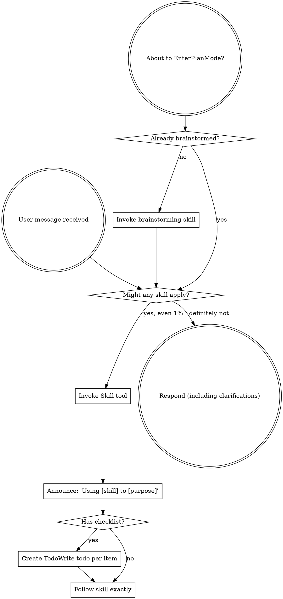

# Codex session 019f14af-242f-7421-b3da-9d559b7f0226

- Started: `2026-06-29T18:40:56.528Z`
- Working directory: `D:\100XH100`
- Originator: `Codex Desktop`
- Codex CLI: `0.142.3`
- Source log: `C:\Users\Иван Литвак\.codex\sessions\2026\06\29\rollout-2026-06-29T21-40-56-019f14af-242f-7421-b3da-9d559b7f0226.jsonl`
- Entries: user=2, assistant=14, tool calls=42, tool outputs=42

This is a chronological export of the user/assistant conversation and tool activity. Internal system/developer instructions and token accounting are intentionally excluded. Secret-shaped values are redacted; oversized tool outputs retain their beginning and end with the omitted character count.

## 1. User

Time: `2026-06-29T18:41:03.808Z` · source line `4`

```text
# AGENTS.md instructions for D:\100XH100

<INSTRUCTIONS>
# Project Agent Rules

## Operating Rule
- Read `AGENTS.md` before project edits.
- Update `memory/CHANGELOG.md` after meaningful code, config, or architecture changes.
- Update `memory/PROMPTS.md` with user prompts that define requirements.
- Store test outputs, logs, and verification notes under `test_results/`.
- Prefer agent-centered code: explicit contracts, deterministic tests, small files, low hidden state.

## Architecture Source
- Primary architecture contract: `ARCHITECTURE_NEED.md`.
- Current Stream 4 implementation rule: use threshold + compact + CUB/fixed-temp sort/reduce + compact; do not use Stream 4 hash-table dedup.

## Implementation Guardrails
- `State128` logical bytes are `v[0..119]`.
- `State128` padding bytes are `v[120..127]`.
- Persistent frontier padding must be zero.
- `FinalResponse` may temporarily store `target_local_idx` in `v[120..123]`.
- `Hash128` is one logical 128-bit key stored as `{lo, hi}`.
- `CandidateMeta` must remain 32 bytes and 32-byte aligned.
- Stream 3 payload id must be original candidate id, not compact index.
- Stream 4 must not apply shard top-k or semantic shard cap.

</INSTRUCTIONS>
<environment_context>
  <cwd>D:\100XH100</cwd>
  <shell>powershell</shell>
  <current_date>2026-06-29</current_date>
  <timezone>Europe/Moscow</timezone>
  <filesystem><workspace_roots><root>D:\100XH100</root></workspace_roots><permission_profile type="managed"><file_system type="restricted"><entry access="read"><special>:root</special></entry><entry access="write"><path>D:\100XH100</path></entry><entry access="write"><special>:slash_tmp</special></entry><entry access="write"><special>:tmpdir</special></entry><entry access="read"><path>D:\100XH100\.git</path></entry><entry access="read"><path>D:\100XH100\.agents</path></entry><entry access="read"><path>D:\100XH100\.codex</path></entry></file_system></permission_profile></filesystem>
</environment_context>
```

## 2. User

Time: `2026-06-29T18:41:03.838Z` · source line `6`

```text
Final code-quality review after fix. Worktree: D:\100XH100\.worktrees\stream1-piece-transformer. Review commit range 6b5dbf58a94714fec965808318f98483680af46a..8e4a1a06ab436ebcabd16f858a236259d98658ed.

Context: Task 6 runtime dispatcher wiring for Stream1 piece_transformer plus follow-up fix for transformer weight estimate sizing. Spec already passed before the fix. Prior quality finding was that runtime_config and dispatcher fixture used state_len for fast_slot_projected instead of max_piece_size; commit 8e4a1a0 should fix it.

Review focus:
- Did commit 8e4a1a0 correctly fix the weight estimate/fixture issue without creating new issues?
- Any remaining bugs in dispatcher backend branch, production runner view/scratch lifetimes, graph capture/replay, lane scratch slicing, memory sizing, test quality, or stream_benchmark fail-closed behavior?
- No fallback backend, no architecture changes, no State128/Stream3/Stream4 contract changes.

Coordinator verification already passed on final HEAD:
- Docker GPU build/run: stream1_transformer_cuda_tests=pass, stream1_cuda_tests=pass, dispatcher_cuda_tests=pass.
- Tiny production_runner smoke with BEAM_WEIGHT_DIR=test_results/stream1_transformer_reference/weights_fp16 logs stream1_backend=piece_transformer and exits normally.

Return findings first with severity and file/line references. If no issues, say approved. Do not modify files.
```

## 3. Codex

Time: `2026-06-29T18:41:24.849Z` · source line `9`

```text
I’ll do this as a code-review pass only: read the project rules, inspect the target diff and the fix commit, then check the runtime/test paths called out in your focus list without editing files. I’m using the required superpowers startup skill first, then the repo’s `AGENTS.md`.
```

## 4. Codex

Time: `2026-06-29T18:41:24.860Z` · source line `10`

```text
I’ll do this as a code-review pass only: read the project rules, inspect the target diff and the fix commit, then check the runtime/test paths called out in your focus list without editing files. I’m using the required superpowers startup skill first, then the repo’s `AGENTS.md`.
```

## 5. Tool call: `exec_command`

Time: `2026-06-29T18:41:24.868Z` · source line `11`

```text
{"cmd":"Get-Content -LiteralPath 'C:\\Users\\Иван Литвак\\.codex\\plugins\\cache\\openai-curated-remote\\superpowers\\5.1.4\\skills\\using-superpowers\\SKILL.md'","workdir":"D:\\100XH100","shell":"powershell","yield_time_ms":10000,"max_output_tokens":20000}
```

## 6. Tool call: `exec_command`

Time: `2026-06-29T18:41:24.966Z` · source line `12`

```text
{"cmd":"rg -n \"stream1|piece_transformer|BEAM_PREBUILT_RUNNER|D:\\\\100XH100|100XH100\" 'C:\\Users\\Иван Литвак\\.codex\\memories\\MEMORY.md'","workdir":"D:\\100XH100","shell":"powershell","yield_time_ms":10000,"max_output_tokens":12000}
```

## 7. Tool call: `exec_command`

Time: `2026-06-29T18:41:24.968Z` · source line `13`

```text
{"cmd":"Get-Content -LiteralPath 'D:\\100XH100\\AGENTS.md'","workdir":"D:\\100XH100","shell":"powershell","yield_time_ms":10000,"max_output_tokens":12000}
```

## 8. Tool output

Time: `2026-06-29T18:41:26.307Z` · source line `14`

````text
Chunk ID: ed1df6
Wall time: 0.6231 seconds
Process exited with code 0
Original token count: 1393
Output:
---
name: using-superpowers
description: Use when starting any conversation - establishes how to find and use skills, requiring Skill tool invocation before ANY response including clarifying questions
---

<SUBAGENT-STOP>
If you were dispatched as a subagent to execute a specific task, skip this skill.
</SUBAGENT-STOP>

<EXTREMELY-IMPORTANT>
If you think there is even a 1% chance a skill might apply to what you are doing, you ABSOLUTELY MUST invoke the skill.

IF A SKILL APPLIES TO YOUR TASK, YOU DO NOT HAVE A CHOICE. YOU MUST USE IT.

This is not negotiable. This is not optional. You cannot rationalize your way out of this.
</EXTREMELY-IMPORTANT>

## Instruction Priority

Superpowers skills override default system prompt behavior, but **user instructions always take precedence**:

1. **User's explicit instructions** (CLAUDE.md, GEMINI.md, AGENTS.md, direct requests) — highest priority
2. **Superpowers skills** — override default system behavior where they conflict
3. **Default system prompt** — lowest priority

If CLAUDE.md, GEMINI.md, or AGENTS.md says "don't use TDD" and a skill says "always use TDD," follow the user's instructions. The user is in control.

## How to Access Skills

**In Claude Code:** Use the `Skill` tool. When you invoke a skill, its content is loaded and presented to you—follow it directly. Never use the Read tool on skill files.

**In Copilot CLI:** Use the `skill` tool. Skills are auto-discovered from installed plugins. The `skill` tool works the same as Claude Code's `Skill` tool.

**In Gemini CLI:** Skills activate via the `activate_skill` tool. Gemini loads skill metadata at session start and activates the full content on demand.

**In other environments:** Check your platform's documentation for how skills are loaded.

## Platform Adaptation

Skills use Claude Code tool names. Non-CC platforms: see `references/copilot-tools.md` (Copilot CLI), `references/codex-tools.md` (Codex) for tool equivalents. Gemini CLI users get the tool mapping loaded automatically via GEMINI.md.

# Using Skills

## The Rule

**Invoke relevant or requested skills BEFORE any response or action.** Even a 1% chance a skill might apply means that you should invoke the skill to check. If an invoked skill turns out to be wrong for the situation, you don't need to use it.



## Red Flags

These thoughts mean STOP—you're rationalizing:

| Thought | Reality |
|---------|---------|
| "This is just a simple question" | Questions are tasks. Check for skills. |
| "I need more context first" | Skill check comes BEFORE clarifying questions. |
| "Let me explore the codebase first" | Skills tell you HOW to explore. Check first. |
| "I can check git/files quickly" | Files lack conversation context. Check for skills. |
| "Let me gather information first" | Skills tell you HOW to gather information. |
| "This doesn't need a formal skill" | If a skill exists, use it. |
| "I remember this skill" | Skills evolve. Read current version. |
| "This doesn't count as a task" | Action = task. Check for skills. |
| "The skill is overkill" | Simple things become complex. Use it. |
| "I'll just do this one thing first" | Check BEFORE doing anything. |
| "This feels productive" | Undisciplined action wastes time. Skills prevent this. |
| "I know what that means" | Knowing the concept в‰  using the skill. Invoke it. |

## Skill Priority

When multiple skills could apply, use this order:

1. **Process skills first** (brainstorming, debugging) - these determine HOW to approach the task
2. **Implementation skills second** (frontend-design, mcp-builder) - these guide execution

"Let's build X" в†’ brainstorming first, then implementation skills.
"Fix this bug" в†’ debugging first, then domain-specific skills.

## Skill Types

**Rigid** (TDD, debugging): Follow exactly. Don't adapt away discipline.

**Flexible** (patterns): Adapt principles to context.

The skill itself tells you which.

## User Instructions

Instructions say WHAT, not HOW. "Add X" or "Fix Y" doesn't mean skip workflows.

````

## 9. Tool output

Time: `2026-06-29T18:41:26.447Z` · source line `15`

```text
Chunk ID: b28325
Wall time: 0.7496 seconds
Process exited with code 0
Original token count: 581
Output:
48:applies_to: cwd=D:\100XH100; reuse_rule=reuse for this IHES/MEPhI repo family and adjacent cluster publish jobs, but treat live cluster inventory, DNS availability, and current results-repo schema as run-specific and recheck them before publishing.
54:- rollout_summaries/2026-06-04T15-47-52-Dd1O-ihes_cluster_results_prebuilt_publish_backfill.md (cwd=\\?\D:\100XH100, rollout_path=\\?\C:\Users\Иван Литвак\.codex\sessions\2026\06\04\rollout-2026-06-04T18-47-57-019e9351-cd3b-71c0-bf8b-69755d08d5fc.jsonl, updated_at=2026-06-26T19:51:22+00:00, thread_id=019e9351-cd3b-71c0-bf8b-69755d08d5fc, the prebuilt runner was compiled once and reused across the A100 array workflow)
58:- MEPhI HPC, kaf12, A100 40GB, BEAM_PREBUILT_RUNNER, prepare_ihes_prebuilt_runner.sh, ihes_solve_bucket_from_scratch.sh, prebuilt_runner_ready, using_prebuilt_runner, PUZZLE_LIMIT=1, depth=12
64:- rollout_summaries/2026-06-04T15-47-52-Dd1O-ihes_cluster_results_prebuilt_publish_backfill.md (cwd=\\?\D:\100XH100, rollout_path=\\?\C:\Users\Иван Литвак\.codex\sessions\2026\06\04\rollout-2026-06-04T18-47-57-019e9351-cd3b-71c0-bf8b-69755d08d5fc.jsonl, updated_at=2026-06-26T19:51:22+00:00, thread_id=019e9351-cd3b-71c0-bf8b-69755d08d5fc, the results repo structure and first backfilled puzzle sets were established)
74:- rollout_summaries/2026-06-04T15-47-52-Dd1O-ihes_cluster_results_prebuilt_publish_backfill.md (cwd=\\?\D:\100XH100, rollout_path=\\?\C:\Users\Иван Литвак\.codex\sessions\2026\06\04\rollout-2026-06-04T18-47-57-019e9351-cd3b-71c0-bf8b-69755d08d5fc.jsonl, updated_at=2026-06-26T19:51:22+00:00, thread_id=019e9351-cd3b-71c0-bf8b-69755d08d5fc, a file-driven inventory plus schema fixes made the larger aggregator path workable)
89:- `hpc/ihes_cube_model/prepare_ihes_prebuilt_runner.sh` builds the shared binary at `/mnt/pool/6/vokirova/beam8a100/ihes_cube_model/prebuilt-a100-ihes/production_runner`, and `hpc/ihes_cube_model/ihes_solve_bucket_from_scratch.sh` already knows how to consume `BEAM_PREBUILT_RUNNER` [Task 1]
97:- symptom: each array task recompiles instead of reusing the solver. cause: `BEAM_PREBUILT_RUNNER` was not wired through a separate prebuild dependency. fix: submit the prebuild first and make the puzzle array depend on it via `--dependency=afterok:<prebuild_job>` [Task 1]

```

## 10. Tool output

Time: `2026-06-29T18:41:26.447Z` · source line `16`

```text
Chunk ID: 6b7b96
Wall time: 0.6233 seconds
Process exited with code 0
Original token count: 290
Output:
# Project Agent Rules

## Operating Rule
- Read `AGENTS.md` before project edits.
- Update `memory/CHANGELOG.md` after meaningful code, config, or architecture changes.
- Update `memory/PROMPTS.md` with user prompts that define requirements.
- Store test outputs, logs, and verification notes under `test_results/`.
- Prefer agent-centered code: explicit contracts, deterministic tests, small files, low hidden state.

## Architecture Source
- Primary architecture contract: `ARCHITECTURE_NEED.md`.
- Current Stream 4 implementation rule: use threshold + compact + CUB/fixed-temp sort/reduce + compact; do not use Stream 4 hash-table dedup.

## Implementation Guardrails
- `State128` logical bytes are `v[0..119]`.
- `State128` padding bytes are `v[120..127]`.
- Persistent frontier padding must be zero.
- `FinalResponse` may temporarily store `target_local_idx` in `v[120..123]`.
- `Hash128` is one logical 128-bit key stored as `{lo, hi}`.
- `CandidateMeta` must remain 32 bytes and 32-byte aligned.
- Stream 3 payload id must be original candidate id, not compact index.
- Stream 4 must not apply shard top-k or semantic shard cap.

```

## 11. Codex

Time: `2026-06-29T18:41:38.609Z` · source line `19`

```text
The memory hit is only background for this repo family, not specific to Stream1. I’ll rely on current worktree evidence for the review and keep the prior cluster/run notes out of the technical conclusions unless they matter.
```

## 12. Codex

Time: `2026-06-29T18:41:38.630Z` · source line `20`

```text
The memory hit is only background for this repo family, not specific to Stream1. I’ll rely on current worktree evidence for the review and keep the prior cluster/run notes out of the technical conclusions unless they matter.
```

## 13. Tool call: `exec_command`

Time: `2026-06-29T18:41:38.630Z` · source line `21`

```text
{"cmd":"git -C 'D:\\100XH100\\.worktrees\\stream1-piece-transformer' status --short --branch","workdir":"D:\\100XH100","shell":"powershell","yield_time_ms":10000,"max_output_tokens":12000}
```

## 14. Tool call: `exec_command`

Time: `2026-06-29T18:41:38.724Z` · source line `22`

```text
{"cmd":"git -C 'D:\\100XH100\\.worktrees\\stream1-piece-transformer' diff --stat 6b5dbf58a94714fec965808318f98483680af46a..8e4a1a06ab436ebcabd16f858a236259d98658ed","workdir":"D:\\100XH100","shell":"powershell","yield_time_ms":10000,"max_output_tokens":20000}
```

## 15. Tool call: `exec_command`

Time: `2026-06-29T18:41:38.724Z` · source line `23`

```text
{"cmd":"git -C 'D:\\100XH100\\.worktrees\\stream1-piece-transformer' show --stat --oneline --decorate 8e4a1a06ab436ebcabd16f858a236259d98658ed","workdir":"D:\\100XH100","shell":"powershell","yield_time_ms":10000,"max_output_tokens":20000}
```

## 16. Tool call: `exec_command`

Time: `2026-06-29T18:41:38.725Z` · source line `24`

```text
{"cmd":"Get-Content -LiteralPath 'D:\\100XH100\\.worktrees\\stream1-piece-transformer\\AGENTS.md'","workdir":"D:\\100XH100","shell":"powershell","yield_time_ms":10000,"max_output_tokens":12000}
```

## 17. Tool output

Time: `2026-06-29T18:41:42.841Z` · source line `25`

```text
Chunk ID: f0e00f
Wall time: 3.8664 seconds
Process exited with code 0
Original token count: 70
Output:
## codex/stream1-piece-transformer
?? $null
?? build-contract-tests/
?? build-stream1-transformer-red/
?? build-task6-red/
?? build-task6-sm86/
?? build-task6/
?? config.obj
?? contract_tests.obj
?? docs/
?? frontier_cpu.obj
?? hash.obj
?? state.obj
?? stream3.obj
?? stream4.obj

```

## 18. Tool output

Time: `2026-06-29T18:41:42.856Z` · source line `26`

```text
Chunk ID: 4709a7
Wall time: 3.6916 seconds
Process exited with code 0
Original token count: 205
Output:
 cuda/dispatcher.cu                                 |  35 +++-
 cuda/dispatcher.hpp                                |  12 +-
 cuda/runtime_config.cpp                            |  76 +++++--
 memory/CHANGELOG.md                                |   3 +
 memory/PROMPTS.md                                  |   3 +
 ...tream1_transformer_runtime_wiring_2026-06-29.md |  51 +++++
 ...nsformer_weight_estimate_contract_2026-06-29.md |  11 +
 tests/dispatcher_cuda_tests.cu                     | 229 ++++++++++++++++++++-
 tests/stream1_transformer_cuda_tests.cu            |   2 +-
 tools/production_runner.cu                         |  82 +++++---
 tools/stream1_weight_io.hpp                        |  37 ++++
 tools/stream_benchmark.cu                          |   2 +-
 12 files changed, 488 insertions(+), 55 deletions(-)

```

## 19. Tool output

Time: `2026-06-29T18:41:42.856Z` · source line `27`

```text
Chunk ID: 0b2d3a
Wall time: 3.7420 seconds
Process exited with code 0
Original token count: 116
Output:
8e4a1a0 (HEAD -> codex/stream1-piece-transformer) Fix transformer weight estimate sizing
 cuda/runtime_config.cpp                            |  2 +-
 memory/CHANGELOG.md                                |  2 ++
 memory/PROMPTS.md                                  |  3 +-
 ...nsformer_weight_estimate_contract_2026-06-29.md | 11 ++++++
 tests/dispatcher_cuda_tests.cu                     | 42 +++++++++++++++++++++-
 5 files changed, 57 insertions(+), 3 deletions(-)

```

## 20. Tool output

Time: `2026-06-29T18:41:42.856Z` · source line `28`

```text
Chunk ID: 140d1a
Wall time: 0.4335 seconds
Process exited with code 0
Original token count: 290
Output:
# Project Agent Rules

## Operating Rule
- Read `AGENTS.md` before project edits.
- Update `memory/CHANGELOG.md` after meaningful code, config, or architecture changes.
- Update `memory/PROMPTS.md` with user prompts that define requirements.
- Store test outputs, logs, and verification notes under `test_results/`.
- Prefer agent-centered code: explicit contracts, deterministic tests, small files, low hidden state.

## Architecture Source
- Primary architecture contract: `ARCHITECTURE_NEED.md`.
- Current Stream 4 implementation rule: use threshold + compact + CUB/fixed-temp sort/reduce + compact; do not use Stream 4 hash-table dedup.

## Implementation Guardrails
- `State128` logical bytes are `v[0..119]`.
- `State128` padding bytes are `v[120..127]`.
- Persistent frontier padding must be zero.
- `FinalResponse` may temporarily store `target_local_idx` in `v[120..123]`.
- `Hash128` is one logical 128-bit key stored as `{lo, hi}`.
- `CandidateMeta` must remain 32 bytes and 32-byte aligned.
- Stream 3 payload id must be original candidate id, not compact index.
- Stream 4 must not apply shard top-k or semantic shard cap.

```

## 21. Codex

Time: `2026-06-29T18:41:56.790Z` · source line `31`

```text
The target worktree is on `codex/stream1-piece-transformer` with untracked build artifacts/docs, but the reviewed commit range itself is cleanly identifiable. I’m now reading the actual code paths around runtime config, dispatcher allocation, runner wiring, and the tests added for the sizing contract.
```

## 22. Codex

Time: `2026-06-29T18:41:56.824Z` · source line `32`

```text
The target worktree is on `codex/stream1-piece-transformer` with untracked build artifacts/docs, but the reviewed commit range itself is cleanly identifiable. I’m now reading the actual code paths around runtime config, dispatcher allocation, runner wiring, and the tests added for the sizing contract.
```

## 23. Tool call: `exec_command`

Time: `2026-06-29T18:41:57.037Z` · source line `33`

```text
{"cmd":"git -C 'D:\\100XH100\\.worktrees\\stream1-piece-transformer' show --find-renames --find-copies --stat --patch 8e4a1a06ab436ebcabd16f858a236259d98658ed","workdir":"D:\\100XH100","shell":"powershell","yield_time_ms":10000,"max_output_tokens":40000}
```

## 24. Tool call: `exec_command`

Time: `2026-06-29T18:41:57.044Z` · source line `34`

```text
{"cmd":"git -C 'D:\\100XH100\\.worktrees\\stream1-piece-transformer' diff --find-renames --find-copies 6b5dbf58a94714fec965808318f98483680af46a..8e4a1a06ab436ebcabd16f858a236259d98658ed -- cuda/runtime_config.cpp cuda/dispatcher.cu cuda/dispatcher.hpp tools/production_runner.cu tools/stream1_weight_io.hpp tools/stream_benchmark.cu","workdir":"D:\\100XH100","shell":"powershell","yield_time_ms":10000,"max_output_tokens":50000}
```

## 25. Tool call: `exec_command`

Time: `2026-06-29T18:41:57.044Z` · source line `35`

```text
{"cmd":"git -C 'D:\\100XH100\\.worktrees\\stream1-piece-transformer' diff --find-renames --find-copies 6b5dbf58a94714fec965808318f98483680af46a..8e4a1a06ab436ebcabd16f858a236259d98658ed -- tests/dispatcher_cuda_tests.cu tests/stream1_transformer_cuda_tests.cu","workdir":"D:\\100XH100","shell":"powershell","yield_time_ms":10000,"max_output_tokens":50000}
```

## 26. Tool call: `exec_command`

Time: `2026-06-29T18:41:57.045Z` · source line `36`

```text
{"cmd":"rg -n \"piece_transformer|fast_slot_projected|weight|scratch|graph|capture|backend|fallback|state_len|max_piece_size|lane\" 'D:\\100XH100\\.worktrees\\stream1-piece-transformer\\cuda' 'D:\\100XH100\\.worktrees\\stream1-piece-transformer\\tools' 'D:\\100XH100\\.worktrees\\stream1-piece-transformer\\tests'","workdir":"D:\\100XH100","shell":"powershell","yield_time_ms":10000,"max_output_tokens":50000}
```

## 27. Tool output

Time: `2026-06-29T18:41:59.167Z` · source line `37`

```text
Chunk ID: 44349a
Wall time: 1.2246 seconds
Process exited with code 0
Original token count: 2453
Output:
commit 8e4a1a06ab436ebcabd16f858a236259d98658ed
Author: Ivan Litvak <vanya.litvak@gmail.com>
Date:   Mon Jun 29 21:36:17 2026 +0300

    Fix transformer weight estimate sizing
---
 cuda/runtime_config.cpp                            |  2 +-
 memory/CHANGELOG.md                                |  2 ++
 memory/PROMPTS.md                                  |  3 +-
 ...nsformer_weight_estimate_contract_2026-06-29.md | 11 ++++++
 tests/dispatcher_cuda_tests.cu                     | 42 +++++++++++++++++++++-
 5 files changed, 57 insertions(+), 3 deletions(-)

diff --git a/cuda/runtime_config.cpp b/cuda/runtime_config.cpp
index 7bcc03c..20d6230 100644
--- a/cuda/runtime_config.cpp
+++ b/cuda/runtime_config.cpp
@@ -115,7 +115,7 @@ std::uint64_t estimate_stream1_weight_bytes(const Stream1ModelConfig& model) {
     }
     case STREAM1_BACKEND_PIECE_TRANSFORMER: {
         std::uint64_t half_values = 0;
-        half_values += static_cast<std::uint64_t>(model.state_len) * model.num_classes * model.d_model;
+        half_values += static_cast<std::uint64_t>(model.max_piece_size) * model.num_classes * model.d_model;
         half_values += static_cast<std::uint64_t>(model.num_pieces) * model.d_model;
         half_values += model.d_model;
         half_values += 4ULL * model.d_model;
diff --git a/memory/CHANGELOG.md b/memory/CHANGELOG.md
index e61dc96..3fe99cc 100644
--- a/memory/CHANGELOG.md
+++ b/memory/CHANGELOG.md
@@ -754,3 +754,5 @@
 - Fixed IHES live results publishing index generation after raw/backfill metadata added extra keys. The fresh bucket publisher now includes variants/source_files columns in data/ihes_cube/index.tsv and filters metadata rows to declared fields before writing index/improvements, so older per-puzzle metadata cannot crash publishing.
 
 - Fixed the registered `stream1_transformer_cuda_tests` clean-checkout behavior. The CUDA test now skips with `stream1_transformer_cuda_tests=skip missing_reference_fixture` and exits 0 when the ignored p900 reference fixture manifest or reference JSON is absent, while preserving the full fixture-backed p900 reference verification when those files exist. Verification note: `test_results/stream1_transformer_forward_2026-06-29.md`.
+
+- Fixed Stream1 piece-transformer runtime weight sizing for `fast_slot_projected`. Runtime budget estimates now use the loader/exporter contract shape `max_piece_size * num_classes * d_model`, and the dispatcher CUDA fixture allocates the same shape. Verification note: `test_results/stream1_transformer_weight_estimate_contract_2026-06-29.md`.
diff --git a/memory/PROMPTS.md b/memory/PROMPTS.md
index c7c6605..d344c73 100644
--- a/memory/PROMPTS.md
+++ b/memory/PROMPTS.md
@@ -421,4 +421,5 @@
 
 - User requested Task 5 spec-fix in `D:\100XH100\.worktrees\stream1-piece-transformer`: make registered `stream1_transformer_cuda_tests` safe in clean checkout by skipping with a clear report line when ignored reference fixture files are absent, preserve the full p900 fixture test when present, document clean-checkout and fixture-present verification, run both paths if feasible, and amend the Task 5 commit without production dispatcher wiring or fallback backend.
 
-- User requested Task 6 in `D:\100XH100\.worktrees\stream1-piece-transformer`: wire Stream1 piece-transformer into dispatcher and production runner with explicit MLP vs piece-transformer backend selection, no fallback backend, uniform mode preserved, transformer scratch-aware runtime sizing, MLP-only benchmark fail-closed unless explicitly wired, dispatcher-level transformer coverage if practical, clear production logs, verification note, and commit.
\ No newline at end of file
+- User requested Task 6 in `D:\100XH100\.worktrees\stream1-piece-transformer`: wire Stream1 piece-transformer into dispatcher and production runner with explicit MLP vs piece-transformer backend selection, no fallback backend, uniform mode preserved, transformer scratch-aware runtime sizing, MLP-only benchmark fail-closed unless explicitly wired, dispatcher-level transformer coverage if practical, clear production logs, verification note, and commit.
+- User requested fixing P3 quality-review finding in `D:\100XH100\.worktrees\stream1-piece-transformer`: make `cuda/runtime_config.cpp` estimate piece-transformer `fast_slot_projected` as `max_piece_size * num_classes * d_model`, update `tests/dispatcher_cuda_tests.cu`, keep changes minimal with no fallbacks or architecture changes, run relevant checks including Docker GPU dispatcher tests if available, update project memory/test results, commit, and report SHA/tests.
diff --git a/test_results/stream1_transformer_weight_estimate_contract_2026-06-29.md b/test_results/stream1_transformer_weight_estimate_contract_2026-06-29.md
new file mode 100644
index 0000000..c325177
--- /dev/null
+++ b/test_results/stream1_transformer_weight_estimate_contract_2026-06-29.md
@@ -0,0 +1,11 @@
+# Stream1 Transformer Weight Estimate Contract 2026-06-29
+
+Scope: Fix P3 quality-review finding for piece-transformer `fast_slot_projected` sizing. Runtime budget estimates and dispatcher fixture allocation now match the loader/exporter contract: `max_piece_size * num_classes * d_model` half values.
+
+Red check:
+- Command: `docker run --rm --gpus all -v "D:\100XH100\.worktrees\stream1-piece-transformer:/workspace" -w /workspace gpu-dev-cutlass-nsight:cuda128-sm120 bash -lc "cmake --build build-task6-sm86 --target dispatcher_cuda_tests -j2 && ./build-task6-sm86/dispatcher_cuda_tests"`
+- Result before runtime fix: FAIL as expected with `piece_transformer runtime weight estimate must size fast_slot_projected by max_piece_size, not state_len`.
+
+Final verification:
+- Command: `docker run --rm --gpus all -v "D:\100XH100\.worktrees\stream1-piece-transformer:/workspace" -w /workspace gpu-dev-cutlass-nsight:cuda128-sm120 bash -lc "cmake --build build-task6-sm86 --target dispatcher_cuda_tests -j2 && ./build-task6-sm86/dispatcher_cuda_tests"`
+- Result: PASS, `dispatcher_cuda_tests=pass`.
\ No newline at end of file
diff --git a/tests/dispatcher_cuda_tests.cu b/tests/dispatcher_cuda_tests.cu
index 188ba9a..320cab6 100644
--- a/tests/dispatcher_cuda_tests.cu
+++ b/tests/dispatcher_cuda_tests.cu
@@ -1,10 +1,13 @@
 #include "cuda_check.hpp"
 #include "../cuda/dispatcher.hpp"
+#include "../cuda/runtime_config.hpp"
 #include "../tools/stream1_weight_io.hpp"
 
 #include <cuda_fp16.h>
 #include <cuda_runtime.h>
 
+#include <cstdlib>
+
 #include <filesystem>
 #include <fstream>
 #include <iostream>
@@ -89,7 +92,7 @@ TransformerDispatcherFixture make_transformer_dispatcher_fixture(
     TransformerDispatcherFixture fixture;
     fixture.blocks.resize(model.transformer_layers);
     fixture.view.fast_slot_projected =
-        fixture.alloc_half(static_cast<std::uint64_t>(model.state_len) * model.num_classes * model.d_model, "fast_slot_projected");
+        fixture.alloc_half(static_cast<std::uint64_t>(model.max_piece_size) * model.num_classes * model.d_model, "fast_slot_projected");
     fixture.view.fast_piece_static =
         fixture.alloc_half(static_cast<std::uint64_t>(model.num_pieces) * model.d_model, "fast_piece_static");
     fixture.view.cls_token = fixture.alloc_half(model.d_model, "cls_token");
@@ -134,8 +137,44 @@ TransformerDispatcherFixture make_transformer_dispatcher_fixture(
     return fixture;
 }
 
+void run_transformer_runtime_weight_estimate_test(std::ofstream& report) {
+    const Stream1ModelConfig model = tiny_transformer_model();
+    Stream1ModelConfig larger_state_model = model;
+    larger_state_model.state_len += 7;
+    setenv("BEAM_RUNTIME_CONFIG_MODE", "manual", 1);
+    setenv("BEAM_GPU_HEADROOM_BYTES", "0", 1);
+    setenv("BEAM_STREAM3_RING_SLOTS", "1", 1);
+    setenv("BEAM_SHARD_COUNT", "1", 1);
+    setenv("BEAM_SHARD_BUFFER_COUNT", "2", 1);
+    setenv("BEAM_SHARD_CAPACITY_CANDIDATES", "262144", 1);
+    setenv("BEAM_STREAM4_BATCH_CANDIDATES", "1024", 1);
+    setenv("BEAM_STREAM4_TRIGGER_CANDIDATES", "1024", 1);
+    setenv("BEAM_STREAM4_BATCH_ALIGNMENT", "1", 1);
+    setenv("BEAM_RING_COUNT", "1", 1);
+    const RuntimeConfigBuild runtime_estimate =
+        build_runtime_config_from_budget(1024, 1, 0, model, 1024ULL * 1024ULL * 1024ULL * 1024ULL);
+    const RuntimeConfigBuild larger_state_estimate =
+        build_runtime_config_from_budget(1024, 1, 0, larger_state_model, 1024ULL * 1024ULL * 1024ULL * 1024ULL);
+    unsetenv("BEAM_RUNTIME_CONFIG_MODE");
+    unsetenv("BEAM_GPU_HEADROOM_BYTES");
+    unsetenv("BEAM_STREAM3_RING_SLOTS");
+    unsetenv("BEAM_SHARD_COUNT");
+    unsetenv("BEAM_SHARD_BUFFER_COUNT");
+    unsetenv("BEAM_SHARD_CAPACITY_CANDIDATES");
+    unsetenv("BEAM_STREAM4_BATCH_CANDIDATES");
+    unsetenv("BEAM_STREAM4_TRIGGER_CANDIDATES");
+    unsetenv("BEAM_STREAM4_BATCH_ALIGNMENT");
+    unsetenv("BEAM_RING_COUNT");
+    require(
+        runtime_estimate.estimated_non_static_device_bytes ==
+            larger_state_estimate.estimated_non_static_device_bytes,
+        "piece_transformer runtime weight estimate must size fast_slot_projected by max_piece_size, not state_len");
+    report << "- transformer_runtime_weight_estimate=pass\n";
+    report.flush();
+}
 void run_transformer_dispatcher_graph_test(std::ofstream& report) {
     const Stream1ModelConfig model = tiny_transformer_model();
+
     RuntimeConfig config;
     config.b_micro = 4;
     config.stream3_batch_candidates = 4 * static_cast<std::uint32_t>(MOVE_COUNT);
@@ -206,6 +245,7 @@ int main() {
     std::ofstream report("test_results/dispatcher_cuda_tests_2026-05-22.md");
     report << "# Dispatcher CUDA Graph Template Tests 2026-05-22\n\n";
     BEAM_CUDA_CHECK(cudaSetDevice(0));
+    run_transformer_runtime_weight_estimate_test(report);
 
     RuntimeConfig config;
     config.b_micro = 16;

```

## 28. Tool output

Time: `2026-06-29T18:41:59.167Z` · source line `38`

```text
Chunk ID: 3ceca3
Wall time: 1.2121 seconds
Process exited with code 0
Original token count: 5180
Output:
diff --git a/cuda/dispatcher.cu b/cuda/dispatcher.cu
index b7aa4e1..e13f0dd 100644
--- a/cuda/dispatcher.cu
+++ b/cuda/dispatcher.cu
@@ -1287,8 +1287,21 @@ void instantiate_cuda_graph_job_templates(
         plan.config.inference_parallelism > plan.derived.ring_slot_count) {
         throw std::invalid_argument("Stream1 concurrency must be in [1, RING_SLOT_COUNT]");
     }
-    if (network.scratch_lanes.size() < plan.config.inference_parallelism) {
-        throw std::invalid_argument("Stream1 scratch lane count is smaller than Stream1 concurrency");
+    const bool known_stream1_backend =
+        network.backend == DispatcherStream1Backend::Mlp ||
+        network.backend == DispatcherStream1Backend::PieceTransformer;
+    if (!known_stream1_backend) {
+        throw std::invalid_argument("unknown Stream1 dispatcher backend");
+    }
+    if (!network.uniform_score) {
+        if (network.backend == DispatcherStream1Backend::Mlp &&
+            network.mlp_scratch_lanes.size() < plan.config.inference_parallelism) {
+            throw std::invalid_argument("Stream1 MLP scratch lane count is smaller than Stream1 concurrency");
+        }
+        if (network.backend == DispatcherStream1Backend::PieceTransformer &&
+            network.transformer_scratch_lanes.size() < plan.config.inference_parallelism) {
+            throw std::invalid_argument("Stream1 transformer scratch lane count is smaller than Stream1 concurrency");
+        }
     }
     ensure_stream12_lane_resources(streams, events, plan.config.inference_parallelism);
     ensure_stream4_slot_resources(streams, plan.config.stream4_active_sort_slots);
@@ -1315,17 +1328,29 @@ void instantiate_cuda_graph_job_templates(
                 0,
                 candidates_per_slot * sizeof(std::uint32_t),
                 stream1_lane), "cudaMemsetAsync uniform score ring");
-        } else {
+        } else if (network.backend == DispatcherStream1Backend::Mlp) {
             stream1_inference_cutlass_cuda(
                 memory.current_frontier_states,
                 memory.streams.parent_base + job,
                 memory.streams.count + job,
                 tables.generators,
-                network.view,
-                network.scratch_lanes[lane],
+                network.mlp_view,
+                network.mlp_scratch_lanes[lane],
                 memory.streams.score_ring + candidate_offset,
                 plan.config.b_micro,
                 stream1_lane);
+        } else if (network.backend == DispatcherStream1Backend::PieceTransformer) {
+            stream1_transformer_inference_cuda(
+                memory.current_frontier_states,
+                memory.streams.parent_base + job,
+                memory.streams.count + job,
+                network.transformer_view,
+                network.transformer_scratch_lanes[lane],
+                memory.streams.score_ring + candidate_offset,
+                plan.config.b_micro,
+                stream1_lane);
+        } else {
+            throw std::invalid_argument("unknown Stream1 dispatcher backend");
         }
         stream2_hash_goal_cuda(
             memory.current_frontier_states,
diff --git a/cuda/dispatcher.hpp b/cuda/dispatcher.hpp
index d0cd448..d07515f 100644
--- a/cuda/dispatcher.hpp
+++ b/cuda/dispatcher.hpp
@@ -57,9 +57,17 @@ struct DispatcherDeviceTables {
     const Hash128* zobrist = nullptr;
 };
 
+enum class DispatcherStream1Backend : std::uint8_t {
+    Mlp = 0,
+    PieceTransformer = 1,
+};
+
 struct DispatcherNetwork {
-    Stream1NetworkView view;
-    std::vector<Stream1CutlassScratch> scratch_lanes;
+    DispatcherStream1Backend backend = DispatcherStream1Backend::Mlp;
+    Stream1NetworkView mlp_view{};
+    std::vector<Stream1CutlassScratch> mlp_scratch_lanes;
+    Stream1TransformerNetworkView transformer_view{};
+    std::vector<Stream1TransformerScratchView> transformer_scratch_lanes;
     bool uniform_score = false;
 };
 
diff --git a/cuda/runtime_config.cpp b/cuda/runtime_config.cpp
index cb0dcf9..20d6230 100644
--- a/cuda/runtime_config.cpp
+++ b/cuda/runtime_config.cpp
@@ -1,4 +1,6 @@
 #include "runtime_config.hpp"
+#define BEAM_STREAM1_WEIGHT_IO_MANIFEST_ONLY
+#include "../tools/stream1_weight_io.hpp"
 
 #include <algorithm>
 #include <cstring>
@@ -89,37 +91,73 @@ std::uint64_t ceil_log2_u64(std::uint64_t value) {
 
 std::uint64_t estimate_stream1_weight_bytes(const Stream1ModelConfig& model) {
     constexpr std::uint64_t fp16 = sizeof(std::uint16_t);
-    std::uint64_t total = 0;
-    total += static_cast<std::uint64_t>(model.state_len) * model.num_classes * model.hidden1 * fp16;
-    total += static_cast<std::uint64_t>(model.hidden1) * fp16;
-    total += static_cast<std::uint64_t>(model.hidden1) * model.hidden2 * fp16;
-    total += static_cast<std::uint64_t>(model.hidden2) * fp16;
-    total += 2ULL * static_cast<std::uint64_t>(model.residual_count) * model.hidden2 * model.hidden2 * fp16;
-    total += 2ULL * static_cast<std::uint64_t>(model.residual_count) * model.hidden2 * fp16;
-    total += static_cast<std::uint64_t>(model.hidden2) * model.output_dim * fp16;
-    total += static_cast<std::uint64_t>(model.output_dim) * fp16;
-    return total;
+    switch (model.backend) {
+    case STREAM1_BACKEND_MLP: {
+        std::uint64_t total = 0;
+        total += static_cast<std::uint64_t>(model.state_len) * model.num_classes * model.hidden1 * fp16;
+        total += static_cast<std::uint64_t>(model.hidden1) * fp16;
+        if (model.normalization == STREAM1_NORM_LAYERNORM) {
+            total += 2ULL * static_cast<std::uint64_t>(model.hidden1) * fp16;
+        }
+        total += static_cast<std::uint64_t>(model.hidden1) * model.hidden2 * fp16;
+        total += static_cast<std::uint64_t>(model.hidden2) * fp16;
+        if (model.normalization == STREAM1_NORM_LAYERNORM) {
+            total += 2ULL * static_cast<std::uint64_t>(model.hidden2) * fp16;
+        }
+        total += 2ULL * static_cast<std::uint64_t>(model.residual_count) * model.hidden2 * model.hidden2 * fp16;
+        total += 2ULL * static_cast<std::uint64_t>(model.residual_count) * model.hidden2 * fp16;
+        if (model.normalization == STREAM1_NORM_LAYERNORM) {
+            total += 4ULL * static_cast<std::uint64_t>(model.residual_count) * model.hidden2 * fp16;
+        }
+        total += static_cast<std::uint64_t>(model.hidden2) * model.output_dim * fp16;
+        total += static_cast<std::uint64_t>(model.output_dim) * fp16;
+        return total;
+    }
+    case STREAM1_BACKEND_PIECE_TRANSFORMER: {
+        std::uint64_t half_values = 0;
+        half_values += static_cast<std::uint64_t>(model.max_piece_size) * model.num_classes * model.d_model;
+        half_values += static_cast<std::uint64_t>(model.num_pieces) * model.d_model;
+        half_values += model.d_model;
+        half_values += 4ULL * model.d_model;
+        for (std::uint32_t layer = 0; layer < model.transformer_layers; ++layer) {
+            half_values += 2ULL * model.d_model;
+            half_values += static_cast<std::uint64_t>(model.d_model) * 3ULL * model.d_model;
+            half_values += 3ULL * model.d_model;
+            half_values += static_cast<std::uint64_t>(model.d_model) * model.d_model;
+            half_values += model.d_model;
+            half_values += 2ULL * model.d_model;
+            half_values += static_cast<std::uint64_t>(model.d_model) * model.ff_dim;
+            half_values += model.ff_dim;
+            half_values += static_cast<std::uint64_t>(model.ff_dim) * model.d_model;
+            half_values += model.d_model;
+        }
+        half_values += static_cast<std::uint64_t>(model.d_model) * model.output_dim;
+        half_values += model.output_dim;
+        const std::uint64_t piece_table_bytes =
+            static_cast<std::uint64_t>(model.num_pieces) * model.max_piece_size * sizeof(std::uint16_t) +
+            static_cast<std::uint64_t>(model.num_pieces) * model.max_piece_size * sizeof(std::uint8_t) +
+            static_cast<std::uint64_t>(model.num_pieces) * sizeof(std::uint8_t);
+        return half_values * fp16 + piece_table_bytes;
+    }
+    default:
+        throw std::invalid_argument("unsupported Stream1 backend in weight byte estimate");
+    }
 }
-
 std::uint64_t estimate_read_only_table_bytes() {
     return static_cast<std::uint64_t>(MOVE_COUNT) * STATE_STORAGE_LEN * sizeof(std::uint8_t) +
            sizeof(State128) +
            static_cast<std::uint64_t>(STATE_STORAGE_LEN) * STATE_VALUE_PAD * sizeof(Hash128);
 }
 
-std::uint64_t estimate_stream1_scratch_bytes(std::uint32_t b_micro, const Stream1ModelConfig& model) {
-    return stream1_inference_rows(b_micro, model) *
-           (static_cast<std::uint64_t>(model.hidden1) + 2ULL * model.hidden2 + model.output_dim) *
-           sizeof(std::uint16_t);
-}
-
 std::uint64_t estimate_non_static_device_bytes(
     const RuntimeConfig& config,
     const Stream1ModelConfig& stream1_model) {
     return estimate_read_only_table_bytes() +
            estimate_stream1_weight_bytes(stream1_model) +
-           static_cast<std::uint64_t>(config.inference_parallelism) *
-               estimate_stream1_scratch_bytes(config.b_micro, stream1_model);
+           stream1_weights::stream1_scratch_bytes(
+               stream1_model,
+               config.b_micro,
+               config.inference_parallelism);
 }
 
 std::uint64_t beam_alignment_for(const RuntimeConfig& config) {
diff --git a/tools/production_runner.cu b/tools/production_runner.cu
index b48e527..2fefa27 100644
--- a/tools/production_runner.cu
+++ b/tools/production_runner.cu
@@ -3952,9 +3952,6 @@ int main(int argc, char** argv) {
     const stream1_weights::HostWeightBytes host_weights =
         stream1_weights::load_stream1_weights(weight_dir);
     const Stream1ModelConfig& stream1_model = host_weights.model;
-    if (stream1_model.backend == STREAM1_BACKEND_PIECE_TRANSFORMER) {
-        throw std::runtime_error("piece_transformer Stream1 forward is not wired yet");
-    }
     const RuntimeConfigBuild config_build =
         build_runtime_config_from_budget(beam, world_size, rank, stream1_model, free_before);
     const RuntimeConfig config = config_build.config;
@@ -4138,15 +4135,28 @@ int main(int argc, char** argv) {
         std::cout << "solve_bucket_result_tsv=" << solve_bucket_result_path.string() << "\n";
     }
     std::cout << "weight_dir=" << weight_dir.string() << "\n";
+    std::cout << "stream1_model_backend="
+              << (stream1_model.backend == STREAM1_BACKEND_PIECE_TRANSFORMER ? "piece_transformer" : "mlp") << "\n";
     std::cout << "stream1_model_state_len=" << stream1_model.state_len << "\n";
     std::cout << "stream1_model_num_classes=" << stream1_model.num_classes << "\n";
-    std::cout << "stream1_model_hidden1=" << stream1_model.hidden1 << "\n";
-    std::cout << "stream1_model_hidden2=" << stream1_model.hidden2 << "\n";
-    std::cout << "stream1_model_residual_count=" << stream1_model.residual_count << "\n";
+    if (stream1_model.backend == STREAM1_BACKEND_MLP) {
+        std::cout << "stream1_model_hidden1=" << stream1_model.hidden1 << "\n";
+        std::cout << "stream1_model_hidden2=" << stream1_model.hidden2 << "\n";
+        std::cout << "stream1_model_residual_count=" << stream1_model.residual_count << "\n";
+        std::cout << "stream1_model_normalization="
+                  << (stream1_model.normalization == STREAM1_NORM_LAYERNORM ? "layernorm" : "none") << "\n";
+    } else if (stream1_model.backend == STREAM1_BACKEND_PIECE_TRANSFORMER) {
+        std::cout << "stream1_model_num_pieces=" << stream1_model.num_pieces << "\n";
+        std::cout << "stream1_model_max_piece_size=" << stream1_model.max_piece_size << "\n";
+        std::cout << "stream1_model_seq_len=" << stream1_model.seq_len << "\n";
+        std::cout << "stream1_model_d_model=" << stream1_model.d_model << "\n";
+        std::cout << "stream1_model_nhead=" << stream1_model.nhead << "\n";
+        std::cout << "stream1_model_head_dim=" << stream1_model.head_dim << "\n";
+        std::cout << "stream1_model_transformer_layers=" << stream1_model.transformer_layers << "\n";
+        std::cout << "stream1_model_ff_dim=" << stream1_model.ff_dim << "\n";
+    }
     std::cout << "stream1_model_output_dim=" << stream1_model.output_dim << "\n";
     std::cout << "stream1_model_dtype=" << (stream1_model.dtype == STREAM1_DTYPE_BF16 ? "bf16" : "fp16") << "\n";
-    std::cout << "stream1_model_normalization="
-              << (stream1_model.normalization == STREAM1_NORM_LAYERNORM ? "layernorm" : "none") << "\n";
     std::cout << "stream1_model_weight_bytes=" << stream1_weights::total_host_weight_bytes(host_weights) << "\n";
     std::cout << "solved_neighborhood_radius=" << solved_neighborhood.radius << "\n";
     std::cout << "solved_neighborhood_entries=" << solved_neighborhood.entry_count << "\n";
@@ -4233,7 +4243,6 @@ int main(int argc, char** argv) {
     CudaGraphJobTemplates graphs;
     create_dispatcher_streams(streams);
     create_dispatcher_events(events);
-    const Stream1NetworkDims dims = stream1_weights::network_dims(stream1_model);
     const char* stream1_mode_env = std::getenv("BEAM_STREAM1_MODE");
     const bool stream1_uniform_score =
         stream1_mode_env != nullptr && std::strcmp(stream1_mode_env, "uniform") == 0;
@@ -4243,18 +4252,27 @@ int main(int argc, char** argv) {
         throw std::runtime_error("BEAM_STREAM1_MODE must be model or uniform");
     }
     std::cout << "stream1_mode=" << (stream1_uniform_score ? "uniform" : "model") << "\n";
-    std::vector<Stream1CutlassScratch> stream1_scratch_lanes;
-    stream1_scratch_lanes.reserve(config.inference_parallelism);
-    const std::uint64_t stream1_rows_per_lane = stream1_inference_rows(config.b_micro, stream1_model);
-    for (std::uint32_t lane = 0; lane < config.inference_parallelism; ++lane) {
-        stream1_scratch_lanes.push_back(Stream1CutlassScratch{
-            stream1_scratch.hidden1 + static_cast<std::uint64_t>(lane) * stream1_rows_per_lane * stream1_model.hidden1,
-            stream1_scratch.hidden2 + static_cast<std::uint64_t>(lane) * stream1_rows_per_lane * stream1_model.hidden2,
-            stream1_scratch.residual + static_cast<std::uint64_t>(lane) * stream1_rows_per_lane * stream1_model.hidden2,
-            stream1_scratch.output + static_cast<std::uint64_t>(lane) * stream1_rows_per_lane * stream1_model.output_dim});
-    }
-    DispatcherNetwork network{
-        Stream1NetworkView{
+    std::cout << "stream1_backend="
+              << (stream1_model.backend == STREAM1_BACKEND_PIECE_TRANSFORMER ? "piece_transformer" : "mlp") << "\n";
+    if (stream1_model.backend == STREAM1_BACKEND_PIECE_TRANSFORMER) {
+        std::cout << "stream1_transformer_dims"
+                  << " seq_len=" << stream1_model.seq_len
+                  << " d_model=" << stream1_model.d_model
+                  << " nhead=" << stream1_model.nhead
+                  << " head_dim=" << stream1_model.head_dim
+                  << " layers=" << stream1_model.transformer_layers
+                  << " ff_dim=" << stream1_model.ff_dim
+                  << " output_dim=" << stream1_model.output_dim
+                  << "\n";
+    }
+
+    DispatcherNetwork network{};
+    network.uniform_score = stream1_uniform_score;
+    stream1_weights::TransformerNetworkViewHolder transformer_view_holder;
+    if (stream1_model.backend == STREAM1_BACKEND_MLP) {
+        const Stream1NetworkDims dims = stream1_weights::network_dims(stream1_model);
+        network.backend = DispatcherStream1Backend::Mlp;
+        network.mlp_view = Stream1NetworkView{
             device_weights.input_weight,
             device_weights.input_bias,
             device_weights.input_ln_gamma,
@@ -4273,9 +4291,25 @@ int main(int argc, char** argv) {
             reinterpret_cast<const half* const*>(device_weights.residual_fc2_ln_beta_table),
             device_weights.output_weight,
             device_weights.output_bias,
-            dims},
-        stream1_scratch_lanes,
-        stream1_uniform_score};
+            dims};
+        network.mlp_scratch_lanes.reserve(config.inference_parallelism);
+        for (std::uint32_t lane = 0; lane < config.inference_parallelism; ++lane) {
+            network.mlp_scratch_lanes.push_back(
+                stream1_weights::mlp_scratch_view(stream1_scratch, stream1_model, config.b_micro, lane));
+        }
+    } else if (stream1_model.backend == STREAM1_BACKEND_PIECE_TRANSFORMER) {
+        transformer_view_holder =
+            stream1_weights::transformer_network_view(device_weights.transformer, stream1_model);
+        network.backend = DispatcherStream1Backend::PieceTransformer;
+        network.transformer_view = transformer_view_holder.view;
+        network.transformer_scratch_lanes.reserve(config.inference_parallelism);
+        for (std::uint32_t lane = 0; lane < config.inference_parallelism; ++lane) {
+            network.transformer_scratch_lanes.push_back(
+                stream1_weights::transformer_scratch_view(stream1_scratch, stream1_model, config.b_micro, lane));
+        }
+    } else {
+        throw std::runtime_error("unsupported Stream1 backend in production runner");
+    }
     DispatcherDeviceTables tables{generators, central_state, zobrist};
     Stream2SolvedBuffers solved{
         memory.solved_flag,
diff --git a/tools/stream1_weight_io.hpp b/tools/stream1_weight_io.hpp
index c95afb1..6146456 100644
--- a/tools/stream1_weight_io.hpp
+++ b/tools/stream1_weight_io.hpp
@@ -960,6 +960,24 @@ inline TransformerNetworkViewHolder transformer_network_view(
 inline void free_transformer_network_view(TransformerNetworkViewHolder& holder) {
     holder = TransformerNetworkViewHolder{};
 }
+
+inline Stream1CutlassScratch mlp_scratch_view(
+    const ScratchAllocation& scratch,
+    const Stream1ModelConfig& model,
+    std::uint32_t b_micro,
+    std::uint32_t lane) {
+    if (model.backend != STREAM1_BACKEND_MLP) {
+        throw std::runtime_error("piece_transformer Stream1 scratch cannot be viewed as MLP scratch");
+    }
+    const std::uint64_t rows = stream1_inference_rows(b_micro, model);
+    const std::uint64_t lane_rows = static_cast<std::uint64_t>(lane) * rows;
+    return Stream1CutlassScratch{
+        scratch.hidden1 + lane_rows * model.hidden1,
+        scratch.hidden2 + lane_rows * model.hidden2,
+        scratch.residual + lane_rows * model.hidden2,
+        scratch.output + lane_rows * model.output_dim};
+}
+
 inline Stream1TransformerScratchView transformer_scratch_view(const ScratchAllocation& scratch) {
     return Stream1TransformerScratchView{
         scratch.transformer_tokens,
@@ -969,6 +987,25 @@ inline Stream1TransformerScratchView transformer_scratch_view(const ScratchAlloc
         scratch.transformer_ff_hidden,
         scratch.transformer_logits};
 }
+
+inline Stream1TransformerScratchView transformer_scratch_view(
+    const ScratchAllocation& scratch,
+    const Stream1ModelConfig& model,
+    std::uint32_t b_micro,
+    std::uint32_t lane) {
+    if (model.backend != STREAM1_BACKEND_PIECE_TRANSFORMER) {
+        throw std::runtime_error("MLP Stream1 scratch cannot be viewed as a piece_transformer");
+    }
+    const std::uint64_t rows = stream1_inference_rows(b_micro, model);
+    const std::uint64_t lane_rows = static_cast<std::uint64_t>(lane) * rows;
+    return Stream1TransformerScratchView{
+        scratch.transformer_tokens + lane_rows * model.seq_len * model.d_model,
+        scratch.transformer_qkv + lane_rows * model.seq_len * 3ULL * model.d_model,
+        scratch.transformer_attention_scores_probs + lane_rows * model.nhead * model.seq_len * model.seq_len,
+        scratch.transformer_attention_context + lane_rows * model.seq_len * model.d_model,
+        scratch.transformer_ff_hidden + lane_rows * model.seq_len * model.ff_dim,
+        scratch.transformer_logits + lane_rows * model.output_dim};
+}
 #endif
 
 } // namespace beam::stream1_weights
diff --git a/tools/stream_benchmark.cu b/tools/stream_benchmark.cu
index 907e10d..3781716 100644
--- a/tools/stream_benchmark.cu
+++ b/tools/stream_benchmark.cu
@@ -738,7 +738,7 @@ int main(int argc, char** argv) {
         stream1_weights::load_stream1_weights(weight_dir);
     const Stream1ModelConfig& stream1_model = host_weights.model;
     if (stream1_model.backend == STREAM1_BACKEND_PIECE_TRANSFORMER) {
-        throw std::runtime_error("piece_transformer Stream1 forward is not wired yet");
+        throw std::runtime_error("stream_benchmark is MLP-only; piece_transformer benchmark path is not implemented");
     }
 
     const std::uint32_t max_states =

```

## 29. Tool output

Time: `2026-06-29T18:41:59.185Z` · source line `39`

```text
Chunk ID: 5a8133
Wall time: 1.2263 seconds
Process exited with code 0
Original token count: 3460
Output:
diff --git a/tests/dispatcher_cuda_tests.cu b/tests/dispatcher_cuda_tests.cu
index fa65712..320cab6 100644
--- a/tests/dispatcher_cuda_tests.cu
+++ b/tests/dispatcher_cuda_tests.cu
@@ -1,9 +1,13 @@
 #include "cuda_check.hpp"
 #include "../cuda/dispatcher.hpp"
+#include "../cuda/runtime_config.hpp"
+#include "../tools/stream1_weight_io.hpp"
 
 #include <cuda_fp16.h>
 #include <cuda_runtime.h>
 
+#include <cstdlib>
+
 #include <filesystem>
 #include <fstream>
 #include <iostream>
@@ -18,6 +22,222 @@ void require(bool condition, const char* message) {
         throw std::runtime_error(message);
     }
 }
+
+template <typename T>
+T* cuda_alloc_count(std::uint64_t count, const char* name) {
+    T* ptr = nullptr;
+    cudaError_t status = cudaMalloc(&ptr, count * sizeof(T));
+    if (status != cudaSuccess) {
+        throw std::runtime_error(std::string("cudaMalloc failed for ") + name + ": " + cudaGetErrorString(status));
+    }
+    BEAM_CUDA_CHECK(cudaMemset(ptr, 0, count * sizeof(T)));
+    return ptr;
+}
+
+struct TransformerDispatcherFixture {
+    std::vector<half*> half_allocations;
+    std::uint16_t* piece_positions = nullptr;
+    std::uint8_t* piece_mask = nullptr;
+    std::uint8_t* piece_types = nullptr;
+    std::vector<Stream1TransformerBlockView> blocks;
+    Stream1TransformerNetworkView view{};
+    Stream1TransformerScratchView scratch{};
+    stream1_weights::ScratchAllocation scratch_allocation{};
+
+    half* alloc_half(std::uint64_t count, const char* name) {
+        half* ptr = cuda_alloc_count<half>(count, name);
+        half_allocations.push_back(ptr);
+        return ptr;
+    }
+
+    void destroy() {
+        for (half* ptr : half_allocations) {
+            cudaFree(ptr);
+        }
+        half_allocations.clear();
+        cudaFree(piece_positions);
+        cudaFree(piece_mask);
+        cudaFree(piece_types);
+        piece_positions = nullptr;
+        piece_mask = nullptr;
+        piece_types = nullptr;
+        stream1_weights::free_stream1_scratch(scratch_allocation);
+        view = {};
+        scratch = {};
+        blocks.clear();
+    }
+};
+
+Stream1ModelConfig tiny_transformer_model() {
+    Stream1ModelConfig model;
+    model.backend = STREAM1_BACKEND_PIECE_TRANSFORMER;
+    model.state_len = STATE_LEN;
+    model.num_classes = stream1_weights::TRANSFORMER_NUM_CLASSES;
+    model.output_dim = static_cast<std::uint32_t>(MOVE_COUNT);
+    model.num_pieces = stream1_weights::TRANSFORMER_NUM_PIECES;
+    model.max_piece_size = stream1_weights::TRANSFORMER_MAX_PIECE_SIZE;
+    model.seq_len = stream1_weights::TRANSFORMER_SEQ_LEN;
+    model.d_model = stream1_weights::TRANSFORMER_D_MODEL;
+    model.nhead = stream1_weights::TRANSFORMER_NHEAD;
+    model.head_dim = stream1_weights::TRANSFORMER_HEAD_DIM;
+    model.transformer_layers = stream1_weights::TRANSFORMER_LAYERS;
+    model.ff_dim = stream1_weights::TRANSFORMER_FF_DIM;
+    model.dtype = STREAM1_DTYPE_FP16;
+    return model;
+}
+
+TransformerDispatcherFixture make_transformer_dispatcher_fixture(
+    const Stream1ModelConfig& model,
+    std::uint32_t b_micro) {
+    TransformerDispatcherFixture fixture;
+    fixture.blocks.resize(model.transformer_layers);
+    fixture.view.fast_slot_projected =
+        fixture.alloc_half(static_cast<std::uint64_t>(model.max_piece_size) * model.num_classes * model.d_model, "fast_slot_projected");
+    fixture.view.fast_piece_static =
+        fixture.alloc_half(static_cast<std::uint64_t>(model.num_pieces) * model.d_model, "fast_piece_static");
+    fixture.view.cls_token = fixture.alloc_half(model.d_model, "cls_token");
+    fixture.view.input_ln_gamma = fixture.alloc_half(model.d_model, "input_ln_gamma");
+    fixture.view.input_ln_beta = fixture.alloc_half(model.d_model, "input_ln_beta");
+    fixture.view.output_ln_gamma = fixture.alloc_half(model.d_model, "output_ln_gamma");
+    fixture.view.output_ln_beta = fixture.alloc_half(model.d_model, "output_ln_beta");
+    for (std::uint32_t layer = 0; layer < model.transformer_layers; ++layer) {
+        fixture.blocks[layer] = Stream1TransformerBlockView{
+            fixture.alloc_half(model.d_model, "ln1_gamma"),
+            fixture.alloc_half(model.d_model, "ln1_beta"),
+            fixture.alloc_half(static_cast<std::uint64_t>(model.d_model) * 3ULL * model.d_model, "attn_qkv_weight"),
+            fixture.alloc_half(3ULL * model.d_model, "attn_qkv_bias"),
+            fixture.alloc_half(static_cast<std::uint64_t>(model.d_model) * model.d_model, "attn_out_weight"),
+            fixture.alloc_half(model.d_model, "attn_out_bias"),
+            fixture.alloc_half(model.d_model, "ln2_gamma"),
+            fixture.alloc_half(model.d_model, "ln2_beta"),
+            fixture.alloc_half(static_cast<std::uint64_t>(model.d_model) * model.ff_dim, "ff1_weight"),
+            fixture.alloc_half(model.ff_dim, "ff1_bias"),
+            fixture.alloc_half(static_cast<std::uint64_t>(model.ff_dim) * model.d_model, "ff2_weight"),
+            fixture.alloc_half(model.d_model, "ff2_bias")};
+    }
+    fixture.view.blocks = fixture.blocks.data();
+    fixture.view.output_weight =
+        fixture.alloc_half(static_cast<std::uint64_t>(model.d_model) * model.output_dim, "output_weight");
+    fixture.view.output_bias = fixture.alloc_half(model.output_dim, "output_bias");
+    fixture.piece_positions = cuda_alloc_count<std::uint16_t>(
+        static_cast<std::uint64_t>(model.num_pieces) * model.max_piece_size,
+        "piece_positions");
+    fixture.piece_mask = cuda_alloc_count<std::uint8_t>(
+        static_cast<std::uint64_t>(model.num_pieces) * model.max_piece_size,
+        "piece_mask");
+    fixture.piece_types = cuda_alloc_count<std::uint8_t>(
+        model.num_pieces,
+        "piece_types");
+    fixture.view.piece_positions = fixture.piece_positions;
+    fixture.view.piece_mask = fixture.piece_mask;
+    fixture.view.piece_types = fixture.piece_types;
+    fixture.view.dims = stream1_weights::transformer_dims(model);
+    fixture.scratch_allocation = stream1_weights::alloc_stream1_scratch(model, b_micro, 1);
+    fixture.scratch = stream1_weights::transformer_scratch_view(fixture.scratch_allocation);
+    return fixture;
+}
+
+void run_transformer_runtime_weight_estimate_test(std::ofstream& report) {
+    const Stream1ModelConfig model = tiny_transformer_model();
+    Stream1ModelConfig larger_state_model = model;
+    larger_state_model.state_len += 7;
+    setenv("BEAM_RUNTIME_CONFIG_MODE", "manual", 1);
+    setenv("BEAM_GPU_HEADROOM_BYTES", "0", 1);
+    setenv("BEAM_STREAM3_RING_SLOTS", "1", 1);
+    setenv("BEAM_SHARD_COUNT", "1", 1);
+    setenv("BEAM_SHARD_BUFFER_COUNT", "2", 1);
+    setenv("BEAM_SHARD_CAPACITY_CANDIDATES", "262144", 1);
+    setenv("BEAM_STREAM4_BATCH_CANDIDATES", "1024", 1);
+    setenv("BEAM_STREAM4_TRIGGER_CANDIDATES", "1024", 1);
+    setenv("BEAM_STREAM4_BATCH_ALIGNMENT", "1", 1);
+    setenv("BEAM_RING_COUNT", "1", 1);
+    const RuntimeConfigBuild runtime_estimate =
+        build_runtime_config_from_budget(1024, 1, 0, model, 1024ULL * 1024ULL * 1024ULL * 1024ULL);
+    const RuntimeConfigBuild larger_state_estimate =
+        build_runtime_config_from_budget(1024, 1, 0, larger_state_model, 1024ULL * 1024ULL * 1024ULL * 1024ULL);
+    unsetenv("BEAM_RUNTIME_CONFIG_MODE");
+    unsetenv("BEAM_GPU_HEADROOM_BYTES");
+    unsetenv("BEAM_STREAM3_RING_SLOTS");
+    unsetenv("BEAM_SHARD_COUNT");
+    unsetenv("BEAM_SHARD_BUFFER_COUNT");
+    unsetenv("BEAM_SHARD_CAPACITY_CANDIDATES");
+    unsetenv("BEAM_STREAM4_BATCH_CANDIDATES");
+    unsetenv("BEAM_STREAM4_TRIGGER_CANDIDATES");
+    unsetenv("BEAM_STREAM4_BATCH_ALIGNMENT");
+    unsetenv("BEAM_RING_COUNT");
+    require(
+        runtime_estimate.estimated_non_static_device_bytes ==
+            larger_state_estimate.estimated_non_static_device_bytes,
+        "piece_transformer runtime weight estimate must size fast_slot_projected by max_piece_size, not state_len");
+    report << "- transformer_runtime_weight_estimate=pass\n";
+    report.flush();
+}
+void run_transformer_dispatcher_graph_test(std::ofstream& report) {
+    const Stream1ModelConfig model = tiny_transformer_model();
+
+    RuntimeConfig config;
+    config.b_micro = 4;
+    config.stream3_batch_candidates = 4 * static_cast<std::uint32_t>(MOVE_COUNT);
+    config.stream4_batch_candidates = 64;
+    config.stream4_active_sort_slots = 1;
+    config.ring_count = 1;
+    config.shard_count = 1;
+    config.shard_capacity_candidates = 128;
+    config.global_spill_capacity = 128;
+    config.stream4_batch_alignment = 1;
+    config.user_global_beam_width = 64;
+    config.solved_result_capacity = 8;
+    const StaticMemoryPlan plan = make_static_memory_plan(config);
+    StaticDeviceMemory memory;
+    allocate_static_device_memory(plan, memory);
+    BEAM_CUDA_CHECK(cudaMemset(memory.allocation, 0, memory.allocation_bytes));
+
+    std::uint8_t* generators = nullptr;
+    State128* central_state = nullptr;
+    Hash128* zobrist = nullptr;
+    BEAM_CUDA_CHECK(cudaMalloc(&generators, MOVE_COUNT * STATE_STORAGE_LEN));
+    BEAM_CUDA_CHECK(cudaMalloc(&central_state, sizeof(State128)));
+    BEAM_CUDA_CHECK(cudaMalloc(&zobrist, STATE_STORAGE_LEN * STATE_VALUE_PAD * sizeof(Hash128)));
+    BEAM_CUDA_CHECK(cudaMemset(generators, 0, MOVE_COUNT * STATE_STORAGE_LEN));
+    BEAM_CUDA_CHECK(cudaMemset(central_state, 255, sizeof(State128)));
+    BEAM_CUDA_CHECK(cudaMemset(zobrist, 0, STATE_STORAGE_LEN * STATE_VALUE_PAD * sizeof(Hash128)));
+
+    TransformerDispatcherFixture fixture = make_transformer_dispatcher_fixture(model, config.b_micro);
+    DispatcherStreams streams;
+    DispatcherEvents events;
+    CudaGraphJobTemplates graphs;
+    create_dispatcher_streams(streams);
+    create_dispatcher_events(events);
+    DispatcherNetwork network{};
+    network.backend = DispatcherStream1Backend::PieceTransformer;
+    network.transformer_view = fixture.view;
+    network.transformer_scratch_lanes = {fixture.scratch};
+    DispatcherDeviceTables tables{generators, central_state, zobrist};
+    Stream2SolvedBuffers solved{
+        memory.solved_flag,
+        memory.stop_flag,
+        memory.solved_count,
+        memory.solved_overflow,
+        memory.solved_meta_list,
+        memory.solved_depth_list,
+        config.solved_result_capacity};
+
+    instantiate_cuda_graph_job_templates(plan, memory, tables, network, solved, streams, events, graphs);
+    const DepthDispatchState state = run_depth_cuda_graphs(plan, memory, graphs, streams, config.b_micro);
+    BEAM_CUDA_CHECK(cudaDeviceSynchronize());
+    require(state.depth_drained, "transformer depth dispatcher must drain the depth");
+    require(state.ring_slot_jobs_launched == 1U, "transformer ring slot launch count mismatch");
+    report << "- transformer_dispatcher_branch=pass\n";
+
+    destroy_cuda_graph_job_templates(graphs);
+    destroy_dispatcher_events(events);
+    destroy_dispatcher_streams(streams);
+    fixture.destroy();
+    free_static_device_memory(memory);
+    cudaFree(generators);
+    cudaFree(central_state);
+    cudaFree(zobrist);
+}
 } // namespace
 
 int main() {
@@ -25,6 +245,7 @@ int main() {
     std::ofstream report("test_results/dispatcher_cuda_tests_2026-05-22.md");
     report << "# Dispatcher CUDA Graph Template Tests 2026-05-22\n\n";
     BEAM_CUDA_CHECK(cudaSetDevice(0));
+    run_transformer_runtime_weight_estimate_test(report);
 
     RuntimeConfig config;
     config.b_micro = 16;
@@ -87,9 +308,10 @@ int main() {
     create_dispatcher_events(events);
     CudaGraphJobTemplates graphs;
     Stream1NetworkDims dims{STATE_LEN, STATE_VALUE_PAD, hidden1_cols, hidden2_cols, 0, static_cast<std::uint32_t>(MOVE_COUNT), STREAM1_DTYPE_FP16, STREAM1_NORM_NONE};
-    DispatcherNetwork network{
-        Stream1NetworkView{input_weight, input_bias, nullptr, nullptr, hidden_weight, hidden_bias, nullptr, nullptr, nullptr, nullptr, nullptr, nullptr, nullptr, nullptr, nullptr, nullptr, output_weight, output_bias, dims},
-        std::vector<Stream1CutlassScratch>{Stream1CutlassScratch{hidden1, hidden2, residual, output}}};
+    DispatcherNetwork network{};
+    network.backend = DispatcherStream1Backend::Mlp;
+    network.mlp_view = Stream1NetworkView{input_weight, input_bias, nullptr, nullptr, hidden_weight, hidden_bias, nullptr, nullptr, nullptr, nullptr, nullptr, nullptr, nullptr, nullptr, nullptr, nullptr, output_weight, output_bias, dims};
+    network.mlp_scratch_lanes = std::vector<Stream1CutlassScratch>{Stream1CutlassScratch{hidden1, hidden2, residual, output}};
     DispatcherDeviceTables tables{generators, central_state, zobrist};
     Stream2SolvedBuffers solved{
         memory.solved_flag,
@@ -139,6 +361,7 @@ int main() {
     require(state.stream4_active_sort_slots_used <= config.stream4_active_sort_slots, "stream4 active sort slot usage mismatch");
     report << "- stream4_conditional_launches=" << state.stream4_jobs_launched << "\n";
     report << "- stream4_active_sort_slots_used=" << state.stream4_active_sort_slots_used << "\n";
+    run_transformer_dispatcher_graph_test(report);
 
     destroy_cuda_graph_job_templates(graphs);
     destroy_dispatcher_events(events);
diff --git a/tests/stream1_transformer_cuda_tests.cu b/tests/stream1_transformer_cuda_tests.cu
index 1853321..5490d6a 100644
--- a/tests/stream1_transformer_cuda_tests.cu
+++ b/tests/stream1_transformer_cuda_tests.cu
@@ -181,7 +181,7 @@ int main() {
     report.flush();
     require(max_abs_error <= 3072U, "transformer CUDA score keys drifted beyond tolerance");
     report << "- transformer_forward_reference=pass\n";
-    report << "- standalone_no_dispatcher_wiring=pass\n";
+    report << "- standalone_transformer_forward=pass\n";
     report << "\nstatus=pass\n";
 
     cudaFree(d_frontier);

```

## 30. Tool output

Time: `2026-06-29T18:41:59.187Z` · source line `40`

Oversized output: `8212` characters omitted from the middle.

```text
Chunk ID: f86c67
Wall time: 1.0337 seconds
Process exited with code 0
Original token count: 46921
Output:
Warning: truncated output (original token count: 46921)
Total output lines: 1295

D:\100XH100\.worktrees\stream1-piece-transformer\cuda\dispatcher.hpp:26:    std::vector<cudaStream_t> stream1_lanes;
D:\100XH100\.worktrees\stream1-piece-transformer\cuda\dispatcher.hpp:27:    std::vector<cudaStream_t> stream2_lanes;
D:\100XH100\.worktrees\stream1-piece-transformer\cuda\dispatcher.hpp:41:    std::vector<cudaEvent_t> stream1_lane_done;
D:\100XH100\.worktrees\stream1-piece-transformer\cuda\dispatcher.hpp:42:    std::vector<cudaEvent_t> stream2_lane_done;
D:\100XH100\.worktrees\stream1-piece-transformer\cuda\dispatcher.hpp:46:    std::vector<cudaGraph_t> ring_slot_graphs;
D:\100XH100\.worktrees\stream1-piece-transformer\cuda\dispatcher.hpp:48:    std::vector<cudaGraph_t> stream3_ring_graphs;
D:\100XH100\.worktrees\stream1-piece-transformer\cuda\dispatcher.hpp:50:    std::vector<cudaGraph_t> stream4_shard_graphs;
D:\100XH100\.worktrees\stream1-piece-transformer\cuda\dispatcher.hpp:66:    DispatcherStream1Backend backend = DispatcherStream1Backend::Mlp;
D:\100XH100\.worktrees\stream1-piece-transformer\cuda\dispatcher.hpp:68:    std::vector<Stream1CutlassScratch> mlp_scratch_lanes;
D:\100XH100\.worktrees\stream1-piece-transformer\cuda\dispatcher.hpp:70:    std::vector<Stream1TransformerScratchView> transformer_scratch_lanes;
D:\100XH100\.worktrees\stream1-piece-transformer\cuda\dispatcher.hpp:270:void instantiate_cuda_graph_job_templates(
D:\100XH100\.worktrees\stream1-piece-transformer\cuda\dispatcher.hpp:278:    CudaGraphJobTemplates& graphs);
D:\100XH100\.worktrees\stream1-piece-transformer\cuda\dispatcher.hpp:280:void destroy_cuda_graph_job_templates(CudaGraphJobTemplates& graphs);
D:\100XH100\.worktrees\stream1-piece-transformer\cuda\dispatcher.hpp:282:DepthDispatchState run_depth_cuda_graphs(
D:\100XH100\.worktrees\stream1-piece-transformer\cuda\dispatcher.hpp:285:    CudaGraphJobTemplates& graphs,
D:\100XH100\.worktrees\stream1-piece-transformer\cuda\runtime_config.cpp:3:#include "../tools/stream1_weight_io.hpp"
D:\100XH100\.worktrees\stream1-piece-transformer\cuda\runtime_config.cpp:92:std::uint64_t estimate_stream1_weight_bytes(const Stream1ModelConfig& model) {
D:\100XH100\.worktrees\stream1-piece-transformer\cuda\runtime_config.cpp:94:    switch (model.backend) {
D:\100XH100\.worktrees\stream1-piece-transformer\cuda\runtime_config.cpp:97:        total += static_cast<std::uint64_t>(model.state_len) * model.num_classes * model.hidden1 * fp16;
D:\100XH100\.worktrees\stream1-piece-transformer\cuda\runtime_config.cpp:118:        half_values += static_cast<std::uint64_t>(model.max_piece_size) * model.num_classes * model.d_model;
D:\100XH100\.worktrees\stream1-piece-transformer\cuda\runtime_config.cpp:137:            static_cast<std::uint64_t>(model.num_pieces) * model.max_piece_size * sizeof(std::uint16_t) +
D:\100XH100\.worktrees\stream1-piece-transformer\cuda\runtime_config.cpp:138:            static_cast<std::uint64_t>(model.num_pieces) * model.max_piece_size * sizeof(std::uint8_t) +
D:\100XH100\.worktrees\stream1-piece-transformer\cuda\runtime_config.cpp:143:        throw std::invalid_argument("unsupported Stream1 backend in weight byte estimate");
D:\100XH100\.worktrees\stream1-piece-transformer\cuda\runtime_config.cpp:156:           estimate_stream1_weight_bytes(stream1_model) +
D:\100XH100\.worktrees\stream1-piece-transformer\cuda\runtime_config.cpp:157:           stream1_weights::stream1_scratch_bytes(
D:\100XH100\.worktrees\stream1-piece-transformer\tests\dispatcher_cuda_tests.cu:4:#include "../tools/stream1_weight_io.hpp"
D:\100XH100\.worktrees\stream1-piece-transformer\tests\dispatcher_cuda_tests.cu:44:    Stream1TransformerScratchView scratch{};
D:\100XH100\.worktrees\stream1-piece-transformer\tests\dispatcher_cuda_tests.cu:45:    stream1_weights::ScratchAllocation scratch_allocation{};
D:\100XH100\.worktrees\stream1-piece-transformer\tests\dispatcher_cuda_tests.cu:64:        stream1_weights::free_stream1_scratch(scratch_allocation);
D:\100XH100\.worktrees\stream1-piece-transformer\tests\dispatcher_cuda_tests.cu:66:        scratch = {};
D:\100XH100\.worktrees\stream1-piece-transformer\tests\dispatcher_cuda_tests.cu:73:    model.backend = STREAM1_BACKEND_PIECE_TRANSFORMER;
D:\100XH100\.worktrees\stream1-piece-transformer\tests\dispatcher_cuda_tests.cu:74:    model.state_len = STATE_LEN;
D:\100XH100\.worktrees\stream1-piece-transformer\tests\dispatcher_cuda_tests.cu:75:    model.num_classes = stream1_weights::TRANSFORMER_NUM_CLASSES;
D:\100XH100\.worktrees\stream1-piece-transformer\tests\dispatcher_cuda_tests.cu:77:    model.num_pieces = stream1_weights::TRANSFORMER_NUM_PIECES;
D:\100XH100\.worktrees\stream1-piece-transformer\tests\dispatcher_cuda_tests.cu:78:    model.max_piece_size = stream1_weights::TRANSFORMER_MAX_PIECE_SIZE;
D:\100XH100\.worktrees\stream1-piece-transformer\tests\dispatcher_cuda_tests.cu:79:    model.seq_len = stream1_weights::TRANSFORMER_SEQ_LEN;
D:\100XH100\.worktrees\stream1-piece-transformer\tests\dispatcher_cuda_tests.cu:80:    model.d_model = stream1_weights::TRANSFORMER_D_MODEL;
D:\100XH100\.worktrees\stream1-piece-transformer\tests\dispatcher_cuda_tests.cu:81:    model.nhead = stream1_weights::TRANSFORMER_NHEAD;
D:\100XH100\.worktrees\stream1-piece-transformer\tests\dispatcher_cuda_tests.cu:82:    model.head_dim = stream1_weights::TRANSFORMER_HEAD_DIM;
D:\100XH100\.worktrees\stream1-piece-transformer\tests\dispatcher_cuda_tests.cu:83:    model.transformer_layers = stream1_weights::TRANSFORMER_LAYERS;
D:\100XH100\.worktrees\stream1-piece-transformer\tests\dispatcher_cuda_tests.cu:84:    model.ff_dim = stream1_weights::TRANSFORMER_FF_DIM;
D:\100XH100\.worktrees\stream1-piece-transformer\tests\dispatcher_cuda_tests.cu:94:    fixture.view.fast_slot_projected =
D:\100XH100\.worktrees\stream1-piece-transformer\tests\dispatcher_cuda_tests.cu:95:        fixture.alloc_half(static_cast<std::uint64_t>(model.max_piece_size) * model.num_classes * model.d_model, "fast_slot_projected");
D:\100XH100\.worktrees\stream1-piece-transformer\tests\dispatcher_cuda_tests.cu:107:            fixture.alloc_half(static_cast<std::uint64_t>(model.d_model) * 3ULL * model.d_model, "attn_qkv_weight"),
D:\100XH100\.worktrees\stream1-piece-transformer\tests\dispatcher_cuda_tests.cu:109:            fixture.alloc_half(static_cast<std::uint64_t>(model.d_model) * model.d_model, "attn_out_weight"),
D:\100XH100\.worktrees\stream1-piece-transformer\tests\dispatcher_cuda_tests.cu:113:            fixture.alloc_half(static_cast<std::uint64_t>(model.d_model) * model.ff_dim, "ff1_weight"),
D:\100XH100\.worktrees\stream1-piece-transformer\tests\dispatcher_cuda_tests.cu:115:            fixture.alloc_half(static_cast<std::uint64_t>(model.ff_dim) * model.d_model, "ff2_weight"),
D:\100XH100\.worktrees\stream1-piece-transformer\tests\dispatcher_cuda_tests.cu:119:    fixture.view.output_weight =
D:\100XH100\.worktrees\stream1-piece-transformer\tests\dispatcher_cuda_tests.cu:120:        fixture.alloc_half(static_cast<std::uint64_t>(model.d_model) * model.output_dim, "output_weight");
D:\100XH100\.worktrees\stream1-piece-transformer\tests\dispatcher_cuda_tests.cu:123:        static_cast<std::uint64_t>(model.num_pieces) * model.max_piece_size,
D:\100XH100\.worktrees\stream1-piece-transformer\tests\dispatcher_cuda_tests.cu:126:        static_cast<std::uint64_t>(model.num_pieces) * model.max_piece_size,
D:\100XH100\.worktrees\stream1-piece-transformer\tests\dispatcher_cuda_tests.cu:134:    fixture.view.dims = stream1_weights::transformer_dims(model);
D:\100XH100\.worktrees\stream1-piece-transformer\tests\dispatcher_cuda_tests.cu:135:    fixture.scratch_allocation = stream1_weights::alloc_stream1_scratch(model, b_micro, 1);
D:\100XH100\.worktrees\stream1-piece-transformer\tests\dispatcher_cuda_tests.cu:136:    fixture.scratch = stream1_weights::transformer_scratch_view(fixture.scratch_allocation);
D:\100XH100\.worktrees\stream1-piece-transformer\tests\dispatcher_cuda_tests.cu:140:void run_transformer_runtime_weight_estimate_test(std::ofstream& report) {
D:\100XH100\.worktrees\stream1-piece-transformer\tests\dispatcher_cuda_tests.cu:143:    larger_state_model.state_len += 7;
D:\100XH100\.worktrees\stream1-piece-transformer\tests\dispatcher_cuda_tests.cu:171:        "piece_transformer runtime weight estimate must size fast_slot_projected by max_piece_size, not state_len");
D:\100XH100\.worktrees\stream1-piece-transformer\tests\dispatcher_cuda_tests.cu:172:    report << "- transformer_runtime_weight_estimate=pass\n";
D:\100XH100\.worktrees\stream1-piece-transformer\tests\dispatcher_cuda_tests.cu:175:void run_transformer_dispatcher_graph_test(std::ofstream& report) {
D:\100XH100\.worktrees\stream1-piece-transformer\tests\dispatcher_cuda_tests.cu:208:    CudaGraphJobTemplates graphs;
D:\100XH100\.worktrees\stream1-piece-transformer\tests\dispatcher_cuda_tests.cu:212:    network.backend = DispatcherStream1Backend::PieceTransformer;
D:\100XH100\.worktrees\stream1-piece-transformer\tests\dispatcher_cuda_tests.cu:214:    network.transformer_scratch_lanes = {fixture.scratch};
D:\100XH100\.worktrees\stream1-piece-transformer\tests\dispatcher_cuda_tests.cu:225:    instantiate_cuda_graph_job_templates(plan, memory, tables, network, solved, streams, events, graphs);
D:\100XH100\.worktrees\stream1-piece-transformer\tests\dispatcher_cuda_tests.cu:226:    const DepthDispatchState state = run_depth_cuda_graphs(plan, memory, graphs, streams, config.b_micro);
D:\100XH100\.worktrees\stream1-piece-transformer\tests\dispatcher_cuda_tests.cu:232:    destroy_cuda_graph_job_templates(graphs);
D:\100XH100\.worktrees\stream1-piece-transformer\tests\dispatcher_cuda_tests.cu:248:    run_transformer_runtime_weight_estimate_test(report);
D:\100XH100\.worktrees\stream1-piece-transformer\tests\dispatcher_cuda_tests.cu:270:    half* input_weight = nullptr;
D:\100XH100\.worktrees\stream1-piece-transformer\tests\dispatcher_cuda_tests.cu:272:    half* hidden_weight = nullptr;
D:\100XH100\.worktrees\stream1-piece-transformer\tests\dispatcher_cuda_tests.cu:274:    half* output_weight = nullptr;
D:\100XH100\.worktrees\stream1-piece-transformer\tests\dispatcher_cuda_tests.cu:285:    BEAM_CUDA_CHECK(cudaMalloc(&input_weight, STATE_LEN * STATE_VALUE_PAD * hidden1_cols * sizeof(half)));
D:\100XH100\.worktrees\stream1-piece-transformer\tests\dispatcher_cuda_tests.cu:287:    BEAM_CUDA_CHECK(cudaMalloc(&hidden_weight, hidden1_cols * hidden2_cols * sizeof(half)));
D:\100XH100\.worktrees\stream1-piece-transformer\tests\dispatcher_cuda_tests.cu:289:    BEAM_CUDA_CHECK(cudaMalloc(&output_weight, hidden2_cols * MOVE_COUNT * sizeof(half)));
D:\100XH100\.worktrees\stream1-piece-transformer\tests\dispatcher_cuda_tests.cu:298:    BEAM_CUDA_CHECK(cudaMemset(input_weight, 0, STATE_LEN * STATE_VALUE_PAD * hidden1_cols * sizeof(half)));
D:\100XH100\.worktrees\stream1-piece-transformer\tests\dispatcher_cuda_tests.cu:300:    BEAM_CUDA_CHECK(cudaMemset(hidden_weight, 0, hidden1_cols * hidden2_cols * sizeof(half)));
D:\100XH100\.worktrees\stream1-piece-transformer\tests\dispatcher_cuda_tests.cu:302:    BEAM_CUDA_CHECK(cudaMemset(output_weight, 0, hidden2_cols * MOVE_COUNT * sizeof(half)));
D:\100XH100\.worktrees\stream1-piece-transformer\tests\dispatcher_cuda_tests.cu:309:    CudaGraphJobTemplates graphs;
D:\100XH100\.worktrees\stream1-piece-transformer\tests\dispatcher_cuda_tests.cu:312:    network.backend = DispatcherStream1Backend::Mlp;
D:\100XH100\.worktrees\stream1-piece-transformer\tests\dispatcher_cuda_tests.cu:313:    network.mlp_view = Stream1NetworkView{input_weight, input_bias, nullptr, nullptr, hidden_weight, hidden_bias, nullptr, nullptr, nullptr, nullptr, nullptr, nullptr, nullptr, nullptr, nullptr, nullptr, output_weight, output_bias, dims};
D:\100XH100\.worktrees\stream1-piece-transformer\tests\dispatcher_cuda_tests.cu:314:    network.mlp_scratch_lanes = std::vector<Stream1CutlassScratch>{Stream1CutlassScratch{hidden1, hidden2, residual, output}};
D:\100XH100\.worktrees\stream1-piece-transformer\tests\dispatcher_cuda_tests.cu:325:    instantiate_cuda_graph_job_templates(plan, memory, tables, network, solved, streams, events, graphs);
D:\100XH100\.worktrees\stream1-piece-transformer\tests\dispatcher_cuda_tests.cu:327:    require(graphs.ring_slot_graphs.size() == ring_slot_job_count, "ring slot graph count failed");
D:\100XH100\.worktrees\stream1-piece-transformer\tests\dispatcher_cuda_tests.cu:328:    require(graphs.ring_slot_execs.size() == ring_slot_job_count, "ring slot graph exec count failed");
D:\100XH100\.worktrees\stream1-piece-transformer\tests\dispatcher_cuda_tests.cu:330:        require(graphs.ring_slot_graphs[job] != nullptr, "ring slot graph template missing");
D:\100XH100\.worktrees\stream1-piece-transformer\tests\dispatcher_cuda_tests.cu:331:        require(graphs.ring_slot_execs[job] != nullptr, "ring slot graph executable missing");
D:\100XH100\.worktrees\stream1-piece-transformer\tests\dispatcher_cuda_tests.cu:333:    require(graphs.stream3_ring_graphs.size() == config.ring_count, "stream3 graph count failed");
D:\100XH100\.worktrees\stream1-piece-transformer\tests\dispatcher_cuda_tests.cu:334:    require(graphs.stream3_ring_execs.size() == config.ring_count, "stream3 graph exec count failed");
D:\100XH100\.worktrees\stream1-piece-transformer\tests\dispatcher_cuda_tests.cu:336:        require(graphs.stream3_ring_graphs[ring] != nullptr, "stream3 graph template missing");
D:\100XH100\.worktrees\stream1-piece-transformer\tests\dispatcher_cuda_tests.cu:337:        require(graphs.stream3_ring_execs[ring] != nullptr, "stream3 graph executable missing");
D:\100XH100\.worktrees\stream1-piece-transformer\tests\dispatcher_cuda_tests.cu:339:    const std::uint32_t stream4_graph_count = plan.storage_shard_count * config.stream4_active_sort_slots;
D:\100XH100\.worktrees\stream1-piece-transformer\tests\dispatcher_cuda_tests.cu:340:    require(graphs.stream4_shard_graphs.size() == stream4_graph_count, "stream4 graph count failed");
D:\100XH100\.worktrees\stream1-piece-transformer\tests\dispatcher_cuda_tests.cu:341:    require(graphs.stream4_shard_execs.size() == stream4_graph_count, "stream4 graph exec count failed");
D:\100XH100\.worktrees\stream1-piece-transformer\tests\dispatcher_cuda_tests.cu:342:    for (std::uint32_t graph = 0; graph < stream4_graph_count; ++graph) {
D:\100XH100\.worktrees\stream1-piece-transformer\tests\dispatcher_cuda_tests.cu:343:        require(graphs.stream4_shard_graphs[graph] != nullptr, "stream4 graph template missing");
D:\100XH100\.worktrees\stream1-piece-transformer\tests\dispatcher_cuda_tests.cu:344:        require(graphs.stream4_shard_execs[graph] != nullptr, "stream4 graph executable missing");
D:\100XH100\.worktrees\stream1-piece-transformer\tests\dispatcher_cuda_tests.cu:348:    const DepthDispatchState state = run_depth_cuda_graphs(plan, memory, graphs, streams, frontier_size);
D:\100XH100\.worktrees\stream1-piece-transformer\tests\dispatcher_cuda_tests.cu:364:    run_transformer_dispatcher_graph_test(report);
D:\100XH100\.worktrees\stream1-piece-transformer\tests\dispatcher_cuda_tests.cu:366:    destroy_cuda_graph_job_templates(graphs);
D:\100XH100\.worktrees\stream1-piece-transformer\tests\dispatcher_cuda_tests.cu:373:    cudaFree(input_weight);
D:\100XH100\.worktrees\stream1-piece-transformer\tests\dispatcher_cuda_tests.cu:375:    cudaFree(hidden_weight);
D:\100XH100\.worktrees\stream1-piece-transformer\tests\dispatcher_cuda_tests.cu:377:    cudaFree(output_weight);
D:\100XH100\.worktrees\stream1-piece-transformer\tests\dispatcher_cuda_tests.cu:384:    report << "- cuda_graph_ring_slot_templates=pass\n";
D:\100XH100\.worktrees\stream1-piece-transformer\tests\dispatcher_cuda_tests.cu:385:    report << "- cuda_graph_stream3_ring_templates=pass\n";
D:\100XH100\.worktrees\stream1-piece-transformer\tests\dispatcher_cud

[... 8212 characters omitted from oversized tool output ...]

worktrees\stream1-piece-transformer\tools\stream1_weight_io.hpp:848:            BEAM_CUDA_CHECK(cudaMalloc(&scratch.transformer_attention_context, context_values * sizeof(half)));
D:\100XH100\.worktrees\stream1-piece-transformer\tools\stream1_weight_io.hpp:849:            BEAM_CUDA_CHECK(cudaMalloc(&scratch.transformer_ff_hidden, ff_values * sizeof(half)));
D:\100XH100\.worktrees\stream1-piece-transformer\tools\stream1_weight_io.hpp:850:            BEAM_CUDA_CHECK(cudaMalloc(&scratch.transformer_logits, logits_values * sizeof(half)));
D:\100XH100\.worktrees\stream1-piece-transformer\tools\stream1_weight_io.hpp:851:            return scratch;
D:\100XH100\.worktrees\stream1-piece-transformer\tools\stream1_weight_io.hpp:853:        throw std::runtime_error("unsupported Stream1 backend in scratch allocation");
D:\100XH100\.worktrees\stream1-piece-transformer\tools\stream1_weight_io.hpp:855:        free_stream1_scratch(scratch);
D:\100XH100\.worktrees\stream1-piece-transformer\tools\stream1_weight_io.hpp:859:inline void free_stream1_scratch(ScratchAllocation& scratch) {
D:\100XH100\.worktrees\stream1-piece-transformer\tools\stream1_weight_io.hpp:860:    cudaFree(scratch.hidden1);
D:\100XH100\.worktrees\stream1-piece-transformer\tools\stream1_weight_io.hpp:861:    cudaFree(scratch.hidden2);
D:\100XH100\.worktrees\stream1-piece-transformer\tools\stream1_weight_io.hpp:862:    cudaFree(scratch.residual);
D:\100XH100\.worktrees\stream1-piece-transformer\tools\stream1_weight_io.hpp:863:    cudaFree(scratch.output);
D:\100XH100\.worktrees\stream1-piece-transformer\tools\stream1_weight_io.hpp:864:    cudaFree(scratch.transformer_tokens);
D:\100XH100\.worktrees\stream1-piece-transformer\tools\stream1_weight_io.hpp:865:    cudaFree(scratch.transformer_qkv);
D:\100XH100\.worktrees\stream1-piece-transformer\tools\stream1_weight_io.hpp:866:    cudaFree(scratch.transformer_attention_scores_probs);
D:\100XH100\.worktrees\stream1-piece-transformer\tools\stream1_weight_io.hpp:867:    cudaFree(scratch.transformer_attention_context);
D:\100XH100\.worktrees\stream1-piece-transformer\tools\stream1_weight_io.hpp:868:    cudaFree(scratch.transformer_ff_hidden);
D:\100XH100\.worktrees\stream1-piece-transformer\tools\stream1_weight_io.hpp:869:    cudaFree(scratch.transformer_logits);
D:\100XH100\.worktrees\stream1-piece-transformer\tools\stream1_weight_io.hpp:870:    scratch = ScratchAllocation{};
D:\100XH100\.worktrees\stream1-piece-transformer\tools\stream1_weight_io.hpp:874:    if (model.backend != STREAM1_BACKEND_MLP) {
D:\100XH100\.worktrees\stream1-piece-transformer\tools\stream1_weight_io.hpp:875:        throw std::runtime_error("piece_transformer Stream1 inference is not implemented in the MLP network view");
D:\100XH100\.worktrees\stream1-piece-transformer\tools\stream1_weight_io.hpp:878:        model.state_len,
D:\100XH100\.worktrees\stream1-piece-transformer\tools\stream1_weight_io.hpp:892:    if (model.backend != STREAM1_BACKEND_PIECE_TRANSFORMER) {
D:\100XH100\.worktrees\stream1-piece-transformer\tools\stream1_weight_io.hpp:893:        throw std::runtime_error("MLP Stream1 model cannot be viewed as a piece_transformer");
D:\100XH100\.worktrees\stream1-piece-transformer\tools\stream1_weight_io.hpp:896:        model.state_len,
D:\100XH100\.worktrees\stream1-piece-transformer\tools\stream1_weight_io.hpp:899:        model.max_piece_size,
D:\100XH100\.worktrees\stream1-piece-transformer\tools\stream1_weight_io.hpp:916:    const DeviceTransformerWeights& weights,
D:\100XH100\.worktrees\stream1-piece-transformer\tools\stream1_weight_io.hpp:918:    if (model.backend != STREAM1_BACKEND_PIECE_TRANSFORMER) {
D:\100XH100\.worktrees\stream1-piece-transformer\tools\stream1_weight_io.hpp:919:        throw std::runtime_error("MLP Stream1 weights cannot be viewed as a piece_transformer");
D:\100XH100\.worktrees\stream1-piece-transformer\tools\stream1_weight_io.hpp:921:    if (weights.blocks.size() != model.transformer_layers) {
D:\100XH100\.worktrees\stream1-piece-transformer\tools\stream1_weight_io.hpp:925:    holder.blocks.resize(weights.blocks.size());
D:\100XH100\.worktrees\stream1-piece-transformer\tools\stream1_weight_io.hpp:926:    for (std::size_t i = 0; i < weights.blocks.size(); ++i) {
D:\100XH100\.worktrees\stream1-piece-transformer\tools\stream1_weight_io.hpp:927:        const DeviceTransformerBlockWeights& b = weights.blocks[i];
D:\100XH100\.worktrees\stream1-piece-transformer\tools\stream1_weight_io.hpp:931:            b.attn_qkv_weight,
D:\100XH100\.worktrees\stream1-piece-transformer\tools\stream1_weight_io.hpp:933:            b.attn_out_weight,
D:\100XH100\.worktrees\stream1-piece-transformer\tools\stream1_weight_io.hpp:937:            b.ff1_weight,
D:\100XH100\.worktrees\stream1-piece-transformer\tools\stream1_weight_io.hpp:939:            b.ff2_weight,
D:\100XH100\.worktrees\stream1-piece-transformer\tools\stream1_weight_io.hpp:943:        weights.fast_slot_projected,
D:\100XH100\.worktrees\stream1-piece-transformer\tools\stream1_weight_io.hpp:944:        weights.fast_piece_static,
D:\100XH100\.worktrees\stream1-piece-transformer\tools\stream1_weight_io.hpp:945:        weights.cls_token,
D:\100XH100\.worktrees\stream1-piece-transformer\tools\stream1_weight_io.hpp:946:        weights.input_ln_gamma,
D:\100XH100\.worktrees\stream1-piece-transformer\tools\stream1_weight_io.hpp:947:        weights.input_ln_beta,
D:\100XH100\.worktrees\stream1-piece-transformer\tools\stream1_weight_io.hpp:948:        weights.output_ln_gamma,
D:\100XH100\.worktrees\stream1-piece-transformer\tools\stream1_weight_io.hpp:949:        weights.output_ln_beta,
D:\100XH100\.worktrees\stream1-piece-transformer\tools\stream1_weight_io.hpp:951:        weights.output_weight,
D:\100XH100\.worktrees\stream1-piece-transformer\tools\stream1_weight_io.hpp:952:        weights.output_bias,
D:\100XH100\.worktrees\stream1-piece-transformer\tools\stream1_weight_io.hpp:953:        weights.piece_positions,
D:\100XH100\.worktrees\stream1-piece-transformer\tools\stream1_weight_io.hpp:954:        weights.piece_mask,
D:\100XH100\.worktrees\stream1-piece-transformer\tools\stream1_weight_io.hpp:955:        weights.piece_types,
D:\100XH100\.worktrees\stream1-piece-transformer\tools\stream1_weight_io.hpp:964:inline Stream1CutlassScratch mlp_scratch_view(
D:\100XH100\.worktrees\stream1-piece-transformer\tools\stream1_weight_io.hpp:965:    const ScratchAllocation& scratch,
D:\100XH100\.worktrees\stream1-piece-transformer\tools\stream1_weight_io.hpp:968:    std::uint32_t lane) {
D:\100XH100\.worktrees\stream1-piece-transformer\tools\stream1_weight_io.hpp:969:    if (model.backend != STREAM1_BACKEND_MLP) {
D:\100XH100\.worktrees\stream1-piece-transformer\tools\stream1_weight_io.hpp:970:        throw std::runtime_error("piece_transformer Stream1 scratch cannot be viewed as MLP scratch");
D:\100XH100\.worktrees\stream1-piece-transformer\tools\stream1_weight_io.hpp:973:    const std::uint64_t lane_rows = static_cast<std::uint64_t>(lane) * rows;
D:\100XH100\.worktrees\stream1-piece-transformer\tools\stream1_weight_io.hpp:975:        scratch.hidden1 + lane_rows * model.hidden1,
D:\100XH100\.worktrees\stream1-piece-transformer\tools\stream1_weight_io.hpp:976:        scratch.hidden2 + lane_rows * model.hidden2,
D:\100XH100\.worktrees\stream1-piece-transformer\tools\stream1_weight_io.hpp:977:        scratch.residual + lane_rows * model.hidden2,
D:\100XH100\.worktrees\stream1-piece-transformer\tools\stream1_weight_io.hpp:978:        scratch.output + lane_rows * model.output_dim};
D:\100XH100\.worktrees\stream1-piece-transformer\tools\stream1_weight_io.hpp:981:inline Stream1TransformerScratchView transformer_scratch_view(const ScratchAllocation& scratch) {
D:\100XH100\.worktrees\stream1-piece-transformer\tools\stream1_weight_io.hpp:983:        scratch.transformer_tokens,
D:\100XH100\.worktrees\stream1-piece-transformer\tools\stream1_weight_io.hpp:984:        scratch.transformer_qkv,
D:\100XH100\.worktrees\stream1-piece-transformer\tools\stream1_weight_io.hpp:985:        scratch.transformer_attention_scores_probs,
D:\100XH100\.worktrees\stream1-piece-transformer\tools\stream1_weight_io.hpp:986:        scratch.transformer_attention_context,
D:\100XH100\.worktrees\stream1-piece-transformer\tools\stream1_weight_io.hpp:987:        scratch.transformer_ff_hidden,
D:\100XH100\.worktrees\stream1-piece-transformer\tools\stream1_weight_io.hpp:988:        scratch.transformer_logits};
D:\100XH100\.worktrees\stream1-piece-transformer\tools\stream1_weight_io.hpp:991:inline Stream1TransformerScratchView transformer_scratch_view(
D:\100XH100\.worktrees\stream1-piece-transformer\tools\stream1_weight_io.hpp:992:    const ScratchAllocation& scratch,
D:\100XH100\.worktrees\stream1-piece-transformer\tools\stream1_weight_io.hpp:995:    std::uint32_t lane) {
D:\100XH100\.worktrees\stream1-piece-transformer\tools\stream1_weight_io.hpp:996:    if (model.backend != STREAM1_BACKEND_PIECE_TRANSFORMER) {
D:\100XH100\.worktrees\stream1-piece-transformer\tools\stream1_weight_io.hpp:997:        throw std::runtime_error("MLP Stream1 scratch cannot be viewed as a piece_transformer");
D:\100XH100\.worktrees\stream1-piece-transformer\tools\stream1_weight_io.hpp:1000:    const std::uint64_t lane_rows = static_cast<std::uint64_t>(lane) * rows;
D:\100XH100\.worktrees\stream1-piece-transformer\tools\stream1_weight_io.hpp:1002:        scratch.transformer_tokens + lane_rows * model.seq_len * model.d_model,
D:\100XH100\.worktrees\stream1-piece-transformer\tools\stream1_weight_io.hpp:1003:        scratch.transformer_qkv + lane_rows * model.seq_len * 3ULL * model.d_model,
D:\100XH100\.worktrees\stream1-piece-transformer\tools\stream1_weight_io.hpp:1004:        scratch.transformer_attention_scores_probs + lane_rows * model.nhead * model.seq_len * model.seq_len,
D:\100XH100\.worktrees\stream1-piece-transformer\tools\stream1_weight_io.hpp:1005:        scratch.transformer_attention_context + lane_rows * model.seq_len * model.d_model,
D:\100XH100\.worktrees\stream1-piece-transformer\tools\stream1_weight_io.hpp:1006:        scratch.transformer_ff_hidden + lane_rows * model.seq_len * model.ff_dim,
D:\100XH100\.worktrees\stream1-piece-transformer\tools\stream1_weight_io.hpp:1007:        scratch.transformer_logits + lane_rows * model.output_dim};
D:\100XH100\.worktrees\stream1-piece-transformer\tools\stream1_weight_io.hpp:1011:} // namespace beam::stream1_weights
D:\100XH100\.worktrees\stream1-piece-transformer\cuda\stream3.hpp:49:    Hash128* reduce_key_scratch,
D:\100XH100\.worktrees\stream1-piece-transformer\cuda\stream3.hpp:50:    std::uint64_t* reduce_val_scratch,
D:\100XH100\.worktrees\stream1-piece-transformer\cuda\stream3.hpp:74:    Hash128* reduce_key_scratch,
D:\100XH100\.worktrees\stream1-piece-transformer\cuda\stream3.hpp:75:    std::uint64_t* reduce_val_scratch,
D:\100XH100\.worktrees\stream1-piece-transformer\cuda\stream3.hpp:118:    std::uint32_t* owner_scratch,
D:\100XH100\.worktrees\stream1-piece-transformer\cuda\stream3.cu:305:    CandidateMeta* meta_scratch,
D:\100XH100\.worktrees\stream1-piece-transformer\cuda\stream3.cu:306:    std::uint32_t* owner_scratch,
D:\100XH100\.worktrees\stream1-piece-transformer\cuda\stream3.cu:326:    owner_scratch[i] = owner;
D:\100XH100\.worktrees\stream1-piece-transformer\cuda\stream3.cu:327:    meta_scratch[i] = CandidateMeta{hash, parent_idx, score_key, pack_route_stream3_device(local_rank, owner, move)};
D:\100XH100\.worktrees\stream1-piece-transformer\cuda\stream3.cu:419:    const std::uint32_t* owner_scratch,
D:\100XH100\.worktrees\stream1-piece-transformer\cuda\stream3.cu:431:        thread_sum += owner_scratch[i] == peer ? 1U : 0U;
D:\100XH100\.worktrees\stream1-piece-transformer\cuda\stream3.cu:467:    CandidateMeta* meta_scratch,
D:\100XH100\.worktrees\stream1-piece-transformer\cuda\stream3.cu:468:    const std::uint32_t* owner_scratch,
D:\100XH100\.worktrees\stream1-piece-transformer\cuda\stream3.cu:482:        const bool match = i < count && owner_scratch[i] == peer;
D:\100XH100\.worktrees\stream1-piece-transformer\cuda\stream3.cu:483:        const CandidateMeta candidate = i < count ? meta_scratch[i] : CandidateMeta{};
D:\100XH100\.worktrees\stream1-piece-transformer\cuda\stream3.cu:499:                meta_scratch[out] = candidate;
D:\100XH100\.worktrees\stream1-piece-transformer\cuda\stream3.cu:945:    Hash128* reduce_key_scratch,
D:\100XH100\.worktrees\stream1-piece-transformer\cuda\stream3.cu:946:    std::uint64_t* reduce_val_scratch,
D:\100XH100\.worktrees\stream1-piece-transformer\cuda\stream3.cu:1026:            reduce_key_scratch,
D:\100XH100\.worktrees\stream1-piece-transformer\cuda\stream3.cu:1028:            reduce_val_scratch,
D:\100XH100\.worktrees\stream1-piece-transformer\cuda\stream3.cu:1035:        reduce_val_scratch,
D:\100XH100\.worktrees\stream1-piece-transformer\cuda\stream3.cu:1058:        reduce_key_scratch,
D:\100XH100\.worktrees\stream1-piece-transformer\cuda\stream3.cu:1059:        reduce_val_scratch,
D:\100XH100\.worktrees\stream1-piece-transformer\cuda\stream3.cu:1074:    Hash128* reduce_key_scratch,
D:\100XH100\.worktrees\stream1-piece-transformer\cuda\stream3.cu:1075:    std::uint64_t* reduce_val_scratch,
D:\100XH100\.worktrees\stream1-piece-transformer\cuda\stream3.cu:1156:            reduce_key_scratch,
D:\100XH100\.worktrees\stream1-piece-transformer\cuda\stream3.cu:1158:            reduce_val_scratch,
D:\100XH100\.worktrees\stream1-piece-transformer\cuda\stream3.cu:1165:        reduce_val_scratch,
D:\100XH100\.worktrees\stream1-piece-transformer\cuda\stream3.cu:1188:        reduce_key_scratch,
D:\100XH100\.worktrees\stream1-piece-transformer\cuda\stream3.cu:1189:        reduce_val_scratch,
D:\100XH100\.worktrees\stream1-piece-transformer\cuda\stream3.cu:1274:    std::uint32_t* owner_scratch,
D:\100XH100\.worktrees\stream1-piece-transformer\cuda\stream3.cu:1304:        owner_scratch,
D:\100XH100\.worktrees\stream1-piece-transformer\cuda\stream3.cu:1309:        owner_scratch,
D:\100XH100\.worktrees\stream1-piece-transformer\cuda\stream3.cu:1318:        owner_scratch,
D:\100XH100\.worktrees\stream1-piece-transformer\cuda\stream4.hpp:27:    std::uint32_t* scratch_count,
D:\100XH100\.worktrees\stream1-piece-transformer\cuda\stream4.hpp:54:    std::uint32_t* scratch_count,
D:\100XH100\.worktrees\stream1-piece-transformer\cuda\stream4.cu:364:    std::uint32_t* scratch_count,
D:\100XH100\.worktrees\stream1-piece-transformer\cuda\stream4.cu:396:        scratch_count,
D:\100XH100\.worktrees\stream1-piece-transformer\cuda\stream4.cu:405:    stream4_fill_sort_tail_kernel<<<grid, block, 0, stream>>>(sort_key, sort_value, scratch_count, capacity);
D:\100XH100\.worktrees\stream1-piece-transformer\cuda\stream4.cu:428:            scratch_count,
D:\100XH100\.worktrees\stream1-piece-transformer\cuda\stream4.cu:438:        scratch_count,
D:\100XH100\.worktrees\stream1-piece-transformer\cuda\stream4.cu:443:        scratch_count,
D:\100XH100\.worktrees\stream1-piece-transformer\cuda\stream4.cu:452:        scratch_count,
D:\100XH100\.worktrees\stream1-piece-transformer\cuda\stream4.cu:462:        scratch_count,
D:\100XH100\.worktrees\stream1-piece-transformer\cuda\stream4.cu:491:    std::uint32_t* scratch_count,
D:\100XH100\.worktrees\stream1-piece-transformer\cuda\stream4.cu:523:        scratch_count,
D:\100XH100\.worktrees\stream1-piece-transformer\cuda\stream4.cu:532:    stream4_fill_sort_tail_kernel<<<grid, block, 0, stream>>>(sort_key, sort_value, scratch_count, capacity);
D:\100XH100\.worktrees\stream1-piece-transformer\cuda\stream4.cu:555:            scratch_count,
D:\100XH100\.worktrees\stream1-piece-transformer\cuda\stream4.cu:565:        scratch_count,
D:\100XH100\.worktrees\stream1-piece-transformer\cuda\stream4.cu:570:        scratch_count,
D:\100XH100\.worktrees\stream1-piece-transformer\cuda\stream4.cu:579:        scratch_count,
D:\100XH100\.worktrees\stream1-piece-transformer\cuda\stream4.cu:589:        scratch_count,

```

## 31. Codex

Time: `2026-06-29T18:42:23.561Z` · source line `43`

```text
The fix commit changed `fast_slot_projected` to `max_piece_size * num_classes * d_model` in both runtime sizing and the CUDA test fixture, which matches the stated prior finding. I’m checking whether the surrounding code still has a mismatch: scratch byte estimates vs allocation, graph capture pointer lifetimes, and whether the dispatcher branch actually exercises the transformer path rather than silently taking uniform/MLP.
```

## 32. Codex

Time: `2026-06-29T18:42:23.575Z` · source line `44`

```text
The fix commit changed `fast_slot_projected` to `max_piece_size * num_classes * d_model` in both runtime sizing and the CUDA test fixture, which matches the stated prior finding. I’m checking whether the surrounding code still has a mismatch: scratch byte estimates vs allocation, graph capture pointer lifetimes, and whether the dispatcher branch actually exercises the transformer path rather than silently taking uniform/MLP.
```

## 33. Tool call: `exec_command`

Time: `2026-06-29T18:42:23.576Z` · source line `45`

```text
{"cmd":"rg -n \"fast_slot_projected|stream1_scratch_bytes|alloc_stream1_scratch|TransformerNetworkViewHolder|transformer_network_view|load_stream1_weights|DeviceTransformerWeights|copy.*fast_slot|max_piece_size|state_len\" 'D:\\100XH100\\.worktrees\\stream1-piece-transformer\\tools\\stream1_weight_io.hpp' 'D:\\100XH100\\.worktrees\\stream1-piece-transformer\\cuda\\stream1_transformer.cu' 'D:\\100XH100\\.worktrees\\stream1-piece-transformer\\cuda\\stream1_transformer.hpp'","workdir":"D:\\100XH100","shell":"powershell","yield_time_ms":10000,"max_output_tokens":40000}
```

## 34. Tool call: `exec_command`

Time: `2026-06-29T18:42:23.577Z` · source line `46`

```text
{"cmd":"Get-Content -LiteralPath 'D:\\100XH100\\.worktrees\\stream1-piece-transformer\\cuda\\runtime_config.cpp' | Select-Object -First 230","workdir":"D:\\100XH100","shell":"powershell","yield_time_ms":10000,"max_output_tokens":30000}
```

## 35. Tool call: `exec_command`

Time: `2026-06-29T18:42:23.584Z` · source line `47`

```text
{"cmd":"Get-Content -LiteralPath 'D:\\100XH100\\.worktrees\\stream1-piece-transformer\\tools\\stream1_weight_io.hpp' | Select-Object -Skip 520 -First 500","workdir":"D:\\100XH100","shell":"powershell","yield_time_ms":10000,"max_output_tokens":50000}
```

## 36. Tool call: `exec_command`

Time: `2026-06-29T18:42:23.631Z` · source line `48`

```text
{"cmd":"Get-Content -LiteralPath 'D:\\100XH100\\.worktrees\\stream1-piece-transformer\\cuda\\dispatcher.cu' | Select-Object -Skip 1250 -First 150","workdir":"D:\\100XH100","shell":"powershell","yield_time_ms":10000,"max_output_tokens":30000}
```

## 37. Tool output

Time: `2026-06-29T18:42:25.111Z` · source line `49`

```text
Chunk ID: 14aa0e
Wall time: 1.1330 seconds
Process exited with code 1
Original token count: 1326
Output:
rg: D:\100XH100\.worktrees\stream1-piece-transformer\cuda\stream1_transformer.cu: Не удается найти указанный файл. (os error 2)
rg: D:\100XH100\.worktrees\stream1-piece-transformer\cuda\stream1_transformer.hpp: Не удается найти указанный файл. (os error 2)
D:\100XH100\.worktrees\stream1-piece-transformer\tools\stream1_weight_io.hpp:51:    std::vector<std::byte> fast_slot_projected;
D:\100XH100\.worktrees\stream1-piece-transformer\tools\stream1_weight_io.hpp:105:struct DeviceTransformerWeights {
D:\100XH100\.worktrees\stream1-piece-transformer\tools\stream1_weight_io.hpp:106:    half* fast_slot_projected = nullptr;
D:\100XH100\.worktrees\stream1-piece-transformer\tools\stream1_weight_io.hpp:148:    DeviceTransformerWeights transformer;
D:\100XH100\.worktrees\stream1-piece-transformer\tools\stream1_weight_io.hpp:311:    if (model.state_len != STATE_LEN) {
D:\100XH100\.worktrees\stream1-piece-transformer\tools\stream1_weight_io.hpp:312:        throw std::runtime_error(context + ": stream1 state_len must match compile-time STATE_LEN");
D:\100XH100\.worktrees\stream1-piece-transformer\tools\stream1_weight_io.hpp:345:    require_manifest_u32(model.state_len, static_cast<std::uint32_t>(STATE_LEN), "state_len", context);
D:\100XH100\.worktrees\stream1-piece-transformer\tools\stream1_weight_io.hpp:349:    require_manifest_u32(model.max_piece_size, TRANSFORMER_MAX_PIECE_SIZE, "max_piece_size", context);
D:\100XH100\.worktrees\stream1-piece-transformer\tools\stream1_weight_io.hpp:375:        model.state_len = parse_manifest_u32(text, "state_len");
D:\100XH100\.worktrees\stream1-piece-transformer\tools\stream1_weight_io.hpp:394:        model.state_len = parse_manifest_u32(text, "state_len");
D:\100XH100\.worktrees\stream1-piece-transformer\tools\stream1_weight_io.hpp:398:        model.max_piece_size = parse_manifest_u32(text, "max_piece_size");
D:\100XH100\.worktrees\stream1-piece-transformer\tools\stream1_weight_io.hpp:430:        fp16_bytes(static_cast<std::uint64_t>(model.state_len) * model.num_classes * model.hidden1));
D:\100XH100\.worktrees\stream1-piece-transformer\tools\stream1_weight_io.hpp:489:    t.fast_slot_projected = read_binary_exact(
D:\100XH100\.worktrees\stream1-piece-transformer\tools\stream1_weight_io.hpp:490:        dir / ("fast_slot_projected" + suffix),
D:\100XH100\.worktrees\stream1-piece-transformer\tools\stream1_weight_io.hpp:491:        fp16_bytes(static_cast<std::uint64_t>(model.max_piece_size) * model.num_classes * model.d_model));
D:\100XH100\.worktrees\stream1-piece-transformer\tools\stream1_weight_io.hpp:531:        static_cast<std::uint64_t>(model.num_pieces) * model.max_piece_size * sizeof(std::uint16_t));
D:\100XH100\.worktrees\stream1-piece-transformer\tools\stream1_weight_io.hpp:534:        static_cast<std::uint64_t>(model.num_pieces) * model.max_piece_size);
D:\100XH100\.worktrees\stream1-piece-transformer\tools\stream1_weight_io.hpp:539:inline HostWeightBytes load_stream1_weights(const std::filesystem::path& dir) {
D:\100XH100\.worktrees\stream1-piece-transformer\tools\stream1_weight_io.hpp:564:    total += t.fast_slot_projected.size() + t.fast_piece_static.size() + t.cls_token.size() +
D:\100XH100\.worktrees\stream1-piece-transformer\tools\stream1_weight_io.hpp:586:inline std::uint64_t stream1_scratch_bytes(
D:\100XH100\.worktrees\stream1-piece-transformer\tools\stream1_weight_io.hpp:649:    DeviceTransformerWeights& d = device.transformer;
D:\100XH100\.worktrees\stream1-piece-transformer\tools\stream1_weight_io.hpp:650:    alloc_and_copy(d.fast_slot_projected, h.fast_slot_projected, "fast_slot_projected");
D:\100XH100\.worktrees\stream1-piece-transformer\tools\stream1_weight_io.hpp:791:    DeviceTransformerWeights& t = device.transformer;
D:\100XH100\.worktrees\stream1-piece-transformer\tools\stream1_weight_io.hpp:792:    cudaFree(t.fast_slot_projected);
D:\100XH100\.worktrees\stream1-piece-transformer\tools\stream1_weight_io.hpp:823:inline ScratchAllocation alloc_stream1_scratch(
D:\100XH100\.worktrees\stream1-piece-transformer\tools\stream1_weight_io.hpp:878:        model.state_len,
D:\100XH100\.worktrees\stream1-piece-transformer\tools\stream1_weight_io.hpp:896:        model.state_len,
D:\100XH100\.worktrees\stream1-piece-transformer\tools\stream1_weight_io.hpp:899:        model.max_piece_size,
D:\100XH100\.worktrees\stream1-piece-transformer\tools\stream1_weight_io.hpp:910:struct TransformerNetworkViewHolder {
D:\100XH100\.worktrees\stream1-piece-transformer\tools\stream1_weight_io.hpp:915:inline TransformerNetworkViewHolder transformer_network_view(
D:\100XH100\.worktrees\stream1-piece-transformer\tools\stream1_weight_io.hpp:916:    const DeviceTransformerWeights& weights,
D:\100XH100\.worktrees\stream1-piece-transformer\tools\stream1_weight_io.hpp:924:    TransformerNetworkViewHolder holder;
D:\100XH100\.worktrees\stream1-piece-transformer\tools\stream1_weight_io.hpp:943:        weights.fast_slot_projected,
D:\100XH100\.worktrees\stream1-piece-transformer\tools\stream1_weight_io.hpp:960:inline void free_transformer_network_view(TransformerNetworkViewHolder& holder) {
D:\100XH100\.worktrees\stream1-piece-transformer\tools\stream1_weight_io.hpp:961:    holder = TransformerNetworkViewHolder{};

```

## 38. Tool output

Time: `2026-06-29T18:42:25.649Z` · source line `50`

```text
Chunk ID: 3be047
Wall time: 1.7496 seconds
Process exited with code 0
Original token count: 2546
Output:
#include "runtime_config.hpp"
#define BEAM_STREAM1_WEIGHT_IO_MANIFEST_ONLY
#include "../tools/stream1_weight_io.hpp"

#include <algorithm>
#include <cstring>
#include <cstdlib>
#include <limits>
#include <stdexcept>
#include <string>
#include <vector>

namespace beam {

namespace {

std::uint64_t parse_u64(const char* text, const char* name) {
    char* end = nullptr;
    const unsigned long long value = std::strtoull(text, &end, 10);
    if (end == text || *end != '\0') {
        throw std::invalid_argument(std::string("invalid numeric argument: ") + name);
    }
    return static_cast<std::uint64_t>(value);
}

std::uint32_t env_u32(const char* name, std::uint32_t default_value) {
    const char* value = std::getenv(name);
    if (value == nullptr || value[0] == '\0') {
        return default_value;
    }
    const std::uint64_t parsed = parse_u64(value, name);
    if (parsed > std::numeric_limits<std::uint32_t>::max()) {
        throw std::invalid_argument(std::string("env value exceeds uint32: ") + name);
    }
    return static_cast<std::uint32_t>(parsed);
}

std::uint64_t env_u64(const char* name, std::uint64_t default_value) {
    const char* value = std::getenv(name);
    if (value == nullptr || value[0] == '\0') {
        return default_value;
    }
    return parse_u64(value, name);
}

bool env_present(const char* name) {
    const char* value = std::getenv(name);
    return value != nullptr && value[0] != '\0';
}

bool env_equals(const char* name, const char* expected) {
    const char* value = std::getenv(name);
    return value != nullptr && std::strcmp(value, expected) == 0;
}

std::uint32_t required_env_u32(const char* name) {
    if (!env_present(name)) {
        throw std::invalid_argument(std::string("manual runtime config requires env: ") + name);
    }
    return env_u32(name, 0);
}

std::uint32_t checked_u32(std::uint64_t value, const char* name) {
    if (value > std::numeric_limits<std::uint32_t>::max()) {
        throw std::invalid_argument(std::string("value exceeds uint32: ") + name);
    }
    return static_cast<std::uint32_t>(value);
}

std::uint32_t round_up_u32(std::uint64_t value, std::uint32_t alignment) {
    return checked_u32(round_up(value, alignment), "round_up_u32");
}

std::uint64_t scaled_round_up(std::uint64_t value, std::uint64_t ppm) {
    constexpr std::uint64_t scale = 1'000'000ULL;
    return (value * ppm + scale - 1ULL) / scale;
}

std::uint64_t ceil_log2_u64(std::uint64_t value) {
    if (value <= 1ULL) {
        return 0ULL;
    }
    std::uint64_t bits = 0;
    std::uint64_t current = value - 1ULL;
    while (current != 0ULL) {
        current >>= 1U;
        ++bits;
    }
    return bits;
}

std::uint64_t estimate_stream1_weight_bytes(const Stream1ModelConfig& model) {
    constexpr std::uint64_t fp16 = sizeof(std::uint16_t);
    switch (model.backend) {
    case STREAM1_BACKEND_MLP: {
        std::uint64_t total = 0;
        total += static_cast<std::uint64_t>(model.state_len) * model.num_classes * model.hidden1 * fp16;
        total += static_cast<std::uint64_t>(model.hidden1) * fp16;
        if (model.normalization == STREAM1_NORM_LAYERNORM) {
            total += 2ULL * static_cast<std::uint64_t>(model.hidden1) * fp16;
        }
        total += static_cast<std::uint64_t>(model.hidden1) * model.hidden2 * fp16;
        total += static_cast<std::uint64_t>(model.hidden2) * fp16;
        if (model.normalization == STREAM1_NORM_LAYERNORM) {
            total += 2ULL * static_cast<std::uint64_t>(model.hidden2) * fp16;
        }
        total += 2ULL * static_cast<std::uint64_t>(model.residual_count) * model.hidden2 * model.hidden2 * fp16;
        total += 2ULL * static_cast<std::uint64_t>(model.residual_count) * model.hidden2 * fp16;
        if (model.normalization == STREAM1_NORM_LAYERNORM) {
            total += 4ULL * static_cast<std::uint64_t>(model.residual_count) * model.hidden2 * fp16;
        }
        total += static_cast<std::uint64_t>(model.hidden2) * model.output_dim * fp16;
        total += static_cast<std::uint64_t>(model.output_dim) * fp16;
        return total;
    }
    case STREAM1_BACKEND_PIECE_TRANSFORMER: {
        std::uint64_t half_values = 0;
        half_values += static_cast<std::uint64_t>(model.max_piece_size) * model.num_classes * model.d_model;
        half_values += static_cast<std::uint64_t>(model.num_pieces) * model.d_model;
        half_values += model.d_model;
        half_values += 4ULL * model.d_model;
        for (std::uint32_t layer = 0; layer < model.transformer_layers; ++layer) {
            half_values += 2ULL * model.d_model;
            half_values += static_cast<std::uint64_t>(model.d_model) * 3ULL * model.d_model;
            half_values += 3ULL * model.d_model;
            half_values += static_cast<std::uint64_t>(model.d_model) * model.d_model;
            half_values += model.d_model;
            half_values += 2ULL * model.d_model;
            half_values += static_cast<std::uint64_t>(model.d_model) * model.ff_dim;
            half_values += model.ff_dim;
            half_values += static_cast<std::uint64_t>(model.ff_dim) * model.d_model;
            half_values += model.d_model;
        }
        half_values += static_cast<std::uint64_t>(model.d_model) * model.output_dim;
        half_values += model.output_dim;
        const std::uint64_t piece_table_bytes =
            static_cast<std::uint64_t>(model.num_pieces) * model.max_piece_size * sizeof(std::uint16_t) +
            static_cast<std::uint64_t>(model.num_pieces) * model.max_piece_size * sizeof(std::uint8_t) +
            static_cast<std::uint64_t>(model.num_pieces) * sizeof(std::uint8_t);
        return half_values * fp16 + piece_table_bytes;
    }
    default:
        throw std::invalid_argument("unsupported Stream1 backend in weight byte estimate");
    }
}
std::uint64_t estimate_read_only_table_bytes() {
    return static_cast<std::uint64_t>(MOVE_COUNT) * STATE_STORAGE_LEN * sizeof(std::uint8_t) +
           sizeof(State128) +
           static_cast<std::uint64_t>(STATE_STORAGE_LEN) * STATE_VALUE_PAD * sizeof(Hash128);
}

std::uint64_t estimate_non_static_device_bytes(
    const RuntimeConfig& config,
    const Stream1ModelConfig& stream1_model) {
    return estimate_read_only_table_bytes() +
           estimate_stream1_weight_bytes(stream1_model) +
           stream1_weights::stream1_scratch_bytes(
               stream1_model,
               config.b_micro,
               config.inference_parallelism);
}

std::uint64_t beam_alignment_for(const RuntimeConfig& config) {
    return static_cast<std::uint64_t>(config.world_size) *
           static_cast<std::uint64_t>(config.shard_count) *
           static_cast<std::uint64_t>(config.stream4_batch_alignment);
}

std::uint64_t ring_slot_candidate_count(const RuntimeConfig& config) {
    return static_cast<std::uint64_t>(config.b_micro) * static_cast<std::uint64_t>(MOVE_COUNT);
}

std::uint64_t aligned_global_beam_width(const RuntimeConfig& config) {
    return round_up(config.user_global_beam_width, beam_alignment_for(config));
}

std::uint32_t set_stream3_batch_from_ring_slots(RuntimeConfig& config, std::uint32_t ring_slot_count) {
    const std::uint64_t slot_candidates = ring_slot_candidate_count(config);
    const std::uint64_t stream3_batch =
        static_cast<std::uint64_t>(ring_slot_count) * slot_candidates;
    if (ring_slot_count == 0U || stream3_batch == 0ULL) {
        throw std::invalid_argument("RING_SLOT_COUNT and STREAM3_BATCH_CANDIDATES must be nonzero");
    }
    config.stream3_batch_candidates = checked_u32(stream3_batch, "stream3_batch_candidates");
    return ring_slot_count;
}

void set_ring_count_from_logical_shard(RuntimeConfig& config) {
    const std::uint64_t slot_candidates = ring_slot_candidate_count(config);
    const std::uint64_t local_capacity = local_frontier_capacity(config);
    const std::uint64_t logical_shard_size = ceil_div_u64(local_capacity, config.shard_count);
    config.ring_count = checked_u32(ceil_div_u64(logical_shard_size, slot_candidates), "ring_count");
    if (config.ring_count == 0U) {
        throw std::invalid_argument("derived RING_COUNT must be nonzero");
    }
}

void set_shard_capacity_from_logical_shard(RuntimeConfig& config) {
    const std::uint64_t logical_shard_size = logical_shard_size_for(config);
    const std::uint64_t scaled_capacity =
        std::max<std::uint64_t>(
            logical_shard_size,
            scaled_round_up(logical_shard_size, config.shard_capacity_scale_ppm));
    if (env_present("BEAM_SHARD_CAPACITY_CANDIDATES")) {
        config.shard_capacity_candidates = env_u32("BEAM_SHARD_CAPACITY_CANDIDATES", 1);
        if (static_cast<std::uint64_t>(config.shard_capacity_candidates) < logical_shard_size) {
            throw std::invalid_argument("BEAM_SHARD_CAPACITY_CANDIDATES must be at least LOGICAL_SHARD_SIZE");
        }
    } else {
        config.shard_capacity_candidates = round_up_u32(scaled_capacity, config.stream4_batch_alignment);
    }
}

void set_global_spill_capacity(RuntimeConfig& config) {
    if (config.shard_buffer_count > 1U) {
        config.global_spill_capacity = env_u32("BEAM_GLOBAL_SPILL_CAPACITY", 0);
        return;
    }
    const std::uint64_t stream3_batch = static_cast<std::uint64_t>(config.stream3_batch_candidates);
    const std::uint64_t stream4_worker_count =
        static_cast<std::uint64_t>(config.stream4_active_sort_slots);
    const std::uint64_t worker_spill = stream4_worker_count * stream3_batch;
    const std::uint64_t worker_backlog_spill = stream4_worker_count * worker_spill;
    const std::uint64_t scaled_worker_backlog_spill =
        scaled_round_up(worker_backlog_spill, config.global_spill_scale_ppm);
    const std::uint64_t minimum_spill =
        std::max<std::uint64_t>(
            std::max<std::uint64_t>(stream3_batch, worker_spill),
            scaled_worker_backlog_spill);
    if (env_present("BEAM_GLOBAL_SPILL_CAPACITY")) {

```

## 39. Tool output

Time: `2026-06-29T18:42:25.652Z` · source line `51`

```text
Chunk ID: e83a50
Wall time: 1.6593 seconds
Process exited with code 0
Original token count: 6077
Output:
            dir / (prefix + "_ff2_weight_hxk" + suffix),
            fp16_bytes(static_cast<std::uint64_t>(model.d_model) * model.ff_dim));
        b.ff2_bias = read_binary_exact(dir / (prefix + "_ff2_bias" + suffix), fp16_bytes(model.d_model));
    }
    t.output_weight = read_binary_exact(
        dir / ("output_weight_hxk" + suffix),
        fp16_bytes(static_cast<std::uint64_t>(model.output_dim) * model.d_model));
    t.output_bias = read_binary_exact(dir / ("output_bias" + suffix), fp16_bytes(model.output_dim));
    t.piece_positions = read_binary_exact(
        dir / "piece_positions.u16",
        static_cast<std::uint64_t>(model.num_pieces) * model.max_piece_size * sizeof(std::uint16_t));
    t.piece_mask = read_binary_exact(
        dir / "piece_mask.u8",
        static_cast<std::uint64_t>(model.num_pieces) * model.max_piece_size);
    t.piece_types = read_binary_exact(dir / "piece_types.u8", model.num_pieces);
    return weights;
}

inline HostWeightBytes load_stream1_weights(const std::filesystem::path& dir) {
    const Stream1ModelConfig model = load_stream1_manifest(dir);
    switch (model.backend) {
    case STREAM1_BACKEND_MLP:
        return load_stream1_mlp_weights(dir, model);
    case STREAM1_BACKEND_PIECE_TRANSFORMER:
        return load_stream1_transformer_weights(dir, model);
    default:
        throw std::runtime_error("unsupported Stream1 backend in weight loader");
    }
}

inline std::uint64_t total_host_weight_bytes(const HostWeightBytes& weights) {
    std::uint64_t total = weights.input_weight.size() + weights.input_bias.size() +
        weights.input_ln_gamma.size() + weights.input_ln_beta.size() +
        weights.hidden_weight.size() + weights.hidden_bias.size() +
        weights.hidden_ln_gamma.size() + weights.hidden_ln_beta.size() +
        weights.output_weight.size() + weights.output_bias.size();
    for (std::size_t block = 0; block < weights.residual_fc1_weight.size(); ++block) {
        total += weights.residual_fc1_weight[block].size() + weights.residual_fc1_bias[block].size() +
            weights.residual_fc1_ln_gamma[block].size() + weights.residual_fc1_ln_beta[block].size() +
            weights.residual_fc2_weight[block].size() + weights.residual_fc2_bias[block].size() +
            weights.residual_fc2_ln_gamma[block].size() + weights.residual_fc2_ln_beta[block].size();
    }
    const HostTransformerBytes& t = weights.transformer;
    total += t.fast_slot_projected.size() + t.fast_piece_static.size() + t.cls_token.size() +
        t.input_ln_gamma.size() + t.input_ln_beta.size() + t.output_ln_gamma.size() + t.output_ln_beta.size() +
        t.output_weight.size() + t.output_bias.size() + t.piece_positions.size() + t.piece_mask.size() + t.piece_types.size();
    for (const HostTransformerBlockBytes& b : t.blocks) {
        total += b.ln1_gamma.size() + b.ln1_beta.size() + b.attn_qkv_weight.size() + b.attn_qkv_bias.size() +
            b.attn_out_weight.size() + b.attn_out_bias.size() + b.ln2_gamma.size() + b.ln2_beta.size() +
            b.ff1_weight.size() + b.ff1_bias.size() + b.ff2_weight.size() + b.ff2_bias.size();
    }
    return total;
}

inline std::uint64_t transformer_scratch_bytes_for_rows(const Stream1ModelConfig& model, std::uint64_t rows) {
    const std::uint64_t token_values = rows * model.seq_len * model.d_model;
    const std::uint64_t qkv_values = rows * model.seq_len * 3ULL * model.d_model;
    const std::uint64_t attention_values = rows * model.nhead * model.seq_len * model.seq_len;
    const std::uint64_t context_values = rows * model.seq_len * model.d_model;
    const std::uint64_t ff_values = rows * model.seq_len * model.ff_dim;
    const std::uint64_t logits_values = rows * model.output_dim;
    return fp16_bytes(token_values + qkv_values + context_values + ff_values + logits_values) +
        attention_values * sizeof(float);
}

inline std::uint64_t stream1_scratch_bytes(
    const Stream1ModelConfig& model,
    std::uint32_t b_micro,
    std::uint32_t lane_count) {
    const std::uint64_t rows = stream1_inference_rows(b_micro, model) * lane_count;
    switch (model.backend) {
    case STREAM1_BACKEND_MLP:
        return fp16_bytes(rows * (static_cast<std::uint64_t>(model.hidden1) + 2ULL * model.hidden2 + model.output_dim));
    case STREAM1_BACKEND_PIECE_TRANSFORMER:
        return transformer_scratch_bytes_for_rows(model, rows);
    default:
        throw std::runtime_error("unsupported Stream1 backend in scratch byte helper");
    }
}

inline std::uint64_t total_device_weight_bytes(const HostWeightBytes& weights) {
    return total_host_weight_bytes(weights);
}

#ifndef BEAM_STREAM1_WEIGHT_IO_MANIFEST_ONLY
inline const half* weight_half_data(const std::vector<std::byte>& bytes) {
    return reinterpret_cast<const half*>(bytes.data());
}

inline void copy_bytes_to_device(void* dst, const std::vector<std::byte>& bytes, const char* name) {
    if (dst == nullptr || bytes.empty()) {
        throw std::runtime_error(std::string("invalid device copy input: ") + name);
    }
    BEAM_CUDA_CHECK(cudaMemcpy(dst, bytes.data(), bytes.size(), cudaMemcpyHostToDevice));
}

inline void require_aligned(const void* ptr, std::uintptr_t alignment, const char* name) {
    if (reinterpret_cast<std::uintptr_t>(ptr) % alignment != 0) {
        throw std::runtime_error(std::string("device pointer alignment failed: ") + name);
    }
}

template <typename T>
inline void alloc_and_copy_typed(T*& dst, const std::vector<std::byte>& src, const char* name) {
    BEAM_CUDA_CHECK(cudaMalloc(reinterpret_cast<void**>(&dst), src.size()));
    copy_bytes_to_device(dst, src, name);
    require_aligned(dst, 16, name);
}

inline void alloc_and_copy(half*& dst, const std::vector<std::byte>& src, const char* name) {
    alloc_and_copy_typed(dst, src, name);
}

inline void alloc_managed_pointer_table(half**& table, const std::vector<half*>& ptrs, const char* name) {
    if (ptrs.empty()) {
        table = nullptr;
        return;
    }
    BEAM_CUDA_CHECK(cudaMallocManaged(&table, ptrs.size() * sizeof(half*)));
    for (std::size_t i = 0; i < ptrs.size(); ++i) {
        table[i] = ptrs[i];
    }
    BEAM_CUDA_CHECK(cudaDeviceSynchronize());
    require_aligned(table, alignof(half*), name);
}

inline void upload_transformer_weights(const HostWeightBytes& host, DeviceWeights& device) {
    const HostTransformerBytes& h = host.transformer;
    DeviceTransformerWeights& d = device.transformer;
    alloc_and_copy(d.fast_slot_projected, h.fast_slot_projected, "fast_slot_projected");
    alloc_and_copy(d.fast_piece_static, h.fast_piece_static, "fast_piece_static");
    alloc_and_copy(d.cls_token, h.cls_token, "cls_token");
    alloc_and_copy(d.input_ln_gamma, h.input_ln_gamma, "input_ln_gamma");
    alloc_and_copy(d.input_ln_beta, h.input_ln_beta, "input_ln_beta");
    alloc_and_copy(d.output_ln_gamma, h.output_ln_gamma, "output_ln_gamma");
    alloc_and_copy(d.output_ln_beta, h.output_ln_beta, "output_ln_beta");
    d.blocks.resize(h.blocks.size());
    for (std::size_t i = 0; i < h.blocks.size(); ++i) {
        const std::string prefix = "block" + std::to_string(i);
        const HostTransformerBlockBytes& hb = h.blocks[i];
        DeviceTransformerBlockWeights& db = d.blocks[i];
        alloc_and_copy(db.ln1_gamma, hb.ln1_gamma, (prefix + "_ln1_gamma").c_str());
        alloc_and_copy(db.ln1_beta, hb.ln1_beta, (prefix + "_ln1_beta").c_str());
        alloc_and_copy(db.attn_qkv_weight, hb.attn_qkv_weight, (prefix + "_attn_qkv_weight").c_str());
        alloc_and_copy(db.attn_qkv_bias, hb.attn_qkv_bias, (prefix + "_attn_qkv_bias").c_str());
        alloc_and_copy(db.attn_out_weight, hb.attn_out_weight, (prefix + "_attn_out_weight").c_str());
        alloc_and_copy(db.attn_out_bias, hb.attn_out_bias, (prefix + "_attn_out_bias").c_str());
        alloc_and_copy(db.ln2_gamma, hb.ln2_gamma, (prefix + "_ln2_gamma").c_str());
        alloc_and_copy(db.ln2_beta, hb.ln2_beta, (prefix + "_ln2_beta").c_str());
        alloc_and_copy(db.ff1_weight, hb.ff1_weight, (prefix + "_ff1_weight").c_str());
        alloc_and_copy(db.ff1_bias, hb.ff1_bias, (prefix + "_ff1_bias").c_str());
        alloc_and_copy(db.ff2_weight, hb.ff2_weight, (prefix + "_ff2_weight").c_str());
        alloc_and_copy(db.ff2_bias, hb.ff2_bias, (prefix + "_ff2_bias").c_str());
    }
    alloc_and_copy(d.output_weight, h.output_weight, "output_weight");
    alloc_and_copy(d.output_bias, h.output_bias, "output_bias");
    alloc_and_copy_typed(d.piece_positions, h.piece_positions, "piece_positions");
    alloc_and_copy_typed(d.piece_mask, h.piece_mask, "piece_mask");
    alloc_and_copy_typed(d.piece_types, h.piece_types, "piece_types");
}

inline void free_weights(DeviceWeights& device);

inline DeviceWeights upload_weights(const HostWeightBytes& host) {
    DeviceWeights device;
    try {
        if (host.model.backend == STREAM1_BACKEND_PIECE_TRANSFORMER) {
            upload_transformer_weights(host, device);
            return device;
        }
        if (host.model.backend != STREAM1_BACKEND_MLP) {
            throw std::runtime_error("unsupported Stream1 backend in upload_weights");
        }
        alloc_and_copy(device.input_weight, host.input_weight, "input_weight");
        alloc_and_copy(device.input_bias, host.input_bias, "input_bias");
        if (host.model.normalization == STREAM1_NORM_LAYERNORM) {
            alloc_and_copy(device.input_ln_gamma, host.input_ln_gamma, "input_ln_gamma");
            alloc_and_copy(device.input_ln_beta, host.input_ln_beta, "input_ln_beta");
        }
        alloc_and_copy(device.hidden_weight, host.hidden_weight, "hidden_weight");
        alloc_and_copy(device.hidden_bias, host.hidden_bias, "hidden_bias");
        if (host.model.normalization == STREAM1_NORM_LAYERNORM) {
            alloc_and_copy(device.hidden_ln_gamma, host.hidden_ln_gamma, "hidden_ln_gamma");
            alloc_and_copy(device.hidden_ln_beta, host.hidden_ln_beta, "hidden_ln_beta");
        }
        device.residual_fc1_weight.resize(host.model.residual_count);
        device.residual_fc1_bias.resize(host.model.residual_count);
        device.residual_fc1_ln_gamma.resize(host.model.residual_count);
        device.residual_fc1_ln_beta.resize(host.model.residual_count);
        device.residual_fc2_weight.resize(host.model.residual_count);
        device.residual_fc2_bias.resize(host.model.residual_count);
        device.residual_fc2_ln_gamma.resize(host.model.residual_count);
        device.residual_fc2_ln_beta.resize(host.model.residual_count);
        for (std::uint32_t block = 0; block < host.model.residual_count; ++block) {
            const std::string prefix = "residual" + std::to_string(block);
            alloc_and_copy(device.residual_fc1_weight[block], host.residual_fc1_weight[block], (prefix + "_fc1_weight").c_str());
            alloc_and_copy(device.residual_fc1_bias[block], host.residual_fc1_bias[block], (prefix + "_fc1_bias").c_str());
            if (host.model.normalization == STREAM1_NORM_LAYERNORM) {
                alloc_and_copy(device.residual_fc1_ln_gamma[block], host.residual_fc1_ln_gamma[block], (prefix + "_fc1_ln_gamma").c_str());
                alloc_and_copy(device.residual_fc1_ln_beta[block], host.residual_fc1_ln_beta[block], (prefix + "_fc1_ln_beta").c_str());
            }
            alloc_and_copy(device.residual_fc2_weight[block], host.residual_fc2_weight[block], (prefix + "_fc2_weight").c_str());
            alloc_and_copy(device.residual_fc2_bias[block], host.residual_fc2_bias[block], (prefix + "_fc2_bias").c_str());
            if (host.model.normalization == STREAM1_NORM_LAYERNORM) {
                alloc_and_copy(device.residual_fc2_ln_gamma[block], host.residual_fc2_ln_gamma[block], (prefix + "_fc2_ln_gamma").c_str());
                alloc_and_copy(device.residual_fc2_ln_beta[block], host.residual_fc2_ln_beta[block], (prefix + "_fc2_ln_beta").c_str());
            }
        }
        alloc_managed_pointer_table(device.residual_fc1_weight_table, device.residual_fc1_weight, "residual_fc1_weight_table");
        alloc_managed_pointer_table(device.residual_fc1_bias_table, device.residual_fc1_bias, "residual_fc1_bias_table");
        alloc_managed_pointer_table(device.residual_fc2_weight_table, device.residual_fc2_weight, "residual_fc2_weight_table");
        alloc_managed_pointer_table(device.residual_fc2_bias_table, device.residual_fc2_bias, "residual_fc2_bias_table");
        if (host.model.normalization == STREAM1_NORM_LAYERNORM) {
            alloc_managed_pointer_table(device.residual_fc1_ln_gamma_table, device.residual_fc1_ln_gamma, "residual_fc1_ln_gamma_table");
            alloc_managed_pointer_table(device.residual_fc1_ln_beta_table, device.residual_fc1_ln_beta, "residual_fc1_ln_beta_table");
            alloc_managed_pointer_table(device.residual_fc2_ln_gamma_table, device.residual_fc2_ln_gamma, "residual_fc2_ln_gamma_table");
            alloc_managed_pointer_table(device.residual_fc2_ln_beta_table, device.residual_fc2_ln_beta, "residual_fc2_ln_beta_table");
        }
        alloc_and_copy(device.output_weight, host.output_weight, "output_weight");
        alloc_and_copy(device.output_bias, host.output_bias, "output_bias");
        return device;
    } catch (...) {
        free_weights(device);
        throw;
    }
}

inline void free_weights(DeviceWeights& device) {
    cudaFree(device.input_weight);
    cudaFree(device.input_bias);
    cudaFree(device.input_ln_gamma);
    cudaFree(device.input_ln_beta);
    cudaFree(device.hidden_weight);
    cudaFree(device.hidden_bias);
    cudaFree(device.hidden_ln_gamma);
    cudaFree(device.hidden_ln_beta);
    for (half* ptr : device.residual_fc1_weight) {
        cudaFree(ptr);
    }
    for (half* ptr : device.residual_fc1_bias) {
        cudaFree(ptr);
    }
    for (half* ptr : device.residual_fc1_ln_gamma) {
        cudaFree(ptr);
    }
    for (half* ptr : device.residual_fc1_ln_beta) {
        cudaFree(ptr);
    }
    for (half* ptr : device.residual_fc2_weight) {
        cudaFree(ptr);
    }
    for (half* ptr : device.residual_fc2_bias) {
        cudaFree(ptr);
    }
    for (half* ptr : device.residual_fc2_ln_gamma) {
        cudaFree(ptr);
    }
    for (half* ptr : device.residual_fc2_ln_beta) {
        cudaFree(ptr);
    }
    cudaFree(device.residual_fc1_weight_table);
    cudaFree(device.residual_fc1_bias_table);
    cudaFree(device.residual_fc1_ln_gamma_table);
    cudaFree(device.residual_fc1_ln_beta_table);
    cudaFree(device.residual_fc2_weight_table);
    cudaFree(device.residual_fc2_bias_table);
    cudaFree(device.residual_fc2_ln_gamma_table);
    cudaFree(device.residual_fc2_ln_beta_table);
    cudaFree(device.output_weight);
    cudaFree(device.output_bias);
    DeviceTransformerWeights& t = device.transformer;
    cudaFree(t.fast_slot_projected);
    cudaFree(t.fast_piece_static);
    cudaFree(t.cls_token);
    cudaFree(t.input_ln_gamma);
    cudaFree(t.input_ln_beta);
    cudaFree(t.output_ln_gamma);
    cudaFree(t.output_ln_beta);
    for (DeviceTransformerBlockWeights& b : t.blocks) {
        cudaFree(b.ln1_gamma);
        cudaFree(b.ln1_beta);
        cudaFree(b.attn_qkv_weight);
        cudaFree(b.attn_qkv_bias);
        cudaFree(b.attn_out_weight);
        cudaFree(b.attn_out_bias);
        cudaFree(b.ln2_gamma);
        cudaFree(b.ln2_beta);
        cudaFree(b.ff1_weight);
        cudaFree(b.ff1_bias);
        cudaFree(b.ff2_weight);
        cudaFree(b.ff2_bias);
    }
    cudaFree(t.output_weight);
    cudaFree(t.output_bias);
    cudaFree(t.piece_positions);
    cudaFree(t.piece_mask);
    cudaFree(t.piece_types);
    device = DeviceWeights{};
}

inline void free_stream1_scratch(ScratchAllocation& scratch);

inline ScratchAllocation alloc_stream1_scratch(
    const Stream1ModelConfig& model,
    std::uint32_t b_micro,
    std::uint32_t lane_count) {
    ScratchAllocation scratch;
    try {
        const std::uint64_t rows = stream1_inference_rows(b_micro, model) * lane_count;
        if (model.backend == STREAM1_BACKEND_MLP) {
            BEAM_CUDA_CHECK(cudaMalloc(&scratch.hidden1, rows * model.hidden1 * sizeof(half)));
            BEAM_CUDA_CHECK(cudaMalloc(&scratch.hidden2, rows * model.hidden2 * sizeof(half)));
            BEAM_CUDA_CHECK(cudaMalloc(&scratch.residual, rows * model.hidden2 * sizeof(half)));
            BEAM_CUDA_CHECK(cudaMalloc(&scratch.output, rows * model.output_dim * sizeof(half)));
            return scratch;
        }
        if (model.backend == STREAM1_BACKEND_PIECE_TRANSFORMER) {
            const std::uint64_t token_values = rows * model.seq_len * model.d_model;
            const std::uint64_t qkv_values = rows * model.seq_len * 3ULL * model.d_model;
            const std::uint64_t attention_values = rows * model.nhead * model.seq_len * model.seq_len;
            const std::uint64_t context_values = rows * model.seq_len * model.d_model;
            const std::uint64_t ff_values = rows * model.seq_len * model.ff_dim;
            const std::uint64_t logits_values = rows * model.output_dim;
            // Future attention kernels can overwrite this float score buffer with softmax probabilities in place.
            BEAM_CUDA_CHECK(cudaMalloc(&scratch.transformer_tokens, token_values * sizeof(half)));
            BEAM_CUDA_CHECK(cudaMalloc(&scratch.transformer_qkv, qkv_values * sizeof(half)));
            BEAM_CUDA_CHECK(cudaMalloc(&scratch.transformer_attention_scores_probs, attention_values * sizeof(float)));
            BEAM_CUDA_CHECK(cudaMalloc(&scratch.transformer_attention_context, context_values * sizeof(half)));
            BEAM_CUDA_CHECK(cudaMalloc(&scratch.transformer_ff_hidden, ff_values * sizeof(half)));
            BEAM_CUDA_CHECK(cudaMalloc(&scratch.transformer_logits, logits_values * sizeof(half)));
            return scratch;
        }
        throw std::runtime_error("unsupported Stream1 backend in scratch allocation");
    } catch (...) {
        free_stream1_scratch(scratch);
        throw;
    }
}
inline void free_stream1_scratch(ScratchAllocation& scratch) {
    cudaFree(scratch.hidden1);
    cudaFree(scratch.hidden2);
    cudaFree(scratch.residual);
    cudaFree(scratch.output);
    cudaFree(scratch.transformer_tokens);
    cudaFree(scratch.transformer_qkv);
    cudaFree(scratch.transformer_attention_scores_probs);
    cudaFree(scratch.transformer_attention_context);
    cudaFree(scratch.transformer_ff_hidden);
    cudaFree(scratch.transformer_logits);
    scratch = ScratchAllocation{};
}

inline Stream1NetworkDims network_dims(const Stream1ModelConfig& model) {
    if (model.backend != STREAM1_BACKEND_MLP) {
        throw std::runtime_error("piece_transformer Stream1 inference is not implemented in the MLP network view");
    }
    return Stream1NetworkDims{
        model.state_len,
        model.num_classes,
        model.hidden1,
        model.hidden2,
        model.residual_count,
        model.output_dim,
        model.dtype,
        model.normalization};
}

inline std::vector<const half*> const_pointer_vector(const std::vector<half*>& ptrs) {
    return std::vector<const half*>(ptrs.begin(), ptrs.end());
}
inline Stream1TransformerDims transformer_dims(const Stream1ModelConfig& model) {
    if (model.backend != STREAM1_BACKEND_PIECE_TRANSFORMER) {
        throw std::runtime_error("MLP Stream1 model cannot be viewed as a piece_transformer");
    }
    return Stream1TransformerDims{
        model.state_len,
        model.num_classes,
        model.num_pieces,
        model.max_piece_size,
        model.seq_len,
        model.d_model,
        model.nhead,
        model.head_dim,
        model.transformer_layers,
        model.ff_dim,
        model.output_dim,
        model.dtype};
}

struct TransformerNetworkViewHolder {
    std::vector<Stream1TransformerBlockView> blocks;
    Stream1TransformerNetworkView view{};
};

inline TransformerNetworkViewHolder transformer_network_view(
    const DeviceTransformerWeights& weights,
    const Stream1ModelConfig& model) {
    if (model.backend != STREAM1_BACKEND_PIECE_TRANSFORMER) {
        throw std::runtime_error("MLP Stream1 weights cannot be viewed as a piece_transformer");
    }
    if (weights.blocks.size() != model.transformer_layers) {
        throw std::runtime_error("device transformer block count does not match manifest");
    }
    TransformerNetworkViewHolder holder;
    holder.blocks.resize(weights.blocks.size());
    for (std::size_t i = 0; i < weights.blocks.size(); ++i) {
        const DeviceTransformerBlockWeights& b = weights.blocks[i];
        holder.blocks[i] = Stream1TransformerBlockView{
            b.ln1_gamma,
            b.ln1_beta,
            b.attn_qkv_weight,
            b.attn_qkv_bias,
            b.attn_out_weight,
            b.attn_out_bias,
            b.ln2_gamma,
            b.ln2_beta,
            b.ff1_weight,
            b.ff1_bias,
            b.ff2_weight,
            b.ff2_bias};
    }
    holder.view = Stream1TransformerNetworkView{
        weights.fast_slot_projected,
        weights.fast_piece_static,
        weights.cls_token,
        weights.input_ln_gamma,
        weights.input_ln_beta,
        weights.output_ln_gamma,
        weights.output_ln_beta,
        holder.blocks.data(),
        weights.output_weight,
        weights.output_bias,
        weights.piece_positions,
        weights.piece_mask,
        weights.piece_types,
        transformer_dims(model)};
    return holder;
}

inline void free_transformer_network_view(TransformerNetworkViewHolder& holder) {
    holder = TransformerNetworkViewHolder{};
}

inline Stream1CutlassScratch mlp_scratch_view(
    const ScratchAllocation& scratch,
    const Stream1ModelConfig& model,
    std::uint32_t b_micro,
    std::uint32_t lane) {
    if (model.backend != STREAM1_BACKEND_MLP) {
        throw std::runtime_error("piece_transformer Stream1 scratch cannot be viewed as MLP scratch");
    }
    const std::uint64_t rows = stream1_inference_rows(b_micro, model);
    const std::uint64_t lane_rows = static_cast<std::uint64_t>(lane) * rows;
    return Stream1CutlassScratch{
        scratch.hidden1 + lane_rows * model.hidden1,
        scratch.hidden2 + lane_rows * model.hidden2,
        scratch.residual + lane_rows * model.hidden2,
        scratch.output + lane_rows * model.output_dim};
}

inline Stream1TransformerScratchView transformer_scratch_view(const ScratchAllocation& scratch) {
    return Stream1TransformerScratchView{
        scratch.transformer_tokens,
        scratch.transformer_qkv,
        scratch.transformer_attention_scores_probs,
        scratch.transformer_attention_context,
        scratch.transformer_ff_hidden,
        scratch.transformer_logits};
}

inline Stream1TransformerScratchView transformer_scratch_view(
    const ScratchAllocation& scratch,
    const Stream1ModelConfig& model,
    std::uint32_t b_micro,
    std::uint32_t lane) {
    if (model.backend != STREAM1_BACKEND_PIECE_TRANSFORMER) {
        throw std::runtime_error("MLP Stream1 scratch cannot be viewed as a piece_transformer");
    }
    const std::uint64_t rows = stream1_inference_rows(b_micro, model);
    const std::uint64_t lane_rows = static_cast<std::uint64_t>(lane) * rows;
    return Stream1TransformerScratchView{
        scratch.transformer_tokens + lane_rows * model.seq_len * model.d_model,
        scratch.transformer_qkv + lane_rows * model.seq_len * 3ULL * model.d_model,
        scratch.transformer_attention_scores_probs + lane_rows * model.nhead * model.seq_len * model.seq_len,
        scratch.transformer_attention_context + lane_rows * model.seq_len * model.d_model,
        scratch.transformer_ff_hidden + lane_rows * model.seq_len * model.ff_dim,
        scratch.transformer_logits + lane_rows * model.output_dim};
}
#endif

} // namespace beam::stream1_weights

```

## 40. Tool output

Time: `2026-06-29T18:42:25.746Z` · source line `52`

```text
Chunk ID: 26f412
Wall time: 1.7403 seconds
Process exited with code 0
Original token count: 1979
Output:
            cudaEventDestroy(events.stream1_lane_done[lane]);
        }
    }
    for (std::size_t lane = 1; lane < events.stream2_lane_done.size(); ++lane) {
        if (events.stream2_lane_done[lane]) {
            cudaEventDestroy(events.stream2_lane_done[lane]);
        }
    }
    events.stream1_lane_done.clear();
    events.stream2_lane_done.clear();
    if (events.stream1_done) {
        cudaEventDestroy(events.stream1_done);
    }
    if (events.stream2_done) {
        cudaEventDestroy(events.stream2_done);
    }
    if (events.stream3_done) {
        cudaEventDestroy(events.stream3_done);
    }
    events = DispatcherEvents{};
}

void instantiate_cuda_graph_job_templates(
    const StaticMemoryPlan& plan,
    StaticDeviceMemory& memory,
    const DispatcherDeviceTables& tables,
    const DispatcherNetwork& network,
    Stream2SolvedBuffers solved,
    DispatcherStreams& streams,
    DispatcherEvents& events,
    CudaGraphJobTemplates& graphs) {
    NvtxRange range("Dispatcher_instantiate_cuda_graph_job_templates");
    if (!memory.current_frontier_states || !memory.scratch_pool || !tables.generators || !tables.central_state || !tables.zobrist) {
        throw std::invalid_argument("dispatcher graph templates require preallocated architecture memory and read-only tables");
    }
    if (plan.config.inference_parallelism == 0U ||
        plan.config.inference_parallelism > plan.derived.ring_slot_count) {
        throw std::invalid_argument("Stream1 concurrency must be in [1, RING_SLOT_COUNT]");
    }
    const bool known_stream1_backend =
        network.backend == DispatcherStream1Backend::Mlp ||
        network.backend == DispatcherStream1Backend::PieceTransformer;
    if (!known_stream1_backend) {
        throw std::invalid_argument("unknown Stream1 dispatcher backend");
    }
    if (!network.uniform_score) {
        if (network.backend == DispatcherStream1Backend::Mlp &&
            network.mlp_scratch_lanes.size() < plan.config.inference_parallelism) {
            throw std::invalid_argument("Stream1 MLP scratch lane count is smaller than Stream1 concurrency");
        }
        if (network.backend == DispatcherStream1Backend::PieceTransformer &&
            network.transformer_scratch_lanes.size() < plan.config.inference_parallelism) {
            throw std::invalid_argument("Stream1 transformer scratch lane count is smaller than Stream1 concurrency");
        }
    }
    ensure_stream12_lane_resources(streams, events, plan.config.inference_parallelism);
    ensure_stream4_slot_resources(streams, plan.config.stream4_active_sort_slots);
    const bool predict_stats_enabled = predict_stats_enabled_from_env();

    const std::uint32_t ring_slot_job_count = plan.config.ring_count * plan.derived.ring_slot_count;
    graphs.ring_slot_graphs.resize(ring_slot_job_count, nullptr);
    graphs.ring_slot_execs.resize(ring_slot_job_count, nullptr);
    const std::uint64_t candidates_per_slot = static_cast<std::uint64_t>(plan.config.b_micro) * MOVE_COUNT;
    for (std::uint32_t job = 0; job < ring_slot_job_count; ++job) {
        const std::uint32_t ring_slot = job % plan.derived.ring_slot_count;
        const std::uint32_t lane = ring_slot % plan.config.inference_parallelism;
        cudaStream_t stream1_lane = streams.stream1_lanes[lane];
        cudaStream_t stream2_lane = streams.stream2_lanes[lane];
        cudaEvent_t stream1_done = events.stream1_lane_done[lane];
        cudaEvent_t stream2_done = events.stream2_lane_done[lane];
        const std::uint64_t candidate_offset = static_cast<std::uint64_t>(job) * candidates_per_slot;
        check_cuda(cudaStreamBeginCapture(stream1_lane, cudaStreamCaptureModeGlobal), "cudaStreamBeginCapture ring_slot_graph");
        check_cuda(cudaEventRecord(stream1_done, stream1_lane), "cudaEventRecord ring_slot_fork");
        check_cuda(cudaStreamWaitEvent(stream2_lane, stream1_done, 0), "cudaStreamWaitEvent stream2_fork");
        if (network.uniform_score) {
            check_cuda(cudaMemsetAsync(
                memory.streams.score_ring + candidate_offset,
                0,
                candidates_per_slot * sizeof(std::uint32_t),
                stream1_lane), "cudaMemsetAsync uniform score ring");
        } else if (network.backend == DispatcherStream1Backend::Mlp) {
            stream1_inference_cutlass_cuda(
                memory.current_frontier_states,
                memory.streams.parent_base + job,
                memory.streams.count + job,
                tables.generators,
                network.mlp_view,
                network.mlp_scratch_lanes[lane],
                memory.streams.score_ring + candidate_offset,
                plan.config.b_micro,
                stream1_lane);
        } else if (network.backend == DispatcherStream1Backend::PieceTransformer) {
            stream1_transformer_inference_cuda(
                memory.current_frontier_states,
                memory.streams.parent_base + job,
                memory.streams.count + job,
                network.transformer_view,
                network.transformer_scratch_lanes[lane],
                memory.streams.score_ring + candidate_offset,
                plan.config.b_micro,
                stream1_lane);
        } else {
            throw std::invalid_argument("unknown Stream1 dispatcher backend");
        }
        stream2_hash_goal_cuda(
            memory.current_frontier_states,
            memory.streams.parent_base + job,
            memory.streams.count + job,
            tables.generators,
            tables.central_state,
            tables.zobrist,
            memory.streams.hash_ring + candidate_offset,
            0,
            0,
            plan.config.b_micro,
            0,
            plan.config.local_rank,
            solved,
            stream2_lane);
        check_cuda(cudaEventRecord(stream2_done, stream2_lane), "cudaEventRecord ring_slot_join");
        check_cuda(cudaStreamWaitEvent(stream1_lane, stream2_done, 0), "cudaStreamWaitEvent stream1_join");
        instantiate_captured_graph(stream1_lane, graphs.ring_slot_graphs[job], graphs.ring_slot_execs[job]);
    }

    graphs.stream3_ring_graphs.resize(plan.config.ring_count, nullptr);
    graphs.stream3_ring_execs.resize(plan.config.ring_count, nullptr);
    for (std::uint32_t ring = 0; ring < plan.config.ring_count; ++ring) {
        const std::uint64_t ring_candidate_offset = static_cast<std::uint64_t>(ring) * plan.config.stream3_batch_candidates;
        const std::uint64_t stream5_send_slot =
            plan.config.world_size > 1U ? static_cast<std::uint64_t>(ring) : 0ULL;
        CandidateMeta* ring_remote_send_buffer =
            memory.streams.remote_send_buffer + stream5_send_slot * plan.stream5_send_slot_capacity;
        check_cuda(cudaStreamBeginCapture(streams.stream3, cudaStreamCaptureModeGlobal), "cudaStreamBeginCapture stream3_ring_graph");
        if (predict_stats_enabled) {
            stream3_accumulate_score_hist_cuda(
                memory.streams.score_ring + ring_candidate_offset,
                memory.streams.count + static_cast<std::uint64_t>(ring) * plan.derived.ring_slot_count,
                memory.streams.stream3_score_key_a,
                memory.streams.stream3_score_key_b,
                memory.streams.stream3_score_count_a,
                memory.streams.stream3_score_count_b,
                memory.streams.stream3_score_unique_count,
                memory.streams.stream3_score_hist,
                memory.streams.stream3_cub_temp,
                memory.streams.stream3_cub_temp_bytes,
                plan.config.b_micro,
                plan.config.stream3_batch_candidates,
                streams.stream3);
        }
        stream3_pack_threshold_device_threshold_cuda(

```

## 41. Tool call: `exec_command`

Time: `2026-06-29T18:42:35.272Z` · source line `55`

```text
{"cmd":"rg --files 'D:\\100XH100\\.worktrees\\stream1-piece-transformer\\cuda' | rg 'stream1|transformer'","workdir":"D:\\100XH100","shell":"powershell","yield_time_ms":10000,"max_output_tokens":20000}
```

## 42. Tool call: `exec_command`

Time: `2026-06-29T18:42:35.297Z` · source line `56`

```text
{"cmd":"Get-Content -LiteralPath 'D:\\100XH100\\.worktrees\\stream1-piece-transformer\\tools\\stream1_weight_io.hpp' | Select-Object -First 180","workdir":"D:\\100XH100","shell":"powershell","yield_time_ms":10000,"max_output_tokens":30000}
```

## 43. Tool call: `exec_command`

Time: `2026-06-29T18:42:35.320Z` · source line `57`

```text
{"cmd":"Get-Content -LiteralPath 'D:\\100XH100\\.worktrees\\stream1-piece-transformer\\tools\\stream1_weight_io.hpp' | Select-Object -Skip 260 -First 260","workdir":"D:\\100XH100","shell":"powershell","yield_time_ms":10000,"max_output_tokens":40000}
```

## 44. Tool call: `exec_command`

Time: `2026-06-29T18:42:35.383Z` · source line `58`

```text
{"cmd":"git -C 'D:\\100XH100\\.worktrees\\stream1-piece-transformer' diff 6b5dbf58a94714fec965808318f98483680af46a..8e4a1a06ab436ebcabd16f858a236259d98658ed -- CMakeLists.txt cuda/CMakeLists.txt tests/CMakeLists.txt","workdir":"D:\\100XH100","shell":"powershell","yield_time_ms":10000,"max_output_tokens":30000}
```

## 45. Tool output

Time: `2026-06-29T18:42:36.884Z` · source line `59`

```text
Chunk ID: 1aa181
Wall time: 1.2870 seconds
Process exited with code 0
Original token count: 400
Output:
D:\100XH100\.worktrees\stream1-piece-transformer\cuda\dispatcher.cu
D:\100XH100\.worktrees\stream1-piece-transformer\cuda\final_materialize.hpp
D:\100XH100\.worktrees\stream1-piece-transformer\cuda\dispatcher.hpp
D:\100XH100\.worktrees\stream1-piece-transformer\cuda\cuda_check.hpp
D:\100XH100\.worktrees\stream1-piece-transformer\cuda\final_materialize.cu
D:\100XH100\.worktrees\stream1-piece-transformer\cuda\cub_compat.hpp
D:\100XH100\.worktrees\stream1-piece-transformer\cuda\runtime_config.hpp
D:\100XH100\.worktrees\stream1-piece-transformer\cuda\nvtx_ranges.hpp
D:\100XH100\.worktrees\stream1-piece-transformer\cuda\runtime_config.cpp
D:\100XH100\.worktrees\stream1-piece-transformer\cuda\static_memory.hpp
D:\100XH100\.worktrees\stream1-piece-transformer\cuda\static_memory.cu
D:\100XH100\.worktrees\stream1-piece-transformer\cuda\stream1.cu
D:\100XH100\.worktrees\stream1-piece-transformer\cuda\stream1.hpp
D:\100XH100\.worktrees\stream1-piece-transformer\cuda\threshold.hpp
D:\100XH100\.worktrees\stream1-piece-transformer\cuda\threshold.cu
D:\100XH100\.worktrees\stream1-piece-transformer\cuda\stream5.hpp
D:\100XH100\.worktrees\stream1-piece-transformer\cuda\stream5.cu
D:\100XH100\.worktrees\stream1-piece-transformer\cuda\stream4.hpp
D:\100XH100\.worktrees\stream1-piece-transformer\cuda\stream4.cu
D:\100XH100\.worktrees\stream1-piece-transformer\cuda\stream3.hpp
D:\100XH100\.worktrees\stream1-piece-transformer\cuda\stream3.cu
D:\100XH100\.worktrees\stream1-piece-transformer\cuda\stream2.hpp
D:\100XH100\.worktrees\stream1-piece-transformer\cuda\stream2.cu

```

## 46. Tool output

Time: `2026-06-29T18:42:36.884Z` · source line `60`

```text
Chunk ID: 833ef9
Wall time: 0.9417 seconds
Process exited with code 0
Original token count: 1635
Output:
#pragma once

#include "../src/config.hpp"

#ifndef BEAM_STREAM1_WEIGHT_IO_MANIFEST_ONLY
#include "cuda_check.hpp"
#include "../cuda/stream1.hpp"

#include <cuda_fp16.h>
#include <cuda_runtime.h>
#endif

#include <cstddef>
#include <cstdint>
#include <filesystem>
#include <fstream>
#include <iterator>
#include <limits>
#include <stdexcept>
#include <string>
#include <vector>

namespace beam::stream1_weights {

inline constexpr std::uint32_t TRANSFORMER_NUM_CLASSES = 120;
inline constexpr std::uint32_t TRANSFORMER_NUM_PIECES = 50;
inline constexpr std::uint32_t TRANSFORMER_MAX_PIECE_SIZE = 3;
inline constexpr std::uint32_t TRANSFORMER_SEQ_LEN = 51;
inline constexpr std::uint32_t TRANSFORMER_D_MODEL = 256;
inline constexpr std::uint32_t TRANSFORMER_NHEAD = 8;
inline constexpr std::uint32_t TRANSFORMER_HEAD_DIM = 32;
inline constexpr std::uint32_t TRANSFORMER_LAYERS = 4;
inline constexpr std::uint32_t TRANSFORMER_FF_DIM = 1024;

struct HostTransformerBlockBytes {
    std::vector<std::byte> ln1_gamma;
    std::vector<std::byte> ln1_beta;
    std::vector<std::byte> attn_qkv_weight;
    std::vector<std::byte> attn_qkv_bias;
    std::vector<std::byte> attn_out_weight;
    std::vector<std::byte> attn_out_bias;
    std::vector<std::byte> ln2_gamma;
    std::vector<std::byte> ln2_beta;
    std::vector<std::byte> ff1_weight;
    std::vector<std::byte> ff1_bias;
    std::vector<std::byte> ff2_weight;
    std::vector<std::byte> ff2_bias;
};

struct HostTransformerBytes {
    std::vector<std::byte> fast_slot_projected;
    std::vector<std::byte> fast_piece_static;
    std::vector<std::byte> cls_token;
    std::vector<std::byte> input_ln_gamma;
    std::vector<std::byte> input_ln_beta;
    std::vector<std::byte> output_ln_gamma;
    std::vector<std::byte> output_ln_beta;
    std::vector<HostTransformerBlockBytes> blocks;
    std::vector<std::byte> output_weight;
    std::vector<std::byte> output_bias;
    std::vector<std::byte> piece_positions;
    std::vector<std::byte> piece_mask;
    std::vector<std::byte> piece_types;
};

struct HostWeightBytes {
    Stream1ModelConfig model;
    std::vector<std::byte> input_weight;
    std::vector<std::byte> input_bias;
    std::vector<std::byte> input_ln_gamma;
    std::vector<std::byte> input_ln_beta;
    std::vector<std::byte> hidden_weight;
    std::vector<std::byte> hidden_bias;
    std::vector<std::byte> hidden_ln_gamma;
    std::vector<std::byte> hidden_ln_beta;
    std::vector<std::vector<std::byte>> residual_fc1_weight;
    std::vector<std::vector<std::byte>> residual_fc1_bias;
    std::vector<std::vector<std::byte>> residual_fc1_ln_gamma;
    std::vector<std::vector<std::byte>> residual_fc1_ln_beta;
    std::vector<std::vector<std::byte>> residual_fc2_weight;
    std::vector<std::vector<std::byte>> residual_fc2_bias;
    std::vector<std::vector<std::byte>> residual_fc2_ln_gamma;
    std::vector<std::vector<std::byte>> residual_fc2_ln_beta;
    std::vector<std::byte> output_weight;
    std::vector<std::byte> output_bias;
    HostTransformerBytes transformer;
};

#ifndef BEAM_STREAM1_WEIGHT_IO_MANIFEST_ONLY
struct DeviceTransformerBlockWeights {
    half* ln1_gamma = nullptr;
    half* ln1_beta = nullptr;
    half* attn_qkv_weight = nullptr;
    half* attn_qkv_bias = nullptr;
    half* attn_out_weight = nullptr;
    half* attn_out_bias = nullptr;
    half* ln2_gamma = nullptr;
    half* ln2_beta = nullptr;
    half* ff1_weight = nullptr;
    half* ff1_bias = nullptr;
    half* ff2_weight = nullptr;
    half* ff2_bias = nullptr;
};

struct DeviceTransformerWeights {
    half* fast_slot_projected = nullptr;
    half* fast_piece_static = nullptr;
    half* cls_token = nullptr;
    half* input_ln_gamma = nullptr;
    half* input_ln_beta = nullptr;
    half* output_ln_gamma = nullptr;
    half* output_ln_beta = nullptr;
    std::vector<DeviceTransformerBlockWeights> blocks;
    half* output_weight = nullptr;
    half* output_bias = nullptr;
    std::uint16_t* piece_positions = nullptr;
    std::uint8_t* piece_mask = nullptr;
    std::uint8_t* piece_types = nullptr;
};

struct DeviceWeights {
    half* input_weight = nullptr;
    half* input_bias = nullptr;
    half* input_ln_gamma = nullptr;
    half* input_ln_beta = nullptr;
    half* hidden_weight = nullptr;
    half* hidden_bias = nullptr;
    half* hidden_ln_gamma = nullptr;
    half* hidden_ln_beta = nullptr;
    std::vector<half*> residual_fc1_weight;
    std::vector<half*> residual_fc1_bias;
    std::vector<half*> residual_fc1_ln_gamma;
    std::vector<half*> residual_fc1_ln_beta;
    std::vector<half*> residual_fc2_weight;
    std::vector<half*> residual_fc2_bias;
    std::vector<half*> residual_fc2_ln_gamma;
    std::vector<half*> residual_fc2_ln_beta;
    half** residual_fc1_weight_table = nullptr;
    half** residual_fc1_bias_table = nullptr;
    half** residual_fc1_ln_gamma_table = nullptr;
    half** residual_fc1_ln_beta_table = nullptr;
    half** residual_fc2_weight_table = nullptr;
    half** residual_fc2_bias_table = nullptr;
    half** residual_fc2_ln_gamma_table = nullptr;
    half** residual_fc2_ln_beta_table = nullptr;
    half* output_weight = nullptr;
    half* output_bias = nullptr;
    DeviceTransformerWeights transformer;
};

struct ScratchAllocation {
    half* hidden1 = nullptr;
    half* hidden2 = nullptr;
    half* residual = nullptr;
    half* output = nullptr;
    half* transformer_tokens = nullptr;
    half* transformer_qkv = nullptr;
    float* transformer_attention_scores_probs = nullptr;
    half* transformer_attention_context = nullptr;
    half* transformer_ff_hidden = nullptr;
    half* transformer_logits = nullptr;
};
#endif

inline std::string read_text_exact(const std::filesystem::path& path) {
    std::ifstream file(path, std::ios::binary);
    if (!file) {
        throw std::runtime_error("cannot open required text file: " + path.string());
    }
    return std::string(std::istreambuf_iterator<char>(file), std::istreambuf_iterator<char>());
}

inline std::vector<std::byte> read_binary_exact(
    const std::filesystem::path& path,
    std::uint64_t expected_bytes) {
    if (expected_bytes > static_cast<std::uint64_t>(std::numeric_limits<std::size_t>::max())) {
        throw std::runtime_error("binary expected size exceeds size_t: " + path.string());
    }
    std::ifstream file(path, std::ios::binary);
    if (!file) {

```

## 47. Tool output

Time: `2026-06-29T18:42:36.885Z` · source line `61`

```text
Chunk ID: 6ba192
Wall time: 0.8760 seconds
Process exited with code 0
Original token count: 3731
Output:
    if (pos == std::string::npos) {
        throw std::runtime_error("stream1 manifest malformed key: " + std::string(key));
    }
    pos = text.find('"', pos + 1);
    if (pos == std::string::npos) {
        throw std::runtime_error("stream1 manifest string missing opening quote: " + std::string(key));
    }
    const std::size_t start = pos + 1;
    pos = text.find('"', start);
    if (pos == std::string::npos) {
        throw std::runtime_error("stream1 manifest string missing closing quote: " + std::string(key));
    }
    return text.substr(start, pos - start);
}

inline std::string parse_manifest_string_default(
    const std::string& text,
    const char* key,
    const std::string& default_value) {
    try {
        return parse_manifest_string(text, key);
    } catch (const std::runtime_error&) {
        return default_value;
    }
}

inline void require_manifest_u32(
    std::uint32_t actual,
    std::uint32_t expected,
    const char* key,
    const std::string& context) {
    if (actual != expected) {
        throw std::runtime_error(
            context + ": stream1 piece_transformer " + key + " must be " + std::to_string(expected) +
            " got " + std::to_string(actual));
    }
}

inline void require_manifest_string(
    const std::string& actual,
    const char* expected,
    const char* key,
    const std::string& context) {
    if (actual != expected) {
        throw std::runtime_error(
            context + ": stream1 piece_transformer " + key + " must be " + expected + " got " + actual);
    }
}

inline void validate_mlp_model_config(const Stream1ModelConfig& model, const std::string& context) {
    if (model.state_len != STATE_LEN) {
        throw std::runtime_error(context + ": stream1 state_len must match compile-time STATE_LEN");
    }
    if (model.num_classes < STATE_LEN ||
        (model.output_dim != MOVE_COUNT && model.output_dim != STREAM1_SINGLE_SCORE_OUTPUT_DIM)) {
        throw std::runtime_error(context + ": stream1 num_classes/output_dim incompatible with current puzzle");
    }
    if (model.dtype != STREAM1_DTYPE_FP16 && model.dtype != STREAM1_DTYPE_BF16) {
        throw std::runtime_error(context + ": stream1 dtype must be fp16 or bf16");
    }
    if (model.normalization != STREAM1_NORM_NONE && model.normalization != STREAM1_NORM_LAYERNORM) {
        throw std::runtime_error(context + ": stream1 normalization must be none or layernorm");
    }
    if (model.hidden1 == 0U || model.hidden2 == 0U || model.residual_count == 0U) {
        throw std::runtime_error(context + ": stream1 hidden sizes and residual_count must be nonzero");
    }
    if (model.hidden1 < model.hidden2) {
        throw std::runtime_error(context + ": stream1 hidden1 must be >= hidden2 because Stream1 reuses hidden1 scratch for residual output");
    }
    if (model.hidden1 % 8U != 0U || model.hidden2 % 8U != 0U) {
        throw std::runtime_error(context + ": stream1 hidden sizes must be multiples of 8 for TensorOp path");
    }
}

inline void validate_transformer_model_config(
    const Stream1ModelConfig& model,
    const std::string& activation,
    const std::string& pooling,
    const std::string& piece_layout,
    const std::string& piece_embed_mode,
    const std::string& context) {
    if (model.dtype != STREAM1_DTYPE_FP16 && model.dtype != STREAM1_DTYPE_BF16) {
        throw std::runtime_error(context + ": stream1 piece_transformer dtype must be fp16 or bf16");
    }
    require_manifest_u32(model.state_len, static_cast<std::uint32_t>(STATE_LEN), "state_len", context);
    require_manifest_u32(model.num_classes, TRANSFORMER_NUM_CLASSES, "num_classes", context);
    require_manifest_u32(model.output_dim, static_cast<std::uint32_t>(MOVE_COUNT), "output_dim", context);
    require_manifest_u32(model.num_pieces, TRANSFORMER_NUM_PIECES, "num_pieces", context);
    require_manifest_u32(model.max_piece_size, TRANSFORMER_MAX_PIECE_SIZE, "max_piece_size", context);
    require_manifest_u32(model.seq_len, TRANSFORMER_SEQ_LEN, "seq_len", context);
    require_manifest_u32(model.d_model, TRANSFORMER_D_MODEL, "d_model", context);
    require_manifest_u32(model.nhead, TRANSFORMER_NHEAD, "nhead", context);
    require_manifest_u32(model.head_dim, TRANSFORMER_HEAD_DIM, "head_dim", context);
    require_manifest_u32(model.transformer_layers, TRANSFORMER_LAYERS, "transformer_layers", context);
    require_manifest_u32(model.ff_dim, TRANSFORMER_FF_DIM, "ff_dim", context);
    require_manifest_string(activation, "silu", "activation", context);
    require_manifest_string(pooling, "cls", "pooling", context);
    require_manifest_string(piece_layout, "p900", "piece_layout", context);
    require_manifest_string(piece_embed_mode, "full_s120", "piece_embed_mode", context);
}

inline Stream1ModelConfig load_stream1_manifest(const std::filesystem::path& dir) {
    const std::filesystem::path manifest_path = dir / "manifest.json";
    const std::string text = read_text_exact(manifest_path);
    const std::string dtype = parse_manifest_string(text, "dtype");
    if (dtype != "fp16" && dtype != "bf16") {
        throw std::runtime_error("stream1 manifest dtype must be fp16 or bf16: " + manifest_path.string());
    }

    Stream1ModelConfig model;
    model.dtype = dtype == "bf16" ? STREAM1_DTYPE_BF16 : STREAM1_DTYPE_FP16;
    const std::string backend = parse_manifest_string_default(text, "backend", "mlp");
    if (backend == "mlp") {
        model.backend = STREAM1_BACKEND_MLP;
        model.state_len = parse_manifest_u32(text, "state_len");
        model.num_classes = parse_manifest_u32(text, "num_classes");
        model.hidden1 = parse_manifest_u32_any(text, "hidden1", "hd1");
        model.hidden2 = parse_manifest_u32_any(text, "hidden2", "hd2");
        model.residual_count = parse_manifest_u32_any(text, "residual_count", "nrd");
        model.output_dim = parse_manifest_u32(text, "output_dim");
        const std::string normalization = parse_manifest_string_default(text, "normalization", "none");
        if (normalization == "layernorm") {
            model.normalization = STREAM1_NORM_LAYERNORM;
        } else if (normalization == "none" || normalization == "batchnorm_folded") {
            model.normalization = STREAM1_NORM_NONE;
        } else {
            throw std::runtime_error("stream1 manifest normalization must be none, batchnorm_folded, or layernorm: " + manifest_path.string());
        }
        validate_mlp_model_config(model, manifest_path.string());
        return model;
    }
    if (backend == "piece_transformer") {
        model.backend = STREAM1_BACKEND_PIECE_TRANSFORMER;
        model.state_len = parse_manifest_u32(text, "state_len");
        model.num_classes = parse_manifest_u32(text, "num_classes");
        model.output_dim = parse_manifest_u32(text, "output_dim");
        model.num_pieces = parse_manifest_u32(text, "num_pieces");
        model.max_piece_size = parse_manifest_u32(text, "max_piece_size");
        model.seq_len = parse_manifest_u32(text, "seq_len");
        model.d_model = parse_manifest_u32(text, "d_model");
        model.nhead = parse_manifest_u32(text, "nhead");
        model.head_dim = parse_manifest_u32(text, "head_dim");
        model.transformer_layers = parse_manifest_u32_any(text, "transformer_layers", "num_layers");
        model.ff_dim = parse_manifest_u32(text, "ff_dim");
        validate_transformer_model_config(
            model,
            parse_manifest_string(text, "activation"),
            parse_manifest_string(text, "pooling"),
            parse_manifest_string(text, "piece_layout"),
            parse_manifest_string(text, "piece_embed_mode"),
            manifest_path.string());
        return model;
    }
    throw std::runtime_error("stream1 manifest backend must be one of accepted values: mlp, piece_transformer: " + manifest_path.string());
}
inline const char* weight_suffix(const Stream1ModelConfig& model) {
    return model.dtype == STREAM1_DTYPE_BF16 ? ".bf16" : ".fp16";
}

inline std::uint64_t fp16_bytes(std::uint64_t count) {
    return count * sizeof(std::uint16_t);
}

inline HostWeightBytes load_stream1_mlp_weights(const std::filesystem::path& dir, const Stream1ModelConfig& model) {
    HostWeightBytes weights;
    weights.model = model;
    const std::string suffix = weight_suffix(model);
    weights.input_weight = read_binary_exact(
        dir / ("input_weight_hxk" + suffix),
        fp16_bytes(static_cast<std::uint64_t>(model.state_len) * model.num_classes * model.hidden1));
    weights.input_bias = read_binary_exact(dir / ("input_bias" + suffix), fp16_bytes(model.hidden1));
    if (model.normalization == STREAM1_NORM_LAYERNORM) {
        weights.input_ln_gamma = read_binary_exact(dir / ("input_ln_gamma" + suffix), fp16_bytes(model.hidden1));
        weights.input_ln_beta = read_binary_exact(dir / ("input_ln_beta" + suffix), fp16_bytes(model.hidden1));
    }
    weights.hidden_weight = read_binary_exact(
        dir / ("hidden_weight_hxk" + suffix),
        fp16_bytes(static_cast<std::uint64_t>(model.hidden1) * model.hidden2));
    weights.hidden_bias = read_binary_exact(dir / ("hidden_bias" + suffix), fp16_bytes(model.hidden2));
    if (model.normalization == STREAM1_NORM_LAYERNORM) {
        weights.hidden_ln_gamma = read_binary_exact(dir / ("hidden_ln_gamma" + suffix), fp16_bytes(model.hidden2));
        weights.hidden_ln_beta = read_binary_exact(dir / ("hidden_ln_beta" + suffix), fp16_bytes(model.hidden2));
    }
    weights.residual_fc1_weight.resize(model.residual_count);
    weights.residual_fc1_bias.resize(model.residual_count);
    weights.residual_fc1_ln_gamma.resize(model.residual_count);
    weights.residual_fc1_ln_beta.resize(model.residual_count);
    weights.residual_fc2_weight.resize(model.residual_count);
    weights.residual_fc2_bias.resize(model.residual_count);
    weights.residual_fc2_ln_gamma.resize(model.residual_count);
    weights.residual_fc2_ln_beta.resize(model.residual_count);
    for (std::uint32_t block = 0; block < model.residual_count; ++block) {
        const std::string prefix = "residual" + std::to_string(block);
        weights.residual_fc1_weight[block] = read_binary_exact(
            dir / (prefix + "_fc1_weight_hxk" + suffix),
            fp16_bytes(static_cast<std::uint64_t>(model.hidden2) * model.hidden2));
        weights.residual_fc1_bias[block] =
            read_binary_exact(dir / (prefix + "_fc1_bias" + suffix), fp16_bytes(model.hidden2));
        if (model.normalization == STREAM1_NORM_LAYERNORM) {
            weights.residual_fc1_ln_gamma[block] =
                read_binary_exact(dir / (prefix + "_fc1_ln_gamma" + suffix), fp16_bytes(model.hidden2));
            weights.residual_fc1_ln_beta[block] =
                read_binary_exact(dir / (prefix + "_fc1_ln_beta" + suffix), fp16_bytes(model.hidden2));
        }
        weights.residual_fc2_weight[block] = read_binary_exact(
            dir / (prefix + "_fc2_weight_hxk" + suffix),
            fp16_bytes(static_cast<std::uint64_t>(model.hidden2) * model.hidden2));
        weights.residual_fc2_bias[block] =
            read_binary_exact(dir / (prefix + "_fc2_bias" + suffix), fp16_bytes(model.hidden2));
        if (model.normalization == STREAM1_NORM_LAYERNORM) {
            weights.residual_fc2_ln_gamma[block] =
                read_binary_exact(dir / (prefix + "_fc2_ln_gamma" + suffix), fp16_bytes(model.hidden2));
            weights.residual_fc2_ln_beta[block] =
                read_binary_exact(dir / (prefix + "_fc2_ln_beta" + suffix), fp16_bytes(model.hidden2));
        }
    }
    weights.output_weight = read_binary_exact(
        dir / ("output_weight_hxk" + suffix),
        fp16_bytes(static_cast<std::uint64_t>(model.hidden2) * model.output_dim));
    weights.output_bias = read_binary_exact(dir / ("output_bias" + suffix), fp16_bytes(model.output_dim));
    return weights;
}

inline HostWeightBytes load_stream1_transformer_weights(const std::filesystem::path& dir, const Stream1ModelConfig& model) {
    HostWeightBytes weights;
    weights.model = model;
    const std::string suffix = weight_suffix(model);
    HostTransformerBytes& t = weights.transformer;
    t.fast_slot_projected = read_binary_exact(
        dir / ("fast_slot_projected" + suffix),
        fp16_bytes(static_cast<std::uint64_t>(model.max_piece_size) * model.num_classes * model.d_model));
    t.fast_piece_static = read_binary_exact(
        dir / ("fast_piece_static" + suffix),
        fp16_bytes(static_cast<std::uint64_t>(model.num_pieces) * model.d_model));
    t.cls_token = read_binary_exact(dir / ("cls_token" + suffix), fp16_bytes(model.d_model));
    t.input_ln_gamma = read_binary_exact(dir / ("input_ln_gamma" + suffix), fp16_bytes(model.d_model));
    t.input_ln_beta = read_binary_exact(dir / ("input_ln_beta" + suffix), fp16_bytes(model.d_model));
    t.output_ln_gamma = read_binary_exact(dir / ("output_ln_gamma" + suffix), fp16_bytes(model.d_model));
    t.output_ln_beta = read_binary_exact(dir / ("output_ln_beta" + suffix), fp16_bytes(model.d_model));
    t.blocks.resize(model.transformer_layers);
    for (std::uint32_t block = 0; block < model.transformer_layers; ++block) {
        const std::string prefix = "block" + std::to_string(block);
        HostTransformerBlockBytes& b = t.blocks[block];
        b.ln1_gamma = read_binary_exact(dir / (prefix + "_ln1_gamma" + suffix), fp16_bytes(model.d_model));
        b.ln1_beta = read_binary_exact(dir / (prefix + "_ln1_beta" + suffix), fp16_bytes(model.d_model));
        b.attn_qkv_weight = read_binary_exact(
            dir / (prefix + "_attn_qkv_weight_hxk" + suffix),
            fp16_bytes(3ULL * model.d_model * model.d_model));
        b.attn_qkv_bias = read_binary_exact(dir / (prefix + "_attn_qkv_bias" + suffix), fp16_bytes(3ULL * model.d_model));
        b.attn_out_weight = read_binary_exact(
            dir / (prefix + "_attn_out_weight_hxk" + suffix),
            fp16_bytes(static_cast<std::uint64_t>(model.d_model) * model.d_model));
        b.attn_out_bias = read_binary_exact(dir / (prefix + "_attn_out_bias" + suffix), fp16_bytes(model.d_model));
        b.ln2_gamma = read_binary_exact(dir / (prefix + "_ln2_gamma" + suffix), fp16_bytes(model.d_model));
        b.ln2_beta = read_binary_exact(dir / (prefix + "_ln2_beta" + suffix), fp16_bytes(model.d_model));
        b.ff1_weight = read_binary_exact(
            dir / (prefix + "_ff1_weight_hxk" + suffix),
            fp16_bytes(static_cast<std::uint64_t>(model.ff_dim) * model.d_model));
        b.ff1_bias = read_binary_exact(dir / (prefix + "_ff1_bias" + suffix), fp16_bytes(model.ff_dim));
        b.ff2_weight = read_binary_exact(

```

## 48. Tool output

Time: `2026-06-29T18:42:36.885Z` · source line `62`

```text
Chunk ID: 4c0d94
Wall time: 0.7704 seconds
Process exited with code 0
Original token count: 0
Output:

```

## 49. Codex

Time: `2026-06-29T18:42:47.564Z` · source line `65`

```text
So far the loader, fixture, and runtime estimate now agree on `max_piece_size`, and the benchmark path still fails closed for transformer weights. I’m reading the transformer kernels directly now because the remaining risk is an indexing or lane-scratch mismatch that a sizing-only fix would not catch.
```

## 50. Codex

Time: `2026-06-29T18:42:47.582Z` · source line `66`

```text
So far the loader, fixture, and runtime estimate now agree on `max_piece_size`, and the benchmark path still fails closed for transformer weights. I’m reading the transformer kernels directly now because the remaining risk is an indexing or lane-scratch mismatch that a sizing-only fix would not catch.
```

## 51. Tool call: `exec_command`

Time: `2026-06-29T18:42:47.607Z` · source line `67`

```text
{"cmd":"rg -n \"Transformer|transformer|fast_slot_projected|piece_positions|piece_mask|scratch|score_keys|stream1_transformer_inference_cuda\" 'D:\\100XH100\\.worktrees\\stream1-piece-transformer\\cuda\\stream1.cu' 'D:\\100XH100\\.worktrees\\stream1-piece-transformer\\cuda\\stream1.hpp'","workdir":"D:\\100XH100","shell":"powershell","yield_time_ms":10000,"max_output_tokens":50000}
```

## 52. Tool call: `exec_command`

Time: `2026-06-29T18:42:47.646Z` · source line `68`

```text
{"cmd":"Get-Content -LiteralPath 'D:\\100XH100\\.worktrees\\stream1-piece-transformer\\cuda\\stream1.hpp' | Select-Object -First 220","workdir":"D:\\100XH100","shell":"powershell","yield_time_ms":10000,"max_output_tokens":30000}
```

## 53. Tool call: `exec_command`

Time: `2026-06-29T18:42:47.682Z` · source line `69`

```text
{"cmd":"Get-Content -LiteralPath 'D:\\100XH100\\.worktrees\\stream1-piece-transformer\\cuda\\stream1.cu' | Select-Object -Skip 1 -First 260","workdir":"D:\\100XH100","shell":"powershell","yield_time_ms":10000,"max_output_tokens":40000}
```

## 54. Tool call: `exec_command`

Time: `2026-06-29T18:42:47.707Z` · source line `70`

```text
{"cmd":"Get-Content -LiteralPath 'D:\\100XH100\\.worktrees\\stream1-piece-transformer\\cuda\\stream1.cu' | Select-Object -Skip 260 -First 420","workdir":"D:\\100XH100","shell":"powershell","yield_time_ms":10000,"max_output_tokens":50000}
```

## 55. Tool output

Time: `2026-06-29T18:42:50.153Z` · source line `71`

```text
Chunk ID: 0c6847
Wall time: 0.9173 seconds
Process exited with code 0
Original token count: 3286
Output:
D:\100XH100\.worktrees\stream1-piece-transformer\cuda\stream1.hpp:50:struct Stream1TransformerDims {
D:\100XH100\.worktrees\stream1-piece-transformer\cuda\stream1.hpp:59:    std::uint32_t transformer_layers;
D:\100XH100\.worktrees\stream1-piece-transformer\cuda\stream1.hpp:65:struct Stream1TransformerBlockView {
D:\100XH100\.worktrees\stream1-piece-transformer\cuda\stream1.hpp:80:struct Stream1TransformerNetworkView {
D:\100XH100\.worktrees\stream1-piece-transformer\cuda\stream1.hpp:81:    const half* fast_slot_projected;
D:\100XH100\.worktrees\stream1-piece-transformer\cuda\stream1.hpp:88:    const Stream1TransformerBlockView* blocks;
D:\100XH100\.worktrees\stream1-piece-transformer\cuda\stream1.hpp:91:    const std::uint16_t* piece_positions;
D:\100XH100\.worktrees\stream1-piece-transformer\cuda\stream1.hpp:92:    const std::uint8_t* piece_mask;
D:\100XH100\.worktrees\stream1-piece-transformer\cuda\stream1.hpp:94:    Stream1TransformerDims dims;
D:\100XH100\.worktrees\stream1-piece-transformer\cuda\stream1.hpp:97:struct Stream1TransformerScratchView {
D:\100XH100\.worktrees\stream1-piece-transformer\cuda\stream1.hpp:133:    const Stream1CutlassScratch& scratch,
D:\100XH100\.worktrees\stream1-piece-transformer\cuda\stream1.hpp:138:void stream1_transformer_inference_cuda(
D:\100XH100\.worktrees\stream1-piece-transformer\cuda\stream1.hpp:142:    const Stream1TransformerNetworkView& network,
D:\100XH100\.worktrees\stream1-piece-transformer\cuda\stream1.hpp:143:    const Stream1TransformerScratchView& scratch,
D:\100XH100\.worktrees\stream1-piece-transformer\cuda\stream1.cu:117:    extern __shared__ float scratch[];
D:\100XH100\.worktrees\stream1-piece-transformer\cuda\stream1.cu:118:    float* hidden1 = scratch;
D:\100XH100\.worktrees\stream1-piece-transformer\cuda\stream1.cu:119:    float* hidden2 = scratch + network.dims.hidden1;
D:\100XH100\.worktrees\stream1-piece-transformer\cuda\stream1.cu:483:__global__ void stream1_transformer_build_input_kernel(
D:\100XH100\.worktrees\stream1-piece-transformer\cuda\stream1.cu:487:    Stream1TransformerNetworkView network,
D:\100XH100\.worktrees\stream1-piece-transformer\cuda\stream1.cu:509:            if (network.piece_mask[piece_slot] == 0U) {
D:\100XH100\.worktrees\stream1-piece-transformer\cuda\stream1.cu:512:            const std::uint32_t pos = static_cast<std::uint32_t>(network.piece_positions[piece_slot]);
D:\100XH100\.worktrees\stream1-piece-transformer\cuda\stream1.cu:516:            value += stream1_load_scalar_device(network.fast_slot_projected, table_idx, network.dims.dtype);
D:\100XH100\.worktrees\stream1-piece-transformer\cuda\stream1.cu:523:__global__ void stream1_transformer_layernorm_copy_kernel(
D:\100XH100\.worktrees\stream1-piece-transformer\cuda\stream1.cu:574:__global__ void stream1_transformer_residual_bias_add_kernel(
D:\100XH100\.worktrees\stream1-piece-transformer\cuda\stream1.cu:593:__global__ void stream1_transformer_bias_silu_kernel(
D:\100XH100\.worktrees\stream1-piece-transformer\cuda\stream1.cu:612:__global__ void stream1_transformer_attention51_kernel(
D:\100XH100\.worktrees\stream1-piece-transformer\cuda\stream1.cu:617:    Stream1TransformerDims dims,
D:\100XH100\.worktrees\stream1-piece-transformer\cuda\stream1.cu:692:__global__ void stream1_transformer_cls_layernorm_kernel(
D:\100XH100\.worktrees\stream1-piece-transformer\cuda\stream1.cu:697:    Stream1TransformerDims dims,
D:\100XH100\.worktrees\stream1-piece-transformer\cuda\stream1.cu:743:__global__ void stream1_transformer_score_quantize_kernel(
D:\100XH100\.worktrees\stream1-piece-transformer\cuda\stream1.cu:749:    Stream1TransformerDims dims) {
D:\100XH100\.worktrees\stream1-piece-transformer\cuda\stream1.cu:765:void stream1_transformer_inference_cuda(
D:\100XH100\.worktrees\stream1-piece-transformer\cuda\stream1.cu:769:    const Stream1TransformerNetworkView& network,
D:\100XH100\.worktrees\stream1-piece-transformer\cuda\stream1.cu:770:    const Stream1TransformerScratchView& scratch,
D:\100XH100\.worktrees\stream1-piece-transformer\cuda\stream1.cu:774:    NvtxRange range("Stream1_transformer_inference_launch");
D:\100XH100\.worktrees\stream1-piece-transformer\cuda\stream1.cu:775:    const Stream1TransformerDims dims = network.dims;
D:\100XH100\.worktrees\stream1-piece-transformer\cuda\stream1.cu:777:        throw std::invalid_argument("Stream1 piece_transformer output_dim must equal MOVE_COUNT");
D:\100XH100\.worktrees\stream1-piece-transformer\cuda\stream1.cu:781:        throw std::invalid_argument("Stream1 piece_transformer d_model must equal nhead * head_dim");
D:\100XH100\.worktrees\stream1-piece-transformer\cuda\stream1.cu:784:        throw std::invalid_argument("Stream1 piece_transformer sequence/piece dimensions are inconsistent");
D:\100XH100\.worktrees\stream1-piece-transformer\cuda\stream1.cu:787:        throw std::invalid_argument("Stream1 piece_transformer fused attention tile requires seq_len<=64 and head_dim<=64");
D:\100XH100\.worktrees\stream1-piece-transformer\cuda\stream1.cu:795:            throw std::invalid_argument("Stream1 piece_transformer bf16 path requires SM80+ GPU; use fp16 weights on T4/SM75");
D:\100XH100\.worktrees\stream1-piece-transformer\cuda\stream1.cu:798:        throw std::invalid_argument("Stream1 piece_transformer dtype must be fp16 or bf16");
D:\100XH100\.worktrees\stream1-piece-transformer\cuda\stream1.cu:805:    BEAM_CUDA_CHECK(cudaMemsetAsync(scratch.tokens, 0, static_cast<std::uint64_t>(token_rows) * dims.d_model * sizeof(half), stream));
D:\100XH100\.worktrees\stream1-piece-transformer\cuda\stream1.cu:806:    BEAM_CUDA_CHECK(cudaMemsetAsync(scratch.qkv, 0, static_cast<std::uint64_t>(token_rows) * 3ULL * dims.d_model * sizeof(half), stream));
D:\100XH100\.worktrees\stream1-piece-transformer\cuda\stream1.cu:807:    BEAM_CUDA_CHECK(cudaMemsetAsync(scratch.attention_scores_probs, 0, static_cast<std::uint64_t>(b_micro) * dims.nhead * dims.seq_len * dims.seq_len * sizeof(float), stream));
D:\100XH100\.worktrees\stream1-piece-transformer\cuda\stream1.cu:808:    BEAM_CUDA_CHECK(cudaMemsetAsync(scratch.attention_context, 0, static_cast<std::uint64_t>(token_rows) * dims.d_model * sizeof(half), stream));
D:\100XH100\.worktrees\stream1-piece-transformer\cuda\stream1.cu:809:    BEAM_CUDA_CHECK(cudaMemsetAsync(scratch.ff_hidden, 0, static_cast<std::uint64_t>(token_rows) * dims.ff_dim * sizeof(half), stream));
D:\100XH100\.worktrees\stream1-piece-transformer\cuda\stream1.cu:810:    BEAM_CUDA_CHECK(cudaMemsetAsync(scratch.logits, 0, static_cast<std::uint64_t>(b_micro) * dims.output_dim * sizeof(half), stream));
D:\100XH100\.worktrees\stream1-piece-transformer\cuda\stream1.cu:813:    stream1_transformer_build_input_kernel<<<token_grid, token_block, 0, stream>>>(
D:\100XH100\.worktrees\stream1-piece-transformer\cuda\stream1.cu:818:        scratch.tokens,
D:\100XH100\.worktrees\stream1-piece-transformer\cuda\stream1.cu:821:    stream1_transformer_layernorm_copy_kernel<<<token_rows, 256, 256 * sizeof(float), stream>>>(
D:\100XH100\.worktrees\stream1-piece-transformer\cuda\stream1.cu:822:        scratch.tokens,
D:\100XH100\.worktrees\stream1-piece-transformer\cuda\stream1.cu:823:        scratch.tokens,
D:\100XH100\.worktrees\stream1-piece-transformer\cuda\stream1.cu:830:    for (std::uint32_t layer = 0; layer < dims.transformer_layers; ++layer) {
D:\100XH100\.worktrees\stream1-piece-transformer\cuda\stream1.cu:831:        const Stream1TransformerBlockView block = network.blocks[layer];
D:\100XH100\.worktrees\stream1-piece-transformer\cuda\stream1.cu:832:        stream1_transformer_layernorm_copy_kernel<<<token_rows, 256, 256 * sizeof(float), stream>>>(
D:\100XH100\.worktrees\stream1-piece-transformer\cuda\stream1.cu:833:            scratch.tokens,
D:\100XH100\.worktrees\stream1-piece-transformer\cuda\stream1.cu:834:            scratch.attention_context,
D:\100XH100\.worktrees\stream1-piece-transformer\cuda\stream1.cu:841:            scratch.attention_context,
D:\100XH100\.worktrees\stream1-piece-transformer\cuda\stream1.cu:843:            scratch.qkv,
D:\100XH100\.worktrees\stream1-piece-transformer\cuda\stream1.cu:850:        stream1_transformer_attention51_kernel<<<attn_grid, 64, 64 * sizeof(float), stream>>>(
D:\100XH100\.worktrees\stream1-piece-transformer\cuda\stream1.cu:851:            scratch.qkv,
D:\100XH100\.worktrees\stream1-piece-transformer\cuda\stream1.cu:853:            scratch.attention_scores_probs,
D:\100XH100\.worktrees\stream1-piece-transformer\cuda\stream1.cu:854:            scratch.attention_context,
D:\100XH100\.worktrees\stream1-piece-transformer\cuda\stream1.cu:858:            scratch.attention_context,
D:\100XH100\.worktrees\stream1-piece-transformer\cuda\stream1.cu:860:            scratch.qkv,
D:\100XH100\.worktrees\stream1-piece-transformer\cuda\stream1.cu:866:        stream1_transformer_residual_bias_add_kernel<<<(token_rows * dims.d_model + 255U) / 256U, 256, 0, stream>>>(
D:\100XH100\.worktrees\stream1-piece-transformer\cuda\stream1.cu:867:            scratch.tokens,
D:\100XH100\.worktrees\stream1-piece-transformer\cuda\stream1.cu:868:            scratch.qkv,
D:\100XH100\.worktrees\stream1-piece-transformer\cuda\stream1.cu:874:        stream1_transformer_layernorm_copy_kernel<<<token_rows, 256, 256 * sizeof(float), stream>>>(
D:\100XH100\.worktrees\stream1-piece-transformer\cuda\stream1.cu:875:            scratch.tokens,
D:\100XH100\.worktrees\stream1-piece-transformer\cuda\stream1.cu:876:            scratch.attention_context,
D:\100XH100\.worktrees\stream1-piece-transformer\cuda\stream1.cu:883:            scratch.attention_context,
D:\100XH100\.worktrees\stream1-piece-transformer\cuda\stream1.cu:885:            scratch.ff_hidden,
D:\100XH100\.worktrees\stream1-piece-transformer\cuda\stream1.cu:891:        stream1_transformer_bias_silu_kernel<<<(token_rows * dims.ff_dim + 255U) / 256U, 256, 0, stream>>>(
D:\100XH100\.worktrees\stream1-piece-transformer\cuda\stream1.cu:892:            scratch.ff_hidden,
D:\100XH100\.worktrees\stream1-piece-transformer\cuda\stream1.cu:898:            scratch.ff_hidden,
D:\100XH100\.worktrees\stream1-piece-transformer\cuda\stream1.cu:900:            scratch.attention_context,
D:\100XH100\.worktrees\stream1-piece-transformer\cuda\stream1.cu:906:        stream1_transformer_residual_bias_add_kernel<<<(token_rows * dims.d_model + 255U) / 256U, 256, 0, stream>>>(
D:\100XH100\.worktrees\stream1-piece-transformer\cuda\stream1.cu:907:            scratch.tokens,
D:\100XH100\.worktrees\stream1-piece-transformer\cuda\stream1.cu:908:            scratch.attention_context,
D:\100XH100\.worktrees\stream1-piece-transformer\cuda\stream1.cu:915:    stream1_transformer_cls_layernorm_kernel<<<b_micro, 256, 256 * sizeof(float), stream>>>(
D:\100XH100\.worktrees\stream1-piece-transformer\cuda\stream1.cu:916:        scratch.tokens,
D:\100XH100\.worktrees\stream1-piece-transformer\cuda\stream1.cu:917:        scratch.attention_context,
D:\100XH100\.worktrees\stream1-piece-transformer\cuda\stream1.cu:923:        scratch.attention_context,
D:\100XH100\.worktrees\stream1-piece-transformer\cuda\stream1.cu:925:        scratch.logits,
D:\100XH100\.worktrees\stream1-piece-transformer\cuda\stream1.cu:931:    stream1_transformer_score_quantize_kernel<<<(b_micro * MOVE_COUNT + 255U) / 256U, 256, 0, stream>>>(
D:\100XH100\.worktrees\stream1-piece-transformer\cuda\stream1.cu:932:        scratch.logits,
D:\100XH100\.worktrees\stream1-piece-transformer\cuda\stream1.cu:943:    (void)scratch;
D:\100XH100\.worktrees\stream1-piece-transformer\cuda\stream1.cu:947:    throw std::invalid_argument("Stream1 piece_transformer CUDA forward requires CUTLASS-enabled build");
D:\100XH100\.worktrees\stream1-piece-transformer\cuda\stream1.cu:980:    const Stream1CutlassScratch& scratch,
D:\100XH100\.worktrees\stream1-piece-transformer\cuda\stream1.cu:1015:        scratch.hidden1,
D:\100XH100\.worktrees\stream1-piece-transformer\cuda\stream1.cu:1020:            scratch.hidden1,
D:\100XH100\.worktrees\stream1-piece-transformer\cuda\stream1.cu:1030:        scratch.hidden1,
D:\100XH100\.worktrees\stream1-piece-transformer\cuda\stream1.cu:1032:        scratch.hidden2,
D:\100XH100\.worktrees\stream1-piece-transformer\cuda\stream1.cu:1042:            scratch.hidden2,
D:\100XH100\.worktrees\stream1-piece-transformer\cuda\stream1.cu:1051:            scratch.hidden2,
D:\100XH100\.worktrees\stream1-piece-transformer\cuda\stream1.cu:1058:    half* residual_in = scratch.hidden2;
D:\100XH100\.worktrees\stream1-piece-transformer\cuda\stream1.cu:1059:    half* residual_fc1 = scratch.residual_tmp;
D:\100XH100\.worktrees\stream1-piece-transformer\cuda\stream1.cu:1060:    half* residual_fc2 = scratch.hidden1;
D:\100XH100\.worktrees\stream1-piece-transformer\cuda\stream1.cu:1121:        residual_fc2 = residual_in == scratch.hidden1 ? scratch.hidden2 : scratch.hidden1;
D:\100XH100\.worktrees\stream1-piece-transformer\cuda\stream1.cu:1139:            scratch.output,
D:\100XH100\.worktrees\stream1-piece-transformer\cuda\stream1.cu:1147:            scratch.output,
D:\100XH100\.worktrees\stream1-piece-transformer\cuda\stream1.cu:1160:    (void)scratch;

```

## 56. Tool output

Time: `2026-06-29T18:42:51.032Z` · source line `72`

```text
Chunk ID: 874a56
Wall time: 1.8005 seconds
Process exited with code 0
Original token count: 1157
Output:
#pragma once

#include "types.hpp"

#include <cuda_bf16.h>
#include <cuda_fp16.h>

namespace beam {

struct Stream1NetworkDims {
    std::uint32_t state_len;
    std::uint32_t num_classes;
    std::uint32_t hidden1;
    std::uint32_t hidden2;
    std::uint32_t residual_count;
    std::uint32_t output_dim;
    std::uint32_t dtype;
    std::uint32_t normalization;
};

struct Stream1NetworkView {
    const half* input_weight;
    const half* input_bias;
    const half* input_ln_gamma;
    const half* input_ln_beta;
    const half* hidden_weight;
    const half* hidden_bias;
    const half* hidden_ln_gamma;
    const half* hidden_ln_beta;
    const half* const* residual_fc1_weight;
    const half* const* residual_fc1_bias;
    const half* const* residual_fc1_ln_gamma;
    const half* const* residual_fc1_ln_beta;
    const half* const* residual_fc2_weight;
    const half* const* residual_fc2_bias;
    const half* const* residual_fc2_ln_gamma;
    const half* const* residual_fc2_ln_beta;
    const half* output_weight;
    const half* output_bias;
    Stream1NetworkDims dims;
};

struct Stream1CutlassScratch {
    half* hidden1;
    half* hidden2;
    half* residual_tmp;
    half* output;
};

struct Stream1TransformerDims {
    std::uint32_t state_len;
    std::uint32_t num_classes;
    std::uint32_t num_pieces;
    std::uint32_t max_piece_size;
    std::uint32_t seq_len;
    std::uint32_t d_model;
    std::uint32_t nhead;
    std::uint32_t head_dim;
    std::uint32_t transformer_layers;
    std::uint32_t ff_dim;
    std::uint32_t output_dim;
    std::uint32_t dtype;
};

struct Stream1TransformerBlockView {
    const half* ln1_gamma;
    const half* ln1_beta;
    const half* attn_qkv_weight;
    const half* attn_qkv_bias;
    const half* attn_out_weight;
    const half* attn_out_bias;
    const half* ln2_gamma;
    const half* ln2_beta;
    const half* ff1_weight;
    const half* ff1_bias;
    const half* ff2_weight;
    const half* ff2_bias;
};

struct Stream1TransformerNetworkView {
    const half* fast_slot_projected;
    const half* fast_piece_static;
    const half* cls_token;
    const half* input_ln_gamma;
    const half* input_ln_beta;
    const half* output_ln_gamma;
    const half* output_ln_beta;
    const Stream1TransformerBlockView* blocks;
    const half* output_weight;
    const half* output_bias;
    const std::uint16_t* piece_positions;
    const std::uint8_t* piece_mask;
    const std::uint8_t* piece_types;
    Stream1TransformerDims dims;
};

struct Stream1TransformerScratchView {
    half* tokens;
    half* qkv;
    float* attention_scores_probs;
    half* attention_context;
    half* ff_hidden;
    half* logits;
};

void stream1_score_contract_cuda(
    const State128* current_frontier_states,
    const std::uint64_t* parent_base,
    const std::uint32_t* count,
    std::uint32_t* score_ring,
    std::uint32_t ring,
    std::uint32_t ring_slot,
    std::uint32_t b_micro,
    cudaStream_t stream);

void stream1_inference_custom_cuda(
    const State128* current_frontier_states,
    const std::uint64_t* parent_base,
    const std::uint32_t* count,
    const Stream1NetworkView& network,
    std::uint32_t* score_ring,
    std::uint32_t ring,
    std::uint32_t ring_slot,
    std::uint32_t b_micro,
    cudaStream_t stream);

void stream1_inference_cutlass_cuda(
    const State128* current_frontier_states,
    const std::uint64_t* parent_base,
    const std::uint32_t* count,
    const std::uint8_t* generators,
    const Stream1NetworkView& network,
    const Stream1CutlassScratch& scratch,
    std::uint32_t* score_ring,
    std::uint32_t b_micro,
    cudaStream_t stream);

void stream1_transformer_inference_cuda(
    const State128* current_frontier_states,
    const std::uint64_t* parent_base,
    const std::uint32_t* count,
    const Stream1TransformerNetworkView& network,
    const Stream1TransformerScratchView& scratch,
    std::uint32_t* score_ring,
    std::uint32_t b_micro,
    cudaStream_t stream);

void stream1_cutlass_linear_cuda(
    const half* input,
    const half* weight,
    half* output,
    std::uint32_t rows,
    std::uint32_t input_cols,
    std::uint32_t output_cols,
    std::uint32_t dtype,
    cudaStream_t stream);

void stream1_cutlass_linear_relu_cuda(
    const half* input,
    const half* weight,
    half* output,
    std::uint32_t rows,
    std::uint32_t input_cols,
    std::uint32_t output_cols,
    cudaStream_t stream);

} // namespace beam

```

## 57. Tool output

Time: `2026-06-29T18:42:51.032Z` · source line `73`

```text
Chunk ID: 561dc5
Wall time: 1.2470 seconds
Process exited with code 0
Original token count: 2593
Output:

#include "config.hpp"
#include "cuda_check.hpp"
#include "nvtx_ranges.hpp"

#include <cuda_runtime.h>
#include <cuda_bf16.h>
#include <cuda_fp16.h>

#if BEAM_HAS_CUTLASS
#include <cutlass/bfloat16.h>
#include <cutlass/gemm/device/gemm.h>
#include <cutlass/epilogue/thread/linear_combination_relu.h>
#include <cutlass/layout/matrix.h>
#endif

#include <stdexcept>

namespace beam {

__global__ void stream1_score_contract_kernel(
    const State128* current_frontier_states,
    const std::uint64_t* parent_base,
    const std::uint32_t* count,
    std::uint32_t* score_ring,
    std::uint32_t ring,
    std::uint32_t ring_slot,
    std::uint32_t ring_slot_count,
    std::uint32_t b_micro) {
    const std::uint32_t candidate = blockIdx.x * blockDim.x + threadIdx.x;
    const std::uint32_t total = b_micro * static_cast<std::uint32_t>(MOVE_COUNT);
    if (candidate >= total) {
        return;
    }
    const std::uint32_t parent_local = candidate / static_cast<std::uint32_t>(MOVE_COUNT);
    const std::uint32_t move = candidate % static_cast<std::uint32_t>(MOVE_COUNT);
    if (parent_local >= count[ring * ring_slot_count + ring_slot]) {
        return;
    }

    const std::uint64_t parent_idx = parent_base[ring * ring_slot_count + ring_slot] + parent_local;
    const State128 state = current_frontier_states[parent_idx];
    std::uint32_t accum = 0;
    for (std::uint32_t p = 0; p < STATE_LEN; ++p) {
        accum += static_cast<std::uint32_t>(state.v[p]) * static_cast<std::uint32_t>((p + 1U) * (move + 1U));
    }
    const std::uint32_t score_key = accum % (SCORE_MAX_KEY + 1U);
    const std::uint64_t offset =
        (((static_cast<std::uint64_t>(ring) * ring_slot_count + ring_slot) * b_micro + parent_local) * MOVE_COUNT) + move;
    score_ring[offset] = score_key;
}

void stream1_score_contract_cuda(
    const State128* current_frontier_states,
    const std::uint64_t* parent_base,
    const std::uint32_t* count,
    std::uint32_t* score_ring,
    std::uint32_t ring,
    std::uint32_t ring_slot,
    std::uint32_t b_micro,
    cudaStream_t stream) {
    NvtxRange range("Stream1_contract_score_launch");
    const std::uint32_t ring_slot_count = 1;
    const std::uint32_t total = b_micro * static_cast<std::uint32_t>(MOVE_COUNT);
    const dim3 block(128);
    const dim3 grid((total + block.x - 1) / block.x);
    stream1_score_contract_kernel<<<grid, block, 0, stream>>>(
        current_frontier_states,
        parent_base,
        count,
        score_ring,
        ring,
        ring_slot,
        ring_slot_count,
        b_micro);
}

__device__ float relu_device(float x) {
    return x > 0.0f ? x : 0.0f;
}

__device__ std::uint32_t score_key_from_float_device(float q) {
    q = fminf(fmaxf(q, 0.0f), SCORE_MAX_Q);
    return static_cast<std::uint32_t>(rintf(q * static_cast<float>(SCORE_SCALE)));
}

__device__ float stream1_load_scalar_device(const half* ptr, std::uint64_t idx, std::uint32_t dtype) {
    if (dtype == STREAM1_DTYPE_BF16) {
        return __bfloat162float(reinterpret_cast<const __nv_bfloat16*>(ptr)[idx]);
    }
    return __half2float(ptr[idx]);
}

__device__ void stream1_store_scalar_device(half* ptr, std::uint64_t idx, float value, std::uint32_t dtype) {
    if (dtype == STREAM1_DTYPE_BF16) {
        reinterpret_cast<__nv_bfloat16*>(ptr)[idx] = __float2bfloat16(value);
        return;
    }
    ptr[idx] = __float2half(value);
}

__global__ void stream1_inference_custom_kernel(
    const State128* current_frontier_states,
    const std::uint64_t* parent_base,
    const std::uint32_t* count,
    Stream1NetworkView network,
    std::uint32_t* score_ring,
    std::uint32_t ring,
    std::uint32_t ring_slot,
    std::uint32_t b_micro) {
    const std::uint32_t parent_local = blockIdx.x;
    const std::uint32_t move = threadIdx.x;
    if (parent_local >= b_micro || parent_local >= *count || move >= MOVE_COUNT) {
        return;
    }
    extern __shared__ float scratch[];
    float* hidden1 = scratch;
    float* hidden2 = scratch + network.dims.hidden1;

    const State128 state = current_frontier_states[*parent_base + parent_local];
    for (std::uint32_t h = move; h < network.dims.hidden1; h += MOVE_COUNT) {
        float acc = __half2float(network.input_bias[h]);
        for (std::uint32_t p = 0; p < network.dims.state_len; ++p) {
            const std::uint32_t value = static_cast<std::uint32_t>(state.v[p]);
            const std::uint32_t idx = (p * network.dims.num_classes + value) * network.dims.hidden1 + h;
            acc += __half2float(network.input_weight[idx]);
        }
        hidden1[h] = relu_device(acc);
    }
    __syncthreads();

    for (std::uint32_t h = move; h < network.dims.hidden2; h += MOVE_COUNT) {
        float acc = __half2float(network.hidden_bias[h]);
        for (std::uint32_t k = 0; k < network.dims.hidden1; ++k) {
            const std::uint32_t idx = k * network.dims.hidden2 + h;
            acc += hidden1[k] * __half2float(network.hidden_weight[idx]);
        }
        hidden2[h] = relu_device(acc);
    }
    __syncthreads();

    float q = __half2float(network.output_bias[move]);
    for (std::uint32_t h = 0; h < network.dims.hidden2; ++h) {
        q += hidden2[h] * __half2float(network.output_weight[h * MOVE_COUNT + move]);
    }
    score_ring[parent_local * MOVE_COUNT + move] = score_key_from_float_device(q);
}

__global__ void stream1_folded_input_half4_tiled_kernel(
    const State128* __restrict__ current_frontier_states,
    const std::uint64_t* __restrict__ parent_base,
    const std::uint32_t* __restrict__ count,
    const std::uint8_t* __restrict__ generators,
    const half* __restrict__ input_weight,
    const half* __restrict__ input_bias,
    half* __restrict__ hidden1,
    Stream1NetworkDims dims,
    std::uint32_t b_micro) {
    const std::uint32_t row = blockIdx.x;
    const std::uint32_t h = (blockIdx.y * blockDim.x + threadIdx.x) * 4U;
    const std::uint32_t count_value = *count;
    const bool child_rows = dims.output_dim == STREAM1_SINGLE_SCORE_OUTPUT_DIM;
    const std::uint32_t parent_local = child_rows ? row / static_cast<std::uint32_t>(MOVE_COUNT) : row;
    const std::uint32_t move = child_rows ? row % static_cast<std::uint32_t>(MOVE_COUNT) : 0U;
    const std::uint32_t row_count = b_micro * (child_rows ? static_cast<std::uint32_t>(MOVE_COUNT) : 1U);
    const bool row_valid = row < row_count && parent_local < count_value;
    __shared__ std::uint8_t state_shared[STATE_STORAGE_LEN];
    if (row_valid && threadIdx.x < STATE_STORAGE_LEN) {
        const std::uint64_t parent_idx = *parent_base + parent_local;
        state_shared[threadIdx.x] = current_frontier_states[parent_idx].v[threadIdx.x];
    }
    __syncthreads();
    if (!row_valid || h >= dims.hidden1) {
        return;
    }

    float acc0 = 0.0f;
    float acc1 = 0.0f;
    float acc2 = 0.0f;
    float acc3 = 0.0f;
    const bool has01 = (h + 1U) < dims.hidden1;
    const bool has2 = (h + 2U) < dims.hidden1;
    const bool has23 = (h + 3U) < dims.hidden1;
    const bool fp16_folded_fast_path =
        dims.dtype == STREAM1_DTYPE_FP16 && dims.normalization != STREAM1_NORM_LAYERNORM;
    if (fp16_folded_fast_path) {
        if (has01) {
            const float2 bias = __half22float2(*reinterpret_cast<const half2*>(input_bias + h));
            acc0 = bias.x;
            acc1 = bias.y;
        } else {
            acc0 = __half2float(input_bias[h]);
        }
        if (has23) {
            const float2 bias = __half22float2(*reinterpret_cast<const half2*>(input_bias + h + 2U));
            acc2 = bias.x;
            acc3 = bias.y;
        } else if (has2) {
            acc2 = __half2float(input_bias[h + 2U]);
        }
    } else if (dims.normalization != STREAM1_NORM_LAYERNORM) {
        acc0 = stream1_load_scalar_device(input_bias, h, dims.dtype);
        if (has01) {
            acc1 = stream1_load_scalar_device(input_bias, h + 1U, dims.dtype);
        }
        if (has2) {
            acc2 = stream1_load_scalar_device(input_bias, h + 2U, dims.dtype);
        }
        if (has23) {
            acc3 = stream1_load_scalar_device(input_bias, h + 3U, dims.dtype);
        }
    }

    for (std::uint32_t p = 0; p < dims.state_len; ++p) {
        const std::uint32_t source =
            child_rows
                ? static_cast<std::uint32_t>(generators[move * STATE_STORAGE_LEN + p])
                : p;
        const std::uint32_t value = static_cast<std::uint32_t>(state_shared[source]);
        const std::uint32_t idx = (p * dims.num_classes + value) * dims.hidden1 + h;
        if (fp16_folded_fast_path) {
            if (has01) {
                const float2 w = __half22float2(*reinterpret_cast<const half2*>(input_weight + idx));
                acc0 += w.x;
                acc1 += w.y;
            } else {
                acc0 += __half2float(input_weight[idx]);
            }
            if (has23) {
                const float2 w = __half22float2(*reinterpret_cast<const half2*>(input_weight + idx + 2U));
                acc2 += w.x;
                acc3 += w.y;
            } else if (has2) {
                acc2 += __half2float(input_weight[idx + 2U]);
            }
        } else {
            acc0 += stream1_load_scalar_device(input_weight, idx, dims.dtype);
            if (has01) {
                acc1 += stream1_load_scalar_device(input_weight, idx + 1U, dims.dtype);
            }
            if (has2) {
                acc2 += stream1_load_scalar_device(input_weight, idx + 2U, dims.dtype);
            }
            if (has23) {
                acc3 += stream1_load_scalar_device(input_weight, idx + 3U, dims.dtype);
            }
        }
    }

    half* out = hidden1 + row * dims.hidden1 + h;
    if (dims.normalization != STREAM1_NORM_LAYERNORM) {
        acc0 = relu_device(acc0);
    }
    if (has01) {
        if (dims.normalization != STREAM1_NORM_LAYERNORM) {
            acc1 = relu_device(acc1);
        }
        if (dims.dtype == STREAM1_DTYPE_BF16) {
            stream1_store_scalar_device(out, 0, acc0, dims.dtype);
            stream1_store_scalar_device(out, 1, acc1, dims.dtype);

```

## 58. Tool output

Time: `2026-06-29T18:42:51.129Z` · source line `74`

```text
Chunk ID: f72281
Wall time: 1.8519 seconds
Process exited with code 0
Original token count: 4316
Output:
            stream1_store_scalar_device(out, 1, acc1, dims.dtype);
        } else {
            *reinterpret_cast<half2*>(out) = __floats2half2_rn(acc0, acc1);
        }
    } else {
        stream1_store_scalar_device(out, 0, acc0, dims.dtype);
    }
    if (has23) {
        if (dims.normalization != STREAM1_NORM_LAYERNORM) {
            acc2 = relu_device(acc2);
            acc3 = relu_device(acc3);
        }
        if (dims.dtype == STREAM1_DTYPE_BF16) {
            stream1_store_scalar_device(out, 2, acc2, dims.dtype);
            stream1_store_scalar_device(out, 3, acc3, dims.dtype);
        } else {
            *reinterpret_cast<half2*>(out + 2U) = __floats2half2_rn(acc2, acc3);
        }
    } else if (has2) {
        if (dims.normalization != STREAM1_NORM_LAYERNORM) {
            acc2 = relu_device(acc2);
        }
        stream1_store_scalar_device(out, 2, acc2, dims.dtype);
    }
}

__global__ void stream1_bias_relu_kernel(
    half* matrix,
    const half* bias,
    std::uint32_t rows,
    std::uint32_t cols,
    std::uint32_t dtype) {
    const std::uint32_t i = blockIdx.x * blockDim.x + threadIdx.x;
    const std::uint32_t total = rows * cols;
    if (i >= total) {
        return;
    }
    const std::uint32_t col = i % cols;
    const float x = stream1_load_scalar_device(matrix, i, dtype) +
                    stream1_load_scalar_device(bias, col, dtype);
    stream1_store_scalar_device(matrix, i, relu_device(x), dtype);
}

__global__ void stream1_residual_add_bias_relu_kernel(
    half* matrix,
    const half* residual,
    const half* bias,
    std::uint32_t rows,
    std::uint32_t cols,
    std::uint32_t dtype) {
    const std::uint32_t i = blockIdx.x * blockDim.x + threadIdx.x;
    const std::uint32_t total = rows * cols;
    if (i >= total) {
        return;
    }
    const std::uint32_t col = i % cols;
    const float x = stream1_load_scalar_device(matrix, i, dtype) +
                    stream1_load_scalar_device(residual, i, dtype) +
                    stream1_load_scalar_device(bias, col, dtype);
    stream1_store_scalar_device(matrix, i, relu_device(x), dtype);
}

__global__ void stream1_layernorm_relu_kernel(
    half* matrix,
    const half* bias,
    const half* gamma,
    const half* beta,
    std::uint32_t rows,
    std::uint32_t cols,
    std::uint32_t dtype) {
    const std::uint32_t row = blockIdx.x;
    if (row >= rows) {
        return;
    }
    extern __shared__ float reduce[];
    const std::uint64_t base = static_cast<std::uint64_t>(row) * cols;
    float sum = 0.0f;
    for (std::uint32_t col = threadIdx.x; col < cols; col += blockDim.x) {
        sum += stream1_load_scalar_device(matrix, base + col, dtype) +
               stream1_load_scalar_device(bias, col, dtype);
    }
    reduce[threadIdx.x] = sum;
    __syncthreads();
    for (std::uint32_t stride = blockDim.x / 2U; stride > 0U; stride >>= 1U) {
        if (threadIdx.x < stride) {
            reduce[threadIdx.x] += reduce[threadIdx.x + stride];
        }
        __syncthreads();
    }
    const float mean = reduce[0] / static_cast<float>(cols);
    float var_sum = 0.0f;
    for (std::uint32_t col = threadIdx.x; col < cols; col += blockDim.x) {
        const float x = stream1_load_scalar_device(matrix, base + col, dtype) +
                        stream1_load_scalar_device(bias, col, dtype);
        const float d = x - mean;
        var_sum += d * d;
    }
    reduce[threadIdx.x] = var_sum;
    __syncthreads();
    for (std::uint32_t stride = blockDim.x / 2U; stride > 0U; stride >>= 1U) {
        if (threadIdx.x < stride) {
            reduce[threadIdx.x] += reduce[threadIdx.x + stride];
        }
        __syncthreads();
    }
    const float inv_std = rsqrtf(reduce[0] / static_cast<float>(cols) + 1.0e-5f);
    for (std::uint32_t col = threadIdx.x; col < cols; col += blockDim.x) {
        const float x = stream1_load_scalar_device(matrix, base + col, dtype) +
                        stream1_load_scalar_device(bias, col, dtype);
        const float y = (x - mean) * inv_std *
                        stream1_load_scalar_device(gamma, col, dtype) +
                        stream1_load_scalar_device(beta, col, dtype);
        stream1_store_scalar_device(matrix, base + col, relu_device(y), dtype);
    }
}

__global__ void stream1_layernorm_residual_relu_kernel(
    half* matrix,
    const half* residual,
    const half* bias,
    const half* gamma,
    const half* beta,
    std::uint32_t rows,
    std::uint32_t cols,
    std::uint32_t dtype) {
    const std::uint32_t row = blockIdx.x;
    if (row >= rows) {
        return;
    }
    extern __shared__ float reduce[];
    const std::uint64_t base = static_cast<std::uint64_t>(row) * cols;
    float sum = 0.0f;
    for (std::uint32_t col = threadIdx.x; col < cols; col += blockDim.x) {
        sum += stream1_load_scalar_device(matrix, base + col, dtype) +
               stream1_load_scalar_device(bias, col, dtype);
    }
    reduce[threadIdx.x] = sum;
    __syncthreads();
    for (std::uint32_t stride = blockDim.x / 2U; stride > 0U; stride >>= 1U) {
        if (threadIdx.x < stride) {
            reduce[threadIdx.x] += reduce[threadIdx.x + stride];
        }
        __syncthreads();
    }
    const float mean = reduce[0] / static_cast<float>(cols);
    float var_sum = 0.0f;
    for (std::uint32_t col = threadIdx.x; col < cols; col += blockDim.x) {
        const float x = stream1_load_scalar_device(matrix, base + col, dtype) +
                        stream1_load_scalar_device(bias, col, dtype);
        const float d = x - mean;
        var_sum += d * d;
    }
    reduce[threadIdx.x] = var_sum;
    __syncthreads();
    for (std::uint32_t stride = blockDim.x / 2U; stride > 0U; stride >>= 1U) {
        if (threadIdx.x < stride) {
            reduce[threadIdx.x] += reduce[threadIdx.x + stride];
        }
        __syncthreads();
    }
    const float inv_std = rsqrtf(reduce[0] / static_cast<float>(cols) + 1.0e-5f);
    for (std::uint32_t col = threadIdx.x; col < cols; col += blockDim.x) {
        const float x = stream1_load_scalar_device(matrix, base + col, dtype) +
                        stream1_load_scalar_device(bias, col, dtype);
        const float y = (x - mean) * inv_std *
                        stream1_load_scalar_device(gamma, col, dtype) +
                        stream1_load_scalar_device(beta, col, dtype) +
                        stream1_load_scalar_device(residual, base + col, dtype);
        stream1_store_scalar_device(matrix, base + col, relu_device(y), dtype);
    }
}

__global__ void stream1_score_epilogue_quantize_kernel(
    const half* output,
    const half* output_bias,
    const std::uint32_t* count,
    std::uint32_t* score_ring,
    std::uint32_t b_micro,
    std::uint32_t dtype) {
    const std::uint32_t i = blockIdx.x * blockDim.x + threadIdx.x;
    const std::uint32_t total = b_micro * static_cast<std::uint32_t>(MOVE_COUNT);
    if (i >= total) {
        return;
    }
    const std::uint32_t row = i / static_cast<std::uint32_t>(MOVE_COUNT);
    const std::uint32_t move = i % static_cast<std::uint32_t>(MOVE_COUNT);
    if (row >= *count) {
        return;
    }
    const float q = stream1_load_scalar_device(output, i, dtype) +
                    stream1_load_scalar_device(output_bias, move, dtype);
    score_ring[i] = score_key_from_float_device(q);
}

__global__ void stream1_single_output_quantize_kernel(
    const half* residual,
    const half* output_weight,
    const half* output_bias,
    const std::uint32_t* count,
    std::uint32_t* score_ring,
    std::uint32_t b_micro,
    std::uint32_t hidden2,
    std::uint32_t dtype) {
    const std::uint32_t i = blockIdx.x * blockDim.x + threadIdx.x;
    const std::uint32_t total = b_micro * static_cast<std::uint32_t>(MOVE_COUNT);
    if (i >= total) {
        return;
    }
    const std::uint32_t parent_local = i / static_cast<std::uint32_t>(MOVE_COUNT);
    if (parent_local >= *count) {
        return;
    }
    float q = stream1_load_scalar_device(output_bias, 0, dtype);
    const half* row = residual + static_cast<std::uint64_t>(i) * hidden2;
    for (std::uint32_t h = 0; h < hidden2; ++h) {
        q += stream1_load_scalar_device(row, h, dtype) *
             stream1_load_scalar_device(output_weight, h, dtype);
    }
    q += STREAM1_SINGLE_OUTPUT_SCORE_OFFSET;
    score_ring[i] = score_key_from_float_device(q);
}

__global__ void stream1_transformer_build_input_kernel(
    const State128* __restrict__ current_frontier_states,
    const std::uint64_t* __restrict__ parent_base,
    const std::uint32_t* __restrict__ count,
    Stream1TransformerNetworkView network,
    half* __restrict__ tokens,
    std::uint32_t b_micro) {
    const std::uint32_t row_token = blockIdx.x;
    const std::uint32_t dim = blockIdx.y * blockDim.x + threadIdx.x;
    const std::uint32_t row = row_token / network.dims.seq_len;
    const std::uint32_t token = row_token % network.dims.seq_len;
    if (row >= b_micro || row >= *count || dim >= network.dims.d_model) {
        return;
    }
    float value = 0.0f;
    if (token == 0U) {
        value = stream1_load_scalar_device(network.cls_token, dim, network.dims.dtype);
    } else {
        const std::uint32_t piece = token - 1U;
        value = stream1_load_scalar_device(
            network.fast_piece_static,
            static_cast<std::uint64_t>(piece) * network.dims.d_model + dim,
            network.dims.dtype);
        const State128 state = current_frontier_states[*parent_base + row];
        for (std::uint32_t slot = 0; slot < network.dims.max_piece_size; ++slot) {
            const std::uint64_t piece_slot = static_cast<std::uint64_t>(piece) * network.dims.max_piece_size + slot;
            if (network.piece_mask[piece_slot] == 0U) {
                continue;
            }
            const std::uint32_t pos = static_cast<std::uint32_t>(network.piece_positions[piece_slot]);
            const std::uint32_t state_value = static_cast<std::uint32_t>(state.v[pos]);
            const std::uint64_t table_idx =
                ((static_cast<std::uint64_t>(slot) * network.dims.num_classes + state_value) * network.dims.d_model) + dim;
            value += stream1_load_scalar_device(network.fast_slot_projected, table_idx, network.dims.dtype);
        }
    }
    const std::uint64_t out_idx = static_cast<std::uint64_t>(row_token) * network.dims.d_model + dim;
    stream1_store_scalar_device(tokens, out_idx, value, network.dims.dtype);
}

__global__ void stream1_transformer_layernorm_copy_kernel(
    const half* __restrict__ input,
    half* __restrict__ output,
    const half* __restrict__ gamma,
    const half* __restrict__ beta,
    std::uint32_t rows,
    std::uint32_t cols,
    std::uint32_t dtype) {
    const std::uint32_t row = blockIdx.x;
    if (row >= rows) {
        return;
    }
    extern __shared__ float reduce[];
    const std::uint64_t base = static_cast<std::uint64_t>(row) * cols;
    float sum = 0.0f;
    for (std::uint32_t col = threadIdx.x; col < cols; col += blockDim.x) {
        sum += stream1_load_scalar_device(input, base + col, dtype);
    }
    reduce[threadIdx.x] = sum;
    __syncthreads();
    for (std::uint32_t stride = blockDim.x / 2U; stride > 0U; stride >>= 1U) {
        if (threadIdx.x < stride) {
            reduce[threadIdx.x] += reduce[threadIdx.x + stride];
        }
        __syncthreads();
    }
    const float mean = reduce[0] / static_cast<float>(cols);
    float var_sum = 0.0f;
    for (std::uint32_t col = threadIdx.x; col < cols; col += blockDim.x) {
        const float x = stream1_load_scalar_device(input, base + col, dtype);
        const float d = x - mean;
        var_sum += d * d;
    }
    reduce[threadIdx.x] = var_sum;
    __syncthreads();
    for (std::uint32_t stride = blockDim.x / 2U; stride > 0U; stride >>= 1U) {
        if (threadIdx.x < stride) {
            reduce[threadIdx.x] += reduce[threadIdx.x + stride];
        }
        __syncthreads();
    }
    const float inv_std = rsqrtf(reduce[0] / static_cast<float>(cols) + 1.0e-5f);
    for (std::uint32_t col = threadIdx.x; col < cols; col += blockDim.x) {
        const float x = stream1_load_scalar_device(input, base + col, dtype);
        const float y = (x - mean) * inv_std *
            stream1_load_scalar_device(gamma, col, dtype) +
            stream1_load_scalar_device(beta, col, dtype);
        stream1_store_scalar_device(output, base + col, y, dtype);
    }
}

__global__ void stream1_transformer_residual_bias_add_kernel(
    half* __restrict__ tokens,
    const half* __restrict__ branch,
    const half* __restrict__ bias,
    std::uint32_t total_tokens,
    std::uint32_t d_model,
    std::uint32_t dtype) {
    const std::uint32_t i = blockIdx.x * blockDim.x + threadIdx.x;
    const std::uint32_t total = total_tokens * d_model;
    if (i >= total) {
        return;
    }
    const std::uint32_t col = i % d_model;
    const float y = stream1_load_scalar_device(tokens, i, dtype) +
        stream1_load_scalar_device(branch, i, dtype) +
        stream1_load_scalar_device(bias, col, dtype);
    stream1_store_scalar_device(tokens, i, y, dtype);
}

__global__ void stream1_transformer_bias_silu_kernel(
    half* __restrict__ matrix,
    const half* __restrict__ bias,
    std::uint32_t rows,
    std::uint32_t cols,
    std::uint32_t dtype) {
    const std::uint32_t i = blockIdx.x * blockDim.x + threadIdx.x;
    const std::uint32_t total = rows * cols;
    if (i >= total) {
        return;
    }
    const std::uint32_t col = i % cols;
    const float x = stream1_load_scalar_device(matrix, i, dtype) +
        stream1_load_scalar_device(bias, col, dtype);
    const float y = x / (1.0f + expf(-x));
    stream1_store_scalar_device(matrix, i, y, dtype);
}

// Standalone tiled attention for current p900 seq_len=51. Full external FA2 integration is deferred.
__global__ void stream1_transformer_attention51_kernel(
    const half* __restrict__ qkv,
    const half* __restrict__ qkv_bias,
    float* __restrict__ scores_probs,
    half* __restrict__ context,
    Stream1TransformerDims dims,
    std::uint32_t b_micro) {
    const std::uint32_t row = blockIdx.x;
    const std::uint32_t head = blockIdx.y;
    const std::uint32_t query = blockIdx.z;
    const std::uint32_t tid = threadIdx.x;
    if (row >= b_micro || head >= dims.nhead || query >= dims.seq_len) {
        return;
    }
    extern __shared__ float shared[];
    const std::uint64_t score_base =
        (((static_cast<std::uint64_t>(row) * dims.nhead + head) * dims.seq_len + query) * dims.seq_len);
    const std::uint32_t head_offset = head * dims.head_dim;
    const float scale = rsqrtf(static_cast<float>(dims.head_dim));
    float score = -3.4028234663852886e38f;
    if (tid < dims.seq_len) {
        float dot = 0.0f;
        for (std::uint32_t d = 0; d < dims.head_dim; ++d) {
            const std::uint64_t q_idx =
                (static_cast<std::uint64_t>(row) * dims.seq_len + query) * (3ULL * dims.d_model) + head_offset + d;
            const std::uint64_t k_idx =
                (static_cast<std::uint64_t>(row) * dims.seq_len + tid) * (3ULL * dims.d_model) + dims.d_model + head_offset + d;
            const float q = stream1_load_scalar_device(qkv, q_idx, dims.dtype) +
                stream1_load_scalar_device(qkv_bias, head_offset + d, dims.dtype);
            const float k = stream1_load_scalar_device(qkv, k_idx, dims.dtype) +
                stream1_load_scalar_device(qkv_bias, dims.d_model + head_offset + d, dims.dtype);
            dot += q * k;
        }
        score = dot * scale;
        scores_probs[score_base + tid] = score;
    }
    shared[tid] = score;
    __syncthreads();
    for (std::uint32_t stride = blockDim.x / 2U; stride > 0U; stride >>= 1U) {
        if (tid < stride) {
            shared[tid] = fmaxf(shared[tid], shared[tid + stride]);
        }
        __syncthreads();
    }
    const float max_score = shared[0];
    float exp_value = 0.0f;
    if (tid < dims.seq_len) {
        exp_value = expf(scores_probs[score_base + tid] - max_score);
        scores_probs[score_base + tid] = exp_value;
    }
    shared[tid] = exp_value;
    __syncthreads();
    for (std::uint32_t stride = blockDim.x / 2U; stride > 0U; stride >>= 1U) {
        if (tid < stride) {
            shared[tid] += shared[tid + stride];
        }
        __syncthreads();
    }
    const float inv_sum = 1.0f / shared[0];
    if (tid < dims.seq_len) {
        scores_probs[score_base + tid] *= inv_sum;
    }
    __syncthreads();
    if (tid < dims.head_dim) {
        float acc = 0.0f;
        for (std::uint32_t key = 0; key < dims.seq_len; ++key) {
            const float prob = scores_probs[score_base + key];
            const std::uint64_t v_idx =
                (static_cast<std::uint64_t>(row) * dims.seq_len + key) * (3ULL * dims.d_model) +

```

## 59. Tool call: `exec_command`

Time: `2026-06-29T18:43:01.490Z` · source line `76`

```text
{"cmd":"Get-Content -LiteralPath 'D:\\100XH100\\.worktrees\\stream1-piece-transformer\\cuda\\stream1.cu' | Select-Object -Skip 680 -First 300","workdir":"D:\\100XH100","shell":"powershell","yield_time_ms":10000,"max_output_tokens":40000}
```

## 60. Tool call: `exec_command`

Time: `2026-06-29T18:43:01.515Z` · source line `77`

```text
{"cmd":"Get-Content -LiteralPath 'D:\\100XH100\\.worktrees\\stream1-piece-transformer\\tools\\production_runner.cu' | Select-Object -Skip 4180 -First 170","workdir":"D:\\100XH100","shell":"powershell","yield_time_ms":10000,"max_output_tokens":30000}
```

## 61. Tool call: `exec_command`

Time: `2026-06-29T18:43:01.547Z` · source line `78`

```text
{"cmd":"rg -n \"alloc_stream1_scratch|upload_weights|free_weights|stream1_scratch|transformer_view_holder|instantiate_cuda_graph_job_templates|destroy_cuda_graph_job_templates|free_transformer_network_view|free_stream1_scratch\" 'D:\\100XH100\\.worktrees\\stream1-piece-transformer\\tools\\production_runner.cu'","workdir":"D:\\100XH100","shell":"powershell","yield_time_ms":10000,"max_output_tokens":20000}
```

## 62. Tool call: `exec_command`

Time: `2026-06-29T18:43:01.547Z` · source line `79`

```text
{"cmd":"rg -n \"stream1_scratch_bytes|estimate_stream1_weight_bytes|estimated_non_static_device_bytes|build_runtime_config_from_budget|BEAM_RUNTIME_CONFIG_MODE|estimated\" 'D:\\100XH100\\.worktrees\\stream1-piece-transformer\\cuda\\runtime_config.cpp' 'D:\\100XH100\\.worktrees\\stream1-piece-transformer\\cuda\\runtime_config.hpp'","workdir":"D:\\100XH100","shell":"powershell","yield_time_ms":10000,"max_output_tokens":30000}
```

## 63. Tool output

Time: `2026-06-29T18:43:04.581Z` · source line `80`

```text
Chunk ID: 51138f
Wall time: 1.9844 seconds
Process exited with code 0
Original token count: 3042
Output:
                2ULL * dims.d_model + head_offset + tid;
            const float v = stream1_load_scalar_device(qkv, v_idx, dims.dtype) +
                stream1_load_scalar_device(qkv_bias, 2ULL * dims.d_model + head_offset + tid, dims.dtype);
            acc += prob * v;
        }
        const std::uint64_t out_idx =
            (static_cast<std::uint64_t>(row) * dims.seq_len + query) * dims.d_model + head_offset + tid;
        stream1_store_scalar_device(context, out_idx, acc, dims.dtype);
    }
}

__global__ void stream1_transformer_cls_layernorm_kernel(
    const half* __restrict__ tokens,
    half* __restrict__ cls,
    const half* __restrict__ gamma,
    const half* __restrict__ beta,
    Stream1TransformerDims dims,
    std::uint32_t b_micro) {
    const std::uint32_t row = blockIdx.x;
    if (row >= b_micro) {
        return;
    }
    extern __shared__ float reduce[];
    const std::uint64_t in_base = static_cast<std::uint64_t>(row) * dims.seq_len * dims.d_model;
    const std::uint64_t out_base = static_cast<std::uint64_t>(row) * dims.d_model;
    float sum = 0.0f;
    for (std::uint32_t col = threadIdx.x; col < dims.d_model; col += blockDim.x) {
        sum += stream1_load_scalar_device(tokens, in_base + col, dims.dtype);
    }
    reduce[threadIdx.x] = sum;
    __syncthreads();
    for (std::uint32_t stride = blockDim.x / 2U; stride > 0U; stride >>= 1U) {
        if (threadIdx.x < stride) {
            reduce[threadIdx.x] += reduce[threadIdx.x + stride];
        }
        __syncthreads();
    }
    const float mean = reduce[0] / static_cast<float>(dims.d_model);
    float var_sum = 0.0f;
    for (std::uint32_t col = threadIdx.x; col < dims.d_model; col += blockDim.x) {
        const float x = stream1_load_scalar_device(tokens, in_base + col, dims.dtype);
        const float d = x - mean;
        var_sum += d * d;
    }
    reduce[threadIdx.x] = var_sum;
    __syncthreads();
    for (std::uint32_t stride = blockDim.x / 2U; stride > 0U; stride >>= 1U) {
        if (threadIdx.x < stride) {
            reduce[threadIdx.x] += reduce[threadIdx.x + stride];
        }
        __syncthreads();
    }
    const float inv_std = rsqrtf(reduce[0] / static_cast<float>(dims.d_model) + 1.0e-5f);
    for (std::uint32_t col = threadIdx.x; col < dims.d_model; col += blockDim.x) {
        const float x = stream1_load_scalar_device(tokens, in_base + col, dims.dtype);
        const float y = (x - mean) * inv_std *
            stream1_load_scalar_device(gamma, col, dims.dtype) +
            stream1_load_scalar_device(beta, col, dims.dtype);
        stream1_store_scalar_device(cls, out_base + col, y, dims.dtype);
    }
}

__global__ void stream1_transformer_score_quantize_kernel(
    const half* __restrict__ logits,
    const half* __restrict__ output_bias,
    const std::uint32_t* __restrict__ count,
    std::uint32_t* __restrict__ score_ring,
    std::uint32_t b_micro,
    Stream1TransformerDims dims) {
    const std::uint32_t i = blockIdx.x * blockDim.x + threadIdx.x;
    const std::uint32_t total = b_micro * static_cast<std::uint32_t>(MOVE_COUNT);
    if (i >= total) {
        return;
    }
    const std::uint32_t row = i / static_cast<std::uint32_t>(MOVE_COUNT);
    const std::uint32_t move = i % static_cast<std::uint32_t>(MOVE_COUNT);
    if (row >= *count) {
        return;
    }
    const float q = stream1_load_scalar_device(logits, static_cast<std::uint64_t>(row) * dims.output_dim + move, dims.dtype) +
        stream1_load_scalar_device(output_bias, move, dims.dtype);
    score_ring[i] = score_key_from_float_device(q);
}

void stream1_transformer_inference_cuda(
    const State128* current_frontier_states,
    const std::uint64_t* parent_base,
    const std::uint32_t* count,
    const Stream1TransformerNetworkView& network,
    const Stream1TransformerScratchView& scratch,
    std::uint32_t* score_ring,
    std::uint32_t b_micro,
    cudaStream_t stream) {
    NvtxRange range("Stream1_transformer_inference_launch");
    const Stream1TransformerDims dims = network.dims;
    if (dims.output_dim != MOVE_COUNT) {
        throw std::invalid_argument("Stream1 piece_transformer output_dim must equal MOVE_COUNT");
    }
    if (dims.d_model == 0U || dims.nhead == 0U || dims.head_dim == 0U ||
        dims.d_model != dims.nhead * dims.head_dim) {
        throw std::invalid_argument("Stream1 piece_transformer d_model must equal nhead * head_dim");
    }
    if (dims.seq_len != dims.num_pieces + 1U || dims.max_piece_size == 0U) {
        throw std::invalid_argument("Stream1 piece_transformer sequence/piece dimensions are inconsistent");
    }
    if (dims.seq_len > 64U || dims.head_dim > 64U) {
        throw std::invalid_argument("Stream1 piece_transformer fused attention tile requires seq_len<=64 and head_dim<=64");
    }
    if (dims.dtype == STREAM1_DTYPE_BF16) {
        int device = 0;
        cudaGetDevice(&device);
        cudaDeviceProp prop{};
        cudaGetDeviceProperties(&prop, device);
        if (prop.major < 8) {
            throw std::invalid_argument("Stream1 piece_transformer bf16 path requires SM80+ GPU; use fp16 weights on T4/SM75");
        }
    } else if (dims.dtype != STREAM1_DTYPE_FP16) {
        throw std::invalid_argument("Stream1 piece_transformer dtype must be fp16 or bf16");
    }
    if (b_micro == 0U) {
        return;
    }
#if BEAM_HAS_CUTLASS
    const std::uint32_t token_rows = b_micro * dims.seq_len;
    BEAM_CUDA_CHECK(cudaMemsetAsync(scratch.tokens, 0, static_cast<std::uint64_t>(token_rows) * dims.d_model * sizeof(half), stream));
    BEAM_CUDA_CHECK(cudaMemsetAsync(scratch.qkv, 0, static_cast<std::uint64_t>(token_rows) * 3ULL * dims.d_model * sizeof(half), stream));
    BEAM_CUDA_CHECK(cudaMemsetAsync(scratch.attention_scores_probs, 0, static_cast<std::uint64_t>(b_micro) * dims.nhead * dims.seq_len * dims.seq_len * sizeof(float), stream));
    BEAM_CUDA_CHECK(cudaMemsetAsync(scratch.attention_context, 0, static_cast<std::uint64_t>(token_rows) * dims.d_model * sizeof(half), stream));
    BEAM_CUDA_CHECK(cudaMemsetAsync(scratch.ff_hidden, 0, static_cast<std::uint64_t>(token_rows) * dims.ff_dim * sizeof(half), stream));
    BEAM_CUDA_CHECK(cudaMemsetAsync(scratch.logits, 0, static_cast<std::uint64_t>(b_micro) * dims.output_dim * sizeof(half), stream));
    const dim3 token_block(128);
    const dim3 token_grid(token_rows, (dims.d_model + token_block.x - 1U) / token_block.x);
    stream1_transformer_build_input_kernel<<<token_grid, token_block, 0, stream>>>(
        current_frontier_states,
        parent_base,
        count,
        network,
        scratch.tokens,
        b_micro);

    stream1_transformer_layernorm_copy_kernel<<<token_rows, 256, 256 * sizeof(float), stream>>>(
        scratch.tokens,
        scratch.tokens,
        network.input_ln_gamma,
        network.input_ln_beta,
        token_rows,
        dims.d_model,
        dims.dtype);

    for (std::uint32_t layer = 0; layer < dims.transformer_layers; ++layer) {
        const Stream1TransformerBlockView block = network.blocks[layer];
        stream1_transformer_layernorm_copy_kernel<<<token_rows, 256, 256 * sizeof(float), stream>>>(
            scratch.tokens,
            scratch.attention_context,
            block.ln1_gamma,
            block.ln1_beta,
            token_rows,
            dims.d_model,
            dims.dtype);
        stream1_cutlass_linear_cuda(
            scratch.attention_context,
            block.attn_qkv_weight,
            scratch.qkv,
            token_rows,
            dims.d_model,
            3U * dims.d_model,
            dims.dtype,
            stream);
        const dim3 attn_grid(b_micro, dims.nhead, dims.seq_len);
        stream1_transformer_attention51_kernel<<<attn_grid, 64, 64 * sizeof(float), stream>>>(
            scratch.qkv,
            block.attn_qkv_bias,
            scratch.attention_scores_probs,
            scratch.attention_context,
            dims,
            b_micro);
        stream1_cutlass_linear_cuda(
            scratch.attention_context,
            block.attn_out_weight,
            scratch.qkv,
            token_rows,
            dims.d_model,
            dims.d_model,
            dims.dtype,
            stream);
        stream1_transformer_residual_bias_add_kernel<<<(token_rows * dims.d_model + 255U) / 256U, 256, 0, stream>>>(
            scratch.tokens,
            scratch.qkv,
            block.attn_out_bias,
            token_rows,
            dims.d_model,
            dims.dtype);

        stream1_transformer_layernorm_copy_kernel<<<token_rows, 256, 256 * sizeof(float), stream>>>(
            scratch.tokens,
            scratch.attention_context,
            block.ln2_gamma,
            block.ln2_beta,
            token_rows,
            dims.d_model,
            dims.dtype);
        stream1_cutlass_linear_cuda(
            scratch.attention_context,
            block.ff1_weight,
            scratch.ff_hidden,
            token_rows,
            dims.d_model,
            dims.ff_dim,
            dims.dtype,
            stream);
        stream1_transformer_bias_silu_kernel<<<(token_rows * dims.ff_dim + 255U) / 256U, 256, 0, stream>>>(
            scratch.ff_hidden,
            block.ff1_bias,
            token_rows,
            dims.ff_dim,
            dims.dtype);
        stream1_cutlass_linear_cuda(
            scratch.ff_hidden,
            block.ff2_weight,
            scratch.attention_context,
            token_rows,
            dims.ff_dim,
            dims.d_model,
            dims.dtype,
            stream);
        stream1_transformer_residual_bias_add_kernel<<<(token_rows * dims.d_model + 255U) / 256U, 256, 0, stream>>>(
            scratch.tokens,
            scratch.attention_context,
            block.ff2_bias,
            token_rows,
            dims.d_model,
            dims.dtype);
    }

    stream1_transformer_cls_layernorm_kernel<<<b_micro, 256, 256 * sizeof(float), stream>>>(
        scratch.tokens,
        scratch.attention_context,
        network.output_ln_gamma,
        network.output_ln_beta,
        dims,
        b_micro);
    stream1_cutlass_linear_cuda(
        scratch.attention_context,
        network.output_weight,
        scratch.logits,
        b_micro,
        dims.d_model,
        dims.output_dim,
        dims.dtype,
        stream);
    stream1_transformer_score_quantize_kernel<<<(b_micro * MOVE_COUNT + 255U) / 256U, 256, 0, stream>>>(
        scratch.logits,
        network.output_bias,
        count,
        score_ring,
        b_micro,
        dims);
#else
    (void)current_frontier_states;
    (void)parent_base;
    (void)count;
    (void)network;
    (void)scratch;
    (void)score_ring;
    (void)b_micro;
    (void)stream;
    throw std::invalid_argument("Stream1 piece_transformer CUDA forward requires CUTLASS-enabled build");
#endif
}
void stream1_inference_custom_cuda(
    const State128* current_frontier_states,
    const std::uint64_t* parent_base,
    const std::uint32_t* count,
    const Stream1NetworkView& network,
    std::uint32_t* score_ring,
    std::uint32_t,
    std::uint32_t,
    std::uint32_t b_micro,
    cudaStream_t stream) {
    NvtxRange range("Stream1_custom_inference_launch");
    const std::size_t shared_bytes =
        (static_cast<std::size_t>(network.dims.hidden1) + static_cast<std::size_t>(network.dims.hidden2)) * sizeof(float);
    stream1_inference_custom_kernel<<<b_micro, MOVE_COUNT, shared_bytes, stream>>>(
        current_frontier_states,
        parent_base,
        count,
        network,
        score_ring,
        0,
        0,
        b_micro);
}

void stream1_inference_cutlass_cuda(
    const State128* current_frontier_states,
    const std::uint64_t* parent_base,
    const std::uint32_t* count,
    const std::uint8_t* generators,
    const Stream1NetworkView& network,
    const Stream1CutlassScratch& scratch,

```

## 64. Tool output

Time: `2026-06-29T18:43:04.582Z` · source line `81`

```text
Chunk ID: 450deb
Wall time: 1.8907 seconds
Process exited with code 0
Original token count: 2375
Output:
    BEAM_CUDA_CHECK(cudaMemset(memory.streams.threshold_request_local, 0, sizeof(std::uint32_t)));
    BEAM_CUDA_CHECK(cudaMemset(memory.streams.threshold_request_global, 0, sizeof(std::uint32_t)));

    std::size_t free_after = 0;
    std::size_t total_after = 0;
    BEAM_CUDA_CHECK(cudaMemGetInfo(&free_after, &total_after));
#if BEAM_ENABLE_DEBUG_LOGS
    std::cout << "gpu_free_after_static_alloc_bytes=" << free_after << "\n";
    std::cout << "runner_phase=allocations_done\n";
#endif

    std::uint8_t* generators = nullptr;
    State128* central_state = nullptr;
    Hash128* zobrist = nullptr;
    BEAM_CUDA_CHECK(cudaMalloc(&generators, host_generators.size()));
    BEAM_CUDA_CHECK(cudaMalloc(&central_state, sizeof(State128)));
    BEAM_CUDA_CHECK(cudaMalloc(&zobrist, STATE_STORAGE_LEN * STATE_VALUE_PAD * sizeof(Hash128)));
    require_aligned(generators, 16, "generators");
    require_aligned(central_state, alignof(State128), "central_state");
    require_aligned(zobrist, alignof(Hash128), "zobrist");
    BEAM_CUDA_CHECK(cudaMemcpy(generators, host_generators.data(), host_generators.size(), cudaMemcpyHostToDevice));
    BEAM_CUDA_CHECK(cudaMemcpy(central_state, &host_target, sizeof(State128), cudaMemcpyHostToDevice));
    BEAM_CUDA_CHECK(cudaMemcpy(zobrist, &host_zobrist[0][0], STATE_STORAGE_LEN * STATE_VALUE_PAD * sizeof(Hash128), cudaMemcpyHostToDevice));
    stream1_weights::DeviceWeights device_weights = stream1_weights::upload_weights(host_weights);
    stream1_weights::ScratchAllocation stream1_scratch =
        stream1_weights::alloc_stream1_scratch(stream1_model, config.b_micro, config.inference_parallelism);
    TrackedSolutionPrefix tracked_solution;
#if BEAM_DEBUG_PATH_TRACE
    tracked_solution.initialize(cli_puzzle_id, host_initial, host_generators, host_zobrist, host_move_names);
    if (tracked_solution.enabled && tracked_solution.final_state_valid) {
        const Hash128 central_hash = hash_state(host_target, host_zobrist);
        const bool final_is_central = states_equal_storage(tracked_solution.final_state, host_target);
        const bool final_padding_zero = padding_is_zero(tracked_solution.final_state);
        const bool central_padding_zero = padding_is_zero(host_target);
        const bool final_hash_is_central = tracked_solution.final_hash == central_hash;
        const bool final_hash_in_solved_neighborhood =
            solved_neighborhood.suffix_by_hash.find(tracked_solution.final_hash) !=
            solved_neighborhood.suffix_by_hash.end();
        std::cout << "track_solution_host_check=1"
                  << " puzzle_id=" << cli_puzzle_id
                  << " final_is_central=" << (final_is_central ? 1 : 0)
                  << " final_padding_zero=" << (final_padding_zero ? 1 : 0)
                  << " central_padding_zero=" << (central_padding_zero ? 1 : 0)
                  << " final_hash_is_central=" << (final_hash_is_central ? 1 : 0)
                  << " final_hash_in_solved_neighborhood="
                  << (final_hash_in_solved_neighborhood ? 1 : 0)
                  << " final_hash_lo=" << tracked_solution.final_hash.lo
                  << " final_hash_hi=" << tracked_solution.final_hash.hi
                  << " central_hash_lo=" << central_hash.lo
                  << " central_hash_hi=" << central_hash.hi
                  << "\n";
    }
#endif
#if BEAM_ENABLE_DEBUG_LOGS
    std::size_t free_after_all_allocations = 0;
    std::size_t total_after_all_allocations = 0;
    BEAM_CUDA_CHECK(cudaMemGetInfo(&free_after_all_allocations, &total_after_all_allocations));
    std::cout << "gpu_free_after_all_allocations_bytes=" << free_after_all_allocations << "\n";
#endif

    DispatcherStreams streams;
    DispatcherEvents events;
    CudaGraphJobTemplates graphs;
    create_dispatcher_streams(streams);
    create_dispatcher_events(events);
    const char* stream1_mode_env = std::getenv("BEAM_STREAM1_MODE");
    const bool stream1_uniform_score =
        stream1_mode_env != nullptr && std::strcmp(stream1_mode_env, "uniform") == 0;
    if (stream1_mode_env != nullptr &&
        !stream1_uniform_score &&
        std::strcmp(stream1_mode_env, "model") != 0) {
        throw std::runtime_error("BEAM_STREAM1_MODE must be model or uniform");
    }
    std::cout << "stream1_mode=" << (stream1_uniform_score ? "uniform" : "model") << "\n";
    std::cout << "stream1_backend="
              << (stream1_model.backend == STREAM1_BACKEND_PIECE_TRANSFORMER ? "piece_transformer" : "mlp") << "\n";
    if (stream1_model.backend == STREAM1_BACKEND_PIECE_TRANSFORMER) {
        std::cout << "stream1_transformer_dims"
                  << " seq_len=" << stream1_model.seq_len
                  << " d_model=" << stream1_model.d_model
                  << " nhead=" << stream1_model.nhead
                  << " head_dim=" << stream1_model.head_dim
                  << " layers=" << stream1_model.transformer_layers
                  << " ff_dim=" << stream1_model.ff_dim
                  << " output_dim=" << stream1_model.output_dim
                  << "\n";
    }

    DispatcherNetwork network{};
    network.uniform_score = stream1_uniform_score;
    stream1_weights::TransformerNetworkViewHolder transformer_view_holder;
    if (stream1_model.backend == STREAM1_BACKEND_MLP) {
        const Stream1NetworkDims dims = stream1_weights::network_dims(stream1_model);
        network.backend = DispatcherStream1Backend::Mlp;
        network.mlp_view = Stream1NetworkView{
            device_weights.input_weight,
            device_weights.input_bias,
            device_weights.input_ln_gamma,
            device_weights.input_ln_beta,
            device_weights.hidden_weight,
            device_weights.hidden_bias,
            device_weights.hidden_ln_gamma,
            device_weights.hidden_ln_beta,
            reinterpret_cast<const half* const*>(device_weights.residual_fc1_weight_table),
            reinterpret_cast<const half* const*>(device_weights.residual_fc1_bias_table),
            reinterpret_cast<const half* const*>(device_weights.residual_fc1_ln_gamma_table),
            reinterpret_cast<const half* const*>(device_weights.residual_fc1_ln_beta_table),
            reinterpret_cast<const half* const*>(device_weights.residual_fc2_weight_table),
            reinterpret_cast<const half* const*>(device_weights.residual_fc2_bias_table),
            reinterpret_cast<const half* const*>(device_weights.residual_fc2_ln_gamma_table),
            reinterpret_cast<const half* const*>(device_weights.residual_fc2_ln_beta_table),
            device_weights.output_weight,
            device_weights.output_bias,
            dims};
        network.mlp_scratch_lanes.reserve(config.inference_parallelism);
        for (std::uint32_t lane = 0; lane < config.inference_parallelism; ++lane) {
            network.mlp_scratch_lanes.push_back(
                stream1_weights::mlp_scratch_view(stream1_scratch, stream1_model, config.b_micro, lane));
        }
    } else if (stream1_model.backend == STREAM1_BACKEND_PIECE_TRANSFORMER) {
        transformer_view_holder =
            stream1_weights::transformer_network_view(device_weights.transformer, stream1_model);
        network.backend = DispatcherStream1Backend::PieceTransformer;
        network.transformer_view = transformer_view_holder.view;
        network.transformer_scratch_lanes.reserve(config.inference_parallelism);
        for (std::uint32_t lane = 0; lane < config.inference_parallelism; ++lane) {
            network.transformer_scratch_lanes.push_back(
                stream1_weights::transformer_scratch_view(stream1_scratch, stream1_model, config.b_micro, lane));
        }
    } else {
        throw std::runtime_error("unsupported Stream1 backend in production runner");
    }
    DispatcherDeviceTables tables{generators, central_state, zobrist};
    Stream2SolvedBuffers solved{
        memory.solved_flag,
        memory.stop_flag,
        memory.solved_count,
        memory.solved_overflow,
        memory.solved_meta_list,
        memory.solved_depth_list,
        config.solved_result_capacity,
        memory.current_depth,
        solved_neighborhood.device_table(),
        stream2_suffix.device_table(),
        memory.solved_suffix_list,
        solve_bucket_mode ? 0U : 1U};
    instantiate_cuda_graph_job_templates(plan, memory, tables, network, solved, streams, events, graphs);
#if BEAM_ENABLE_DEBUG_LOGS
    std::cout << "runner_phase=graphs_instantiated\n";
#endif

    if (!repair_resident_mode) {
        RepairTask task;
        task.repair_id = cli_puzzle_id;
        task.solution_job_id = cli_puzzle_id;
        task.puzzle_id = cli_puzzle_id;
        task.depth_limit = cli_depth_limit;
        task.start_state = host_initial;
        task.target_state = host_target;
        repair_tasks.push_back(std::move(task));
    }
    const std::filesystem::path repair_result_path =
        env_path("BEAM_REPAIR_RESULT_TSV", "test_results/repair_resident_segments.tsv");
    std::ofstream repair_result;
    if (repair_resident_mode && rank == 0U) {
        const std::filesystem::path parent = repair_result_path.parent_path();
        if (!parent.empty()) {
            std::filesystem::create_directories(parent);
        }
        repair_result.open(repair_result_path, std::ios::out | std::ios::trunc);

```

## 65. Tool output

Time: `2026-06-29T18:43:04.582Z` · source line `82`

```text
Chunk ID: 86a1c3
Wall time: 0.8678 seconds
Process exited with code 0
Original token count: 248
Output:
4204:    stream1_weights::DeviceWeights device_weights = stream1_weights::upload_weights(host_weights);
4205:    stream1_weights::ScratchAllocation stream1_scratch =
4206:        stream1_weights::alloc_stream1_scratch(stream1_model, config.b_micro, config.inference_parallelism);
4271:    stream1_weights::TransformerNetworkViewHolder transformer_view_holder;
4298:                stream1_weights::mlp_scratch_view(stream1_scratch, stream1_model, config.b_micro, lane));
4301:        transformer_view_holder =
4304:        network.transformer_view = transformer_view_holder.view;
4308:                stream1_weights::transformer_scratch_view(stream1_scratch, stream1_model, config.b_micro, lane));
4327:    instantiate_cuda_graph_job_templates(plan, memory, tables, network, solved, streams, events, graphs);
5155:    destroy_cuda_graph_job_templates(graphs);
5164:    stream1_weights::free_weights(device_weights);
5165:    stream1_weights::free_stream1_scratch(stream1_scratch);

```

## 66. Tool output

Time: `2026-06-29T18:43:04.583Z` · source line `83`

```text
Chunk ID: a357cd
Wall time: 1.5409 seconds
Process exited with code 0
Original token count: 1693
Output:
D:\100XH100\.worktrees\stream1-piece-transformer\cuda\runtime_config.hpp:16:    std::uint64_t estimated_non_static_device_bytes = 0;
D:\100XH100\.worktrees\stream1-piece-transformer\cuda\runtime_config.hpp:17:    std::uint64_t estimated_required_device_bytes = 0;
D:\100XH100\.worktrees\stream1-piece-transformer\cuda\runtime_config.hpp:33:std::uint64_t estimated_stream3_jobs_per_depth(const RuntimeConfig& config);
D:\100XH100\.worktrees\stream1-piece-transformer\cuda\runtime_config.hpp:34:std::uint64_t estimated_stream4_input_candidates_per_depth(
D:\100XH100\.worktrees\stream1-piece-transformer\cuda\runtime_config.hpp:37:std::uint64_t estimated_stream4_jobs_per_shard(
D:\100XH100\.worktrees\stream1-piece-transformer\cuda\runtime_config.hpp:40:std::uint64_t estimated_stream4_jobs_per_depth(
D:\100XH100\.worktrees\stream1-piece-transformer\cuda\runtime_config.hpp:43:std::uint64_t estimated_sort_work_units(std::uint64_t items, std::uint64_t batch);
D:\100XH100\.worktrees\stream1-piece-transformer\cuda\runtime_config.hpp:45:RuntimeConfigBuild build_runtime_config_from_budget(
D:\100XH100\.worktrees\stream1-piece-transformer\cuda\runtime_config.hpp:52:RuntimeConfigBuild build_runtime_config_from_budget(
D:\100XH100\.worktrees\stream1-piece-transformer\cuda\runtime_config.cpp:92:std::uint64_t estimate_stream1_weight_bytes(const Stream1ModelConfig& model) {
D:\100XH100\.worktrees\stream1-piece-transformer\cuda\runtime_config.cpp:156:           estimate_stream1_weight_bytes(stream1_model) +
D:\100XH100\.worktrees\stream1-piece-transformer\cuda\runtime_config.cpp:157:           stream1_weights::stream1_scratch_bytes(
D:\100XH100\.worktrees\stream1-piece-transformer\cuda\runtime_config.cpp:255:    std::uint64_t estimated_required_device_bytes = 0;
D:\100XH100\.worktrees\stream1-piece-transformer\cuda\runtime_config.cpp:400:    const std::uint64_t stream3_jobs = estimated_stream3_jobs_per_depth(config);
D:\100XH100\.worktrees\stream1-piece-transformer\cuda\runtime_config.cpp:402:        estimated_sort_work_units(gross_candidates, config.stream3_batch_candidates);
D:\100XH100\.worktrees\stream1-piece-transformer\cuda\runtime_config.cpp:404:        estimated_stream4_input_candidates_per_depth(config, stream4_flow_scale_ppm);
D:\100XH100\.worktrees\stream1-piece-transformer\cuda\runtime_config.cpp:406:        estimated_stream4_jobs_per_shard(config, stream4_flow_scale_ppm);
D:\100XH100\.worktrees\stream1-piece-transformer\cuda\runtime_config.cpp:411:    const std::uint64_t stream4_jobs = estimated_stream4_jobs_per_depth(config, stream4_flow_scale_ppm);
D:\100XH100\.worktrees\stream1-piece-transformer\cuda\runtime_config.cpp:416:        estimated_sort_work_units(stream4_input, config.stream4_batch_candidates);
D:\100XH100\.worktrees\stream1-piece-transformer\cuda\runtime_config.cpp:452:    out.estimated_required_device_bytes = required;
D:\100XH100\.worktrees\stream1-piece-transformer\cuda\runtime_config.cpp:464:    build.stream3_jobs_per_depth_est = estimated_stream3_jobs_per_depth(build.config);
D:\100XH100\.worktrees\stream1-piece-transformer\cuda\runtime_config.cpp:466:        estimated_sort_work_units(build.gross_candidates_per_depth_est, build.config.stream3_batch_candidates);
D:\100XH100\.worktrees\stream1-piece-transformer\cuda\runtime_config.cpp:468:        estimated_stream4_input_candidates_per_depth(build.config, stream4_flow_scale_ppm);
D:\100XH100\.worktrees\stream1-piece-transformer\cuda\runtime_config.cpp:470:        estimated_stream4_jobs_per_shard(build.config, stream4_flow_scale_ppm);
D:\100XH100\.worktrees\stream1-piece-transformer\cuda\runtime_config.cpp:472:        estimated_stream4_jobs_per_depth(build.config, stream4_flow_scale_ppm);
D:\100XH100\.worktrees\stream1-piece-transformer\cuda\runtime_config.cpp:476:        estimated_sort_work_units(
D:\100XH100\.worktrees\stream1-piece-transformer\cuda\runtime_config.cpp:479:    build.estimated_non_static_device_bytes =
D:\100XH100\.worktrees\stream1-piece-transformer\cuda\runtime_config.cpp:481:    build.estimated_required_device_bytes =
D:\100XH100\.worktrees\stream1-piece-transformer\cuda\runtime_config.cpp:483:        build.estimated_non_static_device_bytes;
D:\100XH100\.worktrees\stream1-piece-transformer\cuda\runtime_config.cpp:484:    if (build.estimated_required_device_bytes > build.gpu_budget_bytes) {
D:\100XH100\.worktrees\stream1-piece-transformer\cuda\runtime_config.cpp:487:            std::to_string(build.estimated_required_device_bytes) +
D:\100XH100\.worktrees\stream1-piece-transformer\cuda\runtime_config.cpp:574:std::uint64_t estimated_stream3_jobs_per_depth(const RuntimeConfig& config) {
D:\100XH100\.worktrees\stream1-piece-transformer\cuda\runtime_config.cpp:578:std::uint64_t estimated_stream4_input_candidates_per_depth(
D:\100XH100\.worktrees\stream1-piece-transformer\cuda\runtime_config.cpp:584:std::uint64_t estimated_stream4_jobs_per_shard(
D:\100XH100\.worktrees\stream1-piece-transformer\cuda\runtime_config.cpp:588:        ceil_div_u64(estimated_stream4_input_candidates_per_depth(config, stream4_flow_scale_ppm), config.shard_count);
D:\100XH100\.worktrees\stream1-piece-transformer\cuda\runtime_config.cpp:597:std::uint64_t estimated_stream4_jobs_per_depth(
D:\100XH100\.worktrees\stream1-piece-transformer\cuda\runtime_config.cpp:601:           estimated_stream4_jobs_per_shard(config, stream4_flow_scale_ppm);
D:\100XH100\.worktrees\stream1-piece-transformer\cuda\runtime_config.cpp:604:std::uint64_t estimated_sort_work_units(std::uint64_t items, std::uint64_t batch) {
D:\100XH100\.worktrees\stream1-piece-transformer\cuda\runtime_config.cpp:608:RuntimeConfigBuild build_runtime_config_from_budget(
D:\100XH100\.worktrees\stream1-piece-transformer\cuda\runtime_config.cpp:661:    if (env_equals("BEAM_RUNTIME_CONFIG_MODE", "manual") || env_present("BEAM_MANUAL_CONFIG")) {
D:\100XH100\.worktrees\stream1-piece-transformer\cuda\runtime_config.cpp:669:    build.estimated_non_static_device_bytes = estimate_non_static_device_bytes(config, stream1_model);
D:\100XH100\.worktrees\stream1-piece-transformer\cuda\runtime_config.cpp:695:                            build.estimated_non_static_device_bytes,
D:\100XH100\.worktrees\stream1-piece-transformer\cuda\runtime_config.cpp:701:                         candidate.estimated_required_device_bytes < best.estimated_required_device_bytes)) {
D:\100XH100\.worktrees\stream1-piece-transformer\cuda\runtime_config.cpp:727:    build.estimated_required_device_bytes = best.estimated_required_device_bytes;
D:\100XH100\.worktrees\stream1-piece-transformer\cuda\runtime_config.cpp:740:RuntimeConfigBuild build_runtime_config_from_budget(
D:\100XH100\.worktrees\stream1-piece-transformer\cuda\runtime_config.cpp:745:    return build_runtime_config_from_budget(

```

## 67. Tool call: `exec_command`

Time: `2026-06-29T18:43:17.840Z` · source line `86`

```text
{"cmd":"rg -n \"stream1_inference_rows|STREAM1_SINGLE_SCORE_OUTPUT_DIM|Stream1ModelConfig|STREAM1_BACKEND\" 'D:\\100XH100\\.worktrees\\stream1-piece-transformer\\src' 'D:\\100XH100\\.worktrees\\stream1-piece-transformer\\cuda'","workdir":"D:\\100XH100","shell":"powershell","yield_time_ms":10000,"max_output_tokens":30000}
```

## 68. Tool call: `exec_command`

Time: `2026-06-29T18:43:17.879Z` · source line `87`

```text
{"cmd":"Get-Content -LiteralPath 'D:\\100XH100\\.worktrees\\stream1-piece-transformer\\src\\config.hpp' | Select-Object -First 240","workdir":"D:\\100XH100","shell":"powershell","yield_time_ms":10000,"max_output_tokens":30000}
```

## 69. Tool call: `exec_command`

Time: `2026-06-29T18:43:17.883Z` · source line `88`

```text
{"cmd":"Get-Content -LiteralPath 'D:\\100XH100\\.worktrees\\stream1-piece-transformer\\cuda\\runtime_config.cpp' | Select-Object -Skip 430 -First 340","workdir":"D:\\100XH100","shell":"powershell","yield_time_ms":10000,"max_output_tokens":40000}
```

## 70. Tool call: `exec_command`

Time: `2026-06-29T18:43:17.895Z` · source line `89`

```text
{"cmd":"Get-Content -LiteralPath 'D:\\100XH100\\.worktrees\\stream1-piece-transformer\\cuda\\static_memory.hpp' | Select-Object -First 260","workdir":"D:\\100XH100","shell":"powershell","yield_time_ms":10000,"max_output_tokens":40000}
```

## 71. Tool output

Time: `2026-06-29T18:43:20.024Z` · source line `90`

```text
Chunk ID: 38cc07
Wall time: 1.1687 seconds
Process exited with code 0
Original token count: 1006
Output:
D:\100XH100\.worktrees\stream1-piece-transformer\src\config.cpp:9:bool stream1_uses_child_rows(const Stream1ModelConfig& model) {
D:\100XH100\.worktrees\stream1-piece-transformer\src\config.cpp:11:    case STREAM1_BACKEND_MLP:
D:\100XH100\.worktrees\stream1-piece-transformer\src\config.cpp:12:        return model.output_dim == STREAM1_SINGLE_SCORE_OUTPUT_DIM;
D:\100XH100\.worktrees\stream1-piece-transformer\src\config.cpp:13:    case STREAM1_BACKEND_PIECE_TRANSFORMER:
D:\100XH100\.worktrees\stream1-piece-transformer\src\config.cpp:20:std::uint32_t stream1_rows_per_parent(const Stream1ModelConfig& model) {
D:\100XH100\.worktrees\stream1-piece-transformer\src\config.cpp:24:std::uint32_t stream1_parent_batch_from_row_budget(std::uint32_t row_budget, const Stream1ModelConfig& model) {
D:\100XH100\.worktrees\stream1-piece-transformer\src\config.cpp:32:std::uint64_t stream1_inference_rows(std::uint32_t parent_batch, const Stream1ModelConfig& model) {
D:\100XH100\.worktrees\stream1-piece-transformer\src\config.hpp:23:inline constexpr std::uint32_t STREAM1_SINGLE_SCORE_OUTPUT_DIM = 1;
D:\100XH100\.worktrees\stream1-piece-transformer\src\config.hpp:24:inline constexpr std::uint32_t STREAM1_BACKEND_MLP = 0;
D:\100XH100\.worktrees\stream1-piece-transformer\src\config.hpp:25:inline constexpr std::uint32_t STREAM1_BACKEND_PIECE_TRANSFORMER = 1;
D:\100XH100\.worktrees\stream1-piece-transformer\src\config.hpp:39:struct Stream1ModelConfig {
D:\100XH100\.worktrees\stream1-piece-transformer\src\config.hpp:40:    std::uint32_t backend = STREAM1_BACKEND_MLP;
D:\100XH100\.worktrees\stream1-piece-transformer\src\config.hpp:90:bool stream1_uses_child_rows(const Stream1ModelConfig& model);
D:\100XH100\.worktrees\stream1-piece-transformer\src\config.hpp:91:std::uint32_t stream1_rows_per_parent(const Stream1ModelConfig& model);
D:\100XH100\.worktrees\stream1-piece-transformer\src\config.hpp:92:std::uint32_t stream1_parent_batch_from_row_budget(std::uint32_t row_budget, const Stream1ModelConfig& model);
D:\100XH100\.worktrees\stream1-piece-transformer\src\config.hpp:93:std::uint64_t stream1_inference_rows(std::uint32_t parent_batch, const Stream1ModelConfig& model);
D:\100XH100\.worktrees\stream1-piece-transformer\cuda\runtime_config.hpp:49:    const Stream1ModelConfig& stream1_model,
D:\100XH100\.worktrees\stream1-piece-transformer\cuda\runtime_config.cpp:92:std::uint64_t estimate_stream1_weight_bytes(const Stream1ModelConfig& model) {
D:\100XH100\.worktrees\stream1-piece-transformer\cuda\runtime_config.cpp:95:    case STREAM1_BACKEND_MLP: {
D:\100XH100\.worktrees\stream1-piece-transformer\cuda\runtime_config.cpp:116:    case STREAM1_BACKEND_PIECE_TRANSFORMER: {
D:\100XH100\.worktrees\stream1-piece-transformer\cuda\runtime_config.cpp:154:    const Stream1ModelConfig& stream1_model) {
D:\100XH100\.worktrees\stream1-piece-transformer\cuda\runtime_config.cpp:458:    const Stream1ModelConfig& stream1_model,
D:\100XH100\.worktrees\stream1-piece-transformer\cuda\runtime_config.cpp:496:    const Stream1ModelConfig& stream1_model,
D:\100XH100\.worktrees\stream1-piece-transformer\cuda\runtime_config.cpp:612:    const Stream1ModelConfig& stream1_model,
D:\100XH100\.worktrees\stream1-piece-transformer\cuda\runtime_config.cpp:749:        Stream1ModelConfig{},
D:\100XH100\.worktrees\stream1-piece-transformer\cuda\stream1.cu:163:    const bool child_rows = dims.output_dim == STREAM1_SINGLE_SCORE_OUTPUT_DIM;
D:\100XH100\.worktrees\stream1-piece-transformer\cuda\stream1.cu:986:        network.dims.output_dim != STREAM1_SINGLE_SCORE_OUTPUT_DIM) {
D:\100XH100\.worktrees\stream1-piece-transformer\cuda\stream1.cu:989:    if (network.dims.output_dim == STREAM1_SINGLE_SCORE_OUTPUT_DIM && generators == nullptr) {
D:\100XH100\.worktrees\stream1-piece-transformer\cuda\stream1.cu:993:        b_micro * (network.dims.output_dim == STREAM1_SINGLE_SCORE_OUTPUT_DIM
D:\100XH100\.worktrees\stream1-piece-transformer\cuda\stream1.cu:1125:    if (network.dims.output_dim == STREAM1_SINGLE_SCORE_OUTPUT_DIM) {

```

## 72. Tool output

Time: `2026-06-29T18:43:20.642Z` · source line `91`

```text
Chunk ID: f02870
Wall time: 1.7763 seconds
Process exited with code 0
Original token count: 1134
Output:
#pragma once

#include <cstddef>
#include <cstdint>
#include <limits>

namespace beam {

inline constexpr std::size_t STATE_LEN = BEAM_STATE_LOGICAL_BYTES;
inline constexpr std::size_t STATE_STORAGE_LEN = BEAM_STATE_PHYSICAL_BYTES;
inline constexpr std::size_t STATE_ALIGNMENT = BEAM_STATE_ALIGNMENT;
inline constexpr std::size_t STATE_VALUE_PAD = 128;
inline constexpr std::size_t MOVE_COUNT = BEAM_MOVE_COUNT;
inline constexpr std::size_t FINAL_RESPONSE_TARGET_LOCAL_IDX_OFFSET = STATE_LEN;
static_assert(STATE_LEN > 0);
static_assert(MOVE_COUNT > 0);
static_assert(MOVE_COUNT <= 255);
static_assert(STATE_STORAGE_LEN >= STATE_LEN);
static_assert(STATE_ALIGNMENT == 16 || STATE_ALIGNMENT == 32 || STATE_ALIGNMENT == 64);
static_assert(STATE_STORAGE_LEN % STATE_ALIGNMENT == 0);
static_assert(STATE_STORAGE_LEN >= STATE_LEN + sizeof(std::uint32_t), "FinalResponse requires 4 padding bytes");
static_assert(STATE_VALUE_PAD <= 256);
inline constexpr std::uint32_t STREAM1_SINGLE_SCORE_OUTPUT_DIM = 1;
inline constexpr std::uint32_t STREAM1_BACKEND_MLP = 0;
inline constexpr std::uint32_t STREAM1_BACKEND_PIECE_TRANSFORMER = 1;
inline constexpr std::uint32_t STREAM1_DTYPE_FP16 = 0;
inline constexpr std::uint32_t STREAM1_DTYPE_BF16 = 1;
inline constexpr std::uint32_t STREAM1_NORM_NONE = 0;
inline constexpr std::uint32_t STREAM1_NORM_LAYERNORM = 1;
inline constexpr float STREAM1_SINGLE_OUTPUT_SCORE_OFFSET = 3.0f;

inline constexpr float SCORE_MAX_Q = 300.0f;
inline constexpr std::uint32_t SCORE_SCALE = 1024;
inline constexpr std::uint32_t SCORE_MAX_KEY = static_cast<std::uint32_t>(SCORE_MAX_Q) * SCORE_SCALE;
inline constexpr std::uint32_t SCORE_BIN_COUNT = SCORE_MAX_KEY + 1;
inline constexpr std::uint32_t GOAL_SCORE_KEY = 0;
inline constexpr std::uint32_t UINT32_THRESHOLD_MAX = std::numeric_limits<std::uint32_t>::max();

struct Stream1ModelConfig {
    std::uint32_t backend = STREAM1_BACKEND_MLP;
    std::uint32_t state_len = static_cast<std::uint32_t>(STATE_LEN);
    std::uint32_t num_classes = static_cast<std::uint32_t>(STATE_LEN);
    std::uint32_t hidden1 = 1536;
    std::uint32_t hidden2 = 512;
    std::uint32_t residual_count = 2;
    std::uint32_t output_dim = static_cast<std::uint32_t>(MOVE_COUNT);
    std::uint32_t dtype = STREAM1_DTYPE_FP16;
    std::uint32_t normalization = STREAM1_NORM_NONE;
    std::uint32_t num_pieces = 0;
    std::uint32_t max_piece_size = 0;
    std::uint32_t seq_len = 0;
    std::uint32_t d_model = 0;
    std::uint32_t nhead = 0;
    std::uint32_t head_dim = 0;
    std::uint32_t transformer_layers = 0;
    std::uint32_t ff_dim = 0;
};

struct RuntimeConfig {
    std::uint32_t b_micro = 256;
    std::uint32_t inference_parallelism = 1;
    std::uint32_t stream3_batch_candidates = 256 * static_cast<std::uint32_t>(MOVE_COUNT);
    std::uint32_t stream4_batch_candidates = 65536;
    std::uint32_t stream4_trigger_candidates = 65536;
    std::uint32_t stream4_batch_alignment = 1024;
    std::uint32_t stream4_active_sort_slots = 1;
    std::uint32_t ring_count = 4;
    std::uint32_t world_size = 1;
    std::uint32_t local_rank = 0;
    std::uint32_t shard_count = 64;
    std::uint32_t shard_buffer_count = 2;
    std::uint32_t shard_capacity_candidates = 131072;
    std::uint32_t shard_capacity_scale_ppm = 1'250'000;
    std::uint32_t global_spill_capacity = 1 << 20;
    std::uint32_t global_spill_scale_ppm = 2'000'000;
    std::uint32_t stream5_recv_capacity_scale_ppm = 2'000'000;
    std::uint32_t final_materialize_chunk_candidates = 0;
    std::uint32_t final_materialize_exchange_scale_ppm = 2'000'000;
    std::uint64_t user_global_beam_width = 1'000'000;
    std::uint32_t global_threshold_update_period_shards = 64;
    std::uint32_t solved_result_capacity = 1024;
};

struct DerivedConfig {
    std::uint32_t ring_slot_count = 0;
    std::uint64_t beam_width_alignment = 0;
    std::uint64_t global_beam_width_effective = 0;
};

bool stream1_uses_child_rows(const Stream1ModelConfig& model);
std::uint32_t stream1_rows_per_parent(const Stream1ModelConfig& model);
std::uint32_t stream1_parent_batch_from_row_budget(std::uint32_t row_budget, const Stream1ModelConfig& model);
std::uint64_t stream1_inference_rows(std::uint32_t parent_batch, const Stream1ModelConfig& model);
std::uint64_t round_up(std::uint64_t value, std::uint64_t alignment);
DerivedConfig derive_config(const RuntimeConfig& config);
std::uint32_t q_to_score_key(float q);

} // namespace beam

```

## 73. Tool output

Time: `2026-06-29T18:43:20.643Z` · source line `92`

```text
Chunk ID: af7d24
Wall time: 1.7757 seconds
Process exited with code 0
Original token count: 4076
Output:
        (stream4_sort_work / 1024ULL) * 10'000ULL +
        (stream3_sort_work / 1024ULL) * 1'000ULL +
        stream4_batch_units * 100'000ULL +
        job_balance * 1'000ULL +
        shard_balance * 10ULL +
        config.ring_count;

    out.config = config;
    out.plan = plan;
    out.ring_slot_count = ring_slot_count;
    out.local_frontier_capacity = local_capacity;
    out.logical_shard_size = logical_shard;
    out.gross_generated_candidates = gross_candidates;
    out.stream3_jobs_per_depth = stream3_jobs;
    out.stream3_sort_work_units = stream3_sort_work;
    out.stream4_input_candidates = stream4_input;
    out.stream4_jobs_per_shard = stream4_jobs_per_shard;
    out.stream4_jobs_per_depth = stream4_jobs;
    out.stream4_waves_per_depth = stream4_waves;
    out.stream4_sort_work_units = stream4_sort_work;
    out.score = score;
    out.estimated_required_device_bytes = required;
    return true;
}

void fill_runtime_config_build_estimates(
    RuntimeConfigBuild& build,
    const Stream1ModelConfig& stream1_model,
    std::uint32_t stream4_flow_scale_ppm,
    std::uint64_t free_before_bytes) {
    build.plan = make_static_memory_plan(build.config);
    build.stream4_flow_scale_ppm = stream4_flow_scale_ppm;
    build.gross_candidates_per_depth_est = gross_generated_candidates_per_depth(build.config);
    build.stream3_jobs_per_depth_est = estimated_stream3_jobs_per_depth(build.config);
    build.stream3_sort_work_units_est =
        estimated_sort_work_units(build.gross_candidates_per_depth_est, build.config.stream3_batch_candidates);
    build.stream4_input_candidates_per_depth_est =
        estimated_stream4_input_candidates_per_depth(build.config, stream4_flow_scale_ppm);
    build.stream4_jobs_per_shard_est =
        estimated_stream4_jobs_per_shard(build.config, stream4_flow_scale_ppm);
    build.stream4_jobs_per_depth_est =
        estimated_stream4_jobs_per_depth(build.config, stream4_flow_scale_ppm);
    build.stream4_waves_per_depth_est =
        ceil_div_u64(build.stream4_jobs_per_depth_est, build.config.stream4_active_sort_slots);
    build.stream4_sort_work_units_est =
        estimated_sort_work_units(
            build.stream4_input_candidates_per_depth_est,
            build.config.stream4_batch_candidates);
    build.estimated_non_static_device_bytes =
        estimate_non_static_device_bytes(build.config, stream1_model);
    build.estimated_required_device_bytes =
        static_cast<std::uint64_t>(build.plan.total_device_bytes) +
        build.estimated_non_static_device_bytes;
    if (build.estimated_required_device_bytes > build.gpu_budget_bytes) {
        throw std::runtime_error(
            "manual runtime config exceeds GPU budget: required=" +
            std::to_string(build.estimated_required_device_bytes) +
            " budget=" + std::to_string(build.gpu_budget_bytes) +
            " free_before=" + std::to_string(free_before_bytes) +
            " headroom=" + std::to_string(build.gpu_headroom_bytes));
    }
}

RuntimeConfigBuild build_manual_runtime_config(
    RuntimeConfig base,
    const Stream1ModelConfig& stream1_model,
    std::uint64_t free_before_bytes,
    std::uint64_t gpu_headroom_bytes,
    std::uint32_t stream4_flow_scale_ppm) {
    RuntimeConfigBuild build;
    build.manual_config = true;
    build.config = base;
    build.gpu_headroom_bytes = gpu_headroom_bytes;
    build.gpu_budget_bytes =
        free_before_bytes > build.gpu_headroom_bytes ? free_before_bytes - build.gpu_headroom_bytes : 0ULL;
    build.stream3_ring_slots = required_env_u32("BEAM_STREAM3_RING_SLOTS");
    build.config.shard_count = required_env_u32("BEAM_SHARD_COUNT");
    build.config.shard_buffer_count = env_u32("BEAM_SHARD_BUFFER_COUNT", 2);
    build.config.stream4_batch_candidates = required_env_u32("BEAM_STREAM4_BATCH_CANDIDATES");
    build.config.stream4_trigger_candidates =
        env_u32("BEAM_STREAM4_TRIGGER_CANDIDATES", build.config.stream4_batch_candidates);
    build.config.shard_capacity_candidates = required_env_u32("BEAM_SHARD_CAPACITY_CANDIDATES");
    build.config.global_spill_capacity =
        build.config.shard_buffer_count > 1U ? env_u32("BEAM_GLOBAL_SPILL_CAPACITY", 0) :
        required_env_u32("BEAM_GLOBAL_SPILL_CAPACITY");
    set_stream3_batch_from_ring_slots(build.config, build.stream3_ring_slots);
    if (build.config.inference_parallelism > build.stream3_ring_slots) {
        throw std::invalid_argument("manual BEAM_STREAM1_CONCURRENCY must be <= BEAM_STREAM3_RING_SLOTS");
    }
    if (env_present("BEAM_RING_COUNT")) {
        build.config.ring_count = env_u32("BEAM_RING_COUNT", 1);
    } else {
        set_ring_count_from_logical_shard(build.config);
    }
    if (build.config.stream4_batch_candidates % build.config.stream4_batch_alignment != 0U) {
        throw std::invalid_argument("manual BEAM_STREAM4_BATCH_CANDIDATES must be aligned to BEAM_STREAM4_BATCH_ALIGNMENT");
    }
    if (build.config.stream4_trigger_candidates == 0U) {
        throw std::invalid_argument("manual BEAM_STREAM4_TRIGGER_CANDIDATES must be nonzero");
    }
    if (build.config.shard_capacity_candidates < logical_shard_size_for(build.config)) {
        throw std::invalid_argument("manual BEAM_SHARD_CAPACITY_CANDIDATES must be at least LOGICAL_SHARD_SIZE");
    }
    if (build.config.stream4_batch_candidates > build.config.shard_capacity_candidates) {
        throw std::invalid_argument("manual BEAM_STREAM4_BATCH_CANDIDATES must not exceed BEAM_SHARD_CAPACITY_CANDIDATES");
    }
    if (build.config.stream4_trigger_candidates > build.config.shard_capacity_candidates) {
        throw std::invalid_argument("manual BEAM_STREAM4_TRIGGER_CANDIDATES must not exceed BEAM_SHARD_CAPACITY_CANDIDATES");
    }
    if (build.config.stream3_batch_candidates > build.config.shard_capacity_candidates) {
        throw std::invalid_argument("manual STREAM3_BATCH_CANDIDATES must not exceed BEAM_SHARD_CAPACITY_CANDIDATES");
    }
    if (build.config.shard_buffer_count != 2U) {
        throw std::invalid_argument("manual BEAM_SHARD_BUFFER_COUNT must be 2");
    }
    if (build.config.ring_count == 0U) {
        throw std::invalid_argument("manual RING_COUNT must be nonzero");
    }
    fill_runtime_config_build_estimates(build, stream1_model, stream4_flow_scale_ppm, free_before_bytes);
    return build;
}

} // namespace

std::uint64_t ceil_div_u64(std::uint64_t numerator, std::uint64_t denominator) {
    if (denominator == 0) {
        throw std::invalid_argument("ceil_div denominator is zero");
    }
    return (numerator + denominator - 1ULL) / denominator;
}

std::uint64_t local_frontier_capacity(const RuntimeConfig& config) {
    return ceil_div_u64(aligned_global_beam_width(config), config.world_size);
}

std::uint64_t logical_shard_size_for(const RuntimeConfig& config) {
    return ceil_div_u64(local_frontier_capacity(config), config.shard_count);
}

std::uint64_t gross_generated_candidates_per_depth(const RuntimeConfig& config) {
    return local_frontier_capacity(config) * static_cast<std::uint64_t>(MOVE_COUNT);
}

std::uint64_t estimated_stream3_jobs_per_depth(const RuntimeConfig& config) {
    return ceil_div_u64(gross_generated_candidates_per_depth(config), config.stream3_batch_candidates);
}

std::uint64_t estimated_stream4_input_candidates_per_depth(
    const RuntimeConfig& config,
    std::uint32_t stream4_flow_scale_ppm) {
    return scaled_round_up(gross_generated_candidates_per_depth(config), stream4_flow_scale_ppm);
}

std::uint64_t estimated_stream4_jobs_per_shard(
    const RuntimeConfig& config,
    std::uint32_t stream4_flow_scale_ppm) {
    const std::uint64_t per_shard_input =
        ceil_div_u64(estimated_stream4_input_candidates_per_depth(config, stream4_flow_scale_ppm), config.shard_count);
    if (config.stream4_trigger_candidates == 0U) {
        throw std::invalid_argument("STREAM4_TRIGGER_CANDIDATES must be nonzero");
    }
    const std::uint64_t trigger =
        std::min<std::uint64_t>(config.stream4_trigger_candidates, config.shard_capacity_candidates);
    return ceil_div_u64(per_shard_input, trigger);
}

std::uint64_t estimated_stream4_jobs_per_depth(
    const RuntimeConfig& config,
    std::uint32_t stream4_flow_scale_ppm) {
    return static_cast<std::uint64_t>(config.shard_count) *
           estimated_stream4_jobs_per_shard(config, stream4_flow_scale_ppm);
}

std::uint64_t estimated_sort_work_units(std::uint64_t items, std::uint64_t batch) {
    return items * std::max<std::uint64_t>(ceil_log2_u64(batch), 1ULL);
}

RuntimeConfigBuild build_runtime_config_from_budget(
    std::uint64_t beam,
    std::uint32_t world_size,
    std::uint32_t local_rank,
    const Stream1ModelConfig& stream1_model,
    std::uint64_t free_before_bytes) {
    RuntimeConfigBuild build;
    RuntimeConfig& config = build.config;
    config.user_global_beam_width = beam;
    config.world_size = world_size;
    config.local_rank = local_rank;
    const std::uint32_t stream1_row_budget = env_u32("BEAM_B_MICRO", 8192);
    config.b_micro = stream1_parent_batch_from_row_budget(stream1_row_budget, stream1_model);
    config.stream4_batch_alignment =
        env_present("BEAM_STREAM4_BATCH_ALIGNMENT")
            ? env_u32("BEAM_STREAM4_BATCH_ALIGNMENT", 1024)
            : env_u32("BEAM_STREAM4_BATCH_CANDIDATES_PER_SHARD_UNIT", 1024);
    config.stream4_active_sort_slots = env_u32("BEAM_STREAM4_ACTIVE_SORT_SLOTS", 4);
    config.inference_parallelism = env_u32("BEAM_STREAM1_CONCURRENCY", 1);
    config.shard_buffer_count = env_u32("BEAM_SHARD_BUFFER_COUNT", 2);
    config.shard_capacity_scale_ppm = env_u32("BEAM_SHARD_CAPACITY_SCALE_PPM", 1'250'000);
    config.global_spill_scale_ppm = env_u32("BEAM_GLOBAL_SPILL_SCALE_PPM", 2'000'000);
    config.stream5_recv_capacity_scale_ppm = env_u32("BEAM_STREAM5_RECV_CAPACITY_SCALE_PPM", 2'000'000);
    config.final_materialize_chunk_candidates = env_u32("BEAM_FINAL_MATERIALIZE_CHUNK_CANDIDATES", 0);
    config.final_materialize_exchange_scale_ppm =
        env_u32("BEAM_FINAL_MATERIALIZE_EXCHANGE_SCALE_PPM", 2'000'000);
    config.global_threshold_update_period_shards =
        env_u32("BEAM_GLOBAL_THRESHOLD_UPDATE_PERIOD_SHARDS", 64);
    config.solved_result_capacity = env_u32("BEAM_SOLVED_RESULT_CAPACITY", 1024);
    build.gpu_headroom_bytes = env_u64("BEAM_GPU_HEADROOM_BYTES", 768ULL * 1024ULL * 1024ULL);
    build.gpu_budget_bytes =
        free_before_bytes > build.gpu_headroom_bytes ? free_before_bytes - build.gpu_headroom_bytes : 0ULL;
    if (config.b_micro == 0U || config.inference_parallelism == 0U ||
        config.stream4_batch_alignment == 0U ||
        config.stream4_active_sort_slots == 0U || config.shard_buffer_count != 2U ||
        config.shard_capacity_scale_ppm == 0U ||
        config.global_spill_scale_ppm == 0U || config.stream5_recv_capacity_scale_ppm == 0U ||
        config.final_materialize_exchange_scale_ppm == 0U) {
        throw std::invalid_argument("B_MICRO, STREAM1_CONCURRENCY, STREAM4_ACTIVE_SORT_SLOTS, STREAM4_BATCH_ALIGNMENT, SHARD_BUFFER_COUNT, and capacity/spill scale values must be valid");
    }

    const std::uint32_t min_stream4_jobs_per_shard =
        env_u32("BEAM_MIN_STREAM4_JOBS_PER_SHARD", 1);
    const std::uint32_t target_stream4_jobs_per_shard =
        env_u32("BEAM_TARGET_STREAM4_JOBS_PER_SHARD", 4);
    const std::uint32_t target_shards_per_sort_slot =
        env_u32("BEAM_TARGET_SHARDS_PER_SORT_SLOT", 4);
    const std::uint32_t stream4_flow_scale_ppm =
        env_u32("BEAM_STREAM4_FLOW_SCALE_PPM", 2'500'000);
    if (min_stream4_jobs_per_shard == 0U || target_stream4_jobs_per_shard == 0U ||
        target_shards_per_sort_slot == 0U || stream4_flow_scale_ppm == 0U) {
        throw std::invalid_argument("BEAM_*STREAM4_JOBS_PER_SHARD, BEAM_TARGET_SHARDS_PER_SORT_SLOT, and BEAM_STREAM4_FLOW_SCALE_PPM must be nonzero");
    }
    if (env_equals("BEAM_RUNTIME_CONFIG_MODE", "manual") || env_present("BEAM_MANUAL_CONFIG")) {
        return build_manual_runtime_config(
            config,
            stream1_model,
            free_before_bytes,
            build.gpu_headroom_bytes,
            stream4_flow_scale_ppm);
    }
    build.estimated_non_static_device_bytes = estimate_non_static_device_bytes(config, stream1_model);
    const std::vector<std::uint32_t> ring_slots_options = ring_slot_count_candidates();

    RuntimeConfigCandidate best;
    bool found = false;
    const std::uint32_t requested_sort_slots = config.stream4_active_sort_slots;
    for (std::uint32_t sort_slots = requested_sort_slots; sort_slots >= 1U;) {
        RuntimeConfig base = config;
        base.stream4_active_sort_slots = sort_slots;
        for (std::uint32_t shard_count : shard_count_candidates(sort_slots)) {
            base.shard_count = shard_count;
            const std::uint64_t local_capacity = local_frontier_capacity(base);
            const std::uint64_t logical_shard = ceil_div_u64(local_capacity, shard_count);
            for (std::uint32_t ring_slot_count : ring_slots_options) {
                for (std::uint32_t batch : stream4_batch_candidates(base, logical_shard, ring_slot_count)) {
                    RuntimeConfigCandidate candidate;
                    if (!try_make_candidate(
                            base,
                            shard_count,
                            batch,
                            ring_slot_count,
                            min_stream4_jobs_per_shard,
                            target_stream4_jobs_per_shard,
                            target_shards_per_sort_slot,
                            stream4_flow_scale_ppm,
                            build.gpu_budget_bytes,
                            build.estimated_non_static_device_bytes,
                            candidate)) {
                        continue;
                    }
                    if (!found || candidate.score < best.score ||
                        (candidate.score == best.score &&
                         candidate.estimated_required_device_bytes < best.estimated_required_device_bytes)) {
                        best = candidate;
                        found = true;
                    }
                }
            }
        }
        if (found || env_present("BEAM_STREAM4_ACTIVE_SORT_SLOTS")) {
            break;
        }
        if (sort_slots == 1U) {
            break;
        }
        sort_slots = std::max<std::uint32_t>(1U, sort_slots / 2U);
    }

    if (!found) {
        throw std::runtime_error(
            "no runtime config fits GPU/final-layout budget: budget=" +
            std::to_string(build.gpu_budget_bytes) +
            " free_before=" + std::to_string(free_before_bytes) +
            " headroom=" + std::to_string(build.gpu_headroom_bytes));
    }
    build.config = best.config;
    build.plan = best.plan;
    build.stream3_ring_slots = best.ring_slot_count;
    build.estimated_required_device_bytes = best.estimated_required_device_bytes;
    build.gross_candidates_per_depth_est = best.gross_generated_candidates;
    build.stream3_jobs_per_depth_est = best.stream3_jobs_per_depth;
    build.stream3_sort_work_units_est = best.stream3_sort_work_units;
    build.stream4_flow_scale_ppm = stream4_flow_scale_ppm;
    build.stream4_input_candidates_per_depth_est = best.stream4_input_candidates;
    build.stream4_jobs_per_shard_est = best.stream4_jobs_per_shard;
    build.stream4_jobs_per_depth_est = best.stream4_jobs_per_depth;
    build.stream4_waves_per_depth_est = best.stream4_waves_per_depth;
    build.stream4_sort_work_units_est = best.stream4_sort_work_units;
    return build;
}

RuntimeConfigBuild build_runtime_config_from_budget(
    std::uint64_t beam,
    std::uint32_t world_size,
    std::uint32_t local_rank,
    std::uint64_t free_before_bytes) {
    return build_runtime_config_from_budget(
        beam,
        world_size,
        local_rank,
        Stream1ModelConfig{},
        free_before_bytes);
}

} // namespace beam

```

## 74. Tool output

Time: `2026-06-29T18:43:20.656Z` · source line `93`

```text
Chunk ID: 9d3887
Wall time: 1.7639 seconds
Process exited with code 0
Original token count: 2077
Output:
#pragma once

#include "config.hpp"
#include "types.hpp"

#include <cuda_runtime.h>

#include <cstddef>
#include <cstdint>

#ifndef BEAM_DEBUG_DEPTH_FLOW_TRACE
#define BEAM_DEBUG_DEPTH_FLOW_TRACE 0
#endif

namespace beam {

struct StaticMemoryPlan {
    RuntimeConfig config;
    DerivedConfig derived;
    std::uint64_t frontier_states = 0;
    std::uint64_t score_ring_count = 0;
    std::uint64_t hash_ring_count = 0;
    std::uint64_t parent_base_count = 0;
    std::uint64_t ring_count_count = 0;
    std::uint64_t stream3_count = 0;
    std::uint64_t stream5_slot_count = 0;
    std::uint64_t stream5_send_slot_capacity = 0;
    std::uint64_t stream5_recv_slot_capacity = 0;
    std::uint32_t final_materialize_slot_count = 0;
    std::uint64_t final_materialize_chunk_capacity = 0;
    std::uint64_t final_materialize_exchange_capacity = 0;
    std::uint64_t final_selected_candidate_capacity = 0;
    std::uint32_t storage_shard_count = 0;
    std::uint64_t survivor_count = 0;
    std::uint64_t final_state_count = 0;
    std::size_t stream3_cub_temp_bytes = 0;
    std::size_t stream4_cub_temp_bytes = 0;
    std::size_t final_materialize_cub_temp_bytes = 0;
    std::size_t current_frontier_bytes = 0;
    std::size_t solved_bytes = 0;
    std::size_t layout_phase1_streams_bytes = 0;
    std::size_t layout_phase2_select_bytes = 0;
    std::size_t layout_phase3_materialize_bytes = 0;
    std::size_t layout_streams_bytes = 0;
    std::size_t layout_final_budget_bytes = 0;
    std::size_t layout_final_bytes = 0;
    std::size_t scratch_pool_bytes = 0;
    std::size_t total_device_bytes = 0;
};

struct LayoutStreamsView {
    std::uint32_t* score_ring = nullptr;
    Hash128* hash_ring = nullptr;
    std::uint64_t* parent_base = nullptr;
    std::uint32_t* count = nullptr;
    Hash128* stream3_key_a = nullptr;
    Hash128* stream3_key_b = nullptr;
    std::uint64_t* stream3_val_a = nullptr;
    std::uint64_t* stream3_val_b = nullptr;
    std::uint32_t* stream3_keep_flags = nullptr;
    std::uint32_t* stream3_block_counts = nullptr;
    std::uint32_t* stream3_block_offsets = nullptr;
    std::uint32_t* stream3_owner = nullptr;
    std::uint32_t* stream3_shard_counts = nullptr;
    std::uint32_t* stream3_shard_offsets = nullptr;
    std::uint32_t* stream3_spill_counts = nullptr;
    std::uint32_t* stream3_spill_offsets = nullptr;
    std::uint32_t* stream3_ready_flag = nullptr;
    std::uint32_t* stream3_ready_shard_list = nullptr;
    std::uint32_t* stream3_ready_count = nullptr;
    std::uint32_t* stream3_write_buffer_index = nullptr;
    std::uint32_t* stream3_partition_key_a = nullptr;
    std::uint32_t* stream3_partition_key_b = nullptr;
    CandidateMeta* stream3_partition_val_a = nullptr;
    CandidateMeta* stream3_partition_val_b = nullptr;
    std::uint32_t* stream3_partition_unique_shard = nullptr;
    std::uint32_t* stream3_partition_unique_counts = nullptr;
    std::uint32_t* stream3_partition_unique_count = nullptr;
    std::uint32_t* stream3_score_key_a = nullptr;
    std::uint32_t* stream3_score_key_b = nullptr;
    std::uint64_t* stream3_score_count_a = nullptr;
    std::uint64_t* stream3_score_count_b = nullptr;
    std::uint32_t* stream3_score_unique_count = nullptr;
    std::uint64_t* stream3_score_hist = nullptr;
    void* stream3_cub_temp = nullptr;
    std::size_t stream3_cub_temp_bytes = 0;
    Hash128* unique_key = nullptr;
    std::uint64_t* unique_val = nullptr;
    std::uint32_t* unique_count = nullptr;
#if BEAM_DEBUG_DEPTH_FLOW_TRACE
    std::uint32_t* stream3_threshold_pass_count_by_ring = nullptr;
    std::uint32_t* stream3_unique_count_by_ring = nullptr;
#endif
    CandidateMeta* local_pending_buffer = nullptr;
    std::uint32_t* local_pending_count = nullptr;
    CandidateMeta* remote_send_buffer = nullptr;
    CandidateMeta* remote_recv_buffer = nullptr;
    std::uint32_t* send_count = nullptr;
    std::uint32_t* send_offset = nullptr;
    std::uint32_t* recv_count = nullptr;
    std::uint32_t* recv_offset = nullptr;
    std::uint64_t* stream5_local_round_count = nullptr;
    std::uint64_t* stream5_global_round_count = nullptr;
    CandidateMeta* survivor_shard = nullptr;
    Hash128* stream4_key_a = nullptr;
    Hash128* stream4_key_b = nullptr;
    CandidateMeta* stream4_val_a = nullptr;
    CandidateMeta* stream4_val_b = nullptr;
    std::uint32_t* stream4_score_key_a = nullptr;
    std::uint32_t* stream4_score_key_b = nullptr;
    std::uint64_t* stream4_score_count_a = nullptr;
    std::uint64_t* stream4_score_count_b = nullptr;
    std::uint32_t* stream4_keep_flags = nullptr;
    std::uint32_t* stream4_block_counts = nullptr;
    std::uint32_t* stream4_block_offsets = nullptr;
    std::uint32_t* stream4_count = nullptr;
    void* stream4_cub_temp = nullptr;
    std::size_t stream4_cub_temp_bytes = 0;
    std::uint32_t* clean_count = nullptr;
    std::uint32_t* dirty_count = nullptr;
    std::uint32_t* processing_flag = nullptr;
    CandidateMeta* global_spill_buffer_a = nullptr;
    CandidateMeta* global_spill_buffer_b = nullptr;
    std::uint32_t* global_spill_count = nullptr;
    std::uint32_t* global_spill_active_index = nullptr;
    std::uint32_t* fatal_error_flag = nullptr;
    std::uint64_t* fatal_error_trace = nullptr;
    std::uint32_t* shard_score_hist_a = nullptr;
    std::uint32_t* shard_score_hist_b = nullptr;
    std::uint32_t* shard_score_hist_active_index = nullptr;
    std::uint32_t* threshold_hist_active_snapshot = nullptr;
    std::uint64_t* local_score_hist = nullptr;
    std::uint64_t* global_score_hist = nullptr;
    std::uint32_t* current_threshold = nullptr;
    std::uint32_t* threshold_initialized = nullptr;
    std::uint32_t* current_threshold_active_index = nullptr;
    std::uint32_t* threshold_request_local = nullptr;
    std::uint32_t* threshold_request_global = nullptr;
};

struct LayoutFinalView {
    State128* next_frontier_states_tmp = nullptr;
    std::uint32_t* final_keep_flags = nullptr;
    std::uint32_t* final_block_counts = nullptr;
    std::uint32_t* final_block_offsets = nullptr;
    CandidateMeta* final_selected_buffer = nullptr;
    CandidateMeta* final_candidate_buffer = nullptr;
    std::uint32_t* final_candidate_count = nullptr;
    FinalRequest* final_request_buffer = nullptr;
    std::uint32_t* final_request_count = nullptr;
    FinalResponse* final_response_buffer = nullptr;
    FinalRequestValidationError* final_validation_error = nullptr;
    std::uint32_t* final_mat_key_a = nullptr;
    std::uint32_t* final_mat_key_b = nullptr;
    FinalRequest* final_mat_request_a = nullptr;
    FinalRequest* final_mat_request_b = nullptr;
    FinalRequest* final_mat_request_recv = nullptr;
    FinalResponse* final_mat_response_send = nullptr;
    FinalResponse* final_mat_response_recv = nullptr;
    FinalHistoryRecord* final_mat_history_send = nullptr;
    FinalHistoryRecord* final_mat_history_recv = nullptr;
    void* final_mat_cub_temp = nullptr;
    std::size_t final_mat_cub_temp_bytes = 0;
    std::uint32_t* final_send_count = nullptr;
    std::uint32_t* final_send_offset = nullptr;
    std::uint32_t* final_recv_count = nullptr;
    std::uint32_t* final_recv_offset = nullptr;
};

struct StaticDeviceMemory {
    void* allocation = nullptr;
    std::size_t allocation_bytes = 0;
    State128* current_frontier_states = nullptr;
    std::uint32_t* solved_flag = nullptr;
    std::uint32_t* stop_flag = nullptr;
    std::uint32_t* solved_count = nullptr;
    std::uint32_t* solved_overflow = nullptr;
    std::uint32_t* global_stop_flag = nullptr;
    CandidateMeta* solved_meta_list = nullptr;
    std::uint32_t* solved_depth_list = nullptr;
    std::uint32_t* solved_suffix_list = nullptr;
    std::uint32_t* current_depth = nullptr;
    void* scratch_pool = nullptr;
    std::size_t scratch_pool_bytes = 0;
    LayoutStreamsView streams;
    LayoutFinalView final;
};

StaticMemoryPlan make_static_memory_plan(const RuntimeConfig& config);
void allocate_static_device_memory(const StaticMemoryPlan& plan, StaticDeviceMemory& memory);
void free_static_device_memory(StaticDeviceMemory& memory);

} // namespace beam

```

## 75. Codex

Time: `2026-06-29T18:43:32.026Z` · source line `96`

```text
The lane slicing looks internally consistent for transformer models because `stream1_rows_per_parent` stays at one row per parent for the piece-transformer backend, and each lane offsets by `b_micro` parent rows. I’m checking one more area now: cleanup/lifetime ordering and whether graph replay keeps references valid until graph destruction.
```

## 76. Codex

Time: `2026-06-29T18:43:32.038Z` · source line `97`

```text
The lane slicing looks internally consistent for transformer models because `stream1_rows_per_parent` stays at one row per parent for the piece-transformer backend, and each lane offsets by `b_micro` parent rows. I’m checking one more area now: cleanup/lifetime ordering and whether graph replay keeps references valid until graph destruction.
```

## 77. Tool call: `exec_command`

Time: `2026-06-29T18:43:32.047Z` · source line `98`

```text
{"cmd":"Get-Content -LiteralPath 'D:\\100XH100\\.worktrees\\stream1-piece-transformer\\src\\config.cpp'","workdir":"D:\\100XH100","shell":"powershell","yield_time_ms":10000,"max_output_tokens":12000}
```

## 78. Tool call: `exec_command`

Time: `2026-06-29T18:43:32.212Z` · source line `99`

```text
{"cmd":"Get-Content -LiteralPath 'D:\\100XH100\\.worktrees\\stream1-piece-transformer\\tools\\production_runner.cu' | Select-Object -Skip 5120 -First 70","workdir":"D:\\100XH100","shell":"powershell","yield_time_ms":10000,"max_output_tokens":20000}
```

## 79. Tool call: `exec_command`

Time: `2026-06-29T18:43:32.537Z` · source line `100`

```text
{"cmd":"rg -n \"void destroy_cuda_graph_job_templates|cudaGraphDestroy|cudaGraphExecDestroy|run_depth_cuda_graphs|cudaGraphLaunch|graphs\\.ring_slot|score_ring\" 'D:\\100XH100\\.worktrees\\stream1-piece-transformer\\cuda\\dispatcher.cu'","workdir":"D:\\100XH100","shell":"powershell","yield_time_ms":10000,"max_output_tokens":40000}
```

## 80. Tool call: `exec_command`

Time: `2026-06-29T18:43:32.680Z` · source line `101`

```text
{"cmd":"Get-Content -LiteralPath 'D:\\100XH100\\.worktrees\\stream1-piece-transformer\\cuda\\dispatcher.cu' | Select-Object -Skip 930 -First 170","workdir":"D:\\100XH100","shell":"powershell","yield_time_ms":10000,"max_output_tokens":30000}
```

## 81. Tool output

Time: `2026-06-29T18:43:32.818Z` · source line `102`

```text
Chunk ID: 2267bc
Wall time: 0.4682 seconds
Process exited with code 0
Original token count: 695
Output:
#include "config.hpp"

#include <algorithm>
#include <cmath>
#include <stdexcept>

namespace beam {

bool stream1_uses_child_rows(const Stream1ModelConfig& model) {
    switch (model.backend) {
    case STREAM1_BACKEND_MLP:
        return model.output_dim == STREAM1_SINGLE_SCORE_OUTPUT_DIM;
    case STREAM1_BACKEND_PIECE_TRANSFORMER:
        return false;
    default:
        throw std::invalid_argument("unsupported Stream1 backend");
    }
}

std::uint32_t stream1_rows_per_parent(const Stream1ModelConfig& model) {
    return stream1_uses_child_rows(model) ? static_cast<std::uint32_t>(MOVE_COUNT) : 1U;
}

std::uint32_t stream1_parent_batch_from_row_budget(std::uint32_t row_budget, const Stream1ModelConfig& model) {
    const std::uint32_t rows_per_parent = stream1_rows_per_parent(model);
    if (row_budget < rows_per_parent) {
        throw std::invalid_argument("BEAM_B_MICRO row budget is smaller than one Stream1 parent expansion");
    }
    return row_budget / rows_per_parent;
}

std::uint64_t stream1_inference_rows(std::uint32_t parent_batch, const Stream1ModelConfig& model) {
    return static_cast<std::uint64_t>(parent_batch) * stream1_rows_per_parent(model);
}

std::uint64_t round_up(std::uint64_t value, std::uint64_t alignment) {
    if (alignment == 0) {
        return value;
    }
    const std::uint64_t remainder = value % alignment;
    return remainder == 0 ? value : value + alignment - remainder;
}

DerivedConfig derive_config(const RuntimeConfig& config) {
    DerivedConfig derived;
    const std::uint32_t candidates_per_slot = config.b_micro * static_cast<std::uint32_t>(MOVE_COUNT);
    if (candidates_per_slot == 0U || config.stream3_batch_candidates % candidates_per_slot != 0U) {
        throw std::invalid_argument("STREAM3_BATCH_CANDIDATES must be divisible by B_MICRO * MOVE_COUNT");
    }
    derived.ring_slot_count = config.stream3_batch_candidates / candidates_per_slot;
    if (config.inference_parallelism == 0U ||
        config.inference_parallelism > derived.ring_slot_count) {
        throw std::invalid_argument("STREAM1_CONCURRENCY must be in [1, RING_SLOT_COUNT]");
    }
    derived.beam_width_alignment =
        static_cast<std::uint64_t>(config.world_size) *
        static_cast<std::uint64_t>(config.shard_count) *
        static_cast<std::uint64_t>(config.stream4_batch_alignment);
    derived.global_beam_width_effective = round_up(config.user_global_beam_width, derived.beam_width_alignment);
    return derived;
}

std::uint32_t q_to_score_key(float q) {
    const float clamped = std::min(std::max(q, 0.0f), SCORE_MAX_Q);
    return static_cast<std::uint32_t>(std::lround(clamped * static_cast<float>(SCORE_SCALE)));
}

} // namespace beam

```

## 82. Tool output

Time: `2026-06-29T18:43:35.587Z` · source line `103`

```text
Chunk ID: a0da04
Wall time: 1.2283 seconds
Process exited with code 0
Original token count: 521
Output:
        no_solution << "history_bytes_stored=" << history.bytes_stored << "\n";
        no_solution << "history_bytes_stored_ram=" << history.bytes_stored_ram << "\n";
        no_solution << "history_bytes_stored_disk=" << history.bytes_stored_disk << "\n";
        no_solution << "history_bytes_pruned=" << history.bytes_pruned << "\n";
        std::cout << "puzzle_solved=0"
                  << " puzzle_id=" << puzzle_id
                  << " seconds=" << elapsed_sec
                  << " solution_length=-1"
                  << " solution="
                  << "\n";
#if BEAM_ENABLE_DEBUG_LOGS
        std::cout << "no_solution_log=" << no_solution_log.string() << "\n";
#endif
    }

    history.destroy();
    if (repair_resident_mode && rank == 0U) {
        const std::int64_t old_len = static_cast<std::int64_t>(repair_task.old_segment_len);
        repair_result
            << repair_task.solution_job_id << '\t'
            << repair_task.repair_id << '\t'
            << repair_task.puzzle_id << '\t'
            << repair_task.start_step << '\t'
            << repair_task.target_step << '\t'
            << repair_task.old_segment_len << '\t'
            << (solution_found ? 1 : 0) << '\t'
            << (solution_found ? task_solution_length : old_len) << '\t'
            << ((solution_found ? task_solution_length : old_len) - old_len) << '\t'
            << (solution_found ? task_solution_path : repair_task.old_segment_path) << '\t'
            << repair_task.prefix_path << '\t'
            << repair_task.suffix_path << '\n';
        repair_result.flush();
    }
    }
    destroy_cuda_graph_job_templates(graphs);
    destroy_dispatcher_events(events);
    destroy_dispatcher_streams(streams);
    free_static_device_memory(memory);
    solved_neighborhood.destroy();
    stream2_suffix.destroy();
    cudaFree(generators);
    cudaFree(central_state);
    cudaFree(zobrist);
    stream1_weights::free_weights(device_weights);
    stream1_weights::free_stream1_scratch(stream1_scratch);
    return 0;
}

```

## 83. Tool output

Time: `2026-06-29T18:43:35.589Z` · source line `104`

```text
Chunk ID: b7ed4d
Wall time: 0.7605 seconds
Process exited with code 0
Original token count: 449
Output:
1311:    graphs.ring_slot_graphs.resize(ring_slot_job_count, nullptr);
1312:    graphs.ring_slot_execs.resize(ring_slot_job_count, nullptr);
1327:                memory.streams.score_ring + candidate_offset,
1339:                memory.streams.score_ring + candidate_offset,
1349:                memory.streams.score_ring + candidate_offset,
1372:        instantiate_captured_graph(stream1_lane, graphs.ring_slot_graphs[job], graphs.ring_slot_execs[job]);
1386:                memory.streams.score_ring + ring_candidate_offset,
1401:            memory.streams.score_ring + ring_candidate_offset,
1629:void destroy_cuda_graph_job_templates(CudaGraphJobTemplates& graphs) {
1630:    for (cudaGraphExec_t exec : graphs.ring_slot_execs) {
1632:            cudaGraphExecDestroy(exec);
1635:    for (cudaGraph_t graph : graphs.ring_slot_graphs) {
1637:            cudaGraphDestroy(graph);
1642:            cudaGraphExecDestroy(exec);
1647:            cudaGraphDestroy(graph);
1652:            cudaGraphExecDestroy(exec);
1657:            cudaGraphDestroy(graph);
1663:DepthDispatchState run_depth_cuda_graphs(
1677:    if (graphs.ring_slot_execs.size() != ring_slot_job_count ||
2929:                    check_cuda(cudaGraphLaunch(graphs.ring_slot_execs[job], lane_stream), "cudaGraphLaunch ring_slot");
3374:            cudaGraphLaunch(graphs.stream4_shard_execs[graph_idx], streams.stream4_slot_streams[slot]),
3375:            "cudaGraphLaunch stream4");
3485:                memory.streams.score_ring + global_offset,
3503:                memory.streams.score_ring + global_offset - track_request.move,
3514:            state.tracked_generated.score_ring_offset = global_offset;
3573:        check_cuda(cudaGraphLaunch(graphs.stream3_ring_execs[ring], streams.stream3), "cudaGraphLaunch stream3");

```

## 84. Tool output

Time: `2026-06-29T18:43:36.403Z` · source line `105`

```text
Chunk ID: f66077
Wall time: 1.9967 seconds
Process exited with code 0
Original token count: 2160
Output:

void ensure_stream4_slot_resources(DispatcherStreams& streams, std::uint32_t slot_count) {
    if (streams.stream4_slot_streams.size() == slot_count && streams.stream4_slot_done.size() == slot_count) {
        return;
    }
    for (cudaStream_t stream : streams.stream4_slot_streams) {
        if (stream) {
            cudaStreamDestroy(stream);
        }
    }
    for (cudaEvent_t event : streams.stream4_slot_done) {
        if (event) {
            cudaEventDestroy(event);
        }
    }
    streams.stream4_slot_streams.assign(slot_count, nullptr);
    streams.stream4_slot_done.assign(slot_count, nullptr);
    for (std::uint32_t slot = 0; slot < slot_count; ++slot) {
        check_cuda(cudaStreamCreateWithFlags(&streams.stream4_slot_streams[slot], cudaStreamNonBlocking), "cudaStreamCreate stream4 slot");
        check_cuda(cudaEventCreateWithFlags(&streams.stream4_slot_done[slot], cudaEventDisableTiming), "cudaEventCreate stream4 slot done");
    }
}

void ensure_stream12_lane_resources(DispatcherStreams& streams, DispatcherEvents& events, std::uint32_t lane_count) {
    if (lane_count == 0U) {
        throw std::invalid_argument("Stream1 lane count must be nonzero");
    }
    if (streams.stream1_lanes.size() == lane_count &&
        streams.stream2_lanes.size() == lane_count &&
        events.stream1_lane_done.size() == lane_count &&
        events.stream2_lane_done.size() == lane_count) {
        return;
    }
    for (std::size_t lane = 1; lane < streams.stream1_lanes.size(); ++lane) {
        if (streams.stream1_lanes[lane]) {
            cudaStreamDestroy(streams.stream1_lanes[lane]);
        }
    }
    for (std::size_t lane = 1; lane < streams.stream2_lanes.size(); ++lane) {
        if (streams.stream2_lanes[lane]) {
            cudaStreamDestroy(streams.stream2_lanes[lane]);
        }
    }
    for (std::size_t lane = 1; lane < events.stream1_lane_done.size(); ++lane) {
        if (events.stream1_lane_done[lane]) {
            cudaEventDestroy(events.stream1_lane_done[lane]);
        }
    }
    for (std::size_t lane = 1; lane < events.stream2_lane_done.size(); ++lane) {
        if (events.stream2_lane_done[lane]) {
            cudaEventDestroy(events.stream2_lane_done[lane]);
        }
    }

    streams.stream1_lanes.assign(lane_count, nullptr);
    streams.stream2_lanes.assign(lane_count, nullptr);
    events.stream1_lane_done.assign(lane_count, nullptr);
    events.stream2_lane_done.assign(lane_count, nullptr);
    streams.stream1_lanes[0] = streams.stream1;
    streams.stream2_lanes[0] = streams.stream2;
    events.stream1_lane_done[0] = events.stream1_done;
    events.stream2_lane_done[0] = events.stream2_done;
    for (std::uint32_t lane = 1; lane < lane_count; ++lane) {
        check_cuda(cudaStreamCreateWithFlags(&streams.stream1_lanes[lane], cudaStreamNonBlocking), "cudaStreamCreate stream1 lane");
        check_cuda(cudaStreamCreateWithFlags(&streams.stream2_lanes[lane], cudaStreamNonBlocking), "cudaStreamCreate stream2 lane");
        check_cuda(cudaEventCreateWithFlags(&events.stream1_lane_done[lane], cudaEventDisableTiming), "cudaEventCreate stream1 lane done");
        check_cuda(cudaEventCreateWithFlags(&events.stream2_lane_done[lane], cudaEventDisableTiming), "cudaEventCreate stream2 lane done");
    }
}

void ensure_final_slot_events(DispatcherStreams& streams) {
    auto create_group = [](std::array<cudaEvent_t, 3>& events, const char* label) {
        for (std::uint32_t slot = 0; slot < events.size(); ++slot) {
            if (events[slot] == nullptr) {
                check_cuda(cudaEventCreateWithFlags(&events[slot], cudaEventDisableTiming), label);
            }
        }
    };
    create_group(streams.final_build_done, "cudaEventCreate final build done");
    create_group(streams.final_history_done, "cudaEventCreate final history done");
    create_group(streams.final_request_done, "cudaEventCreate final request done");
    create_group(streams.final_response_ready, "cudaEventCreate final response ready");
    create_group(streams.final_response_done, "cudaEventCreate final response done");
}

void update_threshold_global(
    const StaticMemoryPlan& plan,
    StaticDeviceMemory& memory,
    cudaStream_t stream,
    bool periodic,
    const DispatcherCollective* collective,
    bool local_histogram_only = false,
    const char* debug_label = "threshold_update") {
    const std::uint64_t threshold_width = plan.derived.global_beam_width_effective;
#if BEAM_DEBUG_FINAL_EXCHANGE_TRACE
    log_threshold_trace(plan, debug_label, "entry", periodic, local_histogram_only, threshold_width);
    log_threshold_trace(plan, debug_label, "local_histogram_begin", periodic, local_histogram_only, threshold_width);
#endif
    threshold_build_local_histogram_cuda(
        memory.streams.shard_score_hist_a,
        memory.streams.shard_score_hist_b,
        memory.streams.shard_score_hist_active_index,
        memory.streams.threshold_hist_active_snapshot,
        memory.streams.local_score_hist,
        plan.storage_shard_count,
        stream);
#if BEAM_DEBUG_FINAL_EXCHANGE_TRACE
    log_threshold_trace(plan, debug_label, "local_histogram_enqueued", periodic, local_histogram_only, threshold_width);
    check_cuda(cudaStreamSynchronize(stream), "cudaStreamSynchronize threshold trace local histogram");
    log_threshold_trace(plan, debug_label, "local_histogram_done", periodic, local_histogram_only, threshold_width);
#endif
    if (plan.config.world_size == 1U || local_histogram_only) {
#if BEAM_DEBUG_FINAL_EXCHANGE_TRACE
        log_threshold_trace(plan, debug_label, "local_to_global_copy_begin", periodic, local_histogram_only, threshold_width);
#endif
        check_cuda(cudaMemcpyAsync(
            memory.streams.global_score_hist,
            memory.streams.local_score_hist,
            SCORE_BIN_COUNT * sizeof(std::uint64_t),
            cudaMemcpyDeviceToDevice,
            stream), "cudaMemcpyAsync single gpu histogram");
#if BEAM_DEBUG_FINAL_EXCHANGE_TRACE
        log_threshold_trace(plan, debug_label, "local_to_global_copy_enqueued", periodic, local_histogram_only, threshold_width);
        check_cuda(cudaStreamSynchronize(stream), "cudaStreamSynchronize threshold trace local histogram copy");
        log_threshold_trace(plan, debug_label, "local_to_global_copy_done", periodic, local_histogram_only, threshold_width);
#endif
    } else {
        if (collective == nullptr || collective->comm == nullptr) {
            throw std::invalid_argument("multi rank threshold update requires NCCL collective");
        }
#if BEAM_DEBUG_FINAL_EXCHANGE_TRACE
        log_threshold_trace(plan, debug_label, "nccl_histogram_allreduce_begin", periodic, local_histogram_only, threshold_width);
#endif
        threshold_allreduce_histogram_nccl_cuda(
            memory.streams.local_score_hist,
            memory.streams.global_score_hist,
            collective->comm,
            stream);
#if BEAM_DEBUG_FINAL_EXCHANGE_TRACE
        log_threshold_trace(plan, debug_label, "nccl_histogram_allreduce_enqueued", periodic, local_histogram_only, threshold_width);
        check_cuda(cudaStreamSynchronize(stream), "cudaStreamSynchronize threshold trace NCCL histogram");
        log_threshold_trace(plan, debug_label, "nccl_histogram_allreduce_done", periodic, local_histogram_only, threshold_width);
#endif
    }
#if BEAM_DEBUG_FINAL_EXCHANGE_TRACE
    log_threshold_trace(plan, debug_label, "threshold_publish_begin", periodic, local_histogram_only, threshold_width);
#endif
    if (periodic) {
        threshold_update_periodic_cuda(
            memory.streams.global_score_hist,
            memory.streams.current_threshold,
            memory.streams.threshold_initialized,
            memory.streams.current_threshold_active_index,
            threshold_width,
            stream);
    } else {
        threshold_select_cuda(
            memory.streams.global_score_hist,
            memory.streams.current_threshold,
            memory.streams.threshold_initialized,
            memory.streams.current_threshold_active_index,
            threshold_width,
            stream);
    }
#if BEAM_DEBUG_FINAL_EXCHANGE_TRACE
    log_threshold_trace(plan, debug_label, "threshold_publish_enqueued", periodic, local_histogram_only, threshold_width);
    check_cuda(cudaStreamSynchronize(stream), "cudaStreamSynchronize threshold trace publish");
    log_threshold_trace_committed(plan, memory, debug_label, "threshold_publish_done");
#endif
}

```

## 85. Tool call: `exec_command`

Time: `2026-06-29T18:44:00.128Z` · source line `109`

```text
{"cmd":"Get-Content -LiteralPath 'D:\\100XH100\\.worktrees\\stream1-piece-transformer\\cuda\\dispatcher.cu' | Select-Object -Skip 1620 -First 100","workdir":"D:\\100XH100","shell":"powershell","yield_time_ms":10000,"max_output_tokens":20000}
```

## 86. Tool call: `exec_command`

Time: `2026-06-29T18:44:00.142Z` · source line `110`

```text
{"cmd":"Get-Content -LiteralPath 'D:\\100XH100\\.worktrees\\stream1-piece-transformer\\cuda\\dispatcher.cu' | Select-Object -Skip 2880 -First 80","workdir":"D:\\100XH100","shell":"powershell","yield_time_ms":10000,"max_output_tokens":20000}
```

## 87. Tool call: `exec_command`

Time: `2026-06-29T18:44:00.142Z` · source line `111`

```text
{"cmd":"Get-Content -LiteralPath 'D:\\100XH100\\.worktrees\\stream1-piece-transformer\\tests\\dispatcher_cuda_tests.cu' | Select-Object -Skip 130 -First 250","workdir":"D:\\100XH100","shell":"powershell","yield_time_ms":10000,"max_output_tokens":40000}
```

## 88. Tool call: `exec_command`

Time: `2026-06-29T18:44:00.143Z` · source line `112`

```text
{"cmd":"rg -n \"stream1_backend|stream1_mode|stream1_transformer_dims|stream_benchmark is MLP-only|piece_transformer Stream1 forward|fallback|uniform\" 'D:\\100XH100\\.worktrees\\stream1-piece-transformer\\tools' 'D:\\100XH100\\.worktrees\\stream1-piece-transformer\\tests' 'D:\\100XH100\\.worktrees\\stream1-piece-transformer\\cuda'","workdir":"D:\\100XH100","shell":"powershell","yield_time_ms":10000,"max_output_tokens":30000}
```

## 89. Tool output

Time: `2026-06-29T18:44:02.554Z` · source line `113`

```text
Chunk ID: 06a642
Wall time: 1.5784 seconds
Process exited with code 0
Original token count: 1030
Output:
            instantiate_captured_graph(
                streams.stream4,
                graphs.stream4_shard_graphs[graph_idx],
                graphs.stream4_shard_execs[graph_idx]);
        }
    }
}

void destroy_cuda_graph_job_templates(CudaGraphJobTemplates& graphs) {
    for (cudaGraphExec_t exec : graphs.ring_slot_execs) {
        if (exec) {
            cudaGraphExecDestroy(exec);
        }
    }
    for (cudaGraph_t graph : graphs.ring_slot_graphs) {
        if (graph) {
            cudaGraphDestroy(graph);
        }
    }
    for (cudaGraphExec_t exec : graphs.stream3_ring_execs) {
        if (exec) {
            cudaGraphExecDestroy(exec);
        }
    }
    for (cudaGraph_t graph : graphs.stream3_ring_graphs) {
        if (graph) {
            cudaGraphDestroy(graph);
        }
    }
    for (cudaGraphExec_t exec : graphs.stream4_shard_execs) {
        if (exec) {
            cudaGraphExecDestroy(exec);
        }
    }
    for (cudaGraph_t graph : graphs.stream4_shard_graphs) {
        if (graph) {
            cudaGraphDestroy(graph);
        }
    }
    graphs = CudaGraphJobTemplates{};
}

DepthDispatchState run_depth_cuda_graphs(
    const StaticMemoryPlan& plan,
    StaticDeviceMemory& memory,
    CudaGraphJobTemplates& graphs,
    DispatcherStreams& streams,
    std::uint64_t frontier_size,
    GeneratedTrackRequest track_request,
    const DispatcherCollective* collective) {
    NvtxRange range("Dispatcher_depth_cuda_graphs");
#if !BEAM_DEBUG_PATH_TRACE
    track_request = {};
#endif
    const std::uint32_t ring_slot_job_count = plan.config.ring_count * plan.derived.ring_slot_count;
    const std::uint64_t candidates_per_slot = static_cast<std::uint64_t>(plan.config.b_micro) * MOVE_COUNT;
    if (graphs.ring_slot_execs.size() != ring_slot_job_count ||
        graphs.stream3_ring_execs.size() != plan.config.ring_count ||
        graphs.stream4_shard_execs.size() !=
            static_cast<std::uint64_t>(plan.storage_shard_count) * plan.config.stream4_active_sort_slots) {
        throw std::invalid_argument("depth dispatcher graph template counts do not match static memory plan");
    }
    if (track_request.enabled && track_request.move >= MOVE_COUNT) {
        throw std::invalid_argument("generated track request move exceeds MOVE_COUNT");
    }
    const bool multi_rank = plan.config.world_size > 1U;
    if (multi_rank && (collective == nullptr || collective->comm == nullptr)) {
        throw std::invalid_argument("multi rank depth dispatch requires NCCL collective");
    }
    if (plan.config.inference_parallelism == 0U ||
        plan.config.inference_parallelism > plan.derived.ring_slot_count ||
        streams.stream1_lanes.size() < plan.config.inference_parallelism ||
        streams.stream2_lanes.size() < plan.config.inference_parallelism) {
        throw std::invalid_argument("Stream1 concurrency resources do not match runtime config");
    }
    const std::uint64_t parents_per_stream3_round =
        static_cast<std::uint64_t>(plan.derived.ring_slot_count) * plan.config.b_micro;
    const std::uint64_t local_exchange_rounds =
        frontier_size == 0U
            ? 0U
            : (frontier_size + parents_per_stream3_round - 1ULL) / parents_per_stream3_round;
    std::uint64_t global_exchange_rounds = local_exchange_rounds;
    if (multi_rank) {
        check_cuda(cudaMemcpyAsync(
            memory.streams.stream5_local_round_count,
            &local_exchange_rounds,
            sizeof(local_exchange_rounds),
            cudaMemcpyHostToDevice,
            streams.stream5), "cudaMemcpyAsync local stream5 round count");
        check_nccl_dispatcher(
            ncclAllReduce(
                memory.streams.stream5_local_round_count,
                memory.streams.stream5_global_round_count,
                1,
                ncclUint64,
                ncclMax,
                collective->comm,
                streams.stream5),
            "ncclAllReduce stream5 round count");
        check_cuda(cudaMemcpyAsync(

```

## 90. Tool output

Time: `2026-06-29T18:44:02.554Z` · source line `114`

```text
Chunk ID: fa7df2
Wall time: 1.3050 seconds
Process exited with code 0
Original token count: 1006
Output:
        }
    };

    const auto launch_free_rings = [&]() -> bool {
        if (state.stop_requested) {
            return false;
        }
        bool launched_any = false;
        for (std::uint32_t ring = 0; ring < plan.config.ring_count && state.frontier_cursor < frontier_size; ++ring) {
            if (ring_state[ring] != RingState::Free) {
                continue;
            }
            ring_state[ring] = RingState::Stream1Running;
#if BEAM_DEBUG_STREAM_TIMING
            check_cuda(cudaEventRecord(ring_timing_start[ring], streams.stream1), "cudaEventRecord stream12 timing start");
#endif
            for (std::uint32_t slot = 0; slot < plan.derived.ring_slot_count; ++slot) {
                const std::uint32_t job = ring * plan.derived.ring_slot_count + slot;
                const std::uint32_t lane = slot % plan.config.inference_parallelism;
                cudaStream_t lane_stream = streams.stream1_lanes[lane];
                std::uint64_t parent_base_value = 0;
                std::uint32_t count_value = 0;
                if (state.frontier_cursor < frontier_size) {
                    parent_base_value = state.frontier_cursor;
                    const std::uint64_t remaining_for_job = frontier_size - state.frontier_cursor;
                    count_value = static_cast<std::uint32_t>(
                        std::min<std::uint64_t>(plan.config.b_micro, remaining_for_job));
                    state.frontier_cursor += count_value;
                }
                host_parent_base[job] = parent_base_value;
                host_count[job] = count_value;
#if BEAM_DEBUG_DEPTH_FLOW_TRACE
                state.generated_candidates_total +=
                    static_cast<std::uint64_t>(count_value) * MOVE_COUNT;
#endif
                check_cuda(cudaMemcpyAsync(
                    memory.streams.parent_base + job,
                    &parent_base_value,
                    sizeof(parent_base_value),
                    cudaMemcpyHostToDevice,
                    lane_stream), "cudaMemcpyAsync parent_base");
                check_cuda(cudaMemcpyAsync(
                    memory.streams.count + job,
                    &count_value,
                    sizeof(count_value),
                    cudaMemcpyHostToDevice,
                    lane_stream), "cudaMemcpyAsync count");
                if (count_value != 0U) {
                    check_cuda(cudaGraphLaunch(graphs.ring_slot_execs[job], lane_stream), "cudaGraphLaunch ring_slot");
                    ++state.ring_slot_jobs_launched;
                }
            }
            for (std::uint32_t lane = 0; lane < plan.config.inference_parallelism; ++lane) {
                cudaEvent_t lane_done =
                    ring_lane_done[
                        static_cast<std::uint64_t>(ring) * plan.config.inference_parallelism + lane];
                check_cuda(cudaEventRecord(lane_done, streams.stream1_lanes[lane]), "cudaEventRecord stream1 lane ring done");
                check_cuda(cudaStreamWaitEvent(streams.stream1, lane_done, 0), "cudaStreamWaitEvent stream1 control lane done");
            }
#if BEAM_DEBUG_STREAM_TIMING
            check_cuda(cudaEventRecord(ring_timing_stop[ring], streams.stream1), "cudaEventRecord stream12 timing stop");
#endif
            check_cuda(cudaEventRecord(ring_done[ring], streams.stream1), "cudaEventRecord ring score hash done");
            stream1_running_rings.push_back(ring);
            launched_any = true;
        }
        return launched_any;
    };

    const auto compact_pending_stream4_queue = [&]() {
        if (pending_stream4_head == 0U) {
            return;
        }
        if (pending_stream4_head == pending_stream4_shards.size()) {
            pending_stream4_shards.clear();
            pending_stream4_head = 0;
            return;
        }
        if (pending_stream4_head * 2U >= pending_stream4_shards.size()) {
            pending_stream4_shards.erase(

```

## 91. Tool output

Time: `2026-06-29T18:44:03.063Z` · source line `115`

```text
Chunk ID: 96f745
Wall time: 2.1397 seconds
Process exited with code 0
Original token count: 3477
Output:
    fixture.view.piece_positions = fixture.piece_positions;
    fixture.view.piece_mask = fixture.piece_mask;
    fixture.view.piece_types = fixture.piece_types;
    fixture.view.dims = stream1_weights::transformer_dims(model);
    fixture.scratch_allocation = stream1_weights::alloc_stream1_scratch(model, b_micro, 1);
    fixture.scratch = stream1_weights::transformer_scratch_view(fixture.scratch_allocation);
    return fixture;
}

void run_transformer_runtime_weight_estimate_test(std::ofstream& report) {
    const Stream1ModelConfig model = tiny_transformer_model();
    Stream1ModelConfig larger_state_model = model;
    larger_state_model.state_len += 7;
    setenv("BEAM_RUNTIME_CONFIG_MODE", "manual", 1);
    setenv("BEAM_GPU_HEADROOM_BYTES", "0", 1);
    setenv("BEAM_STREAM3_RING_SLOTS", "1", 1);
    setenv("BEAM_SHARD_COUNT", "1", 1);
    setenv("BEAM_SHARD_BUFFER_COUNT", "2", 1);
    setenv("BEAM_SHARD_CAPACITY_CANDIDATES", "262144", 1);
    setenv("BEAM_STREAM4_BATCH_CANDIDATES", "1024", 1);
    setenv("BEAM_STREAM4_TRIGGER_CANDIDATES", "1024", 1);
    setenv("BEAM_STREAM4_BATCH_ALIGNMENT", "1", 1);
    setenv("BEAM_RING_COUNT", "1", 1);
    const RuntimeConfigBuild runtime_estimate =
        build_runtime_config_from_budget(1024, 1, 0, model, 1024ULL * 1024ULL * 1024ULL * 1024ULL);
    const RuntimeConfigBuild larger_state_estimate =
        build_runtime_config_from_budget(1024, 1, 0, larger_state_model, 1024ULL * 1024ULL * 1024ULL * 1024ULL);
    unsetenv("BEAM_RUNTIME_CONFIG_MODE");
    unsetenv("BEAM_GPU_HEADROOM_BYTES");
    unsetenv("BEAM_STREAM3_RING_SLOTS");
    unsetenv("BEAM_SHARD_COUNT");
    unsetenv("BEAM_SHARD_BUFFER_COUNT");
    unsetenv("BEAM_SHARD_CAPACITY_CANDIDATES");
    unsetenv("BEAM_STREAM4_BATCH_CANDIDATES");
    unsetenv("BEAM_STREAM4_TRIGGER_CANDIDATES");
    unsetenv("BEAM_STREAM4_BATCH_ALIGNMENT");
    unsetenv("BEAM_RING_COUNT");
    require(
        runtime_estimate.estimated_non_static_device_bytes ==
            larger_state_estimate.estimated_non_static_device_bytes,
        "piece_transformer runtime weight estimate must size fast_slot_projected by max_piece_size, not state_len");
    report << "- transformer_runtime_weight_estimate=pass\n";
    report.flush();
}
void run_transformer_dispatcher_graph_test(std::ofstream& report) {
    const Stream1ModelConfig model = tiny_transformer_model();

    RuntimeConfig config;
    config.b_micro = 4;
    config.stream3_batch_candidates = 4 * static_cast<std::uint32_t>(MOVE_COUNT);
    config.stream4_batch_candidates = 64;
    config.stream4_active_sort_slots = 1;
    config.ring_count = 1;
    config.shard_count = 1;
    config.shard_capacity_candidates = 128;
    config.global_spill_capacity = 128;
    config.stream4_batch_alignment = 1;
    config.user_global_beam_width = 64;
    config.solved_result_capacity = 8;
    const StaticMemoryPlan plan = make_static_memory_plan(config);
    StaticDeviceMemory memory;
    allocate_static_device_memory(plan, memory);
    BEAM_CUDA_CHECK(cudaMemset(memory.allocation, 0, memory.allocation_bytes));

    std::uint8_t* generators = nullptr;
    State128* central_state = nullptr;
    Hash128* zobrist = nullptr;
    BEAM_CUDA_CHECK(cudaMalloc(&generators, MOVE_COUNT * STATE_STORAGE_LEN));
    BEAM_CUDA_CHECK(cudaMalloc(&central_state, sizeof(State128)));
    BEAM_CUDA_CHECK(cudaMalloc(&zobrist, STATE_STORAGE_LEN * STATE_VALUE_PAD * sizeof(Hash128)));
    BEAM_CUDA_CHECK(cudaMemset(generators, 0, MOVE_COUNT * STATE_STORAGE_LEN));
    BEAM_CUDA_CHECK(cudaMemset(central_state, 255, sizeof(State128)));
    BEAM_CUDA_CHECK(cudaMemset(zobrist, 0, STATE_STORAGE_LEN * STATE_VALUE_PAD * sizeof(Hash128)));

    TransformerDispatcherFixture fixture = make_transformer_dispatcher_fixture(model, config.b_micro);
    DispatcherStreams streams;
    DispatcherEvents events;
    CudaGraphJobTemplates graphs;
    create_dispatcher_streams(streams);
    create_dispatcher_events(events);
    DispatcherNetwork network{};
    network.backend = DispatcherStream1Backend::PieceTransformer;
    network.transformer_view = fixture.view;
    network.transformer_scratch_lanes = {fixture.scratch};
    DispatcherDeviceTables tables{generators, central_state, zobrist};
    Stream2SolvedBuffers solved{
        memory.solved_flag,
        memory.stop_flag,
        memory.solved_count,
        memory.solved_overflow,
        memory.solved_meta_list,
        memory.solved_depth_list,
        config.solved_result_capacity};

    instantiate_cuda_graph_job_templates(plan, memory, tables, network, solved, streams, events, graphs);
    const DepthDispatchState state = run_depth_cuda_graphs(plan, memory, graphs, streams, config.b_micro);
    BEAM_CUDA_CHECK(cudaDeviceSynchronize());
    require(state.depth_drained, "transformer depth dispatcher must drain the depth");
    require(state.ring_slot_jobs_launched == 1U, "transformer ring slot launch count mismatch");
    report << "- transformer_dispatcher_branch=pass\n";

    destroy_cuda_graph_job_templates(graphs);
    destroy_dispatcher_events(events);
    destroy_dispatcher_streams(streams);
    fixture.destroy();
    free_static_device_memory(memory);
    cudaFree(generators);
    cudaFree(central_state);
    cudaFree(zobrist);
}
} // namespace

int main() {
    std::filesystem::create_directories("test_results");
    std::ofstream report("test_results/dispatcher_cuda_tests_2026-05-22.md");
    report << "# Dispatcher CUDA Graph Template Tests 2026-05-22\n\n";
    BEAM_CUDA_CHECK(cudaSetDevice(0));
    run_transformer_runtime_weight_estimate_test(report);

    RuntimeConfig config;
    config.b_micro = 16;
    config.stream3_batch_candidates = 16 * static_cast<std::uint32_t>(MOVE_COUNT) * 2;
    config.stream4_batch_candidates = 64;
    config.stream4_active_sort_slots = 2;
    config.ring_count = 2;
    config.shard_count = 2;
    config.shard_capacity_candidates = 128;
    config.global_spill_capacity = 128;
    config.stream4_batch_alignment = 1;
    config.user_global_beam_width = 128;
    config.solved_result_capacity = 8;
    const StaticMemoryPlan plan = make_static_memory_plan(config);
    StaticDeviceMemory memory;
    allocate_static_device_memory(plan, memory);
    BEAM_CUDA_CHECK(cudaMemset(memory.allocation, 0, memory.allocation_bytes));

    std::uint8_t* generators = nullptr;
    State128* central_state = nullptr;
    Hash128* zobrist = nullptr;
    half* input_weight = nullptr;
    half* input_bias = nullptr;
    half* hidden_weight = nullptr;
    half* hidden_bias = nullptr;
    half* output_weight = nullptr;
    half* output_bias = nullptr;
    half* hidden1 = nullptr;
    half* hidden2 = nullptr;
    half* residual = nullptr;
    half* output = nullptr;
    constexpr std::uint32_t hidden1_cols = 16;
    constexpr std::uint32_t hidden2_cols = 8;
    BEAM_CUDA_CHECK(cudaMalloc(&generators, MOVE_COUNT * STATE_STORAGE_LEN));
    BEAM_CUDA_CHECK(cudaMalloc(&central_state, sizeof(State128)));
    BEAM_CUDA_CHECK(cudaMalloc(&zobrist, STATE_STORAGE_LEN * STATE_VALUE_PAD * sizeof(Hash128)));
    BEAM_CUDA_CHECK(cudaMalloc(&input_weight, STATE_LEN * STATE_VALUE_PAD * hidden1_cols * sizeof(half)));
    BEAM_CUDA_CHECK(cudaMalloc(&input_bias, hidden1_cols * sizeof(half)));
    BEAM_CUDA_CHECK(cudaMalloc(&hidden_weight, hidden1_cols * hidden2_cols * sizeof(half)));
    BEAM_CUDA_CHECK(cudaMalloc(&hidden_bias, hidden2_cols * sizeof(half)));
    BEAM_CUDA_CHECK(cudaMalloc(&output_weight, hidden2_cols * MOVE_COUNT * sizeof(half)));
    BEAM_CUDA_CHECK(cudaMalloc(&output_bias, MOVE_COUNT * sizeof(half)));
    BEAM_CUDA_CHECK(cudaMalloc(&hidden1, config.b_micro * hidden1_cols * sizeof(half)));
    BEAM_CUDA_CHECK(cudaMalloc(&hidden2, config.b_micro * hidden2_cols * sizeof(half)));
    BEAM_CUDA_CHECK(cudaMalloc(&residual, config.b_micro * hidden2_cols * sizeof(half)));
    BEAM_CUDA_CHECK(cudaMalloc(&output, config.b_micro * MOVE_COUNT * sizeof(half)));
    BEAM_CUDA_CHECK(cudaMemset(generators, 0, MOVE_COUNT * STATE_STORAGE_LEN));
    BEAM_CUDA_CHECK(cudaMemset(central_state, 255, sizeof(State128)));
    BEAM_CUDA_CHECK(cudaMemset(zobrist, 0, STATE_STORAGE_LEN * STATE_VALUE_PAD * sizeof(Hash128)));
    BEAM_CUDA_CHECK(cudaMemset(input_weight, 0, STATE_LEN * STATE_VALUE_PAD * hidden1_cols * sizeof(half)));
    BEAM_CUDA_CHECK(cudaMemset(input_bias, 0, hidden1_cols * sizeof(half)));
    BEAM_CUDA_CHECK(cudaMemset(hidden_weight, 0, hidden1_cols * hidden2_cols * sizeof(half)));
    BEAM_CUDA_CHECK(cudaMemset(hidden_bias, 0, hidden2_cols * sizeof(half)));
    BEAM_CUDA_CHECK(cudaMemset(output_weight, 0, hidden2_cols * MOVE_COUNT * sizeof(half)));
    BEAM_CUDA_CHECK(cudaMemset(output_bias, 0, MOVE_COUNT * sizeof(half)));

    DispatcherStreams streams;
    create_dispatcher_streams(streams);
    DispatcherEvents events;
    create_dispatcher_events(events);
    CudaGraphJobTemplates graphs;
    Stream1NetworkDims dims{STATE_LEN, STATE_VALUE_PAD, hidden1_cols, hidden2_cols, 0, static_cast<std::uint32_t>(MOVE_COUNT), STREAM1_DTYPE_FP16, STREAM1_NORM_NONE};
    DispatcherNetwork network{};
    network.backend = DispatcherStream1Backend::Mlp;
    network.mlp_view = Stream1NetworkView{input_weight, input_bias, nullptr, nullptr, hidden_weight, hidden_bias, nullptr, nullptr, nullptr, nullptr, nullptr, nullptr, nullptr, nullptr, nullptr, nullptr, output_weight, output_bias, dims};
    network.mlp_scratch_lanes = std::vector<Stream1CutlassScratch>{Stream1CutlassScratch{hidden1, hidden2, residual, output}};
    DispatcherDeviceTables tables{generators, central_state, zobrist};
    Stream2SolvedBuffers solved{
        memory.solved_flag,
        memory.stop_flag,
        memory.solved_count,
        memory.solved_overflow,
        memory.solved_meta_list,
        memory.solved_depth_list,
        config.solved_result_capacity};

    instantiate_cuda_graph_job_templates(plan, memory, tables, network, solved, streams, events, graphs);
    const std::uint32_t ring_slot_job_count = config.ring_count * plan.derived.ring_slot_count;
    require(graphs.ring_slot_graphs.size() == ring_slot_job_count, "ring slot graph count failed");
    require(graphs.ring_slot_execs.size() == ring_slot_job_count, "ring slot graph exec count failed");
    for (std::uint32_t job = 0; job < ring_slot_job_count; ++job) {
        require(graphs.ring_slot_graphs[job] != nullptr, "ring slot graph template missing");
        require(graphs.ring_slot_execs[job] != nullptr, "ring slot graph executable missing");
    }
    require(graphs.stream3_ring_graphs.size() == config.ring_count, "stream3 graph count failed");
    require(graphs.stream3_ring_execs.size() == config.ring_count, "stream3 graph exec count failed");
    for (std::uint32_t ring = 0; ring < config.ring_count; ++ring) {
        require(graphs.stream3_ring_graphs[ring] != nullptr, "stream3 graph template missing");
        require(graphs.stream3_ring_execs[ring] != nullptr, "stream3 graph executable missing");
    }
    const std::uint32_t stream4_graph_count = plan.storage_shard_count * config.stream4_active_sort_slots;
    require(graphs.stream4_shard_graphs.size() == stream4_graph_count, "stream4 graph count failed");
    require(graphs.stream4_shard_execs.size() == stream4_graph_count, "stream4 graph exec count failed");
    for (std::uint32_t graph = 0; graph < stream4_graph_count; ++graph) {
        require(graphs.stream4_shard_graphs[graph] != nullptr, "stream4 graph template missing");
        require(graphs.stream4_shard_execs[graph] != nullptr, "stream4 graph executable missing");
    }
    const std::uint64_t frontier_size =
        static_cast<std::uint64_t>(config.b_micro) * ring_slot_job_count + 3ULL;
    const DepthDispatchState state = run_depth_cuda_graphs(plan, memory, graphs, streams, frontier_size);
    BEAM_CUDA_CHECK(cudaDeviceSynchronize());
    require(state.depth_drained, "depth dispatcher must drain the depth");
    require(state.frontier_cursor == frontier_size, "depth dispatcher frontier cursor mismatch");
    require(state.ring_slot_jobs_launched == ring_slot_job_count + 1U, "ring slot launch count mismatch");
    const std::uint32_t expected_parent_jobs = static_cast<std::uint32_t>(
        (frontier_size + config.b_micro - 1ULL) / config.b_micro);
    const std::uint32_t expected_stream3_jobs =
        (expected_parent_jobs + plan.derived.ring_slot_count - 1U) / plan.derived.ring_slot_count;
    require(state.stream3_jobs_launched == expected_stream3_jobs, "stream3 launch count mismatch");
    require(state.stream4_jobs_launched > 0, "stream4 conditional scheduler did not launch dirty flush");
    require(state.stream4_jobs_launched <= config.shard_count * 2U, "stream4 conditional scheduler launched too many jobs");
    require(state.stream4_active_sort_slots_used > 0, "stream4 active sort slot usage missing");
    require(state.stream4_active_sort_slots_used <= config.stream4_active_sort_slots, "stream4 active sort slot usage mismatch");
    report << "- stream4_conditional_launches=" << state.stream4_jobs_launched << "\n";
    report << "- stream4_active_sort_slots_used=" << state.stream4_active_sort_slots_used << "\n";
    run_transformer_dispatcher_graph_test(report);

    destroy_cuda_graph_job_templates(graphs);
    destroy_dispatcher_events(events);
    destroy_dispatcher_streams(streams);
    free_static_device_memory(memory);
    cudaFree(generators);
    cudaFree(central_state);
    cudaFree(zobrist);
    cudaFree(input_weight);
    cudaFree(input_bias);
    cudaFree(hidden_weight);
    cudaFree(hidden_bias);
    cudaFree(output_weight);
    cudaFree(output_bias);
    cudaFree(hidden1);
    cudaFree(hidden2);

```

## 92. Tool output

Time: `2026-06-29T18:44:03.063Z` · source line `116`

```text
Chunk ID: cd6164
Wall time: 0.6793 seconds
Process exited with code 0
Original token count: 3708
Output:
D:\100XH100\.worktrees\stream1-piece-transformer\tests\contract_tests.cpp:280:void test_stream1_backend_row_modes() {
D:\100XH100\.worktrees\stream1-piece-transformer\tests\contract_tests.cpp:348:    test_stream1_backend_row_modes();
D:\100XH100\.worktrees\stream1-piece-transformer\tests\contract_tests.cpp:349:    report << "- stream1_backend_row_modes=pass\n";
D:\100XH100\.worktrees\stream1-piece-transformer\cuda\dispatcher.cu:1290:    const bool known_stream1_backend =
D:\100XH100\.worktrees\stream1-piece-transformer\cuda\dispatcher.cu:1293:    if (!known_stream1_backend) {
D:\100XH100\.worktrees\stream1-piece-transformer\cuda\dispatcher.cu:1296:    if (!network.uniform_score) {
D:\100XH100\.worktrees\stream1-piece-transformer\cuda\dispatcher.cu:1325:        if (network.uniform_score) {
D:\100XH100\.worktrees\stream1-piece-transformer\cuda\dispatcher.cu:1330:                stream1_lane), "cudaMemsetAsync uniform score ring");
D:\100XH100\.worktrees\stream1-piece-transformer\cuda\dispatcher.hpp:71:    bool uniform_score = false;
D:\100XH100\.worktrees\stream1-piece-transformer\tools\production_runner.cu:2509:    DepthLocation reserve_static_ram_fallback(std::uint32_t count, const std::string& disk_error) {
D:\100XH100\.worktrees\stream1-piece-transformer\tools\production_runner.cu:2519:            "static hybrid history disk write failed and RAM fallback is exhausted: disk_error=" + disk_error +
D:\100XH100\.worktrees\stream1-piece-transformer\tools\production_runner.cu:2548:                const DepthLocation fallback = reserve_static_ram_fallback(count, ex.what());
D:\100XH100\.worktrees\stream1-piece-transformer\tools\production_runner.cu:2549:                write_static_ram(fallback.offset_entries, host, count);
D:\100XH100\.worktrees\stream1-piece-transformer\tools\production_runner.cu:2550:                result.location = fallback.location;
D:\100XH100\.worktrees\stream1-piece-transformer\tools\production_runner.cu:2551:                result.offset_entries = fallback.offset_entries;
D:\100XH100\.worktrees\stream1-piece-transformer\tools\production_runner.cu:3954:    const Stream1ModelConfig& stream1_model = host_weights.model;
D:\100XH100\.worktrees\stream1-piece-transformer\tools\production_runner.cu:3956:        build_runtime_config_from_budget(beam, world_size, rank, stream1_model, free_before);
D:\100XH100\.worktrees\stream1-piece-transformer\tools\production_runner.cu:3968:    std::cout << "STREAM1_ROWS_PER_JOB=" << stream1_inference_rows(config.b_micro, stream1_model) << "\n";
D:\100XH100\.worktrees\stream1-piece-transformer\tools\production_runner.cu:4138:    std::cout << "stream1_model_backend="
D:\100XH100\.worktrees\stream1-piece-transformer\tools\production_runner.cu:4139:              << (stream1_model.backend == STREAM1_BACKEND_PIECE_TRANSFORMER ? "piece_transformer" : "mlp") << "\n";
D:\100XH100\.worktrees\stream1-piece-transformer\tools\production_runner.cu:4140:    std::cout << "stream1_model_state_len=" << stream1_model.state_len << "\n";
D:\100XH100\.worktrees\stream1-piece-transformer\tools\production_runner.cu:4141:    std::cout << "stream1_model_num_classes=" << stream1_model.num_classes << "\n";
D:\100XH100\.worktrees\stream1-piece-transformer\tools\production_runner.cu:4142:    if (stream1_model.backend == STREAM1_BACKEND_MLP) {
D:\100XH100\.worktrees\stream1-piece-transformer\tools\production_runner.cu:4143:        std::cout << "stream1_model_hidden1=" << stream1_model.hidden1 << "\n";
D:\100XH100\.worktrees\stream1-piece-transformer\tools\production_runner.cu:4144:        std::cout << "stream1_model_hidden2=" << stream1_model.hidden2 << "\n";
D:\100XH100\.worktrees\stream1-piece-transformer\tools\production_runner.cu:4145:        std::cout << "stream1_model_residual_count=" << stream1_model.residual_count << "\n";
D:\100XH100\.worktrees\stream1-piece-transformer\tools\production_runner.cu:4146:        std::cout << "stream1_model_normalization="
D:\100XH100\.worktrees\stream1-piece-transformer\tools\production_runner.cu:4147:                  << (stream1_model.normalization == STREAM1_NORM_LAYERNORM ? "layernorm" : "none") << "\n";
D:\100XH100\.worktrees\stream1-piece-transformer\tools\production_runner.cu:4148:    } else if (stream1_model.backend == STREAM1_BACKEND_PIECE_TRANSFORMER) {
D:\100XH100\.worktrees\stream1-piece-transformer\tools\production_runner.cu:4149:        std::cout << "stream1_model_num_pieces=" << stream1_model.num_pieces << "\n";
D:\100XH100\.worktrees\stream1-piece-transformer\tools\production_runner.cu:4150:        std::cout << "stream1_model_max_piece_size=" << stream1_model.max_piece_size << "\n";
D:\100XH100\.worktrees\stream1-piece-transformer\tools\production_runner.cu:4151:        std::cout << "stream1_model_seq_len=" << stream1_model.seq_len << "\n";
D:\100XH100\.worktrees\stream1-piece-transformer\tools\production_runner.cu:4152:        std::cout << "stream1_model_d_model=" << stream1_model.d_model << "\n";
D:\100XH100\.worktrees\stream1-piece-transformer\tools\production_runner.cu:4153:        std::cout << "stream1_model_nhead=" << stream1_model.nhead << "\n";
D:\100XH100\.worktrees\stream1-piece-transformer\tools\production_runner.cu:4154:        std::cout << "stream1_model_head_dim=" << stream1_model.head_dim << "\n";
D:\100XH100\.worktrees\stream1-piece-transformer\tools\production_runner.cu:4155:        std::cout << "stream1_model_transformer_layers=" << stream1_model.transformer_layers << "\n";
D:\100XH100\.worktrees\stream1-piece-transformer\tools\production_runner.cu:4156:        std::cout << "stream1_model_ff_dim=" << stream1_model.ff_dim << "\n";
D:\100XH100\.worktrees\stream1-piece-transformer\tools\production_runner.cu:4158:    std::cout << "stream1_model_output_dim=" << stream1_model.output_dim << "\n";
D:\100XH100\.worktrees\stream1-piece-transformer\tools\production_runner.cu:4159:    std::cout << "stream1_model_dtype=" << (stream1_model.dtype == STREAM1_DTYPE_BF16 ? "bf16" : "fp16") << "\n";
D:\100XH100\.worktrees\stream1-piece-transformer\tools\production_runner.cu:4160:    std::cout << "stream1_model_weight_bytes=" << stream1_weights::total_host_weight_bytes(host_weights) << "\n";
D:\100XH100\.worktrees\stream1-piece-transformer\tools\production_runner.cu:4206:        stream1_weights::alloc_stream1_scratch(stream1_model, config.b_micro, config.inference_parallelism);
D:\100XH100\.worktrees\stream1-piece-transformer\tools\production_runner.cu:4246:    const char* stream1_mode_env = std::getenv("BEAM_STREAM1_MODE");
D:\100XH100\.worktrees\stream1-piece-transformer\tools\production_runner.cu:4247:    const bool stream1_uniform_score =
D:\100XH100\.worktrees\stream1-piece-transformer\tools\production_runner.cu:4248:        stream1_mode_env != nullptr && std::strcmp(stream1_mode_env, "uniform") == 0;
D:\100XH100\.worktrees\stream1-piece-transformer\tools\production_runner.cu:4249:    if (stream1_mode_env != nullptr &&
D:\100XH100\.worktrees\stream1-piece-transformer\tools\production_runner.cu:4250:        !stream1_uniform_score &&
D:\100XH100\.worktrees\stream1-piece-transformer\tools\production_runner.cu:4251:        std::strcmp(stream1_mode_env, "model") != 0) {
D:\100XH100\.worktrees\stream1-piece-transformer\tools\production_runner.cu:4252:        throw std::runtime_error("BEAM_STREAM1_MODE must be model or uniform");
D:\100XH100\.worktrees\stream1-piece-transformer\tools\production_runner.cu:4254:    std::cout << "stream1_mode=" << (stream1_uniform_score ? "uniform" : "model") << "\n";
D:\100XH100\.worktrees\stream1-piece-transformer\tools\production_runner.cu:4255:    std::cout << "stream1_backend="
D:\100XH100\.worktrees\stream1-piece-transformer\tools\production_runner.cu:4256:              << (stream1_model.backend == STREAM1_BACKEND_PIECE_TRANSFORMER ? "piece_transformer" : "mlp") << "\n";
D:\100XH100\.worktrees\stream1-piece-transformer\tools\production_runner.cu:4257:    if (stream1_model.backend == STREAM1_BACKEND_PIECE_TRANSFORMER) {
D:\100XH100\.worktrees\stream1-piece-transformer\tools\production_runner.cu:4258:        std::cout << "stream1_transformer_dims"
D:\100XH100\.worktrees\stream1-piece-transformer\tools\production_runner.cu:4259:                  << " seq_len=" << stream1_model.seq_len
D:\100XH100\.worktrees\stream1-piece-transformer\tools\production_runner.cu:4260:                  << " d_model=" << stream1_model.d_model
D:\100XH100\.worktrees\stream1-piece-transformer\tools\production_runner.cu:4261:                  << " nhead=" << stream1_model.nhead
D:\100XH100\.worktrees\stream1-piece-transformer\tools\production_runner.cu:4262:                  << " head_dim=" << stream1_model.head_dim
D:\100XH100\.worktrees\stream1-piece-transformer\tools\production_runner.cu:4263:                  << " layers=" << stream1_model.transformer_layers
D:\100XH100\.worktrees\stream1-piece-transformer\tools\production_runner.cu:4264:                  << " ff_dim=" << stream1_model.ff_dim
D:\100XH100\.worktrees\stream1-piece-transformer\tools\production_runner.cu:4265:                  << " output_dim=" << stream1_model.output_dim
D:\100XH100\.worktrees\stream1-piece-transformer\tools\production_runner.cu:4270:    network.uniform_score = stream1_uniform_score;
D:\100XH100\.worktrees\stream1-piece-transformer\tools\production_runner.cu:4272:    if (stream1_model.backend == STREAM1_BACKEND_MLP) {
D:\100XH100\.worktrees\stream1-piece-transformer\tools\production_runner.cu:4273:        const Stream1NetworkDims dims = stream1_weights::network_dims(stream1_model);
D:\100XH100\.worktrees\stream1-piece-transformer\tools\production_runner.cu:4298:                stream1_weights::mlp_scratch_view(stream1_scratch, stream1_model, config.b_micro, lane));
D:\100XH100\.worktrees\stream1-piece-transformer\tools\production_runner.cu:4300:    } else if (stream1_model.backend == STREAM1_BACKEND_PIECE_TRANSFORMER) {
D:\100XH100\.worktrees\stream1-piece-transformer\tools\production_runner.cu:4302:            stream1_weights::transformer_network_view(device_weights.transformer, stream1_model);
D:\100XH100\.worktrees\stream1-piece-transformer\tools\production_runner.cu:4308:                stream1_weights::transformer_scratch_view(stream1_scratch, stream1_model, config.b_micro, lane));
D:\100XH100\.worktrees\stream1-piece-transformer\tools\stream_benchmark.cu:739:    const Stream1ModelConfig& stream1_model = host_weights.model;
D:\100XH100\.worktrees\stream1-piece-transformer\tools\stream_benchmark.cu:740:    if (stream1_model.backend == STREAM1_BACKEND_PIECE_TRANSFORMER) {
D:\100XH100\.worktrees\stream1-piece-transformer\tools\stream_benchmark.cu:741:        throw std::runtime_error("stream_benchmark is MLP-only; piece_transformer benchmark path is not implemented");
D:\100XH100\.worktrees\stream1-piece-transformer\tools\stream_benchmark.cu:745:        stream1_parent_batch_from_row_budget(B_MICRO_SWEEP.back(), stream1_model) *
D:\100XH100\.worktrees\stream1-piece-transformer\tools\stream_benchmark.cu:747:    const std::vector<State128> host_states = make_state_batch(host_initial, max_states, stream1_model.num_classes);
D:\100XH100\.worktrees\stream1-piece-transformer\tools\stream_benchmark.cu:776:    report << "- stream1_model_hidden1=" << stream1_model.hidden1 << "\n";
D:\100XH100\.worktrees\stream1-piece-transformer\tools\stream_benchmark.cu:777:    report << "- stream1_model_hidden2=" << stream1_model.hidden2 << "\n";
D:\100XH100\.worktrees\stream1-piece-transformer\tools\stream_benchmark.cu:778:    report << "- stream1_model_residual_count=" << stream1_model.residual_count << "\n";
D:\100XH100\.worktrees\stream1-piece-transformer\tools\stream_benchmark.cu:779:    report << "- stream1_model_output_dim=" << stream1_model.output_dim << "\n";
D:\100XH100\.worktrees\stream1-piece-transformer\tools\stream_benchmark.cu:780:    report << "- stream1_model_weight_bytes=" << stream1_weights::total_host_weight_bytes(host_weights) << "\n";
D:\100XH100\.worktrees\stream1-piece-transformer\tools\stream_benchmark.cu:784:    benchmark_stream1(weights, stream1_model, d_states, d_generators, max_states, report);
D:\100XH100\.worktrees\stream1-piece-transformer\tools\stream1_weight_io.hpp:234:    const char* fallback_key) {
D:\100XH100\.worktrees\stream1-piece-transformer\tools\stream1_weight_io.hpp:236:    const bool fallback_present = manifest_has_key(text, fallback_key);
D:\100XH100\.worktrees\stream1-piece-transformer\tools\stream1_weight_io.hpp:238:        return parse_manifest_u32(text, fallback_key);
D:\100XH100\.worktrees\stream1-piece-transformer\tools\stream1_weight_io.hpp:241:    if (!fallback_present) {
D:\100XH100\.worktrees\stream1-piece-transformer\tools\stream1_weight_io.hpp:244:    const std::uint32_t fallback = parse_manifest_u32(text, fallback_key);
D:\100XH100\.worktrees\stream1-piece-transformer\tools\stream1_weight_io.hpp:245:    if (primary != fallback) {
D:\100XH100\.worktrees\stream1-piece-transformer\tools\stream1_weight_io.hpp:248:            "=" + std::to_string(primary) + " " + std::string(fallback_key) +
D:\100XH100\.worktrees\stream1-piece-transformer\tools\stream1_weight_io.hpp:249:            "=" + std::to_string(fallback));
D:\100XH100\.worktrees\stream1-piece-transformer\cuda\runtime_config.cpp:154:    const Stream1ModelConfig& stream1_model) {
D:\100XH100\.worktrees\stream1-piece-transformer\cuda\runtime_config.cpp:156:           estimate_stream1_weight_bytes(stream1_model) +
D:\100XH100\.worktrees\stream1-piece-transformer\cuda\runtime_config.cpp:158:               stream1_model,
D:\100XH100\.worktrees\stream1-piece-transformer\cuda\runtime_config.cpp:458:    const Stream1ModelConfig& stream1_model,
D:\100XH100\.worktrees\stream1-piece-transformer\cuda\runtime_config.cpp:480:        estimate_non_static_device_bytes(build.config, stream1_model);
D:\100XH100\.worktrees\stream1-piece-transformer\cuda\runtime_config.cpp:496:    const Stream1ModelConfig& stream1_model,
D:\100XH100\.worktrees\stream1-piece-transformer\cuda\runtime_config.cpp:549:    fill_runtime_config_build_estimates(build, stream1_model, stream4_flow_scale_ppm, free_before_bytes);
D:\100XH100\.worktrees\stream1-piece-transformer\cuda\runtime_config.cpp:612:    const Stream1ModelConfig& stream1_model,
D:\100XH100\.worktrees\stream1-piece-transformer\cuda\runtime_config.cpp:620:    config.b_micro = stream1_parent_batch_from_row_budget(stream1_row_budget, stream1_model);
D:\100XH100\.worktrees\stream1-piece-transformer\cuda\runtime_config.cpp:664:            stream1_model,
D:\100XH100\.worktrees\stream1-piece-transformer\cuda\runtime_config.cpp:669:    build.estimated_non_static_device_bytes = estimate_non_static_device_bytes(config, stream1_model);
D:\100XH100\.worktrees\stream1-piece-transformer\cuda\runtime_config.hpp:49:    const Stream1ModelConfig& stream1_model,

```

## 93. Codex

Time: `2026-06-29T18:44:23.400Z` · source line `119`

```text
One important pattern to verify is `Stream1TransformerNetworkView::blocks`: it is a pointer inside a struct passed to device kernels. I’m checking whether this branch introduced a host-pointer-in-device-kernel issue or whether the existing transformer tests already cover the same view construction.
```

## 94. Codex

Time: `2026-06-29T18:44:23.410Z` · source line `120`

```text
One important pattern to verify is `Stream1TransformerNetworkView::blocks`: it is a pointer inside a struct passed to device kernels. I’m checking whether this branch introduced a host-pointer-in-device-kernel issue or whether the existing transformer tests already cover the same view construction.
```

## 95. Tool call: `exec_command`

Time: `2026-06-29T18:44:23.410Z` · source line `121`

```text
{"cmd":"rg -n \"TransformerNetworkViewHolder|transformer_network_view|view\\.blocks|Stream1TransformerNetworkView|blocks\\.data|stream1_transformer_inference_cuda\" 'D:\\100XH100\\.worktrees\\stream1-piece-transformer\\tests\\stream1_transformer_cuda_tests.cu' 'D:\\100XH100\\.worktrees\\stream1-piece-transformer\\tools' 'D:\\100XH100\\.worktrees\\stream1-piece-transformer\\cuda\\stream1.cu'","workdir":"D:\\100XH100","shell":"powershell","yield_time_ms":10000,"max_output_tokens":30000}
```

## 96. Tool call: `exec_command`

Time: `2026-06-29T18:44:23.460Z` · source line `122`

```text
{"cmd":"Get-Content -LiteralPath 'D:\\100XH100\\.worktrees\\stream1-piece-transformer\\tests\\stream1_transformer_cuda_tests.cu' | Select-Object -First 230","workdir":"D:\\100XH100","shell":"powershell","yield_time_ms":10000,"max_output_tokens":40000}
```

## 97. Tool call: `exec_command`

Time: `2026-06-29T18:44:23.461Z` · source line `123`

```text
{"cmd":"rg -n \"blocks|Stream1TransformerBlockView\" 'D:\\100XH100\\.worktrees\\stream1-piece-transformer\\cuda\\stream1.cu' 'D:\\100XH100\\.worktrees\\stream1-piece-transformer\\tools\\stream1_weight_io.hpp' 'D:\\100XH100\\.worktrees\\stream1-piece-transformer\\tests\\dispatcher_cuda_tests.cu' 'D:\\100XH100\\.worktrees\\stream1-piece-transformer\\tests\\stream1_transformer_cuda_tests.cu'","workdir":"D:\\100XH100","shell":"powershell","yield_time_ms":10000,"max_output_tokens":30000}
```

## 98. Tool output

Time: `2026-06-29T18:44:25.291Z` · source line `124`

```text
Chunk ID: fbb9bc
Wall time: 0.5516 seconds
Process exited with code 0
Original token count: 550
Output:
D:\100XH100\.worktrees\stream1-piece-transformer\cuda\stream1.cu:487:    Stream1TransformerNetworkView network,
D:\100XH100\.worktrees\stream1-piece-transformer\cuda\stream1.cu:765:void stream1_transformer_inference_cuda(
D:\100XH100\.worktrees\stream1-piece-transformer\cuda\stream1.cu:769:    const Stream1TransformerNetworkView& network,
D:\100XH100\.worktrees\stream1-piece-transformer\tests\stream1_transformer_cuda_tests.cu:152:    stream1_weights::TransformerNetworkViewHolder view_holder =
D:\100XH100\.worktrees\stream1-piece-transformer\tests\stream1_transformer_cuda_tests.cu:153:        stream1_weights::transformer_network_view(device_weights.transformer, host_weights.model);
D:\100XH100\.worktrees\stream1-piece-transformer\tests\stream1_transformer_cuda_tests.cu:157:    stream1_transformer_inference_cuda(
D:\100XH100\.worktrees\stream1-piece-transformer\tools\production_runner.cu:4271:    stream1_weights::TransformerNetworkViewHolder transformer_view_holder;
D:\100XH100\.worktrees\stream1-piece-transformer\tools\production_runner.cu:4302:            stream1_weights::transformer_network_view(device_weights.transformer, stream1_model);
D:\100XH100\.worktrees\stream1-piece-transformer\tools\stream1_weight_io.hpp:910:struct TransformerNetworkViewHolder {
D:\100XH100\.worktrees\stream1-piece-transformer\tools\stream1_weight_io.hpp:912:    Stream1TransformerNetworkView view{};
D:\100XH100\.worktrees\stream1-piece-transformer\tools\stream1_weight_io.hpp:915:inline TransformerNetworkViewHolder transformer_network_view(
D:\100XH100\.worktrees\stream1-piece-transformer\tools\stream1_weight_io.hpp:924:    TransformerNetworkViewHolder holder;
D:\100XH100\.worktrees\stream1-piece-transformer\tools\stream1_weight_io.hpp:942:    holder.view = Stream1TransformerNetworkView{
D:\100XH100\.worktrees\stream1-piece-transformer\tools\stream1_weight_io.hpp:950:        holder.blocks.data(),
D:\100XH100\.worktrees\stream1-piece-transformer\tools\stream1_weight_io.hpp:960:inline void free_transformer_network_view(TransformerNetworkViewHolder& holder) {
D:\100XH100\.worktrees\stream1-piece-transformer\tools\stream1_weight_io.hpp:961:    holder = TransformerNetworkViewHolder{};

```

## 99. Tool output

Time: `2026-06-29T18:44:25.778Z` · source line `125`

```text
Chunk ID: 6c35e5
Wall time: 1.0390 seconds
Process exited with code 0
Original token count: 2101
Output:
#include "cuda_check.hpp"
#include "../cuda/stream1.hpp"
#include "../tools/stream1_weight_io.hpp"
#include "state.hpp"

#include <cuda_runtime.h>

#include <algorithm>
#include <cmath>
#include <cctype>
#include <cstdlib>
#include <cstdint>
#include <filesystem>
#include <fstream>
#include <iostream>
#include <iterator>
#include <stdexcept>
#include <string>
#include <vector>

using namespace beam;

namespace {

void require(bool condition, const char* message) {
    if (!condition) {
        throw std::runtime_error(message);
    }
}

std::string read_text(const std::filesystem::path& path) {
    std::ifstream file(path, std::ios::binary);
    if (!file) {
        throw std::runtime_error("cannot open reference file: " + path.string());
    }
    return std::string(std::istreambuf_iterator<char>(file), std::istreambuf_iterator<char>());
}

std::vector<double> parse_json_numbers_after(
    const std::string& text,
    const char* key,
    std::size_t expected_count) {
    const std::string quoted = std::string("\"") + key + "\"";
    std::size_t pos = text.find(quoted);
    if (pos == std::string::npos) {
        throw std::runtime_error("reference JSON missing key: " + std::string(key));
    }
    pos = text.find('[', pos + quoted.size());
    if (pos == std::string::npos) {
        throw std::runtime_error("reference JSON key is not an array: " + std::string(key));
    }
    std::vector<double> values;
    values.reserve(expected_count);
    while (pos < text.size() && values.size() < expected_count) {
        const char c = text[pos];
        if (c == '-' || c == '+' || c == '.' || std::isdigit(static_cast<unsigned char>(c))) {
            char* end = nullptr;
            const double value = std::strtod(text.c_str() + pos, &end);
            if (end == text.c_str() + pos) {
                throw std::runtime_error("failed to parse reference JSON number");
            }
            values.push_back(value);
            pos = static_cast<std::size_t>(end - text.c_str());
            continue;
        }
        ++pos;
    }
    if (values.size() != expected_count) {
        throw std::runtime_error(
            "reference JSON number count mismatch for " + std::string(key) +
            " expected=" + std::to_string(expected_count) +
            " actual=" + std::to_string(values.size()));
    }
    return values;
}

std::uint32_t reference_score_key(double q) {
    const double clamped = std::min(std::max(q, 0.0), static_cast<double>(SCORE_MAX_Q));
    return static_cast<std::uint32_t>(std::llround(clamped * static_cast<double>(SCORE_SCALE)));
}

std::filesystem::path reference_fixture_root() {
    const char* override_path = std::getenv("BEAM_STREAM1_TRANSFORMER_REFERENCE_DIR");
    if (override_path != nullptr && override_path[0] != '\0') {
        return std::filesystem::path(override_path);
    }
    return std::filesystem::path("test_results/stream1_transformer_reference");
}

} // namespace

int main() {
    std::filesystem::create_directories("test_results");
    std::ofstream report("test_results/stream1_transformer_cuda_tests_2026-06-29.md");
    report << "# Stream1 Transformer CUDA Tests 2026-06-29\n\n";

    const std::filesystem::path fixture_root = reference_fixture_root();
    const std::filesystem::path weights_dir = fixture_root / "weights_fp16";
    const std::filesystem::path manifest_path = weights_dir / "manifest.json";
    const std::filesystem::path reference_path = fixture_root / "reference.json";
    const std::uint32_t reference_count = 8;

    if (!std::filesystem::exists(manifest_path) || !std::filesystem::exists(reference_path)) {
        const std::string skip_line = "stream1_transformer_cuda_tests=skip missing_reference_fixture";
        report << skip_line << "\n";
        report << "- fixture_root=" << fixture_root.generic_string() << "\n";
        report << "- manifest_json=" << manifest_path.generic_string() << "\n";
        report << "- reference_json=" << reference_path.generic_string() << "\n";
        report << "\nstatus=skip missing_reference_fixture\n";
        std::cout << skip_line << "\n";
        return 0;
    }

    BEAM_CUDA_CHECK(cudaSetDevice(0));

    const std::string reference_json = read_text(reference_path);
    const std::vector<double> state_numbers =
        parse_json_numbers_after(reference_json, "states", reference_count * STATE_LEN);
    const std::vector<double> reference_scores =
        parse_json_numbers_after(reference_json, "scores_fp32", reference_count * MOVE_COUNT);

    std::vector<State128> states(reference_count);
    for (std::uint32_t row = 0; row < reference_count; ++row) {
        for (std::uint32_t p = 0; p < STATE_LEN; ++p) {
            const double value = state_numbers[static_cast<std::size_t>(row) * STATE_LEN + p];
            states[row].v[p] = static_cast<std::uint8_t>(value);
        }
        clear_state_padding(states[row]);
    }

    stream1_weights::HostWeightBytes host_weights = stream1_weights::load_stream1_weights(weights_dir);
    require(host_weights.model.backend == STREAM1_BACKEND_PIECE_TRANSFORMER, "fixture must be piece_transformer");
    stream1_weights::DeviceWeights device_weights = stream1_weights::upload_weights(host_weights);
    stream1_weights::ScratchAllocation scratch_allocation =
        stream1_weights::alloc_stream1_scratch(host_weights.model, reference_count, 1);

    State128* d_frontier = nullptr;
    std::uint64_t* d_parent_base = nullptr;
    std::uint32_t* d_count = nullptr;
    std::uint32_t* d_score = nullptr;
    const std::uint64_t parent_base = 0;
    const std::uint32_t count = reference_count;
    BEAM_CUDA_CHECK(cudaMalloc(&d_frontier, states.size() * sizeof(State128)));
    BEAM_CUDA_CHECK(cudaMalloc(&d_parent_base, sizeof(std::uint64_t)));
    BEAM_CUDA_CHECK(cudaMalloc(&d_count, sizeof(std::uint32_t)));
    BEAM_CUDA_CHECK(cudaMalloc(&d_score, reference_count * MOVE_COUNT * sizeof(std::uint32_t)));
    BEAM_CUDA_CHECK(cudaMemcpy(d_frontier, states.data(), states.size() * sizeof(State128), cudaMemcpyHostToDevice));
    BEAM_CUDA_CHECK(cudaMemcpy(d_parent_base, &parent_base, sizeof(parent_base), cudaMemcpyHostToDevice));
    BEAM_CUDA_CHECK(cudaMemcpy(d_count, &count, sizeof(count), cudaMemcpyHostToDevice));
    BEAM_CUDA_CHECK(cudaMemset(d_score, 0, reference_count * MOVE_COUNT * sizeof(std::uint32_t)));

    stream1_weights::TransformerNetworkViewHolder view_holder =
        stream1_weights::transformer_network_view(device_weights.transformer, host_weights.model);
    const Stream1TransformerScratchView scratch_view =
        stream1_weights::transformer_scratch_view(scratch_allocation);

    stream1_transformer_inference_cuda(
        d_frontier,
        d_parent_base,
        d_count,
        view_holder.view,
        scratch_view,
        d_score,
        reference_count,
        0);
    BEAM_CUDA_CHECK(cudaGetLastError());
    BEAM_CUDA_CHECK(cudaDeviceSynchronize());

    std::vector<std::uint32_t> cuda_scores(reference_count * MOVE_COUNT);
    BEAM_CUDA_CHECK(cudaMemcpy(cuda_scores.data(), d_score, cuda_scores.size() * sizeof(std::uint32_t), cudaMemcpyDeviceToHost));

    std::uint32_t max_abs_error = 0;
    for (std::size_t i = 0; i < cuda_scores.size(); ++i) {
        const std::uint32_t expected = reference_score_key(reference_scores[i]);
        const std::uint32_t actual = cuda_scores[i];
        const std::uint32_t error = expected > actual ? expected - actual : actual - expected;
        max_abs_error = std::max(max_abs_error, error);
    }
    report << "- reference_rows=" << reference_count << "\n";
    report << "- max_abs_score_key_error=" << max_abs_error << "\n";
    report.flush();
    require(max_abs_error <= 3072U, "transformer CUDA score keys drifted beyond tolerance");
    report << "- transformer_forward_reference=pass\n";
    report << "- standalone_transformer_forward=pass\n";
    report << "\nstatus=pass\n";

    cudaFree(d_frontier);
    cudaFree(d_parent_base);
    cudaFree(d_count);
    cudaFree(d_score);
    stream1_weights::free_stream1_scratch(scratch_allocation);
    stream1_weights::free_weights(device_weights);
    std::cout << "stream1_transformer_cuda_tests=pass\n";
    return 0;
}

```

## 100. Tool output

Time: `2026-06-29T18:44:25.779Z` · source line `126`

```text
Chunk ID: 9ef9de
Wall time: 0.5180 seconds
Process exited with code 0
Original token count: 775
Output:
D:\100XH100\.worktrees\stream1-piece-transformer\tests\dispatcher_cuda_tests.cu:42:    std::vector<Stream1TransformerBlockView> blocks;
D:\100XH100\.worktrees\stream1-piece-transformer\tests\dispatcher_cuda_tests.cu:67:        blocks.clear();
D:\100XH100\.worktrees\stream1-piece-transformer\tests\dispatcher_cuda_tests.cu:93:    fixture.blocks.resize(model.transformer_layers);
D:\100XH100\.worktrees\stream1-piece-transformer\tests\dispatcher_cuda_tests.cu:104:        fixture.blocks[layer] = Stream1TransformerBlockView{
D:\100XH100\.worktrees\stream1-piece-transformer\tests\dispatcher_cuda_tests.cu:118:    fixture.view.blocks = fixture.blocks.data();
D:\100XH100\.worktrees\stream1-piece-transformer\tools\stream1_weight_io.hpp:58:    std::vector<HostTransformerBlockBytes> blocks;
D:\100XH100\.worktrees\stream1-piece-transformer\tools\stream1_weight_io.hpp:113:    std::vector<DeviceTransformerBlockWeights> blocks;
D:\100XH100\.worktrees\stream1-piece-transformer\tools\stream1_weight_io.hpp:500:    t.blocks.resize(model.transformer_layers);
D:\100XH100\.worktrees\stream1-piece-transformer\tools\stream1_weight_io.hpp:503:        HostTransformerBlockBytes& b = t.blocks[block];
D:\100XH100\.worktrees\stream1-piece-transformer\tools\stream1_weight_io.hpp:567:    for (const HostTransformerBlockBytes& b : t.blocks) {
D:\100XH100\.worktrees\stream1-piece-transformer\tools\stream1_weight_io.hpp:657:    d.blocks.resize(h.blocks.size());
D:\100XH100\.worktrees\stream1-piece-transformer\tools\stream1_weight_io.hpp:658:    for (std::size_t i = 0; i < h.blocks.size(); ++i) {
D:\100XH100\.worktrees\stream1-piece-transformer\tools\stream1_weight_io.hpp:660:        const HostTransformerBlockBytes& hb = h.blocks[i];
D:\100XH100\.worktrees\stream1-piece-transformer\tools\stream1_weight_io.hpp:661:        DeviceTransformerBlockWeights& db = d.blocks[i];
D:\100XH100\.worktrees\stream1-piece-transformer\tools\stream1_weight_io.hpp:799:    for (DeviceTransformerBlockWeights& b : t.blocks) {
D:\100XH100\.worktrees\stream1-piece-transformer\tools\stream1_weight_io.hpp:911:    std::vector<Stream1TransformerBlockView> blocks;
D:\100XH100\.worktrees\stream1-piece-transformer\tools\stream1_weight_io.hpp:921:    if (weights.blocks.size() != model.transformer_layers) {
D:\100XH100\.worktrees\stream1-piece-transformer\tools\stream1_weight_io.hpp:925:    holder.blocks.resize(weights.blocks.size());
D:\100XH100\.worktrees\stream1-piece-transformer\tools\stream1_weight_io.hpp:926:    for (std::size_t i = 0; i < weights.blocks.size(); ++i) {
D:\100XH100\.worktrees\stream1-piece-transformer\tools\stream1_weight_io.hpp:927:        const DeviceTransformerBlockWeights& b = weights.blocks[i];
D:\100XH100\.worktrees\stream1-piece-transformer\tools\stream1_weight_io.hpp:928:        holder.blocks[i] = Stream1TransformerBlockView{
D:\100XH100\.worktrees\stream1-piece-transformer\tools\stream1_weight_io.hpp:950:        holder.blocks.data(),
D:\100XH100\.worktrees\stream1-piece-transformer\cuda\stream1.cu:831:        const Stream1TransformerBlockView block = network.blocks[layer];

```
