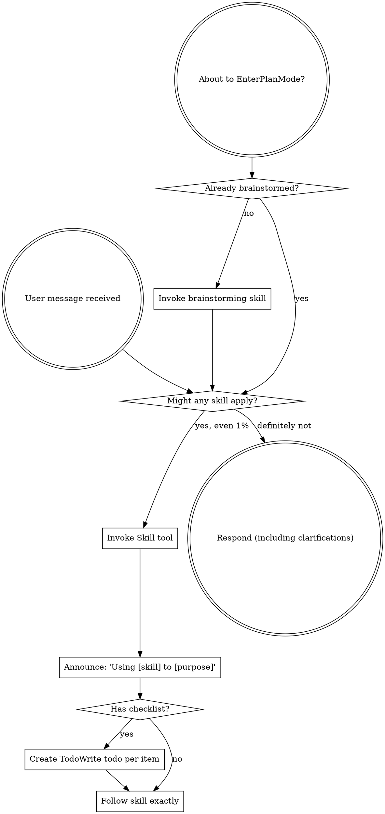

# Codex session 019f14b4-4378-70e3-96c1-5c54ca9eeac5

- Started: `2026-06-29T18:46:30.988Z`
- Working directory: `D:\100XH100`
- Originator: `Codex Desktop`
- Codex CLI: `0.142.3`
- Source log: `C:\Users\Иван Литвак\.codex\sessions\2026\06\29\rollout-2026-06-29T21-46-30-019f14b4-4378-70e3-96c1-5c54ca9eeac5.jsonl`
- Entries: user=3, assistant=24, tool calls=41, tool outputs=41

This is a chronological export of the user/assistant conversation and tool activity. Internal system/developer instructions and token accounting are intentionally excluded. Secret-shaped values are redacted; oversized tool outputs retain their beginning and end with the omitted character count.

## 1. User

Time: `2026-06-29T18:46:47.207Z` · source line `4`

```text
# AGENTS.md instructions for D:\100XH100

<INSTRUCTIONS>
# Project Agent Rules

## Operating Rule
- Read `AGENTS.md` before project edits.
- Update `memory/CHANGELOG.md` after meaningful code, config, or architecture changes.
- Update `memory/PROMPTS.md` with user prompts that define requirements.
- Store test outputs, logs, and verification notes under `test_results/`.
- Prefer agent-centered code: explicit contracts, deterministic tests, small files, low hidden state.

## Architecture Source
- Primary architecture contract: `ARCHITECTURE_NEED.md`.
- Current Stream 4 implementation rule: use threshold + compact + CUB/fixed-temp sort/reduce + compact; do not use Stream 4 hash-table dedup.

## Implementation Guardrails
- `State128` logical bytes are `v[0..119]`.
- `State128` padding bytes are `v[120..127]`.
- Persistent frontier padding must be zero.
- `FinalResponse` may temporarily store `target_local_idx` in `v[120..123]`.
- `Hash128` is one logical 128-bit key stored as `{lo, hi}`.
- `CandidateMeta` must remain 32 bytes and 32-byte aligned.
- Stream 3 payload id must be original candidate id, not compact index.
- Stream 4 must not apply shard top-k or semantic shard cap.

</INSTRUCTIONS>
<environment_context>
  <cwd>D:\100XH100</cwd>
  <shell>powershell</shell>
  <current_date>2026-06-29</current_date>
  <timezone>Europe/Moscow</timezone>
  <filesystem><workspace_roots><root>D:\100XH100</root></workspace_roots><permission_profile type="managed"><file_system type="restricted"><entry access="read"><special>:root</special></entry><entry access="write"><path>D:\100XH100</path></entry><entry access="write"><special>:slash_tmp</special></entry><entry access="write"><special>:tmpdir</special></entry><entry access="read"><path>D:\100XH100\.git</path></entry><entry access="read"><path>D:\100XH100\.agents</path></entry><entry access="read"><path>D:\100XH100\.codex</path></entry></file_system></permission_profile></filesystem>
</environment_context>
```

## 2. User

Time: `2026-06-29T18:46:47.245Z` · source line `6`

```text
Final code-quality review after fix. Worktree: D:\100XH100\.worktrees\stream1-piece-transformer. Review commit range 6b5dbf58a94714fec965808318f98483680af46a..8e4a1a06ab436ebcabd16f858a236259d98658ed.

Context: Task 6 runtime dispatcher wiring for Stream1 piece_transformer plus follow-up fix for transformer weight estimate sizing. Spec review passed. Earlier quality review found one P3 issue: runtime_config and dispatcher fixture used state_len for fast_slot_projected instead of max_piece_size. Commit 8e4a1a0 should fix it.

Review focus:
- Did commit 8e4a1a0 correctly fix the weight estimate/fixture issue without creating new issues?
- Any remaining real bugs in dispatcher backend branch, production runner view/scratch lifetimes, graph capture/replay, lane scratch slicing, memory sizing, test quality, or stream_benchmark fail-closed behavior?
- No fallback backend, no architecture changes, no State128/Stream3/Stream4 contract changes.

Coordinator verification on final HEAD:
- Docker GPU build/run: stream1_transformer_cuda_tests=pass, stream1_cuda_tests=pass, dispatcher_cuda_tests=pass.
- Tiny production_runner smoke with BEAM_WEIGHT_DIR=test_results/stream1_transformer_reference/weights_fp16 logs stream1_backend=piece_transformer and exits normally.

Return findings first with severity and file/line references. If no issues, say approved. Do not modify files.
```

## 3. User

Time: `2026-06-29T18:46:47.246Z` · source line `7`

```text
Final code-quality review after fix. Worktree: D:\100XH100\.worktrees\stream1-piece-transformer. Review commit range 6b5dbf58a94714fec965808318f98483680af46a..8e4a1a06ab436ebcabd16f858a236259d98658ed.

Context: Task 6 runtime dispatcher wiring for Stream1 piece_transformer plus follow-up fix for transformer weight estimate sizing. Spec review passed. Earlier quality review found one P3 issue: runtime_config and dispatcher fixture used state_len for fast_slot_projected instead of max_piece_size. Commit 8e4a1a0 should fix it.

Review focus:
- Did commit 8e4a1a0 correctly fix the weight estimate/fixture issue without creating new issues?
- Any remaining real bugs in dispatcher backend branch, production runner view/scratch lifetimes, graph capture/replay, lane scratch slicing, memory sizing, test quality, or stream_benchmark fail-closed behavior?
- No fallback backend, no architecture changes, no State128/Stream3/Stream4 contract changes.

Coordinator verification on final HEAD:
- Docker GPU build/run: stream1_transformer_cuda_tests=pass, stream1_cuda_tests=pass, dispatcher_cuda_tests=pass.
- Tiny production_runner smoke with BEAM_WEIGHT_DIR=test_results/stream1_transformer_reference/weights_fp16 logs stream1_backend=piece_transformer and exits normally.

Return findings first with severity and file/line references. If no issues, say approved. Do not modify files.
```

## 4. Codex

Time: `2026-06-29T18:47:23.907Z` · source line `9`

```text
I’ll keep this as a read-only review. First I’m checking the project rules and the relevant prior D:\100XH100 memory, then I’ll inspect the final diff and focused call sites around the dispatcher/runner paths.
```

## 5. Codex

Time: `2026-06-29T18:47:23.923Z` · source line `10`

```text
I’ll keep this as a read-only review. First I’m checking the project rules and the relevant prior D:\100XH100 memory, then I’ll inspect the final diff and focused call sites around the dispatcher/runner paths.
```

## 6. Tool call: `exec_command`

Time: `2026-06-29T18:47:23.967Z` · source line `11`

```text
{"cmd":"Get-Content -LiteralPath 'D:\\100XH100\\AGENTS.md'","workdir":"D:\\100XH100","shell":"powershell","yield_time_ms":10000,"max_output_tokens":12000}
```

## 7. Tool call: `exec_command`

Time: `2026-06-29T18:47:23.970Z` · source line `12`

```text
{"cmd":"rg -n \"BEAM_PREBUILT_RUNNER|stream1|piece_transformer|dispatcher|production_runner|fast_slot_projected|max_piece_size|D:\\\\100XH100\" 'C:\\Users\\Иван Литвак\\.codex\\memories\\MEMORY.md'","workdir":"D:\\100XH100","shell":"powershell","yield_time_ms":10000,"max_output_tokens":12000}
```

## 8. Tool call: `exec_command`

Time: `2026-06-29T18:47:23.970Z` · source line `13`

```text
{"cmd":"Get-Content -LiteralPath 'C:\\Users\\Иван Литвак\\.codex\\plugins\\cache\\openai-curated-remote\\superpowers\\5.1.4\\skills\\using-superpowers\\SKILL.md'","workdir":"D:\\100XH100","shell":"powershell","yield_time_ms":10000,"max_output_tokens":12000}
```

## 9. Tool output

Time: `2026-06-29T18:47:24.899Z` · source line `14`

```text
Chunk ID: 0a043a
Wall time: 0.5023 seconds
Process exited with code 0
Original token count: 290
Output:
# Project Agent Rules

## Operating Rule
- Read `AGENTS.md` before project edits.
- Update `memory/CHANGELOG.md` after meaningful code, config, or architecture changes.
- Update `memory/PROMPTS.md` with user prompts that define requirements.
- Store test outputs, logs, and verification notes under `test_results/`.
- Prefer agent-centered code: explicit contracts, deterministic tests, small files, low hidden state.

## Architecture Source
- Primary architecture contract: `ARCHITECTURE_NEED.md`.
- Current Stream 4 implementation rule: use threshold + compact + CUB/fixed-temp sort/reduce + compact; do not use Stream 4 hash-table dedup.

## Implementation Guardrails
- `State128` logical bytes are `v[0..119]`.
- `State128` padding bytes are `v[120..127]`.
- Persistent frontier padding must be zero.
- `FinalResponse` may temporarily store `target_local_idx` in `v[120..123]`.
- `Hash128` is one logical 128-bit key stored as `{lo, hi}`.
- `CandidateMeta` must remain 32 bytes and 32-byte aligned.
- Stream 3 payload id must be original candidate id, not compact index.
- Stream 4 must not apply shard top-k or semantic shard cap.

```

## 10. Tool output

Time: `2026-06-29T18:47:24.899Z` · source line `15`

```text
Chunk ID: b14839
Wall time: 0.5027 seconds
Process exited with code 0
Original token count: 688
Output:
47:scope: Running the IHES MEPhI cluster workflow with one shared prebuilt `production_runner`, publishing solved puzzles into a dedicated GitHub results repo, and aggregating mixed cluster artifacts from on-cluster inventories.
48:applies_to: cwd=D:\100XH100; reuse_rule=reuse for this IHES/MEPhI repo family and adjacent cluster publish jobs, but treat live cluster inventory, DNS availability, and current results-repo schema as run-specific and recheck them before publishing.
54:- rollout_summaries/2026-06-04T15-47-52-Dd1O-ihes_cluster_results_prebuilt_publish_backfill.md (cwd=\\?\D:\100XH100, rollout_path=\\?\C:\Users\Иван Литвак\.codex\sessions\2026\06\04\rollout-2026-06-04T18-47-57-019e9351-cd3b-71c0-bf8b-69755d08d5fc.jsonl, updated_at=2026-06-26T19:51:22+00:00, thread_id=019e9351-cd3b-71c0-bf8b-69755d08d5fc, the prebuilt runner was compiled once and reused across the A100 array workflow)
58:- MEPhI HPC, kaf12, A100 40GB, BEAM_PREBUILT_RUNNER, prepare_ihes_prebuilt_runner.sh, ihes_solve_bucket_from_scratch.sh, prebuilt_runner_ready, using_prebuilt_runner, PUZZLE_LIMIT=1, depth=12
64:- rollout_summaries/2026-06-04T15-47-52-Dd1O-ihes_cluster_results_prebuilt_publish_backfill.md (cwd=\\?\D:\100XH100, rollout_path=\\?\C:\Users\Иван Литвак\.codex\sessions\2026\06\04\rollout-2026-06-04T18-47-57-019e9351-cd3b-71c0-bf8b-69755d08d5fc.jsonl, updated_at=2026-06-26T19:51:22+00:00, thread_id=019e9351-cd3b-71c0-bf8b-69755d08d5fc, the results repo structure and first backfilled puzzle sets were established)
74:- rollout_summaries/2026-06-04T15-47-52-Dd1O-ihes_cluster_results_prebuilt_publish_backfill.md (cwd=\\?\D:\100XH100, rollout_path=\\?\C:\Users\Иван Литвак\.codex\sessions\2026\06\04\rollout-2026-06-04T18-47-57-019e9351-cd3b-71c0-bf8b-69755d08d5fc.jsonl, updated_at=2026-06-26T19:51:22+00:00, thread_id=019e9351-cd3b-71c0-bf8b-69755d08d5fc, a file-driven inventory plus schema fixes made the larger aggregator path workable)
82:- when launching on MEPhI HPC, the user said all jobs should use one precompiled beam-search binary -> default to a shared prebuilt `production_runner` instead of rebuilding per puzzle task [Task 1]
89:- `hpc/ihes_cube_model/prepare_ihes_prebuilt_runner.sh` builds the shared binary at `/mnt/pool/6/vokirova/beam8a100/ihes_cube_model/prebuilt-a100-ihes/production_runner`, and `hpc/ihes_cube_model/ihes_solve_bucket_from_scratch.sh` already knows how to consume `BEAM_PREBUILT_RUNNER` [Task 1]
97:- symptom: each array task recompiles instead of reusing the solver. cause: `BEAM_PREBUILT_RUNNER` was not wired through a separate prebuild dependency. fix: submit the prebuild first and make the puzzle array depend on it via `--dependency=afterok:<prebuild_job>` [Task 1]

```

## 11. Tool output

Time: `2026-06-29T18:47:25.088Z` · source line `16`

````text
Chunk ID: 679420
Wall time: 0.6737 seconds
Process exited with code 0
Original token count: 1393
Output:
---
name: using-superpowers
description: Use when starting any conversation - establishes how to find and use skills, requiring Skill tool invocation before ANY response including clarifying questions
---

<SUBAGENT-STOP>
If you were dispatched as a subagent to execute a specific task, skip this skill.
</SUBAGENT-STOP>

<EXTREMELY-IMPORTANT>
If you think there is even a 1% chance a skill might apply to what you are doing, you ABSOLUTELY MUST invoke the skill.

IF A SKILL APPLIES TO YOUR TASK, YOU DO NOT HAVE A CHOICE. YOU MUST USE IT.

This is not negotiable. This is not optional. You cannot rationalize your way out of this.
</EXTREMELY-IMPORTANT>

## Instruction Priority

Superpowers skills override default system prompt behavior, but **user instructions always take precedence**:

1. **User's explicit instructions** (CLAUDE.md, GEMINI.md, AGENTS.md, direct requests) — highest priority
2. **Superpowers skills** — override default system behavior where they conflict
3. **Default system prompt** — lowest priority

If CLAUDE.md, GEMINI.md, or AGENTS.md says "don't use TDD" and a skill says "always use TDD," follow the user's instructions. The user is in control.

## How to Access Skills

**In Claude Code:** Use the `Skill` tool. When you invoke a skill, its content is loaded and presented to you—follow it directly. Never use the Read tool on skill files.

**In Copilot CLI:** Use the `skill` tool. Skills are auto-discovered from installed plugins. The `skill` tool works the same as Claude Code's `Skill` tool.

**In Gemini CLI:** Skills activate via the `activate_skill` tool. Gemini loads skill metadata at session start and activates the full content on demand.

**In other environments:** Check your platform's documentation for how skills are loaded.

## Platform Adaptation

Skills use Claude Code tool names. Non-CC platforms: see `references/copilot-tools.md` (Copilot CLI), `references/codex-tools.md` (Codex) for tool equivalents. Gemini CLI users get the tool mapping loaded automatically via GEMINI.md.

# Using Skills

## The Rule

**Invoke relevant or requested skills BEFORE any response or action.** Even a 1% chance a skill might apply means that you should invoke the skill to check. If an invoked skill turns out to be wrong for the situation, you don't need to use it.



## Red Flags

These thoughts mean STOP—you're rationalizing:

| Thought | Reality |
|---------|---------|
| "This is just a simple question" | Questions are tasks. Check for skills. |
| "I need more context first" | Skill check comes BEFORE clarifying questions. |
| "Let me explore the codebase first" | Skills tell you HOW to explore. Check first. |
| "I can check git/files quickly" | Files lack conversation context. Check for skills. |
| "Let me gather information first" | Skills tell you HOW to gather information. |
| "This doesn't need a formal skill" | If a skill exists, use it. |
| "I remember this skill" | Skills evolve. Read current version. |
| "This doesn't count as a task" | Action = task. Check for skills. |
| "The skill is overkill" | Simple things become complex. Use it. |
| "I'll just do this one thing first" | Check BEFORE doing anything. |
| "This feels productive" | Undisciplined action wastes time. Skills prevent this. |
| "I know what that means" | Knowing the concept в‰  using the skill. Invoke it. |

## Skill Priority

When multiple skills could apply, use this order:

1. **Process skills first** (brainstorming, debugging) - these determine HOW to approach the task
2. **Implementation skills second** (frontend-design, mcp-builder) - these guide execution

"Let's build X" в†’ brainstorming first, then implementation skills.
"Fix this bug" в†’ debugging first, then domain-specific skills.

## Skill Types

**Rigid** (TDD, debugging): Follow exactly. Don't adapt away discipline.

**Flexible** (patterns): Adapt principles to context.

The skill itself tells you which.

## User Instructions

Instructions say WHAT, not HOW. "Add X" or "Fix Y" doesn't mean skip workflows.

````

## 12. Codex

Time: `2026-06-29T18:47:37.912Z` · source line `19`

```text
Using `superpowers:using-superpowers` for the required skill check, and the project `AGENTS.md` rule is read. The relevant memory only adds D:\100XH100 cluster/runner context; this review still needs current source evidence from the worktree.
```

## 13. Codex

Time: `2026-06-29T18:47:37.931Z` · source line `20`

```text
Using `superpowers:using-superpowers` for the required skill check, and the project `AGENTS.md` rule is read. The relevant memory only adds D:\100XH100 cluster/runner context; this review still needs current source evidence from the worktree.
```

## 14. Tool call: `exec_command`

Time: `2026-06-29T18:47:37.974Z` · source line `21`

```text
{"cmd":"git status --short --branch","workdir":"D:\\100XH100\\.worktrees\\stream1-piece-transformer","shell":"powershell","yield_time_ms":10000,"max_output_tokens":12000}
```

## 15. Tool call: `exec_command`

Time: `2026-06-29T18:47:37.975Z` · source line `22`

```text
{"cmd":"git diff --stat 6b5dbf58a94714fec965808318f98483680af46a..8e4a1a06ab436ebcabd16f858a236259d98658ed","workdir":"D:\\100XH100\\.worktrees\\stream1-piece-transformer","shell":"powershell","yield_time_ms":10000,"max_output_tokens":12000}
```

## 16. Tool call: `exec_command`

Time: `2026-06-29T18:47:37.975Z` · source line `23`

```text
{"cmd":"git diff --name-only 6b5dbf58a94714fec965808318f98483680af46a..8e4a1a06ab436ebcabd16f858a236259d98658ed","workdir":"D:\\100XH100\\.worktrees\\stream1-piece-transformer","shell":"powershell","yield_time_ms":10000,"max_output_tokens":12000}
```

## 17. Tool call: `exec_command`

Time: `2026-06-29T18:47:37.983Z` · source line `24`

```text
{"cmd":"git show --stat --oneline --decorate --no-renames 8e4a1a06ab436ebcabd16f858a236259d98658ed","workdir":"D:\\100XH100\\.worktrees\\stream1-piece-transformer","shell":"powershell","yield_time_ms":10000,"max_output_tokens":12000}
```

## 18. Tool output

Time: `2026-06-29T18:47:39.562Z` · source line `25`

```text
Chunk ID: b02f33
Wall time: 1.0249 seconds
Process exited with code 0
Original token count: 70
Output:
## codex/stream1-piece-transformer
?? $null
?? build-contract-tests/
?? build-stream1-transformer-red/
?? build-task6-red/
?? build-task6-sm86/
?? build-task6/
?? config.obj
?? contract_tests.obj
?? docs/
?? frontier_cpu.obj
?? hash.obj
?? state.obj
?? stream3.obj
?? stream4.obj

```

## 19. Tool output

Time: `2026-06-29T18:47:40.024Z` · source line `26`

```text
Chunk ID: c8a670
Wall time: 1.5000 seconds
Process exited with code 0
Original token count: 205
Output:
 cuda/dispatcher.cu                                 |  35 +++-
 cuda/dispatcher.hpp                                |  12 +-
 cuda/runtime_config.cpp                            |  76 +++++--
 memory/CHANGELOG.md                                |   3 +
 memory/PROMPTS.md                                  |   3 +
 ...tream1_transformer_runtime_wiring_2026-06-29.md |  51 +++++
 ...nsformer_weight_estimate_contract_2026-06-29.md |  11 +
 tests/dispatcher_cuda_tests.cu                     | 229 ++++++++++++++++++++-
 tests/stream1_transformer_cuda_tests.cu            |   2 +-
 tools/production_runner.cu                         |  82 +++++---
 tools/stream1_weight_io.hpp                        |  37 ++++
 tools/stream_benchmark.cu                          |   2 +-
 12 files changed, 488 insertions(+), 55 deletions(-)

```

## 20. Tool output

Time: `2026-06-29T18:47:40.024Z` · source line `27`

```text
Chunk ID: bf0b2e
Wall time: 1.0402 seconds
Process exited with code 0
Original token count: 97
Output:
cuda/dispatcher.cu
cuda/dispatcher.hpp
cuda/runtime_config.cpp
memory/CHANGELOG.md
memory/PROMPTS.md
test_results/stream1_transformer_runtime_wiring_2026-06-29.md
test_results/stream1_transformer_weight_estimate_contract_2026-06-29.md
tests/dispatcher_cuda_tests.cu
tests/stream1_transformer_cuda_tests.cu
tools/production_runner.cu
tools/stream1_weight_io.hpp
tools/stream_benchmark.cu

```

## 21. Tool output

Time: `2026-06-29T18:47:40.024Z` · source line `28`

```text
Chunk ID: dacd92
Wall time: 1.4252 seconds
Process exited with code 0
Original token count: 116
Output:
8e4a1a0 (HEAD -> codex/stream1-piece-transformer) Fix transformer weight estimate sizing
 cuda/runtime_config.cpp                            |  2 +-
 memory/CHANGELOG.md                                |  2 ++
 memory/PROMPTS.md                                  |  3 +-
 ...nsformer_weight_estimate_contract_2026-06-29.md | 11 ++++++
 tests/dispatcher_cuda_tests.cu                     | 42 +++++++++++++++++++++-
 5 files changed, 57 insertions(+), 3 deletions(-)

```

## 22. Codex

Time: `2026-06-29T18:47:55.816Z` · source line `31`

```text
The range is limited and the fix commit touches exactly the expected runtime-config/test areas plus prompt/changelog notes. I’m drilling into the diff now, then I’ll cross-check the active implementation sites for lifetime and sizing assumptions instead of relying only on the patch text.
```

## 23. Codex

Time: `2026-06-29T18:47:55.836Z` · source line `32`

```text
The range is limited and the fix commit touches exactly the expected runtime-config/test areas plus prompt/changelog notes. I’m drilling into the diff now, then I’ll cross-check the active implementation sites for lifetime and sizing assumptions instead of relying only on the patch text.
```

## 24. Tool call: `exec_command`

Time: `2026-06-29T18:47:55.855Z` · source line `33`

```text
{"cmd":"git diff --no-renames 6b5dbf58a94714fec965808318f98483680af46a..8e4a1a06ab436ebcabd16f858a236259d98658ed -- cuda/runtime_config.cpp tests/dispatcher_cuda_tests.cu","workdir":"D:\\100XH100\\.worktrees\\stream1-piece-transformer","shell":"powershell","yield_time_ms":10000,"max_output_tokens":40000}
```

## 25. Tool call: `exec_command`

Time: `2026-06-29T18:47:55.856Z` · source line `34`

```text
{"cmd":"git diff --no-renames 8e4a1a06ab436ebcabd16f858a236259d98658ed^..8e4a1a06ab436ebcabd16f858a236259d98658ed -- cuda/runtime_config.cpp tests/dispatcher_cuda_tests.cu tools/production_runner.cu cuda/dispatcher.cu","workdir":"D:\\100XH100\\.worktrees\\stream1-piece-transformer","shell":"powershell","yield_time_ms":10000,"max_output_tokens":40000}
```

## 26. Tool call: `exec_command`

Time: `2026-06-29T18:47:55.873Z` · source line `35`

```text
{"cmd":"git diff --no-renames 6b5dbf58a94714fec965808318f98483680af46a..8e4a1a06ab436ebcabd16f858a236259d98658ed -- cuda/dispatcher.cu cuda/dispatcher.hpp tools/production_runner.cu tools/stream1_weight_io.hpp tools/stream_benchmark.cu tests/stream1_transformer_cuda_tests.cu","workdir":"D:\\100XH100\\.worktrees\\stream1-piece-transformer","shell":"powershell","yield_time_ms":10000,"max_output_tokens":60000}
```

## 27. Tool output

Time: `2026-06-29T18:47:57.203Z` · source line `36`

```text
Chunk ID: c9886f
Wall time: 0.3848 seconds
Process exited with code 0
Original token count: 4685
Output:
diff --git a/cuda/runtime_config.cpp b/cuda/runtime_config.cpp
index cb0dcf9..20d6230 100644
--- a/cuda/runtime_config.cpp
+++ b/cuda/runtime_config.cpp
@@ -1,4 +1,6 @@
 #include "runtime_config.hpp"
+#define BEAM_STREAM1_WEIGHT_IO_MANIFEST_ONLY
+#include "../tools/stream1_weight_io.hpp"
 
 #include <algorithm>
 #include <cstring>
@@ -89,37 +91,73 @@ std::uint64_t ceil_log2_u64(std::uint64_t value) {
 
 std::uint64_t estimate_stream1_weight_bytes(const Stream1ModelConfig& model) {
     constexpr std::uint64_t fp16 = sizeof(std::uint16_t);
-    std::uint64_t total = 0;
-    total += static_cast<std::uint64_t>(model.state_len) * model.num_classes * model.hidden1 * fp16;
-    total += static_cast<std::uint64_t>(model.hidden1) * fp16;
-    total += static_cast<std::uint64_t>(model.hidden1) * model.hidden2 * fp16;
-    total += static_cast<std::uint64_t>(model.hidden2) * fp16;
-    total += 2ULL * static_cast<std::uint64_t>(model.residual_count) * model.hidden2 * model.hidden2 * fp16;
-    total += 2ULL * static_cast<std::uint64_t>(model.residual_count) * model.hidden2 * fp16;
-    total += static_cast<std::uint64_t>(model.hidden2) * model.output_dim * fp16;
-    total += static_cast<std::uint64_t>(model.output_dim) * fp16;
-    return total;
+    switch (model.backend) {
+    case STREAM1_BACKEND_MLP: {
+        std::uint64_t total = 0;
+        total += static_cast<std::uint64_t>(model.state_len) * model.num_classes * model.hidden1 * fp16;
+        total += static_cast<std::uint64_t>(model.hidden1) * fp16;
+        if (model.normalization == STREAM1_NORM_LAYERNORM) {
+            total += 2ULL * static_cast<std::uint64_t>(model.hidden1) * fp16;
+        }
+        total += static_cast<std::uint64_t>(model.hidden1) * model.hidden2 * fp16;
+        total += static_cast<std::uint64_t>(model.hidden2) * fp16;
+        if (model.normalization == STREAM1_NORM_LAYERNORM) {
+            total += 2ULL * static_cast<std::uint64_t>(model.hidden2) * fp16;
+        }
+        total += 2ULL * static_cast<std::uint64_t>(model.residual_count) * model.hidden2 * model.hidden2 * fp16;
+        total += 2ULL * static_cast<std::uint64_t>(model.residual_count) * model.hidden2 * fp16;
+        if (model.normalization == STREAM1_NORM_LAYERNORM) {
+            total += 4ULL * static_cast<std::uint64_t>(model.residual_count) * model.hidden2 * fp16;
+        }
+        total += static_cast<std::uint64_t>(model.hidden2) * model.output_dim * fp16;
+        total += static_cast<std::uint64_t>(model.output_dim) * fp16;
+        return total;
+    }
+    case STREAM1_BACKEND_PIECE_TRANSFORMER: {
+        std::uint64_t half_values = 0;
+        half_values += static_cast<std::uint64_t>(model.max_piece_size) * model.num_classes * model.d_model;
+        half_values += static_cast<std::uint64_t>(model.num_pieces) * model.d_model;
+        half_values += model.d_model;
+        half_values += 4ULL * model.d_model;
+        for (std::uint32_t layer = 0; layer < model.transformer_layers; ++layer) {
+            half_values += 2ULL * model.d_model;
+            half_values += static_cast<std::uint64_t>(model.d_model) * 3ULL * model.d_model;
+            half_values += 3ULL * model.d_model;
+            half_values += static_cast<std::uint64_t>(model.d_model) * model.d_model;
+            half_values += model.d_model;
+            half_values += 2ULL * model.d_model;
+            half_values += static_cast<std::uint64_t>(model.d_model) * model.ff_dim;
+            half_values += model.ff_dim;
+            half_values += static_cast<std::uint64_t>(model.ff_dim) * model.d_model;
+            half_values += model.d_model;
+        }
+        half_values += static_cast<std::uint64_t>(model.d_model) * model.output_dim;
+        half_values += model.output_dim;
+        const std::uint64_t piece_table_bytes =
+            static_cast<std::uint64_t>(model.num_pieces) * model.max_piece_size * sizeof(std::uint16_t) +
+            static_cast<std::uint64_t>(model.num_pieces) * model.max_piece_size * sizeof(std::uint8_t) +
+            static_cast<std::uint64_t>(model.num_pieces) * sizeof(std::uint8_t);
+        return half_values * fp16 + piece_table_bytes;
+    }
+    default:
+        throw std::invalid_argument("unsupported Stream1 backend in weight byte estimate");
+    }
 }
-
 std::uint64_t estimate_read_only_table_bytes() {
     return static_cast<std::uint64_t>(MOVE_COUNT) * STATE_STORAGE_LEN * sizeof(std::uint8_t) +
            sizeof(State128) +
            static_cast<std::uint64_t>(STATE_STORAGE_LEN) * STATE_VALUE_PAD * sizeof(Hash128);
 }
 
-std::uint64_t estimate_stream1_scratch_bytes(std::uint32_t b_micro, const Stream1ModelConfig& model) {
-    return stream1_inference_rows(b_micro, model) *
-           (static_cast<std::uint64_t>(model.hidden1) + 2ULL * model.hidden2 + model.output_dim) *
-           sizeof(std::uint16_t);
-}
-
 std::uint64_t estimate_non_static_device_bytes(
     const RuntimeConfig& config,
     const Stream1ModelConfig& stream1_model) {
     return estimate_read_only_table_bytes() +
            estimate_stream1_weight_bytes(stream1_model) +
-           static_cast<std::uint64_t>(config.inference_parallelism) *
-               estimate_stream1_scratch_bytes(config.b_micro, stream1_model);
+           stream1_weights::stream1_scratch_bytes(
+               stream1_model,
+               config.b_micro,
+               config.inference_parallelism);
 }
 
 std::uint64_t beam_alignment_for(const RuntimeConfig& config) {
diff --git a/tests/dispatcher_cuda_tests.cu b/tests/dispatcher_cuda_tests.cu
index fa65712..320cab6 100644
--- a/tests/dispatcher_cuda_tests.cu
+++ b/tests/dispatcher_cuda_tests.cu
@@ -1,9 +1,13 @@
 #include "cuda_check.hpp"
 #include "../cuda/dispatcher.hpp"
+#include "../cuda/runtime_config.hpp"
+#include "../tools/stream1_weight_io.hpp"
 
 #include <cuda_fp16.h>
 #include <cuda_runtime.h>
 
+#include <cstdlib>
+
 #include <filesystem>
 #include <fstream>
 #include <iostream>
@@ -18,6 +22,222 @@ void require(bool condition, const char* message) {
         throw std::runtime_error(message);
     }
 }
+
+template <typename T>
+T* cuda_alloc_count(std::uint64_t count, const char* name) {
+    T* ptr = nullptr;
+    cudaError_t status = cudaMalloc(&ptr, count * sizeof(T));
+    if (status != cudaSuccess) {
+        throw std::runtime_error(std::string("cudaMalloc failed for ") + name + ": " + cudaGetErrorString(status));
+    }
+    BEAM_CUDA_CHECK(cudaMemset(ptr, 0, count * sizeof(T)));
+    return ptr;
+}
+
+struct TransformerDispatcherFixture {
+    std::vector<half*> half_allocations;
+    std::uint16_t* piece_positions = nullptr;
+    std::uint8_t* piece_mask = nullptr;
+    std::uint8_t* piece_types = nullptr;
+    std::vector<Stream1TransformerBlockView> blocks;
+    Stream1TransformerNetworkView view{};
+    Stream1TransformerScratchView scratch{};
+    stream1_weights::ScratchAllocation scratch_allocation{};
+
+    half* alloc_half(std::uint64_t count, const char* name) {
+        half* ptr = cuda_alloc_count<half>(count, name);
+        half_allocations.push_back(ptr);
+        return ptr;
+    }
+
+    void destroy() {
+        for (half* ptr : half_allocations) {
+            cudaFree(ptr);
+        }
+        half_allocations.clear();
+        cudaFree(piece_positions);
+        cudaFree(piece_mask);
+        cudaFree(piece_types);
+        piece_positions = nullptr;
+        piece_mask = nullptr;
+        piece_types = nullptr;
+        stream1_weights::free_stream1_scratch(scratch_allocation);
+        view = {};
+        scratch = {};
+        blocks.clear();
+    }
+};
+
+Stream1ModelConfig tiny_transformer_model() {
+    Stream1ModelConfig model;
+    model.backend = STREAM1_BACKEND_PIECE_TRANSFORMER;
+    model.state_len = STATE_LEN;
+    model.num_classes = stream1_weights::TRANSFORMER_NUM_CLASSES;
+    model.output_dim = static_cast<std::uint32_t>(MOVE_COUNT);
+    model.num_pieces = stream1_weights::TRANSFORMER_NUM_PIECES;
+    model.max_piece_size = stream1_weights::TRANSFORMER_MAX_PIECE_SIZE;
+    model.seq_len = stream1_weights::TRANSFORMER_SEQ_LEN;
+    model.d_model = stream1_weights::TRANSFORMER_D_MODEL;
+    model.nhead = stream1_weights::TRANSFORMER_NHEAD;
+    model.head_dim = stream1_weights::TRANSFORMER_HEAD_DIM;
+    model.transformer_layers = stream1_weights::TRANSFORMER_LAYERS;
+    model.ff_dim = stream1_weights::TRANSFORMER_FF_DIM;
+    model.dtype = STREAM1_DTYPE_FP16;
+    return model;
+}
+
+TransformerDispatcherFixture make_transformer_dispatcher_fixture(
+    const Stream1ModelConfig& model,
+    std::uint32_t b_micro) {
+    TransformerDispatcherFixture fixture;
+    fixture.blocks.resize(model.transformer_layers);
+    fixture.view.fast_slot_projected =
+        fixture.alloc_half(static_cast<std::uint64_t>(model.max_piece_size) * model.num_classes * model.d_model, "fast_slot_projected");
+    fixture.view.fast_piece_static =
+        fixture.alloc_half(static_cast<std::uint64_t>(model.num_pieces) * model.d_model, "fast_piece_static");
+    fixture.view.cls_token = fixture.alloc_half(model.d_model, "cls_token");
+    fixture.view.input_ln_gamma = fixture.alloc_half(model.d_model, "input_ln_gamma");
+    fixture.view.input_ln_beta = fixture.alloc_half(model.d_model, "input_ln_beta");
+    fixture.view.output_ln_gamma = fixture.alloc_half(model.d_model, "output_ln_gamma");
+    fixture.view.output_ln_beta = fixture.alloc_half(model.d_model, "output_ln_beta");
+    for (std::uint32_t layer = 0; layer < model.transformer_layers; ++layer) {
+        fixture.blocks[layer] = Stream1TransformerBlockView{
+            fixture.alloc_half(model.d_model, "ln1_gamma"),
+            fixture.alloc_half(model.d_model, "ln1_beta"),
+            fixture.alloc_half(static_cast<std::uint64_t>(model.d_model) * 3ULL * model.d_model, "attn_qkv_weight"),
+            fixture.alloc_half(3ULL * model.d_model, "attn_qkv_bias"),
+            fixture.alloc_half(static_cast<std::uint64_t>(model.d_model) * model.d_model, "attn_out_weight"),
+            fixture.alloc_half(model.d_model, "attn_out_bias"),
+            fixture.alloc_half(model.d_model, "ln2_gamma"),
+            fixture.alloc_half(model.d_model, "ln2_beta"),
+            fixture.alloc_half(static_cast<std::uint64_t>(model.d_model) * model.ff_dim, "ff1_weight"),
+            fixture.alloc_half(model.ff_dim, "ff1_bias"),
+            fixture.alloc_half(static_cast<std::uint64_t>(model.ff_dim) * model.d_model, "ff2_weight"),
+            fixture.alloc_half(model.d_model, "ff2_bias")};
+    }
+    fixture.view.blocks = fixture.blocks.data();
+    fixture.view.output_weight =
+        fixture.alloc_half(static_cast<std::uint64_t>(model.d_model) * model.output_dim, "output_weight");
+    fixture.view.output_bias = fixture.alloc_half(model.output_dim, "output_bias");
+    fixture.piece_positions = cuda_alloc_count<std::uint16_t>(
+        static_cast<std::uint64_t>(model.num_pieces) * model.max_piece_size,
+        "piece_positions");
+    fixture.piece_mask = cuda_alloc_count<std::uint8_t>(
+        static_cast<std::uint64_t>(model.num_pieces) * model.max_piece_size,
+        "piece_mask");
+    fixture.piece_types = cuda_alloc_count<std::uint8_t>(
+        model.num_pieces,
+        "piece_types");
+    fixture.view.piece_positions = fixture.piece_positions;
+    fixture.view.piece_mask = fixture.piece_mask;
+    fixture.view.piece_types = fixture.piece_types;
+    fixture.view.dims = stream1_weights::transformer_dims(model);
+    fixture.scratch_allocation = stream1_weights::alloc_stream1_scratch(model, b_micro, 1);
+    fixture.scratch = stream1_weights::transformer_scratch_view(fixture.scratch_allocation);
+    return fixture;
+}
+
+void run_transformer_runtime_weight_estimate_test(std::ofstream& report) {
+    const Stream1ModelConfig model = tiny_transformer_model();
+    Stream1ModelConfig larger_state_model = model;
+    larger_state_model.state_len += 7;
+    setenv("BEAM_RUNTIME_CONFIG_MODE", "manual", 1);
+    setenv("BEAM_GPU_HEADROOM_BYTES", "0", 1);
+    setenv("BEAM_STREAM3_RING_SLOTS", "1", 1);
+    setenv("BEAM_SHARD_COUNT", "1", 1);
+    setenv("BEAM_SHARD_BUFFER_COUNT", "2", 1);
+    setenv("BEAM_SHARD_CAPACITY_CANDIDATES", "262144", 1);
+    setenv("BEAM_STREAM4_BATCH_CANDIDATES", "1024", 1);
+    setenv("BEAM_STREAM4_TRIGGER_CANDIDATES", "1024", 1);
+    setenv("BEAM_STREAM4_BATCH_ALIGNMENT", "1", 1);
+    setenv("BEAM_RING_COUNT", "1", 1);
+    const RuntimeConfigBuild runtime_estimate =
+        build_runtime_config_from_budget(1024, 1, 0, model, 1024ULL * 1024ULL * 1024ULL * 1024ULL);
+    const RuntimeConfigBuild larger_state_estimate =
+        build_runtime_config_from_budget(1024, 1, 0, larger_state_model, 1024ULL * 1024ULL * 1024ULL * 1024ULL);
+    unsetenv("BEAM_RUNTIME_CONFIG_MODE");
+    unsetenv("BEAM_GPU_HEADROOM_BYTES");
+    unsetenv("BEAM_STREAM3_RING_SLOTS");
+    unsetenv("BEAM_SHARD_COUNT");
+    unsetenv("BEAM_SHARD_BUFFER_COUNT");
+    unsetenv("BEAM_SHARD_CAPACITY_CANDIDATES");
+    unsetenv("BEAM_STREAM4_BATCH_CANDIDATES");
+    unsetenv("BEAM_STREAM4_TRIGGER_CANDIDATES");
+    unsetenv("BEAM_STREAM4_BATCH_ALIGNMENT");
+    unsetenv("BEAM_RING_COUNT");
+    require(
+        runtime_estimate.estimated_non_static_device_bytes ==
+            larger_state_estimate.estimated_non_static_device_bytes,
+        "piece_transformer runtime weight estimate must size fast_slot_projected by max_piece_size, not state_len");
+    report << "- transformer_runtime_weight_estimate=pass\n";
+    report.flush();
+}
+void run_transformer_dispatcher_graph_test(std::ofstream& report) {
+    const Stream1ModelConfig model = tiny_transformer_model();
+
+    RuntimeConfig config;
+    config.b_micro = 4;
+    config.stream3_batch_candidates = 4 * static_cast<std::uint32_t>(MOVE_COUNT);
+    config.stream4_batch_candidates = 64;
+    config.stream4_active_sort_slots = 1;
+    config.ring_count = 1;
+    config.shard_count = 1;
+    config.shard_capacity_candidates = 128;
+    config.global_spill_capacity = 128;
+    config.stream4_batch_alignment = 1;
+    config.user_global_beam_width = 64;
+    config.solved_result_capacity = 8;
+    const StaticMemoryPlan plan = make_static_memory_plan(config);
+    StaticDeviceMemory memory;
+    allocate_static_device_memory(plan, memory);
+    BEAM_CUDA_CHECK(cudaMemset(memory.allocation, 0, memory.allocation_bytes));
+
+    std::uint8_t* generators = nullptr;
+    State128* central_state = nullptr;
+    Hash128* zobrist = nullptr;
+    BEAM_CUDA_CHECK(cudaMalloc(&generators, MOVE_COUNT * STATE_STORAGE_LEN));
+    BEAM_CUDA_CHECK(cudaMalloc(&central_state, sizeof(State128)));
+    BEAM_CUDA_CHECK(cudaMalloc(&zobrist, STATE_STORAGE_LEN * STATE_VALUE_PAD * sizeof(Hash128)));
+    BEAM_CUDA_CHECK(cudaMemset(generators, 0, MOVE_COUNT * STATE_STORAGE_LEN));
+    BEAM_CUDA_CHECK(cudaMemset(central_state, 255, sizeof(State128)));
+    BEAM_CUDA_CHECK(cudaMemset(zobrist, 0, STATE_STORAGE_LEN * STATE_VALUE_PAD * sizeof(Hash128)));
+
+    TransformerDispatcherFixture fixture = make_transformer_dispatcher_fixture(model, config.b_micro);
+    DispatcherStreams streams;
+    DispatcherEvents events;
+    CudaGraphJobTemplates graphs;
+    create_dispatcher_streams(streams);
+    create_dispatcher_events(events);
+    DispatcherNetwork network{};
+    network.backend = DispatcherStream1Backend::PieceTransformer;
+    network.transformer_view = fixture.view;
+    network.transformer_scratch_lanes = {fixture.scratch};
+    DispatcherDeviceTables tables{generators, central_state, zobrist};
+    Stream2SolvedBuffers solved{
+        memory.solved_flag,
+        memory.stop_flag,
+        memory.solved_count,
+        memory.solved_overflow,
+        memory.solved_meta_list,
+        memory.solved_depth_list,
+        config.solved_result_capacity};
+
+    instantiate_cuda_graph_job_templates(plan, memory, tables, network, solved, streams, events, graphs);
+    const DepthDispatchState state = run_depth_cuda_graphs(plan, memory, graphs, streams, config.b_micro);
+    BEAM_CUDA_CHECK(cudaDeviceSynchronize());
+    require(state.depth_drained, "transformer depth dispatcher must drain the depth");
+    require(state.ring_slot_jobs_launched == 1U, "transformer ring slot launch count mismatch");
+    report << "- transformer_dispatcher_branch=pass\n";
+
+    destroy_cuda_graph_job_templates(graphs);
+    destroy_dispatcher_events(events);
+    destroy_dispatcher_streams(streams);
+    fixture.destroy();
+    free_static_device_memory(memory);
+    cudaFree(generators);
+    cudaFree(central_state);
+    cudaFree(zobrist);
+}
 } // namespace
 
 int main() {
@@ -25,6 +245,7 @@ int main() {
     std::ofstream report("test_results/dispatcher_cuda_tests_2026-05-22.md");
     report << "# Dispatcher CUDA Graph Template Tests 2026-05-22\n\n";
     BEAM_CUDA_CHECK(cudaSetDevice(0));
+    run_transformer_runtime_weight_estimate_test(report);
 
     RuntimeConfig config;
     config.b_micro = 16;
@@ -87,9 +308,10 @@ int main() {
     create_dispatcher_events(events);
     CudaGraphJobTemplates graphs;
     Stream1NetworkDims dims{STATE_LEN, STATE_VALUE_PAD, hidden1_cols, hidden2_cols, 0, static_cast<std::uint32_t>(MOVE_COUNT), STREAM1_DTYPE_FP16, STREAM1_NORM_NONE};
-    DispatcherNetwork network{
-        Stream1NetworkView{input_weight, input_bias, nullptr, nullptr, hidden_weight, hidden_bias, nullptr, nullptr, nullptr, nullptr, nullptr, nullptr, nullptr, nullptr, nullptr, nullptr, output_weight, output_bias, dims},
-        std::vector<Stream1CutlassScratch>{Stream1CutlassScratch{hidden1, hidden2, residual, output}}};
+    DispatcherNetwork network{};
+    network.backend = DispatcherStream1Backend::Mlp;
+    network.mlp_view = Stream1NetworkView{input_weight, input_bias, nullptr, nullptr, hidden_weight, hidden_bias, nullptr, nullptr, nullptr, nullptr, nullptr, nullptr, nullptr, nullptr, nullptr, nullptr, output_weight, output_bias, dims};
+    network.mlp_scratch_lanes = std::vector<Stream1CutlassScratch>{Stream1CutlassScratch{hidden1, hidden2, residual, output}};
     DispatcherDeviceTables tables{generators, central_state, zobrist};
     Stream2SolvedBuffers solved{
         memory.solved_flag,
@@ -139,6 +361,7 @@ int main() {
     require(state.stream4_active_sort_slots_used <= config.stream4_active_sort_slots, "stream4 active sort slot usage mismatch");
     report << "- stream4_conditional_launches=" << state.stream4_jobs_launched << "\n";
     report << "- stream4_active_sort_slots_used=" << state.stream4_active_sort_slots_used << "\n";
+    run_transformer_dispatcher_graph_test(report);
 
     destroy_cuda_graph_job_templates(graphs);
     destroy_dispatcher_events(events);

```

## 28. Tool output

Time: `2026-06-29T18:47:57.203Z` · source line `37`

```text
Chunk ID: 3a114f
Wall time: 0.3662 seconds
Process exited with code 0
Original token count: 1125
Output:
diff --git a/cuda/runtime_config.cpp b/cuda/runtime_config.cpp
index 7bcc03c..20d6230 100644
--- a/cuda/runtime_config.cpp
+++ b/cuda/runtime_config.cpp
@@ -115,7 +115,7 @@ std::uint64_t estimate_stream1_weight_bytes(const Stream1ModelConfig& model) {
     }
     case STREAM1_BACKEND_PIECE_TRANSFORMER: {
         std::uint64_t half_values = 0;
-        half_values += static_cast<std::uint64_t>(model.state_len) * model.num_classes * model.d_model;
+        half_values += static_cast<std::uint64_t>(model.max_piece_size) * model.num_classes * model.d_model;
         half_values += static_cast<std::uint64_t>(model.num_pieces) * model.d_model;
         half_values += model.d_model;
         half_values += 4ULL * model.d_model;
diff --git a/tests/dispatcher_cuda_tests.cu b/tests/dispatcher_cuda_tests.cu
index 188ba9a..320cab6 100644
--- a/tests/dispatcher_cuda_tests.cu
+++ b/tests/dispatcher_cuda_tests.cu
@@ -1,10 +1,13 @@
 #include "cuda_check.hpp"
 #include "../cuda/dispatcher.hpp"
+#include "../cuda/runtime_config.hpp"
 #include "../tools/stream1_weight_io.hpp"
 
 #include <cuda_fp16.h>
 #include <cuda_runtime.h>
 
+#include <cstdlib>
+
 #include <filesystem>
 #include <fstream>
 #include <iostream>
@@ -89,7 +92,7 @@ TransformerDispatcherFixture make_transformer_dispatcher_fixture(
     TransformerDispatcherFixture fixture;
     fixture.blocks.resize(model.transformer_layers);
     fixture.view.fast_slot_projected =
-        fixture.alloc_half(static_cast<std::uint64_t>(model.state_len) * model.num_classes * model.d_model, "fast_slot_projected");
+        fixture.alloc_half(static_cast<std::uint64_t>(model.max_piece_size) * model.num_classes * model.d_model, "fast_slot_projected");
     fixture.view.fast_piece_static =
         fixture.alloc_half(static_cast<std::uint64_t>(model.num_pieces) * model.d_model, "fast_piece_static");
     fixture.view.cls_token = fixture.alloc_half(model.d_model, "cls_token");
@@ -134,8 +137,44 @@ TransformerDispatcherFixture make_transformer_dispatcher_fixture(
     return fixture;
 }
 
+void run_transformer_runtime_weight_estimate_test(std::ofstream& report) {
+    const Stream1ModelConfig model = tiny_transformer_model();
+    Stream1ModelConfig larger_state_model = model;
+    larger_state_model.state_len += 7;
+    setenv("BEAM_RUNTIME_CONFIG_MODE", "manual", 1);
+    setenv("BEAM_GPU_HEADROOM_BYTES", "0", 1);
+    setenv("BEAM_STREAM3_RING_SLOTS", "1", 1);
+    setenv("BEAM_SHARD_COUNT", "1", 1);
+    setenv("BEAM_SHARD_BUFFER_COUNT", "2", 1);
+    setenv("BEAM_SHARD_CAPACITY_CANDIDATES", "262144", 1);
+    setenv("BEAM_STREAM4_BATCH_CANDIDATES", "1024", 1);
+    setenv("BEAM_STREAM4_TRIGGER_CANDIDATES", "1024", 1);
+    setenv("BEAM_STREAM4_BATCH_ALIGNMENT", "1", 1);
+    setenv("BEAM_RING_COUNT", "1", 1);
+    const RuntimeConfigBuild runtime_estimate =
+        build_runtime_config_from_budget(1024, 1, 0, model, 1024ULL * 1024ULL * 1024ULL * 1024ULL);
+    const RuntimeConfigBuild larger_state_estimate =
+        build_runtime_config_from_budget(1024, 1, 0, larger_state_model, 1024ULL * 1024ULL * 1024ULL * 1024ULL);
+    unsetenv("BEAM_RUNTIME_CONFIG_MODE");
+    unsetenv("BEAM_GPU_HEADROOM_BYTES");
+    unsetenv("BEAM_STREAM3_RING_SLOTS");
+    unsetenv("BEAM_SHARD_COUNT");
+    unsetenv("BEAM_SHARD_BUFFER_COUNT");
+    unsetenv("BEAM_SHARD_CAPACITY_CANDIDATES");
+    unsetenv("BEAM_STREAM4_BATCH_CANDIDATES");
+    unsetenv("BEAM_STREAM4_TRIGGER_CANDIDATES");
+    unsetenv("BEAM_STREAM4_BATCH_ALIGNMENT");
+    unsetenv("BEAM_RING_COUNT");
+    require(
+        runtime_estimate.estimated_non_static_device_bytes ==
+            larger_state_estimate.estimated_non_static_device_bytes,
+        "piece_transformer runtime weight estimate must size fast_slot_projected by max_piece_size, not state_len");
+    report << "- transformer_runtime_weight_estimate=pass\n";
+    report.flush();
+}
 void run_transformer_dispatcher_graph_test(std::ofstream& report) {
     const Stream1ModelConfig model = tiny_transformer_model();
+
     RuntimeConfig config;
     config.b_micro = 4;
     config.stream3_batch_candidates = 4 * static_cast<std::uint32_t>(MOVE_COUNT);
@@ -206,6 +245,7 @@ int main() {
     std::ofstream report("test_results/dispatcher_cuda_tests_2026-05-22.md");
     report << "# Dispatcher CUDA Graph Template Tests 2026-05-22\n\n";
     BEAM_CUDA_CHECK(cudaSetDevice(0));
+    run_transformer_runtime_weight_estimate_test(report);
 
     RuntimeConfig config;
     config.b_micro = 16;

```

## 29. Tool output

Time: `2026-06-29T18:47:57.204Z` · source line `38`

```text
Chunk ID: 5e33ca
Wall time: 0.3430 seconds
Process exited with code 0
Original token count: 3956
Output:
diff --git a/cuda/dispatcher.cu b/cuda/dispatcher.cu
index b7aa4e1..e13f0dd 100644
--- a/cuda/dispatcher.cu
+++ b/cuda/dispatcher.cu
@@ -1287,8 +1287,21 @@ void instantiate_cuda_graph_job_templates(
         plan.config.inference_parallelism > plan.derived.ring_slot_count) {
         throw std::invalid_argument("Stream1 concurrency must be in [1, RING_SLOT_COUNT]");
     }
-    if (network.scratch_lanes.size() < plan.config.inference_parallelism) {
-        throw std::invalid_argument("Stream1 scratch lane count is smaller than Stream1 concurrency");
+    const bool known_stream1_backend =
+        network.backend == DispatcherStream1Backend::Mlp ||
+        network.backend == DispatcherStream1Backend::PieceTransformer;
+    if (!known_stream1_backend) {
+        throw std::invalid_argument("unknown Stream1 dispatcher backend");
+    }
+    if (!network.uniform_score) {
+        if (network.backend == DispatcherStream1Backend::Mlp &&
+            network.mlp_scratch_lanes.size() < plan.config.inference_parallelism) {
+            throw std::invalid_argument("Stream1 MLP scratch lane count is smaller than Stream1 concurrency");
+        }
+        if (network.backend == DispatcherStream1Backend::PieceTransformer &&
+            network.transformer_scratch_lanes.size() < plan.config.inference_parallelism) {
+            throw std::invalid_argument("Stream1 transformer scratch lane count is smaller than Stream1 concurrency");
+        }
     }
     ensure_stream12_lane_resources(streams, events, plan.config.inference_parallelism);
     ensure_stream4_slot_resources(streams, plan.config.stream4_active_sort_slots);
@@ -1315,17 +1328,29 @@ void instantiate_cuda_graph_job_templates(
                 0,
                 candidates_per_slot * sizeof(std::uint32_t),
                 stream1_lane), "cudaMemsetAsync uniform score ring");
-        } else {
+        } else if (network.backend == DispatcherStream1Backend::Mlp) {
             stream1_inference_cutlass_cuda(
                 memory.current_frontier_states,
                 memory.streams.parent_base + job,
                 memory.streams.count + job,
                 tables.generators,
-                network.view,
-                network.scratch_lanes[lane],
+                network.mlp_view,
+                network.mlp_scratch_lanes[lane],
                 memory.streams.score_ring + candidate_offset,
                 plan.config.b_micro,
                 stream1_lane);
+        } else if (network.backend == DispatcherStream1Backend::PieceTransformer) {
+            stream1_transformer_inference_cuda(
+                memory.current_frontier_states,
+                memory.streams.parent_base + job,
+                memory.streams.count + job,
+                network.transformer_view,
+                network.transformer_scratch_lanes[lane],
+                memory.streams.score_ring + candidate_offset,
+                plan.config.b_micro,
+                stream1_lane);
+        } else {
+            throw std::invalid_argument("unknown Stream1 dispatcher backend");
         }
         stream2_hash_goal_cuda(
             memory.current_frontier_states,
diff --git a/cuda/dispatcher.hpp b/cuda/dispatcher.hpp
index d0cd448..d07515f 100644
--- a/cuda/dispatcher.hpp
+++ b/cuda/dispatcher.hpp
@@ -57,9 +57,17 @@ struct DispatcherDeviceTables {
     const Hash128* zobrist = nullptr;
 };
 
+enum class DispatcherStream1Backend : std::uint8_t {
+    Mlp = 0,
+    PieceTransformer = 1,
+};
+
 struct DispatcherNetwork {
-    Stream1NetworkView view;
-    std::vector<Stream1CutlassScratch> scratch_lanes;
+    DispatcherStream1Backend backend = DispatcherStream1Backend::Mlp;
+    Stream1NetworkView mlp_view{};
+    std::vector<Stream1CutlassScratch> mlp_scratch_lanes;
+    Stream1TransformerNetworkView transformer_view{};
+    std::vector<Stream1TransformerScratchView> transformer_scratch_lanes;
     bool uniform_score = false;
 };
 
diff --git a/tests/stream1_transformer_cuda_tests.cu b/tests/stream1_transformer_cuda_tests.cu
index 1853321..5490d6a 100644
--- a/tests/stream1_transformer_cuda_tests.cu
+++ b/tests/stream1_transformer_cuda_tests.cu
@@ -181,7 +181,7 @@ int main() {
     report.flush();
     require(max_abs_error <= 3072U, "transformer CUDA score keys drifted beyond tolerance");
     report << "- transformer_forward_reference=pass\n";
-    report << "- standalone_no_dispatcher_wiring=pass\n";
+    report << "- standalone_transformer_forward=pass\n";
     report << "\nstatus=pass\n";
 
     cudaFree(d_frontier);
diff --git a/tools/production_runner.cu b/tools/production_runner.cu
index b48e527..2fefa27 100644
--- a/tools/production_runner.cu
+++ b/tools/production_runner.cu
@@ -3952,9 +3952,6 @@ int main(int argc, char** argv) {
     const stream1_weights::HostWeightBytes host_weights =
         stream1_weights::load_stream1_weights(weight_dir);
     const Stream1ModelConfig& stream1_model = host_weights.model;
-    if (stream1_model.backend == STREAM1_BACKEND_PIECE_TRANSFORMER) {
-        throw std::runtime_error("piece_transformer Stream1 forward is not wired yet");
-    }
     const RuntimeConfigBuild config_build =
         build_runtime_config_from_budget(beam, world_size, rank, stream1_model, free_before);
     const RuntimeConfig config = config_build.config;
@@ -4138,15 +4135,28 @@ int main(int argc, char** argv) {
         std::cout << "solve_bucket_result_tsv=" << solve_bucket_result_path.string() << "\n";
     }
     std::cout << "weight_dir=" << weight_dir.string() << "\n";
+    std::cout << "stream1_model_backend="
+              << (stream1_model.backend == STREAM1_BACKEND_PIECE_TRANSFORMER ? "piece_transformer" : "mlp") << "\n";
     std::cout << "stream1_model_state_len=" << stream1_model.state_len << "\n";
     std::cout << "stream1_model_num_classes=" << stream1_model.num_classes << "\n";
-    std::cout << "stream1_model_hidden1=" << stream1_model.hidden1 << "\n";
-    std::cout << "stream1_model_hidden2=" << stream1_model.hidden2 << "\n";
-    std::cout << "stream1_model_residual_count=" << stream1_model.residual_count << "\n";
+    if (stream1_model.backend == STREAM1_BACKEND_MLP) {
+        std::cout << "stream1_model_hidden1=" << stream1_model.hidden1 << "\n";
+        std::cout << "stream1_model_hidden2=" << stream1_model.hidden2 << "\n";
+        std::cout << "stream1_model_residual_count=" << stream1_model.residual_count << "\n";
+        std::cout << "stream1_model_normalization="
+                  << (stream1_model.normalization == STREAM1_NORM_LAYERNORM ? "layernorm" : "none") << "\n";
+    } else if (stream1_model.backend == STREAM1_BACKEND_PIECE_TRANSFORMER) {
+        std::cout << "stream1_model_num_pieces=" << stream1_model.num_pieces << "\n";
+        std::cout << "stream1_model_max_piece_size=" << stream1_model.max_piece_size << "\n";
+        std::cout << "stream1_model_seq_len=" << stream1_model.seq_len << "\n";
+        std::cout << "stream1_model_d_model=" << stream1_model.d_model << "\n";
+        std::cout << "stream1_model_nhead=" << stream1_model.nhead << "\n";
+        std::cout << "stream1_model_head_dim=" << stream1_model.head_dim << "\n";
+        std::cout << "stream1_model_transformer_layers=" << stream1_model.transformer_layers << "\n";
+        std::cout << "stream1_model_ff_dim=" << stream1_model.ff_dim << "\n";
+    }
     std::cout << "stream1_model_output_dim=" << stream1_model.output_dim << "\n";
     std::cout << "stream1_model_dtype=" << (stream1_model.dtype == STREAM1_DTYPE_BF16 ? "bf16" : "fp16") << "\n";
-    std::cout << "stream1_model_normalization="
-              << (stream1_model.normalization == STREAM1_NORM_LAYERNORM ? "layernorm" : "none") << "\n";
     std::cout << "stream1_model_weight_bytes=" << stream1_weights::total_host_weight_bytes(host_weights) << "\n";
     std::cout << "solved_neighborhood_radius=" << solved_neighborhood.radius << "\n";
     std::cout << "solved_neighborhood_entries=" << solved_neighborhood.entry_count << "\n";
@@ -4233,7 +4243,6 @@ int main(int argc, char** argv) {
     CudaGraphJobTemplates graphs;
     create_dispatcher_streams(streams);
     create_dispatcher_events(events);
-    const Stream1NetworkDims dims = stream1_weights::network_dims(stream1_model);
     const char* stream1_mode_env = std::getenv("BEAM_STREAM1_MODE");
     const bool stream1_uniform_score =
         stream1_mode_env != nullptr && std::strcmp(stream1_mode_env, "uniform") == 0;
@@ -4243,18 +4252,27 @@ int main(int argc, char** argv) {
         throw std::runtime_error("BEAM_STREAM1_MODE must be model or uniform");
     }
     std::cout << "stream1_mode=" << (stream1_uniform_score ? "uniform" : "model") << "\n";
-    std::vector<Stream1CutlassScratch> stream1_scratch_lanes;
-    stream1_scratch_lanes.reserve(config.inference_parallelism);
-    const std::uint64_t stream1_rows_per_lane = stream1_inference_rows(config.b_micro, stream1_model);
-    for (std::uint32_t lane = 0; lane < config.inference_parallelism; ++lane) {
-        stream1_scratch_lanes.push_back(Stream1CutlassScratch{
-            stream1_scratch.hidden1 + static_cast<std::uint64_t>(lane) * stream1_rows_per_lane * stream1_model.hidden1,
-            stream1_scratch.hidden2 + static_cast<std::uint64_t>(lane) * stream1_rows_per_lane * stream1_model.hidden2,
-            stream1_scratch.residual + static_cast<std::uint64_t>(lane) * stream1_rows_per_lane * stream1_model.hidden2,
-            stream1_scratch.output + static_cast<std::uint64_t>(lane) * stream1_rows_per_lane * stream1_model.output_dim});
-    }
-    DispatcherNetwork network{
-        Stream1NetworkView{
+    std::cout << "stream1_backend="
+              << (stream1_model.backend == STREAM1_BACKEND_PIECE_TRANSFORMER ? "piece_transformer" : "mlp") << "\n";
+    if (stream1_model.backend == STREAM1_BACKEND_PIECE_TRANSFORMER) {
+        std::cout << "stream1_transformer_dims"
+                  << " seq_len=" << stream1_model.seq_len
+                  << " d_model=" << stream1_model.d_model
+                  << " nhead=" << stream1_model.nhead
+                  << " head_dim=" << stream1_model.head_dim
+                  << " layers=" << stream1_model.transformer_layers
+                  << " ff_dim=" << stream1_model.ff_dim
+                  << " output_dim=" << stream1_model.output_dim
+                  << "\n";
+    }
+
+    DispatcherNetwork network{};
+    network.uniform_score = stream1_uniform_score;
+    stream1_weights::TransformerNetworkViewHolder transformer_view_holder;
+    if (stream1_model.backend == STREAM1_BACKEND_MLP) {
+        const Stream1NetworkDims dims = stream1_weights::network_dims(stream1_model);
+        network.backend = DispatcherStream1Backend::Mlp;
+        network.mlp_view = Stream1NetworkView{
             device_weights.input_weight,
             device_weights.input_bias,
             device_weights.input_ln_gamma,
@@ -4273,9 +4291,25 @@ int main(int argc, char** argv) {
             reinterpret_cast<const half* const*>(device_weights.residual_fc2_ln_beta_table),
             device_weights.output_weight,
             device_weights.output_bias,
-            dims},
-        stream1_scratch_lanes,
-        stream1_uniform_score};
+            dims};
+        network.mlp_scratch_lanes.reserve(config.inference_parallelism);
+        for (std::uint32_t lane = 0; lane < config.inference_parallelism; ++lane) {
+            network.mlp_scratch_lanes.push_back(
+                stream1_weights::mlp_scratch_view(stream1_scratch, stream1_model, config.b_micro, lane));
+        }
+    } else if (stream1_model.backend == STREAM1_BACKEND_PIECE_TRANSFORMER) {
+        transformer_view_holder =
+            stream1_weights::transformer_network_view(device_weights.transformer, stream1_model);
+        network.backend = DispatcherStream1Backend::PieceTransformer;
+        network.transformer_view = transformer_view_holder.view;
+        network.transformer_scratch_lanes.reserve(config.inference_parallelism);
+        for (std::uint32_t lane = 0; lane < config.inference_parallelism; ++lane) {
+            network.transformer_scratch_lanes.push_back(
+                stream1_weights::transformer_scratch_view(stream1_scratch, stream1_model, config.b_micro, lane));
+        }
+    } else {
+        throw std::runtime_error("unsupported Stream1 backend in production runner");
+    }
     DispatcherDeviceTables tables{generators, central_state, zobrist};
     Stream2SolvedBuffers solved{
         memory.solved_flag,
diff --git a/tools/stream1_weight_io.hpp b/tools/stream1_weight_io.hpp
index c95afb1..6146456 100644
--- a/tools/stream1_weight_io.hpp
+++ b/tools/stream1_weight_io.hpp
@@ -960,6 +960,24 @@ inline TransformerNetworkViewHolder transformer_network_view(
 inline void free_transformer_network_view(TransformerNetworkViewHolder& holder) {
     holder = TransformerNetworkViewHolder{};
 }
+
+inline Stream1CutlassScratch mlp_scratch_view(
+    const ScratchAllocation& scratch,
+    const Stream1ModelConfig& model,
+    std::uint32_t b_micro,
+    std::uint32_t lane) {
+    if (model.backend != STREAM1_BACKEND_MLP) {
+        throw std::runtime_error("piece_transformer Stream1 scratch cannot be viewed as MLP scratch");
+    }
+    const std::uint64_t rows = stream1_inference_rows(b_micro, model);
+    const std::uint64_t lane_rows = static_cast<std::uint64_t>(lane) * rows;
+    return Stream1CutlassScratch{
+        scratch.hidden1 + lane_rows * model.hidden1,
+        scratch.hidden2 + lane_rows * model.hidden2,
+        scratch.residual + lane_rows * model.hidden2,
+        scratch.output + lane_rows * model.output_dim};
+}
+
 inline Stream1TransformerScratchView transformer_scratch_view(const ScratchAllocation& scratch) {
     return Stream1TransformerScratchView{
         scratch.transformer_tokens,
@@ -969,6 +987,25 @@ inline Stream1TransformerScratchView transformer_scratch_view(const ScratchAlloc
         scratch.transformer_ff_hidden,
         scratch.transformer_logits};
 }
+
+inline Stream1TransformerScratchView transformer_scratch_view(
+    const ScratchAllocation& scratch,
+    const Stream1ModelConfig& model,
+    std::uint32_t b_micro,
+    std::uint32_t lane) {
+    if (model.backend != STREAM1_BACKEND_PIECE_TRANSFORMER) {
+        throw std::runtime_error("MLP Stream1 scratch cannot be viewed as a piece_transformer");
+    }
+    const std::uint64_t rows = stream1_inference_rows(b_micro, model);
+    const std::uint64_t lane_rows = static_cast<std::uint64_t>(lane) * rows;
+    return Stream1TransformerScratchView{
+        scratch.transformer_tokens + lane_rows * model.seq_len * model.d_model,
+        scratch.transformer_qkv + lane_rows * model.seq_len * 3ULL * model.d_model,
+        scratch.transformer_attention_scores_probs + lane_rows * model.nhead * model.seq_len * model.seq_len,
+        scratch.transformer_attention_context + lane_rows * model.seq_len * model.d_model,
+        scratch.transformer_ff_hidden + lane_rows * model.seq_len * model.ff_dim,
+        scratch.transformer_logits + lane_rows * model.output_dim};
+}
 #endif
 
 } // namespace beam::stream1_weights
diff --git a/tools/stream_benchmark.cu b/tools/stream_benchmark.cu
index 907e10d..3781716 100644
--- a/tools/stream_benchmark.cu
+++ b/tools/stream_benchmark.cu
@@ -738,7 +738,7 @@ int main(int argc, char** argv) {
         stream1_weights::load_stream1_weights(weight_dir);
     const Stream1ModelConfig& stream1_model = host_weights.model;
     if (stream1_model.backend == STREAM1_BACKEND_PIECE_TRANSFORMER) {
-        throw std::runtime_error("piece_transformer Stream1 forward is not wired yet");
+        throw std::runtime_error("stream_benchmark is MLP-only; piece_transformer benchmark path is not implemented");
     }
 
     const std::uint32_t max_states =

```

## 30. Codex

Time: `2026-06-29T18:48:10.078Z` · source line `41`

```text
The 8e4a1a0 patch itself changes both sides of the P3: `runtime_config.cpp` now uses `max_piece_size` and the dispatcher fixture allocates the same shape, with a regression test varying `state_len`. I’m now checking whether the surrounding helper APIs and graph capture store only stable pointers and whether lane slicing matches allocation sizes.
```

## 31. Codex

Time: `2026-06-29T18:48:10.096Z` · source line `42`

```text
The 8e4a1a0 patch itself changes both sides of the P3: `runtime_config.cpp` now uses `max_piece_size` and the dispatcher fixture allocates the same shape, with a regression test varying `state_len`. I’m now checking whether the surrounding helper APIs and graph capture store only stable pointers and whether lane slicing matches allocation sizes.
```

## 32. Tool call: `exec_command`

Time: `2026-06-29T18:48:10.097Z` · source line `43`

```text
{"cmd":"rg -n \"struct ScratchAllocation|alloc_stream1_scratch|stream1_scratch_bytes|stream1_inference_rows|transformer_scratch_view|mlp_scratch_view|TransformerNetworkViewHolder|transformer_network_view|BEAM_STREAM1_WEIGHT_IO_MANIFEST_ONLY\" tools/stream1_weight_io.hpp cuda/runtime_config.cpp cuda/stream1_transformer.cu cuda/stream1_transformer.hpp cuda/dispatcher.cu tools/production_runner.cu tests/dispatcher_cuda_tests.cu","workdir":"D:\\100XH100\\.worktrees\\stream1-piece-transformer","shell":"powershell","yield_time_ms":10000,"max_output_tokens":30000}
```

## 33. Tool call: `exec_command`

Time: `2026-06-29T18:48:10.097Z` · source line `44`

```text
{"cmd":"rg -n \"struct Stream1Transformer|Stream1TransformerNetworkView|Stream1TransformerScratchView|stream1_transformer_inference_cuda|graph|cudaStreamBeginCapture|cudaGraphInstantiate|run_depth_cuda_graphs|CudaGraphJobTemplates|destroy_cuda_graph_job_templates\" cuda tools tests","workdir":"D:\\100XH100\\.worktrees\\stream1-piece-transformer","shell":"powershell","yield_time_ms":10000,"max_output_tokens":30000}
```

## 34. Tool call: `exec_command`

Time: `2026-06-29T18:48:10.098Z` · source line `45`

```text
{"cmd":"rg -n \"DispatcherNetwork|uniform_score|mlp_scratch_lanes|transformer_scratch_lanes|backend = DispatcherStream1Backend|PieceTransformer|stream1_backend|stream_benchmark is MLP-only\" cuda tools tests","workdir":"D:\\100XH100\\.worktrees\\stream1-piece-transformer","shell":"powershell","yield_time_ms":10000,"max_output_tokens":30000}
```

## 35. Tool output

Time: `2026-06-29T18:48:11.121Z` · source line `46`

```text
Chunk ID: 10e60f
Wall time: 0.4936 seconds
Process exited with code 1
Original token count: 762
Output:
rg: cuda/stream1_transformer.cu: Не удается найти указанный файл. (os error 2)
rg: cuda/stream1_transformer.hpp: Не удается найти указанный файл. (os error 2)
tests/dispatcher_cuda_tests.cu:135:    fixture.scratch_allocation = stream1_weights::alloc_stream1_scratch(model, b_micro, 1);
tests/dispatcher_cuda_tests.cu:136:    fixture.scratch = stream1_weights::transformer_scratch_view(fixture.scratch_allocation);
tools/production_runner.cu:3968:    std::cout << "STREAM1_ROWS_PER_JOB=" << stream1_inference_rows(config.b_micro, stream1_model) << "\n";
tools/production_runner.cu:4206:        stream1_weights::alloc_stream1_scratch(stream1_model, config.b_micro, config.inference_parallelism);
tools/production_runner.cu:4271:    stream1_weights::TransformerNetworkViewHolder transformer_view_holder;
tools/production_runner.cu:4298:                stream1_weights::mlp_scratch_view(stream1_scratch, stream1_model, config.b_micro, lane));
tools/production_runner.cu:4302:            stream1_weights::transformer_network_view(device_weights.transformer, stream1_model);
tools/production_runner.cu:4308:                stream1_weights::transformer_scratch_view(stream1_scratch, stream1_model, config.b_micro, lane));
tools/stream1_weight_io.hpp:5:#ifndef BEAM_STREAM1_WEIGHT_IO_MANIFEST_ONLY
tools/stream1_weight_io.hpp:89:#ifndef BEAM_STREAM1_WEIGHT_IO_MANIFEST_ONLY
tools/stream1_weight_io.hpp:151:struct ScratchAllocation {
tools/stream1_weight_io.hpp:586:inline std::uint64_t stream1_scratch_bytes(
tools/stream1_weight_io.hpp:590:    const std::uint64_t rows = stream1_inference_rows(b_micro, model) * lane_count;
tools/stream1_weight_io.hpp:605:#ifndef BEAM_STREAM1_WEIGHT_IO_MANIFEST_ONLY
tools/stream1_weight_io.hpp:823:inline ScratchAllocation alloc_stream1_scratch(
tools/stream1_weight_io.hpp:829:        const std::uint64_t rows = stream1_inference_rows(b_micro, model) * lane_count;
tools/stream1_weight_io.hpp:910:struct TransformerNetworkViewHolder {
tools/stream1_weight_io.hpp:915:inline TransformerNetworkViewHolder transformer_network_view(
tools/stream1_weight_io.hpp:924:    TransformerNetworkViewHolder holder;
tools/stream1_weight_io.hpp:960:inline void free_transformer_network_view(TransformerNetworkViewHolder& holder) {
tools/stream1_weight_io.hpp:961:    holder = TransformerNetworkViewHolder{};
tools/stream1_weight_io.hpp:964:inline Stream1CutlassScratch mlp_scratch_view(
tools/stream1_weight_io.hpp:972:    const std::uint64_t rows = stream1_inference_rows(b_micro, model);
tools/stream1_weight_io.hpp:981:inline Stream1TransformerScratchView transformer_scratch_view(const ScratchAllocation& scratch) {
tools/stream1_weight_io.hpp:991:inline Stream1TransformerScratchView transformer_scratch_view(
tools/stream1_weight_io.hpp:999:    const std::uint64_t rows = stream1_inference_rows(b_micro, model);
cuda/runtime_config.cpp:2:#define BEAM_STREAM1_WEIGHT_IO_MANIFEST_ONLY
cuda/runtime_config.cpp:157:           stream1_weights::stream1_scratch_bytes(

```

## 36. Tool output

Time: `2026-06-29T18:48:11.320Z` · source line `47`

```text
Chunk ID: d3a5df
Wall time: 0.6789 seconds
Process exited with code 0
Original token count: 2783
Output:
tests\dispatcher_cuda_tests.cu:43:    Stream1TransformerNetworkView view{};
tests\dispatcher_cuda_tests.cu:44:    Stream1TransformerScratchView scratch{};
tests\dispatcher_cuda_tests.cu:175:void run_transformer_dispatcher_graph_test(std::ofstream& report) {
tests\dispatcher_cuda_tests.cu:208:    CudaGraphJobTemplates graphs;
tests\dispatcher_cuda_tests.cu:225:    instantiate_cuda_graph_job_templates(plan, memory, tables, network, solved, streams, events, graphs);
tests\dispatcher_cuda_tests.cu:226:    const DepthDispatchState state = run_depth_cuda_graphs(plan, memory, graphs, streams, config.b_micro);
tests\dispatcher_cuda_tests.cu:232:    destroy_cuda_graph_job_templates(graphs);
tests\dispatcher_cuda_tests.cu:309:    CudaGraphJobTemplates graphs;
tests\dispatcher_cuda_tests.cu:325:    instantiate_cuda_graph_job_templates(plan, memory, tables, network, solved, streams, events, graphs);
tests\dispatcher_cuda_tests.cu:327:    require(graphs.ring_slot_graphs.size() == ring_slot_job_count, "ring slot graph count failed");
tests\dispatcher_cuda_tests.cu:328:    require(graphs.ring_slot_execs.size() == ring_slot_job_count, "ring slot graph exec count failed");
tests\dispatcher_cuda_tests.cu:330:        require(graphs.ring_slot_graphs[job] != nullptr, "ring slot graph template missing");
tests\dispatcher_cuda_tests.cu:331:        require(graphs.ring_slot_execs[job] != nullptr, "ring slot graph executable missing");
tests\dispatcher_cuda_tests.cu:333:    require(graphs.stream3_ring_graphs.size() == config.ring_count, "stream3 graph count failed");
tests\dispatcher_cuda_tests.cu:334:    require(graphs.stream3_ring_execs.size() == config.ring_count, "stream3 graph exec count failed");
tests\dispatcher_cuda_tests.cu:336:        require(graphs.stream3_ring_graphs[ring] != nullptr, "stream3 graph template missing");
tests\dispatcher_cuda_tests.cu:337:        require(graphs.stream3_ring_execs[ring] != nullptr, "stream3 graph executable missing");
tests\dispatcher_cuda_tests.cu:339:    const std::uint32_t stream4_graph_count = plan.storage_shard_count * config.stream4_active_sort_slots;
tests\dispatcher_cuda_tests.cu:340:    require(graphs.stream4_shard_graphs.size() == stream4_graph_count, "stream4 graph count failed");
tests\dispatcher_cuda_tests.cu:341:    require(graphs.stream4_shard_execs.size() == stream4_graph_count, "stream4 graph exec count failed");
tests\dispatcher_cuda_tests.cu:342:    for (std::uint32_t graph = 0; graph < stream4_graph_count; ++graph) {
tests\dispatcher_cuda_tests.cu:343:        require(graphs.stream4_shard_graphs[graph] != nullptr, "stream4 graph template missing");
tests\dispatcher_cuda_tests.cu:344:        require(graphs.stream4_shard_execs[graph] != nullptr, "stream4 graph executable missing");
tests\dispatcher_cuda_tests.cu:348:    const DepthDispatchState state = run_depth_cuda_graphs(plan, memory, graphs, streams, frontier_size);
tests\dispatcher_cuda_tests.cu:364:    run_transformer_dispatcher_graph_test(report);
tests\dispatcher_cuda_tests.cu:366:    destroy_cuda_graph_job_templates(graphs);
tests\dispatcher_cuda_tests.cu:384:    report << "- cuda_graph_ring_slot_templates=pass\n";
tests\dispatcher_cuda_tests.cu:385:    report << "- cuda_graph_stream3_ring_templates=pass\n";
tests\dispatcher_cuda_tests.cu:386:    report << "- cuda_graph_stream4_shard_templates=pass\n";
tests\dispatcher_cuda_tests.cu:387:    report << "- depth_cuda_graph_dispatch=pass\n";
cuda\dispatcher.hpp:45:struct CudaGraphJobTemplates {
cuda\dispatcher.hpp:46:    std::vector<cudaGraph_t> ring_slot_graphs;
cuda\dispatcher.hpp:48:    std::vector<cudaGraph_t> stream3_ring_graphs;
cuda\dispatcher.hpp:50:    std::vector<cudaGraph_t> stream4_shard_graphs;
cuda\dispatcher.hpp:69:    Stream1TransformerNetworkView transformer_view{};
cuda\dispatcher.hpp:70:    std::vector<Stream1TransformerScratchView> transformer_scratch_lanes;
cuda\dispatcher.hpp:270:void instantiate_cuda_graph_job_templates(
cuda\dispatcher.hpp:278:    CudaGraphJobTemplates& graphs);
cuda\dispatcher.hpp:280:void destroy_cuda_graph_job_templates(CudaGraphJobTemplates& graphs);
cuda\dispatcher.hpp:282:DepthDispatchState run_depth_cuda_graphs(
cuda\dispatcher.hpp:285:    CudaGraphJobTemplates& graphs,
tests\stream1_transformer_cuda_tests.cu:154:    const Stream1TransformerScratchView scratch_view =
tests\stream1_transformer_cuda_tests.cu:157:    stream1_transformer_inference_cuda(
tools\production_runner.cu:4243:    CudaGraphJobTemplates graphs;
tools\production_runner.cu:4327:    instantiate_cuda_graph_job_templates(plan, memory, tables, network, solved, streams, events, graphs);
tools\production_runner.cu:4329:    std::cout << "runner_phase=graphs_instantiated\n";
tools\production_runner.cu:4522:            run_depth_cuda_graphs(plan, memory, graphs, streams, frontier_size, generated_track_request, collective_ptr);
tools\production_runner.cu:5155:    destroy_cuda_graph_job_templates(graphs);
cuda\dispatcher.cu:927:void instantiate_captured_graph(cudaStream_t stream, cudaGraph_t& graph, cudaGraphExec_t& exec) {
cuda\dispatcher.cu:928:    check_cuda(cudaStreamEndCapture(stream, &graph), "cudaStreamEndCapture");
cuda\dispatcher.cu:929:    check_cuda(cudaGraphInstantiate(&exec, graph, nullptr, nullptr, 0), "cudaGraphInstantiate");
cuda\dispatcher.cu:1273:void instantiate_cuda_graph_job_templates(
cuda\dispatcher.cu:1281:    CudaGraphJobTemplates& graphs) {
cuda\dispatcher.cu:1282:    NvtxRange range("Dispatcher_instantiate_cuda_graph_job_templates");
cuda\dispatcher.cu:1284:        throw std::invalid_argument("dispatcher graph templates require preallocated architecture memory and read-only tables");
cuda\dispatcher.cu:1311:    graphs.ring_slot_graphs.resize(ring_slot_job_count, nullptr);
cuda\dispatcher.cu:1312:    graphs.ring_slot_execs.resize(ring_slot_job_count, nullptr);
cuda\dispatcher.cu:1322:        check_cuda(cudaStreamBeginCapture(stream1_lane, cudaStreamCaptureModeGlobal), "cudaStreamBeginCapture ring_slot_graph");
cuda\dispatcher.cu:1343:            stream1_transformer_inference_cuda(
cuda\dispatcher.cu:1372:        instantiate_captured_graph(stream1_lane, graphs.ring_slot_graphs[job], graphs.ring_slot_execs[job]);
cuda\dispatcher.cu:1375:    graphs.stream3_ring_graphs.resize(plan.config.ring_count, nullptr);
cuda\dispatcher.cu:1376:    graphs.stream3_ring_execs.resize(plan.config.ring_count, nullptr);
cuda\dispatcher.cu:1383:        check_cuda(cudaStreamBeginCapture(streams.stream3, cudaStreamCaptureModeGlobal), "cudaStreamBeginCapture stream3_ring_graph");
cuda\dispatcher.cu:1573:        instantiate_captured_graph(streams.stream3, graphs.stream3_ring_graphs[ring], graphs.stream3_ring_execs[ring]);
cuda\dispatcher.cu:1577:    graphs.stream4_shard_graphs.resize(
cuda\dispatcher.cu:1580:    graphs.stream4_shard_execs.resize(
cuda\dispatcher.cu:1588:            const std::uint64_t graph_idx = static_cast<std::uint64_t>(shard) * stream4_slot_count + slot;
cuda\dispatcher.cu:1594:            check_cuda(cudaStreamBeginCapture(streams.stream4, cudaStreamCaptureModeGlobal), "cudaStreamBeginCapture stream4_shard_graph");
cuda\dispatcher.cu:1621:            instantiate_captured_graph(
cuda\dispatcher.cu:1623:                graphs.stream4_shard_graphs[graph_idx],
cuda\dispatcher.cu:1624:                graphs.stream4_shard_execs[graph_idx]);
cuda\dispatcher.cu:1629:void destroy_cuda_graph_job_templates(CudaGraphJobTemplates& graphs) {
cuda\dispatcher.cu:1630:    for (cudaGraphExec_t exec : graphs.ring_slot_execs) {
cuda\dispatcher.cu:1635:    for (cudaGraph_t graph : graphs.ring_slot_graphs) {
cuda\dispatcher.cu:1636:        if (graph) {
cuda\dispatcher.cu:1637:            cudaGraphDestroy(graph);
cuda\dispatcher.cu:1640:    for (cudaGraphExec_t exec : graphs.stream3_ring_execs) {
cuda\dispatcher.cu:1645:    for (cudaGraph_t graph : graphs.stream3_ring_graphs) {
cuda\dispatcher.cu:1646:        if (graph) {
cuda\dispatcher.cu:1647:            cudaGraphDestroy(graph);
cuda\dispatcher.cu:1650:    for (cudaGraphExec_t exec : graphs.stream4_shard_execs) {
cuda\dispatcher.cu:1655:    for (cudaGraph_t graph : graphs.stream4_shard_graphs) {
cuda\dispatcher.cu:1656:        if (graph) {
cuda\dispatcher.cu:1657:            cudaGraphDestroy(graph);
cuda\dispatcher.cu:1660:    graphs = CudaGraphJobTemplates{};
cuda\dispatcher.cu:1663:DepthDispatchState run_depth_cuda_graphs(
cuda\dispatcher.cu:1666:    CudaGraphJobTemplates& graphs,
cuda\dispatcher.cu:1671:    NvtxRange range("Dispatcher_depth_cuda_graphs");
cuda\dispatcher.cu:1677:    if (graphs.ring_slot_execs.size() != ring_slot_job_count ||
cuda\dispatcher.cu:1678:        graphs.stream3_ring_execs.size() != plan.config.ring_count ||
cuda\dispatcher.cu:1679:        graphs.stream4_shard_execs.size() !=
cuda\dispatcher.cu:1681:        throw std::invalid_argument("depth dispatcher graph template counts do not match static memory plan");
cuda\dispatcher.cu:2794:    const auto scan_tracked_stream4_input = [&](std::uint32_t shard, std::uint32_t slot, std::uint64_t graph_idx) {
cuda\dispatcher.cu:2812:        event.job = static_cast<std::uint32_t>(graph_idx);
cuda\dispatcher.cu:2822:            state.tracked_stream4.input_job = static_cast<std::uint32_t>(graph_idx);
cuda\dispatcher.cu:2831:            state.tracked_stream4.input_job = static_cast<std::uint32_t>(graph_idx);
cuda\dispatcher.cu:2929:                    check_cuda(cudaGraphLaunch(graphs.ring_slot_execs[job], lane_stream), "cudaGraphLaunch ring_slot");
cuda\dispatcher.cu:3363:        const std::uint64_t graph_idx =
cuda\dispatcher.cu:3365:        scan_tracked_stream4_input(shard, slot, graph_idx);
cuda\dispatcher.cu:3374:            cudaGraphLaunch(graphs.stream4_shard_execs[graph_idx], streams.stream4_slot_streams[slot]),
cuda\dispatcher.cu:3573:        check_cuda(cudaGraphLaunch(graphs.stream3_ring_execs[ring], streams.stream3), "cudaGraphLaunch stream3");
tools\stream1_weight_io.hpp:912:    Stream1TransformerNetworkView view{};
tools\stream1_weight_io.hpp:942:    holder.view = Stream1TransformerNetworkView{
tools\stream1_weight_io.hpp:981:inline Stream1TransformerScratchView transformer_scratch_view(const ScratchAllocation& scratch) {
tools\stream1_weight_io.hpp:982:    return Stream1TransformerScratchView{
tools\stream1_weight_io.hpp:991:inline Stream1TransformerScratchView transformer_scratch_view(
tools\stream1_weight_io.hpp:1001:    return Stream1TransformerScratchView{
cuda\stream1.cu:487:    Stream1TransformerNetworkView network,
cuda\stream1.cu:765:void stream1_transformer_inference_cuda(
cuda\stream1.cu:769:    const Stream1TransformerNetworkView& network,
cuda\stream1.cu:770:    const Stream1TransformerScratchView& scratch,
cuda\stream1.hpp:50:struct Stream1TransformerDims {
cuda\stream1.hpp:65:struct Stream1TransformerBlockView {
cuda\stream1.hpp:80:struct Stream1TransformerNetworkView {
cuda\stream1.hpp:97:struct Stream1TransformerScratchView {
cuda\stream1.hpp:138:void stream1_transformer_inference_cuda(
cuda\stream1.hpp:142:    const Stream1TransformerNetworkView& network,
cuda\stream1.hpp:143:    const Stream1TransformerScratchView& scratch,

```

## 37. Tool output

Time: `2026-06-29T18:48:11.320Z` · source line `48`

```text
Chunk ID: 8588a9
Wall time: 0.5407 seconds
Process exited with code 0
Original token count: 919
Output:
tests\dispatcher_cuda_tests.cu:211:    DispatcherNetwork network{};
tests\dispatcher_cuda_tests.cu:212:    network.backend = DispatcherStream1Backend::PieceTransformer;
tests\dispatcher_cuda_tests.cu:214:    network.transformer_scratch_lanes = {fixture.scratch};
tests\dispatcher_cuda_tests.cu:311:    DispatcherNetwork network{};
tests\dispatcher_cuda_tests.cu:312:    network.backend = DispatcherStream1Backend::Mlp;
tests\dispatcher_cuda_tests.cu:314:    network.mlp_scratch_lanes = std::vector<Stream1CutlassScratch>{Stream1CutlassScratch{hidden1, hidden2, residual, output}};
tests\contract_tests.cpp:280:void test_stream1_backend_row_modes() {
tests\contract_tests.cpp:348:    test_stream1_backend_row_modes();
tests\contract_tests.cpp:349:    report << "- stream1_backend_row_modes=pass\n";
cuda\dispatcher.cu:1277:    const DispatcherNetwork& network,
cuda\dispatcher.cu:1290:    const bool known_stream1_backend =
cuda\dispatcher.cu:1292:        network.backend == DispatcherStream1Backend::PieceTransformer;
cuda\dispatcher.cu:1293:    if (!known_stream1_backend) {
cuda\dispatcher.cu:1296:    if (!network.uniform_score) {
cuda\dispatcher.cu:1298:            network.mlp_scratch_lanes.size() < plan.config.inference_parallelism) {
cuda\dispatcher.cu:1301:        if (network.backend == DispatcherStream1Backend::PieceTransformer &&
cuda\dispatcher.cu:1302:            network.transformer_scratch_lanes.size() < plan.config.inference_parallelism) {
cuda\dispatcher.cu:1325:        if (network.uniform_score) {
cuda\dispatcher.cu:1338:                network.mlp_scratch_lanes[lane],
cuda\dispatcher.cu:1342:        } else if (network.backend == DispatcherStream1Backend::PieceTransformer) {
cuda\dispatcher.cu:1348:                network.transformer_scratch_lanes[lane],
tools\production_runner.cu:4247:    const bool stream1_uniform_score =
tools\production_runner.cu:4250:        !stream1_uniform_score &&
tools\production_runner.cu:4254:    std::cout << "stream1_mode=" << (stream1_uniform_score ? "uniform" : "model") << "\n";
tools\production_runner.cu:4255:    std::cout << "stream1_backend="
tools\production_runner.cu:4269:    DispatcherNetwork network{};
tools\production_runner.cu:4270:    network.uniform_score = stream1_uniform_score;
tools\production_runner.cu:4274:        network.backend = DispatcherStream1Backend::Mlp;
tools\production_runner.cu:4295:        network.mlp_scratch_lanes.reserve(config.inference_parallelism);
tools\production_runner.cu:4297:            network.mlp_scratch_lanes.push_back(
tools\production_runner.cu:4303:        network.backend = DispatcherStream1Backend::PieceTransformer;
tools\production_runner.cu:4305:        network.transformer_scratch_lanes.reserve(config.inference_parallelism);
tools\production_runner.cu:4307:            network.transformer_scratch_lanes.push_back(
tools\stream_benchmark.cu:741:        throw std::runtime_error("stream_benchmark is MLP-only; piece_transformer benchmark path is not implemented");
tools\export_stream1_transformer.py:2:"""Export Kaggle p900 PilgrimPieceTransformer weights for Stream1."""
tools\export_stream1_transformer.py:419:    return model_module.PilgrimPieceTransformer(
cuda\dispatcher.hpp:62:    PieceTransformer = 1,
cuda\dispatcher.hpp:65:struct DispatcherNetwork {
cuda\dispatcher.hpp:66:    DispatcherStream1Backend backend = DispatcherStream1Backend::Mlp;
cuda\dispatcher.hpp:68:    std::vector<Stream1CutlassScratch> mlp_scratch_lanes;
cuda\dispatcher.hpp:70:    std::vector<Stream1TransformerScratchView> transformer_scratch_lanes;
cuda\dispatcher.hpp:71:    bool uniform_score = false;
cuda\dispatcher.hpp:274:    const DispatcherNetwork& network,

```

## 38. Codex

Time: `2026-06-29T18:48:49.898Z` · source line `52`

```text
The only `rg` miss was from old guessed filenames; the transformer implementation is in `cuda/stream1.*`. The cross-references show the new backend field is only consumed in the dispatcher and production runner, so I’m reviewing those concrete call paths now.
```

## 39. Codex

Time: `2026-06-29T18:48:49.916Z` · source line `53`

```text
The only `rg` miss was from old guessed filenames; the transformer implementation is in `cuda/stream1.*`. The cross-references show the new backend field is only consumed in the dispatcher and production runner, so I’m reviewing those concrete call paths now.
```

## 40. Tool call: `exec_command`

Time: `2026-06-29T18:48:50.113Z` · source line `54`

```text
{"cmd":"$i=1; Get-Content -LiteralPath 'tools\\stream1_weight_io.hpp' | ForEach-Object { if ($i -ge 560 -and $i -le 1020) { '{0,5}: {1}' -f $i, $_ }; $i++ }","workdir":"D:\\100XH100\\.worktrees\\stream1-piece-transformer","shell":"powershell","yield_time_ms":10000,"max_output_tokens":40000}
```

## 41. Tool call: `exec_command`

Time: `2026-06-29T18:48:50.113Z` · source line `55`

```text
{"cmd":"$i=1; Get-Content -LiteralPath 'cuda\\stream1.hpp' | ForEach-Object { if ($i -ge 1 -and $i -le 170) { '{0,5}: {1}' -f $i, $_ }; $i++ }","workdir":"D:\\100XH100\\.worktrees\\stream1-piece-transformer","shell":"powershell","yield_time_ms":10000,"max_output_tokens":20000}
```

## 42. Tool call: `exec_command`

Time: `2026-06-29T18:48:50.114Z` · source line `56`

```text
{"cmd":"$i=1; Get-Content -LiteralPath 'cuda\\stream1.cu' | ForEach-Object { if (($i -ge 450 -and $i -le 805)) { '{0,5}: {1}' -f $i, $_ }; $i++ }","workdir":"D:\\100XH100\\.worktrees\\stream1-piece-transformer","shell":"powershell","yield_time_ms":10000,"max_output_tokens":50000}
```

## 43. Tool call: `exec_command`

Time: `2026-06-29T18:48:50.116Z` · source line `57`

```text
{"cmd":"$i=1; Get-Content -LiteralPath 'cuda\\dispatcher.cu' | ForEach-Object { if ($i -ge 1268 -and $i -le 1378) { '{0,5}: {1}' -f $i, $_ }; $i++ }","workdir":"D:\\100XH100\\.worktrees\\stream1-piece-transformer","shell":"powershell","yield_time_ms":10000,"max_output_tokens":22000}
```

## 44. Tool output

Time: `2026-06-29T18:48:53.284Z` · source line `58`

```text
Chunk ID: bc3ae0
Wall time: 2.2519 seconds
Process exited with code 0
Original token count: 6319
Output:
  560:             weights.residual_fc2_weight[block].size() + weights.residual_fc2_bias[block].size() +
  561:             weights.residual_fc2_ln_gamma[block].size() + weights.residual_fc2_ln_beta[block].size();
  562:     }
  563:     const HostTransformerBytes& t = weights.transformer;
  564:     total += t.fast_slot_projected.size() + t.fast_piece_static.size() + t.cls_token.size() +
  565:         t.input_ln_gamma.size() + t.input_ln_beta.size() + t.output_ln_gamma.size() + t.output_ln_beta.size() +
  566:         t.output_weight.size() + t.output_bias.size() + t.piece_positions.size() + t.piece_mask.size() + t.piece_types.size();
  567:     for (const HostTransformerBlockBytes& b : t.blocks) {
  568:         total += b.ln1_gamma.size() + b.ln1_beta.size() + b.attn_qkv_weight.size() + b.attn_qkv_bias.size() +
  569:             b.attn_out_weight.size() + b.attn_out_bias.size() + b.ln2_gamma.size() + b.ln2_beta.size() +
  570:             b.ff1_weight.size() + b.ff1_bias.size() + b.ff2_weight.size() + b.ff2_bias.size();
  571:     }
  572:     return total;
  573: }
  574: 
  575: inline std::uint64_t transformer_scratch_bytes_for_rows(const Stream1ModelConfig& model, std::uint64_t rows) {
  576:     const std::uint64_t token_values = rows * model.seq_len * model.d_model;
  577:     const std::uint64_t qkv_values = rows * model.seq_len * 3ULL * model.d_model;
  578:     const std::uint64_t attention_values = rows * model.nhead * model.seq_len * model.seq_len;
  579:     const std::uint64_t context_values = rows * model.seq_len * model.d_model;
  580:     const std::uint64_t ff_values = rows * model.seq_len * model.ff_dim;
  581:     const std::uint64_t logits_values = rows * model.output_dim;
  582:     return fp16_bytes(token_values + qkv_values + context_values + ff_values + logits_values) +
  583:         attention_values * sizeof(float);
  584: }
  585: 
  586: inline std::uint64_t stream1_scratch_bytes(
  587:     const Stream1ModelConfig& model,
  588:     std::uint32_t b_micro,
  589:     std::uint32_t lane_count) {
  590:     const std::uint64_t rows = stream1_inference_rows(b_micro, model) * lane_count;
  591:     switch (model.backend) {
  592:     case STREAM1_BACKEND_MLP:
  593:         return fp16_bytes(rows * (static_cast<std::uint64_t>(model.hidden1) + 2ULL * model.hidden2 + model.output_dim));
  594:     case STREAM1_BACKEND_PIECE_TRANSFORMER:
  595:         return transformer_scratch_bytes_for_rows(model, rows);
  596:     default:
  597:         throw std::runtime_error("unsupported Stream1 backend in scratch byte helper");
  598:     }
  599: }
  600: 
  601: inline std::uint64_t total_device_weight_bytes(const HostWeightBytes& weights) {
  602:     return total_host_weight_bytes(weights);
  603: }
  604: 
  605: #ifndef BEAM_STREAM1_WEIGHT_IO_MANIFEST_ONLY
  606: inline const half* weight_half_data(const std::vector<std::byte>& bytes) {
  607:     return reinterpret_cast<const half*>(bytes.data());
  608: }
  609: 
  610: inline void copy_bytes_to_device(void* dst, const std::vector<std::byte>& bytes, const char* name) {
  611:     if (dst == nullptr || bytes.empty()) {
  612:         throw std::runtime_error(std::string("invalid device copy input: ") + name);
  613:     }
  614:     BEAM_CUDA_CHECK(cudaMemcpy(dst, bytes.data(), bytes.size(), cudaMemcpyHostToDevice));
  615: }
  616: 
  617: inline void require_aligned(const void* ptr, std::uintptr_t alignment, const char* name) {
  618:     if (reinterpret_cast<std::uintptr_t>(ptr) % alignment != 0) {
  619:         throw std::runtime_error(std::string("device pointer alignment failed: ") + name);
  620:     }
  621: }
  622: 
  623: template <typename T>
  624: inline void alloc_and_copy_typed(T*& dst, const std::vector<std::byte>& src, const char* name) {
  625:     BEAM_CUDA_CHECK(cudaMalloc(reinterpret_cast<void**>(&dst), src.size()));
  626:     copy_bytes_to_device(dst, src, name);
  627:     require_aligned(dst, 16, name);
  628: }
  629: 
  630: inline void alloc_and_copy(half*& dst, const std::vector<std::byte>& src, const char* name) {
  631:     alloc_and_copy_typed(dst, src, name);
  632: }
  633: 
  634: inline void alloc_managed_pointer_table(half**& table, const std::vector<half*>& ptrs, const char* name) {
  635:     if (ptrs.empty()) {
  636:         table = nullptr;
  637:         return;
  638:     }
  639:     BEAM_CUDA_CHECK(cudaMallocManaged(&table, ptrs.size() * sizeof(half*)));
  640:     for (std::size_t i = 0; i < ptrs.size(); ++i) {
  641:         table[i] = ptrs[i];
  642:     }
  643:     BEAM_CUDA_CHECK(cudaDeviceSynchronize());
  644:     require_aligned(table, alignof(half*), name);
  645: }
  646: 
  647: inline void upload_transformer_weights(const HostWeightBytes& host, DeviceWeights& device) {
  648:     const HostTransformerBytes& h = host.transformer;
  649:     DeviceTransformerWeights& d = device.transformer;
  650:     alloc_and_copy(d.fast_slot_projected, h.fast_slot_projected, "fast_slot_projected");
  651:     alloc_and_copy(d.fast_piece_static, h.fast_piece_static, "fast_piece_static");
  652:     alloc_and_copy(d.cls_token, h.cls_token, "cls_token");
  653:     alloc_and_copy(d.input_ln_gamma, h.input_ln_gamma, "input_ln_gamma");
  654:     alloc_and_copy(d.input_ln_beta, h.input_ln_beta, "input_ln_beta");
  655:     alloc_and_copy(d.output_ln_gamma, h.output_ln_gamma, "output_ln_gamma");
  656:     alloc_and_copy(d.output_ln_beta, h.output_ln_beta, "output_ln_beta");
  657:     d.blocks.resize(h.blocks.size());
  658:     for (std::size_t i = 0; i < h.blocks.size(); ++i) {
  659:         const std::string prefix = "block" + std::to_string(i);
  660:         const HostTransformerBlockBytes& hb = h.blocks[i];
  661:         DeviceTransformerBlockWeights& db = d.blocks[i];
  662:         alloc_and_copy(db.ln1_gamma, hb.ln1_gamma, (prefix + "_ln1_gamma").c_str());
  663:         alloc_and_copy(db.ln1_beta, hb.ln1_beta, (prefix + "_ln1_beta").c_str());
  664:         alloc_and_copy(db.attn_qkv_weight, hb.attn_qkv_weight, (prefix + "_attn_qkv_weight").c_str());
  665:         alloc_and_copy(db.attn_qkv_bias, hb.attn_qkv_bias, (prefix + "_attn_qkv_bias").c_str());
  666:         alloc_and_copy(db.attn_out_weight, hb.attn_out_weight, (prefix + "_attn_out_weight").c_str());
  667:         alloc_and_copy(db.attn_out_bias, hb.attn_out_bias, (prefix + "_attn_out_bias").c_str());
  668:         alloc_and_copy(db.ln2_gamma, hb.ln2_gamma, (prefix + "_ln2_gamma").c_str());
  669:         alloc_and_copy(db.ln2_beta, hb.ln2_beta, (prefix + "_ln2_beta").c_str());
  670:         alloc_and_copy(db.ff1_weight, hb.ff1_weight, (prefix + "_ff1_weight").c_str());
  671:         alloc_and_copy(db.ff1_bias, hb.ff1_bias, (prefix + "_ff1_bias").c_str());
  672:         alloc_and_copy(db.ff2_weight, hb.ff2_weight, (prefix + "_ff2_weight").c_str());
  673:         alloc_and_copy(db.ff2_bias, hb.ff2_bias, (prefix + "_ff2_bias").c_str());
  674:     }
  675:     alloc_and_copy(d.output_weight, h.output_weight, "output_weight");
  676:     alloc_and_copy(d.output_bias, h.output_bias, "output_bias");
  677:     alloc_and_copy_typed(d.piece_positions, h.piece_positions, "piece_positions");
  678:     alloc_and_copy_typed(d.piece_mask, h.piece_mask, "piece_mask");
  679:     alloc_and_copy_typed(d.piece_types, h.piece_types, "piece_types");
  680: }
  681: 
  682: inline void free_weights(DeviceWeights& device);
  683: 
  684: inline DeviceWeights upload_weights(const HostWeightBytes& host) {
  685:     DeviceWeights device;
  686:     try {
  687:         if (host.model.backend == STREAM1_BACKEND_PIECE_TRANSFORMER) {
  688:             upload_transformer_weights(host, device);
  689:             return device;
  690:         }
  691:         if (host.model.backend != STREAM1_BACKEND_MLP) {
  692:             throw std::runtime_error("unsupported Stream1 backend in upload_weights");
  693:         }
  694:         alloc_and_copy(device.input_weight, host.input_weight, "input_weight");
  695:         alloc_and_copy(device.input_bias, host.input_bias, "input_bias");
  696:         if (host.model.normalization == STREAM1_NORM_LAYERNORM) {
  697:             alloc_and_copy(device.input_ln_gamma, host.input_ln_gamma, "input_ln_gamma");
  698:             alloc_and_copy(device.input_ln_beta, host.input_ln_beta, "input_ln_beta");
  699:         }
  700:         alloc_and_copy(device.hidden_weight, host.hidden_weight, "hidden_weight");
  701:         alloc_and_copy(device.hidden_bias, host.hidden_bias, "hidden_bias");
  702:         if (host.model.normalization == STREAM1_NORM_LAYERNORM) {
  703:             alloc_and_copy(device.hidden_ln_gamma, host.hidden_ln_gamma, "hidden_ln_gamma");
  704:             alloc_and_copy(device.hidden_ln_beta, host.hidden_ln_beta, "hidden_ln_beta");
  705:         }
  706:         device.residual_fc1_weight.resize(host.model.residual_count);
  707:         device.residual_fc1_bias.resize(host.model.residual_count);
  708:         device.residual_fc1_ln_gamma.resize(host.model.residual_count);
  709:         device.residual_fc1_ln_beta.resize(host.model.residual_count);
  710:         device.residual_fc2_weight.resize(host.model.residual_count);
  711:         device.residual_fc2_bias.resize(host.model.residual_count);
  712:         device.residual_fc2_ln_gamma.resize(host.model.residual_count);
  713:         device.residual_fc2_ln_beta.resize(host.model.residual_count);
  714:         for (std::uint32_t block = 0; block < host.model.residual_count; ++block) {
  715:             const std::string prefix = "residual" + std::to_string(block);
  716:             alloc_and_copy(device.residual_fc1_weight[block], host.residual_fc1_weight[block], (prefix + "_fc1_weight").c_str());
  717:             alloc_and_copy(device.residual_fc1_bias[block], host.residual_fc1_bias[block], (prefix + "_fc1_bias").c_str());
  718:             if (host.model.normalization == STREAM1_NORM_LAYERNORM) {
  719:                 alloc_and_copy(device.residual_fc1_ln_gamma[block], host.residual_fc1_ln_gamma[block], (prefix + "_fc1_ln_gamma").c_str());
  720:                 alloc_and_copy(device.residual_fc1_ln_beta[block], host.residual_fc1_ln_beta[block], (prefix + "_fc1_ln_beta").c_str());
  721:             }
  722:             alloc_and_copy(device.residual_fc2_weight[block], host.residual_fc2_weight[block], (prefix + "_fc2_weight").c_str());
  723:             alloc_and_copy(device.residual_fc2_bias[block], host.residual_fc2_bias[block], (prefix + "_fc2_bias").c_str());
  724:             if (host.model.normalization == STREAM1_NORM_LAYERNORM) {
  725:                 alloc_and_copy(device.residual_fc2_ln_gamma[block], host.residual_fc2_ln_gamma[block], (prefix + "_fc2_ln_gamma").c_str());
  726:                 alloc_and_copy(device.residual_fc2_ln_beta[block], host.residual_fc2_ln_beta[block], (prefix + "_fc2_ln_beta").c_str());
  727:             }
  728:         }
  729:         alloc_managed_pointer_table(device.residual_fc1_weight_table, device.residual_fc1_weight, "residual_fc1_weight_table");
  730:         alloc_managed_pointer_table(device.residual_fc1_bias_table, device.residual_fc1_bias, "residual_fc1_bias_table");
  731:         alloc_managed_pointer_table(device.residual_fc2_weight_table, device.residual_fc2_weight, "residual_fc2_weight_table");
  732:         alloc_managed_pointer_table(device.residual_fc2_bias_table, device.residual_fc2_bias, "residual_fc2_bias_table");
  733:         if (host.model.normalization == STREAM1_NORM_LAYERNORM) {
  734:             alloc_managed_pointer_table(device.residual_fc1_ln_gamma_table, device.residual_fc1_ln_gamma, "residual_fc1_ln_gamma_table");
  735:             alloc_managed_pointer_table(device.residual_fc1_ln_beta_table, device.residual_fc1_ln_beta, "residual_fc1_ln_beta_table");
  736:             alloc_managed_pointer_table(device.residual_fc2_ln_gamma_table, device.residual_fc2_ln_gamma, "residual_fc2_ln_gamma_table");
  737:             alloc_managed_pointer_table(device.residual_fc2_ln_beta_table, device.residual_fc2_ln_beta, "residual_fc2_ln_beta_table");
  738:         }
  739:         alloc_and_copy(device.output_weight, host.output_weight, "output_weight");
  740:         alloc_and_copy(device.output_bias, host.output_bias, "output_bias");
  741:         return device;
  742:     } catch (...) {
  743:         free_weights(device);
  744:         throw;
  745:     }
  746: }
  747: 
  748: inline void free_weights(DeviceWeights& device) {
  749:     cudaFree(device.input_weight);
  750:     cudaFree(device.input_bias);
  751:     cudaFree(device.input_ln_gamma);
  752:     cudaFree(device.input_ln_beta);
  753:     cudaFree(device.hidden_weight);
  754:     cudaFree(device.hidden_bias);
  755:     cudaFree(device.hidden_ln_gamma);
  756:     cudaFree(device.hidden_ln_beta);
  757:     for (half* ptr : device.residual_fc1_weight) {
  758:         cudaFree(ptr);
  759:     }
  760:     for (half* ptr : device.residual_fc1_bias) {
  761:         cudaFree(ptr);
  762:     }
  763:     for (half* ptr : device.residual_fc1_ln_gamma) {
  764:         cudaFree(ptr);
  765:     }
  766:     for (half* ptr : device.residual_fc1_ln_beta) {
  767:         cudaFree(ptr);
  768:     }
  769:     for (half* ptr : device.residual_fc2_weight) {
  770:         cudaFree(ptr);
  771:     }
  772:     for (half* ptr : device.residual_fc2_bias) {
  773:         cudaFree(ptr);
  774:     }
  775:     for (half* ptr : device.residual_fc2_ln_gamma) {
  776:         cudaFree(ptr);
  777:     }
  778:     for (half* ptr : device.residual_fc2_ln_beta) {
  779:         cudaFree(ptr);
  780:     }
  781:     cudaFree(device.residual_fc1_weight_table);
  782:     cudaFree(device.residual_fc1_bias_table);
  783:     cudaFree(device.residual_fc1_ln_gamma_table);
  784:     cudaFree(device.residual_fc1_ln_beta_table);
  785:     cudaFree(device.residual_fc2_weight_table);
  786:     cudaFree(device.residual_fc2_bias_table);
  787:     cudaFree(device.residual_fc2_ln_gamma_table);
  788:     cudaFree(device.residual_fc2_ln_beta_table);
  789:     cudaFree(device.output_weight);
  790:     cudaFree(device.output_bias);
  791:     DeviceTransformerWeights& t = device.transformer;
  792:     cudaFree(t.fast_slot_projected);
  793:     cudaFree(t.fast_piece_static);
  794:     cudaFree(t.cls_token);
  795:     cudaFree(t.input_ln_gamma);
  796:     cudaFree(t.input_ln_beta);
  797:     cudaFree(t.output_ln_gamma);
  798:     cudaFree(t.output_ln_beta);
  799:     for (DeviceTransformerBlockWeights& b : t.blocks) {
  800:         cudaFree(b.ln1_gamma);
  801:         cudaFree(b.ln1_beta);
  802:         cudaFree(b.attn_qkv_weight);
  803:         cudaFree(b.attn_qkv_bias);
  804:         cudaFree(b.attn_out_weight);
  805:         cudaFree(b.attn_out_bias);
  806:         cudaFree(b.ln2_gamma);
  807:         cudaFree(b.ln2_beta);
  808:         cudaFree(b.ff1_weight);
  809:         cudaFree(b.ff1_bias);
  810:         cudaFree(b.ff2_weight);
  811:         cudaFree(b.ff2_bias);
  812:     }
  813:     cudaFree(t.output_weight);
  814:     cudaFree(t.output_bias);
  815:     cudaFree(t.piece_positions);
  816:     cudaFree(t.piece_mask);
  817:     cudaFree(t.piece_types);
  818:     device = DeviceWeights{};
  819: }
  820: 
  821: inline void free_stream1_scratch(ScratchAllocation& scratch);
  822: 
  823: inline ScratchAllocation alloc_stream1_scratch(
  824:     const Stream1ModelConfig& model,
  825:     std::uint32_t b_micro,
  826:     std::uint32_t lane_count) {
  827:     ScratchAllocation scratch;
  828:     try {
  829:         const std::uint64_t rows = stream1_inference_rows(b_micro, model) * lane_count;
  830:         if (model.backend == STREAM1_BACKEND_MLP) {
  831:             BEAM_CUDA_CHECK(cudaMalloc(&scratch.hidden1, rows * model.hidden1 * sizeof(half)));
  832:             BEAM_CUDA_CHECK(cudaMalloc(&scratch.hidden2, rows * model.hidden2 * sizeof(half)));
  833:             BEAM_CUDA_CHECK(cudaMalloc(&scratch.residual, rows * model.hidden2 * sizeof(half)));
  834:             BEAM_CUDA_CHECK(cudaMalloc(&scratch.output, rows * model.output_dim * sizeof(half)));
  835:             return scratch;
  836:         }
  837:         if (model.backend == STREAM1_BACKEND_PIECE_TRANSFORMER) {
  838:             const std::uint64_t token_values = rows * model.seq_len * model.d_model;
  839:             const std::uint64_t qkv_values = rows * model.seq_len * 3ULL * model.d_model;
  840:             const std::uint64_t attention_values = rows * model.nhead * model.seq_len * model.seq_len;
  841:             const std::uint64_t context_values = rows * model.seq_len * model.d_model;
  842:             const std::uint64_t ff_values = rows * model.seq_len * model.ff_dim;
  843:             const std::uint64_t logits_values = rows * model.output_dim;
  844:             // Future attention kernels can overwrite this float score buffer with softmax probabilities in place.
  845:             BEAM_CUDA_CHECK(cudaMalloc(&scratch.transformer_tokens, token_values * sizeof(half)));
  846:             BEAM_CUDA_CHECK(cudaMalloc(&scratch.transformer_qkv, qkv_values * sizeof(half)));
  847:             BEAM_CUDA_CHECK(cudaMalloc(&scratch.transformer_attention_scores_probs, attention_values * sizeof(float)));
  848:             BEAM_CUDA_CHECK(cudaMalloc(&scratch.transformer_attention_context, context_values * sizeof(half)));
  849:             BEAM_CUDA_CHECK(cudaMalloc(&scratch.transformer_ff_hidden, ff_values * sizeof(half)));
  850:             BEAM_CUDA_CHECK(cudaMalloc(&scratch.transformer_logits, logits_values * sizeof(half)));
  851:             return scratch;
  852:         }
  853:         throw std::runtime_error("unsupported Stream1 backend in scratch allocation");
  854:     } catch (...) {
  855:         free_stream1_scratch(scratch);
  856:         throw;
  857:     }
  858: }
  859: inline void free_stream1_scratch(ScratchAllocation& scratch) {
  860:     cudaFree(scratch.hidden1);
  861:     cudaFree(scratch.hidden2);
  862:     cudaFree(scratch.residual);
  863:     cudaFree(scratch.output);
  864:     cudaFree(scratch.transformer_tokens);
  865:     cudaFree(scratch.transformer_qkv);
  866:     cudaFree(scratch.transformer_attention_scores_probs);
  867:     cudaFree(scratch.transformer_attention_context);
  868:     cudaFree(scratch.transformer_ff_hidden);
  869:     cudaFree(scratch.transformer_logits);
  870:     scratch = ScratchAllocation{};
  871: }
  872: 
  873: inline Stream1NetworkDims network_dims(const Stream1ModelConfig& model) {
  874:     if (model.backend != STREAM1_BACKEND_MLP) {
  875:         throw std::runtime_error("piece_transformer Stream1 inference is not implemented in the MLP network view");
  876:     }
  877:     return Stream1NetworkDims{
  878:         model.state_len,
  879:         model.num_classes,
  880:         model.hidden1,
  881:         model.hidden2,
  882:         model.residual_count,
  883:         model.output_dim,
  884:         model.dtype,
  885:         model.normalization};
  886: }
  887: 
  888: inline std::vector<const half*> const_pointer_vector(const std::vector<half*>& ptrs) {
  889:     return std::vector<const half*>(ptrs.begin(), ptrs.end());
  890: }
  891: inline Stream1TransformerDims transformer_dims(const Stream1ModelConfig& model) {
  892:     if (model.backend != STREAM1_BACKEND_PIECE_TRANSFORMER) {
  893:         throw std::runtime_error("MLP Stream1 model cannot be viewed as a piece_transformer");
  894:     }
  895:     return Stream1TransformerDims{
  896:         model.state_len,
  897:         model.num_classes,
  898:         model.num_pieces,
  899:         model.max_piece_size,
  900:         model.seq_len,
  901:         model.d_model,
  902:         model.nhead,
  903:         model.head_dim,
  904:         model.transformer_layers,
  905:         model.ff_dim,
  906:         model.output_dim,
  907:         model.dtype};
  908: }
  909: 
  910: struct TransformerNetworkViewHolder {
  911:     std::vector<Stream1TransformerBlockView> blocks;
  912:     Stream1TransformerNetworkView view{};
  913: };
  914: 
  915: inline TransformerNetworkViewHolder transformer_network_view(
  916:     const DeviceTransformerWeights& weights,
  917:     const Stream1ModelConfig& model) {
  918:     if (model.backend != STREAM1_BACKEND_PIECE_TRANSFORMER) {
  919:         throw std::runtime_error("MLP Stream1 weights cannot be viewed as a piece_transformer");
  920:     }
  921:     if (weights.blocks.size() != model.transformer_layers) {
  922:         throw std::runtime_error("device transformer block count does not match manifest");
  923:     }
  924:     TransformerNetworkViewHolder holder;
  925:     holder.blocks.resize(weights.blocks.size());
  926:     for (std::size_t i = 0; i < weights.blocks.size(); ++i) {
  927:         const DeviceTransformerBlockWeights& b = weights.blocks[i];
  928:         holder.blocks[i] = Stream1TransformerBlockView{
  929:             b.ln1_gamma,
  930:             b.ln1_beta,
  931:             b.attn_qkv_weight,
  932:             b.attn_qkv_bias,
  933:             b.attn_out_weight,
  934:             b.attn_out_bias,
  935:             b.ln2_gamma,
  936:             b.ln2_beta,
  937:             b.ff1_weight,
  938:             b.ff1_bias,
  939:             b.ff2_weight,
  940:             b.ff2_bias};
  941:     }
  942:     holder.view = Stream1TransformerNetworkView{
  943:         weights.fast_slot_projected,
  944:         weights.fast_piece_static,
  945:         weights.cls_token,
  946:         weights.input_ln_gamma,
  947:         weights.input_ln_beta,
  948:         weights.output_ln_gamma,
  949:         weights.output_ln_beta,
  950:         holder.blocks.data(),
  951:         weights.output_weight,
  952:         weights.output_bias,
  953:         weights.piece_positions,
  954:         weights.piece_mask,
  955:         weights.piece_types,
  956:         transformer_dims(model)};
  957:     return holder;
  958: }
  959: 
  960: inline void free_transformer_network_view(TransformerNetworkViewHolder& holder) {
  961:     holder = TransformerNetworkViewHolder{};
  962: }
  963: 
  964: inline Stream1CutlassScratch mlp_scratch_view(
  965:     const ScratchAllocation& scratch,
  966:     const Stream1ModelConfig& model,
  967:     std::uint32_t b_micro,
  968:     std::uint32_t lane) {
  969:     if (model.backend != STREAM1_BACKEND_MLP) {
  970:         throw std::runtime_error("piece_transformer Stream1 scratch cannot be viewed as MLP scratch");
  971:     }
  972:     const std::uint64_t rows = stream1_inference_rows(b_micro, model);
  973:     const std::uint64_t lane_rows = static_cast<std::uint64_t>(lane) * rows;
  974:     return Stream1CutlassScratch{
  975:         scratch.hidden1 + lane_rows * model.hidden1,
  976:         scratch.hidden2 + lane_rows * model.hidden2,
  977:         scratch.residual + lane_rows * model.hidden2,
  978:         scratch.output + lane_rows * model.output_dim};
  979: }
  980: 
  981: inline Stream1TransformerScratchView transformer_scratch_view(const ScratchAllocation& scratch) {
  982:     return Stream1TransformerScratchView{
  983:         scratch.transformer_tokens,
  984:         scratch.transformer_qkv,
  985:         scratch.transformer_attention_scores_probs,
  986:         scratch.transformer_attention_context,
  987:         scratch.transformer_ff_hidden,
  988:         scratch.transformer_logits};
  989: }
  990: 
  991: inline Stream1TransformerScratchView transformer_scratch_view(
  992:     const ScratchAllocation& scratch,
  993:     const Stream1ModelConfig& model,
  994:     std::uint32_t b_micro,
  995:     std::uint32_t lane) {
  996:     if (model.backend != STREAM1_BACKEND_PIECE_TRANSFORMER) {
  997:         throw std::runtime_error("MLP Stream1 scratch cannot be viewed as a piece_transformer");
  998:     }
  999:     const std::uint64_t rows = stream1_inference_rows(b_micro, model);
 1000:     const std::uint64_t lane_rows = static_cast<std::uint64_t>(lane) * rows;
 1001:     return Stream1TransformerScratchView{
 1002:         scratch.transformer_tokens + lane_rows * model.seq_len * model.d_model,
 1003:         scratch.transformer_qkv + lane_rows * model.seq_len * 3ULL * model.d_model,
 1004:         scratch.transformer_attention_scores_probs + lane_rows * model.nhead * model.seq_len * model.seq_len,
 1005:         scratch.transformer_attention_context + lane_rows * model.seq_len * model.d_model,
 1006:         scratch.transformer_ff_hidden + lane_rows * model.seq_len * model.ff_dim,
 1007:         scratch.transformer_logits + lane_rows * model.output_dim};
 1008: }
 1009: #endif
 1010: 
 1011: } // namespace beam::stream1_weights

```

## 45. Tool output

Time: `2026-06-29T18:48:53.287Z` · source line `59`

```text
Chunk ID: 75d990
Wall time: 1.4387 seconds
Process exited with code 0
Original token count: 1449
Output:
    1: #pragma once
    2: 
    3: #include "types.hpp"
    4: 
    5: #include <cuda_bf16.h>
    6: #include <cuda_fp16.h>
    7: 
    8: namespace beam {
    9: 
   10: struct Stream1NetworkDims {
   11:     std::uint32_t state_len;
   12:     std::uint32_t num_classes;
   13:     std::uint32_t hidden1;
   14:     std::uint32_t hidden2;
   15:     std::uint32_t residual_count;
   16:     std::uint32_t output_dim;
   17:     std::uint32_t dtype;
   18:     std::uint32_t normalization;
   19: };
   20: 
   21: struct Stream1NetworkView {
   22:     const half* input_weight;
   23:     const half* input_bias;
   24:     const half* input_ln_gamma;
   25:     const half* input_ln_beta;
   26:     const half* hidden_weight;
   27:     const half* hidden_bias;
   28:     const half* hidden_ln_gamma;
   29:     const half* hidden_ln_beta;
   30:     const half* const* residual_fc1_weight;
   31:     const half* const* residual_fc1_bias;
   32:     const half* const* residual_fc1_ln_gamma;
   33:     const half* const* residual_fc1_ln_beta;
   34:     const half* const* residual_fc2_weight;
   35:     const half* const* residual_fc2_bias;
   36:     const half* const* residual_fc2_ln_gamma;
   37:     const half* const* residual_fc2_ln_beta;
   38:     const half* output_weight;
   39:     const half* output_bias;
   40:     Stream1NetworkDims dims;
   41: };
   42: 
   43: struct Stream1CutlassScratch {
   44:     half* hidden1;
   45:     half* hidden2;
   46:     half* residual_tmp;
   47:     half* output;
   48: };
   49: 
   50: struct Stream1TransformerDims {
   51:     std::uint32_t state_len;
   52:     std::uint32_t num_classes;
   53:     std::uint32_t num_pieces;
   54:     std::uint32_t max_piece_size;
   55:     std::uint32_t seq_len;
   56:     std::uint32_t d_model;
   57:     std::uint32_t nhead;
   58:     std::uint32_t head_dim;
   59:     std::uint32_t transformer_layers;
   60:     std::uint32_t ff_dim;
   61:     std::uint32_t output_dim;
   62:     std::uint32_t dtype;
   63: };
   64: 
   65: struct Stream1TransformerBlockView {
   66:     const half* ln1_gamma;
   67:     const half* ln1_beta;
   68:     const half* attn_qkv_weight;
   69:     const half* attn_qkv_bias;
   70:     const half* attn_out_weight;
   71:     const half* attn_out_bias;
   72:     const half* ln2_gamma;
   73:     const half* ln2_beta;
   74:     const half* ff1_weight;
   75:     const half* ff1_bias;
   76:     const half* ff2_weight;
   77:     const half* ff2_bias;
   78: };
   79: 
   80: struct Stream1TransformerNetworkView {
   81:     const half* fast_slot_projected;
   82:     const half* fast_piece_static;
   83:     const half* cls_token;
   84:     const half* input_ln_gamma;
   85:     const half* input_ln_beta;
   86:     const half* output_ln_gamma;
   87:     const half* output_ln_beta;
   88:     const Stream1TransformerBlockView* blocks;
   89:     const half* output_weight;
   90:     const half* output_bias;
   91:     const std::uint16_t* piece_positions;
   92:     const std::uint8_t* piece_mask;
   93:     const std::uint8_t* piece_types;
   94:     Stream1TransformerDims dims;
   95: };
   96: 
   97: struct Stream1TransformerScratchView {
   98:     half* tokens;
   99:     half* qkv;
  100:     float* attention_scores_probs;
  101:     half* attention_context;
  102:     half* ff_hidden;
  103:     half* logits;
  104: };
  105: 
  106: void stream1_score_contract_cuda(
  107:     const State128* current_frontier_states,
  108:     const std::uint64_t* parent_base,
  109:     const std::uint32_t* count,
  110:     std::uint32_t* score_ring,
  111:     std::uint32_t ring,
  112:     std::uint32_t ring_slot,
  113:     std::uint32_t b_micro,
  114:     cudaStream_t stream);
  115: 
  116: void stream1_inference_custom_cuda(
  117:     const State128* current_frontier_states,
  118:     const std::uint64_t* parent_base,
  119:     const std::uint32_t* count,
  120:     const Stream1NetworkView& network,
  121:     std::uint32_t* score_ring,
  122:     std::uint32_t ring,
  123:     std::uint32_t ring_slot,
  124:     std::uint32_t b_micro,
  125:     cudaStream_t stream);
  126: 
  127: void stream1_inference_cutlass_cuda(
  128:     const State128* current_frontier_states,
  129:     const std::uint64_t* parent_base,
  130:     const std::uint32_t* count,
  131:     const std::uint8_t* generators,
  132:     const Stream1NetworkView& network,
  133:     const Stream1CutlassScratch& scratch,
  134:     std::uint32_t* score_ring,
  135:     std::uint32_t b_micro,
  136:     cudaStream_t stream);
  137: 
  138: void stream1_transformer_inference_cuda(
  139:     const State128* current_frontier_states,
  140:     const std::uint64_t* parent_base,
  141:     const std::uint32_t* count,
  142:     const Stream1TransformerNetworkView& network,
  143:     const Stream1TransformerScratchView& scratch,
  144:     std::uint32_t* score_ring,
  145:     std::uint32_t b_micro,
  146:     cudaStream_t stream);
  147: 
  148: void stream1_cutlass_linear_cuda(
  149:     const half* input,
  150:     const half* weight,
  151:     half* output,
  152:     std::uint32_t rows,
  153:     std::uint32_t input_cols,
  154:     std::uint32_t output_cols,
  155:     std::uint32_t dtype,
  156:     cudaStream_t stream);
  157: 
  158: void stream1_cutlass_linear_relu_cuda(
  159:     const half* input,
  160:     const half* weight,
  161:     half* output,
  162:     std::uint32_t rows,
  163:     std::uint32_t input_cols,
  164:     std::uint32_t output_cols,
  165:     cudaStream_t stream);
  166: 
  167: } // namespace beam

```

## 46. Tool output

Time: `2026-06-29T18:48:53.287Z` · source line `60`

```text
Chunk ID: c6f394
Wall time: 2.0308 seconds
Process exited with code 0
Original token count: 4523
Output:
  450:     const float q = stream1_load_scalar_device(output, i, dtype) +
  451:                     stream1_load_scalar_device(output_bias, move, dtype);
  452:     score_ring[i] = score_key_from_float_device(q);
  453: }
  454: 
  455: __global__ void stream1_single_output_quantize_kernel(
  456:     const half* residual,
  457:     const half* output_weight,
  458:     const half* output_bias,
  459:     const std::uint32_t* count,
  460:     std::uint32_t* score_ring,
  461:     std::uint32_t b_micro,
  462:     std::uint32_t hidden2,
  463:     std::uint32_t dtype) {
  464:     const std::uint32_t i = blockIdx.x * blockDim.x + threadIdx.x;
  465:     const std::uint32_t total = b_micro * static_cast<std::uint32_t>(MOVE_COUNT);
  466:     if (i >= total) {
  467:         return;
  468:     }
  469:     const std::uint32_t parent_local = i / static_cast<std::uint32_t>(MOVE_COUNT);
  470:     if (parent_local >= *count) {
  471:         return;
  472:     }
  473:     float q = stream1_load_scalar_device(output_bias, 0, dtype);
  474:     const half* row = residual + static_cast<std::uint64_t>(i) * hidden2;
  475:     for (std::uint32_t h = 0; h < hidden2; ++h) {
  476:         q += stream1_load_scalar_device(row, h, dtype) *
  477:              stream1_load_scalar_device(output_weight, h, dtype);
  478:     }
  479:     q += STREAM1_SINGLE_OUTPUT_SCORE_OFFSET;
  480:     score_ring[i] = score_key_from_float_device(q);
  481: }
  482: 
  483: __global__ void stream1_transformer_build_input_kernel(
  484:     const State128* __restrict__ current_frontier_states,
  485:     const std::uint64_t* __restrict__ parent_base,
  486:     const std::uint32_t* __restrict__ count,
  487:     Stream1TransformerNetworkView network,
  488:     half* __restrict__ tokens,
  489:     std::uint32_t b_micro) {
  490:     const std::uint32_t row_token = blockIdx.x;
  491:     const std::uint32_t dim = blockIdx.y * blockDim.x + threadIdx.x;
  492:     const std::uint32_t row = row_token / network.dims.seq_len;
  493:     const std::uint32_t token = row_token % network.dims.seq_len;
  494:     if (row >= b_micro || row >= *count || dim >= network.dims.d_model) {
  495:         return;
  496:     }
  497:     float value = 0.0f;
  498:     if (token == 0U) {
  499:         value = stream1_load_scalar_device(network.cls_token, dim, network.dims.dtype);
  500:     } else {
  501:         const std::uint32_t piece = token - 1U;
  502:         value = stream1_load_scalar_device(
  503:             network.fast_piece_static,
  504:             static_cast<std::uint64_t>(piece) * network.dims.d_model + dim,
  505:             network.dims.dtype);
  506:         const State128 state = current_frontier_states[*parent_base + row];
  507:         for (std::uint32_t slot = 0; slot < network.dims.max_piece_size; ++slot) {
  508:             const std::uint64_t piece_slot = static_cast<std::uint64_t>(piece) * network.dims.max_piece_size + slot;
  509:             if (network.piece_mask[piece_slot] == 0U) {
  510:                 continue;
  511:             }
  512:             const std::uint32_t pos = static_cast<std::uint32_t>(network.piece_positions[piece_slot]);
  513:             const std::uint32_t state_value = static_cast<std::uint32_t>(state.v[pos]);
  514:             const std::uint64_t table_idx =
  515:                 ((static_cast<std::uint64_t>(slot) * network.dims.num_classes + state_value) * network.dims.d_model) + dim;
  516:             value += stream1_load_scalar_device(network.fast_slot_projected, table_idx, network.dims.dtype);
  517:         }
  518:     }
  519:     const std::uint64_t out_idx = static_cast<std::uint64_t>(row_token) * network.dims.d_model + dim;
  520:     stream1_store_scalar_device(tokens, out_idx, value, network.dims.dtype);
  521: }
  522: 
  523: __global__ void stream1_transformer_layernorm_copy_kernel(
  524:     const half* __restrict__ input,
  525:     half* __restrict__ output,
  526:     const half* __restrict__ gamma,
  527:     const half* __restrict__ beta,
  528:     std::uint32_t rows,
  529:     std::uint32_t cols,
  530:     std::uint32_t dtype) {
  531:     const std::uint32_t row = blockIdx.x;
  532:     if (row >= rows) {
  533:         return;
  534:     }
  535:     extern __shared__ float reduce[];
  536:     const std::uint64_t base = static_cast<std::uint64_t>(row) * cols;
  537:     float sum = 0.0f;
  538:     for (std::uint32_t col = threadIdx.x; col < cols; col += blockDim.x) {
  539:         sum += stream1_load_scalar_device(input, base + col, dtype);
  540:     }
  541:     reduce[threadIdx.x] = sum;
  542:     __syncthreads();
  543:     for (std::uint32_t stride = blockDim.x / 2U; stride > 0U; stride >>= 1U) {
  544:         if (threadIdx.x < stride) {
  545:             reduce[threadIdx.x] += reduce[threadIdx.x + stride];
  546:         }
  547:         __syncthreads();
  548:     }
  549:     const float mean = reduce[0] / static_cast<float>(cols);
  550:     float var_sum = 0.0f;
  551:     for (std::uint32_t col = threadIdx.x; col < cols; col += blockDim.x) {
  552:         const float x = stream1_load_scalar_device(input, base + col, dtype);
  553:         const float d = x - mean;
  554:         var_sum += d * d;
  555:     }
  556:     reduce[threadIdx.x] = var_sum;
  557:     __syncthreads();
  558:     for (std::uint32_t stride = blockDim.x / 2U; stride > 0U; stride >>= 1U) {
  559:         if (threadIdx.x < stride) {
  560:             reduce[threadIdx.x] += reduce[threadIdx.x + stride];
  561:         }
  562:         __syncthreads();
  563:     }
  564:     const float inv_std = rsqrtf(reduce[0] / static_cast<float>(cols) + 1.0e-5f);
  565:     for (std::uint32_t col = threadIdx.x; col < cols; col += blockDim.x) {
  566:         const float x = stream1_load_scalar_device(input, base + col, dtype);
  567:         const float y = (x - mean) * inv_std *
  568:             stream1_load_scalar_device(gamma, col, dtype) +
  569:             stream1_load_scalar_device(beta, col, dtype);
  570:         stream1_store_scalar_device(output, base + col, y, dtype);
  571:     }
  572: }
  573: 
  574: __global__ void stream1_transformer_residual_bias_add_kernel(
  575:     half* __restrict__ tokens,
  576:     const half* __restrict__ branch,
  577:     const half* __restrict__ bias,
  578:     std::uint32_t total_tokens,
  579:     std::uint32_t d_model,
  580:     std::uint32_t dtype) {
  581:     const std::uint32_t i = blockIdx.x * blockDim.x + threadIdx.x;
  582:     const std::uint32_t total = total_tokens * d_model;
  583:     if (i >= total) {
  584:         return;
  585:     }
  586:     const std::uint32_t col = i % d_model;
  587:     const float y = stream1_load_scalar_device(tokens, i, dtype) +
  588:         stream1_load_scalar_device(branch, i, dtype) +
  589:         stream1_load_scalar_device(bias, col, dtype);
  590:     stream1_store_scalar_device(tokens, i, y, dtype);
  591: }
  592: 
  593: __global__ void stream1_transformer_bias_silu_kernel(
  594:     half* __restrict__ matrix,
  595:     const half* __restrict__ bias,
  596:     std::uint32_t rows,
  597:     std::uint32_t cols,
  598:     std::uint32_t dtype) {
  599:     const std::uint32_t i = blockIdx.x * blockDim.x + threadIdx.x;
  600:     const std::uint32_t total = rows * cols;
  601:     if (i >= total) {
  602:         return;
  603:     }
  604:     const std::uint32_t col = i % cols;
  605:     const float x = stream1_load_scalar_device(matrix, i, dtype) +
  606:         stream1_load_scalar_device(bias, col, dtype);
  607:     const float y = x / (1.0f + expf(-x));
  608:     stream1_store_scalar_device(matrix, i, y, dtype);
  609: }
  610: 
  611: // Standalone tiled attention for current p900 seq_len=51. Full external FA2 integration is deferred.
  612: __global__ void stream1_transformer_attention51_kernel(
  613:     const half* __restrict__ qkv,
  614:     const half* __restrict__ qkv_bias,
  615:     float* __restrict__ scores_probs,
  616:     half* __restrict__ context,
  617:     Stream1TransformerDims dims,
  618:     std::uint32_t b_micro) {
  619:     const std::uint32_t row = blockIdx.x;
  620:     const std::uint32_t head = blockIdx.y;
  621:     const std::uint32_t query = blockIdx.z;
  622:     const std::uint32_t tid = threadIdx.x;
  623:     if (row >= b_micro || head >= dims.nhead || query >= dims.seq_len) {
  624:         return;
  625:     }
  626:     extern __shared__ float shared[];
  627:     const std::uint64_t score_base =
  628:         (((static_cast<std::uint64_t>(row) * dims.nhead + head) * dims.seq_len + query) * dims.seq_len);
  629:     const std::uint32_t head_offset = head * dims.head_dim;
  630:     const float scale = rsqrtf(static_cast<float>(dims.head_dim));
  631:     float score = -3.4028234663852886e38f;
  632:     if (tid < dims.seq_len) {
  633:         float dot = 0.0f;
  634:         for (std::uint32_t d = 0; d < dims.head_dim; ++d) {
  635:             const std::uint64_t q_idx =
  636:                 (static_cast<std::uint64_t>(row) * dims.seq_len + query) * (3ULL * dims.d_model) + head_offset + d;
  637:             const std::uint64_t k_idx =
  638:                 (static_cast<std::uint64_t>(row) * dims.seq_len + tid) * (3ULL * dims.d_model) + dims.d_model + head_offset + d;
  639:             const float q = stream1_load_scalar_device(qkv, q_idx, dims.dtype) +
  640:                 stream1_load_scalar_device(qkv_bias, head_offset + d, dims.dtype);
  641:             const float k = stream1_load_scalar_device(qkv, k_idx, dims.dtype) +
  642:                 stream1_load_scalar_device(qkv_bias, dims.d_model + head_offset + d, dims.dtype);
  643:             dot += q * k;
  644:         }
  645:         score = dot * scale;
  646:         scores_probs[score_base + tid] = score;
  647:     }
  648:     shared[tid] = score;
  649:     __syncthreads();
  650:     for (std::uint32_t stride = blockDim.x / 2U; stride > 0U; stride >>= 1U) {
  651:         if (tid < stride) {
  652:             shared[tid] = fmaxf(shared[tid], shared[tid + stride]);
  653:         }
  654:         __syncthreads();
  655:     }
  656:     const float max_score = shared[0];
  657:     float exp_value = 0.0f;
  658:     if (tid < dims.seq_len) {
  659:         exp_value = expf(scores_probs[score_base + tid] - max_score);
  660:         scores_probs[score_base + tid] = exp_value;
  661:     }
  662:     shared[tid] = exp_value;
  663:     __syncthreads();
  664:     for (std::uint32_t stride = blockDim.x / 2U; stride > 0U; stride >>= 1U) {
  665:         if (tid < stride) {
  666:             shared[tid] += shared[tid + stride];
  667:         }
  668:         __syncthreads();
  669:     }
  670:     const float inv_sum = 1.0f / shared[0];
  671:     if (tid < dims.seq_len) {
  672:         scores_probs[score_base + tid] *= inv_sum;
  673:     }
  674:     __syncthreads();
  675:     if (tid < dims.head_dim) {
  676:         float acc = 0.0f;
  677:         for (std::uint32_t key = 0; key < dims.seq_len; ++key) {
  678:             const float prob = scores_probs[score_base + key];
  679:             const std::uint64_t v_idx =
  680:                 (static_cast<std::uint64_t>(row) * dims.seq_len + key) * (3ULL * dims.d_model) +
  681:                 2ULL * dims.d_model + head_offset + tid;
  682:             const float v = stream1_load_scalar_device(qkv, v_idx, dims.dtype) +
  683:                 stream1_load_scalar_device(qkv_bias, 2ULL * dims.d_model + head_offset + tid, dims.dtype);
  684:             acc += prob * v;
  685:         }
  686:         const std::uint64_t out_idx =
  687:             (static_cast<std::uint64_t>(row) * dims.seq_len + query) * dims.d_model + head_offset + tid;
  688:         stream1_store_scalar_device(context, out_idx, acc, dims.dtype);
  689:     }
  690: }
  691: 
  692: __global__ void stream1_transformer_cls_layernorm_kernel(
  693:     const half* __restrict__ tokens,
  694:     half* __restrict__ cls,
  695:     const half* __restrict__ gamma,
  696:     const half* __restrict__ beta,
  697:     Stream1TransformerDims dims,
  698:     std::uint32_t b_micro) {
  699:     const std::uint32_t row = blockIdx.x;
  700:     if (row >= b_micro) {
  701:         return;
  702:     }
  703:     extern __shared__ float reduce[];
  704:     const std::uint64_t in_base = static_cast<std::uint64_t>(row) * dims.seq_len * dims.d_model;
  705:     const std::uint64_t out_base = static_cast<std::uint64_t>(row) * dims.d_model;
  706:     float sum = 0.0f;
  707:     for (std::uint32_t col = threadIdx.x; col < dims.d_model; col += blockDim.x) {
  708:         sum += stream1_load_scalar_device(tokens, in_base + col, dims.dtype);
  709:     }
  710:     reduce[threadIdx.x] = sum;
  711:     __syncthreads();
  712:     for (std::uint32_t stride = blockDim.x / 2U; stride > 0U; stride >>= 1U) {
  713:         if (threadIdx.x < stride) {
  714:             reduce[threadIdx.x] += reduce[threadIdx.x + stride];
  715:         }
  716:         __syncthreads();
  717:     }
  718:     const float mean = reduce[0] / static_cast<float>(dims.d_model);
  719:     float var_sum = 0.0f;
  720:     for (std::uint32_t col = threadIdx.x; col < dims.d_model; col += blockDim.x) {
  721:         const float x = stream1_load_scalar_device(tokens, in_base + col, dims.dtype);
  722:         const float d = x - mean;
  723:         var_sum += d * d;
  724:     }
  725:     reduce[threadIdx.x] = var_sum;
  726:     __syncthreads();
  727:     for (std::uint32_t stride = blockDim.x / 2U; stride > 0U; stride >>= 1U) {
  728:         if (threadIdx.x < stride) {
  729:             reduce[threadIdx.x] += reduce[threadIdx.x + stride];
  730:         }
  731:         __syncthreads();
  732:     }
  733:     const float inv_std = rsqrtf(reduce[0] / static_cast<float>(dims.d_model) + 1.0e-5f);
  734:     for (std::uint32_t col = threadIdx.x; col < dims.d_model; col += blockDim.x) {
  735:         const float x = stream1_load_scalar_device(tokens, in_base + col, dims.dtype);
  736:         const float y = (x - mean) * inv_std *
  737:             stream1_load_scalar_device(gamma, col, dims.dtype) +
  738:             stream1_load_scalar_device(beta, col, dims.dtype);
  739:         stream1_store_scalar_device(cls, out_base + col, y, dims.dtype);
  740:     }
  741: }
  742: 
  743: __global__ void stream1_transformer_score_quantize_kernel(
  744:     const half* __restrict__ logits,
  745:     const half* __restrict__ output_bias,
  746:     const std::uint32_t* __restrict__ count,
  747:     std::uint32_t* __restrict__ score_ring,
  748:     std::uint32_t b_micro,
  749:     Stream1TransformerDims dims) {
  750:     const std::uint32_t i = blockIdx.x * blockDim.x + threadIdx.x;
  751:     const std::uint32_t total = b_micro * static_cast<std::uint32_t>(MOVE_COUNT);
  752:     if (i >= total) {
  753:         return;
  754:     }
  755:     const std::uint32_t row = i / static_cast<std::uint32_t>(MOVE_COUNT);
  756:     const std::uint32_t move = i % static_cast<std::uint32_t>(MOVE_COUNT);
  757:     if (row >= *count) {
  758:         return;
  759:     }
  760:     const float q = stream1_load_scalar_device(logits, static_cast<std::uint64_t>(row) * dims.output_dim + move, dims.dtype) +
  761:         stream1_load_scalar_device(output_bias, move, dims.dtype);
  762:     score_ring[i] = score_key_from_float_device(q);
  763: }
  764: 
  765: void stream1_transformer_inference_cuda(
  766:     const State128* current_frontier_states,
  767:     const std::uint64_t* parent_base,
  768:     const std::uint32_t* count,
  769:     const Stream1TransformerNetworkView& network,
  770:     const Stream1TransformerScratchView& scratch,
  771:     std::uint32_t* score_ring,
  772:     std::uint32_t b_micro,
  773:     cudaStream_t stream) {
  774:     NvtxRange range("Stream1_transformer_inference_launch");
  775:     const Stream1TransformerDims dims = network.dims;
  776:     if (dims.output_dim != MOVE_COUNT) {
  777:         throw std::invalid_argument("Stream1 piece_transformer output_dim must equal MOVE_COUNT");
  778:     }
  779:     if (dims.d_model == 0U || dims.nhead == 0U || dims.head_dim == 0U ||
  780:         dims.d_model != dims.nhead * dims.head_dim) {
  781:         throw std::invalid_argument("Stream1 piece_transformer d_model must equal nhead * head_dim");
  782:     }
  783:     if (dims.seq_len != dims.num_pieces + 1U || dims.max_piece_size == 0U) {
  784:         throw std::invalid_argument("Stream1 piece_transformer sequence/piece dimensions are inconsistent");
  785:     }
  786:     if (dims.seq_len > 64U || dims.head_dim > 64U) {
  787:         throw std::invalid_argument("Stream1 piece_transformer fused attention tile requires seq_len<=64 and head_dim<=64");
  788:     }
  789:     if (dims.dtype == STREAM1_DTYPE_BF16) {
  790:         int device = 0;
  791:         cudaGetDevice(&device);
  792:         cudaDeviceProp prop{};
  793:         cudaGetDeviceProperties(&prop, device);
  794:         if (prop.major < 8) {
  795:             throw std::invalid_argument("Stream1 piece_transformer bf16 path requires SM80+ GPU; use fp16 weights on T4/SM75");
  796:         }
  797:     } else if (dims.dtype != STREAM1_DTYPE_FP16) {
  798:         throw std::invalid_argument("Stream1 piece_transformer dtype must be fp16 or bf16");
  799:     }
  800:     if (b_micro == 0U) {
  801:         return;
  802:     }
  803: #if BEAM_HAS_CUTLASS
  804:     const std::uint32_t token_rows = b_micro * dims.seq_len;
  805:     BEAM_CUDA_CHECK(cudaMemsetAsync(scratch.tokens, 0, static_cast<std::uint64_t>(token_rows) * dims.d_model * sizeof(half), stream));

```

## 47. Tool output

Time: `2026-06-29T18:48:53.287Z` · source line `61`

```text
Chunk ID: 5cabe8
Wall time: 1.3110 seconds
Process exited with code 0
Original token count: 1703
Output:
 1268:         cudaEventDestroy(events.stream3_done);
 1269:     }
 1270:     events = DispatcherEvents{};
 1271: }
 1272: 
 1273: void instantiate_cuda_graph_job_templates(
 1274:     const StaticMemoryPlan& plan,
 1275:     StaticDeviceMemory& memory,
 1276:     const DispatcherDeviceTables& tables,
 1277:     const DispatcherNetwork& network,
 1278:     Stream2SolvedBuffers solved,
 1279:     DispatcherStreams& streams,
 1280:     DispatcherEvents& events,
 1281:     CudaGraphJobTemplates& graphs) {
 1282:     NvtxRange range("Dispatcher_instantiate_cuda_graph_job_templates");
 1283:     if (!memory.current_frontier_states || !memory.scratch_pool || !tables.generators || !tables.central_state || !tables.zobrist) {
 1284:         throw std::invalid_argument("dispatcher graph templates require preallocated architecture memory and read-only tables");
 1285:     }
 1286:     if (plan.config.inference_parallelism == 0U ||
 1287:         plan.config.inference_parallelism > plan.derived.ring_slot_count) {
 1288:         throw std::invalid_argument("Stream1 concurrency must be in [1, RING_SLOT_COUNT]");
 1289:     }
 1290:     const bool known_stream1_backend =
 1291:         network.backend == DispatcherStream1Backend::Mlp ||
 1292:         network.backend == DispatcherStream1Backend::PieceTransformer;
 1293:     if (!known_stream1_backend) {
 1294:         throw std::invalid_argument("unknown Stream1 dispatcher backend");
 1295:     }
 1296:     if (!network.uniform_score) {
 1297:         if (network.backend == DispatcherStream1Backend::Mlp &&
 1298:             network.mlp_scratch_lanes.size() < plan.config.inference_parallelism) {
 1299:             throw std::invalid_argument("Stream1 MLP scratch lane count is smaller than Stream1 concurrency");
 1300:         }
 1301:         if (network.backend == DispatcherStream1Backend::PieceTransformer &&
 1302:             network.transformer_scratch_lanes.size() < plan.config.inference_parallelism) {
 1303:             throw std::invalid_argument("Stream1 transformer scratch lane count is smaller than Stream1 concurrency");
 1304:         }
 1305:     }
 1306:     ensure_stream12_lane_resources(streams, events, plan.config.inference_parallelism);
 1307:     ensure_stream4_slot_resources(streams, plan.config.stream4_active_sort_slots);
 1308:     const bool predict_stats_enabled = predict_stats_enabled_from_env();
 1309: 
 1310:     const std::uint32_t ring_slot_job_count = plan.config.ring_count * plan.derived.ring_slot_count;
 1311:     graphs.ring_slot_graphs.resize(ring_slot_job_count, nullptr);
 1312:     graphs.ring_slot_execs.resize(ring_slot_job_count, nullptr);
 1313:     const std::uint64_t candidates_per_slot = static_cast<std::uint64_t>(plan.config.b_micro) * MOVE_COUNT;
 1314:     for (std::uint32_t job = 0; job < ring_slot_job_count; ++job) {
 1315:         const std::uint32_t ring_slot = job % plan.derived.ring_slot_count;
 1316:         const std::uint32_t lane = ring_slot % plan.config.inference_parallelism;
 1317:         cudaStream_t stream1_lane = streams.stream1_lanes[lane];
 1318:         cudaStream_t stream2_lane = streams.stream2_lanes[lane];
 1319:         cudaEvent_t stream1_done = events.stream1_lane_done[lane];
 1320:         cudaEvent_t stream2_done = events.stream2_lane_done[lane];
 1321:         const std::uint64_t candidate_offset = static_cast<std::uint64_t>(job) * candidates_per_slot;
 1322:         check_cuda(cudaStreamBeginCapture(stream1_lane, cudaStreamCaptureModeGlobal), "cudaStreamBeginCapture ring_slot_graph");
 1323:         check_cuda(cudaEventRecord(stream1_done, stream1_lane), "cudaEventRecord ring_slot_fork");
 1324:         check_cuda(cudaStreamWaitEvent(stream2_lane, stream1_done, 0), "cudaStreamWaitEvent stream2_fork");
 1325:         if (network.uniform_score) {
 1326:             check_cuda(cudaMemsetAsync(
 1327:                 memory.streams.score_ring + candidate_offset,
 1328:                 0,
 1329:                 candidates_per_slot * sizeof(std::uint32_t),
 1330:                 stream1_lane), "cudaMemsetAsync uniform score ring");
 1331:         } else if (network.backend == DispatcherStream1Backend::Mlp) {
 1332:             stream1_inference_cutlass_cuda(
 1333:                 memory.current_frontier_states,
 1334:                 memory.streams.parent_base + job,
 1335:                 memory.streams.count + job,
 1336:                 tables.generators,
 1337:                 network.mlp_view,
 1338:                 network.mlp_scratch_lanes[lane],
 1339:                 memory.streams.score_ring + candidate_offset,
 1340:                 plan.config.b_micro,
 1341:                 stream1_lane);
 1342:         } else if (network.backend == DispatcherStream1Backend::PieceTransformer) {
 1343:             stream1_transformer_inference_cuda(
 1344:                 memory.current_frontier_states,
 1345:                 memory.streams.parent_base + job,
 1346:                 memory.streams.count + job,
 1347:                 network.transformer_view,
 1348:                 network.transformer_scratch_lanes[lane],
 1349:                 memory.streams.score_ring + candidate_offset,
 1350:                 plan.config.b_micro,
 1351:                 stream1_lane);
 1352:         } else {
 1353:             throw std::invalid_argument("unknown Stream1 dispatcher backend");
 1354:         }
 1355:         stream2_hash_goal_cuda(
 1356:             memory.current_frontier_states,
 1357:             memory.streams.parent_base + job,
 1358:             memory.streams.count + job,
 1359:             tables.generators,
 1360:             tables.central_state,
 1361:             tables.zobrist,
 1362:             memory.streams.hash_ring + candidate_offset,
 1363:             0,
 1364:             0,
 1365:             plan.config.b_micro,
 1366:             0,
 1367:             plan.config.local_rank,
 1368:             solved,
 1369:             stream2_lane);
 1370:         check_cuda(cudaEventRecord(stream2_done, stream2_lane), "cudaEventRecord ring_slot_join");
 1371:         check_cuda(cudaStreamWaitEvent(stream1_lane, stream2_done, 0), "cudaStreamWaitEvent stream1_join");
 1372:         instantiate_captured_graph(stream1_lane, graphs.ring_slot_graphs[job], graphs.ring_slot_execs[job]);
 1373:     }
 1374: 
 1375:     graphs.stream3_ring_graphs.resize(plan.config.ring_count, nullptr);
 1376:     graphs.stream3_ring_execs.resize(plan.config.ring_count, nullptr);
 1377:     for (std::uint32_t ring = 0; ring < plan.config.ring_count; ++ring) {
 1378:         const std::uint64_t ring_candidate_offset = static_cast<std::uint64_t>(ring) * plan.config.stream3_batch_candidates;

```

## 48. Codex

Time: `2026-06-29T18:49:10.215Z` · source line `64`

```text
The dispatcher branch is fail-closed on unknown backends and only skips scratch-lane validation in uniform-score mode, which matches the existing uniform-score behavior. I’m checking the lower-level transformer launch sequence and production-runner object lifetimes next, because those are the places where graph capture can hide pointer lifetime bugs.
```

## 49. Codex

Time: `2026-06-29T18:49:10.226Z` · source line `65`

```text
The dispatcher branch is fail-closed on unknown backends and only skips scratch-lane validation in uniform-score mode, which matches the existing uniform-score behavior. I’m checking the lower-level transformer launch sequence and production-runner object lifetimes next, because those are the places where graph capture can hide pointer lifetime bugs.
```

## 50. Tool call: `exec_command`

Time: `2026-06-29T18:49:10.285Z` · source line `66`

```text
{"cmd":"$i=1; Get-Content -LiteralPath 'cuda\\stream1.cu' | ForEach-Object { if ($i -ge 803 -and $i -le 875) { '{0,5}: {1}' -f $i, $_ }; $i++ }","workdir":"D:\\100XH100\\.worktrees\\stream1-piece-transformer","shell":"powershell","yield_time_ms":10000,"max_output_tokens":25000}
```

## 51. Tool call: `exec_command`

Time: `2026-06-29T18:49:10.286Z` · source line `67`

```text
{"cmd":"$i=1; Get-Content -LiteralPath 'tools\\production_runner.cu' | ForEach-Object { if (($i -ge 4190 -and $i -le 4340) -or ($i -ge 5138 -and $i -le 5165)) { '{0,5}: {1}' -f $i, $_ }; $i++ }","workdir":"D:\\100XH100\\.worktrees\\stream1-piece-transformer","shell":"powershell","yield_time_ms":10000,"max_output_tokens":35000}
```

## 52. Tool call: `exec_command`

Time: `2026-06-29T18:49:12.159Z` · source line `68`

```text
{"cmd":"$i=1; Get-Content -LiteralPath 'cuda\\runtime_config.cpp' | ForEach-Object { if ($i -ge 100 -and $i -le 165) { '{0,5}: {1}' -f $i, $_ }; $i++ }","workdir":"D:\\100XH100\\.worktrees\\stream1-piece-transformer","shell":"powershell","yield_time_ms":10000,"max_output_tokens":16000}
```

## 53. Tool call: `exec_command`

Time: `2026-06-29T18:49:12.159Z` · source line `69`

```text
{"cmd":"$i=1; Get-Content -LiteralPath 'tests\\dispatcher_cuda_tests.cu' | ForEach-Object { if ($i -ge 80 -and $i -le 170) { '{0,5}: {1}' -f $i, $_ }; $i++ }","workdir":"D:\\100XH100\\.worktrees\\stream1-piece-transformer","shell":"powershell","yield_time_ms":10000,"max_output_tokens":22000}
```

## 54. Tool output

Time: `2026-06-29T18:49:12.168Z` · source line `70`

```text
Chunk ID: 826bfa
Wall time: 0.3998 seconds
Process exited with code 0
Original token count: 966
Output:
  803: #if BEAM_HAS_CUTLASS
  804:     const std::uint32_t token_rows = b_micro * dims.seq_len;
  805:     BEAM_CUDA_CHECK(cudaMemsetAsync(scratch.tokens, 0, static_cast<std::uint64_t>(token_rows) * dims.d_model * sizeof(half), stream));
  806:     BEAM_CUDA_CHECK(cudaMemsetAsync(scratch.qkv, 0, static_cast<std::uint64_t>(token_rows) * 3ULL * dims.d_model * sizeof(half), stream));
  807:     BEAM_CUDA_CHECK(cudaMemsetAsync(scratch.attention_scores_probs, 0, static_cast<std::uint64_t>(b_micro) * dims.nhead * dims.seq_len * dims.seq_len * sizeof(float), stream));
  808:     BEAM_CUDA_CHECK(cudaMemsetAsync(scratch.attention_context, 0, static_cast<std::uint64_t>(token_rows) * dims.d_model * sizeof(half), stream));
  809:     BEAM_CUDA_CHECK(cudaMemsetAsync(scratch.ff_hidden, 0, static_cast<std::uint64_t>(token_rows) * dims.ff_dim * sizeof(half), stream));
  810:     BEAM_CUDA_CHECK(cudaMemsetAsync(scratch.logits, 0, static_cast<std::uint64_t>(b_micro) * dims.output_dim * sizeof(half), stream));
  811:     const dim3 token_block(128);
  812:     const dim3 token_grid(token_rows, (dims.d_model + token_block.x - 1U) / token_block.x);
  813:     stream1_transformer_build_input_kernel<<<token_grid, token_block, 0, stream>>>(
  814:         current_frontier_states,
  815:         parent_base,
  816:         count,
  817:         network,
  818:         scratch.tokens,
  819:         b_micro);
  820: 
  821:     stream1_transformer_layernorm_copy_kernel<<<token_rows, 256, 256 * sizeof(float), stream>>>(
  822:         scratch.tokens,
  823:         scratch.tokens,
  824:         network.input_ln_gamma,
  825:         network.input_ln_beta,
  826:         token_rows,
  827:         dims.d_model,
  828:         dims.dtype);
  829: 
  830:     for (std::uint32_t layer = 0; layer < dims.transformer_layers; ++layer) {
  831:         const Stream1TransformerBlockView block = network.blocks[layer];
  832:         stream1_transformer_layernorm_copy_kernel<<<token_rows, 256, 256 * sizeof(float), stream>>>(
  833:             scratch.tokens,
  834:             scratch.attention_context,
  835:             block.ln1_gamma,
  836:             block.ln1_beta,
  837:             token_rows,
  838:             dims.d_model,
  839:             dims.dtype);
  840:         stream1_cutlass_linear_cuda(
  841:             scratch.attention_context,
  842:             block.attn_qkv_weight,
  843:             scratch.qkv,
  844:             token_rows,
  845:             dims.d_model,
  846:             3U * dims.d_model,
  847:             dims.dtype,
  848:             stream);
  849:         const dim3 attn_grid(b_micro, dims.nhead, dims.seq_len);
  850:         stream1_transformer_attention51_kernel<<<attn_grid, 64, 64 * sizeof(float), stream>>>(
  851:             scratch.qkv,
  852:             block.attn_qkv_bias,
  853:             scratch.attention_scores_probs,
  854:             scratch.attention_context,
  855:             dims,
  856:             b_micro);
  857:         stream1_cutlass_linear_cuda(
  858:             scratch.attention_context,
  859:             block.attn_out_weight,
  860:             scratch.qkv,
  861:             token_rows,
  862:             dims.d_model,
  863:             dims.d_model,
  864:             dims.dtype,
  865:             stream);
  866:         stream1_transformer_residual_bias_add_kernel<<<(token_rows * dims.d_model + 255U) / 256U, 256, 0, stream>>>(
  867:             scratch.tokens,
  868:             scratch.qkv,
  869:             block.attn_out_bias,
  870:             token_rows,
  871:             dims.d_model,
  872:             dims.dtype);
  873: 
  874:         stream1_transformer_layernorm_copy_kernel<<<token_rows, 256, 256 * sizeof(float), stream>>>(
  875:             scratch.tokens,

```

## 55. Tool output

Time: `2026-06-29T18:49:12.306Z` · source line `71`

```text
Chunk ID: 4c2dd8
Wall time: 0.7552 seconds
Process exited with code 0
Original token count: 2762
Output:
 4190: #endif
 4191: 
 4192:     std::uint8_t* generators = nullptr;
 4193:     State128* central_state = nullptr;
 4194:     Hash128* zobrist = nullptr;
 4195:     BEAM_CUDA_CHECK(cudaMalloc(&generators, host_generators.size()));
 4196:     BEAM_CUDA_CHECK(cudaMalloc(&central_state, sizeof(State128)));
 4197:     BEAM_CUDA_CHECK(cudaMalloc(&zobrist, STATE_STORAGE_LEN * STATE_VALUE_PAD * sizeof(Hash128)));
 4198:     require_aligned(generators, 16, "generators");
 4199:     require_aligned(central_state, alignof(State128), "central_state");
 4200:     require_aligned(zobrist, alignof(Hash128), "zobrist");
 4201:     BEAM_CUDA_CHECK(cudaMemcpy(generators, host_generators.data(), host_generators.size(), cudaMemcpyHostToDevice));
 4202:     BEAM_CUDA_CHECK(cudaMemcpy(central_state, &host_target, sizeof(State128), cudaMemcpyHostToDevice));
 4203:     BEAM_CUDA_CHECK(cudaMemcpy(zobrist, &host_zobrist[0][0], STATE_STORAGE_LEN * STATE_VALUE_PAD * sizeof(Hash128), cudaMemcpyHostToDevice));
 4204:     stream1_weights::DeviceWeights device_weights = stream1_weights::upload_weights(host_weights);
 4205:     stream1_weights::ScratchAllocation stream1_scratch =
 4206:         stream1_weights::alloc_stream1_scratch(stream1_model, config.b_micro, config.inference_parallelism);
 4207:     TrackedSolutionPrefix tracked_solution;
 4208: #if BEAM_DEBUG_PATH_TRACE
 4209:     tracked_solution.initialize(cli_puzzle_id, host_initial, host_generators, host_zobrist, host_move_names);
 4210:     if (tracked_solution.enabled && tracked_solution.final_state_valid) {
 4211:         const Hash128 central_hash = hash_state(host_target, host_zobrist);
 4212:         const bool final_is_central = states_equal_storage(tracked_solution.final_state, host_target);
 4213:         const bool final_padding_zero = padding_is_zero(tracked_solution.final_state);
 4214:         const bool central_padding_zero = padding_is_zero(host_target);
 4215:         const bool final_hash_is_central = tracked_solution.final_hash == central_hash;
 4216:         const bool final_hash_in_solved_neighborhood =
 4217:             solved_neighborhood.suffix_by_hash.find(tracked_solution.final_hash) !=
 4218:             solved_neighborhood.suffix_by_hash.end();
 4219:         std::cout << "track_solution_host_check=1"
 4220:                   << " puzzle_id=" << cli_puzzle_id
 4221:                   << " final_is_central=" << (final_is_central ? 1 : 0)
 4222:                   << " final_padding_zero=" << (final_padding_zero ? 1 : 0)
 4223:                   << " central_padding_zero=" << (central_padding_zero ? 1 : 0)
 4224:                   << " final_hash_is_central=" << (final_hash_is_central ? 1 : 0)
 4225:                   << " final_hash_in_solved_neighborhood="
 4226:                   << (final_hash_in_solved_neighborhood ? 1 : 0)
 4227:                   << " final_hash_lo=" << tracked_solution.final_hash.lo
 4228:                   << " final_hash_hi=" << tracked_solution.final_hash.hi
 4229:                   << " central_hash_lo=" << central_hash.lo
 4230:                   << " central_hash_hi=" << central_hash.hi
 4231:                   << "\n";
 4232:     }
 4233: #endif
 4234: #if BEAM_ENABLE_DEBUG_LOGS
 4235:     std::size_t free_after_all_allocations = 0;
 4236:     std::size_t total_after_all_allocations = 0;
 4237:     BEAM_CUDA_CHECK(cudaMemGetInfo(&free_after_all_allocations, &total_after_all_allocations));
 4238:     std::cout << "gpu_free_after_all_allocations_bytes=" << free_after_all_allocations << "\n";
 4239: #endif
 4240: 
 4241:     DispatcherStreams streams;
 4242:     DispatcherEvents events;
 4243:     CudaGraphJobTemplates graphs;
 4244:     create_dispatcher_streams(streams);
 4245:     create_dispatcher_events(events);
 4246:     const char* stream1_mode_env = std::getenv("BEAM_STREAM1_MODE");
 4247:     const bool stream1_uniform_score =
 4248:         stream1_mode_env != nullptr && std::strcmp(stream1_mode_env, "uniform") == 0;
 4249:     if (stream1_mode_env != nullptr &&
 4250:         !stream1_uniform_score &&
 4251:         std::strcmp(stream1_mode_env, "model") != 0) {
 4252:         throw std::runtime_error("BEAM_STREAM1_MODE must be model or uniform");
 4253:     }
 4254:     std::cout << "stream1_mode=" << (stream1_uniform_score ? "uniform" : "model") << "\n";
 4255:     std::cout << "stream1_backend="
 4256:               << (stream1_model.backend == STREAM1_BACKEND_PIECE_TRANSFORMER ? "piece_transformer" : "mlp") << "\n";
 4257:     if (stream1_model.backend == STREAM1_BACKEND_PIECE_TRANSFORMER) {
 4258:         std::cout << "stream1_transformer_dims"
 4259:                   << " seq_len=" << stream1_model.seq_len
 4260:                   << " d_model=" << stream1_model.d_model
 4261:                   << " nhead=" << stream1_model.nhead
 4262:                   << " head_dim=" << stream1_model.head_dim
 4263:                   << " layers=" << stream1_model.transformer_layers
 4264:                   << " ff_dim=" << stream1_model.ff_dim
 4265:                   << " output_dim=" << stream1_model.output_dim
 4266:                   << "\n";
 4267:     }
 4268: 
 4269:     DispatcherNetwork network{};
 4270:     network.uniform_score = stream1_uniform_score;
 4271:     stream1_weights::TransformerNetworkViewHolder transformer_view_holder;
 4272:     if (stream1_model.backend == STREAM1_BACKEND_MLP) {
 4273:         const Stream1NetworkDims dims = stream1_weights::network_dims(stream1_model);
 4274:         network.backend = DispatcherStream1Backend::Mlp;
 4275:         network.mlp_view = Stream1NetworkView{
 4276:             device_weights.input_weight,
 4277:             device_weights.input_bias,
 4278:             device_weights.input_ln_gamma,
 4279:             device_weights.input_ln_beta,
 4280:             device_weights.hidden_weight,
 4281:             device_weights.hidden_bias,
 4282:             device_weights.hidden_ln_gamma,
 4283:             device_weights.hidden_ln_beta,
 4284:             reinterpret_cast<const half* const*>(device_weights.residual_fc1_weight_table),
 4285:             reinterpret_cast<const half* const*>(device_weights.residual_fc1_bias_table),
 4286:             reinterpret_cast<const half* const*>(device_weights.residual_fc1_ln_gamma_table),
 4287:             reinterpret_cast<const half* const*>(device_weights.residual_fc1_ln_beta_table),
 4288:             reinterpret_cast<const half* const*>(device_weights.residual_fc2_weight_table),
 4289:             reinterpret_cast<const half* const*>(device_weights.residual_fc2_bias_table),
 4290:             reinterpret_cast<const half* const*>(device_weights.residual_fc2_ln_gamma_table),
 4291:             reinterpret_cast<const half* const*>(device_weights.residual_fc2_ln_beta_table),
 4292:             device_weights.output_weight,
 4293:             device_weights.output_bias,
 4294:             dims};
 4295:         network.mlp_scratch_lanes.reserve(config.inference_parallelism);
 4296:         for (std::uint32_t lane = 0; lane < config.inference_parallelism; ++lane) {
 4297:             network.mlp_scratch_lanes.push_back(
 4298:                 stream1_weights::mlp_scratch_view(stream1_scratch, stream1_model, config.b_micro, lane));
 4299:         }
 4300:     } else if (stream1_model.backend == STREAM1_BACKEND_PIECE_TRANSFORMER) {
 4301:         transformer_view_holder =
 4302:             stream1_weights::transformer_network_view(device_weights.transformer, stream1_model);
 4303:         network.backend = DispatcherStream1Backend::PieceTransformer;
 4304:         network.transformer_view = transformer_view_holder.view;
 4305:         network.transformer_scratch_lanes.reserve(config.inference_parallelism);
 4306:         for (std::uint32_t lane = 0; lane < config.inference_parallelism; ++lane) {
 4307:             network.transformer_scratch_lanes.push_back(
 4308:                 stream1_weights::transformer_scratch_view(stream1_scratch, stream1_model, config.b_micro, lane));
 4309:         }
 4310:     } else {
 4311:         throw std::runtime_error("unsupported Stream1 backend in production runner");
 4312:     }
 4313:     DispatcherDeviceTables tables{generators, central_state, zobrist};
 4314:     Stream2SolvedBuffers solved{
 4315:         memory.solved_flag,
 4316:         memory.stop_flag,
 4317:         memory.solved_count,
 4318:         memory.solved_overflow,
 4319:         memory.solved_meta_list,
 4320:         memory.solved_depth_list,
 4321:         config.solved_result_capacity,
 4322:         memory.current_depth,
 4323:         solved_neighborhood.device_table(),
 4324:         stream2_suffix.device_table(),
 4325:         memory.solved_suffix_list,
 4326:         solve_bucket_mode ? 0U : 1U};
 4327:     instantiate_cuda_graph_job_templates(plan, memory, tables, network, solved, streams, events, graphs);
 4328: #if BEAM_ENABLE_DEBUG_LOGS
 4329:     std::cout << "runner_phase=graphs_instantiated\n";
 4330: #endif
 4331: 
 4332:     if (!repair_resident_mode) {
 4333:         RepairTask task;
 4334:         task.repair_id = cli_puzzle_id;
 4335:         task.solution_job_id = cli_puzzle_id;
 4336:         task.puzzle_id = cli_puzzle_id;
 4337:         task.depth_limit = cli_depth_limit;
 4338:         task.start_state = host_initial;
 4339:         task.target_state = host_target;
 4340:         repair_tasks.push_back(std::move(task));
 5138:         const std::int64_t old_len = static_cast<std::int64_t>(repair_task.old_segment_len);
 5139:         repair_result
 5140:             << repair_task.solution_job_id << '\t'
 5141:             << repair_task.repair_id << '\t'
 5142:             << repair_task.puzzle_id << '\t'
 5143:             << repair_task.start_step << '\t'
 5144:             << repair_task.target_step << '\t'
 5145:             << repair_task.old_segment_len << '\t'
 5146:             << (solution_found ? 1 : 0) << '\t'
 5147:             << (solution_found ? task_solution_length : old_len) << '\t'
 5148:             << ((solution_found ? task_solution_length : old_len) - old_len) << '\t'
 5149:             << (solution_found ? task_solution_path : repair_task.old_segment_path) << '\t'
 5150:             << repair_task.prefix_path << '\t'
 5151:             << repair_task.suffix_path << '\n';
 5152:         repair_result.flush();
 5153:     }
 5154:     }
 5155:     destroy_cuda_graph_job_templates(graphs);
 5156:     destroy_dispatcher_events(events);
 5157:     destroy_dispatcher_streams(streams);
 5158:     free_static_device_memory(memory);
 5159:     solved_neighborhood.destroy();
 5160:     stream2_suffix.destroy();
 5161:     cudaFree(generators);
 5162:     cudaFree(central_state);
 5163:     cudaFree(zobrist);
 5164:     stream1_weights::free_weights(device_weights);
 5165:     stream1_weights::free_stream1_scratch(stream1_scratch);

```

## 56. Tool output

Time: `2026-06-29T18:49:13.168Z` · source line `72`

```text
Chunk ID: 18e82a
Wall time: 0.6162 seconds
Process exited with code 0
Original token count: 1011
Output:
  100:             total += 2ULL * static_cast<std::uint64_t>(model.hidden1) * fp16;
  101:         }
  102:         total += static_cast<std::uint64_t>(model.hidden1) * model.hidden2 * fp16;
  103:         total += static_cast<std::uint64_t>(model.hidden2) * fp16;
  104:         if (model.normalization == STREAM1_NORM_LAYERNORM) {
  105:             total += 2ULL * static_cast<std::uint64_t>(model.hidden2) * fp16;
  106:         }
  107:         total += 2ULL * static_cast<std::uint64_t>(model.residual_count) * model.hidden2 * model.hidden2 * fp16;
  108:         total += 2ULL * static_cast<std::uint64_t>(model.residual_count) * model.hidden2 * fp16;
  109:         if (model.normalization == STREAM1_NORM_LAYERNORM) {
  110:             total += 4ULL * static_cast<std::uint64_t>(model.residual_count) * model.hidden2 * fp16;
  111:         }
  112:         total += static_cast<std::uint64_t>(model.hidden2) * model.output_dim * fp16;
  113:         total += static_cast<std::uint64_t>(model.output_dim) * fp16;
  114:         return total;
  115:     }
  116:     case STREAM1_BACKEND_PIECE_TRANSFORMER: {
  117:         std::uint64_t half_values = 0;
  118:         half_values += static_cast<std::uint64_t>(model.max_piece_size) * model.num_classes * model.d_model;
  119:         half_values += static_cast<std::uint64_t>(model.num_pieces) * model.d_model;
  120:         half_values += model.d_model;
  121:         half_values += 4ULL * model.d_model;
  122:         for (std::uint32_t layer = 0; layer < model.transformer_layers; ++layer) {
  123:             half_values += 2ULL * model.d_model;
  124:             half_values += static_cast<std::uint64_t>(model.d_model) * 3ULL * model.d_model;
  125:             half_values += 3ULL * model.d_model;
  126:             half_values += static_cast<std::uint64_t>(model.d_model) * model.d_model;
  127:             half_values += model.d_model;
  128:             half_values += 2ULL * model.d_model;
  129:             half_values += static_cast<std::uint64_t>(model.d_model) * model.ff_dim;
  130:             half_values += model.ff_dim;
  131:             half_values += static_cast<std::uint64_t>(model.ff_dim) * model.d_model;
  132:             half_values += model.d_model;
  133:         }
  134:         half_values += static_cast<std::uint64_t>(model.d_model) * model.output_dim;
  135:         half_values += model.output_dim;
  136:         const std::uint64_t piece_table_bytes =
  137:             static_cast<std::uint64_t>(model.num_pieces) * model.max_piece_size * sizeof(std::uint16_t) +
  138:             static_cast<std::uint64_t>(model.num_pieces) * model.max_piece_size * sizeof(std::uint8_t) +
  139:             static_cast<std::uint64_t>(model.num_pieces) * sizeof(std::uint8_t);
  140:         return half_values * fp16 + piece_table_bytes;
  141:     }
  142:     default:
  143:         throw std::invalid_argument("unsupported Stream1 backend in weight byte estimate");
  144:     }
  145: }
  146: std::uint64_t estimate_read_only_table_bytes() {
  147:     return static_cast<std::uint64_t>(MOVE_COUNT) * STATE_STORAGE_LEN * sizeof(std::uint8_t) +
  148:            sizeof(State128) +
  149:            static_cast<std::uint64_t>(STATE_STORAGE_LEN) * STATE_VALUE_PAD * sizeof(Hash128);
  150: }
  151: 
  152: std::uint64_t estimate_non_static_device_bytes(
  153:     const RuntimeConfig& config,
  154:     const Stream1ModelConfig& stream1_model) {
  155:     return estimate_read_only_table_bytes() +
  156:            estimate_stream1_weight_bytes(stream1_model) +
  157:            stream1_weights::stream1_scratch_bytes(
  158:                stream1_model,
  159:                config.b_micro,
  160:                config.inference_parallelism);
  161: }
  162: 
  163: std::uint64_t beam_alignment_for(const RuntimeConfig& config) {
  164:     return static_cast<std::uint64_t>(config.world_size) *
  165:            static_cast<std::uint64_t>(config.shard_count) *

```

## 57. Tool output

Time: `2026-06-29T18:49:13.249Z` · source line `73`

```text
Chunk ID: c8670d
Wall time: 0.7130 seconds
Process exited with code 0
Original token count: 1470
Output:
   80:     model.d_model = stream1_weights::TRANSFORMER_D_MODEL;
   81:     model.nhead = stream1_weights::TRANSFORMER_NHEAD;
   82:     model.head_dim = stream1_weights::TRANSFORMER_HEAD_DIM;
   83:     model.transformer_layers = stream1_weights::TRANSFORMER_LAYERS;
   84:     model.ff_dim = stream1_weights::TRANSFORMER_FF_DIM;
   85:     model.dtype = STREAM1_DTYPE_FP16;
   86:     return model;
   87: }
   88: 
   89: TransformerDispatcherFixture make_transformer_dispatcher_fixture(
   90:     const Stream1ModelConfig& model,
   91:     std::uint32_t b_micro) {
   92:     TransformerDispatcherFixture fixture;
   93:     fixture.blocks.resize(model.transformer_layers);
   94:     fixture.view.fast_slot_projected =
   95:         fixture.alloc_half(static_cast<std::uint64_t>(model.max_piece_size) * model.num_classes * model.d_model, "fast_slot_projected");
   96:     fixture.view.fast_piece_static =
   97:         fixture.alloc_half(static_cast<std::uint64_t>(model.num_pieces) * model.d_model, "fast_piece_static");
   98:     fixture.view.cls_token = fixture.alloc_half(model.d_model, "cls_token");
   99:     fixture.view.input_ln_gamma = fixture.alloc_half(model.d_model, "input_ln_gamma");
  100:     fixture.view.input_ln_beta = fixture.alloc_half(model.d_model, "input_ln_beta");
  101:     fixture.view.output_ln_gamma = fixture.alloc_half(model.d_model, "output_ln_gamma");
  102:     fixture.view.output_ln_beta = fixture.alloc_half(model.d_model, "output_ln_beta");
  103:     for (std::uint32_t layer = 0; layer < model.transformer_layers; ++layer) {
  104:         fixture.blocks[layer] = Stream1TransformerBlockView{
  105:             fixture.alloc_half(model.d_model, "ln1_gamma"),
  106:             fixture.alloc_half(model.d_model, "ln1_beta"),
  107:             fixture.alloc_half(static_cast<std::uint64_t>(model.d_model) * 3ULL * model.d_model, "attn_qkv_weight"),
  108:             fixture.alloc_half(3ULL * model.d_model, "attn_qkv_bias"),
  109:             fixture.alloc_half(static_cast<std::uint64_t>(model.d_model) * model.d_model, "attn_out_weight"),
  110:             fixture.alloc_half(model.d_model, "attn_out_bias"),
  111:             fixture.alloc_half(model.d_model, "ln2_gamma"),
  112:             fixture.alloc_half(model.d_model, "ln2_beta"),
  113:             fixture.alloc_half(static_cast<std::uint64_t>(model.d_model) * model.ff_dim, "ff1_weight"),
  114:             fixture.alloc_half(model.ff_dim, "ff1_bias"),
  115:             fixture.alloc_half(static_cast<std::uint64_t>(model.ff_dim) * model.d_model, "ff2_weight"),
  116:             fixture.alloc_half(model.d_model, "ff2_bias")};
  117:     }
  118:     fixture.view.blocks = fixture.blocks.data();
  119:     fixture.view.output_weight =
  120:         fixture.alloc_half(static_cast<std::uint64_t>(model.d_model) * model.output_dim, "output_weight");
  121:     fixture.view.output_bias = fixture.alloc_half(model.output_dim, "output_bias");
  122:     fixture.piece_positions = cuda_alloc_count<std::uint16_t>(
  123:         static_cast<std::uint64_t>(model.num_pieces) * model.max_piece_size,
  124:         "piece_positions");
  125:     fixture.piece_mask = cuda_alloc_count<std::uint8_t>(
  126:         static_cast<std::uint64_t>(model.num_pieces) * model.max_piece_size,
  127:         "piece_mask");
  128:     fixture.piece_types = cuda_alloc_count<std::uint8_t>(
  129:         model.num_pieces,
  130:         "piece_types");
  131:     fixture.view.piece_positions = fixture.piece_positions;
  132:     fixture.view.piece_mask = fixture.piece_mask;
  133:     fixture.view.piece_types = fixture.piece_types;
  134:     fixture.view.dims = stream1_weights::transformer_dims(model);
  135:     fixture.scratch_allocation = stream1_weights::alloc_stream1_scratch(model, b_micro, 1);
  136:     fixture.scratch = stream1_weights::transformer_scratch_view(fixture.scratch_allocation);
  137:     return fixture;
  138: }
  139: 
  140: void run_transformer_runtime_weight_estimate_test(std::ofstream& report) {
  141:     const Stream1ModelConfig model = tiny_transformer_model();
  142:     Stream1ModelConfig larger_state_model = model;
  143:     larger_state_model.state_len += 7;
  144:     setenv("BEAM_RUNTIME_CONFIG_MODE", "manual", 1);
  145:     setenv("BEAM_GPU_HEADROOM_BYTES", "0", 1);
  146:     setenv("BEAM_STREAM3_RING_SLOTS", "1", 1);
  147:     setenv("BEAM_SHARD_COUNT", "1", 1);
  148:     setenv("BEAM_SHARD_BUFFER_COUNT", "2", 1);
  149:     setenv("BEAM_SHARD_CAPACITY_CANDIDATES", "262144", 1);
  150:     setenv("BEAM_STREAM4_BATCH_CANDIDATES", "1024", 1);
  151:     setenv("BEAM_STREAM4_TRIGGER_CANDIDATES", "1024", 1);
  152:     setenv("BEAM_STREAM4_BATCH_ALIGNMENT", "1", 1);
  153:     setenv("BEAM_RING_COUNT", "1", 1);
  154:     const RuntimeConfigBuild runtime_estimate =
  155:         build_runtime_config_from_budget(1024, 1, 0, model, 1024ULL * 1024ULL * 1024ULL * 1024ULL);
  156:     const RuntimeConfigBuild larger_state_estimate =
  157:         build_runtime_config_from_budget(1024, 1, 0, larger_state_model, 1024ULL * 1024ULL * 1024ULL * 1024ULL);
  158:     unsetenv("BEAM_RUNTIME_CONFIG_MODE");
  159:     unsetenv("BEAM_GPU_HEADROOM_BYTES");
  160:     unsetenv("BEAM_STREAM3_RING_SLOTS");
  161:     unsetenv("BEAM_SHARD_COUNT");
  162:     unsetenv("BEAM_SHARD_BUFFER_COUNT");
  163:     unsetenv("BEAM_SHARD_CAPACITY_CANDIDATES");
  164:     unsetenv("BEAM_STREAM4_BATCH_CANDIDATES");
  165:     unsetenv("BEAM_STREAM4_TRIGGER_CANDIDATES");
  166:     unsetenv("BEAM_STREAM4_BATCH_ALIGNMENT");
  167:     unsetenv("BEAM_RING_COUNT");
  168:     require(
  169:         runtime_estimate.estimated_non_static_device_bytes ==
  170:             larger_state_estimate.estimated_non_static_device_bytes,

```

## 58. Codex

Time: `2026-06-29T18:49:27.040Z` · source line `76`

```text
The object lifetimes look stable so far: `TransformerNetworkViewHolder` lives until after graph instantiation and the graph nodes capture the raw device pointers, while the actual device weights/scratch are freed only after graphs, streams, and solver work are torn down. I’m doing one more pass over manifest validation and memory-estimate parity before finalizing findings.
```

## 59. Codex

Time: `2026-06-29T18:49:27.168Z` · source line `77`

```text
The object lifetimes look stable so far: `TransformerNetworkViewHolder` lives until after graph instantiation and the graph nodes capture the raw device pointers, while the actual device weights/scratch are freed only after graphs, streams, and solver work are torn down. I’m doing one more pass over manifest validation and memory-estimate parity before finalizing findings.
```

## 60. Tool call: `exec_command`

Time: `2026-06-29T18:49:27.171Z` · source line `78`

```text
{"cmd":"$i=1; Get-Content -LiteralPath 'tools\\stream1_weight_io.hpp' | ForEach-Object { if ($i -ge 1 -and $i -le 180) { '{0,5}: {1}' -f $i, $_ }; $i++ }","workdir":"D:\\100XH100\\.worktrees\\stream1-piece-transformer","shell":"powershell","yield_time_ms":10000,"max_output_tokens":26000}
```

## 61. Tool call: `exec_command`

Time: `2026-06-29T18:49:27.174Z` · source line `79`

```text
{"cmd":"rg -n \"fast_slot_projected|max_piece_size|state_len|piece_positions|piece_mask|piece_types|expected_bytes|read_manifest|load_stream1_weights|validate|require_size\" tools/stream1_weight_io.hpp tools/export_stream1_transformer.py tests cuda","workdir":"D:\\100XH100\\.worktrees\\stream1-piece-transformer","shell":"powershell","yield_time_ms":10000,"max_output_tokens":40000}
```

## 62. Tool call: `exec_command`

Time: `2026-06-29T18:49:27.175Z` · source line `80`

```text
{"cmd":"rg -n \"state_len \\* model.num_classes \\* model.d_model|state_len.*num_classes.*d_model|fast_slot_projected\" .","workdir":"D:\\100XH100\\.worktrees\\stream1-piece-transformer","shell":"powershell","yield_time_ms":10000,"max_output_tokens":30000}
```

## 63. Tool output

Time: `2026-06-29T18:49:28.381Z` · source line `81`

```text
Chunk ID: 3fa07f
Wall time: 0.7427 seconds
Process exited with code 0
Original token count: 1950
Output:
    1: #pragma once
    2: 
    3: #include "../src/config.hpp"
    4: 
    5: #ifndef BEAM_STREAM1_WEIGHT_IO_MANIFEST_ONLY
    6: #include "cuda_check.hpp"
    7: #include "../cuda/stream1.hpp"
    8: 
    9: #include <cuda_fp16.h>
   10: #include <cuda_runtime.h>
   11: #endif
   12: 
   13: #include <cstddef>
   14: #include <cstdint>
   15: #include <filesystem>
   16: #include <fstream>
   17: #include <iterator>
   18: #include <limits>
   19: #include <stdexcept>
   20: #include <string>
   21: #include <vector>
   22: 
   23: namespace beam::stream1_weights {
   24: 
   25: inline constexpr std::uint32_t TRANSFORMER_NUM_CLASSES = 120;
   26: inline constexpr std::uint32_t TRANSFORMER_NUM_PIECES = 50;
   27: inline constexpr std::uint32_t TRANSFORMER_MAX_PIECE_SIZE = 3;
   28: inline constexpr std::uint32_t TRANSFORMER_SEQ_LEN = 51;
   29: inline constexpr std::uint32_t TRANSFORMER_D_MODEL = 256;
   30: inline constexpr std::uint32_t TRANSFORMER_NHEAD = 8;
   31: inline constexpr std::uint32_t TRANSFORMER_HEAD_DIM = 32;
   32: inline constexpr std::uint32_t TRANSFORMER_LAYERS = 4;
   33: inline constexpr std::uint32_t TRANSFORMER_FF_DIM = 1024;
   34: 
   35: struct HostTransformerBlockBytes {
   36:     std::vector<std::byte> ln1_gamma;
   37:     std::vector<std::byte> ln1_beta;
   38:     std::vector<std::byte> attn_qkv_weight;
   39:     std::vector<std::byte> attn_qkv_bias;
   40:     std::vector<std::byte> attn_out_weight;
   41:     std::vector<std::byte> attn_out_bias;
   42:     std::vector<std::byte> ln2_gamma;
   43:     std::vector<std::byte> ln2_beta;
   44:     std::vector<std::byte> ff1_weight;
   45:     std::vector<std::byte> ff1_bias;
   46:     std::vector<std::byte> ff2_weight;
   47:     std::vector<std::byte> ff2_bias;
   48: };
   49: 
   50: struct HostTransformerBytes {
   51:     std::vector<std::byte> fast_slot_projected;
   52:     std::vector<std::byte> fast_piece_static;
   53:     std::vector<std::byte> cls_token;
   54:     std::vector<std::byte> input_ln_gamma;
   55:     std::vector<std::byte> input_ln_beta;
   56:     std::vector<std::byte> output_ln_gamma;
   57:     std::vector<std::byte> output_ln_beta;
   58:     std::vector<HostTransformerBlockBytes> blocks;
   59:     std::vector<std::byte> output_weight;
   60:     std::vector<std::byte> output_bias;
   61:     std::vector<std::byte> piece_positions;
   62:     std::vector<std::byte> piece_mask;
   63:     std::vector<std::byte> piece_types;
   64: };
   65: 
   66: struct HostWeightBytes {
   67:     Stream1ModelConfig model;
   68:     std::vector<std::byte> input_weight;
   69:     std::vector<std::byte> input_bias;
   70:     std::vector<std::byte> input_ln_gamma;
   71:     std::vector<std::byte> input_ln_beta;
   72:     std::vector<std::byte> hidden_weight;
   73:     std::vector<std::byte> hidden_bias;
   74:     std::vector<std::byte> hidden_ln_gamma;
   75:     std::vector<std::byte> hidden_ln_beta;
   76:     std::vector<std::vector<std::byte>> residual_fc1_weight;
   77:     std::vector<std::vector<std::byte>> residual_fc1_bias;
   78:     std::vector<std::vector<std::byte>> residual_fc1_ln_gamma;
   79:     std::vector<std::vector<std::byte>> residual_fc1_ln_beta;
   80:     std::vector<std::vector<std::byte>> residual_fc2_weight;
   81:     std::vector<std::vector<std::byte>> residual_fc2_bias;
   82:     std::vector<std::vector<std::byte>> residual_fc2_ln_gamma;
   83:     std::vector<std::vector<std::byte>> residual_fc2_ln_beta;
   84:     std::vector<std::byte> output_weight;
   85:     std::vector<std::byte> output_bias;
   86:     HostTransformerBytes transformer;
   87: };
   88: 
   89: #ifndef BEAM_STREAM1_WEIGHT_IO_MANIFEST_ONLY
   90: struct DeviceTransformerBlockWeights {
   91:     half* ln1_gamma = nullptr;
   92:     half* ln1_beta = nullptr;
   93:     half* attn_qkv_weight = nullptr;
   94:     half* attn_qkv_bias = nullptr;
   95:     half* attn_out_weight = nullptr;
   96:     half* attn_out_bias = nullptr;
   97:     half* ln2_gamma = nullptr;
   98:     half* ln2_beta = nullptr;
   99:     half* ff1_weight = nullptr;
  100:     half* ff1_bias = nullptr;
  101:     half* ff2_weight = nullptr;
  102:     half* ff2_bias = nullptr;
  103: };
  104: 
  105: struct DeviceTransformerWeights {
  106:     half* fast_slot_projected = nullptr;
  107:     half* fast_piece_static = nullptr;
  108:     half* cls_token = nullptr;
  109:     half* input_ln_gamma = nullptr;
  110:     half* input_ln_beta = nullptr;
  111:     half* output_ln_gamma = nullptr;
  112:     half* output_ln_beta = nullptr;
  113:     std::vector<DeviceTransformerBlockWeights> blocks;
  114:     half* output_weight = nullptr;
  115:     half* output_bias = nullptr;
  116:     std::uint16_t* piece_positions = nullptr;
  117:     std::uint8_t* piece_mask = nullptr;
  118:     std::uint8_t* piece_types = nullptr;
  119: };
  120: 
  121: struct DeviceWeights {
  122:     half* input_weight = nullptr;
  123:     half* input_bias = nullptr;
  124:     half* input_ln_gamma = nullptr;
  125:     half* input_ln_beta = nullptr;
  126:     half* hidden_weight = nullptr;
  127:     half* hidden_bias = nullptr;
  128:     half* hidden_ln_gamma = nullptr;
  129:     half* hidden_ln_beta = nullptr;
  130:     std::vector<half*> residual_fc1_weight;
  131:     std::vector<half*> residual_fc1_bias;
  132:     std::vector<half*> residual_fc1_ln_gamma;
  133:     std::vector<half*> residual_fc1_ln_beta;
  134:     std::vector<half*> residual_fc2_weight;
  135:     std::vector<half*> residual_fc2_bias;
  136:     std::vector<half*> residual_fc2_ln_gamma;
  137:     std::vector<half*> residual_fc2_ln_beta;
  138:     half** residual_fc1_weight_table = nullptr;
  139:     half** residual_fc1_bias_table = nullptr;
  140:     half** residual_fc1_ln_gamma_table = nullptr;
  141:     half** residual_fc1_ln_beta_table = nullptr;
  142:     half** residual_fc2_weight_table = nullptr;
  143:     half** residual_fc2_bias_table = nullptr;
  144:     half** residual_fc2_ln_gamma_table = nullptr;
  145:     half** residual_fc2_ln_beta_table = nullptr;
  146:     half* output_weight = nullptr;
  147:     half* output_bias = nullptr;
  148:     DeviceTransformerWeights transformer;
  149: };
  150: 
  151: struct ScratchAllocation {
  152:     half* hidden1 = nullptr;
  153:     half* hidden2 = nullptr;
  154:     half* residual = nullptr;
  155:     half* output = nullptr;
  156:     half* transformer_tokens = nullptr;
  157:     half* transformer_qkv = nullptr;
  158:     float* transformer_attention_scores_probs = nullptr;
  159:     half* transformer_attention_context = nullptr;
  160:     half* transformer_ff_hidden = nullptr;
  161:     half* transformer_logits = nullptr;
  162: };
  163: #endif
  164: 
  165: inline std::string read_text_exact(const std::filesystem::path& path) {
  166:     std::ifstream file(path, std::ios::binary);
  167:     if (!file) {
  168:         throw std::runtime_error("cannot open required text file: " + path.string());
  169:     }
  170:     return std::string(std::istreambuf_iterator<char>(file), std::istreambuf_iterator<char>());
  171: }
  172: 
  173: inline std::vector<std::byte> read_binary_exact(
  174:     const std::filesystem::path& path,
  175:     std::uint64_t expected_bytes) {
  176:     if (expected_bytes > static_cast<std::uint64_t>(std::numeric_limits<std::size_t>::max())) {
  177:         throw std::runtime_error("binary expected size exceeds size_t: " + path.string());
  178:     }
  179:     std::ifstream file(path, std::ios::binary);
  180:     if (!file) {

```

## 64. Tool output

Time: `2026-06-29T18:49:28.382Z` · source line `82`

```text
Chunk ID: ccd3a1
Wall time: 0.3518 seconds
Process exited with code 0
Original token count: 4420
Output:
tools/export_stream1_transformer.py:159:    piece_positions, piece_mask, piece_types = model_module.make_p900_piece_layout()
tools/export_stream1_transformer.py:160:    return piece_positions.cpu(), piece_mask.cpu(), piece_types.cpu()
tools/export_stream1_transformer.py:201:    state_len = metadata_int(metadata, "state_size")
tools/export_stream1_transformer.py:202:    if state_len != 120:
tools/export_stream1_transformer.py:203:        raise ValueError(f"piece_transformer export requires state_len=120, got {state_len}")
tools/export_stream1_transformer.py:209:    max_piece_size = metadata_int(metadata, "max_piece_size")
tools/export_stream1_transformer.py:216:    if max_piece_size != 3:
tools/export_stream1_transformer.py:217:        raise ValueError(f"piece_transformer export requires max_piece_size=3, got {max_piece_size}")
tools/export_stream1_transformer.py:220:    if local_rows != max_piece_size * num_classes:
tools/export_stream1_transformer.py:221:        raise ValueError("local_value_embedding rows must equal max_piece_size * num_classes")
tools/export_stream1_transformer.py:222:    if projection_out != d_model or projection_in != max_piece_size * d_model:
tools/export_stream1_transformer.py:223:        raise ValueError("piece_projection shape does not match d_model/max_piece_size")
tools/export_stream1_transformer.py:294:        "state_len": state_len,
tools/export_stream1_transformer.py:299:        "max_piece_size": max_piece_size,
tools/export_stream1_transformer.py:310:        "input_embedding": "fast_slot_projected",
tools/export_stream1_transformer.py:317:    piece_positions: torch.Tensor,
tools/export_stream1_transformer.py:318:    piece_mask: torch.Tensor,
tools/export_stream1_transformer.py:319:    piece_types: torch.Tensor,
tools/export_stream1_transformer.py:326:    max_piece_size = piece_positions.shape[1]
tools/export_stream1_transformer.py:327:    num_classes = embedding_weight.shape[0] // max_piece_size
tools/export_stream1_transformer.py:329:    for slot in range(max_piece_size):
tools/export_stream1_transformer.py:335:    piece_indices = torch.arange(piece_positions.shape[0], dtype=torch.int64)
tools/export_stream1_transformer.py:337:    static = static + sd["piece_type_embedding.weight"].detach().float().index_select(0, piece_types.long())
tools/export_stream1_transformer.py:340:        "fast_slot_projected": torch.stack(slot_rows, dim=0).contiguous(),
tools/export_stream1_transformer.py:342:        "piece_positions": piece_positions.to(torch.int16).contiguous(),
tools/export_stream1_transformer.py:343:        "piece_mask": piece_mask.to(torch.uint8).contiguous(),
tools/export_stream1_transformer.py:344:        "piece_types": piece_types.to(torch.uint8).contiguous(),
tools/export_stream1_transformer.py:366:    piece_positions: torch.Tensor,
tools/export_stream1_transformer.py:367:    piece_mask: torch.Tensor,
tools/export_stream1_transformer.py:368:    piece_types: torch.Tensor,
tools/export_stream1_transformer.py:373:    fast = build_fast_input_tables(sd, piece_positions, piece_mask, piece_types)
tools/export_stream1_transformer.py:374:    write_tensor(out_dir / f"fast_slot_projected{suffix}", fast["fast_slot_projected"], dtype)
tools/export_stream1_transformer.py:398:    write_u16(out_dir / "piece_positions.u16", fast["piece_positions"])
tools/export_stream1_transformer.py:399:    write_u8(out_dir / "piece_mask.u8", fast["piece_mask"])
tools/export_stream1_transformer.py:400:    write_u8(out_dir / "piece_types.u8", fast["piece_types"])
tools/export_stream1_transformer.py:403:def make_reference_states(state_len: int, count: int, seed: int) -> torch.Tensor:
tools/export_stream1_transformer.py:408:    rows = [torch.randperm(state_len, generator=generator, dtype=torch.int64) for _ in range(count)]
tools/export_stream1_transformer.py:452:    states = make_reference_states(int(arch["state_len"]), count, seed)
tools/export_stream1_transformer.py:461:            "state_len": int(arch["state_len"]),
tools/export_stream1_transformer.py:492:    piece_positions, piece_mask, piece_types = load_piece_layout(source_root)
tools/export_stream1_transformer.py:494:    if tuple(piece_positions.shape) != (arch["num_pieces"], arch["max_piece_size"]):
tools/export_stream1_transformer.py:495:        raise ValueError(f"piece layout shape mismatch: {tuple(piece_positions.shape)}")
tools/export_stream1_transformer.py:496:    if tuple(piece_mask.shape) != tuple(piece_positions.shape):
tools/export_stream1_transformer.py:498:    if tuple(piece_types.shape) != (arch["num_pieces"],):
tools/export_stream1_transformer.py:501:    export_tensors(sd, out_dir, dtype, piece_positions, piece_mask, piece_types, int(arch["num_layers"]))
tools/stream1_weight_io.hpp:51:    std::vector<std::byte> fast_slot_projected;
tools/stream1_weight_io.hpp:61:    std::vector<std::byte> piece_positions;
tools/stream1_weight_io.hpp:62:    std::vector<std::byte> piece_mask;
tools/stream1_weight_io.hpp:63:    std::vector<std::byte> piece_types;
tools/stream1_weight_io.hpp:106:    half* fast_slot_projected = nullptr;
tools/stream1_weight_io.hpp:116:    std::uint16_t* piece_positions = nullptr;
tools/stream1_weight_io.hpp:117:    std::uint8_t* piece_mask = nullptr;
tools/stream1_weight_io.hpp:118:    std::uint8_t* piece_types = nullptr;
tools/stream1_weight_io.hpp:175:    std::uint64_t expected_bytes) {
tools/stream1_weight_io.hpp:176:    if (expected_bytes > static_cast<std::uint64_t>(std::numeric_limits<std::size_t>::max())) {
tools/stream1_weight_io.hpp:183:    std::vector<std::byte> bytes(static_cast<std::size_t>(expected_bytes));
tools/stream1_weight_io.hpp:310:inline void validate_mlp_model_config(const Stream1ModelConfig& model, const std::string& context) {
tools/stream1_weight_io.hpp:311:    if (model.state_len != STATE_LEN) {
tools/stream1_weight_io.hpp:312:        throw std::runtime_error(context + ": stream1 state_len must match compile-time STATE_LEN");
tools/stream1_weight_io.hpp:335:inline void validate_transformer_model_config(
tools/stream1_weight_io.hpp:345:    require_manifest_u32(model.state_len, static_cast<std::uint32_t>(STATE_LEN), "state_len", context);
tools/stream1_weight_io.hpp:349:    require_manifest_u32(model.max_piece_size, TRANSFORMER_MAX_PIECE_SIZE, "max_piece_size", context);
tools/stream1_weight_io.hpp:375:        model.state_len = parse_manifest_u32(text, "state_len");
tools/stream1_weight_io.hpp:389:        validate_mlp_model_config(model, manifest_path.string());
tools/stream1_weight_io.hpp:394:        model.state_len = parse_manifest_u32(text, "state_len");
tools/stream1_weight_io.hpp:398:        model.max_piece_size = parse_manifest_u32(text, "max_piece_size");
tools/stream1_weight_io.hpp:405:        validate_transformer_model_config(
tools/stream1_weight_io.hpp:430:        fp16_bytes(static_cast<std::uint64_t>(model.state_len) * model.num_classes * model.hidden1));
tools/stream1_weight_io.hpp:489:    t.fast_slot_projected = read_binary_exact(
tools/stream1_weight_io.hpp:490:        dir / ("fast_slot_projected" + suffix),
tools/stream1_weight_io.hpp:491:        fp16_bytes(static_cast<std::uint64_t>(model.max_piece_size) * model.num_classes * model.d_model));
tools/stream1_weight_io.hpp:529:    t.piece_positions = read_binary_exact(
tools/stream1_weight_io.hpp:530:        dir / "piece_positions.u16",
tools/stream1_weight_io.hpp:531:        static_cast<std::uint64_t>(model.num_pieces) * model.max_piece_size * sizeof(std::uint16_t));
tools/stream1_weight_io.hpp:532:    t.piece_mask = read_binary_exact(
tools/stream1_weight_io.hpp:533:        dir / "piece_mask.u8",
tools/stream1_weight_io.hpp:534:        static_cast<std::uint64_t>(model.num_pieces) * model.max_piece_size);
tools/stream1_weight_io.hpp:535:    t.piece_types = read_binary_exact(dir / "piece_types.u8", model.num_pieces);
tools/stream1_weight_io.hpp:539:inline HostWeightBytes load_stream1_weights(const std::filesystem::path& dir) {
tools/stream1_weight_io.hpp:564:    total += t.fast_slot_projected.size() + t.fast_piece_static.size() + t.cls_token.size() +
tools/stream1_weight_io.hpp:566:        t.output_weight.size() + t.output_bias.size() + t.piece_positions.size() + t.piece_mask.size() + t.piece_types.size();
tools/stream1_weight_io.hpp:650:    alloc_and_copy(d.fast_slot_projected, h.fast_slot_projected, "fast_slot_projected");
tools/stream1_weight_io.hpp:677:    alloc_and_copy_typed(d.piece_positions, h.piece_positions, "piece_positions");
tools/stream1_weight_io.hpp:678:    alloc_and_copy_typed(d.piece_mask, h.piece_mask, "piece_mask");
tools/stream1_weight_io.hpp:679:    alloc_and_copy_typed(d.piece_types, h.piece_types, "piece_types");
tools/stream1_weight_io.hpp:792:    cudaFree(t.fast_slot_projected);
tools/stream1_weight_io.hpp:815:    cudaFree(t.piece_positions);
tools/stream1_weight_io.hpp:816:    cudaFree(t.piece_mask);
tools/stream1_weight_io.hpp:817:    cudaFree(t.piece_types);
tools/stream1_weight_io.hpp:878:        model.state_len,
tools/stream1_weight_io.hpp:896:        model.state_len,
tools/stream1_weight_io.hpp:899:        model.max_piece_size,
tools/stream1_weight_io.hpp:943:        weights.fast_slot_projected,
tools/stream1_weight_io.hpp:953:        weights.piece_positions,
tools/stream1_weight_io.hpp:954:        weights.piece_mask,
tools/stream1_weight_io.hpp:955:        weights.piece_types,
tests\dispatcher_cuda_tests.cu:39:    std::uint16_t* piece_positions = nullptr;
tests\dispatcher_cuda_tests.cu:40:    std::uint8_t* piece_mask = nullptr;
tests\dispatcher_cuda_tests.cu:41:    std::uint8_t* piece_types = nullptr;
tests\dispatcher_cuda_tests.cu:58:        cudaFree(piece_positions);
tests\dispatcher_cuda_tests.cu:59:        cudaFree(piece_mask);
tests\dispatcher_cuda_tests.cu:60:        cudaFree(piece_types);
tests\dispatcher_cuda_tests.cu:61:        piece_positions = nullptr;
tests\dispatcher_cuda_tests.cu:62:        piece_mask = nullptr;
tests\dispatcher_cuda_tests.cu:63:        piece_types = nullptr;
tests\dispatcher_cuda_tests.cu:74:    model.state_len = STATE_LEN;
tests\dispatcher_cuda_tests.cu:78:    model.max_piece_size = stream1_weights::TRANSFORMER_MAX_PIECE_SIZE;
tests\dispatcher_cuda_tests.cu:94:    fixture.view.fast_slot_projected =
tests\dispatcher_cuda_tests.cu:95:        fixture.alloc_half(static_cast<std::uint64_t>(model.max_piece_size) * model.num_classes * model.d_model, "fast_slot_projected");
tests\dispatcher_cuda_tests.cu:122:    fixture.piece_positions = cuda_alloc_count<std::uint16_t>(
tests\dispatcher_cuda_tests.cu:123:        static_cast<std::uint64_t>(model.num_pieces) * model.max_piece_size,
tests\dispatcher_cuda_tests.cu:124:        "piece_positions");
tests\dispatcher_cuda_tests.cu:125:    fixture.piece_mask = cuda_alloc_count<std::uint8_t>(
tests\dispatcher_cuda_tests.cu:126:        static_cast<std::uint64_t>(model.num_pieces) * model.max_piece_size,
tests\dispatcher_cuda_tests.cu:127:        "piece_mask");
tests\dispatcher_cuda_tests.cu:128:    fixture.piece_types = cuda_alloc_count<std::uint8_t>(
tests\dispatcher_cuda_tests.cu:130:        "piece_types");
tests\dispatcher_cuda_tests.cu:131:    fixture.view.piece_positions = fixture.piece_positions;
tests\dispatcher_cuda_tests.cu:132:    fixture.view.piece_mask = fixture.piece_mask;
tests\dispatcher_cuda_tests.cu:133:    fixture.view.piece_types = fixture.piece_types;
tests\dispatcher_cuda_tests.cu:143:    larger_state_model.state_len += 7;
tests\dispatcher_cuda_tests.cu:171:        "piece_transformer runtime weight estimate must size fast_slot_projected by max_piece_size, not state_len");
tests\contract_tests.cpp:44:        "  \"state_len\": " + std::to_string(STATE_LEN) + ",\n"
tests\contract_tests.cpp:59:        "  \"state_len\": " + std::to_string(STATE_LEN) + ",\n"
tests\contract_tests.cpp:63:        "  \"max_piece_size\": 3,\n"
tests\contract_tests.cpp:82:        "  \"state_len\": " + std::to_string(STATE_LEN) + ",\n"
tests\contract_tests.cpp:86:        "  \"max_piece_size\": 3,\n"
tests\contract_tests.cpp:142:    write_zero_file(dir / ("fast_slot_projected" + suffix), 3ULL * 120ULL * 256ULL * elem);
tests\contract_tests.cpp:166:    write_zero_file(dir / "piece_positions.u16", 50ULL * 3ULL * sizeof(std::uint16_t));
tests\contract_tests.cpp:167:    write_zero_file(dir / "piece_mask.u8", 50ULL * 3ULL);
tests\contract_tests.cpp:168:    write_zero_file(dir / "piece_types.u8", 50ULL);
tests\contract_tests.cpp:201:    require(model.state_len == STATE_LEN, "transformer state_len parse failed");
tests\contract_tests.cpp:205:    require(model.max_piece_size == 3U, "transformer max_piece_size parse failed");
tests\contract_tests.cpp:253:    const auto weights = beam::stream1_weights::load_stream1_weights(ok_dir);
tests\contract_tests.cpp:256:    require(weights.transformer.fast_slot_projected.size() == 3ULL * 120ULL * 256ULL * sizeof(std::uint16_t),
tests\contract_tests.cpp:257:        "fast_slot_projected exact size failed");
tests\contract_tests.cpp:266:        (void)beam::stream1_weights::load_stream1_weights(bad_dir);
tests\contract_tests.cpp:274:    const auto weights = beam::stream1_weights::load_stream1_weights("stream1_weights");
tests\contract_tests.cpp:298:    transformer.max_piece_size = 3;
tests\contract_tests.cpp:305:    if (transformer.num_pieces != 50 || transformer.max_piece_size != 3 || transformer.seq_len != 51 ||
cuda\dispatcher.cu:123:void validate_prefinal_survivors_host(
cuda\dispatcher.cu:4024:    validate_prefinal_survivors_host(plan, memory, current_frontier_size, final_threshold, streams.stream3);
cuda\dispatcher.cu:4873:        validate_final_requests_cuda(
cuda\final_materialize.cu:27:__global__ void validate_final_requests_kernel(
cuda\final_materialize.cu:443:void validate_final_requests_cuda(
cuda\final_materialize.cu:467:    validate_final_requests_kernel<<<1, 1, 0, stream>>>(
cuda\final_materialize.cu:473:    check_final_materialize_cuda(cudaGetLastError(), "validate_final_requests_kernel launch");
cuda\final_materialize.hpp:78:void validate_final_requests_cuda(
cuda\runtime_config.cpp:97:        total += static_cast<std::uint64_t>(model.state_len) * model.num_classes * model.hidden1 * fp16;
cuda\runtime_config.cpp:118:        half_values += static_cast<std::uint64_t>(model.max_piece_size) * model.num_classes * model.d_model;
cuda\runtime_config.cpp:137:            static_cast<std::uint64_t>(model.num_pieces) * model.max_piece_size * sizeof(std::uint16_t) +
cuda\runtime_config.cpp:138:            static_cast<std::uint64_t>(model.num_pieces) * model.max_piece_size * sizeof(std::uint8_t) +
tests\stream1_cuda_tests.cu:86:    std::vector<half> input_weight(static_cast<std::size_t>(dims.state_len) * dims.num_classes * dims.hidden1, __float2half(0.0f));
tests\stream1_transformer_cuda_tests.cu:131:    stream1_weights::HostWeightBytes host_weights = stream1_weights::load_stream1_weights(weights_dir);
cuda\stream1.hpp:11:    std::uint32_t state_len;
cuda\stream1.hpp:51:    std::uint32_t state_len;
cuda\stream1.hpp:54:    std::uint32_t max_piece_size;
cuda\stream1.hpp:81:    const half* fast_slot_projected;
cuda\stream1.hpp:91:    const std::uint16_t* piece_positions;
cuda\stream1.hpp:92:    const std::uint8_t* piece_mask;
cuda\stream1.hpp:93:    const std::uint8_t* piece_types;
cuda\stream1.cu:124:        for (std::uint32_t p = 0; p < network.dims.state_len; ++p) {
cuda\stream1.cu:215:    for (std::uint32_t p = 0; p < dims.state_len; ++p) {
cuda\stream1.cu:507:        for (std::uint32_t slot = 0; slot < network.dims.max_piece_size; ++slot) {
cuda\stream1.cu:508:            const std::uint64_t piece_slot = static_cast<std::uint64_t>(piece) * network.dims.max_piece_size + slot;
cuda\stream1.cu:509:            if (network.piece_mask[piece_slot] == 0U) {
cuda\stream1.cu:512:            const std::uint32_t pos = static_cast<std::uint32_t>(network.piece_positions[piece_slot]);
cuda\stream1.cu:516:            value += stream1_load_scalar_device(network.fast_slot_projected, table_idx, network.dims.dtype);
cuda\stream1.cu:783:    if (dims.seq_len != dims.num_pieces + 1U || dims.max_piece_size == 0U) {
tests\test_stream1_transformer_exporter.py:61:        "max_piece_size": 3,
tests\test_stream1_transformer_exporter.py:82:        self.assertEqual(arch["state_len"], 120)
tests\test_stream1_transformer_exporter.py:124:        piece_positions = torch.arange(0, 150, dtype=torch.int64).view(50, 3) % 120
tests\test_stream1_transformer_exporter.py:125:        piece_mask = torch.ones((50, 3), dtype=torch.bool)
tests\test_stream1_transformer_exporter.py:126:        piece_types = torch.arange(50, dtype=torch.int64) % 2
tests\test_stream1_transformer_exporter.py:128:        tables = build_fast_input_tables(sd, piece_positions, piece_mask, piece_types)
tests\test_stream1_transformer_exporter.py:129:        self.assertEqual(tuple(tables["fast_slot_projected"].shape), (3, 120, 256))
tests\test_stream1_transformer_exporter.py:139:            + sd["piece_type_embedding.weight"].index_select(0, piece_types)
tests\test_stream1_transformer_exporter.py:142:        self.assertTrue(torch.equal(tables["piece_positions"], piece_positions.to(torch.int16)))
tests\test_stream1_transformer_exporter.py:143:        self.assertTrue(torch.equal(tables["piece_mask"], piece_mask.to(torch.uint8)))
tests\test_stream1_transformer_exporter.py:144:        self.assertTrue(torch.equal(tables["piece_types"], piece_types.to(torch.uint8)))
tests\test_stream1_transformer_exporter.py:145:        self.assertTrue(torch.allclose(tables["fast_slot_projected"], torch.stack(expected_slots)))

```

## 65. Tool output

Time: `2026-06-29T18:49:28.737Z` · source line `83`

```text
Chunk ID: a442af
Wall time: 1.1103 seconds
Process exited with code 0
Original token count: 998
Output:
.\memory\PROMPTS.md:425:- User requested fixing P3 quality-review finding in `D:\100XH100\.worktrees\stream1-piece-transformer`: make `cuda/runtime_config.cpp` estimate piece-transformer `fast_slot_projected` as `max_piece_size * num_classes * d_model`, update `tests/dispatcher_cuda_tests.cu`, keep changes minimal with no fallbacks or architecture changes, run relevant checks including Docker GPU dispatcher tests if available, update project memory/test results, commit, and report SHA/tests.
.\memory\CHANGELOG.md:758:- Fixed Stream1 piece-transformer runtime weight sizing for `fast_slot_projected`. Runtime budget estimates now use the loader/exporter contract shape `max_piece_size * num_classes * d_model`, and the dispatcher CUDA fixture allocates the same shape. Verification note: `test_results/stream1_transformer_weight_estimate_contract_2026-06-29.md`.
.\cuda\stream1.hpp:81:    const half* fast_slot_projected;
.\cuda\stream1.cu:516:            value += stream1_load_scalar_device(network.fast_slot_projected, table_idx, network.dims.dtype);
.\docs\superpowers\plans\2026-06-29-stream1-piece-transformer.md:7:**Architecture:** Keep the MLP Stream1 path intact and add a separate transformer backend selected from `manifest.json`. The transformer path exports Kaggle's fast-form input embedding (`fast_slot_projected` and `fast_piece_static`), runs standalone CUDA correctness tests against a PyTorch reference, then wires the backend into dispatcher graph capture only after the standalone tests pass.
.\docs\superpowers\plans\2026-06-29-stream1-piece-transformer.md:231:fast_slot_projected = max_piece_size * num_classes * d_model
.\docs\superpowers\plans\2026-06-29-stream1-piece-transformer.md:262:The kernel must read only `State128.v[0..119]` and build `CLS + 50 piece tokens` using `fast_piece_static`, `fast_slot_projected`, `piece_positions`, and `piece_mask`.
.\tools\stream1_weight_io.hpp:51:    std::vector<std::byte> fast_slot_projected;
.\tools\stream1_weight_io.hpp:106:    half* fast_slot_projected = nullptr;
.\tools\stream1_weight_io.hpp:489:    t.fast_slot_projected = read_binary_exact(
.\tools\stream1_weight_io.hpp:490:        dir / ("fast_slot_projected" + suffix),
.\tools\stream1_weight_io.hpp:564:    total += t.fast_slot_projected.size() + t.fast_piece_static.size() + t.cls_token.size() +
.\tools\stream1_weight_io.hpp:650:    alloc_and_copy(d.fast_slot_projected, h.fast_slot_projected, "fast_slot_projected");
.\tools\stream1_weight_io.hpp:792:    cudaFree(t.fast_slot_projected);
.\tools\stream1_weight_io.hpp:943:        weights.fast_slot_projected,
.\tools\export_stream1_transformer.py:310:        "input_embedding": "fast_slot_projected",
.\tools\export_stream1_transformer.py:340:        "fast_slot_projected": torch.stack(slot_rows, dim=0).contiguous(),
.\tools\export_stream1_transformer.py:374:    write_tensor(out_dir / f"fast_slot_projected{suffix}", fast["fast_slot_projected"], dtype)
.\tests\test_stream1_transformer_exporter.py:129:        self.assertEqual(tuple(tables["fast_slot_projected"].shape), (3, 120, 256))
.\tests\test_stream1_transformer_exporter.py:145:        self.assertTrue(torch.allclose(tables["fast_slot_projected"], torch.stack(expected_slots)))
.\tests\dispatcher_cuda_tests.cu:94:    fixture.view.fast_slot_projected =
.\tests\dispatcher_cuda_tests.cu:95:        fixture.alloc_half(static_cast<std::uint64_t>(model.max_piece_size) * model.num_classes * model.d_model, "fast_slot_projected");
.\tests\dispatcher_cuda_tests.cu:171:        "piece_transformer runtime weight estimate must size fast_slot_projected by max_piece_size, not state_len");
.\tests\contract_tests.cpp:142:    write_zero_file(dir / ("fast_slot_projected" + suffix), 3ULL * 120ULL * 256ULL * elem);
.\tests\contract_tests.cpp:256:    require(weights.transformer.fast_slot_projected.size() == 3ULL * 120ULL * 256ULL * sizeof(std::uint16_t),
.\tests\contract_tests.cpp:257:        "fast_slot_projected exact size failed");

```

## 66. Tool call: `exec_command`

Time: `2026-06-29T18:49:42.931Z` · source line `86`

```text
{"cmd":"$i=1; Get-Content -LiteralPath 'tools\\stream1_weight_io.hpp' | ForEach-Object { if (($i -ge 300 -and $i -le 410) -or ($i -ge 470 -and $i -le 540)) { '{0,5}: {1}' -f $i, $_ }; $i++ }","workdir":"D:\\100XH100\\.worktrees\\stream1-piece-transformer","shell":"powershell","yield_time_ms":10000,"max_output_tokens":22000}
```

## 67. Tool call: `exec_command`

Time: `2026-06-29T18:49:42.943Z` · source line `87`

```text
{"cmd":"git diff --check 6b5dbf58a94714fec965808318f98483680af46a..8e4a1a06ab436ebcabd16f858a236259d98658ed","workdir":"D:\\100XH100\\.worktrees\\stream1-piece-transformer","shell":"powershell","yield_time_ms":10000,"max_output_tokens":12000}
```

## 68. Tool call: `exec_command`

Time: `2026-06-29T18:49:42.953Z` · source line `88`

```text
{"cmd":"rg -n \"estimated_non_static_device_bytes|estimate_stream1_weight_bytes|stream1_scratch_bytes|stream1_model_weight_bytes|total_host_weight_bytes|gpu_free_before|free_before|build_runtime_config_from_budget\" cuda tools tests src","workdir":"D:\\100XH100\\.worktrees\\stream1-piece-transformer","shell":"powershell","yield_time_ms":10000,"max_output_tokens":30000}
```

## 69. Tool output

Time: `2026-06-29T18:49:43.702Z` · source line `89`

```text
Chunk ID: 2b5c6e
Wall time: 0.3824 seconds
Process exited with code 0
Original token count: 3106
Output:
  300:     const std::string& actual,
  301:     const char* expected,
  302:     const char* key,
  303:     const std::string& context) {
  304:     if (actual != expected) {
  305:         throw std::runtime_error(
  306:             context + ": stream1 piece_transformer " + key + " must be " + expected + " got " + actual);
  307:     }
  308: }
  309: 
  310: inline void validate_mlp_model_config(const Stream1ModelConfig& model, const std::string& context) {
  311:     if (model.state_len != STATE_LEN) {
  312:         throw std::runtime_error(context + ": stream1 state_len must match compile-time STATE_LEN");
  313:     }
  314:     if (model.num_classes < STATE_LEN ||
  315:         (model.output_dim != MOVE_COUNT && model.output_dim != STREAM1_SINGLE_SCORE_OUTPUT_DIM)) {
  316:         throw std::runtime_error(context + ": stream1 num_classes/output_dim incompatible with current puzzle");
  317:     }
  318:     if (model.dtype != STREAM1_DTYPE_FP16 && model.dtype != STREAM1_DTYPE_BF16) {
  319:         throw std::runtime_error(context + ": stream1 dtype must be fp16 or bf16");
  320:     }
  321:     if (model.normalization != STREAM1_NORM_NONE && model.normalization != STREAM1_NORM_LAYERNORM) {
  322:         throw std::runtime_error(context + ": stream1 normalization must be none or layernorm");
  323:     }
  324:     if (model.hidden1 == 0U || model.hidden2 == 0U || model.residual_count == 0U) {
  325:         throw std::runtime_error(context + ": stream1 hidden sizes and residual_count must be nonzero");
  326:     }
  327:     if (model.hidden1 < model.hidden2) {
  328:         throw std::runtime_error(context + ": stream1 hidden1 must be >= hidden2 because Stream1 reuses hidden1 scratch for residual output");
  329:     }
  330:     if (model.hidden1 % 8U != 0U || model.hidden2 % 8U != 0U) {
  331:         throw std::runtime_error(context + ": stream1 hidden sizes must be multiples of 8 for TensorOp path");
  332:     }
  333: }
  334: 
  335: inline void validate_transformer_model_config(
  336:     const Stream1ModelConfig& model,
  337:     const std::string& activation,
  338:     const std::string& pooling,
  339:     const std::string& piece_layout,
  340:     const std::string& piece_embed_mode,
  341:     const std::string& context) {
  342:     if (model.dtype != STREAM1_DTYPE_FP16 && model.dtype != STREAM1_DTYPE_BF16) {
  343:         throw std::runtime_error(context + ": stream1 piece_transformer dtype must be fp16 or bf16");
  344:     }
  345:     require_manifest_u32(model.state_len, static_cast<std::uint32_t>(STATE_LEN), "state_len", context);
  346:     require_manifest_u32(model.num_classes, TRANSFORMER_NUM_CLASSES, "num_classes", context);
  347:     require_manifest_u32(model.output_dim, static_cast<std::uint32_t>(MOVE_COUNT), "output_dim", context);
  348:     require_manifest_u32(model.num_pieces, TRANSFORMER_NUM_PIECES, "num_pieces", context);
  349:     require_manifest_u32(model.max_piece_size, TRANSFORMER_MAX_PIECE_SIZE, "max_piece_size", context);
  350:     require_manifest_u32(model.seq_len, TRANSFORMER_SEQ_LEN, "seq_len", context);
  351:     require_manifest_u32(model.d_model, TRANSFORMER_D_MODEL, "d_model", context);
  352:     require_manifest_u32(model.nhead, TRANSFORMER_NHEAD, "nhead", context);
  353:     require_manifest_u32(model.head_dim, TRANSFORMER_HEAD_DIM, "head_dim", context);
  354:     require_manifest_u32(model.transformer_layers, TRANSFORMER_LAYERS, "transformer_layers", context);
  355:     require_manifest_u32(model.ff_dim, TRANSFORMER_FF_DIM, "ff_dim", context);
  356:     require_manifest_string(activation, "silu", "activation", context);
  357:     require_manifest_string(pooling, "cls", "pooling", context);
  358:     require_manifest_string(piece_layout, "p900", "piece_layout", context);
  359:     require_manifest_string(piece_embed_mode, "full_s120", "piece_embed_mode", context);
  360: }
  361: 
  362: inline Stream1ModelConfig load_stream1_manifest(const std::filesystem::path& dir) {
  363:     const std::filesystem::path manifest_path = dir / "manifest.json";
  364:     const std::string text = read_text_exact(manifest_path);
  365:     const std::string dtype = parse_manifest_string(text, "dtype");
  366:     if (dtype != "fp16" && dtype != "bf16") {
  367:         throw std::runtime_error("stream1 manifest dtype must be fp16 or bf16: " + manifest_path.string());
  368:     }
  369: 
  370:     Stream1ModelConfig model;
  371:     model.dtype = dtype == "bf16" ? STREAM1_DTYPE_BF16 : STREAM1_DTYPE_FP16;
  372:     const std::string backend = parse_manifest_string_default(text, "backend", "mlp");
  373:     if (backend == "mlp") {
  374:         model.backend = STREAM1_BACKEND_MLP;
  375:         model.state_len = parse_manifest_u32(text, "state_len");
  376:         model.num_classes = parse_manifest_u32(text, "num_classes");
  377:         model.hidden1 = parse_manifest_u32_any(text, "hidden1", "hd1");
  378:         model.hidden2 = parse_manifest_u32_any(text, "hidden2", "hd2");
  379:         model.residual_count = parse_manifest_u32_any(text, "residual_count", "nrd");
  380:         model.output_dim = parse_manifest_u32(text, "output_dim");
  381:         const std::string normalization = parse_manifest_string_default(text, "normalization", "none");
  382:         if (normalization == "layernorm") {
  383:             model.normalization = STREAM1_NORM_LAYERNORM;
  384:         } else if (normalization == "none" || normalization == "batchnorm_folded") {
  385:             model.normalization = STREAM1_NORM_NONE;
  386:         } else {
  387:             throw std::runtime_error("stream1 manifest normalization must be none, batchnorm_folded, or layernorm: " + manifest_path.string());
  388:         }
  389:         validate_mlp_model_config(model, manifest_path.string());
  390:         return model;
  391:     }
  392:     if (backend == "piece_transformer") {
  393:         model.backend = STREAM1_BACKEND_PIECE_TRANSFORMER;
  394:         model.state_len = parse_manifest_u32(text, "state_len");
  395:         model.num_classes = parse_manifest_u32(text, "num_classes");
  396:         model.output_dim = parse_manifest_u32(text, "output_dim");
  397:         model.num_pieces = parse_manifest_u32(text, "num_pieces");
  398:         model.max_piece_size = parse_manifest_u32(text, "max_piece_size");
  399:         model.seq_len = parse_manifest_u32(text, "seq_len");
  400:         model.d_model = parse_manifest_u32(text, "d_model");
  401:         model.nhead = parse_manifest_u32(text, "nhead");
  402:         model.head_dim = parse_manifest_u32(text, "head_dim");
  403:         model.transformer_layers = parse_manifest_u32_any(text, "transformer_layers", "num_layers");
  404:         model.ff_dim = parse_manifest_u32(text, "ff_dim");
  405:         validate_transformer_model_config(
  406:             model,
  407:             parse_manifest_string(text, "activation"),
  408:             parse_manifest_string(text, "pooling"),
  409:             parse_manifest_string(text, "piece_layout"),
  410:             parse_manifest_string(text, "piece_embed_mode"),
  470:         if (model.normalization == STREAM1_NORM_LAYERNORM) {
  471:             weights.residual_fc2_ln_gamma[block] =
  472:                 read_binary_exact(dir / (prefix + "_fc2_ln_gamma" + suffix), fp16_bytes(model.hidden2));
  473:             weights.residual_fc2_ln_beta[block] =
  474:                 read_binary_exact(dir / (prefix + "_fc2_ln_beta" + suffix), fp16_bytes(model.hidden2));
  475:         }
  476:     }
  477:     weights.output_weight = read_binary_exact(
  478:         dir / ("output_weight_hxk" + suffix),
  479:         fp16_bytes(static_cast<std::uint64_t>(model.hidden2) * model.output_dim));
  480:     weights.output_bias = read_binary_exact(dir / ("output_bias" + suffix), fp16_bytes(model.output_dim));
  481:     return weights;
  482: }
  483: 
  484: inline HostWeightBytes load_stream1_transformer_weights(const std::filesystem::path& dir, const Stream1ModelConfig& model) {
  485:     HostWeightBytes weights;
  486:     weights.model = model;
  487:     const std::string suffix = weight_suffix(model);
  488:     HostTransformerBytes& t = weights.transformer;
  489:     t.fast_slot_projected = read_binary_exact(
  490:         dir / ("fast_slot_projected" + suffix),
  491:         fp16_bytes(static_cast<std::uint64_t>(model.max_piece_size) * model.num_classes * model.d_model));
  492:     t.fast_piece_static = read_binary_exact(
  493:         dir / ("fast_piece_static" + suffix),
  494:         fp16_bytes(static_cast<std::uint64_t>(model.num_pieces) * model.d_model));
  495:     t.cls_token = read_binary_exact(dir / ("cls_token" + suffix), fp16_bytes(model.d_model));
  496:     t.input_ln_gamma = read_binary_exact(dir / ("input_ln_gamma" + suffix), fp16_bytes(model.d_model));
  497:     t.input_ln_beta = read_binary_exact(dir / ("input_ln_beta" + suffix), fp16_bytes(model.d_model));
  498:     t.output_ln_gamma = read_binary_exact(dir / ("output_ln_gamma" + suffix), fp16_bytes(model.d_model));
  499:     t.output_ln_beta = read_binary_exact(dir / ("output_ln_beta" + suffix), fp16_bytes(model.d_model));
  500:     t.blocks.resize(model.transformer_layers);
  501:     for (std::uint32_t block = 0; block < model.transformer_layers; ++block) {
  502:         const std::string prefix = "block" + std::to_string(block);
  503:         HostTransformerBlockBytes& b = t.blocks[block];
  504:         b.ln1_gamma = read_binary_exact(dir / (prefix + "_ln1_gamma" + suffix), fp16_bytes(model.d_model));
  505:         b.ln1_beta = read_binary_exact(dir / (prefix + "_ln1_beta" + suffix), fp16_bytes(model.d_model));
  506:         b.attn_qkv_weight = read_binary_exact(
  507:             dir / (prefix + "_attn_qkv_weight_hxk" + suffix),
  508:             fp16_bytes(3ULL * model.d_model * model.d_model));
  509:         b.attn_qkv_bias = read_binary_exact(dir / (prefix + "_attn_qkv_bias" + suffix), fp16_bytes(3ULL * model.d_model));
  510:         b.attn_out_weight = read_binary_exact(
  511:             dir / (prefix + "_attn_out_weight_hxk" + suffix),
  512:             fp16_bytes(static_cast<std::uint64_t>(model.d_model) * model.d_model));
  513:         b.attn_out_bias = read_binary_exact(dir / (prefix + "_attn_out_bias" + suffix), fp16_bytes(model.d_model));
  514:         b.ln2_gamma = read_binary_exact(dir / (prefix + "_ln2_gamma" + suffix), fp16_bytes(model.d_model));
  515:         b.ln2_beta = read_binary_exact(dir / (prefix + "_ln2_beta" + suffix), fp16_bytes(model.d_model));
  516:         b.ff1_weight = read_binary_exact(
  517:             dir / (prefix + "_ff1_weight_hxk" + suffix),
  518:             fp16_bytes(static_cast<std::uint64_t>(model.ff_dim) * model.d_model));
  519:         b.ff1_bias = read_binary_exact(dir / (prefix + "_ff1_bias" + suffix), fp16_bytes(model.ff_dim));
  520:         b.ff2_weight = read_binary_exact(
  521:             dir / (prefix + "_ff2_weight_hxk" + suffix),
  522:             fp16_bytes(static_cast<std::uint64_t>(model.d_model) * model.ff_dim));
  523:         b.ff2_bias = read_binary_exact(dir / (prefix + "_ff2_bias" + suffix), fp16_bytes(model.d_model));
  524:     }
  525:     t.output_weight = read_binary_exact(
  526:         dir / ("output_weight_hxk" + suffix),
  527:         fp16_bytes(static_cast<std::uint64_t>(model.output_dim) * model.d_model));
  528:     t.output_bias = read_binary_exact(dir / ("output_bias" + suffix), fp16_bytes(model.output_dim));
  529:     t.piece_positions = read_binary_exact(
  530:         dir / "piece_positions.u16",
  531:         static_cast<std::uint64_t>(model.num_pieces) * model.max_piece_size * sizeof(std::uint16_t));
  532:     t.piece_mask = read_binary_exact(
  533:         dir / "piece_mask.u8",
  534:         static_cast<std::uint64_t>(model.num_pieces) * model.max_piece_size);
  535:     t.piece_types = read_binary_exact(dir / "piece_types.u8", model.num_pieces);
  536:     return weights;
  537: }
  538: 
  539: inline HostWeightBytes load_stream1_weights(const std::filesystem::path& dir) {
  540:     const Stream1ModelConfig model = load_stream1_manifest(dir);

```

## 70. Tool output

Time: `2026-06-29T18:49:43.992Z` · source line `90`

```text
Chunk ID: c186d7
Wall time: 0.6729 seconds
Process exited with code 0
Original token count: 0
Output:

```

## 71. Tool output

Time: `2026-06-29T18:49:43.992Z` · source line `91`

```text
Chunk ID: bc2750
Wall time: 0.6264 seconds
Process exited with code 0
Original token count: 1057
Output:
tests\dispatcher_cuda_tests.cu:155:        build_runtime_config_from_budget(1024, 1, 0, model, 1024ULL * 1024ULL * 1024ULL * 1024ULL);
tests\dispatcher_cuda_tests.cu:157:        build_runtime_config_from_budget(1024, 1, 0, larger_state_model, 1024ULL * 1024ULL * 1024ULL * 1024ULL);
tests\dispatcher_cuda_tests.cu:169:        runtime_estimate.estimated_non_static_device_bytes ==
tests\dispatcher_cuda_tests.cu:170:            larger_state_estimate.estimated_non_static_device_bytes,
tests\contract_tests.cpp:260:    require(beam::stream1_weights::total_host_weight_bytes(weights) > 0, "host byte helper must count transformer tensors");
cuda\runtime_config.cpp:92:std::uint64_t estimate_stream1_weight_bytes(const Stream1ModelConfig& model) {
cuda\runtime_config.cpp:156:           estimate_stream1_weight_bytes(stream1_model) +
cuda\runtime_config.cpp:157:           stream1_weights::stream1_scratch_bytes(
cuda\runtime_config.cpp:460:    std::uint64_t free_before_bytes) {
cuda\runtime_config.cpp:479:    build.estimated_non_static_device_bytes =
cuda\runtime_config.cpp:483:        build.estimated_non_static_device_bytes;
cuda\runtime_config.cpp:489:            " free_before=" + std::to_string(free_before_bytes) +
cuda\runtime_config.cpp:497:    std::uint64_t free_before_bytes,
cuda\runtime_config.cpp:505:        free_before_bytes > build.gpu_headroom_bytes ? free_before_bytes - build.gpu_headroom_bytes : 0ULL;
cuda\runtime_config.cpp:549:    fill_runtime_config_build_estimates(build, stream1_model, stream4_flow_scale_ppm, free_before_bytes);
cuda\runtime_config.cpp:608:RuntimeConfigBuild build_runtime_config_from_budget(
cuda\runtime_config.cpp:613:    std::uint64_t free_before_bytes) {
cuda\runtime_config.cpp:639:        free_before_bytes > build.gpu_headroom_bytes ? free_before_bytes - build.gpu_headroom_bytes : 0ULL;
cuda\runtime_config.cpp:665:            free_before_bytes,
cuda\runtime_config.cpp:669:    build.estimated_non_static_device_bytes = estimate_non_static_device_bytes(config, stream1_model);
cuda\runtime_config.cpp:695:                            build.estimated_non_static_device_bytes,
cuda\runtime_config.cpp:721:            " free_before=" + std::to_string(free_before_bytes) +
cuda\runtime_config.cpp:740:RuntimeConfigBuild build_runtime_config_from_budget(
cuda\runtime_config.cpp:744:    std::uint64_t free_before_bytes) {
cuda\runtime_config.cpp:745:    return build_runtime_config_from_budget(
cuda\runtime_config.cpp:750:        free_before_bytes);
tools\production_runner.cu:3947:    std::size_t free_before = 0;
tools\production_runner.cu:3949:    BEAM_CUDA_CHECK(cudaMemGetInfo(&free_before, &total_before));
tools\production_runner.cu:3956:        build_runtime_config_from_budget(beam, world_size, rank, stream1_model, free_before);
tools\production_runner.cu:4012:    std::cout << "gpu_free_before_bytes=" << free_before << "\n";
tools\production_runner.cu:4016:    std::cout << "estimated_non_static_device_bytes=" << config_build.estimated_non_static_device_bytes << "\n";
tools\production_runner.cu:4160:    std::cout << "stream1_model_weight_bytes=" << stream1_weights::total_host_weight_bytes(host_weights) << "\n";
tools\stream1_weight_io.hpp:551:inline std::uint64_t total_host_weight_bytes(const HostWeightBytes& weights) {
tools\stream1_weight_io.hpp:586:inline std::uint64_t stream1_scratch_bytes(
tools\stream1_weight_io.hpp:602:    return total_host_weight_bytes(weights);
tools\stream_benchmark.cu:721:    std::size_t free_before = 0;
tools\stream_benchmark.cu:723:    BEAM_CUDA_CHECK(cudaMemGetInfo(&free_before, &total_before));
tools\stream_benchmark.cu:771:    report << "- gpu_free_before_bytes=" << free_before << "\n";
tools\stream_benchmark.cu:780:    report << "- stream1_model_weight_bytes=" << stream1_weights::total_host_weight_bytes(host_weights) << "\n";
cuda\runtime_config.hpp:16:    std::uint64_t estimated_non_static_device_bytes = 0;
cuda\runtime_config.hpp:45:RuntimeConfigBuild build_runtime_config_from_budget(
cuda\runtime_config.hpp:50:    std::uint64_t free_before_bytes);
cuda\runtime_config.hpp:52:RuntimeConfigBuild build_runtime_config_from_budget(
cuda\runtime_config.hpp:56:    std::uint64_t free_before_bytes);

```

## 72. Codex

Time: `2026-06-29T18:50:08.917Z` · source line `95`

```text
The loader/exporter contract already used `max_piece_size * num_classes * d_model`, and the runtime estimate now matches it. `diff --check` is clean; I’m looking at the runtime-budget code path to make sure the new regression test is actually isolating the weight estimate and not masking another state-dependent estimate.
```

## 73. Codex

Time: `2026-06-29T18:50:08.926Z` · source line `96`

```text
The loader/exporter contract already used `max_piece_size * num_classes * d_model`, and the runtime estimate now matches it. `diff --check` is clean; I’m looking at the runtime-budget code path to make sure the new regression test is actually isolating the weight estimate and not masking another state-dependent estimate.
```

## 74. Tool call: `exec_command`

Time: `2026-06-29T18:50:08.948Z` · source line `97`

```text
{"cmd":"rg -n \"stream1_inference_rows|STREAM1_BACKEND_PIECE_TRANSFORMER|STREAM1_BACKEND_MLP|struct Stream1ModelConfig\" src cuda tools tests","workdir":"D:\\100XH100\\.worktrees\\stream1-piece-transformer","shell":"powershell","yield_time_ms":10000,"max_output_tokens":30000}
```

## 75. Tool call: `exec_command`

Time: `2026-06-29T18:50:08.948Z` · source line `98`

```text
{"cmd":"$i=1; Get-Content -LiteralPath 'cuda\\runtime_config.cpp' | ForEach-Object { if (($i -ge 430 -and $i -le 725) -or ($i -ge 1 -and $i -le 35)) { '{0,5}: {1}' -f $i, $_ }; $i++ }","workdir":"D:\\100XH100\\.worktrees\\stream1-piece-transformer","shell":"powershell","yield_time_ms":10000,"max_output_tokens":40000}
```

## 76. Tool call: `exec_command`

Time: `2026-06-29T18:50:08.948Z` · source line `99`

```text
{"cmd":"$i=1; Get-Content -LiteralPath 'src\\config.hpp' | ForEach-Object { if ($i -ge 1 -and $i -le 120) { '{0,5}: {1}' -f $i, $_ }; $i++ }","workdir":"D:\\100XH100\\.worktrees\\stream1-piece-transformer","shell":"powershell","yield_time_ms":10000,"max_output_tokens":22000}
```

## 77. Tool output

Time: `2026-06-29T18:50:10.230Z` · source line `100`

```text
Chunk ID: 6ffac8
Wall time: 0.4144 seconds
Process exited with code 0
Original token count: 1226
Output:
tests\stream1_transformer_cuda_tests.cu:132:    require(host_weights.model.backend == STREAM1_BACKEND_PIECE_TRANSFORMER, "fixture must be piece_transformer");
tests\dispatcher_cuda_tests.cu:73:    model.backend = STREAM1_BACKEND_PIECE_TRANSFORMER;
tools\stream_benchmark.cu:740:    if (stream1_model.backend == STREAM1_BACKEND_PIECE_TRANSFORMER) {
cuda\runtime_config.cpp:95:    case STREAM1_BACKEND_MLP: {
cuda\runtime_config.cpp:116:    case STREAM1_BACKEND_PIECE_TRANSFORMER: {
tests\contract_tests.cpp:178:    require(legacy.backend == STREAM1_BACKEND_MLP, "legacy Stream1 manifest without backend must load as MLP");
tests\contract_tests.cpp:182:    require(explicit_mlp.backend == STREAM1_BACKEND_MLP, "explicit MLP Stream1 manifest must load as MLP");
tests\contract_tests.cpp:186:    require(transformer.backend == STREAM1_BACKEND_PIECE_TRANSFORMER, "piece_transformer manifest must parse as transformer");
tests\contract_tests.cpp:200:    require(model.backend == STREAM1_BACKEND_PIECE_TRANSFORMER, "transformer backend parse failed");
tests\contract_tests.cpp:254:    require(weights.model.backend == STREAM1_BACKEND_PIECE_TRANSFORMER, "transformer weights must keep backend metadata");
tests\contract_tests.cpp:275:    require(weights.model.backend == STREAM1_BACKEND_MLP, "existing stream1_weights manifest must load as MLP");
tests\contract_tests.cpp:282:    require(default_mlp.backend == STREAM1_BACKEND_MLP, "default Stream1 backend must be MLP");
tests\contract_tests.cpp:288:    mlp.backend = STREAM1_BACKEND_MLP;
tests\contract_tests.cpp:295:    transformer.backend = STREAM1_BACKEND_PIECE_TRANSFORMER;
tools\stream1_weight_io.hpp:374:        model.backend = STREAM1_BACKEND_MLP;
tools\stream1_weight_io.hpp:393:        model.backend = STREAM1_BACKEND_PIECE_TRANSFORMER;
tools\stream1_weight_io.hpp:542:    case STREAM1_BACKEND_MLP:
tools\stream1_weight_io.hpp:544:    case STREAM1_BACKEND_PIECE_TRANSFORMER:
tools\stream1_weight_io.hpp:590:    const std::uint64_t rows = stream1_inference_rows(b_micro, model) * lane_count;
tools\stream1_weight_io.hpp:592:    case STREAM1_BACKEND_MLP:
tools\stream1_weight_io.hpp:594:    case STREAM1_BACKEND_PIECE_TRANSFORMER:
tools\stream1_weight_io.hpp:687:        if (host.model.backend == STREAM1_BACKEND_PIECE_TRANSFORMER) {
tools\stream1_weight_io.hpp:691:        if (host.model.backend != STREAM1_BACKEND_MLP) {
tools\stream1_weight_io.hpp:829:        const std::uint64_t rows = stream1_inference_rows(b_micro, model) * lane_count;
tools\stream1_weight_io.hpp:830:        if (model.backend == STREAM1_BACKEND_MLP) {
tools\stream1_weight_io.hpp:837:        if (model.backend == STREAM1_BACKEND_PIECE_TRANSFORMER) {
tools\stream1_weight_io.hpp:874:    if (model.backend != STREAM1_BACKEND_MLP) {
tools\stream1_weight_io.hpp:892:    if (model.backend != STREAM1_BACKEND_PIECE_TRANSFORMER) {
tools\stream1_weight_io.hpp:918:    if (model.backend != STREAM1_BACKEND_PIECE_TRANSFORMER) {
tools\stream1_weight_io.hpp:969:    if (model.backend != STREAM1_BACKEND_MLP) {
tools\stream1_weight_io.hpp:972:    const std::uint64_t rows = stream1_inference_rows(b_micro, model);
tools\stream1_weight_io.hpp:996:    if (model.backend != STREAM1_BACKEND_PIECE_TRANSFORMER) {
tools\stream1_weight_io.hpp:999:    const std::uint64_t rows = stream1_inference_rows(b_micro, model);
src\config.hpp:24:inline constexpr std::uint32_t STREAM1_BACKEND_MLP = 0;
src\config.hpp:25:inline constexpr std::uint32_t STREAM1_BACKEND_PIECE_TRANSFORMER = 1;
src\config.hpp:39:struct Stream1ModelConfig {
src\config.hpp:40:    std::uint32_t backend = STREAM1_BACKEND_MLP;
src\config.hpp:93:std::uint64_t stream1_inference_rows(std::uint32_t parent_batch, const Stream1ModelConfig& model);
src\config.cpp:11:    case STREAM1_BACKEND_MLP:
src\config.cpp:13:    case STREAM1_BACKEND_PIECE_TRANSFORMER:
src\config.cpp:32:std::uint64_t stream1_inference_rows(std::uint32_t parent_batch, const Stream1ModelConfig& model) {
tools\production_runner.cu:3968:    std::cout << "STREAM1_ROWS_PER_JOB=" << stream1_inference_rows(config.b_micro, stream1_model) << "\n";
tools\production_runner.cu:4139:              << (stream1_model.backend == STREAM1_BACKEND_PIECE_TRANSFORMER ? "piece_transformer" : "mlp") << "\n";
tools\production_runner.cu:4142:    if (stream1_model.backend == STREAM1_BACKEND_MLP) {
tools\production_runner.cu:4148:    } else if (stream1_model.backend == STREAM1_BACKEND_PIECE_TRANSFORMER) {
tools\production_runner.cu:4256:              << (stream1_model.backend == STREAM1_BACKEND_PIECE_TRANSFORMER ? "piece_transformer" : "mlp") << "\n";
tools\production_runner.cu:4257:    if (stream1_model.backend == STREAM1_BACKEND_PIECE_TRANSFORMER) {
tools\production_runner.cu:4272:    if (stream1_model.backend == STREAM1_BACKEND_MLP) {
tools\production_runner.cu:4300:    } else if (stream1_model.backend == STREAM1_BACKEND_PIECE_TRANSFORMER) {

```

## 78. Tool output

Time: `2026-06-29T18:50:10.463Z` · source line `101`

```text
Chunk ID: a0de48
Wall time: 0.6186 seconds
Process exited with code 0
Original token count: 4650
Output:
    1: #include "runtime_config.hpp"
    2: #define BEAM_STREAM1_WEIGHT_IO_MANIFEST_ONLY
    3: #include "../tools/stream1_weight_io.hpp"
    4: 
    5: #include <algorithm>
    6: #include <cstring>
    7: #include <cstdlib>
    8: #include <limits>
    9: #include <stdexcept>
   10: #include <string>
   11: #include <vector>
   12: 
   13: namespace beam {
   14: 
   15: namespace {
   16: 
   17: std::uint64_t parse_u64(const char* text, const char* name) {
   18:     char* end = nullptr;
   19:     const unsigned long long value = std::strtoull(text, &end, 10);
   20:     if (end == text || *end != '\0') {
   21:         throw std::invalid_argument(std::string("invalid numeric argument: ") + name);
   22:     }
   23:     return static_cast<std::uint64_t>(value);
   24: }
   25: 
   26: std::uint32_t env_u32(const char* name, std::uint32_t default_value) {
   27:     const char* value = std::getenv(name);
   28:     if (value == nullptr || value[0] == '\0') {
   29:         return default_value;
   30:     }
   31:     const std::uint64_t parsed = parse_u64(value, name);
   32:     if (parsed > std::numeric_limits<std::uint32_t>::max()) {
   33:         throw std::invalid_argument(std::string("env value exceeds uint32: ") + name);
   34:     }
   35:     return static_cast<std::uint32_t>(parsed);
  430:         stream3_jobs * 10'000'000ULL +
  431:         (stream4_sort_work / 1024ULL) * 10'000ULL +
  432:         (stream3_sort_work / 1024ULL) * 1'000ULL +
  433:         stream4_batch_units * 100'000ULL +
  434:         job_balance * 1'000ULL +
  435:         shard_balance * 10ULL +
  436:         config.ring_count;
  437: 
  438:     out.config = config;
  439:     out.plan = plan;
  440:     out.ring_slot_count = ring_slot_count;
  441:     out.local_frontier_capacity = local_capacity;
  442:     out.logical_shard_size = logical_shard;
  443:     out.gross_generated_candidates = gross_candidates;
  444:     out.stream3_jobs_per_depth = stream3_jobs;
  445:     out.stream3_sort_work_units = stream3_sort_work;
  446:     out.stream4_input_candidates = stream4_input;
  447:     out.stream4_jobs_per_shard = stream4_jobs_per_shard;
  448:     out.stream4_jobs_per_depth = stream4_jobs;
  449:     out.stream4_waves_per_depth = stream4_waves;
  450:     out.stream4_sort_work_units = stream4_sort_work;
  451:     out.score = score;
  452:     out.estimated_required_device_bytes = required;
  453:     return true;
  454: }
  455: 
  456: void fill_runtime_config_build_estimates(
  457:     RuntimeConfigBuild& build,
  458:     const Stream1ModelConfig& stream1_model,
  459:     std::uint32_t stream4_flow_scale_ppm,
  460:     std::uint64_t free_before_bytes) {
  461:     build.plan = make_static_memory_plan(build.config);
  462:     build.stream4_flow_scale_ppm = stream4_flow_scale_ppm;
  463:     build.gross_candidates_per_depth_est = gross_generated_candidates_per_depth(build.config);
  464:     build.stream3_jobs_per_depth_est = estimated_stream3_jobs_per_depth(build.config);
  465:     build.stream3_sort_work_units_est =
  466:         estimated_sort_work_units(build.gross_candidates_per_depth_est, build.config.stream3_batch_candidates);
  467:     build.stream4_input_candidates_per_depth_est =
  468:         estimated_stream4_input_candidates_per_depth(build.config, stream4_flow_scale_ppm);
  469:     build.stream4_jobs_per_shard_est =
  470:         estimated_stream4_jobs_per_shard(build.config, stream4_flow_scale_ppm);
  471:     build.stream4_jobs_per_depth_est =
  472:         estimated_stream4_jobs_per_depth(build.config, stream4_flow_scale_ppm);
  473:     build.stream4_waves_per_depth_est =
  474:         ceil_div_u64(build.stream4_jobs_per_depth_est, build.config.stream4_active_sort_slots);
  475:     build.stream4_sort_work_units_est =
  476:         estimated_sort_work_units(
  477:             build.stream4_input_candidates_per_depth_est,
  478:             build.config.stream4_batch_candidates);
  479:     build.estimated_non_static_device_bytes =
  480:         estimate_non_static_device_bytes(build.config, stream1_model);
  481:     build.estimated_required_device_bytes =
  482:         static_cast<std::uint64_t>(build.plan.total_device_bytes) +
  483:         build.estimated_non_static_device_bytes;
  484:     if (build.estimated_required_device_bytes > build.gpu_budget_bytes) {
  485:         throw std::runtime_error(
  486:             "manual runtime config exceeds GPU budget: required=" +
  487:             std::to_string(build.estimated_required_device_bytes) +
  488:             " budget=" + std::to_string(build.gpu_budget_bytes) +
  489:             " free_before=" + std::to_string(free_before_bytes) +
  490:             " headroom=" + std::to_string(build.gpu_headroom_bytes));
  491:     }
  492: }
  493: 
  494: RuntimeConfigBuild build_manual_runtime_config(
  495:     RuntimeConfig base,
  496:     const Stream1ModelConfig& stream1_model,
  497:     std::uint64_t free_before_bytes,
  498:     std::uint64_t gpu_headroom_bytes,
  499:     std::uint32_t stream4_flow_scale_ppm) {
  500:     RuntimeConfigBuild build;
  501:     build.manual_config = true;
  502:     build.config = base;
  503:     build.gpu_headroom_bytes = gpu_headroom_bytes;
  504:     build.gpu_budget_bytes =
  505:         free_before_bytes > build.gpu_headroom_bytes ? free_before_bytes - build.gpu_headroom_bytes : 0ULL;
  506:     build.stream3_ring_slots = required_env_u32("BEAM_STREAM3_RING_SLOTS");
  507:     build.config.shard_count = required_env_u32("BEAM_SHARD_COUNT");
  508:     build.config.shard_buffer_count = env_u32("BEAM_SHARD_BUFFER_COUNT", 2);
  509:     build.config.stream4_batch_candidates = required_env_u32("BEAM_STREAM4_BATCH_CANDIDATES");
  510:     build.config.stream4_trigger_candidates =
  511:         env_u32("BEAM_STREAM4_TRIGGER_CANDIDATES", build.config.stream4_batch_candidates);
  512:     build.config.shard_capacity_candidates = required_env_u32("BEAM_SHARD_CAPACITY_CANDIDATES");
  513:     build.config.global_spill_capacity =
  514:         build.config.shard_buffer_count > 1U ? env_u32("BEAM_GLOBAL_SPILL_CAPACITY", 0) :
  515:         required_env_u32("BEAM_GLOBAL_SPILL_CAPACITY");
  516:     set_stream3_batch_from_ring_slots(build.config, build.stream3_ring_slots);
  517:     if (build.config.inference_parallelism > build.stream3_ring_slots) {
  518:         throw std::invalid_argument("manual BEAM_STREAM1_CONCURRENCY must be <= BEAM_STREAM3_RING_SLOTS");
  519:     }
  520:     if (env_present("BEAM_RING_COUNT")) {
  521:         build.config.ring_count = env_u32("BEAM_RING_COUNT", 1);
  522:     } else {
  523:         set_ring_count_from_logical_shard(build.config);
  524:     }
  525:     if (build.config.stream4_batch_candidates % build.config.stream4_batch_alignment != 0U) {
  526:         throw std::invalid_argument("manual BEAM_STREAM4_BATCH_CANDIDATES must be aligned to BEAM_STREAM4_BATCH_ALIGNMENT");
  527:     }
  528:     if (build.config.stream4_trigger_candidates == 0U) {
  529:         throw std::invalid_argument("manual BEAM_STREAM4_TRIGGER_CANDIDATES must be nonzero");
  530:     }
  531:     if (build.config.shard_capacity_candidates < logical_shard_size_for(build.config)) {
  532:         throw std::invalid_argument("manual BEAM_SHARD_CAPACITY_CANDIDATES must be at least LOGICAL_SHARD_SIZE");
  533:     }
  534:     if (build.config.stream4_batch_candidates > build.config.shard_capacity_candidates) {
  535:         throw std::invalid_argument("manual BEAM_STREAM4_BATCH_CANDIDATES must not exceed BEAM_SHARD_CAPACITY_CANDIDATES");
  536:     }
  537:     if (build.config.stream4_trigger_candidates > build.config.shard_capacity_candidates) {
  538:         throw std::invalid_argument("manual BEAM_STREAM4_TRIGGER_CANDIDATES must not exceed BEAM_SHARD_CAPACITY_CANDIDATES");
  539:     }
  540:     if (build.config.stream3_batch_candidates > build.config.shard_capacity_candidates) {
  541:         throw std::invalid_argument("manual STREAM3_BATCH_CANDIDATES must not exceed BEAM_SHARD_CAPACITY_CANDIDATES");
  542:     }
  543:     if (build.config.shard_buffer_count != 2U) {
  544:         throw std::invalid_argument("manual BEAM_SHARD_BUFFER_COUNT must be 2");
  545:     }
  546:     if (build.config.ring_count == 0U) {
  547:         throw std::invalid_argument("manual RING_COUNT must be nonzero");
  548:     }
  549:     fill_runtime_config_build_estimates(build, stream1_model, stream4_flow_scale_ppm, free_before_bytes);
  550:     return build;
  551: }
  552: 
  553: } // namespace
  554: 
  555: std::uint64_t ceil_div_u64(std::uint64_t numerator, std::uint64_t denominator) {
  556:     if (denominator == 0) {
  557:         throw std::invalid_argument("ceil_div denominator is zero");
  558:     }
  559:     return (numerator + denominator - 1ULL) / denominator;
  560: }
  561: 
  562: std::uint64_t local_frontier_capacity(const RuntimeConfig& config) {
  563:     return ceil_div_u64(aligned_global_beam_width(config), config.world_size);
  564: }
  565: 
  566: std::uint64_t logical_shard_size_for(const RuntimeConfig& config) {
  567:     return ceil_div_u64(local_frontier_capacity(config), config.shard_count);
  568: }
  569: 
  570: std::uint64_t gross_generated_candidates_per_depth(const RuntimeConfig& config) {
  571:     return local_frontier_capacity(config) * static_cast<std::uint64_t>(MOVE_COUNT);
  572: }
  573: 
  574: std::uint64_t estimated_stream3_jobs_per_depth(const RuntimeConfig& config) {
  575:     return ceil_div_u64(gross_generated_candidates_per_depth(config), config.stream3_batch_candidates);
  576: }
  577: 
  578: std::uint64_t estimated_stream4_input_candidates_per_depth(
  579:     const RuntimeConfig& config,
  580:     std::uint32_t stream4_flow_scale_ppm) {
  581:     return scaled_round_up(gross_generated_candidates_per_depth(config), stream4_flow_scale_ppm);
  582: }
  583: 
  584: std::uint64_t estimated_stream4_jobs_per_shard(
  585:     const RuntimeConfig& config,
  586:     std::uint32_t stream4_flow_scale_ppm) {
  587:     const std::uint64_t per_shard_input =
  588:         ceil_div_u64(estimated_stream4_input_candidates_per_depth(config, stream4_flow_scale_ppm), config.shard_count);
  589:     if (config.stream4_trigger_candidates == 0U) {
  590:         throw std::invalid_argument("STREAM4_TRIGGER_CANDIDATES must be nonzero");
  591:     }
  592:     const std::uint64_t trigger =
  593:         std::min<std::uint64_t>(config.stream4_trigger_candidates, config.shard_capacity_candidates);
  594:     return ceil_div_u64(per_shard_input, trigger);
  595: }
  596: 
  597: std::uint64_t estimated_stream4_jobs_per_depth(
  598:     const RuntimeConfig& config,
  599:     std::uint32_t stream4_flow_scale_ppm) {
  600:     return static_cast<std::uint64_t>(config.shard_count) *
  601:            estimated_stream4_jobs_per_shard(config, stream4_flow_scale_ppm);
  602: }
  603: 
  604: std::uint64_t estimated_sort_work_units(std::uint64_t items, std::uint64_t batch) {
  605:     return items * std::max<std::uint64_t>(ceil_log2_u64(batch), 1ULL);
  606: }
  607: 
  608: RuntimeConfigBuild build_runtime_config_from_budget(
  609:     std::uint64_t beam,
  610:     std::uint32_t world_size,
  611:     std::uint32_t local_rank,
  612:     const Stream1ModelConfig& stream1_model,
  613:     std::uint64_t free_before_bytes) {
  614:     RuntimeConfigBuild build;
  615:     RuntimeConfig& config = build.config;
  616:     config.user_global_beam_width = beam;
  617:     config.world_size = world_size;
  618:     config.local_rank = local_rank;
  619:     const std::uint32_t stream1_row_budget = env_u32("BEAM_B_MICRO", 8192);
  620:     config.b_micro = stream1_parent_batch_from_row_budget(stream1_row_budget, stream1_model);
  621:     config.stream4_batch_alignment =
  622:         env_present("BEAM_STREAM4_BATCH_ALIGNMENT")
  623:             ? env_u32("BEAM_STREAM4_BATCH_ALIGNMENT", 1024)
  624:             : env_u32("BEAM_STREAM4_BATCH_CANDIDATES_PER_SHARD_UNIT", 1024);
  625:     config.stream4_active_sort_slots = env_u32("BEAM_STREAM4_ACTIVE_SORT_SLOTS", 4);
  626:     config.inference_parallelism = env_u32("BEAM_STREAM1_CONCURRENCY", 1);
  627:     config.shard_buffer_count = env_u32("BEAM_SHARD_BUFFER_COUNT", 2);
  628:     config.shard_capacity_scale_ppm = env_u32("BEAM_SHARD_CAPACITY_SCALE_PPM", 1'250'000);
  629:     config.global_spill_scale_ppm = env_u32("BEAM_GLOBAL_SPILL_SCALE_PPM", 2'000'000);
  630:     config.stream5_recv_capacity_scale_ppm = env_u32("BEAM_STREAM5_RECV_CAPACITY_SCALE_PPM", 2'000'000);
  631:     config.final_materialize_chunk_candidates = env_u32("BEAM_FINAL_MATERIALIZE_CHUNK_CANDIDATES", 0);
  632:     config.final_materialize_exchange_scale_ppm =
  633:         env_u32("BEAM_FINAL_MATERIALIZE_EXCHANGE_SCALE_PPM", 2'000'000);
  634:     config.global_threshold_update_period_shards =
  635:         env_u32("BEAM_GLOBAL_THRESHOLD_UPDATE_PERIOD_SHARDS", 64);
  636:     config.solved_result_capacity = env_u32("BEAM_SOLVED_RESULT_CAPACITY", 1024);
  637:     build.gpu_headroom_bytes = env_u64("BEAM_GPU_HEADROOM_BYTES", 768ULL * 1024ULL * 1024ULL);
  638:     build.gpu_budget_bytes =
  639:         free_before_bytes > build.gpu_headroom_bytes ? free_before_bytes - build.gpu_headroom_bytes : 0ULL;
  640:     if (config.b_micro == 0U || config.inference_parallelism == 0U ||
  641:         config.stream4_batch_alignment == 0U ||
  642:         config.stream4_active_sort_slots == 0U || config.shard_buffer_count != 2U ||
  643:         config.shard_capacity_scale_ppm == 0U ||
  644:         config.global_spill_scale_ppm == 0U || config.stream5_recv_capacity_scale_ppm == 0U ||
  645:         config.final_materialize_exchange_scale_ppm == 0U) {
  646:         throw std::invalid_argument("B_MICRO, STREAM1_CONCURRENCY, STREAM4_ACTIVE_SORT_SLOTS, STREAM4_BATCH_ALIGNMENT, SHARD_BUFFER_COUNT, and capacity/spill scale values must be valid");
  647:     }
  648: 
  649:     const std::uint32_t min_stream4_jobs_per_shard =
  650:         env_u32("BEAM_MIN_STREAM4_JOBS_PER_SHARD", 1);
  651:     const std::uint32_t target_stream4_jobs_per_shard =
  652:         env_u32("BEAM_TARGET_STREAM4_JOBS_PER_SHARD", 4);
  653:     const std::uint32_t target_shards_per_sort_slot =
  654:         env_u32("BEAM_TARGET_SHARDS_PER_SORT_SLOT", 4);
  655:     const std::uint32_t stream4_flow_scale_ppm =
  656:         env_u32("BEAM_STREAM4_FLOW_SCALE_PPM", 2'500'000);
  657:     if (min_stream4_jobs_per_shard == 0U || target_stream4_jobs_per_shard == 0U ||
  658:         target_shards_per_sort_slot == 0U || stream4_flow_scale_ppm == 0U) {
  659:         throw std::invalid_argument("BEAM_*STREAM4_JOBS_PER_SHARD, BEAM_TARGET_SHARDS_PER_SORT_SLOT, and BEAM_STREAM4_FLOW_SCALE_PPM must be nonzero");
  660:     }
  661:     if (env_equals("BEAM_RUNTIME_CONFIG_MODE", "manual") || env_present("BEAM_MANUAL_CONFIG")) {
  662:         return build_manual_runtime_config(
  663:             config,
  664:             stream1_model,
  665:             free_before_bytes,
  666:             build.gpu_headroom_bytes,
  667:             stream4_flow_scale_ppm);
  668:     }
  669:     build.estimated_non_static_device_bytes = estimate_non_static_device_bytes(config, stream1_model);
  670:     const std::vector<std::uint32_t> ring_slots_options = ring_slot_count_candidates();
  671: 
  672:     RuntimeConfigCandidate best;
  673:     bool found = false;
  674:     const std::uint32_t requested_sort_slots = config.stream4_active_sort_slots;
  675:     for (std::uint32_t sort_slots = requested_sort_slots; sort_slots >= 1U;) {
  676:         RuntimeConfig base = config;
  677:         base.stream4_active_sort_slots = sort_slots;
  678:         for (std::uint32_t shard_count : shard_count_candidates(sort_slots)) {
  679:             base.shard_count = shard_count;
  680:             const std::uint64_t local_capacity = local_frontier_capacity(base);
  681:             const std::uint64_t logical_shard = ceil_div_u64(local_capacity, shard_count);
  682:             for (std::uint32_t ring_slot_count : ring_slots_options) {
  683:                 for (std::uint32_t batch : stream4_batch_candidates(base, logical_shard, ring_slot_count)) {
  684:                     RuntimeConfigCandidate candidate;
  685:                     if (!try_make_candidate(
  686:                             base,
  687:                             shard_count,
  688:                             batch,
  689:                             ring_slot_count,
  690:                             min_stream4_jobs_per_shard,
  691:                             target_stream4_jobs_per_shard,
  692:                             target_shards_per_sort_slot,
  693:                             stream4_flow_scale_ppm,
  694:                             build.gpu_budget_bytes,
  695:                             build.estimated_non_static_device_bytes,
  696:                             candidate)) {
  697:                         continue;
  698:                     }
  699:                     if (!found || candidate.score < best.score ||
  700:                         (candidate.score == best.score &&
  701:                          candidate.estimated_required_device_bytes < best.estimated_required_device_bytes)) {
  702:                         best = candidate;
  703:                         found = true;
  704:                     }
  705:                 }
  706:             }
  707:         }
  708:         if (found || env_present("BEAM_STREAM4_ACTIVE_SORT_SLOTS")) {
  709:             break;
  710:         }
  711:         if (sort_slots == 1U) {
  712:             break;
  713:         }
  714:         sort_slots = std::max<std::uint32_t>(1U, sort_slots / 2U);
  715:     }
  716: 
  717:     if (!found) {
  718:         throw std::runtime_error(
  719:             "no runtime config fits GPU/final-layout budget: budget=" +
  720:             std::to_string(build.gpu_budget_bytes) +
  721:             " free_before=" + std::to_string(free_before_bytes) +
  722:             " headroom=" + std::to_string(build.gpu_headroom_bytes));
  723:     }
  724:     build.config = best.config;
  725:     build.plan = best.plan;

```

## 79. Tool output

Time: `2026-06-29T18:50:10.463Z` · source line `102`

```text
Chunk ID: 26d6c1
Wall time: 0.3854 seconds
Process exited with code 0
Original token count: 1306
Output:
    1: #pragma once
    2: 
    3: #include <cstddef>
    4: #include <cstdint>
    5: #include <limits>
    6: 
    7: namespace beam {
    8: 
    9: inline constexpr std::size_t STATE_LEN = BEAM_STATE_LOGICAL_BYTES;
   10: inline constexpr std::size_t STATE_STORAGE_LEN = BEAM_STATE_PHYSICAL_BYTES;
   11: inline constexpr std::size_t STATE_ALIGNMENT = BEAM_STATE_ALIGNMENT;
   12: inline constexpr std::size_t STATE_VALUE_PAD = 128;
   13: inline constexpr std::size_t MOVE_COUNT = BEAM_MOVE_COUNT;
   14: inline constexpr std::size_t FINAL_RESPONSE_TARGET_LOCAL_IDX_OFFSET = STATE_LEN;
   15: static_assert(STATE_LEN > 0);
   16: static_assert(MOVE_COUNT > 0);
   17: static_assert(MOVE_COUNT <= 255);
   18: static_assert(STATE_STORAGE_LEN >= STATE_LEN);
   19: static_assert(STATE_ALIGNMENT == 16 || STATE_ALIGNMENT == 32 || STATE_ALIGNMENT == 64);
   20: static_assert(STATE_STORAGE_LEN % STATE_ALIGNMENT == 0);
   21: static_assert(STATE_STORAGE_LEN >= STATE_LEN + sizeof(std::uint32_t), "FinalResponse requires 4 padding bytes");
   22: static_assert(STATE_VALUE_PAD <= 256);
   23: inline constexpr std::uint32_t STREAM1_SINGLE_SCORE_OUTPUT_DIM = 1;
   24: inline constexpr std::uint32_t STREAM1_BACKEND_MLP = 0;
   25: inline constexpr std::uint32_t STREAM1_BACKEND_PIECE_TRANSFORMER = 1;
   26: inline constexpr std::uint32_t STREAM1_DTYPE_FP16 = 0;
   27: inline constexpr std::uint32_t STREAM1_DTYPE_BF16 = 1;
   28: inline constexpr std::uint32_t STREAM1_NORM_NONE = 0;
   29: inline constexpr std::uint32_t STREAM1_NORM_LAYERNORM = 1;
   30: inline constexpr float STREAM1_SINGLE_OUTPUT_SCORE_OFFSET = 3.0f;
   31: 
   32: inline constexpr float SCORE_MAX_Q = 300.0f;
   33: inline constexpr std::uint32_t SCORE_SCALE = 1024;
   34: inline constexpr std::uint32_t SCORE_MAX_KEY = static_cast<std::uint32_t>(SCORE_MAX_Q) * SCORE_SCALE;
   35: inline constexpr std::uint32_t SCORE_BIN_COUNT = SCORE_MAX_KEY + 1;
   36: inline constexpr std::uint32_t GOAL_SCORE_KEY = 0;
   37: inline constexpr std::uint32_t UINT32_THRESHOLD_MAX = std::numeric_limits<std::uint32_t>::max();
   38: 
   39: struct Stream1ModelConfig {
   40:     std::uint32_t backend = STREAM1_BACKEND_MLP;
   41:     std::uint32_t state_len = static_cast<std::uint32_t>(STATE_LEN);
   42:     std::uint32_t num_classes = static_cast<std::uint32_t>(STATE_LEN);
   43:     std::uint32_t hidden1 = 1536;
   44:     std::uint32_t hidden2 = 512;
   45:     std::uint32_t residual_count = 2;
   46:     std::uint32_t output_dim = static_cast<std::uint32_t>(MOVE_COUNT);
   47:     std::uint32_t dtype = STREAM1_DTYPE_FP16;
   48:     std::uint32_t normalization = STREAM1_NORM_NONE;
   49:     std::uint32_t num_pieces = 0;
   50:     std::uint32_t max_piece_size = 0;
   51:     std::uint32_t seq_len = 0;
   52:     std::uint32_t d_model = 0;
   53:     std::uint32_t nhead = 0;
   54:     std::uint32_t head_dim = 0;
   55:     std::uint32_t transformer_layers = 0;
   56:     std::uint32_t ff_dim = 0;
   57: };
   58: 
   59: struct RuntimeConfig {
   60:     std::uint32_t b_micro = 256;
   61:     std::uint32_t inference_parallelism = 1;
   62:     std::uint32_t stream3_batch_candidates = 256 * static_cast<std::uint32_t>(MOVE_COUNT);
   63:     std::uint32_t stream4_batch_candidates = 65536;
   64:     std::uint32_t stream4_trigger_candidates = 65536;
   65:     std::uint32_t stream4_batch_alignment = 1024;
   66:     std::uint32_t stream4_active_sort_slots = 1;
   67:     std::uint32_t ring_count = 4;
   68:     std::uint32_t world_size = 1;
   69:     std::uint32_t local_rank = 0;
   70:     std::uint32_t shard_count = 64;
   71:     std::uint32_t shard_buffer_count = 2;
   72:     std::uint32_t shard_capacity_candidates = 131072;
   73:     std::uint32_t shard_capacity_scale_ppm = 1'250'000;
   74:     std::uint32_t global_spill_capacity = 1 << 20;
   75:     std::uint32_t global_spill_scale_ppm = 2'000'000;
   76:     std::uint32_t stream5_recv_capacity_scale_ppm = 2'000'000;
   77:     std::uint32_t final_materialize_chunk_candidates = 0;
   78:     std::uint32_t final_materialize_exchange_scale_ppm = 2'000'000;
   79:     std::uint64_t user_global_beam_width = 1'000'000;
   80:     std::uint32_t global_threshold_update_period_shards = 64;
   81:     std::uint32_t solved_result_capacity = 1024;
   82: };
   83: 
   84: struct DerivedConfig {
   85:     std::uint32_t ring_slot_count = 0;
   86:     std::uint64_t beam_width_alignment = 0;
   87:     std::uint64_t global_beam_width_effective = 0;
   88: };
   89: 
   90: bool stream1_uses_child_rows(const Stream1ModelConfig& model);
   91: std::uint32_t stream1_rows_per_parent(const Stream1ModelConfig& model);
   92: std::uint32_t stream1_parent_batch_from_row_budget(std::uint32_t row_budget, const Stream1ModelConfig& model);
   93: std::uint64_t stream1_inference_rows(std::uint32_t parent_batch, const Stream1ModelConfig& model);
   94: std::uint64_t round_up(std::uint64_t value, std::uint64_t alignment);
   95: DerivedConfig derive_config(const RuntimeConfig& config);
   96: std::uint32_t q_to_score_key(float q);
   97: 
   98: } // namespace beam

```

## 80. Codex

Time: `2026-06-29T18:50:27.069Z` · source line `104`

```text
A useful detail from that pass: the regression test mutates `state_len`, but for the piece-transformer backend `stream1_inference_rows` does not use `state_len`, so the equality check does target the corrected weight-table term. I’m checking build-system coverage and any stale references before wrapping.
```

## 81. Codex

Time: `2026-06-29T18:50:27.081Z` · source line `105`

```text
A useful detail from that pass: the regression test mutates `state_len`, but for the piece-transformer backend `stream1_inference_rows` does not use `state_len`, so the equality check does target the corrected weight-table term. I’m checking build-system coverage and any stale references before wrapping.
```

## 82. Tool call: `exec_command`

Time: `2026-06-29T18:50:27.192Z` · source line `106`

```text
{"cmd":"$i=1; Get-Content -LiteralPath 'src\\config.cpp' | ForEach-Object { if ($i -ge 1 -and $i -le 60) { '{0,5}: {1}' -f $i, $_ }; $i++ }","workdir":"D:\\100XH100\\.worktrees\\stream1-piece-transformer","shell":"powershell","yield_time_ms":10000,"max_output_tokens":12000}
```

## 83. Tool call: `exec_command`

Time: `2026-06-29T18:50:27.266Z` · source line `107`

```text
{"cmd":"rg -n \"dispatcher_cuda_tests|stream1_transformer_cuda_tests|stream1_cuda_tests|stream_benchmark|production_runner|runtime_config.cpp|stream1_weight_io.hpp\" CMakeLists.txt cmake .github scripts hpc","workdir":"D:\\100XH100\\.worktrees\\stream1-piece-transformer","shell":"powershell","yield_time_ms":10000,"max_output_tokens":30000}
```

## 84. Tool call: `exec_command`

Time: `2026-06-29T18:50:27.282Z` · source line `108`

```text
{"cmd":"rg -n \"\\.view|\\.scratch_lanes|network\\.view|network\\.scratch_lanes|DispatcherNetwork\\{\" cuda tools tests src","workdir":"D:\\100XH100\\.worktrees\\stream1-piece-transformer","shell":"powershell","yield_time_ms":10000,"max_output_tokens":20000}
```

## 85. Tool call: `exec_command`

Time: `2026-06-29T18:50:27.309Z` · source line `109`

```text
{"cmd":"git grep -n \"state_len.*num_classes.*d_model\\|max_piece_size.*num_classes.*d_model\" 8e4a1a06ab436ebcabd16f858a236259d98658ed -- cuda tools tests src","workdir":"D:\\100XH100\\.worktrees\\stream1-piece-transformer","shell":"powershell","yield_time_ms":10000,"max_output_tokens":20000}
```

## 86. Tool output

Time: `2026-06-29T18:50:27.989Z` · source line `110`

```text
Chunk ID: e79902
Wall time: 0.2927 seconds
Process exited with code 0
Original token count: 741
Output:
    1: #include "config.hpp"
    2: 
    3: #include <algorithm>
    4: #include <cmath>
    5: #include <stdexcept>
    6: 
    7: namespace beam {
    8: 
    9: bool stream1_uses_child_rows(const Stream1ModelConfig& model) {
   10:     switch (model.backend) {
   11:     case STREAM1_BACKEND_MLP:
   12:         return model.output_dim == STREAM1_SINGLE_SCORE_OUTPUT_DIM;
   13:     case STREAM1_BACKEND_PIECE_TRANSFORMER:
   14:         return false;
   15:     default:
   16:         throw std::invalid_argument("unsupported Stream1 backend");
   17:     }
   18: }
   19: 
   20: std::uint32_t stream1_rows_per_parent(const Stream1ModelConfig& model) {
   21:     return stream1_uses_child_rows(model) ? static_cast<std::uint32_t>(MOVE_COUNT) : 1U;
   22: }
   23: 
   24: std::uint32_t stream1_parent_batch_from_row_budget(std::uint32_t row_budget, const Stream1ModelConfig& model) {
   25:     const std::uint32_t rows_per_parent = stream1_rows_per_parent(model);
   26:     if (row_budget < rows_per_parent) {
   27:         throw std::invalid_argument("BEAM_B_MICRO row budget is smaller than one Stream1 parent expansion");
   28:     }
   29:     return row_budget / rows_per_parent;
   30: }
   31: 
   32: std::uint64_t stream1_inference_rows(std::uint32_t parent_batch, const Stream1ModelConfig& model) {
   33:     return static_cast<std::uint64_t>(parent_batch) * stream1_rows_per_parent(model);
   34: }
   35: 
   36: std::uint64_t round_up(std::uint64_t value, std::uint64_t alignment) {
   37:     if (alignment == 0) {
   38:         return value;
   39:     }
   40:     const std::uint64_t remainder = value % alignment;
   41:     return remainder == 0 ? value : value + alignment - remainder;
   42: }
   43: 
   44: DerivedConfig derive_config(const RuntimeConfig& config) {
   45:     DerivedConfig derived;
   46:     const std::uint32_t candidates_per_slot = config.b_micro * static_cast<std::uint32_t>(MOVE_COUNT);
   47:     if (candidates_per_slot == 0U || config.stream3_batch_candidates % candidates_per_slot != 0U) {
   48:         throw std::invalid_argument("STREAM3_BATCH_CANDIDATES must be divisible by B_MICRO * MOVE_COUNT");
   49:     }
   50:     derived.ring_slot_count = config.stream3_batch_candidates / candidates_per_slot;
   51:     if (config.inference_parallelism == 0U ||
   52:         config.inference_parallelism > derived.ring_slot_count) {
   53:         throw std::invalid_argument("STREAM1_CONCURRENCY must be in [1, RING_SLOT_COUNT]");
   54:     }
   55:     derived.beam_width_alignment =
   56:         static_cast<std::uint64_t>(config.world_size) *
   57:         static_cast<std::uint64_t>(config.shard_count) *
   58:         static_cast<std::uint64_t>(config.stream4_batch_alignment);
   59:     derived.global_beam_width_effective = round_up(config.user_global_beam_width, derived.beam_width_alignment);
   60:     return derived;

```

## 87. Tool output

Time: `2026-06-29T18:50:28.981Z` · source line `111`

```text
Chunk ID: 0ee7af
Wall time: 1.2761 seconds
Process exited with code 1
Original token count: 1875
Output:
rg: .github: Не удается найти указанный файл. (os error 2)
rg: scripts: Не удается найти указанный файл. (os error 2)
CMakeLists.txt:15:option(BEAM_ENABLE_DEPTH_LOGS "Compile production_runner per-depth logs when BEAM_ENABLE_DEBUG is ON" OFF)
CMakeLists.txt:16:option(BEAM_ENABLE_DEBUG_LOGS "Compile production_runner debug/memory logs when BEAM_ENABLE_DEBUG is ON" OFF)
CMakeLists.txt:114:    cuda/runtime_config.cpp
CMakeLists.txt:156:add_executable(stream1_cuda_tests tests/stream1_cuda_tests.cu)
CMakeLists.txt:157:target_link_libraries(stream1_cuda_tests PRIVATE beam_cuda)
CMakeLists.txt:158:set_target_properties(stream1_cuda_tests PROPERTIES CUDA_STANDARD 17 CUDA_STANDARD_REQUIRED ON CUDA_ARCHITECTURES "${BEAM_CUDA_ARCHITECTURES}")
CMakeLists.txt:160:add_executable(stream1_transformer_cuda_tests tests/stream1_transformer_cuda_tests.cu)
CMakeLists.txt:161:target_link_libraries(stream1_transformer_cuda_tests PRIVATE beam_cuda)
CMakeLists.txt:162:set_target_properties(stream1_transformer_cuda_tests PROPERTIES CUDA_STANDARD 17 CUDA_STANDARD_REQUIRED ON CUDA_ARCHITECTURES "${BEAM_CUDA_ARCHITECTURES}")
CMakeLists.txt:188:add_executable(dispatcher_cuda_tests tests/dispatcher_cuda_tests.cu)
CMakeLists.txt:189:target_link_libraries(dispatcher_cuda_tests PRIVATE beam_cuda)
CMakeLists.txt:190:set_target_properties(dispatcher_cuda_tests PROPERTIES CUDA_STANDARD 17 CUDA_STANDARD_REQUIRED ON CUDA_ARCHITECTURES "${BEAM_CUDA_ARCHITECTURES}")
CMakeLists.txt:196:add_executable(production_runner tools/production_runner.cu)
CMakeLists.txt:197:target_link_libraries(production_runner PRIVATE beam_cuda)
CMakeLists.txt:198:target_compile_definitions(production_runner PRIVATE
CMakeLists.txt:202:set_target_properties(production_runner PROPERTIES CUDA_STANDARD 17 CUDA_STANDARD_REQUIRED ON CUDA_ARCHITECTURES "${BEAM_CUDA_ARCHITECTURES}")
CMakeLists.txt:204:add_executable(stream_benchmark tools/stream_benchmark.cu)
CMakeLists.txt:205:target_link_libraries(stream_benchmark PRIVATE beam_cuda)
CMakeLists.txt:206:set_target_properties(stream_benchmark PROPERTIES CUDA_STANDARD 17 CUDA_STANDARD_REQUIRED ON CUDA_ARCHITECTURES "${BEAM_CUDA_ARCHITECTURES}")
CMakeLists.txt:211:add_test(NAME stream1_cuda_tests COMMAND stream1_cuda_tests)
CMakeLists.txt:212:add_test(NAME stream1_transformer_cuda_tests COMMAND stream1_transformer_cuda_tests)
CMakeLists.txt:220:add_test(NAME dispatcher_cuda_tests COMMAND dispatcher_cuda_tests)
hpc\README_8xa100.md:90:tail -n 200 /mnt/pool/6/vokirova/beam8a100/logs/production_runner_p992_d12_b260m_<job_id>.log
hpc\mephi_8xa100_common.sh:88:  local target="${1:-production_runner}"
hpc\mephi_8xa100_common.sh:282:    bash "${BUILD_DIR}/production_runner" "${PUZZLE_ID}" "${DEPTH_LIMIT}" "${BEAM_WIDTH}" 2>&1 | tee "${run_log}"
hpc\mephi_8xa100_common.sh:326:        exec "${BUILD_DIR}/production_runner" "${PUZZLE_ID}" "${DEPTH_LIMIT}" "${BEAM_WIDTH}"
hpc\mephi_8xa100_common.sh:335:        exec "${BUILD_DIR}/production_runner" "${PUZZLE_ID}" "${DEPTH_LIMIT}" "${BEAM_WIDTH}"
hpc\ihes_cube_model\ihes_cube_model.sh:94:beam_configure_build production_runner
hpc\ihes_cube_model\ihes_cube_model.sh:127:RUN_LOG="${LOG_DIR}/production_runner_ihes_p${PUZZLE_ID}_d${DEPTH_LIMIT}_b${BEAM_WIDTH}_${SLURM_JOB_ID:-manual}.log"
hpc\solve_reflected_only.sh:146:  local run_log="${LOG_DIR}/production_runner_p${PUZZLE_ID}_d${DEPTH_LIMIT}_b${BEAM_WIDTH}_${SLURM_JOB_ID:-manual}_reflected_only.log"
hpc\solve_reflected_only.sh:213:beam_configure_build production_runner
hpc\solve_then_reflect.sh:99:  local run_log="${LOG_DIR}/production_runner_p${PUZZLE_ID}_d${DEPTH_LIMIT}_b${BEAM_WIDTH}_${SLURM_JOB_ID:-manual}_${tag}.log"
hpc\solve_then_reflect.sh:219:beam_configure_build production_runner
hpc\portable_8xa100_80gb\README.md:71:- `logs/production_runner_*_original.log`
hpc\portable_8xa100_80gb\README.md:72:- `logs/production_runner_*_reflected.log`
hpc\ihes_cube_model\ihes_segment_repair.sh:146:beam_configure_build production_runner
hpc\ihes_cube_model\ihes_segment_repair.sh:172:RUN_LOG="${LOG_DIR}/production_runner_ihes_segment_repair_${REPAIR_REPAIR_ID}_${SLURM_JOB_ID:-manual}.log"
hpc\start_8xa100_beamsearch.sh:184:cmake --build "${BUILD_DIR}" --target production_runner -j 8
hpc\start_8xa100_beamsearch.sh:223:RUN_LOG="${LOG_DIR}/production_runner_p${PUZZLE_ID}_d${DEPTH_LIMIT}_b${BEAM_WIDTH}_${SLURM_JOB_ID:-manual}.log"
hpc\start_8xa100_beamsearch.sh:243:  bash "${BUILD_DIR}/production_runner" "${PUZZLE_ID}" "${DEPTH_LIMIT}" "${BEAM_WIDTH}" 2>&1 | tee "${RUN_LOG}"
hpc\ihes_cube_smoke\ihes_cube_smoke.sh:96:cmake --build "${BUILD_DIR}" --target production_runner -j "${SLURM_CPUS_PER_TASK:-8}"
hpc\ihes_cube_smoke\ihes_cube_smoke.sh:115:"${BUILD_DIR}/production_runner" 0 2 512
hpc\ihes_cube_model\ihes_solution_repair.sh:178:  ln -sf "${BEAM_PREBUILT_RUNNER}" "${BUILD_DIR}/production_runner"
hpc\ihes_cube_model\ihes_solution_repair.sh:181:  beam_configure_build production_runner
hpc\ihes_cube_model\ihes_solution_repair.sh:221:  RESIDENT_RUN_LOG="${LOG_DIR}/production_runner_ihes_solution_repair_resident_${SLURM_JOB_ID:-manual}.log"
hpc\ihes_cube_model\ihes_solution_repair.sh:229:  PLAN_RUN_LOG="${LOG_DIR}/production_runner_ihes_solution_repair_plan_${REPAIR_SOLUTION_JOB_ID}_${SLURM_JOB_ID:-manual}.log"
hpc\ihes_cube_model\ihes_solution_repair.sh:234:    "${BUILD_DIR}/production_runner" \
hpc\ihes_cube_model\ihes_solution_repair.sh:282:  RUN_LOG="${LOG_DIR}/production_runner_ihes_solution_repair_${REPAIR_ID}_${SLURM_JOB_ID:-manual}.log"
hpc\ihes_cube_model\ihes_solve_bucket.sh:171:  ln -sf "${BEAM_PREBUILT_RUNNER}" "${BUILD_DIR}/production_runner"
hpc\ihes_cube_model\ihes_solve_bucket.sh:174:  beam_configure_build production_runner
hpc\ihes_cube_model\ihes_solve_bucket.sh:385:    run_log="${LOG_DIR}/production_runner_ihes_solve_bucket_${variant}_p${puzzle_id}_${SLURM_JOB_ID:-manual}.log"
hpc\ihes_cube_model\ihes_solve_bucket_from_scratch.sh:179:  ln -sf "${BEAM_PREBUILT_RUNNER}" "${BUILD_DIR}/production_runner"
hpc\ihes_cube_model\ihes_solve_bucket_from_scratch.sh:182:  beam_configure_build production_runner
hpc\ihes_cube_model\ihes_solve_bucket_from_scratch.sh:733:  local run_log="${LOG_DIR}/production_runner_ihes_${label}_p${puzzle_id}_${SLURM_JOB_ID:-manual}.log"
hpc\ihes_cube_model\prepare_ihes_prebuilt_runner.sh:44:beam_configure_build production_runner
hpc\ihes_cube_model\prepare_ihes_prebuilt_runner.sh:46:RUNNER="${BUILD_DIR}/production_runner"
hpc\ihes_cube_model\ihes_solve_then_reflect.sh:137:  local run_log="${LOG_DIR}/production_runner_ihes_p${PUZZLE_ID}_d${DEPTH_LIMIT}_b${BEAM_WIDTH}_${SLURM_JOB_ID:-manual}_${tag}.log"
hpc\ihes_cube_model\ihes_solve_then_reflect.sh:278:beam_configure_build production_runner
hpc\ihes_cube_model\README.md:18:`production_runner` through `torchrun` on 8 GPUs.
hpc\ihes_cube_model\README.md:99:export BEAM_PREBUILT_RUNNER="/mnt/pool/6/vokirova/beam8a100/ihes_cube_model/prebuilt-a100-ihes/production_runner"
hpc\start_8xa100_best.sh:53:beam_configure_build production_runner
hpc\start_8xa100_best.sh:81:RUN_LOG="${LOG_DIR}/production_runner_p${PUZZLE_ID}_d${DEPTH_LIMIT}_b${BEAM_WIDTH}_${SLURM_JOB_ID:-manual}.log"
hpc\tune_8xa100_pipeline.sh:37:beam_configure_build production_runner
hpc\tune_8xa100_staged.sh:57:beam_configure_build production_runner
hpc\tune_8xa100_stream1.sh:16:beam_configure_build stream_benchmark
hpc\tune_8xa100_stream1.sh:22:"${BUILD_DIR}/stream_benchmark" "${PUZZLE_ID:-992}" 2>&1 | tee "${LOG}"

```

## 88. Tool output

Time: `2026-06-29T18:50:29.433Z` · source line `112`

```text
Chunk ID: 66afd6
Wall time: 1.6954 seconds
Process exited with code 0
Original token count: 572
Output:
tests\dispatcher_cuda_tests.cu:94:    fixture.view.fast_slot_projected =
tests\dispatcher_cuda_tests.cu:96:    fixture.view.fast_piece_static =
tests\dispatcher_cuda_tests.cu:98:    fixture.view.cls_token = fixture.alloc_half(model.d_model, "cls_token");
tests\dispatcher_cuda_tests.cu:99:    fixture.view.input_ln_gamma = fixture.alloc_half(model.d_model, "input_ln_gamma");
tests\dispatcher_cuda_tests.cu:100:    fixture.view.input_ln_beta = fixture.alloc_half(model.d_model, "input_ln_beta");
tests\dispatcher_cuda_tests.cu:101:    fixture.view.output_ln_gamma = fixture.alloc_half(model.d_model, "output_ln_gamma");
tests\dispatcher_cuda_tests.cu:102:    fixture.view.output_ln_beta = fixture.alloc_half(model.d_model, "output_ln_beta");
tests\dispatcher_cuda_tests.cu:118:    fixture.view.blocks = fixture.blocks.data();
tests\dispatcher_cuda_tests.cu:119:    fixture.view.output_weight =
tests\dispatcher_cuda_tests.cu:121:    fixture.view.output_bias = fixture.alloc_half(model.output_dim, "output_bias");
tests\dispatcher_cuda_tests.cu:131:    fixture.view.piece_positions = fixture.piece_positions;
tests\dispatcher_cuda_tests.cu:132:    fixture.view.piece_mask = fixture.piece_mask;
tests\dispatcher_cuda_tests.cu:133:    fixture.view.piece_types = fixture.piece_types;
tests\dispatcher_cuda_tests.cu:134:    fixture.view.dims = stream1_weights::transformer_dims(model);
tests\dispatcher_cuda_tests.cu:213:    network.transformer_view = fixture.view;
tests\stream1_transformer_cuda_tests.cu:161:        view_holder.view,
tools\export_stream1_mlp.py:63:        return tensor.contiguous().to(torch.bfloat16).view(torch.int16).cpu().numpy().tobytes()
tools\export_stream1_transformer.py:338:    static = static + projection_bias.view(1, -1)
tools\export_stream1_transformer.py:376:    write_tensor(out_dir / f"cls_token{suffix}", sd["cls_token"].view(-1), dtype)
tools\production_runner.cu:4304:        network.transformer_view = transformer_view_holder.view;
tests\test_stream1_transformer_exporter.py:124:        piece_positions = torch.arange(0, 150, dtype=torch.int64).view(50, 3) % 120
tests\test_stream1_transformer_exporter.py:140:            + sd["piece_projection.bias"].view(1, -1)
tools\stream1_weight_io.hpp:942:    holder.view = Stream1TransformerNetworkView{

```

## 89. Tool output

Time: `2026-06-29T18:50:30.837Z` · source line `113`

```text
Chunk ID: 404222
Wall time: 1.7362 seconds
Process exited with code 0
Original token count: 143
Output:
8e4a1a06ab436ebcabd16f858a236259d98658ed:cuda/runtime_config.cpp:118:        half_values += static_cast<std::uint64_t>(model.max_piece_size) * model.num_classes * model.d_model;
8e4a1a06ab436ebcabd16f858a236259d98658ed:tests/dispatcher_cuda_tests.cu:95:        fixture.alloc_half(static_cast<std::uint64_t>(model.max_piece_size) * model.num_classes * model.d_model, "fast_slot_projected");
8e4a1a06ab436ebcabd16f858a236259d98658ed:tools/stream1_weight_io.hpp:491:        fp16_bytes(static_cast<std::uint64_t>(model.max_piece_size) * model.num_classes * model.d_model));

```

## 90. Codex

Time: `2026-06-29T18:51:09.831Z` · source line `118`

```text
No stale `state_len * num_classes * d_model` sizing remains in the reviewed tree except the MLP input-weight estimate, which is the correct MLP shape. Build-system references include the touched tests and runner targets; there’s no separate dispatcher construction site still using the old field names.
```

## 91. Codex

Time: `2026-06-29T18:51:09.846Z` · source line `119`

```text
No stale `state_len * num_classes * d_model` sizing remains in the reviewed tree except the MLP input-weight estimate, which is the correct MLP shape. Build-system references include the touched tests and runner targets; there’s no separate dispatcher construction site still using the old field names.
```

## 92. Tool call: `exec_command`

Time: `2026-06-29T18:51:09.871Z` · source line `120`

```text
{"cmd":"rg -n \"setenv\\(|unsetenv\\(|_putenv|putenv\" tests cuda tools src","workdir":"D:\\100XH100\\.worktrees\\stream1-piece-transformer","shell":"powershell","yield_time_ms":10000,"max_output_tokens":12000}
```

## 93. Tool call: `exec_command`

Time: `2026-06-29T18:51:09.946Z` · source line `121`

```text
{"cmd":"Get-Content -LiteralPath 'test_results\\stream1_transformer_weight_estimate_contract_2026-06-29.md'","workdir":"D:\\100XH100\\.worktrees\\stream1-piece-transformer","shell":"powershell","yield_time_ms":10000,"max_output_tokens":12000}
```

## 94. Tool call: `exec_command`

Time: `2026-06-29T18:51:09.983Z` · source line `122`

```text
{"cmd":"Get-Content -LiteralPath 'test_results\\stream1_transformer_runtime_wiring_2026-06-29.md'","workdir":"D:\\100XH100\\.worktrees\\stream1-piece-transformer","shell":"powershell","yield_time_ms":10000,"max_output_tokens":16000}
```

## 95. Tool call: `exec_command`

Time: `2026-06-29T18:51:10.016Z` · source line `123`

```text
{"cmd":"git show --name-status --oneline 8e4a1a06ab436ebcabd16f858a236259d98658ed","workdir":"D:\\100XH100\\.worktrees\\stream1-piece-transformer","shell":"powershell","yield_time_ms":10000,"max_output_tokens":12000}
```

## 96. Tool output

Time: `2026-06-29T18:51:11.601Z` · source line `124`

```text
Chunk ID: 12533f
Wall time: 0.4162 seconds
Process exited with code 0
Original token count: 405
Output:
tests\dispatcher_cuda_tests.cu:144:    setenv("BEAM_RUNTIME_CONFIG_MODE", "manual", 1);
tests\dispatcher_cuda_tests.cu:145:    setenv("BEAM_GPU_HEADROOM_BYTES", "0", 1);
tests\dispatcher_cuda_tests.cu:146:    setenv("BEAM_STREAM3_RING_SLOTS", "1", 1);
tests\dispatcher_cuda_tests.cu:147:    setenv("BEAM_SHARD_COUNT", "1", 1);
tests\dispatcher_cuda_tests.cu:148:    setenv("BEAM_SHARD_BUFFER_COUNT", "2", 1);
tests\dispatcher_cuda_tests.cu:149:    setenv("BEAM_SHARD_CAPACITY_CANDIDATES", "262144", 1);
tests\dispatcher_cuda_tests.cu:150:    setenv("BEAM_STREAM4_BATCH_CANDIDATES", "1024", 1);
tests\dispatcher_cuda_tests.cu:151:    setenv("BEAM_STREAM4_TRIGGER_CANDIDATES", "1024", 1);
tests\dispatcher_cuda_tests.cu:152:    setenv("BEAM_STREAM4_BATCH_ALIGNMENT", "1", 1);
tests\dispatcher_cuda_tests.cu:153:    setenv("BEAM_RING_COUNT", "1", 1);
tests\dispatcher_cuda_tests.cu:158:    unsetenv("BEAM_RUNTIME_CONFIG_MODE");
tests\dispatcher_cuda_tests.cu:159:    unsetenv("BEAM_GPU_HEADROOM_BYTES");
tests\dispatcher_cuda_tests.cu:160:    unsetenv("BEAM_STREAM3_RING_SLOTS");
tests\dispatcher_cuda_tests.cu:161:    unsetenv("BEAM_SHARD_COUNT");
tests\dispatcher_cuda_tests.cu:162:    unsetenv("BEAM_SHARD_BUFFER_COUNT");
tests\dispatcher_cuda_tests.cu:163:    unsetenv("BEAM_SHARD_CAPACITY_CANDIDATES");
tests\dispatcher_cuda_tests.cu:164:    unsetenv("BEAM_STREAM4_BATCH_CANDIDATES");
tests\dispatcher_cuda_tests.cu:165:    unsetenv("BEAM_STREAM4_TRIGGER_CANDIDATES");
tests\dispatcher_cuda_tests.cu:166:    unsetenv("BEAM_STREAM4_BATCH_ALIGNMENT");
tests\dispatcher_cuda_tests.cu:167:    unsetenv("BEAM_RING_COUNT");

```

## 97. Tool output

Time: `2026-06-29T18:51:11.609Z` · source line `125`

```text
Chunk ID: bfffe3
Wall time: 0.4066 seconds
Process exited with code 0
Original token count: 276
Output:
# Stream1 Transformer Weight Estimate Contract 2026-06-29

Scope: Fix P3 quality-review finding for piece-transformer `fast_slot_projected` sizing. Runtime budget estimates and dispatcher fixture allocation now match the loader/exporter contract: `max_piece_size * num_classes * d_model` half values.

Red check:
- Command: `docker run --rm --gpus all -v "D:\100XH100\.worktrees\stream1-piece-transformer:/workspace" -w /workspace gpu-dev-cutlass-nsight:cuda128-sm120 bash -lc "cmake --build build-task6-sm86 --target dispatcher_cuda_tests -j2 && ./build-task6-sm86/dispatcher_cuda_tests"`
- Result before runtime fix: FAIL as expected with `piece_transformer runtime weight estimate must size fast_slot_projected by max_piece_size, not state_len`.

Final verification:
- Command: `docker run --rm --gpus all -v "D:\100XH100\.worktrees\stream1-piece-transformer:/workspace" -w /workspace gpu-dev-cutlass-nsight:cuda128-sm120 bash -lc "cmake --build build-task6-sm86 --target dispatcher_cuda_tests -j2 && ./build-task6-sm86/dispatcher_cuda_tests"`
- Result: PASS, `dispatcher_cuda_tests=pass`.

```

## 98. Tool output

Time: `2026-06-29T18:51:11.748Z` · source line `126`

```text
Chunk ID: a24be3
Wall time: 0.5484 seconds
Process exited with code 0
Original token count: 1221
Output:
# Stream1 Transformer Runtime Wiring 2026-06-29

## Scope
- Wired Stream1 runtime dispatcher and production runner to select explicit Stream1 backends: MLP or piece_transformer.
- Kept `BEAM_STREAM1_MODE=uniform` as a model-inference skip path for both backends.
- Kept `stream_benchmark` MLP-only with an explicit fail-closed message for piece_transformer.
- Did not change State128, Stream3, Stream4, or exported weight format contracts.

## Red Test
- Added a dispatcher-level CUDA graph branch test that constructs a tiny piece_transformer network view and scratch view, captures ring-slot graph templates, and runs one small depth.
- Initial red build command:
  `docker run --rm --gpus all -v D:\100XH100\.worktrees\stream1-piece-transformer:/workspace -w /workspace gpu-dev-cutlass-nsight:cuda128-sm120 bash -lc "cmake --build build-task6-red --target dispatcher_cuda_tests -j2"`
- Expected failure before implementation: `DispatcherNetwork` had no `backend`, `transformer_view`, or `transformer_scratch_lanes` fields.

## Build Verification
- Image: `gpu-dev-cutlass-nsight:cuda128-sm120`.
- Visible local GPU for runnable tests: `NVIDIA GeForce RTX 3070 Laptop GPU, compute_cap=8.6`.
- Required `sm_120` target build command:
  `docker run --rm --gpus all -v D:\100XH100\.worktrees\stream1-piece-transformer:/workspace -w /workspace gpu-dev-cutlass-nsight:cuda128-sm120 bash -lc "cmake -S . -B build-task6 -G Ninja -DCMAKE_BUILD_TYPE=Release -DBEAM_CUDA_ARCHITECTURES=120 && cmake --build build-task6 --target production_runner dispatcher_cuda_tests stream1_transformer_cuda_tests -j2"`
- Result: `production_runner`, `dispatcher_cuda_tests`, and `stream1_transformer_cuda_tests` built for `sm_120`.
- Running `sm_120` binaries on the local `sm_86` GPU failed as expected with `no kernel image is available for execution on the device`; reran execution build for `sm_86`.

## Test Verification
- Runnable build and test command:
  `docker run --rm --gpus all -v D:\100XH100\.worktrees\stream1-piece-transformer:/workspace -w /workspace gpu-dev-cutlass-nsight:cuda128-sm120 bash -lc "cmake -S . -B build-task6-sm86 -G Ninja -DCMAKE_BUILD_TYPE=Release -DBEAM_CUDA_ARCHITECTURES=86 && cmake --build build-task6-sm86 --target production_runner dispatcher_cuda_tests stream1_transformer_cuda_tests stream1_cuda_tests -j2 && ./build-task6-sm86/stream1_transformer_cuda_tests && ./build-task6-sm86/stream1_cuda_tests && ./build-task6-sm86/dispatcher_cuda_tests"`
- Result:
  - `stream1_transformer_cuda_tests=pass`
  - `stream1_cuda_tests=pass`
  - `dispatcher_cuda_tests=pass`
- The local fixture path `test_results/stream1_transformer_reference/weights_fp16` was present, so `stream1_transformer_cuda_tests` exercised the fixture-present reference path.

## Production Smoke
- Transformer model-mode smoke command:
  `docker run --rm --gpus all -v D:\100XH100\.worktrees\stream1-piece-transformer:/workspace -w /workspace gpu-dev-cutlass-nsight:cuda128-sm120 bash -lc "BEAM_RUNTIME_CONFIG_MODE=manual BEAM_WEIGHT_DIR=test_results/stream1_transformer_reference/weights_fp16 BEAM_B_MICRO=4 BEAM_STREAM3_RING_SLOTS=1 BEAM_SHARD_COUNT=1 BEAM_SHARD_BUFFER_COUNT=2 BEAM_SHARD_CAPACITY_CANDIDATES=128 BEAM_STREAM4_BATCH_CANDIDATES=64 BEAM_STREAM4_TRIGGER_CANDIDATES=64 BEAM_STREAM4_ACTIVE_SORT_SLOTS=1 BEAM_STREAM4_BATCH_ALIGNMENT=1 BEAM_GPU_HEADROOM_BYTES=0 ./build-task6-sm86/production_runner 0 1 16"`
- Result:
  - `stream1_mode=model`
  - `stream1_backend=piece_transformer`
  - `stream1_transformer_dims seq_len=51 d_model=256 nhead=8 head_dim=32 layers=4 ff_dim=1024 output_dim=24`
  - `puzzle_solved=0 puzzle_id=0 ...`

- Transformer uniform-mode smoke command:
  `docker run --rm --gpus all -v D:\100XH100\.worktrees\stream1-piece-transformer:/workspace -w /workspace gpu-dev-cutlass-nsight:cuda128-sm120 bash -lc "BEAM_RUNTIME_CONFIG_MODE=manual BEAM_STREAM1_MODE=uniform BEAM_WEIGHT_DIR=test_results/stream1_transformer_reference/weights_fp16 BEAM_B_MICRO=4 BEAM_STREAM3_RING_SLOTS=1 BEAM_SHARD_COUNT=1 BEAM_SHARD_BUFFER_COUNT=2 BEAM_SHARD_CAPACITY_CANDIDATES=128 BEAM_STREAM4_BATCH_CANDIDATES=64 BEAM_STREAM4_TRIGGER_CANDIDATES=64 BEAM_STREAM4_ACTIVE_SORT_SLOTS=1 BEAM_STREAM4_BATCH_ALIGNMENT=1 BEAM_GPU_HEADROOM_BYTES=0 ./build-task6-sm86/production_runner 0 1 16"`
- Result:
  - `stream1_mode=uniform`
  - `stream1_backend=piece_transformer`
  - `stream1_transformer_dims seq_len=51 d_model=256 nhead=8 head_dim=32 layers=4 ff_dim=1024 output_dim=24`
  - `puzzle_solved=0 puzzle_id=0 ...`

## Notes
- A first tiny smoke using auto runtime config and transformer weights failed with `no runtime config fits GPU/final-layout budget`; rerunning with explicit manual sizing passed. This was a configuration search limitation for the deliberately tiny smoke, not a dispatcher wiring failure.
- No cluster jobs were submitted.

```

## 99. Tool output

Time: `2026-06-29T18:51:11.748Z` · source line `127`

```text
Chunk ID: 40ad9c
Wall time: 0.4589 seconds
Process exited with code 0
Original token count: 56
Output:
8e4a1a0 Fix transformer weight estimate sizing
M	cuda/runtime_config.cpp
M	memory/CHANGELOG.md
M	memory/PROMPTS.md
A	test_results/stream1_transformer_weight_estimate_contract_2026-06-29.md
M	tests/dispatcher_cuda_tests.cu

```

## 100. Codex

Time: `2026-06-29T18:52:42.715Z` · source line `135`

```text
The documented GPU verification matches the coordinator summary, and the new fail-closed benchmark behavior is explicit. One subtle thing I’m checking before final: whether any host CUDA capability checks happen inside graph capture for backend-specific dtype validation, since that can matter outside the fp16 smoke path.
```

## 101. Codex

Time: `2026-06-29T18:52:42.723Z` · source line `136`

```text
The documented GPU verification matches the coordinator summary, and the new fail-closed benchmark behavior is explicit. One subtle thing I’m checking before final: whether any host CUDA capability checks happen inside graph capture for backend-specific dtype validation, since that can matter outside the fp16 smoke path.
```

## 102. Tool call: `exec_command`

Time: `2026-06-29T18:52:42.746Z` · source line `137`

```text
{"cmd":"rg -n \"cudaGetDevice|cudaGetDeviceProperties|STREAM1_DTYPE_BF16|BF16|bf16|BEAM_HAS_CUTLASS|stream1_inference_cutlass_cuda\" cuda/stream1.cu tools/stream1_weight_io.hpp tools/production_runner.cu tests/stream1_transformer_cuda_tests.cu","workdir":"D:\\100XH100\\.worktrees\\stream1-piece-transformer","shell":"powershell","yield_time_ms":10000,"max_output_tokens":30000}
```

## 103. Tool call: `exec_command`

Time: `2026-06-29T18:52:42.853Z` · source line `138`

```text
{"cmd":"$i=1; Get-Content -LiteralPath 'cuda\\stream1.cu' | ForEach-Object { if (($i -ge 250 -and $i -le 455) -or ($i -ge 765 -and $i -le 803)) { '{0,5}: {1}' -f $i, $_ }; $i++ }","workdir":"D:\\100XH100\\.worktrees\\stream1-piece-transformer","shell":"powershell","yield_time_ms":10000,"max_output_tokens":36000}
```

## 104. Tool output

Time: `2026-06-29T18:52:43.465Z` · source line `139`

```text
Chunk ID: e90ce8
Wall time: 0.4468 seconds
Process exited with code 0
Original token count: 670
Output:
tools/production_runner.cu:4159:    std::cout << "stream1_model_dtype=" << (stream1_model.dtype == STREAM1_DTYPE_BF16 ? "bf16" : "fp16") << "\n";
cuda/stream1.cu:8:#include <cuda_bf16.h>
cuda/stream1.cu:11:#if BEAM_HAS_CUTLASS
cuda/stream1.cu:89:    if (dtype == STREAM1_DTYPE_BF16) {
cuda/stream1.cu:96:    if (dtype == STREAM1_DTYPE_BF16) {
cuda/stream1.cu:259:        if (dims.dtype == STREAM1_DTYPE_BF16) {
cuda/stream1.cu:273:        if (dims.dtype == STREAM1_DTYPE_BF16) {
cuda/stream1.cu:789:    if (dims.dtype == STREAM1_DTYPE_BF16) {
cuda/stream1.cu:791:        cudaGetDevice(&device);
cuda/stream1.cu:793:        cudaGetDeviceProperties(&prop, device);
cuda/stream1.cu:795:            throw std::invalid_argument("Stream1 piece_transformer bf16 path requires SM80+ GPU; use fp16 weights on T4/SM75");
cuda/stream1.cu:798:        throw std::invalid_argument("Stream1 piece_transformer dtype must be fp16 or bf16");
cuda/stream1.cu:803:#if BEAM_HAS_CUTLASS
cuda/stream1.cu:974:void stream1_inference_cutlass_cuda(
cuda/stream1.cu:996:    if (network.dims.dtype == STREAM1_DTYPE_BF16) {
cuda/stream1.cu:998:        cudaGetDevice(&device);
cuda/stream1.cu:1000:        cudaGetDeviceProperties(&prop, device);
cuda/stream1.cu:1002:            throw std::invalid_argument("Stream1 bf16 CUTLASS path requires SM80+ GPU");
cuda/stream1.cu:1005:#if BEAM_HAS_CUTLASS
cuda/stream1.cu:1178:#if BEAM_HAS_CUTLASS
cuda/stream1.cu:1181:    if (dtype == STREAM1_DTYPE_BF16) {
cuda/stream1.cu:1184:        cudaGetDevice(&device);
cuda/stream1.cu:1185:        cudaGetDeviceProperties(&prop, device);
cuda/stream1.cu:1187:            throw std::invalid_argument("Stream1 bf16 weights require SM80+ GPU; use fp16 weights on T4/SM75");
cuda/stream1.cu:1259:#if BEAM_HAS_CUTLASS
tools/stream1_weight_io.hpp:318:    if (model.dtype != STREAM1_DTYPE_FP16 && model.dtype != STREAM1_DTYPE_BF16) {
tools/stream1_weight_io.hpp:319:        throw std::runtime_error(context + ": stream1 dtype must be fp16 or bf16");
tools/stream1_weight_io.hpp:342:    if (model.dtype != STREAM1_DTYPE_FP16 && model.dtype != STREAM1_DTYPE_BF16) {
tools/stream1_weight_io.hpp:343:        throw std::runtime_error(context + ": stream1 piece_transformer dtype must be fp16 or bf16");
tools/stream1_weight_io.hpp:366:    if (dtype != "fp16" && dtype != "bf16") {
tools/stream1_weight_io.hpp:367:        throw std::runtime_error("stream1 manifest dtype must be fp16 or bf16: " + manifest_path.string());
tools/stream1_weight_io.hpp:371:    model.dtype = dtype == "bf16" ? STREAM1_DTYPE_BF16 : STREAM1_DTYPE_FP16;
tools/stream1_weight_io.hpp:417:    return model.dtype == STREAM1_DTYPE_BF16 ? ".bf16" : ".fp16";

```

## 105. Tool output

Time: `2026-06-29T18:52:44.065Z` · source line `140`

```text
Chunk ID: 5ccb0d
Wall time: 0.4728 seconds
Process exited with code 0
Original token count: 2885
Output:
  250: 
  251:     half* out = hidden1 + row * dims.hidden1 + h;
  252:     if (dims.normalization != STREAM1_NORM_LAYERNORM) {
  253:         acc0 = relu_device(acc0);
  254:     }
  255:     if (has01) {
  256:         if (dims.normalization != STREAM1_NORM_LAYERNORM) {
  257:             acc1 = relu_device(acc1);
  258:         }
  259:         if (dims.dtype == STREAM1_DTYPE_BF16) {
  260:             stream1_store_scalar_device(out, 0, acc0, dims.dtype);
  261:             stream1_store_scalar_device(out, 1, acc1, dims.dtype);
  262:         } else {
  263:             *reinterpret_cast<half2*>(out) = __floats2half2_rn(acc0, acc1);
  264:         }
  265:     } else {
  266:         stream1_store_scalar_device(out, 0, acc0, dims.dtype);
  267:     }
  268:     if (has23) {
  269:         if (dims.normalization != STREAM1_NORM_LAYERNORM) {
  270:             acc2 = relu_device(acc2);
  271:             acc3 = relu_device(acc3);
  272:         }
  273:         if (dims.dtype == STREAM1_DTYPE_BF16) {
  274:             stream1_store_scalar_device(out, 2, acc2, dims.dtype);
  275:             stream1_store_scalar_device(out, 3, acc3, dims.dtype);
  276:         } else {
  277:             *reinterpret_cast<half2*>(out + 2U) = __floats2half2_rn(acc2, acc3);
  278:         }
  279:     } else if (has2) {
  280:         if (dims.normalization != STREAM1_NORM_LAYERNORM) {
  281:             acc2 = relu_device(acc2);
  282:         }
  283:         stream1_store_scalar_device(out, 2, acc2, dims.dtype);
  284:     }
  285: }
  286: 
  287: __global__ void stream1_bias_relu_kernel(
  288:     half* matrix,
  289:     const half* bias,
  290:     std::uint32_t rows,
  291:     std::uint32_t cols,
  292:     std::uint32_t dtype) {
  293:     const std::uint32_t i = blockIdx.x * blockDim.x + threadIdx.x;
  294:     const std::uint32_t total = rows * cols;
  295:     if (i >= total) {
  296:         return;
  297:     }
  298:     const std::uint32_t col = i % cols;
  299:     const float x = stream1_load_scalar_device(matrix, i, dtype) +
  300:                     stream1_load_scalar_device(bias, col, dtype);
  301:     stream1_store_scalar_device(matrix, i, relu_device(x), dtype);
  302: }
  303: 
  304: __global__ void stream1_residual_add_bias_relu_kernel(
  305:     half* matrix,
  306:     const half* residual,
  307:     const half* bias,
  308:     std::uint32_t rows,
  309:     std::uint32_t cols,
  310:     std::uint32_t dtype) {
  311:     const std::uint32_t i = blockIdx.x * blockDim.x + threadIdx.x;
  312:     const std::uint32_t total = rows * cols;
  313:     if (i >= total) {
  314:         return;
  315:     }
  316:     const std::uint32_t col = i % cols;
  317:     const float x = stream1_load_scalar_device(matrix, i, dtype) +
  318:                     stream1_load_scalar_device(residual, i, dtype) +
  319:                     stream1_load_scalar_device(bias, col, dtype);
  320:     stream1_store_scalar_device(matrix, i, relu_device(x), dtype);
  321: }
  322: 
  323: __global__ void stream1_layernorm_relu_kernel(
  324:     half* matrix,
  325:     const half* bias,
  326:     const half* gamma,
  327:     const half* beta,
  328:     std::uint32_t rows,
  329:     std::uint32_t cols,
  330:     std::uint32_t dtype) {
  331:     const std::uint32_t row = blockIdx.x;
  332:     if (row >= rows) {
  333:         return;
  334:     }
  335:     extern __shared__ float reduce[];
  336:     const std::uint64_t base = static_cast<std::uint64_t>(row) * cols;
  337:     float sum = 0.0f;
  338:     for (std::uint32_t col = threadIdx.x; col < cols; col += blockDim.x) {
  339:         sum += stream1_load_scalar_device(matrix, base + col, dtype) +
  340:                stream1_load_scalar_device(bias, col, dtype);
  341:     }
  342:     reduce[threadIdx.x] = sum;
  343:     __syncthreads();
  344:     for (std::uint32_t stride = blockDim.x / 2U; stride > 0U; stride >>= 1U) {
  345:         if (threadIdx.x < stride) {
  346:             reduce[threadIdx.x] += reduce[threadIdx.x + stride];
  347:         }
  348:         __syncthreads();
  349:     }
  350:     const float mean = reduce[0] / static_cast<float>(cols);
  351:     float var_sum = 0.0f;
  352:     for (std::uint32_t col = threadIdx.x; col < cols; col += blockDim.x) {
  353:         const float x = stream1_load_scalar_device(matrix, base + col, dtype) +
  354:                         stream1_load_scalar_device(bias, col, dtype);
  355:         const float d = x - mean;
  356:         var_sum += d * d;
  357:     }
  358:     reduce[threadIdx.x] = var_sum;
  359:     __syncthreads();
  360:     for (std::uint32_t stride = blockDim.x / 2U; stride > 0U; stride >>= 1U) {
  361:         if (threadIdx.x < stride) {
  362:             reduce[threadIdx.x] += reduce[threadIdx.x + stride];
  363:         }
  364:         __syncthreads();
  365:     }
  366:     const float inv_std = rsqrtf(reduce[0] / static_cast<float>(cols) + 1.0e-5f);
  367:     for (std::uint32_t col = threadIdx.x; col < cols; col += blockDim.x) {
  368:         const float x = stream1_load_scalar_device(matrix, base + col, dtype) +
  369:                         stream1_load_scalar_device(bias, col, dtype);
  370:         const float y = (x - mean) * inv_std *
  371:                         stream1_load_scalar_device(gamma, col, dtype) +
  372:                         stream1_load_scalar_device(beta, col, dtype);
  373:         stream1_store_scalar_device(matrix, base + col, relu_device(y), dtype);
  374:     }
  375: }
  376: 
  377: __global__ void stream1_layernorm_residual_relu_kernel(
  378:     half* matrix,
  379:     const half* residual,
  380:     const half* bias,
  381:     const half* gamma,
  382:     const half* beta,
  383:     std::uint32_t rows,
  384:     std::uint32_t cols,
  385:     std::uint32_t dtype) {
  386:     const std::uint32_t row = blockIdx.x;
  387:     if (row >= rows) {
  388:         return;
  389:     }
  390:     extern __shared__ float reduce[];
  391:     const std::uint64_t base = static_cast<std::uint64_t>(row) * cols;
  392:     float sum = 0.0f;
  393:     for (std::uint32_t col = threadIdx.x; col < cols; col += blockDim.x) {
  394:         sum += stream1_load_scalar_device(matrix, base + col, dtype) +
  395:                stream1_load_scalar_device(bias, col, dtype);
  396:     }
  397:     reduce[threadIdx.x] = sum;
  398:     __syncthreads();
  399:     for (std::uint32_t stride = blockDim.x / 2U; stride > 0U; stride >>= 1U) {
  400:         if (threadIdx.x < stride) {
  401:             reduce[threadIdx.x] += reduce[threadIdx.x + stride];
  402:         }
  403:         __syncthreads();
  404:     }
  405:     const float mean = reduce[0] / static_cast<float>(cols);
  406:     float var_sum = 0.0f;
  407:     for (std::uint32_t col = threadIdx.x; col < cols; col += blockDim.x) {
  408:         const float x = stream1_load_scalar_device(matrix, base + col, dtype) +
  409:                         stream1_load_scalar_device(bias, col, dtype);
  410:         const float d = x - mean;
  411:         var_sum += d * d;
  412:     }
  413:     reduce[threadIdx.x] = var_sum;
  414:     __syncthreads();
  415:     for (std::uint32_t stride = blockDim.x / 2U; stride > 0U; stride >>= 1U) {
  416:         if (threadIdx.x < stride) {
  417:             reduce[threadIdx.x] += reduce[threadIdx.x + stride];
  418:         }
  419:         __syncthreads();
  420:     }
  421:     const float inv_std = rsqrtf(reduce[0] / static_cast<float>(cols) + 1.0e-5f);
  422:     for (std::uint32_t col = threadIdx.x; col < cols; col += blockDim.x) {
  423:         const float x = stream1_load_scalar_device(matrix, base + col, dtype) +
  424:                         stream1_load_scalar_device(bias, col, dtype);
  425:         const float y = (x - mean) * inv_std *
  426:                         stream1_load_scalar_device(gamma, col, dtype) +
  427:                         stream1_load_scalar_device(beta, col, dtype) +
  428:                         stream1_load_scalar_device(residual, base + col, dtype);
  429:         stream1_store_scalar_device(matrix, base + col, relu_device(y), dtype);
  430:     }
  431: }
  432: 
  433: __global__ void stream1_score_epilogue_quantize_kernel(
  434:     const half* output,
  435:     const half* output_bias,
  436:     const std::uint32_t* count,
  437:     std::uint32_t* score_ring,
  438:     std::uint32_t b_micro,
  439:     std::uint32_t dtype) {
  440:     const std::uint32_t i = blockIdx.x * blockDim.x + threadIdx.x;
  441:     const std::uint32_t total = b_micro * static_cast<std::uint32_t>(MOVE_COUNT);
  442:     if (i >= total) {
  443:         return;
  444:     }
  445:     const std::uint32_t row = i / static_cast<std::uint32_t>(MOVE_COUNT);
  446:     const std::uint32_t move = i % static_cast<std::uint32_t>(MOVE_COUNT);
  447:     if (row >= *count) {
  448:         return;
  449:     }
  450:     const float q = stream1_load_scalar_device(output, i, dtype) +
  451:                     stream1_load_scalar_device(output_bias, move, dtype);
  452:     score_ring[i] = score_key_from_float_device(q);
  453: }
  454: 
  455: __global__ void stream1_single_output_quantize_kernel(
  765: void stream1_transformer_inference_cuda(
  766:     const State128* current_frontier_states,
  767:     const std::uint64_t* parent_base,
  768:     const std::uint32_t* count,
  769:     const Stream1TransformerNetworkView& network,
  770:     const Stream1TransformerScratchView& scratch,
  771:     std::uint32_t* score_ring,
  772:     std::uint32_t b_micro,
  773:     cudaStream_t stream) {
  774:     NvtxRange range("Stream1_transformer_inference_launch");
  775:     const Stream1TransformerDims dims = network.dims;
  776:     if (dims.output_dim != MOVE_COUNT) {
  777:         throw std::invalid_argument("Stream1 piece_transformer output_dim must equal MOVE_COUNT");
  778:     }
  779:     if (dims.d_model == 0U || dims.nhead == 0U || dims.head_dim == 0U ||
  780:         dims.d_model != dims.nhead * dims.head_dim) {
  781:         throw std::invalid_argument("Stream1 piece_transformer d_model must equal nhead * head_dim");
  782:     }
  783:     if (dims.seq_len != dims.num_pieces + 1U || dims.max_piece_size == 0U) {
  784:         throw std::invalid_argument("Stream1 piece_transformer sequence/piece dimensions are inconsistent");
  785:     }
  786:     if (dims.seq_len > 64U || dims.head_dim > 64U) {
  787:         throw std::invalid_argument("Stream1 piece_transformer fused attention tile requires seq_len<=64 and head_dim<=64");
  788:     }
  789:     if (dims.dtype == STREAM1_DTYPE_BF16) {
  790:         int device = 0;
  791:         cudaGetDevice(&device);
  792:         cudaDeviceProp prop{};
  793:         cudaGetDeviceProperties(&prop, device);
  794:         if (prop.major < 8) {
  795:             throw std::invalid_argument("Stream1 piece_transformer bf16 path requires SM80+ GPU; use fp16 weights on T4/SM75");
  796:         }
  797:     } else if (dims.dtype != STREAM1_DTYPE_FP16) {
  798:         throw std::invalid_argument("Stream1 piece_transformer dtype must be fp16 or bf16");
  799:     }
  800:     if (b_micro == 0U) {
  801:         return;
  802:     }
  803: #if BEAM_HAS_CUTLASS

```

## 106. Tool call: `exec_command`

Time: `2026-06-29T18:52:56.210Z` · source line `143`

```text
{"cmd":"$i=1; Get-Content -LiteralPath 'cuda\\stream1.cu' | ForEach-Object { if ($i -ge 974 -and $i -le 1010) { '{0,5}: {1}' -f $i, $_ }; $i++ }","workdir":"D:\\100XH100\\.worktrees\\stream1-piece-transformer","shell":"powershell","yield_time_ms":10000,"max_output_tokens":12000}
```

## 107. Tool output

Time: `2026-06-29T18:52:57.129Z` · source line `144`

```text
Chunk ID: 9cd53f
Wall time: 0.2115 seconds
Process exited with code 0
Original token count: 481
Output:
  974: void stream1_inference_cutlass_cuda(
  975:     const State128* current_frontier_states,
  976:     const std::uint64_t* parent_base,
  977:     const std::uint32_t* count,
  978:     const std::uint8_t* generators,
  979:     const Stream1NetworkView& network,
  980:     const Stream1CutlassScratch& scratch,
  981:     std::uint32_t* score_ring,
  982:     std::uint32_t b_micro,
  983:     cudaStream_t stream) {
  984:     NvtxRange range("Stream1_CUTLASS_inference_launch");
  985:     if (network.dims.output_dim != MOVE_COUNT &&
  986:         network.dims.output_dim != STREAM1_SINGLE_SCORE_OUTPUT_DIM) {
  987:         throw std::invalid_argument("Stream1 output_dim must be 1 or MOVE_COUNT");
  988:     }
  989:     if (network.dims.output_dim == STREAM1_SINGLE_SCORE_OUTPUT_DIM && generators == nullptr) {
  990:         throw std::invalid_argument("Stream1 output_dim=1 requires generator table");
  991:     }
  992:     const std::uint32_t inference_rows =
  993:         b_micro * (network.dims.output_dim == STREAM1_SINGLE_SCORE_OUTPUT_DIM
  994:             ? static_cast<std::uint32_t>(MOVE_COUNT)
  995:             : 1U);
  996:     if (network.dims.dtype == STREAM1_DTYPE_BF16) {
  997:         int device = 0;
  998:         cudaGetDevice(&device);
  999:         cudaDeviceProp prop{};
 1000:         cudaGetDeviceProperties(&prop, device);
 1001:         if (prop.major < 8) {
 1002:             throw std::invalid_argument("Stream1 bf16 CUTLASS path requires SM80+ GPU");
 1003:         }
 1004:     }
 1005: #if BEAM_HAS_CUTLASS
 1006:     const dim3 input_block(128);
 1007:     const dim3 input_grid(inference_rows, (network.dims.hidden1 + input_block.x * 4U - 1U) / (input_block.x * 4U));
 1008:     stream1_folded_input_half4_tiled_kernel<<<input_grid, input_block, 0, stream>>>(
 1009:         current_frontier_states,
 1010:         parent_base,

```

## 108. Codex

Time: `2026-06-29T18:53:14.388Z` · source line `147`

```text
No findings. Approved.

Commit `8e4a1a0` fixes the sizing issue in both places: runtime estimate now uses `model.max_piece_size * model.num_classes * model.d_model` in [cuda/runtime_config.cpp](D:/100XH100/.worktrees/stream1-piece-transformer/cuda/runtime_config.cpp:118), and the dispatcher fixture allocates the same shape in [tests/dispatcher_cuda_tests.cu](D:/100XH100/.worktrees/stream1-piece-transformer/tests/dispatcher_cuda_tests.cu:95). The new regression varies `state_len` and compares estimated non-static bytes, which correctly isolates this term because piece-transformer inference rows do not depend on `state_len`.

I did not find remaining real bugs in the dispatcher backend branch, runner view/scratch lifetimes, graph capture/replay wiring, lane scratch slicing, memory sizing, tests, or `stream_benchmark` fail-closed behavior. I also checked for stale `state_len * num_classes * d_model` transformer sizing and only found the expected MLP input-weight estimate.


```

## 109. Codex

Time: `2026-06-29T18:53:14.397Z` · source line `148`

```text
No findings. Approved.

Commit `8e4a1a0` fixes the sizing issue in both places: runtime estimate now uses `model.max_piece_size * model.num_classes * model.d_model` in [cuda/runtime_config.cpp](D:/100XH100/.worktrees/stream1-piece-transformer/cuda/runtime_config.cpp:118), and the dispatcher fixture allocates the same shape in [tests/dispatcher_cuda_tests.cu](D:/100XH100/.worktrees/stream1-piece-transformer/tests/dispatcher_cuda_tests.cu:95). The new regression varies `state_len` and compares estimated non-static bytes, which correctly isolates this term because piece-transformer inference rows do not depend on `state_len`.

I did not find remaining real bugs in the dispatcher backend branch, runner view/scratch lifetimes, graph capture/replay wiring, lane scratch slicing, memory sizing, tests, or `stream_benchmark` fail-closed behavior. I also checked for stale `state_len * num_classes * d_model` transformer sizing and only found the expected MLP input-weight estimate.

<oai-mem-citation>
<citation_entries>
MEMORY.md:47-58|note=[D100XH100 runner and prebuilt context]
</citation_entries>
<rollout_ids>
019e9351-cd3b-71c0-bf8b-69755d08d5fc
</rollout_ids>
</oai-mem-citation>
```
