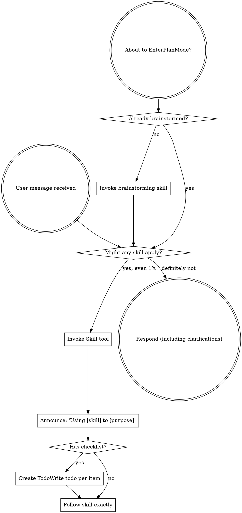

# Codex session 019f14f0-7bf4-7161-b6cd-ef228f331365

- Started: `2026-06-29T19:52:17.765Z`
- Working directory: `D:\100XH100`
- Originator: `Codex Desktop`
- Codex CLI: `0.142.3`
- Source log: `C:\Users\Иван Литвак\.codex\sessions\2026\06\29\rollout-2026-06-29T22-52-17-019f14f0-7bf4-7161-b6cd-ef228f331365.jsonl`
- Entries: user=2, assistant=9, tool calls=14, tool outputs=14

This is a chronological export of the user/assistant conversation and tool activity. Internal system/developer instructions and token accounting are intentionally excluded. Secret-shaped values are redacted; oversized tool outputs retain their beginning and end with the omitted character count.

## 1. User

Time: `2026-06-29T19:52:48.708Z` · source line `4`

```text
# AGENTS.md instructions for D:\100XH100

<INSTRUCTIONS>
# Project Agent Rules

## Operating Rule
- Read `AGENTS.md` before project edits.
- Update `memory/CHANGELOG.md` after meaningful code, config, or architecture changes.
- Update `memory/PROMPTS.md` with user prompts that define requirements.
- Store test outputs, logs, and verification notes under `test_results/`.
- Prefer agent-centered code: explicit contracts, deterministic tests, small files, low hidden state.

## Architecture Source
- Primary architecture contract: `ARCHITECTURE_NEED.md`.
- Current Stream 4 implementation rule: use threshold + compact + CUB/fixed-temp sort/reduce + compact; do not use Stream 4 hash-table dedup.

## Implementation Guardrails
- `State128` logical bytes are `v[0..119]`.
- `State128` padding bytes are `v[120..127]`.
- Persistent frontier padding must be zero.
- `FinalResponse` may temporarily store `target_local_idx` in `v[120..123]`.
- `Hash128` is one logical 128-bit key stored as `{lo, hi}`.
- `CandidateMeta` must remain 32 bytes and 32-byte aligned.
- Stream 3 payload id must be original candidate id, not compact index.
- Stream 4 must not apply shard top-k or semantic shard cap.

</INSTRUCTIONS>
<environment_context>
  <cwd>D:\100XH100</cwd>
  <shell>powershell</shell>
  <current_date>2026-06-29</current_date>
  <timezone>Europe/Moscow</timezone>
  <filesystem><workspace_roots><root>D:\100XH100</root></workspace_roots><permission_profile type="managed"><file_system type="restricted"><entry access="read"><special>:root</special></entry><entry access="write"><path>D:\100XH100</path></entry><entry access="write"><special>:slash_tmp</special></entry><entry access="write"><special>:tmpdir</special></entry><entry access="read"><path>D:\100XH100\.git</path></entry><entry access="read"><path>D:\100XH100\.agents</path></entry><entry access="read"><path>D:\100XH100\.codex</path></entry></file_system></permission_profile></filesystem>
</environment_context>
```

## 2. User

Time: `2026-06-29T19:52:48.732Z` · source line `6`

```text
Final code-quality review after all Task 6 fixes. Worktree: D:\100XH100\.worktrees\stream1-piece-transformer. Review commit range 6b5dbf58a94714fec965808318f98483680af46a..5b7f09f.

Context: Task 6 wired Stream1 piece_transformer runtime dispatch. Follow-up commits fixed transformer weight estimate sizing, made dispatcher test env setup portable, and stabilized the dispatcher CUDA test by explicitly setting stream4_trigger_candidates in manual test configs and removing a brittle Stream4 launch-count upper bound. Spec compliance had already passed for runtime wiring.

Review focus:
- Any remaining real bugs in dispatcher backend branch, production runner view/scratch lifetimes, graph capture/replay, lane scratch slicing, memory sizing, or test quality?
- Are the final test changes valid and not hiding a real Stream4 regression? They should still require stream4 flush > 0 and active sort slots within configured limit.
- No fallback backend, no architecture changes, no State128/Stream3/Stream4 contract changes.

Coordinator verification on final code before this review:
- Docker GPU: stream1_transformer_cuda_tests=pass, stream1_cuda_tests=pass, dispatcher_cuda_tests=pass.
- Tiny production_runner smoke with transformer weights logs stream1_backend=piece_transformer and exits normally.

Return findings first with severity and file/line references. If no issues, say approved. Do not modify files.
```

## 3. Codex

Time: `2026-06-29T19:53:02.361Z` · source line `9`

```text
I’ll do this as a code review only, with the findings first and no file edits. I’m going to read the project rules and the relevant review guidance, then inspect the stated commit range in the worktree.
```

## 4. Codex

Time: `2026-06-29T19:53:02.362Z` · source line `10`

```text
I’ll do this as a code review only, with the findings first and no file edits. I’m going to read the project rules and the relevant review guidance, then inspect the stated commit range in the worktree.
```

## 5. Tool call: `exec_command`

Time: `2026-06-29T19:53:03.954Z` · source line `11`

```text
{"cmd": "Get-Content -LiteralPath 'C:\\Users\\Иван Литвак\\.codex\\plugins\\cache\\openai-curated-remote\\superpowers\\5.1.4\\skills\\using-superpowers\\SKILL.md'","workdir":"D:\\100XH100","yield_time_ms":10000,"max_output_tokens":20000}
```

## 6. Tool output

Time: `2026-06-29T19:53:05.015Z` · source line `12`

````text
Chunk ID: 5c7594
Wall time: 0.1956 seconds
Process exited with code 0
Original token count: 1393
Output:
---
name: using-superpowers
description: Use when starting any conversation - establishes how to find and use skills, requiring Skill tool invocation before ANY response including clarifying questions
---

<SUBAGENT-STOP>
If you were dispatched as a subagent to execute a specific task, skip this skill.
</SUBAGENT-STOP>

<EXTREMELY-IMPORTANT>
If you think there is even a 1% chance a skill might apply to what you are doing, you ABSOLUTELY MUST invoke the skill.

IF A SKILL APPLIES TO YOUR TASK, YOU DO NOT HAVE A CHOICE. YOU MUST USE IT.

This is not negotiable. This is not optional. You cannot rationalize your way out of this.
</EXTREMELY-IMPORTANT>

## Instruction Priority

Superpowers skills override default system prompt behavior, but **user instructions always take precedence**:

1. **User's explicit instructions** (CLAUDE.md, GEMINI.md, AGENTS.md, direct requests) — highest priority
2. **Superpowers skills** — override default system behavior where they conflict
3. **Default system prompt** — lowest priority

If CLAUDE.md, GEMINI.md, or AGENTS.md says "don't use TDD" and a skill says "always use TDD," follow the user's instructions. The user is in control.

## How to Access Skills

**In Claude Code:** Use the `Skill` tool. When you invoke a skill, its content is loaded and presented to you—follow it directly. Never use the Read tool on skill files.

**In Copilot CLI:** Use the `skill` tool. Skills are auto-discovered from installed plugins. The `skill` tool works the same as Claude Code's `Skill` tool.

**In Gemini CLI:** Skills activate via the `activate_skill` tool. Gemini loads skill metadata at session start and activates the full content on demand.

**In other environments:** Check your platform's documentation for how skills are loaded.

## Platform Adaptation

Skills use Claude Code tool names. Non-CC platforms: see `references/copilot-tools.md` (Copilot CLI), `references/codex-tools.md` (Codex) for tool equivalents. Gemini CLI users get the tool mapping loaded automatically via GEMINI.md.

# Using Skills

## The Rule

**Invoke relevant or requested skills BEFORE any response or action.** Even a 1% chance a skill might apply means that you should invoke the skill to check. If an invoked skill turns out to be wrong for the situation, you don't need to use it.



## Red Flags

These thoughts mean STOP—you're rationalizing:

| Thought | Reality |
|---------|---------|
| "This is just a simple question" | Questions are tasks. Check for skills. |
| "I need more context first" | Skill check comes BEFORE clarifying questions. |
| "Let me explore the codebase first" | Skills tell you HOW to explore. Check first. |
| "I can check git/files quickly" | Files lack conversation context. Check for skills. |
| "Let me gather information first" | Skills tell you HOW to gather information. |
| "This doesn't need a formal skill" | If a skill exists, use it. |
| "I remember this skill" | Skills evolve. Read current version. |
| "This doesn't count as a task" | Action = task. Check for skills. |
| "The skill is overkill" | Simple things become complex. Use it. |
| "I'll just do this one thing first" | Check BEFORE doing anything. |
| "This feels productive" | Undisciplined action wastes time. Skills prevent this. |
| "I know what that means" | Knowing the concept в‰  using the skill. Invoke it. |

## Skill Priority

When multiple skills could apply, use this order:

1. **Process skills first** (brainstorming, debugging) - these determine HOW to approach the task
2. **Implementation skills second** (frontend-design, mcp-builder) - these guide execution

"Let's build X" в†’ brainstorming first, then implementation skills.
"Fix this bug" в†’ debugging first, then domain-specific skills.

## Skill Types

**Rigid** (TDD, debugging): Follow exactly. Don't adapt away discipline.

**Flexible** (patterns): Adapt principles to context.

The skill itself tells you which.

## User Instructions

Instructions say WHAT, not HOW. "Add X" or "Fix Y" doesn't mean skip workflows.

````

## 7. Codex

Time: `2026-06-29T19:53:07.845Z` · source line `15`

```text
Using `superpowers:using-superpowers` for skill routing; this is a review task, so I’m also loading the review-specific workflow before touching the diff.
```

## 8. Tool call: `exec_command`

Time: `2026-06-29T19:53:10.803Z` · source line `17`

```text
{"cmd":"Get-Content -LiteralPath 'C:\\Users\\Иван Литвак\\.codex\\plugins\\cache\\openai-curated-remote\\superpowers\\5.1.4\\skills\\requesting-code-review\\SKILL.md'","workdir":"D:\\100XH100","yield_time_ms":10000,"max_output_tokens":20000}
```

## 9. Tool output

Time: `2026-06-29T19:53:11.576Z` · source line `18`

````text
Chunk ID: ea7ded
Wall time: 0.2463 seconds
Process exited with code 0
Original token count: 729
Output:
---
name: requesting-code-review
description: Use when completing tasks, implementing major features, or before merging to verify work meets requirements
---

# Requesting Code Review

Dispatch a code reviewer subagent to catch issues before they cascade. The reviewer gets precisely crafted context for evaluation — never your session's history. This keeps the reviewer focused on the work product, not your thought process, and preserves your own context for continued work.

**Core principle:** Review early, review often.

## When to Request Review

**Mandatory:**
- After each task in subagent-driven development
- After completing major feature
- Before merge to main

**Optional but valuable:**
- When stuck (fresh perspective)
- Before refactoring (baseline check)
- After fixing complex bug

## How to Request

**1. Get git SHAs:**
```bash
BASE_SHA=$(git rev-parse HEAD~1)  # or origin/main
HEAD_SHA=$(git rev-parse HEAD)
```

**2. Dispatch code reviewer subagent:**

Use Task tool with `general-purpose` type, fill template at `code-reviewer.md`

**Placeholders:**
- `{DESCRIPTION}` - Brief summary of what you built
- `{PLAN_OR_REQUIREMENTS}` - What it should do
- `{BASE_SHA}` - Starting commit
- `{HEAD_SHA}` - Ending commit

**3. Act on feedback:**
- Fix Critical issues immediately
- Fix Important issues before proceeding
- Note Minor issues for later
- Push back if reviewer is wrong (with reasoning)

## Example

```
[Just completed Task 2: Add verification function]

You: Let me request code review before proceeding.

BASE_SHA=$(git log --oneline | grep "Task 1" | head -1 | awk '{print $1}')
HEAD_SHA=$(git rev-parse HEAD)

[Dispatch code reviewer subagent]
  DESCRIPTION: Added verifyIndex() and repairIndex() with 4 issue types
  PLAN_OR_REQUIREMENTS: Task 2 from docs/superpowers/plans/deployment-plan.md
  BASE_SHA: a7981ec
  HEAD_SHA: 3df7661

[Subagent returns]:
  Strengths: Clean architecture, real tests
  Issues:
    Important: Missing progress indicators
    Minor: Magic number (100) for reporting interval
  Assessment: Ready to proceed

You: [Fix progress indicators]
[Continue to Task 3]
```

## Integration with Workflows

**Subagent-Driven Development:**
- Review after EACH task
- Catch issues before they compound
- Fix before moving to next task

**Executing Plans:**
- Review after each task or at natural checkpoints
- Get feedback, apply, continue

**Ad-Hoc Development:**
- Review before merge
- Review when stuck

## Red Flags

**Never:**
- Skip review because "it's simple"
- Ignore Critical issues
- Proceed with unfixed Important issues
- Argue with valid technical feedback

**If reviewer wrong:**
- Push back with technical reasoning
- Show code/tests that prove it works
- Request clarification

See template at: requesting-code-review/code-reviewer.md

````

## 10. Codex

Time: `2026-06-29T19:53:23.833Z` · source line `21`

```text
I’ll keep the review grounded in the actual diff and local project rules. Next I’m checking the worktree instructions, memory pointers for this repo, and the changed files in the requested range.
```

## 11. Codex

Time: `2026-06-29T19:53:23.845Z` · source line `22`

```text
I’ll keep the review grounded in the actual diff and local project rules. Next I’m checking the worktree instructions, memory pointers for this repo, and the changed files in the requested range.
```

## 12. Tool call: `exec_command`

Time: `2026-06-29T19:53:23.901Z` · source line `23`

```text
{"cmd":"Get-Content -LiteralPath 'D:\\100XH100\\.worktrees\\stream1-piece-transformer\\AGENTS.md'","workdir":"D:\\100XH100\\.worktrees\\stream1-piece-transformer","yield_time_ms":10000,"max_output_tokens":12000}
```

## 13. Tool call: `exec_command`

Time: `2026-06-29T19:53:23.930Z` · source line `24`

```text
{"cmd":"rg -n \"Stream1|piece_transformer|BEAM_PREBUILT_RUNNER|stream1-piece|Task 6|D:\\\\100XH100\" 'C:\\Users\\Иван Литвак\\.codex\\memories\\MEMORY.md'","workdir":"D:\\100XH100","yield_time_ms":10000,"max_output_tokens":12000}
```

## 14. Tool call: `exec_command`

Time: `2026-06-29T19:53:23.933Z` · source line `25`

```text
{"cmd":"git diff --stat 6b5dbf58a94714fec965808318f98483680af46a..5b7f09f","workdir":"D:\\100XH100\\.worktrees\\stream1-piece-transformer","yield_time_ms":10000,"max_output_tokens":12000}
```

## 15. Tool call: `exec_command`

Time: `2026-06-29T19:53:23.946Z` · source line `26`

```text
{"cmd":"git diff --name-status 6b5dbf58a94714fec965808318f98483680af46a..5b7f09f","workdir":"D:\\100XH100\\.worktrees\\stream1-piece-transformer","yield_time_ms":10000,"max_output_tokens":12000}
```

## 16. Tool output

Time: `2026-06-29T19:53:24.637Z` · source line `27`

```text
Chunk ID: 0e70f6
Wall time: 0.4205 seconds
Process exited with code 0
Original token count: 290
Output:
# Project Agent Rules

## Operating Rule
- Read `AGENTS.md` before project edits.
- Update `memory/CHANGELOG.md` after meaningful code, config, or architecture changes.
- Update `memory/PROMPTS.md` with user prompts that define requirements.
- Store test outputs, logs, and verification notes under `test_results/`.
- Prefer agent-centered code: explicit contracts, deterministic tests, small files, low hidden state.

## Architecture Source
- Primary architecture contract: `ARCHITECTURE_NEED.md`.
- Current Stream 4 implementation rule: use threshold + compact + CUB/fixed-temp sort/reduce + compact; do not use Stream 4 hash-table dedup.

## Implementation Guardrails
- `State128` logical bytes are `v[0..119]`.
- `State128` padding bytes are `v[120..127]`.
- Persistent frontier padding must be zero.
- `FinalResponse` may temporarily store `target_local_idx` in `v[120..123]`.
- `Hash128` is one logical 128-bit key stored as `{lo, hi}`.
- `CandidateMeta` must remain 32 bytes and 32-byte aligned.
- Stream 3 payload id must be original candidate id, not compact index.
- Stream 4 must not apply shard top-k or semantic shard cap.

```

## 17. Tool output

Time: `2026-06-29T19:53:24.783Z` · source line `28`

```text
Chunk ID: bd547f
Wall time: 0.3984 seconds
Process exited with code 0
Original token count: 581
Output:
48:applies_to: cwd=D:\100XH100; reuse_rule=reuse for this IHES/MEPhI repo family and adjacent cluster publish jobs, but treat live cluster inventory, DNS availability, and current results-repo schema as run-specific and recheck them before publishing.
54:- rollout_summaries/2026-06-04T15-47-52-Dd1O-ihes_cluster_results_prebuilt_publish_backfill.md (cwd=\\?\D:\100XH100, rollout_path=\\?\C:\Users\Иван Литвак\.codex\sessions\2026\06\04\rollout-2026-06-04T18-47-57-019e9351-cd3b-71c0-bf8b-69755d08d5fc.jsonl, updated_at=2026-06-26T19:51:22+00:00, thread_id=019e9351-cd3b-71c0-bf8b-69755d08d5fc, the prebuilt runner was compiled once and reused across the A100 array workflow)
58:- MEPhI HPC, kaf12, A100 40GB, BEAM_PREBUILT_RUNNER, prepare_ihes_prebuilt_runner.sh, ihes_solve_bucket_from_scratch.sh, prebuilt_runner_ready, using_prebuilt_runner, PUZZLE_LIMIT=1, depth=12
64:- rollout_summaries/2026-06-04T15-47-52-Dd1O-ihes_cluster_results_prebuilt_publish_backfill.md (cwd=\\?\D:\100XH100, rollout_path=\\?\C:\Users\Иван Литвак\.codex\sessions\2026\06\04\rollout-2026-06-04T18-47-57-019e9351-cd3b-71c0-bf8b-69755d08d5fc.jsonl, updated_at=2026-06-26T19:51:22+00:00, thread_id=019e9351-cd3b-71c0-bf8b-69755d08d5fc, the results repo structure and first backfilled puzzle sets were established)
74:- rollout_summaries/2026-06-04T15-47-52-Dd1O-ihes_cluster_results_prebuilt_publish_backfill.md (cwd=\\?\D:\100XH100, rollout_path=\\?\C:\Users\Иван Литвак\.codex\sessions\2026\06\04\rollout-2026-06-04T18-47-57-019e9351-cd3b-71c0-bf8b-69755d08d5fc.jsonl, updated_at=2026-06-26T19:51:22+00:00, thread_id=019e9351-cd3b-71c0-bf8b-69755d08d5fc, a file-driven inventory plus schema fixes made the larger aggregator path workable)
89:- `hpc/ihes_cube_model/prepare_ihes_prebuilt_runner.sh` builds the shared binary at `/mnt/pool/6/vokirova/beam8a100/ihes_cube_model/prebuilt-a100-ihes/production_runner`, and `hpc/ihes_cube_model/ihes_solve_bucket_from_scratch.sh` already knows how to consume `BEAM_PREBUILT_RUNNER` [Task 1]
97:- symptom: each array task recompiles instead of reusing the solver. cause: `BEAM_PREBUILT_RUNNER` was not wired through a separate prebuild dependency. fix: submit the prebuild first and make the puzzle array depend on it via `--dependency=afterok:<prebuild_job>` [Task 1]

```

## 18. Tool output

Time: `2026-06-29T19:53:24.978Z` · source line `29`

```text
Chunk ID: c9004a
Wall time: 0.6131 seconds
Process exited with code 0
Original token count: 219
Output:
 cuda/dispatcher.cu                                 |  35 ++-
 cuda/dispatcher.hpp                                |  12 +-
 cuda/runtime_config.cpp                            |  76 ++++--
 memory/CHANGELOG.md                                |   6 +
 memory/PROMPTS.md                                  |   4 +
 .../dispatcher_cuda_env_portability_2026-06-29.md  |  10 +
 ...tream1_transformer_runtime_wiring_2026-06-29.md |  51 ++++
 ...nsformer_weight_estimate_contract_2026-06-29.md |  11 +
 tests/dispatcher_cuda_tests.cu                     | 267 ++++++++++++++++++++-
 tests/stream1_transformer_cuda_tests.cu            |   2 +-
 tools/production_runner.cu                         |  82 +++++--
 tools/stream1_weight_io.hpp                        |  37 +++
 tools/stream_benchmark.cu                          |   2 +-
 13 files changed, 539 insertions(+), 56 deletions(-)

```

## 19. Tool output

Time: `2026-06-29T19:53:24.978Z` · source line `30`

```text
Chunk ID: eedfa2
Wall time: 0.5280 seconds
Process exited with code 0
Original token count: 118
Output:
M	cuda/dispatcher.cu
M	cuda/dispatcher.hpp
M	cuda/runtime_config.cpp
M	memory/CHANGELOG.md
M	memory/PROMPTS.md
A	test_results/dispatcher_cuda_env_portability_2026-06-29.md
A	test_results/stream1_transformer_runtime_wiring_2026-06-29.md
A	test_results/stream1_transformer_weight_estimate_contract_2026-06-29.md
M	tests/dispatcher_cuda_tests.cu
M	tests/stream1_transformer_cuda_tests.cu
M	tools/production_runner.cu
M	tools/stream1_weight_io.hpp
M	tools/stream_benchmark.cu

```

## 20. Codex

Time: `2026-06-29T19:54:09.089Z` · source line `33`

```text
The range is concentrated in dispatcher/runtime config, production runner, weight IO, and CUDA tests. I’m going through those paths now with the Task 6 risk areas in mind: backend selection, scratch/view lifetimes, graph replay, and whether the test relaxations still assert the right contract.
```

## 21. Codex

Time: `2026-06-29T19:54:09.104Z` · source line `34`

```text
The range is concentrated in dispatcher/runtime config, production runner, weight IO, and CUDA tests. I’m going through those paths now with the Task 6 risk areas in mind: backend selection, scratch/view lifetimes, graph replay, and whether the test relaxations still assert the right contract.
```

## 22. Tool call: `exec_command`

Time: `2026-06-29T19:54:09.127Z` · source line `35`

```text
{"cmd":"git diff --unified=80 6b5dbf58a94714fec965808318f98483680af46a..5b7f09f -- cuda/dispatcher.cu cuda/dispatcher.hpp","workdir":"D:\\100XH100\\.worktrees\\stream1-piece-transformer","yield_time_ms":10000,"max_output_tokens":50000}
```

## 23. Tool call: `exec_command`

Time: `2026-06-29T19:54:09.238Z` · source line `36`

```text
{"cmd":"git diff --unified=80 6b5dbf58a94714fec965808318f98483680af46a..5b7f09f -- tools/production_runner.cu tools/stream1_weight_io.hpp tools/stream_benchmark.cu cuda/runtime_config.cpp","workdir":"D:\\100XH100\\.worktrees\\stream1-piece-transformer","yield_time_ms":10000,"max_output_tokens":50000}
```

## 24. Tool call: `exec_command`

Time: `2026-06-29T19:54:09.238Z` · source line `37`

```text
{"cmd":"git diff --unified=80 6b5dbf58a94714fec965808318f98483680af46a..5b7f09f -- tests/dispatcher_cuda_tests.cu tests/stream1_transformer_cuda_tests.cu","workdir":"D:\\100XH100\\.worktrees\\stream1-piece-transformer","yield_time_ms":10000,"max_output_tokens":50000}
```

## 25. Tool call: `exec_command`

Time: `2026-06-29T19:54:09.243Z` · source line `38`

```text
{"cmd":"rg -n \"piece_transformer|stream4_trigger_candidates|Stream1Backend|graph|capture|scratch|active_sort|flush|launch\" cuda tools tests","workdir":"D:\\100XH100\\.worktrees\\stream1-piece-transformer","yield_time_ms":10000,"max_output_tokens":30000}
```

## 26. Tool output

Time: `2026-06-29T19:54:11.677Z` · source line `39`

```text
Chunk ID: a0fb5b
Wall time: 2.0285 seconds
Process exited with code 0
Original token count: 4170
Output:
diff --git a/cuda/dispatcher.cu b/cuda/dispatcher.cu
index b7aa4e1..e13f0dd 100644
--- a/cuda/dispatcher.cu
+++ b/cuda/dispatcher.cu
@@ -1210,199 +1210,224 @@ void destroy_dispatcher_streams(DispatcherStreams& streams) {
     }
     if (streams.stream4) {
         cudaStreamDestroy(streams.stream4);
     }
     if (streams.stream5) {
         cudaStreamDestroy(streams.stream5);
     }
     for (cudaStream_t stream : streams.stream4_slot_streams) {
         if (stream) {
             cudaStreamDestroy(stream);
         }
     }
     for (cudaEvent_t event : streams.stream4_slot_done) {
         if (event) {
             cudaEventDestroy(event);
         }
     }
     auto destroy_group = [](std::array<cudaEvent_t, 3>& events) {
         for (cudaEvent_t event : events) {
             if (event) {
                 cudaEventDestroy(event);
             }
         }
     };
     destroy_group(streams.final_build_done);
     destroy_group(streams.final_history_done);
     destroy_group(streams.final_request_done);
     destroy_group(streams.final_response_ready);
     destroy_group(streams.final_response_done);
     streams = DispatcherStreams{};
 }
 
 void create_dispatcher_events(DispatcherEvents& events) {
     check_cuda(cudaEventCreateWithFlags(&events.stream1_done, cudaEventDisableTiming), "cudaEventCreate stream1_done");
     check_cuda(cudaEventCreateWithFlags(&events.stream2_done, cudaEventDisableTiming), "cudaEventCreate stream2_done");
     check_cuda(cudaEventCreateWithFlags(&events.stream3_done, cudaEventDisableTiming), "cudaEventCreate stream3_done");
 }
 
 void destroy_dispatcher_events(DispatcherEvents& events) {
     for (std::size_t lane = 1; lane < events.stream1_lane_done.size(); ++lane) {
         if (events.stream1_lane_done[lane]) {
             cudaEventDestroy(events.stream1_lane_done[lane]);
         }
     }
     for (std::size_t lane = 1; lane < events.stream2_lane_done.size(); ++lane) {
         if (events.stream2_lane_done[lane]) {
             cudaEventDestroy(events.stream2_lane_done[lane]);
         }
     }
     events.stream1_lane_done.clear();
     events.stream2_lane_done.clear();
     if (events.stream1_done) {
         cudaEventDestroy(events.stream1_done);
     }
     if (events.stream2_done) {
         cudaEventDestroy(events.stream2_done);
     }
     if (events.stream3_done) {
         cudaEventDestroy(events.stream3_done);
     }
     events = DispatcherEvents{};
 }
 
 void instantiate_cuda_graph_job_templates(
     const StaticMemoryPlan& plan,
     StaticDeviceMemory& memory,
     const DispatcherDeviceTables& tables,
     const DispatcherNetwork& network,
     Stream2SolvedBuffers solved,
     DispatcherStreams& streams,
     DispatcherEvents& events,
     CudaGraphJobTemplates& graphs) {
     NvtxRange range("Dispatcher_instantiate_cuda_graph_job_templates");
     if (!memory.current_frontier_states || !memory.scratch_pool || !tables.generators || !tables.central_state || !tables.zobrist) {
         throw std::invalid_argument("dispatcher graph templates require preallocated architecture memory and read-only tables");
     }
     if (plan.config.inference_parallelism == 0U ||
         plan.config.inference_parallelism > plan.derived.ring_slot_count) {
         throw std::invalid_argument("Stream1 concurrency must be in [1, RING_SLOT_COUNT]");
     }
-    if (network.scratch_lanes.size() < plan.config.inference_parallelism) {
-        throw std::invalid_argument("Stream1 scratch lane count is smaller than Stream1 concurrency");
+    const bool known_stream1_backend =
+        network.backend == DispatcherStream1Backend::Mlp ||
+        network.backend == DispatcherStream1Backend::PieceTransformer;
+    if (!known_stream1_backend) {
+        throw std::invalid_argument("unknown Stream1 dispatcher backend");
+    }
+    if (!network.uniform_score) {
+        if (network.backend == DispatcherStream1Backend::Mlp &&
+            network.mlp_scratch_lanes.size() < plan.config.inference_parallelism) {
+            throw std::invalid_argument("Stream1 MLP scratch lane count is smaller than Stream1 concurrency");
+        }
+        if (network.backend == DispatcherStream1Backend::PieceTransformer &&
+            network.transformer_scratch_lanes.size() < plan.config.inference_parallelism) {
+            throw std::invalid_argument("Stream1 transformer scratch lane count is smaller than Stream1 concurrency");
+        }
     }
     ensure_stream12_lane_resources(streams, events, plan.config.inference_parallelism);
     ensure_stream4_slot_resources(streams, plan.config.stream4_active_sort_slots);
     const bool predict_stats_enabled = predict_stats_enabled_from_env();
 
     const std::uint32_t ring_slot_job_count = plan.config.ring_count * plan.derived.ring_slot_count;
     graphs.ring_slot_graphs.resize(ring_slot_job_count, nullptr);
     graphs.ring_slot_execs.resize(ring_slot_job_count, nullptr);
     const std::uint64_t candidates_per_slot = static_cast<std::uint64_t>(plan.config.b_micro) * MOVE_COUNT;
     for (std::uint32_t job = 0; job < ring_slot_job_count; ++job) {
         const std::uint32_t ring_slot = job % plan.derived.ring_slot_count;
         const std::uint32_t lane = ring_slot % plan.config.inference_parallelism;
         cudaStream_t stream1_lane = streams.stream1_lanes[lane];
         cudaStream_t stream2_lane = streams.stream2_lanes[lane];
         cudaEvent_t stream1_done = events.stream1_lane_done[lane];
         cudaEvent_t stream2_done = events.stream2_lane_done[lane];
         const std::uint64_t candidate_offset = static_cast<std::uint64_t>(job) * candidates_per_slot;
         check_cuda(cudaStreamBeginCapture(stream1_lane, cudaStreamCaptureModeGlobal), "cudaStreamBeginCapture ring_slot_graph");
         check_cuda(cudaEventRecord(stream1_done, stream1_lane), "cudaEventRecord ring_slot_fork");
         check_cuda(cudaStreamWaitEvent(stream2_lane, stream1_done, 0), "cudaStreamWaitEvent stream2_fork");
         if (network.uniform_score) {
             check_cuda(cudaMemsetAsync(
                 memory.streams.score_ring + candidate_offset,
                 0,
                 candidates_per_slot * sizeof(std::uint32_t),
                 stream1_lane), "cudaMemsetAsync uniform score ring");
-        } else {
+        } else if (network.backend == DispatcherStream1Backend::Mlp) {
             stream1_inference_cutlass_cuda(
                 memory.current_frontier_states,
                 memory.streams.parent_base + job,
                 memory.streams.count + job,
                 tables.generators,
-                network.view,
-                network.scratch_lanes[lane],
+                network.mlp_view,
+                network.mlp_scratch_lanes[lane],
                 memory.streams.score_ring + candidate_offset,
                 plan.config.b_micro,
                 stream1_lane);
+        } else if (network.backend == DispatcherStream1Backend::PieceTransformer) {
+            stream1_transformer_inference_cuda(
+                memory.current_frontier_states,
+                memory.streams.parent_base + job,
+                memory.streams.count + job,
+                network.transformer_view,
+                network.transformer_scratch_lanes[lane],
+                memory.streams.score_ring + candidate_offset,
+                plan.config.b_micro,
+                stream1_lane);
+        } else {
+            throw std::invalid_argument("unknown Stream1 dispatcher backend");
         }
         stream2_hash_goal_cuda(
             memory.current_frontier_states,
             memory.streams.parent_base + job,
             memory.streams.count + job,
             tables.generators,
             tables.central_state,
             tables.zobrist,
             memory.streams.hash_ring + candidate_offset,
             0,
             0,
             plan.config.b_micro,
             0,
             plan.config.local_rank,
             solved,
             stream2_lane);
         check_cuda(cudaEventRecord(stream2_done, stream2_lane), "cudaEventRecord ring_slot_join");
         check_cuda(cudaStreamWaitEvent(stream1_lane, stream2_done, 0), "cudaStreamWaitEvent stream1_join");
         instantiate_captured_graph(stream1_lane, graphs.ring_slot_graphs[job], graphs.ring_slot_execs[job]);
     }
 
     graphs.stream3_ring_graphs.resize(plan.config.ring_count, nullptr);
     graphs.stream3_ring_execs.resize(plan.config.ring_count, nullptr);
     for (std::uint32_t ring = 0; ring < plan.config.ring_count; ++ring) {
         const std::uint64_t ring_candidate_offset = static_cast<std::uint64_t>(ring) * plan.config.stream3_batch_candidates;
         const std::uint64_t stream5_send_slot =
             plan.config.world_size > 1U ? static_cast<std::uint64_t>(ring) : 0ULL;
         CandidateMeta* ring_remote_send_buffer =
             memory.streams.remote_send_buffer + stream5_send_slot * plan.stream5_send_slot_capacity;
         check_cuda(cudaStreamBeginCapture(streams.stream3, cudaStreamCaptureModeGlobal), "cudaStreamBeginCapture stream3_ring_graph");
         if (predict_stats_enabled) {
             stream3_accumulate_score_hist_cuda(
                 memory.streams.score_ring + ring_candidate_offset,
                 memory.streams.count + static_cast<std::uint64_t>(ring) * plan.derived.ring_slot_count,
                 memory.streams.stream3_score_key_a,
                 memory.streams.stream3_score_key_b,
                 memory.streams.stream3_score_count_a,
                 memory.streams.stream3_score_count_b,
                 memory.streams.stream3_score_unique_count,
                 memory.streams.stream3_score_hist,
                 memory.streams.stream3_cub_temp,
                 memory.streams.stream3_cub_temp_bytes,
                 plan.config.b_micro,
                 plan.config.stream3_batch_candidates,
                 streams.stream3);
         }
         stream3_pack_threshold_device_threshold_cuda(
             memory.streams.score_ring + ring_candidate_offset,
             memory.streams.hash_ring + ring_candidate_offset,
             memory.streams.parent_base + static_cast<std::uint64_t>(ring) * plan.derived.ring_slot_count,
             memory.streams.count + static_cast<std::uint64_t>(ring) * plan.derived.ring_slot_count,
             memory.streams.stream3_key_a,
             memory.streams.stream3_val_a,
             memory.streams.stream3_key_b,
             memory.streams.stream3_val_b,
             memory.streams.unique_key,
             memory.streams.unique_val,
             memory.streams.stream3_keep_flags,
             memory.streams.stream3_block_counts,
             memory.streams.stream3_block_offsets,
             memory.streams.unique_count,
             memory.streams.stream3_cub_temp,
             memory.streams.stream3_cub_temp_bytes,
             memory.streams.current_threshold,
             memory.streams.current_threshold_active_index,
             plan.config.b_micro,
             plan.config.stream3_batch_candidates,
             streams.stream3,
 #if BEAM_DEBUG_DEPTH_FLOW_TRACE
             memory.streams.stream3_threshold_pass_count_by_ring,
             memory.streams.stream3_unique_count_by_ring,
 #else
             nullptr,
             nullptr,
 #endif
             ring);
         if (plan.config.world_size != 1U) {
             stream3_restore_owner_split_cuda(
                 memory.streams.unique_key,
                 memory.streams.unique_val,
diff --git a/cuda/dispatcher.hpp b/cuda/dispatcher.hpp
index d0cd448..d07515f 100644
--- a/cuda/dispatcher.hpp
+++ b/cuda/dispatcher.hpp
@@ -1,142 +1,150 @@
 #pragma once
 
 #include "static_memory.hpp"
 #include "stream1.hpp"
 #include "stream2.hpp"
 
 #include <cuda_runtime.h>
 #include <nccl.h>
 
 #include <array>
 #include <cstdint>
 #include <vector>
 
 #ifndef BEAM_DEBUG_DEPTH_FLOW_TRACE
 #define BEAM_DEBUG_DEPTH_FLOW_TRACE 0
 #endif
 
 namespace beam {
 
 struct DispatcherStreams {
     cudaStream_t stream1 = nullptr;
     cudaStream_t stream2 = nullptr;
     cudaStream_t stream3 = nullptr;
     cudaStream_t stream4 = nullptr;
     cudaStream_t stream5 = nullptr;
     std::vector<cudaStream_t> stream1_lanes;
     std::vector<cudaStream_t> stream2_lanes;
     std::vector<cudaStream_t> stream4_slot_streams;
     std::vector<cudaEvent_t> stream4_slot_done;
     std::array<cudaEvent_t, 3> final_build_done{};
     std::array<cudaEvent_t, 3> final_history_done{};
     std::array<cudaEvent_t, 3> final_request_done{};
     std::array<cudaEvent_t, 3> final_response_ready{};
     std::array<cudaEvent_t, 3> final_response_done{};
 };
 
 struct DispatcherEvents {
     cudaEvent_t stream1_done = nullptr;
     cudaEvent_t stream2_done = nullptr;
     cudaEvent_t stream3_done = nullptr;
     std::vector<cudaEvent_t> stream1_lane_done;
     std::vector<cudaEvent_t> stream2_lane_done;
 };
 
 struct CudaGraphJobTemplates {
     std::vector<cudaGraph_t> ring_slot_graphs;
     std::vector<cudaGraphExec_t> ring_slot_execs;
     std::vector<cudaGraph_t> stream3_ring_graphs;
     std::vector<cudaGraphExec_t> stream3_ring_execs;
     std::vector<cudaGraph_t> stream4_shard_graphs;
     std::vector<cudaGraphExec_t> stream4_shard_execs;
 };
 
 struct DispatcherDeviceTables {
     const std::uint8_t* generators = nullptr;
     const State128* central_state = nullptr;
     const Hash128* zobrist = nullptr;
 };
 
+enum class DispatcherStream1Backend : std::uint8_t {
+    Mlp = 0,
+    PieceTransformer = 1,
+};
+
 struct DispatcherNetwork {
-    Stream1NetworkView view;
-    std::vector<Stream1CutlassScratch> scratch_lanes;
+    DispatcherStream1Backend backend = DispatcherStream1Backend::Mlp;
+    Stream1NetworkView mlp_view{};
+    std::vector<Stream1CutlassScratch> mlp_scratch_lanes;
+    Stream1TransformerNetworkView transformer_view{};
+    std::vector<Stream1TransformerScratchView> transformer_scratch_lanes;
     bool uniform_score = false;
 };
 
 struct DispatcherCollective {
     ncclComm_t comm = nullptr;
 };
 
 struct GeneratedTrackRequest {
     bool enabled = false;
     std::uint64_t parent_idx = UINT64_MAX;
     std::uint8_t move = 0;
 };
 
 struct GeneratedTrackResult {
     bool enabled = false;
     bool found = false;
     std::uint64_t request_parent_idx = UINT64_MAX;
     std::uint8_t request_move = 0;
     std::uint32_t ring = UINT32_MAX;
     std::uint32_t ring_slot = UINT32_MAX;
     std::uint32_t job = UINT32_MAX;
     std::uint64_t parent_base = 0;
     std::uint32_t count = 0;
     std::uint32_t parent_local = UINT32_MAX;
     std::uint64_t payload_id = UINT64_MAX;
     std::uint64_t score_ring_offset = UINT64_MAX;
     std::uint32_t score_key = UINT32_MAX;
     Hash128 hash{UINT64_MAX, UINT64_MAX};
     std::uint8_t owner = UINT8_MAX;
     std::uint32_t shard = UINT32_MAX;
     std::uint32_t current_threshold = UINT32_MAX;
     bool parent_state_copied = false;
     State128 parent_state{};
     bool all_move_scores_copied = false;
     std::array<std::uint32_t, MOVE_COUNT> move_score_keys{};
 };
 
 struct Stream4TrackResult {
     bool enabled = false;
     Hash128 hash{UINT64_MAX, UINT64_MAX};
     std::uint32_t score_key = UINT32_MAX;
     std::uint32_t shard = UINT32_MAX;
 
     bool after_stream3_scanned = false;
     bool after_stream3_found = false;
     std::uint32_t after_stream3_location = UINT32_MAX;
     std::uint32_t after_stream3_local = UINT32_MAX;
     std::uint32_t after_stream3_clean_count = 0;
     std::uint32_t after_stream3_dirty_count = 0;
     std::uint32_t after_stream3_active_spill_count = 0;
     std::uint32_t after_stream3_inactive_spill_count = 0;
     std::uint32_t after_stream3_threshold = UINT32_MAX;
 
     std::uint32_t input_scan_count = 0;
     bool input_found = false;
     std::uint32_t input_slot = UINT32_MAX;
     std::uint32_t input_job = UINT32_MAX;
     std::uint32_t input_location = UINT32_MAX;
     std::uint32_t input_local = UINT32_MAX;
     std::uint32_t input_clean_count = 0;
     std::uint32_t input_dirty_count = 0;
     std::uint32_t input_threshold = UINT32_MAX;
 
     std::uint32_t output_scan_count = 0;
     bool output_found = false;
     std::uint32_t output_slot = UINT32_MAX;
     std::uint32_t output_job = UINT32_MAX;
     std::uint32_t output_local = UINT32_MAX;
     std::uint32_t output_clean_count = 0;
     std::uint32_t output_dirty_count = 0;
     std::uint32_t output_threshold = UINT32_MAX;
 };
 
 struct Stream4TrackEvent {
     std::uint32_t phase = 0;
     bool found = false;
     std::uint32_t shard = UINT32_MAX;
     std::uint32_t slot = UINT32_MAX;
     std::uint32_t job = UINT32_MAX;
     std::uint32_t location = UINT32_MAX;

```

## 27. Tool output

Time: `2026-06-29T19:54:11.678Z` · source line `40`

Oversized output: `8211` characters omitted from the middle.

```text
Chunk ID: 5de6fd
Wall time: 1.5137 seconds
Process exited with code 0
Original token count: 14492
Output:
Warning: truncated output (original token count: 14492)
Total output lines: 1076

diff --git a/cuda/runtime_config.cpp b/cuda/runtime_config.cpp
index cb0dcf9..20d6230 100644
--- a/cuda/runtime_config.cpp
+++ b/cuda/runtime_config.cpp
@@ -1,202 +1,240 @@
 #include "runtime_config.hpp"
+#define BEAM_STREAM1_WEIGHT_IO_MANIFEST_ONLY
+#include "../tools/stream1_weight_io.hpp"
 
 #include <algorithm>
 #include <cstring>
 #include <cstdlib>
 #include <limits>
 #include <stdexcept>
 #include <string>
 #include <vector>
 
 namespace beam {
 
 namespace {
 
 std::uint64_t parse_u64(const char* text, const char* name) {
     char* end = nullptr;
     const unsigned long long value = std::strtoull(text, &end, 10);
     if (end == text || *end != '\0') {
         throw std::invalid_argument(std::string("invalid numeric argument: ") + name);
     }
     return static_cast<std::uint64_t>(value);
 }
 
 std::uint32_t env_u32(const char* name, std::uint32_t default_value) {
     const char* value = std::getenv(name);
     if (value == nullptr || value[0] == '\0') {
         return default_value;
     }
     const std::uint64_t parsed = parse_u64(value, name);
     if (parsed > std::numeric_limits<std::uint32_t>::max()) {
         throw std::invalid_argument(std::string("env value exceeds uint32: ") + name);
     }
     return static_cast<std::uint32_t>(parsed);
 }
 
 std::uint64_t env_u64(const char* name, std::uint64_t default_value) {
     const char* value = std::getenv(name);
     if (value == nullptr || value[0] == '\0') {
         return default_value;
     }
     return parse_u64(value, name);
 }
 
 bool env_present(const char* name) {
     const char* value = std::getenv(name);
     return value != nullptr && value[0] != '\0';
 }
 
 bool env_equals(const char* name, const char* expected) {
     const char* value = std::getenv(name);
     return value != nullptr && std::strcmp(value, expected) == 0;
 }
 
 std::uint32_t required_env_u32(const char* name) {
     if (!env_present(name)) {
         throw std::invalid_argument(std::string("manual runtime config requires env: ") + name);
     }
     return env_u32(name, 0);
 }
 
 std::uint32_t checked_u32(std::uint64_t value, const char* name) {
     if (value > std::numeric_limits<std::uint32_t>::max()) {
         throw std::invalid_argument(std::string("value exceeds uint32: ") + name);
     }
     return static_cast<std::uint32_t>(value);
 }
 
 std::uint32_t round_up_u32(std::uint64_t value, std::uint32_t alignment) {
     return checked_u32(round_up(value, alignment), "round_up_u32");
 }
 
 std::uint64_t scaled_round_up(std::uint64_t value, std::uint64_t ppm) {
     constexpr std::uint64_t scale = 1'000'000ULL;
     return (value * ppm + scale - 1ULL) / scale;
 }
 
 std::uint64_t ceil_log2_u64(std::uint64_t value) {
     if (value <= 1ULL) {
         return 0ULL;
     }
     std::uint64_t bits = 0;
     std::uint64_t current = value - 1ULL;
     while (current != 0ULL) {
         current >>= 1U;
         ++bits;
     }
     return bits;
 }
 
 std::uint64_t estimate_stream1_weight_bytes(const Stream1ModelConfig& model) {
     constexpr std::uint64_t fp16 = sizeof(std::uint16_t);
-    std::uint64_t total = 0;
-    total += static_cast<std::uint64_t>(model.state_len) * model.num_classes * model.hidden1 * fp16;
-    total += static_cast<std::uint64_t>(model.hidden1) * fp16;
-    total += static_cast<std::uint64_t>(model.hidden1) * model.hidden2 * fp16;
-    total += static_cast<std::uint64_t>(model.hidden2) * fp16;
-    total += 2ULL * static_cast<std::uint64_t>(model.residual_count) * model.hidden2 * model.hidden2 * fp16;
-    total += 2ULL * static_cast<std::uint64_t>(model.residual_count) * model.hidden2 * fp16;
-    total += static_cast<std::uint64_t>(model.hidden2) * model.output_dim * fp16;
-    total += static_cast<std::uint64_t>(model.output_dim) * fp16;
-    return total;
+    switch (model.backend) {
+    case STREAM1_BACKEND_MLP: {
+        std::uint64_t total = 0;
+        total += static_cast<std::uint64_t>(model.state_len) * model.num_classes * model.hidden1 * fp16;
+        total += static_cast<std::uint64_t>(model.hidden1) * fp16;
+        if (model.normalization == STREAM1_NORM_LAYERNORM) {
+            total += 2ULL * static_cast<std::uint64_t>(model.hidden1) * fp16;
+        }
+        total += static_cast<std::uint64_t>(model.hidden1) * model.hidden2 * fp16;
+        total += static_cast<std::uint64_t>(model.hidden2) * fp16;
+        if (model.normalization == STREAM1_NORM_LAYERNORM) {
+            total += 2ULL * static_cast<std::uint64_t>(model.hidden2) * fp16;
+        }
+        total += 2ULL * static_cast<std::uint64_t>(model.residual_count) * model.hidden2 * model.hidden2 * fp16;
+        total += 2ULL * static_cast<std::uint64_t>(model.residual_count) * model.hidden2 * fp16;
+        if (model.normalization == STREAM1_NORM_LAYERNORM) {
+            total += 4ULL * static_cast<std::uint64_t>(model.residual_count) * model.hidden2 * fp16;
+        }
+        total += static_cast<std::uint64_t>(model.hidden2) * model.output_dim * fp16;
+        total += static_cast<std::uint64_t>(model.output_dim) * fp16;
+        return total;
+    }
+    case STREAM1_BACKEND_PIECE_TRANSFORMER: {
+        std::uint64_t half_values = 0;
+        half_values += static_cast<std::uint64_t>(model.max_piece_size) * model.num_classes * model.d_model;
+        half_values += static_cast<std::uint64_t>(model.num_pieces) * model.d_model;
+        half_values += model.d_model;
+        half_values += 4ULL * model.d_model;
+        for (std::uint32_t layer = 0; layer < model.transformer_layers; ++layer) {
+            half_values += 2ULL * model.d_model;
+            half_values += static_cast<std::uint64_t>(model.d_model) * 3ULL * model.d_model;
+            half_values += 3ULL * model.d_model;
+            half_values += static_cast<std::uint64_t>(model.d_model) * model.d_model;
+            half_values += model.d_model;
+            half_values += 2ULL * model.d_model;
+            half_values += static_cast<std::uint64_t>(model.d_model) * model.ff_dim;
+            half_values += model.ff_dim;
+            half_values += static_cast<std::uint64_t>(model.ff_dim) * model.d_model;
+            half_values += model.d_model;
+        }
+        half_values += static_cast<std::uint64_t>(model.d_model) * model.output_dim;
+        half_values += model.output_dim;
+        const std::uint64_t piece_table_bytes =
+            static_cast<std::uint64_t>(model.num_pieces) * model.max_piece_size * sizeof(std::uint16_t) +
+            static_cast<std::uint64_t>(model.num_pieces) * model.max_piece_size * sizeof(std::uint8_t) +
+            static_cast<std::uint64_t>(model.num_pieces) * sizeof(std::uint8_t);
+        return half_values * fp16 + piece_table_bytes;
+    }
+    default:
+        throw std::invalid_argument("unsupported Stream1 backend in weight byte estimate");
+    }
 }
-
 std::uint64_t estimate_read_only_table_bytes() {
     return static_cast<std::uint64_t>(MOVE_COUNT) * STATE_STORAGE_LEN * sizeof(std::uint8_t) +
            sizeof(State128) +
            static_cast<std::uint64_t>(STATE_STORAGE_LEN) * STATE_VALUE_PAD * sizeof(Hash128);
 }
 
-std::uint64_t estimate_stream1_scratch_bytes(std::uint32_t b_micro, const Stream1ModelConfig& model) {
-    return stream1_inference_rows(b_micro, model) *
-           (static_cast<std::uint64_t>(model.hidden1) + 2ULL * model.hidden2 + model.output_dim) *
-           sizeof(std::uint16_t);
-}
-
 std::uint64_t estimate_non_static_device_bytes(
     const RuntimeConfig& config,
     const Stream1ModelConfig& stream1_model) {
     return estimate_read_only_table_bytes() +
            estimate_stream1_weight_bytes(stream1_model) +
-           static_cast<std::uint64_t>(config.inference_parallelism) *
-               estimate_stream1_scratch_bytes(config.b_micro, stream1_model);
+           stream1_weights::stream1_scratch_bytes(
+               stream1_model,
+               config.b_micro,
+               config.inference_parallelism);
 }
 
 std::uint64_t beam_alignment_for(const RuntimeConfig& config) {
     return static_cast<std::uint64_t>(config.world_size) *
            static_cast<std::uint64_t>(config.shard_count) *
            static_cast<std::uint64_t>(config.stream4_batch_alignment);
 }
 
 std::uint64_t ring_slot_candidate_count(const RuntimeConfig& config) {
     return static_cast<std::uint64_t>(config.b_micro) * static_cast<std::uint64_t>(MOVE_COUNT);
 }
 
 std::uint64_t aligned_global_beam_width(const RuntimeConfig& config) {
     return round_up(config.user_global_beam_width, beam_alignment_for(config));
 }
 
 std::uint32_t set_stream3_batch_from_ring_slots(RuntimeConfig& config, std::uint32_t ring_slot_count) {
     const std::uint64_t slot_candidates = ring_slot_candidate_count(config);
     const std::uint64_t stream3_batch =
         static_cast<std::uint64_t>(ring_slot_count) * slot_candidates;
     if (ring_slot_count == 0U || stream3_batch == 0ULL) {
         throw std::invalid_argument("RING_SLOT_COUNT and STREAM3_BATCH_CANDIDATES must be nonzero");
     }
     config.stream3_batch_candidates = checked_u32(stream3_batch, "stream3_batch_candidates");
     return ring_slot_count;
 }
 
 void set_ring_count_from_logical_shard(RuntimeConfig& config) {
     const std::uint64_t slot_candidates = ring_slot_candidate_count(config);
     const std::uint64_t local_capacity = local_frontier_capacity(config);
     const std::uint64_t logical_shard_size = ceil_div_u64(local_capacity, config.shard_count);
     config.ring_count = checked_u32(ceil_div_u64(logical_shard_size, slot_candidates), "ring_count");
     if (config.ring_count == 0U) {
         throw std::invalid_argument("derived RING_COUNT must be nonzero");
     }
 }
 
 void set_shard_capacity_from_logical_shard(RuntimeConfig& config) {
     const std::uint64_t logical_shard_size = logical_shard_size_for(config);
     const std::uint64_t scaled_capacity =
         std::max<std::uint64_t>(
             logical_shard_size,
             scaled_round_up(logical_shard_size, config.shard_capacity_scale_ppm));
     if (env_present("BEAM_SHARD_CAPACITY_CANDIDATES")) {
         config.shard_capacity_candidates = env_u32("BEAM_SHARD_CAPACITY_CANDIDATES", 1);
         if (static_cast<std::uint64_t>(config.shard_capacity_candidates) < logical_shard_size) {
             throw std::invalid_argument("BEAM_SHARD_CAPACITY_CANDIDATES must be at least LOGICAL_SHARD_SIZE");
         }
     } else {
         config.shard_capacity_candidates = round_up_u32(scaled_capacity, config.stream4_batch_alignment);
     }
 }
 
 void set_global_spill_capacity(RuntimeConfig& config) {
     if (config.shard_buffer_count > 1U) {
         config.global_spill_capacity = env_u32("BEAM_GLOBAL_SPILL_CAPACITY", 0);
         return;
     }
     const std::uint64_t stream3_batch = static_cast<std::uint64_t>(config.stream3_batch_candidates);
     const std::uint64_t stream4_worker_count =
         static_cast<std::uint64_t>(config.stream4_active_sort_slots);
     const std::uint64_t worker_spill = stream4_worker_count * stream3_batch;
     const std::uint64_t worker_backlog_spill = stream4_worker_count * worker_spill;
     const std::uint64_t scaled_worker_backlog_spill =
         scaled_round_up(worker_backlog_spill, config.global_spill_scale_ppm);
     const std::uint64_t minimum_spill =
         std::max<std::uint64_t>(
             std::max<std::uint64_t>(stream3_batch, worker_spill),
             scaled_worker_backlog_spill);
     if (env_present("BEAM_GLOBAL_SPILL_CAPACITY")) {
         config.global_spill_capacity = env_u32("BEAM_GLOBAL_SPILL_CAPACITY", 1U << 20);
         if (config.global_spill_capacity < minimum_spill) {
             throw std::invalid_argument("BEAM_GLOBAL_SPILL_CAPACITY is below STREAM4 worker backlog spill bound");
         }
     } else {
         config.global_spill_capacity = round_up_u32(minimum_spill, config.stream4_batch_alignment);
     }
 }
 
 struct RuntimeConfigCandidate {
diff --git a/tools/production_runner.cu b/tools/production_runner.cu
index b48e527..2fefa27 100644
--- a/tools/production_runner.cu
+++ b/tools/production_runner.cu
@@ -3875,163 +3875,160 @@ std::uint32_t propagate_stop_flag(
     }
     require_nccl(
         ncclAllReduce(
             memory.stop_flag,
             memory.global_stop_flag,
             1,
             ncclUint32,
             ncclMax,
             comm,
             streams.stream5),
         "ncclAllReduce stop flag");
     BEAM_CUDA_CHECK(cudaMemcpyAsync(
         memory.stop_flag,
         memory.global_stop_flag,
         sizeof(std::uint32_t),
         cudaMemcpyDeviceToDevice,
         streams.stream5));
     BEAM_CUDA_CHECK(cudaStreamSynchronize(streams.stream5));
     std::uint32_t stop_value = 0;
     BEAM_CUDA_CHECK(cudaMemcpy(&stop_value, memory.stop_flag, sizeof(stop_value), cudaMemcpyDeviceToHost));
     return stop_value;
 }
 
 void reset_static_memory_for_task(
     const StaticMemoryPlan& plan,
     StaticDeviceMemory& memory,
     const State128& host_initial,
     State128* central_state,
     const State128& host_target,
     std::uint32_t rank) {
     BEAM_CUDA_CHECK(cudaMemset(memory.allocation, 0, memory.allocation_bytes));
     BEAM_CUDA_CHECK(cudaMemset(memory.current_frontier_states, 0, plan.current_frontier_bytes));
     if (rank == 0U) {
         BEAM_CUDA_CHECK(cudaMemcpy(
             memory.current_frontier_states,
             &host_initial,
             sizeof(State128),
             cudaMemcpyHostToDevice));
     }
     BEAM_CUDA_CHECK(cudaMemcpy(central_state, &host_target, sizeof(State128), cudaMemcpyHostToDevice));
     BEAM_CUDA_CHECK(cudaMemset(memory.streams.current_threshold, 0xff, 2ULL * sizeof(std::uint32_t)));
     BEAM_CUDA_CHECK(cudaMemset(memory.streams.threshold_initialized, 0, 2ULL * sizeof(std::uint32_t)));
     BEAM_CUDA_CHECK(cudaMemset(memory.streams.current_threshold_active_index, 0, sizeof(std::uint32_t)));
     BEAM_CUDA_CHECK(cudaMemset(memory.streams.threshold_request_local, 0, sizeof(std::uint32_t)));
     BEAM_CUDA_CHECK(cudaMemset(memory.streams.threshold_request_global, 0, sizeof(std::uint32_t)));
     BEAM_CUDA_CHECK(cudaDeviceSynchronize());
 }
 
 } // namespace
 
 int main(int argc, char** argv) {
     if (argc != 4 && argc != 6) {
         std::cerr << "usage: production_runner <puzzle_id> <depth> <beam> [world_size] [local_rank]\n";
         return 2;
     }
     const std::uint64_t cli_puzzle_id = parse_u64(argv[1], "puzzle_id");
     const std::uint32_t cli_depth_limit = static_cast<std::uint32_t>(parse_u64(argv[2], "depth"));
     const std::uint64_t beam = parse_u64(argv[3], "beam");
     const std::uint32_t world_size_arg = argc == 6 ? static_cast<std::uint32_t>(parse_u64(argv[4], "world_size")) : 1U;
     const std::uint32_t rank_arg = argc == 6 ? static_cast<std::uint32_t>(parse_u64(argv[5], "local_rank")) : 0U;
     const std::uint32_t world_size = env_or_default_u32("WORLD_SIZE", world_size_arg);
     const std::uint32_t rank = env_or_default_u32("RANK", rank_arg);
     const std::uint32_t device_local_rank = env_or_default_u32("LOCAL_RANK", rank);
     if (world_size == 0 || world_size > 255 || rank >= world_size) {
         throw std::invalid_argument("world_size must be in [1,255] and rank must be less than world_size");
     }
     std::cout << std::unitbuf;
 
     BEAM_CUDA_CHECK(cudaSetDevice(static_cast<int>(device_local_rank)));
     NcclRuntime nccl_runtime = create_nccl_runtime(world_size, rank);
     DispatcherCollective collective{nccl_runtime.comm};
     const DispatcherCollective* collective_ptr = world_size > 1U ? &collective : nullptr;
     std::size_t free_before = 0;
     std::size_t total_before = 0;
     BEAM_CUDA_CHECK(cudaMemGetInfo(&free_before, &total_before));
 
     const std::filesystem::path weight_dir = env_path("B

[... 8211 characters omitted from oversized tool output ...]

id\trepair_id\tpuzzle_id\tstart_step\ttarget_step\told_segment_len"
             << "\tsegment_solved\tsegment_len\tsegment_delta\tsegment_path\tprefix_path\tsuffix_path\n";
     }
     std::ofstream solve_bucket_result;
     if (solve_bucket_mode && rank == 0U) {
         const std::filesystem::path parent = solve_bucket_result_path.parent_path();
         if (!parent.empty()) {
             std::filesystem::create_directories(parent);
         }
         solve_bucket_result.open(solve_bucket_result_path, std::ios::out | std::ios::trunc);
         if (!solve_bucket_result) {
             throw std::runtime_error("cannot open solve bucket result tsv: " + solve_bucket_result_path.string());
         }
         solve_bucket_result
             << "puzzle_id\tdepth_index\tfound_depth\ttotal_depth\tknown_length\tdelta"
             << "\towner_rank\tsolution_path\n";
     }
     const std::size_t repair_k1_prefetch_tasks =
         repair_resident_mode ? static_cast<std::size_t>(env_u64("BEAM_REPAIR_K1_PREFETCH_TASKS", 10)) : 0U;
     std::unique_ptr<RepairSolvedNeighborhoodPrefetch> repair_k1_prefetch;
     if (repair_resident_mode && repair_k1_prefetch_tasks != 0U && repair_tasks.size() > 1U) {
         repair_k1_prefetch = std::make_unique<RepairSolvedNeighborhoodPrefetch>(
             repair_tasks,
             host_generators,
             host_zobrist,
             solved_neighborhood.bucket_count,
             1U,
             repair_k1_prefetch_tasks);
         std::cout << "repair_k1_prefetch_tasks=" << repair_k1_prefetch_tasks << "\n";
     }
 
     for (std::size_t task_index = 0; task_index < repair_tasks.size(); ++task_index) {
     const RepairTask& repair_task = repair_tasks[task_index];
     const std::uint64_t puzzle_id = repair_task.repair_id;
     const std::uint32_t depth_limit = repair_task.depth_limit;
     host_initial = repair_task.start_state;
     host_target = repair_task.target_state;
     if (task_index != 0U) {
diff --git a/tools/stream1_weight_io.hpp b/tools/stream1_weight_io.hpp
index c95afb1..6146456 100644
--- a/tools/stream1_weight_io.hpp
+++ b/tools/stream1_weight_io.hpp
@@ -883,92 +883,129 @@ inline Stream1NetworkDims network_dims(const Stream1ModelConfig& model) {
         model.output_dim,
         model.dtype,
         model.normalization};
 }
 
 inline std::vector<const half*> const_pointer_vector(const std::vector<half*>& ptrs) {
     return std::vector<const half*>(ptrs.begin(), ptrs.end());
 }
 inline Stream1TransformerDims transformer_dims(const Stream1ModelConfig& model) {
     if (model.backend != STREAM1_BACKEND_PIECE_TRANSFORMER) {
         throw std::runtime_error("MLP Stream1 model cannot be viewed as a piece_transformer");
     }
     return Stream1TransformerDims{
         model.state_len,
         model.num_classes,
         model.num_pieces,
         model.max_piece_size,
         model.seq_len,
         model.d_model,
         model.nhead,
         model.head_dim,
         model.transformer_layers,
         model.ff_dim,
         model.output_dim,
         model.dtype};
 }
 
 struct TransformerNetworkViewHolder {
     std::vector<Stream1TransformerBlockView> blocks;
     Stream1TransformerNetworkView view{};
 };
 
 inline TransformerNetworkViewHolder transformer_network_view(
     const DeviceTransformerWeights& weights,
     const Stream1ModelConfig& model) {
     if (model.backend != STREAM1_BACKEND_PIECE_TRANSFORMER) {
         throw std::runtime_error("MLP Stream1 weights cannot be viewed as a piece_transformer");
     }
     if (weights.blocks.size() != model.transformer_layers) {
         throw std::runtime_error("device transformer block count does not match manifest");
     }
     TransformerNetworkViewHolder holder;
     holder.blocks.resize(weights.blocks.size());
     for (std::size_t i = 0; i < weights.blocks.size(); ++i) {
         const DeviceTransformerBlockWeights& b = weights.blocks[i];
         holder.blocks[i] = Stream1TransformerBlockView{
             b.ln1_gamma,
             b.ln1_beta,
             b.attn_qkv_weight,
             b.attn_qkv_bias,
             b.attn_out_weight,
             b.attn_out_bias,
             b.ln2_gamma,
             b.ln2_beta,
             b.ff1_weight,
             b.ff1_bias,
             b.ff2_weight,
             b.ff2_bias};
     }
     holder.view = Stream1TransformerNetworkView{
         weights.fast_slot_projected,
         weights.fast_piece_static,
         weights.cls_token,
         weights.input_ln_gamma,
         weights.input_ln_beta,
         weights.output_ln_gamma,
         weights.output_ln_beta,
         holder.blocks.data(),
         weights.output_weight,
         weights.output_bias,
         weights.piece_positions,
         weights.piece_mask,
         weights.piece_types,
         transformer_dims(model)};
     return holder;
 }
 
 inline void free_transformer_network_view(TransformerNetworkViewHolder& holder) {
     holder = TransformerNetworkViewHolder{};
 }
+
+inline Stream1CutlassScratch mlp_scratch_view(
+    const ScratchAllocation& scratch,
+    const Stream1ModelConfig& model,
+    std::uint32_t b_micro,
+    std::uint32_t lane) {
+    if (model.backend != STREAM1_BACKEND_MLP) {
+        throw std::runtime_error("piece_transformer Stream1 scratch cannot be viewed as MLP scratch");
+    }
+    const std::uint64_t rows = stream1_inference_rows(b_micro, model);
+    const std::uint64_t lane_rows = static_cast<std::uint64_t>(lane) * rows;
+    return Stream1CutlassScratch{
+        scratch.hidden1 + lane_rows * model.hidden1,
+        scratch.hidden2 + lane_rows * model.hidden2,
+        scratch.residual + lane_rows * model.hidden2,
+        scratch.output + lane_rows * model.output_dim};
+}
+
 inline Stream1TransformerScratchView transformer_scratch_view(const ScratchAllocation& scratch) {
     return Stream1TransformerScratchView{
         scratch.transformer_tokens,
         scratch.transformer_qkv,
         scratch.transformer_attention_scores_probs,
         scratch.transformer_attention_context,
         scratch.transformer_ff_hidden,
         scratch.transformer_logits};
 }
+
+inline Stream1TransformerScratchView transformer_scratch_view(
+    const ScratchAllocation& scratch,
+    const Stream1ModelConfig& model,
+    std::uint32_t b_micro,
+    std::uint32_t lane) {
+    if (model.backend != STREAM1_BACKEND_PIECE_TRANSFORMER) {
+        throw std::runtime_error("MLP Stream1 scratch cannot be viewed as a piece_transformer");
+    }
+    const std::uint64_t rows = stream1_inference_rows(b_micro, model);
+    const std::uint64_t lane_rows = static_cast<std::uint64_t>(lane) * rows;
+    return Stream1TransformerScratchView{
+        scratch.transformer_tokens + lane_rows * model.seq_len * model.d_model,
+        scratch.transformer_qkv + lane_rows * model.seq_len * 3ULL * model.d_model,
+        scratch.transformer_attention_scores_probs + lane_rows * model.nhead * model.seq_len * model.seq_len,
+        scratch.transformer_attention_context + lane_rows * model.seq_len * model.d_model,
+        scratch.transformer_ff_hidden + lane_rows * model.seq_len * model.ff_dim,
+        scratch.transformer_logits + lane_rows * model.output_dim};
+}
 #endif
 
 } // namespace beam::stream1_weights
diff --git a/tools/stream_benchmark.cu b/tools/stream_benchmark.cu
index 907e10d..3781716 100644
--- a/tools/stream_benchmark.cu
+++ b/tools/stream_benchmark.cu
@@ -661,147 +661,147 @@ std::vector<StreamResult> benchmark_stream4(std::ofstream& report) {
                     memory.streams.stream4_block_counts,
                     memory.streams.stream4_block_offsets,
                     memory.streams.stream4_count,
                     memory.streams.shard_score_hist_a,
                     memory.streams.shard_score_hist_b,
                     memory.streams.shard_score_hist_active_index,
                     memory.streams.stream4_cub_temp,
                     memory.streams.stream4_cub_temp_bytes,
                     streams[0]);
             };
             launch_stream4();
             BEAM_CUDA_CHECK(cudaStreamSynchronize(streams[0]));
             BEAM_CUDA_CHECK(cudaMemcpy(memory.streams.survivor_shard, host.data(), capacity * sizeof(CandidateMeta), cudaMemcpyHostToDevice));
             BEAM_CUDA_CHECK(cudaMemcpy(memory.streams.clean_count, &clean_count, sizeof(clean_count), cudaMemcpyHostToDevice));
             BEAM_CUDA_CHECK(cudaMemcpy(memory.streams.dirty_count, &dirty_count, sizeof(dirty_count), cudaMemcpyHostToDevice));
             publish_threshold_for_benchmark(memory, threshold);
             BEAM_CUDA_CHECK(cudaMemcpy(memory.streams.processing_flag, &processing_flag, sizeof(processing_flag), cudaMemcpyHostToDevice));
             const float ms = time_single_stream_ms(streams[0], launch_stream4);
             const double shard_items_per_sec =
                 static_cast<double>(capacity) * 1000.0 / static_cast<double>(ms);
             const double batch_candidates_per_sec =
                 static_cast<double>(batch) * 1000.0 / static_cast<double>(ms);
             results.push_back(StreamResult{"Stream4", batch, capacity, ms, shard_items_per_sec});
             report << "|" << capacity
                    << "|" << batch
                    << "|" << dirty_count
                    << "|" << std::fixed << std::setprecision(4) << ms
                    << "|" << std::setprecision(1) << shard_items_per_sec
                    << "|" << batch_candidates_per_sec
                    << "|" << plan.total_device_bytes
                    << "|\n";
             std::cout << "stream4_micro"
                       << " shard_capacity=" << capacity
                       << " stream4_batch=" << batch
                       << " input_count=" << dirty_count
                       << " ms_per_job=" << std::fixed << std::setprecision(4) << ms
                       << " shard_items_per_sec=" << std::setprecision(1) << shard_items_per_sec
                       << " batch_candidates_per_sec=" << batch_candidates_per_sec
                       << " allocation_bytes=" << plan.total_device_bytes
                       << "\n";
             destroy_streams(streams);
             free_benchmark_threshold_buffers(threshold_buffers);
             free_static_device_memory(memory);
         }
     }
     report << "\n";
     return results;
 }
 
 } // namespace
 
 int main(int argc, char** argv) {
     if (argc != 1 && argc != 2) {
         std::cerr << "usage: stream_benchmark [puzzle_id]\n";
         return 2;
     }
     std::cout << std::unitbuf;
     const std::uint64_t puzzle_id = argc == 2 ? parse_u64(argv[1], "puzzle_id") : 0;
     BEAM_CUDA_CHECK(cudaSetDevice(0));
 
     std::size_t free_before = 0;
     std::size_t total_before = 0;
     BEAM_CUDA_CHECK(cudaMemGetInfo(&free_before, &total_before));
 
     const std::filesystem::path generator_path = "FullBeamNice/generators/p900.json";
     const std::filesystem::path puzzle_info_path = "data/puzzle_info.json";
     const std::filesystem::path test_csv_path = "data/test.csv";
     const char* weight_dir_env = std::getenv("BEAM_WEIGHT_DIR");
     const std::filesystem::path weight_dir =
         weight_dir_env != nullptr && weight_dir_env[0] != '\0'
             ? std::filesystem::path(weight_dir_env)
             : std::filesystem::path("build-docker/stream1_weights");
     const std::vector<std::uint8_t> host_generators = load_p900_generators(generator_path);
     const State128 host_central = load_central_state(puzzle_info_path);
     const State128 host_initial = load_initial_state_from_test_csv(test_csv_path, puzzle_id);
     const ZobristTable host_zobrist = make_deterministic_zobrist(0xC0DEC0DEULL);
     const stream1_weights::HostWeightBytes host_weights =
         stream1_weights::load_stream1_weights(weight_dir);
     const Stream1ModelConfig& stream1_model = host_weights.model;
     if (stream1_model.backend == STREAM1_BACKEND_PIECE_TRANSFORMER) {
-        throw std::runtime_error("piece_transformer Stream1 forward is not wired yet");
+        throw std::runtime_error("stream_benchmark is MLP-only; piece_transformer benchmark path is not implemented");
     }
 
     const std::uint32_t max_states =
         stream1_parent_batch_from_row_budget(B_MICRO_SWEEP.back(), stream1_model) *
         STREAM1_CONCURRENCY_SWEEP.back();
     const std::vector<State128> host_states = make_state_batch(host_initial, max_states, stream1_model.num_classes);
     State128* d_states = device_alloc<State128>(max_states);
     std::uint8_t* d_generators = device_alloc<std::uint8_t>(MOVE_COUNT * STATE_STORAGE_LEN);
     State128* d_central = device_alloc<State128>(1);
     Hash128* d_zobrist = device_alloc<Hash128>(STATE_STORAGE_LEN * STATE_VALUE_PAD);
     BEAM_CUDA_CHECK(cudaMemcpy(d_states, host_states.data(), host_states.size() * sizeof(State128), cudaMemcpyHostToDevice));
     BEAM_CUDA_CHECK(cudaMemcpy(d_generators, host_generators.data(), host_generators.size(), cudaMemcpyHostToDevice));
     BEAM_CUDA_CHECK(cudaMemcpy(d_central, &host_central, sizeof(State128), cudaMemcpyHostToDevice));
     BEAM_CUDA_CHECK(cudaMemcpy(d_zobrist, &host_zobrist[0][0], STATE_STORAGE_LEN * STATE_VALUE_PAD * sizeof(Hash128), cudaMemcpyHostToDevice));
     require_aligned(d_states, alignof(State128), "states");
     require_aligned(d_generators, 16, "generators");
     require_aligned(d_central, alignof(State128), "central");
     require_aligned(d_zobrist, alignof(Hash128), "zobrist");
     stream1_weights::DeviceWeights weights = stream1_weights::upload_weights(host_weights);
 
     std::filesystem::create_directories("test_results");
     const char* report_env = std::getenv("BEAM_STREAM_BENCH_REPORT");
     const std::string report_path =
         report_env != nullptr ? std::string(report_env) : std::string("test_results/per_stream_benchmark_2026-05-24.md");
     const bool stream_micro_only = std::getenv("BEAM_STREAM_MICRO_ONLY") != nullptr;
     std::ofstream report(report_path);
     report << "# Per Stream Benchmark 2026-05-22\n\n";
     report << "- puzzle_id=" << puzzle_id << "\n";
     report << "- gpu_total_bytes=" << total_before << "\n";
     report << "- gpu_free_before_bytes=" << free_before << "\n";
     report << "- generator_path=" << generator_path.string() << "\n";
     report << "- puzzle_info_path=" << puzzle_info_path.string() << "\n";
     report << "- test_csv_path=" << test_csv_path.string() << "\n";
     report << "- weight_dir=" << weight_dir.string() << "\n";
     report << "- stream1_model_hidden1=" << stream1_model.hidden1 << "\n";
     report << "- stream1_model_hidden2=" << stream1_model.hidden2 << "\n";
     report << "- stream1_model_residual_count=" << stream1_model.residual_count << "\n";
     report << "- stream1_model_output_dim=" << stream1_model.output_dim << "\n";
     report << "- stream1_model_weight_bytes=" << stream1_weights::total_host_weight_bytes(host_weights) << "\n";
     report << "- cuda_architectures=75,86\n";
     report << "- stream1_gemm=TensorOp_Sm75_common_for_T4_and_RTX3070\n\n";
     std::cout << "stream_benchmark_start=1\n";
     benchmark_stream1(weights, stream1_model, d_states, d_generators, max_states, report);
     std::cout << "stream1_benchmark_done=1\n";
     if (!stream_micro_only) {
         benchmark_stream2(d_states, d_generators, d_central, d_zobrist, report);
         std::cout << "stream2_benchmark_done=1\n";
         benchmark_stream3(report);
         std::cout << "stream3_benchmark_done=1\n";
     }
     benchmark_stream4(report);
     std::cout << "stream4_benchmark_done=1\n";
 
     report << "## Status\n\n";
     report << "- status=pass\n";
     report.close();
 
     stream1_weights::free_weights(weights);
     cudaFree(d_states);
     cudaFree(d_generators);
     cudaFree(d_central);
     cudaFree(d_zobrist);
     BEAM_CUDA_CHECK(cudaDeviceSynchronize());
     std::cout << "stream_benchmark_report=" << report_path << "\n";
     return 0;
 }

```

## 28. Tool output

Time: `2026-06-29T19:54:11.682Z` · source line `41`

```text
Chunk ID: 4b37f1
Wall time: 1.5275 seconds
Process exited with code 0
Original token count: 6686
Output:
diff --git a/tests/dispatcher_cuda_tests.cu b/tests/dispatcher_cuda_tests.cu
index fa65712..16ce89e 100644
--- a/tests/dispatcher_cuda_tests.cu
+++ b/tests/dispatcher_cuda_tests.cu
@@ -1,169 +1,428 @@
 #include "cuda_check.hpp"
 #include "../cuda/dispatcher.hpp"
+#include "../cuda/runtime_config.hpp"
+#include "../tools/stream1_weight_io.hpp"
 
 #include <cuda_fp16.h>
 #include <cuda_runtime.h>
 
+#include <cstdlib>
+
 #include <filesystem>
 #include <fstream>
 #include <iostream>
 #include <stdexcept>
+#include <string>
 #include <vector>
 
 using namespace beam;
 
 namespace {
 void require(bool condition, const char* message) {
     if (!condition) {
         throw std::runtime_error(message);
     }
 }
+
+void set_test_env(const char* name, const char* value) {
+#if defined(_WIN32)
+    if (_putenv_s(name, value) != 0) {
+        throw std::runtime_error(std::string("failed to set environment variable ") + name);
+    }
+#else
+    if (setenv(name, value, 1) != 0) {
+        throw std::runtime_error(std::string("failed to set environment variable ") + name);
+    }
+#endif
+}
+
+struct ScopedTestEnv {
+    const char* name;
+    bool had_previous = false;
+    std::string previous_value;
+
+    ScopedTestEnv(const char* env_name, const char* value) : name(env_name) {
+        if (const char* previous = std::getenv(name)) {
+            had_previous = true;
+            previous_value = previous;
+        }
+        set_test_env(name, value);
+    }
+
+    ~ScopedTestEnv() {
+#if defined(_WIN32)
+        _putenv_s(name, had_previous ? previous_value.c_str() : "");
+#else
+        if (had_previous) {
+            setenv(name, previous_value.c_str(), 1);
+        } else {
+            unsetenv(name);
+        }
+#endif
+    }
+
+    ScopedTestEnv(const ScopedTestEnv&) = delete;
+    ScopedTestEnv& operator=(const ScopedTestEnv&) = delete;
+};
+
+template <typename T>
+T* cuda_alloc_count(std::uint64_t count, const char* name) {
+    T* ptr = nullptr;
+    cudaError_t status = cudaMalloc(&ptr, count * sizeof(T));
+    if (status != cudaSuccess) {
+        throw std::runtime_error(std::string("cudaMalloc failed for ") + name + ": " + cudaGetErrorString(status));
+    }
+    BEAM_CUDA_CHECK(cudaMemset(ptr, 0, count * sizeof(T)));
+    return ptr;
+}
+
+struct TransformerDispatcherFixture {
+    std::vector<half*> half_allocations;
+    std::uint16_t* piece_positions = nullptr;
+    std::uint8_t* piece_mask = nullptr;
+    std::uint8_t* piece_types = nullptr;
+    std::vector<Stream1TransformerBlockView> blocks;
+    Stream1TransformerNetworkView view{};
+    Stream1TransformerScratchView scratch{};
+    stream1_weights::ScratchAllocation scratch_allocation{};
+
+    half* alloc_half(std::uint64_t count, const char* name) {
+        half* ptr = cuda_alloc_count<half>(count, name);
+        half_allocations.push_back(ptr);
+        return ptr;
+    }
+
+    void destroy() {
+        for (half* ptr : half_allocations) {
+            cudaFree(ptr);
+        }
+        half_allocations.clear();
+        cudaFree(piece_positions);
+        cudaFree(piece_mask);
+        cudaFree(piece_types);
+        piece_positions = nullptr;
+        piece_mask = nullptr;
+        piece_types = nullptr;
+        stream1_weights::free_stream1_scratch(scratch_allocation);
+        view = {};
+        scratch = {};
+        blocks.clear();
+    }
+};
+
+Stream1ModelConfig tiny_transformer_model() {
+    Stream1ModelConfig model;
+    model.backend = STREAM1_BACKEND_PIECE_TRANSFORMER;
+    model.state_len = STATE_LEN;
+    model.num_classes = stream1_weights::TRANSFORMER_NUM_CLASSES;
+    model.output_dim = static_cast<std::uint32_t>(MOVE_COUNT);
+    model.num_pieces = stream1_weights::TRANSFORMER_NUM_PIECES;
+    model.max_piece_size = stream1_weights::TRANSFORMER_MAX_PIECE_SIZE;
+    model.seq_len = stream1_weights::TRANSFORMER_SEQ_LEN;
+    model.d_model = stream1_weights::TRANSFORMER_D_MODEL;
+    model.nhead = stream1_weights::TRANSFORMER_NHEAD;
+    model.head_dim = stream1_weights::TRANSFORMER_HEAD_DIM;
+    model.transformer_layers = stream1_weights::TRANSFORMER_LAYERS;
+    model.ff_dim = stream1_weights::TRANSFORMER_FF_DIM;
+    model.dtype = STREAM1_DTYPE_FP16;
+    return model;
+}
+
+TransformerDispatcherFixture make_transformer_dispatcher_fixture(
+    const Stream1ModelConfig& model,
+    std::uint32_t b_micro) {
+    TransformerDispatcherFixture fixture;
+    fixture.blocks.resize(model.transformer_layers);
+    fixture.view.fast_slot_projected =
+        fixture.alloc_half(static_cast<std::uint64_t>(model.max_piece_size) * model.num_classes * model.d_model, "fast_slot_projected");
+    fixture.view.fast_piece_static =
+        fixture.alloc_half(static_cast<std::uint64_t>(model.num_pieces) * model.d_model, "fast_piece_static");
+    fixture.view.cls_token = fixture.alloc_half(model.d_model, "cls_token");
+    fixture.view.input_ln_gamma = fixture.alloc_half(model.d_model, "input_ln_gamma");
+    fixture.view.input_ln_beta = fixture.alloc_half(model.d_model, "input_ln_beta");
+    fixture.view.output_ln_gamma = fixture.alloc_half(model.d_model, "output_ln_gamma");
+    fixture.view.output_ln_beta = fixture.alloc_half(model.d_model, "output_ln_beta");
+    for (std::uint32_t layer = 0; layer < model.transformer_layers; ++layer) {
+        fixture.blocks[layer] = Stream1TransformerBlockView{
+            fixture.alloc_half(model.d_model, "ln1_gamma"),
+            fixture.alloc_half(model.d_model, "ln1_beta"),
+            fixture.alloc_half(static_cast<std::uint64_t>(model.d_model) * 3ULL * model.d_model, "attn_qkv_weight"),
+            fixture.alloc_half(3ULL * model.d_model, "attn_qkv_bias"),
+            fixture.alloc_half(static_cast<std::uint64_t>(model.d_model) * model.d_model, "attn_out_weight"),
+            fixture.alloc_half(model.d_model, "attn_out_bias"),
+            fixture.alloc_half(model.d_model, "ln2_gamma"),
+            fixture.alloc_half(model.d_model, "ln2_beta"),
+            fixture.alloc_half(static_cast<std::uint64_t>(model.d_model) * model.ff_dim, "ff1_weight"),
+            fixture.alloc_half(model.ff_dim, "ff1_bias"),
+            fixture.alloc_half(static_cast<std::uint64_t>(model.ff_dim) * model.d_model, "ff2_weight"),
+            fixture.alloc_half(model.d_model, "ff2_bias")};
+    }
+    fixture.view.blocks = fixture.blocks.data();
+    fixture.view.output_weight =
+        fixture.alloc_half(static_cast<std::uint64_t>(model.d_model) * model.output_dim, "output_weight");
+    fixture.view.output_bias = fixture.alloc_half(model.output_dim, "output_bias");
+    fixture.piece_positions = cuda_alloc_count<std::uint16_t>(
+        static_cast<std::uint64_t>(model.num_pieces) * model.max_piece_size,
+        "piece_positions");
+    fixture.piece_mask = cuda_alloc_count<std::uint8_t>(
+        static_cast<std::uint64_t>(model.num_pieces) * model.max_piece_size,
+        "piece_mask");
+    fixture.piece_types = cuda_alloc_count<std::uint8_t>(
+        model.num_pieces,
+        "piece_types");
+    fixture.view.piece_positions = fixture.piece_positions;
+    fixture.view.piece_mask = fixture.piece_mask;
+    fixture.view.piece_types = fixture.piece_types;
+    fixture.view.dims = stream1_weights::transformer_dims(model);
+    fixture.scratch_allocation = stream1_weights::alloc_stream1_scratch(model, b_micro, 1);
+    fixture.scratch = stream1_weights::transformer_scratch_view(fixture.scratch_allocation);
+    return fixture;
+}
+
+void run_transformer_runtime_weight_estimate_test(std::ofstream& report) {
+    const Stream1ModelConfig model = tiny_transformer_model();
+    Stream1ModelConfig larger_state_model = model;
+    larger_state_model.state_len += 7;
+    RuntimeConfigBuild runtime_estimate;
+    RuntimeConfigBuild larger_state_estimate;
+    {
+        const ScopedTestEnv runtime_mode("BEAM_RUNTIME_CONFIG_MODE", "manual");
+        const ScopedTestEnv gpu_headroom("BEAM_GPU_HEADROOM_BYTES", "0");
+        const ScopedTestEnv stream3_ring_slots("BEAM_STREAM3_RING_SLOTS", "1");
+        const ScopedTestEnv shard_count("BEAM_SHARD_COUNT", "1");
+        const ScopedTestEnv shard_buffer_count("BEAM_SHARD_BUFFER_COUNT", "2");
+        const ScopedTestEnv shard_capacity("BEAM_SHARD_CAPACITY_CANDIDATES", "262144");
+        const ScopedTestEnv stream4_batch("BEAM_STREAM4_BATCH_CANDIDATES", "1024");
+        const ScopedTestEnv stream4_trigger("BEAM_STREAM4_TRIGGER_CANDIDATES", "1024");
+        const ScopedTestEnv stream4_alignment("BEAM_STREAM4_BATCH_ALIGNMENT", "1");
+        const ScopedTestEnv ring_count("BEAM_RING_COUNT", "1");
+        runtime_estimate =
+            build_runtime_config_from_budget(1024, 1, 0, model, 1024ULL * 1024ULL * 1024ULL * 1024ULL);
+        larger_state_estimate =
+            build_runtime_config_from_budget(1024, 1, 0, larger_state_model, 1024ULL * 1024ULL * 1024ULL * 1024ULL);
+    }
+    require(
+        runtime_estimate.estimated_non_static_device_bytes ==
+            larger_state_estimate.estimated_non_static_device_bytes,
+        "piece_transformer runtime weight estimate must size fast_slot_projected by max_piece_size, not state_len");
+    report << "- transformer_runtime_weight_estimate=pass\n";
+}
+void run_transformer_dispatcher_graph_test(std::ofstream& report) {
+    const Stream1ModelConfig model = tiny_transformer_model();
+
+    RuntimeConfig config;
+    config.b_micro = 4;
+    config.stream3_batch_candidates = 4 * static_cast<std::uint32_t>(MOVE_COUNT);
+    config.stream4_batch_candidates = 64;
+    config.stream4_trigger_candidates = 64;
+    config.stream4_active_sort_slots = 1;
+    config.ring_count = 1;
+    config.shard_count = 1;
+    config.shard_capacity_candidates = 128;
+    config.global_spill_capacity = 128;
+    config.stream4_batch_alignment = 1;
+    config.user_global_beam_width = 64;
+    config.solved_result_capacity = 8;
+    const StaticMemoryPlan plan = make_static_memory_plan(config);
+    StaticDeviceMemory memory;
+    allocate_static_device_memory(plan, memory);
+    BEAM_CUDA_CHECK(cudaMemset(memory.allocation, 0, memory.allocation_bytes));
+
+    std::uint8_t* generators = nullptr;
+    State128* central_state = nullptr;
+    Hash128* zobrist = nullptr;
+    BEAM_CUDA_CHECK(cudaMalloc(&generators, MOVE_COUNT * STATE_STORAGE_LEN));
+    BEAM_CUDA_CHECK(cudaMalloc(&central_state, sizeof(State128)));
+    BEAM_CUDA_CHECK(cudaMalloc(&zobrist, STATE_STORAGE_LEN * STATE_VALUE_PAD * sizeof(Hash128)));
+    BEAM_CUDA_CHECK(cudaMemset(generators, 0, MOVE_COUNT * STATE_STORAGE_LEN));
+    BEAM_CUDA_CHECK(cudaMemset(central_state, 255, sizeof(State128)));
+    BEAM_CUDA_CHECK(cudaMemset(zobrist, 0, STATE_STORAGE_LEN * STATE_VALUE_PAD * sizeof(Hash128)));
+
+    TransformerDispatcherFixture fixture = make_transformer_dispatcher_fixture(model, config.b_micro);
+    DispatcherStreams streams;
+    DispatcherEvents events;
+    CudaGraphJobTemplates graphs;
+    create_dispatcher_streams(streams);
+    create_dispatcher_events(events);
+    DispatcherNetwork network{};
+    network.backend = DispatcherStream1Backend::PieceTransformer;
+    network.transformer_view = fixture.view;
+    network.transformer_scratch_lanes = {fixture.scratch};
+    DispatcherDeviceTables tables{generators, central_state, zobrist};
+    Stream2SolvedBuffers solved{
+        memory.solved_flag,
+        memory.stop_flag,
+        memory.solved_count,
+        memory.solved_overflow,
+        memory.solved_meta_list,
+        memory.solved_depth_list,
+        config.solved_result_capacity};
+
+    instantiate_cuda_graph_job_templates(plan, memory, tables, network, solved, streams, events, graphs);
+    const DepthDispatchState state = run_depth_cuda_graphs(plan, memory, graphs, streams, config.b_micro);
+    BEAM_CUDA_CHECK(cudaDeviceSynchronize());
+    require(state.depth_drained, "transformer depth dispatcher must drain the depth");
+    require(state.ring_slot_jobs_launched == 1U, "transformer ring slot launch count mismatch");
+    report << "- transformer_dispatcher_branch=pass\n";
+
+    destroy_cuda_graph_job_templates(graphs);
+    destroy_dispatcher_events(events);
+    destroy_dispatcher_streams(streams);
+    fixture.destroy();
+    free_static_device_memory(memory);
+    cudaFree(generators);
+    cudaFree(central_state);
+    cudaFree(zobrist);
+}
 } // namespace
 
 int main() {
     std::filesystem::create_directories("test_results");
     std::ofstream report("test_results/dispatcher_cuda_tests_2026-05-22.md");
     report << "# Dispatcher CUDA Graph Template Tests 2026-05-22\n\n";
     BEAM_CUDA_CHECK(cudaSetDevice(0));
 
     RuntimeConfig config;
     config.b_micro = 16;
     config.stream3_batch_candidates = 16 * static_cast<std::uint32_t>(MOVE_COUNT) * 2;
     config.stream4_batch_candidates = 64;
+    config.stream4_trigger_candidates = 64;
     config.stream4_active_sort_slots = 2;
     config.ring_count = 2;
     config.shard_count = 2;
     config.shard_capacity_candidates = 128;
     config.global_spill_capacity = 128;
     config.stream4_batch_alignment = 1;
     config.user_global_beam_width = 128;
     config.solved_result_capacity = 8;
     const StaticMemoryPlan plan = make_static_memory_plan(config);
     StaticDeviceMemory memory;
     allocate_static_device_memory(plan, memory);
     BEAM_CUDA_CHECK(cudaMemset(memory.allocation, 0, memory.allocation_bytes));
 
     std::uint8_t* generators = nullptr;
     State128* central_state = nullptr;
     Hash128* zobrist = nullptr;
     half* input_weight = nullptr;
     half* input_bias = nullptr;
     half* hidden_weight = nullptr;
     half* hidden_bias = nullptr;
     half* output_weight = nullptr;
     half* output_bias = nullptr;
     half* hidden1 = nullptr;
     half* hidden2 = nullptr;
     half* residual = nullptr;
     half* output = nullptr;
     constexpr std::uint32_t hidden1_cols = 16;
     constexpr std::uint32_t hidden2_cols = 8;
     BEAM_CUDA_CHECK(cudaMalloc(&generators, MOVE_COUNT * STATE_STORAGE_LEN));
     BEAM_CUDA_CHECK(cudaMalloc(&central_state, sizeof(State128)));
     BEAM_CUDA_CHECK(cudaMalloc(&zobrist, STATE_STORAGE_LEN * STATE_VALUE_PAD * sizeof(Hash128)));
     BEAM_CUDA_CHECK(cudaMalloc(&input_weight, STATE_LEN * STATE_VALUE_PAD * hidden1_cols * sizeof(half)));
     BEAM_CUDA_CHECK(cudaMalloc(&input_bias, hidden1_cols * sizeof(half)));
     BEAM_CUDA_CHECK(cudaMalloc(&hidden_weight, hidden1_cols * hidden2_cols * sizeof(half)));
     BEAM_CUDA_CHECK(cudaMalloc(&hidden_bias, hidden2_cols * sizeof(half)));
     BEAM_CUDA_CHECK(cudaMalloc(&output_weight, hidden2_cols * MOVE_COUNT * sizeof(half)));
     BEAM_CUDA_CHECK(cudaMalloc(&output_bias, MOVE_COUNT * sizeof(half)));
     BEAM_CUDA_CHECK(cudaMalloc(&hidden1, config.b_micro * hidden1_cols * sizeof(half)));
     BEAM_CUDA_CHECK(cudaMalloc(&hidden2, config.b_micro * hidden2_cols * sizeof(half)));
     BEAM_CUDA_CHECK(cudaMalloc(&residual, config.b_micro * hidden2_cols * sizeof(half)));
     BEAM_CUDA_CHECK(cudaMalloc(&output, config.b_micro * MOVE_COUNT * sizeof(half)));
     BEAM_CUDA_CHECK(cudaMemset(generators, 0, MOVE_COUNT * STATE_STORAGE_LEN));
     BEAM_CUDA_CHECK(cudaMemset(central_state, 255, sizeof(State128)));
     BEAM_CUDA_CHECK(cudaMemset(zobrist, 0, STATE_STORAGE_LEN * STATE_VALUE_PAD * sizeof(Hash128)));
     BEAM_CUDA_CHECK(cudaMemset(input_weight, 0, STATE_LEN * STATE_VALUE_PAD * hidden1_cols * sizeof(half)));
     BEAM_CUDA_CHECK(cudaMemset(input_bias, 0, hidden1_cols * sizeof(half)));
     BEAM_CUDA_CHECK(cudaMemset(hidden_weight, 0, hidden1_cols * hidden2_cols * sizeof(half)));
     BEAM_CUDA_CHECK(cudaMemset(hidden_bias, 0, hidden2_cols * sizeof(half)));
     BEAM_CUDA_CHECK(cudaMemset(output_weight, 0, hidden2_cols * MOVE_COUNT * sizeof(half)));
     BEAM_CUDA_CHECK(cudaMemset(output_bias, 0, MOVE_COUNT * sizeof(half)));
 
     DispatcherStreams streams;
     create_dispatcher_streams(streams);
     DispatcherEvents events;
     create_dispatcher_events(events);
     CudaGraphJobTemplates graphs;
     Stream1NetworkDims dims{STATE_LEN, STATE_VALUE_PAD, hidden1_cols, hidden2_cols, 0, static_cast<std::uint32_t>(MOVE_COUNT), STREAM1_DTYPE_FP16, STREAM1_NORM_NONE};
-    DispatcherNetwork network{
-        Stream1NetworkView{input_weight, input_bias, nullptr, nullptr, hidden_weight, hidden_bias, nullptr, nullptr, nullptr, nullptr, nullptr, nullptr, nullptr, nullptr, nullptr, nullptr, output_weight, output_bias, dims},
-        std::vector<Stream1CutlassScratch>{Stream1CutlassScratch{hidden1, hidden2, residual, output}}};
+    DispatcherNetwork network{};
+    network.backend = DispatcherStream1Backend::Mlp;
+    network.mlp_view = Stream1NetworkView{input_weight, input_bias, nullptr, nullptr, hidden_weight, hidden_bias, nullptr, nullptr, nullptr, nullptr, nullptr, nullptr, nullptr, nullptr, nullptr, nullptr, output_weight, output_bias, dims};
+    network.mlp_scratch_lanes = std::vector<Stream1CutlassScratch>{Stream1CutlassScratch{hidden1, hidden2, residual, output}};
     DispatcherDeviceTables tables{generators, central_state, zobrist};
     Stream2SolvedBuffers solved{
         memory.solved_flag,
         memory.stop_flag,
         memory.solved_count,
         memory.solved_overflow,
         memory.solved_meta_list,
         memory.solved_depth_list,
         config.solved_result_capacity};
 
     instantiate_cuda_graph_job_templates(plan, memory, tables, network, solved, streams, events, graphs);
     const std::uint32_t ring_slot_job_count = config.ring_count * plan.derived.ring_slot_count;
     require(graphs.ring_slot_graphs.size() == ring_slot_job_count, "ring slot graph count failed");
     require(graphs.ring_slot_execs.size() == ring_slot_job_count, "ring slot graph exec count failed");
     for (std::uint32_t job = 0; job < ring_slot_job_count; ++job) {
         require(graphs.ring_slot_graphs[job] != nullptr, "ring slot graph template missing");
         require(graphs.ring_slot_execs[job] != nullptr, "ring slot graph executable missing");
     }
     require(graphs.stream3_ring_graphs.size() == config.ring_count, "stream3 graph count failed");
     require(graphs.stream3_ring_execs.size() == config.ring_count, "stream3 graph exec count failed");
     for (std::uint32_t ring = 0; ring < config.ring_count; ++ring) {
         require(graphs.stream3_ring_graphs[ring] != nullptr, "stream3 graph template missing");
         require(graphs.stream3_ring_execs[ring] != nullptr, "stream3 graph executable missing");
     }
     const std::uint32_t stream4_graph_count = plan.storage_shard_count * config.stream4_active_sort_slots;
     require(graphs.stream4_shard_graphs.size() == stream4_graph_count, "stream4 graph count failed");
     require(graphs.stream4_shard_execs.size() == stream4_graph_count, "stream4 graph exec count failed");
     for (std::uint32_t graph = 0; graph < stream4_graph_count; ++graph) {
         require(graphs.stream4_shard_graphs[graph] != nullptr, "stream4 graph template missing");
         require(graphs.stream4_shard_execs[graph] != nullptr, "stream4 graph executable missing");
     }
     const std::uint64_t frontier_size =
         static_cast<std::uint64_t>(config.b_micro) * ring_slot_job_count + 3ULL;
     const DepthDispatchState state = run_depth_cuda_graphs(plan, memory, graphs, streams, frontier_size);
     BEAM_CUDA_CHECK(cudaDeviceSynchronize());
     require(state.depth_drained, "depth dispatcher must drain the depth");
     require(state.frontier_cursor == frontier_size, "depth dispatcher frontier cursor mismatch");
     require(state.ring_slot_jobs_launched == ring_slot_job_count + 1U, "ring slot launch count mismatch");
     const std::uint32_t expected_parent_jobs = static_cast<std::uint32_t>(
         (frontier_size + config.b_micro - 1ULL) / config.b_micro);
     const std::uint32_t expected_stream3_jobs =
         (expected_parent_jobs + plan.derived.ring_slot_count - 1U) / plan.derived.ring_slot_count;
     require(state.stream3_jobs_launched == expected_stream3_jobs, "stream3 launch count mismatch");
     require(state.stream4_jobs_launched > 0, "stream4 conditional scheduler did not launch dirty flush");
-    require(state.stream4_jobs_launched <= config.shard_count * 2U, "stream4 conditional scheduler launched too many jobs");
     require(state.stream4_active_sort_slots_used > 0, "stream4 active sort slot usage missing");
     require(state.stream4_active_sort_slots_used <= config.stream4_active_sort_slots, "stream4 active sort slot usage mismatch");
     report << "- stream4_conditional_launches=" << state.stream4_jobs_launched << "\n";
     report << "- stream4_active_sort_slots_used=" << state.stream4_active_sort_slots_used << "\n";
+    run_transformer_dispatcher_graph_test(report);
+    run_transformer_runtime_weight_estimate_test(report);
 
     destroy_cuda_graph_job_templates(graphs);
     destroy_dispatcher_events(events);
     destroy_dispatcher_streams(streams);
     free_static_device_memory(memory);
     cudaFree(generators);
     cudaFree(central_state);
     cudaFree(zobrist);
     cudaFree(input_weight);
     cudaFree(input_bias);
     cudaFree(hidden_weight);
     cudaFree(hidden_bias);
     cudaFree(output_weight);
     cudaFree(output_bias);
     cudaFree(hidden1);
     cudaFree(hidden2);
     cudaFree(residual);
     cudaFree(output);
 
     report << "- cuda_graph_ring_slot_templates=pass\n";
     report << "- cuda_graph_stream3_ring_templates=pass\n";
     report << "- cuda_graph_stream4_shard_templates=pass\n";
     report << "- depth_cuda_graph_dispatch=pass\n";
     report << "- static_memory_used_for_pipeline_buffers=pass\n";
     report << "\nstatus=pass\n";
     std::cout << "dispatcher_cuda_tests=pass\n";
     return 0;
 }
diff --git a/tests/stream1_transformer_cuda_tests.cu b/tests/stream1_transformer_cuda_tests.cu
index 1853321..5490d6a 100644
--- a/tests/stream1_transformer_cuda_tests.cu
+++ b/tests/stream1_transformer_cuda_tests.cu
@@ -104,92 +104,92 @@ int main() {
         const std::string skip_line = "stream1_transformer_cuda_tests=skip missing_reference_fixture";
         report << skip_line << "\n";
         report << "- fixture_root=" << fixture_root.generic_string() << "\n";
         report << "- manifest_json=" << manifest_path.generic_string() << "\n";
         report << "- reference_json=" << reference_path.generic_string() << "\n";
         report << "\nstatus=skip missing_reference_fixture\n";
         std::cout << skip_line << "\n";
         return 0;
     }
 
     BEAM_CUDA_CHECK(cudaSetDevice(0));
 
     const std::string reference_json = read_text(reference_path);
     const std::vector<double> state_numbers =
         parse_json_numbers_after(reference_json, "states", reference_count * STATE_LEN);
     const std::vector<double> reference_scores =
         parse_json_numbers_after(reference_json, "scores_fp32", reference_count * MOVE_COUNT);
 
     std::vector<State128> states(reference_count);
     for (std::uint32_t row = 0; row < reference_count; ++row) {
         for (std::uint32_t p = 0; p < STATE_LEN; ++p) {
             const double value = state_numbers[static_cast<std::size_t>(row) * STATE_LEN + p];
             states[row].v[p] = static_cast<std::uint8_t>(value);
         }
         clear_state_padding(states[row]);
     }
 
     stream1_weights::HostWeightBytes host_weights = stream1_weights::load_stream1_weights(weights_dir);
     require(host_weights.model.backend == STREAM1_BACKEND_PIECE_TRANSFORMER, "fixture must be piece_transformer");
     stream1_weights::DeviceWeights device_weights = stream1_weights::upload_weights(host_weights);
     stream1_weights::ScratchAllocation scratch_allocation =
         stream1_weights::alloc_stream1_scratch(host_weights.model, reference_count, 1);
 
     State128* d_frontier = nullptr;
     std::uint64_t* d_parent_base = nullptr;
     std::uint32_t* d_count = nullptr;
     std::uint32_t* d_score = nullptr;
     const std::uint64_t parent_base = 0;
     const std::uint32_t count = reference_count;
     BEAM_CUDA_CHECK(cudaMalloc(&d_frontier, states.size() * sizeof(State128)));
     BEAM_CUDA_CHECK(cudaMalloc(&d_parent_base, sizeof(std::uint64_t)));
     BEAM_CUDA_CHECK(cudaMalloc(&d_count, sizeof(std::uint32_t)));
     BEAM_CUDA_CHECK(cudaMalloc(&d_score, reference_count * MOVE_COUNT * sizeof(std::uint32_t)));
     BEAM_CUDA_CHECK(cudaMemcpy(d_frontier, states.data(), states.size() * sizeof(State128), cudaMemcpyHostToDevice));
     BEAM_CUDA_CHECK(cudaMemcpy(d_parent_base, &parent_base, sizeof(parent_base), cudaMemcpyHostToDevice));
     BEAM_CUDA_CHECK(cudaMemcpy(d_count, &count, sizeof(count), cudaMemcpyHostToDevice));
     BEAM_CUDA_CHECK(cudaMemset(d_score, 0, reference_count * MOVE_COUNT * sizeof(std::uint32_t)));
 
     stream1_weights::TransformerNetworkViewHolder view_holder =
         stream1_weights::transformer_network_view(device_weights.transformer, host_weights.model);
     const Stream1TransformerScratchView scratch_view =
         stream1_weights::transformer_scratch_view(scratch_allocation);
 
     stream1_transformer_inference_cuda(
         d_frontier,
         d_parent_base,
         d_count,
         view_holder.view,
         scratch_view,
         d_score,
         reference_count,
         0);
     BEAM_CUDA_CHECK(cudaGetLastError());
     BEAM_CUDA_CHECK(cudaDeviceSynchronize());
 
     std::vector<std::uint32_t> cuda_scores(reference_count * MOVE_COUNT);
     BEAM_CUDA_CHECK(cudaMemcpy(cuda_scores.data(), d_score, cuda_scores.size() * sizeof(std::uint32_t), cudaMemcpyDeviceToHost));
 
     std::uint32_t max_abs_error = 0;
     for (std::size_t i = 0; i < cuda_scores.size(); ++i) {
         const std::uint32_t expected = reference_score_key(reference_scores[i]);
         const std::uint32_t actual = cuda_scores[i];
         const std::uint32_t error = expected > actual ? expected - actual : actual - expected;
         max_abs_error = std::max(max_abs_error, error);
     }
     report << "- reference_rows=" << reference_count << "\n";
     report << "- max_abs_score_key_error=" << max_abs_error << "\n";
     report.flush();
     require(max_abs_error <= 3072U, "transformer CUDA score keys drifted beyond tolerance");
     report << "- transformer_forward_reference=pass\n";
-    report << "- standalone_no_dispatcher_wiring=pass\n";
+    report << "- standalone_transformer_forward=pass\n";
     report << "\nstatus=pass\n";
 
     cudaFree(d_frontier);
     cudaFree(d_parent_base);
     cudaFree(d_count);
     cudaFree(d_score);
     stream1_weights::free_stream1_scratch(scratch_allocation);
     stream1_weights::free_weights(device_weights);
     std::cout << "stream1_transformer_cuda_tests=pass\n";
     return 0;
 }

```

## 29. Tool output

Time: `2026-06-29T19:54:11.704Z` · source line `42`

Oversized output: `8210` characters omitted from the middle.

```text
Chunk ID: aba0c7
Wall time: 1.5160 seconds
Process exited with code 0
Original token count: 15201
Output:
Warning: truncated output (original token count: 15201)
Total output lines: 651

tests\contract_tests.cpp:57:        "  \"backend\": \"piece_transformer\",\n"
tests\contract_tests.cpp:80:        "  \"backend\": \"piece_transformer\",\n"
tests\contract_tests.cpp:185:        write_transformer_manifest_fixture("stream1_manifest_backend_piece_transformer"));
tests\contract_tests.cpp:186:    require(transformer.backend == STREAM1_BACKEND_PIECE_TRANSFORMER, "piece_transformer manifest must parse as transformer");
tests\contract_tests.cpp:193:        unknown_threw = error_contains(error, "accepted values: mlp, piece_transformer");
tests\contract_tests.cpp:308:        throw std::runtime_error("piece_transformer sample config metadata mismatch");
tests\contract_tests.cpp:311:        throw std::runtime_error("piece_transformer backend must use parent rows");
tests\dispatcher_cuda_tests.cu:86:    Stream1TransformerScratchView scratch{};
tests\dispatcher_cuda_tests.cu:87:    stream1_weights::ScratchAllocation scratch_allocation{};
tests\dispatcher_cuda_tests.cu:106:        stream1_weights::free_stream1_scratch(scratch_allocation);
tests\dispatcher_cuda_tests.cu:108:        scratch = {};
tests\dispatcher_cuda_tests.cu:177:    fixture.scratch_allocation = stream1_weights::alloc_stream1_scratch(model, b_micro, 1);
tests\dispatcher_cuda_tests.cu:178:    fixture.scratch = stream1_weights::transformer_scratch_view(fixture.scratch_allocation);
tests\dispatcher_cuda_tests.cu:207:        "piece_transformer runtime weight estimate must size fast_slot_projected by max_piece_size, not state_len");
tests\dispatcher_cuda_tests.cu:210:void run_transformer_dispatcher_graph_test(std::ofstream& report) {
tests\dispatcher_cuda_tests.cu:217:    config.stream4_trigger_candidates = 64;
tests\dispatcher_cuda_tests.cu:218:    config.stream4_active_sort_slots = 1;
tests\dispatcher_cuda_tests.cu:244:    CudaGraphJobTemplates graphs;
tests\dispatcher_cuda_tests.cu:248:    network.backend = DispatcherStream1Backend::PieceTransformer;
tests\dispatcher_cuda_tests.cu:250:    network.transformer_scratch_lanes = {fixture.scratch};
tests\dispatcher_cuda_tests.cu:261:    instantiate_cuda_graph_job_templates(plan, memory, tables, network, solved, streams, events, graphs);
tests\dispatcher_cuda_tests.cu:262:    const DepthDispatchState state = run_depth_cuda_graphs(plan, memory, graphs, streams, config.b_micro);
tests\dispatcher_cuda_tests.cu:265:    require(state.ring_slot_jobs_launched == 1U, "transformer ring slot launch count mismatch");
tests\dispatcher_cuda_tests.cu:268:    destroy_cuda_graph_job_templates(graphs);
tests\dispatcher_cuda_tests.cu:289:    config.stream4_trigger_candidates = 64;
tests\dispatcher_cuda_tests.cu:290:    config.stream4_active_sort_slots = 2;
tests\dispatcher_cuda_tests.cu:345:    CudaGraphJobTemplates graphs;
tests\dispatcher_cuda_tests.cu:348:    network.backend = DispatcherStream1Backend::Mlp;
tests\dispatcher_cuda_tests.cu:350:    network.mlp_scratch_lanes = std::vector<Stream1CutlassScratch>{Stream1CutlassScratch{hidden1, hidden2, residual, output}};
tests\dispatcher_cuda_tests.cu:361:    instantiate_cuda_graph_job_templates(plan, memory, tables, network, solved, streams, events, graphs);
tests\dispatcher_cuda_tests.cu:363:    require(graphs.ring_slot_graphs.size() == ring_slot_job_count, "ring slot graph count failed");
tests\dispatcher_cuda_tests.cu:364:    require(graphs.ring_slot_execs.size() == ring_slot_job_count, "ring slot graph exec count failed");
tests\dispatcher_cuda_tests.cu:366:        require(graphs.ring_slot_graphs[job] != nullptr, "ring slot graph template missing");
tests\dispatcher_cuda_tests.cu:367:        require(graphs.ring_slot_execs[job] != nullptr, "ring slot graph executable missing");
tests\dispatcher_cuda_tests.cu:369:    require(graphs.stream3_ring_graphs.size() == config.ring_count, "stream3 graph count failed");
tests\dispatcher_cuda_tests.cu:370:    require(graphs.stream3_ring_execs.size() == config.ring_count, "stream3 graph exec count failed");
tests\dispatcher_cuda_tests.cu:372:        require(graphs.stream3_ring_graphs[ring] != nullptr, "stream3 graph template missing");
tests\dispatcher_cuda_tests.cu:373:        require(graphs.stream3_ring_execs[ring] != nullptr, "stream3 graph executable missing");
tests\dispatcher_cuda_tests.cu:375:    const std::uint32_t stream4_graph_count = plan.storage_shard_count * config.stream4_active_sort_slots;
tests\dispatcher_cuda_tests.cu:376:    require(graphs.stream4_shard_graphs.size() == stream4_graph_count, "stream4 graph count failed");
tests\dispatcher_cuda_tests.cu:377:    require(graphs.stream4_shard_execs.size() == stream4_graph_count, "stream4 graph exec count failed");
tests\dispatcher_cuda_tests.cu:378:    for (std::uint32_t graph = 0; graph < stream4_graph_count; ++graph) {
tests\dispatcher_cuda_tests.cu:379:        require(graphs.stream4_shard_graphs[graph] != nullptr, "stream4 graph template missing");
tests\dispatcher_cuda_tests.cu:380:        require(graphs.stream4_shard_execs[graph] != nullptr, "stream4 graph executable missing");
tests\dispatcher_cuda_tests.cu:384:    const DepthDispatchState state = run_depth_cuda_graphs(plan, memory, graphs, streams, frontier_size);
tests\dispatcher_cuda_tests.cu:388:    require(state.ring_slot_jobs_launched == ring_slot_job_count + 1U, "ring slot launch count mismatch");
tests\dispatcher_cuda_tests.cu:393:    require(state.stream3_jobs_launched == expected_stream3_jobs, "stream3 launch count mismatch");
tests\dispatcher_cuda_tests.cu:394:    require(state.stream4_jobs_launched > 0, "stream4 conditional scheduler did not launch dirty flush");
tests\dispatcher_cuda_tests.cu:395:    require(state.stream4_active_sort_slots_used > 0, "stream4 active sort slot usage missing");
tests\dispatcher_cuda_tests.cu:396:    require(state.stream4_active_sort_slots_used <= config.stream4_active_sort_slots, "stream4 active sort slot usage mismatch");
tests\dispatcher_cuda_tests.cu:397:    report << "- stream4_conditional_launches=" << state.stream4_jobs_launched << "\n";
tests\dispatcher_cuda_tests.cu:398:    report << "- stream4_active_sort_slots_used=" << state.stream4_active_sort_slots_used << "\n";
tests\dispatcher_cuda_tests.cu:399:    run_transformer_dispatcher_graph_test(report);
tests\dispatcher_cuda_tests.cu:402:    destroy_cuda_graph_job_templates(graphs);
tests\dispatcher_cuda_tests.cu:420:    report << "- cuda_graph_ring_slot_templates=pass\n";
tests\dispatcher_cuda_tests.cu:421:    report << "- cuda_graph_stream3_ring_templates=pass\n";
tests\dispatcher_cuda_tests.cu:422:    report << "- cuda_graph_stream4_shard_templates=pass\n";
tests\dispatcher_cuda_tests.cu:423:    report << "- depth_cuda_graph_dispatch=pass\n";
tools\export_stream1.py:20:    from tools.export_stream1_transformer import export_piece_transformer, strip_state_prefixes
tools\export_stream1.py:24:    from export_stream1_transformer import export_piece_transformer, strip_state_prefixes
tools\export_stream1.py:75:        export_piece_transformer(
tools\export_stream1_transformer.py:199:    if model_arch != "piece_transformer":
tools\export_stream1_transformer.py:200:        raise ValueError(f"metadata model_arch must be piece_transformer, got {model_arch!r}")
tools\export_stream1_transformer.py:203:        raise ValueError(f"piece_transformer export requires state_len=120, got {state_len}")
tools\export_stream1_transformer.py:205:        raise ValueError(f"piece_transformer export requires num_classes=120, got {num_classes}")
tools\export_stream1_transformer.py:212:        raise ValueError(f"piece_transformer export requires d_model=256, got {int(d_model)}")
tools\export_stream1_transformer.py:217:        raise ValueError(f"piece_transformer export requires max_piece_size=3, got {max_piece_size}")
tools\export_stream1_transformer.py:219:        raise ValueError(f"piece_transformer export requires num_pieces=50, got {num_pieces}")
tools\export_stream1_transformer.py:239:        raise ValueError(f"piece_transformer export requires move_count=24, got {move_count}")
tools\export_stream1_transformer.py:243:        raise ValueError(f"piece_transformer export requires output_dim=24, got {int(output_dim)}")
tools\export_stream1_transformer.py:256:        raise ValueError(f"piece_transformer export requires transformer_layers=4, got {num_layers}")
tools\export_stream1_transformer.py:264:        raise ValueError(f"piece_transformer export requires transformer_ff_dim=1024, got {ff_dim}")
tools\export_stream1_transformer.py:285:        raise ValueError(f"runtime piece_transformer export requires cls pooling, got {pooling}")
tools\export_stream1_transformer.py:292:        "backend": "piece_transformer",
tools\export_stream1_transformer.py:293:        "model_arch": "piece_transformer",
tools\export_stream1_transformer.py:459:            "backend": "piece_transformer",
tools\export_stream1_transformer.py:460:            "model_arch": "piece_transformer",
tools\export_stream1_transformer.py:472:def export_piece_transformer(
tools\export_stream1_transformer.py:518:        " format=piece_transformer"
tools\export_stream1_transformer.py:540:    export_piece_transformer(
cuda\dispatcher.hpp:46:    std::vector<cudaGraph_t> ring_slot_graphs;
cuda\dispatcher.hpp:48:    std::vector<cudaGraph_t> stream3_ring_graphs;
cuda\dispatcher.hpp:50:    std::vector<cudaGraph_t> stream4_shard_graphs;
cuda\dispatcher.hpp:60:enum class DispatcherStream1Backend : std::uint8_t {
cuda\dispatcher.hpp:66:    DispatcherStream1Backend backend = DispatcherStream1Backend::Mlp;
cuda\dispatcher.hpp:68:    std::vector<Stream1CutlassScratch> mlp_scratch_lanes;
cuda\dispatcher.hpp:70:    std::vector<Stream1TransformerScratchView> transformer_scratch_lanes;
cuda\dispatcher.hpp:195:    std::uint32_t ring_slot_jobs_launched = 0;
cuda\dispatcher.hpp:196:    std::uint32_t stream3_jobs_launched = 0;
cuda\dispatcher.hpp:197:    std::uint32_t stream4_jobs_launched = 0;
cuda\dispatcher.hpp:198:    std::uint32_t stream4_active_sort_slots_used = 0;
cuda\dispatcher.hpp:270:void instantiate_cuda_graph_job_templates(
cuda\dispatcher.hpp:278:    CudaGraphJobTemplates& graphs);
cuda\dispatcher.hpp:280:void destroy_cuda_graph_job_templates(CudaGraphJobTemplates& graphs);
cuda\dispatcher.hpp:282:DepthDispatchState run_depth_cuda_graphs(
cuda\dispatcher.hpp:285:    CudaGraphJobTemplates& graphs,
cuda\dispatcher.cu:924:    std::cerr.flush();
cuda\dispatcher.cu:927:void instantiate_captured_graph(cudaStream_t stream, cudaGraph_t& graph, cudaGraphExec_t& exec) {
cuda\dispatcher.cu:928:    check_cuda(cudaStreamEndCapture(stream, &graph), "cudaStreamEndCapture");
cuda\dispatcher.cu:929:    check_cuda(cudaGraphInstantiate(&exec, graph, nullptr, nullptr, 0), "cudaGraphInstantiate");
cuda\dispatcher.cu:1273:void instantiate_cuda_graph_job_templates(
cuda\dispatcher.cu:1281:    CudaGraphJobTemplates& graphs) {
cuda\dispatcher.cu:1282:    NvtxRange range("Dispatcher_instantiate_cuda_graph_job_templates");
cuda\dispatcher.cu:1283:    if (!memory.current_frontier_states || !memory.scratch_pool || !tables.generators || !tables.central_state || !tables.zobrist) {
cuda\dispatcher.cu:1284:        throw std::invalid_argument("dispatcher graph templates require preallocated architecture memory and read-only tables");
cuda\dispatcher.cu:1291:        network.backend == DispatcherStream1Backend::Mlp ||
cuda\dispatcher.cu:1292:        network.backend == DispatcherStream1Backend::PieceTransformer;
cuda\dispatcher.cu:1297:        if (network.backend == DispatcherStream1Backend::Mlp &&
cuda\dispatcher.cu:1298:            network.mlp_scratch_lanes.size() < plan.config.inference_parallelism) {
cuda\dispatcher.cu:1299:            throw std::invalid_argument("Stream1 MLP scratch lane count is smaller than Stream1 concurrency");
cuda\dispatcher.cu:1301:        if (network.backend == DispatcherStream1Backend::PieceTransformer &&
cuda\dispatcher.cu:1302:            network.transformer_scratch_lanes.size() < plan.config.inference_parallelism) {
cuda\dispatcher.cu:1303:            throw std::invalid_argument("Stream1 transformer scratch lane count is smaller than Stream1 concurrency");
cuda\dispatcher.cu:1307:    ensure_stream4_slot_resources(streams, plan.config.stream4_active_sort_slots);
cuda\dispatcher.cu:1311:    graphs.ring_slot_graphs.resize(ring_slot_job_count, nullptr);
cuda\dispatcher.cu:1312:    graphs.ring_slot_execs.resize(ring_slot_job_count, nullptr);
cuda\dispatcher.cu:1322:        check_cuda(cudaStreamBeginCapture(stream1_lane, cudaStreamCaptureModeGlobal), "cudaStreamBeginCapture ring_slot_graph");
cuda\dispatcher.cu:1331:        } else if (network.backend == DispatcherStream1Backend::Mlp) {
cuda\dispatcher.cu:1338:                network.mlp_scratch_lanes[lane],
cuda\dispatcher.cu:1342:        } else if (network.backend == DispatcherStream1Backend::PieceTransformer) {
cuda\dispatcher.cu:1348:                network.transformer_scratch_lanes[lane],
cuda\dispatcher.cu:1372:        instantiate_captured_graph(stream1_lane, graphs.ring_slot_graphs[job], graphs.ring_slot_execs[job]);
cuda\dispatcher.cu:1375:    graphs.stream3_ring_graphs.resize(plan.config.ring_count, nullptr);
cuda\dispatcher.cu:1376:    graphs.stream3_ring_execs.resize(plan.config.ring_count, nullptr);
cuda\dispatcher.cu:1383:        check_cuda(cudaStreamBeginCapture(streams.stream3, cudaStreamCaptureModeGlobal), "cudaStreamBeginCapture stream3_ring_graph");
cuda\dispatcher.cu:1569:            plan.config.stream4_trigger_candidates,
cuda\dispatcher.cu:1573:        instantiate_captured_graph(streams.stream3, graphs.stream3_ring_graphs[ring], graphs.stream3_ring_execs[ring]);
cuda\dispatcher.cu:1576:    const std::uint32_t stream4_slot_count = plan.config.stream4_active_sort_slots;
cuda\dispatcher.cu:1577:    graphs.stream4_shard_graphs.resize(
cuda\dispatcher.cu:1580:    graphs.stream4_shard_execs.resize(
cuda\dispatcher.cu:1588:            const std::uint64_t graph_idx = static_cast<std::uint64_t>(shard) * stream4_slot_count + slot;
cuda\dispatcher.cu:1594:            check_cuda(cudaStreamBeginCapture(streams.stream4, cudaStreamCaptureModeGlobal), "cudaStreamBeginCapture stream4_shard_graph");
cuda\dispatcher.cu:1621:            instantiate_captured_graph(
cuda\dispatcher.cu:1623:                graphs.stream4_shard_graphs[graph_idx],
cuda\dispatcher.cu:1624:                graphs.stream4_shard_execs[graph_idx]);
cuda\dispatcher.cu:1629:void destroy_cuda_graph_job_templates(CudaGraphJobTemplates& graphs) {
cuda\dispatcher.cu:1630:    for (cudaGraphExec_t exec : graphs.ring_slot_execs) {
cuda\dispatcher.cu:1635:    for (cudaGraph_t graph : graphs.ring_slot_graphs) {
cuda\dispatcher.cu:1636:        if (graph) {
cuda\dispatcher.cu:1637:            cudaGraphDestroy(graph);
cuda\dispatcher.cu:1640:    for (cudaGraphExec_t exec : graphs.stream3_ring_execs) {
cuda\dispatcher.cu:1645:    for (cudaGraph_t graph : graphs.stream3_ring_graphs) {
cuda\dispatcher.cu:1646:        if (graph) {
cuda\dispatcher.cu:1647:            cudaGraphDestroy(graph);
cuda\dispatcher.cu:1650:    for (cudaGraphExec_t exec : graphs.stream4_shard_execs) {
cuda\dispatcher.cu:1655:    for (cudaGraph_t graph : graphs.stream4_shard_graphs) {
cuda\dispatcher.cu:1656:        if (graph) {
cuda\dispatcher.cu:1657:            cudaGraphDestroy(graph);
cuda\dispatcher.cu:1660:    graphs = CudaGraphJobTemplates{};
cuda\dispatcher.cu:1663:DepthDispatchState run_depth_cuda_graphs(
cuda\dispatcher.cu:1666:    CudaGraphJobTemplates& graphs,
cuda\dispatcher.cu:1671:    NvtxRange range("Dispatcher_depth_cuda_graphs");
cuda\dispatcher.cu:1677:    if (graphs.ring_slot_execs.size() != ring_slot_job_count ||
cuda\dispatcher.cu:1678:        graphs.stream3_ring_execs.size() != plan.config.ring_count ||
cuda\dispatcher

[... 8210 characters omitted from oversized tool output ...]

config.stream4_trigger_candidates == 0U) {
cuda\runtime_config.cpp:593:        std::min<std::uint64_t>(config.stream4_trigger_candidates, config.shard_capacity_candidates);
cuda\runtime_config.cpp:625:    config.stream4_active_sort_slots = env_u32("BEAM_STREAM4_ACTIVE_SORT_SLOTS", 4);
cuda\runtime_config.cpp:642:        config.stream4_active_sort_slots == 0U || config.shard_buffer_count != 2U ||
cuda\runtime_config.cpp:674:    const std::uint32_t requested_sort_slots = config.stream4_active_sort_slots;
cuda\runtime_config.cpp:677:        base.stream4_active_sort_slots = sort_slots;
tests\stream1_transformer_cuda_tests.cu:132:    require(host_weights.model.backend == STREAM1_BACKEND_PIECE_TRANSFORMER, "fixture must be piece_transformer");
tests\stream1_transformer_cuda_tests.cu:134:    stream1_weights::ScratchAllocation scratch_allocation =
tests\stream1_transformer_cuda_tests.cu:135:        stream1_weights::alloc_stream1_scratch(host_weights.model, reference_count, 1);
tests\stream1_transformer_cuda_tests.cu:154:    const Stream1TransformerScratchView scratch_view =
tests\stream1_transformer_cuda_tests.cu:155:        stream1_weights::transformer_scratch_view(scratch_allocation);
tests\stream1_transformer_cuda_tests.cu:162:        scratch_view,
tests\stream1_transformer_cuda_tests.cu:181:    report.flush();
tests\stream1_transformer_cuda_tests.cu:191:    stream1_weights::free_stream1_scratch(scratch_allocation);
tests\stream4_cuda_tests.cu:51:    std::uint32_t* d_scratch_count = nullptr;
tests\stream4_cuda_tests.cu:72:    BEAM_CUDA_CHECK(cudaMalloc(&d_scratch_count, sizeof(std::uint32_t)));
tests\stream4_cuda_tests.cu:110:        d_scratch_count,
tests\stream4_cuda_tests.cu:171:    cudaFree(d_scratch_count);
tests\stream3_cuda_tests.cu:52:    std::uint32_t* d_owner_scratch = nullptr;
tests\stream3_cuda_tests.cu:99:    BEAM_CUDA_CHECK(cudaMalloc(&d_owner_scratch, hash.size() * sizeof(std::uint32_t)));
tests\stream3_cuda_tests.cu:179:        d_owner_scratch,
tests\stream3_cuda_tests.cu:637:    cudaFree(d_owner_scratch);
tests\test_stream1_transformer_exporter.py:14:def make_piece_transformer_state(num_layers=4, output_dim=24, ff_dim=1024):
tests\test_stream1_transformer_exporter.py:49:        "model_arch": "piece_transformer",
tests\test_stream1_transformer_exporter.py:67:    def test_detects_piece_transformer_from_marker_keys_after_prefix_strip(self):
tests\test_stream1_transformer_exporter.py:68:        sd = {f"module._orig_mod.{key}": value for key, value in make_piece_transformer_state().items()}
tests\test_stream1_transformer_exporter.py:74:    def test_infers_required_p900_piece_transformer_architecture(self):
tests\test_stream1_transformer_exporter.py:76:            make_piece_transformer_state(),
tests\test_stream1_transformer_exporter.py:81:        self.assertEqual(arch["backend"], "piece_transformer")
tests\test_stream1_transformer_exporter.py:95:    def test_rejects_consistent_non_24_move_piece_transformer(self):
tests\test_stream1_transformer_exporter.py:98:                make_piece_transformer_state(output_dim=23),
tests\test_stream1_transformer_exporter.py:104:    def test_rejects_consistent_non_4_layer_piece_transformer(self):
tests\test_stream1_transformer_exporter.py:107:                make_piece_transformer_state(num_layers=3),
tests\test_stream1_transformer_exporter.py:113:    def test_rejects_consistent_non_1024_ff_piece_transformer(self):
tests\test_stream1_transformer_exporter.py:116:                make_piece_transformer_state(ff_dim=2048),
tests\test_stream1_transformer_exporter.py:123:        sd = make_piece_transformer_state()
tests\threshold_cuda_tests.cu:44:    config.stream4_active_sort_slots = 1;
cuda\static_memory.cu:376:    const std::uint64_t stream4_slots = config.stream4_active_sort_slots;
cuda\static_memory.cu:578:        config.world_size == 0 || config.shard_count == 0 || config.stream4_active_sort_slots == 0 ||
cuda\static_memory.cu:638:    plan.scratch_pool_bytes = std::max({
cuda\static_memory.cu:646:        align_up_size(plan.scratch_pool_bytes, 256);
cuda\static_memory.cu:672:    memory.scratch_pool = root.base + root.offset;
cuda\static_memory.cu:673:    memory.scratch_pool_bytes = plan.scratch_pool_bytes;
cuda\static_memory.cu:675:    Cursor streams{reinterpret_cast<std::byte*>(memory.scratch_pool), 0};
cuda\static_memory.cu:738:    const std::uint64_t stream4_slots = plan.config.stream4_active_sort_slots;
cuda\static_memory.cu:781:    Cursor final_common{reinterpret_cast<std::byte*>(memory.scratch_pool), 0};
cuda\static_memory.cu:802:    Cursor final_select{reinterpret_cast<std::byte*>(memory.scratch_pool), final_common_bytes};
cuda\static_memory.cu:808:    Cursor final_materialize{reinterpret_cast<std::byte*>(memory.scratch_pool), final_common_bytes};
cuda\static_memory.hpp:47:    std::size_t scratch_pool_bytes = 0;
cuda\static_memory.hpp:183:    void* scratch_pool = nullptr;
cuda\static_memory.hpp:184:    std::size_t scratch_pool_bytes = 0;
cuda\stream1.hpp:133:    const Stream1CutlassScratch& scratch,
cuda\stream1.hpp:143:    const Stream1TransformerScratchView& scratch,
cuda\stream2.cu:227:    NvtxRange range("Stream2_hash_goal_launch");
cuda\stream1.cu:63:    NvtxRange range("Stream1_contract_score_launch");
cuda\stream1.cu:117:    extern __shared__ float scratch[];
cuda\stream1.cu:118:    float* hidden1 = scratch;
cuda\stream1.cu:119:    float* hidden2 = scratch + network.dims.hidden1;
cuda\stream1.cu:770:    const Stream1TransformerScratchView& scratch,
cuda\stream1.cu:774:    NvtxRange range("Stream1_transformer_inference_launch");
cuda\stream1.cu:777:        throw std::invalid_argument("Stream1 piece_transformer output_dim must equal MOVE_COUNT");
cuda\stream1.cu:781:        throw std::invalid_argument("Stream1 piece_transformer d_model must equal nhead * head_dim");
cuda\stream1.cu:784:        throw std::invalid_argument("Stream1 piece_transformer sequence/piece dimensions are inconsistent");
cuda\stream1.cu:787:        throw std::invalid_argument("Stream1 piece_transformer fused attention tile requires seq_len<=64 and head_dim<=64");
cuda\stream1.cu:795:            throw std::invalid_argument("Stream1 piece_transformer bf16 path requires SM80+ GPU; use fp16 weights on T4/SM75");
cuda\stream1.cu:798:        throw std::invalid_argument("Stream1 piece_transformer dtype must be fp16 or bf16");
cuda\stream1.cu:805:    BEAM_CUDA_CHECK(cudaMemsetAsync(scratch.tokens, 0, static_cast<std::uint64_t>(token_rows) * dims.d_model * sizeof(half), stream));
cuda\stream1.cu:806:    BEAM_CUDA_CHECK(cudaMemsetAsync(scratch.qkv, 0, static_cast<std::uint64_t>(token_rows) * 3ULL * dims.d_model * sizeof(half), stream));
cuda\stream1.cu:807:    BEAM_CUDA_CHECK(cudaMemsetAsync(scratch.attention_scores_probs, 0, static_cast<std::uint64_t>(b_micro) * dims.nhead * dims.seq_len * dims.seq_len * sizeof(float), stream));
cuda\stream1.cu:808:    BEAM_CUDA_CHECK(cudaMemsetAsync(scratch.attention_context, 0, static_cast<std::uint64_t>(token_rows) * dims.d_model * sizeof(half), stream));
cuda\stream1.cu:809:    BEAM_CUDA_CHECK(cudaMemsetAsync(scratch.ff_hidden, 0, static_cast<std::uint64_t>(token_rows) * dims.ff_dim * sizeof(half), stream));
cuda\stream1.cu:810:    BEAM_CUDA_CHECK(cudaMemsetAsync(scratch.logits, 0, static_cast<std::uint64_t>(b_micro) * dims.output_dim * sizeof(half), stream));
cuda\stream1.cu:818:        scratch.tokens,
cuda\stream1.cu:822:        scratch.tokens,
cuda\stream1.cu:823:        scratch.tokens,
cuda\stream1.cu:833:            scratch.tokens,
cuda\stream1.cu:834:            scratch.attention_context,
cuda\stream1.cu:841:            scratch.attention_context,
cuda\stream1.cu:843:            scratch.qkv,
cuda\stream1.cu:851:            scratch.qkv,
cuda\stream1.cu:853:            scratch.attention_scores_probs,
cuda\stream1.cu:854:            scratch.attention_context,
cuda\stream1.cu:858:            scratch.attention_context,
cuda\stream1.cu:860:            scratch.qkv,
cuda\stream1.cu:867:            scratch.tokens,
cuda\stream1.cu:868:            scratch.qkv,
cuda\stream1.cu:875:            scratch.tokens,
cuda\stream1.cu:876:            scratch.attention_context,
cuda\stream1.cu:883:            scratch.attention_context,
cuda\stream1.cu:885:            scratch.ff_hidden,
cuda\stream1.cu:892:            scratch.ff_hidden,
cuda\stream1.cu:898:            scratch.ff_hidden,
cuda\stream1.cu:900:            scratch.attention_context,
cuda\stream1.cu:907:            scratch.tokens,
cuda\stream1.cu:908:            scratch.attention_context,
cuda\stream1.cu:916:        scratch.tokens,
cuda\stream1.cu:917:        scratch.attention_context,
cuda\stream1.cu:923:        scratch.attention_context,
cuda\stream1.cu:925:        scratch.logits,
cuda\stream1.cu:932:        scratch.logits,
cuda\stream1.cu:943:    (void)scratch;
cuda\stream1.cu:947:    throw std::invalid_argument("Stream1 piece_transformer CUDA forward requires CUTLASS-enabled build");
cuda\stream1.cu:960:    NvtxRange range("Stream1_custom_inference_launch");
cuda\stream1.cu:980:    const Stream1CutlassScratch& scratch,
cuda\stream1.cu:984:    NvtxRange range("Stream1_CUTLASS_inference_launch");
cuda\stream1.cu:1015:        scratch.hidden1,
cuda\stream1.cu:1020:            scratch.hidden1,
cuda\stream1.cu:1030:        scratch.hidden1,
cuda\stream1.cu:1032:        scratch.hidden2,
cuda\stream1.cu:1042:            scratch.hidden2,
cuda\stream1.cu:1051:            scratch.hidden2,
cuda\stream1.cu:1058:    half* residual_in = scratch.hidden2;
cuda\stream1.cu:1059:    half* residual_fc1 = scratch.residual_tmp;
cuda\stream1.cu:1060:    half* residual_fc2 = scratch.hidden1;
cuda\stream1.cu:1121:        residual_fc2 = residual_in == scratch.hidden1 ? scratch.hidden2 : scratch.hidden1;
cuda\stream1.cu:1139:            scratch.output,
cuda\stream1.cu:1147:            scratch.output,
cuda\stream1.cu:1160:    (void)scratch;
cuda\stream1.cu:1177:    NvtxRange range("Stream1_CUTLASS_linear_launch");
cuda\stream1.cu:1258:    NvtxRange range("Stream1_CUTLASS_linear_relu_epilogue_launch");
cuda\stream3.cu:305:    CandidateMeta* meta_scratch,
cuda\stream3.cu:306:    std::uint32_t* owner_scratch,
cuda\stream3.cu:326:    owner_scratch[i] = owner;
cuda\stream3.cu:327:    meta_scratch[i] = CandidateMeta{hash, parent_idx, score_key, pack_route_stream3_device(local_rank, owner, move)};
cuda\stream3.cu:419:    const std::uint32_t* owner_scratch,
cuda\stream3.cu:431:        thread_sum += owner_scratch[i] == peer ? 1U : 0U;
cuda\stream3.cu:467:    CandidateMeta* meta_scratch,
cuda\stream3.cu:468:    const std::uint32_t* owner_scratch,
cuda\stream3.cu:482:        const bool match = i < count && owner_scratch[i] == peer;
cuda\stream3.cu:483:        const CandidateMeta candidate = i < count ? meta_scratch[i] : CandidateMeta{};
cuda\stream3.cu:499:                meta_scratch[out] = candidate;
cuda\stream3.cu:814:    std::uint32_t stream4_trigger_candidates,
cuda\stream3.cu:815:    std::uint32_t force_dirty_flush,
cuda\stream3.cu:816:    std::uint32_t force_clean_flush) {
cuda\stream3.cu:863:                (force_dirty_flush != 0U || dirty >= stream4_trigger_candidates || near_capacity);
cuda\stream3.cu:865:                dirty == 0U && clean != 0U && (force_clean_flush != 0U || clean >= clean_ready_threshold);
cuda\stream3.cu:945:    Hash128* reduce_key_scratch,
cuda\stream3.cu:946:    std::uint64_t* reduce_val_scratch,
cuda\stream3.cu:962:    NvtxRange range("Stream3_threshold_compact_cub_sort_reduce_launch");
cuda\stream3.cu:1026:            reduce_key_scratch,
cuda\stream3.cu:1028:            reduce_val_scratch,
cuda\stream3.cu:1035:        reduce_val_scratch,
cuda\stream3.cu:1058:        reduce_key_scratch,
cuda\stream3.cu:1059:        reduce_val_scratch,
cuda\stream3.cu:1074:    Hash128* reduce_key_scratch,
cuda\stream3.cu:1075:    std::uint64_t* reduce_val_scratch,
cuda\stream3.cu:1092:    NvtxRange range("Stream3_threshold_compact_cub_sort_reduce_device_threshold_launch");
cuda\stream3.cu:1156:            reduce_key_scratch,
cuda\stream3.cu:1158:            reduce_val_scratch,
cuda\stream3.cu:1165:        reduce_val_scratch,
cuda\stream3.cu:1188:        reduce_key_scratch,
cuda\stream3.cu:1189:        reduce_val_scratch,
cuda\stream3.cu:1274:    std::uint32_t* owner_scratch,
cuda\stream3.cu:1280:    NvtxRange range("Stream3_restore_owner_split_launch");
cuda\stream3.cu:1304:        owner_scratch,
cuda\stream3.cu:1309:        owner_scratch,
cuda\stream3.cu:1318:        owner_scratch,
cuda\stream3.cu:1475:    NvtxRange range("Stream3_collect_local_pending_partition_launch");
cuda\stream3.cu:1561:    NvtxRange range("Stream3_restore_collect_single_owner_partition_launch");
cuda\stream3.cu:1642:    NvtxRange range("Stream3_drain_global_spill_partition_launch");
cuda\stream3.cu:1728:    NvtxRange range("Stream3_collect_remote_recv_partition_launch");
cuda\stream3.cu:1786:    std::uint32_t stream4_trigger_candidates,
cuda\stream3.cu:1787:    bool force_dirty_flush,
cuda\stream3.cu:1788:    bool force_clean_flush,
cuda\stream3.cu:1790:    NvtxRange range("Stream3_build_ready_shard_queue_launch");
cuda\stream3.cu:1803:        stream4_trigger_candidates,
cuda\stream3.cu:1804:        force_dirty_flush ? 1U : 0U,
cuda\stream3.cu:1805:        force_clean_flush ? 1U : 0U);
cuda\stream3.hpp:49:    Hash128* reduce_key_scratch,
cuda\stream3.hpp:50:    std::uint64_t* reduce_val_scratch,
cuda\stream3.hpp:74:    Hash128* reduce_key_scratch,
cuda\stream3.hpp:75:    std::uint64_t* reduce_val_scratch,
cuda\stream3.hpp:118:    std::uint32_t* owner_scratch,
cuda\stream3.hpp:281:    std::uint32_t stream4_trigger_candidates,
cuda\stream3.hpp:282:    bool force_dirty_flush,
cuda\stream3.hpp:283:    bool force_clean_flush,
cuda\stream4.cu:364:    std::uint32_t* scratch_count,
cuda\stream4.cu:371:    NvtxRange range("Stream4_threshold_compact_cub_sort_reduce_launch");
cuda\stream4.cu:396:        scratch_count,
cuda\stream4.cu:405:    stream4_fill_sort_tail_kernel<<<grid, block, 0, stream>>>(sort_key, sort_value, scratch_count, capacity);
cuda\stream4.cu:428:            scratch_count,
cuda\stream4.cu:438:        scratch_count,
cuda\stream4.cu:443:        scratch_count,
cuda\stream4.cu:452:        scratch_count,
cuda\stream4.cu:462:        scratch_count,
cuda\stream4.cu:491:    std::uint32_t* scratch_count,
cuda\stream4.cu:498:    NvtxRange range("Stream4_threshold_compact_cub_sort_reduce_device_threshold_launch");
cuda\stream4.cu:523:        scratch_count,
cuda\stream4.cu:532:    stream4_fill_sort_tail_kernel<<<grid, block, 0, stream>>>(sort_key, sort_value, scratch_count, capacity);
cuda\stream4.cu:555:            scratch_count,
cuda\stream4.cu:565:        scratch_count,
cuda\stream4.cu:570:        scratch_count,
cuda\stream4.cu:579:        scratch_count,
cuda\stream4.cu:589:        scratch_count,
cuda\stream5.cu:69:    NvtxRange range("Stream5_NCCL_count_exchange_launch");
cuda\stream5.cu:92:    NvtxRange range("Stream5_write_recv_offsets_launch");
cuda\stream5.cu:118:    NvtxRange range("Stream5_NCCL_payload_exchange_launch");
cuda\stream5.cu:172:    NvtxRange range("Stream5_NCCL_u64_payload_exchange_launch");
cuda\stream5.cu:233:    NvtxRange range("Stream5_NCCL_exchange_launch");
cuda\stream4.hpp:27:    std::uint32_t* scratch_count,
cuda\stream4.hpp:54:    std::uint32_t* scratch_count,
cuda\threshold.cu:395:    NvtxRange range("Threshold_sum_shard_histograms_launch");
cuda\threshold.cu:419:    NvtxRange range("Threshold_select_launch");
cuda\threshold.cu:435:    NvtxRange range("Threshold_update_periodic_launch");
cuda\threshold.cu:449:    NvtxRange range("Threshold_NCCL_AllReduce_histogram_launch");
cuda\threshold.cu:467:    NvtxRange range("Final_NCCL_AllGather_counts_launch");
cuda\threshold.cu:492:    NvtxRange range("Final_count_score_phase_launch");
cuda\threshold.cu:540:    NvtxRange range("Final_filter_load_balance_launch");
cuda\threshold.cu:651:    NvtxRange range("Final_filter_load_balance_exact_launch");

```

## 30. Codex

Time: `2026-06-29T19:54:30.763Z` · source line `45`

```text
The dispatcher branch itself now selects MLP versus transformer explicitly and rejects unknown backends. I’m checking the supporting helper math next, because the likely remaining bugs here are off-by-one scratch slices or mismatched runtime byte estimates rather than the visible branch condition.
```

## 31. Codex

Time: `2026-06-29T19:54:30.791Z` · source line `46`

```text
The dispatcher branch itself now selects MLP versus transformer explicitly and rejects unknown backends. I’m checking the supporting helper math next, because the likely remaining bugs here are off-by-one scratch slices or mismatched runtime byte estimates rather than the visible branch condition.
```

## 32. Tool call: `exec_command`

Time: `2026-06-29T19:54:30.957Z` · source line `47`

```text
{"cmd":"rg -n \"BEAM_STREAM1_WEIGHT_IO_MANIFEST_ONLY|struct ScratchAllocation|alloc_stream1_scratch|stream1_scratch_bytes|total_host_weight_bytes|DeviceTransformerWeights|upload_weights|fast_slot_projected|piece_positions\" tools/stream1_weight_io.hpp cuda/runtime_config.cpp cuda/stream1.cu cuda/stream1.hpp","workdir":"D:\\100XH100\\.worktrees\\stream1-piece-transformer","yield_time_ms":10000,"max_output_tokens":40000}
```

## 33. Tool call: `exec_command`

Time: `2026-06-29T19:54:31.020Z` · source line `48`

```text
{"cmd":"$i=1; Get-Content -LiteralPath 'D:\\100XH100\\.worktrees\\stream1-piece-transformer\\tools\\stream1_weight_io.hpp' | ForEach-Object { if($i -ge 1 -and $i -le 260){ '{0,5}: {1}' -f $i, $_ }; $i++ }","workdir":"D:\\100XH100\\.worktrees\\stream1-piece-transformer","yield_time_ms":10000,"max_output_tokens":30000}
```

## 34. Tool call: `exec_command`

Time: `2026-06-29T19:54:31.095Z` · source line `49`

```text
{"cmd":"$i=1; Get-Content -LiteralPath 'D:\\100XH100\\.worktrees\\stream1-piece-transformer\\tools\\stream1_weight_io.hpp' | ForEach-Object { if($i -ge 520 -and $i -le 950){ '{0,5}: {1}' -f $i, $_ }; $i++ }","workdir":"D:\\100XH100\\.worktrees\\stream1-piece-transformer","yield_time_ms":10000,"max_output_tokens":50000}
```

## 35. Tool call: `exec_command`

Time: `2026-06-29T19:54:31.494Z` · source line `50`

```text
{"cmd":"$i=1; Get-Content -LiteralPath 'D:\\100XH100\\.worktrees\\stream1-piece-transformer\\cuda\\runtime_config.cpp' | ForEach-Object { if($i -ge 70 -and $i -le 180){ '{0,5}: {1}' -f $i, $_ }; $i++ }","workdir":"D:\\100XH100\\.worktrees\\stream1-piece-transformer","yield_time_ms":10000,"max_output_tokens":20000}
```

## 36. Tool output

Time: `2026-06-29T19:54:31.852Z` · source line `51`

```text
Chunk ID: 95f6df
Wall time: 0.4484 seconds
Process exited with code 0
Original token count: 797
Output:
cuda/stream1.hpp:81:    const half* fast_slot_projected;
cuda/stream1.hpp:91:    const std::uint16_t* piece_positions;
cuda/stream1.cu:512:            const std::uint32_t pos = static_cast<std::uint32_t>(network.piece_positions[piece_slot]);
cuda/stream1.cu:516:            value += stream1_load_scalar_device(network.fast_slot_projected, table_idx, network.dims.dtype);
cuda/runtime_config.cpp:2:#define BEAM_STREAM1_WEIGHT_IO_MANIFEST_ONLY
cuda/runtime_config.cpp:157:           stream1_weights::stream1_scratch_bytes(
tools/stream1_weight_io.hpp:5:#ifndef BEAM_STREAM1_WEIGHT_IO_MANIFEST_ONLY
tools/stream1_weight_io.hpp:51:    std::vector<std::byte> fast_slot_projected;
tools/stream1_weight_io.hpp:61:    std::vector<std::byte> piece_positions;
tools/stream1_weight_io.hpp:89:#ifndef BEAM_STREAM1_WEIGHT_IO_MANIFEST_ONLY
tools/stream1_weight_io.hpp:105:struct DeviceTransformerWeights {
tools/stream1_weight_io.hpp:106:    half* fast_slot_projected = nullptr;
tools/stream1_weight_io.hpp:116:    std::uint16_t* piece_positions = nullptr;
tools/stream1_weight_io.hpp:148:    DeviceTransformerWeights transformer;
tools/stream1_weight_io.hpp:151:struct ScratchAllocation {
tools/stream1_weight_io.hpp:489:    t.fast_slot_projected = read_binary_exact(
tools/stream1_weight_io.hpp:490:        dir / ("fast_slot_projected" + suffix),
tools/stream1_weight_io.hpp:529:    t.piece_positions = read_binary_exact(
tools/stream1_weight_io.hpp:530:        dir / "piece_positions.u16",
tools/stream1_weight_io.hpp:551:inline std::uint64_t total_host_weight_bytes(const HostWeightBytes& weights) {
tools/stream1_weight_io.hpp:564:    total += t.fast_slot_projected.size() + t.fast_piece_static.size() + t.cls_token.size() +
tools/stream1_weight_io.hpp:566:        t.output_weight.size() + t.output_bias.size() + t.piece_positions.size() + t.piece_mask.size() + t.piece_types.size();
tools/stream1_weight_io.hpp:586:inline std::uint64_t stream1_scratch_bytes(
tools/stream1_weight_io.hpp:602:    return total_host_weight_bytes(weights);
tools/stream1_weight_io.hpp:605:#ifndef BEAM_STREAM1_WEIGHT_IO_MANIFEST_ONLY
tools/stream1_weight_io.hpp:649:    DeviceTransformerWeights& d = device.transformer;
tools/stream1_weight_io.hpp:650:    alloc_and_copy(d.fast_slot_projected, h.fast_slot_projected, "fast_slot_projected");
tools/stream1_weight_io.hpp:677:    alloc_and_copy_typed(d.piece_positions, h.piece_positions, "piece_positions");
tools/stream1_weight_io.hpp:684:inline DeviceWeights upload_weights(const HostWeightBytes& host) {
tools/stream1_weight_io.hpp:692:            throw std::runtime_error("unsupported Stream1 backend in upload_weights");
tools/stream1_weight_io.hpp:791:    DeviceTransformerWeights& t = device.transformer;
tools/stream1_weight_io.hpp:792:    cudaFree(t.fast_slot_projected);
tools/stream1_weight_io.hpp:815:    cudaFree(t.piece_positions);
tools/stream1_weight_io.hpp:823:inline ScratchAllocation alloc_stream1_scratch(
tools/stream1_weight_io.hpp:916:    const DeviceTransformerWeights& weights,
tools/stream1_weight_io.hpp:943:        weights.fast_slot_projected,
tools/stream1_weight_io.hpp:953:        weights.piece_positions,

```

## 37. Tool output

Time: `2026-06-29T19:54:32.384Z` · source line `52`

```text
Chunk ID: 9a4cd8
Wall time: 0.9679 seconds
Process exited with code 0
Original token count: 2936
Output:
    1: #pragma once
    2: 
    3: #include "../src/config.hpp"
    4: 
    5: #ifndef BEAM_STREAM1_WEIGHT_IO_MANIFEST_ONLY
    6: #include "cuda_check.hpp"
    7: #include "../cuda/stream1.hpp"
    8: 
    9: #include <cuda_fp16.h>
   10: #include <cuda_runtime.h>
   11: #endif
   12: 
   13: #include <cstddef>
   14: #include <cstdint>
   15: #include <filesystem>
   16: #include <fstream>
   17: #include <iterator>
   18: #include <limits>
   19: #include <stdexcept>
   20: #include <string>
   21: #include <vector>
   22: 
   23: namespace beam::stream1_weights {
   24: 
   25: inline constexpr std::uint32_t TRANSFORMER_NUM_CLASSES = 120;
   26: inline constexpr std::uint32_t TRANSFORMER_NUM_PIECES = 50;
   27: inline constexpr std::uint32_t TRANSFORMER_MAX_PIECE_SIZE = 3;
   28: inline constexpr std::uint32_t TRANSFORMER_SEQ_LEN = 51;
   29: inline constexpr std::uint32_t TRANSFORMER_D_MODEL = 256;
   30: inline constexpr std::uint32_t TRANSFORMER_NHEAD = 8;
   31: inline constexpr std::uint32_t TRANSFORMER_HEAD_DIM = 32;
   32: inline constexpr std::uint32_t TRANSFORMER_LAYERS = 4;
   33: inline constexpr std::uint32_t TRANSFORMER_FF_DIM = 1024;
   34: 
   35: struct HostTransformerBlockBytes {
   36:     std::vector<std::byte> ln1_gamma;
   37:     std::vector<std::byte> ln1_beta;
   38:     std::vector<std::byte> attn_qkv_weight;
   39:     std::vector<std::byte> attn_qkv_bias;
   40:     std::vector<std::byte> attn_out_weight;
   41:     std::vector<std::byte> attn_out_bias;
   42:     std::vector<std::byte> ln2_gamma;
   43:     std::vector<std::byte> ln2_beta;
   44:     std::vector<std::byte> ff1_weight;
   45:     std::vector<std::byte> ff1_bias;
   46:     std::vector<std::byte> ff2_weight;
   47:     std::vector<std::byte> ff2_bias;
   48: };
   49: 
   50: struct HostTransformerBytes {
   51:     std::vector<std::byte> fast_slot_projected;
   52:     std::vector<std::byte> fast_piece_static;
   53:     std::vector<std::byte> cls_token;
   54:     std::vector<std::byte> input_ln_gamma;
   55:     std::vector<std::byte> input_ln_beta;
   56:     std::vector<std::byte> output_ln_gamma;
   57:     std::vector<std::byte> output_ln_beta;
   58:     std::vector<HostTransformerBlockBytes> blocks;
   59:     std::vector<std::byte> output_weight;
   60:     std::vector<std::byte> output_bias;
   61:     std::vector<std::byte> piece_positions;
   62:     std::vector<std::byte> piece_mask;
   63:     std::vector<std::byte> piece_types;
   64: };
   65: 
   66: struct HostWeightBytes {
   67:     Stream1ModelConfig model;
   68:     std::vector<std::byte> input_weight;
   69:     std::vector<std::byte> input_bias;
   70:     std::vector<std::byte> input_ln_gamma;
   71:     std::vector<std::byte> input_ln_beta;
   72:     std::vector<std::byte> hidden_weight;
   73:     std::vector<std::byte> hidden_bias;
   74:     std::vector<std::byte> hidden_ln_gamma;
   75:     std::vector<std::byte> hidden_ln_beta;
   76:     std::vector<std::vector<std::byte>> residual_fc1_weight;
   77:     std::vector<std::vector<std::byte>> residual_fc1_bias;
   78:     std::vector<std::vector<std::byte>> residual_fc1_ln_gamma;
   79:     std::vector<std::vector<std::byte>> residual_fc1_ln_beta;
   80:     std::vector<std::vector<std::byte>> residual_fc2_weight;
   81:     std::vector<std::vector<std::byte>> residual_fc2_bias;
   82:     std::vector<std::vector<std::byte>> residual_fc2_ln_gamma;
   83:     std::vector<std::vector<std::byte>> residual_fc2_ln_beta;
   84:     std::vector<std::byte> output_weight;
   85:     std::vector<std::byte> output_bias;
   86:     HostTransformerBytes transformer;
   87: };
   88: 
   89: #ifndef BEAM_STREAM1_WEIGHT_IO_MANIFEST_ONLY
   90: struct DeviceTransformerBlockWeights {
   91:     half* ln1_gamma = nullptr;
   92:     half* ln1_beta = nullptr;
   93:     half* attn_qkv_weight = nullptr;
   94:     half* attn_qkv_bias = nullptr;
   95:     half* attn_out_weight = nullptr;
   96:     half* attn_out_bias = nullptr;
   97:     half* ln2_gamma = nullptr;
   98:     half* ln2_beta = nullptr;
   99:     half* ff1_weight = nullptr;
  100:     half* ff1_bias = nullptr;
  101:     half* ff2_weight = nullptr;
  102:     half* ff2_bias = nullptr;
  103: };
  104: 
  105: struct DeviceTransformerWeights {
  106:     half* fast_slot_projected = nullptr;
  107:     half* fast_piece_static = nullptr;
  108:     half* cls_token = nullptr;
  109:     half* input_ln_gamma = nullptr;
  110:     half* input_ln_beta = nullptr;
  111:     half* output_ln_gamma = nullptr;
  112:     half* output_ln_beta = nullptr;
  113:     std::vector<DeviceTransformerBlockWeights> blocks;
  114:     half* output_weight = nullptr;
  115:     half* output_bias = nullptr;
  116:     std::uint16_t* piece_positions = nullptr;
  117:     std::uint8_t* piece_mask = nullptr;
  118:     std::uint8_t* piece_types = nullptr;
  119: };
  120: 
  121: struct DeviceWeights {
  122:     half* input_weight = nullptr;
  123:     half* input_bias = nullptr;
  124:     half* input_ln_gamma = nullptr;
  125:     half* input_ln_beta = nullptr;
  126:     half* hidden_weight = nullptr;
  127:     half* hidden_bias = nullptr;
  128:     half* hidden_ln_gamma = nullptr;
  129:     half* hidden_ln_beta = nullptr;
  130:     std::vector<half*> residual_fc1_weight;
  131:     std::vector<half*> residual_fc1_bias;
  132:     std::vector<half*> residual_fc1_ln_gamma;
  133:     std::vector<half*> residual_fc1_ln_beta;
  134:     std::vector<half*> residual_fc2_weight;
  135:     std::vector<half*> residual_fc2_bias;
  136:     std::vector<half*> residual_fc2_ln_gamma;
  137:     std::vector<half*> residual_fc2_ln_beta;
  138:     half** residual_fc1_weight_table = nullptr;
  139:     half** residual_fc1_bias_table = nullptr;
  140:     half** residual_fc1_ln_gamma_table = nullptr;
  141:     half** residual_fc1_ln_beta_table = nullptr;
  142:     half** residual_fc2_weight_table = nullptr;
  143:     half** residual_fc2_bias_table = nullptr;
  144:     half** residual_fc2_ln_gamma_table = nullptr;
  145:     half** residual_fc2_ln_beta_table = nullptr;
  146:     half* output_weight = nullptr;
  147:     half* output_bias = nullptr;
  148:     DeviceTransformerWeights transformer;
  149: };
  150: 
  151: struct ScratchAllocation {
  152:     half* hidden1 = nullptr;
  153:     half* hidden2 = nullptr;
  154:     half* residual = nullptr;
  155:     half* output = nullptr;
  156:     half* transformer_tokens = nullptr;
  157:     half* transformer_qkv = nullptr;
  158:     float* transformer_attention_scores_probs = nullptr;
  159:     half* transformer_attention_context = nullptr;
  160:     half* transformer_ff_hidden = nullptr;
  161:     half* transformer_logits = nullptr;
  162: };
  163: #endif
  164: 
  165: inline std::string read_text_exact(const std::filesystem::path& path) {
  166:     std::ifstream file(path, std::ios::binary);
  167:     if (!file) {
  168:         throw std::runtime_error("cannot open required text file: " + path.string());
  169:     }
  170:     return std::string(std::istreambuf_iterator<char>(file), std::istreambuf_iterator<char>());
  171: }
  172: 
  173: inline std::vector<std::byte> read_binary_exact(
  174:     const std::filesystem::path& path,
  175:     std::uint64_t expected_bytes) {
  176:     if (expected_bytes > static_cast<std::uint64_t>(std::numeric_limits<std::size_t>::max())) {
  177:         throw std::runtime_error("binary expected size exceeds size_t: " + path.string());
  178:     }
  179:     std::ifstream file(path, std::ios::binary);
  180:     if (!file) {
  181:         throw std::runtime_error("cannot open required binary file: " + path.string());
  182:     }
  183:     std::vector<std::byte> bytes(static_cast<std::size_t>(expected_bytes));
  184:     file.read(reinterpret_cast<char*>(bytes.data()), static_cast<std::streamsize>(bytes.size()));
  185:     const std::size_t actual = static_cast<std::size_t>(file.gcount());
  186:     file.peek();
  187:     if (actual != bytes.size() || !file.eof()) {
  188:         throw std::runtime_error(
  189:             "binary file size mismatch: " + path.string() +
  190:             " expected=" + std::to_string(bytes.size()) +
  191:             " actual_read=" + std::to_string(actual));
  192:     }
  193:     return bytes;
  194: }
  195: 
  196: inline bool manifest_has_key(const std::string& text, const char* key) {
  197:     const std::string quoted = std::string("\"") + key + "\"";
  198:     return text.find(quoted) != std::string::npos;
  199: }
  200: 
  201: inline std::uint32_t parse_manifest_u32(const std::string& text, const char* key) {
  202:     const std::string quoted = std::string("\"") + key + "\"";
  203:     std::size_t pos = text.find(quoted);
  204:     if (pos == std::string::npos) {
  205:         throw std::runtime_error("stream1 manifest missing key: " + std::string(key));
  206:     }
  207:     pos = text.find(':', pos + quoted.size());
  208:     if (pos == std::string::npos) {
  209:         throw std::runtime_error("stream1 manifest malformed key: " + std::string(key));
  210:     }
  211:     ++pos;
  212:     while (pos < text.size() && (text[pos] == ' ' || text[pos] == '\t' || text[pos] == '\r' || text[pos] == '\n')) {
  213:         ++pos;
  214:     }
  215:     std::uint64_t value = 0;
  216:     std::size_t digits = 0;
  217:     while (pos < text.size() && text[pos] >= '0' && text[pos] <= '9') {
  218:         value = value * 10ULL + static_cast<std::uint64_t>(text[pos] - '0');
  219:         if (value > std::numeric_limits<std::uint32_t>::max()) {
  220:             throw std::runtime_error("stream1 manifest key exceeds uint32: " + std::string(key));
  221:         }
  222:         ++pos;
  223:         ++digits;
  224:     }
  225:     if (digits == 0) {
  226:         throw std::runtime_error("stream1 manifest key is not uint32: " + std::string(key));
  227:     }
  228:     return static_cast<std::uint32_t>(value);
  229: }
  230: 
  231: inline std::uint32_t parse_manifest_u32_any(
  232:     const std::string& text,
  233:     const char* primary_key,
  234:     const char* fallback_key) {
  235:     const bool primary_present = manifest_has_key(text, primary_key);
  236:     const bool fallback_present = manifest_has_key(text, fallback_key);
  237:     if (!primary_present) {
  238:         return parse_manifest_u32(text, fallback_key);
  239:     }
  240:     const std::uint32_t primary = parse_manifest_u32(text, primary_key);
  241:     if (!fallback_present) {
  242:         return primary;
  243:     }
  244:     const std::uint32_t fallback = parse_manifest_u32(text, fallback_key);
  245:     if (primary != fallback) {
  246:         throw std::runtime_error(
  247:             "stream1 manifest conflicting uint32 keys: " + std::string(primary_key) +
  248:             "=" + std::to_string(primary) + " " + std::string(fallback_key) +
  249:             "=" + std::to_string(fallback));
  250:     }
  251:     return primary;
  252: }
  253: 
  254: inline std::string parse_manifest_string(const std::string& text, const char* key) {
  255:     const std::string quoted = std::string("\"") + key + "\"";
  256:     std::size_t pos = text.find(quoted);
  257:     if (pos == std::string::npos) {
  258:         throw std::runtime_error("stream1 manifest missing key: " + std::string(key));
  259:     }
  260:     pos = text.find(':', pos + quoted.size());

```

## 38. Tool output

Time: `2026-06-29T19:54:32.518Z` · source line `53`

```text
Chunk ID: 81dc20
Wall time: 1.0813 seconds
Process exited with code 0
Original token count: 6186
Output:
  520:         b.ff2_weight = read_binary_exact(
  521:             dir / (prefix + "_ff2_weight_hxk" + suffix),
  522:             fp16_bytes(static_cast<std::uint64_t>(model.d_model) * model.ff_dim));
  523:         b.ff2_bias = read_binary_exact(dir / (prefix + "_ff2_bias" + suffix), fp16_bytes(model.d_model));
  524:     }
  525:     t.output_weight = read_binary_exact(
  526:         dir / ("output_weight_hxk" + suffix),
  527:         fp16_bytes(static_cast<std::uint64_t>(model.output_dim) * model.d_model));
  528:     t.output_bias = read_binary_exact(dir / ("output_bias" + suffix), fp16_bytes(model.output_dim));
  529:     t.piece_positions = read_binary_exact(
  530:         dir / "piece_positions.u16",
  531:         static_cast<std::uint64_t>(model.num_pieces) * model.max_piece_size * sizeof(std::uint16_t));
  532:     t.piece_mask = read_binary_exact(
  533:         dir / "piece_mask.u8",
  534:         static_cast<std::uint64_t>(model.num_pieces) * model.max_piece_size);
  535:     t.piece_types = read_binary_exact(dir / "piece_types.u8", model.num_pieces);
  536:     return weights;
  537: }
  538: 
  539: inline HostWeightBytes load_stream1_weights(const std::filesystem::path& dir) {
  540:     const Stream1ModelConfig model = load_stream1_manifest(dir);
  541:     switch (model.backend) {
  542:     case STREAM1_BACKEND_MLP:
  543:         return load_stream1_mlp_weights(dir, model);
  544:     case STREAM1_BACKEND_PIECE_TRANSFORMER:
  545:         return load_stream1_transformer_weights(dir, model);
  546:     default:
  547:         throw std::runtime_error("unsupported Stream1 backend in weight loader");
  548:     }
  549: }
  550: 
  551: inline std::uint64_t total_host_weight_bytes(const HostWeightBytes& weights) {
  552:     std::uint64_t total = weights.input_weight.size() + weights.input_bias.size() +
  553:         weights.input_ln_gamma.size() + weights.input_ln_beta.size() +
  554:         weights.hidden_weight.size() + weights.hidden_bias.size() +
  555:         weights.hidden_ln_gamma.size() + weights.hidden_ln_beta.size() +
  556:         weights.output_weight.size() + weights.output_bias.size();
  557:     for (std::size_t block = 0; block < weights.residual_fc1_weight.size(); ++block) {
  558:         total += weights.residual_fc1_weight[block].size() + weights.residual_fc1_bias[block].size() +
  559:             weights.residual_fc1_ln_gamma[block].size() + weights.residual_fc1_ln_beta[block].size() +
  560:             weights.residual_fc2_weight[block].size() + weights.residual_fc2_bias[block].size() +
  561:             weights.residual_fc2_ln_gamma[block].size() + weights.residual_fc2_ln_beta[block].size();
  562:     }
  563:     const HostTransformerBytes& t = weights.transformer;
  564:     total += t.fast_slot_projected.size() + t.fast_piece_static.size() + t.cls_token.size() +
  565:         t.input_ln_gamma.size() + t.input_ln_beta.size() + t.output_ln_gamma.size() + t.output_ln_beta.size() +
  566:         t.output_weight.size() + t.output_bias.size() + t.piece_positions.size() + t.piece_mask.size() + t.piece_types.size();
  567:     for (const HostTransformerBlockBytes& b : t.blocks) {
  568:         total += b.ln1_gamma.size() + b.ln1_beta.size() + b.attn_qkv_weight.size() + b.attn_qkv_bias.size() +
  569:             b.attn_out_weight.size() + b.attn_out_bias.size() + b.ln2_gamma.size() + b.ln2_beta.size() +
  570:             b.ff1_weight.size() + b.ff1_bias.size() + b.ff2_weight.size() + b.ff2_bias.size();
  571:     }
  572:     return total;
  573: }
  574: 
  575: inline std::uint64_t transformer_scratch_bytes_for_rows(const Stream1ModelConfig& model, std::uint64_t rows) {
  576:     const std::uint64_t token_values = rows * model.seq_len * model.d_model;
  577:     const std::uint64_t qkv_values = rows * model.seq_len * 3ULL * model.d_model;
  578:     const std::uint64_t attention_values = rows * model.nhead * model.seq_len * model.seq_len;
  579:     const std::uint64_t context_values = rows * model.seq_len * model.d_model;
  580:     const std::uint64_t ff_values = rows * model.seq_len * model.ff_dim;
  581:     const std::uint64_t logits_values = rows * model.output_dim;
  582:     return fp16_bytes(token_values + qkv_values + context_values + ff_values + logits_values) +
  583:         attention_values * sizeof(float);
  584: }
  585: 
  586: inline std::uint64_t stream1_scratch_bytes(
  587:     const Stream1ModelConfig& model,
  588:     std::uint32_t b_micro,
  589:     std::uint32_t lane_count) {
  590:     const std::uint64_t rows = stream1_inference_rows(b_micro, model) * lane_count;
  591:     switch (model.backend) {
  592:     case STREAM1_BACKEND_MLP:
  593:         return fp16_bytes(rows * (static_cast<std::uint64_t>(model.hidden1) + 2ULL * model.hidden2 + model.output_dim));
  594:     case STREAM1_BACKEND_PIECE_TRANSFORMER:
  595:         return transformer_scratch_bytes_for_rows(model, rows);
  596:     default:
  597:         throw std::runtime_error("unsupported Stream1 backend in scratch byte helper");
  598:     }
  599: }
  600: 
  601: inline std::uint64_t total_device_weight_bytes(const HostWeightBytes& weights) {
  602:     return total_host_weight_bytes(weights);
  603: }
  604: 
  605: #ifndef BEAM_STREAM1_WEIGHT_IO_MANIFEST_ONLY
  606: inline const half* weight_half_data(const std::vector<std::byte>& bytes) {
  607:     return reinterpret_cast<const half*>(bytes.data());
  608: }
  609: 
  610: inline void copy_bytes_to_device(void* dst, const std::vector<std::byte>& bytes, const char* name) {
  611:     if (dst == nullptr || bytes.empty()) {
  612:         throw std::runtime_error(std::string("invalid device copy input: ") + name);
  613:     }
  614:     BEAM_CUDA_CHECK(cudaMemcpy(dst, bytes.data(), bytes.size(), cudaMemcpyHostToDevice));
  615: }
  616: 
  617: inline void require_aligned(const void* ptr, std::uintptr_t alignment, const char* name) {
  618:     if (reinterpret_cast<std::uintptr_t>(ptr) % alignment != 0) {
  619:         throw std::runtime_error(std::string("device pointer alignment failed: ") + name);
  620:     }
  621: }
  622: 
  623: template <typename T>
  624: inline void alloc_and_copy_typed(T*& dst, const std::vector<std::byte>& src, const char* name) {
  625:     BEAM_CUDA_CHECK(cudaMalloc(reinterpret_cast<void**>(&dst), src.size()));
  626:     copy_bytes_to_device(dst, src, name);
  627:     require_aligned(dst, 16, name);
  628: }
  629: 
  630: inline void alloc_and_copy(half*& dst, const std::vector<std::byte>& src, const char* name) {
  631:     alloc_and_copy_typed(dst, src, name);
  632: }
  633: 
  634: inline void alloc_managed_pointer_table(half**& table, const std::vector<half*>& ptrs, const char* name) {
  635:     if (ptrs.empty()) {
  636:         table = nullptr;
  637:         return;
  638:     }
  639:     BEAM_CUDA_CHECK(cudaMallocManaged(&table, ptrs.size() * sizeof(half*)));
  640:     for (std::size_t i = 0; i < ptrs.size(); ++i) {
  641:         table[i] = ptrs[i];
  642:     }
  643:     BEAM_CUDA_CHECK(cudaDeviceSynchronize());
  644:     require_aligned(table, alignof(half*), name);
  645: }
  646: 
  647: inline void upload_transformer_weights(const HostWeightBytes& host, DeviceWeights& device) {
  648:     const HostTransformerBytes& h = host.transformer;
  649:     DeviceTransformerWeights& d = device.transformer;
  650:     alloc_and_copy(d.fast_slot_projected, h.fast_slot_projected, "fast_slot_projected");
  651:     alloc_and_copy(d.fast_piece_static, h.fast_piece_static, "fast_piece_static");
  652:     alloc_and_copy(d.cls_token, h.cls_token, "cls_token");
  653:     alloc_and_copy(d.input_ln_gamma, h.input_ln_gamma, "input_ln_gamma");
  654:     alloc_and_copy(d.input_ln_beta, h.input_ln_beta, "input_ln_beta");
  655:     alloc_and_copy(d.output_ln_gamma, h.output_ln_gamma, "output_ln_gamma");
  656:     alloc_and_copy(d.output_ln_beta, h.output_ln_beta, "output_ln_beta");
  657:     d.blocks.resize(h.blocks.size());
  658:     for (std::size_t i = 0; i < h.blocks.size(); ++i) {
  659:         const std::string prefix = "block" + std::to_string(i);
  660:         const HostTransformerBlockBytes& hb = h.blocks[i];
  661:         DeviceTransformerBlockWeights& db = d.blocks[i];
  662:         alloc_and_copy(db.ln1_gamma, hb.ln1_gamma, (prefix + "_ln1_gamma").c_str());
  663:         alloc_and_copy(db.ln1_beta, hb.ln1_beta, (prefix + "_ln1_beta").c_str());
  664:         alloc_and_copy(db.attn_qkv_weight, hb.attn_qkv_weight, (prefix + "_attn_qkv_weight").c_str());
  665:         alloc_and_copy(db.attn_qkv_bias, hb.attn_qkv_bias, (prefix + "_attn_qkv_bias").c_str());
  666:         alloc_and_copy(db.attn_out_weight, hb.attn_out_weight, (prefix + "_attn_out_weight").c_str());
  667:         alloc_and_copy(db.attn_out_bias, hb.attn_out_bias, (prefix + "_attn_out_bias").c_str());
  668:         alloc_and_copy(db.ln2_gamma, hb.ln2_gamma, (prefix + "_ln2_gamma").c_str());
  669:         alloc_and_copy(db.ln2_beta, hb.ln2_beta, (prefix + "_ln2_beta").c_str());
  670:         alloc_and_copy(db.ff1_weight, hb.ff1_weight, (prefix + "_ff1_weight").c_str());
  671:         alloc_and_copy(db.ff1_bias, hb.ff1_bias, (prefix + "_ff1_bias").c_str());
  672:         alloc_and_copy(db.ff2_weight, hb.ff2_weight, (prefix + "_ff2_weight").c_str());
  673:         alloc_and_copy(db.ff2_bias, hb.ff2_bias, (prefix + "_ff2_bias").c_str());
  674:     }
  675:     alloc_and_copy(d.output_weight, h.output_weight, "output_weight");
  676:     alloc_and_copy(d.output_bias, h.output_bias, "output_bias");
  677:     alloc_and_copy_typed(d.piece_positions, h.piece_positions, "piece_positions");
  678:     alloc_and_copy_typed(d.piece_mask, h.piece_mask, "piece_mask");
  679:     alloc_and_copy_typed(d.piece_types, h.piece_types, "piece_types");
  680: }
  681: 
  682: inline void free_weights(DeviceWeights& device);
  683: 
  684: inline DeviceWeights upload_weights(const HostWeightBytes& host) {
  685:     DeviceWeights device;
  686:     try {
  687:         if (host.model.backend == STREAM1_BACKEND_PIECE_TRANSFORMER) {
  688:             upload_transformer_weights(host, device);
  689:             return device;
  690:         }
  691:         if (host.model.backend != STREAM1_BACKEND_MLP) {
  692:             throw std::runtime_error("unsupported Stream1 backend in upload_weights");
  693:         }
  694:         alloc_and_copy(device.input_weight, host.input_weight, "input_weight");
  695:         alloc_and_copy(device.input_bias, host.input_bias, "input_bias");
  696:         if (host.model.normalization == STREAM1_NORM_LAYERNORM) {
  697:             alloc_and_copy(device.input_ln_gamma, host.input_ln_gamma, "input_ln_gamma");
  698:             alloc_and_copy(device.input_ln_beta, host.input_ln_beta, "input_ln_beta");
  699:         }
  700:         alloc_and_copy(device.hidden_weight, host.hidden_weight, "hidden_weight");
  701:         alloc_and_copy(device.hidden_bias, host.hidden_bias, "hidden_bias");
  702:         if (host.model.normalization == STREAM1_NORM_LAYERNORM) {
  703:             alloc_and_copy(device.hidden_ln_gamma, host.hidden_ln_gamma, "hidden_ln_gamma");
  704:             alloc_and_copy(device.hidden_ln_beta, host.hidden_ln_beta, "hidden_ln_beta");
  705:         }
  706:         device.residual_fc1_weight.resize(host.model.residual_count);
  707:         device.residual_fc1_bias.resize(host.model.residual_count);
  708:         device.residual_fc1_ln_gamma.resize(host.model.residual_count);
  709:         device.residual_fc1_ln_beta.resize(host.model.residual_count);
  710:         device.residual_fc2_weight.resize(host.model.residual_count);
  711:         device.residual_fc2_bias.resize(host.model.residual_count);
  712:         device.residual_fc2_ln_gamma.resize(host.model.residual_count);
  713:         device.residual_fc2_ln_beta.resize(host.model.residual_count);
  714:         for (std::uint32_t block = 0; block < host.model.residual_count; ++block) {
  715:             const std::string prefix = "residual" + std::to_string(block);
  716:             alloc_and_copy(device.residual_fc1_weight[block], host.residual_fc1_weight[block], (prefix + "_fc1_weight").c_str());
  717:             alloc_and_copy(device.residual_fc1_bias[block], host.residual_fc1_bias[block], (prefix + "_fc1_bias").c_str());
  718:             if (host.model.normalization == STREAM1_NORM_LAYERNORM) {
  719:                 alloc_and_copy(device.residual_fc1_ln_gamma[block], host.residual_fc1_ln_gamma[block], (prefix + "_fc1_ln_gamma").c_str());
  720:                 alloc_and_copy(device.residual_fc1_ln_beta[block], host.residual_fc1_ln_beta[block], (prefix + "_fc1_ln_beta").c_str());
  721:             }
  722:             alloc_and_copy(device.residual_fc2_weight[block], host.residual_fc2_weight[block], (prefix + "_fc2_weight").c_str());
  723:             alloc_and_copy(device.residual_fc2_bias[block], host.residual_fc2_bias[block], (prefix + "_fc2_bias").c_str());
  724:             if (host.model.normalization == STREAM1_NORM_LAYERNORM) {
  725:                 alloc_and_copy(device.residual_fc2_ln_gamma[block], host.residual_fc2_ln_gamma[block], (prefix + "_fc2_ln_gamma").c_str());
  726:                 alloc_and_copy(device.residual_fc2_ln_beta[block], host.residual_fc2_ln_beta[block], (prefix + "_fc2_ln_beta").c_str());
  727:             }
  728:         }
  729:         alloc_managed_pointer_table(device.residual_fc1_weight_table, device.residual_fc1_weight, "residual_fc1_weight_table");
  730:         alloc_managed_pointer_table(device.residual_fc1_bias_table, device.residual_fc1_bias, "residual_fc1_bias_table");
  731:         alloc_managed_pointer_table(device.residual_fc2_weight_table, device.residual_fc2_weight, "residual_fc2_weight_table");
  732:         alloc_managed_pointer_table(device.residual_fc2_bias_table, device.residual_fc2_bias, "residual_fc2_bias_table");
  733:         if (host.model.normalization == STREAM1_NORM_LAYERNORM) {
  734:             alloc_managed_pointer_table(device.residual_fc1_ln_gamma_table, device.residual_fc1_ln_gamma, "residual_fc1_ln_gamma_table");
  735:             alloc_managed_pointer_table(device.residual_fc1_ln_beta_table, device.residual_fc1_ln_beta, "residual_fc1_ln_beta_table");
  736:             alloc_managed_pointer_table(device.residual_fc2_ln_gamma_table, device.residual_fc2_ln_gamma, "residual_fc2_ln_gamma_table");
  737:             alloc_managed_pointer_table(device.residual_fc2_ln_beta_table, device.residual_fc2_ln_beta, "residual_fc2_ln_beta_table");
  738:         }
  739:         alloc_and_copy(device.output_weight, host.output_weight, "output_weight");
  740:         alloc_and_copy(device.output_bias, host.output_bias, "output_bias");
  741:         return device;
  742:     } catch (...) {
  743:         free_weights(device);
  744:         throw;
  745:     }
  746: }
  747: 
  748: inline void free_weights(DeviceWeights& device) {
  749:     cudaFree(device.input_weight);
  750:     cudaFree(device.input_bias);
  751:     cudaFree(device.input_ln_gamma);
  752:     cudaFree(device.input_ln_beta);
  753:     cudaFree(device.hidden_weight);
  754:     cudaFree(device.hidden_bias);
  755:     cudaFree(device.hidden_ln_gamma);
  756:     cudaFree(device.hidden_ln_beta);
  757:     for (half* ptr : device.residual_fc1_weight) {
  758:         cudaFree(ptr);
  759:     }
  760:     for (half* ptr : device.residual_fc1_bias) {
  761:         cudaFree(ptr);
  762:     }
  763:     for (half* ptr : device.residual_fc1_ln_gamma) {
  764:         cudaFree(ptr);
  765:     }
  766:     for (half* ptr : device.residual_fc1_ln_beta) {
  767:         cudaFree(ptr);
  768:     }
  769:     for (half* ptr : device.residual_fc2_weight) {
  770:         cudaFree(ptr);
  771:     }
  772:     for (half* ptr : device.residual_fc2_bias) {
  773:         cudaFree(ptr);
  774:     }
  775:     for (half* ptr : device.residual_fc2_ln_gamma) {
  776:         cudaFree(ptr);
  777:     }
  778:     for (half* ptr : device.residual_fc2_ln_beta) {
  779:         cudaFree(ptr);
  780:     }
  781:     cudaFree(device.residual_fc1_weight_table);
  782:     cudaFree(device.residual_fc1_bias_table);
  783:     cudaFree(device.residual_fc1_ln_gamma_table);
  784:     cudaFree(device.residual_fc1_ln_beta_table);
  785:     cudaFree(device.residual_fc2_weight_table);
  786:     cudaFree(device.residual_fc2_bias_table);
  787:     cudaFree(device.residual_fc2_ln_gamma_table);
  788:     cudaFree(device.residual_fc2_ln_beta_table);
  789:     cudaFree(device.output_weight);
  790:     cudaFree(device.output_bias);
  791:     DeviceTransformerWeights& t = device.transformer;
  792:     cudaFree(t.fast_slot_projected);
  793:     cudaFree(t.fast_piece_static);
  794:     cudaFree(t.cls_token);
  795:     cudaFree(t.input_ln_gamma);
  796:     cudaFree(t.input_ln_beta);
  797:     cudaFree(t.output_ln_gamma);
  798:     cudaFree(t.output_ln_beta);
  799:     for (DeviceTransformerBlockWeights& b : t.blocks) {
  800:         cudaFree(b.ln1_gamma);
  801:         cudaFree(b.ln1_beta);
  802:         cudaFree(b.attn_qkv_weight);
  803:         cudaFree(b.attn_qkv_bias);
  804:         cudaFree(b.attn_out_weight);
  805:         cudaFree(b.attn_out_bias);
  806:         cudaFree(b.ln2_gamma);
  807:         cudaFree(b.ln2_beta);
  808:         cudaFree(b.ff1_weight);
  809:         cudaFree(b.ff1_bias);
  810:         cudaFree(b.ff2_weight);
  811:         cudaFree(b.ff2_bias);
  812:     }
  813:     cudaFree(t.output_weight);
  814:     cudaFree(t.output_bias);
  815:     cudaFree(t.piece_positions);
  816:     cudaFree(t.piece_mask);
  817:     cudaFree(t.piece_types);
  818:     device = DeviceWeights{};
  819: }
  820: 
  821: inline void free_stream1_scratch(ScratchAllocation& scratch);
  822: 
  823: inline ScratchAllocation alloc_stream1_scratch(
  824:     const Stream1ModelConfig& model,
  825:     std::uint32_t b_micro,
  826:     std::uint32_t lane_count) {
  827:     ScratchAllocation scratch;
  828:     try {
  829:         const std::uint64_t rows = stream1_inference_rows(b_micro, model) * lane_count;
  830:         if (model.backend == STREAM1_BACKEND_MLP) {
  831:             BEAM_CUDA_CHECK(cudaMalloc(&scratch.hidden1, rows * model.hidden1 * sizeof(half)));
  832:             BEAM_CUDA_CHECK(cudaMalloc(&scratch.hidden2, rows * model.hidden2 * sizeof(half)));
  833:             BEAM_CUDA_CHECK(cudaMalloc(&scratch.residual, rows * model.hidden2 * sizeof(half)));
  834:             BEAM_CUDA_CHECK(cudaMalloc(&scratch.output, rows * model.output_dim * sizeof(half)));
  835:             return scratch;
  836:         }
  837:         if (model.backend == STREAM1_BACKEND_PIECE_TRANSFORMER) {
  838:             const std::uint64_t token_values = rows * model.seq_len * model.d_model;
  839:             const std::uint64_t qkv_values = rows * model.seq_len * 3ULL * model.d_model;
  840:             const std::uint64_t attention_values = rows * model.nhead * model.seq_len * model.seq_len;
  841:             const std::uint64_t context_values = rows * model.seq_len * model.d_model;
  842:             const std::uint64_t ff_values = rows * model.seq_len * model.ff_dim;
  843:             const std::uint64_t logits_values = rows * model.output_dim;
  844:             // Future attention kernels can overwrite this float score buffer with softmax probabilities in place.
  845:             BEAM_CUDA_CHECK(cudaMalloc(&scratch.transformer_tokens, token_values * sizeof(half)));
  846:             BEAM_CUDA_CHECK(cudaMalloc(&scratch.transformer_qkv, qkv_values * sizeof(half)));
  847:             BEAM_CUDA_CHECK(cudaMalloc(&scratch.transformer_attention_scores_probs, attention_values * sizeof(float)));
  848:             BEAM_CUDA_CHECK(cudaMalloc(&scratch.transformer_attention_context, context_values * sizeof(half)));
  849:             BEAM_CUDA_CHECK(cudaMalloc(&scratch.transformer_ff_hidden, ff_values * sizeof(half)));
  850:             BEAM_CUDA_CHECK(cudaMalloc(&scratch.transformer_logits, logits_values * sizeof(half)));
  851:             return scratch;
  852:         }
  853:         throw std::runtime_error("unsupported Stream1 backend in scratch allocation");
  854:     } catch (...) {
  855:         free_stream1_scratch(scratch);
  856:         throw;
  857:     }
  858: }
  859: inline void free_stream1_scratch(ScratchAllocation& scratch) {
  860:     cudaFree(scratch.hidden1);
  861:     cudaFree(scratch.hidden2);
  862:     cudaFree(scratch.residual);
  863:     cudaFree(scratch.output);
  864:     cudaFree(scratch.transformer_tokens);
  865:     cudaFree(scratch.transformer_qkv);
  866:     cudaFree(scratch.transformer_attention_scores_probs);
  867:     cudaFree(scratch.transformer_attention_context);
  868:     cudaFree(scratch.transformer_ff_hidden);
  869:     cudaFree(scratch.transformer_logits);
  870:     scratch = ScratchAllocation{};
  871: }
  872: 
  873: inline Stream1NetworkDims network_dims(const Stream1ModelConfig& model) {
  874:     if (model.backend != STREAM1_BACKEND_MLP) {
  875:         throw std::runtime_error("piece_transformer Stream1 inference is not implemented in the MLP network view");
  876:     }
  877:     return Stream1NetworkDims{
  878:         model.state_len,
  879:         model.num_classes,
  880:         model.hidden1,
  881:         model.hidden2,
  882:         model.residual_count,
  883:         model.output_dim,
  884:         model.dtype,
  885:         model.normalization};
  886: }
  887: 
  888: inline std::vector<const half*> const_pointer_vector(const std::vector<half*>& ptrs) {
  889:     return std::vector<const half*>(ptrs.begin(), ptrs.end());
  890: }
  891: inline Stream1TransformerDims transformer_dims(const Stream1ModelConfig& model) {
  892:     if (model.backend != STREAM1_BACKEND_PIECE_TRANSFORMER) {
  893:         throw std::runtime_error("MLP Stream1 model cannot be viewed as a piece_transformer");
  894:     }
  895:     return Stream1TransformerDims{
  896:         model.state_len,
  897:         model.num_classes,
  898:         model.num_pieces,
  899:         model.max_piece_size,
  900:         model.seq_len,
  901:         model.d_model,
  902:         model.nhead,
  903:         model.head_dim,
  904:         model.transformer_layers,
  905:         model.ff_dim,
  906:         model.output_dim,
  907:         model.dtype};
  908: }
  909: 
  910: struct TransformerNetworkViewHolder {
  911:     std::vector<Stream1TransformerBlockView> blocks;
  912:     Stream1TransformerNetworkView view{};
  913: };
  914: 
  915: inline TransformerNetworkViewHolder transformer_network_view(
  916:     const DeviceTransformerWeights& weights,
  917:     const Stream1ModelConfig& model) {
  918:     if (model.backend != STREAM1_BACKEND_PIECE_TRANSFORMER) {
  919:         throw std::runtime_error("MLP Stream1 weights cannot be viewed as a piece_transformer");
  920:     }
  921:     if (weights.blocks.size() != model.transformer_layers) {
  922:         throw std::runtime_error("device transformer block count does not match manifest");
  923:     }
  924:     TransformerNetworkViewHolder holder;
  925:     holder.blocks.resize(weights.blocks.size());
  926:     for (std::size_t i = 0; i < weights.blocks.size(); ++i) {
  927:         const DeviceTransformerBlockWeights& b = weights.blocks[i];
  928:         holder.blocks[i] = Stream1TransformerBlockView{
  929:             b.ln1_gamma,
  930:             b.ln1_beta,
  931:             b.attn_qkv_weight,
  932:             b.attn_qkv_bias,
  933:             b.attn_out_weight,
  934:             b.attn_out_bias,
  935:             b.ln2_gamma,
  936:             b.ln2_beta,
  937:             b.ff1_weight,
  938:             b.ff1_bias,
  939:             b.ff2_weight,
  940:             b.ff2_bias};
  941:     }
  942:     holder.view = Stream1TransformerNetworkView{
  943:         weights.fast_slot_projected,
  944:         weights.fast_piece_static,
  945:         weights.cls_token,
  946:         weights.input_ln_gamma,
  947:         weights.input_ln_beta,
  948:         weights.output_ln_gamma,
  949:         weights.output_ln_beta,
  950:         holder.blocks.data(),

```

## 39. Tool output

Time: `2026-06-29T19:54:32.519Z` · source line `54`

```text
Chunk ID: 9a05f1
Wall time: 0.4583 seconds
Process exited with code 0
Original token count: 1537
Output:
   70: std::uint32_t round_up_u32(std::uint64_t value, std::uint32_t alignment) {
   71:     return checked_u32(round_up(value, alignment), "round_up_u32");
   72: }
   73: 
   74: std::uint64_t scaled_round_up(std::uint64_t value, std::uint64_t ppm) {
   75:     constexpr std::uint64_t scale = 1'000'000ULL;
   76:     return (value * ppm + scale - 1ULL) / scale;
   77: }
   78: 
   79: std::uint64_t ceil_log2_u64(std::uint64_t value) {
   80:     if (value <= 1ULL) {
   81:         return 0ULL;
   82:     }
   83:     std::uint64_t bits = 0;
   84:     std::uint64_t current = value - 1ULL;
   85:     while (current != 0ULL) {
   86:         current >>= 1U;
   87:         ++bits;
   88:     }
   89:     return bits;
   90: }
   91: 
   92: std::uint64_t estimate_stream1_weight_bytes(const Stream1ModelConfig& model) {
   93:     constexpr std::uint64_t fp16 = sizeof(std::uint16_t);
   94:     switch (model.backend) {
   95:     case STREAM1_BACKEND_MLP: {
   96:         std::uint64_t total = 0;
   97:         total += static_cast<std::uint64_t>(model.state_len) * model.num_classes * model.hidden1 * fp16;
   98:         total += static_cast<std::uint64_t>(model.hidden1) * fp16;
   99:         if (model.normalization == STREAM1_NORM_LAYERNORM) {
  100:             total += 2ULL * static_cast<std::uint64_t>(model.hidden1) * fp16;
  101:         }
  102:         total += static_cast<std::uint64_t>(model.hidden1) * model.hidden2 * fp16;
  103:         total += static_cast<std::uint64_t>(model.hidden2) * fp16;
  104:         if (model.normalization == STREAM1_NORM_LAYERNORM) {
  105:             total += 2ULL * static_cast<std::uint64_t>(model.hidden2) * fp16;
  106:         }
  107:         total += 2ULL * static_cast<std::uint64_t>(model.residual_count) * model.hidden2 * model.hidden2 * fp16;
  108:         total += 2ULL * static_cast<std::uint64_t>(model.residual_count) * model.hidden2 * fp16;
  109:         if (model.normalization == STREAM1_NORM_LAYERNORM) {
  110:             total += 4ULL * static_cast<std::uint64_t>(model.residual_count) * model.hidden2 * fp16;
  111:         }
  112:         total += static_cast<std::uint64_t>(model.hidden2) * model.output_dim * fp16;
  113:         total += static_cast<std::uint64_t>(model.output_dim) * fp16;
  114:         return total;
  115:     }
  116:     case STREAM1_BACKEND_PIECE_TRANSFORMER: {
  117:         std::uint64_t half_values = 0;
  118:         half_values += static_cast<std::uint64_t>(model.max_piece_size) * model.num_classes * model.d_model;
  119:         half_values += static_cast<std::uint64_t>(model.num_pieces) * model.d_model;
  120:         half_values += model.d_model;
  121:         half_values += 4ULL * model.d_model;
  122:         for (std::uint32_t layer = 0; layer < model.transformer_layers; ++layer) {
  123:             half_values += 2ULL * model.d_model;
  124:             half_values += static_cast<std::uint64_t>(model.d_model) * 3ULL * model.d_model;
  125:             half_values += 3ULL * model.d_model;
  126:             half_values += static_cast<std::uint64_t>(model.d_model) * model.d_model;
  127:             half_values += model.d_model;
  128:             half_values += 2ULL * model.d_model;
  129:             half_values += static_cast<std::uint64_t>(model.d_model) * model.ff_dim;
  130:             half_values += model.ff_dim;
  131:             half_values += static_cast<std::uint64_t>(model.ff_dim) * model.d_model;
  132:             half_values += model.d_model;
  133:         }
  134:         half_values += static_cast<std::uint64_t>(model.d_model) * model.output_dim;
  135:         half_values += model.output_dim;
  136:         const std::uint64_t piece_table_bytes =
  137:             static_cast<std::uint64_t>(model.num_pieces) * model.max_piece_size * sizeof(std::uint16_t) +
  138:             static_cast<std::uint64_t>(model.num_pieces) * model.max_piece_size * sizeof(std::uint8_t) +
  139:             static_cast<std::uint64_t>(model.num_pieces) * sizeof(std::uint8_t);
  140:         return half_values * fp16 + piece_table_bytes;
  141:     }
  142:     default:
  143:         throw std::invalid_argument("unsupported Stream1 backend in weight byte estimate");
  144:     }
  145: }
  146: std::uint64_t estimate_read_only_table_bytes() {
  147:     return static_cast<std::uint64_t>(MOVE_COUNT) * STATE_STORAGE_LEN * sizeof(std::uint8_t) +
  148:            sizeof(State128) +
  149:            static_cast<std::uint64_t>(STATE_STORAGE_LEN) * STATE_VALUE_PAD * sizeof(Hash128);
  150: }
  151: 
  152: std::uint64_t estimate_non_static_device_bytes(
  153:     const RuntimeConfig& config,
  154:     const Stream1ModelConfig& stream1_model) {
  155:     return estimate_read_only_table_bytes() +
  156:            estimate_stream1_weight_bytes(stream1_model) +
  157:            stream1_weights::stream1_scratch_bytes(
  158:                stream1_model,
  159:                config.b_micro,
  160:                config.inference_parallelism);
  161: }
  162: 
  163: std::uint64_t beam_alignment_for(const RuntimeConfig& config) {
  164:     return static_cast<std::uint64_t>(config.world_size) *
  165:            static_cast<std::uint64_t>(config.shard_count) *
  166:            static_cast<std::uint64_t>(config.stream4_batch_alignment);
  167: }
  168: 
  169: std::uint64_t ring_slot_candidate_count(const RuntimeConfig& config) {
  170:     return static_cast<std::uint64_t>(config.b_micro) * static_cast<std::uint64_t>(MOVE_COUNT);
  171: }
  172: 
  173: std::uint64_t aligned_global_beam_width(const RuntimeConfig& config) {
  174:     return round_up(config.user_global_beam_width, beam_alignment_for(config));
  175: }
  176: 
  177: std::uint32_t set_stream3_batch_from_ring_slots(RuntimeConfig& config, std::uint32_t ring_slot_count) {
  178:     const std::uint64_t slot_candidates = ring_slot_candidate_count(config);
  179:     const std::uint64_t stream3_batch =
  180:         static_cast<std::uint64_t>(ring_slot_count) * slot_candidates;

```
