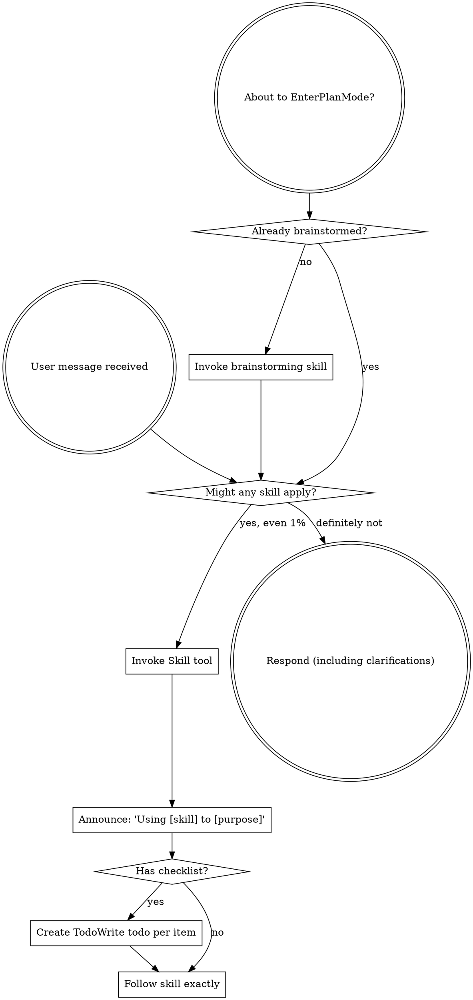

# Codex session 019f1513-e8b4-70b1-8b5e-58f6d08a4fcd

- Started: `2026-06-29T20:30:59.544Z`
- Working directory: `D:\100XH100`
- Originator: `Codex Desktop`
- Codex CLI: `0.142.3`
- Source log: `C:\Users\Иван Литвак\.codex\sessions\2026\06\29\rollout-2026-06-29T23-30-59-019f1513-e8b4-70b1-8b5e-58f6d08a4fcd.jsonl`
- Entries: user=3, assistant=13, tool calls=28, tool outputs=28

This is a chronological export of the user/assistant conversation and tool activity. Internal system/developer instructions and token accounting are intentionally excluded. Secret-shaped values are redacted; oversized tool outputs retain their beginning and end with the omitted character count.

## 1. User

Time: `2026-06-29T20:31:30.100Z` · source line `4`

```text
# AGENTS.md instructions for D:\100XH100

<INSTRUCTIONS>
# Project Agent Rules

## Operating Rule
- Read `AGENTS.md` before project edits.
- Update `memory/CHANGELOG.md` after meaningful code, config, or architecture changes.
- Update `memory/PROMPTS.md` with user prompts that define requirements.
- Store test outputs, logs, and verification notes under `test_results/`.
- Prefer agent-centered code: explicit contracts, deterministic tests, small files, low hidden state.

## Architecture Source
- Primary architecture contract: `ARCHITECTURE_NEED.md`.
- Current Stream 4 implementation rule: use threshold + compact + CUB/fixed-temp sort/reduce + compact; do not use Stream 4 hash-table dedup.

## Implementation Guardrails
- `State128` logical bytes are `v[0..119]`.
- `State128` padding bytes are `v[120..127]`.
- Persistent frontier padding must be zero.
- `FinalResponse` may temporarily store `target_local_idx` in `v[120..123]`.
- `Hash128` is one logical 128-bit key stored as `{lo, hi}`.
- `CandidateMeta` must remain 32 bytes and 32-byte aligned.
- Stream 3 payload id must be original candidate id, not compact index.
- Stream 4 must not apply shard top-k or semantic shard cap.

</INSTRUCTIONS>
<environment_context>
  <cwd>D:\100XH100</cwd>
  <shell>powershell</shell>
  <current_date>2026-06-29</current_date>
  <timezone>Europe/Moscow</timezone>
  <filesystem><workspace_roots><root>D:\100XH100</root></workspace_roots><permission_profile type="managed"><file_system type="restricted"><entry access="read"><special>:root</special></entry><entry access="write"><path>D:\100XH100</path></entry><entry access="write"><special>:slash_tmp</special></entry><entry access="write"><special>:tmpdir</special></entry><entry access="read"><path>D:\100XH100\.git</path></entry><entry access="read"><path>D:\100XH100\.agents</path></entry><entry access="read"><path>D:\100XH100\.codex</path></entry></file_system></permission_profile></filesystem>
</environment_context>
```

## 2. User

Time: `2026-06-29T20:31:30.133Z` · source line `6`

```text
Spec + quality review for Task 7 Kaggle package only. Worktree: D:\100XH100\.worktrees\stream1-piece-transformer. Review commit 0038247 on top of 5b7f09f.

Spec:
- Folder kaggle_t4_transformer_smoke contains kernel-metadata.json and t4-transformer-beam-smoke.ipynb.
- Private Kaggle kernel id trydotatwo/cayley-beam-transformer-2xt4-smoke, GPU enabled, machine_shape NvidiaTeslaT4, internet enabled, model source vladkuznetsov266/megaminx-qtransformer-1782210824/PyTorch/default/1.
- Notebook must use GitHub source of truth, clone TryDotAtwo/MultiGPUBeamSearch and configurable branch codex/stream1-piece-transformer.
- It must discover exactly one .pth from the configured Kaggle model source and fail clearly if ambiguous/missing. No fallback to repo MLP weights.
- It must export weights using tools/export_stream1.py --format piece-transformer --dtype fp16 --num-classes 120 into /kaggle/working/stream1_transformer_weights_fp16.
- Build under /tmp with CUDA_ARCHITECTURES=75; build production_runner and stream1_transformer_cuda_tests if practical.
- Run tiny 2-rank torchrun smoke for puzzle 0, depth 3, beam 1048576, B_MICRO 512, STREAM1_CONCURRENCY 1, STREAM3_RING_SLOTS 2, safe small Stream4/Shard/history settings, BEAM_WEIGHT_DIR exported transformer weights, and require log evidence of stream1_backend/model_backend piece_transformer.
- First config cell exposes main parameters/topology; preflight prints GPU count, disk, derived config; logs/results under /kaggle/working; transients under /tmp.
- Notebook JSON and code cells should be valid.
- Project memory/test_results updated. No Kaggle/GitHub push in this commit.

Return findings first with severity and file/line references. If no issues, approve. Do not modify files.
```

## 3. User

Time: `2026-06-29T20:31:30.134Z` · source line `7`

```text
Spec + quality review for Task 7 Kaggle package only. Worktree: D:\100XH100\.worktrees\stream1-piece-transformer. Review commit 0038247 on top of 5b7f09f.

Spec:
- Folder kaggle_t4_transformer_smoke contains kernel-metadata.json and t4-transformer-beam-smoke.ipynb.
- Private Kaggle kernel id trydotatwo/cayley-beam-transformer-2xt4-smoke, GPU enabled, machine_shape NvidiaTeslaT4, internet enabled, model source vladkuznetsov266/megaminx-qtransformer-1782210824/PyTorch/default/1.
- Notebook must use GitHub source of truth, clone TryDotAtwo/MultiGPUBeamSearch and configurable branch codex/stream1-piece-transformer.
- It must discover exactly one .pth from the configured Kaggle model source and fail clearly if ambiguous/missing. No fallback to repo MLP weights.
- It must export weights using tools/export_stream1.py --format piece-transformer --dtype fp16 --num-classes 120 into /kaggle/working/stream1_transformer_weights_fp16.
- Build under /tmp with CUDA_ARCHITECTURES=75; build production_runner and stream1_transformer_cuda_tests if practical.
- Run tiny 2-rank torchrun smoke for puzzle 0, depth 3, beam 1048576, B_MICRO 512, STREAM1_CONCURRENCY 1, STREAM3_RING_SLOTS 2, safe small Stream4/Shard/history settings, BEAM_WEIGHT_DIR exported transformer weights, and require log evidence of stream1_backend/model_backend piece_transformer.
- First config cell exposes main parameters/topology; preflight prints GPU count, disk, derived config; logs/results under /kaggle/working; transients under /tmp.
- Notebook JSON and code cells should be valid.
- Project memory/test_results updated. No Kaggle/GitHub push in this commit.

Return findings first with severity and file/line references. If no issues, approve. Do not modify files.
```

## 4. Codex

Time: `2026-06-29T20:31:41.187Z` · source line `9`

```text
I’ll do this as a review only and won’t modify files. I’m first loading the applicable project rules plus the required baseline skill/context, then I’ll inspect the commit diff and notebook/package contents against the spec.
```

## 5. Codex

Time: `2026-06-29T20:31:41.197Z` · source line `10`

```text
I’ll do this as a review only and won’t modify files. I’m first loading the applicable project rules plus the required baseline skill/context, then I’ll inspect the commit diff and notebook/package contents against the spec.
```

## 6. Tool call: `exec_command`

Time: `2026-06-29T20:31:41.198Z` · source line `11`

```text
{"cmd":"Get-Content -LiteralPath 'C:\\Users\\Иван Литвак\\.codex\\skills\\.system\\using-superpowers\\SKILL.md'","workdir":"D:\\100XH100","shell":"powershell","max_output_tokens":20000}
```

## 7. Tool call: `exec_command`

Time: `2026-06-29T20:31:41.200Z` · source line `12`

```text
{"cmd":"Get-Content -LiteralPath 'D:\\100XH100\\AGENTS.md'","workdir":"D:\\100XH100","shell":"powershell","max_output_tokens":20000}
```

## 8. Tool call: `exec_command`

Time: `2026-06-29T20:31:41.223Z` · source line `13`

```text
{"cmd":"rg -n \"BEAM_PREBUILT_RUNNER|cayleypy-beam-results|stream1|Kaggle|kaggle\" 'C:\\Users\\Иван Литвак\\.codex\\memories\\MEMORY.md'","workdir":"D:\\100XH100","shell":"powershell","max_output_tokens":12000}
```

## 9. Tool output

Time: `2026-06-29T20:31:47.913Z` · source line `14`

```text
Chunk ID: 06b4d9
Wall time: 6.3638 seconds
Process exited with code 1
Original token count: 139
Output:
Get-Content : Cannot find path 'C:\Users\Иван Литвак\.codex\skills\.system\using-superpowers\SKILL.md' because it does 
not exist.
At line:2 char:1
+ Get-Content -LiteralPath 'C:\Users\Иван Литвак\.codex\skills\.system\ ...
+ ~~~~~~~~~~~~~~~~~~~~~~~~~~~~~~~~~~~~~~~~~~~~~~~~~~~~~~~~~~~~~~~~~~~~~
    + CategoryInfo          : ObjectNotFound: (C:\Users\Иван Л...powers\SKILL.md:String) [Get-Content], ItemNotFoundEx 
   ception
    + FullyQualifiedErrorId : PathNotFound,Microsoft.PowerShell.Commands.GetContentCommand
 

```

## 10. Tool output

Time: `2026-06-29T20:31:47.923Z` · source line `15`

```text
Chunk ID: 661266
Wall time: 6.3468 seconds
Process exited with code 0
Original token count: 290
Output:
# Project Agent Rules

## Operating Rule
- Read `AGENTS.md` before project edits.
- Update `memory/CHANGELOG.md` after meaningful code, config, or architecture changes.
- Update `memory/PROMPTS.md` with user prompts that define requirements.
- Store test outputs, logs, and verification notes under `test_results/`.
- Prefer agent-centered code: explicit contracts, deterministic tests, small files, low hidden state.

## Architecture Source
- Primary architecture contract: `ARCHITECTURE_NEED.md`.
- Current Stream 4 implementation rule: use threshold + compact + CUB/fixed-temp sort/reduce + compact; do not use Stream 4 hash-table dedup.

## Implementation Guardrails
- `State128` logical bytes are `v[0..119]`.
- `State128` padding bytes are `v[120..127]`.
- Persistent frontier padding must be zero.
- `FinalResponse` may temporarily store `target_local_idx` in `v[120..123]`.
- `Hash128` is one logical 128-bit key stored as `{lo, hi}`.
- `CandidateMeta` must remain 32 bytes and 32-byte aligned.
- Stream 3 payload id must be original candidate id, not compact index.
- Stream 4 must not apply shard top-k or semantic shard cap.

```

## 11. Tool output

Time: `2026-06-29T20:31:47.923Z` · source line `16`

```text
Chunk ID: ada4a5
Wall time: 6.3466 seconds
Process exited with code 0
Original token count: 1082
Output:
58:- MEPhI HPC, kaf12, A100 40GB, BEAM_PREBUILT_RUNNER, prepare_ihes_prebuilt_runner.sh, ihes_solve_bucket_from_scratch.sh, prebuilt_runner_ready, using_prebuilt_runner, PUZZLE_LIMIT=1, depth=12
68:- cayleypy-beam-results, p0027, p0031, p0033, data/ihes_cube/index.tsv, improvements.tsv, unique_solutions.tsv, metadata.env, summary.md, solve_bucket_fresh, github.com DNS
89:- `hpc/ihes_cube_model/prepare_ihes_prebuilt_runner.sh` builds the shared binary at `/mnt/pool/6/vokirova/beam8a100/ihes_cube_model/prebuilt-a100-ihes/production_runner`, and `hpc/ihes_cube_model/ihes_solve_bucket_from_scratch.sh` already knows how to consume `BEAM_PREBUILT_RUNNER` [Task 1]
97:- symptom: each array task recompiles instead of reusing the solver. cause: `BEAM_PREBUILT_RUNNER` was not wired through a separate prebuild dependency. fix: submit the prebuild first and make the puzzle array depend on it via `--dependency=afterok:<prebuild_job>` [Task 1]
362:- metalinguistic benchmark, research plan, dashboard, benchmarking, launch-ready workflow, reproducibility, LaTeX, Kaggle, browser, analytics
395:# Task Group: ROGUII Kaggle competition stack and Molab-only safe submission workflow
396:scope: Building and hardening the `ROGUII` Kaggle competition stack for top-rank iteration, with Molab-only execution, leakage-safe CV, and strict submission validation.
397:applies_to: cwd=C:\Users\Иван Литвак\Documents\ROGUII; reuse_rule=reuse for this competition repo and close Kaggle iteration workflows, but re-audit current repo files before trusting earlier partially validated scripts.
403:- rollout_summaries/2026-06-21T09-16-01-mFCh-rogii_kaggle_competition_stack_implementation.md (cwd=C:\Users\Иван Литвак\Documents\ROGUII, rollout_path=C:\Users\Иван Литвак\.codex\sessions\2026\06\21\rollout-2026-06-21T12-16-06-019ee977-2b48-7be3-9381-eda66e6a1209.jsonl, updated_at=2026-06-21T10:30:20+00:00, thread_id=019ee977-2b48-7be3-9381-eda66e6a1209, empty repo was turned into a competition pipeline scaffold with only partial functional validation)
407:- Kaggle, ROGUII, top-1 leaderboard, PYTHONPATH=src, src/rogii, CLI, GroupKFold, LightGBM, CatBoost, sequence model, submission, configs/default.yaml
550:scope: Reusing the `ОрбитВорс` workspace for v8 model recovery/fixes, Kaggle submission and external training, plus small Molab notebook artifacts.
571:- orbit wars, v8, pyc introspection, pytest_cache/v/cache/nodeids, phase_step, saturating_sub(1), cargo check, CUDA, decoder.rs, kaggle_submission/main.py
577:- rollout_summaries/2026-06-04T13-40-19-ewbO-orbit_wars_v8_fix_submit_train_neutralize_naming.md (cwd=C:\Users\Иван Литвак\Documents\ОрбитВорс, rollout_path=C:\Users\Иван Литвак\.codex\sessions\2026\06\04\rollout-2026-06-04T16-40-25-019e92dd-0685-7363-b709-82dbdb82947c.jsonl, updated_at=2026-06-15T10:49:30+00:00, thread_id=019e92dd-0685-7363-b709-82dbdb82947c, latest checkpoint submission, external Kaggle-env training path, and naming cleanup all landed without history rewriting)
581:- generation-0092.bin, submission.tar.gz, kaggle competitions submit, 53670350, v8_external_policy_train.py, exp50, external_policy, score_diff, normal commit/push
594:- the freshest checkpoint at the time of the rollout was `molab_checkpoints/v8-gpu-resident-ppo-baseline-v3/generation-0092.bin`, and the submission trio is always `main.py`, `model.bin`, `liborbit_wars_agent.so` under `kaggle_submission/` [Task 3]
595:- a real Python Kaggle opponent requires a separate Kaggle-env external training path instead of trying to force it through the native GPU-resident loop [Task 3]
601:- symptom: training design stalls around Python Kaggle opponents. cause: wrong abstraction; trying to shoehorn them into the native loop. fix: add a dedicated Kaggle-env external training path [Task 3]

```

## 12. Codex

Time: `2026-06-29T20:31:56.461Z` · source line `19`

```text
The local project rules are loaded. The expected superpowers skill path in the session list differs from the filesystem path I first tried, so I’m correcting that and then moving into the target worktree diff.
```

## 13. Codex

Time: `2026-06-29T20:31:56.472Z` · source line `20`

```text
The local project rules are loaded. The expected superpowers skill path in the session list differs from the filesystem path I first tried, so I’m correcting that and then moving into the target worktree diff.
```

## 14. Tool call: `exec_command`

Time: `2026-06-29T20:31:56.473Z` · source line `21`

```text
{"cmd":"Get-Content -LiteralPath 'C:\\Users\\Иван Литвак\\.codex\\plugins\\cache\\openai-curated-remote\\superpowers\\5.1.4\\skills\\using-superpowers\\SKILL.md'","workdir":"D:\\100XH100","shell":"powershell","max_output_tokens":20000}
```

## 15. Tool call: `exec_command`

Time: `2026-06-29T20:31:56.473Z` · source line `22`

```text
{"cmd":"$lines = Get-Content -LiteralPath 'C:\\Users\\Иван Литвак\\.codex\\memories\\MEMORY.md'; $lines[52..101]","workdir":"D:\\100XH100","shell":"powershell","max_output_tokens":12000}
```

## 16. Tool call: `exec_command`

Time: `2026-06-29T20:31:56.473Z` · source line `23`

```text
{"cmd":"git -C 'D:\\100XH100\\.worktrees\\stream1-piece-transformer' status --short","workdir":"D:\\100XH100","shell":"powershell","max_output_tokens":12000}
```

## 17. Tool call: `exec_command`

Time: `2026-06-29T20:31:56.500Z` · source line `24`

```text
{"cmd":"git -C 'D:\\100XH100\\.worktrees\\stream1-piece-transformer' rev-parse --show-toplevel","workdir":"D:\\100XH100","shell":"powershell","max_output_tokens":12000}
```

## 18. Tool output

Time: `2026-06-29T20:31:57.336Z` · source line `25`

````text
Chunk ID: 5b3e32
Wall time: 0.2505 seconds
Process exited with code 0
Original token count: 1393
Output:
---
name: using-superpowers
description: Use when starting any conversation - establishes how to find and use skills, requiring Skill tool invocation before ANY response including clarifying questions
---

<SUBAGENT-STOP>
If you were dispatched as a subagent to execute a specific task, skip this skill.
</SUBAGENT-STOP>

<EXTREMELY-IMPORTANT>
If you think there is even a 1% chance a skill might apply to what you are doing, you ABSOLUTELY MUST invoke the skill.

IF A SKILL APPLIES TO YOUR TASK, YOU DO NOT HAVE A CHOICE. YOU MUST USE IT.

This is not negotiable. This is not optional. You cannot rationalize your way out of this.
</EXTREMELY-IMPORTANT>

## Instruction Priority

Superpowers skills override default system prompt behavior, but **user instructions always take precedence**:

1. **User's explicit instructions** (CLAUDE.md, GEMINI.md, AGENTS.md, direct requests) — highest priority
2. **Superpowers skills** — override default system behavior where they conflict
3. **Default system prompt** — lowest priority

If CLAUDE.md, GEMINI.md, or AGENTS.md says "don't use TDD" and a skill says "always use TDD," follow the user's instructions. The user is in control.

## How to Access Skills

**In Claude Code:** Use the `Skill` tool. When you invoke a skill, its content is loaded and presented to you—follow it directly. Never use the Read tool on skill files.

**In Copilot CLI:** Use the `skill` tool. Skills are auto-discovered from installed plugins. The `skill` tool works the same as Claude Code's `Skill` tool.

**In Gemini CLI:** Skills activate via the `activate_skill` tool. Gemini loads skill metadata at session start and activates the full content on demand.

**In other environments:** Check your platform's documentation for how skills are loaded.

## Platform Adaptation

Skills use Claude Code tool names. Non-CC platforms: see `references/copilot-tools.md` (Copilot CLI), `references/codex-tools.md` (Codex) for tool equivalents. Gemini CLI users get the tool mapping loaded automatically via GEMINI.md.

# Using Skills

## The Rule

**Invoke relevant or requested skills BEFORE any response or action.** Even a 1% chance a skill might apply means that you should invoke the skill to check. If an invoked skill turns out to be wrong for the situation, you don't need to use it.



## Red Flags

These thoughts mean STOP—you're rationalizing:

| Thought | Reality |
|---------|---------|
| "This is just a simple question" | Questions are tasks. Check for skills. |
| "I need more context first" | Skill check comes BEFORE clarifying questions. |
| "Let me explore the codebase first" | Skills tell you HOW to explore. Check first. |
| "I can check git/files quickly" | Files lack conversation context. Check for skills. |
| "Let me gather information first" | Skills tell you HOW to gather information. |
| "This doesn't need a formal skill" | If a skill exists, use it. |
| "I remember this skill" | Skills evolve. Read current version. |
| "This doesn't count as a task" | Action = task. Check for skills. |
| "The skill is overkill" | Simple things become complex. Use it. |
| "I'll just do this one thing first" | Check BEFORE doing anything. |
| "This feels productive" | Undisciplined action wastes time. Skills prevent this. |
| "I know what that means" | Knowing the concept в‰  using the skill. Invoke it. |

## Skill Priority

When multiple skills could apply, use this order:

1. **Process skills first** (brainstorming, debugging) - these determine HOW to approach the task
2. **Implementation skills second** (frontend-design, mcp-builder) - these guide execution

"Let's build X" в†’ brainstorming first, then implementation skills.
"Fix this bug" в†’ debugging first, then domain-specific skills.

## Skill Types

**Rigid** (TDD, debugging): Follow exactly. Don't adapt away discipline.

**Flexible** (patterns): Adapt principles to context.

The skill itself tells you which.

## User Instructions

Instructions say WHAT, not HOW. "Add X" or "Fix Y" doesn't mean skip workflows.

````

## 19. Tool output

Time: `2026-06-29T20:31:57.373Z` · source line `26`

```text
Chunk ID: b6fc5a
Wall time: 0.3047 seconds
Process exited with code 0
Original token count: 1442
Output:

- rollout_summaries/2026-06-04T15-47-52-Dd1O-ihes_cluster_results_prebuilt_publish_backfill.md (cwd=\\?\D:\100XH100, rollout_path=\\?\C:\Users\Иван Литвак\.codex\sessions\2026\06\04\rollout-2026-06-04T18-47-57-019e9351-cd3b-71c0-bf8b-69755d08d5fc.jsonl, updated_at=2026-06-26T19:51:22+00:00, thread_id=019e9351-cd3b-71c0-bf8b-69755d08d5fc, the prebuilt runner was compiled once and reused across the A100 array workflow)

### keywords

- MEPhI HPC, kaf12, A100 40GB, BEAM_PREBUILT_RUNNER, prepare_ihes_prebuilt_runner.sh, ihes_solve_bucket_from_scratch.sh, prebuilt_runner_ready, using_prebuilt_runner, PUZZLE_LIMIT=1, depth=12

## Task 2: Publish per-puzzle IHES results and backfill existing bucket outputs into the GitHub results repo, outcome success

### rollout_summary_files

- rollout_summaries/2026-06-04T15-47-52-Dd1O-ihes_cluster_results_prebuilt_publish_backfill.md (cwd=\\?\D:\100XH100, rollout_path=\\?\C:\Users\Иван Литвак\.codex\sessions\2026\06\04\rollout-2026-06-04T18-47-57-019e9351-cd3b-71c0-bf8b-69755d08d5fc.jsonl, updated_at=2026-06-26T19:51:22+00:00, thread_id=019e9351-cd3b-71c0-bf8b-69755d08d5fc, the results repo structure and first backfilled puzzle sets were established)

### keywords

- cayleypy-beam-results, p0027, p0031, p0033, data/ihes_cube/index.tsv, improvements.tsv, unique_solutions.tsv, metadata.env, summary.md, solve_bucket_fresh, github.com DNS

## Task 3: Inventory mixed IHES cluster files and make the publisher schema-tolerant, outcome partial

### rollout_summary_files

- rollout_summaries/2026-06-04T15-47-52-Dd1O-ihes_cluster_results_prebuilt_publish_backfill.md (cwd=\\?\D:\100XH100, rollout_path=\\?\C:\Users\Иван Литвак\.codex\sessions\2026\06\04\rollout-2026-06-04T18-47-57-019e9351-cd3b-71c0-bf8b-69755d08d5fc.jsonl, updated_at=2026-06-26T19:51:22+00:00, thread_id=019e9351-cd3b-71c0-bf8b-69755d08d5fc, a file-driven inventory plus schema fixes made the larger aggregator path workable)

### keywords

- raw_inventory, files_inventory.tsv, table_inventory.tsv, table_headers.txt, solved_log_lines.txt, publish_summary.env, variants, source_files, repair_segments, solution_repair_resident, solution_repair_segments

## User preferences

- when launching on MEPhI HPC, the user said all jobs should use one precompiled beam-search binary -> default to a shared prebuilt `production_runner` instead of rebuilding per puzzle task [Task 1]
- when clarifying array behavior, the user made `PUZZLE_LIMIT=1` mean one puzzle per array task, not one puzzle total -> keep the array-wide coverage explicit when preparing launch scripts [Task 1]
- when shaping the GitHub output, the user asked to publish "right after each solved puzzle" and keep each puzzle in its own clearly named folder -> prefer per-puzzle publish-on-solve structure like `p0027` over monolithic dumps [Task 2]
- when there were too many cluster files, the user asked to write the inventory into a file on GitHub and read from there -> future aggregation should be file-driven and low-noise rather than terminal-stream-driven [Task 2][Task 3]

## Reusable knowledge

- `hpc/ihes_cube_model/prepare_ihes_prebuilt_runner.sh` builds the shared binary at `/mnt/pool/6/vokirova/beam8a100/ihes_cube_model/prebuilt-a100-ihes/production_runner`, and `hpc/ihes_cube_model/ihes_solve_bucket_from_scratch.sh` already knows how to consume `BEAM_PREBUILT_RUNNER` [Task 1]
- the verified runtime on basis exposed `world_size_effective=8`, `NCCL 2.21.5+cuda12.4`, and eight visible A100-40GB GPUs, so the prebuilt-runner path was validated on the actual target hardware [Task 1]
- the durable results layout is `data/ihes_cube/puzzles/pXXXX/solutions.tsv`, `unique_solutions.tsv`, `metadata.env`, `summary.md`, plus root-level `index.tsv` and `improvements.tsv`; non-full-solution repair artifacts belong under separate `repair_segments/` trees [Task 2]
- the published cluster inventory lives under `data/ihes_cube/raw_inventory/` and should be the first routing layer when a future agent needs to inspect the cluster-side file set without reopening the live cluster [Task 2][Task 3]
- full bucket results should be deduplicated by `(variant, source_index, found_length, solution_path, source_solution)`, while resident repair segments and legacy repair segments should be kept in their own schemas rather than merged into full-solution tables [Task 3]

## Failures and how to do differently

- symptom: each array task recompiles instead of reusing the solver. cause: `BEAM_PREBUILT_RUNNER` was not wired through a separate prebuild dependency. fix: submit the prebuild first and make the puzzle array depend on it via `--dependency=afterok:<prebuild_job>` [Task 1]
- symptom: cluster-side publish fails after compute succeeds. cause: the compute node cannot resolve `github.com` or otherwise lacks GitHub network access. fix: tolerate cluster-side push failure and leave local commits/results ready for later push from a node with working DNS/network [Task 2]
- symptom: the backfill/index writer crashes on old rows. cause: metadata rows carried extra keys such as `variants` and `source_files` that were not declared in the index schema. fix: widen the declared schema and filter outgoing rows to declared fields before writing [Task 2][Task 3]
- symptom: one-pass "aggregate everything" scripts become noisy and brittle. cause: mixed artifact families and header-only files are treated uniformly. fix: partition by artifact type first and skip empty/header-only files (`st_size <= 200` or similar threshold) [Task 3]

# Task Group: Cloudflare psychologist site cleanup, route fixes, and dashboard/blog workflow

```

## 20. Tool output

Time: `2026-06-29T20:31:57.374Z` · source line `27`

```text
Chunk ID: 63a0b8
Wall time: 0.2766 seconds
Process exited with code 0
Original token count: 62
Output:
?? $null
?? build-contract-tests/
?? build-stream1-transformer-red/
?? build-task6-red/
?? build-task6-sm86/
?? build-task6/
?? config.obj
?? contract_tests.obj
?? docs/
?? frontier_cpu.obj
?? hash.obj
?? state.obj
?? stream3.obj
?? stream4.obj

```

## 21. Tool output

Time: `2026-06-29T20:31:57.374Z` · source line `28`

```text
Chunk ID: 1809cf
Wall time: 0.2593 seconds
Process exited with code 0
Original token count: 13
Output:
D:/100XH100/.worktrees/stream1-piece-transformer

```

## 22. Codex

Time: `2026-06-29T20:32:10.732Z` · source line `31`

```text
I see the target worktree has unrelated untracked build artifacts, so I’ll ignore those and review only the specified commit range. Next I’m checking the package files, metadata, notebook JSON, and any test-result/memory updates introduced by `0038247`.
```

## 23. Codex

Time: `2026-06-29T20:32:10.739Z` · source line `32`

```text
I see the target worktree has unrelated untracked build artifacts, so I’ll ignore those and review only the specified commit range. Next I’m checking the package files, metadata, notebook JSON, and any test-result/memory updates introduced by `0038247`.
```

## 24. Tool call: `exec_command`

Time: `2026-06-29T20:32:10.740Z` · source line `33`

```text
{"cmd":"Get-Content -LiteralPath 'D:\\100XH100\\.worktrees\\stream1-piece-transformer\\AGENTS.md'","workdir":"D:\\100XH100","shell":"powershell","max_output_tokens":20000}
```

## 25. Tool call: `exec_command`

Time: `2026-06-29T20:32:10.740Z` · source line `34`

```text
{"cmd":"git -C 'D:\\100XH100\\.worktrees\\stream1-piece-transformer' diff --stat 5b7f09f 0038247","workdir":"D:\\100XH100","shell":"powershell","max_output_tokens":12000}
```

## 26. Tool call: `exec_command`

Time: `2026-06-29T20:32:10.740Z` · source line `35`

```text
{"cmd":"git -C 'D:\\100XH100\\.worktrees\\stream1-piece-transformer' diff --name-status 5b7f09f 0038247","workdir":"D:\\100XH100","shell":"powershell","max_output_tokens":12000}
```

## 27. Tool call: `exec_command`

Time: `2026-06-29T20:32:10.771Z` · source line `36`

```text
{"cmd":"Get-ChildItem -LiteralPath 'D:\\100XH100\\.worktrees\\stream1-piece-transformer\\kaggle_t4_transformer_smoke' -Force","workdir":"D:\\100XH100","shell":"powershell","max_output_tokens":12000}
```

## 28. Tool output

Time: `2026-06-29T20:32:11.284Z` · source line `37`

```text
Chunk ID: a7d259
Wall time: 0.2626 seconds
Process exited with code 0
Original token count: 290
Output:
# Project Agent Rules

## Operating Rule
- Read `AGENTS.md` before project edits.
- Update `memory/CHANGELOG.md` after meaningful code, config, or architecture changes.
- Update `memory/PROMPTS.md` with user prompts that define requirements.
- Store test outputs, logs, and verification notes under `test_results/`.
- Prefer agent-centered code: explicit contracts, deterministic tests, small files, low hidden state.

## Architecture Source
- Primary architecture contract: `ARCHITECTURE_NEED.md`.
- Current Stream 4 implementation rule: use threshold + compact + CUB/fixed-temp sort/reduce + compact; do not use Stream 4 hash-table dedup.

## Implementation Guardrails
- `State128` logical bytes are `v[0..119]`.
- `State128` padding bytes are `v[120..127]`.
- Persistent frontier padding must be zero.
- `FinalResponse` may temporarily store `target_local_idx` in `v[120..123]`.
- `Hash128` is one logical 128-bit key stored as `{lo, hi}`.
- `CandidateMeta` must remain 32 bytes and 32-byte aligned.
- Stream 3 payload id must be original candidate id, not compact index.
- Stream 4 must not apply shard top-k or semantic shard cap.

```

## 29. Tool output

Time: `2026-06-29T20:32:11.556Z` · source line `38`

```text
Chunk ID: ac8138
Wall time: 0.5501 seconds
Process exited with code 0
Original token count: 94
Output:
 kaggle_t4_transformer_smoke/kernel-metadata.json   | 17 +++++++++
 .../t4-transformer-beam-smoke.ipynb                | 41 ++++++++++++++++++++++
 memory/CHANGELOG.md                                |  1 +
 memory/PROMPTS.md                                  |  1 +
 .../stream1_transformer_kaggle_smoke_2026-06-29.md | 33 +++++++++++++++++
 5 files changed, 93 insertions(+)

```

## 30. Tool output

Time: `2026-06-29T20:32:11.557Z` · source line `39`

```text
Chunk ID: 353314
Wall time: 0.5199 seconds
Process exited with code 0
Original token count: 55
Output:
A	kaggle_t4_transformer_smoke/kernel-metadata.json
A	kaggle_t4_transformer_smoke/t4-transformer-beam-smoke.ipynb
M	memory/CHANGELOG.md
M	memory/PROMPTS.md
A	test_results/stream1_transformer_kaggle_smoke_2026-06-29.md

```

## 31. Tool output

Time: `2026-06-29T20:32:11.557Z` · source line `40`

```text
Chunk ID: de4889
Wall time: 0.3020 seconds
Process exited with code 0
Original token count: 149
Output:


    Каталог: D:\100XH100\.worktrees\stream1-piece-transformer\kaggle_t4_transformer_smoke


Mode                 LastWriteTime         Length Name                                                                 
----                 -------------         ------ ----                                                                 
-a----        29.06.2026     23:24            514 kernel-metadata.json                                                 
-a----        29.06.2026     23:26          16973 t4-transformer-beam-smoke.ipynb                                      


```

## 32. Tool call: `exec_command`

Time: `2026-06-29T20:32:25.150Z` · source line `43`

```text
{"cmd":"$i=0; Get-Content -LiteralPath 'D:\\100XH100\\.worktrees\\stream1-piece-transformer\\kaggle_t4_transformer_smoke\\kernel-metadata.json' | ForEach-Object { $i++; '{0,4}: {1}' -f $i, $_ }","workdir":"D:\\100XH100","shell":"powershell","max_output_tokens":12000}
```

## 33. Tool call: `exec_command`

Time: `2026-06-29T20:32:25.150Z` · source line `44`

```text
{"cmd":"rg -n \"id|enable|gpu|machine|model|dataset|source|TryDotAtwo|MultiGPUBeamSearch|codex/stream1|MODEL|\\.pth|export_stream1|production_runner|stream1_transformer_cuda_tests|torchrun|B_MICRO|STREAM1_CONCURRENCY|STREAM3_RING_SLOTS|BEAM_WEIGHT_DIR|stream1_backend|model_backend|/tmp|/kaggle/working|CUDA_ARCHITECTURES|top-k|topk\" 'D:\\100XH100\\.worktrees\\stream1-piece-transformer\\kaggle_t4_transformer_smoke\\t4-transformer-beam-smoke.ipynb'","workdir":"D:\\100XH100","shell":"powershell","max_output_tokens":30000}
```

## 34. Tool call: `exec_command`

Time: `2026-06-29T20:32:25.151Z` · source line `45`

```text
{"cmd":"python -m json.tool 'D:\\100XH100\\.worktrees\\stream1-piece-transformer\\kaggle_t4_transformer_smoke\\kernel-metadata.json'","workdir":"D:\\100XH100","shell":"powershell","max_output_tokens":12000}
```

## 35. Tool call: `exec_command`

Time: `2026-06-29T20:32:25.177Z` · source line `46`

```text
{"cmd":"python -m json.tool 'D:\\100XH100\\.worktrees\\stream1-piece-transformer\\kaggle_t4_transformer_smoke\\t4-transformer-beam-smoke.ipynb' > $null; if ($LASTEXITCODE -eq 0) { 'notebook json ok' }","workdir":"D:\\100XH100","shell":"powershell","max_output_tokens":12000}
```

## 36. Tool output

Time: `2026-06-29T20:32:30.320Z` · source line `47`

```text
Chunk ID: 8f4c75
Wall time: 4.4312 seconds
Process exited with code 0
Original token count: 154
Output:
   1: {
   2:   "id": "trydotatwo/cayley-beam-transformer-2xt4-smoke",
   3:   "title": "Cayley Beam Transformer 2xT4 Smoke",
   4:   "code_file": "t4-transformer-beam-smoke.ipynb",
   5:   "language": "python",
   6:   "kernel_type": "notebook",
   7:   "is_private": true,
   8:   "enable_gpu": true,
   9:   "machine_shape": "NvidiaTeslaT4",
  10:   "enable_internet": true,
  11:   "dataset_sources": [],
  12:   "competition_sources": [],
  13:   "kernel_sources": [],
  14:   "model_sources": [
  15:     "vladkuznetsov266/megaminx-qtransformer-1782210824/PyTorch/default/1"
  16:   ]
  17: }

```

## 37. Tool output

Time: `2026-06-29T20:32:30.328Z` · source line `48`

```text
Chunk ID: cb7098
Wall time: 4.4175 seconds
Process exited with code 0
Original token count: 4083
Output:
8:      "source": "# Main 2xT4 Stream1 piece-transformer smoke config\nGITHUB_REPO_URL = \"https://github.com/TryDotAtwo/MultiGPUBeamSearch.git\"\nGITHUB_BRANCH = \"codex/stream1-piece-transformer\"\nKAGGLE_MODEL_SOURCE = \"vladkuznetsov266/megaminx-qtransformer-1782210824/PyTorch/default/1\"\nMODEL_SOURCE_SLUG = \"megaminx-qtransformer-1782210824\"\nMODEL_INPUT_ROOTS = [\n    \"/kaggle/input/megaminx-qtransformer-1782210824/PyTorch/default/1\",\n    \"/kaggle/input/megaminx-qtransformer-1782210824/pytorch/default/1\",\n]\nWEIGHT_OUT_DIR = \"/kaggle/working/stream1_transformer_weights_fp16\"\n\nBEAM_WIDTH = 1_048_576\nSTART_PUZZLE_ID = 0\nPUZZLE_COUNT = 1\nDEPTH_LIMIT = 3\nRUN_TIMEOUT_SEC = 0\nCUDA_ARCHITECTURES = \"75\"\n\nTORCHRUN_NNODES = 1\nTORCHRUN_NPROC_PER_NODE = 2\nTORCHRUN_NODE_RANK = 0\nTORCHRUN_RDZV_BACKEND = \"c10d\"\nTORCHRUN_RDZV_ENDPOINT = \"127.0.0.1:29500\"\nTORCHRUN_RDZV_ID = \"stream1_transformer_smoke\"\n\nENABLE_DEBUG = True\nENABLE_DEPTH_LOGS = True\nENABLE_DEBUG_LOGS = True\nDEBUG_STREAM_TIMING = False\nDEBUG_INFERENCE_TRACE = False\nDEBUG_PATH_TRACE = False\nDEBUG_FINAL_VALIDATE = False\nDEBUG_FINAL_EXCHANGE_TRACE = False\nDEBUG_FINAL_HISTOGRAM_TRACE = False\nDEBUG_STREAM4_HISTOGRAM_TRACE = False\nDEBUG_DEPTH_FLOW_TRACE = False\nDEBUG_PIPELINE_STATS = False\n\nRUNTIME_CONFIG_MODE = \"manual\"\nSHARD_BUFFER_COUNT = 2\nSTREAM4_BATCH_ALIGNMENT = 1024\nSHARD_CAPACITY_SCALE_PPM = 1050000\nGLOBAL_SPILL_CAPACITY = 0\nSTREAM5_RECV_CAPACITY_SCALE_PPM = 1000000\nGPU_HEADROOM_BYTES = 256 * 1024**2\nB_MICRO = 512\nSTREAM1_CONCURRENCY = 1\nSTREAM3_RING_SLOTS = 2\nSHARD_COUNT = 4\nSTREAM4_ACTIVE_SORT_SLOTS = 2\nSTREAM4_BATCH_CANDIDATES = 32_768\nSTREAM4_TRIGGER_CANDIDATES = 65_536\n\nDEPTH_LOG_EVERY = 1\nPUZZLE_LOG_EVERY = 1\nHISTORY_MODE = \"ram\"\nHISTORY_SLOT_COUNT = 2\nHISTORY_WORKERS = 1\nHISTORY_RAM_BYTES = 4 * 1024**3\nHISTORY_DISK_BYTES = 0\nHISTORY_DISK_PATH = \"/tmp/beam_history_transformer_smoke\"\nSOLVED_NEIGHBORHOOD_RADIUS = 3\nSOLVED_NEIGHBORHOOD_MAX_ENTRIES = 0\nSTREAM2_SUFFIX_RADIUS = 0\nSTREAM2_SUFFIX_BACKEND = \"composed_permutations\"\nSTREAM2_SUFFIX_MAX_COUNT = 0\nSTOP_ON_FAILURE = True\nLIVE_LOG_RANKS = [0]\n",
9:      "id": "config"
16:      "source": "from pathlib import Path\nimport json\nimport os\nimport shutil\nimport subprocess\nimport sys\n\nWORK_DIR = Path('/kaggle/working')\nTMP_DIR = Path('/tmp')\nREPO_DIR = TMP_DIR / 'beam_solver_transformer_smoke'\nCUTLASS_DIR = TMP_DIR / 'cutlass'\nBUILD_DIR = TMP_DIR / 'beam_build_transformer_smoke'\nWEIGHT_OUT_DIR = Path(WEIGHT_OUT_DIR)\nRUN_LOG_DIR = WORK_DIR / 'stream1_transformer_smoke_logs'\nRUN_LOG_DIR.mkdir(parents=True, exist_ok=True)\n\n\ndef run_checked(cmd, cwd=None, env=None):\n    cmd = [str(part) for part in cmd]\n    print('+ ' + ' '.join(cmd), flush=True)\n    subprocess.run(cmd, cwd=cwd, env=env, check=True)\n\n\ndef run_capture(cmd, cwd=None, env=None, check=True):\n    cmd = [str(part) for part in cmd]\n    print('+ ' + ' '.join(cmd), flush=True)\n    result = subprocess.run(cmd, cwd=cwd, env=env, text=True, stdout=subprocess.PIPE, stderr=subprocess.STDOUT)\n    print(result.stdout, end='', flush=True)\n    if check and result.returncode != 0:\n        raise subprocess.CalledProcessError(result.returncode, cmd, output=result.stdout)\n    return result\n\n\ndef round_up(value, alignment):\n    return ((int(value) + int(alignment) - 1) // int(alignment)) * int(alignment)\n\n\ndef torchrun_world_size():\n    world_size = int(TORCHRUN_NNODES) * int(TORCHRUN_NPROC_PER_NODE)\n    if world_size <= 0:\n        raise ValueError(f'invalid torchrun topology: nnodes={TORCHRUN_NNODES} nproc={TORCHRUN_NPROC_PER_NODE}')\n    return world_size\n\n\ndef derived_values():\n    world_size = torchrun_world_size()\n    beam_alignment = world_size * int(SHARD_COUNT) * int(STREAM4_BATCH_ALIGNMENT)\n    global_beam_effective = round_up(BEAM_WIDTH, beam_alignment)\n    local_beam_width = global_beam_effective // world_size\n    logical_shard_size = (local_beam_width + int(SHARD_COUNT) - 1) // int(SHARD_COUNT)\n    shard_capacity = round_up((logical_shard_size * int(SHARD_CAPACITY_SCALE_PPM) + 999999) // 1000000, STREAM4_BATCH_ALIGNMENT)\n    stream3_batch = int(STREAM3_RING_SLOTS) * int(B_MICRO) * 24\n    return {\n        'world_size': world_size,\n        'beam_alignment': beam_alignment,\n        'global_beam_effective': global_beam_effective,\n        'local_beam_width': local_beam_width,\n        'logical_shard_size': logical_shard_size,\n        'shard_capacity': shard_capacity,\n        'stream3_batch': stream3_batch,\n    }\n\n\ndef disk_line(path):\n    usage = shutil.disk_usage(path)\n    return f'{path}: free={usage.free} total={usage.total}'\n\n\ndef preflight():\n    values = derived_values()\n    print('KAGGLE_MODEL_SOURCE=', KAGGLE_MODEL_SOURCE, flush=True)\n    print('GITHUB_BRANCH=', GITHUB_BRANCH, flush=True)\n    print('torchrun_topology=', {\n        'nnodes': TORCHRUN_NNODES,\n        'nproc_per_node': TORCHRUN_NPROC_PER_NODE,\n        'node_rank': TORCHRUN_NODE_RANK,\n        'world_size': values['world_size'],\n        'rdzv_endpoint': TORCHRUN_RDZV_ENDPOINT,\n    }, flush=True)\n    print('derived_config=', values, flush=True)\n    print('disk_tmp=', disk_line('/tmp'), flush=True)\n    print('disk_working=', disk_line('/kaggle/working'), flush=True)\n    run_capture(['nvidia-smi'], check=False)\n    import torch\n    gpu_count = torch.cuda.device_count()\n    print('torch_cuda_device_count=', gpu_count, flush=True)\n    if gpu_count < int(TORCHRUN_NPROC_PER_NODE):\n        raise RuntimeError(f'2xT4 smoke requires at least {TORCHRUN_NPROC_PER_NODE} CUDA devices, found {gpu_count}')\n    if int(STREAM1_CONCURRENCY) > int(STREAM3_RING_SLOTS):\n        raise RuntimeError('STREAM1_CONCURRENCY must be <= STREAM3_RING_SLOTS')\n    if values['stream3_batch'] > values['shard_capacity']:\n        raise RuntimeError(f'stream3_batch={values[\"stream3_batch\"]} exceeds shard_capacity={values[\"shard_capacity\"]}')\n    if int(STREAM4_BATCH_CANDIDATES) > values['shard_capacity']:\n        raise RuntimeError(f'STREAM4_BATCH_CANDIDATES={STREAM4_BATCH_CANDIDATES} exceeds shard_capacity={values[\"shard_capacity\"]}')\n    if int(STREAM4_TRIGGER_CANDIDATES) > values['shard_capacity']:\n        raise RuntimeError(f'STREAM4_TRIGGER_CANDIDATES={STREAM4_TRIGGER_CANDIDATES} exceeds shard_capacity={values[\"shard_capacity\"]}')\n    return values\n\n\ndef cleanup_path(path):\n    path = Path(path)\n    if path.exists():\n        if path.is_dir():\n            shutil.rmtree(path)\n        else:\n            path.unlink()\n\n\ndef find_model_checkpoint():\n    input_root = Path('/kaggle/input')\n    all_pth = sorted(input_root.rglob('*.pth')) if input_root.exists() else []\n    candidate_roots = [Path(path) for path in MODEL_INPUT_ROOTS if Path(path).exists()]\n    if not candidate_roots and input_root.exists():\n        candidate_roots = sorted({path for path in input_root.rglob('*') if path.is_dir() and MODEL_SOURCE_SLUG in str(path)})\n    matches = []\n    for root in candidate_roots:\n        matches.extend(root.rglob('*.pth'))\n    matches = sorted(set(matches))\n    if len(matches) != 1:\n        message = [\n            'expected exactly one transformer .pth under the configured Kaggle model source',\n            f'configured_model_source={KAGGLE_MODEL_SOURCE}',\n            'candidate_roots=' + json.dumps([str(path) for path in candidate_roots], indent=2),\n            'matched_pth=' + json.dumps([str(path) for path in matches], indent=2),\n            'all_discovered_pth=' + json.dumps([str(path) for path in all_pth], indent=2),\n        ]\n        raise RuntimeError('\\n'.join(message))\n    return matches[0]\n\n\npreflight_values = preflight()\nfor path in (REPO_DIR, BUILD_DIR, WEIGHT_OUT_DIR):\n    cleanup_path(path)\n\nrun_checked(['git', 'clone', '--branch', GITHUB_BRANCH, '--depth', '1', GITHUB_REPO_URL, REPO_DIR])\ncheckpoint_path = find_model_checkpoint()\nprint('selected_transformer_checkpoint=', checkpoint_path, flush=True)\nrun_checked([\n    sys.executable, REPO_DIR / 'tools' / 'export_stream1.py',\n    '--weights', checkpoint_path,\n    '--out', WEIGHT_OUT_DIR,\n    '--format', 'piece-transformer',\n    '--dtype', 'fp16',\n    '--num-classes', '120',\n], cwd=REPO_DIR)\nmanifest = json.loads((WEIGHT_OUT_DIR / 'manifest.json').read_text(encoding='utf-8'))\nif manifest.get('backend') != 'piece_transformer':\n    raise RuntimeError(f'exported manifest backend is not piece_transformer: {manifest.get(\"backend\")!r}')\nprint('exported_manifest_summary=', {\n    'backend': manifest.get('backend'),\n    'dtype': manifest.get('dtype'),\n    'seq_len': manifest.get('seq_len'),\n    'd_model': manifest.get('d_model'),\n    'layers': manifest.get('num_layers'),\n    'output_dim': manifest.get('output_dim'),\n}, flush=True)\n\nif not (CUTLASS_DIR / 'include').exists():\n    cleanup_path(CUTLASS_DIR)\n    run_checked(['git', 'clone', '--depth', '1', 'https://github.com/NVIDIA/cutlass.git', CUTLASS_DIR])\n\nrun_checked([\n    'cmake', '-S', REPO_DIR, '-B', BUILD_DIR, '-GNinja',\n    '-DCMAKE_BUILD_TYPE=Release',\n    f'-DBEAM_CUDA_ARCHITECTURES={CUDA_ARCHITECTURES}',\n    f'-DCUTLASS_DIR={CUTLASS_DIR}',\n    f'-DBEAM_ENABLE_DEBUG={\"ON\" if ENABLE_DEBUG else \"OFF\"}',\n    f'-DBEAM_ENABLE_DEPTH_LOGS={\"ON\" if ENABLE_DEPTH_LOGS else \"OFF\"}',\n    f'-DBEAM_ENABLE_DEBUG_LOGS={\"ON\" if ENABLE_DEBUG_LOGS else \"OFF\"}',\n    f'-DBEAM_DEBUG_STREAM_TIMING={\"ON\" if DEBUG_STREAM_TIMING else \"OFF\"}',\n    f'-DBEAM_DEBUG_INFERENCE_TRACE={\"ON\" if DEBUG_INFERENCE_TRACE else \"OFF\"}',\n    f'-DBEAM_DEBUG_PATH_TRACE={\"ON\" if DEBUG_PATH_TRACE else \"OFF\"}',\n    f'-DBEAM_DEBUG_FINAL_VALIDATE={\"ON\" if DEBUG_FINAL_VALIDATE else \"OFF\"}',\n    f'-DBEAM_DEBUG_FINAL_EXCHANGE_TRACE={\"ON\" if DEBUG_FINAL_EXCHANGE_TRACE else \"OFF\"}',\n    f'-DBEAM_DEBUG_FINAL_HISTOGRAM_TRACE={\"ON\" if DEBUG_FINAL_HISTOGRAM_TRACE else \"OFF\"}',\n    f'-DBEAM_DEBUG_STREAM4_HISTOGRAM_TRACE={\"ON\" if DEBUG_STREAM4_HISTOGRAM_TRACE else \"OFF\"}',\n    f'-DBEAM_DEBUG_DEPTH_FLOW_TRACE={\"ON\" if DEBUG_DEPTH_FLOW_TRACE else \"OFF\"}',\n    f'-DBEAM_DEBUG_PIPELINE_STATS={\"ON\" if DEBUG_PIPELINE_STATS else \"OFF\"}',\n], cwd=REPO_DIR)\nrun_checked(['cmake', '--build', BUILD_DIR, '--target', 'production_runner', 'stream1_transformer_cuda_tests', '-j', '2'])\nrun_checked([BUILD_DIR / 'stream1_transformer_cuda_tests'], cwd=WORK_DIR)\n",
17:      "id": "setup-build-export"
24:      "source": "import os\nfrom pathlib import Path\nimport shutil\nimport subprocess\nimport sys\nimport time\n\n\ndef safe_name(text):\n    return ''.join(ch if ch.isalnum() or ch in ('-', '_') else '_' for ch in str(text))\n\n\ndef should_print_live(line):\n    low = line.lower()\n    return (\n        'stream1_backend=' in line or\n        'stream1_model_backend=' in line or\n        'stream1_transformer_dims' in line or\n        'runner_phase=' in line or\n        'candidate_history_' in line or\n        'history_' in line or\n        line.startswith('depth ') or\n        'puzzle_' in line or\n        'error' in low or\n        'exception' in low or\n        'terminate called' in low or\n        'what():' in low or\n        'childfailed' in low or\n        'traceback' in low or\n        'RUN_' in line\n    )\n\n\ndef env_for_smoke(puzzle_id):\n    values = derived_values()\n    history_path = Path(HISTORY_DISK_PATH) / f'p{puzzle_id}_beam{BEAM_WIDTH}_d{DEPTH_LIMIT}'\n    cleanup_path(history_path)\n    history_path.mkdir(parents=True, exist_ok=True)\n    nccl_id_file = WORK_DIR / f'beam_solver_nccl_transformer_smoke_p{puzzle_id}.bin'\n    cleanup_path(nccl_id_file)\n    cleanup_path(Path(str(nccl_id_file) + '.tmp'))\n    env = os.environ.copy()\n    env.update({\n        'BEAM_STREAM1_MODE': 'model',\n        'BEAM_WEIGHT_DIR': str(WEIGHT_OUT_DIR),\n        'BEAM_RUNTIME_CONFIG_MODE': RUNTIME_CONFIG_MODE,\n        'BEAM_SHARD_COUNT': str(SHARD_COUNT),\n        'BEAM_SHARD_CAPACITY_CANDIDATES': str(values['shard_capacity']),\n        'BEAM_SHARD_CAPACITY_SCALE_PPM': str(SHARD_CAPACITY_SCALE_PPM),\n        'BEAM_SHARD_BUFFER_COUNT': str(SHARD_BUFFER_COUNT),\n        'BEAM_GLOBAL_SPILL_CAPACITY': str(GLOBAL_SPILL_CAPACITY),\n        'BEAM_STREAM5_RECV_CAPACITY_SCALE_PPM': str(STREAM5_RECV_CAPACITY_SCALE_PPM),\n        'BEAM_GPU_HEADROOM_BYTES': str(GPU_HEADROOM_BYTES),\n        'BEAM_B_MICRO': str(B_MICRO),\n        'BEAM_STREAM1_CONCURRENCY': str(STREAM1_CONCURRENCY),\n        'BEAM_STREAM3_RING_SLOTS': str(STREAM3_RING_SLOTS),\n        'BEAM_STREAM4_BATCH_CANDIDATES': str(STREAM4_BATCH_CANDIDATES),\n        'BEAM_STREAM4_TRIGGER_CANDIDATES': str(STREAM4_TRIGGER_CANDIDATES),\n        'BEAM_STREAM4_ACTIVE_SORT_SLOTS': str(STREAM4_ACTIVE_SORT_SLOTS),\n        'BEAM_HISTORY_MODE': str(HISTORY_MODE),\n        'BEAM_HISTORY_RAM_BYTES': str(HISTORY_RAM_BYTES),\n        'BEAM_HISTORY_DISK_BYTES': str(HISTORY_DISK_BYTES),\n        'BEAM_HISTORY_DISK_PATH': str(history_path),\n        'BEAM_HISTORY_SLOT_COUNT': str(HISTORY_SLOT_COUNT),\n        'BEAM_HISTORY_WORKERS': str(HISTORY_WORKERS),\n        'BEAM_SOLVED_NEIGHBORHOOD_RADIUS': str(SOLVED_NEIGHBORHOOD_RADIUS),\n        'BEAM_SOLVED_NEIGHBORHOOD_MAX_ENTRIES': str(SOLVED_NEIGHBORHOOD_MAX_ENTRIES),\n        'BEAM_STREAM2_SUFFIX_RADIUS': str(STREAM2_SUFFIX_RADIUS),\n        'BEAM_STREAM2_SUFFIX_BACKEND': str(STREAM2_SUFFIX_BACKEND),\n        'BEAM_STREAM2_SUFFIX_MAX_COUNT': str(STREAM2_SUFFIX_MAX_COUNT),\n        'BEAM_DEPTH_LOG_EVERY': str(DEPTH_LOG_EVERY),\n        'BEAM_NCCL_ID_FILE': str(nccl_id_file),\n    })\n    env.pop('WORLD_SIZE', None)\n    env.pop('RANK', None)\n    env.pop('LOCAL_RANK', None)\n    return env, history_path, nccl_id_file\n\n\ndef run_one(puzzle_id):\n    env, history_path, nccl_id_file = env_for_smoke(puzzle_id)\n    log_path = RUN_LOG_DIR / f'torchrun_piece_transformer_p{puzzle_id}_d{DEPTH_LIMIT}_b{BEAM_WIDTH}.log'\n    cmd = [\n        sys.executable, '-m', 'torch.distributed.run',\n        '--no-python',\n        f'--nnodes={int(TORCHRUN_NNODES)}',\n        f'--nproc-per-node={int(TORCHRUN_NPROC_PER_NODE)}',\n        f'--node-rank={int(TORCHRUN_NODE_RANK)}',\n        f'--rdzv-backend={TORCHRUN_RDZV_BACKEND}',\n        f'--rdzv-endpoint={TORCHRUN_RDZV_ENDPOINT}',\n        f'--rdzv-id={TORCHRUN_RDZV_ID}',\n        str(BUILD_DIR / 'production_runner'), str(puzzle_id), str(DEPTH_LIMIT), str(BEAM_WIDTH),\n    ]\n    print('RUN_T4_TRANSFORMER_SMOKE_START', flush=True)\n    print('cmd=', ' '.join(map(str, cmd)), flush=True)\n    print('world_size_from_torchrun_shape=', torchrun_world_size(), flush=True)\n    print('global_beam=', BEAM_WIDTH, flush=True)\n    print('history_path=', history_path, flush=True)\n    print('weight_dir=', WEIGHT_OUT_DIR, flush=True)\n    print('nccl_id_file=', nccl_id_file, flush=True)\n    print('log_path=', log_path, flush=True)\n    start = time.time()\n    saw_piece_transformer = False\n    with log_path.open('w', buffering=1, encoding='utf-8') as log:\n        proc = subprocess.Popen(cmd, cwd=REPO_DIR, env=env, stdout=subprocess.PIPE, stderr=subprocess.STDOUT, text=True, bufsize=1)\n        assert proc.stdout is not None\n        for line in proc.stdout:\n            log.write(line)\n            if 'stream1_backend=piece_transformer' in line or 'stream1_model_backend=piece_transformer' in line:\n                saw_piece_transformer = True\n            if should_print_live(line):\n                print(line, end='', flush=True)\n        rc = proc.wait(timeout=RUN_TIMEOUT_SEC if RUN_TIMEOUT_SEC else None)\n    elapsed = time.time() - start\n    print(f'RUN_T4_TRANSFORMER_SMOKE_RC {rc} seconds={elapsed:.3f}', flush=True)\n    if rc != 0:\n        raise SystemExit(rc)\n    if not saw_piece_transformer:\n        raise RuntimeError(f'run log did not contain stream1_backend=piece_transformer or stream1_model_backend=piece_transformer: {log_path}')\n    cleanup_path(history_path)\n    return {'puzzle_id': puzzle_id, 'return_code': rc, 'seconds': elapsed, 'log_path': str(log_path)}\n\n\nresults = []\nfor offset in range(PUZZLE_COUNT):\n    results.append(run_one(START_PUZZLE_ID + offset))\nprint('RUN_T4_TRANSFORMER_SMOKE_RESULTS=', results, flush=True)\nresults\n",
25:      "id": "torchrun-smoke"

```

## 38. Tool output

Time: `2026-06-29T20:32:30.329Z` · source line `49`

```text
Chunk ID: f94cb1
Wall time: 4.4278 seconds
Process exited with code 0
Original token count: 137
Output:
{
    "id": "trydotatwo/cayley-beam-transformer-2xt4-smoke",
    "title": "Cayley Beam Transformer 2xT4 Smoke",
    "code_file": "t4-transformer-beam-smoke.ipynb",
    "language": "python",
    "kernel_type": "notebook",
    "is_private": true,
    "enable_gpu": true,
    "machine_shape": "NvidiaTeslaT4",
    "enable_internet": true,
    "dataset_sources": [],
    "competition_sources": [],
    "kernel_sources": [],
    "model_sources": [
        "vladkuznetsov266/megaminx-qtransformer-1782210824/PyTorch/default/1"
    ]
}

```

## 39. Tool output

Time: `2026-06-29T20:32:30.329Z` · source line `50`

```text
Chunk ID: f612dd
Wall time: 4.4017 seconds
Process exited with code 0
Original token count: 5
Output:
notebook json ok

```

## 40. Codex

Time: `2026-06-29T20:32:46.025Z` · source line `53`

```text
The package is small: metadata plus a three-cell notebook, with memory and test-result notes. JSON is valid; I’m now checking behavior-level details that won’t show up in syntax validation, especially model-source discovery and runner log assertions.
```

## 41. Codex

Time: `2026-06-29T20:32:46.033Z` · source line `54`

```text
The package is small: metadata plus a three-cell notebook, with memory and test-result notes. JSON is valid; I’m now checking behavior-level details that won’t show up in syntax validation, especially model-source discovery and runner log assertions.
```

## 42. Tool call: `exec_command`

Time: `2026-06-29T20:32:46.034Z` · source line `55`

```text
{"cmd":"python - <<'PY'\nimport ast, json, pathlib\np = pathlib.Path(r'D:\\100XH100\\.worktrees\\stream1-piece-transformer\\kaggle_t4_transformer_smoke\\t4-transformer-beam-smoke.ipynb')\nnb = json.loads(p.read_text(encoding='utf-8'))\nprint('nbformat', nb.get('nbformat'), nb.get('nbformat_minor'))\nfor i, cell in enumerate(nb.get('cells', []), 1):\n    src = ''.join(cell.get('source', []))\n    print(f'CELL {i} id={cell.get(\"id\")} type={cell.get(\"cell_type\")} lines={len(src.splitlines())}')\n    if cell.get('cell_type') == 'code':\n        ast.parse(src, filename=f'{p.name}#cell{i}')\n        print('  ast ok')\nPY","workdir":"D:\\100XH100","shell":"powershell","max_output_tokens":12000}
```

## 43. Tool call: `exec_command`

Time: `2026-06-29T20:32:46.034Z` · source line `56`

```text
{"cmd":"git -C 'D:\\100XH100\\.worktrees\\stream1-piece-transformer' diff --unified=80 5b7f09f 0038247 -- kaggle_t4_transformer_smoke/t4-transformer-beam-smoke.ipynb","workdir":"D:\\100XH100","shell":"powershell","max_output_tokens":60000}
```

## 44. Tool call: `exec_command`

Time: `2026-06-29T20:32:46.037Z` · source line `57`

```text
{"cmd":"$i=0; Get-Content -LiteralPath 'D:\\100XH100\\.worktrees\\stream1-piece-transformer\\test_results\\stream1_transformer_kaggle_smoke_2026-06-29.md' | ForEach-Object { $i++; '{0,4}: {1}' -f $i, $_ }","workdir":"D:\\100XH100","shell":"powershell","max_output_tokens":20000}
```

## 45. Tool call: `exec_command`

Time: `2026-06-29T20:32:46.070Z` · source line `58`

```text
{"cmd":"git -C 'D:\\100XH100\\.worktrees\\stream1-piece-transformer' diff --unified=5 5b7f09f 0038247 -- memory/CHANGELOG.md memory/PROMPTS.md","workdir":"D:\\100XH100","shell":"powershell","max_output_tokens":20000}
```

## 46. Tool output

Time: `2026-06-29T20:32:52.525Z` · source line `59`

```text
Chunk ID: c730c8
Wall time: 5.1392 seconds
Process exited with code 1
Original token count: 394
Output:
At line:2 char:11
+ python - <<'PY'
+           ~
Missing file specification after redirection operator.
At line:2 char:10
+ python - <<'PY'
+          ~
The '<' operator is reserved for future use.
At line:2 char:11
+ python - <<'PY'
+           ~
The '<' operator is reserved for future use.
At line:6 char:18
+ print('nbformat', nb.get('nbformat'), nb.get('nbformat_minor'))
+                  ~
Missing expression after ','.
At line:6 char:19
+ print('nbformat', nb.get('nbformat'), nb.get('nbformat_minor'))
+                   ~~~~~~
Unexpected token 'nb.get' in expression or statement.
At line:6 char:18
+ print('nbformat', nb.get('nbformat'), nb.get('nbformat_minor'))
+                  ~
Missing closing ')' in expression.
At line:6 char:63
+ print('nbformat', nb.get('nbformat'), nb.get('nbformat_minor'))
+                                                               ~
Unexpected token ')' in expression or statement.
At line:7 char:4
+ for i, cell in enumerate(nb.get('cells', []), 1):
+    ~
Missing opening '(' after keyword 'for'.
At line:7 char:6
+ for i, cell in enumerate(nb.get('cells', []), 1):
+      ~
Missing argument in parameter list.
At line:7 char:43
+ for i, cell in enumerate(nb.get('cells', []), 1):
+                                           ~
Missing type name after '['.
Not all parse errors were reported.  Correct the reported errors and try again.
    + CategoryInfo          : ParserError: (:) [], ParentContainsErrorRecordException
    + FullyQualifiedErrorId : MissingFileSpecification
 

```

## 47. Tool output

Time: `2026-06-29T20:32:52.535Z` · source line `60`

```text
Chunk ID: 5b1e24
Wall time: 5.1395 seconds
Process exited with code 0
Original token count: 4313
Output:
diff --git a/kaggle_t4_transformer_smoke/t4-transformer-beam-smoke.ipynb b/kaggle_t4_transformer_smoke/t4-transformer-beam-smoke.ipynb
new file mode 100644
index 0000000..43fa3bb
--- /dev/null
+++ b/kaggle_t4_transformer_smoke/t4-transformer-beam-smoke.ipynb
@@ -0,0 +1,41 @@
+{
+  "cells": [
+    {
+      "cell_type": "code",
+      "execution_count": null,
+      "metadata": {},
+      "outputs": [],
+      "source": "# Main 2xT4 Stream1 piece-transformer smoke config\nGITHUB_REPO_URL = \"https://github.com/TryDotAtwo/MultiGPUBeamSearch.git\"\nGITHUB_BRANCH = \"codex/stream1-piece-transformer\"\nKAGGLE_MODEL_SOURCE = \"vladkuznetsov266/megaminx-qtransformer-1782210824/PyTorch/default/1\"\nMODEL_SOURCE_SLUG = \"megaminx-qtransformer-1782210824\"\nMODEL_INPUT_ROOTS = [\n    \"/kaggle/input/megaminx-qtransformer-1782210824/PyTorch/default/1\",\n    \"/kaggle/input/megaminx-qtransformer-1782210824/pytorch/default/1\",\n]\nWEIGHT_OUT_DIR = \"/kaggle/working/stream1_transformer_weights_fp16\"\n\nBEAM_WIDTH = 1_048_576\nSTART_PUZZLE_ID = 0\nPUZZLE_COUNT = 1\nDEPTH_LIMIT = 3\nRUN_TIMEOUT_SEC = 0\nCUDA_ARCHITECTURES = \"75\"\n\nTORCHRUN_NNODES = 1\nTORCHRUN_NPROC_PER_NODE = 2\nTORCHRUN_NODE_RANK = 0\nTORCHRUN_RDZV_BACKEND = \"c10d\"\nTORCHRUN_RDZV_ENDPOINT = \"127.0.0.1:29500\"\nTORCHRUN_RDZV_ID = \"stream1_transformer_smoke\"\n\nENABLE_DEBUG = True\nENABLE_DEPTH_LOGS = True\nENABLE_DEBUG_LOGS = True\nDEBUG_STREAM_TIMING = False\nDEBUG_INFERENCE_TRACE = False\nDEBUG_PATH_TRACE = False\nDEBUG_FINAL_VALIDATE = False\nDEBUG_FINAL_EXCHANGE_TRACE = False\nDEBUG_FINAL_HISTOGRAM_TRACE = False\nDEBUG_STREAM4_HISTOGRAM_TRACE = False\nDEBUG_DEPTH_FLOW_TRACE = False\nDEBUG_PIPELINE_STATS = False\n\nRUNTIME_CONFIG_MODE = \"manual\"\nSHARD_BUFFER_COUNT = 2\nSTREAM4_BATCH_ALIGNMENT = 1024\nSHARD_CAPACITY_SCALE_PPM = 1050000\nGLOBAL_SPILL_CAPACITY = 0\nSTREAM5_RECV_CAPACITY_SCALE_PPM = 1000000\nGPU_HEADROOM_BYTES = 256 * 1024**2\nB_MICRO = 512\nSTREAM1_CONCURRENCY = 1\nSTREAM3_RING_SLOTS = 2\nSHARD_COUNT = 4\nSTREAM4_ACTIVE_SORT_SLOTS = 2\nSTREAM4_BATCH_CANDIDATES = 32_768\nSTREAM4_TRIGGER_CANDIDATES = 65_536\n\nDEPTH_LOG_EVERY = 1\nPUZZLE_LOG_EVERY = 1\nHISTORY_MODE = \"ram\"\nHISTORY_SLOT_COUNT = 2\nHISTORY_WORKERS = 1\nHISTORY_RAM_BYTES = 4 * 1024**3\nHISTORY_DISK_BYTES = 0\nHISTORY_DISK_PATH = \"/tmp/beam_history_transformer_smoke\"\nSOLVED_NEIGHBORHOOD_RADIUS = 3\nSOLVED_NEIGHBORHOOD_MAX_ENTRIES = 0\nSTREAM2_SUFFIX_RADIUS = 0\nSTREAM2_SUFFIX_BACKEND = \"composed_permutations\"\nSTREAM2_SUFFIX_MAX_COUNT = 0\nSTOP_ON_FAILURE = True\nLIVE_LOG_RANKS = [0]\n",
+      "id": "config"
+    },
+    {
+      "cell_type": "code",
+      "execution_count": null,
+      "metadata": {},
+      "outputs": [],
+      "source": "from pathlib import Path\nimport json\nimport os\nimport shutil\nimport subprocess\nimport sys\n\nWORK_DIR = Path('/kaggle/working')\nTMP_DIR = Path('/tmp')\nREPO_DIR = TMP_DIR / 'beam_solver_transformer_smoke'\nCUTLASS_DIR = TMP_DIR / 'cutlass'\nBUILD_DIR = TMP_DIR / 'beam_build_transformer_smoke'\nWEIGHT_OUT_DIR = Path(WEIGHT_OUT_DIR)\nRUN_LOG_DIR = WORK_DIR / 'stream1_transformer_smoke_logs'\nRUN_LOG_DIR.mkdir(parents=True, exist_ok=True)\n\n\ndef run_checked(cmd, cwd=None, env=None):\n    cmd = [str(part) for part in cmd]\n    print('+ ' + ' '.join(cmd), flush=True)\n    subprocess.run(cmd, cwd=cwd, env=env, check=True)\n\n\ndef run_capture(cmd, cwd=None, env=None, check=True):\n    cmd = [str(part) for part in cmd]\n    print('+ ' + ' '.join(cmd), flush=True)\n    result = subprocess.run(cmd, cwd=cwd, env=env, text=True, stdout=subprocess.PIPE, stderr=subprocess.STDOUT)\n    print(result.stdout, end='', flush=True)\n    if check and result.returncode != 0:\n        raise subprocess.CalledProcessError(result.returncode, cmd, output=result.stdout)\n    return result\n\n\ndef round_up(value, alignment):\n    return ((int(value) + int(alignment) - 1) // int(alignment)) * int(alignment)\n\n\ndef torchrun_world_size():\n    world_size = int(TORCHRUN_NNODES) * int(TORCHRUN_NPROC_PER_NODE)\n    if world_size <= 0:\n        raise ValueError(f'invalid torchrun topology: nnodes={TORCHRUN_NNODES} nproc={TORCHRUN_NPROC_PER_NODE}')\n    return world_size\n\n\ndef derived_values():\n    world_size = torchrun_world_size()\n    beam_alignment = world_size * int(SHARD_COUNT) * int(STREAM4_BATCH_ALIGNMENT)\n    global_beam_effective = round_up(BEAM_WIDTH, beam_alignment)\n    local_beam_width = global_beam_effective // world_size\n    logical_shard_size = (local_beam_width + int(SHARD_COUNT) - 1) // int(SHARD_COUNT)\n    shard_capacity = round_up((logical_shard_size * int(SHARD_CAPACITY_SCALE_PPM) + 999999) // 1000000, STREAM4_BATCH_ALIGNMENT)\n    stream3_batch = int(STREAM3_RING_SLOTS) * int(B_MICRO) * 24\n    return {\n        'world_size': world_size,\n        'beam_alignment': beam_alignment,\n        'global_beam_effective': global_beam_effective,\n        'local_beam_width': local_beam_width,\n        'logical_shard_size': logical_shard_size,\n        'shard_capacity': shard_capacity,\n        'stream3_batch': stream3_batch,\n    }\n\n\ndef disk_line(path):\n    usage = shutil.disk_usage(path)\n    return f'{path}: free={usage.free} total={usage.total}'\n\n\ndef preflight():\n    values = derived_values()\n    print('KAGGLE_MODEL_SOURCE=', KAGGLE_MODEL_SOURCE, flush=True)\n    print('GITHUB_BRANCH=', GITHUB_BRANCH, flush=True)\n    print('torchrun_topology=', {\n        'nnodes': TORCHRUN_NNODES,\n        'nproc_per_node': TORCHRUN_NPROC_PER_NODE,\n        'node_rank': TORCHRUN_NODE_RANK,\n        'world_size': values['world_size'],\n        'rdzv_endpoint': TORCHRUN_RDZV_ENDPOINT,\n    }, flush=True)\n    print('derived_config=', values, flush=True)\n    print('disk_tmp=', disk_line('/tmp'), flush=True)\n    print('disk_working=', disk_line('/kaggle/working'), flush=True)\n    run_capture(['nvidia-smi'], check=False)\n    import torch\n    gpu_count = torch.cuda.device_count()\n    print('torch_cuda_device_count=', gpu_count, flush=True)\n    if gpu_count < int(TORCHRUN_NPROC_PER_NODE):\n        raise RuntimeError(f'2xT4 smoke requires at least {TORCHRUN_NPROC_PER_NODE} CUDA devices, found {gpu_count}')\n    if int(STREAM1_CONCURRENCY) > int(STREAM3_RING_SLOTS):\n        raise RuntimeError('STREAM1_CONCURRENCY must be <= STREAM3_RING_SLOTS')\n    if values['stream3_batch'] > values['shard_capacity']:\n        raise RuntimeError(f'stream3_batch={values[\"stream3_batch\"]} exceeds shard_capacity={values[\"shard_capacity\"]}')\n    if int(STREAM4_BATCH_CANDIDATES) > values['shard_capacity']:\n        raise RuntimeError(f'STREAM4_BATCH_CANDIDATES={STREAM4_BATCH_CANDIDATES} exceeds shard_capacity={values[\"shard_capacity\"]}')\n    if int(STREAM4_TRIGGER_CANDIDATES) > values['shard_capacity']:\n        raise RuntimeError(f'STREAM4_TRIGGER_CANDIDATES={STREAM4_TRIGGER_CANDIDATES} exceeds shard_capacity={values[\"shard_capacity\"]}')\n    return values\n\n\ndef cleanup_path(path):\n    path = Path(path)\n    if path.exists():\n        if path.is_dir():\n            shutil.rmtree(path)\n        else:\n            path.unlink()\n\n\ndef find_model_checkpoint():\n    input_root = Path('/kaggle/input')\n    all_pth = sorted(input_root.rglob('*.pth')) if input_root.exists() else []\n    candidate_roots = [Path(path) for path in MODEL_INPUT_ROOTS if Path(path).exists()]\n    if not candidate_roots and input_root.exists():\n        candidate_roots = sorted({path for path in input_root.rglob('*') if path.is_dir() and MODEL_SOURCE_SLUG in str(path)})\n    matches = []\n    for root in candidate_roots:\n        matches.extend(root.rglob('*.pth'))\n    matches = sorted(set(matches))\n    if len(matches) != 1:\n        message = [\n            'expected exactly one transformer .pth under the configured Kaggle model source',\n            f'configured_model_source={KAGGLE_MODEL_SOURCE}',\n            'candidate_roots=' + json.dumps([str(path) for path in candidate_roots], indent=2),\n            'matched_pth=' + json.dumps([str(path) for path in matches], indent=2),\n            'all_discovered_pth=' + json.dumps([str(path) for path in all_pth], indent=2),\n        ]\n        raise RuntimeError('\\n'.join(message))\n    return matches[0]\n\n\npreflight_values = preflight()\nfor path in (REPO_DIR, BUILD_DIR, WEIGHT_OUT_DIR):\n    cleanup_path(path)\n\nrun_checked(['git', 'clone', '--branch', GITHUB_BRANCH, '--depth', '1', GITHUB_REPO_URL, REPO_DIR])\ncheckpoint_path = find_model_checkpoint()\nprint('selected_transformer_checkpoint=', checkpoint_path, flush=True)\nrun_checked([\n    sys.executable, REPO_DIR / 'tools' / 'export_stream1.py',\n    '--weights', checkpoint_path,\n    '--out', WEIGHT_OUT_DIR,\n    '--format', 'piece-transformer',\n    '--dtype', 'fp16',\n    '--num-classes', '120',\n], cwd=REPO_DIR)\nmanifest = json.loads((WEIGHT_OUT_DIR / 'manifest.json').read_text(encoding='utf-8'))\nif manifest.get('backend') != 'piece_transformer':\n    raise RuntimeError(f'exported manifest backend is not piece_transformer: {manifest.get(\"backend\")!r}')\nprint('exported_manifest_summary=', {\n    'backend': manifest.get('backend'),\n    'dtype': manifest.get('dtype'),\n    'seq_len': manifest.get('seq_len'),\n    'd_model': manifest.get('d_model'),\n    'layers': manifest.get('num_layers'),\n    'output_dim': manifest.get('output_dim'),\n}, flush=True)\n\nif not (CUTLASS_DIR / 'include').exists():\n    cleanup_path(CUTLASS_DIR)\n    run_checked(['git', 'clone', '--depth', '1', 'https://github.com/NVIDIA/cutlass.git', CUTLASS_DIR])\n\nrun_checked([\n    'cmake', '-S', REPO_DIR, '-B', BUILD_DIR, '-GNinja',\n    '-DCMAKE_BUILD_TYPE=Release',\n    f'-DBEAM_CUDA_ARCHITECTURES={CUDA_ARCHITECTURES}',\n    f'-DCUTLASS_DIR={CUTLASS_DIR}',\n    f'-DBEAM_ENABLE_DEBUG={\"ON\" if ENABLE_DEBUG else \"OFF\"}',\n    f'-DBEAM_ENABLE_DEPTH_LOGS={\"ON\" if ENABLE_DEPTH_LOGS else \"OFF\"}',\n    f'-DBEAM_ENABLE_DEBUG_LOGS={\"ON\" if ENABLE_DEBUG_LOGS else \"OFF\"}',\n    f'-DBEAM_DEBUG_STREAM_TIMING={\"ON\" if DEBUG_STREAM_TIMING else \"OFF\"}',\n    f'-DBEAM_DEBUG_INFERENCE_TRACE={\"ON\" if DEBUG_INFERENCE_TRACE else \"OFF\"}',\n    f'-DBEAM_DEBUG_PATH_TRACE={\"ON\" if DEBUG_PATH_TRACE else \"OFF\"}',\n    f'-DBEAM_DEBUG_FINAL_VALIDATE={\"ON\" if DEBUG_FINAL_VALIDATE else \"OFF\"}',\n    f'-DBEAM_DEBUG_FINAL_EXCHANGE_TRACE={\"ON\" if DEBUG_FINAL_EXCHANGE_TRACE else \"OFF\"}',\n    f'-DBEAM_DEBUG_FINAL_HISTOGRAM_TRACE={\"ON\" if DEBUG_FINAL_HISTOGRAM_TRACE else \"OFF\"}',\n    f'-DBEAM_DEBUG_STREAM4_HISTOGRAM_TRACE={\"ON\" if DEBUG_STREAM4_HISTOGRAM_TRACE else \"OFF\"}',\n    f'-DBEAM_DEBUG_DEPTH_FLOW_TRACE={\"ON\" if DEBUG_DEPTH_FLOW_TRACE else \"OFF\"}',\n    f'-DBEAM_DEBUG_PIPELINE_STATS={\"ON\" if DEBUG_PIPELINE_STATS else \"OFF\"}',\n], cwd=REPO_DIR)\nrun_checked(['cmake', '--build', BUILD_DIR, '--target', 'production_runner', 'stream1_transformer_cuda_tests', '-j', '2'])\nrun_checked([BUILD_DIR / 'stream1_transformer_cuda_tests'], cwd=WORK_DIR)\n",
+      "id": "setup-build-export"
+    },
+    {
+      "cell_type": "code",
+      "execution_count": null,
+      "metadata": {},
+      "outputs": [],
+      "source": "import os\nfrom pathlib import Path\nimport shutil\nimport subprocess\nimport sys\nimport time\n\n\ndef safe_name(text):\n    return ''.join(ch if ch.isalnum() or ch in ('-', '_') else '_' for ch in str(text))\n\n\ndef should_print_live(line):\n    low = line.lower()\n    return (\n        'stream1_backend=' in line or\n        'stream1_model_backend=' in line or\n        'stream1_transformer_dims' in line or\n        'runner_phase=' in line or\n        'candidate_history_' in line or\n        'history_' in line or\n        line.startswith('depth ') or\n        'puzzle_' in line or\n        'error' in low or\n        'exception' in low or\n        'terminate called' in low or\n        'what():' in low or\n        'childfailed' in low or\n        'traceback' in low or\n        'RUN_' in line\n    )\n\n\ndef env_for_smoke(puzzle_id):\n    values = derived_values()\n    history_path = Path(HISTORY_DISK_PATH) / f'p{puzzle_id}_beam{BEAM_WIDTH}_d{DEPTH_LIMIT}'\n    cleanup_path(history_path)\n    history_path.mkdir(parents=True, exist_ok=True)\n    nccl_id_file = WORK_DIR / f'beam_solver_nccl_transformer_smoke_p{puzzle_id}.bin'\n    cleanup_path(nccl_id_file)\n    cleanup_path(Path(str(nccl_id_file) + '.tmp'))\n    env = os.environ.copy()\n    env.update({\n        'BEAM_STREAM1_MODE': 'model',\n        'BEAM_WEIGHT_DIR': str(WEIGHT_OUT_DIR),\n        'BEAM_RUNTIME_CONFIG_MODE': RUNTIME_CONFIG_MODE,\n        'BEAM_SHARD_COUNT': str(SHARD_COUNT),\n        'BEAM_SHARD_CAPACITY_CANDIDATES': str(values['shard_capacity']),\n        'BEAM_SHARD_CAPACITY_SCALE_PPM': str(SHARD_CAPACITY_SCALE_PPM),\n        'BEAM_SHARD_BUFFER_COUNT': str(SHARD_BUFFER_COUNT),\n        'BEAM_GLOBAL_SPILL_CAPACITY': str(GLOBAL_SPILL_CAPACITY),\n        'BEAM_STREAM5_RECV_CAPACITY_SCALE_PPM': str(STREAM5_RECV_CAPACITY_SCALE_PPM),\n        'BEAM_GPU_HEADROOM_BYTES': str(GPU_HEADROOM_BYTES),\n        'BEAM_B_MICRO': str(B_MICRO),\n        'BEAM_STREAM1_CONCURRENCY': str(STREAM1_CONCURRENCY),\n        'BEAM_STREAM3_RING_SLOTS': str(STREAM3_RING_SLOTS),\n        'BEAM_STREAM4_BATCH_CANDIDATES': str(STREAM4_BATCH_CANDIDATES),\n        'BEAM_STREAM4_TRIGGER_CANDIDATES': str(STREAM4_TRIGGER_CANDIDATES),\n        'BEAM_STREAM4_ACTIVE_SORT_SLOTS': str(STREAM4_ACTIVE_SORT_SLOTS),\n        'BEAM_HISTORY_MODE': str(HISTORY_MODE),\n        'BEAM_HISTORY_RAM_BYTES': str(HISTORY_RAM_BYTES),\n        'BEAM_HISTORY_DISK_BYTES': str(HISTORY_DISK_BYTES),\n        'BEAM_HISTORY_DISK_PATH': str(history_path),\n        'BEAM_HISTORY_SLOT_COUNT': str(HISTORY_SLOT_COUNT),\n        'BEAM_HISTORY_WORKERS': str(HISTORY_WORKERS),\n        'BEAM_SOLVED_NEIGHBORHOOD_RADIUS': str(SOLVED_NEIGHBORHOOD_RADIUS),\n        'BEAM_SOLVED_NEIGHBORHOOD_MAX_ENTRIES': str(SOLVED_NEIGHBORHOOD_MAX_ENTRIES),\n        'BEAM_STREAM2_SUFFIX_RADIUS': str(STREAM2_SUFFIX_RADIUS),\n        'BEAM_STREAM2_SUFFIX_BACKEND': str(STREAM2_SUFFIX_BACKEND),\n        'BEAM_STREAM2_SUFFIX_MAX_COUNT': str(STREAM2_SUFFIX_MAX_COUNT),\n        'BEAM_DEPTH_LOG_EVERY': str(DEPTH_LOG_EVERY),\n        'BEAM_NCCL_ID_FILE': str(nccl_id_file),\n    })\n    env.pop('WORLD_SIZE', None)\n    env.pop('RANK', None)\n    env.pop('LOCAL_RANK', None)\n    return env, history_path, nccl_id_file\n\n\ndef run_one(puzzle_id):\n    env, history_path, nccl_id_file = env_for_smoke(puzzle_id)\n    log_path = RUN_LOG_DIR / f'torchrun_piece_transformer_p{puzzle_id}_d{DEPTH_LIMIT}_b{BEAM_WIDTH}.log'\n    cmd = [\n        sys.executable, '-m', 'torch.distributed.run',\n        '--no-python',\n        f'--nnodes={int(TORCHRUN_NNODES)}',\n        f'--nproc-per-node={int(TORCHRUN_NPROC_PER_NODE)}',\n        f'--node-rank={int(TORCHRUN_NODE_RANK)}',\n        f'--rdzv-backend={TORCHRUN_RDZV_BACKEND}',\n        f'--rdzv-endpoint={TORCHRUN_RDZV_ENDPOINT}',\n        f'--rdzv-id={TORCHRUN_RDZV_ID}',\n        str(BUILD_DIR / 'production_runner'), str(puzzle_id), str(DEPTH_LIMIT), str(BEAM_WIDTH),\n    ]\n    print('RUN_T4_TRANSFORMER_SMOKE_START', flush=True)\n    print('cmd=', ' '.join(map(str, cmd)), flush=True)\n    print('world_size_from_torchrun_shape=', torchrun_world_size(), flush=True)\n    print('global_beam=', BEAM_WIDTH, flush=True)\n    print('history_path=', history_path, flush=True)\n    print('weight_dir=', WEIGHT_OUT_DIR, flush=True)\n    print('nccl_id_file=', nccl_id_file, flush=True)\n    print('log_path=', log_path, flush=True)\n    start = time.time()\n    saw_piece_transformer = False\n    with log_path.open('w', buffering=1, encoding='utf-8') as log:\n        proc = subprocess.Popen(cmd, cwd=REPO_DIR, env=env, stdout=subprocess.PIPE, stderr=subprocess.STDOUT, text=True, bufsize=1)\n        assert proc.stdout is not None\n        for line in proc.stdout:\n            log.write(line)\n            if 'stream1_backend=piece_transformer' in line or 'stream1_model_backend=piece_transformer' in line:\n                saw_piece_transformer = True\n            if should_print_live(line):\n                print(line, end='', flush=True)\n        rc = proc.wait(timeout=RUN_TIMEOUT_SEC if RUN_TIMEOUT_SEC else None)\n    elapsed = time.time() - start\n    print(f'RUN_T4_TRANSFORMER_SMOKE_RC {rc} seconds={elapsed:.3f}', flush=True)\n    if rc != 0:\n        raise SystemExit(rc)\n    if not saw_piece_transformer:\n        raise RuntimeError(f'run log did not contain stream1_backend=piece_transformer or stream1_model_backend=piece_transformer: {log_path}')\n    cleanup_path(history_path)\n    return {'puzzle_id': puzzle_id, 'return_code': rc, 'seconds': elapsed, 'log_path': str(log_path)}\n\n\nresults = []\nfor offset in range(PUZZLE_COUNT):\n    results.append(run_one(START_PUZZLE_ID + offset))\nprint('RUN_T4_TRANSFORMER_SMOKE_RESULTS=', results, flush=True)\nresults\n",
+      "id": "torchrun-smoke"
+    }
+  ],
+  "metadata": {
+    "kernelspec": {
+      "display_name": "Python 3",
+      "language": "python",
+      "name": "python3"
+    },
+    "language_info": {
+      "name": "python",
+      "pygments_lexer": "ipython3"
+    }
+  },
+  "nbformat": 4,
+  "nbformat_minor": 5
+}

```

## 48. Tool output

Time: `2026-06-29T20:32:52.535Z` · source line `61`

```text
Chunk ID: 937f42
Wall time: 5.6517 seconds
Process exited with code 0
Original token count: 607
Output:
   1: # Stream1 Transformer Kaggle Smoke Package 2026-06-29
   2: 
   3: ## Scope
   4: - Created package `kaggle_t4_transformer_smoke/` for a private Kaggle 2xT4 smoke run.
   5: - No Kaggle push, GitHub push, or remote kernel execution was performed.
   6: - This note documents local package creation and validation only.
   7: 
   8: ## Package
   9: - `kaggle_t4_transformer_smoke/kernel-metadata.json`
  10:   - id: `trydotatwo/cayley-beam-transformer-2xt4-smoke`
  11:   - private: `true`
  12:   - GPU enabled: `true`
  13:   - machine shape: `NvidiaTeslaT4`
  14:   - internet enabled: `true`
  15:   - model source: `vladkuznetsov266/megaminx-qtransformer-1782210824/PyTorch/default/1`
  16: - `kaggle_t4_transformer_smoke/t4-transformer-beam-smoke.ipynb`
  17:   - first cell exposes GitHub source, branch, model source, beam/depth/puzzle, torchrun topology, and Stream1/3/4/history parameters.
  18:   - clone/build/export transients stay under `/tmp`.
  19:   - exported transformer weights and logs stay under `/kaggle/working`.
  20:   - `.pth` discovery requires exactly one match under the configured Kaggle model source and prints candidate roots plus all discovered `.pth` files on failure.
  21:   - exporter command uses `tools/export_stream1.py --format piece-transformer --dtype fp16 --num-classes 120`.
  22:   - build targets are `production_runner` and `stream1_transformer_cuda_tests` with `BEAM_CUDA_ARCHITECTURES=75`.
  23:   - smoke launch uses two-rank `torch.distributed.run --no-python`, puzzle `0`, depth `3`, beam `1048576`, `B_MICRO=512`, `STREAM1_CONCURRENCY=1`, `STREAM3_RING_SLOTS=2`, small manual shard settings, and `BEAM_WEIGHT_DIR=/kaggle/working/stream1_transformer_weights_fp16`.
  24:   - run validation requires log evidence of `stream1_backend=piece_transformer` or `stream1_model_backend=piece_transformer`.
  25: 
  26: ## Local Validation
  27: - `py` JSON parse plus Python AST parse passed for all three notebook code cells.
  28: - `nbformat.validate` passed after adding stable notebook cell ids.
  29: - `py -m json.tool kaggle_t4_transformer_smoke/kernel-metadata.json` passed.
  30: - Git diff/status reviewed before staging; pre-existing untracked build artifacts were left untouched.
  31: 
  32: ## Remote Run
  33: - Actual Kaggle execution is intentionally not included in this task and can be appended later by the coordinator.

```

## 49. Tool output

Time: `2026-06-29T20:32:52.536Z` · source line `62`

```text
Chunk ID: 8b2c86
Wall time: 5.1391 seconds
Process exited with code 0
Original token count: 1564
Output:
diff --git a/memory/CHANGELOG.md b/memory/CHANGELOG.md
index 2d16e7a..f67162f 100644
--- a/memory/CHANGELOG.md
+++ b/memory/CHANGELOG.md
@@ -1,8 +1,9 @@
 # Changelog
 
 ## 2026-06-29
+- Added `kaggle_t4_transformer_smoke/`, a private Kaggle 2xT4 small-beam smoke package for the Stream1 `piece_transformer` backend. The notebook clones GitHub branch `codex/stream1-piece-transformer`, discovers exactly one `.pth` from the configured Kaggle model source, exports fp16 `piece-transformer` weights to `/kaggle/working/stream1_transformer_weights_fp16`, builds `production_runner` plus `stream1_transformer_cuda_tests` for SM75 with CUTLASS under `/tmp`, and launches a tiny two-rank torchrun smoke that requires piece-transformer logs. Package-only local validation recorded in `test_results/stream1_transformer_kaggle_smoke_2026-06-29.md`.
 - Wired Stream1 piece-transformer into runtime dispatcher and `production_runner` behind an explicit backend selection. Dispatcher graph capture now branches between uniform score memset, MLP CUTLASS inference, and piece-transformer inference with transformer-specific view/scratch lanes; runtime sizing counts transformer scratch bytes; `stream_benchmark` remains explicitly MLP-only. Verification recorded in `test_results/stream1_transformer_runtime_wiring_2026-06-29.md`.
 - Fixed the benchmark-only Stream1 MLP network view construction after the expanded LayerNorm pointer fields were added. `stream_benchmark` now passes input/hidden LayerNorm pointers and residual LayerNorm pointer tables from loaded device weights, matching the production MLP view shape without changing transformer forward semantics or wiring transformer dispatch. Verification recorded in `test_results/stream1_transformer_forward_2026-06-29.md`.
 - Added the standalone CUDA Stream1 piece-transformer forward path without production dispatcher/runner wiring. The new transformer-specific view/scratch API runs p900 parent rows through fast input token construction, input/output LayerNorm, four pre-norm attention/FFN blocks, CUTLASS linear projections, a fused row-wise seq_len=51 attention kernel, SiLU FFN activation, residual adds, and score-key quantization. Existing MLP/dispatcher tests were updated for the expanded MLP view initializer shape. Verification recorded in `test_results/stream1_transformer_forward_2026-06-29.md`.
 - Hardened the Stream1 piece-transformer loader quality gates. Manifest fallback u32 parsing now only falls back when the primary key is absent and rejects conflicting primary/fallback values, runner and benchmark entry points fail closed before transformer runtime sizing/allocation because forward dispatch is not wired, and Stream1 weight/scratch allocation paths free partial CUDA allocations on exceptions. Verification recorded in `test_results/stream1_transformer_loader_2026-06-29.md`.
 - Added the Stream1 piece-transformer host loader path and scratch arena scaffolding without wiring transformer inference. The weight loader now parses and validates the exact p900 piece-transformer manifest contract, loads exported transformer tensors and piece layout tables with exact byte sizes, exposes host/device/scratch byte helpers, and keeps MLP loading on an explicit separate branch. Verification recorded in `test_results/stream1_transformer_loader_2026-06-29.md`.
diff --git a/memory/PROMPTS.md b/memory/PROMPTS.md
index 9efb40d..1f17740 100644
--- a/memory/PROMPTS.md
+++ b/memory/PROMPTS.md
@@ -1,8 +1,9 @@
 # Prompt History
 
 ## 2026-06-29
+- User assigned Task 7 for the Stream1 piece-transformer worktree: create a private Kaggle 2xT4 small-beam smoke package that clones GitHub branch `codex/stream1-piece-transformer`, exports the Kaggle `megaminx-qtransformer-1782210824` `.pth` as fp16 `piece-transformer` weights, builds `production_runner` and `stream1_transformer_cuda_tests` for SM75 with CUTLASS under `/tmp`, runs a tiny two-rank torchrun smoke with `BEAM_WEIGHT_DIR` pointed at the transformer export, fails clearly instead of falling back when model discovery is uncertain, validates notebook JSON/Python locally, records package-only verification, and commits without pushing.
 - User assigned Task 5 quality-fix for the Stream1 piece-transformer worktree: fix only `tools/stream_benchmark.cu` MLP `Stream1NetworkView` construction after LN pointer fields were added, do not change transformer forward semantics, do not wire production transformer dispatch, run a `stream_benchmark` compile check and `stream1_transformer_cuda_tests` if practical, update verification notes, amend the Task 5 commit, and return the final commit SHA.
 - User assigned Task 5 for the Stream1 piece-transformer worktree: implement only the standalone CUDA transformer forward path, keep production dispatcher/runner fail-closed guards, add separate transformer view/scratch API, match exported p900 fast input construction and 4-block pre-norm transformer architecture, use no fallback backend, prepare a fused/tiled attention path for seq_len=51 without adding a new FA2 dependency, verify against the real exported reference where available, and commit the work.
 - User added a later-task requirement for Stream1 piece-transformer forward: use FlashAttention 2 or similar attention speedups where applicable, preserve the exported weight format, and keep the forward path broadly compatible with transformer-style architectures. Task 4 quality fix must only record this requirement, not implement transformer forward.
 - User assigned Task 4 for the Stream1 piece-transformer worktree: implement transformer manifest parsing, exact-size host weight loading, device upload/free containers, and one-lane reusable scratch arena for `backend=piece_transformer`, with no fallback backend, no transformer CUDA forward kernel, no production runner/dispatcher wiring, and no Stream3/Stream4/State128/MLP contract changes.
 - User requested an explicit separate Stream1 `piece_transformer` backend for the Kaggle Megaminx Q-transformer, with no fallback behavior and without breaking the current MLP backend. Manifests must be generated from checkpoint/config metadata, correctness tests come before integration, and target validation is a small 2xT4 Kaggle smoke after correctness tests pass.

```

## 50. Tool call: `exec_command`

Time: `2026-06-29T20:33:10.071Z` · source line `65`

```text
{"cmd":"rg -n \"BEAM_CUDA_ARCHITECTURES|CMAKE_CUDA_ARCHITECTURES|CUDA_ARCHITECTURES\" 'D:\\100XH100\\.worktrees\\stream1-piece-transformer\\CMakeLists.txt' 'D:\\100XH100\\.worktrees\\stream1-piece-transformer\\cmake'","workdir":"D:\\100XH100","shell":"powershell","max_output_tokens":20000}
```

## 51. Tool call: `exec_command`

Time: `2026-06-29T20:33:10.071Z` · source line `66`

```text
{"cmd":"python -c \"import ast,json,pathlib; p=pathlib.Path(r'D:\\\\100XH100\\\\.worktrees\\\\stream1-piece-transformer\\\\kaggle_t4_transformer_smoke\\\\t4-transformer-beam-smoke.ipynb'); nb=json.loads(p.read_text(encoding='utf-8')); print('nbformat', nb.get('nbformat'), nb.get('nbformat_minor')); [print(f'CELL {i} id={cell.get(\\\"id\\\")} type={cell.get(\\\"cell_type\\\")} lines={len((cell.get(\\\"source\\\") or \\\"\\\").splitlines())}') or (ast.parse(cell.get('source') or '', filename=f'{p.name}#cell{i}') if cell.get('cell_type')=='code' else None) or (print('  ast ok') if cell.get('cell_type')=='code' else None) for i, cell in enumerate(nb.get('cells', []), 1)]\"","workdir":"D:\\100XH100","shell":"powershell","max_output_tokens":12000}
```

## 52. Tool call: `exec_command`

Time: `2026-06-29T20:33:10.072Z` · source line `67`

```text
{"cmd":"git -C 'D:\\100XH100\\.worktrees\\stream1-piece-transformer' diff --check 5b7f09f 0038247","workdir":"D:\\100XH100","shell":"powershell","max_output_tokens":12000}
```

## 53. Tool call: `exec_command`

Time: `2026-06-29T20:33:10.107Z` · source line `68`

```text
{"cmd":"rg -n \"stream1_backend|stream1_model_backend|model_backend|piece_transformer\" 'D:\\100XH100\\.worktrees\\stream1-piece-transformer\\tools' 'D:\\100XH100\\.worktrees\\stream1-piece-transformer\\src' 'D:\\100XH100\\.worktrees\\stream1-piece-transformer\\include'","workdir":"D:\\100XH100","shell":"powershell","max_output_tokens":30000}
```

## 54. Tool output

Time: `2026-06-29T20:33:11.943Z` · source line `69`

```text
Chunk ID: 22a981
Wall time: 1.3872 seconds
Process exited with code 0
Original token count: 765
Output:
D:\100XH100\.worktrees\stream1-piece-transformer\CMakeLists.txt:2:set(BEAM_CUDA_ARCHITECTURES "75;86" CACHE STRING "CUDA architectures to build, e.g. 75;86 or 120")
D:\100XH100\.worktrees\stream1-piece-transformer\CMakeLists.txt:149:    CUDA_ARCHITECTURES "${BEAM_CUDA_ARCHITECTURES}"
D:\100XH100\.worktrees\stream1-piece-transformer\CMakeLists.txt:154:set_target_properties(stream2_cuda_tests PROPERTIES CUDA_STANDARD 17 CUDA_STANDARD_REQUIRED ON CUDA_ARCHITECTURES "${BEAM_CUDA_ARCHITECTURES}")
D:\100XH100\.worktrees\stream1-piece-transformer\CMakeLists.txt:158:set_target_properties(stream1_cuda_tests PROPERTIES CUDA_STANDARD 17 CUDA_STANDARD_REQUIRED ON CUDA_ARCHITECTURES "${BEAM_CUDA_ARCHITECTURES}")
D:\100XH100\.worktrees\stream1-piece-transformer\CMakeLists.txt:162:set_target_properties(stream1_transformer_cuda_tests PROPERTIES CUDA_STANDARD 17 CUDA_STANDARD_REQUIRED ON CUDA_ARCHITECTURES "${BEAM_CUDA_ARCHITECTURES}")
D:\100XH100\.worktrees\stream1-piece-transformer\CMakeLists.txt:166:set_target_properties(stream3_cuda_tests PROPERTIES CUDA_STANDARD 17 CUDA_STANDARD_REQUIRED ON CUDA_ARCHITECTURES "${BEAM_CUDA_ARCHITECTURES}")
D:\100XH100\.worktrees\stream1-piece-transformer\CMakeLists.txt:170:set_target_properties(stream4_cuda_tests PROPERTIES CUDA_STANDARD 17 CUDA_STANDARD_REQUIRED ON CUDA_ARCHITECTURES "${BEAM_CUDA_ARCHITECTURES}")
D:\100XH100\.worktrees\stream1-piece-transformer\CMakeLists.txt:174:set_target_properties(stream5_cuda_tests PROPERTIES CUDA_STANDARD 17 CUDA_STANDARD_REQUIRED ON CUDA_ARCHITECTURES "${BEAM_CUDA_ARCHITECTURES}")
D:\100XH100\.worktrees\stream1-piece-transformer\CMakeLists.txt:178:set_target_properties(final_cuda_tests PROPERTIES CUDA_STANDARD 17 CUDA_STANDARD_REQUIRED ON CUDA_ARCHITECTURES "${BEAM_CUDA_ARCHITECTURES}")
D:\100XH100\.worktrees\stream1-piece-transformer\CMakeLists.txt:182:set_target_properties(threshold_cuda_tests PROPERTIES CUDA_STANDARD 17 CUDA_STANDARD_REQUIRED ON CUDA_ARCHITECTURES "${BEAM_CUDA_ARCHITECTURES}")
D:\100XH100\.worktrees\stream1-piece-transformer\CMakeLists.txt:186:set_target_properties(stitched_cuda_tests PROPERTIES CUDA_STANDARD 17 CUDA_STANDARD_REQUIRED ON CUDA_ARCHITECTURES "${BEAM_CUDA_ARCHITECTURES}")
D:\100XH100\.worktrees\stream1-piece-transformer\CMakeLists.txt:190:set_target_properties(dispatcher_cuda_tests PROPERTIES CUDA_STANDARD 17 CUDA_STANDARD_REQUIRED ON CUDA_ARCHITECTURES "${BEAM_CUDA_ARCHITECTURES}")
D:\100XH100\.worktrees\stream1-piece-transformer\CMakeLists.txt:194:set_target_properties(static_memory_cuda_tests PROPERTIES CUDA_STANDARD 17 CUDA_STANDARD_REQUIRED ON CUDA_ARCHITECTURES "${BEAM_CUDA_ARCHITECTURES}")
D:\100XH100\.worktrees\stream1-piece-transformer\CMakeLists.txt:202:set_target_properties(production_runner PROPERTIES CUDA_STANDARD 17 CUDA_STANDARD_REQUIRED ON CUDA_ARCHITECTURES "${BEAM_CUDA_ARCHITECTURES}")
D:\100XH100\.worktrees\stream1-piece-transformer\CMakeLists.txt:206:set_target_properties(stream_benchmark PROPERTIES CUDA_STANDARD 17 CUDA_STANDARD_REQUIRED ON CUDA_ARCHITECTURES "${BEAM_CUDA_ARCHITECTURES}")

```

## 55. Tool output

Time: `2026-06-29T20:33:12.038Z` · source line `70`

```text
Chunk ID: ed087b
Wall time: 1.4751 seconds
Process exited with code 1
Original token count: 172
Output:
  File "<string>", line 1
    import ast,json,pathlib; p=pathlib.Path(r'D:\\100XH100\\.worktrees\\stream1-piece-transformer\\kaggle_t4_transformer_smoke\\t4-transformer-beam-smoke.ipynb'); nb=json.loads(p.read_text(encoding='utf-8')); print('nbformat', nb.get('nbformat'), nb.get('nbformat_minor')); [print(f'CELL {i} id={cell.get(" id\)}
                                                                                                                                                                                                                                                                                         ^
SyntaxError: unterminated string literal (detected at line 1)

```

## 56. Tool output

Time: `2026-06-29T20:33:13.447Z` · source line `71`

```text
Chunk ID: 7e8aac
Wall time: 2.8909 seconds
Process exited with code 0
Original token count: 0
Output:

```

## 57. Tool output

Time: `2026-06-29T20:33:13.448Z` · source line `72`

```text
Chunk ID: 5c5f27
Wall time: 1.8604 seconds
Process exited with code 1
Original token count: 1584
Output:
rg: D:\100XH100\.worktrees\stream1-piece-transformer\include: Не удается найти указанный файл. (os error 2)
D:\100XH100\.worktrees\stream1-piece-transformer\tools\export_stream1.py:20:    from tools.export_stream1_transformer import export_piece_transformer, strip_state_prefixes
D:\100XH100\.worktrees\stream1-piece-transformer\tools\export_stream1.py:24:    from export_stream1_transformer import export_piece_transformer, strip_state_prefixes
D:\100XH100\.worktrees\stream1-piece-transformer\tools\export_stream1.py:75:        export_piece_transformer(
D:\100XH100\.worktrees\stream1-piece-transformer\tools\production_runner.cu:4138:    std::cout << "stream1_model_backend="
D:\100XH100\.worktrees\stream1-piece-transformer\tools\production_runner.cu:4139:              << (stream1_model.backend == STREAM1_BACKEND_PIECE_TRANSFORMER ? "piece_transformer" : "mlp") << "\n";
D:\100XH100\.worktrees\stream1-piece-transformer\tools\production_runner.cu:4255:    std::cout << "stream1_backend="
D:\100XH100\.worktrees\stream1-piece-transformer\tools\production_runner.cu:4256:              << (stream1_model.backend == STREAM1_BACKEND_PIECE_TRANSFORMER ? "piece_transformer" : "mlp") << "\n";
D:\100XH100\.worktrees\stream1-piece-transformer\tools\export_stream1_transformer.py:199:    if model_arch != "piece_transformer":
D:\100XH100\.worktrees\stream1-piece-transformer\tools\export_stream1_transformer.py:200:        raise ValueError(f"metadata model_arch must be piece_transformer, got {model_arch!r}")
D:\100XH100\.worktrees\stream1-piece-transformer\tools\export_stream1_transformer.py:203:        raise ValueError(f"piece_transformer export requires state_len=120, got {state_len}")
D:\100XH100\.worktrees\stream1-piece-transformer\tools\export_stream1_transformer.py:205:        raise ValueError(f"piece_transformer export requires num_classes=120, got {num_classes}")
D:\100XH100\.worktrees\stream1-piece-transformer\tools\export_stream1_transformer.py:212:        raise ValueError(f"piece_transformer export requires d_model=256, got {int(d_model)}")
D:\100XH100\.worktrees\stream1-piece-transformer\tools\export_stream1_transformer.py:217:        raise ValueError(f"piece_transformer export requires max_piece_size=3, got {max_piece_size}")
D:\100XH100\.worktrees\stream1-piece-transformer\tools\export_stream1_transformer.py:219:        raise ValueError(f"piece_transformer export requires num_pieces=50, got {num_pieces}")
D:\100XH100\.worktrees\stream1-piece-transformer\tools\export_stream1_transformer.py:239:        raise ValueError(f"piece_transformer export requires move_count=24, got {move_count}")
D:\100XH100\.worktrees\stream1-piece-transformer\tools\export_stream1_transformer.py:243:        raise ValueError(f"piece_transformer export requires output_dim=24, got {int(output_dim)}")
D:\100XH100\.worktrees\stream1-piece-transformer\tools\export_stream1_transformer.py:256:        raise ValueError(f"piece_transformer export requires transformer_layers=4, got {num_layers}")
D:\100XH100\.worktrees\stream1-piece-transformer\tools\export_stream1_transformer.py:264:        raise ValueError(f"piece_transformer export requires transformer_ff_dim=1024, got {ff_dim}")
D:\100XH100\.worktrees\stream1-piece-transformer\tools\export_stream1_transformer.py:285:        raise ValueError(f"runtime piece_transformer export requires cls pooling, got {pooling}")
D:\100XH100\.worktrees\stream1-piece-transformer\tools\export_stream1_transformer.py:292:        "backend": "piece_transformer",
D:\100XH100\.worktrees\stream1-piece-transformer\tools\export_stream1_transformer.py:293:        "model_arch": "piece_transformer",
D:\100XH100\.worktrees\stream1-piece-transformer\tools\export_stream1_transformer.py:459:            "backend": "piece_transformer",
D:\100XH100\.worktrees\stream1-piece-transformer\tools\export_stream1_transformer.py:460:            "model_arch": "piece_transformer",
D:\100XH100\.worktrees\stream1-piece-transformer\tools\export_stream1_transformer.py:472:def export_piece_transformer(
D:\100XH100\.worktrees\stream1-piece-transformer\tools\export_stream1_transformer.py:518:        " format=piece_transformer"
D:\100XH100\.worktrees\stream1-piece-transformer\tools\export_stream1_transformer.py:540:    export_piece_transformer(
D:\100XH100\.worktrees\stream1-piece-transformer\tools\stream1_weight_io.hpp:294:            context + ": stream1 piece_transformer " + key + " must be " + std::to_string(expected) +
D:\100XH100\.worktrees\stream1-piece-transformer\tools\stream1_weight_io.hpp:306:            context + ": stream1 piece_transformer " + key + " must be " + expected + " got " + actual);
D:\100XH100\.worktrees\stream1-piece-transformer\tools\stream1_weight_io.hpp:343:        throw std::runtime_error(context + ": stream1 piece_transformer dtype must be fp16 or bf16");
D:\100XH100\.worktrees\stream1-piece-transformer\tools\stream1_weight_io.hpp:392:    if (backend == "piece_transformer") {
D:\100XH100\.worktrees\stream1-piece-transformer\tools\stream1_weight_io.hpp:414:    throw std::runtime_error("stream1 manifest backend must be one of accepted values: mlp, piece_transformer: " + manifest_path.string());
D:\100XH100\.worktrees\stream1-piece-transformer\tools\stream1_weight_io.hpp:875:        throw std::runtime_error("piece_transformer Stream1 inference is not implemented in the MLP network view");
D:\100XH100\.worktrees\stream1-piece-transformer\tools\stream1_weight_io.hpp:893:        throw std::runtime_error("MLP Stream1 model cannot be viewed as a piece_transformer");
D:\100XH100\.worktrees\stream1-piece-transformer\tools\stream1_weight_io.hpp:919:        throw std::runtime_error("MLP Stream1 weights cannot be viewed as a piece_transformer");
D:\100XH100\.worktrees\stream1-piece-transformer\tools\stream1_weight_io.hpp:970:        throw std::runtime_error("piece_transformer Stream1 scratch cannot be viewed as MLP scratch");
D:\100XH100\.worktrees\stream1-piece-transformer\tools\stream1_weight_io.hpp:997:        throw std::runtime_error("MLP Stream1 scratch cannot be viewed as a piece_transformer");
D:\100XH100\.worktrees\stream1-piece-transformer\tools\stream_benchmark.cu:741:        throw std::runtime_error("stream_benchmark is MLP-only; piece_transformer benchmark path is not implemented");

```

## 58. Codex

Time: `2026-06-29T20:33:48.815Z` · source line `75`

```text
The CMake option used by the notebook maps to this repo’s `BEAM_CUDA_ARCHITECTURES` target property, so the SM75 build setting is not a typo. I’m doing one final validation pass over the notebook structure and checking the exact commit metadata before I conclude.
```

## 59. Codex

Time: `2026-06-29T20:33:48.823Z` · source line `76`

```text
The CMake option used by the notebook maps to this repo’s `BEAM_CUDA_ARCHITECTURES` target property, so the SM75 build setting is not a typo. I’m doing one final validation pass over the notebook structure and checking the exact commit metadata before I conclude.
```

## 60. Tool call: `exec_command`

Time: `2026-06-29T20:33:48.824Z` · source line `77`

```text
{"cmd":"$script = @'\nimport ast\nimport json\nfrom pathlib import Path\np = Path(r'D:\\100XH100\\.worktrees\\stream1-piece-transformer\\kaggle_t4_transformer_smoke\\t4-transformer-beam-smoke.ipynb')\nnb = json.loads(p.read_text(encoding='utf-8'))\nprint('nbformat', nb.get('nbformat'), nb.get('nbformat_minor'))\nfor i, cell in enumerate(nb.get('cells', []), 1):\n    src = cell.get('source') or ''\n    if isinstance(src, list):\n        src = ''.join(src)\n    print(f'CELL {i} id={cell.get(\"id\")} type={cell.get(\"cell_type\")} lines={len(src.splitlines())}')\n    if cell.get('cell_type') == 'code':\n        ast.parse(src, filename=f'{p.name}#cell{i}')\n        print('  ast ok')\ntry:\n    import nbformat\n    nbformat.validate(nb)\n    print('nbformat validate ok')\nexcept Exception as exc:\n    print(type(exc).__name__ + ': ' + str(exc))\n    raise\n'@\n$script | python -","workdir":"D:\\100XH100","shell":"powershell","max_output_tokens":12000}
```

## 61. Tool call: `exec_command`

Time: `2026-06-29T20:33:48.824Z` · source line `78`

```text
{"cmd":"git -C 'D:\\100XH100\\.worktrees\\stream1-piece-transformer' show --no-patch --format='%H%n%P%n%s' 0038247","workdir":"D:\\100XH100","shell":"powershell","max_output_tokens":12000}
```

## 62. Tool call: `exec_command`

Time: `2026-06-29T20:33:48.840Z` · source line `79`

```text
{"cmd":"git -C 'D:\\100XH100\\.worktrees\\stream1-piece-transformer' diff --name-only 0038247^ 0038247","workdir":"D:\\100XH100","shell":"powershell","max_output_tokens":12000}
```

## 63. Tool call: `exec_command`

Time: `2026-06-29T20:33:49.215Z` · source line `80`

```text
{"cmd":"rg -n \"kaggle|kernels|push|git push|api\" 'D:\\100XH100\\.worktrees\\stream1-piece-transformer\\kaggle_t4_transformer_smoke' 'D:\\100XH100\\.worktrees\\stream1-piece-transformer\\test_results\\stream1_transformer_kaggle_smoke_2026-06-29.md'","workdir":"D:\\100XH100","shell":"powershell","max_output_tokens":20000}
```

## 64. Tool output

Time: `2026-06-29T20:33:51.766Z` · source line `81`

```text
Chunk ID: 818334
Wall time: 2.6831 seconds
Process exited with code 0
Original token count: 50
Output:
nbformat 4 5
CELL 1 id=config type=code lines=68
  ast ok
CELL 2 id=setup-build-export type=code lines=181
  ast ok
CELL 3 id=torchrun-smoke type=code lines=128
  ast ok
nbformat validate ok

```

## 65. Tool output

Time: `2026-06-29T20:33:51.766Z` · source line `82`

```text
Chunk ID: d41260
Wall time: 0.6402 seconds
Process exited with code 0
Original token count: 31
Output:
00382471e1b041ab47584c9f4fe70afd9f445ab6
5b7f09f6429f7f4ba0504bacbed5bf2866a38054
Add Kaggle T4 transformer smoke package

```

## 66. Tool output

Time: `2026-06-29T20:33:51.766Z` · source line `83`

```text
Chunk ID: 9ae65a
Wall time: 0.6193 seconds
Process exited with code 0
Original token count: 52
Output:
kaggle_t4_transformer_smoke/kernel-metadata.json
kaggle_t4_transformer_smoke/t4-transformer-beam-smoke.ipynb
memory/CHANGELOG.md
memory/PROMPTS.md
test_results/stream1_transformer_kaggle_smoke_2026-06-29.md

```

## 67. Tool output

Time: `2026-06-29T20:33:51.767Z` · source line `84`

```text
Chunk ID: 490b0a
Wall time: 0.5606 seconds
Process exited with code 0
Original token count: 3076
Output:
D:\100XH100\.worktrees\stream1-piece-transformer\test_results\stream1_transformer_kaggle_smoke_2026-06-29.md:4:- Created package `kaggle_t4_transformer_smoke/` for a private Kaggle 2xT4 smoke run.
D:\100XH100\.worktrees\stream1-piece-transformer\test_results\stream1_transformer_kaggle_smoke_2026-06-29.md:5:- No Kaggle push, GitHub push, or remote kernel execution was performed.
D:\100XH100\.worktrees\stream1-piece-transformer\test_results\stream1_transformer_kaggle_smoke_2026-06-29.md:9:- `kaggle_t4_transformer_smoke/kernel-metadata.json`
D:\100XH100\.worktrees\stream1-piece-transformer\test_results\stream1_transformer_kaggle_smoke_2026-06-29.md:16:- `kaggle_t4_transformer_smoke/t4-transformer-beam-smoke.ipynb`
D:\100XH100\.worktrees\stream1-piece-transformer\test_results\stream1_transformer_kaggle_smoke_2026-06-29.md:19:  - exported transformer weights and logs stay under `/kaggle/working`.
D:\100XH100\.worktrees\stream1-piece-transformer\test_results\stream1_transformer_kaggle_smoke_2026-06-29.md:23:  - smoke launch uses two-rank `torch.distributed.run --no-python`, puzzle `0`, depth `3`, beam `1048576`, `B_MICRO=512`, `STREAM1_CONCURRENCY=1`, `STREAM3_RING_SLOTS=2`, small manual shard settings, and `BEAM_WEIGHT_DIR=/kaggle/working/stream1_transformer_weights_fp16`.
D:\100XH100\.worktrees\stream1-piece-transformer\test_results\stream1_transformer_kaggle_smoke_2026-06-29.md:29:- `py -m json.tool kaggle_t4_transformer_smoke/kernel-metadata.json` passed.
D:\100XH100\.worktrees\stream1-piece-transformer\kaggle_t4_transformer_smoke\t4-transformer-beam-smoke.ipynb:8:      "source": "# Main 2xT4 Stream1 piece-transformer smoke config\nGITHUB_REPO_URL = \"https://github.com/TryDotAtwo/MultiGPUBeamSearch.git\"\nGITHUB_BRANCH = \"codex/stream1-piece-transformer\"\nKAGGLE_MODEL_SOURCE = \"vladkuznetsov266/megaminx-qtransformer-1782210824/PyTorch/default/1\"\nMODEL_SOURCE_SLUG = \"megaminx-qtransformer-1782210824\"\nMODEL_INPUT_ROOTS = [\n    \"/kaggle/input/megaminx-qtransformer-1782210824/PyTorch/default/1\",\n    \"/kaggle/input/megaminx-qtransformer-1782210824/pytorch/default/1\",\n]\nWEIGHT_OUT_DIR = \"/kaggle/working/stream1_transformer_weights_fp16\"\n\nBEAM_WIDTH = 1_048_576\nSTART_PUZZLE_ID = 0\nPUZZLE_COUNT = 1\nDEPTH_LIMIT = 3\nRUN_TIMEOUT_SEC = 0\nCUDA_ARCHITECTURES = \"75\"\n\nTORCHRUN_NNODES = 1\nTORCHRUN_NPROC_PER_NODE = 2\nTORCHRUN_NODE_RANK = 0\nTORCHRUN_RDZV_BACKEND = \"c10d\"\nTORCHRUN_RDZV_ENDPOINT = \"127.0.0.1:29500\"\nTORCHRUN_RDZV_ID = \"stream1_transformer_smoke\"\n\nENABLE_DEBUG = True\nENABLE_DEPTH_LOGS = True\nENABLE_DEBUG_LOGS = True\nDEBUG_STREAM_TIMING = False\nDEBUG_INFERENCE_TRACE = False\nDEBUG_PATH_TRACE = False\nDEBUG_FINAL_VALIDATE = False\nDEBUG_FINAL_EXCHANGE_TRACE = False\nDEBUG_FINAL_HISTOGRAM_TRACE = False\nDEBUG_STREAM4_HISTOGRAM_TRACE = False\nDEBUG_DEPTH_FLOW_TRACE = False\nDEBUG_PIPELINE_STATS = False\n\nRUNTIME_CONFIG_MODE = \"manual\"\nSHARD_BUFFER_COUNT = 2\nSTREAM4_BATCH_ALIGNMENT = 1024\nSHARD_CAPACITY_SCALE_PPM = 1050000\nGLOBAL_SPILL_CAPACITY = 0\nSTREAM5_RECV_CAPACITY_SCALE_PPM = 1000000\nGPU_HEADROOM_BYTES = 256 * 1024**2\nB_MICRO = 512\nSTREAM1_CONCURRENCY = 1\nSTREAM3_RING_SLOTS = 2\nSHARD_COUNT = 4\nSTREAM4_ACTIVE_SORT_SLOTS = 2\nSTREAM4_BATCH_CANDIDATES = 32_768\nSTREAM4_TRIGGER_CANDIDATES = 65_536\n\nDEPTH_LOG_EVERY = 1\nPUZZLE_LOG_EVERY = 1\nHISTORY_MODE = \"ram\"\nHISTORY_SLOT_COUNT = 2\nHISTORY_WORKERS = 1\nHISTORY_RAM_BYTES = 4 * 1024**3\nHISTORY_DISK_BYTES = 0\nHISTORY_DISK_PATH = \"/tmp/beam_history_transformer_smoke\"\nSOLVED_NEIGHBORHOOD_RADIUS = 3\nSOLVED_NEIGHBORHOOD_MAX_ENTRIES = 0\nSTREAM2_SUFFIX_RADIUS = 0\nSTREAM2_SUFFIX_BACKEND = \"composed_permutations\"\nSTREAM2_SUFFIX_MAX_COUNT = 0\nSTOP_ON_FAILURE = True\nLIVE_LOG_RANKS = [0]\n",
D:\100XH100\.worktrees\stream1-piece-transformer\kaggle_t4_transformer_smoke\t4-transformer-beam-smoke.ipynb:16:      "source": "from pathlib import Path\nimport json\nimport os\nimport shutil\nimport subprocess\nimport sys\n\nWORK_DIR = Path('/kaggle/working')\nTMP_DIR = Path('/tmp')\nREPO_DIR = TMP_DIR / 'beam_solver_transformer_smoke'\nCUTLASS_DIR = TMP_DIR / 'cutlass'\nBUILD_DIR = TMP_DIR / 'beam_build_transformer_smoke'\nWEIGHT_OUT_DIR = Path(WEIGHT_OUT_DIR)\nRUN_LOG_DIR = WORK_DIR / 'stream1_transformer_smoke_logs'\nRUN_LOG_DIR.mkdir(parents=True, exist_ok=True)\n\n\ndef run_checked(cmd, cwd=None, env=None):\n    cmd = [str(part) for part in cmd]\n    print('+ ' + ' '.join(cmd), flush=True)\n    subprocess.run(cmd, cwd=cwd, env=env, check=True)\n\n\ndef run_capture(cmd, cwd=None, env=None, check=True):\n    cmd = [str(part) for part in cmd]\n    print('+ ' + ' '.join(cmd), flush=True)\n    result = subprocess.run(cmd, cwd=cwd, env=env, text=True, stdout=subprocess.PIPE, stderr=subprocess.STDOUT)\n    print(result.stdout, end='', flush=True)\n    if check and result.returncode != 0:\n        raise subprocess.CalledProcessError(result.returncode, cmd, output=result.stdout)\n    return result\n\n\ndef round_up(value, alignment):\n    return ((int(value) + int(alignment) - 1) // int(alignment)) * int(alignment)\n\n\ndef torchrun_world_size():\n    world_size = int(TORCHRUN_NNODES) * int(TORCHRUN_NPROC_PER_NODE)\n    if world_size <= 0:\n        raise ValueError(f'invalid torchrun topology: nnodes={TORCHRUN_NNODES} nproc={TORCHRUN_NPROC_PER_NODE}')\n    return world_size\n\n\ndef derived_values():\n    world_size = torchrun_world_size()\n    beam_alignment = world_size * int(SHARD_COUNT) * int(STREAM4_BATCH_ALIGNMENT)\n    global_beam_effective = round_up(BEAM_WIDTH, beam_alignment)\n    local_beam_width = global_beam_effective // world_size\n    logical_shard_size = (local_beam_width + int(SHARD_COUNT) - 1) // int(SHARD_COUNT)\n    shard_capacity = round_up((logical_shard_size * int(SHARD_CAPACITY_SCALE_PPM) + 999999) // 1000000, STREAM4_BATCH_ALIGNMENT)\n    stream3_batch = int(STREAM3_RING_SLOTS) * int(B_MICRO) * 24\n    return {\n        'world_size': world_size,\n        'beam_alignment': beam_alignment,\n        'global_beam_effective': global_beam_effective,\n        'local_beam_width': local_beam_width,\n        'logical_shard_size': logical_shard_size,\n        'shard_capacity': shard_capacity,\n        'stream3_batch': stream3_batch,\n    }\n\n\ndef disk_line(path):\n    usage = shutil.disk_usage(path)\n    return f'{path}: free={usage.free} total={usage.total}'\n\n\ndef preflight():\n    values = derived_values()\n    print('KAGGLE_MODEL_SOURCE=', KAGGLE_MODEL_SOURCE, flush=True)\n    print('GITHUB_BRANCH=', GITHUB_BRANCH, flush=True)\n    print('torchrun_topology=', {\n        'nnodes': TORCHRUN_NNODES,\n        'nproc_per_node': TORCHRUN_NPROC_PER_NODE,\n        'node_rank': TORCHRUN_NODE_RANK,\n        'world_size': values['world_size'],\n        'rdzv_endpoint': TORCHRUN_RDZV_ENDPOINT,\n    }, flush=True)\n    print('derived_config=', values, flush=True)\n    print('disk_tmp=', disk_line('/tmp'), flush=True)\n    print('disk_working=', disk_line('/kaggle/working'), flush=True)\n    run_capture(['nvidia-smi'], check=False)\n    import torch\n    gpu_count = torch.cuda.device_count()\n    print('torch_cuda_device_count=', gpu_count, flush=True)\n    if gpu_count < int(TORCHRUN_NPROC_PER_NODE):\n        raise RuntimeError(f'2xT4 smoke requires at least {TORCHRUN_NPROC_PER_NODE} CUDA devices, found {gpu_count}')\n    if int(STREAM1_CONCURRENCY) > int(STREAM3_RING_SLOTS):\n        raise RuntimeError('STREAM1_CONCURRENCY must be <= STREAM3_RING_SLOTS')\n    if values['stream3_batch'] > values['shard_capacity']:\n        raise RuntimeError(f'stream3_batch={values[\"stream3_batch\"]} exceeds shard_capacity={values[\"shard_capacity\"]}')\n    if int(STREAM4_BATCH_CANDIDATES) > values['shard_capacity']:\n        raise RuntimeError(f'STREAM4_BATCH_CANDIDATES={STREAM4_BATCH_CANDIDATES} exceeds shard_capacity={values[\"shard_capacity\"]}')\n    if int(STREAM4_TRIGGER_CANDIDATES) > values['shard_capacity']:\n        raise RuntimeError(f'STREAM4_TRIGGER_CANDIDATES={STREAM4_TRIGGER_CANDIDATES} exceeds shard_capacity={values[\"shard_capacity\"]}')\n    return values\n\n\ndef cleanup_path(path):\n    path = Path(path)\n    if path.exists():\n        if path.is_dir():\n            shutil.rmtree(path)\n        else:\n            path.unlink()\n\n\ndef find_model_checkpoint():\n    input_root = Path('/kaggle/input')\n    all_pth = sorted(input_root.rglob('*.pth')) if input_root.exists() else []\n    candidate_roots = [Path(path) for path in MODEL_INPUT_ROOTS if Path(path).exists()]\n    if not candidate_roots and input_root.exists():\n        candidate_roots = sorted({path for path in input_root.rglob('*') if path.is_dir() and MODEL_SOURCE_SLUG in str(path)})\n    matches = []\n    for root in candidate_roots:\n        matches.extend(root.rglob('*.pth'))\n    matches = sorted(set(matches))\n    if len(matches) != 1:\n        message = [\n            'expected exactly one transformer .pth under the configured Kaggle model source',\n            f'configured_model_source={KAGGLE_MODEL_SOURCE}',\n            'candidate_roots=' + json.dumps([str(path) for path in candidate_roots], indent=2),\n            'matched_pth=' + json.dumps([str(path) for path in matches], indent=2),\n            'all_discovered_pth=' + json.dumps([str(path) for path in all_pth], indent=2),\n        ]\n        raise RuntimeError('\\n'.join(message))\n    return matches[0]\n\n\npreflight_values = preflight()\nfor path in (REPO_DIR, BUILD_DIR, WEIGHT_OUT_DIR):\n    cleanup_path(path)\n\nrun_checked(['git', 'clone', '--branch', GITHUB_BRANCH, '--depth', '1', GITHUB_REPO_URL, REPO_DIR])\ncheckpoint_path = find_model_checkpoint()\nprint('selected_transformer_checkpoint=', checkpoint_path, flush=True)\nrun_checked([\n    sys.executable, REPO_DIR / 'tools' / 'export_stream1.py',\n    '--weights', checkpoint_path,\n    '--out', WEIGHT_OUT_DIR,\n    '--format', 'piece-transformer',\n    '--dtype', 'fp16',\n    '--num-classes', '120',\n], cwd=REPO_DIR)\nmanifest = json.loads((WEIGHT_OUT_DIR / 'manifest.json').read_text(encoding='utf-8'))\nif manifest.get('backend') != 'piece_transformer':\n    raise RuntimeError(f'exported manifest backend is not piece_transformer: {manifest.get(\"backend\")!r}')\nprint('exported_manifest_summary=', {\n    'backend': manifest.get('backend'),\n    'dtype': manifest.get('dtype'),\n    'seq_len': manifest.get('seq_len'),\n    'd_model': manifest.get('d_model'),\n    'layers': manifest.get('num_layers'),\n    'output_dim': manifest.get('output_dim'),\n}, flush=True)\n\nif not (CUTLASS_DIR / 'include').exists():\n    cleanup_path(CUTLASS_DIR)\n    run_checked(['git', 'clone', '--depth', '1', 'https://github.com/NVIDIA/cutlass.git', CUTLASS_DIR])\n\nrun_checked([\n    'cmake', '-S', REPO_DIR, '-B', BUILD_DIR, '-GNinja',\n    '-DCMAKE_BUILD_TYPE=Release',\n    f'-DBEAM_CUDA_ARCHITECTURES={CUDA_ARCHITECTURES}',\n    f'-DCUTLASS_DIR={CUTLASS_DIR}',\n    f'-DBEAM_ENABLE_DEBUG={\"ON\" if ENABLE_DEBUG else \"OFF\"}',\n    f'-DBEAM_ENABLE_DEPTH_LOGS={\"ON\" if ENABLE_DEPTH_LOGS else \"OFF\"}',\n    f'-DBEAM_ENABLE_DEBUG_LOGS={\"ON\" if ENABLE_DEBUG_LOGS else \"OFF\"}',\n    f'-DBEAM_DEBUG_STREAM_TIMING={\"ON\" if DEBUG_STREAM_TIMING else \"OFF\"}',\n    f'-DBEAM_DEBUG_INFERENCE_TRACE={\"ON\" if DEBUG_INFERENCE_TRACE else \"OFF\"}',\n    f'-DBEAM_DEBUG_PATH_TRACE={\"ON\" if DEBUG_PATH_TRACE else \"OFF\"}',\n    f'-DBEAM_DEBUG_FINAL_VALIDATE={\"ON\" if DEBUG_FINAL_VALIDATE else \"OFF\"}',\n    f'-DBEAM_DEBUG_FINAL_EXCHANGE_TRACE={\"ON\" if DEBUG_FINAL_EXCHANGE_TRACE else \"OFF\"}',\n    f'-DBEAM_DEBUG_FINAL_HISTOGRAM_TRACE={\"ON\" if DEBUG_FINAL_HISTOGRAM_TRACE else \"OFF\"}',\n    f'-DBEAM_DEBUG_STREAM4_HISTOGRAM_TRACE={\"ON\" if DEBUG_STREAM4_HISTOGRAM_TRACE else \"OFF\"}',\n    f'-DBEAM_DEBUG_DEPTH_FLOW_TRACE={\"ON\" if DEBUG_DEPTH_FLOW_TRACE else \"OFF\"}',\n    f'-DBEAM_DEBUG_PIPELINE_STATS={\"ON\" if DEBUG_PIPELINE_STATS else \"OFF\"}',\n], cwd=REPO_DIR)\nrun_checked(['cmake', '--build', BUILD_DIR, '--target', 'production_runner', 'stream1_transformer_cuda_tests', '-j', '2'])\nrun_checked([BUILD_DIR / 'stream1_transformer_cuda_tests'], cwd=WORK_DIR)\n",
D:\100XH100\.worktrees\stream1-piece-transformer\kaggle_t4_transformer_smoke\t4-transformer-beam-smoke.ipynb:29:    "kernelspec": {

```

## 68. Codex

Time: `2026-06-29T20:33:55.056Z` · source line `87`

```text
I didn’t find a spec mismatch in the commit contents. I’m doing the required final verification checklist now so the final review can be concise and evidence-backed.
```

## 69. Tool call: `exec_command`

Time: `2026-06-29T20:33:56.520Z` · source line `89`

```text
{"cmd":"Get-Content -LiteralPath 'C:\\Users\\Иван Литвак\\.codex\\plugins\\cache\\openai-curated-remote\\superpowers\\5.1.4\\skills\\verification-before-completion\\SKILL.md'","workdir":"D:\\100XH100","shell":"powershell","max_output_tokens":20000}
```

## 70. Tool output

Time: `2026-06-29T20:33:57.616Z` · source line `90`

````text
Chunk ID: a9beae
Wall time: 0.1683 seconds
Process exited with code 0
Original token count: 1113
Output:
---
name: verification-before-completion
description: Use when about to claim work is complete, fixed, or passing, before committing or creating PRs - requires running verification commands and confirming output before making any success claims; evidence before assertions always
---

# Verification Before Completion

## Overview

Claiming work is complete without verification is dishonesty, not efficiency.

**Core principle:** Evidence before claims, always.

**Violating the letter of this rule is violating the spirit of this rule.**

## The Iron Law

```
NO COMPLETION CLAIMS WITHOUT FRESH VERIFICATION EVIDENCE
```

If you haven't run the verification command in this message, you cannot claim it passes.

## The Gate Function

```
BEFORE claiming any status or expressing satisfaction:

1. IDENTIFY: What command proves this claim?
2. RUN: Execute the FULL command (fresh, complete)
3. READ: Full output, check exit code, count failures
4. VERIFY: Does output confirm the claim?
   - If NO: State actual status with evidence
   - If YES: State claim WITH evidence
5. ONLY THEN: Make the claim

Skip any step = lying, not verifying
```

## Common Failures

| Claim | Requires | Not Sufficient |
|-------|----------|----------------|
| Tests pass | Test command output: 0 failures | Previous run, "should pass" |
| Linter clean | Linter output: 0 errors | Partial check, extrapolation |
| Build succeeds | Build command: exit 0 | Linter passing, logs look good |
| Bug fixed | Test original symptom: passes | Code changed, assumed fixed |
| Regression test works | Red-green cycle verified | Test passes once |
| Agent completed | VCS diff shows changes | Agent reports "success" |
| Requirements met | Line-by-line checklist | Tests passing |

## Red Flags - STOP

- Using "should", "probably", "seems to"
- Expressing satisfaction before verification ("Great!", "Perfect!", "Done!", etc.)
- About to commit/push/PR without verification
- Trusting agent success reports
- Relying on partial verification
- Thinking "just this once"
- Tired and wanting work over
- **ANY wording implying success without having run verification**

## Rationalization Prevention

| Excuse | Reality |
|--------|---------|
| "Should work now" | RUN the verification |
| "I'm confident" | Confidence в‰  evidence |
| "Just this once" | No exceptions |
| "Linter passed" | Linter в‰  compiler |
| "Agent said success" | Verify independently |
| "I'm tired" | Exhaustion в‰  excuse |
| "Partial check is enough" | Partial proves nothing |
| "Different words so rule doesn't apply" | Spirit over letter |

## Key Patterns

**Tests:**
```
вњ… [Run test command] [See: 34/34 pass] "All tests pass"
вќЊ "Should pass now" / "Looks correct"
```

**Regression tests (TDD Red-Green):**
```
вњ… Write в†’ Run (pass) в†’ Revert fix в†’ Run (MUST FAIL) в†’ Restore в†’ Run (pass)
вќЊ "I've written a regression test" (without red-green verification)
```

**Build:**
```
вњ… [Run build] [See: exit 0] "Build passes"
вќЊ "Linter passed" (linter doesn't check compilation)
```

**Requirements:**
```
вњ… Re-read plan в†’ Create checklist в†’ Verify each в†’ Report gaps or completion
вќЊ "Tests pass, phase complete"
```

**Agent delegation:**
```
вњ… Agent reports success в†’ Check VCS diff в†’ Verify changes в†’ Report actual state
вќЊ Trust agent report
```

## Why This Matters

From 24 failure memories:
- your human partner said "I don't believe you" - trust broken
- Undefined functions shipped - would crash
- Missing requirements shipped - incomplete features
- Time wasted on false completion в†’ redirect в†’ rework
- Violates: "Honesty is a core value. If you lie, you'll be replaced."

## When To Apply

**ALWAYS before:**
- ANY variation of success/completion claims
- ANY expression of satisfaction
- ANY positive statement about work state
- Committing, PR creation, task completion
- Moving to next task
- Delegating to agents

**Rule applies to:**
- Exact phrases
- Paraphrases and synonyms
- Implications of success
- ANY communication suggesting completion/correctness

## The Bottom Line

**No shortcuts for verification.**

Run the command. Read the output. THEN claim the result.

This is non-negotiable.

````

## 71. Codex

Time: `2026-06-29T20:34:14.384Z` · source line `93`

```text
**Findings**

No findings. I approve commit `00382471e1b041ab47584c9f4fe70afd9f445ab6` for the Task 7 Kaggle package.

Verified locally:
- `kernel-metadata.json` matches the private kernel id, T4 GPU shape, internet, and model source.
- Notebook JSON parses, all three code cells pass Python AST parsing, and `nbformat.validate` passes.
- `git diff --check 5b7f09f 0038247` is clean.
- Commit only adds the Kaggle package plus `memory/CHANGELOG.md`, `memory/PROMPTS.md`, and `test_results/stream1_transformer_kaggle_smoke_2026-06-29.md`.
- I saw no Kaggle or GitHub push behavior in the package.

I did not execute the Kaggle kernel remotely; this was a spec and quality review of the committed package only.


```

## 72. Codex

Time: `2026-06-29T20:34:14.392Z` · source line `94`

```text
**Findings**

No findings. I approve commit `00382471e1b041ab47584c9f4fe70afd9f445ab6` for the Task 7 Kaggle package.

Verified locally:
- `kernel-metadata.json` matches the private kernel id, T4 GPU shape, internet, and model source.
- Notebook JSON parses, all three code cells pass Python AST parsing, and `nbformat.validate` passes.
- `git diff --check 5b7f09f 0038247` is clean.
- Commit only adds the Kaggle package plus `memory/CHANGELOG.md`, `memory/PROMPTS.md`, and `test_results/stream1_transformer_kaggle_smoke_2026-06-29.md`.
- I saw no Kaggle or GitHub push behavior in the package.

I did not execute the Kaggle kernel remotely; this was a spec and quality review of the committed package only.

<oai-mem-citation>
<citation_entries>
MEMORY.md:58-89|note=[D100XH100 project context and prebuilt runner preference]
</citation_entries>
<rollout_ids>
019e9351-cd3b-71c0-bf8b-69755d08d5fc
</rollout_ids>
</oai-mem-citation>
```
