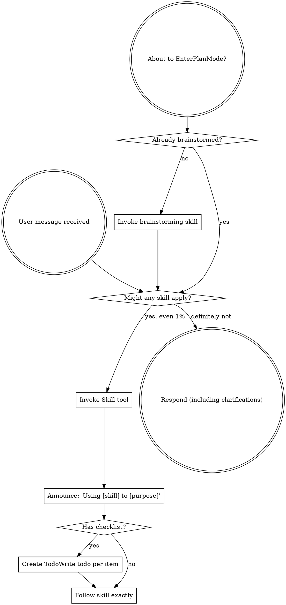

# Codex session 019f2486-d2e1-7172-80e9-ea3a92262ead

- Started: `2026-07-02T20:30:48.431Z`
- Working directory: `D:\100XH100`
- Originator: `Codex Desktop`
- Codex CLI: `0.142.5`
- Source log: `C:\Users\Иван Литвак\.codex\sessions\2026\07\02\rollout-2026-07-02T23-30-48-019f2486-d2e1-7172-80e9-ea3a92262ead.jsonl`
- Entries: user=2, assistant=41, tool calls=58, tool outputs=58

This is a chronological export of the user/assistant conversation and tool activity. Internal system/developer instructions and token accounting are intentionally excluded. Secret-shaped values are redacted; oversized tool outputs retain their beginning and end with the omitted character count.

## 1. User

Time: `2026-07-02T20:30:57.534Z` · source line `4`

```text
# AGENTS.md instructions for D:\100XH100

<INSTRUCTIONS>
# Project Agent Rules

## Operating Rule
- Read `AGENTS.md` before project edits.
- Update `memory/CHANGELOG.md` after meaningful code, config, or architecture changes.
- Update `memory/PROMPTS.md` with user prompts that define requirements.
- Store test outputs, logs, and verification notes under `test_results/`.
- Prefer agent-centered code: explicit contracts, deterministic tests, small files, low hidden state.

## Architecture Source
- Primary architecture contract: `ARCHITECTURE_NEED.md`.
- Current Stream 4 implementation rule: use threshold + compact + CUB/fixed-temp sort/reduce + compact; do not use Stream 4 hash-table dedup.

## Implementation Guardrails
- `State128` logical bytes are `v[0..119]`.
- `State128` padding bytes are `v[120..127]`.
- Persistent frontier padding must be zero.
- `FinalResponse` may temporarily store `target_local_idx` in `v[120..123]`.
- `Hash128` is one logical 128-bit key stored as `{lo, hi}`.
- `CandidateMeta` must remain 32 bytes and 32-byte aligned.
- Stream 3 payload id must be original candidate id, not compact index.
- Stream 4 must not apply shard top-k or semantic shard cap.

</INSTRUCTIONS>
<environment_context>
  <cwd>D:\100XH100</cwd>
  <shell>powershell</shell>
  <current_date>2026-07-02</current_date>
  <timezone>Europe/Moscow</timezone>
  <filesystem><workspace_roots><root>D:\100XH100</root></workspace_roots><permission_profile type="managed"><file_system type="restricted"><entry access="read"><special>:root</special></entry><entry access="write"><path>D:\100XH100</path></entry><entry access="write"><special>:slash_tmp</special></entry><entry access="write"><special>:tmpdir</special></entry><entry access="read"><path>D:\100XH100\.git</path></entry><entry access="read"><path>D:\100XH100\.agents</path></entry><entry access="read"><path>D:\100XH100\.codex</path></entry></file_system></permission_profile></filesystem>
</environment_context>
```

## 2. User

Time: `2026-07-02T20:30:57.571Z` · source line `6`

```text
Ты работаешь в репозитории D:\100XH100\.worktrees\stream1-piece-transformer. Контекст: нужно реализовать optimized Stream1 transformer inference backend: CUTLASS/CuTe FlashAttention-style для SM80+, отдельный правильный SM75/T4 backend, без fallback-логики и без изменений MLP path. Твоя задача только исследовательская: найти в текущем коде, CMake и доступном CUTLASS include tree, какие headers/версии CUTLASS/CuTe доступны для flash-attention-style kernels, какие уже подключены, и где лучше разместить новые файлы, чтобы не трогать MLP. Не меняй файлы. Верни конкретный список файлов/символов и практический план интеграции.
```

## 3. Codex

Time: `2026-07-02T20:31:20.675Z` · source line `9`

```text
Использую обязательный стартовый skill и GPU-ориентированные правила, затем ограничусь чтением репозитория и include tree. Файлы менять не буду.
```

## 4. Tool call: `exec_command`

Time: `2026-07-02T20:31:20.746Z` · source line `11`

```text
{"cmd":"Get-Content -LiteralPath 'C:\\Users\\Иван Литвак\\.codex\\plugins\\cache\\openai-curated-remote\\superpowers\\5.1.4\\skills\\using-superpowers\\SKILL.md'","workdir":"D:\\100XH100","shell":"powershell","yield_time_ms":10000,"max_output_tokens":20000}
```

## 5. Tool call: `exec_command`

Time: `2026-07-02T20:31:20.747Z` · source line `12`

```text
{"cmd":"Get-Content -LiteralPath 'C:\\Users\\Иван Литвак\\.codex\\plugins\\cache\\personal\\highload-gpu\\0.1.0+codex.20260605133541\\skills\\highload-gpu\\SKILL.md'","workdir":"D:\\100XH100","shell":"powershell","yield_time_ms":10000,"max_output_tokens":20000}
```

## 6. Tool output

Time: `2026-07-02T20:31:21.198Z` · source line `13`

````text
Chunk ID: aeabec
Wall time: 0.1322 seconds
Process exited with code 0
Original token count: 1393
Output:
---
name: using-superpowers
description: Use when starting any conversation - establishes how to find and use skills, requiring Skill tool invocation before ANY response including clarifying questions
---

<SUBAGENT-STOP>
If you were dispatched as a subagent to execute a specific task, skip this skill.
</SUBAGENT-STOP>

<EXTREMELY-IMPORTANT>
If you think there is even a 1% chance a skill might apply to what you are doing, you ABSOLUTELY MUST invoke the skill.

IF A SKILL APPLIES TO YOUR TASK, YOU DO NOT HAVE A CHOICE. YOU MUST USE IT.

This is not negotiable. This is not optional. You cannot rationalize your way out of this.
</EXTREMELY-IMPORTANT>

## Instruction Priority

Superpowers skills override default system prompt behavior, but **user instructions always take precedence**:

1. **User's explicit instructions** (CLAUDE.md, GEMINI.md, AGENTS.md, direct requests) — highest priority
2. **Superpowers skills** — override default system behavior where they conflict
3. **Default system prompt** — lowest priority

If CLAUDE.md, GEMINI.md, or AGENTS.md says "don't use TDD" and a skill says "always use TDD," follow the user's instructions. The user is in control.

## How to Access Skills

**In Claude Code:** Use the `Skill` tool. When you invoke a skill, its content is loaded and presented to you—follow it directly. Never use the Read tool on skill files.

**In Copilot CLI:** Use the `skill` tool. Skills are auto-discovered from installed plugins. The `skill` tool works the same as Claude Code's `Skill` tool.

**In Gemini CLI:** Skills activate via the `activate_skill` tool. Gemini loads skill metadata at session start and activates the full content on demand.

**In other environments:** Check your platform's documentation for how skills are loaded.

## Platform Adaptation

Skills use Claude Code tool names. Non-CC platforms: see `references/copilot-tools.md` (Copilot CLI), `references/codex-tools.md` (Codex) for tool equivalents. Gemini CLI users get the tool mapping loaded automatically via GEMINI.md.

# Using Skills

## The Rule

**Invoke relevant or requested skills BEFORE any response or action.** Even a 1% chance a skill might apply means that you should invoke the skill to check. If an invoked skill turns out to be wrong for the situation, you don't need to use it.



## Red Flags

These thoughts mean STOP—you're rationalizing:

| Thought | Reality |
|---------|---------|
| "This is just a simple question" | Questions are tasks. Check for skills. |
| "I need more context first" | Skill check comes BEFORE clarifying questions. |
| "Let me explore the codebase first" | Skills tell you HOW to explore. Check first. |
| "I can check git/files quickly" | Files lack conversation context. Check for skills. |
| "Let me gather information first" | Skills tell you HOW to gather information. |
| "This doesn't need a formal skill" | If a skill exists, use it. |
| "I remember this skill" | Skills evolve. Read current version. |
| "This doesn't count as a task" | Action = task. Check for skills. |
| "The skill is overkill" | Simple things become complex. Use it. |
| "I'll just do this one thing first" | Check BEFORE doing anything. |
| "This feels productive" | Undisciplined action wastes time. Skills prevent this. |
| "I know what that means" | Knowing the concept в‰  using the skill. Invoke it. |

## Skill Priority

When multiple skills could apply, use this order:

1. **Process skills first** (brainstorming, debugging) - these determine HOW to approach the task
2. **Implementation skills second** (frontend-design, mcp-builder) - these guide execution

"Let's build X" в†’ brainstorming first, then implementation skills.
"Fix this bug" в†’ debugging first, then domain-specific skills.

## Skill Types

**Rigid** (TDD, debugging): Follow exactly. Don't adapt away discipline.

**Flexible** (patterns): Adapt principles to context.

The skill itself tells you which.

## User Instructions

Instructions say WHAT, not HOW. "Add X" or "Fix Y" doesn't mean skip workflows.

````

## 7. Tool output

Time: `2026-07-02T20:31:21.198Z` · source line `14`

```text
Chunk ID: 05489a
Wall time: 0.0874 seconds
Process exited with code 0
Original token count: 372
Output:
---
name: highload-gpu
description: Use when solving CUDA, GPU performance, GPU profiling, multi-GPU, or NVIDIA-library tasks.
---

# HighloadGpu

Router for CUDA code-writing and high-performance GPU engineering. Default to a single-GPU CUDA hot path first; use multi-GPU or search/decoding guidance only when the task calls for it.

## Pick The Sub-Skill

- CUDA kernels, memory layout, CUTLASS/CUB, graphs, native hot paths: `write-cuda-hot-paths`
- Beam search, top-k/top-p decoding, frontier expansion, candidate selection: `optimize-gpu-search-and-decoding`
- Multi-GPU scaling, rank ownership, peer access, NCCL, overlap: `design-multigpu-systems`
- Python/Rust/C++/CUDA ownership boundaries: `choose-stack-boundaries`
- GPU model, compute capability, CUDA/library docs: `use-nvidia-docs`
- Timeline/stream/NCCL/launch gaps: `use-nsight-systems`
- One-kernel bottleneck: `use-nsight-compute`
- Illegal access/race/init/sync bug: `use-compute-sanitizer`
- Batch/concurrency/shard sweeps: `benchmark-and-sweep-gpu-configs`
- Kaggle/Molab/remote GPU profiling: `profile-remote-gpu-runs`

## Defaults

- Python: wrappers, notebooks, dashboards, CLI/torchrun launch.
- Rust: safe config, validation, artifact/log tooling, host services.
- C++ + CUDA: CPU/GPU hot paths, kernels, CUDA Graphs, NCCL, CUTLASS, CUB/CCCL.

Check current NVIDIA docs before hardware-specific advice. Require correctness checks and profiling evidence before architecture changes.

```

## 8. Codex

Time: `2026-07-02T20:31:34.014Z` · source line `17`

```text
GPU skill указывает на hot-path/CUTLASS подпроцесс. Сейчас дочитаю только релевантные подпункты, затем пойду по `AGENTS.md`, CMake и include-дереву в указанном worktree.
```

## 9. Codex

Time: `2026-07-02T20:31:34.030Z` · source line `18`

```text
GPU skill указывает на hot-path/CUTLASS подпроцесс. Сейчас дочитаю только релевантные подпункты, затем пойду по `AGENTS.md`, CMake и include-дереву в указанном worktree.
```

## 10. Tool call: `exec_command`

Time: `2026-07-02T20:31:34.030Z` · source line `19`

```text
{"cmd":"Get-Content -LiteralPath 'C:\\Users\\Иван Литвак\\.codex\\plugins\\cache\\personal\\highload-gpu\\0.1.0+codex.20260605133541\\skills\\write-cuda-hot-paths\\SKILL.md'","workdir":"D:\\100XH100","shell":"powershell","yield_time_ms":10000,"max_output_tokens":20000}
```

## 11. Tool call: `exec_command`

Time: `2026-07-02T20:31:34.038Z` · source line `20`

```text
{"cmd":"Get-Content -LiteralPath 'C:\\Users\\Иван Литвак\\.codex\\plugins\\cache\\personal\\highload-gpu\\0.1.0+codex.20260605133541\\skills\\use-nvidia-docs\\SKILL.md'","workdir":"D:\\100XH100","shell":"powershell","yield_time_ms":10000,"max_output_tokens":20000}
```

## 12. Tool output

Time: `2026-07-02T20:31:34.361Z` · source line `21`

```text
Chunk ID: 35f088
Wall time: 0.0411 seconds
Process exited with code 0
Original token count: 389
Output:
---
name: write-cuda-hot-paths
description: Use when writing or optimizing CUDA kernels, memory layouts, and GPU hot paths.
---

# Write CUDA Hot Paths

Primary skill for CUDA code-writing. Hot paths are fixed-capacity, allocation-free, profiler-driven, and explicit about layout, alignment, ownership, and synchronization.

## Workflow

1. State shapes, precision, target GPU, correctness oracle, and measured bottleneck.
2. Choose library vs custom kernel; use custom CUDA where layout, fusion, or control flow makes it worthwhile.
3. Design layout first, implement a small deterministic path, then profile.

## Rules

- Allocate device memory, library temp, NCCL buffers, and graph resources before repeated loops.
- Use explicit capacity guards; fail loudly on overflow.
- Keep CPU readback out of the steady-state path.
- Use CUDA Graphs for repeated launch templates; keep dynamic dispatch on host.
- Add static asserts for cross-kernel metadata size/alignment.
- Store only downstream-needed data; avoid materializing large intermediates when compact keys, indices, or reductions are enough.

## Library Defaults

CUTLASS/cuBLAS for GEMM/tensor-core kernels; CUB/CCCL for sort/reduce/scan/select; NCCL for GPU exchange/collectives; CUDA Runtime/Driver APIs for memory, streams, events, graphs, devices, and peer access.

## Avoid

Dynamic `cudaMalloc`, Python data-plane loops, fine-grained atomics when partition/sort/scan works, custom sort before checking CUB/CCCL, and synchronization that hides ownership bugs.

```

## 13. Tool output

Time: `2026-07-02T20:31:34.362Z` · source line `22`

```text
Chunk ID: d14891
Wall time: 0.0412 seconds
Process exited with code 0
Original token count: 244
Output:
---
name: use-nvidia-docs
description: Use when checking NVIDIA docs.
---

# Use NVIDIA Docs

Use official current docs before hardware-specific CUDA or NVIDIA-library advice.

## Lookup Workflow

1. Identify GPU model, driver, CUDA Toolkit, platform, and container image.
2. Map GPU model to compute capability with the official compute capability table.
3. Match arch flags and docs to installed or target toolkit version.
4. Check CUDA guide, architecture tuning guide, and library guide before specific claims.

## Source Map

Load `references/nvidia-docs-map.md` only when exact source links are needed.

## Avoid

- Guessing compute capability from architecture name without checking the table.
- Using old CUDA docs when the installed CUDA Toolkit is newer.
- Treating blog posts, forum answers, or model cards as stronger than official API docs.
- Recommending CUTLASS, CUB, NCCL, or profiler details from memory when signatures may differ.

```

## 14. Codex

Time: `2026-07-02T20:31:48.714Z` · source line `25`

```text
Сначала проверяю локальные правила и коротко сверяю память по `D:\100XH100`, чтобы не пропустить уже принятые границы проекта. После этого основная часть будет чисто по текущему worktree.
```

## 15. Codex

Time: `2026-07-02T20:31:48.728Z` · source line `26`

```text
Сначала проверяю локальные правила и коротко сверяю память по `D:\100XH100`, чтобы не пропустить уже принятые границы проекта. После этого основная часть будет чисто по текущему worktree.
```

## 16. Tool call: `exec_command`

Time: `2026-07-02T20:31:48.729Z` · source line `27`

```text
{"cmd":"Get-Content -LiteralPath 'D:\\100XH100\\AGENTS.md'","workdir":"D:\\100XH100","shell":"powershell","yield_time_ms":10000,"max_output_tokens":12000}
```

## 17. Tool call: `exec_command`

Time: `2026-07-02T20:31:48.730Z` · source line `28`

```text
{"cmd":"if (Test-Path -LiteralPath 'D:\\100XH100\\.worktrees\\stream1-piece-transformer\\AGENTS.md') { Get-Content -LiteralPath 'D:\\100XH100\\.worktrees\\stream1-piece-transformer\\AGENTS.md' }","workdir":"D:\\100XH100","shell":"powershell","yield_time_ms":10000,"max_output_tokens":12000}
```

## 18. Tool call: `exec_command`

Time: `2026-07-02T20:31:48.734Z` · source line `29`

```text
{"cmd":"rg -n \"100XH100|Stream1|stream1|CUTLASS|CuTe|FlashAttention|piece transformer|BEAM_PREBUILT_RUNNER\" 'C:\\Users\\Иван Литвак\\.codex\\memories\\MEMORY.md'","workdir":"D:\\100XH100","shell":"powershell","yield_time_ms":10000,"max_output_tokens":20000}
```

## 19. Tool call: `exec_command`

Time: `2026-07-02T20:31:48.738Z` · source line `30`

```text
{"cmd":"git -C 'D:\\100XH100\\.worktrees\\stream1-piece-transformer' status --short --branch","workdir":"D:\\100XH100","shell":"powershell","yield_time_ms":10000,"max_output_tokens":12000}
```

## 20. Tool output

Time: `2026-07-02T20:31:49.132Z` · source line `31`

```text
Chunk ID: 08cca2
Wall time: 0.0562 seconds
Process exited with code 0
Original token count: 290
Output:
# Project Agent Rules

## Operating Rule
- Read `AGENTS.md` before project edits.
- Update `memory/CHANGELOG.md` after meaningful code, config, or architecture changes.
- Update `memory/PROMPTS.md` with user prompts that define requirements.
- Store test outputs, logs, and verification notes under `test_results/`.
- Prefer agent-centered code: explicit contracts, deterministic tests, small files, low hidden state.

## Architecture Source
- Primary architecture contract: `ARCHITECTURE_NEED.md`.
- Current Stream 4 implementation rule: use threshold + compact + CUB/fixed-temp sort/reduce + compact; do not use Stream 4 hash-table dedup.

## Implementation Guardrails
- `State128` logical bytes are `v[0..119]`.
- `State128` padding bytes are `v[120..127]`.
- Persistent frontier padding must be zero.
- `FinalResponse` may temporarily store `target_local_idx` in `v[120..123]`.
- `Hash128` is one logical 128-bit key stored as `{lo, hi}`.
- `CandidateMeta` must remain 32 bytes and 32-byte aligned.
- Stream 3 payload id must be original candidate id, not compact index.
- Stream 4 must not apply shard top-k or semantic shard cap.

```

## 21. Tool output

Time: `2026-07-02T20:31:49.191Z` · source line `32`

```text
Chunk ID: d73307
Wall time: 0.0783 seconds
Process exited with code 0
Original token count: 290
Output:
# Project Agent Rules

## Operating Rule
- Read `AGENTS.md` before project edits.
- Update `memory/CHANGELOG.md` after meaningful code, config, or architecture changes.
- Update `memory/PROMPTS.md` with user prompts that define requirements.
- Store test outputs, logs, and verification notes under `test_results/`.
- Prefer agent-centered code: explicit contracts, deterministic tests, small files, low hidden state.

## Architecture Source
- Primary architecture contract: `ARCHITECTURE_NEED.md`.
- Current Stream 4 implementation rule: use threshold + compact + CUB/fixed-temp sort/reduce + compact; do not use Stream 4 hash-table dedup.

## Implementation Guardrails
- `State128` logical bytes are `v[0..119]`.
- `State128` padding bytes are `v[120..127]`.
- Persistent frontier padding must be zero.
- `FinalResponse` may temporarily store `target_local_idx` in `v[120..123]`.
- `Hash128` is one logical 128-bit key stored as `{lo, hi}`.
- `CandidateMeta` must remain 32 bytes and 32-byte aligned.
- Stream 3 payload id must be original candidate id, not compact index.
- Stream 4 must not apply shard top-k or semantic shard cap.

```

## 22. Tool output

Time: `2026-07-02T20:31:49.191Z` · source line `33`

```text
Chunk ID: eabe99
Wall time: 0.0496 seconds
Process exited with code 0
Original token count: 600
Output:
93:applies_to: cwd=D:\100XH100; reuse_rule=reuse for this IHES/MEPhI repo family and adjacent cluster publish jobs, but treat live cluster inventory, DNS availability, and current results-repo schema as run-specific and recheck them before publishing.
99:- rollout_summaries/2026-06-04T15-47-52-Dd1O-ihes_cluster_results_prebuilt_publish_backfill.md (cwd=\\?\D:\100XH100, rollout_path=\\?\C:\Users\Иван Литвак\.codex\sessions\2026\06\04\rollout-2026-06-04T18-47-57-019e9351-cd3b-71c0-bf8b-69755d08d5fc.jsonl, updated_at=2026-06-26T19:51:22+00:00, thread_id=019e9351-cd3b-71c0-bf8b-69755d08d5fc, the prebuilt runner was compiled once and reused across the A100 array workflow)
103:- MEPhI HPC, kaf12, A100 40GB, BEAM_PREBUILT_RUNNER, prepare_ihes_prebuilt_runner.sh, ihes_solve_bucket_from_scratch.sh, prebuilt_runner_ready, using_prebuilt_runner, PUZZLE_LIMIT=1, depth=12
109:- rollout_summaries/2026-06-04T15-47-52-Dd1O-ihes_cluster_results_prebuilt_publish_backfill.md (cwd=\\?\D:\100XH100, rollout_path=\\?\C:\Users\Иван Литвак\.codex\sessions\2026\06\04\rollout-2026-06-04T18-47-57-019e9351-cd3b-71c0-bf8b-69755d08d5fc.jsonl, updated_at=2026-06-26T19:51:22+00:00, thread_id=019e9351-cd3b-71c0-bf8b-69755d08d5fc, the results repo structure and first backfilled puzzle sets were established)
119:- rollout_summaries/2026-06-04T15-47-52-Dd1O-ihes_cluster_results_prebuilt_publish_backfill.md (cwd=\\?\D:\100XH100, rollout_path=\\?\C:\Users\Иван Литвак\.codex\sessions\2026\06\04\rollout-2026-06-04T18-47-57-019e9351-cd3b-71c0-bf8b-69755d08d5fc.jsonl, updated_at=2026-06-26T19:51:22+00:00, thread_id=019e9351-cd3b-71c0-bf8b-69755d08d5fc, a file-driven inventory plus schema fixes made the larger aggregator path workable)
134:- `hpc/ihes_cube_model/prepare_ihes_prebuilt_runner.sh` builds the shared binary at `/mnt/pool/6/vokirova/beam8a100/ihes_cube_model/prebuilt-a100-ihes/production_runner`, and `hpc/ihes_cube_model/ihes_solve_bucket_from_scratch.sh` already knows how to consume `BEAM_PREBUILT_RUNNER` [Task 1]
142:- symptom: each array task recompiles instead of reusing the solver. cause: `BEAM_PREBUILT_RUNNER` was not wired through a separate prebuild dependency. fix: submit the prebuild first and make the puzzle array depend on it via `--dependency=afterok:<prebuild_job>` [Task 1]

```

## 23. Tool output

Time: `2026-07-02T20:31:49.192Z` · source line `34`

```text
Chunk ID: 98b20e
Wall time: 0.0563 seconds
Process exited with code 0
Original token count: 125
Output:
## codex/stream1-piece-transformer...origin/codex/stream1-piece-transformer
 M memory/CHANGELOG.md
 M memory/PROMPTS.md
?? $null
?? build-contract-tests/
?? build-nsys-stream1/
?? build-stream1-opt/
?? build-stream1-transformer-red/
?? build-task6-red/
?? build-task6-sm86/
?? build-task6/
?? config.obj
?? contract_tests.obj
?? docs/
?? frontier_cpu.obj
?? hash.obj
?? kaggle_transformer_inference_speed/
?? state.obj
?? stream3.obj
?? stream4.obj
?? tools/stream1_transformer_torch_benchmark.py

```

## 24. Codex

Time: `2026-07-02T20:31:55.612Z` · source line `37`

```text
Worktree уже грязный: есть измененные `memory/CHANGELOG.md`, `memory/PROMPTS.md` и несколько build/output каталогов. Я их не трогаю и дальше читаю только исходники/CMake/include, чтобы собрать точную карту интеграции.
```

## 25. Tool call: `update_plan`

Time: `2026-07-02T20:31:57.045Z` · source line `39`

```text
{"plan":[{"step":"Map Stream1/CMake/CUDA files in the worktree","status":"in_progress"},{"step":"Inventory local CUTLASS/CuTe/CUB headers and versions","status":"pending"},{"step":"Identify current transformer vs MLP ownership boundaries","status":"pending"},{"step":"Return concrete integration plan without edits","status":"pending"}]}
```

## 26. Tool output

Time: `2026-07-02T20:31:57.066Z` · source line `40`

```text
Plan updated
```

## 27. Codex

Time: `2026-07-02T20:32:05.498Z` · source line `42`

```text
Сейчас собираю карту файлов: где объявлен Stream1 transformer inference, какие targets собирает CMake, и какие include пути уже используются. Это даст границу, куда добавлять backend без касания MLP.
```

## 28. Codex

Time: `2026-07-02T20:32:05.519Z` · source line `43`

```text
Сейчас собираю карту файлов: где объявлен Stream1 transformer inference, какие targets собирает CMake, и какие include пути уже используются. Это даст границу, куда добавлять backend без касания MLP.
```

## 29. Tool call: `exec_command`

Time: `2026-07-02T20:32:05.520Z` · source line `44`

```text
{"cmd":"rg --files","workdir":"D:\\100XH100\\.worktrees\\stream1-piece-transformer","shell":"powershell","yield_time_ms":10000,"max_output_tokens":30000}
```

## 30. Tool call: `exec_command`

Time: `2026-07-02T20:32:05.670Z` · source line `45`

```text
{"cmd":"rg -n \"stream1|Stream1|transformer|Transformer|MLP|mlp|CUTLASS|cutlass|CuTe|cute|flash|Flash|attention|Attention|sm_75|sm_80|CMAKE_CUDA_ARCHITECTURES|CUDA_ARCH\" .","workdir":"D:\\100XH100\\.worktrees\\stream1-piece-transformer","shell":"powershell","yield_time_ms":10000,"max_output_tokens":40000}
```

## 31. Tool call: `exec_command`

Time: `2026-07-02T20:32:05.671Z` · source line `46`

```text
{"cmd":"Get-Content -LiteralPath 'ARCHITECTURE_NEED.md'","workdir":"D:\\100XH100\\.worktrees\\stream1-piece-transformer","shell":"powershell","yield_time_ms":10000,"max_output_tokens":30000}
```

## 32. Tool call: `exec_command`

Time: `2026-07-02T20:32:05.703Z` · source line `47`

```text
{"cmd":"Get-Content -LiteralPath 'CMakeLists.txt'","workdir":"D:\\100XH100\\.worktrees\\stream1-piece-transformer","shell":"powershell","yield_time_ms":10000,"max_output_tokens":30000}
```

## 33. Tool output

Time: `2026-07-02T20:32:05.948Z` · source line `48`

Oversized output: `8210` characters omitted from the middle.

```text
Chunk ID: f2bab5
Wall time: 0.1918 seconds
Process exited with code 0
Original token count: 13306
Output:
Warning: truncated output (original token count: 13306)
Total output lines: 920

hash.obj
Dockerfile
docker-compose.yml
docs\transformer_inference_architecture.md
data\test.csv
data\sample_submission.csv
data\puzzle_info.json
cuda\threshold.hpp
build-task6-sm86\stream_benchmark
build-task6-sm86\stream1_transformer_cuda_tests
cuda\threshold.cu
build-task6-sm86\stream1_cuda_tests
cuda\stream5.hpp
build-task6-sm86\production_runner
build-task6-sm86\libbeam_cuda.a
cuda\stream5.cu
build-task6-sm86\libbeam_core.a
cuda\stream4.hpp
build-task6-sm86\dispatcher_cuda_tests
cuda\stream4.cu
build-task6-sm86\CTestTestfile.cmake
cuda\stream3.hpp
build-task6-sm86\contract_tests
cuda\stream3.cu
build-task6-sm86\cmake_install.cmake
cuda\stream2.hpp
cuda\stream2.cu
cuda\stream1.hpp
cuda\stream1.cu
cuda\static_memory.hpp
cuda\static_memory.cu
cuda\runtime_config.hpp
cuda\runtime_config.cpp
cuda\nvtx_ranges.hpp
cuda\final_materialize.hpp
cuda\final_materialize.cu
cuda\dispatcher.hpp
cuda\dispatcher.cu
cuda\cuda_check.hpp
cuda\cub_compat.hpp
contract_tests.obj
config.obj
CMakeLists.txt
FullBeamNice\targets\p900-t000.pt
cmake\CheckBeamStateSizing.cmake
cmake\BeamStateSizing.cmake
docs\superpowers\plans\2026-06-30-stream1-transformer-production-speed.md
docs\superpowers\plans\2026-06-29-stream1-piece-transformer.md
FullBeamNice\notebooks\q_model_inference_standalone.ipynb
FullBeamNice\generators\p900.json
frontier_cpu.obj
FullBeamNice\logs\model_p900-t000-q-sym_1777988767.json
molab\README.md
molab\probe_cell.py
molab\molab_probe.py
kaggle_torchrun\kernel-metadata.json
kaggle_torchrun\h100-torchrun-p0-depth10.ipynb
kaggle_torchrun\h100-torchrun-depth80-k1-5.ipynb
build-stream1-opt\threshold_cuda_tests
memory\PROMPTS.md
memory\CHANGELOG.md
kaggle_t4_transformer_benchmark\t4-transformer-stream1-benchmark.ipynb
kaggle_t4_transformer_benchmark\kernel-metadata.json
kaggle_t4_transformer_solve\t4-transformer-beam-solve.ipynb
kaggle_t4_transformer_solve\kernel-metadata.json
kaggle_transformer_inference_speed\transformer_inference_speed.py
kaggle_transformer_inference_speed\transformer_inference_profile.py
kaggle_transformer_inference_speed\kernel-metadata.json
kaggle_t4_torchrun\t4-torchrun-p0-depth10.ipynb
kaggle_t4_transformer_smoke\t4-transformer-beam-smoke.ipynb
kaggle_t4_torchrun\t4-torchrun-machinery-check.ipynb
kaggle_t4_transformer_smoke\kernel-metadata.json
kaggle_t4_torchrun\kernel-metadata.json
kaggle_t4_mlp_benchmark\t4-mlp-native-vs-torch-benchmark.ipynb
kaggle_t4_mlp_benchmark\kernel-metadata.json
src\types.hpp
stream1_weights_artgor_bf16\residual1_fc2_weight_hxk.bf16
src\stream4.hpp
stream1_weights_artgor_bf16\residual1_fc2_ln_gamma.bf16
src\stream4.cpp
stream1_weights_artgor_bf16\residual1_fc2_ln_beta.bf16
src\stream3.hpp
stream1_weights_artgor_bf16\residual1_fc2_bias.bf16
src\stream3.cpp
stream1_weights_artgor_bf16\residual1_fc1_weight_hxk.bf16
src\state.hpp
stream1_weights_artgor_bf16\residual1_fc1_ln_gamma.bf16
src\state.cpp
stream1_weights_artgor_bf16\residual1_fc1_ln_beta.bf16
src\history.hpp
stream1_weights_artgor_bf16\residual1_fc1_bias.bf16
src\history.cpp
stream1_weights_artgor_bf16\residual0_fc2_weight_hxk.bf16
stream1_weights_artgor_bf16\residual0_fc2_ln_gamma.bf16
stream1_weights_artgor_bf16\residual0_fc2_ln_beta.bf16
stream1_weights_artgor_bf16\residual0_fc2_bias.bf16
stream1_weights_artgor_bf16\residual0_fc1_weight_hxk.bf16
stream1_weights_artgor_bf16\residual0_fc1_ln_gamma.bf16
stream1_weights_artgor_bf16\residual0_fc1_ln_beta.bf16
stream1_weights_artgor_bf16\residual0_fc1_bias.bf16
stream1_weights_artgor_bf16\output_weight_hxk.bf16
stream1_weights_artgor_bf16\output_bias.bf16
stream1_weights_artgor_bf16\manifest.json
stream1_weights_artgor_bf16\input_weight_hxk.bf16
stream1_weights_artgor_bf16\input_ln_gamma.bf16
stream1_weights_artgor_bf16\input_ln_beta.bf16
stream1_weights_artgor_bf16\input_bias.bf16
stream1_weights_artgor_bf16\hidden_weight_hxk.bf16
stream1_weights_artgor_bf16\hidden_ln_gamma.bf16
stream1_weights_artgor_bf16\hidden_ln_beta.bf16
stream1_weights_artgor_bf16\hidden_bias.bf16
src\hash.hpp
src\hash.cpp
src\frontier_cpu.hpp
src\frontier_cpu.cpp
src\config.hpp
src\config.cpp
README.md
prompt_history\task_2026-05-30_beam_width_compare.md
stream1_weights\hidden_bias.fp16
state.obj
stream1_weights\hidden_weight_hxk.fp16
stream1_weights\residual0_fc2_weight_hxk.fp16
stream1_weights\residual0_fc2_bias.fp16
stream1_weights\residual0_fc1_weight_hxk.fp16
stream1_weights\residual0_fc1_bias.fp16
stream1_weights\output_weight_hxk.fp16
stream1_weights\output_bias.fp16
stream1_weights\manifest.json
stream1_weights\input_weight_hxk.fp16
stream1_weights\input_bias.fp16
stream1_weights\residual1_fc2_weight_hxk.fp16
stream1_weights\residual1_fc2_bias.fp16
stream1_weights\residual1_fc1_weight_hxk.fp16
stream1_weights\residual1_fc1_bias.fp16
stream1_weights\residual2_fc1_weight_hxk.fp16
stream1_weights\residual2_fc2_weight_hxk.fp16
stream1_weights\residual2_fc1_bias.fp16
stream1_weights\residual2_fc2_bias.fp16
kaggle\t4-torchrun-p0-depth10.ipynb
kaggle\t4-torchrun-machinery-check.ipynb
kaggle\kernel-metadata.json
kaggle\h100-torchrun-p0-depth10.ipynb
kaggle\h100-torchrun-depth80-k1-5.ipynb
kaggle\cayley-beam-gpu-runner.ipynb
kaggle\beam_kernel.ipynb
tests\threshold_cuda_tests.cu
tests\test_stream1_transformer_exporter.py
tests\stream5_cuda_tests.cu
tests\stream4_cuda_tests.cu
tests\stream3_cuda_tests.cu
tests\stream2_cuda_tests.cu
tests\stream1_transformer_cuda_tests.cu
tests\stream1_cuda_tests.cu
tests\stitched_cuda_tests.cu
tests\static_memory_cuda_tests.cu
tests\history_tests.cpp
tests\final_cuda_tests.cu
tests\dispatcher_cuda_tests.cu
tests\contract_tests.cpp
stream4.obj
stream3.obj
build-stream1-opt\history_tests
build-stream1-opt\final_cuda_tests
build-stream1-opt\dispatcher_cuda_tests
build-stream1-opt\CTestTestfile.cmake
build-stream1-opt\contract_tests
build-stream1-opt\cmake_install.cmake
tools\stream_benchmark_transformer.cu
tools\stream_benchmark_mlp.cu
tools\stream_benchmark_common.hpp
tools\stream_benchmark.cu
tools\stream1_weight_io.hpp
tools\stream1_transformer_torch_benchmark.py
tools\stream1_mlp_torch_benchmark.py
tools\production_runner.cu
tools\generate_segment_repair_jobs.py
tools\export_stream1_transformer.py
tools\export_stream1_mlp.py
tools\export_stream1.py
tools\compare_solution_lengths.py
build-stream1-opt\stream1_transformer_cuda_tests
build-stream1-opt\stream1_cuda_tests
build-stream1-opt\stitched_cuda_tests
build-stream1-opt\static_memory_cuda_tests
build-stream1-opt\production_runner
build-stream1-opt\libbeam_cuda.a
build-stream1-opt\libbeam_core.a
build-stream1-opt\stream4_cuda_tests
build-stream1-opt\stream3_cuda_tests
build-stream1-opt\stream2_cuda_tests
build-stream1-opt\stream_benchmark
build-stream1-opt\stream5_cuda_tests
hpc\tune_8xa100_stream1.sh
hpc\tune_8xa100_staged.sh
hpc\tune_8xa100_pipeline.sh
hpc\start_8xa100_best.sh
hpc\start_8xa100_beamsearch.sh
hpc\solve_then_reflect.sh
hpc\solve_reflected_only.sh
hpc\README_8xa100.md
hpc\portable_8xa100_80gb\run_1p4b_8xa100_80gb.sh
hpc\portable_8xa100_80gb\README.md
hpc\mephi_8xa100_common.sh
hpc\ihes_cube_smoke\README.md
hpc\ihes_cube_smoke\make_dummy_weights.py
hpc\ihes_cube_smoke\ihes_cube_smoke.sh
hpc\ihes_cube_model\solv_uniq.csv
hpc\ihes_cube_model\run_solution_repair_plan.sh
hpc\ihes_cube_model\README.md
hpc\ihes_cube_model\prepare_solution_repair_single_window.sh
hpc\ihes_cube_model\prepare_ihes_prebuilt_runner.sh
hpc\ihes_cube_model\prepare_ihes_cube_model.sh
hpc\ihes_cube_model\ihes_solve_then_reflect.sh
hpc\ihes_cube_model\ihes_solve_bucket_from_scratch.sh
hpc\ihes_cube_model\ihes_solve_bucket.sh
hpc\ihes_cube_model\ihes_solution_repair.sh
hpc\ihes_cube_model\ihes_segment_repair.sh
hpc\ihes_cube_model\ihes_cube_model.sh
build-task6-red\libbeam_cuda.a
build-task6-red\libbeam_core.a
build-task6-red\CTestTestfile.cmake
build-task6-red\cmake_install.cmake
_push_final_chunk\tools\stream_benchmark.cu
_push_final_chunk\tools\stream1_weight_io.hpp
_push_final_chunk\tools\production_runner.cu
_push_final_chunk\tools\export_stream1_mlp.py
_push_final_chunk\tests\threshold_cuda_tests.cu
_push_final_chunk\tests\stream5_cuda_tests.cu
_push_final_chunk\tests\stream4_cuda_tests.cu
_push_final_chunk\tests\stream3_cuda_tests.cu
_push_final_chunk\tests\stream2_cuda_tests.cu
_push_final_chunk\tests\stream1_cuda_tests.cu
_push_final_chunk\tests\stitched_cuda_tests.cu
_push_final_chunk\tests\static_memory_cuda_tests.cu
_push_final_chunk\tests\history_tests.cpp
_push_final_chunk\tests\final_cuda_tests.cu
_push_final_chunk\tests\dispatcher_cuda_tests.cu
_push_final_chunk\tests\contract_tests.cpp
_push_final_chunk\stream1_weights\residual2_fc2_weight_hxk.fp16
_push_final_chunk\stream1_weights\residual2_fc2_bias.fp16
_push_final_chunk\stream1_weights\residual2_fc1_weight_hxk.fp16
_push_final_chunk\stream1_weights\residual2_fc1_bias.fp16
_push_final_chunk\stream1_weights\residual1_fc2_weight_hxk.fp16
_push_final_chunk\stream1_weights\residual1_fc2_bias.fp16
_push_final_chunk\stream1_weights\residual1_fc1_weight_hxk.fp16
_push_final_chunk\stream1_weights\residual1_fc1_bias.fp16
_push_final_chunk\stream1_weights\residual0_fc2_weight_hxk.fp16
_push_final_chunk\stream1_weights\residual0_fc2_bias.fp16
_push_final_chunk\stream1_weights\residual0_fc1_weight_hxk.fp16
_push_final_chunk\stream1_weights\residual0_fc1_bias.fp16
_push_final_chunk\stream1_weights\output_weight_hxk.fp16
_push_final_chunk\stream1_weights\output_bias.fp16
_push_final_chunk\stream1_weights\manifest.json
_push_final_chunk\stream1_weights\input_weight_hxk.fp16
_push_final_chunk\stream1_weights\input_bias.fp16
_push_final_chunk\stream1_weights\hidden_weight_hxk.fp16
_push_final_chunk\stream1_weights\hidden_bias.fp16
_push_final_chunk\src\types.hpp
_push_final_chunk\src\stream4.hpp
_push_final_chunk\src\stream4.cpp
_push_final_chunk\src\stream3.hpp
_push_final_chunk\src\stream3.cpp
_push_final_chunk\src\state.hpp
_push_final_chunk\src\state.cpp
_push_final_chunk\src\history.hpp
_push_final_chunk\src\history.cpp
_push_final_chunk\src\hash.hpp
_push_final_chunk\src\hash.cpp
_push_final_chunk\src\frontier_cpu.hpp
_push_final_chunk\src\frontier_cpu.cpp
_push_final_chunk\src\config.hpp
_push_final_chunk\src\config.cpp
_push_final_chunk\README.md
_push_final_chunk\memory\PROMPTS.md
_push_final_chunk\memory\CHANGELOG.md
_push_final_chunk\kaggle\kernel-metadata.json
_push_final_chunk\kaggle\cayley-beam-gpu-runner.ipynb
_push_final_chunk\kaggle\beam_kernel.ipynb
_push_final_chunk\hpc\tune_8xa100_stream1.sh
_push_final_chunk\hpc\tune_8xa100_pipeline.sh
_push_final_chunk\hpc\start_8xa100_best.sh
_push_final_chunk\hpc\start_8xa100_beamsearch.sh
_push_final_chunk\hpc\README_8xa100.md
_push_final_chunk\hpc\mephi_8xa100_common.sh
_push_final_chunk\FullBeamNice\targets\p900-t000.pt
_push_final_chunk\FullBeamNice\notebooks\q_model_inference_standalone.ipynb
_push_final_chunk\FullBeamNice\logs\model_p900-t000-q-sym_1777988767.json
_push_final_chunk\FullBeamNice\generators\p900.json
_push_final_chunk\Dockerfile
_push_final_chunk\docker-compose.yml
_push_final_chunk\data\test.csv
_push_final_chunk\data\sample_submission.csv
_push_final_chunk\data\puzzle_info.json
_push_final_chunk\cuda\threshold.hpp
_push_final_chunk\cuda\threshold.cu
_push_final_chunk\cuda\stream5.hpp
_push_final_chunk\cuda\stream5.cu
_push_final_chunk\cuda\stream4.hpp
_push_final_chunk\cuda\stream4.cu
_push_final_chunk\cuda\stream3.hpp
_push_final_chunk\cuda\stream3.cu
_push_final_chunk\cuda\stream2.hpp
_push_final_chunk\cuda\stream2.cu
_push_final_chunk\cuda\stream1.hpp
_push_final_chunk\cuda\stream1.cu
_push_final_chunk\cuda\static_memory.hpp
_push_final_chunk\cuda\static_memory.cu
_push_final_chunk\cuda\runtime_config.hpp
_push_final_chunk\cuda\runtime_config.cpp
_push_final_chunk\cuda\nvtx_ranges.hpp
_push_final_chunk\cuda\final_materialize.hpp
_push_final_chunk\cuda\final_materialize.cu
_push_final_chunk\cuda\dispatcher.hpp
_push_final_chunk\cuda\dispatcher.cu
_push_final_chunk\cuda\cuda_check.hpp
_push_final_chunk\cuda\cub_compat.hpp
_push_final_chunk\CMakeLists.txt
_push_final_chunk\ARCHITECTURE_NEED.md
_push_final_chunk\AGENTS.md
build-task6\stream1_transformer_cuda_tests
build-task6\stream1_cuda_tests
build-task6\production_runner
build-task6\libbeam_cuda.a
build-task6\libbeam_core.a
build-task6\dispatcher_cuda_tests
build-task6\CTestTestfile.cmake
build-task6\cmake_install.cmake
build-task6-sm86\build.ninja
build-task6-sm86\CMakeCache.txt
AGENTS.md
$null
ARCHITECTURE_NEED.md
build-contract-tests\CMakeCache.txt.tmpa709c
build-stream1-opt\build.ninja
build-nsys-stream1\stream_benchmark
build-nsys-stream1\libbeam_cuda.a
build-nsys-stream1\libbeam_core.a
build-nsys-stream1\CTestTestfile.cmake
build-nsys-stream1\cmake_install.cmake
_push_staged_tuner\tools\stream_benchmark.cu
_push_staged_tuner\tools\stream1_weight_io.hpp
_push_staged_tuner\tools\production_runner.cu
_push_staged_tuner\tools\export_stream1_mlp.py
_push_staged_tuner\tests\threshold_cuda_tests.cu
_push_staged_tuner\tests\stream5_cuda_tests.cu
_push_staged_tuner\tests\stream4_cuda_tests.cu
_push_staged_tuner\tests\stream3_cuda_tests.cu
_push_staged_tuner\tests\stream2_cuda_tests.cu
_push_staged_tuner\tests\stream1_cuda_tests.cu
_push_staged_tuner\tests\stitched_cuda_tests.cu
_push_staged_tuner\tests\static_memory_cuda_tests.cu
_push_staged_tuner\tests\history_tests.cpp
_push_staged_tuner\tests\final_cuda_tests.cu
_push_staged_tuner\tests\dispatcher_cuda_tests.cu
_push_staged_tuner\tests\contract_tests.cpp
_push_staged_tuner\stream1_weights\residual2_fc2_weight_hxk.fp16
_push_staged_tuner\stream1_weights\residual2_fc2_bias.fp16
_push_staged_tuner\stream1_weights\residual2_fc1_weight_hxk.fp16
_push_staged_tuner\stream1_weights\residual2_fc1_bias.fp16
_push_staged_tuner\stream1_weights\residual1_fc2_weight_hxk.fp16
_push_staged_tuner\stream1_weights\residual1_fc2_bias.fp16
_push_staged_tuner\stream1_weights\residual1_fc1_weight_hxk.fp16
_push_staged_tuner\stream1_weights\residual1_fc1_bias.fp16
_push_staged_tuner\stream1_weights\residual0_fc2_weight_hxk.fp16
_push_staged_tuner\stream1_weights\residual0_fc2_bias.fp16
_push_staged_tuner\stream1_weights\residual0_fc1_weight_hxk.fp16
_push_staged_tuner\stream1_weights\residual0_fc1_bias.fp16
_push_staged_tuner\stream1_weights\output_weight_hxk.fp16
_push_staged_tuner\stream1_weights\output_bias.fp16
_push_staged_tuner\stream1_weights\manifest.json
_push_staged_tuner\stream1_weights\input_weight_hxk.fp16
_push_staged_tuner\stream1_weights\input_bias.fp16
_push_staged_tuner\stream1_weights\hidden_weight_hxk.fp16
_push_staged_tuner\stream1_weights\hidden_bias.fp16
_push_staged_tuner\src\types.hpp
_push_staged_tuner\src\stream4.hpp
_push_staged_tuner\src\stream4.cpp
_push_staged_tuner\src\stream3.hpp
_push_staged_tuner\src\stream3.cpp
_push_staged_tuner\src\state.hpp
_push_staged_tuner\src\state.cpp
_push_staged_tuner\src\history.hpp
_push_staged_tuner\src\history.cpp
_push_staged_tuner\src\hash.hpp
_push_staged_tuner\src\hash.cpp
_push_staged_tuner\src\frontier_cpu.hpp
_push_staged_tuner\src\frontier_cpu.cpp
_push_staged_tuner\src\config.hpp
_push_staged_tuner\src\config.cpp
_push_staged_tuner\README.md
_push_staged_tuner\memory\PROMPTS.md
_push_staged_tuner\memory\CHANGELOG.md
_push_staged_tuner\kaggle\kernel-metadata.json
_push_staged_tuner\kaggle\cayley-beam-gpu-runner.ipynb
_push_staged_tuner\kaggle\beam_kernel.ipynb
_push_staged_tuner\hpc\tune_8xa100_stream1.sh
_push_staged_tuner\hpc\tune_8xa100_staged.sh
_push_staged_tuner\hpc\tune_8xa100_pipeline.sh
_push_staged_tuner\hpc\start_8xa100_best.sh
_push_staged_tuner\hpc\start_8xa100_beamsearch.sh
_push_staged_tuner\hpc\README_8xa100.md
_push_staged_tuner\hpc\mephi_8xa100_common.sh
_push_staged_tuner\FullBeamNice\targets\p900-t000.pt
_push_staged_tuner\FullBeamNice\notebooks\q_model_inference_standalone.ipynb
_push_staged_tuner\FullBeamNice\logs\model_p9

[... 8210 characters omitted from oversized tool output ...]

tream1-transformer-red\CMakeFiles\3.22.1\CompilerIdCUDA\tmp\a_dlink.fatbin.c
build-stream1-transformer-red\CMakeFiles\3.22.1\CompilerIdCUDA\tmp\a_dlink.fatbin
build-stream1-transformer-red\CMakeFiles\3.22.1\CompilerIdCUDA\CMakeCUDACompilerId.cu
build-stream1-transformer-red\CMakeFiles\3.22.1\CompilerIdCUDA\a.out
build-task6-sm86\CMakeFiles\stream1_transformer_cuda_tests.dir\tests\stream1_transformer_cuda_tests.cu.o
build-stream1-opt\test_results\stream1_transformer_manifest_bad_seq_len\manifest.json
build-stream1-opt\CMakeFiles\stream1_transformer_cuda_tests.dir\tests\stream1_transformer_cuda_tests.cu.o
build-task6-red\CMakeFiles\beam_cuda.dir\cuda\threshold.cu.o
build-task6-red\CMakeFiles\beam_cuda.dir\cuda\stream5.cu.o
build-task6-red\CMakeFiles\beam_cuda.dir\cuda\stream4.cu.o
build-task6-red\CMakeFiles\beam_cuda.dir\cuda\stream3.cu.o
build-task6-red\CMakeFiles\beam_cuda.dir\cuda\stream2.cu.o
build-task6-red\CMakeFiles\beam_cuda.dir\cuda\stream1.cu.o
build-task6-red\CMakeFiles\beam_cuda.dir\cuda\static_memory.cu.o
build-task6-red\CMakeFiles\beam_cuda.dir\cuda\runtime_config.cpp.o
build-task6-red\CMakeFiles\beam_cuda.dir\cuda\final_materialize.cu.o
build-task6-red\CMakeFiles\beam_cuda.dir\cuda\dispatcher.cu.o
build-stream1-opt\CMakeFiles\beam_cuda.dir\cuda\threshold.cu.o
build-stream1-opt\CMakeFiles\beam_cuda.dir\cuda\stream5.cu.o
build-stream1-opt\CMakeFiles\beam_cuda.dir\cuda\stream4.cu.o
build-stream1-opt\CMakeFiles\beam_cuda.dir\cuda\stream3.cu.o
build-stream1-opt\CMakeFiles\beam_cuda.dir\cuda\stream2.cu.o
build-stream1-opt\CMakeFiles\beam_cuda.dir\cuda\stream1.cu.o
build-stream1-opt\CMakeFiles\beam_cuda.dir\cuda\static_memory.cu.o
build-stream1-opt\CMakeFiles\beam_cuda.dir\cuda\runtime_config.cpp.o
build-stream1-opt\CMakeFiles\beam_cuda.dir\cuda\final_materialize.cu.o
build-stream1-opt\CMakeFiles\beam_cuda.dir\cuda\dispatcher.cu.o
build-stream1-opt\test_results\stream1_transformer_manifest_bad_primary_layer\manifest.json
build-stream1-opt\test_results\stream1_transformer_cuda_tests_2026-06-29.md
build-task6-sm86\CMakeFiles\stream1_cuda_tests.dir\tests\stream1_cuda_tests.cu.o
build-stream1-opt\CMakeFiles\stream1_cuda_tests.dir\tests\stream1_cuda_tests.cu.o
build-task6-sm86\CMakeFiles\contract_tests.dir\tests\contract_tests.cpp.o
build-stream1-opt\test_results\stream1_manifest_backend_unknown\manifest.json
build-stream1-opt\CMakeFiles\stitched_cuda_tests.dir\tests\stitched_cuda_tests.cu.o
build-stream1-opt\CMakeFiles\static_memory_cuda_tests.dir\tests\static_memory_cuda_tests.cu.o
build-stream1-opt\CMakeFiles\rules.ninja
build-task6-red\CMakeFiles\3.22.1\CMakeDetermineCompilerABI_CUDA.bin
build-task6-red\CMakeFiles\3.22.1\CMakeCXXCompiler.cmake
build-task6-red\CMakeFiles\3.22.1\CMakeCUDACompiler.cmake
build-task6-red\CMakeFiles\3.22.1\CMakeSystem.cmake
build-task6-red\CMakeFiles\3.22.1\CMakeDetermineCompilerABI_CXX.bin
build-task6-sm86\CMakeFiles\rules.ninja
build-task6-sm86\CMakeFiles\production_runner.dir\tools\production_runner.cu.o
build-task6\CMakeFiles\3.22.1\CompilerIdCXX\CMakeCXXCompilerId.cpp
build-task6\CMakeFiles\3.22.1\CompilerIdCXX\a.out
build-task6-red\CMakeFiles\cmake.check_cache
build-stream1-opt\test_results\stream1_manifest_backend_piece_transformer\manifest.json
build-task6-sm86\CMakeFiles\cmake.check_cache
build-stream1-opt\CMakeFiles\beam_core.dir\src\stream4.cpp.o
build-stream1-opt\CMakeFiles\beam_core.dir\src\stream3.cpp.o
build-stream1-opt\CMakeFiles\beam_core.dir\src\state.cpp.o
build-stream1-opt\CMakeFiles\beam_core.dir\src\history.cpp.o
build-stream1-opt\CMakeFiles\beam_core.dir\src\hash.cpp.o
build-stream1-opt\CMakeFiles\beam_core.dir\src\frontier_cpu.cpp.o
build-stream1-opt\CMakeFiles\beam_core.dir\src\config.cpp.o
build-task6-red\CMakeFiles\3.22.1\CompilerIdCUDA\a.out
build-task6-red\CMakeFiles\3.22.1\CompilerIdCUDA\CMakeCUDACompilerId.cu
build-task6-red\CMakeFiles\3.22.1\CompilerIdCXX\a.out
build-task6-red\CMakeFiles\3.22.1\CompilerIdCXX\CMakeCXXCompilerId.cpp
build-task6-red\CMakeFiles\beam_core.dir\src\history.cpp.o
build-task6-red\CMakeFiles\beam_core.dir\src\hash.cpp.o
build-task6-red\CMakeFiles\beam_core.dir\src\frontier_cpu.cpp.o
build-task6-red\CMakeFiles\beam_core.dir\src\config.cpp.o
build-task6-red\CMakeFiles\beam_core.dir\src\stream3.cpp.o
build-task6-red\CMakeFiles\beam_core.dir\src\state.cpp.o
build-task6-red\CMakeFiles\beam_core.dir\src\stream4.cpp.o
build-task6\CMakeFiles\3.22.1\CMakeDetermineCompilerABI_CXX.bin
build-task6\CMakeFiles\3.22.1\CMakeDetermineCompilerABI_CUDA.bin
build-task6\CMakeFiles\3.22.1\CMakeCXXCompiler.cmake
build-task6\CMakeFiles\3.22.1\CMakeCUDACompiler.cmake
build-task6\CMakeFiles\3.22.1\CompilerIdCUDA\a.out
build-task6\CMakeFiles\3.22.1\CMakeSystem.cmake
build-task6\CMakeFiles\3.22.1\CompilerIdCUDA\CMakeCUDACompilerId.cu
build-nsys-stream1\CMakeFiles\cmake.check_cache
build-stream1-opt\test_results\stream1_manifest_backend_legacy_mlp\manifest.json
build-nsys-stream1\CMakeFiles\beam_cuda.dir\cuda\threshold.cu.o
build-nsys-stream1\CMakeFiles\beam_cuda.dir\cuda\stream5.cu.o
build-nsys-stream1\CMakeFiles\beam_cuda.dir\cuda\stream4.cu.o
build-nsys-stream1\CMakeFiles\beam_cuda.dir\cuda\stream3.cu.o
build-nsys-stream1\CMakeFiles\beam_cuda.dir\cuda\stream2.cu.o
build-nsys-stream1\CMakeFiles\beam_cuda.dir\cuda\stream1.cu.o
build-nsys-stream1\CMakeFiles\beam_cuda.dir\cuda\static_memory.cu.o
build-nsys-stream1\CMakeFiles\beam_cuda.dir\cuda\runtime_config.cpp.o
build-nsys-stream1\CMakeFiles\beam_cuda.dir\cuda\final_materialize.cu.o
build-nsys-stream1\CMakeFiles\beam_cuda.dir\cuda\dispatcher.cu.o
build-nsys-stream1\CMakeFiles\rules.ninja
build-stream1-opt\test_results\history_tests_2026-05-22.md
build-stream1-opt\test_results\final_cuda_tests_2026-05-20.md
build-stream1-opt\test_results\dispatcher_cuda_tests_2026-05-22.md
build-stream1-opt\test_results\contract_tests_2026-05-20.md
build-stream1-opt\test_results\stitched_cuda_tests_2026-05-20.md
build-stream1-opt\test_results\static_memory_cuda_tests_2026-05-22.md
build-stream1-opt\test_results\stream1_cuda_tests_2026-05-20.md
build-stream1-opt\test_results\stream1_manifest_backend_explicit_mlp\manifest.json
build-task6\CMakeFiles\3.22.1\CompilerIdCUDA\tmp\a_dlink.o
build-task6\CMakeFiles\3.22.1\CompilerIdCUDA\tmp\a_dlink.fatbin.c
build-task6\CMakeFiles\3.22.1\CompilerIdCUDA\tmp\a_dlink.fatbin
build-task6\CMakeFiles\3.22.1\CompilerIdCUDA\tmp\a_dlink.reg.c
build-task6\CMakeFiles\3.22.1\CompilerIdCUDA\tmp\a_dlink.sm_52.cubin
build-stream1-opt\CMakeFiles\3.22.1\CMakeDetermineCompilerABI_CUDA.bin
build-stream1-opt\CMakeFiles\3.22.1\CMakeCXXCompiler.cmake
build-stream1-opt\CMakeFiles\3.22.1\CMakeCUDACompiler.cmake
build-stream1-opt\CMakeFiles\3.22.1\CMakeSystem.cmake
build-stream1-opt\CMakeFiles\3.22.1\CMakeDetermineCompilerABI_CXX.bin
build-task6\CMakeFiles\3.22.1\CompilerIdCUDA\tmp\CMakeCUDACompilerId.sm_52.cubin
build-task6\CMakeFiles\3.22.1\CompilerIdCUDA\tmp\CMakeCUDACompilerId.ptx
build-task6\CMakeFiles\3.22.1\CompilerIdCUDA\tmp\CMakeCUDACompilerId.o
build-task6\CMakeFiles\3.22.1\CompilerIdCUDA\tmp\CMakeCUDACompilerId.module_id
build-task6\CMakeFiles\3.22.1\CompilerIdCUDA\tmp\CMakeCUDACompilerId.fatbin.c
build-task6\CMakeFiles\3.22.1\CompilerIdCUDA\tmp\CMakeCUDACompilerId.fatbin
build-task6\CMakeFiles\3.22.1\CompilerIdCUDA\tmp\CMakeCUDACompilerId.cudafe1.stub.c
build-task6\CMakeFiles\3.22.1\CompilerIdCUDA\tmp\CMakeCUDACompilerId.cudafe1.gpu
build-task6\CMakeFiles\3.22.1\CompilerIdCUDA\tmp\CMakeCUDACompilerId.cudafe1.cpp
build-task6\CMakeFiles\3.22.1\CompilerIdCUDA\tmp\CMakeCUDACompilerId.cudafe1.c
build-task6\CMakeFiles\3.22.1\CompilerIdCUDA\tmp\CMakeCUDACompilerId.cpp4.ii
build-task6\CMakeFiles\3.22.1\CompilerIdCUDA\tmp\CMakeCUDACompilerId.cpp1.ii
build-task6-red\CMakeFiles\3.22.1\CompilerIdCUDA\tmp\CMakeCUDACompilerId.cudafe1.cpp
build-task6-red\CMakeFiles\3.22.1\CompilerIdCUDA\tmp\CMakeCUDACompilerId.cudafe1.c
build-task6-red\CMakeFiles\3.22.1\CompilerIdCUDA\tmp\CMakeCUDACompilerId.cpp4.ii
build-task6-red\CMakeFiles\3.22.1\CompilerIdCUDA\tmp\CMakeCUDACompilerId.cpp1.ii
build-task6-red\CMakeFiles\3.22.1\CompilerIdCUDA\tmp\a_dlink.sm_52.cubin
build-task6-red\CMakeFiles\3.22.1\CompilerIdCUDA\tmp\a_dlink.reg.c
build-task6-red\CMakeFiles\3.22.1\CompilerIdCUDA\tmp\a_dlink.o
build-task6-red\CMakeFiles\3.22.1\CompilerIdCUDA\tmp\a_dlink.fatbin.c
build-task6-red\CMakeFiles\3.22.1\CompilerIdCUDA\tmp\a_dlink.fatbin
build-task6-red\CMakeFiles\3.22.1\CompilerIdCUDA\tmp\CMakeCUDACompilerId.fatbin.c
build-task6-red\CMakeFiles\3.22.1\CompilerIdCUDA\tmp\CMakeCUDACompilerId.fatbin
build-task6-red\CMakeFiles\3.22.1\CompilerIdCUDA\tmp\CMakeCUDACompilerId.cudafe1.stub.c
build-task6-red\CMakeFiles\3.22.1\CompilerIdCUDA\tmp\CMakeCUDACompilerId.cudafe1.gpu
build-task6-red\CMakeFiles\3.22.1\CompilerIdCUDA\tmp\CMakeCUDACompilerId.o
build-task6-red\CMakeFiles\3.22.1\CompilerIdCUDA\tmp\CMakeCUDACompilerId.module_id
build-task6-red\CMakeFiles\3.22.1\CompilerIdCUDA\tmp\CMakeCUDACompilerId.ptx
build-task6-red\CMakeFiles\3.22.1\CompilerIdCUDA\tmp\CMakeCUDACompilerId.sm_52.cubin
build-nsys-stream1\CMakeFiles\beam_core.dir\src\config.cpp.o
build-nsys-stream1\CMakeFiles\beam_core.dir\src\frontier_cpu.cpp.o
build-task6-sm86\CMakeFiles\beam_cuda.dir\cuda\dispatcher.cu.o
build-task6-sm86\CMakeFiles\beam_cuda.dir\cuda\final_materialize.cu.o
build-nsys-stream1\CMakeFiles\beam_core.dir\src\state.cpp.o
build-nsys-stream1\CMakeFiles\beam_core.dir\src\history.cpp.o
build-nsys-stream1\CMakeFiles\beam_core.dir\src\hash.cpp.o
build-nsys-stream1\CMakeFiles\beam_core.dir\src\stream3.cpp.o
build-nsys-stream1\CMakeFiles\beam_core.dir\src\stream4.cpp.o
build-task6-sm86\CMakeFiles\beam_cuda.dir\cuda\static_memory.cu.o
build-task6-sm86\CMakeFiles\beam_cuda.dir\cuda\runtime_config.cpp.o
build-task6-sm86\CMakeFiles\beam_cuda.dir\cuda\stream2.cu.o
build-task6-sm86\CMakeFiles\beam_cuda.dir\cuda\stream1.cu.o
build-task6-sm86\CMakeFiles\beam_cuda.dir\cuda\stream3.cu.o
build-task6-sm86\CMakeFiles\beam_cuda.dir\cuda\stream5.cu.o
build-task6-sm86\CMakeFiles\beam_cuda.dir\cuda\stream4.cu.o
build-task6-sm86\CMakeFiles\beam_cuda.dir\cuda\threshold.cu.o
build-stream1-opt\CMakeFiles\3.22.1\CompilerIdCXX\CMakeCXXCompilerId.cpp
build-stream1-opt\CMakeFiles\3.22.1\CompilerIdCXX\a.out
build-stream1-opt\CMakeFiles\3.22.1\CompilerIdCUDA\a.out
build-stream1-opt\CMakeFiles\3.22.1\CompilerIdCUDA\CMakeCUDACompilerId.cu
build-task6-sm86\CMakeFiles\3.22.1\CMakeCXXCompiler.cmake
build-task6-sm86\CMakeFiles\3.22.1\CMakeCUDACompiler.cmake
build-task6-sm86\CMakeFiles\3.22.1\CMakeDetermineCompilerABI_CUDA.bin
build-task6-sm86\CMakeFiles\3.22.1\CMakeDetermineCompilerABI_CXX.bin
build-task6-sm86\CMakeFiles\beam_core.dir\src\history.cpp.o
build-task6-sm86\CMakeFiles\beam_core.dir\src\hash.cpp.o
build-task6-sm86\CMakeFiles\beam_core.dir\src\frontier_cpu.cpp.o
build-task6-sm86\CMakeFiles\beam_core.dir\src\config.cpp.o
build-task6-sm86\CMakeFiles\beam_core.dir\src\stream3.cpp.o
build-task6-sm86\CMakeFiles\beam_core.dir\src\state.cpp.o
build-task6-sm86\CMakeFiles\beam_core.dir\src\stream4.cpp.o
build-stream1-opt\CMakeFiles\3.22.1\CompilerIdCUDA\tmp\CMakeCUDACompilerId.sm_52.cubin
build-stream1-opt\CMakeFiles\3.22.1\CompilerIdCUDA\tmp\CMakeCUDACompilerId.ptx
build-stream1-opt\CMakeFiles\3.22.1\CompilerIdCUDA\tmp\CMakeCUDACompilerId.o
build-stream1-opt\CMakeFiles\3.22.1\CompilerIdCUDA\tmp\CMakeCUDACompilerId.module_id
build-stream1-opt\CMakeFiles\3.22.1\CompilerIdCUDA\tmp\CMakeCUDACompilerId.fatbin.c
build-stream1-opt\CMakeFiles\3.22.1\CompilerIdCUDA\tmp\CMakeCUDACompilerId.fatbin
build-stream1-opt\CMakeFiles\3.22.1\CompilerIdCUDA\tmp\CMakeCUDACompilerId.cudafe1.stub.c
build-stream1-opt\CMakeFiles\3.22.1\CompilerIdCUDA\tmp\CMakeCUDACompilerId.cudafe1.gpu
build-stream1-opt\CMakeFiles\3.22.1\CompilerIdCUDA\tmp\CMakeCUDACompilerId.cudafe1.cpp
build-stream1-opt\CMakeFiles\3.22.1\CompilerIdCUDA\tmp\CMakeCUDACompilerId.cudafe1.c
build-stream1-opt\CMakeFiles\3.22.1\CompilerIdCUDA\tmp\CMakeCUDACompilerId.cpp4.ii
build-stream1-opt\CMakeFiles\3.22.1\CompilerIdCUDA\tmp\CMakeCUDACompilerId.cpp1.ii
build-stream1-opt\CMakeFiles\3.22.1\CompilerIdCUDA\tmp\a_dlink.sm_52.cubin
build-stream1-opt\CMakeFiles\3.22.1\CompilerIdCUDA\tmp\a_dlink.reg.c
build-stream1-opt\CMakeFiles\3.22.1\CompilerIdCUDA\tmp\a_dlink.o
build-stream1-opt\CMakeFiles\3.22.1\CompilerIdCUDA\tmp\a_dlink.fatbin.c
build-stream1-opt\CMakeFiles\3.22.1\CompilerIdCUDA\tmp\a_dlink.fatbin
build-task6-sm86\CMakeFiles\3.22.1\CMakeSystem.cmake
build-nsys-stream1\CMakeFiles\3.22.1\CMakeDetermineCompilerABI_CUDA.bin
build-nsys-stream1\CMakeFiles\3.22.1\CMakeCXXCompiler.cmake
build-nsys-stream1\CMakeFiles\3.22.1\CMakeCUDACompiler.cmake
build-nsys-stream1\CMakeFiles\3.22.1\CMakeSystem.cmake
build-nsys-stream1\CMakeFiles\3.22.1\CMakeDetermineCompilerABI_CXX.bin
build-nsys-stream1\CMakeFiles\3.22.1\CompilerIdCXX\a.out
build-nsys-stream1\CMakeFiles\3.22.1\CompilerIdCXX\CMakeCXXCompilerId.cpp
build-task6-sm86\CMakeFiles\3.22.1\CompilerIdCXX\CMakeCXXCompilerId.cpp
build-task6-sm86\CMakeFiles\3.22.1\CompilerIdCXX\a.out
build-nsys-stream1\CMakeFiles\3.22.1\CompilerIdCUDA\a.out
build-nsys-stream1\CMakeFiles\3.22.1\CompilerIdCUDA\CMakeCUDACompilerId.cu
build-task6-sm86\CMakeFiles\3.22.1\CompilerIdCUDA\CMakeCUDACompilerId.cu
build-task6-sm86\CMakeFiles\3.22.1\CompilerIdCUDA\a.out
build-task6-sm86\CMakeFiles\3.22.1\CompilerIdCUDA\tmp\CMakeCUDACompilerId.sm_52.cubin
build-task6-sm86\CMakeFiles\3.22.1\CompilerIdCUDA\tmp\CMakeCUDACompilerId.ptx
build-task6-sm86\CMakeFiles\3.22.1\CompilerIdCUDA\tmp\CMakeCUDACompilerId.o
build-task6-sm86\CMakeFiles\3.22.1\CompilerIdCUDA\tmp\CMakeCUDACompilerId.module_id
build-task6-sm86\CMakeFiles\3.22.1\CompilerIdCUDA\tmp\CMakeCUDACompilerId.fatbin.c
build-task6-sm86\CMakeFiles\3.22.1\CompilerIdCUDA\tmp\CMakeCUDACompilerId.fatbin
build-task6-sm86\CMakeFiles\3.22.1\CompilerIdCUDA\tmp\CMakeCUDACompilerId.cudafe1.stub.c
build-task6-sm86\CMakeFiles\3.22.1\CompilerIdCUDA\tmp\CMakeCUDACompilerId.cudafe1.gpu
build-task6-sm86\CMakeFiles\3.22.1\CompilerIdCUDA\tmp\CMakeCUDACompilerId.cudafe1.cpp
build-task6-sm86\CMakeFiles\3.22.1\CompilerIdCUDA\tmp\CMakeCUDACompilerId.cudafe1.c
build-task6-sm86\CMakeFiles\3.22.1\CompilerIdCUDA\tmp\CMakeCUDACompilerId.cpp4.ii
build-task6-sm86\CMakeFiles\3.22.1\CompilerIdCUDA\tmp\CMakeCUDACompilerId.cpp1.ii
build-task6-sm86\CMakeFiles\3.22.1\CompilerIdCUDA\tmp\a_dlink.sm_52.cubin
build-task6-sm86\CMakeFiles\3.22.1\CompilerIdCUDA\tmp\a_dlink.reg.c
build-task6-sm86\CMakeFiles\3.22.1\CompilerIdCUDA\tmp\a_dlink.o
build-task6-sm86\CMakeFiles\3.22.1\CompilerIdCUDA\tmp\a_dlink.fatbin.c
build-task6-sm86\CMakeFiles\3.22.1\CompilerIdCUDA\tmp\a_dlink.fatbin
build-nsys-stream1\CMakeFiles\3.22.1\CompilerIdCUDA\tmp\CMakeCUDACompilerId.sm_52.cubin
build-nsys-stream1\CMakeFiles\3.22.1\CompilerIdCUDA\tmp\CMakeCUDACompilerId.ptx
build-nsys-stream1\CMakeFiles\3.22.1\CompilerIdCUDA\tmp\CMakeCUDACompilerId.o
build-nsys-stream1\CMakeFiles\3.22.1\CompilerIdCUDA\tmp\CMakeCUDACompilerId.module_id
build-nsys-stream1\CMakeFiles\3.22.1\CompilerIdCUDA\tmp\CMakeCUDACompilerId.fatbin.c
build-nsys-stream1\CMakeFiles\3.22.1\CompilerIdCUDA\tmp\CMakeCUDACompilerId.fatbin
build-nsys-stream1\CMakeFiles\3.22.1\CompilerIdCUDA\tmp\CMakeCUDACompilerId.cudafe1.stub.c
build-nsys-stream1\CMakeFiles\3.22.1\CompilerIdCUDA\tmp\CMakeCUDACompilerId.cudafe1.gpu
build-nsys-stream1\CMakeFiles\3.22.1\CompilerIdCUDA\tmp\CMakeCUDACompilerId.cudafe1.cpp
build-nsys-stream1\CMakeFiles\3.22.1\CompilerIdCUDA\tmp\CMakeCUDACompilerId.cudafe1.c
build-nsys-stream1\CMakeFiles\3.22.1\CompilerIdCUDA\tmp\CMakeCUDACompilerId.cpp4.ii
build-nsys-stream1\CMakeFiles\3.22.1\CompilerIdCUDA\tmp\CMakeCUDACompilerId.cpp1.ii
build-nsys-stream1\CMakeFiles\3.22.1\CompilerIdCUDA\tmp\a_dlink.sm_52.cubin
build-nsys-stream1\CMakeFiles\3.22.1\CompilerIdCUDA\tmp\a_dlink.reg.c
build-nsys-stream1\CMakeFiles\3.22.1\CompilerIdCUDA\tmp\a_dlink.o
build-nsys-stream1\CMakeFiles\3.22.1\CompilerIdCUDA\tmp\a_dlink.fatbin.c
build-nsys-stream1\CMakeFiles\3.22.1\CompilerIdCUDA\tmp\a_dlink.fatbin

```

## 34. Tool output

Time: `2026-07-02T20:32:07.402Z` · source line `49`

Oversized output: `8193` characters omitted from the middle.

```text
Chunk ID: 077c76
Wall time: 1.3150 seconds
Process exited with code 0
Original token count: 182758
Output:
Warning: truncated output (original token count: 182758)
Total output lines: 4440

.\CMakeLists.txt:2:set(BEAM_CUDA_ARCHITECTURES "75;86" CACHE STRING "CUDA architectures to build, e.g. 75;86 or 120")
.\CMakeLists.txt:18:option(BEAM_DEBUG_INFERENCE_TRACE "Compile Stream1 inference/reference diagnostics when BEAM_ENABLE_DEBUG is ON" OFF)
.\CMakeLists.txt:68:set(CUTLASS_DIR "" CACHE PATH "CUTLASS checkout root")
.\CMakeLists.txt:69:if(NOT CUTLASS_DIR AND DEFINED ENV{CUTLASS_DIR})
.\CMakeLists.txt:70:    set(CUTLASS_DIR "$ENV{CUTLASS_DIR}" CACHE PATH "CUTLASS checkout root" FORCE)
.\CMakeLists.txt:72:if(NOT CUTLASS_DIR)
.\CMakeLists.txt:73:    foreach(candidate /opt/cutlass "${CMAKE_SOURCE_DIR}/external/cutlass" /kaggle/working/cutlass)
.\CMakeLists.txt:75:            set(CUTLASS_DIR "${candidate}" CACHE PATH "CUTLASS checkout root" FORCE)
.\CMakeLists.txt:105:    cuda/stream1.cu
.\CMakeLists.txt:117:if(CUTLASS_DIR AND EXISTS "${CUTLASS_DIR}/include")
.\CMakeLists.txt:118:    target_include_directories(beam_cuda PUBLIC "${CUTLASS_DIR}/include")
.\CMakeLists.txt:119:    if(EXISTS "${CUTLASS_DIR}/tools/util/include")
.\CMakeLists.txt:120:        target_include_directories(beam_cuda PUBLIC "${CUTLASS_DIR}/tools/util/include")
.\CMakeLists.txt:122:    target_compile_definitions(beam_cuda PUBLIC BEAM_HAS_CUTLASS=1)
.\CMakeLists.txt:124:    message(FATAL_ERROR "CUTLASS_DIR is required. Pass -DCUTLASS_DIR=/path/to/cutlass or set CUTLASS_DIR.")
.\CMakeLists.txt:149:    CUDA_ARCHITECTURES "${BEAM_CUDA_ARCHITECTURES}"
.\CMakeLists.txt:154:set_target_properties(stream2_cuda_tests PROPERTIES CUDA_STANDARD 17 CUDA_STANDARD_REQUIRED ON CUDA_ARCHITECTURES "${BEAM_CUDA_ARCHITECTURES}")
.\CMakeLists.txt:156:add_executable(stream1_cuda_tests tests/stream1_cuda_tests.cu)
.\CMakeLists.txt:157:target_link_libraries(stream1_cuda_tests PRIVATE beam_cuda)
.\CMakeLists.txt:158:set_target_properties(stream1_cuda_tests PROPERTIES CUDA_STANDARD 17 CUDA_STANDARD_REQUIRED ON CUDA_ARCHITECTURES "${BEAM_CUDA_ARCHITECTURES}")
.\CMakeLists.txt:160:add_executable(stream1_transformer_cuda_tests tests/stream1_transformer_cuda_tests.cu)
.\CMakeLists.txt:161:target_link_libraries(stream1_transformer_cuda_tests PRIVATE beam_cuda)
.\CMakeLists.txt:162:set_target_properties(stream1_transformer_cuda_tests PROPERTIES CUDA_STANDARD 17 CUDA_STANDARD_REQUIRED ON CUDA_ARCHITECTURES "${BEAM_CUDA_ARCHITECTURES}")
.\CMakeLists.txt:166:set_target_properties(stream3_cuda_tests PROPERTIES CUDA_STANDARD 17 CUDA_STANDARD_REQUIRED ON CUDA_ARCHITECTURES "${BEAM_CUDA_ARCHITECTURES}")
.\CMakeLists.txt:170:set_target_properties(stream4_cuda_tests PROPERTIES CUDA_STANDARD 17 CUDA_STANDARD_REQUIRED ON CUDA_ARCHITECTURES "${BEAM_CUDA_ARCHITECTURES}")
.\CMakeLists.txt:174:set_target_properties(stream5_cuda_tests PROPERTIES CUDA_STANDARD 17 CUDA_STANDARD_REQUIRED ON CUDA_ARCHITECTURES "${BEAM_CUDA_ARCHITECTURES}")
.\CMakeLists.txt:178:set_target_properties(final_cuda_tests PROPERTIES CUDA_STANDARD 17 CUDA_STANDARD_REQUIRED ON CUDA_ARCHITECTURES "${BEAM_CUDA_ARCHITECTURES}")
.\CMakeLists.txt:182:set_target_properties(threshold_cuda_tests PROPERTIES CUDA_STANDARD 17 CUDA_STANDARD_REQUIRED ON CUDA_ARCHITECTURES "${BEAM_CUDA_ARCHITECTURES}")
.\CMakeLists.txt:186:set_target_properties(stitched_cuda_tests PROPERTIES CUDA_STANDARD 17 CUDA_STANDARD_REQUIRED ON CUDA_ARCHITECTURES "${BEAM_CUDA_ARCHITECTURES}")
.\CMakeLists.txt:190:set_target_properties(dispatcher_cuda_tests PROPERTIES CUDA_STANDARD 17 CUDA_STANDARD_REQUIRED ON CUDA_ARCHITECTURES "${BEAM_CUDA_ARCHITECTURES}")
.\CMakeLists.txt:194:set_target_properties(static_memory_cuda_tests PROPERTIES CUDA_STANDARD 17 CUDA_STANDARD_REQUIRED ON CUDA_ARCHITECTURES "${BEAM_CUDA_ARCHITECTURES}")
.\CMakeLists.txt:202:set_target_properties(production_runner PROPERTIES CUDA_STANDARD 17 CUDA_STANDARD_REQUIRED ON CUDA_ARCHITECTURES "${BEAM_CUDA_ARCHITECTURES}")
.\CMakeLists.txt:206:    tools/stream_benchmark_mlp.cu
.\CMakeLists.txt:207:    tools/stream_benchmark_transformer.cu)
.\CMakeLists.txt:209:set_target_properties(stream_benchmark PROPERTIES CUDA_STANDARD 17 CUDA_STANDARD_REQUIRED ON CUDA_ARCHITECTURES "${BEAM_CUDA_ARCHITECTURES}")
.\CMakeLists.txt:214:add_test(NAME stream1_cuda_tests COMMAND stream1_cuda_tests)
.\CMakeLists.txt:215:add_test(NAME stream1_transformer_cuda_tests COMMAND stream1_transformer_cuda_tests)
.\ARCHITECTURE_NEED.md:842:CUTLASS/custom only
.\ARCHITECTURE_NEED.md:864:CUTLASS/custom neural_network(state, model_weights_fp16)
.\ARCHITECTURE_NEED.md:891:Stream 1 backend только CUTLASS/custom
.\ARCHITECTURE_NEED.md:1699:Stream 1 использует только CUTLASS/custom backend.
.\build-task6-sm86\build.ninja:201:build CMakeFiles/beam_cuda.dir/cuda/stream1.cu.o: CUDA_COMPILER__beam_cuda_Release /workspace/cuda/stream1.cu || cmake_object_order_depends_target_beam_cuda
.\build-task6-sm86\build.ninja:202:  DEFINES = -DBEAM_DEBUG_DEPTH_FLOW_TRACE=0 -DBEAM_DEBUG_FINAL_EXCHANGE_TRACE=0 -DBEAM_DEBUG_FINAL_HISTOGRAM_TRACE=0 -DBEAM_DEBUG_FINAL_VALIDATE=0 -DBEAM_DEBUG_INFERENCE_TRACE=0 -DBEAM_DEBUG_PATH_TRACE=0 -DBEAM_DEBUG_STREAM4_HISTOGRAM_TRACE=0 -DBEAM_DEBUG_STREAM_TIMING=0 -DBEAM_ENABLE_DEBUG=0 -DBEAM_HAS_CUTLASS=1 -DBEAM_MOVE_COUNT=24 -DBEAM_STATE_ALIGNMENT=16 -DBEAM_STATE_LOGICAL_BYTES=120 -DBEAM_STATE_PHYSICAL_BYTES=128
.\build-task6-sm86\build.ninja:203:  DEP_FILE = CMakeFiles/beam_cuda.dir/cuda/stream1.cu.o.d
.\build-task6-sm86\build.ninja:205:  INCLUDES = -I/workspace/src -I/workspace/cuda -I/usr/local/cuda/targets/x86_64-linux/include -I/opt/cutlass/include -I/opt/cutlass/tools/util/include
.\build-task6-sm86\build.ninja:210:  DEFINES = -DBEAM_DEBUG_DEPTH_FLOW_TRACE=0 -DBEAM_DEBUG_FINAL_EXCHANGE_TRACE=0 -DBEAM_DEBUG_FINAL_HISTOGRAM_TRACE=0 -DBEAM_DEBUG_FINAL_VALIDATE=0 -DBEAM_DEBUG_INFERENCE_TRACE=0 -DBEAM_DEBUG_PATH_TRACE=0 -DBEAM_DEBUG_STREAM4_HISTOGRAM_TRACE=0 -DBEAM_DEBUG_STREAM_TIMING=0 -DBEAM_ENABLE_DEBUG=0 -DBEAM_HAS_CUTLASS=1 -DBEAM_MOVE_COUNT=24 -DBEAM_STATE_ALIGNMENT=16 -DBEAM_STATE_LOGICAL_BYTES=120 -DBEAM_STATE_PHYSICAL_BYTES=128
.\build-task6-sm86\build.ninja:213:  INCLUDES = -I/workspace/src -I/workspace/cuda -I/usr/local/cuda/targets/x86_64-linux/include -I/opt/cutlass/include -I/opt/cutlass/tools/util/include
.\build-task6-sm86\build.ninja:218:  DEFINES = -DBEAM_DEBUG_DEPTH_FLOW_TRACE=0 -DBEAM_DEBUG_FINAL_EXCHANGE_TRACE=0 -DBEAM_DEBUG_FINAL_HISTOGRAM_TRACE=0 -DBEAM_DEBUG_FINAL_VALIDATE=0 -DBEAM_DEBUG_INFERENCE_TRACE=0 -DBEAM_DEBUG_PATH_TRACE=0 -DBEAM_DEBUG_STREAM4_HISTOGRAM_TRACE=0 -DBEAM_DEBUG_STREAM_TIMING=0 -DBEAM_ENABLE_DEBUG=0 -DBEAM_HAS_CUTLASS=1 -DBEAM_MOVE_COUNT=24 -DBEAM_STATE_ALIGNMENT=16 -DBEAM_STATE_LOGICAL_BYTES=120 -DBEAM_STATE_PHYSICAL_BYTES=128
.\build-task6-sm86\build.ninja:221:  INCLUDES = -I/workspace/src -I/workspace/cuda -I/usr/local/cuda/targets/x86_64-linux/include -I/opt/cutlass/include -I/opt/cutlass/tools/util/include
.\build-task6-sm86\build.ninja:226:  DEFINES = -DBEAM_DEBUG_DEPTH_FLOW_TRACE=0 -DBEAM_DEBUG_FINAL_EXCHANGE_TRACE=0 -DBEAM_DEBUG_FINAL_HISTOGRAM_TRACE=0 -DBEAM_DEBUG_FINAL_VALIDATE=0 -DBEAM_DEBUG_INFERENCE_TRACE=0 -DBEAM_DEBUG_PATH_TRACE=0 -DBEAM_DEBUG_STREAM4_HISTOGRAM_TRACE=0 -DBEAM_DEBUG_STREAM_TIMING=0 -DBEAM_ENABLE_DEBUG=0 -DBEAM_HAS_CUTLASS=1 -DBEAM_MOVE_COUNT=24 -DBEAM_STATE_ALIGNMENT=16 -DBEAM_STATE_LOGICAL_BYTES=120 -DBEAM_STATE_PHYSICAL_BYTES=128
.\build-task6-sm86\build.ninja:229:  INCLUDES = -I/workspace/src -I/workspace/cuda -I/usr/local/cuda/targets/x86_64-linux/include -I/opt/cutlass/include -I/opt/cutlass/tools/util/include
.\build-task6-sm86\build.ninja:234:  DEFINES = -DBEAM_DEBUG_DEPTH_FLOW_TRACE=0 -DBEAM_DEBUG_FINAL_EXCHANGE_TRACE=0 -DBEAM_DEBUG_FINAL_HISTOGRAM_TRACE=0 -DBEAM_DEBUG_FINAL_VALIDATE=0 -DBEAM_DEBUG_INFERENCE_TRACE=0 -DBEAM_DEBUG_PATH_TRACE=0 -DBEAM_DEBUG_STREAM4_HISTOGRAM_TRACE=0 -DBEAM_DEBUG_STREAM_TIMING=0 -DBEAM_ENABLE_DEBUG=0 -DBEAM_HAS_CUTLASS=1 -DBEAM_MOVE_COUNT=24 -DBEAM_STATE_ALIGNMENT=16 -DBEAM_STATE_LOGICAL_BYTES=120 -DBEAM_STATE_PHYSICAL_BYTES=128
.\build-task6-sm86\build.ninja:237:  INCLUDES = -I/workspace/src -I/workspace/cuda -I/usr/local/cuda/targets/x86_64-linux/include -I/opt/cutlass/include -I/opt/cutlass/tools/util/include
.\build-task6-sm86\build.ninja:242:  DEFINES = -DBEAM_DEBUG_DEPTH_FLOW_TRACE=0 -DBEAM_DEBUG_FINAL_EXCHANGE_TRACE=0 -DBEAM_DEBUG_FINAL_HISTOGRAM_TRACE=0 -DBEAM_DEBUG_FINAL_VALIDATE=0 -DBEAM_DEBUG_INFERENCE_TRACE=0 -DBEAM_DEBUG_PATH_TRACE=0 -DBEAM_DEBUG_STREAM4_HISTOGRAM_TRACE=0 -DBEAM_DEBUG_STREAM_TIMING=0 -DBEAM_ENABLE_DEBUG=0 -DBEAM_HAS_CUTLASS=1 -DBEAM_MOVE_COUNT=24 -DBEAM_STATE_ALIGNMENT=16 -DBEAM_STATE_LOGICAL_BYTES=120 -DBEAM_STATE_PHYSICAL_BYTES=128
.\build-task6-sm86\build.ninja:245:  INCLUDES = -I/workspace/src -I/workspace/cuda -I/usr/local/cuda/targets/x86_64-linux/include -I/opt/cutlass/include -I/opt/cutlass/tools/util/include
.\build-task6-sm86\build.ninja:250:  DEFINES = -DBEAM_DEBUG_DEPTH_FLOW_TRACE=0 -DBEAM_DEBUG_FINAL_EXCHANGE_TRACE=0 -DBEAM_DEBUG_FINAL_HISTOGRAM_TRACE=0 -DBEAM_DEBUG_FINAL_VALIDATE=0 -DBEAM_DEBUG_INFERENCE_TRACE=0 -DBEAM_DEBUG_PATH_TRACE=0 -DBEAM_DEBUG_STREAM4_HISTOGRAM_TRACE=0 -DBEAM_DEBUG_STREAM_TIMING=0 -DBEAM_ENABLE_DEBUG=0 -DBEAM_HAS_CUTLASS=1 -DBEAM_MOVE_COUNT=24 -DBEAM_STATE_ALIGNMENT=16 -DBEAM_STATE_LOGICAL_BYTES=120 -DBEAM_STATE_PHYSICAL_BYTES=128
.\build-task6-sm86\build.ninja:253:  INCLUDES = -I/workspace/src -I/workspace/cuda -I/usr/local/cuda/targets/x86_64-linux/include -I/opt/cutlass/include -I/opt/cutlass/tools/util/include
.\build-task6-sm86\build.ninja:258:  DEFINES = -DBEAM_DEBUG_DEPTH_FLOW_TRACE=0 -DBEAM_DEBUG_FINAL_EXCHANGE_TRACE=0 -DBEAM_DEBUG_FINAL_HISTOGRAM_TRACE=0 -DBEAM_DEBUG_FINAL_VALIDATE=0 -DBEAM_DEBUG_INFERENCE_TRACE=0 -DBEAM_DEBUG_PATH_TRACE=0 -DBEAM_DEBUG_STREAM4_HISTOGRAM_TRACE=0 -DBEAM_DEBUG_STREAM_TIMING=0 -DBEAM_ENABLE_DEBUG=0 -DBEAM_HAS_CUTLASS=1 -DBEAM_MOVE_COUNT=24 -DBEAM_STATE_ALIGNMENT=16 -DBEAM_STATE_LOGICAL_BYTES=120 -DBEAM_STATE_PHYSICAL_BYTES=128
.\build-task6-sm86\build.ninja:261:  INCLUDES = -I/workspace/src -I/workspace/cuda -I/usr/local/cuda/targets/x86_64-linux/include -I/opt/cutlass/include -I/opt/cutlass/tools/util/include
.\build-task6-sm86\build.ninja:266:  DEFINES = -DBEAM_DEBUG_DEPTH_FLOW_TRACE=0 -DBEAM_DEBUG_FINAL_EXCHANGE_TRACE=0 -DBEAM_DEBUG_FINAL_HISTOGRAM_TRACE=0 -DBEAM_DEBUG_FINAL_VALIDATE=0 -DBEAM_DEBUG_INFERENCE_TRACE=0 -DBEAM_DEBUG_PATH_TRACE=0 -DBEAM_DEBUG_STREAM4_HISTOGRAM_TRACE=0 -DBEAM_DEBUG_STREAM_TIMING=0 -DBEAM_ENABLE_DEBUG=0 -DBEAM_HAS_CUTLASS=1 -DBEAM_MOVE_COUNT=24 -DBEAM_STATE_ALIGNMENT=16 -DBEAM_STATE_LOGICAL_BYTES=120 -DBEAM_STATE_PHYSICAL_BYTES=128
.\build-task6-sm86\build.ninja:269:  INCLUDES = -I/workspace/src -I/workspace/cuda -I/usr/local/cuda/targets/x86_64-linux/include -I/opt/cutlass/include -I/opt/cutlass/tools/util/include
.\build-task6-sm86\build.ninja:274:  DEFINES = -DBEAM_DEBUG_DEPTH_FLOW_TRACE=0 -DBEAM_DEBUG_FINAL_EXCHANGE_TRACE=0 -DBEAM_DEBUG_FINAL_HISTOGRAM_TRACE=0 -DBEAM_DEBUG_FINAL_VALIDATE=0 -DBEAM_DEBUG_INFERENCE_TRACE=0 -DBEAM_DEBUG_PATH_TRACE=0 -DBEAM_DEBUG_STREAM4_HISTOGRAM_TRACE=0 -DBEAM_DEBUG_STREAM_TIMING=0 -DBEAM_ENABLE_DEBUG=0 -DBEAM_HAS_CUTLASS=1 -DBEAM_MOVE_COUNT=24 -DBEAM_STATE_ALIGNMENT=16 -DBEAM_STATE_LOGICAL_BYTES=120 -DBEAM_STATE_PHYSICAL_BYTES=128
.\build-task6-sm86\build.ninja:277:  INCLUDES = -I/workspace/src -I/workspace/cuda -I/usr/local/cuda/targets/x86_64-linux/include -I/opt/cutlass/include -I/opt/cutlass/tools/util/include
.\build-task6-sm86\build.ninja:289:build libbeam_cuda.a: CXX_STATIC_LIBRARY_LINKER__beam_cuda_Release CMakeFiles/beam_cuda.dir/cuda/stream1.cu.o CMakeFiles/beam_cuda.dir/cuda/stream2.cu.o CMakeFiles/beam_cuda.dir/cuda/stream3.cu.o CMakeFiles/beam_cuda.dir/cuda/stream4.cu.o CMakeFiles/beam_cuda.dir/cuda/stream5.cu.o CMakeFiles/beam_cuda.dir/cuda/threshold.cu.o CMakeFiles/beam_cuda.dir/cuda/final_materialize.cu.o CMakeFiles/beam_cuda.dir/cuda/dispatcher.cu.o CMakeFiles/beam_cuda.dir/cuda/static_memory.cu.o CMakeFiles/beam_cuda.dir/cuda/runtime_config.cpp.o || libbeam_core.a
.\build-task6-sm86\build.ninja:307:  DEFINES = -DBEAM_DEBUG_DEPTH_FLOW_TRACE=0 -DBEAM_DEBUG_FINAL_EXCHANGE_TRACE=0 -DBEAM_DEBUG_FINAL_HISTOGRAM_TRACE=0 -DBEAM_DEBUG_FINAL_VALIDATE=0 -DBEAM_DEBUG_INFERENCE_TRACE=0 -DBEAM_DEBUG_PATH_TRACE=0 -DBEAM_DEBUG_STREAM4_HISTOGRAM_TRACE=0 -DBEAM_DEBUG_STREAM_TIMING=0 -DBEAM_ENABLE_DEBUG=0 -DBEAM_HAS_CUTLASS=1 -DBEAM_MOVE_COUNT=24 -DBEAM_STATE_ALIGNMENT=16 -DBEAM_STATE_LOGICAL_BYTES=120 -DBEAM_STATE_PHYSICAL_BYTES=128
.\build-task6-sm86\build.ninja:310:  INCLUDES = -I/workspace/src -I/workspace/cuda -I/usr/local/cuda/targets/x86_64-linux/include -I/opt/cutlass/include -I/opt/cutlass/tools/util/include
.\build-task6-sm86\build.ninja:333:# Object build statements for EXECUTABLE target stream1_cuda_tests
.\build-task6-sm86\build.ninja:337:# Order-only phony target for stream1_cuda_tests
.\build-task6-sm86\build.ninja:339:build cmake_object_order_depends_target_stream1_cuda_tests: phony || cmake_object_order_depends_target_beam_core cmake_object_order_depends_target_beam_cuda
.\build-task6-sm86\build.ninja:341:build CMakeFiles/stream1_cuda_tests.dir/tests/stream1_cuda_tests.cu.o: CUDA_COMPILER__stream1_cuda_tests_Release /workspace/tests/stream1_cuda_tests.cu || cmake_object_order_depends_target_stream1_cuda_tests
.\build-task6-sm86\build.ninja:342:  DEFINES = -DBEAM_DEBUG_DEPTH_FLOW_TRACE=0 -DBEAM_DEBUG_FINAL_EXCHANGE_TRACE=0 -DBEAM_DEBUG_FINAL_HISTOGRAM_TRACE=0 -DBEAM_DEBUG_FINAL_VALIDATE=0 -DBEAM_DEBUG_INFERENCE_TRACE=0 -DBEAM_DEBUG_PATH_TRACE=0 -DBEAM_DEBUG_STREAM4_HISTOGRAM_TRACE=0 -DBEAM_DEBUG_STREAM_TIMING=0 -DBEAM_ENABLE_DEBUG=0 -DBEAM_HAS_CUTLASS=1 -DBEAM_MOVE_COUNT=24 -DBEAM_STATE_ALIGNMENT=16 -DBEAM_STATE_LOGICAL_BYTES=120 -DBEAM_STATE_PHYSICAL_BYTES=128
.\build-task6-sm86\build.ninja:343:  DEP_FILE = CMakeFiles/stream1_cuda_tests.dir/tests/stream1_cuda_tests.cu.o.d
.\build-task6-sm86\build.ninja:345:  INCLUDES = -I/workspace/src -I/workspace/cuda -I/usr/local/cuda/targets/x86_64-linux/include -I/opt/cutlass/include -I/opt/cutlass/tools/util/include
.\build-task6-sm86\build.ninja:346:  OBJECT_DIR = CMakeFiles/stream1_cuda_tests.dir
.\build-task6-sm86\build.ninja:347:  OBJECT_FILE_DIR = CMakeFiles/stream1_cuda_tests.dir/tests
.\build-task6-sm86\build.ninja:351:# Link build statements for EXECUTABLE target stream1_cuda_tests
.\build-task6-sm86\build.ninja:355:# Link the executable stream1_cuda_tests
.\build-task6-sm86\build.ninja:357:build stream1_cuda_tests: CXX_EXECUTABLE_LINKER__stream1_cuda_tests_Release CMakeFiles/stream1_cuda_tests.dir/tests/stream1_cuda_tests.cu.o | libbeam_cuda.a libbeam_core.a /usr/lib/x86_64-linux-gnu/libnccl.so /usr/local/cuda/lib64/libnvToolsExt.so || libbeam_core.a libbeam_cuda.a
.\build-task6-sm86\build.ninja:361:  OBJECT_DIR = CMakeFiles/stream1_cuda_tests.dir
.\build-task6-sm86\build.ninja:364:  TARGET_FILE = stream1_cuda_tests
.\build-task6-sm86\build.ninja:365:  TARGET_PDB = stream1_cuda_tests.dbg
.\build-task6-sm86\build.ninja:368:# Object build statements for EXECUTABLE target stream1_transformer_cuda_tests
.\build-task6-sm86\build.ninja:372:# Order-only phony target for stream1_transformer_cuda_tests
.\build-task6-sm86\build.ninja:374:build cmake_object_order_depends_target_stream1_transformer_cuda_tests: phony || cmake_object_order_depends_target_beam_core cmake_object_order_depends_target_beam_cuda
.\build-task6-sm86\build.ninja:376:build CMakeFiles/stream1_transformer_cuda_tests.dir/tests/stream1_transformer_cuda_tests.cu.o: CUDA_COMPILER__stream1_transformer_cuda_tests_Release /workspace/tests/stream1_transformer_cuda_tests.cu || cmake_object_order_depends_target_stream1_transformer_cuda_tests
.\build-task6-sm86\build.ninja:377:  DEFINES = -DBEAM_DEBUG_DEPTH_FLOW_TRACE=0 -DBEAM_DEBUG_FINAL_EXCHANGE_TRACE=0 -DBEAM_DEBUG_FINAL_HISTOGRAM_TRACE=0 -DBEAM_DEBUG_FINAL_VALIDATE=0 -DBEAM_DEBUG_INFERENCE_TRACE=0 -DBEAM_DEBUG_PATH_TRACE=0 -DBEAM_DEBUG_STREAM4_HISTOGRAM_T

[... 8193 characters omitted from oversized tool output ...]

302:    const Stream1NetworkView& network,
.\_push_final_chunk\cuda\stream1.cu:308:    NvtxRange range("Stream1_custom_inference_launch");
.\_push_final_chunk\cuda\stream1.cu:311:    stream1_inference_custom_kernel<<<b_micro, MOVE_COUNT, shared_bytes, stream>>>(
.\_push_final_chunk\cuda\stream1.cu:322:void stream1_inference_cutlass_cuda(
.\_push_final_chunk\cuda\stream1.cu:327:    const Stream1NetworkView& network,
.\_push_final_chunk\cuda\stream1.cu:328:    const Stream1CutlassScratch& scratch,
.\_push_final_chunk\cuda\stream1.cu:332:    NvtxRange range("Stream1_CUTLASS_inference_launch");
.\_push_final_chunk\cuda\stream1.cu:333:#if BEAM_HAS_CUTLASS
.\_push_final_chunk\cuda\stream1.cu:336:        throw std::invalid_argument("Stream1 output_dim must be 1 or MOVE_COUNT");
.\_push_final_chunk\cuda\stream1.cu:339:        throw std::invalid_argument("Stream1 output_dim=1 requires generator table");
.\_push_final_chunk\cuda\stream1.cu:347:    stream1_folded_input_half4_tiled_kernel<<<input_grid, input_block, 0, stream>>>(
.\_push_final_chunk\cuda\stream1.cu:358:    stream1_cutlass_linear_cuda(
.\_push_final_chunk\cuda\stream1.cu:368:    stream1_bias_relu_kernel<<<(hidden2_total + 255U) / 256U, 256, 0, stream>>>(
.\_push_final_chunk\cuda\stream1.cu:378:        stream1_cutlass_linear_cuda(
.\_push_final_chunk\cuda\stream1.cu:387:        stream1_bias_relu_kernel<<<(hidden2_total + 255U) / 256U, 256, 0, stream>>>(
.\_push_final_chunk\cuda\stream1.cu:393:        stream1_cutlass_linear_cuda(
.\_push_final_chunk\cuda\stream1.cu:402:        stream1_residual_add_bias_relu_kernel<<<(hidden2_total + 255U) / 256U, 256, 0, stream>>>(
.\_push_final_chunk\cuda\stream1.cu:415:        stream1_single_output_quantize_kernel<<<(output_total + 255U) / 256U, 256, 0, stream>>>(
.\_push_final_chunk\cuda\stream1.cu:424:        stream1_cutlass_linear_cuda(
.\_push_final_chunk\cuda\stream1.cu:433:        stream1_score_epilogue_quantize_kernel<<<(output_total + 255U) / 256U, 256, 0, stream>>>(
.\_push_final_chunk\cuda\stream1.cu:454:void stream1_cutlass_linear_cuda(
.\_push_final_chunk\cuda\stream1.cu:462:    NvtxRange range("Stream1_CUTLASS_linear_launch");
.\_push_final_chunk\cuda\stream1.cu:463:#if BEAM_HAS_CUTLASS
.\_push_final_chunk\cuda\stream1.cu:464:    using Gemm = cutlass::gemm::device::Gemm<
.\_push_final_chunk\cuda\stream1.cu:465:        cutlass::half_t,
.\_push_final_chunk\cuda\stream1.cu:466:        cutlass::layout::RowMajor,
.\_push_final_chunk\cuda\stream1.cu:467:        cutlass::half_t,
.\_push_final_chunk\cuda\stream1.cu:468:        cutlass::layout::RowMajor,
.\_push_final_chunk\cuda\stream1.cu:469:        cutlass::half_t,
.\_push_final_chunk\cuda\stream1.cu:470:        cutlass::layout::RowMajor,
.\_push_final_chunk\cuda\stream1.cu:472:        cutlass::arch::OpClassTensorOp,
.\_push_final_chunk\cuda\stream1.cu:473:        cutlass::arch::Sm75,
.\_push_final_chunk\cuda\stream1.cu:474:        cutlass::gemm::GemmShape<128, 64, 32>,
.\_push_final_chunk\cuda\stream1.cu:475:        cutlass::gemm::GemmShape<64, 32, 32>,
.\_push_final_chunk\cuda\stream1.cu:476:        cutlass::gemm::GemmShape<16, 8, 8>>;
.\_push_final_chunk\cuda\stream1.cu:478:    cutlass::gemm::GemmCoord problem(static_cast<int>(rows), static_cast<int>(output_cols), static_cast<int>(input_cols));
.\_push_final_chunk\cuda\stream1.cu:481:        {reinterpret_cast<const cutlass::half_t*>(input), static_cast<int>(input_cols)},
.\_push_final_chunk\cuda\stream1.cu:482:        {reinterpret_cast<const cutlass::half_t*>(weight), static_cast<int>(output_cols)},
.\_push_final_chunk\cuda\stream1.cu:483:        {reinterpret_cast<cutlass::half_t*>(output), static_cast<int>(output_cols)},
.\_push_final_chunk\cuda\stream1.cu:484:        {reinterpret_cast<cutlass::half_t*>(output), static_cast<int>(output_cols)},
.\_push_final_chunk\cuda\stream1.cu:487:    if (status != cutlass::Status::kSuccess) {
.\_push_final_chunk\cuda\stream1.cu:501:void stream1_cutlass_linear_relu_cuda(
.\_push_final_chunk\cuda\stream1.cu:509:    NvtxRange range("Stream1_CUTLASS_linear_relu_epilogue_launch");
.\_push_final_chunk\cuda\stream1.cu:510:#if BEAM_HAS_CUTLASS
.\_push_final_chunk\cuda\stream1.cu:511:    using Epilogue = cutlass::epilogue::thread::LinearCombinationRelu<
.\_push_final_chunk\cuda\stream1.cu:512:        cutlass::half_t,
.\_push_final_chunk\cuda\stream1.cu:516:    using Gemm = cutlass::gemm::device::Gemm<
.\_push_final_chunk\cuda\stream1.cu:517:        cutlass::half_t,
.\_push_final_chunk\cuda\stream1.cu:518:        cutlass::layout::RowMajor,
.\_push_final_chunk\cuda\stream1.cu:519:        cutlass::half_t,
.\_push_final_chunk\cuda\stream1.cu:520:        cutlass::layout::RowMajor,
.\_push_final_chunk\cuda\stream1.cu:521:        cutlass::half_t,
.\_push_final_chunk\cuda\stream1.cu:522:        cutlass::layout::RowMajor,
.\_push_final_chunk\cuda\stream1.cu:524:        cutlass::arch::OpClassTensorOp,
.\_push_final_chunk\cuda\stream1.cu:525:        cutlass::arch::Sm75,
.\_push_final_chunk\cuda\stream1.cu:526:        cutlass::gemm::GemmShape<64, 64, 32>,
.\_push_final_chunk\cuda\stream1.cu:527:        cutlass::gemm::GemmShape<32, 32, 32>,
.\_push_final_chunk\cuda\stream1.cu:528:        cutlass::gemm::GemmShape<16, 8, 8>,
.\_push_final_chunk\cuda\stream1.cu:531:    cutlass::gemm::GemmCoord problem(static_cast<int>(rows), static_cast<int>(output_cols), static_cast<int>(input_cols));
.\_push_final_chunk\cuda\stream1.cu:534:        {reinterpret_cast<const cutlass::half_t*>(input), static_cast<int>(input_cols)},
.\_push_final_chunk\cuda\stream1.cu:535:        {reinterpret_cast<const cutlass::half_t*>(weight), static_cast<int>(output_cols)},
.\_push_final_chunk\cuda\stream1.cu:536:        {reinterpret_cast<cutlass::half_t*>(output), static_cast<int>(output_cols)},
.\_push_final_chunk\cuda\stream1.cu:537:        {reinterpret_cast<cutlass::half_t*>(output), static_cast<int>(output_cols)},
.\_push_final_chunk\cuda\stream1.cu:540:    if (status != cutlass::Status::kSuccess) {
.\_push_final_chunk\cuda\stream1.hpp:9:struct Stream1NetworkDims {
.\_push_final_chunk\cuda\stream1.hpp:18:struct Stream1NetworkView {
.\_push_final_chunk\cuda\stream1.hpp:29:    Stream1NetworkDims dims;
.\_push_final_chunk\cuda\stream1.hpp:32:struct Stream1CutlassScratch {
.\_push_final_chunk\cuda\stream1.hpp:39:void stream1_score_contract_cuda(
.\_push_final_chunk\cuda\stream1.hpp:49:void stream1_inference_custom_cuda(
.\_push_final_chunk\cuda\stream1.hpp:53:    const Stream1NetworkView& network,
.\_push_final_chunk\cuda\stream1.hpp:60:void stream1_inference_cutlass_cuda(
.\_push_final_chunk\cuda\stream1.hpp:65:    const Stream1NetworkView& network,
.\_push_final_chunk\cuda\stream1.hpp:66:    const Stream1CutlassScratch& scratch,
.\_push_final_chunk\cuda\stream1.hpp:71:void stream1_cutlass_linear_cuda(
.\_push_final_chunk\cuda\stream1.hpp:80:void stream1_cutlass_linear_relu_cuda(
.\_push_staged_tuner\kaggle\cayley-beam-gpu-runner.ipynb:10:    "STREAM1_MODEL_WEIGHTS_URL = \"\"  # optional direct .pth URL/path; empty keeps repo stream1_weights\n",
.\_push_staged_tuner\kaggle\cayley-beam-gpu-runner.ipynb:67:    "        \"name\": \"p0_newmlp_run_d72_beam81m_sh64_s4_b2048_c4_r4_b196_t393_cap105\",\n",
.\_push_staged_tuner\kaggle\cayley-beam-gpu-runner.ipynb:147:    "def infer_stream1_output_dim_for_preflight() -> int:\n",
.\_push_staged_tuner\kaggle\cayley-beam-gpu-runner.ipynb:151:    "        print('preflight_stream1_output_dim=24 source=default_or_unresolved')\n",
.\_push_staged_tuner\kaggle\cayley-beam-gpu-runner.ipynb:163:    "        print(f'preflight_stream1_output_dim={output_dim} source={weight_path}')\n",
.\_push_staged_tuner\kaggle\cayley-beam-gpu-runner.ipynb:166:    "        print(f'preflight_stream1_output_dim=24 source=failed_infer error={type(exc).__name__}:{exc}')\n",
.\_push_staged_tuner\kaggle\cayley-beam-gpu-runner.ipynb:170:    "STREAM1_OUTPUT_DIM_PREFLIGHT = infer_stream1_output_dim_for_preflight()\n",
.\_push_staged_tuner\kaggle\cayley-beam-gpu-runner.ipynb:208:    "        errors.append(f'B_MICRO={b_micro} too small for stream1_output_dim={STREAM1_OUTPUT_DIM_PREFLIGHT}')\n",
.\_push_staged_tuner\kaggle\cayley-beam-gpu-runner.ipynb:306:    "CUTLASS_DIR = TMP_DIR / 'cutlass'\n",
.\_push_staged_tuner\kaggle\cayley-beam-gpu-runner.ipynb:324:    "def prepare_stream1_weights_from_url():\n",
.\_push_staged_tuner\kaggle\cayley-beam-gpu-runner.ipynb:327:    "        print(f'stream1_model_weights_source=repo path={REPO_DIR / \"stream1_weights\"}')\n",
.\_push_staged_tuner\kaggle\cayley-beam-gpu-runner.ipynb:329:    "    source_path = TMP_DIR / 'stream1_model_weights.pth'\n",
.\_push_staged_tuner\kaggle\cayley-beam-gpu-runner.ipynb:334:    "        print(f'stream1_model_weights_source=local path={local_weight_path}')\n",
.\_push_staged_tuner\kaggle\cayley-beam-gpu-runner.ipynb:337:    "        print(f'stream1_model_weights_source=url url={model_url}')\n",
.\_push_staged_tuner\kaggle\cayley-beam-gpu-runner.ipynb:339:    "    out_dir = REPO_DIR / 'stream1_weights'\n",
.\_push_staged_tuner\kaggle\cayley-beam-gpu-runner.ipynb:342:    "    run_checked(['python3', REPO_DIR / 'tools' / 'export_stream1_mlp.py', '--weights', source_path, '--out', out_dir], cwd=REPO_DIR)\n",
.\_push_staged_tuner\kaggle\cayley-beam-gpu-runner.ipynb:344:    "prepare_stream1_weights_from_url()\n",
.\_push_staged_tuner\kaggle\cayley-beam-gpu-runner.ipynb:346:    "if not (CUTLASS_DIR / 'include').exists():\n",
.\_push_staged_tuner\kaggle\cayley-beam-gpu-runner.ipynb:347:    "    if CUTLASS_DIR.exists():\n",
.\_push_staged_tuner\kaggle\cayley-beam-gpu-runner.ipynb:348:    "        shutil.rmtree(CUTLASS_DIR)\n",
.\_push_staged_tuner\kaggle\cayley-beam-gpu-runner.ipynb:349:    "    run_checked(['git', 'clone', '--depth', '1', 'https://github.com/NVIDIA/cutlass.git', CUTLASS_DIR])\n",
.\_push_staged_tuner\kaggle\cayley-beam-gpu-runner.ipynb:365:    "    f'-DCUTLASS_DIR={CUTLASS_DIR}',\n",
.\_push_staged_tuner\kaggle\cayley-beam-gpu-runner.ipynb:379:    "bench_weight_dir = REPO_DIR / 'build-docker' / 'stream1_weights'\n",
.\_push_staged_tuner\kaggle\cayley-beam-gpu-runner.ipynb:382:    "    os.symlink(REPO_DIR / 'stream1_weights', bench_weight_dir, target_is_directory=True)\n"
.\_push_staged_tuner\kaggle\cayley-beam-gpu-runner.ipynb:513:    "    env['BEAM_WEIGHT_DIR'] = str(REPO_DIR / 'stream1_weights')\n",
.\_push_staged_tuner\kaggle\cayley-beam-gpu-runner.ipynb:535:    "        f' stream1_concurrency={env[\"BEAM_STREAM1_CONCURRENCY\"]}'\n",
.\_push_staged_tuner\kaggle\cayley-beam-gpu-runner.ipynb:607:    "        'stream1_concurrency': int(env['BEAM_STREAM1_CONCURRENCY']),\n",
.\build-stream1-opt\test_results\stream1_cuda_tests_2026-05-20.md:1:# Stream1 CUDA Tests 2026-05-20
.\build-stream1-opt\test_results\stream1_cuda_tests_2026-05-20.md:6:- cutlass_linear_contract=pass
.\build-stream1-opt\test_results\stream1_cuda_tests_2026-05-20.md:7:- cutlass_inference_contract=pass
.\build-stream1-opt\test_results\stream1_manifest_backend_piece_transformer\manifest.json:2:  "backend": "piece_transformer",
.\_push_final_chunk\hpc\tune_8xa100_pipeline.sh:24:STREAM1_CONFIG_ENV="${STREAM1_CONFIG_ENV:-${LOG_DIR}/best_stream1.env}"
.\_push_final_chunk\hpc\tune_8xa100_pipeline.sh:38:echo -e "tag\tstatus\tavg_full_depth_sec\tshard_count\tb_micro\tstream1_concurrency\tstream3_ring_slots\tstream3_batch\tstream4_batch\tstream4_trigger\tfinal_chunk\tshard_capacity\tlogical_shard\tlog" > "${SUMMARY}"
.\build-stream1-opt\test_results\stream1_transformer_cuda_tests_2026-06-29.md:1:# Stream1 Transformer CUDA Tests 2026-06-29
.\build-stream1-opt\test_results\stream1_transformer_cuda_tests_2026-06-29.md:3:stream1_transformer_cuda_tests=skip missing_reference_fixture
.\build-stream1-opt\test_results\stream1_transformer_cuda_tests_2026-06-29.md:4:- fixture_root=test_results/stream1_transformer_reference
.\build-stream1-opt\test_results\stream1_transformer_cuda_tests_2026-06-29.md:5:- manifest_json=test_results/stream1_transformer_reference/weights_fp16/manifest.json
.\build-stream1-opt\test_results\stream1_transformer_cuda_tests_2026-06-29.md:6:- reference_json=test_results/stream1_transformer_reference/reference.json
.\build-stream1-opt\test_results\stream1_manifest_backend_explicit_mlp\manifest.json:2:  "backend": "mlp",
.\build-stream1-opt\test_results\stream1_transformer_manifest_ok\manifest.json:2:  "backend": "piece_transformer",
.\build-stream1-opt\test_results\stream1_transformer_manifest_bad_primary_layer\manifest.json:2:  "backend": "piece_transformer",
.\build-stream1-opt\test_results\stream1_transformer_manifest_bad_primary_layer\manifest.json:13:  "transformer_layers": "four",
.\build-stream1-opt\test_results\stream1_transformer_manifest_bad_seq_len\manifest.json:2:  "backend": "piece_transformer",
.\_push_staged_tuner\hpc\tune_8xa100_pipeline.sh:25:STREAM1_CONFIG_ENV="${STREAM1_CONFIG_ENV:-${LOG_DIR}/best_stream1.env}"
.\_push_staged_tuner\hpc\tune_8xa100_pipeline.sh:39:echo -e "tag\tstatus\tavg_full_depth_sec\tshard_count\tb_micro\tstream1_concurrency\tstream3_ring_slots\tstream3_batch\tstream4_batch\tstream4_trigger\tfinal_chunk\tfinal_exchange_scale_ppm\tshard_capacity\tlogical_shard\tlog" > "${SUMMARY}"
.\build-stream1-opt\test_results\stream1_transformer_manifest_mismatched_layers\manifest.json:2:  "backend": "piece_transformer",
.\build-stream1-opt\test_results\stream1_transformer_manifest_mismatched_layers\manifest.json:13:  "transformer_layers": 3,
.\_push_final_chunk\hpc\tune_8xa100_stream1.sh:18:export BEAM_WEIGHT_DIR="${REPO_DIR}/stream1_weights"
.\_push_final_chunk\hpc\tune_8xa100_stream1.sh:19:export BEAM_BENCHMARK_REPORT="${TUNING_DIR}/stream1_benchmark_${SLURM_JOB_ID:-manual}.md"
.\_push_final_chunk\hpc\tune_8xa100_stream1.sh:20:LOG="${TUNING_DIR}/stream1_benchmark_${SLURM_JOB_ID:-manual}.log"
.\_push_final_chunk\hpc\tune_8xa100_stream1.sh:25:  /^stream1_micro / {
.\_push_final_chunk\hpc\tune_8xa100_stream1.sh:46:  } > "${TUNING_DIR}/best_stream1.env"
.\_push_final_chunk\hpc\tune_8xa100_stream1.sh:47:  cp "${TUNING_DIR}/best_stream1.env" "${LOG_DIR}/best_stream1.env"
.\_push_final_chunk\hpc\tune_8xa100_stream1.sh:48:  echo "best_stream1_env=${LOG_DIR}/best_stream1.env"
.\_push_final_chunk\hpc\tune_8xa100_stream1.sh:49:  cat "${LOG_DIR}/best_stream1.env"
.\_push_final_chunk\hpc\tune_8xa100_stream1.sh:52:echo "stream1_report=${BEAM_BENCHMARK_REPORT}"
.\_push_staged_tuner\hpc\tune_8xa100_staged.sh:23:STREAM1_CONFIG_ENV="${STREAM1_CONFIG_ENV:-${LOG_DIR}/best_stream1.env}"
.\_push_staged_tuner\hpc\tune_8xa100_staged.sh:59:echo -e "stage\tvalue\ttag\tstatus\tavg_full_depth_sec\tshard_count\tb_micro\tstream1_concurrency\tstream3_ring_slots\tstream3_batch\tstream4_batch\tstream4_trigger\tstream4_trigger_mult\tfinal_chunk\tfinal_exchange_scale_ppm\tshard_capacity\tlogical_shard\tlog" > "${SUMMARY}"
.\_push_staged_tuner\hpc\tune_8xa100_stream1.sh:18:export BEAM_WEIGHT_DIR="${REPO_DIR}/stream1_weights"
.\_push_staged_tuner\hpc\tune_8xa100_stream1.sh:19:export BEAM_BENCHMARK_REPORT="${TUNING_DIR}/stream1_benchmark_${SLURM_JOB_ID:-manual}.md"
.\_push_staged_tuner\hpc\tune_8xa100_stream1.sh:20:LOG="${TUNING_DIR}/stream1_benchmark_${SLURM_JOB_ID:-manual}.log"
.\_push_staged_tuner\hpc\tune_8xa100_stream1.sh:25:  /^stream1_micro / {
.\_push_staged_tuner\hpc\tune_8xa100_stream1.sh:46:  } > "${TUNING_DIR}/best_stream1.env"
.\_push_staged_tuner\hpc\tune_8xa100_stream1.sh:47:  cp "${TUNING_DIR}/best_stream1.env" "${LOG_DIR}/best_stream1.env"
.\_push_staged_tuner\hpc\tune_8xa100_stream1.sh:48:  echo "best_stream1_env=${LOG_DIR}/best_stream1.env"
.\_push_staged_tuner\hpc\tune_8xa100_stream1.sh:49:  cat "${LOG_DIR}/best_stream1.env"
.\_push_staged_tuner\hpc\tune_8xa100_stream1.sh:52:echo "stream1_report=${BEAM_BENCHMARK_REPORT}"
.\build-stream1-opt\test_results\stream1_transformer_weight_sizes_bad\manifest.json:2:  "backend": "piece_transformer",
.\build-stream1-opt\test_results\stream1_transformer_weight_sizes_ok\manifest.json:2:  "backend": "piece_transformer",

```

## 35. Tool output

Time: `2026-07-02T20:32:07.426Z` · source line `50`

Oversized output: `2337` characters omitted from the middle.

````text
Chunk ID: bbbb77
Wall time: 1.3096 seconds
Process exited with code 0
Original token count: 14838
Output:
Warning: truncated output (original token count: 14838)
Total output lines: 1885

# Конфиг

```text
STATE_LEN
STATE_STORAGE_LEN
STATE_VALUE_PAD
MOVE_COUNT

B_MICRO
INFERENCE_PARALLELISM

STREAM3_BATCH_CANDIDATES
STREAM4_BATCH_CANDIDATES
STREAM4_TRIGGER_CANDIDATES
STREAM4_BATCH_ALIGNMENT

RING_COUNT
RING_SLOT_COUNT

WORLD_SIZE
LOCAL_RANK

SHARD_COUNT
SHARD_BUFFER_COUNT
STORAGE_SHARD_COUNT
SHARD_CAPACITY_CANDIDATES
SHARD_CAPACITY_SCALE_PPM
GLOBAL_SPILL_CAPACITY
GLOBAL_SPILL_SCALE_PPM

USER_GLOBAL_BEAM_WIDTH
GLOBAL_BEAM_WIDTH_EFFECTIVE
BEAM_WIDTH_ALIGNMENT

SCORE_MAX_Q
SCORE_SCALE
SCORE_MAX_KEY
SCORE_BIN_COUNT
GOAL_SCORE_KEY

GLOBAL_THRESHOLD_UPDATE_PERIOD_SHARDS

SOLVED_RESULT_CAPACITY

threshold_initialized
```


## 2026-05-26 Stream5 threshold update contract

```text
WORLD_SIZE == 1:
    threshold scheduling may keep the existing single-GPU host-side periodic path.

WORLD_SIZE > 1:
    GLOBAL_THRESHOLD_UPDATE_PERIOD_SHARDS must not drive threshold scheduling.
    Stream4 remains local and does not call NCCL.
    Stream4 histogram publication remains per-shard A/B:
        Stream4 writes inactive shard_score_hist buffer.
        Stream4 commits shard_score_hist_active_index only after inactive histogram is complete.
        Stream5 threshold snapshot reads shard_score_hist_active_index, then sums the selected A/B buffers.
    Stream5 owns threshold collective communication.
    Each rank publishes threshold_request_local as a service field after enough completed local Stream4 work.
    Every rank participates in threshold request reduction at Stream5 exchange points.
    Collective request reduction:
        threshold_request_global = ncclAllReduceMax(threshold_request_local)
    If threshold_request_global != 0:
        every rank builds local_score_hist from committed Stream4 histogram A/B buffers.
        every rank participates in NCCL SUM local_score_hist -> global_score_hist.
        every rank computes monotonic current_threshold.
        every rank resets its local processed-work threshold counter.

current_threshold publication:
    current_threshold has two slots.
    threshold_initialized has two slots.
    current_threshold_active_index selects the committed slot.
    Stream5 writes inactive current_threshold slot first.
    Stream5 writes inactive threshold_initialized slot second.
    Stream5 commits current_threshold_active_index after device memory fence.
    Stream3 reads current_threshold[current_threshold_active_index & 1].
    Stream4 reads current_threshold[current_threshold_active_index & 1].
    No new atomic operations are allowed in threshold publication or request fields.
```
```text
STATE_LEN = 120
STATE_STORAGE_LEN = 128
STATE_VALUE_PAD = 128
MOVE_COUNT = 24

SCORE_MAX_Q = 300.0
SCORE_SCALE = 1024
SCORE_MAX_KEY = SCORE_MAX_Q * SCORE_SCALE
SCORE_BIN_COUNT = SCORE_MAX_KEY + 1
GOAL_SCORE_KEY = 0

RING_SLOT_COUNT =
    STREAM3_BATCH_CANDIDATES / (B_MICRO * MOVE_COUNT)

STREAM3_BATCH_CANDIDATES =
    RING_SLOT_COUNT * B_MICRO * MOVE_COUNT

BEAM_WIDTH_ALIGNMENT =
    WORLD_SIZE * SHARD_COUNT * STREAM4_BATCH_ALIGNMENT

GLOBAL_BEAM_WIDTH_EFFECTIVE =
    round_up(USER_GLOBAL_BEAM_WIDTH, BEAM_WIDTH_ALIGNMENT)

N_LOCAL =
    ceil(GLOBAL_BEAM_WIDTH_EFFECTIVE / WORLD_SIZE)

LOGICAL_SHARD_SIZE =
    ceil(N_LOCAL / SHARD_COUNT)

STORAGE_SHARD_COUNT =
    SHARD_COUNT * SHARD_BUFFER_COUNT

SHARD_BUFFER_COUNT =
    2

Each logical shard always has two resident physical shard buffers: A/B.

SHARD_CAPACITY_CANDIDATES =
    round_up(ceil(LOGICAL_SHARD_SIZE * SHARD_CAPACITY_SCALE_PPM / 1_000_000),
             STREAM4_BATCH_ALIGNMENT)

RING_COUNT =
    ceil(LOGICAL_SHARD_SIZE / (B_MICRO * MOVE_COUNT))

GLOBAL_SPILL_CAPACITY =
    0

Config search:
    choose SHARD_COUNT and STREAM4_BATCH_CANDIDATES under memory budget
    allocate all STORAGE_SHARD_COUNT resident physical shard buffers with SHARD_CAPACITY_CANDIDATES slots each
    reject default candidates with too few Stream4 jobs per logical shard
    score candidates by Stream4 waves, Stream4 jobs, batch size, shard count
```

Логи:

```text
USER_GLOBAL_BEAM_WIDTH
GLOBAL_BEAM_WIDTH_EFFECTIVE
BEAM_WIDTH_ALIGNMENT
SCORE_SCALE
SCORE_MAX_KEY
SCORE_BIN_COUNT
SOLVED_RESULT_CAPACITY
N_LOCAL
LOGICAL_SHARD_SIZE
SHARD_BUFFER_COUNT
STORAGE_SHARD_COUNT
STREAM4_JOBS_PER_SHARD
STREAM4_JOBS_PER_DEPTH
STREAM4_WAVES_PER_DEPTH
```

---

# Структура массивов / типы

```cpp
using StateValue = uint8_t;
```

```cpp
struct alignas(16) State128 {
    StateValue v[STATE_STORAGE_LEN];
};
```

Контракт `State128`:

```text
State128.v[0..119]   = logical_state
State128.v[120..127] = padding / temporary final metadata
```

Persistent frontier contract:

```text
current_frontier_states[*].v[120..127] = 0
next_frontier_states_tmp[*].v[120..127] = 0 before persistent write
```

```cpp
struct alignas(16) Hash128 {
    uint64_t lo;
    uint64_t hi;
};
```

`Hash128`:

```text
один логический 128-битный hash
физически два uint64_t
```

```cpp
struct alignas(32) CandidateMeta {
    Hash128 hash;
    uint64_t parent_idx;

    uint32_t score_key;
    uint32_t route_packed;
};
```

`route_packed`:

```cpp
route_packed =
    (uint32_t(source_rank) << 16) |
    (uint32_t(owner)       << 8)  |
    uint32_t(move);
```

```cpp
source_rank = uint16_t(route_packed >> 16);
owner       = uint8_t((route_packed >> 8) & 0xff);
move        = uint8_t(route_packed & 0xff);
```

```cpp
struct alignas(16) FinalRequest {
    uint64_t parent_idx;
    uint32_t target_local_idx;
    uint16_t return_rank;
    uint8_t move;
    uint8_t pad;
};
```

```cpp
using FinalResponse = State128;
```

```cpp
struct alignas(32) FinalHistoryRecord {
    CandidateMeta meta;
    uint32_t target_local_idx;
    uint32_t reserved0;
    uint64_t reserved1[3];
};
```

`FinalResponse` layout:

```text
FinalResponse.v[0..119]   = child_state
FinalResponse.v[120..123] = target_local_idx little-endian byte-pack
FinalResponse.v[124..127] = reserved
```

`target_local_idx` byte-pack:

```cpp
__device__ __host__ inline void final_response_set_target_local_idx(
    FinalResponse& response,
    uint32_t target_local_idx
) {
    response.v[120] = uint8_t(target_local_idx);
    response.v[121] = uint8_t(target_local_idx >> 8);
    response.v[122] = uint8_t(target_local_idx >> 16);
    response.v[123] = uint8_t(target_local_idx >> 24);
}
```

```cpp
__device__ __host__ inline uint32_t final_response_get_target_local_idx(
    const FinalResponse& response
) {
    return
        uint32_t(response.v[120]) |
        (uint32_t(response.v[121]) << 8) |
        (uint32_t(response.v[122]) << 16) |
        (uint32_t(response.v[123]) << 24);
}
```

Padding cleanup:

```cpp
__device__ __host__ inline void clear_state_padding(State128& state) {
    state.v[120] = 0;
    state.v[121] = 0;
    state.v[122] = 0;
    state.v[123] = 0;
    state.v[124] = 0;
    state.v[125] = 0;
    state.v[126] = 0;
    state.v[127] = 0;
}
```

Score quantization:

```cpp
__device__ uint32_t q_to_score_key(float q) {
    q = fminf(fmaxf(q, 0.0f), SCORE_MAX_Q);
    return uint32_t(__float2uint_rn(q * float(SCORE_SCALE)));
}
```

`stream3_val`:

```cpp
uint64_t stream3_val =
    (uint64_t(score_key) << 32) | uint64_t(payload_id);
```

```cpp
payload_id =
    ring_slot * (B_MICRO * MOVE_COUNT)
  + parent_local * MOVE_COUNT
  + move;
```

Static asserts:

```cpp
static_assert(sizeof(State128) == 128);
static_assert(alignof(State128) == 16);

static_assert(sizeof(Hash128) == 16);
static_assert(alignof(Hash128) == 16);

static_assert(sizeof(CandidateMeta) == 32);
static_assert(alignof(CandidateMeta) == 32);

static_assert(sizeof(FinalRequest) == 16);
static_assert(alignof(FinalRequest) == 16);

static_assert(sizeof(FinalResponse) == 128);
static_assert(alignof(FinalResponse) == 16);

static_assert(sizeof(FinalHistoryRecord) == 64);
static_assert(alignof(FinalHistoryRecord) == 32);
static_assert(sizeof(FinalHistoryRecord) % sizeof(uint64_t) == 0);

static_assert(sizeof(FinalRequestValidationError) == 48);
static_assert(alignof(FinalRequestValidationError) == 16);
```

---

# Память

## constant memory

```text
generators[MOVE_COUNT][STATE_STORAGE_LEN]
central_state[STATE_STORAGE_LEN]
```

Padding rules:

```text
generators[move][0..119]   = обычная перестановка
generators[move][120..127] = 120..127

central_state[0..119]      = logical solved-state
central_state[120..127]    = 0
```

## read-only VRAM

```text
model_weights_fp16
zobrist[STATE_STORAGE_LEN][STATE_VALUE_PAD] : Hash128
```

Padding rules:

```text
zobrist[0..119][0..127]    = обычная Zobrist-таблица
zobrist[120..127][0..127]  = Hash128{0, 0}
```

## shared memory

Только внутри отдельных kernel:

```text
block-local score histogram
block-local compact/prefix scratch
```

Не используется для:

```text
generators
zobrist
current_frontier_states
Hash128 stream3 buffers
CandidateMeta buffers
sort buffers
remote buffers
survivor_shard
```

## mutable static VRAM РІРЅРµ scratch_pool

```text
current_frontier_states[N] : State128

scratch_pool
```

Stop / solved buffers:

```text
solved_flag      : uint32_t
stop_flag        : uint32_t

solved_count     : uint32_t
solved_overflow  : uint32_t

solved_meta_list [SOLVED_RESULT_CAPACITY] : CandidateMeta
solved_depth_list[SOLVED_RESULT_CAPACITY] : uint32_t
solved_suffix_list[SOLVED_RESULT_CAPACITY] : uint32_t
```

Solved neighborhood lookup:

```text
BEAM_SOLVED_NEIGHBORHOOD_RADIUS = K1

K1 == 0:
    Stream 2 uses the existing exact central_state comparison.

K1 > 0:
    CPU builds the inverse-move solved neighborhood before depth processing:
        all states that can reach central_state in <= K1 moves
        Hash128 -> packed suffix moves, stored on CPU

    GPU stores a readonly bucket table:
        fingerprint_slots[bucket_count][4] : uint32_t
        hash_slots[bucket_count][4]        : Hash128

    Stream 2 computes Hash128(parent + move) as before.
    Stream 2 checks only two fixed buckets by fingerprint, then confirms full Hash128.
    Stream 2 does not store states or suffixes in VRAM.
    CPU appends the suffix from Hash128 -> suffix after history prefix reconstruction.

Stream2 generated-candidate suffix expansion:
    BEAM_STREAM2_SUFFIX_RADIUS = K2
    BEAM_STREAM2_SUFFIX_BACKEND in {base_generators, composed_permutations}
    BEAM_STREAM2_SUFFIX_MAX_COUNT is an optional startup guard.

K2 == 0:
    Stream 2 behavior matches K1-only behavior.
    solved_suffix_list[idx] is 0 for direct/K1 hits.

K2 > 0:
    CPU builds all suffix move chains with length <= K2 before depth processing.
    GPU stores suffix packed_moves[] and lengths[] in readonly VRAM.
    Backend base_generators stores only suffix move chains; Stream 2 uses the base generator table per suffix move.
    Backend composed_permutations additionally stores composed perm[STATE_STORAGE_LEN] per suffix for one-permutation state projection.
    Stream 2 first computes and writes Hash128(parent + move) to hash_ring exactly as before.
    Stream 2 then checks parent + move + suffix_id for suffix_id >= 1 against K1 table or exact central_state.
    Stream 2 records solved_suffix_list[idx] = suffix_id on hit.
    CPU reconstructs history prefix, appends K2 suffix by suffix_id, then appends K1 suffix by Hash128 -> suffix.
```

Смысл:

```text
solved_flag     = хотя бы одно решение найдено
stop_flag       = сигнал прекращения новых jobs
solved_count    = число goal-кандидатов, которые active kernels успели записать или попытались записать
solved_overflow = число найденных goal-кандидатов превысило SOLVED_RESULT_CAPACITY
```

Инвариант:

```text
current_frontier_states РЅРµ РІС…РѕРґРёС‚ РІ scratch_pool
solved_* РЅРµ РІС…РѕРґСЏС‚ РІ scratch_pool
stop_flag РЅРµ РІС…РѕРґРёС‚ РІ scratch_pool
```

## scratch_pool: layout_streams

```text
score_ring
  [RING_COUNT]
  [RING_SLOT_COUNT]
  [B_MICRO]
  [MOVE_COUNT]
  : uint32_t
```

```text
hash_ring
  [RING_COUNT]
  [RING_SLOT_COUNT]
  [B_MICRO]
  [MOVE_COUNT]
  : Hash128
```

```text
parent_base[RING_COUNT][RING_SLOT_COUNT] : uint64_t
count[RING_COUNT][RING_SLOT_COUNT]       : uint32_t
```

```text
stream3_key_a[STREAM3_BATCH_CANDIDATES] : Hash128
stream3_key_b[STREAM3_BATCH_CANDIDATES] : Hash128

stream3_val_a[STREAM3_BATCH_CANDIDATES] : uint64_t
stream3_val_b[STREAM3_BATCH_CANDIDATES] : uint64_t

unique_key[STREAM3_BATCH_CANDIDATES] : Hash128
unique_val[STREAM3_BATCH_CANDIDATES] : uint64_t
unique_count                         : uint32_t
```

```text
local_pending_buffer
remote_send_buffer
remote_recv_buffer

send_count[WORLD_SIZE]      : uint32_t
send_offset[WORLD_SIZE + 1] : uint32_t

recv_count[WORLD_SIZE]      : uint32_t
recv_offset[WORLD_SIZE + 1] : uint32_t
```

```text
survivor_shard[STORAGE_SHARD_COUNT][SHARD_CAPACITY_CANDIDATES] : CandidateMeta

clean_count[STORAGE_SHARD_COUNT]     : uint32_t
dirty_count[STORAGE_SHARD_COUNT]     : uint32_t
processing_flag[STORAGE_SHARD_COUNT] : bool
stream3_write_buffer_index[SHARD_COUNT] : uint32_t

global_spill_buffer[GLOBAL_SPILL_CAPACITY] : CandidateMeta
```

```text
local_score_hist[SCORE_BIN_COUNT]  : uint64_t
global_score_hist[SCORE_BIN_COUNT] : uint64_t

current_threshold : uint32_t
```

## scratch_pool: three overlay layouts

```text
layout_1_streams:
    Stream 1/2 score/hash/parent rings
    Stream 3 threshold/compact/sort/dedup/split scratch
    Stream 5 CandidateMeta send/recv slots
    Stream 4 survivor_shard/dirty/clean/sort scratch

layout_2_final_select:
    final local dedup/filter/threshold/load-balance scratch
    final_candidate_buffer : CandidateMeta[N_LOCAL]
    final_selected_buffer  : CandidateMeta[min(GLOBAL_BEAM_WIDTH_EFFECTIVE, survivor_count)] when WORLD_SIZE > 1

layout_3_final_materialize:
    ring_slots = 3
    chunk_capacity = min(N_LOCAL, STREAM3_BATCH_CANDIDATES)
    exchange_capacity = chunk_capacity * WORLD_SIZE
    key_slot_a[ring_slots][exchange_capacity] : uint32_t
    key_slot_b[ring_slots][exchange_capacity] : uint32_t
    request_slot_a[ring_slots][exchange_capacity] : FinalRequest
    request_slot_b[ring_slots][exchange_capacity] : FinalRequest
    request_recv_slot[ring_slots][exchange_capacity] : FinalRequest
    response_send_slot[ring_slots][exchange_capacity] : FinalResponse
    response_recv_slot[ring_slots][exchange_capacity] : FinalResponse
    history_send_slot[ring_slots][chunk_capacity] : FinalHistoryRecord
    history_recv_slot[ring_slots][exchange_capacity] : FinalHistoryRecord
    fixed CUB temp for request sort by rank key
```

## scratch_pool: layout_final

```text
next_frontier_states_tmp[N] : State128

final_request_buffer : FinalRequest[N_LOCAL] only when WORLD_SIZE == 1
final_validation_error : FinalRequestValidationError
final_response_buffer : omitted when WORLD_SIZE > 1; chunked response slots replace the full buffer

final_send_count[WORLD_SIZE]      : uint32_t
final_send_offset[WORLD_SIZE + 1] : uint32_t

final_recv_count[WORLD_SIZE]      : uint32_t
final_recv_offset[WORLD_SIZE + 1] : uint32_t
```

Final materialization data-plane:

```text
CPU participates onl

[... 2337 characters omitted from oversized tool output ...]

scratch_pool
layout_phase2_select output buffers consumed by layout_phase3_materialize stay in a common prefix
layout_phase2_select temporary filter buffers and layout_phase3_materialize temporary exchange buffers overlay after the common prefix
layout_final_budget_bytes is a reserved scratch_pool prefix; persistent stream storage such as survivor_shard, clean_count, and shard histograms starts after this prefix
scratch_pool_bytes = max(layout_phase1_streams_bytes, layout_phase2_select_bytes, layout_phase3_materialize_bytes)
no cudaMalloc/cudaFree is allowed inside depth-loop final materialization
```

Config search memory objective:

```text
layout_final_budget_bytes = max(layout_phase2_select_bytes, layout_phase3_materialize_bytes)
layout_streams_bytes does not need to fit inside layout_final_budget_bytes
SHARD_COUNT and STREAM4_BATCH_CANDIDATES are searched under total device memory budget
GLOBAL_BEAM_WIDTH_EFFECTIVE is only aligned USER_GLOBAL_BEAM_WI…4838 tokens truncated…СЃСЏ только если:

```text
solved_flag == 0
```

и после полного осушения активных работ:

```text
Stream 1
Stream 2
Stream 3
Stream 5
Stream 4
```

## Ожидание всех карт

```text
карта завершила обработку своего current_frontier_states
карта ждёт завершения остальных карт
```

## Финальный flush shard-ов

```text
Stream 3 collector сначала раскидывает global_spill_buffer

для всех shard:
    если dirty_count[shard] > 0:
        processing_flag[shard] = true
        stream4_job_threshold = current_threshold
        launch stream4_shard_graph for shard
```

После завершения:

```text
все shard имеют только clean-регион
локальная финальная дедупликация завершена
```

## Финальный global threshold

```text
1. local_score_hist[SCORE_BIN_COUNT] РїРѕ clean survivors

2. AllReduce SUM:
   local_score_hist -> global_score_hist

3. найти threshold_score по GLOBAL_BEAM_WIDTH_EFFECTIVE

4. current_threshold = threshold_score

5. локальное финальное отсечение:
   score_key <= current_threshold
```

Хвост одинакового `score_key` до финального этапа разрешён.

Финальный этап отрезает хвост после `final_threshold`:

```text
raw_final_count may exceed GLOBAL_BEAM_WIDTH_EFFECTIVE
final count is capped to GLOBAL_BEAM_WIDTH_EFFECTIVE
per-rank next_frontier target count is GLOBAL_BEAM_WIDTH_EFFECTIVE / WORLD_SIZE
```

## Балансировка по картам

После финального отсечения:

```text
local_keep_count на каждой карте
AllGather counts
global_keep_count
prefix counts
```

Для каждого оставшегося `CandidateMeta`:

```text
global_idx = prefix_count[LOCAL_RANK] + local_idx

target_rank
target_local_idx
```

Назначение:

```text
равномерное распределение next_frontier_states_tmp по WORLD_SIZE
```

## Передача истории на CPU

```text
final CandidateMeta со всех карт -> CPU
```

Назначение:

```text
CPU хранит историю в сжатом формате восстановления:
    parent_idx
    route_packed
CPU может асинхронно чистить dead-branch history:
    live previous entries = parent_idx, используемые следующим history layer
    после compact previous layer CPU remap-ит parent_idx следующего layer
CPU восстанавливает путь решения по parent_idx + route_packed
```

## FinalRequest

Для каждого финального `CandidateMeta`:

```text
source_rank = unpack_source_rank(route_packed)
move        = unpack_move(route_packed)

parent_idx
move
return_rank = target_rank
target_local_idx
```

```text
FinalRequest:
    parent_idx
    target_local_idx
    return_rank
    move
```

Запросы группируются по `source_rank`.

## FinalResponse

РќР° `source_rank`:

```text
parent_state = current_frontier_states[parent_idx]
child_state = apply_move(parent_state, move)

child_state.v[120..123] = target_local_idx, ручной byte-pack
child_state.v[124..127] = reserved
```

Ответ:

```text
FinalResponse = child_state : State128
```

Ответ отправляется на `return_rank`.

## Запись next_frontier

РќР° `return_rank`:

```text
response = FinalResponse

target_local_idx =
    final_response_get_target_local_idx(response)

response.v[120..127] = 0

next_frontier_states_tmp[target_local_idx] = response
```

Большой промежуточный буфер полученных родителей не создаётся.

## Копирование в current_frontier_states

После завершения всех ответов:

```text
copy next_frontier_states_tmp -> current_frontier_states
```

После копирования:

```text
layout_final не активен
scratch_pool снова доступен как layout_streams
```

---

# Stop / solved path

Первый найденный goal:

```text
ставит solved_flag
ставит stop_flag
останавливает запуск новых jobs
```

Active jobs:

```text
могут дойти до checkpoint
могут найти ещё goal-кандидаты
записывают goal-кандидаты в solved_meta_list
```

Dispatcher:

```text
не запускает новые Stream 1/2/3/4/5 jobs
распространяет stop на все rank
ждёт безопасного завершения active jobs
копирует solved_count / solved_overflow / solved_meta_list / solved_depth_list на CPU
восстанавливает найденные решения
возвращает solution
```

Ограничение:

```text
solved_meta_list содержит goal-кандидаты, которые реально успели найти active kernels до остановки
solved_meta_list не обязан содержать все возможные goal-кандидаты всей глубины после stop_flag
```

Goal-кандидат не проходит через:

```text
threshold
dedup
exchange
final threshold
load balancing
```

---

# Итоговые архитектурные инварианты

```text
State128.v[0..119]   = логическое состояние.
State128.v[120..127] = padding / служебная зона.

persistent frontier states:
  v[120..127] = 0

FinalResponse = State128.
FinalResponse.v[120..123] хранит target_local_idx только в финальном обмене.
Перед записью в next_frontier_states_tmp padding очищается.

generators[move][120..127] = 120..127.
central_state[120..127] = 0.
zobrist[120..127][*] = Hash128{0, 0}.

Stream 1/2/3/4/5 не материализуют full next_frontier.
next_frontier_states_tmp существует только в layout_final внутри scratch_pool.

layout_streams живёт всю глубину.
layout_final включается только после осушения Stream 1/2/3/5/4.

Stream 1 / Stream 2 / Stream 3 / Stream 5 / Stream 4
работают параллельно по условиям готовности.

Stream 1 Рё Stream 2 РЅРµ fused kernel.
Stream 1 и Stream 2 находятся в одном ring_slot_graph.

Stream 1 использует только CUTLASS/custom backend.
Stream 1 пишет score_key:uint32_t.
Stream 1 не пишет q_float в global memory.

Stream 2 не считает owner.
owner_ring отсутствует.
Stream 2 пишет hash_ring с Hash128.
Stream 2 материализует child_state локально как State128.
Stream 2 делает goal-check по STATE_STORAGE_LEN=128.
Stream 2 делает hash по STATE_STORAGE_LEN=128.
Padding не влияет на hash из-за нулевых zobrist-строк.

Hash128 = один логический 128-битный хэш,
физически два uint64_t.

Stream 3 считает owner после dedup из Hash128.

Stream 3 применяет current_threshold до sort/dedup.
Stream 3 выполняет compact перед sort/dedup.

Stream 3 использует Hash128 как ключ сортировки/дедупликации.
Stream3Key отсутствует.

Stream 3 использует CUB sort/reduce как базовый путь.
Свой sort для Stream 3 не фиксируется.

Stream 3 группирует remote_send_buffer по owner после dedup.

Stream 3 — единственный писатель в shard-буферы Stream 4.
Stream 5 только делает exchange и пишет remote_recv_buffer.

Stream 4 работает по shard-ам.
Stream 4 не делает top-k/cap shard.
Stream 4 делает threshold + compact + sort + dedup + merge clean/dirty.
Stream 4 запускает не больше одного physical shard на logical shard одновременно.

На каждый logical shard хранится SHARD_BUFFER_COUNT physical survivor_shard buffers с clean/dirty регионами.
Stream 3 пишет в non-processing physical survivor_shard.

global_spill_buffer — общий временный буфер для кандидатов, чей shard занят Stream 4.

threshold_initialized=false до первого достаточного survivor-count.
current_threshold=UINT32_MAX РґРѕ threshold initialization.
После threshold_initialized=true threshold не ослабляется.

GLOBAL_THRESHOLD_UPDATE_PERIOD_SHARDS задаёт частоту периодического пересчёта current_threshold.
WORLD_SIZE > 1 periodic threshold update uses local completed shard histograms only.
WORLD_SIZE > 1 periodic threshold update does not run NCCL AllReduce and does not require a cross-rank barrier.
WORLD_SIZE > 1 final global threshold still uses NCCL/global counts after local final flush.
Финальный global threshold считается только после финального flush и локальной финальной дедупликации.

После финального threshold выполняется балансировка нагрузки по картам.

Final phase pipeline switch:

```text
after Stream 1 and Stream 2 are drained on a card:
    card may use final-local mode

final-local mode:
    residual spill is sorted/partitioned by Stream 3
    clean-only shard regions may be submitted to Stream 4
    Stream 4 applies current_threshold + dedup + compact
    purpose is local final dedup before global threshold

after local final dedup:
    Stream 5 exchanges candidate-count / histogram metadata
    final global threshold is computed
    final cut and load balance are applied

single-rank final completion:
    if dirty_count is zero
    and clean deduped candidate count >= GLOBAL_BEAM_WIDTH_EFFECTIVE
    residual spill may remain outside survivor_shard
    final threshold/cut uses clean deduped survivor set
```

Normal pipeline mode:

```text
clean-only shard jobs are not launched before final-local mode
```

solved_flag / stop_flag / solved_count / solved_meta_list живут вне scratch_pool.
GOAL_SCORE_KEY = 0.
Goal-кандидат пишет score_key = GOAL_SCORE_KEY.

CUDA Graph используется на повторяемых job-шаблонах.
Dispatcher остаётся вне CUDA Graph.

generators остаётся в constant memory.
zobrist хранится как Hash128[STATE_STORAGE_LEN][STATE_VALUE_PAD].
State хранится как State128.
CandidateMeta имеет размер 32 байта.
route_packed хранит source_rank + owner + move.
GLOBAL_BEAM_WIDTH_EFFECTIVE используется во всех вычислениях порога, балансировки и логах.
```

---

# Superseding clarification: Stream4 CUB/fixed-temp sort/reduce dedup

```text
approval_id = supersede_stream4_custom_table_with_cub_sort_reduce_2026_05_23

Stream 4 may implement the shard-local:
    threshold + compact + sort + dedup

as:
    threshold + compact + CUB/fixed-temp Hash128 sort/reduce + clean compact

Specialization:
    key   = Hash128
    value = CandidateMeta
    input = survivor_shard[shard][0 : clean_count[shard] + dirty_count[shard]]
    capacity = SHARD_CAPACITY_CANDIDATES
    sort scratch slots = STREAM4_ACTIVE_SORT_SLOTS

Hard requirements:
    no CPU count/read/scheduling in Stream 4 hot path
    no Python data-plane
    no dynamic hot-path allocation
    no top-k shard cap
    fixed buffer capacity = SHARD_CAPACITY_CANDIDATES
    keep best CandidateMeta by score_key
    tie-break deterministic by parent_idx then route_packed
    fixed pre-start CUB temp storage
    fixed pre-start score histogram state per shard
    no atomics outside solved path

Output contract remains:
    survivor_shard[shard][0 : new_clean_count] = clean deduped survivors
    clean_count[shard] = new_clean_count
    dirty_count[shard] = 0
    processing_flag[shard] = false
    shard_score_hist_active[shard] points to a complete histogram for clean survivors

This clarification changes implementation mechanics only.
Stream semantics remain threshold + dedup by Hash128 + best CandidateMeta.
```

---

# Superseding clarification: resident shard capacity is independent from Stream4 batch

```text
approval_id = resident_shard_capacity_decoupled_from_stream4_batch_2026_05_24

All STORAGE_SHARD_COUNT physical shard buffers are resident GPU memory for the full depth.
STORAGE_SHARD_COUNT = SHARD_COUNT * SHARD_BUFFER_COUNT.
SHARD_BUFFER_COUNT is always 2; every logical shard always has resident A/B physical shard buffers.
SHARD_CAPACITY_CANDIDATES is the physical capacity of each resident physical shard buffer.
STREAM4_BATCH_CANDIDATES is the dirty-count launch threshold and tuning knob, not the shard capacity.

SHARD_CAPACITY_CANDIDATES derives from:
    LOGICAL_SHARD_SIZE = ceil(N_LOCAL / SHARD_COUNT)
    SHARD_CAPACITY_SCALE_PPM reserve multiplier
    STREAM4_BATCH_ALIGNMENT alignment

Stream 3 writes into:
    survivor_shard[physical_shard][clean_count[physical_shard] + dirty_count[physical_shard]]
when processing_flag[physical_shard] == false and physical shard capacity has free slots.

Stream 3 raises fatal overflow when:
    no non-processing A/B physical shard for logical_shard has enough free slots.

Stream 3 pre-launch writable-buffer backpressure:
    allowed only when WORLD_SIZE == 1
    forbidden when WORLD_SIZE > 1
    multi-rank Stream 3 must launch and expose capacity defects through fatal overflow

Stream 4 ready queue invariant:
    if any physical shard for logical_shard has processing_flag == true:
        no other physical shard for logical_shard may be launched
    otherwise:
        at most one dirty-ready physical shard for logical_shard may be launched
        stream3_write_buffer_index[logical_shard] points to a non-processing sibling when possible

GLOBAL_SPILL_CAPACITY:
    legacy single-buffer overflow capacity
    unreachable under required SHARD_BUFFER_COUNT == 2 contract
    expected production value is 0

The old capacity equation:
    survivor_shard[SHARD_COUNT][2 * STREAM4_BATCH_CANDIDATES]
is invalid for production config search.
```

````

## 36. Tool output

Time: `2026-07-02T20:32:07.427Z` · source line `51`

```text
Chunk ID: a4a9c1
Wall time: 0.3453 seconds
Process exited with code 0
Original token count: 2898
Output:
cmake_minimum_required(VERSION 3.22)
set(BEAM_CUDA_ARCHITECTURES "75;86" CACHE STRING "CUDA architectures to build, e.g. 75;86 or 120")
include(cmake/BeamStateSizing.cmake)
beam_configure_state_sizing()
message(STATUS "Beam state logical bytes: ${BEAM_STATE_LOGICAL_BYTES}")
message(STATUS "Beam state physical bytes: ${BEAM_STATE_PHYSICAL_BYTES}")
message(STATUS "Beam state alignment: ${BEAM_STATE_ALIGNMENT}")
message(STATUS "Beam move count: ${BEAM_MOVE_COUNT}")
project(beam_solver_contracts LANGUAGES CXX CUDA)

set(CMAKE_CXX_STANDARD 20)
set(CMAKE_CXX_STANDARD_REQUIRED ON)
set(CMAKE_CXX_EXTENSIONS OFF)
option(BEAM_ENABLE_DEBUG "Master switch for all debug instrumentation" OFF)
option(BEAM_ENABLE_DEPTH_LOGS "Compile production_runner per-depth logs when BEAM_ENABLE_DEBUG is ON" OFF)
option(BEAM_ENABLE_DEBUG_LOGS "Compile production_runner debug/memory logs when BEAM_ENABLE_DEBUG is ON" OFF)
option(BEAM_DEBUG_STREAM_TIMING "Compile CUDA stream timing diagnostics when BEAM_ENABLE_DEBUG is ON" OFF)
option(BEAM_DEBUG_INFERENCE_TRACE "Compile Stream1 inference/reference diagnostics when BEAM_ENABLE_DEBUG is ON" OFF)
option(BEAM_DEBUG_PATH_TRACE "Compile tracked solution path diagnostics when BEAM_ENABLE_DEBUG is ON" OFF)
option(BEAM_DEBUG_FINAL_VALIDATE "Compile final request validation diagnostics when BEAM_ENABLE_DEBUG is ON" OFF)
option(BEAM_DEBUG_FINAL_EXCHANGE_TRACE "Compile multi-rank final exchange diagnostics when BEAM_ENABLE_DEBUG is ON" OFF)
option(BEAM_DEBUG_FINAL_HISTOGRAM_TRACE "Compile final histogram-vs-survivor diagnostics when BEAM_ENABLE_DEBUG is ON" OFF)
option(BEAM_DEBUG_STREAM4_HISTOGRAM_TRACE "Compile Stream4 histogram A/B diagnostics when BEAM_ENABLE_DEBUG is ON" OFF)
option(BEAM_DEBUG_DEPTH_FLOW_TRACE "Compile per-depth flow counter diagnostics when BEAM_ENABLE_DEBUG is ON" OFF)

set(BEAM_ENABLE_DEPTH_LOGS_EFFECTIVE OFF)
set(BEAM_ENABLE_DEBUG_LOGS_EFFECTIVE OFF)
set(BEAM_DEBUG_STREAM_TIMING_EFFECTIVE OFF)
set(BEAM_DEBUG_INFERENCE_TRACE_EFFECTIVE OFF)
set(BEAM_DEBUG_PATH_TRACE_EFFECTIVE OFF)
set(BEAM_DEBUG_FINAL_VALIDATE_EFFECTIVE OFF)
set(BEAM_DEBUG_FINAL_EXCHANGE_TRACE_EFFECTIVE OFF)
set(BEAM_DEBUG_FINAL_HISTOGRAM_TRACE_EFFECTIVE OFF)
set(BEAM_DEBUG_STREAM4_HISTOGRAM_TRACE_EFFECTIVE OFF)
set(BEAM_DEBUG_DEPTH_FLOW_TRACE_EFFECTIVE OFF)
if(BEAM_ENABLE_DEBUG)
    if(BEAM_ENABLE_DEPTH_LOGS)
        set(BEAM_ENABLE_DEPTH_LOGS_EFFECTIVE ON)
    endif()
    if(BEAM_ENABLE_DEBUG_LOGS)
        set(BEAM_ENABLE_DEBUG_LOGS_EFFECTIVE ON)
    endif()
    if(BEAM_DEBUG_STREAM_TIMING)
        set(BEAM_DEBUG_STREAM_TIMING_EFFECTIVE ON)
    endif()
    if(BEAM_DEBUG_INFERENCE_TRACE)
        set(BEAM_DEBUG_INFERENCE_TRACE_EFFECTIVE ON)
    endif()
    if(BEAM_DEBUG_PATH_TRACE)
        set(BEAM_DEBUG_PATH_TRACE_EFFECTIVE ON)
    endif()
    if(BEAM_DEBUG_FINAL_VALIDATE)
        set(BEAM_DEBUG_FINAL_VALIDATE_EFFECTIVE ON)
    endif()
    if(BEAM_DEBUG_FINAL_EXCHANGE_TRACE)
        set(BEAM_DEBUG_FINAL_EXCHANGE_TRACE_EFFECTIVE ON)
    endif()
    if(BEAM_DEBUG_FINAL_HISTOGRAM_TRACE)
        set(BEAM_DEBUG_FINAL_HISTOGRAM_TRACE_EFFECTIVE ON)
    endif()
    if(BEAM_DEBUG_STREAM4_HISTOGRAM_TRACE)
        set(BEAM_DEBUG_STREAM4_HISTOGRAM_TRACE_EFFECTIVE ON)
    endif()
    if(BEAM_DEBUG_DEPTH_FLOW_TRACE)
        set(BEAM_DEBUG_DEPTH_FLOW_TRACE_EFFECTIVE ON)
    endif()
endif()
set(CUTLASS_DIR "" CACHE PATH "CUTLASS checkout root")
if(NOT CUTLASS_DIR AND DEFINED ENV{CUTLASS_DIR})
    set(CUTLASS_DIR "$ENV{CUTLASS_DIR}" CACHE PATH "CUTLASS checkout root" FORCE)
endif()
if(NOT CUTLASS_DIR)
    foreach(candidate /opt/cutlass "${CMAKE_SOURCE_DIR}/external/cutlass" /kaggle/working/cutlass)
        if(EXISTS "${candidate}/include")
            set(CUTLASS_DIR "${candidate}" CACHE PATH "CUTLASS checkout root" FORCE)
            break()
        endif()
    endforeach()
endif()

add_library(beam_core
    src/config.cpp
    src/state.cpp
    src/hash.cpp
    src/history.cpp
    src/stream3.cpp
    src/stream4.cpp
    src/frontier_cpu.cpp
)
target_include_directories(beam_core PUBLIC src)
target_compile_definitions(beam_core PUBLIC
    BEAM_STATE_LOGICAL_BYTES=${BEAM_STATE_LOGICAL_BYTES}
    BEAM_STATE_PHYSICAL_BYTES=${BEAM_STATE_PHYSICAL_BYTES}
    BEAM_STATE_ALIGNMENT=${BEAM_STATE_ALIGNMENT}
    BEAM_MOVE_COUNT=${BEAM_MOVE_COUNT}
)

add_executable(contract_tests tests/contract_tests.cpp)
target_link_libraries(contract_tests PRIVATE beam_core)

add_executable(history_tests tests/history_tests.cpp)
target_link_libraries(history_tests PRIVATE beam_core)

add_library(beam_cuda
    cuda/stream1.cu
    cuda/stream2.cu
    cuda/stream3.cu
    cuda/stream4.cu
    cuda/stream5.cu
    cuda/threshold.cu
    cuda/final_materialize.cu
    cuda/dispatcher.cu
    cuda/static_memory.cu
    cuda/runtime_config.cpp
)
target_include_directories(beam_cuda PUBLIC src cuda ${CMAKE_CUDA_TOOLKIT_INCLUDE_DIRECTORIES})
if(CUTLASS_DIR AND EXISTS "${CUTLASS_DIR}/include")
    target_include_directories(beam_cuda PUBLIC "${CUTLASS_DIR}/include")
    if(EXISTS "${CUTLASS_DIR}/tools/util/include")
        target_include_directories(beam_cuda PUBLIC "${CUTLASS_DIR}/tools/util/include")
    endif()
    target_compile_definitions(beam_cuda PUBLIC BEAM_HAS_CUTLASS=1)
else()
    message(FATAL_ERROR "CUTLASS_DIR is required. Pass -DCUTLASS_DIR=/path/to/cutlass or set CUTLASS_DIR.")
endif()
target_link_libraries(beam_cuda PUBLIC beam_core)
target_compile_definitions(beam_cuda PUBLIC
    BEAM_ENABLE_DEBUG=$<BOOL:${BEAM_ENABLE_DEBUG}>
    BEAM_DEBUG_STREAM_TIMING=$<BOOL:${BEAM_DEBUG_STREAM_TIMING_EFFECTIVE}>
    BEAM_DEBUG_INFERENCE_TRACE=$<BOOL:${BEAM_DEBUG_INFERENCE_TRACE_EFFECTIVE}>
    BEAM_DEBUG_PATH_TRACE=$<BOOL:${BEAM_DEBUG_PATH_TRACE_EFFECTIVE}>
    BEAM_DEBUG_FINAL_VALIDATE=$<BOOL:${BEAM_DEBUG_FINAL_VALIDATE_EFFECTIVE}>
    BEAM_DEBUG_FINAL_EXCHANGE_TRACE=$<BOOL:${BEAM_DEBUG_FINAL_EXCHANGE_TRACE_EFFECTIVE}>
    BEAM_DEBUG_FINAL_HISTOGRAM_TRACE=$<BOOL:${BEAM_DEBUG_FINAL_HISTOGRAM_TRACE_EFFECTIVE}>
    BEAM_DEBUG_STREAM4_HISTOGRAM_TRACE=$<BOOL:${BEAM_DEBUG_STREAM4_HISTOGRAM_TRACE_EFFECTIVE}>
    BEAM_DEBUG_DEPTH_FLOW_TRACE=$<BOOL:${BEAM_DEBUG_DEPTH_FLOW_TRACE_EFFECTIVE}>
)
find_path(NCCL_INCLUDE_DIR nccl.h REQUIRED)
find_library(NCCL_LIBRARY nccl REQUIRED)
target_include_directories(beam_cuda PUBLIC ${NCCL_INCLUDE_DIR})
target_link_libraries(beam_cuda PUBLIC ${NCCL_LIBRARY})
find_library(NVTOOLSEXT_LIBRARY nvToolsExt PATHS /usr/local/cuda/lib64 /usr/local/cuda-12.8/lib64)
if(NVTOOLSEXT_LIBRARY)
    target_link_libraries(beam_cuda PUBLIC ${NVTOOLSEXT_LIBRARY})
endif()
set_target_properties(beam_cuda PROPERTIES
    CUDA_STANDARD 17
    CUDA_STANDARD_REQUIRED ON
    CUDA_ARCHITECTURES "${BEAM_CUDA_ARCHITECTURES}"
)

add_executable(stream2_cuda_tests tests/stream2_cuda_tests.cu)
target_link_libraries(stream2_cuda_tests PRIVATE beam_cuda)
set_target_properties(stream2_cuda_tests PROPERTIES CUDA_STANDARD 17 CUDA_STANDARD_REQUIRED ON CUDA_ARCHITECTURES "${BEAM_CUDA_ARCHITECTURES}")

add_executable(stream1_cuda_tests tests/stream1_cuda_tests.cu)
target_link_libraries(stream1_cuda_tests PRIVATE beam_cuda)
set_target_properties(stream1_cuda_tests PROPERTIES CUDA_STANDARD 17 CUDA_STANDARD_REQUIRED ON CUDA_ARCHITECTURES "${BEAM_CUDA_ARCHITECTURES}")

add_executable(stream1_transformer_cuda_tests tests/stream1_transformer_cuda_tests.cu)
target_link_libraries(stream1_transformer_cuda_tests PRIVATE beam_cuda)
set_target_properties(stream1_transformer_cuda_tests PROPERTIES CUDA_STANDARD 17 CUDA_STANDARD_REQUIRED ON CUDA_ARCHITECTURES "${BEAM_CUDA_ARCHITECTURES}")

add_executable(stream3_cuda_tests tests/stream3_cuda_tests.cu)
target_link_libraries(stream3_cuda_tests PRIVATE beam_cuda)
set_target_properties(stream3_cuda_tests PROPERTIES CUDA_STANDARD 17 CUDA_STANDARD_REQUIRED ON CUDA_ARCHITECTURES "${BEAM_CUDA_ARCHITECTURES}")

add_executable(stream4_cuda_tests tests/stream4_cuda_tests.cu)
target_link_libraries(stream4_cuda_tests PRIVATE beam_cuda)
set_target_properties(stream4_cuda_tests PROPERTIES CUDA_STANDARD 17 CUDA_STANDARD_REQUIRED ON CUDA_ARCHITECTURES "${BEAM_CUDA_ARCHITECTURES}")

add_executable(stream5_cuda_tests tests/stream5_cuda_tests.cu)
target_link_libraries(stream5_cuda_tests PRIVATE beam_cuda)
set_target_properties(stream5_cuda_tests PROPERTIES CUDA_STANDARD 17 CUDA_STANDARD_REQUIRED ON CUDA_ARCHITECTURES "${BEAM_CUDA_ARCHITECTURES}")

add_executable(final_cuda_tests tests/final_cuda_tests.cu)
target_link_libraries(final_cuda_tests PRIVATE beam_cuda)
set_target_properties(final_cuda_tests PROPERTIES CUDA_STANDARD 17 CUDA_STANDARD_REQUIRED ON CUDA_ARCHITECTURES "${BEAM_CUDA_ARCHITECTURES}")

add_executable(threshold_cuda_tests tests/threshold_cuda_tests.cu)
target_link_libraries(threshold_cuda_tests PRIVATE beam_cuda)
set_target_properties(threshold_cuda_tests PROPERTIES CUDA_STANDARD 17 CUDA_STANDARD_REQUIRED ON CUDA_ARCHITECTURES "${BEAM_CUDA_ARCHITECTURES}")

add_executable(stitched_cuda_tests tests/stitched_cuda_tests.cu)
target_link_libraries(stitched_cuda_tests PRIVATE beam_cuda)
set_target_properties(stitched_cuda_tests PROPERTIES CUDA_STANDARD 17 CUDA_STANDARD_REQUIRED ON CUDA_ARCHITECTURES "${BEAM_CUDA_ARCHITECTURES}")

add_executable(dispatcher_cuda_tests tests/dispatcher_cuda_tests.cu)
target_link_libraries(dispatcher_cuda_tests PRIVATE beam_cuda)
set_target_properties(dispatcher_cuda_tests PROPERTIES CUDA_STANDARD 17 CUDA_STANDARD_REQUIRED ON CUDA_ARCHITECTURES "${BEAM_CUDA_ARCHITECTURES}")

add_executable(static_memory_cuda_tests tests/static_memory_cuda_tests.cu)
target_link_libraries(static_memory_cuda_tests PRIVATE beam_cuda)
set_target_properties(static_memory_cuda_tests PROPERTIES CUDA_STANDARD 17 CUDA_STANDARD_REQUIRED ON CUDA_ARCHITECTURES "${BEAM_CUDA_ARCHITECTURES}")

add_executable(production_runner tools/production_runner.cu)
target_link_libraries(production_runner PRIVATE beam_cuda)
target_compile_definitions(production_runner PRIVATE
    BEAM_ENABLE_DEPTH_LOGS=$<BOOL:${BEAM_ENABLE_DEPTH_LOGS_EFFECTIVE}>
    BEAM_ENABLE_DEBUG_LOGS=$<BOOL:${BEAM_ENABLE_DEBUG_LOGS_EFFECTIVE}>
)
set_target_properties(production_runner PROPERTIES CUDA_STANDARD 17 CUDA_STANDARD_REQUIRED ON CUDA_ARCHITECTURES "${BEAM_CUDA_ARCHITECTURES}")

add_executable(stream_benchmark
    tools/stream_benchmark.cu
    tools/stream_benchmark_mlp.cu
    tools/stream_benchmark_transformer.cu)
target_link_libraries(stream_benchmark PRIVATE beam_cuda)
set_target_properties(stream_benchmark PROPERTIES CUDA_STANDARD 17 CUDA_STANDARD_REQUIRED ON CUDA_ARCHITECTURES "${BEAM_CUDA_ARCHITECTURES}")

enable_testing()
add_test(NAME contract_tests COMMAND contract_tests)
add_test(NAME history_tests COMMAND history_tests)
add_test(NAME stream1_cuda_tests COMMAND stream1_cuda_tests)
add_test(NAME stream1_transformer_cuda_tests COMMAND stream1_transformer_cuda_tests)
add_test(NAME stream2_cuda_tests COMMAND stream2_cuda_tests)
add_test(NAME stream3_cuda_tests COMMAND stream3_cuda_tests)
add_test(NAME stream4_cuda_tests COMMAND stream4_cuda_tests)
add_test(NAME stream5_cuda_tests COMMAND stream5_cuda_tests)
add_test(NAME final_cuda_tests COMMAND final_cuda_tests)
add_test(NAME threshold_cuda_tests COMMAND threshold_cuda_tests)
add_test(NAME stitched_cuda_tests COMMAND stitched_cuda_tests)
add_test(NAME dispatcher_cuda_tests COMMAND dispatcher_cuda_tests)
add_test(NAME static_memory_cuda_tests COMMAND static_memory_cuda_tests)

```

## 37. Codex

Time: `2026-07-02T20:32:23.946Z` · source line `54`

```text
CMake уже требует CUTLASS как обязательный dependency и сейчас собирает CUDA arch `75;86`. Дальше отделяю реальный текущий `cuda/stream1.*` от исторических `_push_*` и build artifacts, чтобы не смешать старые копии с рабочей веткой.
```

## 38. Codex

Time: `2026-07-02T20:32:23.973Z` · source line `55`

```text
CMake уже требует CUTLASS как обязательный dependency и сейчас собирает CUDA arch `75;86`. Дальше отделяю реальный текущий `cuda/stream1.*` от исторических `_push_*` и build artifacts, чтобы не смешать старые копии с рабочей веткой.
```

## 39. Tool call: `exec_command`

Time: `2026-07-02T20:32:23.973Z` · source line `56`

```text
{"cmd":"Get-Content -LiteralPath 'cuda\\stream1.hpp'","workdir":"D:\\100XH100\\.worktrees\\stream1-piece-transformer","shell":"powershell","yield_time_ms":10000,"max_output_tokens":30000}
```

## 40. Tool call: `exec_command`

Time: `2026-07-02T20:32:23.997Z` · source line `57`

```text
{"cmd":"Get-Content -LiteralPath 'cuda\\stream1.cu'","workdir":"D:\\100XH100\\.worktrees\\stream1-piece-transformer","shell":"powershell","yield_time_ms":10000,"max_output_tokens":60000}
```

## 41. Tool call: `exec_command`

Time: `2026-07-02T20:32:24.003Z` · source line `58`

```text
{"cmd":"rg -n --glob '!build-*' --glob '!_push*' --glob '!*.ipynb' \"piece_transformer|Stream1Transformer|Transformer|stream1_transformer|attn|qkv|ln1|ff1|ff2|backend|mlp\" cuda src tools tests docs memory CMakeLists.txt","workdir":"D:\\100XH100\\.worktrees\\stream1-piece-transformer","shell":"powershell","yield_time_ms":10000,"max_output_tokens":60000}
```

## 42. Tool call: `exec_command`

Time: `2026-07-02T20:32:24.048Z` · source line `59`

```text
{"cmd":"rg -n \"^CUTLASS_DIR:|^BEAM_CUDA_ARCHITECTURES:|CMAKE_CUDA_COMPILER:|CMAKE_CUDA_COMPILER_VERSION:|CMAKE_CUDA_HOST_COMPILER:\" build-stream1-opt\\CMakeCache.txt build-task6-sm86\\CMakeCache.txt build-stream1-transformer-red\\CMakeCache.txt build-nsys-stream1\\CMakeCache.txt 2>$null","workdir":"D:\\100XH100\\.worktrees\\stream1-piece-transformer","shell":"powershell","yield_time_ms":10000,"max_output_tokens":20000}
```

## 43. Tool output

Time: `2026-07-02T20:32:24.581Z` · source line `60`

```text
Chunk ID: 4d08cb
Wall time: 0.2139 seconds
Process exited with code 0
Original token count: 1157
Output:
#pragma once

#include "types.hpp"

#include <cuda_bf16.h>
#include <cuda_fp16.h>

namespace beam {

struct Stream1NetworkDims {
    std::uint32_t state_len;
    std::uint32_t num_classes;
    std::uint32_t hidden1;
    std::uint32_t hidden2;
    std::uint32_t residual_count;
    std::uint32_t output_dim;
    std::uint32_t dtype;
    std::uint32_t normalization;
};

struct Stream1NetworkView {
    const half* input_weight;
    const half* input_bias;
    const half* input_ln_gamma;
    const half* input_ln_beta;
    const half* hidden_weight;
    const half* hidden_bias;
    const half* hidden_ln_gamma;
    const half* hidden_ln_beta;
    const half* const* residual_fc1_weight;
    const half* const* residual_fc1_bias;
    const half* const* residual_fc1_ln_gamma;
    const half* const* residual_fc1_ln_beta;
    const half* const* residual_fc2_weight;
    const half* const* residual_fc2_bias;
    const half* const* residual_fc2_ln_gamma;
    const half* const* residual_fc2_ln_beta;
    const half* output_weight;
    const half* output_bias;
    Stream1NetworkDims dims;
};

struct Stream1CutlassScratch {
    half* hidden1;
    half* hidden2;
    half* residual_tmp;
    half* output;
};

struct Stream1TransformerDims {
    std::uint32_t state_len;
    std::uint32_t num_classes;
    std::uint32_t num_pieces;
    std::uint32_t max_piece_size;
    std::uint32_t seq_len;
    std::uint32_t d_model;
    std::uint32_t nhead;
    std::uint32_t head_dim;
    std::uint32_t transformer_layers;
    std::uint32_t ff_dim;
    std::uint32_t output_dim;
    std::uint32_t dtype;
};

struct Stream1TransformerBlockView {
    const half* ln1_gamma;
    const half* ln1_beta;
    const half* attn_qkv_weight;
    const half* attn_qkv_bias;
    const half* attn_out_weight;
    const half* attn_out_bias;
    const half* ln2_gamma;
    const half* ln2_beta;
    const half* ff1_weight;
    const half* ff1_bias;
    const half* ff2_weight;
    const half* ff2_bias;
};

struct Stream1TransformerNetworkView {
    const half* fast_slot_projected;
    const half* fast_piece_static;
    const half* cls_token;
    const half* input_ln_gamma;
    const half* input_ln_beta;
    const half* output_ln_gamma;
    const half* output_ln_beta;
    const Stream1TransformerBlockView* blocks;
    const half* output_weight;
    const half* output_bias;
    const std::uint16_t* piece_positions;
    const std::uint8_t* piece_mask;
    const std::uint8_t* piece_types;
    Stream1TransformerDims dims;
};

struct Stream1TransformerScratchView {
    half* tokens;
    half* qkv;
    half* attention_scores_probs;
    half* attention_context;
    half* ff_hidden;
    half* logits;
};

void stream1_score_contract_cuda(
    const State128* current_frontier_states,
    const std::uint64_t* parent_base,
    const std::uint32_t* count,
    std::uint32_t* score_ring,
    std::uint32_t ring,
    std::uint32_t ring_slot,
    std::uint32_t b_micro,
    cudaStream_t stream);

void stream1_inference_custom_cuda(
    const State128* current_frontier_states,
    const std::uint64_t* parent_base,
    const std::uint32_t* count,
    const Stream1NetworkView& network,
    std::uint32_t* score_ring,
    std::uint32_t ring,
    std::uint32_t ring_slot,
    std::uint32_t b_micro,
    cudaStream_t stream);

void stream1_inference_cutlass_cuda(
    const State128* current_frontier_states,
    const std::uint64_t* parent_base,
    const std::uint32_t* count,
    const std::uint8_t* generators,
    const Stream1NetworkView& network,
    const Stream1CutlassScratch& scratch,
    std::uint32_t* score_ring,
    std::uint32_t b_micro,
    cudaStream_t stream);

void stream1_transformer_inference_cuda(
    const State128* current_frontier_states,
    const std::uint64_t* parent_base,
    const std::uint32_t* count,
    const Stream1TransformerNetworkView& network,
    const Stream1TransformerScratchView& scratch,
    std::uint32_t* score_ring,
    std::uint32_t b_micro,
    cudaStream_t stream);

void stream1_cutlass_linear_cuda(
    const half* input,
    const half* weight,
    half* output,
    std::uint32_t rows,
    std::uint32_t input_cols,
    std::uint32_t output_cols,
    std::uint32_t dtype,
    cudaStream_t stream);

void stream1_cutlass_linear_relu_cuda(
    const half* input,
    const half* weight,
    half* output,
    std::uint32_t rows,
    std::uint32_t input_cols,
    std::uint32_t output_cols,
    cudaStream_t stream);

} // namespace beam

```

## 44. Tool output

Time: `2026-07-02T20:32:24.798Z` · source line `61`

Oversized output: `8211` characters omitted from the middle.

```text
Chunk ID: 2413ea
Wall time: 0.4078 seconds
Process exited with code 0
Original token count: 16783
Output:
Warning: truncated output (original token count: 16783)
Total output lines: 1660

#include "stream1.hpp"

#include "config.hpp"
#include "cuda_check.hpp"
#include "nvtx_ranges.hpp"

#include <cuda_runtime.h>
#include <cuda_bf16.h>
#include <cuda_fp16.h>

#if BEAM_HAS_CUTLASS
#include <cutlass/bfloat16.h>
#include <cutlass/gemm/device/gemm.h>
#include <cutlass/gemm/device/gemm_batched.h>
#include <cutlass/epilogue/thread/linear_combination_relu.h>
#include <cutlass/layout/matrix.h>
#endif

#include <stdexcept>

namespace beam {

__global__ void stream1_score_contract_kernel(
    const State128* current_frontier_states,
    const std::uint64_t* parent_base,
    const std::uint32_t* count,
    std::uint32_t* score_ring,
    std::uint32_t ring,
    std::uint32_t ring_slot,
    std::uint32_t ring_slot_count,
    std::uint32_t b_micro) {
    const std::uint32_t candidate = blockIdx.x * blockDim.x + threadIdx.x;
    const std::uint32_t total = b_micro * static_cast<std::uint32_t>(MOVE_COUNT);
    if (candidate >= total) {
        return;
    }
    const std::uint32_t parent_local = candidate / static_cast<std::uint32_t>(MOVE_COUNT);
    const std::uint32_t move = candidate % static_cast<std::uint32_t>(MOVE_COUNT);
    if (parent_local >= count[ring * ring_slot_count + ring_slot]) {
        return;
    }

    const std::uint64_t parent_idx = parent_base[ring * ring_slot_count + ring_slot] + parent_local;
    const State128 state = current_frontier_states[parent_idx];
    std::uint32_t accum = 0;
    for (std::uint32_t p = 0; p < STATE_LEN; ++p) {
        accum += static_cast<std::uint32_t>(state.v[p]) * static_cast<std::uint32_t>((p + 1U) * (move + 1U));
    }
    const std::uint32_t score_key = accum % (SCORE_MAX_KEY + 1U);
    const std::uint64_t offset =
        (((static_cast<std::uint64_t>(ring) * ring_slot_count + ring_slot) * b_micro + parent_local) * MOVE_COUNT) + move;
    score_ring[offset] = score_key;
}

void stream1_score_contract_cuda(
    const State128* current_frontier_states,
    const std::uint64_t* parent_base,
    const std::uint32_t* count,
    std::uint32_t* score_ring,
    std::uint32_t ring,
    std::uint32_t ring_slot,
    std::uint32_t b_micro,
    cudaStream_t stream) {
    NvtxRange range("Stream1_contract_score_launch");
    const std::uint32_t ring_slot_count = 1;
    const std::uint32_t total = b_micro * static_cast<std::uint32_t>(MOVE_COUNT);
    const dim3 block(128);
    const dim3 grid((total + block.x - 1) / block.x);
    stream1_score_contract_kernel<<<grid, block, 0, stream>>>(
        current_frontier_states,
        parent_base,
        count,
        score_ring,
        ring,
        ring_slot,
        ring_slot_count,
        b_micro);
}

__device__ float relu_device(float x) {
    return x > 0.0f ? x : 0.0f;
}
__device__ float stream1_warp_reduce_sum_device(float value) {
    constexpr unsigned mask = 0xffffffffU;
    for (int offset = 16; offset > 0; offset >>= 1) {
        value += __shfl_down_sync(mask, value, offset);
    }
    return __shfl_sync(mask, value, 0);
}

__device__ float stream1_warp_reduce_max_device(float value) {
    constexpr unsigned mask = 0xffffffffU;
    for (int offset = 16; offset > 0; offset >>= 1) {
        value = fmaxf(value, __shfl_down_sync(mask, value, offset));
    }
    return __shfl_sync(mask, value, 0);
}

__device__ std::uint32_t score_key_from_float_device(float q) {
    q = fminf(fmaxf(q, 0.0f), SCORE_MAX_Q);
    return static_cast<std::uint32_t>(rintf(q * static_cast<float>(SCORE_SCALE)));
}

__device__ float stream1_load_scalar_device(const half* ptr, std::uint64_t idx, std::uint32_t dtype) {
    if (dtype == STREAM1_DTYPE_BF16) {
        return __bfloat162float(reinterpret_cast<const __nv_bfloat16*>(ptr)[idx]);
    }
    return __half2float(ptr[idx]);
}

__device__ void stream1_store_scalar_device(half* ptr, std::uint64_t idx, float value, std::uint32_t dtype) {
    if (dtype == STREAM1_DTYPE_BF16) {
        reinterpret_cast<__nv_bfloat16*>(ptr)[idx] = __float2bfloat16(value);
        return;
    }
    ptr[idx] = __float2half(value);
}

__global__ void stream1_inference_custom_kernel(
    const State128* current_frontier_states,
    const std::uint64_t* parent_base,
    const std::uint32_t* count,
    Stream1NetworkView network,
    std::uint32_t* score_ring,
    std::uint32_t ring,
    std::uint32_t ring_slot,
    std::uint32_t b_micro) {
    const std::uint32_t parent_local = blockIdx.x;
    const std::uint32_t move = threadIdx.x;
    if (parent_local >= b_micro || parent_local >= *count || move >= MOVE_COUNT) {
        return;
    }
    extern __shared__ float scratch[];
    float* hidden1 = scratch;
    float* hidden2 = scratch + network.dims.hidden1;

    const State128 state = current_frontier_states[*parent_base + parent_local];
    for (std::uint32_t h = move; h < network.dims.hidden1; h += MOVE_COUNT) {
        float acc = __half2float(network.input_bias[h]);
        for (std::uint32_t p = 0; p < network.dims.state_len; ++p) {
            const std::uint32_t value = static_cast<std::uint32_t>(state.v[p]);
            const std::uint32_t idx = (p * network.dims.num_classes + value) * network.dims.hidden1 + h;
            acc += __half2float(network.input_weight[idx]);
        }
        hidden1[h] = relu_device(acc);
    }
    __syncthreads();

    for (std::uint32_t h = move; h < network.dims.hidden2; h += MOVE_COUNT) {
        float acc = __half2float(network.hidden_bias[h]);
        for (std::uint32_t k = 0; k < network.dims.hidden1; ++k) {
            const std::uint32_t idx = k * network.dims.hidden2 + h;
            acc += hidden1[k] * __half2float(network.hidden_weight[idx]);
        }
        hidden2[h] = relu_device(acc);
    }
    __syncthreads();

    float q = __half2float(network.output_bias[move]);
    for (std::uint32_t h = 0; h < network.dims.hidden2; ++h) {
        q += hidden2[h] * __half2float(network.output_weight[h * MOVE_COUNT + move]);
    }
    score_ring[parent_local * MOVE_COUNT + move] = score_key_from_float_device(q);
}

__global__ void stream1_folded_input_half4_tiled_kernel(
    const State128* __restrict__ current_frontier_states,
    const std::uint64_t* __restrict__ parent_base,
    const std::uint32_t* __restrict__ count,
    const std::uint8_t* __restrict__ generators,
    const half* __restrict__ input_weight,
    const half* __restrict__ input_bias,
    half* __restrict__ hidden1,
    Stream1NetworkDims dims,
    std::uint32_t b_micro) {
    const std::uint32_t row = blockIdx.x;
    const std::uint32_t h = (blockIdx.y * blockDim.x + threadIdx.x) * 4U;
    const std::uint32_t count_value = *count;
    const bool child_rows = dims.output_dim == STREAM1_SINGLE_SCORE_OUTPUT_DIM;
    const std::uint32_t parent_local = child_rows ? row / static_cast<std::uint32_t>(MOVE_COUNT) : row;
    const std::uint32_t move = child_rows ? row % static_cast<std::uint32_t>(MOVE_COUNT) : 0U;
    const std::uint32_t row_count = b_micro * (child_rows ? static_cast<std::uint32_t>(MOVE_COUNT) : 1U);
    const bool row_valid = row < row_count && parent_local < count_value;
    __shared__ std::uint8_t state_shared[STATE_STORAGE_LEN];
    if (row_valid && threadIdx.x < STATE_STORAGE_LEN) {
        const std::uint64_t parent_idx = *parent_base + parent_local;
        state_shared[threadIdx.x] = current_frontier_states[parent_idx].v[threadIdx.x];
    }
    __syncthreads();
    if (!row_valid || h >= dims.hidden1) {
        return;
    }

    float acc0 = 0.0f;
    float acc1 = 0.0f;
    float acc2 = 0.0f;
    float acc3 = 0.0f;
    const bool has01 = (h + 1U) < dims.hidden1;
    const bool has2 = (h + 2U) < dims.hidden1;
    const bool has23 = (h + 3U) < dims.hidden1;
    const bool fp16_folded_fast_path =
        dims.dtype == STREAM1_DTYPE_FP16 && dims.normalization != STREAM1_NORM_LAYERNORM;
    if (fp16_folded_fast_path) {
        if (has01) {
            const float2 bias = __half22float2(*reinterpret_cast<const half2*>(input_bias + h));
            acc0 = bias.x;
            acc1 = bias.y;
        } else {
            acc0 = __half2float(input_bias[h]);
        }
        if (has23) {
            const float2 bias = __half22float2(*reinterpret_cast<const half2*>(input_bias + h + 2U));
            acc2 = bias.x;
            acc3 = bias.y;
        } else if (has2) {
            acc2 = __half2float(input_bias[h + 2U]);
        }
    } else if (dims.normalization != STREAM1_NORM_LAYERNORM) {
        acc0 = stream1_load_scalar_device(input_bias, h, dims.dtype);
        if (has01) {
            acc1 = stream1_load_scalar_device(input_bias, h + 1U, dims.dtype);
        }
        if (has2) {
            acc2 = stream1_load_scalar_device(input_bias, h + 2U, dims.dtype);
        }
        if (has23) {
            acc3 = stream1_load_scalar_device(input_bias, h + 3U, dims.dtype);
        }
    }

    for (std::uint32_t p = 0; p < dims.state_len; ++p) {
        const std::uint32_t source =
            child_rows
                ? static_cast<std::uint32_t>(generators[move * STATE_STORAGE_LEN + p])
                : p;
        const std::uint32_t value = static_cast<std::uint32_t>(state_shared[source]);
        const std::uint32_t idx = (p * dims.num_classes + value) * dims.hidden1 + h;
        if (fp16_folded_fast_path) {
            if (has01) {
                const float2 w = __half22float2(*reinterpret_cast<const half2*>(input_weight + idx));
                acc0 += w.x;
                acc1 += w.y;
            } else {
                acc0 += __half2float(input_weight[idx]);
            }
            if (has23) {
                const float2 w = __half22float2(*reinterpret_cast<const half2*>(input_weight + idx + 2U));
                acc2 += w.x;
                acc3 += w.y;
            } else if (has2) {
                acc2 += __half2float(input_weight[idx + 2U]);
            }
        } else {
            acc0 += stream1_load_scalar_device(input_weight, idx, dims.dtype);
            if (has01) {
                acc1 += stream1_load_scalar_device(input_weight, idx + 1U, dims.dtype);
            }
            if (has2) {
                acc2 += stream1_load_scalar_device(input_weight, idx + 2U, dims.dtype);
            }
            if (has23) {
                acc3 += stream1_load_scalar_device(input_weight, idx + 3U, dims.dtype);
            }
        }
    }

    half* out = hidden1 + row * dims.hidden1 + h;
    if (dims.normalization != STREAM1_NORM_LAYERNORM) {
        acc0 = relu_device(acc0);
    }
    if (has01) {
        if (dims.normalization != STREAM1_NORM_LAYERNORM) {
            acc1 = relu_device(acc1);
        }
        if (dims.dtype == STREAM1_DTYPE_BF16) {
            stream1_store_scalar_device(out, 0, acc0, dims.dtype);
            stream1_store_scalar_device(out, 1, acc1, dims.dtype);
        } else {
            *reinterpret_cast<half2*>(out) = __floats2half2_rn(acc0, acc1);
        }
    } else {
        stream1_store_scalar_device(out, 0, acc0, dims.dtype);
    }
    if (has23) {
        if (dims.normalization != STREAM1_NORM_LAYERNORM) {
            acc2 = relu_device(acc2);
            acc3 = relu_device(acc3);
        }
        if (dims.dtype == STREAM1_DTYPE_BF16) {
            stream1_store_scalar_device(out, 2, acc2, dims.dtype);
            stream1_store_scalar_device(out, 3, acc3, dims.dtype);
        } else {
            *reinterpret_cast<half2*>(out + 2U) = __floats2half2_rn(acc2, acc3);
        }
    } else if (has2) {
        if (dims.normalization != STREAM1_NORM_LAYERNORM) {
            acc2 = relu_device(acc2);
        }
        stream1_store_scalar_device(out, 2, acc2, dims.dtype);
    }
}

__global__ void stream1_bias_relu_kernel(
    half* matrix,
    const half* bias,
    std::uint32_t rows,
    std::uint32_t cols,
    std::uint32_t dtype) {
    const std::uint32_t i = blockIdx.x * blockDim.x + threadIdx.x;
    const std::uint32_t total = rows * cols;
    if (i >= total) {
        return;
    }
    const std::uint32_t col = i % cols;
    const float x = stream1_load_scalar_device(matrix, i, dtype) +
                    stream1_load_scalar_device(bias, col, dtype);
    stream1_store_scalar_device(matrix, i, relu_device(x), dtype);
}

__global__ void stream1_residual_add_bias_relu_kernel(
    half* matrix,
    const half* residual,
    const half* bias,
    std::uint32_t rows,
    std::uint32_t cols,
    std::uint32_t dtype) {
    const std::uint32_t i = blockIdx.x * blockDim.x + threadIdx.x;
    const std::uint32_t total = rows * cols;
    if (i >= total) {
        return;
    }
    const std::uint32_t col = i % cols;
    const float x = stream1_load_scalar_device(matrix, i, dtype) +
                    stream1_load_scalar_device(residual, i, dtype) +
                    stream1_load_scalar_device(bias, col, dtype);
    stream1_store_scalar_device(matrix, i, relu_device(x), dtype);
}

__global__ void stream1_layernorm_relu_kernel(
    half* matrix,
    const half* bias,
    const half* gamma,
    const half* beta,
    std::uint32_t rows,
    std::uint32_t cols,
    std::uint32_t dtype) {
    const std::uint32_t row = blockIdx.x;
    if (row >= rows) {
        return;
    }
    extern __shared__ float reduce[];
    const std::uint64_t base = static_cast<std::uint64_t>(row) * cols;
    float sum = 0.0f;
    for (std::uint32_t col = threadIdx.x; col < cols; col += blockDim.x) {
        sum += stream1_load_scalar_device(matrix, base + col, dtype) +
               stream1_load_scalar_device(bias, col, dtype);
    }
    reduce[threadIdx.x] = sum;
    __syncthreads();
    for (std::uint32_t stride = blockDim.x / 2U; stride > 0U; stride >>= 1U) {
        if (threadIdx.x < stride) {
            reduce[threadIdx.x] += reduce[threadIdx.x + stride];
        }
        __syncthreads();
    }
    const float mean = reduce[0] / static_cast<float>(cols);
    float var_sum = 0.0f;
    for (std::uint32_t col = threadIdx.x; col < cols; col += blockDim.x) {
        const float x = stream1_load_scalar_device(matrix, base + col, dtype) +
                        stream1_load_scalar_device(bias, col, dtype);
        const float d = x - mean;
        var_sum += d * d;
    }
    reduce[threadIdx.x] = var_sum;
    __syncthreads();
    for (std::uint32_t stride = blockDim.x / 2U; stride > 0U; stride >>= 1U) {
        if (threadIdx.x < stride) {
            reduce[threadIdx.x] += reduce[threadIdx.x + stride];
        }
        __syncthreads();
    }
    const float inv_std = rsqrtf(reduce[0] / static_cast<float>(cols) + 1.0e-5f);
    for (std::uint32_t col = threadIdx.x; col < cols; col += blockDim.x) {
        const float x = stream1_load_scalar_device(matrix, base + col, dtype) +
                        stream1_load_scalar_device(bias, col, dtype);
        const float y = (x - mean) * inv_std *
                        stream1_load_scalar_device(gamma, col, dtype) +
                        stream1_load_scalar_device(beta, col, dtype);
        stream1_store_scalar_device(matrix, base + col, relu_device(y), dtype);
    }
}

__global__ void stream1_layernorm_residual_relu_kernel(
    half* matrix,
    const half* residual,
    const half* bias,
    const half* gamma,
    const half* beta,
    std::uint32_t rows,
    std::uint32_t cols,
    std::uint32_t dtype) {
    const std::uint32_t row = blockIdx.x;
    if (row >= rows) {
        return;
    }
    extern __shared__ float reduce[];
    const std::uint64_t base = static_cast<std::uint64_t>(row) * cols;
    float sum = 0.0f;
    for (st

[... 8211 characters omitted from oversized tool output ...]

           scratch,
            dims,
            b_micro,
            stream);
        stream1_cutlass_linear_cuda(
            scratch.attention_context,
            block.attn_out_weight,
            scratch.qkv,
            token_rows,
            dims.d_model,
            dims.d_model,
            dims.dtype,
            stream);
        stream1_transformer_residual_bias_add_kernel<<<(token_rows * dims.d_model + 255U) / 256U, 256, 0, stream>>>(
            scratch.tokens,
            scratch.qkv,
            block.attn_out_bias,
            token_rows,
            dims.d_model,
            dims.dtype);

        stream1_transformer_layernorm_copy_launch(
            scratch.tokens,
            scratch.attention_context,
            block.ln2_gamma,
            block.ln2_beta,
            token_rows,
            dims.d_model,
            dims.dtype,
            stream);
        stream1_cutlass_linear_cuda(
            scratch.attention_context,
            block.ff1_weight,
            scratch.ff_hidden,
            token_rows,
            dims.d_model,
            dims.ff_dim,
            dims.dtype,
            stream);
        stream1_transformer_bias_silu_kernel<<<(token_rows * dims.ff_dim + 255U) / 256U, 256, 0, stream>>>(
            scratch.ff_hidden,
            block.ff1_bias,
            token_rows,
            dims.ff_dim,
            dims.dtype);
        stream1_cutlass_linear_cuda(
            scratch.ff_hidden,
            block.ff2_weight,
            scratch.attention_context,
            token_rows,
            dims.ff_dim,
            dims.d_model,
            dims.dtype,
            stream);
        stream1_transformer_residual_bias_add_kernel<<<(token_rows * dims.d_model + 255U) / 256U, 256, 0, stream>>>(
            scratch.tokens,
            scratch.attention_context,
            block.ff2_bias,
            token_rows,
            dims.d_model,
            dims.dtype);
    }

    stream1_transformer_cls_layernorm_kernel<<<b_micro, 256, 256 * sizeof(float), stream>>>(
        scratch.tokens,
        scratch.attention_context,
        network.output_ln_gamma,
        network.output_ln_beta,
        dims,
        b_micro);
    stream1_cutlass_linear_cuda(
        scratch.attention_context,
        network.output_weight,
        scratch.logits,
        b_micro,
        dims.d_model,
        dims.output_dim,
        dims.dtype,
        stream);
    stream1_transformer_score_quantize_kernel<<<(b_micro * MOVE_COUNT + 255U) / 256U, 256, 0, stream>>>(
        scratch.logits,
        network.output_bias,
        count,
        score_ring,
        b_micro,
        dims);
#else
    (void)current_frontier_states;
    (void)parent_base;
    (void)count;
    (void)network;
    (void)scratch;
    (void)score_ring;
    (void)b_micro;
    (void)stream;
    throw std::invalid_argument("Stream1 piece_transformer CUDA forward requires CUTLASS-enabled build");
#endif
}
void stream1_inference_custom_cuda(
    const State128* current_frontier_states,
    const std::uint64_t* parent_base,
    const std::uint32_t* count,
    const Stream1NetworkView& network,
    std::uint32_t* score_ring,
    std::uint32_t,
    std::uint32_t,
    std::uint32_t b_micro,
    cudaStream_t stream) {
    NvtxRange range("Stream1_custom_inference_launch");
    const std::size_t shared_bytes =
        (static_cast<std::size_t>(network.dims.hidden1) + static_cast<std::size_t>(network.dims.hidden2)) * sizeof(float);
    stream1_inference_custom_kernel<<<b_micro, MOVE_COUNT, shared_bytes, stream>>>(
        current_frontier_states,
        parent_base,
        count,
        network,
        score_ring,
        0,
        0,
        b_micro);
}

void stream1_inference_cutlass_cuda(
    const State128* current_frontier_states,
    const std::uint64_t* parent_base,
    const std::uint32_t* count,
    const std::uint8_t* generators,
    const Stream1NetworkView& network,
    const Stream1CutlassScratch& scratch,
    std::uint32_t* score_ring,
    std::uint32_t b_micro,
    cudaStream_t stream) {
    NvtxRange range("Stream1_CUTLASS_inference_launch");
    if (network.dims.output_dim != MOVE_COUNT &&
        network.dims.output_dim != STREAM1_SINGLE_SCORE_OUTPUT_DIM) {
        throw std::invalid_argument("Stream1 output_dim must be 1 or MOVE_COUNT");
    }
    if (network.dims.output_dim == STREAM1_SINGLE_SCORE_OUTPUT_DIM && generators == nullptr) {
        throw std::invalid_argument("Stream1 output_dim=1 requires generator table");
    }
    const std::uint32_t inference_rows =
        b_micro * (network.dims.output_dim == STREAM1_SINGLE_SCORE_OUTPUT_DIM
            ? static_cast<std::uint32_t>(MOVE_COUNT)
            : 1U);
    if (network.dims.dtype == STREAM1_DTYPE_BF16) {
        int device = 0;
        cudaGetDevice(&device);
        cudaDeviceProp prop{};
        cudaGetDeviceProperties(&prop, device);
        if (prop.major < 8) {
            throw std::invalid_argument("Stream1 bf16 CUTLASS path requires SM80+ GPU");
        }
    }
#if BEAM_HAS_CUTLASS
    const dim3 input_block(128);
    const dim3 input_grid(inference_rows, (network.dims.hidden1 + input_block.x * 4U - 1U) / (input_block.x * 4U));
    stream1_folded_input_half4_tiled_kernel<<<input_grid, input_block, 0, stream>>>(
        current_frontier_states,
        parent_base,
        count,
        generators,
        network.input_weight,
        network.input_bias,
        scratch.hidden1,
        network.dims,
        b_micro);
    if (network.dims.normalization == STREAM1_NORM_LAYERNORM) {
        stream1_layernorm_relu_kernel<<<inference_rows, 256, 256 * sizeof(float), stream>>>(
            scratch.hidden1,
            network.input_bias,
            network.input_ln_gamma,
            network.input_ln_beta,
            inference_rows,
            network.dims.hidden1,
            network.dims.dtype);
    }

    stream1_cutlass_linear_cuda(
        scratch.hidden1,
        network.hidden_weight,
        scratch.hidden2,
        inference_rows,
        network.dims.hidden1,
        network.dims.hidden2,
        network.dims.dtype,
        stream);

    const std::uint32_t hidden2_total = inference_rows * network.dims.hidden2;
    if (network.dims.normalization == STREAM1_NORM_LAYERNORM) {
        stream1_layernorm_relu_kernel<<<inference_rows, 256, 256 * sizeof(float), stream>>>(
            scratch.hidden2,
            network.hidden_bias,
            network.hidden_ln_gamma,
            network.hidden_ln_beta,
            inference_rows,
            network.dims.hidden2,
            network.dims.dtype);
    } else {
        stream1_bias_relu_kernel<<<(hidden2_total + 255U) / 256U, 256, 0, stream>>>(
            scratch.hidden2,
            network.hidden_bias,
            inference_rows,
            network.dims.hidden2,
            network.dims.dtype);
    }

    half* residual_in = scratch.hidden2;
    half* residual_fc1 = scratch.residual_tmp;
    half* residual_fc2 = scratch.hidden1;
    for (std::uint32_t block = 0; block < network.dims.residual_count; ++block) {
        stream1_cutlass_linear_cuda(
            residual_in,
            network.residual_fc1_weight[block],
            residual_fc1,
            inference_rows,
            network.dims.hidden2,
            network.dims.hidden2,
            network.dims.dtype,
            stream);

        if (network.dims.normalization == STREAM1_NORM_LAYERNORM) {
            stream1_layernorm_relu_kernel<<<inference_rows, 256, 256 * sizeof(float), stream>>>(
                residual_fc1,
                network.residual_fc1_bias[block],
                network.residual_fc1_ln_gamma[block],
                network.residual_fc1_ln_beta[block],
                inference_rows,
                network.dims.hidden2,
                network.dims.dtype);
        } else {
            stream1_bias_relu_kernel<<<(hidden2_total + 255U) / 256U, 256, 0, stream>>>(
                residual_fc1,
                network.residual_fc1_bias[block],
                inference_rows,
                network.dims.hidden2,
                network.dims.dtype);
        }

        stream1_cutlass_linear_cuda(
            residual_fc1,
            network.residual_fc2_weight[block],
            residual_fc2,
            inference_rows,
            network.dims.hidden2,
            network.dims.hidden2,
            network.dims.dtype,
            stream);

        if (network.dims.normalization == STREAM1_NORM_LAYERNORM) {
            stream1_layernorm_residual_relu_kernel<<<inference_rows, 256, 256 * sizeof(float), stream>>>(
                residual_fc2,
                residual_in,
                network.residual_fc2_bias[block],
                network.residual_fc2_ln_gamma[block],
                network.residual_fc2_ln_beta[block],
                inference_rows,
                network.dims.hidden2,
                network.dims.dtype);
        } else {
            stream1_residual_add_bias_relu_kernel<<<(hidden2_total + 255U) / 256U, 256, 0, stream>>>(
                residual_fc2,
                residual_in,
                network.residual_fc2_bias[block],
                inference_rows,
                network.dims.hidden2,
                network.dims.dtype);
        }

        residual_in = residual_fc2;
        residual_fc2 = residual_in == scratch.hidden1 ? scratch.hidden2 : scratch.hidden1;
    }

    const std::uint32_t output_total = b_micro * static_cast<std::uint32_t>(MOVE_COUNT);
    if (network.dims.output_dim == STREAM1_SINGLE_SCORE_OUTPUT_DIM) {
        stream1_single_output_quantize_kernel<<<(output_total + 255U) / 256U, 256, 0, stream>>>(
            residual_in,
            network.output_weight,
            network.output_bias,
            count,
            score_ring,
            b_micro,
            network.dims.hidden2,
            network.dims.dtype);
    } else {
        stream1_cutlass_linear_cuda(
            residual_in,
            network.output_weight,
            scratch.output,
            inference_rows,
            network.dims.hidden2,
            network.dims.output_dim,
            network.dims.dtype,
            stream);

        stream1_score_epilogue_quantize_kernel<<<(output_total + 255U) / 256U, 256, 0, stream>>>(
            scratch.output,
            network.output_bias,
            count,
            score_ring,
            b_micro,
            network.dims.dtype);
    }
#else
    (void)current_frontier_states;
    (void)parent_base;
    (void)count;
    (void)generators;
    (void)network;
    (void)scratch;
    (void)score_ring;
    (void)b_micro;
    (void)stream;
    cudaGetLastError();
#endif
}

void stream1_cutlass_linear_cuda(
    const half* input,
    const half* weight,
    half* output,
    std::uint32_t rows,
    std::uint32_t input_cols,
    std::uint32_t output_cols,
    std::uint32_t dtype,
    cudaStream_t stream) {
    NvtxRange range("Stream1_CUTLASS_linear_launch");
#if BEAM_HAS_CUTLASS
    cutlass::gemm::GemmCoord problem(static_cast<int>(rows), static_cast<int>(output_cols), static_cast<int>(input_cols));
    cutlass::Status status = cutlass::Status::kSuccess;
    if (dtype == STREAM1_DTYPE_BF16) {
        int device = 0;
        cudaDeviceProp prop{};
        cudaGetDevice(&device);
        cudaGetDeviceProperties(&prop, device);
        if (prop.major < 8) {
            throw std::invalid_argument("Stream1 bf16 weights require SM80+ GPU; use fp16 weights on T4/SM75");
        }
        using Gemm = cutlass::gemm::device::Gemm<
            cutlass::bfloat16_t,
            cutlass::layout::RowMajor,
            cutlass::bfloat16_t,
            cutlass::layout::RowMajor,
            cutlass::bfloat16_t,
            cutlass::layout::RowMajor,
            float,
            cutlass::arch::OpClassTensorOp,
            cutlass::arch::Sm80,
            cutlass::gemm::GemmShape<128, 64, 32>,
            cutlass::gemm::GemmShape<64, 32, 32>,
            cutlass::gemm::GemmShape<16, 8, 16>>;
        Gemm gemm;
        typename Gemm::Arguments args{
            problem,
            {reinterpret_cast<const cutlass::bfloat16_t*>(input), static_cast<int>(input_cols)},
            {reinterpret_cast<const cutlass::bfloat16_t*>(weight), static_cast<int>(output_cols)},
            {reinterpret_cast<cutlass::bfloat16_t*>(output), static_cast<int>(output_cols)},
            {reinterpret_cast<cutlass::bfloat16_t*>(output), static_cast<int>(output_cols)},
            {1.0f, 0.0f}};
        status = gemm(args, nullptr, stream);
    } else {
        using Gemm = cutlass::gemm::device::Gemm<
            cutlass::half_t,
            cutlass::layout::RowMajor,
            cutlass::half_t,
            cutlass::layout::RowMajor,
            cutlass::half_t,
            cutlass::layout::RowMajor,
            float,
            cutlass::arch::OpClassTensorOp,
            cutlass::arch::Sm75,
            cutlass::gemm::GemmShape<128, 64, 32>,
            cutlass::gemm::GemmShape<64, 32, 32>,
            cutlass::gemm::GemmShape<16, 8, 8>>;
        Gemm gemm;
        typename Gemm::Arguments args{
            problem,
            {reinterpret_cast<const cutlass::half_t*>(input), static_cast<int>(input_cols)},
            {reinterpret_cast<const cutlass::half_t*>(weight), static_cast<int>(output_cols)},
            {reinterpret_cast<cutlass::half_t*>(output), static_cast<int>(output_cols)},
            {reinterpret_cast<cutlass::half_t*>(output), static_cast<int>(output_cols)},
            {1.0f, 0.0f}};
        status = gemm(args, nullptr, stream);
    }
    if (status != cutlass::Status::kSuccess) {
        cudaGetLastError();
    }
#else
    (void)input;
    (void)weight;
    (void)output;
    (void)rows;
    (void)input_cols;
    (void)output_cols;
    (void)dtype;
    (void)stream;
#endif
}

void stream1_cutlass_linear_relu_cuda(
    const half* input,
    const half* weight,
    half* output,
    std::uint32_t rows,
    std::uint32_t input_cols,
    std::uint32_t output_cols,
    cudaStream_t stream) {
    NvtxRange range("Stream1_CUTLASS_linear_relu_epilogue_launch");
#if BEAM_HAS_CUTLASS
    using Epilogue = cutlass::epilogue::thread::LinearCombinationRelu<
        cutlass::half_t,
        1,
        float,
        float>;
    using Gemm = cutlass::gemm::device::Gemm<
        cutlass::half_t,
        cutlass::layout::RowMajor,
        cutlass::half_t,
        cutlass::layout::RowMajor,
        cutlass::half_t,
        cutlass::layout::RowMajor,
        float,
        cutlass::arch::OpClassTensorOp,
        cutlass::arch::Sm75,
        cutlass::gemm::GemmShape<64, 64, 32>,
        cutlass::gemm::GemmShape<32, 32, 32>,
        cutlass::gemm::GemmShape<16, 8, 8>,
        Epilogue>;
    Gemm gemm;
    cutlass::gemm::GemmCoord problem(static_cast<int>(rows), static_cast<int>(output_cols), static_cast<int>(input_cols));
    typename Gemm::Arguments args{
        problem,
        {reinterpret_cast<const cutlass::half_t*>(input), static_cast<int>(input_cols)},
        {reinterpret_cast<const cutlass::half_t*>(weight), static_cast<int>(output_cols)},
        {reinterpret_cast<cutlass::half_t*>(output), static_cast<int>(output_cols)},
        {reinterpret_cast<cutlass::half_t*>(output), static_cast<int>(output_cols)},
        {1.0f, 0.0f}};
    const auto status = gemm(args, nullptr, stream);
    if (status != cutlass::Status::kSuccess) {
        cudaGetLastError();
    }
#else
    (void)input;
    (void)weight;
    (void)output;
    (void)rows;
    (void)input_cols;
    (void)output_cols;
    (void)stream;
#endif
}

} // namespace beam

```

## 45. Tool output

Time: `2026-07-02T20:32:24.799Z` · source line `62`

Oversized output: `8211` characters omitted from the middle.

```text
Chunk ID: 86d5b1
Wall time: 0.1444 seconds
Process exited with code 0
Original token count: 25279
Output:
Warning: truncated output (original token count: 25279)
Total output lines: 741

CMakeLists.txt:160:add_executable(stream1_transformer_cuda_tests tests/stream1_transformer_cuda_tests.cu)
CMakeLists.txt:161:target_link_libraries(stream1_transformer_cuda_tests PRIVATE beam_cuda)
CMakeLists.txt:162:set_target_properties(stream1_transformer_cuda_tests PROPERTIES CUDA_STANDARD 17 CUDA_STANDARD_REQUIRED ON CUDA_ARCHITECTURES "${BEAM_CUDA_ARCHITECTURES}")
CMakeLists.txt:206:    tools/stream_benchmark_mlp.cu
CMakeLists.txt:215:add_test(NAME stream1_transformer_cuda_tests COMMAND stream1_transformer_cuda_tests)
memory\PROMPTS.md:7:- User requested rerunning the latest native CUDA Stream1 transformer backend on Kaggle and assessing whether the observed speed is a real limit or can still be improved.
memory\PROMPTS.md:11:- User requested a plain PyTorch inference benchmark for the Stream1 `piece_transformer` export to measure raw Torch speed against the native CUDA backend.
memory\PROMPTS.md:15:- User assigned Task 1 in `D:\100XH100\.worktrees\stream1-piece-transformer`: add a transformer-only Stream1 microbenchmark path to `tools/stream_benchmark.cu`, explicitly branch on `STREAM1_BACKEND_PIECE_TRANSFORMER`, preserve the existing MLP benchmark path, sweep `B_MICRO={512,1024,2048,4096,8192}` and `STREAM1_CONCURRENCY={1,2,4}`, skip memory-exceeding configs with clear report lines, avoid fallback behavior, update project memory/test results, and keep writes limited to the allowed files. Controller later clarified that no distillation direction or fallback path is allowed and the transformer benchmark must remain an explicit backend branch only.
memory\PROMPTS.md:16:- User requested solving the same puzzle as the transformer inference example notebook and verifying that the Stream1 `piece_transformer` beam-search run obtains the same solution length. The comparison target is puzzle `991` from the downloaded example output, where the notebook reports length `82` with `B=65536`.
memory\PROMPTS.md:18:- User assigned Task 7 for the Stream1 piece-transformer worktree: create a private Kaggle 2xT4 small-beam smoke package that clones GitHub branch `codex/stream1-piece-transformer`, exports the Kaggle `megaminx-qtransformer-1782210824` `.pth` as fp16 `piece-transformer` weights, builds `production_runner` and `stream1_transformer_cuda_tests` for SM75 with CUTLASS under `/tmp`, runs a tiny two-rank torchrun smoke with `BEAM_WEIGHT_DIR` pointed at the transformer export, fails clearly instead of falling back when model discovery is uncertain, validates notebook JSON/Python locally, records package-only verification, and commits without pushing.
memory\PROMPTS.md:19:- User assigned Task 5 quality-fix for the Stream1 piece-transformer worktree: fix only `tools/stream_benchmark.cu` MLP `Stream1NetworkView` construction after LN pointer fields were added, do not change transformer forward semantics, do not wire production transformer dispatch, run a `stream_benchmark` compile check and `stream1_transformer_cuda_tests` if practical, update verification notes, amend the Task 5 commit, and return the final commit SHA.
memory\PROMPTS.md:20:- User assigned Task 5 for the Stream1 piece-transformer worktree: implement only the standalone CUDA transformer forward path, keep production dispatcher/runner fail-closed guards, add separate transformer view/scratch API, match exported p900 fast input construction and 4-block pre-norm transformer architecture, use no fallback backend, prepare a fused/tiled attention path for seq_len=51 without adding a new FA2 dependency, verify against the real exported reference where available, and commit the work.
memory\PROMPTS.md:22:- User assigned Task 4 for the Stream1 piece-transformer worktree: implement transformer manifest parsing, exact-size host weight loading, device upload/free containers, and one-lane reusable scratch arena for `backend=piece_transformer`, with no fallback backend, no transformer CUDA forward kernel, no production runner/dispatcher wiring, and no Stream3/Stream4/State128/MLP contract changes.
memory\PROMPTS.md:23:- User requested an explicit separate Stream1 `piece_transformer` backend for the Kaggle Megaminx Q-transformer, with no fallback behavior and without breaking the current MLP backend. Manifests must be generated from checkpoint/config metadata, correctness tests come before integration, and target validation is a small 2xT4 Kaggle smoke after correctness tests pass.
memory\PROMPTS.md:279:- User approved implementing Stream2 generated-candidate suffix expansion after K1: keep `BEAM_SOLVED_NEIGHBORHOOD_RADIUS` unchanged, add `BEAM_STREAM2_SUFFIX_RADIUS`, add backend switch `BEAM_STREAM2_SUFFIX_BACKEND={base_generators,composed_permutations}`, store suffix chains precomputed on CPU, let Stream2 check `parent + move + suffix` against the K1 hash table or exact central state, store `solved_suffix_list` per solved hit, and reconstruct by appending K2 suffix first and K1 suffix second. User requested backend comparison for K2 after implementation.
memory\PROMPTS.md:305:- User requested a native `sm_120` Molab build and, conditionally, a Stream1 improvement using Transformer Engine if Transformer Engine is available in the Molab environment.
memory\PROMPTS.md:437:- User requested Task 5 spec-fix in `D:\100XH100\.worktrees\stream1-piece-transformer`: make registered `stream1_transformer_cuda_tests` safe in clean checkout by skipping with a clear report line when ignored reference fixture files are absent, preserve the full p900 fixture test when present, document clean-checkout and fixture-present verification, run both paths if feasible, and amend the Task 5 commit without production dispatcher wiring or fallback backend.
memory\PROMPTS.md:439:- User requested Task 6 in `D:\100XH100\.worktrees\stream1-piece-transformer`: wire Stream1 piece-transformer into dispatcher and production runner with explicit MLP vs piece-transformer backend selection, no fallback backend, uniform mode preserved, transformer scratch-aware runtime sizing, MLP-only benchmark fail-closed unless explicitly wired, dispatcher-level transformer coverage if practical, clear production logs, verification note, and commit.
memory\PROMPTS.md:442:- User noted that the transformer Stream1 backend is far too slow compared with the MLP path: transformer should be roughly comparable and at most about 5x slower, not orders of magnitude slower. User asked to inspect how fast MLP runs and explain/fix the transformer backend without fallback or distillation.
memory\PROMPTS.md:443:- User clarified that the ~5x transformer-vs-MLP expectation is empirical from the PyTorch fast path, so the native Stream1 transformer backend should be treated as under-optimized rather than dismissed as intrinsically much heavier.
memory\PROMPTS.md:444:- User requested using NVIDIA Nsight to identify where the Stream1 transformer backend is losing performance.
memory\PROMPTS.md:445:- User requested rewriting the Stream1 transformer hot path after Nsight showed the implementation was still far from the expected MLP-relative speed: no fallbacks, no distillation, work with the transformer backend directly, keep MLP separate/untouched, and use Nsight/profiling to find the next bottleneck.
memory\PROMPTS.md:447:- User requested running the current clean Stream1 piece-transformer backend on Kaggle 2xT4 "as it will be" and directly answering whether it is still slower than the PyTorch fast path on Kaggle.
docs\transformer_inference_architecture.md:1:# Transformer Inference Architecture Notes
docs\transformer_inference_architecture.md:8:User direction is explicit: no distillation into MLP and no fallback paths. This work keeps the Stream1 `piece_transformer` backend as a real transformer backend and optimizes it directly.
docs\transformer_inference_architecture.md:12:The current Kaggle p900 `piece_transformer` backend is correct but not yet optimized like the existing MLP backend.
docs\transformer_inference_architecture.md:32:The immediate route is to make this exact transformer backend production-grade:
docs\transformer_inference_architecture.md:43:## Smaller Transformer Variants
docs\transformer_inference_architecture.md:45:A smaller transformer such as 2 layers, `d_model=128..192`, and `ff_dim=512..768` could reduce GEMM/scratch cost while staying a transformer backend. It requires relaxing current exporter/runtime shape checks, which currently reject non-4-layer/non-1024-FF models.
docs\transformer_inference_architecture.md:47:Risk: medium quality loss. Runtime friendliness: medium. This is valid only as an explicit transformer backend variant, not a fallback to MLP.
docs\transformer_inference_architecture.md:49:## Piece-Mixer As Transformer-Like Backend
docs\transformer_inference_architecture.md:57:This is not an MLP fallback. It would be a new explicit piece-token backend with transformer-like token processing but no softmax attention. It is mostly GEMM plus fused bias/activation/residual kernels and removes attention score/probability scratch.
docs\transformer_inference_architecture.md:61:## Transformer Reranking
docs\transformer_inference_architecture.md:69:Do current-backend optimization first: benchmark, remove redundant clears, remove global attention scratch, tune transformer-specific batching/concurrency, and then consider smaller transformer or piece-mixer variants. Do not train or wire an MLP distillation path for this track.
tests\contract_tests.cpp:37:std::string minimal_stream1_manifest(const std::string& backend_line) {
tests\contract_tests.cpp:39:    if (!backend_line.empty()) {
tests\contract_tests.cpp:40:        manifest += backend_line + ",\n";
tests\contract_tests.cpp:57:        "  \"backend\": \"piece_transformer\",\n"
tests\contract_tests.cpp:80:        "  \"backend\": \"piece_transformer\",\n"
tests\contract_tests.cpp:100:std::filesystem::path write_manifest_fixture(const std::string& name, const std::string& backend_line) {
tests\contract_tests.cpp:104:    manifest << minimal_stream1_manifest(backend_line);
tests\contract_tests.cpp:151:        write_zero_file(dir / (prefix + "_ln1_gamma" + suffix), 256ULL * elem);
tests\contract_tests.cpp:152:        write_zero_file(dir / (prefix + "_ln1_beta" + suffix), 256ULL * elem);
tests\contract_tests.cpp:153:        write_zero_file(dir / (prefix + "_attn_qkv_weight_hxk" + suffix), 768ULL * 256ULL * elem);
tests\contract_tests.cpp:154:        write_zero_file(dir / (prefix + "_attn_qkv_bias" + suffix), 768ULL * elem);
tests\contract_tests.cpp:155:        write_zero_file(dir / (prefix + "_attn_out_weight_hxk" + suffix), 256ULL * 256ULL * elem);
tests\contract_tests.cpp:156:        write_zero_file(dir / (prefix + "_attn_out_bias" + suffix), 256ULL * elem);
tests\contract_tests.cpp:159:        write_zero_file(dir / (prefix + "_ff1_weight_hxk" + suffix), 1024ULL * 256ULL * elem);
tests\contract_tests.cpp:160:        write_zero_file(dir / (prefix + "_ff1_bias" + suffix), 1024ULL * elem);
tests\contract_tests.cpp:161:        write_zero_file(dir / (prefix + "_ff2_weight_hxk" + suffix), 256ULL * 1024ULL * elem);
tests\contract_tests.cpp:162:        write_zero_file(dir / (prefix + "_ff2_bias" + suffix), 256ULL * elem);
tests\contract_tests.cpp:175:void test_stream1_manifest_backend_parsing() {
tests\contract_tests.cpp:177:        write_manifest_fixture("stream1_manifest_backend_legacy_mlp", ""));
tests\contract_tests.cpp:178:    require(legacy.backend == STREAM1_BACKEND_MLP, "legacy Stream1 manifest without backend must load as MLP");
tests\contract_tests.cpp:180:    const Stream1ModelConfig explicit_mlp = beam::stream1_weights::load_stream1_manifest(
tests\contract_tests.cpp:181:        write_manifest_fixture("stream1_manifest_backend_explicit_mlp", "  \"backend\": \"mlp\""));
tests\contract_tests.cpp:182:    require(explicit_mlp.backend == STREAM1_BACKEND_MLP, "explicit MLP Stream1 manifest must load as MLP");
tests\contract_tests.cpp:185:        write_transformer_manifest_fixture("stream1_manifest_backend_piece_transformer"));
tests\contract_tests.cpp:186:    require(transformer.backend == STREAM1_BACKEND_PIECE_TRANSFORMER, "piece_transformer manifest must parse as transformer");
tests\contract_tests.cpp:191:            write_manifest_fixture("stream1_manifest_backend_unknown", "  \"backend\": \"other\""));
tests\contract_tests.cpp:193:        unknown_threw = error_contains(error, "accepted values: mlp, piece_transformer");
tests\contract_tests.cpp:195:    require(unknown_threw, "unknown Stream1 manifest backend must name accepted values");
tests\contract_tests.cpp:197:void test_stream1_transformer_manifest_contract() {
tests\contract_tests.cpp:199:        write_transformer_manifest_fixture("stream1_transformer_manifest_ok"));
tests\contract_tests.cpp:200:    require(model.backend == STREAM1_BACKEND_PIECE_TRANSFORMER, "transformer backend parse failed");
tests\contract_tests.cpp:216:            write_transformer_manifest_fixture("stream1_transformer_manifest_bad_seq_len", 52));
tests\contract_tests.cpp:226:                "stream1_transformer_manifest_bad_primary_layer",
tests\contract_tests.cpp:239:                "stream1_transformer_manifest_mismatched_layers",
tests\contract_tests.cpp:250:void test_stream1_transformer_weight_size_contract() {
tests\contract_tests.cpp:251:    const std::filesystem::path ok_dir = write_transformer_manifest_fixture("stream1_transformer_weight_sizes_ok");
tests\contract_tests.cpp:254:    require(weights.model.backend == STREAM1_BACKEND_PIECE_TRANSFORMER, "transformer weights must keep backend metadata");
tests\contract_tests.cpp:258:    require(weights.transformer.blocks[0].ff1_weight.size() == 1024ULL * 256ULL * sizeof(std::uint16_t),
tests\contract_tests.cpp:259:        "transformer block ff1_weight exact size failed");
tests\contract_tests.cpp:262:    const std::filesystem::path bad_dir = write_transformer_manifest_fixture("stream1_transformer_weight_sizes_bad");
tests\contract_tests.cpp:273:void test_stream1_mlp_weight_loading_still_works() {
tests\contract_tests.cpp:275:    require(weights.model.backend == STREAM1_BACKEND_MLP, "existing stream1_weights manifest must load as MLP");
tests\contract_tests.cpp:280:void test_stream1_backend_row_modes() {
tests\contract_tests.cpp:281:    Stream1ModelConfig default_mlp;
tests\contract_tests.cpp:282:    require(default_mlp.backend == STREAM1_BACKEND_MLP, "default Stream1 backend must be MLP");
tests\contract_tests.cpp:283:    require(default_mlp.output_dim == MOVE_COUNT, "default MLP output_dim must remain MOVE_COUNT");
tests\contract_tests.cpp:284:    require(!stream1_uses_child_rows(default_mlp), "default MLP MOVE_COUNT output must use parent rows");
tests\contract_tests.cpp:285:    require(stream1_rows_per_parent(default_mlp) == 1U, "default MLP MOVE_COUNT output rows_per_parent must be 1");
tests\contract_tests.cpp:287:    Stream1ModelConfig mlp;
tests\contract_tests.cpp:288:    mlp.backend = STREAM1_BACKEND_MLP;
tests\contract_tests.cpp:289:    mlp.output_dim = STREAM1_SINGLE_SCORE_OUTPUT_DIM;
tests\contract_tests.cpp:290:    if (!stream1_uses_child_rows(mlp) || stream1_rows_per_parent(mlp) != MOVE_COUNT) {
tests\contract_tests.cpp:291:        throw std::runtime_error("MLP one-output backend must use child rows");
tests\contract_tests.cpp:295:    transformer.backend = STREAM1_BACKEND_PIECE_TRANSFORMER;
tests\contract_tests.cpp:308:        throw std::runtime_error("piece_transformer sample config metadata mismatch");
tests\contract_tests.cpp:311:        throw std::runtime_error("piece_transformer backend must use parent rows");
tests\contract_tests.cpp:315:    invalid.backend = 999U;
tests\contract_tests.cpp:322:    require(threw, "invalid Stream1 backend must be rejected");
tests\contract_tests.cpp:348:

[... 8211 characters omitted from oversized tool output ...]

n-24-output, non-4-layer, and non-1024-FF variants, and supports optional CPU fp32 reference JSON generation. Verification recorded in test_results/stream1_transformer_exporter_2026-06-29.md.
memory\CHANGELOG.md:24:- Added tagged Stream1 model backend config constants and transformer metadata fields, preserving existing MLP defaults. Stream1 row-mode helpers now force the piece-transformer backend to parent rows while keeping MLP one-output child-row behavior, with contract coverage recorded in `test_results/stream1_piece_transformer_task1_2026-06-29.md`. Unknown Stream1 backend values now fail closed in row-mode helpers, MLP weight validation, and manifest backend parsing; legacy manifests without `backend` still default to MLP.
memory\CHANGELOG.md:594:- Ran Kaggle T4x2 K2 backend comparisons on puzzle ID 20 with `BEAM_WIDTH=2**26`, `SOLVED_NEIGHBORHOOD_RADIUS=5`, and `RUN_TIMEOUT_SEC=300`. `K2=0` baseline reached depth 9 before timeout; `K2=1 base_generators` reached depth 7; `K2=1 composed_permutations` reached depth 7 but was consistently faster than base generators at depths 5-7; `K2=2 base_generators` reached only depth 5. No fatal CUDA/NCCL errors appeared in these K2 runs; the observed failures are expected timeout limits for puzzle 20, not implementation crashes. Report saved as `test_results/kaggle_k2_puzzle20_backend_matrix_2026-05-28.md`.
memory\CHANGELOG.md:595:- Added the missing Kaggle T4x2 `K2=2 composed_permutations` run for puzzle ID 20. It reached depth 5 before the 300-second timeout, with depth 4 `4.223s` and depth 5 `57.161s`; this is faster than `K2=2 base_generators` (`4.704s`, `65.047s`) but still much slower than `K2=0` (`0.598s`, `2.608s`). Report updated at `test_results/kaggle_k2_puzzle20_backend_matrix_2026-05-28.md`.
memory\CHANGELOG.md:603:- Implemented a manifest-driven Stream1 MLP runtime interface. Added `Stream1ModelConfig`, common `tools/stream1_weight_io.hpp`, dynamic residual-block weight loading/upload/scratch allocation, and Stream1 model-aware non-static VRAM budgeting. `production_runner` and `stream_benchmark` now read `stream1_weights/manifest.json` and support MLP profiles with different `hd1`, `hd2`, and `nrd` while preserving the existing CUTLASS inference path. Added `tools/export_stream1_mlp.py` to export any QMLP-style `.pth` model into folded FP16 runtime weights and manifest. Verification passed: old model export reproduced current `.fp16` files byte-for-byte; new model exported as `hd1=2048`, `hd2=1024`, `nrd=3`; Docker CUDA build targets `production_runner`, `stream_benchmark`, and `stream1_cuda_tests` passed.
memory\CHANGELOG.md:617:- Added `STREAM1_MODEL_WEIGHTS_URL` as the first Kaggle notebook config line in both notebook copies. Empty value keeps repository `stream1_weights`; non-empty value downloads a `.pth` URL or copies an absolute Kaggle/local path, runs `tools/export_stream1_mlp.py`, and replaces `REPO_DIR/stream1_weights` before build/run. The exporter infers `output_dim` from weights, so the same Kaggle notebook supports Stream1 models with one output or twenty-four outputs. Verification passed: both notebooks parse as JSON and all code cells compile. Report saved as `test_results/kaggle_model_weights_url_config_2026-05-30.md`.
memory\CHANGELOG.md:627:- Added native Molab `sm_120` build support. `BEAM_CUDA_ARCHITECTURES` is now a CMake cache string so Molab can pass `-DBEAM_CUDA_ARCHITECTURES=120`; added `cuda/cub_compat.hpp` to keep Stream3/static-memory CUB reduce paths building across older CUB and CUDA 13.3 CCCL, where `cub/iterator/constant_input_iterator.cuh` and `cub::Sum` are no longer available. Molab CUDA 13.3 build target `production_runner` succeeded for `compute_120/sm_120` on RTX PRO 6000 Blackwell, and a small manual smoke `production_runner 0 1 4096` returned `smoke_rc=0`. Transformer Engine was not installed in the Molab environment, so no Stream1 TE path was added. Report saved as `test_results/molab_sm120_native_build_2026-06-03.md`.
memory\CHANGELOG.md:657:- Extended Stream1 model support for Artgor-style `ResMLPDistance` exports. `tools/export_stream1_mlp.py` now supports `--format resmlp-layernorm` and `--dtype fp16|bf16`, folds the embedding plus first linear layer into the existing position-class input table, exports LayerNorm parameters, and writes manifests with `normalization=layernorm`. Stream1 runtime manifests now accept `dtype=bf16` and optional LayerNorm metadata, and the main CUTLASS Stream1 path inserts LayerNorm kernels between GEMM stages when required while preserving the existing no-LayerNorm fp16 behavior. The LayerNorm input path keeps folded input pre-bias and applies `input_bias` only inside LayerNorm to match PyTorch `Linear -> LayerNorm -> ReLU` semantics; the existing fp16 no-LayerNorm folded-input path keeps `half2` bias/weight reads.
memory\CHANGELOG.md:658:- Downloaded Kaggle checkpoint `artgor/megaminx-tpu-artifacts:m_az_v4_v_only.pt`, exported it as repository weights under `stream1_weights_artgor_bf16/` using `--format resmlp-layernorm --dtype bf16`, and prepared it for MEPhI 8xA100 puzzle `991` runs. `hpc/mephi_8xa100_common.sh` now respects a caller-provided `BEAM_WEIGHT_DIR`, so cluster jobs can select the Artgor weights without replacing the default `stream1_weights` directory.
memory\CHANGELOG.md:770:- Fixed the registered `stream1_transformer_cuda_tests` clean-checkout behavior. The CUDA test now skips with `stream1_transformer_cuda_tests=skip missing_reference_fixture` and exits 0 when the ignored p900 reference fixture manifest or reference JSON is absent, while preserving the full fixture-backed p900 reference verification when those files exist. Verification note: `test_results/stream1_transformer_forward_2026-06-29.md`.
memory\CHANGELOG.md:772:- Fixed Stream1 piece-transformer runtime weight sizing for `fast_slot_projected`. Runtime budget estimates now use the loader/exporter contract shape `max_piece_size * num_classes * d_model`, and the dispatcher CUDA fixture allocates the same shape. Verification note: `test_results/stream1_transformer_weight_estimate_contract_2026-06-29.md`.
memory\CHANGELOG.md:776:- Optimized the Stream1 piece-transformer attention path by replacing global `attention_scores_probs` scratch with a shared-memory `(row, head)` attention tile and removing redundant transformer scratch clears. Local Docker CUDA verification passed `stream1_transformer_cuda_tests`, `contract_tests`, and `dispatcher_cuda_tests`; local benchmark evidence is in `test_results/stream1_transformer_shared_attention_2026-06-30.md`. This improves the first transformer benchmark point but does not yet reach the expected MLP-relative speed envelope.
memory\CHANGELOG.md:777:- Replaced the Stream1 piece-transformer attention kernel with a warp-specialized short-sequence kernel: one block owns `(row, head)`, each warp owns one query, `head_dim=32` dot products use shuffle reductions, and softmax scores stay in per-warp shared memory. Local benchmark best improved to `304663.2` candidates/s at `B_MICRO=1024, concurrency=1`; `stream1_transformer_cuda_tests`, `contract_tests`, and `dispatcher_cuda_tests` passed. Evidence is in `test_results/stream1_transformer_warp_attention_2026-06-30.md`.
memory\CHANGELOG.md:778:- Ran Kaggle 2xT4 benchmark version 3 against commit `a290524`. The warp-specialized Stream1 transformer attention backend improved best aggregate throughput from `232720.5` to `468478.3` candidates/s (`2.01x`). Best T4 point is now `B_MICRO=1024`, `STREAM1_CONCURRENCY=1`. Report: `test_results/stream1_transformer_kaggle_benchmark_v3_2026-06-30.md`.
memory\CHANGELOG.md:780:- Rewrote the Stream1 piece-transformer attention hot path to use CUTLASS tensor-core QK/PV attention instead of the scalar/warp attention kernel. The current execution path uses device pointer-array scratch plus `GemmArray` QK/PV launches, padded half score/prob/V scratch, and chunked attention batches so `B_MICRO=8192` no longer fails at `8192*8=65536` attention matrices. Local Docker verification passed `stream1_transformer_cuda_tests`; best local T4 sweep point is `B_MICRO=512, concurrency=1` at `583142.3` candidates/s. Nsight now shows the remaining bottleneck is mostly linear GEMMs and unfused elementwise transformer kernels rather than the old attention kernel. Evidence: `test_results/stream1_transformer_tensor_attention_rewrite_2026-06-30.md`.
memory\CHANGELOG.md:781:- Rewrote the Stream1 piece-transformer attention path into a clean tensor-core implementation without pointer-array scratch or CUTLASS `GemmArray`. The new path keeps QKV/FF/output GEMMs unchanged, applies QKV bias in-place, uses per-head CUTLASS `GemmBatched` QK/PV with one padded score/prob/V scratch, and preserves the MLP Stream1 path. Local Docker verification passed `stream1_transformer_cuda_tests`; local fp16 benchmark points reached `577909.4` candidates/s at `B_MICRO=512, concurrency=1`, `592946.4` at `1024x1`, and `602873.7` at `512x2`. Evidence: `test_results/stream1_transformer_clean_tensor_attention_2026-07-01.md`.
memory\CHANGELOG.md:782:- Ran Kaggle 2xT4 benchmark version 5 against commit `78052c5` with an explicit notebook commit check. Kaggle completed successfully, but clean tensor attention only reached `821205.4` aggregate candidates/s (`406086.6` on GPU0, `415118.8` on GPU1), about `1.01x` v4 and still only `0.64-0.66x` of the PyTorch `batch_process` fast path per T4. Evidence: `test_results/stream1_transformer_kaggle_benchmark_v5_2026-07-01.md`.
memory\CHANGELOG.md:784:- Fixed the Torch-side Stream1 MLP benchmark parser to accept `initial_state_id` from `data/test.csv`, matching the native benchmark input schema. Kaggle 2xT4 v1 had completed native CUTLASS MLP measurements but failed before Torch timing because the parser only accepted `id/puzzle_id/ID`. Evidence: `test_results/kaggle_t4_mlp_native_vs_torch_v1_failure_2026-07-01.md`.
memory\CHANGELOG.md:785:- Ran Kaggle 2xT4 MLP native-vs-PyTorch benchmark version 2 against source tag `stream1-mlp-torch-kaggle-v2-code` (`cc90a3d`). Kaggle completed successfully. Best native CUTLASS MLP reached `16.42M` candidates/s on GPU0 and `15.73M` on GPU1; best PyTorch preindexed MLP reached `8.13M` and `6.76M` candidates/s. Native is `2.02x`/`2.33x` faster per GPU and `2.16x` faster in aggregate. Evidence: `test_results/stream1_mlp_native_vs_torch_kaggle_v2_2026-07-01.md`.
memory\CHANGELOG.md:786:- Added kaggle_transformer_inference_speed/transformer_inference_profile.py and test_results/stream1_transformer_pytorch_gap_analysis_2026-07-02.md to compare the PyTorch fast SDPA path against the native Stream1 piece-transformer path. The analysis identifies native attention decomposition, per-head QK/PV launches, separate softmax/V-pack, and unfused epilogues as the current T4 performance gap; no solver runtime or MLP path behavior changed.
tools\stream1_transformer_torch_benchmark.py:55:class PieceTransformerTorch:
tools\stream1_transformer_torch_benchmark.py:60:        if self.manifest.get("backend") != "piece_transformer":
tools\stream1_transformer_torch_benchmark.py:61:            raise ValueError("manifest backend must be piece_transformer")
tools\stream1_transformer_torch_benchmark.py:128:                    "ln1_gamma": load_file_tensor(weight_dir / f"{prefix}_ln1_gamma{suffix}", (self.d_model,), half, device),
tools\stream1_transformer_torch_benchmark.py:129:                    "ln1_beta": load_file_tensor(weight_dir / f"{prefix}_ln1_beta{suffix}", (self.d_model,), half, device),
tools\stream1_transformer_torch_benchmark.py:130:                    "qkv_weight": load_file_tensor(
tools\stream1_transformer_torch_benchmark.py:131:                        weight_dir / f"{prefix}_attn_qkv_weight_hxk{suffix}",
tools\stream1_transformer_torch_benchmark.py:136:                    "qkv_bias": load_file_tensor(
tools\stream1_transformer_torch_benchmark.py:137:                        weight_dir / f"{prefix}_attn_qkv_bias{suffix}",
tools\stream1_transformer_torch_benchmark.py:142:                    "attn_out_weight": load_file_tensor(
tools\stream1_transformer_torch_benchmark.py:143:                        weight_dir / f"{prefix}_attn_out_weight_hxk{suffix}",
tools\stream1_transformer_torch_benchmark.py:148:                    "attn_out_bias": load_file_tensor(
tools\stream1_transformer_torch_benchmark.py:149:                        weight_dir / f"{prefix}_attn_out_bias{suffix}",
tools\stream1_transformer_torch_benchmark.py:156:                    "ff1_weight": load_file_tensor(
tools\stream1_transformer_torch_benchmark.py:157:                        weight_dir / f"{prefix}_ff1_weight_hxk{suffix}",
tools\stream1_transformer_torch_benchmark.py:162:                    "ff1_bias": load_file_tensor(weight_dir / f"{prefix}_ff1_bias{suffix}", (self.ff_dim,), half, device),
tools\stream1_transformer_torch_benchmark.py:163:                    "ff2_weight": load_file_tensor(
tools\stream1_transformer_torch_benchmark.py:164:                        weight_dir / f"{prefix}_ff2_weight_hxk{suffix}",
tools\stream1_transformer_torch_benchmark.py:169:                    "ff2_bias": load_file_tensor(weight_dir / f"{prefix}_ff2_bias{suffix}", (self.d_model,), half, device),
tools\stream1_transformer_torch_benchmark.py:196:            y = self.layer_norm(x, block["ln1_gamma"], block["ln1_beta"])
tools\stream1_transformer_torch_benchmark.py:197:            qkv = y.matmul(block["qkv_weight"]) + block["qkv_bias"]
tools\stream1_transformer_torch_benchmark.py:198:            qkv = qkv.reshape(batch, self.seq_len, 3, self.nhead, self.head_dim)
tools\stream1_transformer_torch_benchmark.py:199:            q = qkv[:, :, 0, :, :].permute(0, 2, 1, 3).contiguous()
tools\stream1_transformer_torch_benchmark.py:200:            k = qkv[:, :, 1, :, :].permute(0, 2, 1, 3).contiguous()
tools\stream1_transformer_torch_benchmark.py:201:            v = qkv[:, :, 2, :, :].permute(0, 2, 1, 3).contiguous()
tools\stream1_transformer_torch_benchmark.py:202:            attn = F.scaled_dot_product_attention(q, k, v, dropout_p=0.0, is_causal=False)
tools\stream1_transformer_torch_benchmark.py:203:            context = attn.permute(0, 2, 1, 3).reshape(batch, self.seq_len, self.d_model)
tools\stream1_transformer_torch_benchmark.py:204:            x = x + context.matmul(block["attn_out_weight"]) + block["attn_out_bias"]
tools\stream1_transformer_torch_benchmark.py:207:            y = F.silu(y.matmul(block["ff1_weight"]) + block["ff1_bias"])
tools\stream1_transformer_torch_benchmark.py:208:            x = x + y.matmul(block["ff2_weight"]) + block["ff2_bias"]
tools\stream1_transformer_torch_benchmark.py:214:def validate_reference(model: PieceTransformerTorch, reference_path: Path, tolerance: int) -> Tuple[str, int, int]:
tools\stream1_transformer_torch_benchmark.py:234:    model: PieceTransformerTorch,
tools\stream1_transformer_torch_benchmark.py:273:        "# Stream1 Piece-Transformer PyTorch Benchmark",
tools\stream1_transformer_torch_benchmark.py:309:    parser.add_argument("--weight-dir", type=Path, default=Path("test_results/stream1_transformer_reference/weights_fp16"))
tools\stream1_transformer_torch_benchmark.py:310:    parser.add_argument("--reference-json", type=Path, default=Path("test_results/stream1_transformer_reference/reference.json"))
tools\stream1_transformer_torch_benchmark.py:315:    parser.add_argument("--report", type=Path, default=Path("test_results/stream1_transformer_torch_benchmark_2026-06-30.md"))
tools\stream1_transformer_torch_benchmark.py:320:    torch.backends.cuda.matmul.allow_tf32 = False
tools\stream1_transformer_torch_benchmark.py:321:    torch.backends.cudnn.allow_tf32 = False
tools\stream1_transformer_torch_benchmark.py:323:    model = PieceTransformerTorch(args.weight_dir, device)
tools\stream1_transformer_torch_benchmark.py:338:            "torch_stream1_transformer"
tools\stream1_transformer_torch_benchmark.py:362:    print(f"torch_stream1_transformer_report={args.report}")

```

## 46. Tool output

Time: `2026-07-02T20:32:24.799Z` · source line `63`

```text
Chunk ID: 21f1fa
Wall time: 0.1467 seconds
Process exited with code 0
Original token count: 236
Output:
build-stream1-transformer-red\CMakeCache.txt:18:BEAM_CUDA_ARCHITECTURES:STRING=75
build-stream1-transformer-red\CMakeCache.txt:92:CMAKE_CUDA_COMPILER:FILEPATH=/usr/local/cuda/bin/nvcc
build-stream1-transformer-red\CMakeCache.txt:266:CUTLASS_DIR:PATH=/opt/cutlass
build-nsys-stream1\CMakeCache.txt:18:BEAM_CUDA_ARCHITECTURES:STRING=86
build-nsys-stream1\CMakeCache.txt:92:CMAKE_CUDA_COMPILER:FILEPATH=/usr/local/cuda/bin/nvcc
build-nsys-stream1\CMakeCache.txt:266:CUTLASS_DIR:PATH=/opt/cutlass
build-task6-sm86\CMakeCache.txt:18:BEAM_CUDA_ARCHITECTURES:STRING=86
build-task6-sm86\CMakeCache.txt:92:CMAKE_CUDA_COMPILER:FILEPATH=/usr/local/cuda/bin/nvcc
build-task6-sm86\CMakeCache.txt:266:CUTLASS_DIR:PATH=/opt/cutlass
build-stream1-opt\CMakeCache.txt:18:BEAM_CUDA_ARCHITECTURES:STRING=86
build-stream1-opt\CMakeCache.txt:92:CMAKE_CUDA_COMPILER:FILEPATH=/usr/local/cuda/bin/nvcc
build-stream1-opt\CMakeCache.txt:266:CUTLASS_DIR:PATH=/opt/cutlass

```

## 47. Codex

Time: `2026-07-02T20:32:41.230Z` · source line `66`

```text
Текущий `cuda/stream1.hpp` уже содержит отдельные transformer view/scratch структуры. В `cuda/stream1.cu` transformer forward живет в том же translation unit, а MLP path использует общие `stream1_cutlass_linear*`; нужно будет предложить разнос по новым TU, чтобы не менять MLP.
```

## 48. Codex

Time: `2026-07-02T20:32:41.263Z` · source line `67`

```text
Текущий `cuda/stream1.hpp` уже содержит отдельные transformer view/scratch структуры. В `cuda/stream1.cu` transformer forward живет в том же translation unit, а MLP path использует общие `stream1_cutlass_linear*`; нужно будет предложить разнос по новым TU, чтобы не менять MLP.
```

## 49. Tool call: `exec_command`

Time: `2026-07-02T20:32:41.263Z` · source line `68`

```text
{"cmd":"rg -n \"stream1_transformer_|stream1_cutlass_linear_cuda|stream1_inference_cutlass_cuda|GemmBatched|gemm_batched|attention|qkv|softmax|Stream1Transformer\" cuda\\stream1.cu cuda\\stream1.hpp","workdir":"D:\\100XH100\\.worktrees\\stream1-piece-transformer","shell":"powershell","yield_time_ms":10000,"max_output_tokens":30000}
```

## 50. Tool call: `exec_command`

Time: `2026-07-02T20:32:41.333Z` · source line `69`

```text
{"cmd":"$lines = Get-Content -LiteralPath 'cuda\\stream1.cu'; $start=520; $end=1030; for ($i=$start; $i -le $end; $i++) { if ($i -le $lines.Count) { '{0,5}: {1}' -f $i, $lines[$i-1] } }","workdir":"D:\\100XH100\\.worktrees\\stream1-piece-transformer","shell":"powershell","yield_time_ms":10000,"max_output_tokens":60000}
```

## 51. Tool call: `exec_command`

Time: `2026-07-02T20:32:41.333Z` · source line `70`

```text
{"cmd":"$lines = Get-Content -LiteralPath 'cuda\\stream1.cu'; $start=1031; $end=1320; for ($i=$start; $i -le $end; $i++) { if ($i -le $lines.Count) { '{0,5}: {1}' -f $i, $lines[$i-1] } }","workdir":"D:\\100XH100\\.worktrees\\stream1-piece-transformer","shell":"powershell","yield_time_ms":10000,"max_output_tokens":50000}
```

## 52. Tool call: `exec_command`

Time: `2026-07-02T20:32:41.333Z` · source line `71`

```text
{"cmd":"$lines = Get-Content -LiteralPath 'cuda\\stream1.cu'; $start=1; $end=30; for ($i=$start; $i -le $end; $i++) { '{0,5}: {1}' -f $i, $lines[$i-1] }; $start=1321; $end=1500; for ($i=$start; $i -le $end; $i++) { if ($i -le $lines.Count) { '{0,5}: {1}' -f $i, $lines[$i-1] } }","workdir":"D:\\100XH100\\.worktrees\\stream1-piece-transformer","shell":"powershell","yield_time_ms":10000,"max_output_tokens":40000}
```

## 53. Tool output

Time: `2026-07-02T20:32:41.695Z` · source line `72`

```text
Chunk ID: 90eb00
Wall time: 0.1401 seconds
Process exited with code 0
Original token count: 2251
Output:
cuda\stream1.hpp:50:struct Stream1TransformerDims {
cuda\stream1.hpp:65:struct Stream1TransformerBlockView {
cuda\stream1.hpp:68:    const half* attn_qkv_weight;
cuda\stream1.hpp:69:    const half* attn_qkv_bias;
cuda\stream1.hpp:80:struct Stream1TransformerNetworkView {
cuda\stream1.hpp:88:    const Stream1TransformerBlockView* blocks;
cuda\stream1.hpp:94:    Stream1TransformerDims dims;
cuda\stream1.hpp:97:struct Stream1TransformerScratchView {
cuda\stream1.hpp:99:    half* qkv;
cuda\stream1.hpp:100:    half* attention_scores_probs;
cuda\stream1.hpp:101:    half* attention_context;
cuda\stream1.hpp:127:void stream1_inference_cutlass_cuda(
cuda\stream1.hpp:138:void stream1_transformer_inference_cuda(
cuda\stream1.hpp:142:    const Stream1TransformerNetworkView& network,
cuda\stream1.hpp:143:    const Stream1TransformerScratchView& scratch,
cuda\stream1.hpp:148:void stream1_cutlass_linear_cuda(
cuda\stream1.cu:14:#include <cutlass/gemm/device/gemm_batched.h>
cuda\stream1.cu:499:__global__ void stream1_transformer_build_input_kernel(
cuda\stream1.cu:503:    Stream1TransformerNetworkView network,
cuda\stream1.cu:541:__global__ void stream1_transformer_layernorm_copy_kernel(
cuda\stream1.cu:592:__global__ void stream1_transformer_layernorm256_copy_kernel(
cuda\stream1.cu:650:void stream1_transformer_layernorm_copy_launch(
cuda\stream1.cu:660:        stream1_transformer_layernorm256_copy_kernel<<<rows, 256, 8 * sizeof(float), stream>>>(
cuda\stream1.cu:669:    stream1_transformer_layernorm_copy_kernel<<<rows, 256, 256 * sizeof(float), stream>>>(
cuda\stream1.cu:679:__global__ void stream1_transformer_residual_bias_add_kernel(
cuda\stream1.cu:698:__global__ void stream1_transformer_bias_silu_kernel(
cuda\stream1.cu:729:__global__ void stream1_transformer_add_qkv_bias_kernel(
cuda\stream1.cu:730:    half* __restrict__ qkv,
cuda\stream1.cu:731:    const half* __restrict__ qkv_bias,
cuda\stream1.cu:741:    const float x = stream1_load_scalar_device(qkv, i, dtype) +
cuda\stream1.cu:742:        stream1_load_scalar_device(qkv_bias, col, dtype);
cuda\stream1.cu:743:    stream1_store_scalar_device(qkv, i, x, dtype);
cuda\stream1.cu:746:__global__ void stream1_transformer_softmax51_kernel(
cuda\stream1.cu:787:__global__ void stream1_transformer_pack_v51_kernel(
cuda\stream1.cu:788:    const half* __restrict__ qkv,
cuda\stream1.cu:807:        const std::uint64_t qkv_idx =
cuda\stream1.cu:813:        value = stream1_load_scalar_device(qkv, qkv_idx, dtype);
cuda\stream1.cu:824:void stream1_transformer_qk_batched_launch(
cuda\stream1.cu:825:    const half* qkv,
cuda\stream1.cu:835:    const std::int64_t qkv_batch_stride = static_cast<std::int64_t>(
cuda\stream1.cu:841:        const half* q_base = qkv + head_offset;
cuda\stream1.cu:842:        const half* k_base = qkv + STREAM1_TRANSFORMER_DMODEL256 + head_offset;
cuda\stream1.cu:846:            using Gemm = cutlass::gemm::device::GemmBatched<
cuda\stream1.cu:863:                qkv_batch_stride,
cuda\stream1.cu:865:                qkv_batch_stride,
cuda\stream1.cu:874:            using Gemm = cutlass::gemm::device::GemmBatched<
cuda\stream1.cu:891:                qkv_batch_stride,
cuda\stream1.cu:893:                qkv_batch_stride,
cuda\stream1.cu:905:            throw std::runtime_error("Stream1 piece_transformer QK GemmBatched launch failed");
cuda\stream1.cu:910:void stream1_transformer_pv_batched_launch(
cuda\stream1.cu:911:    const half* qkv,
cuda\stream1.cu:917:    (void)qkv;
cuda\stream1.cu:933:            using Gemm = cutlass::gemm::device::GemmBatched<
cuda\stream1.cu:961:            using Gemm = cutlass::gemm::device::GemmBatched<
cuda\stream1.cu:992:            throw std::runtime_error("Stream1 piece_transformer PV GemmBatched launch failed");
cuda\stream1.cu:998:void stream1_transformer_attention_launch(
cuda\stream1.cu:999:    half* qkv,
cuda\stream1.cu:1000:    const half* qkv_bias,
cuda\stream1.cu:1001:    const Stream1TransformerScratchView& scratch,
cuda\stream1.cu:1002:    Stream1TransformerDims dims,
cuda\stream1.cu:1009:        throw std::invalid_argument("Stream1 piece_transformer tensor attention requires seq_len=51 d_model=256 nhead=8 head_dim=32");
cuda\stream1.cu:1011:    if (qkv == nullptr || qkv_bias == nullptr || scratch.attention_scores_probs == nullptr ||
cuda\stream1.cu:1012:        scratch.attention_context == nullptr) {
cuda\stream1.cu:1013:        throw std::invalid_argument("Stream1 piece_transformer tensor attention requires qkv, qkv_bias, score scratch, and attention_context");
cuda\stream1.cu:1016:    const std::uint64_t qkv_total = static_cast<std::uint64_t>(b_micro) *
cuda\stream1.cu:1018:    stream1_transformer_add_qkv_bias_kernel<<<
cuda\stream1.cu:1019:        static_cast<unsigned>((qkv_total + 255ULL) / 256ULL),
cuda\stream1.cu:1022:        stream>>>(qkv, qkv_bias, dims.dtype, b_micro);
cuda\stream1.cu:1023:    stream1_transformer_qk_batched_launch(qkv, scratch.attention_scores_probs, dims.dtype, b_micro, stream);
cuda\stream1.cu:1024:    stream1_transformer_pack_v51_kernel<<<
cuda\stream1.cu:1029:        stream>>>(qkv, scratch.attention_scores_probs, dims.dtype, b_micro);
cuda\stream1.cu:1030:    stream1_transformer_softmax51_kernel<<<
cuda\stream1.cu:1034:        stream>>>(scratch.attention_scores_probs, dims.dtype, b_micro);
cuda\stream1.cu:1035:    stream1_transformer_pv_batched_launch(
cuda\stream1.cu:1036:        qkv,
cuda\stream1.cu:1037:        scratch.attention_scores_probs,
cuda\stream1.cu:1038:        scratch.attention_context,
cuda\stream1.cu:1043:    (void)qkv;
cuda\stream1.cu:1044:    (void)qkv_bias;
cuda\stream1.cu:1049:    throw std::invalid_argument("Stream1 piece_transformer tensor attention requires CUTLASS-enabled build");
cuda\stream1.cu:1052:__global__ void stream1_transformer_cls_layernorm_kernel(
cuda\stream1.cu:1057:    Stream1TransformerDims dims,
cuda\stream1.cu:1103:__global__ void stream1_transformer_score_quantize_kernel(
cuda\stream1.cu:1109:    Stream1TransformerDims dims) {
cuda\stream1.cu:1125:void stream1_transformer_inference_cuda(
cuda\stream1.cu:1129:    const Stream1TransformerNetworkView& network,
cuda\stream1.cu:1130:    const Stream1TransformerScratchView& scratch,
cuda\stream1.cu:1135:    const Stream1TransformerDims dims = network.dims;
cuda\stream1.cu:1147:        throw std::invalid_argument("Stream1 piece_transformer fused attention tile requires seq_len<=64 and head_dim<=64");
cuda\stream1.cu:1167:    stream1_transformer_build_input_kernel<<<token_grid, token_block, 0, stream>>>(
cuda\stream1.cu:1175:    stream1_transformer_layernorm_copy_launch(
cuda\stream1.cu:1187:        const Stream1TransformerBlockView block = network.blocks[layer];
cuda\stream1.cu:1188:        stream1_transformer_layernorm_copy_launch(
cuda\stream1.cu:1190:            scratch.attention_context,
cuda\stream1.cu:1197:        stream1_cutlass_linear_cuda(
cuda\stream1.cu:1198:            scratch.attention_context,
cuda\stream1.cu:1199:            block.attn_qkv_weight,
cuda\stream1.cu:1200:            scratch.qkv,
cuda\stream1.cu:1206:        stream1_transformer_attention_launch(
cuda\stream1.cu:1207:            scratch.qkv,
cuda\stream1.cu:1208:            block.attn_qkv_bias,
cuda\stream1.cu:1213:        stream1_cutlass_linear_cuda(
cuda\stream1.cu:1214:            scratch.attention_context,
cuda\stream1.cu:1216:            scratch.qkv,
cuda\stream1.cu:1222:        stream1_transformer_residual_bias_add_kernel<<<(token_rows * dims.d_model + 255U) / 256U, 256, 0, stream>>>(
cuda\stream1.cu:1224:            scratch.qkv,
cuda\stream1.cu:1230:        stream1_transformer_layernorm_copy_launch(
cuda\stream1.cu:1232:            scratch.attention_context,
cuda\stream1.cu:1239:        stream1_cutlass_linear_cuda(
cuda\stream1.cu:1240:            scratch.attention_context,
cuda\stream1.cu:1248:        stream1_transformer_bias_silu_kernel<<<(token_rows * dims.ff_dim + 255U) / 256U, 256, 0, stream>>>(
cuda\stream1.cu:1254:        stream1_cutlass_linear_cuda(
cuda\stream1.cu:1257:            scratch.attention_context,
cuda\stream1.cu:1263:        stream1_transformer_residual_bias_add_kernel<<<(token_rows * dims.d_model + 255U) / 256U, 256, 0, stream>>>(
cuda\stream1.cu:1265:            scratch.attention_context,
cuda\stream1.cu:1272:    stream1_transformer_cls_layernorm_kernel<<<b_micro, 256, 256 * sizeof(float), stream>>>(
cuda\stream1.cu:1274:        scratch.attention_context,
cuda\stream1.cu:1279:    stream1_cutlass_linear_cuda(
cuda\stream1.cu:1280:        scratch.attention_context,
cuda\stream1.cu:1288:    stream1_transformer_score_quantize_kernel<<<(b_micro * MOVE_COUNT + 255U) / 256U, 256, 0, stream>>>(
cuda\stream1.cu:1331:void stream1_inference_cutlass_cuda(
cuda\stream1.cu:1386:    stream1_cutlass_linear_cuda(
cuda\stream1.cu:1419:        stream1_cutlass_linear_cuda(
cuda\stream1.cu:1447:        stream1_cutlass_linear_cuda(
cuda\stream1.cu:1493:        stream1_cutlass_linear_cuda(
cuda\stream1.cu:1525:void stream1_cutlass_linear_cuda(

```

## 54. Tool output

Time: `2026-07-02T20:32:42.026Z` · source line `73`

```text
Chunk ID: 3b7135
Wall time: 0.3191 seconds
Process exited with code 0
Original token count: 6792
Output:
  520:             network.fast_piece_static,
  521:             static_cast<std::uint64_t>(piece) * network.dims.d_model + dim,
  522:             network.dims.dtype);
  523:         const std::uint64_t parent_idx = *parent_base + static_cast<std::uint64_t>(row);
  524:         const State128* state = current_frontier_states + parent_idx;
  525:         for (std::uint32_t slot = 0; slot < network.dims.max_piece_size; ++slot) {
  526:             const std::uint64_t piece_slot = static_cast<std::uint64_t>(piece) * network.dims.max_piece_size + slot;
  527:             if (network.piece_mask[piece_slot] == 0U) {
  528:                 continue;
  529:             }
  530:             const std::uint32_t pos = static_cast<std::uint32_t>(network.piece_positions[piece_slot]);
  531:             const std::uint32_t state_value = static_cast<std::uint32_t>(state->v[pos]);
  532:             const std::uint64_t table_idx =
  533:                 ((static_cast<std::uint64_t>(slot) * network.dims.num_classes + state_value) * network.dims.d_model) + dim;
  534:             value += stream1_load_scalar_device(network.fast_slot_projected, table_idx, network.dims.dtype);
  535:         }
  536:     }
  537:     const std::uint64_t out_idx = static_cast<std::uint64_t>(row_token) * network.dims.d_model + dim;
  538:     stream1_store_scalar_device(tokens, out_idx, value, network.dims.dtype);
  539: }
  540: 
  541: __global__ void stream1_transformer_layernorm_copy_kernel(
  542:     const half* __restrict__ input,
  543:     half* __restrict__ output,
  544:     const half* __restrict__ gamma,
  545:     const half* __restrict__ beta,
  546:     std::uint32_t rows,
  547:     std::uint32_t cols,
  548:     std::uint32_t dtype) {
  549:     const std::uint32_t row = blockIdx.x;
  550:     if (row >= rows) {
  551:         return;
  552:     }
  553:     extern __shared__ float reduce[];
  554:     const std::uint64_t base = static_cast<std::uint64_t>(row) * cols;
  555:     float sum = 0.0f;
  556:     for (std::uint32_t col = threadIdx.x; col < cols; col += blockDim.x) {
  557:         sum += stream1_load_scalar_device(input, base + col, dtype);
  558:     }
  559:     reduce[threadIdx.x] = sum;
  560:     __syncthreads();
  561:     for (std::uint32_t stride = blockDim.x / 2U; stride > 0U; stride >>= 1U) {
  562:         if (threadIdx.x < stride) {
  563:             reduce[threadIdx.x] += reduce[threadIdx.x + stride];
  564:         }
  565:         __syncthreads();
  566:     }
  567:     const float mean = reduce[0] / static_cast<float>(cols);
  568:     float var_sum = 0.0f;
  569:     for (std::uint32_t col = threadIdx.x; col < cols; col += blockDim.x) {
  570:         const float x = stream1_load_scalar_device(input, base + col, dtype);
  571:         const float d = x - mean;
  572:         var_sum += d * d;
  573:     }
  574:     reduce[threadIdx.x] = var_sum;
  575:     __syncthreads();
  576:     for (std::uint32_t stride = blockDim.x / 2U; stride > 0U; stride >>= 1U) {
  577:         if (threadIdx.x < stride) {
  578:             reduce[threadIdx.x] += reduce[threadIdx.x + stride];
  579:         }
  580:         __syncthreads();
  581:     }
  582:     const float inv_std = rsqrtf(reduce[0] / static_cast<float>(cols) + 1.0e-5f);
  583:     for (std::uint32_t col = threadIdx.x; col < cols; col += blockDim.x) {
  584:         const float x = stream1_load_scalar_device(input, base + col, dtype);
  585:         const float y = (x - mean) * inv_std *
  586:             stream1_load_scalar_device(gamma, col, dtype) +
  587:             stream1_load_scalar_device(beta, col, dtype);
  588:         stream1_store_scalar_device(output, base + col, y, dtype);
  589:     }
  590: }
  591: 
  592: __global__ void stream1_transformer_layernorm256_copy_kernel(
  593:     const half* __restrict__ input,
  594:     half* __restrict__ output,
  595:     const half* __restrict__ gamma,
  596:     const half* __restrict__ beta,
  597:     std::uint32_t rows,
  598:     std::uint32_t dtype) {
  599:     const std::uint32_t row = blockIdx.x;
  600:     const std::uint32_t tid = threadIdx.x;
  601:     if (row >= rows || tid >= 256U) {
  602:         return;
  603:     }
  604: 
  605:     extern __shared__ float warp_scratch[];
  606:     const std::uint32_t lane = tid & 31U;
  607:     const std::uint32_t warp = tid >> 5U;
  608:     const std::uint64_t idx = static_cast<std::uint64_t>(row) * 256ULL + tid;
  609:     const float x = stream1_load_scalar_device(input, idx, dtype);
  610: 
  611:     const float warp_sum = stream1_warp_reduce_sum_device(x);
  612:     if (lane == 0U) {
  613:         warp_scratch[warp] = warp_sum;
  614:     }
  615:     __syncthreads();
  616: 
  617:     float block_sum = tid < 8U ? warp_scratch[tid] : 0.0f;
  618:     if (warp == 0U) {
  619:         block_sum = stream1_warp_reduce_sum_device(block_sum);
  620:         if (lane == 0U) {
  621:             warp_scratch[0] = block_sum * (1.0f / 256.0f);
  622:         }
  623:     }
  624:     __syncthreads();
  625:     const float mean = warp_scratch[0];
  626: 
  627:     const float centered = x - mean;
  628:     const float warp_var_sum = stream1_warp_reduce_sum_device(centered * centered);
  629:     if (lane == 0U) {
  630:         warp_scratch[warp] = warp_var_sum;
  631:     }
  632:     __syncthreads();
  633: 
  634:     float block_var_sum = tid < 8U ? warp_scratch[tid] : 0.0f;
  635:     if (warp == 0U) {
  636:         block_var_sum = stream1_warp_reduce_sum_device(block_var_sum);
  637:         if (lane == 0U) {
  638:             warp_scratch[0] = rsqrtf(block_var_sum * (1.0f / 256.0f) + 1.0e-5f);
  639:         }
  640:     }
  641:     __syncthreads();
  642:     const float inv_std = warp_scratch[0];
  643: 
  644:     const float y = centered * inv_std *
  645:         stream1_load_scalar_device(gamma, tid, dtype) +
  646:         stream1_load_scalar_device(beta, tid, dtype);
  647:     stream1_store_scalar_device(output, idx, y, dtype);
  648: }
  649: 
  650: void stream1_transformer_layernorm_copy_launch(
  651:     const half* input,
  652:     half* output,
  653:     const half* gamma,
  654:     const half* beta,
  655:     std::uint32_t rows,
  656:     std::uint32_t cols,
  657:     std::uint32_t dtype,
  658:     cudaStream_t stream) {
  659:     if (cols == 256U) {
  660:         stream1_transformer_layernorm256_copy_kernel<<<rows, 256, 8 * sizeof(float), stream>>>(
  661:             input,
  662:             output,
  663:             gamma,
  664:             beta,
  665:             rows,
  666:             dtype);
  667:         return;
  668:     }
  669:     stream1_transformer_layernorm_copy_kernel<<<rows, 256, 256 * sizeof(float), stream>>>(
  670:         input,
  671:         output,
  672:         gamma,
  673:         beta,
  674:         rows,
  675:         cols,
  676:         dtype);
  677: }
  678: 
  679: __global__ void stream1_transformer_residual_bias_add_kernel(
  680:     half* __restrict__ tokens,
  681:     const half* __restrict__ branch,
  682:     const half* __restrict__ bias,
  683:     std::uint32_t total_tokens,
  684:     std::uint32_t d_model,
  685:     std::uint32_t dtype) {
  686:     const std::uint32_t i = blockIdx.x * blockDim.x + threadIdx.x;
  687:     const std::uint32_t total = total_tokens * d_model;
  688:     if (i >= total) {
  689:         return;
  690:     }
  691:     const std::uint32_t col = i % d_model;
  692:     const float y = stream1_load_scalar_device(tokens, i, dtype) +
  693:         stream1_load_scalar_device(branch, i, dtype) +
  694:         stream1_load_scalar_device(bias, col, dtype);
  695:     stream1_store_scalar_device(tokens, i, y, dtype);
  696: }
  697: 
  698: __global__ void stream1_transformer_bias_silu_kernel(
  699:     half* __restrict__ matrix,
  700:     const half* __restrict__ bias,
  701:     std::uint32_t rows,
  702:     std::uint32_t cols,
  703:     std::uint32_t dtype) {
  704:     const std::uint32_t i = blockIdx.x * blockDim.x + threadIdx.x;
  705:     const std::uint32_t total = rows * cols;
  706:     if (i >= total) {
  707:         return;
  708:     }
  709:     const std::uint32_t col = i % cols;
  710:     const float x = stream1_load_scalar_device(matrix, i, dtype) +
  711:         stream1_load_scalar_device(bias, col, dtype);
  712:     const float y = x / (1.0f + expf(-x));
  713:     stream1_store_scalar_device(matrix, i, y, dtype);
  714: }
  715: 
  716: constexpr std::uint32_t STREAM1_TRANSFORMER_SEQ51 = 51U;
  717: constexpr std::uint32_t STREAM1_TRANSFORMER_DMODEL256 = 256U;
  718: constexpr std::uint32_t STREAM1_TRANSFORMER_HEAD_DIM32 = 32U;
  719: constexpr std::uint32_t STREAM1_TRANSFORMER_NHEAD8 = 8U;
  720: constexpr std::uint32_t STREAM1_TRANSFORMER_QKV_STRIDE51 = 3U * STREAM1_TRANSFORMER_DMODEL256;
  721: constexpr std::uint32_t STREAM1_TRANSFORMER_SCORE_ROW_STRIDE51 = 64U;
  722: constexpr std::uint32_t STREAM1_TRANSFORMER_PROB_STRIDE51 =
  723:     STREAM1_TRANSFORMER_SEQ51 * STREAM1_TRANSFORMER_SCORE_ROW_STRIDE51;
  724: constexpr std::uint32_t STREAM1_TRANSFORMER_VPACK_STRIDE51 =
  725:     STREAM1_TRANSFORMER_SCORE_ROW_STRIDE51 * STREAM1_TRANSFORMER_HEAD_DIM32;
  726: constexpr std::uint32_t STREAM1_TRANSFORMER_SCORE_STRIDE51 =
  727:     STREAM1_TRANSFORMER_PROB_STRIDE51 + STREAM1_TRANSFORMER_VPACK_STRIDE51;
  728: 
  729: __global__ void stream1_transformer_add_qkv_bias_kernel(
  730:     half* __restrict__ qkv,
  731:     const half* __restrict__ qkv_bias,
  732:     std::uint32_t dtype,
  733:     std::uint32_t b_micro) {
  734:     const std::uint64_t i = static_cast<std::uint64_t>(blockIdx.x) * blockDim.x + threadIdx.x;
  735:     const std::uint64_t total = static_cast<std::uint64_t>(b_micro) *
  736:         STREAM1_TRANSFORMER_SEQ51 * STREAM1_TRANSFORMER_QKV_STRIDE51;
  737:     if (i >= total) {
  738:         return;
  739:     }
  740:     const std::uint32_t col = static_cast<std::uint32_t>(i % STREAM1_TRANSFORMER_QKV_STRIDE51);
  741:     const float x = stream1_load_scalar_device(qkv, i, dtype) +
  742:         stream1_load_scalar_device(qkv_bias, col, dtype);
  743:     stream1_store_scalar_device(qkv, i, x, dtype);
  744: }
  745: 
  746: __global__ void stream1_transformer_softmax51_kernel(
  747:     half* __restrict__ scores_probs,
  748:     std::uint32_t dtype,
  749:     std::uint32_t b_micro) {
  750:     const std::uint32_t row = blockIdx.x;
  751:     const std::uint32_t head = blockIdx.y;
  752:     const std::uint32_t tid = threadIdx.x;
  753:     const std::uint32_t lane = tid & 31U;
  754:     const std::uint32_t warp = tid >> 5U;
  755:     const std::uint32_t warp_count = blockDim.x >> 5U;
  756:     if (row >= b_micro || head >= STREAM1_TRANSFORMER_NHEAD8) {
  757:         return;
  758:     }
  759:     const std::uint64_t matrix_base =
  760:         (static_cast<std::uint64_t>(head) * b_micro + row) * STREAM1_TRANSFORMER_SCORE_STRIDE51;
  761:     for (std::uint32_t query = warp; query < STREAM1_TRANSFORMER_SEQ51; query += warp_count) {
  762:         const std::uint64_t query_base = matrix_base +
  763:             static_cast<std::uint64_t>(query) * STREAM1_TRANSFORMER_SCORE_ROW_STRIDE51;
  764:         float local_max = -3.4028234663852886e38f;
  765:         for (std::uint32_t key = lane; key < STREAM1_TRANSFORMER_SEQ51; key += 32U) {
  766:             local_max = fmaxf(local_max, stream1_load_scalar_device(scores_probs, query_base + key, dtype));
  767:         }
  768:         const float max_score = stream1_warp_reduce_max_device(local_max);
  769:         float local_sum = 0.0f;
  770:         float local_values[2] = {0.0f, 0.0f};
  771:         std::uint32_t local_keys[2] = {0xffffffffU, 0xffffffffU};
  772:         std::uint32_t slot = 0U;
  773:         for (std::uint32_t key = lane; key < STREAM1_TRANSFORMER_SEQ51; key += 32U) {
  774:             const float exp_value = expf(stream1_load_scalar_device(scores_probs, query_base + key, dtype) - max_score);
  775:             local_sum += exp_value;
  776:             local_values[slot] = exp_value;
  777:             local_keys[slot] = key;
  778:             ++slot;
  779:         }
  780:         const float inv_sum = 1.0f / stream1_warp_reduce_sum_device(local_sum);
  781:         for (std::uint32_t i = 0; i < slot; ++i) {
  782:             stream1_store_scalar_device(scores_probs, query_base + local_keys[i], local_values[i] * inv_sum, dtype);
  783:         }
  784:     }
  785: }
  786: 
  787: __global__ void stream1_transformer_pack_v51_kernel(
  788:     const half* __restrict__ qkv,
  789:     half* __restrict__ scores_probs,
  790:     std::uint32_t dtype,
  791:     std::uint32_t b_micro) {
  792:     const std::uint64_t i = static_cast<std::uint64_t>(blockIdx.x) * blockDim.x + threadIdx.x;
  793:     const std::uint64_t per_matrix = static_cast<std::uint64_t>(STREAM1_TRANSFORMER_VPACK_STRIDE51);
  794:     const std::uint64_t total = static_cast<std::uint64_t>(STREAM1_TRANSFORMER_NHEAD8) * b_micro * per_matrix;
  795:     if (i >= total) {
  796:         return;
  797:     }
  798:     const std::uint32_t lane = static_cast<std::uint32_t>(i % STREAM1_TRANSFORMER_HEAD_DIM32);
  799:     const std::uint32_t key = static_cast<std::uint32_t>((i / STREAM1_TRANSFORMER_HEAD_DIM32) % STREAM1_TRANSFORMER_SCORE_ROW_STRIDE51);
  800:     const std::uint64_t row_head = i / per_matrix;
  801:     const std::uint32_t row = static_cast<std::uint32_t>(row_head % b_micro);
  802:     const std::uint32_t head = static_cast<std::uint32_t>(row_head / b_micro);
  803:     const std::uint64_t matrix_base =
  804:         (static_cast<std::uint64_t>(head) * b_micro + row) * STREAM1_TRANSFORMER_SCORE_STRIDE51;
  805:     float value = 0.0f;
  806:     if (key < STREAM1_TRANSFORMER_SEQ51) {
  807:         const std::uint64_t qkv_idx =
  808:             static_cast<std::uint64_t>(row) * STREAM1_TRANSFORMER_SEQ51 * STREAM1_TRANSFORMER_QKV_STRIDE51 +
  809:             static_cast<std::uint64_t>(key) * STREAM1_TRANSFORMER_QKV_STRIDE51 +
  810:             2ULL * STREAM1_TRANSFORMER_DMODEL256 +
  811:             static_cast<std::uint64_t>(head) * STREAM1_TRANSFORMER_HEAD_DIM32 +
  812:             lane;
  813:         value = stream1_load_scalar_device(qkv, qkv_idx, dtype);
  814:     }
  815:     stream1_store_scalar_device(
  816:         scores_probs,
  817:         matrix_base + STREAM1_TRANSFORMER_PROB_STRIDE51 +
  818:             static_cast<std::uint64_t>(key) * STREAM1_TRANSFORMER_HEAD_DIM32 + lane,
  819:         value,
  820:         dtype);
  821: }
  822: 
  823: #if BEAM_HAS_CUTLASS
  824: void stream1_transformer_qk_batched_launch(
  825:     const half* qkv,
  826:     half* scores_probs,
  827:     std::uint32_t dtype,
  828:     std::uint32_t b_micro,
  829:     cudaStream_t stream) {
  830:     const cutlass::gemm::GemmCoord problem(
  831:         static_cast<int>(STREAM1_TRANSFORMER_SEQ51),
  832:         static_cast<int>(STREAM1_TRANSFORMER_SEQ51),
  833:         static_cast<int>(STREAM1_TRANSFORMER_HEAD_DIM32));
  834:     constexpr float scale = 0.1767766952966369f;
  835:     const std::int64_t qkv_batch_stride = static_cast<std::int64_t>(
  836:         STREAM1_TRANSFORMER_SEQ51 * STREAM1_TRANSFORMER_QKV_STRIDE51);
  837:     const std::int64_t score_batch_stride = static_cast<std::int64_t>(STREAM1_TRANSFORMER_SCORE_STRIDE51);
  838:     cutlass::Status status = cutlass::Status::kSuccess;
  839:     for (std::uint32_t head = 0; head < STREAM1_TRANSFORMER_NHEAD8; ++head) {
  840:         const std::uint64_t head_offset = static_cast<std::uint64_t>(head) * STREAM1_TRANSFORMER_HEAD_DIM32;
  841:         const half* q_base = qkv + head_offset;
  842:         const half* k_base = qkv + STREAM1_TRANSFORMER_DMODEL256 + head_offset;
  843:         half* score_base = scores_probs +
  844:             static_cast<std::uint64_t>(head) * b_micro * STREAM1_TRANSFORMER_SCORE_STRIDE51;
  845:         if (dtype == STREAM1_DTYPE_BF16) {
  846:             using Gemm = cutlass::gemm::device::GemmBatched<
  847:                 cutlass::bfloat16_t,
  848:                 cutlass::layout::RowMajor,
  849:                 cutlass::bfloat16_t,
  850:                 cutlass::layout::ColumnMajor,
  851:                 cutlass::bfloat16_t,
  852:                 cutlass::layout::RowMajor,
  853:                 float,
  854:                 cutlass::arch::OpClassTensorOp,
  855:                 cutlass::arch::Sm80,
  856:                 cutlass::gemm::GemmShape<64, 64, 32>,
  857:                 cutlass::gemm::GemmShape<32, 32, 32>,
  858:                 cutlass::gemm::GemmShape<16, 8, 16>>;
  859:             Gemm gemm;
  860:             typename Gemm::Arguments args{
  861:                 problem,
  862:                 {reinterpret_cast<cutlass::bfloat16_t const*>(q_base), static_cast<int>(STREAM1_TRANSFORMER_QKV_STRIDE51)},
  863:                 qkv_batch_stride,
  864:                 {reinterpret_cast<cutlass::bfloat16_t const*>(k_base), static_cast<int>(STREAM1_TRANSFORMER_QKV_STRIDE51)},
  865:                 qkv_batch_stride,
  866:                 {reinterpret_cast<cutlass::bfloat16_t const*>(score_base), static_cast<int>(STREAM1_TRANSFORMER_SCORE_ROW_STRIDE51)},
  867:                 score_batch_stride,
  868:                 {reinterpret_cast<cutlass::bfloat16_t*>(score_base), static_cast<int>(STREAM1_TRANSFORMER_SCORE_ROW_STRIDE51)},
  869:                 score_batch_stride,
  870:                 {scale, 0.0f},
  871:                 static_cast<int>(b_micro)};
  872:             status = gemm(args, nullptr, stream);
  873:         } else if (dtype == STREAM1_DTYPE_FP16) {
  874:             using Gemm = cutlass::gemm::device::GemmBatched<
  875:                 cutlass::half_t,
  876:                 cutlass::layout::RowMajor,
  877:                 cutlass::half_t,
  878:                 cutlass::layout::ColumnMajor,
  879:                 cutlass::half_t,
  880:                 cutlass::layout::RowMajor,
  881:                 float,
  882:                 cutlass::arch::OpClassTensorOp,
  883:                 cutlass::arch::Sm75,
  884:                 cutlass::gemm::GemmShape<64, 64, 32>,
  885:                 cutlass::gemm::GemmShape<32, 32, 32>,
  886:                 cutlass::gemm::GemmShape<16, 8, 8>>;
  887:             Gemm gemm;
  888:             typename Gemm::Arguments args{
  889:                 problem,
  890:                 {reinterpret_cast<cutlass::half_t const*>(q_base), static_cast<int>(STREAM1_TRANSFORMER_QKV_STRIDE51)},
  891:                 qkv_batch_stride,
  892:                 {reinterpret_cast<cutlass::half_t const*>(k_base), static_cast<int>(STREAM1_TRANSFORMER_QKV_STRIDE51)},
  893:                 qkv_batch_stride,
  894:                 {reinterpret_cast<cutlass::half_t const*>(score_base), static_cast<int>(STREAM1_TRANSFORMER_SCORE_ROW_STRIDE51)},
  895:                 score_batch_stride,
  896:                 {reinterpret_cast<cutlass::half_t*>(score_base), static_cast<int>(STREAM1_TRANSFORMER_SCORE_ROW_STRIDE51)},
  897:                 score_batch_stride,
  898:                 {scale, 0.0f},
  899:                 static_cast<int>(b_micro)};
  900:             status = gemm(args, nullptr, stream);
  901:         } else {
  902:             throw std::invalid_argument("Stream1 piece_transformer dtype must be fp16 or bf16");
  903:         }
  904:         if (status != cutlass::Status::kSuccess) {
  905:             throw std::runtime_error("Stream1 piece_transformer QK GemmBatched launch failed");
  906:         }
  907:     }
  908: }
  909: 
  910: void stream1_transformer_pv_batched_launch(
  911:     const half* qkv,
  912:     half* scores_probs,
  913:     half* context,
  914:     std::uint32_t dtype,
  915:     std::uint32_t b_micro,
  916:     cudaStream_t stream) {
  917:     (void)qkv;
  918:     const cutlass::gemm::GemmCoord problem(
  919:         static_cast<int>(STREAM1_TRANSFORMER_SEQ51),
  920:         static_cast<int>(STREAM1_TRANSFORMER_HEAD_DIM32),
  921:         static_cast<int>(STREAM1_TRANSFORMER_SCORE_ROW_STRIDE51));
  922:     const std::int64_t score_batch_stride = static_cast<std::int64_t>(STREAM1_TRANSFORMER_SCORE_STRIDE51);
  923:     const std::int64_t context_batch_stride = static_cast<std::int64_t>(
  924:         STREAM1_TRANSFORMER_SEQ51 * STREAM1_TRANSFORMER_DMODEL256);
  925:     cutlass::Status status = cutlass::Status::kSuccess;
  926:     for (std::uint32_t head = 0; head < STREAM1_TRANSFORMER_NHEAD8; ++head) {
  927:         const std::uint64_t head_offset = static_cast<std::uint64_t>(head) * STREAM1_TRANSFORMER_HEAD_DIM32;
  928:         const half* prob_base = scores_probs +
  929:             static_cast<std::uint64_t>(head) * b_micro * STREAM1_TRANSFORMER_SCORE_STRIDE51;
  930:         const half* value_base = prob_base + STREAM1_TRANSFORMER_PROB_STRIDE51;
  931:         half* context_base = context + head_offset;
  932:         if (dtype == STREAM1_DTYPE_BF16) {
  933:             using Gemm = cutlass::gemm::device::GemmBatched<
  934:                 cutlass::bfloat16_t,
  935:                 cutlass::layout::RowMajor,
  936:                 cutlass::bfloat16_t,
  937:                 cutlass::layout::RowMajor,
  938:                 cutlass::bfloat16_t,
  939:                 cutlass::layout::RowMajor,
  940:                 float,
  941:                 cutlass::arch::OpClassTensorOp,
  942:                 cutlass::arch::Sm80,
  943:                 cutlass::gemm::GemmShape<64, 32, 32>,
  944:                 cutlass::gemm::GemmShape<32, 32, 32>,
  945:                 cutlass::gemm::GemmShape<16, 8, 16>>;
  946:             Gemm gemm;
  947:             typename Gemm::Arguments args{
  948:                 problem,
  949:                 {reinterpret_cast<cutlass::bfloat16_t const*>(prob_base), static_cast<int>(STREAM1_TRANSFORMER_SCORE_ROW_STRIDE51)},
  950:                 score_batch_stride,
  951:                 {reinterpret_cast<cutlass::bfloat16_t const*>(value_base), static_cast<int>(STREAM1_TRANSFORMER_HEAD_DIM32)},
  952:                 score_batch_stride,
  953:                 {reinterpret_cast<cutlass::bfloat16_t const*>(context_base), static_cast<int>(STREAM1_TRANSFORMER_DMODEL256)},
  954:                 context_batch_stride,
  955:                 {reinterpret_cast<cutlass::bfloat16_t*>(context_base), static_cast<int>(STREAM1_TRANSFORMER_DMODEL256)},
  956:                 context_batch_stride,
  957:                 {1.0f, 0.0f},
  958:                 static_cast<int>(b_micro)};
  959:             status = gemm(args, nullptr, stream);
  960:         } else if (dtype == STREAM1_DTYPE_FP16) {
  961:             using Gemm = cutlass::gemm::device::GemmBatched<
  962:                 cutlass::half_t,
  963:                 cutlass::layout::RowMajor,
  964:                 cutlass::half_t,
  965:                 cutlass::layout::RowMajor,
  966:                 cutlass::half_t,
  967:                 cutlass::layout::RowMajor,
  968:                 float,
  969:                 cutlass::arch::OpClassTensorOp,
  970:                 cutlass::arch::Sm75,
  971:                 cutlass::gemm::GemmShape<64, 32, 32>,
  972:                 cutlass::gemm::GemmShape<32, 32, 32>,
  973:                 cutlass::gemm::GemmShape<16, 8, 8>>;
  974:             Gemm gemm;
  975:             typename Gemm::Arguments args{
  976:                 problem,
  977:                 {reinterpret_cast<cutlass::half_t const*>(prob_base), static_cast<int>(STREAM1_TRANSFORMER_SCORE_ROW_STRIDE51)},
  978:                 score_batch_stride,
  979:                 {reinterpret_cast<cutlass::half_t const*>(value_base), static_cast<int>(STREAM1_TRANSFORMER_HEAD_DIM32)},
  980:                 score_batch_stride,
  981:                 {reinterpret_cast<cutlass::half_t const*>(context_base), static_cast<int>(STREAM1_TRANSFORMER_DMODEL256)},
  982:                 context_batch_stride,
  983:                 {reinterpret_cast<cutlass::half_t*>(context_base), static_cast<int>(STREAM1_TRANSFORMER_DMODEL256)},
  984:                 context_batch_stride,
  985:                 {1.0f, 0.0f},
  986:                 static_cast<int>(b_micro)};
  987:             status = gemm(args, nullptr, stream);
  988:         } else {
  989:             throw std::invalid_argument("Stream1 piece_transformer dtype must be fp16 or bf16");
  990:         }
  991:         if (status != cutlass::Status::kSuccess) {
  992:             throw std::runtime_error("Stream1 piece_transformer PV GemmBatched launch failed");
  993:         }
  994:     }
  995: }
  996: #endif
  997: 
  998: void stream1_transformer_attention_launch(
  999:     half* qkv,
 1000:     const half* qkv_bias,
 1001:     const Stream1TransformerScratchView& scratch,
 1002:     Stream1TransformerDims dims,
 1003:     std::uint32_t b_micro,
 1004:     cudaStream_t stream) {
 1005:     if (dims.seq_len != STREAM1_TRANSFORMER_SEQ51 ||
 1006:         dims.d_model != STREAM1_TRANSFORMER_DMODEL256 ||
 1007:         dims.nhead != STREAM1_TRANSFORMER_NHEAD8 ||
 1008:         dims.head_dim != STREAM1_TRANSFORMER_HEAD_DIM32) {
 1009:         throw std::invalid_argument("Stream1 piece_transformer tensor attention requires seq_len=51 d_model=256 nhead=8 head_dim=32");
 1010:     }
 1011:     if (qkv == nullptr || qkv_bias == nullptr || scratch.attention_scores_probs == nullptr ||
 1012:         scratch.attention_context == nullptr) {
 1013:         throw std::invalid_argument("Stream1 piece_transformer tensor attention requires qkv, qkv_bias, score scratch, and attention_context");
 1014:     }
 1015: #if BEAM_HAS_CUTLASS
 1016:     const std::uint64_t qkv_total = static_cast<std::uint64_t>(b_micro) *
 1017:         STREAM1_TRANSFORMER_SEQ51 * STREAM1_TRANSFORMER_QKV_STRIDE51;
 1018:     stream1_transformer_add_qkv_bias_kernel<<<
 1019:         static_cast<unsigned>((qkv_total + 255ULL) / 256ULL),
 1020:         256,
 1021:         0,
 1022:         stream>>>(qkv, qkv_bias, dims.dtype, b_micro);
 1023:     stream1_transformer_qk_batched_launch(qkv, scratch.attention_scores_probs, dims.dtype, b_micro, stream);
 1024:     stream1_transformer_pack_v51_kernel<<<
 1025:         static_cast<unsigned>(((static_cast<std::uint64_t>(b_micro) * STREAM1_TRANSFORMER_NHEAD8 *
 1026:             STREAM1_TRANSFORMER_VPACK_STRIDE51) + 255ULL) / 256ULL),
 1027:         256,
 1028:         0,
 1029:         stream>>>(qkv, scratch.attention_scores_probs, dims.dtype, b_micro);
 1030:     stream1_transformer_softmax51_kernel<<<

```

## 55. Tool output

Time: `2026-07-02T20:32:42.027Z` · source line `74`

```text
Chunk ID: 7b3627
Wall time: 0.2626 seconds
Process exited with code 0
Original token count: 3177
Output:
 1031:         dim3(b_micro, STREAM1_TRANSFORMER_NHEAD8),
 1032:         256,
 1033:         0,
 1034:         stream>>>(scratch.attention_scores_probs, dims.dtype, b_micro);
 1035:     stream1_transformer_pv_batched_launch(
 1036:         qkv,
 1037:         scratch.attention_scores_probs,
 1038:         scratch.attention_context,
 1039:         dims.dtype,
 1040:         b_micro,
 1041:         stream);
 1042: #else
 1043:     (void)qkv;
 1044:     (void)qkv_bias;
 1045:     (void)scratch;
 1046:     (void)dims;
 1047:     (void)b_micro;
 1048:     (void)stream;
 1049:     throw std::invalid_argument("Stream1 piece_transformer tensor attention requires CUTLASS-enabled build");
 1050: #endif
 1051: }
 1052: __global__ void stream1_transformer_cls_layernorm_kernel(
 1053:     const half* __restrict__ tokens,
 1054:     half* __restrict__ cls,
 1055:     const half* __restrict__ gamma,
 1056:     const half* __restrict__ beta,
 1057:     Stream1TransformerDims dims,
 1058:     std::uint32_t b_micro) {
 1059:     const std::uint32_t row = blockIdx.x;
 1060:     if (row >= b_micro) {
 1061:         return;
 1062:     }
 1063:     extern __shared__ float reduce[];
 1064:     const std::uint64_t in_base = static_cast<std::uint64_t>(row) * dims.seq_len * dims.d_model;
 1065:     const std::uint64_t out_base = static_cast<std::uint64_t>(row) * dims.d_model;
 1066:     float sum = 0.0f;
 1067:     for (std::uint32_t col = threadIdx.x; col < dims.d_model; col += blockDim.x) {
 1068:         sum += stream1_load_scalar_device(tokens, in_base + col, dims.dtype);
 1069:     }
 1070:     reduce[threadIdx.x] = sum;
 1071:     __syncthreads();
 1072:     for (std::uint32_t stride = blockDim.x / 2U; stride > 0U; stride >>= 1U) {
 1073:         if (threadIdx.x < stride) {
 1074:             reduce[threadIdx.x] += reduce[threadIdx.x + stride];
 1075:         }
 1076:         __syncthreads();
 1077:     }
 1078:     const float mean = reduce[0] / static_cast<float>(dims.d_model);
 1079:     float var_sum = 0.0f;
 1080:     for (std::uint32_t col = threadIdx.x; col < dims.d_model; col += blockDim.x) {
 1081:         const float x = stream1_load_scalar_device(tokens, in_base + col, dims.dtype);
 1082:         const float d = x - mean;
 1083:         var_sum += d * d;
 1084:     }
 1085:     reduce[threadIdx.x] = var_sum;
 1086:     __syncthreads();
 1087:     for (std::uint32_t stride = blockDim.x / 2U; stride > 0U; stride >>= 1U) {
 1088:         if (threadIdx.x < stride) {
 1089:             reduce[threadIdx.x] += reduce[threadIdx.x + stride];
 1090:         }
 1091:         __syncthreads();
 1092:     }
 1093:     const float inv_std = rsqrtf(reduce[0] / static_cast<float>(dims.d_model) + 1.0e-5f);
 1094:     for (std::uint32_t col = threadIdx.x; col < dims.d_model; col += blockDim.x) {
 1095:         const float x = stream1_load_scalar_device(tokens, in_base + col, dims.dtype);
 1096:         const float y = (x - mean) * inv_std *
 1097:             stream1_load_scalar_device(gamma, col, dims.dtype) +
 1098:             stream1_load_scalar_device(beta, col, dims.dtype);
 1099:         stream1_store_scalar_device(cls, out_base + col, y, dims.dtype);
 1100:     }
 1101: }
 1102: 
 1103: __global__ void stream1_transformer_score_quantize_kernel(
 1104:     const half* __restrict__ logits,
 1105:     const half* __restrict__ output_bias,
 1106:     const std::uint32_t* __restrict__ count,
 1107:     std::uint32_t* __restrict__ score_ring,
 1108:     std::uint32_t b_micro,
 1109:     Stream1TransformerDims dims) {
 1110:     const std::uint32_t i = blockIdx.x * blockDim.x + threadIdx.x;
 1111:     const std::uint32_t total = b_micro * static_cast<std::uint32_t>(MOVE_COUNT);
 1112:     if (i >= total) {
 1113:         return;
 1114:     }
 1115:     const std::uint32_t row = i / static_cast<std::uint32_t>(MOVE_COUNT);
 1116:     const std::uint32_t move = i % static_cast<std::uint32_t>(MOVE_COUNT);
 1117:     if (row >= *count) {
 1118:         return;
 1119:     }
 1120:     const float q = stream1_load_scalar_device(logits, static_cast<std::uint64_t>(row) * dims.output_dim + move, dims.dtype) +
 1121:         stream1_load_scalar_device(output_bias, move, dims.dtype);
 1122:     score_ring[i] = score_key_from_float_device(q);
 1123: }
 1124: 
 1125: void stream1_transformer_inference_cuda(
 1126:     const State128* current_frontier_states,
 1127:     const std::uint64_t* parent_base,
 1128:     const std::uint32_t* count,
 1129:     const Stream1TransformerNetworkView& network,
 1130:     const Stream1TransformerScratchView& scratch,
 1131:     std::uint32_t* score_ring,
 1132:     std::uint32_t b_micro,
 1133:     cudaStream_t stream) {
 1134:     NvtxRange range("Stream1_transformer_inference_launch");
 1135:     const Stream1TransformerDims dims = network.dims;
 1136:     if (dims.output_dim != MOVE_COUNT) {
 1137:         throw std::invalid_argument("Stream1 piece_transformer output_dim must equal MOVE_COUNT");
 1138:     }
 1139:     if (dims.d_model == 0U || dims.nhead == 0U || dims.head_dim == 0U ||
 1140:         dims.d_model != dims.nhead * dims.head_dim) {
 1141:         throw std::invalid_argument("Stream1 piece_transformer d_model must equal nhead * head_dim");
 1142:     }
 1143:     if (dims.seq_len != dims.num_pieces + 1U || dims.max_piece_size == 0U) {
 1144:         throw std::invalid_argument("Stream1 piece_transformer sequence/piece dimensions are inconsistent");
 1145:     }
 1146:     if (dims.seq_len > 64U || dims.head_dim > 64U) {
 1147:         throw std::invalid_argument("Stream1 piece_transformer fused attention tile requires seq_len<=64 and head_dim<=64");
 1148:     }
 1149:     if (dims.dtype == STREAM1_DTYPE_BF16) {
 1150:         int device = 0;
 1151:         cudaGetDevice(&device);
 1152:         cudaDeviceProp prop{};
 1153:         cudaGetDeviceProperties(&prop, device);
 1154:         if (prop.major < 8) {
 1155:             throw std::invalid_argument("Stream1 piece_transformer bf16 path requires SM80+ GPU; use fp16 weights on T4/SM75");
 1156:         }
 1157:     } else if (dims.dtype != STREAM1_DTYPE_FP16) {
 1158:         throw std::invalid_argument("Stream1 piece_transformer dtype must be fp16 or bf16");
 1159:     }
 1160:     if (b_micro == 0U) {
 1161:         return;
 1162:     }
 1163: #if BEAM_HAS_CUTLASS
 1164:     const std::uint32_t token_rows = b_micro * dims.seq_len;
 1165:     const dim3 token_block(128);
 1166:     const dim3 token_grid(token_rows, (dims.d_model + token_block.x - 1U) / token_block.x);
 1167:     stream1_transformer_build_input_kernel<<<token_grid, token_block, 0, stream>>>(
 1168:         current_frontier_states,
 1169:         parent_base,
 1170:         count,
 1171:         network,
 1172:         scratch.tokens,
 1173:         b_micro);
 1174: 
 1175:     stream1_transformer_layernorm_copy_launch(
 1176:         scratch.tokens,
 1177:         scratch.tokens,
 1178:         network.input_ln_gamma,
 1179:         network.input_ln_beta,
 1180:         token_rows,
 1181:         dims.d_model,
 1182:         dims.dtype,
 1183:         stream);
 1184: 
 1185: 
 1186:     for (std::uint32_t layer = 0; layer < dims.transformer_layers; ++layer) {
 1187:         const Stream1TransformerBlockView block = network.blocks[layer];
 1188:         stream1_transformer_layernorm_copy_launch(
 1189:             scratch.tokens,
 1190:             scratch.attention_context,
 1191:             block.ln1_gamma,
 1192:             block.ln1_beta,
 1193:             token_rows,
 1194:             dims.d_model,
 1195:             dims.dtype,
 1196:             stream);
 1197:         stream1_cutlass_linear_cuda(
 1198:             scratch.attention_context,
 1199:             block.attn_qkv_weight,
 1200:             scratch.qkv,
 1201:             token_rows,
 1202:             dims.d_model,
 1203:             3U * dims.d_model,
 1204:             dims.dtype,
 1205:             stream);
 1206:         stream1_transformer_attention_launch(
 1207:             scratch.qkv,
 1208:             block.attn_qkv_bias,
 1209:             scratch,
 1210:             dims,
 1211:             b_micro,
 1212:             stream);
 1213:         stream1_cutlass_linear_cuda(
 1214:             scratch.attention_context,
 1215:             block.attn_out_weight,
 1216:             scratch.qkv,
 1217:             token_rows,
 1218:             dims.d_model,
 1219:             dims.d_model,
 1220:             dims.dtype,
 1221:             stream);
 1222:         stream1_transformer_residual_bias_add_kernel<<<(token_rows * dims.d_model + 255U) / 256U, 256, 0, stream>>>(
 1223:             scratch.tokens,
 1224:             scratch.qkv,
 1225:             block.attn_out_bias,
 1226:             token_rows,
 1227:             dims.d_model,
 1228:             dims.dtype);
 1229: 
 1230:         stream1_transformer_layernorm_copy_launch(
 1231:             scratch.tokens,
 1232:             scratch.attention_context,
 1233:             block.ln2_gamma,
 1234:             block.ln2_beta,
 1235:             token_rows,
 1236:             dims.d_model,
 1237:             dims.dtype,
 1238:             stream);
 1239:         stream1_cutlass_linear_cuda(
 1240:             scratch.attention_context,
 1241:             block.ff1_weight,
 1242:             scratch.ff_hidden,
 1243:             token_rows,
 1244:             dims.d_model,
 1245:             dims.ff_dim,
 1246:             dims.dtype,
 1247:             stream);
 1248:         stream1_transformer_bias_silu_kernel<<<(token_rows * dims.ff_dim + 255U) / 256U, 256, 0, stream>>>(
 1249:             scratch.ff_hidden,
 1250:             block.ff1_bias,
 1251:             token_rows,
 1252:             dims.ff_dim,
 1253:             dims.dtype);
 1254:         stream1_cutlass_linear_cuda(
 1255:             scratch.ff_hidden,
 1256:             block.ff2_weight,
 1257:             scratch.attention_context,
 1258:             token_rows,
 1259:             dims.ff_dim,
 1260:             dims.d_model,
 1261:             dims.dtype,
 1262:             stream);
 1263:         stream1_transformer_residual_bias_add_kernel<<<(token_rows * dims.d_model + 255U) / 256U, 256, 0, stream>>>(
 1264:             scratch.tokens,
 1265:             scratch.attention_context,
 1266:             block.ff2_bias,
 1267:             token_rows,
 1268:             dims.d_model,
 1269:             dims.dtype);
 1270:     }
 1271: 
 1272:     stream1_transformer_cls_layernorm_kernel<<<b_micro, 256, 256 * sizeof(float), stream>>>(
 1273:         scratch.tokens,
 1274:         scratch.attention_context,
 1275:         network.output_ln_gamma,
 1276:         network.output_ln_beta,
 1277:         dims,
 1278:         b_micro);
 1279:     stream1_cutlass_linear_cuda(
 1280:         scratch.attention_context,
 1281:         network.output_weight,
 1282:         scratch.logits,
 1283:         b_micro,
 1284:         dims.d_model,
 1285:         dims.output_dim,
 1286:         dims.dtype,
 1287:         stream);
 1288:     stream1_transformer_score_quantize_kernel<<<(b_micro * MOVE_COUNT + 255U) / 256U, 256, 0, stream>>>(
 1289:         scratch.logits,
 1290:         network.output_bias,
 1291:         count,
 1292:         score_ring,
 1293:         b_micro,
 1294:         dims);
 1295: #else
 1296:     (void)current_frontier_states;
 1297:     (void)parent_base;
 1298:     (void)count;
 1299:     (void)network;
 1300:     (void)scratch;
 1301:     (void)score_ring;
 1302:     (void)b_micro;
 1303:     (void)stream;
 1304:     throw std::invalid_argument("Stream1 piece_transformer CUDA forward requires CUTLASS-enabled build");
 1305: #endif
 1306: }
 1307: void stream1_inference_custom_cuda(
 1308:     const State128* current_frontier_states,
 1309:     const std::uint64_t* parent_base,
 1310:     const std::uint32_t* count,
 1311:     const Stream1NetworkView& network,
 1312:     std::uint32_t* score_ring,
 1313:     std::uint32_t,
 1314:     std::uint32_t,
 1315:     std::uint32_t b_micro,
 1316:     cudaStream_t stream) {
 1317:     NvtxRange range("Stream1_custom_inference_launch");
 1318:     const std::size_t shared_bytes =
 1319:         (static_cast<std::size_t>(network.dims.hidden1) + static_cast<std::size_t>(network.dims.hidden2)) * sizeof(float);
 1320:     stream1_inference_custom_kernel<<<b_micro, MOVE_COUNT, shared_bytes, stream>>>(

```

## 56. Tool output

Time: `2026-07-02T20:32:42.028Z` · source line `75`

```text
Chunk ID: bcbaa3
Wall time: 0.2375 seconds
Process exited with code 0
Original token count: 2247
Output:
    1: #include "stream1.hpp"
    2: 
    3: #include "config.hpp"
    4: #include "cuda_check.hpp"
    5: #include "nvtx_ranges.hpp"
    6: 
    7: #include <cuda_runtime.h>
    8: #include <cuda_bf16.h>
    9: #include <cuda_fp16.h>
   10: 
   11: #if BEAM_HAS_CUTLASS
   12: #include <cutlass/bfloat16.h>
   13: #include <cutlass/gemm/device/gemm.h>
   14: #include <cutlass/gemm/device/gemm_batched.h>
   15: #include <cutlass/epilogue/thread/linear_combination_relu.h>
   16: #include <cutlass/layout/matrix.h>
   17: #endif
   18: 
   19: #include <stdexcept>
   20: 
   21: namespace beam {
   22: 
   23: __global__ void stream1_score_contract_kernel(
   24:     const State128* current_frontier_states,
   25:     const std::uint64_t* parent_base,
   26:     const std::uint32_t* count,
   27:     std::uint32_t* score_ring,
   28:     std::uint32_t ring,
   29:     std::uint32_t ring_slot,
   30:     std::uint32_t ring_slot_count,
 1321:         current_frontier_states,
 1322:         parent_base,
 1323:         count,
 1324:         network,
 1325:         score_ring,
 1326:         0,
 1327:         0,
 1328:         b_micro);
 1329: }
 1330: 
 1331: void stream1_inference_cutlass_cuda(
 1332:     const State128* current_frontier_states,
 1333:     const std::uint64_t* parent_base,
 1334:     const std::uint32_t* count,
 1335:     const std::uint8_t* generators,
 1336:     const Stream1NetworkView& network,
 1337:     const Stream1CutlassScratch& scratch,
 1338:     std::uint32_t* score_ring,
 1339:     std::uint32_t b_micro,
 1340:     cudaStream_t stream) {
 1341:     NvtxRange range("Stream1_CUTLASS_inference_launch");
 1342:     if (network.dims.output_dim != MOVE_COUNT &&
 1343:         network.dims.output_dim != STREAM1_SINGLE_SCORE_OUTPUT_DIM) {
 1344:         throw std::invalid_argument("Stream1 output_dim must be 1 or MOVE_COUNT");
 1345:     }
 1346:     if (network.dims.output_dim == STREAM1_SINGLE_SCORE_OUTPUT_DIM && generators == nullptr) {
 1347:         throw std::invalid_argument("Stream1 output_dim=1 requires generator table");
 1348:     }
 1349:     const std::uint32_t inference_rows =
 1350:         b_micro * (network.dims.output_dim == STREAM1_SINGLE_SCORE_OUTPUT_DIM
 1351:             ? static_cast<std::uint32_t>(MOVE_COUNT)
 1352:             : 1U);
 1353:     if (network.dims.dtype == STREAM1_DTYPE_BF16) {
 1354:         int device = 0;
 1355:         cudaGetDevice(&device);
 1356:         cudaDeviceProp prop{};
 1357:         cudaGetDeviceProperties(&prop, device);
 1358:         if (prop.major < 8) {
 1359:             throw std::invalid_argument("Stream1 bf16 CUTLASS path requires SM80+ GPU");
 1360:         }
 1361:     }
 1362: #if BEAM_HAS_CUTLASS
 1363:     const dim3 input_block(128);
 1364:     const dim3 input_grid(inference_rows, (network.dims.hidden1 + input_block.x * 4U - 1U) / (input_block.x * 4U));
 1365:     stream1_folded_input_half4_tiled_kernel<<<input_grid, input_block, 0, stream>>>(
 1366:         current_frontier_states,
 1367:         parent_base,
 1368:         count,
 1369:         generators,
 1370:         network.input_weight,
 1371:         network.input_bias,
 1372:         scratch.hidden1,
 1373:         network.dims,
 1374:         b_micro);
 1375:     if (network.dims.normalization == STREAM1_NORM_LAYERNORM) {
 1376:         stream1_layernorm_relu_kernel<<<inference_rows, 256, 256 * sizeof(float), stream>>>(
 1377:             scratch.hidden1,
 1378:             network.input_bias,
 1379:             network.input_ln_gamma,
 1380:             network.input_ln_beta,
 1381:             inference_rows,
 1382:             network.dims.hidden1,
 1383:             network.dims.dtype);
 1384:     }
 1385: 
 1386:     stream1_cutlass_linear_cuda(
 1387:         scratch.hidden1,
 1388:         network.hidden_weight,
 1389:         scratch.hidden2,
 1390:         inference_rows,
 1391:         network.dims.hidden1,
 1392:         network.dims.hidden2,
 1393:         network.dims.dtype,
 1394:         stream);
 1395: 
 1396:     const std::uint32_t hidden2_total = inference_rows * network.dims.hidden2;
 1397:     if (network.dims.normalization == STREAM1_NORM_LAYERNORM) {
 1398:         stream1_layernorm_relu_kernel<<<inference_rows, 256, 256 * sizeof(float), stream>>>(
 1399:             scratch.hidden2,
 1400:             network.hidden_bias,
 1401:             network.hidden_ln_gamma,
 1402:             network.hidden_ln_beta,
 1403:             inference_rows,
 1404:             network.dims.hidden2,
 1405:             network.dims.dtype);
 1406:     } else {
 1407:         stream1_bias_relu_kernel<<<(hidden2_total + 255U) / 256U, 256, 0, stream>>>(
 1408:             scratch.hidden2,
 1409:             network.hidden_bias,
 1410:             inference_rows,
 1411:             network.dims.hidden2,
 1412:             network.dims.dtype);
 1413:     }
 1414: 
 1415:     half* residual_in = scratch.hidden2;
 1416:     half* residual_fc1 = scratch.residual_tmp;
 1417:     half* residual_fc2 = scratch.hidden1;
 1418:     for (std::uint32_t block = 0; block < network.dims.residual_count; ++block) {
 1419:         stream1_cutlass_linear_cuda(
 1420:             residual_in,
 1421:             network.residual_fc1_weight[block],
 1422:             residual_fc1,
 1423:             inference_rows,
 1424:             network.dims.hidden2,
 1425:             network.dims.hidden2,
 1426:             network.dims.dtype,
 1427:             stream);
 1428: 
 1429:         if (network.dims.normalization == STREAM1_NORM_LAYERNORM) {
 1430:             stream1_layernorm_relu_kernel<<<inference_rows, 256, 256 * sizeof(float), stream>>>(
 1431:                 residual_fc1,
 1432:                 network.residual_fc1_bias[block],
 1433:                 network.residual_fc1_ln_gamma[block],
 1434:                 network.residual_fc1_ln_beta[block],
 1435:                 inference_rows,
 1436:                 network.dims.hidden2,
 1437:                 network.dims.dtype);
 1438:         } else {
 1439:             stream1_bias_relu_kernel<<<(hidden2_total + 255U) / 256U, 256, 0, stream>>>(
 1440:                 residual_fc1,
 1441:                 network.residual_fc1_bias[block],
 1442:                 inference_rows,
 1443:                 network.dims.hidden2,
 1444:                 network.dims.dtype);
 1445:         }
 1446: 
 1447:         stream1_cutlass_linear_cuda(
 1448:             residual_fc1,
 1449:             network.residual_fc2_weight[block],
 1450:             residual_fc2,
 1451:             inference_rows,
 1452:             network.dims.hidden2,
 1453:             network.dims.hidden2,
 1454:             network.dims.dtype,
 1455:             stream);
 1456: 
 1457:         if (network.dims.normalization == STREAM1_NORM_LAYERNORM) {
 1458:             stream1_layernorm_residual_relu_kernel<<<inference_rows, 256, 256 * sizeof(float), stream>>>(
 1459:                 residual_fc2,
 1460:                 residual_in,
 1461:                 network.residual_fc2_bias[block],
 1462:                 network.residual_fc2_ln_gamma[block],
 1463:                 network.residual_fc2_ln_beta[block],
 1464:                 inference_rows,
 1465:                 network.dims.hidden2,
 1466:                 network.dims.dtype);
 1467:         } else {
 1468:             stream1_residual_add_bias_relu_kernel<<<(hidden2_total + 255U) / 256U, 256, 0, stream>>>(
 1469:                 residual_fc2,
 1470:                 residual_in,
 1471:                 network.residual_fc2_bias[block],
 1472:                 inference_rows,
 1473:                 network.dims.hidden2,
 1474:                 network.dims.dtype);
 1475:         }
 1476: 
 1477:         residual_in = residual_fc2;
 1478:         residual_fc2 = residual_in == scratch.hidden1 ? scratch.hidden2 : scratch.hidden1;
 1479:     }
 1480: 
 1481:     const std::uint32_t output_total = b_micro * static_cast<std::uint32_t>(MOVE_COUNT);
 1482:     if (network.dims.output_dim == STREAM1_SINGLE_SCORE_OUTPUT_DIM) {
 1483:         stream1_single_output_quantize_kernel<<<(output_total + 255U) / 256U, 256, 0, stream>>>(
 1484:             residual_in,
 1485:             network.output_weight,
 1486:             network.output_bias,
 1487:             count,
 1488:             score_ring,
 1489:             b_micro,
 1490:             network.dims.hidden2,
 1491:             network.dims.dtype);
 1492:     } else {
 1493:         stream1_cutlass_linear_cuda(
 1494:             residual_in,
 1495:             network.output_weight,
 1496:             scratch.output,
 1497:             inference_rows,
 1498:             network.dims.hidden2,
 1499:             network.dims.output_dim,
 1500:             network.dims.dtype,

```

## 57. Codex

Time: `2026-07-02T20:32:53.572Z` · source line `78`

```text
Нашел текущую attention реализацию: `GemmBatched` QK/PV по head, отдельные kernels для QKV bias, V-pack и softmax, плюс обычные CUTLASS GEMM для линейных слоев. Это не FlashAttention-style, и именно там будет новая граница SM80+/SM75 backend.
```

## 58. Codex

Time: `2026-07-02T20:32:53.588Z` · source line `79`

```text
Нашел текущую attention реализацию: `GemmBatched` QK/PV по head, отдельные kernels для QKV bias, V-pack и softmax, плюс обычные CUTLASS GEMM для линейных слоев. Это не FlashAttention-style, и именно там будет новая граница SM80+/SM75 backend.
```

## 59. Tool call: `exec_command`

Time: `2026-07-02T20:32:53.979Z` · source line `80`

```text
{"cmd":"$lines = Get-Content -LiteralPath 'cuda\\stream1.cu'; $start=1500; $end=1625; for ($i=$start; $i -le $end; $i++) { if ($i -le $lines.Count) { '{0,5}: {1}' -f $i, $lines[$i-1] } }","workdir":"D:\\100XH100\\.worktrees\\stream1-piece-transformer","shell":"powershell","yield_time_ms":10000,"max_output_tokens":30000}
```

## 60. Tool call: `exec_command`

Time: `2026-07-02T20:32:53.987Z` · source line `81`

```text
{"cmd":"Get-Content -LiteralPath 'docs\\transformer_inference_architecture.md'","workdir":"D:\\100XH100\\.worktrees\\stream1-piece-transformer","shell":"powershell","yield_time_ms":10000,"max_output_tokens":20000}
```

## 61. Tool call: `exec_command`

Time: `2026-07-02T20:32:54.185Z` · source line `82`

```text
{"cmd":"Get-Content -LiteralPath 'test_results\\stream1_transformer_pytorch_gap_analysis_2026-07-02.md' -ErrorAction SilentlyContinue","workdir":"D:\\100XH100\\.worktrees\\stream1-piece-transformer","shell":"powershell","yield_time_ms":10000,"max_output_tokens":20000}
```

## 62. Tool call: `exec_command`

Time: `2026-07-02T20:32:54.202Z` · source line `83`

```text
{"cmd":"Get-Content -LiteralPath 'test_results\\stream1_transformer_clean_tensor_attention_2026-07-01.md' -ErrorAction SilentlyContinue","workdir":"D:\\100XH100\\.worktrees\\stream1-piece-transformer","shell":"powershell","yield_time_ms":10000,"max_output_tokens":20000}
```

## 63. Tool output

Time: `2026-07-02T20:32:54.392Z` · source line `84`

```text
Chunk ID: d54a5e
Wall time: 0.0751 seconds
Process exited with code 0
Original token count: 1320
Output:
 1500:             network.dims.dtype,
 1501:             stream);
 1502: 
 1503:         stream1_score_epilogue_quantize_kernel<<<(output_total + 255U) / 256U, 256, 0, stream>>>(
 1504:             scratch.output,
 1505:             network.output_bias,
 1506:             count,
 1507:             score_ring,
 1508:             b_micro,
 1509:             network.dims.dtype);
 1510:     }
 1511: #else
 1512:     (void)current_frontier_states;
 1513:     (void)parent_base;
 1514:     (void)count;
 1515:     (void)generators;
 1516:     (void)network;
 1517:     (void)scratch;
 1518:     (void)score_ring;
 1519:     (void)b_micro;
 1520:     (void)stream;
 1521:     cudaGetLastError();
 1522: #endif
 1523: }
 1524: 
 1525: void stream1_cutlass_linear_cuda(
 1526:     const half* input,
 1527:     const half* weight,
 1528:     half* output,
 1529:     std::uint32_t rows,
 1530:     std::uint32_t input_cols,
 1531:     std::uint32_t output_cols,
 1532:     std::uint32_t dtype,
 1533:     cudaStream_t stream) {
 1534:     NvtxRange range("Stream1_CUTLASS_linear_launch");
 1535: #if BEAM_HAS_CUTLASS
 1536:     cutlass::gemm::GemmCoord problem(static_cast<int>(rows), static_cast<int>(output_cols), static_cast<int>(input_cols));
 1537:     cutlass::Status status = cutlass::Status::kSuccess;
 1538:     if (dtype == STREAM1_DTYPE_BF16) {
 1539:         int device = 0;
 1540:         cudaDeviceProp prop{};
 1541:         cudaGetDevice(&device);
 1542:         cudaGetDeviceProperties(&prop, device);
 1543:         if (prop.major < 8) {
 1544:             throw std::invalid_argument("Stream1 bf16 weights require SM80+ GPU; use fp16 weights on T4/SM75");
 1545:         }
 1546:         using Gemm = cutlass::gemm::device::Gemm<
 1547:             cutlass::bfloat16_t,
 1548:             cutlass::layout::RowMajor,
 1549:             cutlass::bfloat16_t,
 1550:             cutlass::layout::RowMajor,
 1551:             cutlass::bfloat16_t,
 1552:             cutlass::layout::RowMajor,
 1553:             float,
 1554:             cutlass::arch::OpClassTensorOp,
 1555:             cutlass::arch::Sm80,
 1556:             cutlass::gemm::GemmShape<128, 64, 32>,
 1557:             cutlass::gemm::GemmShape<64, 32, 32>,
 1558:             cutlass::gemm::GemmShape<16, 8, 16>>;
 1559:         Gemm gemm;
 1560:         typename Gemm::Arguments args{
 1561:             problem,
 1562:             {reinterpret_cast<const cutlass::bfloat16_t*>(input), static_cast<int>(input_cols)},
 1563:             {reinterpret_cast<const cutlass::bfloat16_t*>(weight), static_cast<int>(output_cols)},
 1564:             {reinterpret_cast<cutlass::bfloat16_t*>(output), static_cast<int>(output_cols)},
 1565:             {reinterpret_cast<cutlass::bfloat16_t*>(output), static_cast<int>(output_cols)},
 1566:             {1.0f, 0.0f}};
 1567:         status = gemm(args, nullptr, stream);
 1568:     } else {
 1569:         using Gemm = cutlass::gemm::device::Gemm<
 1570:             cutlass::half_t,
 1571:             cutlass::layout::RowMajor,
 1572:             cutlass::half_t,
 1573:             cutlass::layout::RowMajor,
 1574:             cutlass::half_t,
 1575:             cutlass::layout::RowMajor,
 1576:             float,
 1577:             cutlass::arch::OpClassTensorOp,
 1578:             cutlass::arch::Sm75,
 1579:             cutlass::gemm::GemmShape<128, 64, 32>,
 1580:             cutlass::gemm::GemmShape<64, 32, 32>,
 1581:             cutlass::gemm::GemmShape<16, 8, 8>>;
 1582:         Gemm gemm;
 1583:         typename Gemm::Arguments args{
 1584:             problem,
 1585:             {reinterpret_cast<const cutlass::half_t*>(input), static_cast<int>(input_cols)},
 1586:             {reinterpret_cast<const cutlass::half_t*>(weight), static_cast<int>(output_cols)},
 1587:             {reinterpret_cast<cutlass::half_t*>(output), static_cast<int>(output_cols)},
 1588:             {reinterpret_cast<cutlass::half_t*>(output), static_cast<int>(output_cols)},
 1589:             {1.0f, 0.0f}};
 1590:         status = gemm(args, nullptr, stream);
 1591:     }
 1592:     if (status != cutlass::Status::kSuccess) {
 1593:         cudaGetLastError();
 1594:     }
 1595: #else
 1596:     (void)input;
 1597:     (void)weight;
 1598:     (void)output;
 1599:     (void)rows;
 1600:     (void)input_cols;
 1601:     (void)output_cols;
 1602:     (void)dtype;
 1603:     (void)stream;
 1604: #endif
 1605: }
 1606: 
 1607: void stream1_cutlass_linear_relu_cuda(
 1608:     const half* input,
 1609:     const half* weight,
 1610:     half* output,
 1611:     std::uint32_t rows,
 1612:     std::uint32_t input_cols,
 1613:     std::uint32_t output_cols,
 1614:     cudaStream_t stream) {
 1615:     NvtxRange range("Stream1_CUTLASS_linear_relu_epilogue_launch");
 1616: #if BEAM_HAS_CUTLASS
 1617:     using Epilogue = cutlass::epilogue::thread::LinearCombinationRelu<
 1618:         cutlass::half_t,
 1619:         1,
 1620:         float,
 1621:         float>;
 1622:     using Gemm = cutlass::gemm::device::Gemm<
 1623:         cutlass::half_t,
 1624:         cutlass::layout::RowMajor,
 1625:         cutlass::half_t,

```

## 64. Tool output

Time: `2026-07-02T20:32:54.392Z` · source line `85`

````text
Chunk ID: 5e18fe
Wall time: 0.0382 seconds
Process exited with code 0
Original token count: 858
Output:
# Transformer Inference Architecture Notes

Date: 2026-06-30
Branch: `codex/stream1-piece-transformer`

## Direction

User direction is explicit: no distillation into MLP and no fallback paths. This work keeps the Stream1 `piece_transformer` backend as a real transformer backend and optimizes it directly.

## Current Model

The current Kaggle p900 `piece_transformer` backend is correct but not yet optimized like the existing MLP backend.

Current manifest shape:

- `state_len=120`
- `num_pieces=50`
- `seq_len=51` including CLS
- `d_model=256`
- `nhead=8`
- `head_dim=32`
- `transformer_layers=4`
- `ff_dim=1024`
- `output_dim=24`
- CLS pooling
- SiLU FFN

One parent state becomes 51 token rows. Each layer runs LayerNorm, QKV projection, attention, attention output projection, another LayerNorm, FFN up/down projections, SiLU, residual adds, then final CLS LayerNorm and output projection.

## Current Backend Optimization Path

The immediate route is to make this exact transformer backend production-grade:

1. Add a transformer Stream1 microbenchmark.
2. Tune transformer-specific `B_MICRO`, concurrency, ring slots, and shard sizing separately from MLP.
3. Remove redundant transformer scratch clears.
4. Remove global `attention_scores_probs` scratch and compute softmax/value accumulation in shared/register storage per `(row, head, query)`.
5. Fuse or combine simple epilogues where safe: bias, SiLU, residual add, score quantization.
6. Keep all steady-state allocations preallocated and graph-capturable.

This preserves the trained model and avoids fallback behavior.

## Smaller Transformer Variants

A smaller transformer such as 2 layers, `d_model=128..192`, and `ff_dim=512..768` could reduce GEMM/scratch cost while staying a transformer backend. It requires relaxing current exporter/runtime shape checks, which currently reject non-4-layer/non-1024-FF models.

Risk: medium quality loss. Runtime friendliness: medium. This is valid only as an explicit transformer backend variant, not a fallback to MLP.

## Piece-Mixer As Transformer-Like Backend

A piece-mixer keeps fixed piece tokens but replaces content-dependent QKV attention with deterministic token mixing and channel mixing:

```text
piece embedding -> channel projection -> repeated [token-mix over pieces, channel-mix over channels] -> pool -> 24 scores
```

This is not an MLP fallback. It would be a new explicit piece-token backend with transformer-like token processing but no softmax attention. It is mostly GEMM plus fused bias/activation/residual kernels and removes attention score/probability scratch.

Risk: medium. Runtime friendliness: high. Engineering cost: medium/high because it needs a new manifest/export/runtime path.

## Transformer Reranking

A transformer-only reranking stage could be considered later, but not as a fallback. It would need explicit Stream1 semantics: score all required candidates or define a formally safe two-stage scoring contract before Stream2/3/4 consume score keys.

This is invasive and should not be the first optimization.

## Recommendation

Do current-backend optimization first: benchmark, remove redundant clears, remove global attention scratch, tune transformer-specific batching/concurrency, and then consider smaller transformer or piece-mixer variants. Do not train or wire an MLP distillation path for this track.

````

## 65. Tool output

Time: `2026-07-02T20:32:54.614Z` · source line `86`

```text
Chunk ID: 24e05e
Wall time: 0.0801 seconds
Process exited with code 0
Original token count: 1542
Output:
# Stream1 Piece Transformer PyTorch Gap Analysis - 2026-07-02

## Question

Explain why the native Stream1 piece-transformer backend is slower than the
PyTorch fast path on Kaggle T4, even though the native MLP backend is faster
than its PyTorch equivalent.

## Evidence

### PyTorch model path

The Kaggle artifact `vladkuznetsov266/megaminx-qtransformer-1782210824`
uses the model code under:

- `test_results/kaggle_model_artifact_download/megaminx-transformer/pilgrim/model.py`

The fast transformer block does:

1. `LayerNorm`
2. one `F.linear(..., in_proj_weight, in_proj_bias)` for QKV
3. reshape Q, K, V to `[batch, heads, seq, head_dim]`
4. one `F.scaled_dot_product_attention(q, k, v, dropout_p=0.0, is_causal=False)`
5. one output `F.linear`
6. residual add
7. `LayerNorm`
8. `Linear -> SiLU -> Linear`
9. residual add

The piece input fast path precomputes:

- `fast_slot_projected`
- `fast_piece_static`
- `fast_piece_masks`

So the PyTorch speed is not from a different model. It is the same folded
piece-token construction idea plus PyTorch's optimized SDPA and linear kernels.

PyTorch documents `scaled_dot_product_attention` as an efficient implementation
which can automatically select optimized CUDA kernels, including FlashAttention
and memory-efficient attention, when the input supports them:

- https://docs.pytorch.org/docs/2.12/generated/torch.nn.functional.scaled_dot_product_attention.html
- https://docs.pytorch.org/docs/2.12/backends.html

### Native Stream1 path

The current native code in `cuda/stream1.cu` still decomposes attention:

1. `stream1_transformer_add_qkv_bias_kernel`
2. `stream1_transformer_qk_batched_launch`
   - loops over 8 heads
   - launches CUTLASS `GemmBatched` per head
3. `stream1_transformer_pack_v51_kernel`
4. `stream1_transformer_softmax51_kernel`
5. `stream1_transformer_pv_batched_launch`
   - loops over 8 heads
   - launches CUTLASS `GemmBatched` per head

That is at least 19 launches per transformer layer for attention alone:

- 1 QKV-bias kernel
- 8 QK GEMM launches
- 1 V-pack kernel
- 1 softmax kernel
- 8 PV GEMM launches

Then each layer also has separate launches for:

- LayerNorm copies
- QKV linear
- attention output linear
- residual + bias
- FF1 linear
- bias + SiLU
- FF2 linear
- residual + bias

For 4 transformer layers this creates a launch-heavy and scratch-heavy path.

### Scratch traffic

At the Kaggle native best point `B_MICRO=512, concurrency=2`, the launch group
contains 1024 parents. Native scratch is:

| buffer | bytes | MiB |
|---|---:|---:|
| tokens | 26,738,688 | 25.5 |
| qkv | 80,216,064 | 76.5 |
| attention_scores_probs | 87,031,808 | 83.0 |
| attention_context | 26,738,688 | 25.5 |
| ff_hidden | 106,954,752 | 102.0 |
| logits | 49,152 | 0.047 |
| total | 327,729,152 | 312.547 |

At 2048 parents, the same native layout would reserve about 625.094 MiB.
PyTorch direct forward at batch 2048 measured 0.872 GiB peak on Kaggle T4,
but most importantly its SDPA path does not require our QK/prob/V/context
roundtrip as many independent kernels.

## Measurements

### Transformer, Kaggle 2xT4

From `test_results/transformer_inference_example_kaggle_speed_2026-07-01.md`:

- PyTorch direct forward best: `734,786.8 candidates/s` on one T4 at batch 2048.
- PyTorch `batch_process`: `630,697.0 candidates/s` for 65,536 rows.

From `test_results/stream1_transformer_kaggle_benchmark_v5_2026-07-01.md`:

- Native Stream1 GPU0: `406,086.6 candidates/s`.
- Native Stream1 GPU1: `415,118.8 candidates/s`.
- Best native point: `B_MICRO=512, concurrency=2`.

Native is:

- `0.55x-0.57x` of PyTorch direct forward.
- `0.64x-0.66x` of PyTorch `batch_process`.

### MLP control, Kaggle 2xT4

From `test_results/stream1_mlp_native_vs_torch_kaggle_v2_2026-07-01.md`:

- Native CUTLASS MLP aggregate: `32,144,707.0 candidates/s`.
- PyTorch preindexed MLP aggregate: `14,897,439.9 candidates/s`.
- Native / PyTorch aggregate: `2.1577x`.

This rules out "native CUDA is slower than PyTorch" as the general cause.
The slowdown is specific to the transformer native backend.

## Root Cause

The native transformer backend is slower because its attention is not equivalent
to PyTorch's fused SDPA execution strategy.

PyTorch pays for one high-level SDPA call per layer and lets CUDA backend
dispatch pick a fused attention implementation when possible. Our native path
materializes and reloads intermediate attention tensors across many kernels:

- QKV bias is separate from QKV GEMM.
- QK is launched once per head.
- softmax is a separate global-memory pass.
- V is repacked into scratch.
- PV is launched once per head.
- residual/bias and SiLU epilogues are separate kernels.

The current native implementation uses tensor cores for QK/PV GEMMs, but it
still loses on launch count, global-memory roundtrips, and per-head
fragmentation. On T4 this overhead dominates enough that PyTorch is faster.

## What To Do Next

Do not add a PyTorch fallback. The native transformer backend needs a better
attention backend.

Priority order:

1. Capture a bounded PyTorch profiler or Nsight trace on Kaggle T4 for exactly
   one warmed direct-forward batch, to record actual SDPA kernel names.
2. Add a bounded capture mode to `stream_benchmark` so Nsight profiles one
   `B_MICRO=512, concurrency=2` group instead of the broad sweep.
3. Replace per-head QK + softmax + V-pack + per-head PV with a native fused
   short-SDPA backend for fixed `seq_len=51`, `head_dim=32`, `nhead=8`.
4. Fuse epilogues where possible:
   - QKV GEMM + bias
   - FF1 GEMM + bias + SiLU
   - attention output GEMM + residual + bias
   - FF2 GEMM + residual + bias
5. Keep the MLP path separate and unchanged.

## Current Confidence

High. The code-path comparison and Kaggle measurements agree. The missing
piece is exact PyTorch CUDA kernel names on Kaggle T4, but the root cause does
not depend on those names: PyTorch uses a single SDPA abstraction, while native
currently decomposes attention into many launch and scratch stages.

```

## 66. Tool output

Time: `2026-07-02T20:32:54.614Z` · source line `87`

````text
Chunk ID: 4d0978
Wall time: 0.0673 seconds
Process exited with code 0
Original token count: 702
Output:
# Stream1 Piece Transformer Clean Tensor Attention - 2026-07-01

## Change

Rewrote the Stream1 piece-transformer attention path away from the previous pointer-array `GemmArray` implementation.

Current attention layout:

- QKV projection stays as the existing CUTLASS linear GEMM.
- QKV bias is applied in-place to the QKV scratch.
- QK uses CUTLASS `GemmBatched` per head over a fixed padded score/prob scratch.
- Softmax uses the fixed `seq_len=51` warp kernel over the score rows.
- V is packed into the same attention scratch for tensor-op alignment.
- PV uses CUTLASS `GemmBatched` per head.
- Removed transformer pointer-table scratch (`attention_q_ptrs`, `attention_k_ptrs`, score/prob/context pointer arrays); MLP Stream1 path is unchanged.

This is not a fallback path and does not change model weights or outputs.

## Verification

Docker image: `gpu-dev-cutlass-nsight:2026-05-24`.

```bash
docker run --rm --gpus all -v "${PWD}:/workspace" -w /workspace gpu-dev-cutlass-nsight:2026-05-24 bash -lc "cmake --build build-stream1-opt --target stream1_transformer_cuda_tests stream_benchmark -j2 && ./build-stream1-opt/stream1_transformer_cuda_tests"
```

Result:

```text
stream1_transformer_cuda_tests=pass
```

## Local Benchmark

Weights: `test_results/stream1_transformer_reference/weights_fp16`.
Puzzle: `0`.

| B_MICRO | concurrency | ms/group | parents/s | candidates/s | scratch bytes | report |
|---:|---:|---:|---:|---:|---:|---|
| 512 | 1 | 21.2628 | 24079.6 | 577909.4 | 163864576 | `test_results/stream1_transformer_clean_tensor_attention_512x1_2026-07-01.md` |
| 1024 | 1 | 41.4473 | 24706.1 | 592946.4 | 327729152 | `test_results/stream1_transformer_clean_tensor_attention_1024x1_2026-07-01.md` |
| 512 | 2 | 40.7648 | 25119.7 | 602873.7 | 327729152 | `test_results/stream1_transformer_clean_tensor_attention_512x2_2026-07-01.md` |

For comparison, the previous local `512x1` GemmArray report in this worktree showed `565930.9` candidates/s with `164126720` scratch bytes, so this clean tensor path is slightly faster locally and uses less scratch in that point.

## Notes

A first scalar warp-only rewrite was tested and rejected because it passed correctness but dropped to `51780.6` candidates/s at `512x1`. The final implementation keeps tensor-core QK/PV while removing the pointer-array attention machinery.
Additional verification after scratch struct change:

```bash
docker run --rm --gpus all -v "${PWD}:/workspace" -w /workspace gpu-dev-cutlass-nsight:2026-05-24 bash -lc "cmake --build build-stream1-opt --target contract_tests dispatcher_cuda_tests -j2 && ./build-stream1-opt/contract_tests && ./build-stream1-opt/dispatcher_cuda_tests"
```

Result:

```text
contract_tests=pass
dispatcher_cuda_tests=pass
```

````

## 67. Codex

Time: `2026-07-02T20:33:15.528Z` · source line `90`

```text
Локально CMakeCache указывает на `/opt/cutlass`, то есть include tree, скорее всего, доступен внутри Docker build image, а не как Windows-путь. Проверяю оба варианта: локальный `external/cutlass` и уже используемый Docker image с `/opt/cutlass`.
```

## 68. Codex

Time: `2026-07-02T20:33:15.544Z` · source line `91`

```text
Локально CMakeCache указывает на `/opt/cutlass`, то есть include tree, скорее всего, доступен внутри Docker build image, а не как Windows-путь. Проверяю оба варианта: локальный `external/cutlass` и уже используемый Docker image с `/opt/cutlass`.
```

## 69. Tool call: `exec_command`

Time: `2026-07-02T20:33:15.591Z` · source line `92`

```text
{"cmd":"if (Test-Path -LiteralPath 'external\\cutlass') { Get-ChildItem -LiteralPath 'external\\cutlass' -Force | Select-Object -First 20 | Format-Table -AutoSize } else { 'external_cutlass_missing' }\nif (Test-Path -LiteralPath '\\opt\\cutlass\\include') { 'windows_root_opt_cutlass_present' } else { 'windows_root_opt_cutlass_missing' }\nif (Test-Path -LiteralPath 'D:\\opt\\cutlass\\include') { 'D_opt_cutlass_present' } else { 'D_opt_cutlass_missing' }","workdir":"D:\\100XH100\\.worktrees\\stream1-piece-transformer","shell":"powershell","yield_time_ms":10000,"max_output_tokens":12000}
```

## 70. Tool call: `exec_command`

Time: `2026-07-02T20:33:15.652Z` · source line `93`

```text
{"cmd":"docker images --format \"{{.Repository}}:{{.Tag}} {{.ID}}\"","workdir":"D:\\100XH100\\.worktrees\\stream1-piece-transformer","shell":"powershell","yield_time_ms":10000,"max_output_tokens":20000}
```

## 71. Tool call: `exec_command`

Time: `2026-07-02T20:33:15.701Z` · source line `94`

```text
{"cmd":"rg -n --glob '!build-*' --glob '!_push*' --glob '!*.ipynb' \"CUTLASS_DIR|/opt/cutlass|cutlass\" Dockerfile docker-compose.yml hpc kaggle kaggle_t4_transformer_benchmark kaggle_t4_transformer_smoke kaggle_t4_transformer_solve kaggle_transformer_inference_speed tools tests CMakeLists.txt","workdir":"D:\\100XH100\\.worktrees\\stream1-piece-transformer","shell":"powershell","yield_time_ms":10000,"max_output_tokens":30000}
```

## 72. Tool call: `exec_command`

Time: `2026-07-02T20:33:15.725Z` · source line `95`

```text
{"cmd":"rg -n \"attention_scores_probs|transformer_scratch|Stream1TransformerScratchView|allocate_stream1|scratch_bytes|PieceTransformer|DispatcherStream1Backend|stream1_transformer_inference_cuda\" cuda src tools tests","workdir":"D:\\100XH100\\.worktrees\\stream1-piece-transformer","shell":"powershell","yield_time_ms":10000,"max_output_tokens":40000}
```

## 73. Tool output

Time: `2026-07-02T20:33:16.238Z` · source line `96`

```text
Chunk ID: 21f85b
Wall time: 0.1463 seconds
Process exited with code 0
Original token count: 21
Output:
external_cutlass_missing
windows_root_opt_cutlass_missing
D_opt_cutlass_missing

```

## 74. Tool output

Time: `2026-07-02T20:33:16.333Z` · source line `97`

```text
Chunk ID: aba93c
Wall time: 0.1807 seconds
Process exited with code 0
Original token count: 119
Output:
cmz-native-dev:2026-05-26 a3c646d9e12b
gpu-dev-cutlass-nsight:2026-05-24 28b54d97cc74
autolean-lean-gpu:latest 9a7998c53bcd
bash:5.2 3bee76a96d86
qwen-legal-corpus-parser:smoke-current 80a7e2958c29
qwen-legal-corpus-smoke:local 70f32a99c503
qwen-legal-corpus-parser:smoke-10tb 95651f0c8218
qwen-legal-corpus-parser:smoke cd9bd5aeb1d8
qwen-legal-corpus-parser:latest 7b0b510426f2
gpu-dev-cutlass-nsight:cuda128-sm120 edd386937b9b
leanprovercommunity/lean:latest 500482284d5f

```

## 75. Tool output

Time: `2026-07-02T20:33:16.333Z` · source line `98`

```text
Chunk ID: a4b860
Wall time: 0.1159 seconds
Process exited with code 0
Original token count: 1857
Output:
CMakeLists.txt:68:set(CUTLASS_DIR "" CACHE PATH "CUTLASS checkout root")
CMakeLists.txt:69:if(NOT CUTLASS_DIR AND DEFINED ENV{CUTLASS_DIR})
CMakeLists.txt:70:    set(CUTLASS_DIR "$ENV{CUTLASS_DIR}" CACHE PATH "CUTLASS checkout root" FORCE)
CMakeLists.txt:72:if(NOT CUTLASS_DIR)
CMakeLists.txt:73:    foreach(candidate /opt/cutlass "${CMAKE_SOURCE_DIR}/external/cutlass" /kaggle/working/cutlass)
CMakeLists.txt:75:            set(CUTLASS_DIR "${candidate}" CACHE PATH "CUTLASS checkout root" FORCE)
CMakeLists.txt:117:if(CUTLASS_DIR AND EXISTS "${CUTLASS_DIR}/include")
CMakeLists.txt:118:    target_include_directories(beam_cuda PUBLIC "${CUTLASS_DIR}/include")
CMakeLists.txt:119:    if(EXISTS "${CUTLASS_DIR}/tools/util/include")
CMakeLists.txt:120:        target_include_directories(beam_cuda PUBLIC "${CUTLASS_DIR}/tools/util/include")
CMakeLists.txt:124:    message(FATAL_ERROR "CUTLASS_DIR is required. Pass -DCUTLASS_DIR=/path/to/cutlass or set CUTLASS_DIR.")
docker-compose.yml:3:    image: gpu-dev-cutlass-nsight:2026-05-24
docker-compose.yml:17:    image: gpu-dev-cutlass-nsight:2026-05-24
Dockerfile:20:RUN git clone --depth 1 https://github.com/NVIDIA/cutlass.git /opt/cutlass \
Dockerfile:21:    && test -f /opt/cutlass/include/cutlass/gemm/device/gemm.h
hpc\README_8xa100.md:19:if [ ! -d /mnt/pool/3/vokirova/cutlass/include ]; then
hpc\README_8xa100.md:21:  git clone --depth 1 https://github.com/NVIDIA/cutlass.git /mnt/pool/3/vokirova/cutlass
hpc\README_8xa100.md:111:  `/mnt/pool/3/vokirova/cutlass` during normal job cleanup.
hpc\README_8xa100.md:116:  compute job. Prepare `repo/` and `/mnt/pool/3/vokirova/cutlass` from the
tests\stream1_cuda_tests.cu:35:    constexpr std::uint32_t cutlass_b_micro = 16;
tests\stream1_cuda_tests.cu:47:    half* d_cutlass_hidden1 = nullptr;
tests\stream1_cuda_tests.cu:48:    half* d_cutlass_hidden2 = nullptr;
tests\stream1_cuda_tests.cu:49:    half* d_cutlass_residual_tmp = nullptr;
tests\stream1_cuda_tests.cu:50:    half* d_cutlass_output = nullptr;
tests\stream1_cuda_tests.cu:57:    std::vector<State128> frontier(cutlass_b_micro, state);
tests\stream1_cuda_tests.cu:61:    BEAM_CUDA_CHECK(cudaMalloc(&d_score, cutlass_b_micro * MOVE_COUNT * sizeof(std::uint32_t)));
tests\stream1_cuda_tests.cu:161:    BEAM_CUDA_CHECK(cudaMalloc(&d_cutlass_hidden1, cutlass_b_micro * dims.hidden1 * sizeof(half)));
tests\stream1_cuda_tests.cu:162:    BEAM_CUDA_CHECK(cudaMalloc(&d_cutlass_hidden2, cutlass_b_micro * dims.hidden2 * sizeof(half)));
tests\stream1_cuda_tests.cu:163:    BEAM_CUDA_CHECK(cudaMalloc(&d_cutlass_residual_tmp, cutlass_b_micro * dims.hidden2 * sizeof(half)));
tests\stream1_cuda_tests.cu:164:    BEAM_CUDA_CHECK(cudaMalloc(&d_cutlass_output, cutlass_b_micro * MOVE_COUNT * sizeof(half)));
tests\stream1_cuda_tests.cu:165:    Stream1CutlassScratch scratch{d_cutlass_hidden1, d_cutlass_hidden2, d_cutlass_residual_tmp, d_cutlass_output};
tests\stream1_cuda_tests.cu:166:    BEAM_CUDA_CHECK(cudaMemcpy(d_count, &cutlass_b_micro, sizeof(cutlass_b_micro), cudaMemcpyHostToDevice));
tests\stream1_cuda_tests.cu:167:    BEAM_CUDA_CHECK(cudaMemset(d_score, 0, cutlass_b_micro * MOVE_COUNT * sizeof(std::uint32_t)));
tests\stream1_cuda_tests.cu:168:    stream1_inference_cutlass_cuda(d_frontier, d_parent_base, d_count, nullptr, network, scratch, d_score, cutlass_b_micro, 0);
tests\stream1_cuda_tests.cu:217:    stream1_inference_cutlass_cuda(
tests\stream1_cuda_tests.cu:233:    half* d_cutlass_in = nullptr;
tests\stream1_cuda_tests.cu:234:    half* d_cutlass_w = nullptr;
tests\stream1_cuda_tests.cu:235:    half* d_cutlass_out = nullptr;
tests\stream1_cuda_tests.cu:236:    std::vector<half> cutlass_in(16 * 8, __float2half(1.0f));
tests\stream1_cuda_tests.cu:237:    std::vector<half> cutlass_w(8 * 8, __float2half(0.0f));
tests\stream1_cuda_tests.cu:239:        cutlass_w[i * 8 + i] = __float2half(1.0f);
tests\stream1_cuda_tests.cu:241:    std::vector<half> cutlass_out(16 * 8);
tests\stream1_cuda_tests.cu:242:    BEAM_CUDA_CHECK(cudaMalloc(&d_cutlass_in, cutlass_in.size() * sizeof(half)));
tests\stream1_cuda_tests.cu:243:    BEAM_CUDA_CHECK(cudaMalloc(&d_cutlass_w, cutlass_w.size() * sizeof(half)));
tests\stream1_cuda_tests.cu:244:    BEAM_CUDA_CHECK(cudaMalloc(&d_cutlass_out, cutlass_out.size() * sizeof(half)));
tests\stream1_cuda_tests.cu:245:    BEAM_CUDA_CHECK(cudaMemcpy(d_cutlass_in, cutlass_in.data(), cutlass_in.size() * sizeof(half), cudaMemcpyHostToDevice));
tests\stream1_cuda_tests.cu:246:    BEAM_CUDA_CHECK(cudaMemcpy(d_cutlass_w, cutlass_w.data(), cutlass_w.size() * sizeof(half), cudaMemcpyHostToDevice));
tests\stream1_cuda_tests.cu:247:    stream1_cutlass_linear_cuda(d_cutlass_in, d_cutlass_w, d_cutlass_out, 16, 8, 8, STREAM1_DTYPE_FP16, 0);
tests\stream1_cuda_tests.cu:250:    BEAM_CUDA_CHECK(cudaMemcpy(cutlass_out.data(), d_cutlass_out, cutlass_out.size() * sizeof(half), cudaMemcpyDeviceToHost));
tests\stream1_cuda_tests.cu:251:    require(__half2float(cutlass_out[0]) > 0.9f && __half2float(cutlass_out[9]) > 0.9f, "stream1 CUTLASS linear contract failed");
tests\stream1_cuda_tests.cu:255:    report << "- cutlass_linear_contract=pass\n";
tests\stream1_cuda_tests.cu:256:    report << "- cutlass_inference_contract=pass\n";
tests\stream1_cuda_tests.cu:271:    cudaFree(d_cutlass_hidden1);
tests\stream1_cuda_tests.cu:272:    cudaFree(d_cutlass_hidden2);
tests\stream1_cuda_tests.cu:273:    cudaFree(d_cutlass_residual_tmp);
tests\stream1_cuda_tests.cu:274:    cudaFree(d_cutlass_output);
tests\stream1_cuda_tests.cu:283:    cudaFree(d_cutlass_in);
tests\stream1_cuda_tests.cu:284:    cudaFree(d_cutlass_w);
tests\stream1_cuda_tests.cu:285:    cudaFree(d_cutlass_out);
hpc\mephi_8xa100_common.sh:15:  CUTLASS_DIR="${CUTLASS_DIR:-/mnt/pool/3/vokirova/cutlass}"
hpc\mephi_8xa100_common.sh:68:  if [ ! -d "${CUTLASS_DIR}/include" ]; then
hpc\mephi_8xa100_common.sh:69:    echo "missing_cutlass=${CUTLASS_DIR}"
hpc\mephi_8xa100_common.sh:94:    -DCUTLASS_DIR="${CUTLASS_DIR}"
hpc\start_8xa100_beamsearch.sh:14:CUTLASS_DIR="${CUTLASS_DIR:-/mnt/pool/3/vokirova/cutlass}"
hpc\start_8xa100_beamsearch.sh:104:if [ ! -d "${CUTLASS_DIR}/include" ]; then
hpc\start_8xa100_beamsearch.sh:105:  echo "missing_cutlass=${CUTLASS_DIR}"
hpc\start_8xa100_beamsearch.sh:168:  -DCUTLASS_DIR="${CUTLASS_DIR}" \
hpc\ihes_cube_smoke\ihes_cube_smoke.sh:18:CUTLASS_DIR="${CUTLASS_DIR:-${REPO_DIR}/external/cutlass}"
hpc\ihes_cube_smoke\ihes_cube_smoke.sh:41:if [ ! -d "${CUTLASS_DIR}/include" ]; then
hpc\ihes_cube_smoke\ihes_cube_smoke.sh:42:  echo "missing_cutlass=${CUTLASS_DIR}"
hpc\ihes_cube_smoke\ihes_cube_smoke.sh:88:  -DCUTLASS_DIR="${CUTLASS_DIR}" \
hpc\portable_8xa100_80gb\run_1p4b_8xa100_80gb.sh:28:if [ -z "${CUTLASS_DIR:-}" ]; then
hpc\portable_8xa100_80gb\run_1p4b_8xa100_80gb.sh:29:  if [ -d "${REPO_DIR}/external/cutlass/include" ]; then
hpc\portable_8xa100_80gb\run_1p4b_8xa100_80gb.sh:30:    export CUTLASS_DIR="${REPO_DIR}/external/cutlass"
hpc\portable_8xa100_80gb\run_1p4b_8xa100_80gb.sh:32:    echo "missing_cutlass_dir: set CUTLASS_DIR=/path/to/cutlass or install it at ${REPO_DIR}/external/cutlass"
hpc\portable_8xa100_80gb\run_1p4b_8xa100_80gb.sh:77:echo "cutlass_dir=${CUTLASS_DIR}"
hpc\portable_8xa100_80gb\README.md:30:CUTLASS_DIR=/path/to/cutlass \
hpc\portable_8xa100_80gb\README.md:40:CUTLASS_DIR=/path/to/cutlass PUZZLE_ID=992 \
tools\stream_benchmark_mlp.cu:115:                    stream1_inference_cutlass_cuda(

```

## 76. Tool output

Time: `2026-07-02T20:33:16.333Z` · source line `99`

```text
Chunk ID: d0327d
Wall time: 0.1193 seconds
Process exited with code 0
Original token count: 1886
Output:
tests\dispatcher_cuda_tests.cu:86:    Stream1TransformerScratchView scratch{};
tests\dispatcher_cuda_tests.cu:178:    fixture.scratch = stream1_weights::transformer_scratch_view(fixture.scratch_allocation);
tests\dispatcher_cuda_tests.cu:248:    network.backend = DispatcherStream1Backend::PieceTransformer;
tests\dispatcher_cuda_tests.cu:250:    network.transformer_scratch_lanes = {fixture.scratch};
tests\dispatcher_cuda_tests.cu:348:    network.backend = DispatcherStream1Backend::Mlp;
tools\export_stream1_transformer.py:2:"""Export Kaggle p900 PilgrimPieceTransformer weights for Stream1."""
tools\export_stream1_transformer.py:419:    return model_module.PilgrimPieceTransformer(
tools\stream1_weight_io.hpp:158:    half* transformer_attention_scores_probs = nullptr;
tools\stream1_weight_io.hpp:580:inline std::uint64_t transformer_scratch_bytes_for_rows(const Stream1ModelConfig& model, std::uint64_t rows) {
tools\stream1_weight_io.hpp:590:inline std::uint64_t stream1_scratch_bytes(
tools\stream1_weight_io.hpp:599:        return transformer_scratch_bytes_for_rows(model, rows);
tools\stream1_weight_io.hpp:850:            BEAM_CUDA_CHECK(cudaMalloc(&scratch.transformer_attention_scores_probs, score_values * sizeof(half)));
tools\stream1_weight_io.hpp:869:    cudaFree(scratch.transformer_attention_scores_probs);
tools\stream1_weight_io.hpp:984:inline Stream1TransformerScratchView transformer_scratch_view(const ScratchAllocation& scratch) {
tools\stream1_weight_io.hpp:985:    return Stream1TransformerScratchView{
tools\stream1_weight_io.hpp:988:        scratch.transformer_attention_scores_probs,
tools\stream1_weight_io.hpp:994:inline Stream1TransformerScratchView transformer_scratch_view(
tools\stream1_weight_io.hpp:1004:    return Stream1TransformerScratchView{
tools\stream1_weight_io.hpp:1007:        scratch.transformer_attention_scores_probs + lane_rows * model.nhead * transformer_attention_score_stride(model),
tools\production_runner.cu:4274:        network.backend = DispatcherStream1Backend::Mlp;
tools\production_runner.cu:4303:        network.backend = DispatcherStream1Backend::PieceTransformer;
tools\production_runner.cu:4305:        network.transformer_scratch_lanes.reserve(config.inference_parallelism);
tools\production_runner.cu:4307:            network.transformer_scratch_lanes.push_back(
tools\production_runner.cu:4308:                stream1_weights::transformer_scratch_view(stream1_scratch, stream1_model, config.b_micro, lane));
cuda\dispatcher.cu:1291:        network.backend == DispatcherStream1Backend::Mlp ||
cuda\dispatcher.cu:1292:        network.backend == DispatcherStream1Backend::PieceTransformer;
cuda\dispatcher.cu:1297:        if (network.backend == DispatcherStream1Backend::Mlp &&
cuda\dispatcher.cu:1301:        if (network.backend == DispatcherStream1Backend::PieceTransformer &&
cuda\dispatcher.cu:1302:            network.transformer_scratch_lanes.size() < plan.config.inference_parallelism) {
cuda\dispatcher.cu:1331:        } else if (network.backend == DispatcherStream1Backend::Mlp) {
cuda\dispatcher.cu:1342:        } else if (network.backend == DispatcherStream1Backend::PieceTransformer) {
cuda\dispatcher.cu:1343:            stream1_transformer_inference_cuda(
cuda\dispatcher.cu:1348:                network.transformer_scratch_lanes[lane],
tools\stream_benchmark_transformer.cu:90:    report << "| b_micro | concurrency | rows_per_launch_group | ms_per_launch_group | parents_per_sec | candidates_per_sec | scratch_bytes |\n";
tools\stream_benchmark_transformer.cu:109:            const std::uint64_t scratch_bytes =
tools\stream_benchmark_transformer.cu:110:                stream1_weights::stream1_scratch_bytes(model, b_micro, concurrent);
tools\stream_benchmark_transformer.cu:119:            if (scratch_bytes + io_bytes + safety_margin_bytes > free_bytes) {
tools\stream_benchmark_transformer.cu:121:                       << "|skip|skip|skip|" << scratch_bytes
tools\stream_benchmark_transformer.cu:128:                          << " scratch_bytes=" << scratch_bytes
tools\stream_benchmark_transformer.cu:137:            std::vector<Stream1TransformerScratchView> scratch_views;
tools\stream_benchmark_transformer.cu:140:                scratch_views.push_back(stream1_weights::transformer_scratch_view(resources.scratch, model, b_micro, i));
tools\stream_benchmark_transformer.cu:149:                    stream1_transformer_inference_cuda(
tools\stream_benchmark_transformer.cu:170:                   << "|" << scratch_bytes << "|\n";
tools\stream_benchmark_transformer.cu:178:                      << " scratch_bytes=" << scratch_bytes
cuda\stream1.cu:1001:    const Stream1TransformerScratchView& scratch,
cuda\stream1.cu:1011:    if (qkv == nullptr || qkv_bias == nullptr || scratch.attention_scores_probs == nullptr ||
cuda\stream1.cu:1023:    stream1_transformer_qk_batched_launch(qkv, scratch.attention_scores_probs, dims.dtype, b_micro, stream);
cuda\stream1.cu:1029:        stream>>>(qkv, scratch.attention_scores_probs, dims.dtype, b_micro);
cuda\stream1.cu:1034:        stream>>>(scratch.attention_scores_probs, dims.dtype, b_micro);
cuda\stream1.cu:1037:        scratch.attention_scores_probs,
cuda\stream1.cu:1125:void stream1_transformer_inference_cuda(
cuda\stream1.cu:1130:    const Stream1TransformerScratchView& scratch,
tools\stream_benchmark_mlp.cu:49:    report << "| B_MICRO | concurrent_inference | rows_per_launch_group | ms_per_launch_group | parents_per_sec | candidates_per_sec | scratch_bytes |\n";
tools\stream_benchmark_mlp.cu:68:            const std::uint64_t scratch_bytes = stream1_weights::stream1_scratch_bytes(model, parent_batch, concurrent);
tools\stream_benchmark_mlp.cu:75:            if (scratch_bytes + io_bytes + safety_margin_bytes > free_bytes) {
tools\stream_benchmark_mlp.cu:77:                       << "|skip|skip|skip|" << scratch_bytes
tools\stream_benchmark_mlp.cu:85:                          << " scratch_bytes=" << scratch_bytes
tools\stream_benchmark_mlp.cu:137:                   << "|" << scratch_bytes << "|\n";
tools\stream_benchmark_mlp.cu:145:                      << " scratch_bytes=" << scratch_bytes
cuda\dispatcher.hpp:60:enum class DispatcherStream1Backend : std::uint8_t {
cuda\dispatcher.hpp:62:    PieceTransformer = 1,
cuda\dispatcher.hpp:66:    DispatcherStream1Backend backend = DispatcherStream1Backend::Mlp;
cuda\dispatcher.hpp:70:    std::vector<Stream1TransformerScratchView> transformer_scratch_lanes;
tests\stream1_transformer_cuda_tests.cu:154:    const Stream1TransformerScratchView scratch_view =
tests\stream1_transformer_cuda_tests.cu:155:        stream1_weights::transformer_scratch_view(scratch_allocation);
tests\stream1_transformer_cuda_tests.cu:157:    stream1_transformer_inference_cuda(
tools\stream1_transformer_torch_benchmark.py:55:class PieceTransformerTorch:
tools\stream1_transformer_torch_benchmark.py:214:def validate_reference(model: PieceTransformerTorch, reference_path: Path, tolerance: int) -> Tuple[str, int, int]:
tools\stream1_transformer_torch_benchmark.py:234:    model: PieceTransformerTorch,
tools\stream1_transformer_torch_benchmark.py:323:    model = PieceTransformerTorch(args.weight_dir, device)
cuda\runtime_config.cpp:157:           stream1_weights::stream1_scratch_bytes(
cuda\stream1.hpp:97:struct Stream1TransformerScratchView {
cuda\stream1.hpp:100:    half* attention_scores_probs;
cuda\stream1.hpp:138:void stream1_transformer_inference_cuda(
cuda\stream1.hpp:143:    const Stream1TransformerScratchView& scratch,

```

## 77. Codex

Time: `2026-07-02T20:33:28.739Z` · source line `102`

```text
Сейчас захожу внутрь уже используемого Docker image `gpu-dev-cutlass-nsight:2026-05-24`, потому что именно там CMakeCache видел `/opt/cutlass`. Оттуда сниму версию CUTLASS и список реально доступных headers, не устанавливая ничего.
```

## 78. Tool call: `exec_command`

Time: `2026-07-02T20:33:36.077Z` · source line `104`

```text
{"cmd":"docker run --rm gpu-dev-cutlass-nsight:2026-05-24 bash -lc \"set -e; echo CUTLASS_ROOT=/opt/cutlass; if git -C /opt/cutlass rev-parse --short HEAD >/tmp/cutlass_head 2>/dev/null; then echo CUTLASS_GIT_HEAD=$(cat /tmp/cutlass_head); git -C /opt/cutlass describe --tags --always --dirty 2>/dev/null || true; fi; echo VERSION_HEADERS; find /opt/cutlass/include -maxdepth 3 -type f \\( -name '*version*' -o -name 'config.h' \\) | sort; echo CUTLASS_VERSION_MACROS; grep -R \\\"CUTLASS_[A-Z_]*VERSION\\|CUTLASS_MAJOR\\|CUTLASS_MINOR\\|CUTLASS_PATCH\\\" -n /opt/cutlass/include/cutlass 2>/dev/null | head -80; echo CUTE_TOP; find /opt/cutlass/include/cute -maxdepth 3 -type f | sed 's#^/opt/cutlass/include/##' | sort | head -160; echo CUTLASS_GEMM_TOP; find /opt/cutlass/include/cutlass/gemm -maxdepth 4 -type f | sed 's#^/opt/cutlass/include/##' | sort | head -160; echo ATTENTION_OR_FLASH; find /opt/cutlass -type f | grep -Ei '(flash|attention|fmha)' | sed 's#^/opt/cutlass/##' | sort | head -200\"","workdir":"D:\\100XH100\\.worktrees\\stream1-piece-transformer","shell":"powershell","yield_time_ms":30000,"max_output_tokens":50000}
```

## 79. Tool output

Time: `2026-07-02T20:33:36.536Z` · source line `105`

```text
Chunk ID: 181587
Wall time: 0.1999 seconds
Process exited with code 1
Original token count: 255
Output:
cat : Cannot find path 'D:\tmp\cutlass_head' because it does not exist.
At line:2 char:208
+ ... /dev/null; then echo CUTLASS_GIT_HEAD=$(cat /tmp/cutlass_head); git - ...
+                                             ~~~~~~~~~~~~~~~~~~~~~
    + CategoryInfo          : ObjectNotFound: (D:\tmp\cutlass_head:String) [Get-Content], ItemNotFoundException
    + FullyQualifiedErrorId : PathNotFound,Microsoft.PowerShell.Commands.GetContentCommand
 
CUTLASS_MAJOR\ : The term 'CUTLASS_MAJOR\' is not recognized as the name of a cmdlet, function, script file, or operabl
e program. Check the spelling of the name, or if a path was included, verify that the path is correct and try again.
At line:2 char:493
+ ... SION_MACROS; grep -R \"CUTLASS_[A-Z_]*VERSION\|CUTLASS_MAJOR\|CUTLASS ...
+                                                    ~~~~~~~~~~~~~~
    + CategoryInfo          : ObjectNotFound: (CUTLASS_MAJOR\:String) [], CommandNotFoundException
    + FullyQualifiedErrorId : CommandNotFoundException
 

```

## 80. Codex

Time: `2026-07-02T20:33:41.071Z` · source line `108`

```text
Первый Docker-запрос сломался на PowerShell quoting: `$(cat ...)` раскрылся на host стороне. Повторяю тот же read-only inventory с одинарным quoting, чтобы команды выполнялись внутри контейнера.
```

## 81. Tool call: `exec_command`

Time: `2026-07-02T20:33:48.458Z` · source line `110`

```text
{"cmd":"docker run --rm gpu-dev-cutlass-nsight:2026-05-24 bash -lc 'set -e; echo CUTLASS_ROOT=/opt/cutlass; if git -C /opt/cutlass rev-parse --short HEAD >/tmp/cutlass_head 2>/dev/null; then echo CUTLASS_GIT_HEAD=$(cat /tmp/cutlass_head); git -C /opt/cutlass describe --tags --always --dirty 2>/dev/null || true; fi; echo VERSION_HEADERS; find /opt/cutlass/include -maxdepth 3 -type f \\( -name \"*version*\" -o -name \"config.h\" \\) | sort; echo CUTLASS_VERSION_MACROS; grep -R \"CUTLASS_[A-Z_]*VERSION\\|CUTLASS_MAJOR\\|CUTLASS_MINOR\\|CUTLASS_PATCH\" -n /opt/cutlass/include/cutlass 2>/dev/null | head -80; echo CUTE_TOP; find /opt/cutlass/include/cute -maxdepth 3 -type f | sed \"s#^/opt/cutlass/include/##\" | sort | head -160; echo CUTLASS_GEMM_TOP; find /opt/cutlass/include/cutlass/gemm -maxdepth 4 -type f | sed \"s#^/opt/cutlass/include/##\" | sort | head -160; echo ATTENTION_OR_FLASH; find /opt/cutlass -type f | grep -Ei \"(flash|attention|fmha)\" | sed \"s#^/opt/cutlass/##\" | sort | head -200'","workdir":"D:\\100XH100\\.worktrees\\stream1-piece-transformer","shell":"powershell","yield_time_ms":30000,"max_output_tokens":60000}
```

## 82. Tool output

Time: `2026-07-02T20:33:49.086Z` · source line `111`

```text
Chunk ID: 3c49f1
Wall time: 0.4340 seconds
Process exited with code 1
Original token count: 434
Output:

==========
== CUDA ==
==========

CUDA Version 12.8.1

Container image Copyright (c) 2016-2023, NVIDIA CORPORATION & AFFILIATES. All rights reserved.

This container image and its contents are governed by the NVIDIA Deep Learning Container License.
By pulling and using the container, you accept the terms and conditions of this license:
https://developer.nvidia.com/ngc/nvidia-deep-learning-container-license

A copy of this license is made available in this container at /NGC-DL-CONTAINER-LICENSE for your convenience.

WARNING: The NVIDIA Driver was not detected.  GPU functionality will not be available.
   Use the NVIDIA Container Toolkit to start this container with GPU support; see
   https://docs.nvidia.com/datacenter/cloud-native/ .

bash: -c: line 1: syntax error near unexpected token `('
bash: -c: line 1: `set -e; echo CUTLASS_ROOT=/opt/cutlass; if git -C /opt/cutlass rev-parse --short HEAD >/tmp/cutlass_head 2>/dev/null; then echo CUTLASS_GIT_HEAD=$(cat /tmp/cutlass_head); git -C /opt/cutlass describe --tags --always --dirty 2>/dev/null || true; fi; echo VERSION_HEADERS; find /opt/cutlass/include -maxdepth 3 -type f \( -name *version* -o -name config.h \) | sort; echo CUTLASS_VERSION_MACROS; grep -R CUTLASS_[A-Z_]*VERSION\|CUTLASS_MAJOR\|CUTLASS_MINOR\|CUTLASS_PATCH -n /opt/cutlass/include/cutlass 2>/dev/null | head -80; echo CUTE_TOP; find /opt/cutlass/include/cute -maxdepth 3 -type f | sed s#^/opt/cutlass/include/## | sort | head -160; echo CUTLASS_GEMM_TOP; find /opt/cutlass/include/cutlass/gemm -maxdepth 4 -type f | sed s#^/opt/cutlass/include/## | sort | head -160; echo ATTENTION_OR_FLASH; find /opt/cutlass -type f | grep -Ei (flash|attention|fmha) | sed s#^/opt/cutlass/## | sort | head -200'

```

## 83. Codex

Time: `2026-07-02T20:34:07.554Z` · source line `114`

```text
Docker image доступен, но сложные regex/quotes снова конфликтуют с PowerShell argument passing. Упростил команду до простых `find/grep` без группировок, чтобы получить сам inventory.
```

## 84. Codex

Time: `2026-07-02T20:34:07.555Z` · source line `115`

```text
Docker image доступен, но сложные regex/quotes снова конфликтуют с PowerShell argument passing. Упростил команду до простых `find/grep` без группировок, чтобы получить сам inventory.
```

## 85. Tool call: `exec_command`

Time: `2026-07-02T20:34:15.790Z` · source line `116`

```text
{"cmd":"docker run --rm gpu-dev-cutlass-nsight:2026-05-24 bash -lc 'set -e; echo CUTLASS_ROOT=/opt/cutlass; git -C /opt/cutlass rev-parse --short HEAD 2>/dev/null || true; git -C /opt/cutlass describe --tags --always --dirty 2>/dev/null || true; echo VERSION_FILES; find /opt/cutlass/include -maxdepth 3 -type f | grep -i version | sort | head -80; echo VERSION_MACROS_MAJOR; grep -R CUTLASS_MAJOR -n /opt/cutlass/include/cutlass 2>/dev/null | head -40; echo VERSION_MACROS_MINOR; grep -R CUTLASS_MINOR -n /opt/cutlass/include/cutlass 2>/dev/null | head -40; echo VERSION_MACROS_PATCH; grep -R CUTLASS_PATCH -n /opt/cutlass/include/cutlass 2>/dev/null | head -40; echo CUTE_TOP; find /opt/cutlass/include/cute -maxdepth 3 -type f | sort | head -180; echo GEMM_DEVICE; find /opt/cutlass/include/cutlass/gemm/device -maxdepth 2 -type f | sort | head -120; echo GEMM_COLLECTIVE; find /opt/cutlass/include/cutlass/gemm/collective -maxdepth 3 -type f | sort | head -160; echo FLASH_FILES; find /opt/cutlass -type f | grep -i flash | sort | head -120; echo ATTENTION_FILES; find /opt/cutlass -type f | grep -i attention | sort | head -120; echo FMHA_FILES; find /opt/cutlass -type f | grep -i fmha | sort | head -120'","workdir":"D:\\100XH100\\.worktrees\\stream1-piece-transformer","shell":"powershell","yield_time_ms":30000,"max_output_tokens":70000}
```

## 86. Tool output

Time: `2026-07-02T20:34:18.393Z` · source line `117`

```text
Chunk ID: 6a901e
Wall time: 2.3799 seconds
Process exited with code 0
Original token count: 6493
Output:

==========
== CUDA ==
==========

CUDA Version 12.8.1

Container image Copyright (c) 2016-2023, NVIDIA CORPORATION & AFFILIATES. All rights reserved.

This container image and its contents are governed by the NVIDIA Deep Learning Container License.
By pulling and using the container, you accept the terms and conditions of this license:
https://developer.nvidia.com/ngc/nvidia-deep-learning-container-license

A copy of this license is made available in this container at /NGC-DL-CONTAINER-LICENSE for your convenience.

WARNING: The NVIDIA Driver was not detected.  GPU functionality will not be available.
   Use the NVIDIA Container Toolkit to start this container with GPU support; see
   https://docs.nvidia.com/datacenter/cloud-native/ .

CUTLASS_ROOT=/opt/cutlass
d80a4e5
d80a4e5
VERSION_FILES
/opt/cutlass/include/cutlass/numeric_conversion.h
/opt/cutlass/include/cutlass/version.h
VERSION_MACROS_MAJOR
/opt/cutlass/include/cutlass/version.h:37:#define CUTLASS_MAJOR 4
/opt/cutlass/include/cutlass/version.h:48:#define CUTLASS_VERSION ((CUTLASS_MAJOR)*100 + (CUTLASS_MINOR)*10 + CUTLASS_PATCH)
/opt/cutlass/include/cutlass/version.h:56:    return CUTLASS_MAJOR;
VERSION_MACROS_MINOR
/opt/cutlass/include/cutlass/version.h:38:#define CUTLASS_MINOR 5
/opt/cutlass/include/cutlass/version.h:48:#define CUTLASS_VERSION ((CUTLASS_MAJOR)*100 + (CUTLASS_MINOR)*10 + CUTLASS_PATCH)
/opt/cutlass/include/cutlass/version.h:59:    return CUTLASS_MINOR;
VERSION_MACROS_PATCH
/opt/cutlass/include/cutlass/version.h:39:#define CUTLASS_PATCH 2
/opt/cutlass/include/cutlass/version.h:48:#define CUTLASS_VERSION ((CUTLASS_MAJOR)*100 + (CUTLASS_MINOR)*10 + CUTLASS_PATCH)
/opt/cutlass/include/cutlass/version.h:62:    return CUTLASS_PATCH;
CUTE_TOP
/opt/cutlass/include/cute/algorithm/axpby.hpp
/opt/cutlass/include/cute/algorithm/clear.hpp
/opt/cutlass/include/cute/algorithm/cooperative_copy.hpp
/opt/cutlass/include/cute/algorithm/cooperative_gemm.hpp
/opt/cutlass/include/cute/algorithm/copy.hpp
/opt/cutlass/include/cute/algorithm/fill.hpp
/opt/cutlass/include/cute/algorithm/functional.hpp
/opt/cutlass/include/cute/algorithm/gemm.hpp
/opt/cutlass/include/cute/algorithm/prefer.hpp
/opt/cutlass/include/cute/algorithm/prefetch.hpp
/opt/cutlass/include/cute/algorithm/tensor_algorithms.hpp
/opt/cutlass/include/cute/algorithm/tensor_reduce.hpp
/opt/cutlass/include/cute/algorithm/tuple_algorithms.hpp
/opt/cutlass/include/cute/arch/cluster_sm100.hpp
/opt/cutlass/include/cute/arch/cluster_sm90.hpp
/opt/cutlass/include/cute/arch/config.hpp
/opt/cutlass/include/cute/arch/copy.hpp
/opt/cutlass/include/cute/arch/copy_sm100.hpp
/opt/cutlass/include/cute/arch/copy_sm100_tma.hpp
/opt/cutlass/include/cute/arch/copy_sm50.hpp
/opt/cutlass/include/cute/arch/copy_sm75.hpp
/opt/cutlass/include/cute/arch/copy_sm80.hpp
/opt/cutlass/include/cute/arch/copy_sm90.hpp
/opt/cutlass/include/cute/arch/copy_sm90_desc.hpp
/opt/cutlass/include/cute/arch/copy_sm90_tma.hpp
/opt/cutlass/include/cute/arch/mma.hpp
/opt/cutlass/include/cute/arch/mma_sm100.hpp
/opt/cutlass/include/cute/arch/mma_sm100_desc.hpp
/opt/cutlass/include/cute/arch/mma_sm100_umma.hpp
/opt/cutlass/include/cute/arch/mma_sm120.hpp
/opt/cutlass/include/cute/arch/mma_sm120_sparse.hpp
/opt/cutlass/include/cute/arch/mma_sm61.hpp
/opt/cutlass/include/cute/arch/mma_sm70.hpp
/opt/cutlass/include/cute/arch/mma_sm75.hpp
/opt/cutlass/include/cute/arch/mma_sm80.hpp
/opt/cutlass/include/cute/arch/mma_sm89.hpp
/opt/cutlass/include/cute/arch/mma_sm90.hpp
/opt/cutlass/include/cute/arch/mma_sm90_desc.hpp
/opt/cutlass/include/cute/arch/mma_sm90_gmma.hpp
/opt/cutlass/include/cute/arch/mma_sm90_gmma_ext.hpp
/opt/cutlass/include/cute/arch/mma_sm90_gmma_sparse.hpp
/opt/cutlass/include/cute/arch/mma_sm90_gmma_sparse_ext.hpp
/opt/cutlass/include/cute/arch/simd_sm100.hpp
/opt/cutlass/include/cute/arch/tmem_allocator_sm100.hpp
/opt/cutlass/include/cute/arch/util.hpp
/opt/cutlass/include/cute/atom/copy_atom.hpp
/opt/cutlass/include/cute/atom/copy_traits.hpp
/opt/cutlass/include/cute/atom/copy_traits_sm100.hpp
/opt/cutlass/include/cute/atom/copy_traits_sm100_im2col.hpp
/opt/cutlass/include/cute/atom/copy_traits_sm100_tma.hpp
/opt/cutlass/include/cute/atom/copy_traits_sm50.hpp
/opt/cutlass/include/cute/atom/copy_traits_sm75.hpp
/opt/cutlass/include/cute/atom/copy_traits_sm80.hpp
/opt/cutlass/include/cute/atom/copy_traits_sm90.hpp
/opt/cutlass/include/cute/atom/copy_traits_sm90_im2col.hpp
/opt/cutlass/include/cute/atom/copy_traits_sm90_tma.hpp
/opt/cutlass/include/cute/atom/copy_traits_sm90_tma_swizzle.hpp
/opt/cutlass/include/cute/atom/mma_atom.hpp
/opt/cutlass/include/cute/atom/mma_traits.hpp
/opt/cutlass/include/cute/atom/mma_traits_sm100.hpp
/opt/cutlass/include/cute/atom/mma_traits_sm120.hpp
/opt/cutlass/include/cute/atom/mma_traits_sm120_sparse.hpp
/opt/cutlass/include/cute/atom/mma_traits_sm61.hpp
/opt/cutlass/include/cute/atom/mma_traits_sm70.hpp
/opt/cutlass/include/cute/atom/mma_traits_sm75.hpp
/opt/cutlass/include/cute/atom/mma_traits_sm80.hpp
/opt/cutlass/include/cute/atom/mma_traits_sm89.hpp
/opt/cutlass/include/cute/atom/mma_traits_sm90.hpp
/opt/cutlass/include/cute/atom/mma_traits_sm90_gmma.hpp
/opt/cutlass/include/cute/atom/mma_traits_sm90_gmma_ext.hpp
/opt/cutlass/include/cute/atom/mma_traits_sm90_gmma_sparse.hpp
/opt/cutlass/include/cute/atom/mma_traits_sm90_gmma_sparse_ext.hpp
/opt/cutlass/include/cute/atom/partitioner.hpp
/opt/cutlass/include/cute/config.hpp
/opt/cutlass/include/cute/container/alignment.hpp
/opt/cutlass/include/cute/container/array.hpp
/opt/cutlass/include/cute/container/array_aligned.hpp
/opt/cutlass/include/cute/container/array_subbyte.hpp
/opt/cutlass/include/cute/container/bit_field.hpp
/opt/cutlass/include/cute/container/cuda_types.hpp
/opt/cutlass/include/cute/container/tuple.hpp
/opt/cutlass/include/cute/container/type_list.hpp
/opt/cutlass/include/cute/int_tuple.hpp
/opt/cutlass/include/cute/layout.hpp
/opt/cutlass/include/cute/layout_composed.hpp
/opt/cutlass/include/cute/numeric/arithmetic_tuple.hpp
/opt/cutlass/include/cute/numeric/complex.hpp
/opt/cutlass/include/cute/numeric/int.hpp
/opt/cutlass/include/cute/numeric/integer_sequence.hpp
/opt/cutlass/include/cute/numeric/integral_constant.hpp
/opt/cutlass/include/cute/numeric/integral_ratio.hpp
/opt/cutlass/include/cute/numeric/math.hpp
/opt/cutlass/include/cute/numeric/numeric_types.hpp
/opt/cutlass/include/cute/numeric/real.hpp
/opt/cutlass/include/cute/pointer.hpp
/opt/cutlass/include/cute/pointer_base.hpp
/opt/cutlass/include/cute/pointer_flagged.hpp
/opt/cutlass/include/cute/pointer_sparse.hpp
/opt/cutlass/include/cute/pointer_swizzle.hpp
/opt/cutlass/include/cute/stride.hpp
/opt/cutlass/include/cute/swizzle.hpp
/opt/cutlass/include/cute/swizzle_layout.hpp
/opt/cutlass/include/cute/tensor.hpp
/opt/cutlass/include/cute/tensor_impl.hpp
/opt/cutlass/include/cute/tensor_zip.hpp
/opt/cutlass/include/cute/underscore.hpp
/opt/cutlass/include/cute/util/debug.hpp
/opt/cutlass/include/cute/util/print.hpp
/opt/cutlass/include/cute/util/print_latex.hpp
/opt/cutlass/include/cute/util/print_svg.hpp
/opt/cutlass/include/cute/util/print_tensor.hpp
/opt/cutlass/include/cute/util/type_traits.hpp
GEMM_DEVICE
/opt/cutlass/include/cutlass/gemm/device/base_grouped.h
/opt/cutlass/include/cutlass/gemm/device/default_gemm_configuration.h
/opt/cutlass/include/cutlass/gemm/device/ell_gemm.h
/opt/cutlass/include/cutlass/gemm/device/gemm.h
/opt/cutlass/include/cutlass/gemm/device/gemm_array.h
/opt/cutlass/include/cutlass/gemm/device/gemm_batched.h
/opt/cutlass/include/cutlass/gemm/device/gemm_blockwise.h
/opt/cutlass/include/cutlass/gemm/device/gemm_complex.h
/opt/cutlass/include/cutlass/gemm/device/gemm_grouped.h
/opt/cutlass/include/cutlass/gemm/device/gemm_layernorm_mainloop_fusion.h
/opt/cutlass/include/cutlass/gemm/device/gemm_sparse.h
/opt/cutlass/include/cutlass/gemm/device/gemm_sparse_universal.h
/opt/cutlass/include/cutlass/gemm/device/gemm_sparse_universal_with_absmax.h
/opt/cutlass/include/cutlass/gemm/device/gemm_sparse_with_absmax.h
/opt/cutlass/include/cutlass/gemm/device/gemm_sparse_with_visitor.h
/opt/cutlass/include/cutlass/gemm/device/gemm_splitk_parallel.h
/opt/cutlass/include/cutlass/gemm/device/gemm_universal.h
/opt/cutlass/include/cutlass/gemm/device/gemm_universal_adapter.h
/opt/cutlass/include/cutlass/gemm/device/gemm_universal_base.h
/opt/cutlass/include/cutlass/gemm/device/gemm_universal_streamk_with_broadcast.h
/opt/cutlass/include/cutlass/gemm/device/gemm_universal_with_absmax.h
/opt/cutlass/include/cutlass/gemm/device/gemm_universal_with_broadcast.h
/opt/cutlass/include/cutlass/gemm/device/gemm_with_k_reduction.h
/opt/cutlass/include/cutlass/gemm/device/gemv.h
/opt/cutlass/include/cutlass/gemm/device/gemv_blockscaled.h
/opt/cutlass/include/cutlass/gemm/device/rank_2k.h
/opt/cutlass/include/cutlass/gemm/device/rank_2k_grouped.h
/opt/cutlass/include/cutlass/gemm/device/rank_k.h
/opt/cutlass/include/cutlass/gemm/device/symm.h
/opt/cutlass/include/cutlass/gemm/device/trmm.h
GEMM_COLLECTIVE
/opt/cutlass/include/cutlass/gemm/collective/builders/sm100_9xBF16_interleaved_complex_umma_builder.inl
/opt/cutlass/include/cutlass/gemm/collective/builders/sm100_9xBF16_umma_builder.inl
/opt/cutlass/include/cutlass/gemm/collective/builders/sm100_blockscaled_mixed_tma_cpasync_umma_builder.inl
/opt/cutlass/include/cutlass/gemm/collective/builders/sm100_blockscaled_sparse_umma_builder.inl
/opt/cutlass/include/cutlass/gemm/collective/builders/sm100_blockscaled_umma_builder.inl
/opt/cutlass/include/cutlass/gemm/collective/builders/sm100_blockwise_umma_builder.inl
/opt/cutlass/include/cutlass/gemm/collective/builders/sm100_common.inl
/opt/cutlass/include/cutlass/gemm/collective/builders/sm100_cpasync_umma_builder.inl
/opt/cutlass/include/cutlass/gemm/collective/builders/sm100_interleaved_complex_umma_builder.inl
/opt/cutlass/include/cutlass/gemm/collective/builders/sm100_mixed_input_umma_builder.inl
/opt/cutlass/include/cutlass/gemm/collective/builders/sm100_mixed_tma_cpasync_umma_builder.inl
/opt/cutlass/include/cutlass/gemm/collective/builders/sm100_pipeline_carveout.inl
/opt/cutlass/include/cutlass/gemm/collective/builders/sm100_planar_complex_umma_builder.inl
/opt/cutlass/include/cutlass/gemm/collective/builders/sm100_simt_builder.inl
/opt/cutlass/include/cutlass/gemm/collective/builders/sm100_sparse_umma_builder.inl
/opt/cutlass/include/cutlass/gemm/collective/builders/sm100_umma_builder.inl
/opt/cutlass/include/cutlass/gemm/collective/builders/sm103_blockscaled_umma_builder.inl
/opt/cutlass/include/cutlass/gemm/collective/builders/sm120_blockscaled_mma_builder.inl
/opt/cutlass/include/cutlass/gemm/collective/builders/sm120_blockscaled_sparse_mma_builder.inl
/opt/cutlass/include/cutlass/gemm/collective/builders/sm120_blockwise_mma_builder.inl
/opt/cutlass/include/cutlass/gemm/collective/builders/sm120_common.inl
/opt/cutlass/include/cutlass/gemm/collective/builders/sm120_mma_builder.inl
/opt/cutlass/include/cutlass/gemm/collective/builders/sm120_sparse_mma_builder.inl
/opt/cutlass/include/cutlass/gemm/collective/builders/sm1xx_common.inl
/opt/cutlass/include/cutlass/gemm/collective/builders/sm1xx_sparse_config.inl
/opt/cutlass/include/cutlass/gemm/collective/builders/sm90_common.inl
/opt/cutlass/include/cutlass/gemm/collective/builders/sm90_gmma_builder.inl
/opt/cutlass/include/cutlass/gemm/collective/builders/sm90_sparse_config.inl
/opt/cutlass/include/cutlass/gemm/collective/builders/sm90_sparse_gmma_builder.inl
/opt/cutlass/include/cutlass/gemm/collective/collective_builder.hpp
/opt/cutlass/include/cutlass/gemm/collective/collective_builder_decl.hpp
/opt/cutlass/include/cutlass/gemm/collective/collective_mma.hpp
/opt/cutlass/include/cutlass/gemm/collective/collective_mma_decl.hpp
/opt/cutlass/include/cutlass/gemm/collective/fp8_accumulation.hpp
/opt/cutlass/include/cutlass/gemm/collective/sm100_blockscaled_mma_array_warpspecialized.hpp
/opt/cutlass/include/cutlass/gemm/collective/sm100_blockscaled_mma_array_warpspecialized_rcggemm.hpp
/opt/cutlass/include/cutlass/gemm/collective/sm100_blockscaled_mma_mixed_tma_cpasync_warpspecialized.hpp
/opt/cutlass/include/cutlass/gemm/collective/sm100_blockscaled_mma_warpspecialized.hpp
/opt/cutlass/include/cutlass/gemm/collective/sm100_blockscaled_sparse_mma_warpspecialized.hpp
/opt/cutlass/include/cutlass/gemm/collective/sm100_mma_array_warpspecialized.hpp
/opt/cutlass/include/cutlass/gemm/collective/sm100_mma_array_warpspecialized_blockwise_scaling.hpp
/opt/cutlass/include/cutlass/gemm/collective/sm100_mma_array_warpspecialized_emulated.hpp
/opt/cutlass/include/cutlass/gemm/collective/sm100_mma_array_warpspecialized_interleaved_complex_emulated.hpp
/opt/cutlass/include/cutlass/gemm/collective/sm100_mma_array_warpspecialized_interleaved_complex_tf32.hpp
/opt/cutlass/include/cutlass/gemm/collective/sm100_mma_array_warpspecialized_planar_complex.hpp
/opt/cutlass/include/cutlass/gemm/collective/sm100_mma_array_warpspecialized_rcggemm.hpp
/opt/cutlass/include/cutlass/gemm/collective/sm100_mma_cpasync_warpspecialized.hpp
/opt/cutlass/include/cutlass/gemm/collective/sm100_mma_mixed_tma_cpasync_warpspecialized.hpp
/opt/cutlass/include/cutlass/gemm/collective/sm100_mma_warpspecialized.hpp
/opt/cutlass/include/cutlass/gemm/collective/sm100_mma_warpspecialized_blockwise_scaling.hpp
/opt/cutlass/include/cutlass/gemm/collective/sm100_mma_warpspecialized_emulated.hpp
/opt/cutlass/include/cutlass/gemm/collective/sm100_mma_warpspecialized_interleaved_complex_emulated.hpp
/opt/cutlass/include/cutlass/gemm/collective/sm100_mma_warpspecialized_interleaved_complex_tf32.hpp
/opt/cutlass/include/cutlass/gemm/collective/sm100_mma_warpspecialized_mixed_input.hpp
/opt/cutlass/include/cutlass/gemm/collective/sm100_mma_warpspecialized_planar_complex.hpp
/opt/cutlass/include/cutlass/gemm/collective/sm100_sparse_mma_warpspecialized.hpp
/opt/cutlass/include/cutlass/gemm/collective/sm103_blockscaled_mma_array_warpspecialized.hpp
/opt/cutlass/include/cutlass/gemm/collective/sm103_blockscaled_mma_warpspecialized.hpp
/opt/cutlass/include/cutlass/gemm/collective/sm120_blockscaled_mma_array_tma.hpp
/opt/cutlass/include/cutlass/gemm/collective/sm120_blockscaled_mma_tma.hpp
/opt/cutlass/include/cutlass/gemm/collective/sm120_blockscaled_sparse_mma_tma.hpp
/opt/cutlass/include/cutlass/gemm/collective/sm120_mma_array_tma_blockwise_scaling.hpp
/opt/cutlass/include/cutlass/gemm/collective/sm120_mma_tma.hpp
/opt/cutlass/include/cutlass/gemm/collective/sm120_mma_tma_blockwise_scaling.hpp
/opt/cutlass/include/cutlass/gemm/collective/sm120_sparse_mma_tma.hpp
/opt/cutlass/include/cutlass/gemm/collective/sm70_mma_twostage.hpp
/opt/cutlass/include/cutlass/gemm/collective/sm80_mma_array_multistage.hpp
/opt/cutlass/include/cutlass/gemm/collective/sm80_mma_multistage.hpp
/opt/cutlass/include/cutlass/gemm/collective/sm90_mma_array_tma_gmma_rs_warpspecialized_mixed_input.hpp
/opt/cutlass/include/cutlass/gemm/collective/sm90_mma_array_tma_gmma_ss_warpspecialized.hpp
/opt/cutlass/include/cutlass/gemm/collective/sm90_mma_array_tma_gmma_ss_warpspecialized_fp8.hpp
/opt/cutlass/include/cutlass/gemm/collective/sm90_mma_array_tma_gmma_ss_warpspecialized_fp8_blockwise_scaling.hpp
/opt/cutlass/include/cutlass/gemm/collective/sm90_mma_multistage_gmma_rs_warpspecialized.hpp
/opt/cutlass/include/cutlass/gemm/collective/sm90_mma_multistage_gmma_ss_warpspecialized.hpp
/opt/cutlass/include/cutlass/gemm/collective/sm90_mma_tma_gmma_rs_warpspecialized.hpp
/opt/cutlass/include/cutlass/gemm/collective/sm90_mma_tma_gmma_rs_warpspecialized_mixed_input.hpp
/opt/cutlass/include/cutlass/gemm/collective/sm90_mma_tma_gmma_ss.hpp
/opt/cutlass/include/cutlass/gemm/collective/sm90_mma_tma_gmma_ss_warpspecialized.hpp
/opt/cutlass/include/cutlass/gemm/collective/sm90_mma_tma_gmma_ss_warpspecialized_fp8.hpp
/opt/cutlass/include/cutlass/gemm/collective/sm90_mma_tma_gmma_ss_warpspecialized_fp8_blockwise_scaling.hpp
/opt/cutlass/include/cutlass/gemm/collective/sm90_sparse_mma_tma_gmma_ss_warpspecialized.hpp
/opt/cutlass/include/cutlass/gemm/collective/sm90_sparse_mma_tma_gmma_ss_warpspecialized_fp8.hpp
FLASH_FILES
/opt/cutlass/examples/python/CuTeDSL/cute/ampere/kernel/attention/flash_attention_v2.py
ATTENTION_FILES
/opt/cutlass/examples/41_fused_multi_head_attention/CMakeLists.txt
/opt/cutlass/examples/41_fused_multi_head_attention/debug_utils.h
/opt/cutlass/examples/41_fused_multi_head_attention/default_fmha_grouped.h
/opt/cutlass/examples/41_fused_multi_head_attention/epilogue/epilogue_pipelined.h
/opt/cutlass/examples/41_fused_multi_head_attention/epilogue/epilogue_rescale_output.h
/opt/cutlass/examples/41_fused_multi_head_attention/epilogue/epilogue_thread_apply_logsumexp.h
/opt/cutlass/examples/41_fused_multi_head_attention/fmha_backward_test.py
/opt/cutlass/examples/41_fused_multi_head_attention/fmha_grouped.h
/opt/cutlass/examples/41_fused_multi_head_attention/fmha_grouped_problem_visitor.h
/opt/cutlass/examples/41_fused_multi_head_attention/fused_multi_head_attention_backward.cu
/opt/cutlass/examples/41_fused_multi_head_attention/fused_multihead_attention_fixed_seqlen.cu
/opt/cutlass/examples/41_fused_multi_head_attention/fused_multihead_attention_variable_seqlen.cu
/opt/cutlass/examples/41_fused_multi_head_attention/gemm/custom_mma.h
/opt/cutlass/examples/41_fused_multi_head_attention/gemm/custom_mma_base.h
/opt/cutlass/examples/41_fused_multi_head_attention/gemm/custom_mma_multistage.h
/opt/cutlass/examples/41_fused_multi_head_attention/gemm/custom_mma_pipelined.h
/opt/cutlass/examples/41_fused_multi_head_attention/gemm/find_default_mma.h
/opt/cutlass/examples/41_fused_multi_head_attention/gemm/mma_accum_lambda_iterator.h
/opt/cutlass/examples/41_fused_multi_head_attention/gemm/mma_from_smem.h
/opt/cutlass/examples/41_fused_multi_head_attention/gemm_kernel_utils.h
/opt/cutlass/examples/41_fused_multi_head_attention/iterators/default_warp_iterator_from_smem.h
/opt/cutlass/examples/41_fused_multi_head_attention/iterators/epilogue_predicated_tile_iterator.h
/opt/cutlass/examples/41_fused_multi_head_attention/iterators/make_residual_last.h
/opt/cutlass/examples/41_fused_multi_head_attention/iterators/predicated_tile_access_iterator_residual_last.h
/opt/cutlass/examples/41_fused_multi_head_attention/iterators/predicated_tile_iterator_residual_last.h
/opt/cutlass/examples/41_fused_multi_head_attention/iterators/transpose_warp_iterator.h
/opt/cutlass/examples/41_fused_multi_head_attention/iterators/warp_iterator_from_smem.h
/opt/cutlass/examples/41_fused_multi_head_attention/kernel_backward.h
/opt/cutlass/examples/41_fused_multi_head_attention/kernel_forward.h
/opt/cutlass/examples/41_fused_multi_head_attention/piped_subprocess.py
/opt/cutlass/examples/41_fused_multi_head_attention/transform/tile_smem_loader.h
/opt/cutlass/examples/python/CuTeDSL/cute/ampere/kernel/attention/flash_attention_v2.py
/opt/cutlass/examples/python/CuTeDSL/cute/ampere/kernel/attention/hstu_attention.py
/opt/cutlass/examples/python/CuTeDSL/cute/blackwell/kernel/attention/fmha/fmha.py
/opt/cutlass/examples/python/CuTeDSL/cute/blackwell/kernel/attention/fmha/fmha_bwd.py
/opt/cutlass/examples/python/CuTeDSL/cute/blackwell/kernel/attention/mamba2_ssd/mamba2_ssd.py
/opt/cutlass/examples/python/CuTeDSL/cute/blackwell/kernel/attention/mamba2_ssd/mamba2_ssd_reference.py
/opt/cutlass/examples/python/CuTeDSL/cute/blackwell/kernel/attention/mamba2_ssd/mamba2_ssd_tile_scheduler.py
/opt/cutlass/examples/python/CuTeDSL/cute/blackwell/kernel/attention/mixed_input_fmha/mixed_input_fmha_decode.py
/opt/cutlass/examples/python/CuTeDSL/cute/blackwell/kernel/attention/mixed_input_fmha/mixed_input_fmha_prefill_d256.py
/opt/cutlass/examples/python/CuTeDSL/cute/blackwell/kernel/attention/mixed_input_fmha/mixed_input_fmha_prefill_d512.py
/opt/cutlass/examples/python/CuTeDSL/cute/blackwell/kernel/attention/mixed_input_fmha/prefill_helpers.py
/opt/cutlass/examples/python/CuTeDSL/cute/blackwell/kernel/attention/mla/mla_decode_fp16.py
/opt/cutlass/examples/python/CuTeDSL/cute/blackwell/kernel/attention/mla/mla_decode_fp8.py
/opt/cutlass/examples/python/CuTeDSL/cute/blackwell/kernel/attention/mla/mla_helpers.py
/opt/cutlass/examples/python/CuTeDSL/cute/hopper/kernel/attention/fmha.py
FMHA_FILES
/opt/cutlass/examples/41_fused_multi_head_attention/default_fmha_grouped.h
/opt/cutlass/examples/41_fused_multi_head_attention/fmha_backward_test.py
/opt/cutlass/examples/41_fused_multi_head_attention/fmha_grouped.h
/opt/cutlass/examples/41_fused_multi_head_attention/fmha_grouped_problem_visitor.h
/opt/cutlass/examples/77_blackwell_fmha/77_blackwell_fmha.cu
/opt/cutlass/examples/77_blackwell_fmha/77_blackwell_fmha_bwd.cu
/opt/cutlass/examples/77_blackwell_fmha/77_blackwell_fmha_gen.cu
/opt/cutlass/examples/77_blackwell_fmha/77_blackwell_mla.cu
/opt/cutlass/examples/77_blackwell_fmha/77_blackwell_mla_fwd.cu
/opt/cutlass/examples/77_blackwell_fmha/CMakeLists.txt
/opt/cutlass/examples/77_blackwell_fmha/README.md
/opt/cutlass/examples/77_blackwell_fmha/collective/fmha_common.hpp
/opt/cutlass/examples/77_blackwell_fmha/collective/fmha_fusion.hpp
/opt/cutlass/examples/77_blackwell_fmha/collective/sm100_fmha_fwd_epilogue_tma_warpspecialized.hpp
/opt/cutlass/examples/77_blackwell_fmha/collective/sm100_fmha_fwd_mainloop_tma_warpspecialized.hpp
/opt/cutlass/examples/77_blackwell_fmha/collective/sm100_fmha_gen_epilogue_warpspecialized.hpp
/opt/cutlass/examples/77_blackwell_fmha/collective/sm100_fmha_gen_mainloop_warpspecialized.hpp
/opt/cutlass/examples/77_blackwell_fmha/collective/sm100_fmha_load_cpasync_warpspecialized.hpp
/opt/cutlass/examples/77_blackwell_fmha/collective/sm100_fmha_load_tma_warpspecialized.hpp
/opt/cutlass/examples/77_blackwell_fmha/collective/sm100_fmha_mla_fwd_mainloop_tma_warpspecialized.hpp
/opt/cutlass/examples/77_blackwell_fmha/collective/sm100_fmha_mla_load_tma_warpspecialized.hpp
/opt/cutlass/examples/77_blackwell_fmha/common/pipeline_mla.hpp
/opt/cutlass/examples/77_blackwell_fmha/common/pow_2.hpp
/opt/cutlass/examples/77_blackwell_fmha/device/fmha.hpp
/opt/cutlass/examples/77_blackwell_fmha/device/fmha_device_bwd.hpp
/opt/cutlass/examples/77_blackwell_fmha/device/sm100_mla.hpp
/opt/cutlass/examples/77_blackwell_fmha/kernel/fmha_causal_tile_scheduler.hpp
/opt/cutlass/examples/77_blackwell_fmha/kernel/fmha_kernel_bwd_convert.hpp
/opt/cutlass/examples/77_blackwell_fmha/kernel/fmha_kernel_bwd_sum_OdO.hpp
/opt/cutlass/examples/77_blackwell_fmha/kernel/fmha_options.hpp
/opt/cutlass/examples/77_blackwell_fmha/kernel/fmha_tile_scheduler.hpp
/opt/cutlass/examples/77_blackwell_fmha/kernel/sm100_fmha_bwd_kernel_tma_warpspecialized.hpp
/opt/cutlass/examples/77_blackwell_fmha/kernel/sm100_fmha_bwd_mla_kernel_tma_warpspecialized.hpp
/opt/cutlass/examples/77_blackwell_fmha/kernel/sm100_fmha_fwd_kernel_tma_warpspecialized.hpp
/opt/cutlass/examples/77_blackwell_fmha/kernel/sm100_fmha_gen_kernel_warpspecialized.hpp
/opt/cutlass/examples/77_blackwell_fmha/kernel/sm100_fmha_mla_reduction.hpp
/opt/cutlass/examples/77_blackwell_fmha/kernel/sm100_fmha_mla_tma_warpspecialized.hpp
/opt/cutlass/examples/77_blackwell_fmha/kernel/sm100_mla_tile_scheduler.hpp
/opt/cutlass/examples/77_blackwell_fmha/reference/fmha_bwd_reference.hpp
/opt/cutlass/examples/77_blackwell_fmha/reference/fmha_fwd_gen_reference.hpp
/opt/cutlass/examples/77_blackwell_fmha/reference/fmha_fwd_reference.hpp
/opt/cutlass/examples/77_blackwell_fmha/reference/fmha_mla_reference.hpp
/opt/cutlass/examples/77_blackwell_fmha/reference/reference_abs_error.hpp
/opt/cutlass/examples/88_hopper_fmha/88_hopper_fmha.cu
/opt/cutlass/examples/88_hopper_fmha/CMakeLists.txt
/opt/cutlass/examples/88_hopper_fmha/README.md
/opt/cutlass/examples/88_hopper_fmha/collective/fmha_collective_bwd_tma_warpspecialized.hpp
/opt/cutlass/examples/88_hopper_fmha/collective/fmha_collective_load.hpp
/opt/cutlass/examples/88_hopper_fmha/collective/fmha_collective_softmax.hpp
/opt/cutlass/examples/88_hopper_fmha/collective/fmha_collective_tma.hpp
/opt/cutlass/examples/88_hopper_fmha/collective/fmha_collective_tma_warpspecialized.hpp
/opt/cutlass/examples/88_hopper_fmha/collective/fmha_common.hpp
/opt/cutlass/examples/88_hopper_fmha/collective/fmha_epilogue.hpp
/opt/cutlass/examples/88_hopper_fmha/collective/fmha_epilogue_bwd.hpp
/opt/cutlass/examples/88_hopper_fmha/collective/fmha_fusion.hpp
/opt/cutlass/examples/88_hopper_fmha/device/device_universal.hpp
/opt/cutlass/examples/88_hopper_fmha/device/fmha_device_bwd.hpp
/opt/cutlass/examples/88_hopper_fmha/kernel/fmha_kernel_builder.hpp
/opt/cutlass/examples/88_hopper_fmha/kernel/fmha_kernel_bwd_convert.hpp
/opt/cutlass/examples/88_hopper_fmha/kernel/fmha_kernel_bwd_sum_OdO.hpp
/opt/cutlass/examples/88_hopper_fmha/kernel/fmha_kernel_tma.hpp
/opt/cutlass/examples/88_hopper_fmha/kernel/fmha_kernel_tma_warpspecialized.hpp
/opt/cutlass/examples/88_hopper_fmha/kernel/fmha_options.hpp
/opt/cutlass/examples/88_hopper_fmha/kernel/fmha_tile_scheduler.hpp
/opt/cutlass/examples/88_hopper_fmha/reference/fmha_bwd_reference.hpp
/opt/cutlass/examples/88_hopper_fmha/reference/fmha_reference.hpp
/opt/cutlass/examples/88_hopper_fmha/reference/reference_abs_error.hpp
/opt/cutlass/examples/python/CuTeDSL/cute/blackwell/kernel/attention/fmha/fmha.py
/opt/cutlass/examples/python/CuTeDSL/cute/blackwell/kernel/attention/fmha/fmha_bwd.py
/opt/cutlass/examples/python/CuTeDSL/cute/blackwell/kernel/attention/mixed_input_fmha/mixed_input_fmha_decode.py
/opt/cutlass/examples/python/CuTeDSL/cute/blackwell/kernel/attention/mixed_input_fmha/mixed_input_fmha_prefill_d256.py
/opt/cutlass/examples/python/CuTeDSL/cute/blackwell/kernel/attention/mixed_input_fmha/mixed_input_fmha_prefill_d512.py
/opt/cutlass/examples/python/CuTeDSL/cute/blackwell/kernel/attention/mixed_input_fmha/prefill_helpers.py
/opt/cutlass/examples/python/CuTeDSL/cute/hopper/kernel/attention/fmha.py
/opt/cutlass/examples/python/CuTeDSL/helpers/fmha_helpers.py
/opt/cutlass/examples/python/CuTeDSL/utils/fmha_helpers.py

```

## 87. Codex

Time: `2026-07-02T20:34:36.995Z` · source line `120`

```text
CUTLASS внутри image: git `d80a4e5`, version macros `4.5.2`, CUDA image `12.8.1`. В include есть CuTe SM75/SM80 MMA/copy primitives, но готовые FMHA/FlashAttention C++ wrappers в публичном include не видны; они лежат в `examples/*_fmha`. Проверяю конкретные header names и пример 41, чтобы понять, можно ли их подключать как dependency или лучше писать локальный backend на CuTe primitives.
```

## 88. Codex

Time: `2026-07-02T20:34:36.996Z` · source line `121`

```text
CUTLASS внутри image: git `d80a4e5`, version macros `4.5.2`, CUDA image `12.8.1`. В include есть CuTe SM75/SM80 MMA/copy primitives, но готовые FMHA/FlashAttention C++ wrappers в публичном include не видны; они лежат в `examples/*_fmha`. Проверяю конкретные header names и пример 41, чтобы понять, можно ли их подключать как dependency или лучше писать локальный backend на CuTe primitives.
```

## 89. Tool call: `exec_command`

Time: `2026-07-02T20:34:47.804Z` · source line `122`

```text
{"cmd":"docker run --rm gpu-dev-cutlass-nsight:2026-05-24 bash -lc 'set -e; echo CHECK_HEADERS; for f in cutlass/cutlass.h cutlass/version.h cutlass/array.h cutlass/half.h cutlass/bfloat16.h cutlass/fast_math.h cutlass/numeric_types.h cutlass/layout/matrix.h cutlass/gemm/device/gemm.h cutlass/gemm/device/gemm_batched.h cutlass/gemm/device/gemm_universal.h cutlass/gemm/device/gemm_universal_adapter.h cutlass/gemm/collective/collective_builder.hpp cutlass/gemm/collective/sm80_mma_multistage.hpp cutlass/gemm/collective/sm80_mma_array_multistage.hpp cutlass/epilogue/thread/linear_combination.h cutlass/epilogue/thread/linear_combination_relu.h cute/config.hpp cute/tensor.hpp cute/tiled_mma.hpp cute/tiled_copy.hpp cute/algorithm/gemm.hpp cute/algorithm/copy.hpp cute/algorithm/softmax.hpp cute/arch/mma_sm75.hpp cute/arch/mma_sm80.hpp cute/arch/copy_sm75.hpp cute/arch/copy_sm80.hpp cute/atom/mma_traits_sm75.hpp cute/atom/mma_traits_sm80.hpp cute/atom/copy_traits_sm75.hpp cute/atom/copy_traits_sm80.hpp; do if test -f /opt/cutlass/include/$f; then echo present:$f; else echo missing:$f; fi; done; echo CUTE_ROOT_SELECTED; find /opt/cutlass/include/cute -maxdepth 1 -type f | sort; echo CUTE_ALGO_SELECTED; find /opt/cutlass/include/cute/algorithm -maxdepth 1 -type f | sort; echo EXAMPLE41_ARCH_GREP; grep -R \"Sm75\\|Sm80\\|arch::\\|DefaultMma\\|Mma\" -n /opt/cutlass/examples/41_fused_multi_head_attention/kernel_forward.h /opt/cutlass/examples/41_fused_multi_head_attention/default_fmha_grouped.h /opt/cutlass/examples/41_fused_multi_head_attention/fused_multihead_attention_fixed_seqlen.cu | head -160; echo EXAMPLE41_INCLUDES; sed -n 1,80p /opt/cutlass/examples/41_fused_multi_head_attention/kernel_forward.h; echo EXAMPLE88_README_HEAD; sed -n 1,120p /opt/cutlass/examples/88_hopper_fmha/README.md 2>/dev/null || true'","workdir":"D:\\100XH100\\.worktrees\\stream1-piece-transformer","shell":"powershell","yield_time_ms":30000,"max_output_tokens":60000}
```

## 90. Tool output

Time: `2026-07-02T20:34:48.485Z` · source line `123`

````text
Chunk ID: 1f9422
Wall time: 0.4973 seconds
Process exited with code 0
Original token count: 2663
Output:

==========
== CUDA ==
==========

CUDA Version 12.8.1

Container image Copyright (c) 2016-2023, NVIDIA CORPORATION & AFFILIATES. All rights reserved.

This container image and its contents are governed by the NVIDIA Deep Learning Container License.
By pulling and using the container, you accept the terms and conditions of this license:
https://developer.nvidia.com/ngc/nvidia-deep-learning-container-license

A copy of this license is made available in this container at /NGC-DL-CONTAINER-LICENSE for your convenience.

WARNING: The NVIDIA Driver was not detected.  GPU functionality will not be available.
   Use the NVIDIA Container Toolkit to start this container with GPU support; see
   https://docs.nvidia.com/datacenter/cloud-native/ .

CHECK_HEADERS
present:cutlass/cutlass.h
present:cutlass/version.h
present:cutlass/array.h
present:cutlass/half.h
present:cutlass/bfloat16.h
present:cutlass/fast_math.h
present:cutlass/numeric_types.h
present:cutlass/layout/matrix.h
present:cutlass/gemm/device/gemm.h
present:cutlass/gemm/device/gemm_batched.h
present:cutlass/gemm/device/gemm_universal.h
present:cutlass/gemm/device/gemm_universal_adapter.h
present:cutlass/gemm/collective/collective_builder.hpp
present:cutlass/gemm/collective/sm80_mma_multistage.hpp
present:cutlass/gemm/collective/sm80_mma_array_multistage.hpp
present:cutlass/epilogue/thread/linear_combination.h
present:cutlass/epilogue/thread/linear_combination_relu.h
present:cute/config.hpp
present:cute/tensor.hpp
missing:cute/tiled_mma.hpp
missing:cute/tiled_copy.hpp
present:cute/algorithm/gemm.hpp
present:cute/algorithm/copy.hpp
missing:cute/algorithm/softmax.hpp
present:cute/arch/mma_sm75.hpp
present:cute/arch/mma_sm80.hpp
present:cute/arch/copy_sm75.hpp
present:cute/arch/copy_sm80.hpp
present:cute/atom/mma_traits_sm75.hpp
present:cute/atom/mma_traits_sm80.hpp
present:cute/atom/copy_traits_sm75.hpp
present:cute/atom/copy_traits_sm80.hpp
CUTE_ROOT_SELECTED
/opt/cutlass/include/cute/config.hpp
/opt/cutlass/include/cute/int_tuple.hpp
/opt/cutlass/include/cute/layout.hpp
/opt/cutlass/include/cute/layout_composed.hpp
/opt/cutlass/include/cute/pointer.hpp
/opt/cutlass/include/cute/pointer_base.hpp
/opt/cutlass/include/cute/pointer_flagged.hpp
/opt/cutlass/include/cute/pointer_sparse.hpp
/opt/cutlass/include/cute/pointer_swizzle.hpp
/opt/cutlass/include/cute/stride.hpp
/opt/cutlass/include/cute/swizzle.hpp
/opt/cutlass/include/cute/swizzle_layout.hpp
/opt/cutlass/include/cute/tensor.hpp
/opt/cutlass/include/cute/tensor_impl.hpp
/opt/cutlass/include/cute/tensor_zip.hpp
/opt/cutlass/include/cute/underscore.hpp
CUTE_ALGO_SELECTED
/opt/cutlass/include/cute/algorithm/axpby.hpp
/opt/cutlass/include/cute/algorithm/clear.hpp
/opt/cutlass/include/cute/algorithm/cooperative_copy.hpp
/opt/cutlass/include/cute/algorithm/cooperative_gemm.hpp
/opt/cutlass/include/cute/algorithm/copy.hpp
/opt/cutlass/include/cute/algorithm/fill.hpp
/opt/cutlass/include/cute/algorithm/functional.hpp
/opt/cutlass/include/cute/algorithm/gemm.hpp
/opt/cutlass/include/cute/algorithm/prefer.hpp
/opt/cutlass/include/cute/algorithm/prefetch.hpp
/opt/cutlass/include/cute/algorithm/tensor_algorithms.hpp
/opt/cutlass/include/cute/algorithm/tensor_reduce.hpp
/opt/cutlass/include/cute/algorithm/tuple_algorithms.hpp
EXAMPLE41_ARCH_GREP
EXAMPLE41_INCLUDES
/***************************************************************************************************
 * Copyright (c) 2017 - 2026 NVIDIA CORPORATION & AFFILIATES. All rights reserved.
 * SPDX-License-Identifier: BSD-3-Clause
 *
 * Redistribution and use in source and binary forms, with or without
 * modification, are permitted provided that the following conditions are met:
 *
 * 1. Redistributions of source code must retain the above copyright notice, this
 * list of conditions and the following disclaimer.
 *
 * 2. Redistributions in binary form must reproduce the above copyright notice,
 * this list of conditions and the following disclaimer in the documentation
 * and/or other materials provided with the distribution.
 *
 * 3. Neither the name of the copyright holder nor the names of its
 * contributors may be used to endorse or promote products derived from
 * this software without specific prior written permission.
 *
 * THIS SOFTWARE IS PROVIDED BY THE COPYRIGHT HOLDERS AND CONTRIBUTORS "AS IS"
 * AND ANY EXPRESS OR IMPLIED WARRANTIES, INCLUDING, BUT NOT LIMITED TO, THE
 * IMPLIED WARRANTIES OF MERCHANTABILITY AND FITNESS FOR A PARTICULAR PURPOSE ARE
 * DISCLAIMED. IN NO EVENT SHALL THE COPYRIGHT HOLDER OR CONTRIBUTORS BE LIABLE
 * FOR ANY DIRECT, INDIRECT, INCIDENTAL, SPECIAL, EXEMPLARY, OR CONSEQUENTIAL
 * DAMAGES (INCLUDING, BUT NOT LIMITED TO, PROCUREMENT OF SUBSTITUTE GOODS OR
 * SERVICES; LOSS OF USE, DATA, OR PROFITS; OR BUSINESS INTERRUPTION) HOWEVER
 * CAUSED AND ON ANY THEORY OF LIABILITY, WHETHER IN CONTRACT, STRICT LIABILITY,
 * OR TORT (INCLUDING NEGLIGENCE OR OTHERWISE) ARISING IN ANY WAY OUT OF THE USE
 * OF THIS SOFTWARE, EVEN IF ADVISED OF THE POSSIBILITY OF SUCH DAMAGE.
 *
 **************************************************************************************************/

#pragma once

#ifdef HAS_PYTORCH
#include <ATen/cuda/CUDAGeneratorImpl.h>
#include <ATen/cuda/CUDAGraphsUtils.cuh>
#endif

#include <curand_kernel.h>
#include <cmath>
#include <cinttypes>
#include <vector>

#include "cutlass/fast_math.h"
#include "cutlass/gemm/gemm.h"
#include "cutlass/layout/matrix.h"
#include "cutlass/layout/vector.h"
#include "cutlass/matrix.h"
#include "cutlass/numeric_types.h"
#include "cutlass/tensor_ref.h"

#include "cutlass/epilogue/threadblock/default_epilogue_simt.h"
#include "cutlass/epilogue/threadblock/default_epilogue_tensor_op.h"
#include "cutlass/epilogue/threadblock/default_epilogue_volta_tensor_op.h"
#include "cutlass/gemm/device/default_gemm_configuration.h"
#include "cutlass/gemm/kernel/default_gemm.h"
#include "cutlass/gemm/threadblock/default_mma.h"
#include "cutlass/gemm/threadblock/default_mma_core_simt.h"
#include "cutlass/gemm/threadblock/default_mma_core_sm70.h"
#include "cutlass/gemm/threadblock/default_mma_core_sm75.h"
#include "cutlass/gemm/threadblock/default_mma_core_sm80.h"
#include "cutlass/gemm/threadblock/threadblock_swizzle.h"
#include "cutlass/matrix_shape.h"
#include "cutlass/platform/platform.h"
#include "cutlass/transform/threadblock/predicated_tile_iterator.h"
#include "debug_utils.h"
#include "epilogue/epilogue_pipelined.h"
#include "epilogue/epilogue_rescale_output.h"
#include "gemm/custom_mma.h"
#include "gemm/find_default_mma.h"
#include "gemm/mma_from_smem.h"
#include "gemm_kernel_utils.h"
#include "transform/tile_smem_loader.h"

using namespace gemm_kernel_utils;

namespace {
template <typename scalar_t, typename Arch>
constexpr int getWarpsPerSmFw() {
  return (
EXAMPLE88_README_HEAD
# CUTLASS Hopper FMHA Example

This sample showcases how to implement fused multi-head attention (FMHA) using
CUTLASS for the NVIDIA Hopper architecture. At its heart, the forward pass of
FMHA is a GEMM-online softmax-GEMM fusion, whereas the backward pass is a slightly
more complex structure (basically, a GEMM-softmax-2xGEMM-2xGEMM fusion).
For more information please refer to the [Flash Attention 3 paper](https://arxiv.org/abs/2407.08608).

The forward pass kernel supports head dims 32, 64, 128, and 256 for fp16 and bf16 input data types,
and head dims 128, and 256 for fp8.
All kernels use the Tensor Memory Accelerator for loads.
Kernels with head dims 128 and 256 have warp-specialized cooperative schedules.

Backward pass kernels (fp16 only) support head dims 32, 64, and 128, and all support
warp-specialized cooperative schedules.

## Customization

### Mask Fusion

Similar to the [Blackwell FMHA example](../77_blackwell_fmha/README.md), attention masks such as
causal masking can be fused into the kernel. To modify the code for such fusions,
`collective/fmha_fusion.hpp` provides the easiest customization point.
The `before_softmax` function is called with the accumulator of the first GEMM and the logical
positions of those elements. It is well-suited for applying masks or activations.

### MHA Variants

Using CuTe, it is easy to represent the various attention variants.
Where regular multi-head attention's layout for the head dimension is (numHeads:headStride),
for single-head attention it is simply (1:0) everywhere,
for GQA it is normal in Q and (numHeads/numGroups,numGroups:headStride,0) in KV,
and for MQA it is normal for Q and (numHeads:0) in KV.
As such, beyond general stride handling, no additional work is needed to support these,
and the example will just demonstrate regular multi-head attention.

### FP8

The warp-specialized forward kernel supports FP8 computation with both FP32 and FP16
accumulation for the Q*K product. They can be enabled in the runner by defining FP8.

## Performance
Forward pass kernels can generally come close to that of FA3, but backward pass
kernels are more limited in performance and are not expected to reach the same level of performance
as FA3.

# Copyright

Copyright (c) 2017 - 2026 NVIDIA CORPORATION & AFFILIATES. All rights reserved.
SPDX-License-Identifier: BSD-3-Clause

```
  Redistribution and use in source and binary forms, with or without
  modification, are permitted provided that the following conditions are met:

  1. Redistributions of source code must retain the above copyright notice, this
  list of conditions and the following disclaimer.

  2. Redistributions in binary form must reproduce the above copyright notice,
  this list of conditions and the following disclaimer in the documentation
  and/or other materials provided with the distribution.

  3. Neither the name of the copyright holder nor the names of its
  contributors may be used to endorse or promote products derived from
  this software without specific prior written permission.

  THIS SOFTWARE IS PROVIDED BY THE COPYRIGHT HOLDERS AND CONTRIBUTORS "AS IS"
  AND ANY EXPRESS OR IMPLIED WARRANTIES, INCLUDING, BUT NOT LIMITED TO, THE
  IMPLIED WARRANTIES OF MERCHANTABILITY AND FITNESS FOR A PARTICULAR PURPOSE ARE
  DISCLAIMED. IN NO EVENT SHALL THE COPYRIGHT HOLDER OR CONTRIBUTORS BE LIABLE
  FOR ANY DIRECT, INDIRECT, INCIDENTAL, SPECIAL, EXEMPLARY, OR CONSEQUENTIAL
  DAMAGES (INCLUDING, BUT NOT LIMITED TO, PROCUREMENT OF SUBSTITUTE GOODS OR
  SERVICES; LOSS OF USE, DATA, OR PROFITS; OR BUSINESS INTERRUPTION) HOWEVER
  CAUSED AND ON ANY THEORY OF LIABILITY, WHETHER IN CONTRACT, STRICT LIABILITY,
  OR TORT (INCLUDING NEGLIGENCE OR OTHERWISE) ARISING IN ANY WAY OUT OF THE USE
  OF THIS SOFTWARE, EVEN IF ADVISED OF THE POSSIBILITY OF SUCH DAMAGE.
```

````

## 91. Codex

Time: `2026-07-02T20:34:53.810Z` · source line `126`

```text
В CUTLASS 4.5.2 нет `cute/tiled_mma.hpp` и нет `cute/algorithm/softmax.hpp`; CuTe API здесь разложен через `cute/atom/*`, `cute/algorithm/gemm.hpp`, `cute/tensor.hpp` и arch-specific `mma/copy`. Для готового C++ FMHA есть пример 41 для pre-Hopper/Hopper-independent style и примеры 88/77 для Hopper/Blackwell, но они вне `include/`.
```

## 92. Codex

Time: `2026-07-02T20:34:53.826Z` · source line `127`

```text
В CUTLASS 4.5.2 нет `cute/tiled_mma.hpp` и нет `cute/algorithm/softmax.hpp`; CuTe API здесь разложен через `cute/atom/*`, `cute/algorithm/gemm.hpp`, `cute/tensor.hpp` и arch-specific `mma/copy`. Для готового C++ FMHA есть пример 41 для pre-Hopper/Hopper-independent style и примеры 88/77 для Hopper/Blackwell, но они вне `include/`.
```

## 93. Tool call: `exec_command`

Time: `2026-07-02T20:35:00.920Z` · source line `128`

```text
{"cmd":"docker run --rm gpu-dev-cutlass-nsight:2026-05-24 bash -lc 'set -e; echo CUTE_MMA_NAMES; grep -R \"struct TiledMMA\\|class TiledMMA\\|using TiledMMA\\|make_tiled_mma\\|TiledMMA\" -n /opt/cutlass/include/cute | head -120; echo CUTE_COPY_NAMES; grep -R \"make_tiled_copy\\|TiledCopy\\|Copy_Atom\\|MMA_Atom\" -n /opt/cutlass/include/cute | head -160; echo CP_ASYNC_NAMES; grep -R \"cp.async\\|SM80_CP_ASYNC\\|Copy_Traits.*SM80\" -n /opt/cutlass/include/cute /opt/cutlass/include/cutlass | head -160; echo MMA_SM80_NAMES; grep -R \"MMA.*SM80\\|SM80.*MMA\\|SM75.*MMA\" -n /opt/cutlass/include/cute/arch /opt/cutlass/include/cute/atom | head -200; echo EXAMPLE41_ARCH_MORE; grep -R \"cutlass::arch::Sm\\|Sm75\\|Sm80\\|arch::OpClassTensorOp\\|DefaultMma\\|findDefaultMma\" -n /opt/cutlass/examples/41_fused_multi_head_attention | head -220; echo EXAMPLE41_CMAKE; sed -n 1,180p /opt/cutlass/examples/41_fused_multi_head_attention/CMakeLists.txt'","workdir":"D:\\100XH100\\.worktrees\\stream1-piece-transformer","shell":"powershell","yield_time_ms":30000,"max_output_tokens":70000}
```

## 94. Tool output

Time: `2026-07-02T20:35:01.625Z` · source line `129`

```text
Chunk ID: 539992
Wall time: 0.4909 seconds
Process exited with code 1
Original token count: 191
Output:

==========
== CUDA ==
==========

CUDA Version 12.8.1

Container image Copyright (c) 2016-2023, NVIDIA CORPORATION & AFFILIATES. All rights reserved.

This container image and its contents are governed by the NVIDIA Deep Learning Container License.
By pulling and using the container, you accept the terms and conditions of this license:
https://developer.nvidia.com/ngc/nvidia-deep-learning-container-license

A copy of this license is made available in this container at /NGC-DL-CONTAINER-LICENSE for your convenience.

WARNING: The NVIDIA Driver was not detected.  GPU functionality will not be available.
   Use the NVIDIA Container Toolkit to start this container with GPU support; see
   https://docs.nvidia.com/datacenter/cloud-native/ .

CUTE_MMA_NAMES

```

## 95. Codex

Time: `2026-07-02T20:35:10.362Z` · source line `132`

```text
Один из `grep` не нашел `TiledMMA` и из-за `set -e` оборвал команду. Повторяю с `|| true`, это само по себе полезный сигнал: старые convenience names в этом CuTe дереве могут отсутствовать.
```

## 96. Codex

Time: `2026-07-02T20:35:10.381Z` · source line `133`

```text
Один из `grep` не нашел `TiledMMA` и из-за `set -e` оборвал команду. Повторяю с `|| true`, это само по себе полезный сигнал: старые convenience names в этом CuTe дереве могут отсутствовать.
```

## 97. Tool call: `exec_command`

Time: `2026-07-02T20:35:13.495Z` · source line `134`

```text
{"cmd":"docker run --rm gpu-dev-cutlass-nsight:2026-05-24 bash -lc 'echo CUTE_MMA_NAMES; grep -R \"struct TiledMMA\\|class TiledMMA\\|using TiledMMA\\|make_tiled_mma\\|TiledMMA\" -n /opt/cutlass/include/cute | head -120 || true; echo CUTE_COPY_NAMES; grep -R \"make_tiled_copy\\|TiledCopy\\|Copy_Atom\\|MMA_Atom\" -n /opt/cutlass/include/cute | head -160 || true; echo CP_ASYNC_NAMES; grep -R \"cp.async\\|SM80_CP_ASYNC\\|Copy_Traits.*SM80\" -n /opt/cutlass/include/cute /opt/cutlass/include/cutlass | head -160 || true; echo MMA_SM80_NAMES; grep -R \"MMA.*SM80\\|SM80.*MMA\\|SM75.*MMA\" -n /opt/cutlass/include/cute/arch /opt/cutlass/include/cute/atom | head -200 || true; echo EXAMPLE41_ARCH_MORE; grep -R \"cutlass::arch::Sm\\|Sm75\\|Sm80\\|arch::OpClassTensorOp\\|DefaultMma\\|findDefaultMma\" -n /opt/cutlass/examples/41_fused_multi_head_attention | head -220 || true; echo EXAMPLE41_CMAKE; sed -n 1,180p /opt/cutlass/examples/41_fused_multi_head_attention/CMakeLists.txt'","workdir":"D:\\100XH100\\.worktrees\\stream1-piece-transformer","shell":"powershell","yield_time_ms":30000,"max_output_tokens":70000}
```

## 98. Tool output

Time: `2026-07-02T20:35:14.248Z` · source line `135`

```text
Chunk ID: 99335b
Wall time: 0.5272 seconds
Process exited with code 1
Original token count: 191
Output:

==========
== CUDA ==
==========

CUDA Version 12.8.1

Container image Copyright (c) 2016-2023, NVIDIA CORPORATION & AFFILIATES. All rights reserved.

This container image and its contents are governed by the NVIDIA Deep Learning Container License.
By pulling and using the container, you accept the terms and conditions of this license:
https://developer.nvidia.com/ngc/nvidia-deep-learning-container-license

A copy of this license is made available in this container at /NGC-DL-CONTAINER-LICENSE for your convenience.

WARNING: The NVIDIA Driver was not detected.  GPU functionality will not be available.
   Use the NVIDIA Container Toolkit to start this container with GPU support; see
   https://docs.nvidia.com/datacenter/cloud-native/ .

CUTE_MMA_NAMES

```

## 99. Codex

Time: `2026-07-02T20:35:22.145Z` · source line `138`

```text
Контейнерный entrypoint, похоже, оставляет shell в строгом режиме. Добавляю явный `set +e`, чтобы отсутствие отдельных символов не прерывало весь inventory.
```

## 100. Tool call: `exec_command`

Time: `2026-07-02T20:35:29.140Z` · source line `140`

```text
{"cmd":"docker run --rm gpu-dev-cutlass-nsight:2026-05-24 bash -lc 'set +e; echo CUTE_MMA_NAMES; grep -R \"struct TiledMMA\\|class TiledMMA\\|using TiledMMA\\|make_tiled_mma\\|TiledMMA\" -n /opt/cutlass/include/cute | head -120; echo CUTE_COPY_NAMES; grep -R \"make_tiled_copy\\|TiledCopy\\|Copy_Atom\\|MMA_Atom\" -n /opt/cutlass/include/cute | head -160; echo CP_ASYNC_NAMES; grep -R \"cp.async\\|SM80_CP_ASYNC\\|Copy_Traits.*SM80\" -n /opt/cutlass/include/cute /opt/cutlass/include/cutlass | head -160; echo MMA_SM80_NAMES; grep -R \"MMA.*SM80\\|SM80.*MMA\\|SM75.*MMA\" -n /opt/cutlass/include/cute/arch /opt/cutlass/include/cute/atom | head -200; echo EXAMPLE41_ARCH_MORE; grep -R \"cutlass::arch::Sm\\|Sm75\\|Sm80\\|arch::OpClassTensorOp\\|DefaultMma\\|findDefaultMma\" -n /opt/cutlass/examples/41_fused_multi_head_attention | head -220; echo EXAMPLE41_CMAKE; sed -n 1,180p /opt/cutlass/examples/41_fused_multi_head_attention/CMakeLists.txt; exit 0'","workdir":"D:\\100XH100\\.worktrees\\stream1-piece-transformer","shell":"powershell","yield_time_ms":30000,"max_output_tokens":70000}
```

## 101. Tool output

Time: `2026-07-02T20:35:29.800Z` · source line `141`

```text
Chunk ID: a204e0
Wall time: 0.4370 seconds
Process exited with code 1
Original token count: 191
Output:

==========
== CUDA ==
==========

CUDA Version 12.8.1

Container image Copyright (c) 2016-2023, NVIDIA CORPORATION & AFFILIATES. All rights reserved.

This container image and its contents are governed by the NVIDIA Deep Learning Container License.
By pulling and using the container, you accept the terms and conditions of this license:
https://developer.nvidia.com/ngc/nvidia-deep-learning-container-license

A copy of this license is made available in this container at /NGC-DL-CONTAINER-LICENSE for your convenience.

WARNING: The NVIDIA Driver was not detected.  GPU functionality will not be available.
   Use the NVIDIA Container Toolkit to start this container with GPU support; see
   https://docs.nvidia.com/datacenter/cloud-native/ .

CUTE_MMA_NAMES

```

## 102. Codex

Time: `2026-07-02T20:35:44.558Z` · source line `144`

```text
Проблема оказалась в host-side parsing реальных `|`. Дальше использую только команды без shell pipes, чтобы PowerShell не резал `docker run` пополам.
```

## 103. Tool call: `exec_command`

Time: `2026-07-02T20:35:53.315Z` · source line `146`

```text
{"cmd":"docker run --rm gpu-dev-cutlass-nsight:2026-05-24 bash -lc 'set +e; echo CUTE_MMA_NAMES; grep -R -n -m 20 make_tiled_mma /opt/cutlass/include/cute; grep -R -n -m 20 TiledMMA /opt/cutlass/include/cute; echo CUTE_COPY_NAMES; grep -R -n -m 20 make_tiled_copy /opt/cutlass/include/cute; grep -R -n -m 20 Copy_Atom /opt/cutlass/include/cute; grep -R -n -m 20 MMA_Atom /opt/cutlass/include/cute; echo CP_ASYNC_NAMES; grep -R -n -m 20 cp.async /opt/cutlass/include/cute /opt/cutlass/include/cutlass; grep -R -n -m 20 SM80_CP_ASYNC /opt/cutlass/include/cute /opt/cutlass/include/cutlass; echo MMA_SM80_NAMES; grep -R -n -m 20 SM80 /opt/cutlass/include/cute/arch/mma_sm80.hpp /opt/cutlass/include/cute/atom/mma_traits_sm80.hpp; grep -R -n -m 20 SM75 /opt/cutlass/include/cute/arch/mma_sm75.hpp /opt/cutlass/include/cute/atom/mma_traits_sm75.hpp; echo EXAMPLE41_ARCH_MORE; grep -R -n -m 20 Sm75 /opt/cutlass/examples/41_fused_multi_head_attention; grep -R -n -m 20 Sm80 /opt/cutlass/examples/41_fused_multi_head_attention; grep -R -n -m 20 findDefaultMma /opt/cutlass/examples/41_fused_multi_head_attention; echo EXAMPLE41_CMAKE; sed -n 1,180p /opt/cutlass/examples/41_fused_multi_head_attention/CMakeLists.txt; exit 0'","workdir":"D:\\100XH100\\.worktrees\\stream1-piece-transformer","shell":"powershell","yield_time_ms":30000,"max_output_tokens":70000}
```

## 104. Tool output

Time: `2026-07-02T20:35:54.148Z` · source line `147`

Oversized output: `8211` characters omitted from the middle.

```text
Chunk ID: c4832f
Wall time: 0.5937 seconds
Process exited with code 0
Original token count: 25666
Output:
Warning: truncated output (original token count: 25666)
Total output lines: 842


==========
== CUDA ==
==========

CUDA Version 12.8.1

Container image Copyright (c) 2016-2023, NVIDIA CORPORATION & AFFILIATES. All rights reserved.

This container image and its contents are governed by the NVIDIA Deep Learning Container License.
By pulling and using the container, you accept the terms and conditions of this license:
https://developer.nvidia.com/ngc/nvidia-deep-learning-container-license

A copy of this license is made available in this container at /NGC-DL-CONTAINER-LICENSE for your convenience.

WARNING: The NVIDIA Driver was not detected.  GPU functionality will not be available.
   Use the NVIDIA Container Toolkit to start this container with GPU support; see
   https://docs.nvidia.com/datacenter/cloud-native/ .

CUTE_MMA_NAMES
/opt/cutlass/include/cute/atom/mma_atom.hpp:531:make_tiled_mma(MMA_Atom<MMA_Op> const& mma_atom,
/opt/cutlass/include/cute/atom/mma_atom.hpp:548:make_tiled_mma(MMA_Op       const&,
/opt/cutlass/include/cute/atom/mma_atom.hpp:553:  return make_tiled_mma(MMA_Atom<MMA_Op>{}, thr_layout, permutations);
/opt/cutlass/include/cute/util/print_svg.hpp:233:  print_svg(make_tiled_mma(mma_atom));
/opt/cutlass/include/cute/util/print_latex.hpp:305:  print_latex(make_tiled_mma(mma_atom));
/opt/cutlass/include/cute/algorithm/cooperative_gemm.hpp:372:                 TiledMMA<Args...>   const& tiled_mma,
/opt/cutlass/include/cute/algorithm/cooperative_gemm.hpp:398:  using ComputeTypeA = typename TiledMMA<Args...>::ValTypeA;
/opt/cutlass/include/cute/algorithm/cooperative_gemm.hpp:399:  using ComputeTypeB = typename TiledMMA<Args...>::ValTypeB;
/opt/cutlass/include/cute/algorithm/cooperative_gemm.hpp:400:  using ComputeTypeC = typename TiledMMA<Args...>::ValTypeC;
/opt/cutlass/include/cute/algorithm/cooperative_gemm.hpp:403:                               tile_shape(TiledMMA<Args...>{}));
/opt/cutlass/include/cute/algorithm/cooperative_gemm.hpp:440:                 TiledMMA<Args...>   const& tiled_mma,
/opt/cutlass/include/cute/algorithm/cooperative_gemm.hpp:457:  using ComputeTypeA = typename TiledMMA<Args...>::ValTypeA;
/opt/cutlass/include/cute/algorithm/cooperative_gemm.hpp:458:  using ComputeTypeB = typename TiledMMA<Args...>::ValTypeB;
/opt/cutlass/include/cute/algorithm/cooperative_gemm.hpp:459:  using ComputeTypeC = typename TiledMMA<Args...>::ValTypeC;
/opt/cutlass/include/cute/algorithm/cooperative_gemm.hpp:466:                               tile_shape(TiledMMA<Args...>{}));
/opt/cutlass/include/cute/algorithm/cooperative_gemm.hpp:493:                 TiledMMA<Args...>   const& tiled_mma,
/opt/cutlass/include/cute/atom/mma_atom.hpp:202:template <class TiledMMA, class ThrCoord>
/opt/cutlass/include/cute/atom/mma_atom.hpp:205:// @tparam MMA_Atom The MMA_Atom to use in the TiledMMA
/opt/cutlass/include/cute/atom/mma_atom.hpp:211:struct TiledMMA : MMA_Atom
/opt/cutlass/include/cute/atom/mma_atom.hpp:220:  static_assert(   rank_v<AtomLayoutMNK>  == 3,   "TiledMMA requires rank-3 AtomLayoutMNK");
/opt/cutlass/include/cute/atom/mma_atom.hpp:221:  static_assert(   rank_v<PermutationMNK> == 3,   "TiledMMA requires rank-3 PermutationMNK");
/opt/cutlass/include/cute/atom/mma_atom.hpp:222:  static_assert( is_tuple<PermutationMNK>::value, "TiledMMA requires independent permutations of MNK.");
/opt/cutlass/include/cute/atom/mma_atom.hpp:223:  static_assert(is_static<PermutationMNK>::value, "TiledMMA requires static permutations of MNK.");
/opt/cutlass/include/cute/atom/mma_atom.hpp:229:  TiledMMA(MMA_Atom const& mma_atom = {}, AtomLayoutMNK const& thr_layout_mnk = {})
/opt/cutlass/include/cute/atom/mma_atom.hpp:362:    return ThrMMA<TiledMMA, decltype(thr_vmnk)>{*this, thr_vmnk};
/opt/cutlass/include/cute/atom/mma_atom.hpp:459:template <class TiledMMA, class ThrVMNK>
/opt/cutlass/include/cute/atom/mma_atom.hpp:460:struct ThrMMA : TiledMMA
/opt/cutlass/include/cute/atom/mma_atom.hpp:502:    return TiledMMA::make_fragment_C(partition_C(ctensor));
/opt/cutlass/include/cute/atom/mma_atom.hpp:510:    return TiledMMA::make_fragment_A(partition_A(atensor));
/opt/cutlass/include/cute/atom/mma_atom.hpp:518:    return TiledMMA::make_fragment_B(partition_B(btensor));
/opt/cutlass/include/cute/atom/mma_atom.hpp:538:  return TiledMMA<MMA_Atom<MMA_Op>,
/opt/cutlass/include/cute/atom/mma_atom.hpp:563:partition_shape_C(TiledMMA<Args...> const& mma, Shape_MN const& shape_MN)
/opt/cutlass/include/cute/atom/mma_atom.hpp:577:partition_fragment_C(TiledMMA<Args...> const& mma, Shape_MN const& shapeMN)
/opt/cutlass/include/cute/atom/mma_atom.hpp:579:  return make_tensor<typename TiledMMA<Args...>::FrgTypeC>(partition_shape_C(mma, shapeMN));
/opt/cutlass/include/cute/atom/mma_atom.hpp:585:// See TiledMMA::get_slice(thr_idx).partition_fragment_A(tensorA) instead.
/opt/cutlass/include/cute/atom/mma_atom.hpp:590:partition_shape_A(TiledMMA<Args...> const& mma, Shape_MK const& shape_MK)
/opt/cutlass/include/cute/atom/copy_traits_sm100_im2col.hpp:238: * @param mma The TiledMMA that defines the Cluster-Tile to Block-Tile partitioning.
/opt/cutlass/include/cute/atom/copy_traits_sm100_im2col.hpp:269:                             TiledMMA<Args...>         const& mma,
/opt/cutlass/include/cute/atom/copy_traits_sm100_im2col.hpp:327:                             TiledMMA<Args...>         const& mma,
/opt/cutlass/include/cute/atom/copy_traits_sm100_im2col.hpp:391:                             TiledMMA<Args...>         const& mma,
/opt/cutlass/include/cute/atom/copy_traits_sm100_im2col.hpp:449:                             TiledMMA<Args...>         const& mma,
/opt/cutlass/include/cute/atom/copy_traits_sm100_tma.hpp:581: * @param mma The TiledMMA that defines the Cluster-Tile to Block-Tile partitioning.
/opt/cutlass/include/cute/atom/copy_traits_sm100_tma.hpp:606:                      TiledMMA<Args...>       const& mma)
/opt/cutlass/include/cute/atom/copy_traits_sm100_tma.hpp:650:                      TiledMMA<Args...>       const& mma)
/opt/cutlass/include/cute/atom/copy_traits_sm100_tma.hpp:694:                      TiledMMA<Args...>       const& mma)
/opt/cutlass/include/cute/atom/copy_traits_sm100_tma.hpp:733:                      TiledMMA<Args...>       const& mma,
/opt/cutlass/include/cute/atom/copy_traits_sm100_tma.hpp:788:                      TiledMMA<Args...>       const& mma,
/opt/cutlass/include/cute/atom/copy_atom.hpp:39:#include <cute/atom/mma_atom.hpp>              // cute::TiledMMA
/opt/cutlass/include/cute/atom/copy_atom.hpp:425:                  TiledMMA<MArgs...>  const& mma)
/opt/cutlass/include/cute/atom/copy_atom.hpp:434:                  TiledMMA<MArgs...>  const& mma)
/opt/cutlass/include/cute/atom/copy_atom.hpp:443:                  TiledMMA<MArgs...>  const& mma)
/opt/cutlass/include/cute/atom/copy_atom.hpp:454:                       TiledMMA<MArgs...>  const& mma)
/opt/cutlass/include/cute/util/print_svg.hpp:236:// TiledMMA to SVG
/opt/cutlass/include/cute/util/print_svg.hpp:240:print_svg(TiledMMA<Args...> const& mma,
/opt/cutlass/include/cute/util/print_latex.hpp:308:// TiledMMA to LaTeX TikZ
/opt/cutlass/include/cute/util/print_latex.hpp:312:print_latex(TiledMMA<Args...> const& mma,
CUTE_COPY_NAMES
/opt/cutlass/include/cute/algorithm/cooperative_gemm.hpp:136:    auto smem_tiled_copy_C = make_tiled_copy_C(Copy_Atom<SmemCopyLdOpC, InputTypeC>{}, thr_mma);
/opt/cutlass/include/cute/algorithm/cooperative_gemm.hpp:152:  auto smem_tiled_copy_C = make_tiled_copy_C(Copy_Atom<SmemCopyStOpC, InputTypeC>{}, thr_mma);
/opt/cutlass/include/cute/algorithm/cooperative_gemm.hpp:312:  auto smem_tiled_copy_A = make_tiled_copy_A(Copy_Atom<CopyOpAType, InputTypeA>{}, thr_mma);
/opt/cutlass/include/cute/algorithm/cooperative_gemm.hpp:319:  auto smem_tiled_copy_B = make_tiled_copy_B(Copy_Atom<CopyOpBType, InputTypeB>{}, thr_mma);
/opt/cutlass/include/cute/atom/copy_atom.hpp:410:make_tiled_copy_impl(Copy_Atom<Args...> const& atom,
/opt/cutlass/include/cute/atom/copy_atom.hpp:424:make_tiled_copy_A(Copy_Atom<CArgs...> const& copy_atom,
/opt/cutlass/include/cute/atom/copy_atom.hpp:427:  return make_tiled_copy_impl(copy_atom, mma.get_layoutA_TV(), make_shape(tile_size<0>(mma),tile_size<2>(mma)));
/opt/cutlass/include/cute/atom/copy_atom.hpp:433:make_tiled_copy_B(Copy_Atom<CArgs...> const& copy_atom,
/opt/cutlass/include/cute/atom/copy_atom.hpp:436:  return make_tiled_copy_impl(copy_atom, mma.get_layoutB_TV(), make_shape(tile_size<1>(mma),tile_size<2>(mma)));
/opt/cutlass/include/cute/atom/copy_atom.hpp:442:make_tiled_copy_C(Copy_Atom<CArgs...> const& copy_atom,
/opt/cutlass/include/cute/atom/copy_atom.hpp:445:  return make_tiled_copy_impl(copy_atom, mma.get_layoutC_TV(), make_shape(tile_size<0>(mma),tile_size<1>(mma)));
/opt/cutlass/include/cute/atom/copy_atom.hpp:453:make_tiled_copy_C_atom(Copy_Atom<CArgs...> const& copy_atom,
/opt/cutlass/include/cute/atom/copy_atom.hpp:481:  return make_tiled_copy_impl(copy_atom, layout_tv, tiler);
/opt/cutlass/include/cute/atom/copy_atom.hpp:495:make_tiled_copy(Copy_Atom<Args...> const& copy_atom,
/opt/cutlass/include/cute/atom/copy_atom.hpp:516:  return make_tiled_copy_impl(copy_atom, layout_tv, tiler);
/opt/cutlass/include/cute/atom/copy_atom.hpp:567:  return make_tiled_copy_impl(copy_atom, layout_tv, tiler);
/opt/cutlass/include/cute/atom/copy_atom.hpp:575:make_tiled_copy_S(Copy_Atom<Args...> const& copy_atom,
/opt/cutlass/include/cute/atom/copy_atom.hpp:578:  return make_tiled_copy_impl(copy_atom, tiled_copy.get_layoutS_TV(), typename TiledCopy::Tiler_MN{});
/opt/cutlass/include/cute/atom/copy_atom.hpp:586:make_tiled_copy_D(Copy_Atom<Args...> const& copy_atom,
/opt/cutlass/include/cute/atom/copy_atom.hpp:589:  return make_tiled_copy_impl(copy_atom, tiled_copy.get_layoutD_TV(), typename TiledCopy::Tiler_MN{});
/opt/cutlass/include/cute/layout.hpp:450:// The 0th mode is commonly used for MMA_Atoms or Copy_Atoms so this
/opt/cutlass/include/cute/algorithm/copy.hpp:35:#include <cute/atom/copy_atom.hpp>    // cute::Copy_Atom
/opt/cutlass/include/cute/algorithm/copy.hpp:75:copy_if(Copy_Atom<CopyArgs...>       const& copy_atom,
/opt/cutlass/include/cute/algorithm/copy.hpp:109:copy_if(Copy_Atom<CopyArgs...>       const& copy_atom,
/opt/cutlass/include/cute/algorithm/copy.hpp:189:copy(Copy_Atom<CopyArgs...>       const& copy_atom,
/opt/cutlass/include/cute/algorithm/copy.hpp:350:copy(Copy_Atom<AutoVectorizingCopyWithAssumedAlignment<MaxVecBits>, Args...> const&,
/opt/cutlass/include/cute/algorithm/copy.hpp:362:copy(Copy_Atom<Copy_Traits<AutoVectorizingCopyWithAssumedAlignment<MaxVecBits>>, Args...> const&,
/opt/cutlass/include/cute/algorithm/copy.hpp:397:  using BulkAtom = Copy_Atom<Copy_Traits<BULK_COPY_OP, Int<vec_bits>, CT_Args...>, SrcType>;
/opt/cutlass/include/cute/algorithm/copy.hpp:402:// Backwards-compat. Throw out any extra Copy_Atom args.
/opt/cutlass/include/cute/algorithm/copy.hpp:408:copy(Copy_Atom<Copy_Traits<SM90_BULK_COPY_AUTO, CT_Args...>, CA_Args...> const& atom,
/opt/cutlass/include/cute/algorithm/cooperative_gemm.hpp:136:    auto smem_tiled_copy_C = make_tiled_copy_C(Copy_Atom<SmemCopyLdOpC, InputTypeC>{}, thr_mma);
/opt/cutlass/include/cute/algorithm/cooperative_gemm.hpp:152:  auto smem_tiled_copy_C = make_tiled_copy_C(Copy_Atom<SmemCopyStOpC, InputTypeC>{}, thr_mma);
/opt/cutlass/include/cute/algorithm/cooperative_gemm.hpp:312:  auto smem_tiled_copy_A = make_tiled_copy_A(Copy_Atom<CopyOpAType, InputTypeA>{}, thr_mma);
/opt/cutlass/include/cute/algorithm/cooperative_gemm.hpp:319:  auto smem_tiled_copy_B = make_tiled_copy_B(Copy_Atom<CopyOpBType, InputTypeB>{}, thr_mma);
/opt/cutlass/include/cute/algorithm/prefetch.hpp:35:#include <cute/atom/copy_atom.hpp>  // cute::Copy_Atom
/opt/cutlass/include/cute/algorithm/prefetch.hpp:97:prefetch(Copy_Atom<Copy_Traits<CopyOp, CT_Args...>, CopyType> const& atom,
/opt/cutlass/include/cute/algorithm/prefetch.hpp:102:    using Prefetch_Atom = Copy_Atom<Prefetch_Traits, CopyType>;
/opt/cutlass/include/cute/algorithm/prefetch.hpp:129:  auto bulk_atom = Copy_Atom<Copy_Traits<SM90_BULK_COPY_G2S, Int<vec_bits>>, SrcType>{};
/opt/cutlass/include/cute/algorithm/prefetch.hpp:134:// Backwards-compat. Throw out any extra Copy_Atom args.
/opt/cutlass/include/cute/algorithm/prefetch.hpp:139:prefetch(Copy_Atom<Copy_Traits<SM90_BULK_COPY_AUTO, CT_Args...>, CA_Args...> const& atom,
/opt/cutlass/include/cute/tensor_impl.hpp:448://   consideration of the 0th mode. The 0th mode is commonly used for MMA_Atoms or Copy_Atoms
/opt/cutlass/include/cute/atom/copy_traits_sm90_im2col.hpp:680:  using Atom = Copy_Atom<Traits, typename GEngine::value_type>;
/opt/cutlass/include/cute/atom/copy_traits_sm90_im2col.hpp:688:  // Return the Copy_Atom
/opt/cutlass/include/cute/atom/copy_traits_sm90_im2col.hpp:743:  Copy_Atom atom = make_tma_atom_im2col(copy_op, gtensor, slayout, cosize(cta_t_map), cta_v_map,
/opt/cutlass/include/cute/atom/copy_traits_sm90_tma.hpp:1183:  using Atom   = Copy_Atom<Traits, typename GEngine::value_type>;
/opt/cutlass/include/cute/atom/copy_traits_sm90_tma.hpp:1192:  // Return the Copy_Atom
/opt/cutlass/include/cute/atom/copy_traits_sm90_tma.hpp:1214:  Copy_Atom atom = make_tma_copy_atom<TmaInternalType>(copy_op, gtensor, slayout,
/opt/cutlass/include/cute/atom/copy_traits_sm90_tma.hpp:1419:tma_partition(Copy_Atom<Args...>      const& copy_atom,
/opt/cutlass/include/cute/atom/copy_traits_sm90_tma.hpp:1431:  Layout tma_layout_v = make_layout(Int<Copy_Atom<Args...>::NumValSrc>{});
/opt/cutlass/include/cute/atom/copy_traits_sm90_tma.hpp:1460:tma_partition(Copy_Atom<Args...>      const& copy_atom,
/opt/cutlass/include/cute/atom/copy_traits_sm100.hpp:268:struct Copy_Atom;
/opt/cutlass/include/cute/atom/copy_traits_sm100.hpp:288:make_tmem_copy(Copy_Atom<CopyOp,CopyT> const& atom,
/opt/cutlass/include/cute/atom/copy_traits_sm100.hpp:293:  using Traits = typename Copy_Atom<CopyOp, CopyT>::Traits;
/opt/cutlass/include/cute/atom/copy_traits_sm100.hpp:312:  return make_tmem_copy(Copy_Atom<CopyOp, typename TEngine::value_type>{}, tmem);
/opt/cutlass/include/cute/atom/copy_traits_sm100.hpp:3884:  using Atom   = Copy_Atom<Traits, T>;
/opt/cutlass/include/cute/atom/copy_atom.hpp:45:struct Copy_Atom;
/opt/cutlass/include/cute/atom/copy_atom.hpp:48:struct Copy_Atom<CopyOperation, CopyInternalType> : Copy_Atom<Copy_Traits<CopyOperation>, CopyInternalType>
/opt/cutlass/include/cute/atom/copy_atom.hpp:52:struct Copy_Atom<Copy_Traits<Args...>, CopyInternalType>
/opt/cutlass/include/cute/atom/copy_atom.hpp:82:    return Copy_Atom<decltype(traits), CopyInternalType>{traits};
/opt/cutlass/include/cute/atom/copy_atom.hpp:185:template <class Copy_Atom,
/opt/cutlass/include/cute/atom/copy_atom.hpp:188:struct TiledCopy : Copy_Atom
/opt/cutlass/include/cute/atom/copy_atom.hpp:191:  using AtomThrID     = typename Copy_Atom::ThrID;        // thrid -> thr_idx
/opt/cutlass/include/cute/atom/copy_atom.hpp:192:  using AtomLayoutSrc = typename Copy_Atom::ValLayoutSrc; // (thr,val) -> offset
/opt/cutlass/include/cute/atom/copy_atom.hpp:193:  using AtomLayoutDst = typename Copy_Atom::ValLayoutDst; // (thr,val) -> offset
/opt/cutlass/include/cute/atom/copy_atom.hpp:194:  using AtomLayoutRef = typename Copy_Atom::ValLayoutRef; // (thr,val) -> offset
/opt/cutlass/include/cute/atom/copy_atom.hpp:410:make_tiled_copy_impl(Copy_Atom<Args...> const& atom,
/opt/cutlass/include/cute/atom/copy_atom.hpp:414:  return TiledCopy<Copy_Atom<Args...>, LayoutCopy_TV, Tiler>{atom};
/opt/cutlass/include/cute/atom/copy_atom.hpp:418:// These tile the Copy_Atom as a whole
/opt/cutlass/include/cute/atom/copy_atom.hpp:424:make_tiled_copy_A(Copy_Atom<CArgs...> const& copy_atom,
/opt/cutlass/include/cute/atom/copy_atom.hpp:433:make_tiled_copy_B(Copy_Atom<CArgs...> const& copy_atom,
/opt/cutlass/include/cute/atom/copy_atom.hpp:442:make_tiled_copy_C(Copy_Atom<CArgs...> const& copy_atom,
/opt/cutlass/include/c

[... 8211 characters omitted from oversized tool output ...]

p:72:struct Copy_Traits<SM80_CP_ASYNC_CACHEALWAYS_ZFILL<S,D>>
/opt/cutlass/include/cute/atom/copy_traits_sm80.hpp:90:  Copy_Traits<SM80_CP_ASYNC_CACHEALWAYS_ZFILL<S,D>>
/opt/cutlass/include/cute/atom/copy_traits_sm80.hpp:115:    SM80_CP_ASYNC_CACHEALWAYS_ZFILL<S,D>::copy(rS[0], rD[0], traits.pred);
/opt/cutlass/include/cute/atom/copy_traits_sm80.hpp:120:struct Copy_Traits<SM80_CP_ASYNC_CACHEGLOBAL_ZFILL<S,D>>
/opt/cutlass/include/cute/atom/copy_traits_sm80.hpp:138:  Copy_Traits<SM80_CP_ASYNC_CACHEGLOBAL_ZFILL<S,D>>
/opt/cutlass/include/cute/atom/copy_traits_sm80.hpp:163:    SM80_CP_ASYNC_CACHEGLOBAL_ZFILL<S,D>::copy(rS[0], rD[0], traits.pred);
/opt/cutlass/include/cutlass/gemm/collective/sm120_mma_array_tma_blockwise_scaling.hpp:180:  using SmemBlockScalingCopyAtomA = Copy_Atom<SM80_CP_ASYNC_CACHEALWAYS<ElementSF>, ElementSF>;
/opt/cutlass/include/cutlass/gemm/collective/sm120_mma_array_tma_blockwise_scaling.hpp:181:  using SmemBlockScalingCopyAtomB = Copy_Atom<SM80_CP_ASYNC_CACHEALWAYS<ElementSF>, ElementSF>;
/opt/cutlass/include/cutlass/gemm/collective/sm90_mma_array_tma_gmma_ss_warpspecialized_fp8_blockwise_scaling.hpp:180:  using CopyAtomSFA = Copy_Atom<SM80_CP_ASYNC_CACHEALWAYS<ElementBlockScale>, ElementBlockScale>;
/opt/cutlass/include/cutlass/gemm/collective/sm90_mma_array_tma_gmma_ss_warpspecialized_fp8_blockwise_scaling.hpp:181:  using CopyAtomSFB = Copy_Atom<SM80_CP_ASYNC_CACHEALWAYS<ElementBlockScale>, ElementBlockScale>;
/opt/cutlass/include/cutlass/gemm/collective/sm90_mma_tma_gmma_ss_warpspecialized_fp8_blockwise_scaling.hpp:180:  using CopyAtomSFA = Copy_Atom<SM80_CP_ASYNC_CACHEALWAYS<ElementBlockScale>, ElementBlockScale>;
/opt/cutlass/include/cutlass/gemm/collective/sm90_mma_tma_gmma_ss_warpspecialized_fp8_blockwise_scaling.hpp:181:  using CopyAtomSFB = Copy_Atom<SM80_CP_ASYNC_CACHEALWAYS<ElementBlockScale>, ElementBlockScale>;
/opt/cutlass/include/cutlass/gemm/collective/builders/sm100_cpasync_umma_builder.inl:108:  using GmemCopyAtomA = cute::Copy_Atom<SM80_CP_ASYNC_CACHEALWAYS_ZFILL<AlignmentTypeA>, ElementA>;
/opt/cutlass/include/cutlass/gemm/collective/builders/sm100_cpasync_umma_builder.inl:119:  using GmemCopyAtomB = cute::Copy_Atom<SM80_CP_ASYNC_CACHEALWAYS_ZFILL<AlignmentTypeB>, ElementB>;
/opt/cutlass/include/cutlass/gemm/collective/builders/sm100_blockscaled_mixed_tma_cpasync_umma_builder.inl:197:  using GmemCopyAtomB = cute::Copy_Atom<SM80_CP_ASYNC_CACHEGLOBAL_ZFILL<AlignmentTypeB>, ElementB>;
/opt/cutlass/include/cutlass/gemm/collective/builders/sm100_blockwise_umma_builder.inl:132:      using SmemScalingCopyAtomA = Copy_Atom<SM80_CP_ASYNC_CACHEALWAYS<ScaleCopyTypeA>, Element>;
/opt/cutlass/include/cutlass/gemm/collective/builders/sm100_blockwise_umma_builder.inl:140:      using SmemScalingCopyAtomA = Copy_Atom<SM80_CP_ASYNC_CACHEALWAYS<Element>, Element>;
/opt/cutlass/include/cutlass/gemm/collective/builders/sm100_blockwise_umma_builder.inl:146:    using SmemScalingCopyAtomA = Copy_Atom<SM80_CP_ASYNC_CACHEALWAYS<Element>, Element>;
/opt/cutlass/include/cutlass/gemm/collective/builders/sm100_blockwise_umma_builder.inl:166:      using SmemScalingCopyAtomB = Copy_Atom<SM80_CP_ASYNC_CACHEALWAYS<ScaleCopyTypeB>, Element>;
/opt/cutlass/include/cutlass/gemm/collective/builders/sm100_blockwise_umma_builder.inl:174:      using SmemScalingCopyAtomB = Copy_Atom<SM80_CP_ASYNC_CACHEALWAYS<Element>, Element>;
/opt/cutlass/include/cutlass/gemm/collective/builders/sm100_blockwise_umma_builder.inl:180:    using SmemScalingCopyAtomB = Copy_Atom<SM80_CP_ASYNC_CACHEALWAYS<Element>, Element>;
/opt/cutlass/include/cutlass/gemm/collective/builders/sm100_mixed_tma_cpasync_umma_builder.inl:117:  using GmemCopyAtomB = cute::Copy_Atom<SM80_CP_ASYNC_CACHEGLOBAL_ZFILL<AlignmentTypeB>, ElementB>;
/opt/cutlass/include/cutlass/gemm/collective/builders/sm90_gmma_builder.inl:818:  using GmemCopyAtomA = cute::Copy_Atom<SM80_CP_ASYNC_CACHEALWAYS_ZFILL<AlignmentTypeA>, ElementA>;
/opt/cutlass/include/cutlass/gemm/collective/builders/sm90_gmma_builder.inl:824:  using GmemCopyAtomB = cute::Copy_Atom<SM80_CP_ASYNC_CACHEALWAYS_ZFILL<AlignmentTypeB>, ElementB>;
/opt/cutlass/include/cutlass/gemm/collective/builders/sm90_gmma_builder.inl:924:  using GmemCopyAtomA = cute::Copy_Atom<SM80_CP_ASYNC_CACHEALWAYS_ZFILL<AlignmentTypeA>, ElementA>;
/opt/cutlass/include/cutlass/gemm/collective/builders/sm90_gmma_builder.inl:930:  using GmemCopyAtomB = cute::Copy_Atom<SM80_CP_ASYNC_CACHEALWAYS_ZFILL<AlignmentTypeB>, ElementB>;
/opt/cutlass/include/cutlass/gemm/collective/builders/sm100_simt_builder.inl:169:  using GmemCopyAtomA = cute::Copy_Atom<SM80_CP_ASYNC_CACHEALWAYS_ZFILL<AlignmentTypeA>, ElementA>;
/opt/cutlass/include/cutlass/gemm/collective/builders/sm100_simt_builder.inl:184:  using GmemCopyAtomB = cute::Copy_Atom<SM80_CP_ASYNC_CACHEALWAYS_ZFILL<AlignmentTypeB>, ElementB>;
/opt/cutlass/include/cutlass/gemm/collective/sm120_mma_tma_blockwise_scaling.hpp:174:  using SmemBlockScalingCopyAtomA = Copy_Atom<SM80_CP_ASYNC_CACHEALWAYS<ElementSF>, ElementSF>;
/opt/cutlass/include/cutlass/gemm/collective/sm120_mma_tma_blockwise_scaling.hpp:175:  using SmemBlockScalingCopyAtomB = Copy_Atom<SM80_CP_ASYNC_CACHEALWAYS<ElementSF>, ElementSF>;
MMA_SM80_NAMES
/opt/cutlass/include/cute/arch/mma_sm80.hpp:40:#  define CUTE_ARCH_MMA_SM80_ENABLED
/opt/cutlass/include/cute/arch/mma_sm80.hpp:43:#define CUTE_ARCH_MMA_B1_AND_SM80_ENABLED
/opt/cutlass/include/cute/arch/mma_sm80.hpp:47:#define CUTE_ARCH_MMA_B1_XOR_SM80_ENABLED
/opt/cutlass/include/cute/arch/mma_sm80.hpp:59:struct SM80_16x8x8_F16F16F16F16_TN
/opt/cutlass/include/cute/arch/mma_sm80.hpp:72:#if defined(CUTE_ARCH_MMA_SM80_ENABLED)
/opt/cutlass/include/cute/arch/mma_sm80.hpp:84:    CUTE_INVALID_CONTROL_PATH("Attempting to use SM80_16x8x8_F16F16F16F16_TN without CUTE_ARCH_MMA_SM80_ENABLED");
/opt/cutlass/include/cute/arch/mma_sm80.hpp:92:struct SM80_16x8x16_F16F16F16F16_TN
/opt/cutlass/include/cute/arch/mma_sm80.hpp:105:#if defined(CUTE_ARCH_MMA_SM80_ENABLED)
/opt/cutlass/include/cute/arch/mma_sm80.hpp:117:    CUTE_INVALID_CONTROL_PATH("Attempting to use SM80_16x8x16_F16F16F16F16_TN without CUTE_ARCH_MMA_SM80_ENABLED");
/opt/cutlass/include/cute/arch/mma_sm80.hpp:125:struct SM80_16x8x8_F32F16F16F32_TN
/opt/cutlass/include/cute/arch/mma_sm80.hpp:138:#if defined(CUTE_ARCH_MMA_SM80_ENABLED)
/opt/cutlass/include/cute/arch/mma_sm80.hpp:150:    CUTE_INVALID_CONTROL_PATH("Attempting to use SM80_16x8x8_F32F16F16F32_TN without CUTE_ARCH_MMA_SM80_ENABLED");
/opt/cutlass/include/cute/arch/mma_sm80.hpp:158:struct SM80_16x8x16_F32F16F16F32_TN
/opt/cutlass/include/cute/arch/mma_sm80.hpp:171:#if defined(CUTE_ARCH_MMA_SM80_ENABLED)
/opt/cutlass/include/cute/arch/mma_sm80.hpp:183:    CUTE_INVALID_CONTROL_PATH("Attempting to use SM80_16x8x16_F32F16F16F32_TN without CUTE_ARCH_MMA_SM80_ENABLED");
/opt/cutlass/include/cute/arch/mma_sm80.hpp:191:struct SM80_16x8x8_F32BF16BF16F32_TN
/opt/cutlass/include/cute/arch/mma_sm80.hpp:204:#if defined(CUTE_ARCH_MMA_SM80_ENABLED)
/opt/cutlass/include/cute/arch/mma_sm80.hpp:216:    CUTE_INVALID_CONTROL_PATH("Attempting to use SM80_16x8x8_F32BF16BF16F32_TN without CUTE_ARCH_MMA_SM80_ENABLED");
/opt/cutlass/include/cute/arch/mma_sm80.hpp:224:struct SM80_16x8x16_F32BF16BF16F32_TN
/opt/cutlass/include/cute/arch/mma_sm80.hpp:237:#if defined(CUTE_ARCH_MMA_SM80_ENABLED)
/opt/cutlass/include/cute/atom/mma_traits_sm80.hpp:44:using SM80_8x4      = Layout<Shape <Shape < _4,_8>,_1>,
/opt/cutlass/include/cute/atom/mma_traits_sm80.hpp:47:using SM80_8x8_Row  = Layout<Shape <Shape < _4,_8>,_2>,
/opt/cutlass/include/cute/atom/mma_traits_sm80.hpp:50:using SM80_8x16_Row = Layout<Shape <Shape < _4,_8>,_4>,
/opt/cutlass/include/cute/atom/mma_traits_sm80.hpp:53:using SM80_16x8_Row = Layout<Shape <Shape < _4,_8>,Shape < _2,_2>>,
/opt/cutlass/include/cute/atom/mma_traits_sm80.hpp:63:struct MMA_Traits<SM80_16x8x8_F16F16F16F16_TN>
/opt/cutlass/include/cute/atom/mma_traits_sm80.hpp:72:  using ALayout = SM80_16x8_Row;
/opt/cutlass/include/cute/atom/mma_traits_sm80.hpp:73:  using BLayout = SM80_8x8_Row;
/opt/cutlass/include/cute/atom/mma_traits_sm80.hpp:74:  using CLayout = SM80_16x8_Row;
/opt/cutlass/include/cute/atom/mma_traits_sm80.hpp:78:struct MMA_Traits<SM80_16x8x16_F16F16F16F16_TN>
/opt/cutlass/include/cute/atom/mma_traits_sm80.hpp:91:  using CLayout = SM80_16x8_Row;
/opt/cutlass/include/cute/atom/mma_traits_sm80.hpp:99:struct MMA_Traits<SM80_16x8x8_F32F16F16F32_TN>
/opt/cutlass/include/cute/atom/mma_traits_sm80.hpp:100:     : MMA_Traits<SM80_16x8x8_F16F16F16F16_TN>
/opt/cutlass/include/cute/atom/mma_traits_sm80.hpp:109:struct MMA_Traits<SM80_16x8x16_F32F16F16F32_TN>
/opt/cutlass/include/cute/atom/mma_traits_sm80.hpp:110:     : MMA_Traits<SM80_16x8x16_F16F16F16F16_TN>
/opt/cutlass/include/cute/atom/mma_traits_sm80.hpp:123:struct MMA_Traits<SM80_16x8x8_F32BF16BF16F32_TN>
/opt/cutlass/include/cute/atom/mma_traits_sm80.hpp:124:     : MMA_Traits<SM80_16x8x8_F16F16F16F16_TN>
/opt/cutlass/include/cute/atom/mma_traits_sm80.hpp:133:struct MMA_Traits<SM80_16x8x16_F32BF16BF16F32_TN>
/opt/cutlass/include/cute/atom/mma_traits_sm80.hpp:134:     : MMA_Traits<SM80_16x8x16_F16F16F16F16_TN>
/opt/cutlass/include/cute/atom/mma_traits_sm80.hpp:147:struct MMA_Traits<SM80_16x8x4_F32TF32TF32F32_TN>
/opt/cutlass/include/cute/atom/mma_traits_sm80.hpp:158:  using BLayout = SM80_8x4;
/opt/cutlass/include/cute/arch/mma_sm75.hpp:39:#  define CUTE_ARCH_MMA_SM75_SUPPORTED
/opt/cutlass/include/cute/arch/mma_sm75.hpp:41:#    define CUTE_ARCH_MMA_SM75_ENABLED
/opt/cutlass/include/cute/arch/mma_sm75.hpp:49:// SM75 MMA 1688 F16F16F32
/opt/cutlass/include/cute/arch/mma_sm75.hpp:52:struct SM75_16x8x8_F32F16F16F32_TN
/opt/cutlass/include/cute/arch/mma_sm75.hpp:66:#if defined(CUTE_ARCH_MMA_SM75_ENABLED)
/opt/cutlass/include/cute/arch/mma_sm75.hpp:77:    CUTE_INVALID_CONTROL_PATH("Attempting to use SM75_16x8x8_F32F16F16F32_TN without CUTE_ARCH_MMA_SM75_ENABLED");
/opt/cutlass/include/cute/arch/mma_sm75.hpp:85:// SM75 MMA 8816 S8S8S32
/opt/cutlass/include/cute/arch/mma_sm75.hpp:88:struct SM75_8x8x16_S32S8S8S32_TN
/opt/cutlass/include/cute/arch/mma_sm75.hpp:102:#if defined(CUTE_ARCH_MMA_SM75_ENABLED)
/opt/cutlass/include/cute/arch/mma_sm75.hpp:113:    CUTE_INVALID_CONTROL_PATH("Attempting to use SM75_8x8x16_S32S8S8S32_TN without CUTE_ARCH_MMA_SM75_ENABLED");
/opt/cutlass/include/cute/atom/mma_traits_sm75.hpp:42:struct MMA_Traits<SM75_16x8x8_F32F16F16F32_TN>
/opt/cutlass/include/cute/atom/mma_traits_sm75.hpp:62:struct MMA_Traits<SM75_8x8x16_S32S8S8S32_TN>
EXAMPLE41_ARCH_MORE
/opt/cutlass/examples/41_fused_multi_head_attention/kernel_backward.h:836:      // and can be stored in warp-uniform registers (Sm75+)
/opt/cutlass/examples/41_fused_multi_head_attention/gemm/mma_accum_lambda_iterator.h:354:// TensorOp - Sm75+
/opt/cutlass/examples/41_fused_multi_head_attention/gemm/mma_from_smem.h:1477:// Tensor Cores >= Sm75 specialization (Ampere ...)
/opt/cutlass/examples/41_fused_multi_head_attention/gemm/mma_from_smem.h:1813:// for f32 on Sm70-Sm75 and f16/f32 below
/opt/cutlass/examples/41_fused_multi_head_attention/gemm_kernel_utils.h:72:      using ArchTag = cutlass::arch::Sm75;                                \
/opt/cutlass/examples/41_fused_multi_head_attention/gemm_kernel_utils.h:176:// Specialization for tensorcores with f16/bf16 - Sm75+
/opt/cutlass/examples/41_fused_multi_head_attention/kernel_backward.h:230:    // which arch we target (eg `cutlass::arch::Sm80`)
/opt/cutlass/examples/41_fused_multi_head_attention/fused_multi_head_attention_backward.cu:44:using Arch = cutlass::arch::Sm80;
/opt/cutlass/examples/41_fused_multi_head_attention/fused_multi_head_attention_backward.cu:49:    // Some heuristics to select the best kernel (tested on Sm60, Sm70, Sm80)
/opt/cutlass/examples/41_fused_multi_head_attention/fused_multi_head_attention_backward.cu:50:    // NOTE: Requires quite a lot of shmem for Sm80+,
/opt/cutlass/examples/41_fused_multi_head_attention/kernel_forward.h:115:    // Architecture we are targeting (eg `cutlass::arch::Sm80`)
/opt/cutlass/examples/41_fused_multi_head_attention/default_fmha_grouped.h:68:    // Architecture we are targeting (eg `cutlass::arch::Sm80`)
/opt/cutlass/examples/41_fused_multi_head_attention/fused_multihead_attention_variable_seqlen.cu:1070:    cutlass::arch::Sm80,  // ArchTag
/opt/cutlass/examples/41_fused_multi_head_attention/gemm/find_default_mma.h:144:    arch::Sm80,
/opt/cutlass/examples/41_fused_multi_head_attention/gemm/find_default_mma.h:153:  using ArchTag = arch::Sm80;
/opt/cutlass/examples/41_fused_multi_head_attention/gemm/custom_mma_multistage.h:126:  /// Minimum architecture is Sm80 to support cp.async
/opt/cutlass/examples/41_fused_multi_head_attention/gemm/custom_mma_multistage.h:127:  using ArchTag = arch::Sm80;
/opt/cutlass/examples/41_fused_multi_head_attention/gemm/mma_accum_lambda_iterator.h:47:struct AccumLambdaIteratorSm80 {
/opt/cutlass/examples/41_fused_multi_head_attention/gemm/mma_accum_lambda_iterator.h:377:  using Iterator = AccumLambdaIteratorSm80<WarpIterator, accum_t, kWarpSize>;
/opt/cutlass/examples/41_fused_multi_head_attention/gemm/mma_from_smem.h:778:  /// Minimum architecture is Sm80 to support cp.async
/opt/cutlass/examples/41_fused_multi_head_attention/gemm/mma_from_smem.h:779:  using ArchTag = arch::Sm80;
/opt/cutlass/examples/41_fused_multi_head_attention/fused_multihead_attention_fixed_seqlen.cu:1007:    cutlass::arch::Sm80,  // ArchTag
/opt/cutlass/examples/41_fused_multi_head_attention/gemm_kernel_utils.h:69:      using ArchTag = cutlass::arch::Sm80;                                \
EXAMPLE41_CMAKE

# Copyright (c) 2017 - 2026 NVIDIA CORPORATION & AFFILIATES. All rights reserved.
# SPDX-License-Identifier: BSD-3-Clause
#
# Redistribution and use in source and binary forms, with or without
# modification, are permitted provided that the following conditions are met:
#
# 1. Redistributions of source code must retain the above copyright notice, this
# list of conditions and the following disclaimer.
#
# 2. Redistributions in binary form must reproduce the above copyright notice,
# this list of conditions and the following disclaimer in the documentation
# and/or other materials provided with the distribution.
#
# 3. Neither the name of the copyright holder nor the names of its
# contributors may be used to endorse or promote products derived from
# this software without specific prior written permission.
#
# THIS SOFTWARE IS PROVIDED BY THE COPYRIGHT HOLDERS AND CONTRIBUTORS "AS IS"
# AND ANY EXPRESS OR IMPLIED WARRANTIES, INCLUDING, BUT NOT LIMITED TO, THE
# IMPLIED WARRANTIES OF MERCHANTABILITY AND FITNESS FOR A PARTICULAR PURPOSE ARE
# DISCLAIMED. IN NO EVENT SHALL THE COPYRIGHT HOLDER OR CONTRIBUTORS BE LIABLE
# FOR ANY DIRECT, INDIRECT, INCIDENTAL, SPECIAL, EXEMPLARY, OR CONSEQUENTIAL
# DAMAGES (INCLUDING, BUT NOT LIMITED TO, PROCUREMENT OF SUBSTITUTE GOODS OR
# SERVICES; LOSS OF USE, DATA, OR PROFITS; OR BUSINESS INTERRUPTION) HOWEVER
# CAUSED AND ON ANY THEORY OF LIABILITY, WHETHER IN CONTRACT, STRICT LIABILITY,
# OR TORT (INCLUDING NEGLIGENCE OR OTHERWISE) ARISING IN ANY WAY OUT OF THE USE
# OF THIS SOFTWARE, EVEN IF ADVISED OF THE POSSIBILITY OF SUCH DAMAGE.

cutlass_example_add_executable(
  41_fused_multi_head_attention_fixed_seqlen
  fused_multihead_attention_fixed_seqlen.cu
  )

cutlass_example_add_executable(
  41_fused_multi_head_attention_variable_seqlen
  fused_multihead_attention_variable_seqlen.cu
  )

cutlass_example_add_executable(
  41_fused_multi_head_attention_backward
  fused_multi_head_attention_backward.cu
  DISABLE_TESTS ON
  )


add_custom_target(41_fused_multi_head_attention
DEPENDS 41_fused_multi_head_attention_fixed_seqlen
        41_fused_multi_head_attention_variable_seqlen
        41_fused_multi_head_attention_backward
)

add_test(
  NAME ctest_examples_41_fmha_backward_python
  COMMAND ${Python3_EXECUTABLE} ${CMAKE_CURRENT_LIST_DIR}/fmha_backward_test.py $<TARGET_FILE:41_fused_multi_head_attention_backward>
)

```

## 105. Codex

Time: `2026-07-02T20:36:14.024Z` · source line `150`

```text
Для SM75/T4 отдельный backend нужен не как fallback, потому что SM75 CuTe/CUTLASS набор реально другой: есть `SM75_16x8x8_F32F16F16F32_TN`, но нет SM80 cp.async и нет BF16. Поэтому план будет с разными translation units/compile definitions, а не runtime downgrade внутри одного kernel.
```

## 106. Codex

Time: `2026-07-02T20:36:14.044Z` · source line `151`

```text
Для SM75/T4 отдельный backend нужен не как fallback, потому что SM75 CuTe/CUTLASS набор реально другой: есть `SM75_16x8x8_F32F16F16F32_TN`, но нет SM80 cp.async и нет BF16. Поэтому план будет с разными translation units/compile definitions, а не runtime downgrade внутри одного kernel.
```

## 107. Tool call: `exec_command`

Time: `2026-07-02T20:36:14.129Z` · source line `152`

```text
{"cmd":"docker run --rm gpu-dev-cutlass-nsight:2026-05-24 bash -lc 'echo GEMM_UTILS_50_210; sed -n 50,210p /opt/cutlass/examples/41_fused_multi_head_attention/gemm_kernel_utils.h; echo KERNEL_FORWARD_100_180; sed -n 100,180p /opt/cutlass/examples/41_fused_multi_head_attention/kernel_forward.h; echo FIXED_SEQLEN_980_1030; sed -n 980,1030p /opt/cutlass/examples/41_fused_multi_head_attention/fused_multihead_attention_fixed_seqlen.cu'","workdir":"D:\\100XH100\\.worktrees\\stream1-piece-transformer","shell":"powershell","yield_time_ms":30000,"max_output_tokens":50000}
```

## 108. Tool call: `exec_command`

Time: `2026-07-02T20:36:14.192Z` · source line `153`

```text
{"cmd":"$lines = Get-Content -LiteralPath 'tools\\stream1_weight_io.hpp'; foreach ($range in @(@(130,180),@(560,610),@(830,880),@(970,1015))) { $start=$range[0]; $end=$range[1]; for ($i=$start; $i -le $end; $i++) { if ($i -le $lines.Count) { '{0,5}: {1}' -f $i, $lines[$i-1] } }; '' }","workdir":"D:\\100XH100\\.worktrees\\stream1-piece-transformer","shell":"powershell","yield_time_ms":10000,"max_output_tokens":30000}
```

## 109. Tool call: `exec_command`

Time: `2026-07-02T20:36:14.329Z` · source line `154`

```text
{"cmd":"$lines = Get-Content -LiteralPath 'cuda\\dispatcher.hpp'; for ($i=55; $i -le 75; $i++) { if ($i -le $lines.Count) { '{0,5}: {1}' -f $i, $lines[$i-1] } }; $lines = Get-Content -LiteralPath 'cuda\\dispatcher.cu'; for ($i=1288; $i -le 1355; $i++) { if ($i -le $lines.Count) { '{0,5}: {1}' -f $i, $lines[$i-1] } }","workdir":"D:\\100XH100\\.worktrees\\stream1-piece-transformer","shell":"powershell","yield_time_ms":10000,"max_output_tokens":20000}
```

## 110. Tool call: `exec_command`

Time: `2026-07-02T20:36:14.343Z` · source line `155`

```text
{"cmd":"$lines = Get-Content -LiteralPath 'tools\\stream_benchmark_transformer.cu'; for ($i=1; $i -le [Math]::Min($lines.Count,210); $i++) { '{0,5}: {1}' -f $i, $lines[$i-1] }","workdir":"D:\\100XH100\\.worktrees\\stream1-piece-transformer","shell":"powershell","yield_time_ms":10000,"max_output_tokens":30000}
```

## 111. Tool output

Time: `2026-07-02T20:36:14.878Z` · source line `156`

```text
Chunk ID: 4ea0ff
Wall time: 0.5338 seconds
Process exited with code 0
Original token count: 3113
Output:

==========
== CUDA ==
==========

CUDA Version 12.8.1

Container image Copyright (c) 2016-2023, NVIDIA CORPORATION & AFFILIATES. All rights reserved.

This container image and its contents are governed by the NVIDIA Deep Learning Container License.
By pulling and using the container, you accept the terms and conditions of this license:
https://developer.nvidia.com/ngc/nvidia-deep-learning-container-license

A copy of this license is made available in this container at /NGC-DL-CONTAINER-LICENSE for your convenience.

WARNING: The NVIDIA Driver was not detected.  GPU functionality will not be available.
   Use the NVIDIA Container Toolkit to start this container with GPU support; see
   https://docs.nvidia.com/datacenter/cloud-native/ .

GEMM_UTILS_50_210
    } else {                                                                   \
      XFORMERS_CHECK(false, "Only fp32, half & bf16 supported at the moment"); \
    }                                                                          \
  }

#define DISPATCH_BOOL(BOOL_V, BOOL_NAME, F) \
  {                                         \
    if (BOOL_V) {                           \
      using BOOL_NAME = std::true_type;      \
      F();                                  \
    } else {                                \
      using BOOL_NAME = std::false_type;      \
      F();                                  \
    }                                       \
  }

#define DISPATCH_ARCHTAG(CC, func)                                        \
  {                                                                       \
    if (CC >= 80) {                                                       \
      using ArchTag = cutlass::arch::Sm80;                                \
      func();                                                             \
    } else if (CC >= 75) {                                                \
      using ArchTag = cutlass::arch::Sm75;                                \
      func();                                                             \
    } else if (CC >= 70) {                                                \
      using ArchTag = cutlass::arch::Sm70;                                \
      func();                                                             \
    } else if (CC >= 50) {                                                \
      using ArchTag = cutlass::arch::Sm50;                                \
      func();                                                             \
    } else {                                                              \
      XFORMERS_CHECK(                                                     \
          false,                                                          \
          "Your device is too old. We require compute capability >= 50"); \
    }                                                                     \
  }

#define CHECK_NOSPARSE_CONTIGUOUS_CUDA(TENSOR)                            \
  XFORMERS_CHECK(TENSOR.is_cuda(), #TENSOR " must be a CUDA tensor");     \
  XFORMERS_CHECK(!TENSOR.is_sparse(), #TENSOR " must be a dense tensor"); \
  XFORMERS_CHECK(TENSOR.is_contiguous());

#define CHECK_NOSPARSE_LASTCONTIGUOUS_CUDA(TENSOR)                        \
  XFORMERS_CHECK(TENSOR.is_cuda(), #TENSOR " must be a CUDA tensor");     \
  XFORMERS_CHECK(!TENSOR.is_sparse(), #TENSOR " must be a dense tensor"); \
  XFORMERS_CHECK(                                                         \
      TENSOR.stride(-1) == 1, #TENSOR ": last dimension must be contiguous");

#ifdef TORCH_CHECK
#define CHECK_ALIGNED_PTR(PTR, ALIGNMENT) \
  XFORMERS_CHECK(                         \
      uint64_t(PTR) % ALIGNMENT == 0, #PTR " is not correctly aligned")
#define XFORMERS_CHECK TORCH_CHECK
#elif defined(__CUDACC_RTC__)
#define CHECK_ALIGNED_PTR(PTR, ALIGNMENT)  \
  if (!(uint64_t(PTR) % ALIGNMENT == 0)) { \
    return false;                          \
  }
#define XFORMERS_CHECK(COND, ERR) \
  if (!(COND)) {                  \
    return false;                 \
  }
#else
#include <iostream>
#define CHECK_ALIGNED_PTR(PTR, ALIGNMENT)            \
  if (!(uint64_t(PTR) % ALIGNMENT == 0)) {           \
    std::cerr << #PTR " is not correctly aligned\n"; \
    return false;                                    \
  }
#define XFORMERS_CHECK(COND, ERR)                       \
  if (!(COND)) {                                        \
    std::cerr << "'" #COND "' failed: " << ERR << "\n"; \
    return false;                                       \
  }
#endif

#define ASSIGN_CHECK_OVERFLOW(A, B)                                    \
  {                                                                    \
    A = B;                                                             \
    XFORMERS_CHECK(                                                    \
        B < std::numeric_limits<decltype(A)>::max(), #B " overflows"); \
  }

namespace gemm_kernel_utils {

template <typename integer>
constexpr CUTLASS_HOST_DEVICE integer ceil_div(integer n, integer m) {
  return (n + m - 1) / m;
}

template <typename integer>
constexpr CUTLASS_HOST_DEVICE integer align_up(integer n, integer m) {
  return ((n + m - 1) / m) * m;
}

////////////////////////////////////////////////////////////////////////////////
// Determine the type of GEMM we do (TensorCores or not, Shapes ...)
// TODO: Maybe we could rely on Cutlass's DefaultGemm templates
////////////////////////////////////////////////////////////////////////////////

// Fallback to Simt (FMA on cuda cores) if not in a special case below
template <typename ArchTag, typename scalar_t_, typename Enable = void>
struct DefaultGemmType {
  static constexpr int ThreadK = 8;
  static constexpr int WarpK = 8;
  static constexpr int kMinimumAlignment = 1;
  using InstructionShape = cutlass::gemm::GemmShape<1, 1, 1>;
  using OpClass = cutlass::arch::OpClassSimt;
  using Operator = cutlass::arch::OpMultiplyAdd;
};

// Specialization for tensorcores with f32
template <typename ArchTag>
struct DefaultGemmType<
    ArchTag,
    float,
    typename cutlass::platform::enable_if<
        ArchTag::kMinComputeCapability >= 80>::type> {
  static constexpr int ThreadK = 32;
  static constexpr int WarpK = 32;
  static constexpr int kMinimumAlignment = 4;
  using OpClass = cutlass::arch::OpClassTensorOp;
  using InstructionShape = cutlass::gemm::GemmShape<16, 8, 8>;
  using Operator = cutlass::arch::OpMultiplyAddFastF32;
};

// Specialization for tensorcores with f16/bf16 - Sm75+
template <typename ArchTag, typename scalar_t>
struct DefaultGemmType<
    ArchTag,
    scalar_t,
    typename cutlass::platform::enable_if<
        ArchTag::kMinComputeCapability >= 75 &&
        cutlass::sizeof_bits<scalar_t>::value == 16>::type> {
  static constexpr int ThreadK = 32;
  static constexpr int WarpK = 32;
  static constexpr int kMinimumAlignment = 4;
  using OpClass = cutlass::arch::OpClassTensorOp;
  using InstructionShape = cutlass::gemm::GemmShape<16, 8, 8>;
  using Operator = cutlass::arch::OpMultiplyAdd;
};

// Specialization for tensorcores with f16 - Volta
template <>
struct DefaultGemmType<cutlass::arch::Sm70, cutlass::half_t, void> {
  static constexpr int ThreadK = 32;
  static constexpr int WarpK = 32;
  static constexpr int kMinimumAlignment = 2;
  using OpClass = cutlass::arch::OpClassTensorOp;
  using InstructionShape = cutlass::gemm::GemmShape<8, 8, 4>;
  using Operator = cutlass::arch::OpMultiplyAdd;
};

// Enables to do
// `auto x = kCondition ? fa(arg) : fb(arg)`
// when `fa` and `fb` have different types
template <bool kVal, typename TA, typename TB>
struct call_conditional;

template <typename TA, typename TB>
struct call_conditional<true, TA, TB> {
KERNEL_FORWARD_100_180
// for logsumexp and incompatible rngs for dropout, so is likely only useful for
// custom inference.
struct DefaultToBatchHook {
  template <typename Params>
  CUTLASS_DEVICE static bool advance_to_batch(
      Params&,
      int64_t& /* q_start */,
      int64_t& /* k_start */) {
    return true;
  }
};

template <
    // The datatype of Q/K/V
    typename scalar_t_,
    // Architecture we are targeting (eg `cutlass::arch::Sm80`)
    typename ArchTag,
    // If Q/K/V are correctly aligned in memory and we can run a fast kernel
    bool isAligned_,
    int kQueriesPerBlock_,
    int kKeysPerBlock_,
    // upperbound on `max(value.shape[-1], query.shape[-1])`
    int kMaxK_ = (int)cutlass::platform::numeric_limits<uint32_t>::max(),
    // This is quite slower on V100 for some reason
    // Set to false if you know at compile-time you will never need dropout
    bool kSupportsDropout_ = true,
    bool kSupportsBias_ = true,
    typename ToBatchHookType_ = DefaultToBatchHook>
struct AttentionKernel {
  enum CustomMaskType {
    NoCustomMask = 0,
    CausalFromTopLeft = 1,
    CausalFromBottomRight = 2,
    NumCustomMaskTypes,
  };

  using scalar_t = scalar_t_;
  using accum_t = float;
  using lse_scalar_t = float;
  using output_t = scalar_t;
  // Accumulator between 2 iterations
  // Using `accum_t` improves perf on f16 at the cost of
  // numerical errors
  using output_accum_t = accum_t;
  static constexpr bool kSupportsDropout = kSupportsDropout_;
  static constexpr bool kSupportsBias = kSupportsBias_;
  static constexpr int kKeysPerBlock = kKeysPerBlock_;
  static constexpr int kQueriesPerBlock = kQueriesPerBlock_;
  static constexpr int kMaxK = kMaxK_;
  static constexpr bool kIsAligned = isAligned_;
  static constexpr bool kSingleValueIteration = kMaxK <= kKeysPerBlock;
  static constexpr int32_t kAlignLSE = 32; // block size of backward
  static constexpr bool kIsHalf = cutlass::sizeof_bits<scalar_t>::value == 16;
  static constexpr bool kPreloadV =
      ArchTag::kMinComputeCapability >= 80 && kIsHalf;
  static constexpr bool kKeepOutputInRF = kSingleValueIteration;
  static constexpr bool kNeedsOutputAccumulatorBuffer = !kKeepOutputInRF &&
      !cutlass::platform::is_same<output_accum_t, output_t>::value;

  static_assert(kQueriesPerBlock % 32 == 0, "");
  static_assert(kKeysPerBlock % 32 == 0, "");
  static constexpr int kNumWarpsPerBlock =
      kQueriesPerBlock * kKeysPerBlock / (32 * 32);
  static constexpr int kWarpSize = 32;

  // Launch bounds
  static constexpr int kNumThreads = kWarpSize * kNumWarpsPerBlock;
  static constexpr int kMinBlocksPerSm =
      getWarpsPerSmFw<scalar_t, ArchTag>() / kNumWarpsPerBlock;

  struct Params {
    // Input tensors
    scalar_t* query_ptr = nullptr; // [num_queries, num_heads, head_dim]
    scalar_t* key_ptr = nullptr; // [num_keys, num_heads, head_dim]
    scalar_t* value_ptr = nullptr; // [num_keys, num_heads, head_dim_value]
    scalar_t* attn_bias_ptr = nullptr; // [num_heads, num_queries, num_keys]
    int32_t* seqstart_q_ptr = nullptr;
    int32_t* seqstart_k_ptr = nullptr;

    int32_t* seqlen_k_ptr = nullptr;
    uint32_t causal_diagonal_offset = 0;
FIXED_SEQLEN_980_1030
      (void)cudaEventDestroy(event);
    }

    std::cout << std::endl;
    std::cout << "CUTLASS Attention:\n"
      << "====================================================" << std::endl;
    std::cout << "    " << " {seq length Q, seq length KV, head size, head size V, head number, batch size} = {" << options.seq_length \
      << ", " << options.seq_length_kv << ", " << options.head_size << ", " << options.head_size_v << ", " << options.head_number\
      << ", " << options.batch_size << "}." << std::endl;
    std::cout << std::endl;
    std::cout << "    " << "Runtime: " << result.runtime_ms << " ms" << std::endl;
    std::cout << "    " << "GFLOPs: " << result.gflops << std::endl;

    return result;
  }
};

///////////////////////////////////////////////////////////////////////////////////////////////////

template <
  int kQueriesPerBlock,
  int kKeysPerBlock,
  int kMaxK
>
int run_attention(Options& options) {
  using Attention = AttentionKernel<
    cutlass::half_t,      // scalar_t
    cutlass::arch::Sm80,  // ArchTag
    true,                 // Memory is aligned
    kQueriesPerBlock,
    kKeysPerBlock,
    kMaxK,
    false,                // Supports dropout
    false                 // Supports bias
  >;

  //
  // Test and profile
  //

  TestbedAttention<Attention> testbed(options);

  Result result = testbed.profile();
  if (!result.passed) {
    std::cout << "Profiling CUTLASS attention has failed.\n";
    std::cout << "\nFailed\n";
    return -1;
  }

  std::cout << "\nPassed\n";
  return 0;

```

## 112. Tool output

Time: `2026-07-02T20:36:14.878Z` · source line `157`

```text
Chunk ID: d583bb
Wall time: 0.2517 seconds
Process exited with code 0
Original token count: 2849
Output:
  130:     std::vector<half*> residual_fc1_weight;
  131:     std::vector<half*> residual_fc1_bias;
  132:     std::vector<half*> residual_fc1_ln_gamma;
  133:     std::vector<half*> residual_fc1_ln_beta;
  134:     std::vector<half*> residual_fc2_weight;
  135:     std::vector<half*> residual_fc2_bias;
  136:     std::vector<half*> residual_fc2_ln_gamma;
  137:     std::vector<half*> residual_fc2_ln_beta;
  138:     half** residual_fc1_weight_table = nullptr;
  139:     half** residual_fc1_bias_table = nullptr;
  140:     half** residual_fc1_ln_gamma_table = nullptr;
  141:     half** residual_fc1_ln_beta_table = nullptr;
  142:     half** residual_fc2_weight_table = nullptr;
  143:     half** residual_fc2_bias_table = nullptr;
  144:     half** residual_fc2_ln_gamma_table = nullptr;
  145:     half** residual_fc2_ln_beta_table = nullptr;
  146:     half* output_weight = nullptr;
  147:     half* output_bias = nullptr;
  148:     DeviceTransformerWeights transformer;
  149: };
  150: 
  151: struct ScratchAllocation {
  152:     half* hidden1 = nullptr;
  153:     half* hidden2 = nullptr;
  154:     half* residual = nullptr;
  155:     half* output = nullptr;
  156:     half* transformer_tokens = nullptr;
  157:     half* transformer_qkv = nullptr;
  158:     half* transformer_attention_scores_probs = nullptr;
  159:     half* transformer_attention_context = nullptr;
  160:     half* transformer_ff_hidden = nullptr;
  161:     half* transformer_logits = nullptr;
  162: };
  163: #endif
  164: 
  165: inline std::string read_text_exact(const std::filesystem::path& path) {
  166:     std::ifstream file(path, std::ios::binary);
  167:     if (!file) {
  168:         throw std::runtime_error("cannot open required text file: " + path.string());
  169:     }
  170:     return std::string(std::istreambuf_iterator<char>(file), std::istreambuf_iterator<char>());
  171: }
  172: 
  173: inline std::vector<std::byte> read_binary_exact(
  174:     const std::filesystem::path& path,
  175:     std::uint64_t expected_bytes) {
  176:     if (expected_bytes > static_cast<std::uint64_t>(std::numeric_limits<std::size_t>::max())) {
  177:         throw std::runtime_error("binary expected size exceeds size_t: " + path.string());
  178:     }
  179:     std::ifstream file(path, std::ios::binary);
  180:     if (!file) {

  560:             weights.residual_fc2_weight[block].size() + weights.residual_fc2_bias[block].size() +
  561:             weights.residual_fc2_ln_gamma[block].size() + weights.residual_fc2_ln_beta[block].size();
  562:     }
  563:     const HostTransformerBytes& t = weights.transformer;
  564:     total += t.fast_slot_projected.size() + t.fast_piece_static.size() + t.cls_token.size() +
  565:         t.input_ln_gamma.size() + t.input_ln_beta.size() + t.output_ln_gamma.size() + t.output_ln_beta.size() +
  566:         t.output_weight.size() + t.output_bias.size() + t.piece_positions.size() + t.piece_mask.size() + t.piece_types.size();
  567:     for (const HostTransformerBlockBytes& b : t.blocks) {
  568:         total += b.ln1_gamma.size() + b.ln1_beta.size() + b.attn_qkv_weight.size() + b.attn_qkv_bias.size() +
  569:             b.attn_out_weight.size() + b.attn_out_bias.size() + b.ln2_gamma.size() + b.ln2_beta.size() +
  570:             b.ff1_weight.size() + b.ff1_bias.size() + b.ff2_weight.size() + b.ff2_bias.size();
  571:     }
  572:     return total;
  573: }
  574: 
  575: inline std::uint64_t transformer_attention_score_stride(const Stream1ModelConfig& model) {
  576:     const std::uint64_t row_stride = ((static_cast<std::uint64_t>(model.seq_len) + 15ULL) / 16ULL) * 16ULL;
  577:     return static_cast<std::uint64_t>(model.seq_len) * row_stride + row_stride * model.head_dim;
  578: }
  579: 
  580: inline std::uint64_t transformer_scratch_bytes_for_rows(const Stream1ModelConfig& model, std::uint64_t rows) {
  581:     const std::uint64_t token_values = rows * model.seq_len * model.d_model;
  582:     const std::uint64_t qkv_values = rows * model.seq_len * 3ULL * model.d_model;
  583:     const std::uint64_t score_values = rows * model.nhead * transformer_attention_score_stride(model);
  584:     const std::uint64_t context_values = rows * model.seq_len * model.d_model;
  585:     const std::uint64_t ff_values = rows * model.seq_len * model.ff_dim;
  586:     const std::uint64_t logits_values = rows * model.output_dim;
  587:     return fp16_bytes(token_values + qkv_values + score_values + context_values + ff_values + logits_values);
  588: }
  589: 
  590: inline std::uint64_t stream1_scratch_bytes(
  591:     const Stream1ModelConfig& model,
  592:     std::uint32_t b_micro,
  593:     std::uint32_t lane_count) {
  594:     const std::uint64_t rows = stream1_inference_rows(b_micro, model) * lane_count;
  595:     switch (model.backend) {
  596:     case STREAM1_BACKEND_MLP:
  597:         return fp16_bytes(rows * (static_cast<std::uint64_t>(model.hidden1) + 2ULL * model.hidden2 + model.output_dim));
  598:     case STREAM1_BACKEND_PIECE_TRANSFORMER:
  599:         return transformer_scratch_bytes_for_rows(model, rows);
  600:     default:
  601:         throw std::runtime_error("unsupported Stream1 backend in scratch byte helper");
  602:     }
  603: }
  604: 
  605: inline std::uint64_t total_device_weight_bytes(const HostWeightBytes& weights) {
  606:     return total_host_weight_bytes(weights);
  607: }
  608: 
  609: #ifndef BEAM_STREAM1_WEIGHT_IO_MANIFEST_ONLY
  610: inline const half* weight_half_data(const std::vector<std::byte>& bytes) {

  830:     std::uint32_t lane_count) {
  831:     ScratchAllocation scratch;
  832:     try {
  833:         const std::uint64_t rows = stream1_inference_rows(b_micro, model) * lane_count;
  834:         if (model.backend == STREAM1_BACKEND_MLP) {
  835:             BEAM_CUDA_CHECK(cudaMalloc(&scratch.hidden1, rows * model.hidden1 * sizeof(half)));
  836:             BEAM_CUDA_CHECK(cudaMalloc(&scratch.hidden2, rows * model.hidden2 * sizeof(half)));
  837:             BEAM_CUDA_CHECK(cudaMalloc(&scratch.residual, rows * model.hidden2 * sizeof(half)));
  838:             BEAM_CUDA_CHECK(cudaMalloc(&scratch.output, rows * model.output_dim * sizeof(half)));
  839:             return scratch;
  840:         }
  841:         if (model.backend == STREAM1_BACKEND_PIECE_TRANSFORMER) {
  842:             const std::uint64_t token_values = rows * model.seq_len * model.d_model;
  843:             const std::uint64_t qkv_values = rows * model.seq_len * 3ULL * model.d_model;
  844:             const std::uint64_t score_values = rows * model.nhead * transformer_attention_score_stride(model);
  845:             const std::uint64_t context_values = rows * model.seq_len * model.d_model;
  846:             const std::uint64_t ff_values = rows * model.seq_len * model.ff_dim;
  847:             const std::uint64_t logits_values = rows * model.output_dim;
  848:             BEAM_CUDA_CHECK(cudaMalloc(&scratch.transformer_tokens, token_values * sizeof(half)));
  849:             BEAM_CUDA_CHECK(cudaMalloc(&scratch.transformer_qkv, qkv_values * sizeof(half)));
  850:             BEAM_CUDA_CHECK(cudaMalloc(&scratch.transformer_attention_scores_probs, score_values * sizeof(half)));
  851:             BEAM_CUDA_CHECK(cudaMalloc(&scratch.transformer_attention_context, context_values * sizeof(half)));
  852:             BEAM_CUDA_CHECK(cudaMalloc(&scratch.transformer_ff_hidden, ff_values * sizeof(half)));
  853:             BEAM_CUDA_CHECK(cudaMalloc(&scratch.transformer_logits, logits_values * sizeof(half)));
  854:             return scratch;
  855:         }
  856:         throw std::runtime_error("unsupported Stream1 backend in scratch allocation");
  857:     } catch (...) {
  858:         free_stream1_scratch(scratch);
  859:         throw;
  860:     }
  861: }
  862: inline void free_stream1_scratch(ScratchAllocation& scratch) {
  863:     cudaFree(scratch.hidden1);
  864:     cudaFree(scratch.hidden2);
  865:     cudaFree(scratch.residual);
  866:     cudaFree(scratch.output);
  867:     cudaFree(scratch.transformer_tokens);
  868:     cudaFree(scratch.transformer_qkv);
  869:     cudaFree(scratch.transformer_attention_scores_probs);
  870:     cudaFree(scratch.transformer_attention_context);
  871:     cudaFree(scratch.transformer_ff_hidden);
  872:     cudaFree(scratch.transformer_logits);
  873:     scratch = ScratchAllocation{};
  874: }
  875: 
  876: inline Stream1NetworkDims network_dims(const Stream1ModelConfig& model) {
  877:     if (model.backend != STREAM1_BACKEND_MLP) {
  878:         throw std::runtime_error("piece_transformer Stream1 inference is not implemented in the MLP network view");
  879:     }
  880:     return Stream1NetworkDims{

  970:     std::uint32_t b_micro,
  971:     std::uint32_t lane) {
  972:     if (model.backend != STREAM1_BACKEND_MLP) {
  973:         throw std::runtime_error("piece_transformer Stream1 scratch cannot be viewed as MLP scratch");
  974:     }
  975:     const std::uint64_t rows = stream1_inference_rows(b_micro, model);
  976:     const std::uint64_t lane_rows = static_cast<std::uint64_t>(lane) * rows;
  977:     return Stream1CutlassScratch{
  978:         scratch.hidden1 + lane_rows * model.hidden1,
  979:         scratch.hidden2 + lane_rows * model.hidden2,
  980:         scratch.residual + lane_rows * model.hidden2,
  981:         scratch.output + lane_rows * model.output_dim};
  982: }
  983: 
  984: inline Stream1TransformerScratchView transformer_scratch_view(const ScratchAllocation& scratch) {
  985:     return Stream1TransformerScratchView{
  986:         scratch.transformer_tokens,
  987:         scratch.transformer_qkv,
  988:         scratch.transformer_attention_scores_probs,
  989:         scratch.transformer_attention_context,
  990:         scratch.transformer_ff_hidden,
  991:         scratch.transformer_logits};
  992: }
  993: 
  994: inline Stream1TransformerScratchView transformer_scratch_view(
  995:     const ScratchAllocation& scratch,
  996:     const Stream1ModelConfig& model,
  997:     std::uint32_t b_micro,
  998:     std::uint32_t lane) {
  999:     if (model.backend != STREAM1_BACKEND_PIECE_TRANSFORMER) {
 1000:         throw std::runtime_error("MLP Stream1 scratch cannot be viewed as a piece_transformer");
 1001:     }
 1002:     const std::uint64_t rows = stream1_inference_rows(b_micro, model);
 1003:     const std::uint64_t lane_rows = static_cast<std::uint64_t>(lane) * rows;
 1004:     return Stream1TransformerScratchView{
 1005:         scratch.transformer_tokens + lane_rows * model.seq_len * model.d_model,
 1006:         scratch.transformer_qkv + lane_rows * model.seq_len * 3ULL * model.d_model,
 1007:         scratch.transformer_attention_scores_probs + lane_rows * model.nhead * transformer_attention_score_stride(model),
 1008:         scratch.transformer_attention_context + lane_rows * model.seq_len * model.d_model,
 1009:         scratch.transformer_ff_hidden + lane_rows * model.seq_len * model.ff_dim,
 1010:         scratch.transformer_logits + lane_rows * model.output_dim};
 1011: }
 1012: #endif
 1013: 
 1014: } // namespace beam::stream1_weights


```

## 113. Tool output

Time: `2026-07-02T20:36:15.122Z` · source line `158`

```text
Chunk ID: eb5444
Wall time: 0.2411 seconds
Process exited with code 0
Original token count: 1324
Output:
   55:     const std::uint8_t* generators = nullptr;
   56:     const State128* central_state = nullptr;
   57:     const Hash128* zobrist = nullptr;
   58: };
   59: 
   60: enum class DispatcherStream1Backend : std::uint8_t {
   61:     Mlp = 0,
   62:     PieceTransformer = 1,
   63: };
   64: 
   65: struct DispatcherNetwork {
   66:     DispatcherStream1Backend backend = DispatcherStream1Backend::Mlp;
   67:     Stream1NetworkView mlp_view{};
   68:     std::vector<Stream1CutlassScratch> mlp_scratch_lanes;
   69:     Stream1TransformerNetworkView transformer_view{};
   70:     std::vector<Stream1TransformerScratchView> transformer_scratch_lanes;
   71:     bool uniform_score = false;
   72: };
   73: 
   74: struct DispatcherCollective {
   75:     ncclComm_t comm = nullptr;
 1288:         throw std::invalid_argument("Stream1 concurrency must be in [1, RING_SLOT_COUNT]");
 1289:     }
 1290:     const bool known_stream1_backend =
 1291:         network.backend == DispatcherStream1Backend::Mlp ||
 1292:         network.backend == DispatcherStream1Backend::PieceTransformer;
 1293:     if (!known_stream1_backend) {
 1294:         throw std::invalid_argument("unknown Stream1 dispatcher backend");
 1295:     }
 1296:     if (!network.uniform_score) {
 1297:         if (network.backend == DispatcherStream1Backend::Mlp &&
 1298:             network.mlp_scratch_lanes.size() < plan.config.inference_parallelism) {
 1299:             throw std::invalid_argument("Stream1 MLP scratch lane count is smaller than Stream1 concurrency");
 1300:         }
 1301:         if (network.backend == DispatcherStream1Backend::PieceTransformer &&
 1302:             network.transformer_scratch_lanes.size() < plan.config.inference_parallelism) {
 1303:             throw std::invalid_argument("Stream1 transformer scratch lane count is smaller than Stream1 concurrency");
 1304:         }
 1305:     }
 1306:     ensure_stream12_lane_resources(streams, events, plan.config.inference_parallelism);
 1307:     ensure_stream4_slot_resources(streams, plan.config.stream4_active_sort_slots);
 1308:     const bool predict_stats_enabled = predict_stats_enabled_from_env();
 1309: 
 1310:     const std::uint32_t ring_slot_job_count = plan.config.ring_count * plan.derived.ring_slot_count;
 1311:     graphs.ring_slot_graphs.resize(ring_slot_job_count, nullptr);
 1312:     graphs.ring_slot_execs.resize(ring_slot_job_count, nullptr);
 1313:     const std::uint64_t candidates_per_slot = static_cast<std::uint64_t>(plan.config.b_micro) * MOVE_COUNT;
 1314:     for (std::uint32_t job = 0; job < ring_slot_job_count; ++job) {
 1315:         const std::uint32_t ring_slot = job % plan.derived.ring_slot_count;
 1316:         const std::uint32_t lane = ring_slot % plan.config.inference_parallelism;
 1317:         cudaStream_t stream1_lane = streams.stream1_lanes[lane];
 1318:         cudaStream_t stream2_lane = streams.stream2_lanes[lane];
 1319:         cudaEvent_t stream1_done = events.stream1_lane_done[lane];
 1320:         cudaEvent_t stream2_done = events.stream2_lane_done[lane];
 1321:         const std::uint64_t candidate_offset = static_cast<std::uint64_t>(job) * candidates_per_slot;
 1322:         check_cuda(cudaStreamBeginCapture(stream1_lane, cudaStreamCaptureModeGlobal), "cudaStreamBeginCapture ring_slot_graph");
 1323:         check_cuda(cudaEventRecord(stream1_done, stream1_lane), "cudaEventRecord ring_slot_fork");
 1324:         check_cuda(cudaStreamWaitEvent(stream2_lane, stream1_done, 0), "cudaStreamWaitEvent stream2_fork");
 1325:         if (network.uniform_score) {
 1326:             check_cuda(cudaMemsetAsync(
 1327:                 memory.streams.score_ring + candidate_offset,
 1328:                 0,
 1329:                 candidates_per_slot * sizeof(std::uint32_t),
 1330:                 stream1_lane), "cudaMemsetAsync uniform score ring");
 1331:         } else if (network.backend == DispatcherStream1Backend::Mlp) {
 1332:             stream1_inference_cutlass_cuda(
 1333:                 memory.current_frontier_states,
 1334:                 memory.streams.parent_base + job,
 1335:                 memory.streams.count + job,
 1336:                 tables.generators,
 1337:                 network.mlp_view,
 1338:                 network.mlp_scratch_lanes[lane],
 1339:                 memory.streams.score_ring + candidate_offset,
 1340:                 plan.config.b_micro,
 1341:                 stream1_lane);
 1342:         } else if (network.backend == DispatcherStream1Backend::PieceTransformer) {
 1343:             stream1_transformer_inference_cuda(
 1344:                 memory.current_frontier_states,
 1345:                 memory.streams.parent_base + job,
 1346:                 memory.streams.count + job,
 1347:                 network.transformer_view,
 1348:                 network.transformer_scratch_lanes[lane],
 1349:                 memory.streams.score_ring + candidate_offset,
 1350:                 plan.config.b_micro,
 1351:                 stream1_lane);
 1352:         } else {
 1353:             throw std::invalid_argument("unknown Stream1 dispatcher backend");
 1354:         }
 1355:         stream2_hash_goal_cuda(

```

## 114. Tool output

Time: `2026-07-02T20:36:15.206Z` · source line `159`

```text
Chunk ID: b3618f
Wall time: 0.3411 seconds
Process exited with code 0
Original token count: 2639
Output:
    1: #include "stream_benchmark_common.hpp"
    2: 
    3: namespace beam::bench {
    4: 
    5: struct Stream1TransformerBenchmarkResources {
    6:     std::vector<cudaStream_t> streams;
    7:     stream1_weights::ScratchAllocation scratch{};
    8:     std::vector<std::uint64_t*> parent_base;
    9:     std::vector<std::uint32_t*> count;
   10:     std::vector<std::uint32_t*> score;
   11: 
   12:     Stream1TransformerBenchmarkResources() = default;
   13:     Stream1TransformerBenchmarkResources(const Stream1TransformerBenchmarkResources&) = delete;
   14:     Stream1TransformerBenchmarkResources& operator=(const Stream1TransformerBenchmarkResources&) = delete;
   15: 
   16:     ~Stream1TransformerBenchmarkResources() {
   17:         cleanup();
   18:     }
   19: 
   20:     void create_streams_checked(std::uint32_t stream_count) {
   21:         streams.reserve(stream_count);
   22:         for (std::uint32_t i = 0; i < stream_count; ++i) {
   23:             cudaStream_t stream = nullptr;
   24:             BEAM_CUDA_CHECK(cudaStreamCreateWithFlags(&stream, cudaStreamNonBlocking));
   25:             streams.push_back(stream);
   26:         }
   27:     }
   28: 
   29:     void allocate(
   30:         const Stream1ModelConfig& model,
   31:         std::uint32_t b_micro,
   32:         std::uint32_t concurrent) {
   33:         scratch = stream1_weights::alloc_stream1_scratch(model, b_micro, concurrent);
   34:         parent_base.assign(concurrent, nullptr);
   35:         count.assign(concurrent, nullptr);
   36:         score.assign(concurrent, nullptr);
   37:         for (std::uint32_t i = 0; i < concurrent; ++i) {
   38:             parent_base[i] = device_alloc<std::uint64_t>(1);
   39:             count[i] = device_alloc<std::uint32_t>(1);
   40:             score[i] = device_alloc<std::uint32_t>(static_cast<std::uint64_t>(b_micro) * MOVE_COUNT);
   41:         }
   42:     }
   43: 
   44:     void cleanup() noexcept {
   45:         cudaDeviceSynchronize();
   46:         for (std::uint64_t* ptr : parent_base) {
   47:             cudaFree(ptr);
   48:         }
   49:         for (std::uint32_t* ptr : count) {
   50:             cudaFree(ptr);
   51:         }
   52:         for (std::uint32_t* ptr : score) {
   53:             cudaFree(ptr);
   54:         }
   55:         parent_base.clear();
   56:         count.clear();
   57:         score.clear();
   58:         stream1_weights::free_stream1_scratch(scratch);
   59:         destroy_streams(streams);
   60:     }
   61: };
   62: 
   63: std::vector<Stream1Result> benchmark_stream1_transformer(
   64:     const stream1_weights::DeviceWeights& weights,
   65:     const Stream1ModelConfig& model,
   66:     const State128* states,
   67:     std::uint32_t max_states,
   68:     std::ofstream& report) {
   69:     if (model.backend != STREAM1_BACKEND_PIECE_TRANSFORMER) {
   70:         throw std::runtime_error("benchmark_stream1_transformer requires piece_transformer backend");
   71:     }
   72:     std::vector<Stream1Result> results;
   73:     stream1_weights::TransformerNetworkViewHolder view_holder =
   74:         stream1_weights::transformer_network_view(weights.transformer, model);
   75: 
   76:     const char* only_b_micro_env = std::getenv("BEAM_STREAM1_TRANSFORMER_B_MICRO");
   77:     const char* only_concurrency_env = std::getenv("BEAM_STREAM1_TRANSFORMER_CONCURRENCY");
   78:     const std::uint32_t only_b_micro = only_b_micro_env != nullptr && only_b_micro_env[0] != '\0'
   79:         ? static_cast<std::uint32_t>(parse_u64(only_b_micro_env, "BEAM_STREAM1_TRANSFORMER_B_MICRO"))
   80:         : 0U;
   81:     const std::uint32_t only_concurrency = only_concurrency_env != nullptr && only_concurrency_env[0] != '\0'
   82:         ? static_cast<std::uint32_t>(parse_u64(only_concurrency_env, "BEAM_STREAM1_TRANSFORMER_CONCURRENCY"))
   83:         : 0U;
   84: 
   85:     report << "## Stream1 Piece Transformer\n\n";
   86:     if (only_b_micro != 0U || only_concurrency != 0U) {
   87:         report << "- filter_b_micro=" << only_b_micro << "\n";
   88:         report << "- filter_concurrency=" << only_concurrency << "\n\n";
   89:     }
   90:     report << "| b_micro | concurrency | rows_per_launch_group | ms_per_launch_group | parents_per_sec | candidates_per_sec | scratch_bytes |\n";
   91:     report << "|---:|---:|---:|---:|---:|---:|---:|\n";
   92:     for (std::uint32_t b_micro : TRANSFORMER_B_MICRO_SWEEP) {
   93:         for (std::uint32_t concurrent : TRANSFORMER_STREAM1_CONCURRENCY_SWEEP) {
   94:             if ((only_b_micro != 0U && b_micro != only_b_micro) ||
   95:                 (only_concurrency != 0U && concurrent != only_concurrency)) {
   96:                 continue;
   97:             }
   98:             const std::uint64_t rows_per_launch_group = static_cast<std::uint64_t>(b_micro) * concurrent;
   99:             if (rows_per_launch_group > max_states) {
  100:                 report << "|" << b_micro << "|" << concurrent << "|" << rows_per_launch_group
  101:                        << "|skip|skip|skip|0: exceeds prepared state batch|\n";
  102:                 std::cout << "stream1_transformer_micro_skip"
  103:                           << " b_micro=" << b_micro
  104:                           << " concurrency=" << concurrent
  105:                           << " reason=exceeds_prepared_state_batch\n";
  106:                 continue;
  107:             }
  108: 
  109:             const std::uint64_t scratch_bytes =
  110:                 stream1_weights::stream1_scratch_bytes(model, b_micro, concurrent);
  111:             const std::uint64_t io_bytes =
  112:                 rows_per_launch_group *
  113:                 (sizeof(std::uint64_t) + sizeof(std::uint32_t) +
  114:                  static_cast<std::uint64_t>(MOVE_COUNT) * sizeof(std::uint32_t));
  115:             std::size_t free_bytes = 0;
  116:             std::size_t total_bytes = 0;
  117:             BEAM_CUDA_CHECK(cudaMemGetInfo(&free_bytes, &total_bytes));
  118:             constexpr std::uint64_t safety_margin_bytes = 256ULL * 1024ULL * 1024ULL;
  119:             if (scratch_bytes + io_bytes + safety_margin_bytes > free_bytes) {
  120:                 report << "|" << b_micro << "|" << concurrent << "|" << rows_per_launch_group
  121:                        << "|skip|skip|skip|" << scratch_bytes
  122:                        << ": estimated allocation exceeds available GPU memory"
  123:                        << " free_bytes=" << free_bytes
  124:                        << " io_bytes=" << io_bytes << "|\n";
  125:                 std::cout << "stream1_transformer_micro_skip"
  126:                           << " b_micro=" << b_micro
  127:                           << " concurrency=" << concurrent
  128:                           << " scratch_bytes=" << scratch_bytes
  129:                           << " free_bytes=" << free_bytes
  130:                           << " reason=estimated_allocation_exceeds_available_memory\n";
  131:                 continue;
  132:             }
  133: 
  134:             Stream1TransformerBenchmarkResources resources;
  135:             resources.create_streams_checked(concurrent);
  136:             resources.allocate(model, b_micro, concurrent);
  137:             std::vector<Stream1TransformerScratchView> scratch_views;
  138:             scratch_views.reserve(concurrent);
  139:             for (std::uint32_t i = 0; i < concurrent; ++i) {
  140:                 scratch_views.push_back(stream1_weights::transformer_scratch_view(resources.scratch, model, b_micro, i));
  141:                 const std::uint64_t base = static_cast<std::uint64_t>(i) * b_micro;
  142:                 BEAM_CUDA_CHECK(cudaMemcpy(resources.parent_base[i], &base, sizeof(base), cudaMemcpyHostToDevice));
  143:                 BEAM_CUDA_CHECK(cudaMemcpy(resources.count[i], &b_micro, sizeof(b_micro), cudaMemcpyHostToDevice));
  144:             }
  145: 
  146:             const std::uint32_t iterations = b_micro >= 4096 ? 4U : 6U;
  147:             const float ms = time_gpu_ms(resources.streams, iterations, [&]() {
  148:                 for (std::uint32_t i = 0; i < concurrent; ++i) {
  149:                     stream1_transformer_inference_cuda(
  150:                         states,
  151:                         resources.parent_base[i],
  152:                         resources.count[i],
  153:                         view_holder.view,
  154:                         scratch_views[i],
  155:                         resources.score[i],
  156:                         b_micro,
  157:                         resources.streams[i]);
  158:                 }
  159:             });
  160:             const double parents = static_cast<double>(rows_per_launch_group);
  161:             const double parent_per_sec = parents * 1000.0 / static_cast<double>(ms);
  162:             const double candidate_per_sec = parents * static_cast<double>(MOVE_COUNT) * 1000.0 / static_cast<double>(ms);
  163:             results.push_back(Stream1Result{b_micro, concurrent, ms, parent_per_sec, candidate_per_sec});
  164:             report << "|" << b_micro
  165:                    << "|" << concurrent
  166:                    << "|" << rows_per_launch_group
  167:                    << "|" << std::fixed << std::setprecision(4) << ms
  168:                    << "|" << std::setprecision(1) << parent_per_sec
  169:                    << "|" << candidate_per_sec
  170:                    << "|" << scratch_bytes << "|\n";
  171:             std::cout << "stream1_transformer_micro"
  172:                       << " b_micro=" << b_micro
  173:                       << " concurrency=" << concurrent
  174:                       << " rows_per_launch_group=" << rows_per_launch_group
  175:                       << " ms_per_launch_group=" << std::fixed << std::setprecision(4) << ms
  176:                       << " parents_per_sec=" << std::setprecision(1) << parent_per_sec
  177:                       << " candidates_per_sec=" << candidate_per_sec
  178:                       << " scratch_bytes=" << scratch_bytes
  179:                       << "\n";
  180:         }
  181:     }
  182:     report << "\n";
  183:     return results;
  184: }
  185: 
  186: 
  187: } // namespace beam::bench

```

## 115. Codex

Time: `2026-07-02T20:36:31.214Z` · source line `162`

```text
Карта интеграционных границ теперь ясна: dispatcher уже разделяет `DispatcherStream1Backend::Mlp` и `PieceTransformer`, benchmark тоже отдельный. Самое безопасное место для нового backend: не внутри MLP GEMM wrappers, а за `stream1_transformer_inference_cuda`/новым transformer-only TU.
```

## 116. Codex

Time: `2026-07-02T20:36:31.235Z` · source line `163`

```text
Карта интеграционных границ теперь ясна: dispatcher уже разделяет `DispatcherStream1Backend::Mlp` и `PieceTransformer`, benchmark тоже отдельный. Самое безопасное место для нового backend: не внутри MLP GEMM wrappers, а за `stream1_transformer_inference_cuda`/новым transformer-only TU.
```

## 117. Tool call: `exec_command`

Time: `2026-07-02T20:36:31.255Z` · source line `164`

```text
{"cmd":"$lines = Get-Content -LiteralPath 'CMakeLists.txt'; foreach ($range in @(@(1,25),@(68,125),@(100,122),@(145,165),@(200,215))) { $start=$range[0]; $end=$range[1]; for ($i=$start; $i -le $end; $i++) { if ($i -le $lines.Count) { '{0,5}: {1}' -f $i, $lines[$i-1] } }; '' }","workdir":"D:\\100XH100\\.worktrees\\stream1-piece-transformer","shell":"powershell","yield_time_ms":10000,"max_output_tokens":20000}
```

## 118. Tool call: `exec_command`

Time: `2026-07-02T20:36:31.320Z` · source line `165`

```text
{"cmd":"$lines = Get-Content -LiteralPath 'Dockerfile'; for ($i=1; $i -le [Math]::Min($lines.Count,35); $i++) { '{0,5}: {1}' -f $i, $lines[$i-1] }","workdir":"D:\\100XH100\\.worktrees\\stream1-piece-transformer","shell":"powershell","yield_time_ms":10000,"max_output_tokens":12000}
```

## 119. Tool call: `exec_command`

Time: `2026-07-02T20:36:31.346Z` · source line `166`

```text
{"cmd":"$lines = Get-Content -LiteralPath 'tools\\production_runner.cu'; foreach ($range in @(@(4265,4315))) { $start=$range[0]; $end=$range[1]; for ($i=$start; $i -le $end; $i++) { if ($i -le $lines.Count) { '{0,5}: {1}' -f $i, $lines[$i-1] } } }","workdir":"D:\\100XH100\\.worktrees\\stream1-piece-transformer","shell":"powershell","yield_time_ms":10000,"max_output_tokens":16000}
```

## 120. Tool call: `exec_command`

Time: `2026-07-02T20:36:31.416Z` · source line `167`

```text
{"cmd":"$lines = Get-Content -LiteralPath 'src\\config.hpp'; for ($i=1; $i -le [Math]::Min($lines.Count,140); $i++) { '{0,5}: {1}' -f $i, $lines[$i-1] }; $lines = Get-Content -LiteralPath 'src\\config.cpp'; for ($i=1; $i -le [Math]::Min($lines.Count,70); $i++) { '{0,5}: {1}' -f $i, $lines[$i-1] }","workdir":"D:\\100XH100\\.worktrees\\stream1-piece-transformer","shell":"powershell","yield_time_ms":10000,"max_output_tokens":24000}
```

## 121. Tool output

Time: `2026-07-02T20:36:32.086Z` · source line `168`

```text
Chunk ID: c5ad01
Wall time: 0.2184 seconds
Process exited with code 0
Original token count: 1938
Output:
    1: cmake_minimum_required(VERSION 3.22)
    2: set(BEAM_CUDA_ARCHITECTURES "75;86" CACHE STRING "CUDA architectures to build, e.g. 75;86 or 120")
    3: include(cmake/BeamStateSizing.cmake)
    4: beam_configure_state_sizing()
    5: message(STATUS "Beam state logical bytes: ${BEAM_STATE_LOGICAL_BYTES}")
    6: message(STATUS "Beam state physical bytes: ${BEAM_STATE_PHYSICAL_BYTES}")
    7: message(STATUS "Beam state alignment: ${BEAM_STATE_ALIGNMENT}")
    8: message(STATUS "Beam move count: ${BEAM_MOVE_COUNT}")
    9: project(beam_solver_contracts LANGUAGES CXX CUDA)
   10: 
   11: set(CMAKE_CXX_STANDARD 20)
   12: set(CMAKE_CXX_STANDARD_REQUIRED ON)
   13: set(CMAKE_CXX_EXTENSIONS OFF)
   14: option(BEAM_ENABLE_DEBUG "Master switch for all debug instrumentation" OFF)
   15: option(BEAM_ENABLE_DEPTH_LOGS "Compile production_runner per-depth logs when BEAM_ENABLE_DEBUG is ON" OFF)
   16: option(BEAM_ENABLE_DEBUG_LOGS "Compile production_runner debug/memory logs when BEAM_ENABLE_DEBUG is ON" OFF)
   17: option(BEAM_DEBUG_STREAM_TIMING "Compile CUDA stream timing diagnostics when BEAM_ENABLE_DEBUG is ON" OFF)
   18: option(BEAM_DEBUG_INFERENCE_TRACE "Compile Stream1 inference/reference diagnostics when BEAM_ENABLE_DEBUG is ON" OFF)
   19: option(BEAM_DEBUG_PATH_TRACE "Compile tracked solution path diagnostics when BEAM_ENABLE_DEBUG is ON" OFF)
   20: option(BEAM_DEBUG_FINAL_VALIDATE "Compile final request validation diagnostics when BEAM_ENABLE_DEBUG is ON" OFF)
   21: option(BEAM_DEBUG_FINAL_EXCHANGE_TRACE "Compile multi-rank final exchange diagnostics when BEAM_ENABLE_DEBUG is ON" OFF)
   22: option(BEAM_DEBUG_FINAL_HISTOGRAM_TRACE "Compile final histogram-vs-survivor diagnostics when BEAM_ENABLE_DEBUG is ON" OFF)
   23: option(BEAM_DEBUG_STREAM4_HISTOGRAM_TRACE "Compile Stream4 histogram A/B diagnostics when BEAM_ENABLE_DEBUG is ON" OFF)
   24: option(BEAM_DEBUG_DEPTH_FLOW_TRACE "Compile per-depth flow counter diagnostics when BEAM_ENABLE_DEBUG is ON" OFF)
   25: 

   68: set(CUTLASS_DIR "" CACHE PATH "CUTLASS checkout root")
   69: if(NOT CUTLASS_DIR AND DEFINED ENV{CUTLASS_DIR})
   70:     set(CUTLASS_DIR "$ENV{CUTLASS_DIR}" CACHE PATH "CUTLASS checkout root" FORCE)
   71: endif()
   72: if(NOT CUTLASS_DIR)
   73:     foreach(candidate /opt/cutlass "${CMAKE_SOURCE_DIR}/external/cutlass" /kaggle/working/cutlass)
   74:         if(EXISTS "${candidate}/include")
   75:             set(CUTLASS_DIR "${candidate}" CACHE PATH "CUTLASS checkout root" FORCE)
   76:             break()
   77:         endif()
   78:     endforeach()
   79: endif()
   80: 
   81: add_library(beam_core
   82:     src/config.cpp
   83:     src/state.cpp
   84:     src/hash.cpp
   85:     src/history.cpp
   86:     src/stream3.cpp
   87:     src/stream4.cpp
   88:     src/frontier_cpu.cpp
   89: )
   90: target_include_directories(beam_core PUBLIC src)
   91: target_compile_definitions(beam_core PUBLIC
   92:     BEAM_STATE_LOGICAL_BYTES=${BEAM_STATE_LOGICAL_BYTES}
   93:     BEAM_STATE_PHYSICAL_BYTES=${BEAM_STATE_PHYSICAL_BYTES}
   94:     BEAM_STATE_ALIGNMENT=${BEAM_STATE_ALIGNMENT}
   95:     BEAM_MOVE_COUNT=${BEAM_MOVE_COUNT}
   96: )
   97: 
   98: add_executable(contract_tests tests/contract_tests.cpp)
   99: target_link_libraries(contract_tests PRIVATE beam_core)
  100: 
  101: add_executable(history_tests tests/history_tests.cpp)
  102: target_link_libraries(history_tests PRIVATE beam_core)
  103: 
  104: add_library(beam_cuda
  105:     cuda/stream1.cu
  106:     cuda/stream2.cu
  107:     cuda/stream3.cu
  108:     cuda/stream4.cu
  109:     cuda/stream5.cu
  110:     cuda/threshold.cu
  111:     cuda/final_materialize.cu
  112:     cuda/dispatcher.cu
  113:     cuda/static_memory.cu
  114:     cuda/runtime_config.cpp
  115: )
  116: target_include_directories(beam_cuda PUBLIC src cuda ${CMAKE_CUDA_TOOLKIT_INCLUDE_DIRECTORIES})
  117: if(CUTLASS_DIR AND EXISTS "${CUTLASS_DIR}/include")
  118:     target_include_directories(beam_cuda PUBLIC "${CUTLASS_DIR}/include")
  119:     if(EXISTS "${CUTLASS_DIR}/tools/util/include")
  120:         target_include_directories(beam_cuda PUBLIC "${CUTLASS_DIR}/tools/util/include")
  121:     endif()
  122:     target_compile_definitions(beam_cuda PUBLIC BEAM_HAS_CUTLASS=1)
  123: else()
  124:     message(FATAL_ERROR "CUTLASS_DIR is required. Pass -DCUTLASS_DIR=/path/to/cutlass or set CUTLASS_DIR.")
  125: endif()

  100: 
  101: add_executable(history_tests tests/history_tests.cpp)
  102: target_link_libraries(history_tests PRIVATE beam_core)
  103: 
  104: add_library(beam_cuda
  105:     cuda/stream1.cu
  106:     cuda/stream2.cu
  107:     cuda/stream3.cu
  108:     cuda/stream4.cu
  109:     cuda/stream5.cu
  110:     cuda/threshold.cu
  111:     cuda/final_materialize.cu
  112:     cuda/dispatcher.cu
  113:     cuda/static_memory.cu
  114:     cuda/runtime_config.cpp
  115: )
  116: target_include_directories(beam_cuda PUBLIC src cuda ${CMAKE_CUDA_TOOLKIT_INCLUDE_DIRECTORIES})
  117: if(CUTLASS_DIR AND EXISTS "${CUTLASS_DIR}/include")
  118:     target_include_directories(beam_cuda PUBLIC "${CUTLASS_DIR}/include")
  119:     if(EXISTS "${CUTLASS_DIR}/tools/util/include")
  120:         target_include_directories(beam_cuda PUBLIC "${CUTLASS_DIR}/tools/util/include")
  121:     endif()
  122:     target_compile_definitions(beam_cuda PUBLIC BEAM_HAS_CUTLASS=1)

  145: endif()
  146: set_target_properties(beam_cuda PROPERTIES
  147:     CUDA_STANDARD 17
  148:     CUDA_STANDARD_REQUIRED ON
  149:     CUDA_ARCHITECTURES "${BEAM_CUDA_ARCHITECTURES}"
  150: )
  151: 
  152: add_executable(stream2_cuda_tests tests/stream2_cuda_tests.cu)
  153: target_link_libraries(stream2_cuda_tests PRIVATE beam_cuda)
  154: set_target_properties(stream2_cuda_tests PROPERTIES CUDA_STANDARD 17 CUDA_STANDARD_REQUIRED ON CUDA_ARCHITECTURES "${BEAM_CUDA_ARCHITECTURES}")
  155: 
  156: add_executable(stream1_cuda_tests tests/stream1_cuda_tests.cu)
  157: target_link_libraries(stream1_cuda_tests PRIVATE beam_cuda)
  158: set_target_properties(stream1_cuda_tests PROPERTIES CUDA_STANDARD 17 CUDA_STANDARD_REQUIRED ON CUDA_ARCHITECTURES "${BEAM_CUDA_ARCHITECTURES}")
  159: 
  160: add_executable(stream1_transformer_cuda_tests tests/stream1_transformer_cuda_tests.cu)
  161: target_link_libraries(stream1_transformer_cuda_tests PRIVATE beam_cuda)
  162: set_target_properties(stream1_transformer_cuda_tests PROPERTIES CUDA_STANDARD 17 CUDA_STANDARD_REQUIRED ON CUDA_ARCHITECTURES "${BEAM_CUDA_ARCHITECTURES}")
  163: 
  164: add_executable(stream3_cuda_tests tests/stream3_cuda_tests.cu)
  165: target_link_libraries(stream3_cuda_tests PRIVATE beam_cuda)

  200:     BEAM_ENABLE_DEBUG_LOGS=$<BOOL:${BEAM_ENABLE_DEBUG_LOGS_EFFECTIVE}>
  201: )
  202: set_target_properties(production_runner PROPERTIES CUDA_STANDARD 17 CUDA_STANDARD_REQUIRED ON CUDA_ARCHITECTURES "${BEAM_CUDA_ARCHITECTURES}")
  203: 
  204: add_executable(stream_benchmark
  205:     tools/stream_benchmark.cu
  206:     tools/stream_benchmark_mlp.cu
  207:     tools/stream_benchmark_transformer.cu)
  208: target_link_libraries(stream_benchmark PRIVATE beam_cuda)
  209: set_target_properties(stream_benchmark PROPERTIES CUDA_STANDARD 17 CUDA_STANDARD_REQUIRED ON CUDA_ARCHITECTURES "${BEAM_CUDA_ARCHITECTURES}")
  210: 
  211: enable_testing()
  212: add_test(NAME contract_tests COMMAND contract_tests)
  213: add_test(NAME history_tests COMMAND history_tests)
  214: add_test(NAME stream1_cuda_tests COMMAND stream1_cuda_tests)
  215: add_test(NAME stream1_transformer_cuda_tests COMMAND stream1_transformer_cuda_tests)


```

## 122. Tool output

Time: `2026-07-02T20:36:32.086Z` · source line `169`

```text
Chunk ID: f9ae74
Wall time: 0.1424 seconds
Process exited with code 0
Original token count: 311
Output:
    1: FROM nvidia/cuda:12.8.1-cudnn-devel-ubuntu22.04
    2: 
    3: ENV DEBIAN_FRONTEND=noninteractive
    4: ENV NVIDIA_VISIBLE_DEVICES=all
    5: ENV NVIDIA_DRIVER_CAPABILITIES=compute,utility
    6: ENV PYTHONUNBUFFERED=1
    7: 
    8: RUN apt-get update \
    9:     && apt-get install -y --no-install-recommends \
   10:         build-essential \
   11:         cmake \
   12:         ninja-build \
   13:         ca-certificates \
   14:         git \
   15:         python3 \
   16:         nsight-systems-2025.6.3 \
   17:         nsight-compute-2026.1.1 \
   18:     && rm -rf /var/lib/apt/lists/*
   19: 
   20: RUN git clone --depth 1 https://github.com/NVIDIA/cutlass.git /opt/cutlass \
   21:     && test -f /opt/cutlass/include/cutlass/gemm/device/gemm.h
   22: 
   23: RUN ln -s /usr/bin/python3 /usr/local/bin/python \
   24:     && command -v python \
   25:     && command -v cmake \
   26:     && command -v ninja \
   27:     && command -v nsys \
   28:     && command -v ncu
   29: 
   30: WORKDIR /work
   31: 
   32: CMD ["bash", "-lc", "cmake -S . -B build-docker -G Ninja -DCMAKE_BUILD_TYPE=Release && cmake --build build-docker && ctest --test-dir build-docker --output-on-failure"]

```

## 123. Tool output

Time: `2026-07-02T20:36:32.086Z` · source line `170`

```text
Chunk ID: 1d125b
Wall time: 0.1442 seconds
Process exited with code 0
Original token count: 0
Output:

```

## 124. Tool output

Time: `2026-07-02T20:36:32.112Z` · source line `171`

```text
Chunk ID: 17080f
Wall time: 0.2455 seconds
Process exited with code 0
Original token count: 2120
Output:
    1: #pragma once
    2: 
    3: #include <cstddef>
    4: #include <cstdint>
    5: #include <limits>
    6: 
    7: namespace beam {
    8: 
    9: inline constexpr std::size_t STATE_LEN = BEAM_STATE_LOGICAL_BYTES;
   10: inline constexpr std::size_t STATE_STORAGE_LEN = BEAM_STATE_PHYSICAL_BYTES;
   11: inline constexpr std::size_t STATE_ALIGNMENT = BEAM_STATE_ALIGNMENT;
   12: inline constexpr std::size_t STATE_VALUE_PAD = 128;
   13: inline constexpr std::size_t MOVE_COUNT = BEAM_MOVE_COUNT;
   14: inline constexpr std::size_t FINAL_RESPONSE_TARGET_LOCAL_IDX_OFFSET = STATE_LEN;
   15: static_assert(STATE_LEN > 0);
   16: static_assert(MOVE_COUNT > 0);
   17: static_assert(MOVE_COUNT <= 255);
   18: static_assert(STATE_STORAGE_LEN >= STATE_LEN);
   19: static_assert(STATE_ALIGNMENT == 16 || STATE_ALIGNMENT == 32 || STATE_ALIGNMENT == 64);
   20: static_assert(STATE_STORAGE_LEN % STATE_ALIGNMENT == 0);
   21: static_assert(STATE_STORAGE_LEN >= STATE_LEN + sizeof(std::uint32_t), "FinalResponse requires 4 padding bytes");
   22: static_assert(STATE_VALUE_PAD <= 256);
   23: inline constexpr std::uint32_t STREAM1_SINGLE_SCORE_OUTPUT_DIM = 1;
   24: inline constexpr std::uint32_t STREAM1_BACKEND_MLP = 0;
   25: inline constexpr std::uint32_t STREAM1_BACKEND_PIECE_TRANSFORMER = 1;
   26: inline constexpr std::uint32_t STREAM1_DTYPE_FP16 = 0;
   27: inline constexpr std::uint32_t STREAM1_DTYPE_BF16 = 1;
   28: inline constexpr std::uint32_t STREAM1_NORM_NONE = 0;
   29: inline constexpr std::uint32_t STREAM1_NORM_LAYERNORM = 1;
   30: inline constexpr float STREAM1_SINGLE_OUTPUT_SCORE_OFFSET = 3.0f;
   31: 
   32: inline constexpr float SCORE_MAX_Q = 300.0f;
   33: inline constexpr std::uint32_t SCORE_SCALE = 1024;
   34: inline constexpr std::uint32_t SCORE_MAX_KEY = static_cast<std::uint32_t>(SCORE_MAX_Q) * SCORE_SCALE;
   35: inline constexpr std::uint32_t SCORE_BIN_COUNT = SCORE_MAX_KEY + 1;
   36: inline constexpr std::uint32_t GOAL_SCORE_KEY = 0;
   37: inline constexpr std::uint32_t UINT32_THRESHOLD_MAX = std::numeric_limits<std::uint32_t>::max();
   38: 
   39: struct Stream1ModelConfig {
   40:     std::uint32_t backend = STREAM1_BACKEND_MLP;
   41:     std::uint32_t state_len = static_cast<std::uint32_t>(STATE_LEN);
   42:     std::uint32_t num_classes = static_cast<std::uint32_t>(STATE_LEN);
   43:     std::uint32_t hidden1 = 1536;
   44:     std::uint32_t hidden2 = 512;
   45:     std::uint32_t residual_count = 2;
   46:     std::uint32_t output_dim = static_cast<std::uint32_t>(MOVE_COUNT);
   47:     std::uint32_t dtype = STREAM1_DTYPE_FP16;
   48:     std::uint32_t normalization = STREAM1_NORM_NONE;
   49:     std::uint32_t num_pieces = 0;
   50:     std::uint32_t max_piece_size = 0;
   51:     std::uint32_t seq_len = 0;
   52:     std::uint32_t d_model = 0;
   53:     std::uint32_t nhead = 0;
   54:     std::uint32_t head_dim = 0;
   55:     std::uint32_t transformer_layers = 0;
   56:     std::uint32_t ff_dim = 0;
   57: };
   58: 
   59: struct RuntimeConfig {
   60:     std::uint32_t b_micro = 256;
   61:     std::uint32_t inference_parallelism = 1;
   62:     std::uint32_t stream3_batch_candidates = 256 * static_cast<std::uint32_t>(MOVE_COUNT);
   63:     std::uint32_t stream4_batch_candidates = 65536;
   64:     std::uint32_t stream4_trigger_candidates = 65536;
   65:     std::uint32_t stream4_batch_alignment = 1024;
   66:     std::uint32_t stream4_active_sort_slots = 1;
   67:     std::uint32_t ring_count = 4;
   68:     std::uint32_t world_size = 1;
   69:     std::uint32_t local_rank = 0;
   70:     std::uint32_t shard_count = 64;
   71:     std::uint32_t shard_buffer_count = 2;
   72:     std::uint32_t shard_capacity_candidates = 131072;
   73:     std::uint32_t shard_capacity_scale_ppm = 1'250'000;
   74:     std::uint32_t global_spill_capacity = 1 << 20;
   75:     std::uint32_t global_spill_scale_ppm = 2'000'000;
   76:     std::uint32_t stream5_recv_capacity_scale_ppm = 2'000'000;
   77:     std::uint32_t final_materialize_chunk_candidates = 0;
   78:     std::uint32_t final_materialize_exchange_scale_ppm = 2'000'000;
   79:     std::uint64_t user_global_beam_width = 1'000'000;
   80:     std::uint32_t global_threshold_update_period_shards = 64;
   81:     std::uint32_t solved_result_capacity = 1024;
   82: };
   83: 
   84: struct DerivedConfig {
   85:     std::uint32_t ring_slot_count = 0;
   86:     std::uint64_t beam_width_alignment = 0;
   87:     std::uint64_t global_beam_width_effective = 0;
   88: };
   89: 
   90: bool stream1_uses_child_rows(const Stream1ModelConfig& model);
   91: std::uint32_t stream1_rows_per_parent(const Stream1ModelConfig& model);
   92: std::uint32_t stream1_parent_batch_from_row_budget(std::uint32_t row_budget, const Stream1ModelConfig& model);
   93: std::uint64_t stream1_inference_rows(std::uint32_t parent_batch, const Stream1ModelConfig& model);
   94: std::uint64_t round_up(std::uint64_t value, std::uint64_t alignment);
   95: DerivedConfig derive_config(const RuntimeConfig& config);
   96: std::uint32_t q_to_score_key(float q);
   97: 
   98: } // namespace beam
    1: #include "config.hpp"
    2: 
    3: #include <algorithm>
    4: #include <cmath>
    5: #include <stdexcept>
    6: 
    7: namespace beam {
    8: 
    9: bool stream1_uses_child_rows(const Stream1ModelConfig& model) {
   10:     switch (model.backend) {
   11:     case STREAM1_BACKEND_MLP:
   12:         return model.output_dim == STREAM1_SINGLE_SCORE_OUTPUT_DIM;
   13:     case STREAM1_BACKEND_PIECE_TRANSFORMER:
   14:         return false;
   15:     default:
   16:         throw std::invalid_argument("unsupported Stream1 backend");
   17:     }
   18: }
   19: 
   20: std::uint32_t stream1_rows_per_parent(const Stream1ModelConfig& model) {
   21:     return stream1_uses_child_rows(model) ? static_cast<std::uint32_t>(MOVE_COUNT) : 1U;
   22: }
   23: 
   24: std::uint32_t stream1_parent_batch_from_row_budget(std::uint32_t row_budget, const Stream1ModelConfig& model) {
   25:     const std::uint32_t rows_per_parent = stream1_rows_per_parent(model);
   26:     if (row_budget < rows_per_parent) {
   27:         throw std::invalid_argument("BEAM_B_MICRO row budget is smaller than one Stream1 parent expansion");
   28:     }
   29:     return row_budget / rows_per_parent;
   30: }
   31: 
   32: std::uint64_t stream1_inference_rows(std::uint32_t parent_batch, const Stream1ModelConfig& model) {
   33:     return static_cast<std::uint64_t>(parent_batch) * stream1_rows_per_parent(model);
   34: }
   35: 
   36: std::uint64_t round_up(std::uint64_t value, std::uint64_t alignment) {
   37:     if (alignment == 0) {
   38:         return value;
   39:     }
   40:     const std::uint64_t remainder = value % alignment;
   41:     return remainder == 0 ? value : value + alignment - remainder;
   42: }
   43: 
   44: DerivedConfig derive_config(const RuntimeConfig& config) {
   45:     DerivedConfig derived;
   46:     const std::uint32_t candidates_per_slot = config.b_micro * static_cast<std::uint32_t>(MOVE_COUNT);
   47:     if (candidates_per_slot == 0U || config.stream3_batch_candidates % candidates_per_slot != 0U) {
   48:         throw std::invalid_argument("STREAM3_BATCH_CANDIDATES must be divisible by B_MICRO * MOVE_COUNT");
   49:     }
   50:     derived.ring_slot_count = config.stream3_batch_candidates / candidates_per_slot;
   51:     if (config.inference_parallelism == 0U ||
   52:         config.inference_parallelism > derived.ring_slot_count) {
   53:         throw std::invalid_argument("STREAM1_CONCURRENCY must be in [1, RING_SLOT_COUNT]");
   54:     }
   55:     derived.beam_width_alignment =
   56:         static_cast<std::uint64_t>(config.world_size) *
   57:         static_cast<std::uint64_t>(config.shard_count) *
   58:         static_cast<std::uint64_t>(config.stream4_batch_alignment);
   59:     derived.global_beam_width_effective = round_up(config.user_global_beam_width, derived.beam_width_alignment);
   60:     return derived;
   61: }
   62: 
   63: std::uint32_t q_to_score_key(float q) {
   64:     const float clamped = std::min(std::max(q, 0.0f), SCORE_MAX_Q);
   65:     return static_cast<std::uint32_t>(std::lround(clamped * static_cast<float>(SCORE_SCALE)));
   66: }
   67: 
   68: } // namespace beam

```

## 125. Codex

Time: `2026-07-02T20:36:44.396Z` · source line `174`

```text
`production_runner` output range оказался мимо актуальных строк, поэтому беру его через `rg`, чтобы не гадать по номеру.
```

## 126. Codex

Time: `2026-07-02T20:36:44.422Z` · source line `175`

```text
`production_runner` output range оказался мимо актуальных строк, поэтому беру его через `rg`, чтобы не гадать по номеру.
```

## 127. Tool call: `exec_command`

Time: `2026-07-02T20:36:44.451Z` · source line `176`

```text
{"cmd":"rg -n \"DispatcherStream1Backend|transformer_scratch_lanes|stream1_model|STREAM1_BACKEND_PIECE_TRANSFORMER|PieceTransformer|Mlp\" tools\\production_runner.cu","workdir":"D:\\100XH100\\.worktrees\\stream1-piece-transformer","shell":"powershell","yield_time_ms":10000,"max_output_tokens":24000}
```

## 128. Tool call: `exec_command`

Time: `2026-07-02T20:36:44.458Z` · source line `177`

```text
{"cmd":"$lines = Get-Content -LiteralPath 'tools\\production_runner.cu'; $start=2420; $end=2515; for ($i=$start; $i -le $end; $i++) { if ($i -le $lines.Count) { '{0,5}: {1}' -f $i, $lines[$i-1] } }","workdir":"D:\\100XH100\\.worktrees\\stream1-piece-transformer","shell":"powershell","yield_time_ms":10000,"max_output_tokens":24000}
```

## 129. Tool call: `exec_command`

Time: `2026-07-02T20:36:44.458Z` · source line `178`

```text
{"cmd":"$lines = Get-Content -LiteralPath 'tools\\production_runner.cu'; $start=2516; $end=2585; for ($i=$start; $i -le $end; $i++) { if ($i -le $lines.Count) { '{0,5}: {1}' -f $i, $lines[$i-1] } }","workdir":"D:\\100XH100\\.worktrees\\stream1-piece-transformer","shell":"powershell","yield_time_ms":10000,"max_output_tokens":24000}
```

## 130. Tool call: `exec_command`

Time: `2026-07-02T20:36:44.483Z` · source line `179`

```text
{"cmd":"$lines = Get-Content -LiteralPath 'tests\\stream1_transformer_cuda_tests.cu'; for ($i=1; $i -le [Math]::Min($lines.Count,210); $i++) { '{0,5}: {1}' -f $i, $lines[$i-1] }","workdir":"D:\\100XH100\\.worktrees\\stream1-piece-transformer","shell":"powershell","yield_time_ms":10000,"max_output_tokens":32000}
```

## 131. Tool output

Time: `2026-07-02T20:36:45.348Z` · source line `180`

```text
Chunk ID: e1415b
Wall time: 0.3118 seconds
Process exited with code 0
Original token count: 968
Output:
3954:    const Stream1ModelConfig& stream1_model = host_weights.model;
3956:        build_runtime_config_from_budget(beam, world_size, rank, stream1_model, free_before);
3968:    std::cout << "STREAM1_ROWS_PER_JOB=" << stream1_inference_rows(config.b_micro, stream1_model) << "\n";
4138:    std::cout << "stream1_model_backend="
4139:              << (stream1_model.backend == STREAM1_BACKEND_PIECE_TRANSFORMER ? "piece_transformer" : "mlp") << "\n";
4140:    std::cout << "stream1_model_state_len=" << stream1_model.state_len << "\n";
4141:    std::cout << "stream1_model_num_classes=" << stream1_model.num_classes << "\n";
4142:    if (stream1_model.backend == STREAM1_BACKEND_MLP) {
4143:        std::cout << "stream1_model_hidden1=" << stream1_model.hidden1 << "\n";
4144:        std::cout << "stream1_model_hidden2=" << stream1_model.hidden2 << "\n";
4145:        std::cout << "stream1_model_residual_count=" << stream1_model.residual_count << "\n";
4146:        std::cout << "stream1_model_normalization="
4147:                  << (stream1_model.normalization == STREAM1_NORM_LAYERNORM ? "layernorm" : "none") << "\n";
4148:    } else if (stream1_model.backend == STREAM1_BACKEND_PIECE_TRANSFORMER) {
4149:        std::cout << "stream1_model_num_pieces=" << stream1_model.num_pieces << "\n";
4150:        std::cout << "stream1_model_max_piece_size=" << stream1_model.max_piece_size << "\n";
4151:        std::cout << "stream1_model_seq_len=" << stream1_model.seq_len << "\n";
4152:        std::cout << "stream1_model_d_model=" << stream1_model.d_model << "\n";
4153:        std::cout << "stream1_model_nhead=" << stream1_model.nhead << "\n";
4154:        std::cout << "stream1_model_head_dim=" << stream1_model.head_dim << "\n";
4155:        std::cout << "stream1_model_transformer_layers=" << stream1_model.transformer_layers << "\n";
4156:        std::cout << "stream1_model_ff_dim=" << stream1_model.ff_dim << "\n";
4158:    std::cout << "stream1_model_output_dim=" << stream1_model.output_dim << "\n";
4159:    std::cout << "stream1_model_dtype=" << (stream1_model.dtype == STREAM1_DTYPE_BF16 ? "bf16" : "fp16") << "\n";
4160:    std::cout << "stream1_model_weight_bytes=" << stream1_weights::total_host_weight_bytes(host_weights) << "\n";
4206:        stream1_weights::alloc_stream1_scratch(stream1_model, config.b_micro, config.inference_parallelism);
4256:              << (stream1_model.backend == STREAM1_BACKEND_PIECE_TRANSFORMER ? "piece_transformer" : "mlp") << "\n";
4257:    if (stream1_model.backend == STREAM1_BACKEND_PIECE_TRANSFORMER) {
4259:                  << " seq_len=" << stream1_model.seq_len
4260:                  << " d_model=" << stream1_model.d_model
4261:                  << " nhead=" << stream1_model.nhead
4262:                  << " head_dim=" << stream1_model.head_dim
4263:                  << " layers=" << stream1_model.transformer_layers
4264:                  << " ff_dim=" << stream1_model.ff_dim
4265:                  << " output_dim=" << stream1_model.output_dim
4272:    if (stream1_model.backend == STREAM1_BACKEND_MLP) {
4273:        const Stream1NetworkDims dims = stream1_weights::network_dims(stream1_model);
4274:        network.backend = DispatcherStream1Backend::Mlp;
4298:                stream1_weights::mlp_scratch_view(stream1_scratch, stream1_model, config.b_micro, lane));
4300:    } else if (stream1_model.backend == STREAM1_BACKEND_PIECE_TRANSFORMER) {
4302:            stream1_weights::transformer_network_view(device_weights.transformer, stream1_model);
4303:        network.backend = DispatcherStream1Backend::PieceTransformer;
4305:        network.transformer_scratch_lanes.reserve(config.inference_parallelism);
4307:            network.transformer_scratch_lanes.push_back(
4308:                stream1_weights::transformer_scratch_view(stream1_scratch, stream1_model, config.b_micro, lane));

```

## 132. Tool output

Time: `2026-07-02T20:36:45.831Z` · source line `181`

```text
Chunk ID: ccd8aa
Wall time: 0.7140 seconds
Process exited with code 0
Original token count: 1350
Output:
 2420:     static void fill_history_staging(
 2421:         HistoryEntry* staging,
 2422:         const CandidateMeta* host,
 2423:         std::uint64_t begin,
 2424:         std::uint32_t count) {
 2425:         for (std::uint32_t i = 0; i < count; ++i) {
 2426:             staging[i] = compress_candidate(host[begin + i]);
 2427:         }
 2428:     }
 2429: 
 2430:     static void write_depth_file(
 2431:         const std::filesystem::path& path,
 2432:         const CandidateMeta* host,
 2433:         std::uint32_t count,
 2434:         HistoryEntry* staging,
 2435:         std::uint32_t staging_capacity) {
 2436:         std::ofstream file(path, std::ios::binary);
 2437:         if (!file) {
 2438:             throw std::runtime_error("cannot open candidate history file for write: " + path.string());
 2439:         }
 2440:         for (std::uint64_t begin = 0; begin < count; begin += staging_capacity) {
 2441:             const std::uint32_t chunk =
 2442:                 static_cast<std::uint32_t>(std::min<std::uint64_t>(staging_capacity, count - begin));
 2443:             fill_history_staging(staging, host, begin, chunk);
 2444:             file.write(
 2445:                 reinterpret_cast<const char*>(staging),
 2446:                 static_cast<std::streamsize>(static_cast<std::uint64_t>(chunk) * sizeof(HistoryEntry)));
 2447:         }
 2448:         if (!file) {
 2449:             throw std::runtime_error("candidate history write failed: " + path.string());
 2450:         }
 2451:     }
 2452: 
 2453:     void write_static_disk(
 2454:         std::uint64_t offset_entries,
 2455:         const CandidateMeta* host,
 2456:         std::uint32_t count,
 2457:         HistoryEntry* staging,
 2458:         std::uint32_t staging_capacity) {
 2459:         std::lock_guard<std::mutex> lock(static_disk_mutex);
 2460:         std::fstream file(static_disk_path, std::ios::binary | std::ios::in | std::ios::out);
 2461:         if (!file) {
 2462:             throw std::runtime_error("cannot open static history disk arena: " + static_disk_path.string());
 2463:         }
 2464:         file.seekp(static_cast<std::streamoff>(offset_entries * sizeof(HistoryEntry)), std::ios::beg);
 2465:         for (std::uint64_t begin = 0; begin < count; begin += staging_capacity) {
 2466:             const std::uint32_t chunk =
 2467:                 static_cast<std::uint32_t>(std::min<std::uint64_t>(staging_capacity, count - begin));
 2468:             fill_history_staging(staging, host, begin, chunk);
 2469:             file.write(
 2470:                 reinterpret_cast<const char*>(staging),
 2471:                 static_cast<std::streamsize>(static_cast<std::uint64_t>(chunk) * sizeof(HistoryEntry)));
 2472:         }
 2473:         if (!file) {
 2474:             throw std::runtime_error("static history disk arena write failed: " + static_disk_path.string());
 2475:         }
 2476:     }
 2477: 
 2478:     void write_static_ram(std::uint64_t offset_entries, const CandidateMeta* host, std::uint32_t count) {
 2479:         if (ram_arena == nullptr || offset_entries + count > ram_arena_entries) {
 2480:             throw std::runtime_error("static history RAM arena write exceeds capacity");
 2481:         }
 2482:         HistoryEntry* out = ram_arena + offset_entries;
 2483:         for (std::uint32_t i = 0; i < count; ++i) {
 2484:             out[i] = compress_candidate(host[i]);
 2485:         }
 2486:     }
 2487: 
 2488:     DepthLocation reserve_static_location(std::uint32_t count) {
 2489:         const std::uint64_t count_entries = static_cast<std::uint64_t>(count);
 2490:         std::lock_guard<std::mutex> lock(storage_mutex);
 2491:         if (!disk_write_failed && disk_entries_used + count_entries <= disk_arena_entries) {
 2492:             const std::uint64_t offset = disk_entries_used;
 2493:             disk_entries_used += count_entries;
 2494:             return DepthLocation{HistoryStorageLocation::Disk, offset};
 2495:         }
 2496:         if (ram_entries_used + count_entries <= ram_arena_entries) {
 2497:             const std::uint64_t offset = ram_entries_used;
 2498:             ram_entries_used += count_entries;
 2499:             return DepthLocation{HistoryStorageLocation::Ram, offset};
 2500:         }
 2501:         throw std::runtime_error(
 2502:             "static hybrid history arena exhausted: count=" + std::to_string(count) +
 2503:             " ram_used=" + std::to_string(ram_entries_used * sizeof(HistoryEntry)) +
 2504:             " ram_capacity=" + std::to_string(bytes_static_ram_arena) +
 2505:             " disk_used=" + std::to_string(disk_entries_used * sizeof(HistoryEntry)) +
 2506:             " disk_capacity=" + std::to_string(bytes_static_disk_arena));
 2507:     }
 2508: 
 2509:     DepthLocation reserve_static_ram_fallback(std::uint32_t count, const std::string& disk_error) {
 2510:         const std::uint64_t count_entries = static_cast<std::uint64_t>(count);
 2511:         std::lock_guard<std::mutex> lock(storage_mutex);
 2512:         disk_write_failed = true;
 2513:         if (ram_entries_used + count_entries <= ram_arena_entries) {
 2514:             const std::uint64_t offset = ram_entries_used;
 2515:             ram_entries_used += count_entries;

```

## 133. Tool output

Time: `2026-07-02T20:36:45.831Z` · source line `182`

```text
Chunk ID: d570c5
Wall time: 0.6261 seconds
Process exited with code 0
Original token count: 941
Output:
 2516:             return DepthLocation{HistoryStorageLocation::Ram, offset};
 2517:         }
 2518:         throw std::runtime_error(
 2519:             "static hybrid history disk write failed and RAM fallback is exhausted: disk_error=" + disk_error +
 2520:             " count=" + std::to_string(count) +
 2521:             " ram_used=" + std::to_string(ram_entries_used * sizeof(HistoryEntry)) +
 2522:             " ram_capacity=" + std::to_string(bytes_static_ram_arena));
 2523:     }
 2524: 
 2525:     MaterializeResult materialize_depth(
 2526:         CandidateHistoryMode selected_mode,
 2527:         const std::filesystem::path& path,
 2528:         const CandidateMeta* host,
 2529:         std::uint32_t count,
 2530:         std::uint32_t depth_index,
 2531:         HistoryStorageLocation location,
 2532:         std::uint64_t offset_entries,
 2533:         HistoryEntry* staging,
 2534:         std::uint32_t staging_capacity) {
 2535:         MaterializeResult result{depth_index, location, offset_entries, {}};
 2536:         if (selected_mode == CandidateHistoryMode::Ram) {
 2537:             result.ram_data = materialize_depth_ram_vector(host, count);
 2538:             return result;
 2539:         }
 2540:         if (selected_mode == CandidateHistoryMode::Disk) {
 2541:             write_depth_file(path, host, count, staging, staging_capacity);
 2542:             return result;
 2543:         }
 2544:         if (location == HistoryStorageLocation::Disk) {
 2545:             try {
 2546:                 write_static_disk(offset_entries, host, count, staging, staging_capacity);
 2547:             } catch (const std::exception& ex) {
 2548:                 const DepthLocation fallback = reserve_static_ram_fallback(count, ex.what());
 2549:                 write_static_ram(fallback.offset_entries, host, count);
 2550:                 result.location = fallback.location;
 2551:                 result.offset_entries = fallback.offset_entries;
 2552:             }
 2553:             return result;
 2554:         }
 2555:         if (location == HistoryStorageLocation::Ram) {
 2556:             write_static_ram(offset_entries, host, count);
 2557:             return result;
 2558:         }
 2559:         throw std::runtime_error("static hybrid history materialize missing storage location");
 2560:     }
 2561: 
 2562:     static PruneResult prune_adjacent_depths(
 2563:         std::uint32_t depth_index,
 2564:         std::vector<HistoryEntry> previous,
 2565:         std::vector<HistoryEntry> current) {
 2566:         constexpr std::uint32_t invalid = std::numeric_limits<std::uint32_t>::max();
 2567:         const std::uint64_t bytes_before =
 2568:             (static_cast<std::uint64_t>(previous.size()) + static_cast<std::uint64_t>(current.size())) *
 2569:             sizeof(HistoryEntry);
 2570:         std::vector<std::uint32_t> remap(previous.size(), invalid);
 2571:         for (const HistoryEntry& entry : current) {
 2572:             if (entry.parent_idx >= previous.size()) {
 2573:                 throw std::runtime_error("candidate history prune parent index out of range");
 2574:             }
 2575:             remap[static_cast<std::size_t>(entry.parent_idx)] = 1U;
 2576:         }
 2577: 
 2578:         std::vector<HistoryEntry> compact_previous;
 2579:         compact_previous.reserve(previous.size());
 2580:         for (std::size_t i = 0; i < previous.size(); ++i) {
 2581:             if (remap[i] != invalid) {
 2582:                 remap[i] = static_cast<std::uint32_t>(compact_previous.size());
 2583:                 compact_previous.push_back(previous[i]);
 2584:             }
 2585:         }

```

## 134. Tool output

Time: `2026-07-02T20:36:46.273Z` · source line `183`

```text
Chunk ID: 3a04db
Wall time: 1.1052 seconds
Process exited with code 0
Original token count: 2442
Output:
    1: #include "cuda_check.hpp"
    2: #include "../cuda/stream1.hpp"
    3: #include "../tools/stream1_weight_io.hpp"
    4: #include "state.hpp"
    5: 
    6: #include <cuda_runtime.h>
    7: 
    8: #include <algorithm>
    9: #include <cmath>
   10: #include <cctype>
   11: #include <cstdlib>
   12: #include <cstdint>
   13: #include <filesystem>
   14: #include <fstream>
   15: #include <iostream>
   16: #include <iterator>
   17: #include <stdexcept>
   18: #include <string>
   19: #include <vector>
   20: 
   21: using namespace beam;
   22: 
   23: namespace {
   24: 
   25: void require(bool condition, const char* message) {
   26:     if (!condition) {
   27:         throw std::runtime_error(message);
   28:     }
   29: }
   30: 
   31: std::string read_text(const std::filesystem::path& path) {
   32:     std::ifstream file(path, std::ios::binary);
   33:     if (!file) {
   34:         throw std::runtime_error("cannot open reference file: " + path.string());
   35:     }
   36:     return std::string(std::istreambuf_iterator<char>(file), std::istreambuf_iterator<char>());
   37: }
   38: 
   39: std::vector<double> parse_json_numbers_after(
   40:     const std::string& text,
   41:     const char* key,
   42:     std::size_t expected_count) {
   43:     const std::string quoted = std::string("\"") + key + "\"";
   44:     std::size_t pos = text.find(quoted);
   45:     if (pos == std::string::npos) {
   46:         throw std::runtime_error("reference JSON missing key: " + std::string(key));
   47:     }
   48:     pos = text.find('[', pos + quoted.size());
   49:     if (pos == std::string::npos) {
   50:         throw std::runtime_error("reference JSON key is not an array: " + std::string(key));
   51:     }
   52:     std::vector<double> values;
   53:     values.reserve(expected_count);
   54:     while (pos < text.size() && values.size() < expected_count) {
   55:         const char c = text[pos];
   56:         if (c == '-' || c == '+' || c == '.' || std::isdigit(static_cast<unsigned char>(c))) {
   57:             char* end = nullptr;
   58:             const double value = std::strtod(text.c_str() + pos, &end);
   59:             if (end == text.c_str() + pos) {
   60:                 throw std::runtime_error("failed to parse reference JSON number");
   61:             }
   62:             values.push_back(value);
   63:             pos = static_cast<std::size_t>(end - text.c_str());
   64:             continue;
   65:         }
   66:         ++pos;
   67:     }
   68:     if (values.size() != expected_count) {
   69:         throw std::runtime_error(
   70:             "reference JSON number count mismatch for " + std::string(key) +
   71:             " expected=" + std::to_string(expected_count) +
   72:             " actual=" + std::to_string(values.size()));
   73:     }
   74:     return values;
   75: }
   76: 
   77: std::uint32_t reference_score_key(double q) {
   78:     const double clamped = std::min(std::max(q, 0.0), static_cast<double>(SCORE_MAX_Q));
   79:     return static_cast<std::uint32_t>(std::llround(clamped * static_cast<double>(SCORE_SCALE)));
   80: }
   81: 
   82: std::filesystem::path reference_fixture_root() {
   83:     const char* override_path = std::getenv("BEAM_STREAM1_TRANSFORMER_REFERENCE_DIR");
   84:     if (override_path != nullptr && override_path[0] != '\0') {
   85:         return std::filesystem::path(override_path);
   86:     }
   87:     return std::filesystem::path("test_results/stream1_transformer_reference");
   88: }
   89: 
   90: } // namespace
   91: 
   92: int main() {
   93:     std::filesystem::create_directories("test_results");
   94:     std::ofstream report("test_results/stream1_transformer_cuda_tests_2026-06-29.md");
   95:     report << "# Stream1 Transformer CUDA Tests 2026-06-29\n\n";
   96: 
   97:     const std::filesystem::path fixture_root = reference_fixture_root();
   98:     const std::filesystem::path weights_dir = fixture_root / "weights_fp16";
   99:     const std::filesystem::path manifest_path = weights_dir / "manifest.json";
  100:     const std::filesystem::path reference_path = fixture_root / "reference.json";
  101:     const std::uint32_t reference_count = 8;
  102: 
  103:     if (!std::filesystem::exists(manifest_path) || !std::filesystem::exists(reference_path)) {
  104:         const std::string skip_line = "stream1_transformer_cuda_tests=skip missing_reference_fixture";
  105:         report << skip_line << "\n";
  106:         report << "- fixture_root=" << fixture_root.generic_string() << "\n";
  107:         report << "- manifest_json=" << manifest_path.generic_string() << "\n";
  108:         report << "- reference_json=" << reference_path.generic_string() << "\n";
  109:         report << "\nstatus=skip missing_reference_fixture\n";
  110:         std::cout << skip_line << "\n";
  111:         return 0;
  112:     }
  113: 
  114:     BEAM_CUDA_CHECK(cudaSetDevice(0));
  115: 
  116:     const std::string reference_json = read_text(reference_path);
  117:     const std::vector<double> state_numbers =
  118:         parse_json_numbers_after(reference_json, "states", reference_count * STATE_LEN);
  119:     const std::vector<double> reference_scores =
  120:         parse_json_numbers_after(reference_json, "scores_fp32", reference_count * MOVE_COUNT);
  121: 
  122:     std::vector<State128> states(reference_count);
  123:     for (std::uint32_t row = 0; row < reference_count; ++row) {
  124:         for (std::uint32_t p = 0; p < STATE_LEN; ++p) {
  125:             const double value = state_numbers[static_cast<std::size_t>(row) * STATE_LEN + p];
  126:             states[row].v[p] = static_cast<std::uint8_t>(value);
  127:         }
  128:         clear_state_padding(states[row]);
  129:     }
  130: 
  131:     stream1_weights::HostWeightBytes host_weights = stream1_weights::load_stream1_weights(weights_dir);
  132:     require(host_weights.model.backend == STREAM1_BACKEND_PIECE_TRANSFORMER, "fixture must be piece_transformer");
  133:     stream1_weights::DeviceWeights device_weights = stream1_weights::upload_weights(host_weights);
  134:     stream1_weights::ScratchAllocation scratch_allocation =
  135:         stream1_weights::alloc_stream1_scratch(host_weights.model, reference_count, 1);
  136: 
  137:     State128* d_frontier = nullptr;
  138:     std::uint64_t* d_parent_base = nullptr;
  139:     std::uint32_t* d_count = nullptr;
  140:     std::uint32_t* d_score = nullptr;
  141:     const std::uint64_t parent_base = 0;
  142:     const std::uint32_t count = reference_count;
  143:     BEAM_CUDA_CHECK(cudaMalloc(&d_frontier, states.size() * sizeof(State128)));
  144:     BEAM_CUDA_CHECK(cudaMalloc(&d_parent_base, sizeof(std::uint64_t)));
  145:     BEAM_CUDA_CHECK(cudaMalloc(&d_count, sizeof(std::uint32_t)));
  146:     BEAM_CUDA_CHECK(cudaMalloc(&d_score, reference_count * MOVE_COUNT * sizeof(std::uint32_t)));
  147:     BEAM_CUDA_CHECK(cudaMemcpy(d_frontier, states.data(), states.size() * sizeof(State128), cudaMemcpyHostToDevice));
  148:     BEAM_CUDA_CHECK(cudaMemcpy(d_parent_base, &parent_base, sizeof(parent_base), cudaMemcpyHostToDevice));
  149:     BEAM_CUDA_CHECK(cudaMemcpy(d_count, &count, sizeof(count), cudaMemcpyHostToDevice));
  150:     BEAM_CUDA_CHECK(cudaMemset(d_score, 0, reference_count * MOVE_COUNT * sizeof(std::uint32_t)));
  151: 
  152:     stream1_weights::TransformerNetworkViewHolder view_holder =
  153:         stream1_weights::transformer_network_view(device_weights.transformer, host_weights.model);
  154:     const Stream1TransformerScratchView scratch_view =
  155:         stream1_weights::transformer_scratch_view(scratch_allocation);
  156: 
  157:     stream1_transformer_inference_cuda(
  158:         d_frontier,
  159:         d_parent_base,
  160:         d_count,
  161:         view_holder.view,
  162:         scratch_view,
  163:         d_score,
  164:         reference_count,
  165:         0);
  166:     BEAM_CUDA_CHECK(cudaGetLastError());
  167:     BEAM_CUDA_CHECK(cudaDeviceSynchronize());
  168: 
  169:     std::vector<std::uint32_t> cuda_scores(reference_count * MOVE_COUNT);
  170:     BEAM_CUDA_CHECK(cudaMemcpy(cuda_scores.data(), d_score, cuda_scores.size() * sizeof(std::uint32_t), cudaMemcpyDeviceToHost));
  171: 
  172:     std::uint32_t max_abs_error = 0;
  173:     for (std::size_t i = 0; i < cuda_scores.size(); ++i) {
  174:         const std::uint32_t expected = reference_score_key(reference_scores[i]);
  175:         const std::uint32_t actual = cuda_scores[i];
  176:         const std::uint32_t error = expected > actual ? expected - actual : actual - expected;
  177:         max_abs_error = std::max(max_abs_error, error);
  178:     }
  179:     report << "- reference_rows=" << reference_count << "\n";
  180:     report << "- max_abs_score_key_error=" << max_abs_error << "\n";
  181:     report.flush();
  182:     require(max_abs_error <= 3072U, "transformer CUDA score keys drifted beyond tolerance");
  183:     report << "- transformer_forward_reference=pass\n";
  184:     report << "- standalone_transformer_forward=pass\n";
  185:     report << "\nstatus=pass\n";
  186: 
  187:     cudaFree(d_frontier);
  188:     cudaFree(d_parent_base);
  189:     cudaFree(d_count);
  190:     cudaFree(d_score);
  191:     stream1_weights::free_stream1_scratch(scratch_allocation);
  192:     stream1_weights::free_weights(device_weights);
  193:     std::cout << "stream1_transformer_cuda_tests=pass\n";
  194:     return 0;
  195: }

```

## 135. Tool call: `exec_command`

Time: `2026-07-02T20:36:52.428Z` · source line `186`

```text
{"cmd":"$lines = Get-Content -LiteralPath 'tools\\production_runner.cu'; foreach ($range in @(@(4128,4162),@(4198,4210),@(4248,4312))) { $start=$range[0]; $end=$range[1]; for ($i=$start; $i -le $end; $i++) { if ($i -le $lines.Count) { '{0,5}: {1}' -f $i, $lines[$i-1] } }; '' }","workdir":"D:\\100XH100\\.worktrees\\stream1-piece-transformer","shell":"powershell","yield_time_ms":10000,"max_output_tokens":24000}
```

## 136. Tool output

Time: `2026-07-02T20:36:52.884Z` · source line `187`

```text
Chunk ID: fd0807
Wall time: 0.1179 seconds
Process exited with code 0
Original token count: 2129
Output:
 4128:     std::cout << "test_csv_path=" << test_csv_path.string() << "\n";
 4129:     std::cout << "start_state_override=" << (start_override_enabled ? 1 : 0) << "\n";
 4130:     std::cout << "target_state_override=" << (target_override_enabled ? 1 : 0) << "\n";
 4131:     std::cout << "solve_bucket_mode=" << (solve_bucket_mode ? 1 : 0) << "\n";
 4132:     if (solve_bucket_mode) {
 4133:         std::cout << "solve_bucket_extra_depths=" << solve_bucket_extra_depths << "\n";
 4134:         std::cout << "solve_bucket_known_length=" << solve_bucket_known_length << "\n";
 4135:         std::cout << "solve_bucket_result_tsv=" << solve_bucket_result_path.string() << "\n";
 4136:     }
 4137:     std::cout << "weight_dir=" << weight_dir.string() << "\n";
 4138:     std::cout << "stream1_model_backend="
 4139:               << (stream1_model.backend == STREAM1_BACKEND_PIECE_TRANSFORMER ? "piece_transformer" : "mlp") << "\n";
 4140:     std::cout << "stream1_model_state_len=" << stream1_model.state_len << "\n";
 4141:     std::cout << "stream1_model_num_classes=" << stream1_model.num_classes << "\n";
 4142:     if (stream1_model.backend == STREAM1_BACKEND_MLP) {
 4143:         std::cout << "stream1_model_hidden1=" << stream1_model.hidden1 << "\n";
 4144:         std::cout << "stream1_model_hidden2=" << stream1_model.hidden2 << "\n";
 4145:         std::cout << "stream1_model_residual_count=" << stream1_model.residual_count << "\n";
 4146:         std::cout << "stream1_model_normalization="
 4147:                   << (stream1_model.normalization == STREAM1_NORM_LAYERNORM ? "layernorm" : "none") << "\n";
 4148:     } else if (stream1_model.backend == STREAM1_BACKEND_PIECE_TRANSFORMER) {
 4149:         std::cout << "stream1_model_num_pieces=" << stream1_model.num_pieces << "\n";
 4150:         std::cout << "stream1_model_max_piece_size=" << stream1_model.max_piece_size << "\n";
 4151:         std::cout << "stream1_model_seq_len=" << stream1_model.seq_len << "\n";
 4152:         std::cout << "stream1_model_d_model=" << stream1_model.d_model << "\n";
 4153:         std::cout << "stream1_model_nhead=" << stream1_model.nhead << "\n";
 4154:         std::cout << "stream1_model_head_dim=" << stream1_model.head_dim << "\n";
 4155:         std::cout << "stream1_model_transformer_layers=" << stream1_model.transformer_layers << "\n";
 4156:         std::cout << "stream1_model_ff_dim=" << stream1_model.ff_dim << "\n";
 4157:     }
 4158:     std::cout << "stream1_model_output_dim=" << stream1_model.output_dim << "\n";
 4159:     std::cout << "stream1_model_dtype=" << (stream1_model.dtype == STREAM1_DTYPE_BF16 ? "bf16" : "fp16") << "\n";
 4160:     std::cout << "stream1_model_weight_bytes=" << stream1_weights::total_host_weight_bytes(host_weights) << "\n";
 4161:     std::cout << "solved_neighborhood_radius=" << solved_neighborhood.radius << "\n";
 4162:     std::cout << "solved_neighborhood_entries=" << solved_neighborhood.entry_count << "\n";

 4198:     require_aligned(generators, 16, "generators");
 4199:     require_aligned(central_state, alignof(State128), "central_state");
 4200:     require_aligned(zobrist, alignof(Hash128), "zobrist");
 4201:     BEAM_CUDA_CHECK(cudaMemcpy(generators, host_generators.data(), host_generators.size(), cudaMemcpyHostToDevice));
 4202:     BEAM_CUDA_CHECK(cudaMemcpy(central_state, &host_target, sizeof(State128), cudaMemcpyHostToDevice));
 4203:     BEAM_CUDA_CHECK(cudaMemcpy(zobrist, &host_zobrist[0][0], STATE_STORAGE_LEN * STATE_VALUE_PAD * sizeof(Hash128), cudaMemcpyHostToDevice));
 4204:     stream1_weights::DeviceWeights device_weights = stream1_weights::upload_weights(host_weights);
 4205:     stream1_weights::ScratchAllocation stream1_scratch =
 4206:         stream1_weights::alloc_stream1_scratch(stream1_model, config.b_micro, config.inference_parallelism);
 4207:     TrackedSolutionPrefix tracked_solution;
 4208: #if BEAM_DEBUG_PATH_TRACE
 4209:     tracked_solution.initialize(cli_puzzle_id, host_initial, host_generators, host_zobrist, host_move_names);
 4210:     if (tracked_solution.enabled && tracked_solution.final_state_valid) {

 4248:         stream1_mode_env != nullptr && std::strcmp(stream1_mode_env, "uniform") == 0;
 4249:     if (stream1_mode_env != nullptr &&
 4250:         !stream1_uniform_score &&
 4251:         std::strcmp(stream1_mode_env, "model") != 0) {
 4252:         throw std::runtime_error("BEAM_STREAM1_MODE must be model or uniform");
 4253:     }
 4254:     std::cout << "stream1_mode=" << (stream1_uniform_score ? "uniform" : "model") << "\n";
 4255:     std::cout << "stream1_backend="
 4256:               << (stream1_model.backend == STREAM1_BACKEND_PIECE_TRANSFORMER ? "piece_transformer" : "mlp") << "\n";
 4257:     if (stream1_model.backend == STREAM1_BACKEND_PIECE_TRANSFORMER) {
 4258:         std::cout << "stream1_transformer_dims"
 4259:                   << " seq_len=" << stream1_model.seq_len
 4260:                   << " d_model=" << stream1_model.d_model
 4261:                   << " nhead=" << stream1_model.nhead
 4262:                   << " head_dim=" << stream1_model.head_dim
 4263:                   << " layers=" << stream1_model.transformer_layers
 4264:                   << " ff_dim=" << stream1_model.ff_dim
 4265:                   << " output_dim=" << stream1_model.output_dim
 4266:                   << "\n";
 4267:     }
 4268: 
 4269:     DispatcherNetwork network{};
 4270:     network.uniform_score = stream1_uniform_score;
 4271:     stream1_weights::TransformerNetworkViewHolder transformer_view_holder;
 4272:     if (stream1_model.backend == STREAM1_BACKEND_MLP) {
 4273:         const Stream1NetworkDims dims = stream1_weights::network_dims(stream1_model);
 4274:         network.backend = DispatcherStream1Backend::Mlp;
 4275:         network.mlp_view = Stream1NetworkView{
 4276:             device_weights.input_weight,
 4277:             device_weights.input_bias,
 4278:             device_weights.input_ln_gamma,
 4279:             device_weights.input_ln_beta,
 4280:             device_weights.hidden_weight,
 4281:             device_weights.hidden_bias,
 4282:             device_weights.hidden_ln_gamma,
 4283:             device_weights.hidden_ln_beta,
 4284:             reinterpret_cast<const half* const*>(device_weights.residual_fc1_weight_table),
 4285:             reinterpret_cast<const half* const*>(device_weights.residual_fc1_bias_table),
 4286:             reinterpret_cast<const half* const*>(device_weights.residual_fc1_ln_gamma_table),
 4287:             reinterpret_cast<const half* const*>(device_weights.residual_fc1_ln_beta_table),
 4288:             reinterpret_cast<const half* const*>(device_weights.residual_fc2_weight_table),
 4289:             reinterpret_cast<const half* const*>(device_weights.residual_fc2_bias_table),
 4290:             reinterpret_cast<const half* const*>(device_weights.residual_fc2_ln_gamma_table),
 4291:             reinterpret_cast<const half* const*>(device_weights.residual_fc2_ln_beta_table),
 4292:             device_weights.output_weight,
 4293:             device_weights.output_bias,
 4294:             dims};
 4295:         network.mlp_scratch_lanes.reserve(config.inference_parallelism);
 4296:         for (std::uint32_t lane = 0; lane < config.inference_parallelism; ++lane) {
 4297:             network.mlp_scratch_lanes.push_back(
 4298:                 stream1_weights::mlp_scratch_view(stream1_scratch, stream1_model, config.b_micro, lane));
 4299:         }
 4300:     } else if (stream1_model.backend == STREAM1_BACKEND_PIECE_TRANSFORMER) {
 4301:         transformer_view_holder =
 4302:             stream1_weights::transformer_network_view(device_weights.transformer, stream1_model);
 4303:         network.backend = DispatcherStream1Backend::PieceTransformer;
 4304:         network.transformer_view = transformer_view_holder.view;
 4305:         network.transformer_scratch_lanes.reserve(config.inference_parallelism);
 4306:         for (std::uint32_t lane = 0; lane < config.inference_parallelism; ++lane) {
 4307:             network.transformer_scratch_lanes.push_back(
 4308:                 stream1_weights::transformer_scratch_view(stream1_scratch, stream1_model, config.b_micro, lane));
 4309:         }
 4310:     } else {
 4311:         throw std::runtime_error("unsupported Stream1 backend in production runner");
 4312:     }


```

## 137. Tool call: `exec_command`

Time: `2026-07-02T20:36:59.538Z` · source line `190`

```text
{"cmd":"rg -n --glob '!build-*' --glob '!_push*' --glob '!*.ipynb' \"#include <cute|#include \\\"cute|cute::|cutlass::gemm::device::Gemm|cutlass::gemm::device::GemmBatched|cutlass::arch::Sm75|cutlass::arch::Sm80|cutlass::bfloat16_t|cutlass::half_t\" cuda src tools tests","workdir":"D:\\100XH100\\.worktrees\\stream1-piece-transformer","shell":"powershell","yield_time_ms":10000,"max_output_tokens":24000}
```

## 138. Tool output

Time: `2026-07-02T20:36:59.821Z` · source line `191`

```text
Chunk ID: 4ab8f9
Wall time: 0.0388 seconds
Process exited with code 1
Original token count: 49
Output:
The string is missing the terminator: ".
    + CategoryInfo          : ParserError: (:) [], ParentContainsErrorRecordException
    + FullyQualifiedErrorId : TerminatorExpectedAtEndOfString
 

```

## 139. Codex

Time: `2026-07-02T20:37:06.951Z` · source line `194`

```text
Один локальный `rg` тоже задел PowerShell quoting на `#include "..."`. Повторяю без quote-sensitive части; мне нужны фактические символы CUTLASS/CuTe, а не форма include.
```

## 140. Tool call: `exec_command`

Time: `2026-07-02T20:37:09.578Z` · source line `196`

```text
{"cmd":"rg -n --glob '!build-*' --glob '!_push*' --glob '!*.ipynb' 'cute::|cutlass::gemm::device::Gemm|cutlass::gemm::device::GemmBatched|cutlass::arch::Sm75|cutlass::arch::Sm80|cutlass::bfloat16_t|cutlass::half_t' cuda src tools tests","workdir":"D:\\100XH100\\.worktrees\\stream1-piece-transformer","shell":"powershell","yield_time_ms":10000,"max_output_tokens":24000}
```

## 141. Tool output

Time: `2026-07-02T20:37:10.533Z` · source line `197`

```text
Chunk ID: 63a7f5
Wall time: 0.4231 seconds
Process exited with code 0
Original token count: 1437
Output:
cuda\stream1.cu:846:            using Gemm = cutlass::gemm::device::GemmBatched<
cuda\stream1.cu:847:                cutlass::bfloat16_t,
cuda\stream1.cu:849:                cutlass::bfloat16_t,
cuda\stream1.cu:851:                cutlass::bfloat16_t,
cuda\stream1.cu:855:                cutlass::arch::Sm80,
cuda\stream1.cu:862:                {reinterpret_cast<cutlass::bfloat16_t const*>(q_base), static_cast<int>(STREAM1_TRANSFORMER_QKV_STRIDE51)},
cuda\stream1.cu:864:                {reinterpret_cast<cutlass::bfloat16_t const*>(k_base), static_cast<int>(STREAM1_TRANSFORMER_QKV_STRIDE51)},
cuda\stream1.cu:866:                {reinterpret_cast<cutlass::bfloat16_t const*>(score_base), static_cast<int>(STREAM1_TRANSFORMER_SCORE_ROW_STRIDE51)},
cuda\stream1.cu:868:                {reinterpret_cast<cutlass::bfloat16_t*>(score_base), static_cast<int>(STREAM1_TRANSFORMER_SCORE_ROW_STRIDE51)},
cuda\stream1.cu:874:            using Gemm = cutlass::gemm::device::GemmBatched<
cuda\stream1.cu:875:                cutlass::half_t,
cuda\stream1.cu:877:                cutlass::half_t,
cuda\stream1.cu:879:                cutlass::half_t,
cuda\stream1.cu:883:                cutlass::arch::Sm75,
cuda\stream1.cu:890:                {reinterpret_cast<cutlass::half_t const*>(q_base), static_cast<int>(STREAM1_TRANSFORMER_QKV_STRIDE51)},
cuda\stream1.cu:892:                {reinterpret_cast<cutlass::half_t const*>(k_base), static_cast<int>(STREAM1_TRANSFORMER_QKV_STRIDE51)},
cuda\stream1.cu:894:                {reinterpret_cast<cutlass::half_t const*>(score_base), static_cast<int>(STREAM1_TRANSFORMER_SCORE_ROW_STRIDE51)},
cuda\stream1.cu:896:                {reinterpret_cast<cutlass::half_t*>(score_base), static_cast<int>(STREAM1_TRANSFORMER_SCORE_ROW_STRIDE51)},
cuda\stream1.cu:933:            using Gemm = cutlass::gemm::device::GemmBatched<
cuda\stream1.cu:934:                cutlass::bfloat16_t,
cuda\stream1.cu:936:                cutlass::bfloat16_t,
cuda\stream1.cu:938:                cutlass::bfloat16_t,
cuda\stream1.cu:942:                cutlass::arch::Sm80,
cuda\stream1.cu:949:                {reinterpret_cast<cutlass::bfloat16_t const*>(prob_base), static_cast<int>(STREAM1_TRANSFORMER_SCORE_ROW_STRIDE51)},
cuda\stream1.cu:951:                {reinterpret_cast<cutlass::bfloat16_t const*>(value_base), static_cast<int>(STREAM1_TRANSFORMER_HEAD_DIM32)},
cuda\stream1.cu:953:                {reinterpret_cast<cutlass::bfloat16_t const*>(context_base), static_cast<int>(STREAM1_TRANSFORMER_DMODEL256)},
cuda\stream1.cu:955:                {reinterpret_cast<cutlass::bfloat16_t*>(context_base), static_cast<int>(STREAM1_TRANSFORMER_DMODEL256)},
cuda\stream1.cu:961:            using Gemm = cutlass::gemm::device::GemmBatched<
cuda\stream1.cu:962:                cutlass::half_t,
cuda\stream1.cu:964:                cutlass::half_t,
cuda\stream1.cu:966:                cutlass::half_t,
cuda\stream1.cu:970:                cutlass::arch::Sm75,
cuda\stream1.cu:977:                {reinterpret_cast<cutlass::half_t const*>(prob_base), static_cast<int>(STREAM1_TRANSFORMER_SCORE_ROW_STRIDE51)},
cuda\stream1.cu:979:                {reinterpret_cast<cutlass::half_t const*>(value_base), static_cast<int>(STREAM1_TRANSFORMER_HEAD_DIM32)},
cuda\stream1.cu:981:                {reinterpret_cast<cutlass::half_t const*>(context_base), static_cast<int>(STREAM1_TRANSFORMER_DMODEL256)},
cuda\stream1.cu:983:                {reinterpret_cast<cutlass::half_t*>(context_base), static_cast<int>(STREAM1_TRANSFORMER_DMODEL256)},
cuda\stream1.cu:1546:        using Gemm = cutlass::gemm::device::Gemm<
cuda\stream1.cu:1547:            cutlass::bfloat16_t,
cuda\stream1.cu:1549:            cutlass::bfloat16_t,
cuda\stream1.cu:1551:            cutlass::bfloat16_t,
cuda\stream1.cu:1555:            cutlass::arch::Sm80,
cuda\stream1.cu:1562:            {reinterpret_cast<const cutlass::bfloat16_t*>(input), static_cast<int>(input_cols)},
cuda\stream1.cu:1563:            {reinterpret_cast<const cutlass::bfloat16_t*>(weight), static_cast<int>(output_cols)},
cuda\stream1.cu:1564:            {reinterpret_cast<cutlass::bfloat16_t*>(output), static_cast<int>(output_cols)},
cuda\stream1.cu:1565:            {reinterpret_cast<cutlass::bfloat16_t*>(output), static_cast<int>(output_cols)},
cuda\stream1.cu:1569:        using Gemm = cutlass::gemm::device::Gemm<
cuda\stream1.cu:1570:            cutlass::half_t,
cuda\stream1.cu:1572:            cutlass::half_t,
cuda\stream1.cu:1574:            cutlass::half_t,
cuda\stream1.cu:1578:            cutlass::arch::Sm75,
cuda\stream1.cu:1585:            {reinterpret_cast<const cutlass::half_t*>(input), static_cast<int>(input_cols)},
cuda\stream1.cu:1586:            {reinterpret_cast<const cutlass::half_t*>(weight), static_cast<int>(output_cols)},
cuda\stream1.cu:1587:            {reinterpret_cast<cutlass::half_t*>(output), static_cast<int>(output_cols)},
cuda\stream1.cu:1588:            {reinterpret_cast<cutlass::half_t*>(output), static_cast<int>(output_cols)},
cuda\stream1.cu:1618:        cutlass::half_t,
cuda\stream1.cu:1622:    using Gemm = cutlass::gemm::device::Gemm<
cuda\stream1.cu:1623:        cutlass::half_t,
cuda\stream1.cu:1625:        cutlass::half_t,
cuda\stream1.cu:1627:        cutlass::half_t,
cuda\stream1.cu:1631:        cutlass::arch::Sm75,
cuda\stream1.cu:1640:        {reinterpret_cast<const cutlass::half_t*>(input), static_cast<int>(input_cols)},
cuda\stream1.cu:1641:        {reinterpret_cast<const cutlass::half_t*>(weight), static_cast<int>(output_cols)},
cuda\stream1.cu:1642:        {reinterpret_cast<cutlass::half_t*>(output), static_cast<int>(output_cols)},
cuda\stream1.cu:1643:        {reinterpret_cast<cutlass::half_t*>(output), static_cast<int>(output_cols)},

```

## 142. Codex

Time: `2026-07-02T20:37:26.198Z` · source line `200`

```text
Остался небольшой уточняющий inventory: зафиксировать CUDA/NVCC версию image и проверить, нет ли в CUTLASS C++ include готового `flash/attention/fmha` device API кроме examples.
```

## 143. Codex

Time: `2026-07-02T20:37:26.221Z` · source line `201`

```text
Остался небольшой уточняющий inventory: зафиксировать CUDA/NVCC версию image и проверить, нет ли в CUTLASS C++ include готового `flash/attention/fmha` device API кроме examples.
```

## 144. Tool call: `exec_command`

Time: `2026-07-02T20:37:26.226Z` · source line `202`

```text
{"cmd":"docker run --rm gpu-dev-cutlass-nsight:2026-05-24 bash -lc 'nvcc --version; echo INCLUDE_FMHA_DIRS; find /opt/cutlass/include -type d -name \"*fmha*\"; find /opt/cutlass/include -type d -name \"*attention*\"; find /opt/cutlass/include -type d -name \"*flash*\"; echo INCLUDE_FMHA_FILES; find /opt/cutlass/include -type f -name \"*fmha*\"; find /opt/cutlass/include -type f -name \"*attention*\"; find /opt/cutlass/include -type f -name \"*flash*\"'","workdir":"D:\\100XH100\\.worktrees\\stream1-piece-transformer","shell":"powershell","yield_time_ms":30000,"max_output_tokens":30000}
```

## 145. Tool call: `exec_command`

Time: `2026-07-02T20:37:26.240Z` · source line `203`

```text
{"cmd":"$lines = Get-Content -LiteralPath 'C:\\Users\\Иван Литвак\\.codex\\memories\\MEMORY.md'; for ($i=93; $i -le 103; $i++) { if ($i -le $lines.Count) { '{0}: {1}' -f $i, $lines[$i-1] } }","workdir":"D:\\100XH100\\.worktrees\\stream1-piece-transformer","shell":"powershell","yield_time_ms":10000,"max_output_tokens":12000}
```

## 146. Tool call: `exec_command`

Time: `2026-07-02T20:37:26.259Z` · source line `204`

```text
{"cmd":"git -C 'D:\\100XH100\\.worktrees\\stream1-piece-transformer' diff --stat -- . ':(exclude)build-*'","workdir":"D:\\100XH100","shell":"powershell","yield_time_ms":10000,"max_output_tokens":12000}
```

## 147. Tool call: `exec_command`

Time: `2026-07-02T20:37:26.259Z` · source line `205`

```text
{"cmd":"git -C 'D:\\100XH100\\.worktrees\\stream1-piece-transformer' status --short --branch","workdir":"D:\\100XH100","shell":"powershell","yield_time_ms":10000,"max_output_tokens":12000}
```

## 148. Tool output

Time: `2026-07-02T20:37:29.182Z` · source line `206`

```text
Chunk ID: 2fb0b1
Wall time: 2.1117 seconds
Process exited with code 0
Original token count: 248
Output:

==========
== CUDA ==
==========

CUDA Version 12.8.1

Container image Copyright (c) 2016-2023, NVIDIA CORPORATION & AFFILIATES. All rights reserved.

This container image and its contents are governed by the NVIDIA Deep Learning Container License.
By pulling and using the container, you accept the terms and conditions of this license:
https://developer.nvidia.com/ngc/nvidia-deep-learning-container-license

A copy of this license is made available in this container at /NGC-DL-CONTAINER-LICENSE for your convenience.

WARNING: The NVIDIA Driver was not detected.  GPU functionality will not be available.
   Use the NVIDIA Container Toolkit to start this container with GPU support; see
   https://docs.nvidia.com/datacenter/cloud-native/ .

nvcc: NVIDIA (R) Cuda compiler driver
Copyright (c) 2005-2025 NVIDIA Corporation
Built on Fri_Feb_21_20:23:50_PST_2025
Cuda compilation tools, release 12.8, V12.8.93
Build cuda_12.8.r12.8/compiler.35583870_0
INCLUDE_FMHA_DIRS
INCLUDE_FMHA_FILES

```

## 149. Tool output

Time: `2026-07-02T20:37:29.182Z` · source line `207`

```text
Chunk ID: a08055
Wall time: 0.5083 seconds
Process exited with code 0
Original token count: 271
Output:
93: applies_to: cwd=D:\100XH100; reuse_rule=reuse for this IHES/MEPhI repo family and adjacent cluster publish jobs, but treat live cluster inventory, DNS availability, and current results-repo schema as run-specific and recheck them before publishing.
94: 
95: ## Task 1: Launch IHES array jobs against one shared prebuilt runner, outcome success
96: 
97: ### rollout_summary_files
98: 
99: - rollout_summaries/2026-06-04T15-47-52-Dd1O-ihes_cluster_results_prebuilt_publish_backfill.md (cwd=\\?\D:\100XH100, rollout_path=\\?\C:\Users\Иван Литвак\.codex\sessions\2026\06\04\rollout-2026-06-04T18-47-57-019e9351-cd3b-71c0-bf8b-69755d08d5fc.jsonl, updated_at=2026-06-26T19:51:22+00:00, thread_id=019e9351-cd3b-71c0-bf8b-69755d08d5fc, the prebuilt runner was compiled once and reused across the A100 array workflow)
100: 
101: ### keywords
102: 
103: - MEPhI HPC, kaf12, A100 40GB, BEAM_PREBUILT_RUNNER, prepare_ihes_prebuilt_runner.sh, ihes_solve_bucket_from_scratch.sh, prebuilt_runner_ready, using_prebuilt_runner, PUZZLE_LIMIT=1, depth=12

```

## 150. Tool output

Time: `2026-07-02T20:37:29.182Z` · source line `208`

```text
Chunk ID: ad225c
Wall time: 0.5283 seconds
Process exited with code 0
Original token count: 83
Output:
warning: in the working copy of 'memory/CHANGELOG.md', CRLF will be replaced by LF the next time Git touches it
warning: in the working copy of 'memory/PROMPTS.md', CRLF will be replaced by LF the next time Git touches it
 memory/CHANGELOG.md | 4 +++-
 memory/PROMPTS.md   | 3 +++
 2 files changed, 6 insertions(+), 1 deletion(-)

```

## 151. Tool output

Time: `2026-07-02T20:37:29.182Z` · source line `209`

```text
Chunk ID: f40635
Wall time: 0.5046 seconds
Process exited with code 0
Original token count: 125
Output:
## codex/stream1-piece-transformer...origin/codex/stream1-piece-transformer
 M memory/CHANGELOG.md
 M memory/PROMPTS.md
?? $null
?? build-contract-tests/
?? build-nsys-stream1/
?? build-stream1-opt/
?? build-stream1-transformer-red/
?? build-task6-red/
?? build-task6-sm86/
?? build-task6/
?? config.obj
?? contract_tests.obj
?? docs/
?? frontier_cpu.obj
?? hash.obj
?? kaggle_transformer_inference_speed/
?? state.obj
?? stream3.obj
?? stream4.obj
?? tools/stream1_transformer_torch_benchmark.py

```

## 152. Codex

Time: `2026-07-02T20:37:36.668Z` · source line `212`

```text
Инвентарь завершен: готовых FMHA headers в `/opt/cutlass/include` нет, только examples; текущие изменения в git я не менял. Перед финальным ответом прохожу короткую проверку выводов по найденным строкам и ограничениям задачи.
```

## 153. Codex

Time: `2026-07-02T20:37:36.688Z` · source line `213`

```text
Инвентарь завершен: готовых FMHA headers в `/opt/cutlass/include` нет, только examples; текущие изменения в git я не менял. Перед финальным ответом прохожу короткую проверку выводов по найденным строкам и ограничениям задачи.
```

## 154. Tool call: `exec_command`

Time: `2026-07-02T20:37:37.594Z` · source line `214`

```text
{"cmd":"Get-Content -LiteralPath 'C:\\Users\\Иван Литвак\\.codex\\plugins\\cache\\openai-curated-remote\\superpowers\\5.1.4\\skills\\verification-before-completion\\SKILL.md'","workdir":"D:\\100XH100\\.worktrees\\stream1-piece-transformer","shell":"powershell","yield_time_ms":10000,"max_output_tokens":20000}
```

## 155. Tool output

Time: `2026-07-02T20:37:38.685Z` · source line `215`

````text
Chunk ID: c1edf7
Wall time: 0.6658 seconds
Process exited with code 0
Original token count: 1113
Output:
---
name: verification-before-completion
description: Use when about to claim work is complete, fixed, or passing, before committing or creating PRs - requires running verification commands and confirming output before making any success claims; evidence before assertions always
---

# Verification Before Completion

## Overview

Claiming work is complete without verification is dishonesty, not efficiency.

**Core principle:** Evidence before claims, always.

**Violating the letter of this rule is violating the spirit of this rule.**

## The Iron Law

```
NO COMPLETION CLAIMS WITHOUT FRESH VERIFICATION EVIDENCE
```

If you haven't run the verification command in this message, you cannot claim it passes.

## The Gate Function

```
BEFORE claiming any status or expressing satisfaction:

1. IDENTIFY: What command proves this claim?
2. RUN: Execute the FULL command (fresh, complete)
3. READ: Full output, check exit code, count failures
4. VERIFY: Does output confirm the claim?
   - If NO: State actual status with evidence
   - If YES: State claim WITH evidence
5. ONLY THEN: Make the claim

Skip any step = lying, not verifying
```

## Common Failures

| Claim | Requires | Not Sufficient |
|-------|----------|----------------|
| Tests pass | Test command output: 0 failures | Previous run, "should pass" |
| Linter clean | Linter output: 0 errors | Partial check, extrapolation |
| Build succeeds | Build command: exit 0 | Linter passing, logs look good |
| Bug fixed | Test original symptom: passes | Code changed, assumed fixed |
| Regression test works | Red-green cycle verified | Test passes once |
| Agent completed | VCS diff shows changes | Agent reports "success" |
| Requirements met | Line-by-line checklist | Tests passing |

## Red Flags - STOP

- Using "should", "probably", "seems to"
- Expressing satisfaction before verification ("Great!", "Perfect!", "Done!", etc.)
- About to commit/push/PR without verification
- Trusting agent success reports
- Relying on partial verification
- Thinking "just this once"
- Tired and wanting work over
- **ANY wording implying success without having run verification**

## Rationalization Prevention

| Excuse | Reality |
|--------|---------|
| "Should work now" | RUN the verification |
| "I'm confident" | Confidence в‰  evidence |
| "Just this once" | No exceptions |
| "Linter passed" | Linter в‰  compiler |
| "Agent said success" | Verify independently |
| "I'm tired" | Exhaustion в‰  excuse |
| "Partial check is enough" | Partial proves nothing |
| "Different words so rule doesn't apply" | Spirit over letter |

## Key Patterns

**Tests:**
```
вњ… [Run test command] [See: 34/34 pass] "All tests pass"
вќЊ "Should pass now" / "Looks correct"
```

**Regression tests (TDD Red-Green):**
```
вњ… Write в†’ Run (pass) в†’ Revert fix в†’ Run (MUST FAIL) в†’ Restore в†’ Run (pass)
вќЊ "I've written a regression test" (without red-green verification)
```

**Build:**
```
вњ… [Run build] [See: exit 0] "Build passes"
вќЊ "Linter passed" (linter doesn't check compilation)
```

**Requirements:**
```
вњ… Re-read plan в†’ Create checklist в†’ Verify each в†’ Report gaps or completion
вќЊ "Tests pass, phase complete"
```

**Agent delegation:**
```
вњ… Agent reports success в†’ Check VCS diff в†’ Verify changes в†’ Report actual state
вќЊ Trust agent report
```

## Why This Matters

From 24 failure memories:
- your human partner said "I don't believe you" - trust broken
- Undefined functions shipped - would crash
- Missing requirements shipped - incomplete features
- Time wasted on false completion в†’ redirect в†’ rework
- Violates: "Honesty is a core value. If you lie, you'll be replaced."

## When To Apply

**ALWAYS before:**
- ANY variation of success/completion claims
- ANY expression of satisfaction
- ANY positive statement about work state
- Committing, PR creation, task completion
- Moving to next task
- Delegating to agents

**Rule applies to:**
- Exact phrases
- Paraphrases and synonyms
- Implications of success
- ANY communication suggesting completion/correctness

## The Bottom Line

**No shortcuts for verification.**

Run the command. Read the output. THEN claim the result.

This is non-negotiable.

````

## 156. Tool call: `update_plan`

Time: `2026-07-02T20:37:43.643Z` · source line `218`

```text
{"plan":[{"step":"Map Stream1/CMake/CUDA files in the worktree","status":"completed"},{"step":"Inventory local CUTLASS/CuTe/CUB headers and versions","status":"completed"},{"step":"Identify current transformer vs MLP ownership boundaries","status":"completed"},{"step":"Return concrete integration plan without edits","status":"in_progress"}]}
```

## 157. Tool output

Time: `2026-07-02T20:37:43.721Z` · source line `219`

```text
Plan updated
```

## 158. Codex

Time: `2026-07-02T20:39:03.978Z` · source line `222`

```text
Исследовал только read-only. Файлы не менял. Worktree уже был dirty до исследования (`memory/CHANGELOG.md`, `memory/PROMPTS.md`, build/output dirs и новые docs/tools), я это не трогал.

**Что уже подключено**
- [CMakeLists.txt](D:/100XH100/.worktrees/stream1-piece-transformer/CMakeLists.txt:2): default CUDA arch `75;86`.
- [CMakeLists.txt](D:/100XH100/.worktrees/stream1-piece-transformer/CMakeLists.txt:68): `CUTLASS_DIR` берется из env или `/opt/cutlass`, `external/cutlass`, `/kaggle/working/cutlass`.
- [CMakeLists.txt](D:/100XH100/.worktrees/stream1-piece-transformer/CMakeLists.txt:104): `beam_cuda` сейчас собирает только `cuda/stream1.cu` для Stream1.
- [CMakeLists.txt](D:/100XH100/.worktrees/stream1-piece-transformer/CMakeLists.txt:117): подключены `${CUTLASS_DIR}/include` и `${CUTLASS_DIR}/tools/util/include`, но не `${CUTLASS_DIR}/examples/...`.
- [cuda/stream1.cu](D:/100XH100/.worktrees/stream1-piece-transformer/cuda/stream1.cu:11): текущие CUTLASS headers: `cutlass/bfloat16.h`, `gemm.h`, `gemm_batched.h`, `linear_combination_relu.h`, `layout/matrix.h`. CuTe сейчас вообще не используется.

**Доступный CUTLASS/CuTe**
В Docker image `gpu-dev-cutlass-nsight:2026-05-24`: `/opt/cutlass`, git `d80a4e5`, CUTLASS `4.5.2`, CUDA `12.8`, nvcc `12.8.93`.

Доступны в `/opt/cutlass/include`:
- CUTLASS GEMM: `cutlass/gemm/device/gemm.h`, `gemm_batched.h`, `gemm_universal.h`, `gemm_universal_adapter.h`.
- CUTLASS collective SM80: `cutlass/gemm/collective/collective_builder.hpp`, `sm80_mma_multistage.hpp`, `sm80_mma_array_multistage.hpp`.
- CuTe core: `cute/tensor.hpp`, `cute/algorithm/gemm.hpp`, `cute/algorithm/copy.hpp`, `cute/algorithm/prefetch.hpp`, `cute/algorithm/tensor_reduce.hpp`.
- CuTe atoms: `cute/atom/mma_atom.hpp` has `TiledMMA` / `make_tiled_mma`; `cute/atom/copy_atom.hpp` has `TiledCopy` / `make_tiled_copy`.
- SM-specific CuTe: `cute/arch/mma_sm75.hpp`, `mma_sm80.hpp`, `copy_sm75.hpp`, `copy_sm80.hpp`, plus `cute/atom/mma_traits_sm75.hpp`, `mma_traits_sm80.hpp`, `copy_traits_sm75.hpp`, `copy_traits_sm80.hpp`.
- SM80 cp.async symbols exist via `SM80_CP_ASYNC_*`.

Not available as public include:
- No `/opt/cutlass/include/*fmha*`, `*attention*`, or `*flash*`.
- No `cute/tiled_mma.hpp`, no `cute/tiled_copy.hpp`, no `cute/algorithm/softmax.hpp`.

Available only as examples:
- `/opt/cutlass/examples/41_fused_multi_head_attention/*`: useful C++ reference for fused attention. It has `AttentionKernel<scalar_t, ArchTag,...>` and utility dispatch for `Sm80`/`Sm75`, but the fixed-seqlen sample hardcodes `cutlass::arch::Sm80`.
- `/opt/cutlass/examples/88_hopper_fmha` and `77_blackwell_fmha`: Hopper/Blackwell/TMA-oriented, not the right base for SM80/T4.
- Python CuTeDSL FlashAttention examples exist, but not directly usable in this C++ CUDA path.

**Current Stream1 boundary**
- MLP API/scratch: [cuda/stream1.hpp](D:/100XH100/.worktrees/stream1-piece-transformer/cuda/stream1.hpp:9) `Stream1NetworkView`, `Stream1CutlassScratch`.
- Transformer API/scratch: [cuda/stream1.hpp](D:/100XH100/.worktrees/stream1-piece-transformer/cuda/stream1.hpp:50) `Stream1TransformerDims`, `Stream1TransformerBlockView`, `Stream1TransformerNetworkView`, `Stream1TransformerScratchView`.
- Dispatcher already separates MLP vs transformer: [cuda/dispatcher.hpp](D:/100XH100/.worktrees/stream1-piece-transformer/cuda/dispatcher.hpp:60), [cuda/dispatcher.cu](D:/100XH100/.worktrees/stream1-piece-transformer/cuda/dispatcher.cu:1331).
- Current transformer attention is not FlashAttention-style: [cuda/stream1.cu](D:/100XH100/.worktrees/stream1-piece-transformer/cuda/stream1.cu:998) calls separate QKV-bias, QK `GemmBatched`, V-pack, softmax, PV `GemmBatched`.
- Current MLP and transformer share `stream1_cutlass_linear_cuda` at [cuda/stream1.cu](D:/100XH100/.worktrees/stream1-piece-transformer/cuda/stream1.cu:1525). Do not modify that for this task if the goal is “no MLP path changes”.

**Best integration placement**
Add transformer-only files, do not refactor MLP first:
- `cuda/stream1_transformer_attention.hpp` or `.cuh`: private transformer attention launch declarations.
- `cuda/stream1_transformer_attention_sm80.cu`: SM80+ fixed-shape fused QK/softmax/PV backend using CuTe/CUTLASS primitives.
- `cuda/stream1_transformer_attention_sm75.cu`: separate T4/SM75 fp16 backend, no BF16, no cp.async dependency.
- Keep public entrypoint `stream1_transformer_inference_cuda(...)`; replace only its attention call path.
- Add these `.cu` files to `beam_cuda` in CMake. Avoid adding CUTLASS examples as production include unless deliberately vendoring/adapting example 41.

Practical plan:
1. Fail closed by arch/dtype: SM80+ backend for fp16/bf16; SM75 backend for fp16 only; unsupported combos throw, no MLP/current fallback.
2. Implement SM80 backend for fixed `seq_len=51`, `head_dim=32`, `nhead=8`, ideally fusing QKV bias into Q/K/V loads and writing `attention_context` directly.
3. Implement SM75 backend separately using SM75 MMA traits or adapted example-41 style, without BF16 and without SM80 cp.async assumptions.
4. Leave `stream1_inference_cutlass_cuda`, `stream1_cutlass_linear_cuda`, `tools/stream_benchmark_mlp.cu`, and MLP scratch/view code untouched.
5. Verify later with separate SM75 and SM80 builds: `stream1_transformer_cuda_tests`, `dispatcher_cuda_tests`, `contract_tests`, then transformer benchmark. No tests were run now because this turn was research-only.


```

## 159. Codex

Time: `2026-07-02T20:39:03.999Z` · source line `223`

```text
Исследовал только read-only. Файлы не менял. Worktree уже был dirty до исследования (`memory/CHANGELOG.md`, `memory/PROMPTS.md`, build/output dirs и новые docs/tools), я это не трогал.

**Что уже подключено**
- [CMakeLists.txt](D:/100XH100/.worktrees/stream1-piece-transformer/CMakeLists.txt:2): default CUDA arch `75;86`.
- [CMakeLists.txt](D:/100XH100/.worktrees/stream1-piece-transformer/CMakeLists.txt:68): `CUTLASS_DIR` берется из env или `/opt/cutlass`, `external/cutlass`, `/kaggle/working/cutlass`.
- [CMakeLists.txt](D:/100XH100/.worktrees/stream1-piece-transformer/CMakeLists.txt:104): `beam_cuda` сейчас собирает только `cuda/stream1.cu` для Stream1.
- [CMakeLists.txt](D:/100XH100/.worktrees/stream1-piece-transformer/CMakeLists.txt:117): подключены `${CUTLASS_DIR}/include` и `${CUTLASS_DIR}/tools/util/include`, но не `${CUTLASS_DIR}/examples/...`.
- [cuda/stream1.cu](D:/100XH100/.worktrees/stream1-piece-transformer/cuda/stream1.cu:11): текущие CUTLASS headers: `cutlass/bfloat16.h`, `gemm.h`, `gemm_batched.h`, `linear_combination_relu.h`, `layout/matrix.h`. CuTe сейчас вообще не используется.

**Доступный CUTLASS/CuTe**
В Docker image `gpu-dev-cutlass-nsight:2026-05-24`: `/opt/cutlass`, git `d80a4e5`, CUTLASS `4.5.2`, CUDA `12.8`, nvcc `12.8.93`.

Доступны в `/opt/cutlass/include`:
- CUTLASS GEMM: `cutlass/gemm/device/gemm.h`, `gemm_batched.h`, `gemm_universal.h`, `gemm_universal_adapter.h`.
- CUTLASS collective SM80: `cutlass/gemm/collective/collective_builder.hpp`, `sm80_mma_multistage.hpp`, `sm80_mma_array_multistage.hpp`.
- CuTe core: `cute/tensor.hpp`, `cute/algorithm/gemm.hpp`, `cute/algorithm/copy.hpp`, `cute/algorithm/prefetch.hpp`, `cute/algorithm/tensor_reduce.hpp`.
- CuTe atoms: `cute/atom/mma_atom.hpp` has `TiledMMA` / `make_tiled_mma`; `cute/atom/copy_atom.hpp` has `TiledCopy` / `make_tiled_copy`.
- SM-specific CuTe: `cute/arch/mma_sm75.hpp`, `mma_sm80.hpp`, `copy_sm75.hpp`, `copy_sm80.hpp`, plus `cute/atom/mma_traits_sm75.hpp`, `mma_traits_sm80.hpp`, `copy_traits_sm75.hpp`, `copy_traits_sm80.hpp`.
- SM80 cp.async symbols exist via `SM80_CP_ASYNC_*`.

Not available as public include:
- No `/opt/cutlass/include/*fmha*`, `*attention*`, or `*flash*`.
- No `cute/tiled_mma.hpp`, no `cute/tiled_copy.hpp`, no `cute/algorithm/softmax.hpp`.

Available only as examples:
- `/opt/cutlass/examples/41_fused_multi_head_attention/*`: useful C++ reference for fused attention. It has `AttentionKernel<scalar_t, ArchTag,...>` and utility dispatch for `Sm80`/`Sm75`, but the fixed-seqlen sample hardcodes `cutlass::arch::Sm80`.
- `/opt/cutlass/examples/88_hopper_fmha` and `77_blackwell_fmha`: Hopper/Blackwell/TMA-oriented, not the right base for SM80/T4.
- Python CuTeDSL FlashAttention examples exist, but not directly usable in this C++ CUDA path.

**Current Stream1 boundary**
- MLP API/scratch: [cuda/stream1.hpp](D:/100XH100/.worktrees/stream1-piece-transformer/cuda/stream1.hpp:9) `Stream1NetworkView`, `Stream1CutlassScratch`.
- Transformer API/scratch: [cuda/stream1.hpp](D:/100XH100/.worktrees/stream1-piece-transformer/cuda/stream1.hpp:50) `Stream1TransformerDims`, `Stream1TransformerBlockView`, `Stream1TransformerNetworkView`, `Stream1TransformerScratchView`.
- Dispatcher already separates MLP vs transformer: [cuda/dispatcher.hpp](D:/100XH100/.worktrees/stream1-piece-transformer/cuda/dispatcher.hpp:60), [cuda/dispatcher.cu](D:/100XH100/.worktrees/stream1-piece-transformer/cuda/dispatcher.cu:1331).
- Current transformer attention is not FlashAttention-style: [cuda/stream1.cu](D:/100XH100/.worktrees/stream1-piece-transformer/cuda/stream1.cu:998) calls separate QKV-bias, QK `GemmBatched`, V-pack, softmax, PV `GemmBatched`.
- Current MLP and transformer share `stream1_cutlass_linear_cuda` at [cuda/stream1.cu](D:/100XH100/.worktrees/stream1-piece-transformer/cuda/stream1.cu:1525). Do not modify that for this task if the goal is “no MLP path changes”.

**Best integration placement**
Add transformer-only files, do not refactor MLP first:
- `cuda/stream1_transformer_attention.hpp` or `.cuh`: private transformer attention launch declarations.
- `cuda/stream1_transformer_attention_sm80.cu`: SM80+ fixed-shape fused QK/softmax/PV backend using CuTe/CUTLASS primitives.
- `cuda/stream1_transformer_attention_sm75.cu`: separate T4/SM75 fp16 backend, no BF16, no cp.async dependency.
- Keep public entrypoint `stream1_transformer_inference_cuda(...)`; replace only its attention call path.
- Add these `.cu` files to `beam_cuda` in CMake. Avoid adding CUTLASS examples as production include unless deliberately vendoring/adapting example 41.

Practical plan:
1. Fail closed by arch/dtype: SM80+ backend for fp16/bf16; SM75 backend for fp16 only; unsupported combos throw, no MLP/current fallback.
2. Implement SM80 backend for fixed `seq_len=51`, `head_dim=32`, `nhead=8`, ideally fusing QKV bias into Q/K/V loads and writing `attention_context` directly.
3. Implement SM75 backend separately using SM75 MMA traits or adapted example-41 style, without BF16 and without SM80 cp.async assumptions.
4. Leave `stream1_inference_cutlass_cuda`, `stream1_cutlass_linear_cuda`, `tools/stream_benchmark_mlp.cu`, and MLP scratch/view code untouched.
5. Verify later with separate SM75 and SM80 builds: `stream1_transformer_cuda_tests`, `dispatcher_cuda_tests`, `contract_tests`, then transformer benchmark. No tests were run now because this turn was research-only.

<oai-mem-citation>
<citation_entries>
MEMORY.md:93-103|note=[D 100XH100 context checked before repo inventory]
</citation_entries>
<rollout_ids>
019e9351-cd3b-71c0-bf8b-69755d08d5fc
</rollout_ids>
</oai-mem-citation>
```
