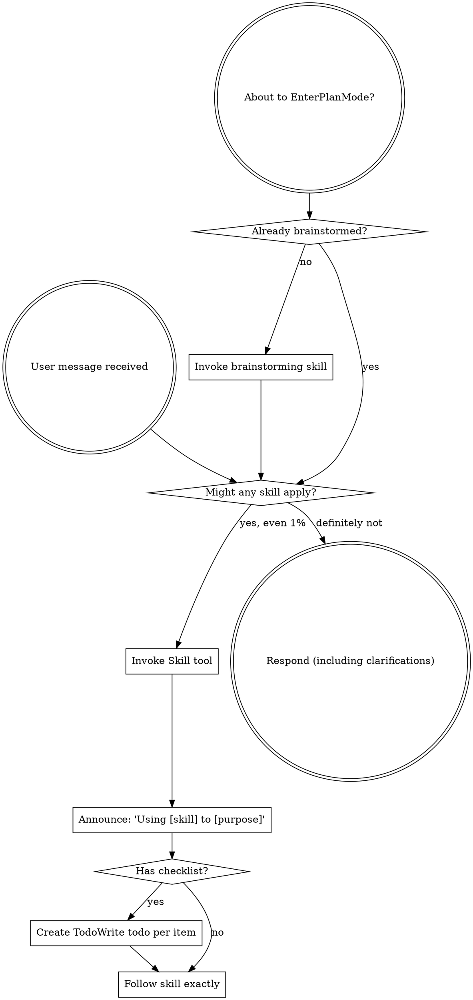

# Codex session 019f2487-47dd-7ff1-a34f-f0536c4129f6

- Started: `2026-07-02T20:31:19.801Z`
- Working directory: `D:\100XH100`
- Originator: `Codex Desktop`
- Codex CLI: `0.142.5`
- Source log: `C:\Users\Иван Литвак\.codex\sessions\2026\07\02\rollout-2026-07-02T23-31-19-019f2487-47dd-7ff1-a34f-f0536c4129f6.jsonl`
- Entries: user=2, assistant=17, tool calls=30, tool outputs=30

This is a chronological export of the user/assistant conversation and tool activity. Internal system/developer instructions and token accounting are intentionally excluded. Secret-shaped values are redacted; oversized tool outputs retain their beginning and end with the omitted character count.

## 1. User

Time: `2026-07-02T20:31:22.821Z` · source line `4`

```text
# AGENTS.md instructions for D:\100XH100

<INSTRUCTIONS>
# Project Agent Rules

## Operating Rule
- Read `AGENTS.md` before project edits.
- Update `memory/CHANGELOG.md` after meaningful code, config, or architecture changes.
- Update `memory/PROMPTS.md` with user prompts that define requirements.
- Store test outputs, logs, and verification notes under `test_results/`.
- Prefer agent-centered code: explicit contracts, deterministic tests, small files, low hidden state.

## Architecture Source
- Primary architecture contract: `ARCHITECTURE_NEED.md`.
- Current Stream 4 implementation rule: use threshold + compact + CUB/fixed-temp sort/reduce + compact; do not use Stream 4 hash-table dedup.

## Implementation Guardrails
- `State128` logical bytes are `v[0..119]`.
- `State128` padding bytes are `v[120..127]`.
- Persistent frontier padding must be zero.
- `FinalResponse` may temporarily store `target_local_idx` in `v[120..123]`.
- `Hash128` is one logical 128-bit key stored as `{lo, hi}`.
- `CandidateMeta` must remain 32 bytes and 32-byte aligned.
- Stream 3 payload id must be original candidate id, not compact index.
- Stream 4 must not apply shard top-k or semantic shard cap.

</INSTRUCTIONS>
<environment_context>
  <cwd>D:\100XH100</cwd>
  <shell>powershell</shell>
  <current_date>2026-07-02</current_date>
  <timezone>Europe/Moscow</timezone>
  <filesystem><workspace_roots><root>D:\100XH100</root></workspace_roots><permission_profile type="managed"><file_system type="restricted"><entry access="read"><special>:root</special></entry><entry access="write"><path>D:\100XH100</path></entry><entry access="write"><special>:slash_tmp</special></entry><entry access="write"><special>:tmpdir</special></entry><entry access="read"><path>D:\100XH100\.git</path></entry><entry access="read"><path>D:\100XH100\.agents</path></entry><entry access="read"><path>D:\100XH100\.codex</path></entry></file_system></permission_profile></filesystem>
</environment_context>
```

## 2. User

Time: `2026-07-02T20:31:22.848Z` · source line `6`

```text
Ты работаешь в репозитории D:\100XH100\.worktrees\stream1-piece-transformer. Контекст: нужно ускорить Stream1 piece_transformer backend и сохранить MLP path неизменным. Твоя задача только исследовательская: сравнить текущие transformer/MLP пути в cuda/stream1.cu, tools/stream_benchmark_transformer.cu, tests/stream1_transformer_cuda_tests.cu и определить, какие test/benchmark gates должны быть сохранены или добавлены, чтобы доказать: 1) MLP не затронут, 2) transformer outputs совпадают с reference, 3) новый backend явно выбирает SM75 или SM80+ без silent fallback. Не меняй файлы. Верни конкретный чеклист проверок и рискованные места.
```

## 3. Codex

Time: `2026-07-02T20:31:42.965Z` · source line `9`

```text
Использую `superpowers:using-superpowers`, потому что это обязательный стартовый навык в этой среде. Затем быстро сверю память по `D:\100XH100` и прочитаю фактические CUDA/test/benchmark файлы в указанном worktree без изменений.
```

## 4. Tool call: `exec_command`

Time: `2026-07-02T20:31:46.135Z` · source line `11`

```text
{"cmd":"Get-Content -LiteralPath 'C:\\Users\\Иван Литвак\\.codex\\plugins\\cache\\openai-curated-remote\\superpowers\\5.1.4\\skills\\using-superpowers\\SKILL.md'","workdir":"D:\\100XH100\\.worktrees\\stream1-piece-transformer","yield_time_ms":10000,"max_output_tokens":20000}
```

## 5. Tool output

Time: `2026-07-02T20:31:46.362Z` · source line `12`

````text
Chunk ID: 62505f
Wall time: 0.0277 seconds
Process exited with code 0
Original token count: 1393
Output:
---
name: using-superpowers
description: Use when starting any conversation - establishes how to find and use skills, requiring Skill tool invocation before ANY response including clarifying questions
---

<SUBAGENT-STOP>
If you were dispatched as a subagent to execute a specific task, skip this skill.
</SUBAGENT-STOP>

<EXTREMELY-IMPORTANT>
If you think there is even a 1% chance a skill might apply to what you are doing, you ABSOLUTELY MUST invoke the skill.

IF A SKILL APPLIES TO YOUR TASK, YOU DO NOT HAVE A CHOICE. YOU MUST USE IT.

This is not negotiable. This is not optional. You cannot rationalize your way out of this.
</EXTREMELY-IMPORTANT>

## Instruction Priority

Superpowers skills override default system prompt behavior, but **user instructions always take precedence**:

1. **User's explicit instructions** (CLAUDE.md, GEMINI.md, AGENTS.md, direct requests) — highest priority
2. **Superpowers skills** — override default system behavior where they conflict
3. **Default system prompt** — lowest priority

If CLAUDE.md, GEMINI.md, or AGENTS.md says "don't use TDD" and a skill says "always use TDD," follow the user's instructions. The user is in control.

## How to Access Skills

**In Claude Code:** Use the `Skill` tool. When you invoke a skill, its content is loaded and presented to you—follow it directly. Never use the Read tool on skill files.

**In Copilot CLI:** Use the `skill` tool. Skills are auto-discovered from installed plugins. The `skill` tool works the same as Claude Code's `Skill` tool.

**In Gemini CLI:** Skills activate via the `activate_skill` tool. Gemini loads skill metadata at session start and activates the full content on demand.

**In other environments:** Check your platform's documentation for how skills are loaded.

## Platform Adaptation

Skills use Claude Code tool names. Non-CC platforms: see `references/copilot-tools.md` (Copilot CLI), `references/codex-tools.md` (Codex) for tool equivalents. Gemini CLI users get the tool mapping loaded automatically via GEMINI.md.

# Using Skills

## The Rule

**Invoke relevant or requested skills BEFORE any response or action.** Even a 1% chance a skill might apply means that you should invoke the skill to check. If an invoked skill turns out to be wrong for the situation, you don't need to use it.



## Red Flags

These thoughts mean STOP—you're rationalizing:

| Thought | Reality |
|---------|---------|
| "This is just a simple question" | Questions are tasks. Check for skills. |
| "I need more context first" | Skill check comes BEFORE clarifying questions. |
| "Let me explore the codebase first" | Skills tell you HOW to explore. Check first. |
| "I can check git/files quickly" | Files lack conversation context. Check for skills. |
| "Let me gather information first" | Skills tell you HOW to gather information. |
| "This doesn't need a formal skill" | If a skill exists, use it. |
| "I remember this skill" | Skills evolve. Read current version. |
| "This doesn't count as a task" | Action = task. Check for skills. |
| "The skill is overkill" | Simple things become complex. Use it. |
| "I'll just do this one thing first" | Check BEFORE doing anything. |
| "This feels productive" | Undisciplined action wastes time. Skills prevent this. |
| "I know what that means" | Knowing the concept в‰  using the skill. Invoke it. |

## Skill Priority

When multiple skills could apply, use this order:

1. **Process skills first** (brainstorming, debugging) - these determine HOW to approach the task
2. **Implementation skills second** (frontend-design, mcp-builder) - these guide execution

"Let's build X" в†’ brainstorming first, then implementation skills.
"Fix this bug" в†’ debugging first, then domain-specific skills.

## Skill Types

**Rigid** (TDD, debugging): Follow exactly. Don't adapt away discipline.

**Flexible** (patterns): Adapt principles to context.

The skill itself tells you which.

## User Instructions

Instructions say WHAT, not HOW. "Add X" or "Fix Y" doesn't mean skip workflows.

````

## 6. Tool call: `update_plan`

Time: `2026-07-02T20:32:08.108Z` · source line `15`

```text
{"plan":[{"step":"Load project rules and relevant memory","status":"in_progress"},{"step":"Inspect Stream1 CUDA/test/benchmark paths","status":"pending"},{"step":"Derive preservation/addition gates and risks","status":"pending"}]}
```

## 7. Tool output

Time: `2026-07-02T20:32:08.314Z` · source line `16`

```text
Plan updated
```

## 8. Codex

Time: `2026-07-02T20:32:44.640Z` · source line `18`

```text
Сейчас фиксирую только исследовательский контекст: правила worktree, текущие упоминания Stream1/piece_transformer и существующие gates. Файлы менять не буду.
```

## 9. Codex

Time: `2026-07-02T20:32:44.651Z` · source line `19`

```text
Сейчас фиксирую только исследовательский контекст: правила worktree, текущие упоминания Stream1/piece_transformer и существующие gates. Файлы менять не буду.
```

## 10. Tool call: `exec_command`

Time: `2026-07-02T20:32:46.901Z` · source line `20`

```text
{"cmd":"Get-Content -LiteralPath 'D:\\100XH100\\.worktrees\\stream1-piece-transformer\\AGENTS.md'","workdir":"D:\\100XH100\\.worktrees\\stream1-piece-transformer","yield_time_ms":10000,"max_output_tokens":12000}
```

## 11. Tool call: `exec_command`

Time: `2026-07-02T20:32:48.714Z` · source line `21`

```text
{"cmd":"rg -n \"100XH100|stream1|piece_transformer|BEAM_PREBUILT_RUNNER\" 'C:\\Users\\Иван Литвак\\.codex\\memories\\MEMORY.md'","workdir":"D:\\100XH100\\.worktrees\\stream1-piece-transformer","yield_time_ms":10000,"max_output_tokens":12000}
```

## 12. Tool call: `exec_command`

Time: `2026-07-02T20:32:48.962Z` · source line `22`

```text
{"cmd":"rg --files","workdir":"D:\\100XH100\\.worktrees\\stream1-piece-transformer","yield_time_ms":10000,"max_output_tokens":12000}
```

## 13. Tool output

Time: `2026-07-02T20:32:48.980Z` · source line `23`

```text
Chunk ID: e6bec1
Wall time: 0.0637 seconds
Process exited with code 0
Original token count: 290
Output:
# Project Agent Rules

## Operating Rule
- Read `AGENTS.md` before project edits.
- Update `memory/CHANGELOG.md` after meaningful code, config, or architecture changes.
- Update `memory/PROMPTS.md` with user prompts that define requirements.
- Store test outputs, logs, and verification notes under `test_results/`.
- Prefer agent-centered code: explicit contracts, deterministic tests, small files, low hidden state.

## Architecture Source
- Primary architecture contract: `ARCHITECTURE_NEED.md`.
- Current Stream 4 implementation rule: use threshold + compact + CUB/fixed-temp sort/reduce + compact; do not use Stream 4 hash-table dedup.

## Implementation Guardrails
- `State128` logical bytes are `v[0..119]`.
- `State128` padding bytes are `v[120..127]`.
- Persistent frontier padding must be zero.
- `FinalResponse` may temporarily store `target_local_idx` in `v[120..123]`.
- `Hash128` is one logical 128-bit key stored as `{lo, hi}`.
- `CandidateMeta` must remain 32 bytes and 32-byte aligned.
- Stream 3 payload id must be original candidate id, not compact index.
- Stream 4 must not apply shard top-k or semantic shard cap.

```

## 14. Tool output

Time: `2026-07-02T20:32:48.980Z` · source line `24`

```text
Chunk ID: a9684b
Wall time: 0.0239 seconds
Process exited with code 0
Original token count: 600
Output:
93:applies_to: cwd=D:\100XH100; reuse_rule=reuse for this IHES/MEPhI repo family and adjacent cluster publish jobs, but treat live cluster inventory, DNS availability, and current results-repo schema as run-specific and recheck them before publishing.
99:- rollout_summaries/2026-06-04T15-47-52-Dd1O-ihes_cluster_results_prebuilt_publish_backfill.md (cwd=\\?\D:\100XH100, rollout_path=\\?\C:\Users\Иван Литвак\.codex\sessions\2026\06\04\rollout-2026-06-04T18-47-57-019e9351-cd3b-71c0-bf8b-69755d08d5fc.jsonl, updated_at=2026-06-26T19:51:22+00:00, thread_id=019e9351-cd3b-71c0-bf8b-69755d08d5fc, the prebuilt runner was compiled once and reused across the A100 array workflow)
103:- MEPhI HPC, kaf12, A100 40GB, BEAM_PREBUILT_RUNNER, prepare_ihes_prebuilt_runner.sh, ihes_solve_bucket_from_scratch.sh, prebuilt_runner_ready, using_prebuilt_runner, PUZZLE_LIMIT=1, depth=12
109:- rollout_summaries/2026-06-04T15-47-52-Dd1O-ihes_cluster_results_prebuilt_publish_backfill.md (cwd=\\?\D:\100XH100, rollout_path=\\?\C:\Users\Иван Литвак\.codex\sessions\2026\06\04\rollout-2026-06-04T18-47-57-019e9351-cd3b-71c0-bf8b-69755d08d5fc.jsonl, updated_at=2026-06-26T19:51:22+00:00, thread_id=019e9351-cd3b-71c0-bf8b-69755d08d5fc, the results repo structure and first backfilled puzzle sets were established)
119:- rollout_summaries/2026-06-04T15-47-52-Dd1O-ihes_cluster_results_prebuilt_publish_backfill.md (cwd=\\?\D:\100XH100, rollout_path=\\?\C:\Users\Иван Литвак\.codex\sessions\2026\06\04\rollout-2026-06-04T18-47-57-019e9351-cd3b-71c0-bf8b-69755d08d5fc.jsonl, updated_at=2026-06-26T19:51:22+00:00, thread_id=019e9351-cd3b-71c0-bf8b-69755d08d5fc, a file-driven inventory plus schema fixes made the larger aggregator path workable)
134:- `hpc/ihes_cube_model/prepare_ihes_prebuilt_runner.sh` builds the shared binary at `/mnt/pool/6/vokirova/beam8a100/ihes_cube_model/prebuilt-a100-ihes/production_runner`, and `hpc/ihes_cube_model/ihes_solve_bucket_from_scratch.sh` already knows how to consume `BEAM_PREBUILT_RUNNER` [Task 1]
142:- symptom: each array task recompiles instead of reusing the solver. cause: `BEAM_PREBUILT_RUNNER` was not wired through a separate prebuild dependency. fix: submit the prebuild first and make the puzzle array depend on it via `--dependency=afterok:<prebuild_job>` [Task 1]

```

## 15. Tool output

Time: `2026-07-02T20:32:49.170Z` · source line `25`

Oversized output: `8210` characters omitted from the middle.

```text
Chunk ID: b27a14
Wall time: 0.0020 seconds
Process exited with code 0
Original token count: 13306
Output:
Warning: truncated output (original token count: 13306)
Total output lines: 920

_push_staged_tuner\AGENTS.md
config.obj
CMakeLists.txt
docker-compose.yml
_push_staged_tuner\tools\stream_benchmark.cu
_push_staged_tuner\tools\stream1_weight_io.hpp
_push_staged_tuner\tools\production_runner.cu
_push_staged_tuner\tools\export_stream1_mlp.py
kaggle_torchrun\kernel-metadata.json
kaggle_torchrun\h100-torchrun-p0-depth10.ipynb
kaggle_torchrun\h100-torchrun-depth80-k1-5.ipynb
cmake\CheckBeamStateSizing.cmake
cmake\BeamStateSizing.cmake
kaggle_t4_transformer_solve\t4-transformer-beam-solve.ipynb
kaggle_t4_transformer_solve\kernel-metadata.json
data\puzzle_info.json
build-task6\stream1_transformer_cuda_tests
build-task6\stream1_cuda_tests
build-task6\production_runner
build-task6\libbeam_cuda.a
build-task6\libbeam_core.a
build-task6\dispatcher_cuda_tests
build-task6\CTestTestfile.cmake
build-task6\cmake_install.cmake
data\test.csv
data\sample_submission.csv
ARCHITECTURE_NEED.md
AGENTS.md
$null
build-task6-red\libbeam_cuda.a
build-task6-red\libbeam_core.a
build-task6-red\CTestTestfile.cmake
build-task6-red\cmake_install.cmake
FullBeamNice\targets\p900-t000.pt
kaggle_t4_transformer_smoke\t4-transformer-beam-smoke.ipynb
kaggle_t4_transformer_smoke\kernel-metadata.json
FullBeamNice\notebooks\q_model_inference_standalone.ipynb
kaggle_t4_transformer_benchmark\t4-transformer-stream1-benchmark.ipynb
kaggle_t4_transformer_benchmark\kernel-metadata.json
FullBeamNice\logs\model_p900-t000-q-sym_1777988767.json
_push_staged_tuner\kaggle\kernel-metadata.json
_push_staged_tuner\kaggle\cayley-beam-gpu-runner.ipynb
_push_staged_tuner\kaggle\beam_kernel.ipynb
kaggle_t4_torchrun\t4-torchrun-p0-depth10.ipynb
kaggle_t4_torchrun\t4-torchrun-machinery-check.ipynb
kaggle_t4_torchrun\kernel-metadata.json
build-task6-sm86\stream_benchmark
build-task6-sm86\stream1_transformer_cuda_tests
build-task6-sm86\stream1_cuda_tests
build-task6-sm86\production_runner
build-task6-sm86\libbeam_cuda.a
build-task6-sm86\libbeam_core.a
build-task6-sm86\dispatcher_cuda_tests
build-task6-sm86\CTestTestfile.cmake
build-task6-sm86\contract_tests
build-task6-sm86\cmake_install.cmake
_push_staged_tuner\tests\threshold_cuda_tests.cu
_push_staged_tuner\tests\stream5_cuda_tests.cu
_push_staged_tuner\tests\stream4_cuda_tests.cu
_push_staged_tuner\tests\stream3_cuda_tests.cu
_push_staged_tuner\tests\stream2_cuda_tests.cu
_push_staged_tuner\tests\stream1_cuda_tests.cu
_push_staged_tuner\tests\stitched_cuda_tests.cu
_push_staged_tuner\tests\static_memory_cuda_tests.cu
_push_staged_tuner\tests\history_tests.cpp
_push_staged_tuner\tests\final_cuda_tests.cu
_push_staged_tuner\tests\dispatcher_cuda_tests.cu
_push_staged_tuner\tests\contract_tests.cpp
FullBeamNice\generators\p900.json
frontier_cpu.obj
_push_final_chunk\tools\stream_benchmark.cu
_push_final_chunk\tools\stream1_weight_io.hpp
_push_final_chunk\tools\production_runner.cu
_push_final_chunk\tools\export_stream1_mlp.py
build-stream1-opt\threshold_cuda_tests
build-contract-tests\CMakeFiles\CMakeConfigureLog.yaml
build-contract-tests\CMakeFiles\cmake.check_cache
_push_staged_tuner\hpc\tune_8xa100_stream1.sh
_push_staged_tuner\hpc\tune_8xa100_staged.sh
_push_staged_tuner\hpc\tune_8xa100_pipeline.sh
_push_staged_tuner\hpc\start_8xa100_best.sh
_push_staged_tuner\hpc\start_8xa100_beamsearch.sh
_push_staged_tuner\hpc\README_8xa100.md
_push_staged_tuner\hpc\mephi_8xa100_common.sh
docs\transformer_inference_architecture.md
kaggle_t4_mlp_benchmark\t4-mlp-native-vs-torch-benchmark.ipynb
kaggle_t4_mlp_benchmark\kernel-metadata.json
cuda\threshold.hpp
cuda\threshold.cu
cuda\stream5.hpp
cuda\stream5.cu
cuda\stream4.hpp
cuda\stream4.cu
cuda\stream3.hpp
cuda\stream3.cu
cuda\stream2.hpp
cuda\stream2.cu
cuda\stream1.hpp
cuda\stream1.cu
cuda\static_memory.hpp
cuda\static_memory.cu
cuda\runtime_config.hpp
cuda\runtime_config.cpp
cuda\nvtx_ranges.hpp
cuda\final_materialize.hpp
cuda\final_materialize.cu
cuda\dispatcher.hpp
cuda\dispatcher.cu
cuda\cuda_check.hpp
cuda\cub_compat.hpp
contract_tests.obj
build-contract-tests\CMakeCache.txt.tmpa709c
build-stream1-opt\libbeam_cuda.a
build-stream1-opt\libbeam_core.a
build-stream1-opt\history_tests
build-stream1-opt\final_cuda_tests
build-stream1-opt\dispatcher_cuda_tests
build-stream1-opt\CTestTestfile.cmake
build-stream1-opt\contract_tests
build-stream1-opt\cmake_install.cmake
build-task6\CMakeFiles\TargetDirectories.txt
kaggle\t4-torchrun-p0-depth10.ipynb
kaggle\t4-torchrun-machinery-check.ipynb
kaggle\kernel-metadata.json
kaggle\h100-torchrun-p0-depth10.ipynb
kaggle\h100-torchrun-depth80-k1-5.ipynb
kaggle\cayley-beam-gpu-runner.ipynb
kaggle\beam_kernel.ipynb
_push_final_chunk\tests\threshold_cuda_tests.cu
_push_final_chunk\tests\stream5_cuda_tests.cu
_push_final_chunk\tests\stream4_cuda_tests.cu
_push_final_chunk\tests\stream3_cuda_tests.cu
_push_final_chunk\tests\stream2_cuda_tests.cu
_push_final_chunk\tests\stream1_cuda_tests.cu
_push_final_chunk\tests\stitched_cuda_tests.cu
_push_final_chunk\tests\static_memory_cuda_tests.cu
_push_final_chunk\tests\history_tests.cpp
_push_final_chunk\tests\final_cuda_tests.cu
_push_final_chunk\tests\dispatcher_cuda_tests.cu
_push_final_chunk\tests\contract_tests.cpp
docs\superpowers\plans\2026-06-30-stream1-transformer-production-speed.md
docs\superpowers\plans\2026-06-29-stream1-piece-transformer.md
Dockerfile
_push_staged_tuner\docker-compose.yml
build-task6-red\CMakeFiles\TargetDirectories.txt
_push_staged_tuner\stream1_weights\residual2_fc2_weight_hxk.fp16
_push_staged_tuner\stream1_weights\residual2_fc2_bias.fp16
_push_staged_tuner\stream1_weights\residual2_fc1_weight_hxk.fp16
_push_staged_tuner\stream1_weights\residual2_fc1_bias.fp16
_push_staged_tuner\stream1_weights\residual1_fc2_weight_hxk.fp16
_push_staged_tuner\stream1_weights\residual1_fc2_bias.fp16
_push_staged_tuner\stream1_weights\residual1_fc1_weight_hxk.fp16
_push_staged_tuner\stream1_weights\residual1_fc1_bias.fp16
_push_staged_tuner\stream1_weights\residual0_fc2_weight_hxk.fp16
_push_staged_tuner\stream1_weights\residual0_fc2_bias.fp16
_push_staged_tuner\stream1_weights\residual0_fc1_weight_hxk.fp16
_push_staged_tuner\stream1_weights\residual0_fc1_bias.fp16
_push_staged_tuner\stream1_weights\output_weight_hxk.fp16
_push_staged_tuner\stream1_weights\output_bias.fp16
_push_staged_tuner\stream1_weights\manifest.json
_push_staged_tuner\stream1_weights\input_weight_hxk.fp16
_push_staged_tuner\stream1_weights\input_bias.fp16
_push_staged_tuner\stream1_weights\hidden_weight_hxk.fp16
_push_staged_tuner\stream1_weights\hidden_bias.fp16
hpc\tune_8xa100_stream1.sh
hpc\tune_8xa100_staged.sh
hpc\tune_8xa100_pipeline.sh
hpc\start_8xa100_best.sh
hpc\start_8xa100_beamsearch.sh
hpc\solve_then_reflect.sh
hpc\solve_reflected_only.sh
hpc\README_8xa100.md
_push_staged_tuner\FullBeamNice\targets\p900-t000.pt
_push_staged_tuner\data\test.csv
_push_staged_tuner\data\sample_submission.csv
_push_staged_tuner\data\puzzle_info.json
hpc\portable_8xa100_80gb\run_1p4b_8xa100_80gb.sh
hpc\portable_8xa100_80gb\README.md
hpc\mephi_8xa100_common.sh
build-stream1-opt\test_results\threshold_cuda_tests_2026-05-22.md
build-stream1-opt\test_results\stream5_cuda_tests_2026-05-20.md
build-stream1-opt\test_results\stream4_cuda_tests_2026-05-20.md
build-stream1-opt\test_results\stream3_cuda_tests_2026-05-20.md
build-stream1-opt\test_results\stream2_cuda_tests_2026-05-20.md
build-task6-sm86\CMakeFiles\TargetDirectories.txt
_push_staged_tuner\FullBeamNice\notebooks\q_model_inference_standalone.ipynb
build-contract-tests\CMakeFiles\3.29.3\VCTargetsPath.vcxproj
_push_final_chunk\stream1_weights\residual2_fc2_weight_hxk.fp16
_push_final_chunk\stream1_weights\residual2_fc2_bias.fp16
_push_final_chunk\stream1_weights\residual2_fc1_weight_hxk.fp16
hpc\ihes_cube_smoke\README.md
hpc\ihes_cube_smoke\make_dummy_weights.py
hpc\ihes_cube_smoke\ihes_cube_smoke.sh
_push_final_chunk\stream1_weights\residual2_fc1_bias.fp16
_push_final_chunk\stream1_weights\residual1_fc2_weight_hxk.fp16
_push_final_chunk\stream1_weights\residual1_fc2_bias.fp16
_push_final_chunk\stream1_weights\residual1_fc1_weight_hxk.fp16
_push_final_chunk\stream1_weights\residual1_fc1_bias.fp16
_push_final_chunk\stream1_weights\residual0_fc2_weight_hxk.fp16
_push_final_chunk\stream1_weights\residual0_fc2_bias.fp16
_push_final_chunk\stream1_weights\residual0_fc1_weight_hxk.fp16
_push_final_chunk\stream1_weights\residual0_fc1_bias.fp16
_push_final_chunk\stream1_weights\output_weight_hxk.fp16
_push_final_chunk\stream1_weights\output_bias.fp16
_push_final_chunk\stream1_weights\manifest.json
_push_final_chunk\stream1_weights\input_weight_hxk.fp16
_push_final_chunk\stream1_weights\input_bias.fp16
_push_final_chunk\stream1_weights\hidden_weight_hxk.fp16
_push_final_chunk\stream1_weights\hidden_bias.fp16
_push_staged_tuner\cuda\threshold.hpp
_push_staged_tuner\cuda\threshold.cu
_push_staged_tuner\cuda\stream5.hpp
_push_staged_tuner\cuda\stream5.cu
_push_staged_tuner\cuda\stream4.hpp
_push_staged_tuner\cuda\stream4.cu
_push_staged_tuner\cuda\stream3.hpp
_push_staged_tuner\cuda\stream3.cu
_push_staged_tuner\cuda\stream2.hpp
_push_staged_tuner\cuda\stream2.cu
_push_staged_tuner\cuda\stream1.hpp
_push_staged_tuner\cuda\stream1.cu
_push_staged_tuner\cuda\static_memory.hpp
_push_staged_tuner\cuda\static_memory.cu
_push_staged_tuner\cuda\runtime_config.hpp
_push_staged_tuner\cuda\runtime_config.cpp
_push_staged_tuner\cuda\nvtx_ranges.hpp
_push_staged_tuner\cuda\final_materialize.hpp
_push_staged_tuner\cuda\final_materialize.cu
_push_staged_tuner\cuda\dispatcher.hpp
_push_staged_tuner\cuda\dispatcher.cu
_push_staged_tuner\cuda\cuda_check.hpp
_push_staged_tuner\cuda\cub_compat.hpp
_push_staged_tuner\CMakeLists.txt
_push_staged_tuner\ARCHITECTURE_NEED.md
_push_staged_tuner\FullBeamNice\logs\model_p900-t000-q-sym_1777988767.json
_push_staged_tuner\src\hash.hpp
_push_staged_tuner\src\hash.cpp
_push_staged_tuner\src\frontier_cpu.hpp
_push_staged_tuner\src\frontier_cpu.cpp
_push_staged_tuner\src\config.hpp
_push_staged_tuner\src\config.cpp
_push_staged_tuner\README.md
_push_staged_tuner\FullBeamNice\generators\p900.json
_push_staged_tuner\memory\PROMPTS.md
_push_staged_tuner\memory\CHANGELOG.md
_push_staged_tuner\src\stream3.cpp
_push_staged_tuner\src\state.hpp
_push_staged_tuner\src\state.cpp
_push_staged_tuner\src\history.hpp
_push_staged_tuner\src\history.cpp
_push_staged_tuner\Dockerfile
_push_staged_tuner\src\stream4.cpp
_push_staged_tuner\src\stream3.hpp
_push_staged_tuner\src\stream4.hpp
_push_staged_tuner\src\types.hpp
build-contract-tests\CMakeFiles\3.29.3\CMakeSystem.cmake
hpc\ihes_cube_model\solv_uniq.csv
hpc\ihes_cube_model\run_solution_repair_plan.sh
hpc\ihes_cube_model\README.md
hpc\ihes_cube_model\prepare_solution_repair_single_window.sh
hpc\ihes_cube_model\prepare_ihes_prebuilt_runner.sh
hpc\ihes_cube_model\prepare_ihes_cube_model.sh
hpc\ihes_cube_model\ihes_solve_then_reflect.sh
hpc\ihes_cube_model\ihes_solve_bucket_from_scratch.sh
hpc\ihes_cube_model\ihes_solve_bucket.sh
hpc\ihes_cube_model\ihes_solution_repair.sh
hpc\ihes_cube_model\ihes_segment_repair.sh
hpc\ihes_cube_model\ihes_cube_model.sh
hash.obj
build-task6-sm86\CMakeFiles\stream_benchmark.dir\tools\stream_benchmark_transformer.cu.o
build-task6-sm86\CMakeFiles\stream_benchmark.dir\tools\stream_benchmark_mlp.cu.o
build-task6-sm86\CMakeFiles\stream_benchmark.dir\tools\stream_benchmark.cu.o
tools\stream_benchmark_transformer.cu
tools\stream_benchmark_mlp.cu
tools\stream_benchmark_common.hpp
tools\stream_benchmark.cu
tools\stream1_weight_io.hpp
tools\stream1_transformer_torch_benchmark.py
tools\stream1_mlp_torch_benchmark.py
tools\production_runner.cu
tools\generate_segment_repair_jobs.py
tools\export_stream1_transformer.py
tools\export_stream1_mlp.py
tools\export_stream1.py
tools\compare_solution_lengths.py
_push_final_chunk\src\types.hpp
_push_final_chunk\src\stream4.hpp
_push_final_chunk\src\stream4.cpp
_push_final_chunk\src\stream3.hpp
_push_final_chunk\src\stream3.cpp
_push_final_chunk\src\state.hpp
_push_final_chunk\src\state.cpp
_push_final_chunk\src\history.hpp
_push_final_chunk\src\history.cpp
_push_final_chunk\src\hash.hpp
_push_final_chunk\src\hash.cpp
_push_final_chunk\src\frontier_cpu.hpp
_push_final_chunk\src\frontier_cpu.cpp
_push_final_chunk\src\config.hpp
_push_final_chunk\src\config.cpp
_push_final_chunk\README.md
build-stream1-opt\CMakeFiles\static_memory_cuda_tests.dir\tests\static_memory_cuda_tests.cu.o
build-stream1-opt\CMakeFiles\rules.ninja
build-stream1-opt\CMakeFiles\beam_core.dir\src\stream4.cpp.o
build-stream1-opt\CMakeFiles\beam_core.dir\src\stream3.cpp.o
build-stream1-opt\CMakeFiles\beam_core.dir\src\state.cpp.o
build-stream1-opt\CMakeFiles\beam_core.dir\src\history.cpp.o
build-stream1-opt\CMakeFiles\beam_core.dir\src\hash.cpp.o
build-stream1-opt\CMakeFiles\beam_core.dir\src\frontier_cpu.cpp.o
build-stream1-opt\CMakeFiles\beam_core.dir\src\config.cpp.o
build-stream1-opt\CMakeFiles\threshold_cuda_tests.dir\tests\threshold_cuda_tests.cu.o
build-stream1-opt\CMakeFiles\TargetDirectories.txt
tests\threshold_cuda_tests.cu
tests\test_stream1_transformer_exporter.py
tests\stream5_cuda_tests.cu
tests\stream4_cuda_tests.cu
tests\stream3_cuda_tests.cu
tests\stream2_cuda_tests.cu
tests\stream1_transformer_cuda_tests.cu
tests\stream1_cuda_tests.cu
tests\stitched_cuda_tests.cu
tests\static_memory_cuda_tests.cu
tests\history_tests.cpp
tests\final_cuda_tests.cu
tests\dispatcher_cuda_tests.cu
tests\contract_tests.cpp
stream4.obj
stream3.obj
build-stream1-opt\CMakeFiles\stream3_cuda_tests.dir\tests\stream3_cuda_tests.cu.o
_push_final_chunk\memory\PROMPTS.md
_push_final_chunk\memory\CHANGELOG.md
build-contract-tests\CMakeFiles\3.29.3\VCTargetsPath\x64\Debug\VCTargetsPath.tlog\VCTargetsPath.lastbuildstate
build-contract-tests\CMakeFiles\3.29.3\VCTargetsPath\x64\Debug\VCTargetsPath.tlog\unsuccessfulbuild
build-contract-tests\CMakeFiles\3.29.3\VCTargetsPath\x64\Debug\VCTargetsPath.recipe
build-stream1-opt\test_results\stream1_transformer_weight_sizes_ok\block0_attn_qkv_weight_hxk.fp16
build-stream1-opt\test_results\stream1_transformer_weight_sizes_ok\block0_attn_qkv_bias.fp16
build-stream1-opt\test_results\stream1_transformer_weight_sizes_ok\block0_attn_out_weight_hxk.fp16
build-stream1-opt\test_results\stream1_transformer_weight_sizes_ok\block0_attn_out_bias.fp16
build-stream1-opt\CMakeFiles\production_runner.dir\tools\production_runner.cu.o
_push_final_chunk\kaggle\kernel-metadata.json
_push_final_chunk\kaggle\cayley-beam-gpu-runner.ipynb
_push_final_chunk\kaggle\beam_kernel.ipynb
stream1_weights_artgor_bf16\residual1_fc2_weight_hxk.bf16
stream1_weights_artgor_bf16\residual1_fc2_ln_gamma.bf16
stream1_weights_artgor_bf16\residual1_fc2_ln_beta.bf16
stream1_weights_artgor_bf16\residual1_fc2_bias.bf16
stream1_weights_artgor_bf16\residual1_fc1_weight_hxk.bf16
stream1_weights_artgor_bf16\residual1_fc1_ln_gamma.bf16
stream1_weights_artgor_bf16\residual1_fc1_ln_beta.bf16
stream1_weights_artgor_bf16\residual1_fc1_bias.bf16
stream1_weights_artgor_bf16\residual0_fc2_weight_hxk.bf16
stream1_weights_artgor_bf16\residual0_fc2_ln_gamma.bf16
stream1_weights_artgor_bf16\residual0_fc2_ln_beta.bf16
stream1_weights_artgor_bf16\residual0_fc2_bias.bf16
stream1_weights_artgor_bf16\residual0_fc1_weight_hxk.bf16
stream1_weights_artgor_bf16\residual0_fc1_ln_gamma.bf16
stream1_weights_artgor_bf16\residual0_fc1_ln_beta.bf16
stream1_weights_artgor_bf16\residual0_fc1_bias.bf16
stream1_weights_artgor_bf16\output_weight_hxk.bf16
stream1_weights_artgor_bf16\output_bias.bf16
stream1_weights_artgor_bf16\manifest.json
stream1_weights_artgor_bf16\input_weight_hxk.bf16
stream1_weights_artgor_bf16\input_ln_gamma.bf16
stream1_weights_artgor_bf16\input_ln_beta.bf16
stream1_weights_artgor_bf16\input_bias.bf16
stream1_weights_artgor_bf16\hidden_weight_hxk.bf16
stream1_weights_artgor_bf16\hidden_ln_gamma.bf16
stream1_weights_artgor_bf16\hidden_ln_

[... 8210 characters omitted from oversized tool output ...]

CMakeDetermineCompilerABI_CXX.bin
build-task6\CMakeFiles\3.22.1\CMakeSystem.cmake
build-stream1-transformer-red\dispatcher_cuda_tests
build-stream1-transformer-red\CTestTestfile.cmake
build-stream1-transformer-red\cmake_install.cmake
kaggle_transformer_inference_speed\transformer_inference_speed.py
build-stream1-transformer-red\Testing\Temporary\CTestCostData.txt
kaggle_transformer_inference_speed\transformer_inference_profile.py
kaggle_transformer_inference_speed\kernel-metadata.json
build-stream1-transformer-red\stream_benchmark
build-stream1-transformer-red\stream1_transformer_cuda_tests
build-stream1-transformer-red\stream1_cuda_tests
build-stream1-transformer-red\libbeam_cuda.a
build-stream1-transformer-red\libbeam_core.a
build-task6-red\CMakeCache.txt
build-task6-red\build.ninja
build-task6-sm86\CMakeFiles\rules.ninja
build-task6\CMakeFiles\dispatcher_cuda_tests.dir\tests\dispatcher_cuda_tests.cu.o
build-task6\CMakeFiles\production_runner.dir\tools\production_runner.cu.o
build-task6-red\CMakeFiles\rules.ninja
build-task6-red\CMakeFiles\beam_cuda.dir\cuda\threshold.cu.o
build-task6-red\CMakeFiles\beam_cuda.dir\cuda\stream5.cu.o
build-task6-red\CMakeFiles\beam_cuda.dir\cuda\stream4.cu.o
build-task6-red\CMakeFiles\beam_cuda.dir\cuda\stream3.cu.o
build-task6-red\CMakeFiles\beam_cuda.dir\cuda\stream2.cu.o
build-task6-red\CMakeFiles\beam_cuda.dir\cuda\stream1.cu.o
build-task6-red\CMakeFiles\beam_cuda.dir\cuda\static_memory.cu.o
build-task6-red\CMakeFiles\beam_cuda.dir\cuda\runtime_config.cpp.o
build-task6-red\CMakeFiles\beam_cuda.dir\cuda\final_materialize.cu.o
build-task6-red\CMakeFiles\beam_cuda.dir\cuda\dispatcher.cu.o
build-task6-sm86\CMakeFiles\production_runner.dir\tools\production_runner.cu.o
build-task6\CMakeFiles\3.22.1\CompilerIdCUDA\tmp\CMakeCUDACompilerId.sm_52.cubin
build-task6\CMakeFiles\3.22.1\CompilerIdCUDA\tmp\CMakeCUDACompilerId.ptx
build-task6\CMakeFiles\3.22.1\CompilerIdCUDA\tmp\CMakeCUDACompilerId.o
build-task6\CMakeFiles\3.22.1\CompilerIdCUDA\tmp\CMakeCUDACompilerId.module_id
build-task6\CMakeFiles\3.22.1\CompilerIdCUDA\tmp\CMakeCUDACompilerId.fatbin.c
build-task6\CMakeFiles\3.22.1\CompilerIdCUDA\tmp\CMakeCUDACompilerId.fatbin
build-task6\CMakeFiles\3.22.1\CompilerIdCUDA\tmp\CMakeCUDACompilerId.cudafe1.stub.c
build-task6\CMakeFiles\3.22.1\CompilerIdCUDA\tmp\CMakeCUDACompilerId.cudafe1.gpu
build-task6\CMakeFiles\3.22.1\CompilerIdCUDA\tmp\CMakeCUDACompilerId.cudafe1.cpp
build-task6\CMakeFiles\3.22.1\CompilerIdCUDA\tmp\CMakeCUDACompilerId.cudafe1.c
build-task6\CMakeFiles\3.22.1\CompilerIdCUDA\tmp\CMakeCUDACompilerId.cpp4.ii
build-task6\CMakeFiles\3.22.1\CompilerIdCUDA\tmp\CMakeCUDACompilerId.cpp1.ii
build-task6\CMakeFiles\3.22.1\CompilerIdCUDA\tmp\a_dlink.sm_52.cubin
build-task6\CMakeFiles\3.22.1\CompilerIdCUDA\tmp\a_dlink.reg.c
build-task6\CMakeFiles\3.22.1\CompilerIdCUDA\tmp\a_dlink.o
build-task6\CMakeFiles\3.22.1\CompilerIdCUDA\tmp\a_dlink.fatbin.c
build-task6\CMakeFiles\3.22.1\CompilerIdCUDA\tmp\a_dlink.fatbin
build-task6\CMakeFiles\3.22.1\CompilerIdCUDA\CMakeCUDACompilerId.cu
build-task6\CMakeFiles\3.22.1\CompilerIdCUDA\a.out
build-task6-red\CMakeFiles\3.22.1\CMakeDetermineCompilerABI_CUDA.bin
build-task6-red\CMakeFiles\3.22.1\CMakeCXXCompiler.cmake
build-task6-red\CMakeFiles\3.22.1\CMakeCUDACompiler.cmake
build-task6-red\CMakeFiles\3.22.1\CMakeSystem.cmake
build-task6-red\CMakeFiles\3.22.1\CMakeDetermineCompilerABI_CXX.bin
build-task6-red\CMakeFiles\3.22.1\CompilerIdCXX\a.out
build-task6-red\CMakeFiles\beam_core.dir\src\stream4.cpp.o
build-task6-red\CMakeFiles\beam_core.dir\src\stream3.cpp.o
build-task6-red\CMakeFiles\beam_core.dir\src\state.cpp.o
build-task6-red\CMakeFiles\beam_core.dir\src\history.cpp.o
build-task6-red\CMakeFiles\beam_core.dir\src\hash.cpp.o
build-task6-red\CMakeFiles\beam_core.dir\src\frontier_cpu.cpp.o
build-task6-red\CMakeFiles\beam_core.dir\src\config.cpp.o
build-task6-red\CMakeFiles\3.22.1\CompilerIdCXX\CMakeCXXCompilerId.cpp
build-task6-sm86\CMakeFiles\cmake.check_cache
build-task6-sm86\CMakeCache.txt
build-task6-sm86\build.ninja
build-nsys-stream1\CMakeFiles\beam_cuda.dir\cuda\threshold.cu.o
build-nsys-stream1\CMakeFiles\beam_cuda.dir\cuda\stream5.cu.o
build-nsys-stream1\CMakeFiles\beam_cuda.dir\cuda\stream4.cu.o
build-nsys-stream1\CMakeFiles\beam_cuda.dir\cuda\stream3.cu.o
build-nsys-stream1\CMakeFiles\beam_cuda.dir\cuda\stream2.cu.o
build-nsys-stream1\CMakeFiles\beam_cuda.dir\cuda\stream1.cu.o
build-nsys-stream1\CMakeFiles\beam_cuda.dir\cuda\static_memory.cu.o
build-nsys-stream1\CMakeFiles\beam_cuda.dir\cuda\runtime_config.cpp.o
build-nsys-stream1\CMakeFiles\beam_cuda.dir\cuda\final_materialize.cu.o
build-nsys-stream1\CMakeFiles\beam_cuda.dir\cuda\dispatcher.cu.o
build-stream1-transformer-red\CMakeFiles\TargetDirectories.txt
build-task6-red\CMakeFiles\3.22.1\CompilerIdCUDA\tmp\CMakeCUDACompilerId.sm_52.cubin
build-task6-sm86\CMakeFiles\beam_cuda.dir\cuda\threshold.cu.o
build-task6-sm86\CMakeFiles\beam_cuda.dir\cuda\stream5.cu.o
build-task6-red\CMakeFiles\3.22.1\CompilerIdCUDA\tmp\CMakeCUDACompilerId.ptx
build-task6-sm86\CMakeFiles\beam_cuda.dir\cuda\stream4.cu.o
build-task6-red\CMakeFiles\3.22.1\CompilerIdCUDA\tmp\CMakeCUDACompilerId.o
build-task6-sm86\CMakeFiles\beam_cuda.dir\cuda\stream3.cu.o
build-task6-sm86\CMakeFiles\beam_cuda.dir\cuda\stream2.cu.o
build-task6-sm86\CMakeFiles\beam_cuda.dir\cuda\stream1.cu.o
build-task6-sm86\CMakeFiles\beam_cuda.dir\cuda\static_memory.cu.o
build-task6-sm86\CMakeFiles\beam_cuda.dir\cuda\runtime_config.cpp.o
build-task6-sm86\CMakeFiles\beam_cuda.dir\cuda\final_materialize.cu.o
build-task6-sm86\CMakeFiles\beam_cuda.dir\cuda\dispatcher.cu.o
build-task6-red\CMakeFiles\3.22.1\CompilerIdCUDA\tmp\CMakeCUDACompilerId.module_id
build-task6-red\CMakeFiles\3.22.1\CompilerIdCUDA\tmp\CMakeCUDACompilerId.fatbin.c
build-task6-red\CMakeFiles\3.22.1\CompilerIdCUDA\tmp\CMakeCUDACompilerId.fatbin
build-task6-red\CMakeFiles\3.22.1\CompilerIdCUDA\tmp\CMakeCUDACompilerId.cudafe1.stub.c
build-task6-red\CMakeFiles\3.22.1\CompilerIdCUDA\tmp\CMakeCUDACompilerId.cudafe1.gpu
build-task6-red\CMakeFiles\3.22.1\CompilerIdCUDA\tmp\CMakeCUDACompilerId.cudafe1.cpp
build-task6-red\CMakeFiles\3.22.1\CompilerIdCUDA\tmp\CMakeCUDACompilerId.cudafe1.c
build-task6-red\CMakeFiles\3.22.1\CompilerIdCUDA\tmp\CMakeCUDACompilerId.cpp4.ii
build-task6-red\CMakeFiles\3.22.1\CompilerIdCUDA\tmp\CMakeCUDACompilerId.cpp1.ii
build-task6-red\CMakeFiles\3.22.1\CompilerIdCUDA\tmp\a_dlink.sm_52.cubin
build-task6-red\CMakeFiles\3.22.1\CompilerIdCUDA\tmp\a_dlink.reg.c
build-task6-red\CMakeFiles\3.22.1\CompilerIdCUDA\tmp\a_dlink.o
build-task6-red\CMakeFiles\3.22.1\CompilerIdCUDA\tmp\a_dlink.fatbin.c
build-task6-red\CMakeFiles\3.22.1\CompilerIdCUDA\tmp\a_dlink.fatbin
build-task6-red\CMakeFiles\3.22.1\CompilerIdCUDA\CMakeCUDACompilerId.cu
build-task6-red\CMakeFiles\3.22.1\CompilerIdCUDA\a.out
build-task6-sm86\CMakeFiles\3.22.1\CMakeDetermineCompilerABI_CUDA.bin
build-task6-sm86\CMakeFiles\3.22.1\CMakeCXXCompiler.cmake
build-task6-sm86\CMakeFiles\3.22.1\CMakeCUDACompiler.cmake
build-task6-sm86\CMakeFiles\3.22.1\CMakeSystem.cmake
build-task6-sm86\CMakeFiles\3.22.1\CMakeDetermineCompilerABI_CXX.bin
build-task6-sm86\CMakeFiles\beam_core.dir\src\config.cpp.o
build-nsys-stream1\CMakeFiles\cmake.check_cache
build-task6-sm86\CMakeFiles\contract_tests.dir\tests\contract_tests.cpp.o
build-task6-sm86\CMakeFiles\3.22.1\CompilerIdCXX\a.out
build-task6-sm86\CMakeFiles\3.22.1\CompilerIdCXX\CMakeCXXCompilerId.cpp
build-task6-sm86\CMakeFiles\beam_core.dir\src\frontier_cpu.cpp.o
build-task6-sm86\CMakeFiles\beam_core.dir\src\state.cpp.o
build-task6-sm86\CMakeFiles\beam_core.dir\src\history.cpp.o
build-task6-sm86\CMakeFiles\beam_core.dir\src\stream3.cpp.o
build-task6-sm86\CMakeFiles\beam_core.dir\src\stream4.cpp.o
build-nsys-stream1\build.ninja
build-nsys-stream1\CMakeFiles\rules.ninja
build-nsys-stream1\CMakeCache.txt
build-task6-sm86\CMakeFiles\beam_core.dir\src\hash.cpp.o
build-stream1-transformer-red\CMakeFiles\stream_benchmark.dir\tools\stream_benchmark.cu.o
build-nsys-stream1\CMakeFiles\beam_core.dir\src\stream4.cpp.o
build-task6-sm86\CMakeFiles\3.22.1\CompilerIdCUDA\tmp\CMakeCUDACompilerId.sm_52.cubin
build-nsys-stream1\CMakeFiles\beam_core.dir\src\stream3.cpp.o
build-nsys-stream1\CMakeFiles\beam_core.dir\src\state.cpp.o
build-nsys-stream1\CMakeFiles\beam_core.dir\src\history.cpp.o
build-nsys-stream1\CMakeFiles\beam_core.dir\src\hash.cpp.o
build-nsys-stream1\CMakeFiles\beam_core.dir\src\frontier_cpu.cpp.o
build-nsys-stream1\CMakeFiles\beam_core.dir\src\config.cpp.o
build-stream1-transformer-red\CMakeFiles\cmake.check_cache
build-task6-sm86\CMakeFiles\3.22.1\CompilerIdCUDA\tmp\CMakeCUDACompilerId.ptx
build-task6-sm86\CMakeFiles\3.22.1\CompilerIdCUDA\tmp\CMakeCUDACompilerId.o
build-task6-sm86\CMakeFiles\3.22.1\CompilerIdCUDA\tmp\CMakeCUDACompilerId.module_id
build-task6-sm86\CMakeFiles\3.22.1\CompilerIdCUDA\tmp\CMakeCUDACompilerId.fatbin.c
build-task6-sm86\CMakeFiles\3.22.1\CompilerIdCUDA\tmp\CMakeCUDACompilerId.fatbin
build-task6-sm86\CMakeFiles\3.22.1\CompilerIdCUDA\tmp\CMakeCUDACompilerId.cudafe1.stub.c
build-task6-sm86\CMakeFiles\3.22.1\CompilerIdCUDA\tmp\CMakeCUDACompilerId.cudafe1.gpu
build-task6-sm86\CMakeFiles\3.22.1\CompilerIdCUDA\tmp\CMakeCUDACompilerId.cudafe1.cpp
build-task6-sm86\CMakeFiles\3.22.1\CompilerIdCUDA\tmp\CMakeCUDACompilerId.cudafe1.c
build-task6-sm86\CMakeFiles\3.22.1\CompilerIdCUDA\tmp\CMakeCUDACompilerId.cpp4.ii
build-task6-sm86\CMakeFiles\dispatcher_cuda_tests.dir\tests\dispatcher_cuda_tests.cu.o
build-task6-sm86\CMakeFiles\3.22.1\CompilerIdCUDA\tmp\CMakeCUDACompilerId.cpp1.ii
build-task6-sm86\CMakeFiles\3.22.1\CompilerIdCUDA\tmp\a_dlink.sm_52.cubin
build-task6-sm86\CMakeFiles\3.22.1\CompilerIdCUDA\tmp\a_dlink.reg.c
build-task6-sm86\CMakeFiles\3.22.1\CompilerIdCUDA\tmp\a_dlink.o
build-task6-sm86\CMakeFiles\3.22.1\CompilerIdCUDA\tmp\a_dlink.fatbin.c
build-task6-sm86\CMakeFiles\3.22.1\CompilerIdCUDA\tmp\a_dlink.fatbin
build-task6-sm86\CMakeFiles\3.22.1\CompilerIdCUDA\CMakeCUDACompilerId.cu
build-task6-sm86\CMakeFiles\3.22.1\CompilerIdCUDA\a.out
build-nsys-stream1\CMakeFiles\3.22.1\CMakeDetermineCompilerABI_CUDA.bin
build-nsys-stream1\CMakeFiles\3.22.1\CMakeCXXCompiler.cmake
build-nsys-stream1\CMakeFiles\3.22.1\CMakeCUDACompiler.cmake
build-nsys-stream1\CMakeFiles\3.22.1\CMakeSystem.cmake
build-nsys-stream1\CMakeFiles\3.22.1\CMakeDetermineCompilerABI_CXX.bin
build-stream1-transformer-red\CMakeFiles\rules.ninja
build-stream1-transformer-red\CMakeFiles\beam_cuda.dir\cuda\threshold.cu.o
build-stream1-transformer-red\CMakeFiles\beam_cuda.dir\cuda\stream5.cu.o
build-stream1-transformer-red\CMakeFiles\beam_cuda.dir\cuda\stream4.cu.o
build-stream1-transformer-red\CMakeFiles\beam_cuda.dir\cuda\stream3.cu.o
build-stream1-transformer-red\CMakeFiles\beam_cuda.dir\cuda\stream2.cu.o
build-stream1-transformer-red\CMakeFiles\beam_cuda.dir\cuda\stream1.cu.o
build-stream1-transformer-red\CMakeFiles\beam_cuda.dir\cuda\static_memory.cu.o
build-stream1-transformer-red\CMakeFiles\beam_cuda.dir\cuda\runtime_config.cpp.o
build-stream1-transformer-red\CMakeFiles\beam_cuda.dir\cuda\final_materialize.cu.o
build-stream1-transformer-red\CMakeFiles\beam_cuda.dir\cuda\dispatcher.cu.o
build-nsys-stream1\CMakeFiles\3.22.1\CompilerIdCXX\CMakeCXXCompilerId.cpp
build-nsys-stream1\CMakeFiles\3.22.1\CompilerIdCXX\a.out
build-stream1-transformer-red\CMakeCache.txt
build-stream1-transformer-red\build.ninja
build-stream1-transformer-red\CMakeFiles\dispatcher_cuda_tests.dir\tests\dispatcher_cuda_tests.cu.o
build-nsys-stream1\CMakeFiles\3.22.1\CompilerIdCUDA\a.out
build-nsys-stream1\CMakeFiles\3.22.1\CompilerIdCUDA\CMakeCUDACompilerId.cu
build-stream1-transformer-red\CMakeFiles\stream1_cuda_tests.dir\tests\stream1_cuda_tests.cu.o
build-stream1-transformer-red\CMakeFiles\stream1_transformer_cuda_tests.dir\tests\stream1_transformer_cuda_tests.cu.o
build-nsys-stream1\CMakeFiles\3.22.1\CompilerIdCUDA\tmp\a_dlink.fatbin
build-nsys-stream1\CMakeFiles\3.22.1\CompilerIdCUDA\tmp\a_dlink.fatbin.c
build-nsys-stream1\CMakeFiles\3.22.1\CompilerIdCUDA\tmp\a_dlink.o
build-nsys-stream1\CMakeFiles\3.22.1\CompilerIdCUDA\tmp\a_dlink.reg.c
build-nsys-stream1\CMakeFiles\3.22.1\CompilerIdCUDA\tmp\a_dlink.sm_52.cubin
build-stream1-transformer-red\CMakeFiles\3.22.1\CMakeCUDACompiler.cmake
build-stream1-transformer-red\CMakeFiles\3.22.1\CMakeCXXCompiler.cmake
build-stream1-transformer-red\CMakeFiles\3.22.1\CMakeDetermineCompilerABI_CUDA.bin
build-nsys-stream1\CMakeFiles\3.22.1\CompilerIdCUDA\tmp\CMakeCUDACompilerId.cudafe1.c
build-nsys-stream1\CMakeFiles\3.22.1\CompilerIdCUDA\tmp\CMakeCUDACompilerId.cpp4.ii
build-nsys-stream1\CMakeFiles\3.22.1\CompilerIdCUDA\tmp\CMakeCUDACompilerId.cpp1.ii
build-nsys-stream1\CMakeFiles\3.22.1\CompilerIdCUDA\tmp\CMakeCUDACompilerId.cudafe1.gpu
build-nsys-stream1\CMakeFiles\3.22.1\CompilerIdCUDA\tmp\CMakeCUDACompilerId.cudafe1.cpp
build-nsys-stream1\CMakeFiles\3.22.1\CompilerIdCUDA\tmp\CMakeCUDACompilerId.cudafe1.stub.c
build-stream1-transformer-red\CMakeFiles\3.22.1\CMakeSystem.cmake
build-stream1-transformer-red\CMakeFiles\3.22.1\CMakeDetermineCompilerABI_CXX.bin
build-nsys-stream1\CMakeFiles\3.22.1\CompilerIdCUDA\tmp\CMakeCUDACompilerId.sm_52.cubin
build-nsys-stream1\CMakeFiles\3.22.1\CompilerIdCUDA\tmp\CMakeCUDACompilerId.ptx
build-nsys-stream1\CMakeFiles\3.22.1\CompilerIdCUDA\tmp\CMakeCUDACompilerId.o
build-nsys-stream1\CMakeFiles\3.22.1\CompilerIdCUDA\tmp\CMakeCUDACompilerId.module_id
build-nsys-stream1\CMakeFiles\3.22.1\CompilerIdCUDA\tmp\CMakeCUDACompilerId.fatbin.c
build-nsys-stream1\CMakeFiles\3.22.1\CompilerIdCUDA\tmp\CMakeCUDACompilerId.fatbin
build-stream1-transformer-red\CMakeFiles\beam_core.dir\src\frontier_cpu.cpp.o
build-stream1-transformer-red\CMakeFiles\beam_core.dir\src\hash.cpp.o
build-stream1-transformer-red\CMakeFiles\beam_core.dir\src\config.cpp.o
build-stream1-transformer-red\CMakeFiles\beam_core.dir\src\history.cpp.o
build-stream1-transformer-red\CMakeFiles\beam_core.dir\src\stream4.cpp.o
build-stream1-transformer-red\CMakeFiles\beam_core.dir\src\stream3.cpp.o
build-stream1-transformer-red\CMakeFiles\beam_core.dir\src\state.cpp.o
build-stream1-transformer-red\CMakeFiles\3.22.1\CompilerIdCUDA\CMakeCUDACompilerId.cu
build-stream1-transformer-red\CMakeFiles\3.22.1\CompilerIdCUDA\a.out
build-stream1-transformer-red\CMakeFiles\3.22.1\CompilerIdCXX\a.out
build-stream1-transformer-red\CMakeFiles\3.22.1\CompilerIdCXX\CMakeCXXCompilerId.cpp
build-stream1-transformer-red\CMakeFiles\3.22.1\CompilerIdCUDA\tmp\a_dlink.fatbin
build-stream1-transformer-red\CMakeFiles\3.22.1\CompilerIdCUDA\tmp\a_dlink.o
build-stream1-transformer-red\CMakeFiles\3.22.1\CompilerIdCUDA\tmp\a_dlink.fatbin.c
build-stream1-transformer-red\CMakeFiles\3.22.1\CompilerIdCUDA\tmp\a_dlink.reg.c
build-stream1-transformer-red\CMakeFiles\3.22.1\CompilerIdCUDA\tmp\CMakeCUDACompilerId.sm_52.cubin
build-stream1-transformer-red\CMakeFiles\3.22.1\CompilerIdCUDA\tmp\CMakeCUDACompilerId.ptx
build-stream1-transformer-red\CMakeFiles\3.22.1\CompilerIdCUDA\tmp\CMakeCUDACompilerId.o
build-stream1-transformer-red\CMakeFiles\3.22.1\CompilerIdCUDA\tmp\CMakeCUDACompilerId.module_id
build-stream1-transformer-red\CMakeFiles\3.22.1\CompilerIdCUDA\tmp\CMakeCUDACompilerId.fatbin.c
build-stream1-transformer-red\CMakeFiles\3.22.1\CompilerIdCUDA\tmp\CMakeCUDACompilerId.fatbin
build-stream1-transformer-red\CMakeFiles\3.22.1\CompilerIdCUDA\tmp\CMakeCUDACompilerId.cudafe1.stub.c
build-stream1-transformer-red\CMakeFiles\3.22.1\CompilerIdCUDA\tmp\CMakeCUDACompilerId.cudafe1.gpu
build-stream1-transformer-red\CMakeFiles\3.22.1\CompilerIdCUDA\tmp\CMakeCUDACompilerId.cudafe1.cpp
build-stream1-transformer-red\CMakeFiles\3.22.1\CompilerIdCUDA\tmp\CMakeCUDACompilerId.cudafe1.c
build-stream1-transformer-red\CMakeFiles\3.22.1\CompilerIdCUDA\tmp\CMakeCUDACompilerId.cpp4.ii
build-stream1-transformer-red\CMakeFiles\3.22.1\CompilerIdCUDA\tmp\CMakeCUDACompilerId.cpp1.ii
build-stream1-transformer-red\CMakeFiles\3.22.1\CompilerIdCUDA\tmp\a_dlink.sm_52.cubin

```

## 16. Codex

Time: `2026-07-02T20:33:08.580Z` · source line `28`

```text
Память по `D:\100XH100` дала только общий исторический контекст по этому репо, не конкретную подсказку по `piece_transformer`. Теперь читаю сами CUDA/test/benchmark поверхности и соседний MLP test, потому что MLP-незатронутость надо доказывать отдельным gate.
```

## 17. Codex

Time: `2026-07-02T20:33:08.610Z` · source line `29`

```text
Память по `D:\100XH100` дала только общий исторический контекст по этому репо, не конкретную подсказку по `piece_transformer`. Теперь читаю сами CUDA/test/benchmark поверхности и соседний MLP test, потому что MLP-незатронутость надо доказывать отдельным gate.
```

## 18. Tool call: `exec_command`

Time: `2026-07-02T20:33:08.653Z` · source line `30`

```text
{"cmd":"rg -n \"piece|transformer|mlp|backend|SM|sm_|__CUDA_ARCH__|reference|fallback|launch|qkv|attention|manifest|backend_type|STREAM1\" cuda\\stream1.cu","workdir":"D:\\100XH100\\.worktrees\\stream1-piece-transformer","yield_time_ms":10000,"max_output_tokens":30000}
```

## 19. Tool call: `exec_command`

Time: `2026-07-02T20:33:08.653Z` · source line `31`

```text
{"cmd":"rg -n \"piece|transformer|mlp|backend|SM|sm_|__CUDA_ARCH__|reference|fallback|launch|qkv|attention|manifest|backend_type|STREAM1|benchmark\" tools\\stream_benchmark_transformer.cu","workdir":"D:\\100XH100\\.worktrees\\stream1-piece-transformer","yield_time_ms":10000,"max_output_tokens":30000}
```

## 20. Tool call: `exec_command`

Time: `2026-07-02T20:33:08.653Z` · source line `32`

```text
{"cmd":"rg -n \"piece|transformer|mlp|backend|SM|sm_|__CUDA_ARCH__|reference|fallback|launch|qkv|attention|manifest|backend_type|STREAM1|expect|assert|CHECK\" tests\\stream1_transformer_cuda_tests.cu","workdir":"D:\\100XH100\\.worktrees\\stream1-piece-transformer","yield_time_ms":10000,"max_output_tokens":30000}
```

## 21. Tool call: `exec_command`

Time: `2026-07-02T20:33:08.654Z` · source line `33`

```text
{"cmd":"rg -n \"stream1|mlp|backend|reference|expect|assert|CHECK|State128|padding|manifest\" tests\\stream1_cuda_tests.cu tools\\stream_benchmark_mlp.cu cuda\\stream1.hpp","workdir":"D:\\100XH100\\.worktrees\\stream1-piece-transformer","yield_time_ms":10000,"max_output_tokens":24000}
```

## 22. Tool output

Time: `2026-07-02T20:33:08.960Z` · source line `34`

```text
Chunk ID: e14006
Wall time: 0.0647 seconds
Process exited with code 0
Original token count: 3932
Output:
64:    NvtxRange range("Stream1_contract_score_launch");
105:    if (dtype == STREAM1_DTYPE_BF16) {
112:    if (dtype == STREAM1_DTYPE_BF16) {
179:    const bool child_rows = dims.output_dim == STREAM1_SINGLE_SCORE_OUTPUT_DIM;
202:        dims.dtype == STREAM1_DTYPE_FP16 && dims.normalization != STREAM1_NORM_LAYERNORM;
218:    } else if (dims.normalization != STREAM1_NORM_LAYERNORM) {
268:    if (dims.normalization != STREAM1_NORM_LAYERNORM) {
272:        if (dims.normalization != STREAM1_NORM_LAYERNORM) {
275:        if (dims.dtype == STREAM1_DTYPE_BF16) {
285:        if (dims.normalization != STREAM1_NORM_LAYERNORM) {
289:        if (dims.dtype == STREAM1_DTYPE_BF16) {
296:        if (dims.normalization != STREAM1_NORM_LAYERNORM) {
495:    q += STREAM1_SINGLE_OUTPUT_SCORE_OFFSET;
499:__global__ void stream1_transformer_build_input_kernel(
518:        const std::uint32_t piece = token - 1U;
520:            network.fast_piece_static,
521:            static_cast<std::uint64_t>(piece) * network.dims.d_model + dim,
525:        for (std::uint32_t slot = 0; slot < network.dims.max_piece_size; ++slot) {
526:            const std::uint64_t piece_slot = static_cast<std::uint64_t>(piece) * network.dims.max_piece_size + slot;
527:            if (network.piece_mask[piece_slot] == 0U) {
530:            const std::uint32_t pos = static_cast<std::uint32_t>(network.piece_positions[piece_slot]);
541:__global__ void stream1_transformer_layernorm_copy_kernel(
592:__global__ void stream1_transformer_layernorm256_copy_kernel(
650:void stream1_transformer_layernorm_copy_launch(
660:        stream1_transformer_layernorm256_copy_kernel<<<rows, 256, 8 * sizeof(float), stream>>>(
669:    stream1_transformer_layernorm_copy_kernel<<<rows, 256, 256 * sizeof(float), stream>>>(
679:__global__ void stream1_transformer_residual_bias_add_kernel(
698:__global__ void stream1_transformer_bias_silu_kernel(
716:constexpr std::uint32_t STREAM1_TRANSFORMER_SEQ51 = 51U;
717:constexpr std::uint32_t STREAM1_TRANSFORMER_DMODEL256 = 256U;
718:constexpr std::uint32_t STREAM1_TRANSFORMER_HEAD_DIM32 = 32U;
719:constexpr std::uint32_t STREAM1_TRANSFORMER_NHEAD8 = 8U;
720:constexpr std::uint32_t STREAM1_TRANSFORMER_QKV_STRIDE51 = 3U * STREAM1_TRANSFORMER_DMODEL256;
721:constexpr std::uint32_t STREAM1_TRANSFORMER_SCORE_ROW_STRIDE51 = 64U;
722:constexpr std::uint32_t STREAM1_TRANSFORMER_PROB_STRIDE51 =
723:    STREAM1_TRANSFORMER_SEQ51 * STREAM1_TRANSFORMER_SCORE_ROW_STRIDE51;
724:constexpr std::uint32_t STREAM1_TRANSFORMER_VPACK_STRIDE51 =
725:    STREAM1_TRANSFORMER_SCORE_ROW_STRIDE51 * STREAM1_TRANSFORMER_HEAD_DIM32;
726:constexpr std::uint32_t STREAM1_TRANSFORMER_SCORE_STRIDE51 =
727:    STREAM1_TRANSFORMER_PROB_STRIDE51 + STREAM1_TRANSFORMER_VPACK_STRIDE51;
729:__global__ void stream1_transformer_add_qkv_bias_kernel(
730:    half* __restrict__ qkv,
731:    const half* __restrict__ qkv_bias,
736:        STREAM1_TRANSFORMER_SEQ51 * STREAM1_TRANSFORMER_QKV_STRIDE51;
740:    const std::uint32_t col = static_cast<std::uint32_t>(i % STREAM1_TRANSFORMER_QKV_STRIDE51);
741:    const float x = stream1_load_scalar_device(qkv, i, dtype) +
742:        stream1_load_scalar_device(qkv_bias, col, dtype);
743:    stream1_store_scalar_device(qkv, i, x, dtype);
746:__global__ void stream1_transformer_softmax51_kernel(
756:    if (row >= b_micro || head >= STREAM1_TRANSFORMER_NHEAD8) {
760:        (static_cast<std::uint64_t>(head) * b_micro + row) * STREAM1_TRANSFORMER_SCORE_STRIDE51;
761:    for (std::uint32_t query = warp; query < STREAM1_TRANSFORMER_SEQ51; query += warp_count) {
763:            static_cast<std::uint64_t>(query) * STREAM1_TRANSFORMER_SCORE_ROW_STRIDE51;
765:        for (std::uint32_t key = lane; key < STREAM1_TRANSFORMER_SEQ51; key += 32U) {
773:        for (std::uint32_t key = lane; key < STREAM1_TRANSFORMER_SEQ51; key += 32U) {
787:__global__ void stream1_transformer_pack_v51_kernel(
788:    const half* __restrict__ qkv,
793:    const std::uint64_t per_matrix = static_cast<std::uint64_t>(STREAM1_TRANSFORMER_VPACK_STRIDE51);
794:    const std::uint64_t total = static_cast<std::uint64_t>(STREAM1_TRANSFORMER_NHEAD8) * b_micro * per_matrix;
798:    const std::uint32_t lane = static_cast<std::uint32_t>(i % STREAM1_TRANSFORMER_HEAD_DIM32);
799:    const std::uint32_t key = static_cast<std::uint32_t>((i / STREAM1_TRANSFORMER_HEAD_DIM32) % STREAM1_TRANSFORMER_SCORE_ROW_STRIDE51);
804:        (static_cast<std::uint64_t>(head) * b_micro + row) * STREAM1_TRANSFORMER_SCORE_STRIDE51;
806:    if (key < STREAM1_TRANSFORMER_SEQ51) {
807:        const std::uint64_t qkv_idx =
808:            static_cast<std::uint64_t>(row) * STREAM1_TRANSFORMER_SEQ51 * STREAM1_TRANSFORMER_QKV_STRIDE51 +
809:            static_cast<std::uint64_t>(key) * STREAM1_TRANSFORMER_QKV_STRIDE51 +
810:            2ULL * STREAM1_TRANSFORMER_DMODEL256 +
811:            static_cast<std::uint64_t>(head) * STREAM1_TRANSFORMER_HEAD_DIM32 +
813:        value = stream1_load_scalar_device(qkv, qkv_idx, dtype);
817:        matrix_base + STREAM1_TRANSFORMER_PROB_STRIDE51 +
818:            static_cast<std::uint64_t>(key) * STREAM1_TRANSFORMER_HEAD_DIM32 + lane,
824:void stream1_transformer_qk_batched_launch(
825:    const half* qkv,
831:        static_cast<int>(STREAM1_TRANSFORMER_SEQ51),
832:        static_cast<int>(STREAM1_TRANSFORMER_SEQ51),
833:        static_cast<int>(STREAM1_TRANSFORMER_HEAD_DIM32));
835:    const std::int64_t qkv_batch_stride = static_cast<std::int64_t>(
836:        STREAM1_TRANSFORMER_SEQ51 * STREAM1_TRANSFORMER_QKV_STRIDE51);
837:    const std::int64_t score_batch_stride = static_cast<std::int64_t>(STREAM1_TRANSFORMER_SCORE_STRIDE51);
839:    for (std::uint32_t head = 0; head < STREAM1_TRANSFORMER_NHEAD8; ++head) {
840:        const std::uint64_t head_offset = static_cast<std::uint64_t>(head) * STREAM1_TRANSFORMER_HEAD_DIM32;
841:        const half* q_base = qkv + head_offset;
842:        const half* k_base = qkv + STREAM1_TRANSFORMER_DMODEL256 + head_offset;
844:            static_cast<std::uint64_t>(head) * b_micro * STREAM1_TRANSFORMER_SCORE_STRIDE51;
845:        if (dtype == STREAM1_DTYPE_BF16) {
862:                {reinterpret_cast<cutlass::bfloat16_t const*>(q_base), static_cast<int>(STREAM1_TRANSFORMER_QKV_STRIDE51)},
863:                qkv_batch_stride,
864:                {reinterpret_cast<cutlass::bfloat16_t const*>(k_base), static_cast<int>(STREAM1_TRANSFORMER_QKV_STRIDE51)},
865:                qkv_batch_stride,
866:                {reinterpret_cast<cutlass::bfloat16_t const*>(score_base), static_cast<int>(STREAM1_TRANSFORMER_SCORE_ROW_STRIDE51)},
868:                {reinterpret_cast<cutlass::bfloat16_t*>(score_base), static_cast<int>(STREAM1_TRANSFORMER_SCORE_ROW_STRIDE51)},
873:        } else if (dtype == STREAM1_DTYPE_FP16) {
890:                {reinterpret_cast<cutlass::half_t const*>(q_base), static_cast<int>(STREAM1_TRANSFORMER_QKV_STRIDE51)},
891:                qkv_batch_stride,
892:                {reinterpret_cast<cutlass::half_t const*>(k_base), static_cast<int>(STREAM1_TRANSFORMER_QKV_STRIDE51)},
893:                qkv_batch_stride,
894:                {reinterpret_cast<cutlass::half_t const*>(score_base), static_cast<int>(STREAM1_TRANSFORMER_SCORE_ROW_STRIDE51)},
896:                {reinterpret_cast<cutlass::half_t*>(score_base), static_cast<int>(STREAM1_TRANSFORMER_SCORE_ROW_STRIDE51)},
902:            throw std::invalid_argument("Stream1 piece_transformer dtype must be fp16 or bf16");
905:            throw std::runtime_error("Stream1 piece_transformer QK GemmBatched launch failed");
910:void stream1_transformer_pv_batched_launch(
911:    const half* qkv,
917:    (void)qkv;
919:        static_cast<int>(STREAM1_TRANSFORMER_SEQ51),
920:        static_cast<int>(STREAM1_TRANSFORMER_HEAD_DIM32),
921:        static_cast<int>(STREAM1_TRANSFORMER_SCORE_ROW_STRIDE51));
922:    const std::int64_t score_batch_stride = static_cast<std::int64_t>(STREAM1_TRANSFORMER_SCORE_STRIDE51);
924:        STREAM1_TRANSFORMER_SEQ51 * STREAM1_TRANSFORMER_DMODEL256);
926:    for (std::uint32_t head = 0; head < STREAM1_TRANSFORMER_NHEAD8; ++head) {
927:        const std::uint64_t head_offset = static_cast<std::uint64_t>(head) * STREAM1_TRANSFORMER_HEAD_DIM32;
929:            static_cast<std::uint64_t>(head) * b_micro * STREAM1_TRANSFORMER_SCORE_STRIDE51;
930:        const half* value_base = prob_base + STREAM1_TRANSFORMER_PROB_STRIDE51;
932:        if (dtype == STREAM1_DTYPE_BF16) {
949:                {reinterpret_cast<cutlass::bfloat16_t const*>(prob_base), static_cast<int>(STREAM1_TRANSFORMER_SCORE_ROW_STRIDE51)},
951:                {reinterpret_cast<cutlass::bfloat16_t const*>(value_base), static_cast<int>(STREAM1_TRANSFORMER_HEAD_DIM32)},
953:                {reinterpret_cast<cutlass::bfloat16_t const*>(context_base), static_cast<int>(STREAM1_TRANSFORMER_DMODEL256)},
955:                {reinterpret_cast<cutlass::bfloat16_t*>(context_base), static_cast<int>(STREAM1_TRANSFORMER_DMODEL256)},
960:        } else if (dtype == STREAM1_DTYPE_FP16) {
977:                {reinterpret_cast<cutlass::half_t const*>(prob_base), static_cast<int>(STREAM1_TRANSFORMER_SCORE_ROW_STRIDE51)},
979:                {reinterpret_cast<cutlass::half_t const*>(value_base), static_cast<int>(STREAM1_TRANSFORMER_HEAD_DIM32)},
981:                {reinterpret_cast<cutlass::half_t const*>(context_base), static_cast<int>(STREAM1_TRANSFORMER_DMODEL256)},
983:                {reinterpret_cast<cutlass::half_t*>(context_base), static_cast<int>(STREAM1_TRANSFORMER_DMODEL256)},
989:            throw std::invalid_argument("Stream1 piece_transformer dtype must be fp16 or bf16");
992:            throw std::runtime_error("Stream1 piece_transformer PV GemmBatched launch failed");
998:void stream1_transformer_attention_launch(
999:    half* qkv,
1000:    const half* qkv_bias,
1005:    if (dims.seq_len != STREAM1_TRANSFORMER_SEQ51 ||
1006:        dims.d_model != STREAM1_TRANSFORMER_DMODEL256 ||
1007:        dims.nhead != STREAM1_TRANSFORMER_NHEAD8 ||
1008:        dims.head_dim != STREAM1_TRANSFORMER_HEAD_DIM32) {
1009:        throw std::invalid_argument("Stream1 piece_transformer tensor attention requires seq_len=51 d_model=256 nhead=8 head_dim=32");
1011:    if (qkv == nullptr || qkv_bias == nullptr || scratch.attention_scores_probs == nullptr ||
1012:        scratch.attention_context == nullptr) {
1013:        throw std::invalid_argument("Stream1 piece_transformer tensor attention requires qkv, qkv_bias, score scratch, and attention_context");
1016:    const std::uint64_t qkv_total = static_cast<std::uint64_t>(b_micro) *
1017:        STREAM1_TRANSFORMER_SEQ51 * STREAM1_TRANSFORMER_QKV_STRIDE51;
1018:    stream1_transformer_add_qkv_bias_kernel<<<
1019:        static_cast<unsigned>((qkv_total + 255ULL) / 256ULL),
1022:        stream>>>(qkv, qkv_bias, dims.dtype, b_micro);
1023:    stream1_transformer_qk_batched_launch(qkv, scratch.attention_scores_probs, dims.dtype, b_micro, stream);
1024:    stream1_transformer_pack_v51_kernel<<<
1025:        static_cast<unsigned>(((static_cast<std::uint64_t>(b_micro) * STREAM1_TRANSFORMER_NHEAD8 *
1026:            STREAM1_TRANSFORMER_VPACK_STRIDE51) + 255ULL) / 256ULL),
1029:        stream>>>(qkv, scratch.attention_scores_probs, dims.dtype, b_micro);
1030:    stream1_transformer_softmax51_kernel<<<
1031:        dim3(b_micro, STREAM1_TRANSFORMER_NHEAD8),
1034:        stream>>>(scratch.attention_scores_probs, dims.dtype, b_micro);
1035:    stream1_transformer_pv_batched_launch(
1036:        qkv,
1037:        scratch.attention_scores_probs,
1038:        scratch.attention_context,
1043:    (void)qkv;
1044:    (void)qkv_bias;
1049:    throw std::invalid_argument("Stream1 piece_transformer tensor attention requires CUTLASS-enabled build");
1052:__global__ void stream1_transformer_cls_layernorm_kernel(
1103:__global__ void stream1_transformer_score_quantize_kernel(
1125:void stream1_transformer_inference_cuda(
1134:    NvtxRange range("Stream1_transformer_inference_launch");
1137:        throw std::invalid_argument("Stream1 piece_transformer output_dim must equal MOVE_COUNT");
1141:        throw std::invalid_argument("Stream1 piece_transformer d_model must equal nhead * head_dim");
1143:    if (dims.seq_len != dims.num_pieces + 1U || dims.max_piece_size == 0U) {
1144:        throw std::invalid_argument("Stream1 piece_transformer sequence/piece dimensions are inconsistent");
1147:        throw std::invalid_argument("Stream1 piece_transformer fused attention tile requires seq_len<=64 and head_dim<=64");
1149:    if (dims.dtype == STREAM1_DTYPE_BF16) {
1155:            throw std::invalid_argument("Stream1 piece_transformer bf16 path requires SM80+ GPU; use fp16 weights on T4/SM75");
1157:    } else if (dims.dtype != STREAM1_DTYPE_FP16) {
1158:        throw std::invalid_argument("Stream1 piece_transformer dtype must be fp16 or bf16");
1167:    stream1_transformer_build_input_kernel<<<token_grid, token_block, 0, stream>>>(
1175:    stream1_transformer_layernorm_copy_launch(
1186:    for (std::uint32_t layer = 0; layer < dims.transformer_layers; ++layer) {
1188:        stream1_transformer_layernorm_copy_launch(
1190:            scratch.attention_context,
1198:            scratch.attention_context,
1199:            block.attn_qkv_weight,
1200:            scratch.qkv,
1206:        stream1_transformer_attention_launch(
1207:            scratch.qkv,
1208:            block.attn_qkv_bias,
1214:            scratch.attention_context,
1216:            scratch.qkv,
1222:        stream1_transformer_residual_bias_add_kernel<<<(token_rows * dims.d_model + 255U) / 256U, 256, 0, stream>>>(
1224:            scratch.qkv,
1230:        stream1_transformer_layernorm_copy_launch(
1232:            scratch.attention_context,
1240:            scratch.attention_context,
1248:        stream1_transformer_bias_silu_kernel<<<(token_rows * dims.ff_dim + 255U) / 256U, 256, 0, stream>>>(
1257:            scratch.attention_context,
1263:        stream1_transformer_residual_bias_add_kernel<<<(token_rows * dims.d_model + 255U) / 256U, 256, 0, stream>>>(
1265:            scratch.attention_context,
1272:    stream1_transformer_cls_layernorm_kernel<<<b_micro, 256, 256 * sizeof(float), stream>>>(
1274:        scratch.attention_context,
1280:        scratch.attention_context,
1288:    stream1_transformer_score_quantize_kernel<<<(b_micro * MOVE_COUNT + 255U) / 256U, 256, 0, stream>>>(
1304:    throw std::invalid_argument("Stream1 piece_transformer CUDA forward requires CUTLASS-enabled build");
1317:    NvtxRange range("Stream1_custom_inference_launch");
1341:    NvtxRange range("Stream1_CUTLASS_inference_launch");
1343:        network.dims.output_dim != STREAM1_SINGLE_SCORE_OUTPUT_DIM) {
1346:    if (network.dims.output_dim == STREAM1_SINGLE_SCORE_OUTPUT_DIM && generators == nullptr) {
1350:        b_micro * (network.dims.output_dim == STREAM1_SINGLE_SCORE_OUTPUT_DIM
1353:    if (network.dims.dtype == STREAM1_DTYPE_BF16) {
1359:            throw std::invalid_argument("Stream1 bf16 CUTLASS path requires SM80+ GPU");
1375:    if (network.dims.normalization == STREAM1_NORM_LAYERNORM) {
1397:    if (network.dims.normalization == STREAM1_NORM_LAYERNORM) {
1429:        if (network.dims.normalization == STREAM1_NORM_LAYERNORM) {
1457:        if (network.dims.normalization == STREAM1_NORM_LAYERNORM) {
1482:    if (network.dims.output_dim == STREAM1_SINGLE_SCORE_OUTPUT_DIM) {
1534:    NvtxRange range("Stream1_CUTLASS_linear_launch");
1538:    if (dtype == STREAM1_DTYPE_BF16) {
1544:            throw std::invalid_argument("Stream1 bf16 weights require SM80+ GPU; use fp16 weights on T4/SM75");
1615:    NvtxRange range("Stream1_CUTLASS_linear_relu_epilogue_launch");

```

## 23. Tool output

Time: `2026-07-02T20:33:08.983Z` · source line `35`

```text
Chunk ID: 2fbd4c
Wall time: 0.0835 seconds
Process exited with code 0
Original token count: 521
Output:
1:#include "stream_benchmark_common.hpp"
63:std::vector<Stream1Result> benchmark_stream1_transformer(
69:    if (model.backend != STREAM1_BACKEND_PIECE_TRANSFORMER) {
70:        throw std::runtime_error("benchmark_stream1_transformer requires piece_transformer backend");
74:        stream1_weights::transformer_network_view(weights.transformer, model);
76:    const char* only_b_micro_env = std::getenv("BEAM_STREAM1_TRANSFORMER_B_MICRO");
77:    const char* only_concurrency_env = std::getenv("BEAM_STREAM1_TRANSFORMER_CONCURRENCY");
79:        ? static_cast<std::uint32_t>(parse_u64(only_b_micro_env, "BEAM_STREAM1_TRANSFORMER_B_MICRO"))
82:        ? static_cast<std::uint32_t>(parse_u64(only_concurrency_env, "BEAM_STREAM1_TRANSFORMER_CONCURRENCY"))
90:    report << "| b_micro | concurrency | rows_per_launch_group | ms_per_launch_group | parents_per_sec | candidates_per_sec | scratch_bytes |\n";
93:        for (std::uint32_t concurrent : TRANSFORMER_STREAM1_CONCURRENCY_SWEEP) {
98:            const std::uint64_t rows_per_launch_group = static_cast<std::uint64_t>(b_micro) * concurrent;
99:            if (rows_per_launch_group > max_states) {
100:                report << "|" << b_micro << "|" << concurrent << "|" << rows_per_launch_group
102:                std::cout << "stream1_transformer_micro_skip"
112:                rows_per_launch_group *
120:                report << "|" << b_micro << "|" << concurrent << "|" << rows_per_launch_group
125:                std::cout << "stream1_transformer_micro_skip"
140:                scratch_views.push_back(stream1_weights::transformer_scratch_view(resources.scratch, model, b_micro, i));
149:                    stream1_transformer_inference_cuda(
160:            const double parents = static_cast<double>(rows_per_launch_group);
166:                   << "|" << rows_per_launch_group
171:            std::cout << "stream1_transformer_micro"
174:                      << " rows_per_launch_group=" << rows_per_launch_group
175:                      << " ms_per_launch_group=" << std::fixed << std::setprecision(4) << ms

```

## 24. Tool output

Time: `2026-07-02T20:33:08.984Z` · source line `36`

```text
Chunk ID: e4686a
Wall time: 0.0822 seconds
Process exited with code 0
Original token count: 1107
Output:
34:        throw std::runtime_error("cannot open reference file: " + path.string());
42:    std::size_t expected_count) {
46:        throw std::runtime_error("reference JSON missing key: " + std::string(key));
50:        throw std::runtime_error("reference JSON key is not an array: " + std::string(key));
53:    values.reserve(expected_count);
54:    while (pos < text.size() && values.size() < expected_count) {
60:                throw std::runtime_error("failed to parse reference JSON number");
68:    if (values.size() != expected_count) {
70:            "reference JSON number count mismatch for " + std::string(key) +
71:            " expected=" + std::to_string(expected_count) +
77:std::uint32_t reference_score_key(double q) {
82:std::filesystem::path reference_fixture_root() {
83:    const char* override_path = std::getenv("BEAM_STREAM1_TRANSFORMER_REFERENCE_DIR");
87:    return std::filesystem::path("test_results/stream1_transformer_reference");
94:    std::ofstream report("test_results/stream1_transformer_cuda_tests_2026-06-29.md");
97:    const std::filesystem::path fixture_root = reference_fixture_root();
99:    const std::filesystem::path manifest_path = weights_dir / "manifest.json";
100:    const std::filesystem::path reference_path = fixture_root / "reference.json";
101:    const std::uint32_t reference_count = 8;
103:    if (!std::filesystem::exists(manifest_path) || !std::filesystem::exists(reference_path)) {
104:        const std::string skip_line = "stream1_transformer_cuda_tests=skip missing_reference_fixture";
107:        report << "- manifest_json=" << manifest_path.generic_string() << "\n";
108:        report << "- reference_json=" << reference_path.generic_string() << "\n";
109:        report << "\nstatus=skip missing_reference_fixture\n";
114:    BEAM_CUDA_CHECK(cudaSetDevice(0));
116:    const std::string reference_json = read_text(reference_path);
118:        parse_json_numbers_after(reference_json, "states", reference_count * STATE_LEN);
119:    const std::vector<double> reference_scores =
120:        parse_json_numbers_after(reference_json, "scores_fp32", reference_count * MOVE_COUNT);
122:    std::vector<State128> states(reference_count);
123:    for (std::uint32_t row = 0; row < reference_count; ++row) {
132:    require(host_weights.model.backend == STREAM1_BACKEND_PIECE_TRANSFORMER, "fixture must be piece_transformer");
135:        stream1_weights::alloc_stream1_scratch(host_weights.model, reference_count, 1);
142:    const std::uint32_t count = reference_count;
143:    BEAM_CUDA_CHECK(cudaMalloc(&d_frontier, states.size() * sizeof(State128)));
144:    BEAM_CUDA_CHECK(cudaMalloc(&d_parent_base, sizeof(std::uint64_t)));
145:    BEAM_CUDA_CHECK(cudaMalloc(&d_count, sizeof(std::uint32_t)));
146:    BEAM_CUDA_CHECK(cudaMalloc(&d_score, reference_count * MOVE_COUNT * sizeof(std::uint32_t)));
147:    BEAM_CUDA_CHECK(cudaMemcpy(d_frontier, states.data(), states.size() * sizeof(State128), cudaMemcpyHostToDevice));
148:    BEAM_CUDA_CHECK(cudaMemcpy(d_parent_base, &parent_base, sizeof(parent_base), cudaMemcpyHostToDevice));
149:    BEAM_CUDA_CHECK(cudaMemcpy(d_count, &count, sizeof(count), cudaMemcpyHostToDevice));
150:    BEAM_CUDA_CHECK(cudaMemset(d_score, 0, reference_count * MOVE_COUNT * sizeof(std::uint32_t)));
153:        stream1_weights::transformer_network_view(device_weights.transformer, host_weights.model);
155:        stream1_weights::transformer_scratch_view(scratch_allocation);
157:    stream1_transformer_inference_cuda(
164:        reference_count,
166:    BEAM_CUDA_CHECK(cudaGetLastError());
167:    BEAM_CUDA_CHECK(cudaDeviceSynchronize());
169:    std::vector<std::uint32_t> cuda_scores(reference_count * MOVE_COUNT);
170:    BEAM_CUDA_CHECK(cudaMemcpy(cuda_scores.data(), d_score, cuda_scores.size() * sizeof(std::uint32_t), cudaMemcpyDeviceToHost));
174:        const std::uint32_t expected = reference_score_key(reference_scores[i]);
176:        const std::uint32_t error = expected > actual ? expected - actual : actual - expected;
179:    report << "- reference_rows=" << reference_count << "\n";
182:    require(max_abs_error <= 3072U, "transformer CUDA score keys drifted beyond tolerance");
183:    report << "- transformer_forward_reference=pass\n";
184:    report << "- standalone_transformer_forward=pass\n";
193:    std::cout << "stream1_transformer_cuda_tests=pass\n";

```

## 25. Tool output

Time: `2026-07-02T20:33:08.984Z` · source line `37`

```text
Chunk ID: 9764d0
Wall time: 0.0901 seconds
Process exited with code 0
Original token count: 4030
Output:
cuda\stream1.hpp:106:void stream1_score_contract_cuda(
cuda\stream1.hpp:107:    const State128* current_frontier_states,
cuda\stream1.hpp:116:void stream1_inference_custom_cuda(
cuda\stream1.hpp:117:    const State128* current_frontier_states,
cuda\stream1.hpp:127:void stream1_inference_cutlass_cuda(
cuda\stream1.hpp:128:    const State128* current_frontier_states,
cuda\stream1.hpp:138:void stream1_transformer_inference_cuda(
cuda\stream1.hpp:139:    const State128* current_frontier_states,
cuda\stream1.hpp:148:void stream1_cutlass_linear_cuda(
cuda\stream1.hpp:158:void stream1_cutlass_linear_relu_cuda(
tools\stream_benchmark_mlp.cu:5:std::vector<Stream1Result> benchmark_stream1_mlp(
tools\stream_benchmark_mlp.cu:6:    const stream1_weights::DeviceWeights& weights,
tools\stream_benchmark_mlp.cu:8:    const State128* states,
tools\stream_benchmark_mlp.cu:13:    const Stream1NetworkDims dims = stream1_weights::network_dims(model);
tools\stream_benchmark_mlp.cu:52:        const std::uint32_t parent_batch = stream1_parent_batch_from_row_budget(b_micro, model);
tools\stream_benchmark_mlp.cu:62:                std::cout << "stream1_micro_skip"
tools\stream_benchmark_mlp.cu:68:            const std::uint64_t scratch_bytes = stream1_weights::stream1_scratch_bytes(model, parent_batch, concurrent);
tools\stream_benchmark_mlp.cu:73:            BEAM_CUDA_CHECK(cudaMemGetInfo(&free_bytes, &total_bytes));
tools\stream_benchmark_mlp.cu:81:                std::cout << "stream1_micro_skip"
tools\stream_benchmark_mlp.cu:91:            std::vector<stream1_weights::ScratchAllocation> scratch_sets;
tools\stream_benchmark_mlp.cu:99:                scratch_sets.push_back(stream1_weights::alloc_stream1_scratch(model, parent_batch, 1));
tools\stream_benchmark_mlp.cu:109:                BEAM_CUDA_CHECK(cudaMemcpy(parent_base[i], &base, sizeof(base), cudaMemcpyHostToDevice));
tools\stream_benchmark_mlp.cu:110:                BEAM_CUDA_CHECK(cudaMemcpy(count[i], &parent_batch, sizeof(parent_batch), cudaMemcpyHostToDevice));
tools\stream_benchmark_mlp.cu:115:                    stream1_inference_cutlass_cuda(
tools\stream_benchmark_mlp.cu:138:            std::cout << "stream1_micro"
tools\stream_benchmark_mlp.cu:151:                stream1_weights::free_stream1_scratch(scratch_sets[i]);
tools\stream_benchmark_mlp.cu:160:    const State128* states,
tools\stream_benchmark_mlp.cu:162:    const State128* central,
tools\stream_benchmark_mlp.cu:175:        BEAM_CUDA_CHECK(cudaMemcpy(parent_base, &base, sizeof(base), cudaMemcpyHostToDevice));
tools\stream_benchmark_mlp.cu:176:        BEAM_CUDA_CHECK(cudaMemcpy(count, &b_micro, sizeof(b_micro), cudaMemcpyHostToDevice));
tools\stream_benchmark_mlp.cu:232:        BEAM_CUDA_CHECK(cudaMemset(memory.allocation, 0, memory.allocation_bytes));
tools\stream_benchmark_mlp.cu:244:        BEAM_CUDA_CHECK(cudaMemcpy(memory.streams.score_ring, host_score.data(), candidate_count * sizeof(std::uint32_t), cudaMemcpyHostToDevice));
tools\stream_benchmark_mlp.cu:245:        BEAM_CUDA_CHECK(cudaMemcpy(memory.streams.hash_ring, host_hash.data(), candidate_count * sizeof(Hash128), cudaMemcpyHostToDevice));
tools\stream_benchmark_mlp.cu:246:        BEAM_CUDA_CHECK(cudaMemcpy(memory.streams.parent_base, host_parent_base.data(), ring_slot_count * sizeof(std::uint64_t), cudaMemcpyHostToDevice));
tools\stream_benchmark_mlp.cu:247:        BEAM_CUDA_CHECK(cudaMemcpy(memory.streams.count, host_count.data(), ring_slot_count * sizeof(std::uint32_t), cudaMemcpyHostToDevice));
tools\stream_benchmark_mlp.cu:251:            BEAM_CUDA_CHECK(cudaMemsetAsync(memory.streams.clean_count, 0, config.shard_count * sizeof(std::uint32_t), streams[0]));
tools\stream_benchmark_mlp.cu:252:            BEAM_CUDA_CHECK(cudaMemsetAsync(memory.streams.dirty_count, 0, config.shard_count * sizeof(std::uint32_t), streams[0]));
tools\stream_benchmark_mlp.cu:253:            BEAM_CUDA_CHECK(cudaMemsetAsync(memory.streams.processing_flag, 0, config.shard_count * sizeof(std::uint32_t), streams[0]));
tools\stream_benchmark_mlp.cu:254:            BEAM_CUDA_CHECK(cudaMemsetAsync(memory.streams.global_spill_count, 0, 2 * sizeof(std::uint32_t), streams[0]));
tools\stream_benchmark_mlp.cu:255:            BEAM_CUDA_CHECK(cudaMemsetAsync(memory.streams.global_spill_active_index, 0, sizeof(std::uint32_t), streams[0]));
tools\stream_benchmark_mlp.cu:361:            BEAM_CUDA_CHECK(cudaMemset(memory.allocation, 0, memory.allocation_bytes));
tools\stream_benchmark_mlp.cu:367:            BEAM_CUDA_CHECK(cudaMemcpy(memory.streams.survivor_shard, host.data(), capacity * sizeof(CandidateMeta), cudaMemcpyHostToDevice));
tools\stream_benchmark_mlp.cu:368:            BEAM_CUDA_CHECK(cudaMemcpy(memory.streams.clean_count, &clean_count, sizeof(clean_count), cudaMemcpyHostToDevice));
tools\stream_benchmark_mlp.cu:369:            BEAM_CUDA_CHECK(cudaMemcpy(memory.streams.dirty_count, &dirty_count, sizeof(dirty_count), cudaMemcpyHostToDevice));
tools\stream_benchmark_mlp.cu:371:            BEAM_CUDA_CHECK(cudaMemcpy(memory.streams.processing_flag, &processing_flag, sizeof(processing_flag), cudaMemcpyHostToDevice));
tools\stream_benchmark_mlp.cu:401:            BEAM_CUDA_CHECK(cudaStreamSynchronize(streams[0]));
tools\stream_benchmark_mlp.cu:402:            BEAM_CUDA_CHECK(cudaMemcpy(memory.streams.survivor_shard, host.data(), capacity * sizeof(CandidateMeta), cudaMemcpyHostToDevice));
tools\stream_benchmark_mlp.cu:403:            BEAM_CUDA_CHECK(cudaMemcpy(memory.streams.clean_count, &clean_count, sizeof(clean_count), cudaMemcpyHostToDevice));
tools\stream_benchmark_mlp.cu:404:            BEAM_CUDA_CHECK(cudaMemcpy(memory.streams.dirty_count, &dirty_count, sizeof(dirty_count), cudaMemcpyHostToDevice));
tools\stream_benchmark_mlp.cu:406:            BEAM_CUDA_CHECK(cudaMemcpy(memory.streams.processing_flag, &processing_flag, sizeof(processing_flag), cudaMemcpyHostToDevice));
tests\stream1_cuda_tests.cu:2:#include "../cuda/stream1.hpp"
tests\stream1_cuda_tests.cu:25:    std::ofstream report("test_results/stream1_cuda_tests_2026-05-20.md");
tests\stream1_cuda_tests.cu:28:    BEAM_CUDA_CHECK(cudaSetDevice(0));
tests\stream1_cuda_tests.cu:29:    State128 state{};
tests\stream1_cuda_tests.cu:33:    clear_state_padding(state);
tests\stream1_cuda_tests.cu:36:    State128* d_frontier = nullptr;
tests\stream1_cuda_tests.cu:57:    std::vector<State128> frontier(cutlass_b_micro, state);
tests\stream1_cuda_tests.cu:58:    BEAM_CUDA_CHECK(cudaMalloc(&d_frontier, frontier.size() * sizeof(State128)));
tests\stream1_cuda_tests.cu:59:    BEAM_CUDA_CHECK(cudaMalloc(&d_parent_base, sizeof(std::uint64_t)));
tests\stream1_cuda_tests.cu:60:    BEAM_CUDA_CHECK(cudaMalloc(&d_count, sizeof(std::uint32_t)));
tests\stream1_cuda_tests.cu:61:    BEAM_CUDA_CHECK(cudaMalloc(&d_score, cutlass_b_micro * MOVE_COUNT * sizeof(std::uint32_t)));
tests\stream1_cuda_tests.cu:62:    BEAM_CUDA_CHECK(cudaMalloc(&d_generators, MOVE_COUNT * STATE_STORAGE_LEN));
tests\stream1_cuda_tests.cu:71:    BEAM_CUDA_CHECK(cudaMemcpy(d_frontier, frontier.data(), frontier.size() * sizeof(State128), cudaMemcpyHostToDevice));
tests\stream1_cuda_tests.cu:72:    BEAM_CUDA_CHECK(cudaMemcpy(d_generators, generators.data(), generators.size(), cudaMemcpyHostToDevice));
tests\stream1_cuda_tests.cu:73:    BEAM_CUDA_CHECK(cudaMemcpy(d_parent_base, &parent_base, sizeof(parent_base), cudaMemcpyHostToDevice));
tests\stream1_cuda_tests.cu:74:    BEAM_CUDA_CHECK(cudaMemcpy(d_count, &count, sizeof(count), cudaMemcpyHostToDevice));
tests\stream1_cuda_tests.cu:76:    stream1_score_contract_cuda(d_frontier, d_parent_base, d_count, d_score, 0, 0, 1, 0);
tests\stream1_cuda_tests.cu:77:    BEAM_CUDA_CHECK(cudaGetLastError());
tests\stream1_cuda_tests.cu:78:    BEAM_CUDA_CHECK(cudaDeviceSynchronize());
tests\stream1_cuda_tests.cu:81:    BEAM_CUDA_CHECK(cudaMemcpy(score.data(), d_score, score.size() * sizeof(std::uint32_t), cudaMemcpyDeviceToHost));
tests\stream1_cuda_tests.cu:82:    require(score[0] <= SCORE_MAX_KEY, "stream1 score key range failed");
tests\stream1_cuda_tests.cu:83:    require(score[1] != score[0], "stream1 move-dependent score failed");
tests\stream1_cuda_tests.cu:109:    BEAM_CUDA_CHECK(cudaMalloc(&d_input_weight, input_weight.size() * sizeof(half)));
tests\stream1_cuda_tests.cu:110:    BEAM_CUDA_CHECK(cudaMalloc(&d_input_bias, input_bias.size() * sizeof(half)));
tests\stream1_cuda_tests.cu:111:    BEAM_CUDA_CHECK(cudaMalloc(&d_hidden_weight, hidden_weight.size() * sizeof(half)));
tests\stream1_cuda_tests.cu:112:    BEAM_CUDA_CHECK(cudaMalloc(&d_hidden_bias, hidden_bias.size() * sizeof(half)));
tests\stream1_cuda_tests.cu:113:    BEAM_CUDA_CHECK(cudaMalloc(&d_output_weight, output_weight.size() * sizeof(half)));
tests\stream1_cuda_tests.cu:114:    BEAM_CUDA_CHECK(cudaMalloc(&d_output_bias, output_bias.size() * sizeof(half)));
tests\stream1_cuda_tests.cu:115:    BEAM_CUDA_CHECK(cudaMalloc(&d_residual_fc1_weight, residual_fc1_weight.size() * sizeof(half)));
tests\stream1_cuda_tests.cu:116:    BEAM_CUDA_CHECK(cudaMalloc(&d_residual_fc1_bias, residual_fc1_bias.size() * sizeof(half)));
tests\stream1_cuda_tests.cu:117:    BEAM_CUDA_CHECK(cudaMalloc(&d_residual_fc2_weight, residual_fc2_weight.size() * sizeof(half)));
tests\stream1_cuda_tests.cu:118:    BEAM_CUDA_CHECK(cudaMalloc(&d_residual_fc2_bias, residual_fc2_bias.size() * sizeof(half)));
tests\stream1_cuda_tests.cu:119:    BEAM_CUDA_CHECK(cudaMemcpy(d_input_weight, input_weight.data(), input_weight.size() * sizeof(half), cudaMemcpyHostToDevice));
tests\stream1_cuda_tests.cu:120:    BEAM_CUDA_CHECK(cudaMemcpy(d_input_bias, input_bias.data(), input_bias.size() * sizeof(half), cudaMemcpyHostToDevice));
tests\stream1_cuda_tests.cu:121:    BEAM_CUDA_CHECK(cudaMemcpy(d_hidden_weight, hidden_weight.data(), hidden_weight.size() * sizeof(half), cudaMemcpyHostToDevice));
tests\stream1_cuda_tests.cu:122:    BEAM_CUDA_CHECK(cudaMemcpy(d_hidden_bias, hidden_bias.data(), hidden_bias.size() * sizeof(half), cudaMemcpyHostToDevice));
tests\stream1_cuda_tests.cu:123:    BEAM_CUDA_CHECK(cudaMemcpy(d_output_weight, output_weight.data(), output_weight.size() * sizeof(half), cudaMemcpyHostToDevice));
tests\stream1_cuda_tests.cu:124:    BEAM_CUDA_CHECK(cudaMemcpy(d_output_bias, output_bias.data(), output_bias.size() * sizeof(half), cudaMemcpyHostToDevice));
tests\stream1_cuda_tests.cu:125:    BEAM_CUDA_CHECK(cudaMemcpy(d_residual_fc1_weight, residual_fc1_weight.data(), residual_fc1_weight.size() * sizeof(half), cudaMemcpyHostToDevice));
tests\stream1_cuda_tests.cu:126:    BEAM_CUDA_CHECK(cudaMemcpy(d_residual_fc1_bias, residual_fc1_bias.data(), residual_fc1_bias.size() * sizeof(half), cudaMemcpyHostToDevice));
tests\stream1_cuda_tests.cu:127:    BEAM_CUDA_CHECK(cudaMemcpy(d_residual_fc2_weight, residual_fc2_weight.data(), residual_fc2_weight.size() * sizeof(half), cudaMemcpyHostToDevice));
tests\stream1_cuda_tests.cu:128:    BEAM_CUDA_CHECK(cudaMemcpy(d_residual_fc2_bias, residual_fc2_bias.data(), residual_fc2_bias.size() * sizeof(half), cudaMemcpyHostToDevice));
tests\stream1_cuda_tests.cu:153:    BEAM_CUDA_CHECK(cudaMemset(d_score, 0, MOVE_COUNT * sizeof(std::uint32_t)));
tests\stream1_cuda_tests.cu:154:    stream1_inference_custom_cuda(d_frontier, d_parent_base, d_count, network, d_score, 0, 0, 1, 0);
tests\stream1_cuda_tests.cu:155:    BEAM_CUDA_CHECK(cudaGetLastError());
tests\stream1_cuda_tests.cu:156:    BEAM_CUDA_CHECK(cudaDeviceSynchronize());
tests\stream1_cuda_tests.cu:157:    BEAM_CUDA_CHECK(cudaMemcpy(score.data(), d_score, score.size() * sizeof(std::uint32_t), cudaMemcpyDeviceToHost));
tests\stream1_cuda_tests.cu:158:    require(score[0] > 0, "stream1 custom inference score must be positive");
tests\stream1_cuda_tests.cu:159:    require(score[1] > score[0], "stream1 custom inference must produce move-specific scores");
tests\stream1_cuda_tests.cu:161:    BEAM_CUDA_CHECK(cudaMalloc(&d_cutlass_hidden1, cutlass_b_micro * dims.hidden1 * sizeof(half)));
tests\stream1_cuda_tests.cu:162:    BEAM_CUDA_CHECK(cudaMalloc(&d_cutlass_hidden2, cutlass_b_micro * dims.hidden2 * sizeof(half)));
tests\stream1_cuda_tests.cu:163:    BEAM_CUDA_CHECK(cudaMalloc(&d_cutlass_residual_tmp, cutlass_b_micro * dims.hidden2 * sizeof(half)));
tests\stream1_cuda_tests.cu:164:    BEAM_CUDA_CHECK(cudaMalloc(&d_cutlass_output, cutlass_b_micro * MOVE_COUNT * sizeof(half)));
tests\stream1_cuda_tests.cu:166:    BEAM_CUDA_CHECK(cudaMemcpy(d_count, &cutlass_b_micro, sizeof(cutlass_b_micro), cudaMemcpyHostToDevice));
tests\stream1_cuda_tests.cu:167:    BEAM_CUDA_CHECK(cudaMemset(d_score, 0, cutlass_b_micro * MOVE_COUNT * sizeof(std::uint32_t)));
tests\stream1_cuda_tests.cu:168:    stream1_inference_cutlass_cuda(d_frontier, d_parent_base, d_count, nullptr, network, scratch, d_score, cutlass_b_micro, 0);
tests\stream1_cuda_tests.cu:169:    BEAM_CUDA_CHECK(cudaGetLastError());
tests\stream1_cuda_tests.cu:170:    BEAM_CUDA_CHECK(cudaDeviceSynchronize());
tests\stream1_cuda_tests.cu:171:    BEAM_CUDA_CHECK(cudaMemcpy(score.data(), d_score, score.size() * sizeof(std::uint32_t), cudaMemcpyDeviceToHost));
tests\stream1_cuda_tests.cu:172:    require(score[0] > 0, "stream1 CUTLASS inference score must be positive");
tests\stream1_cuda_tests.cu:173:    require(score[1] > score[0], "stream1 CUTLASS inference must produce move-specific scores");
tests\stream1_cuda_tests.cu:210:    BEAM_CUDA_CHECK(cudaMalloc(&d_child_hidden1, child_rows * child_dims.hidden1 * sizeof(half)));
tests\stream1_cuda_tests.cu:211:    BEAM_CUDA_CHECK(cudaMalloc(&d_child_hidden2, child_rows * child_dims.hidden2 * sizeof(half)));
tests\stream1_cuda_tests.cu:212:    BEAM_CUDA_CHECK(cudaMalloc(&d_child_residual_tmp, child_rows * child_dims.hidden2 * sizeof(half)));
tests\stream1_cuda_tests.cu:213:    BEAM_CUDA_CHECK(cudaMalloc(&d_child_output, child_rows * child_dims.output_dim * sizeof(half)));
tests\stream1_cuda_tests.cu:215:    BEAM_CUDA_CHECK(cudaMemcpy(d_count, &child_parent_count, sizeof(child_parent_count), cudaMemcpyHostToDevice));
tests\stream1_cuda_tests.cu:216:    BEAM_CUDA_CHECK(cudaMemset(d_score, 0, MOVE_COUNT * sizeof(std::uint32_t)));
tests\stream1_cuda_tests.cu:217:    stream1_inference_cutlass_cuda(
tests\stream1_cuda_tests.cu:227:    BEAM_CUDA_CHECK(cudaGetLastError());
tests\stream1_cuda_tests.cu:228:    BEAM_CUDA_CHECK(cudaDeviceSynchronize());
tests\stream1_cuda_tests.cu:229:    BEAM_CUDA_CHECK(cudaMemcpy(score.data(), d_score, score.size() * sizeof(std::uint32_t), cudaMemcpyDeviceToHost));
tests\stream1_cuda_tests.cu:230:    require(score[0] <= SCORE_MAX_KEY, "stream1 single-output CUTLASS score key range failed");
tests\stream1_cuda_tests.cu:231:    require(score[1] != score[0], "stream1 single-output CUTLASS must use generated child features");
tests\stream1_cuda_tests.cu:242:    BEAM_CUDA_CHECK(cudaMalloc(&d_cutlass_in, cutlass_in.size() * sizeof(half)));
tests\stream1_cuda_tests.cu:243:    BEAM_CUDA_CHECK(cudaMalloc(&d_cutlass_w, cutlass_w.size() * sizeof(half)));
tests\stream1_cuda_tests.cu:244:    BEAM_CUDA_CHECK(cudaMalloc(&d_cutlass_out, cutlass_out.size() * sizeof(half)));
tests\stream1_cuda_tests.cu:245:    BEAM_CUDA_CHECK(cudaMemcpy(d_cutlass_in, cutlass_in.data(), cutlass_in.size() * sizeof(half), cudaMemcpyHostToDevice));
tests\stream1_cuda_tests.cu:246:    BEAM_CUDA_CHECK(cudaMemcpy(d_cutlass_w, cutlass_w.data(), cutlass_w.size() * sizeof(half), cudaMemcpyHostToDevice));
tests\stream1_cuda_tests.cu:247:    stream1_cutlass_linear_cuda(d_cutlass_in, d_cutlass_w, d_cutlass_out, 16, 8, 8, STREAM1_DTYPE_FP16, 0);
tests\stream1_cuda_tests.cu:248:    BEAM_CUDA_CHECK(cudaGetLastError());
tests\stream1_cuda_tests.cu:249:    BEAM_CUDA_CHECK(cudaDeviceSynchronize());
tests\stream1_cuda_tests.cu:250:    BEAM_CUDA_CHECK(cudaMemcpy(cutlass_out.data(), d_cutlass_out, cutlass_out.size() * sizeof(half), cudaMemcpyDeviceToHost));
tests\stream1_cuda_tests.cu:251:    require(__half2float(cutlass_out[0]) > 0.9f && __half2float(cutlass_out[9]) > 0.9f, "stream1 CUTLASS linear contract failed");
tests\stream1_cuda_tests.cu:286:    std::cout << "stream1_cuda_tests=pass\n";

```

## 26. Codex

Time: `2026-07-02T20:33:32.834Z` · source line `40`

```text
Ключевая картина уже видна: transformer идет через отдельный `stream1_transformer_inference_cuda`, MLP остается на `stream1_inference_cutlass_cuda`, а текущий transformer test сравнивает только score keys с reference fixture. Я добираю точные строки по запуску, tolerances и benchmark dispatch, чтобы чеклист был проверяемым, а не общим.
```

## 27. Codex

Time: `2026-07-02T20:33:32.849Z` · source line `41`

```text
Ключевая картина уже видна: transformer идет через отдельный `stream1_transformer_inference_cuda`, MLP остается на `stream1_inference_cutlass_cuda`, а текущий transformer test сравнивает только score keys с reference fixture. Я добираю точные строки по запуску, tolerances и benchmark dispatch, чтобы чеклист был проверяемым, а не общим.
```

## 28. Tool call: `exec_command`

Time: `2026-07-02T20:33:33.042Z` · source line `42`

```text
{"cmd":"$i=0; Get-Content -LiteralPath 'cuda\\stream1.cu' | ForEach-Object { $i++; if($i -ge 499 -and $i -le 1050) { '{0,5}: {1}' -f $i, $_ } }","workdir":"D:\\100XH100\\.worktrees\\stream1-piece-transformer","yield_time_ms":10000,"max_output_tokens":40000}
```

## 29. Tool call: `exec_command`

Time: `2026-07-02T20:33:33.513Z` · source line `43`

```text
{"cmd":"$i=0; Get-Content -LiteralPath 'cuda\\stream1.cu' | ForEach-Object { $i++; if($i -ge 1125 -and $i -le 1308) { '{0,5}: {1}' -f $i, $_ } }","workdir":"D:\\100XH100\\.worktrees\\stream1-piece-transformer","yield_time_ms":10000,"max_output_tokens":24000}
```

## 30. Tool call: `exec_command`

Time: `2026-07-02T20:33:34.465Z` · source line `44`

```text
{"cmd":"$i=0; Get-Content -LiteralPath 'cuda\\stream1.cu' | ForEach-Object { $i++; if($i -ge 1310 -and $i -le 1495) { '{0,5}: {1}' -f $i, $_ } }","workdir":"D:\\100XH100\\.worktrees\\stream1-piece-transformer","yield_time_ms":10000,"max_output_tokens":24000}
```

## 31. Tool call: `exec_command`

Time: `2026-07-02T20:33:34.491Z` · source line `45`

```text
{"cmd":"$i=0; Get-Content -LiteralPath 'tools\\stream_benchmark_transformer.cu' | ForEach-Object { $i++; if($i -ge 1 -and $i -le 210) { '{0,5}: {1}' -f $i, $_ } }","workdir":"D:\\100XH100\\.worktrees\\stream1-piece-transformer","yield_time_ms":10000,"max_output_tokens":22000}
```

## 32. Tool call: `exec_command`

Time: `2026-07-02T20:33:34.500Z` · source line `46`

```text
{"cmd":"$i=0; Get-Content -LiteralPath 'tests\\stream1_transformer_cuda_tests.cu' | ForEach-Object { $i++; if($i -ge 1 -and $i -le 210) { '{0,5}: {1}' -f $i, $_ } }","workdir":"D:\\100XH100\\.worktrees\\stream1-piece-transformer","yield_time_ms":10000,"max_output_tokens":24000}
```

## 33. Tool output

Time: `2026-07-02T20:33:34.561Z` · source line `47`

```text
Chunk ID: b2764c
Wall time: 0.1955 seconds
Process exited with code 0
Original token count: 7252
Output:
  499: __global__ void stream1_transformer_build_input_kernel(
  500:     const State128* __restrict__ current_frontier_states,
  501:     const std::uint64_t* __restrict__ parent_base,
  502:     const std::uint32_t* __restrict__ count,
  503:     Stream1TransformerNetworkView network,
  504:     half* __restrict__ tokens,
  505:     std::uint32_t b_micro) {
  506:     const std::uint32_t row_token = blockIdx.x;
  507:     const std::uint32_t dim = blockIdx.y * blockDim.x + threadIdx.x;
  508:     const std::uint32_t row = row_token / network.dims.seq_len;
  509:     const std::uint32_t token = row_token % network.dims.seq_len;
  510:     const std::uint32_t active_count = *count;
  511:     if (row >= b_micro || row >= active_count || dim >= network.dims.d_model) {
  512:         return;
  513:     }
  514:     float value = 0.0f;
  515:     if (token == 0U) {
  516:         value = stream1_load_scalar_device(network.cls_token, dim, network.dims.dtype);
  517:     } else {
  518:         const std::uint32_t piece = token - 1U;
  519:         value = stream1_load_scalar_device(
  520:             network.fast_piece_static,
  521:             static_cast<std::uint64_t>(piece) * network.dims.d_model + dim,
  522:             network.dims.dtype);
  523:         const std::uint64_t parent_idx = *parent_base + static_cast<std::uint64_t>(row);
  524:         const State128* state = current_frontier_states + parent_idx;
  525:         for (std::uint32_t slot = 0; slot < network.dims.max_piece_size; ++slot) {
  526:             const std::uint64_t piece_slot = static_cast<std::uint64_t>(piece) * network.dims.max_piece_size + slot;
  527:             if (network.piece_mask[piece_slot] == 0U) {
  528:                 continue;
  529:             }
  530:             const std::uint32_t pos = static_cast<std::uint32_t>(network.piece_positions[piece_slot]);
  531:             const std::uint32_t state_value = static_cast<std::uint32_t>(state->v[pos]);
  532:             const std::uint64_t table_idx =
  533:                 ((static_cast<std::uint64_t>(slot) * network.dims.num_classes + state_value) * network.dims.d_model) + dim;
  534:             value += stream1_load_scalar_device(network.fast_slot_projected, table_idx, network.dims.dtype);
  535:         }
  536:     }
  537:     const std::uint64_t out_idx = static_cast<std::uint64_t>(row_token) * network.dims.d_model + dim;
  538:     stream1_store_scalar_device(tokens, out_idx, value, network.dims.dtype);
  539: }
  540: 
  541: __global__ void stream1_transformer_layernorm_copy_kernel(
  542:     const half* __restrict__ input,
  543:     half* __restrict__ output,
  544:     const half* __restrict__ gamma,
  545:     const half* __restrict__ beta,
  546:     std::uint32_t rows,
  547:     std::uint32_t cols,
  548:     std::uint32_t dtype) {
  549:     const std::uint32_t row = blockIdx.x;
  550:     if (row >= rows) {
  551:         return;
  552:     }
  553:     extern __shared__ float reduce[];
  554:     const std::uint64_t base = static_cast<std::uint64_t>(row) * cols;
  555:     float sum = 0.0f;
  556:     for (std::uint32_t col = threadIdx.x; col < cols; col += blockDim.x) {
  557:         sum += stream1_load_scalar_device(input, base + col, dtype);
  558:     }
  559:     reduce[threadIdx.x] = sum;
  560:     __syncthreads();
  561:     for (std::uint32_t stride = blockDim.x / 2U; stride > 0U; stride >>= 1U) {
  562:         if (threadIdx.x < stride) {
  563:             reduce[threadIdx.x] += reduce[threadIdx.x + stride];
  564:         }
  565:         __syncthreads();
  566:     }
  567:     const float mean = reduce[0] / static_cast<float>(cols);
  568:     float var_sum = 0.0f;
  569:     for (std::uint32_t col = threadIdx.x; col < cols; col += blockDim.x) {
  570:         const float x = stream1_load_scalar_device(input, base + col, dtype);
  571:         const float d = x - mean;
  572:         var_sum += d * d;
  573:     }
  574:     reduce[threadIdx.x] = var_sum;
  575:     __syncthreads();
  576:     for (std::uint32_t stride = blockDim.x / 2U; stride > 0U; stride >>= 1U) {
  577:         if (threadIdx.x < stride) {
  578:             reduce[threadIdx.x] += reduce[threadIdx.x + stride];
  579:         }
  580:         __syncthreads();
  581:     }
  582:     const float inv_std = rsqrtf(reduce[0] / static_cast<float>(cols) + 1.0e-5f);
  583:     for (std::uint32_t col = threadIdx.x; col < cols; col += blockDim.x) {
  584:         const float x = stream1_load_scalar_device(input, base + col, dtype);
  585:         const float y = (x - mean) * inv_std *
  586:             stream1_load_scalar_device(gamma, col, dtype) +
  587:             stream1_load_scalar_device(beta, col, dtype);
  588:         stream1_store_scalar_device(output, base + col, y, dtype);
  589:     }
  590: }
  591: 
  592: __global__ void stream1_transformer_layernorm256_copy_kernel(
  593:     const half* __restrict__ input,
  594:     half* __restrict__ output,
  595:     const half* __restrict__ gamma,
  596:     const half* __restrict__ beta,
  597:     std::uint32_t rows,
  598:     std::uint32_t dtype) {
  599:     const std::uint32_t row = blockIdx.x;
  600:     const std::uint32_t tid = threadIdx.x;
  601:     if (row >= rows || tid >= 256U) {
  602:         return;
  603:     }
  604: 
  605:     extern __shared__ float warp_scratch[];
  606:     const std::uint32_t lane = tid & 31U;
  607:     const std::uint32_t warp = tid >> 5U;
  608:     const std::uint64_t idx = static_cast<std::uint64_t>(row) * 256ULL + tid;
  609:     const float x = stream1_load_scalar_device(input, idx, dtype);
  610: 
  611:     const float warp_sum = stream1_warp_reduce_sum_device(x);
  612:     if (lane == 0U) {
  613:         warp_scratch[warp] = warp_sum;
  614:     }
  615:     __syncthreads();
  616: 
  617:     float block_sum = tid < 8U ? warp_scratch[tid] : 0.0f;
  618:     if (warp == 0U) {
  619:         block_sum = stream1_warp_reduce_sum_device(block_sum);
  620:         if (lane == 0U) {
  621:             warp_scratch[0] = block_sum * (1.0f / 256.0f);
  622:         }
  623:     }
  624:     __syncthreads();
  625:     const float mean = warp_scratch[0];
  626: 
  627:     const float centered = x - mean;
  628:     const float warp_var_sum = stream1_warp_reduce_sum_device(centered * centered);
  629:     if (lane == 0U) {
  630:         warp_scratch[warp] = warp_var_sum;
  631:     }
  632:     __syncthreads();
  633: 
  634:     float block_var_sum = tid < 8U ? warp_scratch[tid] : 0.0f;
  635:     if (warp == 0U) {
  636:         block_var_sum = stream1_warp_reduce_sum_device(block_var_sum);
  637:         if (lane == 0U) {
  638:             warp_scratch[0] = rsqrtf(block_var_sum * (1.0f / 256.0f) + 1.0e-5f);
  639:         }
  640:     }
  641:     __syncthreads();
  642:     const float inv_std = warp_scratch[0];
  643: 
  644:     const float y = centered * inv_std *
  645:         stream1_load_scalar_device(gamma, tid, dtype) +
  646:         stream1_load_scalar_device(beta, tid, dtype);
  647:     stream1_store_scalar_device(output, idx, y, dtype);
  648: }
  649: 
  650: void stream1_transformer_layernorm_copy_launch(
  651:     const half* input,
  652:     half* output,
  653:     const half* gamma,
  654:     const half* beta,
  655:     std::uint32_t rows,
  656:     std::uint32_t cols,
  657:     std::uint32_t dtype,
  658:     cudaStream_t stream) {
  659:     if (cols == 256U) {
  660:         stream1_transformer_layernorm256_copy_kernel<<<rows, 256, 8 * sizeof(float), stream>>>(
  661:             input,
  662:             output,
  663:             gamma,
  664:             beta,
  665:             rows,
  666:             dtype);
  667:         return;
  668:     }
  669:     stream1_transformer_layernorm_copy_kernel<<<rows, 256, 256 * sizeof(float), stream>>>(
  670:         input,
  671:         output,
  672:         gamma,
  673:         beta,
  674:         rows,
  675:         cols,
  676:         dtype);
  677: }
  678: 
  679: __global__ void stream1_transformer_residual_bias_add_kernel(
  680:     half* __restrict__ tokens,
  681:     const half* __restrict__ branch,
  682:     const half* __restrict__ bias,
  683:     std::uint32_t total_tokens,
  684:     std::uint32_t d_model,
  685:     std::uint32_t dtype) {
  686:     const std::uint32_t i = blockIdx.x * blockDim.x + threadIdx.x;
  687:     const std::uint32_t total = total_tokens * d_model;
  688:     if (i >= total) {
  689:         return;
  690:     }
  691:     const std::uint32_t col = i % d_model;
  692:     const float y = stream1_load_scalar_device(tokens, i, dtype) +
  693:         stream1_load_scalar_device(branch, i, dtype) +
  694:         stream1_load_scalar_device(bias, col, dtype);
  695:     stream1_store_scalar_device(tokens, i, y, dtype);
  696: }
  697: 
  698: __global__ void stream1_transformer_bias_silu_kernel(
  699:     half* __restrict__ matrix,
  700:     const half* __restrict__ bias,
  701:     std::uint32_t rows,
  702:     std::uint32_t cols,
  703:     std::uint32_t dtype) {
  704:     const std::uint32_t i = blockIdx.x * blockDim.x + threadIdx.x;
  705:     const std::uint32_t total = rows * cols;
  706:     if (i >= total) {
  707:         return;
  708:     }
  709:     const std::uint32_t col = i % cols;
  710:     const float x = stream1_load_scalar_device(matrix, i, dtype) +
  711:         stream1_load_scalar_device(bias, col, dtype);
  712:     const float y = x / (1.0f + expf(-x));
  713:     stream1_store_scalar_device(matrix, i, y, dtype);
  714: }
  715: 
  716: constexpr std::uint32_t STREAM1_TRANSFORMER_SEQ51 = 51U;
  717: constexpr std::uint32_t STREAM1_TRANSFORMER_DMODEL256 = 256U;
  718: constexpr std::uint32_t STREAM1_TRANSFORMER_HEAD_DIM32 = 32U;
  719: constexpr std::uint32_t STREAM1_TRANSFORMER_NHEAD8 = 8U;
  720: constexpr std::uint32_t STREAM1_TRANSFORMER_QKV_STRIDE51 = 3U * STREAM1_TRANSFORMER_DMODEL256;
  721: constexpr std::uint32_t STREAM1_TRANSFORMER_SCORE_ROW_STRIDE51 = 64U;
  722: constexpr std::uint32_t STREAM1_TRANSFORMER_PROB_STRIDE51 =
  723:     STREAM1_TRANSFORMER_SEQ51 * STREAM1_TRANSFORMER_SCORE_ROW_STRIDE51;
  724: constexpr std::uint32_t STREAM1_TRANSFORMER_VPACK_STRIDE51 =
  725:     STREAM1_TRANSFORMER_SCORE_ROW_STRIDE51 * STREAM1_TRANSFORMER_HEAD_DIM32;
  726: constexpr std::uint32_t STREAM1_TRANSFORMER_SCORE_STRIDE51 =
  727:     STREAM1_TRANSFORMER_PROB_STRIDE51 + STREAM1_TRANSFORMER_VPACK_STRIDE51;
  728: 
  729: __global__ void stream1_transformer_add_qkv_bias_kernel(
  730:     half* __restrict__ qkv,
  731:     const half* __restrict__ qkv_bias,
  732:     std::uint32_t dtype,
  733:     std::uint32_t b_micro) {
  734:     const std::uint64_t i = static_cast<std::uint64_t>(blockIdx.x) * blockDim.x + threadIdx.x;
  735:     const std::uint64_t total = static_cast<std::uint64_t>(b_micro) *
  736:         STREAM1_TRANSFORMER_SEQ51 * STREAM1_TRANSFORMER_QKV_STRIDE51;
  737:     if (i >= total) {
  738:         return;
  739:     }
  740:     const std::uint32_t col = static_cast<std::uint32_t>(i % STREAM1_TRANSFORMER_QKV_STRIDE51);
  741:     const float x = stream1_load_scalar_device(qkv, i, dtype) +
  742:         stream1_load_scalar_device(qkv_bias, col, dtype);
  743:     stream1_store_scalar_device(qkv, i, x, dtype);
  744: }
  745: 
  746: __global__ void stream1_transformer_softmax51_kernel(
  747:     half* __restrict__ scores_probs,
  748:     std::uint32_t dtype,
  749:     std::uint32_t b_micro) {
  750:     const std::uint32_t row = blockIdx.x;
  751:     const std::uint32_t head = blockIdx.y;
  752:     const std::uint32_t tid = threadIdx.x;
  753:     const std::uint32_t lane = tid & 31U;
  754:     const std::uint32_t warp = tid >> 5U;
  755:     const std::uint32_t warp_count = blockDim.x >> 5U;
  756:     if (row >= b_micro || head >= STREAM1_TRANSFORMER_NHEAD8) {
  757:         return;
  758:     }
  759:     const std::uint64_t matrix_base =
  760:         (static_cast<std::uint64_t>(head) * b_micro + row) * STREAM1_TRANSFORMER_SCORE_STRIDE51;
  761:     for (std::uint32_t query = warp; query < STREAM1_TRANSFORMER_SEQ51; query += warp_count) {
  762:         const std::uint64_t query_base = matrix_base +
  763:             static_cast<std::uint64_t>(query) * STREAM1_TRANSFORMER_SCORE_ROW_STRIDE51;
  764:         float local_max = -3.4028234663852886e38f;
  765:         for (std::uint32_t key = lane; key < STREAM1_TRANSFORMER_SEQ51; key += 32U) {
  766:             local_max = fmaxf(local_max, stream1_load_scalar_device(scores_probs, query_base + key, dtype));
  767:         }
  768:         const float max_score = stream1_warp_reduce_max_device(local_max);
  769:         float local_sum = 0.0f;
  770:         float local_values[2] = {0.0f, 0.0f};
  771:         std::uint32_t local_keys[2] = {0xffffffffU, 0xffffffffU};
  772:         std::uint32_t slot = 0U;
  773:         for (std::uint32_t key = lane; key < STREAM1_TRANSFORMER_SEQ51; key += 32U) {
  774:             const float exp_value = expf(stream1_load_scalar_device(scores_probs, query_base + key, dtype) - max_score);
  775:             local_sum += exp_value;
  776:             local_values[slot] = exp_value;
  777:             local_keys[slot] = key;
  778:             ++slot;
  779:         }
  780:         const float inv_sum = 1.0f / stream1_warp_reduce_sum_device(local_sum);
  781:         for (std::uint32_t i = 0; i < slot; ++i) {
  782:             stream1_store_scalar_device(scores_probs, query_base + local_keys[i], local_values[i] * inv_sum, dtype);
  783:         }
  784:     }
  785: }
  786: 
  787: __global__ void stream1_transformer_pack_v51_kernel(
  788:     const half* __restrict__ qkv,
  789:     half* __restrict__ scores_probs,
  790:     std::uint32_t dtype,
  791:     std::uint32_t b_micro) {
  792:     const std::uint64_t i = static_cast<std::uint64_t>(blockIdx.x) * blockDim.x + threadIdx.x;
  793:     const std::uint64_t per_matrix = static_cast<std::uint64_t>(STREAM1_TRANSFORMER_VPACK_STRIDE51);
  794:     const std::uint64_t total = static_cast<std::uint64_t>(STREAM1_TRANSFORMER_NHEAD8) * b_micro * per_matrix;
  795:     if (i >= total) {
  796:         return;
  797:     }
  798:     const std::uint32_t lane = static_cast<std::uint32_t>(i % STREAM1_TRANSFORMER_HEAD_DIM32);
  799:     const std::uint32_t key = static_cast<std::uint32_t>((i / STREAM1_TRANSFORMER_HEAD_DIM32) % STREAM1_TRANSFORMER_SCORE_ROW_STRIDE51);
  800:     const std::uint64_t row_head = i / per_matrix;
  801:     const std::uint32_t row = static_cast<std::uint32_t>(row_head % b_micro);
  802:     const std::uint32_t head = static_cast<std::uint32_t>(row_head / b_micro);
  803:     const std::uint64_t matrix_base =
  804:         (static_cast<std::uint64_t>(head) * b_micro + row) * STREAM1_TRANSFORMER_SCORE_STRIDE51;
  805:     float value = 0.0f;
  806:     if (key < STREAM1_TRANSFORMER_SEQ51) {
  807:         const std::uint64_t qkv_idx =
  808:             static_cast<std::uint64_t>(row) * STREAM1_TRANSFORMER_SEQ51 * STREAM1_TRANSFORMER_QKV_STRIDE51 +
  809:             static_cast<std::uint64_t>(key) * STREAM1_TRANSFORMER_QKV_STRIDE51 +
  810:             2ULL * STREAM1_TRANSFORMER_DMODEL256 +
  811:             static_cast<std::uint64_t>(head) * STREAM1_TRANSFORMER_HEAD_DIM32 +
  812:             lane;
  813:         value = stream1_load_scalar_device(qkv, qkv_idx, dtype);
  814:     }
  815:     stream1_store_scalar_device(
  816:         scores_probs,
  817:         matrix_base + STREAM1_TRANSFORMER_PROB_STRIDE51 +
  818:             static_cast<std::uint64_t>(key) * STREAM1_TRANSFORMER_HEAD_DIM32 + lane,
  819:         value,
  820:         dtype);
  821: }
  822: 
  823: #if BEAM_HAS_CUTLASS
  824: void stream1_transformer_qk_batched_launch(
  825:     const half* qkv,
  826:     half* scores_probs,
  827:     std::uint32_t dtype,
  828:     std::uint32_t b_micro,
  829:     cudaStream_t stream) {
  830:     const cutlass::gemm::GemmCoord problem(
  831:         static_cast<int>(STREAM1_TRANSFORMER_SEQ51),
  832:         static_cast<int>(STREAM1_TRANSFORMER_SEQ51),
  833:         static_cast<int>(STREAM1_TRANSFORMER_HEAD_DIM32));
  834:     constexpr float scale = 0.1767766952966369f;
  835:     const std::int64_t qkv_batch_stride = static_cast<std::int64_t>(
  836:         STREAM1_TRANSFORMER_SEQ51 * STREAM1_TRANSFORMER_QKV_STRIDE51);
  837:     const std::int64_t score_batch_stride = static_cast<std::int64_t>(STREAM1_TRANSFORMER_SCORE_STRIDE51);
  838:     cutlass::Status status = cutlass::Status::kSuccess;
  839:     for (std::uint32_t head = 0; head < STREAM1_TRANSFORMER_NHEAD8; ++head) {
  840:         const std::uint64_t head_offset = static_cast<std::uint64_t>(head) * STREAM1_TRANSFORMER_HEAD_DIM32;
  841:         const half* q_base = qkv + head_offset;
  842:         const half* k_base = qkv + STREAM1_TRANSFORMER_DMODEL256 + head_offset;
  843:         half* score_base = scores_probs +
  844:             static_cast<std::uint64_t>(head) * b_micro * STREAM1_TRANSFORMER_SCORE_STRIDE51;
  845:         if (dtype == STREAM1_DTYPE_BF16) {
  846:             using Gemm = cutlass::gemm::device::GemmBatched<
  847:                 cutlass::bfloat16_t,
  848:                 cutlass::layout::RowMajor,
  849:                 cutlass::bfloat16_t,
  850:                 cutlass::layout::ColumnMajor,
  851:                 cutlass::bfloat16_t,
  852:                 cutlass::layout::RowMajor,
  853:                 float,
  854:                 cutlass::arch::OpClassTensorOp,
  855:                 cutlass::arch::Sm80,
  856:                 cutlass::gemm::GemmShape<64, 64, 32>,
  857:                 cutlass::gemm::GemmShape<32, 32, 32>,
  858:                 cutlass::gemm::GemmShape<16, 8, 16>>;
  859:             Gemm gemm;
  860:             typename Gemm::Arguments args{
  861:                 problem,
  862:                 {reinterpret_cast<cutlass::bfloat16_t const*>(q_base), static_cast<int>(STREAM1_TRANSFORMER_QKV_STRIDE51)},
  863:                 qkv_batch_stride,
  864:                 {reinterpret_cast<cutlass::bfloat16_t const*>(k_base), static_cast<int>(STREAM1_TRANSFORMER_QKV_STRIDE51)},
  865:                 qkv_batch_stride,
  866:                 {reinterpret_cast<cutlass::bfloat16_t const*>(score_base), static_cast<int>(STREAM1_TRANSFORMER_SCORE_ROW_STRIDE51)},
  867:                 score_batch_stride,
  868:                 {reinterpret_cast<cutlass::bfloat16_t*>(score_base), static_cast<int>(STREAM1_TRANSFORMER_SCORE_ROW_STRIDE51)},
  869:                 score_batch_stride,
  870:                 {scale, 0.0f},
  871:                 static_cast<int>(b_micro)};
  872:             status = gemm(args, nullptr, stream);
  873:         } else if (dtype == STREAM1_DTYPE_FP16) {
  874:             using Gemm = cutlass::gemm::device::GemmBatched<
  875:                 cutlass::half_t,
  876:                 cutlass::layout::RowMajor,
  877:                 cutlass::half_t,
  878:                 cutlass::layout::ColumnMajor,
  879:                 cutlass::half_t,
  880:                 cutlass::layout::RowMajor,
  881:                 float,
  882:                 cutlass::arch::OpClassTensorOp,
  883:                 cutlass::arch::Sm75,
  884:                 cutlass::gemm::GemmShape<64, 64, 32>,
  885:                 cutlass::gemm::GemmShape<32, 32, 32>,
  886:                 cutlass::gemm::GemmShape<16, 8, 8>>;
  887:             Gemm gemm;
  888:             typename Gemm::Arguments args{
  889:                 problem,
  890:                 {reinterpret_cast<cutlass::half_t const*>(q_base), static_cast<int>(STREAM1_TRANSFORMER_QKV_STRIDE51)},
  891:                 qkv_batch_stride,
  892:                 {reinterpret_cast<cutlass::half_t const*>(k_base), static_cast<int>(STREAM1_TRANSFORMER_QKV_STRIDE51)},
  893:                 qkv_batch_stride,
  894:                 {reinterpret_cast<cutlass::half_t const*>(score_base), static_cast<int>(STREAM1_TRANSFORMER_SCORE_ROW_STRIDE51)},
  895:                 score_batch_stride,
  896:                 {reinterpret_cast<cutlass::half_t*>(score_base), static_cast<int>(STREAM1_TRANSFORMER_SCORE_ROW_STRIDE51)},
  897:                 score_batch_stride,
  898:                 {scale, 0.0f},
  899:                 static_cast<int>(b_micro)};
  900:             status = gemm(args, nullptr, stream);
  901:         } else {
  902:             throw std::invalid_argument("Stream1 piece_transformer dtype must be fp16 or bf16");
  903:         }
  904:         if (status != cutlass::Status::kSuccess) {
  905:             throw std::runtime_error("Stream1 piece_transformer QK GemmBatched launch failed");
  906:         }
  907:     }
  908: }
  909: 
  910: void stream1_transformer_pv_batched_launch(
  911:     const half* qkv,
  912:     half* scores_probs,
  913:     half* context,
  914:     std::uint32_t dtype,
  915:     std::uint32_t b_micro,
  916:     cudaStream_t stream) {
  917:     (void)qkv;
  918:     const cutlass::gemm::GemmCoord problem(
  919:         static_cast<int>(STREAM1_TRANSFORMER_SEQ51),
  920:         static_cast<int>(STREAM1_TRANSFORMER_HEAD_DIM32),
  921:         static_cast<int>(STREAM1_TRANSFORMER_SCORE_ROW_STRIDE51));
  922:     const std::int64_t score_batch_stride = static_cast<std::int64_t>(STREAM1_TRANSFORMER_SCORE_STRIDE51);
  923:     const std::int64_t context_batch_stride = static_cast<std::int64_t>(
  924:         STREAM1_TRANSFORMER_SEQ51 * STREAM1_TRANSFORMER_DMODEL256);
  925:     cutlass::Status status = cutlass::Status::kSuccess;
  926:     for (std::uint32_t head = 0; head < STREAM1_TRANSFORMER_NHEAD8; ++head) {
  927:         const std::uint64_t head_offset = static_cast<std::uint64_t>(head) * STREAM1_TRANSFORMER_HEAD_DIM32;
  928:         const half* prob_base = scores_probs +
  929:             static_cast<std::uint64_t>(head) * b_micro * STREAM1_TRANSFORMER_SCORE_STRIDE51;
  930:         const half* value_base = prob_base + STREAM1_TRANSFORMER_PROB_STRIDE51;
  931:         half* context_base = context + head_offset;
  932:         if (dtype == STREAM1_DTYPE_BF16) {
  933:             using Gemm = cutlass::gemm::device::GemmBatched<
  934:                 cutlass::bfloat16_t,
  935:                 cutlass::layout::RowMajor,
  936:                 cutlass::bfloat16_t,
  937:                 cutlass::layout::RowMajor,
  938:                 cutlass::bfloat16_t,
  939:                 cutlass::layout::RowMajor,
  940:                 float,
  941:                 cutlass::arch::OpClassTensorOp,
  942:                 cutlass::arch::Sm80,
  943:                 cutlass::gemm::GemmShape<64, 32, 32>,
  944:                 cutlass::gemm::GemmShape<32, 32, 32>,
  945:                 cutlass::gemm::GemmShape<16, 8, 16>>;
  946:             Gemm gemm;
  947:             typename Gemm::Arguments args{
  948:                 problem,
  949:                 {reinterpret_cast<cutlass::bfloat16_t const*>(prob_base), static_cast<int>(STREAM1_TRANSFORMER_SCORE_ROW_STRIDE51)},
  950:                 score_batch_stride,
  951:                 {reinterpret_cast<cutlass::bfloat16_t const*>(value_base), static_cast<int>(STREAM1_TRANSFORMER_HEAD_DIM32)},
  952:                 score_batch_stride,
  953:                 {reinterpret_cast<cutlass::bfloat16_t const*>(context_base), static_cast<int>(STREAM1_TRANSFORMER_DMODEL256)},
  954:                 context_batch_stride,
  955:                 {reinterpret_cast<cutlass::bfloat16_t*>(context_base), static_cast<int>(STREAM1_TRANSFORMER_DMODEL256)},
  956:                 context_batch_stride,
  957:                 {1.0f, 0.0f},
  958:                 static_cast<int>(b_micro)};
  959:             status = gemm(args, nullptr, stream);
  960:         } else if (dtype == STREAM1_DTYPE_FP16) {
  961:             using Gemm = cutlass::gemm::device::GemmBatched<
  962:                 cutlass::half_t,
  963:                 cutlass::layout::RowMajor,
  964:                 cutlass::half_t,
  965:                 cutlass::layout::RowMajor,
  966:                 cutlass::half_t,
  967:                 cutlass::layout::RowMajor,
  968:                 float,
  969:                 cutlass::arch::OpClassTensorOp,
  970:                 cutlass::arch::Sm75,
  971:                 cutlass::gemm::GemmShape<64, 32, 32>,
  972:                 cutlass::gemm::GemmShape<32, 32, 32>,
  973:                 cutlass::gemm::GemmShape<16, 8, 8>>;
  974:             Gemm gemm;
  975:             typename Gemm::Arguments args{
  976:                 problem,
  977:                 {reinterpret_cast<cutlass::half_t const*>(prob_base), static_cast<int>(STREAM1_TRANSFORMER_SCORE_ROW_STRIDE51)},
  978:                 score_batch_stride,
  979:                 {reinterpret_cast<cutlass::half_t const*>(value_base), static_cast<int>(STREAM1_TRANSFORMER_HEAD_DIM32)},
  980:                 score_batch_stride,
  981:                 {reinterpret_cast<cutlass::half_t const*>(context_base), static_cast<int>(STREAM1_TRANSFORMER_DMODEL256)},
  982:                 context_batch_stride,
  983:                 {reinterpret_cast<cutlass::half_t*>(context_base), static_cast<int>(STREAM1_TRANSFORMER_DMODEL256)},
  984:                 context_batch_stride,
  985:                 {1.0f, 0.0f},
  986:                 static_cast<int>(b_micro)};
  987:             status = gemm(args, nullptr, stream);
  988:         } else {
  989:             throw std::invalid_argument("Stream1 piece_transformer dtype must be fp16 or bf16");
  990:         }
  991:         if (status != cutlass::Status::kSuccess) {
  992:             throw std::runtime_error("Stream1 piece_transformer PV GemmBatched launch failed");
  993:         }
  994:     }
  995: }
  996: #endif
  997: 
  998: void stream1_transformer_attention_launch(
  999:     half* qkv,
 1000:     const half* qkv_bias,
 1001:     const Stream1TransformerScratchView& scratch,
 1002:     Stream1TransformerDims dims,
 1003:     std::uint32_t b_micro,
 1004:     cudaStream_t stream) {
 1005:     if (dims.seq_len != STREAM1_TRANSFORMER_SEQ51 ||
 1006:         dims.d_model != STREAM1_TRANSFORMER_DMODEL256 ||
 1007:         dims.nhead != STREAM1_TRANSFORMER_NHEAD8 ||
 1008:         dims.head_dim != STREAM1_TRANSFORMER_HEAD_DIM32) {
 1009:         throw std::invalid_argument("Stream1 piece_transformer tensor attention requires seq_len=51 d_model=256 nhead=8 head_dim=32");
 1010:     }
 1011:     if (qkv == nullptr || qkv_bias == nullptr || scratch.attention_scores_probs == nullptr ||
 1012:         scratch.attention_context == nullptr) {
 1013:         throw std::invalid_argument("Stream1 piece_transformer tensor attention requires qkv, qkv_bias, score scratch, and attention_context");
 1014:     }
 1015: #if BEAM_HAS_CUTLASS
 1016:     const std::uint64_t qkv_total = static_cast<std::uint64_t>(b_micro) *
 1017:         STREAM1_TRANSFORMER_SEQ51 * STREAM1_TRANSFORMER_QKV_STRIDE51;
 1018:     stream1_transformer_add_qkv_bias_kernel<<<
 1019:         static_cast<unsigned>((qkv_total + 255ULL) / 256ULL),
 1020:         256,
 1021:         0,
 1022:         stream>>>(qkv, qkv_bias, dims.dtype, b_micro);
 1023:     stream1_transformer_qk_batched_launch(qkv, scratch.attention_scores_probs, dims.dtype, b_micro, stream);
 1024:     stream1_transformer_pack_v51_kernel<<<
 1025:         static_cast<unsigned>(((static_cast<std::uint64_t>(b_micro) * STREAM1_TRANSFORMER_NHEAD8 *
 1026:             STREAM1_TRANSFORMER_VPACK_STRIDE51) + 255ULL) / 256ULL),
 1027:         256,
 1028:         0,
 1029:         stream>>>(qkv, scratch.attention_scores_probs, dims.dtype, b_micro);
 1030:     stream1_transformer_softmax51_kernel<<<
 1031:         dim3(b_micro, STREAM1_TRANSFORMER_NHEAD8),
 1032:         256,
 1033:         0,
 1034:         stream>>>(scratch.attention_scores_probs, dims.dtype, b_micro);
 1035:     stream1_transformer_pv_batched_launch(
 1036:         qkv,
 1037:         scratch.attention_scores_probs,
 1038:         scratch.attention_context,
 1039:         dims.dtype,
 1040:         b_micro,
 1041:         stream);
 1042: #else
 1043:     (void)qkv;
 1044:     (void)qkv_bias;
 1045:     (void)scratch;
 1046:     (void)dims;
 1047:     (void)b_micro;
 1048:     (void)stream;
 1049:     throw std::invalid_argument("Stream1 piece_transformer tensor attention requires CUTLASS-enabled build");
 1050: #endif

```

## 34. Tool output

Time: `2026-07-02T20:33:34.561Z` · source line `48`

```text
Chunk ID: 597518
Wall time: 0.1367 seconds
Process exited with code 0
Original token count: 1921
Output:
 1125: void stream1_transformer_inference_cuda(
 1126:     const State128* current_frontier_states,
 1127:     const std::uint64_t* parent_base,
 1128:     const std::uint32_t* count,
 1129:     const Stream1TransformerNetworkView& network,
 1130:     const Stream1TransformerScratchView& scratch,
 1131:     std::uint32_t* score_ring,
 1132:     std::uint32_t b_micro,
 1133:     cudaStream_t stream) {
 1134:     NvtxRange range("Stream1_transformer_inference_launch");
 1135:     const Stream1TransformerDims dims = network.dims;
 1136:     if (dims.output_dim != MOVE_COUNT) {
 1137:         throw std::invalid_argument("Stream1 piece_transformer output_dim must equal MOVE_COUNT");
 1138:     }
 1139:     if (dims.d_model == 0U || dims.nhead == 0U || dims.head_dim == 0U ||
 1140:         dims.d_model != dims.nhead * dims.head_dim) {
 1141:         throw std::invalid_argument("Stream1 piece_transformer d_model must equal nhead * head_dim");
 1142:     }
 1143:     if (dims.seq_len != dims.num_pieces + 1U || dims.max_piece_size == 0U) {
 1144:         throw std::invalid_argument("Stream1 piece_transformer sequence/piece dimensions are inconsistent");
 1145:     }
 1146:     if (dims.seq_len > 64U || dims.head_dim > 64U) {
 1147:         throw std::invalid_argument("Stream1 piece_transformer fused attention tile requires seq_len<=64 and head_dim<=64");
 1148:     }
 1149:     if (dims.dtype == STREAM1_DTYPE_BF16) {
 1150:         int device = 0;
 1151:         cudaGetDevice(&device);
 1152:         cudaDeviceProp prop{};
 1153:         cudaGetDeviceProperties(&prop, device);
 1154:         if (prop.major < 8) {
 1155:             throw std::invalid_argument("Stream1 piece_transformer bf16 path requires SM80+ GPU; use fp16 weights on T4/SM75");
 1156:         }
 1157:     } else if (dims.dtype != STREAM1_DTYPE_FP16) {
 1158:         throw std::invalid_argument("Stream1 piece_transformer dtype must be fp16 or bf16");
 1159:     }
 1160:     if (b_micro == 0U) {
 1161:         return;
 1162:     }
 1163: #if BEAM_HAS_CUTLASS
 1164:     const std::uint32_t token_rows = b_micro * dims.seq_len;
 1165:     const dim3 token_block(128);
 1166:     const dim3 token_grid(token_rows, (dims.d_model + token_block.x - 1U) / token_block.x);
 1167:     stream1_transformer_build_input_kernel<<<token_grid, token_block, 0, stream>>>(
 1168:         current_frontier_states,
 1169:         parent_base,
 1170:         count,
 1171:         network,
 1172:         scratch.tokens,
 1173:         b_micro);
 1174: 
 1175:     stream1_transformer_layernorm_copy_launch(
 1176:         scratch.tokens,
 1177:         scratch.tokens,
 1178:         network.input_ln_gamma,
 1179:         network.input_ln_beta,
 1180:         token_rows,
 1181:         dims.d_model,
 1182:         dims.dtype,
 1183:         stream);
 1184: 
 1185: 
 1186:     for (std::uint32_t layer = 0; layer < dims.transformer_layers; ++layer) {
 1187:         const Stream1TransformerBlockView block = network.blocks[layer];
 1188:         stream1_transformer_layernorm_copy_launch(
 1189:             scratch.tokens,
 1190:             scratch.attention_context,
 1191:             block.ln1_gamma,
 1192:             block.ln1_beta,
 1193:             token_rows,
 1194:             dims.d_model,
 1195:             dims.dtype,
 1196:             stream);
 1197:         stream1_cutlass_linear_cuda(
 1198:             scratch.attention_context,
 1199:             block.attn_qkv_weight,
 1200:             scratch.qkv,
 1201:             token_rows,
 1202:             dims.d_model,
 1203:             3U * dims.d_model,
 1204:             dims.dtype,
 1205:             stream);
 1206:         stream1_transformer_attention_launch(
 1207:             scratch.qkv,
 1208:             block.attn_qkv_bias,
 1209:             scratch,
 1210:             dims,
 1211:             b_micro,
 1212:             stream);
 1213:         stream1_cutlass_linear_cuda(
 1214:             scratch.attention_context,
 1215:             block.attn_out_weight,
 1216:             scratch.qkv,
 1217:             token_rows,
 1218:             dims.d_model,
 1219:             dims.d_model,
 1220:             dims.dtype,
 1221:             stream);
 1222:         stream1_transformer_residual_bias_add_kernel<<<(token_rows * dims.d_model + 255U) / 256U, 256, 0, stream>>>(
 1223:             scratch.tokens,
 1224:             scratch.qkv,
 1225:             block.attn_out_bias,
 1226:             token_rows,
 1227:             dims.d_model,
 1228:             dims.dtype);
 1229: 
 1230:         stream1_transformer_layernorm_copy_launch(
 1231:             scratch.tokens,
 1232:             scratch.attention_context,
 1233:             block.ln2_gamma,
 1234:             block.ln2_beta,
 1235:             token_rows,
 1236:             dims.d_model,
 1237:             dims.dtype,
 1238:             stream);
 1239:         stream1_cutlass_linear_cuda(
 1240:             scratch.attention_context,
 1241:             block.ff1_weight,
 1242:             scratch.ff_hidden,
 1243:             token_rows,
 1244:             dims.d_model,
 1245:             dims.ff_dim,
 1246:             dims.dtype,
 1247:             stream);
 1248:         stream1_transformer_bias_silu_kernel<<<(token_rows * dims.ff_dim + 255U) / 256U, 256, 0, stream>>>(
 1249:             scratch.ff_hidden,
 1250:             block.ff1_bias,
 1251:             token_rows,
 1252:             dims.ff_dim,
 1253:             dims.dtype);
 1254:         stream1_cutlass_linear_cuda(
 1255:             scratch.ff_hidden,
 1256:             block.ff2_weight,
 1257:             scratch.attention_context,
 1258:             token_rows,
 1259:             dims.ff_dim,
 1260:             dims.d_model,
 1261:             dims.dtype,
 1262:             stream);
 1263:         stream1_transformer_residual_bias_add_kernel<<<(token_rows * dims.d_model + 255U) / 256U, 256, 0, stream>>>(
 1264:             scratch.tokens,
 1265:             scratch.attention_context,
 1266:             block.ff2_bias,
 1267:             token_rows,
 1268:             dims.d_model,
 1269:             dims.dtype);
 1270:     }
 1271: 
 1272:     stream1_transformer_cls_layernorm_kernel<<<b_micro, 256, 256 * sizeof(float), stream>>>(
 1273:         scratch.tokens,
 1274:         scratch.attention_context,
 1275:         network.output_ln_gamma,
 1276:         network.output_ln_beta,
 1277:         dims,
 1278:         b_micro);
 1279:     stream1_cutlass_linear_cuda(
 1280:         scratch.attention_context,
 1281:         network.output_weight,
 1282:         scratch.logits,
 1283:         b_micro,
 1284:         dims.d_model,
 1285:         dims.output_dim,
 1286:         dims.dtype,
 1287:         stream);
 1288:     stream1_transformer_score_quantize_kernel<<<(b_micro * MOVE_COUNT + 255U) / 256U, 256, 0, stream>>>(
 1289:         scratch.logits,
 1290:         network.output_bias,
 1291:         count,
 1292:         score_ring,
 1293:         b_micro,
 1294:         dims);
 1295: #else
 1296:     (void)current_frontier_states;
 1297:     (void)parent_base;
 1298:     (void)count;
 1299:     (void)network;
 1300:     (void)scratch;
 1301:     (void)score_ring;
 1302:     (void)b_micro;
 1303:     (void)stream;
 1304:     throw std::invalid_argument("Stream1 piece_transformer CUDA forward requires CUTLASS-enabled build");
 1305: #endif
 1306: }
 1307: void stream1_inference_custom_cuda(
 1308:     const State128* current_frontier_states,

```

## 35. Tool output

Time: `2026-07-02T20:33:35.029Z` · source line `49`

```text
Chunk ID: c65332
Wall time: 0.2514 seconds
Process exited with code 0
Original token count: 2099
Output:
 1310:     const std::uint32_t* count,
 1311:     const Stream1NetworkView& network,
 1312:     std::uint32_t* score_ring,
 1313:     std::uint32_t,
 1314:     std::uint32_t,
 1315:     std::uint32_t b_micro,
 1316:     cudaStream_t stream) {
 1317:     NvtxRange range("Stream1_custom_inference_launch");
 1318:     const std::size_t shared_bytes =
 1319:         (static_cast<std::size_t>(network.dims.hidden1) + static_cast<std::size_t>(network.dims.hidden2)) * sizeof(float);
 1320:     stream1_inference_custom_kernel<<<b_micro, MOVE_COUNT, shared_bytes, stream>>>(
 1321:         current_frontier_states,
 1322:         parent_base,
 1323:         count,
 1324:         network,
 1325:         score_ring,
 1326:         0,
 1327:         0,
 1328:         b_micro);
 1329: }
 1330: 
 1331: void stream1_inference_cutlass_cuda(
 1332:     const State128* current_frontier_states,
 1333:     const std::uint64_t* parent_base,
 1334:     const std::uint32_t* count,
 1335:     const std::uint8_t* generators,
 1336:     const Stream1NetworkView& network,
 1337:     const Stream1CutlassScratch& scratch,
 1338:     std::uint32_t* score_ring,
 1339:     std::uint32_t b_micro,
 1340:     cudaStream_t stream) {
 1341:     NvtxRange range("Stream1_CUTLASS_inference_launch");
 1342:     if (network.dims.output_dim != MOVE_COUNT &&
 1343:         network.dims.output_dim != STREAM1_SINGLE_SCORE_OUTPUT_DIM) {
 1344:         throw std::invalid_argument("Stream1 output_dim must be 1 or MOVE_COUNT");
 1345:     }
 1346:     if (network.dims.output_dim == STREAM1_SINGLE_SCORE_OUTPUT_DIM && generators == nullptr) {
 1347:         throw std::invalid_argument("Stream1 output_dim=1 requires generator table");
 1348:     }
 1349:     const std::uint32_t inference_rows =
 1350:         b_micro * (network.dims.output_dim == STREAM1_SINGLE_SCORE_OUTPUT_DIM
 1351:             ? static_cast<std::uint32_t>(MOVE_COUNT)
 1352:             : 1U);
 1353:     if (network.dims.dtype == STREAM1_DTYPE_BF16) {
 1354:         int device = 0;
 1355:         cudaGetDevice(&device);
 1356:         cudaDeviceProp prop{};
 1357:         cudaGetDeviceProperties(&prop, device);
 1358:         if (prop.major < 8) {
 1359:             throw std::invalid_argument("Stream1 bf16 CUTLASS path requires SM80+ GPU");
 1360:         }
 1361:     }
 1362: #if BEAM_HAS_CUTLASS
 1363:     const dim3 input_block(128);
 1364:     const dim3 input_grid(inference_rows, (network.dims.hidden1 + input_block.x * 4U - 1U) / (input_block.x * 4U));
 1365:     stream1_folded_input_half4_tiled_kernel<<<input_grid, input_block, 0, stream>>>(
 1366:         current_frontier_states,
 1367:         parent_base,
 1368:         count,
 1369:         generators,
 1370:         network.input_weight,
 1371:         network.input_bias,
 1372:         scratch.hidden1,
 1373:         network.dims,
 1374:         b_micro);
 1375:     if (network.dims.normalization == STREAM1_NORM_LAYERNORM) {
 1376:         stream1_layernorm_relu_kernel<<<inference_rows, 256, 256 * sizeof(float), stream>>>(
 1377:             scratch.hidden1,
 1378:             network.input_bias,
 1379:             network.input_ln_gamma,
 1380:             network.input_ln_beta,
 1381:             inference_rows,
 1382:             network.dims.hidden1,
 1383:             network.dims.dtype);
 1384:     }
 1385: 
 1386:     stream1_cutlass_linear_cuda(
 1387:         scratch.hidden1,
 1388:         network.hidden_weight,
 1389:         scratch.hidden2,
 1390:         inference_rows,
 1391:         network.dims.hidden1,
 1392:         network.dims.hidden2,
 1393:         network.dims.dtype,
 1394:         stream);
 1395: 
 1396:     const std::uint32_t hidden2_total = inference_rows * network.dims.hidden2;
 1397:     if (network.dims.normalization == STREAM1_NORM_LAYERNORM) {
 1398:         stream1_layernorm_relu_kernel<<<inference_rows, 256, 256 * sizeof(float), stream>>>(
 1399:             scratch.hidden2,
 1400:             network.hidden_bias,
 1401:             network.hidden_ln_gamma,
 1402:             network.hidden_ln_beta,
 1403:             inference_rows,
 1404:             network.dims.hidden2,
 1405:             network.dims.dtype);
 1406:     } else {
 1407:         stream1_bias_relu_kernel<<<(hidden2_total + 255U) / 256U, 256, 0, stream>>>(
 1408:             scratch.hidden2,
 1409:             network.hidden_bias,
 1410:             inference_rows,
 1411:             network.dims.hidden2,
 1412:             network.dims.dtype);
 1413:     }
 1414: 
 1415:     half* residual_in = scratch.hidden2;
 1416:     half* residual_fc1 = scratch.residual_tmp;
 1417:     half* residual_fc2 = scratch.hidden1;
 1418:     for (std::uint32_t block = 0; block < network.dims.residual_count; ++block) {
 1419:         stream1_cutlass_linear_cuda(
 1420:             residual_in,
 1421:             network.residual_fc1_weight[block],
 1422:             residual_fc1,
 1423:             inference_rows,
 1424:             network.dims.hidden2,
 1425:             network.dims.hidden2,
 1426:             network.dims.dtype,
 1427:             stream);
 1428: 
 1429:         if (network.dims.normalization == STREAM1_NORM_LAYERNORM) {
 1430:             stream1_layernorm_relu_kernel<<<inference_rows, 256, 256 * sizeof(float), stream>>>(
 1431:                 residual_fc1,
 1432:                 network.residual_fc1_bias[block],
 1433:                 network.residual_fc1_ln_gamma[block],
 1434:                 network.residual_fc1_ln_beta[block],
 1435:                 inference_rows,
 1436:                 network.dims.hidden2,
 1437:                 network.dims.dtype);
 1438:         } else {
 1439:             stream1_bias_relu_kernel<<<(hidden2_total + 255U) / 256U, 256, 0, stream>>>(
 1440:                 residual_fc1,
 1441:                 network.residual_fc1_bias[block],
 1442:                 inference_rows,
 1443:                 network.dims.hidden2,
 1444:                 network.dims.dtype);
 1445:         }
 1446: 
 1447:         stream1_cutlass_linear_cuda(
 1448:             residual_fc1,
 1449:             network.residual_fc2_weight[block],
 1450:             residual_fc2,
 1451:             inference_rows,
 1452:             network.dims.hidden2,
 1453:             network.dims.hidden2,
 1454:             network.dims.dtype,
 1455:             stream);
 1456: 
 1457:         if (network.dims.normalization == STREAM1_NORM_LAYERNORM) {
 1458:             stream1_layernorm_residual_relu_kernel<<<inference_rows, 256, 256 * sizeof(float), stream>>>(
 1459:                 residual_fc2,
 1460:                 residual_in,
 1461:                 network.residual_fc2_bias[block],
 1462:                 network.residual_fc2_ln_gamma[block],
 1463:                 network.residual_fc2_ln_beta[block],
 1464:                 inference_rows,
 1465:                 network.dims.hidden2,
 1466:                 network.dims.dtype);
 1467:         } else {
 1468:             stream1_residual_add_bias_relu_kernel<<<(hidden2_total + 255U) / 256U, 256, 0, stream>>>(
 1469:                 residual_fc2,
 1470:                 residual_in,
 1471:                 network.residual_fc2_bias[block],
 1472:                 inference_rows,
 1473:                 network.dims.hidden2,
 1474:                 network.dims.dtype);
 1475:         }
 1476: 
 1477:         residual_in = residual_fc2;
 1478:         residual_fc2 = residual_in == scratch.hidden1 ? scratch.hidden2 : scratch.hidden1;
 1479:     }
 1480: 
 1481:     const std::uint32_t output_total = b_micro * static_cast<std::uint32_t>(MOVE_COUNT);
 1482:     if (network.dims.output_dim == STREAM1_SINGLE_SCORE_OUTPUT_DIM) {
 1483:         stream1_single_output_quantize_kernel<<<(output_total + 255U) / 256U, 256, 0, stream>>>(
 1484:             residual_in,
 1485:             network.output_weight,
 1486:             network.output_bias,
 1487:             count,
 1488:             score_ring,
 1489:             b_micro,
 1490:             network.dims.hidden2,
 1491:             network.dims.dtype);
 1492:     } else {
 1493:         stream1_cutlass_linear_cuda(
 1494:             residual_in,
 1495:             network.output_weight,

```

## 36. Tool output

Time: `2026-07-02T20:33:35.063Z` · source line `50`

```text
Chunk ID: 8473ed
Wall time: 0.2391 seconds
Process exited with code 0
Original token count: 2639
Output:
    1: #include "stream_benchmark_common.hpp"
    2: 
    3: namespace beam::bench {
    4: 
    5: struct Stream1TransformerBenchmarkResources {
    6:     std::vector<cudaStream_t> streams;
    7:     stream1_weights::ScratchAllocation scratch{};
    8:     std::vector<std::uint64_t*> parent_base;
    9:     std::vector<std::uint32_t*> count;
   10:     std::vector<std::uint32_t*> score;
   11: 
   12:     Stream1TransformerBenchmarkResources() = default;
   13:     Stream1TransformerBenchmarkResources(const Stream1TransformerBenchmarkResources&) = delete;
   14:     Stream1TransformerBenchmarkResources& operator=(const Stream1TransformerBenchmarkResources&) = delete;
   15: 
   16:     ~Stream1TransformerBenchmarkResources() {
   17:         cleanup();
   18:     }
   19: 
   20:     void create_streams_checked(std::uint32_t stream_count) {
   21:         streams.reserve(stream_count);
   22:         for (std::uint32_t i = 0; i < stream_count; ++i) {
   23:             cudaStream_t stream = nullptr;
   24:             BEAM_CUDA_CHECK(cudaStreamCreateWithFlags(&stream, cudaStreamNonBlocking));
   25:             streams.push_back(stream);
   26:         }
   27:     }
   28: 
   29:     void allocate(
   30:         const Stream1ModelConfig& model,
   31:         std::uint32_t b_micro,
   32:         std::uint32_t concurrent) {
   33:         scratch = stream1_weights::alloc_stream1_scratch(model, b_micro, concurrent);
   34:         parent_base.assign(concurrent, nullptr);
   35:         count.assign(concurrent, nullptr);
   36:         score.assign(concurrent, nullptr);
   37:         for (std::uint32_t i = 0; i < concurrent; ++i) {
   38:             parent_base[i] = device_alloc<std::uint64_t>(1);
   39:             count[i] = device_alloc<std::uint32_t>(1);
   40:             score[i] = device_alloc<std::uint32_t>(static_cast<std::uint64_t>(b_micro) * MOVE_COUNT);
   41:         }
   42:     }
   43: 
   44:     void cleanup() noexcept {
   45:         cudaDeviceSynchronize();
   46:         for (std::uint64_t* ptr : parent_base) {
   47:             cudaFree(ptr);
   48:         }
   49:         for (std::uint32_t* ptr : count) {
   50:             cudaFree(ptr);
   51:         }
   52:         for (std::uint32_t* ptr : score) {
   53:             cudaFree(ptr);
   54:         }
   55:         parent_base.clear();
   56:         count.clear();
   57:         score.clear();
   58:         stream1_weights::free_stream1_scratch(scratch);
   59:         destroy_streams(streams);
   60:     }
   61: };
   62: 
   63: std::vector<Stream1Result> benchmark_stream1_transformer(
   64:     const stream1_weights::DeviceWeights& weights,
   65:     const Stream1ModelConfig& model,
   66:     const State128* states,
   67:     std::uint32_t max_states,
   68:     std::ofstream& report) {
   69:     if (model.backend != STREAM1_BACKEND_PIECE_TRANSFORMER) {
   70:         throw std::runtime_error("benchmark_stream1_transformer requires piece_transformer backend");
   71:     }
   72:     std::vector<Stream1Result> results;
   73:     stream1_weights::TransformerNetworkViewHolder view_holder =
   74:         stream1_weights::transformer_network_view(weights.transformer, model);
   75: 
   76:     const char* only_b_micro_env = std::getenv("BEAM_STREAM1_TRANSFORMER_B_MICRO");
   77:     const char* only_concurrency_env = std::getenv("BEAM_STREAM1_TRANSFORMER_CONCURRENCY");
   78:     const std::uint32_t only_b_micro = only_b_micro_env != nullptr && only_b_micro_env[0] != '\0'
   79:         ? static_cast<std::uint32_t>(parse_u64(only_b_micro_env, "BEAM_STREAM1_TRANSFORMER_B_MICRO"))
   80:         : 0U;
   81:     const std::uint32_t only_concurrency = only_concurrency_env != nullptr && only_concurrency_env[0] != '\0'
   82:         ? static_cast<std::uint32_t>(parse_u64(only_concurrency_env, "BEAM_STREAM1_TRANSFORMER_CONCURRENCY"))
   83:         : 0U;
   84: 
   85:     report << "## Stream1 Piece Transformer\n\n";
   86:     if (only_b_micro != 0U || only_concurrency != 0U) {
   87:         report << "- filter_b_micro=" << only_b_micro << "\n";
   88:         report << "- filter_concurrency=" << only_concurrency << "\n\n";
   89:     }
   90:     report << "| b_micro | concurrency | rows_per_launch_group | ms_per_launch_group | parents_per_sec | candidates_per_sec | scratch_bytes |\n";
   91:     report << "|---:|---:|---:|---:|---:|---:|---:|\n";
   92:     for (std::uint32_t b_micro : TRANSFORMER_B_MICRO_SWEEP) {
   93:         for (std::uint32_t concurrent : TRANSFORMER_STREAM1_CONCURRENCY_SWEEP) {
   94:             if ((only_b_micro != 0U && b_micro != only_b_micro) ||
   95:                 (only_concurrency != 0U && concurrent != only_concurrency)) {
   96:                 continue;
   97:             }
   98:             const std::uint64_t rows_per_launch_group = static_cast<std::uint64_t>(b_micro) * concurrent;
   99:             if (rows_per_launch_group > max_states) {
  100:                 report << "|" << b_micro << "|" << concurrent << "|" << rows_per_launch_group
  101:                        << "|skip|skip|skip|0: exceeds prepared state batch|\n";
  102:                 std::cout << "stream1_transformer_micro_skip"
  103:                           << " b_micro=" << b_micro
  104:                           << " concurrency=" << concurrent
  105:                           << " reason=exceeds_prepared_state_batch\n";
  106:                 continue;
  107:             }
  108: 
  109:             const std::uint64_t scratch_bytes =
  110:                 stream1_weights::stream1_scratch_bytes(model, b_micro, concurrent);
  111:             const std::uint64_t io_bytes =
  112:                 rows_per_launch_group *
  113:                 (sizeof(std::uint64_t) + sizeof(std::uint32_t) +
  114:                  static_cast<std::uint64_t>(MOVE_COUNT) * sizeof(std::uint32_t));
  115:             std::size_t free_bytes = 0;
  116:             std::size_t total_bytes = 0;
  117:             BEAM_CUDA_CHECK(cudaMemGetInfo(&free_bytes, &total_bytes));
  118:             constexpr std::uint64_t safety_margin_bytes = 256ULL * 1024ULL * 1024ULL;
  119:             if (scratch_bytes + io_bytes + safety_margin_bytes > free_bytes) {
  120:                 report << "|" << b_micro << "|" << concurrent << "|" << rows_per_launch_group
  121:                        << "|skip|skip|skip|" << scratch_bytes
  122:                        << ": estimated allocation exceeds available GPU memory"
  123:                        << " free_bytes=" << free_bytes
  124:                        << " io_bytes=" << io_bytes << "|\n";
  125:                 std::cout << "stream1_transformer_micro_skip"
  126:                           << " b_micro=" << b_micro
  127:                           << " concurrency=" << concurrent
  128:                           << " scratch_bytes=" << scratch_bytes
  129:                           << " free_bytes=" << free_bytes
  130:                           << " reason=estimated_allocation_exceeds_available_memory\n";
  131:                 continue;
  132:             }
  133: 
  134:             Stream1TransformerBenchmarkResources resources;
  135:             resources.create_streams_checked(concurrent);
  136:             resources.allocate(model, b_micro, concurrent);
  137:             std::vector<Stream1TransformerScratchView> scratch_views;
  138:             scratch_views.reserve(concurrent);
  139:             for (std::uint32_t i = 0; i < concurrent; ++i) {
  140:                 scratch_views.push_back(stream1_weights::transformer_scratch_view(resources.scratch, model, b_micro, i));
  141:                 const std::uint64_t base = static_cast<std::uint64_t>(i) * b_micro;
  142:                 BEAM_CUDA_CHECK(cudaMemcpy(resources.parent_base[i], &base, sizeof(base), cudaMemcpyHostToDevice));
  143:                 BEAM_CUDA_CHECK(cudaMemcpy(resources.count[i], &b_micro, sizeof(b_micro), cudaMemcpyHostToDevice));
  144:             }
  145: 
  146:             const std::uint32_t iterations = b_micro >= 4096 ? 4U : 6U;
  147:             const float ms = time_gpu_ms(resources.streams, iterations, [&]() {
  148:                 for (std::uint32_t i = 0; i < concurrent; ++i) {
  149:                     stream1_transformer_inference_cuda(
  150:                         states,
  151:                         resources.parent_base[i],
  152:                         resources.count[i],
  153:                         view_holder.view,
  154:                         scratch_views[i],
  155:                         resources.score[i],
  156:                         b_micro,
  157:                         resources.streams[i]);
  158:                 }
  159:             });
  160:             const double parents = static_cast<double>(rows_per_launch_group);
  161:             const double parent_per_sec = parents * 1000.0 / static_cast<double>(ms);
  162:             const double candidate_per_sec = parents * static_cast<double>(MOVE_COUNT) * 1000.0 / static_cast<double>(ms);
  163:             results.push_back(Stream1Result{b_micro, concurrent, ms, parent_per_sec, candidate_per_sec});
  164:             report << "|" << b_micro
  165:                    << "|" << concurrent
  166:                    << "|" << rows_per_launch_group
  167:                    << "|" << std::fixed << std::setprecision(4) << ms
  168:                    << "|" << std::setprecision(1) << parent_per_sec
  169:                    << "|" << candidate_per_sec
  170:                    << "|" << scratch_bytes << "|\n";
  171:             std::cout << "stream1_transformer_micro"
  172:                       << " b_micro=" << b_micro
  173:                       << " concurrency=" << concurrent
  174:                       << " rows_per_launch_group=" << rows_per_launch_group
  175:                       << " ms_per_launch_group=" << std::fixed << std::setprecision(4) << ms
  176:                       << " parents_per_sec=" << std::setprecision(1) << parent_per_sec
  177:                       << " candidates_per_sec=" << candidate_per_sec
  178:                       << " scratch_bytes=" << scratch_bytes
  179:                       << "\n";
  180:         }
  181:     }
  182:     report << "\n";
  183:     return results;
  184: }
  185: 
  186: 
  187: } // namespace beam::bench

```

## 37. Tool output

Time: `2026-07-02T20:33:35.064Z` · source line `51`

```text
Chunk ID: b82486
Wall time: 0.2403 seconds
Process exited with code 0
Original token count: 2442
Output:
    1: #include "cuda_check.hpp"
    2: #include "../cuda/stream1.hpp"
    3: #include "../tools/stream1_weight_io.hpp"
    4: #include "state.hpp"
    5: 
    6: #include <cuda_runtime.h>
    7: 
    8: #include <algorithm>
    9: #include <cmath>
   10: #include <cctype>
   11: #include <cstdlib>
   12: #include <cstdint>
   13: #include <filesystem>
   14: #include <fstream>
   15: #include <iostream>
   16: #include <iterator>
   17: #include <stdexcept>
   18: #include <string>
   19: #include <vector>
   20: 
   21: using namespace beam;
   22: 
   23: namespace {
   24: 
   25: void require(bool condition, const char* message) {
   26:     if (!condition) {
   27:         throw std::runtime_error(message);
   28:     }
   29: }
   30: 
   31: std::string read_text(const std::filesystem::path& path) {
   32:     std::ifstream file(path, std::ios::binary);
   33:     if (!file) {
   34:         throw std::runtime_error("cannot open reference file: " + path.string());
   35:     }
   36:     return std::string(std::istreambuf_iterator<char>(file), std::istreambuf_iterator<char>());
   37: }
   38: 
   39: std::vector<double> parse_json_numbers_after(
   40:     const std::string& text,
   41:     const char* key,
   42:     std::size_t expected_count) {
   43:     const std::string quoted = std::string("\"") + key + "\"";
   44:     std::size_t pos = text.find(quoted);
   45:     if (pos == std::string::npos) {
   46:         throw std::runtime_error("reference JSON missing key: " + std::string(key));
   47:     }
   48:     pos = text.find('[', pos + quoted.size());
   49:     if (pos == std::string::npos) {
   50:         throw std::runtime_error("reference JSON key is not an array: " + std::string(key));
   51:     }
   52:     std::vector<double> values;
   53:     values.reserve(expected_count);
   54:     while (pos < text.size() && values.size() < expected_count) {
   55:         const char c = text[pos];
   56:         if (c == '-' || c == '+' || c == '.' || std::isdigit(static_cast<unsigned char>(c))) {
   57:             char* end = nullptr;
   58:             const double value = std::strtod(text.c_str() + pos, &end);
   59:             if (end == text.c_str() + pos) {
   60:                 throw std::runtime_error("failed to parse reference JSON number");
   61:             }
   62:             values.push_back(value);
   63:             pos = static_cast<std::size_t>(end - text.c_str());
   64:             continue;
   65:         }
   66:         ++pos;
   67:     }
   68:     if (values.size() != expected_count) {
   69:         throw std::runtime_error(
   70:             "reference JSON number count mismatch for " + std::string(key) +
   71:             " expected=" + std::to_string(expected_count) +
   72:             " actual=" + std::to_string(values.size()));
   73:     }
   74:     return values;
   75: }
   76: 
   77: std::uint32_t reference_score_key(double q) {
   78:     const double clamped = std::min(std::max(q, 0.0), static_cast<double>(SCORE_MAX_Q));
   79:     return static_cast<std::uint32_t>(std::llround(clamped * static_cast<double>(SCORE_SCALE)));
   80: }
   81: 
   82: std::filesystem::path reference_fixture_root() {
   83:     const char* override_path = std::getenv("BEAM_STREAM1_TRANSFORMER_REFERENCE_DIR");
   84:     if (override_path != nullptr && override_path[0] != '\0') {
   85:         return std::filesystem::path(override_path);
   86:     }
   87:     return std::filesystem::path("test_results/stream1_transformer_reference");
   88: }
   89: 
   90: } // namespace
   91: 
   92: int main() {
   93:     std::filesystem::create_directories("test_results");
   94:     std::ofstream report("test_results/stream1_transformer_cuda_tests_2026-06-29.md");
   95:     report << "# Stream1 Transformer CUDA Tests 2026-06-29\n\n";
   96: 
   97:     const std::filesystem::path fixture_root = reference_fixture_root();
   98:     const std::filesystem::path weights_dir = fixture_root / "weights_fp16";
   99:     const std::filesystem::path manifest_path = weights_dir / "manifest.json";
  100:     const std::filesystem::path reference_path = fixture_root / "reference.json";
  101:     const std::uint32_t reference_count = 8;
  102: 
  103:     if (!std::filesystem::exists(manifest_path) || !std::filesystem::exists(reference_path)) {
  104:         const std::string skip_line = "stream1_transformer_cuda_tests=skip missing_reference_fixture";
  105:         report << skip_line << "\n";
  106:         report << "- fixture_root=" << fixture_root.generic_string() << "\n";
  107:         report << "- manifest_json=" << manifest_path.generic_string() << "\n";
  108:         report << "- reference_json=" << reference_path.generic_string() << "\n";
  109:         report << "\nstatus=skip missing_reference_fixture\n";
  110:         std::cout << skip_line << "\n";
  111:         return 0;
  112:     }
  113: 
  114:     BEAM_CUDA_CHECK(cudaSetDevice(0));
  115: 
  116:     const std::string reference_json = read_text(reference_path);
  117:     const std::vector<double> state_numbers =
  118:         parse_json_numbers_after(reference_json, "states", reference_count * STATE_LEN);
  119:     const std::vector<double> reference_scores =
  120:         parse_json_numbers_after(reference_json, "scores_fp32", reference_count * MOVE_COUNT);
  121: 
  122:     std::vector<State128> states(reference_count);
  123:     for (std::uint32_t row = 0; row < reference_count; ++row) {
  124:         for (std::uint32_t p = 0; p < STATE_LEN; ++p) {
  125:             const double value = state_numbers[static_cast<std::size_t>(row) * STATE_LEN + p];
  126:             states[row].v[p] = static_cast<std::uint8_t>(value);
  127:         }
  128:         clear_state_padding(states[row]);
  129:     }
  130: 
  131:     stream1_weights::HostWeightBytes host_weights = stream1_weights::load_stream1_weights(weights_dir);
  132:     require(host_weights.model.backend == STREAM1_BACKEND_PIECE_TRANSFORMER, "fixture must be piece_transformer");
  133:     stream1_weights::DeviceWeights device_weights = stream1_weights::upload_weights(host_weights);
  134:     stream1_weights::ScratchAllocation scratch_allocation =
  135:         stream1_weights::alloc_stream1_scratch(host_weights.model, reference_count, 1);
  136: 
  137:     State128* d_frontier = nullptr;
  138:     std::uint64_t* d_parent_base = nullptr;
  139:     std::uint32_t* d_count = nullptr;
  140:     std::uint32_t* d_score = nullptr;
  141:     const std::uint64_t parent_base = 0;
  142:     const std::uint32_t count = reference_count;
  143:     BEAM_CUDA_CHECK(cudaMalloc(&d_frontier, states.size() * sizeof(State128)));
  144:     BEAM_CUDA_CHECK(cudaMalloc(&d_parent_base, sizeof(std::uint64_t)));
  145:     BEAM_CUDA_CHECK(cudaMalloc(&d_count, sizeof(std::uint32_t)));
  146:     BEAM_CUDA_CHECK(cudaMalloc(&d_score, reference_count * MOVE_COUNT * sizeof(std::uint32_t)));
  147:     BEAM_CUDA_CHECK(cudaMemcpy(d_frontier, states.data(), states.size() * sizeof(State128), cudaMemcpyHostToDevice));
  148:     BEAM_CUDA_CHECK(cudaMemcpy(d_parent_base, &parent_base, sizeof(parent_base), cudaMemcpyHostToDevice));
  149:     BEAM_CUDA_CHECK(cudaMemcpy(d_count, &count, sizeof(count), cudaMemcpyHostToDevice));
  150:     BEAM_CUDA_CHECK(cudaMemset(d_score, 0, reference_count * MOVE_COUNT * sizeof(std::uint32_t)));
  151: 
  152:     stream1_weights::TransformerNetworkViewHolder view_holder =
  153:         stream1_weights::transformer_network_view(device_weights.transformer, host_weights.model);
  154:     const Stream1TransformerScratchView scratch_view =
  155:         stream1_weights::transformer_scratch_view(scratch_allocation);
  156: 
  157:     stream1_transformer_inference_cuda(
  158:         d_frontier,
  159:         d_parent_base,
  160:         d_count,
  161:         view_holder.view,
  162:         scratch_view,
  163:         d_score,
  164:         reference_count,
  165:         0);
  166:     BEAM_CUDA_CHECK(cudaGetLastError());
  167:     BEAM_CUDA_CHECK(cudaDeviceSynchronize());
  168: 
  169:     std::vector<std::uint32_t> cuda_scores(reference_count * MOVE_COUNT);
  170:     BEAM_CUDA_CHECK(cudaMemcpy(cuda_scores.data(), d_score, cuda_scores.size() * sizeof(std::uint32_t), cudaMemcpyDeviceToHost));
  171: 
  172:     std::uint32_t max_abs_error = 0;
  173:     for (std::size_t i = 0; i < cuda_scores.size(); ++i) {
  174:         const std::uint32_t expected = reference_score_key(reference_scores[i]);
  175:         const std::uint32_t actual = cuda_scores[i];
  176:         const std::uint32_t error = expected > actual ? expected - actual : actual - expected;
  177:         max_abs_error = std::max(max_abs_error, error);
  178:     }
  179:     report << "- reference_rows=" << reference_count << "\n";
  180:     report << "- max_abs_score_key_error=" << max_abs_error << "\n";
  181:     report.flush();
  182:     require(max_abs_error <= 3072U, "transformer CUDA score keys drifted beyond tolerance");
  183:     report << "- transformer_forward_reference=pass\n";
  184:     report << "- standalone_transformer_forward=pass\n";
  185:     report << "\nstatus=pass\n";
  186: 
  187:     cudaFree(d_frontier);
  188:     cudaFree(d_parent_base);
  189:     cudaFree(d_count);
  190:     cudaFree(d_score);
  191:     stream1_weights::free_stream1_scratch(scratch_allocation);
  192:     stream1_weights::free_weights(device_weights);
  193:     std::cout << "stream1_transformer_cuda_tests=pass\n";
  194:     return 0;
  195: }

```

## 38. Codex

Time: `2026-07-02T20:33:49.487Z` · source line `54`

```text
Промежуточный вывод: в коде уже есть dtype-разделение CUTLASS `Sm75` для FP16 и `Sm80` для BF16 внутри attention GEMM, но нет наблюдаемого test signal, который бы доказывал выбранный backend/architecture path. Поэтому отдельный gate на явный выбор SM75/SM80+ выглядит необходимым.
```

## 39. Codex

Time: `2026-07-02T20:33:49.505Z` · source line `55`

```text
Промежуточный вывод: в коде уже есть dtype-разделение CUTLASS `Sm75` для FP16 и `Sm80` для BF16 внутри attention GEMM, но нет наблюдаемого test signal, который бы доказывал выбранный backend/architecture path. Поэтому отдельный gate на явный выбор SM75/SM80+ выглядит необходимым.
```

## 40. Tool call: `exec_command`

Time: `2026-07-02T20:33:49.508Z` · source line `56`

```text
{"cmd":"$i=0; Get-Content -LiteralPath 'cuda\\stream1.cu' | ForEach-Object { $i++; if($i -ge 1490 -and $i -le 1645) { '{0,5}: {1}' -f $i, $_ } }","workdir":"D:\\100XH100\\.worktrees\\stream1-piece-transformer","yield_time_ms":10000,"max_output_tokens":24000}
```

## 41. Tool call: `exec_command`

Time: `2026-07-02T20:33:49.510Z` · source line `57`

```text
{"cmd":"$i=0; Get-Content -LiteralPath 'tests\\stream1_cuda_tests.cu' | ForEach-Object { $i++; if($i -ge 1 -and $i -le 310) { '{0,5}: {1}' -f $i, $_ } }","workdir":"D:\\100XH100\\.worktrees\\stream1-piece-transformer","yield_time_ms":10000,"max_output_tokens":36000}
```

## 42. Tool call: `exec_command`

Time: `2026-07-02T20:33:49.511Z` · source line `58`

```text
{"cmd":"$i=0; Get-Content -LiteralPath 'tools\\stream_benchmark_mlp.cu' | ForEach-Object { $i++; if($i -ge 1 -and $i -le 170) { '{0,5}: {1}' -f $i, $_ } }","workdir":"D:\\100XH100\\.worktrees\\stream1-piece-transformer","yield_time_ms":10000,"max_output_tokens":24000}
```

## 43. Tool call: `exec_command`

Time: `2026-07-02T20:33:49.511Z` · source line `59`

```text
{"cmd":"rg -n \"stream1_cuda_tests|stream1_transformer_cuda_tests|stream_benchmark|add_executable|add_test|CMAKE_CUDA_ARCHITECTURES|CUDA_ARCHITECTURES|BEAM_HAS_CUTLASS|CUTLASS|sm_75|sm_80|sm_86\" CMakeLists.txt","workdir":"D:\\100XH100\\.worktrees\\stream1-piece-transformer","yield_time_ms":10000,"max_output_tokens":18000}
```

## 44. Tool call: `exec_command`

Time: `2026-07-02T20:33:49.511Z` · source line `60`

```text
{"cmd":"$i=0; Get-Content -LiteralPath 'tools\\stream_benchmark.cu' | ForEach-Object { $i++; if($i -ge 1 -and $i -le 260) { '{0,5}: {1}' -f $i, $_ } }","workdir":"D:\\100XH100\\.worktrees\\stream1-piece-transformer","yield_time_ms":10000,"max_output_tokens":30000}
```

## 45. Tool output

Time: `2026-07-02T20:33:49.990Z` · source line `61`

```text
Chunk ID: d967b0
Wall time: 0.1933 seconds
Process exited with code 0
Original token count: 1693
Output:
 1490:             network.dims.hidden2,
 1491:             network.dims.dtype);
 1492:     } else {
 1493:         stream1_cutlass_linear_cuda(
 1494:             residual_in,
 1495:             network.output_weight,
 1496:             scratch.output,
 1497:             inference_rows,
 1498:             network.dims.hidden2,
 1499:             network.dims.output_dim,
 1500:             network.dims.dtype,
 1501:             stream);
 1502: 
 1503:         stream1_score_epilogue_quantize_kernel<<<(output_total + 255U) / 256U, 256, 0, stream>>>(
 1504:             scratch.output,
 1505:             network.output_bias,
 1506:             count,
 1507:             score_ring,
 1508:             b_micro,
 1509:             network.dims.dtype);
 1510:     }
 1511: #else
 1512:     (void)current_frontier_states;
 1513:     (void)parent_base;
 1514:     (void)count;
 1515:     (void)generators;
 1516:     (void)network;
 1517:     (void)scratch;
 1518:     (void)score_ring;
 1519:     (void)b_micro;
 1520:     (void)stream;
 1521:     cudaGetLastError();
 1522: #endif
 1523: }
 1524: 
 1525: void stream1_cutlass_linear_cuda(
 1526:     const half* input,
 1527:     const half* weight,
 1528:     half* output,
 1529:     std::uint32_t rows,
 1530:     std::uint32_t input_cols,
 1531:     std::uint32_t output_cols,
 1532:     std::uint32_t dtype,
 1533:     cudaStream_t stream) {
 1534:     NvtxRange range("Stream1_CUTLASS_linear_launch");
 1535: #if BEAM_HAS_CUTLASS
 1536:     cutlass::gemm::GemmCoord problem(static_cast<int>(rows), static_cast<int>(output_cols), static_cast<int>(input_cols));
 1537:     cutlass::Status status = cutlass::Status::kSuccess;
 1538:     if (dtype == STREAM1_DTYPE_BF16) {
 1539:         int device = 0;
 1540:         cudaDeviceProp prop{};
 1541:         cudaGetDevice(&device);
 1542:         cudaGetDeviceProperties(&prop, device);
 1543:         if (prop.major < 8) {
 1544:             throw std::invalid_argument("Stream1 bf16 weights require SM80+ GPU; use fp16 weights on T4/SM75");
 1545:         }
 1546:         using Gemm = cutlass::gemm::device::Gemm<
 1547:             cutlass::bfloat16_t,
 1548:             cutlass::layout::RowMajor,
 1549:             cutlass::bfloat16_t,
 1550:             cutlass::layout::RowMajor,
 1551:             cutlass::bfloat16_t,
 1552:             cutlass::layout::RowMajor,
 1553:             float,
 1554:             cutlass::arch::OpClassTensorOp,
 1555:             cutlass::arch::Sm80,
 1556:             cutlass::gemm::GemmShape<128, 64, 32>,
 1557:             cutlass::gemm::GemmShape<64, 32, 32>,
 1558:             cutlass::gemm::GemmShape<16, 8, 16>>;
 1559:         Gemm gemm;
 1560:         typename Gemm::Arguments args{
 1561:             problem,
 1562:             {reinterpret_cast<const cutlass::bfloat16_t*>(input), static_cast<int>(input_cols)},
 1563:             {reinterpret_cast<const cutlass::bfloat16_t*>(weight), static_cast<int>(output_cols)},
 1564:             {reinterpret_cast<cutlass::bfloat16_t*>(output), static_cast<int>(output_cols)},
 1565:             {reinterpret_cast<cutlass::bfloat16_t*>(output), static_cast<int>(output_cols)},
 1566:             {1.0f, 0.0f}};
 1567:         status = gemm(args, nullptr, stream);
 1568:     } else {
 1569:         using Gemm = cutlass::gemm::device::Gemm<
 1570:             cutlass::half_t,
 1571:             cutlass::layout::RowMajor,
 1572:             cutlass::half_t,
 1573:             cutlass::layout::RowMajor,
 1574:             cutlass::half_t,
 1575:             cutlass::layout::RowMajor,
 1576:             float,
 1577:             cutlass::arch::OpClassTensorOp,
 1578:             cutlass::arch::Sm75,
 1579:             cutlass::gemm::GemmShape<128, 64, 32>,
 1580:             cutlass::gemm::GemmShape<64, 32, 32>,
 1581:             cutlass::gemm::GemmShape<16, 8, 8>>;
 1582:         Gemm gemm;
 1583:         typename Gemm::Arguments args{
 1584:             problem,
 1585:             {reinterpret_cast<const cutlass::half_t*>(input), static_cast<int>(input_cols)},
 1586:             {reinterpret_cast<const cutlass::half_t*>(weight), static_cast<int>(output_cols)},
 1587:             {reinterpret_cast<cutlass::half_t*>(output), static_cast<int>(output_cols)},
 1588:             {reinterpret_cast<cutlass::half_t*>(output), static_cast<int>(output_cols)},
 1589:             {1.0f, 0.0f}};
 1590:         status = gemm(args, nullptr, stream);
 1591:     }
 1592:     if (status != cutlass::Status::kSuccess) {
 1593:         cudaGetLastError();
 1594:     }
 1595: #else
 1596:     (void)input;
 1597:     (void)weight;
 1598:     (void)output;
 1599:     (void)rows;
 1600:     (void)input_cols;
 1601:     (void)output_cols;
 1602:     (void)dtype;
 1603:     (void)stream;
 1604: #endif
 1605: }
 1606: 
 1607: void stream1_cutlass_linear_relu_cuda(
 1608:     const half* input,
 1609:     const half* weight,
 1610:     half* output,
 1611:     std::uint32_t rows,
 1612:     std::uint32_t input_cols,
 1613:     std::uint32_t output_cols,
 1614:     cudaStream_t stream) {
 1615:     NvtxRange range("Stream1_CUTLASS_linear_relu_epilogue_launch");
 1616: #if BEAM_HAS_CUTLASS
 1617:     using Epilogue = cutlass::epilogue::thread::LinearCombinationRelu<
 1618:         cutlass::half_t,
 1619:         1,
 1620:         float,
 1621:         float>;
 1622:     using Gemm = cutlass::gemm::device::Gemm<
 1623:         cutlass::half_t,
 1624:         cutlass::layout::RowMajor,
 1625:         cutlass::half_t,
 1626:         cutlass::layout::RowMajor,
 1627:         cutlass::half_t,
 1628:         cutlass::layout::RowMajor,
 1629:         float,
 1630:         cutlass::arch::OpClassTensorOp,
 1631:         cutlass::arch::Sm75,
 1632:         cutlass::gemm::GemmShape<64, 64, 32>,
 1633:         cutlass::gemm::GemmShape<32, 32, 32>,
 1634:         cutlass::gemm::GemmShape<16, 8, 8>,
 1635:         Epilogue>;
 1636:     Gemm gemm;
 1637:     cutlass::gemm::GemmCoord problem(static_cast<int>(rows), static_cast<int>(output_cols), static_cast<int>(input_cols));
 1638:     typename Gemm::Arguments args{
 1639:         problem,
 1640:         {reinterpret_cast<const cutlass::half_t*>(input), static_cast<int>(input_cols)},
 1641:         {reinterpret_cast<const cutlass::half_t*>(weight), static_cast<int>(output_cols)},
 1642:         {reinterpret_cast<cutlass::half_t*>(output), static_cast<int>(output_cols)},
 1643:         {reinterpret_cast<cutlass::half_t*>(output), static_cast<int>(output_cols)},
 1644:         {1.0f, 0.0f}};
 1645:     const auto status = gemm(args, nullptr, stream);

```

## 46. Tool output

Time: `2026-07-02T20:33:50.034Z` · source line `62`

```text
Chunk ID: 0386b1
Wall time: 0.2163 seconds
Process exited with code 0
Original token count: 4292
Output:
    1: #include "cuda_check.hpp"
    2: #include "../cuda/stream1.hpp"
    3: #include "state.hpp"
    4: 
    5: #include <cuda_runtime.h>
    6: 
    7: #include <filesystem>
    8: #include <fstream>
    9: #include <iostream>
   10: #include <stdexcept>
   11: #include <vector>
   12: 
   13: using namespace beam;
   14: 
   15: namespace {
   16: void require(bool condition, const char* message) {
   17:     if (!condition) {
   18:         throw std::runtime_error(message);
   19:     }
   20: }
   21: } // namespace
   22: 
   23: int main() {
   24:     std::filesystem::create_directories("test_results");
   25:     std::ofstream report("test_results/stream1_cuda_tests_2026-05-20.md");
   26:     report << "# Stream1 CUDA Tests 2026-05-20\n\n";
   27: 
   28:     BEAM_CUDA_CHECK(cudaSetDevice(0));
   29:     State128 state{};
   30:     for (std::size_t i = 0; i < STATE_LEN; ++i) {
   31:         state.v[i] = static_cast<std::uint8_t>(i);
   32:     }
   33:     clear_state_padding(state);
   34: 
   35:     constexpr std::uint32_t cutlass_b_micro = 16;
   36:     State128* d_frontier = nullptr;
   37:     std::uint64_t* d_parent_base = nullptr;
   38:     std::uint32_t* d_count = nullptr;
   39:     std::uint32_t* d_score = nullptr;
   40:     std::uint8_t* d_generators = nullptr;
   41:     half* d_input_weight = nullptr;
   42:     half* d_input_bias = nullptr;
   43:     half* d_hidden_weight = nullptr;
   44:     half* d_hidden_bias = nullptr;
   45:     half* d_output_weight = nullptr;
   46:     half* d_output_bias = nullptr;
   47:     half* d_cutlass_hidden1 = nullptr;
   48:     half* d_cutlass_hidden2 = nullptr;
   49:     half* d_cutlass_residual_tmp = nullptr;
   50:     half* d_cutlass_output = nullptr;
   51:     half* d_residual_fc1_weight = nullptr;
   52:     half* d_residual_fc1_bias = nullptr;
   53:     half* d_residual_fc2_weight = nullptr;
   54:     half* d_residual_fc2_bias = nullptr;
   55:     const std::uint64_t parent_base = 0;
   56:     const std::uint32_t count = 1;
   57:     std::vector<State128> frontier(cutlass_b_micro, state);
   58:     BEAM_CUDA_CHECK(cudaMalloc(&d_frontier, frontier.size() * sizeof(State128)));
   59:     BEAM_CUDA_CHECK(cudaMalloc(&d_parent_base, sizeof(std::uint64_t)));
   60:     BEAM_CUDA_CHECK(cudaMalloc(&d_count, sizeof(std::uint32_t)));
   61:     BEAM_CUDA_CHECK(cudaMalloc(&d_score, cutlass_b_micro * MOVE_COUNT * sizeof(std::uint32_t)));
   62:     BEAM_CUDA_CHECK(cudaMalloc(&d_generators, MOVE_COUNT * STATE_STORAGE_LEN));
   63:     std::vector<std::uint8_t> generators(MOVE_COUNT * STATE_STORAGE_LEN);
   64:     for (std::uint32_t move = 0; move < MOVE_COUNT; ++move) {
   65:         for (std::uint32_t p = 0; p < STATE_STORAGE_LEN; ++p) {
   66:             generators[move * STATE_STORAGE_LEN + p] = static_cast<std::uint8_t>(p);
   67:         }
   68:     }
   69:     generators[1U * STATE_STORAGE_LEN + 0U] = 1U;
   70:     generators[1U * STATE_STORAGE_LEN + 1U] = 0U;
   71:     BEAM_CUDA_CHECK(cudaMemcpy(d_frontier, frontier.data(), frontier.size() * sizeof(State128), cudaMemcpyHostToDevice));
   72:     BEAM_CUDA_CHECK(cudaMemcpy(d_generators, generators.data(), generators.size(), cudaMemcpyHostToDevice));
   73:     BEAM_CUDA_CHECK(cudaMemcpy(d_parent_base, &parent_base, sizeof(parent_base), cudaMemcpyHostToDevice));
   74:     BEAM_CUDA_CHECK(cudaMemcpy(d_count, &count, sizeof(count), cudaMemcpyHostToDevice));
   75: 
   76:     stream1_score_contract_cuda(d_frontier, d_parent_base, d_count, d_score, 0, 0, 1, 0);
   77:     BEAM_CUDA_CHECK(cudaGetLastError());
   78:     BEAM_CUDA_CHECK(cudaDeviceSynchronize());
   79: 
   80:     std::vector<std::uint32_t> score(MOVE_COUNT);
   81:     BEAM_CUDA_CHECK(cudaMemcpy(score.data(), d_score, score.size() * sizeof(std::uint32_t), cudaMemcpyDeviceToHost));
   82:     require(score[0] <= SCORE_MAX_KEY, "stream1 score key range failed");
   83:     require(score[1] != score[0], "stream1 move-dependent score failed");
   84: 
   85:     const Stream1NetworkDims dims{STATE_LEN, STATE_VALUE_PAD, 16, 8, 1, static_cast<std::uint32_t>(MOVE_COUNT), STREAM1_DTYPE_FP16, STREAM1_NORM_NONE};
   86:     std::vector<half> input_weight(static_cast<std::size_t>(dims.state_len) * dims.num_classes * dims.hidden1, __float2half(0.0f));
   87:     std::vector<half> input_bias(dims.hidden1, __float2half(0.0f));
   88:     std::vector<half> hidden_weight(static_cast<std::size_t>(dims.hidden1) * dims.hidden2, __float2half(0.0f));
   89:     std::vector<half> hidden_bias(dims.hidden2, __float2half(0.0f));
   90:     std::vector<half> output_weight(static_cast<std::size_t>(dims.hidden2) * MOVE_COUNT, __float2half(0.0f));
   91:     std::vector<half> output_bias(MOVE_COUNT, __float2half(0.0f));
   92:     std::vector<half> residual_fc1_weight(static_cast<std::size_t>(dims.hidden2) * dims.hidden2, __float2half(0.0f));
   93:     std::vector<half> residual_fc1_bias(dims.hidden2, __float2half(0.0f));
   94:     std::vector<half> residual_fc2_weight(static_cast<std::size_t>(dims.hidden2) * dims.hidden2, __float2half(0.0f));
   95:     std::vector<half> residual_fc2_bias(dims.hidden2, __float2half(0.0f));
   96:     for (std::size_t p = 0; p < STATE_LEN; ++p) {
   97:         input_weight[(p * dims.num_classes + state.v[p]) * dims.hidden1 + 0] = __float2half(0.001f);
   98:     }
   99:     hidden_weight[0] = __float2half(1.0f);
  100:     hidden_weight[1] = __float2half(0.5f);
  101:     for (std::size_t move = 0; move < MOVE_COUNT; ++move) {
  102:         output_weight[move] = __float2half(static_cast<float>(move + 1));
  103:         output_weight[MOVE_COUNT + move] = __float2half(0.25f);
  104:     }
  105:     residual_fc1_weight[0] = __float2half(1.0f);
  106:     residual_fc1_weight[dims.hidden2 + 1] = __float2half(1.0f);
  107:     residual_fc2_weight[0] = __float2half(1.0f);
  108:     residual_fc2_weight[dims.hidden2 + 1] = __float2half(1.0f);
  109:     BEAM_CUDA_CHECK(cudaMalloc(&d_input_weight, input_weight.size() * sizeof(half)));
  110:     BEAM_CUDA_CHECK(cudaMalloc(&d_input_bias, input_bias.size() * sizeof(half)));
  111:     BEAM_CUDA_CHECK(cudaMalloc(&d_hidden_weight, hidden_weight.size() * sizeof(half)));
  112:     BEAM_CUDA_CHECK(cudaMalloc(&d_hidden_bias, hidden_bias.size() * sizeof(half)));
  113:     BEAM_CUDA_CHECK(cudaMalloc(&d_output_weight, output_weight.size() * sizeof(half)));
  114:     BEAM_CUDA_CHECK(cudaMalloc(&d_output_bias, output_bias.size() * sizeof(half)));
  115:     BEAM_CUDA_CHECK(cudaMalloc(&d_residual_fc1_weight, residual_fc1_weight.size() * sizeof(half)));
  116:     BEAM_CUDA_CHECK(cudaMalloc(&d_residual_fc1_bias, residual_fc1_bias.size() * sizeof(half)));
  117:     BEAM_CUDA_CHECK(cudaMalloc(&d_residual_fc2_weight, residual_fc2_weight.size() * sizeof(half)));
  118:     BEAM_CUDA_CHECK(cudaMalloc(&d_residual_fc2_bias, residual_fc2_bias.size() * sizeof(half)));
  119:     BEAM_CUDA_CHECK(cudaMemcpy(d_input_weight, input_weight.data(), input_weight.size() * sizeof(half), cudaMemcpyHostToDevice));
  120:     BEAM_CUDA_CHECK(cudaMemcpy(d_input_bias, input_bias.data(), input_bias.size() * sizeof(half), cudaMemcpyHostToDevice));
  121:     BEAM_CUDA_CHECK(cudaMemcpy(d_hidden_weight, hidden_weight.data(), hidden_weight.size() * sizeof(half), cudaMemcpyHostToDevice));
  122:     BEAM_CUDA_CHECK(cudaMemcpy(d_hidden_bias, hidden_bias.data(), hidden_bias.size() * sizeof(half), cudaMemcpyHostToDevice));
  123:     BEAM_CUDA_CHECK(cudaMemcpy(d_output_weight, output_weight.data(), output_weight.size() * sizeof(half), cudaMemcpyHostToDevice));
  124:     BEAM_CUDA_CHECK(cudaMemcpy(d_output_bias, output_bias.data(), output_bias.size() * sizeof(half), cudaMemcpyHostToDevice));
  125:     BEAM_CUDA_CHECK(cudaMemcpy(d_residual_fc1_weight, residual_fc1_weight.data(), residual_fc1_weight.size() * sizeof(half), cudaMemcpyHostToDevice));
  126:     BEAM_CUDA_CHECK(cudaMemcpy(d_residual_fc1_bias, residual_fc1_bias.data(), residual_fc1_bias.size() * sizeof(half), cudaMemcpyHostToDevice));
  127:     BEAM_CUDA_CHECK(cudaMemcpy(d_residual_fc2_weight, residual_fc2_weight.data(), residual_fc2_weight.size() * sizeof(half), cudaMemcpyHostToDevice));
  128:     BEAM_CUDA_CHECK(cudaMemcpy(d_residual_fc2_bias, residual_fc2_bias.data(), residual_fc2_bias.size() * sizeof(half), cudaMemcpyHostToDevice));
  129:     const half* residual_fc1_weight_ptrs[] = {d_residual_fc1_weight};
  130:     const half* residual_fc1_bias_ptrs[] = {d_residual_fc1_bias};
  131:     const half* residual_fc2_weight_ptrs[] = {d_residual_fc2_weight};
  132:     const half* residual_fc2_bias_ptrs[] = {d_residual_fc2_bias};
  133:     Stream1NetworkView network{
  134:         d_input_weight,
  135:         d_input_bias,
  136:         nullptr,
  137:         nullptr,
  138:         d_hidden_weight,
  139:         d_hidden_bias,
  140:         nullptr,
  141:         nullptr,
  142:         residual_fc1_weight_ptrs,
  143:         residual_fc1_bias_ptrs,
  144:         nullptr,
  145:         nullptr,
  146:         residual_fc2_weight_ptrs,
  147:         residual_fc2_bias_ptrs,
  148:         nullptr,
  149:         nullptr,
  150:         d_output_weight,
  151:         d_output_bias,
  152:         dims};
  153:     BEAM_CUDA_CHECK(cudaMemset(d_score, 0, MOVE_COUNT * sizeof(std::uint32_t)));
  154:     stream1_inference_custom_cuda(d_frontier, d_parent_base, d_count, network, d_score, 0, 0, 1, 0);
  155:     BEAM_CUDA_CHECK(cudaGetLastError());
  156:     BEAM_CUDA_CHECK(cudaDeviceSynchronize());
  157:     BEAM_CUDA_CHECK(cudaMemcpy(score.data(), d_score, score.size() * sizeof(std::uint32_t), cudaMemcpyDeviceToHost));
  158:     require(score[0] > 0, "stream1 custom inference score must be positive");
  159:     require(score[1] > score[0], "stream1 custom inference must produce move-specific scores");
  160: 
  161:     BEAM_CUDA_CHECK(cudaMalloc(&d_cutlass_hidden1, cutlass_b_micro * dims.hidden1 * sizeof(half)));
  162:     BEAM_CUDA_CHECK(cudaMalloc(&d_cutlass_hidden2, cutlass_b_micro * dims.hidden2 * sizeof(half)));
  163:     BEAM_CUDA_CHECK(cudaMalloc(&d_cutlass_residual_tmp, cutlass_b_micro * dims.hidden2 * sizeof(half)));
  164:     BEAM_CUDA_CHECK(cudaMalloc(&d_cutlass_output, cutlass_b_micro * MOVE_COUNT * sizeof(half)));
  165:     Stream1CutlassScratch scratch{d_cutlass_hidden1, d_cutlass_hidden2, d_cutlass_residual_tmp, d_cutlass_output};
  166:     BEAM_CUDA_CHECK(cudaMemcpy(d_count, &cutlass_b_micro, sizeof(cutlass_b_micro), cudaMemcpyHostToDevice));
  167:     BEAM_CUDA_CHECK(cudaMemset(d_score, 0, cutlass_b_micro * MOVE_COUNT * sizeof(std::uint32_t)));
  168:     stream1_inference_cutlass_cuda(d_frontier, d_parent_base, d_count, nullptr, network, scratch, d_score, cutlass_b_micro, 0);
  169:     BEAM_CUDA_CHECK(cudaGetLastError());
  170:     BEAM_CUDA_CHECK(cudaDeviceSynchronize());
  171:     BEAM_CUDA_CHECK(cudaMemcpy(score.data(), d_score, score.size() * sizeof(std::uint32_t), cudaMemcpyDeviceToHost));
  172:     require(score[0] > 0, "stream1 CUTLASS inference score must be positive");
  173:     require(score[1] > score[0], "stream1 CUTLASS inference must produce move-specific scores");
  174: 
  175:     half* d_child_hidden1 = nullptr;
  176:     half* d_child_hidden2 = nullptr;
  177:     half* d_child_residual_tmp = nullptr;
  178:     half* d_child_output = nullptr;
  179:     Stream1NetworkDims child_dims{
  180:         STATE_LEN,
  181:         STATE_VALUE_PAD,
  182:         dims.hidden1,
  183:         dims.hidden2,
  184:         dims.residual_count,
  185:         STREAM1_SINGLE_SCORE_OUTPUT_DIM,
  186:         STREAM1_DTYPE_FP16,
  187:         STREAM1_NORM_NONE};
  188:     Stream1NetworkView child_network{
  189:         d_input_weight,
  190:         d_input_bias,
  191:         nullptr,
  192:         nullptr,
  193:         d_hidden_weight,
  194:         d_hidden_bias,
  195:         nullptr,
  196:         nullptr,
  197:         residual_fc1_weight_ptrs,
  198:         residual_fc1_bias_ptrs,
  199:         nullptr,
  200:         nullptr,
  201:         residual_fc2_weight_ptrs,
  202:         residual_fc2_bias_ptrs,
  203:         nullptr,
  204:         nullptr,
  205:         d_output_weight,
  206:         d_output_bias,
  207:         child_dims};
  208:     const std::uint32_t child_parent_count = 1;
  209:     const std::uint32_t child_rows = static_cast<std::uint32_t>(MOVE_COUNT);
  210:     BEAM_CUDA_CHECK(cudaMalloc(&d_child_hidden1, child_rows * child_dims.hidden1 * sizeof(half)));
  211:     BEAM_CUDA_CHECK(cudaMalloc(&d_child_hidden2, child_rows * child_dims.hidden2 * sizeof(half)));
  212:     BEAM_CUDA_CHECK(cudaMalloc(&d_child_residual_tmp, child_rows * child_dims.hidden2 * sizeof(half)));
  213:     BEAM_CUDA_CHECK(cudaMalloc(&d_child_output, child_rows * child_dims.output_dim * sizeof(half)));
  214:     Stream1CutlassScratch child_scratch{d_child_hidden1, d_child_hidden2, d_child_residual_tmp, d_child_output};
  215:     BEAM_CUDA_CHECK(cudaMemcpy(d_count, &child_parent_count, sizeof(child_parent_count), cudaMemcpyHostToDevice));
  216:     BEAM_CUDA_CHECK(cudaMemset(d_score, 0, MOVE_COUNT * sizeof(std::uint32_t)));
  217:     stream1_inference_cutlass_cuda(
  218:         d_frontier,
  219:         d_parent_base,
  220:         d_count,
  221:         d_generators,
  222:         child_network,
  223:         child_scratch,
  224:         d_score,
  225:         child_parent_count,
  226:         0);
  227:     BEAM_CUDA_CHECK(cudaGetLastError());
  228:     BEAM_CUDA_CHECK(cudaDeviceSynchronize());
  229:     BEAM_CUDA_CHECK(cudaMemcpy(score.data(), d_score, score.size() * sizeof(std::uint32_t), cudaMemcpyDeviceToHost));
  230:     require(score[0] <= SCORE_MAX_KEY, "stream1 single-output CUTLASS score key range failed");
  231:     require(score[1] != score[0], "stream1 single-output CUTLASS must use generated child features");
  232: 
  233:     half* d_cutlass_in = nullptr;
  234:     half* d_cutlass_w = nullptr;
  235:     half* d_cutlass_out = nullptr;
  236:     std::vector<half> cutlass_in(16 * 8, __float2half(1.0f));
  237:     std::vector<half> cutlass_w(8 * 8, __float2half(0.0f));
  238:     for (std::uint32_t i = 0; i < 8; ++i) {
  239:         cutlass_w[i * 8 + i] = __float2half(1.0f);
  240:     }
  241:     std::vector<half> cutlass_out(16 * 8);
  242:     BEAM_CUDA_CHECK(cudaMalloc(&d_cutlass_in, cutlass_in.size() * sizeof(half)));
  243:     BEAM_CUDA_CHECK(cudaMalloc(&d_cutlass_w, cutlass_w.size() * sizeof(half)));
  244:     BEAM_CUDA_CHECK(cudaMalloc(&d_cutlass_out, cutlass_out.size() * sizeof(half)));
  245:     BEAM_CUDA_CHECK(cudaMemcpy(d_cutlass_in, cutlass_in.data(), cutlass_in.size() * sizeof(half), cudaMemcpyHostToDevice));
  246:     BEAM_CUDA_CHECK(cudaMemcpy(d_cutlass_w, cutlass_w.data(), cutlass_w.size() * sizeof(half), cudaMemcpyHostToDevice));
  247:     stream1_cutlass_linear_cuda(d_cutlass_in, d_cutlass_w, d_cutlass_out, 16, 8, 8, STREAM1_DTYPE_FP16, 0);
  248:     BEAM_CUDA_CHECK(cudaGetLastError());
  249:     BEAM_CUDA_CHECK(cudaDeviceSynchronize());
  250:     BEAM_CUDA_CHECK(cudaMemcpy(cutlass_out.data(), d_cutlass_out, cutlass_out.size() * sizeof(half), cudaMemcpyDeviceToHost));
  251:     require(__half2float(cutlass_out[0]) > 0.9f && __half2float(cutlass_out[9]) > 0.9f, "stream1 CUTLASS linear contract failed");
  252:     report << "- score_key_range=pass\n";
  253:     report << "- no_q_float_global_contract=pass\n";
  254:     report << "- custom_inference_no_embeddingbag_kernel=pass\n";
  255:     report << "- cutlass_linear_contract=pass\n";
  256:     report << "- cutlass_inference_contract=pass\n";
  257:     report << "- single_output_child_feature_contract=pass\n";
  258:     report << "\nstatus=pass\n";
  259: 
  260:     cudaFree(d_frontier);
  261:     cudaFree(d_parent_base);
  262:     cudaFree(d_count);
  263:     cudaFree(d_score);
  264:     cudaFree(d_generators);
  265:     cudaFree(d_input_weight);
  266:     cudaFree(d_input_bias);
  267:     cudaFree(d_hidden_weight);
  268:     cudaFree(d_hidden_bias);
  269:     cudaFree(d_output_weight);
  270:     cudaFree(d_output_bias);
  271:     cudaFree(d_cutlass_hidden1);
  272:     cudaFree(d_cutlass_hidden2);
  273:     cudaFree(d_cutlass_residual_tmp);
  274:     cudaFree(d_cutlass_output);
  275:     cudaFree(d_child_hidden1);
  276:     cudaFree(d_child_hidden2);
  277:     cudaFree(d_child_residual_tmp);
  278:     cudaFree(d_child_output);
  279:     cudaFree(d_residual_fc1_weight);
  280:     cudaFree(d_residual_fc1_bias);
  281:     cudaFree(d_residual_fc2_weight);
  282:     cudaFree(d_residual_fc2_bias);
  283:     cudaFree(d_cutlass_in);
  284:     cudaFree(d_cutlass_w);
  285:     cudaFree(d_cutlass_out);
  286:     std::cout << "stream1_cuda_tests=pass\n";
  287:     return 0;
  288: }

```

## 47. Tool output

Time: `2026-07-02T20:33:50.034Z` · source line `63`

```text
Chunk ID: 209b90
Wall time: 0.1871 seconds
Process exited with code 0
Original token count: 2658
Output:
    1: #include "stream_benchmark_common.hpp"
    2: 
    3: namespace beam::bench {
    4: 
    5: std::vector<Stream1Result> benchmark_stream1_mlp(
    6:     const stream1_weights::DeviceWeights& weights,
    7:     const Stream1ModelConfig& model,
    8:     const State128* states,
    9:     const std::uint8_t* generators,
   10:     std::uint32_t max_states,
   11:     std::ofstream& report) {
   12:     std::vector<Stream1Result> results;
   13:     const Stream1NetworkDims dims = stream1_weights::network_dims(model);
   14:     Stream1NetworkView network{
   15:         weights.input_weight,
   16:         weights.input_bias,
   17:         weights.input_ln_gamma,
   18:         weights.input_ln_beta,
   19:         weights.hidden_weight,
   20:         weights.hidden_bias,
   21:         weights.hidden_ln_gamma,
   22:         weights.hidden_ln_beta,
   23:         reinterpret_cast<const half* const*>(weights.residual_fc1_weight_table),
   24:         reinterpret_cast<const half* const*>(weights.residual_fc1_bias_table),
   25:         reinterpret_cast<const half* const*>(weights.residual_fc1_ln_gamma_table),
   26:         reinterpret_cast<const half* const*>(weights.residual_fc1_ln_beta_table),
   27:         reinterpret_cast<const half* const*>(weights.residual_fc2_weight_table),
   28:         reinterpret_cast<const half* const*>(weights.residual_fc2_bias_table),
   29:         reinterpret_cast<const half* const*>(weights.residual_fc2_ln_gamma_table),
   30:         reinterpret_cast<const half* const*>(weights.residual_fc2_ln_beta_table),
   31:         weights.output_weight,
   32:         weights.output_bias,
   33:         dims};
   34: 
   35:     const char* only_b_micro_env = std::getenv("BEAM_STREAM1_MLP_B_MICRO");
   36:     const char* only_concurrency_env = std::getenv("BEAM_STREAM1_MLP_CONCURRENCY");
   37:     const std::uint32_t only_b_micro = only_b_micro_env != nullptr && only_b_micro_env[0] != '\0'
   38:         ? static_cast<std::uint32_t>(parse_u64(only_b_micro_env, "BEAM_STREAM1_MLP_B_MICRO"))
   39:         : 0U;
   40:     const std::uint32_t only_concurrency = only_concurrency_env != nullptr && only_concurrency_env[0] != '\0'
   41:         ? static_cast<std::uint32_t>(parse_u64(only_concurrency_env, "BEAM_STREAM1_MLP_CONCURRENCY"))
   42:         : 0U;
   43: 
   44:     report << "## Stream1 TensorOp CUTLASS\n\n";
   45:     if (only_b_micro != 0U || only_concurrency != 0U) {
   46:         report << "- filter_b_micro=" << only_b_micro << "\n";
   47:         report << "- filter_concurrency=" << only_concurrency << "\n\n";
   48:     }
   49:     report << "| B_MICRO | concurrent_inference | rows_per_launch_group | ms_per_launch_group | parents_per_sec | candidates_per_sec | scratch_bytes |\n";
   50:     report << "|---:|---:|---:|---:|---:|---:|---:|\n";
   51:     for (std::uint32_t b_micro : B_MICRO_SWEEP) {
   52:         const std::uint32_t parent_batch = stream1_parent_batch_from_row_budget(b_micro, model);
   53:         for (std::uint32_t concurrent : STREAM1_CONCURRENCY_SWEEP) {
   54:             if ((only_b_micro != 0U && b_micro != only_b_micro) ||
   55:                 (only_concurrency != 0U && concurrent != only_concurrency)) {
   56:                 continue;
   57:             }
   58:             const std::uint64_t rows_per_launch_group = static_cast<std::uint64_t>(parent_batch) * concurrent;
   59:             if (rows_per_launch_group > max_states) {
   60:                 report << "|" << b_micro << "|" << concurrent << "|" << rows_per_launch_group
   61:                        << "|skip|skip|skip|0: exceeds prepared state batch|\n";
   62:                 std::cout << "stream1_micro_skip"
   63:                           << " b_micro=" << b_micro
   64:                           << " concurrent=" << concurrent
   65:                           << " reason=exceeds_prepared_state_batch\n";
   66:                 continue;
   67:             }
   68:             const std::uint64_t scratch_bytes = stream1_weights::stream1_scratch_bytes(model, parent_batch, concurrent);
   69:             const std::uint64_t io_bytes = rows_per_launch_group *
   70:                 (sizeof(std::uint64_t) + sizeof(std::uint32_t) + static_cast<std::uint64_t>(MOVE_COUNT) * sizeof(std::uint32_t));
   71:             std::size_t free_bytes = 0;
   72:             std::size_t total_bytes = 0;
   73:             BEAM_CUDA_CHECK(cudaMemGetInfo(&free_bytes, &total_bytes));
   74:             constexpr std::uint64_t safety_margin_bytes = 256ULL * 1024ULL * 1024ULL;
   75:             if (scratch_bytes + io_bytes + safety_margin_bytes > free_bytes) {
   76:                 report << "|" << b_micro << "|" << concurrent << "|" << rows_per_launch_group
   77:                        << "|skip|skip|skip|" << scratch_bytes
   78:                        << ": estimated allocation exceeds available GPU memory"
   79:                        << " free_bytes=" << free_bytes
   80:                        << " io_bytes=" << io_bytes << "|\n";
   81:                 std::cout << "stream1_micro_skip"
   82:                           << " b_micro=" << b_micro
   83:                           << " concurrent=" << concurrent
   84:                           << " rows_per_launch_group=" << rows_per_launch_group
   85:                           << " scratch_bytes=" << scratch_bytes
   86:                           << " free_bytes=" << free_bytes
   87:                           << " reason=estimated_allocation_exceeds_available_memory\n";
   88:                 continue;
   89:             }
   90:             std::vector<cudaStream_t> streams = create_streams(concurrent);
   91:             std::vector<stream1_weights::ScratchAllocation> scratch_sets;
   92:             std::vector<Stream1CutlassScratch> scratch_views;
   93:             std::vector<std::uint64_t*> parent_base(concurrent, nullptr);
   94:             std::vector<std::uint32_t*> count(concurrent, nullptr);
   95:             std::vector<std::uint32_t*> score(concurrent, nullptr);
   96:             scratch_sets.reserve(concurrent);
   97:             scratch_views.reserve(concurrent);
   98:             for (std::uint32_t i = 0; i < concurrent; ++i) {
   99:                 scratch_sets.push_back(stream1_weights::alloc_stream1_scratch(model, parent_batch, 1));
  100:                 scratch_views.push_back(Stream1CutlassScratch{
  101:                     scratch_sets.back().hidden1,
  102:                     scratch_sets.back().hidden2,
  103:                     scratch_sets.back().residual,
  104:                     scratch_sets.back().output});
  105:                 parent_base[i] = device_alloc<std::uint64_t>(1);
  106:                 count[i] = device_alloc<std::uint32_t>(1);
  107:                 score[i] = device_alloc<std::uint32_t>(static_cast<std::uint64_t>(parent_batch) * MOVE_COUNT);
  108:                 const std::uint64_t base = static_cast<std::uint64_t>(i) * parent_batch;
  109:                 BEAM_CUDA_CHECK(cudaMemcpy(parent_base[i], &base, sizeof(base), cudaMemcpyHostToDevice));
  110:                 BEAM_CUDA_CHECK(cudaMemcpy(count[i], &parent_batch, sizeof(parent_batch), cudaMemcpyHostToDevice));
  111:             }
  112:             const std::uint32_t iterations = b_micro >= 4096 ? 6U : 10U;
  113:             const float ms = time_gpu_ms(streams, iterations, [&]() {
  114:                 for (std::uint32_t i = 0; i < concurrent; ++i) {
  115:                     stream1_inference_cutlass_cuda(
  116:                         states,
  117:                         parent_base[i],
  118:                         count[i],
  119:                         generators,
  120:                         network,
  121:                         scratch_views[i],
  122:                         score[i],
  123:                         parent_batch,
  124:                         streams[i]);
  125:                 }
  126:             });
  127:             const double parents = static_cast<double>(rows_per_launch_group);
  128:             const double parent_per_sec = parents * 1000.0 / static_cast<double>(ms);
  129:             const double candidate_per_sec = parents * static_cast<double>(MOVE_COUNT) * 1000.0 / static_cast<double>(ms);
  130:             results.push_back(Stream1Result{b_micro, concurrent, ms, parent_per_sec, candidate_per_sec});
  131:             report << "|" << b_micro
  132:                    << "|" << concurrent
  133:                    << "|" << rows_per_launch_group
  134:                    << "|" << std::fixed << std::setprecision(4) << ms
  135:                    << "|" << std::setprecision(1) << parent_per_sec
  136:                    << "|" << candidate_per_sec
  137:                    << "|" << scratch_bytes << "|\n";
  138:             std::cout << "stream1_micro"
  139:                       << " b_micro=" << b_micro
  140:                       << " concurrent=" << concurrent
  141:                       << " rows_per_launch_group=" << rows_per_launch_group
  142:                       << " ms_per_launch_group=" << std::fixed << std::setprecision(4) << ms
  143:                       << " parents_per_sec=" << std::setprecision(1) << parent_per_sec
  144:                       << " candidates_per_sec=" << candidate_per_sec
  145:                       << " scratch_bytes=" << scratch_bytes
  146:                       << "\n";
  147:             for (std::uint32_t i = 0; i < concurrent; ++i) {
  148:                 cudaFree(parent_base[i]);
  149:                 cudaFree(count[i]);
  150:                 cudaFree(score[i]);
  151:                 stream1_weights::free_stream1_scratch(scratch_sets[i]);
  152:             }
  153:             destroy_streams(streams);
  154:         }
  155:     }
  156:     report << "\n";
  157:     return results;
  158: }
  159: std::vector<StreamResult> benchmark_stream2(
  160:     const State128* states,
  161:     const std::uint8_t* generators,
  162:     const State128* central,
  163:     const Hash128* zobrist,
  164:     std::ofstream& report) {
  165:     std::vector<StreamResult> results;
  166:     report << "## Stream2 Hash Goal\n\n";
  167:     report << "| B_MICRO | ms_per_job | candidates_per_sec |\n";
  168:     report << "|---:|---:|---:|\n";
  169:     for (std::uint32_t b_micro : B_MICRO_SWEEP) {
  170:         std::vector<cudaStream_t> streams = create_streams(1);

```

## 48. Tool output

Time: `2026-07-02T20:33:50.034Z` · source line `64`

```text
Chunk ID: 2b9dc3
Wall time: 0.0764 seconds
Process exited with code 0
Original token count: 1266
Output:
2:set(BEAM_CUDA_ARCHITECTURES "75;86" CACHE STRING "CUDA architectures to build, e.g. 75;86 or 120")
68:set(CUTLASS_DIR "" CACHE PATH "CUTLASS checkout root")
69:if(NOT CUTLASS_DIR AND DEFINED ENV{CUTLASS_DIR})
70:    set(CUTLASS_DIR "$ENV{CUTLASS_DIR}" CACHE PATH "CUTLASS checkout root" FORCE)
72:if(NOT CUTLASS_DIR)
75:            set(CUTLASS_DIR "${candidate}" CACHE PATH "CUTLASS checkout root" FORCE)
98:add_executable(contract_tests tests/contract_tests.cpp)
101:add_executable(history_tests tests/history_tests.cpp)
117:if(CUTLASS_DIR AND EXISTS "${CUTLASS_DIR}/include")
118:    target_include_directories(beam_cuda PUBLIC "${CUTLASS_DIR}/include")
119:    if(EXISTS "${CUTLASS_DIR}/tools/util/include")
120:        target_include_directories(beam_cuda PUBLIC "${CUTLASS_DIR}/tools/util/include")
122:    target_compile_definitions(beam_cuda PUBLIC BEAM_HAS_CUTLASS=1)
124:    message(FATAL_ERROR "CUTLASS_DIR is required. Pass -DCUTLASS_DIR=/path/to/cutlass or set CUTLASS_DIR.")
149:    CUDA_ARCHITECTURES "${BEAM_CUDA_ARCHITECTURES}"
152:add_executable(stream2_cuda_tests tests/stream2_cuda_tests.cu)
154:set_target_properties(stream2_cuda_tests PROPERTIES CUDA_STANDARD 17 CUDA_STANDARD_REQUIRED ON CUDA_ARCHITECTURES "${BEAM_CUDA_ARCHITECTURES}")
156:add_executable(stream1_cuda_tests tests/stream1_cuda_tests.cu)
157:target_link_libraries(stream1_cuda_tests PRIVATE beam_cuda)
158:set_target_properties(stream1_cuda_tests PROPERTIES CUDA_STANDARD 17 CUDA_STANDARD_REQUIRED ON CUDA_ARCHITECTURES "${BEAM_CUDA_ARCHITECTURES}")
160:add_executable(stream1_transformer_cuda_tests tests/stream1_transformer_cuda_tests.cu)
161:target_link_libraries(stream1_transformer_cuda_tests PRIVATE beam_cuda)
162:set_target_properties(stream1_transformer_cuda_tests PROPERTIES CUDA_STANDARD 17 CUDA_STANDARD_REQUIRED ON CUDA_ARCHITECTURES "${BEAM_CUDA_ARCHITECTURES}")
164:add_executable(stream3_cuda_tests tests/stream3_cuda_tests.cu)
166:set_target_properties(stream3_cuda_tests PROPERTIES CUDA_STANDARD 17 CUDA_STANDARD_REQUIRED ON CUDA_ARCHITECTURES "${BEAM_CUDA_ARCHITECTURES}")
168:add_executable(stream4_cuda_tests tests/stream4_cuda_tests.cu)
170:set_target_properties(stream4_cuda_tests PROPERTIES CUDA_STANDARD 17 CUDA_STANDARD_REQUIRED ON CUDA_ARCHITECTURES "${BEAM_CUDA_ARCHITECTURES}")
172:add_executable(stream5_cuda_tests tests/stream5_cuda_tests.cu)
174:set_target_properties(stream5_cuda_tests PROPERTIES CUDA_STANDARD 17 CUDA_STANDARD_REQUIRED ON CUDA_ARCHITECTURES "${BEAM_CUDA_ARCHITECTURES}")
176:add_executable(final_cuda_tests tests/final_cuda_tests.cu)
178:set_target_properties(final_cuda_tests PROPERTIES CUDA_STANDARD 17 CUDA_STANDARD_REQUIRED ON CUDA_ARCHITECTURES "${BEAM_CUDA_ARCHITECTURES}")
180:add_executable(threshold_cuda_tests tests/threshold_cuda_tests.cu)
182:set_target_properties(threshold_cuda_tests PROPERTIES CUDA_STANDARD 17 CUDA_STANDARD_REQUIRED ON CUDA_ARCHITECTURES "${BEAM_CUDA_ARCHITECTURES}")
184:add_executable(stitched_cuda_tests tests/stitched_cuda_tests.cu)
186:set_target_properties(stitched_cuda_tests PROPERTIES CUDA_STANDARD 17 CUDA_STANDARD_REQUIRED ON CUDA_ARCHITECTURES "${BEAM_CUDA_ARCHITECTURES}")
188:add_executable(dispatcher_cuda_tests tests/dispatcher_cuda_tests.cu)
190:set_target_properties(dispatcher_cuda_tests PROPERTIES CUDA_STANDARD 17 CUDA_STANDARD_REQUIRED ON CUDA_ARCHITECTURES "${BEAM_CUDA_ARCHITECTURES}")
192:add_executable(static_memory_cuda_tests tests/static_memory_cuda_tests.cu)
194:set_target_properties(static_memory_cuda_tests PROPERTIES CUDA_STANDARD 17 CUDA_STANDARD_REQUIRED ON CUDA_ARCHITECTURES "${BEAM_CUDA_ARCHITECTURES}")
196:add_executable(production_runner tools/production_runner.cu)
202:set_target_properties(production_runner PROPERTIES CUDA_STANDARD 17 CUDA_STANDARD_REQUIRED ON CUDA_ARCHITECTURES "${BEAM_CUDA_ARCHITECTURES}")
204:add_executable(stream_benchmark
205:    tools/stream_benchmark.cu
206:    tools/stream_benchmark_mlp.cu
207:    tools/stream_benchmark_transformer.cu)
208:target_link_libraries(stream_benchmark PRIVATE beam_cuda)
209:set_target_properties(stream_benchmark PROPERTIES CUDA_STANDARD 17 CUDA_STANDARD_REQUIRED ON CUDA_ARCHITECTURES "${BEAM_CUDA_ARCHITECTURES}")
212:add_test(NAME contract_tests COMMAND contract_tests)
213:add_test(NAME history_tests COMMAND history_tests)
214:add_test(NAME stream1_cuda_tests COMMAND stream1_cuda_tests)
215:add_test(NAME stream1_transformer_cuda_tests COMMAND stream1_transformer_cuda_tests)
216:add_test(NAME stream2_cuda_tests COMMAND stream2_cuda_tests)
217:add_test(NAME stream3_cuda_tests COMMAND stream3_cuda_tests)
218:add_test(NAME stream4_cuda_tests COMMAND stream4_cuda_tests)
219:add_test(NAME stream5_cuda_tests COMMAND stream5_cuda_tests)
220:add_test(NAME final_cuda_tests COMMAND final_cuda_tests)
221:add_test(NAME threshold_cuda_tests COMMAND threshold_cuda_tests)
222:add_test(NAME stitched_cuda_tests COMMAND stitched_cuda_tests)
223:add_test(NAME dispatcher_cuda_tests COMMAND dispatcher_cuda_tests)
224:add_test(NAME static_memory_cuda_tests COMMAND static_memory_cuda_tests)

```

## 49. Tool output

Time: `2026-07-02T20:33:50.034Z` · source line `65`

```text
Chunk ID: 223203
Wall time: 0.1735 seconds
Process exited with code 0
Original token count: 1942
Output:
    1: #include "stream_benchmark_common.hpp"
    2: 
    3: using namespace beam;
    4: using namespace beam::bench;
    5: 
    6: int main(int argc, char** argv) {
    7:     if (argc != 1 && argc != 2) {
    8:         std::cerr << "usage: stream_benchmark [puzzle_id]\n";
    9:         return 2;
   10:     }
   11:     std::cout << std::unitbuf;
   12:     const std::uint64_t puzzle_id = argc == 2 ? parse_u64(argv[1], "puzzle_id") : 0;
   13:     BEAM_CUDA_CHECK(cudaSetDevice(0));
   14: 
   15:     std::size_t free_before = 0;
   16:     std::size_t total_before = 0;
   17:     BEAM_CUDA_CHECK(cudaMemGetInfo(&free_before, &total_before));
   18: 
   19:     const std::filesystem::path generator_path = "FullBeamNice/generators/p900.json";
   20:     const std::filesystem::path puzzle_info_path = "data/puzzle_info.json";
   21:     const std::filesystem::path test_csv_path = "data/test.csv";
   22:     const char* weight_dir_env = std::getenv("BEAM_WEIGHT_DIR");
   23:     const std::filesystem::path weight_dir =
   24:         weight_dir_env != nullptr && weight_dir_env[0] != '\0'
   25:             ? std::filesystem::path(weight_dir_env)
   26:             : std::filesystem::path("build-docker/stream1_weights");
   27:     const std::vector<std::uint8_t> host_generators = load_p900_generators(generator_path);
   28:     const State128 host_central = load_central_state(puzzle_info_path);
   29:     const State128 host_initial = load_initial_state_from_test_csv(test_csv_path, puzzle_id);
   30:     const ZobristTable host_zobrist = make_deterministic_zobrist(0xC0DEC0DEULL);
   31:     const stream1_weights::HostWeightBytes host_weights =
   32:         stream1_weights::load_stream1_weights(weight_dir);
   33:     const Stream1ModelConfig& stream1_model = host_weights.model;
   34:     const std::uint32_t max_states =
   35:         stream1_model.backend == STREAM1_BACKEND_PIECE_TRANSFORMER
   36:             ? TRANSFORMER_B_MICRO_SWEEP.back() * TRANSFORMER_STREAM1_CONCURRENCY_SWEEP.back()
   37:             : stream1_parent_batch_from_row_budget(B_MICRO_SWEEP.back(), stream1_model) *
   38:                   STREAM1_CONCURRENCY_SWEEP.back();
   39:     const std::vector<State128> host_states = make_state_batch(host_initial, max_states, stream1_model.num_classes);
   40:     State128* d_states = device_alloc<State128>(max_states);
   41:     std::uint8_t* d_generators = device_alloc<std::uint8_t>(MOVE_COUNT * STATE_STORAGE_LEN);
   42:     State128* d_central = device_alloc<State128>(1);
   43:     Hash128* d_zobrist = device_alloc<Hash128>(STATE_STORAGE_LEN * STATE_VALUE_PAD);
   44:     BEAM_CUDA_CHECK(cudaMemcpy(d_states, host_states.data(), host_states.size() * sizeof(State128), cudaMemcpyHostToDevice));
   45:     BEAM_CUDA_CHECK(cudaMemcpy(d_generators, host_generators.data(), host_generators.size(), cudaMemcpyHostToDevice));
   46:     BEAM_CUDA_CHECK(cudaMemcpy(d_central, &host_central, sizeof(State128), cudaMemcpyHostToDevice));
   47:     BEAM_CUDA_CHECK(cudaMemcpy(d_zobrist, &host_zobrist[0][0], STATE_STORAGE_LEN * STATE_VALUE_PAD * sizeof(Hash128), cudaMemcpyHostToDevice));
   48:     require_aligned(d_states, alignof(State128), "states");
   49:     require_aligned(d_generators, 16, "generators");
   50:     require_aligned(d_central, alignof(State128), "central");
   51:     require_aligned(d_zobrist, alignof(Hash128), "zobrist");
   52:     stream1_weights::DeviceWeights weights = stream1_weights::upload_weights(host_weights);
   53: 
   54:     std::filesystem::create_directories("test_results");
   55:     const char* report_env = std::getenv("BEAM_STREAM_BENCH_REPORT");
   56:     const std::string report_path =
   57:         report_env != nullptr ? std::string(report_env) : std::string("test_results/per_stream_benchmark_2026-05-24.md");
   58:     const bool stream_micro_only = std::getenv("BEAM_STREAM_MICRO_ONLY") != nullptr;
   59:     std::ofstream report(report_path);
   60:     report << "# Per Stream Benchmark 2026-05-22\n\n";
   61:     report << "- puzzle_id=" << puzzle_id << "\n";
   62:     report << "- gpu_total_bytes=" << total_before << "\n";
   63:     report << "- gpu_free_before_bytes=" << free_before << "\n";
   64:     report << "- generator_path=" << generator_path.string() << "\n";
   65:     report << "- puzzle_info_path=" << puzzle_info_path.string() << "\n";
   66:     report << "- test_csv_path=" << test_csv_path.string() << "\n";
   67:     report << "- weight_dir=" << weight_dir.string() << "\n";
   68:     report << "- stream1_model_hidden1=" << stream1_model.hidden1 << "\n";
   69:     report << "- stream1_model_hidden2=" << stream1_model.hidden2 << "\n";
   70:     report << "- stream1_model_residual_count=" << stream1_model.residual_count << "\n";
   71:     report << "- stream1_model_output_dim=" << stream1_model.output_dim << "\n";
   72:     report << "- stream1_model_weight_bytes=" << stream1_weights::total_host_weight_bytes(host_weights) << "\n";
   73:     report << "- cuda_architectures=75,86\n";
   74:     report << "- stream1_gemm=TensorOp_Sm75_common_for_T4_and_RTX3070\n";
   75:     if (stream1_model.backend == STREAM1_BACKEND_PIECE_TRANSFORMER) {
   76:         report << "- stream1_backend=piece_transformer\n\n";
   77:         std::cout << "stream_benchmark_start=1\n";
   78:         benchmark_stream1_transformer(weights, stream1_model, d_states, max_states, report);
   79:         std::cout << "stream1_transformer_benchmark_done=1\n";
   80:         report << "## Status\n\n";
   81:         report << "- status=pass\n";
   82:         report.close();
   83:         stream1_weights::free_weights(weights);
   84:         cudaFree(d_states);
   85:         cudaFree(d_generators);
   86:         cudaFree(d_central);
   87:         cudaFree(d_zobrist);
   88:         BEAM_CUDA_CHECK(cudaDeviceSynchronize());
   89:         std::cout << "stream_benchmark_report=" << report_path << "\n";
   90:         return 0;
   91:     }
   92:     report << "\n";
   93:     std::cout << "stream_benchmark_start=1\n";
   94:     benchmark_stream1_mlp(weights, stream1_model, d_states, d_generators, max_states, report);
   95:     std::cout << "stream1_benchmark_done=1\n";
   96:     if (std::getenv("BEAM_STREAM1_ONLY") != nullptr) {
   97:         report << "## Status\n\n";
   98:         report << "- status=pass\n";
   99:         report.close();
  100:         stream1_weights::free_weights(weights);
  101:         cudaFree(d_states);
  102:         cudaFree(d_generators);
  103:         cudaFree(d_central);
  104:         cudaFree(d_zobrist);
  105:         BEAM_CUDA_CHECK(cudaDeviceSynchronize());
  106:         std::cout << "stream_benchmark_report=" << report_path << "\n";
  107:         return 0;
  108:     }
  109:     if (!stream_micro_only) {
  110:         benchmark_stream2(d_states, d_generators, d_central, d_zobrist, report);
  111:         std::cout << "stream2_benchmark_done=1\n";
  112:         benchmark_stream3(report);
  113:         std::cout << "stream3_benchmark_done=1\n";
  114:     }
  115:     benchmark_stream4(report);
  116:     std::cout << "stream4_benchmark_done=1\n";
  117: 
  118:     report << "## Status\n\n";
  119:     report << "- status=pass\n";
  120:     report.close();
  121: 
  122:     stream1_weights::free_weights(weights);
  123:     cudaFree(d_states);
  124:     cudaFree(d_generators);
  125:     cudaFree(d_central);
  126:     cudaFree(d_zobrist);
  127:     BEAM_CUDA_CHECK(cudaDeviceSynchronize());
  128:     std::cout << "stream_benchmark_report=" << report_path << "\n";
  129:     return 0;
  130: }

```

## 50. Codex

Time: `2026-07-02T20:34:03.026Z` · source line `68`

```text
Нашел важное расхождение для benchmark evidence: общий `stream_benchmark.cu` пишет `stream1_gemm=TensorOp_Sm75_common_for_T4_and_RTX3070` до ветвления по backend, даже когда дальше запускается `piece_transformer`. Это нельзя считать доказательством нового SM75/SM80+ выбора; нужен отдельный машинно-проверяемый сигнал.
```

## 51. Codex

Time: `2026-07-02T20:34:03.044Z` · source line `69`

```text
Нашел важное расхождение для benchmark evidence: общий `stream_benchmark.cu` пишет `stream1_gemm=TensorOp_Sm75_common_for_T4_and_RTX3070` до ветвления по backend, даже когда дальше запускается `piece_transformer`. Это нельзя считать доказательством нового SM75/SM80+ выбора; нужен отдельный машинно-проверяемый сигнал.
```

## 52. Tool call: `exec_command`

Time: `2026-07-02T20:34:03.049Z` · source line `70`

```text
{"cmd":"rg -n \"STREAM1_BACKEND|backend|piece_transformer|legacy_mlp|transformer_scratch|scratch_bytes|network_dims|transformer_network_view|load_stream1_weights|manifest|dtype|bf16|fp16\" tools\\stream1_weight_io.hpp cuda\\stream1.hpp tools\\stream_benchmark_common.hpp tests\\test_stream1_transformer_exporter.py","workdir":"D:\\100XH100\\.worktrees\\stream1-piece-transformer","yield_time_ms":10000,"max_output_tokens":40000}
```

## 53. Tool call: `exec_command`

Time: `2026-07-02T20:34:03.086Z` · source line `71`

```text
{"cmd":"$i=0; Get-Content -LiteralPath 'cuda\\stream1.hpp' | ForEach-Object { $i++; if($i -ge 1 -and $i -le 180) { '{0,5}: {1}' -f $i, $_ } }","workdir":"D:\\100XH100\\.worktrees\\stream1-piece-transformer","yield_time_ms":10000,"max_output_tokens":26000}
```

## 54. Tool call: `exec_command`

Time: `2026-07-02T20:34:03.086Z` · source line `72`

```text
{"cmd":"$i=0; Get-Content -LiteralPath 'tools\\stream_benchmark_common.hpp' | ForEach-Object { $i++; if($i -ge 1 -and $i -le 240) { '{0,5}: {1}' -f $i, $_ } }","workdir":"D:\\100XH100\\.worktrees\\stream1-piece-transformer","yield_time_ms":10000,"max_output_tokens":30000}
```

## 55. Tool call: `exec_command`

Time: `2026-07-02T20:34:03.087Z` · source line `73`

```text
{"cmd":"$i=0; Get-Content -LiteralPath 'tests\\test_stream1_transformer_exporter.py' | ForEach-Object { $i++; if($i -ge 1 -and $i -le 260) { '{0,5}: {1}' -f $i, $_ } }","workdir":"D:\\100XH100\\.worktrees\\stream1-piece-transformer","yield_time_ms":10000,"max_output_tokens":30000}
```

## 56. Tool output

Time: `2026-07-02T20:34:03.328Z` · source line `74`

```text
Chunk ID: ddbab7
Wall time: 0.0519 seconds
Process exited with code 0
Original token count: 5110
Output:
tools\stream_benchmark_common.hpp:12:#include <cuda_fp16.h>
tests\test_stream1_transformer_exporter.py:14:def make_piece_transformer_state(num_layers=4, output_dim=24, ff_dim=1024):
tests\test_stream1_transformer_exporter.py:49:        "model_arch": "piece_transformer",
tests\test_stream1_transformer_exporter.py:67:    def test_detects_piece_transformer_from_marker_keys_after_prefix_strip(self):
tests\test_stream1_transformer_exporter.py:68:        sd = {f"module._orig_mod.{key}": value for key, value in make_piece_transformer_state().items()}
tests\test_stream1_transformer_exporter.py:74:    def test_infers_required_p900_piece_transformer_architecture(self):
tests\test_stream1_transformer_exporter.py:76:            make_piece_transformer_state(),
tests\test_stream1_transformer_exporter.py:81:        self.assertEqual(arch["backend"], "piece_transformer")
tests\test_stream1_transformer_exporter.py:95:    def test_rejects_consistent_non_24_move_piece_transformer(self):
tests\test_stream1_transformer_exporter.py:98:                make_piece_transformer_state(output_dim=23),
tests\test_stream1_transformer_exporter.py:104:    def test_rejects_consistent_non_4_layer_piece_transformer(self):
tests\test_stream1_transformer_exporter.py:107:                make_piece_transformer_state(num_layers=3),
tests\test_stream1_transformer_exporter.py:113:    def test_rejects_consistent_non_1024_ff_piece_transformer(self):
tests\test_stream1_transformer_exporter.py:116:                make_piece_transformer_state(ff_dim=2048),
tests\test_stream1_transformer_exporter.py:123:        sd = make_piece_transformer_state()
tests\test_stream1_transformer_exporter.py:124:        piece_positions = torch.arange(0, 150, dtype=torch.int64).view(50, 3) % 120
tests\test_stream1_transformer_exporter.py:125:        piece_mask = torch.ones((50, 3), dtype=torch.bool)
tests\test_stream1_transformer_exporter.py:126:        piece_types = torch.arange(50, dtype=torch.int64) % 2
cuda\stream1.hpp:5:#include <cuda_bf16.h>
cuda\stream1.hpp:6:#include <cuda_fp16.h>
cuda\stream1.hpp:17:    std::uint32_t dtype;
cuda\stream1.hpp:62:    std::uint32_t dtype;
cuda\stream1.hpp:155:    std::uint32_t dtype,
tools\stream1_weight_io.hpp:9:#include <cuda_fp16.h>
tools\stream1_weight_io.hpp:196:inline bool manifest_has_key(const std::string& text, const char* key) {
tools\stream1_weight_io.hpp:201:inline std::uint32_t parse_manifest_u32(const std::string& text, const char* key) {
tools\stream1_weight_io.hpp:205:        throw std::runtime_error("stream1 manifest missing key: " + std::string(key));
tools\stream1_weight_io.hpp:209:        throw std::runtime_error("stream1 manifest malformed key: " + std::string(key));
tools\stream1_weight_io.hpp:220:            throw std::runtime_error("stream1 manifest key exceeds uint32: " + std::string(key));
tools\stream1_weight_io.hpp:226:        throw std::runtime_error("stream1 manifest key is not uint32: " + std::string(key));
tools\stream1_weight_io.hpp:231:inline std::uint32_t parse_manifest_u32_any(
tools\stream1_weight_io.hpp:235:    const bool primary_present = manifest_has_key(text, primary_key);
tools\stream1_weight_io.hpp:236:    const bool fallback_present = manifest_has_key(text, fallback_key);
tools\stream1_weight_io.hpp:238:        return parse_manifest_u32(text, fallback_key);
tools\stream1_weight_io.hpp:240:    const std::uint32_t primary = parse_manifest_u32(text, primary_key);
tools\stream1_weight_io.hpp:244:    const std::uint32_t fallback = parse_manifest_u32(text, fallback_key);
tools\stream1_weight_io.hpp:247:            "stream1 manifest conflicting uint32 keys: " + std::string(primary_key) +
tools\stream1_weight_io.hpp:254:inline std::string parse_manifest_string(const std::string& text, const char* key) {
tools\stream1_weight_io.hpp:258:        throw std::runtime_error("stream1 manifest missing key: " + std::string(key));
tools\stream1_weight_io.hpp:262:        throw std::runtime_error("stream1 manifest malformed key: " + std::string(key));
tools\stream1_weight_io.hpp:266:        throw std::runtime_error("stream1 manifest string missing opening quote: " + std::string(key));
tools\stream1_weight_io.hpp:271:        throw std::runtime_error("stream1 manifest string missing closing quote: " + std::string(key));
tools\stream1_weight_io.hpp:276:inline std::string parse_manifest_string_default(
tools\stream1_weight_io.hpp:281:        return parse_manifest_string(text, key);
tools\stream1_weight_io.hpp:287:inline void require_manifest_u32(
tools\stream1_weight_io.hpp:294:            context + ": stream1 piece_transformer " + key + " must be " + std::to_string(expected) +
tools\stream1_weight_io.hpp:299:inline void require_manifest_string(
tools\stream1_weight_io.hpp:306:            context + ": stream1 piece_transformer " + key + " must be " + expected + " got " + actual);
tools\stream1_weight_io.hpp:318:    if (model.dtype != STREAM1_DTYPE_FP16 && model.dtype != STREAM1_DTYPE_BF16) {
tools\stream1_weight_io.hpp:319:        throw std::runtime_error(context + ": stream1 dtype must be fp16 or bf16");
tools\stream1_weight_io.hpp:342:    if (model.dtype != STREAM1_DTYPE_FP16 && model.dtype != STREAM1_DTYPE_BF16) {
tools\stream1_weight_io.hpp:343:        throw std::runtime_error(context + ": stream1 piece_transformer dtype must be fp16 or bf16");
tools\stream1_weight_io.hpp:345:    require_manifest_u32(model.state_len, static_cast<std::uint32_t>(STATE_LEN), "state_len", context);
tools\stream1_weight_io.hpp:346:    require_manifest_u32(model.num_classes, TRANSFORMER_NUM_CLASSES, "num_classes", context);
tools\stream1_weight_io.hpp:347:    require_manifest_u32(model.output_dim, static_cast<std::uint32_t>(MOVE_COUNT), "output_dim", context);
tools\stream1_weight_io.hpp:348:    require_manifest_u32(model.num_pieces, TRANSFORMER_NUM_PIECES, "num_pieces", context);
tools\stream1_weight_io.hpp:349:    require_manifest_u32(model.max_piece_size, TRANSFORMER_MAX_PIECE_SIZE, "max_piece_size", context);
tools\stream1_weight_io.hpp:350:    require_manifest_u32(model.seq_len, TRANSFORMER_SEQ_LEN, "seq_len", context);
tools\stream1_weight_io.hpp:351:    require_manifest_u32(model.d_model, TRANSFORMER_D_MODEL, "d_model", context);
tools\stream1_weight_io.hpp:352:    require_manifest_u32(model.nhead, TRANSFORMER_NHEAD, "nhead", context);
tools\stream1_weight_io.hpp:353:    require_manifest_u32(model.head_dim, TRANSFORMER_HEAD_DIM, "head_dim", context);
tools\stream1_weight_io.hpp:354:    require_manifest_u32(model.transformer_layers, TRANSFORMER_LAYERS, "transformer_layers", context);
tools\stream1_weight_io.hpp:355:    require_manifest_u32(model.ff_dim, TRANSFORMER_FF_DIM, "ff_dim", context);
tools\stream1_weight_io.hpp:356:    require_manifest_string(activation, "silu", "activation", context);
tools\stream1_weight_io.hpp:357:    require_manifest_string(pooling, "cls", "pooling", context);
tools\stream1_weight_io.hpp:358:    require_manifest_string(piece_layout, "p900", "piece_layout", context);
tools\stream1_weight_io.hpp:359:    require_manifest_string(piece_embed_mode, "full_s120", "piece_embed_mode", context);
tools\stream1_weight_io.hpp:362:inline Stream1ModelConfig load_stream1_manifest(const std::filesystem::path& dir) {
tools\stream1_weight_io.hpp:363:    const std::filesystem::path manifest_path = dir / "manifest.json";
tools\stream1_weight_io.hpp:364:    const std::string text = read_text_exact(manifest_path);
tools\stream1_weight_io.hpp:365:    const std::string dtype = parse_manifest_string(text, "dtype");
tools\stream1_weight_io.hpp:366:    if (dtype != "fp16" && dtype != "bf16") {
tools\stream1_weight_io.hpp:367:        throw std::runtime_error("stream1 manifest dtype must be fp16 or bf16: " + manifest_path.string());
tools\stream1_weight_io.hpp:371:    model.dtype = dtype == "bf16" ? STREAM1_DTYPE_BF16 : STREAM1_DTYPE_FP16;
tools\stream1_weight_io.hpp:372:    const std::string backend = parse_manifest_string_default(text, "backend", "mlp");
tools\stream1_weight_io.hpp:373:    if (backend == "mlp") {
tools\stream1_weight_io.hpp:374:        model.backend = STREAM1_BACKEND_MLP;
tools\stream1_weight_io.hpp:375:        model.state_len = parse_manifest_u32(text, "state_len");
tools\stream1_weight_io.hpp:376:        model.num_classes = parse_manifest_u32(text, "num_classes");
tools\stream1_weight_io.hpp:377:        model.hidden1 = parse_manifest_u32_any(text, "hidden1", "hd1");
tools\stream1_weight_io.hpp:378:        model.hidden2 = parse_manifest_u32_any(text, "hidden2", "hd2");
tools\stream1_weight_io.hpp:379:        model.residual_count = parse_manifest_u32_any(text, "residual_count", "nrd");
tools\stream1_weight_io.hpp:380:        model.output_dim = parse_manifest_u32(text, "output_dim");
tools\stream1_weight_io.hpp:381:        const std::string normalization = parse_manifest_string_default(text, "normalization", "none");
tools\stream1_weight_io.hpp:387:            throw std::runtime_error("stream1 manifest normalization must be none, batchnorm_folded, or layernorm: " + manifest_path.string());
tools\stream1_weight_io.hpp:389:        validate_mlp_model_config(model, manifest_path.string());
tools\stream1_weight_io.hpp:392:    if (backend == "piece_transformer") {
tools\stream1_weight_io.hpp:393:        model.backend = STREAM1_BACKEND_PIECE_TRANSFORMER;
tools\stream1_weight_io.hpp:394:        model.state_len = parse_manifest_u32(text, "state_len");
tools\stream1_weight_io.hpp:395:        model.num_classes = parse_manifest_u32(text, "num_classes");
tools\stream1_weight_io.hpp:396:        model.output_dim = parse_manifest_u32(text, "output_dim");
tools\stream1_weight_io.hpp:397:        model.num_pieces = parse_manifest_u32(text, "num_pieces");
tools\stream1_weight_io.hpp:398:        model.max_piece_size = parse_manifest_u32(text, "max_piece_size");
tools\stream1_weight_io.hpp:399:        model.seq_len = parse_manifest_u32(text, "seq_len");
tools\stream1_weight_io.hpp:400:        model.d_model = parse_manifest_u32(text, "d_model");
tools\stream1_weight_io.hpp:401:        model.nhead = parse_manifest_u32(text, "nhead");
tools\stream1_weight_io.hpp:402:        model.head_dim = parse_manifest_u32(text, "head_dim");
tools\stream1_weight_io.hpp:403:        model.transformer_layers = parse_manifest_u32_any(text, "transformer_layers", "num_layers");
tools\stream1_weight_io.hpp:404:        model.ff_dim = parse_manifest_u32(text, "ff_dim");
tools\stream1_weight_io.hpp:407:            parse_manifest_string(text, "activation"),
tools\stream1_weight_io.hpp:408:            parse_manifest_string(text, "pooling"),
tools\stream1_weight_io.hpp:409:            parse_manifest_string(text, "piece_layout"),
tools\stream1_weight_io.hpp:410:            parse_manifest_string(text, "piece_embed_mode"),
tools\stream1_weight_io.hpp:411:            manifest_path.string());
tools\stream1_weight_io.hpp:414:    throw std::runtime_error("stream1 manifest backend must be one of accepted values: mlp, piece_transformer: " + manifest_path.string());
tools\stream1_weight_io.hpp:417:    return model.dtype == STREAM1_DTYPE_BF16 ? ".bf16" : ".fp16";
tools\stream1_weight_io.hpp:420:inline std::uint64_t fp16_bytes(std::uint64_t count) {
tools\stream1_weight_io.hpp:430:        fp16_bytes(static_cast<std::uint64_t>(model.state_len) * model.num_classes * model.hidden1));
tools\stream1_weight_io.hpp:431:    weights.input_bias = read_binary_exact(dir / ("input_bias" + suffix), fp16_bytes(model.hidden1));
tools\stream1_weight_io.hpp:433:        weights.input_ln_gamma = read_binary_exact(dir / ("input_ln_gamma" + suffix), fp16_bytes(model.hidden1));
tools\stream1_weight_io.hpp:434:        weights.input_ln_beta = read_binary_exact(dir / ("input_ln_beta" + suffix), fp16_bytes(model.hidden1));
tools\stream1_weight_io.hpp:438:        fp16_bytes(static_cast<std::uint64_t>(model.hidden1) * model.hidden2));
tools\stream1_weight_io.hpp:439:    weights.hidden_bias = read_binary_exact(dir / ("hidden_bias" + suffix), fp16_bytes(model.hidden2));
tools\stream1_weight_io.hpp:441:        weights.hidden_ln_gamma = read_binary_exact(dir / ("hidden_ln_gamma" + suffix), fp16_bytes(model.hidden2));
tools\stream1_weight_io.hpp:442:        weights.hidden_ln_beta = read_binary_exact(dir / ("hidden_ln_beta" + suffix), fp16_bytes(model.hidden2));
tools\stream1_weight_io.hpp:456:            fp16_bytes(static_cast<std::uint64_t>(model.hidden2) * model.hidden2));
tools\stream1_weight_io.hpp:458:            read_binary_exact(dir / (prefix + "_fc1_bias" + suffix), fp16_bytes(model.hidden2));
tools\stream1_weight_io.hpp:461:                read_binary_exact(dir / (prefix + "_fc1_ln_gamma" + suffix), fp16_bytes(model.hidden2));
tools\stream1_weight_io.hpp:463:                read_binary_exact(dir / (prefix + "_fc1_ln_beta" + suffix), fp16_bytes(model.hidden2));
tools\stream1_weight_io.hpp:467:            fp16_bytes(static_cast<std::uint64_t>(model.hidden2) * model.hidden2));
tools\stream1_weight_io.hpp:469:            read_binary_exact(dir / (prefix + "_fc2_bias" + suffix), fp16_bytes(model.hidden2));
tools\stream1_weight_io.hpp:472:                read_binary_exact(dir / (prefix + "_fc2_ln_gamma" + suffix), fp16_bytes(model.hidden2));
tools\stream1_weight_io.hpp:474:                read_binary_exact(dir / (prefix + "_fc2_ln_beta" + suffix), fp16_bytes(model.hidden2));
tools\stream1_weight_io.hpp:479:        fp16_bytes(static_cast<std::uint64_t>(model.hidden2) * model.output_dim));
tools\stream1_weight_io.hpp:480:    weights.output_bias = read_binary_exact(dir / ("output_bias" + suffix), fp16_bytes(model.output_dim));
tools\stream1_weight_io.hpp:491:        fp16_bytes(static_cast<std::uint64_t>(model.max_piece_size) * model.num_classes * model.d_model));
tools\stream1_weight_io.hpp:494:        fp16_bytes(static_cast<std::uint64_t>(model.num_pieces) * model.d_model));
tools\stream1_weight_io.hpp:495:    t.cls_token = read_binary_exact(dir / ("cls_token" + suffix), fp16_bytes(model.d_model));
tools\stream1_weight_io.hpp:496:    t.input_ln_gamma = read_binary_exact(dir / ("input_ln_gamma" + suffix), fp16_bytes(model.d_model));
tools\stream1_weight_io.hpp:497:    t.input_ln_beta = read_binary_exact(dir / ("input_ln_beta" + suffix), fp16_bytes(model.d_model));
tools\stream1_weight_io.hpp:498:    t.output_ln_gamma = read_binary_exact(dir / ("output_ln_gamma" + suffix), fp16_bytes(model.d_model));
tools\stream1_weight_io.hpp:499:    t.output_ln_beta = read_binary_exact(dir / ("output_ln_beta" + suffix), fp16_bytes(model.d_model));
tools\stream1_weight_io.hpp:504:        b.ln1_gamma = read_binary_exact(dir / (prefix + "_ln1_gamma" + suffix), fp16_bytes(model.d_model));
tools\stream1_weight_io.hpp:505:        b.ln1_beta = read_binary_exact(dir / (prefix + "_ln1_beta" + suffix), fp16_bytes(model.d_model));
tools\stream1_weight_io.hpp:508:            fp16_bytes(3ULL * model.d_model * model.d_model));
tools\stream1_weight_io.hpp:509:        b.attn_qkv_bias = read_binary_exact(dir / (prefix + "_attn_qkv_bias" + suffix), fp16_bytes(3ULL * model.d_model));
tools\stream1_weight_io.hpp:512:            fp16_bytes(static_cast<std::uint64_t>(model.d_model) * model.d_model));
tools\stream1_weight_io.hpp:513:        b.attn_out_bias = read_binary_exact(dir / (prefix + "_attn_out_bias" + suffix), fp16_bytes(model.d_model));
tools\stream1_weight_io.hpp:514:        b.ln2_gamma = read_binary_exact(dir / (prefix + "_ln2_gamma" + suffix), fp16_bytes(model.d_model));
tools\stream1_weight_io.hpp:515:        b.ln2_beta = read_binary_exact(dir / (prefix + "_ln2_beta" + suffix), fp16_bytes(model.d_model));
tools\stream1_weight_io.hpp:518:            fp16_bytes(static_cast<std::uint64_t>(model.ff_dim) * model.d_model));
tools\stream1_weight_io.hpp:519:        b.ff1_bias = read_binary_exact(dir / (prefix + "_ff1_bias" + suffix), fp16_bytes(model.ff_dim));
tools\stream1_weight_io.hpp:522:            fp16_bytes(static_cast<std::uint64_t>(model.d_model) * model.ff_dim));
tools\stream1_weight_io.hpp:523:        b.ff2_bias = read_binary_exact(dir / (prefix + "_ff2_bias" + suffix), fp16_bytes(model.d_model));
tools\stream1_weight_io.hpp:527:        fp16_bytes(static_cast<std::uint64_t>(model.output_dim) * model.d_model));
tools\stream1_weight_io.hpp:528:    t.output_bias = read_binary_exact(dir / ("output_bias" + suffix), fp16_bytes(model.output_dim));
tools\stream1_weight_io.hpp:539:inline HostWeightBytes load_stream1_weights(const std::filesystem::path& dir) {
tools\stream1_weight_io.hpp:540:    const Stream1ModelConfig model = load_stream1_manifest(dir);
tools\stream1_weight_io.hpp:541:    switch (model.backend) {
tools\stream1_weight_io.hpp:542:    case STREAM1_BACKEND_MLP:
tools\stream1_weight_io.hpp:544:    case STREAM1_BACKEND_PIECE_TRANSFORMER:
tools\stream1_weight_io.hpp:547:        throw std::runtime_error("unsupported Stream1 backend in weight loader");
tools\stream1_weight_io.hpp:580:inline std::uint64_t transformer_scratch_bytes_for_rows(const Stream1ModelConfig& model, std::uint64_t rows) {
tools\stream1_weight_io.hpp:587:    return fp16_bytes(token_values + qkv_values + score_values + context_values + ff_values + logits_values);
tools\stream1_weight_io.hpp:590:inline std::uint64_t stream1_scratch_bytes(
tools\stream1_weight_io.hpp:595:    switch (model.backend) {
tools\stream1_weight_io.hpp:596:    case STREAM1_BACKEND_MLP:
tools\stream1_weight_io.hpp:597:        return fp16_bytes(rows * (static_cast<std::uint64_t>(model.hidden1) + 2ULL * model.hidden2 + model.output_dim));
tools\stream1_weight_io.hpp:598:    case STREAM1_BACKEND_PIECE_TRANSFORMER:
tools\stream1_weight_io.hpp:599:        return transformer_scratch_bytes_for_rows(model, rows);
tools\stream1_weight_io.hpp:601:        throw std::runtime_error("unsupported Stream1 backend in scratch byte helper");
tools\stream1_weight_io.hpp:691:        if (host.model.backend == STREAM1_BACKEND_PIECE_TRANSFORMER) {
tools\stream1_weight_io.hpp:695:        if (host.model.backend != STREAM1_BACKEND_MLP) {
tools\stream1_weight_io.hpp:696:            throw std::runtime_error("unsupported Stream1 backend in upload_weights");
tools\stream1_weight_io.hpp:834:        if (model.backend == STREAM1_BACKEND_MLP) {
tools\stream1_weight_io.hpp:841:        if (model.backend == STREAM1_BACKEND_PIECE_TRANSFORMER) {
tools\stream1_weight_io.hpp:856:        throw std::runtime_error("unsupported Stream1 backend in scratch allocation");
tools\stream1_weight_io.hpp:876:inline Stream1NetworkDims network_dims(const Stream1ModelConfig& model) {
tools\stream1_weight_io.hpp:877:    if (model.backend != STREAM1_BACKEND_MLP) {
tools\stream1_weight_io.hpp:878:        throw std::runtime_error("piece_transformer Stream1 inference is not implemented in the MLP network view");
tools\stream1_weight_io.hpp:887:        model.dtype,
tools\stream1_weight_io.hpp:895:    if (model.backend != STREAM1_BACKEND_PIECE_TRANSFORMER) {
tools\stream1_weight_io.hpp:896:        throw std::runtime_error("MLP Stream1 model cannot be viewed as a piece_transformer");
tools\stream1_weight_io.hpp:910:        model.dtype};
tools\stream1_weight_io.hpp:918:inline TransformerNetworkViewHolder transformer_network_view(
tools\stream1_weight_io.hpp:921:    if (model.backend != STREAM1_BACKEND_PIECE_TRANSFORMER) {
tools\stream1_weight_io.hpp:922:        throw std::runtime_error("MLP Stream1 weights cannot be viewed as a piece_transformer");
tools\stream1_weight_io.hpp:925:        throw std::runtime_error("device transformer block count does not match manifest");
tools\stream1_weight_io.hpp:963:inline void free_transformer_network_view(TransformerNetworkViewHolder& holder) {
tools\stream1_weight_io.hpp:972:    if (model.backend != STREAM1_BACKEND_MLP) {
tools\stream1_weight_io.hpp:973:        throw std::runtime_error("piece_transformer Stream1 scratch cannot be viewed as MLP scratch");
tools\stream1_weight_io.hpp:984:inline Stream1TransformerScratchView transformer_scratch_view(const ScratchAllocation& scratch) {
tools\stream1_weight_io.hpp:994:inline Stream1TransformerScratchView transformer_scratch_view(
tools\stream1_weight_io.hpp:999:    if (model.backend != STREAM1_BACKEND_PIECE_TRANSFORMER) {
tools\stream1_weight_io.hpp:1000:        throw std::runtime_error("MLP Stream1 scratch cannot be viewed as a piece_transformer");

```

## 57. Tool output

Time: `2026-07-02T20:34:03.516Z` · source line `75`

```text
Chunk ID: 1b9a6a
Wall time: 0.1697 seconds
Process exited with code 0
Original token count: 1449
Output:
    1: #pragma once
    2: 
    3: #include "types.hpp"
    4: 
    5: #include <cuda_bf16.h>
    6: #include <cuda_fp16.h>
    7: 
    8: namespace beam {
    9: 
   10: struct Stream1NetworkDims {
   11:     std::uint32_t state_len;
   12:     std::uint32_t num_classes;
   13:     std::uint32_t hidden1;
   14:     std::uint32_t hidden2;
   15:     std::uint32_t residual_count;
   16:     std::uint32_t output_dim;
   17:     std::uint32_t dtype;
   18:     std::uint32_t normalization;
   19: };
   20: 
   21: struct Stream1NetworkView {
   22:     const half* input_weight;
   23:     const half* input_bias;
   24:     const half* input_ln_gamma;
   25:     const half* input_ln_beta;
   26:     const half* hidden_weight;
   27:     const half* hidden_bias;
   28:     const half* hidden_ln_gamma;
   29:     const half* hidden_ln_beta;
   30:     const half* const* residual_fc1_weight;
   31:     const half* const* residual_fc1_bias;
   32:     const half* const* residual_fc1_ln_gamma;
   33:     const half* const* residual_fc1_ln_beta;
   34:     const half* const* residual_fc2_weight;
   35:     const half* const* residual_fc2_bias;
   36:     const half* const* residual_fc2_ln_gamma;
   37:     const half* const* residual_fc2_ln_beta;
   38:     const half* output_weight;
   39:     const half* output_bias;
   40:     Stream1NetworkDims dims;
   41: };
   42: 
   43: struct Stream1CutlassScratch {
   44:     half* hidden1;
   45:     half* hidden2;
   46:     half* residual_tmp;
   47:     half* output;
   48: };
   49: 
   50: struct Stream1TransformerDims {
   51:     std::uint32_t state_len;
   52:     std::uint32_t num_classes;
   53:     std::uint32_t num_pieces;
   54:     std::uint32_t max_piece_size;
   55:     std::uint32_t seq_len;
   56:     std::uint32_t d_model;
   57:     std::uint32_t nhead;
   58:     std::uint32_t head_dim;
   59:     std::uint32_t transformer_layers;
   60:     std::uint32_t ff_dim;
   61:     std::uint32_t output_dim;
   62:     std::uint32_t dtype;
   63: };
   64: 
   65: struct Stream1TransformerBlockView {
   66:     const half* ln1_gamma;
   67:     const half* ln1_beta;
   68:     const half* attn_qkv_weight;
   69:     const half* attn_qkv_bias;
   70:     const half* attn_out_weight;
   71:     const half* attn_out_bias;
   72:     const half* ln2_gamma;
   73:     const half* ln2_beta;
   74:     const half* ff1_weight;
   75:     const half* ff1_bias;
   76:     const half* ff2_weight;
   77:     const half* ff2_bias;
   78: };
   79: 
   80: struct Stream1TransformerNetworkView {
   81:     const half* fast_slot_projected;
   82:     const half* fast_piece_static;
   83:     const half* cls_token;
   84:     const half* input_ln_gamma;
   85:     const half* input_ln_beta;
   86:     const half* output_ln_gamma;
   87:     const half* output_ln_beta;
   88:     const Stream1TransformerBlockView* blocks;
   89:     const half* output_weight;
   90:     const half* output_bias;
   91:     const std::uint16_t* piece_positions;
   92:     const std::uint8_t* piece_mask;
   93:     const std::uint8_t* piece_types;
   94:     Stream1TransformerDims dims;
   95: };
   96: 
   97: struct Stream1TransformerScratchView {
   98:     half* tokens;
   99:     half* qkv;
  100:     half* attention_scores_probs;
  101:     half* attention_context;
  102:     half* ff_hidden;
  103:     half* logits;
  104: };
  105: 
  106: void stream1_score_contract_cuda(
  107:     const State128* current_frontier_states,
  108:     const std::uint64_t* parent_base,
  109:     const std::uint32_t* count,
  110:     std::uint32_t* score_ring,
  111:     std::uint32_t ring,
  112:     std::uint32_t ring_slot,
  113:     std::uint32_t b_micro,
  114:     cudaStream_t stream);
  115: 
  116: void stream1_inference_custom_cuda(
  117:     const State128* current_frontier_states,
  118:     const std::uint64_t* parent_base,
  119:     const std::uint32_t* count,
  120:     const Stream1NetworkView& network,
  121:     std::uint32_t* score_ring,
  122:     std::uint32_t ring,
  123:     std::uint32_t ring_slot,
  124:     std::uint32_t b_micro,
  125:     cudaStream_t stream);
  126: 
  127: void stream1_inference_cutlass_cuda(
  128:     const State128* current_frontier_states,
  129:     const std::uint64_t* parent_base,
  130:     const std::uint32_t* count,
  131:     const std::uint8_t* generators,
  132:     const Stream1NetworkView& network,
  133:     const Stream1CutlassScratch& scratch,
  134:     std::uint32_t* score_ring,
  135:     std::uint32_t b_micro,
  136:     cudaStream_t stream);
  137: 
  138: void stream1_transformer_inference_cuda(
  139:     const State128* current_frontier_states,
  140:     const std::uint64_t* parent_base,
  141:     const std::uint32_t* count,
  142:     const Stream1TransformerNetworkView& network,
  143:     const Stream1TransformerScratchView& scratch,
  144:     std::uint32_t* score_ring,
  145:     std::uint32_t b_micro,
  146:     cudaStream_t stream);
  147: 
  148: void stream1_cutlass_linear_cuda(
  149:     const half* input,
  150:     const half* weight,
  151:     half* output,
  152:     std::uint32_t rows,
  153:     std::uint32_t input_cols,
  154:     std::uint32_t output_cols,
  155:     std::uint32_t dtype,
  156:     cudaStream_t stream);
  157: 
  158: void stream1_cutlass_linear_relu_cuda(
  159:     const half* input,
  160:     const half* weight,
  161:     half* output,
  162:     std::uint32_t rows,
  163:     std::uint32_t input_cols,
  164:     std::uint32_t output_cols,
  165:     cudaStream_t stream);
  166: 
  167: } // namespace beam

```

## 58. Tool output

Time: `2026-07-02T20:34:03.568Z` · source line `76`

```text
Chunk ID: aad617
Wall time: 0.1979 seconds
Process exited with code 0
Original token count: 2737
Output:
    1: #pragma once
    2: 
    3: #include "cuda_check.hpp"
    4: #include "stream1_weight_io.hpp"
    5: #include "../cuda/stream1.hpp"
    6: #include "../cuda/stream2.hpp"
    7: #include "../cuda/stream3.hpp"
    8: #include "../cuda/stream4.hpp"
    9: #include "../cuda/static_memory.hpp"
   10: #include "../src/hash.hpp"
   11: 
   12: #include <cuda_fp16.h>
   13: #include <cuda_runtime.h>
   14: 
   15: #include <algorithm>
   16: #include <array>
   17: #include <cstddef>
   18: #include <cstdint>
   19: #include <cstdlib>
   20: #include <filesystem>
   21: #include <fstream>
   22: #include <iomanip>
   23: #include <iostream>
   24: #include <limits>
   25: #include <stdexcept>
   26: #include <string>
   27: #include <vector>
   28: 
   29: namespace beam::bench {
   30: 
   31: inline constexpr std::array<std::uint32_t, 6> B_MICRO_SWEEP{2048, 4096, 8192, 16384, 32768, 65536};
   32: inline constexpr std::array<std::uint32_t, 6> STREAM1_CONCURRENCY_SWEEP{1, 2, 4, 8, 16, 32};
   33: inline constexpr std::array<std::uint32_t, 5> TRANSFORMER_B_MICRO_SWEEP{512, 1024, 2048, 4096, 8192};
   34: inline constexpr std::array<std::uint32_t, 3> TRANSFORMER_STREAM1_CONCURRENCY_SWEEP{1, 2, 4};
   35: inline constexpr std::array<std::uint32_t, 6> STREAM4_BATCH_SWEEP{196608, 262144, 393216, 524288, 699392, 1048576};
   36: inline constexpr std::array<std::uint32_t, 4> STREAM4_SHARD_CAPACITY_SWEEP{1048576, 2621440, 5242880, 10485760};
   37: 
   38: inline void publish_threshold_for_benchmark(StaticDeviceMemory& memory, std::uint32_t threshold) {
   39:     const std::uint32_t thresholds[2]{threshold, threshold};
   40:     const std::uint32_t initialized[2]{1U, 1U};
   41:     const std::uint32_t active = 0;
   42:     BEAM_CUDA_CHECK(cudaMemcpy(
   43:         memory.streams.current_threshold,
   44:         thresholds,
   45:         sizeof(thresholds),
   46:         cudaMemcpyHostToDevice));
   47:     BEAM_CUDA_CHECK(cudaMemcpy(
   48:         memory.streams.threshold_initialized,
   49:         initialized,
   50:         sizeof(initialized),
   51:         cudaMemcpyHostToDevice));
   52:     BEAM_CUDA_CHECK(cudaMemcpy(
   53:         memory.streams.current_threshold_active_index,
   54:         &active,
   55:         sizeof(active),
   56:         cudaMemcpyHostToDevice));
   57: }
   58: 
   59: struct BenchmarkThresholdBuffers {
   60:     std::uint32_t* current_threshold = nullptr;
   61:     std::uint32_t* threshold_initialized = nullptr;
   62:     std::uint32_t* active_index = nullptr;
   63: };
   64: 
   65: inline BenchmarkThresholdBuffers alloc_benchmark_threshold_buffers() {
   66:     BenchmarkThresholdBuffers buffers;
   67:     BEAM_CUDA_CHECK(cudaMalloc(&buffers.current_threshold, 2ULL * sizeof(std::uint32_t)));
   68:     BEAM_CUDA_CHECK(cudaMalloc(&buffers.threshold_initialized, 2ULL * sizeof(std::uint32_t)));
   69:     BEAM_CUDA_CHECK(cudaMalloc(&buffers.active_index, sizeof(std::uint32_t)));
   70:     return buffers;
   71: }
   72: 
   73: inline void attach_benchmark_threshold_buffers(StaticDeviceMemory& memory, const BenchmarkThresholdBuffers& buffers) {
   74:     memory.streams.current_threshold = buffers.current_threshold;
   75:     memory.streams.threshold_initialized = buffers.threshold_initialized;
   76:     memory.streams.current_threshold_active_index = buffers.active_index;
   77: }
   78: 
   79: inline void free_benchmark_threshold_buffers(BenchmarkThresholdBuffers& buffers) {
   80:     cudaFree(buffers.current_threshold);
   81:     cudaFree(buffers.threshold_initialized);
   82:     cudaFree(buffers.active_index);
   83:     buffers = {};
   84: }
   85: 
   86: inline std::uint64_t parse_u64(const char* text, const char* name) {
   87:     char* end = nullptr;
   88:     const unsigned long long value = std::strtoull(text, &end, 10);
   89:     if (end == text || *end != '\0') {
   90:         throw std::invalid_argument(std::string("invalid numeric argument: ") + name);
   91:     }
   92:     return static_cast<std::uint64_t>(value);
   93: }
   94: 
   95: inline std::uint32_t parse_next_u32(const std::string& text, std::size_t& pos, const char* context) {
   96:     while (pos < text.size() && (text[pos] < '0' || text[pos] > '9')) {
   97:         ++pos;
   98:     }
   99:     if (pos >= text.size()) {
  100:         throw std::runtime_error(std::string("missing integer in ") + context);
  101:     }
  102:     std::uint64_t value = 0;
  103:     while (pos < text.size() && text[pos] >= '0' && text[pos] <= '9') {
  104:         value = value * 10ULL + static_cast<std::uint64_t>(text[pos] - '0');
  105:         if (value > std::numeric_limits<std::uint8_t>::max()) {
  106:             throw std::runtime_error(std::string("integer out of uint8 range in ") + context);
  107:         }
  108:         ++pos;
  109:     }
  110:     return static_cast<std::uint32_t>(value);
  111: }
  112: 
  113: inline std::string read_text_file(const std::filesystem::path& path) {
  114:     std::ifstream file(path, std::ios::binary);
  115:     if (!file) {
  116:         throw std::runtime_error("cannot open required text file: " + path.string());
  117:     }
  118:     return std::string(std::istreambuf_iterator<char>(file), std::istreambuf_iterator<char>());
  119: }
  120: 
  121: inline std::vector<std::uint8_t> load_p900_generators(const std::filesystem::path& path) {
  122:     const std::string text = read_text_file(path);
  123:     std::size_t pos = text.find("\"actions\"");
  124:     if (pos == std::string::npos) {
  125:         throw std::runtime_error("p900 generator json missing actions");
  126:     }
  127:     pos = text.find('[', pos);
  128:     if (pos == std::string::npos) {
  129:         throw std::runtime_error("p900 generator json malformed actions");
  130:     }
  131:     std::vector<std::uint8_t> generators(MOVE_COUNT * STATE_STORAGE_LEN);
  132:     for (std::uint32_t move = 0; move < MOVE_COUNT; ++move) {
  133:         pos = text.find('[', pos + 1);
  134:         if (pos == std::string::npos) {
  135:             throw std::runtime_error("p900 generator json missing move array");
  136:         }
  137:         for (std::uint32_t p = 0; p < STATE_LEN; ++p) {
  138:             generators[move * STATE_STORAGE_LEN + p] =
  139:                 static_cast<std::uint8_t>(parse_next_u32(text, pos, "p900 generator"));
  140:         }
  141:         for (std::uint32_t p = STATE_LEN; p < STATE_STORAGE_LEN; ++p) {
  142:             generators[move * STATE_STORAGE_LEN + p] = static_cast<std::uint8_t>(p);
  143:         }
  144:     }
  145:     return generators;
  146: }
  147: 
  148: inline State128 load_central_state(const std::filesystem::path& path) {
  149:     const std::string text = read_text_file(path);
  150:     std::size_t pos = text.find("\"central_state\"");
  151:     if (pos == std::string::npos) {
  152:         throw std::runtime_error("puzzle info json missing central_state");
  153:     }
  154:     pos = text.find('[', pos);
  155:     if (pos == std::string::npos) {
  156:         throw std::runtime_error("puzzle info json malformed central_state");
  157:     }
  158:     State128 state{};
  159:     for (std::uint32_t p = 0; p < STATE_LEN; ++p) {
  160:         state.v[p] = static_cast<std::uint8_t>(parse_next_u32(text, pos, "central_state"));
  161:     }
  162:     for (std::uint32_t p = STATE_LEN; p < STATE_STORAGE_LEN; ++p) {
  163:         state.v[p] = 0;
  164:     }
  165:     return state;
  166: }
  167: 
  168: inline State128 load_initial_state_from_test_csv(const std::filesystem::path& path, std::uint64_t puzzle_id) {
  169:     std::ifstream file(path);
  170:     if (!file) {
  171:         throw std::runtime_error("cannot open required csv file: " + path.string());
  172:     }
  173:     std::string line;
  174:     std::getline(file, line);
  175:     while (std::getline(file, line)) {
  176:         const std::size_t comma = line.find(',');
  177:         if (comma == std::string::npos) {
  178:             continue;
  179:         }
  180:         const std::uint64_t row_id = parse_u64(line.substr(0, comma).c_str(), "initial_state_id");
  181:         if (row_id != puzzle_id) {
  182:             continue;
  183:         }
  184:         const std::size_t first_quote = line.find('"', comma);
  185:         const std::size_t last_quote = line.rfind('"');
  186:         if (first_quote == std::string::npos || last_quote == std::string::npos || last_quote <= first_quote) {
  187:             throw std::runtime_error("test csv malformed initial_state row");
  188:         }
  189:         const std::string state_text = line.substr(first_quote + 1, last_quote - first_quote - 1);
  190:         std::size_t pos = 0;
  191:         State128 state{};
  192:         for (std::uint32_t p = 0; p < STATE_LEN; ++p) {
  193:             state.v[p] = static_cast<std::uint8_t>(parse_next_u32(state_text, pos, "initial_state"));
  194:         }
  195:         for (std::uint32_t p = STATE_LEN; p < STATE_STORAGE_LEN; ++p) {
  196:             state.v[p] = 0;
  197:         }
  198:         return state;
  199:     }
  200:     throw std::runtime_error("requested puzzle_id not found in test csv");
  201: }
  202: 
  203: inline void require_aligned(const void* ptr, std::uintptr_t alignment, const char* name) {
  204:     if (reinterpret_cast<std::uintptr_t>(ptr) % alignment != 0) {
  205:         throw std::runtime_error(std::string("device pointer alignment failed: ") + name);
  206:     }
  207: }
  208: 
  209: template <typename T>
  210: T* device_alloc(std::uint64_t count) {
  211:     T* ptr = nullptr;
  212:     BEAM_CUDA_CHECK(cudaMalloc(&ptr, count * sizeof(T)));
  213:     return ptr;
  214: }
  215: 
  216: struct Timer {
  217:     cudaStream_t control = nullptr;
  218:     cudaEvent_t start = nullptr;
  219:     cudaEvent_t stop = nullptr;
  220:     std::vector<cudaEvent_t> done;
  221: 
  222:     explicit Timer(std::uint32_t stream_count) {
  223:         BEAM_CUDA_CHECK(cudaStreamCreateWithFlags(&control, cudaStreamNonBlocking));
  224:         BEAM_CUDA_CHECK(cudaEventCreate(&start));
  225:         BEAM_CUDA_CHECK(cudaEventCreate(&stop));
  226:         done.resize(stream_count);
  227:         for (cudaEvent_t& event : done) {
  228:             BEAM_CUDA_CHECK(cudaEventCreate(&event));
  229:         }
  230:     }
  231: 
  232:     ~Timer() {
  233:         for (cudaEvent_t event : done) {
  234:             cudaEventDestroy(event);
  235:         }
  236:         cudaEventDestroy(start);
  237:         cudaEventDestroy(stop);
  238:         cudaStreamDestroy(control);
  239:     }
  240: };

```

## 59. Tool output

Time: `2026-07-02T20:34:03.568Z` · source line `77`

```text
Chunk ID: dd12f5
Wall time: 0.1432 seconds
Process exited with code 0
Original token count: 1972
Output:
    1: import unittest
    2: 
    3: import torch
    4: import torch.nn.functional as F
    5: 
    6: from tools.export_stream1 import detect_format_from_state_dict
    7: from tools.export_stream1_transformer import (
    8:     build_fast_input_tables,
    9:     infer_architecture,
   10:     strip_state_prefixes,
   11: )
   12: 
   13: 
   14: def make_piece_transformer_state(num_layers=4, output_dim=24, ff_dim=1024):
   15:     torch.manual_seed(123)
   16:     sd = {
   17:         "cls_token": torch.randn(1, 1, 256),
   18:         "local_value_embedding.weight": torch.randn(360, 256),
   19:         "piece_projection.weight": torch.randn(256, 768),
   20:         "piece_projection.bias": torch.randn(256),
   21:         "piece_position_embedding.weight": torch.randn(50, 256),
   22:         "piece_type_embedding.weight": torch.randn(2, 256),
   23:         "input_norm.weight": torch.randn(256),
   24:         "input_norm.bias": torch.randn(256),
   25:         "output_norm.weight": torch.randn(256),
   26:         "output_norm.bias": torch.randn(256),
   27:         "output_layer.weight": torch.randn(output_dim, 256),
   28:         "output_layer.bias": torch.randn(output_dim),
   29:     }
   30:     for block in range(num_layers):
   31:         prefix = f"blocks.{block}"
   32:         sd[f"{prefix}.norm1.weight"] = torch.randn(256)
   33:         sd[f"{prefix}.norm1.bias"] = torch.randn(256)
   34:         sd[f"{prefix}.attn.in_proj_weight"] = torch.randn(768, 256)
   35:         sd[f"{prefix}.attn.in_proj_bias"] = torch.randn(768)
   36:         sd[f"{prefix}.attn.out_proj.weight"] = torch.randn(256, 256)
   37:         sd[f"{prefix}.attn.out_proj.bias"] = torch.randn(256)
   38:         sd[f"{prefix}.norm2.weight"] = torch.randn(256)
   39:         sd[f"{prefix}.norm2.bias"] = torch.randn(256)
   40:         sd[f"{prefix}.ff.0.weight"] = torch.randn(ff_dim, 256)
   41:         sd[f"{prefix}.ff.0.bias"] = torch.randn(ff_dim)
   42:         sd[f"{prefix}.ff.3.weight"] = torch.randn(256, ff_dim)
   43:         sd[f"{prefix}.ff.3.bias"] = torch.randn(256)
   44:     return sd
   45: 
   46: 
   47: def make_metadata(transformer_layers=4, transformer_ff_dim=1024, n_gens=24):
   48:     return {
   49:         "model_arch": "piece_transformer",
   50:         "state_size": 120,
   51:         "n_gens": n_gens,
   52:         "transformer_d_model": 256,
   53:         "transformer_heads": 8,
   54:         "transformer_layers": transformer_layers,
   55:         "transformer_ff_dim": transformer_ff_dim,
   56:         "transformer_activation": "silu",
   57:         "transformer_pooling": "cls",
   58:         "piece_layout": "p900",
   59:         "piece_embed_mode": "full_s120",
   60:         "num_pieces": 50,
   61:         "max_piece_size": 3,
   62:         "model_id": 1782210824,
   63:     }
   64: 
   65: 
   66: class Stream1TransformerExporterTests(unittest.TestCase):
   67:     def test_detects_piece_transformer_from_marker_keys_after_prefix_strip(self):
   68:         sd = {f"module._orig_mod.{key}": value for key, value in make_piece_transformer_state().items()}
   69:         self.assertEqual(detect_format_from_state_dict(sd), "piece-transformer")
   70:         stripped = strip_state_prefixes(sd)
   71:         self.assertIn("blocks.0.attn.in_proj_weight", stripped)
   72:         self.assertNotIn("module._orig_mod.output_layer.weight", stripped)
   73: 
   74:     def test_infers_required_p900_piece_transformer_architecture(self):
   75:         arch = infer_architecture(
   76:             make_piece_transformer_state(),
   77:             make_metadata(),
   78:             move_names=[f"m{i}" for i in range(24)],
   79:             num_classes=120,
   80:         )
   81:         self.assertEqual(arch["backend"], "piece_transformer")
   82:         self.assertEqual(arch["state_len"], 120)
   83:         self.assertEqual(arch["num_classes"], 120)
   84:         self.assertEqual(arch["move_count"], 24)
   85:         self.assertEqual(arch["output_dim"], 24)
   86:         self.assertEqual(arch["seq_len"], 51)
   87:         self.assertEqual(arch["d_model"], 256)
   88:         self.assertEqual(arch["nhead"], 8)
   89:         self.assertEqual(arch["head_dim"], 32)
   90:         self.assertEqual(arch["num_layers"], 4)
   91:         self.assertEqual(arch["ff_dim"], 1024)
   92:         self.assertEqual(arch["activation"], "silu")
   93:         self.assertEqual(arch["pooling"], "cls")
   94: 
   95:     def test_rejects_consistent_non_24_move_piece_transformer(self):
   96:         with self.assertRaisesRegex(ValueError, "requires move_count=24"):
   97:             infer_architecture(
   98:                 make_piece_transformer_state(output_dim=23),
   99:                 make_metadata(n_gens=23),
  100:                 move_names=[f"m{i}" for i in range(23)],
  101:                 num_classes=120,
  102:             )
  103: 
  104:     def test_rejects_consistent_non_4_layer_piece_transformer(self):
  105:         with self.assertRaisesRegex(ValueError, "requires transformer_layers=4"):
  106:             infer_architecture(
  107:                 make_piece_transformer_state(num_layers=3),
  108:                 make_metadata(transformer_layers=3),
  109:                 move_names=[f"m{i}" for i in range(24)],
  110:                 num_classes=120,
  111:             )
  112: 
  113:     def test_rejects_consistent_non_1024_ff_piece_transformer(self):
  114:         with self.assertRaisesRegex(ValueError, "requires transformer_ff_dim=1024"):
  115:             infer_architecture(
  116:                 make_piece_transformer_state(ff_dim=2048),
  117:                 make_metadata(transformer_ff_dim=2048),
  118:                 move_names=[f"m{i}" for i in range(24)],
  119:                 num_classes=120,
  120:             )
  121: 
  122:     def test_fast_input_tables_match_kaggle_fast_cache_formula(self):
  123:         sd = make_piece_transformer_state()
  124:         piece_positions = torch.arange(0, 150, dtype=torch.int64).view(50, 3) % 120
  125:         piece_mask = torch.ones((50, 3), dtype=torch.bool)
  126:         piece_types = torch.arange(50, dtype=torch.int64) % 2
  127: 
  128:         tables = build_fast_input_tables(sd, piece_positions, piece_mask, piece_types)
  129:         self.assertEqual(tuple(tables["fast_slot_projected"].shape), (3, 120, 256))
  130:         self.assertEqual(tuple(tables["fast_piece_static"].shape), (50, 256))
  131: 
  132:         expected_slots = []
  133:         for slot in range(3):
  134:             projection_slice = sd["piece_projection.weight"][:, slot * 256 : (slot + 1) * 256]
  135:             embeddings = sd["local_value_embedding.weight"][slot * 120 : (slot + 1) * 120]
  136:             expected_slots.append(F.linear(embeddings, projection_slice))
  137:         expected_static = (
  138:             sd["piece_position_embedding.weight"].index_select(0, torch.arange(50))
  139:             + sd["piece_type_embedding.weight"].index_select(0, piece_types)
  140:             + sd["piece_projection.bias"].view(1, -1)
  141:         )
  142:         self.assertTrue(torch.equal(tables["piece_positions"], piece_positions.to(torch.int16)))
  143:         self.assertTrue(torch.equal(tables["piece_mask"], piece_mask.to(torch.uint8)))
  144:         self.assertTrue(torch.equal(tables["piece_types"], piece_types.to(torch.uint8)))
  145:         self.assertTrue(torch.allclose(tables["fast_slot_projected"], torch.stack(expected_slots)))
  146:         self.assertTrue(torch.allclose(tables["fast_piece_static"], expected_static))
  147: 
  148: 
  149: if __name__ == "__main__":
  150:     unittest.main()

```

## 60. Codex

Time: `2026-07-02T20:34:19.287Z` · source line `80`

```text
Еще одна важная граница: loader уже жестко разделяет manifest `backend=mlp` и `backend=piece_transformer`, а view helpers бросают ошибку при попытке смотреть один backend как другой. Для будущего ускорения это хороший invariant, но gates должны ловить не только manifest dispatch, а и фактический вызов нужной inference-функции.
```

## 61. Codex

Time: `2026-07-02T20:34:19.305Z` · source line `81`

```text
Еще одна важная граница: loader уже жестко разделяет manifest `backend=mlp` и `backend=piece_transformer`, а view helpers бросают ошибку при попытке смотреть один backend как другой. Для будущего ускорения это хороший invariant, но gates должны ловить не только manifest dispatch, а и фактический вызов нужной inference-функции.
```

## 62. Tool call: `exec_command`

Time: `2026-07-02T20:34:19.305Z` · source line `82`

```text
{"cmd":"$i=0; Get-Content -LiteralPath 'tools\\stream1_weight_io.hpp' | ForEach-Object { $i++; if($i -ge 360 -and $i -le 420) { '{0,5}: {1}' -f $i, $_ } }","workdir":"D:\\100XH100\\.worktrees\\stream1-piece-transformer","yield_time_ms":10000,"max_output_tokens":12000}
```

## 63. Tool call: `exec_command`

Time: `2026-07-02T20:34:19.324Z` · source line `83`

```text
{"cmd":"$i=0; Get-Content -LiteralPath 'tools\\stream1_weight_io.hpp' | ForEach-Object { $i++; if($i -ge 539 -and $i -le 610) { '{0,5}: {1}' -f $i, $_ } }","workdir":"D:\\100XH100\\.worktrees\\stream1-piece-transformer","yield_time_ms":10000,"max_output_tokens":12000}
```

## 64. Tool call: `exec_command`

Time: `2026-07-02T20:34:19.325Z` · source line `84`

```text
{"cmd":"$i=0; Get-Content -LiteralPath 'tools\\stream1_weight_io.hpp' | ForEach-Object { $i++; if($i -ge 876 -and $i -le 1005) { '{0,5}: {1}' -f $i, $_ } }","workdir":"D:\\100XH100\\.worktrees\\stream1-piece-transformer","yield_time_ms":10000,"max_output_tokens":18000}
```

## 65. Tool call: `exec_command`

Time: `2026-07-02T20:34:19.325Z` · source line `85`

```text
{"cmd":"rg -n \"gate|test|benchmark|SM75|SM80|fallback|transformer|MLP|mlp|piece_transformer|reference\" docs\\superpowers\\plans\\2026-06-29-stream1-piece-transformer.md docs\\superpowers\\plans\\2026-06-30-stream1-transformer-production-speed.md memory\\CHANGELOG.md memory\\PROMPTS.md","workdir":"D:\\100XH100\\.worktrees\\stream1-piece-transformer","yield_time_ms":10000,"max_output_tokens":30000}
```

## 66. Tool output

Time: `2026-07-02T20:34:19.744Z` · source line `86`

```text
Chunk ID: a26adc
Wall time: 0.1518 seconds
Process exited with code 0
Original token count: 944
Output:
  360: }
  361: 
  362: inline Stream1ModelConfig load_stream1_manifest(const std::filesystem::path& dir) {
  363:     const std::filesystem::path manifest_path = dir / "manifest.json";
  364:     const std::string text = read_text_exact(manifest_path);
  365:     const std::string dtype = parse_manifest_string(text, "dtype");
  366:     if (dtype != "fp16" && dtype != "bf16") {
  367:         throw std::runtime_error("stream1 manifest dtype must be fp16 or bf16: " + manifest_path.string());
  368:     }
  369: 
  370:     Stream1ModelConfig model;
  371:     model.dtype = dtype == "bf16" ? STREAM1_DTYPE_BF16 : STREAM1_DTYPE_FP16;
  372:     const std::string backend = parse_manifest_string_default(text, "backend", "mlp");
  373:     if (backend == "mlp") {
  374:         model.backend = STREAM1_BACKEND_MLP;
  375:         model.state_len = parse_manifest_u32(text, "state_len");
  376:         model.num_classes = parse_manifest_u32(text, "num_classes");
  377:         model.hidden1 = parse_manifest_u32_any(text, "hidden1", "hd1");
  378:         model.hidden2 = parse_manifest_u32_any(text, "hidden2", "hd2");
  379:         model.residual_count = parse_manifest_u32_any(text, "residual_count", "nrd");
  380:         model.output_dim = parse_manifest_u32(text, "output_dim");
  381:         const std::string normalization = parse_manifest_string_default(text, "normalization", "none");
  382:         if (normalization == "layernorm") {
  383:             model.normalization = STREAM1_NORM_LAYERNORM;
  384:         } else if (normalization == "none" || normalization == "batchnorm_folded") {
  385:             model.normalization = STREAM1_NORM_NONE;
  386:         } else {
  387:             throw std::runtime_error("stream1 manifest normalization must be none, batchnorm_folded, or layernorm: " + manifest_path.string());
  388:         }
  389:         validate_mlp_model_config(model, manifest_path.string());
  390:         return model;
  391:     }
  392:     if (backend == "piece_transformer") {
  393:         model.backend = STREAM1_BACKEND_PIECE_TRANSFORMER;
  394:         model.state_len = parse_manifest_u32(text, "state_len");
  395:         model.num_classes = parse_manifest_u32(text, "num_classes");
  396:         model.output_dim = parse_manifest_u32(text, "output_dim");
  397:         model.num_pieces = parse_manifest_u32(text, "num_pieces");
  398:         model.max_piece_size = parse_manifest_u32(text, "max_piece_size");
  399:         model.seq_len = parse_manifest_u32(text, "seq_len");
  400:         model.d_model = parse_manifest_u32(text, "d_model");
  401:         model.nhead = parse_manifest_u32(text, "nhead");
  402:         model.head_dim = parse_manifest_u32(text, "head_dim");
  403:         model.transformer_layers = parse_manifest_u32_any(text, "transformer_layers", "num_layers");
  404:         model.ff_dim = parse_manifest_u32(text, "ff_dim");
  405:         validate_transformer_model_config(
  406:             model,
  407:             parse_manifest_string(text, "activation"),
  408:             parse_manifest_string(text, "pooling"),
  409:             parse_manifest_string(text, "piece_layout"),
  410:             parse_manifest_string(text, "piece_embed_mode"),
  411:             manifest_path.string());
  412:         return model;
  413:     }
  414:     throw std::runtime_error("stream1 manifest backend must be one of accepted values: mlp, piece_transformer: " + manifest_path.string());
  415: }
  416: inline const char* weight_suffix(const Stream1ModelConfig& model) {
  417:     return model.dtype == STREAM1_DTYPE_BF16 ? ".bf16" : ".fp16";
  418: }
  419: 
  420: inline std::uint64_t fp16_bytes(std::uint64_t count) {

```

## 67. Tool output

Time: `2026-07-02T20:34:19.779Z` · source line `87`

```text
Chunk ID: f80b55
Wall time: 0.1591 seconds
Process exited with code 0
Original token count: 1161
Output:
  539: inline HostWeightBytes load_stream1_weights(const std::filesystem::path& dir) {
  540:     const Stream1ModelConfig model = load_stream1_manifest(dir);
  541:     switch (model.backend) {
  542:     case STREAM1_BACKEND_MLP:
  543:         return load_stream1_mlp_weights(dir, model);
  544:     case STREAM1_BACKEND_PIECE_TRANSFORMER:
  545:         return load_stream1_transformer_weights(dir, model);
  546:     default:
  547:         throw std::runtime_error("unsupported Stream1 backend in weight loader");
  548:     }
  549: }
  550: 
  551: inline std::uint64_t total_host_weight_bytes(const HostWeightBytes& weights) {
  552:     std::uint64_t total = weights.input_weight.size() + weights.input_bias.size() +
  553:         weights.input_ln_gamma.size() + weights.input_ln_beta.size() +
  554:         weights.hidden_weight.size() + weights.hidden_bias.size() +
  555:         weights.hidden_ln_gamma.size() + weights.hidden_ln_beta.size() +
  556:         weights.output_weight.size() + weights.output_bias.size();
  557:     for (std::size_t block = 0; block < weights.residual_fc1_weight.size(); ++block) {
  558:         total += weights.residual_fc1_weight[block].size() + weights.residual_fc1_bias[block].size() +
  559:             weights.residual_fc1_ln_gamma[block].size() + weights.residual_fc1_ln_beta[block].size() +
  560:             weights.residual_fc2_weight[block].size() + weights.residual_fc2_bias[block].size() +
  561:             weights.residual_fc2_ln_gamma[block].size() + weights.residual_fc2_ln_beta[block].size();
  562:     }
  563:     const HostTransformerBytes& t = weights.transformer;
  564:     total += t.fast_slot_projected.size() + t.fast_piece_static.size() + t.cls_token.size() +
  565:         t.input_ln_gamma.size() + t.input_ln_beta.size() + t.output_ln_gamma.size() + t.output_ln_beta.size() +
  566:         t.output_weight.size() + t.output_bias.size() + t.piece_positions.size() + t.piece_mask.size() + t.piece_types.size();
  567:     for (const HostTransformerBlockBytes& b : t.blocks) {
  568:         total += b.ln1_gamma.size() + b.ln1_beta.size() + b.attn_qkv_weight.size() + b.attn_qkv_bias.size() +
  569:             b.attn_out_weight.size() + b.attn_out_bias.size() + b.ln2_gamma.size() + b.ln2_beta.size() +
  570:             b.ff1_weight.size() + b.ff1_bias.size() + b.ff2_weight.size() + b.ff2_bias.size();
  571:     }
  572:     return total;
  573: }
  574: 
  575: inline std::uint64_t transformer_attention_score_stride(const Stream1ModelConfig& model) {
  576:     const std::uint64_t row_stride = ((static_cast<std::uint64_t>(model.seq_len) + 15ULL) / 16ULL) * 16ULL;
  577:     return static_cast<std::uint64_t>(model.seq_len) * row_stride + row_stride * model.head_dim;
  578: }
  579: 
  580: inline std::uint64_t transformer_scratch_bytes_for_rows(const Stream1ModelConfig& model, std::uint64_t rows) {
  581:     const std::uint64_t token_values = rows * model.seq_len * model.d_model;
  582:     const std::uint64_t qkv_values = rows * model.seq_len * 3ULL * model.d_model;
  583:     const std::uint64_t score_values = rows * model.nhead * transformer_attention_score_stride(model);
  584:     const std::uint64_t context_values = rows * model.seq_len * model.d_model;
  585:     const std::uint64_t ff_values = rows * model.seq_len * model.ff_dim;
  586:     const std::uint64_t logits_values = rows * model.output_dim;
  587:     return fp16_bytes(token_values + qkv_values + score_values + context_values + ff_values + logits_values);
  588: }
  589: 
  590: inline std::uint64_t stream1_scratch_bytes(
  591:     const Stream1ModelConfig& model,
  592:     std::uint32_t b_micro,
  593:     std::uint32_t lane_count) {
  594:     const std::uint64_t rows = stream1_inference_rows(b_micro, model) * lane_count;
  595:     switch (model.backend) {
  596:     case STREAM1_BACKEND_MLP:
  597:         return fp16_bytes(rows * (static_cast<std::uint64_t>(model.hidden1) + 2ULL * model.hidden2 + model.output_dim));
  598:     case STREAM1_BACKEND_PIECE_TRANSFORMER:
  599:         return transformer_scratch_bytes_for_rows(model, rows);
  600:     default:
  601:         throw std::runtime_error("unsupported Stream1 backend in scratch byte helper");
  602:     }
  603: }
  604: 
  605: inline std::uint64_t total_device_weight_bytes(const HostWeightBytes& weights) {
  606:     return total_host_weight_bytes(weights);
  607: }
  608: 
  609: #ifndef BEAM_STREAM1_WEIGHT_IO_MANIFEST_ONLY
  610: inline const half* weight_half_data(const std::vector<std::byte>& bytes) {

```

## 68. Tool output

Time: `2026-07-02T20:34:19.779Z` · source line `88`

```text
Chunk ID: 04e7c1
Wall time: 0.1760 seconds
Process exited with code 0
Original token count: 1465
Output:
  876: inline Stream1NetworkDims network_dims(const Stream1ModelConfig& model) {
  877:     if (model.backend != STREAM1_BACKEND_MLP) {
  878:         throw std::runtime_error("piece_transformer Stream1 inference is not implemented in the MLP network view");
  879:     }
  880:     return Stream1NetworkDims{
  881:         model.state_len,
  882:         model.num_classes,
  883:         model.hidden1,
  884:         model.hidden2,
  885:         model.residual_count,
  886:         model.output_dim,
  887:         model.dtype,
  888:         model.normalization};
  889: }
  890: 
  891: inline std::vector<const half*> const_pointer_vector(const std::vector<half*>& ptrs) {
  892:     return std::vector<const half*>(ptrs.begin(), ptrs.end());
  893: }
  894: inline Stream1TransformerDims transformer_dims(const Stream1ModelConfig& model) {
  895:     if (model.backend != STREAM1_BACKEND_PIECE_TRANSFORMER) {
  896:         throw std::runtime_error("MLP Stream1 model cannot be viewed as a piece_transformer");
  897:     }
  898:     return Stream1TransformerDims{
  899:         model.state_len,
  900:         model.num_classes,
  901:         model.num_pieces,
  902:         model.max_piece_size,
  903:         model.seq_len,
  904:         model.d_model,
  905:         model.nhead,
  906:         model.head_dim,
  907:         model.transformer_layers,
  908:         model.ff_dim,
  909:         model.output_dim,
  910:         model.dtype};
  911: }
  912: 
  913: struct TransformerNetworkViewHolder {
  914:     std::vector<Stream1TransformerBlockView> blocks;
  915:     Stream1TransformerNetworkView view{};
  916: };
  917: 
  918: inline TransformerNetworkViewHolder transformer_network_view(
  919:     const DeviceTransformerWeights& weights,
  920:     const Stream1ModelConfig& model) {
  921:     if (model.backend != STREAM1_BACKEND_PIECE_TRANSFORMER) {
  922:         throw std::runtime_error("MLP Stream1 weights cannot be viewed as a piece_transformer");
  923:     }
  924:     if (weights.blocks.size() != model.transformer_layers) {
  925:         throw std::runtime_error("device transformer block count does not match manifest");
  926:     }
  927:     TransformerNetworkViewHolder holder;
  928:     holder.blocks.resize(weights.blocks.size());
  929:     for (std::size_t i = 0; i < weights.blocks.size(); ++i) {
  930:         const DeviceTransformerBlockWeights& b = weights.blocks[i];
  931:         holder.blocks[i] = Stream1TransformerBlockView{
  932:             b.ln1_gamma,
  933:             b.ln1_beta,
  934:             b.attn_qkv_weight,
  935:             b.attn_qkv_bias,
  936:             b.attn_out_weight,
  937:             b.attn_out_bias,
  938:             b.ln2_gamma,
  939:             b.ln2_beta,
  940:             b.ff1_weight,
  941:             b.ff1_bias,
  942:             b.ff2_weight,
  943:             b.ff2_bias};
  944:     }
  945:     holder.view = Stream1TransformerNetworkView{
  946:         weights.fast_slot_projected,
  947:         weights.fast_piece_static,
  948:         weights.cls_token,
  949:         weights.input_ln_gamma,
  950:         weights.input_ln_beta,
  951:         weights.output_ln_gamma,
  952:         weights.output_ln_beta,
  953:         holder.blocks.data(),
  954:         weights.output_weight,
  955:         weights.output_bias,
  956:         weights.piece_positions,
  957:         weights.piece_mask,
  958:         weights.piece_types,
  959:         transformer_dims(model)};
  960:     return holder;
  961: }
  962: 
  963: inline void free_transformer_network_view(TransformerNetworkViewHolder& holder) {
  964:     holder = TransformerNetworkViewHolder{};
  965: }
  966: 
  967: inline Stream1CutlassScratch mlp_scratch_view(
  968:     const ScratchAllocation& scratch,
  969:     const Stream1ModelConfig& model,
  970:     std::uint32_t b_micro,
  971:     std::uint32_t lane) {
  972:     if (model.backend != STREAM1_BACKEND_MLP) {
  973:         throw std::runtime_error("piece_transformer Stream1 scratch cannot be viewed as MLP scratch");
  974:     }
  975:     const std::uint64_t rows = stream1_inference_rows(b_micro, model);
  976:     const std::uint64_t lane_rows = static_cast<std::uint64_t>(lane) * rows;
  977:     return Stream1CutlassScratch{
  978:         scratch.hidden1 + lane_rows * model.hidden1,
  979:         scratch.hidden2 + lane_rows * model.hidden2,
  980:         scratch.residual + lane_rows * model.hidden2,
  981:         scratch.output + lane_rows * model.output_dim};
  982: }
  983: 
  984: inline Stream1TransformerScratchView transformer_scratch_view(const ScratchAllocation& scratch) {
  985:     return Stream1TransformerScratchView{
  986:         scratch.transformer_tokens,
  987:         scratch.transformer_qkv,
  988:         scratch.transformer_attention_scores_probs,
  989:         scratch.transformer_attention_context,
  990:         scratch.transformer_ff_hidden,
  991:         scratch.transformer_logits};
  992: }
  993: 
  994: inline Stream1TransformerScratchView transformer_scratch_view(
  995:     const ScratchAllocation& scratch,
  996:     const Stream1ModelConfig& model,
  997:     std::uint32_t b_micro,
  998:     std::uint32_t lane) {
  999:     if (model.backend != STREAM1_BACKEND_PIECE_TRANSFORMER) {
 1000:         throw std::runtime_error("MLP Stream1 scratch cannot be viewed as a piece_transformer");
 1001:     }
 1002:     const std::uint64_t rows = stream1_inference_rows(b_micro, model);
 1003:     const std::uint64_t lane_rows = static_cast<std::uint64_t>(lane) * rows;
 1004:     return Stream1TransformerScratchView{
 1005:         scratch.transformer_tokens + lane_rows * model.seq_len * model.d_model,

```

## 69. Tool output

Time: `2026-07-02T20:34:19.780Z` · source line `89`

Oversized output: `8211` characters omitted from the middle.

```text
Chunk ID: 449a71
Wall time: 0.0845 seconds
Process exited with code 0
Original token count: 38153
Output:
Warning: truncated output (original token count: 38153)
Total output lines: 478

memory\PROMPTS.md:4:- User requested investigating how PyTorch runs the Kaggle Megaminx transformer fast path and why the native Stream1 piece-transformer implementation is slower, with comparison against existing native/PyTorch MLP evidence and no fallback or distillation direction.
memory\PROMPTS.md:7:- User requested rerunning the latest native CUDA Stream1 transformer backend on Kaggle and assessing whether the observed speed is a real limit or can still be improved.
memory\PROMPTS.md:8:- User requested running the public Kaggle notebook `vladkuznetsov266/transformer-inference-example` and measuring its inference speed.
memory\PROMPTS.md:11:- User requested a plain PyTorch inference benchmark for the Stream1 `piece_transformer` export to measure raw Torch speed against the native CUDA backend.
memory\PROMPTS.md:12:- User requested using low-reasoning subagents plus profiler-driven coordination to fix Stream1 transformer speed issues for maximum throughput, while preserving the no-fallback/no-distillation constraint and not breaking the MLP path.
memory\PROMPTS.md:13:- User requested running the split Stream1 piece-transformer benchmark on Kaggle 2xT4 and checking speed. Use a separate benchmark package, not the smoke/solve notebooks, so speed logs are clean and compare per-GPU T4 throughput.
memory\PROMPTS.md:14:- User clarified during Task 1 quality review that MLP and transformer benchmark code should be split into separate files to avoid confusion; keep transformer work isolated from MLP files/paths where practical.
memory\PROMPTS.md:15:- User assigned Task 1 in `D:\100XH100\.worktrees\stream1-piece-transformer`: add a transformer-only Stream1 microbenchmark path to `tools/stream_benchmark.cu`, explicitly branch on `STREAM1_BACKEND_PIECE_TRANSFORMER`, preserve the existing MLP benchmark path, sweep `B_MICRO={512,1024,2048,4096,8192}` and `STREAM1_CONCURRENCY={1,2,4}`, skip memory-exceeding configs with clear report lines, avoid fallback behavior, update project memory/test results, and keep writes limited to the allowed files. Controller later clarified that no distillation direction or fallback path is allowed and the transformer benchmark must remain an explicit backend branch only.
memory\PROMPTS.md:16:- User requested solving the same puzzle as the transformer inference example notebook and verifying that the Stream1 `piece_transformer` beam-search run obtains the same solution length. The comparison target is puzzle `991` from the downloaded example output, where the notebook reports length `82` with `B=65536`.
memory\PROMPTS.md:18:- User assigned Task 7 for the Stream1 piece-transformer worktree: create a private Kaggle 2xT4 small-beam smoke package that clones GitHub branch `codex/stream1-piece-transformer`, exports the Kaggle `megaminx-qtransformer-1782210824` `.pth` as fp16 `piece-transformer` weights, builds `production_runner` and `stream1_transformer_cuda_tests` for SM75 with CUTLASS under `/tmp`, runs a tiny two-rank torchrun smoke with `BEAM_WEIGHT_DIR` pointed at the transformer export, fails clearly instead of falling back when model discovery is uncertain, validates notebook JSON/Python locally, records package-only verification, and commits without pushing.
memory\PROMPTS.md:19:- User assigned Task 5 quality-fix for the Stream1 piece-transformer worktree: fix only `tools/stream_benchmark.cu` MLP `Stream1NetworkView` construction after LN pointer fields were added, do not change transformer forward semantics, do not wire production transformer dispatch, run a `stream_benchmark` compile check and `stream1_transformer_cuda_tests` if practical, update verification notes, amend the Task 5 commit, and return the final commit SHA.
memory\PROMPTS.md:20:- User assigned Task 5 for the Stream1 piece-transformer worktree: implement only the standalone CUDA transformer forward path, keep production dispatcher/runner fail-closed guards, add separate transformer view/scratch API, match exported p900 fast input construction and 4-block pre-norm transformer architecture, use no fallback backend, prepare a fused/tiled attention path for seq_len=51 without adding a new FA2 dependency, verify against the real exported reference where available, and commit the work.
memory\PROMPTS.md:21:- User added a later-task requirement for Stream1 piece-transformer forward: use FlashAttention 2 or similar attention speedups where applicable, preserve the exported weight format, and keep the forward path broadly compatible with transformer-style architectures. Task 4 quality fix must only record this requirement, not implement transformer forward.
memory\PROMPTS.md:22:- User assigned Task 4 for the Stream1 piece-transformer worktree: implement transformer manifest parsing, exact-size host weight loading, device upload/free containers, and one-lane reusable scratch arena for `backend=piece_transformer`, with no fallback backend, no transformer CUDA forward kernel, no production runner/dispatcher wiring, and no Stream3/Stream4/State128/MLP contract changes.
memory\PROMPTS.md:23:- User requested an explicit separate Stream1 `piece_transformer` backend for the Kaggle Megaminx Q-transformer, with no fallback behavior and without breaking the current MLP backend. Manifests must be generated from checkpoint/config metadata, correctness tests come before integration, and target validation is a small 2xT4 Kaggle smoke after correctness tests pass.
memory\PROMPTS.md:37:  existing CUTLASS path, with no CUDA fallback behavior.
memory\PROMPTS.md:53:- User requested pushing all cluster-start files for IHES cube tests to GitHub.
memory\PROMPTS.md:61:- User explicitly requested removing fallback behavior from the common-script
memory\PROMPTS.md:76:- User requested making `FINAL_MATERIALIZE_CHUNK_SWEEP` test exactly
memory\PROMPTS.md:104:- User required a no-prune CPU history storage redesign: keep `HISTORY_SLOT_COUNT=2/3` pinned `CandidateMeta` copy slots, count slot memory in startup RAM budgeting, compress `CandidateMeta[32B]` to `HistoryEntry[16B]` asynchronously on CPU, store `HistoryEntry` densely in disk/RAM arenas, write disk first, fall back to RAM instead of crashing when disk budget/write fails, and preserve existing `route_packed.source_rank + parent_idx` distributed reconstruction semantics. User requested Kaggle config `HISTORY_SLOT_COUNT=2`, RAM budget `28GB`, disk budget `49GB`, then build/push and test on Kaggle T4x2.
memory\PROMPTS.md:111:- User clarified that previous CPU scaffold is insufficient and requested separate implementation and testing of every stream, then stitched integration, with all tests running in Docker on local RTX 3070.
memory\PROMPTS.md:112:- User requested benchmark of first 100 puzzles with depth=100 and beam=2**22, including average time per depth step, solution-length histogram, average solution length, minimum solution length, and maximum solution length.
memory\PROMPTS.md:116:- User explicitly prohibited fallback paths: "????????????????????????????? ?????????????????????????????????"; fallback code is considered error masking.
memory\PROMPTS.md:123:- User requested: implement CUTLASS epilogue for Stream 1, finish Stream 3/4, then run full production test for puzzle 0 with depth=100 and beam=2**22.
memory\PROMPTS.md:126:- User requested removal of smoke/fallback habit and reiterated strict architecture: CPU stores history and reconstructs solution only; all other data-plane work runs on GPU through CUDA Graph.
memory\PROMPTS.md:139:- User requested `B_MICRO` around `8192` for RTX 3070 tuning, per-stream isolated speed benchmarks before production runs, Stream 1 TensorOp conversion, and consideration of future T4 testing.
memory\PROMPTS.md:140:- User clarified Stream 1 must also be benchmarked with 1/2/3/4 concurrent inference jobs across different batch sizes, with a fixed table recorded in the benchmark document.
memory\PROMPTS.md:161:- User requested focused real-data work: optimize Stream 1 and Stream 3 independently for maximum speed, then test combined Stream 1 plus Stream 3 behavior in the production loop.
memory\PROMPTS.md:162:- User requested running production solutions for puzzles 1 through 20 with depth=200. Current context implies beam=4194304 and Docker `beam-tests` execution.
memory\PROMPTS.md:164:- User requested Kaggle test launch flow: push current project code to GitHub `main`, remove the other branch, preserve current local notebook/code, create a Kaggle notebook that clones GitHub main and runs calculation.
memory\PROMPTS.md:165:- User required Kaggle notebook first cell to contain main config: `BEAM_WIDTH`, start puzzle id from `test.csv`, and puzzle count; current first test is beam `2**22`, first 20 puzzles excluding puzzle 0.
memory\PROMPTS.md:177:- User requested using Kaggle T4 testing while a local shared CUDA/Nsight/CUTLASS Docker image rebuild runs in parallel after the local Docker image cache was found empty.
memory\PROMPTS.md:194:- User identified the main risk as output-index mapping: neural-network outputs `[0..23]` may be interpreted as moves `[0..23]` while the model order may differ from `p900.json`; user requested comparing CUDA and reference-forward on the problematic tracked parent for all 24 moves, including `q`, rank, and `move_name`.
memory\PROMPTS.md:212:- User requested switching debugging from Kaggle to local Docker: use an existing image, create a container, test locally, and use available NVIDIA Nsight tooling inside the container.
memory\PROMPTS.md:215:- User requested disabling automatic config selection for now, setting the whole config manually, testing locally, and adding a short throughput meter for Stream3 batch time, Stream4 batch time, and spill growth before further design discussion.
memory\PROMPTS.md:231:- User approved the implementation plan and requested testing on the current Kaggle 2xT4 notebook, where only one GPU had previously been used.
memory\PROMPTS.md:232:- User approved pushing the multi-GPU code to GitHub and testing on Kaggle 2xT4.
memory\PROMPTS.md:265:- User approved adding the missing diagnostics needed to determine the final histogram mismatch cause, with architecture changes explicitly forbidden. Required next action: add debug only, then test on Kaggle T4x2.
memory\PROMPTS.md:276:- User requested testing the new Stream2 solved-neighborhood behavior on Kaggle T4x2 for puzzle IDs 1 through 10.
memory\PROMPTS.md:278:- User decided that `BEAM_SOLVED_NEIGHBORHOOD_RADIUS=4` should be reasonable and requested testing radius 4 on the same Kaggle T4x2 puzzle IDs `1..10`, then testing radius 5 on the same puzzle IDs.
memory\PROMPTS.md:280:- User changed the Kaggle K2 benchmark scope from easier puzzle ID `10`/short batch checks to the harder single puzzle ID `20`; K2 benchmark matrix should use `START_PUZZLE_ID=20` and `PUZZLE_COUNT=1`.
memory\PROMPTS.md:284:- User requested a larger Kaggle T4x2 config sweep with `BEAM_WIDTH=2**26+15_506_660`, `DEPTH_LIMIT=72`, shard-count testing through `1024` to find the shard-count plateau, and a separate check for `B_MICRO` plus parallel Stream1 model launches.
memory\PROMPTS.md:285:- User requested a follow-up Kaggle T4x2 sweep with `BEAM_WIDTH=2**26`, `B_MICRO=2048`, target Stream1 concurrency `4` from the isolated benchmark, and a search over `SHARD_COUNT` plus `STREAM4_ACTIVE_SORT_SLOTS`; user accepted testing `ring_slots=1` (`batch=49152`) and selected `ring_slots=2` (`batch=98304`) variants after clarification that `batch=98304` does not follow directly from `B_MICRO=2048`.
memory\PROMPTS.md:291:- User requested implementing a universal MLP model interface where Stream1 model dimensions and residual block count are inferred from/exported with weights, required blocks are duplicated automatically, and the existing optimized CUTLASS inference code remains the execution path.
memory\PROMPTS.md:295:- User requested measuring Stream1 inference speed and Stream3 speed under the current T4x2 parameters, because Stream3 should not dominate the pipeline. Required Stream1 benchmark table: `B_MICRO=[2048,4096,8192,16384]` and concurrent inference count `[1,2,4,8]`.
memory\PROMPTS.md:303:- User redirected the speed investigation away from Docker and required Kaggle-only testing with `WORLD_SIZE=1`, multiple Stream1 models, and `BEAM_WIDTH=2**22`; historical target runtime is roughly `3..9s` per full depth, while current logs show much slower runtimes.
memory\PROMPTS.md:304:- User asked what prevents uploading and running a precompiled binary on Molab after the 100M/24-output GPU benchmark.
memory\PROMPTS.md:309:- User requested extending the Molab Stream1 benchmark sweep with `STREAM1_CONCURRENCY=16,32` and `B_MICRO=32768,65536` as powers-of-two continuation, then using the best Stream1 point before shard tuning.
memory\PROMPTS.md:319:- User requested cleaning only artifacts that are definitely not needed for work, explicitly excluding test scripts and working scripts.
memory\PROMPTS.md:320:- User noted that `test_results/` is about 25 GB and asked whether it can be cleaned.
memory\PROMPTS.md:322:- User requested implementing a personal Codex plugin `highload-gpu` / `HighloadGpu` with multiple skills for high-load GPU and multi-GPU system design, Python/Rust/C++/CUDA stack boundaries, NVIDIA documentation lookup, C++/CUDA/CUTLASS/CUB/NCCL hot paths, Nsight Systems, Nsight Compute, Compute Sanitizer, benchmarking sweeps, and remote Kaggle/Molab/H100/T4/Blackwell profiling. User required the full source guidance map with links to be embedded.
memory\PROMPTS.md:330:- User requested replacing the single MEPhI 8xA100 launcher with a tuning workflow: script 1 benchmarks `B_MICRO` and Stream1 inference concurrency, script 2 sweeps shard count plus Stream3/Stream4 batch sizing through depth 12 for speed/crash behavior, and script 3 launches the best selected parameters.
memory\PROMPTS.md:336:  `data/test.csv`, then applies the found solution to the central solved state
memory\PROMPTS.md:342:- User requested making the Artgor `m_az_v4_v_only.pt` ResMLPDistance model
memory\PROMPTS.md:345:  fallback CUDA path.
memory\PROMPTS.md:359:  BatchNorm-folded QMLP-style checkpoint with `input_dim=5184=72*72`,
memory\PROMPTS.md:387:  diversity by testing windows `K1+1` through `K1+7`.
memory\PROMPTS.md:397:- User clarified that fallback behavior is not acceptable, but explicit modes
memory\PROMPTS.md:420:  effectively disabled rather than using model scores or fallback behavior.
memory\PROMPTS.md:437:- User requested Task 5 spec-fix in `D:\100XH100\.worktrees\stream1-piece-transformer`: make registered `stream1_transformer_cuda_tests` safe in clean checkout by skipping with a clear report line when ignored reference fixture files are absent, preserve the full p900 fixture test when present, document clean-checkout and fixture-present verification, run both paths if feasible, and amend the Task 5 commit without production dispatcher wiring or fallback backend.
memory\PROMPTS.md:439:- User requested Task 6 in `D:\100XH100\.worktrees\stream1-piece-transformer`: wire Stream1 piece-transformer into dispatcher and production runner with explicit MLP vs piece-transformer backend selection, no fallback backend, uniform mode preserved, transformer scratch-aware runtime sizing, MLP-only benchmark fail-closed unless explicitly wired, dispatcher-level transformer coverage if practical, clear production logs, verification note, and commit.
memory\PROMPTS.md:440:- User requested fixing P3 quality-review finding in `D:\100XH100\.worktrees\stream1-piece-transformer`: make `cuda/runtime_config.cpp` estimate piece-transformer `fast_slot_projected` as `max_piece_size * num_classes * d_model`, update `tests/dispatcher_cuda_tests.cu`, keep changes minimal with no fal

[... 8211 characters omitted from oversized tool output ...]

ate Kaggle notebook for H100-style multi-GPU launch through `python -m torch.distributed.run --no-python`. The notebook clones/builds `production_runner` for `sm_90`, keeps `BEAM_WIDTH=260_000_000` as a global beam, derives `world_size` from explicit `TORCHRUN_NNODES * TORCHRUN_NPROC_PER_NODE`, chooses the writable history disk path with the most free space, passes the requested K1/static-hybrid/Stream1/Stream3/Stream4 environment config, and streams filtered logs while saving the full run log under `/kaggle/working`. Verification passed: notebook JSON parse and Python AST parse for all code cells. Report saved as `test_results/kaggle_h100_torchrun_notebook_2026-06-03.md`.
memory\CHANGELOG.md:640:- Prepared final paired torchrun notebooks for puzzle `0` to depth `10`: `kaggle/h100-torchrun-p0-depth10.ipynb` and `kaggle/t4-torchrun-p0-depth10.ipynb`. Both use the same repo 24-output model, beam `2**24`, manual runtime config with derived `BEAM_SHARD_CAPACITY_CANDIDATES`, rendezvous torchrun launch, and identical settings except CUDA architecture (`90` for H100, `75` for 2xT4) plus separate temporary build directories. Updated Kaggle push metadata to point at `h100-torchrun-p0-depth10.ipynb` and `t4-torchrun-p0-depth10.ipynb`. Verification passed: all source/push notebook copies parse as JSON/Python AST, no output1 model references remain, metadata code files exist, H100/T4 notebooks are normalized-equal except architecture/build-dir strings, and `git diff --check` passed.
memory\CHANGELOG.md:641:- Cleaned only reproducible local artifacts that are not needed for project work: removed the untracked `build-profile-1out/` CMake/Ninja build output and `molab/__pycache__/` bytecode cache. Left test scripts, notebooks, prompt history, Molab source files, and verification reports intact.
memory\CHANGELOG.md:642:- Cleaned large raw `test_results/` artifacts while preserving lightweight verification reports: removed `candidate_history_*` binary snapshot directories, raw `.log` files, Nsight `.sqlite`/`.nsys-rep` profiler captures, and reproducible source-package tarballs. Kept `.md` reports, small summaries, CSV solutions, notebooks, JSON/JSONL metadata, source patches/zips, and other lightweight context files.
memory\CHANGELOG.md:643:- Created a personal Codex plugin `kaggle` at `C:\Users\???????????????? ??????????????????????????\plugins\kaggle` with a `work-with-kaggle` skill and a personal marketplace entry at `C:\Users\???????????????? ??????????????????????????\.agents\plugins\marketplace.json`. The skill encodes the project's Kaggle workflow memory: CLI-first authenticated work, notebook metadata/parse checks, explicit torchrun topology, 2xT4/H100 validation rules, long-run monitoring, artifact handling under `test_results/`, and common failure diagnostics. Validation passed with plugin-creator, and Plugin Eval scored the plugin `100/100` (`Grade: A`, low risk). Verification note saved as `test_results/kaggle_codex_plugin_2026-06-04.md`.
memory\CHANGELOG.md:644:- Created a personal Codex plugin `highload-gpu` at `C:\Users\???????????????? ??????????????????????????\plugins\highload-gpu` with display name `HighloadGpu` and ten skills: router, multi-GPU design, stack boundaries, CUDA hot paths, NVIDIA docs, Nsight Systems, Nsight Compute, Compute Sanitizer, benchmark sweeps, and remote GPU profiling. The plugin encodes the project-derived stack discipline that Python is for wrappers/dashboards/notebooks/torchrun launch, Rust is for safe orchestration/config/artifact tooling, and C++ + CUDA own hot paths and GPU data plane. The `use-nvidia-docs` skill embeds the requested full source map with links. Validation passed with plugin-creator; Plugin Eval scored `91/100` (`Grade: B`, medium risk) with only token-budget warnings due the embedded source map. Verification note saved as `test_results/highload_gpu_plugin_2026-06-04.md`.
memory\CHANGELOG.md:645:- Created a personal Codex plugin `docker` at `C:\Users\???????????????? ??????????????????????????\plugins\docker` with six skills: Docker router, Dockerfile/BuildKit authoring, Docker Compose, NVIDIA GPU containers, Docker debugging/cleanup, and Docker for HighloadGpu. The plugin covers NVIDIA Container Toolkit, `--gpus`, Compose GPU reservations, CUDA images, driver/toolkit compatibility checks, Docker Desktop/WSL diagnostics, safe cleanup rules, and C++/CUDA/Rust/Python container boundaries for HighloadGpu workflows. Validation passed with plugin-creator; Plugin Eval scored `95/100` (`Grade: A`, medium risk) with no failed checks. Verification note saved as `test_results/docker_codex_plugin_2026-06-04.md`.
memory\CHANGELOG.md:652:- Added a MEPhI 8xA100 tuning launcher set. `tune_8xa100_stream1.sh` builds/runs `stream_benchmark` and writes `logs/best_stream1.env`; `tune_8xa100_pipeline.sh` runs 8-rank torchrun production sweeps to depth 12 across shard count, Stream3 ring slots, Stream4 batch, and trigger size, records pass/fail plus average full-depth runtime in TSV, and writes `logs/best_pipeline.env`; `start_8xa100_best.sh` sources that best config for the final production run. Shared MEPhI preflight/build/torchrun/capacity logic now lives in `hpc/mephi_8xa100_common.sh`.
memory\CHANGELOG.md:653:- Fixed MEPhI tuning launcher issues found on `basis`: SLURM spools submitted scripts under `/var/lib/slurm/slurmd/job...`, so the tuning scripts now source `mephi_8xa100_common.sh` from `${SLURM_SUBMIT_DIR:-$(pwd)}` instead of `BASH_SOURCE[0]`; `tune_8xa100_stream1.sh` now parses `b_micro=` from `stream_benchmark` output when writing `logs/best_stream1.env`.
memory\CHANGELOG.md:656:- Added `tools/compare_solution_lengths.py`, a lightweight solution-length comparison CLI. It compares move counts only, without puzzle validation, from a baseline submission CSV against either another submission CSV or `solve_then_reflect` SLURM logs; output includes old length, new length, delta, source, solution, and an aggregate delta/improved/equal/worsened summary.
memory\CHANGELOG.md:657:- Extended Stream1 model support for Artgor-style `ResMLPDistance` exports. `tools/export_stream1_mlp.py` now supports `--format resmlp-layernorm` and `--dtype fp16|bf16`, folds the embedding plus first linear layer into the existing position-class input table, exports LayerNorm parameters, and writes manifests with `normalization=layernorm`. Stream1 runtime manifests now accept `dtype=bf16` and optional LayerNorm metadata, and the main CUTLASS Stream1 path inserts LayerNorm kernels between GEMM stages when required while preserving the existing no-LayerNorm fp16 behavior. The LayerNorm input path keeps folded input pre-bias and applies `input_bias` only inside LayerNorm to match PyTorch `Linear -> LayerNorm -> ReLU` semantics; the existing fp16 no-LayerNorm folded-input path keeps `half2` bias/weight reads.
memory\CHANGELOG.md:658:- Downloaded Kaggle checkpoint `artgor/megaminx-tpu-artifacts:m_az_v4_v_only.pt`, exported it as repository weights under `stream1_weights_artgor_bf16/` using `--format resmlp-layernorm --dtype bf16`, and prepared it for MEPhI 8xA100 puzzle `991` runs. `hpc/mephi_8xa100_common.sh` now respects a caller-provided `BEAM_WEIGHT_DIR`, so cluster jobs can select the Artgor weights without replacing the default `stream1_weights` directory.
memory\CHANGELOG.md:669:- Fixed IHES data path selection in cluster runs. `production_runner` now reads `puzzle_info.json` from `BEAM_PUZZLE_INFO_JSON` and `test.csv` from `BEAM_TEST_CSV` when provided, falling back to repository `data/` for existing Megaminx runs. The IHES launcher exports `BEAM_TEST_CSV="${DATA_DIR}/test.csv"` so generators, central state, and initial puzzle rows all come from the same IHES data directory.
memory\CHANGELOG.md:670:- Added `hpc/ihes_cube_model/ihes_solve_then_reflect.sh`, an IHES-specific MEPhI SLURM wrapper that uses the prepared IHES model/weight directories, copies IHES data into a per-job `data-${SLURM_JOB_ID}` directory, solves the original puzzle, writes a reflected synthetic puzzle into that per-job `test.csv`, solves the reflected puzzle, and prints the inverted reflected candidate for the original. The wrapper keeps the existing CUDA solver architecture unchanged and only adds shell/Python orchestration around the two standard `production_runner` launches.
memory\CHANGELOG.md:674:  development tests without relying on site-specific cluster rules.
memory\CHANGELOG.md:710:  no automatic fallback.
memory\CHANGELOG.md:758:- Fixed IHES solve-bucket reflected aggregation safety. The wrapper now normalizes each known path orientation against the original puzzle before reflected-state synthesis, and validates every found path against the original puzzle before writing aggregate improvements, preventing false reflected improvements from mixed-orientation solv_uniq.csv entries.
memory\CHANGELOG.md:764:- Added optional public results publishing to hpc/ihes_cube_model/ihes_solve_bucket_from_scratch.sh. When PUBLISH_RESULTS_REPO_URL or an existing PUBLISH_RESULTS_DIR checkout is configured, each completed puzzle writes per-puzzle solutions.tsv, unique_solutions.tsv, metadata.env, summary.md, plus global IHES index/improvements TSV files and commits/pushes them to the separate results repository. The solver/CUDA architecture is unchanged; publishing is best-effort so completed local logs are retained if GitHub auth or network fails. Verification note: test_results/ihes_bucket_public_results_publish_2026-06-26.md.
memory\CHANGELOG.md:770:- Fixed the registered `stream1_transformer_cuda_tests` clean-checkout behavior. The CUDA test now skips with `stream1_transformer_cuda_tests=skip missing_reference_fixture` and exits 0 when the ignored p900 reference fixture manifest or reference JSON is absent, while preserving the full fixture-backed p900 reference verification when those files exist. Verification note: `test_results/stream1_transformer_forward_2026-06-29.md`.
memory\CHANGELOG.md:772:- Fixed Stream1 piece-transformer runtime weight sizing for `fast_slot_projected`. Runtime budget estimates now use the loader/exporter contract shape `max_piece_size * num_classes * d_model`, and the dispatcher CUDA fixture allocates the same shape. Verification note: `test_results/stream1_transformer_weight_estimate_contract_2026-06-29.md`.
memory\CHANGELOG.md:774:- Made `tests/dispatcher_cuda_tests.cu` runtime estimate environment setup portable. The test now uses a scoped helper that sets the same BEAM_* overrides with `_putenv_s` on Windows and `setenv`/`unsetenv` elsewhere, restoring previous values or clearing test-only values after the estimate scope.
memory\CHANGELOG.md:775:- 2026-06-29: Stabilized dispatcher CUDA tests after portable env setup by explicitly setting Stream4 trigger candidates and removing a brittle Stream4 launch-count upper bound.
memory\CHANGELOG.md:776:- Optimized the Stream1 piece-transformer attention path by replacing global `attention_scores_probs` scratch with a shared-memory `(row, head)` attention tile and removing redundant transformer scratch clears. Local Docker CUDA verification passed `stream1_transformer_cuda_tests`, `contract_tests`, and `dispatcher_cuda_tests`; local benchmark evidence is in `test_results/stream1_transformer_shared_attention_2026-06-30.md`. This improves the first transformer benchmark point but does not yet reach the expected MLP-relative speed envelope.
memory\CHANGELOG.md:777:- Replaced the Stream1 piece-transformer attention kernel with a warp-specialized short-sequence kernel: one block owns `(row, head)`, each warp owns one query, `head_dim=32` dot products use shuffle reductions, and softmax scores stay in per-warp shared memory. Local benchmark best improved to `304663.2` candidates/s at `B_MICRO=1024, concurrency=1`; `stream1_transformer_cuda_tests`, `contract_tests`, and `dispatcher_cuda_tests` passed. Evidence is in `test_results/stream1_transformer_warp_attention_2026-06-30.md`.
memory\CHANGELOG.md:778:- Ran Kaggle 2xT4 benchmark version 3 against commit `a290524`. The warp-specialized Stream1 transformer attention backend improved best aggregate throughput from `232720.5` to `468478.3` candidates/s (`2.01x`). Best T4 point is now `B_MICRO=1024`, `STREAM1_CONCURRENCY=1`. Report: `test_results/stream1_transformer_kaggle_benchmark_v3_2026-06-30.md`.
memory\CHANGELOG.md:779:- Corrected the Stream1 piece-transformer speed interpretation after PyTorch fast-path evidence: the ~5x MLP-relative target remains the practical envelope, and the current native gap should be profiled as implementation overhead rather than explained away as intrinsic model cost. Updated transformer benchmark reports accordingly; no CUDA/runtime behavior changed.
memory\CHANGELOG.md:780:- Rewrote the Stream1 piece-transformer attention hot path to use CUTLASS tensor-core QK/PV attention instead of the scalar/warp attention kernel. The current execution path uses device pointer-array scratch plus `GemmArray` QK/PV launches, padded half score/prob/V scratch, and chunked attention batches so `B_MICRO=8192` no longer fails at `8192*8=65536` attention matrices. Local Docker verification passed `stream1_transformer_cuda_tests`; best local T4 sweep point is `B_MICRO=512, concurrency=1` at `583142.3` candidates/s. Nsight now shows the remaining bottleneck is mostly linear GEMMs and unfused elementwise transformer kernels rather than the old attention kernel. Evidence: `test_results/stream1_transformer_tensor_attention_rewrite_2026-06-30.md`.
memory\CHANGELOG.md:781:- Rewrote the Stream1 piece-transformer attention path into a clean tensor-core implementation without pointer-array scratch or CUTLASS `GemmArray`. The new path keeps QKV/FF/output GEMMs unchanged, applies QKV bias in-place, uses per-head CUTLASS `GemmBatched` QK/PV with one padded score/prob/V scratch, and preserves the MLP Stream1 path. Local Docker verification passed `stream1_transformer_cuda_tests`; local fp16 benchmark points reached `577909.4` candidates/s at `B_MICRO=512, concurrency=1`, `592946.4` at `1024x1`, and `602873.7` at `512x2`. Evidence: `test_results/stream1_transformer_clean_tensor_attention_2026-07-01.md`.
memory\CHANGELOG.md:782:- Ran Kaggle 2xT4 benchmark version 5 against commit `78052c5` with an explicit notebook commit check. Kaggle completed successfully, but clean tensor attention only reached `821205.4` aggregate candidates/s (`406086.6` on GPU0, `415118.8` on GPU1), about `1.01x` v4 and still only `0.64-0.66x` of the PyTorch `batch_process` fast path per T4. Evidence: `test_results/stream1_transformer_kaggle_benchmark_v5_2026-07-01.md`.
memory\CHANGELOG.md:784:- Fixed the Torch-side Stream1 MLP benchmark parser to accept `initial_state_id` from `data/test.csv`, matching the native benchmark input schema. Kaggle 2xT4 v1 had completed native CUTLASS MLP measurements but failed before Torch timing because the parser only accepted `id/puzzle_id/ID`. Evidence: `test_results/kaggle_t4_mlp_native_vs_torch_v1_failure_2026-07-01.md`.
memory\CHANGELOG.md:785:- Ran Kaggle 2xT4 MLP native-vs-PyTorch benchmark version 2 against source tag `stream1-mlp-torch-kaggle-v2-code` (`cc90a3d`). Kaggle completed successfully. Best native CUTLASS MLP reached `16.42M` candidates/s on GPU0 and `15.73M` on GPU1; best PyTorch preindexed MLP reached `8.13M` and `6.76M` candidates/s. Native is `2.02x`/`2.33x` faster per GPU and `2.16x` faster in aggregate. Evidence: `test_results/stream1_mlp_native_vs_torch_kaggle_v2_2026-07-01.md`.
memory\CHANGELOG.md:786:- Added kaggle_transformer_inference_speed/transformer_inference_profile.py and test_results/stream1_transformer_pytorch_gap_analysis_2026-07-02.md to compare the PyTorch fast SDPA path against the native Stream1 piece-transformer path. The analysis identifies native attention decomposition, per-head QK/PV launches, separate softmax/V-pack, and unfused epilogues as the current T4 performance gap; no solver runtime or MLP path behavior changed.

```

## 70. Codex

Time: `2026-07-02T20:35:20.426Z` · source line `92`

```text
Собрал достаточно для вывода: есть три разных уровня, которые надо развести в gates: correctness CUDA test, backend dispatch benchmark smoke, и explicit architecture-selection evidence. Перед финальным ответом сделаю короткую проверку по обязательному verification skill и сверю, что не оставил изменений.
```

## 71. Codex

Time: `2026-07-02T20:35:20.448Z` · source line `93`

```text
Собрал достаточно для вывода: есть три разных уровня, которые надо развести в gates: correctness CUDA test, backend dispatch benchmark smoke, и explicit architecture-selection evidence. Перед финальным ответом сделаю короткую проверку по обязательному verification skill и сверю, что не оставил изменений.
```

## 72. Tool call: `exec_command`

Time: `2026-07-02T20:35:22.994Z` · source line `94`

```text
{"cmd":"Get-Content -LiteralPath 'C:\\Users\\Иван Литвак\\.codex\\plugins\\cache\\openai-curated-remote\\superpowers\\5.1.4\\skills\\verification-before-completion\\SKILL.md'","workdir":"D:\\100XH100\\.worktrees\\stream1-piece-transformer","yield_time_ms":10000,"max_output_tokens":20000}
```

## 73. Tool output

Time: `2026-07-02T20:35:23.434Z` · source line `95`

````text
Chunk ID: a9cc64
Wall time: 0.1459 seconds
Process exited with code 0
Original token count: 1113
Output:
---
name: verification-before-completion
description: Use when about to claim work is complete, fixed, or passing, before committing or creating PRs - requires running verification commands and confirming output before making any success claims; evidence before assertions always
---

# Verification Before Completion

## Overview

Claiming work is complete without verification is dishonesty, not efficiency.

**Core principle:** Evidence before claims, always.

**Violating the letter of this rule is violating the spirit of this rule.**

## The Iron Law

```
NO COMPLETION CLAIMS WITHOUT FRESH VERIFICATION EVIDENCE
```

If you haven't run the verification command in this message, you cannot claim it passes.

## The Gate Function

```
BEFORE claiming any status or expressing satisfaction:

1. IDENTIFY: What command proves this claim?
2. RUN: Execute the FULL command (fresh, complete)
3. READ: Full output, check exit code, count failures
4. VERIFY: Does output confirm the claim?
   - If NO: State actual status with evidence
   - If YES: State claim WITH evidence
5. ONLY THEN: Make the claim

Skip any step = lying, not verifying
```

## Common Failures

| Claim | Requires | Not Sufficient |
|-------|----------|----------------|
| Tests pass | Test command output: 0 failures | Previous run, "should pass" |
| Linter clean | Linter output: 0 errors | Partial check, extrapolation |
| Build succeeds | Build command: exit 0 | Linter passing, logs look good |
| Bug fixed | Test original symptom: passes | Code changed, assumed fixed |
| Regression test works | Red-green cycle verified | Test passes once |
| Agent completed | VCS diff shows changes | Agent reports "success" |
| Requirements met | Line-by-line checklist | Tests passing |

## Red Flags - STOP

- Using "should", "probably", "seems to"
- Expressing satisfaction before verification ("Great!", "Perfect!", "Done!", etc.)
- About to commit/push/PR without verification
- Trusting agent success reports
- Relying on partial verification
- Thinking "just this once"
- Tired and wanting work over
- **ANY wording implying success without having run verification**

## Rationalization Prevention

| Excuse | Reality |
|--------|---------|
| "Should work now" | RUN the verification |
| "I'm confident" | Confidence в‰  evidence |
| "Just this once" | No exceptions |
| "Linter passed" | Linter в‰  compiler |
| "Agent said success" | Verify independently |
| "I'm tired" | Exhaustion в‰  excuse |
| "Partial check is enough" | Partial proves nothing |
| "Different words so rule doesn't apply" | Spirit over letter |

## Key Patterns

**Tests:**
```
вњ… [Run test command] [See: 34/34 pass] "All tests pass"
вќЊ "Should pass now" / "Looks correct"
```

**Regression tests (TDD Red-Green):**
```
вњ… Write в†’ Run (pass) в†’ Revert fix в†’ Run (MUST FAIL) в†’ Restore в†’ Run (pass)
вќЊ "I've written a regression test" (without red-green verification)
```

**Build:**
```
вњ… [Run build] [See: exit 0] "Build passes"
вќЊ "Linter passed" (linter doesn't check compilation)
```

**Requirements:**
```
вњ… Re-read plan в†’ Create checklist в†’ Verify each в†’ Report gaps or completion
вќЊ "Tests pass, phase complete"
```

**Agent delegation:**
```
вњ… Agent reports success в†’ Check VCS diff в†’ Verify changes в†’ Report actual state
вќЊ Trust agent report
```

## Why This Matters

From 24 failure memories:
- your human partner said "I don't believe you" - trust broken
- Undefined functions shipped - would crash
- Missing requirements shipped - incomplete features
- Time wasted on false completion в†’ redirect в†’ rework
- Violates: "Honesty is a core value. If you lie, you'll be replaced."

## When To Apply

**ALWAYS before:**
- ANY variation of success/completion claims
- ANY expression of satisfaction
- ANY positive statement about work state
- Committing, PR creation, task completion
- Moving to next task
- Delegating to agents

**Rule applies to:**
- Exact phrases
- Paraphrases and synonyms
- Implications of success
- ANY communication suggesting completion/correctness

## The Bottom Line

**No shortcuts for verification.**

Run the command. Read the output. THEN claim the result.

This is non-negotiable.

````

## 74. Tool call: `exec_command`

Time: `2026-07-02T20:35:27.470Z` · source line `98`

```text
{"cmd":"git status --short","workdir":"D:\\100XH100\\.worktrees\\stream1-piece-transformer","yield_time_ms":10000,"max_output_tokens":12000}
```

## 75. Tool output

Time: `2026-07-02T20:35:27.740Z` · source line `99`

```text
Chunk ID: e50936
Wall time: 0.0578 seconds
Process exited with code 0
Original token count: 106
Output:
 M memory/CHANGELOG.md
 M memory/PROMPTS.md
?? $null
?? build-contract-tests/
?? build-nsys-stream1/
?? build-stream1-opt/
?? build-stream1-transformer-red/
?? build-task6-red/
?? build-task6-sm86/
?? build-task6/
?? config.obj
?? contract_tests.obj
?? docs/
?? frontier_cpu.obj
?? hash.obj
?? kaggle_transformer_inference_speed/
?? state.obj
?? stream3.obj
?? stream4.obj
?? tools/stream1_transformer_torch_benchmark.py

```

## 76. Tool call: `update_plan`

Time: `2026-07-02T20:35:33.315Z` · source line `102`

```text
{"plan":[{"step":"Load project rules and relevant memory","status":"completed"},{"step":"Inspect Stream1 CUDA/test/benchmark paths","status":"completed"},{"step":"Derive preservation/addition gates and risks","status":"completed"}]}
```

## 77. Tool output

Time: `2026-07-02T20:35:33.553Z` · source line `103`

```text
Plan updated
```

## 78. Codex

Time: `2026-07-02T20:36:26.242Z` · source line `106`

```text
Файлы не менял. Тесты не запускал, задача была исследовательская; `git status --short` после просмотра показывает уже грязный worktree, включая `memory/CHANGELOG.md`, `memory/PROMPTS.md` и build artifacts.

**Текущая картина**
MLP путь отделен: `stream1_inference_cutlass_cuda` в [cuda/stream1.cu](D:/100XH100/.worktrees/stream1-piece-transformer/cuda/stream1.cu:1331), benchmark MLP вызывает именно его в `tools/stream_benchmark_mlp.cu:115`. Transformer путь отдельный: `stream1_transformer_inference_cuda` в [cuda/stream1.cu](D:/100XH100/.worktrees/stream1-piece-transformer/cuda/stream1.cu:1125), benchmark transformer вызывает его в [tools/stream_benchmark_transformer.cu](D:/100XH100/.worktrees/stream1-piece-transformer/tools/stream_benchmark_transformer.cu:149), CUDA reference test тоже напрямую вызывает его в [tests/stream1_transformer_cuda_tests.cu](D:/100XH100/.worktrees/stream1-piece-transformer/tests/stream1_transformer_cuda_tests.cu:157).

Backend dispatch идет через manifest: `backend=mlp` / `backend=piece_transformer` в [tools/stream1_weight_io.hpp](D:/100XH100/.worktrees/stream1-piece-transformer/tools/stream1_weight_io.hpp:372), а view helpers fail-closed при попытке смотреть MLP как transformer или наоборот.

**Gates Сохранить**
- `stream1_cuda_tests`: это главный MLP regression gate; он покрывает score contract, custom MLP, CUTLASS MLP, single-output child features и linear contract.
- `stream1_transformer_cuda_tests` с fixture present: текущий test сравнивает transformer score keys с `reference.json`, но только если fixture есть.
- `stream_benchmark` обеими ветками: MLP weights должны давать `stream1_micro`, transformer weights должны давать `stream1_transformer_micro`.

**Gates Добавить**
- MLP exact-output golden test: текущий `stream1_cuda_tests` проверяет в основном range/positive/ordering, но не полный `MOVE_COUNT` golden vector. Если ускорение трогает общий `stream1_cutlass_linear_cuda`, без exact MLP reference можно незаметно сдвинуть MLP.
- Fixture-required transformer correctness mode: сейчас [tests/stream1_transformer_cuda_tests.cu](D:/100XH100/.worktrees/stream1-piece-transformer/tests/stream1_transformer_cuda_tests.cu:103) возвращает success при missing fixture. Для proof gate нужен режим, где missing reference = fail.
- Transformer output gate сильнее текущего `max_abs_error <= 3072`: сохранить full-vector tolerance, но добавить top-1/top-k/rank stability per state, чтобы “почти близкие” score keys не меняли выбранный ход.
- Concurrency/scratch gate: transformer reference прогонять минимум на `b_micro=1`, `8`, и одном `concurrency>1` benchmark/test path, потому что scratch layout у transformer lane-based, а MLP benchmark сейчас аллоцирует scratch иначе.
- Explicit backend-selection gate: test/benchmark report должен печатать и проверять что-то вроде `stream1_transformer_backend=sm75_fp16` на T4/SM75 и `stream1_transformer_backend=sm80_bf16` или `sm80_fp16` на SM80+. Не полагаться на отсутствие ошибок.
- Negative no-fallback gates: BF16 transformer на SM75 должен падать с явным `requires SM80+`; SM<75 или build без CUTLASS должен падать явно, а не переходить на MLP/generic/no-op.
- Binary architecture gate: сборка с `BEAM_CUDA_ARCHITECTURES=75;86`, затем `cuobjdump`/аналог должен подтверждать наличие нужных cubins/SASS для SM75 и SM80+/SM86.

**Рискованные Места**
- [cuda/stream1.cu](D:/100XH100/.worktrees/stream1-piece-transformer/cuda/stream1.cu:1525) `stream1_cutlass_linear_cuda` общий для MLP и transformer. Любая “transformer-only” оптимизация здесь фактически трогает MLP.
- [cuda/stream1.cu](D:/100XH100/.worktrees/stream1-piece-transformer/cuda/stream1.cu:1592) CUTLASS status в linear path не бросает exception, только вызывает `cudaGetLastError()`. Это слабое место для silent bad output.
- FP16 path сейчас template-уровнем использует `cutlass::arch::Sm75`; BF16 использует `Sm80`. Если требование именно “SM80+ выбирается явно”, текущего FP16 поведения на Ampere недостаточно.
- [tools/stream_benchmark.cu](D:/100XH100/.worktrees/stream1-piece-transformer/tools/stream_benchmark.cu:73) hardcodes `cuda_architectures=75,86` и `stream1_gemm=TensorOp_Sm75...` до backend branch. Это плохое доказательство для transformer SM80+.
- Transformer correctness test может pass-as-skip без reference fixture.
- MLP/transformer benchmark split уже есть, но общий `stream_benchmark` dispatch надо проверять stdout/report assertions, иначе легко вернуть смешанную или fallback ветку.


```

## 79. Codex

Time: `2026-07-02T20:36:26.260Z` · source line `107`

```text
Файлы не менял. Тесты не запускал, задача была исследовательская; `git status --short` после просмотра показывает уже грязный worktree, включая `memory/CHANGELOG.md`, `memory/PROMPTS.md` и build artifacts.

**Текущая картина**
MLP путь отделен: `stream1_inference_cutlass_cuda` в [cuda/stream1.cu](D:/100XH100/.worktrees/stream1-piece-transformer/cuda/stream1.cu:1331), benchmark MLP вызывает именно его в `tools/stream_benchmark_mlp.cu:115`. Transformer путь отдельный: `stream1_transformer_inference_cuda` в [cuda/stream1.cu](D:/100XH100/.worktrees/stream1-piece-transformer/cuda/stream1.cu:1125), benchmark transformer вызывает его в [tools/stream_benchmark_transformer.cu](D:/100XH100/.worktrees/stream1-piece-transformer/tools/stream_benchmark_transformer.cu:149), CUDA reference test тоже напрямую вызывает его в [tests/stream1_transformer_cuda_tests.cu](D:/100XH100/.worktrees/stream1-piece-transformer/tests/stream1_transformer_cuda_tests.cu:157).

Backend dispatch идет через manifest: `backend=mlp` / `backend=piece_transformer` в [tools/stream1_weight_io.hpp](D:/100XH100/.worktrees/stream1-piece-transformer/tools/stream1_weight_io.hpp:372), а view helpers fail-closed при попытке смотреть MLP как transformer или наоборот.

**Gates Сохранить**
- `stream1_cuda_tests`: это главный MLP regression gate; он покрывает score contract, custom MLP, CUTLASS MLP, single-output child features и linear contract.
- `stream1_transformer_cuda_tests` с fixture present: текущий test сравнивает transformer score keys с `reference.json`, но только если fixture есть.
- `stream_benchmark` обеими ветками: MLP weights должны давать `stream1_micro`, transformer weights должны давать `stream1_transformer_micro`.

**Gates Добавить**
- MLP exact-output golden test: текущий `stream1_cuda_tests` проверяет в основном range/positive/ordering, но не полный `MOVE_COUNT` golden vector. Если ускорение трогает общий `stream1_cutlass_linear_cuda`, без exact MLP reference можно незаметно сдвинуть MLP.
- Fixture-required transformer correctness mode: сейчас [tests/stream1_transformer_cuda_tests.cu](D:/100XH100/.worktrees/stream1-piece-transformer/tests/stream1_transformer_cuda_tests.cu:103) возвращает success при missing fixture. Для proof gate нужен режим, где missing reference = fail.
- Transformer output gate сильнее текущего `max_abs_error <= 3072`: сохранить full-vector tolerance, но добавить top-1/top-k/rank stability per state, чтобы “почти близкие” score keys не меняли выбранный ход.
- Concurrency/scratch gate: transformer reference прогонять минимум на `b_micro=1`, `8`, и одном `concurrency>1` benchmark/test path, потому что scratch layout у transformer lane-based, а MLP benchmark сейчас аллоцирует scratch иначе.
- Explicit backend-selection gate: test/benchmark report должен печатать и проверять что-то вроде `stream1_transformer_backend=sm75_fp16` на T4/SM75 и `stream1_transformer_backend=sm80_bf16` или `sm80_fp16` на SM80+. Не полагаться на отсутствие ошибок.
- Negative no-fallback gates: BF16 transformer на SM75 должен падать с явным `requires SM80+`; SM<75 или build без CUTLASS должен падать явно, а не переходить на MLP/generic/no-op.
- Binary architecture gate: сборка с `BEAM_CUDA_ARCHITECTURES=75;86`, затем `cuobjdump`/аналог должен подтверждать наличие нужных cubins/SASS для SM75 и SM80+/SM86.

**Рискованные Места**
- [cuda/stream1.cu](D:/100XH100/.worktrees/stream1-piece-transformer/cuda/stream1.cu:1525) `stream1_cutlass_linear_cuda` общий для MLP и transformer. Любая “transformer-only” оптимизация здесь фактически трогает MLP.
- [cuda/stream1.cu](D:/100XH100/.worktrees/stream1-piece-transformer/cuda/stream1.cu:1592) CUTLASS status в linear path не бросает exception, только вызывает `cudaGetLastError()`. Это слабое место для silent bad output.
- FP16 path сейчас template-уровнем использует `cutlass::arch::Sm75`; BF16 использует `Sm80`. Если требование именно “SM80+ выбирается явно”, текущего FP16 поведения на Ampere недостаточно.
- [tools/stream_benchmark.cu](D:/100XH100/.worktrees/stream1-piece-transformer/tools/stream_benchmark.cu:73) hardcodes `cuda_architectures=75,86` и `stream1_gemm=TensorOp_Sm75...` до backend branch. Это плохое доказательство для transformer SM80+.
- Transformer correctness test может pass-as-skip без reference fixture.
- MLP/transformer benchmark split уже есть, но общий `stream_benchmark` dispatch надо проверять stdout/report assertions, иначе легко вернуть смешанную или fallback ветку.

<oai-mem-citation>
<citation_entries>
MEMORY.md:93-103|note=[quick pass for D 100XH100 repo context]
</citation_entries>
<rollout_ids>
019e9351-cd3b-71c0-bf8b-69755d08d5fc
</rollout_ids>
</oai-mem-citation>
```
