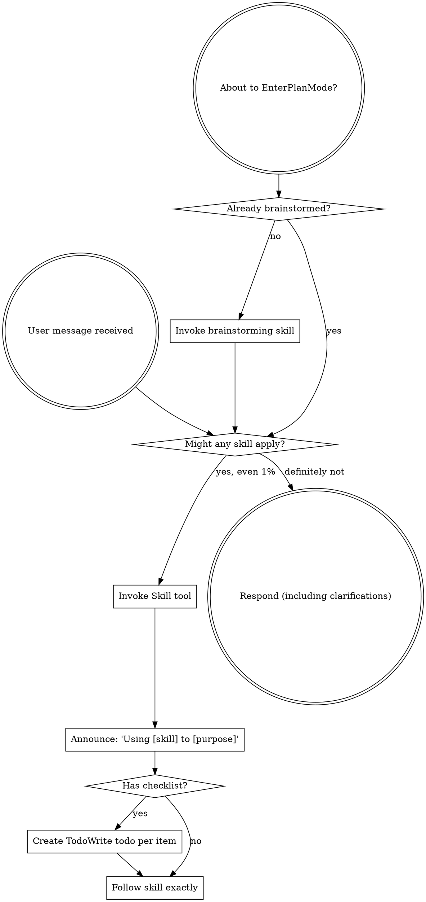

# Codex session 019f24cf-de80-79e2-99bd-ffde6e55ef5d

- Started: `2026-07-02T21:50:32.912Z`
- Working directory: `D:\100XH100`
- Originator: `Codex Desktop`
- Codex CLI: `0.142.5`
- Source log: `C:\Users\Иван Литвак\.codex\sessions\2026\07\03\rollout-2026-07-03T00-50-32-019f24cf-de80-79e2-99bd-ffde6e55ef5d.jsonl`
- Entries: user=4, assistant=7, tool calls=12, tool outputs=12

This is a chronological export of the user/assistant conversation and tool activity. Internal system/developer instructions and token accounting are intentionally excluded. Secret-shaped values are redacted; oversized tool outputs retain their beginning and end with the omitted character count.

## 1. User

Time: `2026-07-02T21:50:44.382Z` · source line `4`

```text
# AGENTS.md instructions for D:\100XH100

<INSTRUCTIONS>
# Project Agent Rules

## Operating Rule
- Read `AGENTS.md` before project edits.
- Update `memory/CHANGELOG.md` after meaningful code, config, or architecture changes.
- Update `memory/PROMPTS.md` with user prompts that define requirements.
- Store test outputs, logs, and verification notes under `test_results/`.
- Prefer agent-centered code: explicit contracts, deterministic tests, small files, low hidden state.

## Architecture Source
- Primary architecture contract: `ARCHITECTURE_NEED.md`.
- Current Stream 4 implementation rule: use threshold + compact + CUB/fixed-temp sort/reduce + compact; do not use Stream 4 hash-table dedup.

## Implementation Guardrails
- `State128` logical bytes are `v[0..119]`.
- `State128` padding bytes are `v[120..127]`.
- Persistent frontier padding must be zero.
- `FinalResponse` may temporarily store `target_local_idx` in `v[120..123]`.
- `Hash128` is one logical 128-bit key stored as `{lo, hi}`.
- `CandidateMeta` must remain 32 bytes and 32-byte aligned.
- Stream 3 payload id must be original candidate id, not compact index.
- Stream 4 must not apply shard top-k or semantic shard cap.

</INSTRUCTIONS>
<environment_context>
  <cwd>D:\100XH100</cwd>
  <shell>powershell</shell>
  <current_date>2026-07-03</current_date>
  <timezone>Europe/Moscow</timezone>
  <filesystem><workspace_roots><root>D:\100XH100</root></workspace_roots><permission_profile type="managed"><file_system type="restricted"><entry access="read"><special>:root</special></entry><entry access="write"><path>D:\100XH100</path></entry><entry access="write"><special>:slash_tmp</special></entry><entry access="write"><special>:tmpdir</special></entry><entry access="read"><path>D:\100XH100\.git</path></entry><entry access="read"><path>D:\100XH100\.agents</path></entry><entry access="read"><path>D:\100XH100\.codex</path></entry></file_system></permission_profile></filesystem>
</environment_context>
```

## 2. User

Time: `2026-07-02T21:50:44.464Z` · source line `6`

```text
Repo/worktree: D:\100XH100\.worktrees\stream1-piece-transformer. Task: read current uncommitted changes around Stream1 piece-transformer: CMakeLists.txt, cuda/stream1.cu, cuda/stream1_transformer_fmha.cu/.hpp, memory. Do not edit files. Return a short code-review: any hidden fallback, T4/fp16 path breakage, MLP path impact, and obvious CUTLASS FMHA layout/correctness risks. The user forbids fallbacks/distillation and wants separate transformer backend.
```

## 3. User

Time: `2026-07-02T21:50:44.465Z` · source line `7`

```text
Repo/worktree: D:\100XH100\.worktrees\stream1-piece-transformer. Task: read current uncommitted changes around Stream1 piece-transformer: CMakeLists.txt, cuda/stream1.cu, cuda/stream1_transformer_fmha.cu/.hpp, memory. Do not edit files. Return a short code-review: any hidden fallback, T4/fp16 path breakage, MLP path impact, and obvious CUTLASS FMHA layout/correctness risks. The user forbids fallbacks/distillation and wants separate transformer backend.
```

## 4. Codex

Time: `2026-07-02T21:51:05.288Z` · source line `9`

```text
I’ll inspect only the requested worktree and treat this as a code review, not an implementation pass. I’m first loading the required operating context, then I’ll read the changed Stream1 files and report findings with file/line references.
```

## 5. Tool call: `exec_command`

Time: `2026-07-02T21:51:06.963Z` · source line `11`

```text
{"cmd": "Get-Content -LiteralPath 'C:\\Users\\Иван Литвак\\.codex\\plugins\\cache\\openai-curated-remote\\superpowers\\5.1.4\\skills\\using-superpowers\\SKILL.md'","workdir":"D:\\100XH100","shell":"powershell","yield_time_ms":10000,"max_output_tokens":20000}
```

## 6. Tool output

Time: `2026-07-02T21:51:07.395Z` · source line `12`

````text
Chunk ID: 31b00c
Wall time: 0.1007 seconds
Process exited with code 0
Original token count: 1393
Output:
---
name: using-superpowers
description: Use when starting any conversation - establishes how to find and use skills, requiring Skill tool invocation before ANY response including clarifying questions
---

<SUBAGENT-STOP>
If you were dispatched as a subagent to execute a specific task, skip this skill.
</SUBAGENT-STOP>

<EXTREMELY-IMPORTANT>
If you think there is even a 1% chance a skill might apply to what you are doing, you ABSOLUTELY MUST invoke the skill.

IF A SKILL APPLIES TO YOUR TASK, YOU DO NOT HAVE A CHOICE. YOU MUST USE IT.

This is not negotiable. This is not optional. You cannot rationalize your way out of this.
</EXTREMELY-IMPORTANT>

## Instruction Priority

Superpowers skills override default system prompt behavior, but **user instructions always take precedence**:

1. **User's explicit instructions** (CLAUDE.md, GEMINI.md, AGENTS.md, direct requests) — highest priority
2. **Superpowers skills** — override default system behavior where they conflict
3. **Default system prompt** — lowest priority

If CLAUDE.md, GEMINI.md, or AGENTS.md says "don't use TDD" and a skill says "always use TDD," follow the user's instructions. The user is in control.

## How to Access Skills

**In Claude Code:** Use the `Skill` tool. When you invoke a skill, its content is loaded and presented to you—follow it directly. Never use the Read tool on skill files.

**In Copilot CLI:** Use the `skill` tool. Skills are auto-discovered from installed plugins. The `skill` tool works the same as Claude Code's `Skill` tool.

**In Gemini CLI:** Skills activate via the `activate_skill` tool. Gemini loads skill metadata at session start and activates the full content on demand.

**In other environments:** Check your platform's documentation for how skills are loaded.

## Platform Adaptation

Skills use Claude Code tool names. Non-CC platforms: see `references/copilot-tools.md` (Copilot CLI), `references/codex-tools.md` (Codex) for tool equivalents. Gemini CLI users get the tool mapping loaded automatically via GEMINI.md.

# Using Skills

## The Rule

**Invoke relevant or requested skills BEFORE any response or action.** Even a 1% chance a skill might apply means that you should invoke the skill to check. If an invoked skill turns out to be wrong for the situation, you don't need to use it.



## Red Flags

These thoughts mean STOP—you're rationalizing:

| Thought | Reality |
|---------|---------|
| "This is just a simple question" | Questions are tasks. Check for skills. |
| "I need more context first" | Skill check comes BEFORE clarifying questions. |
| "Let me explore the codebase first" | Skills tell you HOW to explore. Check first. |
| "I can check git/files quickly" | Files lack conversation context. Check for skills. |
| "Let me gather information first" | Skills tell you HOW to gather information. |
| "This doesn't need a formal skill" | If a skill exists, use it. |
| "I remember this skill" | Skills evolve. Read current version. |
| "This doesn't count as a task" | Action = task. Check for skills. |
| "The skill is overkill" | Simple things become complex. Use it. |
| "I'll just do this one thing first" | Check BEFORE doing anything. |
| "This feels productive" | Undisciplined action wastes time. Skills prevent this. |
| "I know what that means" | Knowing the concept в‰  using the skill. Invoke it. |

## Skill Priority

When multiple skills could apply, use this order:

1. **Process skills first** (brainstorming, debugging) - these determine HOW to approach the task
2. **Implementation skills second** (frontend-design, mcp-builder) - these guide execution

"Let's build X" в†’ brainstorming first, then implementation skills.
"Fix this bug" в†’ debugging first, then domain-specific skills.

## Skill Types

**Rigid** (TDD, debugging): Follow exactly. Don't adapt away discipline.

**Flexible** (patterns): Adapt principles to context.

The skill itself tells you which.

## User Instructions

Instructions say WHAT, not HOW. "Add X" or "Fix Y" doesn't mean skip workflows.

````

## 7. Codex

Time: `2026-07-02T21:51:17.411Z` · source line `15`

```text
Using `superpowers:using-superpowers` because it is the session-start process skill; for this turn, the concrete task remains a read-only code review.
```

## 8. Codex

Time: `2026-07-02T21:51:17.444Z` · source line `16`

```text
Using `superpowers:using-superpowers` because it is the session-start process skill; for this turn, the concrete task remains a read-only code review.
```

## 9. Tool call: `exec_command`

Time: `2026-07-02T21:51:17.471Z` · source line `17`

```text
{"cmd":"Get-Content -LiteralPath 'D:\\100XH100\\.worktrees\\stream1-piece-transformer\\AGENTS.md'","workdir":"D:\\100XH100\\.worktrees\\stream1-piece-transformer","shell":"powershell","yield_time_ms":10000,"max_output_tokens":20000}
```

## 10. Tool call: `exec_command`

Time: `2026-07-02T21:51:17.564Z` · source line `18`

```text
{"cmd":"Select-String -LiteralPath 'C:\\Users\\Иван Литвак\\.codex\\memories\\MEMORY.md' -Pattern '100XH100|Stream1|piece-transformer|FMHA|CUTLASS|BEAM_PREBUILT_RUNNER' -Context 2,2","workdir":"D:\\100XH100","shell":"powershell","yield_time_ms":10000,"max_output_tokens":20000}
```

## 11. Tool call: `exec_command`

Time: `2026-07-02T21:51:17.574Z` · source line `19`

```text
{"cmd":"git status --short","workdir":"D:\\100XH100\\.worktrees\\stream1-piece-transformer","shell":"powershell","yield_time_ms":10000,"max_output_tokens":12000}
```

## 12. Tool output

Time: `2026-07-02T21:51:17.837Z` · source line `20`

```text
Chunk ID: 5bd9fd
Wall time: 0.0760 seconds
Process exited with code 0
Original token count: 290
Output:
# Project Agent Rules

## Operating Rule
- Read `AGENTS.md` before project edits.
- Update `memory/CHANGELOG.md` after meaningful code, config, or architecture changes.
- Update `memory/PROMPTS.md` with user prompts that define requirements.
- Store test outputs, logs, and verification notes under `test_results/`.
- Prefer agent-centered code: explicit contracts, deterministic tests, small files, low hidden state.

## Architecture Source
- Primary architecture contract: `ARCHITECTURE_NEED.md`.
- Current Stream 4 implementation rule: use threshold + compact + CUB/fixed-temp sort/reduce + compact; do not use Stream 4 hash-table dedup.

## Implementation Guardrails
- `State128` logical bytes are `v[0..119]`.
- `State128` padding bytes are `v[120..127]`.
- Persistent frontier padding must be zero.
- `FinalResponse` may temporarily store `target_local_idx` in `v[120..123]`.
- `Hash128` is one logical 128-bit key stored as `{lo, hi}`.
- `CandidateMeta` must remain 32 bytes and 32-byte aligned.
- Stream 3 payload id must be original candidate id, not compact index.
- Stream 4 must not apply shard top-k or semantic shard cap.

```

## 13. Tool output

Time: `2026-07-02T21:51:18.436Z` · source line `21`

```text
Chunk ID: d05aa2
Wall time: 0.3665 seconds
Process exited with code 0
Original token count: 1599
Output:

  C:\Users\Иван Литвак\.codex\memories\MEMORY.md:91:# Task Group: MEPhI IHES cluster publishing, shared prebuilt runner
, and inventory-driven backfill
  C:\Users\Иван Литвак\.codex\memories\MEMORY.md:92:scope: Running the IHES MEPhI cluster workflow with one shared preb
uilt `production_runner`, publishing solved puzzles into a dedicated GitHub results repo, and aggregating mixed cluster
 artifacts from on-cluster inventories.
> C:\Users\Иван Литвак\.codex\memories\MEMORY.md:93:applies_to: cwd=D:\100XH100; reuse_rule=reuse for this IHES/MEPhI r
epo family and adjacent cluster publish jobs, but treat live cluster inventory, DNS availability, and current results-r
epo schema as run-specific and recheck them before publishing.
  C:\Users\Иван Литвак\.codex\memories\MEMORY.md:94:
  C:\Users\Иван Литвак\.codex\memories\MEMORY.md:95:## Task 1: Launch IHES array jobs against one shared prebuilt runne
r, outcome success
  C:\Users\Иван Литвак\.codex\memories\MEMORY.md:97:### rollout_summary_files
  C:\Users\Иван Литвак\.codex\memories\MEMORY.md:98:
> C:\Users\Иван Литвак\.codex\memories\MEMORY.md:99:- rollout_summaries/2026-06-04T15-47-52-Dd1O-ihes_cluster_results_p
rebuilt_publish_backfill.md (cwd=\\?\D:\100XH100, rollout_path=\\?\C:\Users\Иван Литвак\.codex\sessions\2026\
06\04\rollout-2026-06-04T18-47-57-019e9351-cd3b-71c0-bf8b-69755d08d5fc.jsonl, updated_at=2026-06-26T19:51:22+00:00, thr
ead_id=019e9351-cd3b-71c0-bf8b-69755d08d5fc, the prebuilt runner was compiled once and reused across the A100 array wor
kflow)
  C:\Users\Иван Литвак\.codex\memories\MEMORY.md:100:
  C:\Users\Иван Литвак\.codex\memories\MEMORY.md:101:### keywords
  C:\Users\Иван Литвак\.codex\memories\MEMORY.md:102:
> C:\Users\Иван Литвак\.codex\memories\MEMORY.md:103:- MEPhI HPC, kaf12, A100 40GB, BEAM_PREBUILT_RUNNER, prepare_ihes_
prebuilt_runner.sh, ihes_solve_bucket_from_scratch.sh, prebuilt_runner_ready, using_prebuilt_runner, PUZZLE_LIMIT=1, de
pth=12
  C:\Users\Иван Литвак\.codex\memories\MEMORY.md:104:
  C:\Users\Иван Литвак\.codex\memories\MEMORY.md:105:## Task 2: Publish per-puzzle IHES results and backfill existing b
ucket outputs into the GitHub results repo, outcome success
  C:\Users\Иван Литвак\.codex\memories\MEMORY.md:107:### rollout_summary_files
  C:\Users\Иван Литвак\.codex\memories\MEMORY.md:108:
> C:\Users\Иван Литвак\.codex\memories\MEMORY.md:109:- rollout_summaries/2026-06-04T15-47-52-Dd1O-ihes_cluster_results_
prebuilt_publish_backfill.md (cwd=\\?\D:\100XH100, rollout_path=\\?\C:\Users\Иван Литвак\.codex\sessions\2026
\06\04\rollout-2026-06-04T18-47-57-019e9351-cd3b-71c0-bf8b-69755d08d5fc.jsonl, updated_at=2026-06-26T19:51:22+00:00, th
read_id=019e9351-cd3b-71c0-bf8b-69755d08d5fc, the results repo structure and first backfilled puzzle sets were establis
hed)
  C:\Users\Иван Литвак\.codex\memories\MEMORY.md:110:
  C:\Users\Иван Литвак\.codex\memories\MEMORY.md:111:### keywords
  C:\Users\Иван Литвак\.codex\memories\MEMORY.md:117:### rollout_summary_files
  C:\Users\Иван Литвак\.codex\memories\MEMORY.md:118:
> C:\Users\Иван Литвак\.codex\memories\MEMORY.md:119:- rollout_summaries/2026-06-04T15-47-52-Dd1O-ihes_cluster_results_
prebuilt_publish_backfill.md (cwd=\\?\D:\100XH100, rollout_path=\\?\C:\Users\Иван Литвак\.codex\sessions\2026
\06\04\rollout-2026-06-04T18-47-57-019e9351-cd3b-71c0-bf8b-69755d08d5fc.jsonl, updated_at=2026-06-26T19:51:22+00:00, th
read_id=019e9351-cd3b-71c0-bf8b-69755d08d5fc, a file-driven inventory plus schema fixes made the larger aggregator path
 workable)
  C:\Users\Иван Литвак\.codex\memories\MEMORY.md:120:
  C:\Users\Иван Литвак\.codex\memories\MEMORY.md:121:### keywords
  C:\Users\Иван Литвак\.codex\memories\MEMORY.md:132:## Reusable knowledge
  C:\Users\Иван Литвак\.codex\memories\MEMORY.md:133:
> C:\Users\Иван Литвак\.codex\memories\MEMORY.md:134:- `hpc/ihes_cube_model/prepare_ihes_prebuilt_runner.sh` builds the
 shared binary at `/mnt/pool/6/vokirova/beam8a100/ihes_cube_model/prebuilt-a100-ihes/production_runner`, and `hpc/ihes_
cube_model/ihes_solve_bucket_from_scratch.sh` already knows how to consume `BEAM_PREBUILT_RUNNER` [Task 1]
  C:\Users\Иван Литвак\.codex\memories\MEMORY.md:135:- the verified runtime on basis exposed `world_size_effective=8`, 
`NCCL 2.21.5+cuda12.4`, and eight visible A100-40GB GPUs, so the prebuilt-runner path was validated on the actual targe
t hardware [Task 1]
  C:\Users\Иван Литвак\.codex\memories\MEMORY.md:136:- the durable results layout is `data/ihes_cube/puzzles/pXXXX/solu
tions.tsv`, `unique_solutions.tsv`, `metadata.env`, `summary.md`, plus root-level `index.tsv` and `improvements.tsv`; n
on-full-solution repair artifacts belong under separate `repair_segments/` trees [Task 2]
  C:\Users\Иван Литвак\.codex\memories\MEMORY.md:140:## Failures and how to do differently
  C:\Users\Иван Литвак\.codex\memories\MEMORY.md:141:
> C:\Users\Иван Литвак\.codex\memories\MEMORY.md:142:- symptom: each array task recompiles instead of reusing the solve
r. cause: `BEAM_PREBUILT_RUNNER` was not wired through a separate prebuild dependency. fix: submit the prebuild first a
nd make the puzzle array depend on it via `--dependency=afterok:<prebuild_job>` [Task 1]
  C:\Users\Иван Литвак\.codex\memories\MEMORY.md:143:- symptom: cluster-side publish fails after compute succeeds. caus
e: the compute node cannot resolve `github.com` or otherwise lacks GitHub network access. fix: tolerate cluster-side pu
sh failure and leave local commits/results ready for later push from a node with working DNS/network [Task 2]
  C:\Users\Иван Литвак\.codex\memories\MEMORY.md:144:- symptom: the backfill/index writer crashes on old rows. cause: m
etadata rows carried extra keys such as `variants` and `source_files` that were not declared in the index schema. fix: 
widen the declared schema and filter outgoing rows to declared fields before writing [Task 2][Task 3]


```

## 14. Tool output

Time: `2026-07-02T21:51:18.437Z` · source line `22`

```text
Chunk ID: d40750
Wall time: 0.0937 seconds
Process exited with code 0
Original token count: 133
Output:
 M CMakeLists.txt
 M cuda/stream1.cu
 M memory/CHANGELOG.md
 M memory/PROMPTS.md
?? $null
?? build-contract-tests/
?? build-nsys-stream1/
?? build-stream1-opt/
?? build-stream1-transformer-red/
?? build-task6-red/
?? build-task6-sm86/
?? build-task6/
?? config.obj
?? contract_tests.obj
?? cuda/stream1_transformer_fmha.cu
?? cuda/stream1_transformer_fmha.hpp
?? docs/
?? frontier_cpu.obj
?? hash.obj
?? kaggle_transformer_inference_speed/
?? state.obj
?? stream3.obj
?? stream4.obj
?? tools/stream1_transformer_torch_benchmark.py

```

## 15. Codex

Time: `2026-07-02T21:51:33.427Z` · source line `25`

```text
The worktree has the expected Stream1 files modified plus several untracked build/output directories. I’m going to review the actual diff and the new FMHA source rather than relying on status names.
```

## 16. Codex

Time: `2026-07-02T21:51:33.453Z` · source line `26`

```text
The worktree has the expected Stream1 files modified plus several untracked build/output directories. I’m going to review the actual diff and the new FMHA source rather than relying on status names.
```

## 17. Tool call: `exec_command`

Time: `2026-07-02T21:51:33.454Z` · source line `27`

```text
{"cmd":"git diff -- CMakeLists.txt cuda/stream1.cu memory/CHANGELOG.md memory/PROMPTS.md","workdir":"D:\\100XH100\\.worktrees\\stream1-piece-transformer","shell":"powershell","yield_time_ms":10000,"max_output_tokens":60000}
```

## 18. Tool call: `exec_command`

Time: `2026-07-02T21:51:33.465Z` · source line `28`

```text
{"cmd":"Get-Content -LiteralPath 'cuda\\stream1_transformer_fmha.cu'","workdir":"D:\\100XH100\\.worktrees\\stream1-piece-transformer","shell":"powershell","yield_time_ms":10000,"max_output_tokens":60000}
```

## 19. Tool call: `exec_command`

Time: `2026-07-02T21:51:33.465Z` · source line `29`

```text
{"cmd":"Get-Content -LiteralPath 'cuda\\stream1_transformer_fmha.hpp'","workdir":"D:\\100XH100\\.worktrees\\stream1-piece-transformer","shell":"powershell","yield_time_ms":10000,"max_output_tokens":30000}
```

## 20. Tool call: `exec_command`

Time: `2026-07-02T21:51:33.466Z` · source line `30`

```text
{"cmd":"Select-String -Path 'CMakeLists.txt','cuda\\stream1.cu','cuda\\stream1_transformer_fmha.cu','cuda\\stream1_transformer_fmha.hpp','memory\\CHANGELOG.md','memory\\PROMPTS.md' -Pattern 'fallback|distill|teacher|student|mlp|FMHA|transformer|CUTLASS|half|fp16|T4|sm_75|sm75|cutlass|cudaMemcpy|topk|top-k' -CaseSensitive:$false -Context 2,2","workdir":"D:\\100XH100\\.worktrees\\stream1-piece-transformer","shell":"powershell","yield_time_ms":10000,"max_output_tokens":60000}
```

## 21. Tool output

Time: `2026-07-02T21:51:33.866Z` · source line `31`

```text
Chunk ID: ea2ef1
Wall time: 0.1396 seconds
Process exited with code 0
Original token count: 6395
Output:
warning: in the working copy of 'cuda/stream1.cu', CRLF will be replaced by LF the next time Git touches it
warning: in the working copy of 'memory/CHANGELOG.md', CRLF will be replaced by LF the next time Git touches it
warning: in the working copy of 'memory/PROMPTS.md', CRLF will be replaced by LF the next time Git touches it
diff --git a/CMakeLists.txt b/CMakeLists.txt
index 5f3e723..0b5fd0b 100644
--- a/CMakeLists.txt
+++ b/CMakeLists.txt
@@ -103,6 +103,7 @@ target_link_libraries(history_tests PRIVATE beam_core)
 
 add_library(beam_cuda
     cuda/stream1.cu
+    cuda/stream1_transformer_fmha.cu
     cuda/stream2.cu
     cuda/stream3.cu
     cuda/stream4.cu
@@ -119,6 +120,12 @@ if(CUTLASS_DIR AND EXISTS "${CUTLASS_DIR}/include")
     if(EXISTS "${CUTLASS_DIR}/tools/util/include")
         target_include_directories(beam_cuda PUBLIC "${CUTLASS_DIR}/tools/util/include")
     endif()
+    if(EXISTS "${CUTLASS_DIR}/examples/41_fused_multi_head_attention/kernel_forward.h")
+        target_include_directories(beam_cuda PUBLIC "${CUTLASS_DIR}/examples/41_fused_multi_head_attention")
+        target_compile_definitions(beam_cuda PUBLIC BEAM_HAS_CUTLASS_FMHA=1)
+    else()
+        target_compile_definitions(beam_cuda PUBLIC BEAM_HAS_CUTLASS_FMHA=0)
+    endif()
     target_compile_definitions(beam_cuda PUBLIC BEAM_HAS_CUTLASS=1)
 else()
     message(FATAL_ERROR "CUTLASS_DIR is required. Pass -DCUTLASS_DIR=/path/to/cutlass or set CUTLASS_DIR.")
diff --git a/cuda/stream1.cu b/cuda/stream1.cu
index 2242a06..1a55124 100644
--- a/cuda/stream1.cu
+++ b/cuda/stream1.cu
@@ -1,4 +1,5 @@
 #include "stream1.hpp"
+#include "stream1_transformer_fmha.hpp"
 
 #include "config.hpp"
 #include "cuda_check.hpp"
@@ -14,6 +15,7 @@
 #include <cutlass/gemm/device/gemm_batched.h>
 #include <cutlass/epilogue/thread/linear_combination_relu.h>
 #include <cutlass/layout/matrix.h>
+
 #endif
 
 #include <stdexcept>
@@ -721,10 +723,10 @@ constexpr std::uint32_t STREAM1_TRANSFORMER_QKV_STRIDE51 = 3U * STREAM1_TRANSFOR
 constexpr std::uint32_t STREAM1_TRANSFORMER_SCORE_ROW_STRIDE51 = 64U;
 constexpr std::uint32_t STREAM1_TRANSFORMER_PROB_STRIDE51 =
     STREAM1_TRANSFORMER_SEQ51 * STREAM1_TRANSFORMER_SCORE_ROW_STRIDE51;
-constexpr std::uint32_t STREAM1_TRANSFORMER_VPACK_STRIDE51 =
+constexpr std::uint32_t STREAM1_TRANSFORMER_HEAD_OUTPUT_STRIDE51 =
     STREAM1_TRANSFORMER_SCORE_ROW_STRIDE51 * STREAM1_TRANSFORMER_HEAD_DIM32;
 constexpr std::uint32_t STREAM1_TRANSFORMER_SCORE_STRIDE51 =
-    STREAM1_TRANSFORMER_PROB_STRIDE51 + STREAM1_TRANSFORMER_VPACK_STRIDE51;
+    STREAM1_TRANSFORMER_PROB_STRIDE51 + STREAM1_TRANSFORMER_HEAD_OUTPUT_STRIDE51;
 
 __global__ void stream1_transformer_add_qkv_bias_kernel(
     half* __restrict__ qkv,
@@ -781,16 +783,20 @@ __global__ void stream1_transformer_softmax51_kernel(
         for (std::uint32_t i = 0; i < slot; ++i) {
             stream1_store_scalar_device(scores_probs, query_base + local_keys[i], local_values[i] * inv_sum, dtype);
         }
+        for (std::uint32_t key = STREAM1_TRANSFORMER_SEQ51 + lane;
+             key < STREAM1_TRANSFORMER_SCORE_ROW_STRIDE51;
+             key += 32U) {
+            stream1_store_scalar_device(scores_probs, query_base + key, 0.0f, dtype);
+        }
     }
 }
-
 __global__ void stream1_transformer_pack_v51_kernel(
     const half* __restrict__ qkv,
     half* __restrict__ scores_probs,
     std::uint32_t dtype,
     std::uint32_t b_micro) {
     const std::uint64_t i = static_cast<std::uint64_t>(blockIdx.x) * blockDim.x + threadIdx.x;
-    const std::uint64_t per_matrix = static_cast<std::uint64_t>(STREAM1_TRANSFORMER_VPACK_STRIDE51);
+    const std::uint64_t per_matrix = static_cast<std::uint64_t>(STREAM1_TRANSFORMER_HEAD_OUTPUT_STRIDE51);
     const std::uint64_t total = static_cast<std::uint64_t>(STREAM1_TRANSFORMER_NHEAD8) * b_micro * per_matrix;
     if (i >= total) {
         return;
@@ -819,12 +825,40 @@ __global__ void stream1_transformer_pack_v51_kernel(
         value,
         dtype);
 }
+enum class Stream1TransformerAttentionBackend : std::uint32_t {
+    Sm75Fp16Tensor,
+    Sm80Bf16Fmha,
+};
+
+Stream1TransformerAttentionBackend stream1_transformer_select_attention_backend(std::uint32_t dtype) {
+    int device = 0;
+    BEAM_CUDA_CHECK(cudaGetDevice(&device));
+    cudaDeviceProp prop{};
+    BEAM_CUDA_CHECK(cudaGetDeviceProperties(&prop, device));
+    if (dtype == STREAM1_DTYPE_BF16) {
+        if (prop.major >= 8) {
+#if BEAM_HAS_CUTLASS_FMHA
+            return Stream1TransformerAttentionBackend::Sm80Bf16Fmha;
+#else
+            throw std::invalid_argument("Stream1 piece_transformer bf16 requires CUTLASS FMHA example headers for SM80+");
+#endif
+        }
+        throw std::invalid_argument("Stream1 piece_transformer bf16 attention requires SM80+; export fp16 weights for T4/SM75");
+    }
+    if (dtype == STREAM1_DTYPE_FP16) {
+        if (prop.major > 7 || (prop.major == 7 && prop.minor >= 5)) {
+            return Stream1TransformerAttentionBackend::Sm75Fp16Tensor;
+        }
+        throw std::invalid_argument("Stream1 piece_transformer fp16 attention requires SM75+ GPU");
+    }
+    throw std::invalid_argument("Stream1 piece_transformer dtype must be fp16 or bf16");
+}
 
 #if BEAM_HAS_CUTLASS
-void stream1_transformer_qk_batched_launch(
+template <typename Element, typename ArchTag, typename InstructionShape>
+void stream1_transformer_qk_batched_launch_typed(
     const half* qkv,
     half* scores_probs,
-    std::uint32_t dtype,
     std::uint32_t b_micro,
     cudaStream_t stream) {
     const cutlass::gemm::GemmCoord problem(
@@ -842,79 +876,47 @@ void stream1_transformer_qk_batched_launch(
         const half* k_base = qkv + STREAM1_TRANSFORMER_DMODEL256 + head_offset;
         half* score_base = scores_probs +
             static_cast<std::uint64_t>(head) * b_micro * STREAM1_TRANSFORMER_SCORE_STRIDE51;
-        if (dtype == STREAM1_DTYPE_BF16) {
-            using Gemm = cutlass::gemm::device::GemmBatched<
-                cutlass::bfloat16_t,
-                cutlass::layout::RowMajor,
-                cutlass::bfloat16_t,
-                cutlass::layout::ColumnMajor,
-                cutlass::bfloat16_t,
-                cutlass::layout::RowMajor,
-                float,
-                cutlass::arch::OpClassTensorOp,
-                cutlass::arch::Sm80,
-                cutlass::gemm::GemmShape<64, 64, 32>,
-                cutlass::gemm::GemmShape<32, 32, 32>,
-                cutlass::gemm::GemmShape<16, 8, 16>>;
-            Gemm gemm;
-            typename Gemm::Arguments args{
-                problem,
-                {reinterpret_cast<cutlass::bfloat16_t const*>(q_base), static_cast<int>(STREAM1_TRANSFORMER_QKV_STRIDE51)},
-                qkv_batch_stride,
-                {reinterpret_cast<cutlass::bfloat16_t const*>(k_base), static_cast<int>(STREAM1_TRANSFORMER_QKV_STRIDE51)},
-                qkv_batch_stride,
-                {reinterpret_cast<cutlass::bfloat16_t const*>(score_base), static_cast<int>(STREAM1_TRANSFORMER_SCORE_ROW_STRIDE51)},
-                score_batch_stride,
-                {reinterpret_cast<cutlass::bfloat16_t*>(score_base), static_cast<int>(STREAM1_TRANSFORMER_SCORE_ROW_STRIDE51)},
-                score_batch_stride,
-                {scale, 0.0f},
-                static_cast<int>(b_micro)};
-            status = gemm(args, nullptr, stream);
-        } else if (dtype == STREAM1_DTYPE_FP16) {
-            using Gemm = cutlass::gemm::device::GemmBatched<
-                cutlass::half_t,
-                cutlass::layout::RowMajor,
-                cutlass::half_t,
-                cutlass::layout::ColumnMajor,
-                cutlass::half_t,
-                cutlass::layout::RowMajor,
-                float,
-                cutlass::arch::OpClassTensorOp,
-                cutlass::arch::Sm75,
-                cutlass::gemm::GemmShape<64, 64, 32>,
-                cutlass::gemm::GemmShape<32, 32, 32>,
-                cutlass::gemm::GemmShape<16, 8, 8>>;
-            Gemm gemm;
-            typename Gemm::Arguments args{
-                problem,
-                {reinterpret_cast<cutlass::half_t const*>(q_base), static_cast<int>(STREAM1_TRANSFORMER_QKV_STRIDE51)},
-                qkv_batch_stride,
-                {reinterpret_cast<cutlass::half_t const*>(k_base), static_cast<int>(STREAM1_TRANSFORMER_QKV_STRIDE51)},
-                qkv_batch_stride,
-                {reinterpret_cast<cutlass::half_t const*>(score_base), static_cast<int>(STREAM1_TRANSFORMER_SCORE_ROW_STRIDE51)},
-                score_batch_stride,
-                {reinterpret_cast<cutlass::half_t*>(score_base), static_cast<int>(STREAM1_TRANSFORMER_SCORE_ROW_STRIDE51)},
-                score_batch_stride,
-                {scale, 0.0f},
-                static_cast<int>(b_micro)};
-            status = gemm(args, nullptr, stream);
-        } else {
-            throw std::invalid_argument("Stream1 piece_transformer dtype must be fp16 or bf16");
-        }
+
+        using Gemm = cutlass::gemm::device::GemmBatched<
+            Element,
+            cutlass::layout::RowMajor,
+            Element,
+            cutlass::layout::ColumnMajor,
+            Element,
+            cutlass::layout::RowMajor,
+            float,
+            cutlass::arch::OpClassTensorOp,
+            ArchTag,
+            cutlass::gemm::GemmShape<64, 64, 32>,
+            cutlass::gemm::GemmShape<32, 32, 32>,
+            InstructionShape>;
+        Gemm gemm;
+        typename Gemm::Arguments args{
+            problem,
+            {reinterpret_cast<Element const*>(q_base), static_cast<int>(STREAM1_TRANSFORMER_QKV_STRIDE51)},
+            qkv_batch_stride,
+            {reinterpret_cast<Element const*>(k_base), static_cast<int>(STREAM1_TRANSFORMER_QKV_STRIDE51)},
+            qkv_batch_stride,
+            {reinterpret_cast<Element const*>(score_base), static_cast<int>(STREAM1_TRANSFORMER_SCORE_ROW_STRIDE51)},
+            score_batch_stride,
+            {reinterpret_cast<Element*>(score_base), static_cast<int>(STREAM1_TRANSFORMER_SCORE_ROW_STRIDE51)},
+            score_batch_stride,
+            {scale, 0.0f},
+            static_cast<int>(b_micro)};
+        status = gemm(args, nullptr, stream);
         if (status != cutlass::Status::kSuccess) {
             throw std::runtime_error("Stream1 piece_transformer QK GemmBatched launch failed");
         }
     }
 }
 
-void stream1_transformer_pv_batched_launch(
+template <typename Element, typename ArchTag, typename InstructionShape>
+void stream1_transformer_pv_batched_launch_typed(
     const half* qkv,
     half* scores_probs,
     half* context,
-    std::uint32_t dtype,
     std::uint32_t b_micro,
     cudaStream_t stream) {
-    (void)qkv;
     const cutlass::gemm::GemmCoord problem(
         static_cast<int>(STREAM1_TRANSFORMER_SEQ51),
         static_cast<int>(STREAM1_TRANSFORMER_HEAD_DIM32),
@@ -929,78 +931,86 @@ void stream1_transformer_pv_batched_launch(
             static_cast<std::uint64_t>(head) * b_micro * STREAM1_TRANSFORMER_SCORE_STRIDE51;
         const half* value_base = prob_base + STREAM1_TRANSFORMER_PROB_STRIDE51;
         half* context_base = context + head_offset;
-        if (dtype == STREAM1_DTYPE_BF16) {
-            using Gemm = cutlass::gemm::device::GemmBatched<
-                cutlass::bfloat16_t,
-                cutlass::layout::RowMajor,
-                cutlass::bfloat16_t,
-                cutlass::layout::RowMajor,
-                cutlass::bfloat16_t,
-                cutlass::layout::RowMajor,
-                float,
-                cutlass::arch::OpClassTensorOp,
-                cutlass::arch::Sm80,
-                cutlass::gemm::GemmShape<64, 32, 32>,
-                cutlass::gemm::GemmShape<32, 32, 32>,
-                cutlass::gemm::GemmShape<16, 8, 16>>;
-            Gemm gemm;
-            typename Gemm::Arguments args{
-                problem,
-                {reinterpret_cast<cutlass::bfloat16_t const*>(prob_base), static_cast<int>(STREAM1_TRANSFORMER_SCORE_ROW_STRIDE51)},
-                score_batch_stride,
-                {reinterpret_cast<cutlass::bfloat16_t const*>(value_base), static_cast<int>(STREAM1_TRANSFORMER_HEAD_DIM32)},
-                score_batch_stride,
-                {reinterpret_cast<cutlass::bfloat16_t const*>(context_base), static_cast<int>(STREAM1_TRANSFORMER_DMODEL256)},
-                context_batch_stride,
-                {reinterpret_cast<cutlass::bfloat16_t*>(context_base), static_cast<int>(STREAM1_TRANSFORMER_DMODEL256)},
-                context_batch_stride,
-                {1.0f, 0.0f},
-                static_cast<int>(b_micro)};
-            status = gemm(args, nullptr, stream);
-        } else if (dtype == STREAM1_DTYPE_FP16) {
-            using Gemm = cutlass::gemm::device::GemmBatched<
-                cutlass::half_t,
-                cutlass::layout::RowMajor,
-                cutlass::half_t,
-                cutlass::layout::RowMajor,
-                cutlass::half_t,
-                cutlass::layout::RowMajor,
-                float,
-                cutlass::arch::OpClassTensorOp,
-                cutlass::arch::Sm75,
-                cutlass::gemm::GemmShape<64, 32, 32>,
-                cutlass::gemm::GemmShape<32, 32, 32>,
-                cutlass::gemm::GemmShape<16, 8, 8>>;
-            Gemm gemm;
-            typename Gemm::Arguments args{
-                problem,
-                {reinterpret_cast<cutlass::half_t const*>(prob_base), static_cast<int>(STREAM1_TRANSFORMER_SCORE_ROW_STRIDE51)},
-                score_batch_stride,
-                {reinterpret_cast<cutlass::half_t const*>(value_base), static_cast<int>(STREAM1_TRANSFORMER_HEAD_DIM32)},
-                score_batch_stride,
-                {reinterpret_cast<cutlass::half_t const*>(context_base), static_cast<int>(STREAM1_TRANSFORMER_DMODEL256)},
-                context_batch_stride,
-                {reinterpret_cast<cutlass::half_t*>(context_base), static_cast<int>(STREAM1_TRANSFORMER_DMODEL256)},
-                context_batch_stride,
-                {1.0f, 0.0f},
-                static_cast<int>(b_micro)};
-            status = gemm(args, nullptr, stream);
-        } else {
-            throw std::invalid_argument("Stream1 piece_transformer dtype must be fp16 or bf16");
-        }
+
+        using Gemm = cutlass::gemm::device::GemmBatched<
+            Element,
+            cutlass::layout::RowMajor,
+            Element,
+            cutlass::layout::RowMajor,
+            Element,
+            cutlass::layout::RowMajor,
+            float,
+            cutlass::arch::OpClassTensorOp,
+            ArchTag,
+            cutlass::gemm::GemmShape<64, 32, 32>,
+            cutlass::gemm::GemmShape<32, 32, 32>,
+            InstructionShape>;
+        Gemm gemm;
+        typename Gemm::Arguments args{
+            problem,
+            {reinterpret_cast<Element const*>(prob_base), static_cast<int>(STREAM1_TRANSFORMER_SCORE_ROW_STRIDE51)},
+            score_batch_stride,
+            {reinterpret_cast<Element const*>(value_base), static_cast<int>(STREAM1_TRANSFORMER_HEAD_DIM32)},
+            score_batch_stride,
+            {reinterpret_cast<Element const*>(context_base), static_cast<int>(STREAM1_TRANSFORMER_DMODEL256)},
+            context_batch_stride,
+            {reinterpret_cast<Element*>(context_base), static_cast<int>(STREAM1_TRANSFORMER_DMODEL256)},
+            context_batch_stride,
+            {1.0f, 0.0f},
+            static_cast<int>(b_micro)};
+        status = gemm(args, nullptr, stream);
         if (status != cutlass::Status::kSuccess) {
             throw std::runtime_error("Stream1 piece_transformer PV GemmBatched launch failed");
         }
     }
 }
-#endif
 
+void stream1_transformer_qk_batched_launch(
+    const half* qkv,
+    half* scores_probs,
+    Stream1TransformerAttentionBackend backend,
+    std::uint32_t b_micro,
+    cudaStream_t stream) {
+    switch (backend) {
+    case Stream1TransformerAttentionBackend::Sm75Fp16Tensor:
+        stream1_transformer_qk_batched_launch_typed<
+            cutlass::half_t,
+            cutlass::arch::Sm75,
+            cutlass::gemm::GemmShape<16, 8, 8>>(qkv, scores_probs, b_micro, stream);
+        return;
+    case Stream1TransformerAttentionBackend::Sm80Bf16Fmha:
+        break;
+    }
+    throw std::invalid_argument("Stream1 piece_transformer unknown attention backend");
+}
+
+void stream1_transformer_pv_batched_launch(
+    const half* qkv,
+    half* scores_probs,
+    half* context,
+    Stream1TransformerAttentionBackend backend,
+    std::uint32_t b_micro,
+    cudaStream_t stream) {
+    switch (backend) {
+    case Stream1TransformerAttentionBackend::Sm75Fp16Tensor:
+        stream1_transformer_pv_batched_launch_typed<
+            cutlass::half_t,
+            cutlass::arch::Sm75,
+            cutlass::gemm::GemmShape<16, 8, 8>>(qkv, scores_probs, context, b_micro, stream);
+        return;
+    case Stream1TransformerAttentionBackend::Sm80Bf16Fmha:
+        break;
+    }
+    throw std::invalid_argument("Stream1 piece_transformer unknown attention backend");
+}
+#endif
 void stream1_transformer_attention_launch(
     half* qkv,
     const half* qkv_bias,
     const Stream1TransformerScratchView& scratch,
     Stream1TransformerDims dims,
     std::uint32_t b_micro,
+    Stream1TransformerAttentionBackend attention_backend,
     cudaStream_t stream) {
     if (dims.seq_len != STREAM1_TRANSFORMER_SEQ51 ||
         dims.d_model != STREAM1_TRANSFORMER_DMODEL256 ||
@@ -1015,15 +1025,26 @@ void stream1_transformer_attention_launch(
 #if BEAM_HAS_CUTLASS
     const std::uint64_t qkv_total = static_cast<std::uint64_t>(b_micro) *
         STREAM1_TRANSFORMER_SEQ51 * STREAM1_TRANSFORMER_QKV_STRIDE51;
+    if (attention_backend == Stream1TransformerAttentionBackend::Sm80Bf16Fmha) {
+        stream1_transformer_fmha_attention_cuda(
+            qkv,
+            qkv_bias,
+            scratch.attention_scores_probs,
+            scratch.attention_context,
+            dims,
+            b_micro,
+            stream);
+        return;
+    }
     stream1_transformer_add_qkv_bias_kernel<<<
         static_cast<unsigned>((qkv_total + 255ULL) / 256ULL),
         256,
         0,
         stream>>>(qkv, qkv_bias, dims.dtype, b_micro);
-    stream1_transformer_qk_batched_launch(qkv, scratch.attention_scores_probs, dims.dtype, b_micro, stream);
+    stream1_transformer_qk_batched_launch(qkv, scratch.attention_scores_probs, attention_backend, b_micro, stream);
     stream1_transformer_pack_v51_kernel<<<
         static_cast<unsigned>(((static_cast<std::uint64_t>(b_micro) * STREAM1_TRANSFORMER_NHEAD8 *
-            STREAM1_TRANSFORMER_VPACK_STRIDE51) + 255ULL) / 256ULL),
+            STREAM1_TRANSFORMER_HEAD_OUTPUT_STRIDE51) + 255ULL) / 256ULL),
         256,
         0,
         stream>>>(qkv, scratch.attention_scores_probs, dims.dtype, b_micro);
@@ -1036,9 +1057,10 @@ void stream1_transformer_attention_launch(
         qkv,
         scratch.attention_scores_probs,
         scratch.attention_context,
-        dims.dtype,
+        attention_backend,
         b_micro,
         stream);
+
 #else
     (void)qkv;
     (void)qkv_bias;
@@ -1146,17 +1168,8 @@ void stream1_transformer_inference_cuda(
     if (dims.seq_len > 64U || dims.head_dim > 64U) {
         throw std::invalid_argument("Stream1 piece_transformer fused attention tile requires seq_len<=64 and head_dim<=64");
     }
-    if (dims.dtype == STREAM1_DTYPE_BF16) {
-        int device = 0;
-        cudaGetDevice(&device);
-        cudaDeviceProp prop{};
-        cudaGetDeviceProperties(&prop, device);
-        if (prop.major < 8) {
-            throw std::invalid_argument("Stream1 piece_transformer bf16 path requires SM80+ GPU; use fp16 weights on T4/SM75");
-        }
-    } else if (dims.dtype != STREAM1_DTYPE_FP16) {
-        throw std::invalid_argument("Stream1 piece_transformer dtype must be fp16 or bf16");
-    }
+    const Stream1TransformerAttentionBackend attention_backend =
+        stream1_transformer_select_attention_backend(dims.dtype);
     if (b_micro == 0U) {
         return;
     }
@@ -1209,6 +1222,7 @@ void stream1_transformer_inference_cuda(
             scratch,
             dims,
             b_micro,
+            attention_backend,
             stream);
         stream1_cutlass_linear_cuda(
             scratch.attention_context,
diff --git a/memory/CHANGELOG.md b/memory/CHANGELOG.md
index a6181e0..0e86eba 100644
--- a/memory/CHANGELOG.md
+++ b/memory/CHANGELOG.md
@@ -782,4 +782,6 @@
 - Ran Kaggle 2xT4 benchmark version 5 against commit `78052c5` with an explicit notebook commit check. Kaggle completed successfully, but clean tensor attention only reached `821205.4` aggregate candidates/s (`406086.6` on GPU0, `415118.8` on GPU1), about `1.01x` v4 and still only `0.64-0.66x` of the PyTorch `batch_process` fast path per T4. Evidence: `test_results/stream1_transformer_kaggle_benchmark_v5_2026-07-01.md`.
 
 - Fixed the Torch-side Stream1 MLP benchmark parser to accept `initial_state_id` from `data/test.csv`, matching the native benchmark input schema. Kaggle 2xT4 v1 had completed native CUTLASS MLP measurements but failed before Torch timing because the parser only accepted `id/puzzle_id/ID`. Evidence: `test_results/kaggle_t4_mlp_native_vs_torch_v1_failure_2026-07-01.md`.
-- Ran Kaggle 2xT4 MLP native-vs-PyTorch benchmark version 2 against source tag `stream1-mlp-torch-kaggle-v2-code` (`cc90a3d`). Kaggle completed successfully. Best native CUTLASS MLP reached `16.42M` candidates/s on GPU0 and `15.73M` on GPU1; best PyTorch preindexed MLP reached `8.13M` and `6.76M` candidates/s. Native is `2.02x`/`2.33x` faster per GPU and `2.16x` faster in aggregate. Evidence: `test_results/stream1_mlp_native_vs_torch_kaggle_v2_2026-07-01.md`.
\ No newline at end of file
+- Ran Kaggle 2xT4 MLP native-vs-PyTorch benchmark version 2 against source tag `stream1-mlp-torch-kaggle-v2-code` (`cc90a3d`). Kaggle completed successfully. Best native CUTLASS MLP reached `16.42M` candidates/s on GPU0 and `15.73M` on GPU1; best PyTorch preindexed MLP reached `8.13M` and `6.76M` candidates/s. Native is `2.02x`/`2.33x` faster per GPU and `2.16x` faster in aggregate. Evidence: `test_results/stream1_mlp_native_vs_torch_kaggle_v2_2026-07-01.md`.
+- Added kaggle_transformer_inference_speed/transformer_inference_profile.py and test_results/stream1_transformer_pytorch_gap_analysis_2026-07-02.md to compare the PyTorch fast SDPA path against the native Stream1 piece-transformer path. The analysis identifies native attention decomposition, per-head QK/PV launches, separate softmax/V-pack, and unfused epilogues as the current T4 performance gap; no solver runtime or MLP path behavior changed.
+- Added an explicit Stream1 piece-transformer attention backend split: fp16 uses the existing T4/SM75-safe CUTLASS tensor QK/softmax/PV path, while bf16 on SM80+ routes to a separate `cuda/stream1_transformer_fmha.cu` CUTLASS example-41 FMHA path with packed BMHK Q/K/V. The FMHA code is fail-closed when CUTLASS FMHA headers or SM80+ are unavailable, and the MLP path is not touched. Verification passed `stream1_transformer_cuda_tests`, `contract_tests`, and `dispatcher_cuda_tests`; smoke evidence is in `test_results/stream1_transformer_cutlass_fmha_backend_split_2026-07-02.md`. Local performance numbers were gathered on a throttled RTX 3070 Laptop GPU and should not be treated as an A100/T4 performance gate.
diff --git a/memory/PROMPTS.md b/memory/PROMPTS.md
index 0ab0013..ae7bac8 100644
--- a/memory/PROMPTS.md
+++ b/memory/PROMPTS.md
@@ -1,5 +1,8 @@
 # Prompt History
 
+## 2026-07-02
+- User requested investigating how PyTorch runs the Kaggle Megaminx transformer fast path and why the native Stream1 piece-transformer implementation is slower, with comparison against existing native/PyTorch MLP evidence and no fallback or distillation direction.
+
 ## 2026-07-01
 - User requested rerunning the latest native CUDA Stream1 transformer backend on Kaggle and assessing whether the observed speed is a real limit or can still be improved.
 - User requested running the public Kaggle notebook `vladkuznetsov266/transformer-inference-example` and measuring its inference speed.
@@ -443,4 +446,5 @@
 - User requested cleaning and rewriting the Stream1 transformer inference path from scratch after the previous implementation was considered overcomplicated, with no fallbacks or distillation, keeping MLP files/path separate and preserving transformer correctness and speed.
 - User requested running the current clean Stream1 piece-transformer backend on Kaggle 2xT4 "as it will be" and directly answering whether it is still slower than the PyTorch fast path on Kaggle.
 
-- User requested a Kaggle 2xT4 comparison between the native CUTLASS Stream1 MLP benchmark and an equivalent PyTorch MLP inference benchmark, to understand how native vs Torch speeds compare on the same exported MLP weights.
\ No newline at end of file
+- User requested a Kaggle 2xT4 comparison between the native CUTLASS Stream1 MLP benchmark and an equivalent PyTorch MLP inference benchmark, to understand how native vs Torch speeds compare on the same exported MLP weights.
+- User requested the Stream1 transformer backend use CUTLASS FlashAttention-style fused inference immediately, with a correct T4 backend and no fallbacks: attention, epilogues, layout, and launch overhead should be optimized together while preserving the MLP path.
\ No newline at end of file

```

## 22. Tool output

Time: `2026-07-02T21:51:33.971Z` · source line `32`

```text
Chunk ID: 3f5a0c
Wall time: 0.1581 seconds
Process exited with code 0
Original token count: 1889
Output:
#include "stream1_transformer_fmha.hpp"

#include "config.hpp"
#include "cuda_check.hpp"

#include <cuda_bf16.h>
#include <cuda_fp16.h>
#include <cuda_runtime.h>

#if BEAM_HAS_CUTLASS
#include <cutlass/bfloat16.h>
#include <cutlass/numeric_types.h>
#if BEAM_HAS_CUTLASS_FMHA
#include "kernel_forward.h"
#endif
#endif

#include <stdexcept>

namespace beam {

constexpr std::uint32_t FMHA_SEQ51 = 51U;
constexpr std::uint32_t FMHA_DMODEL256 = 256U;
constexpr std::uint32_t FMHA_HEAD_DIM32 = 32U;
constexpr std::uint32_t FMHA_NHEAD8 = 8U;
constexpr std::uint32_t FMHA_QKV_STRIDE51 = 3U * FMHA_DMODEL256;

__device__ float stream1_fmha_load_scalar_device(const half* ptr, std::uint64_t idx, std::uint32_t dtype) {
    if (dtype == STREAM1_DTYPE_BF16) {
        return __bfloat162float(reinterpret_cast<const __nv_bfloat16*>(ptr)[idx]);
    }
    return __half2float(ptr[idx]);
}

__device__ void stream1_fmha_store_scalar_device(half* ptr, std::uint64_t idx, float value, std::uint32_t dtype) {
    if (dtype == STREAM1_DTYPE_BF16) {
        reinterpret_cast<__nv_bfloat16*>(ptr)[idx] = __float2bfloat16(value);
        return;
    }
    ptr[idx] = __float2half(value);
}

__global__ void stream1_transformer_fmha_pack_qkv_bmhk51_kernel(
    const half* __restrict__ qkv,
    const half* __restrict__ qkv_bias,
    half* __restrict__ packed_qkv,
    std::uint32_t dtype,
    std::uint32_t b_micro) {
    const std::uint64_t i = static_cast<std::uint64_t>(blockIdx.x) * blockDim.x + threadIdx.x;
    constexpr std::uint64_t matrix_values = static_cast<std::uint64_t>(FMHA_SEQ51) * FMHA_NHEAD8 * FMHA_HEAD_DIM32;
    const std::uint64_t total = static_cast<std::uint64_t>(b_micro) * 3ULL * matrix_values;
    if (i >= total) {
        return;
    }
    const std::uint64_t per_kind_values = static_cast<std::uint64_t>(b_micro) * matrix_values;
    const std::uint32_t kind = static_cast<std::uint32_t>(i / per_kind_values);
    const std::uint64_t local = i - static_cast<std::uint64_t>(kind) * per_kind_values;
    const std::uint32_t dim = static_cast<std::uint32_t>(local % FMHA_HEAD_DIM32);
    const std::uint32_t head = static_cast<std::uint32_t>((local / FMHA_HEAD_DIM32) % FMHA_NHEAD8);
    const std::uint32_t token = static_cast<std::uint32_t>((local / (FMHA_HEAD_DIM32 * FMHA_NHEAD8)) % FMHA_SEQ51);
    const std::uint32_t row = static_cast<std::uint32_t>(local / matrix_values);
    const std::uint64_t qkv_col = static_cast<std::uint64_t>(kind) * FMHA_DMODEL256 +
        static_cast<std::uint64_t>(head) * FMHA_HEAD_DIM32 + dim;
    const std::uint64_t src_idx = static_cast<std::uint64_t>(row) * FMHA_SEQ51 * FMHA_QKV_STRIDE51 +
        static_cast<std::uint64_t>(token) * FMHA_QKV_STRIDE51 + qkv_col;
    const float value = stream1_fmha_load_scalar_device(qkv, src_idx, dtype) +
        stream1_fmha_load_scalar_device(qkv_bias, qkv_col, dtype);
    stream1_fmha_store_scalar_device(packed_qkv, i, value, dtype);
}

#if BEAM_HAS_CUTLASS && BEAM_HAS_CUTLASS_FMHA
template <typename Element, typename ArchTag>
void stream1_transformer_fmha_launch_typed(
    half* packed_qkv,
    half* context,
    std::uint32_t b_micro,
    cudaStream_t stream) {
    using Attention = AttentionKernel<
        Element,
        ArchTag,
        true,
        64,
        64,
        64,
        false,
        false>;
    constexpr std::uint64_t matrix_values = static_cast<std::uint64_t>(FMHA_SEQ51) * FMHA_NHEAD8 * FMHA_HEAD_DIM32;
    typename Attention::Params params{};
    params.query_ptr = reinterpret_cast<Element*>(packed_qkv);
    params.key_ptr = reinterpret_cast<Element*>(packed_qkv + matrix_values * b_micro);
    params.value_ptr = reinterpret_cast<Element*>(packed_qkv + 2ULL * matrix_values * b_micro);
    params.output_ptr = reinterpret_cast<Element*>(context);
    params.output_accum_ptr = nullptr;
    params.logsumexp_ptr = nullptr;
    params.scale = 0.1767766952966369f;
    params.num_heads = static_cast<int32_t>(FMHA_NHEAD8);
    params.num_batches = static_cast<int32_t>(b_micro);
    params.head_dim = static_cast<int32_t>(FMHA_HEAD_DIM32);
    params.head_dim_value = static_cast<int32_t>(FMHA_HEAD_DIM32);
    params.num_queries = static_cast<int32_t>(FMHA_SEQ51);
    params.num_keys = static_cast<int32_t>(FMHA_SEQ51);
    params.custom_mask_type = Attention::NoCustomMask;
    params.q_strideH = static_cast<int32_t>(FMHA_HEAD_DIM32);
    params.k_strideH = static_cast<int32_t>(FMHA_HEAD_DIM32);
    params.v_strideH = static_cast<int32_t>(FMHA_HEAD_DIM32);
    params.q_strideM = static_cast<int32_t>(FMHA_DMODEL256);
    params.k_strideM = static_cast<int32_t>(FMHA_DMODEL256);
    params.v_strideM = static_cast<int32_t>(FMHA_DMODEL256);
    params.q_strideB = static_cast<int64_t>(FMHA_SEQ51 * FMHA_DMODEL256);
    params.k_strideB = static_cast<int64_t>(FMHA_SEQ51 * FMHA_DMODEL256);
    params.v_strideB = static_cast<int64_t>(FMHA_SEQ51 * FMHA_DMODEL256);
    params.o_strideM = static_cast<int32_t>(FMHA_DMODEL256);
    constexpr auto kernel_fn = attention_kernel_batched_impl<Attention>;
    const int smem_bytes = static_cast<int>(sizeof(typename Attention::SharedStorage));
    if (smem_bytes > 0xc000) {
        BEAM_CUDA_CHECK(cudaFuncSetAttribute(kernel_fn, cudaFuncAttributeMaxDynamicSharedMemorySize, smem_bytes));
    }
    if (!Attention::check_supported(params)) {
        throw std::runtime_error("Stream1 piece_transformer CUTLASS FMHA does not support this tensor layout");
    }
    kernel_fn<<<params.getBlocksGrid(), params.getThreadsGrid(), smem_bytes, stream>>>(params);
}
#endif

void stream1_transformer_fmha_attention_cuda(
    half* qkv,
    const half* qkv_bias,
    half* packed_qkv,
    half* context,
    Stream1TransformerDims dims,
    std::uint32_t b_micro,
    cudaStream_t stream) {
    if (dims.seq_len != FMHA_SEQ51 || dims.d_model != FMHA_DMODEL256 ||
        dims.nhead != FMHA_NHEAD8 || dims.head_dim != FMHA_HEAD_DIM32) {
        throw std::invalid_argument("Stream1 piece_transformer CUTLASS FMHA requires seq_len=51 d_model=256 nhead=8 head_dim=32");
    }
    if (qkv == nullptr || qkv_bias == nullptr || packed_qkv == nullptr || context == nullptr) {
        throw std::invalid_argument("Stream1 piece_transformer CUTLASS FMHA requires qkv, qkv_bias, packed_qkv, and context");
    }
#if BEAM_HAS_CUTLASS && BEAM_HAS_CUTLASS_FMHA
    const std::uint64_t qkv_total = static_cast<std::uint64_t>(b_micro) * FMHA_SEQ51 * FMHA_QKV_STRIDE51;
    stream1_transformer_fmha_pack_qkv_bmhk51_kernel<<<
        static_cast<unsigned>((qkv_total + 255ULL) / 256ULL),
        256,
        0,
        stream>>>(qkv, qkv_bias, packed_qkv, dims.dtype, b_micro);
    if (dims.dtype == STREAM1_DTYPE_BF16) {
        stream1_transformer_fmha_launch_typed<cutlass::bfloat16_t, cutlass::arch::Sm80>(packed_qkv, context, b_micro, stream);
        return;
    }
    if (dims.dtype == STREAM1_DTYPE_FP16) {
        stream1_transformer_fmha_launch_typed<cutlass::half_t, cutlass::arch::Sm80>(packed_qkv, context, b_micro, stream);
        return;
    }
    throw std::invalid_argument("Stream1 piece_transformer CUTLASS FMHA dtype must be fp16 or bf16");
#else
    (void)qkv;
    (void)qkv_bias;
    (void)packed_qkv;
    (void)context;
    (void)dims;
    (void)b_micro;
    (void)stream;
    throw std::invalid_argument("Stream1 piece_transformer CUTLASS FMHA requires CUTLASS example 41 headers");
#endif
}

} // namespace beam

```

## 23. Tool output

Time: `2026-07-02T21:51:33.972Z` · source line `33`

```text
Chunk ID: 1d3af4
Wall time: 0.1590 seconds
Process exited with code 0
Original token count: 77
Output:
#pragma once

#include "stream1.hpp"

namespace beam {

void stream1_transformer_fmha_attention_cuda(
    half* qkv,
    const half* qkv_bias,
    half* packed_qkv,
    half* context,
    Stream1TransformerDims dims,
    std::uint32_t b_micro,
    cudaStream_t stream);

} // namespace beam

```

## 24. Tool output

Time: `2026-07-02T21:51:42.394Z` · source line `34`

Oversized output: `8212` characters omitted from the middle.

```text
Chunk ID: dbb795
Wall time: 8.5545 seconds
Process exited with code 0
Original token count: 69145
Output:
Warning: truncated output (original token count: 69145)
Total output lines: 3139


  CMakeLists.txt:66:    endif()
  CMakeLists.txt:67:endif()
> CMakeLists.txt:68:set(CUTLASS_DIR "" CACHE PATH "CUTLASS checkout root")
> CMakeLists.txt:69:if(NOT CUTLASS_DIR AND DEFINED ENV{CUTLASS_DIR})
> CMakeLists.txt:70:    set(CUTLASS_DIR "$ENV{CUTLASS_DIR}" CACHE PATH "CUTLASS checkout root" FORCE)
  CMakeLists.txt:71:endif()
> CMakeLists.txt:72:if(NOT CUTLASS_DIR)
> CMakeLists.txt:73:    foreach(candidate /opt/cutlass "${CMAKE_SOURCE_DIR}/external/cutlass" /kaggle/working/cutlass)
  CMakeLists.txt:74:        if(EXISTS "${candidate}/include")
> CMakeLists.txt:75:            set(CUTLASS_DIR "${candidate}" CACHE PATH "CUTLASS checkout root" FORCE)
  CMakeLists.txt:76:            break()
  CMakeLists.txt:77:        endif()
  CMakeLists.txt:104:add_library(beam_cuda
  CMakeLists.txt:105:    cuda/stream1.cu
> CMakeLists.txt:106:    cuda/stream1_transformer_fmha.cu
  CMakeLists.txt:107:    cuda/stream2.cu
  CMakeLists.txt:108:    cuda/stream3.cu
  CMakeLists.txt:116:)
  CMakeLists.txt:117:target_include_directories(beam_cuda PUBLIC src cuda ${CMAKE_CUDA_TOOLKIT_INCLUDE_DIRECTORIES})
> CMakeLists.txt:118:if(CUTLASS_DIR AND EXISTS "${CUTLASS_DIR}/include")
> CMakeLists.txt:119:    target_include_directories(beam_cuda PUBLIC "${CUTLASS_DIR}/include")
> CMakeLists.txt:120:    if(EXISTS "${CUTLASS_DIR}/tools/util/include")
> CMakeLists.txt:121:        target_include_directories(beam_cuda PUBLIC "${CUTLASS_DIR}/tools/util/include")
  CMakeLists.txt:122:    endif()
> CMakeLists.txt:123:    if(EXISTS "${CUTLASS_DIR}/examples/41_fused_multi_head_attention/kernel_forward.h")
> CMakeLists.txt:124:        target_include_directories(beam_cuda PUBLIC "${CUTLASS_DIR}/examples/41_fused_multi_head_a
ttention")
> CMakeLists.txt:125:        target_compile_definitions(beam_cuda PUBLIC BEAM_HAS_CUTLASS_FMHA=1)
  CMakeLists.txt:126:    else()
> CMakeLists.txt:127:        target_compile_definitions(beam_cuda PUBLIC BEAM_HAS_CUTLASS_FMHA=0)
  CMakeLists.txt:128:    endif()
> CMakeLists.txt:129:    target_compile_definitions(beam_cuda PUBLIC BEAM_HAS_CUTLASS=1)
  CMakeLists.txt:130:else()
> CMakeLists.txt:131:    message(FATAL_ERROR "CUTLASS_DIR is required. Pass -DCUTLASS_DIR=/path/to/cutlass or set CUTLA
SS_DIR.")
  CMakeLists.txt:132:endif()
  CMakeLists.txt:133:target_link_libraries(beam_cuda PUBLIC beam_core)
  CMakeLists.txt:165:set_target_properties(stream1_cuda_tests PROPERTIES CUDA_STANDARD 17 CUDA_STANDARD_REQUIRED ON CUD
A_ARCHITECTURES "${BEAM_CUDA_ARCHITECTURES}")
  CMakeLists.txt:166:
> CMakeLists.txt:167:add_executable(stream1_transformer_cuda_tests tests/stream1_transformer_cuda_tests.cu)
> CMakeLists.txt:168:target_link_libraries(stream1_transformer_cuda_tests PRIVATE beam_cuda)
> CMakeLists.txt:169:set_target_properties(stream1_transformer_cuda_tests PROPERTIES CUDA_STANDARD 17 CUDA_STANDARD_REQ
UIRED ON CUDA_ARCHITECTURES "${BEAM_CUDA_ARCHITECTURES}")
  CMakeLists.txt:170:
  CMakeLists.txt:171:add_executable(stream3_cuda_tests tests/stream3_cuda_tests.cu)
  CMakeLists.txt:211:add_executable(stream_benchmark
  CMakeLists.txt:212:    tools/stream_benchmark.cu
> CMakeLists.txt:213:    tools/stream_benchmark_mlp.cu
> CMakeLists.txt:214:    tools/stream_benchmark_transformer.cu)
  CMakeLists.txt:215:target_link_libraries(stream_benchmark PRIVATE beam_cuda)
  CMakeLists.txt:216:set_target_properties(stream_benchmark PROPERTIES CUDA_STANDARD 17 CUDA_STANDARD_REQUIRED ON CUDA_
ARCHITECTURES "${BEAM_CUDA_ARCHITECTURES}")
  CMakeLists.txt:220:add_test(NAME history_tests COMMAND history_tests)
  CMakeLists.txt:221:add_test(NAME stream1_cuda_tests COMMAND stream1_cuda_tests)
> CMakeLists.txt:222:add_test(NAME stream1_transformer_cuda_tests COMMAND stream1_transformer_cuda_tests)
  CMakeLists.txt:223:add_test(NAME stream2_cuda_tests COMMAND stream2_cuda_tests)
  CMakeLists.txt:224:add_test(NAME stream3_cuda_tests COMMAND stream3_cuda_tests)
  cuda\stream1.cu:1:#include "stream1.hpp"
> cuda\stream1.cu:2:#include "stream1_transformer_fmha.hpp"
  cuda\stream1.cu:3:
  cuda\stream1.cu:4:#include "config.hpp"
  cuda\stream1.cu:8:#include <cuda_runtime.h>
  cuda\stream1.cu:9:#include <cuda_bf16.h>
> cuda\stream1.cu:10:#include <cuda_fp16.h>
  cuda\stream1.cu:11:
> cuda\stream1.cu:12:#if BEAM_HAS_CUTLASS
> cuda\stream1.cu:13:#include <cutlass/bfloat16.h>
> cuda\stream1.cu:14:#include <cutlass/gemm/device/gemm.h>
> cuda\stream1.cu:15:#include <cutlass/gemm/device/gemm_batched.h>
> cuda\stream1.cu:16:#include <cutlass/epilogue/thread/linear_combination_relu.h>
> cuda\stream1.cu:17:#include <cutlass/layout/matrix.h>
  cuda\stream1.cu:18:
  cuda\stream1.cu:19:#endif
  cuda\stream1.cu:104:}
  cuda\stream1.cu:105:
> cuda\stream1.cu:106:__device__ float stream1_load_scalar_device(const half* ptr, std::uint64_t idx, std::uint32_t dty
pe) {
  cuda\stream1.cu:107:    if (dtype == STREAM1_DTYPE_BF16) {
  cuda\stream1.cu:108:        return __bfloat162float(reinterpret_cast<const __nv_bfloat16*>(ptr)[idx]);
  cuda\stream1.cu:109:    }
> cuda\stream1.cu:110:    return __half2float(ptr[idx]);
  cuda\stream1.cu:111:}
  cuda\stream1.cu:112:
> cuda\stream1.cu:113:__device__ void stream1_store_scalar_device(half* ptr, std::uint64_t idx, float value, std::uint3
2_t dtype) {
  cuda\stream1.cu:114:    if (dtype == STREAM1_DTYPE_BF16) {
  cuda\stream1.cu:115:        reinterpret_cast<__nv_bfloat16*>(ptr)[idx] = __float2bfloat16(value);
  cuda\stream1.cu:116:        return;
  cuda\stream1.cu:117:    }
> cuda\stream1.cu:118:    ptr[idx] = __float2half(value);
  cuda\stream1.cu:119:}
  cuda\stream1.cu:120:
  cuda\stream1.cu:139:    const State128 state = current_frontier_states[*parent_base + parent_local];
  cuda\stream1.cu:140:    for (std::uint32_t h = move; h < network.dims.hidden1; h += MOVE_COUNT) {
> cuda\stream1.cu:141:        float acc = __half2float(network.input_bias[h]);
  cuda\stream1.cu:142:        for (std::uint32_t p = 0; p < network.dims.state_len; ++p) {
  cuda\stream1.cu:143:            const std::uint32_t value = static_cast<std::uint32_t>(state.v[p]);
  cuda\stream1.cu:144:            const std::uint32_t idx = (p * network.dims.num_classes + value) * network.dims.hidde
n1 + h;
> cuda\stream1.cu:145:            acc += __half2float(network.input_weight[idx]);
  cuda\stream1.cu:146:        }
  cuda\stream1.cu:147:        hidden1[h] = relu_device(acc);
  cuda\stream1.cu:150:
  cuda\stream1.cu:151:    for (std::uint32_t h = move; h < network.dims.hidden2; h += MOVE_COUNT) {
> cuda\stream1.cu:152:        float acc = __half2float(network.hidden_bias[h]);
  cuda\stream1.cu:153:        for (std::uint32_t k = 0; k < network.dims.hidden1; ++k) {
  cuda\stream1.cu:154:            const std::uint32_t idx = k * network.dims.hidden2 + h;
> cuda\stream1.cu:155:            acc += hidden1[k] * __half2float(network.hidden_weight[idx]);
  cuda\stream1.cu:156:        }
  cuda\stream1.cu:157:        hidden2[h] = relu_device(acc);
  cuda\stream1.cu:159:    __syncthreads();
  cuda\stream1.cu:160:
> cuda\stream1.cu:161:    float q = __half2float(network.output_bias[move]);
  cuda\stream1.cu:162:    for (std::uint32_t h = 0; h < network.dims.hidden2; ++h) {
> cuda\stream1.cu:163:        q += hidden2[h] * __half2float(network.output_weight[h * MOVE_COUNT + move]);
  cuda\stream1.cu:164:    }
  cuda\stream1.cu:165:    score_ring[parent_local * MOVE_COUNT + move] = score_key_from_float_device(q);
  cuda\stream1.cu:166:}
  cuda\stream1.cu:167:
> cuda\stream1.cu:168:__global__ void stream1_folded_input_half4_tiled_kernel(
  cuda\stream1.cu:169:    const State128* __restrict__ current_frontier_states,
  cuda\stream1.cu:170:    const std::uint64_t* __restrict__ parent_base,
  cuda\stream1.cu:171:    const std::uint32_t* __restrict__ count,
  cuda\stream1.cu:172:    const std::uint8_t* __restrict__ generators,
> cuda\stream1.cu:173:    const half* __restrict__ input_weight,
> cuda\stream1.cu:174:    const half* __restrict__ input_bias,
> cuda\stream1.cu:175:    half* __restrict__ hidden1,
  cuda\stream1.cu:176:    Stream1NetworkDims dims,
  cuda\stream1.cu:177:    std::uint32_t b_micro) {
  cuda\stream1.cu:201:    const bool has2 = (h + 2U) < dims.hidden1;
  cuda\stream1.cu:202:    const bool has23 = (h + 3U) < dims.hidden1;
> cuda\stream1.cu:203:    const bool fp16_folded_fast_path =
> cuda\stream1.cu:204:        dims.dtype == STREAM1_DTYPE_FP16 && dims.normalization != STREAM1_NORM_LAYERNORM;
> cuda\stream1.cu:205:    if (fp16_folded_fast_path) {
  cuda\stream1.cu:206:        if (has01) {
> cuda\stream1.cu:207:            const float2 bias = __half22float2(*reinterpret_cast<const half2*>(input_bias + h));
  cuda\stream1.cu:208:            acc0 = bias.x;
  cuda\stream1.cu:209:            acc1 = bias.y;
  cuda\stream1.cu:210:        } else {
> cuda\stream1.cu:211:            acc0 = __half2float(input_bias[h]);
  cuda\stream1.cu:212:        }
  cuda\stream1.cu:213:        if (has23) {
> cuda\stream1.cu:214:            const float2 bias = __half22float2(*reinterpret_cast<const half2*>(input_bias + h + 2
U));
  cuda\stream1.cu:215:            acc2 = bias.x;
  cuda\stream1.cu:216:            acc3 = bias.y;
  cuda\stream1.cu:217:        } else if (has2) {
> cuda\stream1.cu:218:            acc2 = __half2float(input_bias[h + 2U]);
  cuda\stream1.cu:219:        }
  cuda\stream1.cu:220:    } else if (dims.normalization != STREAM1_NORM_LAYERNORM) {
  cuda\stream1.cu:238:        const std::uint32_t value = static_cast<std::uint32_t>(state_shared[source]);
  cuda\stream1.cu:239:        const std::uint32_t idx = (p * dims.num_classes + value) * dims.hidden1 + h;
> cuda\stream1.cu:240:        if (fp16_folded_fast_path) {
  cuda\stream1.cu:241:            if (has01) {
> cuda\stream1.cu:242:                const float2 w = __half22float2(*reinterpret_cast<const half2*>(input_weight + id
x));
  cuda\stream1.cu:243:                acc0 += w.x;
  cuda\stream1.cu:244:                acc1 += w.y;
  cuda\stream1.cu:245:            } else {
> cuda\stream1.cu:246:                acc0 += __half2float(input_weight[idx]);
  cuda\stream1.cu:247:            }
  cuda\stream1.cu:248:            if (has23) {
> cuda\stream1.cu:249:                const float2 w = __half22float2(*reinterpret_cast<const half2*>(input_weight + id
x + 2U));
  cuda\stream1.cu:250:                acc2 += w.x;
  cuda\stream1.cu:251:                acc3 += w.y;
  cuda\stream1.cu:252:            } else if (has2) {
> cuda\stream1.cu:253:                acc2 += __half2float(input_weight[idx + 2U]);
  cuda\stream1.cu:254:            }
  cuda\stream1.cu:255:        } else {
  cuda\stream1.cu:267:    }
  cuda\stream1.cu:268:
> cuda\stream1.cu:269:    half* out = hidden1 + row * dims.hidden1 + h;
  cuda\stream1.cu:270:    if (dims.normalization != STREAM1_NORM_LAYERNORM) {
  cuda\stream1.cu:271:        acc0 = relu_device(acc0);
  cuda\stream1.cu:279:            stream1_store_scalar_device(out, 1, acc1, dims.dtype);
  cuda\stream1.cu:280:        } else {
> cuda\stream1.cu:281:            *reinterpret_cast<half2*>(out) = __floats2half2_rn(acc0, acc1);
  cuda\stream1.cu:282:        }
  cuda\stream1.cu:283:    } else {
  cuda\stream1.cu:293:            stream1_store_scalar_device(out, 3, acc3, dims.dtype);
  cuda\stream1.cu:294:        } else {
> cuda\stream1.cu:295:            *reinterpret_cast<half2*>(out + 2U) = __floats2half2_rn(acc2, acc3);
  cuda\stream1.cu:296:        }
  cuda\stream1.cu:297:    } else if (has2) {
  cuda\stream1.cu:304:
  cuda\stream1.cu:305:__global__ void stream1_bias_relu_kernel(
> cuda\stream1.cu:306:    half* matrix,
> cuda\stream1.cu:307:    const half* bias,
  cuda\stream1.cu:308:    std::uint32_t rows,
  cuda\stream1.cu:309:    std::uint32_t cols,
  cuda\stream1.cu:321:
  cuda\stream1.cu:322:__global__ void stream1_residual_add_bias_relu_kernel(
> cuda\stream1.cu:323:    half* matrix,
> cuda\stream1.cu:324:    const half* residual,
> cuda\stream1.cu:325:    const half* bias,
  cuda\stream1.cu:326:    std::uint32_t rows,
  cuda\stream1.cu:327:    std::uint32_t cols,
  cuda\stream1.cu:340:
  cuda\stream1.cu:341:__global__ void stream1_layernorm_relu_kernel(
> cuda\stream1.cu:342:    half* matrix,
> cuda\stream1.cu:343:    const half* bias,
> cuda\stream1.cu:344:    const half* gamma,
> cuda\stream1.cu:345:    const half* beta,
  cuda\stream1.cu:346:    std::uint32_t rows,
  cuda\stream1.cu:347:    std::uint32_t cols,
  cuda\stream1.cu:394:
  cuda\stream1.cu:395:__global__ void stream1_layernorm_residual_relu_kernel(
> cuda\stream1.cu:396:    half* matrix,
> cuda\stream1.cu:397:    const half* residual,
> cuda\stream1.cu:398:    const half* bias,
> cuda\stream1.cu:399:    const half* gamma,
> cuda\stream1.cu:400:    const half* beta,
  cuda\stream1.cu:401:    std::uint32_t rows,
  cuda\stream1.cu:402:    std::uint32_t cols,
  cuda\stream1.cu:450:
  cuda\stream1.cu:451:__global__ void stream1_score_epilogue_quantize_kernel(
> cuda\stream1.cu:452:    const half* output,
> cuda\stream1.cu:453:    const half* output_bias,
  cuda\stream1.cu:454:    const std::uint32_t* count,
  cuda\stream1.cu:455:    std::uint32_t* score_ring,
  cuda\stream1.cu:472:
  cuda\stream1.cu:473:__global__ void stream1_single_output_quantize_kernel(
> cuda\stream1.cu:474:    const half* residual,
> cuda\stream1.cu:475:    const half* output_weight,
> cuda\stream1.cu:476:    const half* output_bias,
  cuda\stream1.cu:477:    const std::uint32_t* count,
  cuda\stream1.cu:478:    std::uint32_t* score_ring,
  cuda\stream1.cu:490:    }
  cuda\stream1.cu:491:    float q = stream1_load_scalar_device(output_bias, 0, dtype);
> cuda\stream1.cu:492:    const half* row = residual + static_cast<std::uint64_t>(i) * hidden2;
  cuda\stream1.cu:493:    for (std::uint32_t h = 0; h < hidden2; ++h) {
  cuda\stream1.cu:494:        q += stream1_load_scalar_device(row, h, dtype) *
  cuda\stream1.cu:499:}
  cuda\stream1.cu:500:
> cuda\stream1.cu:501:__global__ void stream1_transformer_build_input_kernel(
  cuda\stream1.cu:502:    const State128* __restrict__ current_frontier_states,
  cuda\stream1.cu:503:    const std::uint64_t* __restrict__ parent_base,
  cuda\stream1.cu:504:    const std::uint32_t* __restrict__ count,
> cuda\stream1.cu:505:    Stream1TransformerNetworkView network,
> cuda\stream1.cu:506:    half* __restrict__ tokens,
  cuda\stream1.cu:507:    std::uint32_t b_micro) {
  cuda\stream1.cu:508:    const std::uint32_t row_token = blockIdx.x;
  cuda\stream1.cu:541:}
  cuda\stream1.cu:542:
> cuda\stream1.cu:543:__global__ void stream1_transformer_layernorm_copy_kernel(
> cuda\stream1.cu:544:    const half* __restrict__ input,
> cuda\stream1.cu:545:    half* __restrict__ output,
> cuda\stream1.cu:546:    const half* __restrict__ gamma,
> cuda\stream1.cu:547:    const half* __restrict__ beta,
  cuda\stream1.cu:548:    std::uint32_t rows,
  cuda\stream1.cu:549:    std::uint32_t cols,
  cuda\stream1.cu:592:}
  cuda\stream1.cu:593:
> cuda\stream1.cu:594:__global__ void stream1_transformer_layernorm256_copy_kernel(
> cuda\stream1.cu:595:    const half* __restrict__ input,
> cuda\stream1.cu:596:    half* __restrict__ output,
> cuda\stream1.cu:597:    const half* __restrict__ gamma,
> cuda\stream1.cu:598:    const half* __restrict__ beta,
  cuda\stream1.cu:599:    std::uint32_t rows,
  cuda\stream1.cu:600:    std::uint32_t dtype) {
  cuda\stream1.cu:650:}
  cuda\stream1.cu:651:
> cuda\stream1.cu:652:void stream1_transformer_layernorm_copy_launch(
> cuda\stream1.cu:653:    const half* input,
> cuda\stream1.cu:654:    half* output,
> cuda\stream1.cu:655:    const half* gamma,
> cuda\stream1.cu:656:

[... 8212 characters omitted from oversized tool output ...]

al/output`.
> memory\PROMPTS.md:287:- User requested Kaggle T4x2 tuning for `BEAM_WIDTH=2**26` without the previous `+15_506_660` b
eam addition. Required fixed parameters: `B_MICRO=2048`, `STREAM1_CONCURRENCY=4`, `SOLVED_NEIGHBORHOOD_RADIUS=4`, K2 di
sabled. User suggested `STREAM4_TRIGGER_CANDIDATES=196608` and `STREAM3/STREAM4_BATCH_CANDIDATES=98304`; implementation
 must preserve the approved guard `STREAM1_CONCURRENCY <= STREAM3_RING_SLOTS`, so production `STREAM3_RING_SLOTS` must 
be at least `4` and Stream3 batch is at least `196608` for this sweep. Sweep target: find optimal `SHARD_COUNT` and Str
eam4 active sort slots.
> memory\PROMPTS.md:288:- User requested launching Kaggle T4x2 for puzzle IDs `991..999` with `BEAM_WIDTH=2**26 + 15_50
6_660`, `DEPTH_LIMIT=72`, `RUN_TIMEOUT_SEC=0`, `HISTORY_MODE=static_hybrid`, `HISTORY_RAM_BYTES=28*1024**3`, `HISTORY_D
ISK_BYTES=59*1024**3`, `SOLVED_NEIGHBORHOOD_RADIUS=4`, K2 disabled, and the selected production concurrency config: `SH
ARD_COUNT=64`, `STREAM4_ACTIVE_SORT_SLOTS=4`, `B_MICRO=2048`, `STREAM1_CONCURRENCY=4`, `STREAM3_RING_SLOTS=4`, `STREAM4
_BATCH_CANDIDATES=196608`, `STREAM4_TRIGGER_CANDIDATES=393216`.
  memory\PROMPTS.md:289:- User requested Kaggle notebook-only fix after v122 disk quota failure: clean static history a
rena directories between puzzles, and add a new post-config/pre-compilation cell that computes whether the configured r
un can fit before compiling project code. User explicitly forbade project C++ code changes for this fix.
  memory\PROMPTS.md:290:- User provided new model file `%USERPROFILE%\Downloads\Telegram Desktop\p900-t000-q_1779830329
_best.pth` and requested comparison against the current project model: parameter count, architecture differences, runti
me implications, and compatibility with the existing Stream1 CUDA runner.
> memory\PROMPTS.md:291:- User requested implementing a universal MLP model interface where Stream1 model dimensions an
d residual block count are inferred from/exported with weights, required blocks are duplicated automatically, and the e
xisting optimized CUTLASS inference code remains the execution path.
  memory\PROMPTS.md:292:- User requested running the new model on Kaggle for puzzle ID `0` with the current large-beam 
parameters, approximately `2**26 + 16M` and specifically the notebook's current `BEAM_WIDTH=2**26+15_506_660`.
  memory\PROMPTS.md:293:- User observed new-model puzzle-0 depth `7..8` runtimes around `108..111s` with `stream4_jobs?
???????959..1021`, compared those metrics against previous runs, and requested a Kaggle run with timing debug enabled t
o identify the bottleneck.
  memory\PROMPTS.md:294:- User interrupted the attempted dispatcher timing-code investigation and explicitly required n
o dispatcher/source-code changes; requested only reducing the Kaggle diagnostic beam by `1,000,000`.
> memory\PROMPTS.md:295:- User requested measuring Stream1 inference speed and Stream3 speed under the current T4x2 par
ameters, because Stream3 should not dominate the pipeline. Required Stream1 benchmark table: `B_MICRO=[2048,4096,8192,1
6384]` and concurrent inference count `[1,2,4,8]`.
> memory\PROMPTS.md:296:- User accepted that current production bottleneck is Stream1 inference and requested launching
 puzzle ID `0` on Kaggle T4x2 with the previously working good config, without further optimization work, letting the r
un continue without timeout.
> memory\PROMPTS.md:297:- User approved implementing support for Stream1 models with `output_dim=1`. Required behavior:
 infer mode from model `output_dim`, keep `B_MICRO` as CUTLASS row budget, compute `parents_per_job=floor(B_MICRO/24)`,
 generate child features inside the Stream1 input kernel without writing child `State128` records to VRAM, preserve can
didate order `parent0_move0..23`, keep Stream2/3/4 downstream contracts unchanged, and use the existing CUTLASS path wi
th `N=1`.
  memory\PROMPTS.md:298:- User clarified the implementation constraint for `output_dim=1`: do not touch Stream2/3/4/5 l
ogic. Adapt only Stream1 and Stream1-related runtime sizing so downstream streams continue to receive the unchanged `pa
rents * 24` candidate layout.
> memory\PROMPTS.md:299:- User requested a Kaggle push where the first config line is a variable for a model-parameter 
link. Requirement: user can paste a `.pth` URL/path into the notebook, and the notebook must export weights for either 
`output_dim=1` or `output_dim=24` automatically before running on T4x2.
  memory\PROMPTS.md:300:- User rejected the guard requiring `STREAM4_BATCH_CANDIDATES >= STREAM3_BATCH_CANDIDATES`. Cor
rect invariant: `STREAM3_BATCH_CANDIDATES` must fit into one physical shard buffer, so `STREAM3_BATCH_CANDIDATES <= SHA
RD_CAPACITY_CANDIDATES`; Stream4 batch may be smaller than Stream3 batch.
  memory\PROMPTS.md:301:- User provided local `weights_megaminx2048_512_8_e4000.pth` and requested local Docker profili
ng for the same one-output model/config because Kaggle `beam=2**22` runtime looked much slower than expected. Goal: det
ermine whether the slowdown is real Stream1 inference cost or a config/runtime issue.
  memory\PROMPTS.md:303:- User redirected the speed investigation away from Docker and required Kaggle-only testing wit
h `WORLD_SIZE=1`, multiple Stream1 models, and `BEAM_WIDTH=2**22`; historical target runtime is roughly `3..9s` per ful
l depth, while current logs show much slower runtimes.
  memory\PROMPTS.md:304:- User asked what prevents uploading and running a precompiled binary on Molab after the 100M/2
4-output GPU benchmark.
> memory\PROMPTS.md:305:- User requested a native `sm_120` Molab build and, conditionally, a Stream1 improvement using 
Transformer Engine if Transformer Engine is available in the Molab environment.
  memory\PROMPTS.md:306:- User requested running Molab beam search for puzzle `992` with about `100M` beam, the current
 `output_dim=24` model, and only per-depth debug logs.
  memory\PROMPTS.md:307:- User requested diagnosing the Molab `puzzle=992`, `beam=100000000`, `output_dim=24` crash aft
er the run reached depth 7 and failed during final materialization.
  memory\PROMPTS.md:313:- User requested a Kaggle notebook for an H100/multi-GPU run that launches the existing working
 multi-GPU `production_runner` via `torchrun`, using global `beam=260_000_000`, `depth=80`, puzzle `992`, K1 radius `5`
, static-hybrid history, and the provided Stream1/3/4/shard environment config.
  memory\PROMPTS.md:314:- User clarified that torchrun GPU/node topology must be configured explicitly through `TORCHRU
N_NPROC_PER_NODE` and `TORCHRUN_NNODES`; the notebook should derive world size from those torchrun settings, not auto-d
etect GPU count as the source of truth.
> memory\PROMPTS.md:315:- User explicitly approved pushing the torchrun Kaggle notebook publicly, and required using on
ly the multi-node/rendezvous torchrun launcher path while still working correctly for a single-node 2xT4 run.
> memory\PROMPTS.md:316:- User requested not changing the H100 torchrun notebook further, and instead creating a second
 Kaggle notebook for validating torchrun machinery on 2xT4 using the provided `2**24` beam, puzzle `992`, depth `80`, `
repo_output1` model path, static-hybrid history, and T4-friendly runtime parameters.
> memory\PROMPTS.md:317:- User clarified that the T4 torchrun notebook should mirror the existing `cayley-beam-gpu-runn
er` style, but launch through torchrun and use only the repository 24-output model; the 1-output model/input path shoul
d not be used for this machinery check.
> memory\PROMPTS.md:318:- User requested exactly two torchrun notebooks, one for H100 and one for 2xT4, with the same s
ettings except CUDA architecture, using puzzle `0` and depth `10`.
  memory\PROMPTS.md:319:- User requested cleaning only artifacts that are definitely not needed for work, explicitly ex
cluding test scripts and working scripts.
  memory\PROMPTS.md:320:- User noted that `test_results/` is about 25 GB and asked whether it can be cleaned.
  memory\PROMPTS.md:321:- User requested reading project memory and creating a personal Codex plugin for Kaggle work, c
overing Kaggle CLI/notebook/kernel/dataset workflows, GPU validation runs, log monitoring, and project-specific safety 
rules.
> memory\PROMPTS.md:322:- User requested implementing a personal Codex plugin `highload-gpu` / `HighloadGpu` with multi
ple skills for high-load GPU and multi-GPU system design, Python/Rust/C++/CUDA stack boundaries, NVIDIA documentation l
ookup, C++/CUDA/CUTLASS/CUB/NCCL hot paths, Nsight Systems, Nsight Compute, Compute Sanitizer, benchmarking sweeps, and
 remote Kaggle/Molab/H100/T4/Blackwell profiling. User required the full source guidance map with links to be embedded.
  memory\PROMPTS.md:323:- User requested creating a personal Codex plugin for Docker usage, including Docker workflows 
for HighloadGpu/GPU development environments.
  memory\PROMPTS.md:324:- User requested adding a dedicated Docker plugin skill that teaches Codex to avoid creating un
necessary duplicate images, reuse existing images/tags/cache, and make containers write useful logs to stdout/stderr fo
r `docker logs` / Compose logs.
  memory\PROMPTS.md:340:- User requested adding script support for comparing pure solution lengths and
  memory\PROMPTS.md:341:  showing deltas between an existing submission and newly found solutions.
> memory\PROMPTS.md:342:- User requested making the Artgor `m_az_v4_v_only.pt` ResMLPDistance model
  memory\PROMPTS.md:343:  runnable in the project's Stream1 runtime by adding LayerNorm-aware export
> memory\PROMPTS.md:344:  and runtime support, using bf16 on modern GPUs and fp16 on T4, with no
> memory\PROMPTS.md:345:  fallback CUDA path.
  memory\PROMPTS.md:346:- User requested downloading the Artgor value-only model, exporting it for
  memory\PROMPTS.md:347:  Stream1, pushing the exported weights to GitHub, and using that model for a
  memory\PROMPTS.md:357:  `C:/Users/???????????????? ??????????????????????????/Downloads/p888-t000_1778521793_e32692.p
th` and requested
  memory\PROMPTS.md:358:  launching the IHES cube solver with that model on MEPhI. The model is a
> memory\PROMPTS.md:359:  BatchNorm-folded QMLP-style checkpoint with `input_dim=5184=72*72`,
  memory\PROMPTS.md:360:  `hd1=2556`, `hd2=218`, `nrd=16`, and `output_dim=1`; IHES move count is 18,
  memory\PROMPTS.md:361:  so one-output row budgeting must divide `BEAM_B_MICRO` by 18, not by the
  memory\PROMPTS.md:395:  vary only runtime start/target states so K1 is recomputed per segment without
  memory\PROMPTS.md:396:  paying CMake/NVCC cost for every solution-repair task.
> memory\PROMPTS.md:397:- User clarified that fallback behavior is not acceptable, but explicit modes
  memory\PROMPTS.md:398:  are: keep the old repair behavior as a named mode and add the new plan mode
  memory\PROMPTS.md:399:  as another named mode.
  memory\PROMPTS.md:418:  even though the full BFS frontier should fit in the configured beam width,
  memory\PROMPTS.md:419:  and requested an explicit repair mode without model scoring where Stream1 is
> memory\PROMPTS.md:420:  effectively disabled rather than using model scores or fallback behavior.
  memory\PROMPTS.md:421:- User requested changing resident repair processing order so the run starts
  memory\PROMPTS.md:422:  from high puzzle ids (`1000`, `999`, ...), instead of beginning at puzzle
  memory\PROMPTS.md:435:- User showed a completed IHES puzzle 33 run where compute succeeded but GitHub publishing fail
ed because compute nodes could not resolve github.com and index generation crashed on metadata fields variants/source_f
iles; requested continuing to collect and publish all cluster IHES results robustly.
  memory\PROMPTS.md:436:
> memory\PROMPTS.md:437:- User requested Task 5 spec-fix in `D:\100XH100\.worktrees\stream1-piece-transformer`: make re
gistered `stream1_transformer_cuda_tests` safe in clean checkout by skipping with a clear report line when ignored refe
rence fixture files are absent, preserve the full p900 fixture test when present, document clean-checkout and fixture-p
resent verification, run both paths if feasible, and amend the Task 5 commit without production dispatcher wiring or fa
llback backend.
  memory\PROMPTS.md:438:
> memory\PROMPTS.md:439:- User requested Task 6 in `D:\100XH100\.worktrees\stream1-piece-transformer`: wire Stream1 pie
ce-transformer into dispatcher and production runner with explicit MLP vs piece-transformer backend selection, no fallb
ack backend, uniform mode preserved, transformer scratch-aware runtime sizing, MLP-only benchmark fail-closed unless ex
plicitly wired, dispatcher-level transformer coverage if practical, clear production logs, verification note, and commi
t.
> memory\PROMPTS.md:440:- User requested fixing P3 quality-review finding in `D:\100XH100\.worktrees\stream1-piece-tran
sformer`: make `cuda/runtime_config.cpp` estimate piece-transformer `fast_slot_projected` as `max_piece_size * num_clas
ses * d_model`, update `tests/dispatcher_cuda_tests.cu`, keep changes minimal with no fallbacks or architecture changes
, run relevant checks including Docker GPU dispatcher tests if available, update project memory/test results, commit, a
nd report SHA/tests.
> memory\PROMPTS.md:441:- User requested a small portability fix in `D:\100XH100\.worktrees\stream1-piece-transformer`:
 replace POSIX-only `setenv`/`unsetenv` usage in `tests/dispatcher_cuda_tests.cu` runtime estimate test with a portable
 scoped environment helper, preserve restore/clear behavior on exceptions, avoid production changes, run a quick dispat
cher CUDA test if available, and commit.
> memory\PROMPTS.md:442:- User noted that the transformer Stream1 backend is far too slow compared with the MLP path: t
ransformer should be roughly comparable and at most about 5x slower, not orders of magnitude slower. User asked to insp
ect how fast MLP runs and explain/fix the transformer backend without fallback or distillation.
> memory\PROMPTS.md:443:- User clarified that the ~5x transformer-vs-MLP expectation is empirical from the PyTorch fast
 path, so the native Stream1 transformer backend should be treated as under-optimized rather than dismissed as intrinsi
cally much heavier.
> memory\PROMPTS.md:444:- User requested using NVIDIA Nsight to identify where the Stream1 transformer backend is losin
g performance.
> memory\PROMPTS.md:445:- User requested rewriting the Stream1 transformer hot path after Nsight showed the implementat
ion was still far from the expected MLP-relative speed: no fallbacks, no distillation, work with the transformer backen
d directly, keep MLP separate/untouched, and use Nsight/profiling to find the next bottleneck.
> memory\PROMPTS.md:446:- User requested cleaning and rewriting the Stream1 transformer inference path from scratch aft
er the previous implementation was considered overcomplicated, with no fallbacks or distillation, keeping MLP files/pat
h separate and preserving transformer correctness and speed.
> memory\PROMPTS.md:447:- User requested running the current clean Stream1 piece-transformer backend on Kaggle 2xT4 "as
 it will be" and directly answering whether it is still slower than the PyTorch fast path on Kaggle.
  memory\PROMPTS.md:448:
> memory\PROMPTS.md:449:- User requested a Kaggle 2xT4 comparison between the native CUTLASS Stream1 MLP benchmark and 
an equivalent PyTorch MLP inference benchmark, to understand how native vs Torch speeds compare on the same exported ML
P weights.
> memory\PROMPTS.md:450:- User requested the Stream1 transformer backend use CUTLASS FlashAttention-style fused inferen
ce immediately, with a correct T4 backend and no fallbacks: attention, epilogues, layout, and launch overhead should be
 optimized together while preserving the MLP path.


```

## 25. Codex

Time: `2026-07-02T21:52:11.047Z` · source line `37`

```text
The diff shows no MLP source edits; the transformer branch is the only production path touched. I’m now checking the exact CUTLASS example parameter contract, because the main risk is whether the packed BMHK layout and output strides match what example 41 actually expects.
```

## 26. Codex

Time: `2026-07-02T21:52:11.068Z` · source line `38`

```text
The diff shows no MLP source edits; the transformer branch is the only production path touched. I’m now checking the exact CUTLASS example parameter contract, because the main risk is whether the packed BMHK layout and output strides match what example 41 actually expects.
```

## 27. Tool call: `exec_command`

Time: `2026-07-02T21:52:11.264Z` · source line `39`

```text
{"cmd":"rg --files -g 'kernel_forward.h'","workdir":"D:\\100XH100\\.worktrees\\stream1-piece-transformer","shell":"powershell","yield_time_ms":10000,"max_output_tokens":20000}
```

## 28. Tool call: `exec_command`

Time: `2026-07-02T21:52:11.290Z` · source line `40`

```text
{"cmd":"rg \"struct Params|class AttentionKernel|o_stride|q_stride|num_heads|getBlocksGrid|custom_mask_type\" -n \"D:\\100XH100\\.worktrees\\stream1-piece-transformer\" -g 'kernel_forward.h' -g '*.h' -g '*.hpp'","workdir":"D:\\100XH100\\.worktrees\\stream1-piece-transformer","shell":"powershell","yield_time_ms":10000,"max_output_tokens":40000}
```

## 29. Tool call: `exec_command`

Time: `2026-07-02T21:52:11.412Z` · source line `41`

```text
{"cmd":"Get-Content -LiteralPath 'cuda\\stream1.hpp'","workdir":"D:\\100XH100\\.worktrees\\stream1-piece-transformer","shell":"powershell","yield_time_ms":10000,"max_output_tokens":50000}
```

## 30. Tool call: `exec_command`

Time: `2026-07-02T21:52:11.415Z` · source line `42`

```text
{"cmd":"Get-Content -LiteralPath 'memory\\CHANGELOG.md' | Select-Object -Last 20","workdir":"D:\\100XH100\\.worktrees\\stream1-piece-transformer","shell":"powershell","yield_time_ms":10000,"max_output_tokens":15000}
```

## 31. Tool output

Time: `2026-07-02T21:52:11.605Z` · source line `43`

```text
Chunk ID: 717891
Wall time: 0.1129 seconds
Process exited with code 1
Original token count: 0
Output:

```

## 32. Tool output

Time: `2026-07-02T21:52:11.966Z` · source line `44`

```text
Chunk ID: 62a0e6
Wall time: 0.2111 seconds
Process exited with code 1
Original token count: 0
Output:

```

## 33. Tool output

Time: `2026-07-02T21:52:11.966Z` · source line `45`

```text
Chunk ID: f15ed7
Wall time: 0.1439 seconds
Process exited with code 0
Original token count: 1157
Output:
#pragma once

#include "types.hpp"

#include <cuda_bf16.h>
#include <cuda_fp16.h>

namespace beam {

struct Stream1NetworkDims {
    std::uint32_t state_len;
    std::uint32_t num_classes;
    std::uint32_t hidden1;
    std::uint32_t hidden2;
    std::uint32_t residual_count;
    std::uint32_t output_dim;
    std::uint32_t dtype;
    std::uint32_t normalization;
};

struct Stream1NetworkView {
    const half* input_weight;
    const half* input_bias;
    const half* input_ln_gamma;
    const half* input_ln_beta;
    const half* hidden_weight;
    const half* hidden_bias;
    const half* hidden_ln_gamma;
    const half* hidden_ln_beta;
    const half* const* residual_fc1_weight;
    const half* const* residual_fc1_bias;
    const half* const* residual_fc1_ln_gamma;
    const half* const* residual_fc1_ln_beta;
    const half* const* residual_fc2_weight;
    const half* const* residual_fc2_bias;
    const half* const* residual_fc2_ln_gamma;
    const half* const* residual_fc2_ln_beta;
    const half* output_weight;
    const half* output_bias;
    Stream1NetworkDims dims;
};

struct Stream1CutlassScratch {
    half* hidden1;
    half* hidden2;
    half* residual_tmp;
    half* output;
};

struct Stream1TransformerDims {
    std::uint32_t state_len;
    std::uint32_t num_classes;
    std::uint32_t num_pieces;
    std::uint32_t max_piece_size;
    std::uint32_t seq_len;
    std::uint32_t d_model;
    std::uint32_t nhead;
    std::uint32_t head_dim;
    std::uint32_t transformer_layers;
    std::uint32_t ff_dim;
    std::uint32_t output_dim;
    std::uint32_t dtype;
};

struct Stream1TransformerBlockView {
    const half* ln1_gamma;
    const half* ln1_beta;
    const half* attn_qkv_weight;
    const half* attn_qkv_bias;
    const half* attn_out_weight;
    const half* attn_out_bias;
    const half* ln2_gamma;
    const half* ln2_beta;
    const half* ff1_weight;
    const half* ff1_bias;
    const half* ff2_weight;
    const half* ff2_bias;
};

struct Stream1TransformerNetworkView {
    const half* fast_slot_projected;
    const half* fast_piece_static;
    const half* cls_token;
    const half* input_ln_gamma;
    const half* input_ln_beta;
    const half* output_ln_gamma;
    const half* output_ln_beta;
    const Stream1TransformerBlockView* blocks;
    const half* output_weight;
    const half* output_bias;
    const std::uint16_t* piece_positions;
    const std::uint8_t* piece_mask;
    const std::uint8_t* piece_types;
    Stream1TransformerDims dims;
};

struct Stream1TransformerScratchView {
    half* tokens;
    half* qkv;
    half* attention_scores_probs;
    half* attention_context;
    half* ff_hidden;
    half* logits;
};

void stream1_score_contract_cuda(
    const State128* current_frontier_states,
    const std::uint64_t* parent_base,
    const std::uint32_t* count,
    std::uint32_t* score_ring,
    std::uint32_t ring,
    std::uint32_t ring_slot,
    std::uint32_t b_micro,
    cudaStream_t stream);

void stream1_inference_custom_cuda(
    const State128* current_frontier_states,
    const std::uint64_t* parent_base,
    const std::uint32_t* count,
    const Stream1NetworkView& network,
    std::uint32_t* score_ring,
    std::uint32_t ring,
    std::uint32_t ring_slot,
    std::uint32_t b_micro,
    cudaStream_t stream);

void stream1_inference_cutlass_cuda(
    const State128* current_frontier_states,
    const std::uint64_t* parent_base,
    const std::uint32_t* count,
    const std::uint8_t* generators,
    const Stream1NetworkView& network,
    const Stream1CutlassScratch& scratch,
    std::uint32_t* score_ring,
    std::uint32_t b_micro,
    cudaStream_t stream);

void stream1_transformer_inference_cuda(
    const State128* current_frontier_states,
    const std::uint64_t* parent_base,
    const std::uint32_t* count,
    const Stream1TransformerNetworkView& network,
    const Stream1TransformerScratchView& scratch,
    std::uint32_t* score_ring,
    std::uint32_t b_micro,
    cudaStream_t stream);

void stream1_cutlass_linear_cuda(
    const half* input,
    const half* weight,
    half* output,
    std::uint32_t rows,
    std::uint32_t input_cols,
    std::uint32_t output_cols,
    std::uint32_t dtype,
    cudaStream_t stream);

void stream1_cutlass_linear_relu_cuda(
    const half* input,
    const half* weight,
    half* output,
    std::uint32_t rows,
    std::uint32_t input_cols,
    std::uint32_t output_cols,
    cudaStream_t stream);

} // namespace beam

```

## 34. Tool output

Time: `2026-07-02T21:52:12.095Z` · source line `46`

```text
Chunk ID: fdffb3
Wall time: 0.1821 seconds
Process exited with code 0
Original token count: 1806
Output:
- Fixed IHES live results publishing index generation after raw/backfill metadata added extra keys. The fresh bucket publisher now includes variants/source_files columns in data/ihes_cube/index.tsv and filters metadata rows to declared fields before writing index/improvements, so older per-puzzle metadata cannot crash publishing.

- Fixed the registered `stream1_transformer_cuda_tests` clean-checkout behavior. The CUDA test now skips with `stream1_transformer_cuda_tests=skip missing_reference_fixture` and exits 0 when the ignored p900 reference fixture manifest or reference JSON is absent, while preserving the full fixture-backed p900 reference verification when those files exist. Verification note: `test_results/stream1_transformer_forward_2026-06-29.md`.

- Fixed Stream1 piece-transformer runtime weight sizing for `fast_slot_projected`. Runtime budget estimates now use the loader/exporter contract shape `max_piece_size * num_classes * d_model`, and the dispatcher CUDA fixture allocates the same shape. Verification note: `test_results/stream1_transformer_weight_estimate_contract_2026-06-29.md`.

- Made `tests/dispatcher_cuda_tests.cu` runtime estimate environment setup portable. The test now uses a scoped helper that sets the same BEAM_* overrides with `_putenv_s` on Windows and `setenv`/`unsetenv` elsewhere, restoring previous values or clearing test-only values after the estimate scope.
- 2026-06-29: Stabilized dispatcher CUDA tests after portable env setup by explicitly setting Stream4 trigger candidates and removing a brittle Stream4 launch-count upper bound.
- Optimized the Stream1 piece-transformer attention path by replacing global `attention_scores_probs` scratch with a shared-memory `(row, head)` attention tile and removing redundant transformer scratch clears. Local Docker CUDA verification passed `stream1_transformer_cuda_tests`, `contract_tests`, and `dispatcher_cuda_tests`; local benchmark evidence is in `test_results/stream1_transformer_shared_attention_2026-06-30.md`. This improves the first transformer benchmark point but does not yet reach the expected MLP-relative speed envelope.
- Replaced the Stream1 piece-transformer attention kernel with a warp-specialized short-sequence kernel: one block owns `(row, head)`, each warp owns one query, `head_dim=32` dot products use shuffle reductions, and softmax scores stay in per-warp shared memory. Local benchmark best improved to `304663.2` candidates/s at `B_MICRO=1024, concurrency=1`; `stream1_transformer_cuda_tests`, `contract_tests`, and `dispatcher_cuda_tests` passed. Evidence is in `test_results/stream1_transformer_warp_attention_2026-06-30.md`.
- Ran Kaggle 2xT4 benchmark version 3 against commit `a290524`. The warp-specialized Stream1 transformer attention backend improved best aggregate throughput from `232720.5` to `468478.3` candidates/s (`2.01x`). Best T4 point is now `B_MICRO=1024`, `STREAM1_CONCURRENCY=1`. Report: `test_results/stream1_transformer_kaggle_benchmark_v3_2026-06-30.md`.
- Corrected the Stream1 piece-transformer speed interpretation after PyTorch fast-path evidence: the ~5x MLP-relative target remains the practical envelope, and the current native gap should be profiled as implementation overhead rather than explained away as intrinsic model cost. Updated transformer benchmark reports accordingly; no CUDA/runtime behavior changed.
- Rewrote the Stream1 piece-transformer attention hot path to use CUTLASS tensor-core QK/PV attention instead of the scalar/warp attention kernel. The current execution path uses device pointer-array scratch plus `GemmArray` QK/PV launches, padded half score/prob/V scratch, and chunked attention batches so `B_MICRO=8192` no longer fails at `8192*8=65536` attention matrices. Local Docker verification passed `stream1_transformer_cuda_tests`; best local T4 sweep point is `B_MICRO=512, concurrency=1` at `583142.3` candidates/s. Nsight now shows the remaining bottleneck is mostly linear GEMMs and unfused elementwise transformer kernels rather than the old attention kernel. Evidence: `test_results/stream1_transformer_tensor_attention_rewrite_2026-06-30.md`.
- Rewrote the Stream1 piece-transformer attention path into a clean tensor-core implementation without pointer-array scratch or CUTLASS `GemmArray`. The new path keeps QKV/FF/output GEMMs unchanged, applies QKV bias in-place, uses per-head CUTLASS `GemmBatched` QK/PV with one padded score/prob/V scratch, and preserves the MLP Stream1 path. Local Docker verification passed `stream1_transformer_cuda_tests`; local fp16 benchmark points reached `577909.4` candidates/s at `B_MICRO=512, concurrency=1`, `592946.4` at `1024x1`, and `602873.7` at `512x2`. Evidence: `test_results/stream1_transformer_clean_tensor_attention_2026-07-01.md`.
- Ran Kaggle 2xT4 benchmark version 5 against commit `78052c5` with an explicit notebook commit check. Kaggle completed successfully, but clean tensor attention only reached `821205.4` aggregate candidates/s (`406086.6` on GPU0, `415118.8` on GPU1), about `1.01x` v4 and still only `0.64-0.66x` of the PyTorch `batch_process` fast path per T4. Evidence: `test_results/stream1_transformer_kaggle_benchmark_v5_2026-07-01.md`.

- Fixed the Torch-side Stream1 MLP benchmark parser to accept `initial_state_id` from `data/test.csv`, matching the native benchmark input schema. Kaggle 2xT4 v1 had completed native CUTLASS MLP measurements but failed before Torch timing because the parser only accepted `id/puzzle_id/ID`. Evidence: `test_results/kaggle_t4_mlp_native_vs_torch_v1_failure_2026-07-01.md`.
- Ran Kaggle 2xT4 MLP native-vs-PyTorch benchmark version 2 against source tag `stream1-mlp-torch-kaggle-v2-code` (`cc90a3d`). Kaggle completed successfully. Best native CUTLASS MLP reached `16.42M` candidates/s on GPU0 and `15.73M` on GPU1; best PyTorch preindexed MLP reached `8.13M` and `6.76M` candidates/s. Native is `2.02x`/`2.33x` faster per GPU and `2.16x` faster in aggregate. Evidence: `test_results/stream1_mlp_native_vs_torch_kaggle_v2_2026-07-01.md`.
- Added kaggle_transformer_inference_speed/transformer_inference_profile.py and test_results/stream1_transformer_pytorch_gap_analysis_2026-07-02.md to compare the PyTorch fast SDPA path against the native Stream1 piece-transformer path. The analysis identifies native attention decomposition, per-head QK/PV launches, separate softmax/V-pack, and unfused epilogues as the current T4 performance gap; no solver runtime or MLP path behavior changed.
- Added an explicit Stream1 piece-transformer attention backend split: fp16 uses the existing T4/SM75-safe CUTLASS tensor QK/softmax/PV path, while bf16 on SM80+ routes to a separate `cuda/stream1_transformer_fmha.cu` CUTLASS example-41 FMHA path with packed BMHK Q/K/V. The FMHA code is fail-closed when CUTLASS FMHA headers or SM80+ are unavailable, and the MLP path is not touched. Verification passed `stream1_transformer_cuda_tests`, `contract_tests`, and `dispatcher_cuda_tests`; smoke evidence is in `test_results/stream1_transformer_cutlass_fmha_backend_split_2026-07-02.md`. Local performance numbers were gathered on a throttled RTX 3070 Laptop GPU and should not be treated as an A100/T4 performance gate.

```

## 35. User

Time: `2026-07-02T21:52:16.126Z` · source line `50`

```text
<turn_aborted>
The user interrupted the previous turn on purpose. Any running unified exec processes may still be running in the background. If any tools/commands were aborted, they may have partially executed.
</turn_aborted>
```
