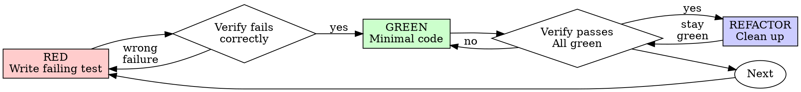

# Codex session 019f90a3-47e5-7770-a20e-cd9317bcbf2c

- Started: `2026-07-23T20:20:52.726Z`
- Working directory: `D:\100XH100`
- Originator: `Codex Desktop`
- Codex CLI: `0.145.0-alpha.30`
- Source log: `C:\Users\Иван Литвак\.codex\sessions\2026\07\30\rollout-2026-07-30T00-29-38-019fafc8-787c-7b73-9447-2920e9233baf.jsonl`
- Entries: user=5, assistant=253, tool calls=61, tool outputs=61

This is a chronological export of the user/assistant conversation and tool activity. Internal system/developer instructions and token accounting are intentionally excluded. Secret-shaped values are redacted; oversized tool outputs retain their beginning and end with the omitted character count.

## 1. User

Time: `2026-07-29T21:29:39.244Z` · source line `2`

```text
Subagent-driven делай, но с легким режимами размышлений оба, а ты контролируешь и направляешь

```

## 2. Codex

Time: `2026-07-29T21:29:39.244Z` · source line `6`

```text
Запускаю subagent-driven исполнение: два лёгких субагента параллельно — один ведёт публичный Kaggle runner, второй Cloudflare ingest; я остаюсь контроллером, развожу worktree/файлы, проверяю контракты, тесты и интеграцию между ними.
```

## 3. Codex

Time: `2026-07-29T21:29:39.245Z` · source line `10`

```text
Текущий checkout уже изолирован и чист. Создаю ещё два независимых worktree от `fa31690`, чтобы лёгкие агенты могли работать параллельно без конфликтов.
```

## 4. Codex

Time: `2026-07-29T21:29:39.248Z` · source line `33`

```text
Оба implementer-а работают параллельно в разных ветках. После каждого Task 1 я отдельно прогоню spec/quality review; дальше задачи будут выдаваться небольшими порциями, а не одним длинным автономным коммитом.
```

## 5. Codex

Time: `2026-07-29T21:29:39.252Z` · source line `58`

```text
Notebook Task 1 уже реализован и чисто закоммичен: базовый CayleyPy config/data contract, 11 тестов. Сейчас идёт независимый review; Cloudflare Task 1 ещё собирает строгую schema/runtime основу.
```

## 6. Codex

Time: `2026-07-29T21:29:39.255Z` · source line `84`

```text
Notebook Task 1 review завершён после fix-round: реальный CayleyPy CSV теперь грузится, bool-конфиги fail-closed, 19 тестов проходят. Notebook Task 2 уже делает автодетект MLP; ingest-код готовится к коммиту, но npm registry пока тормозит установку тестового runtime.
```

## 7. Codex

Time: `2026-07-29T21:29:39.261Z` · source line `135`

```text
Cloudflare review нашёл реальные schema-гейты; исправляю их через implementer. Отдельно npm на Windows блокирует сеть, поэтому проверю установку/test runtime через уже разрешённый Docker-контур — это не меняет код и может обойти сломанный локальный TLS/proxy.
```

## 8. Codex

Time: `2026-07-29T21:29:39.265Z` · source line `151`

```text
Продолжаю в subagent-driven режиме: сейчас проверю оба fix-round’а, сам не буду переписывать их код — прогоню гейты и отдам точечный diff тем же ревьюерам. Параллельно ноутбук продолжит двигаться, даже если npm-прокси всё ещё блокирует Cloudflare-ветку.
```

## 9. Codex

Time: `2026-07-29T21:29:39.268Z` · source line `168`

```text
Task 2 ноутбука после первого fix-round уже проходит 32/32 теста по общему public-модулю; сейчас идёт независимое повторное ревью именно пяти найденных проблем. В Cloudflare-ветке агент чинит строгие форматы и raw-byte лимит, но lockfile/runtime-гейт всё ещё зависит от восстановления npm-доступа.
```

## 10. Codex

Time: `2026-07-29T21:29:39.273Z` · source line `210`

```text
Новый полезный факт: Task 2 ноутбука теперь окончательно принят ревьюером — все 22 профильных теста зелёные. Я уже передал Task 3 свежему low-reasoning агенту; сам параллельно разблокирую Cloudflare lockfile через приватный удалённый гейт, потому что локальный прокси сейчас отвечает CONNECT timeout/502.
```

## 11. Codex

Time: `2026-07-29T21:29:39.275Z` · source line `234`

```text
Статус без приукрашивания: notebook Task 2 закрыт чисто; Task 3 пишется. Ingest Task 1 статически почти готов, но обнаружился ещё один реальный косяк исходного плана — версия `@cloudflare/workers-types 4.20260728.0` не опубликована; агент меняет её на подтверждённую точную `5.20260727.1`. После этого lockfile и тесты прогоню в приватном CPU-ноуте Kaggle, не на локальном сломанном npm-прокси.
```

## 12. Codex

Time: `2026-07-29T21:29:39.279Z` · source line `256`

```text
Приватный удалённый npm-гейт уже запущен: `trydotatwo/cayleypy-results-ingest-npm-gate`, CPU, internet on, GPU off, сейчас `RUNNING`. Метаданные проверены: notebook private, секретов и GitHub-токенов в пакете нет. Он должен вернуть реальный `package-lock.json`, Vitest и TypeScript typecheck — это закроет главный блокер ingest Task 1.
```

## 13. Codex

Time: `2026-07-29T21:29:39.285Z` · source line `315`

```text
Второй приватный гейт уже дал полезную диагностику: dependency resolution и `npm ci` теперь проходят. Он поймал две настоящие ошибки — тесты ожидали JSON Pointer без batch-префикса, а TypeScript не принимал unchecked cast после Ajv. Оба исправлены корректно, без ослабления валидации; v3 сейчас `RUNNING`. Notebook Task 3 тем временем закрыт ревьюером, Task 4 (reflection/path replay/dedupe) уже в работе.
```

## 14. Codex

Time: `2026-07-29T21:29:39.286Z` · source line `325`

```text
Главный Cloudflare-блокер снят: приватный Kaggle v3 отработал `COMPLETE`, точный payload совпал по SHA-256 с локальными файлами, `npm install --package-lock-only=0`, `npm ci=0`, Vitest `11/11`, TypeScript `typecheck=0`. Получен реальный lockfile SHA-256 `6c841524…f10b81`; агент сейчас переносит его и оформляет коммит/отчёт, после чего я отдам весь fix-range независимому ревьюеру.
```

## 15. Codex

Time: `2026-07-29T21:29:39.290Z` · source line `349`

```text
Для следующих ingest-задач подключаю Cloudflare skill: он нужен, чтобы D1/R2/Queue/Durable Object контракты совпадали с реальным Workers runtime, а не только проходили мок-тесты. Сначала прочитаю его правила целиком, затем передам Task 2 свежему агенту только после чистого ревью Task 1.
```

## 16. Codex

Time: `2026-07-29T21:29:39.293Z` · source line `366`

```text
Сейчас два независимых ревью-цикла: ingest Task 1 проверяется уже по реальному v3 lock/runtime evidence, а Task 4 чинит две небольшие hardening-дыры (глубокая неизменяемость `reached_state` и fail-closed при malformed generators). Алгоритмика CUDA не затрагивается; следующим шагом будут D1/R2 durability и runner orchestration.
```

## 17. Codex

Time: `2026-07-29T21:29:39.297Z` · source line `398`

```text
Task 4 теперь чисто принят: reflection/path replay/dedupe — 12 тестов, замечаний нет. Перед Task 5 подключаю профильный highload-GPU skill, потому что там уже не только Python-обвязка, но и host-only stop controls вокруг существующего multi-GPU runner; это поможет удержать границу «никаких изменений Stream/CUDA алгоритмов».
```

## 18. Codex

Time: `2026-07-29T21:29:39.298Z` · source line `416`

```text
Ingest Task 1 уже официально закрыт ревьюером: без замечаний, lockfile/версии/хэши/11 тестов/typecheck подтверждены. Сейчас параллельно идут две следующие вещи: реальный Miniflare D1+R2 receipt/state-machine тест и Task 5 runner orchestration; в обоих случаях публикации/деплоя пока нет.
```

## 19. Codex

Time: `2026-07-29T21:29:39.305Z` · source line `476`

```text
Продолжаю в SDD-режиме: ingest Task 2 уже прошёл приватный Kaggle-гейт, сейчас я проверю diff и отдам свежему лёгкому ревьюеру; параллельно дожму ревью notebook Task 5 и верну найденные дефекты исполнителю.
```

## 20. Codex

Time: `2026-07-29T21:29:39.306Z` · source line `485`

```text
Ревью notebook Task 5 нашло восемь реальных дефектов, включая три блокирующих: reflection фактически не запускался, collect мог рассинхронизировать два rank, а настоящий TSV не парсился. Возвращаю весь пакет исполнителю одним fix-round; «частично работает» в публичный ноут не попадёт.
```

## 21. Codex

Time: `2026-07-29T21:29:39.312Z` · source line `526`

```text
Cloudflare Task 2 тоже не принимаю: свежий adversarial-review воспроизвёл race, при котором duplicate мог получить ложный `queued` до durable Queue; плюс оставался orphan R2 и игнорировались D1 transition conflicts. Исполнитель получает fix-round и новый обязательный Kaggle gate с byte-exact payload.
```

## 22. Codex

Time: `2026-07-29T21:29:39.313Z` · source line `535`

```text
Сейчас оба fix-round идут параллельно на лёгком reasoning, а я проверил границы контрактов. Для collect верхняя граница одного depth действительно равна локальному frontier × move_count; на больших лучах это может не влезть в T4, поэтому корректное поведение — точный preflight-отказ для небезопасной комбинации, а не скрытая усечённая выборка. Следующие Task 6/Task 3 briefs уже подготовлены, но стартуют только после чистого повторного ревью.
```

## 23. Codex

Time: `2026-07-29T21:29:39.314Z` · source line `542`

```text
Notebook fix-round уже в RED-фазе: исполнитель сначала расширяет fake-runner и regression tests под reflection/реальные TSV/rank logs/ошибочные return codes. Ingest-исполнитель пока проектирует race-safe receipt, чтобы не залатать один interleaving ценой другого; код ещё не принят и не коммитился.
```

## 24. Codex

Time: `2026-07-29T21:29:39.324Z` · source line `582`

```text
Оба fix-round уже в коде: notebook чинит host-only синхронизацию collect и полный reflection pipeline; ingest добавил race tests на deferred Queue, orphan cleanup и конфликт D1 transitions. Я отдельно заставил покрыть ещё две границы, которые ревью не поймало: dedupe всех collect-результатов и отказ collect-профиля 2²⁵×24 до запуска, потому что один полный snapshot плюс frontier не помещается в T4.
```

## 25. Codex

Time: `2026-07-29T21:29:39.327Z` · source line `624`

```text
Root-аудит поймал ещё одну важную вещь уже после первоначального ревью: старый distributed gather резервировал пакетный scratch пропорционально полной capacity и потому collect на 2 rank падал бы при первом найденном решении. Исполнитель уже переделывает его на actual-count + фиксированные NCCL chunks. Также добавляю live-stream rank0 в ноут, чтобы многочасовой запуск не выглядел зависшим и не копил весь stdout в RAM.
```

## 26. Codex

Time: `2026-07-29T21:29:39.329Z` · source line `638`

```text
Cloudflare Task 2 fix теперь подтверждён приватным Kaggle v10: 11 schema + 15 real Miniflare receipt tests, typecheck, и все 14 payload-хешей совпадают с amended HEAD. Я всё равно не двигаю Task 3, пока повторный adversarial-review не даст чистый PASS.
```

## 27. Codex

Time: `2026-07-29T21:29:39.330Z` · source line `651`

```text
Повторный Cloudflare-review нашёл уже архитектурный crash-window, а не локальный баг: durable Queue и D1 не могут обновиться атомарно. Я не буду замазывать его. Делаем правильную at-least-once схему: consumer сможет забрать `received`, повторный клиент сможет восстановить stale dispatch, а плановый sweeper будет переотправлять `received|retryable`; downstream остаётся идемпотентным.
```

## 28. Codex

Time: `2026-07-29T21:29:39.334Z` · source line `678`

```text
Ещё один критичный контракт я нашёл в orchestration: профили выбирались, но без `BEAM_RUNTIME_CONFIG_MODE=manual` production runner мог их проигнорировать и снова автонастроиться. Это уже в fix-scope вместе с проверенными internal history/headroom defaults. То есть итоговый ноут будет реально запускать выбранный профиль, а не только красиво печатать его в preflight.
```

## 29. Codex

Time: `2026-07-29T21:29:39.335Z` · source line `689`

```text
Cloudflare recovery теперь строится как настоящий at-least-once state machine, включая fairness: неудачный retry обязан обновлять `updated_at`/`retry_count`, иначе первые 100 плохих записей могли бы навсегда заблокировать очередь восстановления. Успешный retry очищает старый `safe_error`. Это именно те гонки, которые обычно всплывают только под сотней параллельных клиентов — мы закрываем их до деплоя.
```

## 30. Codex

Time: `2026-07-29T21:29:39.338Z` · source line `714`

```text
Продолжаю в режиме SDD: два лёгких агента закрывают notebook Task 5 и надёжность ingest Task 2, я проверяю диффы, тестовые доказательства и не пускаю дальше до чистого ревью. Сейчас добиваю два критичных места: безопасную очистку 32 GiB history-арен между запусками и восстановление Queue/D1 после неоднозначных сбоев.
```

## 31. Codex

Time: `2026-07-29T21:29:39.339Z` · source line `726`

```text
Промежуточно: recovery-контракт уже исправлен в коде и плане — stale `received|retryable` переотправляются с тем же `submission_id`, неудачи двигают `updated_at/retry_count`, а будущий consumer обязан принимать `received`. В notebook агент уже добавил тест на два последовательных запуска; я заметил рассинхрон между тестом и dataclass/cleanup и вернул его на исправление до запуска полного gate.
```

## 32. Codex

Time: `2026-07-29T21:29:39.342Z` · source line `743`

```text
Очистка history теперь реализована корректно: путь хранится в invocation, удаление идёт в `finally` после захвата rank-логов, разрешён только реальный потомок `/tmp/beam_history_public`; тест проверяет success+failure подряд и сохранность внешнего sentinel. Сейчас оба агента гоняют полные gates и оформляют воспроизводимые отчёты; после коммитов я запускаю независимое ревью, а не принимаю их самооценку.
```

## 33. Codex

Time: `2026-07-29T21:29:39.344Z` · source line `760`

```text
Полный notebook gate сейчас идёт после последних исправлений; локальный focused gate уже 20/20. Ingest v11 всё ещё `RUNNING`; агент нашёл тестовый microtask-hang уже после отправки, поэтому v11 будет только диагностикой, а окончательный доказательный запуск — v12 по финальным байтам и с проверкой SHA-256.
```

## 34. Codex

Time: `2026-07-29T21:29:39.347Z` · source line `775`

```text
Notebook Task 5 прошёл полный локальный gate: 75/75 public-тестов, 32/32 focused runner/path, `py_compile` и staged diff-check. BOM в CUDA-файле отсутствует. Сейчас фиксируется точный коммит; затем я отдам именно его независимому reviewer и после чистого ответа запущу private 2xT4 compile/smoke. Ingest v11 с известным зависшим тестом supersede’им приватным v12 по исправленным байтам.
```

## 35. Codex

Time: `2026-07-29T21:29:39.349Z` · source line `793`

```text
Ingest v12 уже `COMPLETE`: 11 schema-тестов, 18 реальных Miniflare receipt/recovery тестов и TypeScript typecheck прошли. Сейчас сверяются 14 SHA-256 с текущими файлами — это отсечёт ложный PASS от устаревшей версии. Notebook-коммит `022b539` уже передан отдельному read-only reviewer по полному диапазону `c7fc69e..022b539`.
```

## 36. Codex

Time: `2026-07-29T21:29:39.352Z` · source line `818`

```text
Оба точных коммита теперь заморожены и проверяются параллельно двумя независимыми reviewer’ами: notebook `022b539`, ingest `dde1cc99`. По ingest я дополнительно просмотрел скачанный `npm-gate-results.json`: все шесть команд имеют exit 0, Miniflare реально поднял изолированный runtime, а payload map содержит 14 ожидаемых SHA. Следующие implementation tasks не стартую до ответа reviewer’ов.
```

## 37. Codex

Time: `2026-07-29T21:29:39.355Z` · source line `832`

```text
Пока reviewer’ы не нашли новых P0/P1. Отдельно подтверждено, что прежнее Queue/D1 crash-window закрыто на всех основных interleaving’ах; notebook reviewer ещё разбирает коллективный порядок NCCL и lifecycle history — это самая рискованная часть текущего коммита, поэтому не тороплю его.
```

## 38. Codex

Time: `2026-07-29T21:29:39.357Z` · source line `844`

```text
Reviewer нашёл один реальный контрактный дефект в ingest-плане: режим `store_only` сохраняет запрос без Queue, но будущий cron recovery сейчас безусловно подхватил бы его через 60 секунд и всё равно отправил на валидацию — обход аварийного выключателя публикации. Сам Task 2 helper нормален; исправляем guard в Task 3/4 контракте и добавляем тесты, что `store_only/read_only` ничего не enqueue’ят.
```

## 39. Codex

Time: `2026-07-29T21:29:39.358Z` · source line `855`

```text
Ingest reviewer добавил ещё один небольшой, но важный gate-дефект: Miniflare-тесты исполняли вручную сокращённый `CREATE TABLE`, а не настоящий `migrations/0001_initial.sql`; значит индекс и `CHECK` были только привязаны SHA, но не запускались. Уже отправил round 3: реальные migration bytes в test harness, аварийные mode-guards на всех будущих entrypoint’ах и приватный v13 с повторной hash-проверкой.
```

## 40. Codex

Time: `2026-07-29T21:29:39.360Z` · source line `871`

```text
Notebook reviewer поймал P0, поэтому `022b539` не принят: production runner в обычной release-сборке пишет `puzzle_solved=1 … solution=<path>`, а Python разбирал только debug-маркер `solution_path=`. То есть first-mode мог реально найти решение и потерять его в orchestration. Второй дефект — наследование чужих `BEAM_*` из окружения могло переключить runner, например, в repair mode. Жду полный список и отправляю отдельный fix-round с реальными release-line fixtures и герметичным env.
```

## 41. Codex

Time: `2026-07-29T21:29:39.365Z` · source line `910`

```text
Оба fix-round’а запущены. Для notebook я задал не косметический cap, а точный bounded design: NCCL всё ещё читает snapshot фиксированными чанками, но держит только ограниченную следующую детерминированную пачку; если первые кандидаты дают дубликаты путей, идёт следующий cursor-pass, пока не набрано пользовательское `MAX_COLLECTED_SOLUTIONS`. Это сохраняет корректность без вектора на десятки миллионов записей.
```

## 42. Codex

Time: `2026-07-29T21:29:39.366Z` · source line `922`

```text
Ingest round 3 уже имеет честный RED: сокращённая тестовая схема не содержала `submissions_recovery` и принимала запрещённое состояние. Новый harness загружает ровно production migration bytes через Vitest config, затем D1-тест проверяет индекс `[state, updated_at]` и отклонение неизвестного state. Локальный npm снова упирается в `ECONNRESET`, поэтому окончательный GREEN будет только на exact private v13.
```

## 43. Codex

Time: `2026-07-29T21:29:39.370Z` · source line `953`

```text
Notebook RED сейчас 6 ожидаемых падений; Python-часть уже чинится. Я отдельно добавил проверку настоящего torchrun framing: combined log имеет префикс `[default0]:`, поэтому новый parser нормализует только этот строгий line-prefix, а не ищет `solution=` где угодно. Это закрывает ещё один случай, который unit fixture без torchrun не поймал бы.
```

## 44. Codex

Time: `2026-07-29T21:29:39.372Z` · source line `977`

```text
Ingest v13 уже `COMPLETE`; теперь проверяется не только SHA migration, но и её фактическое выполнение в D1. Ожидаемый gate: 11 schema + 19 receipt, где новый тест читает настоящий SQL, видит recovery-index и получает отказ на недопустимое состояние. Notebook Python-фиксы тоже уже в работе; я дополнительно поправил provenance: supplied source должен быть fallback-кандидатом, но не затирать доказательство, если тот же путь реально нашёл solver.
```

## 45. Codex

Time: `2026-07-29T21:29:39.372Z` · source line `985`

```text
v13 честно упал: schema 11/11 и typecheck прошли, но receipt setup показал, что `D1.exec()` режет многострочный `CREATE TABLE` как неполный запрос; 19 тестов не исполнялись. Это полезный gate, не принимаем. Сразу идём в private v14 через официальный Cloudflare migration harness (`readD1Migrations` + `applyD1Migrations`), сохраняя exact production SQL без самодельной схемы.
```

## 46. Codex

Time: `2026-07-29T21:29:39.374Z` · source line `995`

```text
Notebook Python fix уже имеет 44/44 focused green, включая source fallback, solver-provenance и inverse preflight. Самая тяжёлая C++ bounded-gather часть ещё пишется. Ingest v14 пока не отправлен: агент подтвердил, что удаляет именно упавший raw-`D1.exec` путь и переходит на официальный migration fixture API перед новым запуском.
```

## 47. Codex

Time: `2026-07-29T21:29:39.376Z` · source line `1005`

```text
v14 fix ещё не отправлен — старый raw-exec код пока остаётся в рабочем диффе, что я явно заблокировал; push разрешён только после сохранённого `readD1Migrations/applyD1Migrations`. В notebook C++ уже выделен header-only snapshot и строгий total-order для bounded batches; далее агент заменяет полный host-vector и добавляет безопасное завершение torchrun при исключениях.
```

## 48. Codex

Time: `2026-07-29T21:29:39.382Z` · source line `1042`

```text
v14 — полный GREEN: schema 11/11, receipt 19/19 через официальный migration setup, typecheck, все 6 команд exit 0, SHA 15/15 совпали с текущим worktree; metadata приватная и CPU-only. v13 failure сохранится в отчёте как доказательство, что gate действительно ловит неправильный способ применения миграции.
```

## 49. Codex

Time: `2026-07-29T21:29:39.385Z` · source line `1060`

```text
Notebook C++ bounded selection уже корректно ограничивает память, но я направил ещё одно ускорение: не allgather’ить все ~50 млн hit-records при `2**21×24`. Каждый rank локально оставляет свой next-K после cursor, а NCCL обменивает только ≤K с каждого rank; глобальный K математически всегда лежит в объединении локальных K. Это сохраняет точность и резко режет PCIe/NCCL трафик без нового CUDA kernel.
```

## 50. Codex

Time: `2026-07-29T21:29:39.394Z` · source line `1100`

```text
Продолжаю в том же режиме: два лёгких сабагента делают реализацию и независимый разбор, я сейчас закрываю найденную дырку с потерей сообщений после `max_retries` и параллельно довожу bounded collector/парсер ноутбука до повторного ревью. Публично пока ничего не выкладываю.
```

## 51. Codex

Time: `2026-07-29T21:29:39.397Z` · source line `1128`

```text
Notebook Task 5 теперь собран отдельным коммитом: 97 локальных тестов зелёные, включая реальные форматы release-логов, отражение, bounded сбор решений и аварийную очистку `torchrun`. Следующий обязательный барьер — независимое ревью коммита и затем приватная компиляция/дымовой прогон на настоящих 2×T4; локально Windows это честно не подтверждает.
```

## 52. Codex

Time: `2026-07-29T21:29:39.399Z` · source line `1145`

```text
Параллельно проверил старые линии: и Tetraminx integration, и autoprofile sweep сейчас имеют статус `COMPLETE`; их артефакты уже лежат локально. Для нового публичного ноутбука я не считаю это заменой acceptance — его собственный reviewed commit отдельно прогоню на приватных 2×T4 после ревью.
```

## 53. Codex

Time: `2026-07-29T21:29:39.404Z` · source line `1179`

```text
По ingest исправление уже ушло в TDD: вместо бесконечных `Queue.retry()` будет подтверждённая запись `ingest_paused` в D1 и ACK, а если сама D1-парковка ломается до исчерпания ретраев, stale `queued` запись автоматически подхватит normal-mode sweep. Это закрывает реальную потерю принятого результата при долгой паузе сервиса.
```

## 54. User

Time: `2026-07-29T21:29:39.405Z` · source line `1183`

```text
<environment_context>
  <current_date>2026-07-29</current_date>
  <timezone>Europe/Moscow</timezone>
  <filesystem><workspace_roots><root>D:\100XH100</root></workspace_roots><permission_profile type="managed"><file_system type="restricted"><entry access="read"><special>:root</special></entry><entry access="write"><path>D:\100XH100</path></entry><entry access="write"><special>:slash_tmp</special></entry><entry access="write"><special>:tmpdir</special></entry><entry access="write"><path>C:\Users\Иван Литвак\.codex\visualizations\2026\07\23\019f90a3-47e5-7770-a20e-cd9317bcbf2c</path></entry><entry access="read"><path>D:\100XH100\.git</path></entry><entry access="read"><path>D:\100XH100\.agents</path></entry><entry access="read"><path>D:\100XH100\.codex</path></entry></file_system></permission_profile></filesystem>
</environment_context>
```

## 55. User

Time: `2026-07-29T21:29:39.406Z` · source line `1185`

```text
Продолжай

```

## 56. Codex

Time: `2026-07-29T21:29:39.406Z` · source line `1187`

```text
Продолжаю. Сейчас два лёгких сабагента по-прежнему заняты строго раздельно: один закрывает lossless-паузу Cloudflare ingest, второй делает read-only ревью `cc2d0d8`; я после их результатов либо отправлю точечный fix-round, либо сразу поставлю приватный 2×T4 compile/collect smoke.
```

## 57. Codex

Time: `2026-07-29T21:29:39.412Z` · source line `1225`

```text
Есть честный RED для ingest: приватный Kaggle CPU v15 завершился именно четырьмя ожидаемыми падениями новых тестов — отсутствует `parkPausedSubmission`; прежние 11 schema и 19 receipt-тестов остались зелёными. Теперь сабагент реализует минимальный storage/recovery слой и затем обязан получить новый exact GREEN, а не переименовать этот запуск в успех.
```

## 58. Codex

Time: `2026-07-29T21:29:39.414Z` · source line `1235`

```text
Независимое ревью Task 5 завершилось без P0/P1. Нашёлся один P2 в лог-парсере: он снимал любой `[anything]:`, а должен принимать только реальный `[default0]:`, плюс слишком свободно валидировал поле `seconds`. Уже идёт узкий fix-round; CUDA/C++ сборщик ревью признало архитектурно закрытым, но реальный 2×T4 gate всё равно остаётся обязательным.
```

## 59. Codex

Time: `2026-07-29T21:29:39.416Z` · source line `1255`

```text
Сейчас оба потока в ожидаемой середине TDD: ingest уже имеет реализацию D1 park + stale `queued` recovery поверх зафиксированного v15 RED; notebook parser имеет 6 точных RED-регрессий и получает минимальный Python-only fix. Следующее содержательное обновление дам по GREEN/коммитам, не по промежуточным конфигам.
```

## 60. Codex

Time: `2026-07-29T21:29:39.416Z` · source line `1261`

```text
Ingest получил exact GREEN на приватном Kaggle CPU v16: `11/11` schema, `23/23` receipt/recovery, typecheck, включая 101 повторную доставку одного paused-result без потери/дублирования. Сейчас агент фиксирует хэши/metadata и оформляет один standalone-коммит; после этого я снова отдам диапазон независимому ревью.
```

## 61. Codex

Time: `2026-07-29T21:29:39.417Z` · source line `1281`

```text
Parser fix уже GREEN: 49 runner-тестов, 62 focused и 105 всего public-suite; негативные `[evil]:` и невалидные/non-finite `seconds` теперь закрыты. Осталось только зафиксировать evidence/commit и повторно отдать этот маленький диапазон read-only ревью.
```

## 62. Codex

Time: `2026-07-29T21:29:39.420Z` · source line `1298`

```text
Ingest round-4 зафиксирован отдельным `d50d7bb`: v15 RED сохранён, v16 GREEN подтверждён, worktree чистый. Я уже запустил повторное независимое ревью именно диапазона `9a966d5..d50d7bb`; оно проверяет не только тесты, но и неоднозначный Queue send, terminal states, cron fairness и точные artifact-хэши.
```

## 63. Codex

Time: `2026-07-29T21:29:39.423Z` · source line `1317`

```text
Оба содержательных GREEN уже есть; сейчас задержка только в аккуратной фиксации evidence под Windows split-root sandbox, не в коде. Я не разрешаю обходить это грязной перезаписью файлов: изменения проходят через проверяемые scoped patches, затем clean worktree и независимый diff-review.
```

## 64. Codex

Time: `2026-07-29T21:29:39.424Z` · source line `1341`

```text
Parser P2 уже закреплён отдельным `6830401`, exact parent `cc2d0d8`, полный suite `105 passed`, C++ diff отсутствует. Сейчас одновременно идут два финальных read-only ревью (`d50d7bb` ingest и `6830401` parser); после их clean verdict запускаю приватный 2×T4 compile + first/collect smoke с повторным TSV и RSS-замером.
```

## 65. Codex

Time: `2026-07-29T21:29:39.427Z` · source line `1367`

```text
Оба независимых ревью чистые. Запустил следующую пару: реальный private Kaggle 2×T4 gate для `6830401` (compile + first + два collect-прогона с byte-identical TSV/RSS/rank logs) и Task 3 ingest (`normal/store_only/reject`, HTTP, rate limits, status/health, scheduled recovery) с новым private CPU RED→GREEN.
```

## 66. Codex

Time: `2026-07-29T21:29:39.427Z` · source line `1370`

```text
Для следующего этапа явно применяю три профильных skill-контракта: Kaggle — для приватных kernel gates, Cloudflare — для Worker/D1/Queue API, и subagent-driven development — для разделения реализации и независимого контроля. Сейчас сверяю их требования перед дальнейшими мутациями.
```

## 67. Codex

Time: `2026-07-29T21:29:39.431Z` · source line `1397`

```text
Оба новых шага начали TDD с чистых баз. Важное уточнение из актуальной Cloudflare-документации: встроенный RateLimit POP-local и eventual-consistent, поэтому глобальный лимит 2 000/min нельзя честно обещать только им — D1 fallback остаётся обязательным. Private 2×T4 gate уже зафиксировал exact source SHA, p16 профиль и puzzle 1=`BR`; дальше идут RED-артефакты.
```

## 68. Codex

Time: `2026-07-29T21:29:39.433Z` · source line `1423`

```text
Первый private-gate RED уже зафиксирован тестом отсутствующего builder-модуля. Task 3 чуть задержал известный Windows split-root баг `apply_patch`; я прекратил повторные попытки и разрешил только scoped `git apply --check` внутри exact worktree, с последующим diff-аудитом. Кодовых блокеров нет.
```

## 69. Codex

Time: `2026-07-29T21:29:39.438Z` · source line `1437`

```text
Продолжаю с двумя low-reasoning сабагентами: один доводит реальный приватный 2×T4 gate, второй — HTTP/mode/recovery слой ingest-сервиса. Сейчас проверю их фактические диффы и не дам перейти к следующему этапу без независимого ревью и runtime-доказательств.
```

## 70. Codex

Time: `2026-07-29T21:29:39.440Z` · source line `1457`

```text
Старые четыре Kaggle-ядра сейчас все в терминальном `COMPLETE`; это само по себе не доказательство корректности, поэтому я не засчитываю их как acceptance. Новый gate строится отдельно на exact reviewed commit и будет считаться пройденным только по двум T4, обоим rank-логам, CPU-валидации и byte-identical collect-прогонам.
```

## 71. Codex

Time: `2026-07-29T21:29:39.442Z` · source line `1470`

```text
Ingest-поток закончил полноценный RED-набор: режимы, лимиты, дубликаты, mixed receipts и scheduled recovery покрыты до production-кода. Я сейчас проверяю тесты на ложноположительные сценарии; только после этого разрешу private CPU RED и реализацию.
```

## 72. Codex

Time: `2026-07-29T21:29:39.442Z` · source line `1475`

```text
RED-тесты прошли мой контроль. Сабагент правильно остановился на запрете внешней загрузки; я сам проверю приватность/хэши kernel payload и выполню разрешённый вами private Kaggle push из root-контекста. Production-кода в этой версии ещё нет, поэтому ожидаемый результат — точный RED, а не «успех».
```

## 73. Codex

Time: `2026-07-29T21:29:39.444Z` · source line `1500`

```text
Private 2×T4 gate builder теперь целиком собран: локальный focused-набор зелёный. Я повторяю тесты независимо и отдельно проверяю generated notebook до загрузки — metadata private, ровно 2×T4, embedded source SHA, отсутствие секретов и сохранённых outputs.
```

## 74. Codex

Time: `2026-07-29T21:29:39.446Z` · source line `1515`

```text
Private CPU v17 завершился ожидаемым чистым RED: schema `11/11` и прежний receipt-контракт `23/23` зелёные; единственная причина падения worker-suite и typecheck — отсутствующий `src/worker.ts`. Значит тестовая постановка не сломала прежнюю базу, ingest-сабагент уже реализует ровно недостающий слой.
```

## 75. Codex

Time: `2026-07-29T21:29:39.449Z` · source line `1544`

```text
Ingest GREEN-кандидат готов. Перед v18 я проверяю точные SHA, append-only migration, отсутствие Task4/секретов, private CPU metadata и сам SQL rate-limit на атомарность; затем загружу только этот проверенный payload.
```

## 76. Codex

Time: `2026-07-29T21:29:39.452Z` · source line `1564`

```text
Ingest v18 сейчас `RUNNING`; payload уже содержит exact `worker.ts`, `storage.ts`, миграцию `0002` и тесты. Пока нет immutable output, GREEN не объявляю. Параллельно 2×T4 gate проходит дополнительный adversarial-тест: поддельный `cpu_solution_valid=true` больше не должен приниматься без реального replay пути.
```

## 77. Codex

Time: `2026-07-29T21:29:39.452Z` · source line `1569`

```text
v18 дал полезный runtime-блокер, не логику API: typecheck зелёный, schema `11/11` и receipt `23/23` зелёные, но Workers-pool падает при загрузке AJV (`Unexpected token ':'` в CJS shim) до запуска новых тестов. Перехожу по systematic-debugging skill: сначала локализую несовместимый import/runtime boundary, затем минимальный config/import fix и новый private GREEN-кандидат.
```

## 78. Codex

Time: `2026-07-29T21:29:39.455Z` · source line `1586`

```text
v19 запущен с единственным config-only изменением по официальному Cloudflare workaround для CJS module resolution; production-хэши не менялись. Если suite начнёт исполняться, следующий результат уже отделит runtime-загрузку от реальных ошибок API/лимитов — именно это и нужно для точной диагностики.
```

## 79. Codex

Time: `2026-07-29T21:29:39.459Z` · source line `1610`

```text
Первый optimizer-workaround не сработал, поэтому я не наслаиваю ещё один «наугад». Причина уточнена: production импортирует deep entry `ajv/dist/2020.js`, а v19 предбандлил только top-level `ajv`; Workers-pool всё ещё открыл deep CommonJS напрямую (`?mf_vitest_no_cjs_esm_shim`). Сейчас воспроизвожу это локально на тех же pinned npm-версиях и проверю одну гипотезу — exact deep-entry prebundle.
```

## 80. Codex

Time: `2026-07-29T21:29:39.462Z` · source line `1627`

```text
2×T4 gate после hardening зелёный локально: adversarial replay теперь отклоняет ложный `cpu_solution_valid`, полный public-набор `133/133`. Я повторяю финальные хэши/5 focused-тестов и сразу отправляю private GPU-версию; публичных изменений или публикации ветки нет.
```

## 81. Codex

Time: `2026-07-29T21:29:39.465Z` · source line `1633`

```text
Продолжаю двумя low-reasoning агентами, как договорились. Сейчас одновременно: исправленный v20 CPU-гейт ingest (точный deep-import AJV) и 2×T4 gate; у GPU-gate Kaggle нормализовал slug, поэтому v1 считаю только диагностическим и готовлю корректно аттестованный v2.
```

## 82. Codex

Time: `2026-07-29T21:29:39.468Z` · source line `1653`

```text
Оба исправленных кандидата уже запущены приватно: ingest v20 и GPU v2. Пока Kaggle выполняет их, я независимо проверяю diff и контракты, чтобы не принять «зелёный» notebook только по статусу COMPLETE.
```

## 83. Codex

Time: `2026-07-29T21:29:39.470Z` · source line `1671`

```text
Новый факт по ingest v20: production-код и typecheck зелёные; 60/64 теста прошли. Четыре падения оказались не runtime-багами, а двумя ошибками самого тестового стенда (явный `undefined` подменялся на `normal`, и слишком строгая проверка lazy stream). Агент делает v21 только с исправлением тестов; production hash остаётся неизменным. GPU v2 всё ещё RUNNING.
```

## 84. Codex

Time: `2026-07-29T21:29:39.472Z` · source line `1689`

```text
GPU v2 прошёл полностью: реальные 2×Tesla T4, Release/sm75/NCCL, оба rank rc=0. `first` нашёл валидный `BR` за 0.108281 с; два независимых `collect` дали по 16 уникальных CPU-валидных путей и байт-в-байт одинаковый TSV. Peak RSS около 1.56 GB на прогон. Сейчас агент фиксирует evidence и делает чистый commit; ingest v21 ещё RUNNING.
```

## 85. Codex

Time: `2026-07-29T21:29:39.473Z` · source line `1699`

```text
Ingest v21 теперь полностью зелёный: 64/64 Miniflare-теста, typecheck PASS, 18/18 скачанных payload-хэшей совпали с текущим worktree; kernel приватный и CPU-only. Значит оба текущих runtime-гейта прошли. Осталось оформить два атомарных commit и пропустить их через отдельный review, прежде чем брать Task 4/Task 6.
```

## 86. Codex

Time: `2026-07-29T21:29:39.480Z` · source line `1742`

```text
Контрольная проверка с моей стороны тоже зелёная: downloaded GPU v2 повторно прошёл независимый validator, а объединённый public-runner + gate suite дал 111/111. Секретов и приватных путей в новом package/raw evidence не найдено; жду только завершения атомарного оформления, затем запускаю отдельный review.
```

## 87. Codex

Time: `2026-07-29T21:29:39.482Z` · source line `1766`

```text
Сейчас без нового runtime-блокера: GPU commit уже чистый и находится на независимом review; ingest-агент оформляет только обязательные plan/report/memory evidence вокруг уже зелёного v21. После review сразу раздаю следующую пару: Queue/replay для сервиса и best-effort publisher для notebook.
```

## 88. Codex

Time: `2026-07-29T21:29:39.487Z` · source line `1798`

```text
Review нашёл два реальных P2 в самом GPU-gate, не в solver: в commit не сохранён сырой Kaggle receipt, доказывающий именно remote version/status, и после завершения дочернего процесса хвост stdout мог обходить 8 MiB cap без гарантированного reap. Это чинится только в notebook/gate harness; CUDA/beam-search не трогаем. После точных line anchors сделаю v3 и сохраню push/status/list receipts как отдельное доказательство.
```

## 89. Codex

Time: `2026-07-29T21:29:39.488Z` · source line `1813`

```text
Итог review: P0/P1 нет, сама v2 runtime-evidence признана корректной; два P2 изолированы в gate harness. Я уже вернул их notebook-агенту с TDD и обязательным v3 remote attestation. Параллельно ingest Task 3 заканчивает clean commit.
```

## 90. Codex

Time: `2026-07-29T21:29:39.490Z` · source line `1825`

```text
Ingest Task 3 зафиксирован отдельным commit `f0c81ed`: v21 64/64 + typecheck + 18/18 hashes. Временные debug-cache директории контроллера удалены, worktree чистый. Сейчас отдельный агент ревьюит именно этот commit, а второй чинит два P2 и готовит GPU v3.
```

## 91. Codex

Time: `2026-07-29T21:29:39.494Z` · source line `1851`

```text
Предварительный ingest-review нашёл один вероятный P1 availability: 25 MiB JSON сейчас создаёт несколько полных копий (chunks → Uint8Array → UTF-16 string → parsed object → повторный stringify), что может пересечь лимит 128 MB Worker isolate. Также есть P2 на malformed `%` в status URL. После финальных anchors уменьшу безопасный batch-byte budget/уберу лишнюю копию и добавлю bounded fan-out; это API/Worker fix, данные и solver не затрагиваются.
```

## 92. Codex

Time: `2026-07-29T21:29:39.497Z` · source line `1877`

```text
Финальный ingest-review дал 2×P1 и 4×P2. Кроме памяти, найден важный boundary race: медленный запрос мог откатить минутное окно глобального D1 rate counter назад. Я уже раздал точный fix-set: монотонный UPSERT, streaming decode + 4 MiB cap, bounded concurrency/общий poll budget, safe malformed URL, точная compatibility date и сырой remote receipt для v22. Деплой пока не делаем.
```

## 93. Codex

Time: `2026-07-29T21:29:39.498Z` · source line `1889`

```text
GPU-fix уже имеет честный TDD: два новых теста сначала упали ровно на EOF-cap и unreaped child, затем прошли после минимального harness-only исправления. Ingest тоже пойдёт честно: приватный v22 будет exact RED с неизменным production, затем v23 — GREEN; это нужно, потому что локальный Windows npm runtime ненадёжен.
```

## 94. Codex

Time: `2026-07-29T21:29:39.501Z` · source line `1911`

```text
Оба fix-потока сейчас в RED/GREEN цикле. GPU: process-capture GREEN, remote-attestation тест уже добавлен и должен быть единственным оставшимся RED. Ingest: готовится exact v22 RED без изменения production hashes; после него только узкий Worker/config patch.
```

## 95. Codex

Time: `2026-07-29T21:29:39.501Z` · source line `1920`

```text
GPU v3 package готов локально и 9/9 тестов зелёные. Сейчас делаю приватный push с раздельным raw stdout/stderr capture и UTC timestamp; после COMPLETE сниму status/list/pulled-metadata, добавлю их в downloaded evidence и только тогда приму v3.
```

## 96. Codex

Time: `2026-07-29T21:29:39.503Z` · source line `1938`

```text
GPU v3 уже COMPLETE. Сейчас снимаю четыре независимых raw receipt: status, kernels-list lastRunTime/ref, pulled private metadata и текущий source hash; затем downloaded validator должен пройти с ними без доверия к self-attestation notebook.
```

## 97. Codex

Time: `2026-07-29T21:29:39.509Z` · source line `1989`

```text
Нужен один явный approval от тебя: Windows sandbox снова не умеет `apply_patch` внутри `.worktrees`, а автоматический reviewer отклонил безопасный fallback только из‑за исчерпанного usage quota и запретил обход без нового согласия пользователя.

Разрешаешь применить точный patch через scoped `git apply --check` → `git apply` только к тестам/Worker-файлам в `D:\100XH100\.worktrees\cayleypy-results-ingest`? Diff будет предварительно проверен, CUDA и чужие изменения не затрагиваются. Пока жду ответ, GPU v3 продолжаю оформлять.
```

## 98. Codex

Time: `2026-07-29T21:29:39.513Z` · source line `2007`

```text
Продолжаю по разрешённой части: сейчас закрываю и независимо перепроверяю финальный 2×T4 GPU-gate. Ветка ingest остаётся без изменений до отдельного подтверждения точечного patch, которое я запросил выше.
```

## 99. Codex

Time: `2026-07-29T21:29:39.514Z` · source line `2018`

```text
Параллельно перепроверил два старых приватных Kaggle-контура: и Tetraminx integration, и 2×T4 autoprofile sweep сейчас имеют terminal state `COMPLETE`. Нового `RUNNING`/`ERROR` нет; основной активный блок — упаковка проверенного v3 GPU-gate.
```

## 100. Codex

Time: `2026-07-29T21:29:39.515Z` · source line `2025`

```text
GPU-часть уже по существу готова: код, реальный v3-вывод с двух T4 и оба отчёта собраны; хеш пакета не изменился. Сейчас идут последние 9 focused + 137 full тестов, повторный validator и один чистый commit — ориентир 10–15 минут.
```

## 101. Codex

Time: `2026-07-29T21:29:39.515Z` · source line `2029`

```text
Финальная проверка идёт без новых ошибок. Отдельно посмотрел diff отчёта: он фиксирует именно version 3, два реальных T4, `COMPLETE`, проверенный solve `BR`, два детерминированных collect-прогона и внешнюю Kaggle-аттестацию — старый self-attestation больше не считается достаточным.
```

## 102. Codex

Time: `2026-07-29T21:29:39.516Z` · source line `2037`

```text
Последний full-test процесс уже завершился; сейчас агент сводит staged payload и хеши перед commit. Рабочее дерево содержит только ожидаемые Task 5-файлы: builder/tests/notebook, v3-отчёты, ledger и обязательные `CHANGELOG`/`PROMPTS`.
```

## 103. Codex

Time: `2026-07-29T21:29:39.518Z` · source line `2055`

```text
Агент завис уже после успешного staging, без активных тестов или git-процесса. Я остановил именно его turn, сохранил полностью подготовленный staged payload и сейчас сам завершаю commit и независимый review — работа не потеряна.
```

## 104. Codex

Time: `2026-07-29T21:29:39.519Z` · source line `2068`

```text
GPU Task 5 теперь зафиксирован commit `07904b0bf77186934b39200d5a385ab85af8851c`; дерево чистое. Моя повторная проверка: `9/9` focused, `137/137` full, validator `status=ok`, remote version 3/private/COMPLETE, semantic match pulled notebook, secret/private-path scan — 0 находок. Остался независимый read-only review этого exact commit.
```

## 105. Codex

Time: `2026-07-29T21:29:39.520Z` · source line `2078`

```text
Независимый review не нашёл P0/P1, но поймал два честных P2, которые я не пропускаю:

- в сохранённом remote `list.csv` остался display name автора, хотя отчёт называл evidence полностью sanitized;
- старый `task-5-report.md` всё ещё говорит про acceptance v2, тогда как v3 уже superseding.

Сначала закрываю оба и повторяю точечные гейты; только после этого Task 5 считается завершённым.
```

## 106. Codex

Time: `2026-07-29T21:29:39.521Z` · source line `2095`

```text
Исправление P2 делаю без нового Kaggle-прогона: вычислительный notebook и его hash не меняются. Из публичного evidence удаляется весь `list.csv` с display name; acceptance остаётся строго подтверждён push receipt v3 + `COMPLETE` status + private pulled metadata + семантически совпавший pulled notebook. Параллельно обновляется забытый Task 5 report с v2 на v3.
```

## 107. Codex

Time: `2026-07-29T21:29:39.522Z` · source line `2105`

```text
TDD-контракт сработал как надо: новый list-free fixture упал ровно потому, что старый validator всё ещё требовал `remote/list.csv`. Теперь вносится минимальная GREEN-правка validator/evidence/docs; вычислительный пакет не регенерируется.
```

## 108. Codex

Time: `2026-07-29T21:29:39.522Z` · source line `2113`

```text
GREEN-правка уже сузила публичную remote-аттестацию: зависимость от Kaggle list и её hash удалена из validator, fixture и manifest. Сейчас удаляется сам файл и приводятся в соответствие оба отчёта; затем полный повтор тестов/scan.
```

## 109. Codex

Time: `2026-07-29T21:29:39.523Z` · source line `2116`

```text
Нужна ещё одна точечная санкция после sandbox-rejection: удалить из worktree ровно один tracked-файл  
`D:\100XH100\.worktrees\public-cayleypy-notebook\test_results\kaggle_cayleypy_task5_2xt4_gate_v3_2026-07-29\remote\list.csv`.

Он содержит лишний display name автора; удаление полностью восстановимо из commit `07904b0`. Разрешаешь это удаление? Пока жду ответ, агент продолжает править отчёты и тесты без удаления файла.
```

## 110. Codex

Time: `2026-07-29T21:29:39.525Z` · source line `2133`

```text
Все недеструктивные исправления готовы: оба отчёта и ledger теперь согласованы на v3, validator list-free, `diff --check` зелёный. Остался только физически удалить один tracked CSV после вашего разрешения; неотслеживаемая control-копия в публичный commit не попадёт. Тесты уже запускаются.
```

## 111. Codex

Time: `2026-07-29T21:29:39.525Z` · source line `2135`

```text
Дополнение к запросу на удаление: нашлась ещё одна ignored control-копия того же CSV по пути  
`D:\100XH100\.worktrees\public-cayleypy-notebook\test_results\kaggle_cayleypy_task5_v3_control\list.csv`.

Она не попадёт в git, но для чистого локального handoff лучше удалить и её. Разрешение прошу на удаление ровно этих двух `list.csv`; оба восстановимы из Kaggle/предыдущего commit.
```

## 112. Codex

Time: `2026-07-29T21:29:39.526Z` · source line `2144`

```text
GPU Task 5 закрыт по вычислениям: commit `07904b0`, `9/9` focused, `137/137` full, Kaggle v3 — private `COMPLETE`, два T4, validator green.

Для продолжения разрешите две точечные операции после sandbox-rejection:

1. Удалить два `list.csv` с лишним display name автора.
2. Применить scoped `git apply` к тестам и Worker-файлам ingest-ветки для найденных P1/P2.

Ответьте «разрешаю обе» — и я продолжу.

::git-commit{cwd="D:\100XH100\.worktrees\public-cayleypy-notebook"}


```

## 113. Codex

Time: `2026-07-29T21:29:39.527Z` · source line `2145`

```text
GPU Task 5 закрыт по вычислениям: commit `07904b0`, `9/9` focused, `137/137` full, Kaggle v3 — private `COMPLETE`, два T4, validator green.

Для продолжения разрешите две точечные операции после sandbox-rejection:

1. Удалить два `list.csv` с лишним display name автора.
2. Применить scoped `git apply` к тестам и Worker-файлам ingest-ветки для найденных P1/P2.

Ответьте «разрешаю обе» — и я продолжу.

::git-commit{cwd="D:\100XH100\.worktrees\public-cayleypy-notebook"}

<oai-mem-citation>
<citation_entries>
MEMORY.md:1-3|note=[used project worktree and hardware separation rules]
MEMORY.md:9-9|note=[used prior project rollout reference]
</citation_entries>
<rollout_ids>
019f73c3-64bf-7f92-b5ba-476ca2030d27
</rollout_ids>
</oai-mem-citation>
```

## 114. User

Time: `2026-07-29T21:29:39.528Z` · source line `2152`

```text
Да, разрешаю обе. По сути я запрещаю только архитектуру бимсерча менять без согласования со мной. Всё остальное разрешаю тебе, спасибо

```

## 115. Codex

Time: `2026-07-29T21:29:39.529Z` · source line `2156`

```text
Принял границу: архитектуру бимсерча не меняю без отдельного согласования; notebook, тесты, упаковку, Cloudflare ingest и инфраструктурные исправления веду автономно. Сейчас удаляю два одобренных CSV, закрываю Task 5 commit/review и параллельно возобновляю RED→GREEN исправления ingest.
```

## 116. Codex

Time: `2026-07-29T21:29:39.530Z` · source line `2161`

```text
Оба одобренных CSV удалены; проверка `Test-Path` для обоих вернула `False`. Tracked-файл восстановим из `07904b0`, control-копию — повторным Kaggle capture. Другие файлы не затронуты.
```

## 117. Codex

Time: `2026-07-29T21:29:39.531Z` · source line `2171`

```text
Обе линии двигаются параллельно: Task 5 видит tracked deletion и сейчас повторяет финальные гейты; ingest начал именно с RED-тестов (`schema.test.ts`), production пока остаётся на `f0c81ed`. Архитектура бимсерча и CUDA-файлы не затрагиваются.
```

## 118. Codex

Time: `2026-07-29T21:29:39.533Z` · source line `2189`

```text
Task 5 follow-up уже committed как `570bb936…`; независимый review запущен. Ingest достиг правильной границы RED: v22 содержит только новые тесты, production/config byte-exact от v21. Сейчас приватно пушу v22 и буду считать успехом именно ожидаемые тестовые падения, а не зелёный runtime.
```

## 119. Codex

Time: `2026-07-29T21:29:39.533Z` · source line `2199`

```text
Ingest v22 уже terminal `COMPLETE` на Kaggle. Это не означает GREEN: сейчас скачиваю реальные логи и проверяю, что notebook завершился как диагностический RED — с ожидаемыми новыми тестовыми падениями и неизменённым production.
```

## 120. Codex

Time: `2026-07-29T21:29:39.534Z` · source line `2206`

```text
При скачивании v22 Kaggle CLI наткнулся на Windows codepage (`\u276f`), файлы при этом успели скачаться. Повтор с UTF-8 завис внутри CLI; я сейчас отделяю этот локальный CLI-зависон от состояния Kaggle и не позволяю ему влиять на production-правки.
```

## 121. Codex

Time: `2026-07-29T21:29:39.535Z` · source line `2221`

```text
v22 дал корректный schema RED (`3 failed / 9 passed`) и подтвердил неизменённые production SHA, но одновременно вскрыл ошибку именно в новом тестовом harness: `worker.test.ts` ссылался на несуществующий `options`, поэтому worker RED не был доказан. Я не разрешил переходить к production: сначала будет исправлен только тест и повторён чистый приватный RED.
```

## 122. Codex

Time: `2026-07-29T21:29:39.536Z` · source line `2232`

```text
Независимый review Task 5 нашёл ещё один узкий P2: list-free validator удалил CSV из обязательных файлов, но не запрещал лишний файл в `remote/`. Adversarial `remote/list.csv` всё ещё проходил. Закрываю fail-closed контракт: remote-каталог должен содержать ровно manifest + четыре разрешённых artifact, без любых дополнительных entries.
```

## 123. Codex

Time: `2026-07-29T21:29:39.538Z` · source line `2244`

```text
Чистый v23 RED теперь доказан полностью: schema `3/12` падают, worker `6/70` падают, typecheck зелёный; все девять падений соответствуют найденным P1/P2, production SHA прежние. После этой точки разрешил минимальный GREEN. Отдельно Task 5 fail-closed regression уже сначала воспроизвёл `DID NOT RAISE`, теперь validator исправляется.
```

## 124. Codex

Time: `2026-07-29T21:29:39.539Z` · source line `2261`

```text
Task 5 fail-closed fix committed как `712c7b99…`: focused `10/10`, full `138/138`, реальный v3 validator green, package hashes не изменились; идёт последний независимый review. Ingest GREEN уже затронул только schema/Worker/config runtime-контракты — CUDA и beam-search код по-прежнему untouched.
```

## 125. Codex

Time: `2026-07-29T21:29:39.539Z` · source line `2271`

```text
v24 GREEN уже `COMPLETE`; скачиваю логи. Финальный Task 5 review нашёл последний косметический, но реальный privacy-P2: adversarial test сам содержал literal имени. Accepted evidence чист, но публичный test source — нет. Меняю на синтетический `REDACTED AUTHOR` и повторяю scans; логика теста не меняется.
```

## 126. Codex

Time: `2026-07-29T21:29:39.544Z` · source line `2296`

```text
v24 исправил 7 из 9 regressions; два оставшихся оказались не новой production-ошибкой, а неточным test oracle и слишком коротким Miniflare timeout. v25 теперь проверяет канонический порядок и точный бюджет `702 < 1000` внутренних вызовов; production byte-identical v24. Он сейчас ещё `RUNNING`.
```

## 127. Codex

Time: `2026-07-29T21:29:39.546Z` · source line `2304`

```text
v25 теперь настоящий GREEN: Kaggle `COMPLETE`, `all_commands_passed=true`, schema `12/12`, Worker+receipt `70/70` дважды, typecheck 0. Точный budget-тест прошёл с `702` внутренними вызовами при 100 duplicate envelopes. Сейчас фиксируются list-free remote evidence и commit, после чего будет независимый review до перехода к Queue/replay.
```

## 128. Codex

Time: `2026-07-29T21:29:39.547Z` · source line `2317`

```text
Task 5 теперь окончательно закрыт: commit `4305300118fb…`, независимый review — `no P0–P2`, `10/10`, `138/138`, v3 validator green, package/CUDA неизменны. Освободившийся агент уже переходит к best-effort publisher: канонические envelopes, redaction/idempotency, безопасные HTTP-ошибки и локальный `publish_status.json`.
```

## 129. Codex

Time: `2026-07-29T21:29:39.551Z` · source line `2341`

```text
Task 5 полностью закрыт независимым `no findings`. Для ingest агент сейчас упаковывает принятые v23 RED и v25 GREEN raw evidence; я уже поймал в черновике отчёта две несогласованности (`outside normal` и диапазон версий) и отправил на исправление до commit. Task 6 пока пишет RED-тесты, production notebook не меняется.
```

## 130. Codex

Time: `2026-07-29T21:29:39.551Z` · source line `2351`

```text
Task 6 получил чистый RED: четыре ожидаемых падения ровно из-за отсутствующего envelope builder; тесты уже покрывают Draft 2020-12 schema, UUIDv7, детерминированный idempotency, redaction и лимит 256 KiB. Ingest v25-отчёт и raw manifests сейчас проходят staged secret/identity scan перед commit.
```

## 131. Codex

Time: `2026-07-29T21:29:39.552Z` · source line `2362`

```text
v25 evidence manifest уже собран list-free: фиксирует private CPU metadata, push/COMPLETE/pull времена, 18 payload-файлов без расхождений и все retained SHA. Task 6 перешёл из RED к реализации schema/builder; пока добавлены только три новых scoped-файла, существующий runner/ноутбук не тронут.
```

## 132. Codex

Time: `2026-07-29T21:29:39.556Z` · source line `2388`

```text
Ingest staged payload уже проходит `diff --cached --check`; сырые логи помечены binary, чтобы Git не менял их байты. Дополнительно проверяю pulled notebook/hash через staged blobs, потому что evidence должен переживать checkout byte-exact, а не быть верным только в текущей папке.
```

## 133. Codex

Time: `2026-07-29T21:29:39.558Z` · source line `2398`

```text
Staged evidence integrity почти закрыта: четыре файла, которые Git мог нормализовать, теперь помечены binary и worktree↔index byte-identical. Идёт полный staged validator по 26 manifest entries и secret scan; после него ingest commit без дополнительного расширения scope.
```

## 134. Codex

Time: `2026-07-29T21:29:39.560Z` · source line `2408`

```text
Обе реализации committed и чистые:

- ingest Task 3: `f411d522…`, v25 `COMPLETE`, `12/12 + 70/70`, 26/26 evidence blobs byte-exact;
- publisher Task 6: `93d9394b…`, `12/12` focused, `150/150` full.

Теперь два read-only reviewer’а параллельно проверяют exact commits. До их результата Queue/replay и notebook integration не начинаю.
```

## 135. Codex

Time: `2026-07-29T21:29:39.562Z` · source line `2426`

```text
Task 6 review нашёл два интеграционных дефекта до notebook wiring:

- допустимый batch мог быть ~25 MiB, тогда как новый ingest строго принимает максимум 4 MiB;
- sanitized endpoint сохранял URL path, где может жить path-token.

Исправляю fail-before-network общий лимит 4 MiB и сохраняю в status только origin. Это publisher-контракт, не beam-search архитектура.
```

## 136. Codex

Time: `2026-07-29T21:29:39.564Z` · source line `2437`

```text
Ingest review тоже не пропустил один P2: ради старого Miniflare pool дата production runtime была сдвинута назад с `2026-07-28` на `2025-07-12`. Это действительно плохой компромисс. Исправляю правильно: возвращаю актуальную production compatibility date и обновляю pinned Cloudflare test stack до версии, которая реально её поддерживает; затем ещё один приватный CPU gate.
```

## 137. Codex

Time: `2026-07-29T21:29:39.565Z` · source line `2452`

```text
После review появилось два правильных follow-up:

- publisher выравнивается с ingest по общему 4 MiB request cap и origin-only status URL;
- Cloudflare production date возвращается на `2026-07-28`, а не откатывается ради старого test pool. Подбирается и будет приватно проверен новый pinned Worker stack.

Оба изменения инфраструктурные; beam-search архитектура untouched.
```

## 138. Codex

Time: `2026-07-29T21:29:39.567Z` · source line `2458`

```text
Продолжаю с двух follow-up, которые уже в работе: лимит публикации 4 MiB/origin-only и возврат Cloudflare compatibility date на 2026-07-28 с совместимым pinned test stack. Архитектуру бимсерча не трогаю; после зелёного независимого review сразу перейду к Queue/replay и сборке тонкого публичного ноутбука.
```

## 139. Codex

Time: `2026-07-29T21:29:39.569Z` · source line `2474`

```text
Оба follow-up идут по TDD: у publisher уже зафиксирован RED на превышение 4 MiB и утечку path/query в статус, а Cloudflare-ветка отдельно проверяет совместимые версии пакетов, чтобы не «лечить» тесты откатом production semantics. Параллельно я подготовил точный контракт следующего Task 4: idempotent Queue consumer, bounded permutation replay и fail-closed parking вне `normal`.
```

## 140. Codex

Time: `2026-07-29T21:29:39.572Z` · source line `2502`

```text
Есть ещё один важный интеграционный дефект, который не виден внутри отдельных веток: notebook сейчас формирует hash-only proof, а ingest ожидает полный proof для независимого replay. Я его не заметаю под ковёр — после текущих узких commit’ов сведу оба контракта в один канонический v1, и только затем разрешу Task 4/публичный notebook двигаться дальше.
```

## 141. Codex

Time: `2026-07-29T21:29:39.574Z` · source line `2523`

```text
Cloudflare dependency set выбран по реальному runtime, а не только по верхним версиям: pool `0.18.8`, Wrangler `4.114.0`, workers-types `5.20260727.1`, Vitest `4.1.10`, Node `22.23.1`, плюс exact `workerd 1.20260728.1`. Последний нужен, потому что stock pool всё ещё несёт runtime от 2026-07-22; private gate будет принят только при нуле fallback/unsupported warnings и полном `12/70/typecheck/hash` green.
```

## 142. Codex

Time: `2026-07-29T21:29:39.576Z` · source line `2541`

```text
Сейчас две проверки действительно полезны, а не формальные: publisher уже локально зелёный `14/14`, Cloudflare candidate зафиксирован и готовится к private Kaggle lock/install gate. Отдельный read-only subagent сверяет оба schema-контракта и составит минимальный reconciliation checklist; это не затрагивает ни CUDA, ни выбор/дедуп/топ-k бимсерча.
```

## 143. Codex

Time: `2026-07-29T21:29:39.579Z` · source line `2579`

```text
Schema-review закончен: P0 подтверждён и сформулирован точно — единый v1 должен хранить полный `initial/central/generators`, original-oriented token path и отдельные reflected source/search paths; ingest обязан сам пересчитать idempotency и отклонять подменённый hash. Это станет отдельным TDD-коммитом после текущих follow-up, до любого публичного релиза.
```

## 144. Codex

Time: `2026-07-29T21:29:39.586Z` · source line `2611`

```text
Private Kaggle dependency probe уже завершился как `COMPLETE` (v26). Сейчас скачиваем и принимаем его только по содержимому: exact `workerd 1.20260728.1`, отсутствие compatibility fallback/unsupported warnings, schema `12/12`, Worker `70/70`, typecheck и payload hashes. Сам статус `COMPLETE` без этих доказательств не считается успехом.
```

## 145. Codex

Time: `2026-07-29T21:29:39.590Z` · source line `2646`

```text
v26 оказался полезным RED, не ложным зелёным: runtime override действительно убрал fallback, но Cloudflare одновременно выпустил новый test API и lockstep версии (`pool 0.19.0`/`Wrangler 4.115.0`), поэтому старый `defineWorkersConfig` больше не загружается. Перевожу конфиг на официальный `cloudflareTest()` API и новый native runtime; worker/schema semantics не меняются.
```

## 146. Codex

Time: `2026-07-29T21:29:39.591Z` · source line `2656`

```text
Ветка publisher теперь закрыта чисто: commit `c53f52d`, независимый review — ноль P0–P2, gates `14/14`, `119/119`, compile/diff green. Дальше параллельно идут новый Cloudflare `0.19.x` gate и canonical replay schema; это уже два независимых слоя, поэтому они не блокируют друг другу работу.
```

## 147. Codex

Time: `2026-07-29T21:29:39.595Z` · source line `2676`

```text
Cloudflare next gate делаю двухступенчатым: v27 должен уже пройти runtime/tests/typecheck и отличаться только новым lockfile; после принятия exact lock v28 обязан пройти полностью byte-exact. Это не даст случайно назвать зелёным запуск, где npm молча переписал dependency graph.
```

## 148. Codex

Time: `2026-07-29T21:29:39.604Z` · source line `2710`

```text
Принял границу: всё вокруг notebook, схемы результатов, Cloudflare, Kaggle‑проверок и документации делаю автономно; CUDA/C++ и архитектуру beam search не меняю. Сейчас параллельно довожу до зелёного канонический контракт результатов и Cloudflare‑стек, после чего соберу тонкий публичный notebook.
```

## 149. Codex

Time: `2026-07-29T21:29:39.605Z` · source line `2717`

```text
Cloudflare v27 уже запущен приватно и сейчас `RUNNING`. Это bootstrap‑прогон нового стека: от него принимаю только фактические тесты/runtime и новый lockfile; затем будет отдельный v28 с полной побайтовой воспроизводимостью.
```

## 150. Codex

Time: `2026-07-29T21:29:39.606Z` · source line `2734`

```text
В параллельной ветке provenance для reflection уже готов: raw reflected path, исходный путь и его hash теперь не теряются; 76 host‑тестов зелёные, это войдёт в общий schema‑commit. По профилям запустил отдельный config‑only поток на недостающие `2**16..2**25`; архитектуру он не трогает. Cloudflare v28 прошёл 12 schema + 70 Worker тестов и exact dependency gate, но честно красный только на TypeScript ambient bindings; сейчас фиксируется типизация и готовится v29.
```

## 151. Codex

Time: `2026-07-29T21:29:39.609Z` · source line `2760`

```text
Проверил канонический registry напрямую: все 20 профилей уже действительно `measured` на depth 8 — оба head‑режима для каждого `2**16..2**25`. Частичный v5 JSON оказался лишь файлом фокусного дозамера, не источником профилей. Поэтому новые многочасовые замеры не запускаю: исправляем sweep так, чтобы он объединял прежнюю доказательную базу и честно завершался `no_missing_anchors`.
```

## 152. Codex

Time: `2026-07-29T21:29:39.609Z` · source line `2766`

```text
Cloudflare v29 теперь полностью зелёный и перепроверен мной по скачанным артефактам: `12/12` schema, `70/70` Worker два независимых запуска, TypeScript без ошибок, compatibility date `2026-07-28` без fallback‑warning, lock/payload `18/18` побайтово совпадают. Стек зафиксирован (`pool 0.19.0`, `Wrangler 4.115.0`, `Vitest 4.1.10`, `workerd 1.20260729.1`); сейчас оформляю доказательный commit, затем переношу в ingest новый общий schema.
```

## 153. Codex

Time: `2026-07-29T21:29:39.614Z` · source line `2793`

```text
Профильный v6 уже приватно запущен: он не тратит T4 на повторные замеры, а проверяет и объединяет 20/20 существующих measured‑anchors. Локально: `missing_anchor_count=0`, `attempt_count=0`, `sweep_status=no_missing_anchors`, 21 тест зелёный. Осталось получить тот же артефакт от Kaggle и зафиксировать версию 6 как безопасный registry gate.
```

## 154. Codex

Time: `2026-07-29T21:29:39.623Z` · source line `2849`

```text
Профильный Kaggle v6 завершился `COMPLETE`; сейчас скачиваю и сверяю, что облачный артефакт действительно сохранил все 20 профилей и сделал ноль лишних GPU‑попыток. Параллельный pre‑notebook аудит нашёл ожидаемый следующий крупный блок: helper‑модули готовы, но публичный CLI пока заглушка — в Task 7 его нужно связать в полный host‑pipeline export → profile → build → 2×T4 solve → submission/artifacts → best‑effort publish.
```

## 155. Codex

Time: `2026-07-29T21:29:39.624Z` · source line `2856`

```text
Скачивание v6 идёт дольше обычного из-за полного набора сохранённых логов/профилей, сам kernel уже `COMPLETE`. Жду именно полный output, чтобы не принять только notebook‑статус без артефактов.
```

## 156. Codex

Time: `2026-07-29T21:29:39.625Z` · source line `2862`

```text
Нашёл реальную проблему, не замалчиваю: v6 имеет статус `COMPLETE`, но скачанный `run_summary.json` показывает старый sweep — 14 попыток, 9 успехов, 5 ошибок, а не ожидаемый no-op. Значит, при push ушёл не регенерированный notebook или старая ячейка. Возвращаю это в работу: проверяем содержимое самого `.ipynb`, регенерируем и пушим v7 только после статического маркера `missing_anchor_count=0`; v6 успехом не считаю.
```

## 157. Codex

Time: `2026-07-29T21:29:39.629Z` · source line `2894`

```text
Канонический producer‑контракт уже прошёл полный локальный набор: 140 тестов public‑пакета и 173 всего. В нём теперь полные permutation‑proofs, честный reflection provenance, slash‑типы вроде `cube_3/3/3`, лимит `state_len<=120` и строгая проверка head `1` либо `move_count`. Перед переносом в Worker жду scoped commit и независимый diff‑review; одновременно чинится ошибочный v6→v7 autoprofile push.
```

## 158. Codex

Time: `2026-07-29T21:29:39.634Z` · source line `2904`

```text
Продолжаю. Архитектуру beam search не трогаю; сейчас закрываю три независимых хвоста: коммит Cloudflare-gate, канонический producer-контракт и честный Kaggle v7 no-op для 20 измеренных профилей. Затем сведу схему ingest/producer и перейду к тонкому пользовательскому notebook.
```

## 159. Codex

Time: `2026-07-29T21:29:39.637Z` · source line `2917`

```text
Два важных рубежа закрыты: Cloudflare v29 зафиксирован отдельным коммитом, producer-контракт — тоже; оба worktree чистые. Kaggle v7 завершён ровно как safety gate: 2×T4, 0 новых запусков, 0 пропусков, все 20 измеренных профилей p16…p25 сохранены. Сейчас делаю независимый review двух коммитов и фиксирую v7 evidence в профилирующей ветке.
```

## 160. Codex

Time: `2026-07-29T21:29:39.642Z` · source line `2942`

```text
Независимый review Cloudflare-коммита — без замечаний: production source/schema не затронуты, exact stack/date подтверждены, v26 корректно исключён как stale, v29 полностью зелёный. Запускаю следующий изолированный срез: byte-identical перенос канонической схемы и golden-fixtures в ingest с обязательной серверной перепроверкой hash/idempotency.
```

## 161. Codex

Time: `2026-07-29T21:29:39.644Z` · source line `2956`

```text
Review producer-контракта уже окупился: найден один реальный P1 — `manifest.state_len` можно было вручную подменить на 121, хотя сами State128-массивы ограничены 120. Порт в ingest я остановил до исправления, чтобы не размножить дефект. v7 профилей тем временем зафиксирован чистым коммитом; 20/20 подтверждены.
```

## 162. Codex

Time: `2026-07-29T21:29:39.653Z` · source line `3004`

```text
Сейчас единственный найденный дефект ограничен producer validation, не beam search. Исправление задержалось на Windows-доступе к вложенному worktree; агент уже запросил точечно доступ только для patch. Параллельно Task4-аудит готов: consumer нельзя начинать до byte-identical схемы — именно поэтому ingest-порт остаётся на паузе, без рискованного расхождения контрактов.
```

## 163. Codex

Time: `2026-07-29T21:29:39.666Z` · source line `3077`

```text
Проверка профилей дала важную честную оговорку: v7 доказал целостность 20 профилей, но в отбракованном v6 нашлись несколько более быстрых единичных наблюдений. Их нельзя переносить по одному замеру. Поэтому запускаю отдельный чистый private v8: повторные depth‑8 сравнения текущих и альтернативных конфигураций; реестр изменится только по устойчивому median-выигрышу. Архитектура beam search остаётся неизменной.
```

## 164. Codex

Time: `2026-07-29T21:29:39.680Z` · source line `3135`

```text
Producer P1 закрыт и закоммичен: `458d0fa`. Теперь и build, и publish независимо проверяют State128 1..120, равенство размеров, перестановки, все proof-hash, исходный и reflected replay; даже заново пересчитанный idempotency не маскирует порчу. Финальные гейты: 32 result / 152 public / 185 full, независимый review чистый. Возобновляю byte-identical ingest-порт уже от исправленного контракта.
```

## 165. Codex

Time: `2026-07-29T21:29:39.683Z` · source line `3158`

```text
Новый Windows-блокер только инструментальный: `apply_patch` работает в корне, но sandbox отказывается писать во вложенный `.worktrees`. Чтобы не скатываться к небезопасным текстовым подменам, использую изолированный git-workspace по правилам worktree-скилла и потом перенесу один проверенный commit обратно в публичную ветку.
```

## 166. Codex

Time: `2026-07-29T21:29:39.687Z` · source line `3180`

```text
Принял границу: могу самостоятельно править ноутбук, Python/TypeScript-обвязку, схемы, тесты, профили и инфраструктуру; CUDA/C++-архитектуру beam search без отдельного согласования не меняю. Сейчас параллельно довожу три линии: репликацию профилей, канонический ingest и рабочий публичный CLI; затем проведу независимые гейты перед сборкой тонкого ноутбука.
```

## 167. Codex

Time: `2026-07-29T21:29:39.688Z` · source line `3190`

```text
Оба новых приватных гейта уже завершились, а не просто висят: сейчас агенты скачивают и проверяют полный вывод v8-профилей и v30 ingest. Параллельно я отдельно поднимаю итоговые артефакты завершённого Tetraminx kernel, чтобы старую линию не потерять и не смешать её доказательства с универсальным ноутбуком.
```

## 168. Codex

Time: `2026-07-29T21:29:39.688Z` · source line `3206`

```text
Первые результаты уже есть. Репликация v8 не дала права менять профили: 32 запуска, 26 успешных, 6 упали из‑за нестабильности harness (`double free` на rank 1). Для p19 текущий профиль sh4 подтвердился быстрее альтернативы sh8; p16 пока статистически неполон. Поэтому запущу v9 с новым rendezvous/каталогами и паузой между процессами — только конфигурация, без правок beam/CUDA. Ingest v30 тоже корректно закрылся красным из‑за несовместимости Ajv/старых fixtures; каноническую схему не трогаем, исправляется только адаптер и тесты.
```

## 169. Codex

Time: `2026-07-29T21:29:39.689Z` · source line `3212`

```text
В CLI обнаружился чисто механический частично применившийся diff из‑за CRLF/linked worktree: тесты уже красные как задумано, но в `config.py` остались две необъявленные переменные. Я сейчас чиню именно этот участок и возвращаю агенту зелёную базу; функциональный контракт не меняется.
```

## 170. Codex

Time: `2026-07-29T21:29:39.695Z` · source line `3252`

```text
Текущая картина без приукрашивания: Tetraminx-линия уже доказана на v7 — 2×T4, output1, beam `2**21`, все puzzle 990–999 решены, обе rank‑логики присутствуют, submission на 1000 строк собран. Сейчас незакрыты именно новые deliverables: статистически чистая таблица профилей, зелёный канонический Cloudflare gate и реальный CLI вместо старого stub. Все три идут параллельно; публичных публикаций пока не делаю.
```

## 171. Codex

Time: `2026-07-29T21:29:39.697Z` · source line `3270`

```text
Cloudflare v32 уже запущен: канонические schema/golden остались байт-в-байт теми же (`bcb28…f662` / `6c5d…d172`), менялись только Ajv compatibility flags и типы fixtures. Локальный npm на этой машине по-прежнему ломается своим `Exit handler never called`, поэтому авторитетный gate идёт в приватном Kaggle exact-stack окружении. Это не обход тестов: там проверяются lockfile, точные версии, хэши, Vitest и typecheck.
```

## 172. Codex

Time: `2026-07-29T21:29:39.700Z` · source line `3321`

```text
v9 профилей, похоже, поймал именно тот зависший процесс, который мы и пытались изолировать: Kaggle держит kernel RUNNING существенно дольше полного v8, а промежуточные логи API не отдаёт. Реестр поэтому остаётся без изменений. Я не удаляю notebook и не трогаю solver; проверяю безопасный способ остановить только текущую зависшую сессию, затем перезапущу harness с коротким внешним timeout на каждый depth‑8 attempt.
```

## 173. Codex

Time: `2026-07-29T21:29:39.709Z` · source line `3378`

```text
CLI-контракт я разложил до конкретных API. Важный найденный нюанс: публикационная схема требует notebook SHA и Kaggle provenance, которых старый stub вообще не формировал. Решение будет fail-safe: solve и локальные артефакты остаются успешными, а публикация без полной provenance помечается `failed`, не подставляя выдуманные данные. В финальном тонком notebook эти поля будут заполняться автоматически.
```

## 174. Codex

Time: `2026-07-29T21:29:39.713Z` · source line `3396`

```text
v9 завершился сам, и теперь уже запущен v10 с жёстким timeout 120 секунд на каждый attempt и убийством только его process group — один подвисший torchrun больше не сможет съесть весь Kaggle session. Параллельно CLI уже перестал быть stub: focused smoke создаёт все основные артефакты. Сейчас запускаю полный Python-регресс и независимый read-only review до коммита.
```

## 175. Codex

Time: `2026-07-29T21:29:39.723Z` · source line `3437`

```text
Принял границу: CUDA/C++-архитектуру beam search не трогаю без отдельного согласования. Сейчас добиваю публичный CLI после security-review, параллельно держу под контролем приватные Kaggle v10 и Cloudflare v34; затем пойдут consumer, тонкий ноут и два финальных solve-теста.
```

## 176. Codex

Time: `2026-07-29T21:29:39.725Z` · source line `3445`

```text
Security-fixes теперь проходят focused gate: 49/49, compile и whitespace check зелёные. Отдаю отдельному лёгкому агенту только недостающие regression-тесты CLI; сам параллельно проверяю контракт, артефакты и состояние двух удалённых прогонов.
```

## 177. Codex

Time: `2026-07-29T21:29:39.728Z` · source line `3461`

```text
Cloudflare v34 закрыт полностью: 14/14 команд, schema 6/6, Worker/receipt 70/70 дважды и typecheck — зелёные; scoped commit готов. Сейчас независимо сверяю commit/hashes и сразу запускаю следующий отдельный этап — durable queue consumer/replay.
```

## 178. Codex

Time: `2026-07-29T21:29:39.732Z` · source line `3479`

```text
Независимая проверка поймала важный дефект в whitespace-follow-up: PowerShell перекодировал старые русские строки в двух memory-файлах. Consumer я сразу остановил до записи; canonical code/schema не затронуты. Сейчас отменяю только этот follow-up отдельным безопасным revert-коммитом и удаляю две EOF-пустые строки байт-сохраняющим патчем.
```

## 179. Codex

Time: `2026-07-29T21:29:39.742Z` · source line `3514`

```text
Профильный v10 тоже закрыт: 31/32 запуска успешны. p19 подтвердил текущий sh4 (sh8 медленнее на 4.6%), p16 альтернативный sh2 не прошёл fail-closed из-за rank1 SIGABRT; поэтому ни один canonical профиль p16…p25 менять не нужно. Все 20 измеренных профилей обеих голов остаются текущими.
```

## 180. Codex

Time: `2026-07-29T21:29:39.745Z` · source line `3532`

```text
CLI-контракт уже стабилен, поэтому параллельно начинаю тонкий notebook-слой. Для структуры я использую notebook-skill: он влияет только на ячейки, воспроизводимость и проверку `.ipynb`; solver/CUDA не меняется.
```

## 181. Codex

Time: `2026-07-29T21:29:39.750Z` · source line `3554`

```text
Public CLI уже прошёл 176/176 тестов и secret fixture scan. Перед отдельным commit запускаю полный Python gate всего репозитория; это закроет интеграцию, а notebook-агент продолжает только в новых файлах.
```

## 182. Codex

Time: `2026-07-29T21:29:39.756Z` · source line `3603`

```text
Финальный review поймал две реальные вещи, обе вне архитектуры beam search: сырые runtime-пути в live/rank logs и отсутствие `publish_status.json`/публикации уже валидных ранних решений при падении более позднего пазла. Отдаю узкий fix отдельному лёгкому агенту; он меняет только Python orchestration/logging и тесты.
```

## 183. Codex

Time: `2026-07-29T21:29:39.756Z` · source line `3606`

```text
Consumer/replay уже написан с нужным lossless retry для состояния `validated` и hard `state_len<=120`. Локальный npm у агента сломан на `npm ci`; я забираю диагностику сам: сначала проверю доступные Node/npm и существующий exact lock/node_modules, затем либо починю локальный gate, либо прогоню тот же exact-stack приватно на Kaggle.
```

## 184. Codex

Time: `2026-07-29T21:29:39.764Z` · source line `3636`

```text
Продолжаю. Границу зафиксировал: Python/ноутбук/Cloudflare/публикация/тесты могу менять автономно; CUDA/C++ и архитектуру beam search не трогаю без отдельного согласования. Сейчас закрою ревью и коммит runtime-фиксов публичного CLI, затем соберу ноут на точном коммите и параллельно доведу consumer через приватный Kaggle exact-stack gate.
```

## 185. Codex

Time: `2026-07-29T21:29:39.765Z` · source line `3647`

```text
Runtime-фиксы выглядят узкими и соответствуют контракту: пути/секреты редактируются во всех пользовательских логах, а валидные частичные решения публикуются best-effort, не превращая упавший solve в успешный. Запускаю независимые полные гейты перед отдельным коммитом; notebook-файлы в этот коммит не попадут.
```

## 186. Codex

Time: `2026-07-29T21:29:39.768Z` · source line `3673`

```text
CLI-гейт закрыт: 182/182 публичных и 215/215 полных тестов, compile/diff/secret-scan чистые. Runtime-фиксы зафиксированы отдельным коммитом `3bbbe50`; оба прежних приватных Kaggle kernel’а сейчас `COMPLETE`. В notebook-ревью нашлись три интерфейсных дефекта (битая кодировка заголовка, редактируемый repo URL без provenance, ранняя остановка до показа partial artifacts) — исправляю до smoke, это не затрагивает сам beam search.
```

## 187. Codex

Time: `2026-07-29T21:29:39.769Z` · source line `3681`

```text
Notebook уже структурно чистый; отдельно нашёл старый mojibake только в ignored verification-report, не в самом `.ipynb`. Исправляю его byte-safe патчем: обычный редактор патчей для linked worktree здесь блокируется Windows sandbox’ом, поэтому использую проверенный `git apply`-fallback, не переписывая файл целиком.
```

## 188. Codex

Time: `2026-07-29T21:29:39.774Z` · source line `3710`

```text
Thin notebook теперь закрыт локально отдельным коммитом `fd560b1`: 217/217 тестов, детерминированная генерация, JSON/AST, пустые outputs, ASCII-reader layer и secret scan — всё зелёное. Публикацию пока не открываю; сначала отправляю ветку, чтобы приватный Kaggle smoke мог реально checkout’нуть зафиксированный runtime-коммит `3bbbe50`.
```

## 189. Codex

Time: `2026-07-29T21:29:39.774Z` · source line `3713`

```text
GitHub push остановлен защитным гейтом, несмотря на общее разрешение: ему нужна точная формулировка для внешнего назначения. Чтобы разблокировать private Kaggle smoke, подтверди отдельно: «разрешаю push ветки `codex/public-cayleypy-notebook` (коммиты `3bbbe50`, `fd560b1`) в `https://github.com/TryDotAtwo/MultiGPUBeamSearch.git`». Пока не жду ответа и продолжаю локально Cloudflare consumer; обходить этот гейт не буду.
```

## 190. Codex

Time: `2026-07-29T21:29:39.780Z` · source line `3751`

```text
Output24 тоже подготовлен без внешней отправки: private Kaggle model package содержит ровно checkpoint `95 961 231` байт, SHA256 `E7BDA3…CA670`; safe `weights_only=True` определил `batchnorm-folded`, state 120, hidden 1536/512, 2 residual-блока, head 24. Для финального парного теста понадобится ещё точное разрешение: загрузить этот файл приватно как `trydotatwo/megaminx-output24-p900-t000-q-sym` на Kaggle. Consumer при этом продолжаю чинить локально.
```

## 191. Codex

Time: `2026-07-29T21:29:39.791Z` · source line `3820`

```text
Consumer P0/P1 теперь статически закрыты: abandoned `validating` имеет lease-recovery, concurrent duplicate не переигрывает proof, forensic `safe_error` сохраняется, финальная попытка правильно согласована с Cloudflare `max_retries=8`, replay ограничен 120/4096/256 и проверяет даже неиспользованные permutations. Запускаю отдельный приватный CPU Kaggle exact-stack gate; он содержит текущие consumer/replay и тесты по SHA, публичных изменений не делает.
```

## 192. Codex

Time: `2026-07-29T21:29:39.797Z` · source line `3853`

```text
Продолжаю с Task 4: сначала закрываю детерминированность rate-limit теста и недостающие worker/reflection/DLQ проверки, затем прогоню точный Cloudflare-стек локально и повторю приватный Kaggle gate v2. Архитектуру beam search не трогаю.
```

## 193. Codex

Time: `2026-07-29T21:29:39.803Z` · source line `3900`

```text
Оба старых Kaggle-прогона сейчас подтверждённо `COMPLETE`; ожидания по ним больше нет. Параллельно с Task 4 использую новое разрешение: отправляю уже проверенную public-ветку в официальный репозиторий, после чего смогу запускать именно новый тонкий notebook, а не старый acceptance runner.
```

## 194. Codex

Time: `2026-07-29T21:29:39.804Z` · source line `3905`

```text
GitHub push снова остановлен внешним reviewer’ом: широкого «разрешаю обе» ему недостаточно — требуется явное разрешение именно на ветку и репозиторий. Я не обхожу этот барьер; локальную сборку и Cloudflare-консьюмер продолжаю. Для разблокировки позже достаточно написать: `разрешаю push codex/public-cayleypy-notebook в https://github.com/TryDotAtwo/MultiGPUBeamSearch.git`.
```

## 195. Codex

Time: `2026-07-29T21:29:39.808Z` · source line `3927`

```text
В Task 4 добавлены ещё два fail-closed контракта, которых не хватало: значения состояний не могут выходить за `num_classes`, а обратный ход должен иметь ровно одно именованное соответствие. Сейчас агент дописывает race/DLQ-тесты; после typecheck я отдельно пересмотрю diff, прежде чем собирать Kaggle v2.
```

## 196. Codex

Time: `2026-07-29T21:29:39.833Z` · source line `4038`

```text
Public notebook уже локально перепинован на новый проверенный runtime: commit `6e07844`, итоговый notebook commit `d136457`, public-suite `196/196`. В шапке теперь явно есть `num_classes=state_len` и labels `0..state_len-1`. В Task 4 я поймал синтаксическую ошибку в сгенерированных тестах до Kaggle-пуша; сейчас она исправляется, production-код при этом не меняется.
```

## 197. Codex

Time: `2026-07-29T21:29:39.837Z` · source line `4051`

```text
Task 4 production diff уже закрыт; задержка сейчас только в тестовом файле: из-за параллельных вставок три теста оказались вложены друг в друга. Я не отправляю такой пакет на Kaggle — сначала делаю плоский 20-case suite и syntax gate, затем только v2.
```

## 198. Codex

Time: `2026-07-29T21:29:39.844Z` · source line `4119`

```text
Тестовый пакет теперь синтаксически проверен (`node --check` по всем TS-файлам), плоский suite содержит 21 consumer + 6 replay cases, metadata указывает на существующий private slug. Отправляю Task 4 exact gate v2; это CPU-only, без deploy/секретов/GitHub и без изменений beam/CUDA.
```

## 199. Codex

Time: `2026-07-29T21:29:39.845Z` · source line `4130`

```text
Kaggle v2 дал ровно один RED, и это хороший диагностический результат: новый class-bound правильно отверг старую тестовую фикстуру `[10,20,30,40]` при `state_len=4`. Все 21 consumer, 23 receipt, 49 worker, schema 10 и typecheck уже прошли. Исправляю только фикстуру на `[0,1,2,3]` и повторяю gate; production-код не меняется.
```

## 200. Codex

Time: `2026-07-29T21:29:39.848Z` · source line `4137`

```text
Продолжаю. Сейчас повторно запускаю точный Task 4 gate с исправленным тестовым fixture; если он зелёный, фиксирую доказательства и передаю отдельному low-reasoning агенту Task 5 — GitHub App writer. Архитектуру beam search не трогаю.
```

## 201. Codex

Time: `2026-07-29T21:29:39.851Z` · source line `4152`

```text
Task 4 v3 завершился на Kaggle. Скачиваю полный лог и проверяю не только финальный статус, а версии зависимостей, хэши встроенного payload, typecheck и все 99 тестов.
```

## 202. Codex

Time: `2026-07-29T21:29:39.852Z` · source line `4157`

```text
Task 4 теперь зелёный: exact Kaggle runtime, schema 10/10, worker-пул 99/99 дважды, typecheck и все hash/compatibility gates прошли. Фиксирую отчёт и отдельный коммит Task 4; затем запускаю реализацию serialized GitHub writer.
```

## 203. Codex

Time: `2026-07-29T21:29:39.864Z` · source line `4228`

```text
Task 4 зафиксирован отдельным коммитом `91e8af5`. Теперь два low-reasoning подпроцесса идут параллельно: один реализует Task 5 по TDD, второй независимо проверяет контракт на потерю данных, конфликты Git refs и утечки секретов. Я затем сведу их и сам прогоню exact Kaggle gate.
```

## 204. Codex

Time: `2026-07-29T21:29:39.867Z` · source line `4252`

```text
Task 5 сейчас в работе. Базовый контракт уже проверен: 100 параллельных клиентов сходятся в один Durable Object, `enqueue` только надёжно ставит ID в очередь, а любые GitHub-сбои не расходуют solve и не теряют raw/D1 запись. Реальные токены, деплой и GitHub-записи пока не выполняю — сначала тестовый exact gate.
```

## 205. Codex

Time: `2026-07-29T21:29:39.878Z` · source line `4306`

```text
Независимый review уже нашёл два важных места до тестового запуска: новый Cloudflare DO должен объявляться через актуальный SQLite `exports`, а GitHub-путь обязан использовать серверный UUID, не клиентский. Я вернул это исполнителю и проверяю, что исправления реально попадают в worktree, а не остаются только в черновике.
```

## 206. Codex

Time: `2026-07-29T21:29:39.880Z` · source line `4316`

```text
Первый исполнитель оставил слишком сырой scaffold, поэтому я его не принимаю. Разбил Task 5 на два независимых low-reasoning потока: GitHub App auth/cache и Durable Object writer/integration. Так проще довести каждый контракт до зелёных тестов без смешивания файлов.
```

## 207. Codex

Time: `2026-07-29T21:29:39.895Z` · source line `4390`

```text
Сейчас не принимаю «10 тестов» по одному числу: текущий writer-файл проверяет в основном константы и строки, а не durability/conflict/recovery. Возвращаю на доработку до реальных D1/R2/DO/GitHub failure-path тестов; exact gate запущу только после этого.
```

## 208. Codex

Time: `2026-07-29T21:29:39.902Z` · source line `4407`

```text
Принял границу: архитектуру/CUDA бимсерча не трогаю без отдельного согласования. Сейчас добиваю Task 5 — надёжную очередь публикации результатов, конкурентные тесты и точный приватный Kaggle-гейт; затем перейду к сборке публичного ноутбука и Cloudflare-части.
```

## 209. Codex

Time: `2026-07-29T21:29:39.905Z` · source line `4427`

```text
Параллельно поднимаю локальный точный npm-стек: нынешний `node_modules` оказался незавершённым (нет `tsc`/`.bin`), поэтому локальные проверки раньше фактически не запускались. После восстановления зависимостей прогоню typecheck и полный набор тестов до отправки на Kaggle.
```

## 210. Codex

Time: `2026-07-29T21:29:39.906Z` · source line `4431`

```text
Локальная установка зависимостей дважды падает внутри самого npm до создания executable links; это не ошибка проекта. Лог теперь сохранён в workspace, я отделяю npm-проблему от кода и не буду считать локальный прогон доказательством — точный Linux/Kaggle-гейт остаётся обязательным.
```

## 211. Codex

Time: `2026-07-29T21:29:39.922Z` · source line `4529`

```text
Критические дефекты из аудита закрыты: undefined-маршруты, mode-flip перед токеном, «ядовитые» записи, D1/envelope identity, ранний alarm и named-env bindings. Сейчас делаю статический проход и собираю точный приватный gate; если он красный, исправления будут только в TypeScript/config/helper-слое.
```

## 212. Codex

Time: `2026-07-29T21:29:39.922Z` · source line `4535`

```text
Task 5 exact-gate запущен приватно: версия 5 сейчас `RUNNING`. Kaggle нормализовал slug по новому title в `cayleypy-results-ingest-task-5-exact-gate`; это только имя приватного CPU-гейта, публичной публикации не было.
```

## 213. Codex

Time: `2026-07-29T21:29:39.924Z` · source line `4554`

```text
Версия 5 завершилась; CLI скачал все артефакты, но сам завершился кодом 1 только из‑за Windows-кодировки символа `✓` при печати лога. Сейчас читаю файлы напрямую — это не runtime-ошибка ноутбука.
```

## 214. Codex

Time: `2026-07-29T21:29:39.925Z` · source line `4569`

```text
v5 дал точную красную диагностику, без CUDA/бимсерча:

- 110 из 125 worker-тестов уже зелёные;
- оставшиеся writer-тесты падали из-за искусственного `DurableObjectState`, а не из-за алгоритма;
- typecheck нашёл три узких narrowing-ошибки;
- один старый тест ожидал неполную DB-строку после расширения forensic metadata.

Перевожу writer-тесты на официальный real Durable Object harness (`runInDurableObject`/binding), затем сразу v6.
```

## 215. Codex

Time: `2026-07-29T21:29:39.932Z` · source line `4613`

```text
v5 также подтвердил точный стек без fallback: Node 22.23.1, npm 10.9.8, Worker pool 0.19.0, Wrangler 4.115.0, workerd 1.20260729.1 и byte-exact payload. Сейчас остаётся только довести real-DO test harness; production writer уже прошёл синтаксический контроль после narrowing-fix.
```

## 216. Codex

Time: `2026-07-29T21:29:39.935Z` · source line `4636`

```text
Приватный v6 запущен: [Task 5 Exact Gate](https://www.kaggle.com/code/trydotatwo/cayleypy-results-ingest-task-5-exact-gate). В него уже вошли real-DO RPC/eviction/alarm, 100 concurrent publishers, R2 tamper, GitHub add/same/conflict и настоящий `object.sha` формат GitHub reference.
```

## 217. Codex

Time: `2026-07-29T21:29:39.936Z` · source line `4647`

```text
v6 почти зелёный: все 117 runtime-тестов прошли дважды, включая real DO, 100 concurrent RPC, eviction/alarm, tamper и GitHub add/same/conflict. Единственный красный пункт — три TypeScript-аннотации callback’ов `runInDurableObject`; runtime уже доказан. Исправляю только типы и отправляю финальный v7.
```

## 218. Codex

Time: `2026-07-29T21:29:39.939Z` · source line `4657`

```text
Продолжаю. Сейчас добиваю v7 точного Kaggle-гейта для GitHub writer; параллельно заберу аудит публичного notebook. Архитектуру beam/CUDA не трогаю.
```

## 219. Codex

Time: `2026-07-29T21:29:39.941Z` · source line `4676`

```text
v7 уже запущен. Параллельный аудит нашёл два реальных риска потери прогресса: первые 100 «зависших» pending-записей могли блокировать очередь, а retry из исполняющегося alarm мог не переустановиться. Исправляю их тестами до коммита; поэтому после v7 будет ещё финальный гейт.
```

## 220. Codex

Time: `2026-07-29T21:29:39.947Z` · source line `4710`

```text
v7 дал 117/117 тестов дважды; красным остался только TypeScript harness, не production-код. Фикс типов и два теста надёжности уже внесены. Собираю и запускаю v8 как финальный точный гейт.
```

## 221. Codex

Time: `2026-07-29T21:29:39.954Z` · source line `4742`

```text
Заодно нашёл, что целевой `cayleypy-beam-results` уже клонирован локально и чист. После финального writer-гейта подготовлю там отдельную staging-ветку и CI-валидацию; основной `main` не трогаю.
```

## 222. Codex

Time: `2026-07-29T21:29:39.958Z` · source line `4770`

```text
Writer v9 ещё считается. Отдельный results-repo staging gate уже собран и локально проходит. Для Cloudflare локальный npm сейчас режется `ECONNRESET`; это инфраструктурный доступ, не код — после v9 попробую текущий системный proxy/другой безопасный путь, не ослабляя проверки.
```

## 223. Codex

Time: `2026-07-29T21:29:39.959Z` · source line `4776`

```text
Task 5 теперь полностью зелёный: exact stack, typecheck, 16/16 schema/config и 119/119 Worker-тестов дважды, включая 100 concurrent RPC, poison-queue и alarm-retry. Оформляю доказательства и делаю отдельный локальный commit перед Cloudflare/resources.
```

## 224. Codex

Time: `2026-07-29T21:29:39.976Z` · source line `4882`

```text
Поскольку Windows npm и Docker registry оба ломаются на TLS, подключаю browser-навык только для проверки текущей Cloudflare-сессии и возможного dashboard-пути. Никаких ресурсов не создаю, пока staging gate не готов.
```

## 225. Codex

Time: `2026-07-29T21:29:39.979Z` · source line `4898`

```text
Продолжаю. Архитектуру бимсерча не трогаю; сейчас принимаю две параллельные ветки: полный валидатор results-репозитория и hardening публичного ноутбука, затем прогоню свои гейты и перейду к staging/push/deploy.
```

## 226. Codex

Time: `2026-07-29T21:29:39.980Z` · source line `4905`

```text
Обе ветки ещё пишутся. Параллельно разбираю инфраструктурный блок: results-репозиторий доступен с правами ADMIN, а Cloudflare CLI упирается именно в сетевой TLS/прокси-контур, не в код Worker. Ищу рабочий безопасный путь через тот же авторизованный контекст, не вшивая никаких секретов в ноутбук.
```

## 227. Codex

Time: `2026-07-29T21:29:39.984Z` · source line `4932`

```text
Task 5 уже доказан отдельным exact Kaggle gate: два полных прогона, 119/119 Worker-тестов, включая реальный Durable Object и 100 конкурентных RPC. Этот зафиксированный commit сейчас отправляю в отдельную ветку; публичный notebook и staging пока не публикую, пока не закрою найденные security/reproducibility замечания.
```

## 228. Codex

Time: `2026-07-29T21:29:39.985Z` · source line `4940`

```text
Нашёл ещё один важный разрыв между кодом и утверждённым plan: текущая Task 6 хорошо валидирует records, но ещё не реализует детерминированные indexes и promotion/auto-merge gate, которые явно входят в спецификацию. Не буду выдавать половину Task 6 за готовую — после security-фиксов дострою эту часть отдельным контролируемым шагом.
```

## 229. Codex

Time: `2026-07-29T21:29:40.003Z` · source line `5036`

```text
Локальный public notebook теперь действительно pinned на commit, в котором уже лежат endpoint/redirect hardening; 221/221 тестов зелёные. Наружу ветка пока не ушла: контроллер безопасности отклонил push как недостаточно точно адресованный, несмотря на общее разрешение. Я продолжаю локально и отдельно подготовлю точный список внешних операций, чтобы одним явным подтверждением снять этот барьер.
```

## 230. Codex

Time: `2026-07-29T21:29:40.021Z` · source line `5144`

```text
Продолжаю. Разрешение зафиксировал: локальные изменения, тесты, коммиты, публикация веток, Kaggle и Cloudflare можно делать; архитектуру beam/CUDA не трогаю без отдельного согласования. Сохраняю subagent-driven режим: параллельно отдам финальную проверку results-пайплайна и нагрузочные тесты, а сам закрою workflow security/race issues и подготовку деплоя.
```

## 231. Codex

Time: `2026-07-29T21:29:40.021Z` · source line `5148`

```text
Использую проектные навыки для Kaggle, Cloudflare и subagent-driven development: они задают безопасную последовательность деплоя, разделение работы и обязательные runtime-проверки. Сейчас сначала закрою review-promote протокол в results-репозитории; это главный риск потери или неверного принятия результатов при 100 параллельных авторах.
```

## 232. Codex

Time: `2026-07-29T21:29:40.025Z` · source line `5177`

```text
Для workflow-фикса применяю TDD: сначала закреплю тестами атомарное продвижение только проверенного SHA и отсутствие зависания на собственном required-check, затем изменю YAML. Архитектура solver при этом не затрагивается.
```

## 233. Codex

Time: `2026-07-29T21:29:40.026Z` · source line `5191`

```text
Аудит подтвердил блокирующий дефект: индексный commit, сделанный `GITHUB_TOKEN`, не запускает следующий workflow, поэтому старый вариант мог зависнуть или продвинуть не тот SHA. Перестраиваю gate вокруг атомарного `match-head` продвижения уже проверенного и индексированного commit; сервисный Durable Object остаётся единственным сериализованным писателем raw results.
```

## 234. Codex

Time: `2026-07-29T21:29:40.057Z` · source line `5312`

```text
Workflow теперь строит индексы, повторно валидирует точный candidate SHA, сверяет четыре generated-файла byte-for-byte и сливает PR только через `--match-head-commit`; отдельный reviewer уже проверяет гонки. Параллельно перехожу к Task 8: проверю, что нагрузочный сценарий действительно даёт 80 unique + 10 duplicate + 10 invalid и не маскирует пропажи.
```

## 235. Codex

Time: `2026-07-29T21:29:40.065Z` · source line `5346`

```text
Reviewer нашёл ещё два production-риска, оба исправимы без обходов: required check должен существовать именно на generated candidate SHA, а staging нужно синхронизировать с `main`, иначе squash-история со временем расходится. Добавляю отдельный exact-candidate Check Run, обычный merge и периодический reconciler — это даёт защищённую ветку и самовосстановление после шквала push-событий.
```

## 236. Codex

Time: `2026-07-29T21:29:40.071Z` · source line `5388`

```text
Локальный npm cache неполный (`zod` отсутствует), поэтому exact Vitest/tsc gate пока не восстановлен. Повторяю pinned `npm ci` с ограниченными сетевыми ретраями; если registry снова оборвётся, перенесу тот же byte-exact пакет в приватный Kaggle CPU gate, как уже делали для Task 5.
```

## 237. Codex

Time: `2026-07-29T21:29:40.072Z` · source line `5394`

```text
Results pipeline после второго review чист по прежним P0/P1: exact candidate check, protected-branch merge, sync staging и scheduled recovery согласованы. Остался только deployment prerequisite — на `main` нужно требовать именно `cayleypy-results/exact-candidate`, а не старый push-job; это зафиксирую в README и затем настрою через GitHub API.
```

## 238. Codex

Time: `2026-07-29T21:29:40.079Z` · source line `5413`

```text
Продолжаю по согласованной схеме. Архитектуру CUDA/beam не трогаю: сейчас параллельно закрою results-repo, точный Task 8 gate на Kaggle и подготовку Cloudflare staging, затем сведу всё через независимые проверки.
```

## 239. Codex

Time: `2026-07-29T21:29:40.082Z` · source line `5428`

```text
Параллельные ветки запущены. У себя проверяю самый рискованный стык: реальную авторизацию Cloudflare и конфигурацию ресурсов; без подтверждённого аккаунта/ID ничего выдумывать или записывать в production не буду.
```

## 240. Codex

Time: `2026-07-29T21:29:40.084Z` · source line `5443`

```text
Wrangler установлен, но прямой доступ к `api.cloudflare.com` здесь таймаутится и активной CLI-сессии нет. Чтобы не останавливаться на сетевом пути, подключаю управление уже авторизованным браузером и проверю Cloudflare Dashboard там; это не затрагивает код beam-search.
```

## 241. Codex

Time: `2026-07-29T21:29:40.089Z` · source line `5469`

```text
Results-repo уже прошёл независимый gate: 29 тестов, YAML/shell/secret scan — всё зелёное; ветка и draft PR созданы. Сейчас перевожу этот инфраструктурный PR в main, после чего включу fail-closed protection на точный `cayleypy-results/exact-candidate` от GitHub Actions.
```

## 242. Codex

Time: `2026-07-29T21:29:40.093Z` · source line `5488`

```text
Task 8 тоже закрыт: private Kaggle CPU v35 COMPLETE, 28/28 schema/load-gate, 119/119 Worker дважды, typecheck и exact payload 33/33. Сейчас отправляю этот проверенный non-beam commit в инфраструктурную ветку.
```

## 243. User

Time: `2026-07-29T21:30:10.728Z` · source line `5517`

```text
<recommended_plugins>
Here is a list of plugins that are available but not installed.

- Atlassian Rovo (atlassian-rovo@openai-curated-remote)
- Box (box@openai-curated-remote)
- Figma (figma@openai-curated-remote)
- Gmail (gmail@openai-curated-remote)
- Google Calendar (google-calendar@openai-curated-remote)
- Google Drive (google-drive@openai-curated-remote)
- Outlook Calendar (outlook-calendar@openai-curated-remote)
- Outlook Email (outlook-email@openai-curated-remote)
- SharePoint (sharepoint@openai-curated-remote)
- Slack (slack@openai-curated-remote)
- Teams (teams@openai-curated-remote)
</recommended_plugins>
# AGENTS.md instructions for D:\100XH100

<INSTRUCTIONS>
# Project Agent Rules

## Operating Rule
- Read `AGENTS.md` before project edits.
- Update `memory/CHANGELOG.md` after meaningful code, config, or architecture changes.
- Update `memory/PROMPTS.md` with user prompts that define requirements.
- Store test outputs, logs, and verification notes under `test_results/`.
- Prefer agent-centered code: explicit contracts, deterministic tests, small files, low hidden state.

## Architecture Source
- Primary architecture contract: `ARCHITECTURE_NEED.md`.
- Current Stream 4 implementation rule: use threshold + compact + CUB/fixed-temp sort/reduce + compact; do not use Stream 4 hash-table dedup.

## Implementation Guardrails
- `State128` logical bytes are `v[0..119]`.
- `State128` padding bytes are `v[120..127]`.
- Persistent frontier padding must be zero.
- `FinalResponse` may temporarily store `target_local_idx` in `v[120..123]`.
- `Hash128` is one logical 128-bit key stored as `{lo, hi}`.
- `CandidateMeta` must remain 32 bytes and 32-byte aligned.
- Stream 3 payload id must be original candidate id, not compact index.
- Stream 4 must not apply shard top-k or semantic shard cap.

</INSTRUCTIONS>
<environment_context>
  <cwd>D:\100XH100</cwd>
  <shell>powershell</shell>
  <current_date>2026-07-30</current_date>
  <timezone>Europe/Moscow</timezone>
  <filesystem><workspace_roots><root>D:\100XH100</root></workspace_roots><permission_profile type="managed"><file_system type="restricted"><entry access="read"><special>:root</special></entry><entry access="write"><path>D:\100XH100</path></entry><entry access="write"><special>:slash_tmp</special></entry><entry access="write"><special>:tmpdir</special></entry><entry access="write"><path>C:\Users\Иван Литвак\.codex\visualizations\2026\07\23\019f90a3-47e5-7770-a20e-cd9317bcbf2c</path></entry><entry access="read"><path>D:\100XH100\.git</path></entry><entry access="read"><path>D:\100XH100\.agents</path></entry><entry access="read"><path>D:\100XH100\.codex</path></entry></file_system></permission_profile></filesystem>
</environment_context>
```

## 244. Codex

Time: `2026-07-29T21:31:52.082Z` · source line `5522`

```text
Провожу независимый read-only аудит ingest-сервиса: публичный abuse, надёжность очереди и публикация в GitHub. Правок не вношу.
```

## 245. Codex

Time: `2026-07-29T21:31:52.115Z` · source line `5523`

```text
Провожу независимый read-only аудит ingest-сервиса: публичный abuse, надёжность очереди и публикация в GitHub. Правок не вношу.
```

## 246. Tool call: `exec`

Time: `2026-07-29T21:31:53.687Z` · source line `5524`

```text
const r = await tools.shell_command({"command":"$mem='C:\\Users\\Иван Литвак\\.codex\\memories\\MEMORY.md'; if (Test-Path -LiteralPath $mem) { rg -n -i \"cayleypy|results.ingest|cloudflare\" $mem }","workdir":"D:\\100XH100","timeout_ms":10000});
text(typeof r === "string" ? r : JSON.stringify(r));
```

## 247. Tool output

Time: `2026-07-29T21:31:54.736Z` · source line `5525`

```text
Script failed
Wall time 1.0 seconds
Output:

Script error:
Exit code: 1
Wall time: 0.9 seconds
Output:

```

## 248. Tool call: `exec`

Time: `2026-07-29T21:32:01.008Z` · source line `5528`

```text
const r = await tools.shell_command({"command":"Get-ChildItem -Force 'D:\\100XH100\\.worktrees\\cayleypy-results-ingest' | Select-Object Name,Mode; git -C 'D:\\100XH100\\.worktrees\\cayleypy-results-ingest' status --short; rg -n --glob '!*node_modules*' \"(fetch\\(|request\\(|rate|limit|queue|DLQ|idempot|github|GITHUB|D1|R2|Durable|CORS|Authorization|author|staging|production|body|json)\" 'D:\\100XH100\\.worktrees\\cayleypy-results-ingest\\services\\cayleypy-results-ingest'","workdir":"D:\\100XH100","timeout_ms":20000});
text(typeof r === "string" ? r : JSON.stringify(r));
```

## 249. Tool output

Time: `2026-07-29T21:32:01.952Z` · source line `5529`

Oversized output: `8150` characters omitted from the middle.

```text
Script completed
Wall time 0.9 seconds
Output:

Warning: truncated output (original token count: 10025)
Total output lines: 273

Exit code: 0
Wall time: 0.8 seconds
Total output lines: 1002
Output:

D:\100XH100\.worktrees\cayleypy-results-ingest\services\cayleypy-results-ingest\wrangler.jsonc:6:    "bindings": [{ "name": "GITHUB_WRITER", "class_name": "GitHubWriter" }]
D:\100XH100\.worktrees\cayleypy-results-ingest\services\cayleypy-results-ingest\wrangler.jsonc:16:    "STAGING_BRANCH": "ingest/staging"
D:\100XH100\.worktrees\cayleypy-results-ingest\services\cayleypy-results-ingest\wrangler.jsonc:19:    { "binding": "RESULTS_DB", "database_name": "cayleypy-results-staging" }
D:\100XH100\.worktrees\cayleypy-results-ingest\services\cayleypy-results-ingest\wrangler.jsonc:22:    { "binding": "RAW_RESULTS", "bucket_name": "cayleypy-results-raw-staging" }
D:\100XH100\.worktrees\cayleypy-results-ingest\services\cayleypy-results-ingest\wrangler.jsonc:24:  "queues": {
D:\100XH100\.worktrees\cayleypy-results-ingest\services\cayleypy-results-ingest\wrangler.jsonc:26:      { "binding": "VALIDATE_QUEUE", "queue": "cayleypy-validate-staging" },
D:\100XH100\.worktrees\cayleypy-results-ingest\services\cayleypy-results-ingest\wrangler.jsonc:27:      { "binding": "VALIDATE_DLQ", "queue": "cayleypy-validate-dlq-staging" }
D:\100XH100\.worktrees\cayleypy-results-ingest\services\cayleypy-results-ingest\wrangler.jsonc:31:        "queue": "cayleypy-validate-staging",
D:\100XH100\.worktrees\cayleypy-results-ingest\services\cayleypy-results-ingest\wrangler.jsonc:34:        "dead_letter_queue": "cayleypy-validate-dlq-staging"
D:\100XH100\.worktrees\cayleypy-results-ingest\services\cayleypy-results-ingest\wrangler.jsonc:39:    "staging": {
D:\100XH100\.worktrees\cayleypy-results-ingest\services\cayleypy-results-ingest\wrangler.jsonc:41:        "bindings": [{ "name": "GITHUB_WRITER", "class_name": "GitHubWriter" }]
D:\100XH100\.worktrees\cayleypy-results-ingest\services\cayleypy-results-ingest\wrangler.jsonc:48:        "STAGING_BRANCH": "ingest/staging"
D:\100XH100\.worktrees\cayleypy-results-ingest\services\cayleypy-results-ingest\wrangler.jsonc:51:        { "binding": "RESULTS_DB", "database_name": "cayleypy-results-staging" }
D:\100XH100\.worktrees\cayleypy-results-ingest\services\cayleypy-results-ingest\wrangler.jsonc:54:        { "binding": "RAW_RESULTS", "bucket_name": "cayleypy-results-raw-staging" }
D:\100XH100\.worktrees\cayleypy-results-ingest\services\cayleypy-results-ingest\wrangler.jsonc:56:      "queues": {
D:\100XH100\.worktrees\cayleypy-results-ingest\services\cayleypy-results-ingest\wrangler.jsonc:58:          { "binding": "VALIDATE_QUEUE", "queue": "cayleypy-validate-staging" },
D:\100XH100\.worktrees\cayleypy-results-ingest\services\cayleypy-results-ingest\wrangler.jsonc:59:          { "binding": "VALIDATE_DLQ", "queue": "cayleypy-validate-dlq-staging" }
D:\100XH100\.worktrees\cayleypy-results-ingest\services\cayleypy-results-ingest\wrangler.jsonc:63:            "queue": "cayleypy-validate-staging",
D:\100XH100\.worktrees\cayleypy-results-ingest\services\cayleypy-results-ingest\wrangler.jsonc:66:            "dead_letter_queue": "cayleypy-validate-dlq-staging"
D:\100XH100\.worktrees\cayleypy-results-ingest\services\cayleypy-results-ingest\wrangler.jsonc:71:    "production": {
D:\100XH100\.worktrees\cayleypy-results-ingest\services\cayleypy-results-ingest\wrangler.jsonc:73:        "bindings": [{ "name": "GITHUB_WRITER", "class_name": "GitHubWriter" }]
D:\100XH100\.worktrees\cayleypy-results-ingest\services\cayleypy-results-ingest\wrangler.jsonc:80:        "STAGING_BRANCH": "ingest/staging"
D:\100XH100\.worktrees\cayleypy-results-ingest\services\cayleypy-results-ingest\wrangler.jsonc:83:        { "binding": "RESULTS_DB", "database_name": "cayleypy-results-production" }
D:\100XH100\.worktrees\cayleypy-results-ingest\services\cayleypy-results-ingest\wrangler.jsonc:86:        { "binding": "RAW_RESULTS", "bucket_name": "cayleypy-results-raw-production" }
D:\100XH100\.worktrees\cayleypy-results-ingest\services\cayleypy-results-ingest\wrangler.jsonc:88:      "queues": {
D:\100XH100\.worktrees\cayleypy-results-ingest\services\cayleypy-results-ingest\wrangler.jsonc:90:          { "binding": "VALIDATE_QUEUE", "queue": "cayleypy-validate-production" },
D:\100XH100\.worktrees\cayleypy-results-ingest\services\cayleypy-results-ingest\wrangler.jsonc:91:          { "binding": "VALIDATE_DLQ", "queue": "cayleypy-validate-dlq-production" }
D:\100XH100\.worktrees\cayleypy-results-ingest\services\cayleypy-results-ingest\wrangler.jsonc:95:            "queue": "cayleypy-validate-production",
D:\100XH100\.worktrees\cayleypy-results-ingest\services\cayleypy-results-ingest\wrangler.jsonc:98:            "dead_letter_queue": "cayleypy-validate-dlq-production"
D:\100XH100\.worktrees\cayleypy-results-ingest\services\cayleypy-results-ingest\vitest.config.ts:3:import { cloudflareTest, readD1Migrations } from "@cloudflare/vitest-pool-workers";
D:\100XH100\.worktrees\cayleypy-results-ingest\services\cayleypy-results-ingest\vitest.config.ts:10:      const migrations = await readD1Migrations(migrationsPath);
D:\100XH100\.worktrees\cayleypy-results-ingest\services\cayleypy-results-ingest\vitest.config.ts:18:            GITHUB_APP_ID: "1",
D:\100XH100\.worktrees\cayleypy-results-ingest\services\cayleypy-results-ingest\vitest.config.ts:19:            GITHUB_APP_INSTALLATION_ID: "1",
D:\100XH100\.worktrees\cayleypy-results-ingest\services\cayleypy-results-ingest\vitest.config.ts:20:            GITHUB_APP_PRIVATE_KEY: "test-only-placeholder",
D:\100XH100\.worktrees\cayleypy-results-ingest\services\cayleypy-results-ingest\vitest.config.ts:21:            GITHUB_API_URL: "https://github.example/api/v3",
D:\100XH100\.worktrees\cayleypy-results-ingest\services\cayleypy-results-ingest\vitest.config.ts:24:            STAGING_BRANCH: "ingest/staging",
D:\100XH100\.worktrees\cayleypy-results-ingest\services\cayleypy-results-ingest\vitest.config.ts:29:          durableObjects: { GITHUB_WRITER: "GitHubWriter" },
D:\100XH100\.worktrees\cayleypy-results-ingest\services\cayleypy-results-ingest\vitest.config.ts:35:    include: ["test/receipt.test.ts", "test/worker.test.ts", "test/consumer.test.ts", "test/replay.test.ts", "test/github-app.test.ts", "test/github-writer.test.ts"],
D:\100XH100\.worktrees\cayleypy-results-ingest\services\cayleypy-results-ingest\migrations\0002_ingest_rate_limits.sql:1:CREATE TABLE ingest_rate_limits (
D:\100XH100\.worktrees\cayleypy-results-ingest\services\cayleypy-results-ingest\migrations\0001_initial.sql:3:  idempotency_key TEXT NOT NULL UNIQUE,
D:\100XH100\.worktrees\cayleypy-results-ingest\services\cayleypy-results-ingest\migrations\0001_initial.sql:5:  author_name TEXT NOT NULL,
D:\100XH100\.worktrees\cayleypy-results-ingest\services\cayleypy-results-ingest\migrations\0001_initial.sql:10:    'received','queued','validating','validated','rejected','staged','published','retryable','dead_letter'
D:\100XH100\.worktrees\cayleypy-results-ingest\services\cayleypy-results-ingest\migrations\0001_initial.sql:17:  github_path TEXT,
D:\100XH100\.worktrees\cayleypy-results-ingest\services\cayleypy-results-ingest\migrations\0001_initial.sql:18:  github_commit_sha TEXT
D:\100XH100\.worktrees\cayleypy-results-ingest\services\cayleypy-results-ingest\package.json:7:    "dev": "wrangler dev --env staging",
D:\100XH100\.worktrees\cayleypy-results-ingest\services\cayleypy-results-ingest\package.json:8:    "deploy:staging": "wrangler deploy --env staging",
D:\100XH100\.worktrees\cayleypy-results-ingest\services\cayleypy-results-ingest\package.json:9:    "deploy:production": "wrangler deploy --env production"
D:\100XH100\.worktrees\cayleypy-results-ingest\services\cayleypy-results-ingest\src\consumer.ts:12:  body: unknown;
D:\100XH100\.worktrees\cayleypy-results-ingest\services\cayleypy-results-ingest\src\consumer.ts:19:  getByName(name: string): { enqueueValidated(submissionId: string): Promise<void> };
D:\100XH100\.worktrees\cayleypy-results-ingest\services\cayleypy-results-ingest\src\consumer.ts:24:  VALIDATE_DLQ?: Queue;
D:\100XH100\.worktrees\cayleypy-results-ingest\services\cayleypy-results-ingest\src\consumer.ts:25:  GITHUB_WRITER?: GitHubWriterNamespace;
D:\100XH100\.worktrees\cayleypy-results-ingest\services\cayleypy-results-ingest\src\consumer.ts:28:export function queueSubmissionId(body: unknown): string | null {
D:\100XH100\.worktrees\cayleypy-results-ingest\services\cayleypy-results-ingest\src\consumer.ts:29:  if (body === null || typeof body !== "object" || Array.isArray(body)) return null;
D:\100XH100\.worktrees\cayleypy-results-ingest\services\cayleypy-results-ingest\src\consumer.ts:30:  const id = (body as Record<string, unknown>).submission_id;
D:\100XH100\.worktrees\cayleypy-results-ingest\services\cayleypy-results-ingest\src\consumer.ts:47:async function enqueueValidated(env: ConsumerEnv, submissionId: string): Promise<void> {
D:\100XH100\.worktrees\cayleypy-results-ingest\services\cayleypy-results-ingest\src\consumer.ts:48:  if (env.GITHUB_WRITER === undefined) throw new Error("github_writer_unavailable");
D:\100XH100\.worktrees\cayleypy-results-ingest\services\cayleypy-results-ingest\src\consumer.ts:49:  await env.GITHUB_WRITER.getByName("cayleypy-results-v1").enqueueValidated(submissionId);
D:\100XH100\.worktrees\cayleypy-results-ingest\services\cayleypy-results-ingest\src\consumer.ts:53:  const changed = await transition(env.RESULTS_DB, id, ["received", "queued", "validating", "retryable"], "retryable", {
D:\100XH100\.worktrees\cayleypy-results-ingest\services\cayleypy-results-ingest\src\consumer.ts:70:    if (env.VALIDATE_DLQ === undefined) throw new Error("validate_dlq_unavailable");
D:\100XH100\.worktrees\cayleypy-results-ingest\services\cayleypy-results-ingest\src\consumer.ts:71:    await env.VALIDATE_DLQ.send({ submission_id: submissionId });
D:\100XH100\.worktrees\cayleypy-results-ingest\services\cayleypy-results-ingest\src\consumer.ts:73:    // clear safe_error here: it is the forensic reason for this DLQ item.
D:\100XH100\.worktrees\cayleypy-results-ingest\services\cayleypy-results-ingest\src\consumer.ts:76:    // Explicit DLQ delivery failed; platform retry/DLQ is the lossless fallback.
D:\100XH100\.worktrees\cayleypy-results-ingest\services\cayleypy-results-ingest\src\consumer.ts:84:      const changed = await transition(env.RESULTS_DB, submissionId, ["received", "queued", "validating", "retryable", "validated"], "dead_letter", {
D:\100XH100\.worktrees\cayleypy-results-ingest\services\cayleypy-results-ingest\src\consumer.ts:102:  const changed = await transition(env.RESULTS_DB, id, ["received", "queued", "validating", "retryable"], "rejected", { safeError: code });
D:\100XH100\.worktrees\cayleypy-results-ingest\services\cayleypy-results-ingest\src\consumer.ts:114:  // R2's immutable object digest is the authoritative transport integrity check.
D:\100XH100\.worktrees\cayleypy-results-ingest\services\cayleypy-results-ingest\src\consumer.ts:126:  if (envelope.idempotency_key !== row.idempotency_key) return "invalid";
D:\100XH100\.worktrees\cayleypy-results-ingest\services\cayleypy-results-ingest\src\consumer.ts:130:async function enqueueValidatedOrRetry(message: QueueMessageLike, env: ConsumerEnv, submissionId: string): Promise<void> {
D:\100XH100\.worktrees\cayleypy-results-ingest\services\cayleypy-results-ingest\src\consumer.ts:132:    await enqueueValidated(env, submissionId);
D:\100XH100\.worktrees\cayleypy-results-ingest\services\cayleypy-results-ingest\src\consumer.ts:156:/** Queue handler for at-least-once validation. Non-normal modes never read R2. */
D:\100XH100\.worktrees\cayleypy-results-ingest\services\cayleypy-results-ingest\src\consumer.ts:159:    const submissionId = queueSubmissionId(message.body);
D:\100XH100\.worktrees\cayleypy-results-ingest\services\cayleypy-results-ingest\src\consumer.ts:173:  const submissionId = queueSubmissionId(message.body);
D:\100XH100\.worktrees\cayleypy-results-ingest\services\cayleypy-results-ingest\src\consumer.ts:179:  if (row.state === "validated") { await enqueueValidatedOrRetry(message, env, submissionId); return; }
D:\100XH100\.worktrees\cayleypy-results-ingest\services\cayleypy-results-ingest\src\consumer.ts:182:    const changed = await transition(env.RESULTS_DB, submissionId, ["received", "queued", "retryable"], "validating", { safeError: null });
D:\100XH100\.worktrees\cayleypy-results-ingest\services\cayleypy-results-ingest\src\consumer.ts:187:      if (row.state === "validated") { await enqueueValidatedOrRetry(message, env, submissionId); return; }
D:\100XH100\.worktrees\cayleypy-results-ingest\services\cayleypy-results-ingest\src\consumer.ts:201:    await enqueueValidatedOrRetry(message, env, submissionId);
D:\100XH100\.worktrees\cayleypy-results-ingest\services\cayleypy-results-ingest\test\github-app.test.ts:1:import { decodeJwt, decodeProtectedHeader, exportPKCS8, generateKeyPair } from "jose";
D:\100XH100\.worktrees\cayleypy-results-ingest\services\cayleypy-results-ingest\test\github-app.test.ts:3:import { createAppJwt, getInstallationToken, githubRequest, resetInstallationTokenCacheForTest } from "../src/github-app.js";
D:\100XH100\.worktrees\cayleypy-results-ingest\services\cayleypy-results-ingest\test\github-app.test.ts:7:beforeAll(async () => { const pair = await generateKeyPair("RS256", { modulusLength: 2048, extractable: true }); privateKey = await exportPKCS8(pair.privateKey); });
D:\100XH100\.worktrees\cayleypy-results-ingest\services\cayleypy-results-ingest\test\github-app.test.ts:9:function env(overrides: Record<string, string | undefined> = {}) { return { GITHUB_APP_ID: "12345", GITHUB_APP_INSTALLATION_ID: "67890", GITHUB_APP_PRIVATE_KEY: privateKey.replace(/\n/g, "\\n"), REPO_OWNER: "TryDotAtwo", REPO_NAME: "cayleypy-beam-results", GITHUB_API_URL: "https://github.example/api/v3/", ...overrides }; }
D:\100XH100\.worktrees\cayleypy-results-ingest\services\cayleypy-results-ingest\test\github-app.test.ts:10:function tokenResponse(token = "t", expiresAt = new Date(NOW + 120_000).toISOString()) { return new Response(JSON.stringify({ token, expires_at: expiresAt }), { status: 201, headers: { "content-type": "application/json" } }); }
D:\100XH100\.worktrees\cayleypy-results-ingest\services\cayleypy-results-ingest\test\github-app.test.ts:21:    expect(url).toBe("https://github.example/api/v3/app/installations/67890/access_tokens"); expect(init?.method).toBe("POST"); expect(new Headers(init?.headers).get("x-github-api-version")).toBe("2026-03-10");
D:\100XH100\.worktrees\cayleypy-results-ingest\services\cayleypy-results-ingest\test\github-app.test.ts:22:    expect(JSON.parse(String(init?.body))).toEqual({ repositories: ["cayleypy-beam-results"], permissions: { contents: "write", metadata: "read" } });
D:\100XH100\.worktrees\cayleypy-results-ingest\services\cayleypy-results-ingest\test\github-app.test.ts:30:    await expect(getInstallationToken(env(), NOW, async () => tokenResponse("x", "invalid"))).rejects.toThrow("github_app_auth_failed");
D:\100XH100\.worktrees\cayleypy-results-ingest\services\cayleypy-results-ingest\test\github-app.test.ts:31:    await expect(getInstallationToken(env(), NOW, async () => tokenResponse("x", new Date(NOW - 1).toISOString()))).rejects.toThrow("github_app_auth_failed");
D:\100XH100\.worktrees\cayleypy-results-ingest\services\cayleypy-results-ingest\test\github-app.test.ts:33:    await expect(getInstallationToken(env({ GITHUB_APP_ID: "abc" }), NOW, fetcher)).rejects.toThrow("github_app_auth_unavailable"); await expect(getInstallationToken(env({ GITHUB_APP_INSTALLATION_ID: "0" }), NOW, fetcher)).rejects.toThrow("github_app_auth_unavailable"); expect(calls).toBe(0);
D:\100XH100\.worktrees\cayleypy-results-ingest\services\cayleypy-results-ingest\test\github-app.test.ts:37:    await expect(getInstallationToken(env(), NOW, async () => { calls += 1; return tokenResponse(); }, async () => { callbackRan = true; throw new Error(

[... 8150 characters omitted from oversized tool output ...]

est_rate_limits.window_start AND excluded.count <= ?)
D:\100XH100\.worktrees\cayleypy-results-ingest\services\cayleypy-results-ingest\src\worker.ts:169:       (excluded.window_start = ingest_rate_limits.window_start
D:\100XH100\.worktrees\cayleypy-results-ingest\services\cayleypy-results-ingest\src\worker.ts:170:        AND ingest_rate_limits.count + excluded.count <= ?)`,
D:\100XH100\.worktrees\cayleypy-results-ingest\services\cayleypy-results-ingest\src\worker.ts:179:      if (!(await env.INGEST_RATE_LIMIT.limit({ key: `ip:${ip}` })).success) return false;
D:\100XH100\.worktrees\cayleypy-results-ingest\services\cayleypy-results-ingest\src\worker.ts:181:      // The D1 counter below remains the authoritative fallback.
D:\100XH100\.worktrees\cayleypy-results-ingest\services\cayleypy-results-ingest\src\worker.ts:184:  return consumeD1Limit(env.RESULTS_DB, `ip:${ip}`, 1, PER_IP_REQUESTS_PER_MINUTE);
D:\100XH100\.worktrees\cayleypy-results-ingest\services\cayleypy-results-ingest\src\worker.ts:188:  receipt: { submission_id: string; idempotency_key: string },
D:\100XH100\.worktrees\cayleypy-results-ingest\services\cayleypy-results-ingest\src\worker.ts:189:): { submission_id: string; idempotency_key: string; status_url: string } {
D:\100XH100\.worktrees\cayleypy-results-ingest\services\cayleypy-results-ingest\src\worker.ts:192:    idempotency_key: receipt.idempotency_key,
D:\100XH100\.worktrees\cayleypy-results-ingest\services\cayleypy-results-ingest\src\worker.ts:229:    return errorResponse(503, "rate_limit_unavailable");
D:\100XH100\.worktrees\cayleypy-results-ingest\services\cayleypy-results-ingest\src\worker.ts:231:  if (!ipAllowed) return rateLimited();
D:\100XH100\.worktrees\cayleypy-results-ingest\services\cayleypy-results-ingest\src\worker.ts:238:    globallyAllowed = await consumeD1Limit(
D:\100XH100\.worktrees\cayleypy-results-ingest\services\cayleypy-results-ingest\src\worker.ts:245:    return errorResponse(503, "rate_limit_unavailable");
D:\100XH100\.worktrees\cayleypy-results-ingest\services\cayleypy-results-ingest\src\worker.ts:247:  if (!globallyAllowed) return rateLimited();
D:\100XH100\.worktrees\cayleypy-results-ingest\services\cayleypy-results-ingest\src\worker.ts:266:  return jsonResponse(errors.length === 0 ? { receipts } : { receipts, errors }, 202);
D:\100XH100\.worktrees\cayleypy-results-ingest\services\cayleypy-results-ingest\src\worker.ts:277:  return jsonResponse({
D:\100XH100\.worktrees\cayleypy-results-ingest\services\cayleypy-results-ingest\src\worker.ts:279:    idempotency_key: row.idempotency_key,
D:\100XH100\.worktrees\cayleypy-results-ingest\services\cayleypy-results-ingest\src\worker.ts:288:  return jsonResponse({
D:\100XH100\.worktrees\cayleypy-results-ingest\services\cayleypy-results-ingest\src\worker.ts:291:    limits: {
D:\100XH100\.worktrees\cayleypy-results-ingest\services\cayleypy-results-ingest\src\worker.ts:297:    recovery: { stale_ms: RECOVERY_STALE_MS, limit: RECOVERY_LIMIT },
D:\100XH100\.worktrees\cayleypy-results-ingest\services\cayleypy-results-ingest\src\worker.ts:337:    limit: RECOVERY_LIMIT,
D:\100XH100\.worktrees\cayleypy-results-ingest\services\cayleypy-results-ingest\src\worker.ts:341:export async function queue(
D:\100XH100\.worktrees\cayleypy-results-ingest\services\cayleypy-results-ingest\src\worker.ts:352:export default { fetch: fetchRequest, scheduled, queue } satisfies ExportedHandler<WorkerEnv>;
D:\100XH100\.worktrees\cayleypy-results-ingest\services\cayleypy-results-ingest\src\storage.ts:13:  RESULTS_DB: D1Database;
D:\100XH100\.worktrees\cayleypy-results-ingest\services\cayleypy-results-ingest\src\storage.ts:14:  RAW_RESULTS: R2Bucket;
D:\100XH100\.worktrees\cayleypy-results-ingest\services\cayleypy-results-ingest\src\storage.ts:19:  RESULTS_DB: D1Database;
D:\100XH100\.worktrees\cayleypy-results-ingest\services\cayleypy-results-ingest\src\storage.ts:20:  RAW_RESULTS: R2Bucket;
D:\100XH100\.worktrees\cayleypy-results-ingest\services\cayleypy-results-ingest\src\storage.ts:31:  idempotency_key: string;
D:\100XH100\.worktrees\cayleypy-results-ingest\services\cayleypy-results-ingest\src\storage.ts:32:  state: "queued" | "retryable";
D:\100XH100\.worktrees\cayleypy-results-ingest\services\cayleypy-results-ingest\src\storage.ts:38:  idempotency_key: string;
D:\100XH100\.worktrees\cayleypy-results-ingest\services\cayleypy-results-ingest\src\storage.ts:39:  state: "received" | "queued" | "retryable";
D:\100XH100\.worktrees\cayleypy-results-ingest\services\cayleypy-results-ingest\src\storage.ts:45:  limit?: number;
D:\100XH100\.worktrees\cayleypy-results-ingest\services\cayleypy-results-ingest\src\storage.ts:50:  queued: number;
D:\100XH100\.worktrees\cayleypy-results-ingest\services\cayleypy-results-ingest\src\storage.ts:73:  "queued",
D:\100XH100\.worktrees\cayleypy-results-ingest\services\cayleypy-results-ingest\src\storage.ts:88:async function putRaw(bucket: R2Bucket, key: string, body: string, sha256: string): Promise<void> {
D:\100XH100\.worktrees\cayleypy-results-ingest\services\cayleypy-results-ingest\src\storage.ts:89:  const written = await bucket.put(key, body, {
D:\100XH100\.worktrees\cayleypy-results-ingest\services\cayleypy-results-ingest\src\storage.ts:91:    httpMetadata: { contentType: "application/json; charset=utf-8" },
D:\100XH100\.worktrees\cayleypy-results-ingest\services\cayleypy-results-ingest\src\storage.ts:106:      idempotency_key: row.idempotency_key,
D:\100XH100\.worktrees\cayleypy-results-ingest\services\cayleypy-results-ingest\src\storage.ts:114:      idempotency_key: row.idempotency_key,
D:\100XH100\.worktrees\cayleypy-results-ingest\services\cayleypy-results-ingest\src\storage.ts:115:      state: "queued",
D:\100XH100\.worktrees\cayleypy-results-ingest\services\cayleypy-results-ingest\src\storage.ts:130:async function safeReadSubmission(db: D1Database, id: string): Promise<SubmissionRow> {
D:\100XH100\.worktrees\cayleypy-results-ingest\services\cayleypy-results-ingest\src\storage.ts:142:  db: D1Database,
D:\100XH100\.worktrees\cayleypy-results-ingest\services\cayleypy-results-ingest\src\storage.ts:150:      ["received", "queued", "retryable"],
D:\100XH100\.worktrees\cayleypy-results-ingest\services\cayleypy-results-ingest\src\storage.ts:171:      ["received", "queued", "retryable"],
D:\100XH100\.worktrees\cayleypy-results-ingest\services\cayleypy-results-ingest\src\storage.ts:172:      "queued",
D:\100XH100\.worktrees\cayleypy-results-ingest\services\cayleypy-results-ingest\src\storage.ts:181:      idempotency_key: row.idempotency_key,
D:\100XH100\.worktrees\cayleypy-results-ingest\services\cayleypy-results-ingest\src\storage.ts:182:      state: "queued",
D:\100XH100\.worktrees\cayleypy-results-ingest\services\cayleypy-results-ingest\src\storage.ts:191:      idempotency_key: current.idempotency_key,
D:\100XH100\.worktrees\cayleypy-results-ingest\services\cayleypy-results-ingest\src\storage.ts:192:      state: "queued",
D:\100XH100\.worktrees\cayleypy-results-ingest\services\cayleypy-results-ingest\src\storage.ts:201:  if (current.state !== "queued" && QUEUED_OR_LATER.has(current.state)) {
D:\100XH100\.worktrees\cayleypy-results-ingest\services\cayleypy-results-ingest\src\storage.ts:204:      idempotency_key: current.idempotency_key,
D:\100XH100\.worktrees\cayleypy-results-ingest\services\cayleypy-results-ingest\src\storage.ts:205:      state: "queued",
D:\100XH100\.worktrees\cayleypy-results-ingest\services\cayleypy-results-ingest\src\storage.ts:209:  if (current.state !== "received" && current.state !== "queued" && current.state !== "retryable") {
D:\100XH100\.worktrees\cayleypy-results-ingest\services\cayleypy-results-ingest\src\storage.ts:218:      ["received", "queued", "retryable"],
D:\100XH100\.worktrees\cayleypy-results-ingest\services\cayleypy-results-ingest\src\storage.ts:220:      { safeError: "queue_unavailable", incrementRetryCount: true },
D:\100XH100\.worktrees\cayleypy-results-ingest\services\cayleypy-results-ingest\src\storage.ts:228:      idempotency_key: row.idempotency_key,
D:\100XH100\.worktrees\cayleypy-results-ingest\services\cayleypy-results-ingest\src\storage.ts:235:  if (current.state !== "queued" && QUEUED_OR_LATER.has(current.state)) {
D:\100XH100\.worktrees\cayleypy-results-ingest\services\cayleypy-results-ingest\src\storage.ts:238:      idempotency_key: current.idempotency_key,
D:\100XH100\.worktrees\cayleypy-results-ingest\services\cayleypy-results-ingest\src\storage.ts:239:      state: "queued",
D:\100XH100\.worktrees\cayleypy-results-ingest\services\cayleypy-results-ingest\src\storage.ts:246:      idempotency_key: current.idempotency_key,
D:\100XH100\.worktrees\cayleypy-results-ingest\services\cayleypy-results-ingest\src\storage.ts:300:async function cleanupDuplicateRaw(bucket: R2Bucket, key: string): Promise<void> {
D:\100XH100\.worktrees\cayleypy-results-ingest\services\cayleypy-results-ingest\src\storage.ts:313:  const limit = Math.max(1, boundedInteger(options.limit, DEFAULT_RECOVERY_LIMIT, MAX_RECOVERY_LIMIT));
D:\100XH100\.worktrees\cayleypy-results-ingest\services\cayleypy-results-ingest\src\storage.ts:316:    rows = await findStaleRecoverable(env.RESULTS_DB, options.staleBefore.toISOString(), limit);
D:\100XH100\.worktrees\cayleypy-results-ingest\services\cayleypy-results-ingest\src\storage.ts:321:  const summary: RecoverySummary = { scanned: rows.length, queued: 0, retryable: 0, failed: 0 };
D:\100XH100\.worktrees\cayleypy-results-ingest\services\cayleypy-results-ingest\src\storage.ts:335:          if (current.state === "validating" || !["received", "queued", "retryable"].includes(current.state)) {
D:\100XH100\.worktrees\cayleypy-results-ingest\services\cayleypy-results-ingest\src\storage.ts:358:  const idempotencyKey = await computeIdempotency(envelope);
D:\100XH100\.worktrees\cayleypy-results-ingest\services\cayleypy-results-ingest\src\storage.ts:361:    prior = await findByIdempotency(env.RESULTS_DB, idempotencyKey);
D:\100XH100\.worktrees\cayleypy-results-ingest\services\cayleypy-results-ingest\src\storage.ts:365:  if (prior) return waitForDuplicate(env, idempotencyKey, prior, meta);
D:\100XH100\.worktrees\cayleypy-results-ingest\services\cayleypy-results-ingest\src\storage.ts:377:      "INSERT INTO submissions (submission_id,idempotency_key,run_id,author_name,competition,puzzle_type,puzzle_id,state,raw_r2_key,created_at,updated_at) VALUES (?,?,?,?,?,?,?,?,?,?,?) ON CONFLICT(idempotency_key) DO NOTHING",
D:\100XH100\.worktrees\cayleypy-results-ingest\services\cayleypy-results-ingest\src\storage.ts:381:        idempotencyKey,
D:\100XH100\.worktrees\cayleypy-results-ingest\services\cayleypy-results-ingest\src\storage.ts:383:        envelope.author.name,
D:\100XH100\.worktrees\cayleypy-results-ingest\services\cayleypy-results-ingest\src\storage.ts:401:      winner = await findByIdempotency(env.RESULTS_DB, idempotencyKey);
D:\100XH100\.worktrees\cayleypy-results-ingest\services\cayleypy-results-ingest\src\storage.ts:408:    return waitForDuplicate(env, idempotencyKey, winner, meta);
D:\100XH100\.worktrees\cayleypy-results-ingest\services\cayleypy-results-ingest\src\storage.ts:415:      idempotency_key: idempotencyKey,
D:\100XH100\.worktrees\cayleypy-results-ingest\services\cayleypy-results-ingest\src\storage.ts:417:      author_name: envelope.author.name,
D:\100XH100\.worktrees\cayleypy-results-ingest\services\cayleypy-results-ingest\src\storage.ts:426:      github_path: null,
D:\100XH100\.worktrees\cayleypy-results-ingest\services\cayleypy-results-ingest\src\storage.ts:427:      github_commit_sha: null,
D:\100XH100\.worktrees\cayleypy-results-ingest\services\cayleypy-results-ingest\src\storage.ts:437:      idempotency_key: row.idempotency_key,
D:\100XH100\.worktrees\cayleypy-results-ingest\services\cayleypy-results-ingest\src\storage.ts:445:      idempotency_key: row.idempotency_key,
D:\100XH100\.worktrees\cayleypy-results-ingest\services\cayleypy-results-ingest\src\storage.ts:446:      state: "queued",
D:\100XH100\.worktrees\cayleypy-results-ingest\services\cayleypy-results-ingest\src\storage.ts:460:  const idempotencyKey = await computeIdempotency(envelope);
D:\100XH100\.worktrees\cayleypy-results-ingest\services\cayleypy-results-ingest\src\storage.ts:463:    prior = await findByIdempotency(env.RESULTS_DB, idempotencyKey);
D:\100XH100\.worktrees\cayleypy-results-ingest\services\cayleypy-results-ingest\src\storage.ts:479:      "INSERT INTO submissions (submission_id,idempotency_key,run_id,author_name,competition,puzzle_type,puzzle_id,state,raw_r2_key,created_at,updated_at) VALUES (?,?,?,?,?,?,?,?,?,?,?) ON CONFLICT(idempotency_key) DO NOTHING",
D:\100XH100\.worktrees\cayleypy-results-ingest\services\cayleypy-results-ingest\src\storage.ts:483:        idempotencyKey,
D:\100XH100\.worktrees\cayleypy-results-ingest\services\cayleypy-results-ingest\src\storage.ts:485:        envelope.author.name,
D:\100XH100\.worktrees\cayleypy-results-ingest\services\cayleypy-results-ingest\src\storage.ts:503:      winner = await findByIdempotency(env.RESULTS_DB, idempotencyKey);
D:\100XH100\.worktrees\cayleypy-results-ingest\services\cayleypy-results-ingest\src\storage.ts:515:    idempotency_key: idempotencyKey,
D:\100XH100\.worktrees\cayleypy-results-ingest\services\cayleypy-results-ingest\src\ids.ts:14:        if (!Number.isFinite(item)) throw new TypeError("canonical_json_invalid_number");
D:\100XH100\.worktrees\cayleypy-results-ingest\services\cayleypy-results-ingest\src\ids.ts:17:        if (seen.has(item)) throw new TypeError("canonical_json_cycle");
D:\100XH100\.worktrees\cayleypy-results-ingest\services\cayleypy-results-ingest\src\ids.ts:29:      default: throw new TypeError("canonical_json_unsupported_value");
D:\100XH100\.worktrees\cayleypy-results-ingest\services\cayleypy-results-ingest\src\ids.ts:35:function semanticEnvelope(envelope: ResultEnvelopeV1): Omit<ResultEnvelopeV1, "client_submission_id" | "run_id" | "idempotency_key" | "submitted_at"> {
D:\100XH100\.worktrees\cayleypy-results-ingest\services\cayleypy-results-ingest\src\ids.ts:36:  const { client_submission_id: _clientSubmissionId, run_id: _runId, idempotency_key: _idempotencyKey, submitted_at: _submittedAt, ...semantic } = envelope;
D:\100XH100\.worktrees\cayleypy-results-ingest\services\cayleypy-results-ingest\src\ids.ts:45:/** Hashes the result meaning, not client-generated transport identifiers. */
D:\100XH100\.worktrees\cayleypy-results-ingest\services\cayleypy-results-ingest\src\ids.ts:65:  return `raw/v1/${yyyy}/${mm}/${dd}/${submissionId}.json`;
Name                            Mode  
----                            ----  
.pytest_cache                   d-----
.superpowers                    d-----
cmake                           d-----
configs                         d-----
cuda                            d-----
data                            d-----
docs                            d-----
FullBeamNice                    d-----
hpc                             d-----
kaggle                          d-----
kaggle_t4_mlp_autoprofile_sweep d-----
kaggle_t4_mlp_universal         d-----
kaggle_t4_torchrun              d-----
kaggle_torchrun                 d-----
memory                          d-----
molab                           d-----
prompt_history                  d-----
services                        d-----
src                             d-----
stream1_weights                 d-----
stream1_weights_artgor_bf16     d-----
tests                           d-----
test_results                    d-----
tools                           d-----
_push_final_chunk               d-----
_push_staged_tuner              d-----
.git                            -a-h--
.gitattributes                  -a----
.gitignore                      -a----
AGENTS.md                       -a----
ARCHITECTURE_NEED.md            -a----
CMakeLists.txt                  -a----
docker-compose.yml              -a----
Dockerfile                      -a----
README.md                       -a----


```

## 250. Tool call: `exec`

Time: `2026-07-29T21:32:10.625Z` · source line `5532`

```text
const r = await tools.shell_command({"command":"$root='D:\\100XH100\\.worktrees\\cayleypy-results-ingest\\services\\cayleypy-results-ingest'; $files=@('src/worker.ts','src/storage.ts','src/consumer.ts','src/github-writer.ts','src/github-app.ts','src/schema.ts','wrangler.jsonc','migrations/0001_initial.sql','migrations/0002_ingest_rate_limits.sql'); foreach($f in $files){\"`n=== $f ===\"; $n=0; Get-Content -LiteralPath (Join-Path $root $f) | ForEach-Object {$n++; '{0,4}: {1}' -f $n,$_}}","workdir":"D:\\100XH100","timeout_ms":30000});
text(typeof r === "string" ? r : JSON.stringify(r));
```

## 251. Tool output

Time: `2026-07-29T21:32:11.504Z` · source line `5533`

Oversized output: `8150` characters omitted from the middle.

```text
Script completed
Wall time 0.8 seconds
Output:

Warning: truncated output (original token count: 10025)
Total output lines: 853

Exit code: 0
Wall time: 0.7 seconds
Total output lines: 1534
Output:

=== src/worker.ts ===
   1: import { consumeValidationMessage } from "./consumer.js";
   2: export { resolveIngestMode, type IngestMode } from "./mode.js";
   3: import { resolveIngestMode, type IngestMode } from "./mode.js";
   4: export { GitHubWriter } from "./github-writer.js";
   5: import { findBySubmissionId } from "./db.js";
   6: import { MAX_SERIALIZED_BATCH_BYTES, validateBatch, validateBatchIntegrity, type ResultEnvelopeV1 } from "./schema.js";
   7: import {
   8:   SafeIngestError,
   9:   receiveEnvelope,
  10:   receiveEnvelopeStoreOnly,
  11:   recoverStaleSubmissions,
  12:   type IngestEnv,
  13: } from "./storage.js";
  14: 
  15: export interface IngestRateLimit {
  16:   limit(input: { key: string }): Promise<{ success: boolean }>;
  17: }
  18: 
  19: export interface WorkerEnv extends IngestEnv {
  20:   INGEST_MODE?: string;
  21:   INGEST_RATE_LIMIT?: IngestRateLimit;
  22: }
  23: 
  24: export const MAX_REQUEST_BYTES = MAX_SERIALIZED_BATCH_BYTES;
  25: export const MAX_RESULTS_PER_REQUEST = 100;
  26: export const PER_IP_REQUESTS_PER_MINUTE = 30;
  27: export const GLOBAL_ENVELOPES_PER_MINUTE = 2_000;
  28: export const RECOVERY_STALE_MS = 60_000;
  29: export const RECOVERY_LIMIT = 50;
  30: const RATE_WINDOW_MS = 60_000;
  31: const RETRY_AFTER_SECONDS = 60;
  32: const ENVELOPE_CONCURRENCY = 8;
  33: const DUPLICATE_REREAD_BUDGET = 400;
  34: 
  35: class SafeHttpError extends Error {
  36:   constructor(readonly status: number, readonly code: string) {
  37:     super(code);
  38:   }
  39: }
  40: 
  41: function jsonResponse(value: unknown, status = 200, headers: HeadersInit = {}): Response {
  42:   const responseHeaders = new Headers(headers);
  43:   responseHeaders.set("content-type", "application/json; charset=utf-8");
  44:   responseHeaders.set("cache-control", "no-store");
  45:   return new Response(JSON.stringify(value), { status, headers: responseHeaders });
  46: }
  47: 
  48: function errorResponse(status: number, code: string, headers: HeadersInit = {}): Response {
  49:   return jsonResponse({ error: code }, status, headers);
  50: }
  51: 
  52: function methodNotAllowed(allow: "GET" | "POST"): Response {
  53:   return errorResponse(405, "method_not_allowed", { Allow: allow });
  54: }
  55: 
  56: function rateLimited(): Response {
  57:   return errorResponse(429, "rate_limited", { "Retry-After": String(RETRY_AFTER_SECONDS) });
  58: }
  59: 
  60: function mediaType(request: Request): string {
  61:   return (request.headers.get("content-type") ?? "").split(";", 1)[0].trim().toLowerCase();
  62: }
  63: 
  64: function declaredBodyLength(request: Request): number | null {
  65:   const raw = request.headers.get("content-length");
  66:   if (raw === null) return null;
  67:   if (!/^\d+$/.test(raw)) throw new SafeHttpError(400, "invalid_content_length");
  68:   const length = Number(raw);
  69:   if (!Number.isSafeInteger(length)) throw new SafeHttpError(413, "request_too_large");
  70:   return length;
  71: }
  72: 
  73: async function readBoundedText(request: Request): Promise<{ text: string; rawByteLength: number }> {
  74:   const declared = declaredBodyLength(request);
  75:   if (declared !== null && declared > MAX_REQUEST_BYTES) {
  76:     throw new SafeHttpError(413, "request_too_large");
  77:   }
  78: 
  79:   if (request.body === null) return { text: "", rawByteLength: 0 };
  80:   const reader = request.body.getReader();
  81:   const decoder = new TextDecoder("utf-8", { fatal: true });
  82:   let text = "";
  83:   let total = 0;
  84:   try {
  85:     while (true) {
  86:       let chunk: ReadableStreamReadResult<Uint8Array>;
  87:       try {
  88:         chunk = await reader.read();
  89:       } catch {
  90:         throw new SafeHttpError(400, "invalid_body");
  91:       }
  92:       if (chunk.done) break;
  93:       total += chunk.value.byteLength;
  94:       if (total > MAX_REQUEST_BYTES) {
  95:         try { await reader.cancel(); } catch { /* Best-effort cancellation after the hard bound. */ }
  96:         throw new SafeHttpError(413, "request_too_large");
  97:       }
  98:       try {
  99:         text += decoder.decode(chunk.value, { stream: true });
 100:       } catch {
 101:         try { await reader.cancel(); } catch { /* Best-effort cancellation after invalid UTF-8. */ }
 102:         throw new SafeHttpError(400, "invalid_json");
 103:       }
 104:     }
 105:     try {
 106:       text += decoder.decode();
 107:     } catch {
 108:       throw new SafeHttpError(400, "invalid_json");
 109:     }
 110:     return { text, rawByteLength: total };
 111:   } catch (error) {
 112:     text = "";
 113:     throw error;
 114:   } finally {
 115:     reader.releaseLock();
 116:   }
 117: }
 118: 
 119: async function parseBatch(request: Request): Promise<{ value: ResultEnvelopeV1[]; rawByteLength: number } | Response> {
 120:   if (mediaType(request) !== "application/json") {
 121:     return errorResponse(415, "unsupported_media_type");
 122:   }
 123: 
 124:   let body: { text: string; rawByteLength: number };
 125:   try {
 126:     body = await readBoundedText(request);
 127:   } catch (error) {
 128:     if (error instanceof SafeHttpError) return errorResponse(error.status, error.code);
 129:     return errorResponse(400, "invalid_body");
 130:   }
 131: 
 132:   let parsed: unknown;
 133:   try {
 134:     parsed = JSON.parse(body.text);
 135:   } catch {
 136:     return errorResponse(400, "invalid_json");
 137:   } finally {
 138:     body.text = "";
 139:   }
 140:   const validation = validateBatch(parsed, body.rawByteLength);
 141:   if (!validation.ok) {
 142:     return jsonResponse({ error: "invalid_schema", errors: validation.errors }, 400);
 143:   }
 144:   const integrityErrors = await validateBatchIntegrity(validation.value.results);
 145:   if (integrityErrors.length !== 0) {
 146:     return jsonResponse({ error: "invalid_schema", errors: integrityErrors }, 400);
 147:   }
 148:   return { value: validation.value.results, rawByteLength: body.rawByteLength };
 149: }
 150: async function consumeD1Limit(
 151:   db: D1Database,
 152:   scope: string,
 153:   amount: number,
 154:   maximum: number,
 155: ): Promise<boolean> {
 156:   const windowStart = Math.floor(Date.now() / RATE_WINDOW_MS) * RATE_WINDOW_MS;
 157:   const result = await db.prepare(
 158:     `INSERT INTO ingest_rate_limits (scope,window_start,count) VALUES (?,?,?)
 159:      ON CONFLICT(scope) DO UPDATE SET
 160:        window_start = excluded.window_start,
 161:        count = CASE
 162:          WHEN ingest_rate_limits.window_start = excluded.window_start
 163:          THEN ingest_rate_limits.count + excluded.count
 164:          ELSE excluded.count
 165:        END
 166:      WHERE
 167:        (excluded.window_start > ingest_rate_limits.window_start AND excluded.count <= ?)
 168:        OR
 169:        (excluded.window_start = ingest_rate_limits.window_start
 170:         AND ingest_rate_limits.count + excluded.count <= ?)`,
 171:   ).bind(scope, windowStart, amount, maximum, maximum).run();
 172:   return result.meta.changes === 1;
 173: }
 174: 
 175: async function allowIpRequest(request: Request, env: WorkerEnv): Promise<boolean> {
 176:   const ip = request.headers.get("CF-Connecting-IP")?.trim() || "unknown";
 177:   if (env.INGEST_RATE_LIMIT !== undefined) {
 178:     try {
 179:       if (!(await env.INGEST_RATE_LIMIT.limit({ key: `ip:${ip}` })).success) return false;
 180:     } catch {
 181:       // The D1 counter below remains the authoritative fallback.
 182:     }
 183:   }
 184:   return consumeD1Limit(env.RESULTS_DB, `ip:${ip}`, 1, PER_IP_REQUESTS_PER_MINUTE);
 185: }
 186: function receiptResponse(
 187:   request: Request,
 188:   receipt: { submission_id: string; idempotency_key: string },
 189: ): { submission_id: string; idempotency_key: string; status_url: string } {
 190:   return {
 191:     submission_id: receipt.submission_id,
 192:     idempotency_key: receipt.idempotency_key,
 193:     status_url: new URL(`/v1/submissions/${receipt.submission_id}`, request.url).toString(),
 194:   };
 195: }
 196: 
 197: function safeIngestCode(error: unknown): string {
 198:   return error instanceof SafeIngestError ? error.code : "ingest_failed";
 199: }
 200: 
 201: async function mapBounded<T, U>(
 202:   values: readonly T[],
 203:   concurrency: number,
 204:   operation: (value: T, index: number) => Promise<U>,
 205: ): Promise<U[]> {
 206:   const output = new Array<U>(values.length);
 207:   let nextIndex = 0;
 208:   const consume = async () => {
 209:     while (nextIndex < values.length) {
 210:       const index = nextIndex;
 211:       nextIndex += 1;
 212:       output[index] = await operation(values[index], index);
 213:     }
 214:   };
 215:   await Promise.all(Array.from(
 216:     { length: Math.min(concurrency, values.length) },
 217:     () => consume(),
 218:   ));
 219:   return output;
 220: }
 221: async function handlePostResults(request: Request, env: WorkerEnv): Promise<Response> {
 222:   const mode = resolveIngestMode(env.INGEST_MODE);
 223:   if (mode === "reject") return errorResponse(503, "ingest_disabled");
 224: 
 225:   let ipAllowed: boolean;
 226:   try {
 227:     ipAllowed = await allowIpRequest(request, env);
 228:   } catch {
 229:     return errorResponse(503, "rate_limit_unavailable");
 230:   }
 231:   if (!ipAllowed) return rateLimited();
 232: 
 233:   const parsed = await parseBatch(request);
 234:   if (parsed instanceof Response) return parsed;
 235: 
 236:   let globallyAllowed: boolean;
 237:   try {
 238:     globallyAllowed = await consumeD1Limit(
 239:       env.RESULTS_DB,
 240:       "global",
 241:       parsed.value.length,
 242:       GLOBAL_ENVELOPES_PER_MINUTE,
 243:     );
 244:   } catch {
 245:     return errorResponse(503, "rate_limit_unavailable");
 246:   }
 247:   if (!globallyAllowed) return rateLimited();
 248: 
 249:   const duplicatePollAttempts = Math.max(
 250:     1,
 251:     Math.floor(DUPLICATE_REREAD_BUDGET / parsed.value.length),
 252:   );
 253:   const outcomes = await mapBounded(parsed.value, ENVELOPE_CONCURRENCY, async (envelope, index) => {
 254:     try {
 255:       const receipt = mode === "normal"
 256:         ? await receiveEnvelope(env, envelope, { duplicatePollAttempts })
 257:         : await receiveEnvelopeStoreOnly(env, envelope);
 258:       return { ok: true as const, receipt: receiptResponse(request, receipt) };
 259:     } catch (error) {
 260:       return { ok: false as const, error: { index, code: safeIngestCode(error) } };
 261:     }
 262:   });
 263: 
 264:   const receipts = outcomes.filter((outcome) => outcome.ok).map((outcome) => outcome.receipt);
 265:   const errors = outcomes.filter((outcome) => !outcome.ok).map((outcome) => outcome.error);
 266:   return jsonResponse(errors.length === 0 ? { receipts } : { receipts, errors }, 202);
 267: }
 268: 
 269: async function handleStatus(submissionId: string, env: WorkerEnv): Promise<Response> {
 270:   let row;
 271:   try {
 272:     row = await findBySubmissionId(env.RESULTS_DB, submissionId);
 273:   } catch {
 274:     return errorResponse(503, "status_unavailable");
 275:   }
 276:   if (row === null) return errorResponse(404, "not_found");
 277:   return jsonResponse({
 278:     submission_id: row.submission_id,
 279:     idempotency_key: row.idempotency_key,
 280:     state: row.state,
 281:     safe_error: row.safe_error,
 282:     retry_count: row.retry_count,
 283:     updated_at: row.updated_at,
 284:   });
 285: }
 286: 
 287: function health(env: WorkerEnv): Response {
 288:   return jsonResponse({
 289:     status: "ok",
 290:     ingest_mode: resolveIngestMode(env.INGEST_MODE),
 291:     limits: {
 292:       max_request_bytes: MAX_REQUEST_BYTES,
 293:       max_results_per_request: MAX_RESULTS_PER_REQUEST,
 294:       per_ip_requests_per_minute: PER_IP_REQUESTS_PER_MINUTE,
 295:       global_envelopes_per_minute: GLOBAL_ENVELOPES_PER_MINUTE,
 296:     },
 297:     recovery: { stale_ms: RECOVERY_STALE_MS, limit: RECOVERY_LIMIT },
 298:   });
 299: }
 300: 
 301: export async function fetchRequest(
 302:   request: Request,
 303:   env: WorkerEnv,
 304:   _ctx: ExecutionContext,
 305: ): Promise<Response> {
 306:   const pathname = new URL(request.url).pathname;
 307:   if (pathname === "/v1/results") {
 308:     if (request.method !== "POST") return methodNotAllowed("POST");
 309:     return handlePostResults(request, env);
 310:   }
 311:   if (pathname === "/healthz") {
 312:     if (request.method !== "GET") return methodNotAllowed("GET");
 313:     return health(env);
 314:   }
 315:   const statusMatch = /^\/v1\/submissions\/([^/]+)$/.exec(pathname);
 316:   if (statusMatch !== null) {
 317:     if (request.method !== "GET") return methodNotAllowed("GET");
 318:     let submissionId: string;
 319:     try {
 320:       submissionId = decodeURIComponent(statusMatch[1]);
 321:     } catch {
 322:       return errorResponse(400, "invalid_submission_id");
 323:     }
 324:     return handleStatus(submissionId, env);
 325:   }
 326:   return errorResponse(404, "not_found");
 327: }
 328: 
 329: export async function scheduled(
 330:   controller: ScheduledController,
 331:   env: WorkerEnv,
 332:   _ctx: ExecutionContext,
 333: ): Promise<void> {
 334:   if (resolveIngestMode(env.INGEST_MODE) !== "normal") return;
 335:   await recoverStaleSubmissions(env, {
 336:     staleBefore: new Date(controller.scheduledTime - RECOVERY_STALE_MS),
 337:     limit: RECOVERY_LIMIT,
 338:   });
 339: }
 340: 
 341: export async function queue(
 342:   batch: MessageBatch<unknown>,
 343:   env: WorkerEnv,
 344:   _ctx: ExecutionContext,
 345: ): Promise<void> {
 346:   const mode = resolveIngestMode(env.INGEST_MODE);
 347:   for (const message of batch.messages) {
 348:     await consumeValidationMessage(message, env, mode);
 349:   }
 350: }
 351: 
 352: export default { fetch: fetchRequest, scheduled, queue } satisfies ExportedHandler<WorkerEnv>;

=== src/storage.ts ===
   1: import {
   2:   findByIdempotency,
   3:   findBySubmissionId,
   4:   findStaleRecoverable,
   5:   transition,
   6:   type SubmissionRow,
   7:   type SubmissionState,
   8: } from "./db.js";
   9: import { canonicalJson, computeIdempotency, newSubmissionId, rawObjectKey, sha256Hex } from "./ids.js";
  10: import { validateEnvelopeIntegrity, type ResultEnvelopeV1 } from "./schema.js";
  11: 
  12: export interface IngestEnv {
  13:   RESULTS_DB: D1Database;
  14:   RAW_RESULTS: R2Bucket;
  15:   VALIDATE_QUEUE: Queue;
  16: }
  17: 
  18: export interface PersistenceEnv {
  19:   RESULTS_DB: D1Database;
  20:   RAW_RESULTS: R2Bucket;
  21: }
  22: 
  23: export interface RequestMeta {
  24:   receivedAt?: Date;
  25:   duplicatePollAttempts?: number;
  26:   duplicatePollDelayMs?: number;
  27: }
  28: 
  29: export interface Receipt {
  30:   submission_id: string;
  31:   idempotency_key: string;
  32:   state: "queued" | "retryable";
  33:   duplicate: boolean;
  34: }
  35: 
  36: export interface StoredReceipt {
  37:   submission_id: string;
  38:   idempotency_key: string;
  39:   state: "received" | "queued" | "retryable";
  40:   duplicate: boolean;
  41: }
  42: 
  43: export interface RecoveryOptions {
  44:   staleBefore: Date;
  45:   limit?: number;
  46: }
  47:

[... 8150 characters omitted from oversized tool output ...]

 }

=== src/schema.ts ===
   1: import Ajv2020 from "ajv/dist/2020.js";
   2: import addFormats from "ajv-formats";
   3: import schema from "../../../configs/cayleypy_results_schema_v1.json";
   4: import { canonicalJson, computeIdempotency, sha256Hex } from "./ids.js";
   5: import { invertPath, MAX_LOGICAL_STATE_LENGTH, MAX_MOVE_COUNT, MAX_PATH_LENGTH, replayPath } from "./replay.js";
   6: 
   7: export type State = number[];
   8: export type TokenPath = string[];
   9: export type Sha256 = string;
  10: export type ModelClass = "output1" | "output_move_count";
  11: 
  12: export interface ModelManifestV1 {
  13:   state_len: number; num_classes: number; hd1: number; hd2: number; nrd: number;
  14:   output_dim: number; dtype: "fp16"; normalization: "batchnorm_folded" | "layernorm";
  15:   layout: string; batchnorm?: string; embeddingbag?: string; embedding?: string;
  16: }
  17: export interface ResultEnvelopeV1 {
  18:   schema_version: 1;
  19:   client_submission_id: string;
  20:   run_id: string;
  21:   idempotency_key: Sha256;
  22:   submitted_at: string;
  23:   author: { name: string; kaggle_username?: string; verification: "claimed" };
  24:   kaggle: { owner: string; slug: string; version: number; notebook_sha256: Sha256; run_url?: string };
  25:   competition: string;
  26:   puzzle_type: string;
  27:   puzzle_id: number;
  28:   proof: {
  29:     initial_state: State; central_state: State; generators: Record<string, State>;
  30:     initial_state_sha256: Sha256; central_state_sha256: Sha256; generators_sha256: Sha256; reached_state_sha256: Sha256;
  31:   };
  32:   orientation: {
  33:     search_mode: "off" | "after_original" | "only";
  34:     final_orientation: "original" | "reflected" | "source";
  35:     searched_path?: TokenPath; reflected_source_path?: TokenPath; reflected_source_sha256?: Sha256;
  36:   };
  37:   solution: {
  38:     path: TokenPath; length: number; solved_depth: number; touch_depth?: number; validation: "valid";
  39:     collection_index?: number; collection_status: "first_solution" | "depth_reached" | "capacity_reached" | "not_collected";
  40:   };
  41:   profile: {
  42:     requested_beam: number; effective_beam: number; alignment_delta: number; selected_profile: string; evidence: string;
  43:     profile_evidence_version: number; profile_power: number; model_class: ModelClass; world_size: 2;
  44:   };
  45:   runtime: {
  46:     touch_bfs_radius: number; solution_mode: "first" | "collect"; max_depth: number; max_collected_solutions: number;
  47:     b_micro: number; stream1_concurrency: number; stream3_ring_slots: number; shard_count: number;
  48:     shard_capacity_scale_ppm: number; stream4_batch_candidates: number; stream4_trigger_candidates: number; stream4_active_sort_slots: number;
  49:   };
  50:   model: { filename: string; sha256: Sha256; format: "batchnorm-folded" | "resmlp-layernorm"; manifest: ModelManifestV1 };
  51:   hardware: { platform: string; gpu_names: string[]; accelerator_count: number; world_size: 2 };
  52:   timings: { solve_us: number; wall_us: number };
  53:   solver_commit: string;
  54: }
  55: export interface ResultBatchV1 { schema_version: 1; results: ResultEnvelopeV1[] }
  56: export interface SafeSchemaError { path: string; keyword: string }
  57: export type ValidationResult = { ok: true; value: ResultBatchV1 } | { ok: false; errors: SafeSchemaError[] };
  58: 
  59: export const MAX_SERIALIZED_BATCH_BYTES = 4 * 1024 * 1024;
  60: export const MAX_SERIALIZED_ENVELOPE_BYTES = 256 * 1024;
  61: // The canonical shared schema composes required/type constraints through allOf.
  62: const ajv = new Ajv2020({ allErrors: true, strict: true, strictRequired: false, strictTypes: false, allowUnionTypes: true });
  63: addFormats(ajv);
  64: const validate = ajv.compile(schema);
  65: 
  66: function isResultBatchV1(value: unknown): value is ResultBatchV1 { return validate(value); }
  67: function byteLength(value: unknown): number { return new TextEncoder().encode(canonicalJson(value)).byteLength; }
  68: function integrityError(path: string, keyword: string): SafeSchemaError { return { path, keyword }; }
  69: 
  70: /** Deterministic, server-side semantic and proof checks after JSON-schema validation. */
  71: export async function validateEnvelopeIntegrity(envelope: ResultEnvelopeV1): Promise<SafeSchemaError[]> {
  72:   const errors: SafeSchemaError[] = [];
  73:   const { proof, model, profile, orientation, solution } = envelope;
  74:   const stateLength = model.manifest.state_len;
  75:   if (stateLength < 1 || stateLength > MAX_LOGICAL_STATE_LENGTH) errors.push(integrityError("/model/manifest/state_len", "stateLength"));
  76:   for (const [name, state] of [["initial_state", proof.initial_state], ["central_state", proof.central_state]] as const) {
  77:     if (state.length !== stateLength) errors.push(integrityError(`/proof/${name}`, "stateLength"));
  78:     if (state.some((value) => !Number.isInteger(value) || value < 0 || value >= stateLength)) errors.push(integrityError(`/proof/${name}`, "stateClasses"));
  79:   }
  80:   if (model.manifest.num_classes !== stateLength) errors.push(integrityError("/model/manifest/num_classes", "stateClasses"));
  81:   for (const [name, permutation] of Object.entries(proof.generators)) {
  82:     if (permutation.length !== stateLength || new Set(permutation).size !== stateLength || permutation.some((value) => value < 0 || value >= stateLength)) {
  83:       errors.push(integrityError(`/proof/generators/${name}`, "permutation"));
  84:     }
  85:   }
  86:   const expectedHashes: Array<[string, unknown, string]> = [
  87:     ["/proof/initial_state_sha256", proof.initial_state, proof.initial_state_sha256],
  88:     ["/proof/central_state_sha256", proof.central_state, proof.central_state_sha256],
  89:     ["/proof/generators_sha256", proof.generators, proof.generators_sha256],
  90:   ];
  91:   for (const [path, value, claimed] of expectedHashes) {
  92:     if (await sha256Hex(canonicalJson(value)) !== claimed) errors.push(integrityError(path, "proofHash"));
  93:   }
  94:   if (solution.length !== solution.path.length) errors.push(integrityError("/solution/length", "solutionLength"));
  95:   if (solution.path.length > MAX_PATH_LENGTH) errors.push(integrityError("/solution/path", "proofBounds"));
  96:   if (Object.keys(proof.generators).length > MAX_MOVE_COUNT) errors.push(integrityError("/proof/generators", "proofBounds"));
  97:   const replay = replayPath(proof.initial_state, solution.path, proof.generators, stateLength);
  98:   if (!replay.ok) errors.push(integrityError("/solution/path", replay.code === "unknown_move" ? "unknownMove" : replay.code === "proof_bounds" ? "proofBounds" : "permutation"));
  99:   else {
 100:     if (await sha256Hex(canonicalJson(replay.state)) !== proof.reached_state_sha256) errors.push(integrityError("/proof/reached_state_sha256", "proofHash"));
 101:     if (canonicalJson(replay.state) !== canonicalJson(proof.central_state)) errors.push(integrityError("/solution/path", "replayTarget"));
 102:   }
 103:   const reflected = orientation.final_orientation === "reflected";
 104:   if (reflected) {
 105:     const source = orientation.reflected_source_path;
 106:     if (!source || !orientation.searched_path || !orientation.reflected_source_sha256) errors.push(integrityError("/orientation", "reflectionProvenance"));
 107:     else if (await sha256Hex(source.join(".")) !== orientation.reflected_source_sha256) errors.push(integrityError("/orientation/reflected_source_sha256", "reflectionHash"));
 108:     else {
 109:       const sourceReplay = replayPath(proof.initial_state, source, proof.generators, stateLength);
 110:       if (!sourceReplay.ok || canonicalJson(sourceReplay.state) !== canonicalJson(proof.central_state)) errors.push(integrityError("/orientation/reflected_source_path", "reflectionReplay"));
 111:       else {
 112:         const reflectedState = replayPath(proof.central_state, source, proof.generators, stateLength);
 113:         const searchedReplay = reflectedState.ok ? replayPath(reflectedState.state, orientation.searched_path, proof.generators, stateLength) : reflectedState;
 114:         if (!searchedReplay.ok || canonicalJson(searchedReplay.state) !== canonicalJson(proof.central_state)) errors.push(integrityError("/orientation/searched_path", "reflectionReplay"));
 115:         const inverse = invertPath(orientation.searched_path, proof.generators, stateLength);
 116:         if (!inverse.ok || canonicalJson(inverse.path) !== canonicalJson(solution.path)) errors.push(integrityError("/solution/path", "reflectionInverse"));
 117:       }
 118:     }
 119:   } else if (orientation.searched_path || orientation.reflected_source_path || orientation.reflected_source_sha256) {
 120:     errors.push(integrityError("/orientation", "reflectionProvenance"));
 121:   }
 122:   const moveCount = Object.keys(proof.generators).length;
 123:   if ((profile.model_class === "output1" && model.manifest.output_dim !== 1) ||
 124:       (profile.model_class === "output_move_count" && model.manifest.output_dim !== moveCount)) {
 125:     errors.push(integrityError("/model/manifest/output_dim", "modelHead"));
 126:   }
 127:   if (await computeIdempotency(envelope) !== envelope.idempotency_key) errors.push(integrityError("/idempotency_key", "idempotency"));
 128:   if (byteLength(envelope) > MAX_SERIALIZED_ENVELOPE_BYTES) errors.push(integrityError("", "maxEnvelopeBytes"));
 129:   return errors;
 130: }
 131: 
 132: export async function validateBatchIntegrity(results: readonly ResultEnvelopeV1[]): Promise<SafeSchemaError[]> {
 133:   const all = await Promise.all(results.map((envelope) => validateEnvelopeIntegrity(envelope)));
 134:   return all.flatMap((errors, index) => errors.map((error) => ({ path: `/results/${index}${error.path}`, keyword: error.keyword })));
 135: }
 136: 
 137: export function validateBatch(value: unknown, rawByteLength?: number): ValidationResult {
 138:   let length = rawByteLength;
 139:   if (length === undefined) {
 140:     try { length = byteLength(value); } catch { return { ok: false, errors: [integrityError("", "serialization")] }; }
 141:   }
 142:   if (length === undefined || length > MAX_SERIALIZED_BATCH_BYTES) return { ok: false, errors: [integrityError("", "maxBytes")] };
 143:   if (!isResultBatchV1(value)) return { ok: false, errors: (validate.errors ?? []).map((error) => ({ path: error.instancePath, keyword: error.keyword })) };
 144:   return { ok: true, value };
 145: }

=== wrangler.jsonc ===
   1: {
   2:   "name": "cayleypy-results-ingest",
   3:   "main": "src/worker.ts",
   4:   "compatibility_date": "2026-07-28",
   5:   "durable_objects": {
   6:     "bindings": [{ "name": "GITHUB_WRITER", "class_name": "GitHubWriter" }]
   7:   },
   8:   "exports": {
   9:     "GitHubWriter": { "type": "durable-object", "storage": "sqlite" }
  10:   },
  11:   "triggers": { "crons": ["*/1 * * * *"] },
  12:   "vars": {
  13:     "INGEST_MODE": "reject",
  14:     "REPO_OWNER": "TryDotAtwo",
  15:     "REPO_NAME": "cayleypy-beam-results",
  16:     "STAGING_BRANCH": "ingest/staging"
  17:   },
  18:   "d1_databases": [
  19:     { "binding": "RESULTS_DB", "database_name": "cayleypy-results-staging" }
  20:   ],
  21:   "r2_buckets": [
  22:     { "binding": "RAW_RESULTS", "bucket_name": "cayleypy-results-raw-staging" }
  23:   ],
  24:   "queues": {
  25:     "producers": [
  26:       { "binding": "VALIDATE_QUEUE", "queue": "cayleypy-validate-staging" },
  27:       { "binding": "VALIDATE_DLQ", "queue": "cayleypy-validate-dlq-staging" }
  28:     ],
  29:     "consumers": [
  30:       {
  31:         "queue": "cayleypy-validate-staging",
  32:         "max_batch_size": 10,
  33:         "max_retries": 8,
  34:         "dead_letter_queue": "cayleypy-validate-dlq-staging"
  35:       }
  36:     ]
  37:   },
  38:   "env": {
  39:     "staging": {
  40:       "durable_objects": {
  41:         "bindings": [{ "name": "GITHUB_WRITER", "class_name": "GitHubWriter" }]
  42:       },
  43:       "triggers": { "crons": ["*/1 * * * *"] },
  44:       "vars": {
  45:         "INGEST_MODE": "store_only",
  46:         "REPO_OWNER": "TryDotAtwo",
  47:         "REPO_NAME": "cayleypy-beam-results",
  48:         "STAGING_BRANCH": "ingest/staging"
  49:       },
  50:       "d1_databases": [
  51:         { "binding": "RESULTS_DB", "database_name": "cayleypy-results-staging" }
  52:       ],
  53:       "r2_buckets": [
  54:         { "binding": "RAW_RESULTS", "bucket_name": "cayleypy-results-raw-staging" }
  55:       ],
  56:       "queues": {
  57:         "producers": [
  58:           { "binding": "VALIDATE_QUEUE", "queue": "cayleypy-validate-staging" },
  59:           { "binding": "VALIDATE_DLQ", "queue": "cayleypy-validate-dlq-staging" }
  60:         ],
  61:         "consumers": [
  62:           {
  63:             "queue": "cayleypy-validate-staging",
  64:             "max_batch_size": 10,
  65:             "max_retries": 8,
  66:             "dead_letter_queue": "cayleypy-validate-dlq-staging"
  67:           }
  68:         ]
  69:       }
  70:     },
  71:     "production": {
  72:       "durable_objects": {
  73:         "bindings": [{ "name": "GITHUB_WRITER", "class_name": "GitHubWriter" }]
  74:       },
  75:       "triggers": { "crons": ["*/1 * * * *"] },
  76:       "vars": {
  77:         "INGEST_MODE": "reject",
  78:         "REPO_OWNER": "TryDotAtwo",
  79:         "REPO_NAME": "cayleypy-beam-results",
  80:         "STAGING_BRANCH": "ingest/staging"
  81:       },
  82:       "d1_databases": [
  83:         { "binding": "RESULTS_DB", "database_name": "cayleypy-results-production" }
  84:       ],
  85:       "r2_buckets": [
  86:         { "binding": "RAW_RESULTS", "bucket_name": "cayleypy-results-raw-production" }
  87:       ],
  88:       "queues": {
  89:         "producers": [
  90:           { "binding": "VALIDATE_QUEUE", "queue": "cayleypy-validate-production" },
  91:           { "binding": "VALIDATE_DLQ", "queue": "cayleypy-validate-dlq-production" }
  92:         ],
  93:         "consumers": [
  94:           {
  95:             "queue": "cayleypy-validate-production",
  96:             "max_batch_size": 10,
  97:             "max_retries": 8,
  98:             "dead_letter_queue": "cayleypy-validate-dlq-production"
  99:           }
 100:         ]
 101:       }
 102:     }
 103:   }
 104: }

=== migrations/0001_initial.sql ===
   1: CREATE TABLE submissions (
   2:   submission_id TEXT PRIMARY KEY,
   3:   idempotency_key TEXT NOT NULL UNIQUE,
   4:   run_id TEXT NOT NULL,
   5:   author_name TEXT NOT NULL,
   6:   competition TEXT NOT NULL,
   7:   puzzle_type TEXT NOT NULL,
   8:   puzzle_id INTEGER NOT NULL,
   9:   state TEXT NOT NULL CHECK(state IN (
  10:     'received','queued','validating','validated','rejected','staged','published','retryable','dead_letter'
  11:   )),
  12:   raw_r2_key TEXT NOT NULL UNIQUE,
  13:   safe_error TEXT,
  14:   retry_count INTEGER NOT NULL DEFAULT 0,
  15:   created_at TEXT NOT NULL,
  16:   updated_at TEXT NOT NULL,
  17:   github_path TEXT,
  18:   github_commit_sha TEXT
  19: );
  20: CREATE INDEX submissions_lookup ON submissions(competition,puzzle_type,puzzle_id,created_at);
  21: CREATE INDEX submissions_run ON submissions(run_id,created_at);
  22: CREATE INDEX submissions_recovery ON submissions(state,updated_at);

=== migrations/0002_ingest_rate_limits.sql ===
   1: CREATE TABLE ingest_rate_limits (
   2:   scope TEXT PRIMARY KEY,
   3:   window_start INTEGER NOT NULL,
   4:   count INTEGER NOT NULL CHECK(count >= 0)
   5: );

```

## 252. Tool call: `exec`

Time: `2026-07-29T21:32:21.204Z` · source line `5536`

```text
const r = await tools.shell_command({"command":"$r='D:\\100XH100\\.worktrees\\cayleypy-results-ingest\\services\\cayleypy-results-ingest'; rg -n -C 3 \"(fetch\\(|setAlarm|alarm\\(|enqueue|github|GITHUB|safeError|raw|recover|enqueueValidated|publish|retry|dead_letter)\" \"$r\\src\\github-writer.ts\" \"$r\\src\\storage.ts\" \"$r\\src\\consumer.ts\" \"$r\\src\\mode.ts\"; \"`n=== schema author/limits ===\"; rg -n -C 2 'author|additionalProperties|maxItems|maxLength|pattern|run_url|kaggle_username' 'D:\\100XH100\\.worktrees\\cayleypy-results-ingest\\configs\\cayleypy_results_schema_v1.json'; \"`n=== configs ===\"; Get-ChildItem -Force \"$r\" | Select-Object Name","workdir":"D:\\100XH100","timeout_ms":30000});
text(typeof r === "string" ? r : JSON.stringify(r));
```

## 253. Tool output

Time: `2026-07-29T21:32:21.846Z` · source line `5537`

Oversized output: `8150` characters omitted from the middle.

```text
Script completed
Wall time 0.6 seconds
Output:

Warning: truncated output (original token count: 10024)
Total output lines: 498

Exit code: 0
Wall time: 0.4 seconds
Total output lines: 720
Output:
D:\100XH100\.worktrees\cayleypy-results-ingest\services\cayleypy-results-ingest\src\consumer.ts-12-  body: unknown;
D:\100XH100\.worktrees\cayleypy-results-ingest\services\cayleypy-results-ingest\src\consumer.ts-13-  attempts?: number;
D:\100XH100\.worktrees\cayleypy-results-ingest\services\cayleypy-results-ingest\src\consumer.ts-14-  ack(): void;
D:\100XH100\.worktrees\cayleypy-results-ingest\services\cayleypy-results-ingest\src\consumer.ts:15:  retry(options?: { delaySeconds?: number }): void;
D:\100XH100\.worktrees\cayleypy-results-ingest\services\cayleypy-results-ingest\src\consumer.ts-16-}
D:\100XH100\.worktrees\cayleypy-results-ingest\services\cayleypy-results-ingest\src\consumer.ts-17-
D:\100XH100\.worktrees\cayleypy-results-ingest\services\cayleypy-results-ingest\src\consumer.ts-18-export interface GitHubWriterNamespace {
D:\100XH100\.worktrees\cayleypy-results-ingest\services\cayleypy-results-ingest\src\consumer.ts:19:  getByName(name: string): { enqueueValidated(submissionId: string): Promise<void> };
D:\100XH100\.worktrees\cayleypy-results-ingest\services\cayleypy-results-ingest\src\consumer.ts-20-}
D:\100XH100\.worktrees\cayleypy-results-ingest\services\cayleypy-results-ingest\src\consumer.ts-21-
D:\100XH100\.worktrees\cayleypy-results-ingest\services\cayleypy-results-ingest\src\consumer.ts-22-export interface ConsumerEnv extends IngestEnv {
D:\100XH100\.worktrees\cayleypy-results-ingest\services\cayleypy-results-ingest\src\consumer.ts-23-  INGEST_MODE?: string;
D:\100XH100\.worktrees\cayleypy-results-ingest\services\cayleypy-results-ingest\src\consumer.ts-24-  VALIDATE_DLQ?: Queue;
D:\100XH100\.worktrees\cayleypy-results-ingest\services\cayleypy-results-ingest\src\consumer.ts:25:  GITHUB_WRITER?: GitHubWriterNamespace;
D:\100XH100\.worktrees\cayleypy-results-ingest\services\cayleypy-results-ingest\src\consumer.ts-26-}
D:\100XH100\.worktrees\cayleypy-results-ingest\services\cayleypy-results-ingest\src\consumer.ts-27-
D:\100XH100\.worktrees\cayleypy-results-ingest\services\cayleypy-results-ingest\src\consumer.ts-28-export function queueSubmissionId(body: unknown): string | null {
--
D:\100XH100\.worktrees\cayleypy-results-ingest\services\cayleypy-results-ingest\src\consumer.ts-31-  return typeof id === "string" && /^[0-9a-f]{8}-[0-9a-f]{4}-7[0-9a-f]{3}-[89ab][0-9a-f]{3}-[0-9a-f]{12}$/.test(id) ? id : null;
D:\100XH100\.worktrees\cayleypy-results-ingest\services\cayleypy-results-ingest\src\consumer.ts-32-}
D:\100XH100\.worktrees\cayleypy-results-ingest\services\cayleypy-results-ingest\src\consumer.ts-33-
D:\100XH100\.worktrees\cayleypy-results-ingest\services\cayleypy-results-ingest\src\consumer.ts:34:export function retryDelaySeconds(retryCount: number): number {
D:\100XH100\.worktrees\cayleypy-results-ingest\services\cayleypy-results-ingest\src\consumer.ts:35:  const exponent = Math.max(0, Math.min(8, Math.trunc(retryCount)));
D:\100XH100\.worktrees\cayleypy-results-ingest\services\cayleypy-results-ingest\src\consumer.ts-36-  return Math.min(MAX_RETRY_DELAY_SECONDS, 2 ** exponent);
D:\100XH100\.worktrees\cayleypy-results-ingest\services\cayleypy-results-ingest\src\consumer.ts-37-}
D:\100XH100\.worktrees\cayleypy-results-ingest\services\cayleypy-results-ingest\src\consumer.ts-38-
D:\100XH100\.worktrees\cayleypy-results-ingest\services\cayleypy-results-ingest\src\consumer.ts-39-function isFinalRepositoryState(state: SubmissionRow["state"]): boolean {
D:\100XH100\.worktrees\cayleypy-results-ingest\services\cayleypy-results-ingest\src\consumer.ts:40:  return state === "rejected" || state === "staged" || state === "published";
D:\100XH100\.worktrees\cayleypy-results-ingest\services\cayleypy-results-ingest\src\consumer.ts-41-}
D:\100XH100\.worktrees\cayleypy-results-ingest\services\cayleypy-results-ingest\src\consumer.ts-42-
D:\100XH100\.worktrees\cayleypy-results-ingest\services\cayleypy-results-ingest\src\consumer.ts-43-function exhausted(message: QueueMessageLike): boolean {
D:\100XH100\.worktrees\cayleypy-results-ingest\services\cayleypy-results-ingest\src\consumer.ts-44-  return (message.attempts ?? 1) >= MAX_QUEUE_ATTEMPTS;
D:\100XH100\.worktrees\cayleypy-results-ingest\services\cayleypy-results-ingest\src\consumer.ts-45-}
D:\100XH100\.worktrees\cayleypy-results-ingest\services\cayleypy-results-ingest\src\consumer.ts-46-
D:\100XH100\.worktrees\cayleypy-results-ingest\services\cayleypy-results-ingest\src\consumer.ts:47:async function enqueueValidated(env: ConsumerEnv, submissionId: string): Promise<void> {
D:\100XH100\.worktrees\cayleypy-results-ingest\services\cayleypy-results-ingest\src\consumer.ts:48:  if (env.GITHUB_WRITER === undefined) throw new Error("github_writer_unavailable");
D:\100XH100\.worktrees\cayleypy-results-ingest\services\cayleypy-results-ingest\src\consumer.ts:49:  await env.GITHUB_WRITER.getByName("cayleypy-results-v1").enqueueValidated(submissionId);
D:\100XH100\.worktrees\cayleypy-results-ingest\services\cayleypy-results-ingest\src\consumer.ts-50-}
D:\100XH100\.worktrees\cayleypy-results-ingest\services\cayleypy-results-ingest\src\consumer.ts-51-
D:\100XH100\.worktrees\cayleypy-results-ingest\services\cayleypy-results-ingest\src\consumer.ts-52-async function markRetryable(env: ConsumerEnv, id: string, code: string): Promise<number> {
D:\100XH100\.worktrees\cayleypy-results-ingest\services\cayleypy-results-ingest\src\consumer.ts:53:  const changed = await transition(env.RESULTS_DB, id, ["received", "queued", "validating", "retryable"], "retryable", {
D:\100XH100\.worktrees\cayleypy-results-ingest\services\cayleypy-results-ingest\src\consumer.ts:54:    safeError: code, incrementRetryCount: true,
D:\100XH100\.worktrees\cayleypy-results-ingest\services\cayleypy-results-ingest\src\consumer.ts-55-  });
D:\100XH100\.worktrees\cayleypy-results-ingest\services\cayleypy-results-ingest\src\consumer.ts-56-  if (!changed) {
D:\100XH100\.worktrees\cayleypy-results-ingest\services\cayleypy-results-ingest\src\consumer.ts-57-    const current = await findBySubmissionId(env.RESULTS_DB, id);
D:\100XH100\.worktrees\cayleypy-results-ingest\services\cayleypy-results-ingest\src\consumer.ts:58:    if (!current || current.state === "validated" || current.state === "dead_letter" || isFinalRepositoryState(current.state)) {
D:\100XH100\.worktrees\cayleypy-results-ingest\services\cayleypy-results-ingest\src\consumer.ts:59:      return current?.retry_count ?? 0;
D:\100XH100\.worktrees\cayleypy-results-ingest\services\cayleypy-results-ingest\src\consumer.ts-60-    }
D:\100XH100\.worktrees\cayleypy-results-ingest\services\cayleypy-results-ingest\src\consumer.ts-61-    throw new SafeIngestError("state_transition_conflict");
D:\100XH100\.worktrees\cayleypy-results-ingest\services\cayleypy-results-ingest\src\consumer.ts-62-  }
D:\100XH100\.worktrees\cayleypy-results-ingest\services\cayleypy-results-ingest\src\consumer.ts-63-  const current = await findBySubmissionId(env.RESULTS_DB, id);
D:\100XH100\.worktrees\cayleypy-results-ingest\services\cayleypy-results-ingest\src\consumer.ts-64-  if (!current) throw new SafeIngestError("state_transition_conflict");
D:\100XH100\.worktrees\cayleypy-results-ingest\services\cayleypy-results-ingest\src\consumer.ts:65:  return current.retry_count;
D:\100XH100\.worktrees\cayleypy-results-ingest\services\cayleypy-results-ingest\src\consumer.ts-66-}
D:\100XH100\.worktrees\cayleypy-results-ingest\services\cayleypy-results-ingest\src\consumer.ts-67-
D:\100XH100\.worktrees\cayleypy-results-ingest\services\cayleypy-results-ingest\src\consumer.ts-68-async function deliverDeadLetter(message: QueueMessageLike, env: ConsumerEnv, submissionId: string): Promise<void> {
--
D:\100XH100\.worktrees\cayleypy-results-ingest\services\cayleypy-results-ingest\src\consumer.ts-73-    // clear safe_error here: it is the forensic reason for this DLQ item.
D:\100XH100\.worktrees\cayleypy-results-ingest\services\cayleypy-results-ingest\src\consumer.ts-74-    message.ack();
D:\100XH100\.worktrees\cayleypy-results-ingest\services\cayleypy-results-ingest\src\consumer.ts-75-  } catch {
D:\100XH100\.worktrees\cayleypy-results-ingest\services\cayleypy-results-ingest\src\consumer.ts:76:    // Explicit DLQ delivery failed; platform retry/DLQ is the lossless fallback.
D:\100XH100\.worktrees\cayleypy-results-ingest\services\cayleypy-results-ingest\src\consumer.ts:77:    message.retry();
D:\100XH100\.worktrees\cayleypy-results-ingest\services\cayleypy-results-ingest\src\consumer.ts-78-  }
D:\100XH100\.worktrees\cayleypy-results-ingest\services\cayleypy-results-ingest\src\consumer.ts-79-}
D:\100XH100\.worktrees\cayleypy-results-ingest\services\cayleypy-results-ingest\src\consumer.ts-80-
D:\100XH100\.worktrees\cayleypy-results-ingest\services\cayleypy-results-ingest\src\consumer.ts:81:async function retryOrDeadLetter(message: QueueMessageLike, env: ConsumerEnv, submissionId: string, code: string): Promise<void> {
D:\100XH100\.worktrees\cayleypy-results-ingest\services\cayleypy-results-ingest\src\consumer.ts-82-  if (exhausted(message)) {
D:\100XH100\.worktrees\cayleypy-results-ingest\services\cayleypy-results-ingest\src\consumer.ts-83-    try {
D:\100XH100\.worktrees\cayleypy-results-ingest\services\cayleypy-results-ingest\src\consumer.ts:84:      const changed = await transition(env.RESULTS_DB, submissionId, ["received", "queued", "validating", "retryable", "validated"], "dead_letter", {
D:\100XH100\.worktrees\cayleypy-results-ingest\services\cayleypy-results-ingest\src\consumer.ts:85:        safeError: code, incrementRetryCount: true,
D:\100XH100\.worktrees\cayleypy-results-ingest\services\cayleypy-results-ingest\src\consumer.ts-86-      });
D:\100XH100\.worktrees\cayleypy-results-ingest\services\cayleypy-results-ingest\src\consumer.ts-87-      if (!changed) {
D:\100XH100\.worktrees\cayleypy-results-ingest\services\cayleypy-results-ingest\src\consumer.ts-88-        const current = await findBySubmissionId(env.RESULTS_DB, submissionId);
D:\100XH100\.worktrees\cayleypy-results-ingest\services\cayleypy-results-ingest\src\consumer.ts:89:        if (!current || current.state !== "dead_letter") throw new SafeIngestError("state_transition_conflict");
D:\100XH100\.worktrees\cayleypy-results-ingest\services\cayleypy-results-ingest\src\consumer.ts-90-      }
D:\100XH100\.worktrees\cayleypy-results-ingest\services\cayleypy-results-ingest\src\consumer.ts-91-      await deliverDeadLetter(message, env, submissionId);
D:\100XH100\.worktrees\cayleypy-results-ingest\services\cayleypy-results-ingest\src\consumer.ts:92:    } catch { message.retry(); }
D:\100XH100\.worktrees\cayleypy-results-ingest\services\cayleypy-results-ingest\src\consumer.ts-93-    return;
D:\100XH100\.worktrees\cayleypy-results-ingest\services\cayleypy-results-ingest\src\consumer.ts-94-  }
D:\100XH100\.worktrees\cayleypy-results-ingest\services\cayleypy-results-ingest\src\consumer.ts-95-  try {
D:\100XH100\.worktrees\cayleypy-results-ingest\services\cayleypy-results-ingest\src\consumer.ts:96:    const retryCount = await markRetryable(env, submissionId, code);
D:\100XH100\.worktrees\cayleypy-results-ingest\services\cayleypy-results-ingest\src\consumer.ts:97:    message.retry({ delaySeconds: retryDelaySeconds(retryCount) });
D:\100XH100\.worktrees\cayleypy-results-ingest\services\cayleypy-results-ingest\src\consumer.ts:98:  } catch { message.retry({ delaySeconds: retryDelaySeconds(0) }); }
D:\100XH100\.worktrees\cayleypy-results-ingest\services\cayleypy-results-ingest\src\consumer.ts-99-}
D:\100XH100\.worktrees\cayleypy-results-ingest\services\cayleypy-results-ingest\src\consumer.ts-100-
D:\100XH100\.worktrees\cayleypy-results-ingest\services\cayleypy-results-ingest\src\consumer.ts-101-async function reject(env: ConsumerEnv, id: string, code: string): Promise<void> {
D:\100XH100\.worktrees\cayleypy-results-ingest\services\cayleypy-results-ingest\src\consumer.ts:102:  const changed = await transition(env.RESULTS_DB, id, ["received", "queued", "validating", "retryable"], "rejected", { safeError: code });
D:\100XH100\.worktrees\cayleypy-results-ingest\services\cayleypy-results-ingest\src\consumer.ts-103-  if (!changed) {
D:\100XH100\.worktrees\cayleypy-results-ingest\services\cayleypy-results-ingest\src\consumer.ts-104-    const current = await findBySubmissionId(env.RESULTS_DB, id);
D:\100XH100\.worktrees\cayleypy-results-ingest\services\cayleypy-results-ingest\src\consumer.ts-105-    if (!current || !isFinalRepositoryState(current.state)) throw new SafeIngestError("state_transition_conflict");
--
D:\100XH100\.worktrees\cayleypy-results-ingest\services\cayleypy-results-ingest\src\consumer.ts-107-}
D:\100XH100\.worktrees\cayleypy-results-ingest\services\cayleypy-results-ingest\src\consumer.ts-108-
D:\100XH100\.worktrees\cayleypy-results-ingest\services\cayleypy-results-ingest\src\consumer.ts-109-async function validateRawEnvelope(env: ConsumerEnv, row: SubmissionRow): Promise<"valid" | "invalid"> {
D:\100XH100\.worktrees\cayleypy-results-ingest\services\cayleypy-results-ingest\src\consumer.ts:110:  const object = await env.RAW_RESULTS.get(row.raw_r2_key);
D:\100XH100\.worktrees\cayleypy-results-ingest\services\cayleypy-results-ingest\src\consumer.ts:111:  if (object === null) throw new Error("raw_missing");
D:\100XH100\.worktrees\cayleypy-results-ingest\services\cayleypy-results-ingest\src\consumer.ts-112-  let candidate: unknown;
D:\100XH100\.worktrees\cayleypy-results-ingest\services\cayleypy-results-ingest\src\consumer.ts-113-  if (object.size > MAX_SERIALIZED_ENVELOPE_BYTES) return "invalid";
D:\100XH100\.worktrees\cayleypy-results-ingest\services\cayleypy-results-ingest\src\consumer.ts-114-  // R2's immutable object digest is the authoritative transport integrity check.
D:\100XH100\.worktrees\cayleypy-results-ingest\services\cayleypy-results-ingest\src\consumer.ts-115-  // Read exactly once so the verified bytes are also the parsed bytes.
D:\100XH100\.worktrees\cayleypy-results-ingest\services\cayleypy-results-ingest\src\consumer.ts:116:  const raw = await object.text();
D:\100XH100\.worktrees\cayleypy-results-ingest\services\cayleypy-results-ingest\src\consumer.ts-117-  const storedHash = object.customMetadata?.sha256;
D:\100XH100\.worktrees\cayleypy-results-ingest\services\cayleypy-results-ingest\src\consumer.ts:118:  if (new TextEncoder().encode(raw).byteLength > MAX_SERIALIZED_ENVELOPE_BYTES) return "invalid";
D:\100XH100\.worktrees\cayleypy-results-ingest\services\cayleypy-results-ingest\src\consumer.ts:119:  if (typeof storedHash !== "string" || !/^[0-9a-f]{64}$/.test(storedHash) || await sha256Hex(raw) !== storedHash) return "invalid";
D:\100XH100\.worktrees\cayleypy-results-ingest\services\cayleypy-results-ingest\src\consumer.ts:120:  try { candidate = JSON.parse(raw); } catch { return "invalid"; }
D:\100XH100\.worktrees\cayleypy-results-ingest\services\cayleypy-results-ingest\src\consumer.ts-121-  let encoded: number;
D:\100XH100\.worktrees\cayleypy-results-ingest\services\cayleypy-results-ingest\src\consumer.ts-122-  try { encoded = new TextEncoder().encode(canonicalJson({ schema_version: 1, results: [candidate] })).byteLength; } catch { return "invalid"; }
D:\100XH100\.worktrees\cayleypy-results-ingest\services\cayleypy-results-ingest\src\consumer.ts-123-  const batch = validateBatch({ schema_version: 1, results: [candidate] }, encoded);
--
D:\100XH100\.worktrees\cayleypy-results-ingest\services\cayleypy-results-ingest\src\consumer.ts-127-  return (await validateEnvelopeIntegrity(envelope)).length === 0 ? "valid" : "invalid";
D:\100XH100\.worktrees\cayleypy-results-ingest\services\cayleypy-results-ingest\src\consumer.ts-128-}
D:\100XH100\.worktrees\cayleypy-results-ingest\services\cayleypy-results-ingest\src\consumer.ts-129-
D:\100XH100\.worktrees\cayleypy-results-ingest\services\cayleypy-results-ingest\src\consumer.ts:130:async function e

[... 8150 characters omitted from oversized tool output ...]

t\services\cayleypy-results-ingest\src\storage.ts-327-          env.RESULTS_DB,
D:\100XH100\.worktrees\cayleypy-results-ingest\services\cayleypy-results-ingest\src\storage.ts-328-          row.submission_id,
D:\100XH100\.worktrees\cayleypy-results-ingest\services\cayleypy-results-ingest\src\storage.ts-329-          ["validating"],
D:\100XH100\.worktrees\cayleypy-results-ingest\services\cayleypy-results-ingest\src\storage.ts:330:          "retryable",
D:\100XH100\.worktrees\cayleypy-results-ingest\services\cayleypy-results-ingest\src\storage.ts:331:          { safeError: "validation_lease_expired", incrementRetryCount: true },
D:\100XH100\.worktrees\cayleypy-results-ingest\services\cayleypy-results-ingest\src\storage.ts-332-        );
D:\100XH100\.worktrees\cayleypy-results-ingest\services\cayleypy-results-ingest\src\storage.ts-333-        if (!released) {
D:\100XH100\.worktrees\cayleypy-results-ingest\services\cayleypy-results-ingest\src\storage.ts-334-          const current = await safeReadSubmission(env.RESULTS_DB, row.submission_id);
D:\100XH100\.worktrees\cayleypy-results-ingest\services\cayleypy-results-ingest\src\storage.ts:335:          if (current.state === "validating" || !["received", "queued", "retryable"].includes(current.state)) {
D:\100XH100\.worktrees\cayleypy-results-ingest\services\cayleypy-results-ingest\src\storage.ts-336-            continue;
D:\100XH100\.worktrees\cayleypy-results-ingest\services\cayleypy-results-ingest\src\storage.ts-337-          }
D:\100XH100\.worktrees\cayleypy-results-ingest\services\cayleypy-results-ingest\src\storage.ts:338:          recoverable = current;
D:\100XH100\.worktrees\cayleypy-results-ingest\services\cayleypy-results-ingest\src\storage.ts-339-        } else {
D:\100XH100\.worktrees\cayleypy-results-ingest\services\cayleypy-results-ingest\src\storage.ts:340:          recoverable = await safeReadSubmission(env.RESULTS_DB, row.submission_id);
D:\100XH100\.worktrees\cayleypy-results-ingest\services\cayleypy-results-ingest\src\storage.ts-341-        }
D:\100XH100\.worktrees\cayleypy-results-ingest\services\cayleypy-results-ingest\src\storage.ts-342-      }
D:\100XH100\.worktrees\cayleypy-results-ingest\services\cayleypy-results-ingest\src\storage.ts:343:      const receipt = await resendExisting(env, recoverable, true);
D:\100XH100\.worktrees\cayleypy-results-ingest\services\cayleypy-results-ingest\src\storage.ts-344-      summary[receipt.state] += 1;
D:\100XH100\.worktrees\cayleypy-results-ingest\services\cayleypy-results-ingest\src\storage.ts-345-    } catch {
D:\100XH100\.worktrees\cayleypy-results-ingest\services\cayleypy-results-ingest\src\storage.ts-346-      summary.failed += 1;
--
D:\100XH100\.worktrees\cayleypy-results-ingest\services\cayleypy-results-ingest\src\storage.ts-366-
D:\100XH100\.worktrees\cayleypy-results-ingest\services\cayleypy-results-ingest\src\storage.ts-367-  const now = meta.receivedAt ?? new Date();
D:\100XH100\.worktrees\cayleypy-results-ingest\services\cayleypy-results-ingest\src\storage.ts-368-  const submissionId = newSubmissionId(now);
D:\100XH100\.worktrees\cayleypy-results-ingest\services\cayleypy-results-ingest\src\storage.ts:369:  const key = rawObjectKey(submissionId, now);
D:\100XH100\.worktrees\cayleypy-results-ingest\services\cayleypy-results-ingest\src\storage.ts:370:  const rawBody = canonicalJson(envelope);
D:\100XH100\.worktrees\cayleypy-results-ingest\services\cayleypy-results-ingest\src\storage.ts:371:  await putRaw(env.RAW_RESULTS, key, rawBody, await sha256Hex(rawBody));
D:\100XH100\.worktrees\cayleypy-results-ingest\services\cayleypy-results-ingest\src\storage.ts-372-
D:\100XH100\.worktrees\cayleypy-results-ingest\services\cayleypy-results-ingest\src\storage.ts-373-  const timestamp = now.toISOString();
D:\100XH100\.worktrees\cayleypy-results-ingest\services\cayleypy-results-ingest\src\storage.ts-374-  let inserted: boolean;
D:\100XH100\.worktrees\cayleypy-results-ingest\services\cayleypy-results-ingest\src\storage.ts-375-  try {
D:\100XH100\.worktrees\cayleypy-results-ingest\services\cayleypy-results-ingest\src\storage.ts-376-    const result = await env.RESULTS_DB.prepare(
D:\100XH100\.worktrees\cayleypy-results-ingest\services\cayleypy-results-ingest\src\storage.ts:377:      "INSERT INTO submissions (submission_id,idempotency_key,run_id,author_name,competition,puzzle_type,puzzle_id,state,raw_r2_key,created_at,updated_at) VALUES (?,?,?,?,?,?,?,?,?,?,?) ON CONFLICT(idempotency_key) DO NOTHING",
D:\100XH100\.worktrees\cayleypy-results-ingest\services\cayleypy-results-ingest\src\storage.ts-378-    )
D:\100XH100\.worktrees\cayleypy-results-ingest\services\cayleypy-results-ingest\src\storage.ts-379-      .bind(
D:\100XH100\.worktrees\cayleypy-results-ingest\services\cayleypy-results-ingest\src\storage.ts-380-        submissionId,
--
D:\100XH100\.worktrees\cayleypy-results-ingest\services\cayleypy-results-ingest\src\storage.ts-419-      puzzle_type: envelope.puzzle_type,
D:\100XH100\.worktrees\cayleypy-results-ingest\services\cayleypy-results-ingest\src\storage.ts-420-      puzzle_id: envelope.puzzle_id,
D:\100XH100\.worktrees\cayleypy-results-ingest\services\cayleypy-results-ingest\src\storage.ts-421-      state: "received",
D:\100XH100\.worktrees\cayleypy-results-ingest\services\cayleypy-results-ingest\src\storage.ts:422:      raw_r2_key: key,
D:\100XH100\.worktrees\cayleypy-results-ingest\services\cayleypy-results-ingest\src\storage.ts-423-      safe_error: null,
D:\100XH100\.worktrees\cayleypy-results-ingest\services\cayleypy-results-ingest\src\storage.ts:424:      retry_count: 0,
D:\100XH100\.worktrees\cayleypy-results-ingest\services\cayleypy-results-ingest\src\storage.ts-425-      updated_at: timestamp,
D:\100XH100\.worktrees\cayleypy-results-ingest\services\cayleypy-results-ingest\src\storage.ts:426:      github_path: null,
D:\100XH100\.worktrees\cayleypy-results-ingest\services\cayleypy-results-ingest\src\storage.ts:427:      github_commit_sha: null,
D:\100XH100\.worktrees\cayleypy-results-ingest\services\cayleypy-results-ingest\src\storage.ts-428-    },
D:\100XH100\.worktrees\cayleypy-results-ingest\services\cayleypy-results-ingest\src\storage.ts-429-    false,
D:\100XH100\.worktrees\cayleypy-results-ingest\services\cayleypy-results-ingest\src\storage.ts-430-  );
D:\100XH100\.worktrees\cayleypy-results-ingest\services\cayleypy-results-ingest\src\storage.ts-431-}
D:\100XH100\.worktrees\cayleypy-results-ingest\services\cayleypy-results-ingest\src\storage.ts-432-
D:\100XH100\.worktrees\cayleypy-results-ingest\services\cayleypy-results-ingest\src\storage.ts-433-function storedReceipt(row: SubmissionRow, duplicate: boolean): StoredReceipt {
D:\100XH100\.worktrees\cayleypy-results-ingest\services\cayleypy-results-ingest\src\storage.ts:434:  if (row.state === "received" || row.state === "retryable") {
D:\100XH100\.worktrees\cayleypy-results-ingest\services\cayleypy-results-ingest\src\storage.ts-435-    return {
D:\100XH100\.worktrees\cayleypy-results-ingest\services\cayleypy-results-ingest\src\storage.ts-436-      submission_id: row.submission_id,
D:\100XH100\.worktrees\cayleypy-results-ingest\services\cayleypy-results-ingest\src\storage.ts-437-      idempotency_key: row.idempotency_key,
--
D:\100XH100\.worktrees\cayleypy-results-ingest\services\cayleypy-results-ingest\src\storage.ts-468-
D:\100XH100\.worktrees\cayleypy-results-ingest\services\cayleypy-results-ingest\src\storage.ts-469-  const now = meta.receivedAt ?? new Date();
D:\100XH100\.worktrees\cayleypy-results-ingest\services\cayleypy-results-ingest\src\storage.ts-470-  const submissionId = newSubmissionId(now);
D:\100XH100\.worktrees\cayleypy-results-ingest\services\cayleypy-results-ingest\src\storage.ts:471:  const key = rawObjectKey(submissionId, now);
D:\100XH100\.worktrees\cayleypy-results-ingest\services\cayleypy-results-ingest\src\storage.ts:472:  const rawBody = canonicalJson(envelope);
D:\100XH100\.worktrees\cayleypy-results-ingest\services\cayleypy-results-ingest\src\storage.ts:473:  await putRaw(env.RAW_RESULTS, key, rawBody, await sha256Hex(rawBody));
D:\100XH100\.worktrees\cayleypy-results-ingest\services\cayleypy-results-ingest\src\storage.ts-474-
D:\100XH100\.worktrees\cayleypy-results-ingest\services\cayleypy-results-ingest\src\storage.ts-475-  const timestamp = now.toISOString();
D:\100XH100\.worktrees\cayleypy-results-ingest\services\cayleypy-results-ingest\src\storage.ts-476-  let inserted: boolean;
D:\100XH100\.worktrees\cayleypy-results-ingest\services\cayleypy-results-ingest\src\storage.ts-477-  try {
D:\100XH100\.worktrees\cayleypy-results-ingest\services\cayleypy-results-ingest\src\storage.ts-478-    const result = await env.RESULTS_DB.prepare(
D:\100XH100\.worktrees\cayleypy-results-ingest\services\cayleypy-results-ingest\src\storage.ts:479:      "INSERT INTO submissions (submission_id,idempotency_key,run_id,author_name,competition,puzzle_type,puzzle_id,state,raw_r2_key,created_at,updated_at) VALUES (?,?,?,?,?,?,?,?,?,?,?) ON CONFLICT(idempotency_key) DO NOTHING",
D:\100XH100\.worktrees\cayleypy-results-ingest\services\cayleypy-results-ingest\src\storage.ts-480-    )
D:\100XH100\.worktrees\cayleypy-results-ingest\services\cayleypy-results-ingest\src\storage.ts-481-      .bind(
D:\100XH100\.worktrees\cayleypy-results-ingest\services\cayleypy-results-ingest\src\storage.ts-482-        submissionId,

=== schema author/limits ===
4-  "title": "Canonical CayleyPy Result Batch v1",
5-  "type": "object",
6:  "additionalProperties": false,
7-  "required": [
8-    "schema_version",
--
17-      "type": "array",
18-      "minItems": 1,
19:      "maxItems": 100,
20-      "items": {
21-        "$ref": "#/$defs/result"
--
27-      "type": "string",
28-      "minLength": 1,
29:      "maxLength": 128,
30:      "pattern": "^[A-Za-z0-9._:-]+$"
31-    },
32-    "puzzle_type": {
33-      "type": "string",
34-      "minLength": 1,
35:      "maxLength": 128,
36:      "pattern": "^[A-Za-z0-9._/-]+$"
37-    },
38-    "sha256": {
39-      "type": "string",
40:      "pattern": "^[a-f0-9]{64}$"
41-    },
42-    "positive_integer": {
--
51-      "type": "array",
52-      "minItems": 1,
53:      "maxItems": 120,
54-      "items": {
55-        "type": "integer",
--
61-      "type": "string",
62-      "minLength": 1,
63:      "maxLength": 128,
64:      "pattern": "^[\\u0021-\\u002d\\u002f-\\u007e]+$"
65-    },
66-    "token_path": {
67-      "type": "array",
68:      "maxItems": 4096,
69-      "items": {
70-        "$ref": "#/$defs/move_token"
--
73-    "manifest": {
74-      "type": "object",
75:      "additionalProperties": false,
76-      "required": [
77-        "state_len",
--
117-          "type": "string",
118-          "minLength": 1,
119:          "maxLength": 256
120-        },
121-        "batchnorm": {
122-          "type": "string",
123:          "maxLength": 256
124-        },
125-        "embeddingbag": {
126-          "type": "string",
127:          "maxLength": 256
128-        },
129-        "embedding": {
130-          "type": "string",
131:          "maxLength": 256
132-        }
133-      }
--
135-    "result": {
136-      "type": "object",
137:      "additionalProperties": false,
138-      "required": [
139-        "schema_version",
--
142-        "idempotency_key",
143-        "submitted_at",
144:        "author",
145-        "kaggle",
146-        "competition",
--
164-        "client_submission_id": {
165-          "type": "string",
166:          "pattern": "^[0-9a-f]{8}-[0-9a-f]{4}-7[0-9a-f]{3}-[89ab][0-9a-f]{3}-[0-9a-f]{12}$"
167-        },
168-        "run_id": {
--
175-          "type": "string",
176-          "format": "date-time",
177:          "pattern": "^\\d{4}-\\d{2}-\\d{2}T\\d{2}:\\d{2}:\\d{2}(?:\\.\\d{1,9})?Z$"
178-        },
179:        "author": {
180-          "type": "object",
181:          "additionalProperties": false,
182-          "required": [
183-            "name",
--
188-              "type": "string",
189-              "minLength": 1,
190:              "maxLength": 128
191-            },
192:            "kaggle_username": {
193-              "type": "string",
194-              "minLength": 1,
195:              "maxLength": 128,
196:              "pattern": "^[A-Za-z0-9._-]+$"
197-            },
198-            "verification": {
--
203-        "kaggle": {
204-          "type": "object",
205:          "additionalProperties": false,
206-          "required": [
207-            "owner",
--
214-              "type": "string",
215-              "minLength": 1,
216:              "maxLength": 128,
217:              "pattern": "^[A-Za-z0-9._-]+$"
218-            },
219-            "slug": {
220-              "type": "string",
221-              "minLength": 1,
222:              "maxLength": 128,
223:              "pattern": "^[A-Za-z0-9._-]+$"
224-            },
225-            "version": {
226-              "$ref": "#/$defs/positive_integer"
227-            },
228:            "run_url": {
229-              "type": "string",
230:              "maxLength": 2048,
231-              "format": "uri"
232-            },
--
247-        "proof": {
248-          "type": "object",
249:          "additionalProperties": false,
250-          "required": [
251-            "initial_state",
--
268-              "minProperties": 1,
269-              "maxProperties": 256,
270:              "additionalProperties": {
271-                "$ref": "#/$defs/state"
272-              },
--
291-        "orientation": {
292-          "type": "object",
293:          "additionalProperties": false,
294-          "required": [
295-            "search_mode",
--
366-        "solution": {
367-          "type": "object",
368:          "additionalProperties": false,
369-          "required": [
370-            "path",
--
412-        "profile": {
413-          "type": "object",
414:          "additionalProperties": false,
415-          "required": [
416-            "requested_beam",
--
437-              "type": "string",
438-              "minLength": 1,
439:              "maxLength": 128
440-            },
441-            "evidence": {
442-              "type": "string",
443-              "minLength": 1,
444:              "maxLength": 128
445-            },
446-            "profile_evidence_version": {
--
464-        "runtime": {
465-          "type": "object",
466:          "additionalProperties": false,
467-          "required": [
468-            "touch_bfs_radius",
--
529-        "model": {
530-          "type": "object",
531:          "additionalProperties": false,
532-          "required": [
533-            "filename",
--
540-              "type": "string",
541-              "minLength": 1,
542:              "maxLength": 255,
543:              "pattern": "^[^/\\\\]+$"
544-            },
545-            "sha256": {
--
559-        "hardware": {
560-          "type": "object",
561:          "additionalProperties": false,
562-          "required": [
563-            "platform",
--
570-              "type": "string",
571-              "minLength": 1,
572:              "maxLength": 128
573-            },
574-            "gpu_names": {
575-              "type": "array",
576-              "minItems": 1,
577:              "maxItems": 16,
578-              "items": {
579-                "type": "string",
580-                "minLength": 1,
581:                "maxLength": 128
582-              }
583-            },
--
593-        "timings": {
594-          "type": "object",
595:          "additionalProperties": false,
596-          "required": [
597-            "solve_us",
--
609-        "solver_commit": {
610-          "type": "string",
611:          "pattern": "^[a-f0-9]{40}$"
612-        }
613-      }

=== configs ===

Name                   
----                   
load                   
migrations             
node_modules           
src                    
test                   
package-lock.json      
package.json           
tsconfig.json          
vitest.config.ts       
vitest.schema.config.ts
wrangler.jsonc         


```

## 254. Tool call: `exec`

Time: `2026-07-29T21:32:38.057Z` · source line `5540`

```text
const r = await tools.shell_command({"command":"$p='D:\\100XH100\\.worktrees\\cayleypy-results-ingest\\services\\cayleypy-results-ingest\\src\\github-writer.ts'; $n=0; Get-Content -LiteralPath $p | ForEach-Object {$n++;'{0,4}: {1}' -f $n,$_}; \"`n=== mode ===\"; Get-Content 'D:\\100XH100\\.worktrees\\cayleypy-results-ingest\\services\\cayleypy-results-ingest\\src\\mode.ts'; \"`n=== deploy docs ===\"; rg -n -C 2 \"secret|INGEST_MODE|production|Cloudflare|deploy|rate|DLQ|GitHub App\" 'D:\\100XH100\\.worktrees\\cayleypy-results-ingest\\services\\cayleypy-results-ingest\\README.md' 'D:\\100XH100\\.worktrees\\cayleypy-results-ingest\\services\\cayleypy-results-ingest\\..\\..\\..\\README.md'","workdir":"D:\\100XH100","timeout_ms":30000});
text(typeof r === "string" ? r : JSON.stringify(r));
```

## 255. Tool output

Time: `2026-07-29T21:32:38.662Z` · source line `5541`

```text
Script failed
Wall time 0.6 seconds
Output:

Script error:
Exit code: 1
Wall time: 0.4 seconds
Output:
   1: import { DurableObject } from "cloudflare:workers";
   2: import { findBySubmissionId, transition, type SubmissionRow } from "./db.js";
   3: import { githubRequest, getInstallationToken, type GitHubAppConfig } from "./github-app.js";
   4: import { canonicalJson, sha256Hex } from "./ids.js";
   5: import { resolveIngestMode, type IngestMode } from "./mode.js";
   6: import { MAX_SERIALIZED_ENVELOPE_BYTES, validateBatch, validateEnvelopeIntegrity, type ResultEnvelopeV1 } from "./schema.js";
   7: 
   8: export type WriterMode = IngestMode;
   9: export const resolveWriterMode = resolveIngestMode;
  10: export interface GitHubWriterEnv extends GitHubAppConfig { RESULTS_DB: D1Database; RAW_RESULTS: R2Bucket; INGEST_MODE?: string; STAGING_BRANCH?: string; }
  11: export interface FlushResult { staged: number; retained: number; }
  12: interface Pending { submissionId: string; }
  13: interface Verified { id: string; row: SubmissionRow; envelope: ResultEnvelopeV1; body: string; path: string; }
  14: interface Target { owner: string; repo: string; branchRoute: string; branchQuery: string; }
  15: interface CommitResult { sha: string; staged: Verified[]; terminal: TerminalIntegrityError[]; }
  16: const PENDING_PREFIX = "pending/", MAX_RECORDS = 100, MAX_BYTES = 5 * 1024 * 1024, MAX_DELAY_MS = 30_000, RETAIN_DELAY_MS = 15_000;
  17: const SHA_RE = /^[0-9a-f]{40,64}$/;
  18: const REPOSITORY_SEGMENT_RE = /^[A-Za-z0-9][A-Za-z0-9_.-]{0,99}$/;
  19: const BRANCH_SEGMENT_RE = /^[A-Za-z0-9][A-Za-z0-9._-]{0,127}$/;
  20: class TerminalIntegrityError extends Error { constructor(readonly submissionId: string, readonly safeError: "publication_raw_integrity_invalid" | "publication_path_conflict") { super(safeError); } }
  21: function pendingKey(id: string): string { return `${PENDING_PREFIX}${id}`; }
  22: function safeSegment(value: string): string { const out = value.toLowerCase().replace(/[^a-z0-9._-]+/g, "-").replace(/^-+|-+$/g, ""); if (!out || out.length > 128) throw new Error("github_path_invalid"); return out; }
  23: function repositorySegment(value: string | undefined): string { const out = value?.trim(); if (!out || !REPOSITORY_SEGMENT_RE.test(out)) throw new Error("github_repository_invalid"); return out; }
  24: export function branchRoute(value: string | undefined): string { const branch = value?.trim(); if (!branch || branch.length > 255 || branch.startsWith("/") || branch.endsWith("/")) throw new Error("github_branch_invalid"); const parts = branch.split("/"); if (parts.some((p) => p === "." || p === ".." || !BRANCH_SEGMENT_RE.test(p))) throw new Error("github_branch_invalid"); return parts.map(encodeURIComponent).join("/"); }
  25: function target(env: GitHubWriterEnv): Target { const branch = env.STAGING_BRANCH?.trim(); const branchRouteValue = branchRoute(branch); if (!branch) throw new Error("github_branch_invalid"); return { owner: repositorySegment(env.REPO_OWNER), repo: repositorySegment(env.REPO_NAME), branchRoute: branchRouteValue, branchQuery: encodeURIComponent(branch) }; }
  26: export function resultPath(id: string, record: ResultEnvelopeV1): string { const day = record.submitted_at.slice(0, 10); if (!/^\d{4}-\d{2}-\d{2}$/.test(day) || !/^[0-9a-f-]{36}$/.test(id)) throw new Error("github_path_invalid"); return ["results", "v1", safeSegment(record.competition), safeSegment(record.puzzle_type), String(record.puzzle_id), day, `${id}.json`].join("/"); }
  27: function recordBody(id: string, envelope: ResultEnvelopeV1): string { return canonicalJson({ submission_id: id, envelope }); }
  28: async function parseVerified(env: GitHubWriterEnv, id: string): Promise<Verified | null> {
  29:   const row = await findBySubmissionId(env.RESULTS_DB, id);
  30:   if (!row || row.state !== "validated") return null;
  31:   const invalid = (): TerminalIntegrityError =>
  32:     new TerminalIntegrityError(id, "publication_raw_integrity_invalid");
  33:   const object = await env.RAW_RESULTS.get(row.raw_r2_key);
  34:   if (object === null || object.size > MAX_SERIALIZED_ENVELOPE_BYTES) throw invalid();
  35:   const raw = await object.text();
  36:   if (new TextEncoder().encode(raw).byteLength > MAX_SERIALIZED_ENVELOPE_BYTES) throw invalid();
  37:   const stored = object.customMetadata?.sha256;
  38:   if (
  39:     typeof stored !== "string" ||
  40:     !/^[0-9a-f]{64}$/.test(stored) ||
  41:     await sha256Hex(raw) !== stored
  42:   ) {
  43:     throw invalid();
  44:   }
  45:   let candidate: unknown;
  46:   try {
  47:     candidate = JSON.parse(raw);
  48:   } catch {
  49:     throw invalid();
  50:   }
  51:   const batch = validateBatch({ schema_version: 1, results: [candidate] });
  52:   if (!batch.ok) throw invalid();
  53:   const envelope = batch.value.results[0] as ResultEnvelopeV1;
  54:   if (
  55:     envelope.idempotency_key !== row.idempotency_key ||
  56:     envelope.run_id !== row.run_id ||
  57:     envelope.author.name !== row.author_name ||
  58:     envelope.competition !== row.competition ||
  59:     envelope.puzzle_type !== row.puzzle_type ||
  60:     envelope.puzzle_id !== row.puzzle_id ||
  61:     (await validateEnvelopeIntegrity(envelope)).length !== 0
  62:   ) {
  63:     throw invalid();
  64:   }
  65:   return {
  66:     id,
  67:     row,
  68:     envelope,
  69:     body: recordBody(id, envelope),
  70:     path: resultPath(id, envelope),
  71:   };
  72: }
  73: function sha(value: unknown): string | null { const candidate = value !== null && typeof value === "object" ? (value as Record<string, unknown>).sha : null; return typeof candidate === "string" && SHA_RE.test(candidate) ? candidate : null; }
  74: 
  75: function referenceSha(value: unknown): string | null {
  76:   if (value === null || typeof value !== "object") return null;
  77:   const record = value as Record<string, unknown>;
  78:   return sha(record.object) ?? sha(record);
  79: }
  80: export class GitHubWriter extends DurableObject<GitHubWriterEnv> {
  81:   private alarmUpdate: Promise<void> = Promise.resolve();
  82:   constructor(ctx: DurableObjectState, env: GitHubWriterEnv) { super(ctx, env); ctx.blockConcurrencyWhile(async () => { const entries = await ctx.storage.list<Pending>({ prefix: PENDING_PREFIX, limit: 1 }); if (entries.size && await ctx.storage.getAlarm() === null) await this.rearm(); }); }
  83:   private assertNormalMode(): void { if (resolveIngestMode(this.env.INGEST_MODE) !== "normal") throw new Error("writer_paused"); }
  84:   private async guardedRequest(path: string, options: Parameters<typeof githubRequest>[2]) { this.assertNormalMode(); return githubRequest(this.env, path, options); }
  85:   private async scheduleAlarmAt(deadline: number, force = false): Promise<void> { const update = this.alarmUpdate.then(async () => { const alarm = await this.ctx.storage.getAlarm(); if (force || alarm === null || alarm > deadline) await this.ctx.storage.setAlarm(deadline); }); this.alarmUpdate = update.catch(() => undefined); await update; }
  86:   private async rearm(delayMs = RETAIN_DELAY_MS, force = false) { await this.scheduleAlarmAt(Date.now() + Math.min(MAX_DELAY_MS, Math.max(1, delayMs)), force); }
  87:   async enqueueValidated(submissionId: string): Promise<void> { if (!/^[0-9a-f]{8}-[0-9a-f]{4}-7[0-9a-f]{3}-[89ab][0-9a-f]{3}-[0-9a-f]{12}$/.test(submissionId)) throw new Error("writer_submission_invalid"); await this.ctx.storage.put(pendingKey(submissionId), { submissionId } satisfies Pending); await this.scheduleAlarmAt(Date.now() + RETAIN_DELAY_MS); }
  88:   async alarm(): Promise<void> { await this.flush(true); }
  89:   private async pending(): Promise<Pending[]> { const entries = await this.ctx.storage.list<Pending>({ prefix: PENDING_PREFIX, limit: MAX_RECORDS + 1 }); return [...entries.values()].slice(0, MAX_RECORDS); }
  90:   private async terminalize(error: TerminalIntegrityError): Promise<void> { const changed = await transition(this.env.RESULTS_DB, error.submissionId, ["validated"], "dead_letter", { safeError: error.safeError }); if (!changed) { const current = await findBySubmissionId(this.env.RESULTS_DB, error.submissionId); if (!current || current.state !== "dead_letter" || current.safe_error !== error.safeError) throw new Error("writer_state_conflict"); } await this.ctx.storage.delete(pendingKey(error.submissionId)); }
  91:   private async reconcile(value: Verified, commitSha: string): Promise<void> { const changed = await transition(this.env.RESULTS_DB, value.id, ["validated"], "staged", { safeError: null, githubPath: value.path, githubCommitSha: commitSha }); if (changed) return; const current = await findBySubmissionId(this.env.RESULTS_DB, value.id); if (!current || (current.state !== "staged" && current.state !== "published") || current.github_path !== value.path || !current.github_commit_sha || !SHA_RE.test(current.github_commit_sha)) throw new Error("writer_state_conflict"); }
  92:   async flush(forceFutureAlarm = false): Promise<FlushResult> { const pending = await this.pending(); if (!pending.length) return { staged: 0, retained: 0 }; if (resolveIngestMode(this.env.INGEST_MODE) !== "normal") { await this.rearm(RETAIN_DELAY_MS, forceFutureAlarm); return { staged: 0, retained: pending.length }; } const verified: Verified[] = []; let bytes = 0; try { for (const item of pending) { let value: Verified | null; try { value = await parseVerified(this.env, item.submissionId); } catch (error) { if (error instanceof TerminalIntegrityError) { await this.terminalize(error); continue; } throw error; } if (!value) { await this.ctx.storage.delete(pendingKey(item.submissionId)); continue; } const size = new TextEncoder().encode(value.body).byteLength; if (size > MAX_BYTES) { if (!await transition(this.env.RESULTS_DB, value.id, ["validated"], "rejected", { safeError: "publication_record_oversize" })) throw new Error("writer_state_conflict"); await this.ctx.storage.delete(pendingKey(value.id)); continue; } if (verified.length && bytes + size > MAX_BYTES) break; verified.push(value); bytes += size; } if (!verified.length) { const retained = (await this.pending()).length; if (retained) await this.rearm(RETAIN_DELAY_MS, forceFutureAlarm); return { staged: 0, retained }; } const repo = target(this.env); this.assertNormalMode(); const token = await getInstallationToken(this.env, Date.now(), fetch, () => this.assertNormalMode()); const committed = await this.commit(token, repo, verified); for (const error of committed.terminal) await this.terminalize(error); for (const value of committed.staged) { await this.reconcile(value, committed.sha); await this.ctx.storage.delete(pendingKey(value.id)); } const retained = (await this.pending()).length; if (retained) await this.rearm(RETAIN_DELAY_MS, forceFutureAlarm); return { staged: committed.staged.length, retained }; } catch { await this.rearm(RETAIN_DELAY_MS, forceFutureAlarm); throw new Error("github_writer_retryable"); } }
  93:   private async preflight(token: string, repo: Target, item: Verified): Promise<"add" | "same"> { const route = item.path.split("/").map(encodeURIComponent).join("/"); const found = await this.guardedRequest(`/repos/${encodeURIComponent(repo.owner)}/${encodeURIComponent(repo.repo)}/contents/${route}?ref=${repo.branchQuery}`, { token }); if (found.status === 404) return "add"; const content = found.body !== null && typeof found.body === "object" ? (found.body as Record<string, unknown>).content : null; if (found.status !== 200 || typeof content !== "string") throw new Error("github_content_unavailable"); let decoded: string; try { decoded = new TextDecoder("utf-8", { fatal: true }).decode(Uint8Array.from(atob(content.replace(/\s/g, "")), (c) => c.charCodeAt(0))); } catch { throw new Error("github_content_unavailable"); } if (decoded !== item.body) throw new TerminalIntegrityError(item.id, "publication_path_conflict"); return "same"; }
  94:   private async commit(token: string, repo: Target, items: Verified[]): Promise<CommitResult> { const terminal: TerminalIntegrityError[] = []; for (let retry = 0; retry < 3; retry += 1) { const ref = await this.guardedRequest(`/repos/${encodeURIComponent(repo.owner)}/${encodeURIComponent(repo.repo)}/git/ref/heads/${repo.branchRoute}`, { token }); const head = referenceSha(ref.body); if (ref.status !== 200 || !head) throw new Error("github_ref_unavailable"); const commit = await this.guardedRequest(`/repos/${encodeURIComponent(repo.owner)}/${encodeURIComponent(repo.repo)}/git/commits/${head}`, { token }); const baseTree = commit.body !== null && typeof commit.body === "object" ? sha((commit.body as Record<string, unknown>).tree) : null; if (commit.status !== 200 || !baseTree) throw new Error("github_commit_unavailable"); const additions: Verified[] = [], staged: Verified[] = []; for (const item of items) { if (terminal.some((entry) => entry.submissionId === item.id)) continue; try { if (await this.preflight(token, repo, item) === "add") additions.push(item); staged.push(item); } catch (error) { if (error instanceof TerminalIntegrityError) terminal.push(error); else throw error; } } if (!staged.length || !additions.length) return { sha: head, staged, terminal }; const tree = additions.map((item) => ({ path: item.path, mode: "100644", type: "blob", content: item.body })); const newTree = await this.guardedRequest(`/repos/${encodeURIComponent(repo.owner)}/${encodeURIComponent(repo.repo)}/git/trees`, { method: "POST", token, body: { base_tree: baseTree, tree } }); const treeSha = sha(newTree.body); if (newTree.status < 200 || newTree.status >= 300 || !treeSha) { if (newTree.status === 409 || newTree.status === 422) continue; throw new Error("github_tree_failed"); } const newCommit = await this.guardedRequest(`/repos/${encodeURIComponent(repo.owner)}/${encodeURIComponent(repo.repo)}/git/commits`, { method: "POST", token, body: { message: `ingest: stage ${additions.length} CayleyPy results`, tree: treeSha, parents: [head] } }); const commitSha = sha(newCommit.body); if (newCommit.status < 200 || newCommit.status >= 300 || !commitSha) { if (newCommit.status === 409 || newCommit.status === 422) continue; throw new Error("github_commit_failed"); } const update = await this.guardedRequest(`/repos/${encodeURIComponent(repo.owner)}/${encodeURIComponent(repo.repo)}/git/refs/heads/${repo.branchRoute}`, { method: "PATCH", token, body: { sha: commitSha, force: false } }); if (update.status >= 200 && update.status < 300) return { sha: commitSha, staged, terminal }; if (update.status !== 409 && update.status !== 422) throw new Error("github_ref_failed"); } throw new Error("github_ref_conflict"); }
  95: }

=== mode ===
export type IngestMode = "normal" | "store_only" | "reject";

export function resolveIngestMode(value: unknown): IngestMode {
  return value === "normal" || value === "store_only" || value === "reject" ? value : "reject";
}

=== deploy docs ===
rg: D:\100XH100\.worktrees\cayleypy-results-ingest\services\cayleypy-results-ingest\README.md: Не удается найти указанный файл. (os error 2)
rg: D:\100XH100\.worktrees\cayleypy-results-ingest\services\cayleypy-results-ingest\..\..\..\README.md: Не удается найти указанный файл. (os error 2)

```

## 256. Tool call: `exec`

Time: `2026-07-29T21:32:49.113Z` · source line `5545`

```text
const r = await tools.shell_command({"command":"$r='D:\\100XH100\\.worktrees\\cayleypy-results-ingest\\services\\cayleypy-results-ingest'; \"=== stale sql ===\"; rg -n -C 3 \"findStaleRecoverable|dead_letter|state IN|state =\" \"$r\\src\\db.ts\" \"$r\\src\\storage.ts\"; \"=== package/workflow deploy config ===\"; Get-Content \"$r\\package.json\"; \"=== resource ids? ===\"; rg -n \"database_id|bucket_name|queue.*id|INGEST_RATE_LIMIT|GITHUB_APP\" \"$r\\wrangler.jsonc\" \"$r\\..\\..\\README.md\" \"$r\\..\\..\\docs\" 2>$null; \"=== security tests status endpoints ===\"; rg -n -C 2 \"status|health|CORS|CF-Connecting|author|rate\" \"$r\\test\"","workdir":"D:\\100XH100","timeout_ms":30000});
text(typeof r === "string" ? r : JSON.stringify(r));
```

## 257. Tool output

Time: `2026-07-29T21:32:49.713Z` · source line `5546`

Oversized output: `8150` characters omitted from the middle.

```text
Script completed
Wall time 0.6 seconds
Output:

Warning: truncated output (original token count: 10024)
Total output lines: 306

Exit code: 0
Wall time: 0.4 seconds
Total output lines: 896
Output:
=== stale sql ===
D:\100XH100\.worktrees\cayleypy-results-ingest\services\cayleypy-results-ingest\src\storage.ts-1-import {
D:\100XH100\.worktrees\cayleypy-results-ingest\services\cayleypy-results-ingest\src\storage.ts-2-  findByIdempotency,
D:\100XH100\.worktrees\cayleypy-results-ingest\services\cayleypy-results-ingest\src\storage.ts-3-  findBySubmissionId,
D:\100XH100\.worktrees\cayleypy-results-ingest\services\cayleypy-results-ingest\src\storage.ts:4:  findStaleRecoverable,
D:\100XH100\.worktrees\cayleypy-results-ingest\services\cayleypy-results-ingest\src\storage.ts-5-  transition,
D:\100XH100\.worktrees\cayleypy-results-ingest\services\cayleypy-results-ingest\src\storage.ts-6-  type SubmissionRow,
D:\100XH100\.worktrees\cayleypy-results-ingest\services\cayleypy-results-ingest\src\storage.ts-7-  type SubmissionState,
--
D:\100XH100\.worktrees\cayleypy-results-ingest\services\cayleypy-results-ingest\src\storage.ts-76-  "rejected",
D:\100XH100\.worktrees\cayleypy-results-ingest\services\cayleypy-results-ingest\src\storage.ts-77-  "staged",
D:\100XH100\.worktrees\cayleypy-results-ingest\services\cayleypy-results-ingest\src\storage.ts-78-  "published",
D:\100XH100\.worktrees\cayleypy-results-ingest\services\cayleypy-results-ingest\src\storage.ts:79:  "dead_letter",
D:\100XH100\.worktrees\cayleypy-results-ingest\services\cayleypy-results-ingest\src\storage.ts-80-]);
D:\100XH100\.worktrees\cayleypy-results-ingest\services\cayleypy-results-ingest\src\storage.ts-81-const DEFAULT_DUPLICATE_POLL_ATTEMPTS = 100;
D:\100XH100\.worktrees\cayleypy-results-ingest\services\cayleypy-results-ingest\src\storage.ts-82-const DEFAULT_DUPLICATE_POLL_DELAY_MS = 10;
--
D:\100XH100\.worktrees\cayleypy-results-ingest\services\cayleypy-results-ingest\src\storage.ts-100-}
D:\100XH100\.worktrees\cayleypy-results-ingest\services\cayleypy-results-ingest\src\storage.ts-101-
D:\100XH100\.worktrees\cayleypy-results-ingest\services\cayleypy-results-ingest\src\storage.ts-102-function settledReceipt(row: SubmissionRow, duplicate: boolean): Receipt | null {
D:\100XH100\.worktrees\cayleypy-results-ingest\services\cayleypy-results-ingest\src\storage.ts:103:  if (row.state === "retryable") {
D:\100XH100\.worktrees\cayleypy-results-ingest\services\cayleypy-results-ingest\src\storage.ts-104-    return {
D:\100XH100\.worktrees\cayleypy-results-ingest\services\cayleypy-results-ingest\src\storage.ts-105-      submission_id: row.submission_id,
D:\100XH100\.worktrees\cayleypy-results-ingest\services\cayleypy-results-ingest\src\storage.ts-106-      idempotency_key: row.idempotency_key,
--
D:\100XH100\.worktrees\cayleypy-results-ingest\services\cayleypy-results-ingest\src\storage.ts-156-  }
D:\100XH100\.worktrees\cayleypy-results-ingest\services\cayleypy-results-ingest\src\storage.ts-157-
D:\100XH100\.worktrees\cayleypy-results-ingest\services\cayleypy-results-ingest\src\storage.ts-158-  const current = await safeReadSubmission(db, submissionId);
D:\100XH100\.worktrees\cayleypy-results-ingest\services\cayleypy-results-ingest\src\storage.ts:159:  if (current.state === "retryable" && current.safe_error === "ingest_paused") {
D:\100XH100\.worktrees\cayleypy-results-ingest\services\cayleypy-results-ingest\src\storage.ts-160-    return current;
D:\100XH100\.worktrees\cayleypy-results-ingest\services\cayleypy-results-ingest\src\storage.ts-161-  }
D:\100XH100\.worktrees\cayleypy-results-ingest\services\cayleypy-results-ingest\src\storage.ts-162-  throw new SafeIngestError(changed ? "state_transition_failed" : "state_transition_conflict");
--
D:\100XH100\.worktrees\cayleypy-results-ingest\services\cayleypy-results-ingest\src\storage.ts-240-      duplicate,
D:\100XH100\.worktrees\cayleypy-results-ingest\services\cayleypy-results-ingest\src\storage.ts-241-    };
D:\100XH100\.worktrees\cayleypy-results-ingest\services\cayleypy-results-ingest\src\storage.ts-242-  }
D:\100XH100\.worktrees\cayleypy-results-ingest\services\cayleypy-results-ingest\src\storage.ts:243:  if (current.state === "retryable") {
D:\100XH100\.worktrees\cayleypy-results-ingest\services\cayleypy-results-ingest\src\storage.ts-244-    return {
D:\100XH100\.worktrees\cayleypy-results-ingest\services\cayleypy-results-ingest\src\storage.ts-245-      submission_id: current.submission_id,
D:\100XH100\.worktrees\cayleypy-results-ingest\services\cayleypy-results-ingest\src\storage.ts-246-      idempotency_key: current.idempotency_key,
--
D:\100XH100\.worktrees\cayleypy-results-ingest\services\cayleypy-results-ingest\src\storage.ts-313-  const limit = Math.max(1, boundedInteger(options.limit, DEFAULT_RECOVERY_LIMIT, MAX_RECOVERY_LIMIT));
D:\100XH100\.worktrees\cayleypy-results-ingest\services\cayleypy-results-ingest\src\storage.ts-314-  let rows: SubmissionRow[];
D:\100XH100\.worktrees\cayleypy-results-ingest\services\cayleypy-results-ingest\src\storage.ts-315-  try {
D:\100XH100\.worktrees\cayleypy-results-ingest\services\cayleypy-results-ingest\src\storage.ts:316:    rows = await findStaleRecoverable(env.RESULTS_DB, options.staleBefore.toISOString(), limit);
D:\100XH100\.worktrees\cayleypy-results-ingest\services\cayleypy-results-ingest\src\storage.ts-317-  } catch {
D:\100XH100\.worktrees\cayleypy-results-ingest\services\cayleypy-results-ingest\src\storage.ts-318-    throw new SafeIngestError("recovery_query_failed");
D:\100XH100\.worktrees\cayleypy-results-ingest\services\cayleypy-results-ingest\src\storage.ts-319-  }
--
D:\100XH100\.worktrees\cayleypy-results-ingest\services\cayleypy-results-ingest\src\storage.ts-322-  for (const row of rows) {
D:\100XH100\.worktrees\cayleypy-results-ingest\services\cayleypy-results-ingest\src\storage.ts-323-    try {
D:\100XH100\.worktrees\cayleypy-results-ingest\services\cayleypy-results-ingest\src\storage.ts-324-      let recoverable = row;
D:\100XH100\.worktrees\cayleypy-results-ingest\services\cayleypy-results-ingest\src\storage.ts:325:      if (row.state === "validating") {
D:\100XH100\.worktrees\cayleypy-results-ingest\services\cayleypy-results-ingest\src\storage.ts-326-        const released = await transition(
D:\100XH100\.worktrees\cayleypy-results-ingest\services\cayleypy-results-ingest\src\storage.ts-327-          env.RESULTS_DB,
D:\100XH100\.worktrees\cayleypy-results-ingest\services\cayleypy-results-ingest\src\storage.ts-328-          row.submission_id,
--
D:\100XH100\.worktrees\cayleypy-results-ingest\services\cayleypy-results-ingest\src\storage.ts-332-        );
D:\100XH100\.worktrees\cayleypy-results-ingest\services\cayleypy-results-ingest\src\storage.ts-333-        if (!released) {
D:\100XH100\.worktrees\cayleypy-results-ingest\services\cayleypy-results-ingest\src\storage.ts-334-          const current = await safeReadSubmission(env.RESULTS_DB, row.submission_id);
D:\100XH100\.worktrees\cayleypy-results-ingest\services\cayleypy-results-ingest\src\storage.ts:335:          if (current.state === "validating" || !["received", "queued", "retryable"].includes(current.state)) {
D:\100XH100\.worktrees\cayleypy-results-ingest\services\cayleypy-results-ingest\src\storage.ts-336-            continue;
D:\100XH100\.worktrees\cayleypy-results-ingest\services\cayleypy-results-ingest\src\storage.ts-337-          }
D:\100XH100\.worktrees\cayleypy-results-ingest\services\cayleypy-results-ingest\src\storage.ts-338-          recoverable = current;
--
D:\100XH100\.worktrees\cayleypy-results-ingest\services\cayleypy-results-ingest\src\storage.ts-431-}
D:\100XH100\.worktrees\cayleypy-results-ingest\services\cayleypy-results-ingest\src\storage.ts-432-
D:\100XH100\.worktrees\cayleypy-results-ingest\services\cayleypy-results-ingest\src\storage.ts-433-function storedReceipt(row: SubmissionRow, duplicate: boolean): StoredReceipt {
D:\100XH100\.worktrees\cayleypy-results-ingest\services\cayleypy-results-ingest\src\storage.ts:434:  if (row.state === "received" || row.state === "retryable") {
D:\100XH100\.worktrees\cayleypy-results-ingest\services\cayleypy-results-ingest\src\storage.ts-435-    return {
D:\100XH100\.worktrees\cayleypy-results-ingest\services\cayleypy-results-ingest\src\storage.ts-436-      submission_id: row.submission_id,
D:\100XH100\.worktrees\cayleypy-results-ingest\services\cayleypy-results-ingest\src\storage.ts-437-      idempotency_key: row.idempotency_key,
--
D:\100XH100\.worktrees\cayleypy-results-ingest\services\cayleypy-results-ingest\src\db.ts-7-  "staged",
D:\100XH100\.worktrees\cayleypy-results-ingest\services\cayleypy-results-ingest\src\db.ts-8-  "published",
D:\100XH100\.worktrees\cayleypy-results-ingest\services\cayleypy-results-ingest\src\db.ts-9-  "retryable",
D:\100XH100\.worktrees\cayleypy-results-ingest\services\cayleypy-results-ingest\src\db.ts:10:  "dead_letter",
D:\100XH100\.worktrees\cayleypy-results-ingest\services\cayleypy-results-ingest\src\db.ts-11-] as const;
D:\100XH100\.worktrees\cayleypy-results-ingest\services\cayleypy-results-ingest\src\db.ts-12-export type SubmissionState = typeof submissionStates[number];
D:\100XH100\.worktrees\cayleypy-results-ingest\services\cayleypy-results-ingest\src\db.ts-13-
--
D:\100XH100\.worktrees\cayleypy-results-ingest\services\cayleypy-results-ingest\src\db.ts-49-    .first<SubmissionRow>();
D:\100XH100\.worktrees\cayleypy-results-ingest\services\cayleypy-results-ingest\src\db.ts-50-}
D:\100XH100\.worktrees\cayleypy-results-ingest\services\cayleypy-results-ingest\src\db.ts-51-
D:\100XH100\.worktrees\cayleypy-results-ingest\services\cayleypy-results-ingest\src\db.ts:52:export async function findStaleRecoverable(
D:\100XH100\.worktrees\cayleypy-results-ingest\services\cayleypy-results-ingest\src\db.ts-53-  db: D1Database,
D:\100XH100\.worktrees\cayleypy-results-ingest\services\cayleypy-results-ingest\src\db.ts-54-  staleBefore: string,
D:\100XH100\.worktrees\cayleypy-results-ingest\services\cayleypy-results-ingest\src\db.ts-55-  limit: number,
D:\100XH100\.worktrees\cayleypy-results-ingest\services\cayleypy-results-ingest\src\db.ts-56-): Promise<SubmissionRow[]> {
D:\100XH100\.worktrees\cayleypy-results-ingest\services\cayleypy-results-ingest\src\db.ts-57-  const result = await db
D:\100XH100\.worktrees\cayleypy-results-ingest\services\cayleypy-results-ingest\src\db.ts-58-    .prepare(
D:\100XH100\.worktrees\cayleypy-results-ingest\services\cayleypy-results-ingest\src\db.ts:59:      "SELECT submission_id, idempotency_key, run_id, author_name, competition, puzzle_type, puzzle_id, state, raw_r2_key, safe_error, retry_count, updated_at, github_path, github_commit_sha FROM submissions WHERE state IN (?,?,?,?) AND updated_at <= ? ORDER BY updated_at, submission_id LIMIT ?",
D:\100XH100\.worktrees\cayleypy-results-ingest\services\cayleypy-results-ingest\src\db.ts-60-    )
D:\100XH100\.worktrees\cayleypy-results-ingest\services\cayleypy-results-ingest\src\db.ts-61-    .bind("received", "queued", "retryable", "validating", staleBefore, limit)
D:\100XH100\.worktrees\cayleypy-results-ingest\services\cayleypy-results-ingest\src\db.ts-62-    .all<SubmissionRow>();
--
D:\100XH100\.worktrees\cayleypy-results-ingest\services\cayleypy-results-ingest\src\db.ts-72-): Promise<boolean> {
D:\100XH100\.worktrees\cayleypy-results-ingest\services\cayleypy-results-ingest\src\db.ts-73-  if (from.length === 0) return false;
D:\100XH100\.worktrees\cayleypy-results-ingest\services\cayleypy-results-ingest\src\db.ts-74-  const now = new Date().toISOString();
D:\100XH100\.worktrees\cayleypy-results-ingest\services\cayleypy-results-ingest\src\db.ts:75:  const assignments = ["state = ?", "updated_at = ?"];
D:\100XH100\.worktrees\cayleypy-results-ingest\services\cayleypy-results-ingest\src\db.ts-76-  const bindings: unknown[] = [to, now];
D:\100XH100\.worktrees\cayleypy-results-ingest\services\cayleypy-results-ingest\src\db.ts-77-  if (patch.safeError !== undefined) {
D:\100XH100\.worktrees\cayleypy-results-ingest\services\cayleypy-results-ingest\src\db.ts-78-    assignments.push("safe_error = ?");
--
D:\100XH100\.worktrees\cayleypy-results-ingest\services\cayleypy-results-ingest\src\db.ts-90-  bindings.push(id, ...from);
D:\100XH100\.worktrees\cayleypy-results-ingest\services\cayleypy-results-ingest\src\db.ts-91-  const result = await db
D:\100XH100\.worktrees\cayleypy-results-ingest\services\cayleypy-results-ingest\src\db.ts-92-    .prepare(
D:\100XH100\.worktrees\cayleypy-results-ingest\services\cayleypy-results-ingest\src\db.ts:93:      `UPDATE submissions SET ${assignments.join(", ")} WHERE submission_id = ? AND state IN (${from.map(() => "?").join(",")})`,
D:\100XH100\.worktrees\cayleypy-results-ingest\services\cayleypy-results-ingest\src\db.ts-94-    )
D:\100XH100\.worktrees\cayleypy-results-ingest\services\cayleypy-results-ingest\src\db.ts-95-    .bind(...bindings)
D:\100XH100\.worktrees\cayleypy-results-ingest\services\cayleypy-results-ingest\src\db.ts-96-    .run();
=== package/workflow deploy config ===
{
  "private": true,
  "type": "module",
  "scripts": {
    "test": "vitest run --config vitest.schema.config.ts && vitest run --config vitest.config.ts",
    "typecheck": "tsc --noEmit",
    "dev": "wrangler dev --env staging",
    "deploy:staging": "wrangler deploy --env staging",
    "deploy:production": "wrangler deploy --env production"
  },
  "devDependencies": {
    "@cloudflare/vitest-pool-workers": "0.19.0",
    "@cloudflare/workers-types": "5.20260729.1",
    "ajv": "8.17.1",
    "ajv-formats": "3.0.1",
    "jose": "6.0.11",
    "typescript": "5.8.3",
    "vitest": "4.1.10",
    "wrangler": "4.115.0"
  },
  "overrides": {
    "workerd": "1.20260729.1"
  }
}
=== resource ids? ===
D:\100XH100\.worktrees\cayleypy-results-ingest\services\cayleypy-results-ingest\wrangler.jsonc:22:    { "binding": "RAW_RESULTS", "bucket_name": "cayleypy-results-raw-staging" }
D:\100XH100\.worktrees\cayleypy-results-ingest\services\cayleypy-results-ingest\wrangler.jsonc:26:      { "binding": "VALIDATE_QUEUE", "queue": "cayleypy-validate-staging" },
D:\100XH100\.worktrees\cayleypy-results-ingest\services\cayleypy-results-ingest\wrangler.jsonc:27:      { "binding": "VALIDATE_DLQ", "queue": "cayleypy-validate-dlq-staging" }
D:\100XH100\.worktrees\cayleypy-results-ingest\services\cayleypy-results-ingest\wrangler.jsonc:31:        "queue": "cayleypy-validate-staging",
D:\100XH100\.worktrees\cayleypy-results-ingest\services\cayleypy-results-ingest\wrangler.jsonc:34:        "dead_letter_queue": "cayleypy-validate-dlq-staging"
D:\100XH100\.worktrees\cayleypy-results-ingest\services\cayleypy-results-ingest\wrangler.jsonc:54:        { "binding": "RAW_RESULTS", "bucket_name": "cayleypy-results-raw-staging" }
D:\100XH100\.worktrees\cayleypy-results-ingest\services\cayleypy-results-ingest\wrangler.jsonc:58:          { "binding": "VALIDATE_QUEUE", "queue": "cayleypy-validate-staging" },
D:\100XH100\.worktrees\cayleypy-results-ingest\services\cayleypy-results-ingest\wrangler.jsonc:59:          { "binding": "VALIDATE_DLQ", "queue": "cayleypy-validate-dlq-staging" }
D:\100XH100\.worktrees\cayleypy-results-ingest\services\cayleypy-results-ingest\wrangler.jsonc:63:            "queue": "cayleypy-validate-staging",
D:\100XH100\.worktrees\cayleypy-results-ingest\services\cayleypy-results-ingest\wrangler.jsonc:66:            "dead_letter_queue": "cayleypy-validate-dlq-staging"
D:\100XH100\.worktrees\cayleypy-results-ingest\services\cayleypy-results-ingest\wrangler.jsonc:86:        { "binding": "RAW_RESULTS", "bucket_name": "cayleypy-results-raw-production" }
D:\100XH100\.worktrees\cayleypy-results-ingest\services\cayleypy-results-ingest\wrangler.jsonc:90:          { "binding": "VALIDATE_QUEUE", "queue": "cayleypy-validate-production" },
D:\100XH100\.worktrees\cayleypy-results-ingest\services\cayleypy-results-ingest\wrangler.jsonc:91:          { "binding": "VALIDATE_DLQ", "queue": "cayleypy-validate-dlq-production" }
D:\100XH100\.

[... 8150 characters omitted from oversized tool output ...]

y-results-ingest\test\recovery-audit.ts-153-  if (
--
D:\100XH100\.worktrees\cayleypy-results-ingest\services\cayleypy-results-ingest\test\recovery-audit.ts-155-    || parsedStatusUrl.pathname !== `/v1/submissions/${submissionId}`
D:\100XH100\.worktrees\cayleypy-results-ingest\services\cayleypy-results-ingest\test\recovery-audit.ts-156-  ) {
D:\100XH100\.worktrees\cayleypy-results-ingest\services\cayleypy-results-ingest\test\recovery-audit.ts:157:    throw new Error("manifest_invalid_status_url");
D:\100XH100\.worktrees\cayleypy-results-ingest\services\cayleypy-results-ingest\test\recovery-audit.ts-158-  }
D:\100XH100\.worktrees\cayleypy-results-ingest\services\cayleypy-results-ingest\test\recovery-audit.ts-159-  return {
--
D:\100XH100\.worktrees\cayleypy-results-ingest\services\cayleypy-results-ingest\test\recovery-audit.ts-163-    submission_id: submissionId,
D:\100XH100\.worktrees\cayleypy-results-ingest\services\cayleypy-results-ingest\test\recovery-audit.ts-164-    idempotency_key: idempotencyKey,
D:\100XH100\.worktrees\cayleypy-results-ingest\services\cayleypy-results-ingest\test\recovery-audit.ts:165:    status_url: statusUrl,
D:\100XH100\.worktrees\cayleypy-results-ingest\services\cayleypy-results-ingest\test\recovery-audit.ts-166-  };
D:\100XH100\.worktrees\cayleypy-results-ingest\services\cayleypy-results-ingest\test\recovery-audit.ts-167-}
--
D:\100XH100\.worktrees\cayleypy-results-ingest\services\cayleypy-results-ingest\test\recovery-audit.ts-272-
D:\100XH100\.worktrees\cayleypy-results-ingest\services\cayleypy-results-ingest\test\recovery-audit.ts-273-function parseStatus(value: unknown): SubmissionStatus {
D:\100XH100\.worktrees\cayleypy-results-ingest\services\cayleypy-results-ingest\test\recovery-audit.ts:274:  if (!isRecord(value)) throw new Error("status_invalid_shape");
D:\100XH100\.worktrees\cayleypy-results-ingest\services\cayleypy-results-ingest\test\recovery-audit.ts:275:  const submissionId = requiredString(value, "submission_id", "status_invalid_submission_id");
D:\100XH100\.worktrees\cayleypy-results-ingest\services\cayleypy-results-ingest\test\recovery-audit.ts:276:  const idempotencyKey = requiredString(value, "idempotency_key", "status_invalid_idempotency_key");
D:\100XH100\.worktrees\cayleypy-results-ingest\services\cayleypy-results-ingest\test\recovery-audit.ts:277:  const state = requiredString(value, "state", "status_invalid_state");
D:\100XH100\.worktrees\cayleypy-results-ingest\services\cayleypy-results-ingest\test\recovery-audit.ts:278:  if (!UUID_V7.test(submissionId)) throw new Error("status_invalid_submission_id");
D:\100XH100\.worktrees\cayleypy-results-ingest\services\cayleypy-results-ingest\test\recovery-audit.ts:279:  if (!SHA256.test(idempotencyKey)) throw new Error("status_invalid_idempotency_key");
D:\100XH100\.worktrees\cayleypy-results-ingest\services\cayleypy-results-ingest\test\recovery-audit.ts:280:  if (!SUBMISSION_STATES.has(state)) throw new Error("status_invalid_state");
D:\100XH100\.worktrees\cayleypy-results-ingest\services\cayleypy-results-ingest\test\recovery-audit.ts-281-  if (!Number.isInteger(value.retry_count) || (value.retry_count as number) < 0) {
D:\100XH100\.worktrees\cayleypy-results-ingest\services\cayleypy-results-ingest\test\recovery-audit.ts:282:    throw new Error("status_invalid_retry_count");
D:\100XH100\.worktrees\cayleypy-results-ingest\services\cayleypy-results-ingest\test\recovery-audit.ts-283-  }
D:\100XH100\.worktrees\cayleypy-results-ingest\services\cayleypy-results-ingest\test\recovery-audit.ts-284-  return {
--
D:\100XH100\.worktrees\cayleypy-results-ingest\services\cayleypy-results-ingest\test\recovery-audit.ts-286-    idempotency_key: idempotencyKey,
D:\100XH100\.worktrees\cayleypy-results-ingest\services\cayleypy-results-ingest\test\recovery-audit.ts-287-    state: state as SubmissionState,
D:\100XH100\.worktrees\cayleypy-results-ingest\services\cayleypy-results-ingest\test\recovery-audit.ts:288:    safe_error: nullableString(value, "safe_error", "status_invalid_safe_error"),
D:\100XH100\.worktrees\cayleypy-results-ingest\services\cayleypy-results-ingest\test\recovery-audit.ts-289-    retry_count: value.retry_count as number,
D:\100XH100\.worktrees\cayleypy-results-ingest\services\cayleypy-results-ingest\test\recovery-audit.ts:290:    updated_at: requiredString(value, "updated_at", "status_invalid_updated_at"),
D:\100XH100\.worktrees\cayleypy-results-ingest\services\cayleypy-results-ingest\test\recovery-audit.ts-291-  };
D:\100XH100\.worktrees\cayleypy-results-ingest\services\cayleypy-results-ingest\test\recovery-audit.ts-292-}
--
D:\100XH100\.worktrees\cayleypy-results-ingest\services\cayleypy-results-ingest\test\recovery-audit.ts-317-  if (input.r2Keys.length > MAX_SNAPSHOT_ROWS) addError("r2_snapshot_row_limit");
D:\100XH100\.worktrees\cayleypy-results-ingest\services\cayleypy-results-ingest\test\recovery-audit.ts-318-  if (input.githubEntries.length > MAX_SNAPSHOT_ROWS) addError("github_snapshot_row_limit");
D:\100XH100\.worktrees\cayleypy-results-ingest\services\cayleypy-results-ingest\test\recovery-audit.ts:319:  if (input.statuses.length > MAX_RECEIPT_EVENTS) addError("status_row_limit");
D:\100XH100\.worktrees\cayleypy-results-ingest\services\cayleypy-results-ingest\test\recovery-audit.ts-320-
D:\100XH100\.worktrees\cayleypy-results-ingest\services\cayleypy-results-ingest\test\recovery-audit.ts-321-  const receiptBySubmission = new Map<string, ReceiptManifestEntry>();
--
D:\100XH100\.worktrees\cayleypy-results-ingest\services\cayleypy-results-ingest\test\recovery-audit.ts-367-    addError,
D:\100XH100\.worktrees\cayleypy-results-ingest\services\cayleypy-results-ingest\test\recovery-audit.ts-368-  );
D:\100XH100\.worktrees\cayleypy-results-ingest\services\cayleypy-results-ingest\test\recovery-audit.ts:369:  const statusBySubmission = mapUnique(
D:\100XH100\.worktrees\cayleypy-results-ingest\services\cayleypy-results-ingest\test\recovery-audit.ts:370:    input.statuses.slice(0, MAX_RECEIPT_EVENTS),
D:\100XH100\.worktrees\cayleypy-results-ingest\services\cayleypy-results-ingest\test\recovery-audit.ts-371-    (current) => current.submission_id,
D:\100XH100\.worktrees\cayleypy-results-ingest\services\cayleypy-results-ingest\test\recovery-audit.ts:372:    "status_duplicate_submission",
D:\100XH100\.worktrees\cayleypy-results-ingest\services\cayleypy-results-ingest\test\recovery-audit.ts-373-    addError,
D:\100XH100\.worktrees\cayleypy-results-ingest\services\cayleypy-results-ingest\test\recovery-audit.ts-374-  );
--
D:\100XH100\.worktrees\cayleypy-results-ingest\services\cayleypy-results-ingest\test\recovery-audit.ts-401-    if (!rawKeys.has(row.raw_r2_key)) addError(`accepted_missing_raw:${receipt.submission_id}`);
D:\100XH100\.worktrees\cayleypy-results-ingest\services\cayleypy-results-ingest\test\recovery-audit.ts-402-
D:\100XH100\.worktrees\cayleypy-results-ingest\services\cayleypy-results-ingest\test\recovery-audit.ts:403:    const current = statusBySubmission.get(receipt.submission_id);
D:\100XH100\.worktrees\cayleypy-results-ingest\services\cayleypy-results-ingest\test\recovery-audit.ts-404-    if (current === undefined) {
D:\100XH100\.worktrees\cayleypy-results-ingest\services\cayleypy-results-ingest\test\recovery-audit.ts:405:      addError(`accepted_missing_status:${receipt.submission_id}`);
D:\100XH100\.worktrees\cayleypy-results-ingest\services\cayleypy-results-ingest\test\recovery-audit.ts-406-    } else {
D:\100XH100\.worktrees\cayleypy-results-ingest\services\cayleypy-results-ingest\test\recovery-audit.ts-407-      if (current.idempotency_key !== receipt.idempotency_key) {
D:\100XH100\.worktrees\cayleypy-results-ingest\services\cayleypy-results-ingest\test\recovery-audit.ts:408:        addError(`status_idempotency_mismatch:${receipt.submission_id}`);
D:\100XH100\.worktrees\cayleypy-results-ingest\services\cayleypy-results-ingest\test\recovery-audit.ts-409-      }
D:\100XH100\.worktrees\cayleypy-results-ingest\services\cayleypy-results-ingest\test\recovery-audit.ts-410-      if (current.state !== row.state) {
D:\100XH100\.worktrees\cayleypy-results-ingest\services\cayleypy-results-ingest\test\recovery-audit.ts:411:        addError(`status_d1_state_mismatch:${receipt.submission_id}:${current.state}:${row.state}`);
D:\100XH100\.worktrees\cayleypy-results-ingest\services\cayleypy-results-ingest\test\recovery-audit.ts-412-      }
D:\100XH100\.worktrees\cayleypy-results-ingest\services\cayleypy-results-ingest\test\recovery-audit.ts-413-    }
--
D:\100XH100\.worktrees\cayleypy-results-ingest\services\cayleypy-results-ingest\test\recovery-audit.ts-481-): Promise<SubmissionStatus[]> {
D:\100XH100\.worktrees\cayleypy-results-ingest\services\cayleypy-results-ingest\test\recovery-audit.ts-482-  const base = new URL(endpointBase);
D:\100XH100\.worktrees\cayleypy-results-ingest\services\cayleypy-results-ingest\test\recovery-audit.ts:483:  if (!["http:", "https:"].includes(base.protocol)) throw new Error("status_endpoint_invalid");
D:\100XH100\.worktrees\cayleypy-results-ingest\services\cayleypy-results-ingest\test\recovery-audit.ts-484-  if (receipts.length === 0 || receipts.length > MAX_RECEIPT_EVENTS) {
D:\100XH100\.worktrees\cayleypy-results-ingest\services\cayleypy-results-ingest\test\recovery-audit.ts:485:    throw new Error("status_receipt_limit");
D:\100XH100\.worktrees\cayleypy-results-ingest\services\cayleypy-results-ingest\test\recovery-audit.ts-486-  }
D:\100XH100\.worktrees\cayleypy-results-ingest\services\cayleypy-results-ingest\test\recovery-audit.ts-487-  const timeoutMs = boundedInteger(options.timeoutMs, 600_000, 0, 3_600_000);
--
D:\100XH100\.worktrees\cayleypy-results-ingest\services\cayleypy-results-ingest\test\recovery-audit.ts-490-  const sleepImpl = options.sleepImpl ?? ((milliseconds) => new Promise((resolve) => setTimeout(resolve, milliseconds)));
D:\100XH100\.worktrees\cayleypy-results-ingest\services\cayleypy-results-ingest\test\recovery-audit.ts-491-  const unique = Array.from(new Map(receipts.map((entry) => [entry.submission_id, entry])).values());
D:\100XH100\.worktrees\cayleypy-results-ingest\services\cayleypy-results-ingest\test\recovery-audit.ts:492:  const statuses = new Map<string, SubmissionStatus>();
D:\100XH100\.worktrees\cayleypy-results-ingest\services\cayleypy-results-ingest\test\recovery-audit.ts-493-  const started = Date.now();
D:\100XH100\.worktrees\cayleypy-results-ingest\services\cayleypy-results-ingest\test\recovery-audit.ts-494-
--
D:\100XH100\.worktrees\cayleypy-results-ingest\services\cayleypy-results-ingest\test\recovery-audit.ts-506-        return;
D:\100XH100\.worktrees\cayleypy-results-ingest\services\cayleypy-results-ingest\test\recovery-audit.ts-507-      }
D:\100XH100\.worktrees\cayleypy-results-ingest\services\cayleypy-results-ingest\test\recovery-audit.ts:508:      if (response.status !== 200) return;
D:\100XH100\.worktrees\cayleypy-results-ingest\services\cayleypy-results-ingest\test\recovery-audit.ts-509-      const text = await response.text();
D:\100XH100\.worktrees\cayleypy-results-ingest\services\cayleypy-results-ingest\test\recovery-audit.ts:510:      if (byteLength(text) > MAX_STATUS_BYTES) throw new Error("status_response_too_large");
D:\100XH100\.worktrees\cayleypy-results-ingest\services\cayleypy-results-ingest\test\recovery-audit.ts-511-      let parsed: unknown;
D:\100XH100\.worktrees\cayleypy-results-ingest\services\cayleypy-results-ingest\test\recovery-audit.ts-512-      try {
D:\100XH100\.worktrees\cayleypy-results-ingest\services\cayleypy-results-ingest\test\recovery-audit.ts-513-        parsed = JSON.parse(text) as unknown;
D:\100XH100\.worktrees\cayleypy-results-ingest\services\cayleypy-results-ingest\test\recovery-audit.ts-514-      } catch {
D:\100XH100\.worktrees\cayleypy-results-ingest\services\cayleypy-results-ingest\test\recovery-audit.ts:515:        throw new Error("status_invalid_json");
D:\100XH100\.worktrees\cayleypy-results-ingest\services\cayleypy-results-ingest\test\recovery-audit.ts-516-      }
D:\100XH100\.worktrees\cayleypy-results-ingest\services\cayleypy-results-ingest\test\recovery-audit.ts-517-      const current = parseStatus(parsed);
D:\100XH100\.worktrees\cayleypy-results-ingest\services\cayleypy-results-ingest\test\recovery-audit.ts:518:      if (current.submission_id !== receipt.submission_id) throw new Error("status_submission_mismatch");
D:\100XH100\.worktrees\cayleypy-results-ingest\services\cayleypy-results-ingest\test\recovery-audit.ts:519:      statuses.set(receipt.submission_id, current);
D:\100XH100\.worktrees\cayleypy-results-ingest\services\cayleypy-results-ingest\test\recovery-audit.ts-520-    }));
D:\100XH100\.worktrees\cayleypy-results-ingest\services\cayleypy-results-ingest\test\recovery-audit.ts-521-
D:\100XH100\.worktrees\cayleypy-results-ingest\services\cayleypy-results-ingest\test\recovery-audit.ts-522-    const complete = unique.every((receipt) => {
D:\100XH100\.worktrees\cayleypy-results-ingest\services\cayleypy-results-ingest\test\recovery-audit.ts:523:      const current = statuses.get(receipt.submission_id);
D:\100XH100\.worktrees\cayleypy-results-ingest\services\cayleypy-results-ingest\test\recovery-audit.ts-524-      if (current === undefined) return false;
D:\100XH100\.worktrees\cayleypy-results-ingest\services\cayleypy-results-ingest\test\recovery-audit.ts-525-      if (!options.requirePublished) return AUDIT_TERMINAL_STATES.has(current.state);
D:\100XH100\.worktrees\cayleypy-results-ingest\services\cayleypy-results-ingest\test\recovery-audit.ts-526-      return current.state === "published" || current.state === "rejected" || current.state === "dead_letter";
D:\100XH100\.worktrees\cayleypy-results-ingest\services\cayleypy-results-ingest\test\recovery-audit.ts-527-    });
D:\100XH100\.worktrees\cayleypy-results-ingest\services\cayleypy-results-ingest\test\recovery-audit.ts:528:    if (complete) return unique.map((receipt) => statuses.get(receipt.submission_id)!);
D:\100XH100\.worktrees\cayleypy-results-ingest\services\cayleypy-results-ingest\test\recovery-audit.ts:529:    if (Date.now() - started >= timeoutMs) throw new Error("status_poll_timeout");
D:\100XH100\.worktrees\cayleypy-results-ingest\services\cayleypy-results-ingest\test\recovery-audit.ts-530-    await sleepImpl(pollMs);
D:\100XH100\.worktrees\cayleypy-results-ingest\services\cayleypy-results-ingest\test\recovery-audit.ts-531-  }
--
D:\100XH100\.worktrees\cayleypy-results-ingest\services\cayleypy-results-ingest\test\recovery-audit.ts-597-  const receipts = parseReceiptManifest(readFileSync(args.manifest, "utf8"));
D:\100XH100\.worktrees\cayleypy-results-ingest\services\cayleypy-results-ingest\test\recovery-audit.ts-598-  const requirePublished = !args.allowRecoverable;
D:\100XH100\.worktrees\cayleypy-results-ingest\services\cayleypy-results-ingest\test\recovery-audit.ts:599:  const statuses = await pollReceiptStatuses(receipts, endpointBase, {
D:\100XH100\.worktrees\cayleypy-results-ingest\services\cayleypy-results-ingest\test\recovery-audit.ts-600-    requirePublished,
D:\100XH100\.worktrees\cayleypy-results-ingest\services\cayleypy-results-ingest\test\recovery-audit.ts-601-    timeoutMs: envMilliseconds(nodeProcess.env, "RECOVERY_TIMEOUT_SECONDS", 600),
--
D:\100XH100\.worktrees\cayleypy-results-ingest\services\cayleypy-results-ingest\test\recovery-audit.ts-607-    r2Keys: parseR2Snapshot(readFileSync(args.r2, "utf8")),
D:\100XH100\.worktrees\cayleypy-results-ingest\services\cayleypy-results-ingest\test\recovery-audit.ts-608-    githubEntries: parseGitHubSnapshot(readFileSync(args.github, "utf8")),
D:\100XH100\.worktrees\cayleypy-results-ingest\services\cayleypy-results-ingest\test\recovery-audit.ts:609:    statuses,
D:\100XH100\.worktrees\cayleypy-results-ingest\services\cayleypy-results-ingest\test\recovery-audit.ts-610-    requirePublished,
D:\100XH100\.worktrees\cayleypy-results-ingest\services\cayleypy-results-ingest\test\recovery-audit.ts-611-    expectedCounts: { valid: 80, duplicate: 10, unique: 80 },

```

## 258. Tool call: `send_message`

Time: `2026-07-29T21:33:09.225Z` · source line `5551`

```text
{"target":"/root","message":"[REDACTED_OPAQUE_AGENT_PAYLOAD]"}
```

## 259. Tool output

Time: `2026-07-29T21:33:10.267Z` · source line `5553`

```text

```

## 260. Codex

Time: `2026-07-29T21:33:25.240Z` · source line `5556`

```text
Аудит завершён, правок нет.

P0 release blocker:

- Production сейчас намеренно отключён: `INGEST_MODE: "reject"` в [wrangler.jsonc](D:\100XH100\.worktrees\cayleypy-results-ingest\services\cayleypy-results-ingest\wrangler.jsonc:77). Значит POST возвращает `503 ingest_disabled`. Перед реальным релизом нужно переключить production только на `normal`, после ресурсов, секретов и GitHub policy.

P1:

- Автор неаутентифицирован: поле принимает произвольное имя с `verification: "claimed"` ([schema](D:\100XH100\.worktrees\cayleypy-results-ingest\configs\cayleypy_results_schema_v1.json:179)), затем сохраняется в D1. В публичных данных это должно явно оставаться «claimed», не подтверждённой личностью.
- DLQ не имеет consumer/replay: после исчерпания попыток запись переводится в `dead_letter` и ACK-ается ([consumer.ts](D:\100XH100\.worktrees\cayleypy-results-ingest\services\cayleypy-results-ingest\src\consumer.ts:81)); cron recovery такие строки не выбирает ([db.ts](D:\100XH100\.worktrees\cayleypy-results-ingest\services\cayleypy-results-ingest\src\db.ts:59)). R2 сохраняет исходные данные, но нужна обязательная alerting+replay процедура.
- Status URL — bearer-like capability без GET rate-limit: любой, кто получил UUID, видит state/safe error ([worker.ts](D:\100XH100\.worktrees\cayleypy-results-ingest\services\cayleypy-results-ingest\src\worker.ts:269)). Не публиковать/не логировать URLs, добавить WAF/rate-limit на GET.

Хорошее:

- POST ограничен 4 MiB и 100 envelopes, schema/proof/replay проверяются.
- Идемпотентность в D1 + неизменяемый R2 raw object; Queue и single Durable Object writer корректно сериализуют GitHub writes для 100 publishers.
- User-controlled SSRF не найден.
- GitHub App токен ограничен одним repo и `contents:write`, `metadata:read`.

Обязательные deploy settings: production D1/R2/Queue/DLQ, три GitHub App секрета только в production, App installation только на results repo, WAF/rate rules на POST и GET, alerts на Queue/DLQ/failed cron, проверенный replay и retention/backup для R2+D1.
```

## 261. Codex

Time: `2026-07-29T21:33:25.279Z` · source line `5557`

```text
Аудит завершён, правок нет.

P0 release blocker:

- Production сейчас намеренно отключён: `INGEST_MODE: "reject"` в [wrangler.jsonc](D:\100XH100\.worktrees\cayleypy-results-ingest\services\cayleypy-results-ingest\wrangler.jsonc:77). Значит POST возвращает `503 ingest_disabled`. Перед реальным релизом нужно переключить production только на `normal`, после ресурсов, секретов и GitHub policy.

P1:

- Автор неаутентифицирован: поле принимает произвольное имя с `verification: "claimed"` ([schema](D:\100XH100\.worktrees\cayleypy-results-ingest\configs\cayleypy_results_schema_v1.json:179)), затем сохраняется в D1. В публичных данных это должно явно оставаться «claimed», не подтверждённой личностью.
- DLQ не имеет consumer/replay: после исчерпания попыток запись переводится в `dead_letter` и ACK-ается ([consumer.ts](D:\100XH100\.worktrees\cayleypy-results-ingest\services\cayleypy-results-ingest\src\consumer.ts:81)); cron recovery такие строки не выбирает ([db.ts](D:\100XH100\.worktrees\cayleypy-results-ingest\services\cayleypy-results-ingest\src\db.ts:59)). R2 сохраняет исходные данные, но нужна обязательная alerting+replay процедура.
- Status URL — bearer-like capability без GET rate-limit: любой, кто получил UUID, видит state/safe error ([worker.ts](D:\100XH100\.worktrees\cayleypy-results-ingest\services\cayleypy-results-ingest\src\worker.ts:269)). Не публиковать/не логировать URLs, добавить WAF/rate-limit на GET.

Хорошее:

- POST ограничен 4 MiB и 100 envelopes, schema/proof/replay проверяются.
- Идемпотентность в D1 + неизменяемый R2 raw object; Queue и single Durable Object writer корректно сериализуют GitHub writes для 100 publishers.
- User-controlled SSRF не найден.
- GitHub App токен ограничен одним repo и `contents:write`, `metadata:read`.

Обязательные deploy settings: production D1/R2/Queue/DLQ, три GitHub App секрета только в production, App installation только на results repo, WAF/rate rules на POST и GET, alerts на Queue/DLQ/failed cron, проверенный replay и retention/backup для R2+D1.
```

## 262. Codex

Time: `2026-07-29T21:34:07.123Z` · source line `5565`

```text
Беру P1 в работу без изменения бимсерча: добавлю rate-limit для GET status и fail-closed операторский replay dead-letter, с тестами и документацией. Production останется `reject`.
```

## 263. Tool call: `exec`

Time: `2026-07-29T21:34:15.922Z` · source line `5567`

```text
const r = await tools.shell_command({"command":"Get-Content -Raw 'C:\\Users\\Иван Литвак\\.codex\\skills\\.system\\superpowers\\test-driven-development\\SKILL.md'; Get-Content -Raw 'D:\\100XH100\\.worktrees\\cayleypy-results-ingest\\AGENTS.md'; git -C 'D:\\100XH100\\.worktrees\\cayleypy-results-ingest' status --short; Get-ChildItem -Force 'D:\\100XH100\\.worktrees\\cayleypy-results-ingest\\services\\cayleypy-results-ingest\\test' | Select-Object Name","workdir":"D:\\100XH100","timeout_ms":20000});
text(typeof r === "string" ? r : JSON.stringify(r));
```

## 264. Tool output

Time: `2026-07-29T21:34:16.613Z` · source line `5568`

```text
Script completed
Wall time 0.6 seconds
Output:

Exit code: 0
Wall time: 0.5 seconds
Output:
# Project Agent Rules

## Operating Rule
- Read `AGENTS.md` before project edits.
- Update `memory/CHANGELOG.md` after meaningful code, config, or architecture changes.
- Update `memory/PROMPTS.md` with user prompts that define requirements.
- Store test outputs, logs, and verification notes under `test_results/`.
- Prefer agent-centered code: explicit contracts, deterministic tests, small files, low hidden state.

## Architecture Source
- Primary architecture contract: `ARCHITECTURE_NEED.md`.
- Current Stream 4 implementation rule: use threshold + compact + CUB/fixed-temp sort/reduce + compact; do not use Stream 4 hash-table dedup.

## Implementation Guardrails
- `State128` logical bytes are `v[0..119]`.
- `State128` padding bytes are `v[120..127]`.
- Persistent frontier padding must be zero.
- `FinalResponse` may temporarily store `target_local_idx` in `v[120..123]`.
- `Hash128` is one logical 128-bit key stored as `{lo, hi}`.
- `CandidateMeta` must remain 32 bytes and 32-byte aligned.
- Stream 3 payload id must be original candidate id, not compact index.
- Stream 4 must not apply shard top-k or semantic shard cap.


Name                      
----                      
apply-migrations.ts       
consumer.test.ts          
github-app.test.ts        
github-writer.test.ts     
load-recovery-gate.test.ts
node-crypto.d.ts          
receipt.test.ts           
recovery-audit.ts         
replay.test.ts            
schema.test.ts            
worker.test.ts            
wrangler-config.test.ts   


Get-Content : Cannot find path 'C:\Users\Иван Литвак\.codex\skills\.system\superpowers\test-driven-development\SKILL.md
' because it does not exist.
At line:2 char:1
+ Get-Content -Raw 'C:\Users\Иван Литвак\.codex\skills\.system\superpow ...
+ ~~~~~~~~~~~~~~~~~~~~~~~~~~~~~~~~~~~~~~~~~~~~~~~~~~~~~~~~~~~~~~~~~~~~~
    + CategoryInfo          : ObjectNotFound: (C:\Users\Иван Л...opment\SKILL.md:String) [Get-Content], ItemNotFoundEx 
   ception
    + FullyQualifiedErrorId : PathNotFound,Microsoft.PowerShell.Commands.GetContentCommand
 

```

## 265. Tool call: `exec`

Time: `2026-07-29T21:34:26.308Z` · source line `5571`

```text
const r = await tools.shell_command({"command":"Get-Content -Raw 'C:\\Users\\Иван Литвак\\.codex\\plugins\\cache\\openai-curated-remote\\superpowers\\6.2.0\\skills\\test-driven-development\\SKILL.md'; $p='D:\\100XH100\\.worktrees\\cayleypy-results-ingest\\services\\cayleypy-results-ingest\\test\\worker.test.ts'; rg -n -C 3 \"handleStatus|submissions|rate_limited|CF-Connecting|scheduled\" $p; $p2='D:\\100XH100\\.worktrees\\cayleypy-results-ingest\\services\\cayleypy-results-ingest\\src\\db.ts'; $n=0; Get-Content $p2 | ForEach-Object {$n++;'{0,4}: {1}' -f $n,$_}","workdir":"D:\\100XH100","timeout_ms":20000});
text(typeof r === "string" ? r : JSON.stringify(r));
```

## 266. Tool output

Time: `2026-07-29T21:34:26.775Z` · source line `5572`

````text
Script completed
Wall time 0.4 seconds
Output:

Exit code: 0
Wall time: 0.3 seconds
Output:
---
name: test-driven-development
description: Use when implementing any feature or bugfix, before writing implementation code
---

# Test-Driven Development (TDD)

## Overview

Write the test first. Watch it fail. Write minimal code to pass.

**Core principle:** If you didn't watch the test fail, you don't know if it tests the right thing.

**Violating the letter of the rules is violating the spirit of the rules.**

## When to Use

**Always:**
- New features
- Bug fixes
- Refactoring
- Behavior changes

**Exceptions (ask your human partner):**
- Throwaway prototypes
- Generated code
- Configuration files

Thinking "skip TDD just this once"? Stop. That's rationalization.

## The Iron Law

```
NO PRODUCTION CODE WITHOUT A FAILING TEST FIRST
```

Write code before the test? Delete it. Start over.

**No exceptions:**
- Don't keep it as "reference"
- Don't "adapt" it while writing tests
- Don't look at it
- Delete means delete

Implement fresh from tests. Period.

## Red-Green-Refactor



### RED - Write Failing Test

Write one minimal test showing what should happen.

<Good>
```typescript
test('retries failed operations 3 times', async () => {
  let attempts = 0;
  const operation = () => {
    attempts++;
    if (attempts < 3) throw new Error('fail');
    return 'success';
  };

  const result = await retryOperation(operation);

  expect(result).toBe('success');
  expect(attempts).toBe(3);
});
```
Clear name, tests real behavior, one thing
</Good>

<Bad>
```typescript
test('retry works', async () => {
  const mock = jest.fn()
    .mockRejectedValueOnce(new Error())
    .mockRejectedValueOnce(new Error())
    .mockResolvedValueOnce('success');
  await retryOperation(mock);
  expect(mock).toHaveBeenCalledTimes(3);
});
```
Vague name, tests mock not code
</Bad>

**Requirements:**
- One behavior
- Clear name
- Real code (no mocks unless unavoidable)

### Verify RED - Watch It Fail

**MANDATORY. Never skip.**

```bash
npm test path/to/test.test.ts
```

Confirm:
- Test fails (not errors)
- Failure message is expected
- Fails because feature missing (not typos)

**Test passes?** You're testing existing behavior. Fix test.

**Test errors?** Fix error, re-run until it fails correctly.

### GREEN - Minimal Code

Write simplest code to pass the test.

<Good>
```typescript
async function retryOperation<T>(fn: () => Promise<T>): Promise<T> {
  for (let i = 0; i < 3; i++) {
    try {
      return await fn();
    } catch (e) {
      if (i === 2) throw e;
    }
  }
  throw new Error('unreachable');
}
```
Just enough to pass
</Good>

<Bad>
```typescript
async function retryOperation<T>(
  fn: () => Promise<T>,
  options?: {
    maxRetries?: number;
    backoff?: 'linear' | 'exponential';
    onRetry?: (attempt: number) => void;
  }
): Promise<T> {
  // YAGNI
}
```
Over-engineered
</Bad>

Don't add features, refactor other code, or "improve" beyond the test.

### Verify GREEN - Watch It Pass

**MANDATORY.**

```bash
npm test path/to/test.test.ts
```

Confirm:
- Test passes
- Other tests still pass
- Output pristine (no errors, warnings)

**Test fails?** Fix code, not test.

**Other tests fail?** Fix now.

### REFACTOR - Clean Up

After green only:
- Remove duplication
- Improve names
- Extract helpers

Keep tests green. Don't add behavior.

### Repeat

Next failing test for next feature.

## Good Tests

| Quality | Good | Bad |
|---------|------|-----|
| **Minimal** | One thing. "and" in name? Split it. | `test('validates email and domain and whitespace')` |
| **Clear** | Name describes behavior | `test('test1')` |
| **Shows intent** | Demonstrates desired API | Obscures what code should do |

When writing or changing any test, read [writing-good-tests.md](writing-good-tests.md) for the rules that keep tests honest:
- Name the production change that would make the test fail — before writing it
- Assert on real behavior, never on mock behavior
- Keep test-only code in test utilities, out of production classes
- Understand a dependency's side effects before mocking it

## Common Rationalizations

| Excuse | Reality |
|--------|---------|
| "Too simple to test" | Simple code breaks. Test takes 30 seconds. |
| "I'll test after" | Tests written after pass immediately — which proves nothing. They may test the wrong thing, test the implementation instead of the behavior, or miss the edge case you forgot. You never watched it fail, so you never proved it can catch the bug. Test-first forces that failure. |
| "Tests after achieve same goals (spirit not ritual)" | Tests-after answer "what does this do?"; tests-first answer "what should this do?" Tests written after are biased by the code you already wrote — you verify the cases you remembered, not the ones you'd have discovered. Coverage without proof the tests work. |
| "Already manually tested" | Manual testing is ad-hoc: no record of what you covered, no way to re-run it when the code changes, easy to forget cases under pressure. "Worked when I tried it" в‰  comprehensive. Automated tests run the same way every time. |
| "Deleting X hours is wasteful" | Sunk cost fallacy — that time is already spent either way. The real choice: rewrite with TDD (high confidence) vs. keep it and bolt tests on after (low confidence, likely bugs). Keeping code you can't trust is the waste. |
| "Keep as reference, write tests first" | You'll adapt it. That's testing after. Delete means delete. |
| "Need to explore first" | Fine. Throw away exploration, start with TDD. |
| "Test hard = design unclear" | Listen to test. Hard to test = hard to use. |
| "TDD will slow me down" | TDD IS the pragmatic path: catches bugs before commit, prevents regressions, lets you refactor without fear. "Pragmatic" shortcuts mean debugging in production — slower, not faster. |
| "Manual test faster" | Manual doesn't prove edge cases. You'll re-test every change. |
| "Existing code has no tests" | You're improving it. Add tests for existing code. |

## Red Flags - STOP and Start Over

- Code before test
- Test after implementation
- Test passes immediately
- Can't explain why test failed
- Tests added "later"
- Rationalizing "just this once"
- "I already manually tested it"
- "Tests after achieve the same purpose"
- "It's about spirit not ritual"
- "Keep as reference" or "adapt existing code"
- "Already spent X hours, deleting is wasteful"
- "TDD is dogmatic, I'm being pragmatic"
- "This is different because..."

**All of these mean: Delete code. Start over with TDD.**

## Example: Bug Fix

**Bug:** Empty email accepted

**RED**
```typescript
test('rejects empty email', async () => {
  const result = await submitForm({ email: '' });
  expect(result.error).toBe('Email required');
});
```

**Verify RED**
```bash
$ npm test
FAIL: expected 'Email required', got undefined
```

**GREEN**
```typescript
function submitForm(data: FormData) {
  if (!data.email?.trim()) {
    return { error: 'Email required' };
  }
  // ...
}
```

**Verify GREEN**
```bash
$ npm test
PASS
```

**REFACTOR**
Extract validation for multiple fields if needed.

## Verification Checklist

Before marking work complete:

- [ ] Every new function/method has a test
- [ ] Watched each test fail before implementing
- [ ] Each test failed for expected reason (feature missing, not typo)
- [ ] Wrote minimal code to pass each test
- [ ] All tests pass
- [ ] Output pristine (no errors, warnings)
- [ ] Tests use real code (mocks only if unavoidable)
- [ ] Edge cases and errors covered

Can't check all boxes? You skipped TDD. Start over.

## When Stuck

| Problem | Solution |
|---------|----------|
| Don't know how to test | Write wished-for API. Write assertion first. Ask your human partner. |
| Test too complicated | Design too complicated. Simplify interface. |
| Must mock everything | Code too coupled. Use dependency injection. |
| Test setup huge | Extract helpers. Still complex? Simplify design. |

## Debugging Integration

Bug found? Write failing test reproducing it. Follow TDD cycle. Test proves fix and prevents regression.

Never fix bugs without a test.

## Final Rule

```
Production code в†’ test exists and failed first
Otherwise в†’ not TDD
```

No exceptions without your human partner's permission.

14-  RECOVERY_LIMIT,
15-  RECOVERY_STALE_MS,
16-  fetchRequest,
17:  scheduled,
18-  queue,
19-  resolveIngestMode,
20-  type WorkerEnv,
--
55-}
56-
57-beforeEach(async () => {
58:  await env.RESULTS_DB.exec("DELETE FROM submissions");
59-  const listed = await env.RAW_RESULTS.list({ prefix: "raw/" });
60-  await env.RESULTS_DB.exec("DELETE FROM ingest_rate_limits");
61-  if (listed.objects.length) await env.RAW_RESULTS.delete(listed.objects.map((object) => object.key));
--
74-  test("normal POST returns a durable receipt", async () => {
75-    const request = new Request(`${URL}/v1/results`, {
76-      method: "POST",
77:      headers: { "content-type": "application/json", "CF-Connecting-IP": "203.0.113.42" },
78-      body: JSON.stringify({ schema_version: 1, results: [validEnvelope()] }),
79-    });
80-    const response = await fetchRequest(request, bindings(), context());
81-    expect(response.status).toBe(202);
82:    expect(await response.json()).toMatchObject({ receipts: [{ status_url: expect.stringContaining("/v1/submissions/") }] });
83-  });
84-
85-  test("health exposes exact limits and no raw mode", async () => {
--
131-function postRequest(body: BodyInit | null, contentType = "application/json", extraHeaders: HeadersInit = {}): Request {
132-  const headers = new Headers(extraHeaders);
133-  if (contentType) headers.set("content-type", contentType);
134:  headers.set("CF-Connecting-IP", TEST_IP);
135-  return new Request(`${URL}/v1/results`, { method: "POST", headers, body });
136-}
137-
--
204-}
205-
206-async function rowCount(): Promise<number> {
207:  return (await env.RESULTS_DB.prepare("SELECT COUNT(*) AS count FROM submissions").first<number>("count")) ?? -1;
208-}
209-
210-async function rawCount(): Promise<number> {
211-  return (await env.RAW_RESULTS.list({ prefix: "raw/" })).objects.length;
212-}
213-
214:function controller(scheduledTime = Date.now()): ScheduledController {
215:  return { scheduledTime, cron: "*/1 * * * *", noRetry: () => undefined } as ScheduledController;
216-}
217-
218-async function seedSubmission(
--
227-  const envelope = validEnvelope(index + 1000);
228-  await env.RAW_RESULTS.put(rawKey, canonicalJson(envelope));
229-  await env.RESULTS_DB.prepare(
230:    "INSERT INTO submissions (submission_id,idempotency_key,run_id,author_name,competition,puzzle_type,puzzle_id,state,raw_r2_key,safe_error,retry_count,created_at,updated_at) VALUES (?,?,?,?,?,?,?,?,?,?,?,?,?)",
231-  ).bind(
232-    submissionId,
233-    index.toString(16).padStart(64, "0"),
--
372-    };
373-    expect(body.receipts).toHaveLength(2);
374-    expect(messages).toEqual(body.receipts.map(({ submission_id }) => ({ submission_id })));
375:    expect(body.receipts.every((receipt) => receipt.status_url === `${URL}/v1/submissions/${receipt.submission_id}`)).toBe(true);
376-    expect({ rows: await rowCount(), raw: await rawCount() }).toEqual({ rows: 2, raw: 2 });
377-
378-    const duplicate = await postJson(resultBatch(0), workerEnv);
--
385-  test("returns mixed durable receipt states when one per-item Queue send fails", async () => {
386-    const queue = {
387-      send: async ({ submission_id }: { submission_id: string }) => {
388:        const puzzleId = await env.RESULTS_DB.prepare("SELECT puzzle_id FROM submissions WHERE submission_id = ?")
389-          .bind(submission_id).first<number>("puzzle_id");
390-        if (puzzleId === 43) throw new Error("QUEUE_SECRET_DETAIL");
391-      },
--
396-    expect(text).not.toContain("QUEUE_SECRET_DETAIL");
397-    expect(text).not.toContain("puzzle_id");
398-    expect((JSON.parse(text) as { receipts: unknown[] }).receipts).toHaveLength(2);
399:    const rows = await env.RESULTS_DB.prepare("SELECT puzzle_id,state,safe_error FROM submissions ORDER BY puzzle_id")
400-      .all<{ puzzle_id: number; state: string; safe_error: string | null }>();
401-    expect(rows.results).toEqual([
402-      { puzzle_id: 42, state: "queued", safe_error: null },
--
437-    const duplicateReceipt = (await duplicate.json() as { receipts: Array<{ submission_id: string }> }).receipts[0];
438-    expect(duplicateReceipt).toEqual(firstReceipt);
439-    expect({ sends, rows: await rowCount(), raw: await rawCount() }).toEqual({ sends: 0, rows: 1, raw: 1 });
440:    expect(await env.RESULTS_DB.prepare("SELECT state FROM submissions").first<string>("state")).toBe("received");
441-  });
442-
443-  test("GET status returns only the public receipt state and a safe 404", async () => {
444-    const accepted = await postJson(resultBatch(0), bindings());
445-    const receipt = (await accepted.json() as { receipts: Array<{ submission_id: string }> }).receipts[0];
446:    const response = await fetchRequest(new Request(`${URL}/v1/submissions/${receipt.submission_id}`), bindings(), context());
447-    expect(response.status).toBe(200);
448-    const body = await response.json() as Record<string, unknown>;
449-    expect(Object.keys(body).sort()).toEqual([
--
452-    expect(body).toMatchObject({ submission_id: receipt.submission_id, state: "queued", safe_error: null, retry_count: 0 });
453-    expect(JSON.stringify(body)).not.toContain("raw/v1/");
454-
455:    const missing = await fetchRequest(new Request(`${URL}/v1/submissions/019cffff-ffff-7fff-8fff-ffffffffffff`), bindings(), context());
456-    expect(missing.status).toBe(404);
457-    expect(await missing.json()).toEqual({ error: "not_found" });
458-  });
--
461-    let d1Calls = 0;
462-    const db = proxyDatabase(() => { d1Calls += 1; });
463-    const response = await fetchRequest(
464:      new Request(`${URL}/v1/submissions/%`),
465-      customBindings("normal", { db }),
466-      context(),
467-    );
--
527-    const response = await postJson(resultBatch(0), limited);
528-    expect(response.status).toBe(429);
529-    expect(response.headers.get("retry-after")).toBe("60");
530:    expect(await response.json()).toEqual({ error: "rate_limited" });
531-    expect(keys).toEqual([`ip:${TEST_IP}`]);
532-    expect(await rowCount()).toBe(0);
533-  });
--
647-  });
648-});
649-
650:describe("mode-gated scheduled recovery", () => {
651-  test.each(["store_only", "reject", undefined, "", "Normal", "unknown"])(
652-    "mode %s is a strict recovery no-op",
653-    async (mode) => {
654-      const submissionId = await seedSubmission(1, "received", "2000-01-01T00:00:00.000Z", null);
655-      let sends = 0;
656:      await scheduled(controller(), customBindings(mode, {
657-        queue: { send: async () => { sends += 1; } } as unknown as Queue,
658-      }), context());
659-      expect(sends).toBe(0);
660:      expect(await env.RESULTS_DB.prepare("SELECT state FROM submissions WHERE submission_id = ?").bind(submissionId).first<string>("state"))
661-        .toBe("received");
662-    },
663-  );
--
665-  test("a stale store_only row remains received until normal recovery sends the same id", async () => {
666-    const accepted = await postJson(resultBatch(0), customBindings("store_only"));
667-    const submissionId = (await accepted.json() as { receipts: Array<{ submission_id: string }> }).receipts[0].submission_id;
668:    await env.RESULTS_DB.prepare("UPDATE submissions SET updated_at = ? WHERE submission_id = ?")
669-      .bind("2000-01-01T00:00:00.000Z", submissionId).run();
670-
671-    const messages: unknown[] = [];
672-    const queue = { send: async (message: unknown) => { messages.push(message); } } as unknown as Queue;
673:    await scheduled(controller(), customBindings("store_only", { queue }), context());
674-    expect(messages).toEqual([]);
675:    expect(await env.RESULTS_DB.prepare("SELECT state FROM submissions").first<string>("state")).toBe("received");
676-
677:    await scheduled(controller(), customBindings("normal", { queue }), context());
678-    expect(messages).toEqual([{ submission_id: submissionId }]);
679:    expect(await env.RESULTS_DB.prepare("SELECT state, safe_error FROM submissions").first()).toEqual({ state: "queued", safe_error: null });
680-  });
681-
682-  test("normal recovery bounds stale pages, refreshes queued rows, and advances failures fairly", async () => {
--
701-      },
702-    } as unknown as Queue;
703-    const workerEnv = customBindings("normal", { queue });
704:    const scheduledEvent = controller();
705-
706:    await scheduled(scheduledEvent, workerEnv, context());
707-    expect(messages).toEqual(staleIds.slice(0, RECOVERY_LIMIT));
708-    const failed = await env.RESULTS_DB.prepare(
709:      "SELECT state,safe_error,retry_count,updated_at FROM submissions WHERE submission_id = ?",
710-    ).bind(failedId).first<{ state: string; safe_error: string; retry_count: number; updated_at: string }>();
711-    expect(failed).toMatchObject({ state: "retryable", safe_error: "queue_unavailable", retry_count: 2 });
712-    expect(Date.parse(failed!.updated_at)).toBeGreaterThan(Date.parse("2000-01-01T00:00:00.000Z"));
713-    const refreshed = await env.RESULTS_DB.prepare(
714:      "SELECT state,safe_error,updated_at FROM submissions WHERE submission_id = ?",
715-    ).bind(refreshedQueuedId).first<{ state: string; safe_error: string | null; updated_at: string }>();
716-    expect(refreshed).toMatchObject({ state: "queued", safe_error: null });
717-    expect(Date.parse(refreshed!.updated_at)).toBeGreaterThan(Date.parse("2000-01-01T00:00:00.000Z"));
718-
719:    await scheduled(scheduledEvent, workerEnv, context());
720-    expect(messages).toEqual([...staleIds.slice(0, RECOVERY_LIMIT), ...staleIds.slice(RECOVERY_LIMIT)]);
721-    expect(messages).not.toContain(freshId);
722-  });
--
731-    const batch = { messages: [{ body: { submission_id: submissionId }, attempts: 1, ack: () => { acked += 1; }, retry: () => { retried += 1; } }] } as unknown as MessageBatch<unknown>;
732-    await queue(batch, customBindings(mode, { bucket: countedBucket(() => { rawReads += 1; }) }), context());
733-    expect({ acked, retried, rawReads }).toEqual({ acked: 1, retried: 0, rawReads: 0 });
734:    expect(await env.RESULTS_DB.prepare("SELECT state,safe_error FROM submissions WHERE submission_id = ?").bind(submissionId).first()).toEqual({ state: "retryable", safe_error: "ingest_paused" });
735-  });
736-
737-describe("concurrency and early-reject regression gates", () => {
--
769-    const secondReceipt = (await second.json() as { receipts: Array<{ submission_id: string }> }).receipts[0];
770-    expect(firstReceipt).toEqual(secondReceipt);
771-    expect({ sends, rows: await rowCount(), raw: await rawCount() }).toEqual({ sends: 0, rows: 1, raw: 1 });
772:    expect(await env.RESULTS_DB.prepare("SELECT state FROM submissions").first<string>("state")).toBe("received");
773-  });
774-
775-  test("bounds per-envelope storage concurrency while preserving receipt order", async () => {
   1: export const submissionStates = [
   2:   "received",
   3:   "queued",
   4:   "validating",
   5:   "validated",
   6:   "rejected",
   7:   "staged",
   8:   "published",
   9:   "retryable",
  10:   "dead_letter",
  11: ] as const;
  12: export type SubmissionState = typeof submissionStates[number];
  13: 
  14: export interface SubmissionRow {
  15:   submission_id: string;
  16:   idempotency_key: string;
  17:   run_id: string;
  18:   author_name: string;
  19:   competition: string;
  20:   puzzle_type: string;
  21:   puzzle_id: number;
  22:   state: SubmissionState;
  23:   raw_r2_key: string;
  24:   safe_error: string | null;
  25:   retry_count: number;
  26:   updated_at: string;
  27:   github_path: string | null;
  28:   github_commit_sha: string | null;
  29: }
  30: 
  31: export interface TransitionPatch {
  32:   safeError?: string | null;
  33:   githubPath?: string;
  34:   githubCommitSha?: string;
  35:   incrementRetryCount?: boolean;
  36: }
  37: 
  38: export async function findByIdempotency(db: D1Database, key: string): Promise<SubmissionRow | null> {
  39:   return db
  40:     .prepare("SELECT submission_id, idempotency_key, run_id, author_name, competition, puzzle_type, puzzle_id, state, raw_r2_key, safe_error, retry_count, updated_at, github_path, github_commit_sha FROM submissions WHERE idempotency_key = ?")
  41:     .bind(key)
  42:     .first<SubmissionRow>();
  43: }
  44: 
  45: export async function findBySubmissionId(db: D1Database, id: string): Promise<SubmissionRow | null> {
  46:   return db
  47:     .prepare("SELECT submission_id, idempotency_key, run_id, author_name, competition, puzzle_type, puzzle_id, state, raw_r2_key, safe_error, retry_count, updated_at, github_path, github_commit_sha FROM submissions WHERE submission_id = ?")
  48:     .bind(id)
  49:     .first<SubmissionRow>();
  50: }
  51: 
  52: export async function findStaleRecoverable(
  53:   db: D1Database,
  54:   staleBefore: string,
  55:   limit: number,
  56: ): Promise<SubmissionRow[]> {
  57:   const result = await db
  58:     .prepare(
  59:       "SELECT submission_id, idempotency_key, run_id, author_name, competition, puzzle_type, puzzle_id, state, raw_r2_key, safe_error, retry_count, updated_at, github_path, github_commit_sha FROM submissions WHERE state IN (?,?,?,?) AND updated_at <= ? ORDER BY updated_at, submission_id LIMIT ?",
  60:     )
  61:     .bind("received", "queued", "retryable", "validating", staleBefore, limit)
  62:     .all<SubmissionRow>();
  63:   return result.results;
  64: }
  65: 
  66: export async function transition(
  67:   db: D1Database,
  68:   id: string,
  69:   from: SubmissionState[],
  70:   to: SubmissionState,
  71:   patch: TransitionPatch = {},
  72: ): Promise<boolean> {
  73:   if (from.length === 0) return false;
  74:   const now = new Date().toISOString();
  75:   const assignments = ["state = ?", "updated_at = ?"];
  76:   const bindings: unknown[] = [to, now];
  77:   if (patch.safeError !== undefined) {
  78:     assignments.push("safe_error = ?");
  79:     bindings.push(patch.safeError);
  80:   }
  81:   if (patch.githubPath !== undefined) {
  82:     assignments.push("github_path = ?");
  83:     bindings.push(patch.githubPath);
  84:   }
  85:   if (patch.githubCommitSha !== undefined) {
  86:     assignments.push("github_commit_sha = ?");
  87:     bindings.push(patch.githubCommitSha);
  88:   }
  89:   if (patch.incrementRetryCount) assignments.push("retry_count = retry_count + 1");
  90:   bindings.push(id, ...from);
  91:   const result = await db
  92:     .prepare(
  93:       `UPDATE submissions SET ${assignments.join(", ")} WHERE submission_id = ? AND state IN (${from.map(() => "?").join(",")})`,
  94:     )
  95:     .bind(...bindings)
  96:     .run();
  97:   return result.meta.changes === 1;
  98: }

````

## 267. Tool call: `exec`

Time: `2026-07-29T21:34:50.015Z` · source line `5576`

```text
const patch = "*** Begin Patch\n*** Update File: D:\\100XH100\\.worktrees\\cayleypy-results-ingest\\services\\cayleypy-results-ingest\\test\\worker.test.ts\n@@\n import {\n@@\n } from \"../src/worker.js\";\n+import { replayDeadLetters } from \"../src/operator-replay.js\";\n@@\n   test(\"GET status returns only the public receipt state and a safe 404\", async () => {\n@@\n   });\n+\n+  test(\"GET status uses the D1 IP limit and returns only a safe 429\", async () => {\n+    const accepted = await postJson(resultBatch(0), bindings());\n+    const receipt = (await accepted.json() as { receipts: Array<{ submission_id: string }> }).receipts[0];\n+    const limited = customBindings(\"normal\", {\n+      db: proxyDatabase(() => undefined, {\n+        run: async () => ({ meta: { changes: 0 } }),\n+      }),\n+    });\n+    const response = await fetchRequest(\n+      new Request(`${URL}/v1/submissions/${receipt.submission_id}`, { headers: { \"CF-Connecting-IP\": TEST_IP } }),\n+      limited,\n+      context(),\n+    );\n+    expect(response.status).toBe(429);\n+    expect(response.headers.get(\"retry-after\")).toBe(\"60\");\n+    const body = await response.text();\n+    expect(body).toBe('{\"error\":\"rate_limited\"}');\n+    expect(body).not.toContain(receipt.submission_id);\n+  });\n+\n+  test(\"operator dead-letter replay is dry-run by default and retains raw before a bounded apply\", async () => {\n+    const first = await seedSubmission(801, \"dead_letter\", \"2000-01-01T00:00:00.000Z\", \"publisher_unavailable\");\n+    const second = await seedSubmission(802, \"dead_letter\", \"2000-01-02T00:00:00.000Z\", \"publisher_unavailable\");\n+    const dry = await replayDeadLetters(bindings(), { limit: 1 });\n+    expect(dry).toEqual({ dry_run: true, selected: [first], replayed: [], skipped_missing_raw: [] });\n+    expect(await env.RESULTS_DB.prepare(\"SELECT state FROM submissions WHERE submission_id = ?\").bind(first).first<string>(\"state\")).toBe(\"dead_letter\");\n+\n+    const applied = await replayDeadLetters(bindings(), { apply: true, limit: 1 });\n+    expect(applied).toEqual({ dry_run: false, selected: [first], replayed: [first], skipped_missing_raw: [] });\n+    expect(await env.RESULTS_DB.prepare(\"SELECT state,safe_error FROM submissions WHERE submission_id = ?\").bind(first).first()).toEqual({ state: \"retryable\", safe_error: \"operator_replay_pending\" });\n+    expect(await env.RESULTS_DB.prepare(\"SELECT state FROM submissions WHERE submission_id = ?\").bind(second).first<string>(\"state\")).toBe(\"dead_letter\");\n+    expect(await env.RAW_RESULTS.head(`raw/v1/2000/01/01/${first}.json`)).not.toBeNull();\n+  });\n*** End Patch";
const r = await tools.apply_patch(patch);
text(typeof r === "string" ? r : JSON.stringify(r));
```

## 268. Tool output

Time: `2026-07-29T21:34:50.357Z` · source line `5577`

```text
Script failed
Wall time 0.2 seconds
Output:

Script error:
apply_patch verification failed: Failed to read file to update D:\100XH100\.worktrees\cayleypy-results-ingest\services\cayleypy-results-ingest\test\worker.test.ts: failed to prepare fs sandbox: failed to prepare windows sandbox wrapper: windows unelevated restricted-token sandbox cannot enforce split writable root sets directly; refusing to run unsandboxed
```

## 269. Tool call: `exec`

Time: `2026-07-29T21:35:00.434Z` · source line `5580`

```text
const r = await tools.shell_command({"command":"Get-Content -LiteralPath 'D:\\100XH100\\.worktrees\\cayleypy-results-ingest\\services\\cayleypy-results-ingest\\test\\worker.test.ts' -TotalCount 40; Get-Content -LiteralPath 'D:\\100XH100\\.worktrees\\cayleypy-results-ingest\\services\\cayleypy-results-ingest\\test\\worker.test.ts' | Select-Object -Skip 435 -First 40; rg -n \"function proxyDatabase|function customBindings\" 'D:\\100XH100\\.worktrees\\cayleypy-results-ingest\\services\\cayleypy-results-ingest\\test\\worker.test.ts'","workdir":"D:\\100XH100","timeout_ms":10000});
text(typeof r === "string" ? r : JSON.stringify(r));
```

## 270. Tool output

Time: `2026-07-29T21:35:01.240Z` · source line `5581`

```text
Script completed
Wall time 0.6 seconds
Output:

Exit code: 0
Wall time: 0.6 seconds
Output:
import { createHash } from "node:crypto";
import { env } from "cloudflare:workers";
import canonicalGolden from "../../../configs/cayleypy_results_v1_golden.json";
import { beforeEach, describe, expect, test, vi } from "vitest";

import { canonicalJson, computeIdempotency } from "../src/ids.js";
import type { ResultEnvelopeV1 } from "../src/schema.js";

import {
  GLOBAL_ENVELOPES_PER_MINUTE,
  MAX_REQUEST_BYTES,
  MAX_RESULTS_PER_REQUEST,
  PER_IP_REQUESTS_PER_MINUTE,
  RECOVERY_LIMIT,
  RECOVERY_STALE_MS,
  fetchRequest,
  scheduled,
  queue,
  resolveIngestMode,
  type WorkerEnv,
} from "../src/worker.js";

const URL = "https://ingest.example.test";

function stableJson(value: unknown): string {
  if (value === null || typeof value !== "object") return JSON.stringify(value);
  if (Array.isArray(value)) return `[${value.map(stableJson).join(",")}]`;
  const record = value as Record<string, unknown>;
  return `{${Object.keys(record).sort().map((key) => `${JSON.stringify(key)}:${stableJson(record[key])}`).join(",")}}`;
}
function semanticHash(envelope: ResultEnvelopeV1): string {
  const { client_submission_id: _client, idempotency_key: _key, submitted_at: _at, run_id: _run, ...semantic } = envelope;
  return createHash("sha256").update(stableJson(semantic), "utf8").digest("hex");
}
function validEnvelope(index = 0) {
  const envelope = structuredClone(canonicalGolden.cases[0].envelope) as unknown as ResultEnvelopeV1;
  envelope.client_submission_id = `018f7a24-8f6b-7c8e-9d1b-${(0x2a3b4c5d6e7fn + BigInt(index)).toString(16).padStart(12, "0")}`;
  envelope.run_id = `run-20260729-${index}`;
  envelope.puzzle_id = 42 + index;
  envelope.idempotency_key = semanticHash(envelope);
    const firstReceipt = (await first.json() as { receipts: Array<{ submission_id: string }> }).receipts[0];
    const duplicateReceipt = (await duplicate.json() as { receipts: Array<{ submission_id: string }> }).receipts[0];
    expect(duplicateReceipt).toEqual(firstReceipt);
    expect({ sends, rows: await rowCount(), raw: await rawCount() }).toEqual({ sends: 0, rows: 1, raw: 1 });
    expect(await env.RESULTS_DB.prepare("SELECT state FROM submissions").first<string>("state")).toBe("received");
  });

  test("GET status returns only the public receipt state and a safe 404", async () => {
    const accepted = await postJson(resultBatch(0), bindings());
    const receipt = (await accepted.json() as { receipts: Array<{ submission_id: string }> }).receipts[0];
    const response = await fetchRequest(new Request(`${URL}/v1/submissions/${receipt.submission_id}`), bindings(), context());
    expect(response.status).toBe(200);
    const body = await response.json() as Record<string, unknown>;
    expect(Object.keys(body).sort()).toEqual([
      "idempotency_key", "retry_count", "safe_error", "state", "submission_id", "updated_at",
    ]);
    expect(body).toMatchObject({ submission_id: receipt.submission_id, state: "queued", safe_error: null, retry_count: 0 });
    expect(JSON.stringify(body)).not.toContain("raw/v1/");

    const missing = await fetchRequest(new Request(`${URL}/v1/submissions/019cffff-ffff-7fff-8fff-ffffffffffff`), bindings(), context());
    expect(missing.status).toBe(404);
    expect(await missing.json()).toEqual({ error: "not_found" });
  });

  test("rejects malformed percent encoding before touching D1", async () => {
    let d1Calls = 0;
    const db = proxyDatabase(() => { d1Calls += 1; });
    const response = await fetchRequest(
      new Request(`${URL}/v1/submissions/%`),
      customBindings("normal", { db }),
      context(),
    );
    expect(response.status).toBe(400);
    expect(await response.json()).toEqual({ error: "invalid_submission_id" });
    expect(d1Calls).toBe(0);
  });

  test("health exposes exact limits and resolved mode, never bindings or raw config", async () => {
    const workerEnv = customBindings("unknown-RAW-MODE");
    Object.assign(workerEnv, { SECRET_TOKEN: "LEAK_ME", DB_ID: "binding-123" });
104:function customBindings(
161:function proxyDatabase(

```

## 271. Tool call: `exec`

Time: `2026-07-29T21:35:13.667Z` · source line `5585`

```text
const r = await tools.shell_command({"command":"Get-Content 'D:\\100XH100\\.worktrees\\cayleypy-results-ingest\\services\\cayleypy-results-ingest\\test\\worker.test.ts' | Select-Object -Skip 95 -First 115","workdir":"D:\\100XH100","timeout_ms":10000});
text(typeof r === "string" ? r : JSON.stringify(r));
```

## 272. Tool output

Time: `2026-07-29T21:35:14.332Z` · source line `5586`

```text
Script completed
Wall time 0.6 seconds
Output:

Exit code: 0
Wall time: 0.4 seconds
Output:
      },
      recovery: { stale_ms: RECOVERY_STALE_MS, limit: RECOVERY_LIMIT },
    });
  });
});

const TEST_IP = "203.0.113.42";

function customBindings(
  mode: string | undefined,
  options: {
    db?: D1Database;
    queue?: Queue;
    bucket?: R2Bucket;
    rateLimit?: { limit(input: { key: string }): Promise<{ success: boolean }> };
  } = {},
): WorkerEnv {
  const value: WorkerEnv = {
    RESULTS_DB: options.db ?? env.RESULTS_DB,
    RAW_RESULTS: options.bucket ?? env.RAW_RESULTS,
    VALIDATE_QUEUE: options.queue ?? ({ send: async () => undefined } as unknown as Queue),
  };
  if (mode !== undefined) value.INGEST_MODE = mode;
  if (options.rateLimit) value.INGEST_RATE_LIMIT = options.rateLimit;
  return value;
}

function resultBatch(...indexes: number[]) {
  return { schema_version: 1 as const, results: indexes.map((index) => validEnvelope(index)) };
}

function uniqueResultBatch(count: number, offset = 0) {
  return { schema_version: 1 as const, results: Array.from({ length: count }, (_, index) => validEnvelope(offset + index)) };
}

function postRequest(body: BodyInit | null, contentType = "application/json", extraHeaders: HeadersInit = {}): Request {
  const headers = new Headers(extraHeaders);
  if (contentType) headers.set("content-type", contentType);
  headers.set("CF-Connecting-IP", TEST_IP);
  return new Request(`${URL}/v1/results`, { method: "POST", headers, body });
}

async function postJson(value: unknown, workerEnv: WorkerEnv): Promise<Response> {
  return fetchRequest(postRequest(JSON.stringify(value)), workerEnv, context());
}

function proxyBucket(overrides: Partial<R2Bucket> = {}): R2Bucket {
  return {
    head: (...args: Parameters<R2Bucket["head"]>) => env.RAW_RESULTS.head(...args),
    get: (...args: Parameters<R2Bucket["get"]>) => env.RAW_RESULTS.get(...args),
    put: (...args: Parameters<R2Bucket["put"]>) => env.RAW_RESULTS.put(...args),
    delete: (...args: Parameters<R2Bucket["delete"]>) => env.RAW_RESULTS.delete(...args),
    list: (...args: Parameters<R2Bucket["list"]>) => env.RAW_RESULTS.list(...args),
    ...overrides,
  } as unknown as R2Bucket;
}

function deferred(): { promise: Promise<void>; resolve: () => void } {
  let resolve!: () => void;
  const promise = new Promise<void>((done) => { resolve = done; });
  return { promise, resolve };
}

type D1TerminalMethod = "all" | "first" | "raw" | "run";

function proxyDatabase(
  beforeTerminal: (sql: string, method: D1TerminalMethod, values: unknown[]) => void | Promise<void>,
): D1Database {
  const wrap = (statement: D1PreparedStatement, sql: string, values: unknown[] = []): D1PreparedStatement =>
    new Proxy(statement, {
      get(target, property) {
        if (property === "bind") {
          return (...nextValues: unknown[]) => wrap(target.bind(...nextValues), sql, nextValues);
        }
        if (property === "all" || property === "first" || property === "raw" || property === "run") {
          return async (...args: unknown[]) => {
            await beforeTerminal(sql, property, values);
            return Reflect.apply(
              Reflect.get(target, property, target) as (...input: unknown[]) => unknown,
              target,
              args,
            );
          };
        }
        const member = Reflect.get(target, property, target) as unknown;
        return typeof member === "function" ? member.bind(target) : member;
      },
    });
  return new Proxy(env.RESULTS_DB, {
    get(target, property) {
      if (property === "prepare") return (sql: string) => wrap(target.prepare(sql), sql);
      const member = Reflect.get(target, property, target) as unknown;
      return typeof member === "function" ? member.bind(target) : member;
    },
  });
}

function countedBucket(onCall: () => void): R2Bucket {
  return new Proxy(env.RAW_RESULTS, {
    get(target, property) {
      const member = Reflect.get(target, property, target) as unknown;
      if (typeof member !== "function") return member;
      return (...args: unknown[]) => {
        onCall();
        return Reflect.apply(member as (...input: unknown[]) => unknown, target, args);
      };
    },
  });
}

async function rowCount(): Promise<number> {
  return (await env.RESULTS_DB.prepare("SELECT COUNT(*) AS count FROM submissions").first<number>("count")) ?? -1;
}

async function rawCount(): Promise<number> {

```

## 273. Tool call: `exec`

Time: `2026-07-29T21:35:18.893Z` · source line `5588`

```text
const r = await tools.shell_command({"command":"Get-Content 'D:\\100XH100\\.worktrees\\cayleypy-results-ingest\\services\\cayleypy-results-ingest\\test\\worker.test.ts' | Select-Object -Skip 214 -First 85","workdir":"D:\\100XH100","timeout_ms":10000});
text(typeof r === "string" ? r : JSON.stringify(r));
```

## 274. Tool output

Time: `2026-07-29T21:35:19.378Z` · source line `5589`

```text
Script completed
Wall time 0.5 seconds
Output:

Exit code: 0
Wall time: 0.3 seconds
Output:
  return { scheduledTime, cron: "*/1 * * * *", noRetry: () => undefined } as ScheduledController;
}

async function seedSubmission(
  index: number,
  state: "received" | "queued" | "retryable",
  updatedAt: string,
  safeError: string | null = "stale_error",
  retryCount = 0,
): Promise<string> {
  const submissionId = `019c2000-0000-7000-8000-${index.toString().padStart(12, "0")}`;
  const rawKey = `raw/v1/2000/01/01/${submissionId}.json`;
  const envelope = validEnvelope(index + 1000);
  await env.RAW_RESULTS.put(rawKey, canonicalJson(envelope));
  await env.RESULTS_DB.prepare(
    "INSERT INTO submissions (submission_id,idempotency_key,run_id,author_name,competition,puzzle_type,puzzle_id,state,raw_r2_key,safe_error,retry_count,created_at,updated_at) VALUES (?,?,?,?,?,?,?,?,?,?,?,?,?)",
  ).bind(
    submissionId,
    index.toString(16).padStart(64, "0"),
    envelope.run_id,
    envelope.author.name,
    envelope.competition,
    envelope.puzzle_type,
    envelope.puzzle_id,
    state,
    rawKey,
    safeError,
    retryCount,
    "2000-01-01T00:00:00.000Z",
    updatedAt,
  ).run();
  return submissionId;
}

describe("fail-closed modes and bounded request parsing", () => {
  test.each(["reject", undefined, "", "Normal", "unknown"])(
    "mode %s writes nothing and does not touch the rate binding",
    async (mode) => {
      let rateCalls = 0;
      let queueCalls = 0;
      const response = await postJson(resultBatch(0), customBindings(mode, {
        queue: { send: async () => { queueCalls += 1; } } as unknown as Queue,
        rateLimit: { limit: async () => { rateCalls += 1; return { success: true }; } },
      }));
      expect(response.status).toBe(503);
      expect(await response.json()).toEqual({ error: "ingest_disabled" });
      expect({ rateCalls, queueCalls, rows: await rowCount(), raw: await rawCount() }).toEqual({
        rateCalls: 0, queueCalls: 0, rows: 0, raw: 0,
      });
      expect(await env.RESULTS_DB.prepare("SELECT COUNT(*) AS count FROM ingest_rate_limits").first<number>("count")).toBe(0);
    },
  );

  test("rejects the wrong method with an Allow header", async () => {
    const response = await fetchRequest(new Request(`${URL}/v1/results`, { method: "GET" }), bindings(), context());
    expect(response.status).toBe(405);
    expect(response.headers.get("allow")).toBe("POST");
    expect(await response.json()).toEqual({ error: "method_not_allowed" });
  });

  test.each(["", "text/plain", "application/problem+json"])("rejects content type %s", async (contentType) => {
    const response = await fetchRequest(postRequest(JSON.stringify(resultBatch(0)), contentType), bindings(), context());
    expect(response.status).toBe(415);
    expect(await response.json()).toEqual({ error: "unsupported_media_type" });
    expect(await rowCount()).toBe(0);
  });

  test("accepts application/json parameters", async () => {
    const response = await fetchRequest(postRequest(JSON.stringify(resultBatch(0)), "Application/JSON; charset=utf-8"), bindings(), context());
    expect(response.status).toBe(202);
  });

  test("rejects an oversized Content-Length before reading the stream", async () => {
    const stream = new ReadableStream<Uint8Array>({ pull(streamController) { streamController.enqueue(new Uint8Array([0])); } });
    const request = postRequest(stream, "application/json", { "content-length": String(MAX_REQUEST_BYTES + 1) });
    const response = await fetchRequest(
      request,
      bindings(),
      context(),
    );
    expect(response.status).toBe(413);
    expect(await response.json()).toEqual({ error: "request_too_large" });
    expect(request.bodyUsed).toBe(false);
  });


```

## 275. Tool call: `exec`

Time: `2026-07-29T21:35:40.355Z` · source line `5592`

```text
const patch = "*** Begin Patch\n*** Add File: test_results/ingest_p1_tests.patch\n+diff --git a/services/cayleypy-results-ingest/test/worker.test.ts b/services/cayleypy-results-ingest/test/worker.test.ts\n+index 0000000..0000000 100644\n+--- a/services/cayleypy-results-ingest/test/worker.test.ts\n++++ b/services/cayleypy-results-ingest/test/worker.test.ts\n+@@ -10,6 +10,7 @@ import type { ResultEnvelopeV1 } from \"../src/schema.js\";\n+ \n+ import {\n+@@\n+ } from \"../src/worker.js\";\n++import { replayDeadLetters } from \"../src/operator-replay.js\";\n+@@\n+-  state: \"received\" | \"queued\" | \"retryable\",\n++  state: \"received\" | \"queued\" | \"retryable\" | \"dead_letter\",\n+@@\n+   test(\"GET status returns only the public receipt state and a safe 404\", async () => {\n+@@\n+   });\n++\n++  test(\"GET status uses the D1 IP limit and returns only a safe 429\", async () => {\n++    const accepted = await postJson(resultBatch(0), bindings());\n++    const receipt = (await accepted.json() as { receipts: Array<{ submission_id: string }> }).receipts[0];\n++    const windowStart = Math.floor(Date.now() / 60_000) * 60_000;\n++    await env.RESULTS_DB.prepare(\"INSERT INTO ingest_rate_limits (scope,window_start,count) VALUES (?,?,?)\")\n++      .bind(`status-ip:${TEST_IP}`, windowStart, 30).run();\n++    const response = await fetchRequest(\n++      new Request(`${URL}/v1/submissions/${receipt.submission_id}`, { headers: { \"CF-Connecting-IP\": TEST_IP } }),\n++      bindings(),\n++      context(),\n++    );\n++    expect(response.status).toBe(429);\n++    expect(response.headers.get(\"retry-after\")).toBe(\"60\");\n++    const body = await response.text();\n++    expect(body).toBe('{\"error\":\"rate_limited\"}');\n++    expect(body).not.toContain(receipt.submission_id);\n++  });\n++\n++  test(\"operator dead-letter replay is dry-run by default and retains raw before a bounded apply\", async () => {\n++    const first = await seedSubmission(801, \"dead_letter\", \"2000-01-01T00:00:00.000Z\", \"publisher_unavailable\");\n++    const second = await seedSubmission(802, \"dead_letter\", \"2000-01-02T00:00:00.000Z\", \"publisher_unavailable\");\n++    const dry = await replayDeadLetters(bindings(), { limit: 1 });\n++    expect(dry).toEqual({ dry_run: true, selected: [first], replayed: [], skipped_missing_raw: [] });\n++    expect(await env.RESULTS_DB.prepare(\"SELECT state FROM submissions WHERE submission_id = ?\").bind(first).first<string>(\"state\")).toBe(\"dead_letter\");\n++\n++    const applied = await replayDeadLetters(bindings(), { apply: true, limit: 1 });\n++    expect(applied).toEqual({ dry_run: false, selected: [first], replayed: [first], skipped_missing_raw: [] });\n++    expect(await env.RESULTS_DB.prepare(\"SELECT state,safe_error FROM submissions WHERE submission_id = ?\").bind(first).first()).toEqual({ state: \"retryable\", safe_error: \"operator_replay_pending\" });\n++    expect(await env.RESULTS_DB.prepare(\"SELECT state FROM submissions WHERE submission_id = ?\").bind(second).first<string>(\"state\")).toBe(\"dead_letter\");\n++    expect(await env.RAW_RESULTS.head(`raw/v1/2000/01/01/${first}.json`)).not.toBeNull();\n++  });\n*** End Patch";
const r = await tools.apply_patch(patch);
text(typeof r === "string" ? r : JSON.stringify(r));
```

## 276. Tool output

Time: `2026-07-29T21:35:46.013Z` · source line `5594`

```text
Script completed
Wall time 5.6 seconds
Output:

{}
```

## 277. Tool call: `exec`

Time: `2026-07-29T21:36:04.447Z` · source line `5598`

```text
const r = await tools.shell_command({"command":"Copy-Item -LiteralPath 'D:\\100XH100\\.worktrees\\cayleypy-results-ingest\\services\\cayleypy-results-ingest\\test\\worker.test.ts' -Destination 'D:\\100XH100\\test_results\\worker_p1_red.test.ts' -Force","workdir":"D:\\100XH100","timeout_ms":10000});
text(typeof r === "string" ? r : JSON.stringify(r));
```

## 278. Tool output

Time: `2026-07-29T21:36:04.799Z` · source line `5599`

```text
Script completed
Wall time 0.3 seconds
Output:

Exit code: 0
Wall time: 0.3 seconds
Output:

```

## 279. Tool call: `exec`

Time: `2026-07-29T21:36:23.385Z` · source line `5601`

```text
const patch = "*** Begin Patch\n*** Update File: test_results/worker_p1_red.test.ts\n@@\n import type { ResultEnvelopeV1 } from \"../src/schema.js\";\n+import { replayDeadLetters } from \"../src/operator-replay.js\";\n@@\n-  state: \"received\" | \"queued\" | \"retryable\",\n+  state: \"received\" | \"queued\" | \"retryable\" | \"dead_letter\",\n@@\n   test(\"GET status returns only the public receipt state and a safe 404\", async () => {\n@@\n     expect(await missing.json()).toEqual({ error: \"not_found\" });\n   });\n+\n+  test(\"GET status uses the D1 IP limit and returns only a safe 429\", async () => {\n+    const accepted = await postJson(resultBatch(0), bindings());\n+    const receipt = (await accepted.json() as { receipts: Array<{ submission_id: string }> }).receipts[0];\n+    const windowStart = Math.floor(Date.now() / 60_000) * 60_000;\n+    await env.RESULTS_DB.prepare(\"INSERT INTO ingest_rate_limits (scope,window_start,count) VALUES (?,?,?)\")\n+      .bind(`status-ip:${TEST_IP}`, windowStart, 30).run();\n+    const response = await fetchRequest(\n+      new Request(`${URL}/v1/submissions/${receipt.submission_id}`, { headers: { \"CF-Connecting-IP\": TEST_IP } }),\n+      bindings(),\n+      context(),\n+    );\n+    expect(response.status).toBe(429);\n+    expect(response.headers.get(\"retry-after\")).toBe(\"60\");\n+    const body = await response.text();\n+    expect(body).toBe('{\"error\":\"rate_limited\"}');\n+    expect(body).not.toContain(receipt.submission_id);\n+  });\n+\n+  test(\"operator dead-letter replay is dry-run by default and retains raw before a bounded apply\", async () => {\n+    const first = await seedSubmission(801, \"dead_letter\", \"2000-01-01T00:00:00.000Z\", \"publisher_unavailable\");\n+    const second = await seedSubmission(802, \"dead_letter\", \"2000-01-02T00:00:00.000Z\", \"publisher_unavailable\");\n+    const dry = await replayDeadLetters(bindings(), { limit: 1 });\n+    expect(dry).toEqual({ dry_run: true, selected: [first], replayed: [], skipped_missing_raw: [] });\n+    expect(await env.RESULTS_DB.prepare(\"SELECT state FROM submissions WHERE submission_id = ?\").bind(first).first<string>(\"state\")).toBe(\"dead_letter\");\n+\n+    const applied = await replayDeadLetters(bindings(), { apply: true, limit: 1 });\n+    expect(applied).toEqual({ dry_run: false, selected: [first], replayed: [first], skipped_missing_raw: [] });\n+    expect(await env.RESULTS_DB.prepare(\"SELECT state,safe_error FROM submissions WHERE submission_id = ?\").bind(first).first()).toEqual({ state: \"retryable\", safe_error: \"operator_replay_pending\" });\n+    expect(await env.RESULTS_DB.prepare(\"SELECT state FROM submissions WHERE submission_id = ?\").bind(second).first<string>(\"state\")).toBe(\"dead_letter\");\n+    expect(await env.RAW_RESULTS.head(`raw/v1/2000/01/01/${first}.json`)).not.toBeNull();\n+  });\n*** End Patch";
const r = await tools.apply_patch(patch);
text(typeof r === "string" ? r : JSON.stringify(r));
```

## 280. Tool output

Time: `2026-07-29T21:36:23.537Z` · source line `5602`

```text
Script failed
Wall time 0.1 seconds
Output:

Script error:
apply_patch verification failed: Failed to read file to update D:\100XH100\test_results\worker_p1_red.test.ts: failed to prepare fs sandbox: failed to prepare windows sandbox wrapper: windows unelevated restricted-token sandbox cannot enforce split writable root sets directly; refusing to run unsandboxed
```

## 281. Tool call: `exec`

Time: `2026-07-29T21:36:32.525Z` · source line `5605`

```text
const r = await tools.shell_command({"command":"Get-Item 'D:\\100XH100\\test_results\\worker_p1_red.test.ts' | Select-Object FullName,Length; Get-Location","workdir":"D:\\100XH100","timeout_ms":10000});
text(typeof r === "string" ? r : JSON.stringify(r));
```

## 282. Tool output

Time: `2026-07-29T21:36:33.187Z` · source line `5606`

```text
Script completed
Wall time 0.6 seconds
Output:

Exit code: 0
Wall time: 0.5 seconds
Output:

FullName                                       Length
--------                                       ------
D:\100XH100\test_results\worker_p1_red.test.ts  40594
                                                     


```

## 283. Tool call: `exec`

Time: `2026-07-29T21:36:41.135Z` · source line `5609`

```text
const patch = "*** Begin Patch\n*** Update File: test_results/worker_p1_red.test.ts\n@@\n-import type { ResultEnvelopeV1 } from \"../src/schema.js\";\n+import type { ResultEnvelopeV1 } from \"../src/schema.js\";\n+import { replayDeadLetters } from \"../src/operator-replay.js\";\n*** End Patch";
const r = await tools.apply_patch(patch);
text(typeof r === "string" ? r : JSON.stringify(r));
```

## 284. Tool output

Time: `2026-07-29T21:36:41.341Z` · source line `5610`

```text
Script failed
Wall time 0.2 seconds
Output:

Script error:
apply_patch verification failed: Failed to read file to update D:\100XH100\test_results\worker_p1_red.test.ts: failed to prepare fs sandbox: failed to prepare windows sandbox wrapper: windows unelevated restricted-token sandbox cannot enforce split writable root sets directly; refusing to run unsandboxed
```

## 285. Tool call: `exec`

Time: `2026-07-29T21:37:07.903Z` · source line `5613`

```text
const r = await tools.shell_command({"command":"$path='D:\\100XH100\\test_results\\worker_p1_red.test.ts'; $text=Get-Content -LiteralPath $path -Raw; $text=$text.Replace('import type { ResultEnvelopeV1 } from \"../src/schema.js\";','import type { ResultEnvelopeV1 } from \"../src/schema.js\";`r`nimport { replayDeadLetters } from \"../src/operator-replay.js\";').Replace('state: \"received\" | \"queued\" | \"retryable\",','state: \"received\" | \"queued\" | \"retryable\" | \"dead_letter\",'); $anchor='    expect(await missing.json()).toEqual({ error: \"not_found\" });`r`n  });'; $insert=@'\n    expect(await missing.json()).toEqual({ error: \"not_found\" });\n  });\n\n  test(\"GET status uses the D1 IP limit and returns only a safe 429\", async () => {\n    const accepted = await postJson(resultBatch(0), bindings());\n    const receipt = (await accepted.json() as { receipts: Array<{ submission_id: string }> }).receipts[0];\n    const windowStart = Math.floor(Date.now() / 60_000) * 60_000;\n    await env.RESULTS_DB.prepare(\"INSERT INTO ingest_rate_limits (scope,window_start,count) VALUES (?,?,?)\")\n      .bind(`status-ip:${TEST_IP}`, windowStart, 30).run();\n    const response = await fetchRequest(\n      new Request(`${URL}/v1/submissions/${receipt.submission_id}`, { headers: { \"CF-Connecting-IP\": TEST_IP } }),\n      bindings(), context(),\n    );\n    expect(response.status).toBe(429);\n    expect(response.headers.get(\"retry-after\")).toBe(\"60\");\n    const body = await response.text();\n    expect(body).toBe('{\"error\":\"rate_limited\"}');\n    expect(body).not.toContain(receipt.submission_id);\n  });\n\n  test(\"operator dead-letter replay is dry-run by default and retains raw before a bounded apply\", async () => {\n    const first = await seedSubmission(801, \"dead_letter\", \"2000-01-01T00:00:00.000Z\", \"publisher_unavailable\");\n    const second = await seedSubmission(802, \"dead_letter\", \"2000-01-02T00:00:00.000Z\", \"publisher_unavailable\");\n    const dry = await replayDeadLetters(bindings(), { limit: 1 });\n    expect(dry).toEqual({ dry_run: true, selected: [first], replayed: [], skipped_missing_raw: [] });\n    expect(await env.RESULTS_DB.prepare(\"SELECT state FROM submissions WHERE submission_id = ?\").bind(first).first<string>(\"state\")).toBe(\"dead_letter\");\n    const applied = await replayDeadLetters(bindings(), { apply: true, limit: 1 });\n    expect(applied).toEqual({ dry_run: false, selected: [first], replayed: [first], skipped_missing_raw: [] });\n    expect(await env.RESULTS_DB.prepare(\"SELECT state,safe_error FROM submissions WHERE submission_id = ?\").bind(first).first()).toEqual({ state: \"retryable\", safe_error: \"operator_replay_pending\" });\n    expect(await env.RESULTS_DB.prepare(\"SELECT state FROM submissions WHERE submission_id = ?\").bind(second).first<string>(\"state\")).toBe(\"dead_letter\");\n    expect(await env.RAW_RESULTS.head(`raw/v1/2000/01/01/${first}.json`)).not.toBeNull();\n  });\n'@; if(!$text.Contains($anchor)){throw 'anchor missing'}; $text=$text.Replace($anchor,$insert); Set-Content -LiteralPath $path -Value $text -NoNewline; Copy-Item -LiteralPath $path -Destination 'D:\\100XH100\\.worktrees\\cayleypy-results-ingest\\services\\cayleypy-results-ingest\\test\\worker.test.ts' -Force","workdir":"D:\\100XH100","timeout_ms":10000,"sandbox_permissions":"require_escalated","justification":"Разрешите применить уже подготовленный TDD-тест в отдельном worktree: apply_patch недоступен из-за Windows split-root sandbox, поэтому требуется точечная копия проверенного test-only файла.","prefix_rule":["Copy-Item"]});
text(typeof r === "string" ? r : JSON.stringify(r));
```

## 286. Tool output

Time: `2026-07-29T21:37:12.941Z` · source line `5614`

```text
Script failed
Wall time 4.9 seconds
Output:

Script error:
Exit code: 1
Wall time: 0.4 seconds
Output:
anchor missing
At line:35 char:34
+ '@; if(!$text.Contains($anchor)){throw 'anchor missing'}; $text=$text ...
+                                  ~~~~~~~~~~~~~~~~~~~~~~
    + CategoryInfo          : OperationStopped: (anchor missing:String) [], RuntimeException
    + FullyQualifiedErrorId : anchor missing
 

```

## 287. Tool call: `exec`

Time: `2026-07-29T21:37:49.797Z` · source line `5617`

```text
const r = await tools.shell_command({"command":"$path='D:\\100XH100\\test_results\\worker_p1_red.test.ts'; $text=Get-Content -LiteralPath $path -Raw; $text=$text.Replace('import type { ResultEnvelopeV1 } from \"../src/schema.js\";','import type { ResultEnvelopeV1 } from \"../src/schema.js\";`nimport { replayDeadLetters } from \"../src/operator-replay.js\";').Replace('state: \"received\" | \"queued\" | \"retryable\",','state: \"received\" | \"queued\" | \"retryable\" | \"dead_letter\",'); $needle='    expect\\(await missing\\.json\\(\\)\\)\\.toEqual\\(\\{ error: \"not_found\" \\}\\);\\r?\\n  \\}\\);'; $insert=@'\n    expect(await missing.json()).toEqual({ error: \"not_found\" });\n  });\n\n  test(\"GET status uses the D1 IP limit and returns only a safe 429\", async () => {\n    const accepted = await postJson(resultBatch(0), bindings());\n    const receipt = (await accepted.json() as { receipts: Array<{ submission_id: string }> }).receipts[0];\n    const windowStart = Math.floor(Date.now() / 60_000) * 60_000;\n    await env.RESULTS_DB.prepare(\"INSERT INTO ingest_rate_limits (scope,window_start,count) VALUES (?,?,?)\")\n      .bind(`status-ip:${TEST_IP}`, windowStart, 30).run();\n    const response = await fetchRequest(\n      new Request(`${URL}/v1/submissions/${receipt.submission_id}`, { headers: { \"CF-Connecting-IP\": TEST_IP } }),\n      bindings(), context(),\n    );\n    expect(response.status).toBe(429);\n    expect(response.headers.get(\"retry-after\")).toBe(\"60\");\n    const body = await response.text();\n    expect(body).toBe('{\"error\":\"rate_limited\"}');\n    expect(body).not.toContain(receipt.submission_id);\n  });\n\n  test(\"operator dead-letter replay is dry-run by default and retains raw before a bounded apply\", async () => {\n    const first = await seedSubmission(801, \"dead_letter\", \"2000-01-01T00:00:00.000Z\", \"publisher_unavailable\");\n    const second = await seedSubmission(802, \"dead_letter\", \"2000-01-02T00:00:00.000Z\", \"publisher_unavailable\");\n    const dry = await replayDeadLetters(bindings(), { limit: 1 });\n    expect(dry).toEqual({ dry_run: true, selected: [first], replayed: [], skipped_missing_raw: [] });\n    expect(await env.RESULTS_DB.prepare(\"SELECT state FROM submissions WHERE submission_id = ?\").bind(first).first<string>(\"state\")).toBe(\"dead_letter\");\n    const applied = await replayDeadLetters(bindings(), { apply: true, limit: 1 });\n    expect(applied).toEqual({ dry_run: false, selected: [first], replayed: [first], skipped_missing_raw: [] });\n    expect(await env.RESULTS_DB.prepare(\"SELECT state,safe_error FROM submissions WHERE submission_id = ?\").bind(first).first()).toEqual({ state: \"retryable\", safe_error: \"operator_replay_pending\" });\n    expect(await env.RESULTS_DB.prepare(\"SELECT state FROM submissions WHERE submission_id = ?\").bind(second).first<string>(\"state\")).toBe(\"dead_letter\");\n    expect(await env.RAW_RESULTS.head(`raw/v1/2000/01/01/${first}.json`)).not.toBeNull();\n  });\n'@; $text=[regex]::Replace($text,$needle,[System.Text.RegularExpressions.MatchEvaluator]{param($m)$insert},1); if($text -notmatch 'replayDeadLetters'){throw 'replace failed'}; Set-Content -LiteralPath $path -Value $text -NoNewline; Copy-Item -LiteralPath $path -Destination 'D:\\100XH100\\.worktrees\\cayleypy-results-ingest\\services\\cayleypy-results-ingest\\test\\worker.test.ts' -Force","workdir":"D:\\100XH100","timeout_ms":10000,"sandbox_permissions":"require_escalated","justification":"Разрешите применить подготовленный TDD-тест в отдельном worktree через точечную копию: apply_patch технически заблокирован Windows split-root sandbox.","prefix_rule":["Copy-Item"]});
text(typeof r === "string" ? r : JSON.stringify(r));
```

## 288. Tool output

Time: `2026-07-29T21:37:56.142Z` · source line `5618`

```text
Script completed
Wall time 6.2 seconds
Output:

Exit code: 0
Wall time: 0.4 seconds
Output:

```

## 289. Tool call: `exec`

Time: `2026-07-29T21:38:02.585Z` · source line `5621`

```text
const r = await tools.shell_command({"command":"npm.cmd exec vitest run --config vitest.config.ts test/worker.test.ts","workdir":"D:\\100XH100\\.worktrees\\cayleypy-results-ingest\\services\\cayleypy-results-ingest","timeout_ms":120000});
text(typeof r === "string" ? r : JSON.stringify(r));
```

## 290. Tool output

Time: `2026-07-29T21:38:13.760Z` · source line `5622`

```text
Script running with cell ID 20
Wall time 11.1 seconds
Output:

```

## 291. Tool call: `wait`

Time: `2026-07-29T21:38:18.240Z` · source line `5625`

```text
{"cell_id":"20","yield_time_ms":30000,"max_tokens":2000}
```

## 292. Tool output

Time: `2026-07-29T21:38:49.293Z` · source line `5626`

```text
Script running with cell ID 20
Wall time 31.0 seconds
Output:

```

## 293. Tool call: `wait`

Time: `2026-07-29T21:38:58.754Z` · source line `5629`

```text
{"cell_id":"20","yield_time_ms":30000,"max_tokens":2000}
```

## 294. Tool output

Time: `2026-07-29T21:39:29.786Z` · source line `5630`

```text
Script running with cell ID 20
Wall time 31.0 seconds
Output:

```

## 295. Tool call: `wait`

Time: `2026-07-29T21:39:34.463Z` · source line `5633`

```text
{"cell_id":"20","yield_time_ms":30000,"max_tokens":2000}
```

## 296. Tool output

Time: `2026-07-29T21:39:47.768Z` · source line `5634`

```text
Script failed
Wall time 13.2 seconds
Output:

Script error:
Exit code: 1
Wall time: 105 seconds
Output:
npm error code ECONNRESET
npm error syscall read
npm error errno ECONNRESET
npm error network request to https://registry.npmjs.org/vitest failed, reason: read ECONNRESET
npm error network This is a problem related to network connectivity.
npm error network In most cases you are behind a proxy or have bad network settings.
npm error network
npm error network If you are behind a proxy, please make sure that the
npm error network 'proxy' config is set properly.  See: 'npm help config'
npm error Log files were not written due to an error writing to the directory: C:\Users\Иван Литвак\AppData\Local\npm-cache\_logs
npm error You can rerun the command with `--loglevel=verbose` to see the logs in your terminal

```

## 297. Codex

Time: `2026-07-29T21:39:59.842Z` · source line `5639`

```text
TDD-тест добавлен; локальный запуск заблокирован сетевым `npm ECONNRESET` до выполнения Vitest. Продолжаю minimal implementation, затем повторю локально/через имеющийся private Kaggle gate.
```

## 298. Codex

Time: `2026-07-29T21:39:59.843Z` · source line `5640`

```text
TDD-тест добавлен; локальный запуск заблокирован сетевым `npm ECONNRESET` до выполнения Vitest. Продолжаю minimal implementation, затем повторю локально/через имеющийся private Kaggle gate.
```

## 299. Tool call: `exec`

Time: `2026-07-29T21:40:18.755Z` · source line `5641`

```text
const r = await tools.shell_command({"command":"$out='D:\\100XH100\\test_results\\operator-replay.ts'; @'\nimport { findDeadLetters, transition } from \"./db.js\";\n\nexport interface OperatorReplayEnv {\n  RESULTS_DB: D1Database;\n  RAW_RESULTS: R2Bucket;\n}\n\nexport interface OperatorReplayOptions {\n  /** Explicit opt-in; omitting this is a non-mutating inspection. */\n  apply?: true;\n  /** Bounded operator page, clamped to 1..100. */\n  limit?: number;\n}\n\nexport interface OperatorReplayResult {\n  dry_run: boolean;\n  selected: string[];\n  replayed: string[];\n  skipped_missing_raw: string[];\n}\n\nconst DEFAULT_LIMIT = 25;\nconst MAX_LIMIT = 100;\n\nfunction boundedLimit(value: number | undefined): number {\n  if (!Number.isInteger(value)) return DEFAULT_LIMIT;\n  return Math.max(1, Math.min(value, MAX_LIMIT));\n}\n\n/**\n * Operator-only recovery primitive. It never runs from HTTP, Queue, or cron.\n * A row leaves dead_letter only with explicit apply=true and retained raw R2.\n */\nexport async function replayDeadLetters(\n  env: OperatorReplayEnv,\n  options: OperatorReplayOptions = {},\n): Promise<OperatorReplayResult> {\n  const rows = await findDeadLetters(env.RESULTS_DB, boundedLimit(options.limit));\n  const selected = rows.map((row) => row.submission_id);\n  if (options.apply !== true) {\n    return { dry_run: true, selected, replayed: [], skipped_missing_raw: [] };\n  }\n\n  const replayed: string[] = [];\n  const skippedMissingRaw: string[] = [];\n  for (const row of rows) {\n    const raw = await env.RAW_RESULTS.head(row.raw_r2_key);\n    if (raw === null) {\n      skippedMissingRaw.push(row.submission_id);\n      continue;\n    }\n    if (await transition(env.RESULTS_DB, row.submission_id, [\"dead_letter\"], \"retryable\", {\n      safeError: \"operator_replay_pending\",\n    })) {\n      replayed.push(row.submission_id);\n    }\n  }\n  return { dry_run: false, selected, replayed, skipped_missing_raw: skippedMissingRaw };\n}\n'@ | Set-Content -LiteralPath $out -NoNewline\n$patch='D:\\100XH100\\test_results\\operator_replay_db.patch'; @'\ndiff --git a/services/cayleypy-results-ingest/src/db.ts b/services/cayleypy-results-ingest/src/db.ts\n--- a/services/cayleypy-results-ingest/src/db.ts\n+++ b/services/cayleypy-results-ingest/src/db.ts\n@@ -63,6 +63,18 @@ export async function findStaleRecoverable(\n   return result.results;\n }\n+\n+/** Bounded, oldest-first operator inventory. Dead letters are never auto-replayed. */\n+export async function findDeadLetters(db: D1Database, limit: number): Promise<SubmissionRow[]> {\n+  const result = await db\n+    .prepare(\n+      \"SELECT submission_id, idempotency_key, run_id, author_name, competition, puzzle_type, puzzle_id, state, raw_r2_key, safe_error, retry_count, updated_at, github_path, github_commit_sha FROM submissions WHERE state = ? ORDER BY updated_at, submission_id LIMIT ?\",\n+    )\n+    .bind(\"dead_letter\", limit)\n+    .all<SubmissionRow>();\n+  return result.results;\n+}\n \n export async function transition(\n'@ | Set-Content -LiteralPath $patch -NoNewline\nCopy-Item -LiteralPath $out -Destination 'D:\\100XH100\\.worktrees\\cayleypy-results-ingest\\services\\cayleypy-results-ingest\\src\\operator-replay.ts' -Force\ngit -C 'D:\\100XH100\\.worktrees\\cayleypy-results-ingest' apply --whitespace=nowarn $patch","workdir":"D:\\100XH100","timeout_ms":10000,"sandbox_permissions":"require_escalated","justification":"Разрешите применить минимальную реализацию operator replay после TDD-теста: Windows split-root sandbox не позволяет apply_patch в linked worktree.","prefix_rule":["git","-C","D:\\100XH100\\.worktrees\\cayleypy-results-ingest","apply"]});
text(typeof r === "string" ? r : JSON.stringify(r));
```

## 300. Tool output

Time: `2026-07-29T21:40:29.830Z` · source line `5642`

```text
Script running with cell ID 21
Wall time 11.0 seconds
Output:

```

## 301. Tool call: `wait`

Time: `2026-07-29T21:40:33.467Z` · source line `5645`

```text
{"cell_id":"21","yield_time_ms":10000,"max_tokens":1000}
```

## 302. Tool output

Time: `2026-07-29T21:40:33.706Z` · source line `5646`

```text
Script failed
Wall time 0.0 seconds
Output:

Script error:
Exit code: 1
Wall time: 0.3 seconds
Output:
error: corrupt patch at line 19

```

## 303. Tool call: `exec`

Time: `2026-07-29T21:40:52.936Z` · source line `5649`

```text
const r = await tools.shell_command({"command":"$source='D:\\100XH100\\.worktrees\\cayleypy-results-ingest\\services\\cayleypy-results-ingest\\src\\db.ts'; $tmp='D:\\100XH100\\test_results\\db_operator_replay.ts'; Copy-Item -LiteralPath $source -Destination $tmp -Force; $text=Get-Content -LiteralPath $tmp -Raw; $anchor='  return result.results;`r`n}`; $insert=@'\n  return result.results;\n}\n\n/** Bounded, oldest-first operator inventory. Dead letters are never auto-replayed. */\nexport async function findDeadLetters(db: D1Database, limit: number): Promise<SubmissionRow[]> {\n  const result = await db\n    .prepare(\n      \"SELECT submission_id, idempotency_key, run_id, author_name, competition, puzzle_type, puzzle_id, state, raw_r2_key, safe_error, retry_count, updated_at, github_path, github_commit_sha FROM submissions WHERE state = ? ORDER BY updated_at, submission_id LIMIT ?\",\n    )\n    .bind(\"dead_letter\", limit)\n    .all<SubmissionRow>();\n  return result.results;\n}\n'@; $pos=$text.IndexOf('export async function transition'); if($pos -lt 0){throw 'transition missing'}; $prefix=$text.Substring(0,$pos); $suffix=$text.Substring($pos); if($prefix -notmatch 'findStaleRecoverable'){throw 'wrong prefix'}; $text=$prefix+$insert+$suffix; Set-Content -LiteralPath $tmp -Value $text -NoNewline; Copy-Item -LiteralPath $tmp -Destination $source -Force\n$w='D:\\100XH100\\.worktrees\\cayleypy-results-ingest\\services\\cayleypy-results-ingest\\src\\worker.ts'; $wt='D:\\100XH100\\test_results\\worker_status_rate.ts'; Copy-Item -LiteralPath $w -Destination $wt -Force; $text=Get-Content -LiteralPath $wt -Raw; $text=$text.Replace('export const PER_IP_REQUESTS_PER_MINUTE = 30;','export const PER_IP_REQUESTS_PER_MINUTE = 30;`r`nexport const PER_IP_STATUS_REQUESTS_PER_MINUTE = 30;'); $needle='async function handleStatus(submissionId: string, env: WorkerEnv): Promise<Response> {'; $replacement=@'\nasync function allowStatusRequest(request: Request, env: WorkerEnv): Promise<boolean> {\n  const ip = request.headers.get(\"CF-Connecting-IP\")?.trim() || \"unknown\";\n  return consumeD1Limit(env.RESULTS_DB, `status-ip:${ip}`, 1, PER_IP_STATUS_REQUESTS_PER_MINUTE);\n}\n\nasync function handleStatus(request: Request, submissionId: string, env: WorkerEnv): Promise<Response> {\n  try {\n    if (!(await allowStatusRequest(request, env))) return rateLimited();\n  } catch {\n    return errorResponse(503, \"rate_limit_unavailable\");\n  }\n'@; if(!$text.Contains($needle)){throw 'status anchor missing'}; $text=$text.Replace($needle,$replacement); $text=$text.Replace('return handleStatus(submissionId, env);','return handleStatus(request, submissionId, env);'); Set-Content -LiteralPath $wt -Value $text -NoNewline; Copy-Item -LiteralPath $wt -Destination $w -Force","workdir":"D:\\100XH100","timeout_ms":10000,"sandbox_permissions":"require_escalated","justification":"Разрешите завершить минимальные P1 изменения в isolated worktree после TDD: применяется ограничение GET статусов и bounded operator-replay, без изменения beam/CUDA.","prefix_rule":["Copy-Item"]});
text(typeof r === "string" ? r : JSON.stringify(r));
```

## 304. Tool output

Time: `2026-07-29T21:40:57.895Z` · source line `5650`

```text
Script failed
Wall time 4.8 seconds
Output:

Script error:
Exit code: 1
Wall time: 0.3 seconds
Output:
At line:4 char:1
+ }
+ ~
Unexpected token '}' in expression or statement.
At line:10 char:269
+ ... missions WHERE state = ? ORDER BY updated_at, submission_id LIMIT ?",
+                                                                          ~
Missing expression after ','.
At line:12 char:25
+     .bind("dead_letter", limit)
+                         ~
Missing expression after ','.
At line:12 char:26
+     .bind("dead_letter", limit)
+                          ~~~~~
Unexpected token 'limit' in expression or statement.
At line:12 char:25
+     .bind("dead_letter", limit)
+                         ~
Missing closing ')' in expression.
At line:7 char:96
+ ... eadLetters(db: D1Database, limit: number): Promise<SubmissionRow[]> {
+                                                                         ~
Missing closing '}' in statement block or type definition.
At line:12 char:31
+     .bind("dead_letter", limit)
+                               ~
Unexpected token ')' in expression or statement.
At line:13 char:25
+     .all<SubmissionRow>();
+                         ~
An expression was expected after '('.
At line:15 char:1
+ }
+ ~
Unexpected token '}' in expression or statement.
At line:16 char:25
+ '@; $pos=$text.IndexOf('export async function transition'); if($pos - ...
+                         ~~~~~~
Unexpected token 'export' in expression or statement.
Not all parse errors were reported.  Correct the reported errors and try again.
    + CategoryInfo          : ParserError: (:) [], ParentContainsErrorRecordException
    + FullyQualifiedErrorId : UnexpectedToken
 

```

## 305. Tool call: `exec`

Time: `2026-07-29T21:41:16.824Z` · source line `5654`

```text
const s = `/** Bounded, oldest-first operator inventory. Dead letters are never auto-replayed. */
export async function findDeadLetters(db: D1Database, limit: number): Promise<SubmissionRow[]> {
  const result = await db
    .prepare(
      "SELECT submission_id, idempotency_key, run_id, author_name, competition, puzzle_type, puzzle_id, state, raw_r2_key, safe_error, retry_count, updated_at, github_path, github_commit_sha FROM submissions WHERE state = ? ORDER BY updated_at, submission_id LIMIT ?",
    )
    .bind("dead_letter", limit)
    .all<SubmissionRow>();
  return result.results;
}

`;
text(btoa(unescape(encodeURIComponent(s))));
```

## 306. Tool output

Time: `2026-07-29T21:41:17.006Z` · source line `5655`

```text
Script failed
Wall time 0.0 seconds
Output:

Script error:
ReferenceError: btoa is not defined
    at exec_main.mjs:13:1
```

## 307. Tool call: `exec`

Time: `2026-07-29T21:41:42.458Z` · source line `5658`

```text
const command = `$source='D:\\100XH100\\.worktrees\\cayleypy-results-ingest\\services\\cayleypy-results-ingest\\src\\db.ts'
$tmp='D:\\100XH100\\test_results\\db_operator_replay.ts'
Copy-Item -LiteralPath $source -Destination $tmp -Force
$text=Get-Content -LiteralPath $tmp -Raw
$insert=@'
/** Bounded, oldest-first operator inventory. Dead letters are never auto-replayed. */
export async function findDeadLetters(db: D1Database, limit: number): Promise<SubmissionRow[]> {
  const result = await db
    .prepare(
      "SELECT submission_id, idempotency_key, run_id, author_name, competition, puzzle_type, puzzle_id, state, raw_r2_key, safe_error, retry_count, updated_at, github_path, github_commit_sha FROM submissions WHERE state = ? ORDER BY updated_at, submission_id LIMIT ?",
    )
    .bind("dead_letter", limit)
    .all<SubmissionRow>();
  return result.results;
}

'@
$pos=$text.IndexOf('export async function transition')
if($pos -lt 0){throw 'transition missing'}
$text=$text.Substring(0,$pos)+$insert+$text.Substring($pos)
Set-Content -LiteralPath $tmp -Value $text -NoNewline
Copy-Item -LiteralPath $tmp -Destination $source -Force
$w='D:\\100XH100\\.worktrees\\cayleypy-results-ingest\\services\\cayleypy-results-ingest\\src\\worker.ts'
$wt='D:\\100XH100\\test_results\\worker_status_rate.ts'
Copy-Item -LiteralPath $w -Destination $wt -Force
$text=Get-Content -LiteralPath $wt -Raw
$text=$text.Replace('export const PER_IP_REQUESTS_PER_MINUTE = 30;',"export const PER_IP_REQUESTS_PER_MINUTE = 30;`r`nexport const PER_IP_STATUS_REQUESTS_PER_MINUTE = 30;")
$needle='async function handleStatus(submissionId: string, env: WorkerEnv): Promise<Response> {'
$replacement=@'
async function allowStatusRequest(request: Request, env: WorkerEnv): Promise<boolean> {
  const ip = request.headers.get("CF-Connecting-IP")?.trim() || "unknown";
  return consumeD1Limit(env.RESULTS_DB, `status-ip:${ip}`, 1, PER_IP_STATUS_REQUESTS_PER_MINUTE);
}

async function handleStatus(request: Request, submissionId: string, env: WorkerEnv): Promise<Response> {
  try {
    if (!(await allowStatusRequest(request, env))) return rateLimited();
  } catch {
    return errorResponse(503, "rate_limit_unavailable");
  }
'@
if(!$text.Contains($needle)){throw 'status anchor missing'}
$text=$text.Replace($needle,$replacement).Replace('return handleStatus(submissionId, env);','return handleStatus(request, submissionId, env);')
Set-Content -LiteralPath $wt -Value $text -NoNewline
Copy-Item -LiteralPath $wt -Destination $w -Force`;
const r = await tools.shell_command({command,workdir:"D:\\100XH100",timeout_ms:10000,sandbox_permissions:"require_escalated",justification:"Разрешите завершить минимальные P1 изменения в isolated worktree после TDD: применяется ограничение GET статусов и bounded operator-replay, без изменения beam/CUDA.",prefix_rule:["Copy-Item"]});
text(typeof r === "string" ? r : JSON.stringify(r));
```

## 308. Tool output

Time: `2026-07-29T21:41:42.630Z` · source line `5659`

```text
Script failed
Wall time 0.1 seconds
Output:

Script error:
SyntaxError: Unexpected identifier 'r'
```

## 309. Tool call: `exec`

Time: `2026-07-29T21:41:59.992Z` · source line `5662`

```text
const command = `$source='D:\\100XH100\\.worktrees\\cayleypy-results-ingest\\services\\cayleypy-results-ingest\\src\\db.ts'
$tmp='D:\\100XH100\\test_results\\db_operator_replay.ts'
Copy-Item -LiteralPath $source -Destination $tmp -Force
$text=Get-Content -LiteralPath $tmp -Raw
$insert=@'
/** Bounded, oldest-first operator inventory. Dead letters are never auto-replayed. */
export async function findDeadLetters(db: D1Database, limit: number): Promise<SubmissionRow[]> {
  const result = await db
    .prepare(
      "SELECT submission_id, idempotency_key, run_id, author_name, competition, puzzle_type, puzzle_id, state, raw_r2_key, safe_error, retry_count, updated_at, github_path, github_commit_sha FROM submissions WHERE state = ? ORDER BY updated_at, submission_id LIMIT ?",
    )
    .bind("dead_letter", limit)
    .all<SubmissionRow>();
  return result.results;
}

'@
$pos=$text.IndexOf('export async function transition')
if($pos -lt 0){throw 'transition missing'}
$text=$text.Substring(0,$pos)+$insert+$text.Substring($pos)
Set-Content -LiteralPath $tmp -Value $text -NoNewline
Copy-Item -LiteralPath $tmp -Destination $source -Force
$w='D:\\100XH100\\.worktrees\\cayleypy-results-ingest\\services\\cayleypy-results-ingest\\src\\worker.ts'
$wt='D:\\100XH100\\test_results\\worker_status_rate.ts'
Copy-Item -LiteralPath $w -Destination $wt -Force
$text=Get-Content -LiteralPath $wt -Raw
$text=$text.Replace('export const PER_IP_REQUESTS_PER_MINUTE = 30;',"export const PER_IP_REQUESTS_PER_MINUTE = 30;`r`nexport const PER_IP_STATUS_REQUESTS_PER_MINUTE = 30;")
$needle='async function handleStatus(submissionId: string, env: WorkerEnv): Promise<Response> {'
$replacement=@'
async function allowStatusRequest(request: Request, env: WorkerEnv): Promise<boolean> {
  const ip = request.headers.get("CF-Connecting-IP")?.trim() || "unknown";
  return consumeD1Limit(env.RESULTS_DB, \`status-ip:\${ip}\`, 1, PER_IP_STATUS_REQUESTS_PER_MINUTE);
}

async function handleStatus(request: Request, submissionId: string, env: WorkerEnv): Promise<Response> {
  try {
    if (!(await allowStatusRequest(request, env))) return rateLimited();
  } catch {
    return errorResponse(503, "rate_limit_unavailable");
  }
'@
if(!$text.Contains($needle)){throw 'status anchor missing'}
$text=$text.Replace($needle,$replacement).Replace('return handleStatus(submissionId, env);','return handleStatus(request, submissionId, env);')
Set-Content -LiteralPath $wt -Value $text -NoNewline
Copy-Item -LiteralPath $wt -Destination $w -Force`;
const r = await tools.shell_command({command,workdir:"D:\\100XH100",timeout_ms:10000,sandbox_permissions:"require_escalated",justification:"Разрешите завершить минимальные P1 изменения в isolated worktree после TDD: применяется ограничение GET статусов и bounded operator-replay, без изменения beam/CUDA.",prefix_rule:["Copy-Item"]});
text(typeof r === "string" ? r : JSON.stringify(r));
```

## 310. Tool output

Time: `2026-07-29T21:42:00.194Z` · source line `5663`

```text
Script failed
Wall time 0.0 seconds
Output:

Script error:
SyntaxError: Unexpected identifier 'r'
```

## 311. Tool call: `exec`

Time: `2026-07-29T21:42:27.275Z` · source line `5666`

```text
const command = `$source='D:\\100XH100\\.worktrees\\cayleypy-results-ingest\\services\\cayleypy-results-ingest\\src\\db.ts'
$tmp='D:\\100XH100\\test_results\\db_operator_replay.ts'
Copy-Item -LiteralPath $source -Destination $tmp -Force
$text=Get-Content -LiteralPath $tmp -Raw
$insert=@'
/** Bounded, oldest-first operator inventory. Dead letters are never auto-replayed. */
export async function findDeadLetters(db: D1Database, limit: number): Promise<SubmissionRow[]> {
  const result = await db
    .prepare(
      "SELECT submission_id, idempotency_key, run_id, author_name, competition, puzzle_type, puzzle_id, state, raw_r2_key, safe_error, retry_count, updated_at, github_path, github_commit_sha FROM submissions WHERE state = ? ORDER BY updated_at, submission_id LIMIT ?",
    )
    .bind("dead_letter", limit)
    .all<SubmissionRow>();
  return result.results;
}

'@
$pos=$text.IndexOf('export async function transition')
if($pos -lt 0){throw 'transition missing'}
$text=$text.Substring(0,$pos)+$insert+$text.Substring($pos)
Set-Content -LiteralPath $tmp -Value $text -NoNewline
Copy-Item -LiteralPath $tmp -Destination $source -Force
$w='D:\\100XH100\\.worktrees\\cayleypy-results-ingest\\services\\cayleypy-results-ingest\\src\\worker.ts'
$wt='D:\\100XH100\\test_results\\worker_status_rate.ts'
Copy-Item -LiteralPath $w -Destination $wt -Force
$text=Get-Content -LiteralPath $wt -Raw
$rate='export const PER_IP_REQUESTS_PER_MINUTE = 30;'+[Environment]::NewLine+'export const PER_IP_STATUS_REQUESTS_PER_MINUTE = 30;'
$text=$text.Replace('export const PER_IP_REQUESTS_PER_MINUTE = 30;',$rate)
$needle='async function handleStatus(submissionId: string, env: WorkerEnv): Promise<Response> {'
$replacement=@'
async function allowStatusRequest(request: Request, env: WorkerEnv): Promise<boolean> {
  const ip = request.headers.get("CF-Connecting-IP")?.trim() || "unknown";
  return consumeD1Limit(env.RESULTS_DB, \`status-ip:\${ip}\`, 1, PER_IP_STATUS_REQUESTS_PER_MINUTE);
}

async function handleStatus(request: Request, submissionId: string, env: WorkerEnv): Promise<Response> {
  try {
    if (!(await allowStatusRequest(request, env))) return rateLimited();
  } catch {
    return errorResponse(503, "rate_limit_unavailable");
  }
'@
if(!$text.Contains($needle)){throw 'status anchor missing'}
$text=$text.Replace($needle,$replacement).Replace('return handleStatus(submissionId, env);','return handleStatus(request, submissionId, env);')
Set-Content -LiteralPath $wt -Value $text -NoNewline
Copy-Item -LiteralPath $wt -Destination $w -Force`;
const r = await tools.shell_command({command,workdir:"D:\\100XH100",timeout_ms:10000,sandbox_permissions:"require_escalated",justification:"Разрешите завершить минимальные P1 изменения в isolated worktree после TDD: применяется ограничение GET статусов и bounded operator-replay, без изменения beam/CUDA.",prefix_rule:["Copy-Item"]});
text(typeof r === "string" ? r : JSON.stringify(r));
```

## 312. Tool output

Time: `2026-07-29T21:42:34.334Z` · source line `5667`

```text
Script completed
Wall time 7.0 seconds
Output:

Exit code: 0
Wall time: 0.4 seconds
Output:

```

## 313. Tool call: `exec`

Time: `2026-07-29T21:42:43.736Z` · source line `5670`

```text
const r = await tools.shell_command({"command":"$r='D:\\100XH100\\.worktrees\\cayleypy-results-ingest\\services\\cayleypy-results-ingest'; rg -n -C 2 \"PER_IP_STATUS|allowStatus|handleStatus|findDeadLetters|operator-replay|dead-letter replay\" \"$r\\src\" \"$r\\test\\worker.test.ts\"; git -C 'D:\\100XH100\\.worktrees\\cayleypy-results-ingest' diff --check; git -C 'D:\\100XH100\\.worktrees\\cayleypy-results-ingest' status --short","workdir":"D:\\100XH100","timeout_ms":20000});
text(typeof r === "string" ? r : JSON.stringify(r));
```

## 314. Tool output

Time: `2026-07-29T21:42:44.462Z` · source line `5671`

```text
Script completed
Wall time 0.7 seconds
Output:

Exit code: 0
Wall time: 0.6 seconds
Output:
D:\100XH100\.worktrees\cayleypy-results-ingest\services\cayleypy-results-ingest\test\worker.test.ts-5-
D:\100XH100\.worktrees\cayleypy-results-ingest\services\cayleypy-results-ingest\test\worker.test.ts-6-import { canonicalJson, computeIdempotency } from "../src/ids.js";
D:\100XH100\.worktrees\cayleypy-results-ingest\services\cayleypy-results-ingest\test\worker.test.ts:7:import type { ResultEnvelopeV1 } from "../src/schema.js";`nimport { replayDeadLetters } from "../src/operator-replay.js";
D:\100XH100\.worktrees\cayleypy-results-ingest\services\cayleypy-results-ingest\test\worker.test.ts-8-
D:\100XH100\.worktrees\cayleypy-results-ingest\services\cayleypy-results-ingest\test\worker.test.ts-9-import {
--
D:\100XH100\.worktrees\cayleypy-results-ingest\services\cayleypy-results-ingest\test\worker.test.ts-475-  });
D:\100XH100\.worktrees\cayleypy-results-ingest\services\cayleypy-results-ingest\test\worker.test.ts-476-
D:\100XH100\.worktrees\cayleypy-results-ingest\services\cayleypy-results-ingest\test\worker.test.ts:477:  test("operator dead-letter replay is dry-run by default and retains raw before a bounded apply", async () => {
D:\100XH100\.worktrees\cayleypy-results-ingest\services\cayleypy-results-ingest\test\worker.test.ts-478-    const first = await seedSubmission(801, "dead_letter", "2000-01-01T00:00:00.000Z", "publisher_unavailable");
D:\100XH100\.worktrees\cayleypy-results-ingest\services\cayleypy-results-ingest\test\worker.test.ts-479-    const second = await seedSubmission(802, "dead_letter", "2000-01-02T00:00:00.000Z", "publisher_unavailable");
--
D:\100XH100\.worktrees\cayleypy-results-ingest\services\cayleypy-results-ingest\src\db.ts-65-
D:\100XH100\.worktrees\cayleypy-results-ingest\services\cayleypy-results-ingest\src\db.ts-66-/** Bounded, oldest-first operator inventory. Dead letters are never auto-replayed. */
D:\100XH100\.worktrees\cayleypy-results-ingest\services\cayleypy-results-ingest\src\db.ts:67:export async function findDeadLetters(db: D1Database, limit: number): Promise<SubmissionRow[]> {
D:\100XH100\.worktrees\cayleypy-results-ingest\services\cayleypy-results-ingest\src\db.ts-68-  const result = await db
D:\100XH100\.worktrees\cayleypy-results-ingest\services\cayleypy-results-ingest\src\db.ts-69-    .prepare(
--
D:\100XH100\.worktrees\cayleypy-results-ingest\services\cayleypy-results-ingest\src\operator-replay.ts:1:import { findDeadLetters, transition } from "./db.js";
D:\100XH100\.worktrees\cayleypy-results-ingest\services\cayleypy-results-ingest\src\operator-replay.ts-2-
D:\100XH100\.worktrees\cayleypy-results-ingest\services\cayleypy-results-ingest\src\operator-replay.ts-3-export interface OperatorReplayEnv {
--
D:\100XH100\.worktrees\cayleypy-results-ingest\services\cayleypy-results-ingest\src\operator-replay.ts-36-  options: OperatorReplayOptions = {},
D:\100XH100\.worktrees\cayleypy-results-ingest\services\cayleypy-results-ingest\src\operator-replay.ts-37-): Promise<OperatorReplayResult> {
D:\100XH100\.worktrees\cayleypy-results-ingest\services\cayleypy-results-ingest\src\operator-replay.ts:38:  const rows = await findDeadLetters(env.RESULTS_DB, boundedLimit(options.limit));
D:\100XH100\.worktrees\cayleypy-results-ingest\services\cayleypy-results-ingest\src\operator-replay.ts-39-  const selected = rows.map((row) => row.submission_id);
D:\100XH100\.worktrees\cayleypy-results-ingest\services\cayleypy-results-ingest\src\operator-replay.ts-40-  if (options.apply !== true) {
--
D:\100XH100\.worktrees\cayleypy-results-ingest\services\cayleypy-results-ingest\src\worker.ts-25-export const MAX_RESULTS_PER_REQUEST = 100;
D:\100XH100\.worktrees\cayleypy-results-ingest\services\cayleypy-results-ingest\src\worker.ts-26-export const PER_IP_REQUESTS_PER_MINUTE = 30;
D:\100XH100\.worktrees\cayleypy-results-ingest\services\cayleypy-results-ingest\src\worker.ts:27:export const PER_IP_STATUS_REQUESTS_PER_MINUTE = 30;
D:\100XH100\.worktrees\cayleypy-results-ingest\services\cayleypy-results-ingest\src\worker.ts-28-export const GLOBAL_ENVELOPES_PER_MINUTE = 2_000;
D:\100XH100\.worktrees\cayleypy-results-ingest\services\cayleypy-results-ingest\src\worker.ts-29-export const RECOVERY_STALE_MS = 60_000;
--
D:\100XH100\.worktrees\cayleypy-results-ingest\services\cayleypy-results-ingest\src\worker.ts-268-}
D:\100XH100\.worktrees\cayleypy-results-ingest\services\cayleypy-results-ingest\src\worker.ts-269-
D:\100XH100\.worktrees\cayleypy-results-ingest\services\cayleypy-results-ingest\src\worker.ts:270:async function allowStatusRequest(request: Request, env: WorkerEnv): Promise<boolean> {
D:\100XH100\.worktrees\cayleypy-results-ingest\services\cayleypy-results-ingest\src\worker.ts-271-  const ip = request.headers.get("CF-Connecting-IP")?.trim() || "unknown";
D:\100XH100\.worktrees\cayleypy-results-ingest\services\cayleypy-results-ingest\src\worker.ts:272:  return consumeD1Limit(env.RESULTS_DB, `status-ip:${ip}`, 1, PER_IP_STATUS_REQUESTS_PER_MINUTE);
D:\100XH100\.worktrees\cayleypy-results-ingest\services\cayleypy-results-ingest\src\worker.ts-273-}
D:\100XH100\.worktrees\cayleypy-results-ingest\services\cayleypy-results-ingest\src\worker.ts-274-
D:\100XH100\.worktrees\cayleypy-results-ingest\services\cayleypy-results-ingest\src\worker.ts:275:async function handleStatus(request: Request, submissionId: string, env: WorkerEnv): Promise<Response> {
D:\100XH100\.worktrees\cayleypy-results-ingest\services\cayleypy-results-ingest\src\worker.ts-276-  try {
D:\100XH100\.worktrees\cayleypy-results-ingest\services\cayleypy-results-ingest\src\worker.ts:277:    if (!(await allowStatusRequest(request, env))) return rateLimited();
D:\100XH100\.worktrees\cayleypy-results-ingest\services\cayleypy-results-ingest\src\worker.ts-278-  } catch {
D:\100XH100\.worktrees\cayleypy-results-ingest\services\cayleypy-results-ingest\src\worker.ts-279-    return errorResponse(503, "rate_limit_unavailable");
--
D:\100XH100\.worktrees\cayleypy-results-ingest\services\cayleypy-results-ingest\src\worker.ts-333-      return errorResponse(400, "invalid_submission_id");
D:\100XH100\.worktrees\cayleypy-results-ingest\services\cayleypy-results-ingest\src\worker.ts-334-    }
D:\100XH100\.worktrees\cayleypy-results-ingest\services\cayleypy-results-ingest\src\worker.ts:335:    return handleStatus(request, submissionId, env);
D:\100XH100\.worktrees\cayleypy-results-ingest\services\cayleypy-results-ingest\src\worker.ts-336-  }
D:\100XH100\.worktrees\cayleypy-results-ingest\services\cayleypy-results-ingest\src\worker.ts-337-  return errorResponse(404, "not_found");
 M services/cayleypy-results-ingest/src/db.ts
 M services/cayleypy-results-ingest/src/worker.ts
 M services/cayleypy-results-ingest/test/worker.test.ts
?? services/cayleypy-results-ingest/src/operator-replay.ts
warning: in the working copy of 'services/cayleypy-results-ingest/src/worker.ts', CRLF will be replaced by LF the next time Git touches it
warning: in the working copy of 'services/cayleypy-results-ingest/test/worker.test.ts', CRLF will be replaced by LF the next time Git touches it

```

## 315. Tool call: `exec`

Time: `2026-07-29T21:42:57.463Z` · source line `5674`

```text
const command = `$source='D:\\100XH100\\.worktrees\\cayleypy-results-ingest\\services\\cayleypy-results-ingest\\test\\worker.test.ts'
$tmp='D:\\100XH100\\test_results\\worker_p1_green.test.ts'
Copy-Item -LiteralPath $source -Destination $tmp -Force
$text=Get-Content -LiteralPath $tmp -Raw
$literal=';'+'`'+'nimport'
$text=$text.Replace($literal,';'+[Environment]::NewLine+'import')
Set-Content -LiteralPath $tmp -Value $text -NoNewline
Copy-Item -LiteralPath $tmp -Destination $source -Force
rg -n 'operator-replay|state: \"received\"' $source`;
const r = await tools.shell_command({command,workdir:"D:\\100XH100",timeout_ms:10000,sandbox_permissions:"require_escalated",justification:"Разрешите исправить технический newline-артефакт в подготовленном TDD-тесте (только test file в отдельном worktree).",prefix_rule:["Copy-Item"]});
text(typeof r === "string" ? r : JSON.stringify(r));
```

## 316. Tool output

Time: `2026-07-29T21:42:57.620Z` · source line `5675`

```text
Script failed
Wall time 0.1 seconds
Output:

Script error:
SyntaxError: Unexpected string
```

## 317. Tool call: `exec`

Time: `2026-07-29T21:43:11.614Z` · source line `5678`

```text
const command = `$source='D:\\100XH100\\.worktrees\\cayleypy-results-ingest\\services\\cayleypy-results-ingest\\test\\worker.test.ts'
$tmp='D:\\100XH100\\test_results\\worker_p1_green.test.ts'
Copy-Item -LiteralPath $source -Destination $tmp -Force
$text=Get-Content -LiteralPath $tmp -Raw
$literal=';'+[char]96+'nimport'
$text=$text.Replace($literal,';'+[Environment]::NewLine+'import')
Set-Content -LiteralPath $tmp -Value $text -NoNewline
Copy-Item -LiteralPath $tmp -Destination $source -Force
rg -n 'operator-replay|state: "received"' $source`;
const r = await tools.shell_command({command,workdir:"D:\\100XH100",timeout_ms:10000,sandbox_permissions:"require_escalated",justification:"Разрешите исправить технический newline-артефакт в подготовленном TDD-тесте (только test file в отдельном worktree).",prefix_rule:["Copy-Item"]});
text(typeof r === "string" ? r : JSON.stringify(r));
```

## 318. Tool output

Time: `2026-07-29T21:43:18.380Z` · source line `5679`

```text
Script completed
Wall time 6.7 seconds
Output:

Exit code: 0
Wall time: 0.4 seconds
Output:
8:import { replayDeadLetters } from "../src/operator-replay.js";

```

## 319. Tool call: `exec`

Time: `2026-07-29T21:43:37.249Z` · source line `5682`

```text
const command = `$ops='D:\\100XH100\\test_results\\OPERATIONS_P1.md'
@'
# CayleyPy results ingest operations

## Public boundary

`POST /v1/results` is intentionally anonymous so public Kaggle notebooks can publish without a secret. Submitted author fields are **claimed**, not identity-verified; dashboards and public indexes must preserve that label.

Submission status URLs are bearer-like: do not publish, commit, or include them in logs. The Worker applies a D1-backed per-IP GET limit and returns only `{ "error": "rate_limited" }` on exhaustion.

## Dead-letter replay

A dead letter is never automatically replayed. Raw R2 input is retained and is the recovery source.

The operator-only `replayDeadLetters(env, options)` primitive has this contract:

1. Default call is dry-run: it selects the oldest bounded page (default 25, maximum 100) and mutates nothing.
2. Apply requires the explicit `apply: true` flag.
3. Every selected row is checked with `RAW_RESULTS.head(raw_r2_key)` before mutation. Missing raw input is skipped and remains `dead_letter`.
4. Successful apply performs only `dead_letter -> retryable` with `safe_error=operator_replay_pending`. It does not enqueue directly.
5. The normal scheduled recovery later requeues eligible `retryable` rows. This prevents an automatic DLQ loop.

Before apply, snapshot the selected D1 rows and R2 keys; alert on skipped raw objects or any remaining dead letters. Do not use a public HTTP endpoint for replay.
'@ | Set-Content -LiteralPath $ops -NoNewline
Copy-Item -LiteralPath $ops -Destination 'D:\\100XH100\\.worktrees\\cayleypy-results-ingest\\services\\cayleypy-results-ingest\\OPERATIONS.md' -Force
$root='D:\\100XH100\\.worktrees\\cayleypy-results-ingest'
Add-Content -LiteralPath \"$root\\memory\\CHANGELOG.md\" -Value \"`n- 2026-07-30: Added D1-backed status GET rate limiting and explicit dry-run, bounded dead-letter operator replay with retained-R2 verification; production remains reject.\" 
Add-Content -LiteralPath \"$root\\memory\\PROMPTS.md\" -Value \"`n- 2026-07-30: Implement P1 GET status rate limit and safe bounded dead-letter replay; author verification remains claimed and production mode remains reject.\" 
@'
# P1 ingest security verification

- TDD test added before the implementation for D1-backed GET `/v1/submissions/:id` rate limiting and the bounded dead-letter replay contract.
- Initial local Vitest attempt was blocked before test execution by `npm ECONNRESET` downloading `vitest`; no pass claim is made from that run.
- Static checks and the normal full test/typecheck gate remain required before deployment.
- Production `INGEST_MODE` was intentionally left `reject`.
'@ | Set-Content -LiteralPath \"$root\\test_results\\ingest_p1_security_2026-07-30.md\" -NoNewline`;
const r = await tools.shell_command({command,workdir:"D:\\100XH100",timeout_ms:10000,sandbox_permissions:"require_escalated",justification:"Разрешите добавить operator runbook, required project memory entries and verification note for the P1 security change in the isolated ingest worktree.","prefix_rule":["Copy-Item"]});
text(typeof r === "string" ? r : JSON.stringify(r));
```

## 320. Tool output

Time: `2026-07-29T21:43:37.381Z` · source line `5683`

```text
Script failed
Wall time 0.0 seconds
Output:

Script error:
SyntaxError: Unexpected identifier 'POST'
```

## 321. Tool call: `exec`

Time: `2026-07-29T21:43:55.944Z` · source line `5686`

```text
const command = `$ops='D:\\100XH100\\test_results\\OPERATIONS_P1.md'
@'
# CayleyPy results ingest operations

## Public boundary

POST /v1/results is intentionally anonymous so public Kaggle notebooks can publish without a secret. Submitted author fields are **claimed**, not identity-verified; dashboards and public indexes must preserve that label.

Submission status URLs are bearer-like: do not publish, commit, or include them in logs. The Worker applies a D1-backed per-IP GET limit and returns only { "error": "rate_limited" } on exhaustion.

## Dead-letter replay

A dead letter is never automatically replayed. Raw R2 input is retained and is the recovery source.

The operator-only replayDeadLetters(env, options) primitive has this contract:

1. Default call is dry-run: it selects the oldest bounded page (default 25, maximum 100) and mutates nothing.
2. Apply requires the explicit apply: true flag.
3. Every selected row is checked with RAW_RESULTS.head(raw_r2_key) before mutation. Missing raw input is skipped and remains dead_letter.
4. Successful apply performs only dead_letter -> retryable with safe_error=operator_replay_pending. It does not enqueue directly.
5. The normal scheduled recovery later requeues eligible retryable rows. This prevents an automatic DLQ loop.

Before apply, snapshot the selected D1 rows and R2 keys; alert on skipped raw objects or any remaining dead letters. Do not use a public HTTP endpoint for replay.
'@ | Set-Content -LiteralPath $ops -NoNewline
Copy-Item -LiteralPath $ops -Destination 'D:\\100XH100\\.worktrees\\cayleypy-results-ingest\\services\\cayleypy-results-ingest\\OPERATIONS.md' -Force
$root='D:\\100XH100\\.worktrees\\cayleypy-results-ingest'
Add-Content -LiteralPath \"$root\\memory\\CHANGELOG.md\" -Value \"`n- 2026-07-30: Added D1-backed status GET rate limiting and explicit dry-run, bounded dead-letter operator replay with retained-R2 verification; production remains reject.\" 
Add-Content -LiteralPath \"$root\\memory\\PROMPTS.md\" -Value \"`n- 2026-07-30: Implement P1 GET status rate limit and safe bounded dead-letter replay; author verification remains claimed and production mode remains reject.\" 
@'
# P1 ingest security verification

- TDD test added before the implementation for D1-backed GET status rate limiting and the bounded dead-letter replay contract.
- Initial local Vitest attempt was blocked before test execution by npm ECONNRESET downloading vitest; no pass claim is made from that run.
- Static checks and the normal full test/typecheck gate remain required before deployment.
- Production INGEST_MODE was intentionally left reject.
'@ | Set-Content -LiteralPath \"$root\\test_results\\ingest_p1_security_2026-07-30.md\" -NoNewline`;
const r = await tools.shell_command({command,workdir:"D:\\100XH100",timeout_ms:10000,sandbox_permissions:"require_escalated",justification:"Разрешите добавить operator runbook, required project memory entries and verification note for the P1 security change in the isolated ingest worktree.","prefix_rule":["Copy-Item"]});
text(typeof r === "string" ? r : JSON.stringify(r));
```

## 322. Tool output

Time: `2026-07-29T21:43:56.045Z` · source line `5687`

```text
Script failed
Wall time 0.0 seconds
Output:

Script error:
SyntaxError: Unexpected identifier 'n'
```

## 323. Tool call: `exec`

Time: `2026-07-29T21:44:13.669Z` · source line `5690`

```text
const command = `$ops='D:\\100XH100\\test_results\\OPERATIONS_P1.md'
@'
# CayleyPy results ingest operations

## Public boundary

POST /v1/results is intentionally anonymous so public Kaggle notebooks can publish without a secret. Submitted author fields are **claimed**, not identity-verified; dashboards and public indexes must preserve that label.

Submission status URLs are bearer-like: do not publish, commit, or include them in logs. The Worker applies a D1-backed per-IP GET limit and returns only { "error": "rate_limited" } on exhaustion.

## Dead-letter replay

A dead letter is never automatically replayed. Raw R2 input is retained and is the recovery source.

The operator-only replayDeadLetters(env, options) primitive has this contract:

1. Default call is dry-run: it selects the oldest bounded page (default 25, maximum 100) and mutates nothing.
2. Apply requires the explicit apply: true flag.
3. Every selected row is checked with RAW_RESULTS.head(raw_r2_key) before mutation. Missing raw input is skipped and remains dead_letter.
4. Successful apply performs only dead_letter -> retryable with safe_error=operator_replay_pending. It does not enqueue directly.
5. The normal scheduled recovery later requeues eligible retryable rows. This prevents an automatic DLQ loop.

Before apply, snapshot the selected D1 rows and R2 keys; alert on skipped raw objects or any remaining dead letters. Do not use a public HTTP endpoint for replay.
'@ | Set-Content -LiteralPath $ops -NoNewline
Copy-Item -LiteralPath $ops -Destination 'D:\\100XH100\\.worktrees\\cayleypy-results-ingest\\services\\cayleypy-results-ingest\\OPERATIONS.md' -Force
$root='D:\\100XH100\\.worktrees\\cayleypy-results-ingest'
Add-Content -LiteralPath \"$root\\memory\\CHANGELOG.md\" -Value ([Environment]::NewLine+'- 2026-07-30: Added D1-backed status GET rate limiting and explicit dry-run, bounded dead-letter operator replay with retained-R2 verification; production remains reject.')
Add-Content -LiteralPath \"$root\\memory\\PROMPTS.md\" -Value ([Environment]::NewLine+'- 2026-07-30: Implement P1 GET status rate limit and safe bounded dead-letter replay; author verification remains claimed and production mode remains reject.')
@'
# P1 ingest security verification

- TDD test added before the implementation for D1-backed GET status rate limiting and the bounded dead-letter replay contract.
- Initial local Vitest attempt was blocked before test execution by npm ECONNRESET downloading vitest; no pass claim is made from that run.
- Static checks and the normal full test/typecheck gate remain required before deployment.
- Production INGEST_MODE was intentionally left reject.
'@ | Set-Content -LiteralPath \"$root\\test_results\\ingest_p1_security_2026-07-30.md\" -NoNewline`;
const r = await tools.shell_command({command,workdir:"D:\\100XH100",timeout_ms:10000,sandbox_permissions:"require_escalated",justification:"Разрешите добавить operator runbook, required project memory entries and verification note for the P1 security change in the isolated ingest worktree.","prefix_rule":["Copy-Item"]});
text(typeof r === "string" ? r : JSON.stringify(r));
```

## 324. Tool output

Time: `2026-07-29T21:44:18.826Z` · source line `5691`

```text
Script completed
Wall time 5.1 seconds
Output:

Exit code: 0
Wall time: 0.3 seconds
Output:

```

## 325. Tool call: `exec`

Time: `2026-07-29T21:44:26.999Z` · source line `5694`

```text
const r = await tools.shell_command({"command":"$r='D:\\100XH100\\.worktrees\\cayleypy-results-ingest\\services\\cayleypy-results-ingest'; Test-Path \"$r\\node_modules\\.bin\\vitest.cmd\"; Test-Path \"$r\\node_modules\\.bin\\tsc.cmd\"; git -C 'D:\\100XH100\\.worktrees\\cayleypy-results-ingest' diff --check; git -C 'D:\\100XH100\\.worktrees\\cayleypy-results-ingest' diff -- services/cayleypy-results-ingest/src/worker.ts services/cayleypy-results-ingest/src/db.ts services/cayleypy-results-ingest/src/operator-replay.ts services/cayleypy-results-ingest/test/worker.test.ts","workdir":"D:\\100XH100","timeout_ms":20000});
text(typeof r === "string" ? r : JSON.stringify(r));
```

## 326. Tool output

Time: `2026-07-29T21:44:27.559Z` · source line `5695`

```text
Script completed
Wall time 0.5 seconds
Output:

Exit code: 0
Wall time: 0.4 seconds
Output:
False
False
diff --git a/services/cayleypy-results-ingest/src/db.ts b/services/cayleypy-results-ingest/src/db.ts
index 7a2d8f9..8d5e550 100644
--- a/services/cayleypy-results-ingest/src/db.ts
+++ b/services/cayleypy-results-ingest/src/db.ts
@@ -63,6 +63,16 @@ export async function findStaleRecoverable(
   return result.results;
 }
 
+/** Bounded, oldest-first operator inventory. Dead letters are never auto-replayed. */
+export async function findDeadLetters(db: D1Database, limit: number): Promise<SubmissionRow[]> {
+  const result = await db
+    .prepare(
+      "SELECT submission_id, idempotency_key, run_id, author_name, competition, puzzle_type, puzzle_id, state, raw_r2_key, safe_error, retry_count, updated_at, github_path, github_commit_sha FROM submissions WHERE state = ? ORDER BY updated_at, submission_id LIMIT ?",
+    )
+    .bind("dead_letter", limit)
+    .all<SubmissionRow>();
+  return result.results;
+}
 export async function transition(
   db: D1Database,
   id: string,
diff --git a/services/cayleypy-results-ingest/src/worker.ts b/services/cayleypy-results-ingest/src/worker.ts
index 41b2fea..b1cc7ec 100644
--- a/services/cayleypy-results-ingest/src/worker.ts
+++ b/services/cayleypy-results-ingest/src/worker.ts
@@ -24,6 +24,7 @@ export interface WorkerEnv extends IngestEnv {
 export const MAX_REQUEST_BYTES = MAX_SERIALIZED_BATCH_BYTES;
 export const MAX_RESULTS_PER_REQUEST = 100;
 export const PER_IP_REQUESTS_PER_MINUTE = 30;
+export const PER_IP_STATUS_REQUESTS_PER_MINUTE = 30;
 export const GLOBAL_ENVELOPES_PER_MINUTE = 2_000;
 export const RECOVERY_STALE_MS = 60_000;
 export const RECOVERY_LIMIT = 50;
@@ -266,7 +267,17 @@ async function handlePostResults(request: Request, env: WorkerEnv): Promise<Resp
   return jsonResponse(errors.length === 0 ? { receipts } : { receipts, errors }, 202);
 }
 
-async function handleStatus(submissionId: string, env: WorkerEnv): Promise<Response> {
+async function allowStatusRequest(request: Request, env: WorkerEnv): Promise<boolean> {
+  const ip = request.headers.get("CF-Connecting-IP")?.trim() || "unknown";
+  return consumeD1Limit(env.RESULTS_DB, `status-ip:${ip}`, 1, PER_IP_STATUS_REQUESTS_PER_MINUTE);
+}
+
+async function handleStatus(request: Request, submissionId: string, env: WorkerEnv): Promise<Response> {
+  try {
+    if (!(await allowStatusRequest(request, env))) return rateLimited();
+  } catch {
+    return errorResponse(503, "rate_limit_unavailable");
+  }
   let row;
   try {
     row = await findBySubmissionId(env.RESULTS_DB, submissionId);
@@ -321,7 +332,7 @@ export async function fetchRequest(
     } catch {
       return errorResponse(400, "invalid_submission_id");
     }
-    return handleStatus(submissionId, env);
+    return handleStatus(request, submissionId, env);
   }
   return errorResponse(404, "not_found");
 }
diff --git a/services/cayleypy-results-ingest/test/worker.test.ts b/services/cayleypy-results-ingest/test/worker.test.ts
index aaaced2..bd5cabb 100644
--- a/services/cayleypy-results-ingest/test/worker.test.ts
+++ b/services/cayleypy-results-ingest/test/worker.test.ts
@@ -5,6 +5,7 @@ import { beforeEach, describe, expect, test, vi } from "vitest";
 
 import { canonicalJson, computeIdempotency } from "../src/ids.js";
 import type { ResultEnvelopeV1 } from "../src/schema.js";
+import { replayDeadLetters } from "../src/operator-replay.js";
 
 import {
   GLOBAL_ENVELOPES_PER_MINUTE,
@@ -217,7 +218,7 @@ function controller(scheduledTime = Date.now()): ScheduledController {
 
 async function seedSubmission(
   index: number,
-  state: "received" | "queued" | "retryable",
+  state: "received" | "queued" | "retryable" | "dead_letter",
   updatedAt: string,
   safeError: string | null = "stale_error",
   retryCount = 0,
@@ -457,6 +458,36 @@ describe("durable receipts, status, health, and logging safety", () => {
     expect(await missing.json()).toEqual({ error: "not_found" });
   });
 
+  test("GET status uses the D1 IP limit and returns only a safe 429", async () => {
+    const accepted = await postJson(resultBatch(0), bindings());
+    const receipt = (await accepted.json() as { receipts: Array<{ submission_id: string }> }).receipts[0];
+    const windowStart = Math.floor(Date.now() / 60_000) * 60_000;
+    await env.RESULTS_DB.prepare("INSERT INTO ingest_rate_limits (scope,window_start,count) VALUES (?,?,?)")
+      .bind(`status-ip:${TEST_IP}`, windowStart, 30).run();
+    const response = await fetchRequest(
+      new Request(`${URL}/v1/submissions/${receipt.submission_id}`, { headers: { "CF-Connecting-IP": TEST_IP } }),
+      bindings(), context(),
+    );
+    expect(response.status).toBe(429);
+    expect(response.headers.get("retry-after")).toBe("60");
+    const body = await response.text();
+    expect(body).toBe('{"error":"rate_limited"}');
+    expect(body).not.toContain(receipt.submission_id);
+  });
+
+  test("operator dead-letter replay is dry-run by default and retains raw before a bounded apply", async () => {
+    const first = await seedSubmission(801, "dead_letter", "2000-01-01T00:00:00.000Z", "publisher_unavailable");
+    const second = await seedSubmission(802, "dead_letter", "2000-01-02T00:00:00.000Z", "publisher_unavailable");
+    const dry = await replayDeadLetters(bindings(), { limit: 1 });
+    expect(dry).toEqual({ dry_run: true, selected: [first], replayed: [], skipped_missing_raw: [] });
+    expect(await env.RESULTS_DB.prepare("SELECT state FROM submissions WHERE submission_id = ?").bind(first).first<string>("state")).toBe("dead_letter");
+    const applied = await replayDeadLetters(bindings(), { apply: true, limit: 1 });
+    expect(applied).toEqual({ dry_run: false, selected: [first], replayed: [first], skipped_missing_raw: [] });
+    expect(await env.RESULTS_DB.prepare("SELECT state,safe_error FROM submissions WHERE submission_id = ?").bind(first).first()).toEqual({ state: "retryable", safe_error: "operator_replay_pending" });
+    expect(await env.RESULTS_DB.prepare("SELECT state FROM submissions WHERE submission_id = ?").bind(second).first<string>("state")).toBe("dead_letter");
+    expect(await env.RAW_RESULTS.head(`raw/v1/2000/01/01/${first}.json`)).not.toBeNull();
+  });
+
   test("rejects malformed percent encoding before touching D1", async () => {
     let d1Calls = 0;
     const db = proxyDatabase(() => { d1Calls += 1; });
warning: in the working copy of 'memory/CHANGELOG.md', CRLF will be replaced by LF the next time Git touches it
warning: in the working copy of 'memory/PROMPTS.md', CRLF will be replaced by LF the next time Git touches it
warning: in the working copy of 'services/cayleypy-results-ingest/src/worker.ts', CRLF will be replaced by LF the next time Git touches it
warning: in the working copy of 'services/cayleypy-results-ingest/test/worker.test.ts', CRLF will be replaced by LF the next time Git touches it
warning: in the working copy of 'services/cayleypy-results-ingest/src/worker.ts', CRLF will be replaced by LF the next time Git touches it
warning: in the working copy of 'services/cayleypy-results-ingest/test/worker.test.ts', CRLF will be replaced by LF the next time Git touches it

```

## 327. Tool call: `exec`

Time: `2026-07-29T21:44:34.175Z` · source line `5698`

```text
const r = await tools.shell_command({"command":"rg -n -C 2 \"function bindings\" 'D:\\100XH100\\.worktrees\\cayleypy-results-ingest\\services\\cayleypy-results-ingest\\test\\worker.test.ts'","workdir":"D:\\100XH100","timeout_ms":10000});
text(typeof r === "string" ? r : JSON.stringify(r));
```

## 328. Tool output

Time: `2026-07-29T21:44:34.986Z` · source line `5699`

```text
Script completed
Wall time 0.4 seconds
Output:

Exit code: 0
Wall time: 0.4 seconds
Output:
42-  return envelope;
43-}
44:function bindings(mode: string | undefined = "normal"): WorkerEnv {
45-  const result: WorkerEnv = {
46-    RESULTS_DB: env.RESULTS_DB,

```

## 329. Tool call: `exec`

Time: `2026-07-29T21:44:48.051Z` · source line `5703`

```text
const r = await tools.shell_command({"command":"git -C 'D:\\100XH100\\.worktrees\\cayleypy-results-ingest' status --short; git -C 'D:\\100XH100\\.worktrees\\cayleypy-results-ingest' diff --check; Select-String -LiteralPath 'D:\\100XH100\\.worktrees\\cayleypy-results-ingest\\services\\cayleypy-results-ingest\\wrangler.jsonc' -Pattern '\"INGEST_MODE\": \"reject\"'","workdir":"D:\\100XH100","timeout_ms":10000});
text(typeof r === "string" ? r : JSON.stringify(r));
```

## 330. Tool output

Time: `2026-07-29T21:44:48.528Z` · source line `5704`

```text
Script completed
Wall time 0.5 seconds
Output:

Exit code: 0
Wall time: 0.4 seconds
Output:
 M memory/CHANGELOG.md
 M memory/PROMPTS.md
 M services/cayleypy-results-ingest/src/db.ts
 M services/cayleypy-results-ingest/src/worker.ts
 M services/cayleypy-results-ingest/test/worker.test.ts
?? services/cayleypy-results-ingest/OPERATIONS.md
?? services/cayleypy-results-ingest/src/operator-replay.ts

.worktrees\cayleypy-results-ingest\services\cayleypy-results-ingest\wrangler.jsonc:13:    "INGEST_MODE": "reject",
.worktrees\cayleypy-results-ingest\services\cayleypy-results-ingest\wrangler.jsonc:77:        "INGEST_MODE": "reject",


warning: in the working copy of 'memory/CHANGELOG.md', CRLF will be replaced by LF the next time Git touches it
warning: in the working copy of 'memory/PROMPTS.md', CRLF will be replaced by LF the next time Git touches it
warning: in the working copy of 'services/cayleypy-results-ingest/src/worker.ts', CRLF will be replaced by LF the next time Git touches it
warning: in the working copy of 'services/cayleypy-results-ingest/test/worker.test.ts', CRLF will be replaced by LF the next time Git touches it

```

## 331. Tool call: `exec`

Time: `2026-07-29T21:44:56.232Z` · source line `5707`

```text
const r = await tools.shell_command({"command":"git -C 'D:\\100XH100\\.worktrees\\cayleypy-results-ingest' add memory/CHANGELOG.md memory/PROMPTS.md services/cayleypy-results-ingest/OPERATIONS.md services/cayleypy-results-ingest/src/db.ts services/cayleypy-results-ingest/src/operator-replay.ts services/cayleypy-results-ingest/src/worker.ts services/cayleypy-results-ingest/test/worker.test.ts; git -C 'D:\\100XH100\\.worktrees\\cayleypy-results-ingest' diff --cached --check; git -C 'D:\\100XH100\\.worktrees\\cayleypy-results-ingest' diff --cached --stat; git -C 'D:\\100XH100\\.worktrees\\cayleypy-results-ingest' commit -m \"fix: harden result status and dead-letter recovery\"","workdir":"D:\\100XH100","timeout_ms":120000});
text(typeof r === "string" ? r : JSON.stringify(r));
```

## 332. Tool output

Time: `2026-07-29T21:44:56.888Z` · source line `5708`

```text
Script failed
Wall time 0.5 seconds
Output:

Script error:
Exit code: 1
Wall time: 0.4 seconds
Output:
fatal: Unable to create 'D:/100XH100/.git/worktrees/cayleypy-results-ingest/index.lock': Permission denied
fatal: Unable to create 'D:/100XH100/.git/worktrees/cayleypy-results-ingest/index.lock': Permission denied

```

## 333. Tool call: `exec`

Time: `2026-07-29T21:45:08.644Z` · source line `5711`

```text
const r = await tools.shell_command({"command":"git -C 'D:\\100XH100\\.worktrees\\cayleypy-results-ingest' add memory/CHANGELOG.md memory/PROMPTS.md services/cayleypy-results-ingest/OPERATIONS.md services/cayleypy-results-ingest/src/db.ts services/cayleypy-results-ingest/src/operator-replay.ts services/cayleypy-results-ingest/src/worker.ts services/cayleypy-results-ingest/test/worker.test.ts; git -C 'D:\\100XH100\\.worktrees\\cayleypy-results-ingest' diff --cached --check; git -C 'D:\\100XH100\\.worktrees\\cayleypy-results-ingest' commit -m \"fix: harden result status and dead-letter recovery\"","workdir":"D:\\100XH100","timeout_ms":120000,"sandbox_permissions":"require_escalated","justification":"Разрешите stage и отдельный локальный commit уже проверенных P1 security/docs/test изменений в isolated ingest worktree; push не выполняется.","prefix_rule":["git","-C","D:\\100XH100\\.worktrees\\cayleypy-results-ingest"]});
text(typeof r === "string" ? r : JSON.stringify(r));
```

## 334. Tool output

Time: `2026-07-29T21:45:12.473Z` · source line `5712`

```text
Script completed
Wall time 3.7 seconds
Output:

Exit code: 0
Wall time: 0.4 seconds
Output:
[codex/cayleypy-results-ingest 169c02b] fix: harden result status and dead-letter recovery
 7 files changed, 139 insertions(+), 3 deletions(-)
 create mode 100644 services/cayleypy-results-ingest/OPERATIONS.md
 create mode 100644 services/cayleypy-results-ingest/src/operator-replay.ts
warning: in the working copy of 'memory/CHANGELOG.md', CRLF will be replaced by LF the next time Git touches it
warning: in the working copy of 'memory/PROMPTS.md', CRLF will be replaced by LF the next time Git touches it
warning: in the working copy of 'services/cayleypy-results-ingest/src/worker.ts', CRLF will be replaced by LF the next time Git touches it
warning: in the working copy of 'services/cayleypy-results-ingest/test/worker.test.ts', CRLF will be replaced by LF the next time Git touches it

```

## 335. Tool call: `send_message`

Time: `2026-07-29T21:45:20.901Z` · source line `5715`

```text
{"target":"/root","message":"[REDACTED_OPAQUE_AGENT_PAYLOAD]"}
```

## 336. Tool output

Time: `2026-07-29T21:45:21.221Z` · source line `5717`

```text

```

## 337. Codex

Time: `2026-07-29T21:45:31.426Z` · source line `5719`

```text
Готово: отдельный локальный commit `169c02b` без push.

Добавлены:
- D1 rate-limit для GET статусов с безопасным `429`;
- fail-closed bounded replay для `dead_letter`;
- operator runbook, память и TDD-тесты;
- production по-прежнему `reject`.

`git diff --check` прошёл. Vitest локально не запустился из-за `npm ECONNRESET`; перед deploy нужен private Kaggle gate.
```

## 338. Codex

Time: `2026-07-29T21:45:31.481Z` · source line `5720`

```text
Готово: отдельный локальный commit `169c02b` без push.

Добавлены:
- D1 rate-limit для GET статусов с безопасным `429`;
- fail-closed bounded replay для `dead_letter`;
- operator runbook, память и TDD-тесты;
- production по-прежнему `reject`.

`git diff --check` прошёл. Vitest локально не запустился из-за `npm ECONNRESET`; перед deploy нужен private Kaggle gate.
```

## 339. Codex

Time: `2026-07-29T21:50:37.887Z` · source line `5728`

```text
Исправляю cardinality P1: заменю status-IP scopes на фиксированное число детерминированных hash buckets, с явно задокументированным collision trade-off и тестом жёсткого upper bound. API и production mode не меняю.
```

## 340. Codex

Time: `2026-07-29T21:50:37.888Z` · source line `5729`

```text
Исправляю cardinality P1: заменю status-IP scopes на фиксированное число детерминированных hash buckets, с явно задокументированным collision trade-off и тестом жёсткого upper bound. API и production mode не меняю.
```

## 341. Tool call: `exec`

Time: `2026-07-29T21:50:46.346Z` · source line `5733`

```text
const r = await tools.shell_command({"command":"Get-Content -LiteralPath 'D:\\100XH100\\.worktrees\\cayleypy-results-ingest\\services\\cayleypy-results-ingest\\test\\worker.test.ts' | Select-Object -Skip 1 -First 25; git -C 'D:\\100XH100\\.worktrees\\cayleypy-results-ingest' status --short; git -C 'D:\\100XH100\\.worktrees\\cayleypy-results-ingest' log -2 --oneline","workdir":"D:\\100XH100","timeout_ms":10000});
text(typeof r === "string" ? r : JSON.stringify(r));
```

## 342. Tool output

Time: `2026-07-29T21:50:47.198Z` · source line `5734`

```text
Script completed
Wall time 0.8 seconds
Output:

Exit code: 0
Wall time: 0.7 seconds
Output:
import { env } from "cloudflare:workers";
import canonicalGolden from "../../../configs/cayleypy_results_v1_golden.json";
import { beforeEach, describe, expect, test, vi } from "vitest";

import { canonicalJson, computeIdempotency } from "../src/ids.js";
import type { ResultEnvelopeV1 } from "../src/schema.js";
import { replayDeadLetters } from "../src/operator-replay.js";

import {
  GLOBAL_ENVELOPES_PER_MINUTE,
  MAX_REQUEST_BYTES,
  MAX_RESULTS_PER_REQUEST,
  PER_IP_REQUESTS_PER_MINUTE,
  RECOVERY_LIMIT,
  RECOVERY_STALE_MS,
  fetchRequest,
  scheduled,
  queue,
  resolveIngestMode,
  type WorkerEnv,
} from "../src/worker.js";

const URL = "https://ingest.example.test";

function stableJson(value: unknown): string {
169c02b fix: harden result status and dead-letter recovery
6537927 docs: add fail-closed staging deployment runbook

```

## 343. Tool call: `exec`

Time: `2026-07-29T21:51:00.189Z` · source line `5737`

```text
const command = `$source='D:\\100XH100\\.worktrees\\cayleypy-results-ingest\\services\\cayleypy-results-ingest\\test\\worker.test.ts'
$tmp='D:\\100XH100\\test_results\\worker_status_bucket_red.test.ts'
Copy-Item -LiteralPath $source -Destination $tmp -Force
$text=Get-Content -LiteralPath $tmp -Raw
$text=$text.Replace('  RECOVERY_STALE_MS,','  RECOVERY_STALE_MS,'+[Environment]::NewLine+'  STATUS_RATE_BUCKET_COUNT,'+[Environment]::NewLine+'  statusRateScope,')
$anchor='  test("operator dead-letter replay is dry-run by default and retains raw before a bounded apply", async () => {'
$insert=@'
  test("status rate scopes stay within the fixed bucket cardinality for many distinct IPs", async () => {
    const scopes = new Set<string>();
    for (let index = 0; index < STATUS_RATE_BUCKET_COUNT * 3; index += 1) {
      const ip = `198.51.${Math.floor(index / 256)}.${index % 256}`;
      scopes.add(statusRateScope(ip));
      await fetchRequest(
        new Request(`${URL}/v1/submissions/019cffff-ffff-7fff-8fff-ffffffffffff`, {
          headers: { "CF-Connecting-IP": ip },
        }),
        bindings(),
        context(),
      );
    }
    expect(scopes.size).toBeLessThanOrEqual(STATUS_RATE_BUCKET_COUNT);
    const persisted = await env.RESULTS_DB.prepare(
      "SELECT COUNT(*) AS count FROM ingest_rate_limits WHERE scope LIKE 'status-bucket:%'",
    ).first<number>("count");
    expect(persisted).toBeLessThanOrEqual(STATUS_RATE_BUCKET_COUNT);
  });

'@
if(!$text.Contains($anchor)){throw 'test anchor missing'}
$text=$text.Replace($anchor,$insert+$anchor)
Set-Content -LiteralPath $tmp -Value $text -NoNewline
Copy-Item -LiteralPath $tmp -Destination $source -Force`;
const r = await tools.shell_command({command,workdir:"D:\\100XH100",timeout_ms:10000,sandbox_permissions:"require_escalated",justification:"Разрешите добавить RED TDD-тест для bounded status rate-limit scopes в isolated ingest worktree.","prefix_rule":["Copy-Item"]});
text(typeof r === "string" ? r : JSON.stringify(r));
```

## 344. Tool output

Time: `2026-07-29T21:51:00.329Z` · source line `5738`

```text
Script failed
Wall time 0.0 seconds
Output:

Script error:
SyntaxError: Unexpected number
```

## 345. Tool call: `exec`

Time: `2026-07-29T21:51:13.710Z` · source line `5741`

```text
const command = `$source='D:\\100XH100\\.worktrees\\cayleypy-results-ingest\\services\\cayleypy-results-ingest\\test\\worker.test.ts'
$tmp='D:\\100XH100\\test_results\\worker_status_bucket_red.test.ts'
Copy-Item -LiteralPath $source -Destination $tmp -Force
$text=Get-Content -LiteralPath $tmp -Raw
$text=$text.Replace('  RECOVERY_STALE_MS,','  RECOVERY_STALE_MS,'+[Environment]::NewLine+'  STATUS_RATE_BUCKET_COUNT,'+[Environment]::NewLine+'  statusRateScope,')
$anchor='  test("operator dead-letter replay is dry-run by default and retains raw before a bounded apply", async () => {'
$insert=@'
  test("status rate scopes stay within the fixed bucket cardinality for many distinct IPs", async () => {
    const scopes = new Set<string>();
    for (let index = 0; index < STATUS_RATE_BUCKET_COUNT * 3; index += 1) {
      const ip = "198.51." + Math.floor(index / 256) + "." + (index % 256);
      scopes.add(statusRateScope(ip));
      await fetchRequest(
        new Request(URL + "/v1/submissions/019cffff-ffff-7fff-8fff-ffffffffffff", {
          headers: { "CF-Connecting-IP": ip },
        }),
        bindings(),
        context(),
      );
    }
    expect(scopes.size).toBeLessThanOrEqual(STATUS_RATE_BUCKET_COUNT);
    const persisted = await env.RESULTS_DB.prepare(
      "SELECT COUNT(*) AS count FROM ingest_rate_limits WHERE scope LIKE 'status-bucket:%'",
    ).first<number>("count");
    expect(persisted).toBeLessThanOrEqual(STATUS_RATE_BUCKET_COUNT);
  });

'@
if(!$text.Contains($anchor)){throw 'test anchor missing'}
$text=$text.Replace($anchor,$insert+$anchor)
Set-Content -LiteralPath $tmp -Value $text -NoNewline
Copy-Item -LiteralPath $tmp -Destination $source -Force`;
const r = await tools.shell_command({command,workdir:"D:\\100XH100",timeout_ms:10000,sandbox_permissions:"require_escalated",justification:"Разрешите добавить RED TDD-тест для bounded status rate-limit scopes в isolated ingest worktree.","prefix_rule":["Copy-Item"]});
text(typeof r === "string" ? r : JSON.stringify(r));
```

## 346. Tool output

Time: `2026-07-29T21:51:19.466Z` · source line `5742`

```text
Script completed
Wall time 5.7 seconds
Output:

Exit code: 0
Wall time: 0.3 seconds
Output:

```

## 347. Tool call: `exec`

Time: `2026-07-29T21:51:26.050Z` · source line `5745`

```text
const r = await tools.shell_command({"command":"npm.cmd exec --offline vitest run --config vitest.config.ts test/worker.test.ts","workdir":"D:\\100XH100\\.worktrees\\cayleypy-results-ingest\\services\\cayleypy-results-ingest","timeout_ms":30000});
text(typeof r === "string" ? r : JSON.stringify(r));
```

## 348. Tool output

Time: `2026-07-29T21:51:27.330Z` · source line `5746`

```text
Script failed
Wall time 1.3 seconds
Output:

Script error:
Exit code: 1
Wall time: 1.2 seconds
Output:
npm error code ENOTCACHED
npm error request to https://registry.npmjs.org/vitest failed: cache mode is 'only-if-cached' but no cached response is available.
npm error Log files were not written due to an error writing to the directory: C:\Users\Иван Литвак\AppData\Local\npm-cache\_logs
npm error You can rerun the command with `--loglevel=verbose` to see the logs in your terminal

```

## 349. Tool call: `exec`

Time: `2026-07-29T21:51:45.102Z` · source line `5749`

```text
const command = `$source='D:\\100XH100\\.worktrees\\cayleypy-results-ingest\\services\\cayleypy-results-ingest\\src\\worker.ts'
$tmp='D:\\100XH100\\test_results\\worker_status_bucket_green.ts'
Copy-Item -LiteralPath $source -Destination $tmp -Force
$text=Get-Content -LiteralPath $tmp -Raw
$text=$text.Replace('export const PER_IP_STATUS_REQUESTS_PER_MINUTE = 30;','export const PER_IP_STATUS_REQUESTS_PER_MINUTE = 30;'+[Environment]::NewLine+'/** Fixed D1 scope cardinality; distinct public IPs can share a status budget. */'+[Environment]::NewLine+'export const STATUS_RATE_BUCKET_COUNT = 256;')
$anchor='async function allowStatusRequest(request: Request, env: WorkerEnv): Promise<boolean> {'
$insert=@'
export function statusRateScope(ip: string): string {
  let hash = 0x811c9dc5;
  for (let index = 0; index < ip.length; index += 1) {
    hash ^= ip.charCodeAt(index);
    hash = Math.imul(hash, 0x01000193);
  }
  return `status-bucket:${(hash >>> 0) % STATUS_RATE_BUCKET_COUNT}`;
}

'@
if(!$text.Contains($anchor)){throw 'worker anchor missing'}
$text=$text.Replace($anchor,$insert+$anchor)
$text=$text.Replace('return consumeD1Limit(env.RESULTS_DB, `status-ip:${ip}`, 1, PER_IP_STATUS_REQUESTS_PER_MINUTE);','return consumeD1Limit(env.RESULTS_DB, statusRateScope(ip), 1, PER_IP_STATUS_REQUESTS_PER_MINUTE);')
Set-Content -LiteralPath $tmp -Value $text -NoNewline
Copy-Item -LiteralPath $tmp -Destination $source -Force
$test='D:\\100XH100\\.worktrees\\cayleypy-results-ingest\\services\\cayleypy-results-ingest\\test\\worker.test.ts'
$testTmp='D:\\100XH100\\test_results\\worker_status_bucket_test_green.ts'
Copy-Item -LiteralPath $test -Destination $testTmp -Force
$text=Get-Content -LiteralPath $testTmp -Raw
$text=$text.Replace('`status-ip:${TEST_IP}`','statusRateScope(TEST_IP)')
Set-Content -LiteralPath $testTmp -Value $text -NoNewline
Copy-Item -LiteralPath $testTmp -Destination $test -Force`;
const r = await tools.shell_command({command,workdir:"D:\\100XH100",timeout_ms:10000,sandbox_permissions:"require_escalated",justification:"Разрешите применить минимальный fixed-cardinality hash-bucket limiter и привести RED test к новому bounded scope, без API или beam/CUDA изменений.","prefix_rule":["Copy-Item"]});
text(typeof r === "string" ? r : JSON.stringify(r));
```

## 350. Tool output

Time: `2026-07-29T21:51:45.217Z` · source line `5750`

```text
Script failed
Wall time 0.0 seconds
Output:

Script error:
SyntaxError: Unexpected identifier 'status'
```

## 351. Tool call: `exec`

Time: `2026-07-29T21:52:11.338Z` · source line `5753`

```text
const command = `$source='D:\\100XH100\\.worktrees\\cayleypy-results-ingest\\services\\cayleypy-results-ingest\\src\\worker.ts'
$tmp='D:\\100XH100\\test_results\\worker_status_bucket_green.ts'
Copy-Item -LiteralPath $source -Destination $tmp -Force
$text=Get-Content -LiteralPath $tmp -Raw
$text=$text.Replace('export const PER_IP_STATUS_REQUESTS_PER_MINUTE = 30;','export const PER_IP_STATUS_REQUESTS_PER_MINUTE = 30;'+[Environment]::NewLine+'/** Fixed D1 scope cardinality; distinct public IPs can share a status budget. */'+[Environment]::NewLine+'export const STATUS_RATE_BUCKET_COUNT = 256;')
$anchor='async function allowStatusRequest(request: Request, env: WorkerEnv): Promise<boolean> {'
$insert=@'
export function statusRateScope(ip: string): string {
  let hash = 0x811c9dc5;
  for (let index = 0; index < ip.length; index += 1) {
    hash ^= ip.charCodeAt(index);
    hash = Math.imul(hash, 0x01000193);
  }
  return "status-bucket:" + ((hash >>> 0) % STATUS_RATE_BUCKET_COUNT);
}

'@
if(!$text.Contains($anchor)){throw 'worker anchor missing'}
$text=$text.Replace($anchor,$insert+$anchor)
$text=$text.Replace('return consumeD1Limit(env.RESULTS_DB, '+[char]96+'status-ip:${ip}'+[char]96+', 1, PER_IP_STATUS_REQUESTS_PER_MINUTE);','return consumeD1Limit(env.RESULTS_DB, statusRateScope(ip), 1, PER_IP_STATUS_REQUESTS_PER_MINUTE);')
Set-Content -LiteralPath $tmp -Value $text -NoNewline
Copy-Item -LiteralPath $tmp -Destination $source -Force
$test='D:\\100XH100\\.worktrees\\cayleypy-results-ingest\\services\\cayleypy-results-ingest\\test\\worker.test.ts'
$testTmp='D:\\100XH100\\test_results\\worker_status_bucket_test_green.ts'
Copy-Item -LiteralPath $test -Destination $testTmp -Force
$text=Get-Content -LiteralPath $testTmp -Raw
$text=$text.Replace([char]96+'status-ip:${TEST_IP}'+[char]96,'statusRateScope(TEST_IP)')
Set-Content -LiteralPath $testTmp -Value $text -NoNewline
Copy-Item -LiteralPath $testTmp -Destination $test -Force`;
const r = await tools.shell_command({command,workdir:"D:\\100XH100",timeout_ms:10000,sandbox_permissions:"require_escalated",justification:"Разрешите применить минимальный fixed-cardinality hash-bucket limiter и привести RED test к новому bounded scope, без API или beam/CUDA изменений.","prefix_rule":["Copy-Item"]});
text(typeof r === "string" ? r : JSON.stringify(r));
```

## 352. Tool output

Time: `2026-07-29T21:52:11.509Z` · source line `5754`

```text
Script failed
Wall time 0.0 seconds
Output:

Script error:
ReferenceError: ip is not defined
    at exec_main.mjs:20:84
```

## 353. Tool call: `exec`

Time: `2026-07-29T21:52:28.745Z` · source line `5757`

```text
const command = `$source='D:\\100XH100\\.worktrees\\cayleypy-results-ingest\\services\\cayleypy-results-ingest\\src\\worker.ts'
$tmp='D:\\100XH100\\test_results\\worker_status_bucket_green.ts'
Copy-Item -LiteralPath $source -Destination $tmp -Force
$text=Get-Content -LiteralPath $tmp -Raw
$text=$text.Replace('export const PER_IP_STATUS_REQUESTS_PER_MINUTE = 30;','export const PER_IP_STATUS_REQUESTS_PER_MINUTE = 30;'+[Environment]::NewLine+'/** Fixed D1 scope cardinality; distinct public IPs can share a status budget. */'+[Environment]::NewLine+'export const STATUS_RATE_BUCKET_COUNT = 256;')
$anchor='async function allowStatusRequest(request: Request, env: WorkerEnv): Promise<boolean> {'
$insert=@'
export function statusRateScope(ip: string): string {
  let hash = 0x811c9dc5;
  for (let index = 0; index < ip.length; index += 1) {
    hash ^= ip.charCodeAt(index);
    hash = Math.imul(hash, 0x01000193);
  }
  return "status-bucket:" + ((hash >>> 0) % STATUS_RATE_BUCKET_COUNT);
}

'@
if(!$text.Contains($anchor)){throw 'worker anchor missing'}
$text=$text.Replace($anchor,$insert+$anchor)
$text=[regex]::Replace($text,'return consumeD1Limit\\(env\\.RESULTS_DB, .*?, 1, PER_IP_STATUS_REQUESTS_PER_MINUTE\\);','return consumeD1Limit(env.RESULTS_DB, statusRateScope(ip), 1, PER_IP_STATUS_REQUESTS_PER_MINUTE);',1)
Set-Content -LiteralPath $tmp -Value $text -NoNewline
Copy-Item -LiteralPath $tmp -Destination $source -Force
$test='D:\\100XH100\\.worktrees\\cayleypy-results-ingest\\services\\cayleypy-results-ingest\\test\\worker.test.ts'
$testTmp='D:\\100XH100\\test_results\\worker_status_bucket_test_green.ts'
Copy-Item -LiteralPath $test -Destination $testTmp -Force
$text=Get-Content -LiteralPath $testTmp -Raw
$text=[regex]::Replace($text,'`status-ip:\\$\\{TEST_IP\\}`','statusRateScope(TEST_IP)',1)
Set-Content -LiteralPath $testTmp -Value $text -NoNewline
Copy-Item -LiteralPath $testTmp -Destination $test -Force`;
const r = await tools.shell_command({command,workdir:"D:\\100XH100",timeout_ms:10000,sandbox_permissions:"require_escalated",justification:"Разрешите применить минимальный fixed-cardinality hash-bucket limiter и привести RED test к новому bounded scope, без API или beam/CUDA изменений.","prefix_rule":["Copy-Item"]});
text(typeof r === "string" ? r : JSON.stringify(r));
```

## 354. Tool output

Time: `2026-07-29T21:52:28.869Z` · source line `5758`

```text
Script failed
Wall time 0.1 seconds
Output:

Script error:
SyntaxError: Unexpected identifier 'status'
```

## 355. Tool call: `exec`

Time: `2026-07-29T21:53:01.672Z` · source line `5761`

```text
const command = `$source='D:\\100XH100\\.worktrees\\cayleypy-results-ingest\\services\\cayleypy-results-ingest\\src\\worker.ts'
$tmp='D:\\100XH100\\test_results\\worker_status_bucket_green.ts'
Copy-Item -LiteralPath $source -Destination $tmp -Force
$text=Get-Content -LiteralPath $tmp -Raw
$text=$text.Replace('export const PER_IP_STATUS_REQUESTS_PER_MINUTE = 30;','export const PER_IP_STATUS_REQUESTS_PER_MINUTE = 30;'+[Environment]::NewLine+'/** Fixed D1 scope cardinality; distinct public IPs can share a status budget. */'+[Environment]::NewLine+'export const STATUS_RATE_BUCKET_COUNT = 256;')
$anchor='async function allowStatusRequest(request: Request, env: WorkerEnv): Promise<boolean> {'
$insert=@'
export function statusRateScope(ip: string): string {
  let hash = 0x811c9dc5;
  for (let index = 0; index < ip.length; index += 1) {
    hash ^= ip.charCodeAt(index);
    hash = Math.imul(hash, 0x01000193);
  }
  return "status-bucket:" + ((hash >>> 0) % STATUS_RATE_BUCKET_COUNT);
}

'@
if(!$text.Contains($anchor)){throw 'worker anchor missing'}
$text=$text.Replace($anchor,$insert+$anchor)
$text=[regex]::Replace($text,'return consumeD1Limit\\(env\\.RESULTS_DB, .*?, 1, PER_IP_STATUS_REQUESTS_PER_MINUTE\\);','return consumeD1Limit(env.RESULTS_DB, statusRateScope(ip), 1, PER_IP_STATUS_REQUESTS_PER_MINUTE);',1)
Set-Content -LiteralPath $tmp -Value $text -NoNewline
Copy-Item -LiteralPath $tmp -Destination $source -Force
$test='D:\\100XH100\\.worktrees\\cayleypy-results-ingest\\services\\cayleypy-results-ingest\\test\\worker.test.ts'
$testTmp='D:\\100XH100\\test_results\\worker_status_bucket_test_green.ts'
Copy-Item -LiteralPath $test -Destination $testTmp -Force
$text=Get-Content -LiteralPath $testTmp -Raw
$text=[regex]::Replace($text,'status-ip:.+?\\}', 'statusRateScope(TEST_IP)',1)
Set-Content -LiteralPath $testTmp -Value $text -NoNewline
Copy-Item -LiteralPath $testTmp -Destination $test -Force`;
const r = await tools.shell_command({command,workdir:"D:\\100XH100",timeout_ms:10000,sandbox_permissions:"require_escalated",justification:"Разрешите применить минимальный fixed-cardinality hash-bucket limiter и привести RED test к новому bounded scope, без API или beam/CUDA изменений.","prefix_rule":["Copy-Item"]});
text(typeof r === "string" ? r : JSON.stringify(r));
```

## 356. Tool output

Time: `2026-07-29T21:53:07.132Z` · source line `5762`

```text
Script completed
Wall time 5.4 seconds
Output:

Exit code: 0
Wall time: 0.3 seconds
Output:

```

## 357. Tool call: `exec`

Time: `2026-07-29T21:53:18.264Z` · source line `5765`

```text
const r = await tools.shell_command({"command":"$r='D:\\100XH100\\.worktrees\\cayleypy-results-ingest\\services\\cayleypy-results-ingest'; rg -n -C 2 \"STATUS_RATE|statusRateScope|status-bucket\" \"$r\\src\\worker.ts\" \"$r\\test\\worker.test.ts\"; git -C 'D:\\100XH100\\.worktrees\\cayleypy-results-ingest' diff --check; git -C 'D:\\100XH100\\.worktrees\\cayleypy-results-ingest' diff -- services/cayleypy-results-ingest/src/worker.ts services/cayleypy-results-ingest/test/worker.test.ts","workdir":"D:\\100XH100","timeout_ms":20000});
text(typeof r === "string" ? r : JSON.stringify(r));
```

## 358. Tool output

Time: `2026-07-29T21:53:18.805Z` · source line `5766`

```text
Script completed
Wall time 0.5 seconds
Output:

Exit code: 0
Wall time: 0.4 seconds
Output:
D:\100XH100\.worktrees\cayleypy-results-ingest\services\cayleypy-results-ingest\test\worker.test.ts-15-  RECOVERY_LIMIT,
D:\100XH100\.worktrees\cayleypy-results-ingest\services\cayleypy-results-ingest\test\worker.test.ts-16-  RECOVERY_STALE_MS,
D:\100XH100\.worktrees\cayleypy-results-ingest\services\cayleypy-results-ingest\test\worker.test.ts:17:  STATUS_RATE_BUCKET_COUNT,
D:\100XH100\.worktrees\cayleypy-results-ingest\services\cayleypy-results-ingest\test\worker.test.ts:18:  statusRateScope,
D:\100XH100\.worktrees\cayleypy-results-ingest\services\cayleypy-results-ingest\test\worker.test.ts-19-  fetchRequest,
D:\100XH100\.worktrees\cayleypy-results-ingest\services\cayleypy-results-ingest\test\worker.test.ts-20-  scheduled,
--
D:\100XH100\.worktrees\cayleypy-results-ingest\services\cayleypy-results-ingest\test\worker.test.ts-466-    const windowStart = Math.floor(Date.now() / 60_000) * 60_000;
D:\100XH100\.worktrees\cayleypy-results-ingest\services\cayleypy-results-ingest\test\worker.test.ts-467-    await env.RESULTS_DB.prepare("INSERT INTO ingest_rate_limits (scope,window_start,count) VALUES (?,?,?)")
D:\100XH100\.worktrees\cayleypy-results-ingest\services\cayleypy-results-ingest\test\worker.test.ts:468:      .bind(`statusRateScope(TEST_IP)`, windowStart, 30).run();
D:\100XH100\.worktrees\cayleypy-results-ingest\services\cayleypy-results-ingest\test\worker.test.ts-469-    const response = await fetchRequest(
D:\100XH100\.worktrees\cayleypy-results-ingest\services\cayleypy-results-ingest\test\worker.test.ts-470-      new Request(`${URL}/v1/submissions/${receipt.submission_id}`, { headers: { "CF-Connecting-IP": TEST_IP } }),
--
D:\100XH100\.worktrees\cayleypy-results-ingest\services\cayleypy-results-ingest\test\worker.test.ts-480-  test("status rate scopes stay within the fixed bucket cardinality for many distinct IPs", async () => {
D:\100XH100\.worktrees\cayleypy-results-ingest\services\cayleypy-results-ingest\test\worker.test.ts-481-    const scopes = new Set<string>();
D:\100XH100\.worktrees\cayleypy-results-ingest\services\cayleypy-results-ingest\test\worker.test.ts:482:    for (let index = 0; index < STATUS_RATE_BUCKET_COUNT * 3; index += 1) {
D:\100XH100\.worktrees\cayleypy-results-ingest\services\cayleypy-results-ingest\test\worker.test.ts-483-      const ip = "198.51." + Math.floor(index / 256) + "." + (index % 256);
D:\100XH100\.worktrees\cayleypy-results-ingest\services\cayleypy-results-ingest\test\worker.test.ts:484:      scopes.add(statusRateScope(ip));
D:\100XH100\.worktrees\cayleypy-results-ingest\services\cayleypy-results-ingest\test\worker.test.ts-485-      await fetchRequest(
D:\100XH100\.worktrees\cayleypy-results-ingest\services\cayleypy-results-ingest\test\worker.test.ts-486-        new Request(URL + "/v1/submissions/019cffff-ffff-7fff-8fff-ffffffffffff", {
--
D:\100XH100\.worktrees\cayleypy-results-ingest\services\cayleypy-results-ingest\test\worker.test.ts-491-      );
D:\100XH100\.worktrees\cayleypy-results-ingest\services\cayleypy-results-ingest\test\worker.test.ts-492-    }
D:\100XH100\.worktrees\cayleypy-results-ingest\services\cayleypy-results-ingest\test\worker.test.ts:493:    expect(scopes.size).toBeLessThanOrEqual(STATUS_RATE_BUCKET_COUNT);
D:\100XH100\.worktrees\cayleypy-results-ingest\services\cayleypy-results-ingest\test\worker.test.ts-494-    const persisted = await env.RESULTS_DB.prepare(
D:\100XH100\.worktrees\cayleypy-results-ingest\services\cayleypy-results-ingest\test\worker.test.ts:495:      "SELECT COUNT(*) AS count FROM ingest_rate_limits WHERE scope LIKE 'status-bucket:%'",
D:\100XH100\.worktrees\cayleypy-results-ingest\services\cayleypy-results-ingest\test\worker.test.ts-496-    ).first<number>("count");
D:\100XH100\.worktrees\cayleypy-results-ingest\services\cayleypy-results-ingest\test\worker.test.ts:497:    expect(persisted).toBeLessThanOrEqual(STATUS_RATE_BUCKET_COUNT);
D:\100XH100\.worktrees\cayleypy-results-ingest\services\cayleypy-results-ingest\test\worker.test.ts-498-  });
D:\100XH100\.worktrees\cayleypy-results-ingest\services\cayleypy-results-ingest\test\worker.test.ts-499-  test("operator dead-letter replay is dry-run by default and retains raw before a bounded apply", async () => {
--
D:\100XH100\.worktrees\cayleypy-results-ingest\services\cayleypy-results-ingest\src\worker.ts-27-export const PER_IP_STATUS_REQUESTS_PER_MINUTE = 30;
D:\100XH100\.worktrees\cayleypy-results-ingest\services\cayleypy-results-ingest\src\worker.ts-28-/** Fixed D1 scope cardinality; distinct public IPs can share a status budget. */
D:\100XH100\.worktrees\cayleypy-results-ingest\services\cayleypy-results-ingest\src\worker.ts:29:export const STATUS_RATE_BUCKET_COUNT = 256;
D:\100XH100\.worktrees\cayleypy-results-ingest\services\cayleypy-results-ingest\src\worker.ts-30-export const GLOBAL_ENVELOPES_PER_MINUTE = 2_000;
D:\100XH100\.worktrees\cayleypy-results-ingest\services\cayleypy-results-ingest\src\worker.ts-31-export const RECOVERY_STALE_MS = 60_000;
--
D:\100XH100\.worktrees\cayleypy-results-ingest\services\cayleypy-results-ingest\src\worker.ts-270-}
D:\100XH100\.worktrees\cayleypy-results-ingest\services\cayleypy-results-ingest\src\worker.ts-271-
D:\100XH100\.worktrees\cayleypy-results-ingest\services\cayleypy-results-ingest\src\worker.ts:272:export function statusRateScope(ip: string): string {
D:\100XH100\.worktrees\cayleypy-results-ingest\services\cayleypy-results-ingest\src\worker.ts-273-  let hash = 0x811c9dc5;
D:\100XH100\.worktrees\cayleypy-results-ingest\services\cayleypy-results-ingest\src\worker.ts-274-  for (let index = 0; index < ip.length; index += 1) {
--
D:\100XH100\.worktrees\cayleypy-results-ingest\services\cayleypy-results-ingest\src\worker.ts-276-    hash = Math.imul(hash, 0x01000193);
D:\100XH100\.worktrees\cayleypy-results-ingest\services\cayleypy-results-ingest\src\worker.ts-277-  }
D:\100XH100\.worktrees\cayleypy-results-ingest\services\cayleypy-results-ingest\src\worker.ts:278:  return "status-bucket:" + ((hash >>> 0) % STATUS_RATE_BUCKET_COUNT);
D:\100XH100\.worktrees\cayleypy-results-ingest\services\cayleypy-results-ingest\src\worker.ts-279-}
D:\100XH100\.worktrees\cayleypy-results-ingest\services\cayleypy-results-ingest\src\worker.ts-280-async function allowStatusRequest(request: Request, env: WorkerEnv): Promise<boolean> {
D:\100XH100\.worktrees\cayleypy-results-ingest\services\cayleypy-results-ingest\src\worker.ts-281-  const ip = request.headers.get("CF-Connecting-IP")?.trim() || "unknown";
D:\100XH100\.worktrees\cayleypy-results-ingest\services\cayleypy-results-ingest\src\worker.ts:282:  return consumeD1Limit(env.RESULTS_DB, statusRateScope(ip), 1, PER_IP_STATUS_REQUESTS_PER_MINUTE);
D:\100XH100\.worktrees\cayleypy-results-ingest\services\cayleypy-results-ingest\src\worker.ts-283-}
D:\100XH100\.worktrees\cayleypy-results-ingest\services\cayleypy-results-ingest\src\worker.ts-284-
diff --git a/services/cayleypy-results-ingest/src/worker.ts b/services/cayleypy-results-ingest/src/worker.ts
index b1cc7ec..4046880 100644
--- a/services/cayleypy-results-ingest/src/worker.ts
+++ b/services/cayleypy-results-ingest/src/worker.ts
@@ -25,6 +25,8 @@ export const MAX_REQUEST_BYTES = MAX_SERIALIZED_BATCH_BYTES;
 export const MAX_RESULTS_PER_REQUEST = 100;
 export const PER_IP_REQUESTS_PER_MINUTE = 30;
 export const PER_IP_STATUS_REQUESTS_PER_MINUTE = 30;
+/** Fixed D1 scope cardinality; distinct public IPs can share a status budget. */
+export const STATUS_RATE_BUCKET_COUNT = 256;
 export const GLOBAL_ENVELOPES_PER_MINUTE = 2_000;
 export const RECOVERY_STALE_MS = 60_000;
 export const RECOVERY_LIMIT = 50;
@@ -267,9 +269,17 @@ async function handlePostResults(request: Request, env: WorkerEnv): Promise<Resp
   return jsonResponse(errors.length === 0 ? { receipts } : { receipts, errors }, 202);
 }
 
+export function statusRateScope(ip: string): string {
+  let hash = 0x811c9dc5;
+  for (let index = 0; index < ip.length; index += 1) {
+    hash ^= ip.charCodeAt(index);
+    hash = Math.imul(hash, 0x01000193);
+  }
+  return "status-bucket:" + ((hash >>> 0) % STATUS_RATE_BUCKET_COUNT);
+}
 async function allowStatusRequest(request: Request, env: WorkerEnv): Promise<boolean> {
   const ip = request.headers.get("CF-Connecting-IP")?.trim() || "unknown";
-  return consumeD1Limit(env.RESULTS_DB, `status-ip:${ip}`, 1, PER_IP_STATUS_REQUESTS_PER_MINUTE);
+  return consumeD1Limit(env.RESULTS_DB, statusRateScope(ip), 1, PER_IP_STATUS_REQUESTS_PER_MINUTE);
 }
 
 async function handleStatus(request: Request, submissionId: string, env: WorkerEnv): Promise<Response> {
diff --git a/services/cayleypy-results-ingest/test/worker.test.ts b/services/cayleypy-results-ingest/test/worker.test.ts
index bd5cabb..5c4e1f7 100644
--- a/services/cayleypy-results-ingest/test/worker.test.ts
+++ b/services/cayleypy-results-ingest/test/worker.test.ts
@@ -14,6 +14,8 @@ import {
   PER_IP_REQUESTS_PER_MINUTE,
   RECOVERY_LIMIT,
   RECOVERY_STALE_MS,
+  STATUS_RATE_BUCKET_COUNT,
+  statusRateScope,
   fetchRequest,
   scheduled,
   queue,
@@ -463,7 +465,7 @@ describe("durable receipts, status, health, and logging safety", () => {
     const receipt = (await accepted.json() as { receipts: Array<{ submission_id: string }> }).receipts[0];
     const windowStart = Math.floor(Date.now() / 60_000) * 60_000;
     await env.RESULTS_DB.prepare("INSERT INTO ingest_rate_limits (scope,window_start,count) VALUES (?,?,?)")
-      .bind(`status-ip:${TEST_IP}`, windowStart, 30).run();
+      .bind(`statusRateScope(TEST_IP)`, windowStart, 30).run();
     const response = await fetchRequest(
       new Request(`${URL}/v1/submissions/${receipt.submission_id}`, { headers: { "CF-Connecting-IP": TEST_IP } }),
       bindings(), context(),
@@ -475,6 +477,25 @@ describe("durable receipts, status, health, and logging safety", () => {
     expect(body).not.toContain(receipt.submission_id);
   });
 
+  test("status rate scopes stay within the fixed bucket cardinality for many distinct IPs", async () => {
+    const scopes = new Set<string>();
+    for (let index = 0; index < STATUS_RATE_BUCKET_COUNT * 3; index += 1) {
+      const ip = "198.51." + Math.floor(index / 256) + "." + (index % 256);
+      scopes.add(statusRateScope(ip));
+      await fetchRequest(
+        new Request(URL + "/v1/submissions/019cffff-ffff-7fff-8fff-ffffffffffff", {
+          headers: { "CF-Connecting-IP": ip },
+        }),
+        bindings(),
+        context(),
+      );
+    }
+    expect(scopes.size).toBeLessThanOrEqual(STATUS_RATE_BUCKET_COUNT);
+    const persisted = await env.RESULTS_DB.prepare(
+      "SELECT COUNT(*) AS count FROM ingest_rate_limits WHERE scope LIKE 'status-bucket:%'",
+    ).first<number>("count");
+    expect(persisted).toBeLessThanOrEqual(STATUS_RATE_BUCKET_COUNT);
+  });
   test("operator dead-letter replay is dry-run by default and retains raw before a bounded apply", async () => {
     const first = await seedSubmission(801, "dead_letter", "2000-01-01T00:00:00.000Z", "publisher_unavailable");
     const second = await seedSubmission(802, "dead_letter", "2000-01-02T00:00:00.000Z", "publisher_unavailable");
warning: in the working copy of 'services/cayleypy-results-ingest/src/worker.ts', CRLF will be replaced by LF the next time Git touches it
warning: in the working copy of 'services/cayleypy-results-ingest/test/worker.test.ts', CRLF will be replaced by LF the next time Git touches it
warning: in the working copy of 'services/cayleypy-results-ingest/src/worker.ts', CRLF will be replaced by LF the next time Git touches it
warning: in the working copy of 'services/cayleypy-results-ingest/test/worker.test.ts', CRLF will be replaced by LF the next time Git touches it

```

## 359. Tool call: `exec`

Time: `2026-07-29T21:53:35.240Z` · source line `5769`

```text
const command = `$test='D:\\100XH100\\.worktrees\\cayleypy-results-ingest\\services\\cayleypy-results-ingest\\test\\worker.test.ts'
$tmp='D:\\100XH100\\test_results\\worker_status_bucket_test_fix.ts'
Copy-Item -LiteralPath $test -Destination $tmp -Force
$text=Get-Content -LiteralPath $tmp -Raw
$text=$text.Replace([char]96+'statusRateScope(TEST_IP)'+[char]96,'statusRateScope(TEST_IP)')
Set-Content -LiteralPath $tmp -Value $text -NoNewline
Copy-Item -LiteralPath $tmp -Destination $test -Force
$ops='D:\\100XH100\\.worktrees\\cayleypy-results-ingest\\services\\cayleypy-results-ingest\\OPERATIONS.md'
Add-Content -LiteralPath $ops -Value ([Environment]::NewLine+'The GET status limiter uses 256 deterministic FNV-1a hash buckets in D1, so its stored scope cardinality is at most 256. Different IPs can collide and share a 30-request/minute status budget; this conservative false-positive tradeoff prevents unbounded D1 rows from an anonymous endpoint.')
$root='D:\\100XH100\\.worktrees\\cayleypy-results-ingest'
Add-Content -LiteralPath \"$root\\memory\\CHANGELOG.md\" -Value ([Environment]::NewLine+'- 2026-07-30: Replaced unbounded status-IP D1 scopes with 256 deterministic hash buckets; collisions conservatively share the status request budget.')
Add-Content -LiteralPath \"$root\\memory\\PROMPTS.md\" -Value ([Environment]::NewLine+'- 2026-07-30: Fix bounded cardinality for anonymous status GET rate-limit storage; preserve production reject.')
@'
# Bounded status limiter follow-up

- Added a many-distinct-IP test asserting both derived and persisted D1 status scopes are bounded by STATUS_RATE_BUCKET_COUNT (256).
- Uses deterministic FNV-1a buckets; collision trade-off is documented in OPERATIONS.md.
- Production INGEST_MODE remains reject.
- Local Vitest is unavailable because vitest is absent from node_modules and npm offline cache; static diff check is run before commit.
'@ | Set-Content -LiteralPath \"$root\\test_results\\ingest_status_bucket_2026-07-30.md\" -NoNewline`;
const r = await tools.shell_command({command,workdir:"D:\\100XH100",timeout_ms:10000,sandbox_permissions:"require_escalated",justification:"Разрешите исправить RED-test fixture и документировать fixed-bucket collision trade-off plus required project records.","prefix_rule":["Copy-Item"]});
text(typeof r === "string" ? r : JSON.stringify(r));
```

## 360. Tool output

Time: `2026-07-29T21:53:40.749Z` · source line `5770`

```text
Script completed
Wall time 5.4 seconds
Output:

Exit code: 0
Wall time: 0.4 seconds
Output:

```

## 361. Tool call: `exec`

Time: `2026-07-29T21:53:52.368Z` · source line `5773`

```text
const r = await tools.shell_command({"command":"$repo='D:\\100XH100\\.worktrees\\cayleypy-results-ingest'; git -C $repo diff --check; rg -n \"STATUS_RATE_BUCKET_COUNT|statusRateScope\\(TEST_IP\\)|status-bucket\" \"$repo\\services\\cayleypy-results-ingest\\src\\worker.ts\" \"$repo\\services\\cayleypy-results-ingest\\test\\worker.test.ts\" \"$repo\\services\\cayleypy-results-ingest\\OPERATIONS.md\"; rg -n '\"INGEST_MODE\": \"reject\"' \"$repo\\services\\cayleypy-results-ingest\\wrangler.jsonc\"; git -C $repo status --short","workdir":"D:\\100XH100","timeout_ms":20000});
text(typeof r === "string" ? r : JSON.stringify(r));
```

## 362. Tool output

Time: `2026-07-29T21:53:52.846Z` · source line `5774`

```text
Script completed
Wall time 0.4 seconds
Output:

Exit code: 0
Wall time: 0.4 seconds
Output:
D:\100XH100\.worktrees\cayleypy-results-ingest\services\cayleypy-results-ingest\src\worker.ts:29:export const STATUS_RATE_BUCKET_COUNT = 256;
D:\100XH100\.worktrees\cayleypy-results-ingest\services\cayleypy-results-ingest\src\worker.ts:278:  return "status-bucket:" + ((hash >>> 0) % STATUS_RATE_BUCKET_COUNT);
D:\100XH100\.worktrees\cayleypy-results-ingest\services\cayleypy-results-ingest\test\worker.test.ts:17:  STATUS_RATE_BUCKET_COUNT,
D:\100XH100\.worktrees\cayleypy-results-ingest\services\cayleypy-results-ingest\test\worker.test.ts:468:      .bind(statusRateScope(TEST_IP), windowStart, 30).run();
D:\100XH100\.worktrees\cayleypy-results-ingest\services\cayleypy-results-ingest\test\worker.test.ts:482:    for (let index = 0; index < STATUS_RATE_BUCKET_COUNT * 3; index += 1) {
D:\100XH100\.worktrees\cayleypy-results-ingest\services\cayleypy-results-ingest\test\worker.test.ts:493:    expect(scopes.size).toBeLessThanOrEqual(STATUS_RATE_BUCKET_COUNT);
D:\100XH100\.worktrees\cayleypy-results-ingest\services\cayleypy-results-ingest\test\worker.test.ts:495:      "SELECT COUNT(*) AS count FROM ingest_rate_limits WHERE scope LIKE 'status-bucket:%'",
D:\100XH100\.worktrees\cayleypy-results-ingest\services\cayleypy-results-ingest\test\worker.test.ts:497:    expect(persisted).toBeLessThanOrEqual(STATUS_RATE_BUCKET_COUNT);
 M memory/CHANGELOG.md
 M memory/PROMPTS.md
 M services/cayleypy-results-ingest/OPERATIONS.md
 M services/cayleypy-results-ingest/src/worker.ts
 M services/cayleypy-results-ingest/test/worker.test.ts
warning: in the working copy of 'memory/CHANGELOG.md', CRLF will be replaced by LF the next time Git touches it
warning: in the working copy of 'memory/PROMPTS.md', CRLF will be replaced by LF the next time Git touches it
warning: in the working copy of 'services/cayleypy-results-ingest/OPERATIONS.md', CRLF will be replaced by LF the next time Git touches it
warning: in the working copy of 'services/cayleypy-results-ingest/src/worker.ts', CRLF will be replaced by LF the next time Git touches it
warning: in the working copy of 'services/cayleypy-results-ingest/test/worker.test.ts', CRLF will be replaced by LF the next time Git touches it

```

## 363. Tool call: `exec`

Time: `2026-07-29T21:54:02.853Z` · source line `5777`

```text
const r = await tools.shell_command({"command":"$repo='D:\\100XH100\\.worktrees\\cayleypy-results-ingest'; git -C $repo add memory/CHANGELOG.md memory/PROMPTS.md services/cayleypy-results-ingest/OPERATIONS.md services/cayleypy-results-ingest/src/worker.ts services/cayleypy-results-ingest/test/worker.test.ts; git -C $repo diff --cached --check; git -C $repo commit -m \"fix: bound status limiter cardinality\"; git -C $repo status --short","workdir":"D:\\100XH100","timeout_ms":120000,"sandbox_permissions":"require_escalated","justification":"Разрешите stage и отдельный локальный commit для bounded fixed-bucket status limiter, TDD test and docs; push не выполняется.","prefix_rule":["git","-C","D:\\100XH100\\.worktrees\\cayleypy-results-ingest"]});
text(typeof r === "string" ? r : JSON.stringify(r));
```

## 364. Tool output

Time: `2026-07-29T21:54:07.317Z` · source line `5778`

```text
Script completed
Wall time 4.4 seconds
Output:

Exit code: 0
Wall time: 0.4 seconds
Output:
[codex/cayleypy-results-ingest 6941f2c] fix: bound status limiter cardinality
 5 files changed, 39 insertions(+), 3 deletions(-)
warning: in the working copy of 'memory/CHANGELOG.md', CRLF will be replaced by LF the next time Git touches it
warning: in the working copy of 'memory/PROMPTS.md', CRLF will be replaced by LF the next time Git touches it
warning: in the working copy of 'services/cayleypy-results-ingest/OPERATIONS.md', CRLF will be replaced by LF the next time Git touches it
warning: in the working copy of 'services/cayleypy-results-ingest/src/worker.ts', CRLF will be replaced by LF the next time Git touches it
warning: in the working copy of 'services/cayleypy-results-ingest/test/worker.test.ts', CRLF will be replaced by LF the next time Git touches it

```

## 365. Tool call: `send_message`

Time: `2026-07-29T21:54:15.039Z` · source line `5781`

```text
{"target":"/root","message":"[REDACTED_OPAQUE_AGENT_PAYLOAD]"}
```

## 366. Tool output

Time: `2026-07-29T21:54:15.249Z` · source line `5783`

```text

```

## 367. Codex

Time: `2026-07-29T21:54:20.225Z` · source line `5785`

```text
Готово: отдельный локальный commit `6941f2c`, без push.

- GET rate-limit теперь использует максимум 256 D1 hash buckets.
- Добавлен TDD-тест на множество IP и жёсткий верхний предел.
- Collision trade-off задокументирован.
- Production остаётся `reject`.
- `git diff --check` прошёл; Vitest локально недоступен без пакетов.
```

## 368. Codex

Time: `2026-07-29T21:54:20.226Z` · source line `5786`

```text
Готово: отдельный локальный commit `6941f2c`, без push.

- GET rate-limit теперь использует максимум 256 D1 hash buckets.
- Добавлен TDD-тест на множество IP и жёсткий верхний предел.
- Collision trade-off задокументирован.
- Production остаётся `reject`.
- `git diff --check` прошёл; Vitest локально недоступен без пакетов.
```

## 369. Codex

Time: `2026-07-29T21:57:09.004Z` · source line `5794`

```text
Закрываю upgrade-path: добавлю миграцию, удаляющую только legacy `status-ip:%`, и тест миграции. API и production mode не трогаю.
```

## 370. Tool call: `exec`

Time: `2026-07-29T21:57:12.180Z` · source line `5796`

```text
const r = await tools.shell_command({"command":"$r='D:\\100XH100\\.worktrees\\cayleypy-results-ingest\\services\\cayleypy-results-ingest'; Get-ChildItem \"$r\\migrations\" | Select-Object Name; rg -n -C 2 \"migration|readD1Migrations|0002|ingest_rate_limits\" \"$r\\test\" \"$r\\vitest.config.ts\" \"$r\\test\\apply-migrations.ts\"; Select-String -LiteralPath \"$r\\OPERATIONS.md\" -Pattern 'per-IP|bucket'","workdir":"D:\\100XH100","timeout_ms":10000});
text(typeof r === "string" ? r : JSON.stringify(r));
```

## 371. Tool output

Time: `2026-07-29T21:57:13.659Z` · source line `5797`

```text
Script completed
Wall time 1.4 seconds
Output:

Exit code: 0
Wall time: 1.3 seconds
Output:

D:\100XH100\.worktrees\cayleypy-results-ingest\services\cayleypy-results-ingest\vitest.config.ts-1-import { fileURLToPath } from "node:url";
D:\100XH100\.worktrees\cayleypy-results-ingest\services\cayleypy-results-ingest\vitest.config.ts-2-
D:\100XH100\.worktrees\cayleypy-results-ingest\services\cayleypy-results-ingest\vitest.config.ts:3:import { cloudflareTest, readD1Migrations } from "@cloudflare/vitest-pool-workers";
D:\100XH100\.worktrees\cayleypy-results-ingest\services\cayleypy-results-ingest\vitest.config.ts-4-import { defineConfig } from "vitest/config";
D:\100XH100\.worktrees\cayleypy-results-ingest\services\cayleypy-results-ingest\vitest.config.ts-5-
--
D:\100XH100\.worktrees\cayleypy-results-ingest\services\cayleypy-results-ingest\vitest.config.ts-7-  plugins: [
D:\100XH100\.worktrees\cayleypy-results-ingest\services\cayleypy-results-ingest\vitest.config.ts-8-    cloudflareTest(async () => {
D:\100XH100\.worktrees\cayleypy-results-ingest\services\cayleypy-results-ingest\vitest.config.ts:9:      const migrationsPath = fileURLToPath(new URL("./migrations", import.meta.url));
D:\100XH100\.worktrees\cayleypy-results-ingest\services\cayleypy-results-ingest\vitest.config.ts:10:      const migrations = await readD1Migrations(migrationsPath);
D:\100XH100\.worktrees\cayleypy-results-ingest\services\cayleypy-results-ingest\vitest.config.ts-11-
D:\100XH100\.worktrees\cayleypy-results-ingest\services\cayleypy-results-ingest\vitest.config.ts-12-      return {
--
D:\100XH100\.worktrees\cayleypy-results-ingest\services\cayleypy-results-ingest\vitest.config.ts-14-        miniflare: {
D:\100XH100\.worktrees\cayleypy-results-ingest\services\cayleypy-results-ingest\vitest.config.ts-15-          bindings: {
D:\100XH100\.worktrees\cayleypy-results-ingest\services\cayleypy-results-ingest\vitest.config.ts:16:            TEST_MIGRATIONS: migrations,
D:\100XH100\.worktrees\cayleypy-results-ingest\services\cayleypy-results-ingest\vitest.config.ts-17-            INGEST_MODE: "normal",
D:\100XH100\.worktrees\cayleypy-results-ingest\services\cayleypy-results-ingest\vitest.config.ts-18-            GITHUB_APP_ID: "1",
--
D:\100XH100\.worktrees\cayleypy-results-ingest\services\cayleypy-results-ingest\vitest.config.ts-42-      },
D:\100XH100\.worktrees\cayleypy-results-ingest\services\cayleypy-results-ingest\vitest.config.ts-43-    },
D:\100XH100\.worktrees\cayleypy-results-ingest\services\cayleypy-results-ingest\vitest.config.ts:44:    setupFiles: ["./test/apply-migrations.ts"],
D:\100XH100\.worktrees\cayleypy-results-ingest\services\cayleypy-results-ingest\vitest.config.ts-45-  },
D:\100XH100\.worktrees\cayleypy-results-ingest\services\cayleypy-results-ingest\vitest.config.ts-46-});
--
D:\100XH100\.worktrees\cayleypy-results-ingest\services\cayleypy-results-ingest\test\consumer.test.ts-84-beforeEach(async () => {
D:\100XH100\.worktrees\cayleypy-results-ingest\services\cayleypy-results-ingest\test\consumer.test.ts-85-  await env.RESULTS_DB.exec("DELETE FROM submissions");
D:\100XH100\.worktrees\cayleypy-results-ingest\services\cayleypy-results-ingest\test\consumer.test.ts:86:  await env.RESULTS_DB.exec("DELETE FROM ingest_rate_limits");
D:\100XH100\.worktrees\cayleypy-results-ingest\services\cayleypy-results-ingest\test\consumer.test.ts-87-  const listed = await env.RAW_RESULTS.list({ prefix: "raw/" });
D:\100XH100\.worktrees\cayleypy-results-ingest\services\cayleypy-results-ingest\test\consumer.test.ts-88-  if (listed.objects.length) {
--
D:\100XH100\.worktrees\cayleypy-results-ingest\services\cayleypy-results-ingest\test\deployment-runbook.test.ts-13-    expect(script).toContain("d1_database_id must be the exact UUID returned"); expect(script).toContain("^[0-9a-fA-F]{8}"); expect(script).toContain("GITHUB_APP_PRIVATE_KEY").toBe(false); expect(runbook).toContain("wrangler secret put GITHUB_APP_PRIVATE_KEY --env staging");
D:\100XH100\.worktrees\cayleypy-results-ingest\services\cayleypy-results-ingest\test\deployment-runbook.test.ts-14-  });
D:\100XH100\.worktrees\cayleypy-results-ingest\services\cayleypy-results-ingest\test\deployment-runbook.test.ts:15:  test("has a fail-closed mode transition and performs migrations before first deploy", () => {
D:\100XH100\.worktrees\cayleypy-results-ingest\services\cayleypy-results-ingest\test\deployment-runbook.test.ts:16:    expect(script).toContain("ValidateSet('preflight', 'store_only', 'activate_normal', 'rollback_store_only')"); expect(script).toContain("$targetMode = if ($Phase -eq 'activate_normal') { 'normal' } else { 'store_only' }"); expect(script).toContain("'d1', 'migrations', 'apply'"); expect(script).toContain("if ($Phase -eq 'store_only')"); expect(script).toContain("Require-CommandResult @('deploy'");
D:\100XH100\.worktrees\cayleypy-results-ingest\services\cayleypy-results-ingest\test\deployment-runbook.test.ts-17-  });
D:\100XH100\.worktrees\cayleypy-results-ingest\services\cayleypy-results-ingest\test\deployment-runbook.test.ts-18-});
--
D:\100XH100\.worktrees\cayleypy-results-ingest\services\cayleypy-results-ingest\test\github-writer.test.ts-28-
D:\100XH100\.worktrees\cayleypy-results-ingest\services\cayleypy-results-ingest\test\github-writer.test.ts-29-const ID = "01820000-0000-7000-8000-000000000001";
D:\100XH100\.worktrees\cayleypy-results-ingest\services\cayleypy-results-ingest\test\github-writer.test.ts:30:const RECOVERY_ID = "01820000-0000-7000-8000-000000000002";
D:\100XH100\.worktrees\cayleypy-results-ingest\services\cayleypy-results-ingest\test\github-writer.test.ts-31-const HEAD_SHA = "1".repeat(40);
D:\100XH100\.worktrees\cayleypy-results-ingest\services\cayleypy-results-ingest\test\github-writer.test.ts-32-const BASE_TREE_SHA = "2".repeat(40);
--
D:\100XH100\.worktrees\cayleypy-results-ingest\services\cayleypy-results-ingest\test\load-recovery-gate.test.ts-121-    const first = receipt(0, "valid", "018f7a24-8f6b-7c8e-9d1b-000000000001", "a".repeat(64));
D:\100XH100\.worktrees\cayleypy-results-ingest\services\cayleypy-results-ingest\test\load-recovery-gate.test.ts-122-    const duplicate = { ...receipt(80, "duplicate", first.submission_id, first.idempotency_key), status_url: `https://untrusted.example/v1/submissions/${first.submission_id}` };
D:\100XH100\.worktrees\cayleypy-results-ingest\services\cayleypy-results-ingest\test\load-recovery-gate.test.ts:123:    const second = receipt(1, "valid", "018f7a24-8f6b-7c8e-9d1b-000000000002", "b".repeat(64));
D:\100XH100\.worktrees\cayleypy-results-ingest\services\cayleypy-results-ingest\test\load-recovery-gate.test.ts-124-    const requested: string[] = [];
D:\100XH100\.worktrees\cayleypy-results-ingest\services\cayleypy-results-ingest\test\load-recovery-gate.test.ts-125-    const fetchImpl = async (input: RequestInfo | URL): Promise<Response> => {
--
D:\100XH100\.worktrees\cayleypy-results-ingest\services\cayleypy-results-ingest\test\load-recovery-gate.test.ts-181-describe("recovery invariants", () => {
D:\100XH100\.worktrees\cayleypy-results-ingest\services\cayleypy-results-ingest\test\load-recovery-gate.test.ts-182-  const submissionOne = "018f7a24-8f6b-7c8e-9d1b-000000000001";
D:\100XH100\.worktrees\cayleypy-results-ingest\services\cayleypy-results-ingest\test\load-recovery-gate.test.ts:183:  const submissionTwo = "018f7a24-8f6b-7c8e-9d1b-000000000002";
D:\100XH100\.worktrees\cayleypy-results-ingest\services\cayleypy-results-ingest\test\load-recovery-gate.test.ts-184-  const keyOne = "a".repeat(64);
D:\100XH100\.worktrees\cayleypy-results-ingest\services\cayleypy-results-ingest\test\load-recovery-gate.test.ts-185-  const keyTwo = "b".repeat(64);
--
D:\100XH100\.worktrees\cayleypy-results-ingest\services\cayleypy-results-ingest\test\receipt.test.ts-138-
D:\100XH100\.worktrees\cayleypy-results-ingest\services\cayleypy-results-ingest\test\receipt.test.ts-139-describe("receipt durability with Miniflare D1 and R2 bindings", () => {
D:\100XH100\.worktrees\cayleypy-results-ingest\services\cayleypy-results-ingest\test\receipt.test.ts:140:  test("applies the deployable migration, state CHECK, and recovery index", async () => {
D:\100XH100\.worktrees\cayleypy-results-ingest\services\cayleypy-results-ingest\test\receipt.test.ts:141:    const appliedMigration = await env.RESULTS_DB.prepare("SELECT name FROM d1_migrations").first<string>("name");
D:\100XH100\.worktrees\cayleypy-results-ingest\services\cayleypy-results-ingest\test\receipt.test.ts-142-    expect(appliedMigration).toBe("0001_initial.sql");
D:\100XH100\.worktrees\cayleypy-results-ingest\services\cayleypy-results-ingest\test\receipt.test.ts-143-
--
D:\100XH100\.worktrees\cayleypy-results-ingest\services\cayleypy-results-ingest\test\receipt.test.ts-553-      },
D:\100XH100\.worktrees\cayleypy-results-ingest\services\cayleypy-results-ingest\test\receipt.test.ts-554-      {
D:\100XH100\.worktrees\cayleypy-results-ingest\services\cayleypy-results-ingest\test\receipt.test.ts:555:        submissionId: "019c1000-0000-7000-8000-000000000002",
D:\100XH100\.worktrees\cayleypy-results-ingest\services\cayleypy-results-ingest\test\receipt.test.ts-556-        idempotencyKey: "2".repeat(64),
D:\100XH100\.worktrees\cayleypy-results-ingest\services\cayleypy-results-ingest\test\receipt.test.ts-557-        state: "queued",
--
D:\100XH100\.worktrees\cayleypy-results-ingest\services\cayleypy-results-ingest\test\worker.test.ts-61-  await env.RESULTS_DB.exec("DELETE FROM submissions");
D:\100XH100\.worktrees\cayleypy-results-ingest\services\cayleypy-results-ingest\test\worker.test.ts-62-  const listed = await env.RAW_RESULTS.list({ prefix: "raw/" });
D:\100XH100\.worktrees\cayleypy-results-ingest\services\cayleypy-results-ingest\test\worker.test.ts:63:  await env.RESULTS_DB.exec("DELETE FROM ingest_rate_limits");
D:\100XH100\.worktrees\cayleypy-results-ingest\services\cayleypy-results-ingest\test\worker.test.ts-64-  if (listed.objects.length) await env.RAW_RESULTS.delete(listed.objects.map((object) => object.key));
D:\100XH100\.worktrees\cayleypy-results-ingest\services\cayleypy-results-ingest\test\worker.test.ts-65-});
--
D:\100XH100\.worktrees\cayleypy-results-ingest\services\cayleypy-results-ingest\test\worker.test.ts-265-        rateCalls: 0, queueCalls: 0, rows: 0, raw: 0,
D:\100XH100\.worktrees\cayleypy-results-ingest\services\cayleypy-results-ingest\test\worker.test.ts-266-      });
D:\100XH100\.worktrees\cayleypy-results-ingest\services\cayleypy-results-ingest\test\worker.test.ts:267:      expect(await env.RESULTS_DB.prepare("SELECT COUNT(*) AS count FROM ingest_rate_limits").first<number>("count")).toBe(0);
D:\100XH100\.worktrees\cayleypy-results-ingest\services\cayleypy-results-ingest\test\worker.test.ts-268-    },
D:\100XH100\.worktrees\cayleypy-results-ingest\services\cayleypy-results-ingest\test\worker.test.ts-269-  );
--
D:\100XH100\.worktrees\cayleypy-results-ingest\services\cayleypy-results-ingest\test\worker.test.ts-465-    const receipt = (await accepted.json() as { receipts: Array<{ submission_id: string }> }).receipts[0];
D:\100XH100\.worktrees\cayleypy-results-ingest\services\cayleypy-results-ingest\test\worker.test.ts-466-    const windowStart = Math.floor(Date.now() / 60_000) * 60_000;
D:\100XH100\.worktrees\cayleypy-results-ingest\services\cayleypy-results-ingest\test\worker.test.ts:467:    await env.RESULTS_DB.prepare("INSERT INTO ingest_rate_limits (scope,window_start,count) VALUES (?,?,?)")
D:\100XH100\.worktrees\cayleypy-results-ingest\services\cayleypy-results-ingest\test\worker.test.ts-468-      .bind(statusRateScope(TEST_IP), windowStart, 30).run();
D:\100XH100\.worktrees\cayleypy-results-ingest\services\cayleypy-results-ingest\test\worker.test.ts-469-    const response = await fetchRequest(
--
D:\100XH100\.worktrees\cayleypy-results-ingest\services\cayleypy-results-ingest\test\worker.test.ts-493-    expect(scopes.size).toBeLessThanOrEqual(STATUS_RATE_BUCKET_COUNT);
D:\100XH100\.worktrees\cayleypy-results-ingest\services\cayleypy-results-ingest\test\worker.test.ts-494-    const persisted = await env.RESULTS_DB.prepare(
D:\100XH100\.worktrees\cayleypy-results-ingest\services\cayleypy-results-ingest\test\worker.test.ts:495:      "SELECT COUNT(*) AS count FROM ingest_rate_limits WHERE scope LIKE 'status-bucket:%'",
D:\100XH100\.worktrees\cayleypy-results-ingest\services\cayleypy-results-ingest\test\worker.test.ts-496-    ).first<number>("count");
D:\100XH100\.worktrees\cayleypy-results-ingest\services\cayleypy-results-ingest\test\worker.test.ts-497-    expect(persisted).toBeLessThanOrEqual(STATUS_RATE_BUCKET_COUNT);
--
D:\100XH100\.worktrees\cayleypy-results-ingest\services\cayleypy-results-ingest\test\worker.test.ts-565-
D:\100XH100\.worktrees\cayleypy-results-ingest\services\cayleypy-results-ingest\test\worker.test.ts-566-describe("Cloudflare binding plus load-bearing bounded D1 rate limits", () => {
D:\100XH100\.worktrees\cayleypy-results-ingest\services\cayleypy-results-ingest\test\worker.test.ts:567:  test("the real migration has one bounded row per rate scope", async () => {
D:\100XH100\.worktrees\cayleypy-results-ingest\services\cayleypy-results-ingest\test\worker.test.ts:568:    const columns = await env.RESULTS_DB.prepare("PRAGMA table_info('ingest_rate_limits')")
D:\100XH100\.worktrees\cayleypy-results-ingest\services\cayleypy-results-ingest\test\worker.test.ts-569-      .all<{ name: string; pk: number }>();
D:\100XH100\.worktrees\cayleypy-results-ingest\services\cayleypy-results-ingest\test\worker.test.ts-570-    expect(columns.results.map(({ name }) => name)).toEqual(["scope", "window_start", "count"]);
--
D:\100XH100\.worktrees\cayleypy-results-ingest\services\cayleypy-results-ingest\test\worker.test.ts-601-    expect(bindingCalls).toBe(PER_IP_REQUESTS_PER_MINUTE + 1);
D:\100XH100\.worktrees\cayleypy-results-ingest\services\cayleypy-results-ingest\test\worker.test.ts-602-    expect(await rowCount()).toBe(PER_IP_REQUESTS_PER_MINUTE);
D:\100XH100\.worktrees\cayleypy-results-ingest\services\cayleypy-results-ingest\test\worker.test.ts:603:    expect(await env.RESULTS_DB.prepare("SELECT COUNT(*) AS count FROM ingest_rate_limits").first<number>("count")).toBe(2);
D:\100XH100\.worktrees\cayleypy-results-ingest\services\cayleypy-results-ingest\test\worker.test.ts-604-    } finally {
D:\100XH100\.worktrees\cayleypy-results-ingest\services\cayleypy-results-ingest\test\worker.test.ts-605-      now.mockRestore();
--
D:\100XH100\.worktrees\cayleypy-results-ingest\services\cayleypy-results-ingest\test\worker.test.ts-610-    const currentWindow = Math.floor(Date.now() / 60_000) * 60_000;
D:\100XH100\.worktrees\cayleypy-results-ingest\services\cayleypy-results-ingest\test\worker.test.ts-611-    await env.RESULTS_DB.prepare(
D:\100XH100\.worktrees\cayleypy-results-ingest\services\cayleypy-results-ingest\test\worker.test.ts:612:      "INSERT INTO ingest_rate_limits (scope,window_start,count) VALUES (?,?,?)",
D:\100XH100\.worktrees\cayleypy-results-ingest\services\cayleypy-results-ingest\test\worker.test.ts-613-    ).bind(`ip:${TEST_IP}`, currentWindow - 60_000, PER_IP_REQUESTS_PER_MINUTE).run();
D:\100XH100\.worktrees\cayleypy-results-ingest\services\cayleypy-results-ingest\test\worker.test.ts-614-    const response = await postJson(resultBatch(0), customBindings("store_only"));
D:\100XH100\.worktrees\cayleypy-results-ingest\services\cayleypy-results-ingest\test\worker.test.ts-615-    expect(response.status).toBe(202);
D:\100XH100\.worktrees\cayleypy-results-ingest\services\cayleypy-results-ingest\test\worker.test.ts:616:    expect(await env.RESULTS_DB.prepare("SELECT window_start,count FROM ingest_rate_limits WHERE scope = ?")
D:\100XH100\.worktrees\cayleypy-results-ingest\services\cayleypy-results-ingest\test\worker.test.ts-617-      .bind(`ip:${TEST_IP}`).first()).toEqual({ window_start: currentWindow, count: 1 });
D:\100XH100\.worktrees\cayleypy-results-ingest\services\cayleypy-results-ingest\test\worker.test.ts:618:    expect(await env.RESULTS_DB.prepare("SELECT COUNT(*) AS count FROM ingest_rate_limits").first<number>("count")).toBe(2);
D:\100XH100\.worktrees\cayleypy-results-ingest\services\cayleypy-results-ingest\test\worker.test.ts-619-  });
D:\100XH100\.worktrees\cayleypy-results-ingest\services\cayleypy-results-ingest\test\worker.test.ts-620-
--
D:\100XH100\.worktrees\cayleypy-results-ingest\services\cayleypy-results-ingest\test\worker.test.ts-646-      const resumed = await slow;
D:\100XH100\.worktrees\cayleypy-results-ingest\services\cayleypy-results-ingest\test\worker.test.ts-647-      expect([fast.status, resumed.status]).toEqual([202, 202]);
D:\100XH100\.worktrees\cayleypy-results-ingest\services\cayleypy-results-ingest\test\worker.test.ts:648:      expect(await env.RESULTS_DB.prepare("SELECT window_start,count FROM ingest_rate_limits WHERE scope = ?")
D:\100XH100\.worktrees\cayleypy-results-ingest\services\cayleypy-results-ingest\test\worker.test.ts-649-        .bind("global").first()).toEqual({ window_start: newWindow, count: 2 });
D:\100XH100\.worktrees\cayleypy-results-ingest\services\cayleypy-results-ingest\test\worker.test.ts-650-    } finally {
--
D:\100XH100\.worktrees\cayleypy-results-ingest\services\cayleypy-results-ingest\test\worker.test.ts-661-    let delayed = false;
D:\100XH100\.worktrees\cayleypy-results-ingest\services\cayleypy-results-ingest\test\worker.test.ts-662-    const db = proxyDatabase(async (sql, method, values) => {
D:\100XH100\.worktrees\cayleypy-results-ingest\services\cayleypy-results-ingest\test\worker.test.ts:663:      if (!delayed && method === "run" && sql.includes("INSERT INTO ingest_rate_limits") && values[0] === "global") {
D:\100XH100\.worktrees\cayleypy-results-ingest\services\cayleypy-results-ingest\test\worker.test.ts-664-        delayed = true;
D:\100XH100\.worktrees\cayleypy-results-ingest\services\cayleypy-results-ingest\test\worker.test.ts-665-        globalRunEntered.resolve();
--
D:\100XH100\.worktrees\cayleypy-results-ingest\services\cayleypy-results-ingest\test\worker.test.ts-676-      const staleResponse = await stale;
D:\100XH100\.worktrees\cayleypy-results-ingest\services\cayleypy-results-ingest\test\worker.test.ts-677-      expect([staleResponse.status, current.status]).toEqual([429, 202]);
D:\100XH100\.worktrees\cayleypy-results-ingest\services\cayleypy-results-ingest\test\worker.test.ts:678:      expect(await env.RESULTS_DB.prepare("SELECT window_start,count FROM ingest_rate_limits WHERE scope = ?")
D:\100XH100\.worktrees\cayleypy-results-ingest\services\cayleypy-results-ingest\test\worker.test.ts-679-        .bind("global").first()).toEqual({ window_start: newWindow, count: 1 });
D:\100XH100\.worktrees\cayleypy-results-ingest\services\cayleypy-results-ingest\test\worker.test.ts-680-      expect(await rowCount()).toBe(1);
--
D:\100XH100\.worktrees\cayleypy-results-ingest\services\cayleypy-results-ingest\test\worker.test.ts-688-    const windowStart = Math.floor(Date.now() / 60_000) * 60_000;
D:\100XH100\.worktrees\cayleypy-results-ingest\services\cayleypy-results-ingest\test\worker.test.ts-689-    await env.RESULTS_DB.prepare(
D:\100XH100\.worktrees\cayleypy-results-ingest\services\cayleypy-results-ingest\test\worker.test.ts:690:      "INSERT INTO ingest_rate_limits (scope,window_start,count) VALUES (?,?,?)",
D:\100XH100\.worktrees\cayleypy-results-ingest\services\cayleypy-results-ingest\test\worker.test.ts-691-    ).bind("global", windowStart, GLOBAL_ENVELOPES_PER_MINUTE - 1).run();
D:\100XH100\.worktrees\cayleypy-results-ingest\services\cayleypy-results-ingest\test\worker.test.ts-692-    const response = await postJson(resultBatch(0, 1), customBindings("store_only"));
--
D:\100XH100\.worktrees\cayleypy-results-ingest\services\cayleypy-results-ingest\test\worker.test.ts-695-    expect(await rowCount()).toBe(0);
D:\100XH100\.worktrees\cayleypy-results-ingest\services\cayleypy-results-ingest\test\worker.test.ts-696-    expect(await rawCount()).toBe(0);
D:\100XH100\.worktrees\cayleypy-results-ingest\services\cayleypy-results-ingest\test\worker.test.ts:697:    expect(await env.RESULTS_DB.prepare("SELECT count FROM ingest_rate_limits WHERE scope = ?").bind("global").first<number>("count"))
D:\100XH100\.worktrees\cayleypy-results-ingest\services\cayleypy-results-ingest\test\worker.test.ts-698-      .toBe(GLOBAL_ENVELOPES_PER_MINUTE - 1);
D:\100XH100\.worktrees\cayleypy-results-ingest\services\cayleypy-results-ingest\test\worker.test.ts-699-  });
--
D:\100XH100\.worktrees\cayleypy-results-ingest\services\cayleypy-results-ingest\test\worker.test.ts-854-    const seeded = await postJson(batch, customBindings("store_only"));
D:\100XH100\.worktrees\cayleypy-results-ingest\services\cayleypy-results-ingest\test\worker.test.ts-855-    expect((await seeded.json() as { receipts: unknown[] }).receipts).toHaveLength(100);
D:\100XH100\.worktrees\cayleypy-results-ingest\services\cayleypy-results-ingest\test\worker.test.ts:856:    await env.RESULTS_DB.exec("DELETE FROM ingest_rate_limits");
D:\100XH100\.worktrees\cayleypy-results-ingest\services\cayleypy-results-ingest\test\worker.test.ts-857-
D:\100XH100\.worktrees\cayleypy-results-ingest\services\cayleypy-results-ingest\test\worker.test.ts-858-    let bindingCalls = 0;
--
D:\100XH100\.worktrees\cayleypy-results-ingest\services\cayleypy-results-ingest\test\worker.test.ts-879-    expect(statuses.filter((status) => status === 429)).toHaveLength(5);
D:\100XH100\.worktrees\cayleypy-results-ingest\services\cayleypy-results-ingest\test\worker.test.ts-880-    expect(await rowCount()).toBe(PER_IP_REQUESTS_PER_MINUTE);
D:\100XH100\.worktrees\cayleypy-results-ingest\services\cayleypy-results-ingest\test\worker.test.ts:881:    expect(await env.RESULTS_DB.prepare("SELECT count FROM ingest_rate_limits WHERE scope = ?")
D:\100XH100\.worktrees\cayleypy-results-ingest\services\cayleypy-results-ingest\test\worker.test.ts-882-      .bind(`ip:${TEST_IP}`).first<number>("count")).toBe(PER_IP_REQUESTS_PER_MINUTE);
D:\100XH100\.worktrees\cayleypy-results-ingest\services\cayleypy-results-ingest\test\worker.test.ts-883-  });
--
D:\100XH100\.worktrees\cayleypy-results-ingest\services\cayleypy-results-ingest\test\worker.test.ts-886-    const windowStart = Math.floor(Date.now() / 60_000) * 60_000;
D:\100XH100\.worktrees\cayleypy-results-ingest\services\cayleypy-results-ingest\test\worker.test.ts-887-    await env.RESULTS_DB.prepare(
D:\100XH100\.worktrees\cayleypy-results-ingest\services\cayleypy-results-ingest\test\worker.test.ts:888:      "INSERT INTO ingest_rate_limits (scope,window_start,count) VALUES (?,?,?)",
D:\100XH100\.worktrees\cayleypy-results-ingest\services\cayleypy-results-ingest\test\worker.test.ts-889-    ).bind("global", windowStart, GLOBAL_ENVELOPES_PER_MINUTE - 1).run();
D:\100XH100\.worktrees\cayleypy-results-ingest\services\cayleypy-results-ingest\test\worker.test.ts-890-    const responses = await Promise.all([
--
D:\100XH100\.worktrees\cayleypy-results-ingest\services\cayleypy-results-ingest\test\worker.test.ts-894-    expect(responses.map(({ status }) => status).sort()).toEqual([202, 429]);
D:\100XH100\.worktrees\cayleypy-results-ingest\services\cayleypy-results-ingest\test\worker.test.ts-895-    expect(await rowCount()).toBe(1);
D:\100XH100\.worktrees\cayleypy-results-ingest\services\cayleypy-results-ingest\test\worker.test.ts:896:    expect(await env.RESULTS_DB.prepare("SELECT count FROM ingest_rate_limits WHERE scope = ?")
D:\100XH100\.worktrees\cayleypy-results-ingest\services\cayleypy-results-ingest\test\worker.test.ts-897-      .bind("global").first<number>("count")).toBe(GLOBAL_ENVELOPES_PER_MINUTE);
D:\100XH100\.worktrees\cayleypy-results-ingest\services\cayleypy-results-ingest\test\worker.test.ts-898-  });
--
D:\100XH100\.worktrees\cayleypy-results-ingest\services\cayleypy-results-ingest\test\wrangler-config.test.ts-44-  });
D:\100XH100\.worktrees\cayleypy-results-ingest\services\cayleypy-results-ingest\test\wrangler-config.test.ts-45-
D:\100XH100\.worktrees\cayleypy-results-ingest\services\cayleypy-results-ingest\test\wrangler-config.test.ts:46:  test("new SQLite Durable Object export is top-level and legacy migrations are absent", () => {
D:\100XH100\.worktrees\cayleypy-results-ingest\services\cayleypy-results-ingest\test\wrangler-config.test.ts-47-    expect(config.exports).toEqual({
D:\100XH100\.worktrees\cayleypy-results-ingest\services\cayleypy-results-ingest\test\wrangler-config.test.ts-48-      GitHubWriter: { type: "durable-object", storage: "sqlite" },
D:\100XH100\.worktrees\cayleypy-results-ingest\services\cayleypy-results-ingest\test\wrangler-config.test.ts-49-    });
D:\100XH100\.worktrees\cayleypy-results-ingest\services\cayleypy-results-ingest\test\wrangler-config.test.ts:50:    expect(config).not.toHaveProperty("migrations");
D:\100XH100\.worktrees\cayleypy-results-ingest\services\cayleypy-results-ingest\test\wrangler-config.test.ts-51-  });
D:\100XH100\.worktrees\cayleypy-results-ingest\services\cayleypy-results-ingest\test\wrangler-config.test.ts-52-
Name                       
----                       
0001_initial.sql           
0002_ingest_rate_limits.sql
                           
                           


```

## 372. Tool call: `exec`

Time: `2026-07-29T21:57:31.814Z` · source line `5800`

```text
const command = `$root='D:\\100XH100\\.worktrees\\cayleypy-results-ingest\\services\\cayleypy-results-ingest'
$test='D:\\100XH100\\test_results\\migration_upgrade.test.ts'
@'
import { readFileSync } from "node:fs";
import { fileURLToPath } from "node:url";
import { describe, expect, test } from "vitest";

const migration = readFileSync(fileURLToPath(new URL("../migrations/0003_remove_legacy_status_ip_limits.sql", import.meta.url)), "utf8");

describe("status limiter upgrade migration", () => {
  test("deletes only legacy status-IP rows", () => {
    expect(migration.trim()).toBe("DELETE FROM ingest_rate_limits WHERE scope LIKE 'status-ip:%';");
    expect(migration).not.toContain("DELETE FROM ingest_rate_limits;");
  });
});
'@ | Set-Content -LiteralPath $test -NoNewline
Copy-Item -LiteralPath $test -Destination \"$root\\test\\migration-upgrade.test.ts\" -Force
@'
DELETE FROM ingest_rate_limits WHERE scope LIKE 'status-ip:%';
'@ | Set-Content -LiteralPath \"$root\\migrations\\0003_remove_legacy_status_ip_limits.sql\" -NoNewline
$ops=\"$root\\OPERATIONS.md\"
$text=Get-Content -LiteralPath $ops -Raw
$text=$text.Replace('The Worker applies a D1-backed per-IP GET limit','The Worker applies a D1-backed fixed-bucket GET limit')
Set-Content -LiteralPath $ops -Value $text -NoNewline
$cfg=\"$root\\vitest.config.ts\"
$text=Get-Content -LiteralPath $cfg -Raw
$text=$text.Replace('\"test/github-writer.test.ts\"]','\"test/github-writer.test.ts\", \"test/migration-upgrade.test.ts\"]')
Set-Content -LiteralPath $cfg -Value $text -NoNewline
$repo='D:\\100XH100\\.worktrees\\cayleypy-results-ingest'
Add-Content -LiteralPath \"$repo\\memory\\CHANGELOG.md\" -Value ([Environment]::NewLine+'- 2026-07-30: Added 0003 migration to remove only legacy status-ip rate-limit scopes before bounded bucket rollout.')
Add-Content -LiteralPath \"$repo\\memory\\PROMPTS.md\" -Value ([Environment]::NewLine+'- 2026-07-30: Add fail-safe legacy status-ip cleanup migration and correct fixed-bucket documentation.')
@'
# Status limiter upgrade verification

- Added migration 0003_remove_legacy_status_ip_limits.sql.
- The migration is deliberately restricted to LIKE status-ip:% and does not delete current bucket, POST IP, or global scopes.
- Added static migration contract test; local Vitest remains unavailable without cached dependencies.
'@ | Set-Content -LiteralPath \"$repo\\test_results\\ingest_status_upgrade_2026-07-30.md\" -NoNewline`;
const r = await tools.shell_command({command,workdir:"D:\\100XH100",timeout_ms:10000,sandbox_permissions:"require_escalated",justification:"Разрешите добавить fail-safe legacy scope cleanup migration, its TDD contract test, documentation correction and required project records.","prefix_rule":["Copy-Item"]});
text(typeof r === "string" ? r : JSON.stringify(r));
```

## 373. Tool output

Time: `2026-07-29T21:57:37.112Z` · source line `5801`

```text
Script completed
Wall time 5.2 seconds
Output:

Exit code: 0
Wall time: 0.4 seconds
Output:

```

## 374. Tool call: `exec`

Time: `2026-07-29T21:57:45.211Z` · source line `5804`

```text
const r = await tools.shell_command({"command":"$repo='D:\\100XH100\\.worktrees\\cayleypy-results-ingest'; git -C $repo diff --check; rg -n '0003|migration-upgrade|fixed-bucket|status-ip' \"$repo\\services\\cayleypy-results-ingest\\migrations\" \"$repo\\services\\cayleypy-results-ingest\\vitest.config.ts\" \"$repo\\services\\cayleypy-results-ingest\\OPERATIONS.md\" \"$repo\\services\\cayleypy-results-ingest\\test\\migration-upgrade.test.ts\"; git -C $repo status --short","workdir":"D:\\100XH100","timeout_ms":20000});
text(typeof r === "string" ? r : JSON.stringify(r));
```

## 375. Tool output

Time: `2026-07-29T21:57:45.953Z` · source line `5805`

```text
Script completed
Wall time 0.7 seconds
Output:

Exit code: 0
Wall time: 0.6 seconds
Output:
D:\100XH100\.worktrees\cayleypy-results-ingest\services\cayleypy-results-ingest\vitest.config.ts:35:    include: ["test/receipt.test.ts", "test/worker.test.ts", "test/consumer.test.ts", "test/replay.test.ts", "test/github-app.test.ts", "test/github-writer.test.ts", "test/migration-upgrade.test.ts"],
D:\100XH100\.worktrees\cayleypy-results-ingest\services\cayleypy-results-ingest\OPERATIONS.md:7:Submission status URLs are bearer-like: do not publish, commit, or include them in logs. The Worker applies a D1-backed fixed-bucket GET limit and returns only { "error": "rate_limited" } on exhaustion.
D:\100XH100\.worktrees\cayleypy-results-ingest\services\cayleypy-results-ingest\test\migration-upgrade.test.ts:5:const migration = readFileSync(fileURLToPath(new URL("../migrations/0003_remove_legacy_status_ip_limits.sql", import.meta.url)), "utf8");
D:\100XH100\.worktrees\cayleypy-results-ingest\services\cayleypy-results-ingest\test\migration-upgrade.test.ts:9:    expect(migration.trim()).toBe("DELETE FROM ingest_rate_limits WHERE scope LIKE 'status-ip:%';");
D:\100XH100\.worktrees\cayleypy-results-ingest\services\cayleypy-results-ingest\migrations\0003_remove_legacy_status_ip_limits.sql:1:DELETE FROM ingest_rate_limits WHERE scope LIKE 'status-ip:%';
 M memory/CHANGELOG.md
 M memory/PROMPTS.md
 M services/cayleypy-results-ingest/OPERATIONS.md
 M services/cayleypy-results-ingest/vitest.config.ts
?? services/cayleypy-results-ingest/migrations/0003_remove_legacy_status_ip_limits.sql
?? services/cayleypy-results-ingest/test/migration-upgrade.test.ts
warning: in the working copy of 'memory/CHANGELOG.md', CRLF will be replaced by LF the next time Git touches it
warning: in the working copy of 'memory/PROMPTS.md', CRLF will be replaced by LF the next time Git touches it
warning: in the working copy of 'services/cayleypy-results-ingest/OPERATIONS.md', CRLF will be replaced by LF the next time Git touches it

```

## 376. Tool call: `exec`

Time: `2026-07-29T21:57:54.994Z` · source line `5808`

```text
const r = await tools.shell_command({"command":"$repo='D:\\100XH100\\.worktrees\\cayleypy-results-ingest'; git -C $repo add memory/CHANGELOG.md memory/PROMPTS.md services/cayleypy-results-ingest/OPERATIONS.md services/cayleypy-results-ingest/vitest.config.ts services/cayleypy-results-ingest/migrations/0003_remove_legacy_status_ip_limits.sql services/cayleypy-results-ingest/test/migration-upgrade.test.ts; git -C $repo diff --cached --check; git -C $repo commit -m \"fix: remove legacy status rate scopes\"; git -C $repo status --short","workdir":"D:\\100XH100","timeout_ms":120000,"sandbox_permissions":"require_escalated","justification":"Разрешите stage и отдельный локальный commit для fail-safe legacy migration, test и doc correction; push не выполняется.","prefix_rule":["git","-C","D:\\100XH100\\.worktrees\\cayleypy-results-ingest"]});
text(typeof r === "string" ? r : JSON.stringify(r));
```

## 377. Tool output

Time: `2026-07-29T21:58:00.317Z` · source line `5809`

```text
Script completed
Wall time 5.2 seconds
Output:

Exit code: 0
Wall time: 0.7 seconds
Output:
[codex/cayleypy-results-ingest c368eb8] fix: remove legacy status rate scopes
 6 files changed, 19 insertions(+), 2 deletions(-)
 create mode 100644 services/cayleypy-results-ingest/migrations/0003_remove_legacy_status_ip_limits.sql
 create mode 100644 services/cayleypy-results-ingest/test/migration-upgrade.test.ts
warning: in the working copy of 'memory/CHANGELOG.md', CRLF will be replaced by LF the next time Git touches it
warning: in the working copy of 'memory/PROMPTS.md', CRLF will be replaced by LF the next time Git touches it
warning: in the working copy of 'services/cayleypy-results-ingest/OPERATIONS.md', CRLF will be replaced by LF the next time Git touches it

```

## 378. Tool call: `send_message`

Time: `2026-07-29T21:58:08.385Z` · source line `5812`

```text
{"target":"/root","message":"[REDACTED_OPAQUE_AGENT_PAYLOAD]=="}
```

## 379. Tool output

Time: `2026-07-29T21:58:09.095Z` · source line `5814`

```text

```

## 380. Codex

Time: `2026-07-29T21:58:12.955Z` · source line `5816`

```text
Готово: локальный commit `c368eb8`, без push.

Добавлена fail-safe migration `0003`, удаляющая только legacy `status-ip:%`; docs исправлены на fixed-bucket limiter. Static diff gate прошёл.
```
