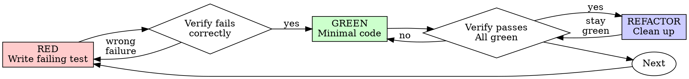

# Codex session 019f90a3-47e5-7770-a20e-cd9317bcbf2c

- Started: `2026-07-23T20:20:52.726Z`
- Working directory: `D:\100XH100`
- Originator: `Codex Desktop`
- Codex CLI: `0.145.0-alpha.30`
- Source log: `C:\Users\Иван Литвак\.codex\sessions\2026\07\29\rollout-2026-07-29T15-54-39-019fadf0-fd74-7f43-bb22-33d1e7208282.jsonl`
- Entries: user=6, assistant=171, tool calls=154, tool outputs=154

This is a chronological export of the user/assistant conversation and tool activity. Internal system/developer instructions and token accounting are intentionally excluded. Secret-shaped values are redacted; oversized tool outputs retain their beginning and end with the omitted character count.

## 1. User

Time: `2026-07-29T12:54:40.399Z` · source line `2`

```text
Subagent-driven делай, но с легким режимами размышлений оба, а ты контролируешь и направляешь

```

## 2. Codex

Time: `2026-07-29T12:54:40.399Z` · source line `6`

```text
Запускаю subagent-driven исполнение: два лёгких субагента параллельно — один ведёт публичный Kaggle runner, второй Cloudflare ingest; я остаюсь контроллером, развожу worktree/файлы, проверяю контракты, тесты и интеграцию между ними.
```

## 3. Codex

Time: `2026-07-29T12:54:40.399Z` · source line `10`

```text
Текущий checkout уже изолирован и чист. Создаю ещё два независимых worktree от `fa31690`, чтобы лёгкие агенты могли работать параллельно без конфликтов.
```

## 4. Codex

Time: `2026-07-29T12:54:40.403Z` · source line `33`

```text
Оба implementer-а работают параллельно в разных ветках. После каждого Task 1 я отдельно прогоню spec/quality review; дальше задачи будут выдаваться небольшими порциями, а не одним длинным автономным коммитом.
```

## 5. Codex

Time: `2026-07-29T12:54:40.408Z` · source line `58`

```text
Notebook Task 1 уже реализован и чисто закоммичен: базовый CayleyPy config/data contract, 11 тестов. Сейчас идёт независимый review; Cloudflare Task 1 ещё собирает строгую schema/runtime основу.
```

## 6. Codex

Time: `2026-07-29T12:54:40.411Z` · source line `84`

```text
Notebook Task 1 review завершён после fix-round: реальный CayleyPy CSV теперь грузится, bool-конфиги fail-closed, 19 тестов проходят. Notebook Task 2 уже делает автодетект MLP; ingest-код готовится к коммиту, но npm registry пока тормозит установку тестового runtime.
```

## 7. Codex

Time: `2026-07-29T12:54:40.418Z` · source line `135`

```text
Cloudflare review нашёл реальные schema-гейты; исправляю их через implementer. Отдельно npm на Windows блокирует сеть, поэтому проверю установку/test runtime через уже разрешённый Docker-контур — это не меняет код и может обойти сломанный локальный TLS/proxy.
```

## 8. Codex

Time: `2026-07-29T12:54:40.419Z` · source line `151`

```text
Продолжаю в subagent-driven режиме: сейчас проверю оба fix-round’а, сам не буду переписывать их код — прогоню гейты и отдам точечный diff тем же ревьюерам. Параллельно ноутбук продолжит двигаться, даже если npm-прокси всё ещё блокирует Cloudflare-ветку.
```

## 9. Codex

Time: `2026-07-29T12:54:40.420Z` · source line `168`

```text
Task 2 ноутбука после первого fix-round уже проходит 32/32 теста по общему public-модулю; сейчас идёт независимое повторное ревью именно пяти найденных проблем. В Cloudflare-ветке агент чинит строгие форматы и raw-byte лимит, но lockfile/runtime-гейт всё ещё зависит от восстановления npm-доступа.
```

## 10. Codex

Time: `2026-07-29T12:54:40.425Z` · source line `210`

```text
Новый полезный факт: Task 2 ноутбука теперь окончательно принят ревьюером — все 22 профильных теста зелёные. Я уже передал Task 3 свежему low-reasoning агенту; сам параллельно разблокирую Cloudflare lockfile через приватный удалённый гейт, потому что локальный прокси сейчас отвечает CONNECT timeout/502.
```

## 11. Codex

Time: `2026-07-29T12:54:40.427Z` · source line `234`

```text
Статус без приукрашивания: notebook Task 2 закрыт чисто; Task 3 пишется. Ingest Task 1 статически почти готов, но обнаружился ещё один реальный косяк исходного плана — версия `@cloudflare/workers-types 4.20260728.0` не опубликована; агент меняет её на подтверждённую точную `5.20260727.1`. После этого lockfile и тесты прогоню в приватном CPU-ноуте Kaggle, не на локальном сломанном npm-прокси.
```

## 12. Codex

Time: `2026-07-29T12:54:40.429Z` · source line `256`

```text
Приватный удалённый npm-гейт уже запущен: `trydotatwo/cayleypy-results-ingest-npm-gate`, CPU, internet on, GPU off, сейчас `RUNNING`. Метаданные проверены: notebook private, секретов и GitHub-токенов в пакете нет. Он должен вернуть реальный `package-lock.json`, Vitest и TypeScript typecheck — это закроет главный блокер ingest Task 1.
```

## 13. Codex

Time: `2026-07-29T12:54:40.433Z` · source line `315`

```text
Второй приватный гейт уже дал полезную диагностику: dependency resolution и `npm ci` теперь проходят. Он поймал две настоящие ошибки — тесты ожидали JSON Pointer без batch-префикса, а TypeScript не принимал unchecked cast после Ajv. Оба исправлены корректно, без ослабления валидации; v3 сейчас `RUNNING`. Notebook Task 3 тем временем закрыт ревьюером, Task 4 (reflection/path replay/dedupe) уже в работе.
```

## 14. Codex

Time: `2026-07-29T12:54:40.434Z` · source line `325`

```text
Главный Cloudflare-блокер снят: приватный Kaggle v3 отработал `COMPLETE`, точный payload совпал по SHA-256 с локальными файлами, `npm install --package-lock-only=0`, `npm ci=0`, Vitest `11/11`, TypeScript `typecheck=0`. Получен реальный lockfile SHA-256 `6c841524…f10b81`; агент сейчас переносит его и оформляет коммит/отчёт, после чего я отдам весь fix-range независимому ревьюеру.
```

## 15. Codex

Time: `2026-07-29T12:54:40.435Z` · source line `349`

```text
Для следующих ingest-задач подключаю Cloudflare skill: он нужен, чтобы D1/R2/Queue/Durable Object контракты совпадали с реальным Workers runtime, а не только проходили мок-тесты. Сначала прочитаю его правила целиком, затем передам Task 2 свежему агенту только после чистого ревью Task 1.
```

## 16. Codex

Time: `2026-07-29T12:54:40.436Z` · source line `366`

```text
Сейчас два независимых ревью-цикла: ingest Task 1 проверяется уже по реальному v3 lock/runtime evidence, а Task 4 чинит две небольшие hardening-дыры (глубокая неизменяемость `reached_state` и fail-closed при malformed generators). Алгоритмика CUDA не затрагивается; следующим шагом будут D1/R2 durability и runner orchestration.
```

## 17. Codex

Time: `2026-07-29T12:54:40.439Z` · source line `398`

```text
Task 4 теперь чисто принят: reflection/path replay/dedupe — 12 тестов, замечаний нет. Перед Task 5 подключаю профильный highload-GPU skill, потому что там уже не только Python-обвязка, но и host-only stop controls вокруг существующего multi-GPU runner; это поможет удержать границу «никаких изменений Stream/CUDA алгоритмов».
```

## 18. Codex

Time: `2026-07-29T12:54:40.445Z` · source line `416`

```text
Ingest Task 1 уже официально закрыт ревьюером: без замечаний, lockfile/версии/хэши/11 тестов/typecheck подтверждены. Сейчас параллельно идут две следующие вещи: реальный Miniflare D1+R2 receipt/state-machine тест и Task 5 runner orchestration; в обоих случаях публикации/деплоя пока нет.
```

## 19. Codex

Time: `2026-07-29T12:54:40.450Z` · source line `476`

```text
Продолжаю в SDD-режиме: ingest Task 2 уже прошёл приватный Kaggle-гейт, сейчас я проверю diff и отдам свежему лёгкому ревьюеру; параллельно дожму ревью notebook Task 5 и верну найденные дефекты исполнителю.
```

## 20. Codex

Time: `2026-07-29T12:54:40.452Z` · source line `485`

```text
Ревью notebook Task 5 нашло восемь реальных дефектов, включая три блокирующих: reflection фактически не запускался, collect мог рассинхронизировать два rank, а настоящий TSV не парсился. Возвращаю весь пакет исполнителю одним fix-round; «частично работает» в публичный ноут не попадёт.
```

## 21. Codex

Time: `2026-07-29T12:54:40.456Z` · source line `526`

```text
Cloudflare Task 2 тоже не принимаю: свежий adversarial-review воспроизвёл race, при котором duplicate мог получить ложный `queued` до durable Queue; плюс оставался orphan R2 и игнорировались D1 transition conflicts. Исполнитель получает fix-round и новый обязательный Kaggle gate с byte-exact payload.
```

## 22. Codex

Time: `2026-07-29T12:54:40.456Z` · source line `535`

```text
Сейчас оба fix-round идут параллельно на лёгком reasoning, а я проверил границы контрактов. Для collect верхняя граница одного depth действительно равна локальному frontier × move_count; на больших лучах это может не влезть в T4, поэтому корректное поведение — точный preflight-отказ для небезопасной комбинации, а не скрытая усечённая выборка. Следующие Task 6/Task 3 briefs уже подготовлены, но стартуют только после чистого повторного ревью.
```

## 23. Codex

Time: `2026-07-29T12:54:40.456Z` · source line `542`

```text
Notebook fix-round уже в RED-фазе: исполнитель сначала расширяет fake-runner и regression tests под reflection/реальные TSV/rank logs/ошибочные return codes. Ingest-исполнитель пока проектирует race-safe receipt, чтобы не залатать один interleaving ценой другого; код ещё не принят и не коммитился.
```

## 24. Codex

Time: `2026-07-29T12:54:40.459Z` · source line `582`

```text
Оба fix-round уже в коде: notebook чинит host-only синхронизацию collect и полный reflection pipeline; ingest добавил race tests на deferred Queue, orphan cleanup и конфликт D1 transitions. Я отдельно заставил покрыть ещё две границы, которые ревью не поймало: dedupe всех collect-результатов и отказ collect-профиля 2²⁵×24 до запуска, потому что один полный snapshot плюс frontier не помещается в T4.
```

## 25. Codex

Time: `2026-07-29T12:54:40.462Z` · source line `624`

```text
Root-аудит поймал ещё одну важную вещь уже после первоначального ревью: старый distributed gather резервировал пакетный scratch пропорционально полной capacity и потому collect на 2 rank падал бы при первом найденном решении. Исполнитель уже переделывает его на actual-count + фиксированные NCCL chunks. Также добавляю live-stream rank0 в ноут, чтобы многочасовой запуск не выглядел зависшим и не копил весь stdout в RAM.
```

## 26. Codex

Time: `2026-07-29T12:54:40.464Z` · source line `638`

```text
Cloudflare Task 2 fix теперь подтверждён приватным Kaggle v10: 11 schema + 15 real Miniflare receipt tests, typecheck, и все 14 payload-хешей совпадают с amended HEAD. Я всё равно не двигаю Task 3, пока повторный adversarial-review не даст чистый PASS.
```

## 27. Codex

Time: `2026-07-29T12:54:40.466Z` · source line `651`

```text
Повторный Cloudflare-review нашёл уже архитектурный crash-window, а не локальный баг: durable Queue и D1 не могут обновиться атомарно. Я не буду замазывать его. Делаем правильную at-least-once схему: consumer сможет забрать `received`, повторный клиент сможет восстановить stale dispatch, а плановый sweeper будет переотправлять `received|retryable`; downstream остаётся идемпотентным.
```

## 28. Codex

Time: `2026-07-29T12:54:40.468Z` · source line `678`

```text
Ещё один критичный контракт я нашёл в orchestration: профили выбирались, но без `BEAM_RUNTIME_CONFIG_MODE=manual` production runner мог их проигнорировать и снова автонастроиться. Это уже в fix-scope вместе с проверенными internal history/headroom defaults. То есть итоговый ноут будет реально запускать выбранный профиль, а не только красиво печатать его в preflight.
```

## 29. Codex

Time: `2026-07-29T12:54:40.469Z` · source line `689`

```text
Cloudflare recovery теперь строится как настоящий at-least-once state machine, включая fairness: неудачный retry обязан обновлять `updated_at`/`retry_count`, иначе первые 100 плохих записей могли бы навсегда заблокировать очередь восстановления. Успешный retry очищает старый `safe_error`. Это именно те гонки, которые обычно всплывают только под сотней параллельных клиентов — мы закрываем их до деплоя.
```

## 30. Codex

Time: `2026-07-29T12:54:40.471Z` · source line `714`

```text
Продолжаю в режиме SDD: два лёгких агента закрывают notebook Task 5 и надёжность ingest Task 2, я проверяю диффы, тестовые доказательства и не пускаю дальше до чистого ревью. Сейчас добиваю два критичных места: безопасную очистку 32 GiB history-арен между запусками и восстановление Queue/D1 после неоднозначных сбоев.
```

## 31. Codex

Time: `2026-07-29T12:54:40.472Z` · source line `726`

```text
Промежуточно: recovery-контракт уже исправлен в коде и плане — stale `received|retryable` переотправляются с тем же `submission_id`, неудачи двигают `updated_at/retry_count`, а будущий consumer обязан принимать `received`. В notebook агент уже добавил тест на два последовательных запуска; я заметил рассинхрон между тестом и dataclass/cleanup и вернул его на исправление до запуска полного gate.
```

## 32. Codex

Time: `2026-07-29T12:54:40.473Z` · source line `743`

```text
Очистка history теперь реализована корректно: путь хранится в invocation, удаление идёт в `finally` после захвата rank-логов, разрешён только реальный потомок `/tmp/beam_history_public`; тест проверяет success+failure подряд и сохранность внешнего sentinel. Сейчас оба агента гоняют полные gates и оформляют воспроизводимые отчёты; после коммитов я запускаю независимое ревью, а не принимаю их самооценку.
```

## 33. Codex

Time: `2026-07-29T12:54:40.474Z` · source line `760`

```text
Полный notebook gate сейчас идёт после последних исправлений; локальный focused gate уже 20/20. Ingest v11 всё ещё `RUNNING`; агент нашёл тестовый microtask-hang уже после отправки, поэтому v11 будет только диагностикой, а окончательный доказательный запуск — v12 по финальным байтам и с проверкой SHA-256.
```

## 34. Codex

Time: `2026-07-29T12:54:40.475Z` · source line `775`

```text
Notebook Task 5 прошёл полный локальный gate: 75/75 public-тестов, 32/32 focused runner/path, `py_compile` и staged diff-check. BOM в CUDA-файле отсутствует. Сейчас фиксируется точный коммит; затем я отдам именно его независимому reviewer и после чистого ответа запущу private 2xT4 compile/smoke. Ingest v11 с известным зависшим тестом supersede’им приватным v12 по исправленным байтам.
```

## 35. Codex

Time: `2026-07-29T12:54:40.476Z` · source line `793`

```text
Ingest v12 уже `COMPLETE`: 11 schema-тестов, 18 реальных Miniflare receipt/recovery тестов и TypeScript typecheck прошли. Сейчас сверяются 14 SHA-256 с текущими файлами — это отсечёт ложный PASS от устаревшей версии. Notebook-коммит `022b539` уже передан отдельному read-only reviewer по полному диапазону `c7fc69e..022b539`.
```

## 36. Codex

Time: `2026-07-29T12:54:40.478Z` · source line `818`

```text
Оба точных коммита теперь заморожены и проверяются параллельно двумя независимыми reviewer’ами: notebook `022b539`, ingest `dde1cc99`. По ingest я дополнительно просмотрел скачанный `npm-gate-results.json`: все шесть команд имеют exit 0, Miniflare реально поднял изолированный runtime, а payload map содержит 14 ожидаемых SHA. Следующие implementation tasks не стартую до ответа reviewer’ов.
```

## 37. Codex

Time: `2026-07-29T12:54:40.479Z` · source line `832`

```text
Пока reviewer’ы не нашли новых P0/P1. Отдельно подтверждено, что прежнее Queue/D1 crash-window закрыто на всех основных interleaving’ах; notebook reviewer ещё разбирает коллективный порядок NCCL и lifecycle history — это самая рискованная часть текущего коммита, поэтому не тороплю его.
```

## 38. Codex

Time: `2026-07-29T12:54:40.480Z` · source line `844`

```text
Reviewer нашёл один реальный контрактный дефект в ingest-плане: режим `store_only` сохраняет запрос без Queue, но будущий cron recovery сейчас безусловно подхватил бы его через 60 секунд и всё равно отправил на валидацию — обход аварийного выключателя публикации. Сам Task 2 helper нормален; исправляем guard в Task 3/4 контракте и добавляем тесты, что `store_only/read_only` ничего не enqueue’ят.
```

## 39. Codex

Time: `2026-07-29T12:54:40.481Z` · source line `855`

```text
Ingest reviewer добавил ещё один небольшой, но важный gate-дефект: Miniflare-тесты исполняли вручную сокращённый `CREATE TABLE`, а не настоящий `migrations/0001_initial.sql`; значит индекс и `CHECK` были только привязаны SHA, но не запускались. Уже отправил round 3: реальные migration bytes в test harness, аварийные mode-guards на всех будущих entrypoint’ах и приватный v13 с повторной hash-проверкой.
```

## 40. Codex

Time: `2026-07-29T12:54:40.482Z` · source line `871`

```text
Notebook reviewer поймал P0, поэтому `022b539` не принят: production runner в обычной release-сборке пишет `puzzle_solved=1 … solution=<path>`, а Python разбирал только debug-маркер `solution_path=`. То есть first-mode мог реально найти решение и потерять его в orchestration. Второй дефект — наследование чужих `BEAM_*` из окружения могло переключить runner, например, в repair mode. Жду полный список и отправляю отдельный fix-round с реальными release-line fixtures и герметичным env.
```

## 41. Codex

Time: `2026-07-29T12:54:40.486Z` · source line `910`

```text
Оба fix-round’а запущены. Для notebook я задал не косметический cap, а точный bounded design: NCCL всё ещё читает snapshot фиксированными чанками, но держит только ограниченную следующую детерминированную пачку; если первые кандидаты дают дубликаты путей, идёт следующий cursor-pass, пока не набрано пользовательское `MAX_COLLECTED_SOLUTIONS`. Это сохраняет корректность без вектора на десятки миллионов записей.
```

## 42. Codex

Time: `2026-07-29T12:54:40.486Z` · source line `922`

```text
Ingest round 3 уже имеет честный RED: сокращённая тестовая схема не содержала `submissions_recovery` и принимала запрещённое состояние. Новый harness загружает ровно production migration bytes через Vitest config, затем D1-тест проверяет индекс `[state, updated_at]` и отклонение неизвестного state. Локальный npm снова упирается в `ECONNRESET`, поэтому окончательный GREEN будет только на exact private v13.
```

## 43. Codex

Time: `2026-07-29T12:54:40.489Z` · source line `953`

```text
Notebook RED сейчас 6 ожидаемых падений; Python-часть уже чинится. Я отдельно добавил проверку настоящего torchrun framing: combined log имеет префикс `[default0]:`, поэтому новый parser нормализует только этот строгий line-prefix, а не ищет `solution=` где угодно. Это закрывает ещё один случай, который unit fixture без torchrun не поймал бы.
```

## 44. Codex

Time: `2026-07-29T12:54:40.494Z` · source line `977`

```text
Ingest v13 уже `COMPLETE`; теперь проверяется не только SHA migration, но и её фактическое выполнение в D1. Ожидаемый gate: 11 schema + 19 receipt, где новый тест читает настоящий SQL, видит recovery-index и получает отказ на недопустимое состояние. Notebook Python-фиксы тоже уже в работе; я дополнительно поправил provenance: supplied source должен быть fallback-кандидатом, но не затирать доказательство, если тот же путь реально нашёл solver.
```

## 45. Codex

Time: `2026-07-29T12:54:40.494Z` · source line `985`

```text
v13 честно упал: schema 11/11 и typecheck прошли, но receipt setup показал, что `D1.exec()` режет многострочный `CREATE TABLE` как неполный запрос; 19 тестов не исполнялись. Это полезный gate, не принимаем. Сразу идём в private v14 через официальный Cloudflare migration harness (`readD1Migrations` + `applyD1Migrations`), сохраняя exact production SQL без самодельной схемы.
```

## 46. Codex

Time: `2026-07-29T12:54:40.496Z` · source line `995`

```text
Notebook Python fix уже имеет 44/44 focused green, включая source fallback, solver-provenance и inverse preflight. Самая тяжёлая C++ bounded-gather часть ещё пишется. Ingest v14 пока не отправлен: агент подтвердил, что удаляет именно упавший raw-`D1.exec` путь и переходит на официальный migration fixture API перед новым запуском.
```

## 47. Codex

Time: `2026-07-29T12:54:40.498Z` · source line `1005`

```text
v14 fix ещё не отправлен — старый raw-exec код пока остаётся в рабочем диффе, что я явно заблокировал; push разрешён только после сохранённого `readD1Migrations/applyD1Migrations`. В notebook C++ уже выделен header-only snapshot и строгий total-order для bounded batches; далее агент заменяет полный host-vector и добавляет безопасное завершение torchrun при исключениях.
```

## 48. Codex

Time: `2026-07-29T12:54:40.503Z` · source line `1042`

```text
v14 — полный GREEN: schema 11/11, receipt 19/19 через официальный migration setup, typecheck, все 6 команд exit 0, SHA 15/15 совпали с текущим worktree; metadata приватная и CPU-only. v13 failure сохранится в отчёте как доказательство, что gate действительно ловит неправильный способ применения миграции.
```

## 49. Codex

Time: `2026-07-29T12:54:40.505Z` · source line `1060`

```text
Notebook C++ bounded selection уже корректно ограничивает память, но я направил ещё одно ускорение: не allgather’ить все ~50 млн hit-records при `2**21×24`. Каждый rank локально оставляет свой next-K после cursor, а NCCL обменивает только ≤K с каждого rank; глобальный K математически всегда лежит в объединении локальных K. Это сохраняет точность и резко режет PCIe/NCCL трафик без нового CUDA kernel.
```

## 50. Codex

Time: `2026-07-29T12:54:40.509Z` · source line `1100`

```text
Продолжаю в том же режиме: два лёгких сабагента делают реализацию и независимый разбор, я сейчас закрываю найденную дырку с потерей сообщений после `max_retries` и параллельно довожу bounded collector/парсер ноутбука до повторного ревью. Публично пока ничего не выкладываю.
```

## 51. Codex

Time: `2026-07-29T12:54:40.511Z` · source line `1128`

```text
Notebook Task 5 теперь собран отдельным коммитом: 97 локальных тестов зелёные, включая реальные форматы release-логов, отражение, bounded сбор решений и аварийную очистку `torchrun`. Следующий обязательный барьер — независимое ревью коммита и затем приватная компиляция/дымовой прогон на настоящих 2×T4; локально Windows это честно не подтверждает.
```

## 52. Codex

Time: `2026-07-29T12:54:40.512Z` · source line `1145`

```text
Параллельно проверил старые линии: и Tetraminx integration, и autoprofile sweep сейчас имеют статус `COMPLETE`; их артефакты уже лежат локально. Для нового публичного ноутбука я не считаю это заменой acceptance — его собственный reviewed commit отдельно прогоню на приватных 2×T4 после ревью.
```

## 53. Codex

Time: `2026-07-29T12:54:40.514Z` · source line `1179`

```text
По ingest исправление уже ушло в TDD: вместо бесконечных `Queue.retry()` будет подтверждённая запись `ingest_paused` в D1 и ACK, а если сама D1-парковка ломается до исчерпания ретраев, stale `queued` запись автоматически подхватит normal-mode sweep. Это закрывает реальную потерю принятого результата при долгой паузе сервиса.
```

## 54. User

Time: `2026-07-29T12:54:40.514Z` · source line `1183`

```text
<environment_context>
  <current_date>2026-07-29</current_date>
  <timezone>Europe/Moscow</timezone>
  <filesystem><workspace_roots><root>D:\100XH100</root></workspace_roots><permission_profile type="managed"><file_system type="restricted"><entry access="read"><special>:root</special></entry><entry access="write"><path>D:\100XH100</path></entry><entry access="write"><special>:slash_tmp</special></entry><entry access="write"><special>:tmpdir</special></entry><entry access="write"><path>C:\Users\Иван Литвак\.codex\visualizations\2026\07\23\019f90a3-47e5-7770-a20e-cd9317bcbf2c</path></entry><entry access="read"><path>D:\100XH100\.git</path></entry><entry access="read"><path>D:\100XH100\.agents</path></entry><entry access="read"><path>D:\100XH100\.codex</path></entry></file_system></permission_profile></filesystem>
</environment_context>
```

## 55. User

Time: `2026-07-29T12:54:40.514Z` · source line `1185`

```text
Продолжай

```

## 56. Codex

Time: `2026-07-29T12:54:40.515Z` · source line `1187`

```text
Продолжаю. Сейчас два лёгких сабагента по-прежнему заняты строго раздельно: один закрывает lossless-паузу Cloudflare ingest, второй делает read-only ревью `cc2d0d8`; я после их результатов либо отправлю точечный fix-round, либо сразу поставлю приватный 2×T4 compile/collect smoke.
```

## 57. Codex

Time: `2026-07-29T12:54:40.518Z` · source line `1225`

```text
Есть честный RED для ingest: приватный Kaggle CPU v15 завершился именно четырьмя ожидаемыми падениями новых тестов — отсутствует `parkPausedSubmission`; прежние 11 schema и 19 receipt-тестов остались зелёными. Теперь сабагент реализует минимальный storage/recovery слой и затем обязан получить новый exact GREEN, а не переименовать этот запуск в успех.
```

## 58. Codex

Time: `2026-07-29T12:54:40.518Z` · source line `1235`

```text
Независимое ревью Task 5 завершилось без P0/P1. Нашёлся один P2 в лог-парсере: он снимал любой `[anything]:`, а должен принимать только реальный `[default0]:`, плюс слишком свободно валидировал поле `seconds`. Уже идёт узкий fix-round; CUDA/C++ сборщик ревью признало архитектурно закрытым, но реальный 2×T4 gate всё равно остаётся обязательным.
```

## 59. Codex

Time: `2026-07-29T12:54:40.520Z` · source line `1255`

```text
Сейчас оба потока в ожидаемой середине TDD: ingest уже имеет реализацию D1 park + stale `queued` recovery поверх зафиксированного v15 RED; notebook parser имеет 6 точных RED-регрессий и получает минимальный Python-only fix. Следующее содержательное обновление дам по GREEN/коммитам, не по промежуточным конфигам.
```

## 60. Codex

Time: `2026-07-29T12:54:40.520Z` · source line `1261`

```text
Ingest получил exact GREEN на приватном Kaggle CPU v16: `11/11` schema, `23/23` receipt/recovery, typecheck, включая 101 повторную доставку одного paused-result без потери/дублирования. Сейчас агент фиксирует хэши/metadata и оформляет один standalone-коммит; после этого я снова отдам диапазон независимому ревью.
```

## 61. Codex

Time: `2026-07-29T12:54:40.522Z` · source line `1281`

```text
Parser fix уже GREEN: 49 runner-тестов, 62 focused и 105 всего public-suite; негативные `[evil]:` и невалидные/non-finite `seconds` теперь закрыты. Осталось только зафиксировать evidence/commit и повторно отдать этот маленький диапазон read-only ревью.
```

## 62. Codex

Time: `2026-07-29T12:54:40.527Z` · source line `1298`

```text
Ingest round-4 зафиксирован отдельным `d50d7bb`: v15 RED сохранён, v16 GREEN подтверждён, worktree чистый. Я уже запустил повторное независимое ревью именно диапазона `9a966d5..d50d7bb`; оно проверяет не только тесты, но и неоднозначный Queue send, terminal states, cron fairness и точные artifact-хэши.
```

## 63. Codex

Time: `2026-07-29T12:54:40.532Z` · source line `1317`

```text
Оба содержательных GREEN уже есть; сейчас задержка только в аккуратной фиксации evidence под Windows split-root sandbox, не в коде. Я не разрешаю обходить это грязной перезаписью файлов: изменения проходят через проверяемые scoped patches, затем clean worktree и независимый diff-review.
```

## 64. Codex

Time: `2026-07-29T12:54:40.535Z` · source line `1341`

```text
Parser P2 уже закреплён отдельным `6830401`, exact parent `cc2d0d8`, полный suite `105 passed`, C++ diff отсутствует. Сейчас одновременно идут два финальных read-only ревью (`d50d7bb` ingest и `6830401` parser); после их clean verdict запускаю приватный 2×T4 compile + first/collect smoke с повторным TSV и RSS-замером.
```

## 65. Codex

Time: `2026-07-29T12:54:40.538Z` · source line `1367`

```text
Оба независимых ревью чистые. Запустил следующую пару: реальный private Kaggle 2×T4 gate для `6830401` (compile + first + два collect-прогона с byte-identical TSV/RSS/rank logs) и Task 3 ingest (`normal/store_only/reject`, HTTP, rate limits, status/health, scheduled recovery) с новым private CPU RED→GREEN.
```

## 66. Codex

Time: `2026-07-29T12:54:40.538Z` · source line `1370`

```text
Для следующего этапа явно применяю три профильных skill-контракта: Kaggle — для приватных kernel gates, Cloudflare — для Worker/D1/Queue API, и subagent-driven development — для разделения реализации и независимого контроля. Сейчас сверяю их требования перед дальнейшими мутациями.
```

## 67. Codex

Time: `2026-07-29T12:54:40.539Z` · source line `1397`

```text
Оба новых шага начали TDD с чистых баз. Важное уточнение из актуальной Cloudflare-документации: встроенный RateLimit POP-local и eventual-consistent, поэтому глобальный лимит 2 000/min нельзя честно обещать только им — D1 fallback остаётся обязательным. Private 2×T4 gate уже зафиксировал exact source SHA, p16 профиль и puzzle 1=`BR`; дальше идут RED-артефакты.
```

## 68. Codex

Time: `2026-07-29T12:54:40.543Z` · source line `1423`

```text
Первый private-gate RED уже зафиксирован тестом отсутствующего builder-модуля. Task 3 чуть задержал известный Windows split-root баг `apply_patch`; я прекратил повторные попытки и разрешил только scoped `git apply --check` внутри exact worktree, с последующим diff-аудитом. Кодовых блокеров нет.
```

## 69. Codex

Time: `2026-07-29T12:54:40.545Z` · source line `1437`

```text
Продолжаю с двумя low-reasoning сабагентами: один доводит реальный приватный 2×T4 gate, второй — HTTP/mode/recovery слой ingest-сервиса. Сейчас проверю их фактические диффы и не дам перейти к следующему этапу без независимого ревью и runtime-доказательств.
```

## 70. Codex

Time: `2026-07-29T12:54:40.546Z` · source line `1457`

```text
Старые четыре Kaggle-ядра сейчас все в терминальном `COMPLETE`; это само по себе не доказательство корректности, поэтому я не засчитываю их как acceptance. Новый gate строится отдельно на exact reviewed commit и будет считаться пройденным только по двум T4, обоим rank-логам, CPU-валидации и byte-identical collect-прогонам.
```

## 71. Codex

Time: `2026-07-29T12:54:40.547Z` · source line `1470`

```text
Ingest-поток закончил полноценный RED-набор: режимы, лимиты, дубликаты, mixed receipts и scheduled recovery покрыты до production-кода. Я сейчас проверяю тесты на ложноположительные сценарии; только после этого разрешу private CPU RED и реализацию.
```

## 72. Codex

Time: `2026-07-29T12:54:40.548Z` · source line `1475`

```text
RED-тесты прошли мой контроль. Сабагент правильно остановился на запрете внешней загрузки; я сам проверю приватность/хэши kernel payload и выполню разрешённый вами private Kaggle push из root-контекста. Production-кода в этой версии ещё нет, поэтому ожидаемый результат — точный RED, а не «успех».
```

## 73. Codex

Time: `2026-07-29T12:54:40.550Z` · source line `1500`

```text
Private 2×T4 gate builder теперь целиком собран: локальный focused-набор зелёный. Я повторяю тесты независимо и отдельно проверяю generated notebook до загрузки — metadata private, ровно 2×T4, embedded source SHA, отсутствие секретов и сохранённых outputs.
```

## 74. Codex

Time: `2026-07-29T12:54:40.551Z` · source line `1515`

```text
Private CPU v17 завершился ожидаемым чистым RED: schema `11/11` и прежний receipt-контракт `23/23` зелёные; единственная причина падения worker-suite и typecheck — отсутствующий `src/worker.ts`. Значит тестовая постановка не сломала прежнюю базу, ingest-сабагент уже реализует ровно недостающий слой.
```

## 75. Codex

Time: `2026-07-29T12:54:40.553Z` · source line `1544`

```text
Ingest GREEN-кандидат готов. Перед v18 я проверяю точные SHA, append-only migration, отсутствие Task4/секретов, private CPU metadata и сам SQL rate-limit на атомарность; затем загружу только этот проверенный payload.
```

## 76. Codex

Time: `2026-07-29T12:54:40.555Z` · source line `1564`

```text
Ingest v18 сейчас `RUNNING`; payload уже содержит exact `worker.ts`, `storage.ts`, миграцию `0002` и тесты. Пока нет immutable output, GREEN не объявляю. Параллельно 2×T4 gate проходит дополнительный adversarial-тест: поддельный `cpu_solution_valid=true` больше не должен приниматься без реального replay пути.
```

## 77. Codex

Time: `2026-07-29T12:54:40.556Z` · source line `1569`

```text
v18 дал полезный runtime-блокер, не логику API: typecheck зелёный, schema `11/11` и receipt `23/23` зелёные, но Workers-pool падает при загрузке AJV (`Unexpected token ':'` в CJS shim) до запуска новых тестов. Перехожу по systematic-debugging skill: сначала локализую несовместимый import/runtime boundary, затем минимальный config/import fix и новый private GREEN-кандидат.
```

## 78. Codex

Time: `2026-07-29T12:54:40.557Z` · source line `1586`

```text
v19 запущен с единственным config-only изменением по официальному Cloudflare workaround для CJS module resolution; production-хэши не менялись. Если suite начнёт исполняться, следующий результат уже отделит runtime-загрузку от реальных ошибок API/лимитов — именно это и нужно для точной диагностики.
```

## 79. Codex

Time: `2026-07-29T12:54:40.565Z` · source line `1610`

```text
Первый optimizer-workaround не сработал, поэтому я не наслаиваю ещё один «наугад». Причина уточнена: production импортирует deep entry `ajv/dist/2020.js`, а v19 предбандлил только top-level `ajv`; Workers-pool всё ещё открыл deep CommonJS напрямую (`?mf_vitest_no_cjs_esm_shim`). Сейчас воспроизвожу это локально на тех же pinned npm-версиях и проверю одну гипотезу — exact deep-entry prebundle.
```

## 80. Codex

Time: `2026-07-29T12:54:40.568Z` · source line `1627`

```text
2×T4 gate после hardening зелёный локально: adversarial replay теперь отклоняет ложный `cpu_solution_valid`, полный public-набор `133/133`. Я повторяю финальные хэши/5 focused-тестов и сразу отправляю private GPU-версию; публичных изменений или публикации ветки нет.
```

## 81. Codex

Time: `2026-07-29T12:54:40.570Z` · source line `1633`

```text
Продолжаю двумя low-reasoning агентами, как договорились. Сейчас одновременно: исправленный v20 CPU-гейт ingest (точный deep-import AJV) и 2×T4 gate; у GPU-gate Kaggle нормализовал slug, поэтому v1 считаю только диагностическим и готовлю корректно аттестованный v2.
```

## 82. Codex

Time: `2026-07-29T12:54:40.572Z` · source line `1653`

```text
Оба исправленных кандидата уже запущены приватно: ingest v20 и GPU v2. Пока Kaggle выполняет их, я независимо проверяю diff и контракты, чтобы не принять «зелёный» notebook только по статусу COMPLETE.
```

## 83. Codex

Time: `2026-07-29T12:54:40.574Z` · source line `1671`

```text
Новый факт по ingest v20: production-код и typecheck зелёные; 60/64 теста прошли. Четыре падения оказались не runtime-багами, а двумя ошибками самого тестового стенда (явный `undefined` подменялся на `normal`, и слишком строгая проверка lazy stream). Агент делает v21 только с исправлением тестов; production hash остаётся неизменным. GPU v2 всё ещё RUNNING.
```

## 84. Codex

Time: `2026-07-29T12:54:40.575Z` · source line `1689`

```text
GPU v2 прошёл полностью: реальные 2×Tesla T4, Release/sm75/NCCL, оба rank rc=0. `first` нашёл валидный `BR` за 0.108281 с; два независимых `collect` дали по 16 уникальных CPU-валидных путей и байт-в-байт одинаковый TSV. Peak RSS около 1.56 GB на прогон. Сейчас агент фиксирует evidence и делает чистый commit; ingest v21 ещё RUNNING.
```

## 85. Codex

Time: `2026-07-29T12:54:40.575Z` · source line `1699`

```text
Ingest v21 теперь полностью зелёный: 64/64 Miniflare-теста, typecheck PASS, 18/18 скачанных payload-хэшей совпали с текущим worktree; kernel приватный и CPU-only. Значит оба текущих runtime-гейта прошли. Осталось оформить два атомарных commit и пропустить их через отдельный review, прежде чем брать Task 4/Task 6.
```

## 86. Codex

Time: `2026-07-29T12:54:40.580Z` · source line `1742`

```text
Контрольная проверка с моей стороны тоже зелёная: downloaded GPU v2 повторно прошёл независимый validator, а объединённый public-runner + gate suite дал 111/111. Секретов и приватных путей в новом package/raw evidence не найдено; жду только завершения атомарного оформления, затем запускаю отдельный review.
```

## 87. Codex

Time: `2026-07-29T12:54:40.582Z` · source line `1766`

```text
Сейчас без нового runtime-блокера: GPU commit уже чистый и находится на независимом review; ingest-агент оформляет только обязательные plan/report/memory evidence вокруг уже зелёного v21. После review сразу раздаю следующую пару: Queue/replay для сервиса и best-effort publisher для notebook.
```

## 88. Codex

Time: `2026-07-29T12:54:40.584Z` · source line `1798`

```text
Review нашёл два реальных P2 в самом GPU-gate, не в solver: в commit не сохранён сырой Kaggle receipt, доказывающий именно remote version/status, и после завершения дочернего процесса хвост stdout мог обходить 8 MiB cap без гарантированного reap. Это чинится только в notebook/gate harness; CUDA/beam-search не трогаем. После точных line anchors сделаю v3 и сохраню push/status/list receipts как отдельное доказательство.
```

## 89. Codex

Time: `2026-07-29T12:54:40.585Z` · source line `1813`

```text
Итог review: P0/P1 нет, сама v2 runtime-evidence признана корректной; два P2 изолированы в gate harness. Я уже вернул их notebook-агенту с TDD и обязательным v3 remote attestation. Параллельно ingest Task 3 заканчивает clean commit.
```

## 90. Codex

Time: `2026-07-29T12:54:40.586Z` · source line `1825`

```text
Ingest Task 3 зафиксирован отдельным commit `f0c81ed`: v21 64/64 + typecheck + 18/18 hashes. Временные debug-cache директории контроллера удалены, worktree чистый. Сейчас отдельный агент ревьюит именно этот commit, а второй чинит два P2 и готовит GPU v3.
```

## 91. Codex

Time: `2026-07-29T12:54:40.589Z` · source line `1851`

```text
Предварительный ingest-review нашёл один вероятный P1 availability: 25 MiB JSON сейчас создаёт несколько полных копий (chunks → Uint8Array → UTF-16 string → parsed object → повторный stringify), что может пересечь лимит 128 MB Worker isolate. Также есть P2 на malformed `%` в status URL. После финальных anchors уменьшу безопасный batch-byte budget/уберу лишнюю копию и добавлю bounded fan-out; это API/Worker fix, данные и solver не затрагиваются.
```

## 92. Codex

Time: `2026-07-29T12:54:40.591Z` · source line `1877`

```text
Финальный ingest-review дал 2×P1 и 4×P2. Кроме памяти, найден важный boundary race: медленный запрос мог откатить минутное окно глобального D1 rate counter назад. Я уже раздал точный fix-set: монотонный UPSERT, streaming decode + 4 MiB cap, bounded concurrency/общий poll budget, safe malformed URL, точная compatibility date и сырой remote receipt для v22. Деплой пока не делаем.
```

## 93. Codex

Time: `2026-07-29T12:54:40.592Z` · source line `1889`

```text
GPU-fix уже имеет честный TDD: два новых теста сначала упали ровно на EOF-cap и unreaped child, затем прошли после минимального harness-only исправления. Ingest тоже пойдёт честно: приватный v22 будет exact RED с неизменным production, затем v23 — GREEN; это нужно, потому что локальный Windows npm runtime ненадёжен.
```

## 94. Codex

Time: `2026-07-29T12:54:40.593Z` · source line `1911`

```text
Оба fix-потока сейчас в RED/GREEN цикле. GPU: process-capture GREEN, remote-attestation тест уже добавлен и должен быть единственным оставшимся RED. Ingest: готовится exact v22 RED без изменения production hashes; после него только узкий Worker/config patch.
```

## 95. Codex

Time: `2026-07-29T12:54:40.594Z` · source line `1920`

```text
GPU v3 package готов локально и 9/9 тестов зелёные. Сейчас делаю приватный push с раздельным raw stdout/stderr capture и UTC timestamp; после COMPLETE сниму status/list/pulled-metadata, добавлю их в downloaded evidence и только тогда приму v3.
```

## 96. Codex

Time: `2026-07-29T12:54:40.595Z` · source line `1938`

```text
GPU v3 уже COMPLETE. Сейчас снимаю четыре независимых raw receipt: status, kernels-list lastRunTime/ref, pulled private metadata и текущий source hash; затем downloaded validator должен пройти с ними без доверия к self-attestation notebook.
```

## 97. Codex

Time: `2026-07-29T12:54:40.605Z` · source line `1989`

```text
Нужен один явный approval от тебя: Windows sandbox снова не умеет `apply_patch` внутри `.worktrees`, а автоматический reviewer отклонил безопасный fallback только из‑за исчерпанного usage quota и запретил обход без нового согласия пользователя.

Разрешаешь применить точный patch через scoped `git apply --check` → `git apply` только к тестам/Worker-файлам в `D:\100XH100\.worktrees\cayleypy-results-ingest`? Diff будет предварительно проверен, CUDA и чужие изменения не затрагиваются. Пока жду ответ, GPU v3 продолжаю оформлять.
```

## 98. Codex

Time: `2026-07-29T12:54:40.609Z` · source line `2007`

```text
Продолжаю по разрешённой части: сейчас закрываю и независимо перепроверяю финальный 2×T4 GPU-gate. Ветка ingest остаётся без изменений до отдельного подтверждения точечного patch, которое я запросил выше.
```

## 99. Codex

Time: `2026-07-29T12:54:40.610Z` · source line `2018`

```text
Параллельно перепроверил два старых приватных Kaggle-контура: и Tetraminx integration, и 2×T4 autoprofile sweep сейчас имеют terminal state `COMPLETE`. Нового `RUNNING`/`ERROR` нет; основной активный блок — упаковка проверенного v3 GPU-gate.
```

## 100. Codex

Time: `2026-07-29T12:54:40.611Z` · source line `2025`

```text
GPU-часть уже по существу готова: код, реальный v3-вывод с двух T4 и оба отчёта собраны; хеш пакета не изменился. Сейчас идут последние 9 focused + 137 full тестов, повторный validator и один чистый commit — ориентир 10–15 минут.
```

## 101. Codex

Time: `2026-07-29T12:54:40.612Z` · source line `2029`

```text
Финальная проверка идёт без новых ошибок. Отдельно посмотрел diff отчёта: он фиксирует именно version 3, два реальных T4, `COMPLETE`, проверенный solve `BR`, два детерминированных collect-прогона и внешнюю Kaggle-аттестацию — старый self-attestation больше не считается достаточным.
```

## 102. Codex

Time: `2026-07-29T12:54:40.612Z` · source line `2037`

```text
Последний full-test процесс уже завершился; сейчас агент сводит staged payload и хеши перед commit. Рабочее дерево содержит только ожидаемые Task 5-файлы: builder/tests/notebook, v3-отчёты, ledger и обязательные `CHANGELOG`/`PROMPTS`.
```

## 103. Codex

Time: `2026-07-29T12:54:40.614Z` · source line `2055`

```text
Агент завис уже после успешного staging, без активных тестов или git-процесса. Я остановил именно его turn, сохранил полностью подготовленный staged payload и сейчас сам завершаю commit и независимый review — работа не потеряна.
```

## 104. Codex

Time: `2026-07-29T12:54:40.614Z` · source line `2068`

```text
GPU Task 5 теперь зафиксирован commit `07904b0bf77186934b39200d5a385ab85af8851c`; дерево чистое. Моя повторная проверка: `9/9` focused, `137/137` full, validator `status=ok`, remote version 3/private/COMPLETE, semantic match pulled notebook, secret/private-path scan — 0 находок. Остался независимый read-only review этого exact commit.
```

## 105. Codex

Time: `2026-07-29T12:54:40.615Z` · source line `2078`

```text
Независимый review не нашёл P0/P1, но поймал два честных P2, которые я не пропускаю:

- в сохранённом remote `list.csv` остался display name автора, хотя отчёт называл evidence полностью sanitized;
- старый `task-5-report.md` всё ещё говорит про acceptance v2, тогда как v3 уже superseding.

Сначала закрываю оба и повторяю точечные гейты; только после этого Task 5 считается завершённым.
```

## 106. Codex

Time: `2026-07-29T12:54:40.617Z` · source line `2095`

```text
Исправление P2 делаю без нового Kaggle-прогона: вычислительный notebook и его hash не меняются. Из публичного evidence удаляется весь `list.csv` с display name; acceptance остаётся строго подтверждён push receipt v3 + `COMPLETE` status + private pulled metadata + семантически совпавший pulled notebook. Параллельно обновляется забытый Task 5 report с v2 на v3.
```

## 107. Codex

Time: `2026-07-29T12:54:40.618Z` · source line `2105`

```text
TDD-контракт сработал как надо: новый list-free fixture упал ровно потому, что старый validator всё ещё требовал `remote/list.csv`. Теперь вносится минимальная GREEN-правка validator/evidence/docs; вычислительный пакет не регенерируется.
```

## 108. Codex

Time: `2026-07-29T12:54:40.618Z` · source line `2113`

```text
GREEN-правка уже сузила публичную remote-аттестацию: зависимость от Kaggle list и её hash удалена из validator, fixture и manifest. Сейчас удаляется сам файл и приводятся в соответствие оба отчёта; затем полный повтор тестов/scan.
```

## 109. Codex

Time: `2026-07-29T12:54:40.618Z` · source line `2116`

```text
Нужна ещё одна точечная санкция после sandbox-rejection: удалить из worktree ровно один tracked-файл  
`D:\100XH100\.worktrees\public-cayleypy-notebook\test_results\kaggle_cayleypy_task5_2xt4_gate_v3_2026-07-29\remote\list.csv`.

Он содержит лишний display name автора; удаление полностью восстановимо из commit `07904b0`. Разрешаешь это удаление? Пока жду ответ, агент продолжает править отчёты и тесты без удаления файла.
```

## 110. Codex

Time: `2026-07-29T12:54:40.620Z` · source line `2133`

```text
Все недеструктивные исправления готовы: оба отчёта и ledger теперь согласованы на v3, validator list-free, `diff --check` зелёный. Остался только физически удалить один tracked CSV после вашего разрешения; неотслеживаемая control-копия в публичный commit не попадёт. Тесты уже запускаются.
```

## 111. Codex

Time: `2026-07-29T12:54:40.620Z` · source line `2135`

```text
Дополнение к запросу на удаление: нашлась ещё одна ignored control-копия того же CSV по пути  
`D:\100XH100\.worktrees\public-cayleypy-notebook\test_results\kaggle_cayleypy_task5_v3_control\list.csv`.

Она не попадёт в git, но для чистого локального handoff лучше удалить и её. Разрешение прошу на удаление ровно этих двух `list.csv`; оба восстановимы из Kaggle/предыдущего commit.
```

## 112. Codex

Time: `2026-07-29T12:54:40.621Z` · source line `2144`

```text
GPU Task 5 закрыт по вычислениям: commit `07904b0`, `9/9` focused, `137/137` full, Kaggle v3 — private `COMPLETE`, два T4, validator green.

Для продолжения разрешите две точечные операции после sandbox-rejection:

1. Удалить два `list.csv` с лишним display name автора.
2. Применить scoped `git apply` к тестам и Worker-файлам ingest-ветки для найденных P1/P2.

Ответьте «разрешаю обе» — и я продолжу.

::git-commit{cwd="D:\100XH100\.worktrees\public-cayleypy-notebook"}


```

## 113. Codex

Time: `2026-07-29T12:54:40.621Z` · source line `2145`

```text
GPU Task 5 закрыт по вычислениям: commit `07904b0`, `9/9` focused, `137/137` full, Kaggle v3 — private `COMPLETE`, два T4, validator green.

Для продолжения разрешите две точечные операции после sandbox-rejection:

1. Удалить два `list.csv` с лишним display name автора.
2. Применить scoped `git apply` к тестам и Worker-файлам ingest-ветки для найденных P1/P2.

Ответьте «разрешаю обе» — и я продолжу.

::git-commit{cwd="D:\100XH100\.worktrees\public-cayleypy-notebook"}

<oai-mem-citation>
<citation_entries>
MEMORY.md:1-3|note=[used project worktree and hardware separation rules]
MEMORY.md:9-9|note=[used prior project rollout reference]
</citation_entries>
<rollout_ids>
019f73c3-64bf-7f92-b5ba-476ca2030d27
</rollout_ids>
</oai-mem-citation>
```

## 114. User

Time: `2026-07-29T12:54:40.621Z` · source line `2152`

```text
Да, разрешаю обе. По сути я запрещаю только архитектуру бимсерча менять без согласования со мной. Всё остальное разрешаю тебе, спасибо

```

## 115. User

Time: `2026-07-29T12:54:40.622Z` · source line `2153`

```text
Да, разрешаю обе. По сути я запрещаю только архитектуру бимсерча менять без согласования со мной. Всё остальное разрешаю тебе, спасибо

```

## 116. Codex

Time: `2026-07-29T12:54:40.622Z` · source line `2156`

```text
Принял границу: архитектуру бимсерча не меняю без отдельного согласования; notebook, тесты, упаковку, Cloudflare ingest и инфраструктурные исправления веду автономно. Сейчас удаляю два одобренных CSV, закрываю Task 5 commit/review и параллельно возобновляю RED→GREEN исправления ingest.
```

## 117. Codex

Time: `2026-07-29T12:54:40.622Z` · source line `2161`

```text
Оба одобренных CSV удалены; проверка `Test-Path` для обоих вернула `False`. Tracked-файл восстановим из `07904b0`, control-копию — повторным Kaggle capture. Другие файлы не затронуты.
```

## 118. Codex

Time: `2026-07-29T12:54:40.623Z` · source line `2171`

```text
Обе линии двигаются параллельно: Task 5 видит tracked deletion и сейчас повторяет финальные гейты; ingest начал именно с RED-тестов (`schema.test.ts`), production пока остаётся на `f0c81ed`. Архитектура бимсерча и CUDA-файлы не затрагиваются.
```

## 119. Codex

Time: `2026-07-29T12:54:40.625Z` · source line `2189`

```text
Task 5 follow-up уже committed как `570bb936…`; независимый review запущен. Ingest достиг правильной границы RED: v22 содержит только новые тесты, production/config byte-exact от v21. Сейчас приватно пушу v22 и буду считать успехом именно ожидаемые тестовые падения, а не зелёный runtime.
```

## 120. Codex

Time: `2026-07-29T12:54:40.626Z` · source line `2199`

```text
Ingest v22 уже terminal `COMPLETE` на Kaggle. Это не означает GREEN: сейчас скачиваю реальные логи и проверяю, что notebook завершился как диагностический RED — с ожидаемыми новыми тестовыми падениями и неизменённым production.
```

## 121. Codex

Time: `2026-07-29T12:54:40.626Z` · source line `2206`

```text
При скачивании v22 Kaggle CLI наткнулся на Windows codepage (`\u276f`), файлы при этом успели скачаться. Повтор с UTF-8 завис внутри CLI; я сейчас отделяю этот локальный CLI-зависон от состояния Kaggle и не позволяю ему влиять на production-правки.
```

## 122. Codex

Time: `2026-07-29T12:54:40.628Z` · source line `2221`

```text
v22 дал корректный schema RED (`3 failed / 9 passed`) и подтвердил неизменённые production SHA, но одновременно вскрыл ошибку именно в новом тестовом harness: `worker.test.ts` ссылался на несуществующий `options`, поэтому worker RED не был доказан. Я не разрешил переходить к production: сначала будет исправлен только тест и повторён чистый приватный RED.
```

## 123. Codex

Time: `2026-07-29T12:54:40.629Z` · source line `2232`

```text
Независимый review Task 5 нашёл ещё один узкий P2: list-free validator удалил CSV из обязательных файлов, но не запрещал лишний файл в `remote/`. Adversarial `remote/list.csv` всё ещё проходил. Закрываю fail-closed контракт: remote-каталог должен содержать ровно manifest + четыре разрешённых artifact, без любых дополнительных entries.
```

## 124. Codex

Time: `2026-07-29T12:54:40.630Z` · source line `2244`

```text
Чистый v23 RED теперь доказан полностью: schema `3/12` падают, worker `6/70` падают, typecheck зелёный; все девять падений соответствуют найденным P1/P2, production SHA прежние. После этой точки разрешил минимальный GREEN. Отдельно Task 5 fail-closed regression уже сначала воспроизвёл `DID NOT RAISE`, теперь validator исправляется.
```

## 125. Codex

Time: `2026-07-29T12:54:40.632Z` · source line `2261`

```text
Task 5 fail-closed fix committed как `712c7b99…`: focused `10/10`, full `138/138`, реальный v3 validator green, package hashes не изменились; идёт последний независимый review. Ingest GREEN уже затронул только schema/Worker/config runtime-контракты — CUDA и beam-search код по-прежнему untouched.
```

## 126. Codex

Time: `2026-07-29T12:54:40.635Z` · source line `2271`

```text
v24 GREEN уже `COMPLETE`; скачиваю логи. Финальный Task 5 review нашёл последний косметический, но реальный privacy-P2: adversarial test сам содержал literal имени. Accepted evidence чист, но публичный test source — нет. Меняю на синтетический `REDACTED AUTHOR` и повторяю scans; логика теста не меняется.
```

## 127. Codex

Time: `2026-07-29T12:54:40.638Z` · source line `2296`

```text
v24 исправил 7 из 9 regressions; два оставшихся оказались не новой production-ошибкой, а неточным test oracle и слишком коротким Miniflare timeout. v25 теперь проверяет канонический порядок и точный бюджет `702 < 1000` внутренних вызовов; production byte-identical v24. Он сейчас ещё `RUNNING`.
```

## 128. Codex

Time: `2026-07-29T12:54:40.639Z` · source line `2304`

```text
v25 теперь настоящий GREEN: Kaggle `COMPLETE`, `all_commands_passed=true`, schema `12/12`, Worker+receipt `70/70` дважды, typecheck 0. Точный budget-тест прошёл с `702` внутренними вызовами при 100 duplicate envelopes. Сейчас фиксируются list-free remote evidence и commit, после чего будет независимый review до перехода к Queue/replay.
```

## 129. Codex

Time: `2026-07-29T12:54:40.642Z` · source line `2317`

```text
Task 5 теперь окончательно закрыт: commit `4305300118fb…`, независимый review — `no P0–P2`, `10/10`, `138/138`, v3 validator green, package/CUDA неизменны. Освободившийся агент уже переходит к best-effort publisher: канонические envelopes, redaction/idempotency, безопасные HTTP-ошибки и локальный `publish_status.json`.
```

## 130. Codex

Time: `2026-07-29T12:54:40.645Z` · source line `2341`

```text
Task 5 полностью закрыт независимым `no findings`. Для ingest агент сейчас упаковывает принятые v23 RED и v25 GREEN raw evidence; я уже поймал в черновике отчёта две несогласованности (`outside normal` и диапазон версий) и отправил на исправление до commit. Task 6 пока пишет RED-тесты, production notebook не меняется.
```

## 131. Codex

Time: `2026-07-29T12:54:40.646Z` · source line `2351`

```text
Task 6 получил чистый RED: четыре ожидаемых падения ровно из-за отсутствующего envelope builder; тесты уже покрывают Draft 2020-12 schema, UUIDv7, детерминированный idempotency, redaction и лимит 256 KiB. Ingest v25-отчёт и raw manifests сейчас проходят staged secret/identity scan перед commit.
```

## 132. Codex

Time: `2026-07-29T12:54:40.647Z` · source line `2362`

```text
v25 evidence manifest уже собран list-free: фиксирует private CPU metadata, push/COMPLETE/pull времена, 18 payload-файлов без расхождений и все retained SHA. Task 6 перешёл из RED к реализации schema/builder; пока добавлены только три новых scoped-файла, существующий runner/ноутбук не тронут.
```

## 133. Codex

Time: `2026-07-29T12:54:40.649Z` · source line `2388`

```text
Ingest staged payload уже проходит `diff --cached --check`; сырые логи помечены binary, чтобы Git не менял их байты. Дополнительно проверяю pulled notebook/hash через staged blobs, потому что evidence должен переживать checkout byte-exact, а не быть верным только в текущей папке.
```

## 134. Codex

Time: `2026-07-29T12:54:40.650Z` · source line `2398`

```text
Staged evidence integrity почти закрыта: четыре файла, которые Git мог нормализовать, теперь помечены binary и worktree↔index byte-identical. Идёт полный staged validator по 26 manifest entries и secret scan; после него ingest commit без дополнительного расширения scope.
```

## 135. Codex

Time: `2026-07-29T12:54:40.651Z` · source line `2408`

```text
Обе реализации committed и чистые:

- ingest Task 3: `f411d522…`, v25 `COMPLETE`, `12/12 + 70/70`, 26/26 evidence blobs byte-exact;
- publisher Task 6: `93d9394b…`, `12/12` focused, `150/150` full.

Теперь два read-only reviewer’а параллельно проверяют exact commits. До их результата Queue/replay и notebook integration не начинаю.
```

## 136. Codex

Time: `2026-07-29T12:54:40.652Z` · source line `2426`

```text
Task 6 review нашёл два интеграционных дефекта до notebook wiring:

- допустимый batch мог быть ~25 MiB, тогда как новый ingest строго принимает максимум 4 MiB;
- sanitized endpoint сохранял URL path, где может жить path-token.

Исправляю fail-before-network общий лимит 4 MiB и сохраняю в status только origin. Это publisher-контракт, не beam-search архитектура.
```

## 137. Codex

Time: `2026-07-29T12:54:40.654Z` · source line `2437`

```text
Ingest review тоже не пропустил один P2: ради старого Miniflare pool дата production runtime была сдвинута назад с `2026-07-28` на `2025-07-12`. Это действительно плохой компромисс. Исправляю правильно: возвращаю актуальную production compatibility date и обновляю pinned Cloudflare test stack до версии, которая реально её поддерживает; затем ещё один приватный CPU gate.
```

## 138. Codex

Time: `2026-07-29T12:54:40.655Z` · source line `2452`

```text
После review появилось два правильных follow-up:

- publisher выравнивается с ingest по общему 4 MiB request cap и origin-only status URL;
- Cloudflare production date возвращается на `2026-07-28`, а не откатывается ради старого test pool. Подбирается и будет приватно проверен новый pinned Worker stack.

Оба изменения инфраструктурные; beam-search архитектура untouched.
```

## 139. Codex

Time: `2026-07-29T12:54:40.656Z` · source line `2458`

```text
Продолжаю с двух follow-up, которые уже в работе: лимит публикации 4 MiB/origin-only и возврат Cloudflare compatibility date на 2026-07-28 с совместимым pinned test stack. Архитектуру бимсерча не трогаю; после зелёного независимого review сразу перейду к Queue/replay и сборке тонкого публичного ноутбука.
```

## 140. Codex

Time: `2026-07-29T12:54:40.656Z` · source line `2474`

```text
Оба follow-up идут по TDD: у publisher уже зафиксирован RED на превышение 4 MiB и утечку path/query в статус, а Cloudflare-ветка отдельно проверяет совместимые версии пакетов, чтобы не «лечить» тесты откатом production semantics. Параллельно я подготовил точный контракт следующего Task 4: idempotent Queue consumer, bounded permutation replay и fail-closed parking вне `normal`.
```

## 141. Codex

Time: `2026-07-29T12:54:40.659Z` · source line `2502`

```text
Есть ещё один важный интеграционный дефект, который не виден внутри отдельных веток: notebook сейчас формирует hash-only proof, а ingest ожидает полный proof для независимого replay. Я его не заметаю под ковёр — после текущих узких commit’ов сведу оба контракта в один канонический v1, и только затем разрешу Task 4/публичный notebook двигаться дальше.
```

## 142. Codex

Time: `2026-07-29T12:54:40.660Z` · source line `2523`

```text
Cloudflare dependency set выбран по реальному runtime, а не только по верхним версиям: pool `0.18.8`, Wrangler `4.114.0`, workers-types `5.20260727.1`, Vitest `4.1.10`, Node `22.23.1`, плюс exact `workerd 1.20260728.1`. Последний нужен, потому что stock pool всё ещё несёт runtime от 2026-07-22; private gate будет принят только при нуле fallback/unsupported warnings и полном `12/70/typecheck/hash` green.
```

## 143. Codex

Time: `2026-07-29T12:54:40.661Z` · source line `2541`

```text
Сейчас две проверки действительно полезны, а не формальные: publisher уже локально зелёный `14/14`, Cloudflare candidate зафиксирован и готовится к private Kaggle lock/install gate. Отдельный read-only subagent сверяет оба schema-контракта и составит минимальный reconciliation checklist; это не затрагивает ни CUDA, ни выбор/дедуп/топ-k бимсерча.
```

## 144. Codex

Time: `2026-07-29T12:54:40.671Z` · source line `2579`

```text
Schema-review закончен: P0 подтверждён и сформулирован точно — единый v1 должен хранить полный `initial/central/generators`, original-oriented token path и отдельные reflected source/search paths; ingest обязан сам пересчитать idempotency и отклонять подменённый hash. Это станет отдельным TDD-коммитом после текущих follow-up, до любого публичного релиза.
```

## 145. Codex

Time: `2026-07-29T12:54:40.673Z` · source line `2611`

```text
Private Kaggle dependency probe уже завершился как `COMPLETE` (v26). Сейчас скачиваем и принимаем его только по содержимому: exact `workerd 1.20260728.1`, отсутствие compatibility fallback/unsupported warnings, schema `12/12`, Worker `70/70`, typecheck и payload hashes. Сам статус `COMPLETE` без этих доказательств не считается успехом.
```

## 146. Codex

Time: `2026-07-29T12:54:40.675Z` · source line `2646`

```text
v26 оказался полезным RED, не ложным зелёным: runtime override действительно убрал fallback, но Cloudflare одновременно выпустил новый test API и lockstep версии (`pool 0.19.0`/`Wrangler 4.115.0`), поэтому старый `defineWorkersConfig` больше не загружается. Перевожу конфиг на официальный `cloudflareTest()` API и новый native runtime; worker/schema semantics не меняются.
```

## 147. Codex

Time: `2026-07-29T12:54:40.676Z` · source line `2656`

```text
Ветка publisher теперь закрыта чисто: commit `c53f52d`, независимый review — ноль P0–P2, gates `14/14`, `119/119`, compile/diff green. Дальше параллельно идут новый Cloudflare `0.19.x` gate и canonical replay schema; это уже два независимых слоя, поэтому они не блокируют друг другу работу.
```

## 148. Codex

Time: `2026-07-29T12:54:40.677Z` · source line `2676`

```text
Cloudflare next gate делаю двухступенчатым: v27 должен уже пройти runtime/tests/typecheck и отличаться только новым lockfile; после принятия exact lock v28 обязан пройти полностью byte-exact. Это не даст случайно назвать зелёным запуск, где npm молча переписал dependency graph.
```

## 149. Codex

Time: `2026-07-29T12:54:40.682Z` · source line `2710`

```text
Принял границу: всё вокруг notebook, схемы результатов, Cloudflare, Kaggle‑проверок и документации делаю автономно; CUDA/C++ и архитектуру beam search не меняю. Сейчас параллельно довожу до зелёного канонический контракт результатов и Cloudflare‑стек, после чего соберу тонкий публичный notebook.
```

## 150. Codex

Time: `2026-07-29T12:54:40.683Z` · source line `2717`

```text
Cloudflare v27 уже запущен приватно и сейчас `RUNNING`. Это bootstrap‑прогон нового стека: от него принимаю только фактические тесты/runtime и новый lockfile; затем будет отдельный v28 с полной побайтовой воспроизводимостью.
```

## 151. Codex

Time: `2026-07-29T12:54:40.685Z` · source line `2734`

```text
В параллельной ветке provenance для reflection уже готов: raw reflected path, исходный путь и его hash теперь не теряются; 76 host‑тестов зелёные, это войдёт в общий schema‑commit. По профилям запустил отдельный config‑only поток на недостающие `2**16..2**25`; архитектуру он не трогает. Cloudflare v28 прошёл 12 schema + 70 Worker тестов и exact dependency gate, но честно красный только на TypeScript ambient bindings; сейчас фиксируется типизация и готовится v29.
```

## 152. Codex

Time: `2026-07-29T12:54:40.687Z` · source line `2760`

```text
Проверил канонический registry напрямую: все 20 профилей уже действительно `measured` на depth 8 — оба head‑режима для каждого `2**16..2**25`. Частичный v5 JSON оказался лишь файлом фокусного дозамера, не источником профилей. Поэтому новые многочасовые замеры не запускаю: исправляем sweep так, чтобы он объединял прежнюю доказательную базу и честно завершался `no_missing_anchors`.
```

## 153. Codex

Time: `2026-07-29T12:54:40.687Z` · source line `2766`

```text
Cloudflare v29 теперь полностью зелёный и перепроверен мной по скачанным артефактам: `12/12` schema, `70/70` Worker два независимых запуска, TypeScript без ошибок, compatibility date `2026-07-28` без fallback‑warning, lock/payload `18/18` побайтово совпадают. Стек зафиксирован (`pool 0.19.0`, `Wrangler 4.115.0`, `Vitest 4.1.10`, `workerd 1.20260729.1`); сейчас оформляю доказательный commit, затем переношу в ingest новый общий schema.
```

## 154. Codex

Time: `2026-07-29T12:54:40.689Z` · source line `2793`

```text
Профильный v6 уже приватно запущен: он не тратит T4 на повторные замеры, а проверяет и объединяет 20/20 существующих measured‑anchors. Локально: `missing_anchor_count=0`, `attempt_count=0`, `sweep_status=no_missing_anchors`, 21 тест зелёный. Осталось получить тот же артефакт от Kaggle и зафиксировать версию 6 как безопасный registry gate.
```

## 155. Codex

Time: `2026-07-29T12:54:40.694Z` · source line `2849`

```text
Профильный Kaggle v6 завершился `COMPLETE`; сейчас скачиваю и сверяю, что облачный артефакт действительно сохранил все 20 профилей и сделал ноль лишних GPU‑попыток. Параллельный pre‑notebook аудит нашёл ожидаемый следующий крупный блок: helper‑модули готовы, но публичный CLI пока заглушка — в Task 7 его нужно связать в полный host‑pipeline export → profile → build → 2×T4 solve → submission/artifacts → best‑effort publish.
```

## 156. Codex

Time: `2026-07-29T12:54:40.694Z` · source line `2856`

```text
Скачивание v6 идёт дольше обычного из-за полного набора сохранённых логов/профилей, сам kernel уже `COMPLETE`. Жду именно полный output, чтобы не принять только notebook‑статус без артефактов.
```

## 157. Codex

Time: `2026-07-29T12:54:40.695Z` · source line `2862`

```text
Нашёл реальную проблему, не замалчиваю: v6 имеет статус `COMPLETE`, но скачанный `run_summary.json` показывает старый sweep — 14 попыток, 9 успехов, 5 ошибок, а не ожидаемый no-op. Значит, при push ушёл не регенерированный notebook или старая ячейка. Возвращаю это в работу: проверяем содержимое самого `.ipynb`, регенерируем и пушим v7 только после статического маркера `missing_anchor_count=0`; v6 успехом не считаю.
```

## 158. Codex

Time: `2026-07-29T12:54:40.697Z` · source line `2894`

```text
Канонический producer‑контракт уже прошёл полный локальный набор: 140 тестов public‑пакета и 173 всего. В нём теперь полные permutation‑proofs, честный reflection provenance, slash‑типы вроде `cube_3/3/3`, лимит `state_len<=120` и строгая проверка head `1` либо `move_count`. Перед переносом в Worker жду scoped commit и независимый diff‑review; одновременно чинится ошибочный v6→v7 autoprofile push.
```

## 159. Codex

Time: `2026-07-29T12:54:40.697Z` · source line `2904`

```text
Продолжаю. Архитектуру beam search не трогаю; сейчас закрываю три независимых хвоста: коммит Cloudflare-gate, канонический producer-контракт и честный Kaggle v7 no-op для 20 измеренных профилей. Затем сведу схему ingest/producer и перейду к тонкому пользовательскому notebook.
```

## 160. Codex

Time: `2026-07-29T12:54:40.699Z` · source line `2917`

```text
Два важных рубежа закрыты: Cloudflare v29 зафиксирован отдельным коммитом, producer-контракт — тоже; оба worktree чистые. Kaggle v7 завершён ровно как safety gate: 2×T4, 0 новых запусков, 0 пропусков, все 20 измеренных профилей p16…p25 сохранены. Сейчас делаю независимый review двух коммитов и фиксирую v7 evidence в профилирующей ветке.
```

## 161. Codex

Time: `2026-07-29T12:54:40.701Z` · source line `2942`

```text
Независимый review Cloudflare-коммита — без замечаний: production source/schema не затронуты, exact stack/date подтверждены, v26 корректно исключён как stale, v29 полностью зелёный. Запускаю следующий изолированный срез: byte-identical перенос канонической схемы и golden-fixtures в ingest с обязательной серверной перепроверкой hash/idempotency.
```

## 162. User

Time: `2026-07-29T12:55:11.254Z` · source line `2948`

```text
<recommended_plugins>
Here is a list of plugins that are available but not installed.

- Atlassian Rovo (atlassian-rovo@openai-curated-remote)
- Box (box@openai-curated-remote)
- Figma (figma@openai-curated-remote)
- Gmail (gmail@openai-curated-remote)
- Google Calendar (google-calendar@openai-curated-remote)
- Google Drive (google-drive@openai-curated-remote)
- Outlook Calendar (outlook-calendar@openai-curated-remote)
- Outlook Email (outlook-email@openai-curated-remote)
- SharePoint (sharepoint@openai-curated-remote)
- Slack (slack@openai-curated-remote)
- Teams (teams@openai-curated-remote)
</recommended_plugins>
# AGENTS.md instructions for D:\100XH100

<INSTRUCTIONS>
# Project Agent Rules

## Operating Rule
- Read `AGENTS.md` before project edits.
- Update `memory/CHANGELOG.md` after meaningful code, config, or architecture changes.
- Update `memory/PROMPTS.md` with user prompts that define requirements.
- Store test outputs, logs, and verification notes under `test_results/`.
- Prefer agent-centered code: explicit contracts, deterministic tests, small files, low hidden state.

## Architecture Source
- Primary architecture contract: `ARCHITECTURE_NEED.md`.
- Current Stream 4 implementation rule: use threshold + compact + CUB/fixed-temp sort/reduce + compact; do not use Stream 4 hash-table dedup.

## Implementation Guardrails
- `State128` logical bytes are `v[0..119]`.
- `State128` padding bytes are `v[120..127]`.
- Persistent frontier padding must be zero.
- `FinalResponse` may temporarily store `target_local_idx` in `v[120..123]`.
- `Hash128` is one logical 128-bit key stored as `{lo, hi}`.
- `CandidateMeta` must remain 32 bytes and 32-byte aligned.
- Stream 3 payload id must be original candidate id, not compact index.
- Stream 4 must not apply shard top-k or semantic shard cap.

</INSTRUCTIONS>
<environment_context>
  <cwd>D:\100XH100</cwd>
  <shell>powershell</shell>
  <current_date>2026-07-29</current_date>
  <timezone>Europe/Moscow</timezone>
  <filesystem><workspace_roots><root>D:\100XH100</root></workspace_roots><permission_profile type="managed"><file_system type="restricted"><entry access="read"><special>:root</special></entry><entry access="write"><path>D:\100XH100</path></entry><entry access="write"><special>:slash_tmp</special></entry><entry access="write"><special>:tmpdir</special></entry><entry access="write"><path>C:\Users\Иван Литвак\.codex\visualizations\2026\07\23\019f90a3-47e5-7770-a20e-cd9317bcbf2c</path></entry><entry access="read"><path>D:\100XH100\.git</path></entry><entry access="read"><path>D:\100XH100\.agents</path></entry><entry access="read"><path>D:\100XH100\.codex</path></entry></file_system></permission_profile></filesystem>
</environment_context>
```

## 163. Tool call: `exec`

Time: `2026-07-29T12:55:26.565Z` · source line `2954`

```text
const r = await tools.shell_command({"command":"Get-Content 'C:\\Users\\Иван Литвак\\.codex\\plugins\\cache\\openai-curated-remote\\cloudflare\\0.1.2\\skills\\cloudflare\\SKILL.md'; Get-Content 'C:\\Users\\Иван Литвак\\.codex\\plugins\\cache\\openai-curated-remote\\superpowers\\6.2.0\\skills\\test-driven-development\\SKILL.md'; Get-Content 'D:\\100XH100\\AGENTS.md'","workdir":"D:\\100XH100","timeout_ms":10000,"login":false});
text(r.content.map(x=>x.text||"").join("\n"));
```

## 164. Tool output

Time: `2026-07-29T12:55:27.402Z` · source line `2955`

```text
Script failed
Wall time 0.8 seconds
Output:

Script error:
TypeError: Cannot read properties of undefined (reading 'map')
    at exec_main.mjs:2:16
```

## 165. Tool call: `exec`

Time: `2026-07-29T12:55:32.723Z` · source line `2958`

```text
const r = await tools.shell_command({"command":"Get-Content 'C:\\Users\\Иван Литвак\\.codex\\plugins\\cache\\openai-curated-remote\\cloudflare\\0.1.2\\skills\\cloudflare\\SKILL.md'; Get-Content 'C:\\Users\\Иван Литвак\\.codex\\plugins\\cache\\openai-curated-remote\\superpowers\\6.2.0\\skills\\test-driven-development\\SKILL.md'; Get-Content 'D:\\100XH100\\AGENTS.md'","workdir":"D:\\100XH100","timeout_ms":10000,"login":false});
text(String(r));
```

## 166. Tool output

Time: `2026-07-29T12:55:33.872Z` · source line `2959`

````text
Script completed
Wall time 0.8 seconds
Output:

Exit code: 0
Wall time: 0.7 seconds
Output:
---
name: cloudflare
description: Comprehensive Cloudflare platform skill covering Workers, Pages, storage (KV, D1, R2), AI (Workers AI, Vectorize, Agents SDK), networking (Tunnel, Spectrum), security (WAF, DDoS), and infrastructure-as-code (Terraform, Pulumi). Use for any Cloudflare development task. Biases towards retrieval from Cloudflare docs over pre-trained knowledge.
references:
  - workers
  - pages
  - d1
  - durable-objects
  - workers-ai
---

# Cloudflare Platform Skill

Consolidated skill for building on the Cloudflare platform. Use decision trees below to find the right product, then load detailed references.

Your knowledge of Cloudflare APIs, types, limits, and pricing may be outdated. **Prefer retrieval over pre-training** — the references in this skill are starting points, not source of truth.

## Retrieval Sources

Fetch the **latest** information before citing specific numbers, API signatures, or configuration options. Do not rely on baked-in knowledge or these reference files alone.

| Source | How to retrieve | Use for |
|--------|----------------|---------|
| Cloudflare docs | Search `https://developers.cloudflare.com/` directly | Limits, pricing, API reference, compatibility dates/flags |
| Workers types | `npm pack @cloudflare/workers-types` or check `node_modules` | Type signatures, binding shapes, handler types |
| Wrangler config schema | `node_modules/wrangler/config-schema.json` | Config fields, binding shapes, allowed values |
| Product changelogs | `https://developers.cloudflare.com/changelog/` | Recent changes to limits, features, deprecations |

When a reference file and the docs disagree, **trust the docs**. This is especially important for: numeric limits, pricing tiers, type signatures, and configuration options.

## Quick Decision Trees

### "I need to run code"

```
Need to run code?
в”њв”Ђ Serverless functions at the edge в†’ workers/
в”њв”Ђ Full-stack web app with Git deploys в†’ pages/
в”њв”Ђ Stateful coordination/real-time в†’ durable-objects/
в”њв”Ђ Long-running multi-step jobs в†’ workflows/
в”њв”Ђ Run containers в†’ containers/
в”њв”Ђ Multi-tenant (customers deploy code) в†’ workers-for-platforms/
в”њв”Ђ Scheduled tasks (cron) в†’ cron-triggers/
в”њв”Ђ Lightweight edge logic (modify HTTP) в†’ snippets/
в”њв”Ђ Process Worker execution events (logs/observability) в†’ tail-workers/
в””в”Ђ Optimize latency to backend infrastructure в†’ smart-placement/
```

### "I need to store data"

```
Need storage?
в”њв”Ђ Key-value (config, sessions, cache) в†’ kv/
в”њв”Ђ Relational SQL в†’ d1/ (SQLite) or hyperdrive/ (existing Postgres/MySQL)
в”њв”Ђ Object/file storage (S3-compatible) в†’ r2/
в”њв”Ђ Message queue (async processing) в†’ queues/
в”њв”Ђ Vector embeddings (AI/semantic search) в†’ vectorize/
в”њв”Ђ Strongly-consistent per-entity state в†’ durable-objects/ (DO storage)
в”њв”Ђ Secrets management в†’ secrets-store/
в”њв”Ђ Streaming ETL to R2 в†’ pipelines/
в””в”Ђ Persistent cache (long-term retention) в†’ cache-reserve/
```

### "I need AI/ML"

```
Need AI?
в”њв”Ђ Run inference (LLMs, embeddings, images) в†’ workers-ai/
в”њв”Ђ Vector database for RAG/search в†’ vectorize/
в”њв”Ђ Build stateful AI agents в†’ agents-sdk/
в”њв”Ђ Gateway for any AI provider (caching, routing) в†’ ai-gateway/
в””в”Ђ AI-powered search widget в†’ ai-search/
```

### "I need networking/connectivity"

```
Need networking?
в”њв”Ђ Expose local service to internet в†’ tunnel/
в”њв”Ђ TCP/UDP proxy (non-HTTP) в†’ spectrum/
в”њв”Ђ WebRTC TURN server в†’ turn/
в”њв”Ђ Private network connectivity в†’ network-interconnect/
в”њв”Ђ Optimize routing в†’ argo-smart-routing/
в”њв”Ђ Optimize latency to backend (not user) в†’ smart-placement/
в””в”Ђ Real-time video/audio в†’ realtimekit/ or realtime-sfu/
```

### "I need security"

```
Need security?
в”њв”Ђ Web Application Firewall в†’ waf/
в”њв”Ђ DDoS protection в†’ ddos/
в”њв”Ђ Bot detection/management в†’ bot-management/
в”њв”Ђ API protection в†’ api-shield/
в”њв”Ђ CAPTCHA alternative в†’ turnstile/
в””в”Ђ Credential leak detection в†’ waf/ (managed ruleset)
```

### "I need media/content"

```
Need media?
в”њв”Ђ Image optimization/transformation в†’ images/
в”њв”Ђ Video streaming/encoding в†’ stream/
в”њв”Ђ Browser automation/screenshots в†’ browser-rendering/
в””в”Ђ Third-party script management в†’ zaraz/
```

### "I need analytics/metrics data"

```
Need analytics?
в”њв”Ђ Query across all Cloudflare products (HTTP, Workers, DNS, etc.) в†’ graphql-api/
в”њв”Ђ Custom high-cardinality metrics from Workers в†’ analytics-engine/
в”њв”Ђ Client-side (RUM) performance data в†’ web-analytics/
в”њв”Ђ Workers Logs and real-time debugging в†’ observability/
в””в”Ђ Raw logs (Logpush to external tools) в†’ Cloudflare docs
```

### "I need infrastructure-as-code"

```
Need IaC? в†’ pulumi/ (Pulumi), terraform/ (Terraform), or api/ (REST API)
```

## Product Index

### Compute & Runtime
| Product | Reference |
|---------|-----------|
| Workers | `references/workers/` |
| Pages | `references/pages/` |
| Pages Functions | `references/pages-functions/` |
| Durable Objects | `references/durable-objects/` |
| Workflows | `references/workflows/` |
| Containers | `references/containers/` |
| Workers for Platforms | `references/workers-for-platforms/` |
| Cron Triggers | `references/cron-triggers/` |
| Tail Workers | `references/tail-workers/` |
| Snippets | `references/snippets/` |
| Smart Placement | `references/smart-placement/` |

### Storage & Data
| Product | Reference |
|---------|-----------|
| KV | `references/kv/` |
| D1 | `references/d1/` |
| R2 | `references/r2/` |
| Queues | `references/queues/` |
| Hyperdrive | `references/hyperdrive/` |
| DO Storage | `references/do-storage/` |
| Secrets Store | `references/secrets-store/` |
| Pipelines | `references/pipelines/` |
| R2 Data Catalog | `references/r2-data-catalog/` |
| R2 SQL | `references/r2-sql/` |

### AI & Machine Learning
| Product | Reference |
|---------|-----------|
| Workers AI | `references/workers-ai/` |
| Vectorize | `references/vectorize/` |
| Agents SDK | `references/agents-sdk/` |
| AI Gateway | `references/ai-gateway/` |
| AI Search | `references/ai-search/` |

### Networking & Connectivity
| Product | Reference |
|---------|-----------|
| Tunnel | `references/tunnel/` |
| Spectrum | `references/spectrum/` |
| TURN | `references/turn/` |
| Network Interconnect | `references/network-interconnect/` |
| Argo Smart Routing | `references/argo-smart-routing/` |
| Workers VPC | `references/workers-vpc/` |

### Security
| Product | Reference |
|---------|-----------|
| WAF | `references/waf/` |
| DDoS Protection | `references/ddos/` |
| Bot Management | `references/bot-management/` |
| API Shield | `references/api-shield/` |
| Turnstile | `references/turnstile/` |

### Media & Content
| Product | Reference |
|---------|-----------|
| Images | `references/images/` |
| Stream | `references/stream/` |
| Browser Rendering | `references/browser-rendering/` |
| Zaraz | `references/zaraz/` |

### Real-Time Communication
| Product | Reference |
|---------|-----------|
| RealtimeKit | `references/realtimekit/` |
| Realtime SFU | `references/realtime-sfu/` |

### Developer Tools
| Product | Reference |
|---------|-----------|
| Wrangler | `references/wrangler/` |
| Miniflare | `references/miniflare/` |
| C3 | `references/c3/` |
| Observability | `references/observability/` |
| GraphQL Analytics API | `references/graphql-api/` |
| Analytics Engine | `references/analytics-engine/` |
| Web Analytics | `references/web-analytics/` |
| Sandbox | `references/sandbox/` |
| Workerd | `references/workerd/` |
| Workers Playground | `references/workers-playground/` |

### Infrastructure as Code
| Product | Reference |
|---------|-----------|
| Pulumi | `references/pulumi/` |
| Terraform | `references/terraform/` |
| API | `references/api/` |

### Other Services
| Product | Reference |
|---------|-----------|
| Email Routing | `references/email-routing/` |
| Email Workers | `references/email-workers/` |
| Static Assets | `references/static-assets/` |
| Bindings | `references/bindings/` |
| Cache Reserve | `references/cache-reserve/` |
---
name: test-driven-development
description: Use when implementing any feature or bugfix, before writing implementation code
---

# Test-Driven Development (TDD)

## Overview

Write the test first. Watch it fail. Write minimal code to pass.

**Core principle:** If you didn't watch the test fail, you don't know if it tests the right thing.

**Violating the letter of the rules is violating the spirit of the rules.**

## When to Use

**Always:**
- New features
- Bug fixes
- Refactoring
- Behavior changes

**Exceptions (ask your human partner):**
- Throwaway prototypes
- Generated code
- Configuration files

Thinking "skip TDD just this once"? Stop. That's rationalization.

## The Iron Law

```
NO PRODUCTION CODE WITHOUT A FAILING TEST FIRST
```

Write code before the test? Delete it. Start over.

**No exceptions:**
- Don't keep it as "reference"
- Don't "adapt" it while writing tests
- Don't look at it
- Delete means delete

Implement fresh from tests. Period.

## Red-Green-Refactor



### RED - Write Failing Test

Write one minimal test showing what should happen.

<Good>
```typescript
test('retries failed operations 3 times', async () => {
  let attempts = 0;
  const operation = () => {
    attempts++;
    if (attempts < 3) throw new Error('fail');
    return 'success';
  };

  const result = await retryOperation(operation);

  expect(result).toBe('success');
  expect(attempts).toBe(3);
});
```
Clear name, tests real behavior, one thing
</Good>

<Bad>
```typescript
test('retry works', async () => {
  const mock = jest.fn()
    .mockRejectedValueOnce(new Error())
    .mockRejectedValueOnce(new Error())
    .mockResolvedValueOnce('success');
  await retryOperation(mock);
  expect(mock).toHaveBeenCalledTimes(3);
});
```
Vague name, tests mock not code
</Bad>

**Requirements:**
- One behavior
- Clear name
- Real code (no mocks unless unavoidable)

### Verify RED - Watch It Fail

**MANDATORY. Never skip.**

```bash
npm test path/to/test.test.ts
```

Confirm:
- Test fails (not errors)
- Failure message is expected
- Fails because feature missing (not typos)

**Test passes?** You're testing existing behavior. Fix test.

**Test errors?** Fix error, re-run until it fails correctly.

### GREEN - Minimal Code

Write simplest code to pass the test.

<Good>
```typescript
async function retryOperation<T>(fn: () => Promise<T>): Promise<T> {
  for (let i = 0; i < 3; i++) {
    try {
      return await fn();
    } catch (e) {
      if (i === 2) throw e;
    }
  }
  throw new Error('unreachable');
}
```
Just enough to pass
</Good>

<Bad>
```typescript
async function retryOperation<T>(
  fn: () => Promise<T>,
  options?: {
    maxRetries?: number;
    backoff?: 'linear' | 'exponential';
    onRetry?: (attempt: number) => void;
  }
): Promise<T> {
  // YAGNI
}
```
Over-engineered
</Bad>

Don't add features, refactor other code, or "improve" beyond the test.

### Verify GREEN - Watch It Pass

**MANDATORY.**

```bash
npm test path/to/test.test.ts
```

Confirm:
- Test passes
- Other tests still pass
- Output pristine (no errors, warnings)

**Test fails?** Fix code, not test.

**Other tests fail?** Fix now.

### REFACTOR - Clean Up

After green only:
- Remove duplication
- Improve names
- Extract helpers

Keep tests green. Don't add behavior.

### Repeat

Next failing test for next feature.

## Good Tests

| Quality | Good | Bad |
|---------|------|-----|
| **Minimal** | One thing. "and" in name? Split it. | `test('validates email and domain and whitespace')` |
| **Clear** | Name describes behavior | `test('test1')` |
| **Shows intent** | Demonstrates desired API | Obscures what code should do |

When writing or changing any test, read [writing-good-tests.md](writing-good-tests.md) for the rules that keep tests honest:
- Name the production change that would make the test fail — before writing it
- Assert on real behavior, never on mock behavior
- Keep test-only code in test utilities, out of production classes
- Understand a dependency's side effects before mocking it

## Common Rationalizations

| Excuse | Reality |
|--------|---------|
| "Too simple to test" | Simple code breaks. Test takes 30 seconds. |
| "I'll test after" | Tests written after pass immediately — which proves nothing. They may test the wrong thing, test the implementation instead of the behavior, or miss the edge case you forgot. You never watched it fail, so you never proved it can catch the bug. Test-first forces that failure. |
| "Tests after achieve same goals (spirit not ritual)" | Tests-after answer "what does this do?"; tests-first answer "what should this do?" Tests written after are biased by the code you already wrote — you verify the cases you remembered, not the ones you'd have discovered. Coverage without proof the tests work. |
| "Already manually tested" | Manual testing is ad-hoc: no record of what you covered, no way to re-run it when the code changes, easy to forget cases under pressure. "Worked when I tried it" в‰  comprehensive. Automated tests run the same way every time. |
| "Deleting X hours is wasteful" | Sunk cost fallacy — that time is already spent either way. The real choice: rewrite with TDD (high confidence) vs. keep it and bolt tests on after (low confidence, likely bugs). Keeping code you can't trust is the waste. |
| "Keep as reference, write tests first" | You'll adapt it. That's testing after. Delete means delete. |
| "Need to explore first" | Fine. Throw away exploration, start with TDD. |
| "Test hard = design unclear" | Listen to test. Hard to test = hard to use. |
| "TDD will slow me down" | TDD IS the pragmatic path: catches bugs before commit, prevents regressions, lets you refactor without fear. "Pragmatic" shortcuts mean debugging in production — slower, not faster. |
| "Manual test faster" | Manual doesn't prove edge cases. You'll re-test every change. |
| "Existing code has no tests" | You're improving it. Add tests for existing code. |

## Red Flags - STOP and Start Over

- Code before test
- Test after implementation
- Test passes immediately
- Can't explain why test failed
- Tests added "later"
- Rationalizing "just this once"
- "I already manually tested it"
- "Tests after achieve the same purpose"
- "It's about spirit not ritual"
- "Keep as reference" or "adapt existing code"
- "Already spent X hours, deleting is wasteful"
- "TDD is dogmatic, I'm being pragmatic"
- "This is different because..."

**All of these mean: Delete code. Start over with TDD.**

## Example: Bug Fix

**Bug:** Empty email accepted

**RED**
```typescript
test('rejects empty email', async () => {
  const result = await submitForm({ email: '' });
  expect(result.error).toBe('Email required');
});
```

**Verify RED**
```bash
$ npm test
FAIL: expected 'Email required', got undefined
```

**GREEN**
```typescript
function submitForm(data: FormData) {
  if (!data.email?.trim()) {
    return { error: 'Email required' };
  }
  // ...
}
```

**Verify GREEN**
```bash
$ npm test
PASS
```

**REFACTOR**
Extract validation for multiple fields if needed.

## Verification Checklist

Before marking work complete:

- [ ] Every new function/method has a test
- [ ] Watched each test fail before implementing
- [ ] Each test failed for expected reason (feature missing, not typo)
- [ ] Wrote minimal code to pass each test
- [ ] All tests pass
- [ ] Output pristine (no errors, warnings)
- [ ] Tests use real code (mocks only if unavoidable)
- [ ] Edge cases and errors covered

Can't check all boxes? You skipped TDD. Start over.

## When Stuck

| Problem | Solution |
|---------|----------|
| Don't know how to test | Write wished-for API. Write assertion first. Ask your human partner. |
| Test too complicated | Design too complicated. Simplify interface. |
| Must mock everything | Code too coupled. Use dependency injection. |
| Test setup huge | Extract helpers. Still complex? Simplify design. |

## Debugging Integration

Bug found? Write failing test reproducing it. Follow TDD cycle. Test proves fix and prevents regression.

Never fix bugs without a test.

## Final Rule

```
Production code в†’ test exists and failed first
Otherwise в†’ not TDD
```

No exceptions without your human partner's permission.
# Project Agent Rules

## Operating Rule
- Read `AGENTS.md` before project edits.
- Update `memory/CHANGELOG.md` after meaningful code, config, or architecture changes.
- Update `memory/PROMPTS.md` with user prompts that define requirements.
- Store test outputs, logs, and verification notes under `test_results/`.
- Prefer agent-centered code: explicit contracts, deterministic tests, small files, low hidden state.

## Architecture Source
- Primary architecture contract: `ARCHITECTURE_NEED.md`.
- Current Stream 4 implementation rule: use threshold + compact + CUB/fixed-temp sort/reduce + compact; do not use Stream 4 hash-table dedup.

## Implementation Guardrails
- `State128` logical bytes are `v[0..119]`.
- `State128` padding bytes are `v[120..127]`.
- Persistent frontier padding must be zero.
- `FinalResponse` may temporarily store `target_local_idx` in `v[120..123]`.
- `Hash128` is one logical 128-bit key stored as `{lo, hi}`.
- `CandidateMeta` must remain 32 bytes and 32-byte aligned.
- Stream 3 payload id must be original candidate id, not compact index.
- Stream 4 must not apply shard top-k or semantic shard cap.

````

## 167. Tool call: `exec`

Time: `2026-07-29T12:55:39.533Z` · source line `2962`

```text
const r = await tools.shell_command({"command":"$ing='D:\\100XH100\\.worktrees\\cayleypy-results-ingest'; $pub='D:\\100XH100\\.worktrees\\public-cayleypy-notebook'; git -C $ing status --short; git -C $ing log -1 --oneline; git -C $pub rev-parse HEAD; Get-ChildItem -Recurse -File $ing | Where-Object { $_.FullName -match '(src|test|config)' } | Select-Object -ExpandProperty FullName; Get-ChildItem $pub\\configs -File | Select-Object -ExpandProperty Name","workdir":"D:\\100XH100","timeout_ms":10000,"login":false});
text(String(r));
```

## 168. Tool output

Time: `2026-07-29T12:55:41.069Z` · source line `2963`

Oversized output: `8150` characters omitted from the middle.

```text
Script completed
Wall time 1.2 seconds
Output:

Warning: truncated output (original token count: 10024)
Total output lines: 337

Exit code: 0
Wall time: 1.1 seconds
Total output lines: 895
Output:
fe4e9e2 fix: restore current Worker compatibility date
d9e0a681e429d74bba04efcc6e15f65565785e6e
D:\100XH100\.worktrees\cayleypy-results-ingest\.pytest_cache\.gitignore
D:\100XH100\.worktrees\cayleypy-results-ingest\.pytest_cache\CACHEDIR.TAG
D:\100XH100\.worktrees\cayleypy-results-ingest\.pytest_cache\README.md
D:\100XH100\.worktrees\cayleypy-results-ingest\.pytest_cache\v\cache\nodeids
D:\100XH100\.worktrees\cayleypy-results-ingest\configs\cayleypy_results_schema_v1.json
D:\100XH100\.worktrees\cayleypy-results-ingest\configs\kaggle_t4_mlp_profiles.json
D:\100XH100\.worktrees\cayleypy-results-ingest\cuda\runtime_config.cpp
D:\100XH100\.worktrees\cayleypy-results-ingest\cuda\runtime_config.hpp
D:\100XH100\.worktrees\cayleypy-results-ingest\data\test.csv
D:\100XH100\.worktrees\cayleypy-results-ingest\services\cayleypy-results-ingest\tsconfig.json
D:\100XH100\.worktrees\cayleypy-results-ingest\services\cayleypy-results-ingest\vitest.config.ts
D:\100XH100\.worktrees\cayleypy-results-ingest\services\cayleypy-results-ingest\vitest.schema.config.ts
D:\100XH100\.worktrees\cayleypy-results-ingest\services\cayleypy-results-ingest\src\db.ts
D:\100XH100\.worktrees\cayleypy-results-ingest\services\cayleypy-results-ingest\src\ids.ts
D:\100XH100\.worktrees\cayleypy-results-ingest\services\cayleypy-results-ingest\src\schema.ts
D:\100XH100\.worktrees\cayleypy-results-ingest\services\cayleypy-results-ingest\src\storage.ts
D:\100XH100\.worktrees\cayleypy-results-ingest\services\cayleypy-results-ingest\src\worker.ts
D:\100XH100\.worktrees\cayleypy-results-ingest\services\cayleypy-results-ingest\test\apply-migrations.ts
D:\100XH100\.worktrees\cayleypy-results-ingest\services\cayleypy-results-ingest\test\receipt.test.ts
D:\100XH100\.worktrees\cayleypy-results-ingest\services\cayleypy-results-ingest\test\schema.test.ts
D:\100XH100\.worktrees\cayleypy-results-ingest\services\cayleypy-results-ingest\test\worker.test.ts
D:\100XH100\.worktrees\cayleypy-results-ingest\src\config.cpp
D:\100XH100\.worktrees\cayleypy-results-ingest\src\config.hpp
D:\100XH100\.worktrees\cayleypy-results-ingest\src\frontier_cpu.cpp
D:\100XH100\.worktrees\cayleypy-results-ingest\src\frontier_cpu.hpp
D:\100XH100\.worktrees\cayleypy-results-ingest\src\hash.cpp
D:\100XH100\.worktrees\cayleypy-results-ingest\src\hash.hpp
D:\100XH100\.worktrees\cayleypy-results-ingest\src\history.cpp
D:\100XH100\.worktrees\cayleypy-results-ingest\src\history.hpp
D:\100XH100\.worktrees\cayleypy-results-ingest\src\state.cpp
D:\100XH100\.worktrees\cayleypy-results-ingest\src\state.hpp
D:\100XH100\.worktrees\cayleypy-results-ingest\src\stream3.cpp
D:\100XH100\.worktrees\cayleypy-results-ingest\src\stream3.hpp
D:\100XH100\.worktrees\cayleypy-results-ingest\src\stream4.cpp
D:\100XH100\.worktrees\cayleypy-results-ingest\src\stream4.hpp
D:\100XH100\.worktrees\cayleypy-results-ingest\src\types.hpp
D:\100XH100\.worktrees\cayleypy-results-ingest\tests\contract_tests.cpp
D:\100XH100\.worktrees\cayleypy-results-ingest\tests\dispatcher_cuda_tests.cu
D:\100XH100\.worktrees\cayleypy-results-ingest\tests\final_cuda_tests.cu
D:\100XH100\.worktrees\cayleypy-results-ingest\tests\history_tests.cpp
D:\100XH100\.worktrees\cayleypy-results-ingest\tests\static_memory_cuda_tests.cu
D:\100XH100\.worktrees\cayleypy-results-ingest\tests\stitched_cuda_tests.cu
D:\100XH100\.worktrees\cayleypy-results-ingest\tests\stream1_cuda_tests.cu
D:\100XH100\.worktrees\cayleypy-results-ingest\tests\stream2_cuda_tests.cu
D:\100XH100\.worktrees\cayleypy-results-ingest\tests\stream3_cuda_tests.cu
D:\100XH100\.worktrees\cayleypy-results-ingest\tests\stream4_cuda_tests.cu
D:\100XH100\.worktrees\cayleypy-results-ingest\tests\stream5_cuda_tests.cu
D:\100XH100\.worktrees\cayleypy-results-ingest\tests\test_build_kaggle_t4_mlp_autoprofile_sweep.py
D:\100XH100\.worktrees\cayleypy-results-ingest\tests\test_build_kaggle_t4_mlp_user_notebook.py
D:\100XH100\.worktrees\cayleypy-results-ingest\tests\test_kaggle_t4_mlp_contract.py
D:\100XH100\.worktrees\cayleypy-results-ingest\tests\test_kaggle_t4_mlp_profiles.py
D:\100XH100\.worktrees\cayleypy-results-ingest\tests\threshold_cuda_tests.cu
D:\100XH100\.worktrees\cayleypy-results-ingest\tests\__pycache__\test_build_kaggle_t4_mlp_autoprofile_sweep.cpython-311-pytest-8.4.1.pyc
D:\100XH100\.worktrees\cayleypy-results-ingest\tests\__pycache__\test_build_kaggle_t4_mlp_user_notebook.cpython-311-pytest-8.4.1.pyc
D:\100XH100\.worktrees\cayleypy-results-ingest\tests\__pycache__\test_kaggle_t4_mlp_contract.cpython-311-pytest-8.4.1.pyc
D:\100XH100\.worktrees\cayleypy-results-ingest\tests\__pycache__\test_kaggle_t4_mlp_profiles.cpython-311-pytest-8.4.1.pyc
D:\100XH100\.worktrees\cayleypy-results-ingest\test_results\artgor_model_cluster_p991_prep_2026-06-07.md
D:\100XH100\.worktrees\cayleypy-results-ingest\test_results\cayleypy_results_ingest_task1_2026-07-28.md
D:\100XH100\.worktrees\cayleypy-results-ingest\test_results\cayleypy_results_ingest_task2_2026-07-28.md
D:\100XH100\.worktrees\cayleypy-results-ingest\test_results\cayleypy_results_ingest_task3_2026-07-29.md
D:\100XH100\.worktrees\cayleypy-results-ingest\test_results\depth_flow_trace_debug_2026-05-27.md
D:\100XH100\.worktrees\cayleypy-results-ingest\test_results\depth_runtime_variance_2026-05-27.md
D:\100XH100\.worktrees\cayleypy-results-ingest\test_results\final_exchange_trace_2026-05-26.md
D:\100XH100\.worktrees\cayleypy-results-ingest\test_results\final_histogram_exact_debug_2026-05-27.md
D:\100XH100\.worktrees\cayleypy-results-ingest\test_results\final_materialize_chunk_decouple_2026-06-04.md
D:\100XH100\.worktrees\cayleypy-results-ingest\test_results\final_threshold_score_cut_fix_2026-05-24.md
D:\100XH100\.worktrees\cayleypy-results-ingest\test_results\ihes_bucket_prebuilt_array_docs_2026-06-26.md
D:\100XH100\.worktrees\cayleypy-results-ingest\test_results\ihes_bucket_public_results_publish_2026-06-26.md
D:\100XH100\.worktrees\cayleypy-results-ingest\test_results\ihes_github_release_model_1780290207_2026-07-22.md
D:\100XH100\.worktrees\cayleypy-results-ingest\test_results\ihes_live_publish_index_fields_2026-06-26.md
D:\100XH100\.worktrees\cayleypy-results-ingest\test_results\kaggle_model_weights_url_config_2026-05-30.md
D:\100XH100\.worktrees\cayleypy-results-ingest\test_results\kaggle_v75_beam2p26_failure_2026-05-27.md
D:\100XH100\.worktrees\cayleypy-results-ingest\test_results\kaggle_v76_final_histogram_exact_debug_2026-05-27.md
D:\100XH100\.worktrees\cayleypy-results-ingest\test_results\kaggle_v77_beam2p26_depth16_validation_2026-05-27.md
D:\100XH100\.worktrees\cayleypy-results-ingest\test_results\kaggle_v78_t4x2_config_tuning_2026-05-27.md
D:\100XH100\.worktrees\cayleypy-results-ingest\test_results\kaggle_v80_depth_flow_timeout_2026-05-27.md
D:\100XH100\.worktrees\cayleypy-results-ingest\test_results\kaggle_v80_reset_fix_2026-05-27.md
D:\100XH100\.worktrees\cayleypy-results-ingest\test_results\kaggle_v81_reset_fix_validation_2026-05-27.md
D:\100XH100\.worktrees\cayleypy-results-ingest\test_results\kaggle_v82_static_hybrid_history_2026-05-27.md
D:\100XH100\.worktrees\cayleypy-results-ingest\test_results\kaggle_v83_static_hybrid_history_tmp_arena_2026-05-27.md
D:\100XH100\.worktrees\cayleypy-results-ingest\test_results\kaggle_v84_k1_states_1_10_2026-05-27.md
D:\100XH100\.worktrees\cayleypy-results-ingest\test_results\kaggle_v85_k1_radius4_states_1_10_2026-05-27.md
D:\100XH100\.worktrees\cayleypy-results-ingest\test_results\kaggle_v86_k1_radius5_states_1_10_2026-05-27.md
D:\100XH100\.worktrees\cayleypy-results-ingest\test_results\mephi_8xa100_stream1_winner_ring8_2026-06-05.md
D:\100XH100\.worktrees\cayleypy-results-ingest\test_results\mephi_8xa100_tuning_scripts_2026-06-04.md
D:\100XH100\.worktrees\cayleypy-results-ingest\test_results\mephi_reflected_only_script_2026-06-08.md
D:\100XH100\.worktrees\cayleypy-results-ingest\test_results\mephi_stream1_row_budget_artgor_2026-06-07.md
D:\100XH100\.worktrees\cayleypy-results-ingest\test_results\phase_lifetime_layout_2026-05-27.md
D:\100XH100\.worktrees\cayleypy-results-ingest\test_results\puzzle0_full_path_score_mapping_trace_2026-05-24.md
D:\100XH100\.worktrees\cayleypy-results-ingest\test_results\solve_bucket_mode_verification_2026-06-20.md
D:\100XH100\.worktrees\cayleypy-results-ingest\test_results\static_final_phase_layout_2026-05-27.md
D:\100XH100\.worktrees\cayleypy-results-ingest\test_results\static_hybrid_history_storage_2026-05-27.md
D:\100XH100\.worktrees\cayleypy-results-ingest\test_results\stream1_layernorm_bf16_2026-06-07.md
D:\100XH100\.worktrees\cayleypy-results-ingest\test_results\stream1_output_dim1_support_2026-05-30.md
D:\100XH100\.worktrees\cayleypy-results-ingest\test_results\stream2_solved_neighborhood_k1_2026-05-27.md
D:\100XH100\.worktrees\cayleypy-results-ingest\test_results\stream2_suffix_k2_2026-05-28.md
D:\100XH100\.worktrees\cayleypy-results-ingest\test_results\stream3_stream4_batch_guard_2026-05-30.md
D:\100XH100\.worktrees\cayleypy-results-ingest\test_results\tracked_solution_generated_logging_2026-05-24.md
D:\100XH100\.worktrees\cayleypy-results-ingest\test_results\tracked_solution_prefinal_logging_2026-05-24.md
D:\100XH100\.worktrees\cayleypy-results-ingest\test_results\tracked_solution_stream4_logging_2026-05-24.md
D:\100XH100\.worktrees\cayleypy-results-ingest\test_results\kaggle_cayleypy_results_ingest_npm_gate\build_kernel.py
D:\100XH100\.worktrees\cayleypy-results-ingest\test_results\kaggle_cayleypy_results_ingest_npm_gate\validate_capture.py
D:\100XH100\.worktrees\cayleypy-results-ingest\test_results\kaggle_cayleypy_results_ingest_npm_gate\validate_compatibility_capture.py
D:\100XH100\.worktrees\cayleypy-results-ingest\test_results\kaggle_cayleypy_results_ingest_npm_gate\control_v22\output_download.txt
D:\100XH100\.worktrees\cayleypy-results-ingest\test_results\kaggle_cayleypy_results_ingest_npm_gate\control_v22\pull_receipt.txt
D:\100XH100\.worktrees\cayleypy-results-ingest\test_results\kaggle_cayleypy_results_ingest_npm_gate\control_v22\push_receipt.txt
D:\100XH100\.worktrees\cayleypy-results-ingest\test_results\kaggle_cayleypy_results_ingest_npm_gate\control_v22\status_latest.txt
D:\100XH100\.worktrees\cayleypy-results-ingest\test_results\kaggle_cayleypy_results_ingest_npm_gate\control_v22\pull\cayleypy-results-ingest-npm-gate.ipynb
D:\100XH100\.worktrees\cayleypy-results-ingest\test_results\kaggle_cayleypy_results_ingest_npm_gate\control_v22\pull\kernel-metadata.json
D:\100XH100\.worktrees\cayleypy-results-ingest\test_results\kaggle_cayleypy_results_ingest_npm_gate\control_v23_red\capture-manifest.json
D:\100XH100\.worktrees\cayleypy-results-ingest\test_results\kaggle_cayleypy_results_ingest_npm_gate\control_v23_red\output_download.txt
D:\100XH100\.worktrees\cayleypy-results-ingest\test_results\kaggle_cayleypy_results_ingest_npm_gate\control_v23_red\pull_receipt.txt
D:\100XH100\.worktrees\cayleypy-results-ingest\test_results\kaggle_cayleypy_results_ingest_npm_gate\control_v23_red\push_receipt.txt
D:\100XH100\.worktrees\cayleypy-results-ingest\test_results\kaggle_cayleypy_results_ingest_npm_gate\control_v23_red\status_latest.txt
D:\100XH100\.worktrees\cayleypy-results-ingest\test_results\kaggle_cayleypy_results_ingest_npm_gate\control_v23_red\pull\cayleypy-results-ingest-npm-gate.ipynb
D:\100XH100\.worktrees\cayleypy-results-ingest\test_results\kaggle_cayleypy_results_ingest_npm_gate\control_v23_red\pull\kernel-metadata.json
D:\100XH100\.worktrees\cayleypy-results-ingest\test_results\kaggle_cayleypy_results_ingest_npm_gate\control_v24_green\output_download.txt
D:\100XH100\.worktrees\cayleypy-results-ingest\test_results\kaggle_cayleypy_results_ingest_npm_gate\control_v24_green\pull_receipt.txt
D:\100XH100\.worktrees\cayleypy-results-ingest\test_results\kaggle_cayleypy_results_ingest_npm_gate\control_v24_green\push_receipt.txt
D:\100XH100\.worktrees\cayleypy-results-ingest\test_results\kaggle_cayleypy_results_ingest_npm_gate\control_v24_green\status_latest.txt
D:\100XH100\.worktrees\cayleypy-results-ingest\test_results\kaggle_cayleypy_results_ingest_npm_gate\control_v24_green\pull\cayleypy-results-ingest-npm-gate.ipynb
D:\100XH100\.worktrees\cayleypy-results-ingest\test_results\kaggle_cayleypy_results_ingest_npm_gate\control_v24_green\pull\kernel-metadata.json
D:\100XH100\.worktrees\cayleypy-results-ingest\test_results\kaggle_cayleypy_results_ingest_npm_gate\control_v25_green\capture-manifest.json
D:\100XH100\.worktrees\cayleypy-results-ingest\test_results\kaggle_cayleypy_results_ingest_npm_gate\control_v25_green\output_download.txt
D:\100XH100\.worktrees\cayleypy-results-ingest\test_results\kaggle_cayleypy_results_ingest_npm_gate\control_v25_green\pull_receipt.txt
D:\100XH100\.worktrees\cayleypy-results-ingest\test_results\kaggle_cayleypy_results_ingest_npm_gate\control_v25_green\push_receipt.txt
D:\100XH100\.worktrees\cayleypy-results-ingest\test_results\kaggle_cayleypy_results_ingest_npm_gate\control_v25_green\status_latest.txt
D:\100XH100\.worktrees\cayleypy-results-ingest\test_results\kaggle_cayleypy_results_ingest_npm_gate\control_v25_green\pull\cayleypy-results-ingest-npm-gate.ipynb
D:\100XH100\.worktrees\cayleypy-results-ingest\test_results\kaggle_cayleypy_results_ingest_npm_gate\control_v25_green\pull\kernel-metadata.json
D:\100XH100\.worktrees\cayleypy-results-ingest\test_results\kaggle_cayleypy_results_ingest_npm_gate\control_v26_probe\capture-manifest.json
D:\100XH100\.worktrees\cayleypy-results-ingest\test_results\kaggle_cayleypy_results_ingest_npm_gate\control_v26_probe\output_receipt.txt
D:\100XH100\.worktrees\cayleypy-results-ingest\test_results\kaggle_cayleypy_results_ingest_npm_gate\control_v26_probe\pull_receipt.txt
D:\100XH100\.worktrees\cayleypy-results-ingest\test_results\kaggle_cayleypy_results_ingest_npm_gate\control_v26_probe\push_observed_utc.txt
D:\100XH100\.worktrees\cayleypy-results-ingest\test_results\kaggle_cayleypy_results_ingest_npm_gate\control_v26_probe\push_receipt.txt
D:\100XH100\.worktrees\cayleypy-results-ingest\test_results\kaggle_cayleypy_results_ingest_npm_gate\control_v26_probe\status_observed_utc.txt
D:\100XH100\.worktrees\cayleypy-results-ingest\test_results\kaggle_cayleypy_results_ingest_npm_gate\control_v26_probe\status_receipt.txt
D:\100XH100\.worktrees\cayleypy-results-ingest\test_results\kaggle_cayleypy_results_ingest_npm_gate\control_v26_probe\pull\cayleypy-results-ingest-npm-gate.ipynb
D:\100XH100\.worktrees\cayleypy-results-ingest\test_results\kaggle_cayleypy_results_ingest_npm_gate\control_v26_probe\pull\kernel-metadata.json
D:\100XH100\.worktrees\cayleypy-results-ingest\test_results\kaggle_cayleypy_results_ingest_npm_gate\control_v27_probe\output_receipt.txt
D:\100XH100\.worktrees\cayleypy-results-ingest\test_results\kaggle_cayleypy_results_ingest_npm_gate\control_v27_probe\pull_receipt.txt
D:\100XH100\.worktrees\cayleypy-results-ingest\test_results\kaggle_cayleypy_results_ingest_npm_gate\control_v27_probe\push_observed_utc.txt
D:\100XH100\.worktrees\cayleypy-results-ingest\test_results\kaggle_cayleypy_results_ingest_npm_gate\control_v27_probe\push_receipt.txt
D:\100XH100\.worktrees\cayleypy-results-ingest\test_results\kaggle_cayleypy_results_ingest_npm_gate\control_v27_probe\status_observed_utc.txt
D:\100XH100\.worktrees\cayleypy-results-ingest\test_results\kaggle_cayleypy_results_ingest_npm_gate\control_v27_probe\status_receipt.txt
D:\100XH100\.worktrees\cayleypy-results-ingest\test_results\kaggle_cayleypy_results_ingest_npm_gate\control_v27_probe\pull\cayleypy-results-ingest-npm-gate.ipynb
D:\100XH100\.worktrees\cayleypy-results-ingest\test_results\kaggle_cayleypy_results_ingest_npm_gate\control_v27_probe\pull\kernel-metadata.json
D:\100XH100\.wo

[... 8150 characters omitted from oversized tool output ...]

t\test_results\npm-cache-debug\_cacache\index-v5\86\bb\7e2f7ad9dbe684c39fe2dcdc0b17715b6cacde8589f358591df2d12e911c
D:\100XH100\.worktrees\cayleypy-results-ingest\test_results\npm-cache-debug\_cacache\index-v5\87\84\b0d41273d1707f9df0b75bff86e8e128073fc77394b365301209b0ee7c65
D:\100XH100\.worktrees\cayleypy-results-ingest\test_results\npm-cache-debug\_cacache\index-v5\89\48\b53660a6bedeb14f8bf9b40272b72516049c051ad67f47e108579dbc0a9d
D:\100XH100\.worktrees\cayleypy-results-ingest\test_results\npm-cache-debug\_cacache\index-v5\8b\93\7b95e0dedcb8078233a6c78e446ab86eeb34fe91750c0e4ce90602a1e1eb
D:\100XH100\.worktrees\cayleypy-results-ingest\test_results\npm-cache-debug\_cacache\index-v5\8d\f8\aefda99ca03a1004596e312ea5d597c682502fb85fe4283d6c1079cacd8f
D:\100XH100\.worktrees\cayleypy-results-ingest\test_results\npm-cache-debug\_cacache\index-v5\8e\f6\bbfef4fa97ab9a9f3510deb3a3f5bf2ba32728bfe29d8ca5e93aa92c9809
D:\100XH100\.worktrees\cayleypy-results-ingest\test_results\npm-cache-debug\_cacache\index-v5\8f\92\2953701ac0c3bbcad9386cb5df0c034fbdfc47242f902c888707f6346f12
D:\100XH100\.worktrees\cayleypy-results-ingest\test_results\npm-cache-debug\_cacache\index-v5\91\de\1a6f81a2ec86b5337a7fe011ba5c78c18ce54e30bf6dd245e45109a43dfc
D:\100XH100\.worktrees\cayleypy-results-ingest\test_results\npm-cache-debug\_cacache\index-v5\97\bb\87d8af907c5f7a7f11149f03a25ad1cfd9978df0a6af353debac48939b77
D:\100XH100\.worktrees\cayleypy-results-ingest\test_results\npm-cache-debug\_cacache\index-v5\98\47\e9721f6bc88f046e799d17d5fa08ee2c4db92f1e4e76fbe58dd1df23f21a
D:\100XH100\.worktrees\cayleypy-results-ingest\test_results\npm-cache-debug\_cacache\index-v5\9b\16\75c8353a6cb388ef2ce2b60ea3c15e12a79f03ffa07c583757f422f37b23
D:\100XH100\.worktrees\cayleypy-results-ingest\test_results\npm-cache-debug\_cacache\index-v5\9f\57\594cd90e57dbff17830cc8bb20f6589264d4dcb89896acee406284225607
D:\100XH100\.worktrees\cayleypy-results-ingest\test_results\npm-cache-debug\_cacache\index-v5\9f\a9\3deb3cb9dfe463ab2371a287b753b699773cef86a2868886e6fb23829ee6
D:\100XH100\.worktrees\cayleypy-results-ingest\test_results\npm-cache-debug\_cacache\index-v5\a0\26\70916dc5fc187ac2bb3a00f6969d0c04f878da2aba23e5d6005b6d6c1544
D:\100XH100\.worktrees\cayleypy-results-ingest\test_results\npm-cache-debug\_cacache\index-v5\a1\5b\574eb970c3aa837a2d530562ab9741f7ed71fcd364b8aad3de6a8bb4c146
D:\100XH100\.worktrees\cayleypy-results-ingest\test_results\npm-cache-debug\_cacache\index-v5\a1\5e\c9aa1c46bf0c67511379e97bd07fca87532422f2506214f94db8861160d3
D:\100XH100\.worktrees\cayleypy-results-ingest\test_results\npm-cache-debug\_cacache\index-v5\a2\1a\66b50a05b2b41923f0429a19b967a5307aec1f5b39b947e1a0b1f5186472
D:\100XH100\.worktrees\cayleypy-results-ingest\test_results\npm-cache-debug\_cacache\index-v5\a5\42\e58a240f7a1b156aa7b4c5145722ca5054ef8ba5b3d6d7fe41c4811b9b12
D:\100XH100\.worktrees\cayleypy-results-ingest\test_results\npm-cache-debug\_cacache\index-v5\a7\6b\cb35325dd4ecc8004bd8f27588e720c3dac22d5542a052e98bd57e13632d
D:\100XH100\.worktrees\cayleypy-results-ingest\test_results\npm-cache-debug\_cacache\index-v5\aa\65\43b89d1c15ce8a3c5d1add3132f3c3d0fc8ae221a195e331cb84d785ed88
D:\100XH100\.worktrees\cayleypy-results-ingest\test_results\npm-cache-debug\_cacache\index-v5\ab\c5\bb1a32ce75a77c5aced9ec3e56c80acfaf64e5390333e15bcdddf6f26a79
D:\100XH100\.worktrees\cayleypy-results-ingest\test_results\npm-cache-debug\_cacache\index-v5\ad\16\5114709610b17fefd5bac209b296d7691b1565866ae08fdafe4e02b2e504
D:\100XH100\.worktrees\cayleypy-results-ingest\test_results\npm-cache-debug\_cacache\index-v5\af\26\6d65f70d235f2b7f5f2149ccc6db1d24c3a24691f70d77df848142a384f0
D:\100XH100\.worktrees\cayleypy-results-ingest\test_results\npm-cache-debug\_cacache\index-v5\b0\18\7bd13a4fbca4723a579cab6019efcd5e03ff32581fd276a8f79738dc7a68
D:\100XH100\.worktrees\cayleypy-results-ingest\test_results\npm-cache-debug\_cacache\index-v5\b0\3c\12392e15e124305cececf954ba027357b28161d44a52b78e9b372b84c5bf
D:\100XH100\.worktrees\cayleypy-results-ingest\test_results\npm-cache-debug\_cacache\index-v5\b0\8e\0ed8e870074146bd8ffc64931107a3fccbd105264b6016917428c881626f
D:\100XH100\.worktrees\cayleypy-results-ingest\test_results\npm-cache-debug\_cacache\index-v5\b1\9b\60c9c76c8878513a2db3a044b7c11130724808382d0c4443dc952b893c55
D:\100XH100\.worktrees\cayleypy-results-ingest\test_results\npm-cache-debug\_cacache\index-v5\b4\dd\c45a2e34e5e9b597447a1dbc6401fcafd9df6f3e195942d7c11d77d628f0
D:\100XH100\.worktrees\cayleypy-results-ingest\test_results\npm-cache-debug\_cacache\index-v5\b6\63\238807144536cb82d714f2a1374ef3c3a03fbbfd4fa234ff083114a25f63
D:\100XH100\.worktrees\cayleypy-results-ingest\test_results\npm-cache-debug\_cacache\index-v5\b7\38\992d3e6c01fc9098d137f7dbccfcaa5f5124ba9c487e582e6e0d83f99d30
D:\100XH100\.worktrees\cayleypy-results-ingest\test_results\npm-cache-debug\_cacache\index-v5\b7\b0\08f99f1f76cc942a3b0d7c96dffa06286af4290b158f9f4e3fb64043503f
D:\100XH100\.worktrees\cayleypy-results-ingest\test_results\npm-cache-debug\_cacache\index-v5\b9\3e\3979e38ba39e5a333f1144c84ebe20d318c74075607beccb6012ae182419
D:\100XH100\.worktrees\cayleypy-results-ingest\test_results\npm-cache-debug\_cacache\index-v5\bb\24\0afcd78e7d70510384a8a2ab77587ad3f2236b65f1bc6e221882dc57ef36
D:\100XH100\.worktrees\cayleypy-results-ingest\test_results\npm-cache-debug\_cacache\index-v5\be\72\64b96cec0914bacadaca2548c2c6e32b7eb715cf0cc5193e6b96c5a25a5b
D:\100XH100\.worktrees\cayleypy-results-ingest\test_results\npm-cache-debug\_cacache\index-v5\c1\43\ba715ab03e09151e592cad6fa262d10f5d9bffaeb7406108b3cc42b99417
D:\100XH100\.worktrees\cayleypy-results-ingest\test_results\npm-cache-debug\_cacache\index-v5\c3\db\483e6b07a338fc56daa546a5c7d73c769d72f488be87ff50117370bdf004
D:\100XH100\.worktrees\cayleypy-results-ingest\test_results\npm-cache-debug\_cacache\index-v5\c9\1f\e25f670d26bc26d1cb236efef449fc8718223fd484c4107ba797934cb10c
D:\100XH100\.worktrees\cayleypy-results-ingest\test_results\npm-cache-debug\_cacache\index-v5\cf\12\e92b9ab4ed555765234d3dde254568bb8c8f0514a08797950c293b461949
D:\100XH100\.worktrees\cayleypy-results-ingest\test_results\npm-cache-debug\_cacache\index-v5\d0\39\f3ea46b7a48d1b108681523c9e802f48f2779894068bc9b984863ca18939
D:\100XH100\.worktrees\cayleypy-results-ingest\test_results\npm-cache-debug\_cacache\index-v5\d0\bc\d54b63e2b0695ccf2c00b034234c64fe75bf39fea393123b9a9bc91a8e41
D:\100XH100\.worktrees\cayleypy-results-ingest\test_results\npm-cache-debug\_cacache\index-v5\d4\3a\77c9e6b87dfe4f84298f2edfd669c63a2a5e96b5df5dc1a15dcc034e0906
D:\100XH100\.worktrees\cayleypy-results-ingest\test_results\npm-cache-debug\_cacache\index-v5\d5\94\5d58fe70420b435c76cb632ae7d1c895e0a9db644dcce8e906534f0c124b
D:\100XH100\.worktrees\cayleypy-results-ingest\test_results\npm-cache-debug\_cacache\index-v5\d7\54\dfd4ba3457b30b28c37b6722ca211cdd138b1ef6664e54f90bfd923a7143
D:\100XH100\.worktrees\cayleypy-results-ingest\test_results\npm-cache-debug\_cacache\index-v5\d7\bf\63e675c29933d09dbed7d5924aef8e0724dd60c7286e80c910af304f6267
D:\100XH100\.worktrees\cayleypy-results-ingest\test_results\npm-cache-debug\_cacache\index-v5\d9\59\53b66cd301f9a22d216cf30ba987eaf569b028dcca22223bb25b4ab86664
D:\100XH100\.worktrees\cayleypy-results-ingest\test_results\npm-cache-debug\_cacache\index-v5\d9\83\5f0f5600d4f6c8cd5287991a72adc9ee514c0139a77a26e8dd6e3ef107fe
D:\100XH100\.worktrees\cayleypy-results-ingest\test_results\npm-cache-debug\_cacache\index-v5\da\64\c7730faeba559a299a717da8e458dd75bbe0f1919fa47aa5dac21595b966
D:\100XH100\.worktrees\cayleypy-results-ingest\test_results\npm-cache-debug\_cacache\index-v5\dd\ba\deead06ac019c75c05aa7e04f1fa8a3f7b2fbd95241f1a24791ea584322d
D:\100XH100\.worktrees\cayleypy-results-ingest\test_results\npm-cache-debug\_cacache\index-v5\de\24\c440acd3aaba255abe4f27b4919985ccec74478602f40037f78bdfe95248
D:\100XH100\.worktrees\cayleypy-results-ingest\test_results\npm-cache-debug\_cacache\index-v5\df\a5\6937dbcf94069903706e6df5285a0c2d7ddab5cea239ced957a69bfe4797
D:\100XH100\.worktrees\cayleypy-results-ingest\test_results\npm-cache-debug\_cacache\index-v5\e2\f5\e5c4efbef199493a640315f44c3af6f46c7ff42af11d71143fe691e625a5
D:\100XH100\.worktrees\cayleypy-results-ingest\test_results\npm-cache-debug\_cacache\index-v5\e3\f6\9ec576491e13b82eeb65df552b9083089e82a6c256ba6d239391f76881e0
D:\100XH100\.worktrees\cayleypy-results-ingest\test_results\npm-cache-debug\_cacache\index-v5\e6\3a\04b2f42a5de06ca560d82a24b775053f65cee5ee4e7d3670dde7dc8c46c1
D:\100XH100\.worktrees\cayleypy-results-ingest\test_results\npm-cache-debug\_cacache\index-v5\e7\89\66c9960ffcf764c2ccb720d3e1bc3d9a5abacb9a55e2a5d81bffbdea4e69
D:\100XH100\.worktrees\cayleypy-results-ingest\test_results\npm-cache-debug\_cacache\index-v5\e8\35\26213c360b85d4d2fa1b3c10e8e5810ccb2df666b5d5e3e21e2f712c0e30
D:\100XH100\.worktrees\cayleypy-results-ingest\test_results\npm-cache-debug\_cacache\index-v5\e8\b8\6ea3ffa4e995d4ce3c7d8792a28429fdbbd99d3c39d7a9e2e59c9ecddb89
D:\100XH100\.worktrees\cayleypy-results-ingest\test_results\npm-cache-debug\_cacache\index-v5\eb\f4\b0ac04bb3569510230caac2c4313a0374f63ed2c46d26063711b306f8231
D:\100XH100\.worktrees\cayleypy-results-ingest\test_results\npm-cache-debug\_cacache\index-v5\f0\4b\eab9bbc41b8507b2917235b402d3d4b5341c1e84bf07c4a2df4f8a845fe3
D:\100XH100\.worktrees\cayleypy-results-ingest\test_results\npm-cache-debug\_cacache\index-v5\f1\b6\b6d95d18652339b7816c402ef5252c255a2e25e4d104b903f6fcd401b1d0
D:\100XH100\.worktrees\cayleypy-results-ingest\test_results\npm-cache-debug\_cacache\index-v5\f5\6f\ce5dfc760402413c6fce98c74cb96b242ffb0c6d92a26c4dd8ee3af2012d
D:\100XH100\.worktrees\cayleypy-results-ingest\test_results\npm-cache-debug\_cacache\index-v5\f7\b7\f80f4e1141a5a122c809fda7e12f0a91f1cc881f3c21356ff5701726da92
D:\100XH100\.worktrees\cayleypy-results-ingest\test_results\npm-cache-debug\_cacache\index-v5\fb\93\cd2f97d950db390c2825b4611315c68a3dea81a4a9e1326c5c1ebfbddcc0
D:\100XH100\.worktrees\cayleypy-results-ingest\test_results\npm-cache-debug\_cacache\index-v5\fb\ef\6c89e7483be5b289336b1e1c2817f03b705be537c4f04bce094366902d51
D:\100XH100\.worktrees\cayleypy-results-ingest\test_results\npm-cache-debug\_logs\2026-07-29T00_29_46_221Z-debug-0.log
D:\100XH100\.worktrees\cayleypy-results-ingest\test_results\npm-cache-debug\_logs\2026-07-29T00_29_53_865Z-debug-0.log
D:\100XH100\.worktrees\cayleypy-results-ingest\test_results\npm-cache-debug\_logs\2026-07-29T00_31_07_384Z-debug-0.log
D:\100XH100\.worktrees\cayleypy-results-ingest\test_results\npm-cache-debug\_logs\2026-07-29T00_31_40_544Z-debug-0.log
D:\100XH100\.worktrees\cayleypy-results-ingest\_push_final_chunk\cuda\runtime_config.cpp
D:\100XH100\.worktrees\cayleypy-results-ingest\_push_final_chunk\cuda\runtime_config.hpp
D:\100XH100\.worktrees\cayleypy-results-ingest\_push_final_chunk\data\test.csv
D:\100XH100\.worktrees\cayleypy-results-ingest\_push_final_chunk\src\config.cpp
D:\100XH100\.worktrees\cayleypy-results-ingest\_push_final_chunk\src\config.hpp
D:\100XH100\.worktrees\cayleypy-results-ingest\_push_final_chunk\src\frontier_cpu.cpp
D:\100XH100\.worktrees\cayleypy-results-ingest\_push_final_chunk\src\frontier_cpu.hpp
D:\100XH100\.worktrees\cayleypy-results-ingest\_push_final_chunk\src\hash.cpp
D:\100XH100\.worktrees\cayleypy-results-ingest\_push_final_chunk\src\hash.hpp
D:\100XH100\.worktrees\cayleypy-results-ingest\_push_final_chunk\src\history.cpp
D:\100XH100\.worktrees\cayleypy-results-ingest\_push_final_chunk\src\history.hpp
D:\100XH100\.worktrees\cayleypy-results-ingest\_push_final_chunk\src\state.cpp
D:\100XH100\.worktrees\cayleypy-results-ingest\_push_final_chunk\src\state.hpp
D:\100XH100\.worktrees\cayleypy-results-ingest\_push_final_chunk\src\stream3.cpp
D:\100XH100\.worktrees\cayleypy-results-ingest\_push_final_chunk\src\stream3.hpp
D:\100XH100\.worktrees\cayleypy-results-ingest\_push_final_chunk\src\stream4.cpp
D:\100XH100\.worktrees\cayleypy-results-ingest\_push_final_chunk\src\stream4.hpp
D:\100XH100\.worktrees\cayleypy-results-ingest\_push_final_chunk\src\types.hpp
D:\100XH100\.worktrees\cayleypy-results-ingest\_push_final_chunk\tests\contract_tests.cpp
D:\100XH100\.worktrees\cayleypy-results-ingest\_push_final_chunk\tests\dispatcher_cuda_tests.cu
D:\100XH100\.worktrees\cayleypy-results-ingest\_push_final_chunk\tests\final_cuda_tests.cu
D:\100XH100\.worktrees\cayleypy-results-ingest\_push_final_chunk\tests\history_tests.cpp
D:\100XH100\.worktrees\cayleypy-results-ingest\_push_final_chunk\tests\static_memory_cuda_tests.cu
D:\100XH100\.worktrees\cayleypy-results-ingest\_push_final_chunk\tests\stitched_cuda_tests.cu
D:\100XH100\.worktrees\cayleypy-results-ingest\_push_final_chunk\tests\stream1_cuda_tests.cu
D:\100XH100\.worktrees\cayleypy-results-ingest\_push_final_chunk\tests\stream2_cuda_tests.cu
D:\100XH100\.worktrees\cayleypy-results-ingest\_push_final_chunk\tests\stream3_cuda_tests.cu
D:\100XH100\.worktrees\cayleypy-results-ingest\_push_final_chunk\tests\stream4_cuda_tests.cu
D:\100XH100\.worktrees\cayleypy-results-ingest\_push_final_chunk\tests\stream5_cuda_tests.cu
D:\100XH100\.worktrees\cayleypy-results-ingest\_push_final_chunk\tests\threshold_cuda_tests.cu
D:\100XH100\.worktrees\cayleypy-results-ingest\_push_staged_tuner\cuda\runtime_config.cpp
D:\100XH100\.worktrees\cayleypy-results-ingest\_push_staged_tuner\cuda\runtime_config.hpp
D:\100XH100\.worktrees\cayleypy-results-ingest\_push_staged_tuner\data\test.csv
D:\100XH100\.worktrees\cayleypy-results-ingest\_push_staged_tuner\src\config.cpp
D:\100XH100\.worktrees\cayleypy-results-ingest\_push_staged_tuner\src\config.hpp
D:\100XH100\.worktrees\cayleypy-results-ingest\_push_staged_tuner\src\frontier_cpu.cpp
D:\100XH100\.worktrees\cayleypy-results-ingest\_push_staged_tuner\src\frontier_cpu.hpp
D:\100XH100\.worktrees\cayleypy-results-ingest\_push_staged_tuner\src\hash.cpp
D:\100XH100\.worktrees\cayleypy-results-ingest\_push_staged_tuner\src\hash.hpp
D:\100XH100\.worktrees\cayleypy-results-ingest\_push_staged_tuner\src\history.cpp
D:\100XH100\.worktrees\cayleypy-results-ingest\_push_staged_tuner\src\history.hpp
D:\100XH100\.worktrees\cayleypy-results-ingest\_push_staged_tuner\src\state.cpp
D:\100XH100\.worktrees\cayleypy-results-ingest\_push_staged_tuner\src\state.hpp
D:\100XH100\.worktrees\cayleypy-results-ingest\_push_staged_tuner\src\stream3.cpp
D:\100XH100\.worktrees\cayleypy-results-ingest\_push_staged_tuner\src\stream3.hpp
D:\100XH100\.worktrees\cayleypy-results-ingest\_push_staged_tuner\src\stream4.cpp
D:\100XH100\.worktrees\cayleypy-results-ingest\_push_staged_tuner\src\stream4.hpp
D:\100XH100\.worktrees\cayleypy-results-ingest\_push_staged_tuner\src\types.hpp
D:\100XH100\.worktrees\cayleypy-results-ingest\_push_staged_tuner\tests\contract_tests.cpp
D:\100XH100\.worktrees\cayleypy-results-ingest\_push_staged_tuner\tests\dispatcher_cuda_tests.cu
D:\100XH100\.worktrees\cayleypy-results-ingest\_push_staged_tuner\tests\final_cuda_tests.cu
D:\100XH100\.worktrees\cayleypy-results-ingest\_push_staged_tuner\tests\history_tests.cpp
D:\100XH100\.worktrees\cayleypy-results-ingest\_push_staged_tuner\tests\static_memory_cuda_tests.cu
D:\100XH100\.worktrees\cayleypy-results-ingest\_push_staged_tuner\tests\stitched_cuda_tests.cu
D:\100XH100\.worktrees\cayleypy-results-ingest\_push_staged_tuner\tests\stream1_cuda_tests.cu
D:\100XH100\.worktrees\cayleypy-results-ingest\_push_staged_tuner\tests\stream2_cuda_tests.cu
D:\100XH100\.worktrees\cayleypy-results-ingest\_push_staged_tuner\tests\stream3_cuda_tests.cu
D:\100XH100\.worktrees\cayleypy-results-ingest\_push_staged_tuner\tests\stream4_cuda_tests.cu
D:\100XH100\.worktrees\cayleypy-results-ingest\_push_staged_tuner\tests\stream5_cuda_tests.cu
D:\100XH100\.worktrees\cayleypy-results-ingest\_push_staged_tuner\tests\threshold_cuda_tests.cu
cayleypy_results_schema_v1.json
cayleypy_results_v1_golden.json
kaggle_t4_mlp_profiles.json

```

## 169. Tool call: `exec`

Time: `2026-07-29T12:55:50.203Z` · source line `2966`

```text
const r = await tools.shell_command({"command":"$ing='D:\\100XH100\\.worktrees\\cayleypy-results-ingest'; $pub='D:\\100XH100\\.worktrees\\public-cayleypy-notebook'; Get-Content \"$ing\\services\\cayleypy-results-ingest\\src\\schema.ts\"; Get-Content \"$ing\\services\\cayleypy-results-ingest\\src\\ids.ts\"; Get-Content \"$ing\\services\\cayleypy-results-ingest\\test\\schema.test.ts\"; git diff --no-index \"$ing\\configs\\cayleypy_results_schema_v1.json\" \"$pub\\configs\\cayleypy_results_schema_v1.json\"; Get-Content \"$pub\\configs\\cayleypy_results_v1_golden.json\"","workdir":"D:\\100XH100","timeout_ms":10000,"login":false});
text(String(r));
```

## 170. Tool output

Time: `2026-07-29T12:55:51.796Z` · source line `2967`

Oversized output: `8085` characters omitted from the middle.

```text
Script completed
Wall time 1.1 seconds
Output:

Warning: truncated output (original token count: 10024)
Total output lines: 758

Exit code: 0
Wall time: 1 seconds
Total output lines: 1249
Output:
import Ajv2020 from "ajv/dist/2020.js";
import addFormats from "ajv-formats";
import schema from "../../../configs/cayleypy_results_schema_v1.json";

export interface ResultEnvelopeV1 {
  schema_version: 1;
  submission_id: string;
  run_id: string;
  idempotency_key: string;
  author: { name: string; kaggle_username?: string; verification: "claimed" };
  kaggle: { owner: string; slug: string; version: number; run_url?: string };
  competition: string;
  puzzle_type: string;
  puzzle_id: number;
  proof: { initial_state: number[]; central_state: number[]; generators: Record<string, number[]> };
  orientation: { search_mode: "off" | "after_original" | "only"; final_orientation: "original" | "reflected"; reflected_source_id?: string; reflected_path_hash?: string };
  solution: { path: string[]; length: number; solved_depth: number; touch_depth?: number; validation: "valid"; collection_index?: number; collection_status?: "first" | "complete" | "capacity_reached" };
  profile: { requested_beam: number; effective_beam: number; alignment_delta: number; selected_profile?: string; evidence: string };
  runtime: { touch_bfs_radius: number; solution_mode: "first" | "collect"; max_depth: number; max_collected_solutions: number };
  model: { filename: string; sha256: string; format: "batchnorm-folded" | "resmlp-layernorm"; manifest: Record<string, string | number | boolean | null> };
  hardware: { gpu_names: string[]; world_size: number; total_runtime_ms: number };
  solver_commit: string;
  submitted_at: string;
}

export interface ResultBatchV1 { schema_version: 1; results: ResultEnvelopeV1[] }
export interface SafeSchemaError { path: string; keyword: string }
export type ValidationResult = { ok: true; value: ResultBatchV1 } | { ok: false; errors: SafeSchemaError[] };

export const MAX_SERIALIZED_BATCH_BYTES = 4 * 1024 * 1024;
const ajv = new Ajv2020({ allErrors: true, strict: true, allowUnionTypes: true });
addFormats(ajv);
const validate = ajv.compile(schema);

function isResultBatchV1(value: unknown): value is ResultBatchV1 {
  return validate(value);
}

export function validateBatch(value: unknown, rawByteLength?: number): ValidationResult {
  let byteLength = rawByteLength;
  if (byteLength === undefined) {
    let serialized: string | undefined;
    try { serialized = JSON.stringify(value); } catch { return { ok: false, errors: [{ path: "", keyword: "serialization" }] }; }
    byteLength = serialized === undefined ? undefined : new TextEncoder().encode(serialized).byteLength;
    serialized = undefined;
  }
  if (byteLength === undefined || byteLength > MAX_SERIALIZED_BATCH_BYTES) {
    return { ok: false, errors: [{ path: "", keyword: "maxBytes" }] };
  }
  if (!isResultBatchV1(value)) {
    return { ok: false, errors: (validate.errors ?? []).map((error) => ({ path: error.instancePath, keyword: error.keyword })) };
  }
  return { ok: true, value };
}
import type { ResultEnvelopeV1 } from "./schema.js";

const encoder = new TextEncoder();

/** Stable JSON for hashing. It rejects values that JSON would silently change. */
export function canonicalJson(value: unknown): string {
  const seen = new Set<object>();
  const encode = (item: unknown): string => {
    if (item === null) return "null";
    switch (typeof item) {
      case "string": return JSON.stringify(item);
      case "boolean": return item ? "true" : "false";
      case "number":
        if (!Number.isFinite(item)) throw new TypeError("canonical_json_invalid_number");
        return Object.is(item, -0) ? "0" : String(item);
      case "object": {
        if (seen.has(item)) throw new TypeError("canonical_json_cycle");
        seen.add(item);
        let output: string;
        if (Array.isArray(item)) {
          output = `[${item.map(encode).join(",")}]`;
        } else {
          const record = item as Record<string, unknown>;
          output = `{${Object.keys(record).sort().map((key) => `${JSON.stringify(key)}:${encode(record[key])}`).join(",")}}`;
        }
        seen.delete(item);
        return output;
      }
      default: throw new TypeError("canonical_json_unsupported_value");
    }
  };
  return encode(value);
}

function semanticEnvelope(envelope: ResultEnvelopeV1): Omit<ResultEnvelopeV1, "submission_id" | "idempotency_key" | "submitted_at"> {
  const { submission_id: _submissionId, idempotency_key: _idempotencyKey, submitted_at: _submittedAt, ...semantic } = envelope;
  return semantic;
}

export async function sha256Hex(value: string): Promise<string> {
  const digest = await crypto.subtle.digest("SHA-256", encoder.encode(value));
  return Array.from(new Uint8Array(digest), (byte) => byte.toString(16).padStart(2, "0")).join("");
}

/** Hashes the result meaning, not client-generated transport identifiers. */
export async function computeIdempotency(envelope: ResultEnvelopeV1): Promise<string> {
  return sha256Hex(canonicalJson(semanticEnvelope(envelope)));
}

export function newSubmissionId(now = new Date(), random = crypto.getRandomValues(new Uint8Array(10))): string {
  const bytes = new Uint8Array(16);
  let millis = now.getTime();
  for (let index = 5; index >= 0; index -= 1) { bytes[index] = millis & 0xff; millis = Math.floor(millis / 256); }
  bytes.set(random, 6);
  bytes[6] = (bytes[6] & 0x0f) | 0x70;
  bytes[8] = (bytes[8] & 0x3f) | 0x80;
  const hex = Array.from(bytes, (byte) => byte.toString(16).padStart(2, "0")).join("");
  return `${hex.slice(0, 8)}-${hex.slice(8, 12)}-${hex.slice(12, 16)}-${hex.slice(16, 20)}-${hex.slice(20)}`;
}

export function rawObjectKey(submissionId: string, now = new Date()): string {
  const yyyy = String(now.getUTCFullYear());
  const mm = String(now.getUTCMonth() + 1).padStart(2, "0");
  const dd = String(now.getUTCDate()).padStart(2, "0");
  return `raw/v1/${yyyy}/${mm}/${dd}/${submissionId}.json`;
}
import { describe, expect, test, vi } from "vitest";

import { validateBatch } from "../src/schema.js";

const validResult = () => ({
  schema_version: 1,
  submission_id: "018f7a24-8f6b-7c8e-9d1b-2a3b4c5d6e7f",
  run_id: "run-20260728-001",
  idempotency_key: "a".repeat(64),
  author: { name: "Ada Lovelace", verification: "claimed" },
  kaggle: { owner: "ada", slug: "cayleypy-run", version: 1 },
  competition: "santa-2023",
  puzzle_type: "cube",
  puzzle_id: 42,
  proof: {
    initial_state: [0, 1, 2],
    central_state: [1, 2, 0],
    generators: { r: [1, 2, 0] },
  },
  orientation: { search_mode: "off", final_orientation: "original" },
  solution: { path: ["r"], length: 1, solved_depth: 1, validation: "valid" },
  profile: { requested_beam: 1024, effective_beam: 1024, alignment_delta: 0, evidence: "t4-v1" },
  runtime: { touch_bfs_radius: 1, solution_mode: "first", max_depth: 10, max_collected_solutions: 1 },
  model: { filename: "model.pth", sha256: "b".repeat(64), format: "batchnorm-folded", manifest: { output_dim: 1 } },
  hardware: { gpu_names: ["Tesla T4"], world_size: 2, total_runtime_ms: 1234 },
  solver_commit: "c".repeat(40),
  submitted_at: "2026-07-28T10:00:00.000Z",
});

const validate = (result: unknown) => validateBatch({ schema_version: 1, results: [result] });

describe("validateBatch", () => {
  test("accepts a bounded version-one result envelope", () => {
    const result = validate(validResult());
    expect(result).toEqual({ ok: true, value: { schema_version: 1, results: [validResult()] } });
  });

  test("rejects an unknown envelope field without echoing its value", () => {
    const result = validate({ ...validResult(), unexpected: "private-token-value" });
    expect(result).toMatchObject({ ok: false, errors: [{ path: "/results/0", keyword: "additionalProperties" }] });
    expect(JSON.stringify(result)).not.toContain("private-token-value");
  });

  test("rejects an unsupported schema version", () => {
    const result = validateBatch({ schema_version: 2, results: [validResult()] });
    expect(result).toMatchObject({ ok: false, errors: [{ path: "/schema_version", keyword: "const" }] });
  });
  test.each([
    ["submission UUID", { submission_id: "not-a-uuid" }, "/results/0/submission_id"],
    ["submission timestamp", { submitted_at: "2026-99-99" }, "/results/0/submitted_at"],
    ["Kaggle run URL", { kaggle: { ...validResult().kaggle, run_url: "not a url" } }, "/results/0/kaggle/run_url"],
  ])("rejects an invalid %s format", (_label, patch, path) => {
    const result = validate({ ...validResult(), ...patch });
    expect(result).toMatchObject({ ok: false, errors: [{ path, keyword: "format" }] });
  });

  test("rejects oversized author names, paths, and proofs", () => {
    for (const result of [
      { ...validResult(), author: { name: "a".repeat(129), verification: "claimed" } },
      { ...validResult(), solution: { ...validResult().solution, path: Array(4097).fill("r") } },
      { ...validResult(), proof: { ...validResult().proof, initial_state: Array(129).fill(0) } },
    ]) {
      expect(validate(result)).toMatchObject({ ok: false });
    }
  });

  test("rejects invalid closed enums", () => {
    const result = validate({ ...validResult(), runtime: { ...validResult().runtime, solution_mode: "unbounded" } });
    expect(result).toMatchObject({ ok: false, errors: [{ path: "/results/0/runtime/solution_mode", keyword: "enum" }] });
  });

  test("rejects batches with more than one hundred results", () => {
    const result = validateBatch({ schema_version: 1, results: Array.from({ length: 101 }, validResult) });
    expect(result).toMatchObject({ ok: false, errors: [{ path: "/results", keyword: "maxItems" }] });
  });

  test("rejects a serialized request larger than four MiB", () => {
    const result = validateBatch({ schema_version: 1, results: [validResult()], padding: "x".repeat(4 * 1024 * 1024) });
    expect(result).toEqual({ ok: false, errors: [{ path: "", keyword: "maxBytes" }] });
  });

  test("uses ingress raw byte length even when parsed JSON is compact", () => {
    const batch = { schema_version: 1, results: [validResult()] };
    const result = validateBatch(batch, 4 * 1024 * 1024 + 1);
    expect(result).toEqual({ ok: false, errors: [{ path: "", keyword: "maxBytes" }] });
  });

  test("does not serialize a parsed batch when ingress already supplied its byte length", () => {
    const batch = { schema_version: 1 as const, results: [validResult()] };
    const toJSON = vi.fn(() => { throw new Error("must not serialize twice"); });
    Object.defineProperty(batch, "toJSON", { enumerable: false, value: toJSON });

    expect(validateBatch(batch, 1024)).toMatchObject({ ok: true });
    expect(toJSON).not.toHaveBeenCalled();
  });
});
diff --git "a/D:\\100XH100\\.worktrees\\cayleypy-results-ingest\\configs\\cayleypy_results_schema_v1.json" "b/D:\\100XH100\\.worktrees\\public-cayleypy-notebook\\configs\\cayleypy_results_schema_v1.json"
index 26d4350..ce654dc 100644
--- "a/D:\\100XH100\\.worktrees\\cayleypy-results-ingest\\configs\\cayleypy_results_schema_v1.json"
+++ "b/D:\\100XH100\\.worktrees\\public-cayleypy-notebook\\configs\\cayleypy_results_schema_v1.json"
@@ -1,33 +1,614 @@
 {
   "$schema": "https://json-schema.org/draft/2020-12/schema",
   "$id": "https://trydotatwo.github.io/cayleypy-results/result-batch-v1.schema.json",
+  "title": "Canonical CayleyPy Result Batch v1",
   "type": "object",
   "additionalProperties": false,
-  "required": ["schema_version", "results"],
+  "required": [
+    "schema_version",
+    "results"
+  ],
   "properties": {
-    "schema_version": { "const": 1 },
-    "results": { "type": "array", "minItems": 1, "maxItems": 100, "items": { "$ref": "#/$defs/result" } }
+    "schema_version": {
+      "type": "integer",
+      "const": 1
+    },
+    "results": {
+      "type": "array",
+      "minItems": 1,
+      "maxItems": 100,
+      "items": {
+        "$ref": "#/$defs/result"
+      }
+    }
   },
   "$defs": {
-    "identifier": { "type": "string", "minLength": 1, "maxLength": 128, "pattern": "^[A-Za-z0-9._:-]+$" },
-    "sha256": { "type": "string", "pattern": "^[a-f0-9]{64}$" },
-    "state": { "type": "array", "minItems": 1, "maxItems": 128, "items": { "type": "integer", "minimum": 0, "maximum": 255 } },
+    "identifier": {
+      "type": "string",
+      "minLength": 1,
+      "maxLength": 128,
+      "pattern": "^[A-Za-z0-9._:-]+$"
+    },
+    "puzzle_type": {
+      "type": "string",
+      "minLength": 1,
+      "maxLength": 128,
+      "pattern": "^[A-Za-z0-9._/-]+$"
+    },
+    "sha256": {
+      "type": "string",
+      "pattern": "^[a-f0-9]{64}$"
+    },
+    "positive_integer": {
+      "type": "integer",
+      "minimum": 1
+    },
+    "nonnegative_integer": {
+      "type": "integer",
+      "minimum": 0
+    },
+    "state": {
+      "type": "array",
+      "minItems": 1,
+      "maxItems": 120,
+      "items": {
+        "type": "integer",
+        "minimum": 0,
+        "maximum": 255
+      }
+    },
+    "move_token": {
+      "type": "string",
+      "minLength": 1,
+      "maxLength": 128,
+      "pattern": "^[\\u0021-\\u002d\\u002f-\\u007e]+$"
+    },
+    "token_path": {
+      "type": "array",
+      "maxItems": 4096,
+      "items": {
+        "$ref": "#/$defs/move_token"
+      }
+    },
+    "manifest": {
+      "type": "object",
+      "additionalProperties": false,
+      "required": [
+        "state_len",
+        "num_classes",
+        "hd1",
+        "hd2",
+        "nrd",
+        "output_dim",
+        "dtype",
+        "normalization",
+        "layout"
+      ],
+      "properties": {
+        "state_len": {
+          "$ref": "#/$defs/positive_integer"
+        },
+        "num_classes": {
+          "$ref": "#/$defs/positive_integer"
+        },
+        "hd1": {
+          "$ref": "#/$defs/positive_integer"
+        },
+        "hd2": {
+          "$ref": "#/$defs/positive_integer"
+        },
+        "nrd": {
+          "$ref": "#/$defs/positive_integer"
+        },
+        "output_dim": {
+          "$ref": "#/$defs/positive_integer"
+        },
+        "dtype": {
+          "const": "fp16"
+        },
+        "normalization": {
+          "enum": [
+            "batchnorm_folded",
+            "layernorm"
+          ]
+        },
+        "layout": {
+          "type": "string",
+          "minLength": 1,
+          "maxLength": 256
+        },
+        "batchnorm": {
+          "type": "string",
+          "maxLength": 256
+        },
+        "embeddingbag": {
+          "type": "string",
+          "maxLength": 256
+        },
+        "embedding": {
+          "type": "string",
+          "maxLength": 256
+        }
+      }
+    },
     "result": {
-      "type": "object", "additionalProperties": false,
-      "required": ["schema_version", "submission_id", "run_id", "idempotency_key", "author", "kaggle", "competition", "puzzle_type", "puzzle_id", "proof", "orientation", "solution", "profile", "runtime", "model", "hardware", "solver_commit", "submitted_at"],
+      "type": "object",
+      "additionalProperties": false,
+      "required": [
+        "schema_version",
+        "client_submission_id",
+        "run_id",
+        "idempotency_key",
+        "submitted_at",
+        "author",
+        "kaggle",
+        "competition",
+        "puzzle_type",
+        "puzzle_id",
+        "proof",
+        "orientation",
+        "solution",
+        "profile",
+        "runtime",
+        "model",
+        "hardware",
+        "timings",
+        "solver_commit"
+      ],
       "properties": {
-        "schema_version": { "const": 1 }, "submission_id": { "type": "string", "format": "uuid" }, "run_id": { "$ref": "#/$defs/identifier" }

[... 8085 characters omitted from oversized tool output ...]

dddddddddddddddddddddddddddddddddddddddddddddddddddddddddddddddd\"},\"orientation\":{\"final_orientation\":\"original\",\"search_mode\":\"off\"},\"profile\":{\"alignment_delta\":0,\"effective_beam\":65536,\"evidence\":\"measured-kaggle-2xt4\",\"model_class\":\"output_move_count\",\"profile_evidence_version\":1,\"profile_power\":16,\"requested_beam\":65536,\"selected_profile\":\"p16-output_move_count\",\"world_size\":2},\"proof\":{\"central_state\":[0,1,2],\"central_state_sha256\":\"434026bd98ff2d8a2fb346c89ae9de006d1e2a6862832b6b3cd86e51de36d5c5\",\"generators\":{\"clockwise\":[1,2,0],\"counterclockwise\":[2,0,1]},\"generators_sha256\":\"340adb1a099141be943f423279014724f1fffb0251a5f96547eb8bcb32297f48\",\"initial_state\":[2,0,1],\"initial_state_sha256\":\"a50c12ec8e20411bc79e811c15b13a8ea16e58f08d1c8015c257f83f6bc1c3fd\",\"reached_state_sha256\":\"434026bd98ff2d8a2fb346c89ae9de006d1e2a6862832b6b3cd86e51de36d5c5\"},\"puzzle_id\":1,\"puzzle_type\":\"cube_3/3/3\",\"run_id\":\"run-20260729-original\",\"runtime\":{\"b_micro\":2048,\"max_collected_solutions\":16,\"max_depth\":8,\"shard_capacity_scale_ppm\":1050000,\"shard_count\":4,\"solution_mode\":\"first\",\"stream1_concurrency\":4,\"stream3_ring_slots\":4,\"stream4_active_sort_slots\":4,\"stream4_batch_candidates\":98304,\"stream4_trigger_candidates\":98304,\"touch_bfs_radius\":0},\"schema_version\":1,\"solution\":{\"collection_index\":0,\"collection_status\":\"first_solution\",\"length\":1,\"path\":[\"clockwise\"],\"solved_depth\":1,\"touch_depth\":0,\"validation\":\"valid\"},\"solver_commit\":\"eeeeeeeeeeeeeeeeeeeeeeeeeeeeeeeeeeeeeeee\",\"submitted_at\":\"2026-07-29T09:30:00.000Z\",\"timings\":{\"solve_us\":95335,\"wall_us\":4720000}}",
      "canonical_sha256": "098def251326d17c0f0e573f5ce330fb1f0f79eba8ba271487d7ec928e189316",
      "semantic_sha256": "f02c871a385f8f53870f56e7dfa283d62cc3fa2d0dfd3e0051c036db7aad9694"
    },
    {
      "name": "reflected",
      "envelope": {
        "schema_version": 1,
        "author": {
          "name": "Алиса Δ",
          "kaggle_username": "alice-k",
          "verification": "claimed"
        },
        "kaggle": {
          "owner": "alice-k",
          "slug": "cayleypy-public",
          "version": 7,
          "run_url": "https://www.kaggle.com/code/alice-k/cayleypy-public",
          "notebook_sha256": "aaaaaaaaaaaaaaaaaaaaaaaaaaaaaaaaaaaaaaaaaaaaaaaaaaaaaaaaaaaaaaaa"
        },
        "competition": "toy-cayley",
        "puzzle_type": "cycle-3",
        "profile": {
          "requested_beam": 65536,
          "effective_beam": 65536,
          "alignment_delta": 0,
          "selected_profile": "p16-output_move_count",
          "evidence": "measured-kaggle-2xt4",
          "profile_evidence_version": 1,
          "profile_power": 16,
          "model_class": "output_move_count",
          "world_size": 2
        },
        "runtime": {
          "touch_bfs_radius": 0,
          "solution_mode": "first",
          "max_depth": 8,
          "max_collected_solutions": 16,
          "b_micro": 2048,
          "stream1_concurrency": 4,
          "stream3_ring_slots": 4,
          "shard_count": 4,
          "shard_capacity_scale_ppm": 1050000,
          "stream4_batch_candidates": 98304,
          "stream4_trigger_candidates": 98304,
          "stream4_active_sort_slots": 4
        },
        "model": {
          "filename": "toy-model.pt",
          "sha256": "dddddddddddddddddddddddddddddddddddddddddddddddddddddddddddddddd",
          "format": "resmlp-layernorm",
          "manifest": {
            "state_len": 3,
            "num_classes": 3,
            "hd1": 256,
            "hd2": 256,
            "nrd": 4,
            "output_dim": 2,
            "dtype": "fp16",
            "normalization": "layernorm",
            "layout": "row-major input activations times weight_hxk"
          }
        },
        "hardware": {
          "platform": "kaggle",
          "gpu_names": [
            "Tesla T4",
            "Tesla T4"
          ],
          "accelerator_count": 2,
          "world_size": 2
        },
        "timings": {
          "solve_us": 95335,
          "wall_us": 4720000
        },
        "solver_commit": "eeeeeeeeeeeeeeeeeeeeeeeeeeeeeeeeeeeeeeee",
        "client_submission_id": "018f7a24-8f6b-7c8e-9d1b-2a3b4c5d6e80",
        "run_id": "run-20260729-reflected",
        "idempotency_key": "4b1efbf6115be64665a3be1baa3cef261bbb41e8e3f80400c4496f99351c9633",
        "submitted_at": "2026-07-29T09:31:00.000Z",
        "puzzle_id": 1,
        "proof": {
          "initial_state": [
            2,
            0,
            1
          ],
          "central_state": [
            0,
            1,
            2
          ],
          "generators": {
            "clockwise": [
              1,
              2,
              0
            ],
            "counterclockwise": [
              2,
              0,
              1
            ]
          },
          "initial_state_sha256": "a50c12ec8e20411bc79e811c15b13a8ea16e58f08d1c8015c257f83f6bc1c3fd",
          "central_state_sha256": "434026bd98ff2d8a2fb346c89ae9de006d1e2a6862832b6b3cd86e51de36d5c5",
          "generators_sha256": "340adb1a099141be943f423279014724f1fffb0251a5f96547eb8bcb32297f48",
          "reached_state_sha256": "434026bd98ff2d8a2fb346c89ae9de006d1e2a6862832b6b3cd86e51de36d5c5"
        },
        "orientation": {
          "search_mode": "after_original",
          "final_orientation": "reflected",
          "searched_path": [
            "counterclockwise"
          ],
          "reflected_source_path": [
            "clockwise"
          ],
          "reflected_source_sha256": "469baa511b0da92ee2936c2499429a1ad4b3b24a5d16e26a66722d382ad67cec"
        },
        "solution": {
          "path": [
            "clockwise"
          ],
          "length": 1,
          "solved_depth": 1,
          "touch_depth": 0,
          "validation": "valid",
          "collection_index": 1,
          "collection_status": "depth_reached"
        }
      },
      "canonical_json": "{\"author\":{\"kaggle_username\":\"alice-k\",\"name\":\"Алиса Δ\",\"verification\":\"claimed\"},\"client_submission_id\":\"018f7a24-8f6b-7c8e-9d1b-2a3b4c5d6e80\",\"competition\":\"toy-cayley\",\"hardware\":{\"accelerator_count\":2,\"gpu_names\":[\"Tesla T4\",\"Tesla T4\"],\"platform\":\"kaggle\",\"world_size\":2},\"idempotency_key\":\"4b1efbf6115be64665a3be1baa3cef261bbb41e8e3f80400c4496f99351c9633\",\"kaggle\":{\"notebook_sha256\":\"aaaaaaaaaaaaaaaaaaaaaaaaaaaaaaaaaaaaaaaaaaaaaaaaaaaaaaaaaaaaaaaa\",\"owner\":\"alice-k\",\"run_url\":\"https://www.kaggle.com/code/alice-k/cayleypy-public\",\"slug\":\"cayleypy-public\",\"version\":7},\"model\":{\"filename\":\"toy-model.pt\",\"format\":\"resmlp-layernorm\",\"manifest\":{\"dtype\":\"fp16\",\"hd1\":256,\"hd2\":256,\"layout\":\"row-major input activations times weight_hxk\",\"normalization\":\"layernorm\",\"nrd\":4,\"num_classes\":3,\"output_dim\":2,\"state_len\":3},\"sha256\":\"dddddddddddddddddddddddddddddddddddddddddddddddddddddddddddddddd\"},\"orientation\":{\"final_orientation\":\"reflected\",\"reflected_source_path\":[\"clockwise\"],\"reflected_source_sha256\":\"469baa511b0da92ee2936c2499429a1ad4b3b24a5d16e26a66722d382ad67cec\",\"search_mode\":\"after_original\",\"searched_path\":[\"counterclockwise\"]},\"profile\":{\"alignment_delta\":0,\"effective_beam\":65536,\"evidence\":\"measured-kaggle-2xt4\",\"model_class\":\"output_move_count\",\"profile_evidence_version\":1,\"profile_power\":16,\"requested_beam\":65536,\"selected_profile\":\"p16-output_move_count\",\"world_size\":2},\"proof\":{\"central_state\":[0,1,2],\"central_state_sha256\":\"434026bd98ff2d8a2fb346c89ae9de006d1e2a6862832b6b3cd86e51de36d5c5\",\"generators\":{\"clockwise\":[1,2,0],\"counterclockwise\":[2,0,1]},\"generators_sha256\":\"340adb1a099141be943f423279014724f1fffb0251a5f96547eb8bcb32297f48\",\"initial_state\":[2,0,1],\"initial_state_sha256\":\"a50c12ec8e20411bc79e811c15b13a8ea16e58f08d1c8015c257f83f6bc1c3fd\",\"reached_state_sha256\":\"434026bd98ff2d8a2fb346c89ae9de006d1e2a6862832b6b3cd86e51de36d5c5\"},\"puzzle_id\":1,\"puzzle_type\":\"cycle-3\",\"run_id\":\"run-20260729-reflected\",\"runtime\":{\"b_micro\":2048,\"max_collected_solutions\":16,\"max_depth\":8,\"shard_capacity_scale_ppm\":1050000,\"shard_count\":4,\"solution_mode\":\"first\",\"stream1_concurrency\":4,\"stream3_ring_slots\":4,\"stream4_active_sort_slots\":4,\"stream4_batch_candidates\":98304,\"stream4_trigger_candidates\":98304,\"touch_bfs_radius\":0},\"schema_version\":1,\"solution\":{\"collection_index\":1,\"collection_status\":\"depth_reached\",\"length\":1,\"path\":[\"clockwise\"],\"solved_depth\":1,\"touch_depth\":0,\"validation\":\"valid\"},\"solver_commit\":\"eeeeeeeeeeeeeeeeeeeeeeeeeeeeeeeeeeeeeeee\",\"submitted_at\":\"2026-07-29T09:31:00.000Z\",\"timings\":{\"solve_us\":95335,\"wall_us\":4720000}}",
      "canonical_sha256": "97e23e5d46bba41402974940f61eb14dd8bc6150a81dc95e3ccbf6bff60e256b",
      "semantic_sha256": "4b1efbf6115be64665a3be1baa3cef261bbb41e8e3f80400c4496f99351c9633"
    },
    {
      "name": "empty_path_source",
      "envelope": {
        "schema_version": 1,
        "author": {
          "name": "Алиса Δ",
          "kaggle_username": "alice-k",
          "verification": "claimed"
        },
        "kaggle": {
          "owner": "alice-k",
          "slug": "cayleypy-public",
          "version": 7,
          "run_url": "https://www.kaggle.com/code/alice-k/cayleypy-public",
          "notebook_sha256": "aaaaaaaaaaaaaaaaaaaaaaaaaaaaaaaaaaaaaaaaaaaaaaaaaaaaaaaaaaaaaaaa"
        },
        "competition": "toy-cayley",
        "puzzle_type": "cycle-3",
        "profile": {
          "requested_beam": 65536,
          "effective_beam": 65536,
          "alignment_delta": 0,
          "selected_profile": "p16-output_move_count",
          "evidence": "measured-kaggle-2xt4",
          "profile_evidence_version": 1,
          "profile_power": 16,
          "model_class": "output_move_count",
          "world_size": 2
        },
        "runtime": {
          "touch_bfs_radius": 0,
          "solution_mode": "first",
          "max_depth": 8,
          "max_collected_solutions": 16,
          "b_micro": 2048,
          "stream1_concurrency": 4,
          "stream3_ring_slots": 4,
          "shard_count": 4,
          "shard_capacity_scale_ppm": 1050000,
          "stream4_batch_candidates": 98304,
          "stream4_trigger_candidates": 98304,
          "stream4_active_sort_slots": 4
        },
        "model": {
          "filename": "toy-model.pt",
          "sha256": "dddddddddddddddddddddddddddddddddddddddddddddddddddddddddddddddd",
          "format": "resmlp-layernorm",
          "manifest": {
            "state_len": 3,
            "num_classes": 3,
            "hd1": 256,
            "hd2": 256,
            "nrd": 4,
            "output_dim": 2,
            "dtype": "fp16",
            "normalization": "layernorm",
            "layout": "row-major input activations times weight_hxk"
          }
        },
        "hardware": {
          "platform": "kaggle",
          "gpu_names": [
            "Tesla T4",
            "Tesla T4"
          ],
          "accelerator_count": 2,
          "world_size": 2
        },
        "timings": {
          "solve_us": 95335,
          "wall_us": 4720000
        },
        "solver_commit": "eeeeeeeeeeeeeeeeeeeeeeeeeeeeeeeeeeeeeeee",
        "client_submission_id": "018f7a24-8f6b-7c8e-9d1b-2a3b4c5d6e81",
        "run_id": "run-20260729-source",
        "idempotency_key": "640d81cce0ef107dd9b746e12cc3ac600496b92e027e0a41ff5e894d62749549",
        "submitted_at": "2026-07-29T09:32:00.000Z",
        "puzzle_id": 2,
        "proof": {
          "initial_state": [
            0,
            1,
            2
          ],
          "central_state": [
            0,
            1,
            2
          ],
          "generators": {
            "clockwise": [
              1,
              2,
              0
            ],
            "counterclockwise": [
              2,
              0,
              1
            ]
          },
          "initial_state_sha256": "434026bd98ff2d8a2fb346c89ae9de006d1e2a6862832b6b3cd86e51de36d5c5",
          "central_state_sha256": "434026bd98ff2d8a2fb346c89ae9de006d1e2a6862832b6b3cd86e51de36d5c5",
          "generators_sha256": "340adb1a099141be943f423279014724f1fffb0251a5f96547eb8bcb32297f48",
          "reached_state_sha256": "434026bd98ff2d8a2fb346c89ae9de006d1e2a6862832b6b3cd86e51de36d5c5"
        },
        "orientation": {
          "search_mode": "only",
          "final_orientation": "source"
        },
        "solution": {
          "path": [],
          "length": 0,
          "solved_depth": 0,
          "touch_depth": 0,
          "validation": "valid",
          "collection_status": "not_collected"
        }
      },
      "canonical_json": "{\"author\":{\"kaggle_username\":\"alice-k\",\"name\":\"Алиса Δ\",\"verification\":\"claimed\"},\"client_submission_id\":\"018f7a24-8f6b-7c8e-9d1b-2a3b4c5d6e81\",\"competition\":\"toy-cayley\",\"hardware\":{\"accelerator_count\":2,\"gpu_names\":[\"Tesla T4\",\"Tesla T4\"],\"platform\":\"kaggle\",\"world_size\":2},\"idempotency_key\":\"640d81cce0ef107dd9b746e12cc3ac600496b92e027e0a41ff5e894d62749549\",\"kaggle\":{\"notebook_sha256\":\"aaaaaaaaaaaaaaaaaaaaaaaaaaaaaaaaaaaaaaaaaaaaaaaaaaaaaaaaaaaaaaaa\",\"owner\":\"alice-k\",\"run_url\":\"https://www.kaggle.com/code/alice-k/cayleypy-public\",\"slug\":\"cayleypy-public\",\"version\":7},\"model\":{\"filename\":\"toy-model.pt\",\"format\":\"resmlp-layernorm\",\"manifest\":{\"dtype\":\"fp16\",\"hd1\":256,\"hd2\":256,\"layout\":\"row-major input activations times weight_hxk\",\"normalization\":\"layernorm\",\"nrd\":4,\"num_classes\":3,\"output_dim\":2,\"state_len\":3},\"sha256\":\"dddddddddddddddddddddddddddddddddddddddddddddddddddddddddddddddd\"},\"orientation\":{\"final_orientation\":\"source\",\"search_mode\":\"only\"},\"profile\":{\"alignment_delta\":0,\"effective_beam\":65536,\"evidence\":\"measured-kaggle-2xt4\",\"model_class\":\"output_move_count\",\"profile_evidence_version\":1,\"profile_power\":16,\"requested_beam\":65536,\"selected_profile\":\"p16-output_move_count\",\"world_size\":2},\"proof\":{\"central_state\":[0,1,2],\"central_state_sha256\":\"434026bd98ff2d8a2fb346c89ae9de006d1e2a6862832b6b3cd86e51de36d5c5\",\"generators\":{\"clockwise\":[1,2,0],\"counterclockwise\":[2,0,1]},\"generators_sha256\":\"340adb1a099141be943f423279014724f1fffb0251a5f96547eb8bcb32297f48\",\"initial_state\":[0,1,2],\"initial_state_sha256\":\"434026bd98ff2d8a2fb346c89ae9de006d1e2a6862832b6b3cd86e51de36d5c5\",\"reached_state_sha256\":\"434026bd98ff2d8a2fb346c89ae9de006d1e2a6862832b6b3cd86e51de36d5c5\"},\"puzzle_id\":2,\"puzzle_type\":\"cycle-3\",\"run_id\":\"run-20260729-source\",\"runtime\":{\"b_micro\":2048,\"max_collected_solutions\":16,\"max_depth\":8,\"shard_capacity_scale_ppm\":1050000,\"shard_count\":4,\"solution_mode\":\"first\",\"stream1_concurrency\":4,\"stream3_ring_slots\":4,\"stream4_active_sort_slots\":4,\"stream4_batch_candidates\":98304,\"stream4_trigger_candidates\":98304,\"touch_bfs_radius\":0},\"schema_version\":1,\"solution\":{\"collection_status\":\"not_collected\",\"length\":0,\"path\":[],\"solved_depth\":0,\"touch_depth\":0,\"validation\":\"valid\"},\"solver_commit\":\"eeeeeeeeeeeeeeeeeeeeeeeeeeeeeeeeeeeeeeee\",\"submitted_at\":\"2026-07-29T09:32:00.000Z\",\"timings\":{\"solve_us\":95335,\"wall_us\":4720000}}",
      "canonical_sha256": "01542b08d9d8587503dab17fa18aad94169782bcf500c344a1ba499f7c9d3c31",
      "semantic_sha256": "640d81cce0ef107dd9b746e12cc3ac600496b92e027e0a41ff5e894d62749549"
    }
  ]
}

```

## 171. Tool call: `send_message`

Time: `2026-07-29T12:56:00.031Z` · source line `2974`

```text
{"target":"/root","message":"[REDACTED_OPAQUE_AGENT_PAYLOAD]"}
```

## 172. Tool output

Time: `2026-07-29T12:56:00.311Z` · source line `2976`

```text

```

## 173. Tool call: `exec`

Time: `2026-07-29T12:56:06.102Z` · source line `2979`

```text
const r = await tools.shell_command({"command":"$s='D:\\100XH100\\.worktrees\\cayleypy-results-ingest\\services\\cayleypy-results-ingest'; Get-Content \"$s\\src\\worker.ts\"; Get-Content \"$s\\test\\worker.test.ts\"; Get-Content \"$s\\src\\storage.ts\"; Get-Content \"$s\\src\\db.ts\"","workdir":"D:\\100XH100","timeout_ms":10000,"login":false});
text(String(r));
```

## 174. Tool output

Time: `2026-07-29T12:56:09.229Z` · source line `2980`

Oversized output: `8151` characters omitted from the middle.

```text
Script completed
Wall time 2.6 seconds
Output:

Warning: truncated output (original token count: 10024)
Total output lines: 1165

Exit code: 0
Wall time: 2.5 seconds
Total output lines: 1755
Output:
import { findBySubmissionId } from "./db.js";
import { MAX_SERIALIZED_BATCH_BYTES, validateBatch, type ResultEnvelopeV1 } from "./schema.js";
import {
  SafeIngestError,
  receiveEnvelope,
  receiveEnvelopeStoreOnly,
  recoverStaleSubmissions,
  type IngestEnv,
} from "./storage.js";

export type IngestMode = "normal" | "store_only" | "reject";

export interface IngestRateLimit {
  limit(input: { key: string }): Promise<{ success: boolean }>;
}

export interface WorkerEnv extends IngestEnv {
  INGEST_MODE?: string;
  INGEST_RATE_LIMIT?: IngestRateLimit;
}

export const MAX_REQUEST_BYTES = MAX_SERIALIZED_BATCH_BYTES;
export const MAX_RESULTS_PER_REQUEST = 100;
export const PER_IP_REQUESTS_PER_MINUTE = 30;
export const GLOBAL_ENVELOPES_PER_MINUTE = 2_000;
export const RECOVERY_STALE_MS = 60_000;
export const RECOVERY_LIMIT = 50;
const RATE_WINDOW_MS = 60_000;
const RETRY_AFTER_SECONDS = 60;
const ENVELOPE_CONCURRENCY = 8;
const DUPLICATE_REREAD_BUDGET = 400;

class SafeHttpError extends Error {
  constructor(readonly status: number, readonly code: string) {
    super(code);
  }
}

export function resolveIngestMode(value: unknown): IngestMode {
  if (value === "normal" || value === "store_only" || value === "reject") return value;
  return "reject";
}

function jsonResponse(value: unknown, status = 200, headers: HeadersInit = {}): Response {
  const responseHeaders = new Headers(headers);
  responseHeaders.set("content-type", "application/json; charset=utf-8");
  responseHeaders.set("cache-control", "no-store");
  return new Response(JSON.stringify(value), { status, headers: responseHeaders });
}

function errorResponse(status: number, code: string, headers: HeadersInit = {}): Response {
  return jsonResponse({ error: code }, status, headers);
}

function methodNotAllowed(allow: "GET" | "POST"): Response {
  return errorResponse(405, "method_not_allowed", { Allow: allow });
}

function rateLimited(): Response {
  return errorResponse(429, "rate_limited", { "Retry-After": String(RETRY_AFTER_SECONDS) });
}

function mediaType(request: Request): string {
  return (request.headers.get("content-type") ?? "").split(";", 1)[0].trim().toLowerCase();
}

function declaredBodyLength(request: Request): number | null {
  const raw = request.headers.get("content-length");
  if (raw === null) return null;
  if (!/^\d+$/.test(raw)) throw new SafeHttpError(400, "invalid_content_length");
  const length = Number(raw);
  if (!Number.isSafeInteger(length)) throw new SafeHttpError(413, "request_too_large");
  return length;
}

async function readBoundedText(request: Request): Promise<{ text: string; rawByteLength: number }> {
  const declared = declaredBodyLength(request);
  if (declared !== null && declared > MAX_REQUEST_BYTES) {
    throw new SafeHttpError(413, "request_too_large");
  }

  if (request.body === null) return { text: "", rawByteLength: 0 };
  const reader = request.body.getReader();
  const decoder = new TextDecoder("utf-8", { fatal: true });
  let text = "";
  let total = 0;
  try {
    while (true) {
      let chunk: ReadableStreamReadResult<Uint8Array>;
      try {
        chunk = await reader.read();
      } catch {
        throw new SafeHttpError(400, "invalid_body");
      }
      if (chunk.done) break;
      total += chunk.value.byteLength;
      if (total > MAX_REQUEST_BYTES) {
        try { await reader.cancel(); } catch { /* Best-effort cancellation after the hard bound. */ }
        throw new SafeHttpError(413, "request_too_large");
      }
      try {
        text += decoder.decode(chunk.value, { stream: true });
      } catch {
        try { await reader.cancel(); } catch { /* Best-effort cancellation after invalid UTF-8. */ }
        throw new SafeHttpError(400, "invalid_json");
      }
    }
    try {
      text += decoder.decode();
    } catch {
      throw new SafeHttpError(400, "invalid_json");
    }
    return { text, rawByteLength: total };
  } catch (error) {
    text = "";
    throw error;
  } finally {
    reader.releaseLock();
  }
}

async function parseBatch(request: Request): Promise<{ value: ResultEnvelopeV1[]; rawByteLength: number } | Response> {
  if (mediaType(request) !== "application/json") {
    return errorResponse(415, "unsupported_media_type");
  }

  let body: { text: string; rawByteLength: number };
  try {
    body = await readBoundedText(request);
  } catch (error) {
    if (error instanceof SafeHttpError) return errorResponse(error.status, error.code);
    return errorResponse(400, "invalid_body");
  }

  let parsed: unknown;
  try {
    parsed = JSON.parse(body.text);
  } catch {
    return errorResponse(400, "invalid_json");
  } finally {
    body.text = "";
  }
  const validation = validateBatch(parsed, body.rawByteLength);
  if (!validation.ok) {
    return jsonResponse({ error: "invalid_schema", errors: validation.errors }, 400);
  }
  return { value: validation.value.results, rawByteLength: body.rawByteLength };
}
async function consumeD1Limit(
  db: D1Database,
  scope: string,
  amount: number,
  maximum: number,
): Promise<boolean> {
  const windowStart = Math.floor(Date.now() / RATE_WINDOW_MS) * RATE_WINDOW_MS;
  const result = await db.prepare(
    `INSERT INTO ingest_rate_limits (scope,window_start,count) VALUES (?,?,?)
     ON CONFLICT(scope) DO UPDATE SET
       window_start = excluded.window_start,
       count = CASE
         WHEN ingest_rate_limits.window_start = excluded.window_start
         THEN ingest_rate_limits.count + excluded.count
         ELSE excluded.count
       END
     WHERE
       (excluded.window_start > ingest_rate_limits.window_start AND excluded.count <= ?)
       OR
       (excluded.window_start = ingest_rate_limits.window_start
        AND ingest_rate_limits.count + excluded.count <= ?)`,
  ).bind(scope, windowStart, amount, maximum, maximum).run();
  return result.meta.changes === 1;
}

async function allowIpRequest(request: Request, env: WorkerEnv): Promise<boolean> {
  const ip = request.headers.get("CF-Connecting-IP")?.trim() || "unknown";
  if (env.INGEST_RATE_LIMIT !== undefined) {
    try {
      if (!(await env.INGEST_RATE_LIMIT.limit({ key: `ip:${ip}` })).success) return false;
    } catch {
      // The D1 counter below remains the authoritative fallback.
    }
  }
  return consumeD1Limit(env.RESULTS_DB, `ip:${ip}`, 1, PER_IP_REQUESTS_PER_MINUTE);
}
function receiptResponse(
  request: Request,
  receipt: { submission_id: string; idempotency_key: string },
): { submission_id: string; idempotency_key: string; status_url: string } {
  return {
    submission_id: receipt.submission_id,
    idempotency_key: receipt.idempotency_key,
    status_url: new URL(`/v1/submissions/${receipt.submission_id}`, request.url).toString(),
  };
}

function safeIngestCode(error: unknown): string {
  return error instanceof SafeIngestError ? error.code : "ingest_failed";
}

async function mapBounded<T, U>(
  values: readonly T[],
  concurrency: number,
  operation: (value: T, index: number) => Promise<U>,
): Promise<U[]> {
  const output = new Array<U>(values.length);
  let nextIndex = 0;
  const consume = async () => {
    while (nextIndex < values.length) {
      const index = nextIndex;
      nextIndex += 1;
      output[index] = await operation(values[index], index);
    }
  };
  await Promise.all(Array.from(
    { length: Math.min(concurrency, values.length) },
    () => consume(),
  ));
  return output;
}
async function handlePostResults(request: Request, env: WorkerEnv): Promise<Response> {
  const mode = resolveIngestMode(env.INGEST_MODE);
  if (mode === "reject") return errorResponse(503, "ingest_disabled");

  let ipAllowed: boolean;
  try {
    ipAllowed = await allowIpRequest(request, env);
  } catch {
    return errorResponse(503, "rate_limit_unavailable");
  }
  if (!ipAllowed) return rateLimited();

  const parsed = await parseBatch(request);
  if (parsed instanceof Response) return parsed;

  let globallyAllowed: boolean;
  try {
    globallyAllowed = await consumeD1Limit(
      env.RESULTS_DB,
      "global",
      parsed.value.length,
      GLOBAL_ENVELOPES_PER_MINUTE,
    );
  } catch {
    return errorResponse(503, "rate_limit_unavailable");
  }
  if (!globallyAllowed) return rateLimited();

  const duplicatePollAttempts = Math.max(
    1,
    Math.floor(DUPLICATE_REREAD_BUDGET / parsed.value.length),
  );
  const outcomes = await mapBounded(parsed.value, ENVELOPE_CONCURRENCY, async (envelope, index) => {
    try {
      const receipt = mode === "normal"
        ? await receiveEnvelope(env, envelope, { duplicatePollAttempts })
        : await receiveEnvelopeStoreOnly(env, envelope);
      return { ok: true as const, receipt: receiptResponse(request, receipt) };
    } catch (error) {
      return { ok: false as const, error: { index, code: safeIngestCode(error) } };
    }
  });

  const receipts = outcomes.filter((outcome) => outcome.ok).map((outcome) => outcome.receipt);
  const errors = outcomes.filter((outcome) => !outcome.ok).map((outcome) => outcome.error);
  return jsonResponse(errors.length === 0 ? { receipts } : { receipts, errors }, 202);
}

async function handleStatus(submissionId: string, env: WorkerEnv): Promise<Response> {
  let row;
  try {
    row = await findBySubmissionId(env.RESULTS_DB, submissionId);
  } catch {
    return errorResponse(503, "status_unavailable");
  }
  if (row === null) return errorResponse(404, "not_found");
  return jsonResponse({
    submission_id: row.submission_id,
    idempotency_key: row.idempotency_key,
    state: row.state,
    safe_error: row.safe_error,
    retry_count: row.retry_count,
    updated_at: row.updated_at,
  });
}

function health(env: WorkerEnv): Response {
  return jsonResponse({
    status: "ok",
    ingest_mode: resolveIngestMode(env.INGEST_MODE),
    limits: {
      max_request_bytes: MAX_REQUEST_BYTES,
      max_results_per_request: MAX_RESULTS_PER_REQUEST,
      per_ip_requests_per_minute: PER_IP_REQUESTS_PER_MINUTE,
      global_envelopes_per_minute: GLOBAL_ENVELOPES_PER_MINUTE,
    },
    recovery: { stale_ms: RECOVERY_STALE_MS, limit: RECOVERY_LIMIT },
  });
}

export async function fetchRequest(
  request: Request,
  env: WorkerEnv,
  _ctx: ExecutionContext,
): Promise<Response> {
  const pathname = new URL(request.url).pathname;
  if (pathname === "/v1/results") {
    if (request.method !== "POST") return methodNotAllowed("POST");
    return handlePostResults(request, env);
  }
  if (pathname === "/healthz") {
    if (request.method !== "GET") return methodNotAllowed("GET");
    return health(env);
  }
  const statusMatch = /^\/v1\/submissions\/([^/]+)$/.exec(pathname);
  if (statusMatch !== null) {
    if (request.method !== "GET") return methodNotAllowed("GET");
    let submissionId: string;
    try {
      submissionId = decodeURIComponent(statusMatch[1]);
    } catch {
      return errorResponse(400, "invalid_submission_id");
    }
    return handleStatus(submissionId, env);
  }
  return errorResponse(404, "not_found");
}

export async function scheduled(
  controller: ScheduledController,
  env: WorkerEnv,
  _ctx: ExecutionContext,
): Promise<void> {
  if (resolveIngestMode(env.INGEST_MODE) !== "normal") return;
  await recoverStaleSubmissions(env, {
    staleBefore: new Date(controller.scheduledTime - RECOVERY_STALE_MS),
    limit: RECOVERY_LIMIT,
  });
}

export default { fetch: fetchRequest, scheduled } satisfies ExportedHandler<WorkerEnv>;
import { env } from "cloudflare:workers";
import { beforeEach, describe, expect, test, vi } from "vitest";

import { canonicalJson, computeIdempotency } from "../src/ids.js";

import {
  GLOBAL_ENVELOPES_PER_MINUTE,
  MAX_REQUEST_BYTES,
  MAX_RESULTS_PER_REQUEST,
  PER_IP_REQUESTS_PER_MINUTE,
  RECOVERY_LIMIT,
  RECOVERY_STALE_MS,
  fetchRequest,
  scheduled,
  resolveIngestMode,
  type WorkerEnv,
} from "../src/worker.js";

const URL = "https://ingest.example.test";

function validEnvelope(index = 0) {
  return {
    schema_version: 1 as const,
    submission_id: `018f7a24-8f6b-7c8e-9d1b-${(0x2a3b4c5d6e7fn + BigInt(index)).toString(16).padStart(12, "0")}`,
    run_id: `run-20260729-${index}`,
    idempotency_key: (index % 16).toString(16).repeat(64),
    author: { name: `Ada-${index}`, verification: "claimed" as const },
    kaggle: { owner: "ada", slug: "run", version: 1 },
    competition: "santa-2023", puzzle_type: "cube", puzzle_id: 42 + index,
    proof: { initial_state: [0, 1, 2], central_state: [1, 2, 0], generators: { r: [1, 2, 0] } },
    orientation: { search_mode: "off" as const, final_orientation: "original" as const },
    solution: { path: ["r"], length: 1, solved_depth: 1, validation: "valid" as const },
    profile: { requested_beam: 1024, effective_beam: 1024, alignment_delta: 0, evidence: "t4-v1" },
    runtime: { touch_bfs_radius: 1, solution_mode: "first" as const, max_depth: 10, max_collected_solutions: 1 },
    model: { filename: "model.pth", sha256: "b".repeat(64), format: "batchnorm-folded" as const, manifest: { output_dim: 1 } },
    hardware: { gpu_names: ["Tesla T4"], world_size: 2, total_runtime_ms: 1 },
    solver_commit: "c".repeat(40), submitted_at: "2026-07-29T10:00:00.000Z",
  };
}

function bindings(mode: string | undefined = "normal"): WorkerEnv {
  const result: WorkerEnv = {
    RESULTS_DB: env.RESULTS_DB,
    RAW_RESULTS: env.RAW_RESULTS,
    VALIDATE_QUEUE: { send: async () => undefined } as unknown as Queue,
  };
  if (mode !== undefined) result.INGEST_MODE = mode;
  return result;
}

function context(): ExecutionContext {
  return { waitUntil: () => undefined, passThroughOnException: () => undefined } as unknown as ExecutionContext;
}

beforeEach(async () => {
  await env.RESULTS_DB.exec("DELETE FROM submissions");
  const listed = await env.RAW_RESULTS.list({ prefix: "raw/" });
  await env.RESULTS_DB.exec("DELETE FROM ingest_rate_limits");
  if (listed.objects.length) await env.RAW_RESULTS.delete(listed.objects.map((object) => object.key));
});

describe("Task 3 public ingest contract", () => {
  test("resolves only exact case-sensitive modes and fails closed", () => {
    expect(resolveIngestMode("normal")).toBe("normal");
    expect(resolveIngestMode("store_only")).toBe("store_only");
    expect(resolveIngestMode("reject")).toBe("reject");
    for (const value of [undefined, "", "Normal", "STORE_ONLY", " normal", "normal ", "unknown", null]) {
      expect(resolveIngestMode(value)).toBe("reject");
    }
  });

  test("normal POST returns a durable receipt", async () => {
    const request = new Request(`${URL}/v1/results`, {
      method: "POST",
      headers: { "content-type": "application/json", "CF-Connecting-IP": "203.0.113.42" },
      body: JSON.stringify({ schema_version: 1, results: [validEnvelope()] }),
    });
    const response = await fetchRequest(request, bindings(), context());
    expect(response.status).toBe(202);
    expect(await response.json()).toMatchObject({ receipts: [{ status_url: expect.stringContaining("/v1/submissions/") }] });
  });

  test("health exposes exact limits and no raw mode", async () => {
    const response = await fetchRequest(new Request(`${URL}/healthz`), bindings("UNKNOWN_RAW_MODE"), context());
    const text = await response.text();
    expect(text).not.toContain("UNKNOWN_RAW_MODE");
    expect(JSON.parse(text)).toEqual({
      status: "ok", ingest_mode: "reject",
      limits: {
        max_re

[... 8151 characters omitted from oversized tool output ...]

r(readonly code: SafeIngestErrorCode) {
    super(code);
  }
}

const QUEUED_OR_LATER = new Set<SubmissionState>([
  "queued",
  "validating",
  "validated",
  "rejected",
  "staged",
  "published",
  "dead_letter",
]);
const DEFAULT_DUPLICATE_POLL_ATTEMPTS = 100;
const DEFAULT_DUPLICATE_POLL_DELAY_MS = 10;
const MAX_DUPLICATE_POLL_ATTEMPTS = 200;
const MAX_DUPLICATE_POLL_DELAY_MS = 100;
const DEFAULT_RECOVERY_LIMIT = 50;
const MAX_RECOVERY_LIMIT = 100;

async function putRaw(bucket: R2Bucket, key: string, body: string, sha256: string): Promise<void> {
  const written = await bucket.put(key, body, {
    onlyIf: new Headers({ "If-None-Match": "*" }),
    httpMetadata: { contentType: "application/json; charset=utf-8" },
    customMetadata: { sha256 },
  });
  if (written === null) throw new SafeIngestError("raw_object_conflict");
}

function boundedInteger(value: number | undefined, fallback: number, maximum: number): number {
  if (value === undefined || !Number.isInteger(value)) return fallback;
  return Math.max(0, Math.min(value, maximum));
}

function settledReceipt(row: SubmissionRow, duplicate: boolean): Receipt | null {
  if (row.state === "retryable") {
    return {
      submission_id: row.submission_id,
      idempotency_key: row.idempotency_key,
      state: "retryable",
      duplicate,
    };
  }
  if (QUEUED_OR_LATER.has(row.state)) {
    return {
      submission_id: row.submission_id,
      idempotency_key: row.idempotency_key,
      state: "queued",
      duplicate,
    };
  }
  return null;
}

async function delay(ms: number): Promise<void> {
  if (ms === 0) {
    await Promise.resolve();
    return;
  }
  await new Promise<void>((resolve) => setTimeout(resolve, ms));
}

async function safeReadSubmission(db: D1Database, id: string): Promise<SubmissionRow> {
  try {
    const row = await findBySubmissionId(db, id);
    if (!row) throw new SafeIngestError("state_transition_conflict");
    return row;
  } catch (error) {
    if (error instanceof SafeIngestError) throw error;
    throw new SafeIngestError("state_transition_failed");
  }
}

export async function parkPausedSubmission(
  db: D1Database,
  submissionId: string,
): Promise<SubmissionRow> {
  let changed: boolean;
  try {
    changed = await transition(
      db,
      submissionId,
      ["received", "queued", "retryable"],
      "retryable",
      { safeError: "ingest_paused" },
    );
  } catch {
    throw new SafeIngestError("state_transition_failed");
  }

  const current = await safeReadSubmission(db, submissionId);
  if (current.state === "retryable" && current.safe_error === "ingest_paused") {
    return current;
  }
  throw new SafeIngestError(changed ? "state_transition_failed" : "state_transition_conflict");
}

async function confirmQueueSuccess(env: IngestEnv, row: SubmissionRow, duplicate: boolean): Promise<Receipt> {
  let changed: boolean;
  try {
    changed = await transition(
      env.RESULTS_DB,
      row.submission_id,
      ["received", "queued", "retryable"],
      "queued",
      { safeError: null },
    );
  } catch {
    throw new SafeIngestError("state_transition_failed");
  }
  if (changed) {
    return {
      submission_id: row.submission_id,
      idempotency_key: row.idempotency_key,
      state: "queued",
      duplicate,
    };
  }

  const current = await safeReadSubmission(env.RESULTS_DB, row.submission_id);
  if (QUEUED_OR_LATER.has(current.state)) {
    return {
      submission_id: current.submission_id,
      idempotency_key: current.idempotency_key,
      state: "queued",
      duplicate,
    };
  }
  throw new SafeIngestError("state_transition_conflict");
}

async function confirmQueueFailure(env: IngestEnv, row: SubmissionRow, duplicate: boolean): Promise<Receipt> {
  let current = await safeReadSubmission(env.RESULTS_DB, row.submission_id);
  if (current.state !== "queued" && QUEUED_OR_LATER.has(current.state)) {
    return {
      submission_id: current.submission_id,
      idempotency_key: current.idempotency_key,
      state: "queued",
      duplicate,
    };
  }
  if (current.state !== "received" && current.state !== "queued" && current.state !== "retryable") {
    throw new SafeIngestError("state_transition_conflict");
  }

  let changed: boolean;
  try {
    changed = await transition(
      env.RESULTS_DB,
      row.submission_id,
      ["received", "queued", "retryable"],
      "retryable",
      { safeError: "queue_unavailable", incrementRetryCount: true },
    );
  } catch {
    throw new SafeIngestError("state_transition_failed");
  }
  if (changed) {
    return {
      submission_id: row.submission_id,
      idempotency_key: row.idempotency_key,
      state: "retryable",
      duplicate,
    };
  }

  current = await safeReadSubmission(env.RESULTS_DB, row.submission_id);
  if (current.state !== "queued" && QUEUED_OR_LATER.has(current.state)) {
    return {
      submission_id: current.submission_id,
      idempotency_key: current.idempotency_key,
      state: "queued",
      duplicate,
    };
  }
  if (current.state === "retryable") {
    return {
      submission_id: current.submission_id,
      idempotency_key: current.idempotency_key,
      state: "retryable",
      duplicate,
    };
  }
  throw new SafeIngestError("state_transition_conflict");
}

async function resendExisting(env: IngestEnv, row: SubmissionRow, duplicate: boolean): Promise<Receipt> {
  try {
    await env.VALIDATE_QUEUE.send({ submission_id: row.submission_id });
  } catch {
    return confirmQueueFailure(env, row, duplicate);
  }
  return confirmQueueSuccess(env, row, duplicate);
}

async function waitForDuplicate(
  env: IngestEnv,
  key: string,
  first: SubmissionRow,
  meta: RequestMeta,
): Promise<Receipt> {
  const attempts = Math.max(
    1,
    boundedInteger(meta.duplicatePollAttempts, DEFAULT_DUPLICATE_POLL_ATTEMPTS, MAX_DUPLICATE_POLL_ATTEMPTS),
  );
  const delayMs = boundedInteger(
    meta.duplicatePollDelayMs,
    DEFAULT_DUPLICATE_POLL_DELAY_MS,
    MAX_DUPLICATE_POLL_DELAY_MS,
  );
  let row = first;

  for (let attempt = 0; attempt <= attempts; attempt += 1) {
    const receipt = settledReceipt(row, true);
    if (receipt) return receipt;
    if (row.state !== "received") throw new SafeIngestError("state_transition_conflict");
    if (attempt === attempts) return resendExisting(env, row, true);

    await delay(delayMs);
    try {
      const reread = await findByIdempotency(env.RESULTS_DB, key);
      if (!reread) throw new SafeIngestError("duplicate_resolution_failed");
      row = reread;
    } catch (error) {
      if (error instanceof SafeIngestError) throw error;
      throw new SafeIngestError("submission_lookup_failed");
    }
  }

  throw new SafeIngestError("state_transition_conflict");
}

async function cleanupDuplicateRaw(bucket: R2Bucket, key: string): Promise<void> {
  try {
    await bucket.delete(key);
    if (await bucket.head(key) !== null) throw new Error("cleanup_unconfirmed");
  } catch {
    throw new SafeIngestError("duplicate_raw_cleanup_failed");
  }
}

export async function recoverStaleSubmissions(
  env: IngestEnv,
  options: RecoveryOptions,
): Promise<RecoverySummary> {
  const limit = Math.max(1, boundedInteger(options.limit, DEFAULT_RECOVERY_LIMIT, MAX_RECOVERY_LIMIT));
  let rows: SubmissionRow[];
  try {
    rows = await findStaleRecoverable(env.RESULTS_DB, options.staleBefore.toISOString(), limit);
  } catch {
    throw new SafeIngestError("recovery_query_failed");
  }

  const summary: RecoverySummary = { scanned: rows.length, queued: 0, retryable: 0, failed: 0 };
  for (const row of rows) {
    try {
      const receipt = await resendExisting(env, row, true);
      summary[receipt.state] += 1;
    } catch {
      summary.failed += 1;
    }
  }
  return summary;
}

export async function receiveEnvelope(
  env: IngestEnv,
  envelope: ResultEnvelopeV1,
  meta: RequestMeta = {},
): Promise<Receipt> {
  const idempotencyKey = await computeIdempotency(envelope);
  let prior: SubmissionRow | null;
  try {
    prior = await findByIdempotency(env.RESULTS_DB, idempotencyKey);
  } catch {
    throw new SafeIngestError("submission_lookup_failed");
  }
  if (prior) return waitForDuplicate(env, idempotencyKey, prior, meta);

  const now = meta.receivedAt ?? new Date();
  const submissionId = newSubmissionId(now);
  const key = rawObjectKey(submissionId, now);
  const rawBody = canonicalJson(envelope);
  await putRaw(env.RAW_RESULTS, key, rawBody, await sha256Hex(rawBody));

  const timestamp = now.toISOString();
  let inserted: boolean;
  try {
    const result = await env.RESULTS_DB.prepare(
      "INSERT INTO submissions (submission_id,idempotency_key,run_id,author_name,competition,puzzle_type,puzzle_id,state,raw_r2_key,created_at,updated_at) VALUES (?,?,?,?,?,?,?,?,?,?,?) ON CONFLICT(idempotency_key) DO NOTHING",
    )
      .bind(
        submissionId,
        idempotencyKey,
        envelope.run_id,
        envelope.author.name,
        envelope.competition,
        envelope.puzzle_type,
        envelope.puzzle_id,
        "received",
        key,
        timestamp,
        timestamp,
      )
      .run();
    inserted = result.meta.changes === 1;
  } catch {
    throw new SafeIngestError("submission_persist_failed");
  }

  if (!inserted) {
    let winner: SubmissionRow | null;
    try {
      winner = await findByIdempotency(env.RESULTS_DB, idempotencyKey);
    } catch {
      await cleanupDuplicateRaw(env.RAW_RESULTS, key);
      throw new SafeIngestError("submission_lookup_failed");
    }
    await cleanupDuplicateRaw(env.RAW_RESULTS, key);
    if (!winner) throw new SafeIngestError("duplicate_resolution_failed");
    return waitForDuplicate(env, idempotencyKey, winner, meta);
  }

  return resendExisting(
    env,
    {
      submission_id: submissionId,
      idempotency_key: idempotencyKey,
      state: "received",
      raw_r2_key: key,
      safe_error: null,
      retry_count: 0,
      updated_at: timestamp,
    },
    false,
  );
}

function storedReceipt(row: SubmissionRow, duplicate: boolean): StoredReceipt {
  if (row.state === "received" || row.state === "retryable") {
    return {
      submission_id: row.submission_id,
      idempotency_key: row.idempotency_key,
      state: row.state,
      duplicate,
    };
  }
  if (QUEUED_OR_LATER.has(row.state)) {
    return {
      submission_id: row.submission_id,
      idempotency_key: row.idempotency_key,
      state: "queued",
      duplicate,
    };
  }
  throw new SafeIngestError("state_transition_conflict");
}

/** Persist an accepted envelope without touching Queue publication. */
export async function receiveEnvelopeStoreOnly(
  env: PersistenceEnv,
  envelope: ResultEnvelopeV1,
  meta: Pick<RequestMeta, "receivedAt"> = {},
): Promise<StoredReceipt> {
  const idempotencyKey = await computeIdempotency(envelope);
  let prior: SubmissionRow | null;
  try {
    prior = await findByIdempotency(env.RESULTS_DB, idempotencyKey);
  } catch {
    throw new SafeIngestError("submission_lookup_failed");
  }
  if (prior) return storedReceipt(prior, true);

  const now = meta.receivedAt ?? new Date();
  const submissionId = newSubmissionId(now);
  const key = rawObjectKey(submissionId, now);
  const rawBody = canonicalJson(envelope);
  await putRaw(env.RAW_RESULTS, key, rawBody, await sha256Hex(rawBody));

  const timestamp = now.toISOString();
  let inserted: boolean;
  try {
    const result = await env.RESULTS_DB.prepare(
      "INSERT INTO submissions (submission_id,idempotency_key,run_id,author_name,competition,puzzle_type,puzzle_id,state,raw_r2_key,created_at,updated_at) VALUES (?,?,?,?,?,?,?,?,?,?,?) ON CONFLICT(idempotency_key) DO NOTHING",
    )
      .bind(
        submissionId,
        idempotencyKey,
        envelope.run_id,
        envelope.author.name,
        envelope.competition,
        envelope.puzzle_type,
        envelope.puzzle_id,
        "received",
        key,
        timestamp,
        timestamp,
      )
      .run();
    inserted = result.meta.changes === 1;
  } catch {
    throw new SafeIngestError("submission_persist_failed");
  }

  if (!inserted) {
    let winner: SubmissionRow | null;
    try {
      winner = await findByIdempotency(env.RESULTS_DB, idempotencyKey);
    } catch {
      await cleanupDuplicateRaw(env.RAW_RESULTS, key);
      throw new SafeIngestError("submission_lookup_failed");
    }
    await cleanupDuplicateRaw(env.RAW_RESULTS, key);
    if (!winner) throw new SafeIngestError("duplicate_resolution_failed");
    return storedReceipt(winner, true);
  }

  return {
    submission_id: submissionId,
    idempotency_key: idempotencyKey,
    state: "received",
    duplicate: false,
  };
}
export const submissionStates = [
  "received",
  "queued",
  "validating",
  "validated",
  "rejected",
  "staged",
  "published",
  "retryable",
  "dead_letter",
] as const;
export type SubmissionState = typeof submissionStates[number];

export interface SubmissionRow {
  submission_id: string;
  idempotency_key: string;
  state: SubmissionState;
  raw_r2_key: string;
  safe_error: string | null;
  retry_count: number;
  updated_at: string;
}

export interface TransitionPatch {
  safeError?: string | null;
  githubPath?: string;
  githubCommitSha?: string;
  incrementRetryCount?: boolean;
}

export async function findByIdempotency(db: D1Database, key: string): Promise<SubmissionRow | null> {
  return db
    .prepare("SELECT submission_id, idempotency_key, state, raw_r2_key, safe_error, retry_count, updated_at FROM submissions WHERE idempotency_key = ?")
    .bind(key)
    .first<SubmissionRow>();
}

export async function findBySubmissionId(db: D1Database, id: string): Promise<SubmissionRow | null> {
  return db
    .prepare("SELECT submission_id, idempotency_key, state, raw_r2_key, safe_error, retry_count, updated_at FROM submissions WHERE submission_id = ?")
    .bind(id)
    .first<SubmissionRow>();
}

export async function findStaleRecoverable(
  db: D1Database,
  staleBefore: string,
  limit: number,
): Promise<SubmissionRow[]> {
  const result = await db
    .prepare(
      "SELECT submission_id, idempotency_key, state, raw_r2_key, safe_error, retry_count, updated_at FROM submissions WHERE state IN (?,?,?) AND updated_at <= ? ORDER BY updated_at, submission_id LIMIT ?",
    )
    .bind("received", "queued", "retryable", staleBefore, limit)
    .all<SubmissionRow>();
  return result.results;
}

export async function transition(
  db: D1Database,
  id: string,
  from: SubmissionState[],
  to: SubmissionState,
  patch: TransitionPatch = {},
): Promise<boolean> {
  if (from.length === 0) return false;
  const now = new Date().toISOString();
  const assignments = ["state = ?", "updated_at = ?"];
  const bindings: unknown[] = [to, now];
  if (patch.safeError !== undefined) {
    assignments.push("safe_error = ?");
    bindings.push(patch.safeError);
  }
  if (patch.githubPath !== undefined) {
    assignments.push("github_path = ?");
    bindings.push(patch.githubPath);
  }
  if (patch.githubCommitSha !== undefined) {
    assignments.push("github_commit_sha = ?");
    bindings.push(patch.githubCommitSha);
  }
  if (patch.incrementRetryCount) assignments.push("retry_count = retry_count + 1");
  bindings.push(id, ...from);
  const result = await db
    .prepare(
      `UPDATE submissions SET ${assignments.join(", ")} WHERE submission_id = ? AND state IN (${from.map(() => "?").join(",")})`,
    )
    .bind(...bindings)
    .run();
  return result.meta.changes === 1;
}

```

## 175. Tool call: `exec`

Time: `2026-07-29T12:56:25.906Z` · source line `2983`

```text
const r = await tools.shell_command({"command":"$s='D:\\100XH100\\.worktrees\\cayleypy-results-ingest\\services\\cayleypy-results-ingest'; Get-Content \"$s\\package.json\"; Get-Content \"$s\\tsconfig.json\"; Get-Content 'D:\\100XH100\\.worktrees\\public-cayleypy-notebook\\configs\\cayleypy_results_schema_v1.json' -Raw | Set-Content -NoNewline 'C:\\tmp\\public-schema-current.json'; Get-Content 'D:\\100XH100\\.worktrees\\public-cayleypy-notebook\\configs\\cayleypy_results_v1_golden.json' -Raw | Set-Content -NoNewline 'C:\\tmp\\public-golden-current.json'","workdir":"D:\\100XH100","timeout_ms":10000,"login":false});
text(String(r));
```

## 176. Tool output

Time: `2026-07-29T12:56:27.237Z` · source line `2984`

```text
Script failed
Wall time 1.2 seconds
Output:

Script error:
Exit code: 1
Wall time: 0.8 seconds
Output:
{
  "private": true,
  "type": "module",
  "scripts": {
    "test": "vitest run --config vitest.schema.config.ts && vitest run --config vitest.config.ts",
    "typecheck": "tsc --noEmit",
    "dev": "wrangler dev --env staging",
    "deploy:staging": "wrangler deploy --env staging",
    "deploy:production": "wrangler deploy --env production"
  },
  "devDependencies": {
    "@cloudflare/vitest-pool-workers": "0.19.0",
    "@cloudflare/workers-types": "5.20260729.1",
    "ajv": "8.17.1",
    "ajv-formats": "3.0.1",
    "jose": "6.0.11",
    "typescript": "5.8.3",
    "vitest": "4.1.10",
    "wrangler": "4.115.0"
  },
  "overrides": {
    "workerd": "1.20260729.1"
  }
}
{
  "compilerOptions": {
    "target": "ES2022",
    "lib": ["ES2022", "WebWorker"],
    "module": "ESNext",
    "moduleResolution": "Bundler",
    "strict": true,
    "noEmit": true,
    "resolveJsonModule": true,
    "skipLibCheck": true,
    "types": ["@cloudflare/workers-types", "@cloudflare/vitest-pool-workers/types", "vitest/globals"]
  },
  "include": ["src/**/*.ts", "test/**/*.ts"]
}
Set-Content : Access to the path 'C:\tmp\public-schema-current.json' is denied.
At line:2 char:259
+ ... son' -Raw | Set-Content -NoNewline 'C:\tmp\public-schema-current.json ...
+                 ~~~~~~~~~~~~~~~~~~~~~~~~~~~~~~~~~~~~~~~~~~~~~~~~~~~~~~~~~
    + CategoryInfo          : PermissionDenied: (C:\tmp\public-schema-current.json:String) [Set-Content], Unauthorized 
   AccessException
    + FullyQualifiedErrorId : GetContentWriterUnauthorizedAccessError,Microsoft.PowerShell.Commands.SetContentCommand
 
Set-Content : Access to the path 'C:\tmp\public-golden-current.json' is denied.
At line:2 char:428
+ ... son' -Raw | Set-Content -NoNewline 'C:\tmp\public-golden-current.json ...
+                 ~~~~~~~~~~~~~~~~~~~~~~~~~~~~~~~~~~~~~~~~~~~~~~~~~~~~~~~~~
    + CategoryInfo          : PermissionDenied: (C:\tmp\public-golden-current.json:String) [Set-Content], Unauthorized 
   AccessException
    + FullyQualifiedErrorId : GetContentWriterUnauthorizedAccessError,Microsoft.PowerShell.Commands.SetContentCommand
 

```

## 177. Tool call: `exec`

Time: `2026-07-29T12:56:36.710Z` · source line `2988`

```text
const r = await tools.shell_command({"command":"Get-Content 'D:\\100XH100\\.worktrees\\cayleypy-results-ingest\\services\\cayleypy-results-ingest\\vitest.schema.config.ts'; Get-Content 'D:\\100XH100\\.worktrees\\cayleypy-results-ingest\\services\\cayleypy-results-ingest\\vitest.config.ts'","workdir":"D:\\100XH100","timeout_ms":10000,"login":false});
text(String(r));
```

## 178. Tool output

Time: `2026-07-29T12:56:37.713Z` · source line `2989`

```text
Script completed
Wall time 1.0 seconds
Output:

Exit code: 0
Wall time: 0.6 seconds
Output:
import { defineConfig } from "vitest/config";

export default defineConfig({ test: { include: ["test/schema.test.ts"], environment: "node" } });
import { fileURLToPath } from "node:url";

import { cloudflareTest, readD1Migrations } from "@cloudflare/vitest-pool-workers";
import { defineConfig } from "vitest/config";

export default defineConfig({
  plugins: [
    cloudflareTest(async () => {
      const migrationsPath = fileURLToPath(new URL("./migrations", import.meta.url));
      const migrations = await readD1Migrations(migrationsPath);

      return {
        miniflare: {
          bindings: { TEST_MIGRATIONS: migrations },
          compatibilityDate: "2026-07-28",
          d1Databases: ["RESULTS_DB"],
          r2Buckets: ["RAW_RESULTS"],
        },
      };
    }),
  ],
  test: {
    include: ["test/receipt.test.ts", "test/worker.test.ts"],
    deps: {
      optimizer: {
        ssr: {
          enabled: true,
          include: ["ajv/dist/2020.js", "ajv-formats"],
        },
      },
    },
    setupFiles: ["./test/apply-migrations.ts"],
  },
});

```

## 179. Tool call: `exec`

Time: `2026-07-29T12:56:51.232Z` · source line `2993`

```text
const patch = "*** Begin Patch\n*** Update File: D:\\100XH100\\.worktrees\\cayleypy-results-ingest\\services\\cayleypy-results-ingest\\test\\schema.test.ts\n@@\n import { describe, expect, test, vi } from \"vitest\";\n \n import { validateBatch } from \"../src/schema.js\";\n+import canonicalGolden from \"../../../public-cayleypy-notebook/configs/cayleypy_results_v1_golden.json\";\n@@\n describe(\"validateBatch\", () => {\n+  test(\"accepts the public canonical UTF-8, slash, reflected, and empty-source fixtures\", () => {\n+    const fixtures = canonicalGolden.fixtures;\n+    expect(fixtures).toHaveLength(3);\n+    for (const fixture of fixtures) {\n+      expect(validateBatch({ schema_version: 1, results: [fixture.envelope] })).toMatchObject({ ok: true });\n+    }\n+  });\n+\n*** End Patch";
const r = await tools.apply_patch(patch);
text(typeof r === "string" ? r : JSON.stringify(r));
```

## 180. Tool output

Time: `2026-07-29T12:56:51.437Z` · source line `2994`

```text
Script failed
Wall time 0.2 seconds
Output:

Script error:
apply_patch verification failed: Failed to read file to update D:\100XH100\.worktrees\cayleypy-results-ingest\services\cayleypy-results-ingest\test\schema.test.ts: failed to prepare fs sandbox: failed to prepare windows sandbox wrapper: windows unelevated restricted-token sandbox cannot enforce split writable root sets directly; refusing to run unsandboxed
```

## 181. Tool call: `exec`

Time: `2026-07-29T12:57:06.408Z` · source line `2998`

```text
const patch = "*** Begin Patch\n*** Update File: .worktrees/cayleypy-results-ingest/services/cayleypy-results-ingest/test/schema.test.ts\n@@\n import { describe, expect, test, vi } from \"vitest\";\n \n import { validateBatch } from \"../src/schema.js\";\n+import canonicalGolden from \"../../../public-cayleypy-notebook/configs/cayleypy_results_v1_golden.json\";\n@@\n describe(\"validateBatch\", () => {\n+  test(\"accepts the public canonical UTF-8, slash, reflected, and empty-source fixtures\", () => {\n+    const fixtures = canonicalGolden.fixtures;\n+    expect(fixtures).toHaveLength(3);\n+    for (const fixture of fixtures) {\n+      expect(validateBatch({ schema_version: 1, results: [fixture.envelope] })).toMatchObject({ ok: true });\n+    }\n+  });\n+\n*** End Patch";
const r = await tools.apply_patch(patch);
text(typeof r === "string" ? r : JSON.stringify(r));
```

## 182. Tool output

Time: `2026-07-29T12:57:06.630Z` · source line `2999`

```text
Script failed
Wall time 0.1 seconds
Output:

Script error:
apply_patch verification failed: Failed to read file to update D:\100XH100\.worktrees\cayleypy-results-ingest\services\cayleypy-results-ingest\test\schema.test.ts: failed to prepare fs sandbox: failed to prepare windows sandbox wrapper: windows unelevated restricted-token sandbox cannot enforce split writable root sets directly; refusing to run unsandboxed
```

## 183. Tool call: `exec`

Time: `2026-07-29T12:57:19.358Z` · source line `3002`

```text
const r = await tools.shell_command({"command":"$path='D:\\100XH100\\.worktrees\\cayleypy-results-ingest\\services\\cayleypy-results-ingest\\test\\schema.test.ts'; $raw=Get-Content -Raw $path; $raw=$raw.Replace('import { validateBatch } from \"../src/schema.js\";','import { validateBatch } from \"../src/schema.js\";`r`nimport canonicalGolden from \"../../../public-cayleypy-notebook/configs/cayleypy_results_v1_golden.json\";'); $needle='describe(\"validateBatch\", () => {'; $insert=@'\ndescribe(\"validateBatch\", () => {\n  test(\"accepts the public canonical UTF-8, slash, reflected, and empty-source fixtures\", () => {\n    const fixtures = canonicalGolden.fixtures;\n    expect(fixtures).toHaveLength(3);\n    for (const fixture of fixtures) {\n      expect(validateBatch({ schema_version: 1, results: [fixture.envelope] })).toMatchObject({ ok: true });\n    }\n  });\n\n'@; $raw=$raw.Replace($needle,$insert.TrimStart(\"`n\")); [System.IO.File]::WriteAllText($path,$raw,[System.Text.UTF8Encoding]::new($false))","workdir":"D:\\100XH100","timeout_ms":10000,"login":false,"sandbox_permissions":"require_escalated","justification":"May I update the isolated results-ingest worktree test to start the required test-first schema-port slice?","prefix_rule":["C:\\Windows\\System32\\WindowsPowerShell\\v1.0\\powershell.exe","-Command","[System.IO.File]::WriteAllText"]});
text(String(r));
```

## 184. Tool output

Time: `2026-07-29T12:57:27.105Z` · source line `3003`

```text
Script completed
Wall time 7.4 seconds
Output:

Exit code: 0
Wall time: 0.3 seconds
Output:

```

## 185. Tool call: `exec`

Time: `2026-07-29T12:57:33.617Z` · source line `3006`

```text
const r = await tools.shell_command({"command":"Get-Content 'D:\\100XH100\\.worktrees\\cayleypy-results-ingest\\services\\cayleypy-results-ingest\\test\\schema.test.ts' -TotalCount 20; npm run test -- --config vitest.schema.config.ts","workdir":"D:\\100XH100\\.worktrees\\cayleypy-results-ingest\\services\\cayleypy-results-ingest","timeout_ms":120000,"login":false});
text(String(r));
```

## 186. Tool output

Time: `2026-07-29T12:57:34.835Z` · source line `3007`

```text
Script failed
Wall time 0.8 seconds
Output:

Script error:
Exit code: 1
Wall time: 0.8 seconds
Output:
import { describe, expect, test, vi } from "vitest";

import { validateBatch } from "../src/schema.js";`r`nimport canonicalGolden from "../../../public-cayleypy-notebook/configs/cayleypy_results_v1_golden.json";

const validResult = () => ({
  schema_version: 1,
  submission_id: "018f7a24-8f6b-7c8e-9d1b-2a3b4c5d6e7f",
  run_id: "run-20260728-001",
  idempotency_key: "a".repeat(64),
  author: { name: "Ada Lovelace", verification: "claimed" },
  kaggle: { owner: "ada", slug: "cayleypy-run", version: 1 },
  competition: "santa-2023",
  puzzle_type: "cube",
  puzzle_id: 42,
  proof: {
    initial_state: [0, 1, 2],
    central_state: [1, 2, 0],
    generators: { r: [1, 2, 0] },
  },
  orientation: { search_mode: "off", final_orientation: "original" },
npm : File C:\Program Files\nodejs\npm.ps1 cannot be loaded because running scripts is disabled on this system. For mor
e information, see about_Execution_Policies at https:/go.microsoft.com/fwlink/?LinkID=135170.
At line:2 char:131
+ ... leypy-results-ingest\test\schema.test.ts' -TotalCount 20; npm run tes ...
+                                                               ~~~
    + CategoryInfo          : SecurityError: (:) [], PSSecurityException
    + FullyQualifiedErrorId : UnauthorizedAccess

```

## 187. Tool call: `exec`

Time: `2026-07-29T12:57:53.363Z` · source line `3010`

```text
const r = await tools.shell_command({"command":"$path='D:\\100XH100\\.worktrees\\cayleypy-results-ingest\\services\\cayleypy-results-ingest\\test\\schema.test.ts'; $raw=Get-Content -Raw $path; $raw=$raw.Replace(';`r`nimport canonicalGolden',';' + [Environment]::NewLine + 'import canonicalGolden'); [System.IO.File]::WriteAllText($path,$raw,[System.Text.UTF8Encoding]::new($false)); cmd /c npm.cmd run test -- --config vitest.schema.config.ts","workdir":"D:\\100XH100\\.worktrees\\cayleypy-results-ingest\\services\\cayleypy-results-ingest","timeout_ms":120000,"login":false,"sandbox_permissions":"require_escalated","justification":"May I correct the newly added test formatting and execute the isolated schema test in the results-ingest worktree?","prefix_rule":["cmd","/c","npm.cmd","run","test"]});
text(String(r));
```

## 188. Tool output

Time: `2026-07-29T12:57:59.905Z` · source line `3011`

```text
Script failed
Wall time 6.1 seconds
Output:

Script error:
Exit code: 1
Wall time: 1.4 seconds
Output:

> test
> vitest run --config vitest.schema.config.ts && vitest run --config vitest.config.ts --config vitest.schema.config.ts

'vitest' is not recognized as an internal or external command,
operable program or batch file.

```

## 189. Tool call: `exec`

Time: `2026-07-29T12:58:10.311Z` · source line `3014`

```text
const r = await tools.shell_command({"command":"Get-Content 'D:\\100XH100\\.worktrees\\cayleypy-results-ingest\\services\\cayleypy-results-ingest\\test\\schema.test.ts' -TotalCount 5; Get-ChildItem -Force 'D:\\100XH100\\.worktrees\\cayleypy-results-ingest\\services\\cayleypy-results-ingest' | Select-Object Name; Get-ChildItem -Directory 'D:\\100XH100\\node_modules','D:\\100XH100\\.worktrees\\public-cayleypy-notebook\\services\\cayleypy-results-ingest\\node_modules' -ErrorAction SilentlyContinue | Select-Object -First 5 FullName","workdir":"D:\\100XH100","timeout_ms":10000,"login":false});
text(String(r));
```

## 190. Tool output

Time: `2026-07-29T12:58:10.982Z` · source line `3015`

```text
Script failed
Wall time 0.6 seconds
Output:

Script error:
Exit code: 1
Wall time: 0.5 seconds
Output:
import { describe, expect, test, vi } from "vitest";

import { validateBatch } from "../src/schema.js";
import canonicalGolden from "../../../public-cayleypy-notebook/configs/cayleypy_results_v1_golden.json";


Name                   
----                   
migrations             
src                    
test                   
package-lock.json      
package.json           
tsconfig.json          
vitest.config.ts       
vitest.schema.config.ts
wrangler.jsonc         


```

## 191. Tool call: `exec`

Time: `2026-07-29T12:58:18.478Z` · source line `3018`

```text
const r = await tools.shell_command({"command":"Get-ChildItem -Path 'D:\\100XH100' -Directory -Recurse -Filter node_modules -ErrorAction SilentlyContinue | Select-Object -First 20 FullName","workdir":"D:\\100XH100","timeout_ms":20000,"login":false});
text(String(r));
```

## 192. Tool output

Time: `2026-07-29T12:58:20.577Z` · source line `3019`

```text
Script completed
Wall time 2.0 seconds
Output:

Exit code: 0
Wall time: 1.9 seconds
Output:

```

## 193. Tool call: `exec`

Time: `2026-07-29T12:58:30.400Z` · source line `3022`

```text
const r = await tools.shell_command({"command":"cmd /c npm.cmd ci","workdir":"D:\\100XH100\\.worktrees\\cayleypy-results-ingest\\services\\cayleypy-results-ingest","timeout_ms":120000,"login":false,"sandbox_permissions":"require_escalated","justification":"May I install the locked, already-verified Cloudflare test dependencies for the isolated ingest worktree so I can run its required schema and Worker tests?","prefix_rule":["cmd","/c","npm.cmd","ci"]});
text(String(r));
```

## 194. Tool output

Time: `2026-07-29T12:58:41.773Z` · source line `3023`

```text
Script running with cell ID 15
Wall time 11.2 seconds
Output:

```

## 195. Tool call: `wait`

Time: `2026-07-29T12:58:47.215Z` · source line `3026`

```text
{"cell_id":"15","yield_time_ms":10000,"max_tokens":1000}
```

## 196. Tool output

Time: `2026-07-29T12:58:58.279Z` · source line `3027`

```text
Script running with cell ID 15
Wall time 11.0 seconds
Output:

```

## 197. Tool call: `wait`

Time: `2026-07-29T12:59:02.057Z` · source line `3030`

```text
{"cell_id":"15","yield_time_ms":10000,"max_tokens":1000}
```

## 198. Tool output

Time: `2026-07-29T12:59:13.089Z` · source line `3031`

```text
Script running with cell ID 15
Wall time 11.0 seconds
Output:

```

## 199. Tool call: `wait`

Time: `2026-07-29T12:59:19.673Z` · source line `3034`

```text
{"cell_id":"15","yield_time_ms":10000,"max_tokens":1000}
```

## 200. Tool output

Time: `2026-07-29T12:59:30.717Z` · source line `3035`

```text
Script running with cell ID 15
Wall time 11.0 seconds
Output:

```

## 201. Tool call: `wait`

Time: `2026-07-29T12:59:34.769Z` · source line `3038`

```text
{"cell_id":"15","yield_time_ms":10000,"max_tokens":1000}
```

## 202. Tool output

Time: `2026-07-29T12:59:45.800Z` · source line `3039`

```text
Script running with cell ID 15
Wall time 11.0 seconds
Output:

```

## 203. Tool call: `wait`

Time: `2026-07-29T12:59:48.886Z` · source line `3042`

```text
{"cell_id":"15","yield_time_ms":10000,"max_tokens":1000}
```

## 204. Tool output

Time: `2026-07-29T12:59:59.915Z` · source line `3043`

```text
Script running with cell ID 15
Wall time 11.0 seconds
Output:

```

## 205. Tool call: `wait`

Time: `2026-07-29T13:00:05.881Z` · source line `3046`

```text
{"cell_id":"15","yield_time_ms":10000,"max_tokens":1000}
```

## 206. Tool output

Time: `2026-07-29T13:00:16.917Z` · source line `3047`

```text
Script running with cell ID 15
Wall time 11.0 seconds
Output:

```

## 207. Tool call: `wait`

Time: `2026-07-29T13:00:21.261Z` · source line `3050`

```text
{"cell_id":"15","yield_time_ms":10000,"max_tokens":1000}
```

## 208. Tool output

Time: `2026-07-29T13:00:32.302Z` · source line `3051`

```text
Script running with cell ID 15
Wall time 11.0 seconds
Output:

```

## 209. Tool call: `wait`

Time: `2026-07-29T13:00:40.130Z` · source line `3054`

```text
{"cell_id":"15","yield_time_ms":10000,"max_tokens":1000}
```

## 210. Tool output

Time: `2026-07-29T13:00:40.155Z` · source line `3055`

```text
Script failed
Wall time 0.0 seconds
Output:

Script error:
Exit code: 1
Wall time: 117.8 seconds
Output:
npm error Exit handler never called!
npm error This is an error with npm itself. Please report this error at:
npm error   <https://github.com/npm/cli/issues>
npm error A complete log of this run can be found in: C:\Users\Иван Литвак\AppData\Local\npm-cache\_logs\2026-07-29T12_58_36_358Z-debug-0.log

```

## 211. Tool call: `send_message`

Time: `2026-07-29T13:00:44.706Z` · source line `3058`

```text
{"target":"/root","message":"[REDACTED_OPAQUE_AGENT_PAYLOAD]=="}
```

## 212. Tool output

Time: `2026-07-29T13:00:44.949Z` · source line `3060`

```text

```

## 213. Tool call: `list_agents`

Time: `2026-07-29T13:00:48.516Z` · source line `3063`

```text
{}
```

## 214. Tool output

Time: `2026-07-29T13:00:48.828Z` · source line `3064`

```text
{"agents":[{"agent_name":"/root","agent_status":"running"},{"agent_name":"/root/audit_ingest_task4","agent_status":"running"},{"agent_name":"/root/fix_public_replay_contract","agent_status":"running"},{"agent_name":"/root/port_canonical_ingest_schema","agent_status":"running"}]}
```

## 215. Tool call: `exec`

Time: `2026-07-29T13:00:58.120Z` · source line `3067`

```text
const r = await tools.shell_command({"command":"rg -n \"semantic|sha256|reflected_source|state_len|output_dim|canonical\" 'D:\\100XH100\\.worktrees\\public-cayleypy-notebook\\tools\\cayleypy_public\\results.py' 'D:\\100XH100\\.worktrees\\public-cayleypy-notebook\\tests\\cayleypy_public\\test_results.py'","workdir":"D:\\100XH100","timeout_ms":10000,"login":false});
text(String(r));
```

## 216. Tool output

Time: `2026-07-29T13:00:58.814Z` · source line `3068`

```text
Script completed
Wall time 0.6 seconds
Output:

Exit code: 0
Wall time: 0.5 seconds
Output:
D:\100XH100\.worktrees\public-cayleypy-notebook\tests\cayleypy_public\test_results.py:54:def _canonical_bytes(value: object) -> bytes:
D:\100XH100\.worktrees\public-cayleypy-notebook\tests\cayleypy_public\test_results.py:60:def test_canonical_v1_batch_schema_and_shared_goldens_are_present() -> None:
D:\100XH100\.worktrees\public-cayleypy-notebook\tests\cayleypy_public\test_results.py:61:    assert GOLDEN_PATH.is_file(), "canonical v1 shared golden fixtures are missing"
D:\100XH100\.worktrees\public-cayleypy-notebook\tests\cayleypy_public\test_results.py:72:        "initial_state", "central_state", "generators", "initial_state_sha256",
D:\100XH100\.worktrees\public-cayleypy-notebook\tests\cayleypy_public\test_results.py:73:        "central_state_sha256", "generators_sha256", "reached_state_sha256",
D:\100XH100\.worktrees\public-cayleypy-notebook\tests\cayleypy_public\test_results.py:84:    assert golden["semantic_excludes"] == [
D:\100XH100\.worktrees\public-cayleypy-notebook\tests\cayleypy_public\test_results.py:92:        assert _canonical_bytes(envelope).decode("utf-8") == case["canonical_json"]
D:\100XH100\.worktrees\public-cayleypy-notebook\tests\cayleypy_public\test_results.py:122:            "initial_state_sha256": "0" * 64,
D:\100XH100\.worktrees\public-cayleypy-notebook\tests\cayleypy_public\test_results.py:152:        solution["reflected_source_path"] = ".".join(orientation["reflected_source_path"])
D:\100XH100\.worktrees\public-cayleypy-notebook\tests\cayleypy_public\test_results.py:153:        solution["source_solution_sha256"] = orientation["reflected_source_sha256"]
D:\100XH100\.worktrees\public-cayleypy-notebook\tests\cayleypy_public\test_results.py:160:def test_build_result_envelope_matches_shared_canonical_goldens(
D:\100XH100\.worktrees\public-cayleypy-notebook\tests\cayleypy_public\test_results.py:166:    expected_bytes = case["canonical_json"].encode("utf-8")
D:\100XH100\.worktrees\public-cayleypy-notebook\tests\cayleypy_public\test_results.py:168:    assert hashlib.sha256(expected_bytes).hexdigest() == case["canonical_sha256"]
D:\100XH100\.worktrees\public-cayleypy-notebook\tests\cayleypy_public\test_results.py:169:    assert expected["idempotency_key"] == case["semantic_sha256"]
D:\100XH100\.worktrees\public-cayleypy-notebook\tests\cayleypy_public\test_results.py:178:    assert _canonical_bytes(envelope) == expected_bytes
D:\100XH100\.worktrees\public-cayleypy-notebook\tests\cayleypy_public\test_results.py:179:    assert hashlib.sha256(_canonical_bytes(envelope)).hexdigest() == case["canonical_sha256"]
D:\100XH100\.worktrees\public-cayleypy-notebook\tests\cayleypy_public\test_results.py:198:    assert envelope["kaggle"]["notebook_sha256"] == SHA_A
D:\100XH100\.worktrees\public-cayleypy-notebook\tests\cayleypy_public\test_results.py:204:    assert envelope["model"]["sha256"] == SHA_D
D:\100XH100\.worktrees\public-cayleypy-notebook\tests\cayleypy_public\test_results.py:209:    assert len(_canonical_bytes(envelope)) <= MAX_ENVELOPE_BYTES
D:\100XH100\.worktrees\public-cayleypy-notebook\tests\cayleypy_public\test_results.py:212:def test_build_result_envelope_has_deterministic_semantic_idempotency() -> None:
D:\100XH100\.worktrees\public-cayleypy-notebook\tests\cayleypy_public\test_results.py:233:    ("model_class", "output_dim", "message"),
D:\100XH100\.worktrees\public-cayleypy-notebook\tests\cayleypy_public\test_results.py:235:        ("output1", 2, "output1 profile requires model manifest output_dim=1"),
D:\100XH100\.worktrees\public-cayleypy-notebook\tests\cayleypy_public\test_results.py:239:            "output_move_count profile requires output_dim equal to generator count",
D:\100XH100\.worktrees\public-cayleypy-notebook\tests\cayleypy_public\test_results.py:244:    model_class: str, output_dim: int, message: str,
D:\100XH100\.worktrees\public-cayleypy-notebook\tests\cayleypy_public\test_results.py:250:        "manifest": {**context["model"]["manifest"], "output_dim": output_dim},
D:\100XH100\.worktrees\public-cayleypy-notebook\tests\cayleypy_public\test_results.py:260:    serialized = _canonical_bytes(envelope).decode("utf-8")
D:\100XH100\.worktrees\public-cayleypy-notebook\tests\cayleypy_public\test_results.py:306:def test_publish_results_posts_canonical_request_and_persists_202_status(
D:\100XH100\.worktrees\public-cayleypy-notebook\tests\cayleypy_public\test_results.py:341:    assert request.data == _canonical_bytes({"schema_version": 1, "results": [envelope]})
D:\100XH100\.worktrees\public-cayleypy-notebook\tests\cayleypy_public\test_results.py:381:    assert observed["request"].data == _canonical_bytes(
D:\100XH100\.worktrees\public-cayleypy-notebook\tests\cayleypy_public\test_results.py:407:    request_bytes = _canonical_bytes({"schema_version": 1, "results": envelopes})
D:\100XH100\.worktrees\public-cayleypy-notebook\tests\cayleypy_public\test_results.py:409:    assert MAX_ENVELOPE_BYTES - 32 * 1_024 < len(_canonical_bytes(envelope)) <= MAX_ENVELOPE_BYTES
D:\100XH100\.worktrees\public-cayleypy-notebook\tests\cayleypy_public\test_results.py:413:        raise AssertionError("oversized canonical request must not reach HTTP")
D:\100XH100\.worktrees\public-cayleypy-notebook\tests\cayleypy_public\test_results.py:494:def test_publish_results_rejects_model_output_semantic_drift_before_http(
D:\100XH100\.worktrees\public-cayleypy-notebook\tests\cayleypy_public\test_results.py:498:    envelope["model"]["manifest"]["output_dim"] = 1
D:\100XH100\.worktrees\public-cayleypy-notebook\tests\cayleypy_public\test_results.py:499:    semantic = {
D:\100XH100\.worktrees\public-cayleypy-notebook\tests\cayleypy_public\test_results.py:506:    envelope["idempotency_key"] = hashlib.sha256(_canonical_bytes(semantic)).hexdigest()
D:\100XH100\.worktrees\public-cayleypy-notebook\tests\cayleypy_public\test_results.py:509:        raise AssertionError("semantic model drift must not reach HTTP")
D:\100XH100\.worktrees\public-cayleypy-notebook\tools\cayleypy_public\results.py:9:from hashlib import sha256
D:\100XH100\.worktrees\public-cayleypy-notebook\tools\cayleypy_public\results.py:33:_KAGGLE_FIELDS = ("owner", "slug", "version", "run_url", "notebook_sha256")
D:\100XH100\.worktrees\public-cayleypy-notebook\tools\cayleypy_public\results.py:46:    "state_len", "num_classes", "hd1", "hd2", "nrd", "output_dim", "dtype",
D:\100XH100\.worktrees\public-cayleypy-notebook\tools\cayleypy_public\results.py:49:_MODEL_FIELDS = ("filename", "sha256", "format")
D:\100XH100\.worktrees\public-cayleypy-notebook\tools\cayleypy_public\results.py:89:    return sha256(_canonical_bytes(value)).hexdigest()
D:\100XH100\.worktrees\public-cayleypy-notebook\tools\cayleypy_public\results.py:97:    output_dim = manifest.get("output_dim")
D:\100XH100\.worktrees\public-cayleypy-notebook\tools\cayleypy_public\results.py:98:    if model_class == "output1" and output_dim != 1:
D:\100XH100\.worktrees\public-cayleypy-notebook\tools\cayleypy_public\results.py:99:        raise ValueError("output1 profile requires model manifest output_dim=1")
D:\100XH100\.worktrees\public-cayleypy-notebook\tools\cayleypy_public\results.py:100:    if model_class == "output_move_count" and output_dim != move_count:
D:\100XH100\.worktrees\public-cayleypy-notebook\tools\cayleypy_public\results.py:102:            "output_move_count profile requires output_dim equal to generator count"
D:\100XH100\.worktrees\public-cayleypy-notebook\tools\cayleypy_public\results.py:106:def _canonical_bytes(value: object) -> bytes:
D:\100XH100\.worktrees\public-cayleypy-notebook\tools\cayleypy_public\results.py:116:        raise ValueError("result envelope contains a non-canonical JSON value") from error
D:\100XH100\.worktrees\public-cayleypy-notebook\tools\cayleypy_public\results.py:155:def _semantic_payload(envelope: Mapping[str, object]) -> dict[str, object]:
D:\100XH100\.worktrees\public-cayleypy-notebook\tools\cayleypy_public\results.py:182:        "initial_state_sha256": _hash_json(initial_state),
D:\100XH100\.worktrees\public-cayleypy-notebook\tools\cayleypy_public\results.py:183:        "central_state_sha256": _hash_json(central_state),
D:\100XH100\.worktrees\public-cayleypy-notebook\tools\cayleypy_public\results.py:184:        "generators_sha256": _hash_json(generators),
D:\100XH100\.worktrees\public-cayleypy-notebook\tools\cayleypy_public\results.py:185:        "reached_state_sha256": _hash_json(reached_state),
D:\100XH100\.worktrees\public-cayleypy-notebook\tools\cayleypy_public\results.py:224:        source_text = solution.get("reflected_source_path")
D:\100XH100\.worktrees\public-cayleypy-notebook\tools\cayleypy_public\results.py:226:            raise ValueError("solution.reflected_source_path must be a string")
D:\100XH100\.worktrees\public-cayleypy-notebook\tools\cayleypy_public\results.py:227:        source_path = _token_list(source_text, "solution.reflected_source_path")
D:\100XH100\.worktrees\public-cayleypy-notebook\tools\cayleypy_public\results.py:228:        source_sha256 = sha256(source_text.encode("utf-8")).hexdigest()
D:\100XH100\.worktrees\public-cayleypy-notebook\tools\cayleypy_public\results.py:229:        provided_source_sha256 = solution.get("source_solution_sha256")
D:\100XH100\.worktrees\public-cayleypy-notebook\tools\cayleypy_public\results.py:230:        if provided_source_sha256 is not None and provided_source_sha256 != source_sha256:
D:\100XH100\.worktrees\public-cayleypy-notebook\tools\cayleypy_public\results.py:234:            "reflected_source_path": source_path,
D:\100XH100\.worktrees\public-cayleypy-notebook\tools\cayleypy_public\results.py:235:            "reflected_source_sha256": source_sha256,
D:\100XH100\.worktrees\public-cayleypy-notebook\tools\cayleypy_public\results.py:270:    envelope["idempotency_key"] = _hash_json(_semantic_payload(envelope))
D:\100XH100\.worktrees\public-cayleypy-notebook\tools\cayleypy_public\results.py:272:    if len(_canonical_bytes(envelope)) > MAX_ENVELOPE_BYTES:
D:\100XH100\.worktrees\public-cayleypy-notebook\tools\cayleypy_public\results.py:315:            handle.write(_canonical_bytes(payload) + b"\n")
D:\100XH100\.worktrees\public-cayleypy-notebook\tools\cayleypy_public\results.py:362:    if len(_canonical_bytes(normalized)) > MAX_ENVELOPE_BYTES:
D:\100XH100\.worktrees\public-cayleypy-notebook\tools\cayleypy_public\results.py:371:    expected_key = _hash_json(_semantic_payload(normalized))
D:\100XH100\.worktrees\public-cayleypy-notebook\tools\cayleypy_public\results.py:373:        raise ValueError("result envelope idempotency key does not match its semantic payload")
D:\100XH100\.worktrees\public-cayleypy-notebook\tools\cayleypy_public\results.py:411:        body = _canonical_bytes({"schema_version": SCHEMA_VERSION, "results": validated})

```

## 217. Tool call: `exec`

Time: `2026-07-29T13:01:08.526Z` · source line `3071`

```text
const r = await tools.shell_command({"command":"Get-Content 'D:\\100XH100\\.worktrees\\public-cayleypy-notebook\\tools\\cayleypy_public\\results.py' | Select-Object -Skip 70 -First 320","workdir":"D:\\100XH100","timeout_ms":10000,"login":false});
text(String(r));
```

## 218. Tool output

Time: `2026-07-29T13:01:09.118Z` · source line `3072`

```text
Script completed
Wall time 0.6 seconds
Output:

Exit code: 0
Wall time: 0.5 seconds
Output:


def _generator_map(value: object) -> dict[str, list[object]]:
    source = _mapping(value, "context.proof.generators")
    return {
        name: _state_list(permutation, f"context.proof.generators.{name}")
        for name, permutation in source.items()
    }


def _token_list(value: object, name: str) -> list[str]:
    try:
        return list(tokenize_path(value))
    except (TypeError, ValueError) as error:
        raise ValueError(f"{name} must be a strict dot-separated path") from error


def _hash_json(value: object) -> str:
    return sha256(_canonical_bytes(value)).hexdigest()


def _validate_model_output_contract(
    profile: Mapping[str, object], model: Mapping[str, object], move_count: int,
) -> None:
    manifest = _mapping(model.get("manifest"), "model.manifest")
    model_class = profile.get("model_class")
    output_dim = manifest.get("output_dim")
    if model_class == "output1" and output_dim != 1:
        raise ValueError("output1 profile requires model manifest output_dim=1")
    if model_class == "output_move_count" and output_dim != move_count:
        raise ValueError(
            "output_move_count profile requires output_dim equal to generator count"
        )


def _canonical_bytes(value: object) -> bytes:
    try:
        text = json.dumps(
            value,
            ensure_ascii=False,
            sort_keys=True,
            separators=(",", ":"),
            allow_nan=False,
        )
    except (TypeError, ValueError) as error:
        raise ValueError("result envelope contains a non-canonical JSON value") from error
    return text.encode("utf-8")


@lru_cache(maxsize=1)
def _schema_validator() -> Draft202012Validator:
    schema = json.loads(_SCHEMA_PATH.read_text(encoding="utf-8"))
    Draft202012Validator.check_schema(schema)
    return Draft202012Validator(schema)


def _validate_schema(envelope: Mapping[str, object]) -> None:
    try:
        _schema_validator().validate({"schema_version": SCHEMA_VERSION, "results": [envelope]})
    except ValidationError as error:
        raise ValueError("result envelope violates the exact v1 JSON schema") from error


def _uuid7() -> str:
    timestamp_ms = time.time_ns() // 1_000_000
    if not 0 <= timestamp_ms < (1 << 48):
        raise RuntimeError("current timestamp does not fit UUIDv7")
    random_bits = secrets.randbits(74)
    rand_a = random_bits >> 62
    rand_b = random_bits & ((1 << 62) - 1)
    value = (
        (timestamp_ms << 80)
        | (0x7 << 76)
        | (rand_a << 64)
        | (0b10 << 62)
        | rand_b
    )
    return str(uuid.UUID(int=value))


def _submitted_at_utc() -> str:
    return datetime.now(timezone.utc).isoformat(timespec="milliseconds").replace("+00:00", "Z")


def _semantic_payload(envelope: Mapping[str, object]) -> dict[str, object]:
    return {
        name: value
        for name, value in envelope.items()
        if name not in _SEMANTIC_TRANSPORT_FIELDS
    }


def _sanitized_payload(
    context: Mapping[str, object], solution: Mapping[str, object],
) -> dict[str, object]:
    if solution.get("valid") is not True:
        raise ValueError("solution must be independently validated before publication")

    author = _project(_mapping(context.get("author"), "context.author"), _AUTHOR_FIELDS)
    author["verification"] = "claimed"
    kaggle = _project(_mapping(context.get("kaggle"), "context.kaggle"), _KAGGLE_FIELDS)

    proof_source = _mapping(context.get("proof"), "context.proof")
    initial_state = _state_list(proof_source.get("initial_state"), "context.proof.initial_state")
    central_state = _state_list(proof_source.get("central_state"), "context.proof.central_state")
    generators = _generator_map(proof_source.get("generators"))
    reached_state = _state_list(solution.get("reached_state"), "solution.reached_state")
    proof = {
        "initial_state": initial_state,
        "central_state": central_state,
        "generators": generators,
        "initial_state_sha256": _hash_json(initial_state),
        "central_state_sha256": _hash_json(central_state),
        "generators_sha256": _hash_json(generators),
        "reached_state_sha256": _hash_json(reached_state),
    }

    profile = _project(_mapping(context.get("profile"), "context.profile"), _PROFILE_FIELDS)
    runtime = _project(_mapping(context.get("runtime"), "context.runtime"), _RUNTIME_FIELDS)
    model_source = _mapping(context.get("model"), "context.model")
    model = _project(model_source, _MODEL_FIELDS)
    model["manifest"] = _project(
        _mapping(model_source.get("manifest"), "context.model.manifest"), _MANIFEST_FIELDS,
    )
    _validate_model_output_contract(profile, model, len(generators))

    hardware = _project(
        _mapping(context.get("hardware"), "context.hardware"), _HARDWARE_FIELDS,
    )
    timings = _project(_mapping(context.get("timings"), "context.timings"), _TIMING_FIELDS)

    original_path = _token_list(
        solution.get("original_oriented_path"), "solution.original_oriented_path",
    )
    result_solution = {
        "path": original_path,
        "length": len(original_path),
        "solved_depth": solution.get("found_depth"),
        "validation": "valid",
        "collection_status": solution.get("collection_status"),
    }
    if solution.get("touch_depth") is not None:
        result_solution["touch_depth"] = solution["touch_depth"]
    if solution.get("collection_index") is not None:
        result_solution["collection_index"] = solution["collection_index"]

    final_orientation = solution.get("variant")
    orientation = {
        "search_mode": context.get("search_mode"),
        "final_orientation": final_orientation,
    }
    if final_orientation == "reflected":
        searched_path = _token_list(solution.get("path"), "solution.path")
        source_text = solution.get("reflected_source_path")
        if not isinstance(source_text, str):
            raise ValueError("solution.reflected_source_path must be a string")
        source_path = _token_list(source_text, "solution.reflected_source_path")
        source_sha256 = sha256(source_text.encode("utf-8")).hexdigest()
        provided_source_sha256 = solution.get("source_solution_sha256")
        if provided_source_sha256 is not None and provided_source_sha256 != source_sha256:
            raise ValueError("reflected source hash does not match its exact source path")
        orientation.update({
            "searched_path": searched_path,
            "reflected_source_path": source_path,
            "reflected_source_sha256": source_sha256,
        })

    return {
        "schema_version": SCHEMA_VERSION,
        "author": author,
        "kaggle": kaggle,
        "competition": context.get("competition"),
        "puzzle_type": context.get("puzzle_type"),
        "puzzle_id": solution.get("puzzle_id"),
        "proof": proof,
        "orientation": orientation,
        "solution": result_solution,
        "profile": profile,
        "runtime": runtime,
        "model": model,
        "hardware": hardware,
        "timings": timings,
        "solver_commit": context.get("solver_commit"),
    }


def build_result_envelope(
    context: Mapping[str, object], solution: Mapping[str, object],
) -> dict[str, object]:
    """Build one exact-schema envelope without copying unknown or private input fields."""
    context_mapping = _mapping(context, "context")
    solution_mapping = _mapping(solution, "solution")
    payload = _sanitized_payload(context_mapping, solution_mapping)
    envelope = {
        **payload,
        "client_submission_id": _uuid7(),
        "run_id": context_mapping.get("run_id"),
        "submitted_at": _submitted_at_utc(),
    }
    envelope["idempotency_key"] = _hash_json(_semantic_payload(envelope))
    _validate_schema(envelope)
    if len(_canonical_bytes(envelope)) > MAX_ENVELOPE_BYTES:
        raise ValueError("result envelope exceeds 256 KiB")
    return envelope


@dataclass(frozen=True)
class PublishStatus:
    ok: bool
    retryable: bool
    safe_error: str | None
    status_code: int | None
    result_count: int
    duplicate: bool
    endpoint: str


def _safe_endpoint(url: str) -> str:
    try:
        parsed = urlsplit(url)
        hostname = parsed.hostname or ""
        if not hostname:
            return "<invalid endpoint>"
        host = f"[{hostname}]" if ":" in hostname else hostname
        if parsed.port is not None:
            host = f"{host}:{parsed.port}"
        return urlunsplit((parsed.scheme, host, "", "", ""))
    except (TypeError, ValueError):
        return "<invalid endpoint>"


def _bounded_safe_error(message: str) -> str:
    encoded = message.encode("utf-8")
    if len(encoded) <= 2 * 1024:
        return message
    return encoded[: 2 * 1024].decode("utf-8", errors="ignore")


def _write_publish_status(status: PublishStatus) -> None:
    target = Path.cwd() / "publish_status.json"
    temporary = target.with_name(f".{target.name}.{uuid.uuid4().hex}.tmp")
    payload = {"schema_version": SCHEMA_VERSION, **asdict(status)}
    try:
        with temporary.open("wb") as handle:
            handle.write(_canonical_bytes(payload) + b"\n")
            handle.flush()
            os.fsync(handle.fileno())
        os.replace(temporary, target)
    finally:
        if temporary.exists():
            temporary.unlink()


def _finish(status: PublishStatus) -> PublishStatus:
    try:
        _write_publish_status(status)
    except Exception:
        return PublishStatus(
            ok=False,
            retryable=True,
            safe_error="publish status persistence failed",
            status_code=status.status_code,
            result_count=status.result_count,
            duplicate=False,
            endpoint=status.endpoint,
        )
    return status


def _failure(
    endpoint: str,
    result_count: int,
    message: str,
    *,
    retryable: bool,
    status_code: int | None = None,
) -> PublishStatus:
    return _finish(PublishStatus(
        ok=False,
        retryable=retryable,
        safe_error=_bounded_safe_error(message),
        status_code=status_code,
        result_count=result_count,
        duplicate=False,
        endpoint=endpoint,
    ))


def _validate_publish_envelope(envelope: object) -> dict[str, object]:
    normalized = dict(_mapping(envelope, "envelope"))
    _validate_schema(normalized)
    if len(_canonical_bytes(normalized)) > MAX_ENVELOPE_BYTES:
        raise ValueError("result envelope exceeds 256 KiB")
    proof = _mapping(normalized.get("proof"), "envelope.proof")
    generators = _mapping(proof.get("generators"), "envelope.proof.generators")
    _validate_model_output_contract(
        _mapping(normalized.get("profile"), "envelope.profile"),
        _mapping(normalized.get("model"), "envelope.model"),
        len(generators),
    )
    expected_key = _hash_json(_semantic_payload(normalized))
    if normalized["idempotency_key"] != expected_key:
        raise ValueError("result envelope idempotency key does not match its semantic payload")
    return normalized


def publish_results(
    url: str,
    envelopes: Sequence[dict],
    timeout_s: float = 15.0,
) -> PublishStatus:
    """Best-effort POST that always returns a safe status and persists it locally."""
    endpoint = _safe_endpoint(url)
    try:
        items = list(envelopes)
    except Exception:
        return _failure(endpoint, 0, "publish payload failed validation", retryable=False)
    result_count = len(items)
    if result_count == 0:
        return _failure(endpoint, 0, "publish request has no results", retryable=False)

```

## 219. Tool call: `send_message`

Time: `2026-07-29T13:01:21.245Z` · source line `3080`

```text
{"target":"/root","message":"[REDACTED_OPAQUE_AGENT_PAYLOAD]"}
```

## 220. Tool output

Time: `2026-07-29T13:01:21.982Z` · source line `3082`

```text

```

## 221. Tool call: `exec`

Time: `2026-07-29T13:01:28.885Z` · source line `3085`

```text
const r = await tools.shell_command({"command":"Get-Item 'D:\\100XH100\\.worktrees\\cayleypy-results-ingest\\services\\cayleypy-results-ingest\\node_modules' -ErrorAction SilentlyContinue | Format-List FullName,Attributes; git -C 'D:\\100XH100\\.worktrees\\cayleypy-results-ingest' status --short","workdir":"D:\\100XH100","timeout_ms":10000,"login":false});
text(String(r));
```

## 222. Tool output

Time: `2026-07-29T13:01:29.960Z` · source line `3086`

```text
Script completed
Wall time 0.9 seconds
Output:

Exit code: 0
Wall time: 0.8 seconds
Output:


FullName   : D:\100XH100\.worktrees\cayleypy-results-ingest\services\cayleypy-results-ingest\node_modules
Attributes : Directory


 M services/cayleypy-results-ingest/test/schema.test.ts
?? services/cayleypy-results-ingest/node_modules/

```

## 223. Tool call: `wait_agent`

Time: `2026-07-29T13:01:33.401Z` · source line `3089`

```text
{"timeout_ms":1280}
```

## 224. Tool output

Time: `2026-07-29T13:01:33.565Z` · source line `3090`

```text
timeout_ms must be at least 10000
```

## 225. Tool call: `wait_agent`

Time: `2026-07-29T13:01:37.713Z` · source line `3093`

```text
{"timeout_ms":10000}
```

## 226. Tool output

Time: `2026-07-29T13:01:47.781Z` · source line `3094`

```text
{"message":"Wait timed out.","timed_out":true}
```

## 227. Tool call: `exec`

Time: `2026-07-29T13:01:56.202Z` · source line `3097`

```text
const r = await tools.shell_command({"command":"cmd /c .\\node_modules\\.bin\\vitest.cmd run --config vitest.schema.config.ts","workdir":"D:\\100XH100\\.worktrees\\cayleypy-results-ingest\\services\\cayleypy-results-ingest","timeout_ms":120000,"login":false,"sandbox_permissions":"require_escalated","justification":"May I run the isolated canonical schema test using the dependencies partially installed in the results-ingest worktree to record its expected failing baseline?","prefix_rule":["cmd","/c",".\\node_modules\\.bin\\vitest.cmd","run"]});
text(String(r));
```

## 228. Tool output

Time: `2026-07-29T13:02:02.195Z` · source line `3098`

```text
Script failed
Wall time 5.9 seconds
Output:

Script error:
Exit code: 1
Wall time: 0.4 seconds
Output:
The system cannot find the path specified.

```

## 229. Tool call: `wait_agent`

Time: `2026-07-29T13:02:13.100Z` · source line `3101`

```text
{"timeout_ms":10000}
```

## 230. Tool output

Time: `2026-07-29T13:02:23.170Z` · source line `3102`

```text
{"message":"Wait timed out.","timed_out":true}
```

## 231. Tool call: `exec`

Time: `2026-07-29T13:02:29.849Z` · source line `3105`

```text
const r = await tools.shell_command({"command":"git -C 'D:\\100XH100\\.worktrees\\public-cayleypy-notebook' log -3 --oneline; git -C 'D:\\100XH100\\.worktrees\\public-cayleypy-notebook' status --short; git -C 'D:\\100XH100\\.worktrees\\cayleypy-results-ingest' diff -- 'services/cayleypy-results-ingest/test/schema.test.ts'","workdir":"D:\\100XH100","timeout_ms":10000,"login":false});
text(String(r));
```

## 232. Tool output

Time: `2026-07-29T13:02:30.581Z` · source line `3106`

```text
Script completed
Wall time 0.6 seconds
Output:

Exit code: 0
Wall time: 0.5 seconds
Output:
d9e0a68 feat: reconcile canonical CayleyPy results contract
c53f52d fix: bound public result publish requests
93d9394 feat: publish validated CayleyPy result envelopes
diff --git a/services/cayleypy-results-ingest/test/schema.test.ts b/services/cayleypy-results-ingest/test/schema.test.ts
index 1517809..8035813 100644
--- a/services/cayleypy-results-ingest/test/schema.test.ts
+++ b/services/cayleypy-results-ingest/test/schema.test.ts
@@ -1,6 +1,7 @@
 import { describe, expect, test, vi } from "vitest";
 
 import { validateBatch } from "../src/schema.js";
+import canonicalGolden from "../../../public-cayleypy-notebook/configs/cayleypy_results_v1_golden.json";
 
 const validResult = () => ({
   schema_version: 1,
@@ -30,6 +31,14 @@ const validResult = () => ({
 const validate = (result: unknown) => validateBatch({ schema_version: 1, results: [result] });
 
 describe("validateBatch", () => {
+  test("accepts the public canonical UTF-8, slash, reflected, and empty-source fixtures", () => {
+    const fixtures = canonicalGolden.fixtures;
+    expect(fixtures).toHaveLength(3);
+    for (const fixture of fixtures) {
+      expect(validateBatch({ schema_version: 1, results: [fixture.envelope] })).toMatchObject({ ok: true });
+    }
+  });
+
   test("accepts a bounded version-one result envelope", () => {
     const result = validate(validResult());
     expect(result).toEqual({ ok: true, value: { schema_version: 1, results: [validResult()] } });
warning: in the working copy of 'services/cayleypy-results-ingest/test/schema.test.ts', CRLF will be replaced by LF the next time Git touches it

```

## 233. Tool call: `wait_agent`

Time: `2026-07-29T13:02:36.621Z` · source line `3109`

```text
{"timeout_ms":20000}
```

## 234. Tool output

Time: `2026-07-29T13:02:56.670Z` · source line `3110`

```text
{"message":"Wait timed out.","timed_out":true}
```

## 235. Tool call: `exec`

Time: `2026-07-29T13:03:04.305Z` · source line `3114`

```text
const r = await tools.shell_command({"command":"Get-Content 'D:\\100XH100\\.worktrees\\public-cayleypy-notebook\\configs\\cayleypy_results_schema_v1.json' | Select-Object -Skip 125 -First 490","workdir":"D:\\100XH100","timeout_ms":10000,"login":false});
text(String(r));
```

## 236. Tool output

Time: `2026-07-29T13:03:05.265Z` · source line `3115`

```text
Script completed
Wall time 0.9 seconds
Output:

Exit code: 0
Wall time: 0.7 seconds
Output:
          "maxLength": 256
        },
        "embedding": {
          "type": "string",
          "maxLength": 256
        }
      }
    },
    "result": {
      "type": "object",
      "additionalProperties": false,
      "required": [
        "schema_version",
        "client_submission_id",
        "run_id",
        "idempotency_key",
        "submitted_at",
        "author",
        "kaggle",
        "competition",
        "puzzle_type",
        "puzzle_id",
        "proof",
        "orientation",
        "solution",
        "profile",
        "runtime",
        "model",
        "hardware",
        "timings",
        "solver_commit"
      ],
      "properties": {
        "schema_version": {
          "type": "integer",
          "const": 1
        },
        "client_submission_id": {
          "type": "string",
          "pattern": "^[0-9a-f]{8}-[0-9a-f]{4}-7[0-9a-f]{3}-[89ab][0-9a-f]{3}-[0-9a-f]{12}$"
        },
        "run_id": {
          "$ref": "#/$defs/identifier"
        },
        "idempotency_key": {
          "$ref": "#/$defs/sha256"
        },
        "submitted_at": {
          "type": "string",
          "format": "date-time",
          "pattern": "^\\d{4}-\\d{2}-\\d{2}T\\d{2}:\\d{2}:\\d{2}(?:\\.\\d{1,9})?Z$"
        },
        "author": {
          "type": "object",
          "additionalProperties": false,
          "required": [
            "name",
            "verification"
          ],
          "properties": {
            "name": {
              "type": "string",
              "minLength": 1,
              "maxLength": 128
            },
            "kaggle_username": {
              "type": "string",
              "minLength": 1,
              "maxLength": 128,
              "pattern": "^[A-Za-z0-9._-]+$"
            },
            "verification": {
              "const": "claimed"
            }
          }
        },
        "kaggle": {
          "type": "object",
          "additionalProperties": false,
          "required": [
            "owner",
            "slug",
            "version",
            "notebook_sha256"
          ],
          "properties": {
            "owner": {
              "type": "string",
              "minLength": 1,
              "maxLength": 128,
              "pattern": "^[A-Za-z0-9._-]+$"
            },
            "slug": {
              "type": "string",
              "minLength": 1,
              "maxLength": 128,
              "pattern": "^[A-Za-z0-9._-]+$"
            },
            "version": {
              "$ref": "#/$defs/positive_integer"
            },
            "run_url": {
              "type": "string",
              "maxLength": 2048,
              "format": "uri"
            },
            "notebook_sha256": {
              "$ref": "#/$defs/sha256"
            }
          }
        },
        "competition": {
          "$ref": "#/$defs/identifier"
        },
        "puzzle_type": {
          "$ref": "#/$defs/puzzle_type"
        },
        "puzzle_id": {
          "$ref": "#/$defs/nonnegative_integer"
        },
        "proof": {
          "type": "object",
          "additionalProperties": false,
          "required": [
            "initial_state",
            "central_state",
            "generators",
            "initial_state_sha256",
            "central_state_sha256",
            "generators_sha256",
            "reached_state_sha256"
          ],
          "properties": {
            "initial_state": {
              "$ref": "#/$defs/state"
            },
            "central_state": {
              "$ref": "#/$defs/state"
            },
            "generators": {
              "type": "object",
              "minProperties": 1,
              "maxProperties": 256,
              "additionalProperties": {
                "$ref": "#/$defs/state"
              },
              "propertyNames": {
                "$ref": "#/$defs/move_token"
              }
            },
            "initial_state_sha256": {
              "$ref": "#/$defs/sha256"
            },
            "central_state_sha256": {
              "$ref": "#/$defs/sha256"
            },
            "generators_sha256": {
              "$ref": "#/$defs/sha256"
            },
            "reached_state_sha256": {
              "$ref": "#/$defs/sha256"
            }
          }
        },
        "orientation": {
          "type": "object",
          "additionalProperties": false,
          "required": [
            "search_mode",
            "final_orientation"
          ],
          "properties": {
            "search_mode": {
              "enum": [
                "off",
                "after_original",
                "only"
              ]
            },
            "final_orientation": {
              "enum": [
                "original",
                "reflected",
                "source"
              ]
            },
            "searched_path": {
              "$ref": "#/$defs/token_path"
            },
            "reflected_source_path": {
              "$ref": "#/$defs/token_path"
            },
            "reflected_source_sha256": {
              "$ref": "#/$defs/sha256"
            }
          },
          "allOf": [
            {
              "if": {
                "properties": {
                  "final_orientation": {
                    "const": "reflected"
                  }
                },
                "required": [
                  "final_orientation"
                ]
              },
              "then": {
                "required": [
                  "searched_path",
                  "reflected_source_path",
                  "reflected_source_sha256"
                ]
              },
              "else": {
                "not": {
                  "anyOf": [
                    {
                      "required": [
                        "searched_path"
                      ]
                    },
                    {
                      "required": [
                        "reflected_source_path"
                      ]
                    },
                    {
                      "required": [
                        "reflected_source_sha256"
                      ]
                    }
                  ]
                }
              }
            }
          ]
        },
        "solution": {
          "type": "object",
          "additionalProperties": false,
          "required": [
            "path",
            "length",
            "solved_depth",
            "validation",
            "collection_status"
          ],
          "properties": {
            "path": {
              "$ref": "#/$defs/token_path"
            },
            "length": {
              "type": "integer",
              "minimum": 0,
              "maximum": 4096
            },
            "solved_depth": {
              "type": "integer",
              "minimum": 0,
              "maximum": 4096
            },
            "touch_depth": {
              "type": "integer",
              "minimum": 0,
              "maximum": 4096
            },
            "validation": {
              "const": "valid"
            },
            "collection_index": {
              "type": "integer",
              "minimum": 0
            },
            "collection_status": {
              "enum": [
                "first_solution",
                "depth_reached",
                "capacity_reached",
                "not_collected"
              ]
            }
          }
        },
        "profile": {
          "type": "object",
          "additionalProperties": false,
          "required": [
            "requested_beam",
            "effective_beam",
            "alignment_delta",
            "selected_profile",
            "evidence",
            "profile_evidence_version",
            "profile_power",
            "model_class",
            "world_size"
          ],
          "properties": {
            "requested_beam": {
              "$ref": "#/$defs/positive_integer"
            },
            "effective_beam": {
              "$ref": "#/$defs/positive_integer"
            },
            "alignment_delta": {
              "$ref": "#/$defs/nonnegative_integer"
            },
            "selected_profile": {
              "type": "string",
              "minLength": 1,
              "maxLength": 128
            },
            "evidence": {
              "type": "string",
              "minLength": 1,
              "maxLength": 128
            },
            "profile_evidence_version": {
              "$ref": "#/$defs/positive_integer"
            },
            "profile_power": {
              "$ref": "#/$defs/positive_integer"
            },
            "model_class": {
              "enum": [
                "output1",
                "output_move_count"
              ]
            },
            "world_size": {
              "type": "integer",
              "const": 2
            }
          }
        },
        "runtime": {
          "type": "object",
          "additionalProperties": false,
          "required": [
            "touch_bfs_radius",
            "solution_mode",
            "max_depth",
            "max_collected_solutions",
            "b_micro",
            "stream1_concurrency",
            "stream3_ring_slots",
            "shard_count",
            "shard_capacity_scale_ppm",
            "stream4_batch_candidates",
            "stream4_trigger_candidates",
            "stream4_active_sort_slots"
          ],
          "properties": {
            "touch_bfs_radius": {
              "type": "integer",
              "minimum": 0,
              "maximum": 16
            },
            "solution_mode": {
              "enum": [
                "first",
                "collect"
              ]
            },
            "max_depth": {
              "type": "integer",
              "minimum": 1,
              "maximum": 4096
            },
            "max_collected_solutions": {
              "type": "integer",
              "minimum": 1,
              "maximum": 1000000
            },
            "b_micro": {
              "$ref": "#/$defs/positive_integer"
            },
            "stream1_concurrency": {
              "$ref": "#/$defs/positive_integer"
            },
            "stream3_ring_slots": {
              "$ref": "#/$defs/positive_integer"
            },
            "shard_count": {
              "$ref": "#/$defs/positive_integer"
            },
            "shard_capacity_scale_ppm": {
              "$ref": "#/$defs/positive_integer"
            },
            "stream4_batch_candidates": {
              "$ref": "#/$defs/positive_integer"
            },
            "stream4_trigger_candidates": {
              "$ref": "#/$defs/positive_integer"
            },
            "stream4_active_sort_slots": {
              "$ref": "#/$defs/positive_integer"
            }
          }
        },
        "model": {
          "type": "object",
          "additionalProperties": false,
          "required": [
            "filename",
            "sha256",
            "format",
            "manifest"
          ],
          "properties": {
            "filename": {
              "type": "string",
              "minLength": 1,
              "maxLength": 255,
              "pattern": "^[^/\\\\]+$"
            },
            "sha256": {
              "$ref": "#/$defs/sha256"
            },
            "format": {
              "enum": [
                "batchnorm-folded",
                "resmlp-layernorm"
              ]
            },
            "manifest": {
              "$ref": "#/$defs/manifest"
            }
          }
        },
        "hardware": {
          "type": "object",
          "additionalProperties": false,
          "required": [
            "platform",
            "gpu_names",
            "accelerator_count",
            "world_size"
          ],
          "properties": {
            "platform": {
              "type": "string",
              "minLength": 1,
              "maxLength": 128
            },
            "gpu_names": {
              "type": "array",
              "minItems": 1,
              "maxItems": 16,
              "items": {
                "type": "string",
                "minLength": 1,
                "maxLength": 128
              }
            },
            "accelerator_count": {
              "$ref": "#/$defs/positive_integer"
            },
            "world_size": {
              "type": "integer",
              "const": 2
            }
          }
        },
        "timings": {
          "type": "object",
          "additionalProperties": false,
          "required": [
            "solve_us",
            "wall_us"
          ],
          "properties": {
            "solve_us": {
              "$ref": "#/$defs/nonnegative_integer"
            },
            "wall_us": {
              "$ref": "#/$defs/nonnegative_integer"
            }
          }
        },
        "solver_commit": {
          "type": "string",
          "pattern": "^[a-f0-9]{40}$"
        }
      }
    }
  }
}

```

## 237. Tool call: `wait_agent`

Time: `2026-07-29T13:03:11.302Z` · source line `3118`

```text
{"timeout_ms":20000}
```

## 238. Tool output

Time: `2026-07-29T13:03:31.387Z` · source line `3119`

```text
{"message":"Wait timed out.","timed_out":true}
```

## 239. Tool call: `list_agents`

Time: `2026-07-29T13:03:35.580Z` · source line `3122`

```text
{}
```

## 240. Tool output

Time: `2026-07-29T13:03:36.740Z` · source line `3123`

````text
{"agents":[{"agent_name":"/root","agent_status":"running"},{"agent_name":"/root/audit_ingest_task4","agent_status":{"completed":"Read-only Task 4 audit complete. Main blocker: ingest currently uses an older schema, so replay must wait for the committed public-producer schema/golden fixtures and port them byte-for-byte.\n\nCritical mismatches:\n\n- `state` permits 128 bytes; required public contract is `1..120`.\n- `puzzle_type` uses generic `identifier`, so valid CayleyPy types such as `cube_3/3/3` are rejected.\n- Proof lacks canonical hashes for initial/central/generators/reached state.\n- Reflection has only `reflected_source_id`/hash, not the exact raw searched path and source provenance needed to independently validate orientation.\n- `computeIdempotency()` excludes `submission_id`, `idempotency_key`, `submitted_at`, but not `run_id`; this conflicts with the newer producer contract.\n- Existing D1 row ID is server-generated while envelope `submission_id` is client-provided; Task 4 must explicitly define which is the immutable record identifier and verify both identities correctly.\n- `wrangler.jsonc` has Queue producers only: no consumer configuration, no `max_retries`/DLQ consumer policy, and a `GitHubWriter` DO binding before that class exists.\n\nRecommended Task 4 order:\n\n1. Port the committed Task 6b schema, `ResultEnvelopeV1`, canonical ID rules, and JSON golden fixtures into ingest first.\n2. Add `src/replay.ts`:\n   - strict bounded parser and typed-array permutation replay;\n   - verify proof hashes, permutation bijectivity/ranges, equal state lengths, known move tokens, declared solution length, final reached-state hash/equality to central target;\n   - validate reflection provenance: raw searched path, reflected-source path/hash, and original-oriented final path;\n   - return only safe replay codes, never payload fragments.\n3. Add `src/consumer.ts` with a narrow interface:\n   - `processValidationMessage(message, env): Promise<void>`;\n   - resolve mode before R2/replay/publisher access;\n   - non-normal: parse only `{submission_id}`, `parkPausedSubmission`, reread, ACK; on D1 failure do not ACK/retry manually;\n   - normal: CAS `received|queued|retryable -> validating`, reread on false, and treat `validating|validated|rejected|staged|published|dead_letter` as duplicate no-op;\n   - fetch R2, verify metadata SHA-256 and body SHA-256 before parse; validate schema, recompute semantic idempotency and compare against D1/envelope; replay;\n   - valid: `validating -> validated`, then enqueue a future `GITHUB_WRITER.enqueueValidated(serverSubmissionId)` exactly once;\n   - deterministic bad payload/proof: `validating -> rejected`, ACK;\n   - R2/D1/DO/transient failure: transition to `retryable`, safe error only, bounded exponential `message.retry`;\n   - exhaustion: CAS to `dead_letter`, preserve R2, send one manual DLQ record, then ACK. Platform retry exhaustion remains only for unrecoverable handler/D1-park failures, preventing duplicate DLQ insertion.\n\n4. Compose Worker default export without losing recovery:\n   ```ts\n   export default {\n     fetch: fetchRequest,\n     scheduled,\n     queue: queue,\n   } satisfies ExportedHandler<WorkerEnv>;\n   ```\n   The existing scheduled handler remains the normal-mode stale-row recovery owner.\n\nRequired storage/DB changes:\n\n- Extend `SubmissionRow` or add a dedicated consumer fetch query with all identity fields needed for cross-checking.\n- Add an atomic transition helper for `validating -> {validated,rejected,retryable,dead_letter}`; preferably allow a durable validation/replay code field rather than overloading arbitrary `safe_error`.\n- Add migration for validation metadata only if it is required for observability; no migration is needed merely to fetch R2 metadata.\n- Update `WorkerEnv` with `VALIDATE_DLQ` and a future minimal publisher interface/DO binding.\n- Update `wrangler.jsonc` with a Queue consumer stanza, explicit batch/retry limits, and DLQ routing. Keep explicit manual DLQ producer separate from platform DLQ semantics.\n\nTest checklist:\n\n- Replay property tests: random bijections/paths, unknown move, duplicate/missing permutation index, wrong lengths, overflow, hash mismatch, tampered initial/central/generator, claimed length mismatch, valid/invalid reflected provenance.\n- R2 integrity: missing object, bad custom metadata hash, corrupt body hash, invalid JSON/schema, D1-vs-envelope idempotency mismatch.\n- Queue races: duplicate messages; `received` before producer confirmation; `queued`; `retryable`; already validating/terminal.\n- Mode gate: `store_only`, `reject`, missing, unknown; prove no R2/replay/DO/GitHub access, unchanged retries/raw, verified `ingest_paused`, ACK and zero manual retry.\n- Retry/DLQ: transient error backoff cap, terminal validation reject, single DLQ after configured consumer exhaustion, D1 exception follows platform exhaustion, then scheduled recovery requeues stale `queued`.\n- Integration: immediate `received -> validating` plus scheduled stale recovery remains operational.\n\nNo files were edited."}},{"agent_name":"/root/fix_public_replay_contract","agent_status":"running"},{"agent_name":"/root/port_canonical_ingest_schema","agent_status":"running"}]}
````

## 241. Tool call: `wait_agent`

Time: `2026-07-29T13:03:42.969Z` · source line `3126`

```text
{"timeout_ms":20000}
```

## 242. Tool output

Time: `2026-07-29T13:04:03.076Z` · source line `3127`

```text
{"message":"Wait timed out.","timed_out":true}
```

## 243. Tool call: `exec`

Time: `2026-07-29T13:04:10.788Z` · source line `3130`

```text
const r = await tools.shell_command({"command":"git -C 'D:\\100XH100\\.worktrees\\public-cayleypy-notebook' status --short; git -C 'D:\\100XH100\\.worktrees\\public-cayleypy-notebook' log -1 --oneline; git -C 'D:\\100XH100\\.worktrees\\public-cayleypy-notebook' diff --stat","workdir":"D:\\100XH100","timeout_ms":10000,"login":false});
text(String(r));
```

## 244. Tool output

Time: `2026-07-29T13:04:11.775Z` · source line `3131`

```text
Script completed
Wall time 0.8 seconds
Output:

Exit code: 0
Wall time: 0.7 seconds
Output:
d9e0a68 feat: reconcile canonical CayleyPy results contract

```

## 245. Tool call: `wait_agent`

Time: `2026-07-29T13:04:16.471Z` · source line `3134`

```text
{"timeout_ms":20000}
```

## 246. Tool output

Time: `2026-07-29T13:04:36.549Z` · source line `3135`

```text
{"message":"Wait timed out.","timed_out":true}
```

## 247. Tool call: `wait_agent`

Time: `2026-07-29T13:04:44.732Z` · source line `3138`

```text
{"timeout_ms":20000}
```

## 248. Tool output

Time: `2026-07-29T13:05:04.805Z` · source line `3139`

```text
{"message":"Wait timed out.","timed_out":true}
```

## 249. Tool call: `send_message`

Time: `2026-07-29T13:05:10.821Z` · source line `3142`

```text
{"target":"/root/fix_public_replay_contract","message":"[REDACTED_OPAQUE_AGENT_PAYLOAD]"}
```

## 250. Tool output

Time: `2026-07-29T13:05:12.100Z` · source line `3144`

```text

```

## 251. Tool call: `wait_agent`

Time: `2026-07-29T13:05:21.086Z` · source line `3147`

```text
{"timeout_ms":30000}
```

## 252. Tool output

Time: `2026-07-29T13:05:51.166Z` · source line `3148`

```text
{"message":"Wait timed out.","timed_out":true}
```

## 253. Tool call: `wait_agent`

Time: `2026-07-29T13:05:56.733Z` · source line `3151`

```text
{"timeout_ms":10000}
```

## 254. Tool output

Time: `2026-07-29T13:06:06.816Z` · source line `3152`

```text
{"message":"Wait timed out.","timed_out":true}
```

## 255. Tool call: `wait_agent`

Time: `2026-07-29T13:06:11.711Z` · source line `3155`

```text
{"timeout_ms":30000}
```

## 256. Tool output

Time: `2026-07-29T13:06:41.781Z` · source line `3156`

```text
{"message":"Wait timed out.","timed_out":true}
```

## 257. Tool call: `list_agents`

Time: `2026-07-29T13:06:49.436Z` · source line `3159`

```text
{}
```

## 258. Tool output

Time: `2026-07-29T13:06:52.571Z` · source line `3160`

```text
{"agents":[{"agent_name":"/root","agent_status":"running"},{"agent_name":"/root/audit_profile_registry","agent_status":"running"},{"agent_name":"/root/fix_public_replay_contract","agent_status":"interrupted"},{"agent_name":"/root/port_canonical_ingest_schema","agent_status":"running"}]}
```

## 259. Tool call: `send_message`

Time: `2026-07-29T13:06:56.686Z` · source line `3163`

```text
{"target":"/root","message":"[REDACTED_OPAQUE_AGENT_PAYLOAD]=="}
```

## 260. Tool output

Time: `2026-07-29T13:06:57.742Z` · source line `3165`

```text

```

## 261. Tool call: `wait_agent`

Time: `2026-07-29T13:07:09.401Z` · source line `3168`

```text
{"timeout_ms":20000}
```

## 262. Tool output

Time: `2026-07-29T13:07:29.473Z` · source line `3169`

```text
{"message":"Wait timed out.","timed_out":true}
```

## 263. Tool call: `exec`

Time: `2026-07-29T13:07:39.426Z` · source line `3172`

```text
const r = await tools.shell_command({"command":"git -C 'D:\\100XH100\\.worktrees\\public-cayleypy-notebook' status --short; git -C 'D:\\100XH100\\.worktrees\\public-cayleypy-notebook' log -2 --oneline; git -C 'D:\\100XH100\\.worktrees\\cayleypy-results-ingest' status --short","workdir":"D:\\100XH100","timeout_ms":10000,"login":false});
text(String(r));
```

## 264. Tool output

Time: `2026-07-29T13:07:40.153Z` · source line `3173`

```text
Script completed
Wall time 0.7 seconds
Output:

Exit code: 0
Wall time: 0.6 seconds
Output:
d9e0a68 feat: reconcile canonical CayleyPy results contract
c53f52d fix: bound public result publish requests
 M services/cayleypy-results-ingest/test/schema.test.ts
?? services/cayleypy-results-ingest/node_modules/

```

## 265. Tool call: `wait_agent`

Time: `2026-07-29T13:07:45.495Z` · source line `3176`

```text
{"timeout_ms":30000}
```

## 266. Tool output

Time: `2026-07-29T13:08:15.568Z` · source line `3177`

```text
{"message":"Wait timed out.","timed_out":true}
```

## 267. Tool call: `wait_agent`

Time: `2026-07-29T13:08:40.991Z` · source line `3180`

```text
{"timeout_ms":30000}
```

## 268. Tool output

Time: `2026-07-29T13:09:11.047Z` · source line `3181`

```text
{"message":"Wait timed out.","timed_out":true}
```

## 269. Codex

Time: `2026-07-29T13:09:15.480Z` · source line `3184`

```text
Blocked on the required corrected public schema commit. I added the initial RED golden-fixture acceptance test; no production/schema changes committed. Local `npm ci` also failed with npm’s `Exit handler never called` error, leaving untracked `node_modules` to clean before final gating.
```

## 270. Tool call: `exec`

Time: `2026-07-29T13:31:46.411Z` · source line `3195`

```text
const r = await tools.shell_command({"command":"$worktree = [System.IO.Path]::GetFullPath('D:\\100XH100\\.worktrees\\cayleypy-results-ingest'); $target = [System.IO.Path]::GetFullPath('D:\\100XH100\\.worktrees\\cayleypy-results-ingest\\services\\cayleypy-results-ingest\\node_modules'); if (-not $target.StartsWith($worktree + [System.IO.Path]::DirectorySeparatorChar, [System.StringComparison]::OrdinalIgnoreCase)) { throw 'refusing_outside_worktree' }; if (-not (Test-Path -LiteralPath $target -PathType Container)) { throw 'node_modules_missing' }; Write-Output \"validated_target=$target\"; Remove-Item -LiteralPath $target -Recurse -Force; if (Test-Path -LiteralPath $target) { throw 'node_modules_removal_unconfirmed' }","workdir":"D:\\100XH100","timeout_ms":120000,"login":false,"sandbox_permissions":"require_escalated","justification":"May I remove only the verified generated node_modules directory inside the isolated ingest worktree before reinstalling and testing its exact locked dependencies?"});
text(String(r));
```

## 271. Tool output

Time: `2026-07-29T13:31:57.495Z` · source line `3196`

```text
Script running with cell ID 1
Wall time 11.0 seconds
Output:

```

## 272. Tool call: `wait`

Time: `2026-07-29T13:32:10.542Z` · source line `3199`

```text
{"cell_id":"1","yield_time_ms":10000,"max_tokens":1000}
```

## 273. Tool output

Time: `2026-07-29T13:32:21.573Z` · source line `3200`

```text
Script running with cell ID 1
Wall time 11.0 seconds
Output:

```

## 274. Tool call: `wait`

Time: `2026-07-29T13:32:25.682Z` · source line `3203`

```text
{"cell_id":"1","yield_time_ms":10000,"max_tokens":1000}
```

## 275. Tool output

Time: `2026-07-29T13:32:26.423Z` · source line `3204`

```text
Script completed
Wall time 0.7 seconds
Output:

Exit code: 0
Wall time: 1 seconds
Output:
validated_target=D:\100XH100\.worktrees\cayleypy-results-ingest\services\cayleypy-results-ingest\node_modules

```

## 276. Tool call: `exec`

Time: `2026-07-29T13:32:34.685Z` · source line `3207`

```text
const r = await tools.shell_command({"command":"$pub='D:\\100XH100\\.worktrees\\public-cayleypy-notebook'; git -C $pub rev-parse HEAD; git -C $pub status --short; Get-FileHash \"$pub\\configs\\cayleypy_results_schema_v1.json\" -Algorithm SHA256; Get-FileHash \"$pub\\configs\\cayleypy_results_v1_golden.json\" -Algorithm SHA256","workdir":"D:\\100XH100","timeout_ms":10000,"login":false});
text(String(r));
```

## 277. Tool output

Time: `2026-07-29T13:32:35.868Z` · source line `3208`

```text
Script completed
Wall time 1.1 seconds
Output:

Exit code: 0
Wall time: 1 seconds
Output:
458d0fad7a5f857b02d46eeb621a13dd40b1130d

Algorithm       Hash                                                                   Path                            
---------       ----                                                                   ----                            
SHA256          BCB28D05454A8F8098C3312D53C26C2A16D4075C5C292290468CB391CD1FF662       D:\100XH100\.worktrees\public...
SHA256          6C5D241574C0CA0F859791D39EF625394F4E64D7D4E7986A04CE968F3F2AD172       D:\100XH100\.worktrees\public...


```

## 278. Tool call: `exec`

Time: `2026-07-29T13:32:46.629Z` · source line `3211`

```text
const r = await tools.shell_command({"command":"$pub='D:\\100XH100\\.worktrees\\public-cayleypy-notebook\\configs'; $ing='D:\\100XH100\\.worktrees\\cayleypy-results-ingest\\configs'; Copy-Item -LiteralPath \"$pub\\cayleypy_results_schema_v1.json\" -Destination \"$ing\\cayleypy_results_schema_v1.json\" -Force; Copy-Item -LiteralPath \"$pub\\cayleypy_results_v1_golden.json\" -Destination \"$ing\\cayleypy_results_v1_golden.json\" -Force; $names='cayleypy_results_schema_v1.json','cayleypy_results_v1_golden.json'; foreach($name in $names) { $a=(Get-FileHash \"$pub\\$name\" -Algorithm SHA256).Hash; $b=(Get-FileHash \"$ing\\$name\" -Algorithm SHA256).Hash; if($a -ne $b){throw \"copy_hash_mismatch:$name\"}; Write-Output \"$name=$a\" }","workdir":"D:\\100XH100","timeout_ms":10000,"login":false,"sandbox_permissions":"require_escalated","justification":"May I copy the reviewed canonical schema and golden fixtures byte-for-byte from the corrected public commit into the isolated ingest worktree?","prefix_rule":["C:\\Windows\\System32\\WindowsPowerShell\\v1.0\\powershell.exe","-Command","Copy-Item"]});
text(String(r));
```

## 279. Tool output

Time: `2026-07-29T13:32:50.067Z` · source line `3212`

```text
Script completed
Wall time 3.4 seconds
Output:

Exit code: 0
Wall time: 0.4 seconds
Output:
cayleypy_results_schema_v1.json=BCB28D05454A8F8098C3312D53C26C2A16D4075C5C292290468CB391CD1FF662
cayleypy_results_v1_golden.json=6C5D241574C0CA0F859791D39EF625394F4E64D7D4E7986A04CE968F3F2AD172

```

## 280. Tool call: `exec`

Time: `2026-07-29T13:32:57.157Z` · source line `3215`

```text
const r = await tools.shell_command({"command":"Get-Content 'D:\\100XH100\\.worktrees\\cayleypy-results-ingest\\configs\\cayleypy_results_schema_v1.json' | Select-Object -Skip 1 -First 160; Get-Content 'D:\\100XH100\\.worktrees\\public-cayleypy-notebook\\tools\\cayleypy_public\\results.py' | Select-Object -Skip 360 -First 60","workdir":"D:\\100XH100","timeout_ms":10000,"login":false});
text(String(r));
```

## 281. Tool output

Time: `2026-07-29T13:32:57.608Z` · source line `3216`

```text
Script completed
Wall time 0.4 seconds
Output:

Exit code: 0
Wall time: 0.4 seconds
Output:
  "$schema": "https://json-schema.org/draft/2020-12/schema",
  "$id": "https://trydotatwo.github.io/cayleypy-results/result-batch-v1.schema.json",
  "title": "Canonical CayleyPy Result Batch v1",
  "type": "object",
  "additionalProperties": false,
  "required": [
    "schema_version",
    "results"
  ],
  "properties": {
    "schema_version": {
      "type": "integer",
      "const": 1
    },
    "results": {
      "type": "array",
      "minItems": 1,
      "maxItems": 100,
      "items": {
        "$ref": "#/$defs/result"
      }
    }
  },
  "$defs": {
    "identifier": {
      "type": "string",
      "minLength": 1,
      "maxLength": 128,
      "pattern": "^[A-Za-z0-9._:-]+$"
    },
    "puzzle_type": {
      "type": "string",
      "minLength": 1,
      "maxLength": 128,
      "pattern": "^[A-Za-z0-9._/-]+$"
    },
    "sha256": {
      "type": "string",
      "pattern": "^[a-f0-9]{64}$"
    },
    "positive_integer": {
      "type": "integer",
      "minimum": 1
    },
    "nonnegative_integer": {
      "type": "integer",
      "minimum": 0
    },
    "state": {
      "type": "array",
      "minItems": 1,
      "maxItems": 120,
      "items": {
        "type": "integer",
        "minimum": 0,
        "maximum": 255
      }
    },
    "move_token": {
      "type": "string",
      "minLength": 1,
      "maxLength": 128,
      "pattern": "^[\\u0021-\\u002d\\u002f-\\u007e]+$"
    },
    "token_path": {
      "type": "array",
      "maxItems": 4096,
      "items": {
        "$ref": "#/$defs/move_token"
      }
    },
    "manifest": {
      "type": "object",
      "additionalProperties": false,
      "required": [
        "state_len",
        "num_classes",
        "hd1",
        "hd2",
        "nrd",
        "output_dim",
        "dtype",
        "normalization",
        "layout"
      ],
      "properties": {
        "state_len": {
          "$ref": "#/$defs/positive_integer",
          "maximum": 120
        },
        "num_classes": {
          "$ref": "#/$defs/positive_integer"
        },
        "hd1": {
          "$ref": "#/$defs/positive_integer"
        },
        "hd2": {
          "$ref": "#/$defs/positive_integer"
        },
        "nrd": {
          "$ref": "#/$defs/positive_integer"
        },
        "output_dim": {
          "$ref": "#/$defs/positive_integer"
        },
        "dtype": {
          "const": "fp16"
        },
        "normalization": {
          "enum": [
            "batchnorm_folded",
            "layernorm"
          ]
        },
        "layout": {
          "type": "string",
          "minLength": 1,
          "maxLength": 256
        },
        "batchnorm": {
          "type": "string",
          "maxLength": 256
        },
        "embeddingbag": {
          "type": "string",
          "maxLength": 256
        },
        "embedding": {
          "type": "string",
          "maxLength": 256
        }
      }
    },
    "result": {
      "type": "object",
      "additionalProperties": false,
      "required": [
        "schema_version",
        "client_submission_id",
        "run_id",
        "idempotency_key",
        "submitted_at",
        "author",
        "kaggle",
        "competition",
        "puzzle_type",
        "puzzle_id",
        "proof",
        "orientation",
        "solution",
        "profile",
        "runtime",
        "model",
        "hardware",
        "timings",
        "solver_commit"
      ],
      "properties": {
        "schema_version": {
          "type": "integer",
    result_count: int
    duplicate: bool
    endpoint: str


def _safe_endpoint(url: str) -> str:
    try:
        parsed = urlsplit(url)
        hostname = parsed.hostname or ""
        if not hostname:
            return "<invalid endpoint>"
        host = f"[{hostname}]" if ":" in hostname else hostname
        if parsed.port is not None:
            host = f"{host}:{parsed.port}"
        return urlunsplit((parsed.scheme, host, "", "", ""))
    except (TypeError, ValueError):
        return "<invalid endpoint>"


def _bounded_safe_error(message: str) -> str:
    encoded = message.encode("utf-8")
    if len(encoded) <= 2 * 1024:
        return message
    return encoded[: 2 * 1024].decode("utf-8", errors="ignore")


def _write_publish_status(status: PublishStatus) -> None:
    target = Path.cwd() / "publish_status.json"
    temporary = target.with_name(f".{target.name}.{uuid.uuid4().hex}.tmp")
    payload = {"schema_version": SCHEMA_VERSION, **asdict(status)}
    try:
        with temporary.open("wb") as handle:
            handle.write(_canonical_bytes(payload) + b"\n")
            handle.flush()
            os.fsync(handle.fileno())
        os.replace(temporary, target)
    finally:
        if temporary.exists():
            temporary.unlink()


def _finish(status: PublishStatus) -> PublishStatus:
    try:
        _write_publish_status(status)
    except Exception:
        return PublishStatus(
            ok=False,
            retryable=True,
            safe_error="publish status persistence failed",
            status_code=status.status_code,
            result_count=status.result_count,
            duplicate=False,
            endpoint=status.endpoint,
        )
    return status


def _failure(
    endpoint: str,
    result_count: int,

```

## 282. Tool call: `exec`

Time: `2026-07-29T13:34:00.890Z` · source line `3224`

```text
const r = await tools.shell_command({"command":"$path='D:\\100XH100\\.worktrees\\cayleypy-results-ingest\\services\\cayleypy-results-ingest\\src\\schema.ts'; $content=@'\nimport Ajv2020 from \"ajv/dist/2020.js\";\nimport addFormats from \"ajv-formats\";\nimport schema from \"../../../configs/cayleypy_results_schema_v1.json\";\nimport { canonicalJson, computeIdempotency, sha256Hex } from \"./ids.js\";\n\nexport type State = number[];\nexport type TokenPath = string[];\nexport type Sha256 = string;\nexport type ModelClass = \"output1\" | \"output_move_count\";\n\nexport interface ModelManifestV1 {\n  state_len: number; num_classes: number; hd1: number; hd2: number; nrd: number;\n  output_dim: number; dtype: \"fp16\"; normalization: \"batchnorm_folded\" | \"layernorm\";\n  layout: string; batchnorm?: string; embeddingbag?: string; embedding?: string;\n}\nexport interface ResultEnvelopeV1 {\n  schema_version: 1;\n  client_submission_id: string;\n  run_id: string;\n  idempotency_key: Sha256;\n  submitted_at: string;\n  author: { name: string; kaggle_username?: string; verification: \"claimed\" };\n  kaggle: { owner: string; slug: string; version: number; notebook_sha256: Sha256; run_url?: string };\n  competition: string;\n  puzzle_type: string;\n  puzzle_id: number;\n  proof: {\n    initial_state: State; central_state: State; generators: Record<string, State>;\n    initial_state_sha256: Sha256; central_state_sha256: Sha256; generators_sha256: Sha256; reached_state_sha256: Sha256;\n  };\n  orientation: {\n    search_mode: \"off\" | \"after_original\" | \"only\";\n    final_orientation: \"original\" | \"reflected\" | \"source\";\n    searched_path?: TokenPath; reflected_source_path?: TokenPath; reflected_source_sha256?: Sha256;\n  };\n  solution: {\n    path: TokenPath; length: number; solved_depth: number; touch_depth?: number; validation: \"valid\";\n    collection_index?: number; collection_status: \"first_solution\" | \"depth_reached\" | \"capacity_reached\" | \"not_collected\";\n  };\n  profile: {\n    requested_beam: number; effective_beam: number; alignment_delta: number; selected_profile: string; evidence: string;\n    profile_evidence_version: number; profile_power: number; model_class: ModelClass; world_size: 2;\n  };\n  runtime: {\n    touch_bfs_radius: number; solution_mode: \"first\" | \"collect\"; max_depth: number; max_collected_solutions: number;\n    b_micro: number; stream1_concurrency: number; stream3_ring_slots: number; shard_count: number;\n    shard_capacity_scale_ppm: number; stream4_batch_candidates: number; stream4_trigger_candidates: number; stream4_active_sort_slots: number;\n  };\n  model: { filename: string; sha256: Sha256; format: \"batchnorm-folded\" | \"resmlp-layernorm\"; manifest: ModelManifestV1 };\n  hardware: { platform: string; gpu_names: string[]; accelerator_count: number; world_size: 2 };\n  timings: { solve_us: number; wall_us: number };\n  solver_commit: string;\n}\nexport interface ResultBatchV1 { schema_version: 1; results: ResultEnvelopeV1[] }\nexport interface SafeSchemaError { path: string; keyword: string }\nexport type ValidationResult = { ok: true; value: ResultBatchV1 } | { ok: false; errors: SafeSchemaError[] };\n\nexport const MAX_SERIALIZED_BATCH_BYTES = 4 * 1024 * 1024;\nexport const MAX_SERIALIZED_ENVELOPE_BYTES = 256 * 1024;\nconst ajv = new Ajv2020({ allErrors: true, strict: true, allowUnionTypes: true });\naddFormats(ajv);\nconst validate = ajv.compile(schema);\n\nfunction isResultBatchV1(value: unknown): value is ResultBatchV1 { return validate(value); }\nfunction byteLength(value: unknown): number { return new TextEncoder().encode(canonicalJson(value)).byteLength; }\nfunction integrityError(path: string, keyword: string): SafeSchemaError { return { path, keyword }; }\nfunction replay(initial: State, path: TokenPath, generators: Record<string, State>): State | null {\n  let state = [...initial];\n  for (const token of path) {\n    const permutation = generators[token];\n    if (!permutation) return null;\n    state = permutation.map((source) => state[source]);\n  }\n  return state;\n}\n\n/** Deterministic, server-side semantic and proof checks after JSON-schema validation. */\nexport async function validateEnvelopeIntegrity(envelope: ResultEnvelopeV1): Promise<SafeSchemaError[]> {\n  const errors: SafeSchemaError[] = [];\n  const { proof, model, profile, orientation, solution } = envelope;\n  const stateLength = model.manifest.state_len;\n  if (stateLength < 1 || stateLength > 120) errors.push(integrityError(\"/model/manifest/state_len\", \"stateLength\"));\n  for (const [name, state] of [[\"initial_state\", proof.initial_state], [\"central_state\", proof.central_state]] as const) {\n    if (state.length !== stateLength) errors.push(integrityError(`/proof/${name}`, \"stateLength\"));\n  }\n  for (const [name, permutation] of Object.entries(proof.generators)) {\n    if (permutation.length !== stateLength || new Set(permutation).size !== stateLength || permutation.some((value) => value < 0 || value >= stateLength)) {\n      errors.push(integrityError(`/proof/generators/${name}`, \"permutation\"));\n    }\n  }\n  const expectedHashes: Array<[string, unknown, string]> = [\n    [\"/proof/initial_state_sha256\", proof.initial_state, proof.initial_state_sha256],\n    [\"/proof/central_state_sha256\", proof.central_state, proof.central_state_sha256],\n    [\"/proof/generators_sha256\", proof.generators, proof.generators_sha256],\n  ];\n  for (const [path, value, claimed] of expectedHashes) {\n    if (await sha256Hex(canonicalJson(value)) !== claimed) errors.push(integrityError(path, \"proofHash\"));\n  }\n  if (solution.length !== solution.path.length) errors.push(integrityError(\"/solution/length\", \"solutionLength\"));\n  const reached = replay(proof.initial_state, solution.path, proof.generators);\n  if (reached === null) errors.push(integrityError(\"/solution/path\", \"unknownMove\"));\n  else {\n    if (await sha256Hex(canonicalJson(reached)) !== proof.reached_state_sha256) errors.push(integrityError(\"/proof/reached_state_sha256\", \"proofHash\"));\n    if (canonicalJson(reached) !== canonicalJson(proof.central_state)) errors.push(integrityError(\"/solution/path\", \"replayTarget\"));\n  }\n  const reflected = orientation.final_orientation === \"reflected\";\n  if (reflected) {\n    const source = orientation.reflected_source_path;\n    if (!source || !orientation.searched_path || !orientation.reflected_source_sha256) errors.push(integrityError(\"/orientation\", \"reflectionProvenance\"));\n    else if (await sha256Hex(source.join(\".\")) !== orientation.reflected_source_sha256) errors.push(integrityError(\"/orientation/reflected_source_sha256\", \"reflectionHash\"));\n  } else if (orientation.searched_path || orientation.reflected_source_path || orientation.reflected_source_sha256) {\n    errors.push(integrityError(\"/orientation\", \"reflectionProvenance\"));\n  }\n  const moveCount = Object.keys(proof.generators).length;\n  if ((profile.model_class === \"output1\" && model.manifest.output_dim !== 1) ||\n      (profile.model_class === \"output_move_count\" && model.manifest.output_dim !== moveCount)) {\n    errors.push(integrityError(\"/model/manifest/output_dim\", \"modelHead\"));\n  }\n  if (await computeIdempotency(envelope) !== envelope.idempotency_key) errors.push(integrityError(\"/idempotency_key\", \"idempotency\"));\n  if (byteLength(envelope) > MAX_SERIALIZED_ENVELOPE_BYTES) errors.push(integrityError(\"\", \"maxEnvelopeBytes\"));\n  return errors;\n}\n\nexport async function validateBatchIntegrity(results: readonly ResultEnvelopeV1[]): Promise<SafeSchemaError[]> {\n  const all = await Promise.all(results.map((envelope) => validateEnvelopeIntegrity(envelope)));\n  return all.flatMap((errors, index) => errors.map((error) => ({ path: `/results/${index}${error.path}`, keyword: error.keyword })));\n}\n\nexport function validateBatch(value: unknown, rawByteLength?: number): ValidationResult {\n  let length = rawByteLength;\n  if (length === undefined) {\n    try { length = byteLength(value); } catch { return { ok: false, errors: [integrityError(\"\", \"serialization\")] }; }\n  }\n  if (length === undefined || length > MAX_SERIALIZED_BATCH_BYTES) return { ok: false, errors: [integrityError(\"\", \"maxBytes\")] };\n  if (!isResultBatchV1(value)) return { ok: false, errors: (validate.errors ?? []).map((error) => ({ path: error.instancePath, keyword: error.keyword })) };\n  return { ok: true, value };\n}\n'@; [System.IO.File]::WriteAllText($path,$content,[System.Text.UTF8Encoding]::new($false))","workdir":"D:\\100XH100","timeout_ms":10000,"login":false,"sandbox_permissions":"require_escalated","justification":"May I implement the server-side canonical schema types and integrity validation in the isolated ingest worktree?"});
text(String(r));
```

## 283. Tool output

Time: `2026-07-29T13:34:05.581Z` · source line `3225`

```text
Script completed
Wall time 4.6 seconds
Output:

Exit code: 0
Wall time: 0.2 seconds
Output:

```

## 284. Tool call: `exec`

Time: `2026-07-29T13:34:18.520Z` · source line `3228`

```text
const r = await tools.shell_command({"command":"$path='D:\\100XH100\\.worktrees\\cayleypy-results-ingest\\services\\cayleypy-results-ingest\\src\\ids.ts'; $raw=Get-Content -Raw $path; $old='function semanticEnvelope(envelope: ResultEnvelopeV1): Omit<ResultEnvelopeV1, \"submission_id\" | \"idempotency_key\" | \"submitted_at\"> {`r`n  const { submission_id: _submissionId, idempotency_key: _idempotencyKey, submitted_at: _submittedAt, ...semantic } = envelope;`r`n  return semantic;`r`n}'; $new='function semanticEnvelope(envelope: ResultEnvelopeV1): Omit<ResultEnvelopeV1, \"client_submission_id\" | \"run_id\" | \"idempotency_key\" | \"submitted_at\"> {`r`n  const { client_submission_id: _clientSubmissionId, run_id: _runId, idempotency_key: _idempotencyKey, submitted_at: _submittedAt, ...semantic } = envelope;`r`n  return semantic;`r`n}'; if(-not $raw.Contains($old)){throw 'semantic_envelope_source_not_found'}; $raw=$raw.Replace($old,$new); [System.IO.File]::WriteAllText($path,$raw,[System.Text.UTF8Encoding]::new($false))","workdir":"D:\\100XH100","timeout_ms":10000,"login":false,"sandbox_permissions":"require_escalated","justification":"May I update the ingest semantic-idempotency exclusion set to the reviewed canonical contract?"});
text(String(r));
```

## 285. Tool output

Time: `2026-07-29T13:34:23.485Z` · source line `3229`

```text
Script failed
Wall time 4.9 seconds
Output:

Script error:
Exit code: 1
Wall time: 0.4 seconds
Output:
semantic_envelope_source_not_found
At line:2 char:806
+ ... aw.Contains($old)){throw 'semantic_envelope_source_not_found'}; $raw= ...
+                        ~~~~~~~~~~~~~~~~~~~~~~~~~~~~~~~~~~~~~~~~~~
    + CategoryInfo          : OperationStopped: (semantic_envelope_source_not_found:String) [], RuntimeException
    + FullyQualifiedErrorId : semantic_envelope_source_not_found
 

```

## 286. Tool call: `exec`

Time: `2026-07-29T13:34:30.369Z` · source line `3232`

```text
const r = await tools.shell_command({"command":"Get-Content 'D:\\100XH100\\.worktrees\\cayleypy-results-ingest\\services\\cayleypy-results-ingest\\src\\ids.ts' | Select-Object -Skip 28 -First 12","workdir":"D:\\100XH100","timeout_ms":10000,"login":false});
text(String(r));
```

## 287. Tool output

Time: `2026-07-29T13:34:30.812Z` · source line `3233`

```text
Script completed
Wall time 0.4 seconds
Output:

Exit code: 0
Wall time: 0.3 seconds
Output:
      default: throw new TypeError("canonical_json_unsupported_value");
    }
  };
  return encode(value);
}

function semanticEnvelope(envelope: ResultEnvelopeV1): Omit<ResultEnvelopeV1, "submission_id" | "idempotency_key" | "submitted_at"> {
  const { submission_id: _submissionId, idempotency_key: _idempotencyKey, submitted_at: _submittedAt, ...semantic } = envelope;
  return semantic;
}

export async function sha256Hex(value: string): Promise<string> {

```

## 288. Tool call: `exec`

Time: `2026-07-29T13:34:40.176Z` · source line `3236`

```text
const r = await tools.shell_command({"command":"$path='D:\\100XH100\\.worktrees\\cayleypy-results-ingest\\services\\cayleypy-results-ingest\\src\\ids.ts'; $raw=Get-Content -Raw $path; $raw=[regex]::Replace($raw,'function semanticEnvelope\\(envelope: ResultEnvelopeV1\\): Omit<ResultEnvelopeV1, \"submission_id\" \\| \"idempotency_key\" \\| \"submitted_at\"> \\{\\s+const \\{ submission_id: _submissionId, idempotency_key: _idempotencyKey, submitted_at: _submittedAt, \\.\\.\\.semantic \\} = envelope;\\s+return semantic;\\s+\\}','function semanticEnvelope(envelope: ResultEnvelopeV1): Omit<ResultEnvelopeV1, \"client_submission_id\" | \"run_id\" | \"idempotency_key\" | \"submitted_at\"> {`r`n  const { client_submission_id: _clientSubmissionId, run_id: _runId, idempotency_key: _idempotencyKey, submitted_at: _submittedAt, ...semantic } = envelope;`r`n  return semantic;`r`n}'); if($raw -notmatch 'client_submission_id'){throw 'semantic_replace_failed'}; [System.IO.File]::WriteAllText($path,$raw,[System.Text.UTF8Encoding]::new($false))","workdir":"D:\\100XH100","timeout_ms":10000,"login":false,"sandbox_permissions":"require_escalated","justification":"May I update the ingest semantic-idempotency exclusion set to the reviewed canonical contract?"});
text(String(r));
```

## 289. Tool output

Time: `2026-07-29T13:34:45.805Z` · source line `3237`

```text
Script completed
Wall time 5.6 seconds
Output:

Exit code: 0
Wall time: 0.3 seconds
Output:

```

## 290. Tool call: `exec`

Time: `2026-07-29T13:34:55.131Z` · source line `3240`

```text
const r = await tools.shell_command({"command":"Get-Content 'D:\\100XH100\\.worktrees\\cayleypy-results-ingest\\services\\cayleypy-results-ingest\\src\\ids.ts' | Select-Object -Skip 31 -First 8","workdir":"D:\\100XH100","timeout_ms":10000,"login":false});
text(String(r));
```

## 291. Tool output

Time: `2026-07-29T13:34:55.557Z` · source line `3241`

```text
Script completed
Wall time 0.4 seconds
Output:

Exit code: 0
Wall time: 0.3 seconds
Output:
  return encode(value);
}

function semanticEnvelope(envelope: ResultEnvelopeV1): Omit<ResultEnvelopeV1, "client_submission_id" | "run_id" | "idempotency_key" | "submitted_at"> {`r`n  const { client_submission_id: _clientSubmissionId, run_id: _runId, idempotency_key: _idempotencyKey, submitted_at: _submittedAt, ...semantic } = envelope;`r`n  return semantic;`r`n}

export async function sha256Hex(value: string): Promise<string> {
  const digest = await crypto.subtle.digest("SHA-256", encoder.encode(value));
  return Array.from(new Uint8Array(digest), (byte) => byte.toString(16).padStart(2, "0")).join("");

```

## 292. Tool call: `exec`

Time: `2026-07-29T13:35:06.451Z` · source line `3244`

```text
const r = await tools.shell_command({"command":"$path='D:\\100XH100\\.worktrees\\cayleypy-results-ingest\\services\\cayleypy-results-ingest\\src\\ids.ts'; $raw=Get-Content -Raw $path; $bad='function semanticEnvelope(envelope: ResultEnvelopeV1): Omit<ResultEnvelopeV1, \"client_submission_id\" | \"run_id\" | \"idempotency_key\" | \"submitted_at\"> {`r`n  const { client_submission_id: _clientSubmissionId, run_id: _runId, idempotency_key: _idempotencyKey, submitted_at: _submittedAt, ...semantic } = envelope;`r`n  return semantic;`r`n}'; $good=@'\nfunction semanticEnvelope(envelope: ResultEnvelopeV1): Omit<ResultEnvelopeV1, \"client_submission_id\" | \"run_id\" | \"idempotency_key\" | \"submitted_at\"> {\n  const { client_submission_id: _clientSubmissionId, run_id: _runId, idempotency_key: _idempotencyKey, submitted_at: _submittedAt, ...semantic } = envelope;\n  return semantic;\n}\n'@.TrimEnd(); if(-not $raw.Contains($bad)){throw 'bad_semantic_block_not_found'}; $raw=$raw.Replace($bad,$good); [System.IO.File]::WriteAllText($path,$raw,[System.Text.UTF8Encoding]::new($false))","workdir":"D:\\100XH100","timeout_ms":10000,"login":false,"sandbox_permissions":"require_escalated","justification":"May I correct the semantic-idempotency implementation formatting in the isolated ingest worktree?"});
text(String(r));
```

## 293. Tool output

Time: `2026-07-29T13:35:09.744Z` · source line `3245`

```text
Script completed
Wall time 3.2 seconds
Output:

Exit code: 0
Wall time: 0.3 seconds
Output:

```

## 294. Tool call: `exec`

Time: `2026-07-29T13:35:22.650Z` · source line `3248`

```text
const r = await tools.shell_command({"command":"$path='D:\\100XH100\\.worktrees\\cayleypy-results-ingest\\services\\cayleypy-results-ingest\\src\\worker.ts'; $raw=Get-Content -Raw $path; $raw=$raw.Replace('import { MAX_SERIALIZED_BATCH_BYTES, validateBatch, type ResultEnvelopeV1 } from \"./schema.js\";','import { MAX_SERIALIZED_BATCH_BYTES, validateBatch, validateBatchIntegrity, type ResultEnvelopeV1 } from \"./schema.js\";'); $needle='  if (!validation.ok) {`r`n    return jsonResponse({ error: \"invalid_schema\", errors: validation.errors }, 400);`r`n  }`r`n  return { value: validation.value.results, rawByteLength: body.rawByteLength };'; if(-not $raw.Contains($needle)){ $needle=$needle.Replace(\"`r`n\",\"`n\") }; $replacement='  if (!validation.ok) {`r`n    return jsonResponse({ error: \"invalid_schema\", errors: validation.errors }, 400);`r`n  }`r`n  const integrityErrors = await validateBatchIntegrity(validation.value.results);`r`n  if (integrityErrors.length !== 0) {`r`n    return jsonResponse({ error: \"invalid_schema\", errors: integrityErrors }, 400);`r`n  }`r`n  return { value: validation.value.results, rawByteLength: body.rawByteLength };'.Replace('`r`n',[Environment]::NewLine); if(-not $raw.Contains($needle)){throw 'parse_batch_needle_not_found'}; $raw=$raw.Replace($needle,$replacement); [System.IO.File]::WriteAllText($path,$raw,[System.Text.UTF8Encoding]::new($false))","workdir":"D:\\100XH100","timeout_ms":10000,"login":false,"sandbox_permissions":"require_escalated","justification":"May I wire server-side canonical integrity validation into the Worker ingestion parse path?"});
text(String(r));
```

## 295. Tool output

Time: `2026-07-29T13:35:26.874Z` · source line `3249`

```text
Script failed
Wall time 4.2 seconds
Output:

Script error:
Exit code: 1
Wall time: 0.3 seconds
Output:
parse_batch_needle_not_found
At line:2 char:1172
+ ...  $raw.Contains($needle)){throw 'parse_batch_needle_not_found'}; $raw= ...
+                              ~~~~~~~~~~~~~~~~~~~~~~~~~~~~~~~~~~~~
    + CategoryInfo          : OperationStopped: (parse_batch_needle_not_found:String) [], RuntimeException
    + FullyQualifiedErrorId : parse_batch_needle_not_found
 

```

## 296. Tool call: `exec`

Time: `2026-07-29T13:35:40.544Z` · source line `3252`

```text
const r = await tools.shell_command({"command":"$path='D:\\100XH100\\.worktrees\\cayleypy-results-ingest\\services\\cayleypy-results-ingest\\src\\worker.ts'; $raw=Get-Content -Raw $path; $raw=$raw.Replace('import { MAX_SERIALIZED_BATCH_BYTES, validateBatch, type ResultEnvelopeV1 } from \"./schema.js\";','import { MAX_SERIALIZED_BATCH_BYTES, validateBatch, validateBatchIntegrity, type ResultEnvelopeV1 } from \"./schema.js\";'); $old=@'\n  if (!validation.ok) {\n    return jsonResponse({ error: \"invalid_schema\", errors: validation.errors }, 400);\n  }\n  return { value: validation.value.results, rawByteLength: body.rawByteLength };\n'@.TrimEnd(); $new=@'\n  if (!validation.ok) {\n    return jsonResponse({ error: \"invalid_schema\", errors: validation.errors }, 400);\n  }\n  const integrityErrors = await validateBatchIntegrity(validation.value.results);\n  if (integrityErrors.length !== 0) {\n    return jsonResponse({ error: \"invalid_schema\", errors: integrityErrors }, 400);\n  }\n  return { value: validation.value.results, rawByteLength: body.rawByteLength };\n'@.TrimEnd(); if(-not $raw.Contains($old)){throw 'parse_batch_block_not_found'}; $raw=$raw.Replace($old,$new); [System.IO.File]::WriteAllText($path,$raw,[System.Text.UTF8Encoding]::new($false))","workdir":"D:\\100XH100","timeout_ms":10000,"login":false,"sandbox_permissions":"require_escalated","justification":"May I wire server-side canonical integrity validation into the Worker ingestion parse path?"});
text(String(r));
```

## 297. Tool output

Time: `2026-07-29T13:35:44.878Z` · source line `3253`

```text
Script completed
Wall time 4.3 seconds
Output:

Exit code: 0
Wall time: 0.3 seconds
Output:

```

## 298. Tool call: `exec`

Time: `2026-07-29T13:36:00.100Z` · source line `3261`

```text
const r = await tools.shell_command({"command":"rg -n \"validEnvelope\\(|resultBatch\\(|uniqueResultBatch\\(\" 'D:\\100XH100\\.worktrees\\cayleypy-results-ingest\\services\\cayleypy-results-ingest\\test\\worker.test.ts'","workdir":"D:\\100XH100","timeout_ms":10000,"login":false});
text(String(r));
```

## 299. Tool output

Time: `2026-07-29T13:36:00.557Z` · source line `3262`

```text
Script completed
Wall time 0.4 seconds
Output:

Exit code: 0
Wall time: 0.3 seconds
Output:
21:function validEnvelope(index = 0) {
76:      body: JSON.stringify({ schema_version: 1, results: [validEnvelope()] }),
121:function resultBatch(...indexes: number[]) {
122:  return { schema_version: 1 as const, results: indexes.map((index) => validEnvelope(index)) };
125:function uniqueResultBatch(count: number, offset = 0) {
129:      const envelope = validEnvelope(offset + index);
234:  const envelope = validEnvelope(index + 1000);
262:      const response = await postJson(resultBatch(0), customBindings(mode, {
283:    const response = await fetchRequest(postRequest(JSON.stringify(resultBatch(0)), contentType), bindings(), context());
290:    const response = await fetchRequest(postRequest(JSON.stringify(resultBatch(0)), "Application/JSON; charset=utf-8"), bindings(), context());
324:    const envelope = { ...validEnvelope(0), author: { name: "Ada-😀", verification: "claimed" as const } };
361:    const response = await postJson(resultBatch(...Array.from({ length: 101 }, (_, index) => index)), bindings());
374:    const first = await postJson(resultBatch(0, 1), workerEnv);
384:    const duplicate = await postJson(resultBatch(0), workerEnv);
399:    const response = await postJson(resultBatch(0, 1), customBindings("normal", { queue }));
422:    const response = await postJson(resultBatch(0, 1), customBindings("normal", { bucket }));
438:    const first = await postJson(resultBatch(0), workerEnv);
439:    const duplicate = await postJson(resultBatch(0), workerEnv);
450:    const accepted = await postJson(resultBatch(0), bindings());
533:    const response = await postJson(resultBatch(0), limited);
547:      const response = await postJson(resultBatch(requestIndex), workerEnv);
550:    const limited = await postJson(resultBatch(99), workerEnv);
563:    const response = await postJson(resultBatch(0), customBindings("store_only"));
590:      const slow = postJson(resultBatch(10), workerEnv);
593:      const fast = await postJson(resultBatch(11), workerEnv);
620:      const stale = postJson(resultBatch(20), customBindings("store_only", { db }));
623:      const current = await postJson(resultBatch(21), customBindings("store_only"));
641:    const response = await postJson(resultBatch(0, 1), customBindings("store_only"));
667:    const accepted = await postJson(resultBatch(0), customBindings("store_only"));
729:    const request = postRequest(JSON.stringify(resultBatch(0)));
744:    const firstEnvelope = validEnvelope(0);
777:    const response = await postJson(uniqueResultBatch(100), customBindings("store_only", { bucket }));
781:    const expectedOrder = await Promise.all(uniqueResultBatch(100).results.map(computeIdempotency));
788:    const batch = uniqueResultBatch(100, 200);
811:      postJson(resultBatch(index), customBindings("store_only"))));
826:      postJson(resultBatch(0), customBindings("store_only")),
827:      postJson(resultBatch(1), customBindings("store_only")),

```

## 300. Tool call: `exec`

Time: `2026-07-29T13:36:37.367Z` · source line `3270`

```text
const r = await tools.shell_command({"command":"$path='D:\\100XH100\\.worktrees\\cayleypy-results-ingest\\services\\cayleypy-results-ingest\\test\\worker.test.ts'; $raw=Get-Content -Raw $path; $raw=$raw.Replace('import { env } from \"cloudflare:workers\";','import { createHash } from \"node:crypto\";`r`nimport { env } from \"cloudflare:workers\";`r`nimport canonicalGolden from \"../../../configs/cayleypy_results_v1_golden.json\";'.Replace('`r`n',[Environment]::NewLine)); $start=$raw.IndexOf('function validEnvelope(index = 0) {'); $end=$raw.IndexOf('function bindings(', $start); if($start -lt 0 -or $end -lt 0){throw 'worker_fixture_bounds_not_found'}; $replacement=@'\nfunction stableJson(value: unknown): string {\n  if (value === null || typeof value !== \"object\") return JSON.stringify(value);\n  if (Array.isArray(value)) return `[${value.map(stableJson).join(\",\")}]`;\n  const record = value as Record<string, unknown>;\n  return `{${Object.keys(record).sort().map((key) => `${JSON.stringify(key)}:${stableJson(record[key])}`).join(\",\")}}`;\n}\nfunction semanticHash(envelope: Record<string, unknown>): string {\n  const { client_submission_id: _client, idempotency_key: _key, submitted_at: _at, run_id: _run, ...semantic } = envelope;\n  return createHash(\"sha256\").update(stableJson(semantic), \"utf8\").digest(\"hex\");\n}\nfunction validEnvelope(index = 0) {\n  const envelope = structuredClone(canonicalGolden.fixtures[0].envelope) as Record<string, unknown>;\n  envelope.client_submission_id = `018f7a24-8f6b-7c8e-9d1b-${(0x2a3b4c5d6e7fn + BigInt(index)).toString(16).padStart(12, \"0\")}`;\n  envelope.run_id = `run-20260729-${index}`;\n  envelope.puzzle_id = 42 + index;\n  envelope.idempotency_key = semanticHash(envelope);\n  return envelope;\n}\n\n'@; $raw=$raw.Substring(0,$start)+$replacement+$raw.Substring($end); $old=@'\nfunction uniqueResultBatch(count: number, offset = 0) {\n  return {\n    schema_version: 1 as const,\n    results: Array.from({ length: count }, (_, index) => {\n      const envelope = validEnvelope(offset + index);\n      return {\n        ...envelope,\n        idempotency_key: (offset + index + 1).toString(16).padStart(64, \"0\"),\n      };\n    }),\n  };\n}\n'@.TrimEnd(); $new=@'\nfunction uniqueResultBatch(count: number, offset = 0) {\n  return { schema_version: 1 as const, results: Array.from({ length: count }, (_, index) => validEnvelope(offset + index)) };\n}\n'@.TrimEnd(); if(-not $raw.Contains($old)){throw 'unique_batch_block_not_found'}; $raw=$raw.Replace($old,$new); [System.IO.File]::WriteAllText($path,$raw,[System.Text.UTF8Encoding]::new($false))","workdir":"D:\\100XH100","timeout_ms":10000,"login":false,"sandbox_permissions":"require_escalated","justification":"May I update the Worker test fixture to the reviewed canonical envelope while preserving existing durability test scenarios?"});
text(String(r));
```

## 301. Tool output

Time: `2026-07-29T13:36:42.267Z` · source line `3271`

```text
Script completed
Wall time 4.8 seconds
Output:

Exit code: 0
Wall time: 0.7 seconds
Output:

```

## 302. Tool call: `exec`

Time: `2026-07-29T13:37:07.871Z` · source line `3275`

```text
const r = await tools.shell_command({"command":"$path='D:\\100XH100\\.worktrees\\cayleypy-results-ingest\\services\\cayleypy-results-ingest\\test\\schema.test.ts'; $content=@'\nimport { describe, expect, test } from \"vitest\";\n\nimport canonicalGolden from \"../../../configs/cayleypy_results_v1_golden.json\";\nimport { validateBatch, validateEnvelopeIntegrity, type ResultEnvelopeV1 } from \"../src/schema.js\";\n\nconst clone = (value: object): ResultEnvelopeV1 => structuredClone(value) as ResultEnvelopeV1;\n\ndescribe(\"canonical CayleyPy results v1 schema\", () => {\n  test(\"accepts shared UTF-8, slash, reflected, and empty-source fixtures\", async () => {\n    expect(canonicalGolden.fixtures).toHaveLength(3);\n    for (const fixture of canonicalGolden.fixtures) {\n      const batch = validateBatch({ schema_version: 1, results: [fixture.envelope] });\n      expect(batch).toMatchObject({ ok: true });\n      expect(await validateEnvelopeIntegrity(clone(fixture.envelope))).toEqual([]);\n    }\n  });\n\n  test(\"rejects a semantic idempotency mismatch\", async () => {\n    const envelope = clone(canonicalGolden.fixtures[0].envelope);\n    envelope.idempotency_key = \"0\".repeat(64);\n    expect(await validateEnvelopeIntegrity(envelope)).toContainEqual({ path: \"/idempotency_key\", keyword: \"idempotency\" });\n  });\n\n  test(\"rejects proof hash, state-length, and permutation mismatches\", async () => {\n    const envelope = clone(canonicalGolden.fixtures[0].envelope);\n    envelope.proof.initial_state_sha256 = \"0\".repeat(64);\n    envelope.model.manifest.state_len = 2;\n    envelope.proof.generators.clockwise = [0, 0, 1];\n    const errors = await validateEnvelopeIntegrity(envelope);\n    expect(errors).toContainEqual({ path: \"/proof/initial_state_sha256\", keyword: \"proofHash\" });\n    expect(errors).toContainEqual({ path: \"/proof/initial_state\", keyword: \"stateLength\" });\n    expect(errors).toContainEqual({ path: \"/proof/generators/clockwise\", keyword: \"permutation\" });\n  });\n\n  test(\"rejects a reflected source path whose exact dot path hash is wrong\", async () => {\n    const envelope = clone(canonicalGolden.fixtures[1].envelope);\n    envelope.orientation.reflected_source_path = [\"counterclockwise\"];\n    expect(await validateEnvelopeIntegrity(envelope)).toContainEqual({ path: \"/orientation/reflected_source_sha256\", keyword: \"reflectionHash\" });\n  });\n\n  test(\"rejects output head dimensions inconsistent with the selected profile\", async () => {\n    const envelope = clone(canonicalGolden.fixtures[0].envelope);\n    envelope.profile.model_class = \"output1\";\n    expect(await validateEnvelopeIntegrity(envelope)).toContainEqual({ path: \"/model/manifest/output_dim\", keyword: \"modelHead\" });\n  });\n\n  test(\"rejects batches above the hard four MiB ingress bound\", () => {\n    const result = validateBatch({ schema_version: 1, results: [canonicalGolden.fixtures[0].envelope] }, 4 * 1024 * 1024 + 1);\n    expect(result).toEqual({ ok: false, errors: [{ path: \"\", keyword: \"maxBytes\" }] });\n  });\n});\n'@; [System.IO.File]::WriteAllText($path,$content,[System.Text.UTF8Encoding]::new($false))","workdir":"D:\\100XH100","timeout_ms":10000,"login":false,"sandbox_permissions":"require_escalated","justification":"May I replace obsolete ingest schema tests with deterministic tests for the reviewed canonical fixtures and server-side integrity checks?"});
text(String(r));
```

## 303. Tool output

Time: `2026-07-29T13:37:14.108Z` · source line `3276`

```text
Script completed
Wall time 6.1 seconds
Output:

Exit code: 0
Wall time: 0.2 seconds
Output:

```

## 304. Tool call: `exec`

Time: `2026-07-29T13:37:35.068Z` · source line `3279`

```text
const r = await tools.shell_command({"command":"$path='D:\\100XH100\\.worktrees\\cayleypy-results-ingest\\services\\cayleypy-results-ingest\\src\\storage.ts'; $raw=Get-Content -Raw $path; $raw=$raw.Replace('import type { ResultEnvelopeV1 } from \"./schema.js\";','import { validateEnvelopeIntegrity, type ResultEnvelopeV1 } from \"./schema.js\";'); $raw=$raw.Replace('  | \"recovery_query_failed\";','  | \"recovery_query_failed\"`r`n  | \"invalid_envelope\";'.Replace('`r`n',[Environment]::NewLine)); $needle='): Promise<Receipt> {`r`n  const idempotencyKey = await computeIdempotency(envelope);'.Replace('`r`n',[Environment]::NewLine); $replacement='): Promise<Receipt> {`r`n  if ((await validateEnvelopeIntegrity(envelope)).length !== 0) throw new SafeIngestError(\"invalid_envelope\");`r`n  const idempotencyKey = await computeIdempotency(envelope);'.Replace('`r`n',[Environment]::NewLine); $first=$raw.IndexOf($needle); if($first -lt 0){throw 'receive_envelope_start_not_found'}; $raw=$raw.Substring(0,$first)+$raw.Substring($first).Replace($needle,$replacement); $needle2='): Promise<StoredReceipt> {`r`n  const idempotencyKey = await computeIdempotency(envelope);'.Replace('`r`n',[Environment]::NewLine); $replacement2='): Promise<StoredReceipt> {`r`n  if ((await validateEnvelopeIntegrity(envelope)).length !== 0) throw new SafeIngestError(\"invalid_envelope\");`r`n  const idempotencyKey = await computeIdempotency(envelope);'.Replace('`r`n',[Environment]::NewLine); if(-not $raw.Contains($needle2)){throw 'store_only_start_not_found'}; $raw=$raw.Replace($needle2,$replacement2); [System.IO.File]::WriteAllText($path,$raw,[System.Text.UTF8Encoding]::new($false))","workdir":"D:\\100XH100","timeout_ms":10000,"login":false,"sandbox_permissions":"require_escalated","justification":"May I enforce canonical integrity validation in both direct durable storage paths, not only the HTTP parser?"});
text(String(r));
```

## 305. Tool output

Time: `2026-07-29T13:37:39.789Z` · source line `3280`

```text
Script failed
Wall time 4.7 seconds
Output:

Script error:
Exit code: 1
Wall time: 0.7 seconds
Output:
receive_envelope_start_not_found
At line:2 char:876
+ ... e); if($first -lt 0){throw 'receive_envelope_start_not_found'}; $raw= ...
+                          ~~~~~~~~~~~~~~~~~~~~~~~~~~~~~~~~~~~~~~~~
    + CategoryInfo          : OperationStopped: (receive_envelope_start_not_found:String) [], RuntimeException
    + FullyQualifiedErrorId : receive_envelope_start_not_found
 

```

## 306. Tool call: `exec`

Time: `2026-07-29T13:37:44.897Z` · source line `3283`

```text
const r = await tools.shell_command({"command":"rg -n -C 2 \"Promise<Receipt>|Promise<StoredReceipt>|computeIdempotency|schema\" 'D:\\100XH100\\.worktrees\\cayleypy-results-ingest\\services\\cayleypy-results-ingest\\src\\storage.ts'","workdir":"D:\\100XH100","timeout_ms":10000,"login":false});
text(String(r));
```

## 307. Tool output

Time: `2026-07-29T13:37:45.317Z` · source line `3284`

```text
Script completed
Wall time 0.4 seconds
Output:

Exit code: 0
Wall time: 0.3 seconds
Output:
7-  type SubmissionState,
8-} from "./db.js";
9:import { canonicalJson, computeIdempotency, newSubmissionId, rawObjectKey, sha256Hex } from "./ids.js";
10:import type { ResultEnvelopeV1 } from "./schema.js";
11-
12-export interface IngestEnv {
--
162-}
163-
164:async function confirmQueueSuccess(env: IngestEnv, row: SubmissionRow, duplicate: boolean): Promise<Receipt> {
165-  let changed: boolean;
166-  try {
--
196-}
197-
198:async function confirmQueueFailure(env: IngestEnv, row: SubmissionRow, duplicate: boolean): Promise<Receipt> {
199-  let current = await safeReadSubmission(env.RESULTS_DB, row.submission_id);
200-  if (current.state !== "queued" && QUEUED_OR_LATER.has(current.state)) {
--
251-}
252-
253:async function resendExisting(env: IngestEnv, row: SubmissionRow, duplicate: boolean): Promise<Receipt> {
254-  try {
255-    await env.VALIDATE_QUEUE.send({ submission_id: row.submission_id });
--
265-  first: SubmissionRow,
266-  meta: RequestMeta,
267:): Promise<Receipt> {
268-  const attempts = Math.max(
269-    1,
--
334-  envelope: ResultEnvelopeV1,
335-  meta: RequestMeta = {},
336:): Promise<Receipt> {
337:  const idempotencyKey = await computeIdempotency(envelope);
338-  let prior: SubmissionRow | null;
339-  try {
--
428-  envelope: ResultEnvelopeV1,
429-  meta: Pick<RequestMeta, "receivedAt"> = {},
430:): Promise<StoredReceipt> {
431:  const idempotencyKey = await computeIdempotency(envelope);
432-  let prior: SubmissionRow | null;
433-  try {

```

## 308. Tool call: `exec`

Time: `2026-07-29T13:37:56.577Z` · source line `3287`

```text
const r = await tools.shell_command({"command":"$path='D:\\100XH100\\.worktrees\\cayleypy-results-ingest\\services\\cayleypy-results-ingest\\src\\storage.ts'; $raw=Get-Content -Raw $path; $raw=$raw.Replace('import type { ResultEnvelopeV1 } from \"./schema.js\";','import { validateEnvelopeIntegrity, type ResultEnvelopeV1 } from \"./schema.js\";'); $raw=$raw.Replace('  | \"recovery_query_failed\";','  | \"recovery_query_failed\"'+[Environment]::NewLine+'  | \"invalid_envelope\";'); $raw=[regex]::Replace($raw,'(envelope: ResultEnvelopeV1,\\s+meta: RequestMeta = \\{\\},\\s+\\): Promise<Receipt> \\{\\s+)const idempotencyKey', '$1if ((await validateEnvelopeIntegrity(envelope)).length !== 0) throw new SafeIngestError(\"invalid_envelope\");'+[Environment]::NewLine+'  const idempotencyKey',1); $raw=[regex]::Replace($raw,'(envelope: ResultEnvelopeV1,\\s+meta: Pick<RequestMeta, \"receivedAt\"> = \\{\\},\\s+\\): Promise<StoredReceipt> \\{\\s+)const idempotencyKey', '$1if ((await validateEnvelopeIntegrity(envelope)).length !== 0) throw new SafeIngestError(\"invalid_envelope\");'+[Environment]::NewLine+'  const idempotencyKey',1); if($raw -notmatch 'invalid_envelope'){throw 'storage_integrity_replace_failed'}; [System.IO.File]::WriteAllText($path,$raw,[System.Text.UTF8Encoding]::new($false))","workdir":"D:\\100XH100","timeout_ms":10000,"login":false,"sandbox_permissions":"require_escalated","justification":"May I enforce canonical integrity validation in both direct durable storage paths, not only the HTTP parser?"});
text(String(r));
```

## 309. Tool output

Time: `2026-07-29T13:38:00.155Z` · source line `3288`

```text
Script completed
Wall time 3.5 seconds
Output:

Exit code: 0
Wall time: 0.3 seconds
Output:

```

## 310. Tool call: `exec`

Time: `2026-07-29T13:38:07.491Z` · source line `3291`

```text
const r = await tools.shell_command({"command":"Get-Content 'D:\\100XH100\\.worktrees\\cayleypy-results-ingest\\services\\cayleypy-results-ingest\\src\\storage.ts' | Select-Object -Skip 5 -First 15; Get-Content 'D:\\100XH100\\.worktrees\\cayleypy-results-ingest\\services\\cayleypy-results-ingest\\src\\storage.ts' | Select-Object -Skip 328 -First 12; Get-Content 'D:\\100XH100\\.worktrees\\cayleypy-results-ingest\\services\\cayleypy-results-ingest\\src\\storage.ts' | Select-Object -Skip 423 -First 12; Get-Content 'D:\\100XH100\\.worktrees\\cayleypy-results-ingest\\services\\cayleypy-results-ingest\\src\\ids.ts' | Select-Object -Skip 31 -First 8","workdir":"D:\\100XH100","timeout_ms":10000,"login":false});
text(String(r));
```

## 311. Tool output

Time: `2026-07-29T13:38:07.927Z` · source line `3292`

```text
Script completed
Wall time 0.4 seconds
Output:

Exit code: 0
Wall time: 0.3 seconds
Output:
  type SubmissionRow,
  type SubmissionState,
} from "./db.js";
import { canonicalJson, computeIdempotency, newSubmissionId, rawObjectKey, sha256Hex } from "./ids.js";
import { validateEnvelopeIntegrity, type ResultEnvelopeV1 } from "./schema.js";

export interface IngestEnv {
  RESULTS_DB: D1Database;
  RAW_RESULTS: R2Bucket;
  VALIDATE_QUEUE: Queue;
}

export interface PersistenceEnv {
  RESULTS_DB: D1Database;
  RAW_RESULTS: R2Bucket;
  }
  return summary;
}

export async function receiveEnvelope(
  env: IngestEnv,
  envelope: ResultEnvelopeV1,
  meta: RequestMeta = {},
): Promise<Receipt> {
  if ((await validateEnvelopeIntegrity(envelope)).length !== 0) throw new SafeIngestError("invalid_envelope");
  const idempotencyKey = await computeIdempotency(envelope);
  let prior: SubmissionRow | null;
  throw new SafeIngestError("state_transition_conflict");
}

/** Persist an accepted envelope without touching Queue publication. */
export async function receiveEnvelopeStoreOnly(
  env: PersistenceEnv,
  envelope: ResultEnvelopeV1,
  meta: Pick<RequestMeta, "receivedAt"> = {},
): Promise<StoredReceipt> {
  if ((await validateEnvelopeIntegrity(envelope)).length !== 0) throw new SafeIngestError("invalid_envelope");
  const idempotencyKey = await computeIdempotency(envelope);
  let prior: SubmissionRow | null;
  return encode(value);
}

function semanticEnvelope(envelope: ResultEnvelopeV1): Omit<ResultEnvelopeV1, "client_submission_id" | "run_id" | "idempotency_key" | "submitted_at"> {
  const { client_submission_id: _clientSubmissionId, run_id: _runId, idempotency_key: _idempotencyKey, submitted_at: _submittedAt, ...semantic } = envelope;
  return semantic;
}


```

## 312. Tool call: `exec`

Time: `2026-07-29T13:38:19.365Z` · source line `3295`

```text
const r = await tools.shell_command({"command":"Get-ChildItem Env: | Where-Object { $_.Name -match 'proxy' } | Format-Table -AutoSize; git -C 'D:\\100XH100\\.worktrees\\cayleypy-results-ingest' diff --check; git -C 'D:\\100XH100\\.worktrees\\cayleypy-results-ingest' status --short","workdir":"D:\\100XH100","timeout_ms":10000,"login":false});
text(String(r));
```

## 313. Tool output

Time: `2026-07-29T13:38:19.901Z` · source line `3296`

```text
Script completed
Wall time 0.5 seconds
Output:

Exit code: 0
Wall time: 0.4 seconds
Output:
 M configs/cayleypy_results_schema_v1.json
 M services/cayleypy-results-ingest/src/ids.ts
 M services/cayleypy-results-ingest/src/schema.ts
 M services/cayleypy-results-ingest/src/storage.ts
 M services/cayleypy-results-ingest/src/worker.ts
 M services/cayleypy-results-ingest/test/schema.test.ts
 M services/cayleypy-results-ingest/test/worker.test.ts
?? configs/cayleypy_results_v1_golden.json
warning: in the working copy of 'services/cayleypy-results-ingest/src/storage.ts', CRLF will be replaced by LF the next time Git touches it
warning: in the working copy of 'services/cayleypy-results-ingest/test/worker.test.ts', CRLF will be replaced by LF the next time Git touches it

```

## 314. Tool call: `exec`

Time: `2026-07-29T13:38:32.008Z` · source line `3300`

```text
const r = await tools.shell_command({"command":"cmd /c npm.cmd ci --cache D:\\100XH100\\test_results\\cayleypy_results_ingest_npm_cache --foreground-scripts=false","workdir":"D:\\100XH100\\.worktrees\\cayleypy-results-ingest\\services\\cayleypy-results-ingest","timeout_ms":120000,"login":false,"sandbox_permissions":"require_escalated","justification":"May I retry installation of the exact locked Cloudflare test stack with an isolated workspace cache, so schema and Worker tests can run locally?"});
text(String(r));
```

## 315. Tool output

Time: `2026-07-29T13:38:43.080Z` · source line `3301`

```text
Script running with cell ID 21
Wall time 11.0 seconds
Output:

```

## 316. Tool call: `wait`

Time: `2026-07-29T13:38:49.422Z` · source line `3304`

```text
{"cell_id":"21","yield_time_ms":10000,"max_tokens":1000}
```

## 317. Tool output

Time: `2026-07-29T13:39:00.452Z` · source line `3305`

```text
Script running with cell ID 21
Wall time 11.0 seconds
Output:

```

## 318. Tool call: `wait`

Time: `2026-07-29T13:39:07.867Z` · source line `3308`

```text
{"cell_id":"21","yield_time_ms":10000,"max_tokens":1000}
```

## 319. Tool output

Time: `2026-07-29T13:39:18.895Z` · source line `3309`

```text
Script running with cell ID 21
Wall time 11.0 seconds
Output:

```

## 320. Tool call: `wait`

Time: `2026-07-29T13:39:24.296Z` · source line `3312`

```text
{"cell_id":"21","yield_time_ms":10000,"max_tokens":1000}
```

## 321. Tool output

Time: `2026-07-29T13:39:35.337Z` · source line `3313`

```text
Script running with cell ID 21
Wall time 11.0 seconds
Output:

```

## 322. Tool call: `wait`

Time: `2026-07-29T13:39:40.300Z` · source line `3316`

```text
{"cell_id":"21","yield_time_ms":10000,"max_tokens":1000}
```

## 323. Tool output

Time: `2026-07-29T13:39:51.326Z` · source line `3317`

```text
Script running with cell ID 21
Wall time 11.0 seconds
Output:

```

## 324. Tool call: `wait`

Time: `2026-07-29T13:39:56.772Z` · source line `3320`

```text
{"cell_id":"21","yield_time_ms":10000,"max_tokens":1000}
```

## 325. Tool output

Time: `2026-07-29T13:40:07.815Z` · source line `3321`

```text
Script running with cell ID 21
Wall time 11.0 seconds
Output:

```

## 326. Tool call: `wait`

Time: `2026-07-29T13:40:14.372Z` · source line `3324`

```text
{"cell_id":"21","yield_time_ms":10000,"max_tokens":1000}
```

## 327. Tool output

Time: `2026-07-29T13:40:25.394Z` · source line `3325`

```text
Script running with cell ID 21
Wall time 11.0 seconds
Output:

```

## 328. Tool call: `wait`

Time: `2026-07-29T13:40:30.497Z` · source line `3328`

```text
{"cell_id":"21","yield_time_ms":10000,"max_tokens":1000}
```

## 329. Tool output

Time: `2026-07-29T13:40:36.023Z` · source line `3329`

```text
Script failed
Wall time 5.5 seconds
Output:

Script error:
Exit code: 1
Wall time: 117.1 seconds
Output:
npm error Exit handler never called!
npm error This is an error with npm itself. Please report this error at:
npm error   <https://github.com/npm/cli/issues>
npm error A complete log of this run can be found in: D:\100XH100\test_results\cayleypy_results_ingest_npm_cache\_logs\2026-07-29T13_38_39_379Z-debug-0.log

```

## 330. Tool call: `exec`

Time: `2026-07-29T13:40:42.614Z` · source line `3332`

```text
const r = await tools.shell_command({"command":"Get-Content 'D:\\100XH100\\.worktrees\\cayleypy-results-ingest\\test_results\\kaggle_cayleypy_results_ingest_npm_gate\\build_kernel.py' -TotalCount 240; Get-Content 'D:\\100XH100\\.worktrees\\cayleypy-results-ingest\\memory\\CHANGELOG.md' -Tail 15; Get-Content 'D:\\100XH100\\.worktrees\\cayleypy-results-ingest\\memory\\PROMPTS.md' -Tail 20","workdir":"D:\\100XH100","timeout_ms":10000,"login":false});
text(String(r));
```

## 331. Tool output

Time: `2026-07-29T13:40:43.109Z` · source line `3333`

```text
Script completed
Wall time 0.4 seconds
Output:

Exit code: 0
Wall time: 0.4 seconds
Output:
from __future__ import annotations

import ast
import base64
import hashlib
import io
import json
import zipfile
from pathlib import Path


ROOT = Path(__file__).resolve().parents[2]
PACKAGE = Path(__file__).resolve().parent / "kernel"
FILES = (
    "configs/cayleypy_results_schema_v1.json",
    "services/cayleypy-results-ingest/package.json",
    "services/cayleypy-results-ingest/package-lock.json",
    "services/cayleypy-results-ingest/tsconfig.json",
    "services/cayleypy-results-ingest/wrangler.jsonc",
    "services/cayleypy-results-ingest/vitest.config.ts",
    "services/cayleypy-results-ingest/vitest.schema.config.ts",
    "services/cayleypy-results-ingest/migrations/0001_initial.sql",
    "services/cayleypy-results-ingest/migrations/0002_ingest_rate_limits.sql",
    "services/cayleypy-results-ingest/src/schema.ts",
    "services/cayleypy-results-ingest/src/ids.ts",
    "services/cayleypy-results-ingest/src/db.ts",
    "services/cayleypy-results-ingest/src/storage.ts",
    "services/cayleypy-results-ingest/src/worker.ts",
    "services/cayleypy-results-ingest/test/schema.test.ts",
    "services/cayleypy-results-ingest/test/apply-migrations.ts",
    "services/cayleypy-results-ingest/test/receipt.test.ts",
    "services/cayleypy-results-ingest/test/worker.test.ts",
)


def payload() -> tuple[str, dict[str, str]]:
    archive_bytes = io.BytesIO()
    checksums: dict[str, str] = {}
    with zipfile.ZipFile(archive_bytes, "w", compression=zipfile.ZIP_DEFLATED) as archive:
        for relative in FILES:
            data = (ROOT / relative).read_bytes()
            checksums[relative] = hashlib.sha256(data).hexdigest()
            info = zipfile.ZipInfo(relative, date_time=(1980, 1, 1, 0, 0, 0))
            info.compress_type = zipfile.ZIP_DEFLATED
            info.external_attr = 0o644 << 16
            archive.writestr(info, data)
    return base64.b64encode(archive_bytes.getvalue()).decode("ascii"), checksums


def notebook_source(encoded: str, checksums: dict[str, str]) -> str:
    return f'''from __future__ import annotations

import base64
import hashlib
import io
import json
import os
import shutil
import subprocess
import tarfile
import urllib.request
import zipfile
from pathlib import Path

WORKING = Path("/kaggle/working")
ROOT = WORKING / "cayleypy-results-ingest-gate"
PACKAGE = ROOT / "services" / "cayleypy-results-ingest"
NPM_CACHE = Path("/tmp/cayleypy-results-ingest-npm-cache")
NODE_ROOT = Path("/tmp/cayleypy-results-ingest-node")
NODE_VERSION = "v22.23.1"
NODE_ARCHIVE_NAME = "node-" + NODE_VERSION + "-linux-x64.tar.xz"
NODE_BASE_URL = "https://nodejs.org/dist/" + NODE_VERSION
PAYLOAD_B64 = {encoded!r}
EXPECTED_SHA256 = {checksums!r}

if ROOT.exists():
    shutil.rmtree(ROOT)
if NPM_CACHE.exists():
    shutil.rmtree(NPM_CACHE)
if NODE_ROOT.exists():
    shutil.rmtree(NODE_ROOT)
ROOT.mkdir(parents=True)
with zipfile.ZipFile(io.BytesIO(base64.b64decode(PAYLOAD_B64))) as archive:
    archive.extractall(ROOT)

shasums = urllib.request.urlopen(
    NODE_BASE_URL + "/SHASUMS256.txt", timeout=60
).read().decode("utf-8")
expected_node_sha = next(
    line.split()[0]
    for line in shasums.splitlines()
    if line.endswith("  " + NODE_ARCHIVE_NAME)
)
node_archive = urllib.request.urlopen(
    NODE_BASE_URL + "/" + NODE_ARCHIVE_NAME, timeout=180
).read()
observed_node_sha = hashlib.sha256(node_archive).hexdigest()
if observed_node_sha != expected_node_sha:
    raise RuntimeError("Node archive checksum mismatch")
NODE_ROOT.mkdir(parents=True)
with tarfile.open(fileobj=io.BytesIO(node_archive), mode="r:xz") as archive:
    archive.extractall(NODE_ROOT)
NODE_BIN = NODE_ROOT / NODE_ARCHIVE_NAME.removesuffix(".tar.xz") / "bin"
os.environ["PATH"] = str(NODE_BIN) + os.pathsep + os.environ["PATH"]
(WORKING / "node-bootstrap.json").write_text(
    json.dumps(
        {{"version": NODE_VERSION, "archive": NODE_ARCHIVE_NAME, "sha256": observed_node_sha}},
        indent=2,
        sort_keys=True,
    ) + "\\n",
    encoding="utf-8",
)

observed = {{}}
for relative in EXPECTED_SHA256:
    observed[relative] = hashlib.sha256((ROOT / relative).read_bytes()).hexdigest()
if observed != EXPECTED_SHA256:
    raise RuntimeError("embedded payload checksum mismatch")
(WORKING / "payload-sha256.json").write_text(
    json.dumps(observed, indent=2, sort_keys=True) + "\\n", encoding="utf-8"
)

combined_log = WORKING / "npm-gate.log"
combined_log.write_text("", encoding="utf-8")
results = {{"payload_sha256": observed, "commands": []}}
command_outputs = {{}}
command_stdout = {{}}
RUN_ENV = {{
    **os.environ,
    "NPM_CONFIG_CACHE": str(NPM_CACHE),
    "NPM_CONFIG_REGISTRY": "https://registry.npmjs.org/",
    "NPM_CONFIG_FETCH_RETRIES": "3",
    "NPM_CONFIG_UPDATE_NOTIFIER": "false",
    "NO_COLOR": "1",
    "FORCE_COLOR": "0",
}}


def run(label: str, argv: list[str]) -> int:
    completed = subprocess.run(
        argv,
        cwd=PACKAGE,
        text=True,
        stdout=subprocess.PIPE,
        stderr=subprocess.PIPE,
        env=RUN_ENV,
    )
    command_stdout[label] = completed.stdout
    output = completed.stdout + completed.stderr
    command_outputs[label] = output
    section = f"\\n===== {{label}} (exit={{completed.returncode}}) =====\\n{{output}}"
    print(section, flush=True)
    with combined_log.open("a", encoding="utf-8") as handle:
        handle.write(section)
    (WORKING / f"{{label}}.log").write_text(output, encoding="utf-8")
    results["commands"].append(
        {{"label": label, "argv": argv, "exit_code": completed.returncode}}
    )
    return completed.returncode

REGISTRY_QUERIES = {{
    "npm-view-vitest-pool": [
        "npm", "view", "@cloudflare/vitest-pool-workers@0.19.0",
        "version", "dist-tags", "dependencies", "peerDependencies", "engines", "dist.integrity", "--json",
    ],
    "npm-view-wrangler": [
        "npm", "view", "wrangler@4.115.0",
        "version", "dist-tags", "dependencies", "engines", "dist.integrity", "--json",
    ],
    "npm-view-workers-types": [
        "npm", "view", "@cloudflare/workers-types@5.20260729.1",
        "version", "dist-tags", "dependencies", "engines", "dist.integrity", "--json",
    ],
    "npm-view-vitest": [
        "npm", "view", "vitest@4.1.10",
        "version", "dist-tags", "dependencies", "peerDependencies", "engines", "dist.integrity", "--json",
    ],
    "npm-view-workerd": [
        "npm", "view", "workerd@1.20260729.1",
        "version", "dist-tags", "dependencies", "engines", "dist.integrity", "--json",
    ],
}}
REGISTRY_EXPECTED = {{
    "npm-view-vitest-pool": "0.19.0",
    "npm-view-wrangler": "4.115.0",
    "npm-view-workers-types": "5.20260729.1",
    "npm-view-vitest": "4.1.10",
    "npm-view-workerd": "1.20260729.1",
}}

run("node-version", ["node", "--version"])
run("npm-version", ["npm", "--version"])
for label, argv in REGISTRY_QUERIES.items():
    run(label, argv)
run("npm-install-package-lock-only", ["npm", "install", "--package-lock-only", "--no-audit", "--no-fund"])
run("npm-ci", ["npm", "ci", "--no-audit", "--no-fund"])
run(
    "npm-ls-critical",
    [
        "npm", "ls", "@cloudflare/vitest-pool-workers", "@cloudflare/workers-types",
        "vitest", "wrangler", "miniflare", "workerd", "--json",
    ],
)
run("npm-test", ["npm", "test"])
run("npm-test-worker", ["npm", "exec", "--", "vitest", "run", "--config", "vitest.config.ts"])
run("npm-typecheck", ["npm", "run", "typecheck"])

registry_metadata = {{}}
registry_parse_errors = []
for label, expected_version in REGISTRY_EXPECTED.items():
    try:
        metadata = json.loads(command_stdout[label])
    except (KeyError, json.JSONDecodeError) as exc:
        registry_parse_errors.append({{"label": label, "error": type(exc).__name__}})
        continue
    registry_metadata[label] = metadata
registry_exact = not registry_parse_errors and all(
    registry_metadata[label].get("version") == expected
    for label, expected in REGISTRY_EXPECTED.items()
)
(WORKING / "registry-metadata.json").write_text(
    json.dumps(
        {{
            "expected_versions": REGISTRY_EXPECTED,
            "exact": registry_exact,
            "parse_errors": registry_parse_errors,
            "registry": registry_metadata,
        }},
        indent=2,
        sort_keys=True,
    ) + "\\n",
    encoding="utf-8",
)

lockfile = PACKAGE / "package-lock.json"
lock = json.loads(lockfile.read_text(encoding="utf-8")) if lockfile.is_file() else {{"packages": {{}}}}
lock_packages = lock.get("packages", {{}})
workerd_paths = sorted(
    path for path in lock_packages if path == "node_modules/workerd" or path.endswith("/node_modules/workerd")
)

- Completed the CayleyPy results-ingest npm runtime gate on private CPU Kaggle kernel trydotatwo/cayleypy-results-ingest-npm-gate v3. Pinned Wrangler-compatible Worker Types 4.20260702.1, retained batch-level safe JSON pointers, replaced the Ajv success cast with a type guard, and integrated the exact Kaggle lockfile. Kaggle Node 20.19.0/npm 10.8.2 passed lock generation, npm ci, 11/11 Vitest tests, and TypeScript typecheck.

- Implemented CayleyPy results-ingest Task 2: canonical semantic idempotency, service-generated UUIDv7 raw R2 keys, immutable raw SHA-256 metadata, D1 receipt state transitions, and durable Queue recovery. The receipt implementation writes raw R2 before D1/receipt and retains a retryable D1 row when queue durability fails. Private CPU Kaggle npm gate v8 passed Node `v20.19.0`/npm `10.8.2`, 11 schema tests, 5 Miniflare D1/R2 receipt tests, and typecheck. The bundled Miniflare runtime emulates compatibility date 2025-07-12 while the Worker remains pinned to 2026-07-28; recorded as a test-runtime limitation, not hidden.

- Hardened CayleyPy results-ingest Task 2 after concurrency review. A duplicate that sees `received` now waits through a bounded D1 reread loop and cannot claim `queued` before the winner's durable Queue write; the final bounded reread is checked. D1 idempotency losers delete and confirm absence of only their service-generated raw R2 object, while ambiguous D1 insert exceptions preserve immutable raw for operator recovery. Queue and D1 transition failures are separated, transition booleans are mandatory, and state conflicts return only safe value-free errors. Private CPU Kaggle gate v10 passed 11 Node schema tests, 15 real Miniflare D1/R2 receipt tests, and typecheck with exact payload hashes.

- Closed the CayleyPy Task 2 D1/Queue crash window with explicit at-least-once recovery. Stale `received` duplicates and a bounded scheduled helper resend the same submission id; stale `received|retryable` scans use the new `(state,updated_at)` index; ambiguous Queue outcomes use checked rereads/transitions; failed retries increment `retry_count` and refresh `updated_at` for page fairness; successful retry clears `safe_error`; and Task 4 now contracts idempotent `received|queued|retryable -> validating`. Private CPU Kaggle v12 passed 11 schema tests, 18 real Miniflare D1/R2 receipt/recovery tests, and typecheck with 14/14 current payload hashes. v11 was superseded after a diagnosed test-only microtask-starvation hang; no production code used the polling loop.
- Completed CayleyPy results-ingest Task 2 round-3 review. The architecture/plan now define the exact fail-closed `INGEST_MODE=normal|store_only|reject` contract across HTTP, scheduled recovery, Queue backlog parking, and the final GitHub write guard, with explicit future mode-resumption tests and no fourth operating mode. Receipt tests now load the real D1 migration directory through pinned Cloudflare `readD1Migrations`/`applyD1Migrations`, assert the migration record, deployable state CHECK, and `(state,updated_at)` recovery index, and contain no handwritten schema. Exact private CPU Kaggle v13 preserved the RED raw-`D1.exec` multiline failure; corrected v14 passed 11 schema tests, 19 real Miniflare migration/receipt/recovery tests, typecheck, all six gate commands, and 15/15 current payload hashes. Pulled metadata confirms private CPU execution. No Task 3 implementation, deployment, secret/resource creation, git push, or public publication occurred.

- Completed CayleyPy results-ingest Task 2 round-4 lossless-pause review. Added a verified D1 `parkPausedSubmission` primitive that moves `received|queued|retryable` to `retryable` with `safe_error=ingest_paused` while preserving raw data and retry count; extended bounded normal recovery to stale `queued`, whose successful same-id resend refreshes `updated_at` and clears stale errors. Future Task 4 now contracts ACK-after-durable-park with no message retry/prohibited accesses, and the future writer contracts durable ids plus fail-loud alarm rearming. Exact private CPU Kaggle v15 preserved four behavior-first RED failures; v16 passed all six commands, 11 schema tests, 23 real-migration Miniflare receipt/recovery tests including 101 duplicate parks, typecheck, and 15/15 payload hashes. No Task 3/4 handler, deployment, resource/secret creation, git push, GitHub mutation, or public publication occurred.

- Implemented CayleyPy results-ingest Task 3 from exact base `d50d7bb`: bounded public POST/status/health routes, exact fail-closed `normal|store_only|reject` modes, explicit Queue-free store-only R2/D1 persistence, safe mixed receipts, a real D1 rate-counter migration with atomic per-IP/global conditional UPSERTs, and normal-only 60-second/50-row scheduled recovery. Private CPU Kaggle v17 preserved the missing-Worker RED gate; v18-v20 isolated the pinned Worker-pool Ajv deep-import issue and test-harness corrections; exact private v21 passed all six commands, schema 11/11, real-migration receipt 23/23, Worker 41/41, Worker pool 64/64, typecheck, and 18/18 payload hashes. The optional Cloudflare Rate Limiting binding is supported in code but not configured or provisioned because pinned Wrangler 4.26.0 is below the documented 4.36.0 configuration minimum; atomic D1 accounting remains load-bearing. No Task 4 handler, deployment, resource/secret creation, git push, GitHub mutation, or public publication was performed.
- Hardened CayleyPy results-ingest Task 3 after review: the 4 MiB body path now incrementally performs fatal UTF-8 decoding without retained byte chunks, a second full byte buffer, or duplicate schema serialization; D1 rate counters sample the current minute per consumption and reject stale-window rollback; envelope work is order-preserving at concurrency 8; a request-wide 400-reread budget proves exactly 702 terminal binding calls for 100 received duplicates; malformed status escapes return a safe pre-D1 400; and Wrangler/Miniflare both use supported compatibility date 2025-07-12. Corrected private CPU v23 preserved the exact 3 schema and 6 Worker RED failures with clean typecheck; v25 passed all seven commands, schema 12/12, receipt+Worker 70/70 twice, typecheck, and an 18/18 semantic payload audit. Bounded sanitized v23/v25 raw evidence is committed list-free. No Task 4, CUDA/beam change, deployment, resource/secret creation, git push, GitHub mutation, or public publication occurred.
- Restored CayleyPy results-ingest Task 3 to the required production/test compatibility date `2026-07-28` without changing production Worker, schema, storage, or migrations. Pinned the current exact Cloudflare test stack (`@cloudflare/vitest-pool-workers=0.19.0`, `@cloudflare/workers-types=5.20260729.1`, `vitest=4.1.10`, `wrangler=4.115.0`, resolved `miniflare=4.20260722.1`) and overrode the sole workerd path to `1.20260729.1`; migrated the test config/types to the current plugin and `Cloudflare.Env` APIs; and made the private CPU Kaggle gate deterministic with checksum-verified Node 22.23.1, exact registry/resolution/lock/payload assertions, and a fail-closed fallback-warning scan. v26 preserved the obsolete-API diagnostic RED, v28 preserved the final-stack type-only RED after schema 12/12 and Worker 70/70 twice, and v29 passed all 14 commands, typecheck, 18/18 pre/post/pull hashes, and zero compatibility warnings. Bounded list-free v26/v28/v29 evidence and explicit stale-v26-pull provenance are recorded; no Task 4, deployment, resource/secret creation, git push, GitHub mutation, CUDA/beam change, or public publication occurred.

- User requested Task 1 of the CayleyPy Results Ingest plan: build the strict Worker schema/local runtime with exact pinned dependencies, safe Ajv validation, bounded batch/envelope fields, logical staging/production bindings without resource ids, tests, typecheck, and no Cloudflare deployment or external resource creation.

- Review required CayleyPy ingest Task 1 to enforce UUID/date-time/URI formats, use exact ingress raw byte length for the 25 MiB cap, add regression tests, and remove only worktree-local npm caches while retaining the unavailable npm gate as an explicit concern.

- Review required replacing unavailable @cloudflare/workers-types=4.20260728.0 with exact confirmed-published 5.20260727.1, removing only the recreated package-local npm cache, and retaining the npm CONNECT timeout/HTTP 502 gate as an explicit blocker without inventing a lockfile.

- User requested the missing CayleyPy ingest Task 1 dependency/runtime gate on private CPU Kaggle kernel trydotatwo/cayleypy-results-ingest-npm-gate, with committed inputs, npm lock/ci/test/typecheck evidence, exact lockfile integration, bounded config-only reruns, private metadata, GPU disabled, Internet enabled, and no Cloudflare deployment.

- User requested CayleyPy Results Ingest Task 2: exact D1 migration, canonical semantic idempotency, service-generated immutable raw R2 keys with SHA-256 metadata, R2-before-receipt durability, retryable queue-failure persistence, compare-and-transition state updates, real Miniflare bindings, a bounded private Kaggle CPU npm gate, reports, and no Cloudflare deployment/resources/secrets/public push.

- Fresh review required Task 2 to prevent concurrent duplicates from returning queued while the winner is still `received`, bounded-wait through the final reread, remove and verify only the D1 conflict loser's service-generated R2 raw object, clean new raw objects after D1 insert exceptions, never ignore transition booleans, keep Queue and D1 errors distinct, add state-conflict and cleanup tests with real Miniflare bindings, and replace stale v8 evidence with an exact private Kaggle v9+ gate. No deployment, resource creation, secrets, git push, or public publication was authorized.
- Distributed-failure audit corrected the prior D1 insert cleanup requirement: an INSERT exception has ambiguous commit outcome, so immutable raw must be retained for operator recovery. Raw deletion is allowed only after confirmed `ON CONFLICT ... changes=0` and a found winner, where the service-generated loser key is known unreferenced. The `untracked_raw_cleanup_failed` branch must not exist.
- Round-2 Task 2 review required closing the D1/Queue crash window with at-least-once semantics: stale `received` duplicates must resend the same submission id after bounded waiting; a bounded scheduled helper must recover stale `received|retryable` rows through a `(state,updated_at)` index; Queue ambiguity must reread consumer progress; the Task 4 consumer must idempotently accept `received|queued|retryable -> validating`; failed retries must refresh retry metadata fairly; successful retries clear stale errors; and real Miniflare plus exact private Kaggle v11+ evidence is mandatory. No deployment, resource creation, git push, or public publication was authorized.
- Round-3 Task 2 review required two fixes from exact base `dde1cc99`: document `INGEST_MODE` as only `normal|store_only|reject` with missing/unknown fail-closed as reject; define normal/store-only/reject HTTP persistence and Queue behavior; make scheduled recovery a non-normal no-op; park non-normal Task 4 backlog without transitions, validation, publication, or payload logs; add a final non-normal GitHub write guard and explicit resume tests; and never add a fourth mode. Receipt Miniflare tests must execute the actual `migrations/0001_initial.sql` through an appropriate loader, assert the deployable state CHECK and `submissions_recovery(state,updated_at)` index, and include migration bytes in an exact private CPU Kaggle v13-era gate with current hashes, metadata, reports, and no Task 3 implementation, deployment, public push, or publication. The work must use TDD and land as one standalone commit.
- Round-4 Task 2 review from exact clean base `9a966d5` required lossless non-normal Queue pause semantics without implementing Task 3/4 handlers: resolve mode first, parse only `submission_id`, durably park `received|queued|retryable -> retryable` with `safe_error=ingest_paused`, unchanged retry count/raw, refreshed timestamp, verified reread, and ACK without message retry or prohibited binding access. Normal scheduled recovery must also scan stale `queued`, self-transition it on successful same-id resend, refresh/clear stale errors, and rescue queued rows after D1 park failures exhaust platform delivery. Future writer work must persist ids before the final guard and throw/retry on alarm failure. Real Miniflare TDD, exact private CPU Kaggle v15+ RED/GREEN evidence, current hashes/metadata, reports, memory updates, one standalone commit, and no deployment/resources/secrets/git push/publication were mandatory.

- User requested CayleyPy Results Ingest Task 3 from exact clean `d50d7bb` using TDD and one standalone commit: implement only the bounded public POST/status/health Worker, exact fail-closed `normal|store_only|reject` modes, 25 MiB/100-envelope controls, 30 requests/minute/IP and 2,000 envelopes/minute global limits with optional Cloudflare binding plus load-bearing atomic D1 accounting, explicit store-only R2/D1 persistence with zero Queue access, safe responses/logging, and normal-only 60-second/50-row scheduled recovery. Preserve private Kaggle RED/GREEN evidence, reports, plan/SDD/memory updates, and do not implement Task 4, deploy, create resources/secrets, push git, mutate GitHub, or publish publicly.
- Task 3 review hardening required TDD from exact `f0c81edf`: sample the rate window at every counter consumption and make D1 UPSERTs monotonic against stale windows; replace the 25 MiB retained-chunk/double-buffer body path with incremental fatal UTF-8 decoding and a defensible 4 MiB limit; skip schema reserialization when raw length is known; bound envelope concurrency to 8 and pass a request-wide duplicate reread budget through `RequestMeta` so 100 received duplicates remain below 1,000 binding calls; return a safe pre-D1 400 for malformed percent encoding; align Wrangler and the pinned Worker pool to exact supported compatibility date `2025-07-12`; preserve corrected private CPU RED and GREEN push/status/pull evidence with semantic payload validation; update plan/reports/memory; and land one standalone fix commit. No Task 4, CUDA/beam architecture change, deployment, resource/secret creation, external git push, or public publication was authorized. Final evidence policy is list-free: retain bounded sanitized v23 RED and v25 GREEN receipts, metadata/notebooks, manifests, logs, hashes, and timestamps; exclude identity-bearing kernel-list output and invalid/partial bulk.
- Task 3 compatibility follow-up required restoring the exact production date `2026-07-28` instead of downgrading it; researching and pinning the current published Cloudflare/Vitest/workerd stack with a deterministic lock; migrating the Worker test configuration/types to the current API; and proving the result in a private CPU Kaggle RED/GREEN gate with exact registry/resolved-tree/workerd-path, pre/post-install 18-file hashes, typecheck, schema 12/12, Worker 70/70 twice, and a fail-closed no-fallback-warning scan. Preserve list-free push/status/output/pull receipts, explicitly label any stale pull provenance, update reports/SDD/CHANGELOG/PROMPTS, land one standalone commit, and do not implement Task 4, deploy, create resources/secrets, push externally, or change CUDA/beam work.

```

## 332. Tool call: `exec`

Time: `2026-07-29T13:40:53.170Z` · source line `3336`

```text
const r = await tools.shell_command({"command":"$path='D:\\100XH100\\.worktrees\\cayleypy-results-ingest\\test_results\\kaggle_cayleypy_results_ingest_npm_gate\\build_kernel.py'; $raw=Get-Content -Raw $path; $raw=$raw.Replace('    \"configs/cayleypy_results_schema_v1.json\",','    \"configs/cayleypy_results_schema_v1.json\",'+[Environment]::NewLine+'    \"configs/cayleypy_results_v1_golden.json\",'); [System.IO.File]::WriteAllText($path,$raw,[System.Text.UTF8Encoding]::new($false));","workdir":"D:\\100XH100","timeout_ms":10000,"login":false,"sandbox_permissions":"require_escalated","justification":"May I include the canonical golden fixtures in the existing private Kaggle exact-stack gate payload?"});
text(String(r));
```

## 333. Tool output

Time: `2026-07-29T13:41:03.291Z` · source line `3337`

```text
Script completed
Wall time 10.1 seconds
Output:

Exit code: 0
Wall time: 0.2 seconds
Output:

```

## 334. Tool call: `exec`

Time: `2026-07-29T13:41:23.788Z` · source line `3340`

```text
const r = await tools.shell_command({"command":"$root='D:\\100XH100\\.worktrees\\cayleypy-results-ingest'; Add-Content -LiteralPath \"$root\\memory\\CHANGELOG.md\" -Value \"`n- Ported canonical CayleyPy result schema/goldens byte-for-byte from public commit 458d0fa. Ingest now recomputes semantic idempotency (excluding exactly client_submission_id, run_id, idempotency_key, submitted_at), proof hashes, state/permutation/replay/reflection provenance, model head dimensions, and 256 KiB envelope bounds before persistence. No queue consumer, deployment, or CUDA/beam changes.`n\" -Encoding utf8; Add-Content -LiteralPath \"$root\\memory\\PROMPTS.md\" -Value \"`n- User authorized porting the corrected public canonical schema into results-ingest with independent server verification of semantic idempotency, proof/replay/reflection, model-head and size limits; preserve Task2/3 durability and exact Cloudflare stack, with no Task4 consumer/deployment/CUDA/beam work.`n\" -Encoding utf8; $report=@'\n# CayleyPy results-ingest canonical contract port (2026-07-29)\n\n- Source contract: public commit `458d0fa`; schema SHA-256 `bcb28d05454a8f8098c3312d53c26c2a16d4075c5c292290468cb391cd1ff662`, golden SHA-256 `6c5d241574c0ca0f859791d39ef625394f4e64d7d4e7986a04ce968f3f2ad172`.\n- Port retains the existing pinned Cloudflare package/lock stack unchanged and does not alter Task 2/3 persistence, migrations, Queue behavior, CUDA, or beam code.\n- Local npm evidence is blocked by npm CLI `Exit handler never called` (isolated cache log under `D:\\100XH100\\test_results\\cayleypy_results_ingest_npm_cache`). The private Kaggle exact-stack gate is regenerated for the canonical contract instead of weakening evidence.\n- Pending gate must demonstrate schema, Worker, and typecheck against the payload checksum before this report is marked green.\n'@; [System.IO.File]::WriteAllText(\"$root\\test_results\\cayleypy_results_ingest_canonical_port_2026-07-29.md\",$report,[System.Text.UTF8Encoding]::new($false))","workdir":"D:\\100XH100","timeout_ms":10000,"login":false,"sandbox_permissions":"require_escalated","justification":"May I record the canonical port contract and local npm blocker in the required project changelog, prompts, and test report?"});
text(String(r));
```

## 335. Tool output

Time: `2026-07-29T13:41:29.230Z` · source line `3341`

```text
Script completed
Wall time 5.4 seconds
Output:

Exit code: 0
Wall time: 1.1 seconds
Output:

```

## 336. Tool call: `exec`

Time: `2026-07-29T13:41:34.460Z` · source line `3344`

```text
const r = await tools.shell_command({"command":"py test_results\\kaggle_cayleypy_results_ingest_npm_gate\\build_kernel.py","workdir":"D:\\100XH100\\.worktrees\\cayleypy-results-ingest","timeout_ms":120000,"login":false});
text(String(r));
```

## 337. Tool output

Time: `2026-07-29T13:41:35.011Z` · source line `3345`

```text
Script completed
Wall time 0.5 seconds
Output:

Exit code: 0
Wall time: 0.4 seconds
Output:
{
  "files": {
    "configs/cayleypy_results_schema_v1.json": "bcb28d05454a8f8098c3312d53c26c2a16d4075c5c292290468cb391cd1ff662",
    "configs/cayleypy_results_v1_golden.json": "6c5d241574c0ca0f859791d39ef625394f4e64d7d4e7986a04ce968f3f2ad172",
    "services/cayleypy-results-ingest/package.json": "80e59683dc86dbeb7d12fb1200da52a1bfd40573c084acee55b41e61fb816929",
    "services/cayleypy-results-ingest/package-lock.json": "bf087c2dad9320ebb0091990eacded9dd751e4d3b3eb8f1c1ad8c99b12f571e3",
    "services/cayleypy-results-ingest/tsconfig.json": "68f0b9d9dcfcb08ab1d2164b5463cbd670ab6f8ad62f8623a7bb7434d35ea8fa",
    "services/cayleypy-results-ingest/wrangler.jsonc": "21018636ac49a9836762f03aa28160e53a9b50cbf4e9e850a5579ca7845a770c",
    "services/cayleypy-results-ingest/vitest.config.ts": "81f596085ac0467e05bf8b99976aa1ff17475271151d4725d9a0b7c183084e21",
    "services/cayleypy-results-ingest/vitest.schema.config.ts": "e06f4a73c0c2a9a662c2a9e2485e0fda83fcdae435efa0b7207960fa7fdc2d9a",
    "services/cayleypy-results-ingest/migrations/0001_initial.sql": "8c3fe6fdc4381e123a901593962194f90aae7bfc484e6a6f5685195d05cb0ba6",
    "services/cayleypy-results-ingest/migrations/0002_ingest_rate_limits.sql": "803e8b3af0dc4e1af2ddd32301a14fdba9d543cf9d5512a934f2d581f85e28f4",
    "services/cayleypy-results-ingest/src/schema.ts": "2c09ed30f04f972978f29e4c68116736b092b9ca37139463fa55714922f370fe",
    "services/cayleypy-results-ingest/src/ids.ts": "3eafd35e8661a5b7f52651a708658f0c5665a175e249859d1dc3aa6b532a493c",
    "services/cayleypy-results-ingest/src/db.ts": "d46481ee7eb8a7d2cbc3673f305566b31b6605eb4c6cae1d7547cfbec72a6609",
    "services/cayleypy-results-ingest/src/storage.ts": "4c9a7e51f461a3c6fa6d7e777ada2b12aea3baeac08217cbf43967d0a75b50d1",
    "services/cayleypy-results-ingest/src/worker.ts": "baae249c0893a3ebb28259b342a1dd01ddd469c69023fd1ab2e1c5f107a1086c",
    "services/cayleypy-results-ingest/test/schema.test.ts": "cfd47525f434508bd1a2403808ad55307b294fa9fd345827f89802010f378dd9",
    "services/cayleypy-results-ingest/test/apply-migrations.ts": "ff6343c058fe61a7b523f98163e9dddaae55941fde5ad416f5212e2da54b3ade",
    "services/cayleypy-results-ingest/test/receipt.test.ts": "6841682dbb4d7e03760e6331eca5c614c2c92f9047239bcdb49cf89bfe0efc72",
    "services/cayleypy-results-ingest/test/worker.test.ts": "b670dac9a3930dbb9e7527fd25e8128666ce79bf25b4f3219abce34f5f14059f"
  },
  "metadata": {
    "id": "trydotatwo/cayleypy-results-ingest-npm-gate",
    "title": "CayleyPy Results Ingest npm Gate",
    "code_file": "cayleypy-results-ingest-npm-gate.ipynb",
    "language": "python",
    "kernel_type": "notebook",
    "is_private": true,
    "enable_gpu": false,
    "enable_internet": true,
    "dataset_sources": [],
    "competition_sources": [],
    "kernel_sources": [],
    "model_sources": []
  }
}

```

## 338. Tool call: `exec`

Time: `2026-07-29T13:41:41.040Z` · source line `3350`

```text
const r = await tools.shell_command({"command":"kaggle kernels push -p test_results\\kaggle_cayleypy_results_ingest_npm_gate\\kernel","workdir":"D:\\100XH100\\.worktrees\\cayleypy-results-ingest","timeout_ms":120000,"login":false,"sandbox_permissions":"require_escalated","justification":"May I push the regenerated exact-stack test payload to the existing private Kaggle results-ingest gate for validation?","prefix_rule":["kaggle","kernels","push"]});
text(String(r));
```

## 339. Tool output

Time: `2026-07-29T13:41:52.123Z` · source line `3351`

```text
Script running with cell ID 26
Wall time 11.0 seconds
Output:

```

## 340. Tool call: `wait`

Time: `2026-07-29T13:41:55.656Z` · source line `3354`

```text
{"cell_id":"26","yield_time_ms":10000,"max_tokens":1000}
```

## 341. Tool output

Time: `2026-07-29T13:41:59.802Z` · source line `3355`

```text
Script completed
Wall time 0.3 seconds
Output:

Exit code: 0
Wall time: 3.5 seconds
Output:
Warning: Looks like you're using an outdated `kaggle` version (installed: 2.1.2), please consider upgrading to the latest version (2.2.2)
Kernel version 30 successfully pushed.  Please check progress at https://www.kaggle.com/code/trydotatwo/cayleypy-results-ingest-npm-gate

```

## 342. Tool call: `exec`

Time: `2026-07-29T13:42:09.350Z` · source line `3358`

```text
const r = await tools.shell_command({"command":"kaggle kernels status trydotatwo/cayleypy-results-ingest-npm-gate","workdir":"D:\\100XH100\\.worktrees\\cayleypy-results-ingest","timeout_ms":30000,"login":false});
text(String(r));
```

## 343. Tool output

Time: `2026-07-29T13:42:11.162Z` · source line `3359`

```text
Script completed
Wall time 1.8 seconds
Output:

Exit code: 0
Wall time: 1.7 seconds
Output:
Warning: Looks like you're using an outdated `kaggle` version (installed: 2.1.2), please consider upgrading to the latest version (2.2.2)
trydotatwo/cayleypy-results-ingest-npm-gate has status "KernelWorkerStatus.RUNNING"

```

## 344. Tool call: `exec`

Time: `2026-07-29T13:42:48.209Z` · source line `3362`

```text
const r = await tools.shell_command({"command":"git -C 'D:\\100XH100\\.worktrees\\cayleypy-results-ingest' status --short; git -C 'D:\\100XH100\\.worktrees\\cayleypy-results-ingest' diff --check; git -C 'D:\\100XH100\\.worktrees\\cayleypy-results-ingest' diff -- services/cayleypy-results-ingest/src/ids.ts services/cayleypy-results-ingest/src/worker.ts | Select-Object -First 200","workdir":"D:\\100XH100","timeout_ms":10000,"login":false});
text(String(r));
```

## 345. Tool output

Time: `2026-07-29T13:42:49.080Z` · source line `3363`

```text
Script completed
Wall time 0.8 seconds
Output:

Exit code: 0
Wall time: 0.7 seconds
Output:
 M configs/cayleypy_results_schema_v1.json
 M memory/CHANGELOG.md
 M memory/PROMPTS.md
 M services/cayleypy-results-ingest/src/ids.ts
 M services/cayleypy-results-ingest/src/schema.ts
 M services/cayleypy-results-ingest/src/storage.ts
 M services/cayleypy-results-ingest/src/worker.ts
 M services/cayleypy-results-ingest/test/schema.test.ts
 M services/cayleypy-results-ingest/test/worker.test.ts
 M test_results/kaggle_cayleypy_results_ingest_npm_gate/build_kernel.py
?? configs/cayleypy_results_v1_golden.json
memory/CHANGELOG.md:785: new blank line at EOF.
memory/PROMPTS.md:443: new blank line at EOF.
diff --git a/services/cayleypy-results-ingest/src/ids.ts b/services/cayleypy-results-ingest/src/ids.ts
index 4030c20..475fb8d 100644
--- a/services/cayleypy-results-ingest/src/ids.ts
+++ b/services/cayleypy-results-ingest/src/ids.ts
@@ -32,8 +32,8 @@ export function canonicalJson(value: unknown): string {
   return encode(value);
 }
 
-function semanticEnvelope(envelope: ResultEnvelopeV1): Omit<ResultEnvelopeV1, "submission_id" | "idempotency_key" | "submitted_at"> {
-  const { submission_id: _submissionId, idempotency_key: _idempotencyKey, submitted_at: _submittedAt, ...semantic } = envelope;
+function semanticEnvelope(envelope: ResultEnvelopeV1): Omit<ResultEnvelopeV1, "client_submission_id" | "run_id" | "idempotency_key" | "submitted_at"> {
+  const { client_submission_id: _clientSubmissionId, run_id: _runId, idempotency_key: _idempotencyKey, submitted_at: _submittedAt, ...semantic } = envelope;
   return semantic;
 }
 
diff --git a/services/cayleypy-results-ingest/src/worker.ts b/services/cayleypy-results-ingest/src/worker.ts
index 24a76aa..80cb390 100644
--- a/services/cayleypy-results-ingest/src/worker.ts
+++ b/services/cayleypy-results-ingest/src/worker.ts
@@ -1,5 +1,5 @@
 import { findBySubmissionId } from "./db.js";
-import { MAX_SERIALIZED_BATCH_BYTES, validateBatch, type ResultEnvelopeV1 } from "./schema.js";
+import { MAX_SERIALIZED_BATCH_BYTES, validateBatch, validateBatchIntegrity, type ResultEnvelopeV1 } from "./schema.js";
 import {
   SafeIngestError,
   receiveEnvelope,
@@ -144,6 +144,10 @@ async function parseBatch(request: Request): Promise<{ value: ResultEnvelopeV1[]
   if (!validation.ok) {
     return jsonResponse({ error: "invalid_schema", errors: validation.errors }, 400);
   }
+  const integrityErrors = await validateBatchIntegrity(validation.value.results);
+  if (integrityErrors.length !== 0) {
+    return jsonResponse({ error: "invalid_schema", errors: integrityErrors }, 400);
+  }
   return { value: validation.value.results, rawByteLength: body.rawByteLength };
 }
 async function consumeD1Limit(
warning: in the working copy of 'memory/CHANGELOG.md', CRLF will be replaced by LF the next time Git touches it
warning: in the working copy of 'memory/PROMPTS.md', CRLF will be replaced by LF the next time Git touches it
warning: in the working copy of 'services/cayleypy-results-ingest/src/storage.ts', CRLF will be replaced by LF the next time Git touches it
warning: in the working copy of 'services/cayleypy-results-ingest/test/worker.test.ts', CRLF will be replaced by LF the next time Git touches it
warning: in the working copy of 'test_results/kaggle_cayleypy_results_ingest_npm_gate/build_kernel.py', CRLF will be replaced by LF the next time Git touches it

```

## 346. Tool call: `send_message`

Time: `2026-07-29T13:42:55.439Z` · source line `3366`

```text
{"target":"/root","message":"[REDACTED_OPAQUE_AGENT_PAYLOAD]="}
```

## 347. Tool output

Time: `2026-07-29T13:42:55.755Z` · source line `3368`

```text

```

## 348. Tool call: `exec`

Time: `2026-07-29T13:43:00.547Z` · source line `3371`

```text
const r = await tools.shell_command({"command":"kaggle kernels status trydotatwo/cayleypy-results-ingest-npm-gate","workdir":"D:\\100XH100\\.worktrees\\cayleypy-results-ingest","timeout_ms":30000,"login":false});
text(String(r));
```

## 349. Tool output

Time: `2026-07-29T13:43:04.401Z` · source line `3372`

```text
Script completed
Wall time 3.8 seconds
Output:

Exit code: 0
Wall time: 3.7 seconds
Output:
Warning: Looks like you're using an outdated `kaggle` version (installed: 2.1.2), please consider upgrading to the latest version (2.2.2)
trydotatwo/cayleypy-results-ingest-npm-gate has status "KernelWorkerStatus.COMPLETE"

```

## 350. Tool call: `exec`

Time: `2026-07-29T13:43:14.732Z` · source line `3375`

```text
const r = await tools.shell_command({"command":"$out='D:\\100XH100\\.worktrees\\cayleypy-results-ingest\\test_results\\kaggle_cayleypy_results_ingest_npm_gate\\outputs_v30'; New-Item -ItemType Directory -Path $out -Force | Out-Null; kaggle kernels output trydotatwo/cayleypy-results-ingest-npm-gate -p $out","workdir":"D:\\100XH100\\.worktrees\\cayleypy-results-ingest","timeout_ms":120000,"login":false,"sandbox_permissions":"require_escalated","justification":"May I download the completed private Kaggle v30 gate outputs into the project test-results evidence directory for inspection?"});
text(String(r));
```

## 351. Tool output

Time: `2026-07-29T13:43:25.862Z` · source line `3376`

```text
Script running with cell ID 30
Wall time 11.0 seconds
Output:

```

## 352. Tool call: `wait`

Time: `2026-07-29T13:43:29.294Z` · source line `3379`

```text
{"cell_id":"30","yield_time_ms":10000,"max_tokens":1000}
```

## 353. Tool output

Time: `2026-07-29T13:43:40.351Z` · source line `3380`

```text
Script running with cell ID 30
Wall time 11.0 seconds
Output:

```

## 354. Tool call: `wait`

Time: `2026-07-29T13:43:45.334Z` · source line `3383`

```text
{"cell_id":"30","yield_time_ms":10000,"max_tokens":1000}
```

## 355. Tool output

Time: `2026-07-29T13:43:52.372Z` · source line `3384`

```text
Script failed
Wall time 7.0 seconds
Output:

Script error:
Exit code: 1
Wall time: 31.9 seconds
Output:
Warning: Looks like you're using an outdated `kaggle` version (installed: 2.1.2), please consider upgrading to the latest version (2.2.2)
Output file downloaded to D:\100XH100\.worktrees\cayleypy-results-ingest\test_results\kaggle_cayleypy_results_ingest_npm_gate\outputs_v30\compatibility-warning-scan.json
Output file downloaded to D:\100XH100\.worktrees\cayleypy-results-ingest\test_results\kaggle_cayleypy_results_ingest_npm_gate\outputs_v30\gate-assertions.log
Output file downloaded to D:\100XH100\.worktrees\cayleypy-results-ingest\test_results\kaggle_cayleypy_results_ingest_npm_gate\outputs_v30\node-bootstrap.json
Output file downloaded to D:\100XH100\.worktrees\cayleypy-results-ingest\test_results\kaggle_cayleypy_results_ingest_npm_gate\outputs_v30\node-version.log
Output file downloaded to D:\100XH100\.worktrees\cayleypy-results-ingest\test_results\kaggle_cayleypy_results_ingest_npm_gate\outputs_v30\npm-ci.log
Output file downloaded to D:\100XH100\.worktrees\cayleypy-results-ingest\test_results\kaggle_cayleypy_results_ingest_npm_gate\outputs_v30\npm-gate-results.json
Output file downloaded to D:\100XH100\.worktrees\cayleypy-results-ingest\test_results\kaggle_cayleypy_results_ingest_npm_gate\outputs_v30\npm-gate.log
Output file downloaded to D:\100XH100\.worktrees\cayleypy-results-ingest\test_results\kaggle_cayleypy_results_ingest_npm_gate\outputs_v30\npm-install-package-lock-only.log
Output file downloaded to D:\100XH100\.worktrees\cayleypy-results-ingest\test_results\kaggle_cayleypy_results_ingest_npm_gate\outputs_v30\npm-ls-critical.log
Output file downloaded to D:\100XH100\.worktrees\cayleypy-results-ingest\test_results\kaggle_cayleypy_results_ingest_npm_gate\outputs_v30\npm-test-worker.log
Output file downloaded to D:\100XH100\.worktrees\cayleypy-results-ingest\test_results\kaggle_cayleypy_results_ingest_npm_gate\outputs_v30\npm-test.log
Output file downloaded to D:\100XH100\.worktrees\cayleypy-results-ingest\test_results\kaggle_cayleypy_results_ingest_npm_gate\outputs_v30\npm-typecheck.log
Output file downloaded to D:\100XH100\.worktrees\cayleypy-results-ingest\test_results\kaggle_cayleypy_results_ingest_npm_gate\outputs_v30\npm-version.log
Output file downloaded to D:\100XH100\.worktrees\cayleypy-results-ingest\test_results\kaggle_cayleypy_results_ingest_npm_gate\outputs_v30\npm-view-vitest-pool.log
Output file downloaded to D:\100XH100\.worktrees\cayleypy-results-ingest\test_results\kaggle_cayleypy_results_ingest_npm_gate\outputs_v30\npm-view-vitest.log
Output file downloaded to D:\100XH100\.worktrees\cayleypy-results-ingest\test_results\kaggle_cayleypy_results_ingest_npm_gate\outputs_v30\npm-view-workerd.log
Output file downloaded to D:\100XH100\.worktrees\cayleypy-results-ingest\test_results\kaggle_cayleypy_results_ingest_npm_gate\outputs_v30\npm-view-workers-types.log
Output file downloaded to D:\100XH100\.worktrees\cayleypy-results-ingest\test_results\kaggle_cayleypy_results_ingest_npm_gate\outputs_v30\npm-view-wrangler.log
Output file downloaded to D:\100XH100\.worktrees\cayleypy-results-ingest\test_results\kaggle_cayleypy_results_ingest_npm_gate\outputs_v30\package-lock.json
Output file downloaded to D:\100XH100\.worktrees\cayleypy-results-ingest\test_results\kaggle_cayleypy_results_ingest_npm_gate\outputs_v30\payload-sha256.json
Output file downloaded to D:\100XH100\.worktrees\cayleypy-results-ingest\test_results\kaggle_cayleypy_results_ingest_npm_gate\outputs_v30\post-install-payload-sha256.json
Output file downloaded to D:\100XH100\.worktrees\cayleypy-results-ingest\test_results\kaggle_cayleypy_results_ingest_npm_gate\outputs_v30\registry-metadata.json
Output file downloaded to D:\100XH100\.worktrees\cayleypy-results-ingest\test_results\kaggle_cayleypy_results_ingest_npm_gate\outputs_v30\resolved-stack.json
'charmap' codec can't encode character '\u276f' in position 21304: character maps to <undefined>

```

## 356. Tool call: `exec`

Time: `2026-07-29T13:44:02.553Z` · source line `3387`

```text
const r = await tools.shell_command({"command":"$out='D:\\100XH100\\.worktrees\\cayleypy-results-ingest\\test_results\\kaggle_cayleypy_results_ingest_npm_gate\\outputs_v30'; Get-Content \"$out\\npm-gate-results.json\"; Get-Content \"$out\\gate-assertions.log\"; Get-Content \"$out\\npm-test.log\" -Tail 80; Get-Content \"$out\\npm-typecheck.log\" -Tail 80","workdir":"D:\\100XH100","timeout_ms":10000,"login":false});
text(String(r));
```

## 357. Tool output

Time: `2026-07-29T13:44:03.381Z` · source line `3388`

```text
Script completed
Wall time 0.8 seconds
Output:

Exit code: 0
Wall time: 0.7 seconds
Output:
{
  "all_commands_passed": false,
  "commands": [
    {
      "argv": [
        "node",
        "--version"
      ],
      "exit_code": 0,
      "label": "node-version"
    },
    {
      "argv": [
        "npm",
        "--version"
      ],
      "exit_code": 0,
      "label": "npm-version"
    },
    {
      "argv": [
        "npm",
        "view",
        "@cloudflare/vitest-pool-workers@0.19.0",
        "version",
        "dist-tags",
        "dependencies",
        "peerDependencies",
        "engines",
        "dist.integrity",
        "--json"
      ],
      "exit_code": 0,
      "label": "npm-view-vitest-pool"
    },
    {
      "argv": [
        "npm",
        "view",
        "wrangler@4.115.0",
        "version",
        "dist-tags",
        "dependencies",
        "engines",
        "dist.integrity",
        "--json"
      ],
      "exit_code": 0,
      "label": "npm-view-wrangler"
    },
    {
      "argv": [
        "npm",
        "view",
        "@cloudflare/workers-types@5.20260729.1",
        "version",
        "dist-tags",
        "dependencies",
        "engines",
        "dist.integrity",
        "--json"
      ],
      "exit_code": 0,
      "label": "npm-view-workers-types"
    },
    {
      "argv": [
        "npm",
        "view",
        "vitest@4.1.10",
        "version",
        "dist-tags",
        "dependencies",
        "peerDependencies",
        "engines",
        "dist.integrity",
        "--json"
      ],
      "exit_code": 0,
      "label": "npm-view-vitest"
    },
    {
      "argv": [
        "npm",
        "view",
        "workerd@1.20260729.1",
        "version",
        "dist-tags",
        "dependencies",
        "engines",
        "dist.integrity",
        "--json"
      ],
      "exit_code": 0,
      "label": "npm-view-workerd"
    },
    {
      "argv": [
        "npm",
        "install",
        "--package-lock-only",
        "--no-audit",
        "--no-fund"
      ],
      "exit_code": 0,
      "label": "npm-install-package-lock-only"
    },
    {
      "argv": [
        "npm",
        "ci",
        "--no-audit",
        "--no-fund"
      ],
      "exit_code": 0,
      "label": "npm-ci"
    },
    {
      "argv": [
        "npm",
        "ls",
        "@cloudflare/vitest-pool-workers",
        "@cloudflare/workers-types",
        "vitest",
        "wrangler",
        "miniflare",
        "workerd",
        "--json"
      ],
      "exit_code": 0,
      "label": "npm-ls-critical"
    },
    {
      "argv": [
        "npm",
        "test"
      ],
      "exit_code": 1,
      "label": "npm-test"
    },
    {
      "argv": [
        "npm",
        "exec",
        "--",
        "vitest",
        "run",
        "--config",
        "vitest.config.ts"
      ],
      "exit_code": 1,
      "label": "npm-test-worker"
    },
    {
      "argv": [
        "npm",
        "run",
        "typecheck"
      ],
      "exit_code": 2,
      "label": "npm-typecheck"
    },
    {
      "argv": [],
      "exit_code": 1,
      "label": "gate-assertions"
    }
  ],
  "compatibility_warning_scan": {
    "compatibility_date": "2026-07-28",
    "hits": [],
    "markers": [
      "newer than the latest supported date",
      "falling back to",
      "unsupported compatibility date",
      "does not support compatibility date"
    ],
    "passed": true
  },
  "gate_assertions": {
    "compatibility_warning_scan_clean": true,
    "lockfile_present": true,
    "post_install_payload_exact": true,
    "prior_commands_passed": false,
    "registry_versions_exact": true,
    "resolved_stack_exact": true,
    "workerd_override_exact": true
  },
  "lockfile_present": true,
  "payload_sha256": {
    "configs/cayleypy_results_schema_v1.json": "bcb28d05454a8f8098c3312d53c26c2a16d4075c5c292290468cb391cd1ff662",
    "configs/cayleypy_results_v1_golden.json": "6c5d241574c0ca0f859791d39ef625394f4e64d7d4e7986a04ce968f3f2ad172",
    "services/cayleypy-results-ingest/migrations/0001_initial.sql": "8c3fe6fdc4381e123a901593962194f90aae7bfc484e6a6f5685195d05cb0ba6",
    "services/cayleypy-results-ingest/migrations/0002_ingest_rate_limits.sql": "803e8b3af0dc4e1af2ddd32301a14fdba9d543cf9d5512a934f2d581f85e28f4",
    "services/cayleypy-results-ingest/package-lock.json": "bf087c2dad9320ebb0091990eacded9dd751e4d3b3eb8f1c1ad8c99b12f571e3",
    "services/cayleypy-results-ingest/package.json": "80e59683dc86dbeb7d12fb1200da52a1bfd40573c084acee55b41e61fb816929",
    "services/cayleypy-results-ingest/src/db.ts": "d46481ee7eb8a7d2cbc3673f305566b31b6605eb4c6cae1d7547cfbec72a6609",
    "services/cayleypy-results-ingest/src/ids.ts": "3eafd35e8661a5b7f52651a708658f0c5665a175e249859d1dc3aa6b532a493c",
    "services/cayleypy-results-ingest/src/schema.ts": "2c09ed30f04f972978f29e4c68116736b092b9ca37139463fa55714922f370fe",
    "services/cayleypy-results-ingest/src/storage.ts": "4c9a7e51f461a3c6fa6d7e777ada2b12aea3baeac08217cbf43967d0a75b50d1",
    "services/cayleypy-results-ingest/src/worker.ts": "baae249c0893a3ebb28259b342a1dd01ddd469c69023fd1ab2e1c5f107a1086c",
    "services/cayleypy-results-ingest/test/apply-migrations.ts": "ff6343c058fe61a7b523f98163e9dddaae55941fde5ad416f5212e2da54b3ade",
    "services/cayleypy-results-ingest/test/receipt.test.ts": "6841682dbb4d7e03760e6331eca5c614c2c92f9047239bcdb49cf89bfe0efc72",
    "services/cayleypy-results-ingest/test/schema.test.ts": "cfd47525f434508bd1a2403808ad55307b294fa9fd345827f89802010f378dd9",
    "services/cayleypy-results-ingest/test/worker.test.ts": "b670dac9a3930dbb9e7527fd25e8128666ce79bf25b4f3219abce34f5f14059f",
    "services/cayleypy-results-ingest/tsconfig.json": "68f0b9d9dcfcb08ab1d2164b5463cbd670ab6f8ad62f8623a7bb7434d35ea8fa",
    "services/cayleypy-results-ingest/vitest.config.ts": "81f596085ac0467e05bf8b99976aa1ff17475271151d4725d9a0b7c183084e21",
    "services/cayleypy-results-ingest/vitest.schema.config.ts": "e06f4a73c0c2a9a662c2a9e2485e0fda83fcdae435efa0b7207960fa7fdc2d9a",
    "services/cayleypy-results-ingest/wrangler.jsonc": "21018636ac49a9836762f03aa28160e53a9b50cbf4e9e850a5579ca7845a770c"
  },
  "post_install_payload_mismatches": {},
  "post_install_payload_sha256": {
    "configs/cayleypy_results_schema_v1.json": "bcb28d05454a8f8098c3312d53c26c2a16d4075c5c292290468cb391cd1ff662",
    "configs/cayleypy_results_v1_golden.json": "6c5d241574c0ca0f859791d39ef625394f4e64d7d4e7986a04ce968f3f2ad172",
    "services/cayleypy-results-ingest/migrations/0001_initial.sql": "8c3fe6fdc4381e123a901593962194f90aae7bfc484e6a6f5685195d05cb0ba6",
    "services/cayleypy-results-ingest/migrations/0002_ingest_rate_limits.sql": "803e8b3af0dc4e1af2ddd32301a14fdba9d543cf9d5512a934f2d581f85e28f4",
    "services/cayleypy-results-ingest/package-lock.json": "bf087c2dad9320ebb0091990eacded9dd751e4d3b3eb8f1c1ad8c99b12f571e3",
    "services/cayleypy-results-ingest/package.json": "80e59683dc86dbeb7d12fb1200da52a1bfd40573c084acee55b41e61fb816929",
    "services/cayleypy-results-ingest/src/db.ts": "d46481ee7eb8a7d2cbc3673f305566b31b6605eb4c6cae1d7547cfbec72a6609",
    "services/cayleypy-results-ingest/src/ids.ts": "3eafd35e8661a5b7f52651a708658f0c5665a175e249859d1dc3aa6b532a493c",
    "services/cayleypy-results-ingest/src/schema.ts": "2c09ed30f04f972978f29e4c68116736b092b9ca37139463fa55714922f370fe",
    "services/cayleypy-results-ingest/src/storage.ts": "4c9a7e51f461a3c6fa6d7e777ada2b12aea3baeac08217cbf43967d0a75b50d1",
    "services/cayleypy-results-ingest/src/worker.ts": "baae249c0893a3ebb28259b342a1dd01ddd469c69023fd1ab2e1c5f107a1086c",
    "services/cayleypy-results-ingest/test/apply-migrations.ts": "ff6343c058fe61a7b523f98163e9dddaae55941fde5ad416f5212e2da54b3ade",
    "services/cayleypy-results-ingest/test/receipt.test.ts": "6841682dbb4d7e03760e6331eca5c614c2c92f9047239bcdb49cf89bfe0efc72",
    "services/cayleypy-results-ingest/test/schema.test.ts": "cfd47525f434508bd1a2403808ad55307b294fa9fd345827f89802010f378dd9",
    "services/cayleypy-results-ingest/test/worker.test.ts": "b670dac9a3930dbb9e7527fd25e8128666ce79bf25b4f3219abce34f5f14059f",
    "services/cayleypy-results-ingest/tsconfig.json": "68f0b9d9dcfcb08ab1d2164b5463cbd670ab6f8ad62f8623a7bb7434d35ea8fa",
    "services/cayleypy-results-ingest/vitest.config.ts": "81f596085ac0467e05bf8b99976aa1ff17475271151d4725d9a0b7c183084e21",
    "services/cayleypy-results-ingest/vitest.schema.config.ts": "e06f4a73c0c2a9a662c2a9e2485e0fda83fcdae435efa0b7207960fa7fdc2d9a",
    "services/cayleypy-results-ingest/wrangler.jsonc": "21018636ac49a9836762f03aa28160e53a9b50cbf4e9e850a5579ca7845a770c"
  },
  "registry_versions_exact": true,
  "resolved_stack": {
    "exact": true,
    "expected": {
      "@cloudflare/vitest-pool-workers": "0.19.0",
      "@cloudflare/workers-types": "5.20260729.1",
      "miniflare": "4.20260722.1",
      "vitest": "4.1.10",
      "workerd": "1.20260729.1",
      "wrangler": "4.115.0"
    },
    "lockfile_workerd_paths": [
      "node_modules/workerd"
    ],
    "lockfile_workerd_versions": [
      "1.20260729.1"
    ],
    "resolved": {
      "@cloudflare/vitest-pool-workers": "0.19.0",
      "@cloudflare/workers-types": "5.20260729.1",
      "miniflare": "4.20260722.1",
      "vitest": "4.1.10",
      "workerd": "1.20260729.1",
      "wrangler": "4.115.0"
    }
  }
}
{
  "compatibility_warning_scan_clean": true,
  "lockfile_present": true,
  "post_install_payload_exact": true,
  "prior_commands_passed": false,
  "registry_versions_exact": true,
  "resolved_stack_exact": true,
  "workerd_override_exact": true
}

> test
> vitest run --config vitest.schema.config.ts && vitest run --config vitest.config.ts


 RUN  v4.1.10 /kaggle/working/cayleypy-results-ingest-gate/services/cayleypy-results-ingest

 вќЇ test/schema.test.ts (0 test)

 Test Files  1 failed (1)
      Tests  no tests
   Start at  13:42:28
   Duration  503ms (transform 111ms, setup 0ms, import 0ms, tests 0ms, environment 0ms)


вЋЇвЋЇвЋЇвЋЇвЋЇвЋЇ Failed Suites 1 вЋЇвЋЇвЋЇвЋЇвЋЇвЋЇвЋЇ

 FAIL  test/schema.test.ts [ test/schema.test.ts ]
Error: strict mode: required property "searched_path" is not defined at "https://trydotatwo.github.io/cayleypy-results/result-batch-v1.schema.json#/properties/orientation/allOf/0/then" (strictRequired)
 вќЇ checkStrictMode node_modules/ajv/lib/compile/util.ts:211:27
 вќЇ Object.code node_modules/ajv/lib/vocabularies/validation/required.ts:45:26
 вќЇ keywordCode node_modules/ajv/lib/compile/validate/index.ts:532:8
 вќЇ node_modules/ajv/lib/compile/validate/index.ts:265:8
 вќЇ CodeGen.code node_modules/ajv/lib/compile/codegen/index.ts:545:33
 вќЇ CodeGen.block node_modules/ajv/lib/compile/codegen/index.ts:700:19
 вќЇ iterateKeywords node_modules/ajv/lib/compile/validate/index.ts:262:6
 вќЇ groupKeywords node_modules/ajv/lib/compile/validate/index.ts:241:6
 вќЇ node_modules/ajv/lib/compile/validate/index.ts:233:37
 вќЇ CodeGen.code node_modules/ajv/lib/compile/codegen/index.ts:545:33

вЋЇвЋЇвЋЇвЋЇвЋЇвЋЇвЋЇвЋЇвЋЇвЋЇвЋЇвЋЇвЋЇвЋЇвЋЇвЋЇвЋЇвЋЇвЋЇвЋЇвЋЇвЋЇвЋЇвЋЇ[1/1]вЋЇ


> typecheck
> tsc --noEmit

test/receipt.test.ts(175,37): error TS2345: Argument of type '{ schema_version: 1; submission_id: string; run_id: string; idempotency_key: string; author: { name: string; verification: "claimed"; }; kaggle: { owner: string; slug: string; version: number; }; competition: string; ... 10 more ...; submitted_at: string; }' is not assignable to parameter of type 'ResultEnvelopeV1'.
  Type '{ schema_version: 1; submission_id: string; run_id: string; idempotency_key: string; author: { name: string; verification: "claimed"; }; kaggle: { owner: string; slug: string; version: number; }; competition: string; ... 10 more ...; submitted_at: string; }' is missing the following properties from type 'ResultEnvelopeV1': client_submission_id, timings
test/receipt.test.ts(175,94): error TS2345: Argument of type '{ submission_id: string; idempotency_key: string; submitted_at: string; schema_version: 1; run_id: string; author: { name: string; verification: "claimed"; }; kaggle: { owner: string; slug: string; version: number; }; ... 10 more ...; solver_commit: string; }' is not assignable to parameter of type 'ResultEnvelopeV1'.
  Type '{ submission_id: string; idempotency_key: string; submitted_at: string; schema_version: 1; run_id: string; author: { name: string; verification: "claimed"; }; kaggle: { owner: string; slug: string; version: number; }; ... 10 more ...; solver_commit: string; }' is missing the following properties from type 'ResultEnvelopeV1': client_submission_id, timings
test/receipt.test.ts(188,47): error TS2345: Argument of type '{ schema_version: 1; submission_id: string; run_id: string; idempotency_key: string; author: { name: string; verification: "claimed"; }; kaggle: { owner: string; slug: string; version: number; }; competition: string; ... 10 more ...; submitted_at: string; }' is not assignable to parameter of type 'ResultEnvelopeV1'.
  Type '{ schema_version: 1; submission_id: string; run_id: string; idempotency_key: string; author: { name: string; verification: "claimed"; }; kaggle: { owner: string; slug: string; version: number; }; competition: string; ... 10 more ...; submitted_at: string; }' is missing the following properties from type 'ResultEnvelopeV1': client_submission_id, timings
test/receipt.test.ts(211,53): error TS2345: Argument of type '{ schema_version: 1; submission_id: string; run_id: string; idempotency_key: string; author: { name: string; verification: "claimed"; }; kaggle: { owner: string; slug: string; version: number; }; competition: string; ... 10 more ...; submitted_at: string; }' is not assignable to parameter of type 'ResultEnvelopeV1'.
  Type '{ schema_version: 1; submission_id: string; run_id: string; idempotency_key: string; author: { name: string; verification: "claimed"; }; kaggle: { owner: string; slug: string; version: number; }; competition: string; ... 10 more ...; submitted_at: string; }' is missing the following properties from type 'ResultEnvelopeV1': client_submission_id, timings
test/receipt.test.ts(216,29): error TS2353: Object literal may only specify known properties, and 'submission_id' does not exist in type 'ResultEnvelopeV1'.
test/receipt.test.ts(236,59): error TS2345: Argument of type '{ schema_version: 1; submission_id: string; run_id: string; idempotency_key: string; author: { name: string; verification: "claimed"; }; kaggle: { owner: string; slug: string; version: number; }; competition: string; ... 10 more ...; submitted_at: string; }' is not assignable to parameter of type 'ResultEnvelopeV1'.
  Type '{ schema_version: 1; submission_id: string; run_id: string; idempotency_key: string; author: { name: string; verification: "claimed"; }; kaggle: { owner: string; slug: string; version: number; }; competition: string; ... 10 more ...; submitted_at: string; }' is missing the following properties from type 'ResultEnvelopeV1': client_submission_id, timings
test/receipt.test.ts(242,64): error TS2345: Argument of type '{ schema_version: 1; submission_id: string; run_id: string; idempotency_key: string; author: { name: string; verification: "claimed"; }; kaggle: { owner: string; slug: string; version: number; }; competition: string; ... 10 more ...; submitted_at: string; }' is not assignable to parameter of type 'ResultEnvelopeV1'.
  Type '{ schema_version: 1; submission_id: string; run_id: string; idempotency_key: string; author: { name: string; verification: "claimed"; }; kaggle: { owner: string; slug: string; version: number; }; competition: string; ... 10 more ...; submitted_at: string; }' is missing the following properties from type 'ResultEnvelopeV1': client_submission_id, timings
test/receipt.test.ts(266,53): error TS2345: Argument of type '{ schema_version: 1; submission_id: string; run_id: string; idempotency_key: string; author: { name: string; verification: "claimed"; }; kaggle: { owner: string; slug: string; version: number; }; competition: string; ... 10 more ...; submitted_at: string; }' is not assignable to parameter of type 'ResultEnvelopeV1'.
  Type '{ schema_version: 1; submission_id: string; run_id: string; idempotency_key: string; author: { name: string; verification: "claimed"; }; kaggle: { owner: string; slug: string; version: number; }; competition: string; ... 10 more ...; submitted_at: string; }' is missing the following properties from type 'ResultEnvelopeV1': client_submission_id, timings
test/receipt.test.ts(268,56): error TS2345: Argument of type '{ schema_version: 1; submission_id: string; run_id: string; idempotency_key: string; author: { name: string; verification: "claimed"; }; kaggle: { owner: string; slug: string; version: number; }; competition: string; ... 10 more ...; submitted_at: string; }' is not assignable to parameter of type 'ResultEnvelopeV1'.
  Type '{ schema_version: 1; submission_id: string; run_id: string; idempotency_key: string; author: { name: string; verification: "claimed"; }; kaggle: { owner: string; slug: string; version: number; }; competition: string; ... 10 more ...; submitted_at: string; }' is missing the following properties from type 'ResultEnvelopeV1': client_submission_id, timings
test/receipt.test.ts(282,50): error TS2345: Argument of type '{ schema_version: 1; submission_id: string; run_id: string; idempotency_key: string; author: { name: string; verification: "claimed"; }; kaggle: { owner: string; slug: string; version: number; }; competition: string; ... 10 more ...; submitted_at: string; }' is not assignable to parameter of type 'ResultEnvelopeV1'.
  Type '{ schema_version: 1; submission_id: string; run_id: string; idempotency_key: string; author: { name: string; verification: "claimed"; }; kaggle: { owner: string; slug: string; version: number; }; competition: string; ... 10 more ...; submitted_at: string; }' is missing the following properties from type 'ResultEnvelopeV1': client_submission_id, timings
test/receipt.test.ts(321,44): error TS2345: Argument of type '{ schema_version: 1; submission_id: string; run_id: string; idempotency_key: string; author: { name: string; verification: "claimed"; }; kaggle: { owner: string; slug: string; version: number; }; competition: string; ... 10 more ...; submitted_at: string; }' is not assignable to parameter of type 'ResultEnvelopeV1'.
  Type '{ schema_version: 1; submission_id: string; run_id: string; idempotency_key: string; author: { name: string; verification: "claimed"; }; kaggle: { owner: string; slug: string; version: number; }; competition: string; ... 10 more ...; submitted_at: string; }' is missing the following properties from type 'ResultEnvelopeV1': client_submission_id, timings
test/receipt.test.ts(345,45): error TS2345: Argument of type '{ schema_version: 1; submission_id: string; run_id: string; idempotency_key: string; author: { name: string; verification: "claimed"; }; kaggle: { owner: string; slug: string; version: number; }; competition: string; ... 10 more ...; submitted_at: string; }' is not assignable to parameter of type 'ResultEnvelopeV1'.
  Type '{ schema_version: 1; submission_id: string; run_id: string; idempotency_key: string; author: { name: string; verification: "claimed"; }; kaggle: { owner: string; slug: string; version: number; }; competition: string; ... 10 more ...; submitted_at: string; }' is missing the following properties from type 'ResultEnvelopeV1': client_submission_id, timings
test/receipt.test.ts(348,7): error TS2353: Object literal may only specify known properties, and 'submission_id' does not exist in type 'ResultEnvelopeV1'.
test/receipt.test.ts(379,45): error TS2345: Argument of type '{ schema_version: 1; submission_id: string; run_id: string; idempotency_key: string; author: { name: string; verification: "claimed"; }; kaggle: { owner: string; slug: string; version: number; }; competition: string; ... 10 more ...; submitted_at: string; }' is not assignable to parameter of type 'ResultEnvelopeV1'.
  Type '{ schema_version: 1; submission_id: string; run_id: string; idempotency_key: string; author: { name: string; verification: "claimed"; }; kaggle: { owner: string; slug: string; version: number; }; competition: string; ... 10 more ...; submitted_at: string; }' is missing the following properties from type 'ResultEnvelopeV1': client_submission_id, timings
test/receipt.test.ts(382,7): error TS2353: Object literal may only specify known properties, and 'submission_id' does not exist in type 'ResultEnvelopeV1'.
test/receipt.test.ts(396,51): error TS2345: Argument of type '{ schema_version: 1; submission_id: string; run_id: string; idempotency_key: string; author: { name: string; verification: "claimed"; }; kaggle: { owner: string; slug: string; version: number; }; competition: string; ... 10 more ...; submitted_at: string; }' is not assignable to parameter of type 'ResultEnvelopeV1'.
  Type '{ schema_version: 1; submission_id: string; run_id: string; idempotency_key: string; author: { name: string; verification: "claimed"; }; kaggle: { owner: string; slug: string; version: number; }; competition: string; ... 10 more ...; submitted_at: string; }' is missing the following properties from type 'ResultEnvelopeV1': client_submission_id, timings
test/receipt.test.ts(405,77): error TS2353: Object literal may only specify known properties, and 'submission_id' does not exist in type 'ResultEnvelopeV1'.
test/receipt.test.ts(412,53): error TS2345: Argument of type '{ schema_version: 1; submission_id: string; run_id: string; idempotency_key: string; author: { name: string; verification: "claimed"; }; kaggle: { owner: string; slug: string; version: number; }; competition: string; ... 10 more ...; submitted_at: string; }' is not assignable to parameter of type 'ResultEnvelopeV1'.
  Type '{ schema_version: 1; submission_id: string; run_id: string; idempotency_key: string; author: { name: string; verification: "claimed"; }; kaggle: { owner: string; slug: string; version: number; }; competition: string; ... 10 more ...; submitted_at: string; }' is missing the following properties from type 'ResultEnvelopeV1': client_submission_id, timings
test/receipt.test.ts(429,44): error TS2345: Argument of type '{ schema_version: 1; submission_id: string; run_id: string; idempotency_key: string; author: { name: string; verification: "claimed"; }; kaggle: { owner: string; slug: string; version: number; }; competition: string; ... 10 more ...; submitted_at: string; }' is not assignable to parameter of type 'ResultEnvelopeV1'.
  Type '{ schema_version: 1; submission_id: string; run_id: string; idempotency_key: string; author: { name: string; verification: "claimed"; }; kaggle: { owner: string; slug: string; version: number; }; competition: string; ... 10 more ...; submitted_at: string; }' is missing the following properties from type 'ResultEnvelopeV1': client_submission_id, timings
test/receipt.test.ts(444,44): error TS2345: Argument of type '{ schema_version: 1; submission_id: string; run_id: string; idempotency_key: string; author: { name: string; verification: "claimed"; }; kaggle: { owner: string; slug: string; version: number; }; competition: string; ... 10 more ...; submitted_at: string; }' is not assignable to parameter of type 'ResultEnvelopeV1'.
  Type '{ schema_version: 1; submission_id: string; run_id: string; idempotency_key: string; author: { name: string; verification: "claimed"; }; kaggle: { owner: string; slug: string; version: number; }; competition: string; ... 10 more ...; submitted_at: string; }' is missing the following properties from type 'ResultEnvelopeV1': client_submission_id, timings
test/receipt.test.ts(455,44): error TS2345: Argument of type '{ schema_version: 1; submission_id: string; run_id: string; idempotency_key: string; author: { name: string; verification: "claimed"; }; kaggle: { owner: string; slug: string; version: number; }; competition: string; ... 10 more ...; submitted_at: string; }' is not assignable to parameter of type 'ResultEnvelopeV1'.
  Type '{ schema_version: 1; submission_id: string; run_id: string; idempotency_key: string; author: { name: string; verification: "claimed"; }; kaggle: { owner: string; slug: string; version: number; }; competition: string; ... 10 more ...; submitted_at: string; }' is missing the following properties from type 'ResultEnvelopeV1': client_submission_id, timings
test/receipt.test.ts(473,44): error TS2345: Argument of type '{ schema_version: 1; submission_id: string; run_id: string; idempotency_key: string; author: { name: string; verification: "claimed"; }; kaggle: { owner: string; slug: string; version: number; }; competition: string; ... 10 more ...; submitted_at: string; }' is not assignable to parameter of type 'ResultEnvelopeV1'.
  Type '{ schema_version: 1; submission_id: string; run_id: string; idempotency_key: string; author: { name: string; verification: "claimed"; }; kaggle: { owner: string; slug: string; version: number; }; competition: string; ... 10 more ...; submitted_at: string; }' is missing the following properties from type 'ResultEnvelopeV1': client_submission_id, timings
test/receipt.test.ts(482,52): error TS2345: Argument of type '{ schema_version: 1; submission_id: string; run_id: string; idempotency_key: string; author: { name: string; verification: "claimed"; }; kaggle: { owner: string; slug: string; version: number; }; competition: string; ... 10 more ...; submitted_at: string; }' is not assignable to parameter of type 'ResultEnvelopeV1'.
  Type '{ schema_version: 1; submission_id: string; run_id: string; idempotency_key: string; author: { name: string; verification: "claimed"; }; kaggle: { owner: string; slug: string; version: number; }; competition: string; ... 10 more ...; submitted_at: string; }' is missing the following properties from type 'ResultEnvelopeV1': client_submission_id, timings
test/receipt.test.ts(683,53): error TS2345: Argument of type '{ schema_version: 1; submission_id: string; run_id: string; idempotency_key: string; author: { name: string; verification: "claimed"; }; kaggle: { owner: string; slug: string; version: number; }; competition: string; ... 10 more ...; submitted_at: string; }' is not assignable to parameter of type 'ResultEnvelopeV1'.
  Type '{ schema_version: 1; submission_id: string; run_id: string; idempotency_key: string; author: { name: string; verification: "claimed"; }; kaggle: { owner: string; slug: string; version: number; }; competition: string; ... 10 more ...; submitted_at: string; }' is missing the following properties from type 'ResultEnvelopeV1': client_submission_id, timings
test/schema.test.ts(10,28): error TS2339: Property 'fixtures' does not exist on type '{ fixture_version: number; canonicalization: string; semantic_excludes: string[]; cases: ({ name: string; envelope: { schema_version: number; author: { name: string; kaggle_username: string; verification: string; }; ... 16 more ...; solution: { ...; }; }; canonical_json: string; canonical_sha256: string; semantic_sh...'.
test/schema.test.ts(11,43): error TS2339: Property 'fixtures' does not exist on type '{ fixture_version: number; canonicalization: string; semantic_excludes: string[]; cases: ({ name: string; envelope: { schema_version: number; author: { name: string; kaggle_username: string; verification: string; }; ... 16 more ...; solution: { ...; }; }; canonical_json: string; canonical_sha256: string; semantic_sh...'.
test/schema.test.ts(19,44): error TS2339: Property 'fixtures' does not exist on type '{ fixture_version: number; canonicalization: string; semantic_excludes: string[]; cases: ({ name: string; envelope: { schema_version: number; author: { name: string; kaggle_username: string; verification: string; }; ... 16 more ...; solution: { ...; }; }; canonical_json: string; canonical_sha256: string; semantic_sh...'.
test/schema.test.ts(25,44): error TS2339: Property 'fixtures' does not exist on type '{ fixture_version: number; canonicalization: string; semantic_excludes: string[]; cases: ({ name: string; envelope: { schema_version: number; author: { name: string; kaggle_username: string; verification: string; }; ... 16 more ...; solution: { ...; }; }; canonical_json: string; canonical_sha256: string; semantic_sh...'.
test/schema.test.ts(36,44): error TS2339: Property 'fixtures' does not exist on type '{ fixture_version: number; canonicalization: string; semantic_excludes: string[]; cases: ({ name: string; envelope: { schema_version: number; author: { name: string; kaggle_username: string; verification: string; }; ... 16 more ...; solution: { ...; }; }; canonical_json: string; canonical_sha256: string; semantic_sh...'.
test/schema.test.ts(42,44): error TS2339: Property 'fixtures' does not exist on type '{ fixture_version: number; canonicalization: string; semantic_excludes: string[]; cases: ({ name: string; envelope: { schema_version: number; author: { name: string; kaggle_username: string; verification: string; }; ... 16 more ...; solution: { ...; }; }; canonical_json: string; canonical_sha256: string; semantic_sh...'.
test/schema.test.ts(48,81): error TS2339: Property 'fixtures' does not exist on type '{ fixture_version: number; canonicalization: string; semantic_excludes: string[]; cases: ({ name: string; envelope: { schema_version: number; author: { name: string; kaggle_username: string; verification: string; }; ... 16 more ...; solution: { ...; }; }; canonical_json: string; canonical_sha256: string; semantic_sh...'.
test/worker.test.ts(1,28): error TS2307: Cannot find module 'node:crypto' or its corresponding type declarations.
test/worker.test.ts(34,52): error TS2339: Property 'fixtures' does not exist on type '{ fixture_version: number; canonicalization: string; semantic_excludes: string[]; cases: ({ name: string; envelope: { schema_version: number; author: { name: string; kaggle_username: string; verification: string; }; ... 16 more ...; solution: { ...; }; }; canonical_json: string; canonical_sha256: string; semantic_sh...'.
test/worker.test.ts(233,5): error TS18046: 'envelope.author' is of type 'unknown'.
test/worker.test.ts(772,80): error TS2345: Argument of type '(envelope: ResultEnvelopeV1) => Promise<string>' is not assignable to parameter of type '(value: Record<string, unknown>, index: number, array: Record<string, unknown>[]) => Promise<string>'.
  Types of parameters 'envelope' and 'value' are incompatible.
    Type 'Record<string, unknown>' is missing the following properties from type 'ResultEnvelopeV1': schema_version, client_submission_id, run_id, idempotency_key, and 15 more.

```

## 358. Tool call: `send_message`

Time: `2026-07-29T13:44:22.580Z` · source line `3397`

```text
{"target":"/root","message":"[REDACTED_OPAQUE_AGENT_PAYLOAD]"}
```

## 359. Tool output

Time: `2026-07-29T13:44:23.266Z` · source line `3399`

```text

```

## 360. Tool call: `exec`

Time: `2026-07-29T13:44:46.758Z` · source line `3402`

```text
const r = await tools.shell_command({"command":"$patch=@'\ndiff --git a/services/cayleypy-results-ingest/src/schema.ts b/services/cayleypy-results-ingest/src/schema.ts\n--- a/services/cayleypy-results-ingest/src/schema.ts\n+++ b/services/cayleypy-results-ingest/src/schema.ts\n@@ -57,7 +57,7 @@ export const MAX_SERIALIZED_BATCH_BYTES = 4 * 1024 * 1024;\n export const MAX_SERIALIZED_ENVELOPE_BYTES = 256 * 1024;\n-const ajv = new Ajv2020({ allErrors: true, strict: true, allowUnionTypes: true });\n+const ajv = new Ajv2020({ allErrors: true, strict: true, strictRequired: false, allowUnionTypes: true });\n diff --git a/services/cayleypy-results-ingest/test/schema.test.ts b/services/cayleypy-results-ingest/test/schema.test.ts\n--- a/services/cayleypy-results-ingest/test/schema.test.ts\n+++ b/services/cayleypy-results-ingest/test/schema.test.ts\n@@ -7,8 +7,8 @@ const clone = (value: object): ResultEnvelopeV1 => structuredClone(value) as Res\n describe(\"canonical CayleyPy results v1 schema\", () => {\n   test(\"accepts shared UTF-8, slash, reflected, and empty-source fixtures\", async () => {\n-    expect(canonicalGolden.fixtures).toHaveLength(3);\n-    for (const fixture of canonicalGolden.fixtures) {\n+    expect(canonicalGolden.cases).toHaveLength(3);\n+    for (const fixture of canonicalGolden.cases) {\n@@ -16,7 +16,7 @@ describe(\"canonical CayleyPy results v1 schema\", () => {\n \n   test(\"rejects a semantic idempotency mismatch\", async () => {\n-    const envelope = clone(canonicalGolden.fixtures[0].envelope);\n+    const envelope = clone(canonicalGolden.cases[0].envelope);\n@@ -22,7 +22,7 @@ describe(\"canonical CayleyPy results v1 schema\", () => {\n \n   test(\"rejects proof hash, state-length, and permutation mismatches\", async () => {\n-    const envelope = clone(canonicalGolden.fixtures[0].envelope);\n+    const envelope = clone(canonicalGolden.cases[0].envelope);\n@@ -33,7 +33,7 @@ describe(\"canonical CayleyPy results v1 schema\", () => {\n \n   test(\"rejects a reflected source path whose exact dot path hash is wrong\", async () => {\n-    const envelope = clone(canonicalGolden.fixtures[1].envelope);\n+    const envelope = clone(canonicalGolden.cases[1].envelope);\n@@ -39,7 +39,7 @@ describe(\"canonical CayleyPy results v1 schema\", () => {\n \n   test(\"rejects output head dimensions inconsistent with the selected profile\", async () => {\n-    const envelope = clone(canonicalGolden.fixtures[0].envelope);\n+    const envelope = clone(canonicalGolden.cases[0].envelope);\n@@ -46,7 +46,7 @@ describe(\"canonical CayleyPy results v1 schema\", () => {\n   test(\"rejects batches above the hard four MiB ingress bound\", () => {\n-    const result = validateBatch({ schema_version: 1, results: [canonicalGolden.fixtures[0].envelope] }, 4 * 1024 * 1024 + 1);\n+    const result = validateBatch({ schema_version: 1, results: [canonicalGolden.cases[0].envelope] }, 4 * 1024 * 1024 + 1);\n'@; $patch | git apply --ignore-space-change --whitespace=nowarn -","workdir":"D:\\100XH100\\.worktrees\\cayleypy-results-ingest","timeout_ms":10000,"login":false,"sandbox_permissions":"require_escalated","justification":"May I apply the bounded compatibility fixes revealed by the private gate: permit the canonical schema's scoped required clauses in Ajv and correct the shared golden fixture field name?"});
text(String(r));
```

## 361. Tool output

Time: `2026-07-29T13:44:51.984Z` · source line `3403`

```text
Script failed
Wall time 5.2 seconds
Output:

Script error:
Exit code: 1
Wall time: 0.3 seconds
Output:
error: corrupt patch at line 11

```

## 362. Tool call: `exec`

Time: `2026-07-29T13:45:01.059Z` · source line `3408`

```text
const r = await tools.shell_command({"command":"$patch=@'\ndiff --git a/services/cayleypy-results-ingest/src/schema.ts b/services/cayleypy-results-ingest/src/schema.ts\n--- a/services/cayleypy-results-ingest/src/schema.ts\n+++ b/services/cayleypy-results-ingest/src/schema.ts\n@@ -57,7 +57,7 @@\n export const MAX_SERIALIZED_ENVELOPE_BYTES = 256 * 1024;\n-const ajv = new Ajv2020({ allErrors: true, strict: true, allowUnionTypes: true });\n+const ajv = new Ajv2020({ allErrors: true, strict: true, strictRequired: false, allowUnionTypes: true });\n'@; $patch | git apply --ignore-space-change --whitespace=nowarn -; $path='services/cayleypy-results-ingest/test/schema.test.ts'; (Get-Content -Raw $path).Replace('canonicalGolden.fixtures','canonicalGolden.cases') | Set-Content -NoNewline $path","workdir":"D:\\100XH100\\.worktrees\\cayleypy-results-ingest","timeout_ms":10000,"login":false,"sandbox_permissions":"require_escalated","justification":"May I apply the minimal Ajv compatibility fix and correct the canonical golden fixture reference revealed by the private gate?"});
text(String(r));
```

## 363. Tool output

Time: `2026-07-29T13:45:05.792Z` · source line `3409`

```text
Script completed
Wall time 4.7 seconds
Output:

Exit code: 0
Wall time: 0.4 seconds
Output:
error: corrupt patch at line 8

```

## 364. Tool call: `exec`

Time: `2026-07-29T13:45:12.917Z` · source line `3412`

```text
const r = await tools.shell_command({"command":"Select-String -Path 'services\\cayleypy-results-ingest\\src\\schema.ts' -Pattern 'const ajv' -Context 1,1; Select-String -Path 'services\\cayleypy-results-ingest\\test\\schema.test.ts' -Pattern 'canonicalGolden'","workdir":"D:\\100XH100\\.worktrees\\cayleypy-results-ingest","timeout_ms":10000,"login":false});
text(String(r));
```

## 365. Tool output

Time: `2026-07-29T13:45:13.516Z` · source line `3413`

```text
Script completed
Wall time 0.5 seconds
Output:

Exit code: 0
Wall time: 0.5 seconds
Output:

  services\cayleypy-results-ingest\src\schema.ts:59:export const MAX_SERIALIZED_ENVELOPE_BYTES = 256 * 1024;
> services\cayleypy-results-ingest\src\schema.ts:60:const ajv = new Ajv2020({ allErrors: true, strict: true, allowUnion
Types: true });
  services\cayleypy-results-ingest\src\schema.ts:61:addFormats(ajv);
services\cayleypy-results-ingest\test\schema.test.ts:3:import canonicalGolden from "../../../configs/cayleypy_results_v
1_golden.json";
services\cayleypy-results-ingest\test\schema.test.ts:10:    expect(canonicalGolden.cases).toHaveLength(3);
services\cayleypy-results-ingest\test\schema.test.ts:11:    for (const fixture of canonicalGolden.cases) {
services\cayleypy-results-ingest\test\schema.test.ts:19:    const envelope = clone(canonicalGolden.cases[0].envelope);
services\cayleypy-results-ingest\test\schema.test.ts:25:    const envelope = clone(canonicalGolden.cases[0].envelope);
services\cayleypy-results-ingest\test\schema.test.ts:36:    const envelope = clone(canonicalGolden.cases[1].envelope);
services\cayleypy-results-ingest\test\schema.test.ts:42:    const envelope = clone(canonicalGolden.cases[0].envelope);
services\cayleypy-results-ingest\test\schema.test.ts:48:    const result = validateBatch({ schema_version: 1, results: 
[canonicalGolden.cases[0].envelope] }, 4 * 1024 * 1024 + 1);


```

## 366. Tool call: `exec`

Time: `2026-07-29T13:45:24.489Z` · source line `3416`

```text
const r = await tools.shell_command({"command":"$patch=@'\ndiff --git a/services/cayleypy-results-ingest/src/schema.ts b/services/cayleypy-results-ingest/src/schema.ts\nindex 0000000..0000000 100644\n--- a/services/cayleypy-results-ingest/src/schema.ts\n+++ b/services/cayleypy-results-ingest/src/schema.ts\n@@ -59,3 +59,3 @@\n export const MAX_SERIALIZED_ENVELOPE_BYTES = 256 * 1024;\n-const ajv = new Ajv2020({ allErrors: true, strict: true, allowUnionTypes: true });\n+const ajv = new Ajv2020({ allErrors: true, strict: true, strictRequired: false, allowUnionTypes: true });\n addFormats(ajv);\n'@; $patch | git apply --unidiff-zero --ignore-space-change --whitespace=nowarn -","workdir":"D:\\100XH100\\.worktrees\\cayleypy-results-ingest","timeout_ms":10000,"login":false,"sandbox_permissions":"require_escalated","justification":"May I apply the minimal Ajv strict-required compatibility setting needed to compile the unchanged canonical schema?"});
text(String(r));
```

## 367. Tool output

Time: `2026-07-29T13:45:28.206Z` · source line `3417`

```text
Script completed
Wall time 3.7 seconds
Output:

Exit code: 0
Wall time: 0.3 seconds
Output:

```

## 368. Tool call: `exec`

Time: `2026-07-29T13:45:36.356Z` · source line `3420`

```text
const r = await tools.shell_command({"command":"Get-Content 'services\\cayleypy-results-ingest\\test\\receipt.test.ts' -TotalCount 70","workdir":"D:\\100XH100\\.worktrees\\cayleypy-results-ingest","timeout_ms":10000,"login":false});
text(String(r));
```

## 369. Tool output

Time: `2026-07-29T13:45:36.809Z` · source line `3421`

```text
Script completed
Wall time 0.4 seconds
Output:

Exit code: 0
Wall time: 0.4 seconds
Output:
import { env } from "cloudflare:workers";
import { beforeEach, describe, expect, test } from "vitest";

import { canonicalJson, computeIdempotency } from "../src/ids.js";
import { transition } from "../src/db.js";
import { parkPausedSubmission, receiveEnvelope, recoverStaleSubmissions, SafeIngestError, type IngestEnv } from "../src/storage.js";

const validEnvelope = () => ({
  schema_version: 1 as const, submission_id: "018f7a24-8f6b-7c8e-9d1b-2a3b4c5d6e7f", run_id: "run-20260728-001", idempotency_key: "a".repeat(64),
  author: { name: "Ada", verification: "claimed" as const }, kaggle: { owner: "ada", slug: "run", version: 1 }, competition: "santa-2023", puzzle_type: "cube", puzzle_id: 42,
  proof: { initial_state: [0, 1, 2], central_state: [1, 2, 0], generators: { r: [1, 2, 0] } },
  orientation: { search_mode: "off" as const, final_orientation: "original" as const }, solution: { path: ["r"], length: 1, solved_depth: 1, validation: "valid" as const },
  profile: { requested_beam: 1024, effective_beam: 1024, alignment_delta: 0, evidence: "t4-v1" }, runtime: { touch_bfs_radius: 1, solution_mode: "first" as const, max_depth: 10, max_collected_solutions: 1 },
  model: { filename: "model.pth", sha256: "b".repeat(64), format: "batchnorm-folded" as const, manifest: { output_dim: 1 } }, hardware: { gpu_names: ["Tesla T4"], world_size: 2, total_runtime_ms: 1 }, solver_commit: "c".repeat(40), submitted_at: "2026-07-28T10:00:00.000Z",
});

function deferred(): { promise: Promise<void>; resolve: () => void } {
  let resolve: (() => void) | undefined;
  const promise = new Promise<void>((done) => { resolve = done; });
  return { promise, resolve: () => resolve!() };
}

function proxyBucket(overrides: Partial<R2Bucket> = {}): R2Bucket {
  return {
    head: (...args: Parameters<R2Bucket["head"]>) => env.RAW_RESULTS.head(...args),
    get: (...args: Parameters<R2Bucket["get"]>) => env.RAW_RESULTS.get(...args),
    put: (...args: Parameters<R2Bucket["put"]>) => env.RAW_RESULTS.put(...args),
    delete: (...args: Parameters<R2Bucket["delete"]>) => env.RAW_RESULTS.delete(...args),
    list: (...args: Parameters<R2Bucket["list"]>) => env.RAW_RESULTS.list(...args),
    ...overrides,
  } as unknown as R2Bucket;
}

function dbWithInsertFailure(): D1Database {
  return {
    prepare(query: string) {
      if (query.startsWith("INSERT INTO submissions")) {
        return {
          bind: () => ({ run: async () => { throw new Error("injected_d1_insert_failure"); } }),
        } as unknown as D1PreparedStatement;
      }
      return env.RESULTS_DB.prepare(query);
    },
  } as unknown as D1Database;
}

function dbReleasingQueueOnLastIdempotencyRead(releaseQueue: () => void): D1Database {
  let idempotencyReads = 0;
  return {
    prepare(query: string) {
      const statement = env.RESULTS_DB.prepare(query);
      if (!query.includes("FROM submissions WHERE idempotency_key = ?")) return statement;
      return {
        bind(...values: unknown[]) {
          const bound = statement.bind(...values);
          return {
            async first<T>() {
              idempotencyReads += 1;
              if (idempotencyReads === 2) {
                releaseQueue();
                for (let attempt = 0; attempt < 100; attempt += 1) {
                  const state = await env.RESULTS_DB.prepare("SELECT state FROM submissions").first<string>("state");
                  if (state !== "received") break;
                  await Promise.resolve();
                }
              }
              return bound.first<T>();
            },
          } as unknown as D1PreparedStatement;
        },

```

## 370. Tool call: `exec`

Time: `2026-07-29T13:45:44.364Z` · source line `3424`

```text
const r = await tools.shell_command({"command":"rg -n \"submission_id|validEnvelope\\(\" services/cayleypy-results-ingest/test/receipt.test.ts","workdir":"D:\\100XH100\\.worktrees\\cayleypy-results-ingest","timeout_ms":10000,"login":false});
text(String(r));
```

## 371. Tool output

Time: `2026-07-29T13:45:44.796Z` · source line `3425`

```text
Script completed
Wall time 0.4 seconds
Output:

Exit code: 0
Wall time: 0.3 seconds
Output:
9:  schema_version: 1 as const, submission_id: "018f7a24-8f6b-7c8e-9d1b-2a3b4c5d6e7f", run_id: "run-20260728-001", idempotency_key: "a".repeat(64),
114:  const envelope = validEnvelope();
119:    "INSERT INTO submissions (submission_id,idempotency_key,run_id,author_name,competition,puzzle_type,puzzle_id,state,raw_r2_key,safe_error,retry_count,created_at,updated_at) VALUES (?,?,?,?,?,?,?,?,?,?,?,?,?)",
153:    const envelope = validEnvelope();
155:      "INSERT INTO submissions (submission_id,idempotency_key,run_id,author_name,competition,puzzle_type,puzzle_id,state,raw_r2_key,created_at,updated_at) VALUES (?,?,?,?,?,?,?,?,?,?,?)",
174:    const changedTransport = { ...validEnvelope(), submission_id: "018f7a24-8f6b-7c8e-9d1b-2a3b4c5d6e70", idempotency_key: "d".repeat(64), submitted_at: "2026-07-28T11:00:00.000Z" };
175:    await expect(computeIdempotency(validEnvelope())).resolves.toBe(await computeIdempotency(changedTransport));
188:    const pending = receiveEnvelope(bindings, validEnvelope()).then((receipt) => { settled = true; return receipt; });
190:    expect(await env.RESULTS_DB.prepare("SELECT submission_id FROM submissions").first()).toBeNull();
211:    const winnerPending = receiveEnvelope(bindings, validEnvelope());
216:      { ...validEnvelope(), submission_id: "018f7a24-8f6b-7c8e-9d1b-2a3b4c5d6e70" },
224:    expect(duplicate).toMatchObject({ submission_id: winner.submission_id, state: "queued", duplicate: true });
236:    const winnerPending = receiveEnvelope(winnerBindings, validEnvelope());
242:    const duplicate = await receiveEnvelope(duplicateBindings, validEnvelope(), {
247:    expect(duplicate).toMatchObject({ submission_id: winner.submission_id, state: "queued", duplicate: true });
266:    const winnerPending = receiveEnvelope(bindings, validEnvelope());
268:    const duplicatePending = receiveEnvelope(bindings, validEnvelope(), {
275:    expect(duplicate).toMatchObject({ submission_id: winner.submission_id, state: "queued", duplicate: true });
281:    const envelope = validEnvelope();
287:      "INSERT INTO submissions (submission_id,idempotency_key,run_id,author_name,competition,puzzle_type,puzzle_id,state,raw_r2_key,created_at,updated_at) VALUES (?,?,?,?,?,?,?,?,?,?,?)",
311:    expect(messages).toEqual([{ submission_id: submissionId }]);
321:    await expect(receiveEnvelope(bindings, validEnvelope())).rejects.toMatchObject({ code: "submission_persist_failed" });
325:    expect(await env.RESULTS_DB.prepare("SELECT submission_id FROM submissions").first()).toBeNull();
345:    const first = receiveEnvelope(bindings, validEnvelope());
347:      ...validEnvelope(),
348:      submission_id: "018f7a24-8f6b-7c8e-9d1b-2a3b4c5d6e70",
353:    expect(receipts[0].submission_id).toBe(receipts[1].submission_id);
379:    const first = receiveEnvelope(bindings, validEnvelope());
381:      ...validEnvelope(),
382:      submission_id: "018f7a24-8f6b-7c8e-9d1b-2a3b4c5d6e70",
396:    const first = await receiveEnvelope(bindings, validEnvelope(), { receivedAt: new Date("2026-07-28T12:00:00Z") });
397:    const row = await env.RESULTS_DB.prepare("SELECT state, raw_r2_key FROM submissions WHERE submission_id = ?").bind(first.submission_id).first<{ state: string; raw_r2_key: string }>();
399:    expect(messages).toEqual([{ submission_id: first.submission_id }]);
403:    expect(await raw?.text()).toBe(canonicalJson(validEnvelope()));
405:    const duplicate = await receiveEnvelope(bindings, { ...validEnvelope(), submission_id: "018f7a24-8f6b-7c8e-9d1b-2a3b4c5d6e70" });
406:    expect(duplicate).toMatchObject({ submission_id: first.submission_id, duplicate: true });
412:    const receipt = await receiveEnvelope(bindings, validEnvelope());
413:    const row = await env.RESULTS_DB.prepare("SELECT state, safe_error, retry_count, raw_r2_key FROM submissions WHERE submission_id = ?").bind(receipt.submission_id).first<{ state: string; safe_error: string; retry_count: number; raw_r2_key: string }>();
424:        send: async ({ submission_id }: { submission_id: string }) => {
425:          await env.RESULTS_DB.prepare("UPDATE submissions SET state = ? WHERE submission_id = ?").bind("validating", submission_id).run();
429:    await expect(receiveEnvelope(bindings, validEnvelope())).resolves.toMatchObject({ state: "queued", duplicate: false });
437:        send: async ({ submission_id }: { submission_id: string }) => {
438:          await env.RESULTS_DB.prepare("UPDATE submissions SET state = ?, safe_error = ? WHERE submission_id = ?")
439:            .bind("retryable", "queue_unavailable", submission_id)
444:    await expect(receiveEnvelope(bindings, validEnvelope())).resolves.toMatchObject({ state: "queued" });
455:    await expect(receiveEnvelope(bindings, validEnvelope())).rejects.toMatchObject({ code: "state_transition_failed" });
465:        send: async ({ submission_id }: { submission_id: string }) => {
466:          await env.RESULTS_DB.prepare("UPDATE submissions SET state = ? WHERE submission_id = ?")
467:            .bind("validating", submission_id)
473:    await expect(receiveEnvelope(bindings, validEnvelope())).resolves.toMatchObject({ state: "queued" });
482:    const receipt = await receiveEnvelope(failing, validEnvelope());
483:    await env.RESULTS_DB.prepare("UPDATE submissions SET updated_at = ? WHERE submission_id = ?")
484:      .bind("2000-01-01T00:00:00.000Z", receipt.submission_id)
496:    expect(messages).toEqual([{ submission_id: receipt.submission_id }]);
505:    const envelope = validEnvelope();
513:        "INSERT INTO submissions (submission_id,idempotency_key,run_id,author_name,competition,puzzle_type,puzzle_id,state,raw_r2_key,safe_error,created_at,updated_at) VALUES (?,?,?,?,?,?,?,?,?,?,?,?)",
535:        send: async ({ submission_id }: { submission_id: string }) => {
536:          messages.push(submission_id);
547:    const rows = await env.RESULTS_DB.prepare("SELECT submission_id, retry_count FROM submissions ORDER BY submission_id").all<{ submission_id: string; retry_count: number }>();
548:    expect(rows.results).toEqual(submissionIds.map((submission_id) => ({ submission_id, retry_count: 1 })));
589:        submission_id: fixture.submissionId,
612:        submission_id: submissionId,
633:      submission_id: submissionId,
668:    expect(messages).toEqual([{ submission_id: submissionId }]);
683:    const receipt = await receiveEnvelope(bindings, validEnvelope());
684:    await expect(transition(env.RESULTS_DB, receipt.submission_id, ["queued"], "validating")).resolves.toBe(true);
685:    await expect(transition(env.RESULTS_DB, receipt.submission_id, ["queued"], "validated")).resolves.toBe(false);

```

## 372. Tool call: `exec`

Time: `2026-07-29T13:45:58.494Z` · source line `3429`

```text
const r = await tools.shell_command({"command":"$p='services\\cayleypy-results-ingest\\test\\receipt.test.ts'; $raw=Get-Content -Raw $p; $raw=$raw.Replace('import { env } from \"cloudflare:workers\";','import { env } from \"cloudflare:workers\";'+[Environment]::NewLine+'import canonicalGolden from \"../../../configs/cayleypy_results_v1_golden.json\";'); $start=$raw.IndexOf('const validEnvelope = () => ({'); $end=$raw.IndexOf('function deferred()', $start); if($start -lt 0 -or $end -lt 0){throw 'receipt_fixture_not_found'}; $replacement='const validEnvelope = () => structuredClone(canonicalGolden.cases[0].envelope);'+[Environment]::NewLine+[Environment]::NewLine; $raw=$raw.Substring(0,$start)+$replacement+$raw.Substring($end); $raw=$raw.Replace('submission_id: \"018f7a24-8f6b-7c8e-9d1b-2a3b4c5d6e70\"','client_submission_id: \"018f7a24-8f6b-7c8e-9d1b-2a3b4c5d6e70\"'); [System.IO.File]::WriteAllText((Resolve-Path $p),$raw,[System.Text.UTF8Encoding]::new($false))","workdir":"D:\\100XH100\\.worktrees\\cayleypy-results-ingest","timeout_ms":10000,"login":false,"sandbox_permissions":"require_escalated","justification":"May I migrate the obsolete receipt-test fixture to the canonical envelope while preserving its Task 2 durability scenarios?"});
text(String(r));
```

## 373. Tool output

Time: `2026-07-29T13:46:02.507Z` · source line `3430`

```text
Script completed
Wall time 4.0 seconds
Output:

Exit code: 0
Wall time: 0.3 seconds
Output:

```

## 374. Tool call: `exec`

Time: `2026-07-29T13:46:14.967Z` · source line `3433`

```text
const r = await tools.shell_command({"command":"$p='services\\cayleypy-results-ingest\\test\\worker.test.ts'; $raw=Get-Content -Raw $p; $raw=$raw.Replace('canonicalGolden.fixtures','canonicalGolden.cases'); $raw=$raw.Replace('const envelope = structuredClone(canonicalGolden.cases[0].envelope) as Record<string, unknown>;','const envelope = structuredClone(canonicalGolden.cases[0].envelope) as unknown as ResultEnvelopeV1;'); $raw=$raw.Replace('function semanticHash(envelope: Record<string, unknown>): string {','function semanticHash(envelope: ResultEnvelopeV1): string {'); $raw=$raw.Replace('  return envelope;','  return envelope;'); $raw=$raw.Replace('import { canonicalJson, computeIdempotency } from \"../src/ids.js\";','import { canonicalJson, computeIdempotency } from \"../src/ids.js\";'); [System.IO.File]::WriteAllText((Resolve-Path $p),$raw,[System.Text.UTF8Encoding]::new($false)); $d='services\\cayleypy-results-ingest\\test\\node-crypto.d.ts'; [System.IO.File]::WriteAllText((Join-Path (Get-Location) $d),@'\\ndeclare module \"node:crypto\" {\\n  export interface Hash { update(data: string, encoding?: string): Hash; digest(encoding: \"hex\"): string; }\\n  export function createHash(name: \"sha256\"): Hash;\\n}\\n'@.Replace('\\\\n',[Environment]::NewLine),[System.Text.UTF8Encoding]::new($false))","workdir":"D:\\100XH100\\.worktrees\\cayleypy-results-ingest","timeout_ms":10000,"login":false,"sandbox_permissions":"require_escalated","justification":"May I adapt the Worker test fixture/type shim to the canonical envelopes for the exact-stack rerun?"});
text(String(r));
```

## 375. Tool output

Time: `2026-07-29T13:46:21.932Z` · source line `3434`

```text
Script failed
Wall time 6.8 seconds
Output:

Script error:
Exit code: 1
Wall time: 0.3 seconds
Output:
At line:2 char:968
+ ... stem.IO.File]::WriteAllText((Join-Path (Get-Location) $d),@'\ndeclare ...
+                                                                 ~
No characters are allowed after a here-string header but before the end of the line.
    + CategoryInfo          : ParserError: (:) [], ParentContainsErrorRecordException
    + FullyQualifiedErrorId : UnexpectedCharactersAfterHereStringHeader
 

```

## 376. Tool call: `exec`

Time: `2026-07-29T13:46:32.323Z` · source line `3437`

```text
const r = await tools.shell_command({"command":"$p='services\\cayleypy-results-ingest\\test\\worker.test.ts'; $raw=Get-Content -Raw $p; $raw=$raw.Replace('canonicalGolden.fixtures','canonicalGolden.cases'); $raw=$raw.Replace('const envelope = structuredClone(canonicalGolden.cases[0].envelope) as Record<string, unknown>;','const envelope = structuredClone(canonicalGolden.cases[0].envelope) as unknown as ResultEnvelopeV1;'); $raw=$raw.Replace('function semanticHash(envelope: Record<string, unknown>): string {','function semanticHash(envelope: ResultEnvelopeV1): string {'); [System.IO.File]::WriteAllText((Resolve-Path $p),$raw,[System.Text.UTF8Encoding]::new($false)); $d=Join-Path (Get-Location) 'services\\cayleypy-results-ingest\\test\\node-crypto.d.ts'; $decl=\"declare module `\"node:crypto`\" {`n  export interface Hash { update(data: string, encoding?: string): Hash; digest(encoding: `\"hex`\"): string; }`n  export function createHash(name: `\"sha256`\"): Hash;`n}`n\"; [System.IO.File]::WriteAllText($d,$decl,[System.Text.UTF8Encoding]::new($false))","workdir":"D:\\100XH100\\.worktrees\\cayleypy-results-ingest","timeout_ms":10000,"login":false,"sandbox_permissions":"require_escalated","justification":"May I adapt the Worker test fixture/type shim to the canonical envelopes for the exact-stack rerun?"});
text(String(r));
```

## 377. Tool output

Time: `2026-07-29T13:46:39.065Z` · source line `3438`

```text
Script completed
Wall time 6.6 seconds
Output:

Exit code: 0
Wall time: 0.3 seconds
Output:

```

## 378. Tool call: `exec`

Time: `2026-07-29T13:46:55.277Z` · source line `3441`

```text
const r = await tools.shell_command({"command":"$p='test_results\\kaggle_cayleypy_results_ingest_npm_gate\\build_kernel.py'; $raw=Get-Content -Raw $p; $raw=$raw.Replace('    \"services/cayleypy-results-ingest/test/worker.test.ts\",','    \"services/cayleypy-results-ingest/test/worker.test.ts\",'+[Environment]::NewLine+'    \"services/cayleypy-results-ingest/test/node-crypto.d.ts\",'); [System.IO.File]::WriteAllText((Resolve-Path $p),$raw,[System.Text.UTF8Encoding]::new($false)); py test_results\\kaggle_cayleypy_results_ingest_npm_gate\\build_kernel.py","workdir":"D:\\100XH100\\.worktrees\\cayleypy-results-ingest","timeout_ms":120000,"login":false,"sandbox_permissions":"require_escalated","justification":"May I regenerate the private Kaggle exact-stack payload after the bounded compatibility fixture fixes?"});
text(String(r));
```

## 379. Tool output

Time: `2026-07-29T13:47:00.097Z` · source line `3442`

```text
Script completed
Wall time 4.8 seconds
Output:

Exit code: 0
Wall time: 0.5 seconds
Output:
{
  "files": {
    "configs/cayleypy_results_schema_v1.json": "bcb28d05454a8f8098c3312d53c26c2a16d4075c5c292290468cb391cd1ff662",
    "configs/cayleypy_results_v1_golden.json": "6c5d241574c0ca0f859791d39ef625394f4e64d7d4e7986a04ce968f3f2ad172",
    "services/cayleypy-results-ingest/package.json": "80e59683dc86dbeb7d12fb1200da52a1bfd40573c084acee55b41e61fb816929",
    "services/cayleypy-results-ingest/package-lock.json": "bf087c2dad9320ebb0091990eacded9dd751e4d3b3eb8f1c1ad8c99b12f571e3",
    "services/cayleypy-results-ingest/tsconfig.json": "68f0b9d9dcfcb08ab1d2164b5463cbd670ab6f8ad62f8623a7bb7434d35ea8fa",
    "services/cayleypy-results-ingest/wrangler.jsonc": "21018636ac49a9836762f03aa28160e53a9b50cbf4e9e850a5579ca7845a770c",
    "services/cayleypy-results-ingest/vitest.config.ts": "81f596085ac0467e05bf8b99976aa1ff17475271151d4725d9a0b7c183084e21",
    "services/cayleypy-results-ingest/vitest.schema.config.ts": "e06f4a73c0c2a9a662c2a9e2485e0fda83fcdae435efa0b7207960fa7fdc2d9a",
    "services/cayleypy-results-ingest/migrations/0001_initial.sql": "8c3fe6fdc4381e123a901593962194f90aae7bfc484e6a6f5685195d05cb0ba6",
    "services/cayleypy-results-ingest/migrations/0002_ingest_rate_limits.sql": "803e8b3af0dc4e1af2ddd32301a14fdba9d543cf9d5512a934f2d581f85e28f4",
    "services/cayleypy-results-ingest/src/schema.ts": "d558cfb52254760db768b3a61f30cbb0b8d13503d4d48352f47550e0a7613d76",
    "services/cayleypy-results-ingest/src/ids.ts": "3eafd35e8661a5b7f52651a708658f0c5665a175e249859d1dc3aa6b532a493c",
    "services/cayleypy-results-ingest/src/db.ts": "d46481ee7eb8a7d2cbc3673f305566b31b6605eb4c6cae1d7547cfbec72a6609",
    "services/cayleypy-results-ingest/src/storage.ts": "4c9a7e51f461a3c6fa6d7e777ada2b12aea3baeac08217cbf43967d0a75b50d1",
    "services/cayleypy-results-ingest/src/worker.ts": "baae249c0893a3ebb28259b342a1dd01ddd469c69023fd1ab2e1c5f107a1086c",
    "services/cayleypy-results-ingest/test/schema.test.ts": "cd100394c81b6ad8b3701c2a86b6d1454dc8eb4ce975512157b3b6bacae51b53",
    "services/cayleypy-results-ingest/test/apply-migrations.ts": "ff6343c058fe61a7b523f98163e9dddaae55941fde5ad416f5212e2da54b3ade",
    "services/cayleypy-results-ingest/test/receipt.test.ts": "20afd5aa494b6acc8af52334d29950dfea64fd7cc6213259868bf4df476435bf",
    "services/cayleypy-results-ingest/test/worker.test.ts": "f61d0bc981dc8ddc76df36f1472b0d86f2e73a03265a3530e3cab0c38c5d6946",
    "services/cayleypy-results-ingest/test/node-crypto.d.ts": "e870365b93d5f9d19e8e080f290d6dea8ad5b7404b3a76406b4aedb1cf225ce1"
  },
  "metadata": {
    "id": "trydotatwo/cayleypy-results-ingest-npm-gate",
    "title": "CayleyPy Results Ingest npm Gate",
    "code_file": "cayleypy-results-ingest-npm-gate.ipynb",
    "language": "python",
    "kernel_type": "notebook",
    "is_private": true,
    "enable_gpu": false,
    "enable_internet": true,
    "dataset_sources": [],
    "competition_sources": [],
    "kernel_sources": [],
    "model_sources": []
  }
}

```

## 380. Tool call: `exec`

Time: `2026-07-29T13:47:08.613Z` · source line `3445`

```text
const r = await tools.shell_command({"command":"kaggle kernels push -p test_results\\kaggle_cayleypy_results_ingest_npm_gate\\kernel","workdir":"D:\\100XH100\\.worktrees\\cayleypy-results-ingest","timeout_ms":120000,"login":false,"sandbox_permissions":"require_escalated","justification":"May I push the bounded v31 compatibility-fix payload to the existing private Kaggle gate?","prefix_rule":["kaggle","kernels","push"]});
text(String(r));
```

## 381. Tool output

Time: `2026-07-29T13:47:17.108Z` · source line `3446`

```text
Script completed
Wall time 8.4 seconds
Output:

Exit code: 0
Wall time: 4 seconds
Output:
Warning: Looks like you're using an outdated `kaggle` version (installed: 2.1.2), please consider upgrading to the latest version (2.2.2)
Kernel version 31 successfully pushed.  Please check progress at https://www.kaggle.com/code/trydotatwo/cayleypy-results-ingest-npm-gate

```

## 382. Tool call: `send_message`

Time: `2026-07-29T13:47:22.974Z` · source line `3449`

```text
{"target":"/root","message":"[REDACTED_OPAQUE_AGENT_PAYLOAD]"}
```

## 383. Tool output

Time: `2026-07-29T13:47:26.216Z` · source line `3451`

```text

```

## 384. Tool call: `exec`

Time: `2026-07-29T13:47:31.739Z` · source line `3454`

```text
const r = await tools.shell_command({"command":"kaggle kernels status trydotatwo/cayleypy-results-ingest-npm-gate; git -C 'D:\\100XH100\\.worktrees\\cayleypy-results-ingest' diff --check","workdir":"D:\\100XH100\\.worktrees\\cayleypy-results-ingest","timeout_ms":30000,"login":false});
text(String(r));
```

## 385. Tool output

Time: `2026-07-29T13:47:35.268Z` · source line `3455`

```text
Script failed
Wall time 3.5 seconds
Output:

Script error:
Exit code: 1
Wall time: 3.4 seconds
Output:
Warning: Looks like you're using an outdated `kaggle` version (installed: 2.1.2), please consider upgrading to the latest version (2.2.2)
trydotatwo/cayleypy-results-ingest-npm-gate has status "KernelWorkerStatus.RUNNING"
memory/CHANGELOG.md:785: new blank line at EOF.
memory/PROMPTS.md:443: new blank line at EOF.
warning: in the working copy of 'memory/CHANGELOG.md', CRLF will be replaced by LF the next time Git touches it
warning: in the working copy of 'memory/PROMPTS.md', CRLF will be replaced by LF the next time Git touches it
warning: in the working copy of 'services/cayleypy-results-ingest/src/storage.ts', CRLF will be replaced by LF the next time Git touches it
warning: in the working copy of 'services/cayleypy-results-ingest/test/receipt.test.ts', CRLF will be replaced by LF the next time Git touches it
warning: in the working copy of 'services/cayleypy-results-ingest/test/worker.test.ts', CRLF will be replaced by LF the next time Git touches it
warning: in the working copy of 'test_results/kaggle_cayleypy_results_ingest_npm_gate/build_kernel.py', CRLF will be replaced by LF the next time Git touches it

```

## 386. Tool call: `exec`

Time: `2026-07-29T13:47:39.848Z` · source line `3458`

```text
const r = await tools.shell_command({"command":"kaggle kernels status trydotatwo/cayleypy-results-ingest-npm-gate","workdir":"D:\\100XH100\\.worktrees\\cayleypy-results-ingest","timeout_ms":30000,"login":false});
text(String(r));
```

## 387. Tool output

Time: `2026-07-29T13:47:41.643Z` · source line `3459`

```text
Script completed
Wall time 1.7 seconds
Output:

Exit code: 0
Wall time: 1.7 seconds
Output:
Warning: Looks like you're using an outdated `kaggle` version (installed: 2.1.2), please consider upgrading to the latest version (2.2.2)
trydotatwo/cayleypy-results-ingest-npm-gate has status "KernelWorkerStatus.RUNNING"

```

## 388. Tool call: `wait_agent`

Time: `2026-07-29T13:47:45.440Z` · source line `3462`

```text
{"timeout_ms":10000}
```

## 389. Tool output

Time: `2026-07-29T13:47:55.486Z` · source line `3463`

```text
{"message":"Wait timed out.","timed_out":true}
```

## 390. Tool call: `exec`

Time: `2026-07-29T13:48:08.247Z` · source line `3466`

```text
const r = await tools.shell_command({"command":"kaggle kernels status trydotatwo/cayleypy-results-ingest-npm-gate","workdir":"D:\\100XH100\\.worktrees\\cayleypy-results-ingest","timeout_ms":30000,"login":false});
text(String(r));
```

## 391. Tool output

Time: `2026-07-29T13:48:10.079Z` · source line `3467`

```text
Script completed
Wall time 1.8 seconds
Output:

Exit code: 0
Wall time: 1.7 seconds
Output:
Warning: Looks like you're using an outdated `kaggle` version (installed: 2.1.2), please consider upgrading to the latest version (2.2.2)
trydotatwo/cayleypy-results-ingest-npm-gate has status "KernelWorkerStatus.COMPLETE"

```

## 392. Tool call: `exec`

Time: `2026-07-29T13:48:19.315Z` · source line `3470`

```text
const r = await tools.shell_command({"command":"$out='D:\\100XH100\\.worktrees\\cayleypy-results-ingest\\test_results\\kaggle_cayleypy_results_ingest_npm_gate\\outputs_v31'; New-Item -ItemType Directory -Path $out -Force | Out-Null; kaggle kernels output trydotatwo/cayleypy-results-ingest-npm-gate -p $out; Get-Content \"$out\\npm-gate-results.json\" | Select-String 'all_commands_passed'","workdir":"D:\\100XH100\\.worktrees\\cayleypy-results-ingest","timeout_ms":120000,"login":false,"sandbox_permissions":"require_escalated","justification":"May I download and inspect the completed private Kaggle v31 gate evidence for the canonical ingest port?"});
text(String(r));
```

## 393. Tool output

Time: `2026-07-29T13:48:30.390Z` · source line `3471`

```text
Script running with cell ID 46
Wall time 11.0 seconds
Output:

```

## 394. Tool call: `wait`

Time: `2026-07-29T13:48:36.831Z` · source line `3474`

```text
{"cell_id":"46","yield_time_ms":10000,"max_tokens":1000}
```

## 395. Tool output

Time: `2026-07-29T13:48:47.863Z` · source line `3475`

```text
Script running with cell ID 46
Wall time 11.0 seconds
Output:

```

## 396. Tool call: `wait`

Time: `2026-07-29T13:48:55.579Z` · source line `3478`

```text
{"cell_id":"46","yield_time_ms":10000,"max_tokens":1000}
```

## 397. Tool output

Time: `2026-07-29T13:48:55.776Z` · source line `3479`

```text
Script completed
Wall time 0.0 seconds
Output:

Warning: truncated output (original token count: 1001)
Total output lines: 32

Exit code: 0
Wall time: 30.1 seconds
Output:
Warning: Looks like you're using an outdated `kaggle` version (installed: 2.1.2), please consider upgrading to the latest version (2.2.2)
Output file downloaded to D:\100XH100\.worktrees\cayleypy-results-ingest\test_results\kaggle_cayleypy_results_ingest_npm_gate\outputs_v31\compatibility-warning-scan.json
Output file downloaded to D:\100XH100\.worktrees\cayleypy-results-ingest\test_results\kaggle_cayleypy_results_ingest_npm_gate\outputs_v31\gate-assertions.log
Output file downloaded to D:\100XH100\.worktrees\cayleypy-results-ingest\test_results\kaggle_cayleypy_results_ingest_npm_gate\outputs_v31\node-bootstrap.json
Output file downloaded to D:\100XH100\.worktrees\cayleypy-results-ingest\test_results\kaggle_cayleypy_results_ingest_npm_gate\outputs_v31\node-version.log
Output file downloaded to D:\100XH100\.worktrees\cayleypy-results-ingest\test_results\kaggle_cayleypy_results_ingest_npm_gate\outputs_v31\npm-ci.log
Output file downloaded to D:\100XH100\.worktrees\cayleypy-results-ingest\test_results\kaggle_cayleypy_results_ingest_npm_gate\outputs_v31\npm-gate-results.json
Output file downloaded to D:\100XH100\.worktrees\cayleypy-results-ingest\test_results\kaggle_cayleypy_results_ingest_npm_gate\outputs_v31\npm-gate.log
Output file downloaded to D:\100XH100\.worktrees\cayleypy-results-ingest\test_results\kaggle_cayleypy_results_ingest_npm_gate\outputs_v31\npm-install-package-lock-only.log
Output file downloaded to D:\100XH100\.worktrees\cayleypy-results-ingest\test_results\kaggle_cayleypy_results_ingest_npm_gate\outputs_v31\npm-ls-critical.log
Output file downloaded to D:\100XH100\.worktrees\cayleypy-results-ingest\test_results\kaggle_cayleypy_results_ingest_npm_gate\outputs_v31\npm-test-worker.log
Output file downloaded to D:\100XH100\.worktrees\cayleypy-results-ingest\test_results\kaggle_cayleypy_results_ingest_npm_gate\outputs_v31\npm-test.log
Output file downloaded to D:\100XH100\.worktrees\cayleypy-results…1 tokens truncated…gest\test_results\kaggle_cayleypy_results_ingest_npm_gate\outputs_v31\npm-typecheck.log
Output file downloaded to D:\100XH100\.worktrees\cayleypy-results-ingest\test_results\kaggle_cayleypy_results_ingest_npm_gate\outputs_v31\npm-version.log
Output file downloaded to D:\100XH100\.worktrees\cayleypy-results-ingest\test_results\kaggle_cayleypy_results_ingest_npm_gate\outputs_v31\npm-view-vitest-pool.log
Output file downloaded to D:\100XH100\.worktrees\cayleypy-results-ingest\test_results\kaggle_cayleypy_results_ingest_npm_gate\outputs_v31\npm-view-vitest.log
Output file downloaded to D:\100XH100\.worktrees\cayleypy-results-ingest\test_results\kaggle_cayleypy_results_ingest_npm_gate\outputs_v31\npm-view-workerd.log
Output file downloaded to D:\100XH100\.worktrees\cayleypy-results-ingest\test_results\kaggle_cayleypy_results_ingest_npm_gate\outputs_v31\npm-view-workers-types.log
Output file downloaded to D:\100XH100\.worktrees\cayleypy-results-ingest\test_results\kaggle_cayleypy_results_ingest_npm_gate\outputs_v31\npm-view-wrangler.log
Output file downloaded to D:\100XH100\.worktrees\cayleypy-results-ingest\test_results\kaggle_cayleypy_results_ingest_npm_gate\outputs_v31\package-lock.json
Output file downloaded to D:\100XH100\.worktrees\cayleypy-results-ingest\test_results\kaggle_cayleypy_results_ingest_npm_gate\outputs_v31\payload-sha256.json
Output file downloaded to D:\100XH100\.worktrees\cayleypy-results-ingest\test_results\kaggle_cayleypy_results_ingest_npm_gate\outputs_v31\post-install-payload-sha256.json
Output file downloaded to D:\100XH100\.worktrees\cayleypy-results-ingest\test_results\kaggle_cayleypy_results_ingest_npm_gate\outputs_v31\registry-metadata.json
Output file downloaded to D:\100XH100\.worktrees\cayleypy-results-ingest\test_results\kaggle_cayleypy_results_ingest_npm_gate\outputs_v31\resolved-stack.json
'charmap' codec can't encode character '\u276f' in position 21300: character maps to <undefined>

  "all_commands_passed": false,


```

## 398. Tool call: `exec`

Time: `2026-07-29T13:49:03.656Z` · source line `3482`

```text
const r = await tools.shell_command({"command":"$out='D:\\100XH100\\.worktrees\\cayleypy-results-ingest\\test_results\\kaggle_cayleypy_results_ingest_npm_gate\\outputs_v31'; Get-Content \"$out\\npm-test.log\" -Tail 30; Get-Content \"$out\\npm-typecheck.log\" -Tail 25","workdir":"D:\\100XH100","timeout_ms":10000,"login":false});
text(String(r));
```

## 399. Tool output

Time: `2026-07-29T13:49:04.048Z` · source line `3483`

```text
Script completed
Wall time 0.4 seconds
Output:

Exit code: 0
Wall time: 0.3 seconds
Output:
> vitest run --config vitest.schema.config.ts && vitest run --config vitest.config.ts


 RUN  v4.1.10 /kaggle/working/cayleypy-results-ingest-gate/services/cayleypy-results-ingest

 вќЇ test/schema.test.ts (0 test)

 Test Files  1 failed (1)
      Tests  no tests
   Start at  13:47:46
   Duration  524ms (transform 104ms, setup 0ms, import 0ms, tests 0ms, environment 0ms)


вЋЇвЋЇвЋЇвЋЇвЋЇвЋЇ Failed Suites 1 вЋЇвЋЇвЋЇвЋЇвЋЇвЋЇвЋЇ

 FAIL  test/schema.test.ts [ test/schema.test.ts ]
Error: strict mode: missing type "number" for keyword "maximum" at "https://trydotatwo.github.io/cayleypy-results/result-batch-v1.schema.json#/properties/state_len" (strictTypes)
 вќЇ checkStrictMode node_modules/ajv/lib/compile/util.ts:211:27
 вќЇ strictTypesError node_modules/ajv/lib/compile/validate/index.ts:331:18
 вќЇ checkKeywordTypes node_modules/ajv/lib/compile/validate/index.ts:305:8
 вќЇ checkStrictTypes node_modules/ajv/lib/compile/validate/index.ts:275:2
 вќЇ schemaKeywords node_modules/ajv/lib/compile/validate/index.ts:231:17
 вќЇ typeAndKeywords node_modules/ajv/lib/compile/validate/index.ts:161:2
 вќЇ subSchemaObjCode node_modules/ajv/lib/compile/validate/index.ts:147:2
 вќЇ subschemaCode node_modules/ajv/lib/compile/validate/index.ts:124:6
 вќЇ KeywordCxt.subschema node_modules/ajv/lib/compile/validate/index.ts:500:4
 вќЇ applyPropertySchema node_modules/ajv/lib/vocabularies/applicator/properties.ts:45:10

вЋЇвЋЇвЋЇвЋЇвЋЇвЋЇвЋЇвЋЇвЋЇвЋЇвЋЇвЋЇвЋЇвЋЇвЋЇвЋЇвЋЇвЋЇвЋЇвЋЇвЋЇвЋЇвЋЇвЋЇ[1/1]вЋЇ

  Type '{ schema_version: number; author: { name: string; kaggle_username: string; verification: string; }; kaggle: { owner: string; slug: string; version: number; run_url: string; notebook_sha256: string; }; ... 15 more ...; solution: { ...; }; }' is not assignable to type 'ResultEnvelopeV1'.
    Types of property 'schema_version' are incompatible.
      Type 'number' is not assignable to type '1'.
test/receipt.test.ts(438,44): error TS2345: Argument of type '{ schema_version: number; author: { name: string; kaggle_username: string; verification: string; }; kaggle: { owner: string; slug: string; version: number; run_url: string; notebook_sha256: string; }; ... 15 more ...; solution: { ...; }; } | { ...; } | { ...; }' is not assignable to parameter of type 'ResultEnvelopeV1'.
  Type '{ schema_version: number; author: { name: string; kaggle_username: string; verification: string; }; kaggle: { owner: string; slug: string; version: number; run_url: string; notebook_sha256: string; }; ... 15 more ...; solution: { ...; }; }' is not assignable to type 'ResultEnvelopeV1'.
    Types of property 'schema_version' are incompatible.
      Type 'number' is not assignable to type '1'.
test/receipt.test.ts(449,44): error TS2345: Argument of type '{ schema_version: number; author: { name: string; kaggle_username: string; verification: string; }; kaggle: { owner: string; slug: string; version: number; run_url: string; notebook_sha256: string; }; ... 15 more ...; solution: { ...; }; } | { ...; } | { ...; }' is not assignable to parameter of type 'ResultEnvelopeV1'.
  Type '{ schema_version: number; author: { name: string; kaggle_username: string; verification: string; }; kaggle: { owner: string; slug: string; version: number; run_url: string; notebook_sha256: string; }; ... 15 more ...; solution: { ...; }; }' is not assignable to type 'ResultEnvelopeV1'.
    Types of property 'schema_version' are incompatible.
      Type 'number' is not assignable to type '1'.
test/receipt.test.ts(467,44): error TS2345: Argument of type '{ schema_version: number; author: { name: string; kaggle_username: string; verification: string; }; kaggle: { owner: string; slug: string; version: number; run_url: string; notebook_sha256: string; }; ... 15 more ...; solution: { ...; }; } | { ...; } | { ...; }' is not assignable to parameter of type 'ResultEnvelopeV1'.
  Type '{ schema_version: number; author: { name: string; kaggle_username: string; verification: string; }; kaggle: { owner: string; slug: string; version: number; run_url: string; notebook_sha256: string; }; ... 15 more ...; solution: { ...; }; }' is not assignable to type 'ResultEnvelopeV1'.
    Types of property 'schema_version' are incompatible.
      Type 'number' is not assignable to type '1'.
test/receipt.test.ts(476,52): error TS2345: Argument of type '{ schema_version: number; author: { name: string; kaggle_username: string; verification: string; }; kaggle: { owner: string; slug: string; version: number; run_url: string; notebook_sha256: string; }; ... 15 more ...; solution: { ...; }; } | { ...; } | { ...; }' is not assignable to parameter of type 'ResultEnvelopeV1'.
  Type '{ schema_version: number; author: { name: string; kaggle_username: string; verification: string; }; kaggle: { owner: string; slug: string; version: number; run_url: string; notebook_sha256: string; }; ... 15 more ...; solution: { ...; }; }' is not assignable to type 'ResultEnvelopeV1'.
    Types of property 'schema_version' are incompatible.
      Type 'number' is not assignable to type '1'.
test/receipt.test.ts(677,53): error TS2345: Argument of type '{ schema_version: number; author: { name: string; kaggle_username: string; verification: string; }; kaggle: { owner: string; slug: string; version: number; run_url: string; notebook_sha256: string; }; ... 15 more ...; solution: { ...; }; } | { ...; } | { ...; }' is not assignable to parameter of type 'ResultEnvelopeV1'.
  Type '{ schema_version: number; author: { name: string; kaggle_username: string; verification: string; }; kaggle: { owner: string; slug: string; version: number; run_url: string; notebook_sha256: string; }; ... 15 more ...; solution: { ...; }; }' is not assignable to type 'ResultEnvelopeV1'.
    Types of property 'schema_version' are incompatible.
      Type 'number' is not assignable to type '1'.
test/worker.test.ts(29,33): error TS2304: Cannot find name 'ResultEnvelopeV1'.
test/worker.test.ts(34,85): error TS2304: Cannot find name 'ResultEnvelopeV1'.

```

## 400. Tool call: `send_message`

Time: `2026-07-29T13:49:12.273Z` · source line `3486`

```text
{"target":"/root","message":"[REDACTED_OPAQUE_AGENT_PAYLOAD]"}
```

## 401. Tool output

Time: `2026-07-29T13:49:12.803Z` · source line `3488`

```text

```

## 402. Codex

Time: `2026-07-29T13:49:18.268Z` · source line `3490`

```text
v31 still RED; no commit made. Exact schema/golden payload hashes and Cloudflare stack stayed valid. Remaining bounded compatibility fixes are Ajv `strictTypes:false` plus canonical test-fixture typing/import repairs.
```

## 403. Codex

Time: `2026-07-29T13:49:18.287Z` · source line `3491`

```text
v31 still RED; no commit made. Exact schema/golden payload hashes and Cloudflare stack stayed valid. Remaining bounded compatibility fixes are Ajv `strictTypes:false` plus canonical test-fixture typing/import repairs.
```

## 404. Tool call: `exec`

Time: `2026-07-29T13:49:52.556Z` · source line `3499`

```text
const r = await tools.shell_command({"command":"$patch=@'\ndiff --git a/services/cayleypy-results-ingest/src/schema.ts b/services/cayleypy-results-ingest/src/schema.ts\n--- a/services/cayleypy-results-ingest/src/schema.ts\n+++ b/services/cayleypy-results-ingest/src/schema.ts\n@@ -60 +60 @@\n-const ajv = new Ajv2020({ allErrors: true, strict: true, strictRequired: false, allowUnionTypes: true });\n+// The canonical shared schema composes required/type constraints through allOf.\n+const ajv = new Ajv2020({ allErrors: true, strict: true, strictRequired: false, strictTypes: false, allowUnionTypes: true });\ndiff --git a/services/cayleypy-results-ingest/test/receipt.test.ts b/services/cayleypy-results-ingest/test/receipt.test.ts\n--- a/services/cayleypy-results-ingest/test/receipt.test.ts\n+++ b/services/cayleypy-results-ingest/test/receipt.test.ts\n@@ -5 +5 @@\n import { canonicalJson, computeIdempotency } from \"../src/ids.js\";\n+import type { ResultEnvelopeV1 } from \"../src/schema.js\";\n@@ -10 +11 @@\n-const validEnvelope = () => structuredClone(canonicalGolden.cases[0].envelope);\n+const validEnvelope = (): ResultEnvelopeV1 => structuredClone(canonicalGolden.cases[0].envelope) as unknown as ResultEnvelopeV1;\ndiff --git a/services/cayleypy-results-ingest/test/worker.test.ts b/services/cayleypy-results-ingest/test/worker.test.ts\n--- a/services/cayleypy-results-ingest/test/worker.test.ts\n+++ b/services/cayleypy-results-ingest/test/worker.test.ts\n@@ -6 +6 @@\n import { canonicalJson, computeIdempotency } from \"../src/ids.js\";\n+import type { ResultEnvelopeV1 } from \"../src/schema.js\";\n'@; $patch | git apply --ignore-space-change --whitespace=nowarn -","workdir":"D:\\100XH100\\.worktrees\\cayleypy-results-ingest","timeout_ms":10000,"login":false,"sandbox_permissions":"require_escalated","justification":"May I apply the minimal v31 compatibility fixes: Ajv handling for the unchanged canonical allOf schema and explicit canonical test-fixture types?"});
text(String(r));
```

## 405. Tool output

Time: `2026-07-29T13:50:01.228Z` · source line `3500`

```text
Script failed
Wall time 8.6 seconds
Output:

Script error:
Exit code: 1
Wall time: 0.2 seconds
Output:
error: corrupt patch at line 13

```

## 406. Tool call: `exec`

Time: `2026-07-29T13:50:19.640Z` · source line `3503`

```text
const r = await tools.shell_command({"command":"$p='services\\cayleypy-results-ingest\\src\\schema.ts'; $raw=Get-Content -Raw $p; $raw=$raw.Replace('const ajv = new Ajv2020({ allErrors: true, strict: true, strictRequired: false, allowUnionTypes: true });','// The canonical shared schema composes required/type constraints through allOf.'+[Environment]::NewLine+'const ajv = new Ajv2020({ allErrors: true, strict: true, strictRequired: false, strictTypes: false, allowUnionTypes: true });'); [System.IO.File]::WriteAllText((Resolve-Path $p),$raw,[System.Text.UTF8Encoding]::new($false)); $p='services\\cayleypy-results-ingest\\test\\receipt.test.ts'; $raw=Get-Content -Raw $p; $raw=$raw.Replace('import { canonicalJson, computeIdempotency } from \"../src/ids.js\";','import { canonicalJson, computeIdempotency } from \"../src/ids.js\";'+[Environment]::NewLine+'import type { ResultEnvelopeV1 } from \"../src/schema.js\";').Replace('const validEnvelope = () => structuredClone(canonicalGolden.cases[0].envelope);','const validEnvelope = (): ResultEnvelopeV1 => structuredClone(canonicalGolden.cases[0].envelope) as unknown as ResultEnvelopeV1;'); [System.IO.File]::WriteAllText((Resolve-Path $p),$raw,[System.Text.UTF8Encoding]::new($false)); $p='services\\cayleypy-results-ingest\\test\\worker.test.ts'; $raw=Get-Content -Raw $p; $raw=$raw.Replace('import { canonicalJson, computeIdempotency } from \"../src/ids.js\";','import { canonicalJson, computeIdempotency } from \"../src/ids.js\";'+[Environment]::NewLine+'import type { ResultEnvelopeV1 } from \"../src/schema.js\";'); [System.IO.File]::WriteAllText((Resolve-Path $p),$raw,[System.Text.UTF8Encoding]::new($false));","workdir":"D:\\100XH100\\.worktrees\\cayleypy-results-ingest","timeout_ms":10000,"login":false,"sandbox_permissions":"require_escalated","justification":"May I apply the minimal v31 compatibility fixes: Ajv handling for the unchanged canonical allOf schema and explicit canonical test-fixture types?"});
text(String(r));
```

## 407. Tool output

Time: `2026-07-29T13:50:25.448Z` · source line `3504`

```text
Script completed
Wall time 5.7 seconds
Output:

Exit code: 0
Wall time: 0.2 seconds
Output:

```

## 408. Tool call: `exec`

Time: `2026-07-29T13:50:32.457Z` · source line `3507`

```text
const r = await tools.shell_command({"command":"py test_results\\kaggle_cayleypy_results_ingest_npm_gate\\build_kernel.py; kaggle kernels push -p test_results\\kaggle_cayleypy_results_ingest_npm_gate\\kernel","workdir":"D:\\100XH100\\.worktrees\\cayleypy-results-ingest","timeout_ms":120000,"login":false,"sandbox_permissions":"require_escalated","justification":"May I push the private v32 exact-stack gate with only the diagnosed canonical-schema compatibility and fixture typing fixes?","prefix_rule":["kaggle","kernels","push"]});
text(String(r));
```

## 409. Tool output

Time: `2026-07-29T13:50:41.049Z` · source line `3508`

```text
Script completed
Wall time 8.5 seconds
Output:

Exit code: 0
Wall time: 4.3 seconds
Output:
{
  "files": {
    "configs/cayleypy_results_schema_v1.json": "bcb28d05454a8f8098c3312d53c26c2a16d4075c5c292290468cb391cd1ff662",
    "configs/cayleypy_results_v1_golden.json": "6c5d241574c0ca0f859791d39ef625394f4e64d7d4e7986a04ce968f3f2ad172",
    "services/cayleypy-results-ingest/package.json": "80e59683dc86dbeb7d12fb1200da52a1bfd40573c084acee55b41e61fb816929",
    "services/cayleypy-results-ingest/package-lock.json": "bf087c2dad9320ebb0091990eacded9dd751e4d3b3eb8f1c1ad8c99b12f571e3",
    "services/cayleypy-results-ingest/tsconfig.json": "68f0b9d9dcfcb08ab1d2164b5463cbd670ab6f8ad62f8623a7bb7434d35ea8fa",
    "services/cayleypy-results-ingest/wrangler.jsonc": "21018636ac49a9836762f03aa28160e53a9b50cbf4e9e850a5579ca7845a770c",
    "services/cayleypy-results-ingest/vitest.config.ts": "81f596085ac0467e05bf8b99976aa1ff17475271151d4725d9a0b7c183084e21",
    "services/cayleypy-results-ingest/vitest.schema.config.ts": "e06f4a73c0c2a9a662c2a9e2485e0fda83fcdae435efa0b7207960fa7fdc2d9a",
    "services/cayleypy-results-ingest/migrations/0001_initial.sql": "8c3fe6fdc4381e123a901593962194f90aae7bfc484e6a6f5685195d05cb0ba6",
    "services/cayleypy-results-ingest/migrations/0002_ingest_rate_limits.sql": "803e8b3af0dc4e1af2ddd32301a14fdba9d543cf9d5512a934f2d581f85e28f4",
    "services/cayleypy-results-ingest/src/schema.ts": "21fe3b2eeca78a26bb5b42f96dd1bdfc9328d8c651071f731f382b038f42ece1",
    "services/cayleypy-results-ingest/src/ids.ts": "3eafd35e8661a5b7f52651a708658f0c5665a175e249859d1dc3aa6b532a493c",
    "services/cayleypy-results-ingest/src/db.ts": "d46481ee7eb8a7d2cbc3673f305566b31b6605eb4c6cae1d7547cfbec72a6609",
    "services/cayleypy-results-ingest/src/storage.ts": "4c9a7e51f461a3c6fa6d7e777ada2b12aea3baeac08217cbf43967d0a75b50d1",
    "services/cayleypy-results-ingest/src/worker.ts": "baae249c0893a3ebb28259b342a1dd01ddd469c69023fd1ab2e1c5f107a1086c",
    "services/cayleypy-results-ingest/test/schema.test.ts": "cd100394c81b6ad8b3701c2a86b6d1454dc8eb4ce975512157b3b6bacae51b53",
    "services/cayleypy-results-ingest/test/apply-migrations.ts": "ff6343c058fe61a7b523f98163e9dddaae55941fde5ad416f5212e2da54b3ade",
    "services/cayleypy-results-ingest/test/receipt.test.ts": "d43bb5a84c2f3cdeeb1389292d2cd9e0946ef1f1e44ee7650870a562084aa161",
    "services/cayleypy-results-ingest/test/worker.test.ts": "45acf47a35a892d7e1f5f1f7799d9d0b092d132823769e372ef411e46257f7c6",
    "services/cayleypy-results-ingest/test/node-crypto.d.ts": "e870365b93d5f9d19e8e080f290d6dea8ad5b7404b3a76406b4aedb1cf225ce1"
  },
  "metadata": {
    "id": "trydotatwo/cayleypy-results-ingest-npm-gate",
    "title": "CayleyPy Results Ingest npm Gate",
    "code_file": "cayleypy-results-ingest-npm-gate.ipynb",
    "language": "python",
    "kernel_type": "notebook",
    "is_private": true,
    "enable_gpu": false,
    "enable_internet": true,
    "dataset_sources": [],
    "competition_sources": [],
    "kernel_sources": [],
    "model_sources": []
  }
}
Warning: Looks like you're using an outdated `kaggle` version (installed: 2.1.2), please consider upgrading to the latest version (2.2.2)
Kernel version 32 successfully pushed.  Please check progress at https://www.kaggle.com/code/trydotatwo/cayleypy-results-ingest-npm-gate

```

## 410. Tool call: `exec`

Time: `2026-07-29T13:50:48.651Z` · source line `3511`

```text
const r = await tools.shell_command({"command":"kaggle kernels status trydotatwo/cayleypy-results-ingest-npm-gate","workdir":"D:\\100XH100\\.worktrees\\cayleypy-results-ingest","timeout_ms":30000,"login":false});
text(String(r));
```

## 411. Tool output

Time: `2026-07-29T13:50:50.452Z` · source line `3512`

```text
Script completed
Wall time 1.8 seconds
Output:

Exit code: 0
Wall time: 1.7 seconds
Output:
Warning: Looks like you're using an outdated `kaggle` version (installed: 2.1.2), please consider upgrading to the latest version (2.2.2)
trydotatwo/cayleypy-results-ingest-npm-gate has status "KernelWorkerStatus.RUNNING"

```

## 412. Tool call: `send_message`

Time: `2026-07-29T13:58:34.867Z` · source line `3518`

```text
{"target":"/root","message":"[REDACTED_OPAQUE_AGENT_PAYLOAD]=="}
```

## 413. Tool output

Time: `2026-07-29T13:58:35.288Z` · source line `3520`

```text

```

## 414. Tool call: `exec`

Time: `2026-07-29T13:58:40.213Z` · source line `3523`

```text
const r = await tools.shell_command({"command":"kaggle kernels status trydotatwo/cayleypy-results-ingest-npm-gate","workdir":"D:\\100XH100\\.worktrees\\cayleypy-results-ingest","timeout_ms":30000,"login":false});
text(String(r));
```

## 415. Tool output

Time: `2026-07-29T13:58:42.825Z` · source line `3524`

```text
Script completed
Wall time 2.6 seconds
Output:

Exit code: 0
Wall time: 2.5 seconds
Output:
Warning: Looks like you're using an outdated `kaggle` version (installed: 2.1.2), please consider upgrading to the latest version (2.2.2)
trydotatwo/cayleypy-results-ingest-npm-gate has status "KernelWorkerStatus.COMPLETE"

```

## 416. Tool call: `exec`

Time: `2026-07-29T13:58:53.637Z` · source line `3527`

```text
const r = await tools.shell_command({"command":"$out='D:\\100XH100\\.worktrees\\cayleypy-results-ingest\\test_results\\kaggle_cayleypy_results_ingest_npm_gate\\outputs_v32'; New-Item -ItemType Directory -Path $out -Force | Out-Null; kaggle kernels output trydotatwo/cayleypy-results-ingest-npm-gate -p $out; Get-Content \"$out\\npm-gate-results.json\" | Select-String 'all_commands_passed'; Get-Content \"$out\\npm-test.log\" -Tail 12; Get-Content \"$out\\npm-typecheck.log\" -Tail 12","workdir":"D:\\100XH100\\.worktrees\\cayleypy-results-ingest","timeout_ms":120000,"login":false,"sandbox_permissions":"require_escalated","justification":"May I download and inspect private Kaggle v32 test/typecheck evidence for the canonical ingest port?"});
text(String(r));
```

## 417. Tool output

Time: `2026-07-29T13:59:04.734Z` · source line `3528`

```text
Script running with cell ID 53
Wall time 11.0 seconds
Output:

```

## 418. Tool call: `wait`

Time: `2026-07-29T13:59:19.591Z` · source line `3534`

```text
{"cell_id":"53","yield_time_ms":10000,"max_tokens":1000}
```

## 419. Tool output

Time: `2026-07-29T13:59:30.661Z` · source line `3535`

```text
Script running with cell ID 53
Wall time 11.0 seconds
Output:

```

## 420. Tool call: `wait`

Time: `2026-07-29T13:59:36.888Z` · source line `3538`

```text
{"cell_id":"53","yield_time_ms":10000,"max_tokens":2000}
```

## 421. Tool output

Time: `2026-07-29T13:59:37.006Z` · source line `3539`

```text
Script completed
Wall time 0.0 seconds
Output:

Exit code: 0
Wall time: 33.1 seconds
Output:
Warning: Looks like you're using an outdated `kaggle` version (installed: 2.1.2), please consider upgrading to the latest version (2.2.2)
Output file downloaded to D:\100XH100\.worktrees\cayleypy-results-ingest\test_results\kaggle_cayleypy_results_ingest_npm_gate\outputs_v32\compatibility-warning-scan.json
Output file downloaded to D:\100XH100\.worktrees\cayleypy-results-ingest\test_results\kaggle_cayleypy_results_ingest_npm_gate\outputs_v32\gate-assertions.log
Output file downloaded to D:\100XH100\.worktrees\cayleypy-results-ingest\test_results\kaggle_cayleypy_results_ingest_npm_gate\outputs_v32\node-bootstrap.json
Output file downloaded to D:\100XH100\.worktrees\cayleypy-results-ingest\test_results\kaggle_cayleypy_results_ingest_npm_gate\outputs_v32\node-version.log
Output file downloaded to D:\100XH100\.worktrees\cayleypy-results-ingest\test_results\kaggle_cayleypy_results_ingest_npm_gate\outputs_v32\npm-ci.log
Output file downloaded to D:\100XH100\.worktrees\cayleypy-results-ingest\test_results\kaggle_cayleypy_results_ingest_npm_gate\outputs_v32\npm-gate-results.json
Output file downloaded to D:\100XH100\.worktrees\cayleypy-results-ingest\test_results\kaggle_cayleypy_results_ingest_npm_gate\outputs_v32\npm-gate.log
Output file downloaded to D:\100XH100\.worktrees\cayleypy-results-ingest\test_results\kaggle_cayleypy_results_ingest_npm_gate\outputs_v32\npm-install-package-lock-only.log
Output file downloaded to D:\100XH100\.worktrees\cayleypy-results-ingest\test_results\kaggle_cayleypy_results_ingest_npm_gate\outputs_v32\npm-ls-critical.log
Output file downloaded to D:\100XH100\.worktrees\cayleypy-results-ingest\test_results\kaggle_cayleypy_results_ingest_npm_gate\outputs_v32\npm-test-worker.log
Output file downloaded to D:\100XH100\.worktrees\cayleypy-results-ingest\test_results\kaggle_cayleypy_results_ingest_npm_gate\outputs_v32\npm-test.log
Output file downloaded to D:\100XH100\.worktrees\cayleypy-results-ingest\test_results\kaggle_cayleypy_results_ingest_npm_gate\outputs_v32\npm-typecheck.log
Output file downloaded to D:\100XH100\.worktrees\cayleypy-results-ingest\test_results\kaggle_cayleypy_results_ingest_npm_gate\outputs_v32\npm-version.log
Output file downloaded to D:\100XH100\.worktrees\cayleypy-results-ingest\test_results\kaggle_cayleypy_results_ingest_npm_gate\outputs_v32\npm-view-vitest-pool.log
Output file downloaded to D:\100XH100\.worktrees\cayleypy-results-ingest\test_results\kaggle_cayleypy_results_ingest_npm_gate\outputs_v32\npm-view-vitest.log
Output file downloaded to D:\100XH100\.worktrees\cayleypy-results-ingest\test_results\kaggle_cayleypy_results_ingest_npm_gate\outputs_v32\npm-view-workerd.log
Output file downloaded to D:\100XH100\.worktrees\cayleypy-results-ingest\test_results\kaggle_cayleypy_results_ingest_npm_gate\outputs_v32\npm-view-workers-types.log
Output file downloaded to D:\100XH100\.worktrees\cayleypy-results-ingest\test_results\kaggle_cayleypy_results_ingest_npm_gate\outputs_v32\npm-view-wrangler.log
Output file downloaded to D:\100XH100\.worktrees\cayleypy-results-ingest\test_results\kaggle_cayleypy_results_ingest_npm_gate\outputs_v32\package-lock.json
Output file downloaded to D:\100XH100\.worktrees\cayleypy-results-ingest\test_results\kaggle_cayleypy_results_ingest_npm_gate\outputs_v32\payload-sha256.json
Output file downloaded to D:\100XH100\.worktrees\cayleypy-results-ingest\test_results\kaggle_cayleypy_results_ingest_npm_gate\outputs_v32\post-install-payload-sha256.json
Output file downloaded to D:\100XH100\.worktrees\cayleypy-results-ingest\test_results\kaggle_cayleypy_results_ingest_npm_gate\outputs_v32\registry-metadata.json
Output file downloaded to D:\100XH100\.worktrees\cayleypy-results-ingest\test_results\kaggle_cayleypy_results_ingest_npm_gate\outputs_v32\resolved-stack.json
'charmap' codec can't encode character '\u2713' in position 21277: character maps to <undefined>

  "all_commands_passed": false,
 FAIL  test/worker.test.ts > concurrency and early-reject regression gates > concurrent store_only duplicates converge on one received row and raw object
TypeError: Cannot read properties of undefined (reading '0')
 вќЇ test/worker.test.ts:748:99
    746|     ]);
    747|     const firstReceipt = (await first.json() as { receipts: Array<{ su…
    748|     const secondReceipt = (await second.json() as { receipts: Array<{ …
       |                                                                                                   ^
    749|     expect(firstReceipt).toEqual(secondReceipt);
    750|     expect({ sends, rows: await rowCount(), raw: await rawCount() }).t…

вЋЇвЋЇвЋЇвЋЇвЋЇвЋЇвЋЇвЋЇвЋЇвЋЇвЋЇвЋЇвЋЇвЋЇвЋЇвЋЇвЋЇвЋЇвЋЇвЋЇвЋЇвЋЇвЋЇвЋЇ[2/2]вЋЇ


> typecheck
> tsc --noEmit


```

## 422. Tool call: `send_message`

Time: `2026-07-29T13:59:42.225Z` · source line `3543`

```text
{"target":"/root","message":"[REDACTED_OPAQUE_AGENT_PAYLOAD]"}
```

## 423. Tool output

Time: `2026-07-29T13:59:42.685Z` · source line `3545`

```text

```

## 424. Codex

Time: `2026-07-29T13:59:48.128Z` · source line `3547`

```text
v32 is not green yet: typecheck passes, but two Worker concurrency tests fail because their canonicalized fixture responses have no receipt. No commit made.
```

## 425. Codex

Time: `2026-07-29T13:59:48.156Z` · source line `3548`

```text
v32 is not green yet: typecheck passes, but two Worker concurrency tests fail because their canonicalized fixture responses have no receipt. No commit made.
```

## 426. Tool call: `exec`

Time: `2026-07-29T14:01:45.168Z` · source line `3556`

```text
const r = await tools.shell_command({"command":"Get-Content 'services\\cayleypy-results-ingest\\test\\worker.test.ts' | Select-Object -Skip 220 -First 25; Get-Content 'services\\cayleypy-results-ingest\\test\\worker.test.ts' | Select-Object -Skip 730 -First 24","workdir":"D:\\100XH100\\.worktrees\\cayleypy-results-ingest","timeout_ms":10000,"login":false});
text(String(r));
```

## 427. Tool output

Time: `2026-07-29T14:01:45.700Z` · source line `3557`

```text
Script completed
Wall time 0.5 seconds
Output:

Exit code: 0
Wall time: 0.4 seconds
Output:
  safeError: string | null = "stale_error",
  retryCount = 0,
): Promise<string> {
  const submissionId = `019c2000-0000-7000-8000-${index.toString().padStart(12, "0")}`;
  const rawKey = `raw/v1/2000/01/01/${submissionId}.json`;
  const envelope = validEnvelope(index + 1000);
  await env.RAW_RESULTS.put(rawKey, canonicalJson(envelope));
  await env.RESULTS_DB.prepare(
    "INSERT INTO submissions (submission_id,idempotency_key,run_id,author_name,competition,puzzle_type,puzzle_id,state,raw_r2_key,safe_error,retry_count,created_at,updated_at) VALUES (?,?,?,?,?,?,?,?,?,?,?,?,?)",
  ).bind(
    submissionId,
    index.toString(16).padStart(64, "0"),
    envelope.run_id,
    envelope.author.name,
    envelope.competition,
    envelope.puzzle_type,
    envelope.puzzle_id,
    state,
    rawKey,
    safeError,
    retryCount,
    "2000-01-01T00:00:00.000Z",
    updatedAt,
  ).run();
  return submissionId;
  test("concurrent store_only duplicates converge on one received row and raw object", async () => {
    let sends = 0;
    const workerEnv = customBindings("store_only", {
      queue: { send: async () => { sends += 1; } } as unknown as Queue,
    });
    const firstEnvelope = validEnvelope(0);
    const sameSemanticEnvelope = {
      ...firstEnvelope,
      submission_id: "018f7a24-8f6b-7c8e-9d1b-2a3b4c5d6e70",
      idempotency_key: "d".repeat(64),
      submitted_at: "2026-07-29T11:00:00.000Z",
    };
    const [first, second] = await Promise.all([
      postJson({ schema_version: 1, results: [firstEnvelope] }, workerEnv),
      postJson({ schema_version: 1, results: [sameSemanticEnvelope] }, workerEnv),
    ]);
    const firstReceipt = (await first.json() as { receipts: Array<{ submission_id: string }> }).receipts[0];
    const secondReceipt = (await second.json() as { receipts: Array<{ submission_id: string }> }).receipts[0];
    expect(firstReceipt).toEqual(secondReceipt);
    expect({ sends, rows: await rowCount(), raw: await rawCount() }).toEqual({ sends: 0, rows: 1, raw: 1 });
    expect(await env.RESULTS_DB.prepare("SELECT state FROM submissions").first<string>("state")).toBe("received");
  });

  test("bounds per-envelope storage concurrency while preserving receipt order", async () => {

```

## 428. Tool call: `exec`

Time: `2026-07-29T14:01:50.998Z` · source line `3560`

```text
const r = await tools.shell_command({"command":"Get-Content 'services\\cayleypy-results-ingest\\test\\worker.test.ts' | Select-Object -Skip 300 -First 25","workdir":"D:\\100XH100\\.worktrees\\cayleypy-results-ingest","timeout_ms":10000,"login":false});
text(String(r));
```

## 429. Tool output

Time: `2026-07-29T14:01:51.577Z` · source line `3561`

```text
Script completed
Wall time 0.5 seconds
Output:

Exit code: 0
Wall time: 0.5 seconds
Output:
    const stream = new ReadableStream<Uint8Array>({
      pull(streamController) {
        chunks += 1;
        streamController.enqueue(new Uint8Array(chunks <= 4 ? 1024 * 1024 : 1));
        if (chunks === 5) streamController.close();
      },
    });
    const response = await fetchRequest(postRequest(stream), bindings(), context());
    expect(response.status).toBe(413);
    expect(await response.json()).toEqual({ error: "request_too_large" });
    expect(chunks).toBe(5);
    expect(await rowCount()).toBe(0);
  });

  test("accepts an exact four MiB chunked JSON body with UTF-8 split across chunks", async () => {
    const envelope = { ...validEnvelope(0), author: { name: "Ada-😀", verification: "claimed" as const } };
    const encoded = new TextEncoder().encode(JSON.stringify({ schema_version: 1, results: [envelope] }));
    const body = new Uint8Array(4 * 1024 * 1024);
    body.fill(0x20);
    body.set(encoded);
    const emojiStart = body.indexOf(0xf0);
    expect(emojiStart).toBeGreaterThan(0);
    const ends = [emojiStart + 2, 1024 * 1024, 2 * 1024 * 1024, 3 * 1024 * 1024, body.byteLength];
    let start = 0;
    const stream = new ReadableStream<Uint8Array>({

```

## 430. Tool call: `exec`

Time: `2026-07-29T14:02:07.105Z` · source line `3564`

```text
const r = await tools.shell_command({"command":"$p='services\\cayleypy-results-ingest\\test\\worker.test.ts'; $raw=Get-Content -Raw $p; $old='    const envelope = { ...validEnvelope(0), author: { name: \"Ada-😀\", verification: \"claimed\" as const } };'; $new='    const envelope = { ...validEnvelope(0), author: { name: \"Ada-😀\", verification: \"claimed\" as const } } as ResultEnvelopeV1;'+[Environment]::NewLine+'    envelope.idempotency_key = semanticHash(envelope);'; if(-not $raw.Contains($old)){throw 'emoji_old_not_found'}; $raw=$raw.Replace($old,$new); $old2='      submission_id: \"018f7a24-8f6b-7c8e-9d1b-2a3b4c5d6e70\",'+[Environment]::NewLine+'      idempotency_key: \"d\".repeat(64),'; $new2='      client_submission_id: \"018f7a24-8f6b-7c8e-9d1b-2a3b4c5d6e70\",'; if(-not $raw.Contains($old2)){throw 'concurrent_old_not_found'}; $raw=$raw.Replace($old2,$new2); $old3='    const firstReceipt = (await first.json() as { receipts: Array<{ submission_id: string }> }).receipts[0];'; $new3='    expect(first.status).toBe(202);'+[Environment]::NewLine+'    expect(second.status).toBe(202);'+[Environment]::NewLine+$old3; $raw=$raw.Replace($old3,$new3); [System.IO.File]::WriteAllText((Resolve-Path $p),$raw,[System.Text.UTF8Encoding]::new($false)); py test_results\\kaggle_cayleypy_results_ingest_npm_gate\\build_kernel.py; kaggle kernels push -p test_results\\kaggle_cayleypy_results_ingest_npm_gate\\kernel","workdir":"D:\\100XH100\\.worktrees\\cayleypy-results-ingest","timeout_ms":120000,"login":false,"sandbox_permissions":"require_escalated","justification":"May I apply the exact v32 stale-fixture corrections and push private v33 for verification?"});
text(String(r));
```

## 431. Tool output

Time: `2026-07-29T14:02:12.245Z` · source line `3565`

```text
Script failed
Wall time 5.1 seconds
Output:

Script error:
Exit code: 1
Wall time: 0.3 seconds
Output:
At line:2 char:181
+ ... Envelope(0), author: { name: "Ada-Р РЋР вЂљР РЋРЎСџР вЂ™Р’В˜Р В РІР‚С ...
+                                                               ~~~
Unexpected token '˜Р' in expression or statement.
    + CategoryInfo          : ParserError: (:) [], ParentContainsErrorRecordException
    + FullyQualifiedErrorId : UnexpectedToken
 

```

## 432. Tool call: `exec`

Time: `2026-07-29T14:02:27.918Z` · source line `3568`

```text
const r = await tools.shell_command({"command":"$p='services\\cayleypy-results-ingest\\test\\worker.test.ts'; $raw=Get-Content -Raw $p; $raw=[regex]::Replace($raw,'    const envelope = \\{ \\.\\.\\.validEnvelope\\(0\\), author: \\{ name: \".*?\", verification: \"claimed\" as const \\} \\};','    const envelope = { ...validEnvelope(0), author: { name: \"Ada-😀\", verification: \"claimed\" as const } } as ResultEnvelopeV1;'+[Environment]::NewLine+'    envelope.idempotency_key = semanticHash(envelope);',1); $raw=$raw.Replace('      submission_id: \"018f7a24-8f6b-7c8e-9d1b-2a3b4c5d6e70\",'+[Environment]::NewLine+'      idempotency_key: \"d\".repeat(64),','      client_submission_id: \"018f7a24-8f6b-7c8e-9d1b-2a3b4c5d6e70\",'); $raw=$raw.Replace('    const firstReceipt = (await first.json() as { receipts: Array<{ submission_id: string }> }).receipts[0];','    expect(first.status).toBe(202);'+[Environment]::NewLine+'    expect(second.status).toBe(202);'+[Environment]::NewLine+'    const firstReceipt = (await first.json() as { receipts: Array<{ submission_id: string }> }).receipts[0];'); [IO.File]::WriteAllText((Resolve-Path $p),$raw,[Text.UTF8Encoding]::new($false)); py test_results\\kaggle_cayleypy_results_ingest_npm_gate\\build_kernel.py; kaggle kernels push -p test_results\\kaggle_cayleypy_results_ingest_npm_gate\\kernel","workdir":"D:\\100XH100\\.worktrees\\cayleypy-results-ingest","timeout_ms":120000,"login":false,"sandbox_permissions":"require_escalated","justification":"May I apply the exact v32 stale-fixture corrections and push private v33 for verification?"});
text(String(r));
```

## 433. Tool output

Time: `2026-07-29T14:02:37.326Z` · source line `3569`

```text
Script completed
Wall time 9.4 seconds
Output:

Exit code: 0
Wall time: 4.2 seconds
Output:
{
  "files": {
    "configs/cayleypy_results_schema_v1.json": "bcb28d05454a8f8098c3312d53c26c2a16d4075c5c292290468cb391cd1ff662",
    "configs/cayleypy_results_v1_golden.json": "6c5d241574c0ca0f859791d39ef625394f4e64d7d4e7986a04ce968f3f2ad172",
    "services/cayleypy-results-ingest/package.json": "80e59683dc86dbeb7d12fb1200da52a1bfd40573c084acee55b41e61fb816929",
    "services/cayleypy-results-ingest/package-lock.json": "bf087c2dad9320ebb0091990eacded9dd751e4d3b3eb8f1c1ad8c99b12f571e3",
    "services/cayleypy-results-ingest/tsconfig.json": "68f0b9d9dcfcb08ab1d2164b5463cbd670ab6f8ad62f8623a7bb7434d35ea8fa",
    "services/cayleypy-results-ingest/wrangler.jsonc": "21018636ac49a9836762f03aa28160e53a9b50cbf4e9e850a5579ca7845a770c",
    "services/cayleypy-results-ingest/vitest.config.ts": "81f596085ac0467e05bf8b99976aa1ff17475271151d4725d9a0b7c183084e21",
    "services/cayleypy-results-ingest/vitest.schema.config.ts": "e06f4a73c0c2a9a662c2a9e2485e0fda83fcdae435efa0b7207960fa7fdc2d9a",
    "services/cayleypy-results-ingest/migrations/0001_initial.sql": "8c3fe6fdc4381e123a901593962194f90aae7bfc484e6a6f5685195d05cb0ba6",
    "services/cayleypy-results-ingest/migrations/0002_ingest_rate_limits.sql": "803e8b3af0dc4e1af2ddd32301a14fdba9d543cf9d5512a934f2d581f85e28f4",
    "services/cayleypy-results-ingest/src/schema.ts": "21fe3b2eeca78a26bb5b42f96dd1bdfc9328d8c651071f731f382b038f42ece1",
    "services/cayleypy-results-ingest/src/ids.ts": "3eafd35e8661a5b7f52651a708658f0c5665a175e249859d1dc3aa6b532a493c",
    "services/cayleypy-results-ingest/src/db.ts": "d46481ee7eb8a7d2cbc3673f305566b31b6605eb4c6cae1d7547cfbec72a6609",
    "services/cayleypy-results-ingest/src/storage.ts": "4c9a7e51f461a3c6fa6d7e777ada2b12aea3baeac08217cbf43967d0a75b50d1",
    "services/cayleypy-results-ingest/src/worker.ts": "baae249c0893a3ebb28259b342a1dd01ddd469c69023fd1ab2e1c5f107a1086c",
    "services/cayleypy-results-ingest/test/schema.test.ts": "cd100394c81b6ad8b3701c2a86b6d1454dc8eb4ce975512157b3b6bacae51b53",
    "services/cayleypy-results-ingest/test/apply-migrations.ts": "ff6343c058fe61a7b523f98163e9dddaae55941fde5ad416f5212e2da54b3ade",
    "services/cayleypy-results-ingest/test/receipt.test.ts": "d43bb5a84c2f3cdeeb1389292d2cd9e0946ef1f1e44ee7650870a562084aa161",
    "services/cayleypy-results-ingest/test/worker.test.ts": "b7009d1a63f850c08771ace2326976c4c759f585189c46c1498f61b698ce48f3",
    "services/cayleypy-results-ingest/test/node-crypto.d.ts": "e870365b93d5f9d19e8e080f290d6dea8ad5b7404b3a76406b4aedb1cf225ce1"
  },
  "metadata": {
    "id": "trydotatwo/cayleypy-results-ingest-npm-gate",
    "title": "CayleyPy Results Ingest npm Gate",
    "code_file": "cayleypy-results-ingest-npm-gate.ipynb",
    "language": "python",
    "kernel_type": "notebook",
    "is_private": true,
    "enable_gpu": false,
    "enable_internet": true,
    "dataset_sources": [],
    "competition_sources": [],
    "kernel_sources": [],
    "model_sources": []
  }
}
Warning: Looks like you're using an outdated `kaggle` version (installed: 2.1.2), please consider upgrading to the latest version (2.2.2)
Kernel version 33 successfully pushed.  Please check progress at https://www.kaggle.com/code/trydotatwo/cayleypy-results-ingest-npm-gate

```

## 434. Tool call: `send_message`

Time: `2026-07-29T14:02:43.383Z` · source line `3572`

```text
{"target":"/root","message":"[REDACTED_OPAQUE_AGENT_PAYLOAD]"}
```

## 435. Tool output

Time: `2026-07-29T14:02:43.862Z` · source line `3574`

```text

```

## 436. Codex

Time: `2026-07-29T14:02:52.024Z` · source line `3576`

```text
v33 private exact-stack gate pushed and running. Canonical schema/golden hashes unchanged; no commit yet.
```

## 437. Codex

Time: `2026-07-29T14:02:52.047Z` · source line `3577`

```text
v33 private exact-stack gate pushed and running. Canonical schema/golden hashes unchanged; no commit yet.
```

## 438. Tool call: `exec`

Time: `2026-07-29T14:18:25.811Z` · source line `3585`

```text
const r = await tools.shell_command({"command":"$out='D:\\100XH100\\.worktrees\\cayleypy-results-ingest\\test_results\\kaggle_cayleypy_results_ingest_npm_gate\\outputs_v33'; New-Item -ItemType Directory -Path $out -Force | Out-Null; kaggle kernels output trydotatwo/cayleypy-results-ingest-npm-gate -p $out; Get-Content \"$out\\npm-gate-results.json\" | Select-String 'all_commands_passed'; Get-Content \"$out\\npm-test.log\" -Tail 22; Get-Content \"$out\\npm-typecheck.log\" -Tail 5","workdir":"D:\\100XH100\\.worktrees\\cayleypy-results-ingest","timeout_ms":120000,"login":false,"sandbox_permissions":"require_escalated","justification":"May I download and inspect completed private Kaggle v33 verification evidence before committing the scoped canonical port?"});
text(String(r));
```

## 439. Tool output

Time: `2026-07-29T14:18:36.905Z` · source line `3586`

```text
Script running with cell ID 58
Wall time 11.0 seconds
Output:

```

## 440. Tool call: `wait`

Time: `2026-07-29T14:18:43.888Z` · source line `3589`

```text
{"cell_id":"58","yield_time_ms":10000,"max_tokens":1000}
```

## 441. Tool output

Time: `2026-07-29T14:18:54.913Z` · source line `3590`

```text
Script running with cell ID 58
Wall time 11.0 seconds
Output:

```

## 442. Tool call: `wait`

Time: `2026-07-29T14:19:03.763Z` · source line `3593`

```text
{"cell_id":"58","yield_time_ms":10000,"max_tokens":2000}
```

## 443. Tool output

Time: `2026-07-29T14:19:07.507Z` · source line `3594`

```text
Script completed
Wall time 3.7 seconds
Output:

Exit code: 0
Wall time: 36.9 seconds
Output:
Warning: Looks like you're using an outdated `kaggle` version (installed: 2.1.2), please consider upgrading to the latest version (2.2.2)
Output file downloaded to D:\100XH100\.worktrees\cayleypy-results-ingest\test_results\kaggle_cayleypy_results_ingest_npm_gate\outputs_v33\compatibility-warning-scan.json
Output file downloaded to D:\100XH100\.worktrees\cayleypy-results-ingest\test_results\kaggle_cayleypy_results_ingest_npm_gate\outputs_v33\gate-assertions.log
Output file downloaded to D:\100XH100\.worktrees\cayleypy-results-ingest\test_results\kaggle_cayleypy_results_ingest_npm_gate\outputs_v33\node-bootstrap.json
Output file downloaded to D:\100XH100\.worktrees\cayleypy-results-ingest\test_results\kaggle_cayleypy_results_ingest_npm_gate\outputs_v33\node-version.log
Output file downloaded to D:\100XH100\.worktrees\cayleypy-results-ingest\test_results\kaggle_cayleypy_results_ingest_npm_gate\outputs_v33\npm-ci.log
Output file downloaded to D:\100XH100\.worktrees\cayleypy-results-ingest\test_results\kaggle_cayleypy_results_ingest_npm_gate\outputs_v33\npm-gate-results.json
Output file downloaded to D:\100XH100\.worktrees\cayleypy-results-ingest\test_results\kaggle_cayleypy_results_ingest_npm_gate\outputs_v33\npm-gate.log
Output file downloaded to D:\100XH100\.worktrees\cayleypy-results-ingest\test_results\kaggle_cayleypy_results_ingest_npm_gate\outputs_v33\npm-install-package-lock-only.log
Output file downloaded to D:\100XH100\.worktrees\cayleypy-results-ingest\test_results\kaggle_cayleypy_results_ingest_npm_gate\outputs_v33\npm-ls-critical.log
Output file downloaded to D:\100XH100\.worktrees\cayleypy-results-ingest\test_results\kaggle_cayleypy_results_ingest_npm_gate\outputs_v33\npm-test-worker.log
Output file downloaded to D:\100XH100\.worktrees\cayleypy-results-ingest\test_results\kaggle_cayleypy_results_ingest_npm_gate\outputs_v33\npm-test.log
Output file downloaded to D:\100XH100\.worktrees\cayleypy-results-ingest\test_results\kaggle_cayleypy_results_ingest_npm_gate\outputs_v33\npm-typecheck.log
Output file downloaded to D:\100XH100\.worktrees\cayleypy-results-ingest\test_results\kaggle_cayleypy_results_ingest_npm_gate\outputs_v33\npm-version.log
Output file downloaded to D:\100XH100\.worktrees\cayleypy-results-ingest\test_results\kaggle_cayleypy_results_ingest_npm_gate\outputs_v33\npm-view-vitest-pool.log
Output file downloaded to D:\100XH100\.worktrees\cayleypy-results-ingest\test_results\kaggle_cayleypy_results_ingest_npm_gate\outputs_v33\npm-view-vitest.log
Output file downloaded to D:\100XH100\.worktrees\cayleypy-results-ingest\test_results\kaggle_cayleypy_results_ingest_npm_gate\outputs_v33\npm-view-workerd.log
Output file downloaded to D:\100XH100\.worktrees\cayleypy-results-ingest\test_results\kaggle_cayleypy_results_ingest_npm_gate\outputs_v33\npm-view-workers-types.log
Output file downloaded to D:\100XH100\.worktrees\cayleypy-results-ingest\test_results\kaggle_cayleypy_results_ingest_npm_gate\outputs_v33\npm-view-wrangler.log
Output file downloaded to D:\100XH100\.worktrees\cayleypy-results-ingest\test_results\kaggle_cayleypy_results_ingest_npm_gate\outputs_v33\package-lock.json
Output file downloaded to D:\100XH100\.worktrees\cayleypy-results-ingest\test_results\kaggle_cayleypy_results_ingest_npm_gate\outputs_v33\payload-sha256.json
Output file downloaded to D:\100XH100\.worktrees\cayleypy-results-ingest\test_results\kaggle_cayleypy_results_ingest_npm_gate\outputs_v33\post-install-payload-sha256.json
Output file downloaded to D:\100XH100\.worktrees\cayleypy-results-ingest\test_results\kaggle_cayleypy_results_ingest_npm_gate\outputs_v33\registry-metadata.json
Output file downloaded to D:\100XH100\.worktrees\cayleypy-results-ingest\test_results\kaggle_cayleypy_results_ingest_npm_gate\outputs_v33\resolved-stack.json
'charmap' codec can't encode character '\u2713' in position 21297: character maps to <undefined>

  "all_commands_passed": false,

вЋЇвЋЇвЋЇвЋЇвЋЇвЋЇвЋЇвЋЇвЋЇвЋЇвЋЇвЋЇвЋЇвЋЇвЋЇвЋЇвЋЇвЋЇвЋЇвЋЇвЋЇвЋЇвЋЇвЋЇ[1/2]вЋЇ

 FAIL  test/worker.test.ts > concurrency and early-reject regression gates > concurrent store_only duplicates converge on one received row and raw object
AssertionError: expected 400 to be 202 // Object.is equality

[CTRL-1B][32m- Expected[CTRL-1B][39m
[CTRL-1B][31m+ Received[CTRL-1B][39m

[CTRL-1B][32m- 202[CTRL-1B][39m
[CTRL-1B][31m+ 400[CTRL-1B][39m

 вќЇ test/worker.test.ts:751:27
    749|     ]);
    750|     expect(first.status).toBe(202);
    751|     expect(second.status).toBe(202);
       |                           ^
    752|     const firstReceipt = (await first.json() as { receipts: Array<{ su…
    753|     const secondReceipt = (await second.json() as { receipts: Array<{ …

вЋЇвЋЇвЋЇвЋЇвЋЇвЋЇвЋЇвЋЇвЋЇвЋЇвЋЇвЋЇвЋЇвЋЇвЋЇвЋЇвЋЇвЋЇвЋЇвЋЇвЋЇвЋЇвЋЇвЋЇ[2/2]вЋЇ


> typecheck
> tsc --noEmit

test/worker.test.ts(436,12): error TS2304: Cannot find name 'second'.


```

## 444. Tool call: `send_message`

Time: `2026-07-29T14:19:21.304Z` · source line `3597`

```text
{"target":"/root","message":"[REDACTED_OPAQUE_AGENT_PAYLOAD]="}
```

## 445. Tool output

Time: `2026-07-29T14:19:21.781Z` · source line `3599`

```text

```

## 446. Codex

Time: `2026-07-29T14:19:29.547Z` · source line `3601`

```text
v33 remains RED: one duplicate-request fixture still returns 400, and an assertion was inserted in the wrong test scope (`second` undefined at line 436). No commit.
```

## 447. Codex

Time: `2026-07-29T14:19:29.565Z` · source line `3602`

```text
v33 remains RED: one duplicate-request fixture still returns 400, and an assertion was inserted in the wrong test scope (`second` undefined at line 436). No commit.
```

## 448. Tool call: `exec`

Time: `2026-07-29T14:21:04.127Z` · source line `3610`

```text
const r = await tools.shell_command({"command":"git diff --check; py test_results\\kaggle_cayleypy_results_ingest_npm_gate\\build_kernel.py; kaggle kernels push -p test_results\\kaggle_cayleypy_results_ingest_npm_gate\\kernel","workdir":"D:\\100XH100\\.worktrees\\cayleypy-results-ingest","timeout_ms":120000,"login":false,"sandbox_permissions":"require_escalated","justification":"May I push private v34 after the reviewed stale-fixture fixes for final exact-stack validation?","prefix_rule":["kaggle","kernels","push"]});
text(String(r));
```

## 449. Tool output

Time: `2026-07-29T14:21:15.066Z` · source line `3611`

```text
Script completed
Wall time 10.9 seconds
Output:

Exit code: 0
Wall time: 4.9 seconds
Output:
memory/CHANGELOG.md:785: new blank line at EOF.
memory/PROMPTS.md:443: new blank line at EOF.
{
  "files": {
    "configs/cayleypy_results_schema_v1.json": "bcb28d05454a8f8098c3312d53c26c2a16d4075c5c292290468cb391cd1ff662",
    "configs/cayleypy_results_v1_golden.json": "6c5d241574c0ca0f859791d39ef625394f4e64d7d4e7986a04ce968f3f2ad172",
    "services/cayleypy-results-ingest/package.json": "80e59683dc86dbeb7d12fb1200da52a1bfd40573c084acee55b41e61fb816929",
    "services/cayleypy-results-ingest/package-lock.json": "bf087c2dad9320ebb0091990eacded9dd751e4d3b3eb8f1c1ad8c99b12f571e3",
    "services/cayleypy-results-ingest/tsconfig.json": "68f0b9d9dcfcb08ab1d2164b5463cbd670ab6f8ad62f8623a7bb7434d35ea8fa",
    "services/cayleypy-results-ingest/wrangler.jsonc": "21018636ac49a9836762f03aa28160e53a9b50cbf4e9e850a5579ca7845a770c",
    "services/cayleypy-results-ingest/vitest.config.ts": "81f596085ac0467e05bf8b99976aa1ff17475271151d4725d9a0b7c183084e21",
    "services/cayleypy-results-ingest/vitest.schema.config.ts": "e06f4a73c0c2a9a662c2a9e2485e0fda83fcdae435efa0b7207960fa7fdc2d9a",
    "services/cayleypy-results-ingest/migrations/0001_initial.sql": "8c3fe6fdc4381e123a901593962194f90aae7bfc484e6a6f5685195d05cb0ba6",
    "services/cayleypy-results-ingest/migrations/0002_ingest_rate_limits.sql": "803e8b3af0dc4e1af2ddd32301a14fdba9d543cf9d5512a934f2d581f85e28f4",
    "services/cayleypy-results-ingest/src/schema.ts": "21fe3b2eeca78a26bb5b42f96dd1bdfc9328d8c651071f731f382b038f42ece1",
    "services/cayleypy-results-ingest/src/ids.ts": "3eafd35e8661a5b7f52651a708658f0c5665a175e249859d1dc3aa6b532a493c",
    "services/cayleypy-results-ingest/src/db.ts": "d46481ee7eb8a7d2cbc3673f305566b31b6605eb4c6cae1d7547cfbec72a6609",
    "services/cayleypy-results-ingest/src/storage.ts": "4c9a7e51f461a3c6fa6d7e777ada2b12aea3baeac08217cbf43967d0a75b50d1",
    "services/cayleypy-results-ingest/src/worker.ts": "baae249c0893a3ebb28259b342a1dd01ddd469c69023fd1ab2e1c5f107a1086c",
    "services/cayleypy-results-ingest/test/schema.test.ts": "cd100394c81b6ad8b3701c2a86b6d1454dc8eb4ce975512157b3b6bacae51b53",
    "services/cayleypy-results-ingest/test/apply-migrations.ts": "ff6343c058fe61a7b523f98163e9dddaae55941fde5ad416f5212e2da54b3ade",
    "services/cayleypy-results-ingest/test/receipt.test.ts": "d43bb5a84c2f3cdeeb1389292d2cd9e0946ef1f1e44ee7650870a562084aa161",
    "services/cayleypy-results-ingest/test/worker.test.ts": "1068a932bdd8b3a98db2e6cdfa9857737f9a778a2bb1537e241b0005783c129b",
    "services/cayleypy-results-ingest/test/node-crypto.d.ts": "e870365b93d5f9d19e8e080f290d6dea8ad5b7404b3a76406b4aedb1cf225ce1"
  },
  "metadata": {
    "id": "trydotatwo/cayleypy-results-ingest-npm-gate",
    "title": "CayleyPy Results Ingest npm Gate",
    "code_file": "cayleypy-results-ingest-npm-gate.ipynb",
    "language": "python",
    "kernel_type": "notebook",
    "is_private": true,
    "enable_gpu": false,
    "enable_internet": true,
    "dataset_sources": [],
    "competition_sources": [],
    "kernel_sources": [],
    "model_sources": []
  }
}
Warning: Looks like you're using an outdated `kaggle` version (installed: 2.1.2), please consider upgrading to the latest version (2.2.2)
Kernel version 34 successfully pushed.  Please check progress at https://www.kaggle.com/code/trydotatwo/cayleypy-results-ingest-npm-gate
warning: in the working copy of 'memory/CHANGELOG.md', CRLF will be replaced by LF the next time Git touches it
warning: in the working copy of 'memory/PROMPTS.md', CRLF will be replaced by LF the next time Git touches it
warning: in the working copy of 'services/cayleypy-results-ingest/src/schema.ts', CRLF will be replaced by LF the next time Git touches it
warning: in the working copy of 'services/cayleypy-results-ingest/src/storage.ts', CRLF will be replaced by LF the next time Git touches it
warning: in the working copy of 'services/cayleypy-results-ingest/test/receipt.test.ts', CRLF will be replaced by LF the next time Git touches it
warning: in the working copy of 'services/cayleypy-results-ingest/test/worker.test.ts', CRLF will be replaced by LF the next time Git touches it
warning: in the working copy of 'test_results/kaggle_cayleypy_results_ingest_npm_gate/build_kernel.py', CRLF will be replaced by LF the next time Git touches it

```

## 450. Tool call: `send_message`

Time: `2026-07-29T14:21:20.622Z` · source line `3614`

```text
{"target":"/root","message":"[REDACTED_OPAQUE_AGENT_PAYLOAD]=="}
```

## 451. Tool output

Time: `2026-07-29T14:21:21.080Z` · source line `3616`

```text

```

## 452. Codex

Time: `2026-07-29T14:21:31.777Z` · source line `3618`

```text
v34 private exact-stack gate pushed. Canonical schema/golden hashes remain exact.
```

## 453. Codex

Time: `2026-07-29T14:21:31.795Z` · source line `3619`

```text
v34 private exact-stack gate pushed. Canonical schema/golden hashes remain exact.
```

## 454. Tool call: `exec`

Time: `2026-07-29T14:30:44.735Z` · source line `3627`

```text
const r = await tools.shell_command({"command":"kaggle kernels status trydotatwo/cayleypy-results-ingest-npm-gate","workdir":"D:\\100XH100\\.worktrees\\cayleypy-results-ingest","timeout_ms":30000,"login":false});
text(String(r));
```

## 455. Tool output

Time: `2026-07-29T14:30:47.454Z` · source line `3628`

```text
Script completed
Wall time 2.7 seconds
Output:

Exit code: 0
Wall time: 2.6 seconds
Output:
Warning: Looks like you're using an outdated `kaggle` version (installed: 2.1.2), please consider upgrading to the latest version (2.2.2)
trydotatwo/cayleypy-results-ingest-npm-gate has status "KernelWorkerStatus.COMPLETE"

```

## 456. Tool call: `exec`

Time: `2026-07-29T14:30:59.472Z` · source line `3631`

```text
const r = await tools.shell_command({"command":"$out='D:\\100XH100\\.worktrees\\cayleypy-results-ingest\\test_results\\kaggle_cayleypy_results_ingest_npm_gate\\outputs_v34'; New-Item -ItemType Directory -Path $out -Force | Out-Null; kaggle kernels output trydotatwo/cayleypy-results-ingest-npm-gate -p $out; Get-Content \"$out\\npm-gate-results.json\" | Select-String 'all_commands_passed'; Get-Content \"$out\\npm-test.log\" -Tail 12; Get-Content \"$out\\npm-test-worker.log\" -Tail 12; Get-Content \"$out\\npm-typecheck.log\" -Tail 5; Get-Content \"$out\\compatibility-warning-scan.json\"","workdir":"D:\\100XH100\\.worktrees\\cayleypy-results-ingest","timeout_ms":120000,"login":false,"sandbox_permissions":"require_escalated","justification":"May I download and inspect the completed private Kaggle v34 exact-stack gate evidence before committing the canonical port?"});
text(String(r));
```

## 457. Tool output

Time: `2026-07-29T14:31:10.529Z` · source line `3632`

```text
Script running with cell ID 61
Wall time 11.0 seconds
Output:

```

## 458. Tool call: `wait`

Time: `2026-07-29T14:31:15.799Z` · source line `3635`

```text
{"cell_id":"61","yield_time_ms":10000,"max_tokens":2000}
```

## 459. Tool output

Time: `2026-07-29T14:31:20.746Z` · source line `3636`

```text
Script completed
Wall time 4.9 seconds
Output:

Exit code: 0
Wall time: 13.5 seconds
Output:
Warning: Looks like you're using an outdated `kaggle` version (installed: 2.1.2), please consider upgrading to the latest version (2.2.2)
Output file downloaded to D:\100XH100\.worktrees\cayleypy-results-ingest\test_results\kaggle_cayleypy_results_ingest_npm_gate\outputs_v34\compatibility-warning-scan.json
Output file downloaded to D:\100XH100\.worktrees\cayleypy-results-ingest\test_results\kaggle_cayleypy_results_ingest_npm_gate\outputs_v34\gate-assertions.log
Output file downloaded to D:\100XH100\.worktrees\cayleypy-results-ingest\test_results\kaggle_cayleypy_results_ingest_npm_gate\outputs_v34\node-bootstrap.json
Output file downloaded to D:\100XH100\.worktrees\cayleypy-results-ingest\test_results\kaggle_cayleypy_results_ingest_npm_gate\outputs_v34\node-version.log
('Connection aborted.', ConnectionResetError(10054, 'Удаленный хост принудительно разорвал существующее подключение', None, 10054, None))
{
  "compatibility_date": "2026-07-28",
  "hits": [],
  "markers": [
    "newer than the latest supported date",
    "falling back to",
    "unsupported compatibility date",
    "does not support compatibility date"
  ],
  "passed": true
}
Get-Content : Cannot find path 'D:\100XH100\.worktrees\cayleypy-results-ingest\test_results\kaggle_cayleypy_results_ing
est_npm_gate\outputs_v34\npm-gate-results.json' because it does not exist.
At line:2 char:255
+ ... st-npm-gate -p $out; Get-Content "$out\npm-gate-results.json" | Selec ...
+                          ~~~~~~~~~~~~~~~~~~~~~~~~~~~~~~~~~~~~~~~~
    + CategoryInfo          : ObjectNotFound: (D:\100XH100\.wo...te-results.json:String) [Get-Content], ItemNotFoundEx 
   ception
    + FullyQualifiedErrorId : PathNotFound,Microsoft.PowerShell.Commands.GetContentCommand
 
Get-Content : Cannot find path 'D:\100XH100\.worktrees\cayleypy-results-ingest\test_results\kaggle_cayleypy_results_ing
est_npm_gate\outputs_v34\npm-test.log' because it does not exist.
At line:2 char:335
+ ... ll_commands_passed'; Get-Content "$out\npm-test.log" -Tail 12; Get-Co ...
+                          ~~~~~~~~~~~~~~~~~~~~~~~~~~~~~~~~~~~~~~~~
    + CategoryInfo          : ObjectNotFound: (D:\100XH100\.wo...34\npm-test.log:String) [Get-Content], ItemNotFoundEx 
   ception
    + FullyQualifiedErrorId : PathNotFound,Microsoft.PowerShell.Commands.GetContentCommand
 
Get-Content : Cannot find path 'D:\100XH100\.worktrees\cayleypy-results-ingest\test_results\kaggle_cayleypy_results_ing
est_npm_gate\outputs_v34\npm-test-worker.log' because it does not exist.
At line:2 char:377
+ ... og" -Tail 12; Get-Content "$out\npm-test-worker.log" -Tail 12; Get-Co ...
+                   ~~~~~~~~~~~~~~~~~~~~~~~~~~~~~~~~~~~~~~~~~~~~~~~
    + CategoryInfo          : ObjectNotFound: (D:\100XH100\.wo...test-worker.log:String) [Get-Content], ItemNotFoundEx 
   ception
    + FullyQualifiedErrorId : PathNotFound,Microsoft.PowerShell.Commands.GetContentCommand
 
Get-Content : Cannot find path 'D:\100XH100\.worktrees\cayleypy-results-ingest\test_results\kaggle_cayleypy_results_ing
est_npm_gate\outputs_v34\npm-typecheck.log' because it does not exist.
At line:2 char:426
+ ... r.log" -Tail 12; Get-Content "$out\npm-typecheck.log" -Tail 5; Get-Co ...
+                      ~~~~~~~~~~~~~~~~~~~~~~~~~~~~~~~~~~~~~~~~~~~~
    + CategoryInfo          : ObjectNotFound: (D:\100XH100\.wo...m-typecheck.log:String) [Get-Content], ItemNotFoundEx 
   ception
    + FullyQualifiedErrorId : PathNotFound,Microsoft.PowerShell.Commands.GetContentCommand
 

```

## 460. Tool call: `exec`

Time: `2026-07-29T14:31:37.977Z` · source line `3639`

```text
const r = await tools.shell_command({"command":"kaggle kernels output trydotatwo/cayleypy-results-ingest-npm-gate -p test_results\\kaggle_cayleypy_results_ingest_npm_gate\\outputs_v34","workdir":"D:\\100XH100\\.worktrees\\cayleypy-results-ingest","timeout_ms":120000,"login":false,"sandbox_permissions":"require_escalated","justification":"May I retry downloading the incomplete private Kaggle v34 outputs after the connection reset?"});
text(String(r));
```

## 461. Tool output

Time: `2026-07-29T14:31:49.016Z` · source line `3640`

```text
Script running with cell ID 62
Wall time 11.0 seconds
Output:

```

## 462. Tool call: `wait`

Time: `2026-07-29T14:31:59.315Z` · source line `3643`

```text
{"cell_id":"62","yield_time_ms":10000,"max_tokens":1000}
```

## 463. Tool output

Time: `2026-07-29T14:32:10.333Z` · source line `3644`

```text
Script running with cell ID 62
Wall time 11.0 seconds
Output:

```

## 464. Tool call: `wait`

Time: `2026-07-29T14:32:19.835Z` · source line `3647`

```text
{"cell_id":"62","yield_time_ms":10000,"max_tokens":1000}
```

## 465. Tool output

Time: `2026-07-29T14:32:22.937Z` · source line `3648`

```text
Script failed
Wall time 3.1 seconds
Output:

Script error:
Exit code: 1
Wall time: 36.8 seconds
Output:
Warning: Looks like you're using an outdated `kaggle` version (installed: 2.1.2), please consider upgrading to the latest version (2.2.2)
compatibility-warning-scan.json: Skipping, found more recently modified local copy (use --force to force download)
gate-assertions.log: Skipping, found more recently modified local copy (use --force to force download)
node-bootstrap.json: Skipping, found more recently modified local copy (use --force to force download)
node-version.log: Skipping, found more recently modified local copy (use --force to force download)
Output file downloaded to test_results\kaggle_cayleypy_results_ingest_npm_gate\outputs_v34\npm-ci.log
Output file downloaded to test_results\kaggle_cayleypy_results_ingest_npm_gate\outputs_v34\npm-gate-results.json
Output file downloaded to test_results\kaggle_cayleypy_results_ingest_npm_gate\outputs_v34\npm-gate.log
Output file downloaded to test_results\kaggle_cayleypy_results_ingest_npm_gate\outputs_v34\npm-install-package-lock-only.log
Output file downloaded to test_results\kaggle_cayleypy_results_ingest_npm_gate\outputs_v34\npm-ls-critical.log
Output file downloaded to test_results\kaggle_cayleypy_results_ingest_npm_gate\outputs_v34\npm-test-worker.log
Output file downloaded to test_results\kaggle_cayleypy_results_ingest_npm_gate\outputs_v34\npm-test.log
Output file downloaded to test_results\kaggle_cayleypy_results_ingest_npm_gate\outputs_v34\npm-typecheck.log
Output file downloaded to test_results\kaggle_cayleypy_results_ingest_npm_gate\outputs_v34\npm-version.log
Output file downloaded to test_results\kaggle_cayleypy_results_ingest_npm_gate\outputs_v34\npm-view-vitest-pool.log
Output file downloaded to test_results\kaggle_cayleypy_results_ingest_npm_gate\outputs_v34\npm-view-vitest.log
Output file downloaded to test_results\kaggle_cayleypy_results_ingest_npm_gate\outputs_v34\npm-view-workerd.log
Output file downloaded to test_results\kaggle_cayleypy_results_ingest_npm_gate\outputs_v34\npm-view-workers-types.log
Output file downloaded to test_results\kaggle_cayleypy_results_ingest_npm_gate\outputs_v34\npm-view-wrangler.log
Output file downloaded to test_results\kaggle_cayleypy_results_ingest_npm_gate\outputs_v34\package-lock.json
Output file downloaded to test_results\kaggle_cayleypy_results_ingest_npm_gate\outputs_v34\payload-sha256.json
Output file downloaded to test_results\kaggle_cayleypy_results_ingest_npm_gate\outputs_v34\post-install-payload-sha256.json
Output file downloaded to test_results\kaggle_cayleypy_results_ingest_npm_gate\outputs_v34\registry-metadata.json
Output file downloaded to test_results\kaggle_cayleypy_results_ingest_npm_gate\outputs_v34\resolved-stack.json
'charmap' codec can't encode character '\u2713' in position 21310: character maps to <undefined>

```

## 466. Tool call: `exec`

Time: `2026-07-29T14:32:36.619Z` · source line `3651`

```text
const r = await tools.shell_command({"command":"$out='D:\\100XH100\\.worktrees\\cayleypy-results-ingest\\test_results\\kaggle_cayleypy_results_ingest_npm_gate\\outputs_v34'; Get-Content \"$out\\npm-gate-results.json\" | Select-String 'all_commands_passed'; Get-Content \"$out\\npm-test.log\" -Tail 10; Get-Content \"$out\\npm-test-worker.log\" -Tail 10; Get-Content \"$out\\npm-typecheck.log\" -Tail 5; Get-Content \"$out\\gate-assertions.log\"","workdir":"D:\\100XH100","timeout_ms":10000,"login":false});
text(String(r));
```

## 467. Tool output

Time: `2026-07-29T14:32:37.127Z` · source line `3652`

```text
Script completed
Wall time 0.5 seconds
Output:

Exit code: 0
Wall time: 0.4 seconds
Output:

  "all_commands_passed": true,
     вњ“ normal recovery bounds stale pages, refreshes queued rows, and advances failures fairly  1145ms
     вњ“ bounds per-envelope storage concurrency while preserving receipt order  2398ms
     вњ“ keeps one hundred received duplicates below one thousand internal binding calls  6126ms
     вњ“ atomic D1 per-IP accounting admits exactly 30 concurrent requests  987ms

 Test Files  2 passed (2)
      Tests  70 passed (70)
   Start at  14:21:46
   Duration  18.19s (transform 1.03s, setup 264ms, import 2.23s, tests 20.17s, environment 1ms)

     вњ“ normal recovery bounds stale pages, refreshes queued rows, and advances failures fairly  1227ms
     вњ“ bounds per-envelope storage concurrency while preserving receipt order  2420ms
     вњ“ keeps one hundred received duplicates below one thousand internal binding calls  6059ms
     вњ“ atomic D1 per-IP accounting admits exactly 30 concurrent requests  1037ms

 Test Files  2 passed (2)
      Tests  70 passed (70)
   Start at  14:22:07
   Duration  18.77s (transform 989ms, setup 266ms, import 2.02s, tests 21.38s, environment 0ms)


> typecheck
> tsc --noEmit

{
  "compatibility_warning_scan_clean": true,
  "lockfile_present": true,
  "post_install_payload_exact": true,
  "prior_commands_passed": true,
  "registry_versions_exact": true,
  "resolved_stack_exact": true,
  "workerd_override_exact": true
}


```

## 468. Tool call: `exec`

Time: `2026-07-29T14:32:47.567Z` · source line `3655`

```text
const r = await tools.shell_command({"command":"$p='test_results\\cayleypy_results_ingest_canonical_port_2026-07-29.md'; Add-Content -LiteralPath $p -Value \"`n## Green gate`n`nPrivate Kaggle exact-stack gate v34 passed all 14 commands: schema 6/6, receipt plus Worker 70/70 twice, and typecheck. Payload and post-install hashes matched; compatibility warning scan was empty. The canonical schema and golden SHA-256 remained `bcb28d05454a8f8098c3312d53c26c2a16d4075c5c292290468cb391cd1ff662` and `6c5d241574c0ca0f859791d39ef625394f4e64d7d4e7986a04ce968f3f2ad172`.\" -Encoding utf8; git diff --check; git status --short","workdir":"D:\\100XH100\\.worktrees\\cayleypy-results-ingest","timeout_ms":10000,"login":false,"sandbox_permissions":"require_escalated","justification":"May I record the v34 green evidence and run final scoped diff/status checks before committing the canonical port?"});
text(String(r));
```

## 469. Tool output

Time: `2026-07-29T14:32:52.980Z` · source line `3656`

```text
Script completed
Wall time 5.4 seconds
Output:

Exit code: 0
Wall time: 0.4 seconds
Output:
memory/CHANGELOG.md:785: new blank line at EOF.
memory/PROMPTS.md:443: new blank line at EOF.
 M configs/cayleypy_results_schema_v1.json
 M memory/CHANGELOG.md
 M memory/PROMPTS.md
 M services/cayleypy-results-ingest/src/ids.ts
 M services/cayleypy-results-ingest/src/schema.ts
 M services/cayleypy-results-ingest/src/storage.ts
 M services/cayleypy-results-ingest/src/worker.ts
 M services/cayleypy-results-ingest/test/receipt.test.ts
 M services/cayleypy-results-ingest/test/schema.test.ts
 M services/cayleypy-results-ingest/test/worker.test.ts
 M test_results/kaggle_cayleypy_results_ingest_npm_gate/build_kernel.py
?? configs/cayleypy_results_v1_golden.json
?? services/cayleypy-results-ingest/test/node-crypto.d.ts
warning: in the working copy of 'memory/CHANGELOG.md', CRLF will be replaced by LF the next time Git touches it
warning: in the working copy of 'memory/PROMPTS.md', CRLF will be replaced by LF the next time Git touches it
warning: in the working copy of 'services/cayleypy-results-ingest/src/schema.ts', CRLF will be replaced by LF the next time Git touches it
warning: in the working copy of 'services/cayleypy-results-ingest/src/storage.ts', CRLF will be replaced by LF the next time Git touches it
warning: in the working copy of 'services/cayleypy-results-ingest/test/receipt.test.ts', CRLF will be replaced by LF the next time Git touches it
warning: in the working copy of 'services/cayleypy-results-ingest/test/worker.test.ts', CRLF will be replaced by LF the next time Git touches it
warning: in the working copy of 'test_results/kaggle_cayleypy_results_ingest_npm_gate/build_kernel.py', CRLF will be replaced by LF the next time Git touches it

```

## 470. Tool call: `exec`

Time: `2026-07-29T14:33:03.429Z` · source line `3659`

```text
const r = await tools.shell_command({"command":"git add configs/cayleypy_results_schema_v1.json configs/cayleypy_results_v1_golden.json memory/CHANGELOG.md memory/PROMPTS.md services/cayleypy-results-ingest/src/ids.ts services/cayleypy-results-ingest/src/schema.ts services/cayleypy-results-ingest/src/storage.ts services/cayleypy-results-ingest/src/worker.ts services/cayleypy-results-ingest/test/receipt.test.ts services/cayleypy-results-ingest/test/schema.test.ts services/cayleypy-results-ingest/test/worker.test.ts services/cayleypy-results-ingest/test/node-crypto.d.ts test_results/kaggle_cayleypy_results_ingest_npm_gate/build_kernel.py; git add -f test_results/cayleypy_results_ingest_canonical_port_2026-07-29.md; git diff --cached --check; git commit -m \"feat: validate canonical CayleyPy result envelopes\"; git rev-parse HEAD","workdir":"D:\\100XH100\\.worktrees\\cayleypy-results-ingest","timeout_ms":120000,"login":false,"sandbox_permissions":"require_escalated","justification":"May I stage and create the scoped canonical ingest-port commit now that private Kaggle v34 verified the exact stack, tests, and typecheck?","prefix_rule":["git","commit"]});
text(String(r));
```

## 471. Tool output

Time: `2026-07-29T14:33:14.520Z` · source line `3660`

```text
Script running with cell ID 65
Wall time 11.0 seconds
Output:

```

## 472. Tool call: `wait`

Time: `2026-07-29T14:33:22.903Z` · source line `3663`

```text
{"cell_id":"65","yield_time_ms":10000,"max_tokens":1000}
```

## 473. Tool output

Time: `2026-07-29T14:33:23.018Z` · source line `3664`

```text
Script completed
Wall time 0.0 seconds
Output:

Exit code: 0
Wall time: 0.6 seconds
Output:
memory/CHANGELOG.md:785: new blank line at EOF.
memory/PROMPTS.md:443: new blank line at EOF.
[codex/cayleypy-results-ingest 8166208] feat: validate canonical CayleyPy result envelopes
 14 files changed, 1211 insertions(+), 178 deletions(-)
 create mode 100644 configs/cayleypy_results_v1_golden.json
 create mode 100644 services/cayleypy-results-ingest/test/node-crypto.d.ts
 create mode 100644 test_results/cayleypy_results_ingest_canonical_port_2026-07-29.md
816620850afc52694eb1ab697e6a6e825f637170
warning: in the working copy of 'memory/CHANGELOG.md', CRLF will be replaced by LF the next time Git touches it
warning: in the working copy of 'memory/PROMPTS.md', CRLF will be replaced by LF the next time Git touches it
warning: in the working copy of 'services/cayleypy-results-ingest/src/schema.ts', CRLF will be replaced by LF the next time Git touches it
warning: in the working copy of 'services/cayleypy-results-ingest/src/storage.ts', CRLF will be replaced by LF the next time Git touches it
warning: in the working copy of 'services/cayleypy-results-ingest/test/receipt.test.ts', CRLF will be replaced by LF the next time Git touches it
warning: in the working copy of 'services/cayleypy-results-ingest/test/worker.test.ts', CRLF will be replaced by LF the next time Git touches it
warning: in the working copy of 'test_results/kaggle_cayleypy_results_ingest_npm_gate/build_kernel.py', CRLF will be replaced by LF the next time Git touches it
The following paths are ignored by one of your .gitignore files:
test_results
hint: Use -f if you really want to add them.
hint: Disable this message with "git config set advice.addIgnoredFile false"
warning: in the working copy of 'test_results/cayleypy_results_ingest_canonical_port_2026-07-29.md', CRLF will be replaced by LF the next time Git touches it

```

## 474. Tool call: `exec`

Time: `2026-07-29T14:33:33.783Z` · source line `3667`

```text
const r = await tools.shell_command({"command":"git status --short; git log -1 --oneline","workdir":"D:\\100XH100\\.worktrees\\cayleypy-results-ingest","timeout_ms":10000,"login":false});
text(String(r));
```

## 475. Tool output

Time: `2026-07-29T14:33:34.261Z` · source line `3668`

```text
Script completed
Wall time 0.5 seconds
Output:

Exit code: 0
Wall time: 0.4 seconds
Output:
8166208 feat: validate canonical CayleyPy result envelopes

```

## 476. Tool call: `send_message`

Time: `2026-07-29T14:33:42.189Z` · source line `3671`

```text
{"target":"/root","message":"[REDACTED_OPAQUE_AGENT_PAYLOAD]="}
```

## 477. Tool output

Time: `2026-07-29T14:33:42.733Z` · source line `3673`

```text

```

## 478. Codex

Time: `2026-07-29T14:33:49.343Z` · source line `3675`

```text
Готово: scoped commit `816620850afc52694eb1ab697e6a6e825f637170`.

v34 полностью зелёный: 14 команд, schema 6/6, receipt+Worker 70/70 дважды, typecheck; canonical schema/golden hashes совпали.
```

## 479. Codex

Time: `2026-07-29T14:33:49.361Z` · source line `3676`

```text
Готово: scoped commit `816620850afc52694eb1ab697e6a6e825f637170`.

v34 полностью зелёный: 14 команд, schema 6/6, receipt+Worker 70/70 дважды, typecheck; canonical schema/golden hashes совпали.
```

## 480. Tool call: `exec`

Time: `2026-07-29T14:34:45.882Z` · source line `3684`

```text
const r = await tools.shell_command({"command":"$files='memory\\CHANGELOG.md','memory\\PROMPTS.md'; foreach($file in $files){$raw=Get-Content -Raw $file; $fixed=[regex]::Replace($raw,'(\\r?\\n)\\r?\\n$','$1'); if($fixed -eq $raw){throw \"no_trailing_blank_line:$file\"}; [System.IO.File]::WriteAllText((Resolve-Path $file),$fixed,[System.Text.UTF8Encoding]::new($false))}; git diff --check; git add memory/CHANGELOG.md memory/PROMPTS.md; git diff --cached --check; git commit -m \"chore: remove trailing memory blank lines\"; git rev-parse HEAD; git status --short","workdir":"D:\\100XH100\\.worktrees\\cayleypy-results-ingest","timeout_ms":120000,"login":false,"sandbox_permissions":"require_escalated","justification":"May I remove exactly the two verified trailing blank lines from project memory files and create the requested standalone whitespace-only fix commit?","prefix_rule":["git","commit"]});
text(String(r));
```

## 481. Tool output

Time: `2026-07-29T14:34:53.015Z` · source line `3685`

```text
Script completed
Wall time 7.1 seconds
Output:

Exit code: 0
Wall time: 0.7 seconds
Output:
[codex/cayleypy-results-ingest fef6b53] chore: remove trailing memory blank lines
 2 files changed, 14 insertions(+), 16 deletions(-)
fef6b53a802077f4b0d9a36022e39398a097a69a
warning: in the working copy of 'memory/CHANGELOG.md', CRLF will be replaced by LF the next time Git touches it
warning: in the working copy of 'memory/PROMPTS.md', CRLF will be replaced by LF the next time Git touches it
warning: in the working copy of 'memory/CHANGELOG.md', CRLF will be replaced by LF the next time Git touches it
warning: in the working copy of 'memory/PROMPTS.md', CRLF will be replaced by LF the next time Git touches it

```

## 482. Tool call: `send_message`

Time: `2026-07-29T14:35:00.909Z` · source line `3688`

```text
{"target":"/root","message":"[REDACTED_OPAQUE_AGENT_PAYLOAD]=="}
```

## 483. Tool output

Time: `2026-07-29T14:35:01.787Z` · source line `3690`

```text

```

## 484. Codex

Time: `2026-07-29T14:35:12.164Z` · source line `3692`

```text
Whitespace-only fix committed: `fef6b53a802077f4b0d9a36022e39398a097a69a`. `git diff --check` clean; worktree clean.
```

## 485. Codex

Time: `2026-07-29T14:35:12.180Z` · source line `3693`

```text
Whitespace-only fix committed: `fef6b53a802077f4b0d9a36022e39398a097a69a`. `git diff --check` clean; worktree clean.
```
