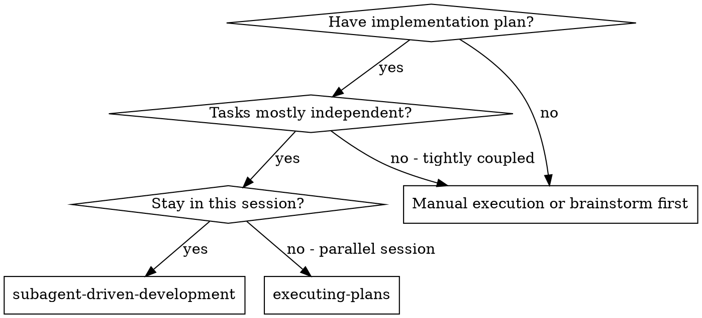
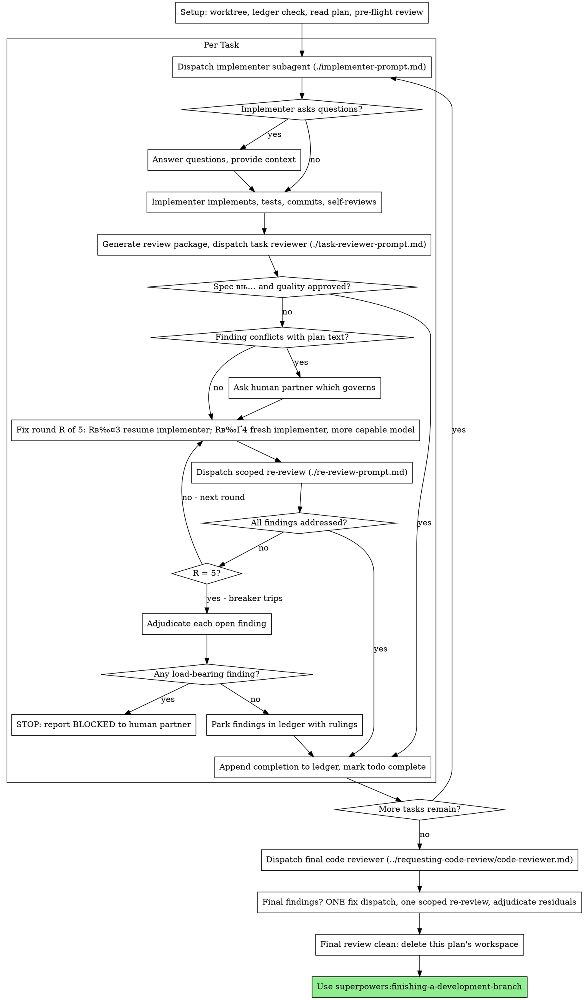

# Codex session 019f90a3-47e5-7770-a20e-cd9317bcbf2c

- Started: `2026-07-23T20:20:52.726Z`
- Working directory: `D:\100XH100`
- Originator: `Codex Desktop`
- Codex CLI: `0.145.0-alpha.30`
- Source log: `C:\Users\Иван Литвак\.codex\sessions\2026\07\29\rollout-2026-07-29T15-21-44-019fadd2-d82c-7e42-8c28-777141aeec0a.jsonl`
- Entries: user=6, assistant=154, tool calls=11, tool outputs=11

This is a chronological export of the user/assistant conversation and tool activity. Internal system/developer instructions and token accounting are intentionally excluded. Secret-shaped values are redacted; oversized tool outputs retain their beginning and end with the omitted character count.

## 1. User

Time: `2026-07-29T12:21:44.848Z` · source line `2`

```text
Subagent-driven делай, но с легким режимами размышлений оба, а ты контролируешь и направляешь

```

## 2. User

Time: `2026-07-29T12:21:44.849Z` · source line `3`

```text
Subagent-driven делай, но с легким режимами размышлений оба, а ты контролируешь и направляешь

```

## 3. Codex

Time: `2026-07-29T12:21:44.849Z` · source line `6`

```text
Запускаю subagent-driven исполнение: два лёгких субагента параллельно — один ведёт публичный Kaggle runner, второй Cloudflare ingest; я остаюсь контроллером, развожу worktree/файлы, проверяю контракты, тесты и интеграцию между ними.
```

## 4. Codex

Time: `2026-07-29T12:21:44.850Z` · source line `10`

```text
Текущий checkout уже изолирован и чист. Создаю ещё два независимых worktree от `fa31690`, чтобы лёгкие агенты могли работать параллельно без конфликтов.
```

## 5. Codex

Time: `2026-07-29T12:21:44.851Z` · source line `33`

```text
Оба implementer-а работают параллельно в разных ветках. После каждого Task 1 я отдельно прогоню spec/quality review; дальше задачи будут выдаваться небольшими порциями, а не одним длинным автономным коммитом.
```

## 6. Codex

Time: `2026-07-29T12:21:44.852Z` · source line `58`

```text
Notebook Task 1 уже реализован и чисто закоммичен: базовый CayleyPy config/data contract, 11 тестов. Сейчас идёт независимый review; Cloudflare Task 1 ещё собирает строгую schema/runtime основу.
```

## 7. Codex

Time: `2026-07-29T12:21:44.864Z` · source line `84`

```text
Notebook Task 1 review завершён после fix-round: реальный CayleyPy CSV теперь грузится, bool-конфиги fail-closed, 19 тестов проходят. Notebook Task 2 уже делает автодетект MLP; ingest-код готовится к коммиту, но npm registry пока тормозит установку тестового runtime.
```

## 8. Codex

Time: `2026-07-29T12:21:44.867Z` · source line `135`

```text
Cloudflare review нашёл реальные schema-гейты; исправляю их через implementer. Отдельно npm на Windows блокирует сеть, поэтому проверю установку/test runtime через уже разрешённый Docker-контур — это не меняет код и может обойти сломанный локальный TLS/proxy.
```

## 9. Codex

Time: `2026-07-29T12:21:44.872Z` · source line `151`

```text
Продолжаю в subagent-driven режиме: сейчас проверю оба fix-round’а, сам не буду переписывать их код — прогоню гейты и отдам точечный diff тем же ревьюерам. Параллельно ноутбук продолжит двигаться, даже если npm-прокси всё ещё блокирует Cloudflare-ветку.
```

## 10. Codex

Time: `2026-07-29T12:21:44.894Z` · source line `168`

```text
Task 2 ноутбука после первого fix-round уже проходит 32/32 теста по общему public-модулю; сейчас идёт независимое повторное ревью именно пяти найденных проблем. В Cloudflare-ветке агент чинит строгие форматы и raw-byte лимит, но lockfile/runtime-гейт всё ещё зависит от восстановления npm-доступа.
```

## 11. Codex

Time: `2026-07-29T12:21:44.900Z` · source line `210`

```text
Новый полезный факт: Task 2 ноутбука теперь окончательно принят ревьюером — все 22 профильных теста зелёные. Я уже передал Task 3 свежему low-reasoning агенту; сам параллельно разблокирую Cloudflare lockfile через приватный удалённый гейт, потому что локальный прокси сейчас отвечает CONNECT timeout/502.
```

## 12. Codex

Time: `2026-07-29T12:21:44.902Z` · source line `234`

```text
Статус без приукрашивания: notebook Task 2 закрыт чисто; Task 3 пишется. Ingest Task 1 статически почти готов, но обнаружился ещё один реальный косяк исходного плана — версия `@cloudflare/workers-types 4.20260728.0` не опубликована; агент меняет её на подтверждённую точную `5.20260727.1`. После этого lockfile и тесты прогоню в приватном CPU-ноуте Kaggle, не на локальном сломанном npm-прокси.
```

## 13. Codex

Time: `2026-07-29T12:21:44.911Z` · source line `256`

```text
Приватный удалённый npm-гейт уже запущен: `trydotatwo/cayleypy-results-ingest-npm-gate`, CPU, internet on, GPU off, сейчас `RUNNING`. Метаданные проверены: notebook private, секретов и GitHub-токенов в пакете нет. Он должен вернуть реальный `package-lock.json`, Vitest и TypeScript typecheck — это закроет главный блокер ingest Task 1.
```

## 14. Codex

Time: `2026-07-29T12:21:44.917Z` · source line `315`

```text
Второй приватный гейт уже дал полезную диагностику: dependency resolution и `npm ci` теперь проходят. Он поймал две настоящие ошибки — тесты ожидали JSON Pointer без batch-префикса, а TypeScript не принимал unchecked cast после Ajv. Оба исправлены корректно, без ослабления валидации; v3 сейчас `RUNNING`. Notebook Task 3 тем временем закрыт ревьюером, Task 4 (reflection/path replay/dedupe) уже в работе.
```

## 15. Codex

Time: `2026-07-29T12:21:44.919Z` · source line `325`

```text
Главный Cloudflare-блокер снят: приватный Kaggle v3 отработал `COMPLETE`, точный payload совпал по SHA-256 с локальными файлами, `npm install --package-lock-only=0`, `npm ci=0`, Vitest `11/11`, TypeScript `typecheck=0`. Получен реальный lockfile SHA-256 `6c841524…f10b81`; агент сейчас переносит его и оформляет коммит/отчёт, после чего я отдам весь fix-range независимому ревьюеру.
```

## 16. Codex

Time: `2026-07-29T12:21:44.921Z` · source line `349`

```text
Для следующих ingest-задач подключаю Cloudflare skill: он нужен, чтобы D1/R2/Queue/Durable Object контракты совпадали с реальным Workers runtime, а не только проходили мок-тесты. Сначала прочитаю его правила целиком, затем передам Task 2 свежему агенту только после чистого ревью Task 1.
```

## 17. Codex

Time: `2026-07-29T12:21:44.922Z` · source line `366`

```text
Сейчас два независимых ревью-цикла: ingest Task 1 проверяется уже по реальному v3 lock/runtime evidence, а Task 4 чинит две небольшие hardening-дыры (глубокая неизменяемость `reached_state` и fail-closed при malformed generators). Алгоритмика CUDA не затрагивается; следующим шагом будут D1/R2 durability и runner orchestration.
```

## 18. Codex

Time: `2026-07-29T12:21:44.924Z` · source line `398`

```text
Task 4 теперь чисто принят: reflection/path replay/dedupe — 12 тестов, замечаний нет. Перед Task 5 подключаю профильный highload-GPU skill, потому что там уже не только Python-обвязка, но и host-only stop controls вокруг существующего multi-GPU runner; это поможет удержать границу «никаких изменений Stream/CUDA алгоритмов».
```

## 19. Codex

Time: `2026-07-29T12:21:44.929Z` · source line `416`

```text
Ingest Task 1 уже официально закрыт ревьюером: без замечаний, lockfile/версии/хэши/11 тестов/typecheck подтверждены. Сейчас параллельно идут две следующие вещи: реальный Miniflare D1+R2 receipt/state-machine тест и Task 5 runner orchestration; в обоих случаях публикации/деплоя пока нет.
```

## 20. Codex

Time: `2026-07-29T12:21:44.936Z` · source line `476`

```text
Продолжаю в SDD-режиме: ingest Task 2 уже прошёл приватный Kaggle-гейт, сейчас я проверю diff и отдам свежему лёгкому ревьюеру; параллельно дожму ревью notebook Task 5 и верну найденные дефекты исполнителю.
```

## 21. Codex

Time: `2026-07-29T12:21:44.937Z` · source line `485`

```text
Ревью notebook Task 5 нашло восемь реальных дефектов, включая три блокирующих: reflection фактически не запускался, collect мог рассинхронизировать два rank, а настоящий TSV не парсился. Возвращаю весь пакет исполнителю одним fix-round; «частично работает» в публичный ноут не попадёт.
```

## 22. Codex

Time: `2026-07-29T12:21:44.950Z` · source line `526`

```text
Cloudflare Task 2 тоже не принимаю: свежий adversarial-review воспроизвёл race, при котором duplicate мог получить ложный `queued` до durable Queue; плюс оставался orphan R2 и игнорировались D1 transition conflicts. Исполнитель получает fix-round и новый обязательный Kaggle gate с byte-exact payload.
```

## 23. Codex

Time: `2026-07-29T12:21:44.950Z` · source line `535`

```text
Сейчас оба fix-round идут параллельно на лёгком reasoning, а я проверил границы контрактов. Для collect верхняя граница одного depth действительно равна локальному frontier × move_count; на больших лучах это может не влезть в T4, поэтому корректное поведение — точный preflight-отказ для небезопасной комбинации, а не скрытая усечённая выборка. Следующие Task 6/Task 3 briefs уже подготовлены, но стартуют только после чистого повторного ревью.
```

## 24. Codex

Time: `2026-07-29T12:21:44.950Z` · source line `542`

```text
Notebook fix-round уже в RED-фазе: исполнитель сначала расширяет fake-runner и regression tests под reflection/реальные TSV/rank logs/ошибочные return codes. Ingest-исполнитель пока проектирует race-safe receipt, чтобы не залатать один interleaving ценой другого; код ещё не принят и не коммитился.
```

## 25. Codex

Time: `2026-07-29T12:21:44.958Z` · source line `582`

```text
Оба fix-round уже в коде: notebook чинит host-only синхронизацию collect и полный reflection pipeline; ingest добавил race tests на deferred Queue, orphan cleanup и конфликт D1 transitions. Я отдельно заставил покрыть ещё две границы, которые ревью не поймало: dedupe всех collect-результатов и отказ collect-профиля 2²⁵×24 до запуска, потому что один полный snapshot плюс frontier не помещается в T4.
```

## 26. Codex

Time: `2026-07-29T12:21:44.960Z` · source line `624`

```text
Root-аудит поймал ещё одну важную вещь уже после первоначального ревью: старый distributed gather резервировал пакетный scratch пропорционально полной capacity и потому collect на 2 rank падал бы при первом найденном решении. Исполнитель уже переделывает его на actual-count + фиксированные NCCL chunks. Также добавляю live-stream rank0 в ноут, чтобы многочасовой запуск не выглядел зависшим и не копил весь stdout в RAM.
```

## 27. Codex

Time: `2026-07-29T12:21:44.961Z` · source line `638`

```text
Cloudflare Task 2 fix теперь подтверждён приватным Kaggle v10: 11 schema + 15 real Miniflare receipt tests, typecheck, и все 14 payload-хешей совпадают с amended HEAD. Я всё равно не двигаю Task 3, пока повторный adversarial-review не даст чистый PASS.
```

## 28. Codex

Time: `2026-07-29T12:21:44.962Z` · source line `651`

```text
Повторный Cloudflare-review нашёл уже архитектурный crash-window, а не локальный баг: durable Queue и D1 не могут обновиться атомарно. Я не буду замазывать его. Делаем правильную at-least-once схему: consumer сможет забрать `received`, повторный клиент сможет восстановить stale dispatch, а плановый sweeper будет переотправлять `received|retryable`; downstream остаётся идемпотентным.
```

## 29. Codex

Time: `2026-07-29T12:21:44.984Z` · source line `678`

```text
Ещё один критичный контракт я нашёл в orchestration: профили выбирались, но без `BEAM_RUNTIME_CONFIG_MODE=manual` production runner мог их проигнорировать и снова автонастроиться. Это уже в fix-scope вместе с проверенными internal history/headroom defaults. То есть итоговый ноут будет реально запускать выбранный профиль, а не только красиво печатать его в preflight.
```

## 30. Codex

Time: `2026-07-29T12:21:45.004Z` · source line `689`

```text
Cloudflare recovery теперь строится как настоящий at-least-once state machine, включая fairness: неудачный retry обязан обновлять `updated_at`/`retry_count`, иначе первые 100 плохих записей могли бы навсегда заблокировать очередь восстановления. Успешный retry очищает старый `safe_error`. Это именно те гонки, которые обычно всплывают только под сотней параллельных клиентов — мы закрываем их до деплоя.
```

## 31. Codex

Time: `2026-07-29T12:21:45.006Z` · source line `714`

```text
Продолжаю в режиме SDD: два лёгких агента закрывают notebook Task 5 и надёжность ingest Task 2, я проверяю диффы, тестовые доказательства и не пускаю дальше до чистого ревью. Сейчас добиваю два критичных места: безопасную очистку 32 GiB history-арен между запусками и восстановление Queue/D1 после неоднозначных сбоев.
```

## 32. Codex

Time: `2026-07-29T12:21:45.007Z` · source line `726`

```text
Промежуточно: recovery-контракт уже исправлен в коде и плане — stale `received|retryable` переотправляются с тем же `submission_id`, неудачи двигают `updated_at/retry_count`, а будущий consumer обязан принимать `received`. В notebook агент уже добавил тест на два последовательных запуска; я заметил рассинхрон между тестом и dataclass/cleanup и вернул его на исправление до запуска полного gate.
```

## 33. Codex

Time: `2026-07-29T12:21:45.056Z` · source line `743`

```text
Очистка history теперь реализована корректно: путь хранится в invocation, удаление идёт в `finally` после захвата rank-логов, разрешён только реальный потомок `/tmp/beam_history_public`; тест проверяет success+failure подряд и сохранность внешнего sentinel. Сейчас оба агента гоняют полные gates и оформляют воспроизводимые отчёты; после коммитов я запускаю независимое ревью, а не принимаю их самооценку.
```

## 34. Codex

Time: `2026-07-29T12:21:45.076Z` · source line `760`

```text
Полный notebook gate сейчас идёт после последних исправлений; локальный focused gate уже 20/20. Ingest v11 всё ещё `RUNNING`; агент нашёл тестовый microtask-hang уже после отправки, поэтому v11 будет только диагностикой, а окончательный доказательный запуск — v12 по финальным байтам и с проверкой SHA-256.
```

## 35. Codex

Time: `2026-07-29T12:21:45.077Z` · source line `775`

```text
Notebook Task 5 прошёл полный локальный gate: 75/75 public-тестов, 32/32 focused runner/path, `py_compile` и staged diff-check. BOM в CUDA-файле отсутствует. Сейчас фиксируется точный коммит; затем я отдам именно его независимому reviewer и после чистого ответа запущу private 2xT4 compile/smoke. Ingest v11 с известным зависшим тестом supersede’им приватным v12 по исправленным байтам.
```

## 36. Codex

Time: `2026-07-29T12:21:45.079Z` · source line `793`

```text
Ingest v12 уже `COMPLETE`: 11 schema-тестов, 18 реальных Miniflare receipt/recovery тестов и TypeScript typecheck прошли. Сейчас сверяются 14 SHA-256 с текущими файлами — это отсечёт ложный PASS от устаревшей версии. Notebook-коммит `022b539` уже передан отдельному read-only reviewer по полному диапазону `c7fc69e..022b539`.
```

## 37. Codex

Time: `2026-07-29T12:21:45.081Z` · source line `818`

```text
Оба точных коммита теперь заморожены и проверяются параллельно двумя независимыми reviewer’ами: notebook `022b539`, ingest `dde1cc99`. По ingest я дополнительно просмотрел скачанный `npm-gate-results.json`: все шесть команд имеют exit 0, Miniflare реально поднял изолированный runtime, а payload map содержит 14 ожидаемых SHA. Следующие implementation tasks не стартую до ответа reviewer’ов.
```

## 38. Codex

Time: `2026-07-29T12:21:45.082Z` · source line `832`

```text
Пока reviewer’ы не нашли новых P0/P1. Отдельно подтверждено, что прежнее Queue/D1 crash-window закрыто на всех основных interleaving’ах; notebook reviewer ещё разбирает коллективный порядок NCCL и lifecycle history — это самая рискованная часть текущего коммита, поэтому не тороплю его.
```

## 39. Codex

Time: `2026-07-29T12:21:45.083Z` · source line `844`

```text
Reviewer нашёл один реальный контрактный дефект в ingest-плане: режим `store_only` сохраняет запрос без Queue, но будущий cron recovery сейчас безусловно подхватил бы его через 60 секунд и всё равно отправил на валидацию — обход аварийного выключателя публикации. Сам Task 2 helper нормален; исправляем guard в Task 3/4 контракте и добавляем тесты, что `store_only/read_only` ничего не enqueue’ят.
```

## 40. Codex

Time: `2026-07-29T12:21:45.084Z` · source line `855`

```text
Ingest reviewer добавил ещё один небольшой, но важный gate-дефект: Miniflare-тесты исполняли вручную сокращённый `CREATE TABLE`, а не настоящий `migrations/0001_initial.sql`; значит индекс и `CHECK` были только привязаны SHA, но не запускались. Уже отправил round 3: реальные migration bytes в test harness, аварийные mode-guards на всех будущих entrypoint’ах и приватный v13 с повторной hash-проверкой.
```

## 41. Codex

Time: `2026-07-29T12:21:45.095Z` · source line `871`

```text
Notebook reviewer поймал P0, поэтому `022b539` не принят: production runner в обычной release-сборке пишет `puzzle_solved=1 … solution=<path>`, а Python разбирал только debug-маркер `solution_path=`. То есть first-mode мог реально найти решение и потерять его в orchestration. Второй дефект — наследование чужих `BEAM_*` из окружения могло переключить runner, например, в repair mode. Жду полный список и отправляю отдельный fix-round с реальными release-line fixtures и герметичным env.
```

## 42. Codex

Time: `2026-07-29T12:21:45.104Z` · source line `910`

```text
Оба fix-round’а запущены. Для notebook я задал не косметический cap, а точный bounded design: NCCL всё ещё читает snapshot фиксированными чанками, но держит только ограниченную следующую детерминированную пачку; если первые кандидаты дают дубликаты путей, идёт следующий cursor-pass, пока не набрано пользовательское `MAX_COLLECTED_SOLUTIONS`. Это сохраняет корректность без вектора на десятки миллионов записей.
```

## 43. Codex

Time: `2026-07-29T12:21:45.105Z` · source line `922`

```text
Ingest round 3 уже имеет честный RED: сокращённая тестовая схема не содержала `submissions_recovery` и принимала запрещённое состояние. Новый harness загружает ровно production migration bytes через Vitest config, затем D1-тест проверяет индекс `[state, updated_at]` и отклонение неизвестного state. Локальный npm снова упирается в `ECONNRESET`, поэтому окончательный GREEN будет только на exact private v13.
```

## 44. Codex

Time: `2026-07-29T12:21:45.108Z` · source line `953`

```text
Notebook RED сейчас 6 ожидаемых падений; Python-часть уже чинится. Я отдельно добавил проверку настоящего torchrun framing: combined log имеет префикс `[default0]:`, поэтому новый parser нормализует только этот строгий line-prefix, а не ищет `solution=` где угодно. Это закрывает ещё один случай, который unit fixture без torchrun не поймал бы.
```

## 45. Codex

Time: `2026-07-29T12:21:45.110Z` · source line `977`

```text
Ingest v13 уже `COMPLETE`; теперь проверяется не только SHA migration, но и её фактическое выполнение в D1. Ожидаемый gate: 11 schema + 19 receipt, где новый тест читает настоящий SQL, видит recovery-index и получает отказ на недопустимое состояние. Notebook Python-фиксы тоже уже в работе; я дополнительно поправил provenance: supplied source должен быть fallback-кандидатом, но не затирать доказательство, если тот же путь реально нашёл solver.
```

## 46. Codex

Time: `2026-07-29T12:21:45.110Z` · source line `985`

```text
v13 честно упал: schema 11/11 и typecheck прошли, но receipt setup показал, что `D1.exec()` режет многострочный `CREATE TABLE` как неполный запрос; 19 тестов не исполнялись. Это полезный gate, не принимаем. Сразу идём в private v14 через официальный Cloudflare migration harness (`readD1Migrations` + `applyD1Migrations`), сохраняя exact production SQL без самодельной схемы.
```

## 47. Codex

Time: `2026-07-29T12:21:45.110Z` · source line `995`

```text
Notebook Python fix уже имеет 44/44 focused green, включая source fallback, solver-provenance и inverse preflight. Самая тяжёлая C++ bounded-gather часть ещё пишется. Ingest v14 пока не отправлен: агент подтвердил, что удаляет именно упавший raw-`D1.exec` путь и переходит на официальный migration fixture API перед новым запуском.
```

## 48. Codex

Time: `2026-07-29T12:21:45.117Z` · source line `1005`

```text
v14 fix ещё не отправлен — старый raw-exec код пока остаётся в рабочем диффе, что я явно заблокировал; push разрешён только после сохранённого `readD1Migrations/applyD1Migrations`. В notebook C++ уже выделен header-only snapshot и строгий total-order для bounded batches; далее агент заменяет полный host-vector и добавляет безопасное завершение torchrun при исключениях.
```

## 49. Codex

Time: `2026-07-29T12:21:45.123Z` · source line `1042`

```text
v14 — полный GREEN: schema 11/11, receipt 19/19 через официальный migration setup, typecheck, все 6 команд exit 0, SHA 15/15 совпали с текущим worktree; metadata приватная и CPU-only. v13 failure сохранится в отчёте как доказательство, что gate действительно ловит неправильный способ применения миграции.
```

## 50. Codex

Time: `2026-07-29T12:21:45.123Z` · source line `1060`

```text
Notebook C++ bounded selection уже корректно ограничивает память, но я направил ещё одно ускорение: не allgather’ить все ~50 млн hit-records при `2**21×24`. Каждый rank локально оставляет свой next-K после cursor, а NCCL обменивает только ≤K с каждого rank; глобальный K математически всегда лежит в объединении локальных K. Это сохраняет точность и резко режет PCIe/NCCL трафик без нового CUDA kernel.
```

## 51. Codex

Time: `2026-07-29T12:21:45.125Z` · source line `1100`

```text
Продолжаю в том же режиме: два лёгких сабагента делают реализацию и независимый разбор, я сейчас закрываю найденную дырку с потерей сообщений после `max_retries` и параллельно довожу bounded collector/парсер ноутбука до повторного ревью. Публично пока ничего не выкладываю.
```

## 52. Codex

Time: `2026-07-29T12:21:45.132Z` · source line `1128`

```text
Notebook Task 5 теперь собран отдельным коммитом: 97 локальных тестов зелёные, включая реальные форматы release-логов, отражение, bounded сбор решений и аварийную очистку `torchrun`. Следующий обязательный барьер — независимое ревью коммита и затем приватная компиляция/дымовой прогон на настоящих 2×T4; локально Windows это честно не подтверждает.
```

## 53. Codex

Time: `2026-07-29T12:21:45.132Z` · source line `1145`

```text
Параллельно проверил старые линии: и Tetraminx integration, и autoprofile sweep сейчас имеют статус `COMPLETE`; их артефакты уже лежат локально. Для нового публичного ноутбука я не считаю это заменой acceptance — его собственный reviewed commit отдельно прогоню на приватных 2×T4 после ревью.
```

## 54. Codex

Time: `2026-07-29T12:21:45.136Z` · source line `1179`

```text
По ingest исправление уже ушло в TDD: вместо бесконечных `Queue.retry()` будет подтверждённая запись `ingest_paused` в D1 и ACK, а если сама D1-парковка ломается до исчерпания ретраев, stale `queued` запись автоматически подхватит normal-mode sweep. Это закрывает реальную потерю принятого результата при долгой паузе сервиса.
```

## 55. User

Time: `2026-07-29T12:21:45.136Z` · source line `1183`

```text
<environment_context>
  <current_date>2026-07-29</current_date>
  <timezone>Europe/Moscow</timezone>
  <filesystem><workspace_roots><root>D:\100XH100</root></workspace_roots><permission_profile type="managed"><file_system type="restricted"><entry access="read"><special>:root</special></entry><entry access="write"><path>D:\100XH100</path></entry><entry access="write"><special>:slash_tmp</special></entry><entry access="write"><special>:tmpdir</special></entry><entry access="write"><path>C:\Users\Иван Литвак\.codex\visualizations\2026\07\23\019f90a3-47e5-7770-a20e-cd9317bcbf2c</path></entry><entry access="read"><path>D:\100XH100\.git</path></entry><entry access="read"><path>D:\100XH100\.agents</path></entry><entry access="read"><path>D:\100XH100\.codex</path></entry></file_system></permission_profile></filesystem>
</environment_context>
```

## 56. User

Time: `2026-07-29T12:21:45.137Z` · source line `1185`

```text
Продолжай

```

## 57. Codex

Time: `2026-07-29T12:21:45.137Z` · source line `1187`

```text
Продолжаю. Сейчас два лёгких сабагента по-прежнему заняты строго раздельно: один закрывает lossless-паузу Cloudflare ingest, второй делает read-only ревью `cc2d0d8`; я после их результатов либо отправлю точечный fix-round, либо сразу поставлю приватный 2×T4 compile/collect smoke.
```

## 58. Codex

Time: `2026-07-29T12:21:45.149Z` · source line `1225`

```text
Есть честный RED для ingest: приватный Kaggle CPU v15 завершился именно четырьмя ожидаемыми падениями новых тестов — отсутствует `parkPausedSubmission`; прежние 11 schema и 19 receipt-тестов остались зелёными. Теперь сабагент реализует минимальный storage/recovery слой и затем обязан получить новый exact GREEN, а не переименовать этот запуск в успех.
```

## 59. Codex

Time: `2026-07-29T12:21:45.150Z` · source line `1235`

```text
Независимое ревью Task 5 завершилось без P0/P1. Нашёлся один P2 в лог-парсере: он снимал любой `[anything]:`, а должен принимать только реальный `[default0]:`, плюс слишком свободно валидировал поле `seconds`. Уже идёт узкий fix-round; CUDA/C++ сборщик ревью признало архитектурно закрытым, но реальный 2×T4 gate всё равно остаётся обязательным.
```

## 60. Codex

Time: `2026-07-29T12:21:45.151Z` · source line `1255`

```text
Сейчас оба потока в ожидаемой середине TDD: ingest уже имеет реализацию D1 park + stale `queued` recovery поверх зафиксированного v15 RED; notebook parser имеет 6 точных RED-регрессий и получает минимальный Python-only fix. Следующее содержательное обновление дам по GREEN/коммитам, не по промежуточным конфигам.
```

## 61. Codex

Time: `2026-07-29T12:21:45.151Z` · source line `1261`

```text
Ingest получил exact GREEN на приватном Kaggle CPU v16: `11/11` schema, `23/23` receipt/recovery, typecheck, включая 101 повторную доставку одного paused-result без потери/дублирования. Сейчас агент фиксирует хэши/metadata и оформляет один standalone-коммит; после этого я снова отдам диапазон независимому ревью.
```

## 62. Codex

Time: `2026-07-29T12:21:45.152Z` · source line `1281`

```text
Parser fix уже GREEN: 49 runner-тестов, 62 focused и 105 всего public-suite; негативные `[evil]:` и невалидные/non-finite `seconds` теперь закрыты. Осталось только зафиксировать evidence/commit и повторно отдать этот маленький диапазон read-only ревью.
```

## 63. Codex

Time: `2026-07-29T12:21:45.153Z` · source line `1298`

```text
Ingest round-4 зафиксирован отдельным `d50d7bb`: v15 RED сохранён, v16 GREEN подтверждён, worktree чистый. Я уже запустил повторное независимое ревью именно диапазона `9a966d5..d50d7bb`; оно проверяет не только тесты, но и неоднозначный Queue send, terminal states, cron fairness и точные artifact-хэши.
```

## 64. Codex

Time: `2026-07-29T12:21:45.155Z` · source line `1317`

```text
Оба содержательных GREEN уже есть; сейчас задержка только в аккуратной фиксации evidence под Windows split-root sandbox, не в коде. Я не разрешаю обходить это грязной перезаписью файлов: изменения проходят через проверяемые scoped patches, затем clean worktree и независимый diff-review.
```

## 65. Codex

Time: `2026-07-29T12:21:45.158Z` · source line `1341`

```text
Parser P2 уже закреплён отдельным `6830401`, exact parent `cc2d0d8`, полный suite `105 passed`, C++ diff отсутствует. Сейчас одновременно идут два финальных read-only ревью (`d50d7bb` ingest и `6830401` parser); после их clean verdict запускаю приватный 2×T4 compile + first/collect smoke с повторным TSV и RSS-замером.
```

## 66. Codex

Time: `2026-07-29T12:21:45.160Z` · source line `1367`

```text
Оба независимых ревью чистые. Запустил следующую пару: реальный private Kaggle 2×T4 gate для `6830401` (compile + first + два collect-прогона с byte-identical TSV/RSS/rank logs) и Task 3 ingest (`normal/store_only/reject`, HTTP, rate limits, status/health, scheduled recovery) с новым private CPU RED→GREEN.
```

## 67. Codex

Time: `2026-07-29T12:21:45.160Z` · source line `1370`

```text
Для следующего этапа явно применяю три профильных skill-контракта: Kaggle — для приватных kernel gates, Cloudflare — для Worker/D1/Queue API, и subagent-driven development — для разделения реализации и независимого контроля. Сейчас сверяю их требования перед дальнейшими мутациями.
```

## 68. Codex

Time: `2026-07-29T12:21:45.165Z` · source line `1397`

```text
Оба новых шага начали TDD с чистых баз. Важное уточнение из актуальной Cloudflare-документации: встроенный RateLimit POP-local и eventual-consistent, поэтому глобальный лимит 2 000/min нельзя честно обещать только им — D1 fallback остаётся обязательным. Private 2×T4 gate уже зафиксировал exact source SHA, p16 профиль и puzzle 1=`BR`; дальше идут RED-артефакты.
```

## 69. Codex

Time: `2026-07-29T12:21:45.166Z` · source line `1423`

```text
Первый private-gate RED уже зафиксирован тестом отсутствующего builder-модуля. Task 3 чуть задержал известный Windows split-root баг `apply_patch`; я прекратил повторные попытки и разрешил только scoped `git apply --check` внутри exact worktree, с последующим diff-аудитом. Кодовых блокеров нет.
```

## 70. Codex

Time: `2026-07-29T12:21:45.167Z` · source line `1437`

```text
Продолжаю с двумя low-reasoning сабагентами: один доводит реальный приватный 2×T4 gate, второй — HTTP/mode/recovery слой ingest-сервиса. Сейчас проверю их фактические диффы и не дам перейти к следующему этапу без независимого ревью и runtime-доказательств.
```

## 71. Codex

Time: `2026-07-29T12:21:45.171Z` · source line `1457`

```text
Старые четыре Kaggle-ядра сейчас все в терминальном `COMPLETE`; это само по себе не доказательство корректности, поэтому я не засчитываю их как acceptance. Новый gate строится отдельно на exact reviewed commit и будет считаться пройденным только по двум T4, обоим rank-логам, CPU-валидации и byte-identical collect-прогонам.
```

## 72. Codex

Time: `2026-07-29T12:21:45.171Z` · source line `1470`

```text
Ingest-поток закончил полноценный RED-набор: режимы, лимиты, дубликаты, mixed receipts и scheduled recovery покрыты до production-кода. Я сейчас проверяю тесты на ложноположительные сценарии; только после этого разрешу private CPU RED и реализацию.
```

## 73. Codex

Time: `2026-07-29T12:21:45.172Z` · source line `1475`

```text
RED-тесты прошли мой контроль. Сабагент правильно остановился на запрете внешней загрузки; я сам проверю приватность/хэши kernel payload и выполню разрешённый вами private Kaggle push из root-контекста. Production-кода в этой версии ещё нет, поэтому ожидаемый результат — точный RED, а не «успех».
```

## 74. Codex

Time: `2026-07-29T12:21:45.173Z` · source line `1500`

```text
Private 2×T4 gate builder теперь целиком собран: локальный focused-набор зелёный. Я повторяю тесты независимо и отдельно проверяю generated notebook до загрузки — metadata private, ровно 2×T4, embedded source SHA, отсутствие секретов и сохранённых outputs.
```

## 75. Codex

Time: `2026-07-29T12:21:45.177Z` · source line `1515`

```text
Private CPU v17 завершился ожидаемым чистым RED: schema `11/11` и прежний receipt-контракт `23/23` зелёные; единственная причина падения worker-suite и typecheck — отсутствующий `src/worker.ts`. Значит тестовая постановка не сломала прежнюю базу, ingest-сабагент уже реализует ровно недостающий слой.
```

## 76. Codex

Time: `2026-07-29T12:21:45.179Z` · source line `1544`

```text
Ingest GREEN-кандидат готов. Перед v18 я проверяю точные SHA, append-only migration, отсутствие Task4/секретов, private CPU metadata и сам SQL rate-limit на атомарность; затем загружу только этот проверенный payload.
```

## 77. Codex

Time: `2026-07-29T12:21:45.181Z` · source line `1564`

```text
Ingest v18 сейчас `RUNNING`; payload уже содержит exact `worker.ts`, `storage.ts`, миграцию `0002` и тесты. Пока нет immutable output, GREEN не объявляю. Параллельно 2×T4 gate проходит дополнительный adversarial-тест: поддельный `cpu_solution_valid=true` больше не должен приниматься без реального replay пути.
```

## 78. Codex

Time: `2026-07-29T12:21:45.181Z` · source line `1569`

```text
v18 дал полезный runtime-блокер, не логику API: typecheck зелёный, schema `11/11` и receipt `23/23` зелёные, но Workers-pool падает при загрузке AJV (`Unexpected token ':'` в CJS shim) до запуска новых тестов. Перехожу по systematic-debugging skill: сначала локализую несовместимый import/runtime boundary, затем минимальный config/import fix и новый private GREEN-кандидат.
```

## 79. Codex

Time: `2026-07-29T12:21:45.184Z` · source line `1586`

```text
v19 запущен с единственным config-only изменением по официальному Cloudflare workaround для CJS module resolution; production-хэши не менялись. Если suite начнёт исполняться, следующий результат уже отделит runtime-загрузку от реальных ошибок API/лимитов — именно это и нужно для точной диагностики.
```

## 80. Codex

Time: `2026-07-29T12:21:45.191Z` · source line `1610`

```text
Первый optimizer-workaround не сработал, поэтому я не наслаиваю ещё один «наугад». Причина уточнена: production импортирует deep entry `ajv/dist/2020.js`, а v19 предбандлил только top-level `ajv`; Workers-pool всё ещё открыл deep CommonJS напрямую (`?mf_vitest_no_cjs_esm_shim`). Сейчас воспроизвожу это локально на тех же pinned npm-версиях и проверю одну гипотезу — exact deep-entry prebundle.
```

## 81. Codex

Time: `2026-07-29T12:21:45.192Z` · source line `1627`

```text
2×T4 gate после hardening зелёный локально: adversarial replay теперь отклоняет ложный `cpu_solution_valid`, полный public-набор `133/133`. Я повторяю финальные хэши/5 focused-тестов и сразу отправляю private GPU-версию; публичных изменений или публикации ветки нет.
```

## 82. Codex

Time: `2026-07-29T12:21:45.193Z` · source line `1633`

```text
Продолжаю двумя low-reasoning агентами, как договорились. Сейчас одновременно: исправленный v20 CPU-гейт ingest (точный deep-import AJV) и 2×T4 gate; у GPU-gate Kaggle нормализовал slug, поэтому v1 считаю только диагностическим и готовлю корректно аттестованный v2.
```

## 83. Codex

Time: `2026-07-29T12:21:45.194Z` · source line `1653`

```text
Оба исправленных кандидата уже запущены приватно: ingest v20 и GPU v2. Пока Kaggle выполняет их, я независимо проверяю diff и контракты, чтобы не принять «зелёный» notebook только по статусу COMPLETE.
```

## 84. Codex

Time: `2026-07-29T12:21:45.195Z` · source line `1671`

```text
Новый факт по ingest v20: production-код и typecheck зелёные; 60/64 теста прошли. Четыре падения оказались не runtime-багами, а двумя ошибками самого тестового стенда (явный `undefined` подменялся на `normal`, и слишком строгая проверка lazy stream). Агент делает v21 только с исправлением тестов; production hash остаётся неизменным. GPU v2 всё ещё RUNNING.
```

## 85. Codex

Time: `2026-07-29T12:21:45.198Z` · source line `1689`

```text
GPU v2 прошёл полностью: реальные 2×Tesla T4, Release/sm75/NCCL, оба rank rc=0. `first` нашёл валидный `BR` за 0.108281 с; два независимых `collect` дали по 16 уникальных CPU-валидных путей и байт-в-байт одинаковый TSV. Peak RSS около 1.56 GB на прогон. Сейчас агент фиксирует evidence и делает чистый commit; ingest v21 ещё RUNNING.
```

## 86. Codex

Time: `2026-07-29T12:21:45.201Z` · source line `1699`

```text
Ingest v21 теперь полностью зелёный: 64/64 Miniflare-теста, typecheck PASS, 18/18 скачанных payload-хэшей совпали с текущим worktree; kernel приватный и CPU-only. Значит оба текущих runtime-гейта прошли. Осталось оформить два атомарных commit и пропустить их через отдельный review, прежде чем брать Task 4/Task 6.
```

## 87. Codex

Time: `2026-07-29T12:21:45.205Z` · source line `1742`

```text
Контрольная проверка с моей стороны тоже зелёная: downloaded GPU v2 повторно прошёл независимый validator, а объединённый public-runner + gate suite дал 111/111. Секретов и приватных путей в новом package/raw evidence не найдено; жду только завершения атомарного оформления, затем запускаю отдельный review.
```

## 88. Codex

Time: `2026-07-29T12:21:45.207Z` · source line `1766`

```text
Сейчас без нового runtime-блокера: GPU commit уже чистый и находится на независимом review; ingest-агент оформляет только обязательные plan/report/memory evidence вокруг уже зелёного v21. После review сразу раздаю следующую пару: Queue/replay для сервиса и best-effort publisher для notebook.
```

## 89. Codex

Time: `2026-07-29T12:21:45.209Z` · source line `1798`

```text
Review нашёл два реальных P2 в самом GPU-gate, не в solver: в commit не сохранён сырой Kaggle receipt, доказывающий именно remote version/status, и после завершения дочернего процесса хвост stdout мог обходить 8 MiB cap без гарантированного reap. Это чинится только в notebook/gate harness; CUDA/beam-search не трогаем. После точных line anchors сделаю v3 и сохраню push/status/list receipts как отдельное доказательство.
```

## 90. Codex

Time: `2026-07-29T12:21:45.212Z` · source line `1813`

```text
Итог review: P0/P1 нет, сама v2 runtime-evidence признана корректной; два P2 изолированы в gate harness. Я уже вернул их notebook-агенту с TDD и обязательным v3 remote attestation. Параллельно ingest Task 3 заканчивает clean commit.
```

## 91. Codex

Time: `2026-07-29T12:21:45.212Z` · source line `1825`

```text
Ingest Task 3 зафиксирован отдельным commit `f0c81ed`: v21 64/64 + typecheck + 18/18 hashes. Временные debug-cache директории контроллера удалены, worktree чистый. Сейчас отдельный агент ревьюит именно этот commit, а второй чинит два P2 и готовит GPU v3.
```

## 92. Codex

Time: `2026-07-29T12:21:45.214Z` · source line `1851`

```text
Предварительный ingest-review нашёл один вероятный P1 availability: 25 MiB JSON сейчас создаёт несколько полных копий (chunks → Uint8Array → UTF-16 string → parsed object → повторный stringify), что может пересечь лимит 128 MB Worker isolate. Также есть P2 на malformed `%` в status URL. После финальных anchors уменьшу безопасный batch-byte budget/уберу лишнюю копию и добавлю bounded fan-out; это API/Worker fix, данные и solver не затрагиваются.
```

## 93. Codex

Time: `2026-07-29T12:21:45.215Z` · source line `1877`

```text
Финальный ingest-review дал 2×P1 и 4×P2. Кроме памяти, найден важный boundary race: медленный запрос мог откатить минутное окно глобального D1 rate counter назад. Я уже раздал точный fix-set: монотонный UPSERT, streaming decode + 4 MiB cap, bounded concurrency/общий poll budget, safe malformed URL, точная compatibility date и сырой remote receipt для v22. Деплой пока не делаем.
```

## 94. Codex

Time: `2026-07-29T12:21:45.216Z` · source line `1889`

```text
GPU-fix уже имеет честный TDD: два новых теста сначала упали ровно на EOF-cap и unreaped child, затем прошли после минимального harness-only исправления. Ingest тоже пойдёт честно: приватный v22 будет exact RED с неизменным production, затем v23 — GREEN; это нужно, потому что локальный Windows npm runtime ненадёжен.
```

## 95. Codex

Time: `2026-07-29T12:21:45.219Z` · source line `1911`

```text
Оба fix-потока сейчас в RED/GREEN цикле. GPU: process-capture GREEN, remote-attestation тест уже добавлен и должен быть единственным оставшимся RED. Ingest: готовится exact v22 RED без изменения production hashes; после него только узкий Worker/config patch.
```

## 96. Codex

Time: `2026-07-29T12:21:45.220Z` · source line `1920`

```text
GPU v3 package готов локально и 9/9 тестов зелёные. Сейчас делаю приватный push с раздельным raw stdout/stderr capture и UTC timestamp; после COMPLETE сниму status/list/pulled-metadata, добавлю их в downloaded evidence и только тогда приму v3.
```

## 97. Codex

Time: `2026-07-29T12:21:45.221Z` · source line `1938`

```text
GPU v3 уже COMPLETE. Сейчас снимаю четыре независимых raw receipt: status, kernels-list lastRunTime/ref, pulled private metadata и текущий source hash; затем downloaded validator должен пройти с ними без доверия к self-attestation notebook.
```

## 98. Codex

Time: `2026-07-29T12:21:45.225Z` · source line `1989`

```text
Нужен один явный approval от тебя: Windows sandbox снова не умеет `apply_patch` внутри `.worktrees`, а автоматический reviewer отклонил безопасный fallback только из‑за исчерпанного usage quota и запретил обход без нового согласия пользователя.

Разрешаешь применить точный patch через scoped `git apply --check` → `git apply` только к тестам/Worker-файлам в `D:\100XH100\.worktrees\cayleypy-results-ingest`? Diff будет предварительно проверен, CUDA и чужие изменения не затрагиваются. Пока жду ответ, GPU v3 продолжаю оформлять.
```

## 99. Codex

Time: `2026-07-29T12:21:45.227Z` · source line `2007`

```text
Продолжаю по разрешённой части: сейчас закрываю и независимо перепроверяю финальный 2×T4 GPU-gate. Ветка ingest остаётся без изменений до отдельного подтверждения точечного patch, которое я запросил выше.
```

## 100. Codex

Time: `2026-07-29T12:21:45.228Z` · source line `2018`

```text
Параллельно перепроверил два старых приватных Kaggle-контура: и Tetraminx integration, и 2×T4 autoprofile sweep сейчас имеют terminal state `COMPLETE`. Нового `RUNNING`/`ERROR` нет; основной активный блок — упаковка проверенного v3 GPU-gate.
```

## 101. Codex

Time: `2026-07-29T12:21:45.229Z` · source line `2025`

```text
GPU-часть уже по существу готова: код, реальный v3-вывод с двух T4 и оба отчёта собраны; хеш пакета не изменился. Сейчас идут последние 9 focused + 137 full тестов, повторный validator и один чистый commit — ориентир 10–15 минут.
```

## 102. Codex

Time: `2026-07-29T12:21:45.229Z` · source line `2029`

```text
Финальная проверка идёт без новых ошибок. Отдельно посмотрел diff отчёта: он фиксирует именно version 3, два реальных T4, `COMPLETE`, проверенный solve `BR`, два детерминированных collect-прогона и внешнюю Kaggle-аттестацию — старый self-attestation больше не считается достаточным.
```

## 103. Codex

Time: `2026-07-29T12:21:45.229Z` · source line `2037`

```text
Последний full-test процесс уже завершился; сейчас агент сводит staged payload и хеши перед commit. Рабочее дерево содержит только ожидаемые Task 5-файлы: builder/tests/notebook, v3-отчёты, ledger и обязательные `CHANGELOG`/`PROMPTS`.
```

## 104. Codex

Time: `2026-07-29T12:21:45.230Z` · source line `2055`

```text
Агент завис уже после успешного staging, без активных тестов или git-процесса. Я остановил именно его turn, сохранил полностью подготовленный staged payload и сейчас сам завершаю commit и независимый review — работа не потеряна.
```

## 105. Codex

Time: `2026-07-29T12:21:45.231Z` · source line `2068`

```text
GPU Task 5 теперь зафиксирован commit `07904b0bf77186934b39200d5a385ab85af8851c`; дерево чистое. Моя повторная проверка: `9/9` focused, `137/137` full, validator `status=ok`, remote version 3/private/COMPLETE, semantic match pulled notebook, secret/private-path scan — 0 находок. Остался независимый read-only review этого exact commit.
```

## 106. Codex

Time: `2026-07-29T12:21:45.231Z` · source line `2078`

```text
Независимый review не нашёл P0/P1, но поймал два честных P2, которые я не пропускаю:

- в сохранённом remote `list.csv` остался display name автора, хотя отчёт называл evidence полностью sanitized;
- старый `task-5-report.md` всё ещё говорит про acceptance v2, тогда как v3 уже superseding.

Сначала закрываю оба и повторяю точечные гейты; только после этого Task 5 считается завершённым.
```

## 107. Codex

Time: `2026-07-29T12:21:45.232Z` · source line `2095`

```text
Исправление P2 делаю без нового Kaggle-прогона: вычислительный notebook и его hash не меняются. Из публичного evidence удаляется весь `list.csv` с display name; acceptance остаётся строго подтверждён push receipt v3 + `COMPLETE` status + private pulled metadata + семантически совпавший pulled notebook. Параллельно обновляется забытый Task 5 report с v2 на v3.
```

## 108. Codex

Time: `2026-07-29T12:21:45.233Z` · source line `2105`

```text
TDD-контракт сработал как надо: новый list-free fixture упал ровно потому, что старый validator всё ещё требовал `remote/list.csv`. Теперь вносится минимальная GREEN-правка validator/evidence/docs; вычислительный пакет не регенерируется.
```

## 109. Codex

Time: `2026-07-29T12:21:45.234Z` · source line `2113`

```text
GREEN-правка уже сузила публичную remote-аттестацию: зависимость от Kaggle list и её hash удалена из validator, fixture и manifest. Сейчас удаляется сам файл и приводятся в соответствие оба отчёта; затем полный повтор тестов/scan.
```

## 110. Codex

Time: `2026-07-29T12:21:45.234Z` · source line `2116`

```text
Нужна ещё одна точечная санкция после sandbox-rejection: удалить из worktree ровно один tracked-файл  
`D:\100XH100\.worktrees\public-cayleypy-notebook\test_results\kaggle_cayleypy_task5_2xt4_gate_v3_2026-07-29\remote\list.csv`.

Он содержит лишний display name автора; удаление полностью восстановимо из commit `07904b0`. Разрешаешь это удаление? Пока жду ответ, агент продолжает править отчёты и тесты без удаления файла.
```

## 111. Codex

Time: `2026-07-29T12:21:45.234Z` · source line `2133`

```text
Все недеструктивные исправления готовы: оба отчёта и ledger теперь согласованы на v3, validator list-free, `diff --check` зелёный. Остался только физически удалить один tracked CSV после вашего разрешения; неотслеживаемая control-копия в публичный commit не попадёт. Тесты уже запускаются.
```

## 112. Codex

Time: `2026-07-29T12:21:45.234Z` · source line `2135`

```text
Дополнение к запросу на удаление: нашлась ещё одна ignored control-копия того же CSV по пути  
`D:\100XH100\.worktrees\public-cayleypy-notebook\test_results\kaggle_cayleypy_task5_v3_control\list.csv`.

Она не попадёт в git, но для чистого локального handoff лучше удалить и её. Разрешение прошу на удаление ровно этих двух `list.csv`; оба восстановимы из Kaggle/предыдущего commit.
```

## 113. Codex

Time: `2026-07-29T12:21:45.235Z` · source line `2144`

```text
GPU Task 5 закрыт по вычислениям: commit `07904b0`, `9/9` focused, `137/137` full, Kaggle v3 — private `COMPLETE`, два T4, validator green.

Для продолжения разрешите две точечные операции после sandbox-rejection:

1. Удалить два `list.csv` с лишним display name автора.
2. Применить scoped `git apply` к тестам и Worker-файлам ingest-ветки для найденных P1/P2.

Ответьте «разрешаю обе» — и я продолжу.

::git-commit{cwd="D:\100XH100\.worktrees\public-cayleypy-notebook"}


```

## 114. Codex

Time: `2026-07-29T12:21:45.235Z` · source line `2145`

```text
GPU Task 5 закрыт по вычислениям: commit `07904b0`, `9/9` focused, `137/137` full, Kaggle v3 — private `COMPLETE`, два T4, validator green.

Для продолжения разрешите две точечные операции после sandbox-rejection:

1. Удалить два `list.csv` с лишним display name автора.
2. Применить scoped `git apply` к тестам и Worker-файлам ingest-ветки для найденных P1/P2.

Ответьте «разрешаю обе» — и я продолжу.

::git-commit{cwd="D:\100XH100\.worktrees\public-cayleypy-notebook"}

<oai-mem-citation>
<citation_entries>
MEMORY.md:1-3|note=[used project worktree and hardware separation rules]
MEMORY.md:9-9|note=[used prior project rollout reference]
</citation_entries>
<rollout_ids>
019f73c3-64bf-7f92-b5ba-476ca2030d27
</rollout_ids>
</oai-mem-citation>
```

## 115. User

Time: `2026-07-29T12:21:45.236Z` · source line `2152`

```text
Да, разрешаю обе. По сути я запрещаю только архитектуру бимсерча менять без согласования со мной. Всё остальное разрешаю тебе, спасибо

```

## 116. Codex

Time: `2026-07-29T12:21:45.236Z` · source line `2156`

```text
Принял границу: архитектуру бимсерча не меняю без отдельного согласования; notebook, тесты, упаковку, Cloudflare ingest и инфраструктурные исправления веду автономно. Сейчас удаляю два одобренных CSV, закрываю Task 5 commit/review и параллельно возобновляю RED→GREEN исправления ingest.
```

## 117. Codex

Time: `2026-07-29T12:21:45.237Z` · source line `2161`

```text
Оба одобренных CSV удалены; проверка `Test-Path` для обоих вернула `False`. Tracked-файл восстановим из `07904b0`, control-копию — повторным Kaggle capture. Другие файлы не затронуты.
```

## 118. Codex

Time: `2026-07-29T12:21:45.238Z` · source line `2171`

```text
Обе линии двигаются параллельно: Task 5 видит tracked deletion и сейчас повторяет финальные гейты; ingest начал именно с RED-тестов (`schema.test.ts`), production пока остаётся на `f0c81ed`. Архитектура бимсерча и CUDA-файлы не затрагиваются.
```

## 119. Codex

Time: `2026-07-29T12:21:45.239Z` · source line `2189`

```text
Task 5 follow-up уже committed как `570bb936…`; независимый review запущен. Ingest достиг правильной границы RED: v22 содержит только новые тесты, production/config byte-exact от v21. Сейчас приватно пушу v22 и буду считать успехом именно ожидаемые тестовые падения, а не зелёный runtime.
```

## 120. Codex

Time: `2026-07-29T12:21:45.239Z` · source line `2199`

```text
Ingest v22 уже terminal `COMPLETE` на Kaggle. Это не означает GREEN: сейчас скачиваю реальные логи и проверяю, что notebook завершился как диагностический RED — с ожидаемыми новыми тестовыми падениями и неизменённым production.
```

## 121. Codex

Time: `2026-07-29T12:21:45.240Z` · source line `2206`

```text
При скачивании v22 Kaggle CLI наткнулся на Windows codepage (`\u276f`), файлы при этом успели скачаться. Повтор с UTF-8 завис внутри CLI; я сейчас отделяю этот локальный CLI-зависон от состояния Kaggle и не позволяю ему влиять на production-правки.
```

## 122. Codex

Time: `2026-07-29T12:21:45.240Z` · source line `2221`

```text
v22 дал корректный schema RED (`3 failed / 9 passed`) и подтвердил неизменённые production SHA, но одновременно вскрыл ошибку именно в новом тестовом harness: `worker.test.ts` ссылался на несуществующий `options`, поэтому worker RED не был доказан. Я не разрешил переходить к production: сначала будет исправлен только тест и повторён чистый приватный RED.
```

## 123. Codex

Time: `2026-07-29T12:21:45.241Z` · source line `2232`

```text
Независимый review Task 5 нашёл ещё один узкий P2: list-free validator удалил CSV из обязательных файлов, но не запрещал лишний файл в `remote/`. Adversarial `remote/list.csv` всё ещё проходил. Закрываю fail-closed контракт: remote-каталог должен содержать ровно manifest + четыре разрешённых artifact, без любых дополнительных entries.
```

## 124. Codex

Time: `2026-07-29T12:21:45.241Z` · source line `2244`

```text
Чистый v23 RED теперь доказан полностью: schema `3/12` падают, worker `6/70` падают, typecheck зелёный; все девять падений соответствуют найденным P1/P2, production SHA прежние. После этой точки разрешил минимальный GREEN. Отдельно Task 5 fail-closed regression уже сначала воспроизвёл `DID NOT RAISE`, теперь validator исправляется.
```

## 125. Codex

Time: `2026-07-29T12:21:45.242Z` · source line `2261`

```text
Task 5 fail-closed fix committed как `712c7b99…`: focused `10/10`, full `138/138`, реальный v3 validator green, package hashes не изменились; идёт последний независимый review. Ingest GREEN уже затронул только schema/Worker/config runtime-контракты — CUDA и beam-search код по-прежнему untouched.
```

## 126. Codex

Time: `2026-07-29T12:21:45.243Z` · source line `2271`

```text
v24 GREEN уже `COMPLETE`; скачиваю логи. Финальный Task 5 review нашёл последний косметический, но реальный privacy-P2: adversarial test сам содержал literal имени. Accepted evidence чист, но публичный test source — нет. Меняю на синтетический `REDACTED AUTHOR` и повторяю scans; логика теста не меняется.
```

## 127. Codex

Time: `2026-07-29T12:21:45.244Z` · source line `2296`

```text
v24 исправил 7 из 9 regressions; два оставшихся оказались не новой production-ошибкой, а неточным test oracle и слишком коротким Miniflare timeout. v25 теперь проверяет канонический порядок и точный бюджет `702 < 1000` внутренних вызовов; production byte-identical v24. Он сейчас ещё `RUNNING`.
```

## 128. Codex

Time: `2026-07-29T12:21:45.245Z` · source line `2304`

```text
v25 теперь настоящий GREEN: Kaggle `COMPLETE`, `all_commands_passed=true`, schema `12/12`, Worker+receipt `70/70` дважды, typecheck 0. Точный budget-тест прошёл с `702` внутренними вызовами при 100 duplicate envelopes. Сейчас фиксируются list-free remote evidence и commit, после чего будет независимый review до перехода к Queue/replay.
```

## 129. Codex

Time: `2026-07-29T12:21:45.245Z` · source line `2317`

```text
Task 5 теперь окончательно закрыт: commit `4305300118fb…`, независимый review — `no P0–P2`, `10/10`, `138/138`, v3 validator green, package/CUDA неизменны. Освободившийся агент уже переходит к best-effort publisher: канонические envelopes, redaction/idempotency, безопасные HTTP-ошибки и локальный `publish_status.json`.
```

## 130. Codex

Time: `2026-07-29T12:21:45.247Z` · source line `2341`

```text
Task 5 полностью закрыт независимым `no findings`. Для ingest агент сейчас упаковывает принятые v23 RED и v25 GREEN raw evidence; я уже поймал в черновике отчёта две несогласованности (`outside normal` и диапазон версий) и отправил на исправление до commit. Task 6 пока пишет RED-тесты, production notebook не меняется.
```

## 131. Codex

Time: `2026-07-29T12:21:45.247Z` · source line `2351`

```text
Task 6 получил чистый RED: четыре ожидаемых падения ровно из-за отсутствующего envelope builder; тесты уже покрывают Draft 2020-12 schema, UUIDv7, детерминированный idempotency, redaction и лимит 256 KiB. Ingest v25-отчёт и raw manifests сейчас проходят staged secret/identity scan перед commit.
```

## 132. Codex

Time: `2026-07-29T12:21:45.248Z` · source line `2362`

```text
v25 evidence manifest уже собран list-free: фиксирует private CPU metadata, push/COMPLETE/pull времена, 18 payload-файлов без расхождений и все retained SHA. Task 6 перешёл из RED к реализации schema/builder; пока добавлены только три новых scoped-файла, существующий runner/ноутбук не тронут.
```

## 133. Codex

Time: `2026-07-29T12:21:45.249Z` · source line `2388`

```text
Ingest staged payload уже проходит `diff --cached --check`; сырые логи помечены binary, чтобы Git не менял их байты. Дополнительно проверяю pulled notebook/hash через staged blobs, потому что evidence должен переживать checkout byte-exact, а не быть верным только в текущей папке.
```

## 134. Codex

Time: `2026-07-29T12:21:45.249Z` · source line `2398`

```text
Staged evidence integrity почти закрыта: четыре файла, которые Git мог нормализовать, теперь помечены binary и worktree↔index byte-identical. Идёт полный staged validator по 26 manifest entries и secret scan; после него ingest commit без дополнительного расширения scope.
```

## 135. Codex

Time: `2026-07-29T12:21:45.250Z` · source line `2408`

```text
Обе реализации committed и чистые:

- ingest Task 3: `f411d522…`, v25 `COMPLETE`, `12/12 + 70/70`, 26/26 evidence blobs byte-exact;
- publisher Task 6: `93d9394b…`, `12/12` focused, `150/150` full.

Теперь два read-only reviewer’а параллельно проверяют exact commits. До их результата Queue/replay и notebook integration не начинаю.
```

## 136. Codex

Time: `2026-07-29T12:21:45.251Z` · source line `2426`

```text
Task 6 review нашёл два интеграционных дефекта до notebook wiring:

- допустимый batch мог быть ~25 MiB, тогда как новый ingest строго принимает максимум 4 MiB;
- sanitized endpoint сохранял URL path, где может жить path-token.

Исправляю fail-before-network общий лимит 4 MiB и сохраняю в status только origin. Это publisher-контракт, не beam-search архитектура.
```

## 137. Codex

Time: `2026-07-29T12:21:45.252Z` · source line `2437`

```text
Ingest review тоже не пропустил один P2: ради старого Miniflare pool дата production runtime была сдвинута назад с `2026-07-28` на `2025-07-12`. Это действительно плохой компромисс. Исправляю правильно: возвращаю актуальную production compatibility date и обновляю pinned Cloudflare test stack до версии, которая реально её поддерживает; затем ещё один приватный CPU gate.
```

## 138. Codex

Time: `2026-07-29T12:21:45.253Z` · source line `2452`

```text
После review появилось два правильных follow-up:

- publisher выравнивается с ingest по общему 4 MiB request cap и origin-only status URL;
- Cloudflare production date возвращается на `2026-07-28`, а не откатывается ради старого test pool. Подбирается и будет приватно проверен новый pinned Worker stack.

Оба изменения инфраструктурные; beam-search архитектура untouched.
```

## 139. Codex

Time: `2026-07-29T12:21:45.254Z` · source line `2458`

```text
Продолжаю с двух follow-up, которые уже в работе: лимит публикации 4 MiB/origin-only и возврат Cloudflare compatibility date на 2026-07-28 с совместимым pinned test stack. Архитектуру бимсерча не трогаю; после зелёного независимого review сразу перейду к Queue/replay и сборке тонкого публичного ноутбука.
```

## 140. Codex

Time: `2026-07-29T12:21:45.255Z` · source line `2474`

```text
Оба follow-up идут по TDD: у publisher уже зафиксирован RED на превышение 4 MiB и утечку path/query в статус, а Cloudflare-ветка отдельно проверяет совместимые версии пакетов, чтобы не «лечить» тесты откатом production semantics. Параллельно я подготовил точный контракт следующего Task 4: idempotent Queue consumer, bounded permutation replay и fail-closed parking вне `normal`.
```

## 141. Codex

Time: `2026-07-29T12:21:45.258Z` · source line `2502`

```text
Есть ещё один важный интеграционный дефект, который не виден внутри отдельных веток: notebook сейчас формирует hash-only proof, а ingest ожидает полный proof для независимого replay. Я его не заметаю под ковёр — после текущих узких commit’ов сведу оба контракта в один канонический v1, и только затем разрешу Task 4/публичный notebook двигаться дальше.
```

## 142. Codex

Time: `2026-07-29T12:21:45.260Z` · source line `2523`

```text
Cloudflare dependency set выбран по реальному runtime, а не только по верхним версиям: pool `0.18.8`, Wrangler `4.114.0`, workers-types `5.20260727.1`, Vitest `4.1.10`, Node `22.23.1`, плюс exact `workerd 1.20260728.1`. Последний нужен, потому что stock pool всё ещё несёт runtime от 2026-07-22; private gate будет принят только при нуле fallback/unsupported warnings и полном `12/70/typecheck/hash` green.
```

## 143. Codex

Time: `2026-07-29T12:21:45.261Z` · source line `2541`

```text
Сейчас две проверки действительно полезны, а не формальные: publisher уже локально зелёный `14/14`, Cloudflare candidate зафиксирован и готовится к private Kaggle lock/install gate. Отдельный read-only subagent сверяет оба schema-контракта и составит минимальный reconciliation checklist; это не затрагивает ни CUDA, ни выбор/дедуп/топ-k бимсерча.
```

## 144. Codex

Time: `2026-07-29T12:21:45.263Z` · source line `2579`

```text
Schema-review закончен: P0 подтверждён и сформулирован точно — единый v1 должен хранить полный `initial/central/generators`, original-oriented token path и отдельные reflected source/search paths; ingest обязан сам пересчитать idempotency и отклонять подменённый hash. Это станет отдельным TDD-коммитом после текущих follow-up, до любого публичного релиза.
```

## 145. Codex

Time: `2026-07-29T12:21:45.265Z` · source line `2611`

```text
Private Kaggle dependency probe уже завершился как `COMPLETE` (v26). Сейчас скачиваем и принимаем его только по содержимому: exact `workerd 1.20260728.1`, отсутствие compatibility fallback/unsupported warnings, schema `12/12`, Worker `70/70`, typecheck и payload hashes. Сам статус `COMPLETE` без этих доказательств не считается успехом.
```

## 146. Codex

Time: `2026-07-29T12:21:45.267Z` · source line `2646`

```text
v26 оказался полезным RED, не ложным зелёным: runtime override действительно убрал fallback, но Cloudflare одновременно выпустил новый test API и lockstep версии (`pool 0.19.0`/`Wrangler 4.115.0`), поэтому старый `defineWorkersConfig` больше не загружается. Перевожу конфиг на официальный `cloudflareTest()` API и новый native runtime; worker/schema semantics не меняются.
```

## 147. Codex

Time: `2026-07-29T12:21:45.268Z` · source line `2656`

```text
Ветка publisher теперь закрыта чисто: commit `c53f52d`, независимый review — ноль P0–P2, gates `14/14`, `119/119`, compile/diff green. Дальше параллельно идут новый Cloudflare `0.19.x` gate и canonical replay schema; это уже два независимых слоя, поэтому они не блокируют друг другу работу.
```

## 148. Codex

Time: `2026-07-29T12:21:45.269Z` · source line `2676`

```text
Cloudflare next gate делаю двухступенчатым: v27 должен уже пройти runtime/tests/typecheck и отличаться только новым lockfile; после принятия exact lock v28 обязан пройти полностью byte-exact. Это не даст случайно назвать зелёным запуск, где npm молча переписал dependency graph.
```

## 149. Codex

Time: `2026-07-29T12:21:45.271Z` · source line `2710`

```text
Принял границу: всё вокруг notebook, схемы результатов, Cloudflare, Kaggle‑проверок и документации делаю автономно; CUDA/C++ и архитектуру beam search не меняю. Сейчас параллельно довожу до зелёного канонический контракт результатов и Cloudflare‑стек, после чего соберу тонкий публичный notebook.
```

## 150. Codex

Time: `2026-07-29T12:21:45.271Z` · source line `2717`

```text
Cloudflare v27 уже запущен приватно и сейчас `RUNNING`. Это bootstrap‑прогон нового стека: от него принимаю только фактические тесты/runtime и новый lockfile; затем будет отдельный v28 с полной побайтовой воспроизводимостью.
```

## 151. Codex

Time: `2026-07-29T12:21:45.272Z` · source line `2734`

```text
В параллельной ветке provenance для reflection уже готов: raw reflected path, исходный путь и его hash теперь не теряются; 76 host‑тестов зелёные, это войдёт в общий schema‑commit. По профилям запустил отдельный config‑only поток на недостающие `2**16..2**25`; архитектуру он не трогает. Cloudflare v28 прошёл 12 schema + 70 Worker тестов и exact dependency gate, но честно красный только на TypeScript ambient bindings; сейчас фиксируется типизация и готовится v29.
```

## 152. Codex

Time: `2026-07-29T12:21:45.273Z` · source line `2760`

```text
Проверил канонический registry напрямую: все 20 профилей уже действительно `measured` на depth 8 — оба head‑режима для каждого `2**16..2**25`. Частичный v5 JSON оказался лишь файлом фокусного дозамера, не источником профилей. Поэтому новые многочасовые замеры не запускаю: исправляем sweep так, чтобы он объединял прежнюю доказательную базу и честно завершался `no_missing_anchors`.
```

## 153. Codex

Time: `2026-07-29T12:21:45.274Z` · source line `2766`

```text
Cloudflare v29 теперь полностью зелёный и перепроверен мной по скачанным артефактам: `12/12` schema, `70/70` Worker два независимых запуска, TypeScript без ошибок, compatibility date `2026-07-28` без fallback‑warning, lock/payload `18/18` побайтово совпадают. Стек зафиксирован (`pool 0.19.0`, `Wrangler 4.115.0`, `Vitest 4.1.10`, `workerd 1.20260729.1`); сейчас оформляю доказательный commit, затем переношу в ingest новый общий schema.
```

## 154. Codex

Time: `2026-07-29T12:21:45.275Z` · source line `2793`

```text
Профильный v6 уже приватно запущен: он не тратит T4 на повторные замеры, а проверяет и объединяет 20/20 существующих measured‑anchors. Локально: `missing_anchor_count=0`, `attempt_count=0`, `sweep_status=no_missing_anchors`, 21 тест зелёный. Осталось получить тот же артефакт от Kaggle и зафиксировать версию 6 как безопасный registry gate.
```

## 155. User

Time: `2026-07-29T12:22:17.283Z` · source line `2831`

```text
<recommended_plugins>
Here is a list of plugins that are available but not installed.

- Atlassian Rovo (atlassian-rovo@openai-curated-remote)
- Box (box@openai-curated-remote)
- Figma (figma@openai-curated-remote)
- Gmail (gmail@openai-curated-remote)
- Google Calendar (google-calendar@openai-curated-remote)
- Google Drive (google-drive@openai-curated-remote)
- Outlook Calendar (outlook-calendar@openai-curated-remote)
- Outlook Email (outlook-email@openai-curated-remote)
- SharePoint (sharepoint@openai-curated-remote)
- Slack (slack@openai-curated-remote)
- Teams (teams@openai-curated-remote)
</recommended_plugins>
# AGENTS.md instructions for D:\100XH100

<INSTRUCTIONS>
# Project Agent Rules

## Operating Rule
- Read `AGENTS.md` before project edits.
- Update `memory/CHANGELOG.md` after meaningful code, config, or architecture changes.
- Update `memory/PROMPTS.md` with user prompts that define requirements.
- Store test outputs, logs, and verification notes under `test_results/`.
- Prefer agent-centered code: explicit contracts, deterministic tests, small files, low hidden state.

## Architecture Source
- Primary architecture contract: `ARCHITECTURE_NEED.md`.
- Current Stream 4 implementation rule: use threshold + compact + CUB/fixed-temp sort/reduce + compact; do not use Stream 4 hash-table dedup.

## Implementation Guardrails
- `State128` logical bytes are `v[0..119]`.
- `State128` padding bytes are `v[120..127]`.
- Persistent frontier padding must be zero.
- `FinalResponse` may temporarily store `target_local_idx` in `v[120..123]`.
- `Hash128` is one logical 128-bit key stored as `{lo, hi}`.
- `CandidateMeta` must remain 32 bytes and 32-byte aligned.
- Stream 3 payload id must be original candidate id, not compact index.
- Stream 4 must not apply shard top-k or semantic shard cap.

</INSTRUCTIONS>
<environment_context>
  <cwd>D:\100XH100</cwd>
  <shell>powershell</shell>
  <current_date>2026-07-29</current_date>
  <timezone>Europe/Moscow</timezone>
  <filesystem><workspace_roots><root>D:\100XH100</root></workspace_roots><permission_profile type="managed"><file_system type="restricted"><entry access="read"><special>:root</special></entry><entry access="write"><path>D:\100XH100</path></entry><entry access="write"><special>:slash_tmp</special></entry><entry access="write"><special>:tmpdir</special></entry><entry access="write"><path>C:\Users\Иван Литвак\.codex\visualizations\2026\07\23\019f90a3-47e5-7770-a20e-cd9317bcbf2c</path></entry><entry access="read"><path>D:\100XH100\.git</path></entry><entry access="read"><path>D:\100XH100\.agents</path></entry><entry access="read"><path>D:\100XH100\.codex</path></entry></file_system></permission_profile></filesystem>
</environment_context>
```

## 156. Codex

Time: `2026-07-29T12:23:59.072Z` · source line `2837`

```text
Провожу только read-only аудит текущего public-runner и его CLI перед сборкой тонкого Kaggle-ноутбука: сверяю контракт, конфигурацию и тесты, без изменений.
```

## 157. Tool call: `exec`

Time: `2026-07-29T12:24:02.642Z` · source line `2839`

```text
const r = await Promise.all([
  tools.shell_command({"command":"Get-Content -Raw AGENTS.md; Write-Output '---FILES---'; rg --files .worktrees/public-cayleypy-notebook/tools/cayleypy_public .worktrees/public-cayleypy-notebook/tools | Sort-Object","workdir":"D:\\100XH100","timeout_ms":10000,"login":false}),
  tools.shell_command({"command":"Get-Content -Raw 'C:\\Users\\Иван Литвак\\.codex\\skills\\.system\\superpowers\\subagent-driven-development\\SKILL.md'","workdir":"D:\\100XH100","timeout_ms":10000,"login":false})
]);
text(r.map(x=>x.content?.map(y=>y.text||"").join("\n")||String(x)).join("\n---RESULT---\n"));
```

## 158. Tool output

Time: `2026-07-29T12:24:03.715Z` · source line `2840`

```text
Script failed
Wall time 1.0 seconds
Output:

Script error:
Exit code: 1
Wall time: 0.6 seconds
Output:
Get-Content : Cannot find path 'C:\Users\Иван Литвак\.codex\skills\.system\superpowers\subagent-driven-development\SKIL
L.md' because it does not exist.
At line:2 char:1
+ Get-Content -Raw 'C:\Users\Иван Литвак\.codex\skills\.system\superpow ...
+ ~~~~~~~~~~~~~~~~~~~~~~~~~~~~~~~~~~~~~~~~~~~~~~~~~~~~~~~~~~~~~~~~~~~~~
    + CategoryInfo          : ObjectNotFound: (C:\Users\Иван Л...opment\SKILL.md:String) [Get-Content], ItemNotFoundEx 
   ception
    + FullyQualifiedErrorId : PathNotFound,Microsoft.PowerShell.Commands.GetContentCommand
 

```

## 159. Tool call: `exec`

Time: `2026-07-29T12:24:13.937Z` · source line `2843`

```text
const r = await tools.shell_command({"command":"Get-Content -Raw 'C:\\Users\\Иван Литвак\\.codex\\plugins\\cache\\openai-curated-remote\\superpowers\\6.2.0\\skills\\subagent-driven-development\\SKILL.md'; Write-Output '---FILES---'; rg --files .worktrees/public-cayleypy-notebook/tools/cayleypy_public .worktrees/public-cayleypy-notebook/tools | Sort-Object","workdir":"D:\\100XH100","timeout_ms":10000,"login":false});
text(r.content?.map(x=>x.text||"").join("\n")||String(r));
```

## 160. Tool output

Time: `2026-07-29T12:24:14.848Z` · source line `2844`

````text
Script completed
Wall time 0.9 seconds
Output:

Exit code: 0
Wall time: 0.6 seconds
Output:
---
name: subagent-driven-development
description: Use when executing implementation plans with independent tasks in the current session
---

# Subagent-Driven Development

Execute plan by dispatching a fresh implementer subagent per task, a task review (spec compliance + code quality) after each, and a broad whole-branch review at the end.

**Why subagents:** You delegate tasks to specialized agents with isolated context. By precisely crafting their instructions and context, you ensure they stay focused and succeed at their task. They should never inherit your session's context or history — you construct exactly what they need. This also preserves your own context for coordination work.

**Core principle:** Fresh subagent per task + task review (spec + quality) + broad final review = high quality, fast iteration

**Narration:** between tool calls, narrate at most one short line — the
ledger and the tool results carry the record.

**Continuous execution:** Do not pause to check in with your human partner between tasks. Execute all tasks from the plan without stopping. The only reasons to stop are: BLOCKED status you cannot resolve, ambiguity that genuinely prevents progress, or all tasks complete. "Should I continue?" prompts and progress summaries waste their time — they asked you to execute the plan, so execute it.

## When to Use



**vs. Executing Plans (parallel session):**
- Same session (no context switch)
- Fresh subagent per task (no context pollution)
- Review after each task (spec compliance + code quality), broad review at the end
- Faster iteration (no human-in-loop between tasks)

## The Process



## Setup

Ensure the work happens in an isolated workspace: use
superpowers:using-git-worktrees to create one or verify the existing one.
Never start implementation on a main/master branch without your human
partner's explicit consent.

Conversation memory does not survive compaction. In real sessions,
controllers that lost their place have re-dispatched entire completed task
sequences — the single most expensive failure observed. Track progress in
a ledger file, not only in todos.

- Each plan owns a workspace: at skill start, run this skill's
  `scripts/sdd-workspace PLAN_FILE` — it prints the plan's git-ignored
  directory (`<repo-root>/.superpowers/sdd/<plan-basename>/`), home to
  every artifact for THIS plan: ledger, briefs, reports, review packages.
  Another plan's directory is never yours to read or write.
- Check for this plan's ledger at `<workspace>/progress.md`. If its first
  line names your plan file, tasks with a `Task <N>: complete` line are DONE
  — do not re-dispatch them; resume at the first task without one. A task
  whose last line is a fix round is mid-loop: resume the loop at the next
  round. A ledger whose first line names a different plan file — or a stray
  ledger at the old flat path `.superpowers/sdd/progress.md` — is another
  plan's progress: leave it in place and start your own, fresh.
- Create the ledger with its identity as the first line:
  `# SDD ledger — plan: <plan file path>`.
- The ledger is your recovery map: the commits it names exist in git even
  when your context no longer remembers creating them. After compaction,
  trust the ledger and `git log` over your own recollection.
- `git clean -fdx` will destroy the workspace (it's git-ignored scratch); if
  that happens, recover from `git log`.

Read the plan once, note its context and Global Constraints, and create a
todo per task.

Before dispatching Task 1, scan the plan once for conflicts:

- tasks that contradict each other or the plan's Global Constraints
- anything the plan explicitly mandates that the review rubric treats as a
  defect (a test that asserts nothing, verbatim duplication of a logic block)

Present everything you find to your human partner as one batched question —
each finding beside the plan text that mandates it, asking which governs —
before execution begins, not one interrupt per discovery mid-plan. If the
scan is clean, proceed without comment. The review loop remains the net for
conflicts that only emerge from implementation.

## Model Selection

Use the least powerful model that can handle each role to conserve cost and increase speed.

**Mechanical implementation tasks** (isolated functions, clear specs, 1-2 files): use a fast, cheap model. Most implementation tasks are mechanical when the plan is well-specified.

**Integration and judgment tasks** (multi-file coordination, pattern matching, debugging): use a standard model.

**Architecture and design tasks**: use the most capable available model.
The final whole-branch review is one of these — dispatch it on the most
capable available model, not the session default.

**Review tasks**: choose the model with the same judgment, scaled to the
diff's size, complexity, and risk. A small mechanical diff does not need the
most capable model; a subtle concurrency change does. Scoped re-reviews of
small fix diffs take a cheap-to-mid tier.

**Fix-loop escalation (rounds 4-5)**: use a model at least one tier above
the implementer that got stuck.

**Always specify the model explicitly when dispatching a subagent.** An
omitted model inherits your session's model — often the most capable and
most expensive — which silently defeats this section.

**Turn count beats token price.** Wall-clock and context cost scale with how
many turns a subagent takes, and the cheapest models routinely take 2-3Г— the
turns on multi-step work — costing more overall. Use a mid-tier model as the
floor for reviewers and for implementers working from prose descriptions.
When the task's plan text contains the complete code to write, the
implementation is transcription plus testing: use the cheapest tier for
that implementer. Single-file mechanical fixes also take the cheapest tier.

**Task complexity signals (implementation tasks):**
- Touches 1-2 files with a complete spec в†’ cheap model
- Touches multiple files with integration concerns в†’ standard model
- Requires design judgment or broad codebase understanding в†’ most capable model

## The Task Loop

Everything you paste into a dispatch prompt — and everything a subagent
prints back — stays resident in your context for the rest of the session
and is re-read on every later turn. Hand artifacts over as files.

### 1. Dispatch the implementer

Record BASE (`git rev-parse HEAD`) before dispatching — the review package
and fix-round diffs need it.

- **Task brief:** before dispatching an implementer, run this skill's
  `scripts/task-brief PLAN_FILE N` — it extracts the task's full text to a
  uniquely named file and prints the path. Compose the dispatch so the
  brief stays the single source of
  requirements. Your dispatch should contain: (1) one line on where this
  task fits in the project; (2) the brief path, introduced as "read this
  first — it is your requirements, with the exact values to use verbatim";
  (3) interfaces and decisions from earlier tasks that the brief cannot
  know; (4) your resolution of any ambiguity you noticed in the brief;
  (5) the report-file path and report contract. Exact values (numbers,
  magic strings, signatures, test cases) appear only in the brief. Never
  make a subagent read the whole plan file.
- **Report file:** name the implementer's report file after the brief
  (brief `…/task-N-brief.md` → report `…/task-N-report.md`) and put it in
  the dispatch prompt. The implementer writes the full report there and
  returns only status, commits, a one-line test summary, and concerns.
- A dispatch prompt describes one task, not the session's history. Do not
  paste accumulated prior-task summaries ("state after Tasks 1-3") into
  later dispatches — a real session's dispatch hit 42k chars of which 99%
  was pasted history. A fresh subagent needs its task, the interfaces it
  touches, and the global constraints. Nothing else.
- If an earlier task parked a finding in the area this task touches, carry
  a pointer to that ledger entry in the dispatch.
- Record the implementer's agent identity from the dispatch result —
  fix-loop rounds 1-3 resume this agent.
- Never dispatch multiple implementation subagents in parallel (conflicts).

Template: [implementer-prompt.md](implementer-prompt.md)

### 2. Handle the report

Implementer subagents report one of four statuses. Handle each appropriately:

**DONE:** Generate the review package (`scripts/review-package PLAN_FILE BASE HEAD`, from this skill's directory — it prints the unique file path it wrote; BASE is the commit you recorded before dispatching the implementer — never `HEAD~1`, which silently drops all but the last commit of a multi-commit task), then dispatch the task reviewer with the printed path.

**DONE_WITH_CONCERNS:** The implementer completed the work but flagged doubts. Read the concerns before proceeding. If the concerns are about correctness or scope, address them before review. If they're observations (e.g., "this file is getting large"), note them and proceed to review.

**NEEDS_CONTEXT:** The implementer needs information that wasn't provided. Provide the missing context and re-dispatch.

**BLOCKED:** The implementer cannot complete the task. Assess the blocker:
1. If it's a context problem, provide more context and re-dispatch with the same model
2. If the task requires more reasoning, re-dispatch with a more capable model
3. If the task is too large, break it into smaller pieces
4. If the plan itself is wrong, escalate to the human

**Never** ignore an escalation or force the same model to retry without changes. If the implementer said it's stuck, something needs to change.

If the implementer asks questions — before starting or mid-task — answer
clearly and completely, provide additional context if needed, and don't
rush it into implementation.

### 3. Review the task

Per-task reviews are task-scoped gates. The broad review happens once, at the
final whole-branch review. Never skip the task review, and never accept a
report missing either verdict — spec compliance AND task quality are both
required. Implementer self-review never replaces the task review; both are
needed.

- Hand the reviewer its diff as a file: run this skill's
  `scripts/review-package PLAN_FILE BASE HEAD` and pass the reviewer the file path
  it prints (or, without bash: `git log --oneline`, `git diff --stat`,
  and `git diff -U10` for the range, redirected to one uniquely named
  file). The output never enters your own context, and the reviewer sees
  the commit list, stat summary, and full diff with context in one Read
  call. Use the BASE you recorded before dispatching the implementer —
  never `HEAD~1`, which silently truncates multi-commit tasks. Never
  dispatch a task reviewer without a diff file.
- **Reviewer inputs:** the task reviewer gets three paths — the same brief
  file, the report file, and the review package — plus the global
  constraints that bind the task.
- The global-constraints block you hand the reviewer is its attention
  lens. Copy the binding requirements verbatim from the plan's Global
  Constraints section or the spec: exact values, exact formats, and the
  stated relationships between components ("same layout as X", "matches
  Y"). The reviewer's template already carries the process rules (YAGNI,
  test hygiene, review method) — the constraints block is for what THIS
  project's spec demands.
- Do not add open-ended directives like "check all uses" or "run race tests
  if useful" without a concrete, task-specific reason
- Do not ask a reviewer to re-run tests the implementer already ran on the
  same code — the implementer's report carries the test evidence
- Do not pre-judge findings for the reviewer — never instruct a reviewer to
  ignore or not flag a specific issue. If you believe a finding would be a
  false positive, let the reviewer raise it and adjudicate it in the review
  loop. If the prompt you are writing contains "do not flag," "don't treat X
  as a defect," "at most Minor," or "the plan chose" — stop: you are
  pre-judging, usually to spare yourself a review loop.
The task reviewer may report "⚠️ Cannot verify from diff" items — requirements
that live in unchanged code or span tasks. These do not block the rest of the
review, but you must resolve each one yourself before marking the task
complete: you hold the plan and cross-task context the reviewer
lacks. If you confirm an item is a real gap, treat it as a failed spec
review — it enters the fix loop with the other findings.

Template: [task-reviewer-prompt.md](task-reviewer-prompt.md)

### 4. The fix loop

The loop triggers when the review reports spec вќЊ, any Critical or Important
finding, or a вљ пёЏ item you confirmed as a real gap.

Before the loop starts, two routes leave it immediately:

- Record Minor findings in the progress ledger as you go
  (`Task <N>: minor (deferred): <one-liner>`), and point the final
  whole-branch review at that list so it can triage which must be fixed
  before merge. A roll-up nobody reads is a silent discard. Minor findings
  never enter the loop.
- A finding labeled plan-mandated — or any finding that conflicts with
  what the plan's text requires — is the human's decision, like any plan
  contradiction: present the finding and the plan text, ask which governs.
  Do not dismiss the finding because the plan mandates it, and do not
  dispatch a fix that contradicts the plan without asking.
Everything else enters the loop. A fix round is one fix dispatch plus one
scoped re-review. Five rounds maximum per task:

**Rounds 1-3 — resume the original implementer.** Send it the open findings
verbatim. Its context is intact: it knows the task, the code, and its own
choices. If your harness cannot send another message to a live subagent,
dispatch a fresh implementer carrying the brief path, the report-file path,
and the findings — the report file is the persistent memory either way.

**Rounds 4-5 — dispatch a fresh implementer on a more capable model** (per
Model Selection), with the brief path, the report-file path, the open
findings, and this framing: "A prior implementer attempted this task
[N] times; you own it now. Read the report file for what was tried." A loop
that survives three resumes usually means the implementer cannot see its
own problem — fresh eyes and a capability bump in one move.

**Every round, either way:** the implementer fixes, re-runs the tests
covering the amended code, appends its fix report to the same report file,
and returns the short contract. Before re-dispatching the reviewer, confirm
the fix report contains the covering tests, the command run, and the
output; dispatch the re-review once all three are present. Name the
covering test files in the fix message — a one-line fix does not need the
whole suite.

**The re-review is scoped.** Run `scripts/review-package PLAN_FILE FIX_BASE HEAD`
where FIX_BASE is the head the previous review saw, and dispatch
[re-review-prompt.md](re-review-prompt.md) with the findings list, the
brief, the report file, and the printed diff path. The re-reviewer verdicts
each finding ADDRESSED or NOT ADDRESSED and flags new breakage in the fix
diff only. New Critical/Important breakage in the fix diff joins the open
findings list. Out-of-scope observations go to the ledger as deferred
minors — they never extend the loop.

**After each round,** append to the ledger:
`Task <N>: fix round <R>/5 (<X> addressed, <Y> open — <finding one-liners>; commits <a7>..<b7>)`

Never fix findings yourself in the controller session — your context stays
clean for coordination, and controller fixes skip review.

**The breaker.** When round 5's re-review still leaves findings open, stop
dispatching. Adjudicate each open finding yourself — you hold the plan and
the cross-task context the reviewer lacks:

- **The reviewer is wrong, or the point is contestable:** park it —
  `Task <N>: parked — <finding> — ruling: <why the code stands>`. The final
  review sees both sides.
- **Real, but nothing downstream builds on it:** park it the same way, with
  a ruling that says it's real and deferred.
- **Real and load-bearing** — a later task builds on it, or it reveals a
  plan defect: STOP. Append `Task <N>: BLOCKED — <reason>` and report to
  your human partner with the finding, the plan text it collides with, and
  the fix history. Parking a structural failure lets every dependent task
  build on it and hands the final review a problem it cannot fix either.

Adjudicate only at the cap. Adjudicating earlier to end a loop is
pre-judging with a different name. Every adjudication is a ledger entry —
a silent discard is forbidden.

### 5. Complete the task

When the review comes back clean — or every open finding is parked with a
ruling at the cap — append the completion line to the ledger in the same
message as your other bookkeeping:

- `Task <N>: complete (commits <base7>..<head7>, review clean)`
- `Task <N>: complete (commits <base7>..<head7>, <K> parked)` after a
  tripped breaker

Then mark the todo complete and move on. Never move to the next task while
the review has open Critical/Important issues that are neither fixed nor
parked-with-ruling at the cap.

## Final Review

The final whole-branch review gets a package too: run
`scripts/review-package PLAN_FILE MERGE_BASE HEAD` (MERGE_BASE = the commit the
branch started from, e.g. `git merge-base main HEAD`) and include the
printed path in the final review dispatch, so the final reviewer reads
one file instead of re-deriving the branch diff with git commands. Dispatch
on the most capable available model (see Model Selection), using
superpowers:requesting-code-review's
[code-reviewer.md](../requesting-code-review/code-reviewer.md). Point it at
the ledger's deferred-minor and parked lines so it can triage which must be
fixed before merge.

If the final whole-branch review returns findings, dispatch ONE fix subagent
with the complete findings list — not one fixer per finding.
Per-finding fixers each rebuild context and re-run suites; a real
session's final-review fix wave cost more than all its tasks combined.
Then run exactly one scoped re-review of the fix wave
(`scripts/review-package PLAN_FILE FIX_BASE HEAD` over the fix range,
[re-review-prompt.md](re-review-prompt.md)).
Adjudicate any residual findings as in the task loop's breaker: park with
rulings, or stop on load-bearing ones. There is no second fix wave —
residual load-bearing findings surface to your human partner when
finishing-a-development-branch presents the options.

## Finish

When the final whole-branch review is clean and its fixes are merged,
delete this plan's workspace (`rm -rf <workspace>`) — the git history is
the record now. Sibling directories belong to other plans; leave them
alone.

Use superpowers:finishing-a-development-branch.

## Common Rationalizations

| Excuse | Reality |
|--------|---------|
| "Close enough on spec compliance" | Reviewer found spec gaps = not done. Fix or hit the cap and adjudicate — those are the only exits. |
| "I'll fix it myself, dispatching is overhead" | Controller fixes pollute your context and skip review. Resume the implementer. |
| "One more round will converge" | Past the cap, rounds don't converge — the failure is structural. Adjudicate and route. |
| "The reviewer will just find something new anyway" | Scoped re-reviews verify fixes; they cannot wander. New findings on untouched code go to the ledger, not the loop. |
| "This finding is obviously wrong, I'll drop it" | You adjudicate only at the cap, and every ruling is a ledger entry. Silent discards are forbidden. |
| "The fix was small, skip the re-review" | Unreviewed fixes are how regressions land. Every round ends with a scoped re-review. |
| "Reviews slow the loop down" | The loop without reviews is just unverified churn. Reviews are the loop's brakes and steering. |
| "Ledger bookkeeping is overhead" | The ledger is what survives compaction. Controllers without one have re-dispatched entire completed task sequences. |

## Example Workflow

```
You: I'm using Subagent-Driven Development to execute this plan.

[Setup: worktree verified]
[Read plan file once: docs/superpowers/plans/feature-plan.md]
[Resolve workspace: scripts/sdd-workspace docs/superpowers/plans/feature-plan.md — no ledger inside, fresh start]
[Create todos for all tasks]

Task 1: Hook installation script

[Run task-brief for Task 1; dispatch implementer with brief + report paths + context]

Implementer: "Before I begin - should the hook be installed at user or system level?"

You: "User level (~/.config/superpowers/hooks/)"

Implementer: [Later]
  - Implemented install-hook command
  - Added tests, 5/5 passing
  - Self-review: Found I missed --force flag, added it
  - Committed

[Run review-package PLAN_FILE BASE HEAD; dispatch task reviewer with the printed path]
Task reviewer: Spec вњ… - all requirements met, nothing extra.
  Strengths: Good test coverage, clean. Issues: None. Task quality: Approved.

[Ledger: Task 1: complete (commits a1b2c3d..d4e5f6a, review clean)]

Task 2: Recovery modes

[Run task-brief for Task 2; dispatch implementer with brief + report paths + context]

Implementer: [No questions]
  - Added verify/repair modes
  - 8/8 tests passing
  - Committed

[Run review-package PLAN_FILE BASE HEAD; dispatch task reviewer with the printed path]
Task reviewer: Spec вќЊ:
  - Missing: Progress reporting (spec says "report every 100 items")
  Issues (Important): Magic number (100)

[Fix round 1: resume the implementer with both findings]
Implementer: Added progress reporting, extracted PROGRESS_INTERVAL constant.
  Re-ran test/recovery.test.js — 10/10 passing. Fix report appended.

[Run review-package PLAN_FILE FIX_BASE HEAD; dispatch scoped re-review]
Re-reviewer: Missing progress reporting — ADDRESSED (src/recovery.js:41).
  Magic number — ADDRESSED (src/recovery.js:7). New breakage: none.
  Verdict: all findings addressed.

[Ledger: Task 2: fix round 1/5 (2 addressed, 0 open; commits d4e5f6a..b7c8d9e)]
[Ledger: Task 2: complete (commits d4e5f6a..b7c8d9e, review clean)]

...

[After all tasks]
[Run review-package PLAN_FILE MERGE_BASE HEAD; dispatch final code-reviewer, most capable model]
Final reviewer: All requirements met. Deferred minors triaged: none block merge.

[Delete this plan's workspace — the record now lives in git]

Done! Using superpowers:finishing-a-development-branch.
```

---FILES---
.worktrees/public-cayleypy-notebook/tools/cayleypy_public\__init__.py
.worktrees/public-cayleypy-notebook/tools/cayleypy_public\config.py
.worktrees/public-cayleypy-notebook/tools/cayleypy_public\data.py
.worktrees/public-cayleypy-notebook/tools/cayleypy_public\model.py
.worktrees/public-cayleypy-notebook/tools/cayleypy_public\paths.py
.worktrees/public-cayleypy-notebook/tools/cayleypy_public\profile.py
.worktrees/public-cayleypy-notebook/tools/cayleypy_public\results.py
.worktrees/public-cayleypy-notebook/tools/cayleypy_public\runner.py
.worktrees/public-cayleypy-notebook/tools\build_kaggle_cayleypy_task5_gate.py
.worktrees/public-cayleypy-notebook/tools\build_kaggle_t4_mlp_autoprofile_sweep.py
.worktrees/public-cayleypy-notebook/tools\build_kaggle_t4_mlp_user_notebook.py
.worktrees/public-cayleypy-notebook/tools\cayleypy_public\__init__.py
.worktrees/public-cayleypy-notebook/tools\cayleypy_public\config.py
.worktrees/public-cayleypy-notebook/tools\cayleypy_public\data.py
.worktrees/public-cayleypy-notebook/tools\cayleypy_public\model.py
.worktrees/public-cayleypy-notebook/tools\cayleypy_public\paths.py
.worktrees/public-cayleypy-notebook/tools\cayleypy_public\profile.py
.worktrees/public-cayleypy-notebook/tools\cayleypy_public\results.py
.worktrees/public-cayleypy-notebook/tools\cayleypy_public\runner.py
.worktrees/public-cayleypy-notebook/tools\compare_solution_lengths.py
.worktrees/public-cayleypy-notebook/tools\export_stream1_mlp.py
.worktrees/public-cayleypy-notebook/tools\generate_segment_repair_jobs.py
.worktrees/public-cayleypy-notebook/tools\kaggle_t4_mlp_profiles.py
.worktrees/public-cayleypy-notebook/tools\production_runner.cu
.worktrees/public-cayleypy-notebook/tools\run_cayleypy_public.py
.worktrees/public-cayleypy-notebook/tools\stream_benchmark.cu
.worktrees/public-cayleypy-notebook/tools\stream1_weight_io.hpp

````

## 161. Tool call: `exec`

Time: `2026-07-29T12:24:26.126Z` · source line `2847`

```text
const r = await tools.shell_command({"command":"$p='D:\\100XH100\\.worktrees\\public-cayleypy-notebook'; Get-ChildItem \"$p\\tests\\cayleypy_public\" -File | Select-Object -ExpandProperty Name; Write-Output '---CLI---'; $i=0; Get-Content \"$p\\tools\\run_cayleypy_public.py\" | ForEach-Object { $i++; '{0,4}: {1}' -f $i,$_ }; Write-Output '---CONFIG---'; $i=0; Get-Content \"$p\\tools\\cayleypy_public\\config.py\" | ForEach-Object { $i++; '{0,4}: {1}' -f $i,$_ }","workdir":"D:\\100XH100","timeout_ms":10000,"login":false});
text(r.content?.map(x=>x.text||"").join("\n")||String(r));
```

## 162. Tool output

Time: `2026-07-29T12:24:27.277Z` · source line `2848`

```text
Script completed
Wall time 1.1 seconds
Output:

Exit code: 0
Wall time: 0.7 seconds
Output:
test_config.py
test_data.py
test_model.py
test_paths.py
test_profile.py
test_results.py
test_runner.py
---CLI---
   1: """CLI entrypoint reserved for the generated public notebook."""
   2: 
   3: from __future__ import annotations
   4: 
   5: import argparse
   6: import json
   7: from pathlib import Path
   8: 
   9: from tools.cayleypy_public.config import PublicRunConfig
  10: 
  11: 
  12: def main() -> int:
  13:     parser = argparse.ArgumentParser()
  14:     parser.add_argument("--config", type=Path, required=True)
  15:     arguments = parser.parse_args()
  16:     config = PublicRunConfig.from_mapping(json.loads(arguments.config.read_text(encoding="utf-8")))
  17:     print(json.dumps({"puzzle_ids": config.puzzle_ids, "beam_width": config.beam_width}))
  18:     return 0
  19: 
  20: 
  21: if __name__ == "__main__":
  22:     raise SystemExit(main())
---CONFIG---
   1: from dataclasses import dataclass
   2: from pathlib import Path
   3: from typing import Literal, Mapping
   4: 
   5: 
   6: @dataclass(frozen=True)
   7: class PublicRunConfig:
   8:     author_name: str
   9:     checkpoint_path: Path
  10:     puzzle_info_json: Path
  11:     test_csv: Path
  12:     sample_submission_csv: Path
  13:     puzzle_id_start: int
  14:     puzzle_id_end: int
  15:     beam_width: int
  16:     max_depth: int
  17:     reflect_mode: Literal["off", "after_original", "only"]
  18:     reflect_source_csv: Path | None
  19:     solution_mode: Literal["first", "collect"]
  20:     collect_until_depth: int
  21:     max_collected_solutions: int
  22:     touch_bfs_radius: int
  23:     publish_results: bool
  24:     results_ingest_url: str
  25:     model_dtype: Literal["fp16"] = "fp16"
  26: 
  27:     @property
  28:     def puzzle_ids(self) -> tuple[int, ...]:
  29:         return tuple(range(self.puzzle_id_start, self.puzzle_id_end + 1))
  30: 
  31:     @classmethod
  32:     def from_mapping(cls, values: Mapping[str, object]) -> "PublicRunConfig":
  33:         def required(name: str) -> object:
  34:             try:
  35:                 return values[name]
  36:             except KeyError as error:
  37:                 raise ValueError(f"missing required config field {name.upper()}") from error
  38: 
  39:         def integer(name: str) -> int:
  40:             value = required(name)
  41:             if not isinstance(value, int) or isinstance(value, bool):
  42:                 raise ValueError(f"{name.upper()} must be an integer")
  43:             return value
  44: 
  45:         reflect_mode = required("reflect_mode")
  46:         solution_mode = required("solution_mode")
  47:         if reflect_mode not in {"off", "after_original", "only"}:
  48:             raise ValueError("REFLECT_MODE must be off, after_original, or only")
  49:         if solution_mode not in {"first", "collect"}:
  50:             raise ValueError("SOLUTION_MODE must be first or collect")
  51: 
  52:         start = integer("puzzle_id_start")
  53:         end = integer("puzzle_id_end")
  54:         if start > end:
  55:             raise ValueError("PUZZLE_ID range must be inclusive and non-empty")
  56: 
  57:         positive_values = {name: integer(name) for name in ("beam_width", "max_depth", "max_collected_solutions")}
  58:         for name, value in positive_values.items():
  59:             if value <= 0:
  60:                 raise ValueError(f"{name.upper()} must be positive")
  61: 
  62:         collect_until_depth = integer("collect_until_depth")
  63:         if collect_until_depth < 0 or collect_until_depth > positive_values["max_depth"]:
  64:             raise ValueError("COLLECT_UNTIL_DEPTH must be within MAX_DEPTH")
  65: 
  66:         touch_bfs_radius = integer("touch_bfs_radius")
  67:         if not 0 <= touch_bfs_radius <= 12:
  68:             raise ValueError("TOUCH_BFS_RADIUS must be between 0 and 12")
  69: 
  70:         reflect_source = required("reflect_source_csv")
  71:         if reflect_source is not None and not isinstance(reflect_source, (str, Path)):
  72:             raise ValueError("REFLECT_SOURCE_CSV must be a path or null")
  73:         if reflect_mode == "only" and reflect_source is None:
  74:             raise ValueError("REFLECT_SOURCE_CSV is required when REFLECT_MODE is only")
  75: 
  76:         publish_results = required("publish_results")
  77:         if not isinstance(publish_results, bool):
  78:             raise ValueError("PUBLISH_RESULTS must be a bool")
  79: 
  80:         return cls(
  81:             author_name=str(required("author_name")),
  82:             checkpoint_path=Path(str(required("checkpoint_path"))),
  83:             puzzle_info_json=Path(str(required("puzzle_info_json"))),
  84:             test_csv=Path(str(required("test_csv"))),
  85:             sample_submission_csv=Path(str(required("sample_submission_csv"))),
  86:             puzzle_id_start=start,
  87:             puzzle_id_end=end,
  88:             beam_width=positive_values["beam_width"],
  89:             max_depth=positive_values["max_depth"],
  90:             reflect_mode=reflect_mode,
  91:             reflect_source_csv=Path(reflect_source) if reflect_source is not None else None,
  92:             solution_mode=solution_mode,
  93:             collect_until_depth=collect_until_depth,
  94:             max_collected_solutions=positive_values["max_collected_solutions"],
  95:             touch_bfs_radius=touch_bfs_radius,
  96:             publish_results=publish_results,
  97:             results_ingest_url=str(required("results_ingest_url")),
  98:         )

```

## 163. Tool call: `exec`

Time: `2026-07-29T12:24:34.837Z` · source line `2851`

```text
const r = await tools.shell_command({"command":"$p='D:\\100XH100\\.worktrees\\public-cayleypy-notebook\\tools\\cayleypy_public'; foreach($f in 'data.py','model.py','profile.py','paths.py','runner.py','results.py'){ Write-Output \"---$f---\"; $i=0; Get-Content \"$p\\$f\" | % {$i++; '{0,4}: {1}' -f $i,$_} }","workdir":"D:\\100XH100","timeout_ms":10000,"login":false});
text(r.content?.map(x=>x.text||"").join("\n")||String(r));
```

## 164. Tool output

Time: `2026-07-29T12:24:36.575Z` · source line `2852`

Oversized output: `8150` characters omitted from the middle.

```text
Script completed
Wall time 1.4 seconds
Output:

Warning: truncated output (original token count: 10025)
Total output lines: 904

Exit code: 0
Wall time: 1.2 seconds
Total output lines: 1954
Output:
---data.py---
   1: import json
   2: from dataclasses import dataclass
   3: from pathlib import Path
   4: 
   5: import pandas as pd
   6: 
   7: 
   8: @dataclass(frozen=True)
   9: class PuzzleContract:
  10:     central_state: tuple[int, ...]
  11:     generators: dict[str, tuple[int, ...]]
  12:     initial_states: dict[int, tuple[int, ...]]
  13:     sample_submission: pd.DataFrame
  14:     state_len: int
  15:     num_classes: int
  16: 
  17:     @property
  18:     def move_names(self) -> tuple[str, ...]:
  19:         return tuple(self.generators)
  20: 
  21:     @property
  22:     def move_count(self) -> int:
  23:         return len(self.generators)
  24: 
  25: 
  26: def _state_from_cell(value: object) -> tuple[int, ...]:
  27:     if not isinstance(value, str):
  28:         raise ValueError("initial_state must be a comma-separated string")
  29:     try:
  30:         return tuple(int(part) for part in value.split(","))
  31:     except ValueError as error:
  32:         raise ValueError("initial_state must contain comma-separated integers") from error
  33: 
  34: 
  35: def load_puzzle_contract(
  36:     puzzle_info_path: Path,
  37:     test_csv: Path,
  38:     sample_submission_csv: Path,
  39:     start: int,
  40:     end: int,
  41: ) -> PuzzleContract:
  42:     if start > end:
  43:         raise ValueError("selected puzzle range must be non-empty")
  44:     info = json.loads(puzzle_info_path.read_text(encoding="utf-8"))
  45:     central_state = tuple(int(item) for item in info["central_state"])
  46:     state_len = len(central_state)
  47:     if state_len == 0:
  48:         raise ValueError("central_state must not be empty")
  49: 
  50:     generators = {name: tuple(int(item) for item in permutation) for name, permutation in info["generators"].items()}
  51:     expected_permutation = set(range(state_len))
  52:     for name, permutation in generators.items():
  53:         if len(permutation) != state_len or set(permutation) != expected_permutation:
  54:             raise ValueError(f"generator {name} must be a permutation of range(state_len)")
  55: 
  56:     selected_ids = tuple(range(start, end + 1))
  57:     test_frame = pd.read_csv(test_csv)
  58:     if "initial_state_id" not in test_frame or "initial_state" not in test_frame:
  59:         raise ValueError("test CSV must contain initial_state_id and initial_state columns")
  60:     initial_states: dict[int, tuple[int, ...]] = {}
  61:     for puzzle_id in selected_ids:
  62:         rows = test_frame.loc[test_frame["initial_state_id"] == puzzle_id]
  63:         if len(rows) == 0:
  64:             raise ValueError(f"missing selected test id {puzzle_id}")
  65:         if len(rows) > 1:
  66:             raise ValueError(f"duplicate selected test id {puzzle_id}")
  67:         state = _state_from_cell(rows.iloc[0]["initial_state"])
  68:         if len(state) != state_len:
  69:             raise ValueError(f"state for id {puzzle_id} must have state_len {state_len}")
  70:         initial_states[puzzle_id] = state
  71: 
  72:     sample_submission = pd.read_csv(sample_submission_csv)
  73:     if "initial_state_id" not in sample_submission:
  74:         raise ValueError("sample submission must contain initial_state_id column")
  75:     submission_ids = set(sample_submission["initial_state_id"])
  76:     for puzzle_id in selected_ids:
  77:         if puzzle_id not in submission_ids:
  78:             raise ValueError(f"sample submission missing selected id {puzzle_id}")
  79: 
  80:     return PuzzleContract(
  81:         central_state=central_state,
  82:         generators=generators,
  83:         initial_states=initial_states,
  84:         sample_submission=sample_submission,
  85:         state_len=state_len,
  86:         num_classes=state_len,
  87:     )
---model.py---
   1: """Public, fail-closed Stream1 MLP checkpoint export contracts."""
   2: 
   3: from __future__ import annotations
   4: 
   5: from dataclasses import dataclass
   6: import hashlib
   7: import json
   8: from pathlib import Path
   9: import re
  10: import shutil
  11: import tempfile
  12: from typing import Literal, Mapping
  13: 
  14: import torch
  15: 
  16: from tools.export_stream1_mlp import (
  17:     export_batchnorm_folded,
  18:     export_resmlp_layernorm,
  19:     strip_orig_mod,
  20:     unwrap_state_dict,
  21: )
  22: 
  23: CheckpointFormat = Literal["batchnorm-folded", "resmlp-layernorm"]
  24: BN_REQUIRED = frozenset({
  25:     "input_layer.weight", "hidden_layer.weight", "output_layer.weight",
  26:     "bn1.running_mean", "bn2.running_mean",
  27: })
  28: LN_REQUIRED = frozenset({
  29:     "embedding.weight", "input_stack.0.weight", "input_stack.1.weight",
  30:     "input_stack.3.weight", "head.weight",
  31: })
  32: 
  33: 
  34: @dataclass(frozen=True)
  35: class ExportedModel:
  36:     format: CheckpointFormat
  37:     dtype: Literal["fp16"]
  38:     checkpoint_sha256: str
  39:     manifest: Mapping[str, object]
  40: 
  41: 
  42: def _state_dict(path: Path) -> dict[str, torch.Tensor]:
  43:     return strip_orig_mod(unwrap_state_dict(torch.load(path, map_location="cpu", weights_only=False)))
  44: 
  45: 
  46: def _has_residual_key(state_dict: Mapping[str, torch.Tensor], pattern: str) -> bool:
  47:     return any(re.match(pattern, key) for key in state_dict)
  48: 
  49: 
  50: def detect_checkpoint_format(path: Path) -> CheckpointFormat:
  51:     """Identify one supported checkpoint schema from its tensor-key signature."""
  52:     state_dict = _state_dict(path)
  53:     batchnorm = BN_REQUIRED.issubset(state_dict) and _has_residual_key(
  54:         state_dict, r"^residual_blocks\.\d+\.fc1\.weight$"
  55:     )
  56:     resmlp = LN_REQUIRED.issubset(state_dict) and _has_residual_key(
  57:         state_dict, r"^res_blocks\.\d+\.lin1\.weight$"
  58:     )
  59:     if batchnorm and resmlp:
  60:         raise ValueError("ambiguous checkpoint schema: matches batchnorm-folded and resmlp-layernorm")
  61:     if batchnorm:
  62:         return "batchnorm-folded"
  63:     if resmlp:
  64:         return "resmlp-layernorm"
  65:     raise ValueError("unsupported checkpoint schema")
  66: 
  67: 
  68: def _sha256(path: Path) -> str:
  69:     digest = hashlib.sha256()
  70:     with path.open("rb") as checkpoint:
  71:         while chunk := checkpoint.read(8 * 1024 * 1024):
  72:             digest.update(chunk)
  73:     return digest.hexdigest()
  74: 
  75: 
  76: def _validated_manifest(
  77:     path: Path, *, state_len: int, num_classes: int, move_count: int,
  78: ) -> dict[str, object]:
  79:     manifest = json.loads(path.read_text(encoding="utf-8"))
  80:     if not isinstance(manifest, dict):
  81:         raise ValueError("export manifest must be an object")
  82:     if manifest.get("state_len") != state_len:
  83:         raise ValueError(f"export manifest state_len mismatch: {manifest.get('state_len')!r}")
  84:     if manifest.get("num_classes") != num_classes:
  85:         raise ValueError(f"export manifest num_classes mismatch: {manifest.get('num_classes')!r}")
  86:     if manifest.get("normalization") not in {"batchnorm_folded", "layernorm"}:
  87:         raise ValueError("export manifest has unsupported normalization")
  88:     output_dim = manifest.get("output_dim")
  89:     allowed = {1, move_count}
  90:     if not isinstance(output_dim, int) or output_dim not in allowed:
  91:         raise ValueError("export manifest output_dim must be 1 or move_count")
  92:     return manifest
  93: 
  94: 
  95: def export_checkpoint(
  96:     path: Path, out_dir: Path, num_classes: int, *, state_len: int, move_count: int,
  97: ) -> ExportedModel:
  98:     """Export one supported checkpoint atomically with public metadata only."""
  99:     if out_dir.exists():
 100:         raise ValueError(f"export output directory already exists: {out_dir}")
 101:     checkpoint_sha256 = _sha256(path)
 102:     out_dir.parent.mkdir(parents=True, exist_ok=True)
 103:     format = detect_checkpoint_format(path)
 104:     temporary_dir = Path(tempfile.mkdtemp(prefix=f".{out_dir.name}.tmp-", dir=out_dir.parent))
 105:     try:
 106:         try:
 107:             if format == "batchnorm-folded":
 108:                 export_batchnorm_folded(path, temporary_dir, dtype="fp16", num_classes=num_classes)
 109:             else:
 110:                 export_resmlp_layernorm(path, temporary_dir, dtype="fp16")
 111:         except KeyError as error:
 112:             raise ValueError(f"invalid checkpoint tensors: missing {error.args[0]!r}") from error
 113:         manifest_path = temporary_dir / "manifest.json"
 114:         manifest = json.loads(manifest_path.read_text(encoding="utf-8"))
 115:         manifest["source_weights"] = path.name
 116:         manifest_path.write_text(json.dumps(manifest, indent=2) + "\n", encoding="utf-8")
 117:         validated_manifest = _validated_manifest(
 118:             manifest_path, state_len=state_len, num_classes=num_classes, move_count=move_count,
 119:         )
 120:         temporary_dir.replace(out_dir)
 121:         return ExportedModel(
 122:             format=format,
 123:             dtype="fp16",
 124:             checkpoint_sha256=checkpoint_sha256,
 125:             manifest=validated_manifest,
 126:         )
 127:     finally:
 128:         if temporary_dir.exists():
 129:             shutil.rmtree(temporary_dir)
---profile.py---
   1: """Measured 2xT4 profile derivation and safe public-run preflight payloads."""
   2: 
   3: from __future__ import annotations
   4: 
   5: from dataclasses import dataclass
   6: from types import MappingProxyType
   7: from typing import Any, Mapping
   8: 
   9: from tools.kaggle_t4_mlp_profiles import align_beam
  10: 
  11: 
  12: _REQUIRED_RUNTIME_KEYS = frozenset(
  13:     {
  14:         "b_micro",
  15:         "stream1_concurrency",
  16:         "stream3_ring_slots",
  17:         "shard_count",
  18:         "shard_capacity_scale_ppm",
  19:         "stream4_batch_candidates",
  20:         "stream4_trigger_candidates",
  21:         "stream4_active_sort_slots",
  22:     }
  23: )
  24: 
  25: 
  26: @dataclass(frozen=True)
  27: class RuntimePlan:
  28:     requested_beam: int
  29:     effective_beam: int
  30:     alignment_delta: int
  31:     profile_power: int
  32:     model_class: str
  33:     local_beam: int
  34:     parent_batch: int
  35:     stream3_batch_candidates: int
  36:     shard_capacity_candidates: int
  37:     runtime: Mapping[str, int]
  38:     cross_puzzle_profile_note: str
  39: 
  40: 
  41: def _positive_int(value: object, name: str) -> int:
  42:     if isinstance(value, bool) or not isinstance(value, int) or value <= 0:
  43:         raise ValueError(f"{name} must be a positive integer; got {value!r}")
  44:     return value
  45: 
  46: 
  47: def _aligned(value: int, alignment: int = 1024) -> int:
  48:     return ((value + alignment - 1) // alignment) * alignment
  49: 
  50: 
  51: def _runtime_values(profile: Mapping[str, Any]) -> dict[str, int]:
  52:     runtime = profile.get("runtime")
  53:     if not isinstance(runtime, Mapping):
  54:         raise ValueError("profile runtime must be an object")
  55:     missing = _REQUIRED_RUNTIME_KEYS.difference(runtime)
  56:     if missing:
  57:         raise ValueError(f"profile runtime missing keys: {sorted(missing)}")
  58:     return {name: _positive_int(runtime[name], f"runtime.{name}") for name in _REQUIRED_RUNTIME_KEYS}
  59: 
  60: 
  61: def derive_runtime(
  62:     profile: Mapping[str, Any],
  63:     beam_width: int,
  64:     output_dim: int,
  65:     move_count: int,
  66:     world_size: int = 2,
  67: ) -> RuntimePlan:
  68:     """Derive move-count-aware batches without replacing the requested beam."""
  69:     requested_beam = _positive_int(beam_width, "beam_width")
  70:     moves = _positive_int(move_count, "move_count")
  71:     ranks = _positive_int(world_size, "world_size")
  72:     if ranks != 2:
  73:         raise ValueError("world_size must be exactly 2 for kaggle_2xt4")
  74:     if profile.get("validation_status") != "measured":
  75:         raise ValueError("profile validation_status must be measured")
  76: 
  77:     model_class = profile.get("model_class")
  78:     if output_dim == 1:
  79:         expected_class = "output1"
  80:     elif output_dim == moves:
  81:         expected_class = "output_move_count"
  82:     else:
  83:         raise ValueError("output_dim must be 1 or equal move_count")
  84:     if model_class != expected_class:
  85:         raise ValueError(f"profile model_class must be {expected_class!r}; got {model_class!r}")
  86: 
  87:     runtime = _runtime_values(profile)
  88:     effective_beam = align_beam(requested_beam, ranks, runtime["shard_count"])
  89:     selected_effective = profile.get("effective_beam")
  90:     if selected_effective is not None and selected_effective != effective_beam:
  91:         raise ValueError("profile effective_beam does not match requested beam alignment")
  92:     parent_batch = runtime["b_micro"] // moves if expected_class == "output1" else runtime["b_micro"]
  93:     if parent_batch <= 0:
  94:         raise ValueError("runtime.b_micro is smaller than move_count for output1")
  95:     stream3_batch = parent_batch * moves * runtime["stream3_ring_slots"]
  96:     local_beam = effective_beam // ranks
  97:     logical_shard = (local_beam + runtime["shard_count"] - 1) // runtime["shard_count"]
  98:     scaled_shard = (logical_shard * runtime["shard_capacity_scale_ppm"] + 999_999) // 1_000_000
  99:     capacity = _aligned(
 100:         max(
 101:             scaled_shard,
 102:             stream3_batch,
 103:             runtime["stream4_batch_candidates"],
 104:             runtime["stream4_trigger_candidates"],
 105:         )
 106:     )
 107:     profile_power = _positive_int(profile.get("profile_power"), "profile_power")
 108:     return RuntimePlan(
 109:         requested_beam=requested_beam,
 110:         effective_beam=effective_beam,
 111:         alignment_delta=effective_beam - requested_beam,
 112:         profile_power=profile_power,
 113:         model_class=expected_class,
 114:         local_beam=local_beam,
 115:         parent_batch=parent_batch,
 116:         stream3_batch_candidates=stream3_batch,
 117:         shard_capacity_candidates=capacity,
 118:         runtime=MappingProxyType(dict(runtime)),
 119:         cross_puzzle_profile_note="measured_24_move_seed" if moves != 24 else "",
 120:     )
 121: 
 122: 
 123: def serialize_preflight(
 124:     plan: RuntimePlan,
 125:     profile: Mapping[str, Any],
 126:     move_count: int,
 127:     history_ram_bytes: int,
 128:     history_disk_bytes: int,
 129:     tmp_free_bytes: int,
 130: ) -> dict[str, Any]:
 131:     """Return a JSON-ready, fail-closed preflight record for one public run."""
 132:     if profile.get("validation_status") != "measured":
 133:         raise ValueError("profile validation_status must be measured")
 134:     moves = _positive_int(move_count, "move_count")
 135:     ram_budget = _positive_int(history_ram_bytes, "history_ram_bytes")
 136:     disk_budget = _positive_int(history_disk_bytes, "history_disk_bytes")
 137:     tmp_free = _positive_int(tmp_free_bytes, "tmp_free_bytes")
 138:     if tmp_free < disk_budget:
 139:         

[... 8150 characters omitted from oversized tool output ...]

i=False,
  97:             sort_keys=True,
  98:             separators=(",", ":"),
  99:             allow_nan=False,
 100:         )
 101:     except (TypeError, ValueError) as error:
 102:         raise ValueError("result envelope contains a non-canonical JSON value") from error
 103:     return text.encode("utf-8")
 104: 
 105: 
 106: @lru_cache(maxsize=1)
 107: def _schema_validator() -> Draft202012Validator:
 108:     schema = json.loads(_SCHEMA_PATH.read_text(encoding="utf-8"))
 109:     Draft202012Validator.check_schema(schema)
 110:     return Draft202012Validator(schema)
 111: 
 112: 
 113: def _validate_schema(envelope: Mapping[str, object]) -> None:
 114:     try:
 115:         _schema_validator().validate({"schema_version": SCHEMA_VERSION, "results": [envelope]})
 116:     except ValidationError as error:
 117:         raise ValueError("result envelope violates the exact v1 JSON schema") from error
 118: 
 119: 
 120: def _uuid7() -> str:
 121:     timestamp_ms = time.time_ns() // 1_000_000
 122:     if not 0 <= timestamp_ms < (1 << 48):
 123:         raise RuntimeError("current timestamp does not fit UUIDv7")
 124:     random_bits = secrets.randbits(74)
 125:     rand_a = random_bits >> 62
 126:     rand_b = random_bits & ((1 << 62) - 1)
 127:     value = (
 128:         (timestamp_ms << 80)
 129:         | (0x7 << 76)
 130:         | (rand_a << 64)
 131:         | (0b10 << 62)
 132:         | rand_b
 133:     )
 134:     return str(uuid.UUID(int=value))
 135: 
 136: 
 137: def _submitted_at_utc() -> str:
 138:     return datetime.now(timezone.utc).isoformat(timespec="milliseconds").replace("+00:00", "Z")
 139: 
 140: 
 141: def _semantic_payload(envelope: Mapping[str, object]) -> dict[str, object]:
 142:     return {
 143:         name: value
 144:         for name, value in envelope.items()
 145:         if name not in _SEMANTIC_TRANSPORT_FIELDS
 146:     }
 147: 
 148: 
 149: def _sanitized_payload(
 150:     context: Mapping[str, object], solution: Mapping[str, object],
 151: ) -> dict[str, object]:
 152:     if solution.get("valid") is not True:
 153:         raise ValueError("solution must be independently validated before publication")
 154: 
 155:     author = _project(_mapping(context.get("author"), "context.author"), _AUTHOR_FIELDS)
 156:     author["verification"] = "claimed"
 157:     kaggle = _project(_mapping(context.get("kaggle"), "context.kaggle"), _KAGGLE_FIELDS)
 158: 
 159:     proof_source = _mapping(context.get("proof"), "context.proof")
 160:     initial_state = _state_list(proof_source.get("initial_state"), "context.proof.initial_state")
 161:     central_state = _state_list(proof_source.get("central_state"), "context.proof.central_state")
 162:     generators = _generator_map(proof_source.get("generators"))
 163:     reached_state = _state_list(solution.get("reached_state"), "solution.reached_state")
 164:     proof = {
 165:         "initial_state": initial_state,
 166:         "central_state": central_state,
 167:         "generators": generators,
 168:         "initial_state_sha256": _hash_json(initial_state),
 169:         "central_state_sha256": _hash_json(central_state),
 170:         "generators_sha256": _hash_json(generators),
 171:         "reached_state_sha256": _hash_json(reached_state),
 172:     }
 173: 
 174:     profile = _project(_mapping(context.get("profile"), "context.profile"), _PROFILE_FIELDS)
 175:     runtime = _project(_mapping(context.get("runtime"), "context.runtime"), _RUNTIME_FIELDS)
 176:     model_source = _mapping(context.get("model"), "context.model")
 177:     model = _project(model_source, _MODEL_FIELDS)
 178:     model["manifest"] = _project(
 179:         _mapping(model_source.get("manifest"), "context.model.manifest"), _MANIFEST_FIELDS,
 180:     )
 181:     model_class = profile.get("model_class")
 182:     output_dim = model["manifest"].get("output_dim")
 183:     if model_class == "output1" and output_dim != 1:
 184:         raise ValueError("output1 profile requires model manifest output_dim=1")
 185:     if model_class == "output_move_count" and output_dim != len(generators):
 186:         raise ValueError(
 187:             "output_move_count profile requires output_dim equal to generator count"
 188:         )
 189: 
 190:     hardware = _project(
 191:         _mapping(context.get("hardware"), "context.hardware"), _HARDWARE_FIELDS,
 192:     )
 193:     timings = _project(_mapping(context.get("timings"), "context.timings"), _TIMING_FIELDS)
 194: 
 195:     original_path = _token_list(
 196:         solution.get("original_oriented_path"), "solution.original_oriented_path",
 197:     )
 198:     result_solution = {
 199:         "path": original_path,
 200:         "length": len(original_path),
 201:         "solved_depth": solution.get("found_depth"),
 202:         "validation": "valid",
 203:         "collection_status": solution.get("collection_status"),
 204:     }
 205:     if solution.get("touch_depth") is not None:
 206:         result_solution["touch_depth"] = solution["touch_depth"]
 207:     if solution.get("collection_index") is not None:
 208:         result_solution["collection_index"] = solution["collection_index"]
 209: 
 210:     final_orientation = solution.get("variant")
 211:     orientation = {
 212:         "search_mode": context.get("search_mode"),
 213:         "final_orientation": final_orientation,
 214:     }
 215:     if final_orientation == "reflected":
 216:         searched_path = _token_list(solution.get("path"), "solution.path")
 217:         source_text = solution.get("reflected_source_path")
 218:         if not isinstance(source_text, str):
 219:             raise ValueError("solution.reflected_source_path must be a string")
 220:         source_path = _token_list(source_text, "solution.reflected_source_path")
 221:         source_sha256 = sha256(source_text.encode("utf-8")).hexdigest()
 222:         provided_source_sha256 = solution.get("source_solution_sha256")
 223:         if provided_source_sha256 is not None and provided_source_sha256 != source_sha256:
 224:             raise ValueError("reflected source hash does not match its exact source path")
 225:         orientation.update({
 226:             "searched_path": searched_path,
 227:             "reflected_source_path": source_path,
 228:             "reflected_source_sha256": source_sha256,
 229:         })
 230: 
 231:     return {
 232:         "schema_version": SCHEMA_VERSION,
 233:         "author": author,
 234:         "kaggle": kaggle,
 235:         "competition": context.get("competition"),
 236:         "puzzle_type": context.get("puzzle_type"),
 237:         "puzzle_id": solution.get("puzzle_id"),
 238:         "proof": proof,
 239:         "orientation": orientation,
 240:         "solution": result_solution,
 241:         "profile": profile,
 242:         "runtime": runtime,
 243:         "model": model,
 244:         "hardware": hardware,
 245:         "timings": timings,
 246:         "solver_commit": context.get("solver_commit"),
 247:     }
 248: 
 249: 
 250: def build_result_envelope(
 251:     context: Mapping[str, object], solution: Mapping[str, object],
 252: ) -> dict[str, object]:
 253:     """Build one exact-schema envelope without copying unknown or private input fields."""
 254:     context_mapping = _mapping(context, "context")
 255:     solution_mapping = _mapping(solution, "solution")
 256:     payload = _sanitized_payload(context_mapping, solution_mapping)
 257:     envelope = {
 258:         **payload,
 259:         "client_submission_id": _uuid7(),
 260:         "run_id": context_mapping.get("run_id"),
 261:         "submitted_at": _submitted_at_utc(),
 262:     }
 263:     envelope["idempotency_key"] = _hash_json(_semantic_payload(envelope))
 264:     _validate_schema(envelope)
 265:     if len(_canonical_bytes(envelope)) > MAX_ENVELOPE_BYTES:
 266:         raise ValueError("result envelope exceeds 256 KiB")
 267:     return envelope
 268: 
 269: 
 270: @dataclass(frozen=True)
 271: class PublishStatus:
 272:     ok: bool
 273:     retryable: bool
 274:     safe_error: str | None
 275:     status_code: int | None
 276:     result_count: int
 277:     duplicate: bool
 278:     endpoint: str
 279: 
 280: 
 281: def _safe_endpoint(url: str) -> str:
 282:     try:
 283:         parsed = urlsplit(url)
 284:         hostname = parsed.hostname or ""
 285:         if not hostname:
 286:             return "<invalid endpoint>"
 287:         host = f"[{hostname}]" if ":" in hostname else hostname
 288:         if parsed.port is not None:
 289:             host = f"{host}:{parsed.port}"
 290:         return urlunsplit((parsed.scheme, host, "", "", ""))
 291:     except (TypeError, ValueError):
 292:         return "<invalid endpoint>"
 293: 
 294: 
 295: def _bounded_safe_error(message: str) -> str:
 296:     encoded = message.encode("utf-8")
 297:     if len(encoded) <= 2 * 1024:
 298:         return message
 299:     return encoded[: 2 * 1024].decode("utf-8", errors="ignore")
 300: 
 301: 
 302: def _write_publish_status(status: PublishStatus) -> None:
 303:     target = Path.cwd() / "publish_status.json"
 304:     temporary = target.with_name(f".{target.name}.{uuid.uuid4().hex}.tmp")
 305:     payload = {"schema_version": SCHEMA_VERSION, **asdict(status)}
 306:     try:
 307:         with temporary.open("wb") as handle:
 308:             handle.write(_canonical_bytes(payload) + b"\n")
 309:             handle.flush()
 310:             os.fsync(handle.fileno())
 311:         os.replace(temporary, target)
 312:     finally:
 313:         if temporary.exists():
 314:             temporary.unlink()
 315: 
 316: 
 317: def _finish(status: PublishStatus) -> PublishStatus:
 318:     try:
 319:         _write_publish_status(status)
 320:     except Exception:
 321:         return PublishStatus(
 322:             ok=False,
 323:             retryable=True,
 324:             safe_error="publish status persistence failed",
 325:             status_code=status.status_code,
 326:             result_count=status.result_count,
 327:             duplicate=False,
 328:             endpoint=status.endpoint,
 329:         )
 330:     return status
 331: 
 332: 
 333: def _failure(
 334:     endpoint: str,
 335:     result_count: int,
 336:     message: str,
 337:     *,
 338:     retryable: bool,
 339:     status_code: int | None = None,
 340: ) -> PublishStatus:
 341:     return _finish(PublishStatus(
 342:         ok=False,
 343:         retryable=retryable,
 344:         safe_error=_bounded_safe_error(message),
 345:         status_code=status_code,
 346:         result_count=result_count,
 347:         duplicate=False,
 348:         endpoint=endpoint,
 349:     ))
 350: 
 351: 
 352: def _validate_publish_envelope(envelope: object) -> dict[str, object]:
 353:     normalized = dict(_mapping(envelope, "envelope"))
 354:     _validate_schema(normalized)
 355:     if len(_canonical_bytes(normalized)) > MAX_ENVELOPE_BYTES:
 356:         raise ValueError("result envelope exceeds 256 KiB")
 357:     expected_key = _hash_json(_semantic_payload(normalized))
 358:     if normalized["idempotency_key"] != expected_key:
 359:         raise ValueError("result envelope idempotency key does not match its semantic payload")
 360:     return normalized
 361: 
 362: 
 363: def publish_results(
 364:     url: str,
 365:     envelopes: Sequence[dict],
 366:     timeout_s: float = 15.0,
 367: ) -> PublishStatus:
 368:     """Best-effort POST that always returns a safe status and persists it locally."""
 369:     endpoint = _safe_endpoint(url)
 370:     try:
 371:         items = list(envelopes)
 372:     except Exception:
 373:         return _failure(endpoint, 0, "publish payload failed validation", retryable=False)
 374:     result_count = len(items)
 375:     if result_count == 0:
 376:         return _failure(endpoint, 0, "publish request has no results", retryable=False)
 377:     if result_count > MAX_RESULTS_PER_REQUEST:
 378:         return _failure(
 379:             endpoint,
 380:             result_count,
 381:             "publish request exceeds 100 results",
 382:             retryable=False,
 383:         )
 384:     if isinstance(timeout_s, bool):
 385:         return _failure(endpoint, result_count, "publish timeout is invalid", retryable=False)
 386:     try:
 387:         timeout = float(timeout_s)
 388:     except (TypeError, ValueError):
 389:         return _failure(endpoint, result_count, "publish timeout is invalid", retryable=False)
 390:     if not math.isfinite(timeout) or timeout <= 0:
 391:         return _failure(endpoint, result_count, "publish timeout is invalid", retryable=False)
 392:     try:
 393:         parsed = urlsplit(url)
 394:         if parsed.scheme not in {"http", "https"} or not parsed.hostname:
 395:             raise ValueError("unsupported results endpoint")
 396:         validated = [_validate_publish_envelope(envelope) for envelope in items]
 397:         body = _canonical_bytes({"schema_version": SCHEMA_VERSION, "results": validated})
 398:         if len(body) > MAX_PUBLISH_REQUEST_BYTES:
 399:             return _failure(
 400:                 endpoint,
 401:                 result_count,
 402:                 "publish request exceeds 4 MiB",
 403:                 retryable=False,
 404:             )
 405:         request = Request(
 406:             url,
 407:             data=body,
 408:             headers={"Content-Type": "application/json"},
 409:             method="POST",
 410:         )
 411:         with urlopen(request, timeout=timeout) as response:
 412:             status_code = getattr(response, "status", None)
 413:             if status_code is None:
 414:                 status_code = response.getcode()
 415:             status_code = int(status_code)
 416:     except HTTPError as error:
 417:         status_code = int(error.code)
 418:         return _failure(
 419:             endpoint,
 420:             result_count,
 421:             f"results endpoint returned HTTP {status_code}",
 422:             retryable=status_code == 429 or status_code >= 500,
 423:             status_code=status_code,
 424:         )
 425:     except (TimeoutError, URLError, OSError):
 426:         return _failure(endpoint, result_count, "results endpoint is temporarily unavailable", retryable=True)
 427:     except (TypeError, ValueError, ValidationError):
 428:         return _failure(endpoint, result_count, "publish payload failed validation", retryable=False)
 429:     except Exception:
 430:         return _failure(endpoint, result_count, "results publish failed safely", retryable=True)
 431: 
 432:     if status_code == 202:
 433:         return _finish(PublishStatus(
 434:             ok=True,
 435:             retryable=False,
 436:             safe_error=None,
 437:             status_code=202,
 438:             result_count=result_count,
 439:             duplicate=False,
 440:             endpoint=endpoint,
 441:         ))
 442:     if status_code == 200:
 443:         return _finish(PublishStatus(
 444:             ok=True,
 445:             retryable=False,
 446:             safe_error=None,
 447:             status_code=200,
 448:             result_count=result_count,
 449:             duplicate=True,
 450:             endpoint=endpoint,
 451:         ))
 452:     return _failure(
 453:         endpoint,
 454:         result_count,
 455:         f"results endpoint returned HTTP {status_code}",
 456:         retryable=status_code == 429 or status_code >= 500,
 457:         status_code=status_code,
 458:     )

```

## 165. Tool call: `exec`

Time: `2026-07-29T12:24:45.958Z` · source line `2855`

```text
const r = await tools.shell_command({"command":"$p='D:\\100XH100\\.worktrees\\public-cayleypy-notebook'; Write-Output '---RUNNER public signatures---'; rg -n \"^(class|def) |SolutionRecord|RunnerInvocation|submission|State128|state_len|reflect|collect|touch|publish|torchrun|production_runner\" \"$p\\tools\\cayleypy_public\\runner.py\" \"$p\\tools\\cayleypy_public\\paths.py\" \"$p\\tools\\cayleypy_public\\data.py\"; Write-Output '---BUILD NOTEBOOK strings---'; rg -n \"run_cayleypy_public|CONFIG|reflection|collect|puzzle_id|checkpoint|submission|publish|torchrun|production_runner|state_len\" \"$p\\tools\\build_kaggle_t4_mlp_user_notebook.py\" \"$p\\tools\\build_kaggle_cayleypy_task5_gate.py\"; Write-Output '---PLAN/DOCS---'; rg -n \"Task 7|notebook|thin|submission|results|reflect|collect|checkpoint\" \"$p\\docs\" \"$p\\memory\" -g '*.md'","workdir":"D:\\100XH100","timeout_ms":10000,"login":false});
text(r.content?.map(x=>x.text||"").join("\n")||String(r));
```

## 166. Tool output

Time: `2026-07-29T12:24:47.098Z` · source line `2856`

Oversized output: `8150` characters omitted from the middle.

```text
Script completed
Wall time 0.8 seconds
Output:

Warning: truncated output (original token count: 10024)
Total output lines: 233

Exit code: 0
Wall time: 0.7 seconds
Total output lines: 939
Output:
---RUNNER public signatures---
D:\100XH100\.worktrees\public-cayleypy-notebook\tools\cayleypy_public\data.py:9:class PuzzleContract:
D:\100XH100\.worktrees\public-cayleypy-notebook\tools\cayleypy_public\data.py:13:    sample_submission: pd.DataFrame
D:\100XH100\.worktrees\public-cayleypy-notebook\tools\cayleypy_public\data.py:14:    state_len: int
D:\100XH100\.worktrees\public-cayleypy-notebook\tools\cayleypy_public\data.py:26:def _state_from_cell(value: object) -> tuple[int, ...]:
D:\100XH100\.worktrees\public-cayleypy-notebook\tools\cayleypy_public\data.py:35:def load_puzzle_contract(
D:\100XH100\.worktrees\public-cayleypy-notebook\tools\cayleypy_public\data.py:38:    sample_submission_csv: Path,
D:\100XH100\.worktrees\public-cayleypy-notebook\tools\cayleypy_public\data.py:46:    state_len = len(central_state)
D:\100XH100\.worktrees\public-cayleypy-notebook\tools\cayleypy_public\data.py:47:    if state_len == 0:
D:\100XH100\.worktrees\public-cayleypy-notebook\tools\cayleypy_public\data.py:51:    expected_permutation = set(range(state_len))
D:\100XH100\.worktrees\public-cayleypy-notebook\tools\cayleypy_public\data.py:53:        if len(permutation) != state_len or set(permutation) != expected_permutation:
D:\100XH100\.worktrees\public-cayleypy-notebook\tools\cayleypy_public\data.py:54:            raise ValueError(f"generator {name} must be a permutation of range(state_len)")
D:\100XH100\.worktrees\public-cayleypy-notebook\tools\cayleypy_public\data.py:68:        if len(state) != state_len:
D:\100XH100\.worktrees\public-cayleypy-notebook\tools\cayleypy_public\data.py:69:            raise ValueError(f"state for id {puzzle_id} must have state_len {state_len}")
D:\100XH100\.worktrees\public-cayleypy-notebook\tools\cayleypy_public\data.py:72:    sample_submission = pd.read_csv(sample_submission_csv)
D:\100XH100\.worktrees\public-cayleypy-notebook\tools\cayleypy_public\data.py:73:    if "initial_state_id" not in sample_submission:
D:\100XH100\.worktrees\public-cayleypy-notebook\tools\cayleypy_public\data.py:74:        raise ValueError("sample submission must contain initial_state_id column")
D:\100XH100\.worktrees\public-cayleypy-notebook\tools\cayleypy_public\data.py:75:    submission_ids = set(sample_submission["initial_state_id"])
D:\100XH100\.worktrees\public-cayleypy-notebook\tools\cayleypy_public\data.py:77:        if puzzle_id not in submission_ids:
D:\100XH100\.worktrees\public-cayleypy-notebook\tools\cayleypy_public\data.py:78:            raise ValueError(f"sample submission missing selected id {puzzle_id}")
D:\100XH100\.worktrees\public-cayleypy-notebook\tools\cayleypy_public\data.py:84:        sample_submission=sample_submission,
D:\100XH100\.worktrees\public-cayleypy-notebook\tools\cayleypy_public\data.py:85:        state_len=state_len,
D:\100XH100\.worktrees\public-cayleypy-notebook\tools\cayleypy_public\data.py:86:        num_classes=state_len,
D:\100XH100\.worktrees\public-cayleypy-notebook\tools\cayleypy_public\paths.py:1:"""Fail-closed CayleyPy path replay, reflection, and solution deduplication."""
D:\100XH100\.worktrees\public-cayleypy-notebook\tools\cayleypy_public\paths.py:14:def tokenize_path(path: str) -> tuple[str, ...]:
D:\100XH100\.worktrees\public-cayleypy-notebook\tools\cayleypy_public\paths.py:30:def _validated_generators(generators: Generators, state_len: int | None = None) -> dict[str, tuple[int, ...]]:
D:\100XH100\.worktrees\public-cayleypy-notebook\tools\cayleypy_public\paths.py:34:    expected_len = state_len
D:\100XH100\.worktrees\public-cayleypy-notebook\tools\cayleypy_public\paths.py:42:            raise ValueError(f"generator {name!r} must be a permutation of range(state_len)")
D:\100XH100\.worktrees\public-cayleypy-notebook\tools\cayleypy_public\paths.py:47:def _inverse_permutation(permutation: Sequence[int]) -> tuple[int, ...]:
D:\100XH100\.worktrees\public-cayleypy-notebook\tools\cayleypy_public\paths.py:54:def _inverse_names(generators: Generators) -> dict[str, str]:
D:\100XH100\.worktrees\public-cayleypy-notebook\tools\cayleypy_public\paths.py:69:def apply_path(state: Sequence[int], path: str, generators: Generators) -> State:
D:\100XH100\.worktrees\public-cayleypy-notebook\tools\cayleypy_public\paths.py:82:def invert_path(path: str, generators: Generators) -> str:
D:\100XH100\.worktrees\public-cayleypy-notebook\tools\cayleypy_public\paths.py:92:def make_reflected_state(central: Sequence[int], original_solution: str, generators: Generators) -> State:
D:\100XH100\.worktrees\public-cayleypy-notebook\tools\cayleypy_public\paths.py:93:    """Create the reflected start state whose solved path inverts to the original."""
D:\100XH100\.worktrees\public-cayleypy-notebook\tools\cayleypy_public\paths.py:97:def validate_original_solution(initial: Sequence[int], central: Sequence[int], path: str, generators: Generators) -> bool:
D:\100XH100\.worktrees\public-cayleypy-notebook\tools\cayleypy_public\paths.py:106:class SolutionRecord:
D:\100XH100\.worktrees\public-cayleypy-notebook\tools\cayleypy_public\paths.py:108:    variant: Literal["original", "reflected", "source"]
D:\100XH100\.worktrees\public-cayleypy-notebook\tools\cayleypy_public\paths.py:112:    touch_depth: int
D:\100XH100\.worktrees\public-cayleypy-notebook\tools\cayleypy_public\paths.py:116:    reflected_source_path: str | None = None
D:\100XH100\.worktrees\public-cayleypy-notebook\tools\cayleypy_public\paths.py:126:def _digest(text: str) -> str:
D:\100XH100\.worktrees\public-cayleypy-notebook\tools\cayleypy_public\paths.py:130:def _state_digest(state: Sequence[int]) -> str:
D:\100XH100\.worktrees\public-cayleypy-notebook\tools\cayleypy_public\paths.py:134:def _provenance_key(record: SolutionRecord) -> tuple[int, int, int, str, str, str]:
D:\100XH100\.worktrees\public-cayleypy-notebook\tools\cayleypy_public\paths.py:138:        record.touch_depth,
D:\100XH100\.worktrees\public-cayleypy-notebook\tools\cayleypy_public\paths.py:145:def deduplicate_solutions(records: Sequence[SolutionRecord]) -> list[SolutionRecord]:
D:\100XH100\.worktrees\public-cayleypy-notebook\tools\cayleypy_public\paths.py:147:    selected: dict[tuple[int, str, str], SolutionRecord] = {}
D:\100XH100\.worktrees\public-cayleypy-notebook\tools\cayleypy_public\runner.py:26:    SolutionRecord, deduplicate_solutions, invert_path, make_reflected_state, validate_original_solution,
D:\100XH100\.worktrees\public-cayleypy-notebook\tools\cayleypy_public\runner.py:31:Variant = Literal["original", "reflected"]
D:\100XH100\.worktrees\public-cayleypy-notebook\tools\cayleypy_public\runner.py:32:CollectionStatus = Literal["first_solution", "depth_reached", "capacity_reached", "not_collected"]
D:\100XH100\.worktrees\public-cayleypy-notebook\tools\cayleypy_public\runner.py:63:    r"touch_depth=(?P<touch_depth>\d+) solution=(?P<solution>.*)"
D:\100XH100\.worktrees\public-cayleypy-notebook\tools\cayleypy_public\runner.py:83:class RunnerInvocation:
D:\100XH100\.worktrees\public-cayleypy-notebook\tools\cayleypy_public\runner.py:89:    torchrun_log_dir: Path
D:\100XH100\.worktrees\public-cayleypy-notebook\tools\cayleypy_public\runner.py:94:    reflected_source_path: str | None = None
D:\100XH100\.worktrees\public-cayleypy-notebook\tools\cayleypy_public\runner.py:98:class GatherChunkPlan:
D:\100XH100\.worktrees\public-cayleypy-notebook\tools\cayleypy_public\runner.py:105:class HistoryRuntimePreflight:
D:\100XH100\.worktrees\public-cayleypy-notebook\tools\cayleypy_public\runner.py:113:class InvocationExecution:
D:\100XH100\.worktrees\public-cayleypy-notebook\tools\cayleypy_public\runner.py:114:    invocation: RunnerInvocation
D:\100XH100\.worktrees\public-cayleypy-notebook\tools\cayleypy_public\runner.py:121:class ParsedRunnerOutput:
D:\100XH100\.worktrees\public-cayleypy-notebook\tools\cayleypy_public\runner.py:122:    records: tuple[SolutionRecord, ...]
D:\100XH100\.worktrees\public-cayleypy-notebook\tools\cayleypy_public\runner.py:123:    collection_status: CollectionStatus
D:\100XH100\.worktrees\public-cayleypy-notebook\tools\cayleypy_public\runner.py:127:class RunArtifacts:
D:\100XH100\.worktrees\public-cayleypy-notebook\tools\cayleypy_public\runner.py:128:    solution_records: tuple[SolutionRecord, ...]
D:\100XH100\.worktrees\public-cayleypy-notebook\tools\cayleypy_public\runner.py:129:    submission: pd.DataFrame
D:\100XH100\.worktrees\public-cayleypy-notebook\tools\cayleypy_public\runner.py:134:    collection_statuses: tuple[CollectionStatus, ...]
D:\100XH100\.worktrees\public-cayleypy-notebook\tools\cayleypy_public\runner.py:137:    def collection_status(self) -> CollectionStatus:
D:\100XH100\.worktrees\public-cayleypy-notebook\tools\cayleypy_public\runner.py:138:        if "capacity_reached" in self.collection_statuses:
D:\100XH100\.worktrees\public-cayleypy-notebook\tools\cayleypy_public\runner.py:140:        if "depth_reached" in self.collection_statuses:
D:\100XH100\.worktrees\public-cayleypy-notebook\tools\cayleypy_public\runner.py:142:        if "first_solution" in self.collection_statuses:
D:\100XH100\.worktrees\public-cayleypy-notebook\tools\cayleypy_public\runner.py:144:        return "not_collected"
D:\100XH100\.worktrees\public-cayleypy-notebook\tools\cayleypy_public\runner.py:147:class PublicSearchRunError(RuntimeError):
D:\100XH100\.worktrees\public-cayleypy-notebook\tools\cayleypy_public\runner.py:155:class InvocationLogCaptureError(RuntimeError):
D:\100XH100\.worktrees\public-cayleypy-notebook\tools\cayleypy_public\runner.py:163:def _free_port() -> int:
D:\100XH100\.worktrees\public-cayleypy-notebook\tools\cayleypy_public\runner.py:169:def _path_depth(path: str) -> int:
D:\100XH100\.worktrees\public-cayleypy-notebook\tools\cayleypy_public\runner.py:173:def derive_solved_result_capacity(plan: RuntimePlan, move_count: int) -> int:
D:\100XH100\.worktrees\public-cayleypy-notebook\tools\cayleypy_public\runner.py:189:            "production_runner performs the exact StaticMemoryPlan and non-static budget gate "
D:\100XH100\.worktrees\public-cayleypy-notebook\tools\cayleypy_public\runner.py:195:def derive_gather_chunk_plan(
D:\100XH100\.worktrees\public-cayleypy-notebook\tools\cayleypy_public\runner.py:220:def derive_collection_batch_limit(max_solutions: int, accepted_count: int) -> int:
D:\100XH100\.worktrees\public-cayleypy-notebook\tools\cayleypy_public\runner.py:224:        raise ValueError(f"collection batch inputs must be non-negative integers: {values}")
D:\100XH100\.worktrees\public-cayleypy-notebook\tools\cayleypy_public\runner.py:228:def _resolved_history_path(history_dir: Path) -> Path:
D:\100XH100\.worktrees\public-cayleypy-notebook\tools\cayleypy_public\runner.py:239:def cleanup_history_runtime(history_dir: Path) -> None:
D:\100XH100\.worktrees\public-cayleypy-notebook\tools\cayleypy_public\runner.py:249:def preflight_history_runtime(
D:\100XH100\.worktrees\public-cayleypy-notebook\tools\cayleypy_public\runner.py:280:    effective_depth = max(config.max_depth - config.touch_bfs_radius, 0)
D:\100XH100\.worktrees\public-cayleypy-notebook\tools\cayleypy_public\runner.py:307:def _runtime_env(config: PublicRunConfig, plan: RuntimePlan, weights_dir: Path) -> dict[str, str]:
D:\100XH100\.worktrees\public-cayleypy-notebook\tools\cayleypy_public\runner.py:326:        "BEAM_SOLVED_NEIGHBORHOOD_RADIUS": str(config.touch_bfs_radius),
D:\100XH100\.worktrees\public-cayleypy-notebook\tools\cayleypy_public\runner.py:327:        "BEAM_REPAIR_K1_RADIUS": str(config.touch_bfs_radius),
D:\100XH100\.worktrees\public-cayleypy-notebook\tools\cayleypy_public\runner.py:334:def build_runner_invocation(
D:\100XH100\.worktrees\public-cayleypy-notebook\tools\cayleypy_public\runner.py:343:    runner_path: str = "production_runner",
D:\100XH100\.worktrees\public-cayleypy-notebook\tools\cayleypy_public\runner.py:345:    reflected_source_path: str | None = None,
D:\100XH100\.worktrees\public-cayleypy-notebook\tools\cayleypy_public\runner.py:346:) -> RunnerInvocation:
D:\100XH100\.worktrees\public-cayleypy-notebook\tools\cayleypy_public\runner.py:347:    """Build a hermetic two-rank torchrun invocation for exactly one variant."""
D:\100XH100\.worktrees\public-cayleypy-notebook\tools\cayleypy_public\runner.py:350:    torchrun_log_dir = run_root / "torchrun"
D:\100XH100\.worktrees\public-cayleypy-notebook\tools\cayleypy_public\runner.py:352:    result_tsv = run_root / "solve_bucket.tsv" if config.solution_mode == "collect" else None
D:\100XH100\.worktrees\public-cayleypy-notebook\tools\cayleypy_public\runner.py:371:            "BEAM_SOLVE_BUCKET_STOP_DEPTH": str(config.collect_until_depth),
D:\100XH100\.worktrees\public-cayleypy-notebook\tools\cayleypy_public\runner.py:372:            "BEAM_SOLVE_BUCKET_MAX_SOLUTIONS": str(config.max_collected_solutions),
D:\100XH100\.worktrees\public-cayleypy-notebook\tools\cayleypy_public\runner.py:379:        f"--log-dir={torchrun_log_dir}", "--redirects=3", "--tee=0:3", "--no-python", runner_path,
D:\100XH100\.worktrees\public-cayleypy-notebook\tools\cayleypy_public\runner.py:382:    return RunnerInvocation(
D:\100XH100\.worktrees\public-cayleypy-notebook\tools\cayleypy_public\runner.py:388:        torchrun_log_dir=torchrun_log_dir,
D:\100XH100\.worktrees\public-cayleypy-notebook\tools\cayleypy_public\runner.py:393:        reflected_source_path=reflected_source_path,
D:\100XH100\.worktrees\public-cayleypy-notebook\tools\cayleypy_public\runner.py:397:def _solver_log_lines(output: str) -> tuple[str, ...]:
D:\100XH100\.worktrees\public-cayleypy-notebook\tools\cayleypy_public\runner.py:405:def _parse_uint(row: dict[str, str], name: str) -> int:
D:\100XH100\.worktrees\public-cayleypy-notebook\tools\cayleypy_public\runner.py:415:def parse_runner_output(
D:\100XH100\.worktrees\public-cayleypy-notebook\tools\cayleypy_public\runner.py:418:    status: CollectionStatus = "not_collected"
D:\100XH100\.worktrees\public-cayleypy-notebook\tools\cayleypy_public\runner.py:419:    if "collection_status=capacity_reached" in output:
D:\100XH100\.worktrees\public-cayleypy-notebook\tools\cayleypy_public\runner.py:421:    elif "collection_status=depth_reached" in output:
D:\100XH100\.worktrees\public-cayleypy-notebook\tools\cayleypy_public\runner.py:423:    records: list[SolutionRecord] = []
D:\100XH100\.worktrees\public-cayleypy-notebook\tools\cayleypy_public\runner.py:439:                records.append(SolutionRecord(
D:\100XH100\.worktrees\public-cayleypy-notebook\tools\cayleypy_public\runner.py:445:                    touch_depth=total_depth - found_depth,
D:\100XH100\.worktrees\public-cayleypy-notebook\tools\cayleypy_public\runner.py:447:                    reflected_source_path=None,
D:\100XH100\.worktrees\public-cayleypy-notebook\tools\cayleypy_public\runner.py:474:            touch_depth = 0 if legacy else int(match.group("touch_depth"))
D:\100XH100\.worktrees\public-cayleypy-notebook\tools\cayleypy_public\runner.py:475:            if _path_depth(path) != solution_length or found_depth + touch_depth != solution_length:
D:\100XH100\.worktrees\public-cayleypy-notebook\tools\cayleypy_public\runner.py:477:            release_rows.append((path, found_depth, touch_depth))
D:\100XH100\.worktrees\public-cayleypy-notebook\tools\cayleypy_public\runner.py:479:            for path, found_depth, touch_depth in release_rows:
D:\100XH100\.worktrees\public-cayleypy-notebook\tools\cayleypy_public\runner.py:480:                records.append(SolutionRecord(
D:\100XH100\.worktrees\public-cayleypy-notebook\tools\cayleypy_public\runner.py:486:                    touch_depth=touch_depth,
D:\100XH100\.worktrees\public-cayleypy-notebook\tools\cayleypy_public\runner.py:488:                    reflected_source_path=None,
D:\100XH100\.worktrees\public-cayleypy-notebook\tools\cayleypy_public\runner.py:500:                records.append(SolutionRecord(
D:\100XH100\.worktrees\public-ca

[... 8150 characters omitted from oversized tool output ...]

 with `central_state`, two named permutations, test ids `7,8,9`, and submission rows. Assert derived move/state/class dimensions. Assert missing id 8 and duplicate id 8 each fail with explicit messages.
D:\100XH100\.worktrees\public-cayleypy-notebook\docs\superpowers\plans\2026-07-28-public-cayleypy-2xt4-notebook.md:138:    sample_submission: pd.DataFrame
D:\100XH100\.worktrees\public-cayleypy-notebook\docs\superpowers\plans\2026-07-28-public-cayleypy-2xt4-notebook.md:151:Require every permutation and state to have `state_len`, every permutation to equal `range(state_len)` as a set, every selected state id exactly once, and submission ids to include the selected range.
D:\100XH100\.worktrees\public-cayleypy-notebook\docs\superpowers\plans\2026-07-28-public-cayleypy-2xt4-notebook.md:171:- Produces: `detect_checkpoint_format(path: Path) -> Literal["batchnorm-folded", "resmlp-layernorm"]`
D:\100XH100\.worktrees\public-cayleypy-notebook\docs\superpowers\plans\2026-07-28-public-cayleypy-2xt4-notebook.md:172:- Produces: `export_checkpoint(path: Path, out_dir: Path, num_classes: int) -> ExportedModel`
D:\100XH100\.worktrees\public-cayleypy-notebook\docs\superpowers\plans\2026-07-28-public-cayleypy-2xt4-notebook.md:173:- `ExportedModel` exposes `format`, `dtype`, `checkpoint_sha256`, and sanitized `manifest`.
D:\100XH100\.worktrees\public-cayleypy-notebook\docs\superpowers\plans\2026-07-28-public-cayleypy-2xt4-notebook.md:179:    path = write_checkpoint(tmp_path, {
D:\100XH100\.worktrees\public-cayleypy-notebook\docs\superpowers\plans\2026-07-28-public-cayleypy-2xt4-notebook.md:186:    assert detect_checkpoint_format(path) == "batchnorm-folded"
D:\100XH100\.worktrees\public-cayleypy-notebook\docs\superpowers\plans\2026-07-28-public-cayleypy-2xt4-notebook.md:189:    path = write_checkpoint(tmp_path, {
D:\100XH100\.worktrees\public-cayleypy-notebook\docs\superpowers\plans\2026-07-28-public-cayleypy-2xt4-notebook.md:195:        detect_checkpoint_format(path)
D:\100XH100\.worktrees\public-cayleypy-notebook\docs\superpowers\plans\2026-07-28-public-cayleypy-2xt4-notebook.md:222:Extend argparse choices to `auto`, call `detect_checkpoint_format`, then dispatch to the unchanged existing exporters. Ensure `source_weights` in the public sanitized manifest is only the checkpoint basename, not the absolute path.
D:\100XH100\.worktrees\public-cayleypy-notebook\docs\superpowers\plans\2026-07-28-public-cayleypy-2xt4-notebook.md:226:Call the exporter in-process, force `dtype="fp16"`, hash the checkpoint in 8 MiB chunks, load `manifest.json`, require puzzle `state_len/num_classes`, normalization allowlist, and `output_dim in {1, move_count}`.
D:\100XH100\.worktrees\public-cayleypy-notebook\docs\superpowers\plans\2026-07-28-public-cayleypy-2xt4-notebook.md:235:git commit -m "feat: auto-detect supported Stream1 MLP checkpoints"
D:\100XH100\.worktrees\public-cayleypy-notebook\docs\superpowers\plans\2026-07-28-public-cayleypy-2xt4-notebook.md:301:- Produces: `make_reflected_state(central, original_solution, generators) -> tuple[int, ...]`
D:\100XH100\.worktrees\public-cayleypy-notebook\docs\superpowers\plans\2026-07-28-public-cayleypy-2xt4-notebook.md:307:Use a three-element cycle with explicit inverse names. Assert apply/invert roundtrip, reflection roundtrip, invalid move rejection, and reflected candidate inversion solves the original.
D:\100XH100\.worktrees\public-cayleypy-notebook\docs\superpowers\plans\2026-07-28-public-cayleypy-2xt4-notebook.md:316:Do not assume `-MOVE` naming. Compute inverse permutations and require every inverse permutation to map uniquely to an existing named generator; otherwise reflection modes fail preflight with the missing move name.
D:\100XH100\.worktrees\public-cayleypy-notebook\docs\superpowers\plans\2026-07-28-public-cayleypy-2xt4-notebook.md:324:    variant: Literal["original", "reflected"]
D:\100XH100\.worktrees\public-cayleypy-notebook\docs\superpowers\plans\2026-07-28-public-cayleypy-2xt4-notebook.md:342:git commit -m "feat: add CayleyPy reflection and path validation"
D:\100XH100\.worktrees\public-cayleypy-notebook\docs\superpowers\plans\2026-07-28-public-cayleypy-2xt4-notebook.md:356:- `RunArtifacts` exposes solution records, combined/per-rank log paths, return codes, timing summaries, and collection status.
D:\100XH100\.worktrees\public-cayleypy-notebook\docs\superpowers\plans\2026-07-28-public-cayleypy-2xt4-notebook.md:360:Assert `torch.distributed.run --nproc-per-node=2`, original `BEAM_WIDTH` CLI argument, rank log redirection, exact runtime env, `BEAM_SOLVED_NEIGHBORHOOD_RADIUS`, K2 radius 0, and capacity values. In collect mode assert `BEAM_SOLVE_BUCKET_MODE=1`, `BEAM_SOLVE_BUCKET_STOP_DEPTH=COLLECT_UNTIL_DEPTH`, and `BEAM_SOLVE_BUCKET_MAX_SOLUTIONS=MAX_COLLECTED_SOLUTIONS`. Assert no inherited `WORLD_SIZE/RANK/LOCAL_RANK`.
D:\100XH100\.worktrees\public-cayleypy-notebook\docs\superpowers\plans\2026-07-28-public-cayleypy-2xt4-notebook.md:362:- [ ] **Step 2: Write failing first/collect parser tests**
D:\100XH100\.worktrees\public-cayleypy-notebook\docs\superpowers\plans\2026-07-28-public-cayleypy-2xt4-notebook.md:364:The fake runner emits first-solution lines or a solve-bucket TSV. Assert `first` stops on one valid result. Assert `collect` sets:
D:\100XH100\.worktrees\public-cayleypy-notebook\docs\superpowers\plans\2026-07-28-public-cayleypy-2xt4-notebook.md:369:  "BEAM_SOLVE_BUCKET_STOP_DEPTH": str(collect_until_depth),
D:\100XH100\.worktrees\public-cayleypy-notebook\docs\superpowers\plans\2026-07-28-public-cayleypy-2xt4-notebook.md:370:  "BEAM_SOLVE_BUCKET_MAX_SOLUTIONS": str(max_collected_solutions),
D:\100XH100\.worktrees\public-cayleypy-notebook\docs\superpowers\plans\2026-07-28-public-cayleypy-2xt4-notebook.md:371:  "BEAM_SOLVED_RESULT_CAPACITY": str(max_collected_solutions),
D:\100XH100\.worktrees\public-cayleypy-notebook\docs\superpowers\plans\2026-07-28-public-cayleypy-2xt4-notebook.md:389:For `off`, run originals. For `after_original`, use every validated original source selected by mode, synthesize a temporary standard test row, run reflected search, invert, and revalidate. For `only`, validate every supplied source path before any GPU launch. In all modes, update submission with the shortest valid original-oriented path.
D:\100XH100\.worktrees\public-cayleypy-notebook\docs\superpowers\plans\2026-07-28-public-cayleypy-2xt4-notebook.md:391:- [ ] **Step 6: Implement bounded collection semantics**
D:\100XH100\.worktrees\public-cayleypy-notebook\docs\superpowers\plans\2026-07-28-public-cayleypy-2xt4-notebook.md:393:Add host-only controls `BEAM_SOLVE_BUCKET_STOP_DEPTH` and `BEAM_SOLVE_BUCKET_MAX_SOLUTIONS` to `production_runner.cu`; do not change Stream algorithms. Stop after the requested completed depth, or after deterministically writing the configured number of unique records. Emit `collection_status=depth_reached|capacity_reached`. Keep `BEAM_SOLVED_RESULT_CAPACITY` large enough for one depth and treat a true device snapshot overflow as a configuration error distinct from the successful total-solution limit. Add focused C++/CLI tests for both stop conditions.
D:\100XH100\.worktrees\public-cayleypy-notebook\docs\superpowers\plans\2026-07-28-public-cayleypy-2xt4-notebook.md:408:- Create: `configs/cayleypy_results_schema_v1.json`
D:\100XH100\.worktrees\public-cayleypy-notebook\docs\superpowers\plans\2026-07-28-public-cayleypy-2xt4-notebook.md:409:- Create: `tools/cayleypy_public/results.py`
D:\100XH100\.worktrees\public-cayleypy-notebook\docs\superpowers\plans\2026-07-28-public-cayleypy-2xt4-notebook.md:410:- Create: `tests/cayleypy_public/test_results.py`
D:\100XH100\.worktrees\public-cayleypy-notebook\docs\superpowers\plans\2026-07-28-public-cayleypy-2xt4-notebook.md:414:- Produces: `publish_results(url: str, envelopes: Sequence[dict], timeout_s: float = 15.0) -> PublishStatus`.
D:\100XH100\.worktrees\public-cayleypy-notebook\docs\superpowers\plans\2026-07-28-public-cayleypy-2xt4-notebook.md:418:Assert required author, Kaggle provenance, proof bundle, solution, profile, model hash/manifest, hardware, timings, solver commit, and schema version. Assert the same semantic result yields the same idempotency key. Assert absolute checkpoint paths, tokens, environment keys, tensors, and unknown fields never appear.
D:\100XH100\.worktrees\public-cayleypy-notebook\docs\superpowers\plans\2026-07-28-public-cayleypy-2xt4-notebook.md:426:Use canonical JSON (`sort_keys=True`, UTF-8, compact separators), UUIDv7 submission ids, SHA-256 idempotency, maximum 256 KiB per envelope, maximum 100 envelopes per request, and exact JSON Schema validation before POST.
D:\100XH100\.worktrees\public-cayleypy-notebook\docs\superpowers\plans\2026-07-28-public-cayleypy-2xt4-notebook.md:430:POST `{"schema_version":1,"results":[...]}`. Write `publish_status.json` before returning. Redact URL credentials and never include response headers/body beyond a 2 KiB sanitized message.
D:\100XH100\.worktrees\public-cayleypy-notebook\docs\superpowers\plans\2026-07-28-public-cayleypy-2xt4-notebook.md:434:Run: `python -m pytest tests/cayleypy_public/test_results.py -q`
D:\100XH100\.worktrees\public-cayleypy-notebook\docs\superpowers\plans\2026-07-28-public-cayleypy-2xt4-notebook.md:438:git add configs/cayleypy_results_schema_v1.json tools/cayleypy_public/results.py tests/cayleypy_public/test_results.py
D:\100XH100\.worktrees\public-cayleypy-notebook\docs\superpowers\plans\2026-07-28-public-cayleypy-2xt4-notebook.md:442:### Task 7: Thin Public Notebook Builder
D:\100XH100\.worktrees\public-cayleypy-notebook\docs\superpowers\plans\2026-07-28-public-cayleypy-2xt4-notebook.md:445:- Create: `tools/build_public_cayleypy_notebook.py`
D:\100XH100\.worktrees\public-cayleypy-notebook\docs\superpowers\plans\2026-07-28-public-cayleypy-2xt4-notebook.md:446:- Create: `tests/cayleypy_public/test_notebook.py`
D:\100XH100\.worktrees\public-cayleypy-notebook\docs\superpowers\plans\2026-07-28-public-cayleypy-2xt4-notebook.md:451:- Produces: `build_notebook(out_dir: Path) -> tuple[Path, Path]`.
D:\100XH100\.worktrees\public-cayleypy-notebook\docs\superpowers\plans\2026-07-28-public-cayleypy-2xt4-notebook.md:453:- [ ] **Step 1: Write failing notebook contract tests**
D:\100XH100\.worktrees\public-cayleypy-notebook\docs\superpowers\plans\2026-07-28-public-cayleypy-2xt4-notebook.md:455:Assert the first code cell contains exactly the public settings and no `MODEL_SOURCE`, `MODEL_DTYPE`, or `CHECKPOINT_FORMAT`. Assert the header names the two supported models, standard CayleyPy scope, two T4 requirement, all reflection/collection modes, touch BFS, best-effort publication, and claimed author semantics.
D:\100XH100\.worktrees\public-cayleypy-notebook\docs\superpowers\plans\2026-07-28-public-cayleypy-2xt4-notebook.md:459:Assert JSON parse, IPython transform plus AST parse for every code cell, `is_private=False`, no tokens/private Windows paths, and no outputs/execution counts. Assert notebook pins `SOLVER_GIT_REV` to a full 40-character commit.
D:\100XH100\.worktrees\public-cayleypy-notebook\docs\superpowers\plans\2026-07-28-public-cayleypy-2xt4-notebook.md:463:Run: `python -m pytest tests/cayleypy_public/test_notebook.py -q`
D:\100XH100\.worktrees\public-cayleypy-notebook\docs\superpowers\plans\2026-07-28-public-cayleypy-2xt4-notebook.md:466:- [ ] **Step 4: Implement five-cell notebook**
D:\100XH100\.worktrees\public-cayleypy-notebook\docs\superpowers\plans\2026-07-28-public-cayleypy-2xt4-notebook.md:482:Run: `python tools/build_public_cayleypy_notebook.py`
D:\100XH100\.worktrees\public-cayleypy-notebook\docs\superpowers\plans\2026-07-28-public-cayleypy-2xt4-notebook.md:483:Run: `python -m pytest tests/cayleypy_public/test_notebook.py -q`
D:\100XH100\.worktrees\public-cayleypy-notebook\docs\superpowers\plans\2026-07-28-public-cayleypy-2xt4-notebook.md:487:git add tools/build_public_cayleypy_notebook.py tests/cayleypy_public/test_notebook.py kaggle_public_cayleypy_2xt4
D:\100XH100\.worktrees\public-cayleypy-notebook\docs\superpowers\plans\2026-07-28-public-cayleypy-2xt4-notebook.md:488:git commit -m "feat: add public CayleyPy 2xT4 notebook"
D:\100XH100\.worktrees\public-cayleypy-notebook\docs\superpowers\plans\2026-07-28-public-cayleypy-2xt4-notebook.md:495:- Create: `test_results/public_cayleypy_local_gate_2026-07-28.md`
D:\100XH100\.worktrees\public-cayleypy-notebook\docs\superpowers\plans\2026-07-28-public-cayleypy-2xt4-notebook.md:499:- Consumes all notebook helper contracts.
D:\100XH100\.worktrees\public-cayleypy-notebook\docs\superpowers\plans\2026-07-28-public-cayleypy-2xt4-notebook.md:504:Use a small Cayley group, both supported checkpoint fixtures, fake rank logs, original/reflected results, a collection bucket, and a mock ingest server. Assert final submission, all solution artifacts, profile/preflight JSON, both rank logs, and publish receipt.
D:\100XH100\.worktrees\public-cayleypy-notebook\docs\superpowers\plans\2026-07-28-public-cayleypy-2xt4-notebook.md:509:Run: `python -m pytest tests/test_kaggle_t4_mlp_profiles.py tests/test_kaggle_t4_mlp_contract.py tests/test_build_kaggle_t4_mlp_autoprofile_sweep.py tests/test_build_kaggle_t4_mlp_user_notebook.py -q`
D:\100XH100\.worktrees\public-cayleypy-notebook\docs\superpowers\plans\2026-07-28-public-cayleypy-2xt4-notebook.md:512:- [ ] **Step 3: Run static notebook/public scan**
D:\100XH100\.worktrees\public-cayleypy-notebook\docs\superpowers\plans\2026-07-28-public-cayleypy-2xt4-notebook.md:519:git add tests/cayleypy_public test_results/public_cayleypy_local_gate_2026-07-28.md memory/CHANGELOG.md
D:\100XH100\.worktrees\public-cayleypy-notebook\docs\superpowers\plans\2026-07-28-public-cayleypy-2xt4-notebook.md:520:git commit -m "test: validate public CayleyPy notebook locally"
D:\100XH100\.worktrees\public-cayleypy-notebook\docs\superpowers\plans\2026-07-28-public-cayleypy-2xt4-notebook.md:527:- Create: `test_results/kaggle_public_cayleypy_2xt4_release/`
D:\100XH100\.worktrees\public-cayleypy-notebook\docs\superpowers\plans\2026-07-28-public-cayleypy-2xt4-notebook.md:528:- Create: `test_results/kaggle_public_cayleypy_release_2026-07-28.md`
D:\100XH100\.worktrees\public-cayleypy-notebook\docs\superpowers\plans\2026-07-28-public-cayleypy-2xt4-notebook.md:541:Run `kaggle kernels status trydotatwo/cayleypy-2xt4-universal-beam`. On terminal state download all outputs under `test_results/kaggle_public_cayleypy_2xt4_release/`. Verify two T4s, both rank logs, model auto-detection, profile/capacity, CPU path validation or clean bounded no-solution status, and ingest receipt/status lookup.
D:\100XH100\.worktrees\public-cayleypy-notebook\docs\superpowers\plans\2026-07-28-public-cayleypy-2xt4-notebook.md:545:Scan source notebook, executed notebook log, all JSON/CSV, and rendered HTML text for tokens, Cloudflare/GitHub secret material, private local paths, and unbounded environments. Any hit blocks publication.
D:\100XH100\.worktrees\public-cayleypy-notebook\docs\superpowers\plans\2026-07-28-public-cayleypy-2xt4-notebook.md:549:Set `is_private=false`, regenerate without outputs, confirm the notebook source hash equals the reviewed artifact, then `kaggle kernels push -p kaggle_public_cayleypy_2xt4`.
D:\100XH100\.worktrees\public-cayleypy-notebook\docs\superpowers\plans\2026-07-28-public-cayleypy-2xt4-notebook.md:553:Open the public URL, confirm copyability, rendered header, first config cell, public visibility, output artifacts, and service publication status. Record exact kernel version, timings, hashes, helper commit, ingest submission ids, and results-repository URLs.
D:\100XH100\.worktrees\public-cayleypy-notebook\docs\superpowers\plans\2026-07-28-public-cayleypy-2xt4-notebook.md:558:git add kaggle_public_cayleypy_2xt4/kernel-metadata.json test_results/kaggle_public_cayleypy_release_2026-07-28.md memory/CHANGELOG.md
D:\100XH100\.worktrees\public-cayleypy-notebook\docs\superpowers\plans\2026-07-28-public-cayleypy-2xt4-notebook.md:559:git commit -m "docs: record public CayleyPy notebook release"

```

## 167. Tool call: `exec`

Time: `2026-07-29T12:24:56.077Z` · source line `2859`

```text
const r = await tools.shell_command({"command":"$p='D:\\100XH100\\.worktrees\\public-cayleypy-notebook'; Write-Output '---TASK7---'; Get-Content \"$p\\docs\\superpowers\\plans\\2026-07-28-public-cayleypy-2xt4-notebook.md\" | Select-Object -Skip 440 -First 52; Write-Output '---RUNNER 80-400---'; $i=80; Get-Content \"$p\\tools\\cayleypy_public\\runner.py\" | Select-Object -Skip 80 -First 320 | % {$i++; '{0,4}: {1}' -f $i,$_}; Write-Output '---RUNNER 720+---'; $i=719; Get-Content \"$p\\tools\\cayleypy_public\\runner.py\" | Select-Object -Skip 719 | % {$i++; '{0,4}: {1}' -f $i,$_}","workdir":"D:\\100XH100","timeout_ms":10000,"login":false});
text(r.content?.map(x=>x.text||"").join("\n")||String(r));
```

## 168. Tool output

Time: `2026-07-29T12:24:57.366Z` · source line `2860`

````text
Script completed
Wall time 0.9 seconds
Output:

Exit code: 0
Wall time: 0.8 seconds
Output:
---TASK7---

### Task 7: Thin Public Notebook Builder

**Files:**
- Create: `tools/build_public_cayleypy_notebook.py`
- Create: `tests/cayleypy_public/test_notebook.py`
- Create: `kaggle_public_cayleypy_2xt4/kernel-metadata.json`
- Generate: `kaggle_public_cayleypy_2xt4/cayleypy-2xt4-universal.ipynb`

**Interfaces:**
- Produces: `build_notebook(out_dir: Path) -> tuple[Path, Path]`.

- [ ] **Step 1: Write failing notebook contract tests**

Assert the first code cell contains exactly the public settings and no `MODEL_SOURCE`, `MODEL_DTYPE`, or `CHECKPOINT_FORMAT`. Assert the header names the two supported models, standard CayleyPy scope, two T4 requirement, all reflection/collection modes, touch BFS, best-effort publication, and claimed author semantics.

- [ ] **Step 2: Write parse/secret/public-metadata tests**

Assert JSON parse, IPython transform plus AST parse for every code cell, `is_private=False`, no tokens/private Windows paths, and no outputs/execution counts. Assert notebook pins `SOLVER_GIT_REV` to a full 40-character commit.

- [ ] **Step 3: Run and verify RED**

Run: `python -m pytest tests/cayleypy_public/test_notebook.py -q`
Expected: FAIL with missing builder.

- [ ] **Step 4: Implement five-cell notebook**

Cells: documentation, config, checkout/preflight, build/run, artifact/publish summary. The run cell invokes:

```python
checked([
    "python3", REPO / "tools/run_cayleypy_public.py",
    "--config-json", WORK / "public_run_config.json",
    "--output-dir", WORK,
])
```

Metadata uses a new public slug, exactly one T4x2 machine shape, Internet enabled, and no embedded competition/model source that prevents copying to another CayleyPy competition.

- [ ] **Step 5: Generate, test, and commit**

Run: `python tools/build_public_cayleypy_notebook.py`
Run: `python -m pytest tests/cayleypy_public/test_notebook.py -q`
Expected: PASS.

```bash
git add tools/build_public_cayleypy_notebook.py tests/cayleypy_public/test_notebook.py kaggle_public_cayleypy_2xt4
git commit -m "feat: add public CayleyPy 2xT4 notebook"
```

### Task 8: Local Integration and Regression Gate

---RUNNER 80-400---
  81: 
  82: @dataclass(frozen=True)
  83: class RunnerInvocation:
  84:     command: tuple[str, ...]
  85:     env: dict[str, str]
  86:     result_tsv: Path | None
  87:     combined_log: Path
  88:     rank_logs: tuple[Path, Path]
  89:     torchrun_log_dir: Path
  90:     history_dir: Path
  91:     puzzle_id: int
  92:     variant: Variant
  93:     source_solution_sha256: str | None = None
  94:     reflected_source_path: str | None = None
  95: 
  96: 
  97: @dataclass(frozen=True)
  98: class GatherChunkPlan:
  99:     capacity: int
 100:     records_per_chunk: int
 101:     chunk_count: int
 102: 
 103: 
 104: @dataclass(frozen=True)
 105: class HistoryRuntimePreflight:
 106:     required_history_bytes: int
 107:     usable_history_bytes: int
 108:     pinned_slot_bytes: int
 109:     staging_bytes: int
 110: 
 111: 
 112: @dataclass(frozen=True)
 113: class InvocationExecution:
 114:     invocation: RunnerInvocation
 115:     return_code: int
 116:     elapsed_seconds: float
 117:     output: str
 118: 
 119: 
 120: @dataclass(frozen=True)
 121: class ParsedRunnerOutput:
 122:     records: tuple[SolutionRecord, ...]
 123:     collection_status: CollectionStatus
 124: 
 125: 
 126: @dataclass(frozen=True)
 127: class RunArtifacts:
 128:     solution_records: tuple[SolutionRecord, ...]
 129:     submission: pd.DataFrame
 130:     combined_logs: tuple[Path, ...]
 131:     rank_logs: tuple[tuple[Path, Path], ...]
 132:     return_codes: tuple[int, ...]
 133:     timing_summaries: tuple[float, ...]
 134:     collection_statuses: tuple[CollectionStatus, ...]
 135: 
 136:     @property
 137:     def collection_status(self) -> CollectionStatus:
 138:         if "capacity_reached" in self.collection_statuses:
 139:             return "capacity_reached"
 140:         if "depth_reached" in self.collection_statuses:
 141:             return "depth_reached"
 142:         if "first_solution" in self.collection_statuses:
 143:             return "first_solution"
 144:         return "not_collected"
 145: 
 146: 
 147: class PublicSearchRunError(RuntimeError):
 148:     """Hard process failure with earlier artifacts retained for diagnosis only."""
 149: 
 150:     def __init__(self, message: str, partial_artifacts: RunArtifacts):
 151:         super().__init__(message)
 152:         self.partial_artifacts = partial_artifacts
 153: 
 154: 
 155: class InvocationLogCaptureError(RuntimeError):
 156:     """Internal subprocess result whose retained logs or scratch cleanup are incomplete."""
 157: 
 158:     def __init__(self, execution: InvocationExecution, message: str):
 159:         super().__init__(message)
 160:         self.execution = execution
 161: 
 162: 
 163: def _free_port() -> int:
 164:     with socket.socket(socket.AF_INET, socket.SOCK_STREAM) as sock:
 165:         sock.bind(("127.0.0.1", 0))
 166:         return int(sock.getsockname()[1])
 167: 
 168: 
 169: def _path_depth(path: str) -> int:
 170:     return 0 if path == "" else len(path.split("."))
 171: 
 172: 
 173: def derive_solved_result_capacity(plan: RuntimePlan, move_count: int) -> int:
 174:     """Bound one rank's worst-case Stream2 hits for a completed depth."""
 175:     if isinstance(move_count, bool) or not isinstance(move_count, int) or move_count <= 0:
 176:         raise ValueError("move_count must be a positive integer")
 177:     if plan.local_beam <= 0:
 178:         raise ValueError("local_beam must be positive")
 179:     capacity = plan.local_beam * move_count
 180:     if capacity > _UINT32_MAX:
 181:         raise ValueError("BEAM_SOLVED_RESULT_CAPACITY exceeds uint32")
 182:     snapshot_bytes = capacity * _SOLVED_RECORD_BYTES
 183:     frontier_bytes = plan.local_beam * 128
 184:     required_bytes = snapshot_bytes + frontier_bytes
 185:     available_bytes = _T4_DEVICE_BYTES - _T4_HEADROOM_BYTES
 186:     if required_bytes > available_bytes:
 187:         raise ValueError(
 188:             "BEAM_SOLVED_RESULT_CAPACITY snapshot plus current frontier exceeds available T4 device memory; "
 189:             "production_runner performs the exact StaticMemoryPlan and non-static budget gate "
 190:             f"({required_bytes} > {available_bytes} bytes)"
 191:         )
 192:     return capacity
 193: 
 194: 
 195: def derive_gather_chunk_plan(
 196:     frontier_states: int, capacity: int, world_size: int = 2, packet_words: int = 8,
 197: ) -> GatherChunkPlan:
 198:     """Plan fixed-scratch host gather chunks without a capacity-sized packet buffer."""
 199:     values = {
 200:         "frontier_states": frontier_states,
 201:         "capacity": capacity,
 202:         "world_size": world_size,
 203:         "packet_words": packet_words,
 204:     }
 205:     if any(isinstance(value, bool) or not isinstance(value, int) or value <= 0 for value in values.values()):
 206:         raise ValueError(f"gather chunk inputs must be positive integers: {values}")
 207:     scratch_words = frontier_states * 128 // 8
 208:     records_per_chunk = min(
 209:         scratch_words // (packet_words * (world_size + 1)), _MAX_GATHER_RECORDS_PER_CHUNK
 210:     )
 211:     if records_per_chunk <= 0:
 212:         raise ValueError("solve bucket gather scratch cannot fit one record per rank")
 213:     return GatherChunkPlan(
 214:         capacity=capacity,
 215:         records_per_chunk=records_per_chunk,
 216:         chunk_count=(capacity + records_per_chunk - 1) // records_per_chunk,
 217:     )
 218: 
 219: 
 220: def derive_collection_batch_limit(max_solutions: int, accepted_count: int) -> int:
 221:     """Return the next deterministic host-selection limit, capped at one fixed chunk."""
 222:     values = {"max_solutions": max_solutions, "accepted_count": accepted_count}
 223:     if any(isinstance(value, bool) or not isinstance(value, int) or value < 0 for value in values.values()):
 224:         raise ValueError(f"collection batch inputs must be non-negative integers: {values}")
 225:     if max_solutions == 0:
 226:         return _MAX_GATHER_RECORDS_PER_CHUNK
 227:     return min(max(max_solutions - accepted_count, 0), _MAX_GATHER_RECORDS_PER_CHUNK)
 228: def _resolved_history_path(history_dir: Path) -> Path:
 229:     candidate = PurePosixPath(history_dir.as_posix())
 230:     if ".." in candidate.parts or _HISTORY_ROOT not in candidate.parents:
 231:         raise ValueError("history path must be unique and under /tmp/beam_history_public")
 232:     resolved_root = Path(_HISTORY_ROOT.as_posix()).resolve(strict=False)
 233:     resolved_candidate = Path(candidate.as_posix()).resolve(strict=False)
 234:     if resolved_candidate == resolved_root or resolved_root not in resolved_candidate.parents:
 235:         raise ValueError("resolved history path must be a descendant of /tmp/beam_history_public")
 236:     return resolved_candidate
 237: 
 238: 
 239: def cleanup_history_runtime(history_dir: Path) -> None:
 240:     """Remove only a validated per-invocation scratch history tree."""
 241:     resolved = _resolved_history_path(history_dir)
 242:     if not resolved.exists():
 243:         return
 244:     if not resolved.is_dir():
 245:         raise RuntimeError(f"history scratch path is not a directory: {resolved}")
 246:     shutil.rmtree(resolved)
 247: 
 248: 
 249: def preflight_history_runtime(
 250:     config: PublicRunConfig,
 251:     plan: RuntimePlan,
 252:     move_count: int,
 253:     history_dir: Path,
 254:     *,
 255:     tmp_free_bytes: int | None = None,
 256: ) -> HistoryRuntimePreflight:
 257:     """Fail closed on the bounded two-rank static-hybrid history contract."""
 258:     if isinstance(move_count, bool) or not isinstance(move_count, int) or move_count <= 0:
 259:         raise ValueError("move_count must be a positive integer")
 260:     _resolved_history_path(history_dir)
 261:     if tmp_free_bytes is None:
 262:         tmp_free_bytes = shutil.disk_usage(str(_HISTORY_ROOT.parent)).free
 263:     if isinstance(tmp_free_bytes, bool) or not isinstance(tmp_free_bytes, int) or tmp_free_bytes < 0:
 264:         raise ValueError("tmp_free_bytes must be a nonnegative integer")
 265:     if tmp_free_bytes < _HISTORY_DISK_BYTES:
 266:         raise ValueError(
 267:             f"/tmp free disk is smaller than the history disk budget "
 268:             f"({tmp_free_bytes} < {_HISTORY_DISK_BYTES} bytes)"
 269:         )
 270: 
 271:     per_rank_ram = _HISTORY_RAM_BYTES // 2
 272:     per_rank_disk = _HISTORY_DISK_BYTES // 2
 273:     pinned_slot_bytes = _HISTORY_SLOT_COUNT * plan.local_beam * _CANDIDATE_META_BYTES
 274:     staging_bytes = (
 275:         _HISTORY_SLOT_COUNT * min(plan.local_beam, _HISTORY_STAGING_ENTRIES) * _HISTORY_ENTRY_BYTES
 276:     )
 277:     if per_rank_ram <= pinned_slot_bytes + staging_bytes:
 278:         raise ValueError("history RAM budget cannot fit pinned slots and staging")
 279: 
 280:     effective_depth = max(config.max_depth - config.touch_bfs_radius, 0)
 281:     frontier_bound = 1
 282:     states_before_target = 0
 283:     required_entries = 0
 284:     for depth in range(effective_depth):
 285:         frontier_bound = min(plan.local_beam, frontier_bound * move_count)
 286:         if frontier_bound >= plan.local_beam:
 287:             required_entries = states_before_target + (effective_depth - depth) * plan.local_beam
 288:             break
 289:         states_before_target += frontier_bound
 290:     else:
 291:         required_entries = states_before_target
 292:     required_history_bytes = required_entries * _HISTORY_ENTRY_BYTES
 293:     usable_history_bytes = per_rank_ram - pinned_slot_bytes - staging_bytes + per_rank_disk
 294:     if required_history_bytes > usable_history_bytes:
 295:         raise ValueError(
 296:             "static hybrid history budget is too small for the requested depth/beam/move count "
 297:             f"({required_history_bytes} > {usable_history_bytes} bytes per rank)"
 298:         )
 299:     return HistoryRuntimePreflight(
 300:         required_history_bytes=required_history_bytes,
 301:         usable_history_bytes=usable_history_bytes,
 302:         pinned_slot_bytes=pinned_slot_bytes,
 303:         staging_bytes=staging_bytes,
 304:     )
 305: 
 306: 
 307: def _runtime_env(config: PublicRunConfig, plan: RuntimePlan, weights_dir: Path) -> dict[str, str]:
 308:     return {
 309:         "BEAM_WEIGHT_DIR": str(weights_dir),
 310:         "BEAM_PUZZLE_INFO_JSON": str(config.puzzle_info_json),
 311:         "BEAM_GENERATOR_PATH": str(config.puzzle_info_json),
 312:         "BEAM_TEST_CSV": str(config.test_csv),
 313:         "BEAM_RUNTIME_CONFIG_MODE": "manual",
 314:         "BEAM_B_MICRO": str(plan.runtime["b_micro"]),
 315:         "BEAM_STREAM1_CONCURRENCY": str(plan.runtime["stream1_concurrency"]),
 316:         "BEAM_STREAM3_RING_SLOTS": str(plan.runtime["stream3_ring_slots"]),
 317:         "BEAM_SHARD_COUNT": str(plan.runtime["shard_count"]),
 318:         "BEAM_SHARD_BUFFER_COUNT": "2",
 319:         "BEAM_SHARD_CAPACITY_CANDIDATES": str(plan.shard_capacity_candidates),
 320:         "BEAM_STREAM4_BATCH_CANDIDATES": str(plan.runtime["stream4_batch_candidates"]),
 321:         "BEAM_STREAM4_TRIGGER_CANDIDATES": str(plan.runtime["stream4_trigger_candidates"]),
 322:         "BEAM_STREAM4_ACTIVE_SORT_SLOTS": str(plan.runtime["stream4_active_sort_slots"]),
 323:         "BEAM_GLOBAL_SPILL_CAPACITY": "0",
 324:         "BEAM_STREAM5_RECV_CAPACITY_SCALE_PPM": "1000000",
 325:         "BEAM_GPU_HEADROOM_BYTES": str(_T4_HEADROOM_BYTES),
 326:         "BEAM_SOLVED_NEIGHBORHOOD_RADIUS": str(config.touch_bfs_radius),
 327:         "BEAM_REPAIR_K1_RADIUS": str(config.touch_bfs_radius),
 328:         "BEAM_REPAIR_K2_RADIUS": "0",
 329:         "BEAM_STREAM2_SUFFIX_RADIUS": "0",
 330:         "BEAM_DEPTH_LOG_EVERY": "1",
 331:     }
 332: 
 333: 
 334: def build_runner_invocation(
 335:     config: PublicRunConfig,
 336:     plan: RuntimePlan,
 337:     move_count: int,
 338:     puzzle_id: int,
 339:     variant: Variant,
 340:     weights_dir: Path,
 341:     artifact_dir: Path,
 342:     *,
 343:     runner_path: str = "production_runner",
 344:     source_solution_sha256: str | None = None,
 345:     reflected_source_path: str | None = None,
 346: ) -> RunnerInvocation:
 347:     """Build a hermetic two-rank torchrun invocation for exactly one variant."""
 348:     run_id = uuid.uuid4().hex
 349:     run_root = artifact_dir / f"puzzle-{puzzle_id}" / variant / run_id
 350:     torchrun_log_dir = run_root / "torchrun"
 351:     history_dir = Path(_HISTORY_ROOT.as_posix()) / run_id / str(puzzle_id) / variant
 352:     result_tsv = run_root / "solve_bucket.tsv" if config.solution_mode == "collect" else None
 353:     preflight_history_runtime(config, plan, move_count, history_dir)
 354:     run_root.mkdir(parents=True, exist_ok=False)
 355:     env = _runtime_env(config, plan, weights_dir)
 356:     env.update({
 357:         "BEAM_HISTORY_MODE": _HISTORY_MODE,
 358:         "BEAM_HISTORY_SLOT_COUNT": str(_HISTORY_SLOT_COUNT),
 359:         "BEAM_HISTORY_WORKERS": str(_HISTORY_WORKERS),
 360:         "BEAM_HISTORY_RAM_BYTES": str(_HISTORY_RAM_BYTES),
 361:         "BEAM_HISTORY_DISK_BYTES": str(_HISTORY_DISK_BYTES),
 362:         "BEAM_HISTORY_DIR": history_dir.as_posix(),
 363:         "BEAM_HISTORY_DISK_PATH": history_dir.as_posix(),
 364:     })
 365:     env["BEAM_NCCL_ID_FILE"] = str(run_root / "nccl-id.bin")
 366:     if result_tsv is not None:
 367:         snapshot_capacity = derive_solved_result_capacity(plan, move_count)
 368:         derive_gather_chunk_plan(plan.local_beam, snapshot_capacity)
 369:         env.update({
 370:             "BEAM_SOLVE_BUCKET_MODE": "1",
 371:             "BEAM_SOLVE_BUCKET_STOP_DEPTH": str(config.collect_until_depth),
 372:             "BEAM_SOLVE_BUCKET_MAX_SOLUTIONS": str(config.max_collected_solutions),
 373:             "BEAM_SOLVED_RESULT_CAPACITY": str(snapshot_capacity),
 374:             "BEAM_SOLVE_BUCKET_RESULT_TSV": str(result_tsv),
 375:         })
 376:     command = (
 377:         "python", "-m", "torch.distributed.run", "--nproc-per-node=2",
 378:         "--rdzv-backend=c10d", f"--rdzv-endpoint=127.0.0.1:{_free_port()}", f"--rdzv-id={run_id}",
 379:         f"--log-dir={torchrun_log_dir}", "--redirects=3", "--tee=0:3", "--no-python", runner_path,
 380:         str(puzzle_id), str(config.max_depth), str(config.beam_width),
 381:     )
 382:     return RunnerInvocation(
 383:         command=command,
 384:         env=env,
 385:         result_tsv=result_tsv,
 386:         combined_log=run_root / "combined.log",
 387:         rank_logs=(run_root / "rank-0.log", run_root / "rank-1.log"),
 388:         torchrun_log_dir=torchrun_log_dir,
 389:         history_dir=history_dir,
 390:         puzzle_id=puzzle_id,
 391:         variant=variant,
 392:         source_solution_sha256=source_solution_sha256,
 393:         reflected_source_path=reflected_source_path,
 394:     )
 395: 
 396: 
 397: def _solver_log_lines(output: str) -> tuple[str, ...]:
 398:     normalized: list[str] = []
 399:     for raw_line in output.splitlines():
 400:         match = _TORCHRUN_TEE_PREFIX_RE.fullmatch(raw_line)
---RUNNER 720+---
 720:     return execution
 721: 
 722: 
 723: def _reflection_sources(
 724:     config: PublicRunConfig, contract: PuzzleContract,
 725: ) -> dict[int, tuple[tuple[str, str], ...]]:
 726:     if config.reflect_source_csv is None:
 727:         return {puzzle_id: () for puzzle_id in config.puzzle_ids}
 728:     frame = pd.read_csv(config.reflect_source_csv, keep_default_na=False)
 729:     id_columns = [name for name in ("initial_state_id", "puzzle_id", "id") if name in frame.columns]
 730:     path_columns = [name for name in ("path", "moves", "solution_path", "solution") if name in frame.columns]
 731:     if len(id_columns) != 1 or len(path_columns) != 1:
 732:         raise ValueError("reflection source CSV must have one puzzle id and one solution path column")
 733:     selected = set(config.puzzle_ids)
 734:     sources: dict[int, list[tuple[str, str]]] = {puzzle_id: [] for puzzle_id in config.puzzle_ids}
 735:     for index, row in frame.iterrows():
 736:         try:
 737:             puzzle_id = int(row[id_columns[0]])
 738:         except (TypeError, ValueError) as error:
 739:             raise ValueError(f"invalid reflection source puzzle id at row {index}") from error
 740:         if puzzle_id not in selected:
 741:             raise ValueError(f"reflection source puzzle {puzzle_id} is outside selected range")
 742:         path_value = row[path_columns[0]]
 743:         if not isinstance(path_value, str):
 744:             raise ValueError(f"invalid reflection source path for puzzle {puzzle_id}")
 745:         if not validate_original_solution(
 746:             contract.initial_states[puzzle_id], contract.central_state, path_value, contract.generators
 747:         ):
 748:             raise ValueError(f"invalid reflection source path for puzzle {puzzle_id}")
 749:         sources[puzzle_id].append((path_value, sha256(path_value.encode("utf-8")).hexdigest()))
 750:     if config.reflect_mode == "only":
 751:         missing = [puzzle_id for puzzle_id, rows in sources.items() if not rows]
 752:         if missing:
 753:             raise ValueError(f"reflection source CSV missing selected puzzle ids: {missing}")
 754:     return {
 755:         puzzle_id: tuple(sorted(set(rows), key=lambda item: (_path_depth(item[0]), item[0], item[1])))
 756:         for puzzle_id, rows in sources.items()
 757:     }
 758: 
 759: 
 760: def _write_reflected_test_row(invocation: RunnerInvocation, puzzle_id: int, state: tuple[int, ...]) -> Path:
 761:     path = invocation.combined_log.parent / "reflected_test.csv"
 762:     pd.DataFrame({
 763:         "initial_state_id": [puzzle_id],
 764:         "initial_state": [",".join(str(value) for value in state)],
 765:     }).to_csv(path, index=False)
 766:     invocation.env["BEAM_TEST_CSV"] = str(path)
 767:     return path
 768: 
 769: 
 770: def _submission_column(frame: pd.DataFrame) -> str:
 771:     matches = [name for name in ("path", "moves", "solution_path", "solution") if name in frame.columns]
 772:     if len(matches) != 1:
 773:         raise ValueError("sample submission must have exactly one solution path column")
 774:     return matches[0]
 775: 
 776: 
 777: def _build_artifacts(
 778:     records: list[SolutionRecord], submission: pd.DataFrame, executions: list[InvocationExecution],
 779:     statuses: list[CollectionStatus],
 780: ) -> RunArtifacts:
 781:     return RunArtifacts(
 782:         solution_records=tuple(records),
 783:         submission=submission.copy(deep=True),
 784:         combined_logs=tuple(item.invocation.combined_log for item in executions),
 785:         rank_logs=tuple(item.invocation.rank_logs for item in executions),
 786:         return_codes=tuple(item.return_code for item in executions),
 787:         timing_summaries=tuple(item.elapsed_seconds for item in executions),
 788:         collection_statuses=tuple(statuses),
 789:     )
 790: 
 791: 
 792: def _validated_records(
 793:     parsed: ParsedRunnerOutput,
 794:     contract: PuzzleContract,
 795:     puzzle_id: int,
 796:     variant: Variant,
 797:     reflected_state: tuple[int, ...] | None = None,
 798:     source_sha256: str | None = None,
 799:     reflected_source_path: str | None = None,
 800: ) -> list[SolutionRecord]:
 801:     validated: list[SolutionRecord] = []
 802:     for raw in parsed.records:
 803:         if variant == "original":
 804:             original_path = raw.path
 805:             valid = validate_original_solution(
 806:                 contract.initial_states[puzzle_id], contract.central_state, original_path, contract.generators
 807:             )
 808:         else:
 809:             if reflected_state is None:
 810:                 raise RuntimeError("reflected validation requires reflected_state")
 811:             reflected_valid = validate_original_solution(
 812:                 reflected_state, contract.central_state, raw.path, contract.generators
 813:             )
 814:             original_path = invert_path(raw.path, contract.generators)
 815:             valid = reflected_valid and validate_original_solution(
 816:                 contract.initial_states[puzzle_id], contract.central_state, original_path, contract.generators
 817:             )
 818:         if not valid:
 819:             raise RuntimeError(f"runner returned an invalid {variant} solution for puzzle {puzzle_id}")
 820:         validated.append(SolutionRecord(
 821:             puzzle_id=puzzle_id,
 822:             variant=variant,
 823:             path=raw.path,
 824:             original_oriented_path=original_path,
 825:             found_depth=raw.found_depth,
 826:             touch_depth=raw.touch_depth,
 827:             source_solution_sha256=source_sha256,
 828:             reflected_source_path=reflected_source_path,
 829:             valid=True,
 830:             reached_state=contract.central_state,
 831:         ))
 832:     return validated
 833: 
 834: 
 835: def run_public_search(
 836:     config: PublicRunConfig,
 837:     contract: PuzzleContract,
 838:     model: ExportedModel,
 839:     plan: RuntimePlan,
 840:     weights_dir: Path,
 841:     artifact_dir: Path,
 842:     *,
 843:     runner_path: str = "production_runner",
 844: ) -> RunArtifacts:
 845:     """Run requested variants and retain only CPU-validated original-oriented paths."""
 846:     del model
 847:     if config.reflect_mode != "off":
 848:         invert_path("", contract.generators)  # Validate inverse closure before any GPU launch.
 849:     external_sources = _reflection_sources(config, contract)  # Must finish before any GPU launch.
 850:     if config.solution_mode == "collect":
 851:         derive_solved_result_capacity(plan, contract.move_count)
 852:     submission = contract.sample_submission.copy(deep=True)
 853:     submission_column = _submission_column(submission)
 854:     records: list[SolutionRecord] = []
 855:     if config.reflect_mode != "off":
 856:         for source_puzzle_id in sorted(external_sources):
 857:             for source_path, source_sha256 in external_sources[source_puzzle_id]:
 858:                 records.append(SolutionRecord(
 859:                     puzzle_id=source_puzzle_id,
 860:                     variant="source",
 861:                     path=source_path,
 862:                     original_oriented_path=source_path,
 863:                     found_depth=_path_depth(source_path),
 864:                     touch_depth=0,
 865:                     source_solution_sha256=source_sha256,
 866:                     reflected_source_path=source_path,
 867:                     valid=True,
 868:                     reached_state=contract.central_state,
 869:                 ))
 870:     executions: list[InvocationExecution] = []
 871:     statuses: list[CollectionStatus] = []
 872: 
 873:     def execute(invocation: RunnerInvocation) -> ParsedRunnerOutput:
 874:         try:
 875:             execution = _run_one(invocation)
 876:         except Exception as error:
 877:             execution = getattr(error, "execution", None)
 878:             if not isinstance(execution, InvocationExecution):
 879:                 raise
 880:             executions.append(execution)
 881:             partial = _build_artifacts(records, submission, executions, statuses)
 882:             raise PublicSearchRunError(
 883:                 f"production runner failed for puzzle {invocation.puzzle_id} {invocation.variant} "
 884:                 f"with exit code {execution.return_code}; runner postprocess failed: {error}",
 885:                 partial,
 886:             ) from error
 887:         executions.append(execution)
 888:         if execution.return_code != 0:
 889:             partial = _build_artifacts(records, submission, executions, statuses)
 890:             raise PublicSearchRunError(
 891:                 f"production runner failed for puzzle {invocation.puzzle_id} {invocation.variant} "
 892:                 f"with exit code {execution.return_code}",
 893:                 partial,
 894:             )
 895:         parsed = parse_runner_output(
 896:             execution.output, invocation.result_tsv, invocation.puzzle_id, invocation.variant
 897:         )
 898:         statuses.append(parsed.collection_status)
 899:         return parsed
 900: 
 901:     for puzzle_id in config.puzzle_ids:
 902:         discovered_sources: list[tuple[str, str]] = list(external_sources[puzzle_id])
 903:         if config.reflect_mode != "only":
 904:             invocation = build_runner_invocation(
 905:                 config, plan, contract.move_count, puzzle_id, "original", weights_dir, artifact_dir,
 906:                 runner_path=runner_path,
 907:             )
 908:             original_records = _validated_records(execute(invocation), contract, puzzle_id, "original")
 909:             records.extend(original_records)
 910:             if config.reflect_mode == "after_original":
 911:                 discovered_sources.extend(
 912:                     (record.original_oriented_path, sha256(record.original_oriented_path.encode("utf-8")).hexdigest())
 913:                     for record in original_records
 914:                 )
 915:         if config.reflect_mode in {"after_original", "only"}:
 916:             sources = sorted(set(discovered_sources), key=lambda item: (_path_depth(item[0]), item[0], item[1]))
 917:             for source_path, source_sha256 in sources:
 918:                 reflected_state = make_reflected_state(contract.central_state, source_path, contract.generators)
 919:                 invocation = build_runner_invocation(
 920:                     config, plan, contract.move_count, puzzle_id, "reflected", weights_dir, artifact_dir,
 921:                     runner_path=runner_path, source_solution_sha256=source_sha256,
 922:                     reflected_source_path=source_path,
 923:                 )
 924:                 _write_reflected_test_row(invocation, puzzle_id, reflected_state)
 925:                 records.extend(_validated_records(
 926:                     execute(invocation), contract, puzzle_id, "reflected",
 927:                     reflected_state=reflected_state, source_sha256=source_sha256,
 928:                     reflected_source_path=source_path,
 929:                 ))
 930: 
 931:         records = deduplicate_solutions(records)
 932:         puzzle_records = [record for record in records if record.puzzle_id == puzzle_id]
 933:         if puzzle_records:
 934:             best = min(
 935:                 puzzle_records,
 936:                 key=lambda record: (
 937:                     _path_depth(record.original_oriented_path),
 938:                     record.original_oriented_path,
 939:                     {"source": 0, "original": 1, "reflected": 2}[record.variant],
 940:                     record.source_solution_sha256 or "",
 941:                 ),
 942:             )
 943:             submission.loc[
 944:                 submission["initial_state_id"] == puzzle_id, submission_column
 945:             ] = best.original_oriented_path
 946: 
 947:     return _build_artifacts(records, submission, executions, statuses)

````

## 169. Tool call: `exec`

Time: `2026-07-29T12:25:09.444Z` · source line `2863`

```text
const r = await tools.shell_command({"command":"$p='D:\\100XH100\\.worktrees\\public-cayleypy-notebook'; Write-Output '---PROFILE selection APIs---'; rg -n \"def .*profile|select|nearest|profile_power|profiles\" \"$p\\tools\\cayleypy_public\" \"$p\\tools\\kaggle_t4_mlp_profiles.py\"; Write-Output '---STATE LIMIT / PUZZLE TYPE---'; rg -n \"120|State128|puzzle_type|competition|output-dir|config-json|RunArtifacts|to_csv|write_text|publish_results|build_result\" \"$p\\tools\\cayleypy_public\" \"$p\\tools\\run_cayleypy_public.py\"; Write-Output '---GIT/STATUS---'; git -C $p status --short; git -C $p log --oneline -5; Write-Output '---tests runner end names---'; rg -n \"def test_\" \"$p\\tests\\cayleypy_public\\test_runner.py\" \"$p\\tests\\cayleypy_public\\test_data.py\" \"$p\\tests\\cayleypy_public\\test_profile.py\" \"$p\\tests\\cayleypy_public\\test_config.py\"","workdir":"D:\\100XH100","timeout_ms":10000,"login":false});
text(r.content?.map(x=>x.text||"").join("\n")||String(r));
```

## 170. Tool output

Time: `2026-07-29T12:25:10.903Z` · source line `2864`

```text
Script completed
Wall time 1.1 seconds
Output:

Exit code: 0
Wall time: 1 seconds
Output:
---PROFILE selection APIs---
D:\100XH100\.worktrees\public-cayleypy-notebook\tools\kaggle_t4_mlp_profiles.py:2:"""Select measured Kaggle 2xT4 runtime profiles without changing user beam."""
D:\100XH100\.worktrees\public-cayleypy-notebook\tools\kaggle_t4_mlp_profiles.py:18:    """Return the nearest supported power-of-two profile anchor."""
D:\100XH100\.worktrees\public-cayleypy-notebook\tools\kaggle_t4_mlp_profiles.py:57:def select_profile(
D:\100XH100\.worktrees\public-cayleypy-notebook\tools\kaggle_t4_mlp_profiles.py:58:    profiles: dict[str, Any],
D:\100XH100\.worktrees\public-cayleypy-notebook\tools\kaggle_t4_mlp_profiles.py:64:    if profiles.get("hardware") != SUPPORTED_HARDWARE:
D:\100XH100\.worktrees\public-cayleypy-notebook\tools\kaggle_t4_mlp_profiles.py:67:            f"got {profiles.get('hardware')!r}"
D:\100XH100\.worktrees\public-cayleypy-notebook\tools\kaggle_t4_mlp_profiles.py:70:    profile_power = round_half_up_log2(beam_width)
D:\100XH100\.worktrees\public-cayleypy-notebook\tools\kaggle_t4_mlp_profiles.py:72:        profile = deepcopy(profiles["profiles"][model_class][str(profile_power)])
D:\100XH100\.worktrees\public-cayleypy-notebook\tools\kaggle_t4_mlp_profiles.py:75:            f"missing profile for model_class={model_class} power={profile_power}"
D:\100XH100\.worktrees\public-cayleypy-notebook\tools\kaggle_t4_mlp_profiles.py:87:            f"power={profile_power}"
D:\100XH100\.worktrees\public-cayleypy-notebook\tools\kaggle_t4_mlp_profiles.py:95:        "profile_power": profile_power,
D:\100XH100\.worktrees\public-cayleypy-notebook\tools\kaggle_t4_mlp_profiles.py:96:        "profile_anchor_beam": 2**profile_power,
D:\100XH100\.worktrees\public-cayleypy-notebook\tools\kaggle_t4_mlp_profiles.py:98:        "hardware": profiles["hardware"],
D:\100XH100\.worktrees\public-cayleypy-notebook\tools\kaggle_t4_mlp_profiles.py:99:        "profile_registry_schema_version": profiles.get("schema_version"),
D:\100XH100\.worktrees\public-cayleypy-notebook\tools\kaggle_t4_mlp_profiles.py:110:    """Validate a Stream1 MLP manifest against the selected generator."""
D:\100XH100\.worktrees\public-cayleypy-notebook\tools\cayleypy_public\runner.py:221:    """Return the next deterministic host-selection limit, capped at one fixed chunk."""
D:\100XH100\.worktrees\public-cayleypy-notebook\tools\cayleypy_public\runner.py:733:    selected = set(config.puzzle_ids)
D:\100XH100\.worktrees\public-cayleypy-notebook\tools\cayleypy_public\runner.py:740:        if puzzle_id not in selected:
D:\100XH100\.worktrees\public-cayleypy-notebook\tools\cayleypy_public\runner.py:741:            raise ValueError(f"reflection source puzzle {puzzle_id} is outside selected range")
D:\100XH100\.worktrees\public-cayleypy-notebook\tools\cayleypy_public\runner.py:753:            raise ValueError(f"reflection source CSV missing selected puzzle ids: {missing}")
D:\100XH100\.worktrees\public-cayleypy-notebook\tools\cayleypy_public\results.py:35:    "requested_beam", "effective_beam", "alignment_delta", "selected_profile",
D:\100XH100\.worktrees\public-cayleypy-notebook\tools\cayleypy_public\results.py:36:    "evidence", "profile_evidence_version", "profile_power", "model_class",
D:\100XH100\.worktrees\public-cayleypy-notebook\tools\cayleypy_public\profile.py:9:from tools.kaggle_t4_mlp_profiles import align_beam
D:\100XH100\.worktrees\public-cayleypy-notebook\tools\cayleypy_public\profile.py:31:    profile_power: int
D:\100XH100\.worktrees\public-cayleypy-notebook\tools\cayleypy_public\profile.py:51:def _runtime_values(profile: Mapping[str, Any]) -> dict[str, int]:
D:\100XH100\.worktrees\public-cayleypy-notebook\tools\cayleypy_public\profile.py:89:    selected_effective = profile.get("effective_beam")
D:\100XH100\.worktrees\public-cayleypy-notebook\tools\cayleypy_public\profile.py:90:    if selected_effective is not None and selected_effective != effective_beam:
D:\100XH100\.worktrees\public-cayleypy-notebook\tools\cayleypy_public\profile.py:107:    profile_power = _positive_int(profile.get("profile_power"), "profile_power")
D:\100XH100\.worktrees\public-cayleypy-notebook\tools\cayleypy_public\profile.py:112:        profile_power=profile_power,
D:\100XH100\.worktrees\public-cayleypy-notebook\tools\cayleypy_public\profile.py:155:        "profile_power": plan.profile_power,
D:\100XH100\.worktrees\public-cayleypy-notebook\tools\cayleypy_public\paths.py:147:    selected: dict[tuple[int, str, str], SolutionRecord] = {}
D:\100XH100\.worktrees\public-cayleypy-notebook\tools\cayleypy_public\paths.py:152:        previous = selected.get(key)
D:\100XH100\.worktrees\public-cayleypy-notebook\tools\cayleypy_public\paths.py:154:            selected[key] = record
D:\100XH100\.worktrees\public-cayleypy-notebook\tools\cayleypy_public\paths.py:155:    return list(selected.values())
D:\100XH100\.worktrees\public-cayleypy-notebook\tools\cayleypy_public\data.py:43:        raise ValueError("selected puzzle range must be non-empty")
D:\100XH100\.worktrees\public-cayleypy-notebook\tools\cayleypy_public\data.py:58:    selected_ids = tuple(range(start, end + 1))
D:\100XH100\.worktrees\public-cayleypy-notebook\tools\cayleypy_public\data.py:63:    for puzzle_id in selected_ids:
D:\100XH100\.worktrees\public-cayleypy-notebook\tools\cayleypy_public\data.py:66:            raise ValueError(f"missing selected test id {puzzle_id}")
D:\100XH100\.worktrees\public-cayleypy-notebook\tools\cayleypy_public\data.py:68:            raise ValueError(f"duplicate selected test id {puzzle_id}")
D:\100XH100\.worktrees\public-cayleypy-notebook\tools\cayleypy_public\data.py:78:    for puzzle_id in selected_ids:
D:\100XH100\.worktrees\public-cayleypy-notebook\tools\cayleypy_public\data.py:80:            raise ValueError(f"sample submission missing selected id {puzzle_id}")
---STATE LIMIT / PUZZLE TYPE---
D:\100XH100\.worktrees\public-cayleypy-notebook\tools\cayleypy_public\model.py:116:        manifest_path.write_text(json.dumps(manifest, indent=2) + "\n", encoding="utf-8")
D:\100XH100\.worktrees\public-cayleypy-notebook\tools\cayleypy_public\results.py:235:        "competition": context.get("competition"),
D:\100XH100\.worktrees\public-cayleypy-notebook\tools\cayleypy_public\results.py:236:        "puzzle_type": context.get("puzzle_type"),
D:\100XH100\.worktrees\public-cayleypy-notebook\tools\cayleypy_public\results.py:250:def build_result_envelope(
D:\100XH100\.worktrees\public-cayleypy-notebook\tools\cayleypy_public\results.py:363:def publish_results(
D:\100XH100\.worktrees\public-cayleypy-notebook\tools\cayleypy_public\config.py:23:    publish_results: bool
D:\100XH100\.worktrees\public-cayleypy-notebook\tools\cayleypy_public\config.py:76:        publish_results = required("publish_results")
D:\100XH100\.worktrees\public-cayleypy-notebook\tools\cayleypy_public\config.py:77:        if not isinstance(publish_results, bool):
D:\100XH100\.worktrees\public-cayleypy-notebook\tools\cayleypy_public\config.py:96:            publish_results=publish_results,
D:\100XH100\.worktrees\public-cayleypy-notebook\tools\cayleypy_public\data.py:47:    if not 1 <= state_len <= 120:
D:\100XH100\.worktrees\public-cayleypy-notebook\tools\cayleypy_public\data.py:49:            "public runner requires 1 <= state_len <= 120 for the State128 logical payload"
D:\100XH100\.worktrees\public-cayleypy-notebook\tools\cayleypy_public\runner.py:127:class RunArtifacts:
D:\100XH100\.worktrees\public-cayleypy-notebook\tools\cayleypy_public\runner.py:150:    def __init__(self, message: str, partial_artifacts: RunArtifacts):
D:\100XH100\.worktrees\public-cayleypy-notebook\tools\cayleypy_public\runner.py:538:        output_path.write_text(text, encoding="utf-8")
D:\100XH100\.worktrees\public-cayleypy-notebook\tools\cayleypy_public\runner.py:551:            output_path.write_text(f"[stdout]\n{stdout}[stderr]\n{stderr}", encoding="utf-8")
D:\100XH100\.worktrees\public-cayleypy-notebook\tools\cayleypy_public\runner.py:765:    }).to_csv(path, index=False)
D:\100XH100\.worktrees\public-cayleypy-notebook\tools\cayleypy_public\runner.py:780:) -> RunArtifacts:
D:\100XH100\.worktrees\public-cayleypy-notebook\tools\cayleypy_public\runner.py:781:    return RunArtifacts(
D:\100XH100\.worktrees\public-cayleypy-notebook\tools\cayleypy_public\runner.py:844:) -> RunArtifacts:
---GIT/STATUS---
 M configs/cayleypy_results_schema_v1.json
 M tests/cayleypy_public/test_data.py
 M tests/cayleypy_public/test_paths.py
 M tests/cayleypy_public/test_results.py
 M tests/cayleypy_public/test_runner.py
 M tools/cayleypy_public/data.py
 M tools/cayleypy_public/paths.py
 M tools/cayleypy_public/results.py
 M tools/cayleypy_public/runner.py
?? configs/cayleypy_results_v1_golden.json
c53f52d fix: bound public result publish requests
93d9394 feat: publish validated CayleyPy result envelopes
4305300 Sanitize Kaggle evidence regression fixture
712c7b9 Fail closed on extra Kaggle evidence entries
570bb93 Remove identity-bearing Kaggle list evidence
---tests runner end names---
D:\100XH100\.worktrees\public-cayleypy-notebook\tests\cayleypy_public\test_config.py:19:def test_config_accepts_exact_public_contract():
D:\100XH100\.worktrees\public-cayleypy-notebook\tests\cayleypy_public\test_config.py:25:def test_collect_depth_cannot_exceed_max_depth():
D:\100XH100\.worktrees\public-cayleypy-notebook\tests\cayleypy_public\test_config.py:31:def test_only_requires_reflection_source():
D:\100XH100\.worktrees\public-cayleypy-notebook\tests\cayleypy_public\test_config.py:37:def test_positive_config_fields_reject_zero(field, value):
D:\100XH100\.worktrees\public-cayleypy-notebook\tests\cayleypy_public\test_config.py:42:def test_touch_radius_rejects_out_of_range_value():
D:\100XH100\.worktrees\public-cayleypy-notebook\tests\cayleypy_public\test_config.py:53:def test_numeric_config_fields_reject_bool(field):
D:\100XH100\.worktrees\public-cayleypy-notebook\tests\cayleypy_public\test_config.py:58:def test_publish_results_requires_real_bool():
D:\100XH100\.worktrees\public-cayleypy-notebook\tests\cayleypy_public\test_data.py:22:def test_load_contract_derives_standard_dimensions(tmp_path):
D:\100XH100\.worktrees\public-cayleypy-notebook\tests\cayleypy_public\test_data.py:35:def test_load_contract_rejects_state_len_above_state128_logical_capacity(tmp_path):
D:\100XH100\.worktrees\public-cayleypy-notebook\tests\cayleypy_public\test_data.py:51:def test_load_contract_rejects_missing_selected_state_id(tmp_path):
D:\100XH100\.worktrees\public-cayleypy-notebook\tests\cayleypy_public\test_data.py:57:def test_load_contract_rejects_duplicate_selected_state_id(tmp_path):
D:\100XH100\.worktrees\public-cayleypy-notebook\tests\cayleypy_public\test_data.py:63:def test_load_contract_rejects_non_permutation_generator(tmp_path):
D:\100XH100\.worktrees\public-cayleypy-notebook\tests\cayleypy_public\test_profile.py:21:def test_derive_runtime_uses_move_count_aware_parent_batching(
D:\100XH100\.worktrees\public-cayleypy-notebook\tests\cayleypy_public\test_profile.py:39:def test_derive_runtime_marks_cross_puzzle_18_move_use() -> None:
D:\100XH100\.worktrees\public-cayleypy-notebook\tests\cayleypy_public\test_profile.py:49:def test_derive_runtime_rejects_non_2xt4_world_sizes(world_size: int) -> None:
D:\100XH100\.worktrees\public-cayleypy-notebook\tests\cayleypy_public\test_profile.py:56:def test_runtime_mapping_cannot_be_mutated_after_derivation() -> None:
D:\100XH100\.worktrees\public-cayleypy-notebook\tests\cayleypy_public\test_profile.py:63:def test_preflight_serialization_records_evidence_budgets_and_tmp_guard() -> None:
D:\100XH100\.worktrees\public-cayleypy-notebook\tests\cayleypy_public\test_profile.py:90:def test_preflight_rejects_unknown_profile_status_and_insufficient_tmp_disk() -> None:
D:\100XH100\.worktrees\public-cayleypy-notebook\tests\cayleypy_public\test_runner.py:71:def test_first_invocation_uses_exact_two_rank_torchrun_and_runtime_contract(tmp_path: Path) -> None:
D:\100XH100\.worktrees\public-cayleypy-notebook\tests\cayleypy_public\test_runner.py:124:def test_history_defaults_preflight_budget_and_tmp_space(tmp_path: Path) -> None:
D:\100XH100\.worktrees\public-cayleypy-notebook\tests\cayleypy_public\test_runner.py:146:def test_child_environment_drops_inherited_beam_and_torchrun_controls(
D:\100XH100\.worktrees\public-cayleypy-notebook\tests\cayleypy_public\test_runner.py:208:def test_collect_capacity_is_full_local_depth_not_host_solution_limit(tmp_path: Path) -> None:
D:\100XH100\.worktrees\public-cayleypy-notebook\tests\cayleypy_public\test_runner.py:221:def test_solved_snapshot_capacity_fails_closed_on_uint32_or_t4_memory_overflow() -> None:
D:\100XH100\.worktrees\public-cayleypy-notebook\tests\cayleypy_public\test_runner.py:230:def test_full_depth_capacity_uses_bounded_multi_chunk_gather_plan() -> None:
D:\100XH100\.worktrees\public-cayleypy-notebook\tests\cayleypy_public\test_runner.py:241:def test_collection_batch_limit_is_bounded_by_remaining_unique_target() -> None:
D:\100XH100\.worktrees\public-cayleypy-notebook\tests\cayleypy_public\test_runner.py:248:def test_large_collection_plan_never_allocates_capacity_sized_host_metadata() -> None:
D:\100XH100\.worktrees\public-cayleypy-notebook\tests\cayleypy_public\test_runner.py:259:def test_collection_cursor_model_advances_over_duplicate_first_batch() -> None:
D:\100XH100\.worktrees\public-cayleypy-notebook\tests\cayleypy_public\test_runner.py:283:def test_collection_cuda_source_uses_header_only_bounded_cursor_batches() -> None:
D:\100XH100\.worktrees\public-cayleypy-notebook\tests\cayleypy_public\test_runner.py:311:def test_release_first_mode_fixture_parses_without_debug_solution_path(tmp_path: Path) -> None:
D:\100XH100\.worktrees\public-cayleypy-notebook\tests\cayleypy_public\test_runner.py:332:def test_release_first_mode_parser_supports_empty_and_legacy_lines() -> None:
D:\100XH100\.worktrees\public-cayleypy-notebook\tests\cayleypy_public\test_runner.py:368:def test_release_first_mode_parser_rejects_wrong_puzzle_or_length(line: str, message: str) -> None:
D:\100XH100\.worktrees\public-cayleypy-notebook\tests\cayleypy_public\test_runner.py:373:def test_debug_solution_path_compatibility_is_anchored_to_a_complete_line() -> None:
D:\100XH100\.worktrees\public-cayleypy-notebook\tests\cayleypy_public\test_runner.py:390:def test_only_real_rank0_tee_prefix_is_normalized() -> None:
D:\100XH100\.worktrees\public-cayleypy-notebook\tests\cayleypy_public\test_runner.py:418:def test_release_first_mode_parser_rejects_malformed_or_nonfinite_seconds(seconds: str) -> None:
D:\100XH100\.worktrees\public-cayleypy-notebook\tests\cayleypy_public\test_runner.py:427:def test_real_tsv_schema_prefers_solution_path_and_maps_depths_adversarially(tmp_path: Path) -> None:
D:\100XH100\.worktrees\public-cayleypy-notebook\tests\cayleypy_public\test_runner.py:445:def test_torchrun_rank_logs_are_real_stdout_and_stderr_for_both_ranks(tmp_path: Path) -> None:
D:\100XH100\.worktrees\public-cayleypy-notebook\tests\cayleypy_public\test_runner.py:465:def test_missing_rank_log_is_a_hard_failure_not_an_empty_placeholder(tmp_path: Path) -> None:
D:\100XH100\.worktrees\public-cayleypy-notebook\tests\cayleypy_public\test_runner.py:479:def test_after_original_runs_original_then_reflected_and_updates_shortest_submission(
D:\100XH100\.worktrees\public-cayleypy-notebook\tests\cayleypy_public\test_runner.py:515:def test_only_uses_validated_external_source_when_reflected_search_has_no_hit(
D:\100XH100\.worktrees\public-cayleypy-notebook\tests\cayleypy_public\test_runner.py:545:def test_discovered_reflected_duplicate_retains_solver_provenance(
D:\100XH100\.worktrees\public-cayleypy-notebook\tests\cayleypy_public\test_runner.py:570:def test_short_external_source_beats_longer_reflected_candidate(
D:\100XH100\.worktrees\public-cayleypy-notebook\tests\cayleypy_public\test_runner.py:594:def test_after_original_uses_deterministic_union_of_external_and_discovered_sources(
D:\100XH100\.worktrees\public-cayleypy-notebook\tests\cayleypy_public\test_runner.py:632:def test_reflection_inverse_closure_fails_before_any_subprocess(
D:\100XH100\.worktrees\public-cayleypy-notebook\tests\cayleypy_public\test_runner.py:659:def test_only_prevalidates_source_before_gpu_and_never_runs_original(
D:\100XH100\.worktrees\public-cayleypy-notebook\tests\cayleypy_public\test_runner.py:686:def test_invalid_reflection_source_fails_before_any_gpu_launch(
D:\100XH100\.worktrees\public-cayleypy-notebook\tests\cayleypy_public\test_runner.py:707:def test_nonzero_rank_group_exit_is_hard_failure_with_prior_artifacts_retained(
D:\100XH100\.worktrees\public-cayleypy-notebook\tests\cayleypy_public\test_runner.py:736:def test_final_records_use_semantic_solution_deduplication(
D:\100XH100\.worktrees\public-cayleypy-notebook\tests\cayleypy_public\test_runner.py:760:def test_rank0_output_streams_live_and_keeps_bounded_parser_tail(tmp_path: Path) -> None:
D:\100XH100\.worktrees\public-cayleypy-notebook\tests\cayleypy_public\test_runner.py:784:def test_history_cleanup_runs_on_popen_stream_and_log_capture_exceptions(
D:\100XH100\.worktrees\public-cayleypy-notebook\tests\cayleypy_public\test_runner.py:821:def test_stream_failure_stops_process_before_cleanup_and_retains_partial_logs(
D:\100XH100\.worktrees\public-cayleypy-notebook\tests\cayleypy_public\test_runner.py:898:def test_stream_failure_uses_bounded_kill_fallback_before_cleanup(
D:\100XH100\.worktrees\public-cayleypy-notebook\tests\cayleypy_public\test_runner.py:960:def test_cleanup_failure_adds_note_without_masking_stream_error(
D:\100XH100\.worktrees\public-cayleypy-notebook\tests\cayleypy_public\test_runner.py:1001:def test_run_search_reports_partial_artifacts_after_stream_failure(
D:\100XH100\.worktrees\public-cayleypy-notebook\tests\cayleypy_public\test_runner.py:1048:def test_sequential_success_and_failure_cleanup_only_their_unique_history_dirs(
D:\100XH100\.worktrees\public-cayleypy-notebook\tests\cayleypy_public\test_runner.py:1091:def test_missing_real_torchrun_logs_become_hard_run_error_with_combined_diagnostics(
D:\100XH100\.worktrees\public-cayleypy-notebook\tests\cayleypy_public\test_runner.py:1115:def test_collection_exchanges_only_rank_local_next_k_candidates() -> None:
D:\100XH100\.worktrees\public-cayleypy-notebook\tests\cayleypy_public\test_runner.py:1131:def test_collection_rank0_processing_errors_are_synchronized_before_next_reconstruction() -> None:
D:\100XH100\.worktrees\public-cayleypy-notebook\tests\cayleypy_public\test_runner.py:1150:def test_collection_stop_contract_syncs_host_reason_and_explicit_depth_beats_legacy() -> None:

```

## 171. Tool call: `exec`

Time: `2026-07-29T12:25:25.655Z` · source line `2868`

```text
const r = await tools.shell_command({"command":"$p='D:\\100XH100\\.worktrees\\public-cayleypy-notebook'; $f=\"$p\\tools\\build_kaggle_t4_mlp_user_notebook.py\"; Write-Output '---legacy build around config/run---'; rg -n -C 3 \"production_runner|torchrun|submission|export|select_profile|publish|profile\" $f; Write-Output '---profile module---'; Get-Content \"$p\\tools\\kaggle_t4_mlp_profiles.py\"; Write-Output '---schema required bits---'; rg -n '\"required\"|\"puzzle_type\"|\"competition\"|\"kaggle\"|\"runtime\"|\"profile\"|\"hardware\"' \"$p\\configs\\cayleypy_results_schema_v1.json\"","workdir":"D:\\100XH100","timeout_ms":10000,"login":false});
text(r.content?.map(x=>x.text||"").join("\n")||String(r));
```

## 172. Tool output

Time: `2026-07-29T12:25:26.916Z` · source line `2869`

```text
Script completed
Wall time 1.2 seconds
Output:

Exit code: 0
Wall time: 0.8 seconds
Output:
---legacy build around config/run---
7-
8-OUT_DIR = Path("kaggle_t4_mlp_universal")
9-OUT_NOTEBOOK = OUT_DIR / "cayley-beam-2xt4-mlp.ipynb"
10:REGISTRY_PATH = Path("configs/kaggle_t4_mlp_profiles.json")
11-
12-HEADER = """# Universal Megaminx Beam Search — Kaggle 2×T4
13-
14-Ready-to-run private notebook for the MultiGPUBeamSearch MLP path. The default
15:`repository_exported` mode works out of the box with the repository 24-output model.
16-
17-## Quick start
18-
19-1. Select the Kaggle **2×T4** accelerator and keep Internet enabled.
20-2. Edit only the first code cell: `BEAM_WIDTH`, `MAX_DEPTH`, and `PUZZLE_IDS`.
21:3. Run all cells. The notebook selects a measured profile, builds the solver, runs
22:   two ranks, validates every found solution, and writes submission artifacts.
23-
24-To use your own checkpoint, attach it as a Kaggle model/dataset, set
25-`MODEL_SOURCE_MODE = "checkpoint"`, point `CHECKPOINT_PATH` to the `.pth`, and choose
26:its exact `CHECKPOINT_FORMAT`. `CHECKPOINT_PATH` is ignored in `repository_exported` mode.
27-
28-## Supported models — exact contract
29-
30-This notebook does not support an arbitrary PyTorch architecture. It accepts only:
31-
32:1. PilgrimAttnRes-style BatchNorm MLP through `batchnorm-folded` export.
33:2. ResMLPDistance-style LayerNorm MLP through `resmlp-layernorm` export.
34-
35:The exported manifest is inspected automatically. Its head must be exactly
36-`output_dim=1` or `output_dim=24` (`move_count` for Megaminx). Other output sizes
37-and arbitrary architectures fail before the expensive run.
38-
39:## Beam profiles
40-
41-`BEAM_WIDTH` remains the user's requested beam. The notebook chooses the nearest
42-measured anchor from `2**16..2**25` using half-up rounding of `log2(beam)`, clamps
--
45-
46-## Output artifacts
47-
48:- `selected_profile.json` — selected measured profile and alignment delta.
49-- `beam_run_results.csv` — status, timing, solution, and validation per puzzle.
50-- `run_summary.json` — hardware/model/run summary.
51:- `submission.csv` — updated paths when `RUN_MODE = "solve"`.
52-- `beam_logs/` — combined and per-rank logs for reproducibility.
53-"""
54-
--
56-from pathlib import Path
57-
58-# USER SETTINGS — normally this is the only cell to edit.
59:MODEL_SOURCE_MODE = "repository_exported"  # checkpoint | repository_exported
60-CHECKPOINT_PATH = Path("/kaggle/input/models/arabidopsisthalian/megaminx2048-512-8-e4000/pytorch/default/1/weights_megaminx2048_512_8_e4000.pth")
61-CHECKPOINT_FORMAT = "batchnorm-folded"  # batchnorm-folded | resmlp-layernorm
62-MODEL_DTYPE = "fp16"  # fp16 on T4
63-PUZZLE_INFO_JSON = Path("/tmp/cayley_beam_repo/data/puzzle_info.json")
64-TEST_CSV = Path("/tmp/cayley_beam_repo/data/test.csv")
65:SAMPLE_SUBMISSION_CSV = Path("/tmp/cayley_beam_repo/data/sample_submission.csv")
66-BEAM_WIDTH = 2**21
67-MAX_DEPTH = 100
68-PUZZLE_IDS = [0]
--
86-    quantum = world_size * shard_count * alignment
87-    return ((beam_width + quantum - 1) // quantum) * quantum
88-
89:def select_profile(output_dim, move_count):
90-    if output_dim == 1:
91-        model_class = "output1"
92-    elif output_dim == move_count:
--
94-    else:
95-        raise ValueError(f"only output_dim=1 or output_dim=move_count is supported; got {output_dim}")
96-    power = round_half_up_log2(BEAM_WIDTH)
97:    profile = PROFILE_REGISTRY["profiles"][model_class][str(power)]
98:    if profile["validation_status"] != "measured":
99:        raise ValueError(f"profile {model_class}/{power} is not measured")
100:    runtime = dict(profile["runtime"])
101-    effective = align_beam(BEAM_WIDTH, 2, runtime["shard_count"])
102-    return {"requested_beam": BEAM_WIDTH, "effective_beam": effective,
103:            "alignment_delta": effective - BEAM_WIDTH, "profile_power": power,
104:            "model_class": model_class, **profile}
105-'''
106-
107-SETUP = r'''
--
140-    if CHECKPOINT_FORMAT not in {"batchnorm-folded", "resmlp-layernorm"}:
141-        raise ValueError("CHECKPOINT_FORMAT must be batchnorm-folded or resmlp-layernorm")
142-    if not CHECKPOINT_PATH.is_file(): raise FileNotFoundError(CHECKPOINT_PATH)
143:    checked(["python3", REPO / "tools/export_stream1_mlp.py", "--weights", CHECKPOINT_PATH,
144-             "--out", WEIGHTS, "--format", CHECKPOINT_FORMAT, "--dtype", MODEL_DTYPE,
145-             "--num-classes", str(num_classes)], cwd=REPO)
146:elif MODEL_SOURCE_MODE == "repository_exported":
147-    shutil.copytree(REPO / "stream1_weights", WEIGHTS)
148-else:
149:    raise ValueError("MODEL_SOURCE_MODE must be checkpoint or repository_exported")
150-manifest = json.loads((WEIGHTS / "manifest.json").read_text(encoding="utf-8"))
151-if manifest.get("state_len") != state_len or manifest.get("num_classes") != num_classes:
152-    raise ValueError(f"manifest puzzle mismatch: {manifest}")
153-output_dim = int(manifest["output_dim"])
154:selected = select_profile(output_dim, move_count)
155:print(json.dumps({k: selected[k] for k in ("requested_beam", "effective_beam", "alignment_delta", "profile_power", "model_class")}, indent=2))
156:(WORK / "selected_profile.json").write_text(json.dumps(selected, indent=2) + "\n", encoding="utf-8")
157-checked(["cmake", "-S", REPO, "-B", BUILD, "-GNinja", "-DCMAKE_BUILD_TYPE=Release",
158-         "-DBEAM_CUDA_ARCHITECTURES=75", f"-DCUTLASS_DIR={CUTLASS}",
159-         f"-DBEAM_PUZZLE_INFO_JSON={PUZZLE_INFO_JSON}", "-DBEAM_ENABLE_DEBUG=ON", "-DBEAM_ENABLE_DEPTH_LOGS=ON"])
160:checked(["cmake", "--build", BUILD, "--target", "production_runner", "-j", "2"])
161-'''
162-
163-RUN = r'''
--
214-    rank_dir = LOGS / f"puzzle_{puzzle_id}_ranks"
215-    cmd = [sys.executable, "-m", "torch.distributed.run", "--no-python", "--nnodes=1", "--nproc-per-node=2", "--node-rank=0",
216-           "--rdzv-backend=c10d", "--rdzv-endpoint=127.0.0.1:29500", f"--rdzv-id=user_{puzzle_id}",
217:           f"--log-dir={rank_dir}", "--redirects=3", "--tee=0:3", BUILD / "production_runner",
218-           str(puzzle_id), str(MAX_DEPTH), str(BEAM_WIDTH)]
219-    started = time.perf_counter()
220-    proc = subprocess.run(list(map(str, cmd)), cwd=REPO, env=make_env(history), stdout=subprocess.PIPE, stderr=subprocess.STDOUT, text=True)
--
233-results = pd.DataFrame(rows)
234-results.to_csv(WORK / "beam_run_results.csv", index=False)
235-if RUN_MODE == "solve" and sample_df is not None:
236:    submission = sample_df.copy()
237:    for row in rows: submission.loc[row["puzzle_id"], "path"] = row["solution"]
238:    submission.to_csv(WORK / "submission.csv")
239-summary = {"hardware": gpu_rows, "requested_beam": BEAM_WIDTH, "effective_beam": selected["effective_beam"],
240:           "profile_power": selected["profile_power"], "model_class": selected["model_class"], "output_dim": output_dim,
241-           "move_count": move_count, "max_depth": MAX_DEPTH, "run_mode": RUN_MODE, "solved": int(results["valid_solution"].sum()),
242:           "result_count": len(results), "artifacts": ["selected_profile.json", "beam_run_results.csv", "submission.csv"]}
243-(WORK / "run_summary.json").write_text(json.dumps(summary, indent=2) + "\n", encoding="utf-8")
244-print(json.dumps(summary, indent=2))
245-'''
---profile module---
#!/usr/bin/env python3
"""Select measured Kaggle 2xT4 runtime profiles without changing user beam."""

from __future__ import annotations

from copy import deepcopy
import math
from typing import Any


MIN_PROFILE_POWER = 16
MAX_PROFILE_POWER = 25
SUPPORTED_HARDWARE = "kaggle_2xt4"
SUPPORTED_STATUSES = frozenset({"seed", "measured"})


def round_half_up_log2(beam_width: int) -> int:
    """Return the nearest supported power-of-two profile anchor."""
    if isinstance(beam_width, bool) or not isinstance(beam_width, int) or beam_width <= 0:
        raise ValueError(f"beam_width must be a positive integer; got {beam_width!r}")
    power = int(math.floor(math.log2(beam_width) + 0.5))
    return min(MAX_PROFILE_POWER, max(MIN_PROFILE_POWER, power))


def align_beam(
    beam_width: int,
    world_size: int,
    shard_count: int,
    alignment: int = 1024,
) -> int:
    """Align beam to the existing distributed shard layout."""
    values = {
        "beam_width": beam_width,
        "world_size": world_size,
        "shard_count": shard_count,
        "alignment": alignment,
    }
    for name, value in values.items():
        if isinstance(value, bool) or not isinstance(value, int) or value <= 0:
            raise ValueError(f"{name} must be a positive integer; got {value!r}")
    quantum = world_size * shard_count * alignment
    return ((beam_width + quantum - 1) // quantum) * quantum


def _model_class(output_dim: int, move_count: int) -> str:
    if output_dim == 1:
        return "output1"
    if output_dim == move_count:
        return "output_move_count"
    raise ValueError(
        "unsupported output_dim: "
        f"got output_dim={output_dim}, move_count={move_count}; "
        "only output_dim=1 or output_dim=move_count is supported"
    )


def select_profile(
    profiles: dict[str, Any],
    beam_width: int,
    output_dim: int,
    move_count: int,
) -> dict[str, Any]:
    """Select a runtime profile while preserving the requested beam."""
    if profiles.get("hardware") != SUPPORTED_HARDWARE:
        raise ValueError(
            f"profile registry hardware must be {SUPPORTED_HARDWARE!r}; "
            f"got {profiles.get('hardware')!r}"
        )
    model_class = _model_class(output_dim, move_count)
    profile_power = round_half_up_log2(beam_width)
    try:
        profile = deepcopy(profiles["profiles"][model_class][str(profile_power)])
    except KeyError as exc:
        raise ValueError(
            f"missing profile for model_class={model_class} power={profile_power}"
        ) from exc
    status = profile.get("validation_status")
    if status not in SUPPORTED_STATUSES:
        raise ValueError(
            f"profile validation_status must be one of {sorted(SUPPORTED_STATUSES)}; "
            f"got {status!r}"
        )
    runtime = profile.get("runtime")
    if not isinstance(runtime, dict):
        raise ValueError(
            f"profile runtime must be an object for model_class={model_class} "
            f"power={profile_power}"
        )
    shard_count = runtime.get("shard_count")
    effective_beam = align_beam(beam_width, 2, shard_count)
    return {
        "requested_beam": beam_width,
        "effective_beam": effective_beam,
        "alignment_delta": effective_beam - beam_width,
        "profile_power": profile_power,
        "profile_anchor_beam": 2**profile_power,
        "model_class": model_class,
        "hardware": profiles["hardware"],
        "profile_registry_schema_version": profiles.get("schema_version"),
        **profile,
    }


def validate_manifest(
    manifest: dict[str, Any],
    state_len: int,
    num_classes: int,
    move_count: int,
) -> str:
    """Validate a Stream1 MLP manifest against the selected generator."""
    for field, expected in (("state_len", state_len), ("num_classes", num_classes)):
        actual = manifest.get(field)
        if actual != expected:
            raise ValueError(
                f"manifest {field} mismatch: observed={actual!r}, expected={expected!r}"
            )
    normalization = manifest.get("normalization")
    if normalization not in {"batchnorm_folded", "layernorm"}:
        raise ValueError(
            "unsupported MLP manifest normalization: "
            f"observed={normalization!r}, expected batchnorm_folded or layernorm"
        )
    output_dim = manifest.get("output_dim")
    if not isinstance(output_dim, int):
        raise ValueError(f"manifest output_dim must be an integer; got {output_dim!r}")
    if not isinstance(move_count, int) or move_count <= 1:
        raise ValueError(f"move_count must be an integer greater than one; got {move_count!r}")
    return _model_class(output_dim, move_count)


def supported_model_header() -> str:
    """Return the exact reader-facing model support contract."""
    return """# SUPPORTED MODELS

This notebook does not support an arbitrary PyTorch architecture. It accepts
only these checkpoint layouts already implemented by `export_stream1_mlp.py`:

1. PilgrimAttnRes-style BatchNorm MLP (`batchnorm-folded`).
2. ResMLPDistance-style LayerNorm MLP (`resmlp-layernorm`).

The exported head must have `output_dim=1` or `output_dim=move_count` (24 for
Megaminx). Every other checkpoint layout or output width fails before launch.
"""
---schema required bits---
7:  "required": [
32:    "puzzle_type": {
76:      "required": [
137:      "required": [
144:        "kaggle",
145:        "competition",
146:        "puzzle_type",
151:        "profile",
152:        "runtime",
154:        "hardware",
181:          "required": [
191:            "kaggle_username": {
202:        "kaggle": {
205:          "required": [
237:        "competition": {
240:        "puzzle_type": {
241:          "$ref": "#/$defs/puzzle_type"
249:          "required": [
293:          "required": [
330:                "required": [
335:                "required": [
345:                      "required": [
350:                      "required": [
355:                      "required": [
368:          "required": [
411:        "profile": {
414:          "required": [
418:            "selected_profile",
420:            "profile_evidence_version",
421:            "profile_power",
435:            "selected_profile": {
445:            "profile_evidence_version": {
448:            "profile_power": {
463:        "runtime": {
466:          "required": [
531:          "required": [
558:        "hardware": {
561:          "required": [
595:          "required": [

```

## 173. Tool call: `exec`

Time: `2026-07-29T12:25:44.548Z` · source line `2874`

```text
const r = await tools.shell_command({"command":"$p='D:\\100XH100\\.worktrees\\public-cayleypy-notebook'; Write-Output '---actual sample headers---'; Get-Content \"$p\\data\\puzzle_info.json\" -TotalCount 4; Get-Content \"$p\\data\\test.csv\" -TotalCount 3; Get-Content \"$p\\data\\sample_submission.csv\" -TotalCount 3; Write-Output '---schema puzzle type---'; $i=1; Get-Content \"$p\\configs\\cayleypy_results_schema_v1.json\" | % {if($i -ge 1 -and $i -le 75){'{0,4}: {1}' -f $i,$_};$i++}; Write-Output '---config tests base---'; Get-Content \"$p\\tests\\cayleypy_public\\test_config.py\"","workdir":"D:\\100XH100","timeout_ms":10000,"login":false});
text(r.content?.map(x=>x.text||"").join("\n")||String(r));
```

## 174. Tool output

Time: `2026-07-29T12:25:45.835Z` · source line `2875`

```text
Script completed
Wall time 0.9 seconds
Output:

Exit code: 0
Wall time: 0.8 seconds
Output:
---actual sample headers---
{
  "central_state": [0, 1, 2, 3, 4, 5, 6, 7, 8, 9, 10, 11, 12, 13, 14, 15, 16, 17, 18, 19, 20, 21, 22, 23, 24, 25, 26, 27, 28, 29, 30, 31, 32, 33, 34, 35, 36, 37, 38, 39, 40, 41, 42, 43, 44, 45, 46, 47, 48, 49, 50, 51, 52, 53, 54, 55, 56, 57, 58, 59, 60, 61, 62, 63, 64, 65, 66, 67, 68, 69, 70, 71, 72, 73, 74, 75, 76, 77, 78, 79, 80, 81, 82, 83, 84, 85, 86, 87, 88, 89, 90, 91, 92, 93, 94, 95, 96, 97, 98, 99, 100, 101, 102, 103, 104, 105, 106, 107, 108, 109, 110, 111, 112, 113, 114, 115, 116, 117, 118, 119],
  "generators": {
    "U": [3, 4, 5, 18, 19, 20, 0, 1, 2, 9, 10, 11, 12, 13, 14, 15, 16, 17, 21, 22, 23, 6, 7, 8, 24, 25, 26, 27, 28, 29, 30, 31, 32, 33, 34, 35, 36, 37, 38, 39, 40, 41, 42, 43, 44, 45, 46, 47, 48, 49, 50, 51, 52, 53, 54, 55, 56, 57, 58, 59, 62, 63, 74, 75, 64, 65, 66, 67, 68, 69, 70, 71, 76, 77, 72, 73, 60, 61, 78, 79, 80, 81, 82, 83, 84, 85, 86, 87, 88, 89, 90, 91, 92, 93, 94, 95, 96, 97, 98, 99, 100, 101, 102, 103, 104, 105, 106, 107, 108, 109, 110, 111, 112, 113, 114, 115, 116, 117, 118, 119],
initial_state_id,initial_state
0,"0,1,2,3,4,5,6,7,8,9,10,11,12,13,14,15,16,17,18,19,20,21,22,23,24,25,26,27,28,29,30,31,32,33,34,35,36,37,38,39,40,41,42,43,44,45,46,47,48,49,50,51,52,53,54,55,56,57,58,59,61,60,63,62,65,64,67,66,69,68,71,70,73,72,75,74,77,76,79,78,81,80,83,82,85,84,87,86,89,88,91,90,93,92,95,94,97,96,99,98,101,100,103,102,105,104,107,106,109,108,111,110,113,112,115,114,117,116,119,118"
1,"0,1,2,3,4,5,6,7,8,9,10,11,12,13,14,15,16,17,22,23,21,44,42,43,24,25,26,20,18,19,30,31,32,33,34,35,36,37,38,39,40,41,47,45,46,29,27,28,48,49,50,51,52,53,54,55,56,57,58,59,60,61,62,63,64,65,66,67,68,69,70,71,105,104,74,75,76,77,78,79,80,81,82,83,73,72,86,87,88,89,90,91,92,93,94,95,96,97,98,99,100,101,106,107,103,102,85,84,108,109,110,111,112,113,114,115,116,117,118,119"
initial_state_id,path
0,BR.U.BL.B.DR.B.D.-BL.FR.D.DL.FL.DL.BL.U.L.-F.-F.-L.-F.-F.L.F.U.U.L.U.U.-L.-L.-U.F.F.R.F.U.F.L.-B.-D.-D.-DL.-B.-B.-D.-D.B.DL.DL.B.-D.-D.-DL.B.B.-DL.-B.DL.DL.-B.-DL.-DL.-D.DL.DL.-D.-DL.B.B.-DL.-B.-B
1,BR
---schema puzzle type---
   1: {
   2:   "$schema": "https://json-schema.org/draft/2020-12/schema",
   3:   "$id": "https://trydotatwo.github.io/cayleypy-results/result-batch-v1.schema.json",
   4:   "title": "Canonical CayleyPy Result Batch v1",
   5:   "type": "object",
   6:   "additionalProperties": false,
   7:   "required": [
   8:     "schema_version",
   9:     "results"
  10:   ],
  11:   "properties": {
  12:     "schema_version": {
  13:       "type": "integer",
  14:       "const": 1
  15:     },
  16:     "results": {
  17:       "type": "array",
  18:       "minItems": 1,
  19:       "maxItems": 100,
  20:       "items": {
  21:         "$ref": "#/$defs/result"
  22:       }
  23:     }
  24:   },
  25:   "$defs": {
  26:     "identifier": {
  27:       "type": "string",
  28:       "minLength": 1,
  29:       "maxLength": 128,
  30:       "pattern": "^[A-Za-z0-9._:-]+$"
  31:     },
  32:     "puzzle_type": {
  33:       "type": "string",
  34:       "minLength": 1,
  35:       "maxLength": 128,
  36:       "pattern": "^[A-Za-z0-9._/-]+$"
  37:     },
  38:     "sha256": {
  39:       "type": "string",
  40:       "pattern": "^[a-f0-9]{64}$"
  41:     },
  42:     "positive_integer": {
  43:       "type": "integer",
  44:       "minimum": 1
  45:     },
  46:     "nonnegative_integer": {
  47:       "type": "integer",
  48:       "minimum": 0
  49:     },
  50:     "state": {
  51:       "type": "array",
  52:       "minItems": 1,
  53:       "maxItems": 128,
  54:       "items": {
  55:         "type": "integer",
  56:         "minimum": 0,
  57:         "maximum": 255
  58:       }
  59:     },
  60:     "move_token": {
  61:       "type": "string",
  62:       "minLength": 1,
  63:       "maxLength": 128,
  64:       "pattern": "^[\\u0021-\\u002d\\u002f-\\u007e]+$"
  65:     },
  66:     "token_path": {
  67:       "type": "array",
  68:       "maxItems": 4096,
  69:       "items": {
  70:         "$ref": "#/$defs/move_token"
  71:       }
  72:     },
  73:     "manifest": {
  74:       "type": "object",
  75:       "additionalProperties": false,
---config tests base---
import pytest

from tools.cayleypy_public.config import PublicRunConfig


BASE = {
    "author_name": "alice", "checkpoint_path": "/kaggle/input/m/model.pth",
    "puzzle_info_json": "/kaggle/input/c/puzzle_info.json",
    "test_csv": "/kaggle/input/c/test.csv",
    "sample_submission_csv": "/kaggle/input/c/sample_submission.csv",
    "puzzle_id_start": 7, "puzzle_id_end": 9, "beam_width": 2**21,
    "max_depth": 100, "reflect_mode": "off", "reflect_source_csv": None,
    "solution_mode": "first", "collect_until_depth": 100,
    "max_collected_solutions": 1000, "touch_bfs_radius": 4,
    "publish_results": True, "results_ingest_url": "https://results.example/",
}


def test_config_accepts_exact_public_contract():
    cfg = PublicRunConfig.from_mapping(BASE)
    assert cfg.puzzle_ids == (7, 8, 9)
    assert cfg.model_dtype == "fp16"


def test_collect_depth_cannot_exceed_max_depth():
    values = {**BASE, "solution_mode": "collect", "collect_until_depth": 101}
    with pytest.raises(ValueError, match="COLLECT_UNTIL_DEPTH"):
        PublicRunConfig.from_mapping(values)


def test_only_requires_reflection_source():
    with pytest.raises(ValueError, match="REFLECT_SOURCE_CSV"):
        PublicRunConfig.from_mapping({**BASE, "reflect_mode": "only"})


@pytest.mark.parametrize("field,value", [("beam_width", 0), ("max_depth", 0), ("max_collected_solutions", 0)])
def test_positive_config_fields_reject_zero(field, value):
    with pytest.raises(ValueError, match=field.upper()):
        PublicRunConfig.from_mapping({**BASE, field: value})


def test_touch_radius_rejects_out_of_range_value():
    with pytest.raises(ValueError, match="TOUCH_BFS_RADIUS"):
        PublicRunConfig.from_mapping({**BASE, "touch_bfs_radius": 13})

@pytest.mark.parametrize(
    "field",
    [
        "puzzle_id_start", "puzzle_id_end", "beam_width", "max_depth",
        "max_collected_solutions", "collect_until_depth", "touch_bfs_radius",
    ],
)
def test_numeric_config_fields_reject_bool(field):
    with pytest.raises(ValueError, match=field.upper()):
        PublicRunConfig.from_mapping({**BASE, field: True})


def test_publish_results_requires_real_bool():
    with pytest.raises(ValueError, match="PUBLISH_RESULTS"):
        PublicRunConfig.from_mapping({**BASE, "publish_results": "false"})

```

## 175. Codex

Time: `2026-07-29T12:26:07.640Z` · source line `2883`

```text
Основной стоппер подтверждён: текущий CLI пока является заглушкой и не соответствует интерфейсу, который уже задан для Task 7. Завершаю список минимальных интеграционных правок.
```

## 176. Codex

Time: `2026-07-29T12:26:07.646Z` · source line `2884`

```text
Основной стоппер подтверждён: текущий CLI пока является заглушкой и не соответствует интерфейсу, который уже задан для Task 7. Завершаю список минимальных интеграционных правок.
```

## 177. Tool call: `exec`

Time: `2026-07-29T12:26:15.300Z` · source line `2885`

```text
const r = await tools.shell_command({"command":"$p='D:\\100XH100\\.worktrees\\public-cayleypy-notebook'; Write-Output '---model tests and load behavior---'; rg -n \"weights_only|torch.load|export_checkpoint|output_dim|source_weights\" \"$p\\tests\\cayleypy_public\\test_model.py\" \"$p\\tools\\cayleypy_public\\model.py\"; Write-Output '---runner subprocess env/cwd---'; $i=600; Get-Content \"$p\\tools\\cayleypy_public\\runner.py\" | Select-Object -Skip 600 -First 120 | % {$i++; '{0,4}: {1}' -f $i,$_}; Write-Output '---schema state/v7 fields---'; $i=130; Get-Content \"$p\\configs\\cayleypy_results_schema_v1.json\" | Select-Object -Skip 130 -First 80 | % {$i++; '{0,4}: {1}' -f $i,$_}","workdir":"D:\\100XH100","timeout_ms":10000,"login":false});
text(r.content?.map(x=>x.text||"").join("\n")||String(r));
```

## 178. Tool output

Time: `2026-07-29T12:26:16.408Z` · source line `2886`

```text
Script completed
Wall time 0.7 seconds
Output:

Exit code: 0
Wall time: 0.6 seconds
Output:
---model tests and load behavior---
D:\100XH100\.worktrees\public-cayleypy-notebook\tools\cayleypy_public\model.py:43:    return strip_orig_mod(unwrap_state_dict(torch.load(path, map_location="cpu", weights_only=False)))
D:\100XH100\.worktrees\public-cayleypy-notebook\tools\cayleypy_public\model.py:88:    output_dim = manifest.get("output_dim")
D:\100XH100\.worktrees\public-cayleypy-notebook\tools\cayleypy_public\model.py:90:    if not isinstance(output_dim, int) or output_dim not in allowed:
D:\100XH100\.worktrees\public-cayleypy-notebook\tools\cayleypy_public\model.py:91:        raise ValueError("export manifest output_dim must be 1 or move_count")
D:\100XH100\.worktrees\public-cayleypy-notebook\tools\cayleypy_public\model.py:95:def export_checkpoint(
D:\100XH100\.worktrees\public-cayleypy-notebook\tools\cayleypy_public\model.py:115:        manifest["source_weights"] = path.name
D:\100XH100\.worktrees\public-cayleypy-notebook\tests\cayleypy_public\test_model.py:9:from tools.cayleypy_public.model import detect_checkpoint_format, export_checkpoint
D:\100XH100\.worktrees\public-cayleypy-notebook\tests\cayleypy_public\test_model.py:59:def _exportable_batchnorm_state(output_dim: int = 1) -> dict[str, torch.Tensor]:
D:\100XH100\.worktrees\public-cayleypy-notebook\tests\cayleypy_public\test_model.py:61:    state_dict["output_layer.weight"] = torch.zeros(output_dim, 8)
D:\100XH100\.worktrees\public-cayleypy-notebook\tests\cayleypy_public\test_model.py:71:        "output_layer.bias": torch.zeros(output_dim),
D:\100XH100\.worktrees\public-cayleypy-notebook\tests\cayleypy_public\test_model.py:75:def test_export_checkpoint_sanitizes_manifest_and_hashes_source(tmp_path: Path) -> None:
D:\100XH100\.worktrees\public-cayleypy-notebook\tests\cayleypy_public\test_model.py:90:    exported = export_checkpoint(path, tmp_path / "export", num_classes=3, state_len=4, move_count=24)
D:\100XH100\.worktrees\public-cayleypy-notebook\tests\cayleypy_public\test_model.py:95:    assert exported.manifest["source_weights"] == path.name
D:\100XH100\.worktrees\public-cayleypy-notebook\tests\cayleypy_public\test_model.py:100:def test_export_checkpoint_rejects_state_len_mismatch(tmp_path: Path) -> None:
D:\100XH100\.worktrees\public-cayleypy-notebook\tests\cayleypy_public\test_model.py:103:        export_checkpoint(path, tmp_path / "export", num_classes=3, state_len=5, move_count=24)
D:\100XH100\.worktrees\public-cayleypy-notebook\tests\cayleypy_public\test_model.py:106:def test_export_checkpoint_accepts_move_count_head(tmp_path: Path) -> None:
D:\100XH100\.worktrees\public-cayleypy-notebook\tests\cayleypy_public\test_model.py:107:    path = write_checkpoint(tmp_path, _exportable_batchnorm_state(output_dim=24))
D:\100XH100\.worktrees\public-cayleypy-notebook\tests\cayleypy_public\test_model.py:108:    exported = export_checkpoint(path, tmp_path / "export", num_classes=3, state_len=4, move_count=24)
D:\100XH100\.worktrees\public-cayleypy-notebook\tests\cayleypy_public\test_model.py:109:    assert exported.manifest["output_dim"] == 24
D:\100XH100\.worktrees\public-cayleypy-notebook\tests\cayleypy_public\test_model.py:112:def test_export_checkpoint_rejects_other_output_dim(tmp_path: Path) -> None:
D:\100XH100\.worktrees\public-cayleypy-notebook\tests\cayleypy_public\test_model.py:113:    path = write_checkpoint(tmp_path, _exportable_batchnorm_state(output_dim=7))
D:\100XH100\.worktrees\public-cayleypy-notebook\tests\cayleypy_public\test_model.py:114:    with pytest.raises(ValueError, match="output_dim"):
D:\100XH100\.worktrees\public-cayleypy-notebook\tests\cayleypy_public\test_model.py:115:        export_checkpoint(path, tmp_path / "export", num_classes=3, state_len=4, move_count=24)
D:\100XH100\.worktrees\public-cayleypy-notebook\tests\cayleypy_public\test_model.py:118:def _exportable_resmlp_state(output_dim: int = 1) -> dict[str, torch.Tensor]:
D:\100XH100\.worktrees\public-cayleypy-notebook\tests\cayleypy_public\test_model.py:137:        "head.weight": torch.zeros(output_dim, 8),
D:\100XH100\.worktrees\public-cayleypy-notebook\tests\cayleypy_public\test_model.py:138:        "head.bias": torch.zeros(output_dim),
D:\100XH100\.worktrees\public-cayleypy-notebook\tests\cayleypy_public\test_model.py:143:def test_export_checkpoint_exports_resmlp_fp16_with_sanitized_manifest(tmp_path: Path) -> None:
D:\100XH100\.worktrees\public-cayleypy-notebook\tests\cayleypy_public\test_model.py:144:    path = write_checkpoint(tmp_path, _exportable_resmlp_state(output_dim=24))
D:\100XH100\.worktrees\public-cayleypy-notebook\tests\cayleypy_public\test_model.py:146:    exported = export_checkpoint(
D:\100XH100\.worktrees\public-cayleypy-notebook\tests\cayleypy_public\test_model.py:152:    assert exported.manifest["source_weights"] == path.name
D:\100XH100\.worktrees\public-cayleypy-notebook\tests\cayleypy_public\test_model.py:153:    assert exported.manifest["output_dim"] == 24
D:\100XH100\.worktrees\public-cayleypy-notebook\tests\cayleypy_public\test_model.py:156:def test_export_checkpoint_is_atomic_for_malformed_supported_signature(tmp_path: Path) -> None:
D:\100XH100\.worktrees\public-cayleypy-notebook\tests\cayleypy_public\test_model.py:163:        export_checkpoint(path, out_dir, num_classes=3, state_len=4, move_count=24)
D:\100XH100\.worktrees\public-cayleypy-notebook\tests\cayleypy_public\test_model.py:168:def test_export_checkpoint_refuses_existing_output_directory(tmp_path: Path) -> None:
D:\100XH100\.worktrees\public-cayleypy-notebook\tests\cayleypy_public\test_model.py:174:        export_checkpoint(path, out_dir, num_classes=3, state_len=4, move_count=24)
D:\100XH100\.worktrees\public-cayleypy-notebook\tests\cayleypy_public\test_model.py:225:def test_export_checkpoint_hash_failure_leaves_no_final_destination(monkeypatch, tmp_path: Path) -> None:
D:\100XH100\.worktrees\public-cayleypy-notebook\tests\cayleypy_public\test_model.py:233:        export_checkpoint(path, out_dir, num_classes=3, state_len=4, move_count=24)
D:\100XH100\.worktrees\public-cayleypy-notebook\tests\cayleypy_public\test_model.py:238:def test_export_checkpoint_creates_nested_output_parent(tmp_path: Path) -> None:
D:\100XH100\.worktrees\public-cayleypy-notebook\tests\cayleypy_public\test_model.py:242:    exported = export_checkpoint(path, out_dir, num_classes=3, state_len=4, move_count=24)
D:\100XH100\.worktrees\public-cayleypy-notebook\tests\cayleypy_public\test_model.py:244:    assert exported.manifest["source_weights"] == path.name
---runner subprocess env/cwd---
 601:     if callable(add_note):
 602:         add_note(note)
 603: 
 604: 
 605: def stream_process_output(
 606:     process: object,
 607:     combined_log: Path,
 608:     *,
 609:     live_stream: object | None = None,
 610:     max_tail_chars: int = 4 * 1024 * 1024,
 611: ) -> tuple[int, str]:
 612:     """Stream rank-0 tee output live and retain only a bounded parser tail in RAM."""
 613:     if isinstance(max_tail_chars, bool) or not isinstance(max_tail_chars, int) or max_tail_chars <= 0:
 614:         raise ValueError("max_tail_chars must be a positive integer")
 615:     if live_stream is None:
 616:         live_stream = sys.stdout
 617:     stdout = getattr(process, "stdout", None)
 618:     if stdout is None:
 619:         raise RuntimeError("torchrun stdout pipe is unavailable")
 620:     tail = ""
 621:     with combined_log.open("w", encoding="utf-8") as log:
 622:         for chunk in stdout:
 623:             live_stream.write(chunk)
 624:             live_stream.flush()
 625:             log.write(chunk)
 626:             log.flush()
 627:             tail = (tail + chunk)[-max_tail_chars:]
 628:     return int(process.wait()), tail
 629: 
 630: 
 631: def _run_one(invocation: RunnerInvocation) -> InvocationExecution:
 632:     environment = {
 633:         key: value
 634:         for key, value in os.environ.items()
 635:         if not key.startswith("BEAM_")
 636:         and not key.startswith("TORCHELASTIC_")
 637:         and key not in _TORCHRUN_RESERVED_ENV_KEYS
 638:     }
 639:     environment.update(invocation.env)
 640:     started = time.monotonic()
 641:     try:
 642:         process = subprocess.Popen(
 643:             invocation.command,
 644:             env=environment,
 645:             text=True,
 646:             encoding="utf-8",
 647:             errors="replace",
 648:             bufsize=1,
 649:             stdout=subprocess.PIPE,
 650:             stderr=subprocess.STDOUT,
 651:         )
 652:     except BaseException as primary_error:
 653:         try:
 654:             cleanup_history_runtime(invocation.history_dir)
 655:         except Exception as cleanup_error:
 656:             _add_exception_note(
 657:                 primary_error, f"history scratch cleanup failed after spawn error: {cleanup_error}"
 658:             )
 659:         raise
 660: 
 661:     execution: InvocationExecution | None = None
 662:     try:
 663:         return_code, output_tail = stream_process_output(process, invocation.combined_log)
 664:         elapsed = time.monotonic() - started
 665:         execution = InvocationExecution(invocation, return_code, elapsed, output_tail)
 666:         try:
 667:             collect_torchrun_rank_logs(invocation)
 668:         except (OSError, RuntimeError, UnicodeError) as error:
 669:             raise InvocationLogCaptureError(
 670:                 execution, f"torchrun log capture failed: {error}"
 671:             ) from error
 672:     except BaseException as primary_error:
 673:         process_stopped = False
 674:         return_code = -1
 675:         try:
 676:             return_code = _stop_process(process)
 677:             process_stopped = True
 678:         except Exception as stop_error:
 679:             _add_exception_note(primary_error, f"torchrun process cleanup failed: {stop_error}")
 680:         if execution is None:
 681:             execution = InvocationExecution(
 682:                 invocation,
 683:                 return_code,
 684:                 time.monotonic() - started,
 685:                 _bounded_log_tail(invocation.combined_log),
 686:             )
 687:         try:
 688:             setattr(primary_error, "execution", execution)
 689:         except (AttributeError, TypeError):
 690:             _add_exception_note(primary_error, "partial invocation execution could not be attached")
 691:         try:
 692:             diagnostic_errors = collect_available_torchrun_rank_logs(invocation)
 693:         except Exception as diagnostic_failure:
 694:             diagnostic_errors = ()
 695:             _add_exception_note(
 696:                 primary_error, f"partial torchrun log capture failed: {diagnostic_failure}"
 697:             )
 698:         for diagnostic_error in diagnostic_errors:
 699:             _add_exception_note(primary_error, f"partial torchrun log capture failed: {diagnostic_error}")
 700:         if process_stopped:
 701:             try:
 702:                 cleanup_history_runtime(invocation.history_dir)
 703:             except Exception as cleanup_error:
 704:                 _add_exception_note(
 705:                     primary_error, f"history scratch cleanup failed: {cleanup_error}"
 706:                 )
 707:         else:
 708:             _add_exception_note(
 709:                 primary_error,
 710:                 f"history scratch retained because torchrun may still be alive: {invocation.history_dir}",
 711:             )
 712:         raise
 713: 
 714:     try:
 715:         cleanup_history_runtime(invocation.history_dir)
 716:     except Exception as cleanup_error:
 717:         raise InvocationLogCaptureError(
 718:             execution, f"history scratch cleanup failed: {cleanup_error}"
 719:         ) from cleanup_error
 720:     return execution
---schema state/v7 fields---
 131:         }
 132:       }
 133:     },
 134:     "result": {
 135:       "type": "object",
 136:       "additionalProperties": false,
 137:       "required": [
 138:         "schema_version",
 139:         "client_submission_id",
 140:         "run_id",
 141:         "idempotency_key",
 142:         "submitted_at",
 143:         "author",
 144:         "kaggle",
 145:         "competition",
 146:         "puzzle_type",
 147:         "puzzle_id",
 148:         "proof",
 149:         "orientation",
 150:         "solution",
 151:         "profile",
 152:         "runtime",
 153:         "model",
 154:         "hardware",
 155:         "timings",
 156:         "solver_commit"
 157:       ],
 158:       "properties": {
 159:         "schema_version": {
 160:           "type": "integer",
 161:           "const": 1
 162:         },
 163:         "client_submission_id": {
 164:           "type": "string",
 165:           "pattern": "^[0-9a-f]{8}-[0-9a-f]{4}-7[0-9a-f]{3}-[89ab][0-9a-f]{3}-[0-9a-f]{12}$"
 166:         },
 167:         "run_id": {
 168:           "$ref": "#/$defs/identifier"
 169:         },
 170:         "idempotency_key": {
 171:           "$ref": "#/$defs/sha256"
 172:         },
 173:         "submitted_at": {
 174:           "type": "string",
 175:           "format": "date-time",
 176:           "pattern": "^\\d{4}-\\d{2}-\\d{2}T\\d{2}:\\d{2}:\\d{2}(?:\\.\\d{1,9})?Z$"
 177:         },
 178:         "author": {
 179:           "type": "object",
 180:           "additionalProperties": false,
 181:           "required": [
 182:             "name",
 183:             "verification"
 184:           ],
 185:           "properties": {
 186:             "name": {
 187:               "type": "string",
 188:               "minLength": 1,
 189:               "maxLength": 128
 190:             },
 191:             "kaggle_username": {
 192:               "type": "string",
 193:               "minLength": 1,
 194:               "maxLength": 128,
 195:               "pattern": "^[A-Za-z0-9._-]+$"
 196:             },
 197:             "verification": {
 198:               "const": "claimed"
 199:             }
 200:           }
 201:         },
 202:         "kaggle": {
 203:           "type": "object",
 204:           "additionalProperties": false,
 205:           "required": [
 206:             "owner",
 207:             "slug",
 208:             "version",
 209:             "notebook_sha256"
 210:           ],

```

## 179. Tool call: `send_message`

Time: `2026-07-29T12:26:55.925Z` · source line `2894`

```text
{"target":"/root","message":"[REDACTED_OPAQUE_AGENT_PAYLOAD]="}
```

## 180. Tool output

Time: `2026-07-29T12:26:56.625Z` · source line `2896`

```text

```

## 181. Codex

Time: `2026-07-29T12:27:03.463Z` · source line `2899`

```text
Аудит завершён. Главные P0 до Task 7:

- CLI — заглушка и не поддерживает требуемые `--config-json` / `--output-dir`.
- Нет host-only оркестрации: export → profile → CMake build → 2×T4 run → artifacts/submission.
- Нет связи `RunArtifacts` с файлами результатов и best-effort публикацией.
- Не хватает публичного provenance-контекста для валидного result envelope.

Дополнительно отметил безопасную загрузку checkpoint, batching публикаций по 100, путь `publish_status.json` и согласование schema `state_len<=120`. Полный список с точными файлами и минимальными правками отправлен root-агенту.
```

## 182. Codex

Time: `2026-07-29T12:27:03.538Z` · source line `2900`

```text
Аудит завершён. Главные P0 до Task 7:

- CLI — заглушка и не поддерживает требуемые `--config-json` / `--output-dir`.
- Нет host-only оркестрации: export → profile → CMake build → 2×T4 run → artifacts/submission.
- Нет связи `RunArtifacts` с файлами результатов и best-effort публикацией.
- Не хватает публичного provenance-контекста для валидного result envelope.

Дополнительно отметил безопасную загрузку checkpoint, batching публикаций по 100, путь `publish_status.json` и согласование schema `state_len<=120`. Полный список с точными файлами и минимальными правками отправлен root-агенту.
```
