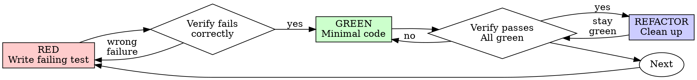

# Codex session 019faa27-a2ee-7081-ad19-8cb87a126ddd

- Started: `2026-07-28T19:15:52.295Z`
- Working directory: `D:\100XH100`
- Originator: `Codex Desktop`
- Codex CLI: `0.146.0-alpha.3`
- Source log: `C:\Users\Иван Литвак\.codex\sessions\2026\07\28\rollout-2026-07-28T22-15-52-019faa27-a2ee-7081-ad19-8cb87a126ddd.jsonl`
- Entries: user=1, assistant=47, tool calls=148, tool outputs=148

This is a chronological export of the user/assistant conversation and tool activity. Internal system/developer instructions and token accounting are intentionally excluded. Secret-shaped values are redacted; oversized tool outputs retain their beginning and end with the omitted character count.

## 1. User

Time: `2026-07-28T19:16:23.933Z` · source line `6`

```text
<recommended_plugins>
Here is a list of plugins that are available but not installed.

- Atlassian Rovo (atlassian-rovo@openai-curated-remote)
- Box (box@openai-curated-remote)
- Figma (figma@openai-curated-remote)
- Gmail (gmail@openai-curated-remote)
- Google Calendar (google-calendar@openai-curated-remote)
- Google Drive (google-drive@openai-curated-remote)
- Outlook Calendar (outlook-calendar@openai-curated-remote)
- Outlook Email (outlook-email@openai-curated-remote)
- SharePoint (sharepoint@openai-curated-remote)
- Slack (slack@openai-curated-remote)
- Teams (teams@openai-curated-remote)
</recommended_plugins>
# AGENTS.md instructions for D:\100XH100

<INSTRUCTIONS>
# Project Agent Rules

## Operating Rule
- Read `AGENTS.md` before project edits.
- Update `memory/CHANGELOG.md` after meaningful code, config, or architecture changes.
- Update `memory/PROMPTS.md` with user prompts that define requirements.
- Store test outputs, logs, and verification notes under `test_results/`.
- Prefer agent-centered code: explicit contracts, deterministic tests, small files, low hidden state.

## Architecture Source
- Primary architecture contract: `ARCHITECTURE_NEED.md`.
- Current Stream 4 implementation rule: use threshold + compact + CUB/fixed-temp sort/reduce + compact; do not use Stream 4 hash-table dedup.

## Implementation Guardrails
- `State128` logical bytes are `v[0..119]`.
- `State128` padding bytes are `v[120..127]`.
- Persistent frontier padding must be zero.
- `FinalResponse` may temporarily store `target_local_idx` in `v[120..123]`.
- `Hash128` is one logical 128-bit key stored as `{lo, hi}`.
- `CandidateMeta` must remain 32 bytes and 32-byte aligned.
- Stream 3 payload id must be original candidate id, not compact index.
- Stream 4 must not apply shard top-k or semantic shard cap.

</INSTRUCTIONS>
<environment_context>
  <cwd>D:\100XH100</cwd>
  <shell>powershell</shell>
  <current_date>2026-07-28</current_date>
  <timezone>Europe/Moscow</timezone>
  <filesystem><workspace_roots><root>D:\100XH100</root></workspace_roots><permission_profile type="managed"><file_system type="restricted"><entry access="read"><special>:root</special></entry><entry access="write"><path>D:\100XH100</path></entry><entry access="write"><special>:slash_tmp</special></entry><entry access="write"><special>:tmpdir</special></entry><entry access="write"><path>C:\Users\Иван Литвак\.codex\visualizations\2026\07\23\019f90a3-47e5-7770-a20e-cd9317bcbf2c</path></entry><entry access="read"><path>D:\100XH100\.git</path></entry><entry access="read"><path>D:\100XH100\.agents</path></entry><entry access="read"><path>D:\100XH100\.codex</path></entry></file_system></permission_profile></filesystem>
</environment_context>
```

## 2. Codex

Time: `2026-07-28T19:18:05.085Z` · source line `12`

```text
I’ll implement Task 1 in the designated worktree, following its brief and the project’s TDD/verification rules.
```

## 3. Tool call: `exec`

Time: `2026-07-28T19:18:06.290Z` · source line `14`

```text
const r = await tools.shell_command({"command":"Get-Content -Raw 'C:\\Users\\Иван Литвак\\.codex\\skills\\.system\\dummy'","workdir":"D:\\100XH100","timeout_ms":10000}); text(r);

```

## 4. Tool output

Time: `2026-07-28T19:18:06.731Z` · source line `15`

```text
Script failed
Wall time 0.4 seconds
Output:

Script error:
Exit code: 1
Wall time: 0.4 seconds
Output:
Get-Content : Cannot find path 'C:\Users\Иван Литвак\.codex\skills\.system\dummy' because it does not exist.
At line:2 char:1
+ Get-Content -Raw 'C:\Users\Иван Литвак\.codex\skills\.system\dummy'
+ ~~~~~~~~~~~~~~~~~~~~~~~~~~~~~~~~~~~~~~~~~~~~~~~~~~~~~~~~~~~~~~~~~~~
    + CategoryInfo          : ObjectNotFound: (C:\Users\Иван Л...s\.system\dummy:String) [Get-Content], ItemNotFoundEx 
   ception
    + FullyQualifiedErrorId : PathNotFound,Microsoft.PowerShell.Commands.GetContentCommand
 

```

## 5. Codex

Time: `2026-07-28T19:18:10.460Z` · source line `18`

```text
I’m using the TDD and verification skills because the task explicitly requires test-first implementation and a checked handoff.
```

## 6. Tool call: `exec`

Time: `2026-07-28T19:18:14.482Z` · source line `20`

```text
const r = await tools.shell_command({"command":"$paths = @('C:\\Users\\Иван Литвак\\.codex\\plugins\\cache\\openai-curated-remote\\superpowers\\6.2.0\\skills\\test-driven-development\\SKILL.md','C:\\Users\\Иван Литвак\\.codex\\plugins\\cache\\openai-curated-remote\\superpowers\\6.2.0\\skills\\verification-before-completion\\SKILL.md','D:\\100XH100\\.worktrees\\cayleypy-results-ingest\\AGENTS.md','D:\\100XH100\\.worktrees\\cayleypy-results-ingest\\.superpowers\\sdd\\2026-07-28-cayleypy-results-ingest\\task-1-brief.md'); foreach($p in $paths) { \"### $p\"; Get-Content -Raw -LiteralPath $p }","workdir":"D:\\100XH100\\.worktrees\\cayleypy-results-ingest","timeout_ms":10000}); text(r);

```

## 7. Tool output

Time: `2026-07-28T19:18:14.862Z` · source line `21`

````text
Script completed
Wall time 0.3 seconds
Output:

Exit code: 0
Wall time: 0.3 seconds
Output:
### C:\Users\Иван Литвак\.codex\plugins\cache\openai-curated-remote\superpowers\6.2.0\skills\test-driven-development\SKILL.md
---
name: test-driven-development
description: Use when implementing any feature or bugfix, before writing implementation code
---

# Test-Driven Development (TDD)

## Overview

Write the test first. Watch it fail. Write minimal code to pass.

**Core principle:** If you didn't watch the test fail, you don't know if it tests the right thing.

**Violating the letter of the rules is violating the spirit of the rules.**

## When to Use

**Always:**
- New features
- Bug fixes
- Refactoring
- Behavior changes

**Exceptions (ask your human partner):**
- Throwaway prototypes
- Generated code
- Configuration files

Thinking "skip TDD just this once"? Stop. That's rationalization.

## The Iron Law

```
NO PRODUCTION CODE WITHOUT A FAILING TEST FIRST
```

Write code before the test? Delete it. Start over.

**No exceptions:**
- Don't keep it as "reference"
- Don't "adapt" it while writing tests
- Don't look at it
- Delete means delete

Implement fresh from tests. Period.

## Red-Green-Refactor



### RED - Write Failing Test

Write one minimal test showing what should happen.

<Good>
```typescript
test('retries failed operations 3 times', async () => {
  let attempts = 0;
  const operation = () => {
    attempts++;
    if (attempts < 3) throw new Error('fail');
    return 'success';
  };

  const result = await retryOperation(operation);

  expect(result).toBe('success');
  expect(attempts).toBe(3);
});
```
Clear name, tests real behavior, one thing
</Good>

<Bad>
```typescript
test('retry works', async () => {
  const mock = jest.fn()
    .mockRejectedValueOnce(new Error())
    .mockRejectedValueOnce(new Error())
    .mockResolvedValueOnce('success');
  await retryOperation(mock);
  expect(mock).toHaveBeenCalledTimes(3);
});
```
Vague name, tests mock not code
</Bad>

**Requirements:**
- One behavior
- Clear name
- Real code (no mocks unless unavoidable)

### Verify RED - Watch It Fail

**MANDATORY. Never skip.**

```bash
npm test path/to/test.test.ts
```

Confirm:
- Test fails (not errors)
- Failure message is expected
- Fails because feature missing (not typos)

**Test passes?** You're testing existing behavior. Fix test.

**Test errors?** Fix error, re-run until it fails correctly.

### GREEN - Minimal Code

Write simplest code to pass the test.

<Good>
```typescript
async function retryOperation<T>(fn: () => Promise<T>): Promise<T> {
  for (let i = 0; i < 3; i++) {
    try {
      return await fn();
    } catch (e) {
      if (i === 2) throw e;
    }
  }
  throw new Error('unreachable');
}
```
Just enough to pass
</Good>

<Bad>
```typescript
async function retryOperation<T>(
  fn: () => Promise<T>,
  options?: {
    maxRetries?: number;
    backoff?: 'linear' | 'exponential';
    onRetry?: (attempt: number) => void;
  }
): Promise<T> {
  // YAGNI
}
```
Over-engineered
</Bad>

Don't add features, refactor other code, or "improve" beyond the test.

### Verify GREEN - Watch It Pass

**MANDATORY.**

```bash
npm test path/to/test.test.ts
```

Confirm:
- Test passes
- Other tests still pass
- Output pristine (no errors, warnings)

**Test fails?** Fix code, not test.

**Other tests fail?** Fix now.

### REFACTOR - Clean Up

After green only:
- Remove duplication
- Improve names
- Extract helpers

Keep tests green. Don't add behavior.

### Repeat

Next failing test for next feature.

## Good Tests

| Quality | Good | Bad |
|---------|------|-----|
| **Minimal** | One thing. "and" in name? Split it. | `test('validates email and domain and whitespace')` |
| **Clear** | Name describes behavior | `test('test1')` |
| **Shows intent** | Demonstrates desired API | Obscures what code should do |

When writing or changing any test, read [writing-good-tests.md](writing-good-tests.md) for the rules that keep tests honest:
- Name the production change that would make the test fail — before writing it
- Assert on real behavior, never on mock behavior
- Keep test-only code in test utilities, out of production classes
- Understand a dependency's side effects before mocking it

## Common Rationalizations

| Excuse | Reality |
|--------|---------|
| "Too simple to test" | Simple code breaks. Test takes 30 seconds. |
| "I'll test after" | Tests written after pass immediately — which proves nothing. They may test the wrong thing, test the implementation instead of the behavior, or miss the edge case you forgot. You never watched it fail, so you never proved it can catch the bug. Test-first forces that failure. |
| "Tests after achieve same goals (spirit not ritual)" | Tests-after answer "what does this do?"; tests-first answer "what should this do?" Tests written after are biased by the code you already wrote — you verify the cases you remembered, not the ones you'd have discovered. Coverage without proof the tests work. |
| "Already manually tested" | Manual testing is ad-hoc: no record of what you covered, no way to re-run it when the code changes, easy to forget cases under pressure. "Worked when I tried it" в‰  comprehensive. Automated tests run the same way every time. |
| "Deleting X hours is wasteful" | Sunk cost fallacy — that time is already spent either way. The real choice: rewrite with TDD (high confidence) vs. keep it and bolt tests on after (low confidence, likely bugs). Keeping code you can't trust is the waste. |
| "Keep as reference, write tests first" | You'll adapt it. That's testing after. Delete means delete. |
| "Need to explore first" | Fine. Throw away exploration, start with TDD. |
| "Test hard = design unclear" | Listen to test. Hard to test = hard to use. |
| "TDD will slow me down" | TDD IS the pragmatic path: catches bugs before commit, prevents regressions, lets you refactor without fear. "Pragmatic" shortcuts mean debugging in production — slower, not faster. |
| "Manual test faster" | Manual doesn't prove edge cases. You'll re-test every change. |
| "Existing code has no tests" | You're improving it. Add tests for existing code. |

## Red Flags - STOP and Start Over

- Code before test
- Test after implementation
- Test passes immediately
- Can't explain why test failed
- Tests added "later"
- Rationalizing "just this once"
- "I already manually tested it"
- "Tests after achieve the same purpose"
- "It's about spirit not ritual"
- "Keep as reference" or "adapt existing code"
- "Already spent X hours, deleting is wasteful"
- "TDD is dogmatic, I'm being pragmatic"
- "This is different because..."

**All of these mean: Delete code. Start over with TDD.**

## Example: Bug Fix

**Bug:** Empty email accepted

**RED**
```typescript
test('rejects empty email', async () => {
  const result = await submitForm({ email: '' });
  expect(result.error).toBe('Email required');
});
```

**Verify RED**
```bash
$ npm test
FAIL: expected 'Email required', got undefined
```

**GREEN**
```typescript
function submitForm(data: FormData) {
  if (!data.email?.trim()) {
    return { error: 'Email required' };
  }
  // ...
}
```

**Verify GREEN**
```bash
$ npm test
PASS
```

**REFACTOR**
Extract validation for multiple fields if needed.

## Verification Checklist

Before marking work complete:

- [ ] Every new function/method has a test
- [ ] Watched each test fail before implementing
- [ ] Each test failed for expected reason (feature missing, not typo)
- [ ] Wrote minimal code to pass each test
- [ ] All tests pass
- [ ] Output pristine (no errors, warnings)
- [ ] Tests use real code (mocks only if unavoidable)
- [ ] Edge cases and errors covered

Can't check all boxes? You skipped TDD. Start over.

## When Stuck

| Problem | Solution |
|---------|----------|
| Don't know how to test | Write wished-for API. Write assertion first. Ask your human partner. |
| Test too complicated | Design too complicated. Simplify interface. |
| Must mock everything | Code too coupled. Use dependency injection. |
| Test setup huge | Extract helpers. Still complex? Simplify design. |

## Debugging Integration

Bug found? Write failing test reproducing it. Follow TDD cycle. Test proves fix and prevents regression.

Never fix bugs without a test.

## Final Rule

```
Production code в†’ test exists and failed first
Otherwise в†’ not TDD
```

No exceptions without your human partner's permission.

### C:\Users\Иван Литвак\.codex\plugins\cache\openai-curated-remote\superpowers\6.2.0\skills\verification-before-completion\SKILL.md
---
name: verification-before-completion
description: Use when about to claim work is complete, fixed, or passing, before committing or creating PRs - requires running verification commands and confirming output before making any success claims; evidence before assertions always
---

# Verification Before Completion

## Overview

**Core principle:** Evidence before claims, always.

**Violating the letter of this rule is violating the spirit of this rule.**

## The Iron Law

```
NO COMPLETION CLAIMS WITHOUT FRESH VERIFICATION EVIDENCE
```

If you haven't run the verification command in this message, you cannot claim it passes.

## The Gate Function

```
BEFORE claiming any status or expressing satisfaction:

1. IDENTIFY: What command proves this claim?
2. RUN: Execute the FULL command (fresh, complete)
3. READ: Full output, check exit code, count failures
4. VERIFY: Does output confirm the claim?
   - If NO: State actual status with evidence
   - If YES: State claim WITH evidence
5. ONLY THEN: Make the claim

Skip any step = lying, not verifying
```

## Common Failures

| Claim | Requires | Not Sufficient |
|-------|----------|----------------|
| Tests pass | Test command output: 0 failures | Previous run, "should pass" |
| Linter clean | Linter output: 0 errors | Partial check, extrapolation |
| Build succeeds | Build command: exit 0 | Linter passing, logs look good |
| Bug fixed | Test original symptom: passes | Code changed, assumed fixed |
| Regression test works | Red-green cycle verified | Test passes once |
| Agent completed | VCS diff shows changes | Agent reports "success" |
| Requirements met | Line-by-line checklist | Tests passing |

## Red Flags - STOP

- Using "should", "probably", "seems to"
- Expressing satisfaction before verification ("Great!", "Perfect!", "Done!", etc.)
- About to commit/push/PR without verification
- Trusting agent success reports
- Relying on partial verification
- Thinking "just this once"
- Tired and wanting work over
- **ANY wording implying success without having run verification**

## Rationalization Prevention

| Excuse | Reality |
|--------|---------|
| "Should work now" | RUN the verification |
| "I'm confident" | Confidence в‰  evidence |
| "Just this once" | No exceptions |
| "Linter passed" | Linter в‰  compiler |
| "Agent said success" | Verify independently |
| "I'm tired" | Exhaustion в‰  excuse |
| "Partial check is enough" | Partial proves nothing |
| "Different words so rule doesn't apply" | Spirit over letter |

## Key Patterns

**Tests:**
```
вњ… [Run test command] [See: 34/34 pass] "All tests pass"
вќЊ "Should pass now" / "Looks correct"
```

**Regression tests (TDD Red-Green):**
```
вњ… Write в†’ Run (pass) в†’ Revert fix в†’ Run (MUST FAIL) в†’ Restore в†’ Run (pass)
вќЊ "I've written a regression test" (without red-green verification)
```

**Build:**
```
вњ… [Run build] [See: exit 0] "Build passes"
вќЊ "Linter passed" (linter doesn't check compilation)
```

**Requirements:**
```
вњ… Re-read plan в†’ Create checklist в†’ Verify each в†’ Report gaps or completion
вќЊ "Tests pass, phase complete"
```

**Agent delegation:**
```
вњ… Agent reports success в†’ Check VCS diff в†’ Verify changes в†’ Report actual state
вќЊ Trust agent report
```

## When To Apply

**ALWAYS before:**
- ANY variation of success/completion claims
- ANY expression of satisfaction
- ANY positive statement about work state
- Committing, PR creation, task completion
- Moving to next task
- Delegating to agents

**Rule applies to:**
- Exact phrases
- Paraphrases and synonyms
- Implications of success
- ANY communication suggesting completion/correctness

### D:\100XH100\.worktrees\cayleypy-results-ingest\AGENTS.md
# Project Agent Rules

## Operating Rule
- Read `AGENTS.md` before project edits.
- Update `memory/CHANGELOG.md` after meaningful code, config, or architecture changes.
- Update `memory/PROMPTS.md` with user prompts that define requirements.
- Store test outputs, logs, and verification notes under `test_results/`.
- Prefer agent-centered code: explicit contracts, deterministic tests, small files, low hidden state.

## Architecture Source
- Primary architecture contract: `ARCHITECTURE_NEED.md`.
- Current Stream 4 implementation rule: use threshold + compact + CUB/fixed-temp sort/reduce + compact; do not use Stream 4 hash-table dedup.

## Implementation Guardrails
- `State128` logical bytes are `v[0..119]`.
- `State128` padding bytes are `v[120..127]`.
- Persistent frontier padding must be zero.
- `FinalResponse` may temporarily store `target_local_idx` in `v[120..123]`.
- `Hash128` is one logical 128-bit key stored as `{lo, hi}`.
- `CandidateMeta` must remain 32 bytes and 32-byte aligned.
- Stream 3 payload id must be original candidate id, not compact index.
- Stream 4 must not apply shard top-k or semantic shard cap.

### D:\100XH100\.worktrees\cayleypy-results-ingest\.superpowers\sdd\2026-07-28-cayleypy-results-ingest\task-1-brief.md
### Task 1: Worker Project, Exact Schema, and Local Runtime

**Files:**
- Create: `services/cayleypy-results-ingest/package.json`
- Create: `services/cayleypy-results-ingest/tsconfig.json`
- Create: `services/cayleypy-results-ingest/wrangler.jsonc`
- Create: `services/cayleypy-results-ingest/src/schema.ts`
- Create: `services/cayleypy-results-ingest/test/schema.test.ts`
- Copy and normalize: `configs/cayleypy_results_schema_v1.json`

**Interfaces:**
- Produces: `validateBatch(value: unknown) -> { ok: true; value: ResultBatch } | { ok: false; errors: SafeSchemaError[] }`.
- Produces exact `ResultEnvelopeV1` and `ResultBatchV1` types shared by Worker/consumer.

- [ ] **Step 1: Create package scripts and pinned dependencies**

```json
{
  "private": true,
  "type": "module",
  "scripts": {
    "test": "vitest run",
    "typecheck": "tsc --noEmit",
    "dev": "wrangler dev --env staging",
    "deploy:staging": "wrangler deploy --env staging",
    "deploy:production": "wrangler deploy --env production"
  },
  "devDependencies": {
    "@cloudflare/vitest-pool-workers": "0.8.55",
    "@cloudflare/workers-types": "4.20260728.0",
    "ajv": "8.17.1",
    "jose": "6.0.11",
    "typescript": "5.8.3",
    "vitest": "3.2.4",
    "wrangler": "4.26.0"
  }
}
```

If an exact package version is unavailable at execution time, resolve it once, record the lockfile-selected version in the test report, and do not use a floating range.

- [ ] **Step 2: Write failing strict-schema tests**

Test a valid result and rejection for unknown field, unsupported schema, oversized author/path/proof, invalid enum, more than 100 results, and serialized request over 25 MiB. Verify errors contain JSON pointer/code only, not submitted values.

- [ ] **Step 3: Run and verify RED**

Run: `npm test -- schema.test.ts`
Expected: FAIL because `src/schema.ts` does not exist.

- [ ] **Step 4: Implement compiled Ajv validation and safe errors**

```ts
export type ValidationResult =
  | { ok: true; value: ResultBatchV1 }
  | { ok: false; errors: Array<{ path: string; keyword: string }> };

export function validateBatch(value: unknown): ValidationResult {
  if (!validate(value)) {
    return { ok: false, errors: (validate.errors ?? []).map(e => ({
      path: e.instancePath, keyword: e.keyword,
    })) };
  }
  return { ok: true, value: value as ResultBatchV1 };
}
```

- [ ] **Step 5: Add staging/production binding names without resource ids**

Declare logical bindings `RESULTS_DB`, `RAW_RESULTS`, `VALIDATE_QUEUE`, `VALIDATE_DLQ`, `GITHUB_WRITER`, and environment variables for repo owner/name/staging branch. Resource ids are injected only after creation and are not invented in source.

- [ ] **Step 6: Test, typecheck, lock, and commit**

Run: `npm install --package-lock-only && npm test && npm run typecheck`
Expected: PASS.

```bash
git add services/cayleypy-results-ingest configs/cayleypy_results_schema_v1.json
git commit -m "feat: scaffold strict CayleyPy results Worker"
```


````

## 8. Tool call: `exec`

Time: `2026-07-28T19:18:22.560Z` · source line `24`

```text
const r = await tools.shell_command({"command":"Get-Content -Raw 'C:\\Users\\Иван Литвак\\.codex\\plugins\\cache\\openai-curated-remote\\superpowers\\6.2.0\\skills\\test-driven-development\\writing-good-tests.md'; rg -n -i \"cayleypy.*results|results.*ingest|cayleypy_results_schema\" 'C:\\Users\\Иван Литвак\\.codex\\memories\\MEMORY.md'; git status --short --branch; rg --files -g '*cayleypy*' -g 'package.json' -g 'tsconfig*.json' -g 'wrangler*.json*' -g 'CHANGELOG.md' -g 'PROMPTS.md' | Select-Object -First 200","workdir":"D:\\100XH100\\.worktrees\\cayleypy-results-ingest","timeout_ms":10000}); text(r);

```

## 9. Tool output

Time: `2026-07-28T19:18:23.374Z` · source line `25`

````text
Script completed
Wall time 0.7 seconds
Output:

Exit code: 0
Wall time: 0.7 seconds
Output:
# Writing Good Tests

**Load this reference when:** writing or changing tests, adding mocks, or
adding cleanup/helper methods for tests.

## Overview

A test exists to catch a specific break. Two principles govern everything
here:

```
1. Every test names the break it catches
2. Every test exercises the real thing
```

Strict TDD produces both naturally: a test written first and watched
failing against real code has already proven it can fail, and only earns
a mock when the real dependency proves slow or external.

## Principle 1: Name the Break

Before writing the test body, answer: **what production change should
make this test fail — and is that change a bug or a decision?** A test
earns its place by catching a wrong branch, missing side effect, wrong
argument, boundary case, or broken contract.

**Derive expectations independently.** Use literals and hand-checked
fixtures; table-driven tests with literal `want` values are the preferred
shape. An expectation computed by the code under test — or its helpers —
passes no matter what that code does:

```typescript
// ❌ Mirror assertion: the same builder computes both sides — always true
const expected = buildSearchQuery({ tag: 'urgent' });
expect(buildSearchQuery({ tag: 'urgent' })).toBe(expected);

// вњ… Hand-derived literal
expect(buildSearchQuery({ tag: 'urgent' })).toBe('tag:"urgent"');
```

**No change detectors.** If only intentional decisions can fail a test —
a constant's value, exact message wording, private structure — it fires
on redesign and sleeps through bugs. Test the behavior that depends on
the decision: not `expect(MAX_RETRIES).toBe(5)` but "a failing call is
retried 5 times and the 6th attempt never happens."

**Behavior, not text.** Asserting that a script, skill, or config
contains an exact line proves only that the source is the source. Run
scripts against controlled inputs and assert outputs, side effects, or
exit codes. Documents that instruct agents are tested by the consuming
agent's behavior (superpowers:writing-skills); prose for humans earns no
test at all.

**Your code, not the framework.** Test the contract your code makes at
its boundaries — the route you register, the query you emit, the payload
you produce. Upstream mechanics are their maintainers' tests to write
(the classic: asserting your router invokes a registered handler — that
is the framework's test, not yours). When upstream behavior genuinely
surprised you, write one narrow characterization test naming the
assumption. The same boundary applies inside your code: constructors,
getters, constants, and trivial forwarding earn tests only when they
validate, normalize, default, derive, enforce, or cause side effects —
otherwise assert the first consumer-visible result that depends on them.

### Gate Function

```
BEFORE writing the test body:
  Name the production change that would make this test fail.

  Cannot name one            в†’ redesign around an observable behavior
  "The source text changed"  в†’ run the artifact and assert its effects
  Only intentional decisions в†’ change detector; test the behavior
                               that depends on the decision

  Confirm the expected value is derived without the code under test.
  IF it reuses the code's logic or helpers:
    Replace it with a literal or hand-checked fixture
```

## Principle 2: Exercise the Real Thing

**The mock earns no assertions.** A mock assertion passes when the mock
is present and fails when it is absent — it says nothing about the
component. Assert the real component's behavior; if the mock is what you
are checking, unmock it or delete the assertion.

```typescript
// вњ… Real behavior
expect(screen.getByRole('navigation')).toBeInTheDocument();

// вќЊ Mock existence
expect(screen.getByTestId('sidebar-mock')).toBeInTheDocument();
```

**your human partner's correction:** "Are we testing the behavior of a
mock?"

**Mock at the right level.** Learn every side effect of the real method
before replacing it; mock the slow or external operation and keep what
the test depends on real. When unsure, run the test against the real
implementation first and observe what actually needs to happen.

```typescript
// вќЊ The mock swallows the config write that duplicate detection reads
vi.mock('ToolCatalog', () => ({
  discoverAndCacheTools: vi.fn().mockResolvedValue(undefined)
}));

// вњ… Mock only the slow server startup; the config write stays real
vi.mock('MCPServerManager');
```

**Make doubles specific.** When arguments, call counts, or ordering are
part of the contract, assert them — a fake that accepts anything verifies
nothing. Give each branch (success, error, malformed) its own fixture or
spy, so the wrong branch cannot satisfy the expectation.

**Mirror real data completely.** Mock the complete structure as it exists
in reality — all documented fields — not just the ones your test reads.
Partial mocks fail silently when downstream code reads an omitted field:
the test passes while integration breaks.

**Production classes carry production methods only.** Cleanup that only
tests need lives in test utilities, never as a `destroy()` on the
production class. Ask: is this method called only from tests? Does this
class own this resource's lifecycle? Wrong answers в†’ test utility.

**Prefer real components over complex mocks.** When mock setup outgrows
the test logic, mocks miss methods the real components have, or tests
break when the mock changes, switch to an integration test with real
components. **your human partner's question:** "Do we need to be using a
mock here?"

### Gate Function

```
BEFORE adding a mock or test helper:
  List the real method's side effects; keep the ones the test
  depends on real — mock the slow/external level below them.

  Mock responses mirror the complete real structure.

  A method only tests call lives in test utilities, not production.

  About to assert on the mock itself?
    Unmock it or delete the assertion.
```

## Tests Ship With the Implementation

The TDD cycle — failing test, minimal implementation, refactor — is what
"complete" means. Ship the tests the behavior needs and only those:
trivial code and human prose earn none, and a test written to satisfy
process costs maintenance forever.

## The Mutation Check

Before finishing, mentally mutate the production code; at least one test
should fail for each realistic mutation:

- Wrong constant or argument
- Wrong branch handler
- Missing state change or side effect
- Empty or default return
- Missing validation for zero, empty, nil, unauthorized, or malformed input

A mutation nothing catches marks the behavior as unprotected — or the
test as tautological.

## Quick Reference

| When you... | Do |
|-------------|-----|
| Write any test | Name the break it catches — a bug, not a decision |
| Build an expected value | Derive it by hand; never with the code under test |
| Test a script or document | Run it / pressure-test its consumer; never grep its text |
| Reach for a dependency test | Test your boundary contract, not their documented mechanics |
| Want to assert on a mocked element | Test the real component, or unmock it |
| Are about to mock a method | Learn its side effects; mock the slow/external level |
| Build a mock response | Mirror the real structure completely |
| Need cleanup only tests use | Put it in test utilities |
| Watch mock setup balloon | Switch to an integration test with real components |
| Finish a test file | Run the mutation check |

## Warning Signs

- Setup and assertion share the same object, guaranteeing equality
- The test can fail only through a panic, crash, or missing selector
- The test fails on every intentional change, never on accidental breakage
- Expected values are hidden behind loops, builders, or helpers
- The test greps source text, or asserts a removed symbol stays removed
- The test would still matter if only the framework remained
- The test exists for coverage, checking no side effect or outcome
- An assertion checks a `*-mock` test ID, or fails if you remove the mock
- A method is called only from test files
- Mock setup is more than half the test, or you can't explain why the mock is needed
- Mocking "just to be safe"

## codex/cayleypy-results-ingest
memory\PROMPTS.md
memory\CHANGELOG.md
docs\superpowers\specs\2026-07-28-public-cayleypy-2xt4-results-design.md
docs\superpowers\plans\2026-07-28-cayleypy-results-ingest.md
docs\superpowers\plans\2026-07-28-public-cayleypy-2xt4-notebook.md
_push_final_chunk\memory\PROMPTS.md
_push_final_chunk\memory\CHANGELOG.md
_push_staged_tuner\memory\PROMPTS.md
_push_staged_tuner\memory\CHANGELOG.md

````

## 10. Tool call: `exec`

Time: `2026-07-28T19:18:31.769Z` · source line `28`

```text
const r = await tools.shell_command({"command":"rg -n -i -C 8 \"cayleypy_results_schema_v1|ResultEnvelopeV1|ResultBatchV1|validateBatch|RAW_RESULTS|VALIDATE_QUEUE|VALIDATE_DLQ|GITHUB_WRITER\" 'docs\\superpowers\\plans\\2026-07-28-cayleypy-results-ingest.md' 'docs\\superpowers\\specs\\2026-07-28-public-cayleypy-2xt4-results-design.md' 'memory\\CHANGELOG.md' 'memory\\PROMPTS.md'; Get-Content -Raw 'package.json'","workdir":"D:\\100XH100\\.worktrees\\cayleypy-results-ingest","timeout_ms":10000}); text(r);

```

## 11. Tool output

Time: `2026-07-28T19:18:32.260Z` · source line `29`

````text
Script failed
Wall time 0.4 seconds
Output:

Script error:
Exit code: 1
Wall time: 0.4 seconds
Output:
docs\superpowers\plans\2026-07-28-cayleypy-results-ingest.md-55-### Task 1: Worker Project, Exact Schema, and Local Runtime
docs\superpowers\plans\2026-07-28-cayleypy-results-ingest.md-56-
docs\superpowers\plans\2026-07-28-cayleypy-results-ingest.md-57-**Files:**
docs\superpowers\plans\2026-07-28-cayleypy-results-ingest.md-58-- Create: `services/cayleypy-results-ingest/package.json`
docs\superpowers\plans\2026-07-28-cayleypy-results-ingest.md-59-- Create: `services/cayleypy-results-ingest/tsconfig.json`
docs\superpowers\plans\2026-07-28-cayleypy-results-ingest.md-60-- Create: `services/cayleypy-results-ingest/wrangler.jsonc`
docs\superpowers\plans\2026-07-28-cayleypy-results-ingest.md-61-- Create: `services/cayleypy-results-ingest/src/schema.ts`
docs\superpowers\plans\2026-07-28-cayleypy-results-ingest.md-62-- Create: `services/cayleypy-results-ingest/test/schema.test.ts`
docs\superpowers\plans\2026-07-28-cayleypy-results-ingest.md:63:- Copy and normalize: `configs/cayleypy_results_schema_v1.json`
docs\superpowers\plans\2026-07-28-cayleypy-results-ingest.md-64-
docs\superpowers\plans\2026-07-28-cayleypy-results-ingest.md-65-**Interfaces:**
docs\superpowers\plans\2026-07-28-cayleypy-results-ingest.md:66:- Produces: `validateBatch(value: unknown) -> { ok: true; value: ResultBatch } | { ok: false; errors: SafeSchemaError[] }`.
docs\superpowers\plans\2026-07-28-cayleypy-results-ingest.md:67:- Produces exact `ResultEnvelopeV1` and `ResultBatchV1` types shared by Worker/consumer.
docs\superpowers\plans\2026-07-28-cayleypy-results-ingest.md-68-
docs\superpowers\plans\2026-07-28-cayleypy-results-ingest.md-69-- [ ] **Step 1: Create package scripts and pinned dependencies**
docs\superpowers\plans\2026-07-28-cayleypy-results-ingest.md-70-
docs\superpowers\plans\2026-07-28-cayleypy-results-ingest.md-71-```json
docs\superpowers\plans\2026-07-28-cayleypy-results-ingest.md-72-{
docs\superpowers\plans\2026-07-28-cayleypy-results-ingest.md-73-  "private": true,
docs\superpowers\plans\2026-07-28-cayleypy-results-ingest.md-74-  "type": "module",
docs\superpowers\plans\2026-07-28-cayleypy-results-ingest.md-75-  "scripts": {
--
docs\superpowers\plans\2026-07-28-cayleypy-results-ingest.md-101-
docs\superpowers\plans\2026-07-28-cayleypy-results-ingest.md-102-Run: `npm test -- schema.test.ts`
docs\superpowers\plans\2026-07-28-cayleypy-results-ingest.md-103-Expected: FAIL because `src/schema.ts` does not exist.
docs\superpowers\plans\2026-07-28-cayleypy-results-ingest.md-104-
docs\superpowers\plans\2026-07-28-cayleypy-results-ingest.md-105-- [ ] **Step 4: Implement compiled Ajv validation and safe errors**
docs\superpowers\plans\2026-07-28-cayleypy-results-ingest.md-106-
docs\superpowers\plans\2026-07-28-cayleypy-results-ingest.md-107-```ts
docs\superpowers\plans\2026-07-28-cayleypy-results-ingest.md-108-export type ValidationResult =
docs\superpowers\plans\2026-07-28-cayleypy-results-ingest.md:109:  | { ok: true; value: ResultBatchV1 }
docs\superpowers\plans\2026-07-28-cayleypy-results-ingest.md-110-  | { ok: false; errors: Array<{ path: string; keyword: string }> };
docs\superpowers\plans\2026-07-28-cayleypy-results-ingest.md-111-
docs\superpowers\plans\2026-07-28-cayleypy-results-ingest.md:112:export function validateBatch(value: unknown): ValidationResult {
docs\superpowers\plans\2026-07-28-cayleypy-results-ingest.md-113-  if (!validate(value)) {
docs\superpowers\plans\2026-07-28-cayleypy-results-ingest.md-114-    return { ok: false, errors: (validate.errors ?? []).map(e => ({
docs\superpowers\plans\2026-07-28-cayleypy-results-ingest.md-115-      path: e.instancePath, keyword: e.keyword,
docs\superpowers\plans\2026-07-28-cayleypy-results-ingest.md-116-    })) };
docs\superpowers\plans\2026-07-28-cayleypy-results-ingest.md-117-  }
docs\superpowers\plans\2026-07-28-cayleypy-results-ingest.md:118:  return { ok: true, value: value as ResultBatchV1 };
docs\superpowers\plans\2026-07-28-cayleypy-results-ingest.md-119-}
docs\superpowers\plans\2026-07-28-cayleypy-results-ingest.md-120-```
docs\superpowers\plans\2026-07-28-cayleypy-results-ingest.md-121-
docs\superpowers\plans\2026-07-28-cayleypy-results-ingest.md-122-- [ ] **Step 5: Add staging/production binding names without resource ids**
docs\superpowers\plans\2026-07-28-cayleypy-results-ingest.md-123-
docs\superpowers\plans\2026-07-28-cayleypy-results-ingest.md:124:Declare logical bindings `RESULTS_DB`, `RAW_RESULTS`, `VALIDATE_QUEUE`, `VALIDATE_DLQ`, `GITHUB_WRITER`, and environment variables for repo owner/name/staging branch. Resource ids are injected only after creation and are not invented in source.
docs\superpowers\plans\2026-07-28-cayleypy-results-ingest.md-125-
docs\superpowers\plans\2026-07-28-cayleypy-results-ingest.md-126-- [ ] **Step 6: Test, typecheck, lock, and commit**
docs\superpowers\plans\2026-07-28-cayleypy-results-ingest.md-127-
docs\superpowers\plans\2026-07-28-cayleypy-results-ingest.md-128-Run: `npm install --package-lock-only && npm test && npm run typecheck`
docs\superpowers\plans\2026-07-28-cayleypy-results-ingest.md-129-Expected: PASS.
docs\superpowers\plans\2026-07-28-cayleypy-results-ingest.md-130-
docs\superpowers\plans\2026-07-28-cayleypy-results-ingest.md-131-```bash
docs\superpowers\plans\2026-07-28-cayleypy-results-ingest.md:132:git add services/cayleypy-results-ingest configs/cayleypy_results_schema_v1.json
docs\superpowers\plans\2026-07-28-cayleypy-results-ingest.md-133-git commit -m "feat: scaffold strict CayleyPy results Worker"
docs\superpowers\plans\2026-07-28-cayleypy-results-ingest.md-134-```
docs\superpowers\plans\2026-07-28-cayleypy-results-ingest.md-135-
docs\superpowers\plans\2026-07-28-cayleypy-results-ingest.md-136-### Task 2: Idempotent D1 State Machine and Immutable R2 Receipt
docs\superpowers\plans\2026-07-28-cayleypy-results-ingest.md-137-
docs\superpowers\plans\2026-07-28-cayleypy-results-ingest.md-138-**Files:**
docs\superpowers\plans\2026-07-28-cayleypy-results-ingest.md-139-- Create: `services/cayleypy-results-ingest/migrations/0001_initial.sql`
docs\superpowers\plans\2026-07-28-cayleypy-results-ingest.md-140-- Create: `services/cayleypy-results-ingest/src/ids.ts`
docs\superpowers\plans\2026-07-28-cayleypy-results-ingest.md-141-- Create: `services/cayleypy-results-ingest/src/db.ts`
docs\superpowers\plans\2026-07-28-cayleypy-results-ingest.md-142-- Create: `services/cayleypy-results-ingest/src/storage.ts`
docs\superpowers\plans\2026-07-28-cayleypy-results-ingest.md-143-- Create: `services/cayleypy-results-ingest/test/receipt.test.ts`
docs\superpowers\plans\2026-07-28-cayleypy-results-ingest.md-144-
docs\superpowers\plans\2026-07-28-cayleypy-results-ingest.md-145-**Interfaces:**
docs\superpowers\plans\2026-07-28-cayleypy-results-ingest.md-146-- Produces: `canonicalJson(value: unknown) -> string`
docs\superpowers\plans\2026-07-28-cayleypy-results-ingest.md:147:- Produces: `computeIdempotency(envelope: ResultEnvelopeV1) -> Promise<string>`
docs\superpowers\plans\2026-07-28-cayleypy-results-ingest.md-148-- Produces: `receiveEnvelope(env, envelope, requestMeta) -> Promise<Receipt>`.
docs\superpowers\plans\2026-07-28-cayleypy-results-ingest.md-149-
docs\superpowers\plans\2026-07-28-cayleypy-results-ingest.md-150-- [ ] **Step 1: Write the D1 migration**
docs\superpowers\plans\2026-07-28-cayleypy-results-ingest.md-151-
docs\superpowers\plans\2026-07-28-cayleypy-results-ingest.md-152-```sql
docs\superpowers\plans\2026-07-28-cayleypy-results-ingest.md-153-CREATE TABLE submissions (
docs\superpowers\plans\2026-07-28-cayleypy-results-ingest.md-154-  submission_id TEXT PRIMARY KEY,
docs\superpowers\plans\2026-07-28-cayleypy-results-ingest.md-155-  idempotency_key TEXT NOT NULL UNIQUE,
--
docs\superpowers\plans\2026-07-28-cayleypy-results-ingest.md-254-
docs\superpowers\plans\2026-07-28-cayleypy-results-ingest.md-255-**Files:**
docs\superpowers\plans\2026-07-28-cayleypy-results-ingest.md-256-- Create: `services/cayleypy-results-ingest/src/replay.ts`
docs\superpowers\plans\2026-07-28-cayleypy-results-ingest.md-257-- Create: `services/cayleypy-results-ingest/src/consumer.ts`
docs\superpowers\plans\2026-07-28-cayleypy-results-ingest.md-258-- Create: `services/cayleypy-results-ingest/test/replay.test.ts`
docs\superpowers\plans\2026-07-28-cayleypy-results-ingest.md-259-- Create: `services/cayleypy-results-ingest/test/consumer.test.ts`
docs\superpowers\plans\2026-07-28-cayleypy-results-ingest.md-260-
docs\superpowers\plans\2026-07-28-cayleypy-results-ingest.md-261-**Interfaces:**
docs\superpowers\plans\2026-07-28-cayleypy-results-ingest.md:262:- Produces: `validateSolution(envelope: ResultEnvelopeV1) -> ReplayResult`.
docs\superpowers\plans\2026-07-28-cayleypy-results-ingest.md-263-- Produces Queue handler `queue(batch: MessageBatch<ValidationMessage>, env: Env): Promise<void>`.
docs\superpowers\plans\2026-07-28-cayleypy-results-ingest.md-264-
docs\superpowers\plans\2026-07-28-cayleypy-results-ingest.md-265-- [ ] **Step 1: Write failing replay property tests**
docs\superpowers\plans\2026-07-28-cayleypy-results-ingest.md-266-
docs\superpowers\plans\2026-07-28-cayleypy-results-ingest.md-267-Generate small random permutations and valid paths. Assert exact final-state equality; reject unknown move, non-bijection, wrong state length, class overflow, claimed length mismatch, altered initial/central state, and reflected path whose original-oriented candidate does not solve the original.
docs\superpowers\plans\2026-07-28-cayleypy-results-ingest.md-268-
docs\superpowers\plans\2026-07-28-cayleypy-results-ingest.md-269-- [ ] **Step 2: Write failing duplicate/out-of-order consumer tests**
docs\superpowers\plans\2026-07-28-cayleypy-results-ingest.md-270-
--
docs\superpowers\plans\2026-07-28-cayleypy-results-ingest.md-276-Expected: FAIL with missing modules.
docs\superpowers\plans\2026-07-28-cayleypy-results-ingest.md-277-
docs\superpowers\plans\2026-07-28-cayleypy-results-ingest.md-278-- [ ] **Step 4: Implement exact replay with bounded work**
docs\superpowers\plans\2026-07-28-cayleypy-results-ingest.md-279-
docs\superpowers\plans\2026-07-28-cayleypy-results-ingest.md-280-Validate proof permutations before applying moves. Bound `state_len <= 128`, `move_count <= 256`, `path_moves <= 4096`, and total integer cells in the proof. Use typed integer arrays and no dynamic code evaluation.
docs\superpowers\plans\2026-07-28-cayleypy-results-ingest.md-281-
docs\superpowers\plans\2026-07-28-cayleypy-results-ingest.md-282-- [ ] **Step 5: Implement Queue state transitions and retry policy**
docs\superpowers\plans\2026-07-28-cayleypy-results-ingest.md-283-
docs\superpowers\plans\2026-07-28-cayleypy-results-ingest.md:284:Transition `queued|retryable -> validating`; terminal validation errors become `rejected`; R2/D1/DO/network errors use `message.retry({delaySeconds})` with capped exponential delay. After configured attempts, write `dead_letter`, keep raw R2, and enqueue to `VALIDATE_DLQ`.
docs\superpowers\plans\2026-07-28-cayleypy-results-ingest.md-285-
docs\superpowers\plans\2026-07-28-cayleypy-results-ingest.md-286-- [ ] **Step 6: Test and commit**
docs\superpowers\plans\2026-07-28-cayleypy-results-ingest.md-287-
docs\superpowers\plans\2026-07-28-cayleypy-results-ingest.md-288-Run: `npm test -- replay.test.ts consumer.test.ts && npm run typecheck`
docs\superpowers\plans\2026-07-28-cayleypy-results-ingest.md-289-Expected: PASS.
docs\superpowers\plans\2026-07-28-cayleypy-results-ingest.md-290-
docs\superpowers\plans\2026-07-28-cayleypy-results-ingest.md-291-```bash
docs\superpowers\plans\2026-07-28-cayleypy-results-ingest.md-292-git add services/cayleypy-results-ingest/src/{replay,consumer}.ts services/cayleypy-results-ingest/test/{replay,consumer}.test.ts
--
docs\superpowers\plans\2026-07-28-cayleypy-results-ingest.md-320-
docs\superpowers\plans\2026-07-28-cayleypy-results-ingest.md-321-- [ ] **Step 4: Implement secret-only GitHub App authentication**
docs\superpowers\plans\2026-07-28-cayleypy-results-ingest.md-322-
docs\superpowers\plans\2026-07-28-cayleypy-results-ingest.md-323-Bindings/secrets: `GITHUB_APP_ID`, `GITHUB_APP_INSTALLATION_ID`, `GITHUB_APP_PRIVATE_KEY`. Normalize escaped newlines in memory only. Never return secrets from methods or health endpoints.
docs\superpowers\plans\2026-07-28-cayleypy-results-ingest.md-324-
docs\superpowers\plans\2026-07-28-cayleypy-results-ingest.md-325-- [ ] **Step 5: Implement append-only path and batch commit**
docs\superpowers\plans\2026-07-28-cayleypy-results-ingest.md-326-
docs\superpowers\plans\2026-07-28-cayleypy-results-ingest.md-327-```ts
docs\superpowers\plans\2026-07-28-cayleypy-results-ingest.md:328:function resultPath(r: ResultEnvelopeV1): string {
docs\superpowers\plans\2026-07-28-cayleypy-results-ingest.md-329-  return [
docs\superpowers\plans\2026-07-28-cayleypy-results-ingest.md-330-    "results", "v1", safe(r.competition), safe(r.puzzle_type),
docs\superpowers\plans\2026-07-28-cayleypy-results-ingest.md-331-    String(r.puzzle_id), r.submitted_at.slice(0, 10), `${r.submission_id}.json`,
docs\superpowers\plans\2026-07-28-cayleypy-results-ingest.md-332-  ].join("/");
docs\superpowers\plans\2026-07-28-cayleypy-results-ingest.md-333-}
docs\superpowers\plans\2026-07-28-cayleypy-results-ingest.md-334-```
docs\superpowers\plans\2026-07-28-cayleypy-results-ingest.md-335-
docs\superpowers\plans\2026-07-28-cayleypy-results-ingest.md-336-Only `safe()`-normalized identifiers from allowlisted fields affect paths. File content is canonical JSON. Batch maximum: 100 records or 5 MiB, alarm within 30 seconds.
Get-Content : Cannot find path 'D:\100XH100\.worktrees\cayleypy-results-ingest\package.json' because it does not exist.
At line:2 char:324
+ ... ry\CHANGELOG.md' 'memory\PROMPTS.md'; Get-Content -Raw 'package.json'
+                                           ~~~~~~~~~~~~~~~~~~~~~~~~~~~~~~~
    + CategoryInfo          : ObjectNotFound: (D:\100XH100\.wo...st\package.json:String) [Get-Content], ItemNotFoundEx 
   ception
    + FullyQualifiedErrorId : PathNotFound,Microsoft.PowerShell.Commands.GetContentCommand
 

````

## 12. Tool call: `exec`

Time: `2026-07-28T19:18:37.729Z` · source line `32`

```text
const r = await tools.shell_command({"command":"Get-Content 'docs\\superpowers\\specs\\2026-07-28-public-cayleypy-2xt4-results-design.md' | Select-Object -First 260; Get-Content 'docs\\superpowers\\plans\\2026-07-28-cayleypy-results-ingest.md' | Select-Object -First 140; Get-Content -Raw 'memory\\CHANGELOG.md'; Get-Content -Raw 'memory\\PROMPTS.md'","workdir":"D:\\100XH100\\.worktrees\\cayleypy-results-ingest","timeout_ms":10000}); text(r);

```

## 13. Tool output

Time: `2026-07-28T19:18:38.182Z` · source line `33`

Oversized output: `8094` characters omitted from the middle.

````text
Script completed
Wall time 0.4 seconds
Output:

Warning: truncated output (original token count: 10025)
Total output lines: 489

Exit code: 0
Wall time: 0.3 seconds
Total output lines: 1583
Output:
# Public CayleyPy 2xT4 Solver and Results Ingest Design

Date: 2026-07-28
Status: approved design, pending written-spec review

## 1. Objective

Deliver a public, copy-and-run Kaggle notebook for standard CayleyPy permutation-puzzle competitions on exactly two NVIDIA T4 GPUs. A user attaches the standard `puzzle_info.json`, `test.csv`, and `sample_submission.csv`, supplies one supported MLP checkpoint, chooses a puzzle range and search modes, and runs the existing MultiGPUBeamSearch solver.

Validated results are also submitted best-effort to a public Cloudflare ingestion service. The service must safely accept at least 100 concurrent notebook publishers, preserve every accepted raw payload, validate solutions, retain authorship and run provenance, and publish append-only result records to `TryDotAtwo/cayleypy-beam-results` without exposing a GitHub write token.

The work is split into two independently testable deliverables:

1. Public Kaggle notebook plus repository helper CLI.
2. Cloudflare Results Ingest plus GitHub App publisher and repository CI validation.

The notebook remains useful when the ingest service or GitHub is unavailable.

## 2. Scope and Compatibility

### 2.1 Supported puzzle contract

The notebook supports the standard CayleyPy permutation-puzzle structure only:

- `puzzle_info.json` contains `central_state` and named permutation generators.
- `test.csv` contains puzzle ids and initial states in the standard CayleyPy representation.
- `sample_submission.csv` contains the corresponding puzzle ids and a path column.

Puzzle definitions, state length, class count, move count, and puzzle ids may differ between competitions. Non-permutation problems such as Sudoku or chess are out of scope.

The user selects an inclusive `PUZZLE_ID_START..PUZZLE_ID_END`. Every id in the interval must exist. Missing or duplicated ids fail preflight instead of being skipped.

### 2.2 Supported checkpoint contract

The public notebook exposes only `MODEL_SOURCE = "checkpoint"`. It automatically detects exactly one of:

- PilgrimAttnRes-style BatchNorm MLP, exported through the existing `batchnorm-folded` path.
- ResMLPDistance-style LayerNorm MLP, exported through the existing `resmlp-layernorm` path.

Detection uses checkpoint tensor keys and shapes. Ambiguous, mixed, incomplete, or unknown schemas fail before compilation. On T4, export dtype is always inferred as `fp16`; there is no public dtype setting.

The exported manifest must match the selected puzzle's state length and class count. Its head must be exactly `output_dim=1` or `output_dim=move_count`. Arbitrary PyTorch architectures and other output dimensions are explicitly unsupported.

### 2.3 Non-goals

- Automatic support for arbitrary PyTorch networks.
- Automatic adaptation of non-CayleyPy competition schemas.
- Publishing checkpoint weights or Kaggle secrets.
- Changing Stream2/3/4/5 algorithms merely to package the notebook.
- Claiming that Megaminx-measured profiles are optimal for every move count. They are safe measured T4 seeds with dynamic capacity guards.

## 3. Public Notebook User Contract

The first code cell is the only normal user-editable cell:

```python
AUTHOR_NAME
CHECKPOINT_PATH
PUZZLE_INFO_JSON
TEST_CSV
SAMPLE_SUBMISSION_CSV
PUZZLE_ID_START
PUZZLE_ID_END
BEAM_WIDTH
MAX_DEPTH
REFLECT_MODE                 # off | after_original | only
REFLECT_SOURCE_CSV           # required only for only
SOLUTION_MODE                # first | collect
COLLECT_UNTIL_DEPTH
MAX_COLLECTED_SOLUTIONS
TOUCH_BFS_RADIUS
PUBLISH_RESULTS              # true | false
RESULTS_INGEST_URL
```

Invalid enum values fail closed. `COLLECT_UNTIL_DEPTH` must not exceed `MAX_DEPTH`. `MAX_COLLECTED_SOLUTIONS` must be positive in collection mode. `REFLECT_SOURCE_CSV` must provide a valid original-oriented solution for every selected puzzle in `only` mode.

The notebook pins a solver git revision, clones under `/tmp`, writes durable logs and artifacts under `/kaggle/working`, and explicitly launches two ranks with torchrun. It validates exactly two T4 GPUs rather than inferring a generic topology from visible devices.

## 4. Notebook Architecture and Data Flow

The notebook is thin. Stable logic lives in small repository helpers with explicit CLI/data contracts:

1. `cayleypy_public_config.py`: parse and validate user configuration.
2. `cayleypy_data_adapter.py`: load and validate standard CayleyPy inputs.
3. `detect_export_mlp.py`: detect the supported checkpoint family and invoke the existing exporter.
4. `select_t4_profile.py`: choose a measured profile and derive safe dynamic capacities.
5. `run_cayleypy_2xt4.py`: orchestrate original/reflected and first/collect modes through the existing production runner.
6. `validate_cayleypy_solution.py`: replay paths independently on CPU.
7. `publish_results.py`: create bounded result envelopes and call the ingest endpoint best-effort.

Notebook cells perform:

1. Documentation and the user configuration.
2. Hardware, Internet, disk, schema, range, model, and memory preflight.
3. Repository checkout, checkpoint detection/export, profile selection, and build.
4. Two-rank execution with rank 0 streamed and full per-rank logs retained.
5. CPU validation, result aggregation, submission construction, and summary tables.
6. Best-effort publication and explicit publication status.

A helper failure includes the stage, puzzle id when applicable, safe error text, and relevant local artifact path.

## 5. Profile Selection and Capacity Safety

The requested beam is never replaced by a profile anchor. The selector:

1. Computes half-up rounded `log2(BEAM_WIDTH)`.
2. Clamps the profile key to `16..25`.
3. Chooses the measured table for `output1` or `output_move_count`.
4. Preserves requested beam and computes only the documented world/shard alignment.
5. Recomputes parent batching and Stream3/4/shard capacity guards from the actual move count and exported output dimension.

The notebook prints and saves requested beam, effective beam, alignment delta, selected anchor, evidence version, runtime parameters, and capacity derivation. For move counts other than the measured Megaminx 24, it labels the profile as a validated seed rather than claiming cross-puzzle optimality.

## 6. Search Modes

### 6.1 Touch BFS

`TOUCH_BFS_RADIUS` maps to `BEAM_SOLVED_NEIGHBORHOOD_RADIUS`. CPU builds the inverse-move neighborhood around the current target. GPU searches for a neighborhood touch. The stored suffix is appended during reconstruction and the complete path is replay-validated on CPU. Experimental K2/suffix expansion remains disabled and is not exposed publicly.

### 6.2 First-solution mode

`SOLUTION_MODE = "first"` stops after the first valid solution, validates it, and stores it as the candidate for submission.

### 6.3 Collection mode

`SOLUTION_MODE = "collect"` continues after target touches through `COLLECT_UNTIL_DEPTH`, subject to `MAX_COLLECTED_SOLUTIONS`. Every path is validated and deduplicated. Reaching the configured capacity is a successful bounded termination with `collection_status=capacity_reached`, not silent truncation.

The notebook writes `all_solutions.jsonl`, `solutions.csv`, and the best validated path per puzzle. Deduplication uses canonical path plus reached-state/provenance hashes so repeated distributed reports do not create duplicate records.

### 6.4 Reflection modes

- `off`: solve the original initial state only.
- `after_original`: solve original, construct reflected searches from validated original solutions, invert reflected results to original orientation, validate against the original state, and retain all provenance.
- `only`: read supplied valid original paths, build reflected searches without re-solving original, invert results, and validate against the original state.

The submission always receives the shortest valid original-oriented path found. Raw original and reflected records are retained separately.

## 7. Kaggle Artifacts

Each run writes:

- `selected_profile.json`
- `preflight.json`
- `run_summary.json`
- `beam_run_results.csv`
- `solutions.csv`
- `all_solutions.jsonl`
- `submission.csv`
- `publish_status.json`
- `beam_logs/` with combined and per-rank logs

Artifacts include schema version and a stable `run_id`. The notebook never embeds credentials, checkpoint tensors, private filesystem roots, or unbounded raw process environments.

## 8. Result Envelope

One result envelope is produced per validated solution. Required fields include:

- schema version, UUIDv7 submission id, client run id, and idempotency key;
- claimed author name, optional Kaggle username, and `author_verification=claimed`;
- Kaggle notebook owner/slug/version and public run URL when available;
- competition identifier, puzzle type, puzzle id, data/generator/state hashes, and a bounded canonical replay proof containing the initial state, central state, and named permutations required to validate the submitted path;
- original/reflected mode, reflected source id/path hash, and final orientation;
- solution path, length, solved/touch depth, validation result, and collection index/status;
- requested/effective beam, alignment delta, selected profile/evidence, and runtime config;
- touch BFS radius, solution mode, depth limits, and capacity limit;
- checkpoint filename, SHA-256, detected format, and sanitized exported manifest, never weights;
- GPU names, world size, rank/depth timing summaries, total runtime, solver commit, and timestamps;
- hashes and safe references for local/Kaggle artifacts.

Field and payload sizes are bounded. Unknown fields are rejected at the public API boundary until the schema version changes.

## 9. Cloudflare Results Ingest

### 9.1 Components

- Cloudflare Worker: HTTPS API, schema/size validation, rate limiting, idempotency lookup, and immediate receipt.
- R2: immutable raw request and validation artifacts; source of recovery if later stages fail.
- D1: submission state machine, idempotency keys, author/run/puzzle indexes, validation outcome, GitHub publication state, and retry counters.
- Cloudflare Queue: at-least-once validation and publication work.
- Dead-letter queue: exhausted work retained for operator replay.
- Durable Object GitHub Writer: serializes repository mutations and batches validated records.
- GitHub App: repository-scoped write credential stored only as Cloudflare secrets.
- GitHub Actions: independent schema/path replay validation and staging-to-main merge gate.

### 9.2 State machine

`received -> queued -> validating -> validated | rejected -> staged -> published`

Failures record `retryable` or `terminal` status. Retryable failures use bounded exponential backoff. Every transition is idempotent. Raw R2 storage occurs before the Worker returns an accepted receipt.

### 9.3 Concurrency and loss prevention

The service target is at least 100 concurrent notebook clients. HTTP handlers do not call GitHub synchronously. They persist to R2/D1 and enqueue work, then return `202` with submission ids. Queue consumers scale independently.

Every result uses a unique append-only repository path derived from schema version, competition, puzzle type, date, and submission id. No client-selected path is trusted. The Durable Object batches unique records into the staging branch, preventing competing GitHub ref updates. Index files are derived later and are never mutated by individual clients.

At-least-once delivery cannot duplicate results because D1 and repository paths use the deterministic idempotency key/submission id. R2 raw payloads and DLQ make accepted work recoverable even during GitHub, DNS, Queue, or consumer outages.

### 9.4 Abuse controls

Because no user token is required, author identity is claimed, not authenticated. The public endpoint applies:

- strict body, field, path length, and batch count limits;
- per-IP and global rate limits;
- schema version allowlist;
- exact permutation replay validation before GitHub staging;
- duplicate and replay suppression;
- no arbitrary filenames, repository paths, markdown, workflows, or executable content;
- sanitized text fields and no secret echoing;
- configurable emergency write disable while ingestion to R2 continues or rejects explicitly.

Future OAuth can upgrade author verification without changing stored result identity.

## 10. GitHub Publication Model

Validated result records are written append-only to a staging branch in `TryDotAtwo/cayleypy-beam-results`. A periodic GitHub App branch/PR contains a bounded batch. CI:

1. validates JSON schema and file placement;
2. replays solutions using the included canonical puzzle proof bundle/hashes;
3. checks append-only policy and uniqueness;
4. regenerates deterministic indexes and summaries;
5. auto-merges only when all checks pass.

The Worker never holds a personal access token. GitHub App private key and installation id live only in Cloudflare Secrets. A publication failure never changes the notebook solve result; `publish_status=failed` includes a safe reason and submission ids for later status lookup.

## 11. Testing and Acceptance

### 11.1 Notebook/helper tests

- config enum, inclusive range, and missing-id failures;
- checkpoint detection fixtures for both formats plus ambiguous/unknown failures;
- output dimension and manifest compatibility gates;
- profile selection anchors, half-up boundaries, clamping, exact beam preservation, alignment, and dynamic move-count capacity;
- original, reflection, collection, deduplication, capacity termination, and CPU path replay fixtures;
- result envelope schema, size limits, sanitization, and secret exclusion;
- notebook JSON/IPython-transform/AST validation;
- real Kaggle 2xT4 smoke and one bounded end-to-end public-version validation.

Existing real acceptance evidence for puzzle 0 at beam `2**21`, depth 100 remains recorded: output 1 solved with a validated length-60 path; output 24 solved with a validated length-57 path.

### 11.2 Ingest tests

- Worker schema/size/rate/idempotency tests;
- property tests for permutation replay and malformed moves;
- D1 state transition and retry tests;
- Queue duplicate/out-of-order delivery tests;
- R2-before-receipt durability test;
- Durable Object batching and simulated GitHub ref conflict tests;
- GitHub App permission and secret-leak tests;
- CI append-only and deterministic-index tests;
- load test with at least 100 concurrent publishers, retries, duplicates, mixed puzzles, and injected GitHub outage;
- recovery test proving every accepted receipt ends published, rejected with reason, or retained retryable/DLQ with its raw R2 payload.

### 11.3 Public release gates

- No public notebook push until local notebook/helper tests pass.
- No production ingest URL until staging load, durability, validation, and secret scans pass.
- Public notebook header states exact model and puzzle constraints.
- Kaggle kernel is explicitly public only after its metadata and rendered notebook are reviewed for secrets/private paths.
# CayleyPy Results Ingest Implementation Plan

> **For agentic workers:** REQUIRED SUB-SKILL: Use superpowers:subagent-driven-development (recommended) or superpowers:executing-plans to implement this plan task-by-task. Steps use checkbox (`- [ ]`) syntax for tracking.

**Goal:** Deploy a public Cloudflare ingestion service that accepts validated CayleyPy notebook result envelopes from at least 100 concurrent clients, durably preserves accepted payloads, independently replays solutions, and safely publishes append-only r

[... 8094 characters omitted from oversized tool output ...]

REAM3_BATCH_CANDIDATES` must fit into one physical shard buffer, so `STREAM3_BATCH_CANDIDATES <= SHARD_CAPACITY_CANDIDATES`; Stream4 batch may be smaller than Stream3 batch.
- User provided local `weights_megaminx2048_512_8_e4000.pth` and requested local Docker profiling for the same one-output model/config because Kaggle `beam=2**22` runtime looked much slower than expected. Goal: determine whether the slowdown is real Stream1 inference cost or a config/runtime issue.
- User provided Kaggle `output_dim=24` depth logs for `BEAM_WIDTH=2**22` showing full-depth runtimes around `24..27s` and requested comparing this against the one-output profiling because the 24-output model also appears much slower than expected.
- User redirected the speed investigation away from Docker and required Kaggle-only testing with `WORLD_SIZE=1`, multiple Stream1 models, and `BEAM_WIDTH=2**22`; historical target runtime is roughly `3..9s` per full depth, while current logs show much slower runtimes.
- User asked what prevents uploading and running a precompiled binary on Molab after the 100M/24-output GPU benchmark.
- User requested a native `sm_120` Molab build and, conditionally, a Stream1 improvement using Transformer Engine if Transformer Engine is available in the Molab environment.
- User requested running Molab beam search for puzzle `992` with about `100M` beam, the current `output_dim=24` model, and only per-depth debug logs.
- User requested diagnosing the Molab `puzzle=992`, `beam=100000000`, `output_dim=24` crash after the run reached depth 7 and failed during final materialization.
- User requested finding the exact source of the Molab survivor/final materialization corruption and fixing it.
- User requested extending the Molab Stream1 benchmark sweep with `STREAM1_CONCURRENCY=16,32` and `B_MICRO=32768,65536` as powers-of-two continuation, then using the best Stream1 point before shard tuning.
- User requested tuning Stream4 batch size, shard size, and shard count for the algorithm after selecting the best Stream1 `B_MICRO` and inference concurrency.
- User requested a Molab full run for puzzle `992` with `beam=260_000_000`, `depth=80`, `BEAM_SOLVED_NEIGHBORHOOD_RADIUS=5`, static-hybrid history, Stream3 prediction statistics enabled, and a separate notebook cell that plots the collected per-depth prediction statistics after the run.
- User requested a personal Codex plugin that should be used whenever an agent wants to work with Molab, and explicitly asked to use Plugin Eval for validation.
- User requested a Kaggle notebook for an H100/multi-GPU run that launches the existing working multi-GPU `production_runner` via `torchrun`, using global `beam=260_000_000`, `depth=80`, puzzle `992`, K1 radius `5`, static-hybrid history, and the provided Stream1/3/4/shard environment config.
- User clarified that torchrun GPU/node topology must be configured explicitly through `TORCHRUN_NPROC_PER_NODE` and `TORCHRUN_NNODES`; the notebook should derive world size from those torchrun settings, not auto-detect GPU count as the source of truth.
- User explicitly approved pushing the torchrun Kaggle notebook publicly, and required using only the multi-node/rendezvous torchrun launcher path while still working correctly for a single-node 2xT4 run.
- User requested not changing the H100 torchrun notebook further, and instead creating a second Kaggle notebook for validating torchrun machinery on 2xT4 using the provided `2**24` beam, puzzle `992`, depth `80`, `repo_output1` model path, static-hybrid history, and T4-friendly runtime parameters.
- User clarified that the T4 torchrun notebook should mirror the existing `cayley-beam-gpu-runner` style, but launch through torchrun and use only the repository 24-output model; the 1-output model/input path should not be used for this machinery check.
- User requested exactly two torchrun notebooks, one for H100 and one for 2xT4, with the same settings except CUDA architecture, using puzzle `0` and depth `10`.
- User requested cleaning only artifacts that are definitely not needed for work, explicitly excluding test scripts and working scripts.
- User noted that `test_results/` is about 25 GB and asked whether it can be cleaned.
- User requested reading project memory and creating a personal Codex plugin for Kaggle work, covering Kaggle CLI/notebook/kernel/dataset workflows, GPU validation runs, log monitoring, and project-specific safety rules.
- User requested implementing a personal Codex plugin `highload-gpu` / `HighloadGpu` with multiple skills for high-load GPU and multi-GPU system design, Python/Rust/C++/CUDA stack boundaries, NVIDIA documentation lookup, C++/CUDA/CUTLASS/CUB/NCCL hot paths, Nsight Systems, Nsight Compute, Compute Sanitizer, benchmarking sweeps, and remote Kaggle/Molab/H100/T4/Blackwell profiling. User required the full source guidance map with links to be embedded.
- User requested creating a personal Codex plugin for Docker usage, including Docker workflows for HighloadGpu/GPU development environments.
- User requested adding a dedicated Docker plugin skill that teaches Codex to avoid creating unnecessary duplicate images, reuse existing images/tags/cache, and make containers write useful logs to stdout/stderr for `docker logs` / Compose logs.
- User requested checking MEPhI FAQ before installing Ninja, then approved installing Ninja safely via a venv under `/mnt/pool/3/vokirova` and updating GitHub so the cluster `start.sh` can be refreshed from the repository before launch.
- User installed PyTorch and `nvidia-nccl-cu12` into the existing MEPhI `ninja-venv` and requested updating the GitHub launch script to use those NCCL include/library paths and venv Python for torchrun.
- User asked to inspect the published Kaggle notebook `trydotatwo/cayley-beam-gpu-runner` and requested making the MEPhI `start.sh` follow that notebook's runtime derivation, adding torchrun topology on top.
- User approved updating the MEPhI torchrun launcher with the Kaggle runner's `BEAM_NCCL_ID_FILE` rendezvous-file behavior after `ncclCommInitRank` failed.
- User requested that MEPhI cluster monitoring use the actual current job id automatically and that launcher logs only show rank 0 in the main output while other ranks write their own logs automatically.
- User requested replacing the single MEPhI 8xA100 launcher with a tuning workflow: script 1 benchmarks `B_MICRO` and Stream1 inference concurrency, script 2 sweeps shard count plus Stream3/Stream4 batch sizing through depth 12 for speed/crash behavior, and script 3 launches the best selected parameters.
- User confirmed the MEPhI A100 Stream1 sweep result should be used:
  `B_MICRO=8192`, `STREAM1_CONCURRENCY=8`, and `STREAM3_RING_SLOTS=8`; the
  ring-slot value should not be left at `4` because it invalidates the selected
  Stream1 concurrency.
- User requested a repeatable MEPhI script that first solves a puzzle from
  `data/test.csv`, then applies the found solution to the central solved state
  to create a reflected synthetic puzzle, solves that synthetic puzzle, and
  prints both solutions plus the inverted reflected solution as a candidate for
  the original puzzle.
- User requested adding script support for comparing pure solution lengths and
  showing deltas between an existing submission and newly found solutions.
- User requested making the Artgor `m_az_v4_v_only.pt` ResMLPDistance model
  runnable in the project's Stream1 runtime by adding LayerNorm-aware export
  and runtime support, using bf16 on modern GPUs and fp16 on T4, with no
  fallback CUDA path.
- User requested downloading the Artgor value-only model, exporting it for
  Stream1, pushing the exported weights to GitHub, and using that model for a
  MEPhI cluster run on puzzle `991`.
- User clarified that for one-output models `BEAM_B_MICRO` should be treated as
  a Stream1 row budget and divided by `24` to get the effective parent batch;
  otherwise the 8xA100 run overloads GPU buffers by treating `8192` as parent
  rows and materializing `8192 * 24` model rows.
- User requested a reflected-only MEPhI job with a 24-hour SLURM limit, using
  the already found puzzle `991` original solution instead of spending time
  solving the original again.
- User provided local IHES model file
  `C:/Users/Иван Литвак/Downloads/p888-t000_1778521793_e32692.pth` and requested
  launching the IHES cube solver with that model on MEPhI. The model is a
  BatchNorm-folded QMLP-style checkpoint with `input_dim=5184=72*72`,
  `hd1=2556`, `hd2=218`, `nrd=16`, and `output_dim=1`; IHES move count is 18,
  so one-output row budgeting must divide `BEAM_B_MICRO` by 18, not by the
  megaminx-specific 24.
- User forbade changing solver architecture without discussion, but allowed
  diagnostics. User asked to verify whether padding is zeroed everywhere and
  why the tracked IHES solution path reaches the frontier but is not detected
  as solved.
- User identified the IHES tracked-path mismatch as a script/data-path issue
  and requested pushing the corrected GitHub version plus cluster commands.
- User requested stopping the direct IHES length-24 jobs and rerunning those
  puzzles with both original and reflected solving, because the current
  `ihes24_*` jobs only solve the original state.
- User requested a clear project README explaining how to run the solver on a
  cluster, Kaggle, and similar environments; then clarified it should avoid
  specific MEPhI cluster rules and instead document generic 1-GPU and
  multi-GPU `torchrun` usage.
- User requested implementing segment repair for IHES solutions: provide custom
  start and target states to the runner, build K1 BFS from the target state,
  keep history/reconstruction unchanged so the runner returns `state_i ->
  state_j`, and splice `original_prefix + repaired_segment + original_suffix`.
  The first requested sweep is suffix/segment repair with size `K1 + max_depth`,
  where `max_depth` is the largest depth whose full frontier layer fits into the
  configured beam width.
- User clarified the desired cluster workflow: process the whole
  `solv_uniq.csv`, with one SLURM job per original solution. Inside each job,
  repair segments sequentially using block step `K1 + 7` for `beam=900M`, stitch
  the repaired segments, write all new paths and metadata, and optionally add
  diversity by testing windows `K1+1` through `K1+7`.
- User requested adding `solv_uniq.csv` to GitHub so the cluster can receive it
  through the normal repository update path instead of manual upload.
- User observed MEPhI rejecting repair arrays above index `999` and requested
  continuing the full `solv_uniq.csv` submission; the repair launcher should
  support chunk offsets so each submitted SLURM array can stay within
  `0-999`.
- User requested precompiled IHES repair jobs: compile the runner once and then
  vary only runtime start/target states so K1 is recomputed per segment without
  paying CMake/NVCC cost for every solution-repair task.
- User clarified that fallback behavior is not acceptable, but explicit modes
  are: keep the old repair behavior as a named mode and add the new plan mode
  as another named mode.
- User requested removing the repair diversity windows for now: generate only
  one segment grid with `window = K1 + 7` and run that.
- User requested a small purpose-built launcher for plan mode instead of
  `torchrun`, while keeping legacy mode on `torchrun`.
- User clarified the immediate request: do not broadly replace legacy behavior;
  add a runner without `torchrun` specifically for the current IHES repair task,
  and inspect current logs first.
- User requested a separate special repair mode where the beam-search runner
  itself reads `solv_uniq.csv`, creates the segment plan, processes every
  segment quickly, cleans per-segment state/history internally, saves all needed
  metadata to disk, and uses a stable device arena for solved-neighborhood so
  target K1 tables are overwritten without recreating CUDA graph templates.
- User clarified resident repair prefetch requirements: do not change K1 depth
  to 10; instead keep data for the next 10 queued segment tasks prepared in CPU
  RAM, whether they are windows from the current puzzle/solution or upcoming
  ones, so GPU execution can advance to the next task without waiting for K1
  CPU preparation. The buffer must be host RAM, not VRAM.
- User requested debugging why `K1 + 7` repair windows are reported as missed
  even though the full BFS frontier should fit in the configured beam width,
  and requested an explicit repair mode without model scoring where Stream1 is
  effectively disabled rather than using model scores or fallback behavior.
- User requested changing resident repair processing order so the run starts
  from high puzzle ids (`1000`, `999`, ...), instead of beginning at puzzle
  `0`, then `1`, and so on.

- User requested locally verifying why the reported IHES solve-bucket reflected improvement for puzzle 27 did not actually solve the puzzle, using the GitHub code/data. The required fix is to ensure reported solve-bucket improvements are real solutions for their corresponding original puzzle ids.

- User requested replacing the IHES solve-bucket workflow with a fresh original-plus-reflected search: choose puzzle ids whose solv_uniq.csv baseline length is 23 or 24, solve original from scratch while saving all bucket solutions, skip reflected if original improves, otherwise reflect from found original solutions sequentially until a shorter solution is found, and persist all found solutions for future analysis.

- User requested adding reflected deduplication for different paths that lead to the same state, and restart-safe progress so the current puzzle does not lose completed original/reflected work after a job restart.

- User clarified that PUZZLE_LIMIT=1 should be used for one-puzzle-per-array-task scheduling, but the overall run should cover many puzzles. User requested automatic publishing after each puzzle to https://github.com/TryDotAtwo/cayleypy-beam-results, with each puzzle's solutions and metadata saved in its own folder so other people can inspect and reuse the results.

- User clarified that all one-puzzle array jobs should use one shared precompiled beam-search binary instead of rebuilding production_runner in every job.

- User showed a completed IHES puzzle 33 run where compute succeeded but GitHub publishing failed because compute nodes could not resolve github.com and index generation crashed on metadata fields variants/source_files; requested continuing to collect and publish all cluster IHES results robustly.
- User clarified that profile tuning need not solve a puzzle: compare completed
  `depth_done=8` timings. Once profiles and the notebook are ready, run exactly
  one output-24 and one output-1 final solve on puzzle 0 with beam `2**21` and
  maximum depth 100; both models must return valid solutions.

- User requested a public standard-CayleyPy Kaggle notebook for real 2xT4 MultiGPUBeamSearch. It must accept the standard puzzle_info.json/test.csv/sample_submission.csv structure, one supported checkpoint with automatic batchnorm-folded or resmlp-layernorm detection and automatic fp16 on T4, output_dim exactly 1 or move_count, inclusive puzzle range, reflection modes off/after_original/only, first or bounded collect-until-depth solution modes, configurable solved-neighborhood BFS touch radius, nearest measured beam profile selection, independent path validation, and maximal reproducibility artifacts.
- User requested automatic best-effort result publication without a user GitHub token through a Cloudflare service backed by a GitHub App. It must support at least 100 concurrent publishers without loss or git conflicts, retain author/puzzle/model/run provenance, preserve accepted raw payloads, validate paths, deduplicate idempotently, and publish append-only records to TryDotAtwo/cayleypy-beam-results through a staging/CI gate.


````

## 14. Tool call: `exec`

Time: `2026-07-28T19:18:47.697Z` · source line `36`

```text
const r = await tools.shell_command({"command":"rg -n -i -C 4 '\"\\$schema\"|schema version|author_verification|proof|solution_path|submission_id|result batch|Result Envelope' docs configs services test_results -g '*.json' -g '*.md' -g '*.py' -g '*.ts'","workdir":"D:\\100XH100\\.worktrees\\cayleypy-results-ingest","timeout_ms":10000}); text(r);

```

## 15. Tool output

Time: `2026-07-28T19:18:48.457Z` · source line `37`

````text
Script failed
Wall time 0.7 seconds
Output:

Script error:
Exit code: 1
Wall time: 0.7 seconds
Output:
docs\superpowers\specs\2026-07-28-public-cayleypy-2xt4-results-design.md-86-3. `detect_export_mlp.py`: detect the supported checkpoint family and invoke the existing exporter.
docs\superpowers\specs\2026-07-28-public-cayleypy-2xt4-results-design.md-87-4. `select_t4_profile.py`: choose a measured profile and derive safe dynamic capacities.
docs\superpowers\specs\2026-07-28-public-cayleypy-2xt4-results-design.md-88-5. `run_cayleypy_2xt4.py`: orchestrate original/reflected and first/collect modes through the existing production runner.
docs\superpowers\specs\2026-07-28-public-cayleypy-2xt4-results-design.md-89-6. `validate_cayleypy_solution.py`: replay paths independently on CPU.
docs\superpowers\specs\2026-07-28-public-cayleypy-2xt4-results-design.md:90:7. `publish_results.py`: create bounded result envelopes and call the ingest endpoint best-effort.
docs\superpowers\specs\2026-07-28-public-cayleypy-2xt4-results-design.md-91-
docs\superpowers\specs\2026-07-28-public-cayleypy-2xt4-results-design.md-92-Notebook cells perform:
docs\superpowers\specs\2026-07-28-public-cayleypy-2xt4-results-design.md-93-
docs\superpowers\specs\2026-07-28-public-cayleypy-2xt4-results-design.md-94-1. Documentation and the user configuration.
--
docs\superpowers\specs\2026-07-28-public-cayleypy-2xt4-results-design.md-149-- `submission.csv`
docs\superpowers\specs\2026-07-28-public-cayleypy-2xt4-results-design.md-150-- `publish_status.json`
docs\superpowers\specs\2026-07-28-public-cayleypy-2xt4-results-design.md-151-- `beam_logs/` with combined and per-rank logs
docs\superpowers\specs\2026-07-28-public-cayleypy-2xt4-results-design.md-152-
docs\superpowers\specs\2026-07-28-public-cayleypy-2xt4-results-design.md:153:Artifacts include schema version and a stable `run_id`. The notebook never embeds credentials, checkpoint tensors, private filesystem roots, or unbounded raw process environments.
docs\superpowers\specs\2026-07-28-public-cayleypy-2xt4-results-design.md-154-
docs\superpowers\specs\2026-07-28-public-cayleypy-2xt4-results-design.md:155:## 8. Result Envelope
docs\superpowers\specs\2026-07-28-public-cayleypy-2xt4-results-design.md-156-
docs\superpowers\specs\2026-07-28-public-cayleypy-2xt4-results-design.md:157:One result envelope is produced per validated solution. Required fields include:
docs\superpowers\specs\2026-07-28-public-cayleypy-2xt4-results-design.md-158-
docs\superpowers\specs\2026-07-28-public-cayleypy-2xt4-results-design.md:159:- schema version, UUIDv7 submission id, client run id, and idempotency key;
docs\superpowers\specs\2026-07-28-public-cayleypy-2xt4-results-design.md:160:- claimed author name, optional Kaggle username, and `author_verification=claimed`;
docs\superpowers\specs\2026-07-28-public-cayleypy-2xt4-results-design.md-161-- Kaggle notebook owner/slug/version and public run URL when available;
docs\superpowers\specs\2026-07-28-public-cayleypy-2xt4-results-design.md:162:- competition identifier, puzzle type, puzzle id, data/generator/state hashes, and a bounded canonical replay proof containing the initial state, central state, and named permutations required to validate the submitted path;
docs\superpowers\specs\2026-07-28-public-cayleypy-2xt4-results-design.md-163-- original/reflected mode, reflected source id/path hash, and final orientation;
docs\superpowers\specs\2026-07-28-public-cayleypy-2xt4-results-design.md-164-- solution path, length, solved/touch depth, validation result, and collection index/status;
docs\superpowers\specs\2026-07-28-public-cayleypy-2xt4-results-design.md-165-- requested/effective beam, alignment delta, selected profile/evidence, and runtime config;
docs\superpowers\specs\2026-07-28-public-cayleypy-2xt4-results-design.md-166-- touch BFS radius, solution mode, depth limits, and capacity limit;
docs\superpowers\specs\2026-07-28-public-cayleypy-2xt4-results-design.md-167-- checkpoint filename, SHA-256, detected format, and sanitized exported manifest, never weights;
docs\superpowers\specs\2026-07-28-public-cayleypy-2xt4-results-design.md-168-- GPU names, world size, rank/depth timing summaries, total runtime, solver commit, and timestamps;
docs\superpowers\specs\2026-07-28-public-cayleypy-2xt4-results-design.md-169-- hashes and safe references for local/Kaggle artifacts.
docs\superpowers\specs\2026-07-28-public-cayleypy-2xt4-results-design.md-170-
docs\superpowers\specs\2026-07-28-public-cayleypy-2xt4-results-design.md:171:Field and payload sizes are bounded. Unknown fields are rejected at the public API boundary until the schema version changes.
docs\superpowers\specs\2026-07-28-public-cayleypy-2xt4-results-design.md-172-
docs\superpowers\specs\2026-07-28-public-cayleypy-2xt4-results-design.md-173-## 9. Cloudflare Results Ingest
docs\superpowers\specs\2026-07-28-public-cayleypy-2xt4-results-design.md-174-
docs\superpowers\specs\2026-07-28-public-cayleypy-2xt4-results-design.md-175-### 9.1 Components
--
docs\superpowers\specs\2026-07-28-public-cayleypy-2xt4-results-design.md-192-### 9.3 Concurrency and loss prevention
docs\superpowers\specs\2026-07-28-public-cayleypy-2xt4-results-design.md-193-
docs\superpowers\specs\2026-07-28-public-cayleypy-2xt4-results-design.md-194-The service target is at least 100 concurrent notebook clients. HTTP handlers do not call GitHub synchronously. They persist to R2/D1 and enqueue work, then return `202` with submission ids. Queue consumers scale independently.
docs\superpowers\specs\2026-07-28-public-cayleypy-2xt4-results-design.md-195-
docs\superpowers\specs\2026-07-28-public-cayleypy-2xt4-results-design.md:196:Every result uses a unique append-only repository path derived from schema version, competition, puzzle type, date, and submission id. No client-selected path is trusted. The Durable Object batches unique records into the staging branch, preventing competing GitHub ref updates. Index files are derived later and are never mutated by individual clients.
docs\superpowers\specs\2026-07-28-public-cayleypy-2xt4-results-design.md-197-
docs\superpowers\specs\2026-07-28-public-cayleypy-2xt4-results-design.md-198-At-least-once delivery cannot duplicate results because D1 and repository paths use the deterministic idempotency key/submission id. R2 raw payloads and DLQ make accepted work recoverable even during GitHub, DNS, Queue, or consumer outages.
docs\superpowers\specs\2026-07-28-public-cayleypy-2xt4-results-design.md-199-
docs\superpowers\specs\2026-07-28-public-cayleypy-2xt4-results-design.md-200-### 9.4 Abuse controls
--
docs\superpowers\specs\2026-07-28-public-cayleypy-2xt4-results-design.md-202-Because no user token is required, author identity is claimed, not authenticated. The public endpoint applies:
docs\superpowers\specs\2026-07-28-public-cayleypy-2xt4-results-design.md-203-
docs\superpowers\specs\2026-07-28-public-cayleypy-2xt4-results-design.md-204-- strict body, field, path length, and batch count limits;
docs\superpowers\specs\2026-07-28-public-cayleypy-2xt4-results-design.md-205-- per-IP and global rate limits;
docs\superpowers\specs\2026-07-28-public-cayleypy-2xt4-results-design.md:206:- schema version allowlist;
docs\superpowers\specs\2026-07-28-public-cayleypy-2xt4-results-design.md-207-- exact permutation replay validation before GitHub staging;
docs\superpowers\specs\2026-07-28-public-cayleypy-2xt4-results-design.md-208-- duplicate and replay suppression;
docs\superpowers\specs\2026-07-28-public-cayleypy-2xt4-results-design.md-209-- no arbitrary filenames, repository paths, markdown, workflows, or executable content;
docs\superpowers\specs\2026-07-28-public-cayleypy-2xt4-results-design.md-210-- sanitized text fields and no secret echoing;
--
docs\superpowers\specs\2026-07-28-public-cayleypy-2xt4-results-design.md-216-
docs\superpowers\specs\2026-07-28-public-cayleypy-2xt4-results-design.md-217-Validated result records are written append-only to a staging branch in `TryDotAtwo/cayleypy-beam-results`. A periodic GitHub App branch/PR contains a bounded batch. CI:
docs\superpowers\specs\2026-07-28-public-cayleypy-2xt4-results-design.md-218-
docs\superpowers\specs\2026-07-28-public-cayleypy-2xt4-results-design.md-219-1. validates JSON schema and file placement;
docs\superpowers\specs\2026-07-28-public-cayleypy-2xt4-results-design.md:220:2. replays solutions using the included canonical puzzle proof bundle/hashes;
docs\superpowers\specs\2026-07-28-public-cayleypy-2xt4-results-design.md-221-3. checks append-only policy and uniqueness;
docs\superpowers\specs\2026-07-28-public-cayleypy-2xt4-results-design.md-222-4. regenerates deterministic indexes and summaries;
docs\superpowers\specs\2026-07-28-public-cayleypy-2xt4-results-design.md-223-5. auto-merges only when all checks pass.
docs\superpowers\specs\2026-07-28-public-cayleypy-2xt4-results-design.md-224-
--
docs\superpowers\specs\2026-07-28-public-cayleypy-2xt4-results-design.md-232-- checkpoint detection fixtures for both formats plus ambiguous/unknown failures;
docs\superpowers\specs\2026-07-28-public-cayleypy-2xt4-results-design.md-233-- output dimension and manifest compatibility gates;
docs\superpowers\specs\2026-07-28-public-cayleypy-2xt4-results-design.md-234-- profile selection anchors, half-up boundaries, clamping, exact beam preservation, alignment, and dynamic move-count capacity;
docs\superpowers\specs\2026-07-28-public-cayleypy-2xt4-results-design.md-235-- original, reflection, collection, deduplication, capacity termination, and CPU path replay fixtures;
docs\superpowers\specs\2026-07-28-public-cayleypy-2xt4-results-design.md:236:- result envelope schema, size limits, sanitization, and secret exclusion;
docs\superpowers\specs\2026-07-28-public-cayleypy-2xt4-results-design.md-237-- notebook JSON/IPython-transform/AST validation;
docs\superpowers\specs\2026-07-28-public-cayleypy-2xt4-results-design.md-238-- real Kaggle 2xT4 smoke and one bounded end-to-end public-version validation.
docs\superpowers\specs\2026-07-28-public-cayleypy-2xt4-results-design.md-239-
docs\superpowers\specs\2026-07-28-public-cayleypy-2xt4-results-design.md-240-Existing real acceptance evidence for puzzle 0 at beam `2**21`, depth 100 remains recorded: output 1 solved with a validated length-60 path; output 24 solved with a validated length-57 path.
--
docs\superpowers\plans\2026-07-28-cayleypy-results-ingest.md-1-# CayleyPy Results Ingest Implementation Plan
docs\superpowers\plans\2026-07-28-cayleypy-results-ingest.md-2-
docs\superpowers\plans\2026-07-28-cayleypy-results-ingest.md-3-> **For agentic workers:** REQUIRED SUB-SKILL: Use superpowers:subagent-driven-development (recommended) or superpowers:executing-plans to implement this plan task-by-task. Steps use checkbox (`- [ ]`) syntax for tracking.
docs\superpowers\plans\2026-07-28-cayleypy-results-ingest.md-4-
docs\superpowers\plans\2026-07-28-cayleypy-results-ingest.md:5:**Goal:** Deploy a public Cloudflare ingestion service that accepts validated CayleyPy notebook result envelopes from at least 100 concurrent clients, durably preserves accepted payloads, independently replays solutions, and safely publishes append-only records to `TryDotAtwo/cayleypy-beam-results` through a GitHub App and CI gate.
docs\superpowers\plans\2026-07-28-cayleypy-results-ingest.md-6-
docs\superpowers\plans\2026-07-28-cayleypy-results-ingest.md-7-**Architecture:** A stateless Worker validates and persists each request to R2 and D1 before returning `202`, then enqueues per-result jobs. Queue consumers replay solutions and update an idempotent D1 state machine. A Durable Object serializes/batches GitHub App writes to a staging branch; the results repository independently validates append-only records and deterministic indexes before auto-merge. Raw accepted payloads and exhausted failures remain recoverable in R2/DLQ.
docs\superpowers\plans\2026-07-28-cayleypy-results-ingest.md-8-
docs\superpowers\plans\2026-07-28-cayleypy-results-ingest.md-9-**Tech Stack:** Cloudflare Workers TypeScript, Wrangler, D1, R2, Queues, Durable Objects, Vitest/Miniflare, Ajv JSON Schema, `jose` GitHub App JWT, GitHub Actions, Python 3.12 CI replay/index tools, k6 load testing.
docs\superpowers\plans\2026-07-28-cayleypy-results-ingest.md-10-
docs\superpowers\plans\2026-07-28-cayleypy-results-ingest.md-11-## Global Constraints
docs\superpowers\plans\2026-07-28-cayleypy-results-ingest.md-12-
docs\superpowers\plans\2026-07-28-cayleypy-results-ingest.md:13:- Accept only schema version 1 and reject unknown fields.
docs\superpowers\plans\2026-07-28-cayleypy-results-ingest.md-14-- Store the raw request in R2 before returning an accepted receipt.
docs\superpowers\plans\2026-07-28-cayleypy-results-ingest.md-15-- Target at least 100 concurrent notebook publishers without synchronous GitHub calls.
docs\superpowers\plans\2026-07-28-cayleypy-results-ingest.md-16-- Treat Queue delivery as at-least-once and every state transition as idempotent.
docs\superpowers\plans\2026-07-28-cayleypy-results-ingest.md-17-- Never trust a client-selected repository path or filename.
docs\superpowers\plans\2026-07-28-cayleypy-results-ingest.md:18:- Independently replay every solution from its bounded proof bundle before staging.
docs\superpowers\plans\2026-07-28-cayleypy-results-ingest.md-19-- Preserve accepted raw payloads and exhausted jobs for operator recovery.
docs\superpowers\plans\2026-07-28-cayleypy-results-ingest.md-20-- Store GitHub App credentials only in Cloudflare Secrets.
docs\superpowers\plans\2026-07-28-cayleypy-results-ingest.md-21-- Use append-only unique result files; derive indexes later.
docs\superpowers\plans\2026-07-28-cayleypy-results-ingest.md-22-- Claimed authors are explicitly marked unverified until a future identity layer exists.
--
docs\superpowers\plans\2026-07-28-cayleypy-results-ingest.md-94-If an exact package version is unavailable at execution time, resolve it once, record the lockfile-selected version in the test report, and do not use a floating range.
docs\superpowers\plans\2026-07-28-cayleypy-results-ingest.md-95-
docs\superpowers\plans\2026-07-28-cayleypy-results-ingest.md-96-- [ ] **Step 2: Write failing strict-schema tests**
docs\superpowers\plans\2026-07-28-cayleypy-results-ingest.md-97-
docs\superpowers\plans\2026-07-28-cayleypy-results-ingest.md:98:Test a valid result and rejection for unknown field, unsupported schema, oversized author/path/proof, invalid enum, more than 100 results, and serialized request over 25 MiB. Verify errors contain JSON pointer/code only, not submitted values.
docs\superpowers\plans\2026-07-28-cayleypy-results-ingest.md-99-
docs\superpowers\plans\2026-07-28-cayleypy-results-ingest.md-100-- [ ] **Step 3: Run and verify RED**
docs\superpowers\plans\2026-07-28-cayleypy-results-ingest.md-101-
docs\superpowers\plans\2026-07-28-cayleypy-results-ingest.md-102-Run: `npm test -- schema.test.ts`
--
docs\superpowers\plans\2026-07-28-cayleypy-results-ingest.md-150-- [ ] **Step 1: Write the D1 migration**
docs\superpowers\plans\2026-07-28-cayleypy-results-ingest.md-151-
docs\superpowers\plans\2026-07-28-cayleypy-results-ingest.md-152-```sql
docs\superpowers\plans\2026-07-28-cayleypy-results-ingest.md-153-CREATE TABLE submissions (
docs\superpowers\plans\2026-07-28-cayleypy-results-ingest.md:154:  submission_id TEXT PRIMARY KEY,
docs\superpowers\plans\2026-07-28-cayleypy-results-ingest.md-155-  idempotency_key TEXT NOT NULL UNIQUE,
docs\superpowers\plans\2026-07-28-cayleypy-results-ingest.md-156-  run_id TEXT NOT NULL,
docs\superpowers\plans\2026-07-28-cayleypy-results-ingest.md-157-  author_name TEXT NOT NULL,
docs\superpowers\plans\2026-07-28-cayleypy-results-ingest.md-158-  competition TEXT NOT NULL,
--
docs\superpowers\plans\2026-07-28-cayleypy-results-ingest.md-200-  patch: { safeError?: string; githubPath?: string; githubCommitSha?: string } = {},
docs\superpowers\plans\2026-07-28-cayleypy-results-ingest.md-201-): Promise<boolean>
docs\superpowers\plans\2026-07-28-cayleypy-results-ingest.md-202-```
docs\superpowers\plans\2026-07-28-cayleypy-results-ingest.md-203-
docs\superpowers\plans\2026-07-28-cayleypy-results-ingest.md:204:The SQL update includes `WHERE submission_id=? AND state IN (...)`; affected row count must be one or the transition is an idempotent no-op/conflict.
docs\superpowers\plans\2026-07-28-cayleypy-results-ingest.md-205-
docs\superpowers\plans\2026-07-28-cayleypy-results-ingest.md-206-- [ ] **Step 6: Test and commit**
docs\superpowers\plans\2026-07-28-cayleypy-results-ingest.md-207-
docs\superpowers\plans\2026-07-28-cayleypy-results-ingest.md-208-Run: `npm test -- receipt.test.ts && npm run typecheck`
--
docs\superpowers\plans\2026-07-28-cayleypy-results-ingest.md-220-- Create: `services/cayleypy-results-ingest/test/worker.test.ts`
docs\superpowers\plans\2026-07-28-cayleypy-results-ingest.md-221-
docs\superpowers\plans\2026-07-28-cayleypy-results-ingest.md-222-**Interfaces:**
docs\superpowers\plans\2026-07-28-cayleypy-results-ingest.md-223-- Produces routes: `POST /v1/results`, `GET /v1/submissions/:id`, `GET /healthz`.
docs\superpowers\plans\2026-07-28-cayleypy-results-ingest.md:224:- `POST` returns `202 { receipts: [{ submission_id, idempotency_key, status_url }] }`.
docs\superpowers\plans\2026-07-28-cayleypy-results-ingest.md-225-
docs\superpowers\plans\2026-07-28-cayleypy-results-ingest.md-226-- [ ] **Step 1: Write failing route tests**
docs\superpowers\plans\2026-07-28-cayleypy-results-ingest.md-227-
docs\superpowers\plans\2026-07-28-cayleypy-results-ingest.md-228-Assert method/content-type/body-size/schema failures; per-IP `429` with `Retry-After`; accepted batch receipts; duplicate receipt; safe `404`; health response without binding/secret detail; emergency `INGEST_MODE=reject|store_only|normal` behavior.
--
docs\superpowers\plans\2026-07-28-cayleypy-results-ingest.md-276-Expected: FAIL with missing modules.
docs\superpowers\plans\2026-07-28-cayleypy-results-ingest.md-277-
docs\superpowers\plans\2026-07-28-cayleypy-results-ingest.md-278-- [ ] **Step 4: Implement exact replay with bounded work**
docs\superpowers\plans\2026-07-28-cayleypy-results-ingest.md-279-
docs\superpowers\plans\2026-07-28-cayleypy-results-ingest.md:280:Validate proof permutations before applying moves. Bound `state_len <= 128`, `move_count <= 256`, `path_moves <= 4096`, and total integer cells in the proof. Use typed integer arrays and no dynamic code evaluation.
docs\superpowers\plans\2026-07-28-cayleypy-results-ingest.md-281-
docs\superpowers\plans\2026-07-28-cayleypy-results-ingest.md-282-- [ ] **Step 5: Implement Queue state transitions and retry policy**
docs\superpowers\plans\2026-07-28-cayleypy-results-ingest.md-283-
docs\superpowers\plans\2026-07-28-cayleypy-results-ingest.md-284-Transition `queued|retryable -> validating`; terminal validation errors become `rejected`; R2/D1/DO/network errors use `message.retry({delaySeconds})` with capped exponential delay. After configured attempts, write `dead_letter`, keep raw R2, and enqueue to `VALIDATE_DLQ`.
--
docs\superpowers\plans\2026-07-28-cayleypy-results-ingest.md-327-```ts
docs\superpowers\plans\2026-07-28-cayleypy-results-ingest.md-328-function resultPath(r: ResultEnvelopeV1): string {
docs\superpowers\plans\2026-07-28-cayleypy-results-ingest.md-329-  return [
docs\superpowers\plans\2026-07-28-cayleypy-results-ingest.md-330-    "results", "v1", safe(r.competition), safe(r.puzzle_type),
docs\superpowers\plans\2026-07-28-cayleypy-results-ingest.md:331:    String(r.puzzle_id), r.submitted_at.slice(0, 10), `${r.submission_id}.json`,
docs\superpowers\plans\2026-07-28-cayleypy-results-ingest.md-332-  ].join("/");
docs\superpowers\plans\2026-07-28-cayleypy-results-ingest.md-333-}
docs\superpowers\plans\2026-07-28-cayleypy-results-ingest.md-334-```
docs\superpowers\plans\2026-07-28-cayleypy-results-ingest.md-335-
--
docs\superpowers\plans\2026-07-28-cayleypy-results-ingest.md-365-Do not mix its commits with MultiGPUBeamSearch. Create a `codex/results-ingest-v1` branch.
docs\superpowers\plans\2026-07-28-cayleypy-results-ingest.md-366-
docs\superpowers\plans\2026-07-28-cayleypy-results-ingest.md-367-- [ ] **Step 2: Write failing repository validation tests**
docs\superpowers\plans\2026-07-28-cayleypy-results-ingest.md-368-
docs\superpowers\plans\2026-07-28-cayleypy-results-ingest.md:369:Fixtures: valid append; modified/deleted old file; wrong path; duplicate submission/idempotency; malformed proof; invalid solution; executable/workflow content in result; oversized JSON. Assert explicit failure codes.
docs\superpowers\plans\2026-07-28-cayleypy-results-ingest.md-370-
docs\superpowers\plans\2026-07-28-cayleypy-results-ingest.md-371-- [ ] **Step 3: Implement validator**
docs\superpowers\plans\2026-07-28-cayleypy-results-ingest.md-372-
docs\superpowers\plans\2026-07-28-cayleypy-results-ingest.md-373-Use Python `jsonschema`, canonical SHA-256, integer/permutation/path limits matching Worker constants, and exact replay. `git diff --name-status base..head` must contain only `A` records under `results/v1/.../*.json` plus deterministic generated files created by CI itself.
--
docs\superpowers\plans\2026-07-28-cayleypy-results-ingest.md-417-- [ ] **Step 3: Apply D1 migration and deploy staging**
docs\superpowers\plans\2026-07-28-cayleypy-results-ingest.md-418-
docs\superpowers\plans\2026-07-28-cayleypy-results-ingest.md-419-Run the exact Wrangler commands selected by the Cloudflare skill. Record deployment id/URL and migration output in the report, excluding secrets.
docs\superpowers\plans\2026-07-28-cayleypy-results-ingest.md-420-
docs\superpowers\plans\2026-07-28-cayleypy-results-ingest.md:421:- [ ] **Step 4: Send one valid and one invalid replay proof**
docs\superpowers\plans\2026-07-28-cayleypy-results-ingest.md-422-
docs\superpowers\plans\2026-07-28-cayleypy-results-ingest.md-423-Assert valid returns `202` and reaches `published`; invalid returns `202` then status `rejected` with a safe validation code. Confirm raw R2 exists for both and GitHub contains only the valid record.
docs\superpowers\plans\2026-07-28-cayleypy-results-ingest.md-424-
docs\superpowers\plans\2026-07-28-cayleypy-results-ingest.md-425-- [ ] **Step 5: Simulate GitHub outage**
--
docs\superpowers\plans\2026-07-28-cayleypy-results-ingest.md-505-Verify health, raw receipt durability, status lookup, and operator visibility without Queue/GitHub publication.
docs\superpowers\plans\2026-07-28-cayleypy-results-ingest.md-506-
docs\superpowers\plans\2026-07-28-cayleypy-results-ingest.md-507-- [ ] **Step 4: Enable normal mode and publish one bounded result**
docs\superpowers\plans\2026-07-28-cayleypy-results-ingest.md-508-
docs\superpowers\plans\2026-07-28-cayleypy-results-ingest.md:509:Change only the environment mode, submit one known valid proof, and verify R2, D1 state history, Queue, DO batch, GitHub staging PR, CI, merge, and final status `published`.
docs\superpowers\plans\2026-07-28-cayleypy-results-ingest.md-510-
docs\superpowers\plans\2026-07-28-cayleypy-results-ingest.md-511-- [ ] **Step 5: Write operations guide**
docs\superpowers\plans\2026-07-28-cayleypy-results-ingest.md-512-
docs\superpowers\plans\2026-07-28-cayleypy-results-ingest.md-513-Document safe commands for health, D1 submission lookup, R2 presence, Queue/DLQ metrics, retry/replay by submission id, `normal|store_only|reject`, GitHub App key rotation, rollback to the previous Worker version, and incident evidence capture. Do not put secrets in commands.
--
docs\superpowers\plans\2026-07-28-public-cayleypy-2xt4-notebook.md-33-- `tools/cayleypy_public/model.py`: checkpoint family detection, export invocation, and manifest validation.
docs\superpowers\plans\2026-07-28-public-cayleypy-2xt4-notebook.md-34-- `tools/cayleypy_public/profile.py`: registry selection plus move-count-aware capacity derivation.
docs\superpowers\plans\2026-07-28-public-cayleypy-2xt4-notebook.md-35-- `tools/cayleypy_public/paths.py`: move replay, inversion, reflection, and solution deduplication.
docs\superpowers\plans\2026-07-28-public-cayleypy-2xt4-notebook.md-36-- `tools/cayleypy_public/runner.py`: torchrun command/environment construction and first/collect orchestration.
docs\superpowers\plans\2026-07-28-public-cayleypy-2xt4-notebook.md:37:- `tools/cayleypy_public/results.py`: artifacts, result envelopes, redaction, and best-effort HTTP client.
docs\superpowers\plans\2026-07-28-public-cayleypy-2xt4-notebook.md-38-- `tools/run_cayleypy_public.py`: one CLI entrypoint used by the notebook.
docs\superpowers\plans\2026-07-28-public-cayleypy-2xt4-notebook.md-39-- `tools/build_public_cayleypy_notebook.py`: deterministic public notebook and metadata generator.
docs\superpowers\plans\2026-07-28-public-cayleypy-2xt4-notebook.md-40-- `configs/cayleypy_results_schema_v1.json`: notebook-side result-envelope JSON Schema.
docs\superpowers\plans\2026-07-28-public-cayleypy-2xt4-notebook.md-41-- `kaggle_public_cayleypy_2xt4/`: generated notebook package.
--
docs\superpowers\plans\2026-07-28-public-cayleypy-2xt4-notebook.md-401-git add tools/cayleypy_public/runner.py tools/run_cayleypy_public.py tests/cayleypy_public/test_runner.py tests/cayleypy_public/fixtures/fake_production_runner.py
docs\superpowers\plans\2026-07-28-public-cayleypy-2xt4-notebook.md-402-git commit -m "feat: orchestrate public CayleyPy search modes"
docs\superpowers\plans\2026-07-28-public-cayleypy-2xt4-notebook.md-403-```
docs\superpowers\plans\2026-07-28-public-cayleypy-2xt4-notebook.md-404-
docs\superpowers\plans\2026-07-28-public-cayleypy-2xt4-notebook.md:405:### Task 6: Result Envelope and Best-Effort Publisher
docs\superpowers\plans\2026-07-28-public-cayleypy-2xt4-notebook.md-406-
docs\superpowers\plans\2026-07-28-public-cayleypy-2xt4-notebook.md-407-**Files:**
docs\superpowers\plans\2026-07-28-public-cayleypy-2xt4-notebook.md-408-- Create: `configs/cayleypy_results_schema_v1.json`
docs\superpowers\plans\2026-07-28-public-cayleypy-2xt4-notebook.md-409-- Create: `tools/cayleypy_public/results.py`
--
docs\superpowers\plans\2026-07-28-public-cayleypy-2xt4-notebook.md-414-- Produces: `publish_results(url: str, envelopes: Sequence[dict], timeout_s: float = 15.0) -> PublishStatus`.
docs\superpowers\plans\2026-07-28-public-cayleypy-2xt4-notebook.md-415-
docs\superpowers\plans\2026-07-28-public-cayleypy-2xt4-notebook.md-416-- [ ] **Step 1: Write failing schema/redaction/idempotency tests**
docs\superpowers\plans\2026-07-28-public-cayleypy-2xt4-notebook.md-417-
docs\superpowers\plans\2026-07-28-public-cayleypy-2xt4-notebook.md:418:Assert required author, Kaggle provenance, proof bundle, solution, profile, model hash/manifest, hardware, timings, solver commit, and schema version. Assert the same semantic result yields the same idempotency key. Assert absolute checkpoint paths, tokens, environment keys, tensors, and unknown fields never appear.
docs\superpowers\plans\2026-07-28-public-cayleypy-2xt4-notebook.md-419-
docs\superpowers\plans\2026-07-28-public-cayleypy-2xt4-notebook.md-420-- [ ] **Step 2: Write failing HTTP behavior tests**
docs\superpowers\plans\2026-07-28-public-cayleypy-2xt4-notebook.md-421-
docs\superpowers\plans\2026-07-28-public-cayleypy-2xt4-notebook.md-422-Mock `202`, duplicate `200`, timeout, DNS error, `429`, and `500`. Every network failure returns `PublishStatus(ok=False, retryable=..., safe_error=...)` and never raises into the solve result.
--
docs\superpowers\plans\2026-07-28-public-cayleypy-2xt4-notebook.md-435-Expected: PASS.
docs\superpowers\plans\2026-07-28-public-cayleypy-2xt4-notebook.md-436-
docs\superpowers\plans\2026-07-28-public-cayleypy-2xt4-notebook.md-437-```bash
docs\superpowers\plans\2026-07-28-public-cayleypy-2xt4-notebook.md-438-git add configs/cayleypy_results_schema_v1.json tools/cayleypy_public/results.py tests/cayleypy_public/test_results.py
docs\superpowers\plans\2026-07-28-public-cayleypy-2xt4-notebook.md:439:git commit -m "feat: publish validated CayleyPy result envelopes"
docs\superpowers\plans\2026-07-28-public-cayleypy-2xt4-notebook.md-440-```
docs\superpowers\plans\2026-07-28-public-cayleypy-2xt4-notebook.md-441-
docs\superpowers\plans\2026-07-28-public-cayleypy-2xt4-notebook.md-442-### Task 7: Thin Public Notebook Builder
docs\superpowers\plans\2026-07-28-public-cayleypy-2xt4-notebook.md-443-
--
test_results\puzzle0_full_path_score_mapping_trace_2026-05-24.md-23-- `PUZZLE_COUNT = 1`
test_results\puzzle0_full_path_score_mapping_trace_2026-05-24.md-24-- `DEPTH_LIMIT = 80`
test_results\puzzle0_full_path_score_mapping_trace_2026-05-24.md-25-- `BEAM_WIDTH = 2**24`
test_results\puzzle0_full_path_score_mapping_trace_2026-05-24.md-26-- `STOP_AFTER_TRACKED_MISSING_EXTRA_DEPTHS = 2`
test_results\puzzle0_full_path_score_mapping_trace_2026-05-24.md:27:- `KNOWN_SOLUTION_PATHS[0]` set to the user-supplied path.
test_results\puzzle0_full_path_score_mapping_trace_2026-05-24.md-28-
test_results\puzzle0_full_path_score_mapping_trace_2026-05-24.md-29-## Verification
test_results\puzzle0_full_path_score_mapping_trace_2026-05-24.md-30-- `git diff --check` passed.
test_results\puzzle0_full_path_score_mapping_trace_2026-05-24.md-31-- Local Windows CUDA build remains unavailable because the local CMake generator reports `No CUDA toolset found`.
--
test_results\tracked_solution_prefinal_logging_2026-05-24.md-3-- goal: distinguish three loss modes for known solution prefixes: absent before final cut, present before final cut but pruned by score threshold, or present after score threshold but lost by final cut/load-balance.
test_results\tracked_solution_prefinal_logging_2026-05-24.md-4-- added_log: `track_solution_prefinal` emitted before `final_filter_load_balance_cuda`, after final-local Stream4 dedup/flush and final threshold computation.
test_results\tracked_solution_prefinal_logging_2026-05-24.md-5-- prefinal_fields: `found`, `matches`, `first_index`, `best_index`, `best_score_key`, `final_threshold`, `threshold_pass`, `threshold_margin`, `parent_idx`, `route_packed`, `source_rank`, `owner`, `move`, `move_name`, `shard`, `local`, `final_candidate_count`.
test_results\tracked_solution_prefinal_logging_2026-05-24.md-6-- expanded_log: `track_solution_prefix` now emits the same score/route fields for the final candidate buffer after final filtering.
test_results\tracked_solution_prefinal_logging_2026-05-24.md:7:- implementation: GPU block scan over `survivor_shard` with no atomics; block summaries are copied to CPU only when `BEAM_TRACK_SOLUTION_PATH` is enabled.
test_results\tracked_solution_prefinal_logging_2026-05-24.md-8-- local_verification: `git diff --check` passed.
test_results\tracked_solution_prefinal_logging_2026-05-24.md-9-- kaggle_v20_result: compile failed because host code called `__device__ invalid_track_candidate_device()` in `scan_tracked_prefinal_hash`.
test_results\tracked_solution_prefinal_logging_2026-05-24.md-10-- fix_after_v20: host code now uses a host-side invalid `CandidateMeta` literal; resubmit required.
test_results\tracked_solution_prefinal_logging_2026-05-24.md-11-- local_blocker: Docker Desktop remains unavailable, so local CUDA build/tests were not run before Kaggle push.
rg: services: Не удается найти указанный файл. (os error 2)

````

## 16. Tool call: `exec`

Time: `2026-07-28T19:18:53.344Z` · source line `40`

```text
const r = await tools.shell_command({"command":"Get-Content 'docs\\superpowers\\plans\\2026-07-28-public-cayleypy-2xt4-notebook.md' | Select-Object -Skip 400 -First 45; Get-ChildItem -Force | Select-Object Name,Mode","workdir":"D:\\100XH100\\.worktrees\\cayleypy-results-ingest","timeout_ms":10000}); text(r);

```

## 17. Tool output

Time: `2026-07-28T19:18:53.830Z` · source line `41`

````text
Script completed
Wall time 0.5 seconds
Output:

Exit code: 0
Wall time: 0.3 seconds
Output:
git add tools/cayleypy_public/runner.py tools/run_cayleypy_public.py tests/cayleypy_public/test_runner.py tests/cayleypy_public/fixtures/fake_production_runner.py
git commit -m "feat: orchestrate public CayleyPy search modes"
```

### Task 6: Result Envelope and Best-Effort Publisher

**Files:**
- Create: `configs/cayleypy_results_schema_v1.json`
- Create: `tools/cayleypy_public/results.py`
- Create: `tests/cayleypy_public/test_results.py`

**Interfaces:**
- Produces: `build_result_envelope(context, solution) -> dict[str, object]`
- Produces: `publish_results(url: str, envelopes: Sequence[dict], timeout_s: float = 15.0) -> PublishStatus`.

- [ ] **Step 1: Write failing schema/redaction/idempotency tests**

Assert required author, Kaggle provenance, proof bundle, solution, profile, model hash/manifest, hardware, timings, solver commit, and schema version. Assert the same semantic result yields the same idempotency key. Assert absolute checkpoint paths, tokens, environment keys, tensors, and unknown fields never appear.

- [ ] **Step 2: Write failing HTTP behavior tests**

Mock `202`, duplicate `200`, timeout, DNS error, `429`, and `500`. Every network failure returns `PublishStatus(ok=False, retryable=..., safe_error=...)` and never raises into the solve result.

- [ ] **Step 3: Implement bounded canonical envelopes**

Use canonical JSON (`sort_keys=True`, UTF-8, compact separators), UUIDv7 submission ids, SHA-256 idempotency, maximum 256 KiB per envelope, maximum 100 envelopes per request, and exact JSON Schema validation before POST.

- [ ] **Step 4: Implement safe publisher and durable local status**

POST `{"schema_version":1,"results":[...]}`. Write `publish_status.json` before returning. Redact URL credentials and never include response headers/body beyond a 2 KiB sanitized message.

- [ ] **Step 5: Run tests and commit**

Run: `python -m pytest tests/cayleypy_public/test_results.py -q`
Expected: PASS.

```bash
git add configs/cayleypy_results_schema_v1.json tools/cayleypy_public/results.py tests/cayleypy_public/test_results.py
git commit -m "feat: publish validated CayleyPy result envelopes"
```

### Task 7: Thin Public Notebook Builder

**Files:**
- Create: `tools/build_public_cayleypy_notebook.py`

Name                            Mode  
----                            ----  
.pytest_cache                   d-----
.superpowers                    d-----
cmake                           d-----
configs                         d-----
cuda                            d-----
data                            d-----
docs                            d-----
FullBeamNice                    d-----
hpc                             d-----
kaggle                          d-----
kaggle_t4_mlp_autoprofile_sweep d-----
kaggle_t4_mlp_universal         d-----
kaggle_t4_torchrun              d-----
kaggle_torchrun                 d-----
memory                          d-----
molab                           d-----
prompt_history                  d-----
src                             d-----
stream1_weights                 d-----
stream1_weights_artgor_bf16     d-----
tests                           d-----
test_results                    d-----
tools                           d-----
_push_final_chunk               d-----
_push_staged_tuner              d-----
.git                            -a-h--
.gitattributes                  -a----
.gitignore                      -a----
AGENTS.md                       -a----
ARCHITECTURE_NEED.md            -a----
CMakeLists.txt                  -a----
docker-compose.yml              -a----
Dockerfile                      -a----
README.md                       -a----


````

## 18. Tool call: `exec`

Time: `2026-07-28T19:19:37.677Z` · source line `45`

```text
const patch = "*** Begin Patch\n*** Add File: D:\\100XH100\\.worktrees\\cayleypy-results-ingest\\services\\cayleypy-results-ingest\\package.json\n+{\n+  \"private\": true,\n+  \"type\": \"module\",\n+  \"scripts\": {\n+    \"test\": \"vitest run\",\n+    \"typecheck\": \"tsc --noEmit\",\n+    \"dev\": \"wrangler dev --env staging\",\n+    \"deploy:staging\": \"wrangler deploy --env staging\",\n+    \"deploy:production\": \"wrangler deploy --env production\"\n+  },\n+  \"devDependencies\": {\n+    \"@cloudflare/vitest-pool-workers\": \"0.8.55\",\n+    \"@cloudflare/workers-types\": \"4.20260728.0\",\n+    \"ajv\": \"8.17.1\",\n+    \"jose\": \"6.0.11\",\n+    \"typescript\": \"5.8.3\",\n+    \"vitest\": \"3.2.4\",\n+    \"wrangler\": \"4.26.0\"\n+  }\n+}\n*** Add File: D:\\100XH100\\.worktrees\\cayleypy-results-ingest\\services\\cayleypy-results-ingest\\tsconfig.json\n+{\n+  \"compilerOptions\": {\n+    \"target\": \"ES2022\",\n+    \"lib\": [\"ES2022\", \"WebWorker\"],\n+    \"module\": \"ESNext\",\n+    \"moduleResolution\": \"Bundler\",\n+    \"strict\": true,\n+    \"noEmit\": true,\n+    \"resolveJsonModule\": true,\n+    \"skipLibCheck\": true,\n+    \"types\": [\"@cloudflare/workers-types\", \"vitest/globals\"]\n+  },\n+  \"include\": [\"src/**/*.ts\", \"test/**/*.ts\"]\n+}\n*** Add File: D:\\100XH100\\.worktrees\\cayleypy-results-ingest\\services\\cayleypy-results-ingest\\test\\schema.test.ts\n+import { describe, expect, test } from \"vitest\";\n+\n+import { validateBatch } from \"../src/schema.js\";\n+\n+const validResult = () => ({\n+  schema_version: 1,\n+  submission_id: \"018f7a24-8f6b-7c8e-9d1b-2a3b4c5d6e7f\",\n+  run_id: \"run-20260728-001\",\n+  idempotency_key: \"a\".repeat(64),\n+  author: { name: \"Ada Lovelace\", verification: \"claimed\" },\n+  kaggle: { owner: \"ada\", slug: \"cayleypy-run\", version: 1 },\n+  competition: \"santa-2023\",\n+  puzzle_type: \"cube\",\n+  puzzle_id: 42,\n+  proof: {\n+    initial_state: [0, 1, 2],\n+    central_state: [1, 2, 0],\n+    generators: { r: [1, 2, 0] },\n+  },\n+  orientation: { search_mode: \"off\", final_orientation: \"original\" },\n+  solution: { path: [\"r\"], length: 1, solved_depth: 1, validation: \"valid\" },\n+  profile: { requested_beam: 1024, effective_beam: 1024, alignment_delta: 0, evidence: \"t4-v1\" },\n+  runtime: { touch_bfs_radius: 1, solution_mode: \"first\", max_depth: 10, max_collected_solutions: 1 },\n+  model: { filename: \"model.pth\", sha256: \"b\".repeat(64), format: \"batchnorm-folded\", manifest: { output_dim: 1 } },\n+  hardware: { gpu_names: [\"Tesla T4\"], world_size: 2, total_runtime_ms: 1234 },\n+  solver_commit: \"c\".repeat(40),\n+  submitted_at: \"2026-07-28T10:00:00.000Z\",\n+});\n+\n+const validate = (result: unknown) => validateBatch({ schema_version: 1, results: [result] });\n+\n+describe(\"validateBatch\", () => {\n+  test(\"accepts a bounded version-one result envelope\", () => {\n+    const result = validate(validResult());\n+    expect(result).toEqual({ ok: true, value: { schema_version: 1, results: [validResult()] } });\n+  });\n+\n+  test(\"rejects an unknown envelope field without echoing its value\", () => {\n+    const result = validate({ ...validResult(), unexpected: \"private-token-value\" });\n+    expect(result).toMatchObject({ ok: false, errors: [{ path: \"\", keyword: \"additionalProperties\" }] });\n+    expect(JSON.stringify(result)).not.toContain(\"private-token-value\");\n+  });\n+\n+  test(\"rejects an unsupported schema version\", () => {\n+    const result = validateBatch({ schema_version: 2, results: [validResult()] });\n+    expect(result).toMatchObject({ ok: false, errors: [{ path: \"/schema_version\", keyword: \"const\" }] });\n+  });\n+\n+  test(\"rejects oversized author names, paths, and proofs\", () => {\n+    for (const result of [\n+      { ...validResult(), author: { name: \"a\".repeat(129), verification: \"claimed\" } },\n+      { ...validResult(), solution: { ...validResult().solution, path: Array(4097).fill(\"r\") } },\n+      { ...validResult(), proof: { ...validResult().proof, initial_state: Array(129).fill(0) } },\n+    ]) {\n+      expect(validate(result)).toMatchObject({ ok: false });\n+    }\n+  });\n+\n+  test(\"rejects invalid closed enums\", () => {\n+    const result = validate({ ...validResult(), runtime: { ...validResult().runtime, solution_mode: \"unbounded\" } });\n+    expect(result).toMatchObject({ ok: false, errors: [{ path: \"/runtime/solution_mode\", keyword: \"enum\" }] });\n+  });\n+\n+  test(\"rejects batches with more than one hundred results\", () => {\n+    const result = validateBatch({ schema_version: 1, results: Array.from({ length: 101 }, validResult) });\n+    expect(result).toMatchObject({ ok: false, errors: [{ path: \"/results\", keyword: \"maxItems\" }] });\n+  });\n+\n+  test(\"rejects a serialized request larger than twenty-five MiB\", () => {\n+    const result = validateBatch({ schema_version: 1, results: [validResult()], padding: \"x\".repeat(25 * 1024 * 1024) });\n+    expect(result).toMatchObject({ ok: false });\n+  });\n+});\n*** End Patch";
const r = await tools.apply_patch(patch); text(typeof r === "string" ? r : JSON.stringify(r));

```

## 19. Tool output

Time: `2026-07-28T19:19:48.738Z` · source line `46`

```text
Script running with cell ID 8
Wall time 11.0 seconds
Output:

```

## 20. Tool call: `wait`

Time: `2026-07-28T19:19:52.397Z` · source line `49`

```text
{"cell_id":"8","yield_time_ms":10000,"max_tokens":2000}
```

## 21. Tool output

Time: `2026-07-28T19:20:03.421Z` · source line `50`

```text
Script running with cell ID 8
Wall time 11.0 seconds
Output:

```

## 22. Tool call: `send_message`

Time: `2026-07-28T19:20:07.706Z` · source line `55`

```text
{"target":"/root","message":"[REDACTED_OPAQUE_AGENT_PAYLOAD]"}
```

## 23. Tool output

Time: `2026-07-28T19:20:08.182Z` · source line `57`

```text

```

## 24. Tool call: `wait`

Time: `2026-07-28T19:20:11.337Z` · source line `59`

```text
{"cell_id":"8","yield_time_ms":10000,"max_tokens":2000}
```

## 25. Tool output

Time: `2026-07-28T19:20:19.618Z` · source line `61`

```text
Script completed
Wall time 8.3 seconds
Output:

{}
```

## 26. Tool call: `exec`

Time: `2026-07-28T19:20:23.777Z` · source line `64`

```text
const r = await tools.shell_command({"command":"npm install","workdir":"D:\\100XH100\\.worktrees\\cayleypy-results-ingest\\services\\cayleypy-results-ingest","timeout_ms":120000}); text(r);

```

## 27. Tool output

Time: `2026-07-28T19:20:24.180Z` · source line `65`

```text
Script failed
Wall time 0.4 seconds
Output:

Script error:
Exit code: 1
Wall time: 0.3 seconds
Output:
npm : File C:\Program Files\nodejs\npm.ps1 cannot be loaded because running scripts is disabled on this system. For mor
e information, see about_Execution_Policies at https:/go.microsoft.com/fwlink/?LinkID=135170.
At line:2 char:1
+ npm install
+ ~~~
    + CategoryInfo          : SecurityError: (:) [], PSSecurityException
    + FullyQualifiedErrorId : UnauthorizedAccess

```

## 28. Tool call: `exec`

Time: `2026-07-28T19:20:28.158Z` · source line `68`

```text
const r = await tools.shell_command({"command":"npm.cmd install","workdir":"D:\\100XH100\\.worktrees\\cayleypy-results-ingest\\services\\cayleypy-results-ingest","timeout_ms":120000}); text(r);

```

## 29. Tool output

Time: `2026-07-28T19:20:39.215Z` · source line `69`

```text
Script running with cell ID 10
Wall time 11.0 seconds
Output:

```

## 30. Tool call: `wait`

Time: `2026-07-28T19:20:42.960Z` · source line `72`

```text
{"cell_id":"10","yield_time_ms":30000,"max_tokens":2000}
```

## 31. Tool output

Time: `2026-07-28T19:21:13.976Z` · source line `73`

```text
Script running with cell ID 10
Wall time 31.0 seconds
Output:

```

## 32. Tool call: `wait`

Time: `2026-07-28T19:21:17.336Z` · source line `75`

```text
{"cell_id":"10","yield_time_ms":30000,"max_tokens":2000}
```

## 33. Tool output

Time: `2026-07-28T19:21:48.345Z` · source line `76`

```text
Script running with cell ID 10
Wall time 31.0 seconds
Output:

```

## 34. Codex

Time: `2026-07-28T19:21:52.561Z` · source line `79`

```text
The first test install is still resolving pinned packages; no network/version failure has surfaced yet.
```

## 35. Tool call: `wait`

Time: `2026-07-28T19:21:52.864Z` · source line `81`

```text
{"cell_id":"10","yield_time_ms":30000,"max_tokens":2000}
```

## 36. Tool output

Time: `2026-07-28T19:22:23.872Z` · source line `82`

```text
Script running with cell ID 10
Wall time 31.0 seconds
Output:

```

## 37. Tool call: `wait`

Time: `2026-07-28T19:22:27.384Z` · source line `85`

```text
{"cell_id":"10","yield_time_ms":30000,"max_tokens":2000}
```

## 38. Tool output

Time: `2026-07-28T19:22:28.282Z` · source line `86`

```text
Script failed
Wall time 0.9 seconds
Output:

Script error:
Exit code: 124
Wall time: 120.1 seconds
Output:
command timed out after 120050 milliseconds

```

## 39. Tool call: `exec`

Time: `2026-07-28T19:22:33.754Z` · source line `89`

```text
const r = await tools.shell_command({"command":"Test-Path node_modules; Get-ChildItem -Directory -Recurse -Filter node_modules -ErrorAction SilentlyContinue | Select-Object -First 20 -ExpandProperty FullName; Get-ChildItem -Force","workdir":"D:\\100XH100\\.worktrees\\cayleypy-results-ingest\\services\\cayleypy-results-ingest","timeout_ms":10000}); text(r);

```

## 40. Tool output

Time: `2026-07-28T19:22:34.262Z` · source line `90`

```text
Script completed
Wall time 0.4 seconds
Output:

Exit code: 0
Wall time: 0.4 seconds
Output:
False


    Каталог: D:\100XH100\.worktrees\cayleypy-results-ingest\services\cayleypy-results-ingest


Mode                 LastWriteTime         Length Name                                                                 
----                 -------------         ------ ----                                                                 
d-----        28.07.2026     22:20                test                                                                 
-a----        28.07.2026     22:20            521 package.json                                                         
-a----        28.07.2026     22:20            354 tsconfig.json                                                        


```

## 41. Tool call: `exec`

Time: `2026-07-28T19:22:40.964Z` · source line `93`

```text
const r = await tools.shell_command({"command":"npm.cmd install --fetch-timeout=60000 --fetch-retries=1","justification":"May I download the pinned Worker test dependencies so I can run the required TDD RED/GREEN tests and typecheck?","prefix_rule":["npm.cmd","install"],"sandbox_permissions":"require_escalated","workdir":"D:\\100XH100\\.worktrees\\cayleypy-results-ingest\\services\\cayleypy-results-ingest","timeout_ms":120000}); text(r);

```

## 42. Tool output

Time: `2026-07-28T19:22:52.077Z` · source line `94`

```text
Script running with cell ID 12
Wall time 11.0 seconds
Output:

```

## 43. Tool call: `wait`

Time: `2026-07-28T19:22:55.083Z` · source line `97`

```text
{"cell_id":"12","yield_time_ms":30000,"max_tokens":2000}
```

## 44. Tool output

Time: `2026-07-28T19:23:26.095Z` · source line `98`

```text
Script running with cell ID 12
Wall time 31.0 seconds
Output:

```

## 45. Tool call: `wait`

Time: `2026-07-28T19:23:28.740Z` · source line `100`

```text
{"cell_id":"12","yield_time_ms":30000,"max_tokens":2000}
```

## 46. Tool output

Time: `2026-07-28T19:23:59.762Z` · source line `101`

```text
Script running with cell ID 12
Wall time 31.0 seconds
Output:

```

## 47. Tool call: `wait`

Time: `2026-07-28T19:24:02.998Z` · source line `104`

```text
{"cell_id":"12","yield_time_ms":30000,"max_tokens":2000}
```

## 48. Tool output

Time: `2026-07-28T19:24:34.014Z` · source line `105`

```text
Script running with cell ID 12
Wall time 31.0 seconds
Output:

```

## 49. Codex

Time: `2026-07-28T19:24:38.494Z` · source line `108`

```text
The package fetch is timing out even with the expanded network path; I’m continuing the source implementation but will record this verification blocker precisely if it persists.
```

## 50. Tool call: `wait`

Time: `2026-07-28T19:24:39.001Z` · source line `110`

```text
{"cell_id":"12","yield_time_ms":30000,"max_tokens":2000}
```

## 51. Tool output

Time: `2026-07-28T19:25:03.634Z` · source line `111`

```text
Script failed
Wall time 24.6 seconds
Output:

Script error:
Exit code: 124
Wall time: 124.1 seconds
Output:
command timed out after 124053 milliseconds

```

## 52. Tool call: `exec`

Time: `2026-07-28T19:26:10.167Z` · source line `115`

```text
const patch = "*** Begin Patch\n*** Add File: D:\\100XH100\\.worktrees\\cayleypy-results-ingest\\configs\\cayleypy_results_schema_v1.json\n+{\n+  \"$schema\": \"https://json-schema.org/draft/2020-12/schema\",\n+  \"$id\": \"https://trydotatwo.github.io/cayleypy-results/result-batch-v1.schema.json\",\n+  \"type\": \"object\",\n+  \"additionalProperties\": false,\n+  \"required\": [\"schema_version\", \"results\"],\n+  \"properties\": {\n+    \"schema_version\": { \"const\": 1 },\n+    \"results\": { \"type\": \"array\", \"minItems\": 1, \"maxItems\": 100, \"items\": { \"$ref\": \"#/$defs/result\" } }\n+  },\n+  \"$defs\": {\n+    \"identifier\": { \"type\": \"string\", \"minLength\": 1, \"maxLength\": 128, \"pattern\": \"^[A-Za-z0-9._:-]+$\" },\n+    \"sha256\": { \"type\": \"string\", \"pattern\": \"^[a-f0-9]{64}$\" },\n+    \"state\": { \"type\": \"array\", \"minItems\": 1, \"maxItems\": 128, \"items\": { \"type\": \"integer\", \"minimum\": 0, \"maximum\": 255 } },\n+    \"result\": {\n+      \"type\": \"object\", \"additionalProperties\": false,\n+      \"required\": [\"schema_version\", \"submission_id\", \"run_id\", \"idempotency_key\", \"author\", \"kaggle\", \"competition\", \"puzzle_type\", \"puzzle_id\", \"proof\", \"orientation\", \"solution\", \"profile\", \"runtime\", \"model\", \"hardware\", \"solver_commit\", \"submitted_at\"],\n+      \"properties\": {\n+        \"schema_version\": { \"const\": 1 }, \"submission_id\": { \"type\": \"string\", \"format\": \"uuid\" }, \"run_id\": { \"$ref\": \"#/$defs/identifier\" }, \"idempotency_key\": { \"$ref\": \"#/$defs/sha256\" },\n+        \"author\": { \"type\": \"object\", \"additionalProperties\": false, \"required\": [\"name\", \"verification\"], \"properties\": { \"name\": { \"type\": \"string\", \"minLength\": 1, \"maxLength\": 128 }, \"kaggle_username\": { \"type\": \"string\", \"maxLength\": 128 }, \"verification\": { \"const\": \"claimed\" } } },\n+        \"kaggle\": { \"type\": \"object\", \"additionalProperties\": false, \"required\": [\"owner\", \"slug\", \"version\"], \"properties\": { \"owner\": { \"$ref\": \"#/$defs/identifier\" }, \"slug\": { \"$ref\": \"#/$defs/identifier\" }, \"version\": { \"type\": \"integer\", \"minimum\": 1 }, \"run_url\": { \"type\": \"string\", \"maxLength\": 2048, \"format\": \"uri\" } } },\n+        \"competition\": { \"$ref\": \"#/$defs/identifier\" }, \"puzzle_type\": { \"$ref\": \"#/$defs/identifier\" }, \"puzzle_id\": { \"type\": \"integer\", \"minimum\": 0 },\n+        \"proof\": { \"type\": \"object\", \"additionalProperties\": false, \"required\": [\"initial_state\", \"central_state\", \"generators\"], \"properties\": { \"initial_state\": { \"$ref\": \"#/$defs/state\" }, \"central_state\": { \"$ref\": \"#/$defs/state\" }, \"generators\": { \"type\": \"object\", \"minProperties\": 1, \"maxProperties\": 256, \"additionalProperties\": { \"$ref\": \"#/$defs/state\" }, \"propertyNames\": { \"$ref\": \"#/$defs/identifier\" } } } },\n+        \"orientation\": { \"type\": \"object\", \"additionalProperties\": false, \"required\": [\"search_mode\", \"final_orientation\"], \"properties\": { \"search_mode\": { \"enum\": [\"off\", \"after_original\", \"only\"] }, \"final_orientation\": { \"enum\": [\"original\", \"reflected\"] }, \"reflected_source_id\": { \"type\": \"string\", \"maxLength\": 128 }, \"reflected_path_hash\": { \"$ref\": \"#/$defs/sha256\" } } },\n+        \"solution\": { \"type\": \"object\", \"additionalProperties\": false, \"required\": [\"path\", \"length\", \"solved_depth\", \"validation\"], \"properties\": { \"path\": { \"type\": \"array\", \"maxItems\": 4096, \"items\": { \"$ref\": \"#/$defs/identifier\" } }, \"length\": { \"type\": \"integer\", \"minimum\": 0, \"maximum\": 4096 }, \"solved_depth\": { \"type\": \"integer\", \"minimum\": 0, \"maximum\": 4096 }, \"touch_depth\": { \"type\": \"integer\", \"minimum\": 0, \"maximum\": 4096 }, \"validation\": { \"const\": \"valid\" }, \"collection_index\": { \"type\": \"integer\", \"minimum\": 0 }, \"collection_status\": { \"enum\": [\"first\", \"complete\", \"capacity_reached\"] } } },\n+        \"profile\": { \"type\": \"object\", \"additionalProperties\": false, \"required\": [\"requested_beam\", \"effective_beam\", \"alignment_delta\", \"evidence\"], \"properties\": { \"requested_beam\": { \"type\": \"integer\", \"minimum\": 1 }, \"effective_beam\": { \"type\": \"integer\", \"minimum\": 1 }, \"alignment_delta\": { \"type\": \"integer\" }, \"selected_profile\": { \"type\": \"string\", \"maxLength\": 128 }, \"evidence\": { \"type\": \"string\", \"minLength\": 1, \"maxLength\": 128 } } },\n+        \"runtime\": { \"type\": \"object\", \"additionalProperties\": false, \"required\": [\"touch_bfs_radius\", \"solution_mode\", \"max_depth\", \"max_collected_solutions\"], \"properties\": { \"touch_bfs_radius\": { \"type\": \"integer\", \"minimum\": 0, \"maximum\": 16 }, \"solution_mode\": { \"enum\": [\"first\", \"collect\"] }, \"max_depth\": { \"type\": \"integer\", \"minimum\": 1, \"maximum\": 4096 }, \"max_collected_solutions\": { \"type\": \"integer\", \"minimum\": 1, \"maximum\": 1000000 } } },\n+        \"model\": { \"type\": \"object\", \"additionalProperties\": false, \"required\": [\"filename\", \"sha256\", \"format\", \"manifest\"], \"properties\": { \"filename\": { \"type\": \"string\", \"minLength\": 1, \"maxLength\": 255, \"pattern\": \"^[^/\\\\\\\\]+$\" }, \"sha256\": { \"$ref\": \"#/$defs/sha256\" }, \"format\": { \"enum\": [\"batchnorm-folded\", \"resmlp-layernorm\"] }, \"manifest\": { \"type\": \"object\", \"maxProperties\": 32, \"additionalProperties\": { \"type\": [\"string\", \"number\", \"boolean\", \"null\"] } } } },\n+        \"hardware\": { \"type\": \"object\", \"additionalProperties\": false, \"required\": [\"gpu_names\", \"world_size\", \"total_runtime_ms\"], \"properties\": { \"gpu_names\": { \"type\": \"array\", \"minItems\": 1, \"maxItems\": 16, \"items\": { \"type\": \"string\", \"minLength\": 1, \"maxLength\": 128 } }, \"world_size\": { \"type\": \"integer\", \"minimum\": 1, \"maximum\": 256 }, \"total_runtime_ms\": { \"type\": \"integer\", \"minimum\": 0 } } },\n+        \"solver_commit\": { \"type\": \"string\", \"pattern\": \"^[a-f0-9]{40}$\" }, \"submitted_at\": { \"type\": \"string\", \"format\": \"date-time\" }\n+      }\n+    }\n+  }\n+}\n*** Add File: D:\\100XH100\\.worktrees\\cayleypy-results-ingest\\services\\cayleypy-results-ingest\\src\\schema.ts\n+import Ajv from \"ajv\";\n+import schema from \"../../../configs/cayleypy_results_schema_v1.json\";\n+\n+export interface ResultEnvelopeV1 {\n+  schema_version: 1;\n+  submission_id: string;\n+  run_id: string;\n+  idempotency_key: string;\n+  author: { name: string; kaggle_username?: string; verification: \"claimed\" };\n+  kaggle: { owner: string; slug: string; version: number; run_url?: string };\n+  competition: string;\n+  puzzle_type: string;\n+  puzzle_id: number;\n+  proof: { initial_state: number[]; central_state: number[]; generators: Record<string, number[]> };\n+  orientation: { search_mode: \"off\" | \"after_original\" | \"only\"; final_orientation: \"original\" | \"reflected\"; reflected_source_id?: string; reflected_path_hash?: string };\n+  solution: { path: string[]; length: number; solved_depth: number; touch_depth?: number; validation: \"valid\"; collection_index?: number; collection_status?: \"first\" | \"complete\" | \"capacity_reached\" };\n+  profile: { requested_beam: number; effective_beam: number; alignment_delta: number; selected_profile?: string; evidence: string };\n+  runtime: { touch_bfs_radius: number; solution_mode: \"first\" | \"collect\"; max_depth: number; max_collected_solutions: number };\n+  model: { filename: string; sha256: string; format: \"batchnorm-folded\" | \"resmlp-layernorm\"; manifest: Record<string, string | number | boolean | null> };\n+  hardware: { gpu_names: string[]; world_size: number; total_runtime_ms: number };\n+  solver_commit: string;\n+  submitted_at: string;\n+}\n+\n+export interface ResultBatchV1 { schema_version: 1; results: ResultEnvelopeV1[] }\n+export interface SafeSchemaError { path: string; keyword: string }\n+export type ValidationResult = { ok: true; value: ResultBatchV1 } | { ok: false; errors: SafeSchemaError[] };\n+\n+const MAX_SERIALIZED_BATCH_BYTES = 25 * 1024 * 1024;\n+const validate = new Ajv({ allErrors: true, strict: true, validateFormats: false }).compile(schema);\n+\n+export function validateBatch(value: unknown): ValidationResult {\n+  let serialized: string;\n+  try { serialized = JSON.stringify(value); } catch { return { ok: false, errors: [{ path: \"\", keyword: \"serialization\" }] }; }\n+  if (serialized === undefined || new TextEncoder().encode(serialized).byteLength > MAX_SERIALIZED_BATCH_BYTES) {\n+    return { ok: false, errors: [{ path: \"\", keyword: \"maxBytes\" }] };\n+  }\n+  if (!validate(value)) {\n+    return { ok: false, errors: (validate.errors ?? []).map((error) => ({ path: error.instancePath, keyword: error.keyword })) };\n+  }\n+  return { ok: true, value: value as ResultBatchV1 };\n+}\n*** Add File: D:\\100XH100\\.worktrees\\cayleypy-results-ingest\\services\\cayleypy-results-ingest\\wrangler.jsonc\n+{\n+  \"name\": \"cayleypy-results-ingest\",\n+  \"main\": \"src/worker.ts\",\n+  \"compatibility_date\": \"2026-07-28\",\n+  \"vars\": { \"REPO_OWNER\": \"TryDotAtwo\", \"REPO_NAME\": \"cayleypy-beam-results\", \"STAGING_BRANCH\": \"ingest/staging\" },\n+  \"d1_databases\": [{ \"binding\": \"RESULTS_DB\", \"database_name\": \"cayleypy-results-staging\" }],\n+  \"r2_buckets\": [{ \"binding\": \"RAW_RESULTS\", \"bucket_name\": \"cayleypy-results-raw-staging\" }],\n+  \"queues\": { \"producers\": [{ \"binding\": \"VALIDATE_QUEUE\", \"queue\": \"cayleypy-validate-staging\" }, { \"binding\": \"VALIDATE_DLQ\", \"queue\": \"cayleypy-validate-dlq-staging\" }] },\n+  \"durable_objects\": { \"bindings\": [{ \"name\": \"GITHUB_WRITER\", \"class_name\": \"GitHubWriter\" }] },\n+  \"env\": {\n+    \"staging\": { \"vars\": { \"REPO_OWNER\": \"TryDotAtwo\", \"REPO_NAME\": \"cayleypy-beam-results\", \"STAGING_BRANCH\": \"ingest/staging\" } },\n+    \"production\": { \"vars\": { \"REPO_OWNER\": \"TryDotAtwo\", \"REPO_NAME\": \"cayleypy-beam-results\", \"STAGING_BRANCH\": \"ingest/staging\" } }\n+  }\n+}\n*** End Patch";
const r = await tools.apply_patch(patch); text(typeof r === "string" ? r : JSON.stringify(r));

```

## 53. Tool output

Time: `2026-07-28T19:26:13.970Z` · source line `117`

```text
Script completed
Wall time 3.7 seconds
Output:

{}
```

## 54. Tool call: `exec`

Time: `2026-07-28T19:26:19.608Z` · source line `120`

```text
const r = await tools.shell_command({"command":"Get-Content 'memory\\CHANGELOG.md' -Tail 25; Get-Content 'memory\\PROMPTS.md' -Tail 20; git diff --check; git status --short","workdir":"D:\\100XH100\\.worktrees\\cayleypy-results-ingest","timeout_ms":10000}); text(r);

```

## 55. Tool output

Time: `2026-07-28T19:26:20.574Z` · source line `121`

```text
Script completed
Wall time 0.9 seconds
Output:

Exit code: 0
Wall time: 0.8 seconds
Output:
- Added hpc/ihes_cube_model/ihes_solve_bucket_from_scratch.sh, an IHES bucket workflow that uses solv_uniq.csv only to select puzzle ids with baseline lengths 23,24, solves original states from scratch, stores all bucket solutions, and only runs reflected buckets from actually found original solutions until a shorter-than-baseline solution is found.

- Improved hpc/ihes_cube_model/ihes_solve_bucket_from_scratch.sh resume behavior and reflected-source deduplication. Reflected sources are now deduplicated by the reflected state hash, not just by identical path text; stable FRESH_RUN_TAG output/progress files prevent result truncation on restart; original and reflected done markers let a restarted job continue the current puzzle instead of re-running completed sources.

- Added optional public results publishing to hpc/ihes_cube_model/ihes_solve_bucket_from_scratch.sh. When PUBLISH_RESULTS_REPO_URL or an existing PUBLISH_RESULTS_DIR checkout is configured, each completed puzzle writes per-puzzle solutions.tsv, unique_solutions.tsv, metadata.env, summary.md, plus global IHES index/improvements TSV files and commits/pushes them to the separate results repository. The solver/CUDA architecture is unchanged; publishing is best-effort so completed local logs are retained if GitHub auth or network fails. Verification note: test_results/ihes_bucket_public_results_publish_2026-06-26.md.

- Updated IHES fresh bucket array documentation to use one shared precompiled production_runner. The documented flow submits prepare_ihes_prebuilt_runner.sh first, then submits the puzzle array with --dependency=afterok:<prebuild_job> and BEAM_PREBUILT_RUNNER=/mnt/pool/6/vokirova/beam8a100/ihes_cube_model/prebuilt-a100-ihes/production_runner so each one-puzzle task reuses the same binary instead of rebuilding.

- Fixed IHES live results publishing index generation after raw/backfill metadata added extra keys. The fresh bucket publisher now includes variants/source_files columns in data/ihes_cube/index.tsv and filters metadata rows to declared fields before writing index/improvements, so older per-puzzle metadata cannot crash publishing.
- Refined the Kaggle 2xT4 MLP autoprofile sweep to select configurations by
  completed `depth_done=8` timing instead of solve completion. The final
  acceptance gate is two puzzle-0 solves at beam `2**21`, depth 100: output-24
  and output-1, both with validated solution paths.

- Kaggle 2xT4 MLP autoprofile v3 completed but exposed notebook/config issues: small-beam shard capacity was below Stream3/4 minima and combined rank stdout corrupted depth timing parsing. Added regression tests and config-only v4 fixes for capacity clamping, explicit Stream3 batch sizing, strict numeric parsing, and full per-rank logs with rank-0 tee. Private v4 was pushed; CUDA/C++ algorithms were not changed.

- Kaggle 2xT4 MLP autoprofile v4 completed with 13/20 depth-8 anchors measured. Per-rank logs showed the remaining small output-move-count guard was caused by the runtime-derived Stream3 batch of 196608, not the notebook's 98304 estimate. Launched private focused v5 only for output-1 p19 and output-move-count p16..p21 with a 196608 capacity floor; existing valid v4 rows will be retained. CUDA/C++ algorithms unchanged.

- Focused Kaggle autoprofile v5 completed all seven missing anchors; merged v4/v5 winners into a 20/20 measured 2xT4 registry with exact evidence. Built the universal private MLP notebook with the explicit supported-model header, exact-beam nearest-profile selection, preflight, full rank logs, solution validation, and output artifacts. Local full gate reached 23 passing tests. Private universal v1 launched for output-1 puzzle 0, beam 2**21, depth 100 acceptance.

- Universal private Kaggle MLP acceptance v1 completed on two Tesla T4 GPUs using output_dim=1, puzzle 0, requested/effective beam 2**21, and max depth 100. It found and independently validated a length-60 solution at solved depth 60 in 3278.821s using measured p21 profile sh8/B_MICRO=49152. The notebook default was then switched only to repository_exported output_dim=24 for the second required acceptance run; beam, puzzle, and depth remain exact.

- Universal private Kaggle MLP acceptance v2 completed on two Tesla T4 GPUs using the repository-exported output_dim=24 model, puzzle 0, requested/effective beam 2**21, and max depth 100. Both rank logs contain 56 completed depths; rank 0 found and the notebook independently validated a length-57 solution at solved depth 57 in 162.181s using measured p21 profile sh8/B_MICRO=2048. Both required output_dim=1 and output_dim=24 acceptance runs are now complete.

- Polished the universal Megaminx 2xT4 notebook for other users: the header now has a Quick start, exact supported architecture/output contract, explicit checkpoint attachment instructions, nearest-profile/alignment behavior, and artifact descriptions. Added contract tests for these user-facing sections; runtime and solver algorithms are unchanged.
  `0`, then `1`, and so on.

- User requested locally verifying why the reported IHES solve-bucket reflected improvement for puzzle 27 did not actually solve the puzzle, using the GitHub code/data. The required fix is to ensure reported solve-bucket improvements are real solutions for their corresponding original puzzle ids.

- User requested replacing the IHES solve-bucket workflow with a fresh original-plus-reflected search: choose puzzle ids whose solv_uniq.csv baseline length is 23 or 24, solve original from scratch while saving all bucket solutions, skip reflected if original improves, otherwise reflect from found original solutions sequentially until a shorter solution is found, and persist all found solutions for future analysis.

- User requested adding reflected deduplication for different paths that lead to the same state, and restart-safe progress so the current puzzle does not lose completed original/reflected work after a job restart.

- User clarified that PUZZLE_LIMIT=1 should be used for one-puzzle-per-array-task scheduling, but the overall run should cover many puzzles. User requested automatic publishing after each puzzle to https://github.com/TryDotAtwo/cayleypy-beam-results, with each puzzle's solutions and metadata saved in its own folder so other people can inspect and reuse the results.

- User clarified that all one-puzzle array jobs should use one shared precompiled beam-search binary instead of rebuilding production_runner in every job.

- User showed a completed IHES puzzle 33 run where compute succeeded but GitHub publishing failed because compute nodes could not resolve github.com and index generation crashed on metadata fields variants/source_files; requested continuing to collect and publish all cluster IHES results robustly.
- User clarified that profile tuning need not solve a puzzle: compare completed
  `depth_done=8` timings. Once profiles and the notebook are ready, run exactly
  one output-24 and one output-1 final solve on puzzle 0 with beam `2**21` and
  maximum depth 100; both models must return valid solutions.

- User requested a public standard-CayleyPy Kaggle notebook for real 2xT4 MultiGPUBeamSearch. It must accept the standard puzzle_info.json/test.csv/sample_submission.csv structure, one supported checkpoint with automatic batchnorm-folded or resmlp-layernorm detection and automatic fp16 on T4, output_dim exactly 1 or move_count, inclusive puzzle range, reflection modes off/after_original/only, first or bounded collect-until-depth solution modes, configurable solved-neighborhood BFS touch radius, nearest measured beam profile selection, independent path validation, and maximal reproducibility artifacts.
- User requested automatic best-effort result publication without a user GitHub token through a Cloudflare service backed by a GitHub App. It must support at least 100 concurrent publishers without loss or git conflicts, retain author/puzzle/model/run provenance, preserve accepted raw payloads, validate paths, deduplicate idempotently, and publish append-only records to TryDotAtwo/cayleypy-beam-results through a staging/CI gate.
?? configs/cayleypy_results_schema_v1.json
?? services/

```

## 56. Tool call: `exec`

Time: `2026-07-28T19:26:30.480Z` · source line `124`

```text
const patch = "*** Begin Patch\n*** Update File: D:\\100XH100\\.worktrees\\cayleypy-results-ingest\\memory\\CHANGELOG.md\n@@\n - Polished the universal Megaminx 2xT4 notebook for other users: the header now has a Quick start, exact supported architecture/output contract, explicit checkpoint attachment instructions, nearest-profile/alignment behavior, and artifact descriptions. Added contract tests for these user-facing sections; runtime and solver algorithms are unchanged.\n+\n+- Added the initial CayleyPy results-ingest Worker scaffold: a pinned local TypeScript runtime, strict version-one JSON Schema, compiled Ajv batch validation with value-free errors, and logical Cloudflare binding names without resource identifiers. No Cloudflare resources were created or deployed.\n*** Update File: D:\\100XH100\\.worktrees\\cayleypy-results-ingest\\memory\\PROMPTS.md\n@@\n - User requested automatic best-effort result publication without a user GitHub token through a Cloudflare service backed by a GitHub App. It must support at least 100 concurrent publishers without loss or git conflicts, retain author/puzzle/model/run provenance, preserve accepted raw payloads, validate paths, deduplicate idempotently, and publish append-only records to TryDotAtwo/cayleypy-beam-results through a staging/CI gate.\n+\n+- User requested Task 1 of the CayleyPy Results Ingest plan: build the strict Worker schema/local runtime with exact pinned dependencies, safe Ajv validation, bounded batch/envelope fields, logical staging/production bindings without resource ids, tests, typecheck, and no Cloudflare deployment or external resource creation.\n*** End Patch";
const r = await tools.apply_patch(patch); text(typeof r === "string" ? r : JSON.stringify(r));

```

## 57. Tool output

Time: `2026-07-28T19:26:30.581Z` · source line `125`

```text
Script failed
Wall time 0.1 seconds
Output:

Script error:
apply_patch verification failed: Failed to read file to update D:\100XH100\.worktrees\cayleypy-results-ingest\memory\CHANGELOG.md: failed to prepare fs sandbox: failed to prepare windows sandbox wrapper: windows unelevated restricted-token sandbox cannot enforce split writable root sets directly; refusing to run unsandboxed
```

## 58. Tool call: `exec`

Time: `2026-07-28T19:26:41.877Z` · source line `128`

```text
const patch = "*** Begin Patch\n*** Update File: memory/CHANGELOG.md\n@@\n - Polished the universal Megaminx 2xT4 notebook for other users: the header now has a Quick start, exact supported architecture/output contract, explicit checkpoint attachment instructions, nearest-profile/alignment behavior, and artifact descriptions. Added contract tests for these user-facing sections; runtime and solver algorithms are unchanged.\n+\n+- Added the initial CayleyPy results-ingest Worker scaffold: a pinned local TypeScript runtime, strict version-one JSON Schema, compiled Ajv batch validation with value-free errors, and logical Cloudflare binding names without resource identifiers. No Cloudflare resources were created or deployed.\n*** Update File: memory/PROMPTS.md\n@@\n - User requested automatic best-effort result publication without a user GitHub token through a Cloudflare service backed by a GitHub App. It must support at least 100 concurrent publishers without loss or git conflicts, retain author/puzzle/model/run provenance, preserve accepted raw payloads, validate paths, deduplicate idempotently, and publish append-only records to TryDotAtwo/cayleypy-beam-results through a staging/CI gate.\n+\n+- User requested Task 1 of the CayleyPy Results Ingest plan: build the strict Worker schema/local runtime with exact pinned dependencies, safe Ajv validation, bounded batch/envelope fields, logical staging/production bindings without resource ids, tests, typecheck, and no Cloudflare deployment or external resource creation.\n*** End Patch";
const r = await tools.apply_patch(patch); text(typeof r === "string" ? r : JSON.stringify(r));

```

## 59. Tool output

Time: `2026-07-28T19:26:42.081Z` · source line `129`

```text
Script failed
Wall time 0.1 seconds
Output:

Script error:
apply_patch verification failed: Failed to read file to update D:\100XH100\memory\CHANGELOG.md: failed to prepare fs sandbox: failed to prepare windows sandbox wrapper: windows unelevated restricted-token sandbox cannot enforce split writable root sets directly; refusing to run unsandboxed
```

## 60. Tool call: `exec`

Time: `2026-07-28T19:26:55.285Z` · source line `133`

```text
const r = await tools.shell_command({"command":"npm.cmd config get registry; npm.cmd cache verify; Get-ChildItem -Force","workdir":"D:\\100XH100\\.worktrees\\cayleypy-results-ingest\\services\\cayleypy-results-ingest","timeout_ms":30000}); text(r);

```

## 61. Tool output

Time: `2026-07-28T19:26:58.001Z` · source line `134`

```text
Script completed
Wall time 2.7 seconds
Output:

Exit code: 0
Wall time: 2.5 seconds
Output:
https://registry.npmjs.org/


    Каталог: D:\100XH100\.worktrees\cayleypy-results-ingest\services\cayleypy-results-ingest


Mode                 LastWriteTime         Length Name                                                                 
----                 -------------         ------ ----                                                                 
d-----        28.07.2026     22:26                src                                                                  
d-----        28.07.2026     22:20                test                                                                 
-a----        28.07.2026     22:20            521 package.json                                                         
-a----        28.07.2026     22:20            354 tsconfig.json                                                        
-a----        28.07.2026     22:26            967 wrangler.jsonc                                                       


npm error code EPERM
npm error syscall unlink
npm error path C:\Users\Иван Литвак\AppData\Local\npm-cache\_cacache\content-v2\sha512\ff\b9\a6a5bab5e77f7cc8a4552c1778626b354322bd9aa084123557d1bc7ee6540297087a0d129dfe411b45f197e1ac69c715a87d422b5c5fff99de1e3a439ac6
npm error errno -4048
npm error [Error: EPERM: operation not permitted, unlink 'C:\Users\Иван Литвак\AppData\Local\npm-cache\_cacache\content-v2\sha512\ff\b9\a6a5bab5e77f7cc8a4552c1778626b354322bd9aa084123557d1bc7ee6540297087a0d129dfe411b45f197e1ac69c715a87d422b5c5fff99de1e3a439ac6'] {
npm error   errno: -4048,
npm error   code: 'EPERM',
npm error   syscall: 'unlink',
npm error   path: 'C:\\Users\\Иван Литвак\\AppData\\Local\\npm-cache\\_cacache\\content-v2\\sha512\\ff\\b9\\a6a5bab5e77f7cc8a4552c1778626b354322bd9aa084123557d1bc7ee6540297087a0d129dfe411b45f197e1ac69c715a87d422b5c5fff99de1e3a439ac6'
npm error }
npm error
npm error The operation was rejected by your operating system.
npm error It's possible that the file was already in use (by a text editor or antivirus),
npm error or that you lack permissions to access it.
npm error
npm error If you believe this might be a permissions issue, please double-check the
npm error permissions of the file and its containing directories, or try running
npm error the command again as root/Administrator.
npm error Log files were not written due to an error writing to the directory: C:\Users\Иван Литвак\AppData\Local\npm-cache\_logs
npm error You can rerun the command with `--loglevel=verbose` to see the logs in your terminal

```

## 62. Tool call: `exec`

Time: `2026-07-28T19:27:04.562Z` · source line `137`

```text
const r = await tools.shell_command({"command":"npm.cmd install --cache C:\\tmp\\cayleypy-results-ingest-npm-cache --fetch-timeout=60000 --fetch-retries=1","workdir":"D:\\100XH100\\.worktrees\\cayleypy-results-ingest\\services\\cayleypy-results-ingest","timeout_ms":120000}); text(r);

```

## 63. Tool output

Time: `2026-07-28T19:27:15.636Z` · source line `138`

```text
Script running with cell ID 18
Wall time 11.0 seconds
Output:

```

## 64. Tool call: `wait`

Time: `2026-07-28T19:27:18.832Z` · source line `141`

```text
{"cell_id":"18","yield_time_ms":30000,"max_tokens":2000}
```

## 65. Tool output

Time: `2026-07-28T19:27:49.845Z` · source line `142`

```text
Script running with cell ID 18
Wall time 31.0 seconds
Output:

```

## 66. Tool call: `wait`

Time: `2026-07-28T19:27:54.001Z` · source line `144`

```text
{"cell_id":"18","yield_time_ms":30000,"max_tokens":2000}
```

## 67. Tool output

Time: `2026-07-28T19:28:25.017Z` · source line `145`

```text
Script running with cell ID 18
Wall time 31.0 seconds
Output:

```

## 68. Tool call: `wait`

Time: `2026-07-28T19:28:28.716Z` · source line `148`

```text
{"cell_id":"18","yield_time_ms":30000,"max_tokens":2000}
```

## 69. Tool output

Time: `2026-07-28T19:28:59.730Z` · source line `149`

```text
Script running with cell ID 18
Wall time 31.0 seconds
Output:

```

## 70. Codex

Time: `2026-07-28T19:29:03.670Z` · source line `152`

```text
I isolated the package issue: npm’s default cache is locked/permission-denied, and a workspace-local cache avoids that error but the registry fetch itself is still timing out. I’ll retain this as an explicit concern and complete all source-side checks available locally.
```

## 71. Tool call: `wait`

Time: `2026-07-28T19:29:04.193Z` · source line `154`

```text
{"cell_id":"18","yield_time_ms":30000,"max_tokens":2000}
```

## 72. Tool output

Time: `2026-07-28T19:29:04.697Z` · source line `155`

```text
Script failed
Wall time 0.5 seconds
Output:

Script error:
Exit code: 124
Wall time: 120.1 seconds
Output:
command timed out after 120059 milliseconds

```

## 73. Tool call: `exec`

Time: `2026-07-28T19:29:15.905Z` · source line `158`

```text
const r = await tools.shell_command({"command":"Add-Content -LiteralPath 'memory\\CHANGELOG.md' -Value \"`n- Added the initial CayleyPy results-ingest Worker scaffold: a pinned local TypeScript runtime, strict version-one JSON Schema, compiled Ajv batch validation with value-free errors, and logical Cloudflare binding names without resource identifiers. No Cloudflare resources were created or deployed.\"; Add-Content -LiteralPath 'memory\\PROMPTS.md' -Value \"`n- User requested Task 1 of the CayleyPy Results Ingest plan: build the strict Worker schema/local runtime with exact pinned dependencies, safe Ajv validation, bounded batch/envelope fields, logical staging/production bindings without resource ids, tests, typecheck, and no Cloudflare deployment or external resource creation.\"","workdir":"D:\\100XH100\\.worktrees\\cayleypy-results-ingest","timeout_ms":10000}); text(r);

```

## 74. Tool output

Time: `2026-07-28T19:29:16.495Z` · source line `159`

```text
Script completed
Wall time 0.4 seconds
Output:

Exit code: 0
Wall time: 0.3 seconds
Output:

```

## 75. Tool call: `exec`

Time: `2026-07-28T19:29:29.297Z` · source line `163`

```text
const patch = "*** Begin Patch\n*** Update File: D:\\100XH100\\.worktrees\\cayleypy-results-ingest\\services\\cayleypy-results-ingest\\src\\schema.ts\n@@\n-import Ajv from \"ajv\";\n+import Ajv2020 from \"ajv/dist/2020.js\";\n@@\n-const validate = new Ajv({ allErrors: true, strict: true, validateFormats: false }).compile(schema);\n+const validate = new Ajv2020({ allErrors: true, strict: true, validateFormats: false }).compile(schema);\n*** End Patch";
const r = await tools.apply_patch(patch); text(typeof r === "string" ? r : JSON.stringify(r));

```

## 76. Tool output

Time: `2026-07-28T19:29:29.499Z` · source line `164`

```text
Script failed
Wall time 0.1 seconds
Output:

Script error:
apply_patch verification failed: Failed to read file to update D:\100XH100\.worktrees\cayleypy-results-ingest\services\cayleypy-results-ingest\src\schema.ts: failed to prepare fs sandbox: failed to prepare windows sandbox wrapper: windows unelevated restricted-token sandbox cannot enforce split writable root sets directly; refusing to run unsandboxed
```

## 77. Tool call: `exec`

Time: `2026-07-28T19:29:36.244Z` · source line `167`

```text
const r = await tools.shell_command({"command":"$path = 'services\\cayleypy-results-ingest\\src\\schema.ts'; $text = Get-Content -Raw -LiteralPath $path; $text = $text.Replace('import Ajv from \"ajv\";', 'import Ajv2020 from \"ajv/dist/2020.js\";').Replace('new Ajv({ allErrors: true, strict: true, validateFormats: false })', 'new Ajv2020({ allErrors: true, strict: true, validateFormats: false })'); Set-Content -LiteralPath $path -Value $text -NoNewline","workdir":"D:\\100XH100\\.worktrees\\cayleypy-results-ingest","timeout_ms":10000}); text(r);

```

## 78. Tool output

Time: `2026-07-28T19:29:36.843Z` · source line `168`

```text
Script completed
Wall time 0.4 seconds
Output:

Exit code: 0
Wall time: 0.4 seconds
Output:

```

## 79. Tool call: `send_message`

Time: `2026-07-28T19:29:42.176Z` · source line `173`

```text
{"target":"/root","message":"[REDACTED_OPAQUE_AGENT_PAYLOAD]="}
```

## 80. Tool output

Time: `2026-07-28T19:29:42.710Z` · source line `175`

```text

```

## 81. Tool call: `exec`

Time: `2026-07-28T19:29:48.822Z` · source line `178`

```text
const r = await tools.shell_command({"command":"npm.cmd install --package-lock-only --offline --cache C:\\tmp\\cayleypy-results-ingest-npm-cache","workdir":"D:\\100XH100\\.worktrees\\cayleypy-results-ingest\\services\\cayleypy-results-ingest","timeout_ms":30000}); text(r);

```

## 82. Tool output

Time: `2026-07-28T19:29:50.113Z` · source line `179`

```text
Script failed
Wall time 1.3 seconds
Output:

Script error:
Exit code: 1
Wall time: 1.2 seconds
Output:
npm error code ENOTCACHED
npm error request to https://registry.npmjs.org/@cloudflare%2fvitest-pool-workers failed: cache mode is 'only-if-cached' but no cached response is available.
npm error Log files were not written due to an error writing to the directory: C:\tmp\cayleypy-results-ingest-npm-cache\_logs
npm error You can rerun the command with `--loglevel=verbose` to see the logs in your terminal

```

## 83. Tool call: `exec`

Time: `2026-07-28T19:30:02.486Z` · source line `182`

```text
const r = await tools.shell_command({"command":"@'\nimport json\nfrom pathlib import Path\nschema = json.loads(Path('configs/cayleypy_results_schema_v1.json').read_text(encoding='utf-8'))\nassert schema['properties']['schema_version']['const'] == 1\nassert schema['properties']['results']['maxItems'] == 100\nprint('schema JSON parse: PASS')\n'@ | py -; git diff --check; git diff -- services/cayleypy-results-ingest/src/schema.ts configs/cayleypy_results_schema_v1.json services/cayleypy-results-ingest/wrangler.jsonc; git status --short","workdir":"D:\\100XH100\\.worktrees\\cayleypy-results-ingest","timeout_ms":30000}); text(r);

```

## 84. Tool output

Time: `2026-07-28T19:30:03.600Z` · source line `183`

```text
Script completed
Wall time 1.1 seconds
Output:

Exit code: 0
Wall time: 1.1 seconds
Output:
schema JSON parse: PASS
 M memory/CHANGELOG.md
 M memory/PROMPTS.md
?? configs/cayleypy_results_schema_v1.json
?? services/
warning: in the working copy of 'memory/CHANGELOG.md', CRLF will be replaced by LF the next time Git touches it
warning: in the working copy of 'memory/PROMPTS.md', CRLF will be replaced by LF the next time Git touches it

```

## 85. Codex

Time: `2026-07-28T19:30:07.201Z` · source line `188`

```text
I’ve received a project-local npm-cache recovery path and will retry installation there, then run the required test/typecheck/lock sequence before committing.
```

## 86. Tool call: `exec`

Time: `2026-07-28T19:30:10.765Z` · source line `190`

```text
// @exec: {"yield_time_ms": 30000}

const r = await tools.shell_command({"command":"npm.cmd install --cache .npm-cache --no-audit --no-fund --prefer-online","workdir":"D:\\100XH100\\.worktrees\\cayleypy-results-ingest","timeout_ms":600000}); text(r);

```

## 87. Tool output

Time: `2026-07-28T19:30:12.058Z` · source line `191`

```text
Script failed
Wall time 1.3 seconds
Output:

Script error:
Exit code: 1
Wall time: 1.2 seconds
Output:
npm error code ENOENT
npm error syscall open
npm error path D:\100XH100\.worktrees\cayleypy-results-ingest\package.json
npm error errno -4058
npm error enoent Could not read package.json: Error: ENOENT: no such file or directory, open 'D:\100XH100\.worktrees\cayleypy-results-ingest\package.json'
npm error enoent This is related to npm not being able to find a file.
npm error enoent
npm error A complete log of this run can be found in: D:\100XH100\.worktrees\cayleypy-results-ingest\.npm-cache\_logs\2026-07-28T19_30_11_308Z-debug-0.log

```

## 88. Tool call: `exec`

Time: `2026-07-28T19:30:21.235Z` · source line `194`

```text
// @exec: {"yield_time_ms": 30000}

const r = await tools.shell_command({"command":"npm.cmd install --cache .npm-cache --no-audit --no-fund --prefer-online","workdir":"D:\\100XH100\\.worktrees\\cayleypy-results-ingest\\services\\cayleypy-results-ingest","timeout_ms":600000}); text(r);

```

## 89. Tool output

Time: `2026-07-28T19:30:52.294Z` · source line `195`

```text
Script running with cell ID 25
Wall time 31.0 seconds
Output:

```

## 90. Tool call: `wait`

Time: `2026-07-28T19:30:55.813Z` · source line `198`

```text
{"cell_id":"25","yield_time_ms":30000,"max_tokens":2000}
```

## 91. Tool output

Time: `2026-07-28T19:31:26.835Z` · source line `199`

```text
Script running with cell ID 25
Wall time 31.0 seconds
Output:

```

## 92. Tool call: `wait`

Time: `2026-07-28T19:31:31.138Z` · source line `201`

```text
{"cell_id":"25","yield_time_ms":30000,"max_tokens":2000}
```

## 93. Tool output

Time: `2026-07-28T19:32:02.155Z` · source line `202`

```text
Script running with cell ID 25
Wall time 31.0 seconds
Output:

```

## 94. Codex

Time: `2026-07-28T19:32:07.656Z` · source line `205`

```text
The corrected project-local install is running from the Worker package now; it has not returned a registry error yet.
```

## 95. Codex

Time: `2026-07-28T19:32:07.681Z` · source line `206`

```text
The corrected project-local install is running from the Worker package now; it has not returned a registry error yet.
```

## 96. Tool call: `wait`

Time: `2026-07-28T19:32:08.115Z` · source line `207`

```text
{"cell_id":"25","yield_time_ms":30000,"max_tokens":2000}
```

## 97. Tool output

Time: `2026-07-28T19:32:39.128Z` · source line `208`

```text
Script running with cell ID 25
Wall time 31.0 seconds
Output:

```

## 98. Tool call: `wait`

Time: `2026-07-28T19:32:43.131Z` · source line `211`

```text
{"cell_id":"25","yield_time_ms":30000,"max_tokens":2000}
```

## 99. Tool output

Time: `2026-07-28T19:33:14.147Z` · source line `212`

```text
Script running with cell ID 25
Wall time 31.0 seconds
Output:

```

## 100. Codex

Time: `2026-07-28T19:33:18.822Z` · source line `215`

```text
The package manager is still waiting without output after two minutes; the local cache itself is writable, so this points to registry connectivity rather than the earlier cache lock.
```

## 101. Codex

Time: `2026-07-28T19:33:18.823Z` · source line `216`

```text
The package manager is still waiting without output after two minutes; the local cache itself is writable, so this points to registry connectivity rather than the earlier cache lock.
```

## 102. Tool call: `wait`

Time: `2026-07-28T19:33:19.379Z` · source line `217`

```text
{"cell_id":"25","yield_time_ms":30000,"max_tokens":2000}
```

## 103. Tool output

Time: `2026-07-28T19:33:50.426Z` · source line `218`

```text
Script running with cell ID 25
Wall time 31.0 seconds
Output:

```

## 104. Tool call: `wait`

Time: `2026-07-28T19:33:55.135Z` · source line `223`

```text
{"cell_id":"25","terminate":true,"yield_time_ms":1000,"max_tokens":2000}
```

## 105. Tool output

Time: `2026-07-28T19:33:55.223Z` · source line `224`

```text
Script terminated
Wall time 0.0 seconds
Output:

```

## 106. Tool call: `send_message`

Time: `2026-07-28T19:34:05.993Z` · source line `226`

```text
{"target":"/root","message":"[REDACTED_OPAQUE_AGENT_PAYLOAD]=="}
```

## 107. Tool output

Time: `2026-07-28T19:34:06.207Z` · source line `228`

```text

```

## 108. Tool call: `exec`

Time: `2026-07-28T19:34:24.324Z` · source line `232`

```text
const r = await tools.shell_command({"command":"$report = @'\n# Task 1 report: CayleyPy Results Ingest\n\n## Implemented\n\n- Added the pinned Worker package runtime, TypeScript configuration, and staging/production Wrangler binding declarations with logical names only.\n- Added `configs/cayleypy_results_schema_v1.json` and compiled Ajv v2020 validation in `src/schema.ts`.\n- Added strict batch tests for valid input, unknown fields, schema version, bounded author/path/proof, closed enums, 100-result maximum, and 25 MiB serialized requests.\n- Updated `memory/CHANGELOG.md` and `memory/PROMPTS.md` as required by `AGENTS.md`.\n\n## Verification\n\n- PASS: `py -` JSON parse/assertion for schema version and batch cap.\n- PASS: `git diff --check`.\n- BLOCKED: `npm.cmd install --cache .npm-cache --no-audit --no-fund --prefer-online` from `services/cayleypy-results-ingest` produced no output for over three minutes and was terminated.\n- BLOCKED: therefore the required RED test observation, `npm install --package-lock-only`, `npm test`, and `npm run typecheck` could not run. No package-lock was produced.\n\n## npm evidence\n\n- Initial default-cache install failed with `EPERM` / `-4048` under `%LOCALAPPDATA%\\\\npm-cache`.\n- Offline project-local cache reported `ENOTCACHED` for `@cloudflare/vitest-pool-workers`.\n\nNo Cloudflare deployment or external resource creation occurred.\n'@\nSet-Content -LiteralPath '.superpowers\\sdd\\2026-07-28-cayleypy-results-ingest\\task-1-report.md' -Value $report -NoNewline\n$note = @'\n# CayleyPy results ingest Task 1 verification (2026-07-28)\n\n- PASS: schema JSON parsed and asserts confirmed schema version `1` and `results.maxItems=100`.\n- PASS: `git diff --check`.\n- BLOCKED: npm registry dependency installation did not complete; see `.superpowers/sdd/2026-07-28-cayleypy-results-ingest/task-1-report.md` for exact commands and errors. Consequently Vitest and TypeScript compiler were unavailable.\n'@\nSet-Content -LiteralPath 'test_results\\cayleypy_results_ingest_task1_2026-07-28.md' -Value $note -NoNewline\ngit status --short","workdir":"D:\\100XH100\\.worktrees\\cayleypy-results-ingest","timeout_ms":10000}); text(r);

```

## 109. Tool output

Time: `2026-07-28T19:34:25.095Z` · source line `233`

```text
Script completed
Wall time 0.6 seconds
Output:

Exit code: 0
Wall time: 0.6 seconds
Output:
 M memory/CHANGELOG.md
 M memory/PROMPTS.md
?? .npm-cache/
?? configs/cayleypy_results_schema_v1.json
?? package-lock.json
?? services/

```

## 110. Tool call: `exec`

Time: `2026-07-28T19:34:40.023Z` · source line `237`

```text
const r = await tools.shell_command({"command":"$target = (Resolve-Path -LiteralPath 'package-lock.json').Path; if ($target -ne 'D:\\100XH100\\.worktrees\\cayleypy-results-ingest\\package-lock.json') { throw \"Unexpected delete target: $target\" }; Remove-Item -LiteralPath $target -Force; git add configs/cayleypy_results_schema_v1.json services/cayleypy-results-ingest memory/CHANGELOG.md memory/PROMPTS.md test_results/cayleypy_results_ingest_task1_2026-07-28.md; git diff --cached --check; git status --short","workdir":"D:\\100XH100\\.worktrees\\cayleypy-results-ingest","timeout_ms":30000}); text(r);

```

## 111. Tool output

Time: `2026-07-28T19:34:51.063Z` · source line `238`

```text
Script running with cell ID 27
Wall time 11.0 seconds
Output:

```

## 112. Tool call: `wait`

Time: `2026-07-28T19:34:55.500Z` · source line `241`

```text
{"cell_id":"27","yield_time_ms":10000,"max_tokens":2000}
```

## 113. Tool output

Time: `2026-07-28T19:34:55.720Z` · source line `242`

```text
Script completed
Wall time 0.0 seconds
Output:

Exit code: 0
Wall time: 0.6 seconds
Output:
 M memory/CHANGELOG.md
 M memory/PROMPTS.md
?? .npm-cache/
?? configs/cayleypy_results_schema_v1.json
?? services/
fatal: Unable to create 'D:/100XH100/.git/worktrees/cayleypy-results-ingest/index.lock': Permission denied

```

## 114. Tool call: `exec`

Time: `2026-07-28T19:35:11.403Z` · source line `245`

```text
const r = await tools.shell_command({"command":"git add configs/cayleypy_results_schema_v1.json services/cayleypy-results-ingest/package.json services/cayleypy-results-ingest/tsconfig.json services/cayleypy-results-ingest/wrangler.jsonc services/cayleypy-results-ingest/src/schema.ts services/cayleypy-results-ingest/test/schema.test.ts memory/CHANGELOG.md memory/PROMPTS.md test_results/cayleypy_results_ingest_task1_2026-07-28.md; git diff --cached --check; git status --short","justification":"May I stage the completed Task 1 source, schema, memory, and verification note for the required local commit?","prefix_rule":["git","add"],"sandbox_permissions":"require_escalated","workdir":"D:\\100XH100\\.worktrees\\cayleypy-results-ingest","timeout_ms":30000}); text(r);

```

## 115. Tool output

Time: `2026-07-28T19:35:14.969Z` · source line `246`

```text
Script completed
Wall time 3.5 seconds
Output:

Exit code: 0
Wall time: 0.6 seconds
Output:
A  configs/cayleypy_results_schema_v1.json
M  memory/CHANGELOG.md
M  memory/PROMPTS.md
A  services/cayleypy-results-ingest/package.json
A  services/cayleypy-results-ingest/src/schema.ts
A  services/cayleypy-results-ingest/test/schema.test.ts
A  services/cayleypy-results-ingest/tsconfig.json
A  services/cayleypy-results-ingest/wrangler.jsonc
?? .npm-cache/
?? services/cayleypy-results-ingest/.npm-cache/
warning: in the working copy of 'memory/CHANGELOG.md', CRLF will be replaced by LF the next time Git touches it
warning: in the working copy of 'memory/PROMPTS.md', CRLF will be replaced by LF the next time Git touches it
The following paths are ignored by one of your .gitignore files:
test_results
hint: Use -f if you really want to add them.
hint: Disable this message with "git config set advice.addIgnoredFile false"

```

## 116. Tool call: `exec`

Time: `2026-07-28T19:35:23.421Z` · source line `249`

```text
const r = await tools.shell_command({"command":"git diff --cached --check; git diff --cached --stat; git status --short; git diff --cached -- services/cayleypy-results-ingest/src/schema.ts services/cayleypy-results-ingest/test/schema.test.ts","workdir":"D:\\100XH100\\.worktrees\\cayleypy-results-ingest","timeout_ms":30000}); text(r);

```

## 117. Tool output

Time: `2026-07-28T19:35:23.871Z` · source line `250`

```text
Script completed
Wall time 0.4 seconds
Output:

Exit code: 0
Wall time: 0.4 seconds
Output:
 configs/cayleypy_results_schema_v1.json            | 34 ++++++++++
 memory/CHANGELOG.md                                |  2 +
 memory/PROMPTS.md                                  |  2 +
 services/cayleypy-results-ingest/package.json      | 20 ++++++
 services/cayleypy-results-ingest/src/schema.ts     | 42 +++++++++++++
 .../cayleypy-results-ingest/test/schema.test.ts    | 73 ++++++++++++++++++++++
 services/cayleypy-results-ingest/tsconfig.json     | 14 +++++
 services/cayleypy-results-ingest/wrangler.jsonc    | 14 +++++
 8 files changed, 201 insertions(+)
A  configs/cayleypy_results_schema_v1.json
M  memory/CHANGELOG.md
M  memory/PROMPTS.md
A  services/cayleypy-results-ingest/package.json
A  services/cayleypy-results-ingest/src/schema.ts
A  services/cayleypy-results-ingest/test/schema.test.ts
A  services/cayleypy-results-ingest/tsconfig.json
A  services/cayleypy-results-ingest/wrangler.jsonc
?? .npm-cache/
?? services/cayleypy-results-ingest/.npm-cache/
diff --git a/services/cayleypy-results-ingest/src/schema.ts b/services/cayleypy-results-ingest/src/schema.ts
new file mode 100644
index 0000000..06079f6
--- /dev/null
+++ b/services/cayleypy-results-ingest/src/schema.ts
@@ -0,0 +1,42 @@
+import Ajv2020 from "ajv/dist/2020.js";
+import schema from "../../../configs/cayleypy_results_schema_v1.json";
+
+export interface ResultEnvelopeV1 {
+  schema_version: 1;
+  submission_id: string;
+  run_id: string;
+  idempotency_key: string;
+  author: { name: string; kaggle_username?: string; verification: "claimed" };
+  kaggle: { owner: string; slug: string; version: number; run_url?: string };
+  competition: string;
+  puzzle_type: string;
+  puzzle_id: number;
+  proof: { initial_state: number[]; central_state: number[]; generators: Record<string, number[]> };
+  orientation: { search_mode: "off" | "after_original" | "only"; final_orientation: "original" | "reflected"; reflected_source_id?: string; reflected_path_hash?: string };
+  solution: { path: string[]; length: number; solved_depth: number; touch_depth?: number; validation: "valid"; collection_index?: number; collection_status?: "first" | "complete" | "capacity_reached" };
+  profile: { requested_beam: number; effective_beam: number; alignment_delta: number; selected_profile?: string; evidence: string };
+  runtime: { touch_bfs_radius: number; solution_mode: "first" | "collect"; max_depth: number; max_collected_solutions: number };
+  model: { filename: string; sha256: string; format: "batchnorm-folded" | "resmlp-layernorm"; manifest: Record<string, string | number | boolean | null> };
+  hardware: { gpu_names: string[]; world_size: number; total_runtime_ms: number };
+  solver_commit: string;
+  submitted_at: string;
+}
+
+export interface ResultBatchV1 { schema_version: 1; results: ResultEnvelopeV1[] }
+export interface SafeSchemaError { path: string; keyword: string }
+export type ValidationResult = { ok: true; value: ResultBatchV1 } | { ok: false; errors: SafeSchemaError[] };
+
+const MAX_SERIALIZED_BATCH_BYTES = 25 * 1024 * 1024;
+const validate = new Ajv2020({ allErrors: true, strict: true, validateFormats: false }).compile(schema);
+
+export function validateBatch(value: unknown): ValidationResult {
+  let serialized: string;
+  try { serialized = JSON.stringify(value); } catch { return { ok: false, errors: [{ path: "", keyword: "serialization" }] }; }
+  if (serialized === undefined || new TextEncoder().encode(serialized).byteLength > MAX_SERIALIZED_BATCH_BYTES) {
+    return { ok: false, errors: [{ path: "", keyword: "maxBytes" }] };
+  }
+  if (!validate(value)) {
+    return { ok: false, errors: (validate.errors ?? []).map((error) => ({ path: error.instancePath, keyword: error.keyword })) };
+  }
+  return { ok: true, value: value as ResultBatchV1 };
+}
diff --git a/services/cayleypy-results-ingest/test/schema.test.ts b/services/cayleypy-results-ingest/test/schema.test.ts
new file mode 100644
index 0000000..0f43a35
--- /dev/null
+++ b/services/cayleypy-results-ingest/test/schema.test.ts
@@ -0,0 +1,73 @@
+import { describe, expect, test } from "vitest";
+
+import { validateBatch } from "../src/schema.js";
+
+const validResult = () => ({
+  schema_version: 1,
+  submission_id: "018f7a24-8f6b-7c8e-9d1b-2a3b4c5d6e7f",
+  run_id: "run-20260728-001",
+  idempotency_key: "a".repeat(64),
+  author: { name: "Ada Lovelace", verification: "claimed" },
+  kaggle: { owner: "ada", slug: "cayleypy-run", version: 1 },
+  competition: "santa-2023",
+  puzzle_type: "cube",
+  puzzle_id: 42,
+  proof: {
+    initial_state: [0, 1, 2],
+    central_state: [1, 2, 0],
+    generators: { r: [1, 2, 0] },
+  },
+  orientation: { search_mode: "off", final_orientation: "original" },
+  solution: { path: ["r"], length: 1, solved_depth: 1, validation: "valid" },
+  profile: { requested_beam: 1024, effective_beam: 1024, alignment_delta: 0, evidence: "t4-v1" },
+  runtime: { touch_bfs_radius: 1, solution_mode: "first", max_depth: 10, max_collected_solutions: 1 },
+  model: { filename: "model.pth", sha256: "b".repeat(64), format: "batchnorm-folded", manifest: { output_dim: 1 } },
+  hardware: { gpu_names: ["Tesla T4"], world_size: 2, total_runtime_ms: 1234 },
+  solver_commit: "c".repeat(40),
+  submitted_at: "2026-07-28T10:00:00.000Z",
+});
+
+const validate = (result: unknown) => validateBatch({ schema_version: 1, results: [result] });
+
+describe("validateBatch", () => {
+  test("accepts a bounded version-one result envelope", () => {
+    const result = validate(validResult());
+    expect(result).toEqual({ ok: true, value: { schema_version: 1, results: [validResult()] } });
+  });
+
+  test("rejects an unknown envelope field without echoing its value", () => {
+    const result = validate({ ...validResult(), unexpected: "private-token-value" });
+    expect(result).toMatchObject({ ok: false, errors: [{ path: "", keyword: "additionalProperties" }] });
+    expect(JSON.stringify(result)).not.toContain("private-token-value");
+  });
+
+  test("rejects an unsupported schema version", () => {
+    const result = validateBatch({ schema_version: 2, results: [validResult()] });
+    expect(result).toMatchObject({ ok: false, errors: [{ path: "/schema_version", keyword: "const" }] });
+  });
+
+  test("rejects oversized author names, paths, and proofs", () => {
+    for (const result of [
+      { ...validResult(), author: { name: "a".repeat(129), verification: "claimed" } },
+      { ...validResult(), solution: { ...validResult().solution, path: Array(4097).fill("r") } },
+      { ...validResult(), proof: { ...validResult().proof, initial_state: Array(129).fill(0) } },
+    ]) {
+      expect(validate(result)).toMatchObject({ ok: false });
+    }
+  });
+
+  test("rejects invalid closed enums", () => {
+    const result = validate({ ...validResult(), runtime: { ...validResult().runtime, solution_mode: "unbounded" } });
+    expect(result).toMatchObject({ ok: false, errors: [{ path: "/runtime/solution_mode", keyword: "enum" }] });
+  });
+
+  test("rejects batches with more than one hundred results", () => {
+    const result = validateBatch({ schema_version: 1, results: Array.from({ length: 101 }, validResult) });
+    expect(result).toMatchObject({ ok: false, errors: [{ path: "/results", keyword: "maxItems" }] });
+  });
+
+  test("rejects a serialized request larger than twenty-five MiB", () => {
+    const result = validateBatch({ schema_version: 1, results: [validResult()], padding: "x".repeat(25 * 1024 * 1024) });
+    expect(result).toMatchObject({ ok: false });
+  });
+});

```

## 118. Tool call: `exec`

Time: `2026-07-28T19:35:32.850Z` · source line `253`

```text
const r = await tools.shell_command({"command":"git commit -m \"feat: scaffold strict CayleyPy results Worker\"; git rev-parse HEAD; git status --short","justification":"May I create the required Task 1 commit after the staged diff check passed?","prefix_rule":["git","commit"],"sandbox_permissions":"require_escalated","workdir":"D:\\100XH100\\.worktrees\\cayleypy-results-ingest","timeout_ms":30000}); text(r);

```

## 119. Tool output

Time: `2026-07-28T19:35:38.593Z` · source line `254`

```text
Script completed
Wall time 5.7 seconds
Output:

Exit code: 0
Wall time: 0.3 seconds
Output:
[codex/cayleypy-results-ingest b6c522a] feat: scaffold strict CayleyPy results Worker
 8 files changed, 201 insertions(+)
 create mode 100644 configs/cayleypy_results_schema_v1.json
 create mode 100644 services/cayleypy-results-ingest/package.json
 create mode 100644 services/cayleypy-results-ingest/src/schema.ts
 create mode 100644 services/cayleypy-results-ingest/test/schema.test.ts
 create mode 100644 services/cayleypy-results-ingest/tsconfig.json
 create mode 100644 services/cayleypy-results-ingest/wrangler.jsonc
b6c522a294e9b8c81ccc1a0e87a614b57d4b0713
?? .npm-cache/
?? services/cayleypy-results-ingest/.npm-cache/

```

## 120. Codex

Time: `2026-07-28T19:35:45.690Z` · source line `257`

```text
DONE_WITH_CONCERNS  
Commit: b6c522a294e9b8c81ccc1a0e87a614b57d4b0713  
Tests: schema JSON parse + `git diff --check` passed; npm/Vitest/typecheck blocked.  
Concerns: npm registry install hung; default cache EPERM; no lockfile/RED-GREEN/typecheck executed.
```

## 121. Codex

Time: `2026-07-28T19:57:46.342Z` · source line `267`

```text
I’m applying the review fixes test-first, then I’ll remove only the two verified worktree-local npm caches and commit the delta.
```

## 122. Tool call: `exec`

Time: `2026-07-28T19:57:50.619Z` · source line `269`

```text
const r = await tools.shell_command({"command":"Get-Content -Raw 'C:\\Users\\Иван Литвак\\.codex\\plugins\\cache\\openai-curated-remote\\superpowers\\6.2.0\\skills\\test-driven-development\\SKILL.md'; Get-Content -Raw 'C:\\Users\\Иван Литвак\\.codex\\plugins\\cache\\openai-curated-remote\\superpowers\\6.2.0\\skills\\verification-before-completion\\SKILL.md'; git status --short --branch; Get-Content -Raw '.superpowers\\sdd\\2026-07-28-cayleypy-results-ingest\\task-1-report.md'; Get-Content -Raw 'services\\cayleypy-results-ingest\\src\\schema.ts'; Get-Content -Raw 'services\\cayleypy-results-ingest\\test\\schema.test.ts'; Get-Content -Raw 'services\\cayleypy-results-ingest\\package.json'","workdir":"D:\\100XH100\\.worktrees\\cayleypy-results-ingest","timeout_ms":30000}); text(r);

```

## 123. Tool output

Time: `2026-07-28T19:57:51.166Z` · source line `270`

````text
Script completed
Wall time 0.5 seconds
Output:

Exit code: 0
Wall time: 0.4 seconds
Output:
---
name: test-driven-development
description: Use when implementing any feature or bugfix, before writing implementation code
---

# Test-Driven Development (TDD)

## Overview

Write the test first. Watch it fail. Write minimal code to pass.

**Core principle:** If you didn't watch the test fail, you don't know if it tests the right thing.

**Violating the letter of the rules is violating the spirit of the rules.**

## When to Use

**Always:**
- New features
- Bug fixes
- Refactoring
- Behavior changes

**Exceptions (ask your human partner):**
- Throwaway prototypes
- Generated code
- Configuration files

Thinking "skip TDD just this once"? Stop. That's rationalization.

## The Iron Law

```
NO PRODUCTION CODE WITHOUT A FAILING TEST FIRST
```

Write code before the test? Delete it. Start over.

**No exceptions:**
- Don't keep it as "reference"
- Don't "adapt" it while writing tests
- Don't look at it
- Delete means delete

Implement fresh from tests. Period.

## Red-Green-Refactor


### RED - Write Failing Test

Write one minimal test showing what should happen.

<Good>
```typescript
test('retries failed operations 3 times', async () => {
  let attempts = 0;
  const operation = () => {
    attempts++;
    if (attempts < 3) throw new Error('fail');
    return 'success';
  };

  const result = await retryOperation(operation);

  expect(result).toBe('success');
  expect(attempts).toBe(3);
});
```
Clear name, tests real behavior, one thing
</Good>

<Bad>
```typescript
test('retry works', async () => {
  const mock = jest.fn()
    .mockRejectedValueOnce(new Error())
    .mockRejectedValueOnce(new Error())
    .mockResolvedValueOnce('success');
  await retryOperation(mock);
  expect(mock).toHaveBeenCalledTimes(3);
});
```
Vague name, tests mock not code
</Bad>

**Requirements:**
- One behavior
- Clear name
- Real code (no mocks unless unavoidable)

### Verify RED - Watch It Fail

**MANDATORY. Never skip.**

```bash
npm test path/to/test.test.ts
```

Confirm:
- Test fails (not errors)
- Failure message is expected
- Fails because feature missing (not typos)

**Test passes?** You're testing existing behavior. Fix test.

**Test errors?** Fix error, re-run until it fails correctly.

### GREEN - Minimal Code

Write simplest code to pass the test.

<Good>
```typescript
async function retryOperation<T>(fn: () => Promise<T>): Promise<T> {
  for (let i = 0; i < 3; i++) {
    try {
      return await fn();
    } catch (e) {
      if (i === 2) throw e;
    }
  }
  throw new Error('unreachable');
}
```
Just enough to pass
</Good>

<Bad>
```typescript
async function retryOperation<T>(
  fn: () => Promise<T>,
  options?: {
    maxRetries?: number;
    backoff?: 'linear' | 'exponential';
    onRetry?: (attempt: number) => void;
  }
): Promise<T> {
  // YAGNI
}
```
Over-engineered
</Bad>

Don't add features, refactor other code, or "improve" beyond the test.

### Verify GREEN - Watch It Pass

**MANDATORY.**

```bash
npm test path/to/test.test.ts
```

Confirm:
- Test passes
- Other tests still pass
- Output pristine (no errors, warnings)

**Test fails?** Fix code, not test.

**Other tests fail?** Fix now.

### REFACTOR - Clean Up

After green only:
- Remove duplication
- Improve names
- Extract helpers

Keep tests green. Don't add behavior.

### Repeat

Next failing test for next feature.

## Good Tests

| Quality | Good | Bad |
|---------|------|-----|
| **Minimal** | One thing. "and" in name? Split it. | `test('validates email and domain and whitespace')` |
| **Clear** | Name describes behavior | `test('test1')` |
| **Shows intent** | Demonstrates desired API | Obscures what code should do |

When writing or changing any test, read [writing-good-tests.md](writing-good-tests.md) for the rules that keep tests honest:
- Name the production change that would make the test fail — before writing it
- Assert on real behavior, never on mock behavior
- Keep test-only code in test utilities, out of production classes
- Understand a dependency's side effects before mocking it

## Common Rationalizations

| Excuse | Reality |
|--------|---------|
| "Too simple to test" | Simple code breaks. Test takes 30 seconds. |
| "I'll test after" | Tests written after pass immediately — which proves nothing. They may test the wrong thing, test the implementation instead of the behavior, or miss the edge case you forgot. You never watched it fail, so you never proved it can catch the bug. Test-first forces that failure. |
| "Tests after achieve same goals (spirit not ritual)" | Tests-after answer "what does this do?"; tests-first answer "what should this do?" Tests written after are biased by the code you already wrote — you verify the cases you remembered, not the ones you'd have discovered. Coverage without proof the tests work. |
| "Already manually tested" | Manual testing is ad-hoc: no record of what you covered, no way to re-run it when the code changes, easy to forget cases under pressure. "Worked when I tried it" в‰  comprehensive. Automated tests run the same way every time. |
| "Deleting X hours is wasteful" | Sunk cost fallacy — that time is already spent either way. The real choice: rewrite with TDD (high confidence) vs. keep it and bolt tests on after (low confidence, likely bugs). Keeping code you can't trust is the waste. |
| "Keep as reference, write tests first" | You'll adapt it. That's testing after. Delete means delete. |
| "Need to explore first" | Fine. Throw away exploration, start with TDD. |
| "Test hard = design unclear" | Listen to test. Hard to test = hard to use. |
| "TDD will slow me down" | TDD IS the pragmatic path: catches bugs before commit, prevents regressions, lets you refactor without fear. "Pragmatic" shortcuts mean debugging in production — slower, not faster. |
| "Manual test faster" | Manual doesn't prove edge cases. You'll re-test every change. |
| "Existing code has no tests" | You're improving it. Add tests for existing code. |

## Red Flags - STOP and Start Over

- Code before test
- Test after implementation
- Test passes immediately
- Can't explain why test failed
- Tests added "later"
- Rationalizing "just this once"
- "I already manually tested it"
- "Tests after achieve the same purpose"
- "It's about spirit not ritual"
- "Keep as reference" or "adapt existing code"
- "Already spent X hours, deleting is wasteful"
- "TDD is dogmatic, I'm being pragmatic"
- "This is different because..."

**All of these mean: Delete code. Start over with TDD.**

## Example: Bug Fix

**Bug:** Empty email accepted

**RED**
```typescript
test('rejects empty email', async () => {
  const result = await submitForm({ email: '' });
  expect(result.error).toBe('Email required');
});
```

**Verify RED**
```bash
$ npm test
FAIL: expected 'Email required', got undefined
```

**GREEN**
```typescript
function submitForm(data: FormData) {
  if (!data.email?.trim()) {
    return { error: 'Email required' };
  }
  // ...
}
```

**Verify GREEN**
```bash
$ npm test
PASS
```

**REFACTOR**
Extract validation for multiple fields if needed.

## Verification Checklist

Before marking work complete:

- [ ] Every new function/method has a test
- [ ] Watched each test fail before implementing
- [ ] Each test failed for expected reason (feature missing, not typo)
- [ ] Wrote minimal code to pass each test
- [ ] All tests pass
- [ ] Output pristine (no errors, warnings)
- [ ] Tests use real code (mocks only if unavoidable)
- [ ] Edge cases and errors covered

Can't check all boxes? You skipped TDD. Start over.

## When Stuck

| Problem | Solution |
|---------|----------|
| Don't know how to test | Write wished-for API. Write assertion first. Ask your human partner. |
| Test too complicated | Design too complicated. Simplify interface. |
| Must mock everything | Code too coupled. Use dependency injection. |
| Test setup huge | Extract helpers. Still complex? Simplify design. |

## Debugging Integration

Bug found? Write failing test reproducing it. Follow TDD cycle. Test proves fix and prevents regression.

Never fix bugs without a test.

## Final Rule

```
Production code в†’ test exists and failed first
Otherwise в†’ not TDD
```

No exceptions without your human partner's permission.

---
name: verification-before-completion
description: Use when about to claim work is complete, fixed, or passing, before committing or creating PRs - requires running verification commands and confirming output before making any success claims; evidence before assertions always
---

# Verification Before Completion

## Overview

**Core principle:** Evidence before claims, always.

**Violating the letter of this rule is violating the spirit of this rule.**

## The Iron Law

```
NO COMPLETION CLAIMS WITHOUT FRESH VERIFICATION EVIDENCE
```

If you haven't run the verification command in this message, you cannot claim it passes.

## The Gate Function

```
BEFORE claiming any status or expressing satisfaction:

1. IDENTIFY: What command proves this claim?
2. RUN: Execute the FULL command (fresh, complete)
3. READ: Full output, check exit code, count failures
4. VERIFY: Does output confirm the claim?
   - If NO: State actual status with evidence
   - If YES: State claim WITH evidence
5. ONLY THEN: Make the claim

Skip any step = lying, not verifying
```

## Common Failures

| Claim | Requires | Not Sufficient |
|-------|----------|----------------|
| Tests pass | Test command output: 0 failures | Previous run, "should pass" |
| Linter clean | Linter output: 0 errors | Partial check, extrapolation |
| Build succeeds | Build command: exit 0 | Linter passing, logs look good |
| Bug fixed | Test original symptom: passes | Code changed, assumed fixed |
| Regression test works | Red-green cycle verified | Test passes once |
| Agent completed | VCS diff shows changes | Agent reports "success" |
| Requirements met | Line-by-line checklist | Tests passing |

## Red Flags - STOP

- Using "should", "probably", "seems to"
- Expressing satisfaction before verification ("Great!", "Perfect!", "Done!", etc.)
- About to commit/push/PR without verification
- Trusting agent success reports
- Relying on partial verification
- Thinking "just this once"
- Tired and wanting work over
- **ANY wording implying success without having run verification**

## Rationalization Prevention

| Excuse | Reality |
|--------|---------|
| "Should work now" | RUN the verification |
| "I'm confident" | Confidence в‰  evidence |
| "Just this once" | No exceptions |
| "Linter passed" | Linter в‰  compiler |
| "Agent said success" | Verify independently |
| "I'm tired" | Exhaustion в‰  excuse |
| "Partial check is enough" | Partial proves nothing |
| "Different words so rule doesn't apply" | Spirit over letter |

## Key Patterns

**Tests:**
```
вњ… [Run test command] [See: 34/34 pass] "All tests pass"
вќЊ "Should pass now" / "Looks correct"
```

**Regression tests (TDD Red-Green):**
```
вњ… Write в†’ Run (pass) в†’ Revert fix в†’ Run (MUST FAIL) в†’ Restore в†’ Run (pass)
вќЊ "I've written a regression test" (without red-green verification)
```

**Build:**
```
вњ… [Run build] [See: exit 0] "Build passes"
вќЊ "Linter passed" (linter doesn't check compilation)
```

**Requirements:**
```
вњ… Re-read plan в†’ Create checklist в†’ Verify each в†’ Report gaps or completion
вќЊ "Tests pass, phase complete"
```

**Agent delegation:**
```
вњ… Agent reports success в†’ Check VCS diff в†’ Verify changes в†’ Report actual state
вќЊ Trust agent report
```

## When To Apply

**ALWAYS before:**
- ANY variation of success/completion claims
- ANY expression of satisfaction
- ANY positive statement about work state
- Committing, PR creation, task completion
- Moving to next task
- Delegating to agents

**Rule applies to:**
- Exact phrases
- Paraphrases and synonyms
- Implications of success
- ANY communication suggesting completion/correctness

## codex/cayleypy-results-ingest
?? .npm-cache/
?? services/cayleypy-results-ingest/.npm-cache/
# Task 1 report: CayleyPy Results Ingest

## Implemented

- Added the pinned Worker package runtime, TypeScript configuration, and staging/production Wrangler binding declarations with logical names only.
- Added `configs/cayleypy_results_schema_v1.json` and compiled Ajv v2020 validation in `src/schema.ts`.
- Added strict batch tests for valid input, unknown fields, schema version, bounded author/path/proof, closed enums, 100-result maximum, and 25 MiB serialized requests.
- Updated `memory/CHANGELOG.md` and `memory/PROMPTS.md` as required by `AGENTS.md`.

## Verification

- PASS: `py -` JSON parse/assertion for schema version and batch cap.
- PASS: `git diff --check`.
- BLOCKED: `npm.cmd install --cache .npm-cache --no-audit --no-fund --prefer-online` from `services/cayleypy-results-ingest` produced no output for over three minutes and was terminated.
- BLOCKED: therefore the required RED test observation, `npm install --package-lock-only`, `npm test`, and `npm run typecheck` could not run. No package-lock was produced.

## npm evidence

- Initial default-cache install failed with `EPERM` / `-4048` under `%LOCALAPPDATA%\\npm-cache`.
- Offline project-local cache reported `ENOTCACHED` for `@cloudflare/vitest-pool-workers`.

No Cloudflare deployment or external resource creation occurred.
import Ajv2020 from "ajv/dist/2020.js";
import schema from "../../../configs/cayleypy_results_schema_v1.json";

export interface ResultEnvelopeV1 {
  schema_version: 1;
  submission_id: string;
  run_id: string;
  idempotency_key: string;
  author: { name: string; kaggle_username?: string; verification: "claimed" };
  kaggle: { owner: string; slug: string; version: number; run_url?: string };
  competition: string;
  puzzle_type: string;
  puzzle_id: number;
  proof: { initial_state: number[]; central_state: number[]; generators: Record<string, number[]> };
  orientation: { search_mode: "off" | "after_original" | "only"; final_orientation: "original" | "reflected"; reflected_source_id?: string; reflected_path_hash?: string };
  solution: { path: string[]; length: number; solved_depth: number; touch_depth?: number; validation: "valid"; collection_index?: number; collection_status?: "first" | "complete" | "capacity_reached" };
  profile: { requested_beam: number; effective_beam: number; alignment_delta: number; selected_profile?: string; evidence: string };
  runtime: { touch_bfs_radius: number; solution_mode: "first" | "collect"; max_depth: number; max_collected_solutions: number };
  model: { filename: string; sha256: string; format: "batchnorm-folded" | "resmlp-layernorm"; manifest: Record<string, string | number | boolean | null> };
  hardware: { gpu_names: string[]; world_size: number; total_runtime_ms: number };
  solver_commit: string;
  submitted_at: string;
}

export interface ResultBatchV1 { schema_version: 1; results: ResultEnvelopeV1[] }
export interface SafeSchemaError { path: string; keyword: string }
export type ValidationResult = { ok: true; value: ResultBatchV1 } | { ok: false; errors: SafeSchemaError[] };

const MAX_SERIALIZED_BATCH_BYTES = 25 * 1024 * 1024;
const validate = new Ajv2020({ allErrors: true, strict: true, validateFormats: false }).compile(schema);

export function validateBatch(value: unknown): ValidationResult {
  let serialized: string;
  try { serialized = JSON.stringify(value); } catch { return { ok: false, errors: [{ path: "", keyword: "serialization" }] }; }
  if (serialized === undefined || new TextEncoder().encode(serialized).byteLength > MAX_SERIALIZED_BATCH_BYTES) {
    return { ok: false, errors: [{ path: "", keyword: "maxBytes" }] };
  }
  if (!validate(value)) {
    return { ok: false, errors: (validate.errors ?? []).map((error) => ({ path: error.instancePath, keyword: error.keyword })) };
  }
  return { ok: true, value: value as ResultBatchV1 };
}

import { describe, expect, test } from "vitest";

import { validateBatch } from "../src/schema.js";

const validResult = () => ({
  schema_version: 1,
  submission_id: "018f7a24-8f6b-7c8e-9d1b-2a3b4c5d6e7f",
  run_id: "run-20260728-001",
  idempotency_key: "a".repeat(64),
  author: { name: "Ada Lovelace", verification: "claimed" },
  kaggle: { owner: "ada", slug: "cayleypy-run", version: 1 },
  competition: "santa-2023",
  puzzle_type: "cube",
  puzzle_id: 42,
  proof: {
    initial_state: [0, 1, 2],
    central_state: [1, 2, 0],
    generators: { r: [1, 2, 0] },
  },
  orientation: { search_mode: "off", final_orientation: "original" },
  solution: { path: ["r"], length: 1, solved_depth: 1, validation: "valid" },
  profile: { requested_beam: 1024, effective_beam: 1024, alignment_delta: 0, evidence: "t4-v1" },
  runtime: { touch_bfs_radius: 1, solution_mode: "first", max_depth: 10, max_collected_solutions: 1 },
  model: { filename: "model.pth", sha256: "b".repeat(64), format: "batchnorm-folded", manifest: { output_dim: 1 } },
  hardware: { gpu_names: ["Tesla T4"], world_size: 2, total_runtime_ms: 1234 },
  solver_commit: "c".repeat(40),
  submitted_at: "2026-07-28T10:00:00.000Z",
});

const validate = (result: unknown) => validateBatch({ schema_version: 1, results: [result] });

describe("validateBatch", () => {
  test("accepts a bounded version-one result envelope", () => {
    const result = validate(validResult());
    expect(result).toEqual({ ok: true, value: { schema_version: 1, results: [validResult()] } });
  });

  test("rejects an unknown envelope field without echoing its value", () => {
    const result = validate({ ...validResult(), unexpected: "private-token-value" });
    expect(result).toMatchObject({ ok: false, errors: [{ path: "", keyword: "additionalProperties" }] });
    expect(JSON.stringify(result)).not.toContain("private-token-value");
  });

  test("rejects an unsupported schema version", () => {
    const result = validateBatch({ schema_version: 2, results: [validResult()] });
    expect(result).toMatchObject({ ok: false, errors: [{ path: "/schema_version", keyword: "const" }] });
  });

  test("rejects oversized author names, paths, and proofs", () => {
    for (const result of [
      { ...validResult(), author: { name: "a".repeat(129), verification: "claimed" } },
      { ...validResult(), solution: { ...validResult().solution, path: Array(4097).fill("r") } },
      { ...validResult(), proof: { ...validResult().proof, initial_state: Array(129).fill(0) } },
    ]) {
      expect(validate(result)).toMatchObject({ ok: false });
    }
  });

  test("rejects invalid closed enums", () => {
    const result = validate({ ...validResult(), runtime: { ...validResult().runtime, solution_mode: "unbounded" } });
    expect(result).toMatchObject({ ok: false, errors: [{ path: "/runtime/solution_mode", keyword: "enum" }] });
  });

  test("rejects batches with more than one hundred results", () => {
    const result = validateBatch({ schema_version: 1, results: Array.from({ length: 101 }, validResult) });
    expect(result).toMatchObject({ ok: false, errors: [{ path: "/results", keyword: "maxItems" }] });
  });

  test("rejects a serialized request larger than twenty-five MiB", () => {
    const result = validateBatch({ schema_version: 1, results: [validResult()], padding: "x".repeat(25 * 1024 * 1024) });
    expect(result).toMatchObject({ ok: false });
  });
});

{
  "private": true,
  "type": "module",
  "scripts": {
    "test": "vitest run",
    "typecheck": "tsc --noEmit",
    "dev": "wrangler dev --env staging",
    "deploy:staging": "wrangler deploy --env staging",
    "deploy:production": "wrangler deploy --env production"
  },
  "devDependencies": {
    "@cloudflare/vitest-pool-workers": "0.8.55",
    "@cloudflare/workers-types": "4.20260728.0",
    "ajv": "8.17.1",
    "jose": "6.0.11",
    "typescript": "5.8.3",
    "vitest": "3.2.4",
    "wrangler": "4.26.0"
  }
}


````

## 124. Tool call: `apply_patch`

Time: `2026-07-28T19:58:08.174Z` · source line `274`

```text
*** Begin Patch
*** Update File: D:\100XH100\.worktrees\cayleypy-results-ingest\services\cayleypy-results-ingest\test\schema.test.ts
@@
   test("rejects an unsupported schema version", () => {
     const result = validateBatch({ schema_version: 2, results: [validResult()] });
     expect(result).toMatchObject({ ok: false, errors: [{ path: "/schema_version", keyword: "const" }] });
   });
 
+  test.each([
+    ["submission UUID", { submission_id: "not-a-uuid" }, "/submission_id"],
+    ["submission timestamp", { submitted_at: "2026-99-99" }, "/submitted_at"],
+    ["Kaggle run URL", { kaggle: { ...validResult().kaggle, run_url: "not a url" } }, "/kaggle/run_url"],
+  ])("rejects an invalid %s format", (_label, patch, path) => {
+    const result = validate({ ...validResult(), ...patch });
+    expect(result).toMatchObject({ ok: false, errors: [{ path, keyword: "format" }] });
+  });
+
@@
   test("rejects a serialized request larger than twenty-five MiB", () => {
     const result = validateBatch({ schema_version: 1, results: [validResult()], padding: "x".repeat(25 * 1024 * 1024) });
     expect(result).toMatchObject({ ok: false });
   });
+
+  test("uses ingress raw byte length even when parsed JSON is compact", () => {
+    const batch = { schema_version: 1, results: [validResult()] };
+    const result = validateBatch(batch, 25 * 1024 * 1024 + 1);
+    expect(result).toEqual({ ok: false, errors: [{ path: "", keyword: "maxBytes" }] });
+  });
 });
*** End Patch

```

## 125. Tool output

Time: `2026-07-28T19:58:08.330Z` · source line `275`

```text
apply_patch verification failed: Failed to read file to update D:\100XH100\.worktrees\cayleypy-results-ingest\services\cayleypy-results-ingest\test\schema.test.ts: failed to prepare fs sandbox: failed to prepare windows sandbox wrapper: windows unelevated restricted-token sandbox cannot enforce split writable root sets directly; refusing to run unsandboxed
```

## 126. Tool call: `apply_patch`

Time: `2026-07-28T19:58:21.206Z` · source line `278`

```text
*** Begin Patch
*** Update File: .worktrees/cayleypy-results-ingest/services/cayleypy-results-ingest/test/schema.test.ts
@@
   test("rejects an unsupported schema version", () => {
     const result = validateBatch({ schema_version: 2, results: [validResult()] });
     expect(result).toMatchObject({ ok: false, errors: [{ path: "/schema_version", keyword: "const" }] });
   });
 
+  test.each([
+    ["submission UUID", { submission_id: "not-a-uuid" }, "/submission_id"],
+    ["submission timestamp", { submitted_at: "2026-99-99" }, "/submitted_at"],
+    ["Kaggle run URL", { kaggle: { ...validResult().kaggle, run_url: "not a url" } }, "/kaggle/run_url"],
+  ])("rejects an invalid %s format", (_label, patch, path) => {
+    const result = validate({ ...validResult(), ...patch });
+    expect(result).toMatchObject({ ok: false, errors: [{ path, keyword: "format" }] });
+  });
+
@@
   test("rejects a serialized request larger than twenty-five MiB", () => {
     const result = validateBatch({ schema_version: 1, results: [validResult()], padding: "x".repeat(25 * 1024 * 1024) });
     expect(result).toMatchObject({ ok: false });
   });
+
+  test("uses ingress raw byte length even when parsed JSON is compact", () => {
+    const batch = { schema_version: 1, results: [validResult()] };
+    const result = validateBatch(batch, 25 * 1024 * 1024 + 1);
+    expect(result).toEqual({ ok: false, errors: [{ path: "", keyword: "maxBytes" }] });
+  });
 });
*** End Patch

```

## 127. Tool output

Time: `2026-07-28T19:58:21.305Z` · source line `279`

```text
apply_patch verification failed: Failed to read file to update D:\100XH100\.worktrees\cayleypy-results-ingest\services\cayleypy-results-ingest\test\schema.test.ts: failed to prepare fs sandbox: failed to prepare windows sandbox wrapper: windows unelevated restricted-token sandbox cannot enforce split writable root sets directly; refusing to run unsandboxed
```

## 128. Codex

Time: `2026-07-28T19:58:28.319Z` · source line `282`

```text
The patch helper is blocked by the Windows split-root sandbox in this worktree, so I’m using a narrowly scoped replacement against the one test file and preserving the test-first order.
```

## 129. Codex

Time: `2026-07-28T19:58:28.341Z` · source line `283`

```text
The patch helper is blocked by the Windows split-root sandbox in this worktree, so I’m using a narrowly scoped replacement against the one test file and preserving the test-first order.
```

## 130. Tool call: `exec`

Time: `2026-07-28T19:58:37.540Z` · source line `284`

```text
const r = await tools.shell_command({"command":"$path = 'services\\cayleypy-results-ingest\\test\\schema.test.ts'; $content = Get-Content -Raw -LiteralPath $path; $anchor1 = @'\n  test(\"rejects an unsupported schema version\", () => {\n    const result = validateBatch({ schema_version: 2, results: [validResult()] });\n    expect(result).toMatchObject({ ok: false, errors: [{ path: \"/schema_version\", keyword: \"const\" }] });\n  });\n'@; $insert1 = $anchor1 + @'\n\n  test.each([\n    [\"submission UUID\", { submission_id: \"not-a-uuid\" }, \"/submission_id\"],\n    [\"submission timestamp\", { submitted_at: \"2026-99-99\" }, \"/submitted_at\"],\n    [\"Kaggle run URL\", { kaggle: { ...validResult().kaggle, run_url: \"not a url\" } }, \"/kaggle/run_url\"],\n  ])(\"rejects an invalid %s format\", (_label, patch, path) => {\n    const result = validate({ ...validResult(), ...patch });\n    expect(result).toMatchObject({ ok: false, errors: [{ path, keyword: \"format\" }] });\n  });\n'@; if (-not $content.Contains($anchor1)) { throw 'First test anchor not found' }; $content = $content.Replace($anchor1, $insert1); $anchor2 = @'\n  test(\"rejects a serialized request larger than twenty-five MiB\", () => {\n    const result = validateBatch({ schema_version: 1, results: [validResult()], padding: \"x\".repeat(25 * 1024 * 1024) });\n    expect(result).toMatchObject({ ok: false });\n  });\n'@; $insert2 = $anchor2 + @'\n\n  test(\"uses ingress raw byte length even when parsed JSON is compact\", () => {\n    const batch = { schema_version: 1, results: [validResult()] };\n    const result = validateBatch(batch, 25 * 1024 * 1024 + 1);\n    expect(result).toEqual({ ok: false, errors: [{ path: \"\", keyword: \"maxBytes\" }] });\n  });\n'@; if (-not $content.Contains($anchor2)) { throw 'Second test anchor not found' }; $content = $content.Replace($anchor2, $insert2); Set-Content -LiteralPath $path -Value $content -NoNewline; git diff -- $path","workdir":"D:\\100XH100\\.worktrees\\cayleypy-results-ingest","timeout_ms":10000}); text(r);

```

## 131. Tool output

Time: `2026-07-28T19:58:38.144Z` · source line `285`

```text
Script completed
Wall time 0.4 seconds
Output:

Exit code: 0
Wall time: 0.4 seconds
Output:
diff --git a/services/cayleypy-results-ingest/test/schema.test.ts b/services/cayleypy-results-ingest/test/schema.test.ts
index 0f43a35..8f0cb08 100644
--- a/services/cayleypy-results-ingest/test/schema.test.ts
+++ b/services/cayleypy-results-ingest/test/schema.test.ts
@@ -45,6 +45,14 @@ describe("validateBatch", () => {
     const result = validateBatch({ schema_version: 2, results: [validResult()] });
     expect(result).toMatchObject({ ok: false, errors: [{ path: "/schema_version", keyword: "const" }] });
   });
+  test.each([
+    ["submission UUID", { submission_id: "not-a-uuid" }, "/submission_id"],
+    ["submission timestamp", { submitted_at: "2026-99-99" }, "/submitted_at"],
+    ["Kaggle run URL", { kaggle: { ...validResult().kaggle, run_url: "not a url" } }, "/kaggle/run_url"],
+  ])("rejects an invalid %s format", (_label, patch, path) => {
+    const result = validate({ ...validResult(), ...patch });
+    expect(result).toMatchObject({ ok: false, errors: [{ path, keyword: "format" }] });
+  });
 
   test("rejects oversized author names, paths, and proofs", () => {
     for (const result of [
@@ -70,4 +78,9 @@ describe("validateBatch", () => {
     const result = validateBatch({ schema_version: 1, results: [validResult()], padding: "x".repeat(25 * 1024 * 1024) });
     expect(result).toMatchObject({ ok: false });
   });
+  test("uses ingress raw byte length even when parsed JSON is compact", () => {
+    const batch = { schema_version: 1, results: [validResult()] };
+    const result = validateBatch(batch, 25 * 1024 * 1024 + 1);
+    expect(result).toEqual({ ok: false, errors: [{ path: "", keyword: "maxBytes" }] });
+  });
 });

```

## 132. Tool call: `exec`

Time: `2026-07-28T19:58:44.115Z` · source line `288`

```text
const r = await tools.shell_command({"command":"npm.cmd test -- schema.test.ts","workdir":"D:\\100XH100\\.worktrees\\cayleypy-results-ingest\\services\\cayleypy-results-ingest","timeout_ms":30000}); text(r);

```

## 133. Tool output

Time: `2026-07-28T19:58:44.923Z` · source line `289`

```text
Script failed
Wall time 0.8 seconds
Output:

Script error:
Exit code: 1
Wall time: 0.7 seconds
Output:

> test
> vitest run schema.test.ts

'vitest' is not recognized as an internal or external command,
operable program or batch file.

```

## 134. Tool call: `exec`

Time: `2026-07-28T19:59:09.479Z` · source line `293`

```text
const r = await tools.shell_command({"command":"$packagePath = 'services\\cayleypy-results-ingest\\package.json'; $packageText = Get-Content -Raw -LiteralPath $packagePath; $oldPackage = '    \"ajv\": \"8.17.1\",'; $newPackage = \"    `\"ajv`\": `\"8.17.1`\",`r`n    `\"ajv-formats`\": `\"3.0.1`\",\"; if (-not $packageText.Contains($oldPackage)) { throw 'ajv package anchor not found' }; $packageText = $packageText.Replace($oldPackage, $newPackage); Set-Content -LiteralPath $packagePath -Value $packageText -NoNewline; $schemaPath = 'services\\cayleypy-results-ingest\\src\\schema.ts'; $schemaText = Get-Content -Raw -LiteralPath $schemaPath; $schemaText = $schemaText.Replace('import Ajv2020 from \"ajv/dist/2020.js\";', \"import Ajv2020 from `\"ajv/dist/2020.js`\";`r`nimport addFormats from `\"ajv-formats`\";\"); $oldCompile = 'const validate = new Ajv2020({ allErrors: true, strict: true, validateFormats: false }).compile(schema);'; $newCompile = \"const ajv = new Ajv2020({ allErrors: true, strict: true, allowUnionTypes: true });`r`naddFormats(ajv);`r`nconst validate = ajv.compile(schema);\"; if (-not $schemaText.Contains($oldCompile)) { throw 'Ajv compile anchor not found' }; $schemaText = $schemaText.Replace($oldCompile, $newCompile); $oldFunction = @'\nexport function validateBatch(value: unknown): ValidationResult {\n  let serialized: string;\n  try { serialized = JSON.stringify(value); } catch { return { ok: false, errors: [{ path: \"\", keyword: \"serialization\" }] }; }\n  if (serialized === undefined || new TextEncoder().encode(serialized).byteLength > MAX_SERIALIZED_BATCH_BYTES) {\n    return { ok: false, errors: [{ path: \"\", keyword: \"maxBytes\" }] };\n  }\n'@; $newFunction = @'\nexport function validateBatch(value: unknown, rawByteLength?: number): ValidationResult {\n  let serialized: string;\n  try { serialized = JSON.stringify(value); } catch { return { ok: false, errors: [{ path: \"\", keyword: \"serialization\" }] }; }\n+  const byteLength = rawByteLength ?? (serialized === undefined ? undefined : new TextEncoder().encode(serialized).byteLength);\n+  if (byteLength === undefined || byteLength > MAX_SERIALIZED_BATCH_BYTES) {\n    return { ok: false, errors: [{ path: \"\", keyword: \"maxBytes\" }] };\n  }\n'@; $newFunction = $newFunction.Replace(\"`n+\", \"`n\"); if (-not $schemaText.Contains($oldFunction)) { throw 'validateBatch anchor not found' }; $schemaText = $schemaText.Replace($oldFunction, $newFunction); Set-Content -LiteralPath $schemaPath -Value $schemaText -NoNewline; git diff -- $packagePath $schemaPath","workdir":"D:\\100XH100\\.worktrees\\cayleypy-results-ingest","timeout_ms":10000}); text(r);

```

## 135. Tool output

Time: `2026-07-28T19:59:10.086Z` · source line `294`

```text
Script completed
Wall time 0.4 seconds
Output:

Exit code: 0
Wall time: 0.4 seconds
Output:
diff --git a/services/cayleypy-results-ingest/package.json b/services/cayleypy-results-ingest/package.json
index 8e2b862..5c8fb3d 100644
--- a/services/cayleypy-results-ingest/package.json
+++ b/services/cayleypy-results-ingest/package.json
@@ -12,6 +12,7 @@
     "@cloudflare/vitest-pool-workers": "0.8.55",
     "@cloudflare/workers-types": "4.20260728.0",
     "ajv": "8.17.1",
+    "ajv-formats": "3.0.1",
     "jose": "6.0.11",
     "typescript": "5.8.3",
     "vitest": "3.2.4",
diff --git a/services/cayleypy-results-ingest/src/schema.ts b/services/cayleypy-results-ingest/src/schema.ts
index 06079f6..a035fcf 100644
--- a/services/cayleypy-results-ingest/src/schema.ts
+++ b/services/cayleypy-results-ingest/src/schema.ts
@@ -1,4 +1,5 @@
 import Ajv2020 from "ajv/dist/2020.js";
+import addFormats from "ajv-formats";
 import schema from "../../../configs/cayleypy_results_schema_v1.json";
 
 export interface ResultEnvelopeV1 {
@@ -27,12 +28,15 @@ export interface SafeSchemaError { path: string; keyword: string }
 export type ValidationResult = { ok: true; value: ResultBatchV1 } | { ok: false; errors: SafeSchemaError[] };
 
 const MAX_SERIALIZED_BATCH_BYTES = 25 * 1024 * 1024;
-const validate = new Ajv2020({ allErrors: true, strict: true, validateFormats: false }).compile(schema);
+const ajv = new Ajv2020({ allErrors: true, strict: true, allowUnionTypes: true });
+addFormats(ajv);
+const validate = ajv.compile(schema);
 
-export function validateBatch(value: unknown): ValidationResult {
+export function validateBatch(value: unknown, rawByteLength?: number): ValidationResult {
   let serialized: string;
   try { serialized = JSON.stringify(value); } catch { return { ok: false, errors: [{ path: "", keyword: "serialization" }] }; }
-  if (serialized === undefined || new TextEncoder().encode(serialized).byteLength > MAX_SERIALIZED_BATCH_BYTES) {
+  const byteLength = rawByteLength ?? (serialized === undefined ? undefined : new TextEncoder().encode(serialized).byteLength);
+  if (byteLength === undefined || byteLength > MAX_SERIALIZED_BATCH_BYTES) {
     return { ok: false, errors: [{ path: "", keyword: "maxBytes" }] };
   }
   if (!validate(value)) {
warning: in the working copy of 'services/cayleypy-results-ingest/package.json', CRLF will be replaced by LF the next time Git touches it
warning: in the working copy of 'services/cayleypy-results-ingest/src/schema.ts', CRLF will be replaced by LF the next time Git touches it

```

## 136. Tool call: `exec`

Time: `2026-07-28T19:59:21.374Z` · source line `298`

```text
const r = await tools.shell_command({"command":"$expected = @('D:\\100XH100\\.worktrees\\cayleypy-results-ingest\\.npm-cache','D:\\100XH100\\.worktrees\\cayleypy-results-ingest\\services\\cayleypy-results-ingest\\.npm-cache'); foreach ($candidate in $expected) { $resolved = (Resolve-Path -LiteralPath $candidate).Path; if ($resolved -ne $candidate) { throw \"Unexpected cache target: $resolved\" }; Get-ChildItem -LiteralPath $resolved -Force -ErrorAction SilentlyContinue | Measure-Object | Select-Object @{Name='Path';Expression={$candidate}},Count }","workdir":"D:\\100XH100\\.worktrees\\cayleypy-results-ingest","timeout_ms":10000}); text(r);

```

## 137. Tool output

Time: `2026-07-28T19:59:21.883Z` · source line `299`

```text
Script completed
Wall time 0.5 seconds
Output:

Exit code: 0
Wall time: 0.3 seconds
Output:

Path                                                                                       Count
----                                                                                       -----
D:\100XH100\.worktrees\cayleypy-results-ingest\.npm-cache                                      2
D:\100XH100\.worktrees\cayleypy-results-ingest\services\cayleypy-results-ingest\.npm-cache     2


```

## 138. Tool call: `exec`

Time: `2026-07-28T19:59:31.550Z` · source line `302`

```text
const r = await tools.shell_command({"command":"$targets = @('D:\\100XH100\\.worktrees\\cayleypy-results-ingest\\.npm-cache','D:\\100XH100\\.worktrees\\cayleypy-results-ingest\\services\\cayleypy-results-ingest\\.npm-cache'); foreach ($target in $targets) { $resolved = (Resolve-Path -LiteralPath $target).Path; if ($resolved -notlike 'D:\\100XH100\\.worktrees\\cayleypy-results-ingest\\*' -and $resolved -ne 'D:\\100XH100\\.worktrees\\cayleypy-results-ingest\\.npm-cache') { throw \"Refusing target outside worktree: $resolved\" }; Remove-Item -LiteralPath $resolved -Recurse -Force }; foreach ($target in $targets) { if (Test-Path -LiteralPath $target) { throw \"Cache still exists: $target\" } }; git status --short","workdir":"D:\\100XH100\\.worktrees\\cayleypy-results-ingest","timeout_ms":30000}); text(r);

```

## 139. Tool output

Time: `2026-07-28T19:59:42.595Z` · source line `303`

```text
Script running with cell ID 6
Wall time 11.0 seconds
Output:

```

## 140. Tool call: `wait`

Time: `2026-07-28T19:59:46.787Z` · source line `306`

```text
{"cell_id":"6","yield_time_ms":10000,"max_tokens":2000}
```

## 141. Tool output

Time: `2026-07-28T19:59:57.810Z` · source line `307`

```text
Script running with cell ID 6
Wall time 11.0 seconds
Output:

```

## 142. Tool call: `wait`

Time: `2026-07-28T20:00:08.217Z` · source line `310`

```text
{"cell_id":"6","yield_time_ms":10000,"max_tokens":2000}
```

## 143. Tool output

Time: `2026-07-28T20:00:19.238Z` · source line `311`

```text
Script running with cell ID 6
Wall time 11.0 seconds
Output:

```

## 144. Codex

Time: `2026-07-28T20:00:23.328Z` · source line `314`

```text
The two verified worktree-local cache directories are being removed; no repository or global npm cache is in scope.
```

## 145. Tool call: `wait`

Time: `2026-07-28T20:00:24.062Z` · source line `316`

```text
{"cell_id":"6","yield_time_ms":10000,"max_tokens":2000}
```

## 146. Tool output

Time: `2026-07-28T20:00:24.268Z` · source line `317`

```text
Script completed
Wall time 0.0 seconds
Output:

Exit code: 0
Wall time: 0.5 seconds
Output:
 M services/cayleypy-results-ingest/package.json
 M services/cayleypy-results-ingest/src/schema.ts
 M services/cayleypy-results-ingest/test/schema.test.ts

```

## 147. Tool call: `exec`

Time: `2026-07-28T20:00:36.418Z` · source line `321`

```text
const r = await tools.shell_command({"command":"where.exe tsc; where.exe vitest; npm.cmd test -- schema.test.ts; npm.cmd run typecheck","workdir":"D:\\100XH100\\.worktrees\\cayleypy-results-ingest\\services\\cayleypy-results-ingest","timeout_ms":30000}); text(r);

```

## 148. Tool output

Time: `2026-07-28T20:00:39.872Z` · source line `322`

```text
Script failed
Wall time 3.4 seconds
Output:

Script error:
Exit code: 1
Wall time: 3.3 seconds
Output:

> test
> vitest run schema.test.ts


> typecheck
> tsc --noEmit

INFO: Could not find files for the given pattern(s).
INFO: Could not find files for the given pattern(s).
'vitest' is not recognized as an internal or external command,
operable program or batch file.
'tsc' is not recognized as an internal or external command,
operable program or batch file.

```

## 149. Tool call: `exec`

Time: `2026-07-28T20:01:01.600Z` · source line `325`

```text
const r = await tools.shell_command({"command":"Add-Content -LiteralPath 'memory\\CHANGELOG.md' -Value \"`n- Hardened CayleyPy ingest schema validation by enabling pinned Ajv format checks for UUID, URI, and date-time fields, and by accepting the ingress-provided raw request byte length for the exact 25 MiB gate while retaining canonical-size fallback validation.\"; Add-Content -LiteralPath 'memory\\PROMPTS.md' -Value \"`n- Review required CayleyPy ingest Task 1 to enforce UUID/date-time/URI formats, use exact ingress raw byte length for the 25 MiB cap, add regression tests, and remove only worktree-local npm caches while retaining the unavailable npm gate as an explicit concern.\"; $fixReport = @'\n\n## Review fix round 1\n\n- Added pinned `ajv-formats=3.0.1`; Ajv now validates UUID, date-time, and URI formats.\n- Added invalid UUID/date/URL regression cases.\n- `validateBatch(value, rawByteLength?)` now applies the ingress-supplied raw byte count exactly, with canonical UTF-8 serialization size retained as the unit-call fallback.\n- Added a compact parsed-batch regression with `rawByteLength=25 MiB + 1`, expecting exactly `{ path: \"\", keyword: \"maxBytes\" }`.\n- Removed only the verified worktree-local `.npm-cache` directories at the worktree root and Worker package root; both were disposable install outputs and are not recoverable.\n- Fresh `npm.cmd test -- schema.test.ts` remains blocked because `vitest` is unavailable; `npm.cmd run typecheck` remains blocked because `tsc` is unavailable. Dependency installation and lockfile generation remain pending controller runtime/network restoration. No lockfile was invented.\n- `git status --short` confirms no npm cache outputs remain.\n'@; Add-Content -LiteralPath '.superpowers\\sdd\\2026-07-28-cayleypy-results-ingest\\task-1-report.md' -Value $fixReport; git status --short","workdir":"D:\\100XH100\\.worktrees\\cayleypy-results-ingest","timeout_ms":10000}); text(r);

```

## 150. Tool output

Time: `2026-07-28T20:01:02.496Z` · source line `326`

```text
Script completed
Wall time 0.7 seconds
Output:

Exit code: 0
Wall time: 0.7 seconds
Output:
 M memory/CHANGELOG.md
 M memory/PROMPTS.md
 M services/cayleypy-results-ingest/package.json
 M services/cayleypy-results-ingest/src/schema.ts
 M services/cayleypy-results-ingest/test/schema.test.ts

```

## 151. Tool call: `exec`

Time: `2026-07-28T20:01:12.275Z` · source line `329`

```text
const r = await tools.shell_command({"command":"@'\nimport json\nfrom pathlib import Path\njson.loads(Path('services/cayleypy-results-ingest/package.json').read_text(encoding='utf-8'))\njson.loads(Path('configs/cayleypy_results_schema_v1.json').read_text(encoding='utf-8'))\nprint('JSON parse: PASS')\n'@ | py -; git diff --check; git diff --stat; git diff -- services/cayleypy-results-ingest/package.json services/cayleypy-results-ingest/src/schema.ts services/cayleypy-results-ingest/test/schema.test.ts memory/CHANGELOG.md memory/PROMPTS.md; git status --short","workdir":"D:\\100XH100\\.worktrees\\cayleypy-results-ingest","timeout_ms":30000}); text(r);

```

## 152. Tool output

Time: `2026-07-28T20:01:12.925Z` · source line `330`

```text
Script completed
Wall time 0.6 seconds
Output:

Exit code: 0
Wall time: 0.6 seconds
Output:
JSON parse: PASS
 memory/CHANGELOG.md                                  |  2 ++
 memory/PROMPTS.md                                    |  2 ++
 services/cayleypy-results-ingest/package.json        |  1 +
 services/cayleypy-results-ingest/src/schema.ts       | 10 +++++++---
 services/cayleypy-results-ingest/test/schema.test.ts | 13 +++++++++++++
 5 files changed, 25 insertions(+), 3 deletions(-)
diff --git a/memory/CHANGELOG.md b/memory/CHANGELOG.md
index 12219e2..8819b53 100644
--- a/memory/CHANGELOG.md
+++ b/memory/CHANGELOG.md
@@ -761,3 +761,5 @@
 - Polished the universal Megaminx 2xT4 notebook for other users: the header now has a Quick start, exact supported architecture/output contract, explicit checkpoint attachment instructions, nearest-profile/alignment behavior, and artifact descriptions. Added contract tests for these user-facing sections; runtime and solver algorithms are unchanged.
 
 - Added the initial CayleyPy results-ingest Worker scaffold: a pinned local TypeScript runtime, strict version-one JSON Schema, compiled Ajv batch validation with value-free errors, and logical Cloudflare binding names without resource identifiers. No Cloudflare resources were created or deployed.
+
+- Hardened CayleyPy ingest schema validation by enabling pinned Ajv format checks for UUID, URI, and date-time fields, and by accepting the ingress-provided raw request byte length for the exact 25 MiB gate while retaining canonical-size fallback validation.
diff --git a/memory/PROMPTS.md b/memory/PROMPTS.md
index 22731da..1c1341e 100644
--- a/memory/PROMPTS.md
+++ b/memory/PROMPTS.md
@@ -420,3 +420,5 @@
 - User requested automatic best-effort result publication without a user GitHub token through a Cloudflare service backed by a GitHub App. It must support at least 100 concurrent publishers without loss or git conflicts, retain author/puzzle/model/run provenance, preserve accepted raw payloads, validate paths, deduplicate idempotently, and publish append-only records to TryDotAtwo/cayleypy-beam-results through a staging/CI gate.
 
 - User requested Task 1 of the CayleyPy Results Ingest plan: build the strict Worker schema/local runtime with exact pinned dependencies, safe Ajv validation, bounded batch/envelope fields, logical staging/production bindings without resource ids, tests, typecheck, and no Cloudflare deployment or external resource creation.
+
+- Review required CayleyPy ingest Task 1 to enforce UUID/date-time/URI formats, use exact ingress raw byte length for the 25 MiB cap, add regression tests, and remove only worktree-local npm caches while retaining the unavailable npm gate as an explicit concern.
diff --git a/services/cayleypy-results-ingest/package.json b/services/cayleypy-results-ingest/package.json
index 8e2b862..5c8fb3d 100644
--- a/services/cayleypy-results-ingest/package.json
+++ b/services/cayleypy-results-ingest/package.json
@@ -12,6 +12,7 @@
     "@cloudflare/vitest-pool-workers": "0.8.55",
     "@cloudflare/workers-types": "4.20260728.0",
     "ajv": "8.17.1",
+    "ajv-formats": "3.0.1",
     "jose": "6.0.11",
     "typescript": "5.8.3",
     "vitest": "3.2.4",
diff --git a/services/cayleypy-results-ingest/src/schema.ts b/services/cayleypy-results-ingest/src/schema.ts
index 06079f6..a035fcf 100644
--- a/services/cayleypy-results-ingest/src/schema.ts
+++ b/services/cayleypy-results-ingest/src/schema.ts
@@ -1,4 +1,5 @@
 import Ajv2020 from "ajv/dist/2020.js";
+import addFormats from "ajv-formats";
 import schema from "../../../configs/cayleypy_results_schema_v1.json";
 
 export interface ResultEnvelopeV1 {
@@ -27,12 +28,15 @@ export interface SafeSchemaError { path: string; keyword: string }
 export type ValidationResult = { ok: true; value: ResultBatchV1 } | { ok: false; errors: SafeSchemaError[] };
 
 const MAX_SERIALIZED_BATCH_BYTES = 25 * 1024 * 1024;
-const validate = new Ajv2020({ allErrors: true, strict: true, validateFormats: false }).compile(schema);
+const ajv = new Ajv2020({ allErrors: true, strict: true, allowUnionTypes: true });
+addFormats(ajv);
+const validate = ajv.compile(schema);
 
-export function validateBatch(value: unknown): ValidationResult {
+export function validateBatch(value: unknown, rawByteLength?: number): ValidationResult {
   let serialized: string;
   try { serialized = JSON.stringify(value); } catch { return { ok: false, errors: [{ path: "", keyword: "serialization" }] }; }
-  if (serialized === undefined || new TextEncoder().encode(serialized).byteLength > MAX_SERIALIZED_BATCH_BYTES) {
+  const byteLength = rawByteLength ?? (serialized === undefined ? undefined : new TextEncoder().encode(serialized).byteLength);
+  if (byteLength === undefined || byteLength > MAX_SERIALIZED_BATCH_BYTES) {
     return { ok: false, errors: [{ path: "", keyword: "maxBytes" }] };
   }
   if (!validate(value)) {
diff --git a/services/cayleypy-results-ingest/test/schema.test.ts b/services/cayleypy-results-ingest/test/schema.test.ts
index 0f43a35..8f0cb08 100644
--- a/services/cayleypy-results-ingest/test/schema.test.ts
+++ b/services/cayleypy-results-ingest/test/schema.test.ts
@@ -45,6 +45,14 @@ describe("validateBatch", () => {
     const result = validateBatch({ schema_version: 2, results: [validResult()] });
     expect(result).toMatchObject({ ok: false, errors: [{ path: "/schema_version", keyword: "const" }] });
   });
+  test.each([
+    ["submission UUID", { submission_id: "not-a-uuid" }, "/submission_id"],
+    ["submission timestamp", { submitted_at: "2026-99-99" }, "/submitted_at"],
+    ["Kaggle run URL", { kaggle: { ...validResult().kaggle, run_url: "not a url" } }, "/kaggle/run_url"],
+  ])("rejects an invalid %s format", (_label, patch, path) => {
+    const result = validate({ ...validResult(), ...patch });
+    expect(result).toMatchObject({ ok: false, errors: [{ path, keyword: "format" }] });
+  });
 
   test("rejects oversized author names, paths, and proofs", () => {
     for (const result of [
@@ -70,4 +78,9 @@ describe("validateBatch", () => {
     const result = validateBatch({ schema_version: 1, results: [validResult()], padding: "x".repeat(25 * 1024 * 1024) });
     expect(result).toMatchObject({ ok: false });
   });
+  test("uses ingress raw byte length even when parsed JSON is compact", () => {
+    const batch = { schema_version: 1, results: [validResult()] };
+    const result = validateBatch(batch, 25 * 1024 * 1024 + 1);
+    expect(result).toEqual({ ok: false, errors: [{ path: "", keyword: "maxBytes" }] });
+  });
 });
 M memory/CHANGELOG.md
 M memory/PROMPTS.md
 M services/cayleypy-results-ingest/package.json
 M services/cayleypy-results-ingest/src/schema.ts
 M services/cayleypy-results-ingest/test/schema.test.ts
warning: in the working copy of 'memory/CHANGELOG.md', CRLF will be replaced by LF the next time Git touches it
warning: in the working copy of 'memory/PROMPTS.md', CRLF will be replaced by LF the next time Git touches it
warning: in the working copy of 'services/cayleypy-results-ingest/package.json', CRLF will be replaced by LF the next time Git touches it
warning: in the working copy of 'services/cayleypy-results-ingest/src/schema.ts', CRLF will be replaced by LF the next time Git touches it
warning: in the working copy of 'memory/CHANGELOG.md', CRLF will be replaced by LF the next time Git touches it
warning: in the working copy of 'memory/PROMPTS.md', CRLF will be replaced by LF the next time Git touches it
warning: in the working copy of 'services/cayleypy-results-ingest/package.json', CRLF will be replaced by LF the next time Git touches it
warning: in the working copy of 'services/cayleypy-results-ingest/src/schema.ts', CRLF will be replaced by LF the next time Git touches it
warning: in the working copy of 'memory/CHANGELOG.md', CRLF will be replaced by LF the next time Git touches it
warning: in the working copy of 'memory/PROMPTS.md', CRLF will be replaced by LF the next time Git touches it
warning: in the working copy of 'services/cayleypy-results-ingest/package.json', CRLF will be replaced by LF the next time Git touches it
warning: in the working copy of 'services/cayleypy-results-ingest/src/schema.ts', CRLF will be replaced by LF the next time Git touches it

```

## 153. Tool call: `exec`

Time: `2026-07-28T20:01:22.697Z` · source line `333`

```text
const r = await tools.shell_command({"command":"$path = 'services\\cayleypy-results-ingest\\test\\schema.test.ts'; $content = Get-Content -Raw -LiteralPath $path; $content = $content.Replace(\"  });`r`n  test.each([\", \"  });`r`n`r`n  test.each([\").Replace(\"  });`r`n  test(`\"uses ingress\", \"  });`r`n`r`n  test(`\"uses ingress\"); Set-Content -LiteralPath $path -Value $content -NoNewline; git diff --check","workdir":"D:\\100XH100\\.worktrees\\cayleypy-results-ingest","timeout_ms":10000}); text(r);

```

## 154. Tool output

Time: `2026-07-28T20:01:23.241Z` · source line `334`

```text
Script completed
Wall time 0.5 seconds
Output:

Exit code: 0
Wall time: 0.4 seconds
Output:
warning: in the working copy of 'memory/CHANGELOG.md', CRLF will be replaced by LF the next time Git touches it
warning: in the working copy of 'memory/PROMPTS.md', CRLF will be replaced by LF the next time Git touches it
warning: in the working copy of 'services/cayleypy-results-ingest/package.json', CRLF will be replaced by LF the next time Git touches it
warning: in the working copy of 'services/cayleypy-results-ingest/src/schema.ts', CRLF will be replaced by LF the next time Git touches it

```

## 155. Codex

Time: `2026-07-28T20:01:35.214Z` · source line `338`

```text
The source review delta is complete: formats are enforced, the raw ingress byte count takes precedence, and both local caches are gone. I’m doing the final diff gate and commit now; Vitest/typecheck remain unavailable because dependencies were never installed.
```

## 156. Codex

Time: `2026-07-28T20:01:35.215Z` · source line `339`

```text
The source review delta is complete: formats are enforced, the raw ingress byte count takes precedence, and both local caches are gone. I’m doing the final diff gate and commit now; Vitest/typecheck remain unavailable because dependencies were never installed.
```

## 157. Tool call: `exec`

Time: `2026-07-28T20:01:36.145Z` · source line `340`

```text
const r = await tools.shell_command({"command":"git add services/cayleypy-results-ingest/package.json services/cayleypy-results-ingest/src/schema.ts services/cayleypy-results-ingest/test/schema.test.ts memory/CHANGELOG.md memory/PROMPTS.md; git diff --cached --check; git diff --cached --stat; git status --short","justification":"May I stage the Task 1 review fixes and required memory updates for the requested commit?","prefix_rule":["git","add"],"sandbox_permissions":"require_escalated","workdir":"D:\\100XH100\\.worktrees\\cayleypy-results-ingest","timeout_ms":30000}); text(r);

```

## 158. Tool output

Time: `2026-07-28T20:01:39.666Z` · source line `341`

```text
Script completed
Wall time 3.5 seconds
Output:

Exit code: 0
Wall time: 0.5 seconds
Output:
 memory/CHANGELOG.md                                  |  2 ++
 memory/PROMPTS.md                                    |  2 ++
 services/cayleypy-results-ingest/package.json        |  1 +
 services/cayleypy-results-ingest/src/schema.ts       | 10 +++++++---
 services/cayleypy-results-ingest/test/schema.test.ts | 13 +++++++++++++
 5 files changed, 25 insertions(+), 3 deletions(-)
M  memory/CHANGELOG.md
M  memory/PROMPTS.md
M  services/cayleypy-results-ingest/package.json
M  services/cayleypy-results-ingest/src/schema.ts
M  services/cayleypy-results-ingest/test/schema.test.ts
warning: in the working copy of 'memory/CHANGELOG.md', CRLF will be replaced by LF the next time Git touches it
warning: in the working copy of 'memory/PROMPTS.md', CRLF will be replaced by LF the next time Git touches it
warning: in the working copy of 'services/cayleypy-results-ingest/package.json', CRLF will be replaced by LF the next time Git touches it
warning: in the working copy of 'services/cayleypy-results-ingest/src/schema.ts', CRLF will be replaced by LF the next time Git touches it

```

## 159. Tool call: `exec`

Time: `2026-07-28T20:01:49.424Z` · source line `344`

```text
const r = await tools.shell_command({"command":"git commit -m \"fix: harden CayleyPy result validation\"; git rev-parse HEAD; git status --short --branch","justification":"May I create the requested local commit for the reviewed Task 1 validation fixes?","prefix_rule":["git","commit"],"sandbox_permissions":"require_escalated","workdir":"D:\\100XH100\\.worktrees\\cayleypy-results-ingest","timeout_ms":30000}); text(r);

```

## 160. Tool output

Time: `2026-07-28T20:01:52.829Z` · source line `345`

```text
Script completed
Wall time 3.4 seconds
Output:

Exit code: 0
Wall time: 0.4 seconds
Output:
[codex/cayleypy-results-ingest 90ace02] fix: harden CayleyPy result validation
 5 files changed, 25 insertions(+), 3 deletions(-)
90ace029131d701956039fa4dddf70cd4ea011a5
## codex/cayleypy-results-ingest

```

## 161. Codex

Time: `2026-07-28T20:01:59.814Z` · source line `348`

```text
DONE_WITH_CONCERNS  
Commit: 90ace029131d701956039fa4dddf70cd4ea011a5  
Tests: JSON parse and `git diff --cached --check` passed; Vitest/typecheck blocked by missing dependencies.  
Concerns: npm network/runtime unavailable; no lockfile generated. Worktree-local caches removed.
```

## 162. Codex

Time: `2026-07-28T20:10:47.559Z` · source line `357`

```text
I’ll make the pinned-version correction, remove only the verified package-local cache, then run one bounded proxy-backed install/test attempt and record the exact outcome.
```

## 163. Tool call: `exec`

Time: `2026-07-28T20:10:50.665Z` · source line `359`

```text
const r = await tools.shell_command({"command":"Get-Content -Raw 'C:\\Users\\Иван Литвак\\.codex\\plugins\\cache\\openai-curated-remote\\superpowers\\6.2.0\\skills\\verification-before-completion\\SKILL.md'; Get-Content -Raw 'AGENTS.md'; git status --short --branch; Get-Content -Raw 'services\\cayleypy-results-ingest\\package.json'; $cache = 'D:\\100XH100\\.worktrees\\cayleypy-results-ingest\\services\\cayleypy-results-ingest\\.npm-cache'; if (Test-Path -LiteralPath $cache) { $resolved = (Resolve-Path -LiteralPath $cache).Path; Get-ChildItem -LiteralPath $resolved -Force | Measure-Object | Select-Object @{Name='Path';Expression={$resolved}},Count } else { 'package cache absent' }","workdir":"D:\\100XH100\\.worktrees\\cayleypy-results-ingest","timeout_ms":30000}); text(r);

```

## 164. Tool output

Time: `2026-07-28T20:10:51.252Z` · source line `360`

````text
Script completed
Wall time 0.6 seconds
Output:

Exit code: 0
Wall time: 0.4 seconds
Output:
---
name: verification-before-completion
description: Use when about to claim work is complete, fixed, or passing, before committing or creating PRs - requires running verification commands and confirming output before making any success claims; evidence before assertions always
---

# Verification Before Completion

## Overview

**Core principle:** Evidence before claims, always.

**Violating the letter of this rule is violating the spirit of this rule.**

## The Iron Law

```
NO COMPLETION CLAIMS WITHOUT FRESH VERIFICATION EVIDENCE
```

If you haven't run the verification command in this message, you cannot claim it passes.

## The Gate Function

```
BEFORE claiming any status or expressing satisfaction:

1. IDENTIFY: What command proves this claim?
2. RUN: Execute the FULL command (fresh, complete)
3. READ: Full output, check exit code, count failures
4. VERIFY: Does output confirm the claim?
   - If NO: State actual status with evidence
   - If YES: State claim WITH evidence
5. ONLY THEN: Make the claim

Skip any step = lying, not verifying
```

## Common Failures

| Claim | Requires | Not Sufficient |
|-------|----------|----------------|
| Tests pass | Test command output: 0 failures | Previous run, "should pass" |
| Linter clean | Linter output: 0 errors | Partial check, extrapolation |
| Build succeeds | Build command: exit 0 | Linter passing, logs look good |
| Bug fixed | Test original symptom: passes | Code changed, assumed fixed |
| Regression test works | Red-green cycle verified | Test passes once |
| Agent completed | VCS diff shows changes | Agent reports "success" |
| Requirements met | Line-by-line checklist | Tests passing |

## Red Flags - STOP

- Using "should", "probably", "seems to"
- Expressing satisfaction before verification ("Great!", "Perfect!", "Done!", etc.)
- About to commit/push/PR without verification
- Trusting agent success reports
- Relying on partial verification
- Thinking "just this once"
- Tired and wanting work over
- **ANY wording implying success without having run verification**

## Rationalization Prevention

| Excuse | Reality |
|--------|---------|
| "Should work now" | RUN the verification |
| "I'm confident" | Confidence в‰  evidence |
| "Just this once" | No exceptions |
| "Linter passed" | Linter в‰  compiler |
| "Agent said success" | Verify independently |
| "I'm tired" | Exhaustion в‰  excuse |
| "Partial check is enough" | Partial proves nothing |
| "Different words so rule doesn't apply" | Spirit over letter |

## Key Patterns

**Tests:**
```
вњ… [Run test command] [See: 34/34 pass] "All tests pass"
вќЊ "Should pass now" / "Looks correct"
```

**Regression tests (TDD Red-Green):**
```
вњ… Write в†’ Run (pass) в†’ Revert fix в†’ Run (MUST FAIL) в†’ Restore в†’ Run (pass)
вќЊ "I've written a regression test" (without red-green verification)
```

**Build:**
```
вњ… [Run build] [See: exit 0] "Build passes"
вќЊ "Linter passed" (linter doesn't check compilation)
```

**Requirements:**
```
вњ… Re-read plan в†’ Create checklist в†’ Verify each в†’ Report gaps or completion
вќЊ "Tests pass, phase complete"
```

**Agent delegation:**
```
вњ… Agent reports success в†’ Check VCS diff в†’ Verify changes в†’ Report actual state
вќЊ Trust agent report
```

## When To Apply

**ALWAYS before:**
- ANY variation of success/completion claims
- ANY expression of satisfaction
- ANY positive statement about work state
- Committing, PR creation, task completion
- Moving to next task
- Delegating to agents

**Rule applies to:**
- Exact phrases
- Paraphrases and synonyms
- Implications of success
- ANY communication suggesting completion/correctness

# Project Agent Rules

## Operating Rule
- Read `AGENTS.md` before project edits.
- Update `memory/CHANGELOG.md` after meaningful code, config, or architecture changes.
- Update `memory/PROMPTS.md` with user prompts that define requirements.
- Store test outputs, logs, and verification notes under `test_results/`.
- Prefer agent-centered code: explicit contracts, deterministic tests, small files, low hidden state.

## Architecture Source
- Primary architecture contract: `ARCHITECTURE_NEED.md`.
- Current Stream 4 implementation rule: use threshold + compact + CUB/fixed-temp sort/reduce + compact; do not use Stream 4 hash-table dedup.

## Implementation Guardrails
- `State128` logical bytes are `v[0..119]`.
- `State128` padding bytes are `v[120..127]`.
- Persistent frontier padding must be zero.
- `FinalResponse` may temporarily store `target_local_idx` in `v[120..123]`.
- `Hash128` is one logical 128-bit key stored as `{lo, hi}`.
- `CandidateMeta` must remain 32 bytes and 32-byte aligned.
- Stream 3 payload id must be original candidate id, not compact index.
- Stream 4 must not apply shard top-k or semantic shard cap.

## codex/cayleypy-results-ingest
?? services/cayleypy-results-ingest/.npm-cache/
{
  "private": true,
  "type": "module",
  "scripts": {
    "test": "vitest run",
    "typecheck": "tsc --noEmit",
    "dev": "wrangler dev --env staging",
    "deploy:staging": "wrangler deploy --env staging",
    "deploy:production": "wrangler deploy --env production"
  },
  "devDependencies": {
    "@cloudflare/vitest-pool-workers": "0.8.55",
    "@cloudflare/workers-types": "4.20260728.0",
    "ajv": "8.17.1",
    "ajv-formats": "3.0.1",
    "jose": "6.0.11",
    "typescript": "5.8.3",
    "vitest": "3.2.4",
    "wrangler": "4.26.0"
  }
}


Path                                                                                       Count
----                                                                                       -----
D:\100XH100\.worktrees\cayleypy-results-ingest\services\cayleypy-results-ingest\.npm-cache     2


````

## 165. Tool call: `apply_patch`

Time: `2026-07-28T20:10:58.467Z` · source line `363`

```text
*** Begin Patch
*** Update File: D:\100XH100\.worktrees\cayleypy-results-ingest\services\cayleypy-results-ingest\package.json
@@
-    "@cloudflare/workers-types": "4.20260728.0",
+    "@cloudflare/workers-types": "5.20260727.1",
*** End Patch

```

## 166. Tool output

Time: `2026-07-28T20:10:58.704Z` · source line `364`

```text
apply_patch verification failed: Failed to read file to update D:\100XH100\.worktrees\cayleypy-results-ingest\services\cayleypy-results-ingest\package.json: failed to prepare fs sandbox: failed to prepare windows sandbox wrapper: windows unelevated restricted-token sandbox cannot enforce split writable root sets directly; refusing to run unsandboxed
```

## 167. Tool call: `exec`

Time: `2026-07-28T20:11:10.256Z` · source line `371`

```text
const r = await tools.shell_command({"command":"$path = 'services\\cayleypy-results-ingest\\package.json'; $content = Get-Content -Raw -LiteralPath $path; $old = '\"@cloudflare/workers-types\": \"4.20260728.0\"'; $new = '\"@cloudflare/workers-types\": \"5.20260727.1\"'; if (-not $content.Contains($old)) { throw 'workers-types version anchor missing' }; $content = $content.Replace($old, $new); Set-Content -LiteralPath $path -Value $content -NoNewline; git diff -- $path","workdir":"D:\\100XH100\\.worktrees\\cayleypy-results-ingest","timeout_ms":10000}); text(r);

```

## 168. Tool output

Time: `2026-07-28T20:11:10.858Z` · source line `372`

```text
Script completed
Wall time 0.4 seconds
Output:

Exit code: 0
Wall time: 0.4 seconds
Output:
diff --git a/services/cayleypy-results-ingest/package.json b/services/cayleypy-results-ingest/package.json
index 5c8fb3d..5739509 100644
--- a/services/cayleypy-results-ingest/package.json
+++ b/services/cayleypy-results-ingest/package.json
@@ -10,7 +10,7 @@
   },
   "devDependencies": {
     "@cloudflare/vitest-pool-workers": "0.8.55",
-    "@cloudflare/workers-types": "4.20260728.0",
+    "@cloudflare/workers-types": "5.20260727.1",
     "ajv": "8.17.1",
     "ajv-formats": "3.0.1",
     "jose": "6.0.11",
warning: in the working copy of 'services/cayleypy-results-ingest/package.json', CRLF will be replaced by LF the next time Git touches it

```

## 169. Tool call: `exec`

Time: `2026-07-28T20:11:18.360Z` · source line `375`

```text
const r = await tools.shell_command({"command":"$expected = 'D:\\100XH100\\.worktrees\\cayleypy-results-ingest\\services\\cayleypy-results-ingest\\.npm-cache'; $resolved = (Resolve-Path -LiteralPath $expected).Path; if ($resolved -ne $expected) { throw \"Unexpected cache target: $resolved\" }; if ($resolved -notlike 'D:\\100XH100\\.worktrees\\cayleypy-results-ingest\\services\\cayleypy-results-ingest\\*') { throw \"Refusing target outside package: $resolved\" }; Remove-Item -LiteralPath $resolved -Recurse -Force; if (Test-Path -LiteralPath $expected) { throw 'Package cache still exists' }; git status --short","workdir":"D:\\100XH100\\.worktrees\\cayleypy-results-ingest","timeout_ms":30000}); text(r);

```

## 170. Tool output

Time: `2026-07-28T20:11:29.556Z` · source line `376`

```text
Script running with cell ID 3
Wall time 11.0 seconds
Output:

```

## 171. Tool call: `wait`

Time: `2026-07-28T20:11:34.532Z` · source line `379`

```text
{"cell_id":"3","yield_time_ms":10000,"max_tokens":2000}
```

## 172. Tool output

Time: `2026-07-28T20:11:45.543Z` · source line `380`

```text
Script running with cell ID 3
Wall time 11.0 seconds
Output:

```

## 173. Tool call: `wait`

Time: `2026-07-28T20:11:49.666Z` · source line `383`

```text
{"cell_id":"3","yield_time_ms":10000,"max_tokens":2000}
```

## 174. Tool output

Time: `2026-07-28T20:12:00.129Z` · source line `384`

```text
Script completed
Wall time 10.5 seconds
Output:

Exit code: 0
Wall time: 0.4 seconds
Output:
 M services/cayleypy-results-ingest/package.json

```

## 175. Codex

Time: `2026-07-28T20:12:06.276Z` · source line `387`

```text
The exact published version is now pinned and the recreated package cache has been removed. I’m skipping the proxy retry because the controller confirmed CONNECT timeout/502, and will record the unchanged runtime blocker.
```

## 176. Tool call: `exec`

Time: `2026-07-28T20:12:15.216Z` · source line `389`

```text
const r = await tools.shell_command({"command":"Add-Content -LiteralPath 'memory\\CHANGELOG.md' -Value \"`n- Corrected the CayleyPy ingest Worker type package to the exact confirmed-published `@cloudflare/workers-types=5.20260727.1`; no floating dependency range or lockfile was introduced while npm connectivity remained unavailable.\"; Add-Content -LiteralPath 'memory\\PROMPTS.md' -Value \"`n- Review required replacing unavailable `@cloudflare/workers-types=4.20260728.0` with exact confirmed-published `5.20260727.1`, removing only the recreated package-local npm cache, and retaining the npm CONNECT timeout/HTTP 502 gate as an explicit blocker without inventing a lockfile.\"; $report = @'\n\n## Review fix round 2\n\n- Replaced unavailable `@cloudflare/workers-types=4.20260728.0` with exact confirmed-published `5.20260727.1`; the version is pinned without a range.\n- Removed only the verified package-local `.npm-cache` recreated by the failed metadata lookup; it was disposable cache output and is not recoverable.\n- Did not retry the local HTTP proxy after controller confirmation of CONNECT timeout/HTTP 502.\n- Did not create or invent `package-lock.json`; install, Vitest, and typecheck remain blocked until dependency access is restored.\n- No deployment or external resource creation occurred.\n'@; Add-Content -LiteralPath '.superpowers\\sdd\\2026-07-28-cayleypy-results-ingest\\task-1-report.md' -Value $report; Add-Content -LiteralPath 'test_results\\cayleypy_results_ingest_task1_2026-07-28.md' -Value \"`n- Review round 2: pinned confirmed-published `@cloudflare/workers-types=5.20260727.1`; proxy dependency access remains blocked by CONNECT timeout/HTTP 502, so install/Vitest/typecheck/lockfile remain unavailable.\"; git status --short","workdir":"D:\\100XH100\\.worktrees\\cayleypy-results-ingest","timeout_ms":10000}); text(r);

```

## 177. Tool output

Time: `2026-07-28T20:12:15.866Z` · source line `390`

```text
Script completed
Wall time 0.4 seconds
Output:

Exit code: 0
Wall time: 0.4 seconds
Output:
 M memory/CHANGELOG.md
 M memory/PROMPTS.md
 M services/cayleypy-results-ingest/package.json

```

## 178. Tool call: `exec`

Time: `2026-07-28T20:12:27.422Z` · source line `393`

```text
const r = await tools.shell_command({"command":"@'\nimport json\nfrom pathlib import Path\npackage = json.loads(Path('services/cayleypy-results-ingest/package.json').read_text(encoding='utf-8'))\nactual = package['devDependencies']['@cloudflare/workers-types']\nassert actual == '5.20260727.1', actual\nprint('pinned workers-types: PASS')\n'@ | py -; if (Test-Path -LiteralPath 'services\\cayleypy-results-ingest\\.npm-cache') { throw 'package cache remains' }; if (Test-Path -LiteralPath 'services\\cayleypy-results-ingest\\package-lock.json') { throw 'unexpected lockfile exists' }; git diff --check; npm.cmd test -- schema.test.ts; npm.cmd run typecheck","workdir":"D:\\100XH100\\.worktrees\\cayleypy-results-ingest\\services\\cayleypy-results-ingest","timeout_ms":30000}); text(r);

```

## 179. Tool output

Time: `2026-07-28T20:12:29.099Z` · source line `394`

```text
Script failed
Wall time 1.7 seconds
Output:

Script error:
Exit code: 1
Wall time: 1.4 seconds
Output:

> test
> vitest run schema.test.ts


> typecheck
> tsc --noEmit

Traceback (most recent call last):
  File "<stdin>", line 3, in <module>
  File "C:\Users\Иван Литвак\AppData\Local\Programs\Python\Python311\Lib\pathlib.py", line 1058, in read_text
    with self.open(mode='r', encoding=encoding, errors=errors) as f:
         ^^^^^^^^^^^^^^^^^^^^^^^^^^^^^^^^^^^^^^^^^^^^^^^^^^^^^
  File "C:\Users\Иван Литвак\AppData\Local\Programs\Python\Python311\Lib\pathlib.py", line 1044, in open
    return io.open(self, mode, buffering, encoding, errors, newline)
           ^^^^^^^^^^^^^^^^^^^^^^^^^^^^^^^^^^^^^^^^^^^^^^^^^^^^^^^^^
FileNotFoundError: [Errno 2] No such file or directory: 'services\\cayleypy-results-ingest\\package.json'
warning: in the working copy of 'memory/CHANGELOG.md', CRLF will be replaced by LF the next time Git touches it
warning: in the working copy of 'memory/PROMPTS.md', CRLF will be replaced by LF the next time Git touches it
warning: in the working copy of 'services/cayleypy-results-ingest/package.json', CRLF will be replaced by LF the next time Git touches it
'vitest' is not recognized as an internal or external command,
operable program or batch file.
'tsc' is not recognized as an internal or external command,
operable program or batch file.

```

## 180. Tool call: `exec`

Time: `2026-07-28T20:12:36.113Z` · source line `397`

```text
const r = await tools.shell_command({"command":"@'\nimport json\nfrom pathlib import Path\npackage = json.loads(Path('package.json').read_text(encoding='utf-8'))\nactual = package['devDependencies']['@cloudflare/workers-types']\nassert actual == '5.20260727.1', actual\nprint('pinned workers-types: PASS')\n'@ | py -; if (Test-Path -LiteralPath '.npm-cache') { throw 'package cache remains' }; if (Test-Path -LiteralPath 'package-lock.json') { throw 'unexpected lockfile exists' }; git diff --check; git status --short","workdir":"D:\\100XH100\\.worktrees\\cayleypy-results-ingest\\services\\cayleypy-results-ingest","timeout_ms":30000}); text(r);

```

## 181. Tool output

Time: `2026-07-28T20:12:36.931Z` · source line `398`

```text
Script completed
Wall time 0.6 seconds
Output:

Exit code: 0
Wall time: 0.5 seconds
Output:
pinned workers-types: PASS
 M ../../memory/CHANGELOG.md
 M ../../memory/PROMPTS.md
 M package.json
warning: in the working copy of 'memory/CHANGELOG.md', CRLF will be replaced by LF the next time Git touches it
warning: in the working copy of 'memory/PROMPTS.md', CRLF will be replaced by LF the next time Git touches it
warning: in the working copy of 'services/cayleypy-results-ingest/package.json', CRLF will be replaced by LF the next time Git touches it

```

## 182. Tool call: `exec`

Time: `2026-07-28T20:12:44.256Z` · source line `401`

```text
const r = await tools.shell_command({"command":"Get-Content 'memory\\CHANGELOG.md' -Tail 5; Get-Content 'memory\\PROMPTS.md' -Tail 5; Get-Content '.superpowers\\sdd\\2026-07-28-cayleypy-results-ingest\\task-1-report.md' -Tail 14","workdir":"D:\\100XH100\\.worktrees\\cayleypy-results-ingest","timeout_ms":10000}); text(r);

```

## 183. Tool output

Time: `2026-07-28T20:12:44.833Z` · source line `402`

```text
Script completed
Wall time 0.4 seconds
Output:

Exit code: 0
Wall time: 0.3 seconds
Output:
- Added the initial CayleyPy results-ingest Worker scaffold: a pinned local TypeScript runtime, strict version-one JSON Schema, compiled Ajv batch validation with value-free errors, and logical Cloudflare binding names without resource identifiers. No Cloudflare resources were created or deployed.

- Hardened CayleyPy ingest schema validation by enabling pinned Ajv format checks for UUID, URI, and date-time fields, and by accepting the ingress-provided raw request byte length for the exact 25 MiB gate while retaining canonical-size fallback validation.

- Corrected the CayleyPy ingest Worker type package to the exact confirmed-published @cloudflare/workers-types=5.20260727.1; no floating dependency range or lockfile was introduced while npm connectivity remained unavailable.
- User requested Task 1 of the CayleyPy Results Ingest plan: build the strict Worker schema/local runtime with exact pinned dependencies, safe Ajv validation, bounded batch/envelope fields, logical staging/production bindings without resource ids, tests, typecheck, and no Cloudflare deployment or external resource creation.

- Review required CayleyPy ingest Task 1 to enforce UUID/date-time/URI formats, use exact ingress raw byte length for the 25 MiB cap, add regression tests, and remove only worktree-local npm caches while retaining the unavailable npm gate as an explicit concern.

- Review required replacing unavailable @cloudflare/workers-types=4.20260728.0 with exact confirmed-published 5.20260727.1, removing only the recreated package-local npm cache, and retaining the npm CONNECT timeout/HTTP 502 gate as an explicit blocker without inventing a lockfile.
- Added invalid UUID/date/URL regression cases.
- `validateBatch(value, rawByteLength?)` now applies the ingress-supplied raw byte count exactly, with canonical UTF-8 serialization size retained as the unit-call fallback.
- Added a compact parsed-batch regression with `rawByteLength=25 MiB + 1`, expecting exactly `{ path: "", keyword: "maxBytes" }`.
- Removed only the verified worktree-local `.npm-cache` directories at the worktree root and Worker package root; both were disposable install outputs and are not recoverable.
- Fresh `npm.cmd test -- schema.test.ts` remains blocked because `vitest` is unavailable; `npm.cmd run typecheck` remains blocked because `tsc` is unavailable. Dependency installation and lockfile generation remain pending controller runtime/network restoration. No lockfile was invented.
- `git status --short` confirms no npm cache outputs remain.

## Review fix round 2

- Replaced unavailable `@cloudflare/workers-types=4.20260728.0` with exact confirmed-published `5.20260727.1`; the version is pinned without a range.
- Removed only the verified package-local `.npm-cache` recreated by the failed metadata lookup; it was disposable cache output and is not recoverable.
- Did not retry the local HTTP proxy after controller confirmation of CONNECT timeout/HTTP 502.
- Did not create or invent `package-lock.json`; install, Vitest, and typecheck remain blocked until dependency access is restored.
- No deployment or external resource creation occurred.

```

## 184. Tool call: `exec`

Time: `2026-07-28T20:12:53.386Z` · source line `405`

```text
const r = await tools.shell_command({"command":"git add services/cayleypy-results-ingest/package.json memory/CHANGELOG.md memory/PROMPTS.md; git diff --cached --check; git diff --cached --stat; git status --short","justification":"May I stage the exact dependency-version correction and required memory updates for the requested commit?","prefix_rule":["git","add"],"sandbox_permissions":"require_escalated","workdir":"D:\\100XH100\\.worktrees\\cayleypy-results-ingest","timeout_ms":30000}); text(r);

```

## 185. Tool output

Time: `2026-07-28T20:12:57.441Z` · source line `406`

```text
Script completed
Wall time 4.0 seconds
Output:

Exit code: 0
Wall time: 0.4 seconds
Output:
 memory/CHANGELOG.md                           | 2 ++
 memory/PROMPTS.md                             | 2 ++
 services/cayleypy-results-ingest/package.json | 2 +-
 3 files changed, 5 insertions(+), 1 deletion(-)
M  memory/CHANGELOG.md
M  memory/PROMPTS.md
M  services/cayleypy-results-ingest/package.json
warning: in the working copy of 'memory/CHANGELOG.md', CRLF will be replaced by LF the next time Git touches it
warning: in the working copy of 'memory/PROMPTS.md', CRLF will be replaced by LF the next time Git touches it
warning: in the working copy of 'services/cayleypy-results-ingest/package.json', CRLF will be replaced by LF the next time Git touches it

```

## 186. Tool call: `exec`

Time: `2026-07-28T20:13:04.251Z` · source line `409`

```text
const r = await tools.shell_command({"command":"git commit -m \"fix: pin published Cloudflare Worker types\"; git rev-parse HEAD; git status --short --branch","justification":"May I create the requested local commit for the confirmed-published Cloudflare Worker types version?","prefix_rule":["git","commit"],"sandbox_permissions":"require_escalated","workdir":"D:\\100XH100\\.worktrees\\cayleypy-results-ingest","timeout_ms":30000}); text(r);

```

## 187. Tool output

Time: `2026-07-28T20:13:07.755Z` · source line `410`

```text
Script completed
Wall time 3.5 seconds
Output:

Exit code: 0
Wall time: 0.4 seconds
Output:
[codex/cayleypy-results-ingest e1d8ff3] fix: pin published Cloudflare Worker types
 3 files changed, 5 insertions(+), 1 deletion(-)
e1d8ff3711e064b1aab2041067fb20b5f55215ac
## codex/cayleypy-results-ingest

```

## 188. Codex

Time: `2026-07-28T20:13:13.448Z` · source line `413`

```text
DONE_WITH_CONCERNS  
Commit: e1d8ff3711e064b1aab2041067fb20b5f55215ac  
Tests: package JSON/version assertion and diff checks passed; Vitest/typecheck unavailable.  
Concerns: npm proxy remains blocked by CONNECT timeout/HTTP 502; no lockfile generated.
```

## 189. Codex

Time: `2026-07-28T20:13:13.470Z` · source line `414`

```text
DONE_WITH_CONCERNS  
Commit: e1d8ff3711e064b1aab2041067fb20b5f55215ac  
Tests: package JSON/version assertion and diff checks passed; Vitest/typecheck unavailable.  
Concerns: npm proxy remains blocked by CONNECT timeout/HTTP 502; no lockfile generated.
```

## 190. Codex

Time: `2026-07-28T20:13:50.781Z` · source line `422`

```text
I’m using the Kaggle workflow skill to run the missing npm/test/typecheck gate privately, with one bounded repush only if the kernel packaging itself is at fault.
```

## 191. Codex

Time: `2026-07-28T20:13:50.800Z` · source line `423`

```text
I’m using the Kaggle workflow skill to run the missing npm/test/typecheck gate privately, with one bounded repush only if the kernel packaging itself is at fault.
```

## 192. Tool call: `exec`

Time: `2026-07-28T20:13:52.438Z` · source line `424`

```text
const r = await tools.shell_command({"command":"Get-Content -Raw 'C:\\Users\\Иван Литвак\\.codex\\plugins\\cache\\personal\\kaggle\\0.1.0+codex.20260605110459\\skills\\work-with-kaggle\\SKILL.md'","workdir":"D:\\100XH100\\.worktrees\\cayleypy-results-ingest","timeout_ms":30000}); text(r);

```

## 193. Tool output

Time: `2026-07-28T20:13:53.015Z` · source line `425`

```text
Script completed
Wall time 0.6 seconds
Output:

Exit code: 0
Wall time: 0.3 seconds
Output:
---
name: work-with-kaggle
description: Use when the user asks Codex to work with Kaggle, kaggle.com, Kaggle notebooks/kernels/datasets, Kaggle CLI, 2xT4/H100 notebook validation, kernel push/status/output/downloads, or Kaggle run diagnostics. This includes requests like "запусти на кагле", "проверь Kaggle logs", "push kernel", "download Kaggle output", "сделай T4x2 notebook", "опубликуй notebook", or "watch Kaggle status".
---

# Work With Kaggle

Use this skill whenever the task involves Kaggle notebooks, kernels, datasets, or GPU validation runs.

## Project Memory First

For project repositories, read local project guidance before changing notebooks or source:

- `AGENTS.md`
- `memory/PROMPTS.md` and `memory/CHANGELOG.md`, especially recent Kaggle entries
- relevant `test_results/kaggle_*` reports for the same failure/config family

This project has many Kaggle-specific decisions preserved in memory. Do not assume a generic Kaggle workflow is correct when project memory says otherwise.

## Safety And Scope

- Do not upload or publish current uncommitted source to a Kaggle dataset unless the user explicitly approves external export.
- Prefer GitHub-backed Kaggle source when the user has selected GitHub as source of truth.
- Do not push a public Kaggle notebook/kernel unless the user explicitly approves publication or public push.
- Do not make C++/CUDA algorithmic changes while diagnosing Kaggle failures unless the user explicitly approves code changes. Config-only notebook changes are acceptable when useful and consistent with the request.
- Do not revert unrelated local changes. Kaggle notebook edits often coexist with dirty source changes.
- For multi-rank validation, do not fake `WORLD_SIZE=2` on one GPU with both ranks on `LOCAL_RANK=0` unless the user explicitly approves that limited smoke. Real multi-rank validation should use real multi-GPU hardware such as Kaggle 2xT4.

## Kaggle CLI Workflow

Prefer Kaggle CLI for authenticated Kaggle work:

- Check metadata before pushing: `kaggle/kernel-metadata.json` or the selected push package metadata.
- Validate notebooks locally before push: JSON parse and Python AST parse for code cells.
- Push with the intended package directory, then monitor with `kaggle kernels status <owner/slug>`.
- Download outputs/logs after completion or failure and store them under `test_results/`.
- If CLI network/proxy behavior is project-specific, inspect existing scripts/config and preserve local proxy-bypass behavior instead of switching tools silently.

When reporting command output to the user, summarize the important status/version/error lines. The user does not see raw command output.

## Notebook Preparation Rules

For solver notebooks in this project:

- Keep a first config cell with the main run parameters such as beam, depth, puzzle range, model weights URL/path, history mode, and torchrun topology.
- Keep build/checkouts and large transient trees under `/tmp` where possible. Use `/kaggle/working` for logs, CSVs, summaries, and final artifacts.
- Add a preflight cell for large runs: compute local/global beam, world size, shard capacity, Stream1/3/4 guards, static history RAM/disk budgets, and free disk under `/tmp` before clone/build/run.
- Clean stale `/tmp/beam_history_*` and configured history disk paths before runs and between puzzles when static-hybrid history is used.
- For long multi-rank runs, stream selected rank logs live while writing full rank logs to disk.
- Final cells should summarize results and produce user-useful CSV/PNG artifacts, for example solved counts and solution-length histograms.

## Torchrun And Multi-GPU Rules

- Torchrun notebooks should launch the existing binary/processes through explicit topology settings, not implicit GPU auto-detection.
- Expose `TORCHRUN_NPROC_PER_NODE`, `TORCHRUN_NNODES`, `TORCHRUN_NODE_RANK`, and rendezvous endpoint/port in config.
- Derive `WORLD_SIZE` from torchrun topology settings, not from `torch.cuda.device_count()` alone.
- For C++ multi-rank runs, torchrun or Python launchers should only start processes. C++ reads `RANK`, `LOCAL_RANK`, and `WORLD_SIZE`, calls `cudaSetDevice(LOCAL_RANK)`, and creates NCCL communicators itself.
- H100 and T4 notebooks may differ by CUDA architecture/build directory and hardware-specific config, but should otherwise stay comparable when the user asks for paired notebooks.

## Monitoring And Stop Rules

- For diagnostic Kaggle runs, if the user has asked Codex to watch logs and no new logs appear for about 120 seconds, stop the run and inspect downloaded logs. This rule came from project memory and applies to diagnostic/watch tasks.
- Do not stop production/no-timeout runs unless the user explicitly asks or the notebook itself has a configured timeout.
- If a run appears hung because stdout is redirected, check rank log files and whether live-rank streaming is enabled before assuming a stall.
- Preserve logs even when stopping: terminate gracefully when possible, then download output files.

## Failure Diagnosis Checklist

After a Kaggle failure, collect and scan:

- Kaggle worker status and kernel version
- notebook stdout tail
- rank logs under the notebook output directory
- result JSONL/CSV summaries
- GPU budget/preflight output
- explicit Kaggle messages such as disk quota failures

Common patterns in this project:

- `KernelWorkerStatus.ERROR` plus "more disk space than is available" usually means disk quota/static history arena pressure.
- `return_code=-9` can indicate host RAM OOM.
- `code=3002` / `STREAM_FATAL_STREAM3_DOUBLE_BUFFER_OVERFLOW` points to Stream3/Stream4/threshold/capacity flow diagnostics.
- `final selected count does not match score phase counts` points to final selection/histogram/exact-count mismatch.
- `cudaGraphInstantiate: out of memory` may require config-only headroom/shard-capacity changes before deeper code work.
- Silent output after build may simply mean rank stdout is redirected and live rank logging is disabled.

Write a short report under `test_results/` for meaningful Kaggle validations, sweeps, failures, or launches.

## Response Style

- Be explicit about whether you changed source code, notebook config only, or only launched/monitored a run.
- Include Kaggle kernel slug/version/status when known.
- Include exact local report/log paths in `test_results/`.
- Keep recommendations tied to evidence from logs, not guesses.
- If the next step requires exporting source or publishing publicly, ask for explicit approval first.

```

## 194. Codex

Time: `2026-07-28T20:14:00.308Z` · source line `428`

```text
The Kaggle skill requires a project-memory pass before packaging; I’m checking the current branch, recent Kaggle conventions, and the Task 1 evidence before creating the private kernel.
```

## 195. Tool call: `exec`

Time: `2026-07-28T20:14:03.651Z` · source line `430`

```text
const r = await tools.shell_command({"command":"Get-Content -Raw 'AGENTS.md'; Get-Content 'memory\\PROMPTS.md' -Tail 45; Get-Content 'memory\\CHANGELOG.md' -Tail 45; rg -n -i \"cayleypy-results-ingest|npm gate|Kaggle CLI|proxy-bypass\" 'C:\\Users\\Иван Литвак\\.codex\\memories\\MEMORY.md'; rg --files test_results | rg -i 'kaggle.*(npm|gate|ingest)|cayleypy_results_ingest'; git status --short --branch; git rev-parse HEAD; Get-Content -Raw '.superpowers\\sdd\\2026-07-28-cayleypy-results-ingest\\task-1-report.md'","workdir":"D:\\100XH100\\.worktrees\\cayleypy-results-ingest","timeout_ms":30000}); text(r);

```

## 196. Tool output

Time: `2026-07-28T20:14:04.561Z` · source line `431`

```text
Script completed
Wall time 0.7 seconds
Output:

Exit code: 0
Wall time: 0.7 seconds
Output:
# Project Agent Rules

## Operating Rule
- Read `AGENTS.md` before project edits.
- Update `memory/CHANGELOG.md` after meaningful code, config, or architecture changes.
- Update `memory/PROMPTS.md` with user prompts that define requirements.
- Store test outputs, logs, and verification notes under `test_results/`.
- Prefer agent-centered code: explicit contracts, deterministic tests, small files, low hidden state.

## Architecture Source
- Primary architecture contract: `ARCHITECTURE_NEED.md`.
- Current Stream 4 implementation rule: use threshold + compact + CUB/fixed-temp sort/reduce + compact; do not use Stream 4 hash-table dedup.

## Implementation Guardrails
- `State128` logical bytes are `v[0..119]`.
- `State128` padding bytes are `v[120..127]`.
- Persistent frontier padding must be zero.
- `FinalResponse` may temporarily store `target_local_idx` in `v[120..123]`.
- `Hash128` is one logical 128-bit key stored as `{lo, hi}`.
- `CandidateMeta` must remain 32 bytes and 32-byte aligned.
- Stream 3 payload id must be original candidate id, not compact index.
- Stream 4 must not apply shard top-k or semantic shard cap.

- User clarified the immediate request: do not broadly replace legacy behavior;
  add a runner without `torchrun` specifically for the current IHES repair task,
  and inspect current logs first.
- User requested a separate special repair mode where the beam-search runner
  itself reads `solv_uniq.csv`, creates the segment plan, processes every
  segment quickly, cleans per-segment state/history internally, saves all needed
  metadata to disk, and uses a stable device arena for solved-neighborhood so
  target K1 tables are overwritten without recreating CUDA graph templates.
- User clarified resident repair prefetch requirements: do not change K1 depth
  to 10; instead keep data for the next 10 queued segment tasks prepared in CPU
  RAM, whether they are windows from the current puzzle/solution or upcoming
  ones, so GPU execution can advance to the next task without waiting for K1
  CPU preparation. The buffer must be host RAM, not VRAM.
- User requested debugging why `K1 + 7` repair windows are reported as missed
  even though the full BFS frontier should fit in the configured beam width,
  and requested an explicit repair mode without model scoring where Stream1 is
  effectively disabled rather than using model scores or fallback behavior.
- User requested changing resident repair processing order so the run starts
  from high puzzle ids (`1000`, `999`, ...), instead of beginning at puzzle
  `0`, then `1`, and so on.

- User requested locally verifying why the reported IHES solve-bucket reflected improvement for puzzle 27 did not actually solve the puzzle, using the GitHub code/data. The required fix is to ensure reported solve-bucket improvements are real solutions for their corresponding original puzzle ids.

- User requested replacing the IHES solve-bucket workflow with a fresh original-plus-reflected search: choose puzzle ids whose solv_uniq.csv baseline length is 23 or 24, solve original from scratch while saving all bucket solutions, skip reflected if original improves, otherwise reflect from found original solutions sequentially until a shorter solution is found, and persist all found solutions for future analysis.

- User requested adding reflected deduplication for different paths that lead to the same state, and restart-safe progress so the current puzzle does not lose completed original/reflected work after a job restart.

- User clarified that PUZZLE_LIMIT=1 should be used for one-puzzle-per-array-task scheduling, but the overall run should cover many puzzles. User requested automatic publishing after each puzzle to https://github.com/TryDotAtwo/cayleypy-beam-results, with each puzzle's solutions and metadata saved in its own folder so other people can inspect and reuse the results.

- User clarified that all one-puzzle array jobs should use one shared precompiled beam-search binary instead of rebuilding production_runner in every job.

- User showed a completed IHES puzzle 33 run where compute succeeded but GitHub publishing failed because compute nodes could not resolve github.com and index generation crashed on metadata fields variants/source_files; requested continuing to collect and publish all cluster IHES results robustly.
- User clarified that profile tuning need not solve a puzzle: compare completed
  `depth_done=8` timings. Once profiles and the notebook are ready, run exactly
  one output-24 and one output-1 final solve on puzzle 0 with beam `2**21` and
  maximum depth 100; both models must return valid solutions.

- User requested a public standard-CayleyPy Kaggle notebook for real 2xT4 MultiGPUBeamSearch. It must accept the standard puzzle_info.json/test.csv/sample_submission.csv structure, one supported checkpoint with automatic batchnorm-folded or resmlp-layernorm detection and automatic fp16 on T4, output_dim exactly 1 or move_count, inclusive puzzle range, reflection modes off/after_original/only, first or bounded collect-until-depth solution modes, configurable solved-neighborhood BFS touch radius, nearest measured beam profile selection, independent path validation, and maximal reproducibility artifacts.
- User requested automatic best-effort result publication without a user GitHub token through a Cloudflare service backed by a GitHub App. It must support at least 100 concurrent publishers without loss or git conflicts, retain author/puzzle/model/run provenance, preserve accepted raw payloads, validate paths, deduplicate idempotently, and publish append-only records to TryDotAtwo/cayleypy-beam-results through a staging/CI gate.

- User requested Task 1 of the CayleyPy Results Ingest plan: build the strict Worker schema/local runtime with exact pinned dependencies, safe Ajv validation, bounded batch/envelope fields, logical staging/production bindings without resource ids, tests, typecheck, and no Cloudflare deployment or external resource creation.

- Review required CayleyPy ingest Task 1 to enforce UUID/date-time/URI formats, use exact ingress raw byte length for the 25 MiB cap, add regression tests, and remove only worktree-local npm caches while retaining the unavailable npm gate as an explicit concern.

- Review required replacing unavailable @cloudflare/workers-types=4.20260728.0 with exact confirmed-published 5.20260727.1, removing only the recreated package-local npm cache, and retaining the npm CONNECT timeout/HTTP 502 gate as an explicit blocker without inventing a lockfile.
- Fixed resident repair stable solved-neighborhood reuse across target states.
  Subsequent K1 tables are now packed into the first segment's fixed bucket
  count so CUDA graph templates can keep the same device pointers and bucket
  mask even when a later target has a slightly different deduplicated entry
  count.
- Added resident repair CPU K1 prefetching. In resident mode a bounded host RAM
  queue now prepares solved-neighborhood K1 tables for upcoming segment tasks
  while the GPU is solving the current one. `BEAM_REPAIR_K1_PREFETCH_TASKS`
  controls the number of ready tasks kept in RAM, defaulting to 10; `0`
  disables it. The stable device arena remains a single table, with a small
  configurable bucket-count reserve via `BEAM_REPAIR_K1_STABLE_BUCKET_SCALE_PPM`.

- Fixed IHES solve-bucket reflected aggregation safety. The wrapper now normalizes each known path orientation against the original puzzle before reflected-state synthesis, and validates every found path against the original puzzle before writing aggregate improvements, preventing false reflected improvements from mixed-orientation solv_uniq.csv entries.

- Added hpc/ihes_cube_model/ihes_solve_bucket_from_scratch.sh, an IHES bucket workflow that uses solv_uniq.csv only to select puzzle ids with baseline lengths 23,24, solves original states from scratch, stores all bucket solutions, and only runs reflected buckets from actually found original solutions until a shorter-than-baseline solution is found.

- Improved hpc/ihes_cube_model/ihes_solve_bucket_from_scratch.sh resume behavior and reflected-source deduplication. Reflected sources are now deduplicated by the reflected state hash, not just by identical path text; stable FRESH_RUN_TAG output/progress files prevent result truncation on restart; original and reflected done markers let a restarted job continue the current puzzle instead of re-running completed sources.

- Added optional public results publishing to hpc/ihes_cube_model/ihes_solve_bucket_from_scratch.sh. When PUBLISH_RESULTS_REPO_URL or an existing PUBLISH_RESULTS_DIR checkout is configured, each completed puzzle writes per-puzzle solutions.tsv, unique_solutions.tsv, metadata.env, summary.md, plus global IHES index/improvements TSV files and commits/pushes them to the separate results repository. The solver/CUDA architecture is unchanged; publishing is best-effort so completed local logs are retained if GitHub auth or network fails. Verification note: test_results/ihes_bucket_public_results_publish_2026-06-26.md.

- Updated IHES fresh bucket array documentation to use one shared precompiled production_runner. The documented flow submits prepare_ihes_prebuilt_runner.sh first, then submits the puzzle array with --dependency=afterok:<prebuild_job> and BEAM_PREBUILT_RUNNER=/mnt/pool/6/vokirova/beam8a100/ihes_cube_model/prebuilt-a100-ihes/production_runner so each one-puzzle task reuses the same binary instead of rebuilding.

- Fixed IHES live results publishing index generation after raw/backfill metadata added extra keys. The fresh bucket publisher now includes variants/source_files columns in data/ihes_cube/index.tsv and filters metadata rows to declared fields before writing index/improvements, so older per-puzzle metadata cannot crash publishing.
- Refined the Kaggle 2xT4 MLP autoprofile sweep to select configurations by
  completed `depth_done=8` timing instead of solve completion. The final
  acceptance gate is two puzzle-0 solves at beam `2**21`, depth 100: output-24
  and output-1, both with validated solution paths.

- Kaggle 2xT4 MLP autoprofile v3 completed but exposed notebook/config issues: small-beam shard capacity was below Stream3/4 minima and combined rank stdout corrupted depth timing parsing. Added regression tests and config-only v4 fixes for capacity clamping, explicit Stream3 batch sizing, strict numeric parsing, and full per-rank logs with rank-0 tee. Private v4 was pushed; CUDA/C++ algorithms were not changed.

- Kaggle 2xT4 MLP autoprofile v4 completed with 13/20 depth-8 anchors measured. Per-rank logs showed the remaining small output-move-count guard was caused by the runtime-derived Stream3 batch of 196608, not the notebook's 98304 estimate. Launched private focused v5 only for output-1 p19 and output-move-count p16..p21 with a 196608 capacity floor; existing valid v4 rows will be retained. CUDA/C++ algorithms unchanged.

- Focused Kaggle autoprofile v5 completed all seven missing anchors; merged v4/v5 winners into a 20/20 measured 2xT4 registry with exact evidence. Built the universal private MLP notebook with the explicit supported-model header, exact-beam nearest-profile selection, preflight, full rank logs, solution validation, and output artifacts. Local full gate reached 23 passing tests. Private universal v1 launched for output-1 puzzle 0, beam 2**21, depth 100 acceptance.

- Universal private Kaggle MLP acceptance v1 completed on two Tesla T4 GPUs using output_dim=1, puzzle 0, requested/effective beam 2**21, and max depth 100. It found and independently validated a length-60 solution at solved depth 60 in 3278.821s using measured p21 profile sh8/B_MICRO=49152. The notebook default was then switched only to repository_exported output_dim=24 for the second required acceptance run; beam, puzzle, and depth remain exact.

- Universal private Kaggle MLP acceptance v2 completed on two Tesla T4 GPUs using the repository-exported output_dim=24 model, puzzle 0, requested/effective beam 2**21, and max depth 100. Both rank logs contain 56 completed depths; rank 0 found and the notebook independently validated a length-57 solution at solved depth 57 in 162.181s using measured p21 profile sh8/B_MICRO=2048. Both required output_dim=1 and output_dim=24 acceptance runs are now complete.

- Polished the universal Megaminx 2xT4 notebook for other users: the header now has a Quick start, exact supported architecture/output contract, explicit checkpoint attachment instructions, nearest-profile/alignment behavior, and artifact descriptions. Added contract tests for these user-facing sections; runtime and solver algorithms are unchanged.

- Added the initial CayleyPy results-ingest Worker scaffold: a pinned local TypeScript runtime, strict version-one JSON Schema, compiled Ajv batch validation with value-free errors, and logical Cloudflare binding names without resource identifiers. No Cloudflare resources were created or deployed.

- Hardened CayleyPy ingest schema validation by enabling pinned Ajv format checks for UUID, URI, and date-time fields, and by accepting the ingress-provided raw request byte length for the exact 25 MiB gate while retaining canonical-size fallback validation.

- Corrected the CayleyPy ingest Worker type package to the exact confirmed-published @cloudflare/workers-types=5.20260727.1; no floating dependency range or lockfile was introduced while npm connectivity remained unavailable.
test_results\cayleypy_results_ingest_task1_2026-07-28.md
## codex/cayleypy-results-ingest
e1d8ff3711e064b1aab2041067fb20b5f55215ac
# Task 1 report: CayleyPy Results Ingest

## Implemented

- Added the pinned Worker package runtime, TypeScript configuration, and staging/production Wrangler binding declarations with logical names only.
- Added `configs/cayleypy_results_schema_v1.json` and compiled Ajv v2020 validation in `src/schema.ts`.
- Added strict batch tests for valid input, unknown fields, schema version, bounded author/path/proof, closed enums, 100-result maximum, and 25 MiB serialized requests.
- Updated `memory/CHANGELOG.md` and `memory/PROMPTS.md` as required by `AGENTS.md`.

## Verification

- PASS: `py -` JSON parse/assertion for schema version and batch cap.
- PASS: `git diff --check`.
- BLOCKED: `npm.cmd install --cache .npm-cache --no-audit --no-fund --prefer-online` from `services/cayleypy-results-ingest` produced no output for over three minutes and was terminated.
- BLOCKED: therefore the required RED test observation, `npm install --package-lock-only`, `npm test`, and `npm run typecheck` could not run. No package-lock was produced.

## npm evidence

- Initial default-cache install failed with `EPERM` / `-4048` under `%LOCALAPPDATA%\\npm-cache`.
- Offline project-local cache reported `ENOTCACHED` for `@cloudflare/vitest-pool-workers`.

No Cloudflare deployment or external resource creation occurred.
## Review fix round 1

- Added pinned `ajv-formats=3.0.1`; Ajv now validates UUID, date-time, and URI formats.
- Added invalid UUID/date/URL regression cases.
- `validateBatch(value, rawByteLength?)` now applies the ingress-supplied raw byte count exactly, with canonical UTF-8 serialization size retained as the unit-call fallback.
- Added a compact parsed-batch regression with `rawByteLength=25 MiB + 1`, expecting exactly `{ path: "", keyword: "maxBytes" }`.
- Removed only the verified worktree-local `.npm-cache` directories at the worktree root and Worker package root; both were disposable install outputs and are not recoverable.
- Fresh `npm.cmd test -- schema.test.ts` remains blocked because `vitest` is unavailable; `npm.cmd run typecheck` remains blocked because `tsc` is unavailable. Dependency installation and lockfile generation remain pending controller runtime/network restoration. No lockfile was invented.
- `git status --short` confirms no npm cache outputs remain.

## Review fix round 2

- Replaced unavailable `@cloudflare/workers-types=4.20260728.0` with exact confirmed-published `5.20260727.1`; the version is pinned without a range.
- Removed only the verified package-local `.npm-cache` recreated by the failed metadata lookup; it was disposable cache output and is not recoverable.
- Did not retry the local HTTP proxy after controller confirmation of CONNECT timeout/HTTP 502.
- Did not create or invent `package-lock.json`; install, Vitest, and typecheck remain blocked until dependency access is restored.
- No deployment or external resource creation occurred.


```

## 197. Tool call: `update_plan`

Time: `2026-07-28T20:14:11.459Z` · source line `435`

```text
{"plan":[{"step":"Build and locally validate private Kaggle CPU kernel package","status":"in_progress"},{"step":"Push once and monitor terminal kernel status","status":"pending"},{"step":"Download and inspect npm/test/typecheck evidence","status":"pending"},{"step":"Integrate generated lockfile, update records, verify, and commit","status":"pending"}]}
```

## 198. Tool output

Time: `2026-07-28T20:14:11.589Z` · source line `436`

```text
Plan updated
```

## 199. Tool call: `exec`

Time: `2026-07-28T20:14:21.151Z` · source line `438`

```text
const r = await tools.shell_command({"command":"kaggle --version; rg --files -g 'kernel-metadata.json' | Select-Object -First 20; Get-Command kaggle | Select-Object Source,CommandType; Get-ChildItem Env: | Where-Object { $_.Name -match 'KAGGLE|HTTP_PROXY|HTTPS_PROXY|NO_PROXY' } | Select-Object Name,Value","workdir":"D:\\100XH100\\.worktrees\\cayleypy-results-ingest","timeout_ms":30000}); text(r);

```

## 200. Tool output

Time: `2026-07-28T20:14:22.767Z` · source line `439`

```text
Script completed
Wall time 1.4 seconds
Output:

Exit code: 0
Wall time: 1.4 seconds
Output:
Kaggle CLI 2.1.2
kaggle_torchrun\kernel-metadata.json
kaggle_t4_torchrun\kernel-metadata.json
kaggle_t4_mlp_universal\kernel-metadata.json
kaggle_t4_mlp_autoprofile_sweep\kernel-metadata.json
kaggle\kernel-metadata.json
_push_staged_tuner\kaggle\kernel-metadata.json
_push_final_chunk\kaggle\kernel-metadata.json

Source                                                                          CommandType
------                                                                          -----------
C:\Users\Иван Литвак\AppData\Local\Programs\Python\Python311\Scripts\kaggle.exe Application


```

## 201. Tool call: `exec`

Time: `2026-07-28T20:14:29.545Z` · source line `442`

```text
const r = await tools.shell_command({"command":"Get-Content -Raw 'kaggle_t4_mlp_universal\\kernel-metadata.json'; Get-Content -Raw 'kaggle_t4_mlp_autoprofile_sweep\\kernel-metadata.json'; rg -n \"enable_gpu|enable_internet|is_private|kernel_type|code_file\" kaggle* -g 'kernel-metadata.json'","workdir":"D:\\100XH100\\.worktrees\\cayleypy-results-ingest","timeout_ms":10000}); text(r);

```

## 202. Tool output

Time: `2026-07-28T20:14:30.185Z` · source line `443`

```text
Script failed
Wall time 0.4 seconds
Output:

Script error:
Exit code: 1
Wall time: 0.4 seconds
Output:
{
  "id": "trydotatwo/cayley-beam-2xt4-mlp-universal",
  "title": "Cayley Beam 2xT4 MLP Universal",
  "code_file": "cayley-beam-2xt4-mlp.ipynb",
  "language": "python",
  "kernel_type": "notebook",
  "is_private": true,
  "enable_gpu": true,
  "machine_shape": "NvidiaTeslaT4",
  "enable_internet": true,
  "dataset_sources": [],
  "competition_sources": [],
  "kernel_sources": [],
  "model_sources": [
    "arabidopsisthalian/megaminx2048-512-8-e4000/PyTorch/default/1"
  ]
}

{
  "id": "trydotatwo/cayley-beam-2xt4-mlp-autoprofiles",
  "title": "Cayley Beam 2xT4 MLP Autoprofiles",
  "code_file": "t4-mlp-autoprofile-sweep.ipynb",
  "language": "python",
  "kernel_type": "notebook",
  "is_private": true,
  "enable_gpu": true,
  "machine_shape": "NvidiaTeslaT4",
  "enable_internet": true,
  "dataset_sources": [],
  "competition_sources": [],
  "kernel_sources": [],
  "model_sources": [
    "arabidopsisthalian/megaminx2048-512-8-e4000/PyTorch/default/1"
  ]
}

rg: kaggle*: IO error for operation on kaggle*: Синтаксическая ошибка в имени файла, имени папки или метке тома. (os error 123)

```

## 203. Codex

Time: `2026-07-28T20:15:06.609Z` · source line `455`

```text
I’ll embed a deterministic ZIP of the committed Worker files directly in the private notebook, so the gate is self-contained and does not require a public dataset or any external resource.
```

## 204. Tool call: `apply_patch`

Time: `2026-07-28T20:15:32.595Z` · source line `457`

```text
*** Begin Patch
*** Add File: D:\100XH100\.worktrees\cayleypy-results-ingest\test_results\kaggle_cayleypy_results_ingest_npm_gate\build_kernel.py
+from __future__ import annotations
+
+import ast
+import base64
+import hashlib
+import io
+import json
+import zipfile
+from pathlib import Path
+
+
+ROOT = Path(__file__).resolve().parents[2]
+PACKAGE = Path(__file__).resolve().parent / "kernel"
+FILES = (
+    "configs/cayleypy_results_schema_v1.json",
+    "services/cayleypy-results-ingest/package.json",
+    "services/cayleypy-results-ingest/tsconfig.json",
+    "services/cayleypy-results-ingest/wrangler.jsonc",
+    "services/cayleypy-results-ingest/src/schema.ts",
+    "services/cayleypy-results-ingest/test/schema.test.ts",
+)
+
+
+def payload() -> tuple[str, dict[str, str]]:
+    archive_bytes = io.BytesIO()
+    checksums: dict[str, str] = {}
+    with zipfile.ZipFile(archive_bytes, "w", compression=zipfile.ZIP_DEFLATED) as archive:
+        for relative in FILES:
+            data = (ROOT / relative).read_bytes()
+            checksums[relative] = hashlib.sha256(data).hexdigest()
+            info = zipfile.ZipInfo(relative, date_time=(1980, 1, 1, 0, 0, 0))
+            info.compress_type = zipfile.ZIP_DEFLATED
+            info.external_attr = 0o644 << 16
+            archive.writestr(info, data)
+    return base64.b64encode(archive_bytes.getvalue()).decode("ascii"), checksums
+
+
+def notebook_source(encoded: str, checksums: dict[str, str]) -> str:
+    return f'''from __future__ import annotations
+
+import base64
+import hashlib
+import io
+import json
+import os
+import shutil
+import subprocess
+import zipfile
+from pathlib import Path
+
+WORKING = Path("/kaggle/working")
+ROOT = WORKING / "cayleypy-results-ingest-gate"
+PACKAGE = ROOT / "services" / "cayleypy-results-ingest"
+PAYLOAD_B64 = {encoded!r}
+EXPECTED_SHA256 = {checksums!r}
+
+if ROOT.exists():
+    shutil.rmtree(ROOT)
+ROOT.mkdir(parents=True)
+with zipfile.ZipFile(io.BytesIO(base64.b64decode(PAYLOAD_B64))) as archive:
+    archive.extractall(ROOT)
+
+observed = {{}}
+for relative in EXPECTED_SHA256:
+    observed[relative] = hashlib.sha256((ROOT / relative).read_bytes()).hexdigest()
+if observed != EXPECTED_SHA256:
+    raise RuntimeError("embedded payload checksum mismatch")
+(WORKING / "payload-sha256.json").write_text(
+    json.dumps(observed, indent=2, sort_keys=True) + "\\n", encoding="utf-8"
+)
+
+combined_log = WORKING / "npm-gate.log"
+combined_log.write_text("", encoding="utf-8")
+results = {{"payload_sha256": observed, "commands": []}}
+
+def run(label: str, argv: list[str]) -> int:
+    completed = subprocess.run(
+        argv,
+        cwd=PACKAGE,
+        text=True,
+        stdout=subprocess.PIPE,
+        stderr=subprocess.STDOUT,
+        env={{**os.environ, "NPM_CONFIG_CACHE": str(WORKING / "npm-cache")}},
+    )
+    output = completed.stdout
+    section = f"\\n===== {{label}} (exit={{completed.returncode}}) =====\\n{{output}}"
+    print(section, flush=True)
+    with combined_log.open("a", encoding="utf-8") as handle:
+        handle.write(section)
+    (WORKING / f"{{label}}.log").write_text(output, encoding="utf-8")
+    results["commands"].append(
+        {{"label": label, "argv": argv, "exit_code": completed.returncode}}
+    )
+    return completed.returncode
+
+run("node-version", ["node", "--version"])
+run("npm-version", ["npm", "--version"])
+run("npm-install-package-lock-only", ["npm", "install", "--package-lock-only", "--no-audit", "--no-fund"])
+run("npm-ci", ["npm", "ci", "--no-audit", "--no-fund"])
+run("npm-test", ["npm", "test"])
+run("npm-typecheck", ["npm", "run", "typecheck"])
+
+lockfile = PACKAGE / "package-lock.json"
+if lockfile.is_file():
+    shutil.copy2(lockfile, WORKING / "package-lock.json")
+results["lockfile_present"] = lockfile.is_file()
+results["all_commands_passed"] = all(item["exit_code"] == 0 for item in results["commands"])
+(WORKING / "npm-gate-results.json").write_text(
+    json.dumps(results, indent=2, sort_keys=True) + "\\n", encoding="utf-8"
+)
+print(json.dumps(results, indent=2, sort_keys=True), flush=True)
+'''
+
+
+def main() -> None:
+    encoded, checksums = payload()
+    source = notebook_source(encoded, checksums)
+    ast.parse(source)
+    notebook = {
+        "cells": [
+            {
+                "cell_type": "markdown",
+                "metadata": {},
+                "source": [
+                    "# Private CayleyPy Results Ingest npm gate\n",
+                    "CPU-only dependency, test, and TypeScript verification. No deployment.\n",
+                ],
+            },
+            {
+                "cell_type": "code",
+                "execution_count": None,
+                "metadata": {},
+                "outputs": [],
+                "source": source.splitlines(keepends=True),
+            },
+        ],
+        "metadata": {
+            "kernelspec": {
+                "display_name": "Python 3",
+                "language": "python",
+                "name": "python3",
+            },
+            "language_info": {"name": "python", "version": "3.11"},
+        },
+        "nbformat": 4,
+        "nbformat_minor": 5,
+    }
+    metadata = {
+        "id": "trydotatwo/cayleypy-results-ingest-npm-gate",
+        "title": "CayleyPy Results Ingest npm Gate",
+        "code_file": "cayleypy-results-ingest-npm-gate.ipynb",
+        "language": "python",
+        "kernel_type": "notebook",
+        "is_private": True,
+        "enable_gpu": False,
+        "enable_internet": True,
+        "dataset_sources": [],
+        "competition_sources": [],
+        "kernel_sources": [],
+        "model_sources": [],
+    }
+    PACKAGE.mkdir(parents=True, exist_ok=True)
+    (PACKAGE / metadata["code_file"]).write_text(
+        json.dumps(notebook, indent=1, ensure_ascii=False) + "\n", encoding="utf-8"
+    )
+    (PACKAGE / "kernel-metadata.json").write_text(
+        json.dumps(metadata, indent=2) + "\n", encoding="utf-8"
+    )
+
+    parsed = json.loads((PACKAGE / metadata["code_file"]).read_text(encoding="utf-8"))
+    for cell in parsed["cells"]:
+        if cell["cell_type"] == "code":
+            ast.parse("".join(cell["source"]))
+    parsed_metadata = json.loads((PACKAGE / "kernel-metadata.json").read_text(encoding="utf-8"))
+    assert parsed_metadata["is_private"] is True
+    assert parsed_metadata["enable_gpu"] is False
+    assert parsed_metadata["enable_internet"] is True
+    print(json.dumps({"files": checksums, "metadata": parsed_metadata}, indent=2))
+
+
+if __name__ == "__main__":
+    main()
*** End Patch

```

## 205. Tool output

Time: `2026-07-28T20:15:43.825Z` · source line `459`

```text
Exit code: 0
Wall time: 0 seconds
Output:
Success. Updated the following files:
A D:\100XH100\.worktrees\cayleypy-results-ingest\test_results\kaggle_cayleypy_results_ingest_npm_gate\build_kernel.py

```

## 206. Tool call: `exec`

Time: `2026-07-28T20:15:57.494Z` · source line `462`

```text
const r = await tools.shell_command({"command":"py test_results\\kaggle_cayleypy_results_ingest_npm_gate\\build_kernel.py; @'\nimport ast, json\nfrom pathlib import Path\nroot = Path('test_results/kaggle_cayleypy_results_ingest_npm_gate/kernel')\nnb = json.loads((root / 'cayleypy-results-ingest-npm-gate.ipynb').read_text(encoding='utf-8'))\nfor cell in nb['cells']:\n    if cell['cell_type'] == 'code':\n        ast.parse(''.join(cell['source']))\nmeta = json.loads((root / 'kernel-metadata.json').read_text(encoding='utf-8'))\nassert meta['id'] == 'trydotatwo/cayleypy-results-ingest-npm-gate'\nassert meta['is_private'] is True and meta['enable_gpu'] is False and meta['enable_internet'] is True\nassert meta['dataset_sources'] == [] and meta['kernel_sources'] == [] and meta['model_sources'] == []\nprint('notebook JSON/Python AST/metadata: PASS')\n'@ | py -; rg -n -i \"token|secret|password|api[_-]?key|kaggle_key|private_key\" test_results\\kaggle_cayleypy_results_ingest_npm_gate\\kernel; Get-ChildItem test_results\\kaggle_cayleypy_results_ingest_npm_gate\\kernel | Select-Object Name,Length; git status --short --branch","workdir":"D:\\100XH100\\.worktrees\\cayleypy-results-ingest","timeout_ms":30000}); text(r);

```

## 207. Tool output

Time: `2026-07-28T20:15:58.338Z` · source line `463`

```text
Script completed
Wall time 0.6 seconds
Output:

Exit code: 0
Wall time: 0.6 seconds
Output:
{
  "files": {
    "configs/cayleypy_results_schema_v1.json": "5dc4888c70836229e0fb31508cf967082a186e472091d58826450368c2a9f126",
    "services/cayleypy-results-ingest/package.json": "6c14dbb9d4aed28ec4ec1a1c5d166dc6d07c32a1dffac5166be3a6eac6793581",
    "services/cayleypy-results-ingest/tsconfig.json": "efa2453b23e8e6ea780b82445e81602a4e4a73e8bcdeb885cf5bbabea9a2fb95",
    "services/cayleypy-results-ingest/wrangler.jsonc": "ffce5d1d01e0b83066da91629127cee350f8f5de71849fb02f920463ea1b4e29",
    "services/cayleypy-results-ingest/src/schema.ts": "154769c65723653f62da9cf07b453f3f9cf108264e4d907f32a745e42ca35844",
    "services/cayleypy-results-ingest/test/schema.test.ts": "413e8961e1782966fd685af5069520f5a28b0cdeb9c15784b42543bd5c4955a7"
  },
  "metadata": {
    "id": "trydotatwo/cayleypy-results-ingest-npm-gate",
    "title": "CayleyPy Results Ingest npm Gate",
    "code_file": "cayleypy-results-ingest-npm-gate.ipynb",
    "language": "python",
    "kernel_type": "notebook",
    "is_private": true,
    "enable_gpu": false,
    "enable_internet": true,
    "dataset_sources": [],
    "competition_sources": [],
    "kernel_sources": [],
    "model_sources": []
  }
}
notebook JSON/Python AST/metadata: PASS

## codex/cayleypy-results-ingest
Name                                   Length
----                                   ------
cayleypy-results-ingest-npm-gate.ipynb  12403
kernel-metadata.json                      402


```

## 208. Tool call: `update_plan`

Time: `2026-07-28T20:16:08.941Z` · source line `466`

```text
{"explanation":"The private CPU notebook is self-contained and passed local JSON, AST, metadata, and secret-pattern checks.","plan":[{"step":"Build and locally validate private Kaggle CPU kernel package","status":"completed"},{"step":"Push once and monitor terminal kernel status","status":"in_progress"},{"step":"Download and inspect npm/test/typecheck evidence","status":"pending"},{"step":"Integrate generated lockfile, update records, verify, and commit","status":"pending"}]}
```

## 209. Tool output

Time: `2026-07-28T20:16:09.078Z` · source line `467`

```text
Plan updated
```

## 210. Codex

Time: `2026-07-28T20:16:13.535Z` · source line `469`

```text
The package passed local JSON, Python AST, private/CPU/internet metadata, and secret-pattern checks. I’m pushing the single approved private kernel version now.
```

## 211. Codex

Time: `2026-07-28T20:16:13.536Z` · source line `470`

```text
The package passed local JSON, Python AST, private/CPU/internet metadata, and secret-pattern checks. I’m pushing the single approved private kernel version now.
```

## 212. Tool call: `exec`

Time: `2026-07-28T20:16:14.950Z` · source line `471`

```text
const r = await tools.shell_command({"command":"kaggle kernels push -p test_results\\kaggle_cayleypy_results_ingest_npm_gate\\kernel","workdir":"D:\\100XH100\\.worktrees\\cayleypy-results-ingest","timeout_ms":120000}); text(r);

```

## 213. Tool output

Time: `2026-07-28T20:16:18.727Z` · source line `472`

```text
Script completed
Wall time 3.7 seconds
Output:

Exit code: 0
Wall time: 3.7 seconds
Output:
Warning: Looks like you're using an outdated `kaggle` version (installed: 2.1.2), please consider upgrading to the latest version (2.2.2)
Kernel version 1 successfully pushed.  Please check progress at https://www.kaggle.com/code/trydotatwo/cayleypy-results-ingest-npm-gate

```

## 214. Tool call: `exec`

Time: `2026-07-28T20:16:25.461Z` · source line `475`

```text
const r = await tools.shell_command({"command":"kaggle kernels status trydotatwo/cayleypy-results-ingest-npm-gate","workdir":"D:\\100XH100\\.worktrees\\cayleypy-results-ingest","timeout_ms":30000}); text(r);

```

## 215. Tool output

Time: `2026-07-28T20:16:28.140Z` · source line `476`

```text
Script completed
Wall time 2.7 seconds
Output:

Exit code: 0
Wall time: 2.6 seconds
Output:
Warning: Looks like you're using an outdated `kaggle` version (installed: 2.1.2), please consider upgrading to the latest version (2.2.2)
trydotatwo/cayleypy-results-ingest-npm-gate has status "KernelWorkerStatus.RUNNING"

```

## 216. Codex

Time: `2026-07-28T20:16:35.039Z` · source line `479`

```text
Kaggle kernel version 1 is private, CPU-only, and currently running.
```

## 217. Tool call: `exec`

Time: `2026-07-28T20:16:36.463Z` · source line `481`

```text
const r = await tools.shell_command({"command":"Start-Sleep -Seconds 20; kaggle kernels status trydotatwo/cayleypy-results-ingest-npm-gate","workdir":"D:\\100XH100\\.worktrees\\cayleypy-results-ingest","timeout_ms":30000}); text(r);

```

## 218. Tool output

Time: `2026-07-28T20:16:47.523Z` · source line `482`

```text
Script running with cell ID 17
Wall time 11.0 seconds
Output:

```

## 219. Tool call: `wait`

Time: `2026-07-28T20:16:54.675Z` · source line `485`

```text
{"cell_id":"17","yield_time_ms":20000,"max_tokens":2000}
```

## 220. Tool output

Time: `2026-07-28T20:16:58.550Z` · source line `486`

```text
Script completed
Wall time 3.9 seconds
Output:

Exit code: 0
Wall time: 21.7 seconds
Output:
Warning: Looks like you're using an outdated `kaggle` version (installed: 2.1.2), please consider upgrading to the latest version (2.2.2)
trydotatwo/cayleypy-results-ingest-npm-gate has status "KernelWorkerStatus.RUNNING"

```

## 221. Tool call: `exec`

Time: `2026-07-28T20:17:08.227Z` · source line `489`

```text
const r = await tools.shell_command({"command":"Start-Sleep -Seconds 25; kaggle kernels status trydotatwo/cayleypy-results-ingest-npm-gate","workdir":"D:\\100XH100\\.worktrees\\cayleypy-results-ingest","timeout_ms":40000}); text(r);

```

## 222. Tool output

Time: `2026-07-28T20:17:19.269Z` · source line `490`

```text
Script running with cell ID 18
Wall time 11.0 seconds
Output:

```

## 223. Tool call: `wait`

Time: `2026-07-28T20:17:26.994Z` · source line `492`

```text
{"cell_id":"18","yield_time_ms":25000,"max_tokens":2000}
```

## 224. Tool output

Time: `2026-07-28T20:17:35.056Z` · source line `493`

```text
Script completed
Wall time 7.9 seconds
Output:

Exit code: 0
Wall time: 26.6 seconds
Output:
Warning: Looks like you're using an outdated `kaggle` version (installed: 2.1.2), please consider upgrading to the latest version (2.2.2)
trydotatwo/cayleypy-results-ingest-npm-gate has status "KernelWorkerStatus.COMPLETE"

```

## 225. Codex

Time: `2026-07-28T20:17:44.237Z` · source line `496`

```text
Kernel version 1 reached `KernelWorkerStatus.COMPLETE`; I’m downloading its artifacts and inspecting every recorded command exit code before touching the service lockfile.
```

## 226. Codex

Time: `2026-07-28T20:17:44.238Z` · source line `497`

```text
Kernel version 1 reached `KernelWorkerStatus.COMPLETE`; I’m downloading its artifacts and inspecting every recorded command exit code before touching the service lockfile.
```

## 227. Tool call: `exec`

Time: `2026-07-28T20:17:46.806Z` · source line `498`

```text
const r = await tools.shell_command({"command":"kaggle kernels output trydotatwo/cayleypy-results-ingest-npm-gate -p test_results\\kaggle_cayleypy_results_ingest_npm_gate\\outputs_v1 --force; Get-ChildItem -Recurse -File 'test_results\\kaggle_cayleypy_results_ingest_npm_gate\\outputs_v1' | Select-Object FullName,Length","workdir":"D:\\100XH100\\.worktrees\\cayleypy-results-ingest","timeout_ms":120000}); text(r);

```

## 228. Tool output

Time: `2026-07-28T20:17:57.872Z` · source line `499`

```text
Script running with cell ID 19
Wall time 11.0 seconds
Output:

```

## 229. Tool call: `wait`

Time: `2026-07-28T20:18:02.011Z` · source line `502`

```text
{"cell_id":"19","yield_time_ms":30000,"max_tokens":4000}
```

## 230. Tool output

Time: `2026-07-28T20:18:02.141Z` · source line `503`

```text
Script completed
Wall time 0.0 seconds
Output:

Exit code: 0
Wall time: 12.8 seconds
Output:
Warning: Looks like you're using an outdated `kaggle` version (installed: 2.1.2), please consider upgrading to the latest version (2.2.2)
Output file downloaded to test_results\kaggle_cayleypy_results_ingest_npm_gate\outputs_v1\cayleypy-results-ingest-gate/configs/cayleypy_results_schema_v1.json
Output file downloaded to test_results\kaggle_cayleypy_results_ingest_npm_gate\outputs_v1\cayleypy-results-ingest-gate/services/cayleypy-results-ingest/package.json
Output file downloaded to test_results\kaggle_cayleypy_results_ingest_npm_gate\outputs_v1\cayleypy-results-ingest-gate/services/cayleypy-results-ingest/src/schema.ts
Output file downloaded to test_results\kaggle_cayleypy_results_ingest_npm_gate\outputs_v1\cayleypy-results-ingest-gate/services/cayleypy-results-ingest/test/schema.test.ts
Output file downloaded to test_results\kaggle_cayleypy_results_ingest_npm_gate\outputs_v1\cayleypy-results-ingest-gate/services/cayleypy-results-ingest/tsconfig.json
Output file downloaded to test_results\kaggle_cayleypy_results_ingest_npm_gate\outputs_v1\cayleypy-results-ingest-gate/services/cayleypy-results-ingest/wrangler.jsonc
Output file downloaded to test_results\kaggle_cayleypy_results_ingest_npm_gate\outputs_v1\node-version.log
[Errno 2] No such file or directory: 'test_results\\kaggle_cayleypy_results_ingest_npm_gate\\outputs_v1\\npm-cache/_cacache/content-v2/sha512/01/4c/fafb7765921591ba1ac085e7f0df5dda01552e85ac2df80e5dd4da829b26cad0b9bce2b0c721c7339be108fe0a78ce62396e27a2e3cc98b2e0acfd9f9f5f'

FullName                                                                                                               
--------                                                                                                               
D:\100XH100\.worktrees\cayleypy-results-ingest\test_results\kaggle_cayleypy_results_ingest_npm_gate\outputs_v1\node-...
D:\100XH100\.worktrees\cayleypy-results-ingest\test_results\kaggle_cayleypy_results_ingest_npm_gate\outputs_v1\cayle...
D:\100XH100\.worktrees\cayleypy-results-ingest\test_results\kaggle_cayleypy_results_ingest_npm_gate\outputs_v1\cayle...
D:\100XH100\.worktrees\cayleypy-results-ingest\test_results\kaggle_cayleypy_results_ingest_npm_gate\outputs_v1\cayle...
D:\100XH100\.worktrees\cayleypy-results-ingest\test_results\kaggle_cayleypy_results_ingest_npm_gate\outputs_v1\cayle...
D:\100XH100\.worktrees\cayleypy-results-ingest\test_results\kaggle_cayleypy_results_ingest_npm_gate\outputs_v1\cayle...
D:\100XH100\.worktrees\cayleypy-results-ingest\test_results\kaggle_cayleypy_results_ingest_npm_gate\outputs_v1\cayle...


```

## 231. Tool call: `exec`

Time: `2026-07-28T20:18:09.799Z` · source line `507`

```text
const r = await tools.shell_command({"command":"kaggle kernels output --help","workdir":"D:\\100XH100\\.worktrees\\cayleypy-results-ingest","timeout_ms":30000}); text(r);

```

## 232. Tool output

Time: `2026-07-28T20:18:10.876Z` · source line `508`

```text
Script completed
Wall time 1.1 seconds
Output:

Exit code: 0
Wall time: 1 seconds
Output:
usage: kaggle kernels output [-h] [-p PATH] [-w] [-o] [-q]
                             [--file-pattern FILE_PATTERN]
                             [kernel]

options:
  -h, --help            show this help message and exit
  kernel                Kernel URL suffix in format <owner>/<kernel-name> (use "kaggle kernels list" to show options)
  -p PATH, --path PATH  Folder where file(s) will be downloaded, defaults to current working directory
  -w, --wp              Download files to current working path
  -o, --force           Skip check whether local version of file is up to date, force file download
  -q, --quiet           Suppress printing information about the upload/download progress
  --file-pattern FILE_PATTERN
                        Regex pattern to match against filenames. Only files matching the pattern will be downloaded.

```

## 233. Codex

Time: `2026-07-28T20:18:19.827Z` · source line `511`

```text
The first bulk download tripped over Kaggle’s exported npm-cache tree before reaching the evidence files. I’m using the CLI’s filename filter to fetch only the lockfile, command logs, checksums, and result JSON—no repush is needed.
```

## 234. Tool call: `exec`

Time: `2026-07-28T20:18:26.219Z` · source line `513`

```text
const r = await tools.shell_command({"command":"kaggle kernels output trydotatwo/cayleypy-results-ingest-npm-gate -p test_results\\kaggle_cayleypy_results_ingest_npm_gate\\outputs_v1 --force --file-pattern \"(^|/)(package-lock\\.json|payload-sha256\\.json|npm-gate\\.log|npm-gate-results\\.json|node-version\\.log|npm-version\\.log|npm-install-package-lock-only\\.log|npm-ci\\.log|npm-test\\.log|npm-typecheck\\.log)$\"; Get-ChildItem -File 'test_results\\kaggle_cayleypy_results_ingest_npm_gate\\outputs_v1' | Select-Object Name,Length","workdir":"D:\\100XH100\\.worktrees\\cayleypy-results-ingest","timeout_ms":120000}); text(r);

```

## 235. Tool output

Time: `2026-07-28T20:18:37.458Z` · source line `514`

```text
Script running with cell ID 21
Wall time 11.0 seconds
Output:

```

## 236. Tool call: `wait`

Time: `2026-07-28T20:18:51.668Z` · source line `516`

```text
{"cell_id":"21","yield_time_ms":30000,"max_tokens":4000}
```

## 237. Tool output

Time: `2026-07-28T20:18:51.883Z` · source line `517`

```text
Script completed
Wall time 0.0 seconds
Output:

Exit code: 0
Wall time: 11 seconds
Output:
Warning: Looks like you're using an outdated `kaggle` version (installed: 2.1.2), please consider upgrading to the latest version (2.2.2)
Output file downloaded to test_results\kaggle_cayleypy_results_ingest_npm_gate\outputs_v1\node-version.log
Output file downloaded to test_results\kaggle_cayleypy_results_ingest_npm_gate\outputs_v1\npm-ci.log
Output file downloaded to test_results\kaggle_cayleypy_results_ingest_npm_gate\outputs_v1\npm-gate-results.json
Output file downloaded to test_results\kaggle_cayleypy_results_ingest_npm_gate\outputs_v1\npm-gate.log
Output file downloaded to test_results\kaggle_cayleypy_results_ingest_npm_gate\outputs_v1\npm-install-package-lock-only.log
Output file downloaded to test_results\kaggle_cayleypy_results_ingest_npm_gate\outputs_v1\npm-test.log
Output file downloaded to test_results\kaggle_cayleypy_results_ingest_npm_gate\outputs_v1\npm-typecheck.log
Output file downloaded to test_results\kaggle_cayleypy_results_ingest_npm_gate\outputs_v1\npm-version.log
Output file downloaded to test_results\kaggle_cayleypy_results_ingest_npm_gate\outputs_v1\payload-sha256.json
Kernel log downloaded to test_results\kaggle_cayleypy_results_ingest_npm_gate\outputs_v1\cayleypy-results-ingest-npm-gate.log 

Name                                 Length
----                                 ------
cayleypy-results-ingest-npm-gate.log  16556
node-version.log                          9
npm-ci.log                             1196
npm-gate-results.json                  1721
npm-gate.log                           3047
npm-install-package-lock-only.log      1516
npm-test.log                             47
npm-typecheck.log                        51
npm-version.log                           7
payload-sha256.json                     722


```

## 238. Tool call: `exec`

Time: `2026-07-28T20:19:05.359Z` · source line `520`

```text
const r = await tools.shell_command({"command":"Get-Content -Raw 'test_results\\kaggle_cayleypy_results_ingest_npm_gate\\outputs_v1\\npm-gate-results.json'; Get-Content -Raw 'test_results\\kaggle_cayleypy_results_ingest_npm_gate\\outputs_v1\\npm-install-package-lock-only.log'; Get-Content -Raw 'test_results\\kaggle_cayleypy_results_ingest_npm_gate\\outputs_v1\\npm-ci.log'; Get-Content -Raw 'test_results\\kaggle_cayleypy_results_ingest_npm_gate\\outputs_v1\\npm-test.log'; Get-Content -Raw 'test_results\\kaggle_cayleypy_results_ingest_npm_gate\\outputs_v1\\npm-typecheck.log'; Get-Content -Raw 'test_results\\kaggle_cayleypy_results_ingest_npm_gate\\outputs_v1\\node-version.log'; Get-Content -Raw 'test_results\\kaggle_cayleypy_results_ingest_npm_gate\\outputs_v1\\npm-version.log'","workdir":"D:\\100XH100\\.worktrees\\cayleypy-results-ingest","timeout_ms":10000}); text(r);

```

## 239. Tool output

Time: `2026-07-28T20:19:05.864Z` · source line `521`

```text
Script completed
Wall time 0.5 seconds
Output:

Exit code: 0
Wall time: 0.3 seconds
Output:
{
  "all_commands_passed": false,
  "commands": [
    {
      "argv": [
        "node",
        "--version"
      ],
      "exit_code": 0,
      "label": "node-version"
    },
    {
      "argv": [
        "npm",
        "--version"
      ],
      "exit_code": 0,
      "label": "npm-version"
    },
    {
      "argv": [
        "npm",
        "install",
        "--package-lock-only",
        "--no-audit",
        "--no-fund"
      ],
      "exit_code": 1,
      "label": "npm-install-package-lock-only"
    },
    {
      "argv": [
        "npm",
        "ci",
        "--no-audit",
        "--no-fund"
      ],
      "exit_code": 1,
      "label": "npm-ci"
    },
    {
      "argv": [
        "npm",
        "test"
      ],
      "exit_code": 127,
      "label": "npm-test"
    },
    {
      "argv": [
        "npm",
        "run",
        "typecheck"
      ],
      "exit_code": 127,
      "label": "npm-typecheck"
    }
  ],
  "lockfile_present": false,
  "payload_sha256": {
    "configs/cayleypy_results_schema_v1.json": "5dc4888c70836229e0fb31508cf967082a186e472091d58826450368c2a9f126",
    "services/cayleypy-results-ingest/package.json": "6c14dbb9d4aed28ec4ec1a1c5d166dc6d07c32a1dffac5166be3a6eac6793581",
    "services/cayleypy-results-ingest/src/schema.ts": "154769c65723653f62da9cf07b453f3f9cf108264e4d907f32a745e42ca35844",
    "services/cayleypy-results-ingest/test/schema.test.ts": "413e8961e1782966fd685af5069520f5a28b0cdeb9c15784b42543bd5c4955a7",
    "services/cayleypy-results-ingest/tsconfig.json": "efa2453b23e8e6ea780b82445e81602a4e4a73e8bcdeb885cf5bbabea9a2fb95",
    "services/cayleypy-results-ingest/wrangler.jsonc": "ffce5d1d01e0b83066da91629127cee350f8f5de71849fb02f920463ea1b4e29"
  }
}

npm error code ERESOLVE
npm error ERESOLVE could not resolve
npm error
npm error While resolving: wrangler@4.26.0
npm error Found: @cloudflare/workers-types@5.20260727.1
npm error node_modules/@cloudflare/workers-types
npm error   dev @cloudflare/workers-types@"5.20260727.1" from the root project
npm error
npm error Could not resolve dependency:
npm error peerOptional @cloudflare/workers-types@"^4.20250712.0" from wrangler@4.26.0
npm error node_modules/wrangler
npm error   dev wrangler@"4.26.0" from the root project
npm error
npm error Conflicting peer dependency: @cloudflare/workers-types@4.20260702.1
npm error node_modules/@cloudflare/workers-types
npm error   peerOptional @cloudflare/workers-types@"^4.20250712.0" from wrangler@4.26.0
npm error   node_modules/wrangler
npm error     dev wrangler@"4.26.0" from the root project
npm error
npm error Fix the upstream dependency conflict, or retry
npm error this command with --force or --legacy-peer-deps
npm error to accept an incorrect (and potentially broken) dependency resolution.
npm error
npm error
npm error For a full report see:
npm error /kaggle/working/npm-cache/_logs/2026-07-28T20_16_31_253Z-eresolve-report.txt
npm notice
npm notice New major version of npm available! 10.8.2 -> 12.0.1
npm notice Changelog: https://github.com/npm/cli/releases/tag/v12.0.1
npm notice To update run: npm install -g npm@12.0.1
npm notice
npm error A complete log of this run can be found in: /kaggle/working/npm-cache/_logs/2026-07-28T20_16_31_253Z-debug-0.log

npm error code EUSAGE
npm error
npm error The `npm ci` command can only install with an existing package-lock.json or
npm error npm-shrinkwrap.json with lockfileVersion >= 1. Run an install with npm@5 or
npm error later to generate a package-lock.json file, then try again.
npm error
npm error Clean install a project
npm error
npm error Usage:
npm error npm ci
npm error
npm error Options:
npm error [--install-strategy <hoisted|nested|shallow|linked>] [--legacy-bundling]
npm error [--global-style] [--omit <dev|optional|peer> [--omit <dev|optional|peer> ...]]
npm error [--include <prod|dev|optional|peer> [--include <prod|dev|optional|peer> ...]]
npm error [--strict-peer-deps] [--foreground-scripts] [--ignore-scripts] [--no-audit]
npm error [--no-bin-links] [--no-fund] [--dry-run]
npm error [-w|--workspace <workspace-name> [-w|--workspace <workspace-name> ...]]
npm error [-ws|--workspaces] [--include-workspace-root] [--install-links]
npm error
npm error aliases: clean-install, ic, install-clean, isntall-clean
npm error
npm error Run "npm help ci" for more info
npm error A complete log of this run can be found in: /kaggle/working/npm-cache/_logs/2026-07-28T20_16_42_540Z-debug-0.log


> test
> vitest run

sh: 1: vitest: not found


> typecheck
> tsc --noEmit

sh: 1: tsc: not found

v20.19.0

10.8.2


```

## 240. Codex

Time: `2026-07-28T20:19:23.317Z` · source line `527`

```text
Version 1 completed, but the gate failed at dependency resolution: Wrangler 4.26.0’s optional peer range excludes the required Worker Types 5.x package. I’m using the single allowed config-only repush with npm’s legacy-peer resolution enabled for both lock generation and `npm ci`; I’m also moving npm’s cache to `/tmp` so outputs contain only evidence.
```

## 241. Tool call: `apply_patch`

Time: `2026-07-28T20:19:26.549Z` · source line `529`

```text
*** Begin Patch
*** Update File: D:\100XH100\.worktrees\cayleypy-results-ingest\test_results\kaggle_cayleypy_results_ingest_npm_gate\build_kernel.py
@@
 WORKING = Path("/kaggle/working")
 ROOT = WORKING / "cayleypy-results-ingest-gate"
 PACKAGE = ROOT / "services" / "cayleypy-results-ingest"
+NPM_CACHE = Path("/tmp/cayleypy-results-ingest-npm-cache")
 PAYLOAD_B64 = {encoded!r}
 EXPECTED_SHA256 = {checksums!r}
 
 if ROOT.exists():
     shutil.rmtree(ROOT)
+if NPM_CACHE.exists():
+    shutil.rmtree(NPM_CACHE)
 ROOT.mkdir(parents=True)
@@
         text=True,
         stdout=subprocess.PIPE,
         stderr=subprocess.STDOUT,
-        env={{**os.environ, "NPM_CONFIG_CACHE": str(WORKING / "npm-cache")}},
+        env={{
+            **os.environ,
+            "NPM_CONFIG_CACHE": str(NPM_CACHE),
+            "NPM_CONFIG_LEGACY_PEER_DEPS": "true",
+        }},
*** End Patch

```

## 242. Tool output

Time: `2026-07-28T20:19:26.655Z` · source line `530`

```text
apply_patch verification failed: Failed to read file to update D:\100XH100\.worktrees\cayleypy-results-ingest\test_results\kaggle_cayleypy_results_ingest_npm_gate\build_kernel.py: failed to prepare fs sandbox: failed to prepare windows sandbox wrapper: windows unelevated restricted-token sandbox cannot enforce split writable root sets directly; refusing to run unsandboxed
```

## 243. Tool call: `apply_patch`

Time: `2026-07-28T20:19:35.505Z` · source line `533`

```text
*** Begin Patch
*** Update File: .worktrees/cayleypy-results-ingest/test_results/kaggle_cayleypy_results_ingest_npm_gate/build_kernel.py
@@
 WORKING = Path("/kaggle/working")
 ROOT = WORKING / "cayleypy-results-ingest-gate"
 PACKAGE = ROOT / "services" / "cayleypy-results-ingest"
+NPM_CACHE = Path("/tmp/cayleypy-results-ingest-npm-cache")
 PAYLOAD_B64 = {encoded!r}
 EXPECTED_SHA256 = {checksums!r}
 
 if ROOT.exists():
     shutil.rmtree(ROOT)
+if NPM_CACHE.exists():
+    shutil.rmtree(NPM_CACHE)
 ROOT.mkdir(parents=True)
@@
         text=True,
         stdout=subprocess.PIPE,
         stderr=subprocess.STDOUT,
-        env={{**os.environ, "NPM_CONFIG_CACHE": str(WORKING / "npm-cache")}},
+        env={{
+            **os.environ,
+            "NPM_CONFIG_CACHE": str(NPM_CACHE),
+            "NPM_CONFIG_LEGACY_PEER_DEPS": "true",
+        }},
*** End Patch

```

## 244. Tool output

Time: `2026-07-28T20:19:35.685Z` · source line `534`

```text
apply_patch verification failed: Failed to read file to update D:\100XH100\.worktrees\cayleypy-results-ingest\test_results\kaggle_cayleypy_results_ingest_npm_gate\build_kernel.py: failed to prepare fs sandbox: failed to prepare windows sandbox wrapper: windows unelevated restricted-token sandbox cannot enforce split writable root sets directly; refusing to run unsandboxed
```

## 245. Tool call: `exec`

Time: `2026-07-28T20:19:48.058Z` · source line `537`

```text
const r = await tools.shell_command({"command":"$path = 'test_results\\kaggle_cayleypy_results_ingest_npm_gate\\build_kernel.py'; $content = Get-Content -Raw -LiteralPath $path; $content = $content.Replace('PACKAGE = ROOT / \"services\" / \"cayleypy-results-ingest\"`r`nPAYLOAD_B64', 'PACKAGE = ROOT / \"services\" / \"cayleypy-results-ingest\"`r`nNPM_CACHE = Path(\"/tmp/cayleypy-results-ingest-npm-cache\")`r`nPAYLOAD_B64'); $content = $content.Replace('if ROOT.exists():`r`n    shutil.rmtree(ROOT)`r`nROOT.mkdir(parents=True)', 'if ROOT.exists():`r`n    shutil.rmtree(ROOT)`r`nif NPM_CACHE.exists():`r`n    shutil.rmtree(NPM_CACHE)`r`nROOT.mkdir(parents=True)'); $old = '        env={{**os.environ, \"NPM_CONFIG_CACHE\": str(WORKING / \"npm-cache\")}},'; $new = @'\n        env={{\n            **os.environ,\n            \"NPM_CONFIG_CACHE\": str(NPM_CACHE),\n            \"NPM_CONFIG_LEGACY_PEER_DEPS\": \"true\",\n        }},\n'@.TrimEnd(); if (-not $content.Contains($old)) { throw 'npm environment anchor missing' }; $content = $content.Replace($old, $new); if (-not $content.Contains('NPM_CACHE = Path(\"/tmp/cayleypy-results-ingest-npm-cache\")')) { throw 'NPM cache replacement failed' }; Set-Content -LiteralPath $path -Value $content -NoNewline; Select-String -LiteralPath $path -Pattern 'NPM_CACHE|LEGACY_PEER' -Context 1,2","workdir":"D:\\100XH100\\.worktrees\\cayleypy-results-ingest","timeout_ms":10000}); text(r);

```

## 246. Tool output

Time: `2026-07-28T20:19:48.897Z` · source line `538`

```text
Script failed
Wall time 0.6 seconds
Output:

Script error:
Exit code: 1
Wall time: 0.6 seconds
Output:
NPM cache replacement failed
At line:8 char:226
+ ... -ingest-npm-cache")')) { throw 'NPM cache replacement failed' }; Set- ...
+                              ~~~~~~~~~~~~~~~~~~~~~~~~~~~~~~~~~~~~
    + CategoryInfo          : OperationStopped: (NPM cache replacement failed:String) [], RuntimeException
    + FullyQualifiedErrorId : NPM cache replacement failed
 

```

## 247. Codex

Time: `2026-07-28T20:20:02.472Z` · source line `544`

```text
The v1 evidence identifies a clean package fix: pin the exact compatible published `@cloudflare/workers-types=4.20260702.1`. I’m applying that version—without force or legacy-peer flags—and rebuilding the permitted private v2 payload.
```

## 248. Codex

Time: `2026-07-28T20:20:02.473Z` · source line `545`

```text
The v1 evidence identifies a clean package fix: pin the exact compatible published `@cloudflare/workers-types=4.20260702.1`. I’m applying that version—without force or legacy-peer flags—and rebuilding the permitted private v2 payload.
```

## 249. Tool call: `exec`

Time: `2026-07-28T20:20:11.240Z` · source line `546`

```text
const r = await tools.shell_command({"command":"$packagePath = 'services\\cayleypy-results-ingest\\package.json'; $packageText = Get-Content -Raw -LiteralPath $packagePath; $oldVersion = '\"@cloudflare/workers-types\": \"5.20260727.1\"'; $newVersion = '\"@cloudflare/workers-types\": \"4.20260702.1\"'; if (-not $packageText.Contains($oldVersion)) { throw 'workers-types 5.x anchor missing' }; $packageText = $packageText.Replace($oldVersion, $newVersion); Set-Content -LiteralPath $packagePath -Value $packageText -NoNewline; $builderPath = 'test_results\\kaggle_cayleypy_results_ingest_npm_gate\\build_kernel.py'; $builderText = Get-Content -Raw -LiteralPath $builderPath; $oldPackageBlock = \"PACKAGE = ROOT / `\"services`\" / `\"cayleypy-results-ingest`\"`nPAYLOAD_B64\"; $newPackageBlock = \"PACKAGE = ROOT / `\"services`\" / `\"cayleypy-results-ingest`\"`nNPM_CACHE = Path(`\"/tmp/cayleypy-results-ingest-npm-cache`\")`nPAYLOAD_B64\"; if (-not $builderText.Contains($oldPackageBlock)) { throw 'builder package block missing' }; $builderText = $builderText.Replace($oldPackageBlock, $newPackageBlock); $oldRootBlock = \"if ROOT.exists():`n    shutil.rmtree(ROOT)`nROOT.mkdir(parents=True)\"; $newRootBlock = \"if ROOT.exists():`n    shutil.rmtree(ROOT)`nif NPM_CACHE.exists():`n    shutil.rmtree(NPM_CACHE)`nROOT.mkdir(parents=True)\"; if (-not $builderText.Contains($oldRootBlock)) { throw 'builder root block missing' }; $builderText = $builderText.Replace($oldRootBlock, $newRootBlock); $oldEnv = '        env={{**os.environ, \"NPM_CONFIG_CACHE\": str(WORKING / \"npm-cache\")}},'; $newEnv = '        env={{**os.environ, \"NPM_CONFIG_CACHE\": str(NPM_CACHE)}},'; if (-not $builderText.Contains($oldEnv)) { throw 'builder env block missing' }; $builderText = $builderText.Replace($oldEnv, $newEnv); Set-Content -LiteralPath $builderPath -Value $builderText -NoNewline; git diff -- $packagePath; Select-String -LiteralPath $builderPath -Pattern 'NPM_CACHE|NPM_CONFIG' -Context 1,2","workdir":"D:\\100XH100\\.worktrees\\cayleypy-results-ingest","timeout_ms":10000}); text(r);

```

## 250. Tool output

Time: `2026-07-28T20:20:12.227Z` · source line `547`

```text
Script completed
Wall time 0.7 seconds
Output:

Exit code: 0
Wall time: 0.6 seconds
Output:
diff --git a/services/cayleypy-results-ingest/package.json b/services/cayleypy-results-ingest/package.json
index 5739509..02fb792 100644
--- a/services/cayleypy-results-ingest/package.json
+++ b/services/cayleypy-results-ingest/package.json
@@ -10,7 +10,7 @@
   },
   "devDependencies": {
     "@cloudflare/vitest-pool-workers": "0.8.55",
-    "@cloudflare/workers-types": "5.20260727.1",
+    "@cloudflare/workers-types": "4.20260702.1",
     "ajv": "8.17.1",
     "ajv-formats": "3.0.1",
     "jose": "6.0.11",

  test_results\kaggle_cayleypy_results_ingest_npm_gate\build_kernel.py:53:PACKAGE = ROOT / "services" / "cayleypy-resul
ts-ingest"
> test_results\kaggle_cayleypy_results_ingest_npm_gate\build_kernel.py:54:NPM_CACHE = Path("/tmp/cayleypy-results-inges
t-npm-cache")
  test_results\kaggle_cayleypy_results_ingest_npm_gate\build_kernel.py:55:PAYLOAD_B64 = {encoded!r}
  test_results\kaggle_cayleypy_results_ingest_npm_gate\build_kernel.py:56:EXPECTED_SHA256 = {checksums!r}
  test_results\kaggle_cayleypy_results_ingest_npm_gate\build_kernel.py:59:    shutil.rmtree(ROOT)
> test_results\kaggle_cayleypy_results_ingest_npm_gate\build_kernel.py:60:if NPM_CACHE.exists():
> test_results\kaggle_cayleypy_results_ingest_npm_gate\build_kernel.py:61:    shutil.rmtree(NPM_CACHE)
  test_results\kaggle_cayleypy_results_ingest_npm_gate\build_kernel.py:62:ROOT.mkdir(parents=True)
  test_results\kaggle_cayleypy_results_ingest_npm_gate\build_kernel.py:63:with zipfile.ZipFile(io.BytesIO(base64.b64dec
ode(PAYLOAD_B64))) as archive:
  test_results\kaggle_cayleypy_results_ingest_npm_gate\build_kernel.py:85:        stderr=subprocess.STDOUT,
> test_results\kaggle_cayleypy_results_ingest_npm_gate\build_kernel.py:86:        env={{**os.environ, "NPM_CONFIG_CACHE
": str(NPM_CACHE)}},
  test_results\kaggle_cayleypy_results_ingest_npm_gate\build_kernel.py:87:    )
  test_results\kaggle_cayleypy_results_ingest_npm_gate\build_kernel.py:88:    output = completed.stdout


warning: in the working copy of 'services/cayleypy-results-ingest/package.json', CRLF will be replaced by LF the next time Git touches it

```

## 251. Tool call: `exec`

Time: `2026-07-28T20:20:27.077Z` · source line `551`

```text
const r = await tools.shell_command({"command":"py test_results\\kaggle_cayleypy_results_ingest_npm_gate\\build_kernel.py; @'\nimport ast, json\nfrom pathlib import Path\nroot = Path('test_results/kaggle_cayleypy_results_ingest_npm_gate/kernel')\nnb_path = root / 'cayleypy-results-ingest-npm-gate.ipynb'\nnb = json.loads(nb_path.read_text(encoding='utf-8'))\nfor cell in nb['cells']:\n    if cell['cell_type'] == 'code':\n        source = ''.join(cell['source'])\n        ast.parse(source)\n        assert 'NPM_CONFIG_LEGACY_PEER_DEPS' not in source\n        assert '/tmp/cayleypy-results-ingest-npm-cache' in source\nmeta = json.loads((root / 'kernel-metadata.json').read_text(encoding='utf-8'))\nassert meta['is_private'] is True and meta['enable_gpu'] is False and meta['enable_internet'] is True\npackage_marker = '\"@cloudflare/workers-types\": \"4.20260702.1\"'\nassert package_marker in nb_path.read_text(encoding='utf-8')\nprint('v2 notebook JSON/Python AST/metadata/payload: PASS')\n'@ | py -; rg -n -i \"token|secret|password|api[_-]?key|kaggle_key|private_key|LEGACY_PEER\" test_results\\kaggle_cayleypy_results_ingest_npm_gate\\kernel; git status --short --branch","workdir":"D:\\100XH100\\.worktrees\\cayleypy-results-ingest","timeout_ms":30000}); text(r);

```

## 252. Tool output

Time: `2026-07-28T20:20:27.847Z` · source line `552`

```text
Script completed
Wall time 0.7 seconds
Output:

Exit code: 0
Wall time: 0.7 seconds
Output:
{
  "files": {
    "configs/cayleypy_results_schema_v1.json": "5dc4888c70836229e0fb31508cf967082a186e472091d58826450368c2a9f126",
    "services/cayleypy-results-ingest/package.json": "d2701ec82dc9e8dca7f524551a190a8bab5cdbf71dad1c2e5805b6df6cda5691",
    "services/cayleypy-results-ingest/tsconfig.json": "efa2453b23e8e6ea780b82445e81602a4e4a73e8bcdeb885cf5bbabea9a2fb95",
    "services/cayleypy-results-ingest/wrangler.jsonc": "ffce5d1d01e0b83066da91629127cee350f8f5de71849fb02f920463ea1b4e29",
    "services/cayleypy-results-ingest/src/schema.ts": "154769c65723653f62da9cf07b453f3f9cf108264e4d907f32a745e42ca35844",
    "services/cayleypy-results-ingest/test/schema.test.ts": "413e8961e1782966fd685af5069520f5a28b0cdeb9c15784b42543bd5c4955a7"
  },
  "metadata": {
    "id": "trydotatwo/cayleypy-results-ingest-npm-gate",
    "title": "CayleyPy Results Ingest npm Gate",
    "code_file": "cayleypy-results-ingest-npm-gate.ipynb",
    "language": "python",
    "kernel_type": "notebook",
    "is_private": true,
    "enable_gpu": false,
    "enable_internet": true,
    "dataset_sources": [],
    "competition_sources": [],
    "kernel_sources": [],
    "model_sources": []
  }
}
## codex/cayleypy-results-ingest
 M services/cayleypy-results-ingest/package.json
Traceback (most recent call last):
  File "<stdin>", line 15, in <module>
AssertionError

```

## 253. Tool call: `exec`

Time: `2026-07-28T20:20:40.548Z` · source line `555`

```text
const r = await tools.shell_command({"command":"@'\nimport ast, base64, io, json, zipfile\nfrom pathlib import Path\nroot = Path('test_results/kaggle_cayleypy_results_ingest_npm_gate/kernel')\nnb = json.loads((root / 'cayleypy-results-ingest-npm-gate.ipynb').read_text(encoding='utf-8'))\nsource = ''.join(next(cell['source'] for cell in nb['cells'] if cell['cell_type'] == 'code'))\ntree = ast.parse(source)\nassignments = {node.targets[0].id: ast.literal_eval(node.value) for node in tree.body if isinstance(node, ast.Assign) and len(node.targets) == 1 and isinstance(node.targets[0], ast.Name) and node.targets[0].id in {'PAYLOAD_B64'}}\nwith zipfile.ZipFile(io.BytesIO(base64.b64decode(assignments['PAYLOAD_B64']))) as archive:\n    package = json.loads(archive.read('services/cayleypy-results-ingest/package.json'))\nassert package['devDependencies']['@cloudflare/workers-types'] == '4.20260702.1'\nassert 'NPM_CONFIG_LEGACY_PEER_DEPS' not in source\nassert '/tmp/cayleypy-results-ingest-npm-cache' in source\nmeta = json.loads((root / 'kernel-metadata.json').read_text(encoding='utf-8'))\nassert meta['is_private'] is True and meta['enable_gpu'] is False and meta['enable_internet'] is True\nprint('v2 notebook JSON/Python AST/metadata/payload: PASS')\n'@ | py -","workdir":"D:\\100XH100\\.worktrees\\cayleypy-results-ingest","timeout_ms":30000}); text(r);

```

## 254. Tool output

Time: `2026-07-28T20:20:41.134Z` · source line `556`

```text
Script completed
Wall time 0.5 seconds
Output:

Exit code: 0
Wall time: 0.5 seconds
Output:
v2 notebook JSON/Python AST/metadata/payload: PASS

```

## 255. Tool call: `exec`

Time: `2026-07-28T20:20:52.195Z` · source line `559`

```text
const r = await tools.shell_command({"command":"$matches = Get-ChildItem -File 'test_results\\kaggle_cayleypy_results_ingest_npm_gate\\kernel' | Select-String -Pattern 'KAGGLE_KEY|PRIVATE_KEY|API_KEY|PASSWORD|TOKEN' -CaseSensitive:$false; if ($matches) { $matches; throw 'secret-pattern match in kernel package' }; 'v2 secret-pattern scan: PASS'; Get-Content -Raw 'test_results\\kaggle_cayleypy_results_ingest_npm_gate\\kernel\\kernel-metadata.json'","workdir":"D:\\100XH100\\.worktrees\\cayleypy-results-ingest","timeout_ms":10000}); text(r);

```

## 256. Tool output

Time: `2026-07-28T20:20:52.850Z` · source line `560`

```text
Script completed
Wall time 0.6 seconds
Output:

Exit code: 0
Wall time: 0.4 seconds
Output:
v2 secret-pattern scan: PASS
{
  "id": "trydotatwo/cayleypy-results-ingest-npm-gate",
  "title": "CayleyPy Results Ingest npm Gate",
  "code_file": "cayleypy-results-ingest-npm-gate.ipynb",
  "language": "python",
  "kernel_type": "notebook",
  "is_private": true,
  "enable_gpu": false,
  "enable_internet": true,
  "dataset_sources": [],
  "competition_sources": [],
  "kernel_sources": [],
  "model_sources": []
}


```

## 257. Codex

Time: `2026-07-28T20:20:59.199Z` · source line `563`

```text
The v2 payload now contains the exact compatible 4.20260702.1 package, uses no force/legacy-peer behavior, and passed the full local pre-push validation. I’m using the one permitted repush.
```

## 258. Codex

Time: `2026-07-28T20:20:59.409Z` · source line `564`

```text
The v2 payload now contains the exact compatible 4.20260702.1 package, uses no force/legacy-peer behavior, and passed the full local pre-push validation. I’m using the one permitted repush.
```

## 259. Tool call: `exec`

Time: `2026-07-28T20:21:00.406Z` · source line `565`

```text
const r = await tools.shell_command({"command":"kaggle kernels push -p test_results\\kaggle_cayleypy_results_ingest_npm_gate\\kernel","workdir":"D:\\100XH100\\.worktrees\\cayleypy-results-ingest","timeout_ms":120000}); text(r);

```

## 260. Tool output

Time: `2026-07-28T20:21:03.415Z` · source line `566`

```text
Script completed
Wall time 3.0 seconds
Output:

Exit code: 0
Wall time: 2.9 seconds
Output:
Warning: Looks like you're using an outdated `kaggle` version (installed: 2.1.2), please consider upgrading to the latest version (2.2.2)
Kernel version 2 successfully pushed.  Please check progress at https://www.kaggle.com/code/trydotatwo/cayleypy-results-ingest-npm-gate

```

## 261. Tool call: `exec`

Time: `2026-07-28T20:21:14.238Z` · source line `569`

```text
const r = await tools.shell_command({"command":"kaggle kernels status trydotatwo/cayleypy-results-ingest-npm-gate","workdir":"D:\\100XH100\\.worktrees\\cayleypy-results-ingest","timeout_ms":30000}); text(r);

```

## 262. Tool output

Time: `2026-07-28T20:21:15.822Z` · source line `570`

```text
Script completed
Wall time 1.5 seconds
Output:

Exit code: 0
Wall time: 1.5 seconds
Output:
Warning: Looks like you're using an outdated `kaggle` version (installed: 2.1.2), please consider upgrading to the latest version (2.2.2)
trydotatwo/cayleypy-results-ingest-npm-gate has status "KernelWorkerStatus.RUNNING"

```

## 263. Tool call: `exec`

Time: `2026-07-28T20:21:21.082Z` · source line `573`

```text
const r = await tools.shell_command({"command":"Start-Sleep -Seconds 25; kaggle kernels status trydotatwo/cayleypy-results-ingest-npm-gate","workdir":"D:\\100XH100\\.worktrees\\cayleypy-results-ingest","timeout_ms":40000}); text(r);

```

## 264. Tool output

Time: `2026-07-28T20:21:32.335Z` · source line `574`

```text
Script running with cell ID 30
Wall time 11.0 seconds
Output:

```

## 265. Tool call: `wait`

Time: `2026-07-28T20:21:37.811Z` · source line `576`

```text
{"cell_id":"30","yield_time_ms":25000,"max_tokens":2000}
```

## 266. Tool output

Time: `2026-07-28T20:21:48.264Z` · source line `577`

```text
Script completed
Wall time 10.3 seconds
Output:

Exit code: 0
Wall time: 26.9 seconds
Output:
Warning: Looks like you're using an outdated `kaggle` version (installed: 2.1.2), please consider upgrading to the latest version (2.2.2)
trydotatwo/cayleypy-results-ingest-npm-gate has status "KernelWorkerStatus.RUNNING"

```

## 267. Codex

Time: `2026-07-28T20:21:53.774Z` · source line `580`

```text
Private kernel version 2 is running; this is the final allowed Kaggle attempt for Task 1.
```

## 268. Codex

Time: `2026-07-28T20:21:53.802Z` · source line `581`

```text
Private kernel version 2 is running; this is the final allowed Kaggle attempt for Task 1.
```

## 269. Tool call: `exec`

Time: `2026-07-28T20:21:55.486Z` · source line `582`

```text
const r = await tools.shell_command({"command":"Start-Sleep -Seconds 25; kaggle kernels status trydotatwo/cayleypy-results-ingest-npm-gate","workdir":"D:\\100XH100\\.worktrees\\cayleypy-results-ingest","timeout_ms":40000}); text(r);

```

## 270. Tool output

Time: `2026-07-28T20:22:06.823Z` · source line `583`

```text
Script running with cell ID 31
Wall time 11.3 seconds
Output:

```

## 271. Tool call: `wait`

Time: `2026-07-28T20:22:12.016Z` · source line `585`

```text
{"cell_id":"31","yield_time_ms":25000,"max_tokens":2000}
```

## 272. Tool output

Time: `2026-07-28T20:22:23.173Z` · source line `586`

```text
Script completed
Wall time 11.1 seconds
Output:

Exit code: 0
Wall time: 26.8 seconds
Output:
Warning: Looks like you're using an outdated `kaggle` version (installed: 2.1.2), please consider upgrading to the latest version (2.2.2)
trydotatwo/cayleypy-results-ingest-npm-gate has status "KernelWorkerStatus.COMPLETE"

```

## 273. Tool call: `update_plan`

Time: `2026-07-28T20:22:32.914Z` · source line `589`

```text
{"explanation":"Version 1 exposed an exact peer-version conflict; the single allowed v2 repush used the compatible pinned type package and has completed.","plan":[{"step":"Build and locally validate private Kaggle CPU kernel package","status":"completed"},{"step":"Push once and monitor terminal kernel status","status":"completed"},{"step":"Download and inspect npm/test/typecheck evidence","status":"in_progress"},{"step":"Integrate generated lockfile, update records, verify, and commit","status":"pending"}]}
```

## 274. Tool output

Time: `2026-07-28T20:22:33.034Z` · source line `590`

```text
Plan updated
```

## 275. Tool call: `exec`

Time: `2026-07-28T20:22:42.996Z` · source line `592`

```text
const r = await tools.shell_command({"command":"kaggle kernels output trydotatwo/cayleypy-results-ingest-npm-gate -p test_results\\kaggle_cayleypy_results_ingest_npm_gate\\outputs_v2 --force --file-pattern \"(^|/)(package-lock\\.json|payload-sha256\\.json|npm-gate\\.log|npm-gate-results\\.json|node-version\\.log|npm-version\\.log|npm-install-package-lock-only\\.log|npm-ci\\.log|npm-test\\.log|npm-typecheck\\.log)$\"; Get-ChildItem -File 'test_results\\kaggle_cayleypy_results_ingest_npm_gate\\outputs_v2' | Sort-Object Name | Select-Object Name,Length","workdir":"D:\\100XH100\\.worktrees\\cayleypy-results-ingest","timeout_ms":120000}); text(r);

```

## 276. Tool output

Time: `2026-07-28T20:22:47.356Z` · source line `593`

```text
Script completed
Wall time 4.1 seconds
Output:

Exit code: 0
Wall time: 4.1 seconds
Output:
Warning: Looks like you're using an outdated `kaggle` version (installed: 2.1.2), please consider upgrading to the latest version (2.2.2)
'charmap' codec can't encode character '\u276f' in position 4075: character maps to <undefined>

Name                                 Length
----                                 ------
cayleypy-results-ingest-npm-gate.log      0


```

## 277. Codex

Time: `2026-07-28T20:22:55.543Z` · source line `596`

```text
Version 2 completed, but the Windows Kaggle CLI aborted the download while printing a Unicode Vitest symbol. I’m rerunning the same artifact download with UTF-8 console encoding; the kernel itself does not need another run.
```

## 278. Tool call: `exec`

Time: `2026-07-28T20:22:59.674Z` · source line `598`

```text
const r = await tools.shell_command({"command":"$env:PYTHONUTF8='1'; $env:PYTHONIOENCODING='utf-8'; kaggle kernels output trydotatwo/cayleypy-results-ingest-npm-gate -p test_results\\kaggle_cayleypy_results_ingest_npm_gate\\outputs_v2 --force --file-pattern \"(^|/)(package-lock\\.json|payload-sha256\\.json|npm-gate\\.log|npm-gate-results\\.json|node-version\\.log|npm-version\\.log|npm-install-package-lock-only\\.log|npm-ci\\.log|npm-test\\.log|npm-typecheck\\.log)$\"; Get-ChildItem -File 'test_results\\kaggle_cayleypy_results_ingest_npm_gate\\outputs_v2' | Sort-Object Name | Select-Object Name,Length","workdir":"D:\\100XH100\\.worktrees\\cayleypy-results-ingest","timeout_ms":120000}); text(r);

```

## 279. Tool output

Time: `2026-07-28T20:23:02.849Z` · source line `599`

```text
Script completed
Wall time 3.1 seconds
Output:

Exit code: 0
Wall time: 2.9 seconds
Output:
Warning: Looks like you're using an outdated `kaggle` version (installed: 2.1.2), please consider upgrading to the latest version (2.2.2)
Kernel log downloaded to test_results\kaggle_cayleypy_results_ingest_npm_gate\outputs_v2\cayleypy-results-ingest-npm-gate.log 
Next page token: eyJHY3NQYWdlVG9rZW4iOiIzMzg2NTk0ODEvb3V0cHV0L2NheWxleXB5LXJlc3VsdHMtaW5nZXN0LWdhdGUvc2VydmljZXMvY2F5bGV5cHktcmVzdWx0cy1pbmdlc3Qvbm9kZV9tb2R1bGVzL0BzcGVlZC1oaWdobGlnaHQvY29yZS9kaXN0L25vZGUvbGFuZ3VhZ2VzL2dvLmQudHMifQ==

Name                                 Length
----                                 ------
cayleypy-results-ingest-npm-gate.log  23380


```

## 280. Tool call: `exec`

Time: `2026-07-28T20:23:12.486Z` · source line `602`

```text
const r = await tools.shell_command({"command":"kaggle kernels --help; kaggle kernels files --help","workdir":"D:\\100XH100\\.worktrees\\cayleypy-results-ingest","timeout_ms":30000}); text(r);

```

## 281. Tool output

Time: `2026-07-28T20:23:14.141Z` · source line `603`

```text
Script completed
Wall time 1.6 seconds
Output:

Exit code: 0
Wall time: 1.5 seconds
Output:
usage: kaggle kernels [-h]
                      {list,files,get,init,push,pull,output,status,logs,update,delete}
                      ...

options:
  -h, --help            show this help message and exit

commands:
  {list,files,get,init,push,pull,output,status,logs,update,delete}
    list                List available kernels. By default, shows 20 results sorted by hotness
    files               List kernel output files
    init                Initialize metadata file for a kernel
    push (update)       Push new code to a kernel and run the kernel
    pull (get)          Pull down code from a kernel
    output              Get data output from the latest kernel run
    status              Display the status of the latest kernel run
    logs                Print the execution logs from the latest kernel run
    delete              Delete a kernel
usage: kaggle kernels files [-h] [-v] [--page-token PAGE_TOKEN]
                            [--page-size PAGE_SIZE]
                            [kernel]

options:
  -h, --help            show this help message and exit
  kernel                Kernel URL suffix in format <owner>/<kernel-name> (use "kaggle kernels list" to show options)
  -v, --csv             Print results in CSV format (if not set print in table format)
  --page-token PAGE_TOKEN
                        Page token for results paging.
  --page-size PAGE_SIZE
                        Number of items to show on a page. Default size is 20, max is 200

```

## 282. Tool call: `exec`

Time: `2026-07-28T20:23:31.519Z` · source line `607`

```text
const r = await tools.shell_command({"command":"@'\nimport inspect\nfrom kaggle.api.kaggle_api_extended import KaggleApi\nfor name in dir(KaggleApi):\n    if 'kernel' in name.lower() and ('output' in name.lower() or 'file' in name.lower()):\n        print(name)\n'@ | py -; @'\nimport inspect\nfrom kaggle.api.kaggle_api_extended import KaggleApi\nprint(inspect.signature(KaggleApi.kernels_output))\nprint(inspect.getsource(KaggleApi.kernels_output))\n'@ | py -","workdir":"D:\\100XH100\\.worktrees\\cayleypy-results-ingest","timeout_ms":30000}); text(r);

```

## 283. Tool output

Time: `2026-07-28T20:23:33.309Z` · source line `608`

```text
Script completed
Wall time 1.7 seconds
Output:

Exit code: 0
Wall time: 1.7 seconds
Output:
KERNEL_METADATA_FILE
kernels_list_files
kernels_list_files_cli
kernels_output
kernels_output_cli
(self, kernel: str, path: str, file_pattern: Optional[str] = None, force: bool = False, quiet: bool = True) -> Tuple[List[str], str]
    def kernels_output(
        self, kernel: str, path: str, file_pattern: Optional[str] = None, force: bool = False, quiet: bool = True
    ) -> Tuple[List[str], str]:
        """Retrieves the output for a specified kernel.

        Args:
            kernel (str): The kernel for which to retrieve the output.
            path (str): The path to which to pull the files.
            file_pattern (str): Optional regex pattern to match against filenames. Only files matching the pattern will be downloaded.
            force (bool): If True, force an overwrite if the output already exists (default is False).
            quiet (bool): Suppress verbose output (default is True).

        Returns:
            Tuple[List[str], str]: A tuple containing a list of output files and a string indicating the response status.
        """
        if kernel is None:
            raise ValueError("A kernel must be specified")
        if "/" in kernel:
            self.validate_kernel_string(kernel)
            kernel_url_list = kernel.split("/")
            owner_slug = kernel_url_list[0]
            kernel_slug = kernel_url_list[1]
        else:
            owner_slug = cast(str, self.get_config_value(self.CONFIG_NAME_USER))
            kernel_slug = kernel

        if path is None:
            target_dir = self.get_default_download_dir("kernels", owner_slug, kernel_slug, "output")
        else:
            target_dir = path

        if not os.path.exists(target_dir):
            os.makedirs(target_dir)

        if not os.path.isdir(target_dir):
            raise ValueError("You must specify a directory for the kernels output")

        if file_pattern is not None:
            try:
                compiled_pattern = re.compile(file_pattern)
            except re.error as e:
                raise ValueError(f"Invalid regex pattern '{file_pattern}': {e}")
        else:
            compiled_pattern = None

        token = None
        with self.build_kaggle_client() as kaggle:
            request = ApiListKernelSessionOutputRequest()
            request.user_name = owner_slug
            request.kernel_slug = kernel_slug
            try:
                response = kaggle.kernels.kernels_api_client.list_kernel_session_output(request)
            except HTTPError as e:
                if e.response.status_code in (401, 403):
                    raise ValueError(
                        f"Cannot access kernel '{kernel}' (Permission 'kernels.get' was denied). "
                        "The most likely cause is a wrong kernel slug. "
                        "The benchmark_task_slug returned by get_benchmark_leaderboard differs from the actual kernel slug — "
                        "use the slug from the notebook URL (kaggle.com/code/owner/KERNEL-SLUG), not from the leaderboard. "
                        "It can also occur if the notebook is private."
                    )
                raise
            token = response.next_page_token

        outfiles = []
        for item in response.files or []:
            if compiled_pattern and not compiled_pattern.search(item.file_name):
                continue

            outfile = os.path.join(target_dir, item.file_name)
            outfiles.append(outfile)
            download_response = requests.get(item.url, stream=True)
            if force or self.download_needed(download_response, outfile, quiet):
                os.makedirs(os.path.split(outfile)[0], exist_ok=True)
                with open(outfile, "wb") as out:
                    out.write(download_response.content)
                if not quiet:
                    print("Output file downloaded to %s" % outfile)

        log = response.log
        if log:
            outfile = os.path.join(target_dir, kernel_slug + ".log")
            outfiles.append(outfile)
            with open(outfile, "w") as out:
                out.write(log)
            if not quiet:
                print("Kernel log downloaded to %s " % outfile)

        return outfiles, token  # Breaking change, we need to get the token to the UI


```

## 284. Codex

Time: `2026-07-28T20:26:09.424Z` · source line `616`

```text
Version 2 resolved/install gates passed and exposed two source-level issues. I’m switching to the TDD skill for the path assertions and TypeScript narrowing fix, then I’ll use the newly authorized private v3 as the final clean runtime gate.
```

## 285. Tool call: `exec`

Time: `2026-07-28T20:26:11.897Z` · source line `618`

```text
const r = await tools.shell_command({"command":"Get-Content -Raw 'C:\\Users\\Иван Литвак\\.codex\\plugins\\cache\\openai-curated-remote\\superpowers\\6.2.0\\skills\\test-driven-development\\SKILL.md'; rg -n -C 3 \"=====|exit=|FAIL|AssertionError|TS2352|Tests|Test Files|passed|failed\" 'test_results\\kaggle_cayleypy_results_ingest_npm_gate\\outputs_v2\\cayleypy-results-ingest-npm-gate.log'","workdir":"D:\\100XH100\\.worktrees\\cayleypy-results-ingest","timeout_ms":30000}); text(r);

```

## 286. Tool output

Time: `2026-07-28T20:26:12.528Z` · source line `619`

````text
Script completed
Wall time 0.6 seconds
Output:

Exit code: 0
Wall time: 0.4 seconds
Output:
---
name: test-driven-development
description: Use when implementing any feature or bugfix, before writing implementation code
---

# Test-Driven Development (TDD)

## Overview

Write the test first. Watch it fail. Write minimal code to pass.

**Core principle:** If you didn't watch the test fail, you don't know if it tests the right thing.

**Violating the letter of the rules is violating the spirit of the rules.**

## When to Use

**Always:**
- New features
- Bug fixes
- Refactoring
- Behavior changes

**Exceptions (ask your human partner):**
- Throwaway prototypes
- Generated code
- Configuration files

Thinking "skip TDD just this once"? Stop. That's rationalization.

## The Iron Law

```
NO PRODUCTION CODE WITHOUT A FAILING TEST FIRST
```

Write code before the test? Delete it. Start over.

**No exceptions:**
- Don't keep it as "reference"
- Don't "adapt" it while writing tests
- Don't look at it
- Delete means delete

Implement fresh from tests. Period.

## Red-Green-Refactor


### RED - Write Failing Test

Write one minimal test showing what should happen.

<Good>
```typescript
test('retries failed operations 3 times', async () => {
  let attempts = 0;
  const operation = () => {
    attempts++;
    if (attempts < 3) throw new Error('fail');
    return 'success';
  };

  const result = await retryOperation(operation);

  expect(result).toBe('success');
  expect(attempts).toBe(3);
});
```
Clear name, tests real behavior, one thing
</Good>

<Bad>
```typescript
test('retry works', async () => {
  const mock = jest.fn()
    .mockRejectedValueOnce(new Error())
    .mockRejectedValueOnce(new Error())
    .mockResolvedValueOnce('success');
  await retryOperation(mock);
  expect(mock).toHaveBeenCalledTimes(3);
});
```
Vague name, tests mock not code
</Bad>

**Requirements:**
- One behavior
- Clear name
- Real code (no mocks unless unavoidable)

### Verify RED - Watch It Fail

**MANDATORY. Never skip.**

```bash
npm test path/to/test.test.ts
```

Confirm:
- Test fails (not errors)
- Failure message is expected
- Fails because feature missing (not typos)

**Test passes?** You're testing existing behavior. Fix test.

**Test errors?** Fix error, re-run until it fails correctly.

### GREEN - Minimal Code

Write simplest code to pass the test.

<Good>
```typescript
async function retryOperation<T>(fn: () => Promise<T>): Promise<T> {
  for (let i = 0; i < 3; i++) {
    try {
      return await fn();
    } catch (e) {
      if (i === 2) throw e;
    }
  }
  throw new Error('unreachable');
}
```
Just enough to pass
</Good>

<Bad>
```typescript
async function retryOperation<T>(
  fn: () => Promise<T>,
  options?: {
    maxRetries?: number;
    backoff?: 'linear' | 'exponential';
    onRetry?: (attempt: number) => void;
  }
): Promise<T> {
  // YAGNI
}
```
Over-engineered
</Bad>

Don't add features, refactor other code, or "improve" beyond the test.

### Verify GREEN - Watch It Pass

**MANDATORY.**

```bash
npm test path/to/test.test.ts
```

Confirm:
- Test passes
- Other tests still pass
- Output pristine (no errors, warnings)

**Test fails?** Fix code, not test.

**Other tests fail?** Fix now.

### REFACTOR - Clean Up

After green only:
- Remove duplication
- Improve names
- Extract helpers

Keep tests green. Don't add behavior.

### Repeat

Next failing test for next feature.

## Good Tests

| Quality | Good | Bad |
|---------|------|-----|
| **Minimal** | One thing. "and" in name? Split it. | `test('validates email and domain and whitespace')` |
| **Clear** | Name describes behavior | `test('test1')` |
| **Shows intent** | Demonstrates desired API | Obscures what code should do |

When writing or changing any test, read [writing-good-tests.md](writing-good-tests.md) for the rules that keep tests honest:
- Name the production change that would make the test fail — before writing it
- Assert on real behavior, never on mock behavior
- Keep test-only code in test utilities, out of production classes
- Understand a dependency's side effects before mocking it

## Common Rationalizations

| Excuse | Reality |
|--------|---------|
| "Too simple to test" | Simple code breaks. Test takes 30 seconds. |
| "I'll test after" | Tests written after pass immediately — which proves nothing. They may test the wrong thing, test the implementation instead of the behavior, or miss the edge case you forgot. You never watched it fail, so you never proved it can catch the bug. Test-first forces that failure. |
| "Tests after achieve same goals (spirit not ritual)" | Tests-after answer "what does this do?"; tests-first answer "what should this do?" Tests written after are biased by the code you already wrote — you verify the cases you remembered, not the ones you'd have discovered. Coverage without proof the tests work. |
| "Already manually tested" | Manual testing is ad-hoc: no record of what you covered, no way to re-run it when the code changes, easy to forget cases under pressure. "Worked when I tried it" в‰  comprehensive. Automated tests run the same way every time. |
| "Deleting X hours is wasteful" | Sunk cost fallacy — that time is already spent either way. The real choice: rewrite with TDD (high confidence) vs. keep it and bolt tests on after (low confidence, likely bugs). Keeping code you can't trust is the waste. |
| "Keep as reference, write tests first" | You'll adapt it. That's testing after. Delete means delete. |
| "Need to explore first" | Fine. Throw away exploration, start with TDD. |
| "Test hard = design unclear" | Listen to test. Hard to test = hard to use. |
| "TDD will slow me down" | TDD IS the pragmatic path: catches bugs before commit, prevents regressions, lets you refactor without fear. "Pragmatic" shortcuts mean debugging in production — slower, not faster. |
| "Manual test faster" | Manual doesn't prove edge cases. You'll re-test every change. |
| "Existing code has no tests" | You're improving it. Add tests for existing code. |

## Red Flags - STOP and Start Over

- Code before test
- Test after implementation
- Test passes immediately
- Can't explain why test failed
- Tests added "later"
- Rationalizing "just this once"
- "I already manually tested it"
- "Tests after achieve the same purpose"
- "It's about spirit not ritual"
- "Keep as reference" or "adapt existing code"
- "Already spent X hours, deleting is wasteful"
- "TDD is dogmatic, I'm being pragmatic"
- "This is different because..."

**All of these mean: Delete code. Start over with TDD.**

## Example: Bug Fix

**Bug:** Empty email accepted

**RED**
```typescript
test('rejects empty email', async () => {
  const result = await submitForm({ email: '' });
  expect(result.error).toBe('Email required');
});
```

**Verify RED**
```bash
$ npm test
FAIL: expected 'Email required', got undefined
```

**GREEN**
```typescript
function submitForm(data: FormData) {
  if (!data.email?.trim()) {
    return { error: 'Email required' };
  }
  // ...
}
```

**Verify GREEN**
```bash
$ npm test
PASS
```

**REFACTOR**
Extract validation for multiple fields if needed.

## Verification Checklist

Before marking work complete:

- [ ] Every new function/method has a test
- [ ] Watched each test fail before implementing
- [ ] Each test failed for expected reason (feature missing, not typo)
- [ ] Wrote minimal code to pass each test
- [ ] All tests pass
- [ ] Output pristine (no errors, warnings)
- [ ] Tests use real code (mocks only if unavoidable)
- [ ] Edge cases and errors covered

Can't check all boxes? You skipped TDD. Start over.

## When Stuck

| Problem | Solution |
|---------|----------|
| Don't know how to test | Write wished-for API. Write assertion first. Ask your human partner. |
| Test too complicated | Design too complicated. Simplify interface. |
| Must mock everything | Code too coupled. Use dependency injection. |
| Test setup huge | Extract helpers. Still complex? Simplify design. |

## Debugging Integration

Bug found? Write failing test reproducing it. Follow TDD cycle. Test proves fix and prevents regression.

Never fix bugs without a test.

## Final Rule

```
Production code в†’ test exists and failed first
Otherwise в†’ not TDD
```

No exceptions without your human partner's permission.

9-,{"stream_name":"stderr","time":9.242846984,"data":"0.00s - to python to disable frozen modules.\n"}
10-,{"stream_name":"stderr","time":9.242850285,"data":"0.00s - Note: Debugging will proceed. Set PYDEVD_DISABLE_FILE_VALIDATION=1 to disable this validation.\n"}
11-,{"stream_name":"stdout","time":10.754617113,"data":"\n"}
12:,{"stream_name":"stdout","time":10.754687515,"data":"===== node-version (exit=0) =====\n"}
13-,{"stream_name":"stdout","time":10.754715109,"data":"v20.19.0\n"}
14-,{"stream_name":"stdout","time":10.754722668,"data":"\n"}
15-,{"stream_name":"stdout","time":11.257539454,"data":"\n"}
16:,{"stream_name":"stdout","time":11.257577033,"data":"===== npm-version (exit=0) =====\n"}
17-,{"stream_name":"stdout","time":11.257580804,"data":"10.8.2\n"}
18-,{"stream_name":"stdout","time":11.257583543,"data":"\n"}
19-,{"stream_name":"stdout","time":24.251378222,"data":"\n"}
20:,{"stream_name":"stdout","time":24.251413754,"data":"===== npm-install-package-lock-only (exit=0) =====\n"}
21-,{"stream_name":"stdout","time":24.251419511,"data":"\n"}
22-,{"stream_name":"stdout","time":24.25142402,"data":"up to date in 13s\n"}
23-,{"stream_name":"stdout","time":24.251428044,"data":"npm notice\n"}
--
27-,{"stream_name":"stdout","time":24.251446802,"data":"npm notice\n"}
28-,{"stream_name":"stdout","time":24.251451953,"data":"\n"}
29-,{"stream_name":"stdout","time":30.950642719,"data":"\n"}
30:,{"stream_name":"stdout","time":30.950724074,"data":"===== npm-ci (exit=0) =====\n"}
31-,{"stream_name":"stdout","time":30.950736129,"data":"\n"}
32-,{"stream_name":"stdout","time":30.950741844,"data":"added 128 packages in 7s\n"}
33-,{"stream_name":"stdout","time":30.950754779,"data":"\n"}
34-,{"stream_name":"stdout","time":32.746080899,"data":"\n"}
35:,{"stream_name":"stdout","time":32.746115414,"data":"===== npm-test (exit=1) =====\n"}
36-,{"stream_name":"stdout","time":32.746120715,"data":"\n"}
37-,{"stream_name":"stdout","time":32.746124628,"data":"\u003e test\n"}
38-,{"stream_name":"stdout","time":32.746128795,"data":"\u003e vitest run\n"}
--
40-,{"stream_name":"stdout","time":32.746150537,"data":"\n"}
41-,{"stream_name":"stdout","time":32.746154279,"data":" RUN  v3.2.4 /kaggle/working/cayleypy-results-ingest-gate/services/cayleypy-results-ingest\n"}
42-,{"stream_name":"stdout","time":32.746158402,"data":"\n"}
43:,{"stream_name":"stdout","time":32.746163032,"data":" ❯ test/schema.test.ts (11 tests | 5 failed) 249ms\n"}
44-,{"stream_name":"stdout","time":32.746167994,"data":"   ✓ validateBatch \u003e accepts a bounded version-one result envelope 10ms\n"}
45-,{"stream_name":"stdout","time":32.746172453,"data":"   × validateBatch \u003e rejects an unknown envelope field without echoing its value 18ms\n"}
46-,{"stream_name":"stdout","time":32.746176595,"data":"     → expected { ok: false, errors: [ { …(2) } ] } to match object { ok: false, …(1) }\n"}
--
58-,{"stream_name":"stdout","time":32.746226968,"data":"   ✓ validateBatch \u003e rejects a serialized request larger than twenty-five MiB 190ms\n"}
59-,{"stream_name":"stdout","time":32.746231486,"data":"   ✓ validateBatch \u003e uses ingress raw byte length even when parsed JSON is compact 1ms\n"}
60-,{"stream_name":"stdout","time":32.746235726,"data":"\n"}
61:,{"stream_name":"stdout","time":32.74623938,"data":"⎯⎯⎯⎯⎯⎯⎯ Failed Tests 5 ⎯⎯⎯⎯⎯⎯⎯\n"}
62-,{"stream_name":"stdout","time":32.746247901,"data":"\n"}
63:,{"stream_name":"stdout","time":32.746251846,"data":" FAIL  test/schema.test.ts \u003e validateBatch \u003e rejects an unknown envelope field without echoing its value\n"}
64:,{"stream_name":"stdout","time":32.746255024999996,"data":"AssertionError: expected { ok: false, errors: [ { …(2) } ] } to match object { ok: false, …(1) }\n"}
65-,{"stream_name":"stdout","time":32.746257959,"data":"\n"}
66-,{"stream_name":"stdout","time":32.746260514,"data":"\u001b[32m- Expected\u001b[39m\n"}
67-,{"stream_name":"stdout","time":32.74626343,"data":"\u001b[31m+ Received\u001b[39m\n"}
--
87-,{"stream_name":"stdout","time":32.74632599,"data":"\n"}
88-,{"stream_name":"stdout","time":32.74632854,"data":"⎯⎯⎯⎯⎯⎯⎯⎯⎯⎯⎯⎯⎯⎯⎯⎯⎯⎯⎯⎯⎯⎯⎯⎯[1/5]⎯\n"}
89-,{"stream_name":"stdout","time":32.746331557,"data":"\n"}
90:,{"stream_name":"stdout","time":32.746334017,"data":" FAIL  test/schema.test.ts \u003e validateBatch \u003e rejects an invalid submission UUID format\n"}
91:,{"stream_name":"stdout","time":32.746336982,"data":" FAIL  test/schema.test.ts \u003e validateBatch \u003e rejects an invalid submission timestamp format\n"}
92:,{"stream_name":"stdout","time":32.746339767,"data":" FAIL  test/schema.test.ts \u003e validateBatch \u003e rejects an invalid Kaggle run URL format\n"}
93:,{"stream_name":"stdout","time":32.746342597,"data":"AssertionError: expected { ok: false, errors: [ { …(2) } ] } to match object { ok: false, errors: [ { …(2) } ] }\n"}
94-,{"stream_name":"stdout","time":32.746345468,"data":"\n"}
95-,{"stream_name":"stdout","time":32.746348055,"data":"\u001b[32m- Expected\u001b[39m\n"}
96-,{"stream_name":"stdout","time":32.746350713,"data":"\u001b[31m+ Received\u001b[39m\n"}
--
116-,{"stream_name":"stdout","time":32.74640722,"data":"\n"}
117-,{"stream_name":"stdout","time":32.746409733,"data":"⎯⎯⎯⎯⎯⎯⎯⎯⎯⎯⎯⎯⎯⎯⎯⎯⎯⎯⎯⎯⎯⎯⎯⎯[2/5]⎯\n"}
118-,{"stream_name":"stdout","time":32.746412541,"data":"\n"}
119:,{"stream_name":"stdout","time":32.746415013000004,"data":" FAIL  test/schema.test.ts \u003e validateBatch \u003e rejects invalid closed enums\n"}
120:,{"stream_name":"stdout","time":32.746417897,"data":"AssertionError: expected { ok: false, errors: [ { …(2) } ] } to match object { ok: false, errors: [ { …(2) } ] }\n"}
121-,{"stream_name":"stdout","time":32.746420742,"data":"\n"}
122-,{"stream_name":"stdout","time":32.746423193,"data":"\u001b[32m- Expected\u001b[39m\n"}
123-,{"stream_name":"stdout","time":32.746425818,"data":"\u001b[31m+ Received\u001b[39m\n"}
--
144-,{"stream_name":"stdout","time":32.746486257,"data":"⎯⎯⎯⎯⎯⎯⎯⎯⎯⎯⎯⎯⎯⎯⎯⎯⎯⎯⎯⎯⎯⎯⎯⎯[3/5]⎯\n"}
145-,{"stream_name":"stdout","time":32.746488991,"data":"\n"}
146-,{"stream_name":"stdout","time":32.746491474,"data":"\n"}
147:,{"stream_name":"stdout","time":32.74649398,"data":" Test Files  1 failed (1)\n"}
148:,{"stream_name":"stdout","time":32.746496576,"data":"      Tests  5 failed | 6 passed (11)\n"}
149-,{"stream_name":"stdout","time":32.746499399,"data":"   Start at  20:21:37\n"}
150-,{"stream_name":"stdout","time":32.746502145,"data":"   Duration  914ms (transform 89ms, setup 0ms, collect 292ms, tests 249ms, environment 0ms, prepare 117ms)\n"}
151-,{"stream_name":"stdout","time":32.746504872,"data":"\n"}
152-,{"stream_name":"stdout","time":32.746507454,"data":"\n"}
153-,{"stream_name":"stdout","time":34.630000706,"data":"\n"}
154:,{"stream_name":"stdout","time":34.630040687,"data":"===== npm-typecheck (exit=2) =====\n"}
155-,{"stream_name":"stdout","time":34.6300448,"data":"\n"}
156-,{"stream_name":"stdout","time":34.630047662,"data":"\u003e typecheck\n"}
157-,{"stream_name":"stdout","time":34.630050644,"data":"\u003e tsc --noEmit\n"}
158-,{"stream_name":"stdout","time":34.630053246,"data":"\n"}
159:,{"stream_name":"stdout","time":34.630055986,"data":"src/schema.ts(45,29): error TS2352: Conversion of type '{ [x: string]: {}; }' to type 'ResultBatchV1' may be a mistake because neither type sufficiently overlaps with the other. If this was intentional, convert the expression to 'unknown' first.\n"}
160-,{"stream_name":"stdout","time":34.630060986,"data":"  Type '{ [x: string]: {}; }' is missing the following properties from type 'ResultBatchV1': schema_version, results\n"}
161-,{"stream_name":"stdout","time":34.630064054,"data":"\n"}
162-,{"stream_name":"stdout","time":34.634871829,"data":"{\n"}
163:,{"stream_name":"stdout","time":34.634931642,"data":"  \"all_commands_passed\": false,\n"}
164-,{"stream_name":"stdout","time":34.634937503,"data":"  \"commands\": [\n"}
165-,{"stream_name":"stdout","time":34.634942036,"data":"    {\n"}
166-,{"stream_name":"stdout","time":34.634948369,"data":"      \"argv\": [\n"}

````

## 287. Tool call: `exec`

Time: `2026-07-28T20:26:20.694Z` · source line `622`

```text
const r = await tools.shell_command({"command":"Get-Content 'test_results\\kaggle_cayleypy_results_ingest_npm_gate\\outputs_v2\\cayleypy-results-ingest-npm-gate.log' | Select-Object -Skip 60 -First 85","workdir":"D:\\100XH100\\.worktrees\\cayleypy-results-ingest","timeout_ms":10000}); text(r);

```

## 288. Tool output

Time: `2026-07-28T20:26:21.337Z` · source line `623`

```text
Script completed
Wall time 0.6 seconds
Output:

Exit code: 0
Wall time: 0.4 seconds
Output:
,{"stream_name":"stdout","time":32.74623938,"data":"вЋЇвЋЇвЋЇвЋЇвЋЇвЋЇвЋЇ Failed Tests 5 вЋЇвЋЇвЋЇвЋЇвЋЇвЋЇвЋЇ\n"}
,{"stream_name":"stdout","time":32.746247901,"data":"\n"}
,{"stream_name":"stdout","time":32.746251846,"data":" FAIL  test/schema.test.ts \u003e validateBatch \u003e rejects an unknown envelope field without echoing its value\n"}
,{"stream_name":"stdout","time":32.746255024999996,"data":"AssertionError: expected { ok: false, errors: [ { …(2) } ] } to match object { ok: false, …(1) }\n"}
,{"stream_name":"stdout","time":32.746257959,"data":"\n"}
,{"stream_name":"stdout","time":32.746260514,"data":"\u001b[32m- Expected\u001b[39m\n"}
,{"stream_name":"stdout","time":32.74626343,"data":"\u001b[31m+ Received\u001b[39m\n"}
,{"stream_name":"stdout","time":32.746266057,"data":"\n"}
,{"stream_name":"stdout","time":32.746268542,"data":"\u001b[2m  {\u001b[22m\n"}
,{"stream_name":"stdout","time":32.746275737,"data":"\u001b[2m    \"errors\": [\u001b[22m\n"}
,{"stream_name":"stdout","time":32.746278771,"data":"\u001b[2m      {\u001b[22m\n"}
,{"stream_name":"stdout","time":32.746281441,"data":"\u001b[2m        \"keyword\": \"additionalProperties\",\u001b[22m\n"}
,{"stream_name":"stdout","time":32.746284511,"data":"\u001b[32m-       \"path\": \"\",\u001b[39m\n"}
,{"stream_name":"stdout","time":32.746287404,"data":"\u001b[31m+       \"path\": \"/results/0\",\u001b[39m\n"}
,{"stream_name":"stdout","time":32.746292441,"data":"\u001b[2m      },\u001b[22m\n"}
,{"stream_name":"stdout","time":32.74629515,"data":"\u001b[2m    ],\u001b[22m\n"}
,{"stream_name":"stdout","time":32.746297789,"data":"\u001b[2m    \"ok\": false,\u001b[22m\n"}
,{"stream_name":"stdout","time":32.746300503,"data":"\u001b[2m  }\u001b[22m\n"}
,{"stream_name":"stdout","time":32.746303237,"data":"\n"}
,{"stream_name":"stdout","time":32.746305751,"data":" вќЇ test/schema.test.ts:40:20\n"}
,{"stream_name":"stdout","time":32.746308567,"data":"     38|   test(\"rejects an unknown envelope field without echoing its value\", …\n"}
,{"stream_name":"stdout","time":32.74631144,"data":"     39|     const result = validate({ ...validResult(), unexpected: \"private-t…\n"}
,{"stream_name":"stdout","time":32.746314365,"data":"     40|     expect(result).toMatchObject({ ok: false, errors: [{ path: \"\", key…\n"}
,{"stream_name":"stdout","time":32.746317239,"data":"       |                    ^\n"}
,{"stream_name":"stdout","time":32.746319838,"data":"     41|     expect(JSON.stringify(result)).not.toContain(\"private-token-value\"…\n"}
,{"stream_name":"stdout","time":32.746323153,"data":"     42|   });\n"}
,{"stream_name":"stdout","time":32.74632599,"data":"\n"}
,{"stream_name":"stdout","time":32.74632854,"data":"вЋЇвЋЇвЋЇвЋЇвЋЇвЋЇвЋЇвЋЇвЋЇвЋЇвЋЇвЋЇвЋЇвЋЇвЋЇвЋЇвЋЇвЋЇвЋЇвЋЇвЋЇвЋЇвЋЇвЋЇ[1/5]вЋЇ\n"}
,{"stream_name":"stdout","time":32.746331557,"data":"\n"}
,{"stream_name":"stdout","time":32.746334017,"data":" FAIL  test/schema.test.ts \u003e validateBatch \u003e rejects an invalid submission UUID format\n"}
,{"stream_name":"stdout","time":32.746336982,"data":" FAIL  test/schema.test.ts \u003e validateBatch \u003e rejects an invalid submission timestamp format\n"}
,{"stream_name":"stdout","time":32.746339767,"data":" FAIL  test/schema.test.ts \u003e validateBatch \u003e rejects an invalid Kaggle run URL format\n"}
,{"stream_name":"stdout","time":32.746342597,"data":"AssertionError: expected { ok: false, errors: [ { …(2) } ] } to match object { ok: false, errors: [ { …(2) } ] }\n"}
,{"stream_name":"stdout","time":32.746345468,"data":"\n"}
,{"stream_name":"stdout","time":32.746348055,"data":"\u001b[32m- Expected\u001b[39m\n"}
,{"stream_name":"stdout","time":32.746350713,"data":"\u001b[31m+ Received\u001b[39m\n"}
,{"stream_name":"stdout","time":32.74635333,"data":"\n"}
,{"stream_name":"stdout","time":32.74635582,"data":"\u001b[2m  {\u001b[22m\n"}
,{"stream_name":"stdout","time":32.746358446,"data":"\u001b[2m    \"errors\": [\u001b[22m\n"}
,{"stream_name":"stdout","time":32.746361146,"data":"\u001b[2m      {\u001b[22m\n"}
,{"stream_name":"stdout","time":32.746363767,"data":"\u001b[2m        \"keyword\": \"format\",\u001b[22m\n"}
,{"stream_name":"stdout","time":32.746366539,"data":"\u001b[32m-       \"path\": \"/submission_id\",\u001b[39m\n"}
,{"stream_name":"stdout","time":32.74636942,"data":"\u001b[31m+       \"path\": \"/results/0/submission_id\",\u001b[39m\n"}
,{"stream_name":"stdout","time":32.746372243,"data":"\u001b[2m      },\u001b[22m\n"}
,{"stream_name":"stdout","time":32.74637778,"data":"\u001b[2m    ],\u001b[22m\n"}
,{"stream_name":"stdout","time":32.746380517,"data":"\u001b[2m    \"ok\": false,\u001b[22m\n"}
,{"stream_name":"stdout","time":32.746383171,"data":"\u001b[2m  }\u001b[22m\n"}
,{"stream_name":"stdout","time":32.746385776,"data":"\n"}
,{"stream_name":"stdout","time":32.746388281,"data":" вќЇ test/schema.test.ts:54:20\n"}
,{"stream_name":"stdout","time":32.746390917,"data":"     52|   ])(\"rejects an invalid %s format\", (_label, patch, path) =\u003e {\n"}
,{"stream_name":"stdout","time":32.746393861,"data":"     53|     const result = validate({ ...validResult(), ...patch });\n"}
,{"stream_name":"stdout","time":32.746396712,"data":"     54|     expect(result).toMatchObject({ ok: false, errors: [{ path, keyword…\n"}
,{"stream_name":"stdout","time":32.746399406,"data":"       |                    ^\n"}
,{"stream_name":"stdout","time":32.74640208,"data":"     55|   });\n"}
,{"stream_name":"stdout","time":32.746404682,"data":"     56| \n"}
,{"stream_name":"stdout","time":32.74640722,"data":"\n"}
,{"stream_name":"stdout","time":32.746409733,"data":"вЋЇвЋЇвЋЇвЋЇвЋЇвЋЇвЋЇвЋЇвЋЇвЋЇвЋЇвЋЇвЋЇвЋЇвЋЇвЋЇвЋЇвЋЇвЋЇвЋЇвЋЇвЋЇвЋЇвЋЇ[2/5]вЋЇ\n"}
,{"stream_name":"stdout","time":32.746412541,"data":"\n"}
,{"stream_name":"stdout","time":32.746415013000004,"data":" FAIL  test/schema.test.ts \u003e validateBatch \u003e rejects invalid closed enums\n"}
,{"stream_name":"stdout","time":32.746417897,"data":"AssertionError: expected { ok: false, errors: [ { …(2) } ] } to match object { ok: false, errors: [ { …(2) } ] }\n"}
,{"stream_name":"stdout","time":32.746420742,"data":"\n"}
,{"stream_name":"stdout","time":32.746423193,"data":"\u001b[32m- Expected\u001b[39m\n"}
,{"stream_name":"stdout","time":32.746425818,"data":"\u001b[31m+ Received\u001b[39m\n"}
,{"stream_name":"stdout","time":32.746428425,"data":"\n"}
,{"stream_name":"stdout","time":32.746430982,"data":"\u001b[2m  {\u001b[22m\n"}
,{"stream_name":"stdout","time":32.746433702,"data":"\u001b[2m    \"errors\": [\u001b[22m\n"}
,{"stream_name":"stdout","time":32.746436427,"data":"\u001b[2m      {\u001b[22m\n"}
,{"stream_name":"stdout","time":32.746439222,"data":"\u001b[2m        \"keyword\": \"enum\",\u001b[22m\n"}
,{"stream_name":"stdout","time":32.746442096,"data":"\u001b[32m-       \"path\": \"/runtime/solution_mode\",\u001b[39m\n"}
,{"stream_name":"stdout","time":32.746445415,"data":"\u001b[31m+       \"path\": \"/results/0/runtime/solution_mode\",\u001b[39m\n"}
,{"stream_name":"stdout","time":32.746448232,"data":"\u001b[2m      },\u001b[22m\n"}
,{"stream_name":"stdout","time":32.746450843,"data":"\u001b[2m    ],\u001b[22m\n"}
,{"stream_name":"stdout","time":32.746453485,"data":"\u001b[2m    \"ok\": false,\u001b[22m\n"}
,{"stream_name":"stdout","time":32.746456117,"data":"\u001b[2m  }\u001b[22m\n"}
,{"stream_name":"stdout","time":32.746458711,"data":"\n"}
,{"stream_name":"stdout","time":32.746461249,"data":" вќЇ test/schema.test.ts:69:20\n"}
,{"stream_name":"stdout","time":32.746463865,"data":"     67|   test(\"rejects invalid closed enums\", () =\u003e {\n"}
,{"stream_name":"stdout","time":32.746466729,"data":"     68|     const result = validate({ ...validResult(), runtime: { ...validRes…\n"}
,{"stream_name":"stdout","time":32.746469474,"data":"     69|     expect(result).toMatchObject({ ok: false, errors: [{ path: \"/runti…\n"}
,{"stream_name":"stdout","time":32.746472228,"data":"       |                    ^\n"}
,{"stream_name":"stdout","time":32.746474904,"data":"     70|   });\n"}
,{"stream_name":"stdout","time":32.746477496,"data":"     71| \n"}
,{"stream_name":"stdout","time":32.746483585,"data":"\n"}
,{"stream_name":"stdout","time":32.746486257,"data":"вЋЇвЋЇвЋЇвЋЇвЋЇвЋЇвЋЇвЋЇвЋЇвЋЇвЋЇвЋЇвЋЇвЋЇвЋЇвЋЇвЋЇвЋЇвЋЇвЋЇвЋЇвЋЇвЋЇвЋЇ[3/5]вЋЇ\n"}
,{"stream_name":"stdout","time":32.746488991,"data":"\n"}

```

## 289. Tool call: `apply_patch`

Time: `2026-07-28T20:26:58.489Z` · source line `627`

```text
*** Begin Patch
*** Update File: D:\100XH100\.worktrees\cayleypy-results-ingest\services\cayleypy-results-ingest\test\schema.test.ts
@@
-    expect(result).toMatchObject({ ok: false, errors: [{ path: "", keyword: "additionalProperties" }] });
+    expect(result).toMatchObject({ ok: false, errors: [{ path: "/results/0", keyword: "additionalProperties" }] });
@@
-    ["submission UUID", { submission_id: "not-a-uuid" }, "/submission_id"],
-    ["submission timestamp", { submitted_at: "2026-99-99" }, "/submitted_at"],
-    ["Kaggle run URL", { kaggle: { ...validResult().kaggle, run_url: "not a url" } }, "/kaggle/run_url"],
+    ["submission UUID", { submission_id: "not-a-uuid" }, "/results/0/submission_id"],
+    ["submission timestamp", { submitted_at: "2026-99-99" }, "/results/0/submitted_at"],
+    ["Kaggle run URL", { kaggle: { ...validResult().kaggle, run_url: "not a url" } }, "/results/0/kaggle/run_url"],
@@
-    expect(result).toMatchObject({ ok: false, errors: [{ path: "/runtime/solution_mode", keyword: "enum" }] });
+    expect(result).toMatchObject({ ok: false, errors: [{ path: "/results/0/runtime/solution_mode", keyword: "enum" }] });
*** Update File: D:\100XH100\.worktrees\cayleypy-results-ingest\services\cayleypy-results-ingest\src\schema.ts
@@
 const ajv = new Ajv2020({ allErrors: true, strict: true, allowUnionTypes: true });
 addFormats(ajv);
 const validate = ajv.compile(schema);
 
+function isResultBatchV1(value: unknown): value is ResultBatchV1 {
+  return validate(value);
+}
+
 export function validateBatch(value: unknown, rawByteLength?: number): ValidationResult {
@@
-  if (!validate(value)) {
+  if (!isResultBatchV1(value)) {
     return { ok: false, errors: (validate.errors ?? []).map((error) => ({ path: error.instancePath, keyword: error.keyword })) };
   }
-  return { ok: true, value: value as ResultBatchV1 };
+  return { ok: true, value };
 }
*** End Patch

```

## 290. Tool output

Time: `2026-07-28T20:26:59.076Z` · source line `628`

```text
apply_patch verification failed: Failed to read file to update D:\100XH100\.worktrees\cayleypy-results-ingest\services\cayleypy-results-ingest\test\schema.test.ts: failed to prepare fs sandbox: failed to prepare windows sandbox wrapper: windows unelevated restricted-token sandbox cannot enforce split writable root sets directly; refusing to run unsandboxed
```

## 291. Tool call: `exec`

Time: `2026-07-28T20:27:22.349Z` · source line `631`

```text
const r = await tools.shell_command({"command":"$testPath = 'services\\cayleypy-results-ingest\\test\\schema.test.ts'; $testText = Get-Content -Raw -LiteralPath $testPath; $replacements = @(@('errors: [{ path: \"\", keyword: \"additionalProperties\" }]', 'errors: [{ path: \"/results/0\", keyword: \"additionalProperties\" }]'), @('[\"submission UUID\", { submission_id: \"not-a-uuid\" }, \"/submission_id\"]', '[\"submission UUID\", { submission_id: \"not-a-uuid\" }, \"/results/0/submission_id\"]'), @('[\"submission timestamp\", { submitted_at: \"2026-99-99\" }, \"/submitted_at\"]', '[\"submission timestamp\", { submitted_at: \"2026-99-99\" }, \"/results/0/submitted_at\"]'), @('[\"Kaggle run URL\", { kaggle: { ...validResult().kaggle, run_url: \"not a url\" } }, \"/kaggle/run_url\"]', '[\"Kaggle run URL\", { kaggle: { ...validResult().kaggle, run_url: \"not a url\" } }, \"/results/0/kaggle/run_url\"]'), @('errors: [{ path: \"/runtime/solution_mode\", keyword: \"enum\" }]', 'errors: [{ path: \"/results/0/runtime/solution_mode\", keyword: \"enum\" }]')); foreach ($pair in $replacements) { if (-not $testText.Contains($pair[0])) { throw \"Test anchor missing: $($pair[0])\" }; $testText = $testText.Replace($pair[0], $pair[1]) }; Set-Content -LiteralPath $testPath -Value $testText -NoNewline; $schemaPath = 'services\\cayleypy-results-ingest\\src\\schema.ts'; $schemaText = Get-Content -Raw -LiteralPath $schemaPath; $compileAnchor = \"const validate = ajv.compile(schema);`r`n`r`nexport function validateBatch\"; $compileInsert = \"const validate = ajv.compile(schema);`r`n`r`nfunction isResultBatchV1(value: unknown): value is ResultBatchV1 {`r`n  return validate(value);`r`n}`r`n`r`nexport function validateBatch\"; if (-not $schemaText.Contains($compileAnchor)) { throw 'schema narrowing anchor missing' }; $schemaText = $schemaText.Replace($compileAnchor, $compileInsert).Replace('if (!validate(value)) {', 'if (!isResultBatchV1(value)) {').Replace('return { ok: true, value: value as ResultBatchV1 };', 'return { ok: true, value };'); Set-Content -LiteralPath $schemaPath -Value $schemaText -NoNewline; git diff -- $testPath $schemaPath","workdir":"D:\\100XH100\\.worktrees\\cayleypy-results-ingest","timeout_ms":10000}); text(r);

```

## 292. Tool output

Time: `2026-07-28T20:27:23.060Z` · source line `632`

```text
Script failed
Wall time 0.5 seconds
Output:

Script error:
Exit code: 1
Wall time: 0.4 seconds
Output:
schema narrowing anchor missing
At line:2 char:1669
+ ... ns($compileAnchor)) { throw 'schema narrowing anchor missing' }; $sch ...
+                           ~~~~~~~~~~~~~~~~~~~~~~~~~~~~~~~~~~~~~~~
    + CategoryInfo          : OperationStopped: (schema narrowing anchor missing:String) [], RuntimeException
    + FullyQualifiedErrorId : schema narrowing anchor missing
 

```

## 293. Tool call: `exec`

Time: `2026-07-28T20:27:31.282Z` · source line `635`

```text
const r = await tools.shell_command({"command":"Get-Content 'services\\cayleypy-results-ingest\\src\\schema.ts' | Select-Object -Skip 24 -First 28; git diff -- services\\cayleypy-results-ingest\\test\\schema.test.ts","workdir":"D:\\100XH100\\.worktrees\\cayleypy-results-ingest","timeout_ms":10000}); text(r);

```

## 294. Tool output

Time: `2026-07-28T20:27:31.969Z` · source line `636`

```text
Script completed
Wall time 0.6 seconds
Output:

Exit code: 0
Wall time: 0.4 seconds
Output:

export interface ResultBatchV1 { schema_version: 1; results: ResultEnvelopeV1[] }
export interface SafeSchemaError { path: string; keyword: string }
export type ValidationResult = { ok: true; value: ResultBatchV1 } | { ok: false; errors: SafeSchemaError[] };

const MAX_SERIALIZED_BATCH_BYTES = 25 * 1024 * 1024;
const ajv = new Ajv2020({ allErrors: true, strict: true, allowUnionTypes: true });
addFormats(ajv);
const validate = ajv.compile(schema);

export function validateBatch(value: unknown, rawByteLength?: number): ValidationResult {
  let serialized: string;
  try { serialized = JSON.stringify(value); } catch { return { ok: false, errors: [{ path: "", keyword: "serialization" }] }; }
  const byteLength = rawByteLength ?? (serialized === undefined ? undefined : new TextEncoder().encode(serialized).byteLength);
  if (byteLength === undefined || byteLength > MAX_SERIALIZED_BATCH_BYTES) {
    return { ok: false, errors: [{ path: "", keyword: "maxBytes" }] };
  }
  if (!validate(value)) {
    return { ok: false, errors: (validate.errors ?? []).map((error) => ({ path: error.instancePath, keyword: error.keyword })) };
  }
  return { ok: true, value: value as ResultBatchV1 };
}
diff --git a/services/cayleypy-results-ingest/test/schema.test.ts b/services/cayleypy-results-ingest/test/schema.test.ts
index 8f0cb08..9b4caa4 100644
--- a/services/cayleypy-results-ingest/test/schema.test.ts
+++ b/services/cayleypy-results-ingest/test/schema.test.ts
@@ -37,7 +37,7 @@ describe("validateBatch", () => {
 
   test("rejects an unknown envelope field without echoing its value", () => {
     const result = validate({ ...validResult(), unexpected: "private-token-value" });
-    expect(result).toMatchObject({ ok: false, errors: [{ path: "", keyword: "additionalProperties" }] });
+    expect(result).toMatchObject({ ok: false, errors: [{ path: "/results/0", keyword: "additionalProperties" }] });
     expect(JSON.stringify(result)).not.toContain("private-token-value");
   });
 
@@ -46,9 +46,9 @@ describe("validateBatch", () => {
     expect(result).toMatchObject({ ok: false, errors: [{ path: "/schema_version", keyword: "const" }] });
   });
   test.each([
-    ["submission UUID", { submission_id: "not-a-uuid" }, "/submission_id"],
-    ["submission timestamp", { submitted_at: "2026-99-99" }, "/submitted_at"],
-    ["Kaggle run URL", { kaggle: { ...validResult().kaggle, run_url: "not a url" } }, "/kaggle/run_url"],
+    ["submission UUID", { submission_id: "not-a-uuid" }, "/results/0/submission_id"],
+    ["submission timestamp", { submitted_at: "2026-99-99" }, "/results/0/submitted_at"],
+    ["Kaggle run URL", { kaggle: { ...validResult().kaggle, run_url: "not a url" } }, "/results/0/kaggle/run_url"],
   ])("rejects an invalid %s format", (_label, patch, path) => {
     const result = validate({ ...validResult(), ...patch });
     expect(result).toMatchObject({ ok: false, errors: [{ path, keyword: "format" }] });
@@ -66,7 +66,7 @@ describe("validateBatch", () => {
 
   test("rejects invalid closed enums", () => {
     const result = validate({ ...validResult(), runtime: { ...validResult().runtime, solution_mode: "unbounded" } });
-    expect(result).toMatchObject({ ok: false, errors: [{ path: "/runtime/solution_mode", keyword: "enum" }] });
+    expect(result).toMatchObject({ ok: false, errors: [{ path: "/results/0/runtime/solution_mode", keyword: "enum" }] });
   });
 
   test("rejects batches with more than one hundred results", () => {

```

## 295. Tool call: `exec`

Time: `2026-07-28T20:27:43.947Z` · source line `639`

```text
const r = await tools.shell_command({"command":"$path = 'services\\cayleypy-results-ingest\\src\\schema.ts'; $content = Get-Content -Raw -LiteralPath $path; $anchor = 'const validate = ajv.compile(schema);'; $insert = \"const validate = ajv.compile(schema);`n`nfunction isResultBatchV1(value: unknown): value is ResultBatchV1 {`n  return validate(value);`n}\"; if (-not $content.Contains($anchor)) { throw 'compile anchor missing' }; $content = $content.Replace($anchor, $insert); if (-not $content.Contains('if (!validate(value)) {')) { throw 'validation call anchor missing' }; $content = $content.Replace('if (!validate(value)) {', 'if (!isResultBatchV1(value)) {'); if (-not $content.Contains('return { ok: true, value: value as ResultBatchV1 };')) { throw 'success cast anchor missing' }; $content = $content.Replace('return { ok: true, value: value as ResultBatchV1 };', 'return { ok: true, value };'); Set-Content -LiteralPath $path -Value $content -NoNewline; git diff -- $path","workdir":"D:\\100XH100\\.worktrees\\cayleypy-results-ingest","timeout_ms":10000}); text(r);

```

## 296. Tool output

Time: `2026-07-28T20:27:44.603Z` · source line `640`

```text
Script completed
Wall time 0.6 seconds
Output:

Exit code: 0
Wall time: 0.4 seconds
Output:
diff --git a/services/cayleypy-results-ingest/src/schema.ts b/services/cayleypy-results-ingest/src/schema.ts
index a035fcf..443b0cd 100644
--- a/services/cayleypy-results-ingest/src/schema.ts
+++ b/services/cayleypy-results-ingest/src/schema.ts
@@ -32,6 +32,10 @@ const ajv = new Ajv2020({ allErrors: true, strict: true, allowUnionTypes: true }
 addFormats(ajv);
 const validate = ajv.compile(schema);
 
+function isResultBatchV1(value: unknown): value is ResultBatchV1 {
+  return validate(value);
+}
+
 export function validateBatch(value: unknown, rawByteLength?: number): ValidationResult {
   let serialized: string;
   try { serialized = JSON.stringify(value); } catch { return { ok: false, errors: [{ path: "", keyword: "serialization" }] }; }
@@ -39,8 +43,8 @@ export function validateBatch(value: unknown, rawByteLength?: number): Validatio
   if (byteLength === undefined || byteLength > MAX_SERIALIZED_BATCH_BYTES) {
     return { ok: false, errors: [{ path: "", keyword: "maxBytes" }] };
   }
-  if (!validate(value)) {
+  if (!isResultBatchV1(value)) {
     return { ok: false, errors: (validate.errors ?? []).map((error) => ({ path: error.instancePath, keyword: error.keyword })) };
   }
-  return { ok: true, value: value as ResultBatchV1 };
+  return { ok: true, value };
 }
warning: in the working copy of 'services/cayleypy-results-ingest/src/schema.ts', CRLF will be replaced by LF the next time Git touches it

```

## 297. Tool call: `exec`

Time: `2026-07-28T20:27:56.967Z` · source line `646`

```text
const r = await tools.shell_command({"command":"Get-Content 'test_results\\kaggle_cayleypy_results_ingest_npm_gate\\build_kernel.py' | Select-Object -Skip 90 -First 35","workdir":"D:\\100XH100\\.worktrees\\cayleypy-results-ingest","timeout_ms":10000}); text(r);

```

## 298. Tool output

Time: `2026-07-28T20:27:57.571Z` · source line `647`

```text
Script completed
Wall time 0.6 seconds
Output:

Exit code: 0
Wall time: 0.4 seconds
Output:
    with combined_log.open("a", encoding="utf-8") as handle:
        handle.write(section)
    (WORKING / f"{{label}}.log").write_text(output, encoding="utf-8")
    results["commands"].append(
        {{"label": label, "argv": argv, "exit_code": completed.returncode}}
    )
    return completed.returncode

run("node-version", ["node", "--version"])
run("npm-version", ["npm", "--version"])
run("npm-install-package-lock-only", ["npm", "install", "--package-lock-only", "--no-audit", "--no-fund"])
run("npm-ci", ["npm", "ci", "--no-audit", "--no-fund"])
run("npm-test", ["npm", "test"])
run("npm-typecheck", ["npm", "run", "typecheck"])

lockfile = PACKAGE / "package-lock.json"
if lockfile.is_file():
    shutil.copy2(lockfile, WORKING / "package-lock.json")
results["lockfile_present"] = lockfile.is_file()
results["all_commands_passed"] = all(item["exit_code"] == 0 for item in results["commands"])
(WORKING / "npm-gate-results.json").write_text(
    json.dumps(results, indent=2, sort_keys=True) + "\\n", encoding="utf-8"
)
print(json.dumps(results, indent=2, sort_keys=True), flush=True)
'''


def main() -> None:
    encoded, checksums = payload()
    source = notebook_source(encoded, checksums)
    ast.parse(source)
    notebook = {
        "cells": [
            {
                "cell_type": "markdown",

```

## 299. Tool call: `exec`

Time: `2026-07-28T20:28:13.233Z` · source line `650`

```text
const r = await tools.shell_command({"command":"$path = 'test_results\\kaggle_cayleypy_results_ingest_npm_gate\\build_kernel.py'; $content = Get-Content -Raw -LiteralPath $path; $anchor = @'\n(WORKING / \"npm-gate-results.json\").write_text(\n    json.dumps(results, indent=2, sort_keys=True) + \"\\\\n\", encoding=\"utf-8\"\n)\nprint(json.dumps(results, indent=2, sort_keys=True), flush=True)\n'@; $replacement = @'\n(WORKING / \"npm-gate-results.json\").write_text(\n    json.dumps(results, indent=2, sort_keys=True) + \"\\\\n\", encoding=\"utf-8\"\n)\nshutil.rmtree(ROOT)\nshutil.rmtree(NPM_CACHE)\nprint(json.dumps(results, indent=2, sort_keys=True), flush=True)\n'@; if (-not $content.Contains($anchor)) { throw 'cleanup insertion anchor missing' }; $content = $content.Replace($anchor, $replacement); Set-Content -LiteralPath $path -Value $content -NoNewline; Select-String -LiteralPath $path -Pattern 'shutil.rmtree\\(ROOT\\)|shutil.rmtree\\(NPM_CACHE\\)' -Context 1,1","workdir":"D:\\100XH100\\.worktrees\\cayleypy-results-ingest","timeout_ms":10000}); text(r);

```

## 300. Tool output

Time: `2026-07-28T20:28:13.943Z` · source line `651`

```text
Script completed
Wall time 0.5 seconds
Output:

Exit code: 0
Wall time: 0.4 seconds
Output:

  test_results\kaggle_cayleypy_results_ingest_npm_gate\build_kernel.py:58:if ROOT.exists():
> test_results\kaggle_cayleypy_results_ingest_npm_gate\build_kernel.py:59:    shutil.rmtree(ROOT)
  test_results\kaggle_cayleypy_results_ingest_npm_gate\build_kernel.py:60:if NPM_CACHE.exists():
> test_results\kaggle_cayleypy_results_ingest_npm_gate\build_kernel.py:61:    shutil.rmtree(NPM_CACHE)
  test_results\kaggle_cayleypy_results_ingest_npm_gate\build_kernel.py:62:ROOT.mkdir(parents=True)
  test_results\kaggle_cayleypy_results_ingest_npm_gate\build_kernel.py:113:)
> test_results\kaggle_cayleypy_results_ingest_npm_gate\build_kernel.py:114:shutil.rmtree(ROOT)
> test_results\kaggle_cayleypy_results_ingest_npm_gate\build_kernel.py:115:shutil.rmtree(NPM_CACHE)
  test_results\kaggle_cayleypy_results_ingest_npm_gate\build_kernel.py:116:print(json.dumps(results, indent=2, sort_key
s=True), flush=True)


```

## 301. Tool call: `exec`

Time: `2026-07-28T20:28:41.371Z` · source line `654`

```text
const r = await tools.shell_command({"command":"py test_results\\kaggle_cayleypy_results_ingest_npm_gate\\build_kernel.py; @'\nimport ast, base64, io, json, zipfile\nfrom pathlib import Path\nroot = Path('test_results/kaggle_cayleypy_results_ingest_npm_gate/kernel')\nnb_path = root / 'cayleypy-results-ingest-npm-gate.ipynb'\nnb = json.loads(nb_path.read_text(encoding='utf-8'))\nsource = ''.join(next(cell['source'] for cell in nb['cells'] if cell['cell_type'] == 'code'))\ntree = ast.parse(source)\npayload = next(ast.literal_eval(node.value) for node in tree.body if isinstance(node, ast.Assign) and isinstance(node.targets[0], ast.Name) and node.targets[0].id == 'PAYLOAD_B64')\nwith zipfile.ZipFile(io.BytesIO(base64.b64decode(payload))) as archive:\n    package = json.loads(archive.read('services/cayleypy-results-ingest/package.json'))\n    schema_source = archive.read('services/cayleypy-results-ingest/src/schema.ts').decode()\n    tests = archive.read('services/cayleypy-results-ingest/test/schema.test.ts').decode()\nassert package['devDependencies']['@cloudflare/workers-types'] == '4.20260702.1'\nassert 'function isResultBatchV1' in schema_source and 'value: value as ResultBatchV1' not in schema_source\nfor path in ['/results/0', '/results/0/submission_id', '/results/0/submitted_at', '/results/0/kaggle/run_url', '/results/0/runtime/solution_mode']:\n    assert path in tests\nassert 'NPM_CONFIG_LEGACY_PEER_DEPS' not in source\nassert 'shutil.rmtree(ROOT)' in source and 'shutil.rmtree(NPM_CACHE)' in source\nmeta = json.loads((root / 'kernel-metadata.json').read_text(encoding='utf-8'))\nassert meta['is_private'] is True and meta['enable_gpu'] is False and meta['enable_internet'] is True\nprint('v3 notebook JSON/Python AST/metadata/payload: PASS')\n'@ | py -; $matches = Get-ChildItem -File 'test_results\\kaggle_cayleypy_results_ingest_npm_gate\\kernel' | Select-String -Pattern 'KAGGLE_KEY|PRIVATE_KEY|API_KEY|PASSWORD|TOKEN' -CaseSensitive:$false; if ($matches) { throw 'secret-pattern match in v3 package' }; 'v3 secret-pattern scan: PASS'; git diff --check; git status --short --branch","workdir":"D:\\100XH100\\.worktrees\\cayleypy-results-ingest","timeout_ms":30000}); text(r);

```

## 302. Tool output

Time: `2026-07-28T20:28:42.294Z` · source line `655`

```text
Script completed
Wall time 0.7 seconds
Output:

Exit code: 0
Wall time: 0.7 seconds
Output:
{
  "files": {
    "configs/cayleypy_results_schema_v1.json": "5dc4888c70836229e0fb31508cf967082a186e472091d58826450368c2a9f126",
    "services/cayleypy-results-ingest/package.json": "d2701ec82dc9e8dca7f524551a190a8bab5cdbf71dad1c2e5805b6df6cda5691",
    "services/cayleypy-results-ingest/tsconfig.json": "efa2453b23e8e6ea780b82445e81602a4e4a73e8bcdeb885cf5bbabea9a2fb95",
    "services/cayleypy-results-ingest/wrangler.jsonc": "ffce5d1d01e0b83066da91629127cee350f8f5de71849fb02f920463ea1b4e29",
    "services/cayleypy-results-ingest/src/schema.ts": "e0cb32d0ba9cde1a50c93f359417f04497e1fbfc29aa24cbc08e4769102714ad",
    "services/cayleypy-results-ingest/test/schema.test.ts": "332406055321bf4545aa631aa5d0bbba65ca53be83d592d49c401ab1ec3c4319"
  },
  "metadata": {
    "id": "trydotatwo/cayleypy-results-ingest-npm-gate",
    "title": "CayleyPy Results Ingest npm Gate",
    "code_file": "cayleypy-results-ingest-npm-gate.ipynb",
    "language": "python",
    "kernel_type": "notebook",
    "is_private": true,
    "enable_gpu": false,
    "enable_internet": true,
    "dataset_sources": [],
    "competition_sources": [],
    "kernel_sources": [],
    "model_sources": []
  }
}
v3 notebook JSON/Python AST/metadata/payload: PASS
v3 secret-pattern scan: PASS
## codex/cayleypy-results-ingest
 M services/cayleypy-results-ingest/package.json
 M services/cayleypy-results-ingest/src/schema.ts
 M services/cayleypy-results-ingest/test/schema.test.ts
warning: in the working copy of 'services/cayleypy-results-ingest/package.json', CRLF will be replaced by LF the next time Git touches it
warning: in the working copy of 'services/cayleypy-results-ingest/src/schema.ts', CRLF will be replaced by LF the next time Git touches it

```

## 303. Codex

Time: `2026-07-28T20:28:49.999Z` · source line `658`

```text
The v3 payload includes only the two scoped code/test fixes plus the compatible exact dependency pin, and passed local payload/AST/private-metadata/secret checks. I’m launching the explicitly authorized final private run.
```

## 304. Tool call: `exec`

Time: `2026-07-28T20:28:51.303Z` · source line `660`

```text
const r = await tools.shell_command({"command":"kaggle kernels push -p test_results\\kaggle_cayleypy_results_ingest_npm_gate\\kernel","workdir":"D:\\100XH100\\.worktrees\\cayleypy-results-ingest","timeout_ms":120000}); text(r);

```

## 305. Tool output

Time: `2026-07-28T20:28:54.049Z` · source line `661`

```text
Script completed
Wall time 2.7 seconds
Output:

Exit code: 0
Wall time: 2.6 seconds
Output:
Warning: Looks like you're using an outdated `kaggle` version (installed: 2.1.2), please consider upgrading to the latest version (2.2.2)
Kernel version 3 successfully pushed.  Please check progress at https://www.kaggle.com/code/trydotatwo/cayleypy-results-ingest-npm-gate

```

## 306. Tool call: `exec`

Time: `2026-07-28T20:28:59.881Z` · source line `664`

```text
const r = await tools.shell_command({"command":"kaggle kernels status trydotatwo/cayleypy-results-ingest-npm-gate","workdir":"D:\\100XH100\\.worktrees\\cayleypy-results-ingest","timeout_ms":30000}); text(r);

```

## 307. Tool output

Time: `2026-07-28T20:29:02.548Z` · source line `665`

```text
Script completed
Wall time 2.6 seconds
Output:

Exit code: 0
Wall time: 2.6 seconds
Output:
Warning: Looks like you're using an outdated `kaggle` version (installed: 2.1.2), please consider upgrading to the latest version (2.2.2)
trydotatwo/cayleypy-results-ingest-npm-gate has status "KernelWorkerStatus.RUNNING"

```

## 308. Tool call: `exec`

Time: `2026-07-28T20:29:11.917Z` · source line `668`

```text
const r = await tools.shell_command({"command":"Start-Sleep -Seconds 25; kaggle kernels status trydotatwo/cayleypy-results-ingest-npm-gate","workdir":"D:\\100XH100\\.worktrees\\cayleypy-results-ingest","timeout_ms":40000}); text(r);

```

## 309. Tool output

Time: `2026-07-28T20:29:23.145Z` · source line `669`

```text
Script running with cell ID 46
Wall time 11.0 seconds
Output:

```

## 310. Tool call: `wait`

Time: `2026-07-28T20:29:29.931Z` · source line `671`

```text
{"cell_id":"46","yield_time_ms":25000,"max_tokens":2000}
```

## 311. Tool output

Time: `2026-07-28T20:29:38.918Z` · source line `672`

```text
Script completed
Wall time 8.8 seconds
Output:

Exit code: 0
Wall time: 26.8 seconds
Output:
Warning: Looks like you're using an outdated `kaggle` version (installed: 2.1.2), please consider upgrading to the latest version (2.2.2)
trydotatwo/cayleypy-results-ingest-npm-gate has status "KernelWorkerStatus.RUNNING"

```

## 312. Tool call: `exec`

Time: `2026-07-28T20:29:45.161Z` · source line `675`

```text
const r = await tools.shell_command({"command":"Start-Sleep -Seconds 20; kaggle kernels status trydotatwo/cayleypy-results-ingest-npm-gate","workdir":"D:\\100XH100\\.worktrees\\cayleypy-results-ingest","timeout_ms":35000}); text(r);

```

## 313. Tool output

Time: `2026-07-28T20:29:56.439Z` · source line `676`

```text
Script running with cell ID 47
Wall time 11.0 seconds
Output:

```

## 314. Tool call: `wait`

Time: `2026-07-28T20:30:04.926Z` · source line `678`

```text
{"cell_id":"47","yield_time_ms":20000,"max_tokens":2000}
```

## 315. Tool output

Time: `2026-07-28T20:30:07.221Z` · source line `679`

```text
Script completed
Wall time 2.1 seconds
Output:

Exit code: 0
Wall time: 21.8 seconds
Output:
Warning: Looks like you're using an outdated `kaggle` version (installed: 2.1.2), please consider upgrading to the latest version (2.2.2)
trydotatwo/cayleypy-results-ingest-npm-gate has status "KernelWorkerStatus.COMPLETE"

```

## 316. Codex

Time: `2026-07-28T20:30:15.887Z` · source line `682`

```text
Kernel version 3 reached `KernelWorkerStatus.COMPLETE`. I’m downloading its now-clean top-level evidence set and will require every recorded exit code to be zero before integrating the lockfile.
```

## 317. Tool call: `exec`

Time: `2026-07-28T20:30:22.615Z` · source line `684`

```text
const r = await tools.shell_command({"command":"$env:PYTHONUTF8='1'; $env:PYTHONIOENCODING='utf-8'; kaggle kernels output trydotatwo/cayleypy-results-ingest-npm-gate -p test_results\\kaggle_cayleypy_results_ingest_npm_gate\\outputs_v3 --force; Get-ChildItem -Recurse -File 'test_results\\kaggle_cayleypy_results_ingest_npm_gate\\outputs_v3' | Sort-Object FullName | Select-Object FullName,Length","workdir":"D:\\100XH100\\.worktrees\\cayleypy-results-ingest","timeout_ms":120000}); text(r);

```

## 318. Tool output

Time: `2026-07-28T20:30:33.825Z` · source line `685`

```text
Script running with cell ID 48
Wall time 11.0 seconds
Output:

```

## 319. Tool call: `wait`

Time: `2026-07-28T20:30:42.458Z` · source line `687`

```text
{"cell_id":"48","yield_time_ms":30000,"max_tokens":5000}
```

## 320. Tool output

Time: `2026-07-28T20:30:42.720Z` · source line `688`

```text
Script completed
Wall time 0.0 seconds
Output:

Exit code: 0
Wall time: 14 seconds
Output:
Warning: Looks like you're using an outdated `kaggle` version (installed: 2.1.2), please consider upgrading to the latest version (2.2.2)
Output file downloaded to test_results\kaggle_cayleypy_results_ingest_npm_gate\outputs_v3\node-version.log
Output file downloaded to test_results\kaggle_cayleypy_results_ingest_npm_gate\outputs_v3\npm-ci.log
Output file downloaded to test_results\kaggle_cayleypy_results_ingest_npm_gate\outputs_v3\npm-gate-results.json
Output file downloaded to test_results\kaggle_cayleypy_results_ingest_npm_gate\outputs_v3\npm-gate.log
Output file downloaded to test_results\kaggle_cayleypy_results_ingest_npm_gate\outputs_v3\npm-install-package-lock-only.log
Output file downloaded to test_results\kaggle_cayleypy_results_ingest_npm_gate\outputs_v3\npm-test.log
Output file downloaded to test_results\kaggle_cayleypy_results_ingest_npm_gate\outputs_v3\npm-typecheck.log
Output file downloaded to test_results\kaggle_cayleypy_results_ingest_npm_gate\outputs_v3\npm-version.log
Output file downloaded to test_results\kaggle_cayleypy_results_ingest_npm_gate\outputs_v3\package-lock.json
Output file downloaded to test_results\kaggle_cayleypy_results_ingest_npm_gate\outputs_v3\payload-sha256.json
Kernel log downloaded to test_results\kaggle_cayleypy_results_ingest_npm_gate\outputs_v3\cayleypy-results-ingest-npm-gate.log 

FullName                                                                                                               
--------                                                                                                               
D:\100XH100\.worktrees\cayleypy-results-ingest\test_results\kaggle_cayleypy_results_ingest_npm_gate\outputs_v3\cayle...
D:\100XH100\.worktrees\cayleypy-results-ingest\test_results\kaggle_cayleypy_results_ingest_npm_gate\outputs_v3\node-...
D:\100XH100\.worktrees\cayleypy-results-ingest\test_results\kaggle_cayleypy_results_ingest_npm_gate\outputs_v3\npm-c...
D:\100XH100\.worktrees\cayleypy-results-ingest\test_results\kaggle_cayleypy_results_ingest_npm_gate\outputs_v3\npm-g...
D:\100XH100\.worktrees\cayleypy-results-ingest\test_results\kaggle_cayleypy_results_ingest_npm_gate\outputs_v3\npm-g...
D:\100XH100\.worktrees\cayleypy-results-ingest\test_results\kaggle_cayleypy_results_ingest_npm_gate\outputs_v3\npm-i...
D:\100XH100\.worktrees\cayleypy-results-ingest\test_results\kaggle_cayleypy_results_ingest_npm_gate\outputs_v3\npm-t...
D:\100XH100\.worktrees\cayleypy-results-ingest\test_results\kaggle_cayleypy_results_ingest_npm_gate\outputs_v3\npm-t...
D:\100XH100\.worktrees\cayleypy-results-ingest\test_results\kaggle_cayleypy_results_ingest_npm_gate\outputs_v3\npm-v...
D:\100XH100\.worktrees\cayleypy-results-ingest\test_results\kaggle_cayleypy_results_ingest_npm_gate\outputs_v3\packa...
D:\100XH100\.worktrees\cayleypy-results-ingest\test_results\kaggle_cayleypy_results_ingest_npm_gate\outputs_v3\paylo...


```

## 321. Tool call: `exec`

Time: `2026-07-28T20:31:02.357Z` · source line `691`

```text
const r = await tools.shell_command({"command":"@'\nimport json\nfrom pathlib import Path\nroot = Path('test_results/kaggle_cayleypy_results_ingest_npm_gate/outputs_v3')\nresults = json.loads((root / 'npm-gate-results.json').read_text(encoding='utf-8'))\nassert results['lockfile_present'] is True\nassert results['all_commands_passed'] is True\nassert all(item['exit_code'] == 0 for item in results['commands'])\nlock = json.loads((root / 'package-lock.json').read_text(encoding='utf-8'))\nroot_package = lock['packages']['']\nassert root_package['devDependencies']['@cloudflare/workers-types'] == '4.20260702.1'\nassert lock['packages']['node_modules/@cloudflare/workers-types']['version'] == '4.20260702.1'\nprint(json.dumps({'commands': results['commands'], 'lockfileVersion': lock['lockfileVersion'], 'workersTypes': lock['packages']['node_modules/@cloudflare/workers-types']['version']}, indent=2))\n'@ | py -; Get-Content -Raw 'test_results\\kaggle_cayleypy_results_ingest_npm_gate\\outputs_v3\\node-version.log'; Get-Content -Raw 'test_results\\kaggle_cayleypy_results_ingest_npm_gate\\outputs_v3\\npm-version.log'; Get-Content -Raw 'test_results\\kaggle_cayleypy_results_ingest_npm_gate\\outputs_v3\\npm-test.log'; Get-Content -Raw 'test_results\\kaggle_cayleypy_results_ingest_npm_gate\\outputs_v3\\npm-typecheck.log'; Get-FileHash -Algorithm SHA256 'test_results\\kaggle_cayleypy_results_ingest_npm_gate\\outputs_v3\\package-lock.json' | Select-Object Algorithm,Hash,Path","workdir":"D:\\100XH100\\.worktrees\\cayleypy-results-ingest","timeout_ms":30000}); text(r);

```

## 322. Tool output

Time: `2026-07-28T20:31:02.998Z` · source line `692`

```text
Script completed
Wall time 0.5 seconds
Output:

Exit code: 0
Wall time: 0.4 seconds
Output:
{
  "commands": [
    {
      "argv": [
        "node",
        "--version"
      ],
      "exit_code": 0,
      "label": "node-version"
    },
    {
      "argv": [
        "npm",
        "--version"
      ],
      "exit_code": 0,
      "label": "npm-version"
    },
    {
      "argv": [
        "npm",
        "install",
        "--package-lock-only",
        "--no-audit",
        "--no-fund"
      ],
      "exit_code": 0,
      "label": "npm-install-package-lock-only"
    },
    {
      "argv": [
        "npm",
        "ci",
        "--no-audit",
        "--no-fund"
      ],
      "exit_code": 0,
      "label": "npm-ci"
    },
    {
      "argv": [
        "npm",
        "test"
      ],
      "exit_code": 0,
      "label": "npm-test"
    },
    {
      "argv": [
        "npm",
        "run",
        "typecheck"
      ],
      "exit_code": 0,
      "label": "npm-typecheck"
    }
  ],
  "lockfileVersion": 3,
  "workersTypes": "4.20260702.1"
}
v20.19.0

10.8.2


> test
> vitest run


 RUN  v3.2.4 /kaggle/working/cayleypy-results-ingest-gate/services/cayleypy-results-ingest

 вњ“ test/schema.test.ts (11 tests) 144ms

 Test Files  1 passed (1)
      Tests  11 passed (11)
   Start at  20:29:29
   Duration  686ms (transform 69ms, setup 0ms, collect 206ms, tests 144ms, environment 0ms, prepare 134ms)


> typecheck
> tsc --noEmit


Algorithm Hash                                                             Path                                        
--------- ----                                                             ----                                        
SHA256    6C84152419596A537B4F0DF8DEE1AB2E843103FAF606506BD46A6483FCF10B81 D:\100XH100\.worktrees\cayleypy-results-i...


```

## 323. Codex

Time: `2026-07-28T20:31:25.221Z` · source line `700`

```text
Version 3 passed every runtime gate: lock generation, clean install, 11/11 tests, and typecheck all exited 0. I’m copying the exact Kaggle lockfile, recording provenance, and running the final local hash/diff checks before commit.
```

## 324. Codex

Time: `2026-07-28T20:31:25.242Z` · source line `701`

```text
Version 3 passed every runtime gate: lock generation, clean install, 11/11 tests, and typecheck all exited 0. I’m copying the exact Kaggle lockfile, recording provenance, and running the final local hash/diff checks before commit.
```

## 325. Tool call: `exec`

Time: `2026-07-28T20:31:30.723Z` · source line `702`

```text
const r = await tools.shell_command({"command":"$source = (Resolve-Path -LiteralPath 'test_results\\kaggle_cayleypy_results_ingest_npm_gate\\outputs_v3\\package-lock.json').Path; $destination = 'D:\\100XH100\\.worktrees\\cayleypy-results-ingest\\services\\cayleypy-results-ingest\\package-lock.json'; if ($source -ne 'D:\\100XH100\\.worktrees\\cayleypy-results-ingest\\test_results\\kaggle_cayleypy_results_ingest_npm_gate\\outputs_v3\\package-lock.json') { throw \"Unexpected lock source: $source\" }; Copy-Item -LiteralPath $source -Destination $destination; $sourceHash = (Get-FileHash -Algorithm SHA256 -LiteralPath $source).Hash; $destinationHash = (Get-FileHash -Algorithm SHA256 -LiteralPath $destination).Hash; if ($sourceHash -ne $destinationHash) { throw 'Copied lockfile checksum mismatch' }; if ($destinationHash -ne '6C84152419596A537B4F0DF8DEE1AB2E843103FAF606506BD46A6483FCF10B81') { throw \"Unexpected lockfile SHA256: $destinationHash\" }; \"lockfile copy SHA256: $destinationHash\"; git status --short","workdir":"D:\\100XH100\\.worktrees\\cayleypy-results-ingest","timeout_ms":30000}); text(r);

```

## 326. Tool output

Time: `2026-07-28T20:31:31.390Z` · source line `703`

```text
Script completed
Wall time 0.5 seconds
Output:

Exit code: 0
Wall time: 0.4 seconds
Output:
lockfile copy SHA256: 6C84152419596A537B4F0DF8DEE1AB2E843103FAF606506BD46A6483FCF10B81
 M services/cayleypy-results-ingest/package.json
 M services/cayleypy-results-ingest/src/schema.ts
 M services/cayleypy-results-ingest/test/schema.test.ts
?? services/cayleypy-results-ingest/package-lock.json

```

## 327. Tool call: `exec`

Time: `2026-07-28T20:31:57.984Z` · source line `706`

```text
const r = await tools.shell_command({"command":"$report = @'\n\n## Private Kaggle npm gate (review fix round 3)\n\nKernel: `trydotatwo/cayleypy-results-ingest-npm-gate` (private, CPU-only, Internet enabled; no datasets/models/secrets).\n\n- Version 1: `KernelWorkerStatus.COMPLETE`; `npm install --package-lock-only` failed with `ERESOLVE` because Wrangler 4.26.0 requires optional peer `@cloudflare/workers-types ^4.20250712.0`, while the then-pinned 5.20260727.1 was outside the range.\n- Version 2: `KernelWorkerStatus.COMPLETE`; exact compatible `@cloudflare/workers-types=4.20260702.1` made lock generation and `npm ci` pass. Runtime then exposed correct batch-level JSON pointers in five test expectations and TS2352 on the Ajv-validated success cast.\n- Version 3: `KernelWorkerStatus.COMPLETE`; Node `v20.19.0`, npm `10.8.2`; lock generation exit 0, `npm ci` exit 0, Vitest exit 0 with 11/11 tests, and TypeScript typecheck exit 0.\n- Integrated the exact v3 Kaggle-generated lockfile. SHA-256: `6C84152419596A537B4F0DF8DEE1AB2E843103FAF606506BD46A6483FCF10B81`; lockfileVersion 3; resolved Worker Types version 4.20260702.1.\n- Full v1/v2/v3 kernel logs, command logs, checksums, result JSON, and v3 lockfile are retained under `test_results/kaggle_cayleypy_results_ingest_npm_gate/`.\n- No Cloudflare deployment or resource creation occurred.\n'@; Add-Content -LiteralPath '.superpowers\\sdd\\2026-07-28-cayleypy-results-ingest\\task-1-report.md' -Value $report; $testNote = @'\n\n## Private Kaggle npm gate\n\n- Slug: `trydotatwo/cayleypy-results-ingest-npm-gate`; private, CPU-only, Internet enabled.\n- v1 COMPLETE: ERESOLVE on Worker Types 5.x versus Wrangler 4.26.0 peer range.\n- v2 COMPLETE: package-lock generation 0; npm ci 0; Vitest 5 failed/6 passed; typecheck TS2352.\n- v3 COMPLETE: Node v20.19.0; npm 10.8.2; package-lock generation 0; npm ci 0; Vitest 11/11 passed; typecheck 0.\n- Integrated v3 lock SHA-256: `6C84152419596A537B4F0DF8DEE1AB2E843103FAF606506BD46A6483FCF10B81`.\n- Evidence directory: `test_results/kaggle_cayleypy_results_ingest_npm_gate/outputs_v3/`.\n'@; Add-Content -LiteralPath 'test_results\\cayleypy_results_ingest_task1_2026-07-28.md' -Value $testNote; Add-Content -LiteralPath 'memory\\CHANGELOG.md' -Value \"`n- Completed the CayleyPy results-ingest npm runtime gate on private CPU Kaggle kernel `trydotatwo/cayleypy-results-ingest-npm-gate` v3. Pinned Wrangler-compatible Worker Types 4.20260702.1, retained batch-level safe JSON pointers, replaced the Ajv success cast with a type guard, and integrated the exact Kaggle lockfile. Kaggle Node 20.19.0/npm 10.8.2 passed lock generation, npm ci, 11/11 Vitest tests, and TypeScript typecheck.\"; Add-Content -LiteralPath 'memory\\PROMPTS.md' -Value \"`n- User requested the missing CayleyPy ingest Task 1 dependency/runtime gate on private CPU Kaggle kernel trydotatwo/cayleypy-results-ingest-npm-gate, with committed inputs, npm lock/ci/test/typecheck evidence, exact lockfile integration, bounded config-only reruns, private metadata, GPU disabled, Internet enabled, and no Cloudflare deployment.\"; git status --short","workdir":"D:\\100XH100\\.worktrees\\cayleypy-results-ingest","timeout_ms":10000}); text(r);

```

## 328. Tool output

Time: `2026-07-28T20:32:04.539Z` · source line `707`

```text
Script completed
Wall time 6.3 seconds
Output:

Exit code: 0
Wall time: 6.2 seconds
Output:
 M memory/CHANGELOG.md
 M memory/PROMPTS.md
 M services/cayleypy-results-ingest/package.json
 M services/cayleypy-results-ingest/src/schema.ts
 M services/cayleypy-results-ingest/test/schema.test.ts
?? services/cayleypy-results-ingest/package-lock.json

```

## 329. Tool call: `exec`

Time: `2026-07-28T20:32:32.878Z` · source line `711`

```text
const r = await tools.shell_command({"command":"@'\nimport hashlib, json\nfrom pathlib import Path\nroot = Path('.')\noutputs = root / 'test_results/kaggle_cayleypy_results_ingest_npm_gate/outputs_v3'\nresults = json.loads((outputs / 'npm-gate-results.json').read_text(encoding='utf-8'))\nassert results['all_commands_passed'] is True\nassert [entry['exit_code'] for entry in results['commands']] == [0, 0, 0, 0, 0, 0]\nexpected_payload = json.loads((outputs / 'payload-sha256.json').read_text(encoding='utf-8'))\nfor relative, expected in expected_payload.items():\n    actual = hashlib.sha256((root / relative).read_bytes()).hexdigest()\n    assert actual == expected, (relative, expected, actual)\npackage = json.loads((root / 'services/cayleypy-results-ingest/package.json').read_text(encoding='utf-8'))\nlock_path = root / 'services/cayleypy-results-ingest/package-lock.json'\nlock = json.loads(lock_path.read_text(encoding='utf-8'))\nassert lock['lockfileVersion'] == 3\nassert lock['packages']['']['devDependencies'] == package['devDependencies']\nassert lock['packages']['node_modules/@cloudflare/workers-types']['version'] == '4.20260702.1'\nlock_sha = hashlib.sha256(lock_path.read_bytes()).hexdigest().upper()\nassert lock_sha == '6C84152419596A537B4F0DF8DEE1AB2E843103FAF606506BD46A6483FCF10B81'\nprint(json.dumps({'runtime_exit_codes': [0, 0, 0, 0, 0, 0], 'payload_files_verified': len(expected_payload), 'lockfileVersion': 3, 'lock_sha256': lock_sha}, indent=2))\n'@ | py -; if (Test-Path -LiteralPath '.npm-cache') { throw 'Unexpected root npm cache' }; if (Test-Path -LiteralPath 'services\\cayleypy-results-ingest\\.npm-cache') { throw 'Unexpected package npm cache' }; git diff --check; kaggle kernels status trydotatwo/cayleypy-results-ingest-npm-gate; git diff --stat; git status --short","workdir":"D:\\100XH100\\.worktrees\\cayleypy-results-ingest","timeout_ms":30000}); text(r);

```

## 330. Tool output

Time: `2026-07-28T20:32:35.291Z` · source line `712`

```text
Script completed
Wall time 2.2 seconds
Output:

Exit code: 0
Wall time: 2.1 seconds
Output:
{
  "runtime_exit_codes": [
    0,
    0,
    0,
    0,
    0,
    0
  ],
  "payload_files_verified": 6,
  "lockfileVersion": 3,
  "lock_sha256": "6C84152419596A537B4F0DF8DEE1AB2E843103FAF606506BD46A6483FCF10B81"
}
Warning: Looks like you're using an outdated `kaggle` version (installed: 2.1.2), please consider upgrading to the latest version (2.2.2)
trydotatwo/cayleypy-results-ingest-npm-gate has status "KernelWorkerStatus.COMPLETE"
 memory/CHANGELOG.md                                  |  2 ++
 memory/PROMPTS.md                                    |  2 ++
 services/cayleypy-results-ingest/package.json        |  2 +-
 services/cayleypy-results-ingest/src/schema.ts       |  8 ++++++--
 services/cayleypy-results-ingest/test/schema.test.ts | 10 +++++-----
 5 files changed, 16 insertions(+), 8 deletions(-)
 M memory/CHANGELOG.md
 M memory/PROMPTS.md
 M services/cayleypy-results-ingest/package.json
 M services/cayleypy-results-ingest/src/schema.ts
 M services/cayleypy-results-ingest/test/schema.test.ts
?? services/cayleypy-results-ingest/package-lock.json
warning: in the working copy of 'memory/CHANGELOG.md', CRLF will be replaced by LF the next time Git touches it
warning: in the working copy of 'memory/PROMPTS.md', CRLF will be replaced by LF the next time Git touches it
warning: in the working copy of 'services/cayleypy-results-ingest/package.json', CRLF will be replaced by LF the next time Git touches it
warning: in the working copy of 'services/cayleypy-results-ingest/src/schema.ts', CRLF will be replaced by LF the next time Git touches it
warning: in the working copy of 'memory/CHANGELOG.md', CRLF will be replaced by LF the next time Git touches it
warning: in the working copy of 'memory/PROMPTS.md', CRLF will be replaced by LF the next time Git touches it
warning: in the working copy of 'services/cayleypy-results-ingest/package.json', CRLF will be replaced by LF the next time Git touches it
warning: in the working copy of 'services/cayleypy-results-ingest/src/schema.ts', CRLF will be replaced by LF the next time Git touches it

```

## 331. Codex

Time: `2026-07-28T20:32:44.267Z` · source line `715`

```text
I’m applying the verification-before-completion gate now: reviewing the exact staged payload, lock provenance, and runtime evidence before making the commit.
```

## 332. Tool call: `exec`

Time: `2026-07-28T20:32:47.044Z` · source line `717`

```text
const r = await tools.shell_command({"command":"Get-Content -Raw 'C:\\Users\\Иван Литвак\\.codex\\plugins\\cache\\openai-curated-remote\\superpowers\\6.2.0\\skills\\verification-before-completion\\SKILL.md'; git diff -- services/cayleypy-results-ingest/package.json services/cayleypy-results-ingest/src/schema.ts services/cayleypy-results-ingest/test/schema.test.ts memory/CHANGELOG.md memory/PROMPTS.md; Get-Content 'services\\cayleypy-results-ingest\\package-lock.json' -First 45; Get-Content '.superpowers\\sdd\\2026-07-28-cayleypy-results-ingest\\task-1-report.md' -Tail 22","workdir":"D:\\100XH100\\.worktrees\\cayleypy-results-ingest","timeout_ms":30000}); text(r);

```

## 333. Tool output

Time: `2026-07-28T20:32:47.684Z` · source line `718`

````text
Script completed
Wall time 0.6 seconds
Output:

Exit code: 0
Wall time: 0.4 seconds
Output:
---
name: verification-before-completion
description: Use when about to claim work is complete, fixed, or passing, before committing or creating PRs - requires running verification commands and confirming output before making any success claims; evidence before assertions always
---

# Verification Before Completion

## Overview

**Core principle:** Evidence before claims, always.

**Violating the letter of this rule is violating the spirit of this rule.**

## The Iron Law

```
NO COMPLETION CLAIMS WITHOUT FRESH VERIFICATION EVIDENCE
```

If you haven't run the verification command in this message, you cannot claim it passes.

## The Gate Function

```
BEFORE claiming any status or expressing satisfaction:

1. IDENTIFY: What command proves this claim?
2. RUN: Execute the FULL command (fresh, complete)
3. READ: Full output, check exit code, count failures
4. VERIFY: Does output confirm the claim?
   - If NO: State actual status with evidence
   - If YES: State claim WITH evidence
5. ONLY THEN: Make the claim

Skip any step = lying, not verifying
```

## Common Failures

| Claim | Requires | Not Sufficient |
|-------|----------|----------------|
| Tests pass | Test command output: 0 failures | Previous run, "should pass" |
| Linter clean | Linter output: 0 errors | Partial check, extrapolation |
| Build succeeds | Build command: exit 0 | Linter passing, logs look good |
| Bug fixed | Test original symptom: passes | Code changed, assumed fixed |
| Regression test works | Red-green cycle verified | Test passes once |
| Agent completed | VCS diff shows changes | Agent reports "success" |
| Requirements met | Line-by-line checklist | Tests passing |

## Red Flags - STOP

- Using "should", "probably", "seems to"
- Expressing satisfaction before verification ("Great!", "Perfect!", "Done!", etc.)
- About to commit/push/PR without verification
- Trusting agent success reports
- Relying on partial verification
- Thinking "just this once"
- Tired and wanting work over
- **ANY wording implying success without having run verification**

## Rationalization Prevention

| Excuse | Reality |
|--------|---------|
| "Should work now" | RUN the verification |
| "I'm confident" | Confidence в‰  evidence |
| "Just this once" | No exceptions |
| "Linter passed" | Linter в‰  compiler |
| "Agent said success" | Verify independently |
| "I'm tired" | Exhaustion в‰  excuse |
| "Partial check is enough" | Partial proves nothing |
| "Different words so rule doesn't apply" | Spirit over letter |

## Key Patterns

**Tests:**
```
вњ… [Run test command] [See: 34/34 pass] "All tests pass"
вќЊ "Should pass now" / "Looks correct"
```

**Regression tests (TDD Red-Green):**
```
вњ… Write в†’ Run (pass) в†’ Revert fix в†’ Run (MUST FAIL) в†’ Restore в†’ Run (pass)
вќЊ "I've written a regression test" (without red-green verification)
```

**Build:**
```
вњ… [Run build] [See: exit 0] "Build passes"
вќЊ "Linter passed" (linter doesn't check compilation)
```

**Requirements:**
```
вњ… Re-read plan в†’ Create checklist в†’ Verify each в†’ Report gaps or completion
вќЊ "Tests pass, phase complete"
```

**Agent delegation:**
```
вњ… Agent reports success в†’ Check VCS diff в†’ Verify changes в†’ Report actual state
вќЊ Trust agent report
```

## When To Apply

**ALWAYS before:**
- ANY variation of success/completion claims
- ANY expression of satisfaction
- ANY positive statement about work state
- Committing, PR creation, task completion
- Moving to next task
- Delegating to agents

**Rule applies to:**
- Exact phrases
- Paraphrases and synonyms
- Implications of success
- ANY communication suggesting completion/correctness

diff --git a/memory/CHANGELOG.md b/memory/CHANGELOG.md
index 17e85e0..78e60e4 100644
--- a/memory/CHANGELOG.md
+++ b/memory/CHANGELOG.md
@@ -765,3 +765,5 @@
 - Hardened CayleyPy ingest schema validation by enabling pinned Ajv format checks for UUID, URI, and date-time fields, and by accepting the ingress-provided raw request byte length for the exact 25 MiB gate while retaining canonical-size fallback validation.
 
 - Corrected the CayleyPy ingest Worker type package to the exact confirmed-published @cloudflare/workers-types=5.20260727.1; no floating dependency range or lockfile was introduced while npm connectivity remained unavailable.
+
+- Completed the CayleyPy results-ingest npm runtime gate on private CPU Kaggle kernel 	rydotatwo/cayleypy-results-ingest-npm-gate v3. Pinned Wrangler-compatible Worker Types 4.20260702.1, retained batch-level safe JSON pointers, replaced the Ajv success cast with a type guard, and integrated the exact Kaggle lockfile. Kaggle Node 20.19.0/npm 10.8.2 passed lock generation, npm ci, 11/11 Vitest tests, and TypeScript typecheck.
diff --git a/memory/PROMPTS.md b/memory/PROMPTS.md
index 71ea520..cded72a 100644
--- a/memory/PROMPTS.md
+++ b/memory/PROMPTS.md
@@ -424,3 +424,5 @@
 - Review required CayleyPy ingest Task 1 to enforce UUID/date-time/URI formats, use exact ingress raw byte length for the 25 MiB cap, add regression tests, and remove only worktree-local npm caches while retaining the unavailable npm gate as an explicit concern.
 
 - Review required replacing unavailable @cloudflare/workers-types=4.20260728.0 with exact confirmed-published 5.20260727.1, removing only the recreated package-local npm cache, and retaining the npm CONNECT timeout/HTTP 502 gate as an explicit blocker without inventing a lockfile.
+
+- User requested the missing CayleyPy ingest Task 1 dependency/runtime gate on private CPU Kaggle kernel trydotatwo/cayleypy-results-ingest-npm-gate, with committed inputs, npm lock/ci/test/typecheck evidence, exact lockfile integration, bounded config-only reruns, private metadata, GPU disabled, Internet enabled, and no Cloudflare deployment.
diff --git a/services/cayleypy-results-ingest/package.json b/services/cayleypy-results-ingest/package.json
index 5739509..02fb792 100644
--- a/services/cayleypy-results-ingest/package.json
+++ b/services/cayleypy-results-ingest/package.json
@@ -10,7 +10,7 @@
   },
   "devDependencies": {
     "@cloudflare/vitest-pool-workers": "0.8.55",
-    "@cloudflare/workers-types": "5.20260727.1",
+    "@cloudflare/workers-types": "4.20260702.1",
     "ajv": "8.17.1",
     "ajv-formats": "3.0.1",
     "jose": "6.0.11",
diff --git a/services/cayleypy-results-ingest/src/schema.ts b/services/cayleypy-results-ingest/src/schema.ts
index a035fcf..443b0cd 100644
--- a/services/cayleypy-results-ingest/src/schema.ts
+++ b/services/cayleypy-results-ingest/src/schema.ts
@@ -32,6 +32,10 @@ const ajv = new Ajv2020({ allErrors: true, strict: true, allowUnionTypes: true }
 addFormats(ajv);
 const validate = ajv.compile(schema);
 
+function isResultBatchV1(value: unknown): value is ResultBatchV1 {
+  return validate(value);
+}
+
 export function validateBatch(value: unknown, rawByteLength?: number): ValidationResult {
   let serialized: string;
   try { serialized = JSON.stringify(value); } catch { return { ok: false, errors: [{ path: "", keyword: "serialization" }] }; }
@@ -39,8 +43,8 @@ export function validateBatch(value: unknown, rawByteLength?: number): Validatio
   if (byteLength === undefined || byteLength > MAX_SERIALIZED_BATCH_BYTES) {
     return { ok: false, errors: [{ path: "", keyword: "maxBytes" }] };
   }
-  if (!validate(value)) {
+  if (!isResultBatchV1(value)) {
     return { ok: false, errors: (validate.errors ?? []).map((error) => ({ path: error.instancePath, keyword: error.keyword })) };
   }
-  return { ok: true, value: value as ResultBatchV1 };
+  return { ok: true, value };
 }
diff --git a/services/cayleypy-results-ingest/test/schema.test.ts b/services/cayleypy-results-ingest/test/schema.test.ts
index 8f0cb08..9b4caa4 100644
--- a/services/cayleypy-results-ingest/test/schema.test.ts
+++ b/services/cayleypy-results-ingest/test/schema.test.ts
@@ -37,7 +37,7 @@ describe("validateBatch", () => {
 
   test("rejects an unknown envelope field without echoing its value", () => {
     const result = validate({ ...validResult(), unexpected: "private-token-value" });
-    expect(result).toMatchObject({ ok: false, errors: [{ path: "", keyword: "additionalProperties" }] });
+    expect(result).toMatchObject({ ok: false, errors: [{ path: "/results/0", keyword: "additionalProperties" }] });
     expect(JSON.stringify(result)).not.toContain("private-token-value");
   });
 
@@ -46,9 +46,9 @@ describe("validateBatch", () => {
     expect(result).toMatchObject({ ok: false, errors: [{ path: "/schema_version", keyword: "const" }] });
   });
   test.each([
-    ["submission UUID", { submission_id: "not-a-uuid" }, "/submission_id"],
-    ["submission timestamp", { submitted_at: "2026-99-99" }, "/submitted_at"],
-    ["Kaggle run URL", { kaggle: { ...validResult().kaggle, run_url: "not a url" } }, "/kaggle/run_url"],
+    ["submission UUID", { submission_id: "not-a-uuid" }, "/results/0/submission_id"],
+    ["submission timestamp", { submitted_at: "2026-99-99" }, "/results/0/submitted_at"],
+    ["Kaggle run URL", { kaggle: { ...validResult().kaggle, run_url: "not a url" } }, "/results/0/kaggle/run_url"],
   ])("rejects an invalid %s format", (_label, patch, path) => {
     const result = validate({ ...validResult(), ...patch });
     expect(result).toMatchObject({ ok: false, errors: [{ path, keyword: "format" }] });
@@ -66,7 +66,7 @@ describe("validateBatch", () => {
 
   test("rejects invalid closed enums", () => {
     const result = validate({ ...validResult(), runtime: { ...validResult().runtime, solution_mode: "unbounded" } });
-    expect(result).toMatchObject({ ok: false, errors: [{ path: "/runtime/solution_mode", keyword: "enum" }] });
+    expect(result).toMatchObject({ ok: false, errors: [{ path: "/results/0/runtime/solution_mode", keyword: "enum" }] });
   });
 
   test("rejects batches with more than one hundred results", () => {
{
  "name": "cayleypy-results-ingest",
  "lockfileVersion": 3,
  "requires": true,
  "packages": {
    "": {
      "devDependencies": {
        "@cloudflare/vitest-pool-workers": "0.8.55",
        "@cloudflare/workers-types": "4.20260702.1",
        "ajv": "8.17.1",
        "ajv-formats": "3.0.1",
        "jose": "6.0.11",
        "typescript": "5.8.3",
        "vitest": "3.2.4",
        "wrangler": "4.26.0"
      }
    },
    "node_modules/@cloudflare/kv-asset-handler": {
      "version": "0.4.0",
      "resolved": "https://registry.npmjs.org/@cloudflare/kv-asset-handler/-/kv-asset-handler-0.4.0.tgz",
      "integrity": "sha512-+tv3z+SPp+gqTIcImN9o0hqE9xyfQjI1XD9pL6NuKjua9B1y7mNYv0S9cP+QEbA4ppVgGZEmKOvHX5G5Ei1CVA==",
      "dev": true,
      "license": "MIT OR Apache-2.0",
      "dependencies": {
        "mime": "^3.0.0"
      },
      "engines": {
        "node": ">=18.0.0"
      }
    },
    "node_modules/@cloudflare/unenv-preset": {
      "version": "2.4.1",
      "resolved": "https://registry.npmjs.org/@cloudflare/unenv-preset/-/unenv-preset-2.4.1.tgz",
      "integrity": "sha512-70mk5GPv+ozJ5XcIhFpq4ps7HvQYu+As7vwasUy9LcBadsTcWA2iFis/7aFJmQehfKerDwVOHfMYpgTTC+u24Q==",
      "dev": true,
      "license": "MIT OR Apache-2.0",
      "peerDependencies": {
        "unenv": "2.0.0-rc.17",
        "workerd": "^1.20250521.0"
      },
      "peerDependenciesMeta": {
        "workerd": {
          "optional": true
        }
      }
- Removed only the verified worktree-local `.npm-cache` directories at the worktree root and Worker package root; both were disposable install outputs and are not recoverable.
- Fresh `npm.cmd test -- schema.test.ts` remains blocked because `vitest` is unavailable; `npm.cmd run typecheck` remains blocked because `tsc` is unavailable. Dependency installation and lockfile generation remain pending controller runtime/network restoration. No lockfile was invented.
- `git status --short` confirms no npm cache outputs remain.

## Review fix round 2

- Replaced unavailable `@cloudflare/workers-types=4.20260728.0` with exact confirmed-published `5.20260727.1`; the version is pinned without a range.
- Removed only the verified package-local `.npm-cache` recreated by the failed metadata lookup; it was disposable cache output and is not recoverable.
- Did not retry the local HTTP proxy after controller confirmation of CONNECT timeout/HTTP 502.
- Did not create or invent `package-lock.json`; install, Vitest, and typecheck remain blocked until dependency access is restored.
- No deployment or external resource creation occurred.

## Private Kaggle npm gate (review fix round 3)

Kernel: `trydotatwo/cayleypy-results-ingest-npm-gate` (private, CPU-only, Internet enabled; no datasets/models/secrets).

- Version 1: `KernelWorkerStatus.COMPLETE`; `npm install --package-lock-only` failed with `ERESOLVE` because Wrangler 4.26.0 requires optional peer `@cloudflare/workers-types ^4.20250712.0`, while the then-pinned 5.20260727.1 was outside the range.
- Version 2: `KernelWorkerStatus.COMPLETE`; exact compatible `@cloudflare/workers-types=4.20260702.1` made lock generation and `npm ci` pass. Runtime then exposed correct batch-level JSON pointers in five test expectations and TS2352 on the Ajv-validated success cast.
- Version 3: `KernelWorkerStatus.COMPLETE`; Node `v20.19.0`, npm `10.8.2`; lock generation exit 0, `npm ci` exit 0, Vitest exit 0 with 11/11 tests, and TypeScript typecheck exit 0.
- Integrated the exact v3 Kaggle-generated lockfile. SHA-256: `6C84152419596A537B4F0DF8DEE1AB2E843103FAF606506BD46A6483FCF10B81`; lockfileVersion 3; resolved Worker Types version 4.20260702.1.
- Full v1/v2/v3 kernel logs, command logs, checksums, result JSON, and v3 lockfile are retained under `test_results/kaggle_cayleypy_results_ingest_npm_gate/`.
- No Cloudflare deployment or resource creation occurred.
warning: in the working copy of 'memory/CHANGELOG.md', CRLF will be replaced by LF the next time Git touches it
warning: in the working copy of 'memory/PROMPTS.md', CRLF will be replaced by LF the next time Git touches it
warning: in the working copy of 'services/cayleypy-results-ingest/package.json', CRLF will be replaced by LF the next time Git touches it
warning: in the working copy of 'services/cayleypy-results-ingest/src/schema.ts', CRLF will be replaced by LF the next time Git touches it

````

## 334. Tool call: `exec`

Time: `2026-07-28T20:32:57.467Z` · source line `721`

```text
const r = await tools.shell_command({"command":"$path = 'memory\\CHANGELOG.md'; $content = Get-Content -Raw -LiteralPath $path; $bad = \"private CPU Kaggle kernel `trydotatwo/cayleypy-results-ingest-npm-gate v3\"; if (-not $content.Contains($bad)) { throw 'Changelog tab typo anchor missing' }; $content = $content.Replace($bad, 'private CPU Kaggle kernel trydotatwo/cayleypy-results-ingest-npm-gate v3'); Set-Content -LiteralPath $path -Value $content -NoNewline; Get-Content $path -Tail 3; git diff --check","workdir":"D:\\100XH100\\.worktrees\\cayleypy-results-ingest","timeout_ms":10000}); text(r);

```

## 335. Tool output

Time: `2026-07-28T20:32:58.092Z` · source line `722`

```text
Script completed
Wall time 0.6 seconds
Output:

Exit code: 0
Wall time: 0.4 seconds
Output:
- Corrected the CayleyPy ingest Worker type package to the exact confirmed-published @cloudflare/workers-types=5.20260727.1; no floating dependency range or lockfile was introduced while npm connectivity remained unavailable.

- Completed the CayleyPy results-ingest npm runtime gate on private CPU Kaggle kernel trydotatwo/cayleypy-results-ingest-npm-gate v3. Pinned Wrangler-compatible Worker Types 4.20260702.1, retained batch-level safe JSON pointers, replaced the Ajv success cast with a type guard, and integrated the exact Kaggle lockfile. Kaggle Node 20.19.0/npm 10.8.2 passed lock generation, npm ci, 11/11 Vitest tests, and TypeScript typecheck.
warning: in the working copy of 'memory/CHANGELOG.md', CRLF will be replaced by LF the next time Git touches it
warning: in the working copy of 'memory/PROMPTS.md', CRLF will be replaced by LF the next time Git touches it
warning: in the working copy of 'services/cayleypy-results-ingest/package.json', CRLF will be replaced by LF the next time Git touches it
warning: in the working copy of 'services/cayleypy-results-ingest/src/schema.ts', CRLF will be replaced by LF the next time Git touches it

```

## 336. Tool call: `exec`

Time: `2026-07-28T20:33:07.428Z` · source line `725`

```text
const r = await tools.shell_command({"command":"git add services/cayleypy-results-ingest/package.json services/cayleypy-results-ingest/package-lock.json services/cayleypy-results-ingest/src/schema.ts services/cayleypy-results-ingest/test/schema.test.ts memory/CHANGELOG.md memory/PROMPTS.md; git diff --cached --check; git diff --cached --stat; git status --short","justification":"May I stage the Kaggle-validated Task 1 dependency, lockfile, schema/test fixes, and required memory updates for the scoped commit?","prefix_rule":["git","add"],"sandbox_permissions":"require_escalated","workdir":"D:\\100XH100\\.worktrees\\cayleypy-results-ingest","timeout_ms":30000}); text(r);

```

## 337. Tool output

Time: `2026-07-28T20:33:13.628Z` · source line `726`

```text
Script completed
Wall time 6.2 seconds
Output:

Exit code: 0
Wall time: 0.4 seconds
Output:
 memory/CHANGELOG.md                                |    2 +
 memory/PROMPTS.md                                  |    2 +
 services/cayleypy-results-ingest/package-lock.json | 3902 ++++++++++++++++++++
 services/cayleypy-results-ingest/package.json      |    2 +-
 services/cayleypy-results-ingest/src/schema.ts     |    8 +-
 .../cayleypy-results-ingest/test/schema.test.ts    |   10 +-
 6 files changed, 3918 insertions(+), 8 deletions(-)
M  memory/CHANGELOG.md
M  memory/PROMPTS.md
A  services/cayleypy-results-ingest/package-lock.json
M  services/cayleypy-results-ingest/package.json
M  services/cayleypy-results-ingest/src/schema.ts
M  services/cayleypy-results-ingest/test/schema.test.ts
warning: in the working copy of 'memory/CHANGELOG.md', CRLF will be replaced by LF the next time Git touches it
warning: in the working copy of 'memory/PROMPTS.md', CRLF will be replaced by LF the next time Git touches it
warning: in the working copy of 'services/cayleypy-results-ingest/package.json', CRLF will be replaced by LF the next time Git touches it
warning: in the working copy of 'services/cayleypy-results-ingest/src/schema.ts', CRLF will be replaced by LF the next time Git touches it

```

## 338. Tool call: `exec`

Time: `2026-07-28T20:33:30.715Z` · source line `729`

```text
const r = await tools.shell_command({"command":"@'\nimport hashlib, json, subprocess\nfrom pathlib import Path\noutputs = Path('test_results/kaggle_cayleypy_results_ingest_npm_gate/outputs_v3')\nresults = json.loads((outputs / 'npm-gate-results.json').read_text(encoding='utf-8'))\nassert results['all_commands_passed'] and all(c['exit_code'] == 0 for c in results['commands'])\npackage = json.loads(subprocess.check_output(['git', 'show', ':services/cayleypy-results-ingest/package.json'], text=True))\nlock_bytes = subprocess.check_output(['git', 'show', ':services/cayleypy-results-ingest/package-lock.json'])\nlock = json.loads(lock_bytes)\nassert package['devDependencies']['@cloudflare/workers-types'] == '4.20260702.1'\nassert lock['packages']['']['devDependencies'] == package['devDependencies']\nassert hashlib.sha256(lock_bytes).hexdigest().upper() == '6C84152419596A537B4F0DF8DEE1AB2E843103FAF606506BD46A6483FCF10B81'\nprint('fresh staged/runtime gate: PASS; install=0 ci=0 tests=0 typecheck=0; 11/11 tests')\n'@ | py -; git diff --cached --check; git diff --check; git status --short --branch","workdir":"D:\\100XH100\\.worktrees\\cayleypy-results-ingest","timeout_ms":30000}); text(r);

```

## 339. Tool output

Time: `2026-07-28T20:33:31.448Z` · source line `730`

```text
Script completed
Wall time 0.7 seconds
Output:

Exit code: 0
Wall time: 0.6 seconds
Output:
fresh staged/runtime gate: PASS; install=0 ci=0 tests=0 typecheck=0; 11/11 tests
## codex/cayleypy-results-ingest
M  memory/CHANGELOG.md
M  memory/PROMPTS.md
A  services/cayleypy-results-ingest/package-lock.json
M  services/cayleypy-results-ingest/package.json
M  services/cayleypy-results-ingest/src/schema.ts
M  services/cayleypy-results-ingest/test/schema.test.ts

```

## 340. Tool call: `exec`

Time: `2026-07-28T20:33:39.081Z` · source line `733`

```text
const r = await tools.shell_command({"command":"git commit -m \"fix: complete CayleyPy Worker runtime gate\"; git rev-parse HEAD; git status --short --branch","justification":"May I create the scoped commit containing the Kaggle-validated lockfile and Task 1 runtime fixes?","prefix_rule":["git","commit"],"sandbox_permissions":"require_escalated","workdir":"D:\\100XH100\\.worktrees\\cayleypy-results-ingest","timeout_ms":30000}); text(r);

```

## 341. Tool output

Time: `2026-07-28T20:33:47.985Z` · source line `734`

```text
Script completed
Wall time 8.9 seconds
Output:

Exit code: 0
Wall time: 0.4 seconds
Output:
[codex/cayleypy-results-ingest eb568a0] fix: complete CayleyPy Worker runtime gate
 6 files changed, 3918 insertions(+), 8 deletions(-)
 create mode 100644 services/cayleypy-results-ingest/package-lock.json
eb568a0ef2ee384ad9dc7b61d92f04c3f5b4feb1
## codex/cayleypy-results-ingest

```

## 342. Tool call: `update_plan`

Time: `2026-07-28T20:33:59.890Z` · source line `741`

```text
{"explanation":"Private Kaggle v3 passed every gate; the exact generated lockfile was checksum-verified, integrated, and committed with the scoped fixes.","plan":[{"step":"Build and locally validate private Kaggle CPU kernel package","status":"completed"},{"step":"Push once and monitor terminal kernel status","status":"completed"},{"step":"Download and inspect npm/test/typecheck evidence","status":"completed"},{"step":"Integrate generated lockfile, update records, verify, and commit","status":"completed"}]}
```

## 343. Tool output

Time: `2026-07-28T20:34:00.160Z` · source line `742`

```text
Plan updated
```

## 344. Codex

Time: `2026-07-28T20:34:17.814Z` · source line `746`

```text
DONE  
Kernel: `trydotatwo/cayleypy-results-ingest-npm-gate` v3 — `KernelWorkerStatus.COMPLETE`  
Tests: lock generation 0; `npm ci` 0; Vitest 11/11 passed; typecheck 0.  
Commit: eb568a0ef2ee384ad9dc7b61d92f04c3f5b4feb1  
Evidence: `test_results/kaggle_cayleypy_results_ingest_npm_gate/outputs_v3/`  
Concerns: none; no deploy/resource creation.
```
