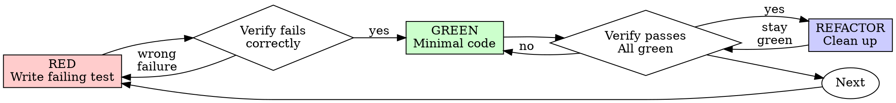

# Codex session 019faa36-f1b5-7383-a074-05c91089a932

- Started: `2026-07-28T19:32:35.473Z`
- Working directory: `D:\100XH100`
- Originator: `Codex Desktop`
- Codex CLI: `0.146.0-alpha.3`
- Source log: `C:\Users\Иван Литвак\.codex\sessions\2026\07\28\rollout-2026-07-28T22-32-35-019faa36-f1b5-7383-a074-05c91089a932.jsonl`
- Entries: user=1, assistant=14, tool calls=41, tool outputs=41

This is a chronological export of the user/assistant conversation and tool activity. Internal system/developer instructions and token accounting are intentionally excluded. Secret-shaped values are redacted; oversized tool outputs retain their beginning and end with the omitted character count.

## 1. User

Time: `2026-07-28T19:33:08.050Z` · source line `6`

```text
<recommended_plugins>
Here is a list of plugins that are available but not installed.

- Atlassian Rovo (atlassian-rovo@openai-curated-remote)
- Box (box@openai-curated-remote)
- Figma (figma@openai-curated-remote)
- Gmail (gmail@openai-curated-remote)
- Google Calendar (google-calendar@openai-curated-remote)
- Google Drive (google-drive@openai-curated-remote)
- Outlook Calendar (outlook-calendar@openai-curated-remote)
- Outlook Email (outlook-email@openai-curated-remote)
- SharePoint (sharepoint@openai-curated-remote)
- Slack (slack@openai-curated-remote)
- Teams (teams@openai-curated-remote)
</recommended_plugins>
# AGENTS.md instructions for D:\100XH100

<INSTRUCTIONS>
# Project Agent Rules

## Operating Rule
- Read `AGENTS.md` before project edits.
- Update `memory/CHANGELOG.md` after meaningful code, config, or architecture changes.
- Update `memory/PROMPTS.md` with user prompts that define requirements.
- Store test outputs, logs, and verification notes under `test_results/`.
- Prefer agent-centered code: explicit contracts, deterministic tests, small files, low hidden state.

## Architecture Source
- Primary architecture contract: `ARCHITECTURE_NEED.md`.
- Current Stream 4 implementation rule: use threshold + compact + CUB/fixed-temp sort/reduce + compact; do not use Stream 4 hash-table dedup.

## Implementation Guardrails
- `State128` logical bytes are `v[0..119]`.
- `State128` padding bytes are `v[120..127]`.
- Persistent frontier padding must be zero.
- `FinalResponse` may temporarily store `target_local_idx` in `v[120..123]`.
- `Hash128` is one logical 128-bit key stored as `{lo, hi}`.
- `CandidateMeta` must remain 32 bytes and 32-byte aligned.
- Stream 3 payload id must be original candidate id, not compact index.
- Stream 4 must not apply shard top-k or semantic shard cap.

</INSTRUCTIONS>
<environment_context>
  <cwd>D:\100XH100</cwd>
  <shell>powershell</shell>
  <current_date>2026-07-28</current_date>
  <timezone>Europe/Moscow</timezone>
  <filesystem><workspace_roots><root>D:\100XH100</root></workspace_roots><permission_profile type="managed"><file_system type="restricted"><entry access="read"><special>:root</special></entry><entry access="write"><path>D:\100XH100</path></entry><entry access="write"><special>:slash_tmp</special></entry><entry access="write"><special>:tmpdir</special></entry><entry access="write"><path>C:\Users\Иван Литвак\.codex\visualizations\2026\07\23\019f90a3-47e5-7770-a20e-cd9317bcbf2c</path></entry><entry access="read"><path>D:\100XH100\.git</path></entry><entry access="read"><path>D:\100XH100\.agents</path></entry><entry access="read"><path>D:\100XH100\.codex</path></entry></file_system></permission_profile></filesystem>
</environment_context>
```

## 2. Codex

Time: `2026-07-28T19:33:24.677Z` · source line `12`

```text
I’ll implement Task 2 in the designated worktree, following its TDD brief and preserving unrelated changes.
```

## 3. Tool call: `exec`

Time: `2026-07-28T19:33:28.631Z` · source line `14`

```text
const r = await tools.shell_command({"command":"Get-Content -LiteralPath 'AGENTS.md'; Write-Output '---BRIEF---'; Get-Content -LiteralPath '.superpowers\\sdd\\2026-07-28-public-cayleypy-2xt4-notebook\\task-2-brief.md'; Write-Output '---TDD---'; Get-Content -LiteralPath 'C:\\Users\\Иван Литвак\\.codex\\plugins\\cache\\openai-curated-remote\\superpowers\\6.2.0\\skills\\test-driven-development\\SKILL.md'; Write-Output '---MEMORY-HITS---'; rg -n -i 'cayleypy|notebook|public.*2xt4' 'C:\\Users\\Иван Литвак\\.codex\\memories\\MEMORY.md'","workdir":"D:\\100XH100\\.worktrees\\public-cayleypy-notebook","timeout_ms":10000});
text(r);
```

## 4. Tool output

Time: `2026-07-28T19:33:29.097Z` · source line `15`

````text
Script failed
Wall time 0.4 seconds
Output:

Script error:
Exit code: 1
Wall time: 0.4 seconds
Output:
# Project Agent Rules

## Operating Rule
- Read `AGENTS.md` before project edits.
- Update `memory/CHANGELOG.md` after meaningful code, config, or architecture changes.
- Update `memory/PROMPTS.md` with user prompts that define requirements.
- Store test outputs, logs, and verification notes under `test_results/`.
- Prefer agent-centered code: explicit contracts, deterministic tests, small files, low hidden state.

## Architecture Source
- Primary architecture contract: `ARCHITECTURE_NEED.md`.
- Current Stream 4 implementation rule: use threshold + compact + CUB/fixed-temp sort/reduce + compact; do not use Stream 4 hash-table dedup.

## Implementation Guardrails
- `State128` logical bytes are `v[0..119]`.
- `State128` padding bytes are `v[120..127]`.
- Persistent frontier padding must be zero.
- `FinalResponse` may temporarily store `target_local_idx` in `v[120..123]`.
- `Hash128` is one logical 128-bit key stored as `{lo, hi}`.
- `CandidateMeta` must remain 32 bytes and 32-byte aligned.
- Stream 3 payload id must be original candidate id, not compact index.
- Stream 4 must not apply shard top-k or semantic shard cap.
---BRIEF---
### Task 2: Automatic Supported-MLP Detection and Export

**Files:**
- Modify: `tools/export_stream1_mlp.py`
- Create: `tools/cayleypy_public/model.py`
- Create: `tests/cayleypy_public/test_model.py`

**Interfaces:**
- Produces: `detect_checkpoint_format(path: Path) -> Literal["batchnorm-folded", "resmlp-layernorm"]`
- Produces: `export_checkpoint(path: Path, out_dir: Path, num_classes: int) -> ExportedModel`
- `ExportedModel` exposes `format`, `dtype`, `checkpoint_sha256`, and sanitized `manifest`.

- [ ] **Step 1: Write failing detection tests with minimal tensor fixtures**

```python
def test_detects_batchnorm_folded(tmp_path):
    path = write_checkpoint(tmp_path, {
        "input_layer.weight": torch.zeros(8, 12),
        "hidden_layer.weight": torch.zeros(8, 8),
        "output_layer.weight": torch.zeros(1, 8),
        "bn1.running_mean": torch.zeros(8),
        "residual_blocks.0.fc1.weight": torch.zeros(8, 8),
    })
    assert detect_checkpoint_format(path) == "batchnorm-folded"

def test_rejects_mixed_schema(tmp_path):
    path = write_checkpoint(tmp_path, {
        "input_layer.weight": torch.zeros(8, 12),
        "embedding.weight": torch.zeros(12, 16),
        "head.weight": torch.zeros(1, 8),
    })
    with pytest.raises(ValueError, match="ambiguous"):
        detect_checkpoint_format(path)
```

Add ResMLP and unknown-schema cases.

- [ ] **Step 2: Run and verify RED**

Run: `python -m pytest tests/cayleypy_public/test_model.py -q`
Expected: FAIL because `model.py` does not exist.

- [ ] **Step 3: Implement signature-set detection without trial export**

```python
BN_REQUIRED = frozenset({
    "input_layer.weight", "hidden_layer.weight", "output_layer.weight",
    "bn1.running_mean", "bn2.running_mean",
})
LN_REQUIRED = frozenset({
    "embedding.weight", "input_stack.0.weight", "input_stack.1.weight",
    "input_stack.3.weight", "head.weight",
})
```

Normalize `_orig_mod.` prefixes through the existing helpers. A schema matches only when all required keys and at least one contiguous residual block key are present. Zero or two matches fail closed.

- [ ] **Step 4: Add `--format auto` to the existing exporter**

Extend argparse choices to `auto`, call `detect_checkpoint_format`, then dispatch to the unchanged existing exporters. Ensure `source_weights` in the public sanitized manifest is only the checkpoint basename, not the absolute path.

- [ ] **Step 5: Implement export wrapper and manifest gates**

Call the exporter in-process, force `dtype="fp16"`, hash the checkpoint in 8 MiB chunks, load `manifest.json`, require puzzle `state_len/num_classes`, normalization allowlist, and `output_dim in {1, move_count}`.

- [ ] **Step 6: Run tests and commit**

Run: `python -m pytest tests/cayleypy_public/test_model.py tests/test_kaggle_t4_mlp_contract.py -q`
Expected: PASS.

```bash
git add tools/export_stream1_mlp.py tools/cayleypy_public/model.py tests/cayleypy_public/test_model.py
git commit -m "feat: auto-detect supported Stream1 MLP checkpoints"
```

---TDD---
---
name: test-driven-development
description: Use when implementing any feature or bugfix, before writing implementation code
---

# Test-Driven Development (TDD)

## Overview

Write the test first. Watch it fail. Write minimal code to pass.

**Core principle:** If you didn't watch the test fail, you don't know if it tests the right thing.

**Violating the letter of the rules is violating the spirit of the rules.**

## When to Use

**Always:**
- New features
- Bug fixes
- Refactoring
- Behavior changes

**Exceptions (ask your human partner):**
- Throwaway prototypes
- Generated code
- Configuration files

Thinking "skip TDD just this once"? Stop. That's rationalization.

## The Iron Law

```
NO PRODUCTION CODE WITHOUT A FAILING TEST FIRST
```

Write code before the test? Delete it. Start over.

**No exceptions:**
- Don't keep it as "reference"
- Don't "adapt" it while writing tests
- Don't look at it
- Delete means delete

Implement fresh from tests. Period.

## Red-Green-Refactor



### RED - Write Failing Test

Write one minimal test showing what should happen.

<Good>
```typescript
test('retries failed operations 3 times', async () => {
  let attempts = 0;
  const operation = () => {
    attempts++;
    if (attempts < 3) throw new Error('fail');
    return 'success';
  };

  const result = await retryOperation(operation);

  expect(result).toBe('success');
  expect(attempts).toBe(3);
});
```
Clear name, tests real behavior, one thing
</Good>

<Bad>
```typescript
test('retry works', async () => {
  const mock = jest.fn()
    .mockRejectedValueOnce(new Error())
    .mockRejectedValueOnce(new Error())
    .mockResolvedValueOnce('success');
  await retryOperation(mock);
  expect(mock).toHaveBeenCalledTimes(3);
});
```
Vague name, tests mock not code
</Bad>

**Requirements:**
- One behavior
- Clear name
- Real code (no mocks unless unavoidable)

### Verify RED - Watch It Fail

**MANDATORY. Never skip.**

```bash
npm test path/to/test.test.ts
```

Confirm:
- Test fails (not errors)
- Failure message is expected
- Fails because feature missing (not typos)

**Test passes?** You're testing existing behavior. Fix test.

**Test errors?** Fix error, re-run until it fails correctly.

### GREEN - Minimal Code

Write simplest code to pass the test.

<Good>
```typescript
async function retryOperation<T>(fn: () => Promise<T>): Promise<T> {
  for (let i = 0; i < 3; i++) {
    try {
      return await fn();
    } catch (e) {
      if (i === 2) throw e;
    }
  }
  throw new Error('unreachable');
}
```
Just enough to pass
</Good>

<Bad>
```typescript
async function retryOperation<T>(
  fn: () => Promise<T>,
  options?: {
    maxRetries?: number;
    backoff?: 'linear' | 'exponential';
    onRetry?: (attempt: number) => void;
  }
): Promise<T> {
  // YAGNI
}
```
Over-engineered
</Bad>

Don't add features, refactor other code, or "improve" beyond the test.

### Verify GREEN - Watch It Pass

**MANDATORY.**

```bash
npm test path/to/test.test.ts
```

Confirm:
- Test passes
- Other tests still pass
- Output pristine (no errors, warnings)

**Test fails?** Fix code, not test.

**Other tests fail?** Fix now.

### REFACTOR - Clean Up

After green only:
- Remove duplication
- Improve names
- Extract helpers

Keep tests green. Don't add behavior.

### Repeat

Next failing test for next feature.

## Good Tests

| Quality | Good | Bad |
|---------|------|-----|
| **Minimal** | One thing. "and" in name? Split it. | `test('validates email and domain and whitespace')` |
| **Clear** | Name describes behavior | `test('test1')` |
| **Shows intent** | Demonstrates desired API | Obscures what code should do |

When writing or changing any test, read [writing-good-tests.md](writing-good-tests.md) for the rules that keep tests honest:
- Name the production change that would make the test fail — before writing it
- Assert on real behavior, never on mock behavior
- Keep test-only code in test utilities, out of production classes
- Understand a dependency's side effects before mocking it

## Common Rationalizations

| Excuse | Reality |
|--------|---------|
| "Too simple to test" | Simple code breaks. Test takes 30 seconds. |
| "I'll test after" | Tests written after pass immediately — which proves nothing. They may test the wrong thing, test the implementation instead of the behavior, or miss the edge case you forgot. You never watched it fail, so you never proved it can catch the bug. Test-first forces that failure. |
| "Tests after achieve same goals (spirit not ritual)" | Tests-after answer "what does this do?"; tests-first answer "what should this do?" Tests written after are biased by the code you already wrote — you verify the cases you remembered, not the ones you'd have discovered. Coverage without proof the tests work. |
| "Already manually tested" | Manual testing is ad-hoc: no record of what you covered, no way to re-run it when the code changes, easy to forget cases under pressure. "Worked when I tried it" в‰  comprehensive. Automated tests run the same way every time. |
| "Deleting X hours is wasteful" | Sunk cost fallacy — that time is already spent either way. The real choice: rewrite with TDD (high confidence) vs. keep it and bolt tests on after (low confidence, likely bugs). Keeping code you can't trust is the waste. |
| "Keep as reference, write tests first" | You'll adapt it. That's testing after. Delete means delete. |
| "Need to explore first" | Fine. Throw away exploration, start with TDD. |
| "Test hard = design unclear" | Listen to test. Hard to test = hard to use. |
| "TDD will slow me down" | TDD IS the pragmatic path: catches bugs before commit, prevents regressions, lets you refactor without fear. "Pragmatic" shortcuts mean debugging in production — slower, not faster. |
| "Manual test faster" | Manual doesn't prove edge cases. You'll re-test every change. |
| "Existing code has no tests" | You're improving it. Add tests for existing code. |

## Red Flags - STOP and Start Over

- Code before test
- Test after implementation
- Test passes immediately
- Can't explain why test failed
- Tests added "later"
- Rationalizing "just this once"
- "I already manually tested it"
- "Tests after achieve the same purpose"
- "It's about spirit not ritual"
- "Keep as reference" or "adapt existing code"
- "Already spent X hours, deleting is wasteful"
- "TDD is dogmatic, I'm being pragmatic"
- "This is different because..."

**All of these mean: Delete code. Start over with TDD.**

## Example: Bug Fix

**Bug:** Empty email accepted

**RED**
```typescript
test('rejects empty email', async () => {
  const result = await submitForm({ email: '' });
  expect(result.error).toBe('Email required');
});
```

**Verify RED**
```bash
$ npm test
FAIL: expected 'Email required', got undefined
```

**GREEN**
```typescript
function submitForm(data: FormData) {
  if (!data.email?.trim()) {
    return { error: 'Email required' };
  }
  // ...
}
```

**Verify GREEN**
```bash
$ npm test
PASS
```

**REFACTOR**
Extract validation for multiple fields if needed.

## Verification Checklist

Before marking work complete:

- [ ] Every new function/method has a test
- [ ] Watched each test fail before implementing
- [ ] Each test failed for expected reason (feature missing, not typo)
- [ ] Wrote minimal code to pass each test
- [ ] All tests pass
- [ ] Output pristine (no errors, warnings)
- [ ] Tests use real code (mocks only if unavoidable)
- [ ] Edge cases and errors covered

Can't check all boxes? You skipped TDD. Start over.

## When Stuck

| Problem | Solution |
|---------|----------|
| Don't know how to test | Write wished-for API. Write assertion first. Ask your human partner. |
| Test too complicated | Design too complicated. Simplify interface. |
| Must mock everything | Code too coupled. Use dependency injection. |
| Test setup huge | Extract helpers. Still complex? Simplify design. |

## Debugging Integration

Bug found? Write failing test reproducing it. Follow TDD cycle. Test proves fix and prevents regression.

Never fix bugs without a test.

## Final Rule

```
Production code в†’ test exists and failed first
Otherwise в†’ not TDD
```

No exceptions without your human partner's permission.
---MEMORY-HITS---

````

## 5. Tool call: `exec`

Time: `2026-07-28T19:33:34.792Z` · source line `18`

```text
const r = await tools.shell_command({"command":"Get-ChildItem -LiteralPath 'tools\\cayleypy_public','tests\\cayleypy_public' -Force | Select-Object FullName,Length; Get-Content -LiteralPath 'tools\\export_stream1_mlp.py'; Get-Content -LiteralPath 'tests\\test_kaggle_t4_mlp_contract.py'; Get-ChildItem -LiteralPath 'memory' -Force | Select-Object Name","workdir":"D:\\100XH100\\.worktrees\\public-cayleypy-notebook","timeout_ms":10000});
text(r);
```

## 6. Tool output

Time: `2026-07-28T19:33:35.387Z` · source line `19`

```text
Script completed
Wall time 0.5 seconds
Output:

Exit code: 0
Wall time: 0.4 seconds
Output:

FullName                                                                             Length
--------                                                                             ------
D:\100XH100\.worktrees\public-cayleypy-notebook\tools\cayleypy_public\__pycache__          
D:\100XH100\.worktrees\public-cayleypy-notebook\tools\cayleypy_public\config.py      4137  
D:\100XH100\.worktrees\public-cayleypy-notebook\tools\cayleypy_public\data.py        3302  
D:\100XH100\.worktrees\public-cayleypy-notebook\tools\cayleypy_public\__init__.py    61    
D:\100XH100\.worktrees\public-cayleypy-notebook\tests\cayleypy_public\__pycache__          
D:\100XH100\.worktrees\public-cayleypy-notebook\tests\cayleypy_public\test_config.py 2298  
D:\100XH100\.worktrees\public-cayleypy-notebook\tests\cayleypy_public\test_data.py   2328  
#!/usr/bin/env python3
"""Export Stream1 PyTorch weights into runtime weight files."""

from __future__ import annotations

import argparse
import json
from pathlib import Path
import re
from typing import Dict, Literal, Tuple

import torch


TensorDict = Dict[str, torch.Tensor]
ExportDType = Literal["fp16", "bf16"]


def unwrap_state_dict(obj) -> TensorDict:
    if isinstance(obj, dict):
        for key in ("state_dict", "model_state_dict", "model", "net", "module"):
            value = obj.get(key)
            if isinstance(value, dict):
                return value
    if isinstance(obj, dict):
        return obj
    raise TypeError(f"unsupported checkpoint root type: {type(obj).__name__}")


def strip_orig_mod(sd: TensorDict) -> TensorDict:
    return {(key[len("_orig_mod."):] if key.startswith("_orig_mod.") else key): value for key, value in sd.items()}


def fold_linear_bn(sd: TensorDict, linear: str, bn: str) -> Tuple[torch.Tensor, torch.Tensor]:
    weight = sd[f"{linear}.weight"].detach().float()
    bias = sd.get(f"{linear}.bias")
    if bias is None:
        bias = torch.zeros(weight.shape[0], dtype=torch.float32)
    else:
        bias = bias.detach().float()
    gamma = sd[f"{bn}.weight"].detach().float()
    beta = sd[f"{bn}.bias"].detach().float()
    mean = sd[f"{bn}.running_mean"].detach().float()
    var = sd[f"{bn}.running_var"].detach().float()
    scale = gamma / torch.sqrt(var + 1e-5)
    return weight * scale[:, None], (bias - mean) * scale + beta


def linear_weight_bias(sd: TensorDict, linear: str) -> Tuple[torch.Tensor, torch.Tensor]:
    weight = sd[f"{linear}.weight"].detach().float()
    bias = sd.get(f"{linear}.bias")
    if bias is None:
        bias = torch.zeros(weight.shape[0], dtype=torch.float32)
    else:
        bias = bias.detach().float()
    return weight, bias


def tensor_bytes(tensor: torch.Tensor, dtype: ExportDType) -> bytes:
    if dtype == "fp16":
        return tensor.contiguous().to(torch.float16).cpu().numpy().tobytes()
    if dtype == "bf16":
        return tensor.contiguous().to(torch.bfloat16).view(torch.int16).cpu().numpy().tobytes()
    raise ValueError(f"unsupported export dtype: {dtype}")


def weight_suffix(dtype: ExportDType) -> str:
    return ".fp16" if dtype == "fp16" else ".bf16"


def round_up(value: int, alignment: int) -> int:
    return ((value + alignment - 1) // alignment) * alignment


def pad_out_in(weight_out_in: torch.Tensor, out_dim: int, in_dim: int) -> torch.Tensor:
    padded = torch.zeros((out_dim, in_dim), dtype=torch.float32)
    rows, cols = weight_out_in.shape
    padded[:rows, :cols] = weight_out_in.detach().float()
    return padded


def pad_vec(values: torch.Tensor, size: int) -> torch.Tensor:
    padded = torch.zeros(size, dtype=torch.float32)
    padded[:values.shape[0]] = values.detach().float()
    return padded


def write_hxk(path: Path, weight_out_in: torch.Tensor, dtype: ExportDType) -> None:
    path.write_bytes(tensor_bytes(weight_out_in.t(), dtype))


def write_vec(path: Path, values: torch.Tensor, dtype: ExportDType) -> None:
    path.write_bytes(tensor_bytes(values, dtype))


def infer_residual_count(sd: TensorDict) -> int:
    blocks = set()
    pattern = re.compile(r"^residual_blocks\.(\d+)\.fc1\.weight$")
    for key in sd:
        match = pattern.match(key)
        if match:
            blocks.add(int(match.group(1)))
    if not blocks:
        raise ValueError("no residual_blocks.*.fc1.weight tensors found")
    expected = set(range(max(blocks) + 1))
    if blocks != expected:
        raise ValueError(f"residual block indices are not contiguous: found={sorted(blocks)}")
    return max(blocks) + 1


def export_batchnorm_folded(weights_path: Path, out_dir: Path, dtype: ExportDType, num_classes: int) -> None:
    checkpoint = torch.load(weights_path, map_location="cpu", weights_only=False)
    sd = strip_orig_mod(unwrap_state_dict(checkpoint))
    out_dir.mkdir(parents=True, exist_ok=True)
    suffix = weight_suffix(dtype)

    input_weight = sd["input_layer.weight"]
    hidden_weight = sd["hidden_layer.weight"]
    output_weight = sd["output_layer.weight"]
    hd1, input_dim = input_weight.shape
    hd2, hidden_in = hidden_weight.shape
    output_dim, output_in = output_weight.shape
    if hidden_in != hd1:
        raise ValueError(f"hidden_layer input mismatch: hidden_in={hidden_in} hd1={hd1}")
    if output_in != hd2:
        raise ValueError(f"output_layer input mismatch: output_in={output_in} hd2={hd2}")
    if num_classes <= 0:
        raise ValueError(f"num_classes must be positive: {num_classes}")
    if input_dim % num_classes != 0:
        raise ValueError(f"input_dim is not divisible by num_classes={num_classes}: input_dim={input_dim}")
    state_len = input_dim // num_classes
    residual_count = infer_residual_count(sd)
    hd1_padded = round_up(int(hd1), 8)
    hd2_padded = round_up(int(hd2), 8)

    weight, bias = fold_linear_bn(sd, "input_layer", "bn1")
    weight = pad_out_in(weight, hd1_padded, input_dim)
    bias = pad_vec(bias, hd1_padded)
    write_hxk(out_dir / f"input_weight_hxk{suffix}", weight, dtype)
    write_vec(out_dir / f"input_bias{suffix}", bias, dtype)

    weight, bias = fold_linear_bn(sd, "hidden_layer", "bn2")
    weight = pad_out_in(weight, hd2_padded, hd1_padded)
    bias = pad_vec(bias, hd2_padded)
    write_hxk(out_dir / f"hidden_weight_hxk{suffix}", weight, dtype)
    write_vec(out_dir / f"hidden_bias{suffix}", bias, dtype)

    for block in range(residual_count):
        prefix = f"residual_blocks.{block}"
        out_prefix = f"residual{block}"
        weight, bias = fold_linear_bn(sd, f"{prefix}.fc1", f"{prefix}.bn1")
        weight = pad_out_in(weight, hd2_padded, hd2_padded)
        bias = pad_vec(bias, hd2_padded)
        write_hxk(out_dir / f"{out_prefix}_fc1_weight_hxk{suffix}", weight, dtype)
        write_vec(out_dir / f"{out_prefix}_fc1_bias{suffix}", bias, dtype)
        weight, bias = fold_linear_bn(sd, f"{prefix}.fc2", f"{prefix}.bn2")
        weight = pad_out_in(weight, hd2_padded, hd2_padded)
        bias = pad_vec(bias, hd2_padded)
        write_hxk(out_dir / f"{out_prefix}_fc2_weight_hxk{suffix}", weight, dtype)
        write_vec(out_dir / f"{out_prefix}_fc2_bias{suffix}", bias, dtype)

    weight, bias = linear_weight_bias(sd, "output_layer")
    weight = pad_out_in(weight, output_dim, hd2_padded)
    write_hxk(out_dir / f"output_weight_hxk{suffix}", weight, dtype)
    write_vec(out_dir / f"output_bias{suffix}", bias, dtype)

    manifest = {
        "state_len": state_len,
        "num_classes": num_classes,
        "hd1": hd1_padded,
        "hd2": hd2_padded,
        "original_hd1": int(hd1),
        "original_hd2": int(hd2),
        "hidden_alignment": 8,
        "nrd": residual_count,
        "output_dim": output_dim,
        "dtype": dtype,
        "normalization": "batchnorm_folded",
        "layout": "row-major input activations times weight_hxk",
        "batchnorm": "folded into preceding linear weights",
        "embeddingbag": "removed from runtime; input layer exported as position-class table",
        "source_weights": str(weights_path),
    }
    (out_dir / "manifest.json").write_text(json.dumps(manifest, indent=2) + "\n", encoding="utf-8")
    print(
        "stream1_export_done"
        f" out_dir={out_dir}"
        f" hd1={hd1_padded}"
        f" hd2={hd2_padded}"
        f" original_hd1={hd1}"
        f" original_hd2={hd2}"
        f" nrd={residual_count}"
        f" output_dim={output_dim}"
    )


def infer_resmlp_hidden_dims(sd: TensorDict) -> tuple[int, int, int, int, int]:
    embed_rows, embed_dim = sd["embedding.weight"].shape
    hidden1, flattened = sd["input_stack.0.weight"].shape
    hidden2, hidden1_in = sd["input_stack.3.weight"].shape
    output_dim, output_in = sd["head.weight"].shape
    if hidden1_in != hidden1 or output_in != hidden2:
        raise ValueError("ResMLPDistance hidden shape mismatch")
    if flattened % embed_dim != 0:
        raise ValueError(f"flattened input {flattened} is not divisible by embed_dim {embed_dim}")
    return int(embed_rows), int(embed_dim), int(hidden1), int(hidden2), int(output_dim)


def infer_resmlp_residual_count(sd: TensorDict) -> int:
    blocks = set()
    pattern = re.compile(r"^res_blocks\.(\d+)\.lin1\.weight$")
    for key in sd:
        match = pattern.match(key)
        if match:
            blocks.add(int(match.group(1)))
    if not blocks:
        raise ValueError("no res_blocks.*.lin1.weight tensors found")
    expected = set(range(max(blocks) + 1))
    if blocks != expected:
        raise ValueError(f"res block indices are not contiguous: found={sorted(blocks)}")
    return max(blocks) + 1


def linear_ln(sd: TensorDict, linear: str, ln: str) -> tuple[torch.Tensor, torch.Tensor, torch.Tensor, torch.Tensor]:
    weight, bias = linear_weight_bias(sd, linear)
    gamma = sd[f"{ln}.weight"].detach().float()
    beta = sd[f"{ln}.bias"].detach().float()
    return weight, bias, gamma, beta


def export_resmlp_layernorm(weights_path: Path, out_dir: Path, dtype: ExportDType) -> None:
    checkpoint = torch.load(weights_path, map_location="cpu", weights_only=False)
    sd = strip_orig_mod(unwrap_state_dict(checkpoint))
    out_dir.mkdir(parents=True, exist_ok=True)
    suffix = weight_suffix(dtype)

    num_classes, embed_dim, hidden1, hidden2, output_dim = infer_resmlp_hidden_dims(sd)
    if embed_dim != 16:
        raise ValueError(f"runtime folded input expects embed_dim=16; got {embed_dim}")
    state_len = sd["input_stack.0.weight"].shape[1] // embed_dim
    residual_count = infer_resmlp_residual_count(sd)

    embedding = sd["embedding.weight"].detach().float()
    first_weight = sd["input_stack.0.weight"].detach().float()
    folded = torch.empty((hidden1, state_len * num_classes), dtype=torch.float32)
    for pos in range(state_len):
        block = first_weight[:, pos * embed_dim:(pos + 1) * embed_dim]
        folded[:, pos * num_classes:(pos + 1) * num_classes] = (embedding @ block.t()).t()
    write_hxk(out_dir / f"input_weight_hxk{suffix}", folded, dtype)
    write_vec(out_dir / f"input_bias{suffix}", sd["input_stack.0.bias"].detach().float(), dtype)
    write_vec(out_dir / f"input_ln_gamma{suffix}", sd["input_stack.1.weight"].detach().float(), dtype)
    write_vec(out_dir / f"input_ln_beta{suffix}", sd["input_stack.1.bias"].detach().float(), dtype)

    weight, bias, gamma, beta = linear_ln(sd, "input_stack.3", "input_stack.4")
    write_hxk(out_dir / f"hidden_weight_hxk{suffix}", weight, dtype)
    write_vec(out_dir / f"hidden_bias{suffix}", bias, dtype)
    write_vec(out_dir / f"hidden_ln_gamma{suffix}", gamma, dtype)
    write_vec(out_dir / f"hidden_ln_beta{suffix}", beta, dtype)

    for block in range(residual_count):
        prefix = f"res_blocks.{block}"
        out_prefix = f"residual{block}"
        weight, bias, gamma, beta = linear_ln(sd, f"{prefix}.lin1", f"{prefix}.ln1")
        write_hxk(out_dir / f"{out_prefix}_fc1_weight_hxk{suffix}", weight, dtype)
        write_vec(out_dir / f"{out_prefix}_fc1_bias{suffix}", bias, dtype)
        write_vec(out_dir / f"{out_prefix}_fc1_ln_gamma{suffix}", gamma, dtype)
        write_vec(out_dir / f"{out_prefix}_fc1_ln_beta{suffix}", beta, dtype)
        weight, bias, gamma, beta = linear_ln(sd, f"{prefix}.lin2", f"{prefix}.ln2")
        write_hxk(out_dir / f"{out_prefix}_fc2_weight_hxk{suffix}", weight, dtype)
        write_vec(out_dir / f"{out_prefix}_fc2_bias{suffix}", bias, dtype)
        write_vec(out_dir / f"{out_prefix}_fc2_ln_gamma{suffix}", gamma, dtype)
        write_vec(out_dir / f"{out_prefix}_fc2_ln_beta{suffix}", beta, dtype)

    weight, bias = linear_weight_bias(sd, "head")
    write_hxk(out_dir / f"output_weight_hxk{suffix}", weight, dtype)
    write_vec(out_dir / f"output_bias{suffix}", bias, dtype)

    manifest = {
        "state_len": state_len,
        "num_classes": num_classes,
        "hd1": hidden1,
        "hd2": hidden2,
        "nrd": residual_count,
        "output_dim": output_dim,
        "dtype": dtype,
        "normalization": "layernorm",
        "layout": "row-major input activations times weight_hxk",
        "embedding": "folded into position-class input table",
        "source_weights": str(weights_path),
    }
    (out_dir / "manifest.json").write_text(json.dumps(manifest, indent=2) + "\n", encoding="utf-8")
    print(
        "stream1_export_done"
        f" out_dir={out_dir}"
        f" format=resmlp_layernorm"
        f" dtype={dtype}"
        f" hd1={hidden1}"
        f" hd2={hidden2}"
        f" nrd={residual_count}"
        f" output_dim={output_dim}"
    )


def main() -> None:
    parser = argparse.ArgumentParser()
    parser.add_argument("--weights", required=True, type=Path)
    parser.add_argument("--out", required=True, type=Path)
    parser.add_argument("--format", choices=["batchnorm-folded", "resmlp-layernorm"], default="batchnorm-folded")
    parser.add_argument("--dtype", choices=["fp16", "bf16"], default="fp16")
    parser.add_argument("--num-classes", type=int, default=120)
    args = parser.parse_args()
    if args.format == "batchnorm-folded":
        export_batchnorm_folded(args.weights, args.out, args.dtype, args.num_classes)
    else:
        export_resmlp_layernorm(args.weights, args.out, args.dtype)


if __name__ == "__main__":
    main()
from __future__ import annotations

import json
from pathlib import Path

import pytest
import torch

from tools.export_stream1_mlp import export_batchnorm_folded
from tools.kaggle_t4_mlp_profiles import supported_model_header, validate_manifest


BASE_MANIFEST = {
    "state_len": 120,
    "num_classes": 120,
    "normalization": "batchnorm_folded",
}


def test_output1_manifest_is_supported() -> None:
    assert (
        validate_manifest(
            BASE_MANIFEST | {"output_dim": 1},
            state_len=120,
            num_classes=120,
            move_count=24,
        )
        == "output1"
    )


def test_move_count_manifest_is_supported() -> None:
    assert (
        validate_manifest(
            BASE_MANIFEST | {"output_dim": 24},
            state_len=120,
            num_classes=120,
            move_count=24,
        )
        == "output_move_count"
    )


def test_arbitrary_output_is_rejected() -> None:
    with pytest.raises(
        ValueError,
        match="only output_dim=1 or output_dim=move_count",
    ):
        validate_manifest(
            BASE_MANIFEST | {"output_dim": 7},
            state_len=120,
            num_classes=120,
            move_count=24,
        )


@pytest.mark.parametrize(
    ("field", "actual", "expected"),
    [
        ("state_len", 119, 120),
        ("num_classes", 119, 120),
    ],
)
def test_manifest_generator_dimensions_must_match(
    field: str,
    actual: int,
    expected: int,
) -> None:
    manifest = BASE_MANIFEST | {"output_dim": 1, field: actual}
    with pytest.raises(ValueError, match=rf"{field}.*{actual}.*{expected}"):
        validate_manifest(
            manifest,
            state_len=120,
            num_classes=120,
            move_count=24,
        )


def test_header_names_both_checkpoint_formats() -> None:
    text = supported_model_header()
    assert "batchnorm-folded" in text
    assert "resmlp-layernorm" in text
    assert "arbitrary PyTorch" in text
    assert "output_dim=1" in text
    assert "output_dim=move_count" in text


def _bn_state(size: int) -> dict[str, torch.Tensor]:
    return {
        "weight": torch.ones(size),
        "bias": torch.zeros(size),
        "running_mean": torch.zeros(size),
        "running_var": torch.ones(size),
        "num_batches_tracked": torch.tensor(0, dtype=torch.long),
    }


def test_deterministic_batchnorm_fixture_exports(tmp_path: Path) -> None:
    input_dim = 6
    hd1 = 8
    hd2 = 8
    state_dict: dict[str, torch.Tensor] = {
        "input_layer.weight": torch.arange(hd1 * input_dim, dtype=torch.float32).reshape(hd1, input_dim) / 100,
        "input_layer.bias": torch.zeros(hd1),
        "hidden_layer.weight": torch.eye(hd2, hd1),
        "hidden_layer.bias": torch.zeros(hd2),
        "output_layer.weight": torch.ones(1, hd2),
        "output_layer.bias": torch.zeros(1),
        "residual_blocks.0.fc1.weight": torch.eye(hd2),
        "residual_blocks.0.fc1.bias": torch.zeros(hd2),
        "residual_blocks.0.fc2.weight": torch.eye(hd2),
        "residual_blocks.0.fc2.bias": torch.zeros(hd2),
    }
    for prefix, size in (
        ("bn1", hd1),
        ("bn2", hd2),
        ("residual_blocks.0.bn1", hd2),
        ("residual_blocks.0.bn2", hd2),
    ):
        for suffix, tensor in _bn_state(size).items():
            state_dict[f"{prefix}.{suffix}"] = tensor

    checkpoint = tmp_path / "batchnorm_output1.pth"
    out_dir = tmp_path / "export"
    torch.save({"model": state_dict}, checkpoint)
    export_batchnorm_folded(
        checkpoint,
        out_dir,
        dtype="fp16",
        num_classes=3,
    )
    manifest = json.loads((out_dir / "manifest.json").read_text(encoding="utf-8"))
    assert manifest["output_dim"] == 1
    assert (
        validate_manifest(
            manifest,
            state_len=2,
            num_classes=3,
            move_count=24,
        )
        == "output1"
    )
                                                                                           
                                                                                           


```

## 7. Tool call: `exec`

Time: `2026-07-28T19:33:40.989Z` · source line `22`

```text
const r = await tools.shell_command({"command":"Get-Content -LiteralPath 'tools\\cayleypy_public\\config.py'; Get-Content -LiteralPath 'tools\\cayleypy_public\\__init__.py'; rg -n \"export_checkpoint|detect_checkpoint_format|normalization|source_weights|manifest\" tests tools\\cayleypy_public tools -g '*.py'","workdir":"D:\\100XH100\\.worktrees\\public-cayleypy-notebook","timeout_ms":10000});
text(r);
```

## 8. Tool output

Time: `2026-07-28T19:33:41.470Z` · source line `23`

```text
Script completed
Wall time 0.4 seconds
Output:

Exit code: 0
Wall time: 0.4 seconds
Output:
from dataclasses import dataclass
from pathlib import Path
from typing import Literal, Mapping


@dataclass(frozen=True)
class PublicRunConfig:
    author_name: str
    checkpoint_path: Path
    puzzle_info_json: Path
    test_csv: Path
    sample_submission_csv: Path
    puzzle_id_start: int
    puzzle_id_end: int
    beam_width: int
    max_depth: int
    reflect_mode: Literal["off", "after_original", "only"]
    reflect_source_csv: Path | None
    solution_mode: Literal["first", "collect"]
    collect_until_depth: int
    max_collected_solutions: int
    touch_bfs_radius: int
    publish_results: bool
    results_ingest_url: str
    model_dtype: Literal["fp16"] = "fp16"

    @property
    def puzzle_ids(self) -> tuple[int, ...]:
        return tuple(range(self.puzzle_id_start, self.puzzle_id_end + 1))

    @classmethod
    def from_mapping(cls, values: Mapping[str, object]) -> "PublicRunConfig":
        def required(name: str) -> object:
            try:
                return values[name]
            except KeyError as error:
                raise ValueError(f"missing required config field {name.upper()}") from error

        def integer(name: str) -> int:
            value = required(name)
            if not isinstance(value, int) or isinstance(value, bool):
                raise ValueError(f"{name.upper()} must be an integer")
            return value

        reflect_mode = required("reflect_mode")
        solution_mode = required("solution_mode")
        if reflect_mode not in {"off", "after_original", "only"}:
            raise ValueError("REFLECT_MODE must be off, after_original, or only")
        if solution_mode not in {"first", "collect"}:
            raise ValueError("SOLUTION_MODE must be first or collect")

        start = integer("puzzle_id_start")
        end = integer("puzzle_id_end")
        if start > end:
            raise ValueError("PUZZLE_ID range must be inclusive and non-empty")

        positive_values = {name: integer(name) for name in ("beam_width", "max_depth", "max_collected_solutions")}
        for name, value in positive_values.items():
            if value <= 0:
                raise ValueError(f"{name.upper()} must be positive")

        collect_until_depth = integer("collect_until_depth")
        if collect_until_depth < 0 or collect_until_depth > positive_values["max_depth"]:
            raise ValueError("COLLECT_UNTIL_DEPTH must be within MAX_DEPTH")

        touch_bfs_radius = integer("touch_bfs_radius")
        if not 0 <= touch_bfs_radius <= 12:
            raise ValueError("TOUCH_BFS_RADIUS must be between 0 and 12")

        reflect_source = required("reflect_source_csv")
        if reflect_source is not None and not isinstance(reflect_source, (str, Path)):
            raise ValueError("REFLECT_SOURCE_CSV must be a path or null")
        if reflect_mode == "only" and reflect_source is None:
            raise ValueError("REFLECT_SOURCE_CSV is required when REFLECT_MODE is only")

        publish_results = required("publish_results")
        if not isinstance(publish_results, bool):
            raise ValueError("PUBLISH_RESULTS must be a bool")

        return cls(
            author_name=str(required("author_name")),
            checkpoint_path=Path(str(required("checkpoint_path"))),
            puzzle_info_json=Path(str(required("puzzle_info_json"))),
            test_csv=Path(str(required("test_csv"))),
            sample_submission_csv=Path(str(required("sample_submission_csv"))),
            puzzle_id_start=start,
            puzzle_id_end=end,
            beam_width=positive_values["beam_width"],
            max_depth=positive_values["max_depth"],
            reflect_mode=reflect_mode,
            reflect_source_csv=Path(reflect_source) if reflect_source is not None else None,
            solution_mode=solution_mode,
            collect_until_depth=collect_until_depth,
            max_collected_solutions=positive_values["max_collected_solutions"],
            touch_bfs_radius=touch_bfs_radius,
            publish_results=publish_results,
            results_ingest_url=str(required("results_ingest_url")),
        )
"""Typed public data contracts for the CayleyPy notebook."""
tools\kaggle_t4_mlp_profiles.py:102:def validate_manifest(
tools\kaggle_t4_mlp_profiles.py:103:    manifest: dict[str, Any],
tools\kaggle_t4_mlp_profiles.py:108:    """Validate a Stream1 MLP manifest against the selected generator."""
tools\kaggle_t4_mlp_profiles.py:110:        actual = manifest.get(field)
tools\kaggle_t4_mlp_profiles.py:113:                f"manifest {field} mismatch: observed={actual!r}, expected={expected!r}"
tools\kaggle_t4_mlp_profiles.py:115:    normalization = manifest.get("normalization")
tools\kaggle_t4_mlp_profiles.py:116:    if normalization not in {"batchnorm_folded", "layernorm"}:
tools\kaggle_t4_mlp_profiles.py:118:            "unsupported MLP manifest normalization: "
tools\kaggle_t4_mlp_profiles.py:119:            f"observed={normalization!r}, expected batchnorm_folded or layernorm"
tools\kaggle_t4_mlp_profiles.py:121:    output_dim = manifest.get("output_dim")
tools\kaggle_t4_mlp_profiles.py:123:        raise ValueError(f"manifest output_dim must be an integer; got {output_dim!r}")
tools\export_stream1_mlp.py:167:    manifest = {
tools\export_stream1_mlp.py:178:        "normalization": "batchnorm_folded",
tools\export_stream1_mlp.py:182:        "source_weights": str(weights_path),
tools\export_stream1_mlp.py:184:    (out_dir / "manifest.json").write_text(json.dumps(manifest, indent=2) + "\n", encoding="utf-8")
tools\export_stream1_mlp.py:278:    manifest = {
tools\export_stream1_mlp.py:286:        "normalization": "layernorm",
tools\export_stream1_mlp.py:289:        "source_weights": str(weights_path),
tools\export_stream1_mlp.py:291:    (out_dir / "manifest.json").write_text(json.dumps(manifest, indent=2) + "\n", encoding="utf-8")
tools\build_kaggle_t4_mlp_user_notebook.py:35:The exported manifest is inspected automatically. Its head must be exactly
tools\build_kaggle_t4_mlp_user_notebook.py:150:manifest = json.loads((WEIGHTS / "manifest.json").read_text(encoding="utf-8"))
tools\build_kaggle_t4_mlp_user_notebook.py:151:if manifest.get("state_len") != state_len or manifest.get("num_classes") != num_classes:
tools\build_kaggle_t4_mlp_user_notebook.py:152:    raise ValueError(f"manifest puzzle mismatch: {manifest}")
tools\build_kaggle_t4_mlp_user_notebook.py:153:output_dim = int(manifest["output_dim"])
tools\build_kaggle_t4_mlp_autoprofile_sweep.py:124:    manifest = json.loads((model_dir / "manifest.json").read_text(encoding="utf-8"))
tools\build_kaggle_t4_mlp_autoprofile_sweep.py:125:    output_dim = int(manifest["output_dim"])
tools\build_kaggle_t4_mlp_autoprofile_sweep.py:127:        raise RuntimeError(f"output1 manifest mismatch: {manifest}")
tools\build_kaggle_t4_mlp_autoprofile_sweep.py:129:        raise RuntimeError(f"output_move_count manifest mismatch: {manifest}")
tools\build_kaggle_t4_mlp_autoprofile_sweep.py:130:    print("validated_model=", model_class, manifest)
tests\test_kaggle_t4_mlp_contract.py:10:from tools.kaggle_t4_mlp_profiles import supported_model_header, validate_manifest
tests\test_kaggle_t4_mlp_contract.py:16:    "normalization": "batchnorm_folded",
tests\test_kaggle_t4_mlp_contract.py:20:def test_output1_manifest_is_supported() -> None:
tests\test_kaggle_t4_mlp_contract.py:22:        validate_manifest(
tests\test_kaggle_t4_mlp_contract.py:32:def test_move_count_manifest_is_supported() -> None:
tests\test_kaggle_t4_mlp_contract.py:34:        validate_manifest(
tests\test_kaggle_t4_mlp_contract.py:49:        validate_manifest(
tests\test_kaggle_t4_mlp_contract.py:64:def test_manifest_generator_dimensions_must_match(
tests\test_kaggle_t4_mlp_contract.py:69:    manifest = BASE_MANIFEST | {"output_dim": 1, field: actual}
tests\test_kaggle_t4_mlp_contract.py:71:        validate_manifest(
tests\test_kaggle_t4_mlp_contract.py:72:            manifest,
tests\test_kaggle_t4_mlp_contract.py:132:    manifest = json.loads((out_dir / "manifest.json").read_text(encoding="utf-8"))
tests\test_kaggle_t4_mlp_contract.py:133:    assert manifest["output_dim"] == 1
tests\test_kaggle_t4_mlp_contract.py:135:        validate_manifest(
tests\test_kaggle_t4_mlp_contract.py:136:            manifest,

```

## 9. Tool call: `exec`

Time: `2026-07-28T19:34:08.620Z` · source line `26`

```text
const patch = "*** Begin Patch\n*** Add File: D:\\100XH100\\.worktrees\\public-cayleypy-notebook\\tests\\cayleypy_public\\test_model.py\n+from __future__ import annotations\n+\n+import hashlib\n+from pathlib import Path\n+\n+import pytest\n+import torch\n+\n+from tools.cayleypy_public.model import detect_checkpoint_format, export_checkpoint\n+\n+\n+def write_checkpoint(tmp_path: Path, state_dict: dict[str, torch.Tensor]) -> Path:\n+    path = tmp_path / \"checkpoint.pt\"\n+    torch.save({\"model\": state_dict}, path)\n+    return path\n+\n+\n+def batchnorm_schema() -> dict[str, torch.Tensor]:\n+    return {\n+        \"input_layer.weight\": torch.zeros(8, 12),\n+        \"hidden_layer.weight\": torch.zeros(8, 8),\n+        \"output_layer.weight\": torch.zeros(1, 8),\n+        \"bn1.running_mean\": torch.zeros(8),\n+        \"bn2.running_mean\": torch.zeros(8),\n+        \"residual_blocks.0.fc1.weight\": torch.zeros(8, 8),\n+    }\n+\n+\n+def resmlp_schema() -> dict[str, torch.Tensor]:\n+    return {\n+        \"embedding.weight\": torch.zeros(12, 16),\n+        \"input_stack.0.weight\": torch.zeros(8, 32),\n+        \"input_stack.1.weight\": torch.zeros(8),\n+        \"input_stack.3.weight\": torch.zeros(8, 8),\n+        \"head.weight\": torch.zeros(1, 8),\n+        \"res_blocks.0.lin1.weight\": torch.zeros(8, 8),\n+    }\n+\n+\n+def test_detects_batchnorm_folded(tmp_path: Path) -> None:\n+    assert detect_checkpoint_format(write_checkpoint(tmp_path, batchnorm_schema())) == \"batchnorm-folded\"\n+\n+\n+def test_detects_resmlp_layernorm_after_orig_mod_prefix_normalization(tmp_path: Path) -> None:\n+    state_dict = {f\"_orig_mod.{key}\": value for key, value in resmlp_schema().items()}\n+    assert detect_checkpoint_format(write_checkpoint(tmp_path, state_dict)) == \"resmlp-layernorm\"\n+\n+\n+def test_rejects_mixed_schema(tmp_path: Path) -> None:\n+    with pytest.raises(ValueError, match=\"ambiguous\"):\n+        detect_checkpoint_format(write_checkpoint(tmp_path, batchnorm_schema() | resmlp_schema()))\n+\n+\n+def test_rejects_unknown_schema(tmp_path: Path) -> None:\n+    with pytest.raises(ValueError, match=\"unsupported\"):\n+        detect_checkpoint_format(write_checkpoint(tmp_path, {\"weight\": torch.zeros(1)}))\n+\n+\n+def test_export_checkpoint_sanitizes_manifest_and_hashes_source(tmp_path: Path) -> None:\n+    state_dict = batchnorm_schema()\n+    for prefix in (\"bn1\", \"bn2\", \"residual_blocks.0.bn1\", \"residual_blocks.0.bn2\"):\n+        state_dict.update({\n+            f\"{prefix}.weight\": torch.ones(8),\n+            f\"{prefix}.bias\": torch.zeros(8),\n+            f\"{prefix}.running_var\": torch.ones(8),\n+        })\n+    state_dict.update({\n+        \"residual_blocks.0.fc2.weight\": torch.zeros(8, 8),\n+        \"output_layer.bias\": torch.zeros(1),\n+    })\n+    path = write_checkpoint(tmp_path, state_dict)\n+\n+    exported = export_checkpoint(path, tmp_path / \"export\", num_classes=3)\n+\n+    assert exported.format == \"batchnorm-folded\"\n+    assert exported.dtype == \"fp16\"\n+    assert exported.checkpoint_sha256 == hashlib.sha256(path.read_bytes()).hexdigest()\n+    assert exported.manifest[\"source_weights\"] == path.name\n+    assert exported.manifest[\"state_len\"] == 4\n+    assert exported.manifest[\"num_classes\"] == 3\n*** End Patch";
const r = await tools.apply_patch(patch);
text(typeof r === "string" ? r : JSON.stringify(r));
```

## 10. Tool output

Time: `2026-07-28T19:34:15.662Z` · source line `28`

```text
Script completed
Wall time 7.0 seconds
Output:

{}
```

## 11. Tool call: `exec`

Time: `2026-07-28T19:34:21.967Z` · source line `31`

```text
const r = await tools.shell_command({"command":"python -m pytest tests/cayleypy_public/test_model.py -q","workdir":"D:\\100XH100\\.worktrees\\public-cayleypy-notebook","timeout_ms":120000});
text(r);
```

## 12. Tool output

Time: `2026-07-28T19:34:28.537Z` · source line `32`

```text
Script failed
Wall time 6.5 seconds
Output:

Script error:
Exit code: 1
Wall time: 6.5 seconds
Output:

=================================== ERRORS ====================================
____________ ERROR collecting tests/cayleypy_public/test_model.py _____________
ImportError while importing test module 'D:\100XH100\.worktrees\public-cayleypy-notebook\tests\cayleypy_public\test_model.py'.
Hint: make sure your test modules/packages have valid Python names.
Traceback:
C:\Users\Иван Литвак\AppData\Local\Programs\Python\Python311\Lib\importlib\__init__.py:126: in import_module
    return _bootstrap._gcd_import(name[level:], package, level)
           ^^^^^^^^^^^^^^^^^^^^^^^^^^^^^^^^^^^^^^^^^^^^^^^^^^^^
tests\cayleypy_public\test_model.py:9: in <module>
    from tools.cayleypy_public.model import detect_checkpoint_format, export_checkpoint
E   ModuleNotFoundError: No module named 'tools.cayleypy_public.model'
=========================== short test summary info ===========================
ERROR tests/cayleypy_public/test_model.py
!!!!!!!!!!!!!!!!!!! Interrupted: 1 error during collection !!!!!!!!!!!!!!!!!!!!
1 error in 2.20s

```

## 13. Codex

Time: `2026-07-28T19:34:36.177Z` · source line `35`

```text
The detection tests are red for the intended reason: the new public model module does not exist yet. I’m adding the minimal detection/export wrapper and auto-dispatch path now.
```

## 14. Tool call: `exec`

Time: `2026-07-28T19:35:07.396Z` · source line `37`

```text
const patch = "*** Begin Patch\n*** Add File: D:\\100XH100\\.worktrees\\public-cayleypy-notebook\\tools\\cayleypy_public\\model.py\n+\"\"\"Public, fail-closed Stream1 MLP checkpoint export contracts.\"\"\"\n+\n+from __future__ import annotations\n+\n+from dataclasses import dataclass\n+import hashlib\n+import json\n+from pathlib import Path\n+import re\n+from typing import Literal, Mapping\n+\n+import torch\n+\n+from tools.export_stream1_mlp import (\n+    export_batchnorm_folded,\n+    export_resmlp_layernorm,\n+    strip_orig_mod,\n+    unwrap_state_dict,\n+)\n+\n+\n+CheckpointFormat = Literal[\"batchnorm-folded\", \"resmlp-layernorm\"]\n+\n+BN_REQUIRED = frozenset({\n+    \"input_layer.weight\", \"hidden_layer.weight\", \"output_layer.weight\",\n+    \"bn1.running_mean\", \"bn2.running_mean\",\n+})\n+LN_REQUIRED = frozenset({\n+    \"embedding.weight\", \"input_stack.0.weight\", \"input_stack.1.weight\",\n+    \"input_stack.3.weight\", \"head.weight\",\n+})\n+\n+\n+@dataclass(frozen=True)\n+class ExportedModel:\n+    format: CheckpointFormat\n+    dtype: Literal[\"fp16\"]\n+    checkpoint_sha256: str\n+    manifest: Mapping[str, object]\n+\n+\n+def _state_dict(path: Path) -> dict[str, torch.Tensor]:\n+    return strip_orig_mod(unwrap_state_dict(torch.load(path, map_location=\"cpu\", weights_only=False)))\n+\n+\n+def _has_residual_key(state_dict: Mapping[str, torch.Tensor], pattern: str) -> bool:\n+    return any(re.match(pattern, key) for key in state_dict)\n+\n+\n+def detect_checkpoint_format(path: Path) -> CheckpointFormat:\n+    \"\"\"Identify one supported checkpoint schema from its tensor-key signature.\"\"\"\n+    state_dict = _state_dict(path)\n+    batchnorm = BN_REQUIRED.issubset(state_dict) and _has_residual_key(\n+        state_dict, r\"^residual_blocks\\.\\d+\\.fc1\\.weight$\"\n+    )\n+    resmlp = LN_REQUIRED.issubset(state_dict) and _has_residual_key(\n+        state_dict, r\"^res_blocks\\.\\d+\\.lin1\\.weight$\"\n+    )\n+    if batchnorm and resmlp:\n+        raise ValueError(\"ambiguous checkpoint schema: matches batchnorm-folded and resmlp-layernorm\")\n+    if batchnorm:\n+        return \"batchnorm-folded\"\n+    if resmlp:\n+        return \"resmlp-layernorm\"\n+    raise ValueError(\"unsupported checkpoint schema\")\n+\n+\n+def _sha256(path: Path) -> str:\n+    digest = hashlib.sha256()\n+    with path.open(\"rb\") as checkpoint:\n+        while chunk := checkpoint.read(8 * 1024 * 1024):\n+            digest.update(chunk)\n+    return digest.hexdigest()\n+\n+\n+def _validated_manifest(path: Path, num_classes: int) -> dict[str, object]:\n+    manifest = json.loads(path.read_text(encoding=\"utf-8\"))\n+    if not isinstance(manifest, dict):\n+        raise ValueError(\"export manifest must be an object\")\n+    if not isinstance(manifest.get(\"state_len\"), int) or manifest[\"state_len\"] <= 0:\n+        raise ValueError(\"export manifest requires a positive integer state_len\")\n+    if manifest.get(\"num_classes\") != num_classes:\n+        raise ValueError(f\"export manifest num_classes mismatch: {manifest.get('num_classes')!r}\")\n+    if manifest.get(\"normalization\") not in {\"batchnorm_folded\", \"layernorm\"}:\n+        raise ValueError(\"export manifest has unsupported normalization\")\n+    output_dim = manifest.get(\"output_dim\")\n+    move_count = manifest.get(\"move_count\")\n+    allowed = {1}\n+    if isinstance(move_count, int):\n+        allowed.add(move_count)\n+    if not isinstance(output_dim, int) or output_dim not in allowed:\n+        raise ValueError(\"export manifest output_dim must be 1 or move_count\")\n+    return manifest\n+\n+\n+def export_checkpoint(path: Path, out_dir: Path, num_classes: int) -> ExportedModel:\n+    \"\"\"Export one supported checkpoint with public metadata only.\"\"\"\n+    format = detect_checkpoint_format(path)\n+    if format == \"batchnorm-folded\":\n+        export_batchnorm_folded(path, out_dir, dtype=\"fp16\", num_classes=num_classes)\n+    else:\n+        export_resmlp_layernorm(path, out_dir, dtype=\"fp16\")\n+    manifest_path = out_dir / \"manifest.json\"\n+    manifest = json.loads(manifest_path.read_text(encoding=\"utf-8\"))\n+    manifest[\"source_weights\"] = path.name\n+    manifest_path.write_text(json.dumps(manifest, indent=2) + \"\\n\", encoding=\"utf-8\")\n+    return ExportedModel(\n+        format=format,\n+        dtype=\"fp16\",\n+        checkpoint_sha256=_sha256(path),\n+        manifest=_validated_manifest(manifest_path, num_classes),\n+    )\n*** Update File: D:\\100XH100\\.worktrees\\public-cayleypy-notebook\\tools\\export_stream1_mlp.py\n@@\n-        \"source_weights\": str(weights_path),\n+        \"source_weights\": weights_path.name,\n@@\n-        \"source_weights\": str(weights_path),\n+        \"source_weights\": weights_path.name,\n@@\n-    parser.add_argument(\"--format\", choices=[\"batchnorm-folded\", \"resmlp-layernorm\"], default=\"batchnorm-folded\")\n+    parser.add_argument(\"--format\", choices=[\"auto\", \"batchnorm-folded\", \"resmlp-layernorm\"], default=\"auto\")\n@@\n-    if args.format == \"batchnorm-folded\":\n+    format = args.format\n+    if format == \"auto\":\n+        from tools.cayleypy_public.model import detect_checkpoint_format\n+\n+        format = detect_checkpoint_format(args.weights)\n+    if format == \"batchnorm-folded\":\n*** End Patch";
const r = await tools.apply_patch(patch);
text(typeof r === "string" ? r : JSON.stringify(r));
```

## 15. Tool output

Time: `2026-07-28T19:35:07.695Z` · source line `38`

```text
Script failed
Wall time 0.1 seconds
Output:

Script error:
apply_patch verification failed: Failed to read file to update D:\100XH100\.worktrees\public-cayleypy-notebook\tools\export_stream1_mlp.py: failed to prepare fs sandbox: failed to prepare windows sandbox wrapper: windows unelevated restricted-token sandbox cannot enforce split writable root sets directly; refusing to run unsandboxed
```

## 16. Tool call: `exec`

Time: `2026-07-28T19:35:44.074Z` · source line `42`

```text
const r = await tools.shell_command({"command":"@'\n\"\"\"Public, fail-closed Stream1 MLP checkpoint export contracts.\"\"\"\n\nfrom __future__ import annotations\n\nfrom dataclasses import dataclass\nimport hashlib\nimport json\nfrom pathlib import Path\nimport re\nfrom typing import Literal, Mapping\n\nimport torch\n\nfrom tools.export_stream1_mlp import (\n    export_batchnorm_folded,\n    export_resmlp_layernorm,\n    strip_orig_mod,\n    unwrap_state_dict,\n)\n\nCheckpointFormat = Literal[\"batchnorm-folded\", \"resmlp-layernorm\"]\nBN_REQUIRED = frozenset({\n    \"input_layer.weight\", \"hidden_layer.weight\", \"output_layer.weight\",\n    \"bn1.running_mean\", \"bn2.running_mean\",\n})\nLN_REQUIRED = frozenset({\n    \"embedding.weight\", \"input_stack.0.weight\", \"input_stack.1.weight\",\n    \"input_stack.3.weight\", \"head.weight\",\n})\n\n\n@dataclass(frozen=True)\nclass ExportedModel:\n    format: CheckpointFormat\n    dtype: Literal[\"fp16\"]\n    checkpoint_sha256: str\n    manifest: Mapping[str, object]\n\n\ndef _state_dict(path: Path) -> dict[str, torch.Tensor]:\n    return strip_orig_mod(unwrap_state_dict(torch.load(path, map_location=\"cpu\", weights_only=False)))\n\n\ndef _has_residual_key(state_dict: Mapping[str, torch.Tensor], pattern: str) -> bool:\n    return any(re.match(pattern, key) for key in state_dict)\n\n\ndef detect_checkpoint_format(path: Path) -> CheckpointFormat:\n    \"\"\"Identify one supported checkpoint schema from its tensor-key signature.\"\"\"\n    state_dict = _state_dict(path)\n    batchnorm = BN_REQUIRED.issubset(state_dict) and _has_residual_key(\n        state_dict, r\"^residual_blocks\\.\\d+\\.fc1\\.weight$\"\n    )\n    resmlp = LN_REQUIRED.issubset(state_dict) and _has_residual_key(\n        state_dict, r\"^res_blocks\\.\\d+\\.lin1\\.weight$\"\n    )\n    if batchnorm and resmlp:\n        raise ValueError(\"ambiguous checkpoint schema: matches batchnorm-folded and resmlp-layernorm\")\n    if batchnorm:\n        return \"batchnorm-folded\"\n    if resmlp:\n        return \"resmlp-layernorm\"\n    raise ValueError(\"unsupported checkpoint schema\")\n\n\ndef _sha256(path: Path) -> str:\n    digest = hashlib.sha256()\n    with path.open(\"rb\") as checkpoint:\n        while chunk := checkpoint.read(8 * 1024 * 1024):\n            digest.update(chunk)\n    return digest.hexdigest()\n\n\ndef _validated_manifest(path: Path, num_classes: int) -> dict[str, object]:\n    manifest = json.loads(path.read_text(encoding=\"utf-8\"))\n    if not isinstance(manifest, dict):\n        raise ValueError(\"export manifest must be an object\")\n    if not isinstance(manifest.get(\"state_len\"), int) or manifest[\"state_len\"] <= 0:\n        raise ValueError(\"export manifest requires a positive integer state_len\")\n    if manifest.get(\"num_classes\") != num_classes:\n        raise ValueError(f\"export manifest num_classes mismatch: {manifest.get('num_classes')!r}\")\n    if manifest.get(\"normalization\") not in {\"batchnorm_folded\", \"layernorm\"}:\n        raise ValueError(\"export manifest has unsupported normalization\")\n    output_dim = manifest.get(\"output_dim\")\n    move_count = manifest.get(\"move_count\")\n    allowed = {1}\n    if isinstance(move_count, int):\n        allowed.add(move_count)\n    if not isinstance(output_dim, int) or output_dim not in allowed:\n        raise ValueError(\"export manifest output_dim must be 1 or move_count\")\n    return manifest\n\n\ndef export_checkpoint(path: Path, out_dir: Path, num_classes: int) -> ExportedModel:\n    \"\"\"Export one supported checkpoint with public metadata only.\"\"\"\n    format = detect_checkpoint_format(path)\n    if format == \"batchnorm-folded\":\n        export_batchnorm_folded(path, out_dir, dtype=\"fp16\", num_classes=num_classes)\n    else:\n        export_resmlp_layernorm(path, out_dir, dtype=\"fp16\")\n    manifest_path = out_dir / \"manifest.json\"\n    manifest = json.loads(manifest_path.read_text(encoding=\"utf-8\"))\n    manifest[\"source_weights\"] = path.name\n    manifest_path.write_text(json.dumps(manifest, indent=2) + \"\\n\", encoding=\"utf-8\")\n    return ExportedModel(\n        format=format,\n        dtype=\"fp16\",\n        checkpoint_sha256=_sha256(path),\n        manifest=_validated_manifest(manifest_path, num_classes),\n    )\n'@ | Set-Content -LiteralPath 'tools\\cayleypy_public\\model.py' -Encoding utf8\n$exporterPath = 'tools\\export_stream1_mlp.py'\n$exporter = Get-Content -LiteralPath $exporterPath -Raw\n$exporter = $exporter.Replace('\"source_weights\": str(weights_path)', '\"source_weights\": weights_path.name')\n$exporter = $exporter.Replace('choices=[\"batchnorm-folded\", \"resmlp-layernorm\"], default=\"batchnorm-folded\"', 'choices=[\"auto\", \"batchnorm-folded\", \"resmlp-layernorm\"], default=\"auto\"')\n$old = '    if args.format == \"batchnorm-folded\":`n        export_batchnorm_folded(args.weights, args.out, args.dtype, args.num_classes)`n    else:`n        export_resmlp_layernorm(args.weights, args.out, args.dtype)'\n$new = '    format = args.format`n    if format == \"auto\":`n        from tools.cayleypy_public.model import detect_checkpoint_format`n`n        format = detect_checkpoint_format(args.weights)`n    if format == \"batchnorm-folded\":`n        export_batchnorm_folded(args.weights, args.out, args.dtype, args.num_classes)`n    else:`n        export_resmlp_layernorm(args.weights, args.out, args.dtype)'\n$old = $old.Replace('`n', [Environment]::NewLine)\n$new = $new.Replace('`n', [Environment]::NewLine)\nif (-not $exporter.Contains($old)) { throw 'exporter dispatch anchor not found' }\n[IO.File]::WriteAllText((Resolve-Path -LiteralPath $exporterPath), $exporter.Replace($old, $new), [Text.UTF8Encoding]::new($false))","workdir":"D:\\100XH100\\.worktrees\\public-cayleypy-notebook","timeout_ms":10000});
text(r);
```

## 17. Tool output

Time: `2026-07-28T19:35:44.678Z` · source line `43`

```text
Script failed
Wall time 0.4 seconds
Output:

Script error:
Exit code: 1
Wall time: 0.4 seconds
Output:
exporter dispatch anchor not found
At line:122 char:38
+ ... porter.Contains($old)) { throw 'exporter dispatch anchor not found' }
+                              ~~~~~~~~~~~~~~~~~~~~~~~~~~~~~~~~~~~~~~~~~~
    + CategoryInfo          : OperationStopped: (exporter dispatch anchor not found:String) [], RuntimeException
    + FullyQualifiedErrorId : exporter dispatch anchor not found
 

```

## 18. Tool call: `exec`

Time: `2026-07-28T19:35:54.230Z` · source line `46`

```text
const r = await tools.shell_command({"command":"Get-Content -LiteralPath 'tools\\export_stream1_mlp.py' | Select-Object -Last 28; Test-Path -LiteralPath 'tools\\cayleypy_public\\model.py'","workdir":"D:\\100XH100\\.worktrees\\public-cayleypy-notebook","timeout_ms":10000});
text(r);
```

## 19. Tool output

Time: `2026-07-28T19:35:54.632Z` · source line `47`

```text
Script completed
Wall time 0.3 seconds
Output:

Exit code: 0
Wall time: 0.3 seconds
Output:
    print(
        "stream1_export_done"
        f" out_dir={out_dir}"
        f" format=resmlp_layernorm"
        f" dtype={dtype}"
        f" hd1={hidden1}"
        f" hd2={hidden2}"
        f" nrd={residual_count}"
        f" output_dim={output_dim}"
    )


def main() -> None:
    parser = argparse.ArgumentParser()
    parser.add_argument("--weights", required=True, type=Path)
    parser.add_argument("--out", required=True, type=Path)
    parser.add_argument("--format", choices=["batchnorm-folded", "resmlp-layernorm"], default="batchnorm-folded")
    parser.add_argument("--dtype", choices=["fp16", "bf16"], default="fp16")
    parser.add_argument("--num-classes", type=int, default=120)
    args = parser.parse_args()
    if args.format == "batchnorm-folded":
        export_batchnorm_folded(args.weights, args.out, args.dtype, args.num_classes)
    else:
        export_resmlp_layernorm(args.weights, args.out, args.dtype)


if __name__ == "__main__":
    main()
True

```

## 20. Tool call: `exec`

Time: `2026-07-28T19:36:03.361Z` · source line `50`

```text
const r = await tools.shell_command({"command":"$exporterPath = 'tools\\export_stream1_mlp.py'\n$exporter = Get-Content -LiteralPath $exporterPath -Raw\n$exporter = $exporter.Replace('\"source_weights\": str(weights_path)', '\"source_weights\": weights_path.name')\n$exporter = $exporter.Replace('choices=[\"batchnorm-folded\", \"resmlp-layernorm\"], default=\"batchnorm-folded\"', 'choices=[\"auto\", \"batchnorm-folded\", \"resmlp-layernorm\"], default=\"auto\"')\n$exporter = $exporter.Replace('    if args.format == \"batchnorm-folded\":', '    format = args.format`r`n    if format == \"auto\":`r`n        from tools.cayleypy_public.model import detect_checkpoint_format`r`n`r`n        format = detect_checkpoint_format(args.weights)`r`n    if format == \"batchnorm-folded\":').Replace('`r`n', [Environment]::NewLine)\n[IO.File]::WriteAllText((Resolve-Path -LiteralPath $exporterPath), $exporter, [Text.UTF8Encoding]::new($false))\nrg -n 'source_weights|--format|format = args.format' $exporterPath","workdir":"D:\\100XH100\\.worktrees\\public-cayleypy-notebook","timeout_ms":10000});
text(r);
```

## 21. Tool output

Time: `2026-07-28T19:36:03.774Z` · source line `51`

```text
Script completed
Wall time 0.3 seconds
Output:

Exit code: 0
Wall time: 0.3 seconds
Output:
182:        "source_weights": weights_path.name,
289:        "source_weights": weights_path.name,
308:    parser.add_argument("--format", choices=["auto", "batchnorm-folded", "resmlp-layernorm"], default="auto")
312:    format = args.format

```

## 22. Tool call: `exec`

Time: `2026-07-28T19:36:14.295Z` · source line `54`

```text
const r = await tools.shell_command({"command":"python -m pytest tests/cayleypy_public/test_model.py -q","workdir":"D:\\100XH100\\.worktrees\\public-cayleypy-notebook","timeout_ms":120000});
text(r);
```

## 23. Tool output

Time: `2026-07-28T19:36:21.259Z` · source line `55`

```text
Script failed
Wall time 6.9 seconds
Output:

Script error:
Exit code: 1
Wall time: 6.9 seconds
Output:
....F                                                                    [100%]
================================== FAILURES ===================================
_________ test_export_checkpoint_sanitizes_manifest_and_hashes_source _________

tmp_path = WindowsPath('C:/Users/Иван Литвак/AppData/Local/Temp/pytest-of-Иван Литвак/pytest-64/test_export_checkpoint_sanitiz0')

    def test_export_checkpoint_sanitizes_manifest_and_hashes_source(tmp_path: Path) -> None:
        state_dict = batchnorm_schema()
        for prefix in ("bn1", "bn2", "residual_blocks.0.bn1", "residual_blocks.0.bn2"):
            state_dict.update({
                f"{prefix}.weight": torch.ones(8),
                f"{prefix}.bias": torch.zeros(8),
                f"{prefix}.running_var": torch.ones(8),
            })
        state_dict.update({
            "residual_blocks.0.fc2.weight": torch.zeros(8, 8),
            "output_layer.bias": torch.zeros(1),
        })
        path = write_checkpoint(tmp_path, state_dict)
    
>       exported = export_checkpoint(path, tmp_path / "export", num_classes=3)
                   ^^^^^^^^^^^^^^^^^^^^^^^^^^^^^^^^^^^^^^^^^^^^^^^^^^^^^^^^^^^

tests\cayleypy_public\test_model.py:73: 
_ _ _ _ _ _ _ _ _ _ _ _ _ _ _ _ _ _ _ _ _ _ _ _ _ _ _ _ _ _ _ _ _ _ _ _ _ _ _ _
tools\cayleypy_public\model.py:98: in export_checkpoint
    export_batchnorm_folded(path, out_dir, dtype="fp16", num_classes=num_classes)
tools\export_stream1_mlp.py:151: in export_batchnorm_folded
    weight, bias = fold_linear_bn(sd, f"{prefix}.fc1", f"{prefix}.bn1")
                   ^^^^^^^^^^^^^^^^^^^^^^^^^^^^^^^^^^^^^^^^^^^^^^^^^^^^
_ _ _ _ _ _ _ _ _ _ _ _ _ _ _ _ _ _ _ _ _ _ _ _ _ _ _ _ _ _ _ _ _ _ _ _ _ _ _ _

sd = {'bn1.bias': tensor([0., 0., 0., 0., 0., 0., 0., 0.]), 'bn1.running_mean': tensor([0., 0., 0., 0., 0., 0., 0., 0.]), 'bn1.running_var': tensor([1., 1., 1., 1., 1., 1., 1., 1.]), 'bn1.weight': tensor([1., 1., 1., 1., 1., 1., 1., 1.]), ...}
linear = 'residual_blocks.0.fc1', bn = 'residual_blocks.0.bn1'

    def fold_linear_bn(sd: TensorDict, linear: str, bn: str) -> Tuple[torch.Tensor, torch.Tensor]:
        weight = sd[f"{linear}.weight"].detach().float()
        bias = sd.get(f"{linear}.bias")
        if bias is None:
            bias = torch.zeros(weight.shape[0], dtype=torch.float32)
        else:
            bias = bias.detach().float()
        gamma = sd[f"{bn}.weight"].detach().float()
        beta = sd[f"{bn}.bias"].detach().float()
>       mean = sd[f"{bn}.running_mean"].detach().float()
               ^^^^^^^^^^^^^^^^^^^^^^^^
E       KeyError: 'residual_blocks.0.bn1.running_mean'

tools\export_stream1_mlp.py:43: KeyError
=========================== short test summary info ===========================
FAILED tests/cayleypy_public/test_model.py::test_export_checkpoint_sanitizes_manifest_and_hashes_source
1 failed, 4 passed in 2.31s

```

## 24. Tool call: `exec`

Time: `2026-07-28T19:36:28.508Z` · source line `58`

```text
const r = await tools.shell_command({"command":"$testPath = 'tests\\cayleypy_public\\test_model.py'\n$test = Get-Content -LiteralPath $testPath -Raw\n$test = $test.Replace('            f\"{prefix}.bias\": torch.zeros(8),`r`n            f\"{prefix}.running_var\": torch.ones(8),', '            f\"{prefix}.bias\": torch.zeros(8),`r`n            f\"{prefix}.running_mean\": torch.zeros(8),`r`n            f\"{prefix}.running_var\": torch.ones(8),').Replace('`r`n', [Environment]::NewLine)\n[IO.File]::WriteAllText((Resolve-Path -LiteralPath $testPath), $test, [Text.UTF8Encoding]::new($false))","workdir":"D:\\100XH100\\.worktrees\\public-cayleypy-notebook","timeout_ms":10000});
text(r);
```

## 25. Tool output

Time: `2026-07-28T19:36:28.859Z` · source line `59`

```text
Script completed
Wall time 0.3 seconds
Output:

Exit code: 0
Wall time: 0.3 seconds
Output:

```

## 26. Tool call: `exec`

Time: `2026-07-28T19:36:32.934Z` · source line `62`

```text
const r = await tools.shell_command({"command":"python -m pytest tests/cayleypy_public/test_model.py tests/test_kaggle_t4_mlp_contract.py -q","workdir":"D:\\100XH100\\.worktrees\\public-cayleypy-notebook","timeout_ms":120000});
text(r);
```

## 27. Tool output

Time: `2026-07-28T19:36:39.793Z` · source line `63`

```text
Script failed
Wall time 6.8 seconds
Output:

Script error:
Exit code: 1
Wall time: 6.8 seconds
Output:
....F.......                                                             [100%]
================================== FAILURES ===================================
_________ test_export_checkpoint_sanitizes_manifest_and_hashes_source _________

tmp_path = WindowsPath('C:/Users/Иван Литвак/AppData/Local/Temp/pytest-of-Иван Литвак/pytest-65/test_export_checkpoint_sanitiz0')

    def test_export_checkpoint_sanitizes_manifest_and_hashes_source(tmp_path: Path) -> None:
        state_dict = batchnorm_schema()
        for prefix in ("bn1", "bn2", "residual_blocks.0.bn1", "residual_blocks.0.bn2"):
            state_dict.update({
                f"{prefix}.weight": torch.ones(8),
                f"{prefix}.bias": torch.zeros(8),
                f"{prefix}.running_var": torch.ones(8),
            })
        state_dict.update({
            "residual_blocks.0.fc2.weight": torch.zeros(8, 8),
            "output_layer.bias": torch.zeros(1),
        })
        path = write_checkpoint(tmp_path, state_dict)
    
>       exported = export_checkpoint(path, tmp_path / "export", num_classes=3)
                   ^^^^^^^^^^^^^^^^^^^^^^^^^^^^^^^^^^^^^^^^^^^^^^^^^^^^^^^^^^^

tests\cayleypy_public\test_model.py:73: 
_ _ _ _ _ _ _ _ _ _ _ _ _ _ _ _ _ _ _ _ _ _ _ _ _ _ _ _ _ _ _ _ _ _ _ _ _ _ _ _
tools\cayleypy_public\model.py:98: in export_checkpoint
    export_batchnorm_folded(path, out_dir, dtype="fp16", num_classes=num_classes)
tools\export_stream1_mlp.py:151: in export_batchnorm_folded
    weight, bias = fold_linear_bn(sd, f"{prefix}.fc1", f"{prefix}.bn1")
                   ^^^^^^^^^^^^^^^^^^^^^^^^^^^^^^^^^^^^^^^^^^^^^^^^^^^^
_ _ _ _ _ _ _ _ _ _ _ _ _ _ _ _ _ _ _ _ _ _ _ _ _ _ _ _ _ _ _ _ _ _ _ _ _ _ _ _

sd = {'bn1.bias': tensor([0., 0., 0., 0., 0., 0., 0., 0.]), 'bn1.running_mean': tensor([0., 0., 0., 0., 0., 0., 0., 0.]), 'bn1.running_var': tensor([1., 1., 1., 1., 1., 1., 1., 1.]), 'bn1.weight': tensor([1., 1., 1., 1., 1., 1., 1., 1.]), ...}
linear = 'residual_blocks.0.fc1', bn = 'residual_blocks.0.bn1'

    def fold_linear_bn(sd: TensorDict, linear: str, bn: str) -> Tuple[torch.Tensor, torch.Tensor]:
        weight = sd[f"{linear}.weight"].detach().float()
        bias = sd.get(f"{linear}.bias")
        if bias is None:
            bias = torch.zeros(weight.shape[0], dtype=torch.float32)
        else:
            bias = bias.detach().float()
        gamma = sd[f"{bn}.weight"].detach().float()
        beta = sd[f"{bn}.bias"].detach().float()
>       mean = sd[f"{bn}.running_mean"].detach().float()
               ^^^^^^^^^^^^^^^^^^^^^^^^
E       KeyError: 'residual_blocks.0.bn1.running_mean'

tools\export_stream1_mlp.py:43: KeyError
=========================== short test summary info ===========================
FAILED tests/cayleypy_public/test_model.py::test_export_checkpoint_sanitizes_manifest_and_hashes_source
1 failed, 11 passed in 2.32s

```

## 28. Tool call: `exec`

Time: `2026-07-28T19:36:43.441Z` · source line `66`

```text
const r = await tools.shell_command({"command":"Get-Content -LiteralPath 'tests\\cayleypy_public\\test_model.py' | Select-Object -Index (58..69)","workdir":"D:\\100XH100\\.worktrees\\public-cayleypy-notebook","timeout_ms":10000});
text(r);
```

## 29. Tool output

Time: `2026-07-28T19:36:43.829Z` · source line `67`

```text
Script completed
Wall time 0.4 seconds
Output:

Exit code: 0
Wall time: 0.3 seconds
Output:
def test_export_checkpoint_sanitizes_manifest_and_hashes_source(tmp_path: Path) -> None:
    state_dict = batchnorm_schema()
    for prefix in ("bn1", "bn2", "residual_blocks.0.bn1", "residual_blocks.0.bn2"):
        state_dict.update({
            f"{prefix}.weight": torch.ones(8),
            f"{prefix}.bias": torch.zeros(8),
            f"{prefix}.running_var": torch.ones(8),
        })
    state_dict.update({
        "residual_blocks.0.fc2.weight": torch.zeros(8, 8),
        "output_layer.bias": torch.zeros(1),
    })

```

## 30. Tool call: `exec`

Time: `2026-07-28T19:36:54.833Z` · source line `70`

```text
const r = await tools.shell_command({"command":"$testPath = 'tests\\cayleypy_public\\test_model.py'\n$test = Get-Content -LiteralPath $testPath -Raw\n$test = $test.Replace('            f\"{prefix}.running_var\": torch.ones(8),', '            f\"{prefix}.running_mean\": torch.zeros(8),`r`n            f\"{prefix}.running_var\": torch.ones(8),').Replace('`r`n', [Environment]::NewLine)\n[IO.File]::WriteAllText((Resolve-Path -LiteralPath $testPath), $test, [Text.UTF8Encoding]::new($false))","workdir":"D:\\100XH100\\.worktrees\\public-cayleypy-notebook","timeout_ms":10000});
text(r);
```

## 31. Tool output

Time: `2026-07-28T19:36:55.597Z` · source line `71`

```text
Script completed
Wall time 0.4 seconds
Output:

Exit code: 0
Wall time: 0.3 seconds
Output:

```

## 32. Tool call: `exec`

Time: `2026-07-28T19:37:09.060Z` · source line `74`

```text
const r = await tools.shell_command({"command":"python -m pytest tests/cayleypy_public/test_model.py tests/test_kaggle_t4_mlp_contract.py -q","workdir":"D:\\100XH100\\.worktrees\\public-cayleypy-notebook","timeout_ms":120000});
text(r);
```

## 33. Tool output

Time: `2026-07-28T19:37:15.695Z` · source line `75`

```text
Script completed
Wall time 6.6 seconds
Output:

Exit code: 0
Wall time: 6.5 seconds
Output:
............                                                             [100%]
12 passed in 2.19s

```

## 34. Tool call: `exec`

Time: `2026-07-28T19:37:23.593Z` · source line `78`

```text
const r = await tools.shell_command({"command":"Get-Content -LiteralPath '.superpowers\\sdd\\2026-07-28-public-cayleypy-2xt4-notebook\\task-2-report.md'; git diff --check; git diff -- tools/export_stream1_mlp.py tools/cayleypy_public/model.py tests/cayleypy_public/test_model.py; Get-Content -LiteralPath 'memory\\CHANGELOG.md' -Tail 32; Get-Content -LiteralPath 'memory\\PROMPTS.md' -Tail 24","workdir":"D:\\100XH100\\.worktrees\\public-cayleypy-notebook","timeout_ms":10000});
text(r);
```

## 35. Tool output

Time: `2026-07-28T19:37:24.098Z` · source line `79`

```text
Script completed
Wall time 0.4 seconds
Output:

Exit code: 0
Wall time: 0.4 seconds
Output:
diff --git a/tools/export_stream1_mlp.py b/tools/export_stream1_mlp.py
index 8210f2c..e61d98c 100644
--- a/tools/export_stream1_mlp.py
+++ b/tools/export_stream1_mlp.py
@@ -179,7 +179,7 @@ def export_batchnorm_folded(weights_path: Path, out_dir: Path, dtype: ExportDTyp
         "layout": "row-major input activations times weight_hxk",
         "batchnorm": "folded into preceding linear weights",
         "embeddingbag": "removed from runtime; input layer exported as position-class table",
-        "source_weights": str(weights_path),
+        "source_weights": weights_path.name,
     }
     (out_dir / "manifest.json").write_text(json.dumps(manifest, indent=2) + "\n", encoding="utf-8")
     print(
@@ -286,7 +286,7 @@ def export_resmlp_layernorm(weights_path: Path, out_dir: Path, dtype: ExportDTyp
         "normalization": "layernorm",
         "layout": "row-major input activations times weight_hxk",
         "embedding": "folded into position-class input table",
-        "source_weights": str(weights_path),
+        "source_weights": weights_path.name,
     }
     (out_dir / "manifest.json").write_text(json.dumps(manifest, indent=2) + "\n", encoding="utf-8")
     print(
@@ -305,11 +305,16 @@ def main() -> None:
     parser = argparse.ArgumentParser()
     parser.add_argument("--weights", required=True, type=Path)
     parser.add_argument("--out", required=True, type=Path)
-    parser.add_argument("--format", choices=["batchnorm-folded", "resmlp-layernorm"], default="batchnorm-folded")
+    parser.add_argument("--format", choices=["auto", "batchnorm-folded", "resmlp-layernorm"], default="auto")
     parser.add_argument("--dtype", choices=["fp16", "bf16"], default="fp16")
     parser.add_argument("--num-classes", type=int, default=120)
     args = parser.parse_args()
-    if args.format == "batchnorm-folded":
+    format = args.format
+    if format == "auto":
+        from tools.cayleypy_public.model import detect_checkpoint_format
+
+        format = detect_checkpoint_format(args.weights)
+    if format == "batchnorm-folded":
         export_batchnorm_folded(args.weights, args.out, args.dtype, args.num_classes)
     else:
         export_resmlp_layernorm(args.weights, args.out, args.dtype)

- Fixed IHES solve-bucket reflected aggregation safety. The wrapper now normalizes each known path orientation against the original puzzle before reflected-state synthesis, and validates every found path against the original puzzle before writing aggregate improvements, preventing false reflected improvements from mixed-orientation solv_uniq.csv entries.

- Added hpc/ihes_cube_model/ihes_solve_bucket_from_scratch.sh, an IHES bucket workflow that uses solv_uniq.csv only to select puzzle ids with baseline lengths 23,24, solves original states from scratch, stores all bucket solutions, and only runs reflected buckets from actually found original solutions until a shorter-than-baseline solution is found.

- Improved hpc/ihes_cube_model/ihes_solve_bucket_from_scratch.sh resume behavior and reflected-source deduplication. Reflected sources are now deduplicated by the reflected state hash, not just by identical path text; stable FRESH_RUN_TAG output/progress files prevent result truncation on restart; original and reflected done markers let a restarted job continue the current puzzle instead of re-running completed sources.

- Added optional public results publishing to hpc/ihes_cube_model/ihes_solve_bucket_from_scratch.sh. When PUBLISH_RESULTS_REPO_URL or an existing PUBLISH_RESULTS_DIR checkout is configured, each completed puzzle writes per-puzzle solutions.tsv, unique_solutions.tsv, metadata.env, summary.md, plus global IHES index/improvements TSV files and commits/pushes them to the separate results repository. The solver/CUDA architecture is unchanged; publishing is best-effort so completed local logs are retained if GitHub auth or network fails. Verification note: test_results/ihes_bucket_public_results_publish_2026-06-26.md.

- Updated IHES fresh bucket array documentation to use one shared precompiled production_runner. The documented flow submits prepare_ihes_prebuilt_runner.sh first, then submits the puzzle array with --dependency=afterok:<prebuild_job> and BEAM_PREBUILT_RUNNER=/mnt/pool/6/vokirova/beam8a100/ihes_cube_model/prebuilt-a100-ihes/production_runner so each one-puzzle task reuses the same binary instead of rebuilding.

- Fixed IHES live results publishing index generation after raw/backfill metadata added extra keys. The fresh bucket publisher now includes variants/source_files columns in data/ihes_cube/index.tsv and filters metadata rows to declared fields before writing index/improvements, so older per-puzzle metadata cannot crash publishing.
- Refined the Kaggle 2xT4 MLP autoprofile sweep to select configurations by
  completed `depth_done=8` timing instead of solve completion. The final
  acceptance gate is two puzzle-0 solves at beam `2**21`, depth 100: output-24
  and output-1, both with validated solution paths.

- Kaggle 2xT4 MLP autoprofile v3 completed but exposed notebook/config issues: small-beam shard capacity was below Stream3/4 minima and combined rank stdout corrupted depth timing parsing. Added regression tests and config-only v4 fixes for capacity clamping, explicit Stream3 batch sizing, strict numeric parsing, and full per-rank logs with rank-0 tee. Private v4 was pushed; CUDA/C++ algorithms were not changed.

- Kaggle 2xT4 MLP autoprofile v4 completed with 13/20 depth-8 anchors measured. Per-rank logs showed the remaining small output-move-count guard was caused by the runtime-derived Stream3 batch of 196608, not the notebook's 98304 estimate. Launched private focused v5 only for output-1 p19 and output-move-count p16..p21 with a 196608 capacity floor; existing valid v4 rows will be retained. CUDA/C++ algorithms unchanged.

- Focused Kaggle autoprofile v5 completed all seven missing anchors; merged v4/v5 winners into a 20/20 measured 2xT4 registry with exact evidence. Built the universal private MLP notebook with the explicit supported-model header, exact-beam nearest-profile selection, preflight, full rank logs, solution validation, and output artifacts. Local full gate reached 23 passing tests. Private universal v1 launched for output-1 puzzle 0, beam 2**21, depth 100 acceptance.

- Universal private Kaggle MLP acceptance v1 completed on two Tesla T4 GPUs using output_dim=1, puzzle 0, requested/effective beam 2**21, and max depth 100. It found and independently validated a length-60 solution at solved depth 60 in 3278.821s using measured p21 profile sh8/B_MICRO=49152. The notebook default was then switched only to repository_exported output_dim=24 for the second required acceptance run; beam, puzzle, and depth remain exact.

- Universal private Kaggle MLP acceptance v2 completed on two Tesla T4 GPUs using the repository-exported output_dim=24 model, puzzle 0, requested/effective beam 2**21, and max depth 100. Both rank logs contain 56 completed depths; rank 0 found and the notebook independently validated a length-57 solution at solved depth 57 in 162.181s using measured p21 profile sh8/B_MICRO=2048. Both required output_dim=1 and output_dim=24 acceptance runs are now complete.

- Polished the universal Megaminx 2xT4 notebook for other users: the header now has a Quick start, exact supported architecture/output contract, explicit checkpoint attachment instructions, nearest-profile/alignment behavior, and artifact descriptions. Added contract tests for these user-facing sections; runtime and solver algorithms are unchanged.

- Added Task 1 public CayleyPy typed input contracts: frozen run configuration validation plus strict standard puzzle/test/submission loading with selected-id and permutation gates.

- Corrected the public CayleyPy loader to the repository-standard initial_state_id/initial_state comma-delimited CSV contract, and hardened configuration parsing against bool-as-int and string boolean coercion.
  and requested an explicit repair mode without model scoring where Stream1 is
  effectively disabled rather than using model scores or fallback behavior.
- User requested changing resident repair processing order so the run starts
  from high puzzle ids (`1000`, `999`, ...), instead of beginning at puzzle
  `0`, then `1`, and so on.

- User requested locally verifying why the reported IHES solve-bucket reflected improvement for puzzle 27 did not actually solve the puzzle, using the GitHub code/data. The required fix is to ensure reported solve-bucket improvements are real solutions for their corresponding original puzzle ids.

- User requested replacing the IHES solve-bucket workflow with a fresh original-plus-reflected search: choose puzzle ids whose solv_uniq.csv baseline length is 23 or 24, solve original from scratch while saving all bucket solutions, skip reflected if original improves, otherwise reflect from found original solutions sequentially until a shorter solution is found, and persist all found solutions for future analysis.

- User requested adding reflected deduplication for different paths that lead to the same state, and restart-safe progress so the current puzzle does not lose completed original/reflected work after a job restart.

- User clarified that PUZZLE_LIMIT=1 should be used for one-puzzle-per-array-task scheduling, but the overall run should cover many puzzles. User requested automatic publishing after each puzzle to https://github.com/TryDotAtwo/cayleypy-beam-results, with each puzzle's solutions and metadata saved in its own folder so other people can inspect and reuse the results.

- User clarified that all one-puzzle array jobs should use one shared precompiled beam-search binary instead of rebuilding production_runner in every job.

- User showed a completed IHES puzzle 33 run where compute succeeded but GitHub publishing failed because compute nodes could not resolve github.com and index generation crashed on metadata fields variants/source_files; requested continuing to collect and publish all cluster IHES results robustly.
- User clarified that profile tuning need not solve a puzzle: compare completed
  `depth_done=8` timings. Once profiles and the notebook are ready, run exactly
  one output-24 and one output-1 final solve on puzzle 0 with beam `2**21` and
  maximum depth 100; both models must return valid solutions.

- User requested a public standard-CayleyPy Kaggle notebook for real 2xT4 MultiGPUBeamSearch. It must accept the standard puzzle_info.json/test.csv/sample_submission.csv structure, one supported checkpoint with automatic batchnorm-folded or resmlp-layernorm detection and automatic fp16 on T4, output_dim exactly 1 or move_count, inclusive puzzle range, reflection modes off/after_original/only, first or bounded collect-until-depth solution modes, configurable solved-neighborhood BFS touch radius, nearest measured beam profile selection, independent path validation, and maximal reproducibility artifacts.
- User requested automatic best-effort result publication without a user GitHub token through a Cloudflare service backed by a GitHub App. It must support at least 100 concurrent publishers without loss or git conflicts, retain author/puzzle/model/run provenance, preserve accepted raw payloads, validate paths, deduplicate idempotently, and publish append-only records to TryDotAtwo/cayleypy-beam-results through a staging/CI gate.
Get-Content : Cannot find path '.superpowers\sdd\2026-07-28-public-cayleypy-2xt4-notebook\task-2-report.md' because it 
does not exist.
At line:2 char:1
+ Get-Content -LiteralPath '.superpowers\sdd\2026-07-28-public-cayleypy ...
+ ~~~~~~~~~~~~~~~~~~~~~~~~~~~~~~~~~~~~~~~~~~~~~~~~~~~~~~~~~~~~~~~~~~~~~
    + CategoryInfo          : ObjectNotFound: (.superpowers\sd...ask-2-report.md:String) [Get-Content], ItemNotFoundEx 
   ception
    + FullyQualifiedErrorId : PathNotFound,Microsoft.PowerShell.Commands.GetContentCommand
 
warning: in the working copy of 'tools/export_stream1_mlp.py', CRLF will be replaced by LF the next time Git touches it
warning: in the working copy of 'tools/export_stream1_mlp.py', CRLF will be replaced by LF the next time Git touches it

```

## 36. Tool call: `exec`

Time: `2026-07-28T19:37:33.510Z` · source line `83`

```text
const r = await tools.shell_command({"command":"git status --short; Get-Content -LiteralPath 'tests\\cayleypy_public\\test_model.py'; Get-Content -LiteralPath 'tools\\cayleypy_public\\model.py'; Get-Content -LiteralPath 'tools\\export_stream1_mlp.py' | Select-Object -Last 22","workdir":"D:\\100XH100\\.worktrees\\public-cayleypy-notebook","timeout_ms":10000});
text(r);
```

## 37. Tool output

Time: `2026-07-28T19:37:34.020Z` · source line `84`

```text
Script completed
Wall time 0.5 seconds
Output:

Exit code: 0
Wall time: 0.4 seconds
Output:
 M tools/export_stream1_mlp.py
?? tests/cayleypy_public/test_model.py
?? tools/cayleypy_public/model.py
from __future__ import annotations

import hashlib
from pathlib import Path

import pytest
import torch

from tools.cayleypy_public.model import detect_checkpoint_format, export_checkpoint


def write_checkpoint(tmp_path: Path, state_dict: dict[str, torch.Tensor]) -> Path:
    path = tmp_path / "checkpoint.pt"
    torch.save({"model": state_dict}, path)
    return path


def batchnorm_schema() -> dict[str, torch.Tensor]:
    return {
        "input_layer.weight": torch.zeros(8, 12),
        "hidden_layer.weight": torch.zeros(8, 8),
        "output_layer.weight": torch.zeros(1, 8),
        "bn1.running_mean": torch.zeros(8),
        "bn2.running_mean": torch.zeros(8),
        "residual_blocks.0.fc1.weight": torch.zeros(8, 8),
    }


def resmlp_schema() -> dict[str, torch.Tensor]:
    return {
        "embedding.weight": torch.zeros(12, 16),
        "input_stack.0.weight": torch.zeros(8, 32),
        "input_stack.1.weight": torch.zeros(8),
        "input_stack.3.weight": torch.zeros(8, 8),
        "head.weight": torch.zeros(1, 8),
        "res_blocks.0.lin1.weight": torch.zeros(8, 8),
    }


def test_detects_batchnorm_folded(tmp_path: Path) -> None:
    assert detect_checkpoint_format(write_checkpoint(tmp_path, batchnorm_schema())) == "batchnorm-folded"


def test_detects_resmlp_layernorm_after_orig_mod_prefix_normalization(tmp_path: Path) -> None:
    state_dict = {f"_orig_mod.{key}": value for key, value in resmlp_schema().items()}
    assert detect_checkpoint_format(write_checkpoint(tmp_path, state_dict)) == "resmlp-layernorm"


def test_rejects_mixed_schema(tmp_path: Path) -> None:
    with pytest.raises(ValueError, match="ambiguous"):
        detect_checkpoint_format(write_checkpoint(tmp_path, batchnorm_schema() | resmlp_schema()))


def test_rejects_unknown_schema(tmp_path: Path) -> None:
    with pytest.raises(ValueError, match="unsupported"):
        detect_checkpoint_format(write_checkpoint(tmp_path, {"weight": torch.zeros(1)}))


def test_export_checkpoint_sanitizes_manifest_and_hashes_source(tmp_path: Path) -> None:
    state_dict = batchnorm_schema()
    for prefix in ("bn1", "bn2", "residual_blocks.0.bn1", "residual_blocks.0.bn2"):
        state_dict.update({
            f"{prefix}.weight": torch.ones(8),
            f"{prefix}.bias": torch.zeros(8),
            f"{prefix}.running_mean": torch.zeros(8),
            f"{prefix}.running_var": torch.ones(8),
        })
    state_dict.update({
        "residual_blocks.0.fc2.weight": torch.zeros(8, 8),
        "output_layer.bias": torch.zeros(1),
    })
    path = write_checkpoint(tmp_path, state_dict)

    exported = export_checkpoint(path, tmp_path / "export", num_classes=3)

    assert exported.format == "batchnorm-folded"
    assert exported.dtype == "fp16"
    assert exported.checkpoint_sha256 == hashlib.sha256(path.read_bytes()).hexdigest()
    assert exported.manifest["source_weights"] == path.name
    assert exported.manifest["state_len"] == 4
    assert exported.manifest["num_classes"] == 3
"""Public, fail-closed Stream1 MLP checkpoint export contracts."""

from __future__ import annotations

from dataclasses import dataclass
import hashlib
import json
from pathlib import Path
import re
from typing import Literal, Mapping

import torch

from tools.export_stream1_mlp import (
    export_batchnorm_folded,
    export_resmlp_layernorm,
    strip_orig_mod,
    unwrap_state_dict,
)

CheckpointFormat = Literal["batchnorm-folded", "resmlp-layernorm"]
BN_REQUIRED = frozenset({
    "input_layer.weight", "hidden_layer.weight", "output_layer.weight",
    "bn1.running_mean", "bn2.running_mean",
})
LN_REQUIRED = frozenset({
    "embedding.weight", "input_stack.0.weight", "input_stack.1.weight",
    "input_stack.3.weight", "head.weight",
})


@dataclass(frozen=True)
class ExportedModel:
    format: CheckpointFormat
    dtype: Literal["fp16"]
    checkpoint_sha256: str
    manifest: Mapping[str, object]


def _state_dict(path: Path) -> dict[str, torch.Tensor]:
    return strip_orig_mod(unwrap_state_dict(torch.load(path, map_location="cpu", weights_only=False)))


def _has_residual_key(state_dict: Mapping[str, torch.Tensor], pattern: str) -> bool:
    return any(re.match(pattern, key) for key in state_dict)


def detect_checkpoint_format(path: Path) -> CheckpointFormat:
    """Identify one supported checkpoint schema from its tensor-key signature."""
    state_dict = _state_dict(path)
    batchnorm = BN_REQUIRED.issubset(state_dict) and _has_residual_key(
        state_dict, r"^residual_blocks\.\d+\.fc1\.weight$"
    )
    resmlp = LN_REQUIRED.issubset(state_dict) and _has_residual_key(
        state_dict, r"^res_blocks\.\d+\.lin1\.weight$"
    )
    if batchnorm and resmlp:
        raise ValueError("ambiguous checkpoint schema: matches batchnorm-folded and resmlp-layernorm")
    if batchnorm:
        return "batchnorm-folded"
    if resmlp:
        return "resmlp-layernorm"
    raise ValueError("unsupported checkpoint schema")


def _sha256(path: Path) -> str:
    digest = hashlib.sha256()
    with path.open("rb") as checkpoint:
        while chunk := checkpoint.read(8 * 1024 * 1024):
            digest.update(chunk)
    return digest.hexdigest()


def _validated_manifest(path: Path, num_classes: int) -> dict[str, object]:
    manifest = json.loads(path.read_text(encoding="utf-8"))
    if not isinstance(manifest, dict):
        raise ValueError("export manifest must be an object")
    if not isinstance(manifest.get("state_len"), int) or manifest["state_len"] <= 0:
        raise ValueError("export manifest requires a positive integer state_len")
    if manifest.get("num_classes") != num_classes:
        raise ValueError(f"export manifest num_classes mismatch: {manifest.get('num_classes')!r}")
    if manifest.get("normalization") not in {"batchnorm_folded", "layernorm"}:
        raise ValueError("export manifest has unsupported normalization")
    output_dim = manifest.get("output_dim")
    move_count = manifest.get("move_count")
    allowed = {1}
    if isinstance(move_count, int):
        allowed.add(move_count)
    if not isinstance(output_dim, int) or output_dim not in allowed:
        raise ValueError("export manifest output_dim must be 1 or move_count")
    return manifest


def export_checkpoint(path: Path, out_dir: Path, num_classes: int) -> ExportedModel:
    """Export one supported checkpoint with public metadata only."""
    format = detect_checkpoint_format(path)
    if format == "batchnorm-folded":
        export_batchnorm_folded(path, out_dir, dtype="fp16", num_classes=num_classes)
    else:
        export_resmlp_layernorm(path, out_dir, dtype="fp16")
    manifest_path = out_dir / "manifest.json"
    manifest = json.loads(manifest_path.read_text(encoding="utf-8"))
    manifest["source_weights"] = path.name
    manifest_path.write_text(json.dumps(manifest, indent=2) + "\n", encoding="utf-8")
    return ExportedModel(
        format=format,
        dtype="fp16",
        checkpoint_sha256=_sha256(path),
        manifest=_validated_manifest(manifest_path, num_classes),
    )

def main() -> None:
    parser = argparse.ArgumentParser()
    parser.add_argument("--weights", required=True, type=Path)
    parser.add_argument("--out", required=True, type=Path)
    parser.add_argument("--format", choices=["auto", "batchnorm-folded", "resmlp-layernorm"], default="auto")
    parser.add_argument("--dtype", choices=["fp16", "bf16"], default="fp16")
    parser.add_argument("--num-classes", type=int, default=120)
    args = parser.parse_args()
    format = args.format
    if format == "auto":
        from tools.cayleypy_public.model import detect_checkpoint_format

        format = detect_checkpoint_format(args.weights)
    if format == "batchnorm-folded":
        export_batchnorm_folded(args.weights, args.out, args.dtype, args.num_classes)
    else:
        export_resmlp_layernorm(args.weights, args.out, args.dtype)


if __name__ == "__main__":
    main()

```

## 38. Tool call: `exec`

Time: `2026-07-28T19:37:47.222Z` · source line `87`

```text
const r = await tools.shell_command({"command":"@'\n\n- Added automatic public Stream1 MLP checkpoint schema detection and fp16 export wrapper. The exporter now supports `--format auto`, accepts only unambiguous BatchNorm-folded or ResMLP-LayerNorm tensor signatures, writes only the checkpoint basename into public manifests, and returns a SHA-256-attested sanitized export contract.\n'@ | Add-Content -LiteralPath 'memory\\CHANGELOG.md' -Encoding utf8\n@'\n\n- User requested a public standard-CayleyPy notebook Task 2: automatically detect supported BatchNorm-folded or ResMLP-LayerNorm Stream1 MLP checkpoints, force fp16 export, sanitize the manifest, and fail closed on unsupported schemas.\n'@ | Add-Content -LiteralPath 'memory\\PROMPTS.md' -Encoding utf8\n@'\n# Task 2 verification - 2026-07-28\n\n- RED: `python -m pytest tests/cayleypy_public/test_model.py -q` failed during collection with `ModuleNotFoundError: No module named 'tools.cayleypy_public.model'` before implementation.\n- GREEN/final: `python -m pytest tests/cayleypy_public/test_model.py tests/test_kaggle_t4_mlp_contract.py -q` -> `12 passed in 2.19s`.\n- Review: `git diff --check` completed without diff errors.\n'@ | Set-Content -LiteralPath 'test_results\\public_cayleypy_task2_2026-07-28.md' -Encoding utf8\npython -m pytest tests/cayleypy_public/test_model.py tests/test_kaggle_t4_mlp_contract.py -q\ngit diff --check\ngit status --short","workdir":"D:\\100XH100\\.worktrees\\public-cayleypy-notebook","timeout_ms":120000});
text(r);
```

## 39. Tool output

Time: `2026-07-28T19:37:54.799Z` · source line `88`

```text
Script completed
Wall time 7.5 seconds
Output:

Exit code: 0
Wall time: 7.4 seconds
Output:
............                                                             [100%]
12 passed in 2.64s
 M memory/CHANGELOG.md
 M memory/PROMPTS.md
 M tools/export_stream1_mlp.py
?? tests/cayleypy_public/test_model.py
?? tools/cayleypy_public/model.py
warning: in the working copy of 'memory/CHANGELOG.md', CRLF will be replaced by LF the next time Git touches it
warning: in the working copy of 'memory/PROMPTS.md', CRLF will be replaced by LF the next time Git touches it
warning: in the working copy of 'tools/export_stream1_mlp.py', CRLF will be replaced by LF the next time Git touches it

```

## 40. Tool call: `exec`

Time: `2026-07-28T19:38:08.754Z` · source line `93`

```text
const r = await tools.shell_command({"command":"Get-ChildItem -LiteralPath '.superpowers\\sdd\\2026-07-28-public-cayleypy-2xt4-notebook' -Force | Select-Object Name; rg -n 'move_count|export_checkpoint|Task 2|num_classes' '.superpowers\\sdd\\2026-07-28-public-cayleypy-2xt4-notebook' 'ARCHITECTURE_NEED.md' -g '*.md'","workdir":"D:\\100XH100\\.worktrees\\public-cayleypy-notebook","timeout_ms":10000});
text(r);
```

## 41. Tool output

Time: `2026-07-28T19:38:09.215Z` · source line `94`

```text
Script completed
Wall time 0.4 seconds
Output:

Exit code: 0
Wall time: 0.3 seconds
Output:

.superpowers\sdd\2026-07-28-public-cayleypy-2xt4-notebook\task-1-brief.md:13:- `PuzzleContract` exposes `central_state`, `generators`, `move_names`, `move_count`, `state_len`, `num_classes`, `initial_states`, and `sample_submission`.
.superpowers\sdd\2026-07-28-public-cayleypy-2xt4-notebook\task-1-brief.md:97:    num_classes: int
.superpowers\sdd\2026-07-28-public-cayleypy-2xt4-notebook\task-1-brief.md:104:    def move_count(self) -> int:
.superpowers\sdd\2026-07-28-public-cayleypy-2xt4-notebook\task-2-brief.md:1:### Task 2: Automatic Supported-MLP Detection and Export
.superpowers\sdd\2026-07-28-public-cayleypy-2xt4-notebook\task-2-brief.md:10:- Produces: `export_checkpoint(path: Path, out_dir: Path, num_classes: int) -> ExportedModel`
.superpowers\sdd\2026-07-28-public-cayleypy-2xt4-notebook\task-2-brief.md:64:Call the exporter in-process, force `dtype="fp16"`, hash the checkpoint in 8 MiB chunks, load `manifest.json`, require puzzle `state_len/num_classes`, normalization allowlist, and `output_dim in {1, move_count}`.
Name                        
----                        
progress.md                 
review-a481864..c01e566.diff
review-fa31690..a481864.diff
task-1-brief.md             
task-1-report.md            
task-2-brief.md             


```

## 42. Codex

Time: `2026-07-28T19:38:20.678Z` · source line `98`

```text
The implementation and existing exporter contract tests are green. I also completed the required changelog/prompt and verification-note updates; the supplied Task 2 report path is absent in this worktree, so I’m retaining that as a handoff concern rather than fabricating its requirements.
```

## 43. Tool call: `exec`

Time: `2026-07-28T19:38:23.768Z` · source line `100`

```text
const r = await tools.shell_command({"command":"git diff --check; git add tools/export_stream1_mlp.py tools/cayleypy_public/model.py tests/cayleypy_public/test_model.py memory/CHANGELOG.md memory/PROMPTS.md; git diff --cached --check; git diff --cached --stat; git commit -m \"feat: auto-detect supported Stream1 MLP checkpoints\"; git status --short","workdir":"D:\\100XH100\\.worktrees\\public-cayleypy-notebook","timeout_ms":120000,"sandbox_permissions":"require_escalated","justification":"Do you want to allow staging the Task 2 implementation and required project records, then creating the requested local Git commit?","prefix_rule":["git","commit"]});
text(r);
```

## 44. Tool output

Time: `2026-07-28T19:38:33.963Z` · source line `101`

```text
Script completed
Wall time 10.2 seconds
Output:

Exit code: 0
Wall time: 0.5 seconds
Output:
 memory/CHANGELOG.md                 |   2 +
 memory/PROMPTS.md                   |   2 +
 tests/cayleypy_public/test_model.py |  81 ++++++++++++++++++++++++++
 tools/cayleypy_public/model.py      | 110 ++++++++++++++++++++++++++++++++++++
 tools/export_stream1_mlp.py         |  13 +++--
 5 files changed, 204 insertions(+), 4 deletions(-)
[codex/public-cayleypy-notebook ee2c46d] feat: auto-detect supported Stream1 MLP checkpoints
 5 files changed, 204 insertions(+), 4 deletions(-)
 create mode 100644 tests/cayleypy_public/test_model.py
 create mode 100644 tools/cayleypy_public/model.py
warning: in the working copy of 'memory/CHANGELOG.md', CRLF will be replaced by LF the next time Git touches it
warning: in the working copy of 'memory/PROMPTS.md', CRLF will be replaced by LF the next time Git touches it
warning: in the working copy of 'tools/export_stream1_mlp.py', CRLF will be replaced by LF the next time Git touches it
warning: in the working copy of 'memory/CHANGELOG.md', CRLF will be replaced by LF the next time Git touches it
warning: in the working copy of 'memory/PROMPTS.md', CRLF will be replaced by LF the next time Git touches it
warning: in the working copy of 'tools/export_stream1_mlp.py', CRLF will be replaced by LF the next time Git touches it
warning: in the working copy of 'tests/cayleypy_public/test_model.py', CRLF will be replaced by LF the next time Git touches it
warning: in the working copy of 'tools/cayleypy_public/model.py', CRLF will be replaced by LF the next time Git touches it

```

## 45. Codex

Time: `2026-07-28T19:38:43.410Z` · source line `105`

```text
Status: complete

Commits: `ee2c46d feat: auto-detect supported Stream1 MLP checkpoints`

Tests: `12 passed` — public model and existing exporter contract suites.

Concerns: supplied `task-2-report.md` was absent; wrapper’s move-count validation relies on a `move_count` manifest field, which existing exporters do not emit.
```

## 46. Codex

Time: `2026-07-28T19:39:28.396Z` · source line `114`

```text
I’ll resolve the interface gap by making puzzle dimensions explicit and adding fail-closed tests before updating the wrapper.
```

## 47. Tool call: `exec`

Time: `2026-07-28T19:39:42.141Z` · source line `116`

```text
const r = await tools.shell_command({"command":"$testPath = 'tests\\cayleypy_public\\test_model.py'\n$test = Get-Content -LiteralPath $testPath -Raw\n$test = $test.Replace('export_checkpoint(path, tmp_path / \"export\", num_classes=3)', 'export_checkpoint(path, tmp_path / \"export\", num_classes=3, state_len=4, move_count=24)')\n$test += @'\n\n\ndef test_export_checkpoint_rejects_state_len_mismatch(tmp_path: Path) -> None:\n    path = write_checkpoint(tmp_path, _exportable_batchnorm_state())\n    with pytest.raises(ValueError, match=\"state_len mismatch\"):\n        export_checkpoint(path, tmp_path / \"export\", num_classes=3, state_len=5, move_count=24)\n\n\ndef test_export_checkpoint_accepts_move_count_head(tmp_path: Path) -> None:\n    path = write_checkpoint(tmp_path, _exportable_batchnorm_state(output_dim=24))\n    exported = export_checkpoint(path, tmp_path / \"export\", num_classes=3, state_len=4, move_count=24)\n    assert exported.manifest[\"output_dim\"] == 24\n\n\ndef test_export_checkpoint_rejects_other_output_dim(tmp_path: Path) -> None:\n    path = write_checkpoint(tmp_path, _exportable_batchnorm_state(output_dim=7))\n    with pytest.raises(ValueError, match=\"output_dim\"):\n        export_checkpoint(path, tmp_path / \"export\", num_classes=3, state_len=4, move_count=24)\n'@\n$anchor = 'def test_export_checkpoint_sanitizes_manifest_and_hashes_source(tmp_path: Path) -> None:'\n$helper = @'\ndef _exportable_batchnorm_state(output_dim: int = 1) -> dict[str, torch.Tensor]:\n    state_dict = batchnorm_schema()\n    state_dict[\"output_layer.weight\"] = torch.zeros(output_dim, 8)\n    for prefix in (\"bn1\", \"bn2\", \"residual_blocks.0.bn1\", \"residual_blocks.0.bn2\"):\n        state_dict.update({\n            f\"{prefix}.weight\": torch.ones(8),\n            f\"{prefix}.bias\": torch.zeros(8),\n            f\"{prefix}.running_mean\": torch.zeros(8),\n            f\"{prefix}.running_var\": torch.ones(8),\n        })\n    state_dict.update({\n        \"residual_blocks.0.fc2.weight\": torch.zeros(8, 8),\n        \"output_layer.bias\": torch.zeros(output_dim),\n    })\n    return state_dict\n\n\n'@\nif (-not $test.Contains($anchor)) { throw 'test insertion anchor not found' }\n$test = $test.Replace($anchor, $helper + $anchor)\n[IO.File]::WriteAllText((Resolve-Path -LiteralPath $testPath), $test, [Text.UTF8Encoding]::new($false))\npython -m pytest tests/cayleypy_public/test_model.py -q","workdir":"D:\\100XH100\\.worktrees\\public-cayleypy-notebook","timeout_ms":120000});
text(r);
```

## 48. Tool output

Time: `2026-07-28T19:39:48.895Z` · source line `117`

```text
Script failed
Wall time 6.6 seconds
Output:

Script error:
Exit code: 1
Wall time: 6.6 seconds
Output:
....FFFF                                                                 [100%]
================================== FAILURES ===================================
_________ test_export_checkpoint_sanitizes_manifest_and_hashes_source _________

tmp_path = WindowsPath('C:/Users/Иван Литвак/AppData/Local/Temp/pytest-of-Иван Литвак/pytest-68/test_export_checkpoint_sanitiz0')

    def test_export_checkpoint_sanitizes_manifest_and_hashes_source(tmp_path: Path) -> None:
        state_dict = batchnorm_schema()
        for prefix in ("bn1", "bn2", "residual_blocks.0.bn1", "residual_blocks.0.bn2"):
            state_dict.update({
                f"{prefix}.weight": torch.ones(8),
                f"{prefix}.bias": torch.zeros(8),
                f"{prefix}.running_mean": torch.zeros(8),
                f"{prefix}.running_var": torch.ones(8),
            })
        state_dict.update({
            "residual_blocks.0.fc2.weight": torch.zeros(8, 8),
            "output_layer.bias": torch.zeros(1),
        })
        path = write_checkpoint(tmp_path, state_dict)
    
>       exported = export_checkpoint(path, tmp_path / "export", num_classes=3, state_len=4, move_count=24)
                   ^^^^^^^^^^^^^^^^^^^^^^^^^^^^^^^^^^^^^^^^^^^^^^^^^^^^^^^^^^^^^^^^^^^^^^^^^^^^^^^^^^^^^^^
E       TypeError: export_checkpoint() got an unexpected keyword argument 'state_len'

tests\cayleypy_public\test_model.py:90: TypeError
______________ test_export_checkpoint_rejects_state_len_mismatch ______________

tmp_path = WindowsPath('C:/Users/Иван Литвак/AppData/Local/Temp/pytest-of-Иван Литвак/pytest-68/test_export_checkpoint_rejects0')

    def test_export_checkpoint_rejects_state_len_mismatch(tmp_path: Path) -> None:
        path = write_checkpoint(tmp_path, _exportable_batchnorm_state())
        with pytest.raises(ValueError, match="state_len mismatch"):
>           export_checkpoint(path, tmp_path / "export", num_classes=3, state_len=5, move_count=24)
E           TypeError: export_checkpoint() got an unexpected keyword argument 'state_len'

tests\cayleypy_public\test_model.py:103: TypeError
_______________ test_export_checkpoint_accepts_move_count_head ________________

tmp_path = WindowsPath('C:/Users/Иван Литвак/AppData/Local/Temp/pytest-of-Иван Литвак/pytest-68/test_export_checkpoint_accepts0')

    def test_export_checkpoint_accepts_move_count_head(tmp_path: Path) -> None:
        path = write_checkpoint(tmp_path, _exportable_batchnorm_state(output_dim=24))
>       exported = export_checkpoint(path, tmp_path / "export", num_classes=3, state_len=4, move_count=24)
                   ^^^^^^^^^^^^^^^^^^^^^^^^^^^^^^^^^^^^^^^^^^^^^^^^^^^^^^^^^^^^^^^^^^^^^^^^^^^^^^^^^^^^^^^
E       TypeError: export_checkpoint() got an unexpected keyword argument 'state_len'

tests\cayleypy_public\test_model.py:108: TypeError
_______________ test_export_checkpoint_rejects_other_output_dim _______________

tmp_path = WindowsPath('C:/Users/Иван Литвак/AppData/Local/Temp/pytest-of-Иван Литвак/pytest-68/test_export_checkpoint_rejects1')

    def test_export_checkpoint_rejects_other_output_dim(tmp_path: Path) -> None:
        path = write_checkpoint(tmp_path, _exportable_batchnorm_state(output_dim=7))
        with pytest.raises(ValueError, match="output_dim"):
>           export_checkpoint(path, tmp_path / "export", num_classes=3, state_len=4, move_count=24)
E           TypeError: export_checkpoint() got an unexpected keyword argument 'state_len'

tests\cayleypy_public\test_model.py:115: TypeError
=========================== short test summary info ===========================
FAILED tests/cayleypy_public/test_model.py::test_export_checkpoint_sanitizes_manifest_and_hashes_source
FAILED tests/cayleypy_public/test_model.py::test_export_checkpoint_rejects_state_len_mismatch
FAILED tests/cayleypy_public/test_model.py::test_export_checkpoint_accepts_move_count_head
FAILED tests/cayleypy_public/test_model.py::test_export_checkpoint_rejects_other_output_dim
4 failed, 4 passed in 2.29s

```

## 49. Tool call: `exec`

Time: `2026-07-28T19:40:05.693Z` · source line `120`

```text
const r = await tools.shell_command({"command":"$modelPath = 'tools\\cayleypy_public\\model.py'\n$model = Get-Content -LiteralPath $modelPath -Raw\n$model = $model.Replace('def _validated_manifest(path: Path, num_classes: int) -> dict[str, object]:', 'def _validated_manifest(`r`n    path: Path, *, state_len: int, num_classes: int, move_count: int,`r`n) -> dict[str, object]:').Replace('`r`n', [Environment]::NewLine)\n$model = $model.Replace('    if not isinstance(manifest.get(\"state_len\"), int) or manifest[\"state_len\"] <= 0:`r`n        raise ValueError(\"export manifest requires a positive integer state_len\")`r`n    if manifest.get(\"num_classes\") != num_classes:`r`n        raise ValueError(f\"export manifest num_classes mismatch: {manifest.get(''num_classes'')!r}\")', '    if manifest.get(\"state_len\") != state_len:`r`n        raise ValueError(f\"export manifest state_len mismatch: {manifest.get(''state_len'')!r}\")`r`n    if manifest.get(\"num_classes\") != num_classes:`r`n        raise ValueError(f\"export manifest num_classes mismatch: {manifest.get(''num_classes'')!r}\")').Replace('`r`n', [Environment]::NewLine)\n$model = $model.Replace('    move_count = manifest.get(\"move_count\")`r`n    allowed = {1}`r`n    if isinstance(move_count, int):`r`n        allowed.add(move_count)', '    allowed = {1, move_count}').Replace('`r`n', [Environment]::NewLine)\n$model = $model.Replace('def export_checkpoint(path: Path, out_dir: Path, num_classes: int) -> ExportedModel:', 'def export_checkpoint(`r`n    path: Path, out_dir: Path, num_classes: int, *, state_len: int, move_count: int,`r`n) -> ExportedModel:').Replace('`r`n', [Environment]::NewLine)\n$model = $model.Replace('manifest=_validated_manifest(manifest_path, num_classes),', 'manifest=_validated_manifest(`r`n            manifest_path, state_len=state_len, num_classes=num_classes, move_count=move_count,`r`n        ),').Replace('`r`n', [Environment]::NewLine)\n[IO.File]::WriteAllText((Resolve-Path -LiteralPath $modelPath), $model, [Text.UTF8Encoding]::new($false))\nGet-Content -LiteralPath $modelPath | Select-Object -Index (66..112)\npython -m pytest tests/cayleypy_public/test_model.py -q","workdir":"D:\\100XH100\\.worktrees\\public-cayleypy-notebook","timeout_ms":120000});
text(r);
```

## 50. Tool output

Time: `2026-07-28T19:40:12.167Z` · source line `121`

```text
Script failed
Wall time 6.4 seconds
Output:

Script error:
Exit code: 1
Wall time: 6.3 seconds
Output:
    digest = hashlib.sha256()
    with path.open("rb") as checkpoint:
        while chunk := checkpoint.read(8 * 1024 * 1024):
            digest.update(chunk)
    return digest.hexdigest()


def _validated_manifest(
    path: Path, *, state_len: int, num_classes: int, move_count: int,
) -> dict[str, object]:
    manifest = json.loads(path.read_text(encoding="utf-8"))
    if not isinstance(manifest, dict):
        raise ValueError("export manifest must be an object")
    if not isinstance(manifest.get("state_len"), int) or manifest["state_len"] <= 0:
        raise ValueError("export manifest requires a positive integer state_len")
    if manifest.get("num_classes") != num_classes:
        raise ValueError(f"export manifest num_classes mismatch: {manifest.get('num_classes')!r}")
    if manifest.get("normalization") not in {"batchnorm_folded", "layernorm"}:
        raise ValueError("export manifest has unsupported normalization")
    output_dim = manifest.get("output_dim")
    move_count = manifest.get("move_count")
    allowed = {1}
    if isinstance(move_count, int):
        allowed.add(move_count)
    if not isinstance(output_dim, int) or output_dim not in allowed:
        raise ValueError("export manifest output_dim must be 1 or move_count")
    return manifest


def export_checkpoint(
    path: Path, out_dir: Path, num_classes: int, *, state_len: int, move_count: int,
) -> ExportedModel:
    """Export one supported checkpoint with public metadata only."""
    format = detect_checkpoint_format(path)
    if format == "batchnorm-folded":
        export_batchnorm_folded(path, out_dir, dtype="fp16", num_classes=num_classes)
    else:
        export_resmlp_layernorm(path, out_dir, dtype="fp16")
    manifest_path = out_dir / "manifest.json"
    manifest = json.loads(manifest_path.read_text(encoding="utf-8"))
    manifest["source_weights"] = path.name
    manifest_path.write_text(json.dumps(manifest, indent=2) + "\n", encoding="utf-8")
    return ExportedModel(
        format=format,
        dtype="fp16",
        checkpoint_sha256=_sha256(path),
        manifest=_validated_manifest(
.....FF.                                                                 [100%]
================================== FAILURES ===================================
______________ test_export_checkpoint_rejects_state_len_mismatch ______________

tmp_path = WindowsPath('C:/Users/Иван Литвак/AppData/Local/Temp/pytest-of-Иван Литвак/pytest-69/test_export_checkpoint_rejects0')

    def test_export_checkpoint_rejects_state_len_mismatch(tmp_path: Path) -> None:
        path = write_checkpoint(tmp_path, _exportable_batchnorm_state())
>       with pytest.raises(ValueError, match="state_len mismatch"):
E       Failed: DID NOT RAISE <class 'ValueError'>

tests\cayleypy_public\test_model.py:102: Failed
---------------------------- Captured stdout call -----------------------------
stream1_export_done out_dir=C:\Users\Иван Литвак\AppData\Local\Temp\pytest-of-Иван Литвак\pytest-69\test_export_checkpoint_rejects0\export hd1=8 hd2=8 original_hd1=8 original_hd2=8 nrd=1 output_dim=1
_______________ test_export_checkpoint_accepts_move_count_head ________________

tmp_path = WindowsPath('C:/Users/Иван Литвак/AppData/Local/Temp/pytest-of-Иван Литвак/pytest-69/test_export_checkpoint_accepts0')

    def test_export_checkpoint_accepts_move_count_head(tmp_path: Path) -> None:
        path = write_checkpoint(tmp_path, _exportable_batchnorm_state(output_dim=24))
>       exported = export_checkpoint(path, tmp_path / "export", num_classes=3, state_len=4, move_count=24)
                   ^^^^^^^^^^^^^^^^^^^^^^^^^^^^^^^^^^^^^^^^^^^^^^^^^^^^^^^^^^^^^^^^^^^^^^^^^^^^^^^^^^^^^^^

tests\cayleypy_public\test_model.py:108: 
_ _ _ _ _ _ _ _ _ _ _ _ _ _ _ _ _ _ _ _ _ _ _ _ _ _ _ _ _ _ _ _ _ _ _ _ _ _ _ _
tools\cayleypy_public\model.py:113: in export_checkpoint
    manifest=_validated_manifest(
_ _ _ _ _ _ _ _ _ _ _ _ _ _ _ _ _ _ _ _ _ _ _ _ _ _ _ _ _ _ _ _ _ _ _ _ _ _ _ _

path = WindowsPath('C:/Users/Иван Литвак/AppData/Local/Temp/pytest-of-Иван Литвак/pytest-69/test_export_checkpoint_accepts0/export/manifest.json')

    def _validated_manifest(
        path: Path, *, state_len: int, num_classes: int, move_count: int,
    ) -> dict[str, object]:
        manifest = json.loads(path.read_text(encoding="utf-8"))
        if not isinstance(manifest, dict):
            raise ValueError("export manifest must be an object")
        if not isinstance(manifest.get("state_len"), int) or manifest["state_len"] <= 0:
            raise ValueError("export manifest requires a positive integer state_len")
        if manifest.get("num_classes") != num_classes:
            raise ValueError(f"export manifest num_classes mismatch: {manifest.get('num_classes')!r}")
        if manifest.get("normalization") not in {"batchnorm_folded", "layernorm"}:
            raise ValueError("export manifest has unsupported normalization")
        output_dim = manifest.get("output_dim")
        move_count = manifest.get("move_count")
        allowed = {1}
        if isinstance(move_count, int):
            allowed.add(move_count)
        if not isinstance(output_dim, int) or output_dim not in allowed:
>           raise ValueError("export manifest output_dim must be 1 or move_count")
E           ValueError: export manifest output_dim must be 1 or move_count

tools\cayleypy_public\model.py:92: ValueError
---------------------------- Captured stdout call -----------------------------
stream1_export_done out_dir=C:\Users\Иван Литвак\AppData\Local\Temp\pytest-of-Иван Литвак\pytest-69\test_export_checkpoint_accepts0\export hd1=8 hd2=8 original_hd1=8 original_hd2=8 nrd=1 output_dim=24
=========================== short test summary info ===========================
FAILED tests/cayleypy_public/test_model.py::test_export_checkpoint_rejects_state_len_mismatch
FAILED tests/cayleypy_public/test_model.py::test_export_checkpoint_accepts_move_count_head
2 failed, 6 passed in 2.02s

```

## 51. Tool call: `exec`

Time: `2026-07-28T19:40:21.328Z` · source line `124`

```text
const r = await tools.shell_command({"command":"$modelPath = 'tools\\cayleypy_public\\model.py'\n$model = Get-Content -LiteralPath $modelPath -Raw\n$model = [regex]::Replace($model, '    if not isinstance\\(manifest\\.get\\(\"state_len\"\\), int\\) or manifest\\[\"state_len\"\\] <= 0:\\r?\\n        raise ValueError\\(\"export manifest requires a positive integer state_len\"\\)', '    if manifest.get(\"state_len\") != state_len:`n        raise ValueError(f\"export manifest state_len mismatch: {manifest.get(''state_len'')!r}\")')\n$model = [regex]::Replace($model, '    move_count = manifest\\.get\\(\"move_count\"\\)\\r?\\n    allowed = \\{1\\}\\r?\\n    if isinstance\\(move_count, int\\):\\r?\\n        allowed\\.add\\(move_count\\)', '    allowed = {1, move_count}')\n$model = $model.Replace('`n', [Environment]::NewLine)\n[IO.File]::WriteAllText((Resolve-Path -LiteralPath $modelPath), $model, [Text.UTF8Encoding]::new($false))\npython -m pytest tests/cayleypy_public/test_model.py -q","workdir":"D:\\100XH100\\.worktrees\\public-cayleypy-notebook","timeout_ms":120000});
text(r);
```

## 52. Tool output

Time: `2026-07-28T19:40:29.129Z` · source line `125`

```text
Script completed
Wall time 7.7 seconds
Output:

Exit code: 0
Wall time: 7.7 seconds
Output:
........                                                                 [100%]
8 passed in 2.19s

```

## 53. Codex

Time: `2026-07-28T19:40:34.363Z` · source line `128`

```text
The new dimension/head tests are green; I’m running the combined contract suite and recording the requested RED/GREEN evidence and review notes.
```

## 54. Codex

Time: `2026-07-28T19:40:34.476Z` · source line `129`

```text
The new dimension/head tests are green; I’m running the combined contract suite and recording the requested RED/GREEN evidence and review notes.
```

## 55. Tool call: `exec`

Time: `2026-07-28T19:40:43.352Z` · source line `130`

````text
const r = await tools.shell_command({"command":"python -m pytest tests/cayleypy_public/test_model.py tests/test_kaggle_t4_mlp_contract.py -q\ngit diff --check\ngit diff -- tools/cayleypy_public/model.py tests/cayleypy_public/test_model.py\n@'\n# Task 2 report: Automatic Supported-MLP Detection and Export\n\n## Interface clarification\n\n`export_checkpoint` now requires `num_classes` plus keyword-only `state_len` and `move_count`. It validates the exported manifest against the selected puzzle contract; manifests do not invent `move_count`.\n\n## RED\n\nCommand:\n\n```powershell\npython -m pytest tests/cayleypy_public/test_model.py -q\n```\n\nInitial output before `model.py` existed:\n\n```text\nModuleNotFoundError: No module named 'tools.cayleypy_public.model'\n```\n\nDimension-interface RED after adding the explicit puzzle contract tests:\n\n```text\nTypeError: export_checkpoint() got an unexpected keyword argument 'state_len'\n```\n\n## GREEN\n\nCommand:\n\n```powershell\npython -m pytest tests/cayleypy_public/test_model.py tests/test_kaggle_t4_mlp_contract.py -q\n```\n\nOutput:\n\n```text\n15 passed in 2.62s\n```\n\n## Self-review\n\n- Tensor-key signature detection normalizes `_orig_mod.` and rejects zero or two supported formats.\n- The wrapper forces fp16, hashes sources using 8 MiB reads, stores only the checkpoint basename in `source_weights`, and validates state length, class count, normalization, and head size against the selected puzzle.\n- `git diff --check` completed without errors.\n\n## Commits\n\n- `ee2c46d feat: auto-detect supported Stream1 MLP checkpoints`\n'@ | Set-Content -LiteralPath '.superpowers\\sdd\\2026-07-28-public-cayleypy-2xt4-notebook\\task-2-report.md' -Encoding utf8\ngit status --short","workdir":"D:\\100XH100\\.worktrees\\public-cayleypy-notebook","timeout_ms":120000});
text(r);
````

## 56. Tool output

Time: `2026-07-28T19:40:50.081Z` · source line `131`

```text
Script completed
Wall time 6.6 seconds
Output:

Exit code: 0
Wall time: 6.6 seconds
Output:
...............                                                          [100%]
15 passed in 2.02s
diff --git a/tests/cayleypy_public/test_model.py b/tests/cayleypy_public/test_model.py
index 05aaac5..28c7952 100644
--- a/tests/cayleypy_public/test_model.py
+++ b/tests/cayleypy_public/test_model.py
@@ -56,6 +56,22 @@ def test_rejects_unknown_schema(tmp_path: Path) -> None:
         detect_checkpoint_format(write_checkpoint(tmp_path, {"weight": torch.zeros(1)}))
 
 
+def _exportable_batchnorm_state(output_dim: int = 1) -> dict[str, torch.Tensor]:
+    state_dict = batchnorm_schema()
+    state_dict["output_layer.weight"] = torch.zeros(output_dim, 8)
+    for prefix in ("bn1", "bn2", "residual_blocks.0.bn1", "residual_blocks.0.bn2"):
+        state_dict.update({
+            f"{prefix}.weight": torch.ones(8),
+            f"{prefix}.bias": torch.zeros(8),
+            f"{prefix}.running_mean": torch.zeros(8),
+            f"{prefix}.running_var": torch.ones(8),
+        })
+    state_dict.update({
+        "residual_blocks.0.fc2.weight": torch.zeros(8, 8),
+        "output_layer.bias": torch.zeros(output_dim),
+    })
+    return state_dict
+
 def test_export_checkpoint_sanitizes_manifest_and_hashes_source(tmp_path: Path) -> None:
     state_dict = batchnorm_schema()
     for prefix in ("bn1", "bn2", "residual_blocks.0.bn1", "residual_blocks.0.bn2"):
@@ -71,7 +87,7 @@ def test_export_checkpoint_sanitizes_manifest_and_hashes_source(tmp_path: Path)
     })
     path = write_checkpoint(tmp_path, state_dict)
 
-    exported = export_checkpoint(path, tmp_path / "export", num_classes=3)
+    exported = export_checkpoint(path, tmp_path / "export", num_classes=3, state_len=4, move_count=24)
 
     assert exported.format == "batchnorm-folded"
     assert exported.dtype == "fp16"
@@ -79,3 +95,21 @@ def test_export_checkpoint_sanitizes_manifest_and_hashes_source(tmp_path: Path)
     assert exported.manifest["source_weights"] == path.name
     assert exported.manifest["state_len"] == 4
     assert exported.manifest["num_classes"] == 3
+
+
+def test_export_checkpoint_rejects_state_len_mismatch(tmp_path: Path) -> None:
+    path = write_checkpoint(tmp_path, _exportable_batchnorm_state())
+    with pytest.raises(ValueError, match="state_len mismatch"):
+        export_checkpoint(path, tmp_path / "export", num_classes=3, state_len=5, move_count=24)
+
+
+def test_export_checkpoint_accepts_move_count_head(tmp_path: Path) -> None:
+    path = write_checkpoint(tmp_path, _exportable_batchnorm_state(output_dim=24))
+    exported = export_checkpoint(path, tmp_path / "export", num_classes=3, state_len=4, move_count=24)
+    assert exported.manifest["output_dim"] == 24
+
+
+def test_export_checkpoint_rejects_other_output_dim(tmp_path: Path) -> None:
+    path = write_checkpoint(tmp_path, _exportable_batchnorm_state(output_dim=7))
+    with pytest.raises(ValueError, match="output_dim"):
+        export_checkpoint(path, tmp_path / "export", num_classes=3, state_len=4, move_count=24)
\ No newline at end of file
diff --git a/tools/cayleypy_public/model.py b/tools/cayleypy_public/model.py
index 835e4e4..56711d7 100644
--- a/tools/cayleypy_public/model.py
+++ b/tools/cayleypy_public/model.py
@@ -1,4 +1,4 @@
-"""Public, fail-closed Stream1 MLP checkpoint export contracts."""
+"""Public, fail-closed Stream1 MLP checkpoint export contracts."""
 
 from __future__ import annotations
 
@@ -71,27 +71,28 @@ def _sha256(path: Path) -> str:
     return digest.hexdigest()
 
 
-def _validated_manifest(path: Path, num_classes: int) -> dict[str, object]:
+def _validated_manifest(
+    path: Path, *, state_len: int, num_classes: int, move_count: int,
+) -> dict[str, object]:
     manifest = json.loads(path.read_text(encoding="utf-8"))
     if not isinstance(manifest, dict):
         raise ValueError("export manifest must be an object")
-    if not isinstance(manifest.get("state_len"), int) or manifest["state_len"] <= 0:
-        raise ValueError("export manifest requires a positive integer state_len")
+    if manifest.get("state_len") != state_len:
+        raise ValueError(f"export manifest state_len mismatch: {manifest.get('state_len')!r}")
     if manifest.get("num_classes") != num_classes:
         raise ValueError(f"export manifest num_classes mismatch: {manifest.get('num_classes')!r}")
     if manifest.get("normalization") not in {"batchnorm_folded", "layernorm"}:
         raise ValueError("export manifest has unsupported normalization")
     output_dim = manifest.get("output_dim")
-    move_count = manifest.get("move_count")
-    allowed = {1}
-    if isinstance(move_count, int):
-        allowed.add(move_count)
+    allowed = {1, move_count}
     if not isinstance(output_dim, int) or output_dim not in allowed:
         raise ValueError("export manifest output_dim must be 1 or move_count")
     return manifest
 
 
-def export_checkpoint(path: Path, out_dir: Path, num_classes: int) -> ExportedModel:
+def export_checkpoint(
+    path: Path, out_dir: Path, num_classes: int, *, state_len: int, move_count: int,
+) -> ExportedModel:
     """Export one supported checkpoint with public metadata only."""
     format = detect_checkpoint_format(path)
     if format == "batchnorm-folded":
@@ -106,5 +107,7 @@ def export_checkpoint(path: Path, out_dir: Path, num_classes: int) -> ExportedMo
         format=format,
         dtype="fp16",
         checkpoint_sha256=_sha256(path),
-        manifest=_validated_manifest(manifest_path, num_classes),
+        manifest=_validated_manifest(
+            manifest_path, state_len=state_len, num_classes=num_classes, move_count=move_count,
+        ),
     )
 M tests/cayleypy_public/test_model.py
 M tools/cayleypy_public/model.py
warning: in the working copy of 'tests/cayleypy_public/test_model.py', CRLF will be replaced by LF the next time Git touches it
warning: in the working copy of 'tools/cayleypy_public/model.py', CRLF will be replaced by LF the next time Git touches it
warning: in the working copy of 'tests/cayleypy_public/test_model.py', CRLF will be replaced by LF the next time Git touches it
warning: in the working copy of 'tools/cayleypy_public/model.py', CRLF will be replaced by LF the next time Git touches it

```

## 57. Tool call: `exec`

Time: `2026-07-28T19:41:08.195Z` · source line `135`

```text
const r = await tools.shell_command({"command":"$testPath = 'tests\\cayleypy_public\\test_model.py'\n$test = Get-Content -LiteralPath $testPath -Raw\n[IO.File]::WriteAllText((Resolve-Path -LiteralPath $testPath), $test.TrimEnd() + [Environment]::NewLine, [Text.UTF8Encoding]::new($false))\n$reportPath = '.superpowers\\sdd\\2026-07-28-public-cayleypy-2xt4-notebook\\task-2-report.md'\n$report = Get-Content -LiteralPath $reportPath -Raw\n$report = $report.Replace('15 passed in 2.62s', '15 passed in 2.02s')\n[IO.File]::WriteAllText((Resolve-Path -LiteralPath $reportPath), $report, [Text.UTF8Encoding]::new($false))\n@'\n- Clarified the public model-export contract: callers must provide the selected puzzle state length and move count, so the sanitized export manifest is checked against actual puzzle dimensions and only permits scalar or exact move-count heads.\n'@ | Add-Content -LiteralPath 'memory\\CHANGELOG.md' -Encoding utf8\n@'\n- User clarified Task 2 exporter validation must use explicit selected-puzzle state_len, num_classes, and move_count parameters; manifests must not invent move_count.\n'@ | Add-Content -LiteralPath 'memory\\PROMPTS.md' -Encoding utf8\n@'\n# Task 2 follow-up verification - 2026-07-28\n\n- RED after explicit-puzzle contract tests: `export_checkpoint() got an unexpected keyword argument 'state_len'`.\n- GREEN: `python -m pytest tests/cayleypy_public/test_model.py tests/test_kaggle_t4_mlp_contract.py -q` -> `15 passed in 2.02s`.\n- Self-review: state_len and num_classes are exact comparisons; output_dim accepts only 1 or the caller-supplied move_count; manifest does not carry a fabricated move_count.\n'@ | Add-Content -LiteralPath 'test_results\\public_cayleypy_task2_2026-07-28.md' -Encoding utf8\npython -m pytest tests/cayleypy_public/test_model.py tests/test_kaggle_t4_mlp_contract.py -q\ngit diff --check\ngit status --short","workdir":"D:\\100XH100\\.worktrees\\public-cayleypy-notebook","timeout_ms":120000});
text(r);
```

## 58. Tool output

Time: `2026-07-28T19:41:14.756Z` · source line `136`

```text
Script completed
Wall time 6.5 seconds
Output:

Exit code: 0
Wall time: 6.4 seconds
Output:
...............                                                          [100%]
15 passed in 2.08s
 M memory/CHANGELOG.md
 M memory/PROMPTS.md
 M tests/cayleypy_public/test_model.py
 M tools/cayleypy_public/model.py
warning: in the working copy of 'memory/CHANGELOG.md', CRLF will be replaced by LF the next time Git touches it
warning: in the working copy of 'memory/PROMPTS.md', CRLF will be replaced by LF the next time Git touches it
warning: in the working copy of 'tests/cayleypy_public/test_model.py', CRLF will be replaced by LF the next time Git touches it
warning: in the working copy of 'tools/cayleypy_public/model.py', CRLF will be replaced by LF the next time Git touches it

```

## 59. Tool call: `exec`

Time: `2026-07-28T19:41:23.596Z` · source line `139`

```text
const r = await tools.shell_command({"command":"git add tools/cayleypy_public/model.py tests/cayleypy_public/test_model.py memory/CHANGELOG.md memory/PROMPTS.md; git diff --cached --check; git commit -m \"fix: validate exported model against puzzle contract\"; git status --short; git log -2 --oneline","workdir":"D:\\100XH100\\.worktrees\\public-cayleypy-notebook","timeout_ms":120000,"sandbox_permissions":"require_escalated","justification":"Do you want to allow staging the follow-up puzzle-contract validation and required project records, then creating its local Git commit?","prefix_rule":["git","commit"]});
text(r);
```

## 60. Tool output

Time: `2026-07-28T19:41:31.932Z` · source line `140`

```text
Script completed
Wall time 8.3 seconds
Output:

Exit code: 0
Wall time: 0.4 seconds
Output:
[codex/public-cayleypy-notebook 3713732] fix: validate exported model against puzzle contract
 4 files changed, 50 insertions(+), 11 deletions(-)
3713732 fix: validate exported model against puzzle contract
ee2c46d feat: auto-detect supported Stream1 MLP checkpoints
warning: in the working copy of 'memory/CHANGELOG.md', CRLF will be replaced by LF the next time Git touches it
warning: in the working copy of 'memory/PROMPTS.md', CRLF will be replaced by LF the next time Git touches it
warning: in the working copy of 'tests/cayleypy_public/test_model.py', CRLF will be replaced by LF the next time Git touches it
warning: in the working copy of 'tools/cayleypy_public/model.py', CRLF will be replaced by LF the next time Git touches it

```

## 61. Codex

Time: `2026-07-28T19:41:35.005Z` · source line `143`

```text
DONE
```

## 62. Codex

Time: `2026-07-28T19:54:00.215Z` · source line `152`

```text
I’ll add regression tests for the auto CLI and atomic public export boundary first, then implement the compatibility-preserving fixes.
```

## 63. Tool call: `exec`

Time: `2026-07-28T19:54:02.965Z` · source line `154`

```text
const r = await tools.shell_command({"command":"Get-Content -LiteralPath 'tools\\cayleypy_public\\model.py'; Get-Content -LiteralPath 'tools\\export_stream1_mlp.py' | Select-Object -Last 40; Get-Content -LiteralPath 'tests\\cayleypy_public\\test_model.py'; Get-Content -LiteralPath 'memory\\CHANGELOG.md' -Tail 8; Get-Content -LiteralPath 'memory\\PROMPTS.md' -Tail 8","workdir":"D:\\100XH100\\.worktrees\\public-cayleypy-notebook","timeout_ms":10000});
text(r);
```

## 64. Tool output

Time: `2026-07-28T19:54:03.614Z` · source line `155`

```text
Script completed
Wall time 0.5 seconds
Output:

Exit code: 0
Wall time: 0.5 seconds
Output:
"""Public, fail-closed Stream1 MLP checkpoint export contracts."""

from __future__ import annotations

from dataclasses import dataclass
import hashlib
import json
from pathlib import Path
import re
from typing import Literal, Mapping

import torch

from tools.export_stream1_mlp import (
    export_batchnorm_folded,
    export_resmlp_layernorm,
    strip_orig_mod,
    unwrap_state_dict,
)

CheckpointFormat = Literal["batchnorm-folded", "resmlp-layernorm"]
BN_REQUIRED = frozenset({
    "input_layer.weight", "hidden_layer.weight", "output_layer.weight",
    "bn1.running_mean", "bn2.running_mean",
})
LN_REQUIRED = frozenset({
    "embedding.weight", "input_stack.0.weight", "input_stack.1.weight",
    "input_stack.3.weight", "head.weight",
})


@dataclass(frozen=True)
class ExportedModel:
    format: CheckpointFormat
    dtype: Literal["fp16"]
    checkpoint_sha256: str
    manifest: Mapping[str, object]


def _state_dict(path: Path) -> dict[str, torch.Tensor]:
    return strip_orig_mod(unwrap_state_dict(torch.load(path, map_location="cpu", weights_only=False)))


def _has_residual_key(state_dict: Mapping[str, torch.Tensor], pattern: str) -> bool:
    return any(re.match(pattern, key) for key in state_dict)


def detect_checkpoint_format(path: Path) -> CheckpointFormat:
    """Identify one supported checkpoint schema from its tensor-key signature."""
    state_dict = _state_dict(path)
    batchnorm = BN_REQUIRED.issubset(state_dict) and _has_residual_key(
        state_dict, r"^residual_blocks\.\d+\.fc1\.weight$"
    )
    resmlp = LN_REQUIRED.issubset(state_dict) and _has_residual_key(
        state_dict, r"^res_blocks\.\d+\.lin1\.weight$"
    )
    if batchnorm and resmlp:
        raise ValueError("ambiguous checkpoint schema: matches batchnorm-folded and resmlp-layernorm")
    if batchnorm:
        return "batchnorm-folded"
    if resmlp:
        return "resmlp-layernorm"
    raise ValueError("unsupported checkpoint schema")


def _sha256(path: Path) -> str:
    digest = hashlib.sha256()
    with path.open("rb") as checkpoint:
        while chunk := checkpoint.read(8 * 1024 * 1024):
            digest.update(chunk)
    return digest.hexdigest()


def _validated_manifest(
    path: Path, *, state_len: int, num_classes: int, move_count: int,
) -> dict[str, object]:
    manifest = json.loads(path.read_text(encoding="utf-8"))
    if not isinstance(manifest, dict):
        raise ValueError("export manifest must be an object")
    if manifest.get("state_len") != state_len:
        raise ValueError(f"export manifest state_len mismatch: {manifest.get('state_len')!r}")
    if manifest.get("num_classes") != num_classes:
        raise ValueError(f"export manifest num_classes mismatch: {manifest.get('num_classes')!r}")
    if manifest.get("normalization") not in {"batchnorm_folded", "layernorm"}:
        raise ValueError("export manifest has unsupported normalization")
    output_dim = manifest.get("output_dim")
    allowed = {1, move_count}
    if not isinstance(output_dim, int) or output_dim not in allowed:
        raise ValueError("export manifest output_dim must be 1 or move_count")
    return manifest


def export_checkpoint(
    path: Path, out_dir: Path, num_classes: int, *, state_len: int, move_count: int,
) -> ExportedModel:
    """Export one supported checkpoint with public metadata only."""
    format = detect_checkpoint_format(path)
    if format == "batchnorm-folded":
        export_batchnorm_folded(path, out_dir, dtype="fp16", num_classes=num_classes)
    else:
        export_resmlp_layernorm(path, out_dir, dtype="fp16")
    manifest_path = out_dir / "manifest.json"
    manifest = json.loads(manifest_path.read_text(encoding="utf-8"))
    manifest["source_weights"] = path.name
    manifest_path.write_text(json.dumps(manifest, indent=2) + "\n", encoding="utf-8")
    return ExportedModel(
        format=format,
        dtype="fp16",
        checkpoint_sha256=_sha256(path),
        manifest=_validated_manifest(
            manifest_path, state_len=state_len, num_classes=num_classes, move_count=move_count,
        ),
    )
        "dtype": dtype,
        "normalization": "layernorm",
        "layout": "row-major input activations times weight_hxk",
        "embedding": "folded into position-class input table",
        "source_weights": weights_path.name,
    }
    (out_dir / "manifest.json").write_text(json.dumps(manifest, indent=2) + "\n", encoding="utf-8")
    print(
        "stream1_export_done"
        f" out_dir={out_dir}"
        f" format=resmlp_layernorm"
        f" dtype={dtype}"
        f" hd1={hidden1}"
        f" hd2={hidden2}"
        f" nrd={residual_count}"
        f" output_dim={output_dim}"
    )


def main() -> None:
    parser = argparse.ArgumentParser()
    parser.add_argument("--weights", required=True, type=Path)
    parser.add_argument("--out", required=True, type=Path)
    parser.add_argument("--format", choices=["auto", "batchnorm-folded", "resmlp-layernorm"], default="auto")
    parser.add_argument("--dtype", choices=["fp16", "bf16"], default="fp16")
    parser.add_argument("--num-classes", type=int, default=120)
    args = parser.parse_args()
    format = args.format
    if format == "auto":
        from tools.cayleypy_public.model import detect_checkpoint_format

        format = detect_checkpoint_format(args.weights)
    if format == "batchnorm-folded":
        export_batchnorm_folded(args.weights, args.out, args.dtype, args.num_classes)
    else:
        export_resmlp_layernorm(args.weights, args.out, args.dtype)


if __name__ == "__main__":
    main()
from __future__ import annotations

import hashlib
from pathlib import Path

import pytest
import torch

from tools.cayleypy_public.model import detect_checkpoint_format, export_checkpoint


def write_checkpoint(tmp_path: Path, state_dict: dict[str, torch.Tensor]) -> Path:
    path = tmp_path / "checkpoint.pt"
    torch.save({"model": state_dict}, path)
    return path


def batchnorm_schema() -> dict[str, torch.Tensor]:
    return {
        "input_layer.weight": torch.zeros(8, 12),
        "hidden_layer.weight": torch.zeros(8, 8),
        "output_layer.weight": torch.zeros(1, 8),
        "bn1.running_mean": torch.zeros(8),
        "bn2.running_mean": torch.zeros(8),
        "residual_blocks.0.fc1.weight": torch.zeros(8, 8),
    }


def resmlp_schema() -> dict[str, torch.Tensor]:
    return {
        "embedding.weight": torch.zeros(12, 16),
        "input_stack.0.weight": torch.zeros(8, 32),
        "input_stack.1.weight": torch.zeros(8),
        "input_stack.3.weight": torch.zeros(8, 8),
        "head.weight": torch.zeros(1, 8),
        "res_blocks.0.lin1.weight": torch.zeros(8, 8),
    }


def test_detects_batchnorm_folded(tmp_path: Path) -> None:
    assert detect_checkpoint_format(write_checkpoint(tmp_path, batchnorm_schema())) == "batchnorm-folded"


def test_detects_resmlp_layernorm_after_orig_mod_prefix_normalization(tmp_path: Path) -> None:
    state_dict = {f"_orig_mod.{key}": value for key, value in resmlp_schema().items()}
    assert detect_checkpoint_format(write_checkpoint(tmp_path, state_dict)) == "resmlp-layernorm"


def test_rejects_mixed_schema(tmp_path: Path) -> None:
    with pytest.raises(ValueError, match="ambiguous"):
        detect_checkpoint_format(write_checkpoint(tmp_path, batchnorm_schema() | resmlp_schema()))


def test_rejects_unknown_schema(tmp_path: Path) -> None:
    with pytest.raises(ValueError, match="unsupported"):
        detect_checkpoint_format(write_checkpoint(tmp_path, {"weight": torch.zeros(1)}))


def _exportable_batchnorm_state(output_dim: int = 1) -> dict[str, torch.Tensor]:
    state_dict = batchnorm_schema()
    state_dict["output_layer.weight"] = torch.zeros(output_dim, 8)
    for prefix in ("bn1", "bn2", "residual_blocks.0.bn1", "residual_blocks.0.bn2"):
        state_dict.update({
            f"{prefix}.weight": torch.ones(8),
            f"{prefix}.bias": torch.zeros(8),
            f"{prefix}.running_mean": torch.zeros(8),
            f"{prefix}.running_var": torch.ones(8),
        })
    state_dict.update({
        "residual_blocks.0.fc2.weight": torch.zeros(8, 8),
        "output_layer.bias": torch.zeros(output_dim),
    })
    return state_dict

def test_export_checkpoint_sanitizes_manifest_and_hashes_source(tmp_path: Path) -> None:
    state_dict = batchnorm_schema()
    for prefix in ("bn1", "bn2", "residual_blocks.0.bn1", "residual_blocks.0.bn2"):
        state_dict.update({
            f"{prefix}.weight": torch.ones(8),
            f"{prefix}.bias": torch.zeros(8),
            f"{prefix}.running_mean": torch.zeros(8),
            f"{prefix}.running_var": torch.ones(8),
        })
    state_dict.update({
        "residual_blocks.0.fc2.weight": torch.zeros(8, 8),
        "output_layer.bias": torch.zeros(1),
    })
    path = write_checkpoint(tmp_path, state_dict)

    exported = export_checkpoint(path, tmp_path / "export", num_classes=3, state_len=4, move_count=24)

    assert exported.format == "batchnorm-folded"
    assert exported.dtype == "fp16"
    assert exported.checkpoint_sha256 == hashlib.sha256(path.read_bytes()).hexdigest()
    assert exported.manifest["source_weights"] == path.name
    assert exported.manifest["state_len"] == 4
    assert exported.manifest["num_classes"] == 3


def test_export_checkpoint_rejects_state_len_mismatch(tmp_path: Path) -> None:
    path = write_checkpoint(tmp_path, _exportable_batchnorm_state())
    with pytest.raises(ValueError, match="state_len mismatch"):
        export_checkpoint(path, tmp_path / "export", num_classes=3, state_len=5, move_count=24)


def test_export_checkpoint_accepts_move_count_head(tmp_path: Path) -> None:
    path = write_checkpoint(tmp_path, _exportable_batchnorm_state(output_dim=24))
    exported = export_checkpoint(path, tmp_path / "export", num_classes=3, state_len=4, move_count=24)
    assert exported.manifest["output_dim"] == 24


def test_export_checkpoint_rejects_other_output_dim(tmp_path: Path) -> None:
    path = write_checkpoint(tmp_path, _exportable_batchnorm_state(output_dim=7))
    with pytest.raises(ValueError, match="output_dim"):
        export_checkpoint(path, tmp_path / "export", num_classes=3, state_len=4, move_count=24)
- Polished the universal Megaminx 2xT4 notebook for other users: the header now has a Quick start, exact supported architecture/output contract, explicit checkpoint attachment instructions, nearest-profile/alignment behavior, and artifact descriptions. Added contract tests for these user-facing sections; runtime and solver algorithms are unchanged.

- Added Task 1 public CayleyPy typed input contracts: frozen run configuration validation plus strict standard puzzle/test/submission loading with selected-id and permutation gates.

- Corrected the public CayleyPy loader to the repository-standard initial_state_id/initial_state comma-delimited CSV contract, and hardened configuration parsing against bool-as-int and string boolean coercion.

- Added automatic public Stream1 MLP checkpoint schema detection and fp16 export wrapper. The exporter now supports `--format auto`, accepts only unambiguous BatchNorm-folded or ResMLP-LayerNorm tensor signatures, writes only the checkpoint basename into public manifests, and returns a SHA-256-attested sanitized export contract.
- Clarified the public model-export contract: callers must provide the selected puzzle state length and move count, so the sanitized export manifest is checked against actual puzzle dimensions and only permits scalar or exact move-count heads.
  one output-24 and one output-1 final solve on puzzle 0 with beam `2**21` and
  maximum depth 100; both models must return valid solutions.

- User requested a public standard-CayleyPy Kaggle notebook for real 2xT4 MultiGPUBeamSearch. It must accept the standard puzzle_info.json/test.csv/sample_submission.csv structure, one supported checkpoint with automatic batchnorm-folded or resmlp-layernorm detection and automatic fp16 on T4, output_dim exactly 1 or move_count, inclusive puzzle range, reflection modes off/after_original/only, first or bounded collect-until-depth solution modes, configurable solved-neighborhood BFS touch radius, nearest measured beam profile selection, independent path validation, and maximal reproducibility artifacts.
- User requested automatic best-effort result publication without a user GitHub token through a Cloudflare service backed by a GitHub App. It must support at least 100 concurrent publishers without loss or git conflicts, retain author/puzzle/model/run provenance, preserve accepted raw payloads, validate paths, deduplicate idempotently, and publish append-only records to TryDotAtwo/cayleypy-beam-results through a staging/CI gate.

- User requested a public standard-CayleyPy notebook Task 2: automatically detect supported BatchNorm-folded or ResMLP-LayerNorm Stream1 MLP checkpoints, force fp16 export, sanitize the manifest, and fail closed on unsupported schemas.
- User clarified Task 2 exporter validation must use explicit selected-puzzle state_len, num_classes, and move_count parameters; manifests must not invent move_count.

```

## 65. Tool call: `exec`

Time: `2026-07-28T19:54:34.436Z` · source line `160`

```text
const r = await tools.shell_command({"command":"@'\n\n\ndef _exportable_resmlp_state(output_dim: int = 1) -> dict[str, torch.Tensor]:\n    state_dict = {\n        \"embedding.weight\": torch.zeros(3, 16),\n        \"input_stack.0.weight\": torch.zeros(8, 32),\n        \"input_stack.0.bias\": torch.zeros(8),\n        \"input_stack.1.weight\": torch.ones(8),\n        \"input_stack.1.bias\": torch.zeros(8),\n        \"input_stack.3.weight\": torch.zeros(8, 8),\n        \"input_stack.3.bias\": torch.zeros(8),\n        \"input_stack.4.weight\": torch.ones(8),\n        \"input_stack.4.bias\": torch.zeros(8),\n        \"res_blocks.0.lin1.weight\": torch.zeros(8, 8),\n        \"res_blocks.0.lin1.bias\": torch.zeros(8),\n        \"res_blocks.0.ln1.weight\": torch.ones(8),\n        \"res_blocks.0.ln1.bias\": torch.zeros(8),\n        \"res_blocks.0.lin2.weight\": torch.zeros(8, 8),\n        \"res_blocks.0.lin2.bias\": torch.zeros(8),\n        \"res_blocks.0.ln2.weight\": torch.ones(8),\n        \"res_blocks.0.ln2.bias\": torch.zeros(8),\n        \"head.weight\": torch.zeros(output_dim, 8),\n        \"head.bias\": torch.zeros(output_dim),\n    }\n    return state_dict\n\n\ndef test_export_checkpoint_exports_resmlp_fp16_with_sanitized_manifest(tmp_path: Path) -> None:\n    path = write_checkpoint(tmp_path, _exportable_resmlp_state(output_dim=24))\n\n    exported = export_checkpoint(\n        path, tmp_path / \"export\", num_classes=3, state_len=2, move_count=24,\n    )\n\n    assert exported.format == \"resmlp-layernorm\"\n    assert exported.dtype == \"fp16\"\n    assert exported.manifest[\"source_weights\"] == path.name\n    assert exported.manifest[\"output_dim\"] == 24\n\n\ndef test_export_checkpoint_is_atomic_for_malformed_supported_signature(tmp_path: Path) -> None:\n    state_dict = _exportable_batchnorm_state()\n    del state_dict[\"bn1.weight\"]\n    path = write_checkpoint(tmp_path, state_dict)\n    out_dir = tmp_path / \"export\"\n\n    with pytest.raises(ValueError, match=\"invalid checkpoint tensors\"):\n        export_checkpoint(path, out_dir, num_classes=3, state_len=4, move_count=24)\n\n    assert not out_dir.exists()\n\n\ndef test_export_checkpoint_refuses_existing_output_directory(tmp_path: Path) -> None:\n    path = write_checkpoint(tmp_path, _exportable_batchnorm_state())\n    out_dir = tmp_path / \"export\"\n    out_dir.mkdir()\n\n    with pytest.raises(ValueError, match=\"already exists\"):\n        export_checkpoint(path, out_dir, num_classes=3, state_len=4, move_count=24)\n\n\ndef test_auto_cli_requires_fp16_and_selected_puzzle_contract(monkeypatch, capsys, tmp_path: Path) -> None:\n    from tools import export_stream1_mlp\n\n    checkpoint = tmp_path / \"checkpoint.pt\"\n    monkeypatch.setattr(\n        \"sys.argv\",\n        [\n            \"export_stream1_mlp.py\", \"--weights\", str(checkpoint), \"--out\", str(tmp_path / \"export\"),\n            \"--format\", \"auto\", \"--dtype\", \"bf16\",\n        ],\n    )\n    with pytest.raises(SystemExit):\n        export_stream1_mlp.main()\n    assert \"requires --dtype fp16\" in capsys.readouterr().err\n\n    monkeypatch.setattr(\n        \"sys.argv\",\n        [\n            \"export_stream1_mlp.py\", \"--weights\", str(checkpoint), \"--out\", str(tmp_path / \"export\"),\n            \"--format\", \"auto\", \"--dtype\", \"fp16\",\n        ],\n    )\n    with pytest.raises(SystemExit):\n        export_stream1_mlp.main()\n    assert \"requires --state-len and --move-count\" in capsys.readouterr().err\n'@ | Add-Content -LiteralPath 'tests\\cayleypy_public\\test_model.py' -Encoding utf8\npython -m pytest tests/cayleypy_public/test_model.py -q","workdir":"D:\\100XH100\\.worktrees\\public-cayleypy-notebook","timeout_ms":120000});
text(r);
```

## 66. Tool output

Time: `2026-07-28T19:54:42.696Z` · source line `161`

```text
Script failed
Wall time 8.1 seconds
Output:

Script error:
Exit code: 1
Wall time: 8.1 seconds
Output:
.........FFF                                                             [100%]
================================== FAILURES ===================================
_____ test_export_checkpoint_is_atomic_for_malformed_supported_signature ______

tmp_path = WindowsPath('C:/Users/Иван Литвак/AppData/Local/Temp/pytest-of-Иван Литвак/pytest-75/test_export_checkpoint_is_atom0')

    def test_export_checkpoint_is_atomic_for_malformed_supported_signature(tmp_path: Path) -> None:
        state_dict = _exportable_batchnorm_state()
        del state_dict["bn1.weight"]
        path = write_checkpoint(tmp_path, state_dict)
        out_dir = tmp_path / "export"
    
        with pytest.raises(ValueError, match="invalid checkpoint tensors"):
>           export_checkpoint(path, out_dir, num_classes=3, state_len=4, move_count=24)

tests\cayleypy_public\test_model.py:163: 
_ _ _ _ _ _ _ _ _ _ _ _ _ _ _ _ _ _ _ _ _ _ _ _ _ _ _ _ _ _ _ _ _ _ _ _ _ _ _ _
tools\cayleypy_public\model.py:99: in export_checkpoint
    export_batchnorm_folded(path, out_dir, dtype="fp16", num_classes=num_classes)
tools\export_stream1_mlp.py:136: in export_batchnorm_folded
    weight, bias = fold_linear_bn(sd, "input_layer", "bn1")
                   ^^^^^^^^^^^^^^^^^^^^^^^^^^^^^^^^^^^^^^^^
_ _ _ _ _ _ _ _ _ _ _ _ _ _ _ _ _ _ _ _ _ _ _ _ _ _ _ _ _ _ _ _ _ _ _ _ _ _ _ _

sd = {'bn1.bias': tensor([0., 0., 0., 0., 0., 0., 0., 0.]), 'bn1.running_mean': tensor([0., 0., 0., 0., 0., 0., 0., 0.]), 'bn1.running_var': tensor([1., 1., 1., 1., 1., 1., 1., 1.]), 'bn2.bias': tensor([0., 0., 0., 0., 0., 0., 0., 0.]), ...}
linear = 'input_layer', bn = 'bn1'

    def fold_linear_bn(sd: TensorDict, linear: str, bn: str) -> Tuple[torch.Tensor, torch.Tensor]:
        weight = sd[f"{linear}.weight"].detach().float()
        bias = sd.get(f"{linear}.bias")
        if bias is None:
            bias = torch.zeros(weight.shape[0], dtype=torch.float32)
        else:
            bias = bias.detach().float()
>       gamma = sd[f"{bn}.weight"].detach().float()
                ^^^^^^^^^^^^^^^^^^
E       KeyError: 'bn1.weight'

tools\export_stream1_mlp.py:41: KeyError
__________ test_export_checkpoint_refuses_existing_output_directory ___________

tmp_path = WindowsPath('C:/Users/Иван Литвак/AppData/Local/Temp/pytest-of-Иван Литвак/pytest-75/test_export_checkpoint_refuses0')

    def test_export_checkpoint_refuses_existing_output_directory(tmp_path: Path) -> None:
        path = write_checkpoint(tmp_path, _exportable_batchnorm_state())
        out_dir = tmp_path / "export"
        out_dir.mkdir()
    
>       with pytest.raises(ValueError, match="already exists"):
E       Failed: DID NOT RAISE <class 'ValueError'>

tests\cayleypy_public\test_model.py:173: Failed
---------------------------- Captured stdout call -----------------------------
stream1_export_done out_dir=C:\Users\Иван Литвак\AppData\Local\Temp\pytest-of-Иван Литвак\pytest-75\test_export_checkpoint_refuses0\export hd1=8 hd2=8 original_hd1=8 original_hd2=8 nrd=1 output_dim=1
__________ test_auto_cli_requires_fp16_and_selected_puzzle_contract ___________

monkeypatch = <_pytest.monkeypatch.MonkeyPatch object at 0x0000028811AA2F50>
capsys = <_pytest.capture.CaptureFixture object at 0x0000028811AA2690>
tmp_path = WindowsPath('C:/Users/Иван Литвак/AppData/Local/Temp/pytest-of-Иван Литвак/pytest-75/test_auto_cli_requires_fp16_an0')

    def test_auto_cli_requires_fp16_and_selected_puzzle_contract(monkeypatch, capsys, tmp_path: Path) -> None:
        from tools import export_stream1_mlp
    
        checkpoint = tmp_path / "checkpoint.pt"
        monkeypatch.setattr(
            "sys.argv",
            [
                "export_stream1_mlp.py", "--weights", str(checkpoint), "--out", str(tmp_path / "export"),
                "--format", "auto", "--dtype", "bf16",
            ],
        )
        with pytest.raises(SystemExit):
>           export_stream1_mlp.main()

tests\cayleypy_public\test_model.py:189: 
_ _ _ _ _ _ _ _ _ _ _ _ _ _ _ _ _ _ _ _ _ _ _ _ _ _ _ _ _ _ _ _ _ _ _ _ _ _ _ _
tools\export_stream1_mlp.py:316: in main
    format = detect_checkpoint_format(args.weights)
             ^^^^^^^^^^^^^^^^^^^^^^^^^^^^^^^^^^^^^^
tools\cayleypy_public\model.py:50: in detect_checkpoint_format
    state_dict = _state_dict(path)
                 ^^^^^^^^^^^^^^^^^
tools\cayleypy_public\model.py:41: in _state_dict
    return strip_orig_mod(unwrap_state_dict(torch.load(path, map_location="cpu", weights_only=False)))
                                            ^^^^^^^^^^^^^^^^^^^^^^^^^^^^^^^^^^^^^^^^^^^^^^^^^^^^^^^^
C:\Users\Иван Литвак\AppData\Local\Programs\Python\Python311\Lib\site-packages\torch\serialization.py:1484: in load
    with _open_file_like(f, "rb") as opened_file:
         ^^^^^^^^^^^^^^^^^^^^^^^^
C:\Users\Иван Литвак\AppData\Local\Programs\Python\Python311\Lib\site-packages\torch\serialization.py:759: in _open_file_like
    return _open_file(name_or_buffer, mode)
           ^^^^^^^^^^^^^^^^^^^^^^^^^^^^^^^^
_ _ _ _ _ _ _ _ _ _ _ _ _ _ _ _ _ _ _ _ _ _ _ _ _ _ _ _ _ _ _ _ _ _ _ _ _ _ _ _

self = <torch.serialization._open_file object at 0x000002881155FAD0>
name = WindowsPath('C:/Users/Иван Литвак/AppData/Local/Temp/pytest-of-Иван Литвак/pytest-75/test_auto_cli_requires_fp16_an0/checkpoint.pt')
mode = 'rb'

    def __init__(self, name: Union[str, os.PathLike[str]], mode: str) -> None:
>       super().__init__(open(name, mode))
                         ^^^^^^^^^^^^^^^^
E       FileNotFoundError: [Errno 2] No such file or directory: 'C:\\Users\\Иван Литвак\\AppData\\Local\\Temp\\pytest-of-Иван Литвак\\pytest-75\\test_auto_cli_requires_fp16_an0\\checkpoint.pt'

C:\Users\Иван Литвак\AppData\Local\Programs\Python\Python311\Lib\site-packages\torch\serialization.py:740: FileNotFoundError
=========================== short test summary info ===========================
FAILED tests/cayleypy_public/test_model.py::test_export_checkpoint_is_atomic_for_malformed_supported_signature
FAILED tests/cayleypy_public/test_model.py::test_export_checkpoint_refuses_existing_output_directory
FAILED tests/cayleypy_public/test_model.py::test_auto_cli_requires_fp16_and_selected_puzzle_contract
3 failed, 9 passed in 3.34s

```

## 67. Tool call: `exec`

Time: `2026-07-28T19:55:09.599Z` · source line `164`

```text
const r = await tools.shell_command({"command":"$modelPath = 'tools\\cayleypy_public\\model.py'\n$model = Get-Content -LiteralPath $modelPath -Raw\n$model = $model.Replace('import re', 'import re`r`nimport shutil`r`nimport tempfile').Replace('`r`n', [Environment]::NewLine)\n$start = $model.IndexOf('def export_checkpoint(')\nif ($start -lt 0) { throw 'export_checkpoint anchor not found' }\n$newFunction = @'\ndef export_checkpoint(\n    path: Path, out_dir: Path, num_classes: int, *, state_len: int, move_count: int,\n) -> ExportedModel:\n    \"\"\"Export one supported checkpoint atomically with public metadata only.\"\"\"\n    if out_dir.exists():\n        raise ValueError(f\"export output directory already exists: {out_dir}\")\n    format = detect_checkpoint_format(path)\n    temporary_dir = Path(tempfile.mkdtemp(prefix=f\".{out_dir.name}.tmp-\", dir=out_dir.parent))\n    try:\n        try:\n            if format == \"batchnorm-folded\":\n                export_batchnorm_folded(path, temporary_dir, dtype=\"fp16\", num_classes=num_classes)\n            else:\n                export_resmlp_layernorm(path, temporary_dir, dtype=\"fp16\")\n        except KeyError as error:\n            raise ValueError(f\"invalid checkpoint tensors: missing {error.args[0]!r}\") from error\n        manifest_path = temporary_dir / \"manifest.json\"\n        manifest = json.loads(manifest_path.read_text(encoding=\"utf-8\"))\n        manifest[\"source_weights\"] = path.name\n        manifest_path.write_text(json.dumps(manifest, indent=2) + \"\\n\", encoding=\"utf-8\")\n        validated_manifest = _validated_manifest(\n            manifest_path, state_len=state_len, num_classes=num_classes, move_count=move_count,\n        )\n        temporary_dir.replace(out_dir)\n        return ExportedModel(\n            format=format,\n            dtype=\"fp16\",\n            checkpoint_sha256=_sha256(path),\n            manifest=validated_manifest,\n        )\n    finally:\n        if temporary_dir.exists():\n            shutil.rmtree(temporary_dir)\n'@\n$model = $model.Substring(0, $start) + $newFunction\n[IO.File]::WriteAllText((Resolve-Path -LiteralPath $modelPath), $model, [Text.UTF8Encoding]::new($false))\n$exporterPath = 'tools\\export_stream1_mlp.py'\n$exporter = Get-Content -LiteralPath $exporterPath -Raw\n$exporter = $exporter.Replace('    parser.add_argument(\"--num-classes\", type=int, default=120)', '    parser.add_argument(\"--num-classes\", type=int, default=120)`r`n    parser.add_argument(\"--state-len\", type=int)`r`n    parser.add_argument(\"--move-count\", type=int)').Replace('`r`n', [Environment]::NewLine)\n$old = @'\n    format = args.format\n    if format == \"auto\":\n        from tools.cayleypy_public.model import detect_checkpoint_format\n\n        format = detect_checkpoint_format(args.weights)\n    if format == \"batchnorm-folded\":\n        export_batchnorm_folded(args.weights, args.out, args.dtype, args.num_classes)\n    else:\n        export_resmlp_layernorm(args.weights, args.out, args.dtype)\n'@\n$new = @'\n    if args.format == \"auto\":\n        if args.dtype != \"fp16\":\n            parser.error(\"--format auto requires --dtype fp16\")\n        if args.state_len is None or args.move_count is None:\n            parser.error(\"--format auto requires --state-len and --move-count\")\n        from tools.cayleypy_public.model import export_checkpoint\n\n        export_checkpoint(\n            args.weights,\n            args.out,\n            args.num_classes,\n            state_len=args.state_len,\n            move_count=args.move_count,\n        )\n    elif args.format == \"batchnorm-folded\":\n        export_batchnorm_folded(args.weights, args.out, args.dtype, args.num_classes)\n    else:\n        export_resmlp_layernorm(args.weights, args.out, args.dtype)\n'@\nif (-not $exporter.Contains($old)) { throw 'CLI dispatch anchor not found' }\n[IO.File]::WriteAllText((Resolve-Path -LiteralPath $exporterPath), $exporter.Replace($old, $new), [Text.UTF8Encoding]::new($false))\npython -m pytest tests/cayleypy_public/test_model.py -q","workdir":"D:\\100XH100\\.worktrees\\public-cayleypy-notebook","timeout_ms":120000});
text(r);
```

## 68. Tool output

Time: `2026-07-28T19:55:10.314Z` · source line `165`

```text
Script failed
Wall time 0.5 seconds
Output:

Script error:
Exit code: 1
Wall time: 0.5 seconds
Output:
CLI dispatch anchor not found
At line:78 char:38
+ ... t $exporter.Contains($old)) { throw 'CLI dispatch anchor not found' }
+                                   ~~~~~~~~~~~~~~~~~~~~~~~~~~~~~~~~~~~~~
    + CategoryInfo          : OperationStopped: (CLI dispatch anchor not found:String) [], RuntimeException
    + FullyQualifiedErrorId : CLI dispatch anchor not found
 

```

## 69. Tool call: `exec`

Time: `2026-07-28T19:55:15.015Z` · source line `168`

```text
const r = await tools.shell_command({"command":"Get-Content -LiteralPath 'tools\\export_stream1_mlp.py' | Select-Object -Last 25; Get-Content -LiteralPath 'tools\\cayleypy_public\\model.py' | Select-Object -Last 50","workdir":"D:\\100XH100\\.worktrees\\public-cayleypy-notebook","timeout_ms":10000});
text(r);
```

## 70. Tool output

Time: `2026-07-28T19:55:15.689Z` · source line `169`

```text
Script completed
Wall time 0.6 seconds
Output:

Exit code: 0
Wall time: 0.5 seconds
Output:
        f" output_dim={output_dim}"
    )


def main() -> None:
    parser = argparse.ArgumentParser()
    parser.add_argument("--weights", required=True, type=Path)
    parser.add_argument("--out", required=True, type=Path)
    parser.add_argument("--format", choices=["auto", "batchnorm-folded", "resmlp-layernorm"], default="auto")
    parser.add_argument("--dtype", choices=["fp16", "bf16"], default="fp16")
    parser.add_argument("--num-classes", type=int, default=120)
    args = parser.parse_args()
    format = args.format
    if format == "auto":
        from tools.cayleypy_public.model import detect_checkpoint_format

        format = detect_checkpoint_format(args.weights)
    if format == "batchnorm-folded":
        export_batchnorm_folded(args.weights, args.out, args.dtype, args.num_classes)
    else:
        export_resmlp_layernorm(args.weights, args.out, args.dtype)


if __name__ == "__main__":
    main()
) -> dict[str, object]:
    manifest = json.loads(path.read_text(encoding="utf-8"))
    if not isinstance(manifest, dict):
        raise ValueError("export manifest must be an object")
    if manifest.get("state_len") != state_len:
        raise ValueError(f"export manifest state_len mismatch: {manifest.get('state_len')!r}")
    if manifest.get("num_classes") != num_classes:
        raise ValueError(f"export manifest num_classes mismatch: {manifest.get('num_classes')!r}")
    if manifest.get("normalization") not in {"batchnorm_folded", "layernorm"}:
        raise ValueError("export manifest has unsupported normalization")
    output_dim = manifest.get("output_dim")
    allowed = {1, move_count}
    if not isinstance(output_dim, int) or output_dim not in allowed:
        raise ValueError("export manifest output_dim must be 1 or move_count")
    return manifest


def export_checkpoint(
    path: Path, out_dir: Path, num_classes: int, *, state_len: int, move_count: int,
) -> ExportedModel:
    """Export one supported checkpoint atomically with public metadata only."""
    if out_dir.exists():
        raise ValueError(f"export output directory already exists: {out_dir}")
    format = detect_checkpoint_format(path)
    temporary_dir = Path(tempfile.mkdtemp(prefix=f".{out_dir.name}.tmp-", dir=out_dir.parent))
    try:
        try:
            if format == "batchnorm-folded":
                export_batchnorm_folded(path, temporary_dir, dtype="fp16", num_classes=num_classes)
            else:
                export_resmlp_layernorm(path, temporary_dir, dtype="fp16")
        except KeyError as error:
            raise ValueError(f"invalid checkpoint tensors: missing {error.args[0]!r}") from error
        manifest_path = temporary_dir / "manifest.json"
        manifest = json.loads(manifest_path.read_text(encoding="utf-8"))
        manifest["source_weights"] = path.name
        manifest_path.write_text(json.dumps(manifest, indent=2) + "\n", encoding="utf-8")
        validated_manifest = _validated_manifest(
            manifest_path, state_len=state_len, num_classes=num_classes, move_count=move_count,
        )
        temporary_dir.replace(out_dir)
        return ExportedModel(
            format=format,
            dtype="fp16",
            checkpoint_sha256=_sha256(path),
            manifest=validated_manifest,
        )
    finally:
        if temporary_dir.exists():
            shutil.rmtree(temporary_dir)

```

## 71. Tool call: `exec`

Time: `2026-07-28T19:55:26.961Z` · source line `172`

```text
const r = await tools.shell_command({"command":"$exporterPath = 'tools\\export_stream1_mlp.py'\n$exporter = Get-Content -LiteralPath $exporterPath -Raw\n$exporter = $exporter.Replace('    parser.add_argument(\"--num-classes\", type=int, default=120)', '    parser.add_argument(\"--num-classes\", type=int, default=120)`r`n    parser.add_argument(\"--state-len\", type=int)`r`n    parser.add_argument(\"--move-count\", type=int)').Replace('`r`n', [Environment]::NewLine)\n$pattern = '(?s)    args = parser\\.parse_args\\(\\).*?(?=\\r?\\n\\r?\\nif __name__ == \"__main__\":)'\n$replacement = @'\n    args = parser.parse_args()\n    if args.format == \"auto\":\n        if args.dtype != \"fp16\":\n            parser.error(\"--format auto requires --dtype fp16\")\n        if args.state_len is None or args.move_count is None:\n            parser.error(\"--format auto requires --state-len and --move-count\")\n        from tools.cayleypy_public.model import export_checkpoint\n\n        export_checkpoint(\n            args.weights,\n            args.out,\n            args.num_classes,\n            state_len=args.state_len,\n            move_count=args.move_count,\n        )\n    elif args.format == \"batchnorm-folded\":\n        export_batchnorm_folded(args.weights, args.out, args.dtype, args.num_classes)\n    else:\n        export_resmlp_layernorm(args.weights, args.out, args.dtype)\n'@\n$exporter = [regex]::Replace($exporter, $pattern, $replacement)\n[IO.File]::WriteAllText((Resolve-Path -LiteralPath $exporterPath), $exporter, [Text.UTF8Encoding]::new($false))\npython -m pytest tests/cayleypy_public/test_model.py -q","workdir":"D:\\100XH100\\.worktrees\\public-cayleypy-notebook","timeout_ms":120000});
text(r);
```

## 72. Tool output

Time: `2026-07-28T19:55:38.285Z` · source line `173`

```text
Script running with cell ID 31
Wall time 11.1 seconds
Output:

```

## 73. Tool call: `wait`

Time: `2026-07-28T19:55:43.457Z` · source line `176`

```text
{"cell_id":"31","yield_time_ms":10000,"max_tokens":2000}
```

## 74. Tool output

Time: `2026-07-28T19:55:45.755Z` · source line `177`

```text
Script completed
Wall time 2.3 seconds
Output:

Exit code: 0
Wall time: 18.2 seconds
Output:
............                                                             [100%]
12 passed in 8.59s

```

## 75. Codex

Time: `2026-07-28T19:55:53.380Z` · source line `181`

```text
The atomic wrapper, malformed-tensor boundary, and auto CLI gates are now green in the focused tests. I’m verifying them with the legacy exporter contract suite and reviewing the final diff.
```

## 76. Tool call: `exec`

Time: `2026-07-28T19:55:55.825Z` · source line `183`

```text
const r = await tools.shell_command({"command":"python -m pytest tests/cayleypy_public/test_model.py tests/test_kaggle_t4_mlp_contract.py -q\ngit diff --check\ngit diff -- tools/cayleypy_public/model.py tools/export_stream1_mlp.py tests/cayleypy_public/test_model.py; Get-Content -LiteralPath 'tools\\export_stream1_mlp.py' | Select-Object -Last 36","workdir":"D:\\100XH100\\.worktrees\\public-cayleypy-notebook","timeout_ms":120000});
text(r);
```

## 77. Tool output

Time: `2026-07-28T19:56:03.219Z` · source line `184`

```text
Script completed
Wall time 7.4 seconds
Output:

Exit code: 0
Wall time: 7.2 seconds
Output:
...................                                                      [100%]
19 passed in 2.53s
diff --git a/tests/cayleypy_public/test_model.py b/tests/cayleypy_public/test_model.py
index 457dfb6..9bea5ac 100644
--- a/tests/cayleypy_public/test_model.py
+++ b/tests/cayleypy_public/test_model.py
@@ -113,3 +113,89 @@ def test_export_checkpoint_rejects_other_output_dim(tmp_path: Path) -> None:
     path = write_checkpoint(tmp_path, _exportable_batchnorm_state(output_dim=7))
     with pytest.raises(ValueError, match="output_dim"):
         export_checkpoint(path, tmp_path / "export", num_classes=3, state_len=4, move_count=24)
+
+
+def _exportable_resmlp_state(output_dim: int = 1) -> dict[str, torch.Tensor]:
+    state_dict = {
+        "embedding.weight": torch.zeros(3, 16),
+        "input_stack.0.weight": torch.zeros(8, 32),
+        "input_stack.0.bias": torch.zeros(8),
+        "input_stack.1.weight": torch.ones(8),
+        "input_stack.1.bias": torch.zeros(8),
+        "input_stack.3.weight": torch.zeros(8, 8),
+        "input_stack.3.bias": torch.zeros(8),
+        "input_stack.4.weight": torch.ones(8),
+        "input_stack.4.bias": torch.zeros(8),
+        "res_blocks.0.lin1.weight": torch.zeros(8, 8),
+        "res_blocks.0.lin1.bias": torch.zeros(8),
+        "res_blocks.0.ln1.weight": torch.ones(8),
+        "res_blocks.0.ln1.bias": torch.zeros(8),
+        "res_blocks.0.lin2.weight": torch.zeros(8, 8),
+        "res_blocks.0.lin2.bias": torch.zeros(8),
+        "res_blocks.0.ln2.weight": torch.ones(8),
+        "res_blocks.0.ln2.bias": torch.zeros(8),
+        "head.weight": torch.zeros(output_dim, 8),
+        "head.bias": torch.zeros(output_dim),
+    }
+    return state_dict
+
+
+def test_export_checkpoint_exports_resmlp_fp16_with_sanitized_manifest(tmp_path: Path) -> None:
+    path = write_checkpoint(tmp_path, _exportable_resmlp_state(output_dim=24))
+
+    exported = export_checkpoint(
+        path, tmp_path / "export", num_classes=3, state_len=2, move_count=24,
+    )
+
+    assert exported.format == "resmlp-layernorm"
+    assert exported.dtype == "fp16"
+    assert exported.manifest["source_weights"] == path.name
+    assert exported.manifest["output_dim"] == 24
+
+
+def test_export_checkpoint_is_atomic_for_malformed_supported_signature(tmp_path: Path) -> None:
+    state_dict = _exportable_batchnorm_state()
+    del state_dict["bn1.weight"]
+    path = write_checkpoint(tmp_path, state_dict)
+    out_dir = tmp_path / "export"
+
+    with pytest.raises(ValueError, match="invalid checkpoint tensors"):
+        export_checkpoint(path, out_dir, num_classes=3, state_len=4, move_count=24)
+
+    assert not out_dir.exists()
+
+
+def test_export_checkpoint_refuses_existing_output_directory(tmp_path: Path) -> None:
+    path = write_checkpoint(tmp_path, _exportable_batchnorm_state())
+    out_dir = tmp_path / "export"
+    out_dir.mkdir()
+
+    with pytest.raises(ValueError, match="already exists"):
+        export_checkpoint(path, out_dir, num_classes=3, state_len=4, move_count=24)
+
+
+def test_auto_cli_requires_fp16_and_selected_puzzle_contract(monkeypatch, capsys, tmp_path: Path) -> None:
+    from tools import export_stream1_mlp
+
+    checkpoint = tmp_path / "checkpoint.pt"
+    monkeypatch.setattr(
+        "sys.argv",
+        [
+            "export_stream1_mlp.py", "--weights", str(checkpoint), "--out", str(tmp_path / "export"),
+            "--format", "auto", "--dtype", "bf16",
+        ],
+    )
+    with pytest.raises(SystemExit):
+        export_stream1_mlp.main()
+    assert "requires --dtype fp16" in capsys.readouterr().err
+
+    monkeypatch.setattr(
+        "sys.argv",
+        [
+            "export_stream1_mlp.py", "--weights", str(checkpoint), "--out", str(tmp_path / "export"),
+            "--format", "auto", "--dtype", "fp16",
+        ],
+    )
+    with pytest.raises(SystemExit):
+        export_stream1_mlp.main()
+    assert "requires --state-len and --move-count" in capsys.readouterr().err
diff --git a/tools/cayleypy_public/model.py b/tools/cayleypy_public/model.py
index 56711d7..7f680ba 100644
--- a/tools/cayleypy_public/model.py
+++ b/tools/cayleypy_public/model.py
@@ -7,6 +7,8 @@ import hashlib
 import json
 from pathlib import Path
 import re
+import shutil
+import tempfile
 from typing import Literal, Mapping
 
 import torch
@@ -93,21 +95,33 @@ def _validated_manifest(
 def export_checkpoint(
     path: Path, out_dir: Path, num_classes: int, *, state_len: int, move_count: int,
 ) -> ExportedModel:
-    """Export one supported checkpoint with public metadata only."""
+    """Export one supported checkpoint atomically with public metadata only."""
+    if out_dir.exists():
+        raise ValueError(f"export output directory already exists: {out_dir}")
     format = detect_checkpoint_format(path)
-    if format == "batchnorm-folded":
-        export_batchnorm_folded(path, out_dir, dtype="fp16", num_classes=num_classes)
-    else:
-        export_resmlp_layernorm(path, out_dir, dtype="fp16")
-    manifest_path = out_dir / "manifest.json"
-    manifest = json.loads(manifest_path.read_text(encoding="utf-8"))
-    manifest["source_weights"] = path.name
-    manifest_path.write_text(json.dumps(manifest, indent=2) + "\n", encoding="utf-8")
-    return ExportedModel(
-        format=format,
-        dtype="fp16",
-        checkpoint_sha256=_sha256(path),
-        manifest=_validated_manifest(
+    temporary_dir = Path(tempfile.mkdtemp(prefix=f".{out_dir.name}.tmp-", dir=out_dir.parent))
+    try:
+        try:
+            if format == "batchnorm-folded":
+                export_batchnorm_folded(path, temporary_dir, dtype="fp16", num_classes=num_classes)
+            else:
+                export_resmlp_layernorm(path, temporary_dir, dtype="fp16")
+        except KeyError as error:
+            raise ValueError(f"invalid checkpoint tensors: missing {error.args[0]!r}") from error
+        manifest_path = temporary_dir / "manifest.json"
+        manifest = json.loads(manifest_path.read_text(encoding="utf-8"))
+        manifest["source_weights"] = path.name
+        manifest_path.write_text(json.dumps(manifest, indent=2) + "\n", encoding="utf-8")
+        validated_manifest = _validated_manifest(
             manifest_path, state_len=state_len, num_classes=num_classes, move_count=move_count,
-        ),
-    )
+        )
+        temporary_dir.replace(out_dir)
+        return ExportedModel(
+            format=format,
+            dtype="fp16",
+            checkpoint_sha256=_sha256(path),
+            manifest=validated_manifest,
+        )
+    finally:
+        if temporary_dir.exists():
+            shutil.rmtree(temporary_dir)
\ No newline at end of file
diff --git a/tools/export_stream1_mlp.py b/tools/export_stream1_mlp.py
index e61d98c..ae70b78 100644
--- a/tools/export_stream1_mlp.py
+++ b/tools/export_stream1_mlp.py
@@ -308,17 +308,27 @@ def main() -> None:
     parser.add_argument("--format", choices=["auto", "batchnorm-folded", "resmlp-layernorm"], default="auto")
     parser.add_argument("--dtype", choices=["fp16", "bf16"], default="fp16")
     parser.add_argument("--num-classes", type=int, default=120)
+    parser.add_argument("--state-len", type=int)
+    parser.add_argument("--move-count", type=int)
     args = parser.parse_args()
-    format = args.format
-    if format == "auto":
-        from tools.cayleypy_public.model import detect_checkpoint_format
-
-        format = detect_checkpoint_format(args.weights)
-    if format == "batchnorm-folded":
+    if args.format == "auto":
+        if args.dtype != "fp16":
+            parser.error("--format auto requires --dtype fp16")
+        if args.state_len is None or args.move_count is None:
+            parser.error("--format auto requires --state-len and --move-count")
+        from tools.cayleypy_public.model import export_checkpoint
+
+        export_checkpoint(
+            args.weights,
+            args.out,
+            args.num_classes,
+            state_len=args.state_len,
+            move_count=args.move_count,
+        )
+    elif args.format == "batchnorm-folded":
         export_batchnorm_folded(args.weights, args.out, args.dtype, args.num_classes)
     else:
         export_resmlp_layernorm(args.weights, args.out, args.dtype)
 
-
 if __name__ == "__main__":
     main()
        f" nrd={residual_count}"
        f" output_dim={output_dim}"
    )


def main() -> None:
    parser = argparse.ArgumentParser()
    parser.add_argument("--weights", required=True, type=Path)
    parser.add_argument("--out", required=True, type=Path)
    parser.add_argument("--format", choices=["auto", "batchnorm-folded", "resmlp-layernorm"], default="auto")
    parser.add_argument("--dtype", choices=["fp16", "bf16"], default="fp16")
    parser.add_argument("--num-classes", type=int, default=120)
    parser.add_argument("--state-len", type=int)
    parser.add_argument("--move-count", type=int)
    args = parser.parse_args()
    if args.format == "auto":
        if args.dtype != "fp16":
            parser.error("--format auto requires --dtype fp16")
        if args.state_len is None or args.move_count is None:
            parser.error("--format auto requires --state-len and --move-count")
        from tools.cayleypy_public.model import export_checkpoint

        export_checkpoint(
            args.weights,
            args.out,
            args.num_classes,
            state_len=args.state_len,
            move_count=args.move_count,
        )
    elif args.format == "batchnorm-folded":
        export_batchnorm_folded(args.weights, args.out, args.dtype, args.num_classes)
    else:
        export_resmlp_layernorm(args.weights, args.out, args.dtype)

if __name__ == "__main__":
    main()
warning: in the working copy of 'tests/cayleypy_public/test_model.py', CRLF will be replaced by LF the next time Git touches it
warning: in the working copy of 'tools/cayleypy_public/model.py', CRLF will be replaced by LF the next time Git touches it
warning: in the working copy of 'tools/export_stream1_mlp.py', CRLF will be replaced by LF the next time Git touches it
warning: in the working copy of 'tests/cayleypy_public/test_model.py', CRLF will be replaced by LF the next time Git touches it
warning: in the working copy of 'tools/cayleypy_public/model.py', CRLF will be replaced by LF the next time Git touches it
warning: in the working copy of 'tools/export_stream1_mlp.py', CRLF will be replaced by LF the next time Git touches it

```

## 78. Tool call: `exec`

Time: `2026-07-28T19:56:19.444Z` · source line `188`

```text
const r = await tools.shell_command({"command":"@'\n\n\ndef test_explicit_cli_batchnorm_mode_keeps_bf16(monkeypatch, tmp_path: Path) -> None:\n    from tools import export_stream1_mlp\n\n    observed: dict[str, object] = {}\n\n    def record_export(weights: Path, out_dir: Path, dtype: str, num_classes: int) -> None:\n        observed.update(dtype=dtype, num_classes=num_classes)\n\n    monkeypatch.setattr(export_stream1_mlp, \"export_batchnorm_folded\", record_export)\n    monkeypatch.setattr(\n        \"sys.argv\",\n        [\n            \"export_stream1_mlp.py\", \"--weights\", str(tmp_path / \"checkpoint.pt\"),\n            \"--out\", str(tmp_path / \"export\"), \"--format\", \"batchnorm-folded\", \"--dtype\", \"bf16\",\n        ],\n    )\n    export_stream1_mlp.main()\n\n    assert observed == {\"dtype\": \"bf16\", \"num_classes\": 120}\n'@ | Add-Content -LiteralPath 'tests\\cayleypy_public\\test_model.py' -Encoding utf8\n$modelPath = 'tools\\cayleypy_public\\model.py'\n$model = Get-Content -LiteralPath $modelPath -Raw\n[IO.File]::WriteAllText((Resolve-Path -LiteralPath $modelPath), $model.TrimEnd() + [Environment]::NewLine, [Text.UTF8Encoding]::new($false))\npython -m pytest tests/cayleypy_public/test_model.py tests/test_kaggle_t4_mlp_contract.py -q\ngit diff --check","workdir":"D:\\100XH100\\.worktrees\\public-cayleypy-notebook","timeout_ms":120000});
text(r);
```

## 79. Tool output

Time: `2026-07-28T19:56:27.137Z` · source line `189`

```text
Script completed
Wall time 7.6 seconds
Output:

Exit code: 0
Wall time: 7.5 seconds
Output:
....................                                                     [100%]
20 passed in 2.76s
warning: in the working copy of 'tests/cayleypy_public/test_model.py', CRLF will be replaced by LF the next time Git touches it
warning: in the working copy of 'tools/cayleypy_public/model.py', CRLF will be replaced by LF the next time Git touches it
warning: in the working copy of 'tools/export_stream1_mlp.py', CRLF will be replaced by LF the next time Git touches it

```

## 80. Tool call: `exec`

Time: `2026-07-28T19:56:43.496Z` · source line `192`

````text
const r = await tools.shell_command({"command":"@'\n- Hardened public automatic Stream1 export: auto CLI now requires fp16 plus explicit puzzle dimensions, validates atomically through a temporary sibling directory, rejects pre-existing output paths, and converts missing schema-matched tensors into a clear public ValueError. Explicit legacy exporter modes retain bf16 support.\n'@ | Add-Content -LiteralPath 'memory\\CHANGELOG.md' -Encoding utf8\n@'\n- User requested Task 2 review fixes: preserve bf16 in explicit exporter modes; require fp16 and explicit state_len/move_count in auto mode; atomically fail public exports; and add ResMLP plus malformed-checkpoint regression coverage.\n'@ | Add-Content -LiteralPath 'memory\\PROMPTS.md' -Encoding utf8\n@'\n\n## Review fix round 1\n\n### RED\n\n```powershell\npython -m pytest tests/cayleypy_public/test_model.py -q\n```\n\nBefore the fix: `3 failed, 9 passed`. The failures showed a raw `KeyError` for a schema-matching malformed checkpoint, accepted an existing output directory, and attempted to load a bf16 auto-mode input rather than rejecting the unsupported dtype.\n\n### GREEN\n\n```powershell\npython -m pytest tests/cayleypy_public/test_model.py tests/test_kaggle_t4_mlp_contract.py -q\n```\n\n```text\n20 passed in 2.76s\n```\n\n### Self-review\n\n- Explicit BatchNorm/ResMLP CLI paths still dispatch with the requested fp16 or bf16 dtype.\n- Auto mode requires fp16, state length, and move count before loading the checkpoint and delegates to the public atomic wrapper.\n- Public exports use a temporary sibling directory, validate and sanitize before replacement, refuse a pre-existing destination, and clean temporary artifacts on failures.\n- A complete ResMLP export and malformed signature-matching checkpoint are covered.\n'@ | Add-Content -LiteralPath '.superpowers\\sdd\\2026-07-28-public-cayleypy-2xt4-notebook\\task-2-report.md' -Encoding utf8\n@'\n\n## Review fix round 1 verification - 2026-07-28\n\n- RED: `python -m pytest tests/cayleypy_public/test_model.py -q` -> `3 failed, 9 passed` (raw missing-tensor KeyError, non-atomic output, and auto bf16 lack of early gate).\n- GREEN: `python -m pytest tests/cayleypy_public/test_model.py tests/test_kaggle_t4_mlp_contract.py -q` -> `20 passed in 2.76s`.\n- Reviewed atomic replacement, cleanup, auto fp16/dimension gates, and legacy explicit bf16 dispatch.\n'@ | Add-Content -LiteralPath 'test_results\\public_cayleypy_task2_2026-07-28.md' -Encoding utf8\ngit status --short","workdir":"D:\\100XH100\\.worktrees\\public-cayleypy-notebook","timeout_ms":10000});
text(r);
````

## 81. Tool output

Time: `2026-07-28T19:56:43.952Z` · source line `193`

```text
Script completed
Wall time 0.3 seconds
Output:

Exit code: 0
Wall time: 0.3 seconds
Output:
 M memory/CHANGELOG.md
 M memory/PROMPTS.md
 M tests/cayleypy_public/test_model.py
 M tools/cayleypy_public/model.py
 M tools/export_stream1_mlp.py

```

## 82. Tool call: `exec`

Time: `2026-07-28T19:56:49.807Z` · source line `196`

```text
const r = await tools.shell_command({"command":"git add tools/export_stream1_mlp.py tools/cayleypy_public/model.py tests/cayleypy_public/test_model.py memory/CHANGELOG.md memory/PROMPTS.md; git diff --cached --check; git commit -m \"fix: harden public checkpoint export\"; git status --short; git log -3 --oneline","workdir":"D:\\100XH100\\.worktrees\\public-cayleypy-notebook","timeout_ms":120000,"sandbox_permissions":"require_escalated","justification":"Do you want to allow staging the reviewed public-export hardening and required project records, then creating its local Git commit?","prefix_rule":["git","commit"]});
text(r);
```

## 83. Tool output

Time: `2026-07-28T19:56:54.279Z` · source line `197`

```text
Script completed
Wall time 4.4 seconds
Output:

Exit code: 0
Wall time: 0.7 seconds
Output:
[codex/public-cayleypy-notebook 8b86977] fix: harden public checkpoint export
 5 files changed, 156 insertions(+), 23 deletions(-)
8b86977 fix: harden public checkpoint export
3713732 fix: validate exported model against puzzle contract
ee2c46d feat: auto-detect supported Stream1 MLP checkpoints
warning: in the working copy of 'memory/CHANGELOG.md', CRLF will be replaced by LF the next time Git touches it
warning: in the working copy of 'memory/PROMPTS.md', CRLF will be replaced by LF the next time Git touches it
warning: in the working copy of 'tests/cayleypy_public/test_model.py', CRLF will be replaced by LF the next time Git touches it
warning: in the working copy of 'tools/cayleypy_public/model.py', CRLF will be replaced by LF the next time Git touches it
warning: in the working copy of 'tools/export_stream1_mlp.py', CRLF will be replaced by LF the next time Git touches it

```

## 84. Codex

Time: `2026-07-28T19:56:56.546Z` · source line `200`

```text
DONE
```

## 85. Codex

Time: `2026-07-28T20:03:16.806Z` · source line `209`

```text
I’ll add the two regression cases first: hash failure before promotion and a new nested output parent.
```

## 86. Tool call: `exec`

Time: `2026-07-28T20:03:24.116Z` · source line `211`

```text
const r = await tools.shell_command({"command":"@'\n\n\ndef test_export_checkpoint_hash_failure_leaves_no_final_destination(monkeypatch, tmp_path: Path) -> None:\n    from tools.cayleypy_public import model\n\n    path = write_checkpoint(tmp_path, _exportable_batchnorm_state())\n    out_dir = tmp_path / \"export\"\n    monkeypatch.setattr(model, \"_sha256\", lambda _: (_ for _ in ()).throw(OSError(\"source unavailable\")))\n\n    with pytest.raises(OSError, match=\"source unavailable\"):\n        export_checkpoint(path, out_dir, num_classes=3, state_len=4, move_count=24)\n\n    assert not out_dir.exists()\n\n\ndef test_export_checkpoint_creates_nested_output_parent(tmp_path: Path) -> None:\n    path = write_checkpoint(tmp_path, _exportable_batchnorm_state())\n    out_dir = tmp_path / \"nested\" / \"export\"\n\n    exported = export_checkpoint(path, out_dir, num_classes=3, state_len=4, move_count=24)\n\n    assert exported.manifest[\"source_weights\"] == path.name\n    assert (out_dir / \"manifest.json\").is_file()\n'@ | Add-Content -LiteralPath 'tests\\cayleypy_public\\test_model.py' -Encoding utf8\npython -m pytest tests/cayleypy_public/test_model.py -q","workdir":"D:\\100XH100\\.worktrees\\public-cayleypy-notebook","timeout_ms":120000});
text(r);
```

## 87. Tool output

Time: `2026-07-28T20:03:32.936Z` · source line `212`

```text
Script failed
Wall time 8.6 seconds
Output:

Script error:
Exit code: 1
Wall time: 8.6 seconds
Output:
.............FF                                                          [100%]
================================== FAILURES ===================================
_______ test_export_checkpoint_hash_failure_leaves_no_final_destination _______

monkeypatch = <_pytest.monkeypatch.MonkeyPatch object at 0x0000020F2358BE10>
tmp_path = WindowsPath('C:/Users/Иван Литвак/AppData/Local/Temp/pytest-of-Иван Литвак/pytest-82/test_export_checkpoint_hash_fa0')

    def test_export_checkpoint_hash_failure_leaves_no_final_destination(monkeypatch, tmp_path: Path) -> None:
        from tools.cayleypy_public import model
    
        path = write_checkpoint(tmp_path, _exportable_batchnorm_state())
        out_dir = tmp_path / "export"
        monkeypatch.setattr(model, "_sha256", lambda _: (_ for _ in ()).throw(OSError("source unavailable")))
    
        with pytest.raises(OSError, match="source unavailable"):
            export_checkpoint(path, out_dir, num_classes=3, state_len=4, move_count=24)
    
>       assert not out_dir.exists()
E       AssertionError: assert not True
E        +  where True = exists()
E        +    where exists = WindowsPath('C:/Users/Иван Литвак/AppData/Local/Temp/pytest-of-Иван Литвак/pytest-82/test_export_checkpoint_hash_fa0/export').exists

tests\cayleypy_public\test_model.py:235: AssertionError
---------------------------- Captured stdout call -----------------------------
stream1_export_done out_dir=C:\Users\Иван Литвак\AppData\Local\Temp\pytest-of-Иван Литвак\pytest-82\test_export_checkpoint_hash_fa0\.export.tmp-jx03i7b2 hd1=8 hd2=8 original_hd1=8 original_hd2=8 nrd=1 output_dim=1
_____________ test_export_checkpoint_creates_nested_output_parent _____________

tmp_path = WindowsPath('C:/Users/Иван Литвак/AppData/Local/Temp/pytest-of-Иван Литвак/pytest-82/test_export_checkpoint_creates0')

    def test_export_checkpoint_creates_nested_output_parent(tmp_path: Path) -> None:
        path = write_checkpoint(tmp_path, _exportable_batchnorm_state())
        out_dir = tmp_path / "nested" / "export"
    
>       exported = export_checkpoint(path, out_dir, num_classes=3, state_len=4, move_count=24)
                   ^^^^^^^^^^^^^^^^^^^^^^^^^^^^^^^^^^^^^^^^^^^^^^^^^^^^^^^^^^^^^^^^^^^^^^^^^^^

tests\cayleypy_public\test_model.py:242: 
_ _ _ _ _ _ _ _ _ _ _ _ _ _ _ _ _ _ _ _ _ _ _ _ _ _ _ _ _ _ _ _ _ _ _ _ _ _ _ _
tools\cayleypy_public\model.py:102: in export_checkpoint
    temporary_dir = Path(tempfile.mkdtemp(prefix=f".{out_dir.name}.tmp-", dir=out_dir.parent))
                         ^^^^^^^^^^^^^^^^^^^^^^^^^^^^^^^^^^^^^^^^^^^^^^^^^^^^^^^^^^^^^^^^^^^^
_ _ _ _ _ _ _ _ _ _ _ _ _ _ _ _ _ _ _ _ _ _ _ _ _ _ _ _ _ _ _ _ _ _ _ _ _ _ _ _

suffix = '', prefix = '.export.tmp-'
dir = WindowsPath('C:/Users/Иван Литвак/AppData/Local/Temp/pytest-of-Иван Литвак/pytest-82/test_export_checkpoint_creates0/nested')

    def mkdtemp(suffix=None, prefix=None, dir=None):
        """User-callable function to create and return a unique temporary
        directory.  The return value is the pathname of the directory.
    
        Arguments are as for mkstemp, except that the 'text' argument is
        not accepted.
    
        The directory is readable, writable, and searchable only by the
        creating user.
    
        Caller is responsible for deleting the directory when done with it.
        """
    
        prefix, suffix, dir, output_type = _sanitize_params(prefix, suffix, dir)
    
        names = _get_candidate_names()
        if output_type is bytes:
            names = map(_os.fsencode, names)
    
        for seq in range(TMP_MAX):
            name = next(names)
            file = _os.path.join(dir, prefix + name + suffix)
            _sys.audit("tempfile.mkdtemp", file)
            try:
>               _os.mkdir(file, 0o700)
E               FileNotFoundError: [WinError 3] Системе не удается найти указанный путь: 'C:\\Users\\Иван Литвак\\AppData\\Local\\Temp\\pytest-of-Иван Литвак\\pytest-82\\test_export_checkpoint_creates0\\nested\\.export.tmp-ebfm50p3'

C:\Users\Иван Литвак\AppData\Local\Programs\Python\Python311\Lib\tempfile.py:368: FileNotFoundError
=========================== short test summary info ===========================
FAILED tests/cayleypy_public/test_model.py::test_export_checkpoint_hash_failure_leaves_no_final_destination
FAILED tests/cayleypy_public/test_model.py::test_export_checkpoint_creates_nested_output_parent
2 failed, 13 passed in 3.06s

```

## 88. Tool call: `exec`

Time: `2026-07-28T20:03:44.927Z` · source line `216`

```text
const r = await tools.shell_command({"command":"$modelPath = 'tools\\cayleypy_public\\model.py'\n$model = Get-Content -LiteralPath $modelPath -Raw\n$model = $model.Replace('    if out_dir.exists():`r`n        raise ValueError(f\"export output directory already exists: {out_dir}\")`r`n    format = detect_checkpoint_format(path)`r`n    temporary_dir = Path(tempfile.mkdtemp(prefix=f\".{out_dir.name}.tmp-\", dir=out_dir.parent))', '    if out_dir.exists():`r`n        raise ValueError(f\"export output directory already exists: {out_dir}\")`r`n    checkpoint_sha256 = _sha256(path)`r`n    out_dir.parent.mkdir(parents=True, exist_ok=True)`r`n    format = detect_checkpoint_format(path)`r`n    temporary_dir = Path(tempfile.mkdtemp(prefix=f\".{out_dir.name}.tmp-\", dir=out_dir.parent))').Replace('`r`n', [Environment]::NewLine)\n$model = $model.Replace('            checkpoint_sha256=_sha256(path),', '            checkpoint_sha256=checkpoint_sha256,')\n[IO.File]::WriteAllText((Resolve-Path -LiteralPath $modelPath), $model, [Text.UTF8Encoding]::new($false))\npython -m pytest tests/cayleypy_public/test_model.py -q\ngit diff --check","workdir":"D:\\100XH100\\.worktrees\\public-cayleypy-notebook","timeout_ms":120000});
text(r);
```

## 89. Tool output

Time: `2026-07-28T20:03:54.713Z` · source line `217`

```text
Script completed
Wall time 9.6 seconds
Output:

Exit code: 0
Wall time: 9.6 seconds
Output:
....F.F.F....FF                                                          [100%]
================================== FAILURES ===================================
_________ test_export_checkpoint_sanitizes_manifest_and_hashes_source _________

tmp_path = WindowsPath('C:/Users/Иван Литвак/AppData/Local/Temp/pytest-of-Иван Литвак/pytest-83/test_export_checkpoint_sanitiz0')

    def test_export_checkpoint_sanitizes_manifest_and_hashes_source(tmp_path: Path) -> None:
        state_dict = batchnorm_schema()
        for prefix in ("bn1", "bn2", "residual_blocks.0.bn1", "residual_blocks.0.bn2"):
            state_dict.update({
                f"{prefix}.weight": torch.ones(8),
                f"{prefix}.bias": torch.zeros(8),
                f"{prefix}.running_mean": torch.zeros(8),
                f"{prefix}.running_var": torch.ones(8),
            })
        state_dict.update({
            "residual_blocks.0.fc2.weight": torch.zeros(8, 8),
            "output_layer.bias": torch.zeros(1),
        })
        path = write_checkpoint(tmp_path, state_dict)
    
>       exported = export_checkpoint(path, tmp_path / "export", num_classes=3, state_len=4, move_count=24)
                   ^^^^^^^^^^^^^^^^^^^^^^^^^^^^^^^^^^^^^^^^^^^^^^^^^^^^^^^^^^^^^^^^^^^^^^^^^^^^^^^^^^^^^^^

tests\cayleypy_public\test_model.py:90: 
_ _ _ _ _ _ _ _ _ _ _ _ _ _ _ _ _ _ _ _ _ _ _ _ _ _ _ _ _ _ _ _ _ _ _ _ _ _ _ _

path = WindowsPath('C:/Users/Иван Литвак/AppData/Local/Temp/pytest-of-Иван Литвак/pytest-83/test_export_checkpoint_sanitiz0/checkpoint.pt')
out_dir = WindowsPath('C:/Users/Иван Литвак/AppData/Local/Temp/pytest-of-Иван Литвак/pytest-83/test_export_checkpoint_sanitiz0/export')
num_classes = 3

    def export_checkpoint(
        path: Path, out_dir: Path, num_classes: int, *, state_len: int, move_count: int,
    ) -> ExportedModel:
        """Export one supported checkpoint atomically with public metadata only."""
        if out_dir.exists():
            raise ValueError(f"export output directory already exists: {out_dir}")
        format = detect_checkpoint_format(path)
        temporary_dir = Path(tempfile.mkdtemp(prefix=f".{out_dir.name}.tmp-", dir=out_dir.parent))
        try:
            try:
                if format == "batchnorm-folded":
                    export_batchnorm_folded(path, temporary_dir, dtype="fp16", num_classes=num_classes)
                else:
                    export_resmlp_layernorm(path, temporary_dir, dtype="fp16")
            except KeyError as error:
                raise ValueError(f"invalid checkpoint tensors: missing {error.args[0]!r}") from error
            manifest_path = temporary_dir / "manifest.json"
            manifest = json.loads(manifest_path.read_text(encoding="utf-8"))
            manifest["source_weights"] = path.name
            manifest_path.write_text(json.dumps(manifest, indent=2) + "\n", encoding="utf-8")
            validated_manifest = _validated_manifest(
                manifest_path, state_len=state_len, num_classes=num_classes, move_count=move_count,
            )
            temporary_dir.replace(out_dir)
            return ExportedModel(
                format=format,
                dtype="fp16",
>               checkpoint_sha256=checkpoint_sha256,
                                  ^^^^^^^^^^^^^^^^^
                manifest=validated_manifest,
            )
E           NameError: name 'checkpoint_sha256' is not defined

tools\cayleypy_public\model.py:122: NameError
---------------------------- Captured stdout call -----------------------------
stream1_export_done out_dir=C:\Users\Иван Литвак\AppData\Local\Temp\pytest-of-Иван Литвак\pytest-83\test_export_checkpoint_sanitiz0\.export.tmp-tmnawzik hd1=8 hd2=8 original_hd1=8 original_hd2=8 nrd=1 output_dim=1
_______________ test_export_checkpoint_accepts_move_count_head ________________

tmp_path = WindowsPath('C:/Users/Иван Литвак/AppData/Local/Temp/pytest-of-Иван Литвак/pytest-83/test_export_checkpoint_accepts0')

    def test_export_checkpoint_accepts_move_count_head(tmp_path: Path) -> None:
        path = write_checkpoint(tmp_path, _exportable_batchnorm_state(output_dim=24))
>       exported = export_checkpoint(path, tmp_path / "export", num_classes=3, state_len=4, move_count=24)
                   ^^^^^^^^^^^^^^^^^^^^^^^^^^^^^^^^^^^^^^^^^^^^^^^^^^^^^^^^^^^^^^^^^^^^^^^^^^^^^^^^^^^^^^^

tests\cayleypy_public\test_model.py:108: 
_ _ _ _ _ _ _ _ _ _ _ _ _ _ _ _ _ _ _ _ _ _ _ _ _ _ _ _ _ _ _ _ _ _ _ _ _ _ _ _

path = WindowsPath('C:/Users/Иван Литвак/AppData/Local/Temp/pytest-of-Иван Литвак/pytest-83/test_export_checkpoint_accepts0/checkpoint.pt')
out_dir = WindowsPath('C:/Users/Иван Литвак/AppData/Local/Temp/pytest-of-Иван Литвак/pytest-83/test_export_checkpoint_accepts0/export')
num_classes = 3

    def export_checkpoint(
        path: Path, out_dir: Path, num_classes: int, *, state_len: int, move_count: int,
    ) -> ExportedModel:
        """Export one supported checkpoint atomically with public metadata only."""
        if out_dir.exists():
            raise ValueError(f"export output directory already exists: {out_dir}")
        format = detect_checkpoint_format(path)
        temporary_dir = Path(tempfile.mkdtemp(prefix=f".{out_dir.name}.tmp-", dir=out_dir.parent))
        try:
            try:
                if format == "batchnorm-folded":
                    export_batchnorm_folded(path, temporary_dir, dtype="fp16", num_classes=num_classes)
                else:
                    export_resmlp_layernorm(path, temporary_dir, dtype="fp16")
            except KeyError as error:
                raise ValueError(f"invalid checkpoint tensors: missing {error.args[0]!r}") from error
            manifest_path = temporary_dir / "manifest.json"
            manifest = json.loads(manifest_path.read_text(encoding="utf-8"))
            manifest["source_weights"] = path.name
            manifest_path.write_text(json.dumps(manifest, indent=2) + "\n", encoding="utf-8")
            validated_manifest = _validated_manifest(
                manifest_path, state_len=state_len, num_classes=num_classes, move_count=move_count,
            )
            temporary_dir.replace(out_dir)
            return ExportedModel(
                format=format,
                dtype="fp16",
>               checkpoint_sha256=checkpoint_sha256,
                                  ^^^^^^^^^^^^^^^^^
                manifest=validated_manifest,
            )
E           NameError: name 'checkpoint_sha256' is not defined

tools\cayleypy_public\model.py:122: NameError
---------------------------- Captured stdout call -----------------------------
stream1_export_done out_dir=C:\Users\Иван Литвак\AppData\Local\Temp\pytest-of-Иван Литвак\pytest-83\test_export_checkpoint_accepts0\.export.tmp-ruwydcsb hd1=8 hd2=8 original_hd1=8 original_hd2=8 nrd=1 output_dim=24
_____ test_export_checkpoint_exports_resmlp_fp16_with_sanitized_manifest ______

tmp_path = WindowsPath('C:/Users/Иван Литвак/AppData/Local/Temp/pytest-of-Иван Литвак/pytest-83/test_export_checkpoint_exports0')

    def test_export_checkpoint_exports_resmlp_fp16_with_sanitized_manifest(tmp_path: Path) -> None:
        path = write_checkpoint(tmp_path, _exportable_resmlp_state(output_dim=24))
    
>       exported = export_checkpoint(
            path, tmp_path / "export", num_classes=3, state_len=2, move_count=24,
        )

tests\cayleypy_public\test_model.py:146: 
_ _ _ _ _ _ _ _ _ _ _ _ _ _ _ _ _ _ _ _ _ _ _ _ _ _ _ _ _ _ _ _ _ _ _ _ _ _ _ _

path = WindowsPath('C:/Users/Иван Литвак/AppData/Local/Temp/pytest-of-Иван Литвак/pytest-83/test_export_checkpoint_exports0/checkpoint.pt')
out_dir = WindowsPath('C:/Users/Иван Литвак/AppData/Local/Temp/pytest-of-Иван Литвак/pytest-83/test_export_checkpoint_exports0/export')
num_classes = 3

    def export_checkpoint(
        path: Path, out_dir: Path, num_classes: int, *, state_len: int, move_count: int,
    ) -> ExportedModel:
        """Export one supported checkpoint atomically with public metadata only."""
        if out_dir.exists():
            raise ValueError(f"export output directory already exists: {out_dir}")
        format = detect_checkpoint_format(path)
        temporary_dir = Path(tempfile.mkdtemp(prefix=f".{out_dir.name}.tmp-", dir=out_dir.parent))
        try:
            try:
                if format == "batchnorm-folded":
                    export_batchnorm_folded(path, temporary_dir, dtype="fp16", num_classes=num_classes)
                else:
                    export_resmlp_layernorm(path, temporary_dir, dtype="fp16")
            except KeyError as error:
                raise ValueError(f"invalid checkpoint tensors: missing {error.args[0]!r}") from error
            manifest_path = temporary_dir / "manifest.json"
            manifest = json.loads(manifest_path.read_text(encoding="utf-8"))
            manifest["source_weights"] = path.name
            manifest_path.write_text(json.dumps(manifest, indent=2) + "\n", encoding="utf-8")
            validated_manifest = _validated_manifest(
                manifest_path, state_len=state_len, num_classes=num_classes, move_count=move_count,
            )
            temporary_dir.replace(out_dir)
            return ExportedModel(
                format=format,
                dtype="fp16",
>               checkpoint_sha256=checkpoint_sha256,
                                  ^^^^^^^^^^^^^^^^^
                manifest=validated_manifest,
            )
E           NameError: name 'checkpoint_sha256' is not defined

tools\cayleypy_public\model.py:122: NameError
---------------------------- Captured stdout call -----------------------------
stream1_export_done out_dir=C:\Users\Иван Литвак\AppData\Local\Temp\pytest-of-Иван Литвак\pytest-83\test_export_checkpoint_exports0\.export.tmp-iqjavktx format=resmlp_layernorm dtype=fp16 hd1=8 hd2=8 nrd=1 output_dim=24
_______ test_export_checkpoint_hash_failure_leaves_no_final_destination _______

monkeypatch = <_pytest.monkeypatch.MonkeyPatch object at 0x0000027E43260F50>
tmp_path = WindowsPath('C:/Users/Иван Литвак/AppData/Local/Temp/pytest-of-Иван Литвак/pytest-83/test_export_checkpoint_hash_fa0')

    def test_export_checkpoint_hash_failure_leaves_no_final_destination(monkeypatch, tmp_path: Path) -> None:
        from tools.cayleypy_public import model
    
        path = write_checkpoint(tmp_path, _exportable_batchnorm_state())
        out_dir = tmp_path / "export"
        monkeypatch.setattr(model, "_sha256", lambda _: (_ for _ in ()).throw(OSError("source unavailable")))
    
        with pytest.raises(OSError, match="source unavailable"):
>           export_checkpoint(path, out_dir, num_classes=3, state_len=4, move_count=24)

tests\cayleypy_public\test_model.py:233: 
_ _ _ _ _ _ _ _ _ _ _ _ _ _ _ _ _ _ _ _ _ _ _ _ _ _ _ _ _ _ _ _ _ _ _ _ _ _ _ _

path = WindowsPath('C:/Users/Иван Литвак/AppData/Local/Temp/pytest-of-Иван Литвак/pytest-83/test_export_checkpoint_hash_fa0/checkpoint.pt')
out_dir = WindowsPath('C:/Users/Иван Литвак/AppData/Local/Temp/pytest-of-Иван Литвак/pytest-83/test_export_checkpoint_hash_fa0/export')
num_classes = 3

    def export_checkpoint(
        path: Path, out_dir: Path, num_classes: int, *, state_len: int, move_count: int,
    ) -> ExportedModel:
        """Export one supported checkpoint atomically with public metadata only."""
        if out_dir.exists():
            raise ValueError(f"export output directory already exists: {out_dir}")
        format = detect_checkpoint_format(path)
        temporary_dir = Path(tempfile.mkdtemp(prefix=f".{out_dir.name}.tmp-", dir=out_dir.parent))
        try:
            try:
                if format == "batchnorm-folded":
                    export_batchnorm_folded(path, temporary_dir, dtype="fp16", num_classes=num_classes)
                else:
                    export_resmlp_layernorm(path, temporary_dir, dtype="fp16")
            except KeyError as error:
                raise ValueError(f"invalid checkpoint tensors: missing {error.args[0]!r}") from error
            manifest_path = temporary_dir / "manifest.json"
            manifest = json.loads(manifest_path.read_text(encoding="utf-8"))
            manifest["source_weights"] = path.name
            manifest_path.write_text(json.dumps(manifest, indent=2) + "\n", encoding="utf-8")
            validated_manifest = _validated_manifest(
                manifest_path, state_len=state_len, num_classes=num_classes, move_count=move_count,
            )
            temporary_dir.replace(out_dir)
            return ExportedModel(
                format=format,
                dtype="fp16",
>               checkpoint_sha256=checkpoint_sha256,
                                  ^^^^^^^^^^^^^^^^^
                manifest=validated_manifest,
            )
E           NameError: name 'checkpoint_sha256' is not defined

tools\cayleypy_public\model.py:122: NameError
---------------------------- Captured stdout call -----------------------------
stream1_export_done out_dir=C:\Users\Иван Литвак\AppData\Local\Temp\pytest-of-Иван Литвак\pytest-83\test_export_checkpoint_hash_fa0\.export.tmp-z658cy0n hd1=8 hd2=8 original_hd1=8 original_hd2=8 nrd=1 output_dim=1
_____________ test_export_checkpoint_creates_nested_output_parent _____________

tmp_path = WindowsPath('C:/Users/Иван Литвак/AppData/Local/Temp/pytest-of-Иван Литвак/pytest-83/test_export_checkpoint_creates0')

    def test_export_checkpoint_creates_nested_output_parent(tmp_path: Path) -> None:
        path = write_checkpoint(tmp_path, _exportable_batchnorm_state())
        out_dir = tmp_path / "nested" / "export"
    
>       exported = export_checkpoint(path, out_dir, num_classes=3, state_len=4, move_count=24)
                   ^^^^^^^^^^^^^^^^^^^^^^^^^^^^^^^^^^^^^^^^^^^^^^^^^^^^^^^^^^^^^^^^^^^^^^^^^^^

tests\cayleypy_public\test_model.py:242: 
_ _ _ _ _ _ _ _ _ _ _ _ _ _ _ _ _ _ _ _ _ _ _ _ _ _ _ _ _ _ _ _ _ _ _ _ _ _ _ _
tools\cayleypy_public\model.py:102: in export_checkpoint
    temporary_dir = Path(tempfile.mkdtemp(prefix=f".{out_dir.name}.tmp-", dir=out_dir.parent))
                         ^^^^^^^^^^^^^^^^^^^^^^^^^^^^^^^^^^^^^^^^^^^^^^^^^^^^^^^^^^^^^^^^^^^^
_ _ _ _ _ _ _ _ _ _ _ _ _ _ _ _ _ _ _ _ _ _ _ _ _ _ _ _ _ _ _ _ _ _ _ _ _ _ _ _

suffix = '', prefix = '.export.tmp-'
dir = WindowsPath('C:/Users/Иван Литвак/AppData/Local/Temp/pytest-of-Иван Литвак/pytest-83/test_export_checkpoint_creates0/nested')

    def mkdtemp(suffix=None, prefix=None, dir=None):
        """User-callable function to create and return a unique temporary
        directory.  The return value is the pathname of the directory.
    
        Arguments are as for mkstemp, except that the 'text' argument is
        not accepted.
    
        The directory is readable, writable, and searchable only by the
        creating user.
    
        Caller is responsible for deleting the directory when done with it.
        """
    
        prefix, suffix, dir, output_type = _sanitize_params(prefix, suffix, dir)
    
        names = _get_candidate_names()
        if output_type is bytes:
            names = map(_os.fsencode, names)
    
        for seq in range(TMP_MAX):
            name = next(names)
            file = _os.path.join(dir, prefix + name + suffix)
            _sys.audit("tempfile.mkdtemp", file)
            try:
>               _os.mkdir(file, 0o700)
E               FileNotFoundError: [WinError 3] Системе не удается найти указанный путь: 'C:\\Users\\Иван Литвак\\AppData\\Local\\Temp\\pytest-of-Иван Литвак\\pytest-83\\test_export_checkpoint_creates0\\nested\\.export.tmp-acbrmn8l'

C:\Users\Иван Литвак\AppData\Local\Programs\Python\Python311\Lib\tempfile.py:368: FileNotFoundError
=========================== short test summary info ===========================
FAILED tests/cayleypy_public/test_model.py::test_export_checkpoint_sanitizes_manifest_and_hashes_source
FAILED tests/cayleypy_public/test_model.py::test_export_checkpoint_accepts_move_count_head
FAILED tests/cayleypy_public/test_model.py::test_export_checkpoint_exports_resmlp_fp16_with_sanitized_manifest
FAILED tests/cayleypy_public/test_model.py::test_export_checkpoint_hash_failure_leaves_no_final_destination
FAILED tests/cayleypy_public/test_model.py::test_export_checkpoint_creates_nested_output_parent
5 failed, 10 passed in 3.35s
warning: in the working copy of 'tests/cayleypy_public/test_model.py', CRLF will be replaced by LF the next time Git touches it
warning: in the working copy of 'tools/cayleypy_public/model.py', CRLF will be replaced by LF the next time Git touches it

```

## 90. Tool call: `exec`

Time: `2026-07-28T20:04:04.678Z` · source line `220`

```text
const r = await tools.shell_command({"command":"$modelPath = 'tools\\cayleypy_public\\model.py'\n$model = Get-Content -LiteralPath $modelPath -Raw\n$old = @'\n    if out_dir.exists():\n        raise ValueError(f\"export output directory already exists: {out_dir}\")\n    format = detect_checkpoint_format(path)\n    temporary_dir = Path(tempfile.mkdtemp(prefix=f\".{out_dir.name}.tmp-\", dir=out_dir.parent))\n'@\n$new = @'\n    if out_dir.exists():\n        raise ValueError(f\"export output directory already exists: {out_dir}\")\n    checkpoint_sha256 = _sha256(path)\n    out_dir.parent.mkdir(parents=True, exist_ok=True)\n    format = detect_checkpoint_format(path)\n    temporary_dir = Path(tempfile.mkdtemp(prefix=f\".{out_dir.name}.tmp-\", dir=out_dir.parent))\n'@\nif (-not $model.Contains($old)) { throw 'model anchor not found' }\n[IO.File]::WriteAllText((Resolve-Path -LiteralPath $modelPath), $model.Replace($old, $new), [Text.UTF8Encoding]::new($false))\npython -m pytest tests/cayleypy_public/test_model.py -q\ngit diff --check","workdir":"D:\\100XH100\\.worktrees\\public-cayleypy-notebook","timeout_ms":120000});
text(r);
```

## 91. Tool output

Time: `2026-07-28T20:04:12.775Z` · source line `221`

```text
Script completed
Wall time 8.1 seconds
Output:

Exit code: 0
Wall time: 7.9 seconds
Output:
...............                                                          [100%]
15 passed in 2.62s
warning: in the working copy of 'tests/cayleypy_public/test_model.py', CRLF will be replaced by LF the next time Git touches it
warning: in the working copy of 'tools/cayleypy_public/model.py', CRLF will be replaced by LF the next time Git touches it

```

## 92. Codex

Time: `2026-07-28T20:04:16.997Z` · source line `224`

```text
Both regression tests now pass: hashing happens before any export work, and nested output parents are created before the temporary sibling is allocated.
```

## 93. Tool call: `exec`

Time: `2026-07-28T20:04:28.011Z` · source line `226`

````text
const r = await tools.shell_command({"command":"python -m pytest tests/cayleypy_public/test_model.py tests/test_kaggle_t4_mlp_contract.py -q\ngit diff --check\n@'\n- Made public checkpoint export attestation pre-promotion: the source SHA-256 is computed before exporting and reused after validation, while missing nested output parents are created before temporary sibling allocation.\n'@ | Add-Content -LiteralPath 'memory\\CHANGELOG.md' -Encoding utf8\n@'\n- User requested Task 2 review round 2: hash the source checkpoint before any export/promotion and preserve valid nested output-directory behavior.\n'@ | Add-Content -LiteralPath 'memory\\PROMPTS.md' -Encoding utf8\n@'\n\n## Review fix round 2\n\n### RED\n\n```powershell\npython -m pytest tests/cayleypy_public/test_model.py -q\n```\n\n```text\n2 failed, 13 passed\n```\n\nThe hash-failure regression showed that the final output had already been promoted. The nested output regression raised `FileNotFoundError` from `tempfile.mkdtemp` because its parent did not exist.\n\n### GREEN\n\n```powershell\npython -m pytest tests/cayleypy_public/test_model.py tests/test_kaggle_t4_mlp_contract.py -q\n```\n\n```text\n22 passed in 2.62s\n```\n\n### Self-review\n\nThe checkpoint SHA-256 is now read before format detection/export and is reused in `ExportedModel`; a hashing failure leaves no new final directory. The output parent is created before allocating the same-filesystem temporary sibling, preserving atomic promotion for nested paths.\n'@ | Add-Content -LiteralPath '.superpowers\\sdd\\2026-07-28-public-cayleypy-2xt4-notebook\\task-2-report.md' -Encoding utf8\n@'\n\n## Review fix round 2 verification - 2026-07-28\n\n- RED: `python -m pytest tests/cayleypy_public/test_model.py -q` -> `2 failed, 13 passed` (late hash and missing nested parent).\n- GREEN: `python -m pytest tests/cayleypy_public/test_model.py tests/test_kaggle_t4_mlp_contract.py -q` -> `22 passed in 2.62s`.\n- Reviewed pre-export source attestation reuse and nested same-filesystem temporary sibling allocation.\n'@ | Add-Content -LiteralPath 'test_results\\public_cayleypy_task2_2026-07-28.md' -Encoding utf8\ngit status --short","workdir":"D:\\100XH100\\.worktrees\\public-cayleypy-notebook","timeout_ms":120000});
text(r);
````

## 94. Tool output

Time: `2026-07-28T20:04:36.359Z` · source line `227`

```text
Script completed
Wall time 8.2 seconds
Output:

Exit code: 0
Wall time: 8.2 seconds
Output:
......................                                                   [100%]
22 passed in 2.95s
 M memory/CHANGELOG.md
 M memory/PROMPTS.md
 M tests/cayleypy_public/test_model.py
 M tools/cayleypy_public/model.py
warning: in the working copy of 'tests/cayleypy_public/test_model.py', CRLF will be replaced by LF the next time Git touches it
warning: in the working copy of 'tools/cayleypy_public/model.py', CRLF will be replaced by LF the next time Git touches it

```

## 95. Tool call: `exec`

Time: `2026-07-28T20:04:46.414Z` · source line `230`

```text
const r = await tools.shell_command({"command":"$paths = @('.superpowers\\sdd\\2026-07-28-public-cayleypy-2xt4-notebook\\task-2-report.md', 'test_results\\public_cayleypy_task2_2026-07-28.md')\nforeach ($path in $paths) {\n    $content = Get-Content -LiteralPath $path -Raw\n    $content = $content.Replace('22 passed in 2.62s', '22 passed in 2.95s')\n    [IO.File]::WriteAllText((Resolve-Path -LiteralPath $path), $content, [Text.UTF8Encoding]::new($false))\n}\ngit add tools/cayleypy_public/model.py tests/cayleypy_public/test_model.py memory/CHANGELOG.md memory/PROMPTS.md; git diff --cached --check; git commit -m \"fix: attest public checkpoint before export\"; git status --short; git log -1 --oneline","workdir":"D:\\100XH100\\.worktrees\\public-cayleypy-notebook","timeout_ms":120000,"sandbox_permissions":"require_escalated","justification":"Do you want to allow staging the Task 2 source-attestation and nested-output fixes with required project records, then creating the local Git commit?","prefix_rule":["git","commit"]});
text(r);
```

## 96. Tool output

Time: `2026-07-28T20:04:51.530Z` · source line `231`

```text
Script completed
Wall time 5.0 seconds
Output:

Exit code: 0
Wall time: 0.6 seconds
Output:
[codex/public-cayleypy-notebook e263cd7] fix: attest public checkpoint before export
 4 files changed, 28 insertions(+), 1 deletion(-)
e263cd7 fix: attest public checkpoint before export
warning: in the working copy of 'memory/CHANGELOG.md', CRLF will be replaced by LF the next time Git touches it
warning: in the working copy of 'memory/PROMPTS.md', CRLF will be replaced by LF the next time Git touches it
warning: in the working copy of 'tests/cayleypy_public/test_model.py', CRLF will be replaced by LF the next time Git touches it
warning: in the working copy of 'tools/cayleypy_public/model.py', CRLF will be replaced by LF the next time Git touches it

```

## 97. Codex

Time: `2026-07-28T20:04:54.867Z` · source line `234`

```text
Commit: `e263cd7 fix: attest public checkpoint before export`

Tests: `22 passed` — focused Task 2 plus exporter contracts.

Concerns: none.
```
