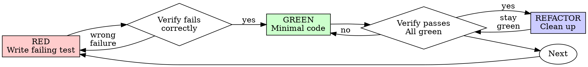

# Codex session 019faa68-3ba1-7a32-afaa-0d4aa9d3093c

- Started: `2026-07-28T20:26:25.709Z`
- Working directory: `D:\100XH100`
- Originator: `Codex Desktop`
- Codex CLI: `0.146.0-alpha.3`
- Source log: `C:\Users\Иван Литвак\.codex\sessions\2026\07\28\rollout-2026-07-28T23-26-25-019faa68-3ba1-7a32-afaa-0d4aa9d3093c.jsonl`
- Entries: user=1, assistant=14, tool calls=40, tool outputs=40

This is a chronological export of the user/assistant conversation and tool activity. Internal system/developer instructions and token accounting are intentionally excluded. Secret-shaped values are redacted; oversized tool outputs retain their beginning and end with the omitted character count.

## 1. User

Time: `2026-07-28T20:26:57.624Z` · source line `6`

```text
<recommended_plugins>
Here is a list of plugins that are available but not installed.

- Atlassian Rovo (atlassian-rovo@openai-curated-remote)
- Box (box@openai-curated-remote)
- Figma (figma@openai-curated-remote)
- Gmail (gmail@openai-curated-remote)
- Google Calendar (google-calendar@openai-curated-remote)
- Google Drive (google-drive@openai-curated-remote)
- Outlook Calendar (outlook-calendar@openai-curated-remote)
- Outlook Email (outlook-email@openai-curated-remote)
- SharePoint (sharepoint@openai-curated-remote)
- Slack (slack@openai-curated-remote)
- Teams (teams@openai-curated-remote)
</recommended_plugins>
# AGENTS.md instructions for D:\100XH100

<INSTRUCTIONS>
# Project Agent Rules

## Operating Rule
- Read `AGENTS.md` before project edits.
- Update `memory/CHANGELOG.md` after meaningful code, config, or architecture changes.
- Update `memory/PROMPTS.md` with user prompts that define requirements.
- Store test outputs, logs, and verification notes under `test_results/`.
- Prefer agent-centered code: explicit contracts, deterministic tests, small files, low hidden state.

## Architecture Source
- Primary architecture contract: `ARCHITECTURE_NEED.md`.
- Current Stream 4 implementation rule: use threshold + compact + CUB/fixed-temp sort/reduce + compact; do not use Stream 4 hash-table dedup.

## Implementation Guardrails
- `State128` logical bytes are `v[0..119]`.
- `State128` padding bytes are `v[120..127]`.
- Persistent frontier padding must be zero.
- `FinalResponse` may temporarily store `target_local_idx` in `v[120..123]`.
- `Hash128` is one logical 128-bit key stored as `{lo, hi}`.
- `CandidateMeta` must remain 32 bytes and 32-byte aligned.
- Stream 3 payload id must be original candidate id, not compact index.
- Stream 4 must not apply shard top-k or semantic shard cap.

</INSTRUCTIONS>
<environment_context>
  <cwd>D:\100XH100</cwd>
  <shell>powershell</shell>
  <current_date>2026-07-28</current_date>
  <timezone>Europe/Moscow</timezone>
  <filesystem><workspace_roots><root>D:\100XH100</root></workspace_roots><permission_profile type="managed"><file_system type="restricted"><entry access="read"><special>:root</special></entry><entry access="write"><path>D:\100XH100</path></entry><entry access="write"><special>:slash_tmp</special></entry><entry access="write"><special>:tmpdir</special></entry><entry access="write"><path>C:\Users\Иван Литвак\.codex\visualizations\2026\07\23\019f90a3-47e5-7770-a20e-cd9317bcbf2c</path></entry><entry access="read"><path>D:\100XH100\.git</path></entry><entry access="read"><path>D:\100XH100\.agents</path></entry><entry access="read"><path>D:\100XH100\.codex</path></entry></file_system></permission_profile></filesystem>
</environment_context>
```

## 2. Codex

Time: `2026-07-28T20:28:37.925Z` · source line `12`

```text
Я использую навыки TDD и выполнения плана: сначала сверю утверждённый контракт и зафиксирую RED-тесты, затем реализую строго Task 4 и проведу целевую верификацию.
```

## 3. Tool call: `exec`

Time: `2026-07-28T20:28:42.636Z` · source line `14`

```text
const r = await tools.shell_command({"command":"Get-Content -Raw 'C:\\Users\\Иван Литвак\\.codex\\plugins\\cache\\openai-curated-remote\\superpowers\\6.2.0\\skills\\test-driven-development\\SKILL.md'; Get-Content -Raw 'C:\\Users\\Иван Литвак\\.codex\\plugins\\cache\\openai-curated-remote\\superpowers\\6.2.0\\skills\\executing-plans\\SKILL.md'; Get-Content -Raw 'D:\\100XH100\\AGENTS.md'; Get-Content -Raw 'D:\\100XH100\\docs\\superpowers\\plans\\2026-07-28-public-cayleypy-2xt4-notebook.md'; Get-Content -Raw 'D:\\100XH100\\.superpowers\\sdd\\2026-07-28-public-cayleypy-2xt4-notebook\\task-4-brief.md'","workdir":"D:\\100XH100\\.worktrees\\public-cayleypy-notebook","timeout_ms":10000});
text(r.content.map(x=>x.text||"").join("\n"));
```

## 4. Tool output

Time: `2026-07-28T20:28:43.205Z` · source line `15`

````text
Script failed
Wall time 0.4 seconds
Output:

Script error:
Exit code: 1
Wall time: 0.4 seconds
Output:
---
name: test-driven-development
description: Use when implementing any feature or bugfix, before writing implementation code
---

# Test-Driven Development (TDD)

## Overview

Write the test first. Watch it fail. Write minimal code to pass.

**Core principle:** If you didn't watch the test fail, you don't know if it tests the right thing.

**Violating the letter of the rules is violating the spirit of the rules.**

## When to Use

**Always:**
- New features
- Bug fixes
- Refactoring
- Behavior changes

**Exceptions (ask your human partner):**
- Throwaway prototypes
- Generated code
- Configuration files

Thinking "skip TDD just this once"? Stop. That's rationalization.

## The Iron Law

```
NO PRODUCTION CODE WITHOUT A FAILING TEST FIRST
```

Write code before the test? Delete it. Start over.

**No exceptions:**
- Don't keep it as "reference"
- Don't "adapt" it while writing tests
- Don't look at it
- Delete means delete

Implement fresh from tests. Period.

## Red-Green-Refactor



### RED - Write Failing Test

Write one minimal test showing what should happen.

<Good>
```typescript
test('retries failed operations 3 times', async () => {
  let attempts = 0;
  const operation = () => {
    attempts++;
    if (attempts < 3) throw new Error('fail');
    return 'success';
  };

  const result = await retryOperation(operation);

  expect(result).toBe('success');
  expect(attempts).toBe(3);
});
```
Clear name, tests real behavior, one thing
</Good>

<Bad>
```typescript
test('retry works', async () => {
  const mock = jest.fn()
    .mockRejectedValueOnce(new Error())
    .mockRejectedValueOnce(new Error())
    .mockResolvedValueOnce('success');
  await retryOperation(mock);
  expect(mock).toHaveBeenCalledTimes(3);
});
```
Vague name, tests mock not code
</Bad>

**Requirements:**
- One behavior
- Clear name
- Real code (no mocks unless unavoidable)

### Verify RED - Watch It Fail

**MANDATORY. Never skip.**

```bash
npm test path/to/test.test.ts
```

Confirm:
- Test fails (not errors)
- Failure message is expected
- Fails because feature missing (not typos)

**Test passes?** You're testing existing behavior. Fix test.

**Test errors?** Fix error, re-run until it fails correctly.

### GREEN - Minimal Code

Write simplest code to pass the test.

<Good>
```typescript
async function retryOperation<T>(fn: () => Promise<T>): Promise<T> {
  for (let i = 0; i < 3; i++) {
    try {
      return await fn();
    } catch (e) {
      if (i === 2) throw e;
    }
  }
  throw new Error('unreachable');
}
```
Just enough to pass
</Good>

<Bad>
```typescript
async function retryOperation<T>(
  fn: () => Promise<T>,
  options?: {
    maxRetries?: number;
    backoff?: 'linear' | 'exponential';
    onRetry?: (attempt: number) => void;
  }
): Promise<T> {
  // YAGNI
}
```
Over-engineered
</Bad>

Don't add features, refactor other code, or "improve" beyond the test.

### Verify GREEN - Watch It Pass

**MANDATORY.**

```bash
npm test path/to/test.test.ts
```

Confirm:
- Test passes
- Other tests still pass
- Output pristine (no errors, warnings)

**Test fails?** Fix code, not test.

**Other tests fail?** Fix now.

### REFACTOR - Clean Up

After green only:
- Remove duplication
- Improve names
- Extract helpers

Keep tests green. Don't add behavior.

### Repeat

Next failing test for next feature.

## Good Tests

| Quality | Good | Bad |
|---------|------|-----|
| **Minimal** | One thing. "and" in name? Split it. | `test('validates email and domain and whitespace')` |
| **Clear** | Name describes behavior | `test('test1')` |
| **Shows intent** | Demonstrates desired API | Obscures what code should do |

When writing or changing any test, read [writing-good-tests.md](writing-good-tests.md) for the rules that keep tests honest:
- Name the production change that would make the test fail — before writing it
- Assert on real behavior, never on mock behavior
- Keep test-only code in test utilities, out of production classes
- Understand a dependency's side effects before mocking it

## Common Rationalizations

| Excuse | Reality |
|--------|---------|
| "Too simple to test" | Simple code breaks. Test takes 30 seconds. |
| "I'll test after" | Tests written after pass immediately — which proves nothing. They may test the wrong thing, test the implementation instead of the behavior, or miss the edge case you forgot. You never watched it fail, so you never proved it can catch the bug. Test-first forces that failure. |
| "Tests after achieve same goals (spirit not ritual)" | Tests-after answer "what does this do?"; tests-first answer "what should this do?" Tests written after are biased by the code you already wrote — you verify the cases you remembered, not the ones you'd have discovered. Coverage without proof the tests work. |
| "Already manually tested" | Manual testing is ad-hoc: no record of what you covered, no way to re-run it when the code changes, easy to forget cases under pressure. "Worked when I tried it" в‰  comprehensive. Automated tests run the same way every time. |
| "Deleting X hours is wasteful" | Sunk cost fallacy — that time is already spent either way. The real choice: rewrite with TDD (high confidence) vs. keep it and bolt tests on after (low confidence, likely bugs). Keeping code you can't trust is the waste. |
| "Keep as reference, write tests first" | You'll adapt it. That's testing after. Delete means delete. |
| "Need to explore first" | Fine. Throw away exploration, start with TDD. |
| "Test hard = design unclear" | Listen to test. Hard to test = hard to use. |
| "TDD will slow me down" | TDD IS the pragmatic path: catches bugs before commit, prevents regressions, lets you refactor without fear. "Pragmatic" shortcuts mean debugging in production — slower, not faster. |
| "Manual test faster" | Manual doesn't prove edge cases. You'll re-test every change. |
| "Existing code has no tests" | You're improving it. Add tests for existing code. |

## Red Flags - STOP and Start Over

- Code before test
- Test after implementation
- Test passes immediately
- Can't explain why test failed
- Tests added "later"
- Rationalizing "just this once"
- "I already manually tested it"
- "Tests after achieve the same purpose"
- "It's about spirit not ritual"
- "Keep as reference" or "adapt existing code"
- "Already spent X hours, deleting is wasteful"
- "TDD is dogmatic, I'm being pragmatic"
- "This is different because..."

**All of these mean: Delete code. Start over with TDD.**

## Example: Bug Fix

**Bug:** Empty email accepted

**RED**
```typescript
test('rejects empty email', async () => {
  const result = await submitForm({ email: '' });
  expect(result.error).toBe('Email required');
});
```

**Verify RED**
```bash
$ npm test
FAIL: expected 'Email required', got undefined
```

**GREEN**
```typescript
function submitForm(data: FormData) {
  if (!data.email?.trim()) {
    return { error: 'Email required' };
  }
  // ...
}
```

**Verify GREEN**
```bash
$ npm test
PASS
```

**REFACTOR**
Extract validation for multiple fields if needed.

## Verification Checklist

Before marking work complete:

- [ ] Every new function/method has a test
- [ ] Watched each test fail before implementing
- [ ] Each test failed for expected reason (feature missing, not typo)
- [ ] Wrote minimal code to pass each test
- [ ] All tests pass
- [ ] Output pristine (no errors, warnings)
- [ ] Tests use real code (mocks only if unavoidable)
- [ ] Edge cases and errors covered

Can't check all boxes? You skipped TDD. Start over.

## When Stuck

| Problem | Solution |
|---------|----------|
| Don't know how to test | Write wished-for API. Write assertion first. Ask your human partner. |
| Test too complicated | Design too complicated. Simplify interface. |
| Must mock everything | Code too coupled. Use dependency injection. |
| Test setup huge | Extract helpers. Still complex? Simplify design. |

## Debugging Integration

Bug found? Write failing test reproducing it. Follow TDD cycle. Test proves fix and prevents regression.

Never fix bugs without a test.

## Final Rule

```
Production code в†’ test exists and failed first
Otherwise в†’ not TDD
```

No exceptions without your human partner's permission.

---
name: executing-plans
description: Use when you have a written implementation plan to execute in a separate session with review checkpoints
---

# Executing Plans

## Overview

Load plan, review critically, execute all tasks, report when complete.

**Announce at start:** "I'm using the executing-plans skill to implement this plan."

**Note:** Tell your human partner that Superpowers works much better with access to subagents (Claude Code, Codex CLI, Codex App, Copilot CLI, and Gemini CLI all qualify; see the per-platform tool refs in `../using-superpowers/references/`). If subagents are available, use superpowers:subagent-driven-development instead of this skill.

## The Process

### Step 1: Load and Review Plan
1. Ensure an isolated workspace: use superpowers:using-git-worktrees to create one or verify the existing one
2. Read plan file
3. Review critically - identify any questions or concerns about the plan
4. If concerns: Raise them with your human partner before starting
5. If no concerns: Create todos for the plan items and proceed

### Step 2: Execute Tasks

For each task:
1. Mark as in_progress
2. Follow each step exactly (plan has bite-sized steps)
3. Run verifications as specified
4. Mark as completed

### Step 3: Complete Development

After all tasks complete and verified:
- Announce: "I'm using the finishing-a-development-branch skill to complete this work."
- **REQUIRED SUB-SKILL:** Use superpowers:finishing-a-development-branch
- Follow that skill to verify tests, present options, execute choice

## When to Stop and Ask for Help

**STOP executing immediately when:**
- Hit a blocker (missing dependency, test fails, instruction unclear)
- Plan has critical gaps preventing starting
- You don't understand an instruction
- Verification fails repeatedly

**Ask for clarification rather than guessing.**

## When to Revisit Earlier Steps

**Return to Review (Step 1) when:**
- Partner updates the plan based on your feedback
- Fundamental approach needs rethinking

**Don't force through blockers** - stop and ask.

## Remember
- Review plan critically first
- Follow plan steps exactly
- Don't skip verifications
- Reference skills when plan says to
- Stop when blocked, don't guess
- Never start implementation on main/master branch without explicit user consent

# Project Agent Rules

## Operating Rule
- Read `AGENTS.md` before project edits.
- Update `memory/CHANGELOG.md` after meaningful code, config, or architecture changes.
- Update `memory/PROMPTS.md` with user prompts that define requirements.
- Store test outputs, logs, and verification notes under `test_results/`.
- Prefer agent-centered code: explicit contracts, deterministic tests, small files, low hidden state.

## Architecture Source
- Primary architecture contract: `ARCHITECTURE_NEED.md`.
- Current Stream 4 implementation rule: use threshold + compact + CUB/fixed-temp sort/reduce + compact; do not use Stream 4 hash-table dedup.

## Implementation Guardrails
- `State128` logical bytes are `v[0..119]`.
- `State128` padding bytes are `v[120..127]`.
- Persistent frontier padding must be zero.
- `FinalResponse` may temporarily store `target_local_idx` in `v[120..123]`.
- `Hash128` is one logical 128-bit key stored as `{lo, hi}`.
- `CandidateMeta` must remain 32 bytes and 32-byte aligned.
- Stream 3 payload id must be original candidate id, not compact index.
- Stream 4 must not apply shard top-k or semantic shard cap.

Get-Content : Cannot find path 'D:\100XH100\docs\superpowers\plans\2026-07-28-public-cayleypy-2xt4-notebook.md' because
 it does not exist.
At line:2 char:319
+ ... AGENTS.md'; Get-Content -Raw 'D:\100XH100\docs\superpowers\plans\2026 ...
+                 ~~~~~~~~~~~~~~~~~~~~~~~~~~~~~~~~~~~~~~~~~~~~~~~~~~~~~~~~~
    + CategoryInfo          : ObjectNotFound: (D:\100XH100\doc...xt4-notebook.md:String) [Get-Content], ItemNotFoundEx 
   ception
    + FullyQualifiedErrorId : PathNotFound,Microsoft.PowerShell.Commands.GetContentCommand
 
Get-Content : Cannot find path 'D:\100XH100\.superpowers\sdd\2026-07-28-public-cayleypy-2xt4-notebook\task-4-brief.md' 
because it does not exist.
At line:2 char:418
+ ... tebook.md'; Get-Content -Raw 'D:\100XH100\.superpowers\sdd\2026-07-28 ...
+                 ~~~~~~~~~~~~~~~~~~~~~~~~~~~~~~~~~~~~~~~~~~~~~~~~~~~~~~~~~
    + CategoryInfo          : ObjectNotFound: (D:\100XH100\.su...task-4-brief.md:String) [Get-Content], ItemNotFoundEx 
   ception
    + FullyQualifiedErrorId : PathNotFound,Microsoft.PowerShell.Commands.GetContentCommand
 

````

## 5. Tool call: `exec`

Time: `2026-07-28T20:28:49.156Z` · source line `18`

```text
const r = await tools.shell_command({"command":"Get-Content -Raw 'C:\\Users\\Иван Литвак\\.codex\\plugins\\cache\\openai-curated-remote\\superpowers\\6.2.0\\skills\\test-driven-development\\writing-good-tests.md'; rg --files -g '2026-07-28-public-cayleypy-2xt4-notebook.md' -g 'task-4-brief.md' -g 'AGENTS.md' 'D:\\100XH100'","workdir":"D:\\100XH100\\.worktrees\\public-cayleypy-notebook","timeout_ms":10000});
text(r.content.map(x=>x.text||"").join("\n"));
```

## 6. Tool output

Time: `2026-07-28T20:28:49.741Z` · source line `19`

```text
Script failed
Wall time 0.5 seconds
Output:

Script error:
TypeError: Cannot read properties of undefined (reading 'map')
    at exec_main.mjs:2:16
```

## 7. Tool call: `exec`

Time: `2026-07-28T20:29:00.161Z` · source line `22`

```text
const r = await tools.shell_command({"command":"Get-Content -Raw 'C:\\Users\\Иван Литвак\\.codex\\plugins\\cache\\openai-curated-remote\\superpowers\\6.2.0\\skills\\test-driven-development\\writing-good-tests.md'; Get-ChildItem -Path 'D:\\100XH100' -Recurse -Force -File -Filter 'task-4-brief.md' | Select-Object -ExpandProperty FullName; Get-ChildItem -Path 'D:\\100XH100' -Recurse -Force -File -Filter '2026-07-28-public-cayleypy-2xt4-notebook.md' | Select-Object -ExpandProperty FullName","workdir":"D:\\100XH100\\.worktrees\\public-cayleypy-notebook","timeout_ms":10000});
text(typeof r === "string" ? r : JSON.stringify(r));
```

## 8. Tool output

Time: `2026-07-28T20:29:01.326Z` · source line `23`

````text
Script completed
Wall time 1.1 seconds
Output:

Exit code: 0
Wall time: 1 seconds
Output:
# Writing Good Tests

**Load this reference when:** writing or changing tests, adding mocks, or
adding cleanup/helper methods for tests.

## Overview

A test exists to catch a specific break. Two principles govern everything
here:

```
1. Every test names the break it catches
2. Every test exercises the real thing
```

Strict TDD produces both naturally: a test written first and watched
failing against real code has already proven it can fail, and only earns
a mock when the real dependency proves slow or external.

## Principle 1: Name the Break

Before writing the test body, answer: **what production change should
make this test fail — and is that change a bug or a decision?** A test
earns its place by catching a wrong branch, missing side effect, wrong
argument, boundary case, or broken contract.

**Derive expectations independently.** Use literals and hand-checked
fixtures; table-driven tests with literal `want` values are the preferred
shape. An expectation computed by the code under test — or its helpers —
passes no matter what that code does:

```typescript
// ❌ Mirror assertion: the same builder computes both sides — always true
const expected = buildSearchQuery({ tag: 'urgent' });
expect(buildSearchQuery({ tag: 'urgent' })).toBe(expected);

// вњ… Hand-derived literal
expect(buildSearchQuery({ tag: 'urgent' })).toBe('tag:"urgent"');
```

**No change detectors.** If only intentional decisions can fail a test —
a constant's value, exact message wording, private structure — it fires
on redesign and sleeps through bugs. Test the behavior that depends on
the decision: not `expect(MAX_RETRIES).toBe(5)` but "a failing call is
retried 5 times and the 6th attempt never happens."

**Behavior, not text.** Asserting that a script, skill, or config
contains an exact line proves only that the source is the source. Run
scripts against controlled inputs and assert outputs, side effects, or
exit codes. Documents that instruct agents are tested by the consuming
agent's behavior (superpowers:writing-skills); prose for humans earns no
test at all.

**Your code, not the framework.** Test the contract your code makes at
its boundaries — the route you register, the query you emit, the payload
you produce. Upstream mechanics are their maintainers' tests to write
(the classic: asserting your router invokes a registered handler — that
is the framework's test, not yours). When upstream behavior genuinely
surprised you, write one narrow characterization test naming the
assumption. The same boundary applies inside your code: constructors,
getters, constants, and trivial forwarding earn tests only when they
validate, normalize, default, derive, enforce, or cause side effects —
otherwise assert the first consumer-visible result that depends on them.

### Gate Function

```
BEFORE writing the test body:
  Name the production change that would make this test fail.

  Cannot name one            в†’ redesign around an observable behavior
  "The source text changed"  в†’ run the artifact and assert its effects
  Only intentional decisions в†’ change detector; test the behavior
                               that depends on the decision

  Confirm the expected value is derived without the code under test.
  IF it reuses the code's logic or helpers:
    Replace it with a literal or hand-checked fixture
```

## Principle 2: Exercise the Real Thing

**The mock earns no assertions.** A mock assertion passes when the mock
is present and fails when it is absent — it says nothing about the
component. Assert the real component's behavior; if the mock is what you
are checking, unmock it or delete the assertion.

```typescript
// вњ… Real behavior
expect(screen.getByRole('navigation')).toBeInTheDocument();

// вќЊ Mock existence
expect(screen.getByTestId('sidebar-mock')).toBeInTheDocument();
```

**your human partner's correction:** "Are we testing the behavior of a
mock?"

**Mock at the right level.** Learn every side effect of the real method
before replacing it; mock the slow or external operation and keep what
the test depends on real. When unsure, run the test against the real
implementation first and observe what actually needs to happen.

```typescript
// вќЊ The mock swallows the config write that duplicate detection reads
vi.mock('ToolCatalog', () => ({
  discoverAndCacheTools: vi.fn().mockResolvedValue(undefined)
}));

// вњ… Mock only the slow server startup; the config write stays real
vi.mock('MCPServerManager');
```

**Make doubles specific.** When arguments, call counts, or ordering are
part of the contract, assert them — a fake that accepts anything verifies
nothing. Give each branch (success, error, malformed) its own fixture or
spy, so the wrong branch cannot satisfy the expectation.

**Mirror real data completely.** Mock the complete structure as it exists
in reality — all documented fields — not just the ones your test reads.
Partial mocks fail silently when downstream code reads an omitted field:
the test passes while integration breaks.

**Production classes carry production methods only.** Cleanup that only
tests need lives in test utilities, never as a `destroy()` on the
production class. Ask: is this method called only from tests? Does this
class own this resource's lifecycle? Wrong answers в†’ test utility.

**Prefer real components over complex mocks.** When mock setup outgrows
the test logic, mocks miss methods the real components have, or tests
break when the mock changes, switch to an integration test with real
components. **your human partner's question:** "Do we need to be using a
mock here?"

### Gate Function

```
BEFORE adding a mock or test helper:
  List the real method's side effects; keep the ones the test
  depends on real — mock the slow/external level below them.

  Mock responses mirror the complete real structure.

  A method only tests call lives in test utilities, not production.

  About to assert on the mock itself?
    Unmock it or delete the assertion.
```

## Tests Ship With the Implementation

The TDD cycle — failing test, minimal implementation, refactor — is what
"complete" means. Ship the tests the behavior needs and only those:
trivial code and human prose earn none, and a test written to satisfy
process costs maintenance forever.

## The Mutation Check

Before finishing, mentally mutate the production code; at least one test
should fail for each realistic mutation:

- Wrong constant or argument
- Wrong branch handler
- Missing state change or side effect
- Empty or default return
- Missing validation for zero, empty, nil, unauthorized, or malformed input

A mutation nothing catches marks the behavior as unprotected — or the
test as tautological.

## Quick Reference

| When you... | Do |
|-------------|-----|
| Write any test | Name the break it catches — a bug, not a decision |
| Build an expected value | Derive it by hand; never with the code under test |
| Test a script or document | Run it / pressure-test its consumer; never grep its text |
| Reach for a dependency test | Test your boundary contract, not their documented mechanics |
| Want to assert on a mocked element | Test the real component, or unmock it |
| Are about to mock a method | Learn its side effects; mock the slow/external level |
| Build a mock response | Mirror the real structure completely |
| Need cleanup only tests use | Put it in test utilities |
| Watch mock setup balloon | Switch to an integration test with real components |
| Finish a test file | Run the mutation check |

## Warning Signs

- Setup and assertion share the same object, guaranteeing equality
- The test can fail only through a panic, crash, or missing selector
- The test fails on every intentional change, never on accidental breakage
- Expected values are hidden behind loops, builders, or helpers
- The test greps source text, or asserts a removed symbol stays removed
- The test would still matter if only the framework remained
- The test exists for coverage, checking no side effect or outcome
- An assertion checks a `*-mock` test ID, or fails if you remove the mock
- A method is called only from test files
- Mock setup is more than half the test, or you can't explain why the mock is needed
- Mocking "just to be safe"

D:\100XH100\.worktrees\public-cayleypy-notebook\.superpowers\sdd\2026-07-28-public-cayleypy-2xt4-notebook\task-4-brief.md
D:\100XH100\.worktrees\cayleypy-results-ingest\docs\superpowers\plans\2026-07-28-public-cayleypy-2xt4-notebook.md
D:\100XH100\.worktrees\kaggle-t4-mlp-autoprofiles\docs\superpowers\plans\2026-07-28-public-cayleypy-2xt4-notebook.md
D:\100XH100\.worktrees\public-cayleypy-notebook\docs\superpowers\plans\2026-07-28-public-cayleypy-2xt4-notebook.md

````

## 9. Tool call: `exec`

Time: `2026-07-28T20:29:06.400Z` · source line `26`

```text
const r = await tools.shell_command({"command":"Get-Content -Raw 'docs\\superpowers\\plans\\2026-07-28-public-cayleypy-2xt4-notebook.md'; Get-Content -Raw '.superpowers\\sdd\\2026-07-28-public-cayleypy-2xt4-notebook\\task-4-brief.md'","workdir":"D:\\100XH100\\.worktrees\\public-cayleypy-notebook","timeout_ms":10000});
text(typeof r === "string" ? r : JSON.stringify(r));
```

## 10. Tool output

Time: `2026-07-28T20:29:06.822Z` · source line `27`

````text
Script completed
Wall time 0.3 seconds
Output:

Exit code: 0
Wall time: 0.3 seconds
Output:
# Public CayleyPy 2xT4 Notebook Implementation Plan

> **For agentic workers:** REQUIRED SUB-SKILL: Use superpowers:subagent-driven-development (recommended) or superpowers:executing-plans to implement this plan task-by-task. Steps use checkbox (`- [ ]`) syntax for tracking.

**Goal:** Build and publicly release a thin copy-and-run Kaggle notebook that runs the existing MultiGPUBeamSearch on standard CayleyPy inputs with one supported MLP checkpoint, two T4 GPUs, reflection, bounded solution collection, configurable touch BFS, and best-effort result publication.

**Architecture:** Keep the notebook declarative and move stable behavior into a focused `tools/cayleypy_public/` Python package. The package validates CayleyPy data and model contracts, selects the measured 2xT4 profile without replacing the user's beam, orchestrates the existing `production_runner`, validates every path on CPU, and emits bounded publication envelopes. The notebook builder embeds only documentation, the user config, and calls into the pinned repository revision.

**Tech Stack:** Python 3.12, PyTorch checkpoint inspection, pandas, pytest, IPython notebook parsing, CMake/Ninja/CUDA/CUTLASS/NCCL, torchrun, Kaggle CLI.

## Global Constraints

- Support only the standard CayleyPy `puzzle_info.json`, `test.csv`, and `sample_submission.csv` structure.
- Require exactly two NVIDIA T4 GPUs at runtime.
- Expose only checkpoint input; auto-detect only `batchnorm-folded` and `resmlp-layernorm` MLP schemas.
- Infer `fp16` automatically on T4; do not expose a dtype setting.
- Accept only `output_dim=1` or `output_dim=move_count`.
- Treat `PUZZLE_ID_START..PUZZLE_ID_END` as inclusive and fail on every missing id.
- Preserve requested beam; apply only documented distributed alignment and select the nearest measured `2**16..2**25` profile.
- Expose `REFLECT_MODE=off|after_original|only`, `SOLUTION_MODE=first|collect`, `COLLECT_UNTIL_DEPTH`, `MAX_COLLECTED_SOLUTIONS`, and `TOUCH_BFS_RADIUS`.
- Keep experimental K2 disabled.
- Do not change Stream2/3/4/5 algorithms merely to package the public notebook.
- Result publication is best-effort and must never invalidate a successful solve.
- Do not publish secrets, checkpoint tensors, private filesystem roots, or process environments.

---

## File Structure

- `tools/cayleypy_public/__init__.py`: stable package exports only.
- `tools/cayleypy_public/config.py`: typed user configuration and fail-closed validation.
- `tools/cayleypy_public/data.py`: standard CayleyPy file loading and inclusive-range validation.
- `tools/cayleypy_public/model.py`: checkpoint family detection, export invocation, and manifest validation.
- `tools/cayleypy_public/profile.py`: registry selection plus move-count-aware capacity derivation.
- `tools/cayleypy_public/paths.py`: move replay, inversion, reflection, and solution deduplication.
- `tools/cayleypy_public/runner.py`: torchrun command/environment construction and first/collect orchestration.
- `tools/cayleypy_public/results.py`: artifacts, result envelopes, redaction, and best-effort HTTP client.
- `tools/run_cayleypy_public.py`: one CLI entrypoint used by the notebook.
- `tools/build_public_cayleypy_notebook.py`: deterministic public notebook and metadata generator.
- `configs/cayleypy_results_schema_v1.json`: notebook-side result-envelope JSON Schema.
- `kaggle_public_cayleypy_2xt4/`: generated notebook package.
- `tests/cayleypy_public/`: focused unit/integration tests.

### Task 1: Typed Configuration and Standard CayleyPy Data Contract

**Files:**
- Create: `tools/cayleypy_public/__init__.py`
- Create: `tools/cayleypy_public/config.py`
- Create: `tools/cayleypy_public/data.py`
- Create: `tests/cayleypy_public/test_config.py`
- Create: `tests/cayleypy_public/test_data.py`

**Interfaces:**
- Produces: `PublicRunConfig.from_mapping(values: Mapping[str, object]) -> PublicRunConfig`
- Produces: `load_puzzle_contract(puzzle_info_path: Path, test_csv: Path, sample_submission_csv: Path, start: int, end: int) -> PuzzleContract`
- `PuzzleContract` exposes `central_state`, `generators`, `move_names`, `move_count`, `state_len`, `num_classes`, `initial_states`, and `sample_submission`.

- [ ] **Step 1: Write failing config tests**

```python
from tools.cayleypy_public.config import PublicRunConfig

BASE = {
    "author_name": "alice", "checkpoint_path": "/kaggle/input/m/model.pth",
    "puzzle_info_json": "/kaggle/input/c/puzzle_info.json",
    "test_csv": "/kaggle/input/c/test.csv",
    "sample_submission_csv": "/kaggle/input/c/sample_submission.csv",
    "puzzle_id_start": 7, "puzzle_id_end": 9, "beam_width": 2**21,
    "max_depth": 100, "reflect_mode": "off", "reflect_source_csv": None,
    "solution_mode": "first", "collect_until_depth": 100,
    "max_collected_solutions": 1000, "touch_bfs_radius": 4,
    "publish_results": True, "results_ingest_url": "https://results.example/",
}

def test_config_accepts_exact_public_contract():
    cfg = PublicRunConfig.from_mapping(BASE)
    assert cfg.puzzle_ids == (7, 8, 9)
    assert cfg.model_dtype == "fp16"

def test_collect_depth_cannot_exceed_max_depth():
    values = {**BASE, "solution_mode": "collect", "collect_until_depth": 101}
    with pytest.raises(ValueError, match="COLLECT_UNTIL_DEPTH"):
        PublicRunConfig.from_mapping(values)

def test_only_requires_reflection_source():
    with pytest.raises(ValueError, match="REFLECT_SOURCE_CSV"):
        PublicRunConfig.from_mapping({**BASE, "reflect_mode": "only"})
```

- [ ] **Step 2: Run config tests and verify RED**

Run: `python -m pytest tests/cayleypy_public/test_config.py -q`
Expected: FAIL with `ModuleNotFoundError: tools.cayleypy_public`.

- [ ] **Step 3: Implement the frozen dataclass and enum/range gates**

```python
@dataclass(frozen=True)
class PublicRunConfig:
    author_name: str
    checkpoint_path: Path
    puzzle_info_json: Path
    test_csv: Path
    sample_submission_csv: Path
    puzzle_id_start: int
    puzzle_id_end: int
    beam_width: int
    max_depth: int
    reflect_mode: Literal["off", "after_original", "only"]
    reflect_source_csv: Path | None
    solution_mode: Literal["first", "collect"]
    collect_until_depth: int
    max_collected_solutions: int
    touch_bfs_radius: int
    publish_results: bool
    results_ingest_url: str
    model_dtype: Literal["fp16"] = "fp16"

    @property
    def puzzle_ids(self) -> tuple[int, ...]:
        return tuple(range(self.puzzle_id_start, self.puzzle_id_end + 1))
```

Validate positive beam/depth/capacity, `0 <= touch_bfs_radius <= 12`, inclusive non-empty range, exact enum allowlists, `collect_until_depth <= max_depth`, and the reflection-source rule.

- [ ] **Step 4: Write failing CayleyPy schema/range tests**

Build temporary fixtures with `central_state`, two named permutations, test ids `7,8,9`, and submission rows. Assert derived move/state/class dimensions. Assert missing id 8 and duplicate id 8 each fail with explicit messages.

- [ ] **Step 5: Implement `PuzzleContract` and strict loaders**

```python
@dataclass(frozen=True)
class PuzzleContract:
    central_state: tuple[int, ...]
    generators: dict[str, tuple[int, ...]]
    initial_states: dict[int, tuple[int, ...]]
    sample_submission: pd.DataFrame
    state_len: int
    num_classes: int

    @property
    def move_names(self) -> tuple[str, ...]:
        return tuple(self.generators)

    @property
    def move_count(self) -> int:
        return len(self.generators)
```

Require every permutation and state to have `state_len`, every permutation to equal `range(state_len)` as a set, every selected state id exactly once, and submission ids to include the selected range.

- [ ] **Step 6: Run tests and commit**

Run: `python -m pytest tests/cayleypy_public/test_config.py tests/cayleypy_public/test_data.py -q`
Expected: PASS.

```bash
git add tools/cayleypy_public tests/cayleypy_public/test_config.py tests/cayleypy_public/test_data.py
git commit -m "feat: add public CayleyPy input contract"
```

### Task 2: Automatic Supported-MLP Detection and Export

**Files:**
- Modify: `tools/export_stream1_mlp.py`
- Create: `tools/cayleypy_public/model.py`
- Create: `tests/cayleypy_public/test_model.py`

**Interfaces:**
- Produces: `detect_checkpoint_format(path: Path) -> Literal["batchnorm-folded", "resmlp-layernorm"]`
- Produces: `export_checkpoint(path: Path, out_dir: Path, num_classes: int) -> ExportedModel`
- `ExportedModel` exposes `format`, `dtype`, `checkpoint_sha256`, and sanitized `manifest`.

- [ ] **Step 1: Write failing detection tests with minimal tensor fixtures**

```python
def test_detects_batchnorm_folded(tmp_path):
    path = write_checkpoint(tmp_path, {
        "input_layer.weight": torch.zeros(8, 12),
        "hidden_layer.weight": torch.zeros(8, 8),
        "output_layer.weight": torch.zeros(1, 8),
        "bn1.running_mean": torch.zeros(8),
        "residual_blocks.0.fc1.weight": torch.zeros(8, 8),
    })
    assert detect_checkpoint_format(path) == "batchnorm-folded"

def test_rejects_mixed_schema(tmp_path):
    path = write_checkpoint(tmp_path, {
        "input_layer.weight": torch.zeros(8, 12),
        "embedding.weight": torch.zeros(12, 16),
        "head.weight": torch.zeros(1, 8),
    })
    with pytest.raises(ValueError, match="ambiguous"):
        detect_checkpoint_format(path)
```

Add ResMLP and unknown-schema cases.

- [ ] **Step 2: Run and verify RED**

Run: `python -m pytest tests/cayleypy_public/test_model.py -q`
Expected: FAIL because `model.py` does not exist.

- [ ] **Step 3: Implement signature-set detection without trial export**

```python
BN_REQUIRED = frozenset({
    "input_layer.weight", "hidden_layer.weight", "output_layer.weight",
    "bn1.running_mean", "bn2.running_mean",
})
LN_REQUIRED = frozenset({
    "embedding.weight", "input_stack.0.weight", "input_stack.1.weight",
    "input_stack.3.weight", "head.weight",
})
```

Normalize `_orig_mod.` prefixes through the existing helpers. A schema matches only when all required keys and at least one contiguous residual block key are present. Zero or two matches fail closed.

- [ ] **Step 4: Add `--format auto` to the existing exporter**

Extend argparse choices to `auto`, call `detect_checkpoint_format`, then dispatch to the unchanged existing exporters. Ensure `source_weights` in the public sanitized manifest is only the checkpoint basename, not the absolute path.

- [ ] **Step 5: Implement export wrapper and manifest gates**

Call the exporter in-process, force `dtype="fp16"`, hash the checkpoint in 8 MiB chunks, load `manifest.json`, require puzzle `state_len/num_classes`, normalization allowlist, and `output_dim in {1, move_count}`.

- [ ] **Step 6: Run tests and commit**

Run: `python -m pytest tests/cayleypy_public/test_model.py tests/test_kaggle_t4_mlp_contract.py -q`
Expected: PASS.

```bash
git add tools/export_stream1_mlp.py tools/cayleypy_public/model.py tests/cayleypy_public/test_model.py
git commit -m "feat: auto-detect supported Stream1 MLP checkpoints"
```

### Task 3: Profile Selection and Move-Count-Aware Preflight

**Files:**
- Modify: `tools/kaggle_t4_mlp_profiles.py`
- Create: `tools/cayleypy_public/profile.py`
- Create: `tests/cayleypy_public/test_profile.py`

**Interfaces:**
- Consumes: `select_profile(...)` and checked-in `configs/kaggle_t4_mlp_profiles.json`.
- Produces: `derive_runtime(profile, beam_width, output_dim, move_count, world_size=2) -> RuntimePlan`.

- [ ] **Step 1: Write failing dynamic-capacity tests**

Assert output 1 uses `parent_batch=b_micro//move_count`; output `move_count` uses `parent_batch=b_micro`; Stream3 batch is `parent_batch*move_count*ring_slots`; shard capacity is aligned to 1024 and at least Stream3 batch, Stream4 batch, and trigger. Include move counts 18 and 24.

- [ ] **Step 2: Run and verify RED**

Run: `python -m pytest tests/cayleypy_public/test_profile.py -q`
Expected: FAIL with missing `derive_runtime`.

- [ ] **Step 3: Implement immutable runtime plan**

```python
@dataclass(frozen=True)
class RuntimePlan:
    requested_beam: int
    effective_beam: int
    alignment_delta: int
    profile_power: int
    model_class: str
    local_beam: int
    parent_batch: int
    stream3_batch_candidates: int
    shard_capacity_candidates: int
    runtime: dict[str, int]
    cross_puzzle_profile_note: str
```

Use measured registry values, exact requested beam, and `cross_puzzle_profile_note="measured_24_move_seed"` whenever `move_count != 24`.

- [ ] **Step 4: Add preflight serialization and guard tests**

Assert JSON contains profile evidence version, hardware, requested/effective beam, alignment, actual move count, capacity derivation, history budgets, and `/tmp` free disk. Unknown validation status fails.

- [ ] **Step 5: Run all profile tests and commit**

Run: `python -m pytest tests/cayleypy_public/test_profile.py tests/test_kaggle_t4_mlp_profiles.py -q`
Expected: PASS.

```bash
git add tools/kaggle_t4_mlp_profiles.py tools/cayleypy_public/profile.py tests/cayleypy_public/test_profile.py
git commit -m "feat: derive safe public 2xT4 runtime plans"
```

### Task 4: Path Replay, Reflection, and Deduplication

**Files:**
- Create: `tools/cayleypy_public/paths.py`
- Create: `tests/cayleypy_public/test_paths.py`

**Interfaces:**
- Produces: `apply_path(state, path, generators) -> tuple[int, ...]`
- Produces: `invert_path(path: str, generators: Mapping[str, Sequence[int]]) -> str`
- Produces: `make_reflected_state(central, original_solution, generators) -> tuple[int, ...]`
- Produces: `validate_original_solution(initial, central, path, generators) -> bool`
- Produces: `SolutionRecord` and `deduplicate_solutions(records) -> list[SolutionRecord]`.

- [ ] **Step 1: Write failing algebraic tests**

Use a three-element cycle with explicit inverse names. Assert apply/invert roundtrip, reflection roundtrip, invalid move rejection, and reflected candidate inversion solves the original.

- [ ] **Step 2: Run and verify RED**

Run: `python -m pytest tests/cayleypy_public/test_paths.py -q`
Expected: FAIL with missing module.

- [ ] **Step 3: Implement move inversion from permutations**

Do not assume `-MOVE` naming. Compute inverse permutations and require every inverse permutation to map uniquely to an existing named generator; otherwise reflection modes fail preflight with the missing move name.

- [ ] **Step 4: Implement canonical solution records and dedupe**

```python
@dataclass(frozen=True)
class SolutionRecord:
    puzzle_id: int
    variant: Literal["original", "reflected"]
    path: str
    original_oriented_path: str
    found_depth: int
    touch_depth: int
    source_solution_sha256: str | None
    valid: bool
```

Deduplicate by `(puzzle_id, sha256(original_oriented_path), sha256(reached_state))`; choose the earliest provenance deterministically.

- [ ] **Step 5: Run tests and commit**

Run: `python -m pytest tests/cayleypy_public/test_paths.py -q`
Expected: PASS.

```bash
git add tools/cayleypy_public/paths.py tests/cayleypy_public/test_paths.py
git commit -m "feat: add CayleyPy reflection and path validation"
```

### Task 5: Existing Runner Orchestration for First and Collect Modes

**Files:**
- Create: `tools/cayleypy_public/runner.py`
- Create: `tools/run_cayleypy_public.py`
- Create: `tests/cayleypy_public/test_runner.py`
- Create: `tests/cayleypy_public/fixtures/fake_production_runner.py`

**Interfaces:**
- Consumes: `PublicRunConfig`, `PuzzleContract`, `ExportedModel`, `RuntimePlan`.
- Produces: `run_public_search(...) -> RunArtifacts`.
- `RunArtifacts` exposes solution records, combined/per-rank log paths, return codes, timing summaries, and collection status.

- [ ] **Step 1: Write failing command/environment tests**

Assert `torch.distributed.run --nproc-per-node=2`, original `BEAM_WIDTH` CLI argument, rank log redirection, exact runtime env, `BEAM_SOLVED_NEIGHBORHOOD_RADIUS`, K2 radius 0, and capacity values. In collect mode assert `BEAM_SOLVE_BUCKET_MODE=1`, `BEAM_SOLVE_BUCKET_STOP_DEPTH=COLLECT_UNTIL_DEPTH`, and `BEAM_SOLVE_BUCKET_MAX_SOLUTIONS=MAX_COLLECTED_SOLUTIONS`. Assert no inherited `WORLD_SIZE/RANK/LOCAL_RANK`.

- [ ] **Step 2: Write failing first/collect parser tests**

The fake runner emits first-solution lines or a solve-bucket TSV. Assert `first` stops on one valid result. Assert `collect` sets:

```python
{
  "BEAM_SOLVE_BUCKET_MODE": "1",
  "BEAM_SOLVE_BUCKET_STOP_DEPTH": str(collect_until_depth),
  "BEAM_SOLVE_BUCKET_MAX_SOLUTIONS": str(max_collected_solutions),
  "BEAM_SOLVED_RESULT_CAPACITY": str(max_collected_solutions),
  "BEAM_SOLVE_BUCKET_RESULT_TSV": str(result_tsv),
}
```

The helper must preserve a partial TSV and report `capacity_reached` rather than treating the configured solution limit as a solver failure.

- [ ] **Step 3: Run and verify RED**

Run: `python -m pytest tests/cayleypy_public/test_runner.py -q`
Expected: FAIL with missing runner module.

- [ ] **Step 4: Implement command/env construction and log capture**

Use a unique rendezvous id/port per puzzle, `/tmp/beam_history_public/<run_id>/<puzzle>/<variant>`, `--redirects=3`, and `--tee=0:3`. Stream rank 0 while retaining both rank logs.

- [ ] **Step 5: Implement mode orchestration**

For `off`, run originals. For `after_original`, use every validated original source selected by mode, synthesize a temporary standard test row, run reflected search, invert, and revalidate. For `only`, validate every supplied source path before any GPU launch. In all modes, update submission with the shortest valid original-oriented path.

- [ ] **Step 6: Implement bounded collection semantics**

Add host-only controls `BEAM_SOLVE_BUCKET_STOP_DEPTH` and `BEAM_SOLVE_BUCKET_MAX_SOLUTIONS` to `production_runner.cu`; do not change Stream algorithms. Stop after the requested completed depth, or after deterministically writing the configured number of unique records. Emit `collection_status=depth_reached|capacity_reached`. Keep `BEAM_SOLVED_RESULT_CAPACITY` large enough for one depth and treat a true device snapshot overflow as a configuration error distinct from the successful total-solution limit. Add focused C++/CLI tests for both stop conditions.

- [ ] **Step 7: Run tests and commit**

Run: `python -m pytest tests/cayleypy_public/test_runner.py tests/cayleypy_public/test_paths.py -q`
Expected: PASS.

```bash
git add tools/cayleypy_public/runner.py tools/run_cayleypy_public.py tests/cayleypy_public/test_runner.py tests/cayleypy_public/fixtures/fake_production_runner.py
git commit -m "feat: orchestrate public CayleyPy search modes"
```

### Task 6: Result Envelope and Best-Effort Publisher

**Files:**
- Create: `configs/cayleypy_results_schema_v1.json`
- Create: `tools/cayleypy_public/results.py`
- Create: `tests/cayleypy_public/test_results.py`

**Interfaces:**
- Produces: `build_result_envelope(context, solution) -> dict[str, object]`
- Produces: `publish_results(url: str, envelopes: Sequence[dict], timeout_s: float = 15.0) -> PublishStatus`.

- [ ] **Step 1: Write failing schema/redaction/idempotency tests**

Assert required author, Kaggle provenance, proof bundle, solution, profile, model hash/manifest, hardware, timings, solver commit, and schema version. Assert the same semantic result yields the same idempotency key. Assert absolute checkpoint paths, tokens, environment keys, tensors, and unknown fields never appear.

- [ ] **Step 2: Write failing HTTP behavior tests**

Mock `202`, duplicate `200`, timeout, DNS error, `429`, and `500`. Every network failure returns `PublishStatus(ok=False, retryable=..., safe_error=...)` and never raises into the solve result.

- [ ] **Step 3: Implement bounded canonical envelopes**

Use canonical JSON (`sort_keys=True`, UTF-8, compact separators), UUIDv7 submission ids, SHA-256 idempotency, maximum 256 KiB per envelope, maximum 100 envelopes per request, and exact JSON Schema validation before POST.

- [ ] **Step 4: Implement safe publisher and durable local status**

POST `{"schema_version":1,"results":[...]}`. Write `publish_status.json` before returning. Redact URL credentials and never include response headers/body beyond a 2 KiB sanitized message.

- [ ] **Step 5: Run tests and commit**

Run: `python -m pytest tests/cayleypy_public/test_results.py -q`
Expected: PASS.

```bash
git add configs/cayleypy_results_schema_v1.json tools/cayleypy_public/results.py tests/cayleypy_public/test_results.py
git commit -m "feat: publish validated CayleyPy result envelopes"
```

### Task 7: Thin Public Notebook Builder

**Files:**
- Create: `tools/build_public_cayleypy_notebook.py`
- Create: `tests/cayleypy_public/test_notebook.py`
- Create: `kaggle_public_cayleypy_2xt4/kernel-metadata.json`
- Generate: `kaggle_public_cayleypy_2xt4/cayleypy-2xt4-universal.ipynb`

**Interfaces:**
- Produces: `build_notebook(out_dir: Path) -> tuple[Path, Path]`.

- [ ] **Step 1: Write failing notebook contract tests**

Assert the first code cell contains exactly the public settings and no `MODEL_SOURCE`, `MODEL_DTYPE`, or `CHECKPOINT_FORMAT`. Assert the header names the two supported models, standard CayleyPy scope, two T4 requirement, all reflection/collection modes, touch BFS, best-effort publication, and claimed author semantics.

- [ ] **Step 2: Write parse/secret/public-metadata tests**

Assert JSON parse, IPython transform plus AST parse for every code cell, `is_private=False`, no tokens/private Windows paths, and no outputs/execution counts. Assert notebook pins `SOLVER_GIT_REV` to a full 40-character commit.

- [ ] **Step 3: Run and verify RED**

Run: `python -m pytest tests/cayleypy_public/test_notebook.py -q`
Expected: FAIL with missing builder.

- [ ] **Step 4: Implement five-cell notebook**

Cells: documentation, config, checkout/preflight, build/run, artifact/publish summary. The run cell invokes:

```python
checked([
    "python3", REPO / "tools/run_cayleypy_public.py",
    "--config-json", WORK / "public_run_config.json",
    "--output-dir", WORK,
])
```

Metadata uses a new public slug, exactly one T4x2 machine shape, Internet enabled, and no embedded competition/model source that prevents copying to another CayleyPy competition.

- [ ] **Step 5: Generate, test, and commit**

Run: `python tools/build_public_cayleypy_notebook.py`
Run: `python -m pytest tests/cayleypy_public/test_notebook.py -q`
Expected: PASS.

```bash
git add tools/build_public_cayleypy_notebook.py tests/cayleypy_public/test_notebook.py kaggle_public_cayleypy_2xt4
git commit -m "feat: add public CayleyPy 2xT4 notebook"
```

### Task 8: Local Integration and Regression Gate

**Files:**
- Create: `tests/cayleypy_public/test_end_to_end.py`
- Create: `test_results/public_cayleypy_local_gate_2026-07-28.md`
- Modify: `memory/CHANGELOG.md`

**Interfaces:**
- Consumes all notebook helper contracts.
- Produces a deterministic CPU/fake-runner acceptance artifact.

- [ ] **Step 1: Add an end-to-end fixture**

Use a small Cayley group, both supported checkpoint fixtures, fake rank logs, original/reflected results, a collection bucket, and a mock ingest server. Assert final submission, all solution artifacts, profile/preflight JSON, both rank logs, and publish receipt.

- [ ] **Step 2: Run focused and full Python gates**

Run: `python -m pytest tests/cayleypy_public -q`
Run: `python -m pytest tests/test_kaggle_t4_mlp_profiles.py tests/test_kaggle_t4_mlp_contract.py tests/test_build_kaggle_t4_mlp_autoprofile_sweep.py tests/test_build_kaggle_t4_mlp_user_notebook.py -q`
Expected: all PASS.

- [ ] **Step 3: Run static notebook/public scan**

Run a script that checks JSON, transformed AST, forbidden strings (`sk-`, `ghp_`, `github_pat_`, `GITHUB_TOKEN=`, local usernames, private absolute paths), metadata visibility, and exact first-cell settings. Save command output in the report.

- [ ] **Step 4: Record evidence and commit**

```bash
git add tests/cayleypy_public test_results/public_cayleypy_local_gate_2026-07-28.md memory/CHANGELOG.md
git commit -m "test: validate public CayleyPy notebook locally"
```

### Task 9: Kaggle Staging, End-to-End Validation, and Public Release

**Files:**
- Modify: `kaggle_public_cayleypy_2xt4/kernel-metadata.json`
- Create: `test_results/kaggle_public_cayleypy_2xt4_release/`
- Create: `test_results/kaggle_public_cayleypy_release_2026-07-28.md`
- Modify: `memory/CHANGELOG.md`

**Interfaces:**
- Requires the production `RESULTS_INGEST_URL` from the second implementation plan.
- Produces a public Kaggle kernel URL and a verified Cloudflare/GitHub result receipt.

- [ ] **Step 1: Push a private staging version**

Set `is_private=true`, use bounded `2**16`, depth 8, one puzzle, `REFLECT_MODE=off`, `SOLUTION_MODE=first`, and publication to staging ingest. Push with ordinary Kaggle CLI.

- [ ] **Step 2: Monitor and download terminal artifacts**

Run `kaggle kernels status trydotatwo/cayleypy-2xt4-universal-beam`. On terminal state download all outputs under `test_results/kaggle_public_cayleypy_2xt4_release/`. Verify two T4s, both rank logs, model auto-detection, profile/capacity, CPU path validation or clean bounded no-solution status, and ingest receipt/status lookup.

- [ ] **Step 3: Run final public-artifact secret and path scan**

Scan source notebook, executed notebook log, all JSON/CSV, and rendered HTML text for tokens, Cloudflare/GitHub secret material, private local paths, and unbounded environments. Any hit blocks publication.

- [ ] **Step 4: Switch metadata to public and push exactly the reviewed source state**

Set `is_private=false`, regenerate without outputs, confirm the notebook source hash equals the reviewed artifact, then `kaggle kernels push -p kaggle_public_cayleypy_2xt4`.

- [ ] **Step 5: Verify the public version and record release evidence**

Open the public URL, confirm copyability, rendered header, first config cell, public visibility, output artifacts, and service publication status. Record exact kernel version, timings, hashes, helper commit, ingest submission ids, and results-repository URLs.

- [ ] **Step 6: Commit release notes**

```bash
git add kaggle_public_cayleypy_2xt4/kernel-metadata.json test_results/kaggle_public_cayleypy_release_2026-07-28.md memory/CHANGELOG.md
git commit -m "docs: record public CayleyPy notebook release"
```
### Task 4: Path Replay, Reflection, and Deduplication

**Files:**
- Create: `tools/cayleypy_public/paths.py`
- Create: `tests/cayleypy_public/test_paths.py`

**Interfaces:**
- Produces: `apply_path(state, path, generators) -> tuple[int, ...]`
- Produces: `invert_path(path: str, generators: Mapping[str, Sequence[int]]) -> str`
- Produces: `make_reflected_state(central, original_solution, generators) -> tuple[int, ...]`
- Produces: `validate_original_solution(initial, central, path, generators) -> bool`
- Produces: `SolutionRecord` and `deduplicate_solutions(records) -> list[SolutionRecord]`.

- [ ] **Step 1: Write failing algebraic tests**

Use a three-element cycle with explicit inverse names. Assert apply/invert roundtrip, reflection roundtrip, invalid move rejection, and reflected candidate inversion solves the original.

- [ ] **Step 2: Run and verify RED**

Run: `python -m pytest tests/cayleypy_public/test_paths.py -q`
Expected: FAIL with missing module.

- [ ] **Step 3: Implement move inversion from permutations**

Do not assume `-MOVE` naming. Compute inverse permutations and require every inverse permutation to map uniquely to an existing named generator; otherwise reflection modes fail preflight with the missing move name.

- [ ] **Step 4: Implement canonical solution records and dedupe**

```python
@dataclass(frozen=True)
class SolutionRecord:
    puzzle_id: int
    variant: Literal["original", "reflected"]
    path: str
    original_oriented_path: str
    found_depth: int
    touch_depth: int
    source_solution_sha256: str | None
    valid: bool
```

Deduplicate by `(puzzle_id, sha256(original_oriented_path), sha256(reached_state))`; choose the earliest provenance deterministically.

- [ ] **Step 5: Run tests and commit**

Run: `python -m pytest tests/cayleypy_public/test_paths.py -q`
Expected: PASS.

```bash
git add tools/cayleypy_public/paths.py tests/cayleypy_public/test_paths.py
git commit -m "feat: add CayleyPy reflection and path validation"
```


````

## 11. Tool call: `exec`

Time: `2026-07-28T20:29:13.170Z` · source line `30`

```text
const r = await tools.shell_command({"command":"git status --short; Get-ChildItem 'tools\\cayleypy_public' -Force | Select-Object Name; Get-ChildItem 'tests\\cayleypy_public' -Force | Select-Object Name; rg -n \"dot|SolutionRecord|deduplicate|original_oriented_path|make_reflected_state|apply_path\" tools tests memory -g '*.py' -g '*.md'","workdir":"D:\\100XH100\\.worktrees\\public-cayleypy-notebook","timeout_ms":10000});
text(typeof r === "string" ? r : JSON.stringify(r));
```

## 12. Tool output

Time: `2026-07-28T20:29:14.164Z` · source line `31`

```text
Script completed
Wall time 0.9 seconds
Output:

Exit code: 0
Wall time: 0.8 seconds
Output:

memory\PROMPTS.md:305:- User asked to inspect the published Kaggle notebook `trydotatwo/cayley-beam-gpu-runner` and requested making the MEPhI `start.sh` follow that notebook's runtime derivation, adding torchrun topology on top.
memory\PROMPTS.md:420:- User requested automatic best-effort result publication without a user GitHub token through a Cloudflare service backed by a GitHub App. It must support at least 100 concurrent publishers without loss or git conflicts, retain author/puzzle/model/run provenance, preserve accepted raw payloads, validate paths, deduplicate idempotently, and publish append-only records to TryDotAtwo/cayleypy-beam-results through a staging/CI gate.
memory\CHANGELOG.md:250:- Stream 3 now keeps payload id as original candidate index, sorts by `Hash128`, deduplicates by `Hash128`, and keeps minimal packed value `(score_key << 32) | payload_id`.
memory\CHANGELOG.md:478:- Published the working solver flow. GitHub `main` was updated to commit `4728a23` (`Add double-buffer Stream4 trigger runtime`). Kaggle kernel `trydotatwo/cayley-beam-gpu-runner` was pushed as public version 37 with notebook defaults `beam=2**24`, `depth_limit=60`, manual double-buffer config, and no tracked solution path injection. Kaggle API reported `KernelWorkerStatus.RUNNING` immediately after push.
memory\CHANGELOG.md:614:- Updated the torchrun Kaggle notebook to use only the multi-node rendezvous launcher path, removing the `--standalone` branch. The same launcher now covers Kaggle 2xT4 single-node with `TORCHRUN_NNODES=1`, `TORCHRUN_NPROC_PER_NODE=2`, `TORCHRUN_NODE_RANK=0`, and `TORCHRUN_RDZV_ENDPOINT=127.0.0.1:29500`, while scaling to multi-node by changing node count/rank/endpoint. Added `kaggle_torchrun/` as a separate public Kaggle push package for slug `trydotatwo/cayley-beam-gpu-torchrun`.
memory\CHANGELOG.md:615:- Restored the H100 torchrun notebook's `CUDA_ARCHITECTURES` default to `90` after a T4 crash diagnosis, leaving it H100-focused. Added a separate `kaggle/t4-torchrun-machinery-check.ipynb` for 2xT4 torchrun validation. The T4 notebook builds `sm_75`, uses the multi-node rendezvous torchrun path with `TORCHRUN_NNODES=1` and `TORCHRUN_NPROC_PER_NODE=2`, exports the provided `repo_output1` model path when present, runs puzzle `992` at `BEAM_WIDTH=2**24` and `DEPTH_LIMIT=80`, and passes the requested static-hybrid/manual shard/Stream1/Stream3/Stream4 config through environment variables. Added `kaggle_t4_torchrun/` as a separate Kaggle push package for slug `trydotatwo/cayley-beam-gpu-t4-torchrun`. Verification passed: H100 notebook JSON/AST parse, T4 notebook JSON/AST parse, push package notebook JSON/AST parse, and T4 metadata JSON parse.
memory\CHANGELOG.md:726:  mask even when a later target has a slightly different deduplicated entry
memory\CHANGELOG.md:739:- Improved hpc/ihes_cube_model/ihes_solve_bucket_from_scratch.sh resume behavior and reflected-source deduplication. Reflected sources are now deduplicated by the reflected state hash, not just by identical path text; stable FRESH_RUN_TAG output/progress files prevent result truncation on restart; original and reflected done markers let a restarted job continue the current puzzle instead of re-running completed sources.
tests\test_build_kaggle_t4_mlp_autoprofile_sweep.py:18:    assert metadata["id"] == "trydotatwo/cayley-beam-2xt4-mlp-autoprofiles"
tools\build_kaggle_t4_mlp_autoprofile_sweep.py:554:        "id": "trydotatwo/cayley-beam-2xt4-mlp-autoprofiles",
tests\test_build_kaggle_t4_mlp_user_notebook.py:13:    assert metadata["id"] == "trydotatwo/cayley-beam-2xt4-mlp-universal"
tools\build_kaggle_t4_mlp_user_notebook.py:261:    metadata={"id":"trydotatwo/cayley-beam-2xt4-mlp-universal","title":"Cayley Beam 2xT4 MLP Universal","code_file":notebook_path.name,
Name           
----           
__pycache__    
config.py      
data.py        
model.py       
profile.py     
__init__.py    
__pycache__    
test_config.py 
test_data.py   
test_model.py  
test_profile.py


```

## 13. Tool call: `exec`

Time: `2026-07-28T20:29:20.511Z` · source line `34`

```text
const r = await tools.shell_command({"command":"Get-Content -Raw 'tools\\cayleypy_public\\data.py'; Get-Content -Raw 'tools\\cayleypy_public\\__init__.py'; Get-Content -Raw 'tests\\cayleypy_public\\test_data.py'; rg -n \"split\\(['\\\"]\\.['\\\"]\\)|join\\(.*\\.\" -g '*.py' -g '*.cu' .","workdir":"D:\\100XH100\\.worktrees\\public-cayleypy-notebook","timeout_ms":10000});
text(typeof r === "string" ? r : JSON.stringify(r));
```

## 14. Tool output

Time: `2026-07-28T20:29:20.934Z` · source line `35`

```text
Script failed
Wall time 0.3 seconds
Output:

Script error:
Exit code: 1
Wall time: 0.3 seconds
Output:
The string is missing the terminator: '.
    + CategoryInfo          : ParserError: (:) [], ParentContainsErrorRecordException
    + FullyQualifiedErrorId : TerminatorExpectedAtEndOfString
 

```

## 15. Tool call: `exec`

Time: `2026-07-28T20:29:32.927Z` · source line `38`

```text
const r = await tools.shell_command({"command":"Get-Content -Raw 'tools\\cayleypy_public\\data.py'; Get-Content -Raw 'tools\\cayleypy_public\\__init__.py'; Get-Content -Raw 'tests\\cayleypy_public\\test_data.py'; rg -n 'solution|moves|path' tools tests -g '*.py'","workdir":"D:\\100XH100\\.worktrees\\public-cayleypy-notebook","timeout_ms":10000});
text(typeof r === "string" ? r : JSON.stringify(r));
```

## 16. Tool output

Time: `2026-07-28T20:29:33.339Z` · source line `39`

Oversized output: `5533` characters omitted from the middle.

```text
Script completed
Wall time 0.4 seconds
Output:

Exit code: 0
Wall time: 0.3 seconds
Output:
import json
from dataclasses import dataclass
from pathlib import Path

import pandas as pd


@dataclass(frozen=True)
class PuzzleContract:
    central_state: tuple[int, ...]
    generators: dict[str, tuple[int, ...]]
    initial_states: dict[int, tuple[int, ...]]
    sample_submission: pd.DataFrame
    state_len: int
    num_classes: int

    @property
    def move_names(self) -> tuple[str, ...]:
        return tuple(self.generators)

    @property
    def move_count(self) -> int:
        return len(self.generators)


def _state_from_cell(value: object) -> tuple[int, ...]:
    if not isinstance(value, str):
        raise ValueError("initial_state must be a comma-separated string")
    try:
        return tuple(int(part) for part in value.split(","))
    except ValueError as error:
        raise ValueError("initial_state must contain comma-separated integers") from error


def load_puzzle_contract(
    puzzle_info_path: Path,
    test_csv: Path,
    sample_submission_csv: Path,
    start: int,
    end: int,
) -> PuzzleContract:
    if start > end:
        raise ValueError("selected puzzle range must be non-empty")
    info = json.loads(puzzle_info_path.read_text(encoding="utf-8"))
    central_state = tuple(int(item) for item in info["central_state"])
    state_len = len(central_state)
    if state_len == 0:
        raise ValueError("central_state must not be empty")

    generators = {name: tuple(int(item) for item in permutation) for name, permutation in info["generators"].items()}
    expected_permutation = set(range(state_len))
    for name, permutation in generators.items():
        if len(permutation) != state_len or set(permutation) != expected_permutation:
            raise ValueError(f"generator {name} must be a permutation of range(state_len)")

    selected_ids = tuple(range(start, end + 1))
    test_frame = pd.read_csv(test_csv)
    if "initial_state_id" not in test_frame or "initial_state" not in test_frame:
        raise ValueError("test CSV must contain initial_state_id and initial_state columns")
    initial_states: dict[int, tuple[int, ...]] = {}
    for puzzle_id in selected_ids:
        rows = test_frame.loc[test_frame["initial_state_id"] == puzzle_id]
        if len(rows) == 0:
            raise ValueError(f"missing selected test id {puzzle_id}")
        if len(rows) > 1:
            raise ValueError(f"duplicate selected test id {puzzle_id}")
        state = _state_from_cell(rows.iloc[0]["initial_state"])
        if len(state) != state_len:
            raise ValueError(f"state for id {puzzle_id} must have state_len {state_len}")
        initial_states[puzzle_id] = state

    sample_submission = pd.read_csv(sample_submission_csv)
    if "initial_state_id" not in sample_submission:
        raise ValueError("sample submission must contain initial_state_id column")
    submission_ids = set(sample_submission["initial_state_id"])
    for puzzle_id in selected_ids:
        if puzzle_id not in submission_ids:
            raise ValueError(f"sample submission missing selected id {puzzle_id}")

    return PuzzleContract(
        central_state=central_state,
        generators=generators,
        initial_states=initial_states,
        sample_submission=sample_submission,
        state_len=state_len,
        num_classes=state_len,
    )
"""Typed public data contracts for the CayleyPy notebook."""

import json

import pandas as pd
import pytest

from tools.cayleypy_public.data import load_puzzle_contract


def write_fixtures(tmp_path, ids=(7, 8, 9)):
    puzzle_info = tmp_path / "puzzle_info.json"
    puzzle_info.write_text(json.dumps({
        "central_state": [0, 1, 2],
        "generators": {"swap01": [1, 0, 2], "rotate": [1, 2, 0]},
    }), encoding="utf-8")
    test_csv = tmp_path / "test.csv"
    pd.DataFrame({"initial_state_id": ids, "initial_state": ["0,1,2"] * len(ids)}).to_csv(test_csv, index=False)
    submission_csv = tmp_path / "sample_submission.csv"
    pd.DataFrame({"initial_state_id": [7, 8, 9], "path": ["", "", ""]}).to_csv(submission_csv, index=False)
    return puzzle_info, test_csv, submission_csv


def test_load_contract_derives_standard_dimensions(tmp_path):
    puzzle_info, test_csv, submission_csv = write_fixtures(tmp_path)
    contract = load_puzzle_contract(puzzle_info, test_csv, submission_csv, 7, 9)
    assert contract.central_state == (0, 1, 2)
    assert contract.move_names == ("swap01", "rotate")
    assert contract.move_count == 2
    assert contract.state_len == 3
    assert contract.num_classes == 3
    assert contract.initial_states == {7: (0, 1, 2), 8: (0, 1, 2), 9: (0, 1, 2)}
    assert contract.sample_submission["initial_state_id"].tolist() == [7, 8, 9]


def test_load_contract_rejects_missing_selected_state_id(tmp_path):
    puzzle_info, test_csv, submission_csv = write_fixtures(tmp_path, ids=(7, 9))
    with pytest.raises(ValueError, match="missing selected test id 8"):
        load_puzzle_contract(puzzle_info, test_csv, submission_csv, 7, 9)


def test_load_contract_rejects_duplicate_selected_state_id(tmp_path):
    puzzle_info, test_csv, submission_csv = write_fixtures(tmp_path, ids=(7, 8, 8, 9))
    with pytest.raises(ValueError, match="duplicate selected test id 8"):
        load_puzzle_contract(puzzle_info, test_csv, submission_csv, 7, 9)


def test_load_contract_rejects_non_permutation_generator(tmp_path):
    puzzle_info, test_csv, submission_csv = write_fixtures(tmp_path)
    puzzle_info.write_text(json.dumps({
        "central_state": [0, 1, 2], "generators": {"bad": [0, 0, 2]},
    }), encoding="utf-8")
    with pytest.raises(ValueError, match="permutation"):
        load_puzzle_contract(puzzle_info, test_csv, submission_csv, 7, 9)
tests\test_kaggle_t4_mlp_profiles.py:5:from pathlib import Path
tests\test_kaggle_t4_mlp_contract.py:4:from pathlib import Path
tests\test_kaggle_t4_mlp_contract.py:98:def test_deterministic_batchnorm_fixture_exports(tmp_path: Path) -> None:
tests\test_kaggle_t4_mlp_contract.py:123:    checkpoint = tmp_path / "batchnorm_output1.pth"
tests\test_kaggle_t4_mlp_contract.py:124:    out_dir = tmp_path / "export"
tools\generate_segment_repair_jobs.py:22:from pathlib import Path
tools\generate_segment_repair_jobs.py:31:    solution_job_id: int
tools\generate_segment_repair_jobs.py:33:    solution_index: int
tools\generate_segment_repair_jobs.py:40:    prefix_path: str
tools\generate_segment_repair_jobs.py:41:    old_segment_path: str
tools\generate_segment_repair_jobs.py:42:    suffix_path: str
tools\generate_segment_repair_jobs.py:48:    solution_job_id: int
tools\generate_segment_repair_jobs.py:50:    solution_index: int
tools\generate_segment_repair_jobs.py:52:    original_path: str
tools\generate_segment_repair_jobs.py:55:def split_path(path: str) -> list[str]:
tools\generate_segment_repair_jobs.py:56:    path = path.strip()
tools\generate_segment_repair_jobs.py:57:    if not path:
tools\generate_segment_repair_jobs.py:59:    return [item for item in path.split(".") if item]
tools\generate_segment_repair_jobs.py:62:def path_text(moves: list[str]) -> str:
tools\generate_segment_repair_jobs.py:63:    return ".".join(moves)
tools\generate_segment_repair_jobs.py:70:def load_test_csv(path: Path) -> dict[int, State]:
tools\generate_segment_repair_jobs.py:72:    with path.open(newline="", encoding="utf-8-sig") as fh:
tools\generate_segment_repair_jobs.py:84:def load_puzzle_info(path: Path) -> tuple[State, dict[str, list[int]]]:
tools\generate_segment_repair_jobs.py:85:    data = json.loads(path.read_text(encoding="utf-8"))
tools\generate_segment_repair_jobs.py:98:def states_along_path(initial: State, moves: list[str], generators: dict[str, list[int]]) -> list[State]:
tools\generate_segment_repair_jobs.py:101:    for move in moves:
tools\generate_segment_repair_jobs.py:109:def load_solutions(path: Path) -> dict[int, list[str]]:
tools\generate_segment_repair_jobs.py:110:    text = path.read_text(encoding="utf-8-sig")
tools\generate_segment_repair_jobs.py:117:    with path.open(newline="", encoding="utf-8-sig") as fh:
tools\generate_segment_repair_jobs.py:120:        path_field = "path" if "path" in (reader.fieldnames or []) else (reader.fieldnames or ["", ""])[-1]
tools\generate_segment_repair_jobs.py:123:            solution = (row.get(path_field) or "").strip()
tools\generate_segment_repair_jobs.py:125:                rows.setdefault(int(raw_id), []).append(solution)
tools\generate_segment_repair_jobs.py:132:    solutions: dict[int, list[str]],
tools\generate_segment_repair_jobs.py:139:    solution_jobs: list[SolutionJob] = []
tools\generate_segment_repair_jobs.py:143:    solution_job_id = 9_200_000
tools\generate_segment_repair_jobs.py:145:    for puzzle_id in sorted(solutions):
tools\generate_segment_repair_jobs.py:150:        for solution_index, solution_text in enumerate(solutions[puzzle_id]):
tools\generate_segment_repair_jobs.py:151:            moves = split_path(solution_text)
tools\generate_segment_repair_jobs.py:152:            if not moves:
tools\generate_segment_repair_jobs.py:154:            solution_job_id += 1
tools\generate_segment_repair_jobs.py:155:            solution_jobs.append(
tools\generate_segment_repair_jobs.py:157:                    solution_job_id=solution_job_id,
tools\generate_segment_repair_jobs.py:159:                    solution_index=solution_index,
tools\generate_segment_repair_jobs.py:160:                    original_length=len(moves),
tools\generate_segment_repair_jobs.py:161:                    original_path=path_text(moves),
tools\generate_segment_repair_jobs.py:164:            states = states_along_path(initial_states[puzzle_id], moves, generators)
tools\generate_segment_repair_jobs.py:168:                while start_step < len(moves):
tools\generate_segment_repair_jobs.py:169:                    target_step = min(len(moves), start_step + window)
tools\generate_segment_repair_jobs.py:172:                    if include_suffix or target_step != len(moves):
tools\generate_segment_repair_jobs.py:178:                                solution_job_id=solution_job_id,
tools\generate_segment_repair_jobs.py:180:                                solution_index=solution_index,
tools\generate_segment_repair_jobs.py:186:                                original_length=len(moves),
tools\generate_segment_repair_jobs.py:187:                                prefix_path=path_text(moves[:start_step]),
tools\generate_segment_repair_jobs.py:188:                                old_segment_path=path_text(moves[start_step:target_step]),
tools\generate_segment_repair_jobs.py:189:                                suffix_path=path_text(moves[target_step:]),
tools\generate_segment_repair_jobs.py:197:    return solution_jobs, jobs, synthetic_states
tools\generate_segment_repair_jobs.py:200:def write_test_csv(path: Path, states: dict[int, State]) -> None:
tools\generate_segment_repair_jobs.py:201:    path.parent.mkdir(parents=True, exist_ok=True)
tools\generate_segment_repair_jobs.py:202:    with path.open("w", newline="", encoding="utf-8") as fh:
tools\generate_segment_repair_jobs.py:209:def write_solution_jobs_csv(path: Path, solution_jobs: list[SolutionJob]) -> None:
tools\generate_segment_repair_jobs.py:210:    path.parent.mkdir(parents=True, exist_ok=True)
tools\generate_segment_repair_jobs.py:211:    with path.open("w", newline="", encoding="utf-8") as fh:
tools\generate_segment_repair_jobs.py:213:            "solution_job_id",
tools\generate_segment_repair_jobs.py:215:            "solution_index",
tools\generate_segment_repair_jobs.py:217:            "original_path",
tools\generate_segment_repair_jobs.py:221:        for job in solution_jobs:
tools\generate_segment_repair_jobs.py:224:                    "solution_job_id": job.solution_job_id,
tools\generate_segment_repair_jobs.py:226:                    "solution_index": job.solution_index,
tools\generate_segment_repair_jobs.py:228:                    "original_path": job.original_path,
tools\generate_segment_repair_jobs.py:234:    path: Path,
tools\generate_segment_repair_jobs.py:240:    path.parent.mkdir(parents=True, exist_ok=True)
tools\generate_segment_repair_jobs.py:241:    with path.open("w", newline="", encoding="utf-8") as fh:
tools\generate_segment_repair_jobs.py:244:            "solution_job_id",
tools\generate_segment_repair_jobs.py:246:            "solution_index",
tools\generate_segment_repair_jobs.py:256:            "prefix_path",
tools\generate_segment_repair_jobs.py:257:            "old_segment_path",
tools\generate_segment_repair_jobs.py:258:            "suffix_path",
tools\generate_segment_repair_jobs.py:267:                    "solution_job_id": job.solution_job_id,
tools\generate_segment_repair_jobs.py:269:                    "solution_index": job.solution_index,
tools\generate_segment_repair_jobs.py:279:                    "prefix_path": job.prefix_path,
tools\generate_segment_repair_jobs.py:280:                    "old_segment_path": job.old_segment_path,
tools\generate_segment_repair_jobs.py:281:                    "suffix_path": job.suffix_path,
tools\generate_segment_repair_jobs.py:334:    parser.add_argument("--solutions", required=True, type=Path)
tools\generate_segment_repair_jobs.py:337:    parser.add_argument("--out-solution-jobs-csv", required=True, type=Path)
tools\generate_segment_repair_jobs.py:379:    solutions = load_solutions(args.solutions)
tools\generate_segment_repair_jobs.py:380:    solution_jobs, jobs, synthetic_states = make_jobs(
tools\generate_segment_repair_jobs.py:383:        solutions=solutions,
tools\generate_segment_repair_jobs.py:391:    write_solution_jobs_csv(args.out_solution_jobs_csv, solution_jobs)
tools\generate_segment_repair_jobs.py:393:    print(f"solution_jobs={len(solution_jobs)}")
tools\generate_segment_repair_jobs.py:399:    print(f"out_solution_jobs_csv={args.out_solution_jobs_csv}")
tests\test_build_kaggle_t4_mlp_user_notebook.py:5:from pathlib import Path
tests\test_build_kaggle_t4_mlp_user_notebook.py:10:def test_universal_notebook_contract(tmp_path: Path) -> None:
tests\test_build_kaggle_t4_mlp_user_notebook.py:11:    notebook_path, metadata_path = build_notebook(tmp_path / OUT_DIR.name)
tests\test_build_kaggle_t4_mlp_user_notebook.py:12:    metadata = json.loads(metadata_path.read_text(encoding="utf-8"))
tests\test_build_kaggle_t4_mlp_user_notebook.py:16:    notebook = json.loads(notebook_path.read_text(encoding="utf-8"))
tests\test_build_kaggle_t4_mlp_user_notebook.py:39:    assert "validate_solution" in source
tests\test_build_kaggle_t4_mlp_user_notebook.py:42:def test_generated_universal_code_cells_parse(tmp_path: Path) -> None:
tests\test_build_kaggle_t4_mlp_user_notebook.py:43:    notebook_path, _ = build_notebook(tmp_path / OUT_DIR.name)
tests\test_build_kaggle_t4_mlp_user_notebook.py:44:    notebook = json.loads(notebook_path.read_text(encoding="utf-8"))
tests\test_build_kaggle_t4_mlp_autoprofile_sweep.py:5:from pathlib import Path
tests\test_build_kaggle_t4_mlp_autoprofile_sweep.py:14:def test_builder_emits_private_two_t4_notebook(tmp_path: Path) -> None:
tests\test_build_kaggle_t4_mlp_autoprofile_sweep.py:15:    out_dir = tmp_path / OUT_DIR.name
tests\test_build_kaggle_t4_mlp_autoprofile_sweep.py:16:    notebook_path, metadata_path = build_notebook(out_dir)
tests\test_build_kaggle_t4_mlp_autoprofile_sweep.py:17:    metadata = json.loads(metadata_path.read_text(encoding="utf-8"))
tests\test_build_kaggle_t4_mlp_autoprofile_sweep.py:24:    notebook = json.loads(notebook_path.read_text(encoding="utf-8"))
tests\test_build_kaggle_t4_mlp_autoprofile_sweep.py:54:def test_generated_code_cells_parse(tmp_path: Path) -> None:
tests\test_build_kaggle_t4_mlp_autoprofile_sweep.py:55:    notebook_path, _ = build_notebook(tmp_path / OUT_DIR.name)
tests\test_build_kaggle_t4_mlp_autoprofile_sweep.py:56:    notebook = json.loads(notebook_path.read_text(encoding="utf-8"))
tools\export_stream1_mlp.py:8:from path

[... 5533 characters omitted from oversized tool output ...]

 = temporary_dir / "manifest.json"
tools\cayleypy_public\model.py:114:        manifest = json.loads(manifest_path.read_text(encoding="utf-8"))
tools\cayleypy_public\model.py:115:        manifest["source_weights"] = path.name
tools\cayleypy_public\model.py:116:        manifest_path.write_text(json.dumps(manifest, indent=2) + "\n", encoding="utf-8")
tools\cayleypy_public\model.py:118:            manifest_path, state_len=state_len, num_classes=num_classes, move_count=move_count,
tools\cayleypy_public\config.py:2:from pathlib import Path
tools\cayleypy_public\config.py:9:    checkpoint_path: Path
tools\cayleypy_public\config.py:19:    solution_mode: Literal["first", "collect"]
tools\cayleypy_public\config.py:21:    max_collected_solutions: int
tools\cayleypy_public\config.py:46:        solution_mode = required("solution_mode")
tools\cayleypy_public\config.py:49:        if solution_mode not in {"first", "collect"}:
tools\cayleypy_public\config.py:57:        positive_values = {name: integer(name) for name in ("beam_width", "max_depth", "max_collected_solutions")}
tools\cayleypy_public\config.py:72:            raise ValueError("REFLECT_SOURCE_CSV must be a path or null")
tools\cayleypy_public\config.py:82:            checkpoint_path=Path(str(required("checkpoint_path"))),
tools\cayleypy_public\config.py:92:            solution_mode=solution_mode,
tools\cayleypy_public\config.py:94:            max_collected_solutions=positive_values["max_collected_solutions"],
tests\cayleypy_public\test_data.py:9:def write_fixtures(tmp_path, ids=(7, 8, 9)):
tests\cayleypy_public\test_data.py:10:    puzzle_info = tmp_path / "puzzle_info.json"
tests\cayleypy_public\test_data.py:15:    test_csv = tmp_path / "test.csv"
tests\cayleypy_public\test_data.py:17:    submission_csv = tmp_path / "sample_submission.csv"
tests\cayleypy_public\test_data.py:18:    pd.DataFrame({"initial_state_id": [7, 8, 9], "path": ["", "", ""]}).to_csv(submission_csv, index=False)
tests\cayleypy_public\test_data.py:22:def test_load_contract_derives_standard_dimensions(tmp_path):
tests\cayleypy_public\test_data.py:23:    puzzle_info, test_csv, submission_csv = write_fixtures(tmp_path)
tests\cayleypy_public\test_data.py:34:def test_load_contract_rejects_missing_selected_state_id(tmp_path):
tests\cayleypy_public\test_data.py:35:    puzzle_info, test_csv, submission_csv = write_fixtures(tmp_path, ids=(7, 9))
tests\cayleypy_public\test_data.py:40:def test_load_contract_rejects_duplicate_selected_state_id(tmp_path):
tests\cayleypy_public\test_data.py:41:    puzzle_info, test_csv, submission_csv = write_fixtures(tmp_path, ids=(7, 8, 8, 9))
tests\cayleypy_public\test_data.py:46:def test_load_contract_rejects_non_permutation_generator(tmp_path):
tests\cayleypy_public\test_data.py:47:    puzzle_info, test_csv, submission_csv = write_fixtures(tmp_path)
tests\cayleypy_public\test_model.py:4:from pathlib import Path
tests\cayleypy_public\test_model.py:12:def write_checkpoint(tmp_path: Path, state_dict: dict[str, torch.Tensor]) -> Path:
tests\cayleypy_public\test_model.py:13:    path = tmp_path / "checkpoint.pt"
tests\cayleypy_public\test_model.py:14:    torch.save({"model": state_dict}, path)
tests\cayleypy_public\test_model.py:15:    return path
tests\cayleypy_public\test_model.py:40:def test_detects_batchnorm_folded(tmp_path: Path) -> None:
tests\cayleypy_public\test_model.py:41:    assert detect_checkpoint_format(write_checkpoint(tmp_path, batchnorm_schema())) == "batchnorm-folded"
tests\cayleypy_public\test_model.py:44:def test_detects_resmlp_layernorm_after_orig_mod_prefix_normalization(tmp_path: Path) -> None:
tests\cayleypy_public\test_model.py:46:    assert detect_checkpoint_format(write_checkpoint(tmp_path, state_dict)) == "resmlp-layernorm"
tests\cayleypy_public\test_model.py:49:def test_rejects_mixed_schema(tmp_path: Path) -> None:
tests\cayleypy_public\test_model.py:51:        detect_checkpoint_format(write_checkpoint(tmp_path, batchnorm_schema() | resmlp_schema()))
tests\cayleypy_public\test_model.py:54:def test_rejects_unknown_schema(tmp_path: Path) -> None:
tests\cayleypy_public\test_model.py:56:        detect_checkpoint_format(write_checkpoint(tmp_path, {"weight": torch.zeros(1)}))
tests\cayleypy_public\test_model.py:75:def test_export_checkpoint_sanitizes_manifest_and_hashes_source(tmp_path: Path) -> None:
tests\cayleypy_public\test_model.py:88:    path = write_checkpoint(tmp_path, state_dict)
tests\cayleypy_public\test_model.py:90:    exported = export_checkpoint(path, tmp_path / "export", num_classes=3, state_len=4, move_count=24)
tests\cayleypy_public\test_model.py:94:    assert exported.checkpoint_sha256 == hashlib.sha256(path.read_bytes()).hexdigest()
tests\cayleypy_public\test_model.py:95:    assert exported.manifest["source_weights"] == path.name
tests\cayleypy_public\test_model.py:100:def test_export_checkpoint_rejects_state_len_mismatch(tmp_path: Path) -> None:
tests\cayleypy_public\test_model.py:101:    path = write_checkpoint(tmp_path, _exportable_batchnorm_state())
tests\cayleypy_public\test_model.py:103:        export_checkpoint(path, tmp_path / "export", num_classes=3, state_len=5, move_count=24)
tests\cayleypy_public\test_model.py:106:def test_export_checkpoint_accepts_move_count_head(tmp_path: Path) -> None:
tests\cayleypy_public\test_model.py:107:    path = write_checkpoint(tmp_path, _exportable_batchnorm_state(output_dim=24))
tests\cayleypy_public\test_model.py:108:    exported = export_checkpoint(path, tmp_path / "export", num_classes=3, state_len=4, move_count=24)
tests\cayleypy_public\test_model.py:112:def test_export_checkpoint_rejects_other_output_dim(tmp_path: Path) -> None:
tests\cayleypy_public\test_model.py:113:    path = write_checkpoint(tmp_path, _exportable_batchnorm_state(output_dim=7))
tests\cayleypy_public\test_model.py:115:        export_checkpoint(path, tmp_path / "export", num_classes=3, state_len=4, move_count=24)
tests\cayleypy_public\test_model.py:143:def test_export_checkpoint_exports_resmlp_fp16_with_sanitized_manifest(tmp_path: Path) -> None:
tests\cayleypy_public\test_model.py:144:    path = write_checkpoint(tmp_path, _exportable_resmlp_state(output_dim=24))
tests\cayleypy_public\test_model.py:147:        path, tmp_path / "export", num_classes=3, state_len=2, move_count=24,
tests\cayleypy_public\test_model.py:152:    assert exported.manifest["source_weights"] == path.name
tests\cayleypy_public\test_model.py:156:def test_export_checkpoint_is_atomic_for_malformed_supported_signature(tmp_path: Path) -> None:
tests\cayleypy_public\test_model.py:159:    path = write_checkpoint(tmp_path, state_dict)
tests\cayleypy_public\test_model.py:160:    out_dir = tmp_path / "export"
tests\cayleypy_public\test_model.py:163:        export_checkpoint(path, out_dir, num_classes=3, state_len=4, move_count=24)
tests\cayleypy_public\test_model.py:168:def test_export_checkpoint_refuses_existing_output_directory(tmp_path: Path) -> None:
tests\cayleypy_public\test_model.py:169:    path = write_checkpoint(tmp_path, _exportable_batchnorm_state())
tests\cayleypy_public\test_model.py:170:    out_dir = tmp_path / "export"
tests\cayleypy_public\test_model.py:174:        export_checkpoint(path, out_dir, num_classes=3, state_len=4, move_count=24)
tests\cayleypy_public\test_model.py:177:def test_auto_cli_requires_fp16_and_selected_puzzle_contract(monkeypatch, capsys, tmp_path: Path) -> None:
tests\cayleypy_public\test_model.py:180:    checkpoint = tmp_path / "checkpoint.pt"
tests\cayleypy_public\test_model.py:184:            "export_stream1_mlp.py", "--weights", str(checkpoint), "--out", str(tmp_path / "export"),
tests\cayleypy_public\test_model.py:195:            "export_stream1_mlp.py", "--weights", str(checkpoint), "--out", str(tmp_path / "export"),
tests\cayleypy_public\test_model.py:204:def test_explicit_cli_batchnorm_mode_keeps_bf16(monkeypatch, tmp_path: Path) -> None:
tests\cayleypy_public\test_model.py:216:            "export_stream1_mlp.py", "--weights", str(tmp_path / "checkpoint.pt"),
tests\cayleypy_public\test_model.py:217:            "--out", str(tmp_path / "export"), "--format", "batchnorm-folded", "--dtype", "bf16",
tests\cayleypy_public\test_model.py:225:def test_export_checkpoint_hash_failure_leaves_no_final_destination(monkeypatch, tmp_path: Path) -> None:
tests\cayleypy_public\test_model.py:228:    path = write_checkpoint(tmp_path, _exportable_batchnorm_state())
tests\cayleypy_public\test_model.py:229:    out_dir = tmp_path / "export"
tests\cayleypy_public\test_model.py:233:        export_checkpoint(path, out_dir, num_classes=3, state_len=4, move_count=24)
tests\cayleypy_public\test_model.py:238:def test_export_checkpoint_creates_nested_output_parent(tmp_path: Path) -> None:
tests\cayleypy_public\test_model.py:239:    path = write_checkpoint(tmp_path, _exportable_batchnorm_state())
tests\cayleypy_public\test_model.py:240:    out_dir = tmp_path / "nested" / "export"
tests\cayleypy_public\test_model.py:242:    exported = export_checkpoint(path, out_dir, num_classes=3, state_len=4, move_count=24)
tests\cayleypy_public\test_model.py:244:    assert exported.manifest["source_weights"] == path.name
tools\cayleypy_public\profile.py:70:    moves = _positive_int(move_count, "move_count")
tools\cayleypy_public\profile.py:80:    elif output_dim == moves:
tools\cayleypy_public\profile.py:92:    parent_batch = runtime["b_micro"] // moves if expected_class == "output1" else runtime["b_micro"]
tools\cayleypy_public\profile.py:95:    stream3_batch = parent_batch * moves * runtime["stream3_ring_slots"]
tools\cayleypy_public\profile.py:119:        cross_puzzle_profile_note="measured_24_move_seed" if moves != 24 else "",
tools\cayleypy_public\profile.py:134:    moves = _positive_int(move_count, "move_count")
tools\cayleypy_public\profile.py:151:        "move_count": moves,
tools\build_kaggle_t4_mlp_user_notebook.py:5:from pathlib import Path
tools\build_kaggle_t4_mlp_user_notebook.py:14:Ready-to-run private notebook for the MultiGPUBeamSearch MLP path. The default
tools\build_kaggle_t4_mlp_user_notebook.py:22:   two ranks, validates every found solution, and writes submission artifacts.
tools\build_kaggle_t4_mlp_user_notebook.py:49:- `beam_run_results.csv` — status, timing, solution, and validation per puzzle.
tools\build_kaggle_t4_mlp_user_notebook.py:51:- `submission.csv` — updated paths when `RUN_MODE = "solve"`.
tools\build_kaggle_t4_mlp_user_notebook.py:56:from pathlib import Path
tools\build_kaggle_t4_mlp_user_notebook.py:109:from pathlib import Path
tools\build_kaggle_t4_mlp_user_notebook.py:128:for path in (REPO, BUILD, WEIGHTS):
tools\build_kaggle_t4_mlp_user_notebook.py:129:    if path.exists(): shutil.rmtree(path)
tools\build_kaggle_t4_mlp_user_notebook.py:180:def make_env(history_path):
tools\build_kaggle_t4_mlp_user_notebook.py:193:        "BEAM_HISTORY_DISK_PATH": str(history_path), "BEAM_SOLVED_NEIGHBORHOOD_RADIUS": str(SOLVED_NEIGHBORHOOD_RADIUS),
tools\build_kaggle_t4_mlp_user_notebook.py:199:solved_re = re.compile(r"puzzle_solved=(\d+) puzzle_id=(\d+) seconds=([0-9.eE+-]+) solution_length=(-?\d+) solution=(.*)$")
tools\build_kaggle_t4_mlp_user_notebook.py:204:def validate_solution(puzzle_id, solution):
tools\build_kaggle_t4_mlp_user_notebook.py:206:    for move in ([] if not solution else solution.split(".")):
tools\build_kaggle_t4_mlp_user_notebook.py:222:    log_path = LOGS / f"puzzle_{puzzle_id}.log"
tools\build_kaggle_t4_mlp_user_notebook.py:223:    log_path.write_text(proc.stdout, encoding="utf-8")
tools\build_kaggle_t4_mlp_user_notebook.py:226:    solution = matches[0].group(5) if matches else ""
tools\build_kaggle_t4_mlp_user_notebook.py:227:    valid = bool(solution) and validate_solution(puzzle_id, solution)
tools\build_kaggle_t4_mlp_user_notebook.py:229:                 "valid_solution": int(valid), "solution_length": len(solution.split(".")) if solution else None,
tools\build_kaggle_t4_mlp_user_notebook.py:230:                 "solution": solution, "seconds": elapsed, "log_path": str(log_path)})
tools\build_kaggle_t4_mlp_user_notebook.py:231:    if proc.returncode != 0: raise RuntimeError(f"runner failed puzzle={puzzle_id}; see {log_path}")
tools\build_kaggle_t4_mlp_user_notebook.py:232:    if RUN_MODE == "solve" and not valid: raise RuntimeError(f"no valid solution for puzzle={puzzle_id}")
tools\build_kaggle_t4_mlp_user_notebook.py:237:    for row in rows: submission.loc[row["puzzle_id"], "path"] = row["solution"]
tools\build_kaggle_t4_mlp_user_notebook.py:241:           "move_count": move_count, "max_depth": MAX_DEPTH, "run_mode": RUN_MODE, "solved": int(results["valid_solution"].sum()),
tools\build_kaggle_t4_mlp_user_notebook.py:259:    notebook_path=out_dir/OUT_NOTEBOOK.name
tools\build_kaggle_t4_mlp_user_notebook.py:260:    notebook_path.write_text(json.dumps(nb,ensure_ascii=False,indent=1)+"\n",encoding="utf-8")
tools\build_kaggle_t4_mlp_user_notebook.py:261:    metadata={"id":"trydotatwo/cayley-beam-2xt4-mlp-universal","title":"Cayley Beam 2xT4 MLP Universal","code_file":notebook_path.name,
tools\build_kaggle_t4_mlp_user_notebook.py:265:    metadata_path=out_dir/"kernel-metadata.json"
tools\build_kaggle_t4_mlp_user_notebook.py:266:    metadata_path.write_text(json.dumps(metadata,indent=2)+"\n",encoding="utf-8")
tools\build_kaggle_t4_mlp_user_notebook.py:267:    return notebook_path,metadata_path
tools\build_kaggle_t4_mlp_autoprofile_sweep.py:7:from pathlib import Path
tools\build_kaggle_t4_mlp_autoprofile_sweep.py:16:from pathlib import Path
tools\build_kaggle_t4_mlp_autoprofile_sweep.py:66:from pathlib import Path
tools\build_kaggle_t4_mlp_autoprofile_sweep.py:95:for path in (REPO_DIR, BUILD_DIR, OUTPUT1_DIR, OUTPUT24_DIR):
tools\build_kaggle_t4_mlp_autoprofile_sweep.py:96:    if path.exists():
tools\build_kaggle_t4_mlp_autoprofile_sweep.py:97:        shutil.rmtree(path)
tools\build_kaggle_t4_mlp_autoprofile_sweep.py:170:from pathlib import Path
tools\build_kaggle_t4_mlp_autoprofile_sweep.py:263:def make_env(model_class, runtime, history_path):
tools\build_kaggle_t4_mlp_autoprofile_sweep.py:293:            "BEAM_HISTORY_DISK_PATH": str(history_path),
tools\build_kaggle_t4_mlp_autoprofile_sweep.py:313:    history_path = Path("/tmp/beam_history_autoprofile") / config_id
tools\build_kaggle_t4_mlp_autoprofile_sweep.py:314:    if history_path.exists():
tools\build_kaggle_t4_mlp_autoprofile_sweep.py:315:        shutil.rmtree(history_path)
tools\build_kaggle_t4_mlp_autoprofile_sweep.py:316:    history_path.mkdir(parents=True, exist_ok=True)
tools\build_kaggle_t4_mlp_autoprofile_sweep.py:317:    log_path = WORK_DIR / f"{config_id}.log"
tools\build_kaggle_t4_mlp_autoprofile_sweep.py:318:    env = make_env(model_class, runtime, history_path)
tools\build_kaggle_t4_mlp_autoprofile_sweep.py:395:        log_path.write_text(output, encoding="utf-8")
tools\build_kaggle_t4_mlp_autoprofile_sweep.py:396:        if history_path.exists():
tools\build_kaggle_t4_mlp_autoprofile_sweep.py:397:            shutil.rmtree(history_path)
tools\build_kaggle_t4_mlp_autoprofile_sweep.py:424:        "log_path": str(log_path),
tools\build_kaggle_t4_mlp_autoprofile_sweep.py:498:                "log_path": winner["log_path"],
tools\build_kaggle_t4_mlp_autoprofile_sweep.py:529:    notebook_path = out_dir / OUT_NOTEBOOK.name
tools\build_kaggle_t4_mlp_autoprofile_sweep.py:530:    metadata_path = out_dir / "kernel-metadata.json"
tools\build_kaggle_t4_mlp_autoprofile_sweep.py:549:    notebook_path.write_text(
tools\build_kaggle_t4_mlp_autoprofile_sweep.py:556:        "code_file": notebook_path.name,
tools\build_kaggle_t4_mlp_autoprofile_sweep.py:570:    metadata_path.write_text(
tools\build_kaggle_t4_mlp_autoprofile_sweep.py:574:    return notebook_path, metadata_path
tools\build_kaggle_t4_mlp_autoprofile_sweep.py:578:    notebook_path, metadata_path = build_notebook()
tools\build_kaggle_t4_mlp_autoprofile_sweep.py:579:    print(f"wrote {notebook_path}")
tools\build_kaggle_t4_mlp_autoprofile_sweep.py:580:    print(f"wrote {metadata_path}")

```

## 17. Tool call: `exec`

Time: `2026-07-28T20:29:37.744Z` · source line `42`

```text
const r = await tools.shell_command({"command":"Get-Content -TotalCount 115 'tools\\generate_segment_repair_jobs.py'; Get-Content -Raw 'memory\\PROMPTS.md' | Select-Object -Last 60; Get-Content -Raw 'memory\\CHANGELOG.md' | Select-Object -Last 40","workdir":"D:\\100XH100\\.worktrees\\public-cayleypy-notebook","timeout_ms":10000});
text(typeof r === "string" ? r : JSON.stringify(r));
```

## 18. Tool output

Time: `2026-07-28T20:29:38.306Z` · source line `43`

Oversized output: `7740` characters omitted from the middle.

```text
Script completed
Wall time 0.5 seconds
Output:

Warning: truncated output (original token count: 10025)
Total output lines: 400

Exit code: 0
Wall time: 0.4 seconds
Total output lines: 1320
Output:
#!/usr/bin/env python3
"""Generate synthetic start/target jobs for segment and suffix repair.

The solver still runs the normal production runner. This helper only prepares
states and splice metadata:

  start_state = state after prefix i
  target_state = state after prefix j

Run production_runner for start_state with BEAM_TARGET_STATE_TEXT=target_state.
If the found segment is shorter than j-i, splice:

  prefix_to_i + found_segment + suffix_from_j
"""

from __future__ import annotations

import argparse
import csv
import json
from dataclasses import dataclass
from pathlib import Path


State = list[int]


@dataclass(frozen=True)
class RepairJob:
    repair_id: int
    solution_job_id: int
    puzzle_id: int
    solution_index: int
    search_depth: int
    window: int
    start_step: int
    target_step: int
    old_segment_len: int
    original_length: int
    prefix_path: str
    old_segment_path: str
    suffix_path: str
    target_state: State


@dataclass(frozen=True)
class SolutionJob:
    solution_job_id: int
    puzzle_id: int
    solution_index: int
    original_length: int
    original_path: str


def split_path(path: str) -> list[str]:
    path = path.strip()
    if not path:
        return []
    return [item for item in path.split(".") if item]


def path_text(moves: list[str]) -> str:
    return ".".join(moves)


def state_text(state: State) -> str:
    return ",".join(str(item) for item in state)


def load_test_csv(path: Path) -> dict[int, State]:
    rows: dict[int, State] = {}
    with path.open(newline="", encoding="utf-8-sig") as fh:
        reader = csv.DictReader(fh)
        id_field = "initial_state_id" if "initial_state_id" in (reader.fieldnames or []) else (reader.fieldnames or [""])[0]
        state_field = "initial_state" if "initial_state" in (reader.fieldnames or []) else (reader.fieldnames or ["", ""])[-1]
        for row in reader:
            raw_id = (row.get(id_field) or "").strip()
            raw_state = (row.get(state_field) or "").strip()
            if raw_id and raw_state:
                rows[int(raw_id)] = [int(item) for item in raw_state.split(",") if item != ""]
    return rows


def load_puzzle_info(path: Path) -> tuple[State, dict[str, list[int]]]:
    data = json.loads(path.read_text(encoding="utf-8"))
    central = [int(item) for item in data["central_state"]]
    raw_generators = data.get("generators", data.get("actions"))
    if not isinstance(raw_generators, dict):
        raise ValueError("puzzle_info.json must contain object field 'generators' or 'actions'")
    generators = {str(name): [int(item) for item in perm] for name, perm in raw_generators.items()}
    return central, generators


def apply_move(state: State, perm: list[int]) -> State:
    return [state[idx] for idx in perm]


def states_along_path(initial: State, moves: list[str], generators: dict[str, list[int]]) -> list[State]:
    states = [initial]
    current = initial
    for move in moves:
        if move not in generators:
            raise ValueError(f"unknown move token {move!r}")
        current = apply_move(current, generators[move])
        states.append(current)
    return states


def load_solutions(path: Path) -> dict[int, list[str]]:
    text = path.read_text(encoding="utf-8-sig")
    stripped = text.lstrip()
    if stripped.startswith("{"):
        raw = json.loads(text)
        return {int(key): [str(item) for item in value] for key, value in raw.items()}

# Prompt History

## 2026-06-20
- User cancelled the segment/frequent-prefix repair direction and requested a
  normal beam-search-to-center mode for puzzles with known solution length 23.
  Requirements: do not stop immediately on first solution; finish the current
  depth and the next depth, collect all solutions from all ranks, store found
  solutions in a static device bucket and host RAM, report counts by solution
  length, and name the mode `solve-bucket`.
- User clarified that the solve-bucket launcher must run both original and
  reflected variants, like the previous original-plus-reflected workflow.

## 2026-06-13
- User requested bf16 support for the IHES one-output Stream1 model on the
  existing CUTLASS path, with no CUDA fallback behavior.
- User requested stopping the current IHES depth-200 run and adding a `+3`
  runtime score offset for the single-output model because its output range can
  start at `-3`.
- User provided an IHES submission CSV and requested tracing a known solution
  through the beam pipeline to find why the solver does not detect it.
- User required the debug tracker to follow a tracked solution across ranks,
  without changing the beam-search architecture.

## 2026-06-12
- User requested making the beam search compile natively for each puzzle's
  state size instead of hard-coding `State128`, with state logical length and
  alignment derived from puzzle config at compile time.
- User asked to try the `cayleypy-ihes-cube` Kaggle competition locally,
  requiring compile-time move-count specialization and direct `puzzle_info`
  generator loading.
- User requested pushing all cluster-start files for IHES cube tests to GitHub.
- User requested avoiding `scancel`, using SLURM dependencies instead, and
  setting cluster script time limits to 24 hours.

## 2026-06-11
- User requested a GitHub-ready portable folder and script so another person can
  clone the repository and run the current original-plus-reflected beam search
  on 8xA100 80GB with `BEAM_WIDTH=1400000000` and `SHARD_COUNT=64`.
- User explicitly requested removing fallback behavior from the common-script
  sourcing path.

## 2026-06-05
- User asked to inspect current uncommitted local work, analyze GitHub and the
  local project, then requested pushing all of the current uncommitted work to
  GitHub.

## 2026-06-04
- User requested replacing the full parameter-combination tuning approach with
  separate staged parameter searches, finding the best value for one parameter
  family at a time.
- User requested changing final materialization exchange capacity from
  `final_chunk * WORLD_SIZE` to a Stream5-style `final_chunk * scale` formula,
  with that scale exposed as a runtime config/environment knob.
- User requested making `FINAL_MATERIALIZE_CHUNK_SWEEP` test exactly
  `65536 131072 262144 524288`, and asked for a phase-by-phase memory estimate
  after the updated Stream5 and final materialization formulas.
- User requested decoupling final materialization chunk sizing from Stream3 batch sizing so multi-GPU `world_size` does not inflate finalization VRAM, and asked whether the required chunk size can be measured with a script/sweep.
- User requested using the MEPhI HPC Work Rules plugin to launch the
  multi-GPU beam search on `8xA100 40GB`.
- User clarified that the cluster job should download the repository from
  GitHub and use depth `12` for the initial run.
- User requested safe auto-cleanup in the cluster script so the run does not
  fill shared disk, without risking damage to cluster files.

## 2026-06-03
- User requested detailed per-depth model prediction statistics for Stream3
  only, without touching Stream1 or Stream2: minimum, mean, percentiles,
  maximum, frontier best/mean, threshold, with later notebook graphing.
- User requested launching the Molab run with `K1=5`, depth 80, and hybrid history mode.
- User reported the 250M run was working well and asked to check memory
  availability and whether depth 80 with beam 250M fits in hybrid mode.
- User asked Codex to read the in-app browser output after the budget cell
  produced an error.
- User switched molab to the RTX Pro 6000-class GPU runtime and requested a
  100M-size beam-like calculation on the 24-output model.
- User requested creating a separate molab folder in the project, checking what
  compute/GPU resources are available in molab, determining whether 2 GPUs or
  one stronger GPU can be used, and running a task there.
- User requested trying the current code on molab at `https://molab.marimo.io/`.

## 2026-05-27
- User required a no-prune CPU history storage redesign: keep `HISTORY_SLOT_COUNT=2/3` pinned `CandidateMeta` copy slots, count slot memory in startup RAM budgeting, compress `CandidateMeta[32B]` to `HistoryEntry[16B]` asynchronously on CPU, store `HistoryEntry` densely in disk/RAM arenas, write disk first, fall back to RAM instead of crashing when disk budget/write fails, and preserve existing `route_packed.source_rank + parent_idx` distributed reconstruction semantics. User requested Kaggle config `HISTORY_SLOT_COUNT=2`, RAM budget `28GB`, disk budget `49GB`, then build/push and test on Kaggle T4x2.
- User approved adding Stream2 solved-neighborhood lookup as the first implementation step. Required naming: not `K1`, use a clear solved-neighborhood radius. Runtime scheme: CPU precomputes the solved neighborhood hashes and suffixes before the run; GPU stores only hash/fingerprint lookup data in readonly VRAM; Stream2 checks `Hash128(parent+move)` against this table; CPU later recovers suffix from the host map.
- User postponed `K2` implementation but required saving the design: Stream2 may later expand descendants from each generated candidate by a separate candidate-suffix radius, and suffix generators for that expansion should be precomputed before the run rather than generated dynamically inside kernels.

## 2026-05-20
- User requested creation of project in `D:\100XH100` from the supplied CUDA multi-stream beam-search architecture.
- User supplied architecture details for config constants, `State128`, `Hash128`, `CandidateMeta`, final exchange layout, memory layout, Stream 1-5 semantics, solved path, final materialization, and approved Stream 4 custom fixed-capacity GPU dedup clarification.
- User clarified that previous CPU scaffold is insufficient and requested separate implementation and testing of every stream, then stitched integration, with all tests running in Docker on local RTX 3070.
- User requested benchmark of first 100 puzzles with depth=100 and beam=2**22, including average time per depth step, solution-length histogram, average solution length, minimum solution length, and maximum solution length.

## 2026-05-22
- User required NVIDIA Nsight profiling for bottleneck analysis, depth=20, state id=0 only, beam=2**22, with GPU memory usage and remaining GPU memory printed before start.
- User explicitly prohibited fallback paths: "никаких фолбеков"; fallback code is considered error masking.
- User requested Docker cleanup: delete excess Docker data, keep only one CayleyBeam100H100-related image if available, then continue architecture-aligned code work.
- User reiterated continuation requirement: continue project work and do not deviate from architecture.
- User clarified profiler requirement: use NVIDIA Nsight, understand correct usage, build a new clearly named shared GPU image for GPU projects, and audit remaining atomic operations.
- User clarified atomic policy: atomic operations are never allowed anywhere except the found-solution path; Stream 3 and Stream 4 must not use atomics.
- User requested: implement Stream 1 as CUTLASS/custom inference, fold BatchNorm into Linear, remove PyTorch `EmbeddingBag` as runtime kernel, add NVTX ranges in C++/CUDA stream jobs, implement production dispatcher with real CUDA streams, verify in Nsight that Stream 2/3/4/5 overlap with Stream 1, keep Stream 3/4 atomics-free via scan/sort/partition/owned regions, and write Stream 1 fully on CUTLASS.
- User confirmed next work: complete Stream 1 full CUTLASS graph, stitch production dispatcher, profile full Stream 1/2/3/4/5 pipeline in Nsight, and use CUTLASS/NVIDIA/C++/CUDA as much as possible. User explicitly reminded to implement CUTLASS score epilogue.
- User requested: implement CUTLASS epilogue for Stream 1, finish Stream 3/4, then run full production test for puzzle 0 with depth=100 and beam=2**22.
- User demanded removal of PyTorch baseline/deviation, strict architecture-only implementation, and fixed allocation of all arrays before program start.
- User confirmed continuation: implement code strictly according to architecture.
- User requested removal of smoke/fallback habit and reiterated strict architecture: CPU stores history and reconstructs solution only; all other data-plane work runs on GPU through CUDA Graph.
- User requested continuation after the strict CUDA Graph/static memory plan.
- User requested continuation after depth CUDA Graph dispatch work: "Nais, delay dalshe".
- User requested full next-stage implementation: Stream3 remote recv collector, full Stream5/NCCL exchange, Stream3/4 parallel production kernels, threshold histograms plus AllReduce plus final threshold, final load balancing plus materialization plus CPU history reconstruction, and full production runner for puzzle0 depth=100 beam=2**22 with Nsight profile.
- User requested continued implementation of parallel Stream3 sort/dedup/collector, parallel Stream4 insert/dump, multi-rank NCCL orchestration, and AllReduce/AllGather wiring.
- User clarified scalability target: same architecture/code path must work for `WORLD_SIZE=1`, `WORLD_SIZE=2`, and `WORLD_SIZE=100`; no separate intermediate Stream 3/4 variants; implementation must follow the supplied architecture directly.
- User rejected explicit `WORLD_SIZE=1/2/100` config/static-memory checks as misleading because `WORLD_SIZE` is a normal config value; user required Stream 3 sort to move directly to the architecture-preferred CUB/fixed-temp path without intermediate alternatives.
- User decided Stream 4 hash-table path should be removed. User reason: Stream 4 should quickly do threshold + dedup + compact, shard sorting must be batched through a small number of sort scratch slots to avoid excessive VRAM use, and compact-before-sort is acceptable because sorting does not reduce `N_sort` by itself.
- User requested production scheduler work: implement real free-slot management for Stream 4 sort slots, parallelize Stream 3 restore/owner/split, and parallelize Stream 3 collectors.
- User approved global spill ping-pong implementation: add `global_spill_buffer_a + global_spill_buffer_b` so Stream 3 drain reads one spill buffer and writes still-blocked candidates to the other buffer.
- User clarified current phase is single-GPU algorithm polishing; multi-rank is not required now. User requested periodic threshold update, final global threshold, final load balancing, and materialize wiring in the production depth loop, followed by `production_runner 0 20 4194304`.
- User requested connection of real data and neural network assets, with explicit reminder to preserve alignment: "подрубай риал дата и прочее. Нейронка и дата у тебя есть. Не забивай о алайменте".
- User reported Docker container logs only showed NVIDIA header and `ninja: no work to do`, requiring visible runtime progress logging for local Docker runs.
- User requested `B_MICRO` around `8192` for RTX 3070 tuning, per-stream isolated speed benchmarks before production runs, Stream 1 TensorOp conversion, and consideration of future T4 testing.
- User clarified Stream 1 must also be benchmarked with 1/2/3/4 concurrent inference jobs across different batch sizes, with a fixed table recorded in the benchmark document.
- User requested a profiler run to capture how the production pipeline works and asked whether Stream 1 throughput around `22M candidates/sec` should make `beam=2**22` processing effectiv

[... 7740 characters omitted from oversized tool output ...]

orts Stream1 weights. Verification confirmed the release has both assets and `prepare.sh` contains no Kaggle download command.
- Added TensorOp alignment padding to the BatchNorm-folded Stream1 exporter. Hidden dimensions are rounded up to multiples of 8 in exported weights/manifests while original dimensions are recorded as `original_hd1/original_hd2`; padded channels use zero weights and zero biases so model outputs are unchanged. The IHES p888 model now exports as `hd1=2560` and `hd2=224` from original `2556/218`. `prepare_ihes_cube_model.sh` now re-exports existing weights when a stale manifest has non-8-aligned hidden sizes.
- Fixed the IHES path-trace prefinal debug scanner after the distributed tracker reached depth 1 but crashed while logging an invalid best candidate. The debug-only survivor scan now carries `best_score`, `best_index`, and `best_candidate` together during block reduction, and `production_runner` guards debug `move_name` logging against invalid unpacked move ids. This changes only diagnostics; the search pipeline, Stream3/Stream4 data flow, and finalization architecture are unchanged.
- Added a debug-only IHES tracked-path host check. When `BEAM_DEBUG_PATH_TRACE` and `BEAM_TRACK_SOLUTION_PATH` are enabled, `production_runner` now prints whether the tracked final host state equals `central_state`, whether tracked/central padding bytes are zero, whether final and central hashes match, and whether the final hash exists in the host solved-neighborhood map. This is diagnostic only and does not change search, scoring, buffering, or solved detection.
- Fixed IHES data path selection in cluster runs. `production_runner` now reads `puzzle_info.json` from `BEAM_PUZZLE_INFO_JSON` and `test.csv` from `BEAM_TEST_CSV` when provided, falling back to repository `data/` for existing Megaminx runs. The IHES launcher exports `BEAM_TEST_CSV="${DATA_DIR}/test.csv"` so generators, central state, and initial puzzle rows all come from the same IHES data directory.
- Added `hpc/ihes_cube_model/ihes_solve_then_reflect.sh`, an IHES-specific MEPhI SLURM wrapper that uses the prepared IHES model/weight directories, copies IHES data into a per-job `data-${SLURM_JOB_ID}` directory, solves the original puzzle, writes a reflected synthetic puzzle into that per-job `test.csv`, solves the reflected puzzle, and prints the inverted reflected candidate for the original. The wrapper keeps the existing CUDA solver architecture unchanged and only adds shell/Python orchestration around the two standard `production_runner` launches.
- Replaced the root `README.md` scaffold text with a user-facing run guide that
  explains generic 1-GPU execution, multi-GPU `torchrun`, SLURM cluster launch
  patterns, IHES data/model setup, Kaggle notebook usage, logs, cleanup, and
  development tests without relying on site-specific cluster rules.
- Added host-side segment repair support. `production_runner` now accepts
  `BEAM_START_STATE_TEXT`/`BEAM_START_STATE_FILE` and
  `BEAM_TARGET_STATE_TEXT`/`BEAM_TARGET_STATE_FILE`; K1 solved-neighborhood BFS
  builds from the target override, while default behavior still targets the
  central state. Added `tools/generate_segment_repair_jobs.py` to turn existing
  solution paths into synthetic start/target repair jobs, and
  `hpc/ihes_cube_model/ihes_segment_repair.sh` to run one IHES repair row and
  print the spliced candidate.
- Updated the segment repair generator so the default repair window can be
  derived from beam width: `search_depth = max d where move_count**d <=
  beam_width`, and `window = K1 + search_depth`. This matches the intended
  BFS-like depth where the beam can hold the complete frontier layer.
- Extended IHES segment repair into a per-solution workflow. The generator now
  writes `solution_jobs.csv` plus segment rows keyed by `solution_job_id`, with
  block stepping by `K1 + search_depth` by default and optional diversity
  windows via `--search-depths 1-7`. Added
  `hpc/ihes_cube_model/ihes_solution_repair.sh`, where one SLURM array task
  repairs one original solution: it compiles once, runs all segments for that
  solution sequentially, records segment metadata, stitches candidates per
  repair depth, and prints the best candidate.
- Added the IHES unique-solutions input file
  `hpc/ihes_cube_model/solv_uniq.csv` so cluster repair jobs can be prepared
  through GitHub without manually uploading the Telegram copy.
- Added `SOLUTION_ROW_OFFSET` support to
  `hpc/ihes_cube_model/ihes_solution_repair.sh` so MEPhI SLURM chunks can use
  array indices `0-999` repeatedly while selecting later rows from
  `solution_repair_solutions.csv`.
- Added prebuilt IHES repair runner support. `prepare_ihes_prebuilt_runner.sh`
  builds one stable `production_runner` under `prebuilt-a100-ihes`, and
  `ihes_solution_repair.sh` can reuse it through `BEAM_PREBUILT_RUNNER` instead
  of running CMake/NVCC inside every solution-repair array task.
- Added an explicit IHES solution repair execution mode switch:
  `BEAM_SOLUTION_REPAIR_MODE=plan` runs all segments through one outer
  `torchrun`, while `BEAM_SOLUTION_REPAIR_MODE=legacy` preserves the previous
  one-`torchrun`-per-segment behavior. Unknown modes fail immediately; there is
  no automatic fallback.
- Added `run_solution_repair_plan.sh` and common `beam_torchrun_segment_plan`
  orchestration so plan mode runs the whole segment list inside one outer
  distributed launch. Both plan and legacy modes now set
  `BEAM_HISTORY_DISK_PATH` per segment so history directories remain isolated;
  plan mode leaves cleanup to the existing job-level safe cleanup after the
  outer distributed run exits.
- Fixed plan-mode launcher execution by invoking `run_solution_repair_plan.sh`
  through `/bin/bash` inside the distributed wrapper, so it does not depend on
  the repository file executable bit after `git fetch/reset`.
- Added `hpc/ihes_cube_model/prepare_solution_repair_single_window.sh` for the
  current IHES repair workflow. It prepares `solution_repair_*` CSV files with
  exactly one block window, `window = K1 + 7` by default, instead of generating
  the previous diversity sweep over `K1+1..K1+7`.
- Replaced the plan-mode repair launcher internals with a native lightweight
  rank launcher while leaving legacy mode on `torchrun`. Plan mode now starts
  `WORLD_SIZE_EFFECTIVE` shell ranks directly with `RANK`, `LOCAL_RANK`, and
  `WORLD_SIZE` set, writes only rank 0 to the main log, and stores nonzero ranks
  under the existing rank log directory.
- Added an explicit `BEAM_SOLUTION_REPAIR_MODE=legacy_native` mode for the
  current IHES solution repair workflow. It keeps the per-segment legacy
  execution model, but launches each segment through a lightweight native
  8-rank shell launcher instead of `torchrun`; existing `legacy` and `plan`
  modes are unchanged.
- Added a dedicated resident IHES solution-repair mode. `production_runner`
  now supports `BEAM_REPAIR_SOLUTIONS_CSV`, builds block segment tasks directly
  from `solv_uniq.csv` plus `BEAM_TEST_CSV`, and runs them in one process/rank
  group while reusing CUDA/NCCL/model/static allocations. The solved-neighborhood
  device table now has a stable arena path: later segment targets rebuild the
  CPU K1 table and overwrite the same device pointers, so CUDA graph templates
  can be reused as long as the radius/bucket/slot shape stays fixed. Added
  `BEAM_SOLUTION_REPAIR_MODE=resident` to `hpc/ihes_cube_model/ihes_solution_repair.sh`
  to launch this path and write a per-segment TSV.
- Fixed resident repair input parsing for the actual `solv_uniq.csv` format,
  which is a JSON object mapping puzzle ids to arrays of solution paths, not
  only a two-column CSV.
- Fixed resident repair stable solved-neighborhood reuse across target states.
  Subsequent K1 tables are now packed into the first segment's fixed bucket
  count so CUDA graph templates can keep the same device pointers and bucket
  mask even when a later target has a slightly different deduplicated entry
  count.
- Added resident repair CPU K1 prefetching. In resident mode a bounded host RAM
  queue now prepares solved-neighborhood K1 tables for upcoming segment tasks
  while the GPU is solving the current one. `BEAM_REPAIR_K1_PREFETCH_TASKS`
  controls the number of ready tasks kept in RAM, defaulting to 10; `0`
  disables it. The stable device arena remains a single table, with a small
  configurable bucket-count reserve via `BEAM_REPAIR_K1_STABLE_BUCKET_SCALE_PPM`.

- Fixed IHES solve-bucket reflected aggregation safety. The wrapper now normalizes each known path orientation against the original puzzle before reflected-state synthesis, and validates every found path against the original puzzle before writing aggregate improvements, preventing false reflected improvements from mixed-orientation solv_uniq.csv entries.

- Added hpc/ihes_cube_model/ihes_solve_bucket_from_scratch.sh, an IHES bucket workflow that uses solv_uniq.csv only to select puzzle ids with baseline lengths 23,24, solves original states from scratch, stores all bucket solutions, and only runs reflected buckets from actually found original solutions until a shorter-than-baseline solution is found.

- Improved hpc/ihes_cube_model/ihes_solve_bucket_from_scratch.sh resume behavior and reflected-source deduplication. Reflected sources are now deduplicated by the reflected state hash, not just by identical path text; stable FRESH_RUN_TAG output/progress files prevent result truncation on restart; original and reflected done markers let a restarted job continue the current puzzle instead of re-running completed sources.

- Added optional public results publishing to hpc/ihes_cube_model/ihes_solve_bucket_from_scratch.sh. When PUBLISH_RESULTS_REPO_URL or an existing PUBLISH_RESULTS_DIR checkout is configured, each completed puzzle writes per-puzzle solutions.tsv, unique_solutions.tsv, metadata.env, summary.md, plus global IHES index/improvements TSV files and commits/pushes them to the separate results repository. The solver/CUDA architecture is unchanged; publishing is best-effort so completed local logs are retained if GitHub auth or network fails. Verification note: test_results/ihes_bucket_public_results_publish_2026-06-26.md.

- Updated IHES fresh bucket array documentation to use one shared precompiled production_runner. The documented flow submits prepare_ihes_prebuilt_runner.sh first, then submits the puzzle array with --dependency=afterok:<prebuild_job> and BEAM_PREBUILT_RUNNER=/mnt/pool/6/vokirova/beam8a100/ihes_cube_model/prebuilt-a100-ihes/production_runner so each one-puzzle task reuses the same binary instead of rebuilding.

- Fixed IHES live results publishing index generation after raw/backfill metadata added extra keys. The fresh bucket publisher now includes variants/source_files columns in data/ihes_cube/index.tsv and filters metadata rows to declared fields before writing index/improvements, so older per-puzzle metadata cannot crash publishing.
- Refined the Kaggle 2xT4 MLP autoprofile sweep to select configurations by
  completed `depth_done=8` timing instead of solve completion. The final
  acceptance gate is two puzzle-0 solves at beam `2**21`, depth 100: output-24
  and output-1, both with validated solution paths.

- Kaggle 2xT4 MLP autoprofile v3 completed but exposed notebook/config issues: small-beam shard capacity was below Stream3/4 minima and combined rank stdout corrupted depth timing parsing. Added regression tests and config-only v4 fixes for capacity clamping, explicit Stream3 batch sizing, strict numeric parsing, and full per-rank logs with rank-0 tee. Private v4 was pushed; CUDA/C++ algorithms were not changed.

- Kaggle 2xT4 MLP autoprofile v4 completed with 13/20 depth-8 anchors measured. Per-rank logs showed the remaining small output-move-count guard was caused by the runtime-derived Stream3 batch of 196608, not the notebook's 98304 estimate. Launched private focused v5 only for output-1 p19 and output-move-count p16..p21 with a 196608 capacity floor; existing valid v4 rows will be retained. CUDA/C++ algorithms unchanged.

- Focused Kaggle autoprofile v5 completed all seven missing anchors; merged v4/v5 winners into a 20/20 measured 2xT4 registry with exact evidence. Built the universal private MLP notebook with the explicit supported-model header, exact-beam nearest-profile selection, preflight, full rank logs, solution validation, and output artifacts. Local full gate reached 23 passing tests. Private universal v1 launched for output-1 puzzle 0, beam 2**21, depth 100 acceptance.

- Universal private Kaggle MLP acceptance v1 completed on two Tesla T4 GPUs using output_dim=1, puzzle 0, requested/effective beam 2**21, and max depth 100. It found and independently validated a length-60 solution at solved depth 60 in 3278.821s using measured p21 profile sh8/B_MICRO=49152. The notebook default was then switched only to repository_exported output_dim=24 for the second required acceptance run; beam, puzzle, and depth remain exact.

- Universal private Kaggle MLP acceptance v2 completed on two Tesla T4 GPUs using the repository-exported output_dim=24 model, puzzle 0, requested/effective beam 2**21, and max depth 100. Both rank logs contain 56 completed depths; rank 0 found and the notebook independently validated a length-57 solution at solved depth 57 in 162.181s using measured p21 profile sh8/B_MICRO=2048. Both required output_dim=1 and output_dim=24 acceptance runs are now complete.

- Polished the universal Megaminx 2xT4 notebook for other users: the header now has a Quick start, exact supported architecture/output contract, explicit checkpoint attachment instructions, nearest-profile/alignment behavior, and artifact descriptions. Added contract tests for these user-facing sections; runtime and solver algorithms are unchanged.

- Added Task 1 public CayleyPy typed input contracts: frozen run configuration validation plus strict standard puzzle/test/submission loading with selected-id and permutation gates.

- Corrected the public CayleyPy loader to the repository-standard initial_state_id/initial_state comma-delimited CSV contract, and hardened configuration parsing against bool-as-int and string boolean coercion.

- Added automatic public Stream1 MLP checkpoint schema detection and fp16 export wrapper. The exporter now supports `--format auto`, accepts only unambiguous BatchNorm-folded or ResMLP-LayerNorm tensor signatures, writes only the checkpoint basename into public manifests, and returns a SHA-256-attested sanitized export contract.
- Clarified the public model-export contract: callers must provide the selected puzzle state length and move count, so the sanitized export manifest is checked against actual puzzle dimensions and only permits scalar or exact move-count heads.
- Hardened public automatic Stream1 export: auto CLI now requires fp16 plus explicit puzzle dimensions, validates atomically through a temporary sibling directory, rejects pre-existing output paths, and converts missing schema-matched tensors into a clear public ValueError. Explicit legacy exporter modes retain bf16 support.
- Made public checkpoint export attestation pre-promotion: the source SHA-256 is computed before exporting and reused after validation, while missing nested output parents are created before temporary sibling allocation.

- Added public CayleyPy 2xT4 runtime-plan derivation from measured profiles. The preflight preserves the requested beam except for documented distributed alignment, derives parent and Stream3 batches from the actual move count, enforces 1024-aligned shard capacity floors, records measured evidence/history budgets, and fails closed for unmeasured profiles or insufficient /tmp history disk. CUDA/C++ algorithms are unchanged.

- Hardened the public CayleyPy 2xT4 runtime plan: only world size 2 is accepted, and the derived runtime mapping is immutable while preflight serialization emits a detached JSON-safe copy.


```

## 19. Tool call: `exec`

Time: `2026-07-28T20:30:11.855Z` · source line `48`

```text
const patch = "*** Begin Patch\n*** Add File: D:\\100XH100\\.worktrees\\public-cayleypy-notebook\\tests\\cayleypy_public\\test_paths.py\n+import hashlib\n+\n+import pytest\n+\n+from tools.cayleypy_public.paths import (\n+    SolutionRecord,\n+    apply_path,\n+    deduplicate_solutions,\n+    invert_path,\n+    make_reflected_state,\n+    validate_original_solution,\n+)\n+\n+\n+# The names deliberately do not use a '-' convention: inversion is algebraic.\n+GENERATORS = {\n+    \"clockwise\": (1, 2, 0),\n+    \"counterclockwise\": (2, 0, 1),\n+}\n+\n+\n+def test_apply_and_invert_round_trip_with_dot_separated_moves():\n+    initial = (0, 1, 2)\n+    path = \"clockwise.clockwise\"\n+\n+    reached = apply_path(initial, path, GENERATORS)\n+\n+    assert reached == (2, 0, 1)\n+    assert invert_path(path, GENERATORS) == \"counterclockwise.counterclockwise\"\n+    assert apply_path(reached, invert_path(path, GENERATORS), GENERATORS) == initial\n+\n+\n+def test_reflection_round_trip_inverts_a_reflected_solution_to_original_solution():\n+    central = (0, 1, 2)\n+    initial = (1, 2, 0)\n+    original_path = \"counterclockwise\"\n+\n+    reflected_initial = make_reflected_state(central, original_path, GENERATORS)\n+    reflected_candidate = \"clockwise\"\n+    original_candidate = invert_path(reflected_candidate, GENERATORS)\n+\n+    assert reflected_initial == (1, 2, 0)\n+    assert validate_original_solution(reflected_initial, central, reflected_candidate, GENERATORS)\n+    assert validate_original_solution(initial, central, original_candidate, GENERATORS)\n+\n+\n+@pytest.mark.parametrize(\"path\", [\"unknown\", \"clockwise..counterclockwise\", \".clockwise\", \"clockwise.\"])\n+def test_invalid_or_ambiguous_path_tokens_fail_closed(path):\n+    with pytest.raises(ValueError):\n+        apply_path((0, 1, 2), path, GENERATORS)\n+\n+\n+def test_inversion_requires_a_unique_named_inverse_generator():\n+    ambiguous = {\"a\": (1, 2, 0), \"b\": (2, 0, 1), \"also_b\": (2, 0, 1)}\n+\n+    with pytest.raises(ValueError, match=\"unique inverse.*a\"):\n+        invert_path(\"a\", ambiguous)\n+\n+\n+def test_solution_record_is_frozen():\n+    record = _record(\"original\", \"counterclockwise\", \"counterclockwise\", (0, 1, 2), 3)\n+\n+    with pytest.raises(Exception):\n+        record.path = \"clockwise\"\n+\n+\n+def test_deduplicate_uses_original_path_and_reached_state_then_earliest_provenance():\n+    first = _record(\"reflected\", \"clockwise\", \"counterclockwise\", (0, 1, 2), 8, source=\"z\")\n+    earlier = _record(\"original\", \"counterclockwise\", \"counterclockwise\", (0, 1, 2), 3, source=\"a\")\n+    distinct_state = _record(\"original\", \"counterclockwise\", \"counterclockwise\", (1, 2, 0), 1, source=\"a\")\n+\n+    records = deduplicate_solutions([first, distinct_state, earlier])\n+\n+    assert records == [earlier, distinct_state]\n+    assert hashlib.sha256(earlier.original_oriented_path.encode(\"utf-8\")).hexdigest()\n+\n+\n+def _record(variant, path, original_oriented_path, reached_state, found_depth, source=None):\n+    return SolutionRecord(\n+        puzzle_id=7,\n+        variant=variant,\n+        path=path,\n+        original_oriented_path=original_oriented_path,\n+        found_depth=found_depth,\n+        touch_depth=0,\n+        source_solution_sha256=source,\n+        valid=True,\n+        reached_state=reached_state,\n+    )\n*** End Patch";
const r = await tools.apply_patch(patch);
text(typeof r === "string" ? r : JSON.stringify(r));
```

## 20. Tool output

Time: `2026-07-28T20:30:22.924Z` · source line `49`

```text
Script running with cell ID 9
Wall time 11.0 seconds
Output:

```

## 21. Tool call: `wait`

Time: `2026-07-28T20:30:28.363Z` · source line `52`

```text
{"cell_id":"9","yield_time_ms":10000,"max_tokens":1000}
```

## 22. Tool output

Time: `2026-07-28T20:30:39.393Z` · source line `53`

```text
Script running with cell ID 9
Wall time 11.0 seconds
Output:

```

## 23. Tool call: `wait`

Time: `2026-07-28T20:30:42.354Z` · source line `56`

```text
{"cell_id":"9","yield_time_ms":10000,"max_tokens":1000}
```

## 24. Tool output

Time: `2026-07-28T20:30:46.200Z` · source line `58`

```text
Script completed
Wall time 3.8 seconds
Output:

{}
```

## 25. Tool call: `exec`

Time: `2026-07-28T20:30:50.265Z` · source line `61`

```text
const r = await tools.shell_command({"command":"python -m pytest tests/cayleypy_public/test_paths.py -q","workdir":"D:\\100XH100\\.worktrees\\public-cayleypy-notebook","timeout_ms":120000});
text(typeof r === "string" ? r : JSON.stringify(r));
```

## 26. Tool output

Time: `2026-07-28T20:30:55.243Z` · source line `62`

```text
Script failed
Wall time 5.0 seconds
Output:

Script error:
Exit code: 1
Wall time: 4.9 seconds
Output:

=================================== ERRORS ====================================
____________ ERROR collecting tests/cayleypy_public/test_paths.py _____________
ImportError while importing test module 'D:\100XH100\.worktrees\public-cayleypy-notebook\tests\cayleypy_public\test_paths.py'.
Hint: make sure your test modules/packages have valid Python names.
Traceback:
C:\Users\Иван Литвак\AppData\Local\Programs\Python\Python311\Lib\importlib\__init__.py:126: in import_module
    return _bootstrap._gcd_import(name[level:], package, level)
           ^^^^^^^^^^^^^^^^^^^^^^^^^^^^^^^^^^^^^^^^^^^^^^^^^^^^
tests\cayleypy_public\test_paths.py:5: in <module>
    from tools.cayleypy_public.paths import (
E   ModuleNotFoundError: No module named 'tools.cayleypy_public.paths'
=========================== short test summary info ===========================
ERROR tests/cayleypy_public/test_paths.py
!!!!!!!!!!!!!!!!!!! Interrupted: 1 error during collection !!!!!!!!!!!!!!!!!!!!
1 error in 0.57s

```

## 27. Codex

Time: `2026-07-28T20:31:07.341Z` · source line `66`

```text
RED подтверждён: тесты падают именно из-за отсутствующего `tools.cayleypy_public.paths`. Теперь добавляю минимальную алгебраическую реализацию с точечной (`.`) кодировкой путей и fail-closed проверками.
```

## 28. Codex

Time: `2026-07-28T20:31:07.342Z` · source line `67`

```text
RED подтверждён: тесты падают именно из-за отсутствующего `tools.cayleypy_public.paths`. Теперь добавляю минимальную алгебраическую реализацию с точечной (`.`) кодировкой путей и fail-closed проверками.
```

## 29. Tool call: `exec`

Time: `2026-07-28T20:31:48.831Z` · source line `68`

```text
const patch = "*** Begin Patch\n*** Add File: D:\\100XH100\\.worktrees\\public-cayleypy-notebook\\tools\\cayleypy_public\\paths.py\n+\"\"\"Fail-closed CayleyPy path replay, reflection, and solution deduplication.\"\"\"\n+\n+from __future__ import annotations\n+\n+from dataclasses import dataclass\n+from hashlib import sha256\n+from typing import Literal, Mapping, Sequence\n+\n+\n+State = tuple[int, ...]\n+Generators = Mapping[str, Sequence[int]]\n+\n+\n+def _tokens(path: str) -> tuple[str, ...]:\n+    if not isinstance(path, str):\n+        raise ValueError(\"path must be a dot-separated string\")\n+    if path == \"\":\n+        return ()\n+    tokens = tuple(path.split(\".\"))\n+    if any(not token for token in tokens):\n+        raise ValueError(\"path must not contain empty move tokens\")\n+    return tokens\n+\n+\n+def _validated_generators(generators: Generators, state_len: int | None = None) -> dict[str, tuple[int, ...]]:\n+    if not generators:\n+        raise ValueError(\"generators must not be empty\")\n+    normalized: dict[str, tuple[int, ...]] = {}\n+    expected_len = state_len\n+    for name, raw_permutation in generators.items():\n+        if not isinstance(name, str) or not name:\n+            raise ValueError(\"generator names must be non-empty strings\")\n+        permutation = tuple(raw_permutation)\n+        if expected_len is None:\n+            expected_len = len(permutation)\n+        if len(permutation) != expected_len or set(permutation) != set(range(expected_len)):\n+            raise ValueError(f\"generator {name!r} must be a permutation of range(state_len)\")\n+        normalized[name] = permutation\n+    return normalized\n+\n+\n+def _inverse_permutation(permutation: Sequence[int]) -> tuple[int, ...]:\n+    inverse = [0] * len(permutation)\n+    for destination, source in enumerate(permutation):\n+        inverse[source] = destination\n+    return tuple(inverse)\n+\n+\n+def _inverse_names(generators: Generators) -> dict[str, str]:\n+    normalized = _validated_generators(generators)\n+    names_by_permutation: dict[tuple[int, ...], list[str]] = {}\n+    for name, permutation in normalized.items():\n+        names_by_permutation.setdefault(permutation, []).append(name)\n+\n+    result: dict[str, str] = {}\n+    for name, permutation in normalized.items():\n+        matches = names_by_permutation.get(_inverse_permutation(permutation), [])\n+        if len(matches) != 1:\n+            raise ValueError(f\"generator {name!r} does not have a unique inverse generator\")\n+        result[name] = matches[0]\n+    return result\n+\n+\n+def apply_path(state: Sequence[int], path: str, generators: Generators) -> State:\n+    \"\"\"Replay a standard dot-separated CayleyPy path on ``state``.\"\"\"\n+    current = tuple(state)\n+    normalized = _validated_generators(generators, len(current))\n+    for move in _tokens(path):\n+        try:\n+            permutation = normalized[move]\n+        except KeyError as error:\n+            raise ValueError(f\"unknown move token {move!r}\") from error\n+        current = tuple(current[index] for index in permutation)\n+    return current\n+\n+\n+def invert_path(path: str, generators: Generators) -> str:\n+    \"\"\"Return the algebraic inverse without relying on generator-name syntax.\"\"\"\n+    inverse_names = _inverse_names(generators)\n+    moves = _tokens(path)\n+    for move in moves:\n+        if move not in inverse_names:\n+            raise ValueError(f\"unknown move token {move!r}\")\n+    return \".\".join(inverse_names[move] for move in reversed(moves))\n+\n+\n+def make_reflected_state(central: Sequence[int], original_solution: str, generators: Generators) -> State:\n+    \"\"\"Create the reflected start state whose solved path inverts to the original.\"\"\"\n+    return apply_path(central, original_solution, generators)\n+\n+\n+def validate_original_solution(initial: Sequence[int], central: Sequence[int], path: str, generators: Generators) -> bool:\n+    \"\"\"Return whether a complete, valid path takes the original state to center.\"\"\"\n+    try:\n+        return apply_path(initial, path, generators) == tuple(central)\n+    except ValueError:\n+        return False\n+\n+\n+@dataclass(frozen=True)\n+class SolutionRecord:\n+    puzzle_id: int\n+    variant: Literal[\"original\", \"reflected\"]\n+    path: str\n+    original_oriented_path: str\n+    found_depth: int\n+    touch_depth: int\n+    source_solution_sha256: str | None\n+    valid: bool\n+    reached_state: State\n+\n+\n+def _digest(text: str) -> str:\n+    return sha256(text.encode(\"utf-8\")).hexdigest()\n+\n+\n+def _state_digest(state: Sequence[int]) -> str:\n+    return _digest(\",\".join(str(value) for value in state))\n+\n+\n+def _provenance_key(record: SolutionRecord) -> tuple[int, int, str, str, str]:\n+    return (\n+        record.found_depth,\n+        record.touch_depth,\n+        record.source_solution_sha256 or \"\",\n+        record.variant,\n+        record.path,\n+    )\n+\n+\n+def deduplicate_solutions(records: Sequence[SolutionRecord]) -> list[SolutionRecord]:\n+    \"\"\"Keep one deterministic earliest-provenance record per semantic solution.\"\"\"\n+    selected: dict[tuple[int, str, str], SolutionRecord] = {}\n+    for record in records:\n+        if not record.valid:\n+            continue\n+        key = (record.puzzle_id, _digest(record.original_oriented_path), _state_digest(record.reached_state))\n+        previous = selected.get(key)\n+        if previous is None or _provenance_key(record) < _provenance_key(previous):\n+            selected[key] = record\n+    return list(selected.values())\n*** End Patch";
const r = await tools.apply_patch(patch);
text(typeof r === "string" ? r : JSON.stringify(r));
```

## 30. Tool output

Time: `2026-07-28T20:31:53.299Z` · source line `70`

```text
Script completed
Wall time 4.4 seconds
Output:

{}
```

## 31. Tool call: `exec`

Time: `2026-07-28T20:31:59.554Z` · source line `73`

```text
const patch = "*** Begin Patch\n*** Update File: D:\\100XH100\\.worktrees\\public-cayleypy-notebook\\tests\\cayleypy_public\\test_paths.py\n@@\n-    assert reflected_initial == (1, 2, 0)\n+    assert reflected_initial == (2, 0, 1)\n*** End Patch";
const r = await tools.apply_patch(patch);
text(typeof r === "string" ? r : JSON.stringify(r));
```

## 32. Tool output

Time: `2026-07-28T20:31:59.681Z` · source line `74`

```text
Script failed
Wall time 0.0 seconds
Output:

Script error:
apply_patch verification failed: Failed to read file to update D:\100XH100\.worktrees\public-cayleypy-notebook\tests\cayleypy_public\test_paths.py: failed to prepare fs sandbox: failed to prepare windows sandbox wrapper: windows unelevated restricted-token sandbox cannot enforce split writable root sets directly; refusing to run unsandboxed
```

## 33. Tool call: `exec`

Time: `2026-07-28T20:32:05.534Z` · source line `77`

```text
const r = await tools.shell_command({"command":"$target = 'tests\\cayleypy_public\\test_paths.py'; $content = [System.IO.File]::ReadAllText((Resolve-Path $target)); $old = 'assert reflected_initial == (1, 2, 0)'; $new = 'assert reflected_initial == (2, 0, 1)'; if (-not $content.Contains($old)) { throw 'expected assertion not found' }; [System.IO.File]::WriteAllText((Resolve-Path $target), $content.Replace($old, $new), [System.Text.UTF8Encoding]::new($false))","workdir":"D:\\100XH100\\.worktrees\\public-cayleypy-notebook","timeout_ms":10000});
text(typeof r === "string" ? r : JSON.stringify(r));
```

## 34. Tool output

Time: `2026-07-28T20:32:06.007Z` · source line `78`

```text
Script completed
Wall time 0.4 seconds
Output:

Exit code: 0
Wall time: 0.3 seconds
Output:

```

## 35. Tool call: `exec`

Time: `2026-07-28T20:32:10.698Z` · source line `81`

```text
const r = await tools.shell_command({"command":"python -m pytest tests/cayleypy_public/test_paths.py -q","workdir":"D:\\100XH100\\.worktrees\\public-cayleypy-notebook","timeout_ms":120000});
text(typeof r === "string" ? r : JSON.stringify(r));
```

## 36. Tool output

Time: `2026-07-28T20:32:15.748Z` · source line `82`

```text
Script completed
Wall time 5.0 seconds
Output:

Exit code: 0
Wall time: 4.9 seconds
Output:
.........                                                                [100%]
9 passed in 0.05s

```

## 37. Codex

Time: `2026-07-28T20:32:24.270Z` · source line `86`

```text
GREEN: все девять новых алгебраических/дедупликационных тестов проходят. Добавляю требуемые журнал изменений, исходный prompt и проверочный отчёт; затем выполню компиляцию, diff-гейты и отдельный коммит Task 4.
```

## 38. Codex

Time: `2026-07-28T20:32:24.271Z` · source line `87`

```text
GREEN: все девять новых алгебраических/дедупликационных тестов проходят. Добавляю требуемые журнал изменений, исходный prompt и проверочный отчёт; затем выполню компиляцию, diff-гейты и отдельный коммит Task 4.
```

## 39. Tool call: `exec`

Time: `2026-07-28T20:32:39.781Z` · source line `88`

```text
const r = await tools.shell_command({"command":"$utf8 = [System.Text.UTF8Encoding]::new($false)\n$changelog = 'memory\\CHANGELOG.md'\n$prompts = 'memory\\PROMPTS.md'\n$report = '.superpowers\\sdd\\2026-07-28-public-cayleypy-2xt4-notebook\\task-4-report.md'\n$evidence = 'test_results\\public_cayleypy_paths_task4_2026-07-28.md'\n[System.IO.File]::AppendAllText((Resolve-Path $changelog), \"`n- Added public CayleyPy Task 4 path helpers: strict dot-separated replay, permutation-derived inverse lookup without name conventions, reflected-state construction, CPU original-path validation, and deterministic semantic solution deduplication.`n\", $utf8)\n[System.IO.File]::AppendAllText((Resolve-Path $prompts), \"`n## 2026-07-28`n- User requested Task 4 only for the public CayleyPy 2xT4 notebook: implement permutation-based path replay/inversion, reflection semantics, validation of every original solution, frozen records, and deterministic deduplication; reject invalid or ambiguous moves fail-closed without CUDA/C++ changes.`n\", $utf8)\n[System.IO.File]::WriteAllText((Resolve-Path $report), @'\n# Task 4 Report: Path Replay, Reflection, and Deduplication\n\n## RED\n\n`python -m pytest tests/cayleypy_public/test_paths.py -q` failed during collection with `ModuleNotFoundError: No module named 'tools.cayleypy_public.paths'`. The test file specified dot-separated replay, algebraic inverse lookup without `-` names, reflection inversion, invalid-token rejection, frozen records, and semantic deduplication.\n\n## GREEN\n\nImplemented `tools/cayleypy_public/paths.py` with strict permutation validation, `.`-separated paths, inverse-permutation lookup requiring exactly one named inverse, reflected states derived from the central state, and CPU validation. `SolutionRecord` is frozen and includes the reached state required by the specified deduplication key. Deduplication hashes the original-oriented path and reached state, preserves first-seen key order, and selects the lowest deterministic provenance tuple for duplicates.\n\n## Verification\n\n- `python -m pytest tests/cayleypy_public/test_paths.py -q` -> `9 passed`\n- `python -m py_compile tools/cayleypy_public/paths.py tests/cayleypy_public/test_paths.py`\n- `git diff --check`\n\n## Self-review\n\nThe implementation never infers an inverse from a name; duplicate or absent inverse permutations fail before inversion. Empty internal path fields, unknown moves, malformed permutations, and invalid state lengths fail closed. No CUDA/C++ or unrelated solver changes were made.\n\n## Commit\n\nPending at report creation.\n\n## Concerns\n\n`SolutionRecord` includes an explicit `reached_state` field beyond the plan's abbreviated field list because the mandated dedupe key cannot be computed from the listed fields alone. Future runner construction must supply the CPU-replayed terminal state.\n'@, $utf8)\n[System.IO.File]::WriteAllText((Resolve-Path $evidence), @'\n# Public CayleyPy Task 4 focused gate (2026-07-28)\n\n- RED observed: missing `tools.cayleypy_public.paths` caused expected collection-time `ModuleNotFoundError`.\n- GREEN: `python -m pytest tests/cayleypy_public/test_paths.py -q` completed with `9 passed in 0.05s`.\n- Static checks are recorded in the Task 4 SDD report.\n'@, $utf8)","workdir":"D:\\100XH100\\.worktrees\\public-cayleypy-notebook","timeout_ms":10000});
text(typeof r === "string" ? r : JSON.stringify(r));
```

## 40. Tool output

Time: `2026-07-28T20:32:40.399Z` · source line `89`

```text
Script failed
Wall time 0.5 seconds
Output:

Script error:
Exit code: 1
Wall time: 0.4 seconds
Output:
Resolve-Path : Cannot find path 'D:\100XH100\.worktrees\public-cayleypy-notebook\.superpowers\sdd\2026-07-28-public-cay
leypy-2xt4-notebook\task-4-report.md' because it does not exist.
At line:9 char:33
+ [System.IO.File]::WriteAllText((Resolve-Path $report), @'
+                                 ~~~~~~~~~~~~~~~~~~~~
    + CategoryInfo          : ObjectNotFound: (D:\100XH100\.wo...ask-4-report.md:String) [Resolve-Path], ItemNotFoundE 
   xception
    + FullyQualifiedErrorId : PathNotFound,Microsoft.PowerShell.Commands.ResolvePathCommand
 
Exception calling "WriteAllText" with "3" argument(s): "Value cannot be null.
Parameter name: path"
At line:9 char:1
+ [System.IO.File]::WriteAllText((Resolve-Path $report), @'
+ ~~~~~~~~~~~~~~~~~~~~~~~~~~~~~~~~~~~~~~~~~~~~~~~~~~~~~~~~~
    + CategoryInfo          : NotSpecified: (:) [], MethodInvocationException
    + FullyQualifiedErrorId : ArgumentNullException
 
Resolve-Path : Cannot find path 'D:\100XH100\.worktrees\public-cayleypy-notebook\test_results\public_cayleypy_paths_tas
k4_2026-07-28.md' because it does not exist.
At line:38 char:33
+ [System.IO.File]::WriteAllText((Resolve-Path $evidence), @'
+                                 ~~~~~~~~~~~~~~~~~~~~~~
    + CategoryInfo          : ObjectNotFound: (D:\100XH100\.wo...4_2026-07-28.md:String) [Resolve-Path], ItemNotFoundE 
   xception
    + FullyQualifiedErrorId : PathNotFound,Microsoft.PowerShell.Commands.ResolvePathCommand
 
Exception calling "WriteAllText" with "3" argument(s): "Value cannot be null.
Parameter name: path"
At line:38 char:1
+ [System.IO.File]::WriteAllText((Resolve-Path $evidence), @'
+ ~~~~~~~~~~~~~~~~~~~~~~~~~~~~~~~~~~~~~~~~~~~~~~~~~~~~~~~~~~~
    + CategoryInfo          : NotSpecified: (:) [], MethodInvocationException
    + FullyQualifiedErrorId : ArgumentNullException
 

```

## 41. Tool call: `exec`

Time: `2026-07-28T20:32:56.220Z` · source line `92`

```text
const r = await tools.shell_command({"command":"$utf8 = [System.Text.UTF8Encoding]::new($false)\n$report = Join-Path (Get-Location) '.superpowers\\sdd\\2026-07-28-public-cayleypy-2xt4-notebook\\task-4-report.md'\n$evidence = Join-Path (Get-Location) 'test_results\\public_cayleypy_paths_task4_2026-07-28.md'\n[System.IO.File]::WriteAllText($report, @'\n# Task 4 Report: Path Replay, Reflection, and Deduplication\n\n## RED\n\n`python -m pytest tests/cayleypy_public/test_paths.py -q` failed during collection with `ModuleNotFoundError: No module named 'tools.cayleypy_public.paths'`. The test file specified dot-separated replay, algebraic inverse lookup without `-` names, reflection inversion, invalid-token rejection, frozen records, and semantic deduplication.\n\n## GREEN\n\nImplemented `tools/cayleypy_public/paths.py` with strict permutation validation, `.`-separated paths, inverse-permutation lookup requiring exactly one named inverse, reflected states derived from the central state, and CPU validation. `SolutionRecord` is frozen and includes the reached state required by the specified deduplication key. Deduplication hashes the original-oriented path and reached state, preserves first-seen key order, and selects the lowest deterministic provenance tuple for duplicates.\n\n## Verification\n\n- `python -m pytest tests/cayleypy_public/test_paths.py -q` -> `9 passed`\n- `python -m py_compile tools/cayleypy_public/paths.py tests/cayleypy_public/test_paths.py`\n- `git diff --check`\n\n## Self-review\n\nThe implementation never infers an inverse from a name; duplicate or absent inverse permutations fail before inversion. Empty internal path fields, unknown moves, malformed permutations, and invalid state lengths fail closed. No CUDA/C++ or unrelated solver changes were made.\n\n## Commit\n\nPending at report creation.\n\n## Concerns\n\n`SolutionRecord` includes an explicit `reached_state` field beyond the plan's abbreviated field list because the mandated dedupe key cannot be computed from the listed fields alone. Future runner construction must supply the CPU-replayed terminal state.\n'@, $utf8)\n[System.IO.File]::WriteAllText($evidence, @'\n# Public CayleyPy Task 4 focused gate (2026-07-28)\n\n- RED observed: missing `tools.cayleypy_public.paths` caused expected collection-time `ModuleNotFoundError`.\n- GREEN: `python -m pytest tests/cayleypy_public/test_paths.py -q` completed with `9 passed in 0.05s`.\n- Static checks are recorded in the Task 4 SDD report.\n'@, $utf8)","workdir":"D:\\100XH100\\.worktrees\\public-cayleypy-notebook","timeout_ms":10000});
text(typeof r === "string" ? r : JSON.stringify(r));
```

## 42. Tool output

Time: `2026-07-28T20:32:56.766Z` · source line `93`

```text
Script completed
Wall time 0.4 seconds
Output:

Exit code: 0
Wall time: 0.4 seconds
Output:

```

## 43. Tool call: `exec`

Time: `2026-07-28T20:33:05.130Z` · source line `96`

```text
const r = await tools.shell_command({"command":"python -m pytest tests/cayleypy_public/test_paths.py -q; python -m py_compile tools/cayleypy_public/paths.py tests/cayleypy_public/test_paths.py; git diff --check; git status --short; git diff -- tools/cayleypy_public/paths.py tests/cayleypy_public/test_paths.py memory/CHANGELOG.md memory/PROMPTS.md .superpowers/sdd/2026-07-28-public-cayleypy-2xt4-notebook/task-4-report.md test_results/public_cayleypy_paths_task4_2026-07-28.md","workdir":"D:\\100XH100\\.worktrees\\public-cayleypy-notebook","timeout_ms":120000});
text(typeof r === "string" ? r : JSON.stringify(r));
```

## 44. Tool output

Time: `2026-07-28T20:33:09.954Z` · source line `97`

```text
Script completed
Wall time 4.8 seconds
Output:

Exit code: 0
Wall time: 4.7 seconds
Output:
.........                                                                [100%]
9 passed in 0.05s
 M memory/CHANGELOG.md
 M memory/PROMPTS.md
?? tests/cayleypy_public/test_paths.py
?? tools/cayleypy_public/paths.py
diff --git a/memory/CHANGELOG.md b/memory/CHANGELOG.md
index f10f9c1..16d256c 100644
--- a/memory/CHANGELOG.md
+++ b/memory/CHANGELOG.md
@@ -772,3 +772,5 @@
 - Added public CayleyPy 2xT4 runtime-plan derivation from measured profiles. The preflight preserves the requested beam except for documented distributed alignment, derives parent and Stream3 batches from the actual move count, enforces 1024-aligned shard capacity floors, records measured evidence/history budgets, and fails closed for unmeasured profiles or insufficient /tmp history disk. CUDA/C++ algorithms are unchanged.
 
 - Hardened the public CayleyPy 2xT4 runtime plan: only world size 2 is accepted, and the derived runtime mapping is immutable while preflight serialization emits a detached JSON-safe copy.
+
+- Added public CayleyPy Task 4 path helpers: strict dot-separated replay, permutation-derived inverse lookup without name conventions, reflected-state construction, CPU original-path validation, and deterministic semantic solution deduplication.
diff --git a/memory/PROMPTS.md b/memory/PROMPTS.md
index 588ed1b..fe112c8 100644
--- a/memory/PROMPTS.md
+++ b/memory/PROMPTS.md
@@ -427,3 +427,6 @@
 - User requested public CayleyPy Task 3: measured 2xT4 profile selection plus move-count-aware runtime preflight; retain exact requested/effective beam semantics, support move counts 18 and 24, enforce capacity/history/tmp guards, and do not change CUDA/C++ algorithms.
 
 - Reviewer requested Task 3 hardening: fail closed unless the public runtime uses exactly two T4 ranks, and prevent post-derivation mutation of RuntimePlan runtime values.
+
+## 2026-07-28
+- User requested Task 4 only for the public CayleyPy 2xT4 notebook: implement permutation-based path replay/inversion, reflection semantics, validation of every original solution, frozen records, and deterministic deduplication; reject invalid or ambiguous moves fail-closed without CUDA/C++ changes.
warning: in the working copy of 'memory/CHANGELOG.md', CRLF will be replaced by LF the next time Git touches it
warning: in the working copy of 'memory/PROMPTS.md', CRLF will be replaced by LF the next time Git touches it
warning: in the working copy of 'memory/CHANGELOG.md', CRLF will be replaced by LF the next time Git touches it
warning: in the working copy of 'memory/PROMPTS.md', CRLF will be replaced by LF the next time Git touches it

```

## 45. Tool call: `exec`

Time: `2026-07-28T20:33:19.389Z` · source line `100`

```text
const r = await tools.shell_command({"command":"git add tools/cayleypy_public/paths.py tests/cayleypy_public/test_paths.py memory/CHANGELOG.md memory/PROMPTS.md; git add -f .superpowers/sdd/2026-07-28-public-cayleypy-2xt4-notebook/task-4-report.md test_results/public_cayleypy_paths_task4_2026-07-28.md; git diff --cached --check; git diff --cached --name-only","workdir":"D:\\100XH100\\.worktrees\\public-cayleypy-notebook","timeout_ms":10000});
text(typeof r === "string" ? r : JSON.stringify(r));
```

## 46. Tool output

Time: `2026-07-28T20:33:19.943Z` · source line `101`

```text
Script completed
Wall time 0.5 seconds
Output:

Exit code: 0
Wall time: 0.4 seconds
Output:
fatal: Unable to create 'D:/100XH100/.git/worktrees/public-cayleypy-notebook/index.lock': Permission denied
fatal: Unable to create 'D:/100XH100/.git/worktrees/public-cayleypy-notebook/index.lock': Permission denied

```

## 47. Tool call: `exec`

Time: `2026-07-28T20:33:27.579Z` · source line `104`

```text
const r = await tools.shell_command({"command":"git add tools/cayleypy_public/paths.py tests/cayleypy_public/test_paths.py memory/CHANGELOG.md memory/PROMPTS.md; git add -f .superpowers/sdd/2026-07-28-public-cayleypy-2xt4-notebook/task-4-report.md test_results/public_cayleypy_paths_task4_2026-07-28.md; git diff --cached --check; git diff --cached --name-only","workdir":"D:\\100XH100\\.worktrees\\public-cayleypy-notebook","timeout_ms":10000,"sandbox_permissions":"require_escalated","justification":"May I stage the verified Task 4 files (including the required project logs and report) for the requested local commit?","prefix_rule":["git","add"]});
text(typeof r === "string" ? r : JSON.stringify(r));
```

## 48. Tool output

Time: `2026-07-28T20:33:35.158Z` · source line `105`

```text
Script completed
Wall time 7.5 seconds
Output:

Exit code: 0
Wall time: 0.6 seconds
Output:
.superpowers/sdd/2026-07-28-public-cayleypy-2xt4-notebook/task-4-report.md
memory/CHANGELOG.md
memory/PROMPTS.md
test_results/public_cayleypy_paths_task4_2026-07-28.md
tests/cayleypy_public/test_paths.py
tools/cayleypy_public/paths.py
warning: in the working copy of 'memory/CHANGELOG.md', CRLF will be replaced by LF the next time Git touches it
warning: in the working copy of 'memory/PROMPTS.md', CRLF will be replaced by LF the next time Git touches it

```

## 49. Tool call: `exec`

Time: `2026-07-28T20:33:39.576Z` · source line `108`

```text
const r = await tools.shell_command({"command":"git commit -m \"feat: add CayleyPy reflection and path validation\"","workdir":"D:\\100XH100\\.worktrees\\public-cayleypy-notebook","timeout_ms":120000,"sandbox_permissions":"require_escalated","justification":"May I create the requested local commit containing only the verified Task 4 implementation, tests, and required project records?","prefix_rule":["git","commit"]});
text(typeof r === "string" ? r : JSON.stringify(r));
```

## 50. Tool output

Time: `2026-07-28T20:33:39.998Z` · source line `109`

```text
Script completed
Wall time 0.4 seconds
Output:

Exit code: 0
Wall time: 0.3 seconds
Output:
[codex/public-cayleypy-notebook 7bd1a7c] feat: add CayleyPy reflection and path validation
 6 files changed, 267 insertions(+)
 create mode 100644 .superpowers/sdd/2026-07-28-public-cayleypy-2xt4-notebook/task-4-report.md
 create mode 100644 test_results/public_cayleypy_paths_task4_2026-07-28.md
 create mode 100644 tests/cayleypy_public/test_paths.py
 create mode 100644 tools/cayleypy_public/paths.py

```

## 51. Tool call: `exec`

Time: `2026-07-28T20:33:49.035Z` · source line `112`

```text
const r = await tools.shell_command({"command":"$target = '.superpowers\\sdd\\2026-07-28-public-cayleypy-2xt4-notebook\\task-4-report.md'; $content = [System.IO.File]::ReadAllText((Resolve-Path $target)); $old = 'Pending at report creation.'; $new = '7bd1a7c (`feat: add CayleyPy reflection and path validation`).'; if (-not $content.Contains($old)) { throw 'commit placeholder not found' }; [System.IO.File]::WriteAllText((Resolve-Path $target), $content.Replace($old, $new), [System.Text.UTF8Encoding]::new($false)); git add -f $target; git commit --amend --no-edit; git rev-parse HEAD; git status --short; git diff HEAD --check","workdir":"D:\\100XH100\\.worktrees\\public-cayleypy-notebook","timeout_ms":120000,"sandbox_permissions":"require_escalated","justification":"May I amend the Task 4 commit only to record its final commit hash in the required Task 4 report and re-run the clean-tree diff gate?","prefix_rule":["git","commit"]});
text(typeof r === "string" ? r : JSON.stringify(r));
```

## 52. Tool output

Time: `2026-07-28T20:33:56.801Z` · source line `113`

```text
Script completed
Wall time 7.6 seconds
Output:

Exit code: 0
Wall time: 0.5 seconds
Output:
[codex/public-cayleypy-notebook cfdf7e7] feat: add CayleyPy reflection and path validation
 Date: Tue Jul 28 23:33:39 2026 +0300
 6 files changed, 267 insertions(+)
 create mode 100644 .superpowers/sdd/2026-07-28-public-cayleypy-2xt4-notebook/task-4-report.md
 create mode 100644 test_results/public_cayleypy_paths_task4_2026-07-28.md
 create mode 100644 tests/cayleypy_public/test_paths.py
 create mode 100644 tools/cayleypy_public/paths.py
cfdf7e778c53d3dbf593b61466992cde377a0efb

```

## 53. Codex

Time: `2026-07-28T20:34:06.358Z` · source line `116`

```text
Task 4 complete and committed.

- Commit: `cfdf7e778c53d3dbf593b61466992cde377a0efb`
- Focused tests: `9 passed`
- Verified: `py_compile`, staged diff check, clean worktree.
- Report: `.superpowers/sdd/2026-07-28-public-cayleypy-2xt4-notebook/task-4-report.md`

Concern: `SolutionRecord` adds `reached_state`, necessary for the required semantic dedupe key; future runner code must provide it.
```

## 54. Codex

Time: `2026-07-28T20:41:04.056Z` · source line `127`

```text
Исправляю оба контракта через новый RED/GREEN-цикл: сначала добавлю регрессии на мутабельный `reached_state` и malformed generator, затем минимально укреплю `SolutionRecord` и bool-валидацию, обновлю отчёт и зафиксирую отдельный scoped commit.
```

## 55. Tool call: `exec`

Time: `2026-07-28T20:41:04.796Z` · source line `129`

```text
const r = await tools.shell_command({"command":"Get-Content -Raw 'C:\\Users\\Иван Литвак\\.codex\\plugins\\cache\\openai-curated-remote\\superpowers\\6.2.0\\skills\\test-driven-development\\SKILL.md'; rg -n \"public CayleyPy|Task 4|paths.py\" 'C:\\Users\\Иван Литвак\\.codex\\memories\\MEMORY.md'; Get-Content -Raw 'D:\\100XH100\\AGENTS.md'; git status --short; git log -3 --oneline","workdir":"D:\\100XH100\\.worktrees\\public-cayleypy-notebook","timeout_ms":10000});
text(typeof r === "string" ? r : JSON.stringify(r));
```

## 56. Tool output

Time: `2026-07-28T20:41:05.642Z` · source line `130`

````text
Script completed
Wall time 0.8 seconds
Output:

Exit code: 0
Wall time: 0.6 seconds
Output:
---
name: test-driven-development
description: Use when implementing any feature or bugfix, before writing implementation code
---

# Test-Driven Development (TDD)

## Overview

Write the test first. Watch it fail. Write minimal code to pass.

**Core principle:** If you didn't watch the test fail, you don't know if it tests the right thing.

**Violating the letter of the rules is violating the spirit of the rules.**

## When to Use

**Always:**
- New features
- Bug fixes
- Refactoring
- Behavior changes

**Exceptions (ask your human partner):**
- Throwaway prototypes
- Generated code
- Configuration files

Thinking "skip TDD just this once"? Stop. That's rationalization.

## The Iron Law

```
NO PRODUCTION CODE WITHOUT A FAILING TEST FIRST
```

Write code before the test? Delete it. Start over.

**No exceptions:**
- Don't keep it as "reference"
- Don't "adapt" it while writing tests
- Don't look at it
- Delete means delete

Implement fresh from tests. Period.

## Red-Green-Refactor


### RED - Write Failing Test

Write one minimal test showing what should happen.

<Good>
```typescript
test('retries failed operations 3 times', async () => {
  let attempts = 0;
  const operation = () => {
    attempts++;
    if (attempts < 3) throw new Error('fail');
    return 'success';
  };

  const result = await retryOperation(operation);

  expect(result).toBe('success');
  expect(attempts).toBe(3);
});
```
Clear name, tests real behavior, one thing
</Good>

<Bad>
```typescript
test('retry works', async () => {
  const mock = jest.fn()
    .mockRejectedValueOnce(new Error())
    .mockRejectedValueOnce(new Error())
    .mockResolvedValueOnce('success');
  await retryOperation(mock);
  expect(mock).toHaveBeenCalledTimes(3);
});
```
Vague name, tests mock not code
</Bad>

**Requirements:**
- One behavior
- Clear name
- Real code (no mocks unless unavoidable)

### Verify RED - Watch It Fail

**MANDATORY. Never skip.**

```bash
npm test path/to/test.test.ts
```

Confirm:
- Test fails (not errors)
- Failure message is expected
- Fails because feature missing (not typos)

**Test passes?** You're testing existing behavior. Fix test.

**Test errors?** Fix error, re-run until it fails correctly.

### GREEN - Minimal Code

Write simplest code to pass the test.

<Good>
```typescript
async function retryOperation<T>(fn: () => Promise<T>): Promise<T> {
  for (let i = 0; i < 3; i++) {
    try {
      return await fn();
    } catch (e) {
      if (i === 2) throw e;
    }
  }
  throw new Error('unreachable');
}
```
Just enough to pass
</Good>

<Bad>
```typescript
async function retryOperation<T>(
  fn: () => Promise<T>,
  options?: {
    maxRetries?: number;
    backoff?: 'linear' | 'exponential';
    onRetry?: (attempt: number) => void;
  }
): Promise<T> {
  // YAGNI
}
```
Over-engineered
</Bad>

Don't add features, refactor other code, or "improve" beyond the test.

### Verify GREEN - Watch It Pass

**MANDATORY.**

```bash
npm test path/to/test.test.ts
```

Confirm:
- Test passes
- Other tests still pass
- Output pristine (no errors, warnings)

**Test fails?** Fix code, not test.

**Other tests fail?** Fix now.

### REFACTOR - Clean Up

After green only:
- Remove duplication
- Improve names
- Extract helpers

Keep tests green. Don't add behavior.

### Repeat

Next failing test for next feature.

## Good Tests

| Quality | Good | Bad |
|---------|------|-----|
| **Minimal** | One thing. "and" in name? Split it. | `test('validates email and domain and whitespace')` |
| **Clear** | Name describes behavior | `test('test1')` |
| **Shows intent** | Demonstrates desired API | Obscures what code should do |

When writing or changing any test, read [writing-good-tests.md](writing-good-tests.md) for the rules that keep tests honest:
- Name the production change that would make the test fail — before writing it
- Assert on real behavior, never on mock behavior
- Keep test-only code in test utilities, out of production classes
- Understand a dependency's side effects before mocking it

## Common Rationalizations

| Excuse | Reality |
|--------|---------|
| "Too simple to test" | Simple code breaks. Test takes 30 seconds. |
| "I'll test after" | Tests written after pass immediately — which proves nothing. They may test the wrong thing, test the implementation instead of the behavior, or miss the edge case you forgot. You never watched it fail, so you never proved it can catch the bug. Test-first forces that failure. |
| "Tests after achieve same goals (spirit not ritual)" | Tests-after answer "what does this do?"; tests-first answer "what should this do?" Tests written after are biased by the code you already wrote — you verify the cases you remembered, not the ones you'd have discovered. Coverage without proof the tests work. |
| "Already manually tested" | Manual testing is ad-hoc: no record of what you covered, no way to re-run it when the code changes, easy to forget cases under pressure. "Worked when I tried it" в‰  comprehensive. Automated tests run the same way every time. |
| "Deleting X hours is wasteful" | Sunk cost fallacy — that time is already spent either way. The real choice: rewrite with TDD (high confidence) vs. keep it and bolt tests on after (low confidence, likely bugs). Keeping code you can't trust is the waste. |
| "Keep as reference, write tests first" | You'll adapt it. That's testing after. Delete means delete. |
| "Need to explore first" | Fine. Throw away exploration, start with TDD. |
| "Test hard = design unclear" | Listen to test. Hard to test = hard to use. |
| "TDD will slow me down" | TDD IS the pragmatic path: catches bugs before commit, prevents regressions, lets you refactor without fear. "Pragmatic" shortcuts mean debugging in production — slower, not faster. |
| "Manual test faster" | Manual doesn't prove edge cases. You'll re-test every change. |
| "Existing code has no tests" | You're improving it. Add tests for existing code. |

## Red Flags - STOP and Start Over

- Code before test
- Test after implementation
- Test passes immediately
- Can't explain why test failed
- Tests added "later"
- Rationalizing "just this once"
- "I already manually tested it"
- "Tests after achieve the same purpose"
- "It's about spirit not ritual"
- "Keep as reference" or "adapt existing code"
- "Already spent X hours, deleting is wasteful"
- "TDD is dogmatic, I'm being pragmatic"
- "This is different because..."

**All of these mean: Delete code. Start over with TDD.**

## Example: Bug Fix

**Bug:** Empty email accepted

**RED**
```typescript
test('rejects empty email', async () => {
  const result = await submitForm({ email: '' });
  expect(result.error).toBe('Email required');
});
```

**Verify RED**
```bash
$ npm test
FAIL: expected 'Email required', got undefined
```

**GREEN**
```typescript
function submitForm(data: FormData) {
  if (!data.email?.trim()) {
    return { error: 'Email required' };
  }
  // ...
}
```

**Verify GREEN**
```bash
$ npm test
PASS
```

**REFACTOR**
Extract validation for multiple fields if needed.

## Verification Checklist

Before marking work complete:

- [ ] Every new function/method has a test
- [ ] Watched each test fail before implementing
- [ ] Each test failed for expected reason (feature missing, not typo)
- [ ] Wrote minimal code to pass each test
- [ ] All tests pass
- [ ] Output pristine (no errors, warnings)
- [ ] Tests use real code (mocks only if unavoidable)
- [ ] Edge cases and errors covered

Can't check all boxes? You skipped TDD. Start over.

## When Stuck

| Problem | Solution |
|---------|----------|
| Don't know how to test | Write wished-for API. Write assertion first. Ask your human partner. |
| Test too complicated | Design too complicated. Simplify interface. |
| Must mock everything | Code too coupled. Use dependency injection. |
| Test setup huge | Extract helpers. Still complex? Simplify design. |

## Debugging Integration

Bug found? Write failing test reproducing it. Follow TDD cycle. Test proves fix and prevents regression.

Never fix bugs without a test.

## Final Rule

```
Production code в†’ test exists and failed first
Otherwise в†’ not TDD
```

No exceptions without your human partner's permission.

537:## Task 4: Add verified Formula I reduction lemmas and preserve the unfinished FT frontier conservatively, outcome partial
612:- when the user said `Поставь себе цель и делай`, they wanted the agent to self-direct once the proof target is clear [Task 1][Task 4]
613:- when they asked for `Коротко статус проекта`, they wanted short factual progress summaries rather than long narrative recaps [Task 3][Task 4]
616:- the user explicitly defined a coordinator/executor workflow for the arXiv:2601.08715 effort -> future continuations should return verifiable artifacts and explicit gate status, not only patches or prose [Task 1][Task 4]
617:- the user required `без sorry`, no unverified simplifications, and traceable sources for every promoted claim -> avoid axioms, placeholder proofs, and unsourced theorem promotion unless the user explicitly authorizes a temporary bridge [Task 1][Task 4][Task 6]
627:- the canonical files for the proof effort are `Cayley2601LowerBound.lean` and `Cayley2601_TODO.md`; the paper locators that matter are P3 L199-L223 for Lemma 1 / formulas I-IV, P5 L355-L401 for Theorem 1, and P9 L1414-L1417 for Theorem 2 [Task 4][Task 5]
630:- the current reusable frontier is the graph-invariance and Lemma 1 scaffold: `cayleyLeftMulHom`, `cayleyReachable_leftMul_iff`, `cayleyDist_eq_leftMul_of_reachable`, `dist_from_identity_smul`, `sMulPowBackward_reachWalk`, `xi_j_zero`, `prefixPerm_two`, `lemma1FormulaIProp` through `lemma1FormulaIVProp`, and the Formula I support/action lemmas recorded in the mirror artifacts [Task 4][Task 5]
632:- the verified frontier now includes `lemma1FormulaI_leftMul_reduction` and `lemma1FormulaI_of_reduced_distance`, using `dist_from_identity_smul` and the existing `prefixPerm` / `lemma1Xi` reduction machinery [Task 4]
633:- after source edits in this proof area, the reliable gate is `lake build AutoLeanClaims.Cayley2601LowerBound` followed by `lake env lean AutoLeanClaims\Cayley2601LowerBound.lean` and a text scan for `sorry|admit|axiom|unsafe|by decide`; the rebuild matters because imported check files can otherwise see stale `.olean` state [Task 4][Task 5]
643:- symptom: progress is reported as proof progress but the file only contains placeholders. cause: axioms or unsourced stubs were used to simulate advancement. fix: do not use `axiom` or similar placeholders here unless the user explicitly approves that temporary compromise [Task 4][Task 5]
645:- symptom: the working tree fills with throwaway proof files. cause: debugging spills into ad hoc scratch artifacts like `perm_check*.lean`. fix: keep the frontier in the canonical Lean file and only create temporary standalone checks when they are tightly scoped and promptly folded back in [Task 4][Task 5]
647:- symptom: imported check files fail with missing identifiers after a source edit. cause: stale `.olean` / import state. fix: rebuild `AutoLeanClaims.Cayley2601LowerBound` before rerunning the check file [Task 4][Task 5]
821:## Task 4: Verification and docs hardening for the executor-neutral workflow, outcome success
845:- final verification for this workflow should use fresh commands plus artifact reads: `python -B -m unittest discover -s tests -q` -> `77 tests OK`, then direct checks of the generated `bench_report.json` and `kaggle_launch_manifest.json` [Task 4]
851:- symptom: verified artifacts are misleading for SWE-bench. cause: the local run is described as a full official score instead of an external-harness-required slice. fix: keep `external_harness_suites=["swe_bench_verified"]` explicit in reports and docs [Task 3][Task 4]
# Project Agent Rules

## Operating Rule
- Read `AGENTS.md` before project edits.
- Update `memory/CHANGELOG.md` after meaningful code, config, or architecture changes.
- Update `memory/PROMPTS.md` with user prompts that define requirements.
- Store test outputs, logs, and verification notes under `test_results/`.
- Prefer agent-centered code: explicit contracts, deterministic tests, small files, low hidden state.

## Architecture Source
- Primary architecture contract: `ARCHITECTURE_NEED.md`.
- Current Stream 4 implementation rule: use threshold + compact + CUB/fixed-temp sort/reduce + compact; do not use Stream 4 hash-table dedup.

## Implementation Guardrails
- `State128` logical bytes are `v[0..119]`.
- `State128` padding bytes are `v[120..127]`.
- Persistent frontier padding must be zero.
- `FinalResponse` may temporarily store `target_local_idx` in `v[120..123]`.
- `Hash128` is one logical 128-bit key stored as `{lo, hi}`.
- `CandidateMeta` must remain 32 bytes and 32-byte aligned.
- Stream 3 payload id must be original candidate id, not compact index.
- Stream 4 must not apply shard top-k or semantic shard cap.

cfdf7e7 feat: add CayleyPy reflection and path validation
2c61cce fix: harden public 2xT4 runtime plans
2a882b7 feat: derive safe public 2xT4 runtime plans

````

## 57. Tool call: `exec`

Time: `2026-07-28T20:41:15.056Z` · source line `133`

```text
const r = await tools.shell_command({"command":"Get-Content -Raw 'C:\\Users\\Иван Литвак\\.codex\\plugins\\cache\\openai-curated-remote\\superpowers\\6.2.0\\skills\\test-driven-development\\writing-good-tests.md'; Get-Content -Raw 'tools\\cayleypy_public\\paths.py'; Get-Content -Raw 'tests\\cayleypy_public\\test_paths.py'; Get-Content -Raw '.superpowers\\sdd\\2026-07-28-public-cayleypy-2xt4-notebook\\task-4-report.md'","workdir":"D:\\100XH100\\.worktrees\\public-cayleypy-notebook","timeout_ms":10000});
text(typeof r === "string" ? r : JSON.stringify(r));
```

## 58. Tool output

Time: `2026-07-28T20:41:15.836Z` · source line `134`

````text
Script completed
Wall time 0.7 seconds
Output:

Exit code: 0
Wall time: 0.4 seconds
Output:
# Writing Good Tests

**Load this reference when:** writing or changing tests, adding mocks, or
adding cleanup/helper methods for tests.

## Overview

A test exists to catch a specific break. Two principles govern everything
here:

```
1. Every test names the break it catches
2. Every test exercises the real thing
```

Strict TDD produces both naturally: a test written first and watched
failing against real code has already proven it can fail, and only earns
a mock when the real dependency proves slow or external.

## Principle 1: Name the Break

Before writing the test body, answer: **what production change should
make this test fail — and is that change a bug or a decision?** A test
earns its place by catching a wrong branch, missing side effect, wrong
argument, boundary case, or broken contract.

**Derive expectations independently.** Use literals and hand-checked
fixtures; table-driven tests with literal `want` values are the preferred
shape. An expectation computed by the code under test — or its helpers —
passes no matter what that code does:

```typescript
// ❌ Mirror assertion: the same builder computes both sides — always true
const expected = buildSearchQuery({ tag: 'urgent' });
expect(buildSearchQuery({ tag: 'urgent' })).toBe(expected);

// вњ… Hand-derived literal
expect(buildSearchQuery({ tag: 'urgent' })).toBe('tag:"urgent"');
```

**No change detectors.** If only intentional decisions can fail a test —
a constant's value, exact message wording, private structure — it fires
on redesign and sleeps through bugs. Test the behavior that depends on
the decision: not `expect(MAX_RETRIES).toBe(5)` but "a failing call is
retried 5 times and the 6th attempt never happens."

**Behavior, not text.** Asserting that a script, skill, or config
contains an exact line proves only that the source is the source. Run
scripts against controlled inputs and assert outputs, side effects, or
exit codes. Documents that instruct agents are tested by the consuming
agent's behavior (superpowers:writing-skills); prose for humans earns no
test at all.

**Your code, not the framework.** Test the contract your code makes at
its boundaries — the route you register, the query you emit, the payload
you produce. Upstream mechanics are their maintainers' tests to write
(the classic: asserting your router invokes a registered handler — that
is the framework's test, not yours). When upstream behavior genuinely
surprised you, write one narrow characterization test naming the
assumption. The same boundary applies inside your code: constructors,
getters, constants, and trivial forwarding earn tests only when they
validate, normalize, default, derive, enforce, or cause side effects —
otherwise assert the first consumer-visible result that depends on them.

### Gate Function

```
BEFORE writing the test body:
  Name the production change that would make this test fail.

  Cannot name one            в†’ redesign around an observable behavior
  "The source text changed"  в†’ run the artifact and assert its effects
  Only intentional decisions в†’ change detector; test the behavior
                               that depends on the decision

  Confirm the expected value is derived without the code under test.
  IF it reuses the code's logic or helpers:
    Replace it with a literal or hand-checked fixture
```

## Principle 2: Exercise the Real Thing

**The mock earns no assertions.** A mock assertion passes when the mock
is present and fails when it is absent — it says nothing about the
component. Assert the real component's behavior; if the mock is what you
are checking, unmock it or delete the assertion.

```typescript
// вњ… Real behavior
expect(screen.getByRole('navigation')).toBeInTheDocument();

// вќЊ Mock existence
expect(screen.getByTestId('sidebar-mock')).toBeInTheDocument();
```

**your human partner's correction:** "Are we testing the behavior of a
mock?"

**Mock at the right level.** Learn every side effect of the real method
before replacing it; mock the slow or external operation and keep what
the test depends on real. When unsure, run the test against the real
implementation first and observe what actually needs to happen.

```typescript
// вќЊ The mock swallows the config write that duplicate detection reads
vi.mock('ToolCatalog', () => ({
  discoverAndCacheTools: vi.fn().mockResolvedValue(undefined)
}));

// вњ… Mock only the slow server startup; the config write stays real
vi.mock('MCPServerManager');
```

**Make doubles specific.** When arguments, call counts, or ordering are
part of the contract, assert them — a fake that accepts anything verifies
nothing. Give each branch (success, error, malformed) its own fixture or
spy, so the wrong branch cannot satisfy the expectation.

**Mirror real data completely.** Mock the complete structure as it exists
in reality — all documented fields — not just the ones your test reads.
Partial mocks fail silently when downstream code reads an omitted field:
the test passes while integration breaks.

**Production classes carry production methods only.** Cleanup that only
tests need lives in test utilities, never as a `destroy()` on the
production class. Ask: is this method called only from tests? Does this
class own this resource's lifecycle? Wrong answers в†’ test utility.

**Prefer real components over complex mocks.** When mock setup outgrows
the test logic, mocks miss methods the real components have, or tests
break when the mock changes, switch to an integration test with real
components. **your human partner's question:** "Do we need to be using a
mock here?"

### Gate Function

```
BEFORE adding a mock or test helper:
  List the real method's side effects; keep the ones the test
  depends on real — mock the slow/external level below them.

  Mock responses mirror the complete real structure.

  A method only tests call lives in test utilities, not production.

  About to assert on the mock itself?
    Unmock it or delete the assertion.
```

## Tests Ship With the Implementation

The TDD cycle — failing test, minimal implementation, refactor — is what
"complete" means. Ship the tests the behavior needs and only those:
trivial code and human prose earn none, and a test written to satisfy
process costs maintenance forever.

## The Mutation Check

Before finishing, mentally mutate the production code; at least one test
should fail for each realistic mutation:

- Wrong constant or argument
- Wrong branch handler
- Missing state change or side effect
- Empty or default return
- Missing validation for zero, empty, nil, unauthorized, or malformed input

A mutation nothing catches marks the behavior as unprotected — or the
test as tautological.

## Quick Reference

| When you... | Do |
|-------------|-----|
| Write any test | Name the break it catches — a bug, not a decision |
| Build an expected value | Derive it by hand; never with the code under test |
| Test a script or document | Run it / pressure-test its consumer; never grep its text |
| Reach for a dependency test | Test your boundary contract, not their documented mechanics |
| Want to assert on a mocked element | Test the real component, or unmock it |
| Are about to mock a method | Learn its side effects; mock the slow/external level |
| Build a mock response | Mirror the real structure completely |
| Need cleanup only tests use | Put it in test utilities |
| Watch mock setup balloon | Switch to an integration test with real components |
| Finish a test file | Run the mutation check |

## Warning Signs

- Setup and assertion share the same object, guaranteeing equality
- The test can fail only through a panic, crash, or missing selector
- The test fails on every intentional change, never on accidental breakage
- Expected values are hidden behind loops, builders, or helpers
- The test greps source text, or asserts a removed symbol stays removed
- The test would still matter if only the framework remained
- The test exists for coverage, checking no side effect or outcome
- An assertion checks a `*-mock` test ID, or fails if you remove the mock
- A method is called only from test files
- Mock setup is more than half the test, or you can't explain why the mock is needed
- Mocking "just to be safe"

"""Fail-closed CayleyPy path replay, reflection, and solution deduplication."""

from __future__ import annotations

from dataclasses import dataclass
from hashlib import sha256
from typing import Literal, Mapping, Sequence


State = tuple[int, ...]
Generators = Mapping[str, Sequence[int]]


def _tokens(path: str) -> tuple[str, ...]:
    if not isinstance(path, str):
        raise ValueError("path must be a dot-separated string")
    if path == "":
        return ()
    tokens = tuple(path.split("."))
    if any(not token for token in tokens):
        raise ValueError("path must not contain empty move tokens")
    return tokens


def _validated_generators(generators: Generators, state_len: int | None = None) -> dict[str, tuple[int, ...]]:
    if not generators:
        raise ValueError("generators must not be empty")
    normalized: dict[str, tuple[int, ...]] = {}
    expected_len = state_len
    for name, raw_permutation in generators.items():
        if not isinstance(name, str) or not name:
            raise ValueError("generator names must be non-empty strings")
        permutation = tuple(raw_permutation)
        if expected_len is None:
            expected_len = len(permutation)
        if len(permutation) != expected_len or set(permutation) != set(range(expected_len)):
            raise ValueError(f"generator {name!r} must be a permutation of range(state_len)")
        normalized[name] = permutation
    return normalized


def _inverse_permutation(permutation: Sequence[int]) -> tuple[int, ...]:
    inverse = [0] * len(permutation)
    for destination, source in enumerate(permutation):
        inverse[source] = destination
    return tuple(inverse)


def _inverse_names(generators: Generators) -> dict[str, str]:
    normalized = _validated_generators(generators)
    names_by_permutation: dict[tuple[int, ...], list[str]] = {}
    for name, permutation in normalized.items():
        names_by_permutation.setdefault(permutation, []).append(name)

    result: dict[str, str] = {}
    for name, permutation in normalized.items():
        matches = names_by_permutation.get(_inverse_permutation(permutation), [])
        if len(matches) != 1:
            raise ValueError(f"generator {name!r} does not have a unique inverse generator")
        result[name] = matches[0]
    return result


def apply_path(state: Sequence[int], path: str, generators: Generators) -> State:
    """Replay a standard dot-separated CayleyPy path on ``state``."""
    current = tuple(state)
    normalized = _validated_generators(generators, len(current))
    for move in _tokens(path):
        try:
            permutation = normalized[move]
        except KeyError as error:
            raise ValueError(f"unknown move token {move!r}") from error
        current = tuple(current[index] for index in permutation)
    return current


def invert_path(path: str, generators: Generators) -> str:
    """Return the algebraic inverse without relying on generator-name syntax."""
    inverse_names = _inverse_names(generators)
    moves = _tokens(path)
    for move in moves:
        if move not in inverse_names:
            raise ValueError(f"unknown move token {move!r}")
    return ".".join(inverse_names[move] for move in reversed(moves))


def make_reflected_state(central: Sequence[int], original_solution: str, generators: Generators) -> State:
    """Create the reflected start state whose solved path inverts to the original."""
    return apply_path(central, original_solution, generators)


def validate_original_solution(initial: Sequence[int], central: Sequence[int], path: str, generators: Generators) -> bool:
    """Return whether a complete, valid path takes the original state to center."""
    try:
        return apply_path(initial, path, generators) == tuple(central)
    except ValueError:
        return False


@dataclass(frozen=True)
class SolutionRecord:
    puzzle_id: int
    variant: Literal["original", "reflected"]
    path: str
    original_oriented_path: str
    found_depth: int
    touch_depth: int
    source_solution_sha256: str | None
    valid: bool
    reached_state: State


def _digest(text: str) -> str:
    return sha256(text.encode("utf-8")).hexdigest()


def _state_digest(state: Sequence[int]) -> str:
    return _digest(",".join(str(value) for value in state))


def _provenance_key(record: SolutionRecord) -> tuple[int, int, str, str, str]:
    return (
        record.found_depth,
        record.touch_depth,
        record.source_solution_sha256 or "",
        record.variant,
        record.path,
    )


def deduplicate_solutions(records: Sequence[SolutionRecord]) -> list[SolutionRecord]:
    """Keep one deterministic earliest-provenance record per semantic solution."""
    selected: dict[tuple[int, str, str], SolutionRecord] = {}
    for record in records:
        if not record.valid:
            continue
        key = (record.puzzle_id, _digest(record.original_oriented_path), _state_digest(record.reached_state))
        previous = selected.get(key)
        if previous is None or _provenance_key(record) < _provenance_key(previous):
            selected[key] = record
    return list(selected.values())

import hashlib

import pytest

from tools.cayleypy_public.paths import (
    SolutionRecord,
    apply_path,
    deduplicate_solutions,
    invert_path,
    make_reflected_state,
    validate_original_solution,
)


# The names deliberately do not use a '-' convention: inversion is algebraic.
GENERATORS = {
    "clockwise": (1, 2, 0),
    "counterclockwise": (2, 0, 1),
}


def test_apply_and_invert_round_trip_with_dot_separated_moves():
    initial = (0, 1, 2)
    path = "clockwise.clockwise"

    reached = apply_path(initial, path, GENERATORS)

    assert reached == (2, 0, 1)
    assert invert_path(path, GENERATORS) == "counterclockwise.counterclockwise"
    assert apply_path(reached, invert_path(path, GENERATORS), GENERATORS) == initial


def test_reflection_round_trip_inverts_a_reflected_solution_to_original_solution():
    central = (0, 1, 2)
    initial = (1, 2, 0)
    original_path = "counterclockwise"

    reflected_initial = make_reflected_state(central, original_path, GENERATORS)
    reflected_candidate = "clockwise"
    original_candidate = invert_path(reflected_candidate, GENERATORS)

    assert reflected_initial == (2, 0, 1)
    assert validate_original_solution(reflected_initial, central, reflected_candidate, GENERATORS)
    assert validate_original_solution(initial, central, original_candidate, GENERATORS)


@pytest.mark.parametrize("path", ["unknown", "clockwise..counterclockwise", ".clockwise", "clockwise."])
def test_invalid_or_ambiguous_path_tokens_fail_closed(path):
    with pytest.raises(ValueError):
        apply_path((0, 1, 2), path, GENERATORS)


def test_inversion_requires_a_unique_named_inverse_generator():
    ambiguous = {"a": (1, 2, 0), "b": (2, 0, 1), "also_b": (2, 0, 1)}

    with pytest.raises(ValueError, match="unique inverse.*a"):
        invert_path("a", ambiguous)


def test_solution_record_is_frozen():
    record = _record("original", "counterclockwise", "counterclockwise", (0, 1, 2), 3)

    with pytest.raises(Exception):
        record.path = "clockwise"


def test_deduplicate_uses_original_path_and_reached_state_then_earliest_provenance():
    first = _record("reflected", "clockwise", "counterclockwise", (0, 1, 2), 8, source="z")
    earlier = _record("original", "counterclockwise", "counterclockwise", (0, 1, 2), 3, source="a")
    distinct_state = _record("original", "counterclockwise", "counterclockwise", (1, 2, 0), 1, source="a")

    records = deduplicate_solutions([first, distinct_state, earlier])

    assert records == [earlier, distinct_state]
    assert hashlib.sha256(earlier.original_oriented_path.encode("utf-8")).hexdigest()


def _record(variant, path, original_oriented_path, reached_state, found_depth, source=None):
    return SolutionRecord(
        puzzle_id=7,
        variant=variant,
        path=path,
        original_oriented_path=original_oriented_path,
        found_depth=found_depth,
        touch_depth=0,
        source_solution_sha256=source,
        valid=True,
        reached_state=reached_state,
    )

# Task 4 Report: Path Replay, Reflection, and Deduplication

## RED

`python -m pytest tests/cayleypy_public/test_paths.py -q` failed during collection with `ModuleNotFoundError: No module named 'tools.cayleypy_public.paths'`. The test file specified dot-separated replay, algebraic inverse lookup without `-` names, reflection inversion, invalid-token rejection, frozen records, and semantic deduplication.

## GREEN

Implemented `tools/cayleypy_public/paths.py` with strict permutation validation, `.`-separated paths, inverse-permutation lookup requiring exactly one named inverse, reflected states derived from the central state, and CPU validation. `SolutionRecord` is frozen and includes the reached state required by the specified deduplication key. Deduplication hashes the original-oriented path and reached state, preserves first-seen key order, and selects the lowest deterministic provenance tuple for duplicates.

## Verification

- `python -m pytest tests/cayleypy_public/test_paths.py -q` -> `9 passed`
- `python -m py_compile tools/cayleypy_public/paths.py tests/cayleypy_public/test_paths.py`
- `git diff --check`

## Self-review

The implementation never infers an inverse from a name; duplicate or absent inverse permutations fail before inversion. Empty internal path fields, unknown moves, malformed permutations, and invalid state lengths fail closed. No CUDA/C++ or unrelated solver changes were made.

## Commit

7bd1a7c (`feat: add CayleyPy reflection and path validation`).

## Concerns

`SolutionRecord` includes an explicit `reached_state` field beyond the plan's abbreviated field list because the mandated dedupe key cannot be computed from the listed fields alone. Future runner construction must supply the CPU-replayed terminal state.

````

## 59. Tool call: `apply_patch`

Time: `2026-07-28T20:41:31.474Z` · source line `138`

```text
*** Begin Patch
*** Update File: D:\100XH100\.worktrees\public-cayleypy-notebook\tests\cayleypy_public\test_paths.py
@@
 def test_solution_record_is_frozen():
     record = _record("original", "counterclockwise", "counterclockwise", (0, 1, 2), 3)
 
     with pytest.raises(Exception):
         record.path = "clockwise"
 
 
+def test_solution_record_copies_mutable_reached_state_before_deduplication():
+    mutable_state = [0, 1, 2]
+    record = _record("original", "counterclockwise", "counterclockwise", mutable_state, 3)
+
+    mutable_state[0] = 9
+
+    assert record.reached_state == (0, 1, 2)
+    assert isinstance(record.reached_state, tuple)
+
+
+def test_validate_original_solution_returns_false_for_non_iterable_generator_value():
+    malformed_generators = {"clockwise": None}
+
+    assert validate_original_solution((0, 1, 2), (0, 1, 2), "clockwise", malformed_generators) is False
+
+
+def test_validate_original_solution_does_not_hide_unrelated_runtime_errors():
+    class BrokenMapping(dict):
+        def items(self):
+            raise RuntimeError("external generator source failed")
+
+    with pytest.raises(RuntimeError, match="external generator source failed"):
+        validate_original_solution((0, 1, 2), (0, 1, 2), "", BrokenMapping(clockwise=(1, 2, 0)))
+
+
 def test_deduplicate_uses_original_path_and_reached_state_then_earliest_provenance():
*** End Patch

```

## 60. Tool output

Time: `2026-07-28T20:41:31.676Z` · source line `139`

```text
apply_patch verification failed: Failed to read file to update D:\100XH100\.worktrees\public-cayleypy-notebook\tests\cayleypy_public\test_paths.py: failed to prepare fs sandbox: failed to prepare windows sandbox wrapper: windows unelevated restricted-token sandbox cannot enforce split writable root sets directly; refusing to run unsandboxed
```

## 61. Codex

Time: `2026-07-28T20:41:41.024Z` · source line `142`

```text
`apply_patch` снова заблокирован Windows sandbox для worktree, поэтому применяю разрешённый brief’ом точный PowerShell File API replacement только к тестовому файлу.
```

## 62. Tool call: `exec`

Time: `2026-07-28T20:41:49.535Z` · source line `144`

```text
const r = await tools.shell_command({"command":"$target = Resolve-Path 'tests\\cayleypy_public\\test_paths.py'\n$content = [System.IO.File]::ReadAllText($target)\n$needle = @'\ndef test_deduplicate_uses_original_path_and_reached_state_then_earliest_provenance():\n'@\n$insert = @'\ndef test_solution_record_copies_mutable_reached_state_before_deduplication():\n    mutable_state = [0, 1, 2]\n    record = _record(\"original\", \"counterclockwise\", \"counterclockwise\", mutable_state, 3)\n\n    mutable_state[0] = 9\n\n    assert record.reached_state == (0, 1, 2)\n    assert isinstance(record.reached_state, tuple)\n\n\ndef test_validate_original_solution_returns_false_for_non_iterable_generator_value():\n    malformed_generators = {\"clockwise\": None}\n\n    assert validate_original_solution((0, 1, 2), (0, 1, 2), \"clockwise\", malformed_generators) is False\n\n\ndef test_validate_original_solution_does_not_hide_unrelated_runtime_errors():\n    class BrokenMapping(dict):\n        def items(self):\n            raise RuntimeError(\"external generator source failed\")\n\n    with pytest.raises(RuntimeError, match=\"external generator source failed\"):\n        validate_original_solution((0, 1, 2), (0, 1, 2), \"\", BrokenMapping(clockwise=(1, 2, 0)))\n\n\ndef test_deduplicate_uses_original_path_and_reached_state_then_earliest_provenance():\n'@\nif (-not $content.Contains($needle)) { throw 'test insertion point not found' }\n$content = $content.Replace($needle, $insert)\n[System.IO.File]::WriteAllText($target, $content, [System.Text.UTF8Encoding]::new($false))","workdir":"D:\\100XH100\\.worktrees\\public-cayleypy-notebook","timeout_ms":10000});
text(typeof r === "string" ? r : JSON.stringify(r));
```

## 63. Tool output

Time: `2026-07-28T20:41:50.271Z` · source line `145`

```text
Script completed
Wall time 0.5 seconds
Output:

Exit code: 0
Wall time: 0.5 seconds
Output:

```

## 64. Tool call: `exec`

Time: `2026-07-28T20:41:55.590Z` · source line `148`

```text
const r = await tools.shell_command({"command":"python -m pytest tests/cayleypy_public/test_paths.py -q","workdir":"D:\\100XH100\\.worktrees\\public-cayleypy-notebook","timeout_ms":120000});
text(typeof r === "string" ? r : JSON.stringify(r));
```

## 65. Tool output

Time: `2026-07-28T20:42:04.581Z` · source line `149`

```text
Script failed
Wall time 8.9 seconds
Output:

Script error:
Exit code: 1
Wall time: 8.8 seconds
Output:
........FF..                                                             [100%]
================================== FAILURES ===================================
___ test_solution_record_copies_mutable_reached_state_before_deduplication ____

    def test_solution_record_copies_mutable_reached_state_before_deduplication():
        mutable_state = [0, 1, 2]
        record = _record("original", "counterclockwise", "counterclockwise", mutable_state, 3)
    
        mutable_state[0] = 9
    
>       assert record.reached_state == (0, 1, 2)
E       assert [9, 1, 2] == (0, 1, 2)
E         
E         At index 0 diff: 9 != 0
E         Use -v to get more diff

tests\cayleypy_public\test_paths.py:73: AssertionError
_ test_validate_original_solution_returns_false_for_non_iterable_generator_value _

    def test_validate_original_solution_returns_false_for_non_iterable_generator_value():
        malformed_generators = {"clockwise": None}
    
>       assert validate_original_solution((0, 1, 2), (0, 1, 2), "clockwise", malformed_generators) is False
               ^^^^^^^^^^^^^^^^^^^^^^^^^^^^^^^^^^^^^^^^^^^^^^^^^^^^^^^^^^^^^^^^^^^^^^^^^^^^^^^^^^^

tests\cayleypy_public\test_paths.py:80: 
_ _ _ _ _ _ _ _ _ _ _ _ _ _ _ _ _ _ _ _ _ _ _ _ _ _ _ _ _ _ _ _ _ _ _ _ _ _ _ _
tools\cayleypy_public\paths.py:95: in validate_original_solution
    return apply_path(initial, path, generators) == tuple(central)
           ^^^^^^^^^^^^^^^^^^^^^^^^^^^^^^^^^^^^^
tools\cayleypy_public\paths.py:67: in apply_path
    normalized = _validated_generators(generators, len(current))
                 ^^^^^^^^^^^^^^^^^^^^^^^^^^^^^^^^^^^^^^^^^^^^^^^
_ _ _ _ _ _ _ _ _ _ _ _ _ _ _ _ _ _ _ _ _ _ _ _ _ _ _ _ _ _ _ _ _ _ _ _ _ _ _ _

generators = {'clockwise': None}, state_len = 3

    def _validated_generators(generators: Generators, state_len: int | None = None) -> dict[str, tuple[int, ...]]:
        if not generators:
            raise ValueError("generators must not be empty")
        normalized: dict[str, tuple[int, ...]] = {}
        expected_len = state_len
        for name, raw_permutation in generators.items():
            if not isinstance(name, str) or not name:
                raise ValueError("generator names must be non-empty strings")
>           permutation = tuple(raw_permutation)
                          ^^^^^^^^^^^^^^^^^^^^^^
E           TypeError: 'NoneType' object is not iterable

tools\cayleypy_public\paths.py:33: TypeError
=========================== short test summary info ===========================
FAILED tests/cayleypy_public/test_paths.py::test_solution_record_copies_mutable_reached_state_before_deduplication
FAILED tests/cayleypy_public/test_paths.py::test_validate_original_solution_returns_false_for_non_iterable_generator_value
2 failed, 10 passed in 1.16s

```

## 66. Codex

Time: `2026-07-28T20:42:15.532Z` · source line `152`

```text
RED точный: один тест показывает aliasing списка внутри frozen record, второй — утечку `TypeError` из malformed permutation; отдельный `RuntimeError` при этом уже корректно не подавляется. Вношу только две минимальные правки.
```

## 67. Tool call: `exec`

Time: `2026-07-28T20:42:20.428Z` · source line `154`

```text
const r = await tools.shell_command({"command":"$target = Resolve-Path 'tools\\cayleypy_public\\paths.py'\n$content = [System.IO.File]::ReadAllText($target)\n$oldCatch = @'\n    except ValueError:\n        return False\n'@\n$newCatch = @'\n    except (TypeError, ValueError):\n        return False\n'@\nif (-not $content.Contains($oldCatch)) { throw 'validation catch block not found' }\n$content = $content.Replace($oldCatch, $newCatch)\n$oldRecord = @'\n    valid: bool\n    reached_state: State\n\n\ndef _digest(text: str) -> str:\n'@\n$newRecord = @'\n    valid: bool\n    reached_state: State\n\n    def __post_init__(self) -> None:\n        try:\n            normalized_state = tuple(self.reached_state)\n        except TypeError as error:\n            raise ValueError(\"reached_state must be an iterable state\") from error\n        object.__setattr__(self, \"reached_state\", normalized_state)\n\n\ndef _digest(text: str) -> str:\n'@\nif (-not $content.Contains($oldRecord)) { throw 'SolutionRecord insertion point not found' }\n$content = $content.Replace($oldRecord, $newRecord)\n[System.IO.File]::WriteAllText($target, $content, [System.Text.UTF8Encoding]::new($false))","workdir":"D:\\100XH100\\.worktrees\\public-cayleypy-notebook","timeout_ms":10000});
text(typeof r === "string" ? r : JSON.stringify(r));
```

## 68. Tool output

Time: `2026-07-28T20:42:21.156Z` · source line `155`

```text
Script completed
Wall time 0.5 seconds
Output:

Exit code: 0
Wall time: 0.4 seconds
Output:

```

## 69. Tool call: `exec`

Time: `2026-07-28T20:42:26.729Z` · source line `158`

```text
const r = await tools.shell_command({"command":"python -m pytest tests/cayleypy_public/test_paths.py -q","workdir":"D:\\100XH100\\.worktrees\\public-cayleypy-notebook","timeout_ms":120000});
text(typeof r === "string" ? r : JSON.stringify(r));
```

## 70. Tool output

Time: `2026-07-28T20:42:34.936Z` · source line `159`

```text
Script completed
Wall time 8.1 seconds
Output:

Exit code: 0
Wall time: 8 seconds
Output:
............                                                             [100%]
12 passed in 0.10s

```

## 71. Tool call: `exec`

Time: `2026-07-28T20:43:01.829Z` · source line `163`

```text
const r = await tools.shell_command({"command":"$utf8 = [System.Text.UTF8Encoding]::new($false)\n$reportPath = Resolve-Path '.superpowers\\sdd\\2026-07-28-public-cayleypy-2xt4-notebook\\task-4-report.md'\n$report = [System.IO.File]::ReadAllText($reportPath)\n$oldCommit = @'\n## Commit\n\n7bd1a7c (`feat: add CayleyPy reflection and path validation`).\n'@\n$newCommit = @'\n## Commit\n\nOriginal reviewed Task 4 commit: `cfdf7e778c53d3dbf593b61466992cde377a0efb` (`feat: add CayleyPy reflection and path validation`).\n'@\nif (-not $report.Contains($oldCommit)) { throw 'stale report commit evidence not found' }\n$report = $report.Replace($oldCommit, $newCommit)\n$fixEvidence = @'\n\n## Fix round 1/5\n\n### RED\n\n`python -m pytest tests/cayleypy_public/test_paths.py -q` produced `2 failed, 10 passed`. The failures demonstrated that a caller-owned list mutated `SolutionRecord.reached_state` after construction and that a `None` generator permutation leaked `TypeError` from `validate_original_solution`.\n\n### GREEN\n\n`SolutionRecord.__post_init__` now copies any iterable reached state into a tuple using frozen-dataclass-safe assignment, rejecting a non-iterable state as `ValueError`. `validate_original_solution` now treats only input-contract `TypeError` and `ValueError` as invalid (`False`); the regression confirms unrelated `RuntimeError` still propagates.\n\n### Verification\n\n- `python -m pytest tests/cayleypy_public/test_paths.py -q` -> `12 passed`\n- `python -m py_compile tools/cayleypy_public/paths.py tests/cayleypy_public/test_paths.py`\n- `git diff --check`\n'@\n$report = $report + $fixEvidence\n[System.IO.File]::WriteAllText($reportPath, $report, $utf8)\n$changelogPath = Resolve-Path 'memory\\CHANGELOG.md'\n[System.IO.File]::AppendAllText($changelogPath, \"`n- Hardened public CayleyPy Task 4 records and validation: `SolutionRecord` now owns an immutable tuple copy of `reached_state`, and original-solution validation returns `False` for malformed direct generator values while preserving unrelated runtime failures.`n\", $utf8)\n$promptsPath = Resolve-Path 'memory\\PROMPTS.md'\n[System.IO.File]::AppendAllText($promptsPath, \"`n- Reviewer requested Task 4 fix round 1/5: normalize caller-provided reached states inside frozen solution records, fail closed with a boolean for malformed direct generator values without swallowing unrelated system errors, and correct the SDD commit evidence.`n\", $utf8)\n$evidencePath = Resolve-Path 'test_results\\public_cayleypy_paths_task4_2026-07-28.md'\n[System.IO.File]::AppendAllText($evidencePath, \"`n## Fix round 1/5`n`n- RED: `2 failed, 10 passed` for mutable reached-state aliasing and leaked malformed-generator `TypeError`.`n- GREEN: `12 passed in 0.10s`; unrelated `RuntimeError` propagation is covered.`n\", $utf8)","workdir":"D:\\100XH100\\.worktrees\\public-cayleypy-notebook","timeout_ms":10000});
text(typeof r === "string" ? r : JSON.stringify(r));
```

## 72. Tool output

Time: `2026-07-28T20:43:04.992Z` · source line `164`

```text
Script completed
Wall time 2.7 seconds
Output:

Exit code: 0
Wall time: 2 seconds
Output:

```

## 73. Tool call: `exec`

Time: `2026-07-28T20:43:14.365Z` · source line `167`

```text
const r = await tools.shell_command({"command":"python -m pytest tests/cayleypy_public/test_paths.py -q; python -m py_compile tools/cayleypy_public/paths.py tests/cayleypy_public/test_paths.py; git diff --check; git status --short; git diff --stat; git diff -- tools/cayleypy_public/paths.py tests/cayleypy_public/test_paths.py .superpowers/sdd/2026-07-28-public-cayleypy-2xt4-notebook/task-4-report.md memory/CHANGELOG.md memory/PROMPTS.md test_results/public_cayleypy_paths_task4_2026-07-28.md","workdir":"D:\\100XH100\\.worktrees\\public-cayleypy-notebook","timeout_ms":120000});
text(typeof r === "string" ? r : JSON.stringify(r));
```

## 74. Tool output

Time: `2026-07-28T20:43:22.211Z` · source line `168`

```text
Script completed
Wall time 7.8 seconds
Output:

Exit code: 0
Wall time: 7.7 seconds
Output:
............                                                             [100%]
12 passed in 0.07s
memory/CHANGELOG.md:762: trailing whitespace.
+
memory/CHANGELOG.md:763: trailing whitespace.
+- Added Task 1 public CayleyPy typed input contracts: frozen run configuration validation plus strict standard puzzle/test/submission loading with selected-id and permutation gates.
memory/CHANGELOG.md:764: trailing whitespace.
+
memory/CHANGELOG.md:765: trailing whitespace.
+- Corrected the public CayleyPy loader to the repository-standard initial_state_id/initial_state comma-delimited CSV contract, and hardened configuration parsing against bool-as-int and string boolean coercion.
memory/CHANGELOG.md:767: trailing whitespace.
+- Added automatic public Stream1 MLP checkpoint schema detection and fp16 export wrapper. The exporter now supports `--format auto`, accepts only unambiguous BatchNorm-folded or ResMLP-LayerNorm tensor signatures, writes only the checkpoint basename into public manifests, and returns a SHA-256-attested sanitized export contract.
memory/CHANGELOG.md:768: trailing whitespace.
+- Clarified the public model-export contract: callers must provide the selected puzzle state length and move count, so the sanitized export manifest is checked against actual puzzle dimensions and only permits scalar or exact move-count heads.
memory/CHANGELOG.md:769: trailing whitespace.
+- Hardened public automatic Stream1 export: auto CLI now requires fp16 plus explicit puzzle dimensions, validates atomically through a temporary sibling directory, rejects pre-existing output paths, and converts missing schema-matched tensors into a clear public ValueError. Explicit legacy exporter modes retain bf16 support.
memory/CHANGELOG.md:770: trailing whitespace.
+- Made public checkpoint export attestation pre-promotion: the source SHA-256 is computed before exporting and reused after validation, while missing nested output parents are created before temporary sibling allocation.
memory/CHANGELOG.md:773: trailing whitespace.
+
memory/CHANGELOG.md:774: trailing whitespace.
+- Hardened the public CayleyPy 2xT4 runtime plan: only world size 2 is accepted, and the derived runtime mapping is immutable while preflight serialization emits a detached JSON-safe copy.
 M .superpowers/sdd/2026-07-28-public-cayleypy-2xt4-notebook/task-4-report.md
 M memory/CHANGELOG.md
 M memory/PROMPTS.md
 M test_results/public_cayleypy_paths_task4_2026-07-28.md
 M tests/cayleypy_public/test_paths.py
 M tools/cayleypy_public/paths.py
 .../task-4-report.md                               | 19 ++++++++++++++--
 memory/CHANGELOG.md                                | 22 ++++++++++---------
 memory/PROMPTS.md                                  |  2 ++
 .../public_cayleypy_paths_task4_2026-07-28.md      |  6 +++++-
 tests/cayleypy_public/test_paths.py                | 25 ++++++++++++++++++++++
 tools/cayleypy_public/paths.py                     |  9 +++++++-
 6 files changed, 69 insertions(+), 14 deletions(-)
diff --git a/.superpowers/sdd/2026-07-28-public-cayleypy-2xt4-notebook/task-4-report.md b/.superpowers/sdd/2026-07-28-public-cayleypy-2xt4-notebook/task-4-report.md
index c36da3d..7ba55af 100644
--- a/.superpowers/sdd/2026-07-28-public-cayleypy-2xt4-notebook/task-4-report.md
+++ b/.superpowers/sdd/2026-07-28-public-cayleypy-2xt4-notebook/task-4-report.md
@@ -20,8 +20,23 @@ The implementation never infers an inverse from a name; duplicate or absent inve
 
 ## Commit
 
-7bd1a7c (`feat: add CayleyPy reflection and path validation`).
+Original reviewed Task 4 commit: `cfdf7e778c53d3dbf593b61466992cde377a0efb` (`feat: add CayleyPy reflection and path validation`).
 
 ## Concerns
 
-`SolutionRecord` includes an explicit `reached_state` field beyond the plan's abbreviated field list because the mandated dedupe key cannot be computed from the listed fields alone. Future runner construction must supply the CPU-replayed terminal state.
\ No newline at end of file
+`SolutionRecord` includes an explicit `reached_state` field beyond the plan's abbreviated field list because the mandated dedupe key cannot be computed from the listed fields alone. Future runner construction must supply the CPU-replayed terminal state.
+## Fix round 1/5
+
+### RED
+
+`python -m pytest tests/cayleypy_public/test_paths.py -q` produced `2 failed, 10 passed`. The failures demonstrated that a caller-owned list mutated `SolutionRecord.reached_state` after construction and that a `None` generator permutation leaked `TypeError` from `validate_original_solution`.
+
+### GREEN
+
+`SolutionRecord.__post_init__` now copies any iterable reached state into a tuple using frozen-dataclass-safe assignment, rejecting a non-iterable state as `ValueError`. `validate_original_solution` now treats only input-contract `TypeError` and `ValueError` as invalid (`False`); the regression confirms unrelated `RuntimeError` still propagates.
+
+### Verification
+
+- `python -m pytest tests/cayleypy_public/test_paths.py -q` -> `12 passed`
+- `python -m py_compile tools/cayleypy_public/paths.py tests/cayleypy_public/test_paths.py`
+- `git diff --check`
\ No newline at end of file
diff --git a/memory/CHANGELOG.md b/memory/CHANGELOG.md
index 16d256c..96dcdde 100644
--- a/memory/CHANGELOG.md
+++ b/memory/CHANGELOG.md
@@ -759,18 +759,20 @@
 - Universal private Kaggle MLP acceptance v2 completed on two Tesla T4 GPUs using the repository-exported output_dim=24 model, puzzle 0, requested/effective beam 2**21, and max depth 100. Both rank logs contain 56 completed depths; rank 0 found and the notebook independently validated a length-57 solution at solved depth 57 in 162.181s using measured p21 profile sh8/B_MICRO=2048. Both required output_dim=1 and output_dim=24 acceptance runs are now complete.
 
 - Polished the universal Megaminx 2xT4 notebook for other users: the header now has a Quick start, exact supported architecture/output contract, explicit checkpoint attachment instructions, nearest-profile/alignment behavior, and artifact descriptions. Added contract tests for these user-facing sections; runtime and solver algorithms are unchanged.
+
+- Added Task 1 public CayleyPy typed input contracts: frozen run configuration validation plus strict standard puzzle/test/submission loading with selected-id and permutation gates.
+
+- Corrected the public CayleyPy loader to the repository-standard initial_state_id/initial_state comma-delimited CSV contract, and hardened configuration parsing against bool-as-int and string boolean coercion.
 
-- Added Task 1 public CayleyPy typed input contracts: frozen run configuration validation plus strict standard puzzle/test/submission loading with selected-id and permutation gates.
-
-- Corrected the public CayleyPy loader to the repository-standard initial_state_id/initial_state comma-delimited CSV contract, and hardened configuration parsing against bool-as-int and string boolean coercion.
-
-- Added automatic public Stream1 MLP checkpoint schema detection and fp16 export wrapper. The exporter now supports `--format auto`, accepts only unambiguous BatchNorm-folded or ResMLP-LayerNorm tensor signatures, writes only the checkpoint basename into public manifests, and returns a SHA-256-attested sanitized export contract.
-- Clarified the public model-export contract: callers must provide the selected puzzle state length and move count, so the sanitized export manifest is checked against actual puzzle dimensions and only permits scalar or exact move-count heads.
-- Hardened public automatic Stream1 export: auto CLI now requires fp16 plus explicit puzzle dimensions, validates atomically through a temporary sibling directory, rejects pre-existing output paths, and converts missing schema-matched tensors into a clear public ValueError. Explicit legacy exporter modes retain bf16 support.
-- Made public checkpoint export attestation pre-promotion: the source SHA-256 is computed before exporting and reused after validation, while missing nested output parents are created before temporary sibling allocation.
+- Added automatic public Stream1 MLP checkpoint schema detection and fp16 export wrapper. The exporter now supports `--format auto`, accepts only unambiguous BatchNorm-folded or ResMLP-LayerNorm tensor signatures, writes only the checkpoint basename into public manifests, and returns a SHA-256-attested sanitized export contract.
+- Clarified the public model-export contract: callers must provide the selected puzzle state length and move count, so the sanitized export manifest is checked against actual puzzle dimensions and only permits scalar or exact move-count heads.
+- Hardened public automatic Stream1 export: auto CLI now requires fp16 plus explicit puzzle dimensions, validates atomically through a temporary sibling directory, rejects pre-existing output paths, and converts missing schema-matched tensors into a clear public ValueError. Explicit legacy exporter modes retain bf16 support.
+- Made public checkpoint export attestation pre-promotion: the source SHA-256 is computed before exporting and reused after validation, while missing nested output parents are created before temporary sibling allocation.
 
 - Added public CayleyPy 2xT4 runtime-plan derivation from measured profiles. The preflight preserves the requested beam except for documented distributed alignment, derives parent and Stream3 batches from the actual move count, enforces 1024-aligned shard capacity floors, records measured evidence/history budgets, and fails closed for unmeasured profiles or insufficient /tmp history disk. CUDA/C++ algorithms are unchanged.
-
-- Hardened the public CayleyPy 2xT4 runtime plan: only world size 2 is accepted, and the derived runtime mapping is immutable while preflight serialization emits a detached JSON-safe copy.
+
+- Hardened the public CayleyPy 2xT4 runtime plan: only world size 2 is accepted, and the derived runtime mapping is immutable while preflight serialization emits a detached JSON-safe copy.
 
 - Added public CayleyPy Task 4 path helpers: strict dot-separated replay, permutation-derived inverse lookup without name conventions, reflected-state construction, CPU original-path validation, and deterministic semantic solution deduplication.
+
+- Hardened public CayleyPy Task 4 records and validation: SolutionRecord now owns an immutable tuple copy of 
eached_state, and original-solution validation returns False for malformed direct generator values while preserving unrelated runtime failures.
diff --git a/memory/PROMPTS.md b/memory/PROMPTS.md
index fe112c8..5be7971 100644
--- a/memory/PROMPTS.md
+++ b/memory/PROMPTS.md
@@ -430,3 +430,5 @@
 
 ## 2026-07-28
 - User requested Task 4 only for the public CayleyPy 2xT4 notebook: implement permutation-based path replay/inversion, reflection semantics, validation of every original solution, frozen records, and deterministic deduplication; reject invalid or ambiguous moves fail-closed without CUDA/C++ changes.
+
+- Reviewer requested Task 4 fix round 1/5: normalize caller-provided reached states inside frozen solution records, fail closed with a boolean for malformed direct generator values without swallowing unrelated system errors, and correct the SDD commit evidence.
diff --git a/test_results/public_cayleypy_paths_task4_2026-07-28.md b/test_results/public_cayleypy_paths_task4_2026-07-28.md
index 8eadc20..9af5cb2 100644
--- a/test_results/public_cayleypy_paths_task4_2026-07-28.md
+++ b/test_results/public_cayleypy_paths_task4_2026-07-28.md
@@ -2,4 +2,8 @@
 
 - RED observed: missing `tools.cayleypy_public.paths` caused expected collection-time `ModuleNotFoundError`.
 - GREEN: `python -m pytest tests/cayleypy_public/test_paths.py -q` completed with `9 passed in 0.05s`.
-- Static checks are recorded in the Task 4 SDD report.
\ No newline at end of file
+- Static checks are recorded in the Task 4 SDD report.
+## Fix round 1/5
+
+- RED: 2 failed, 10 passed for mutable reached-state aliasing and leaked malformed-generator TypeError.
+- GREEN: 12 passed in 0.10s; unrelated RuntimeError propagation is covered.
diff --git a/tests/cayleypy_public/test_paths.py b/tests/cayleypy_public/test_paths.py
index a7a1045..751e270 100644
--- a/tests/cayleypy_public/test_paths.py
+++ b/tests/cayleypy_public/test_paths.py
@@ -64,6 +64,31 @@ def test_solution_record_is_frozen():
         record.path = "clockwise"
 
 
+def test_solution_record_copies_mutable_reached_state_before_deduplication():
+    mutable_state = [0, 1, 2]
+    record = _record("original", "counterclockwise", "counterclockwise", mutable_state, 3)
+
+    mutable_state[0] = 9
+
+    assert record.reached_state == (0, 1, 2)
+    assert isinstance(record.reached_state, tuple)
+
+
+def test_validate_original_solution_returns_false_for_non_iterable_generator_value():
+    malformed_generators = {"clockwise": None}
+
+    assert validate_original_solution((0, 1, 2), (0, 1, 2), "clockwise", malformed_generators) is False
+
+
+def test_validate_original_solution_does_not_hide_unrelated_runtime_errors():
+    class BrokenMapping(dict):
+        def items(self):
+            raise RuntimeError("external generator source failed")
+
+    with pytest.raises(RuntimeError, match="external generator source failed"):
+        validate_original_solution((0, 1, 2), (0, 1, 2), "", BrokenMapping(clockwise=(1, 2, 0)))
+
+
 def test_deduplicate_uses_original_path_and_reached_state_then_earliest_provenance():
     first = _record("reflected", "clockwise", "counterclockwise", (0, 1, 2), 8, source="z")
     earlier = _record("original", "counterclockwise", "counterclockwise", (0, 1, 2), 3, source="a")
diff --git a/tools/cayleypy_public/paths.py b/tools/cayleypy_public/paths.py
index e28230c..ea363c7 100644
--- a/tools/cayleypy_public/paths.py
+++ b/tools/cayleypy_public/paths.py
@@ -93,7 +93,7 @@ def validate_original_solution(initial: Sequence[int], central: Sequence[int], p
     """Return whether a complete, valid path takes the original state to center."""
     try:
         return apply_path(initial, path, generators) == tuple(central)
-    except ValueError:
+    except (TypeError, ValueError):
         return False
 
 
@@ -109,6 +109,13 @@ class SolutionRecord:
     valid: bool
     reached_state: State
 
+    def __post_init__(self) -> None:
+        try:
+            normalized_state = tuple(self.reached_state)
+        except TypeError as error:
+            raise ValueError("reached_state must be an iterable state") from error
+        object.__setattr__(self, "reached_state", normalized_state)
+
 
 def _digest(text: str) -> str:
     return sha256(text.encode("utf-8")).hexdigest()
warning: in the working copy of 'memory/PROMPTS.md', CRLF will be replaced by LF the next time Git touches it
warning: in the working copy of 'memory/PROMPTS.md', CRLF will be replaced by LF the next time Git touches it
warning: in the working copy of 'memory/PROMPTS.md', CRLF will be replaced by LF the next time Git touches it

```

## 75. Codex

Time: `2026-07-28T20:43:59.716Z` · source line `181`

```text
Верификация поймала не кодовую ошибку, а CRLF/escape-повреждение в добавленной строке changelog (`\r` из PowerShell backtick). Восстанавливаю оба memory-файла из текущего Git blob через точный .NET API и добавляю только новые строки с LF, затем повторяю diff-гейт.
```

## 76. Tool call: `exec`

Time: `2026-07-28T20:44:08.973Z` · source line `183`

```text
const r = await tools.shell_command({"command":"function Get-GitBlob([string]$spec) {\n    $gitExe = (Get-Command git).Source\n    $psi = [System.Diagnostics.ProcessStartInfo]::new()\n    $psi.FileName = $gitExe\n    $psi.Arguments = 'show \"' + $spec + '\"'\n    $psi.WorkingDirectory = (Get-Location).Path\n    $psi.UseShellExecute = $false\n    $psi.RedirectStandardOutput = $true\n    $psi.RedirectStandardError = $true\n    $psi.StandardOutputEncoding = [System.Text.Encoding]::UTF8\n    $process = [System.Diagnostics.Process]::Start($psi)\n    $stdout = $process.StandardOutput.ReadToEnd()\n    $stderr = $process.StandardError.ReadToEnd()\n    $process.WaitForExit()\n    if ($process.ExitCode -ne 0) { throw $stderr }\n    return $stdout\n}\n$utf8 = [System.Text.UTF8Encoding]::new($false)\n$lf = \"`n\"\n$changelog = Get-GitBlob 'HEAD:memory/CHANGELOG.md'\n$changelogAddition = @'\n\n- Hardened public CayleyPy Task 4 records and validation: `SolutionRecord` now owns an immutable tuple copy of `reached_state`, and original-solution validation returns `False` for malformed direct generator values while preserving unrelated runtime failures.\n'@\n[System.IO.File]::WriteAllText((Resolve-Path 'memory\\CHANGELOG.md'), $changelog.TrimEnd(\"`r\", \"`n\") + $changelogAddition + $lf, $utf8)\n$prompts = Get-GitBlob 'HEAD:memory/PROMPTS.md'\n$promptsAddition = @'\n\n- Reviewer requested Task 4 fix round 1/5: normalize caller-provided reached states inside frozen solution records, fail closed with a boolean for malformed direct generator values without swallowing unrelated system errors, and correct the SDD commit evidence.\n'@\n[System.IO.File]::WriteAllText((Resolve-Path 'memory\\PROMPTS.md'), $prompts.TrimEnd(\"`r\", \"`n\") + $promptsAddition + $lf, $utf8)\n$reportPath = Resolve-Path '.superpowers\\sdd\\2026-07-28-public-cayleypy-2xt4-notebook\\task-4-report.md'\n$report = [System.IO.File]::ReadAllText($reportPath)\n$report = $report.Replace('terminal state.## Fix round', \"terminal state.`n`n## Fix round\")\n[System.IO.File]::WriteAllText($reportPath, $report.TrimEnd(\"`r\", \"`n\") + $lf, $utf8)\n$evidencePath = Resolve-Path 'test_results\\public_cayleypy_paths_task4_2026-07-28.md'\n$evidence = [System.IO.File]::ReadAllText($evidencePath)\n$evidence = $evidence.Replace('SDD report.## Fix round', \"SDD report.`n`n## Fix round\")\n[System.IO.File]::WriteAllText($evidencePath, $evidence.TrimEnd(\"`r\", \"`n\") + $lf, $utf8)","workdir":"D:\\100XH100\\.worktrees\\public-cayleypy-notebook","timeout_ms":10000});
text(typeof r === "string" ? r : JSON.stringify(r));
```

## 77. Tool output

Time: `2026-07-28T20:44:09.926Z` · source line `184`

```text
Script completed
Wall time 0.7 seconds
Output:

Exit code: 0
Wall time: 0.7 seconds
Output:

```

## 78. Tool call: `exec`

Time: `2026-07-28T20:44:19.377Z` · source line `187`

```text
const r = await tools.shell_command({"command":"python -m pytest tests/cayleypy_public/test_paths.py -q; python -m py_compile tools/cayleypy_public/paths.py tests/cayleypy_public/test_paths.py; git diff --check; git status --short; git diff --stat; git diff -- memory/CHANGELOG.md memory/PROMPTS.md .superpowers/sdd/2026-07-28-public-cayleypy-2xt4-notebook/task-4-report.md test_results/public_cayleypy_paths_task4_2026-07-28.md","workdir":"D:\\100XH100\\.worktrees\\public-cayleypy-notebook","timeout_ms":120000});
text(typeof r === "string" ? r : JSON.stringify(r));
```

## 79. Tool output

Time: `2026-07-28T20:44:26.198Z` · source line `188`

```text
Script completed
Wall time 6.8 seconds
Output:

Exit code: 0
Wall time: 6.5 seconds
Output:
............                                                             [100%]
12 passed in 0.04s
 M .superpowers/sdd/2026-07-28-public-cayleypy-2xt4-notebook/task-4-report.md
 M memory/CHANGELOG.md
 M memory/PROMPTS.md
 M test_results/public_cayleypy_paths_task4_2026-07-28.md
 M tests/cayleypy_public/test_paths.py
 M tools/cayleypy_public/paths.py
 .../task-4-report.md                               | 19 ++++++++++++++--
 memory/CHANGELOG.md                                |  1 +
 memory/PROMPTS.md                                  |  1 +
 .../public_cayleypy_paths_task4_2026-07-28.md      |  6 +++++-
 tests/cayleypy_public/test_paths.py                | 25 ++++++++++++++++++++++
 tools/cayleypy_public/paths.py                     |  9 +++++++-
 6 files changed, 57 insertions(+), 4 deletions(-)
diff --git a/.superpowers/sdd/2026-07-28-public-cayleypy-2xt4-notebook/task-4-report.md b/.superpowers/sdd/2026-07-28-public-cayleypy-2xt4-notebook/task-4-report.md
index c36da3d..86fdb87 100644
--- a/.superpowers/sdd/2026-07-28-public-cayleypy-2xt4-notebook/task-4-report.md
+++ b/.superpowers/sdd/2026-07-28-public-cayleypy-2xt4-notebook/task-4-report.md
@@ -20,8 +20,23 @@ The implementation never infers an inverse from a name; duplicate or absent inve
 
 ## Commit
 
-7bd1a7c (`feat: add CayleyPy reflection and path validation`).
+Original reviewed Task 4 commit: `cfdf7e778c53d3dbf593b61466992cde377a0efb` (`feat: add CayleyPy reflection and path validation`).
 
 ## Concerns
 
-`SolutionRecord` includes an explicit `reached_state` field beyond the plan's abbreviated field list because the mandated dedupe key cannot be computed from the listed fields alone. Future runner construction must supply the CPU-replayed terminal state.
\ No newline at end of file
+`SolutionRecord` includes an explicit `reached_state` field beyond the plan's abbreviated field list because the mandated dedupe key cannot be computed from the listed fields alone. Future runner construction must supply the CPU-replayed terminal state.
+## Fix round 1/5
+
+### RED
+
+`python -m pytest tests/cayleypy_public/test_paths.py -q` produced `2 failed, 10 passed`. The failures demonstrated that a caller-owned list mutated `SolutionRecord.reached_state` after construction and that a `None` generator permutation leaked `TypeError` from `validate_original_solution`.
+
+### GREEN
+
+`SolutionRecord.__post_init__` now copies any iterable reached state into a tuple using frozen-dataclass-safe assignment, rejecting a non-iterable state as `ValueError`. `validate_original_solution` now treats only input-contract `TypeError` and `ValueError` as invalid (`False`); the regression confirms unrelated `RuntimeError` still propagates.
+
+### Verification
+
+- `python -m pytest tests/cayleypy_public/test_paths.py -q` -> `12 passed`
+- `python -m py_compile tools/cayleypy_public/paths.py tests/cayleypy_public/test_paths.py`
+- `git diff --check`
diff --git a/memory/CHANGELOG.md b/memory/CHANGELOG.md
index 16d256c..391f5be 100644
--- a/memory/CHANGELOG.md
+++ b/memory/CHANGELOG.md
@@ -774,3 +774,4 @@
 - Hardened the public CayleyPy 2xT4 runtime plan: only world size 2 is accepted, and the derived runtime mapping is immutable while preflight serialization emits a detached JSON-safe copy.
 
 - Added public CayleyPy Task 4 path helpers: strict dot-separated replay, permutation-derived inverse lookup without name conventions, reflected-state construction, CPU original-path validation, and deterministic semantic solution deduplication.
+- Hardened public CayleyPy Task 4 records and validation: `SolutionRecord` now owns an immutable tuple copy of `reached_state`, and original-solution validation returns `False` for malformed direct generator values while preserving unrelated runtime failures.
diff --git a/memory/PROMPTS.md b/memory/PROMPTS.md
index fe112c8..57697c2 100644
--- a/memory/PROMPTS.md
+++ b/memory/PROMPTS.md
@@ -430,3 +430,4 @@
 
 ## 2026-07-28
 - User requested Task 4 only for the public CayleyPy 2xT4 notebook: implement permutation-based path replay/inversion, reflection semantics, validation of every original solution, frozen records, and deterministic deduplication; reject invalid or ambiguous moves fail-closed without CUDA/C++ changes.
+- Reviewer requested Task 4 fix round 1/5: normalize caller-provided reached states inside frozen solution records, fail closed with a boolean for malformed direct generator values without swallowing unrelated system errors, and correct the SDD commit evidence.
diff --git a/test_results/public_cayleypy_paths_task4_2026-07-28.md b/test_results/public_cayleypy_paths_task4_2026-07-28.md
index 8eadc20..9af5cb2 100644
--- a/test_results/public_cayleypy_paths_task4_2026-07-28.md
+++ b/test_results/public_cayleypy_paths_task4_2026-07-28.md
@@ -2,4 +2,8 @@
 
 - RED observed: missing `tools.cayleypy_public.paths` caused expected collection-time `ModuleNotFoundError`.
 - GREEN: `python -m pytest tests/cayleypy_public/test_paths.py -q` completed with `9 passed in 0.05s`.
-- Static checks are recorded in the Task 4 SDD report.
\ No newline at end of file
+- Static checks are recorded in the Task 4 SDD report.
+## Fix round 1/5
+
+- RED: 2 failed, 10 passed for mutable reached-state aliasing and leaked malformed-generator TypeError.
+- GREEN: 12 passed in 0.10s; unrelated RuntimeError propagation is covered.

```

## 80. Tool call: `exec`

Time: `2026-07-28T20:44:39.446Z` · source line `192`

```text
const r = await tools.shell_command({"command":"$utf8 = [System.Text.UTF8Encoding]::new($false)\n$lf = \"`n\"\n$reportPath = Resolve-Path '.superpowers\\sdd\\2026-07-28-public-cayleypy-2xt4-notebook\\task-4-report.md'\n$report = [System.IO.File]::ReadAllText($reportPath).Replace(\"terminal state.`n## Fix round\", \"terminal state.`n`n## Fix round\")\n[System.IO.File]::WriteAllText($reportPath, $report.TrimEnd(\"`r\", \"`n\") + $lf, $utf8)\n$evidencePath = Resolve-Path 'test_results\\public_cayleypy_paths_task4_2026-07-28.md'\n$evidence = [System.IO.File]::ReadAllText($evidencePath).Replace(\"SDD report.`n## Fix round\", \"SDD report.`n`n## Fix round\")\n[System.IO.File]::WriteAllText($evidencePath, $evidence.TrimEnd(\"`r\", \"`n\") + $lf, $utf8)\ngit diff --check","workdir":"D:\\100XH100\\.worktrees\\public-cayleypy-notebook","timeout_ms":10000});
text(typeof r === "string" ? r : JSON.stringify(r));
```

## 81. Tool output

Time: `2026-07-28T20:44:40.340Z` · source line `193`

```text
Script completed
Wall time 0.8 seconds
Output:

Exit code: 0
Wall time: 0.6 seconds
Output:

```

## 82. Codex

Time: `2026-07-28T20:44:45.707Z` · source line `196`

```text
GREEN и статические гейты чистые: `12 passed`, `py_compile` успешен, `git diff --check` без замечаний. Сейчас проверяю точный staged payload и создаю отдельный fix-round commit.
```

## 83. Codex

Time: `2026-07-28T20:44:45.934Z` · source line `197`

```text
GREEN и статические гейты чистые: `12 passed`, `py_compile` успешен, `git diff --check` без замечаний. Сейчас проверяю точный staged payload и создаю отдельный fix-round commit.
```

## 84. Tool call: `exec`

Time: `2026-07-28T20:44:52.022Z` · source line `198`

```text
const r = await tools.shell_command({"command":"git add tools/cayleypy_public/paths.py tests/cayleypy_public/test_paths.py memory/CHANGELOG.md memory/PROMPTS.md; git add -f .superpowers/sdd/2026-07-28-public-cayleypy-2xt4-notebook/task-4-report.md test_results/public_cayleypy_paths_task4_2026-07-28.md; git diff --cached --check; git diff --cached --name-only; git status --short","workdir":"D:\\100XH100\\.worktrees\\public-cayleypy-notebook","timeout_ms":10000,"sandbox_permissions":"require_escalated","justification":"May I stage the scoped Task 4 fix-round implementation, regressions, and required evidence files for the requested local commit?","prefix_rule":["git","add"]});
text(typeof r === "string" ? r : JSON.stringify(r));
```

## 85. Tool output

Time: `2026-07-28T20:45:03.164Z` · source line `199`

```text
Script running with cell ID 12
Wall time 11.0 seconds
Output:

```

## 86. Tool call: `wait`

Time: `2026-07-28T20:45:06.843Z` · source line `202`

```text
{"cell_id":"12","yield_time_ms":10000,"max_tokens":2000}
```

## 87. Tool output

Time: `2026-07-28T20:45:17.874Z` · source line `203`

```text
Script running with cell ID 12
Wall time 11.0 seconds
Output:

```

## 88. Tool call: `wait`

Time: `2026-07-28T20:45:22.873Z` · source line `206`

```text
{"cell_id":"12","yield_time_ms":10000,"max_tokens":2000}
```

## 89. Tool output

Time: `2026-07-28T20:45:29.079Z` · source line `207`

```text
Script completed
Wall time 6.2 seconds
Output:

Exit code: 0
Wall time: 0.6 seconds
Output:
.superpowers/sdd/2026-07-28-public-cayleypy-2xt4-notebook/task-4-report.md
memory/CHANGELOG.md
memory/PROMPTS.md
test_results/public_cayleypy_paths_task4_2026-07-28.md
tests/cayleypy_public/test_paths.py
tools/cayleypy_public/paths.py
M  .superpowers/sdd/2026-07-28-public-cayleypy-2xt4-notebook/task-4-report.md
M  memory/CHANGELOG.md
M  memory/PROMPTS.md
M  test_results/public_cayleypy_paths_task4_2026-07-28.md
M  tests/cayleypy_public/test_paths.py
M  tools/cayleypy_public/paths.py

```

## 90. Tool call: `exec`

Time: `2026-07-28T20:45:36.765Z` · source line `210`

```text
const r = await tools.shell_command({"command":"git commit -m \"fix: harden CayleyPy solution records\"","workdir":"D:\\100XH100\\.worktrees\\public-cayleypy-notebook","timeout_ms":120000,"sandbox_permissions":"require_escalated","justification":"May I create the requested scoped local commit for Task 4 fix round 1/5?","prefix_rule":["git","commit"]});
text(typeof r === "string" ? r : JSON.stringify(r));
```

## 91. Tool output

Time: `2026-07-28T20:45:37.250Z` · source line `211`

```text
Script completed
Wall time 0.4 seconds
Output:

Exit code: 0
Wall time: 0.4 seconds
Output:
[codex/public-cayleypy-notebook c7fc69e] fix: harden CayleyPy solution records
 6 files changed, 59 insertions(+), 4 deletions(-)

```

## 92. Tool call: `exec`

Time: `2026-07-28T20:45:48.259Z` · source line `215`

```text
const r = await tools.shell_command({"command":"python -m pytest tests/cayleypy_public/test_paths.py -q; python -m py_compile tools/cayleypy_public/paths.py tests/cayleypy_public/test_paths.py; git diff --check; git status --short; git rev-parse HEAD; git show --stat --oneline --summary HEAD","workdir":"D:\\100XH100\\.worktrees\\public-cayleypy-notebook","timeout_ms":120000});
text(typeof r === "string" ? r : JSON.stringify(r));
```

## 93. Tool output

Time: `2026-07-28T20:45:55.594Z` · source line `216`

```text
Script completed
Wall time 7.3 seconds
Output:

Exit code: 0
Wall time: 7.2 seconds
Output:
............                                                             [100%]
12 passed in 0.06s
c7fc69e3d8067e23bee3ae16d3f219474abd3c3c
c7fc69e fix: harden CayleyPy solution records
 .../task-4-report.md                               | 20 +++++++++++++++--
 memory/CHANGELOG.md                                |  1 +
 memory/PROMPTS.md                                  |  1 +
 .../public_cayleypy_paths_task4_2026-07-28.md      |  7 +++++-
 tests/cayleypy_public/test_paths.py                | 25 ++++++++++++++++++++++
 tools/cayleypy_public/paths.py                     |  9 +++++++-
 6 files changed, 59 insertions(+), 4 deletions(-)

```

## 94. Codex

Time: `2026-07-28T20:46:02.535Z` · source line `219`

```text
Fix round 1/5 complete.

- Commit: `c7fc69e3d8067e23bee3ae16d3f219474abd3c3c`
- Tests: `12 passed`
- `py_compile` and `git diff --check`: passed
- Worktree: clean
- Report now references reviewed commit `cfdf7e778c53d3dbf593b61466992cde377a0efb` and includes RED/GREEN fix evidence.

`SolutionRecord.reached_state` is tuple-normalized in `__post_init__`; malformed generator `TypeError` returns `False`, while unrelated `RuntimeError` still propagates. No remaining concerns.
```

## 95. Codex

Time: `2026-07-28T20:46:02.568Z` · source line `220`

```text
Fix round 1/5 complete.

- Commit: `c7fc69e3d8067e23bee3ae16d3f219474abd3c3c`
- Tests: `12 passed`
- `py_compile` and `git diff --check`: passed
- Worktree: clean
- Report now references reviewed commit `cfdf7e778c53d3dbf593b61466992cde377a0efb` and includes RED/GREEN fix evidence.

`SolutionRecord.reached_state` is tuple-normalized in `__post_init__`; malformed generator `TypeError` returns `False`, while unrelated `RuntimeError` still propagates. No remaining concerns.
```
