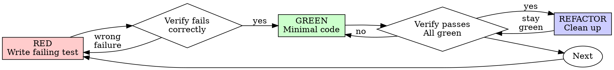

# Codex session 019fadb4-a1a1-7883-9790-cc890c0bef97

- Started: `2026-07-29T11:48:44.143Z`
- Working directory: `D:\100XH100`
- Originator: `Codex Desktop`
- Codex CLI: `0.146.0-alpha.3.1`
- Source log: `C:\Users\Иван Литвак\.codex\sessions\2026\07\29\rollout-2026-07-29T14-48-44-019fadb4-a1a1-7883-9790-cc890c0bef97.jsonl`
- Entries: user=1, assistant=7, tool calls=33, tool outputs=33

This is a chronological export of the user/assistant conversation and tool activity. Internal system/developer instructions and token accounting are intentionally excluded. Secret-shaped values are redacted; oversized tool outputs retain their beginning and end with the omitted character count.

## 1. User

Time: `2026-07-29T11:49:15.393Z` · source line `6`

```text
<recommended_plugins>
Here is a list of plugins that are available but not installed.

- Atlassian Rovo (atlassian-rovo@openai-curated-remote)
- Box (box@openai-curated-remote)
- Figma (figma@openai-curated-remote)
- Gmail (gmail@openai-curated-remote)
- Google Calendar (google-calendar@openai-curated-remote)
- Google Drive (google-drive@openai-curated-remote)
- Outlook Calendar (outlook-calendar@openai-curated-remote)
- Outlook Email (outlook-email@openai-curated-remote)
- SharePoint (sharepoint@openai-curated-remote)
- Slack (slack@openai-curated-remote)
- Teams (teams@openai-curated-remote)
</recommended_plugins>
# AGENTS.md instructions for D:\100XH100

<INSTRUCTIONS>
# Project Agent Rules

## Operating Rule
- Read `AGENTS.md` before project edits.
- Update `memory/CHANGELOG.md` after meaningful code, config, or architecture changes.
- Update `memory/PROMPTS.md` with user prompts that define requirements.
- Store test outputs, logs, and verification notes under `test_results/`.
- Prefer agent-centered code: explicit contracts, deterministic tests, small files, low hidden state.

## Architecture Source
- Primary architecture contract: `ARCHITECTURE_NEED.md`.
- Current Stream 4 implementation rule: use threshold + compact + CUB/fixed-temp sort/reduce + compact; do not use Stream 4 hash-table dedup.

## Implementation Guardrails
- `State128` logical bytes are `v[0..119]`.
- `State128` padding bytes are `v[120..127]`.
- Persistent frontier padding must be zero.
- `FinalResponse` may temporarily store `target_local_idx` in `v[120..123]`.
- `Hash128` is one logical 128-bit key stored as `{lo, hi}`.
- `CandidateMeta` must remain 32 bytes and 32-byte aligned.
- Stream 3 payload id must be original candidate id, not compact index.
- Stream 4 must not apply shard top-k or semantic shard cap.

</INSTRUCTIONS>
<environment_context>
  <cwd>D:\100XH100</cwd>
  <shell>powershell</shell>
  <current_date>2026-07-29</current_date>
  <timezone>Europe/Moscow</timezone>
  <filesystem><workspace_roots><root>D:\100XH100</root></workspace_roots><permission_profile type="managed"><file_system type="restricted"><entry access="read"><special>:root</special></entry><entry access="write"><path>D:\100XH100</path></entry><entry access="write"><special>:slash_tmp</special></entry><entry access="write"><special>:tmpdir</special></entry><entry access="write"><path>C:\Users\Иван Литвак\.codex\visualizations\2026\07\23\019f90a3-47e5-7770-a20e-cd9317bcbf2c</path></entry><entry access="read"><path>D:\100XH100\.git</path></entry><entry access="read"><path>D:\100XH100\.agents</path></entry><entry access="read"><path>D:\100XH100\.codex</path></entry></file_system></permission_profile></filesystem>
</environment_context>
```

## 2. Codex

Time: `2026-07-29T11:50:56.713Z` · source line `12`

```text
I’ll handle the bounded host-only provenance/tokenizer slice in the shared worktree. I’m using the test-driven-development skill because the task explicitly requires RED→GREEN; I’ll first read the project rules and notebook plan, then limit edits strictly to the four assigned files.
```

## 3. Tool call: `exec`

Time: `2026-07-29T11:50:59.148Z` · source line `14`

```text
const r = await tools.shell_command({"command":"Get-Content -Raw AGENTS.md; rg -n \"public notebook|CayleyPy|Task 6b|reflection|reflected_source_path\" . -g \"*.md\" -g \"!memory/**\" -g \"!test_results/**\"; Get-Content -Raw 'C:\\Users\\Иван Литвак\\.codex\\skills\\.system\\..\\..\\plugins\\cache\\openai-curated-remote\\superpowers\\6.2.0\\skills\\test-driven-development\\SKILL.md'","workdir":"D:\\100XH100","timeout_ms":10000});
text(r);

```

## 4. Tool output

Time: `2026-07-29T11:50:59.648Z` · source line `15`

````text
Script completed
Wall time 0.5 seconds
Output:

Exit code: 0
Wall time: 0.4 seconds
Output:
# Project Agent Rules

## Operating Rule
- Read `AGENTS.md` before project edits.
- Update `memory/CHANGELOG.md` after meaningful code, config, or architecture changes.
- Update `memory/PROMPTS.md` with user prompts that define requirements.
- Store test outputs, logs, and verification notes under `test_results/`.
- Prefer agent-centered code: explicit contracts, deterministic tests, small files, low hidden state.

## Architecture Source
- Primary architecture contract: `ARCHITECTURE_NEED.md`.
- Current Stream 4 implementation rule: use threshold + compact + CUB/fixed-temp sort/reduce + compact; do not use Stream 4 hash-table dedup.

## Implementation Guardrails
- `State128` logical bytes are `v[0..119]`.
- `State128` padding bytes are `v[120..127]`.
- Persistent frontier padding must be zero.
- `FinalResponse` may temporarily store `target_local_idx` in `v[120..123]`.
- `Hash128` is one logical 128-bit key stored as `{lo, hi}`.
- `CandidateMeta` must remain 32 bytes and 32-byte aligned.
- Stream 3 payload id must be original candidate id, not compact index.
- Stream 4 must not apply shard top-k or semantic shard cap.

.\results-public\README.md:1:# CayleyPy Beam Search Results
---
name: test-driven-development
description: Use when implementing any feature or bugfix, before writing implementation code
---

# Test-Driven Development (TDD)

## Overview

Write the test first. Watch it fail. Write minimal code to pass.

**Core principle:** If you didn't watch the test fail, you don't know if it tests the right thing.

**Violating the letter of the rules is violating the spirit of the rules.**

## When to Use

**Always:**
- New features
- Bug fixes
- Refactoring
- Behavior changes

**Exceptions (ask your human partner):**
- Throwaway prototypes
- Generated code
- Configuration files

Thinking "skip TDD just this once"? Stop. That's rationalization.

## The Iron Law

```
NO PRODUCTION CODE WITHOUT A FAILING TEST FIRST
```

Write code before the test? Delete it. Start over.

**No exceptions:**
- Don't keep it as "reference"
- Don't "adapt" it while writing tests
- Don't look at it
- Delete means delete

Implement fresh from tests. Period.

## Red-Green-Refactor



### RED - Write Failing Test

Write one minimal test showing what should happen.

<Good>
```typescript
test('retries failed operations 3 times', async () => {
  let attempts = 0;
  const operation = () => {
    attempts++;
    if (attempts < 3) throw new Error('fail');
    return 'success';
  };

  const result = await retryOperation(operation);

  expect(result).toBe('success');
  expect(attempts).toBe(3);
});
```
Clear name, tests real behavior, one thing
</Good>

<Bad>
```typescript
test('retry works', async () => {
  const mock = jest.fn()
    .mockRejectedValueOnce(new Error())
    .mockRejectedValueOnce(new Error())
    .mockResolvedValueOnce('success');
  await retryOperation(mock);
  expect(mock).toHaveBeenCalledTimes(3);
});
```
Vague name, tests mock not code
</Bad>

**Requirements:**
- One behavior
- Clear name
- Real code (no mocks unless unavoidable)

### Verify RED - Watch It Fail

**MANDATORY. Never skip.**

```bash
npm test path/to/test.test.ts
```

Confirm:
- Test fails (not errors)
- Failure message is expected
- Fails because feature missing (not typos)

**Test passes?** You're testing existing behavior. Fix test.

**Test errors?** Fix error, re-run until it fails correctly.

### GREEN - Minimal Code

Write simplest code to pass the test.

<Good>
```typescript
async function retryOperation<T>(fn: () => Promise<T>): Promise<T> {
  for (let i = 0; i < 3; i++) {
    try {
      return await fn();
    } catch (e) {
      if (i === 2) throw e;
    }
  }
  throw new Error('unreachable');
}
```
Just enough to pass
</Good>

<Bad>
```typescript
async function retryOperation<T>(
  fn: () => Promise<T>,
  options?: {
    maxRetries?: number;
    backoff?: 'linear' | 'exponential';
    onRetry?: (attempt: number) => void;
  }
): Promise<T> {
  // YAGNI
}
```
Over-engineered
</Bad>

Don't add features, refactor other code, or "improve" beyond the test.

### Verify GREEN - Watch It Pass

**MANDATORY.**

```bash
npm test path/to/test.test.ts
```

Confirm:
- Test passes
- Other tests still pass
- Output pristine (no errors, warnings)

**Test fails?** Fix code, not test.

**Other tests fail?** Fix now.

### REFACTOR - Clean Up

After green only:
- Remove duplication
- Improve names
- Extract helpers

Keep tests green. Don't add behavior.

### Repeat

Next failing test for next feature.

## Good Tests

| Quality | Good | Bad |
|---------|------|-----|
| **Minimal** | One thing. "and" in name? Split it. | `test('validates email and domain and whitespace')` |
| **Clear** | Name describes behavior | `test('test1')` |
| **Shows intent** | Demonstrates desired API | Obscures what code should do |

When writing or changing any test, read [writing-good-tests.md](writing-good-tests.md) for the rules that keep tests honest:
- Name the production change that would make the test fail — before writing it
- Assert on real behavior, never on mock behavior
- Keep test-only code in test utilities, out of production classes
- Understand a dependency's side effects before mocking it

## Common Rationalizations

| Excuse | Reality |
|--------|---------|
| "Too simple to test" | Simple code breaks. Test takes 30 seconds. |
| "I'll test after" | Tests written after pass immediately — which proves nothing. They may test the wrong thing, test the implementation instead of the behavior, or miss the edge case you forgot. You never watched it fail, so you never proved it can catch the bug. Test-first forces that failure. |
| "Tests after achieve same goals (spirit not ritual)" | Tests-after answer "what does this do?"; tests-first answer "what should this do?" Tests written after are biased by the code you already wrote — you verify the cases you remembered, not the ones you'd have discovered. Coverage without proof the tests work. |
| "Already manually tested" | Manual testing is ad-hoc: no record of what you covered, no way to re-run it when the code changes, easy to forget cases under pressure. "Worked when I tried it" в‰  comprehensive. Automated tests run the same way every time. |
| "Deleting X hours is wasteful" | Sunk cost fallacy — that time is already spent either way. The real choice: rewrite with TDD (high confidence) vs. keep it and bolt tests on after (low confidence, likely bugs). Keeping code you can't trust is the waste. |
| "Keep as reference, write tests first" | You'll adapt it. That's testing after. Delete means delete. |
| "Need to explore first" | Fine. Throw away exploration, start with TDD. |
| "Test hard = design unclear" | Listen to test. Hard to test = hard to use. |
| "TDD will slow me down" | TDD IS the pragmatic path: catches bugs before commit, prevents regressions, lets you refactor without fear. "Pragmatic" shortcuts mean debugging in production — slower, not faster. |
| "Manual test faster" | Manual doesn't prove edge cases. You'll re-test every change. |
| "Existing code has no tests" | You're improving it. Add tests for existing code. |

## Red Flags - STOP and Start Over

- Code before test
- Test after implementation
- Test passes immediately
- Can't explain why test failed
- Tests added "later"
- Rationalizing "just this once"
- "I already manually tested it"
- "Tests after achieve the same purpose"
- "It's about spirit not ritual"
- "Keep as reference" or "adapt existing code"
- "Already spent X hours, deleting is wasteful"
- "TDD is dogmatic, I'm being pragmatic"
- "This is different because..."

**All of these mean: Delete code. Start over with TDD.**

## Example: Bug Fix

**Bug:** Empty email accepted

**RED**
```typescript
test('rejects empty email', async () => {
  const result = await submitForm({ email: '' });
  expect(result.error).toBe('Email required');
});
```

**Verify RED**
```bash
$ npm test
FAIL: expected 'Email required', got undefined
```

**GREEN**
```typescript
function submitForm(data: FormData) {
  if (!data.email?.trim()) {
    return { error: 'Email required' };
  }
  // ...
}
```

**Verify GREEN**
```bash
$ npm test
PASS
```

**REFACTOR**
Extract validation for multiple fields if needed.

## Verification Checklist

Before marking work complete:

- [ ] Every new function/method has a test
- [ ] Watched each test fail before implementing
- [ ] Each test failed for expected reason (feature missing, not typo)
- [ ] Wrote minimal code to pass each test
- [ ] All tests pass
- [ ] Output pristine (no errors, warnings)
- [ ] Tests use real code (mocks only if unavoidable)
- [ ] Edge cases and errors covered

Can't check all boxes? You skipped TDD. Start over.

## When Stuck

| Problem | Solution |
|---------|----------|
| Don't know how to test | Write wished-for API. Write assertion first. Ask your human partner. |
| Test too complicated | Design too complicated. Simplify interface. |
| Must mock everything | Code too coupled. Use dependency injection. |
| Test setup huge | Extract helpers. Still complex? Simplify design. |

## Debugging Integration

Bug found? Write failing test reproducing it. Follow TDD cycle. Test proves fix and prevents regression.

Never fix bugs without a test.

## Final Rule

```
Production code в†’ test exists and failed first
Otherwise в†’ not TDD
```

No exceptions without your human partner's permission.


````

## 5. Tool call: `exec`

Time: `2026-07-29T11:51:07.062Z` · source line `18`

```text
const r = await tools.shell_command({"command":"rg -n \"public.*notebook|Task 6b|tokeniz|reflected_source\" MEMORY.md","workdir":"C:\\Users\\Иван Литвак\\.codex\\memories","timeout_ms":10000});
const p = await tools.shell_command({"command":"Get-Content -Raw 'C:\\Users\\Иван Литвак\\.codex\\plugins\\cache\\openai-curated-remote\\superpowers\\6.2.0\\skills\\test-driven-development\\writing-good-tests.md'; Get-ChildItem -Force; rg -n \"Task 6b|public notebook|reflected_source_path|SolutionRecord\" . -g \"*.md\" -g \"*.py\"","workdir":"D:\\100XH100\\.worktrees\\public-cayleypy-notebook","timeout_ms":10000});
text(JSON.stringify({memory:r,worktree:p}));

```

## 6. Tool output

Time: `2026-07-29T11:51:07.418Z` · source line `19`

```text
Script failed
Wall time 0.3 seconds
Output:

Script error:
Exit code: 1
Wall time: 0.3 seconds
Output:

```

## 7. Tool call: `shell_command`

Time: `2026-07-29T11:51:20.431Z` · source line `22`

```text
{"command":"Get-Content -Raw 'C:\\Users\\Иван Литвак\\.codex\\plugins\\cache\\openai-curated-remote\\superpowers\\6.2.0\\skills\\test-driven-development\\writing-good-tests.md'; Get-ChildItem -Force; rg -n \"Task 6b|public notebook|reflected_source_path|SolutionRecord\" . -g \"*.md\" -g \"*.py\"","workdir":"D:\\100XH100\\.worktrees\\public-cayleypy-notebook","timeout_ms":10000}
```

## 8. Tool output

Time: `2026-07-29T11:51:20.973Z` · source line `23`

````text
Exit code: 0
Wall time: 0.5 seconds
Output:
# Writing Good Tests

**Load this reference when:** writing or changing tests, adding mocks, or
adding cleanup/helper methods for tests.

## Overview

A test exists to catch a specific break. Two principles govern everything
here:

```
1. Every test names the break it catches
2. Every test exercises the real thing
```

Strict TDD produces both naturally: a test written first and watched
failing against real code has already proven it can fail, and only earns
a mock when the real dependency proves slow or external.

## Principle 1: Name the Break

Before writing the test body, answer: **what production change should
make this test fail — and is that change a bug or a decision?** A test
earns its place by catching a wrong branch, missing side effect, wrong
argument, boundary case, or broken contract.

**Derive expectations independently.** Use literals and hand-checked
fixtures; table-driven tests with literal `want` values are the preferred
shape. An expectation computed by the code under test — or its helpers —
passes no matter what that code does:

```typescript
// ❌ Mirror assertion: the same builder computes both sides — always true
const expected = buildSearchQuery({ tag: 'urgent' });
expect(buildSearchQuery({ tag: 'urgent' })).toBe(expected);

// вњ… Hand-derived literal
expect(buildSearchQuery({ tag: 'urgent' })).toBe('tag:"urgent"');
```

**No change detectors.** If only intentional decisions can fail a test —
a constant's value, exact message wording, private structure — it fires
on redesign and sleeps through bugs. Test the behavior that depends on
the decision: not `expect(MAX_RETRIES).toBe(5)` but "a failing call is
retried 5 times and the 6th attempt never happens."

**Behavior, not text.** Asserting that a script, skill, or config
contains an exact line proves only that the source is the source. Run
scripts against controlled inputs and assert outputs, side effects, or
exit codes. Documents that instruct agents are tested by the consuming
agent's behavior (superpowers:writing-skills); prose for humans earns no
test at all.

**Your code, not the framework.** Test the contract your code makes at
its boundaries — the route you register, the query you emit, the payload
you produce. Upstream mechanics are their maintainers' tests to write
(the classic: asserting your router invokes a registered handler — that
is the framework's test, not yours). When upstream behavior genuinely
surprised you, write one narrow characterization test naming the
assumption. The same boundary applies inside your code: constructors,
getters, constants, and trivial forwarding earn tests only when they
validate, normalize, default, derive, enforce, or cause side effects —
otherwise assert the first consumer-visible result that depends on them.

### Gate Function

```
BEFORE writing the test body:
  Name the production change that would make this test fail.

  Cannot name one            в†’ redesign around an observable behavior
  "The source text changed"  в†’ run the artifact and assert its effects
  Only intentional decisions в†’ change detector; test the behavior
                               that depends on the decision

  Confirm the expected value is derived without the code under test.
  IF it reuses the code's logic or helpers:
    Replace it with a literal or hand-checked fixture
```

## Principle 2: Exercise the Real Thing

**The mock earns no assertions.** A mock assertion passes when the mock
is present and fails when it is absent — it says nothing about the
component. Assert the real component's behavior; if the mock is what you
are checking, unmock it or delete the assertion.

```typescript
// вњ… Real behavior
expect(screen.getByRole('navigation')).toBeInTheDocument();

// вќЊ Mock existence
expect(screen.getByTestId('sidebar-mock')).toBeInTheDocument();
```

**your human partner's correction:** "Are we testing the behavior of a
mock?"

**Mock at the right level.** Learn every side effect of the real method
before replacing it; mock the slow or external operation and keep what
the test depends on real. When unsure, run the test against the real
implementation first and observe what actually needs to happen.

```typescript
// вќЊ The mock swallows the config write that duplicate detection reads
vi.mock('ToolCatalog', () => ({
  discoverAndCacheTools: vi.fn().mockResolvedValue(undefined)
}));

// вњ… Mock only the slow server startup; the config write stays real
vi.mock('MCPServerManager');
```

**Make doubles specific.** When arguments, call counts, or ordering are
part of the contract, assert them — a fake that accepts anything verifies
nothing. Give each branch (success, error, malformed) its own fixture or
spy, so the wrong branch cannot satisfy the expectation.

**Mirror real data completely.** Mock the complete structure as it exists
in reality — all documented fields — not just the ones your test reads.
Partial mocks fail silently when downstream code reads an omitted field:
the test passes while integration breaks.

**Production classes carry production methods only.** Cleanup that only
tests need lives in test utilities, never as a `destroy()` on the
production class. Ask: is this method called only from tests? Does this
class own this resource's lifecycle? Wrong answers в†’ test utility.

**Prefer real components over complex mocks.** When mock setup outgrows
the test logic, mocks miss methods the real components have, or tests
break when the mock changes, switch to an integration test with real
components. **your human partner's question:** "Do we need to be using a
mock here?"

### Gate Function

```
BEFORE adding a mock or test helper:
  List the real method's side effects; keep the ones the test
  depends on real — mock the slow/external level below them.

  Mock responses mirror the complete real structure.

  A method only tests call lives in test utilities, not production.

  About to assert on the mock itself?
    Unmock it or delete the assertion.
```

## Tests Ship With the Implementation

The TDD cycle — failing test, minimal implementation, refactor — is what
"complete" means. Ship the tests the behavior needs and only those:
trivial code and human prose earn none, and a test written to satisfy
process costs maintenance forever.

## The Mutation Check

Before finishing, mentally mutate the production code; at least one test
should fail for each realistic mutation:

- Wrong constant or argument
- Wrong branch handler
- Missing state change or side effect
- Empty or default return
- Missing validation for zero, empty, nil, unauthorized, or malformed input

A mutation nothing catches marks the behavior as unprotected — or the
test as tautological.

## Quick Reference

| When you... | Do |
|-------------|-----|
| Write any test | Name the break it catches — a bug, not a decision |
| Build an expected value | Derive it by hand; never with the code under test |
| Test a script or document | Run it / pressure-test its consumer; never grep its text |
| Reach for a dependency test | Test your boundary contract, not their documented mechanics |
| Want to assert on a mocked element | Test the real component, or unmock it |
| Are about to mock a method | Learn its side effects; mock the slow/external level |
| Build a mock response | Mirror the real structure completely |
| Need cleanup only tests use | Put it in test utilities |
| Watch mock setup balloon | Switch to an integration test with real components |
| Finish a test file | Run the mutation check |

## Warning Signs

- Setup and assertion share the same object, guaranteeing equality
- The test can fail only through a panic, crash, or missing selector
- The test fails on every intentional change, never on accidental breakage
- Expected values are hidden behind loops, builders, or helpers
- The test greps source text, or asserts a removed symbol stays removed
- The test would still matter if only the framework remained
- The test exists for coverage, checking no side effect or outcome
- An assertion checks a `*-mock` test ID, or fails if you remove the mock
- A method is called only from test files
- Mock setup is more than half the test, or you can't explain why the mock is needed
- Mocking "just to be safe"


    Каталог: D:\100XH100\.worktrees\public-cayleypy-notebook


Mode                 LastWriteTime         Length Name                                                                 
----                 -------------         ------ ----                                                                 
d-----        28.07.2026     22:13                .pytest_cache                                                        
d-----        28.07.2026     22:14                .superpowers                                                         
d-----        28.07.2026     22:12                cmake                                                                
d-----        29.07.2026     13:40                configs                                                              
d-----        28.07.2026     22:12                cuda                                                                 
d-----        28.07.2026     22:12                data                                                                 
d-----        28.07.2026     22:12                docs                                                                 
d-----        28.07.2026     22:12                FullBeamNice                                                         
d-----        28.07.2026     22:12                hpc                                                                  
d-----        28.07.2026     22:12                kaggle                                                               
d-----        29.07.2026      3:16                kaggle_cayleypy_task5_gate                                           
d-----        28.07.2026     22:12                kaggle_t4_mlp_autoprofile_sweep                                      
d-----        28.07.2026     22:12                kaggle_t4_mlp_universal                                              
d-----        28.07.2026     22:12                kaggle_t4_torchrun                                                   
d-----        28.07.2026     22:12                kaggle_torchrun                                                      
d-----        29.07.2026     14:26                memory                                                               
d-----        28.07.2026     22:12                molab                                                                
d-----        28.07.2026     22:12                prompt_history                                                       
d-----        28.07.2026     22:12                src                                                                  
d-----        28.07.2026     22:12                stream1_weights                                                      
d-----        28.07.2026     22:12                stream1_weights_artgor_bf16                                          
d-----        29.07.2026     13:13                tests                                                                
d-----        29.07.2026     14:28                test_results                                                         
d-----        29.07.2026     13:03                tools                                                                
d-----        28.07.2026     22:12                _push_final_chunk                                                    
d-----        28.07.2026     22:12                _push_staged_tuner                                                   
-a-h--        28.07.2026     22:12             60 .git                                                                 
-a----        29.07.2026      5:03            772 .gitattributes                                                       
-a----        28.07.2026     22:12            268 .gitignore                                                           
-a----        28.07.2026     22:12           1136 AGENTS.md                                                            
-a----        28.07.2026     22:12          48595 ARCHITECTURE_NEED.md                                                 
-a----        28.07.2026     22:12          10884 CMakeLists.txt                                                       
-a----        28.07.2026     22:12           1026 docker-compose.yml                                                   
-a----        28.07.2026     22:12            988 Dockerfile                                                           
-a----        28.07.2026     22:12           7939 README.md                                                            
.\memory\CHANGELOG.md:777:- Hardened public CayleyPy Task 4 records and validation: `SolutionRecord` now owns an immutable tuple copy of `reached_state`, and original-solution validation returns `False` for malformed direct generator values while preserving unrelated runtime failures.
.\docs\superpowers\specs\2026-07-28-public-cayleypy-2xt4-results-design.md:35:The public notebook exposes only `MODEL_SOURCE = "checkpoint"`. It automatically detects exactly one of:
.\docs\superpowers\specs\2026-07-28-public-cayleypy-2xt4-results-design.md:257:- No public notebook push until local notebook/helper tests pass.
.\docs\superpowers\specs\2026-07-28-public-cayleypy-2xt4-results-design.md:265:1. Implement and test repository helpers and the public notebook against a local/mock ingest endpoint.
.\docs\superpowers\specs\2026-07-28-public-cayleypy-2xt4-results-design.md:273:This order prevents the public notebook from depending on an unvalidated ingestion service while keeping solve artifacts useful independently.
.\memory\PROMPTS.md:448:- User requested Task 6 in the public notebook worktree strictly from `task-6-brief.md`: TDD an exact result schema, redaction, deterministic semantic idempotency, UUIDv7 ids, canonical JSON, 256 KiB envelope and 100-result request limits, best-effort HTTP semantics, bounded credential-safe errors, and durable `publish_status.json`. Required evidence includes author, Kaggle provenance, proof, solution, profile, model hash/manifest, hardware, timings, and solver commit; unknown fields, tokens, environments, absolute checkpoint paths, and tensors must be excluded. Update report/ledger and memory, run focused/full/diff/secret gates, create one commit, make no external deploy/publish, and do not touch model/beam/CUDA.
.\tools\run_cayleypy_public.py:1:"""CLI entrypoint reserved for the generated public notebook."""
.\tests\cayleypy_public\test_paths.py:6:    SolutionRecord,
.\tests\cayleypy_public\test_paths.py:113:    return SolutionRecord(
.\tools\cayleypy_public\runner.py:26:    SolutionRecord, deduplicate_solutions, invert_path, make_reflected_state, validate_original_solution,
.\tools\cayleypy_public\runner.py:121:    records: tuple[SolutionRecord, ...]
.\tools\cayleypy_public\runner.py:127:    solution_records: tuple[SolutionRecord, ...]
.\tools\cayleypy_public\runner.py:420:    records: list[SolutionRecord] = []
.\tools\cayleypy_public\runner.py:436:                records.append(SolutionRecord(
.\tools\cayleypy_public\runner.py:476:                records.append(SolutionRecord(
.\tools\cayleypy_public\runner.py:495:                records.append(SolutionRecord(
.\tools\cayleypy_public\runner.py:772:    records: list[SolutionRecord], submission: pd.DataFrame, executions: list[InvocationExecution],
.\tools\cayleypy_public\runner.py:793:) -> list[SolutionRecord]:
.\tools\cayleypy_public\runner.py:794:    validated: list[SolutionRecord] = []
.\tools\cayleypy_public\runner.py:813:        validated.append(SolutionRecord(
.\tools\cayleypy_public\runner.py:846:    records: list[SolutionRecord] = []
.\tools\cayleypy_public\runner.py:850:                records.append(SolutionRecord(
.\tools\cayleypy_public\paths.py:101:class SolutionRecord:
.\tools\cayleypy_public\paths.py:128:def _provenance_key(record: SolutionRecord) -> tuple[int, int, int, str, str, str]:
.\tools\cayleypy_public\paths.py:139:def deduplicate_solutions(records: Sequence[SolutionRecord]) -> list[SolutionRecord]:
.\tools\cayleypy_public\paths.py:141:    selected: dict[tuple[int, str, str], SolutionRecord] = {}
.\docs\superpowers\plans\2026-07-28-public-cayleypy-2xt4-notebook.md:22:- Do not change Stream2/3/4/5 algorithms merely to package the public notebook.
.\docs\superpowers\plans\2026-07-28-public-cayleypy-2xt4-notebook.md:39:- `tools/build_public_cayleypy_notebook.py`: deterministic public notebook and metadata generator.
.\docs\superpowers\plans\2026-07-28-public-cayleypy-2xt4-notebook.md:303:- Produces: `SolutionRecord` and `deduplicate_solutions(records) -> list[SolutionRecord]`.
.\docs\superpowers\plans\2026-07-28-public-cayleypy-2xt4-notebook.md:322:class SolutionRecord:
.\docs\superpowers\plans\2026-07-28-cayleypy-results-ingest.md:524:Update only the public notebook's default `RESULTS_INGEST_URL`, regenerate, re-run notebook secret/static tests, and continue with Task 9 of the notebook plan.


````

## 9. Tool call: `exec`

Time: `2026-07-29T11:51:32.466Z` · source line `26`

```text
const results = await Promise.all([
  tools.shell_command({"command":"Get-Content -Raw docs\\superpowers\\plans\\2026-07-28-public-cayleypy-2xt4-notebook.md","workdir":"D:\\100XH100\\.worktrees\\public-cayleypy-notebook","timeout_ms":10000}),
  tools.shell_command({"command":"git status --short; git rev-parse HEAD; Get-Content -Raw tools\\cayleypy_public\\paths.py; Get-Content -Raw tests\\cayleypy_public\\test_paths.py","workdir":"D:\\100XH100\\.worktrees\\public-cayleypy-notebook","timeout_ms":10000}),
  tools.shell_command({"command":"Get-Content -Raw tools\\cayleypy_public\\runner.py; Get-Content -Raw tests\\cayleypy_public\\test_runner.py","workdir":"D:\\100XH100\\.worktrees\\public-cayleypy-notebook","timeout_ms":10000})
]);
for (const x of results) text(x);

```

## 10. Tool output

Time: `2026-07-29T11:51:32.999Z` · source line `27`

Oversized output: `8153` characters omitted from the middle.

````text
Script completed
Wall time 0.5 seconds
Output:

Warning: truncated output (original token count: 19093)
Total output lines: 1827

Exit code: 0
Wall time: 0.3 seconds
Output:
# Public CayleyPy 2xT4 Notebook Implementation Plan

> **For agentic workers:** REQUIRED SUB-SKILL: Use superpowers:subagent-driven-development (recommended) or superpowers:executing-plans to implement this plan task-by-task. Steps use checkbox (`- [ ]`) syntax for tracking.

**Goal:** Build and publicly release a thin copy-and-run Kaggle notebook that runs the existing MultiGPUBeamSearch on standard CayleyPy inputs with one supported MLP checkpoint, two T4 GPUs, reflection, bounded solution collection, configurable touch BFS, and best-effort result publication.

**Architecture:** Keep the notebook declarative and move stable behavior into a focused `tools/cayleypy_public/` Python package. The package validates CayleyPy data and model contracts, selects the measured 2xT4 profile without replacing the user's beam, orchestrates the existing `production_runner`, validates every path on CPU, and emits bounded publication envelopes. The notebook builder embeds only documentation, the user config, and calls into the pinned repository revision.

**Tech Stack:** Python 3.12, PyTorch checkpoint inspection, pandas, pytest, IPython notebook parsing, CMake/Ninja/CUDA/CUTLASS/NCCL, torchrun, Kaggle CLI.

## Global Constraints

- Support only the standard CayleyPy `puzzle_info.json`, `test.csv`, and `sample_submission.csv` structure.
- Require exactly two NVIDIA T4 GPUs at runtime.
- Expose only checkpoint input; auto-detect only `batchnorm-folded` and `resmlp-layernorm` MLP schemas.
- Infer `fp16` automatically on T4; do not expose a dtype setting.
- Accept only `output_dim=1` or `output_dim=move_count`.
- Treat `PUZZLE_ID_START..PUZZLE_ID_END` as inclusive and fail on every missing id.
- Preserve requested beam; apply only documented distributed alignment and select the nearest measured `2**16..2**25` profile.
- Expose `REFLECT_MODE=off|after_original|only`, `SOLUTION_MODE=first|collect`, `COLLECT_UNTIL_DEPTH`, `MAX_COLLECTED_SOLUTIONS`, and `TOUCH_BFS_RADIUS`.
- Keep experimental K2 disabled.
- Do not change Stream2/3/4/5 algorithms merely to package the public notebook.
- Result publication is best-effort and must never invalidate a successful solve.
- Do not publish secrets, checkpoint tensors, private filesystem roots, or process environments.

---

## File Structure

- `tools/cayleypy_public/__init__.py`: stable package exports only.
- `tools/cayleypy_public/config.py`: typed user configuration and fail-closed validation.
- `tools/cayleypy_public/data.py`: standard CayleyPy file loading and inclusive-range validation.
- `tools/cayleypy_public/model.py`: checkpoint family detection, export invocation, and manifest validation.
- `tools/cayleypy_public/profile.py`: registry selection plus move-count-aware capacity derivation.
- `tools/cayleypy_public/paths.py`: move replay, inversion, reflection, and solution deduplication.
- `tools/cayleypy_public/runner.py`: torchrun command/environment construction and first/collect orchestration.
- `tools/cayleypy_public/results.py`: artifacts, result envelopes, redaction, and best-effort HTTP client.
- `tools/run_cayleypy_public.py`: one CLI entrypoint used by the notebook.
- `tools/build_public_cayleypy_notebook.py`: deterministic public notebook and metadata generator.
- `configs/cayleypy_results_schema_v1.json`: notebook-side result-envelope JSON Schema.
- `kaggle_public_cayleypy_2xt4/`: generated notebook package.
- `tests/cayleypy_public/`: focused unit/integration tests.

### Task 1: Typed Configuration and Standard CayleyPy Data Contract

**Files:**
- Create: `tools/cayleypy_public/__init__.py`
- Create: `tools/cayleypy_public/config.py`
- Create: `tools/cayleypy_public/data.py`
- Create: `tests/cayleypy_public/test_config.py`
- Create: `tests/cayleypy_public/test_data.py`

**Interfaces:**
- Produces: `PublicRunConfig.from_mapping(values: Mapping[str, object]) -> PublicRunConfig`
- Produces: `load_puzzle_contract(puzzle_info_path: Path, test_csv: Path, sample_submission_csv: Path, start: int, end: int) -> PuzzleContract`
- `PuzzleContract` exposes `central_state`, `generators`, `move_names`, `move_count`, `state_len`, `num_classes`, `initial_states`, and `sample_submission`.

- [ ] **Step 1: Write failing config tests**

```python
from tools.cayleypy_public.config import PublicRunConfig

BASE = {
    "author_name": "alice", "checkpoint_path": "/kaggle/input/m/model.pth",
    "puzzle_info_json": "/kaggle/input/c/puzzle_info.json",
    "test_csv": "/kaggle/input/c/test.csv",
    "sample_submission_csv": "/kaggle/input/c/sample_submission.csv",
    "puzzle_id_start": 7, "puzzle_id_end": 9, "beam_width": 2**21,
    "max_depth": 100, "reflect_mode": "off", "reflect_source_csv": None,
    "solution_mode": "first", "collect_until_depth": 100,
    "max_collected_solutions": 1000, "touch_bfs_radius": 4,
    "publish_results": True, "results_ingest_url": "https://results.example/",
}

def test_config_accepts_exact_public_contract():
    cfg = PublicRunConfig.from_mapping(BASE)
    assert cfg.puzzle_ids == (7, 8, 9)
    assert cfg.model_dtype == "fp16"

def test_collect_depth_cannot_exceed_max_depth():
    values = {**BASE, "solution_mode": "collect", "collect_until_depth": 101}
    with pytest.raises(ValueError, match="COLLECT_UNTIL_DEPTH"):
        PublicRunConfig.from_mapping(values)

def test_only_requires_reflection_source():
    with pytest.raises(ValueError, match="REFLECT_SOURCE_CSV"):
        PublicRunConfig.from_mapping({**BASE, "reflect_mode": "only"})
```

- [ ] **Step 2: Run config tests and verify RED**

Run: `python -m pytest tests/cayleypy_public/test_config.py -q`
Expected: FAIL with `ModuleNotFoundError: tools.cayleypy_public`.

- [ ] **Step 3: Implement the frozen dataclass and enum/range gates**

```python
@dataclass(frozen=True)
class PublicRunConfig:
    author_name: str
    checkpoint_path: Path
    puzzle_info_json: Path
    test_csv: Path
    sample_submission_csv: Path
    puzzle_id_start: int
    puzzle_id_end: int
    beam_width: int
    max_depth: int
    reflect_mode: Literal["off", "after_original", "only"]
    reflect_source_csv: Path | None
    solution_mode: Literal["first", "collect"]
    collect_until_depth: int
    max_collected_solutions: int
    touch_bfs_radius: int
    publish_results: bool
    results_ingest_url: str
    model_dtype: Literal["fp16"] = "fp16"

    @property
    def puzzle_ids(self) -> tuple[int, ...]:
        return tuple(range(self.puzzle_id_start, self.puzzle_id_end + 1))
```

Validate positive beam/depth/capacity, `0 <= touch_bfs_radius <= 12`, inclusive non-empty range, exact enum allowlists, `collect_until_depth <= max_depth`, and the reflection-source rule.

- [ ] **Step 4: Write failing CayleyPy schema/range tests**

Build temporary fixtures with `central_state`, two named permutations, test ids `7,8,9`, and submission rows. Assert derived move/state/class dimensions. Assert missing id 8 and duplicate id 8 each fail with explicit messages.

- [ ] **Step 5: Implement `PuzzleContract` and strict loaders**

```python
@dataclass(frozen=True)
class PuzzleContract:
    central_state: tuple[int, ...]
    generators: dict[str, tuple[int, ...]]
    initial_states: dict[int, tuple[int, ...]]
    sample_submission: pd.DataFrame
    state_len: int
    num_classes: int

    @property
    def move_names(self) -> tuple[str, ...]:
        return tuple(self.generators)

    @property
    def move_count(self) -> int:
        return len(self.generators)
```

Require every permutation and state to have `state_len`, every permutation to equal `range(state_len)` as a set, every selected state id exactly once, and submission ids to include the selected range.

- [ ] **Step 6: Run tests and commit**

Run: `python -m pytest tests/cayleypy_public/test_config.py tests/cayleypy_public/test_data.py -q`
Expected: PASS.

```bash
git add tools/cayleypy_public tests/cayleypy_public/test_config.py tests/cayleypy_public/test_data.py
git commit -m "feat: add public CayleyPy input contract"
```

### Task 2: Automatic Supported-MLP Detection and Export

**Files:**
- Modify: `tools/export_stream1_mlp.py`
- Create: `tools/cayleypy_public/model.py`
- Create: `tests/cayleypy_public/test_model.py`

**Interfaces:**
- Produces: `detect_checkpoint_format(path: Path) -> Literal["batchnorm-folded", "resmlp-layernorm"]`
- Produces: `export_checkpoint(path: Path, out_dir: Path, num_classes: int) -> ExportedModel`
- `ExportedModel` exposes `format`, `dtype`, `checkpoint_sha256`, and sanitized `manifest`.

- [ ] **Step 1: Write failing detection tests with minimal tensor fixtures**

```python
def test_detects_batchnorm_folded(tmp_path):
    path = write_checkpoint(tmp_path, {
        "input_layer.weight": torch.zeros(8, 12),
        "hidden_layer.weight": torch.zeros(8, 8),
        "output_layer.weight": torch.zeros(1, 8),
        "bn1.running_mean": torch.zeros(8),
        "residual_blocks.0.fc1.weight": torch.zeros(8, 8),
    })
    assert detect_checkpoint_format(path) == "batchnorm-folded"

def test_rejects_mixed_schema(tmp_path):
    path = write_checkpoint(tmp_path, {
        "input_layer.weight": torch.zeros(8, 12),
        "embedding.weight": torch.zeros(12, 16),
        "head.weight": torch.zeros(1, 8),
    })
    with pytest.raises(ValueError, match="ambiguous"):
        detect_checkpoint_format(path)
```

Add ResMLP and unknown-schema cases.

- [ ] **Step 2: Run and verify RED**

Run: `python -m pytest tests/cayleypy_public/test_model.py -q`
Expected: FAIL because `model.py` does not exist.

- [ ] **Step 3: Implement signature-set detection without trial export**

```python
BN_REQUIRED = frozenset({
    "input_layer.weight", "hidden_layer.weight", "output_layer.weight",
    "bn1.running_mean", "bn2.running_mean",
})
LN_REQUIRED = frozenset({
    "embedding.weight", "input_stack.0.weight", "input_stack.1.weight",
    "input_stack.3.weight", "head.weight",
})
```

Normalize `_orig_mod.` prefixes through the existing helpers. A schema matches only when all required keys and at least one contiguous residual block key are present. Zero or two matches fail closed.

- [ ] **Step 4: Add `--format auto` to the existing exporter**

Extend argparse choices to `auto`, call `detect_checkpoint_format`, then dispatch to the unchanged existing exporters. Ensure `source_weights` in the public sanitized manifest is only the checkpoint basename, not the absolute path.

- [ ] **Step 5: Implement export wrapper and manifest gates**

Call the exporter in-process, force `dtype="fp16"`, hash the checkpoint in 8 MiB chunks, load `manifest.json`, require puzzle `state_len/num_classes`, normalization allowlist, and `output_dim in {1, move_count}`.

- [ ] **Step 6: Run tests and commit**

Run: `python -m pytest tests/cayleypy_public/test_model.py tests/test_kaggle_t4_mlp_contract.py -q`
Expected: PASS.

```bash
git add tools/export_stream1_mlp.py tools/cayleypy_public/model.py tests/cayleypy_public/test_model.py
git commit -m "feat: auto-detect supported Stream1 MLP checkpoints"
```

### Task 3: Profile Selection and Move-Count-Aware Preflight

**Files:**
- Modify: `tools/kaggle_t4_mlp_profiles.py`
- Create: `tools/cayleypy_public/profile.py`
- Create: `tests/cayleypy_public/test_profile.py`

**Interfaces:**
- Consumes: `select_profile(...)` and checked-in `configs/kaggle_t4_mlp_profiles.json`.
- Produces: `derive_runtime(profile, beam_width, output_dim, move_count, world_size=2) -> RuntimePlan`.

- [ ] **Step 1: Write failing dynamic-capacity tests**

Assert output 1 uses `parent_batch=b_micro//move_count`; output `move_count` uses `parent_batch=b_micro`; Stream3 batch is `parent_batch*move_count*ring_slots`; shard capacity is aligned to 1024 and at least Stream3 batch, Stream4 batch, and trigger. Include move counts 18 and 24.

- [ ] **Step 2: Run and verify RED**

Run: `python -m pytest tests/cayleypy_public/test_profile.py -q`
Expected: FAIL with missing `derive_runtime`.

- [ ] **Step 3: Implement immutable runtime plan**

```python
@dataclass(frozen=True)
class RuntimePlan:
    requested_beam: int
    effective_beam: int
    alignment_delta: int
    profile_power: int
    model_class: str
    local_beam: int
    parent_batch: int
    stream3_batch_candidates: int
    shard_capacity_candidates: int
    runtime: dict[str, int]
    cross_puzzle_profile_note: str
```

Use measured registry values, exact requested beam, and `cross_puzzle_profile_note="measured_24_move_seed"` whenever `move_count != 24`.

- [ ] **Step 4: Add preflight serialization and guard tests**

Assert JSON contains profile evidence version, hardware, requested/effective beam, alignment, actual move count, capacity derivation, history budgets, and `/tmp` free disk. Unknown validation status fails.

- [ ] **Step 5: Run all profile tests and commit**

Run: `python -m pytest tests/cayleypy_public/test_profile.py tests/test_kaggle_t4_mlp_profiles.py -q`
Expected: PASS.

```bash
git add tools/kaggle_t4_mlp_profiles.py tools/cayleypy_public/profile.py tests/cayleypy_public/test_profile.py
git commit -m "feat: derive safe public 2xT4 runtime plans"
```

### Task 4: Path Replay, Reflection, and Deduplication

**Files:**
- Create: `tools/cayleypy_public/paths.py`
- Create: `tests/cayleypy_public/test_paths.py`

**Interfaces:**
- Produces: `apply_path(state, path, generators) -> tuple[int, ...]`
- Produces: `invert_path(path: str, generators: Mapping[str, Sequence[int]]) -> str`
- Produces: `make_reflected_state(central, original_solution, generators) -> tuple[int, ...]`
- Produces: `validate_original_solution(initial, central, path, generators) -> bool`
- Produces: `SolutionRecord` and `deduplicate_solutions(records) -> list[SolutionRecord]`.

- [ ] **Step 1: Write failing algebraic tests**

Use a three-element cycle with explicit inverse names. Assert apply/invert roundtrip, reflection roundtrip, invalid move rejection, and reflected candidate inversion solves the original.

- [ ] **Step 2: Run and verify RED**

Run: `python -m pytest tests/cayleypy_public/test_paths.py -q`
Expected: FAIL with missing module.

- [ ] **Step 3: Implement move inversion from permutations**

Do not assume `-MOVE` naming. Compute inverse permutations and require every inverse permutation to map uniquely to an existing named generator; otherwise reflection modes fail preflight with the missing move name.

- [ ] **Step 4: Implement canonical solution records and dedupe**

```python
@dataclass(frozen=True)
class SolutionRecord:
    puzzle_id: int
    variant: Literal["original", "reflected"]
    path: str
    original_oriented_path: str
    found_depth: int
    touch_depth: int
    source_solution_sha256: str | None
    valid: bool
```

Deduplicate by `(puzzle_id, sha256(original_oriented_path), sha256(reached_state))`; choose the earliest provenance deterministically.

- [ ] **Step 5: Run tests and commit**

Run: `python -m pytest tests/cayleypy_public/test_paths.py -q`
Expected: PASS.

```bash
git add tools/cayleypy_public/paths.py tests/cayleypy_public/test_paths.py
git commit -m "feat: add CayleyPy reflection and path validation"
```

### Task 5: Existing Runner Orchestration for First and Collect Modes

**Files:**
- Create: `tools/cayleypy_public/runner.py`
- Create: `tools/run_cayleypy_public.py`
- Create: `tests/cayleypy_public/test_runner.py`
- Create: `tests/cayleypy_public/fixtures/fake_production_runner.py`

**Interfaces:**
- Consumes: `PublicRunConfig`, `PuzzleContract`, `ExportedModel`, `RuntimePlan`.
- Produces: `run_public_search(...) -> RunArtifacts`.
- `RunArtifacts` exposes solution records, combined/per-rank log paths, return codes, timing summaries, and collection status.

- [ ] **Step 1: Write failing command/environment tests**

Assert `torch.distributed.run --nproc-per-node=2`, original `BEAM_WIDTH` CLI argument, rank log redirection, exa

[... 8153 characters omitted from oversized tool output ...]

-start\n", "solution_path=counterclockwise\n"])

        @staticmethod
        def wait() -> int:
            return 0

    live = io.StringIO()
    combined = tmp_path / "combined.log"
    return_code, tail = runner.stream_process_output(
        FakeProcess(), combined, live_stream=live, max_tail_chars=24,
    )

    assert return_code == 0
    assert live.getvalue() == "rank0-start\nsolution_path=counterclockwise\n"
    assert combined.read_text(encoding="utf-8") == live.getvalue()
    assert tail == "n_path=counterclockwise\n"


@pytest.mark.parametrize(
    ("failure_stage", "expected_error"),
    (("popen", OSError), ("stream", RuntimeError), ("log_capture", runner.InvocationLogCaptureError)),
)
def test_history_cleanup_runs_on_popen_stream_and_log_capture_exceptions(
    tmp_path: Path,
    monkeypatch: pytest.MonkeyPatch,
    failure_stage: str,
    expected_error: type[Exception],
) -> None:
    history_root = tmp_path / "beam_history_public"
    monkeypatch.setattr(runner, "_HISTORY_ROOT", runner.PurePosixPath(history_root.as_posix()))
    monkeypatch.setattr(runner.shutil, "disk_usage", lambda _: SimpleNamespace(free=32 * 1024**3))
    invocation = runner.build_runner_invocation(
        _config(tmp_path), _plan(local_beam=128), 2, 7, "original",
        tmp_path / "weights", tmp_path / "artifacts",
    )

    class BrokenStream:
        def __iter__(self) -> "BrokenStream":
            return self

        def __next__(self) -> str:
            raise RuntimeError("stream failed")

    def popen(*_: object, env: dict[str, str], **__: object) -> SimpleNamespace:
        history_dir = Path(env["BEAM_HISTORY_DIR"])
        history_dir.mkdir(parents=True)
        (history_dir / "rank_0_history_static_arena.bin").write_bytes(b"arena")
        if failure_stage == "popen":
            raise OSError("spawn failed")
        stdout: object = BrokenStream() if failure_stage == "stream" else iter(["rank0\n"])
        return SimpleNamespace(stdout=stdout, wait=lambda: 0)

    monkeypatch.setattr(runner.subprocess, "Popen", popen)
    with pytest.raises(expected_error):
        runner._run_one(invocation)

    assert not invocation.history_dir.exists()


def test_stream_failure_stops_process_before_cleanup_and_retains_partial_logs(
    tmp_path: Path, monkeypatch: pytest.MonkeyPatch,
) -> None:
    history_root = tmp_path / "beam_history_public"
    monkeypatch.setattr(runner, "_HISTORY_ROOT", runner.PurePosixPath(history_root.as_posix()))
    monkeypatch.setattr(runner.shutil, "disk_usage", lambda _: SimpleNamespace(free=32 * 1024**3))
    invocation = runner.build_runner_invocation(
        _config(tmp_path), _plan(local_beam=128), 2, 7, "original",
        tmp_path / "weights", tmp_path / "artifacts",
    )
    events: list[str] = []

    class BrokenAfterOne:
        def __init__(self) -> None:
            self.first = True

        def __iter__(self) -> "BrokenAfterOne":
            return self

        def __next__(self) -> str:
            if self.first:
                self.first = False
                return "partial rank0\n"
            raise RuntimeError("stream failed")

    class LiveProcess:
        stdout = BrokenAfterOne()

        def __init__(self) -> None:
            self.alive = True
            self.return_code = 143

        def poll(self) -> int | None:
            return None if self.alive else self.return_code

        def terminate(self) -> None:
            events.append("terminate")

        def wait(self, timeout: float | None = None) -> int:
            assert timeout is not None
            events.append("wait")
            self.alive = False
            return self.return_code

        def kill(self) -> None:
            events.append("kill")

    process = LiveProcess()

    def popen(*_: object, env: dict[str, str], **__: object) -> LiveProcess:
        Path(env["BEAM_HISTORY_DIR"]).mkdir(parents=True)
        rank_dir = invocation.torchrun_log_dir / "run" / "attempt_0" / "0"
        rank_dir.mkdir(parents=True)
        (rank_dir / "stdout.log").write_text("rank0 partial\n", encoding="utf-8")
        (rank_dir / "stderr.log").write_text("", encoding="utf-8")
        return process

    real_cleanup = runner.cleanup_history_runtime

    def cleanup(path: Path) -> None:
        assert not process.alive
        events.append("cleanup")
        real_cleanup(path)

    monkeypatch.setattr(runner.subprocess, "Popen", popen)
    monkeypatch.setattr(runner, "cleanup_history_runtime", cleanup)
    with pytest.raises(RuntimeError, match="stream failed") as caught:
        runner._run_one(invocation)

    assert caught.value.execution.return_code == 143
    assert events == ["terminate", "wait", "cleanup"]
    assert invocation.combined_log.read_text(encoding="utf-8") == "partial rank0\n"
    assert invocation.rank_logs[0].read_text(encoding="utf-8") == "[stdout]\nrank0 partial\n[stderr]\n"
    assert not invocation.rank_logs[1].exists()
    assert not invocation.history_dir.exists()


def test_stream_failure_uses_bounded_kill_fallback_before_cleanup(
    tmp_path: Path, monkeypatch: pytest.MonkeyPatch,
) -> None:
    history_root = tmp_path / "beam_history_public"
    monkeypatch.setattr(runner, "_HISTORY_ROOT", runner.PurePosixPath(history_root.as_posix()))
    monkeypatch.setattr(runner.shutil, "disk_usage", lambda _: SimpleNamespace(free=32 * 1024**3))
    invocation = runner.build_runner_invocation(
        _config(tmp_path), _plan(local_beam=128), 2, 7, "original",
        tmp_path / "weights", tmp_path / "artifacts",
    )
    events: list[str] = []

    class LiveProcess:
        stdout = iter(())

        def __init__(self) -> None:
            self.killed = False
            self.alive = True

        def poll(self) -> int | None:
            return None if self.alive else 137

        def terminate(self) -> None:
            events.append("terminate")

        def wait(self, timeout: float | None = None) -> int:
            assert timeout is not None
            events.append(f"wait:{timeout}")
            if not self.killed:
                raise subprocess.TimeoutExpired("torchrun", timeout)
            self.alive = False
            return 137

        def kill(self) -> None:
            events.append("kill")
            self.killed = True

    process = LiveProcess()

    def popen(*_: object, env: dict[str, str], **__: object) -> LiveProcess:
        Path(env["BEAM_HISTORY_DIR"]).mkdir(parents=True)
        return process

    def fail_stream(*_: object, **__: object) -> tuple[int, str]:
        raise RuntimeError("stream failed")

    real_cleanup = runner.cleanup_history_runtime

    def cleanup(path: Path) -> None:
        assert not process.alive
        events.append("cleanup")
        real_cleanup(path)

    monkeypatch.setattr(runner.subprocess, "Popen", popen)
    monkeypatch.setattr(runner, "stream_process_output", fail_stream)
    monkeypatch.setattr(runner, "cleanup_history_runtime", cleanup)
    with pytest.raises(RuntimeError, match="stream failed"):
        runner._run_one(invocation)

    assert events == ["terminate", "wait:5.0", "kill", "wait:5.0", "cleanup"]


def test_cleanup_failure_adds_note_without_masking_stream_error(
    tmp_path: Path, monkeypatch: pytest.MonkeyPatch,
) -> None:
    invocation = runner.build_runner_invocation(
        _config(tmp_path), _plan(local_beam=128), 2, 7, "original",
        tmp_path / "weights", tmp_path / "artifacts",
    )

    class LiveProcess:
        stdout = iter(())
        alive = True

        def poll(self) -> int | None:
            return None if self.alive else 143

        def terminate(self) -> None:
            pass

        def wait(self, timeout: float | None = None) -> int:
            self.alive = False
            return 143

        def kill(self) -> None:
            raise AssertionError("kill not expected")

    def fail_stream(*_: object, **__: object) -> tuple[int, str]:
        raise RuntimeError("primary stream failure")

    monkeypatch.setattr(runner.subprocess, "Popen", lambda *args, **kwargs: LiveProcess())
    monkeypatch.setattr(runner, "stream_process_output", fail_stream)
    monkeypatch.setattr(
        runner, "cleanup_history_runtime", lambda _: (_ for _ in ()).throw(OSError("cleanup failed")),
    )

    with pytest.raises(RuntimeError, match="primary stream failure") as caught:
        runner._run_one(invocation)

    assert type(caught.value) is RuntimeError
    assert any("history scratch cleanup failed: cleanup failed" in note for note in caught.value.__notes__)


def test_run_search_reports_partial_artifacts_after_stream_failure(
    tmp_path: Path, monkeypatch: pytest.MonkeyPatch,
) -> None:
    history_root = tmp_path / "beam_history_public"
    monkeypatch.setattr(runner, "_HISTORY_ROOT", runner.PurePosixPath(history_root.as_posix()))
    monkeypatch.setattr(runner.shutil, "disk_usage", lambda _: SimpleNamespace(free=32 * 1024**3))

    class BrokenStream:
        def __iter__(self) -> "BrokenStream":
            return self

        def __next__(self) -> str:
            raise RuntimeError("stream failed")

    class LiveProcess:
        stdout = BrokenStream()
        alive = True

        def poll(self) -> int | None:
            return None if self.alive else 143

        def terminate(self) -> None:
            pass

        def wait(self, timeout: float | None = None) -> int:
            self.alive = False
            return 143

        def kill(self) -> None:
            raise AssertionError("kill not expected")

    def popen(*_: object, env: dict[str, str], **__: object) -> LiveProcess:
        Path(env["BEAM_HISTORY_DIR"]).mkdir(parents=True)
        return LiveProcess()

    monkeypatch.setattr(runner.subprocess, "Popen", popen)
    with pytest.raises(runner.PublicSearchRunError, match="stream failed") as caught:
        runner.run_public_search(
            _config(tmp_path), _contract(), _model(), _plan(local_beam=128),
            tmp_path / "weights", tmp_path / "artifacts",
        )

    partial = caught.value.partial_artifacts
    assert partial.return_codes == (143,)
    assert len(partial.combined_logs) == 1
    assert partial.combined_logs[0].exists()

def test_sequential_success_and_failure_cleanup_only_their_unique_history_dirs(
    tmp_path: Path, monkeypatch: pytest.MonkeyPatch,
) -> None:
    return_codes = iter((0, 9))

    def popen(command: tuple[str, ...], *, env: dict[str, str], **_: object) -> SimpleNamespace:
        history_dir = Path(env["BEAM_HISTORY_DIR"])
        history_dir.mkdir(parents=True)
        for rank in (0, 1):
            (history_dir / f"rank_{rank}_history_static_arena.bin").write_bytes(b"arena")
        log_arg = next(part for part in command if str(part).startswith("--log-dir="))
        log_dir = Path(str(log_arg).split("=", 1)[1])
        for rank in (0, 1):
            rank_dir = log_dir / "run" / "attempt_0" / str(rank)
            rank_dir.mkdir(parents=True)
            (rank_dir / "stdout.log").write_text(f"rank {rank}\n", encoding="utf-8")
            (rank_dir / "stderr.log").write_text("", encoding="utf-8")
        return_code = next(return_codes)
        return SimpleNamespace(stdout=iter([f"return_code={return_code}\n"]), wait=lambda: return_code)

    history_root = tmp_path / "beam_history_public"
    monkeypatch.setattr(runner, "_HISTORY_ROOT", runner.PurePosixPath(history_root.as_posix()))
    monkeypatch.setattr(runner.shutil, "disk_usage", lambda _: SimpleNamespace(free=32 * 1024**3))
    monkeypatch.setattr(runner.subprocess, "Popen", popen)
    sentinel = tmp_path / "history-sentinel"
    sentinel.write_text("keep", encoding="utf-8")
    try:
        invocations = [
            runner.build_runner_invocation(
                _config(tmp_path), _plan(local_beam=128), 2, puzzle_id, "original",
                tmp_path / "weights", tmp_path / "artifacts",
            )
            for puzzle_id in (7, 8)
        ]
        executions = [runner._run_one(invocation) for invocation in invocations]

        assert [execution.return_code for execution in executions] == [0, 9]
        assert all(not invocation.history_dir.exists() for invocation in invocations)
        assert sentinel.read_text(encoding="utf-8") == "keep"
    finally:
        sentinel.unlink(missing_ok=True)


def test_missing_real_torchrun_logs_become_hard_run_error_with_combined_diagnostics(
    tmp_path: Path, monkeypatch: pytest.MonkeyPatch,
) -> None:
    class FailedProcess:
        stdout = iter(["fatal before rank redirect\n"])

        @staticmethod
        def wait() -> int:
            return 9

    monkeypatch.setattr(runner.subprocess, "Popen", lambda *args, **kwargs: FailedProcess())

    with pytest.raises(runner.PublicSearchRunError, match="exit code 9.*log capture") as caught:
        runner.run_public_search(
            _config(tmp_path), _contract(), _model(), _plan(local_beam=128),
            tmp_path / "weights", tmp_path / "artifacts",
        )

    partial = caught.value.partial_artifacts
    assert partial.return_codes == (9,)
    assert partial.combined_logs[0].read_text(encoding="utf-8") == "fatal before rank redirect\n"
    assert all(not path.exists() for path in partial.rank_logs[0])


def test_collection_exchanges_only_rank_local_next_k_candidates() -> None:
    source = Path("tools/production_runner.cu").read_text(encoding="utf-8")
    gather = source.split("SolveBucketRecordBatch gather_solve_bucket_record_batch_distributed", 1)[1]
    gather = gather.split("std::uint32_t propagate_solved_flag", 1)[0]
    local_scan = gather.split("std::set<SolveBucketRecord, SolveBucketRecordLess> local_selected_records", 1)[1]
    local_scan = local_scan.split("// Exactness:", 1)[0]
    exchange = gather.split("// Exactness:", 1)[1]

    assert "ncclAllGather" not in local_scan
    assert "local_selected_records.size() > batch_limit" in local_scan
    assert "global next-K" in gather and "rank-local next-K" in gather
    assert "base < batch_limit" in exchange
    assert "local_selected_vector" in exchange
    assert "ncclAllGather" in exchange
    assert "global_stored" not in gather

def test_collection_rank0_processing_errors_are_synchronized_before_next_reconstruction() -> None:
    source = Path("tools/production_runner.cu").read_text(encoding="utf-8")
    record_loop = source.split("for (SolveBucketRecord record : batch.records)", 1)[1]
    record_loop = record_loop.split("scan_cursor = batch.records.back()", 1)[0]

    rank0_processing = record_loop.split(
        "if (rank == 0U && !rank0_processing_exception)", 1
    )[1].split("const std::uint32_t global_processing_error", 1)[0]
    try_pos = rank0_processing.index("try {")
    validation_pos = rank0_processing.index("solve bucket CPU solution validation failed")
    path_pos = rank0_processing.index("moves_to_path_text")
    catch_pos = rank0_processing.index("catch (...)")
    sync_pos = record_loop.index("global_processing_error = propagate_host_stop_value")
    rethrow_pos = record_loop.index("std::rethrow_exception(rank0_processing_exception)")
    assert try_pos < validation_pos < catch_pos
    assert try_pos < path_pos < catch_pos
    assert record_loop.index("rank0_processing_exception = std::current_exception()") < sync_pos < rethrow_pos
    assert "continue;" not in record_loop

def test_collection_stop_contract_syncs_host_reason_and_explicit_depth_beats_legacy() -> None:
    source = Path("tools/production_runner.cu").read_text(encoding="utf-8")

    assert "propagate_stop_flag(memory, streams, nccl_runtime.comm, world_size)" in source
    assert "solve_bucket_stop_depth == 0U" in source
    assert "bucket_global_stop_reason" in source
    assert "bucket_global_stop_reason == 2U" in source
    assert "solve_bucket_gather_records_per_chunk" in source
    assert "local_selected_records" in source
    assert "collection_status=depth_reached" in source
    assert "solve bucket overflow: increase BEAM_SOLVED_RESULT_CAPACITY" in source


````

## 11. Tool call: `shell_command`

Time: `2026-07-29T11:51:42.471Z` · source line `30`

```text
{"command":"git status --short; git rev-parse HEAD; rg -n \"def .*path|class SolutionRecord|SolutionRecord\\(|source_solution_sha256|original_oriented_path|variant ==|variant=\" tools\\cayleypy_public\\paths.py tools\\cayleypy_public\\runner.py tests\\cayleypy_public\\test_paths.py tests\\cayleypy_public\\test_runner.py","workdir":"D:\\100XH100\\.worktrees\\public-cayleypy-notebook","timeout_ms":10000}
```

## 12. Tool output

Time: `2026-07-29T11:51:42.854Z` · source line `31`

```text
Exit code: 0
Wall time: 0.4 seconds
Output:
 M tests/cayleypy_public/test_results.py
?? configs/cayleypy_results_v1_golden.json
c53f52dfd18189ebf8ad75123abaa1962ee910db
tests\cayleypy_public\test_paths.py:48:def test_invalid_or_ambiguous_path_tokens_fail_closed(path):
tests\cayleypy_public\test_paths.py:92:def test_deduplicate_uses_original_path_and_reached_state_then_earliest_provenance():
tests\cayleypy_public\test_paths.py:100:    assert hashlib.sha256(earlier.original_oriented_path.encode("utf-8")).hexdigest()
tests\cayleypy_public\test_paths.py:112:def _record(variant, path, original_oriented_path, reached_state, found_depth, source=None):
tests\cayleypy_public\test_paths.py:113:    return SolutionRecord(
tests\cayleypy_public\test_paths.py:115:        variant=variant,
tests\cayleypy_public\test_paths.py:117:        original_oriented_path=original_oriented_path,
tests\cayleypy_public\test_paths.py:120:        source_solution_sha256=source,
tests\cayleypy_public\test_runner.py:27:def _config(tmp_path: Path, *, solution_mode: str = "first", reflect_mode: str = "off",
tests\cayleypy_public\test_runner.py:71:def test_first_invocation_uses_exact_two_rank_torchrun_and_runtime_contract(tmp_path: Path) -> None:
tests\cayleypy_public\test_runner.py:124:def test_history_defaults_preflight_budget_and_tmp_space(tmp_path: Path) -> None:
tests\cayleypy_public\test_runner.py:208:def test_collect_capacity_is_full_local_depth_not_host_solution_limit(tmp_path: Path) -> None:
tests\cayleypy_public\test_runner.py:311:def test_release_first_mode_fixture_parses_without_debug_solution_path(tmp_path: Path) -> None:
tests\cayleypy_public\test_runner.py:373:def test_debug_solution_path_compatibility_is_anchored_to_a_complete_line() -> None:
tests\cayleypy_public\test_runner.py:427:def test_real_tsv_schema_prefers_solution_path_and_maps_depths_adversarially(tmp_path: Path) -> None:
tests\cayleypy_public\test_runner.py:445:def test_torchrun_rank_logs_are_real_stdout_and_stderr_for_both_ranks(tmp_path: Path) -> None:
tests\cayleypy_public\test_runner.py:465:def test_missing_rank_log_is_a_hard_failure_not_an_empty_placeholder(tmp_path: Path) -> None:
tests\cayleypy_public\test_runner.py:486:        if invocation.variant == "original":
tests\cayleypy_public\test_runner.py:499:    assert [record.original_oriented_path for record in artifacts.solution_records] == [
tests\cayleypy_public\test_runner.py:525:    assert [(record.variant, record.original_oriented_path) for record in artifacts.solution_records] == [
tests\cayleypy_public\test_runner.py:528:    assert artifacts.solution_records[0].source_solution_sha256 == hashlib.sha256(
tests\cayleypy_public\test_runner.py:551:    assert [(record.variant, record.original_oriented_path) for record in artifacts.solution_records] == [
tests\cayleypy_public\test_runner.py:590:        output = f"solution_path={discovered_path}\n" if invocation.variant == "original" else "no-hit\n"
tests\cayleypy_public\test_runner.py:600:    assert [call.source_solution_sha256 for call in calls[1:]] == [
tests\cayleypy_public\test_runner.py:604:    assert {(record.variant, record.original_oriented_path) for record in artifacts.solution_records} == {
tests\cayleypy_public\test_runner.py:659:        (record.variant, record.original_oriented_path)
tests\cayleypy_public\test_runner.py:736:    assert [record.original_oriented_path for record in artifacts.solution_records] == ["counterclockwise"]
tests\cayleypy_public\test_runner.py:740:def test_rank0_output_streams_live_and_keeps_bounded_parser_tail(tmp_path: Path) -> None:
tests\cayleypy_public\test_runner.py:860:    def cleanup(path: Path) -> None:
tests\cayleypy_public\test_runner.py:926:    def cleanup(path: Path) -> None:
tools\cayleypy_public\runner.py:93:    source_solution_sha256: str | None = None
tools\cayleypy_public\runner.py:168:def _path_depth(path: str) -> int:
tools\cayleypy_public\runner.py:227:def _resolved_history_path(history_dir: Path) -> Path:
tools\cayleypy_public\runner.py:343:    source_solution_sha256: str | None = None,
tools\cayleypy_public\runner.py:389:        variant=variant,
tools\cayleypy_public\runner.py:390:        source_solution_sha256=source_solution_sha256,
tools\cayleypy_public\runner.py:436:                records.append(SolutionRecord(
tools\cayleypy_public\runner.py:438:                    variant=variant,
tools\cayleypy_public\runner.py:440:                    original_oriented_path=path,
tools\cayleypy_public\runner.py:443:                    source_solution_sha256=None,
tools\cayleypy_public\runner.py:476:                records.append(SolutionRecord(
tools\cayleypy_public\runner.py:478:                    variant=variant,
tools\cayleypy_public\runner.py:480:                    original_oriented_path=path,
tools\cayleypy_public\runner.py:483:                    source_solution_sha256=None,
tools\cayleypy_public\runner.py:495:                records.append(SolutionRecord(
tools\cayleypy_public\runner.py:497:                    variant=variant,
tools\cayleypy_public\runner.py:499:                    original_oriented_path=path,
tools\cayleypy_public\runner.py:502:                    source_solution_sha256=None,
tools\cayleypy_public\runner.py:551:def _bounded_log_tail(path: Path, max_bytes: int = _DIAGNOSTIC_TAIL_BYTES) -> str:
tools\cayleypy_public\runner.py:796:        if variant == "original":
tools\cayleypy_public\runner.py:813:        validated.append(SolutionRecord(
tools\cayleypy_public\runner.py:815:            variant=variant,
tools\cayleypy_public\runner.py:817:            original_oriented_path=original_path,
tools\cayleypy_public\runner.py:820:            source_solution_sha256=source_sha256,
tools\cayleypy_public\runner.py:850:                records.append(SolutionRecord(
tools\cayleypy_public\runner.py:852:                    variant="source",
tools\cayleypy_public\runner.py:854:                    original_oriented_path=source_path,
tools\cayleypy_public\runner.py:857:                    source_solution_sha256=source_sha256,
tools\cayleypy_public\runner.py:903:                    (record.original_oriented_path, sha256(record.original_oriented_path.encode("utf-8")).hexdigest())
tools\cayleypy_public\runner.py:912:                    runner_path=runner_path, source_solution_sha256=source_sha256,
tools\cayleypy_public\runner.py:926:                    _path_depth(record.original_oriented_path),
tools\cayleypy_public\runner.py:927:                    record.original_oriented_path,
tools\cayleypy_public\runner.py:929:                    record.source_solution_sha256 or "",
tools\cayleypy_public\runner.py:934:            ] = best.original_oriented_path
tools\cayleypy_public\paths.py:14:def _tokens(path: str) -> tuple[str, ...]:
tools\cayleypy_public\paths.py:64:def apply_path(state: Sequence[int], path: str, generators: Generators) -> State:
tools\cayleypy_public\paths.py:77:def invert_path(path: str, generators: Generators) -> str:
tools\cayleypy_public\paths.py:92:def validate_original_solution(initial: Sequence[int], central: Sequence[int], path: str, generators: Generators) -> bool:
tools\cayleypy_public\paths.py:101:class SolutionRecord:
tools\cayleypy_public\paths.py:105:    original_oriented_path: str
tools\cayleypy_public\paths.py:108:    source_solution_sha256: str | None
tools\cayleypy_public\paths.py:130:        1 if record.variant == "source" else 0,
tools\cayleypy_public\paths.py:133:        record.source_solution_sha256 or "",
tools\cayleypy_public\paths.py:145:        key = (record.puzzle_id, _digest(record.original_oriented_path), _state_digest(record.reached_state))

```

## 13. Tool call: `shell_command`

Time: `2026-07-29T11:51:49.143Z` · source line `34`

```text
{"command":"Get-Content tools\\cayleypy_public\\paths.py; Get-Content tools\\cayleypy_public\\runner.py | Select-Object -First 530; Get-Content tools\\cayleypy_public\\runner.py | Select-Object -Skip 760 -First 190; Get-Content tests\\cayleypy_public\\test_paths.py; Get-Content tests\\cayleypy_public\\test_runner.py | Select-Object -Skip 470 -First 210","workdir":"D:\\100XH100\\.worktrees\\public-cayleypy-notebook","timeout_ms":10000}
```

## 14. Tool output

Time: `2026-07-29T11:51:49.682Z` · source line `35`

Oversized output: `8092` characters omitted from the middle.

```text
Exit code: 0
Wall time: 0.4 seconds
Total output lines: 1188
Output:
"""Fail-closed CayleyPy path replay, reflection, and solution deduplication."""

from __future__ import annotations

from dataclasses import dataclass
from hashlib import sha256
from typing import Literal, Mapping, Sequence


State = tuple[int, ...]
Generators = Mapping[str, Sequence[int]]


def _tokens(path: str) -> tuple[str, ...]:
    if not isinstance(path, str):
        raise ValueError("path must be a dot-separated string")
    if path == "":
        return ()
    tokens = tuple(path.split("."))
    if any(not token for token in tokens):
        raise ValueError("path must not contain empty move tokens")
    return tokens


def _validated_generators(generators: Generators, state_len: int | None = None) -> dict[str, tuple[int, ...]]:
    if not generators:
        raise ValueError("generators must not be empty")
    normalized: dict[str, tuple[int, ...]] = {}
    expected_len = state_len
    for name, raw_permutation in generators.items():
        if not isinstance(name, str) or not name:
            raise ValueError("generator names must be non-empty strings")
        permutation = tuple(raw_permutation)
        if expected_len is None:
            expected_len = len(permutation)
        if len(permutation) != expected_len or set(permutation) != set(range(expected_len)):
            raise ValueError(f"generator {name!r} must be a permutation of range(state_len)")
        normalized[name] = permutation
    return normalized


def _inverse_permutation(permutation: Sequence[int]) -> tuple[int, ...]:
    inverse = [0] * len(permutation)
    for destination, source in enumerate(permutation):
        inverse[source] = destination
    return tuple(inverse)


def _inverse_names(generators: Generators) -> dict[str, str]:
    normalized = _validated_generators(generators)
    names_by_permutation: dict[tuple[int, ...], list[str]] = {}
    for name, permutation in normalized.items():
        names_by_permutation.setdefault(permutation, []).append(name)

    result: dict[str, str] = {}
    for name, permutation in normalized.items():
        matches = names_by_permutation.get(_inverse_permutation(permutation), [])
        if len(matches) != 1:
            raise ValueError(f"generator {name!r} does not have a unique inverse generator")
        result[name] = matches[0]
    return result


def apply_path(state: Sequence[int], path: str, generators: Generators) -> State:
    """Replay a standard dot-separated CayleyPy path on ``state``."""
    current = tuple(state)
    normalized = _validated_generators(generators, len(current))
    for move in _tokens(path):
        try:
            permutation = normalized[move]
        except KeyError as error:
            raise ValueError(f"unknown move token {move!r}") from error
        current = tuple(current[index] for index in permutation)
    return current


def invert_path(path: str, generators: Generators) -> str:
    """Return the algebraic inverse without relying on generator-name syntax."""
    inverse_names = _inverse_names(generators)
    moves = _tokens(path)
    for move in moves:
        if move not in inverse_names:
            raise ValueError(f"unknown move token {move!r}")
    return ".".join(inverse_names[move] for move in reversed(moves))


def make_reflected_state(central: Sequence[int], original_solution: str, generators: Generators) -> State:
    """Create the reflected start state whose solved path inverts to the original."""
    return apply_path(central, original_solution, generators)


def validate_original_solution(initial: Sequence[int], central: Sequence[int], path: str, generators: Generators) -> bool:
    """Return whether a complete, valid path takes the original state to center."""
    try:
        return apply_path(initial, path, generators) == tuple(central)
    except (TypeError, ValueError):
        return False


@dataclass(frozen=True)
class SolutionRecord:
    puzzle_id: int
    variant: Literal["original", "reflected", "source"]
    path: str
    original_oriented_path: str
    found_depth: int
    touch_depth: int
    source_solution_sha256: str | None
    valid: bool
    reached_state: State

    def __post_init__(self) -> None:
        try:
            normalized_state = tuple(self.reached_state)
        except TypeError as error:
            raise ValueError("reached_state must be an iterable state") from error
        object.__setattr__(self, "reached_state", normalized_state)


def _digest(text: str) -> str:
    return sha256(text.encode("utf-8")).hexdigest()


def _state_digest(state: Sequence[int]) -> str:
    return _digest(",".join(str(value) for value in state))


def _provenance_key(record: SolutionRecord) -> tuple[int, int, int, str, str, str]:
    return (
        1 if record.variant == "source" else 0,
        record.found_depth,
        record.touch_depth,
        record.source_solution_sha256 or "",
        record.variant,
        record.path,
    )


def deduplicate_solutions(records: Sequence[SolutionRecord]) -> list[SolutionRecord]:
    """Keep one deterministic earliest-provenance record per semantic solution."""
    selected: dict[tuple[int, str, str], SolutionRecord] = {}
    for record in records:
        if not record.valid:
            continue
        key = (record.puzzle_id, _digest(record.original_oriented_path), _state_digest(record.reached_state))
        previous = selected.get(key)
        if previous is None or _provenance_key(record) < _provenance_key(previous):
            selected[key] = record
    return list(selected.values())
"""Deterministic host-side orchestration for the existing production runner."""

from __future__ import annotations

from dataclasses import dataclass
from hashlib import sha256
from pathlib import Path, PurePosixPath
import csv
import math
import os
import re
import shutil
import socket
import subprocess
import sys
import time
import uuid
from typing import Literal

import pandas as pd

from tools.cayleypy_public.config import PublicRunConfig
from tools.cayleypy_public.data import PuzzleContract
from tools.cayleypy_public.model import ExportedModel
from tools.cayleypy_public.paths import (
    SolutionRecord, deduplicate_solutions, invert_path, make_reflected_state, validate_original_solution,
)
from tools.cayleypy_public.profile import RuntimePlan


Variant = Literal["original", "reflected"]
CollectionStatus = Literal["first_solution", "depth_reached", "capacity_reached", "not_collected"]
_UINT32_MAX = 2**32 - 1
_SOLVED_RECORD_BYTES = 32 + 4 + 4
_T4_DEVICE_BYTES = 16 * 1024**3
_T4_HEADROOM_BYTES = 768 * 1024**2
_MAX_GATHER_RECORDS_PER_CHUNK = 65_536
_PROCESS_STOP_TIMEOUT_SECONDS = 5.0
_DIAGNOSTIC_TAIL_BYTES = 4 * 1024 * 1024
_TORCHRUN_RESERVED_ENV_KEYS = frozenset({
    "LOCAL_RANK",
    "RANK",
    "GROUP_RANK",
    "ROLE_RANK",
    "ROLE_NAME",
    "LOCAL_WORLD_SIZE",
    "WORLD_SIZE",
    "GROUP_WORLD_SIZE",
    "ROLE_WORLD_SIZE",
    "MASTER_ADDR",
    "MASTER_PORT",
    "TORCHELASTIC_RESTART_COUNT",
    "TORCHELASTIC_MAX_RESTARTS",
    "TORCHELASTIC_RUN_ID",
    "TORCHELASTIC_USE_AGENT_STORE",
    "TORCHELASTIC_ERROR_FILE",
    "TORCH_NCCL_ASYNC_ERROR_HANDLING",
    "PYTHON_EXEC",
})
_RELEASE_SOLUTION_RE = re.compile(
    r"puzzle_solved=1 puzzle_id=(?P<puzzle_id>\d+) seconds=(?P<seconds>[0-9]+(?:\.[0-9]+)?(?:[eE][+-]?[0-9]+)?) "
    r"solution_length=(?P<solution_length>\d+) found_depth=(?P<found_depth>\d+) "
    r"touch_depth=(?P<touch_depth>\d+) solution=(?P<solution>.*)"
)
_RELEASE_SOLUTION_LEGACY_RE = re.compile(
    r"puzzle_solved=1 puzzle_id=(?P<puzzle_id>\d+) seconds=(?P<seconds>[0-9]+(?:\.[0-9]+)?(?:[eE][+-]?[0-9]+)?) "
    r"solution_length=(?P<solution_length>\d+) solution=(?P<solution>.*)"
)
_DEBUG_SOLUTION_PATH_RE = re.compile(r"solution_path=(?P<solution>.*)")
_TORCHRUN_TEE_PREFIX_RE = re.compile(r"\[default0\]:(?P<line>.*)")
_HISTORY_MODE = "static_hybrid"
_HISTORY_SLOT_COUNT = 2
_HISTORY_WORKERS = 1
_HISTORY_RAM_BYTES = 28 * 1024**3
_HISTORY_DISK_BYTES = 32 * 1024**3
_HISTORY_ENTRY_BYTES = 16
_CANDIDATE_META_BYTES = 32
_HISTORY_STAGING_ENTRIES = 1 << 20
_HISTORY_ROOT = PurePosixPath("/tmp/beam_history_public")


@dataclass(frozen=True)
class RunnerInvocation:
    command: tuple[str, ...]
    env: dict[str, str]
    result_tsv: Path | None
    combined_log: Path
    rank_logs: tuple[Path, Path]
    torchrun_log_dir: Path
    history_dir: Path
    puzzle_id: int
    variant: Variant
    source_solution_sha256: str | None = None


@dataclass(frozen=True)
class GatherChunkPlan:
    capacity: int
    records_per_chunk: int
    chunk_count: int


@dataclass(frozen=True)
class HistoryRuntimePreflight:
    required_history_bytes: int
    usable_history_bytes: int
    pinned_slot_bytes: int
    staging_bytes: int


@dataclass(frozen=True)
class InvocationExecution:
    invocation: RunnerInvocation
    return_code: int
    elapsed_seconds: float
    output: str


@dataclass(frozen=True)
class ParsedRunnerOutput:
    records: tuple[SolutionRecord, ...]
    collection_status: CollectionStatus


@dataclass(frozen=True)
class RunArtifacts:
    solution_records: tuple[SolutionRecord, ...]
    submission: pd.DataFrame
    combined_logs: tuple[Path, ...]
    rank_logs: tuple[tuple[Path, Path], ...]
    return_codes: tuple[int, ...]
    timing_summaries: tuple[float, ...]
    collection_statuses: tuple[CollectionStatus, ...]

    @property
    def collection_status(self) -> CollectionStatus:
        if "capacity_reached" in self.collection_statuses:
            return "capacity_reached"
        if "depth_reached" in self.collection_statuses:
            return "depth_reached"
        if "first_solution" in self.collection_statuses:
            return "first_solution"
        return "not_collected"


class PublicSearchRunError(RuntimeError):
    """Hard process failure with earlier artifacts retained for diagnosis only."""

    def __init__(self, message: str, partial_artifacts: RunArtifacts):
        super().__init__(message)
        self.partial_artifacts = partial_artifacts


class InvocationLogCaptureError(RuntimeError):
    """Internal subprocess result whose retained logs or scratch cleanup are incomplete."""

    def __init__(self, execution: InvocationExecution, message: str):
        super().__init__(message)
        self.execution = execution


def _free_port() -> int:
    with socket.socket(socket.AF_INET, socket.SOCK_STREAM) as sock:
        sock.bind(("127.0.0.1", 0))
        return int(sock.getsockname()[1])


def _path_depth(path: str) -> int:
    return 0 if path == "" else len(path.split("."))


def derive_solved_result_capacity(plan: RuntimePlan, move_count: int) -> int:
    """Bound one rank's worst-case Stream2 hits for a completed depth."""
    if isinstance(move_count, bool) or not isinstance(move_count, int) or move_count <= 0:
        raise ValueError("move_count must be a positive integer")
    if plan.local_beam <= 0:
        raise ValueError("local_beam must be positive")
    capacity = plan.local_beam * move_count
    if capacity > _UINT32_MAX:
        raise ValueError("BEAM_SOLVED_RESULT_CAPACITY exceeds uint32")
    snapshot_bytes = capacity * _SOLVED_RECORD_BYTES
    frontier_bytes = plan.local_beam * 128
    required_bytes = snapshot_bytes + frontier_bytes
    available_bytes = _T4_DEVICE_BYTES - _T4_HEADROOM_BYTES
    if required_bytes > available_bytes:
        raise ValueError(
            "BEAM_SOLVED_RESULT_CAPACITY snapshot plus current frontier exceeds available T4 device memory; "
            "production_runner performs the exact StaticMemoryPlan and non-static budget gate "
            f"({required_bytes} > {available_bytes} bytes)"
        )
    return capacity


def derive_gather_chunk_plan(
    frontier_states: int, capacity: int, world_size: int = 2, packet_words: int = 8,
) -> GatherChunkPlan:
    """Plan fixed-scratch host gather chunks without a capacity-sized packet buffer."""
    values = {
        "frontier_states": frontier_states,
        "capacity": capacity,
        "world_size": world_size,
        "packet_words": packet_words,
    }
    if any(isinstance(value, bool) or not isinstance(value, int) or value <= 0 for value in values.values()):
        raise ValueError(f"gather chunk inputs must be positive integers: {values}")
    scratch_words = frontier_states * 128 // 8
    records_per_chunk = min(
        scratch_words // (packet_words * (world_size + 1)), _MAX_GATHER_RECORDS_PER_CHUNK
    )
    if records_per_chunk <= 0:
        raise ValueError("solve bucket gather scratch cannot fit one record per rank")
    return GatherChunkPlan(
        capacity=capacity,
        records_per_chunk=records_per_chunk,
        chunk_count=(capacity + records_per_chunk - 1) // records_per_chunk,
    )


def derive_collection_batch_limit(max_solutions: int, accepted_count: int) -> int:
    """Return the next deterministic host-selection limit, capped at one fixed chunk."""
    values = {"max_solutions": max_solutions, "accepted_count": accepted_count}
    if any(isinstance(value, bool) or not isinstance(value, int) or value < 0 for value in values.values()):
        raise ValueError(f"collection batch inputs must be non-negative integers: {values}")
    if max_solutions == 0:
        return _MAX_GATHER_RECORDS_PER_CHUNK
    return min(max(max_solutions - accepted_count, 0), _MAX_GATHER_RECORDS_PER_CHUNK)
def _resolved_history_path(history_dir: Path) -> Path:
    candidate = PurePosixPath(history_dir.as_posix())
    if ".." in candidate.parts or _HISTORY_ROOT not in candidate.parents:
        raise ValueError("history path must be unique and under /tmp/beam_history_public")
    resolved_root = Path(_HISTORY_ROOT.as_posix()).resolve(strict=False)
    resolved_candidate = Path(candidate.as_posix()).resolve(strict=False)
    if resolved_candidate == resolved_root or resolved_root not in resolved_candidate.parents:
        raise ValueError("resolved history path must be a descendant of /tmp/beam_history_public")
    return resolved_candidate


def cleanup_history_runtime(history_dir: Path) -> None:
    """Remove only a validated per-invocation scratch history tree."""
    resolved = _resolved_history_path(history_dir)
    if not resolved.exists():
        return
    if not resolved.is_dir():
        raise RuntimeError(f"history scratch path is not a directory: {resolved}")
    shutil.rmtree(resolved)


def preflight_history_runtime(
    config: PublicRunConfig,
    plan: RuntimePlan,
    move_count: int,
    history_dir: Path,
    *,
    tmp_free_bytes: int | None = None,
) -> HistoryRuntimePreflight:
    """Fail closed on the bounded two-rank static-hybrid history contract."""
    if isinstance(move_count, bool) or not isinstance(move_count, int) or move_count <= 0:
        raise ValueError("move_count must be a positive integer")
    _resolved_history_path(history_dir)
    if tmp_free_bytes is None:
        tmp_free_bytes = shutil.disk_usage(str(_HISTORY_ROOT.parent)).free
    if isinstance(tmp_free_bytes, bool) or not isinstance(tmp_free_bytes, int) or tmp_free_bytes < 0:
        raise ValueError("tmp_free_bytes must be a nonnegative integer")
    if tmp_free_bytes < _HISTORY_DISK_BYTES:
        raise ValueError(
            f"/tmp free disk is smaller than the history disk budget "
            f"({tmp_free_bytes} < {_HISTORY_DISK_BYTES} bytes)"
        )

    per_rank_ram = _HISTORY_RAM_BYTES // 2
    per_rank_disk = _HISTORY_DISK_BYTES // 2
    pinned_slot_bytes = _HISTORY_SLOT_COUNT * plan.local_beam * _CANDIDATE_META_BYTES
    s

[... 8092 characters omitted from oversized tool output ...]

] = list(external_sources[puzzle_id])
        if config.reflect_mode != "only":
            invocation = build_runner_invocation(
                config, plan, contract.move_count, puzzle_id, "original", weights_dir, artifact_dir,
                runner_path=runner_path,
            )
            original_records = _validated_records(execute(invocation), contract, puzzle_id, "original")
            records.extend(original_records)
            if config.reflect_mode == "after_original":
                discovered_sources.extend(
                    (record.original_oriented_path, sha256(record.original_oriented_path.encode("utf-8")).hexdigest())
                    for record in original_records
                )
        if config.reflect_mode in {"after_original", "only"}:
            sources = sorted(set(discovered_sources), key=lambda item: (_path_depth(item[0]), item[0], item[1]))
            for source_path, source_sha256 in sources:
                reflected_state = make_reflected_state(contract.central_state, source_path, contract.generators)
                invocation = build_runner_invocation(
                    config, plan, contract.move_count, puzzle_id, "reflected", weights_dir, artifact_dir,
                    runner_path=runner_path, source_solution_sha256=source_sha256,
                )
                _write_reflected_test_row(invocation, puzzle_id, reflected_state)
                records.extend(_validated_records(
                    execute(invocation), contract, puzzle_id, "reflected",
                    reflected_state=reflected_state, source_sha256=source_sha256,
                ))

        records = deduplicate_solutions(records)
        puzzle_records = [record for record in records if record.puzzle_id == puzzle_id]
        if puzzle_records:
            best = min(
                puzzle_records,
                key=lambda record: (
                    _path_depth(record.original_oriented_path),
                    record.original_oriented_path,
                    {"source": 0, "original": 1, "reflected": 2}[record.variant],
                    record.source_solution_sha256 or "",
                ),
            )
            submission.loc[
                submission["initial_state_id"] == puzzle_id, submission_column
            ] = best.original_oriented_path

    return _build_artifacts(records, submission, executions, statuses)
import hashlib

import pytest

from tools.cayleypy_public.paths import (
    SolutionRecord,
    apply_path,
    deduplicate_solutions,
    invert_path,
    make_reflected_state,
    validate_original_solution,
)


# The names deliberately do not use a '-' convention: inversion is algebraic.
GENERATORS = {
    "clockwise": (1, 2, 0),
    "counterclockwise": (2, 0, 1),
}


def test_apply_and_invert_round_trip_with_dot_separated_moves():
    initial = (0, 1, 2)
    path = "clockwise.clockwise"

    reached = apply_path(initial, path, GENERATORS)

    assert reached == (2, 0, 1)
    assert invert_path(path, GENERATORS) == "counterclockwise.counterclockwise"
    assert apply_path(reached, invert_path(path, GENERATORS), GENERATORS) == initial


def test_reflection_round_trip_inverts_a_reflected_solution_to_original_solution():
    central = (0, 1, 2)
    initial = (1, 2, 0)
    original_path = "counterclockwise"

    reflected_initial = make_reflected_state(central, original_path, GENERATORS)
    reflected_candidate = "clockwise"
    original_candidate = invert_path(reflected_candidate, GENERATORS)

    assert reflected_initial == (2, 0, 1)
    assert validate_original_solution(reflected_initial, central, reflected_candidate, GENERATORS)
    assert validate_original_solution(initial, central, original_candidate, GENERATORS)


@pytest.mark.parametrize("path", ["unknown", "clockwise..counterclockwise", ".clockwise", "clockwise."])
def test_invalid_or_ambiguous_path_tokens_fail_closed(path):
    with pytest.raises(ValueError):
        apply_path((0, 1, 2), path, GENERATORS)


def test_inversion_requires_a_unique_named_inverse_generator():
    ambiguous = {"a": (1, 2, 0), "b": (2, 0, 1), "also_b": (2, 0, 1)}

    with pytest.raises(ValueError, match="unique inverse.*a"):
        invert_path("a", ambiguous)


def test_solution_record_is_frozen():
    record = _record("original", "counterclockwise", "counterclockwise", (0, 1, 2), 3)

    with pytest.raises(Exception):
        record.path = "clockwise"


def test_solution_record_copies_mutable_reached_state_before_deduplication():
    mutable_state = [0, 1, 2]
    record = _record("original", "counterclockwise", "counterclockwise", mutable_state, 3)

    mutable_state[0] = 9

    assert record.reached_state == (0, 1, 2)
    assert isinstance(record.reached_state, tuple)


def test_validate_original_solution_returns_false_for_non_iterable_generator_value():
    malformed_generators = {"clockwise": None}

    assert validate_original_solution((0, 1, 2), (0, 1, 2), "clockwise", malformed_generators) is False


def test_validate_original_solution_does_not_hide_unrelated_runtime_errors():
    class BrokenMapping(dict):
        def items(self):
            raise RuntimeError("external generator source failed")

    with pytest.raises(RuntimeError, match="external generator source failed"):
        validate_original_solution((0, 1, 2), (0, 1, 2), "", BrokenMapping(clockwise=(1, 2, 0)))


def test_deduplicate_uses_original_path_and_reached_state_then_earliest_provenance():
    first = _record("reflected", "clockwise", "counterclockwise", (0, 1, 2), 8, source="z")
    earlier = _record("original", "counterclockwise", "counterclockwise", (0, 1, 2), 3, source="a")
    distinct_state = _record("original", "counterclockwise", "counterclockwise", (1, 2, 0), 1, source="a")

    records = deduplicate_solutions([first, distinct_state, earlier])

    assert records == [earlier, distinct_state]
    assert hashlib.sha256(earlier.original_oriented_path.encode("utf-8")).hexdigest()


def test_deduplicate_preserves_solver_provenance_on_exact_source_duplicate():
    solver = _record("original", "counterclockwise", "counterclockwise", (0, 1, 2), 1)
    source = _record(
        "source", "counterclockwise", "counterclockwise", (0, 1, 2), 1, source="external-sha"
    )

    assert deduplicate_solutions([solver, source]) == [solver]


def _record(variant, path, original_oriented_path, reached_state, found_depth, source=None):
    return SolutionRecord(
        puzzle_id=7,
        variant=variant,
        path=path,
        original_oriented_path=original_oriented_path,
        found_depth=found_depth,
        touch_depth=0,
        source_solution_sha256=source,
        valid=True,
        reached_state=reached_state,
    )
    (rank_dir / "stdout.log").write_text("rank0", encoding="utf-8")
    (rank_dir / "stderr.log").write_text("", encoding="utf-8")

    with pytest.raises(RuntimeError, match="rank 1"):
        runner.collect_torchrun_rank_logs(invocation)
    assert not invocation.rank_logs[1].exists()


def test_after_original_runs_original_then_reflected_and_updates_shortest_submission(
    tmp_path: Path, monkeypatch: pytest.MonkeyPatch,
) -> None:
    calls: list[runner.RunnerInvocation] = []

    def execute(invocation: runner.RunnerInvocation) -> runner.InvocationExecution:
        calls.append(invocation)
        if invocation.variant == "original":
            return _successful_execution(invocation, "solution_path=clockwise.clockwise\n")
        reflected = pd.read_csv(invocation.env["BEAM_TEST_CSV"])
        assert reflected.to_dict("records") == [{"initial_state_id": 7, "initial_state": "2,0,1"}]
        return _successful_execution(invocation, "solution_path=clockwise\n")

    monkeypatch.setattr(runner, "_run_one", execute)
    artifacts = runner.run_public_search(
        _config(tmp_path, reflect_mode="after_original"), _contract(), _model(), _plan(local_beam=128),
        tmp_path / "weights", tmp_path / "artifacts",
    )

    assert [call.variant for call in calls] == ["original", "reflected"]
    assert [record.original_oriented_path for record in artifacts.solution_records] == [
        "clockwise.clockwise", "counterclockwise",
    ]
    assert artifacts.submission.loc[artifacts.submission["initial_state_id"] == 7, "path"].item() == "counterclockwise"
    assert len(artifacts.combined_logs) == 2
    assert len(artifacts.rank_logs) == 2


def test_only_uses_validated_external_source_when_reflected_search_has_no_hit(
    tmp_path: Path, monkeypatch: pytest.MonkeyPatch,
) -> None:
    source = tmp_path / "source.csv"
    pd.DataFrame({"initial_state_id": [7], "path": ["counterclockwise"]}).to_csv(source, index=False)

    def execute(invocation: runner.RunnerInvocation) -> runner.InvocationExecution:
        return _successful_execution(
            invocation,
            "puzzle_solved=0 puzzle_id=7 seconds=0.1 solution_length=-1 solution=\n",
        )

    monkeypatch.setattr(runner, "_run_one", execute)
    artifacts = runner.run_public_search(
        _config(tmp_path, reflect_mode="only", source=source), _contract(), _model(),
        _plan(local_beam=128), tmp_path / "weights", tmp_path / "artifacts",
    )

    assert [(record.variant, record.original_oriented_path) for record in artifacts.solution_records] == [
        ("source", "counterclockwise"),
    ]
    assert artifacts.solution_records[0].source_solution_sha256 == hashlib.sha256(
        b"counterclockwise"
    ).hexdigest()
    assert artifacts.submission.loc[
        artifacts.submission["initial_state_id"] == 7, "path"
    ].item() == "counterclockwise"


def test_discovered_reflected_duplicate_retains_solver_provenance(
    tmp_path: Path, monkeypatch: pytest.MonkeyPatch,
) -> None:
    source = tmp_path / "source.csv"
    pd.DataFrame({"initial_state_id": [7], "path": ["counterclockwise"]}).to_csv(source, index=False)

    def execute(invocation: runner.RunnerInvocation) -> runner.InvocationExecution:
        return _successful_execution(invocation, "solution_path=clockwise\n")

    monkeypatch.setattr(runner, "_run_one", execute)
    artifacts = runner.run_public_search(
        _config(tmp_path, reflect_mode="only", source=source), _contract(), _model(),
        _plan(local_beam=128), tmp_path / "weights", tmp_path / "artifacts",
    )

    assert [(record.variant, record.original_oriented_path) for record in artifacts.solution_records] == [
        ("reflected", "counterclockwise"),
    ]

def test_short_external_source_beats_longer_reflected_candidate(
    tmp_path: Path, monkeypatch: pytest.MonkeyPatch,
) -> None:
    source = tmp_path / "source.csv"
    pd.DataFrame({"initial_state_id": [7], "path": ["counterclockwise"]}).to_csv(source, index=False)

    def execute(invocation: runner.RunnerInvocation) -> runner.InvocationExecution:
        return _successful_execution(
            invocation,
            "solution_path=clockwise.clockwise.clockwise.clockwise\n",
        )

    monkeypatch.setattr(runner, "_run_one", execute)
    artifacts = runner.run_public_search(
        _config(tmp_path, reflect_mode="only", source=source), _contract(), _model(),
        _plan(local_beam=128), tmp_path / "weights", tmp_path / "artifacts",
    )

    assert {record.variant for record in artifacts.solution_records} == {"source", "reflected"}
    assert artifacts.submission.loc[
        artifacts.submission["initial_state_id"] == 7, "path"
    ].item() == "counterclockwise"


def test_after_original_uses_deterministic_union_of_external_and_discovered_sources(
    tmp_path: Path, monkeypatch: pytest.MonkeyPatch,
) -> None:
    external_path = "counterclockwise"
    discovered_path = ".".join(["counterclockwise"] * 4)
    source = tmp_path / "source.csv"
    pd.DataFrame({"initial_state_id": [7], "path": [external_path]}).to_csv(source, index=False)
    calls: list[runner.RunnerInvocation] = []

    def execute(invocation: runner.RunnerInvocation) -> runner.InvocationExecution:
        calls.append(invocation)
        output = f"solution_path={discovered_path}\n" if invocation.variant == "original" else "no-hit\n"
        return _successful_execution(invocation, output)

    monkeypatch.setattr(runner, "_run_one", execute)
    artifacts = runner.run_public_search(
        _config(tmp_path, reflect_mode="after_original", source=source), _contract(), _model(),
        _plan(local_beam=128), tmp_path / "weights", tmp_path / "artifacts",
    )

    assert [call.variant for call in calls] == ["original", "reflected", "reflected"]
    assert [call.source_solution_sha256 for call in calls[1:]] == [
        hashlib.sha256(external_path.encode("utf-8")).hexdigest(),
        hashlib.sha256(discovered_path.encode("utf-8")).hexdigest(),
    ]
    assert {(record.variant, record.original_oriented_path) for record in artifacts.solution_records} == {
        ("source", external_path),
        ("original", discovered_path),
    }
    assert artifacts.submission.loc[
        artifacts.submission["initial_state_id"] == 7, "path"
    ].item() == external_path


def test_reflection_inverse_closure_fails_before_any_subprocess(
    tmp_path: Path, monkeypatch: pytest.MonkeyPatch,
) -> None:
    broken = PuzzleContract(
        central_state=(0, 1, 2),
        generators={"clockwise": (1, 2, 0)},
        initial_states={7: (1, 2, 0)},
        sample_submission=pd.DataFrame({"initial_state_id": [7], "path": ["old"]}),
        state_len=3,
        num_classes=3,
    )
    launches = 0

    def execute(invocation: runner.RunnerInvocation) -> runner.InvocationExecution:
        nonlocal launches
        launches += 1
        return _successful_execution(invocation, "no-hit\n")

    monkeypatch.setattr(runner, "_run_one", execute)
    with pytest.raises(ValueError, match="unique inverse"):
        runner.run_public_search(
            _config(tmp_path, reflect_mode="after_original"), broken, _model(), _plan(local_beam=128),
            tmp_path / "weights", tmp_path / "artifacts",
        )
    assert launches == 0


def test_only_prevalidates_source_before_gpu_and_never_runs_original(
    tmp_path: Path, monkeypatch: pytest.MonkeyPatch,
) -> None:
    source = tmp_path / "source.csv"
    pd.DataFrame({"initial_state_id": [7], "path": ["clockwise.clockwise"]}).to_csv(source, index=False)
    variants: list[str] = []

    def execute(invocation: runner.RunnerInvocation) -> runner.InvocationExecution:
        variants.append(invocation.variant)
        return _successful_execution(invocation, "solution_path=clockwise\n")

    monkeypatch.setattr(runner, "_run_one", execute)
    artifacts = runner.run_public_search(
        _config(tmp_path, reflect_mode="only", source=source), _contract(), _model(),
        _plan(local_beam=128), tmp_path / "weights", tmp_path / "artifacts",
    )

    assert variants == ["reflected"]
    assert [
        (record.variant, record.original_oriented_path)
        for record in artifacts.solution_records
    ] == [
        ("source", "clockwise.clockwise"),
        ("reflected", "counterclockwise"),
    ]


def test_invalid_reflection_source_fails_before_any_gpu_launch(
    tmp_path: Path, monkeypatch: pytest.MonkeyPatch,
) -> None:
    source = tmp_path / "source.csv"
    pd.DataFrame({"initial_state_id": [7], "path": ["unknown"]}).to_csv(source, index=False)
    launches = 0

    def execute(invocation: runner.RunnerInvocation) -> runner.InvocationExecution:
        nonlocal launches
        launches += 1
        raise AssertionError("must not launch")

    monkeypatch.setattr(runner, "_run_one", execute)
    with pytest.raises(ValueError, match="source.*puzzle 7"):

```

## 15. Tool call: `shell_command`

Time: `2026-07-29T11:51:54.495Z` · source line `38`

```text
{"command":"Get-Content tools\\cayleypy_public\\runner.py | Select-Object -Skip 325 -First 195; Get-Content tools\\cayleypy_public\\runner.py | Select-Object -Skip 780 -First 155","workdir":"D:\\100XH100\\.worktrees\\public-cayleypy-notebook","timeout_ms":10000}
```

## 16. Tool output

Time: `2026-07-29T11:51:54.958Z` · source line `39`

```text
Exit code: 0
Wall time: 0.4 seconds
Output:
        "BEAM_REPAIR_K1_RADIUS": str(config.touch_bfs_radius),
        "BEAM_REPAIR_K2_RADIUS": "0",
        "BEAM_STREAM2_SUFFIX_RADIUS": "0",
        "BEAM_DEPTH_LOG_EVERY": "1",
    }


def build_runner_invocation(
    config: PublicRunConfig,
    plan: RuntimePlan,
    move_count: int,
    puzzle_id: int,
    variant: Variant,
    weights_dir: Path,
    artifact_dir: Path,
    *,
    runner_path: str = "production_runner",
    source_solution_sha256: str | None = None,
) -> RunnerInvocation:
    """Build a hermetic two-rank torchrun invocation for exactly one variant."""
    run_id = uuid.uuid4().hex
    run_root = artifact_dir / f"puzzle-{puzzle_id}" / variant / run_id
    torchrun_log_dir = run_root / "torchrun"
    history_dir = Path(_HISTORY_ROOT.as_posix()) / run_id / str(puzzle_id) / variant
    result_tsv = run_root / "solve_bucket.tsv" if config.solution_mode == "collect" else None
    preflight_history_runtime(config, plan, move_count, history_dir)
    run_root.mkdir(parents=True, exist_ok=False)
    env = _runtime_env(config, plan, weights_dir)
    env.update({
        "BEAM_HISTORY_MODE": _HISTORY_MODE,
        "BEAM_HISTORY_SLOT_COUNT": str(_HISTORY_SLOT_COUNT),
        "BEAM_HISTORY_WORKERS": str(_HISTORY_WORKERS),
        "BEAM_HISTORY_RAM_BYTES": str(_HISTORY_RAM_BYTES),
        "BEAM_HISTORY_DISK_BYTES": str(_HISTORY_DISK_BYTES),
        "BEAM_HISTORY_DIR": history_dir.as_posix(),
        "BEAM_HISTORY_DISK_PATH": history_dir.as_posix(),
    })
    env["BEAM_NCCL_ID_FILE"] = str(run_root / "nccl-id.bin")
    if result_tsv is not None:
        snapshot_capacity = derive_solved_result_capacity(plan, move_count)
        derive_gather_chunk_plan(plan.local_beam, snapshot_capacity)
        env.update({
            "BEAM_SOLVE_BUCKET_MODE": "1",
            "BEAM_SOLVE_BUCKET_STOP_DEPTH": str(config.collect_until_depth),
            "BEAM_SOLVE_BUCKET_MAX_SOLUTIONS": str(config.max_collected_solutions),
            "BEAM_SOLVED_RESULT_CAPACITY": str(snapshot_capacity),
            "BEAM_SOLVE_BUCKET_RESULT_TSV": str(result_tsv),
        })
    command = (
        "python", "-m", "torch.distributed.run", "--nproc-per-node=2",
        "--rdzv-backend=c10d", f"--rdzv-endpoint=127.0.0.1:{_free_port()}", f"--rdzv-id={run_id}",
        f"--log-dir={torchrun_log_dir}", "--redirects=3", "--tee=0:3", "--no-python", runner_path,
        str(puzzle_id), str(config.max_depth), str(config.beam_width),
    )
    return RunnerInvocation(
        command=command,
        env=env,
        result_tsv=result_tsv,
        combined_log=run_root / "combined.log",
        rank_logs=(run_root / "rank-0.log", run_root / "rank-1.log"),
        torchrun_log_dir=torchrun_log_dir,
        history_dir=history_dir,
        puzzle_id=puzzle_id,
        variant=variant,
        source_solution_sha256=source_solution_sha256,
    )


def _solver_log_lines(output: str) -> tuple[str, ...]:
    normalized: list[str] = []
    for raw_line in output.splitlines():
        match = _TORCHRUN_TEE_PREFIX_RE.fullmatch(raw_line)
        normalized.append(match.group("line") if match is not None else raw_line)
    return tuple(normalized)


def _parse_uint(row: dict[str, str], name: str) -> int:
    try:
        value = int(row[name])
    except (KeyError, TypeError, ValueError) as error:
        raise ValueError(f"solve bucket TSV has invalid {name}") from error
    if value < 0:
        raise ValueError(f"solve bucket TSV has negative {name}")
    return value


def parse_runner_output(
    output: str, result_tsv: Path | None, puzzle_id: int, variant: Variant,
) -> ParsedRunnerOutput:
    status: CollectionStatus = "not_collected"
    if "collection_status=capacity_reached" in output:
        status = "capacity_reached"
    elif "collection_status=depth_reached" in output:
        status = "depth_reached"
    records: list[SolutionRecord] = []
    if result_tsv is not None and result_tsv.exists():
        with result_tsv.open("r", encoding="utf-8", newline="") as stream:
            reader = csv.DictReader(stream, delimiter="\t")
            if reader.fieldnames is None or "solution_path" not in reader.fieldnames:
                raise ValueError("solve bucket TSV missing solution_path")
            for row in reader:
                if _parse_uint(row, "puzzle_id") != puzzle_id:
                    continue
                path = row["solution_path"]
                found_depth = _parse_uint(row, "found_depth")
                total_depth = _parse_uint(row, "total_depth")
                if total_depth < found_depth:
                    raise ValueError("solve bucket TSV total_depth is smaller than found_depth")
                if _path_depth(path) != total_depth:
                    raise ValueError("solve bucket TSV solution_path length does not match total_depth")
                records.append(SolutionRecord(
                    puzzle_id=puzzle_id,
                    variant=variant,
                    path=path,
                    original_oriented_path=path,
                    found_depth=found_depth,
                    touch_depth=total_depth - found_depth,
                    source_solution_sha256=None,
                    valid=True,
                    reached_state=(),
                ))
    if not records:
        release_rows: list[tuple[str, int, int]] = []
        for line in _solver_log_lines(output):
            if not line.startswith("puzzle_solved=1"):
                continue
            match = _RELEASE_SOLUTION_RE.fullmatch(line)
            legacy = False
            if match is None:
                match = _RELEASE_SOLUTION_LEGACY_RE.fullmatch(line)
                legacy = match is not None
            if match is None:
                raise ValueError("malformed puzzle_solved=1 release line")
            seconds = float(match.group("seconds"))
            if not math.isfinite(seconds):
                raise ValueError("release solution seconds must be finite")
            release_puzzle_id = int(match.group("puzzle_id"))
            if release_puzzle_id != puzzle_id:
                raise ValueError(
                    f"release solution puzzle id {release_puzzle_id} does not match requested puzzle id {puzzle_id}"
                )
            path = match.group("solution")
            solution_length = int(match.group("solution_length"))
            found_depth = solution_length if legacy else int(match.group("found_depth"))
            touch_depth = 0 if legacy else int(match.group("touch_depth"))
            if _path_depth(path) != solution_length or found_depth + touch_depth != solution_length:
                raise ValueError("release solution length/depth fields do not match solution path")
            release_rows.append((path, found_depth, touch_depth))
        if release_rows:
            for path, found_depth, touch_depth in release_rows:
                records.append(SolutionRecord(
                    puzzle_id=puzzle_id,
                    variant=variant,
                    path=path,
                    original_oriented_path=path,
                    found_depth=found_depth,
                    touch_depth=touch_depth,
                    source_solution_sha256=None,
                    valid=True,
                    reached_state=(),
                ))
        else:
            debug_paths = [
                match.group("solution")
                for line in _solver_log_lines(output)
                if (match := _DEBUG_SOLUTION_PATH_RE.fullmatch(line)) is not None
            ]
            if debug_paths:
                path = debug_paths[-1]
                records.append(SolutionRecord(
                    puzzle_id=puzzle_id,
                    variant=variant,
                    path=path,
                    original_oriented_path=path,
                    found_depth=_path_depth(path),
                    touch_depth=0,
                    source_solution_sha256=None,
                    valid=True,
                    reached_state=(),
                ))
        if records and status == "not_collected":
            status = "first_solution"
    return ParsedRunnerOutput(tuple(records), status)


def _read_rank_streams(log_dir: Path, rank: int) -> tuple[str, str]:
    stdout_files = sorted(path for path in log_dir.rglob("stdout.log") if path.parent.name == str(rank))
    stderr_files = sorted(path for path in log_dir.rglob("stderr.log") if path.parent.name == str(rank))
    if not stdout_files or not stderr_files:
        raise RuntimeError(f"torchrun did not retain stdout/stderr for rank {rank}")
    stdout = "".join(path.read_text(encoding="utf-8") for path in stdout_files)
    stderr = "".join(path.read_text(encoding="utf-8") for path in stderr_files)
    return stdout, stderr


        timing_summaries=tuple(item.elapsed_seconds for item in executions),
        collection_statuses=tuple(statuses),
    )


def _validated_records(
    parsed: ParsedRunnerOutput,
    contract: PuzzleContract,
    puzzle_id: int,
    variant: Variant,
    reflected_state: tuple[int, ...] | None = None,
    source_sha256: str | None = None,
) -> list[SolutionRecord]:
    validated: list[SolutionRecord] = []
    for raw in parsed.records:
        if variant == "original":
            original_path = raw.path
            valid = validate_original_solution(
                contract.initial_states[puzzle_id], contract.central_state, original_path, contract.generators
            )
        else:
            if reflected_state is None:
                raise RuntimeError("reflected validation requires reflected_state")
            reflected_valid = validate_original_solution(
                reflected_state, contract.central_state, raw.path, contract.generators
            )
            original_path = invert_path(raw.path, contract.generators)
            valid = reflected_valid and validate_original_solution(
                contract.initial_states[puzzle_id], contract.central_state, original_path, contract.generators
            )
        if not valid:
            raise RuntimeError(f"runner returned an invalid {variant} solution for puzzle {puzzle_id}")
        validated.append(SolutionRecord(
            puzzle_id=puzzle_id,
            variant=variant,
            path=raw.path,
            original_oriented_path=original_path,
            found_depth=raw.found_depth,
            touch_depth=raw.touch_depth,
            source_solution_sha256=source_sha256,
            valid=True,
            reached_state=contract.central_state,
        ))
    return validated


def run_public_search(
    config: PublicRunConfig,
    contract: PuzzleContract,
    model: ExportedModel,
    plan: RuntimePlan,
    weights_dir: Path,
    artifact_dir: Path,
    *,
    runner_path: str = "production_runner",
) -> RunArtifacts:
    """Run requested variants and retain only CPU-validated original-oriented paths."""
    del model
    if config.reflect_mode != "off":
        invert_path("", contract.generators)  # Validate inverse closure before any GPU launch.
    external_sources = _reflection_sources(config, contract)  # Must finish before any GPU launch.
    if config.solution_mode == "collect":
        derive_solved_result_capacity(plan, contract.move_count)
    submission = contract.sample_submission.copy(deep=True)
    submission_column = _submission_column(submission)
    records: list[SolutionRecord] = []
    if config.reflect_mode != "off":
        for source_puzzle_id in sorted(external_sources):
            for source_path, source_sha256 in external_sources[source_puzzle_id]:
                records.append(SolutionRecord(
                    puzzle_id=source_puzzle_id,
                    variant="source",
                    path=source_path,
                    original_oriented_path=source_path,
                    found_depth=_path_depth(source_path),
                    touch_depth=0,
                    source_solution_sha256=source_sha256,
                    valid=True,
                    reached_state=contract.central_state,
                ))
    executions: list[InvocationExecution] = []
    statuses: list[CollectionStatus] = []

    def execute(invocation: RunnerInvocation) -> ParsedRunnerOutput:
        try:
            execution = _run_one(invocation)
        except Exception as error:
            execution = getattr(error, "execution", None)
            if not isinstance(execution, InvocationExecution):
                raise
            executions.append(execution)
            partial = _build_artifacts(records, submission, executions, statuses)
            raise PublicSearchRunError(
                f"production runner failed for puzzle {invocation.puzzle_id} {invocation.variant} "
                f"with exit code {execution.return_code}; runner postprocess failed: {error}",
                partial,
            ) from error
        executions.append(execution)
        if execution.return_code != 0:
            partial = _build_artifacts(records, submission, executions, statuses)
            raise PublicSearchRunError(
                f"production runner failed for puzzle {invocation.puzzle_id} {invocation.variant} "
                f"with exit code {execution.return_code}",
                partial,
            )
        parsed = parse_runner_output(
            execution.output, invocation.result_tsv, invocation.puzzle_id, invocation.variant
        )
        statuses.append(parsed.collection_status)
        return parsed

    for puzzle_id in config.puzzle_ids:
        discovered_sources: list[tuple[str, str]] = list(external_sources[puzzle_id])
        if config.reflect_mode != "only":
            invocation = build_runner_invocation(
                config, plan, contract.move_count, puzzle_id, "original", weights_dir, artifact_dir,
                runner_path=runner_path,
            )
            original_records = _validated_records(execute(invocation), contract, puzzle_id, "original")
            records.extend(original_records)
            if config.reflect_mode == "after_original":
                discovered_sources.extend(
                    (record.original_oriented_path, sha256(record.original_oriented_path.encode("utf-8")).hexdigest())
                    for record in original_records
                )
        if config.reflect_mode in {"after_original", "only"}:
            sources = sorted(set(discovered_sources), key=lambda item: (_path_depth(item[0]), item[0], item[1]))
            for source_path, source_sha256 in sources:
                reflected_state = make_reflected_state(contract.central_state, source_path, contract.generators)
                invocation = build_runner_invocation(
                    config, plan, contract.move_count, puzzle_id, "reflected", weights_dir, artifact_dir,
                    runner_path=runner_path, source_solution_sha256=source_sha256,
                )
                _write_reflected_test_row(invocation, puzzle_id, reflected_state)
                records.extend(_validated_records(
                    execute(invocation), contract, puzzle_id, "reflected",
                    reflected_state=reflected_state, source_sha256=source_sha256,
                ))

        records = deduplicate_solutions(records)
        puzzle_records = [record for record in records if record.puzzle_id == puzzle_id]
        if puzzle_records:
            best = min(
                puzzle_records,
                key=lambda record: (
                    _path_depth(record.original_oriented_path),
                    record.original_oriented_path,
                    {"source": 0, "original": 1, "reflected": 2}[record.variant],
                    record.source_solution_sha256 or "",
                ),
            )
            submission.loc[
                submission["initial_state_id"] == puzzle_id, submission_column
            ] = best.original_oriented_path


```

## 17. Codex

Time: `2026-07-29T11:52:04.353Z` · source line `42`

```text
The baseline is clean in my four-file scope; the only existing changes belong to the other agent (`test_results.py` and a golden JSON), so I’m leaving them untouched. I found the current private tokenizer already has the desired semantics, while reflection provenance currently carries only the SHA-256 through `RunnerInvocation` and drops the actual source string—exactly the gap the new RED tests will target.
```

## 18. Tool call: `apply_patch`

Time: `2026-07-29T11:52:20.107Z` · source line `44`

```text
*** Begin Patch
*** Update File: D:\100XH100\.worktrees\public-cayleypy-notebook\tests\cayleypy_public\test_paths.py
@@
     invert_path,
     make_reflected_state,
+    tokenize_path,
     validate_original_solution,
 )
@@
 def test_apply_and_invert_round_trip_with_dot_separated_moves():
@@
     assert apply_path(reached, invert_path(path, GENERATORS), GENERATORS) == initial
 
 
+@pytest.mark.parametrize(
+    ("path", "expected"),
+    [
+        ("", ()),
+        ("clockwise", ("clockwise",)),
+        ("clockwise.counterclockwise", ("clockwise", "counterclockwise")),
+    ],
+)
+def test_tokenize_path_exposes_strict_dot_separated_tokens(path, expected):
+    assert tokenize_path(path) == expected
+
+
+@pytest.mark.parametrize("path", [None, 1, (), ["clockwise"]])
+def test_tokenize_path_rejects_non_string_values(path):
+    with pytest.raises(ValueError, match="dot-separated string"):
+        tokenize_path(path)
+
+
+@pytest.mark.parametrize("path", [".", ".clockwise", "clockwise.", "clockwise..counterclockwise"])
+def test_tokenize_path_rejects_empty_move_tokens(path):
+    with pytest.raises(ValueError, match="empty move tokens"):
+        tokenize_path(path)
+
+
 def test_reflection_round_trip_inverts_a_reflected_solution_to_original_solution():
@@
 def _record(variant, path, original_oriented_path, reached_state, found_depth, source=None):
     return SolutionRecord(
@@
         touch_depth=0,
         source_solution_sha256=source,
+        reflected_source_path=original_oriented_path if variant in {"reflected", "source"} else None,
         valid=True,
         reached_state=reached_state,
     )
*** Update File: D:\100XH100\.worktrees\public-cayleypy-notebook\tests\cayleypy_public\test_runner.py
@@
 def test_after_original_runs_original_then_reflected_and_updates_shortest_submission(
@@
     assert [record.original_oriented_path for record in artifacts.solution_records] == [
         "clockwise.clockwise", "counterclockwise",
     ]
+    original, reflected = artifacts.solution_records
+    assert original.path == "clockwise.clockwise"
+    assert original.reflected_source_path is None
+    assert reflected.path == "clockwise"
+    assert reflected.reflected_source_path == "clockwise.clockwise"
+    assert reflected.source_solution_sha256 == hashlib.sha256(
+        reflected.reflected_source_path.encode("utf-8")
+    ).hexdigest()
@@
     assert artifacts.solution_records[0].source_solution_sha256 == hashlib.sha256(
         b"counterclockwise"
     ).hexdigest()
+    assert artifacts.solution_records[0].reflected_source_path == "counterclockwise"
@@
 def test_discovered_reflected_duplicate_retains_solver_provenance(
@@
     assert [(record.variant, record.original_oriented_path) for record in artifacts.solution_records] == [
         ("reflected", "counterclockwise"),
     ]
+    reflected = artifacts.solution_records[0]
+    assert reflected.path == "clockwise"
+    assert reflected.reflected_source_path == "counterclockwise"
+    assert reflected.source_solution_sha256 == hashlib.sha256(
+        reflected.reflected_source_path.encode("utf-8")
+    ).hexdigest()
@@
     assert [call.source_solution_sha256 for call in calls[1:]] == [
         hashlib.sha256(external_path.encode("utf-8")).hexdigest(),
         hashlib.sha256(discovered_path.encode("utf-8")).hexdigest(),
     ]
+    assert [call.reflected_source_path for call in calls[1:]] == [
+        external_path,
+        discovered_path,
+    ]
@@
     assert [
-        (record.variant, record.original_oriented_path)
+        (record.variant, record.path, record.original_oriented_path, record.reflected_source_path)
         for record in artifacts.solution_records
     ] == [
-        ("source", "clockwise.clockwise"),
-        ("reflected", "counterclockwise"),
+        ("source", "clockwise.clockwise", "clockwise.clockwise", "clockwise.clockwise"),
+        ("reflected", "clockwise", "counterclockwise", "clockwise.clockwise"),
     ]
*** End Patch

```

## 19. Tool output

Time: `2026-07-29T11:52:20.278Z` · source line `45`

```text
apply_patch verification failed: Failed to read file to update D:\100XH100\.worktrees\public-cayleypy-notebook\tests\cayleypy_public\test_paths.py: failed to prepare fs sandbox: failed to prepare windows sandbox wrapper: windows unelevated restricted-token sandbox cannot enforce split writable root sets directly; refusing to run unsandboxed
```

## 20. Tool call: `apply_patch`

Time: `2026-07-29T11:52:40.637Z` · source line `48`

```text
*** Begin Patch
*** Update File: .worktrees/public-cayleypy-notebook/tests/cayleypy_public/test_paths.py
@@
     invert_path,
     make_reflected_state,
+    tokenize_path,
     validate_original_solution,
 )
@@
 def test_apply_and_invert_round_trip_with_dot_separated_moves():
@@
     assert apply_path(reached, invert_path(path, GENERATORS), GENERATORS) == initial
 
 
+@pytest.mark.parametrize(
+    ("path", "expected"),
+    [
+        ("", ()),
+        ("clockwise", ("clockwise",)),
+        ("clockwise.counterclockwise", ("clockwise", "counterclockwise")),
+    ],
+)
+def test_tokenize_path_exposes_strict_dot_separated_tokens(path, expected):
+    assert tokenize_path(path) == expected
+
+
+@pytest.mark.parametrize("path", [None, 1, (), ["clockwise"]])
+def test_tokenize_path_rejects_non_string_values(path):
+    with pytest.raises(ValueError, match="dot-separated string"):
+        tokenize_path(path)
+
+
+@pytest.mark.parametrize("path", [".", ".clockwise", "clockwise.", "clockwise..counterclockwise"])
+def test_tokenize_path_rejects_empty_move_tokens(path):
+    with pytest.raises(ValueError, match="empty move tokens"):
+        tokenize_path(path)
+
+
 def test_reflection_round_trip_inverts_a_reflected_solution_to_original_solution():
@@
         touch_depth=0,
         source_solution_sha256=source,
+        reflected_source_path=original_oriented_path if variant in {"reflected", "source"} else None,
         valid=True,
*** Update File: .worktrees/public-cayleypy-notebook/tests/cayleypy_public/test_runner.py
@@
     assert [record.original_oriented_path for record in artifacts.solution_records] == [
         "clockwise.clockwise", "counterclockwise",
     ]
+    original, reflected = artifacts.solution_records
+    assert original.path == "clockwise.clockwise"
+    assert original.reflected_source_path is None
+    assert reflected.path == "clockwise"
+    assert reflected.reflected_source_path == "clockwise.clockwise"
+    assert reflected.source_solution_sha256 == hashlib.sha256(
+        reflected.reflected_source_path.encode("utf-8")
+    ).hexdigest()
@@
     assert artifacts.solution_records[0].source_solution_sha256 == hashlib.sha256(
         b"counterclockwise"
     ).hexdigest()
+    assert artifacts.solution_records[0].reflected_source_path == "counterclockwise"
@@
     assert [(record.variant, record.original_oriented_path) for record in artifacts.solution_records] == [
         ("reflected", "counterclockwise"),
     ]
+    reflected = artifacts.solution_records[0]
+    assert reflected.path == "clockwise"
+    assert reflected.reflected_source_path == "counterclockwise"
+    assert reflected.source_solution_sha256 == hashlib.sha256(
+        reflected.reflected_source_path.encode("utf-8")
+    ).hexdigest()
@@
     assert [call.source_solution_sha256 for call in calls[1:]] == [
         hashlib.sha256(external_path.encode("utf-8")).hexdigest(),
         hashlib.sha256(discovered_path.encode("utf-8")).hexdigest(),
     ]
+    assert [call.reflected_source_path for call in calls[1:]] == [
+        external_path,
+        discovered_path,
+    ]
@@
-        (record.variant, record.original_oriented_path)
+        (record.variant, record.path, record.original_oriented_path, record.reflected_source_path)
         for record in artifacts.solution_records
     ] == [
-        ("source", "clockwise.clockwise"),
-        ("reflected", "counterclockwise"),
+        ("source", "clockwise.clockwise", "clockwise.clockwise", "clockwise.clockwise"),
+        ("reflected", "clockwise", "counterclockwise", "clockwise.clockwise"),
     ]
*** End Patch

```

## 21. Tool output

Time: `2026-07-29T11:52:41.035Z` · source line `49`

```text
apply_patch verification failed: Failed to read file to update D:\100XH100\.worktrees\public-cayleypy-notebook\tests\cayleypy_public\test_paths.py: failed to prepare fs sandbox: failed to prepare windows sandbox wrapper: windows unelevated restricted-token sandbox cannot enforce split writable root sets directly; refusing to run unsandboxed
```

## 22. Tool call: `shell_command`

Time: `2026-07-29T11:52:46.803Z` · source line `52`

```text
{"command":"Get-Command apply_patch -ErrorAction SilentlyContinue | Format-List *","workdir":"D:\\100XH100\\.worktrees\\public-cayleypy-notebook","timeout_ms":10000}
```

## 23. Tool output

Time: `2026-07-29T11:52:47.209Z` · source line `53`

```text
Exit code: 0
Wall time: 0.4 seconds
Output:


HelpUri            : 
FileVersionInfo    : File:             C:\Users\Иван Литвак\.codex\tmp\arg0\codex-arg0tBZAyy\apply_patch.bat
                     InternalName:     
                     OriginalFilename: 
                     FileVersion:      
                     FileDescription:  
                     Product:          
                     ProductVersion:   
                     Debug:            False
                     Patched:          False
                     PreRelease:       False
                     PrivateBuild:     False
                     SpecialBuild:     False
                     Language:         
                     
Path               : C:\Users\Иван Литвак\.codex\tmp\arg0\codex-arg0tBZAyy\apply_patch.bat
Extension          : .bat
Definition         : C:\Users\Иван Литвак\.codex\tmp\arg0\codex-arg0tBZAyy\apply_patch.bat
Source             : C:\Users\Иван Литвак\.codex\tmp\arg0\codex-arg0tBZAyy\apply_patch.bat
Version            : 0.0.0.0
Visibility         : Public
OutputType         : {System.String}
Name               : apply_patch.bat
CommandType        : Application
ModuleName         : 
Module             : 
RemotingCapability : PowerShell
Parameters         : 
ParameterSets      : 


```

## 24. Tool call: `shell_command`

Time: `2026-07-29T11:53:11.276Z` · source line `56`

```text
{"command":"@'\n*** Begin Patch\n*** Update File: tests/cayleypy_public/test_paths.py\n@@\n     invert_path,\n     make_reflected_state,\n+    tokenize_path,\n     validate_original_solution,\n )\n@@\n def test_apply_and_invert_round_trip_with_dot_separated_moves():\n@@\n     assert apply_path(reached, invert_path(path, GENERATORS), GENERATORS) == initial\n \n \n+@pytest.mark.parametrize(\n+    (\"path\", \"expected\"),\n+    [\n+        (\"\", ()),\n+        (\"clockwise\", (\"clockwise\",)),\n+        (\"clockwise.counterclockwise\", (\"clockwise\", \"counterclockwise\")),\n+    ],\n+)\n+def test_tokenize_path_exposes_strict_dot_separated_tokens(path, expected):\n+    assert tokenize_path(path) == expected\n+\n+\n+@pytest.mark.parametrize(\"path\", [None, 1, (), [\"clockwise\"]])\n+def test_tokenize_path_rejects_non_string_values(path):\n+    with pytest.raises(ValueError, match=\"dot-separated string\"):\n+        tokenize_path(path)\n+\n+\n+@pytest.mark.parametrize(\"path\", [\".\", \".clockwise\", \"clockwise.\", \"clockwise..counterclockwise\"])\n+def test_tokenize_path_rejects_empty_move_tokens(path):\n+    with pytest.raises(ValueError, match=\"empty move tokens\"):\n+        tokenize_path(path)\n+\n+\n def test_reflection_round_trip_inverts_a_reflected_solution_to_original_solution():\n@@\n         touch_depth=0,\n         source_solution_sha256=source,\n+        reflected_source_path=original_oriented_path if variant in {\"reflected\", \"source\"} else None,\n         valid=True,\n*** Update File: tests/cayleypy_public/test_runner.py\n@@\n     assert [record.original_oriented_path for record in artifacts.solution_records] == [\n         \"clockwise.clockwise\", \"counterclockwise\",\n     ]\n+    original, reflected = artifacts.solution_records\n+    assert original.path == \"clockwise.clockwise\"\n+    assert original.reflected_source_path is None\n+    assert reflected.path == \"clockwise\"\n+    assert reflected.reflected_source_path == \"clockwise.clockwise\"\n+    assert reflected.source_solution_sha256 == hashlib.sha256(\n+        reflected.reflected_source_path.encode(\"utf-8\")\n+    ).hexdigest()\n@@\n     assert artifacts.solution_records[0].source_solution_sha256 == hashlib.sha256(\n         b\"counterclockwise\"\n     ).hexdigest()\n+    assert artifacts.solution_records[0].reflected_source_path == \"counterclockwise\"\n@@\n     assert [(record.variant, record.original_oriented_path) for record in artifacts.solution_records] == [\n         (\"reflected\", \"counterclockwise\"),\n     ]\n+    reflected = artifacts.solution_records[0]\n+    assert reflected.path == \"clockwise\"\n+    assert reflected.reflected_source_path == \"counterclockwise\"\n+    assert reflected.source_solution_sha256 == hashlib.sha256(\n+        reflected.reflected_source_path.encode(\"utf-8\")\n+    ).hexdigest()\n@@\n     assert [call.source_solution_sha256 for call in calls[1:]] == [\n         hashlib.sha256(external_path.encode(\"utf-8\")).hexdigest(),\n         hashlib.sha256(discovered_path.encode(\"utf-8\")).hexdigest(),\n     ]\n+    assert [call.reflected_source_path for call in calls[1:]] == [\n+        external_path,\n+        discovered_path,\n+    ]\n@@\n-        (record.variant, record.original_oriented_path)\n+        (record.variant, record.path, record.original_oriented_path, record.reflected_source_path)\n         for record in artifacts.solution_records\n     ] == [\n-        (\"source\", \"clockwise.clockwise\"),\n-        (\"reflected\", \"counterclockwise\"),\n+        (\"source\", \"clockwise.clockwise\", \"clockwise.clockwise\", \"clockwise.clockwise\"),\n+        (\"reflected\", \"clockwise\", \"counterclockwise\", \"clockwise.clockwise\"),\n     ]\n*** End Patch\n'@ | apply_patch","workdir":"D:\\100XH100\\.worktrees\\public-cayleypy-notebook","timeout_ms":10000}
```

## 25. Tool output

Time: `2026-07-29T11:53:11.620Z` · source line `57`

```text
Exit code: 1
Wall time: 0.3 seconds
Output:
Access is denied.

```

## 26. Tool call: `shell_command`

Time: `2026-07-29T11:53:33.743Z` · source line `60`

```text
{"command":"@'\n*** Begin Patch\n*** Update File: tests/cayleypy_public/test_paths.py\n@@\n     invert_path,\n     make_reflected_state,\n+    tokenize_path,\n     validate_original_solution,\n )\n@@\n def test_apply_and_invert_round_trip_with_dot_separated_moves():\n@@\n     assert apply_path(reached, invert_path(path, GENERATORS), GENERATORS) == initial\n \n \n+@pytest.mark.parametrize(\n+    (\"path\", \"expected\"),\n+    [\n+        (\"\", ()),\n+        (\"clockwise\", (\"clockwise\",)),\n+        (\"clockwise.counterclockwise\", (\"clockwise\", \"counterclockwise\")),\n+    ],\n+)\n+def test_tokenize_path_exposes_strict_dot_separated_tokens(path, expected):\n+    assert tokenize_path(path) == expected\n+\n+\n+@pytest.mark.parametrize(\"path\", [None, 1, (), [\"clockwise\"]])\n+def test_tokenize_path_rejects_non_string_values(path):\n+    with pytest.raises(ValueError, match=\"dot-separated string\"):\n+        tokenize_path(path)\n+\n+\n+@pytest.mark.parametrize(\"path\", [\".\", \".clockwise\", \"clockwise.\", \"clockwise..counterclockwise\"])\n+def test_tokenize_path_rejects_empty_move_tokens(path):\n+    with pytest.raises(ValueError, match=\"empty move tokens\"):\n+        tokenize_path(path)\n+\n+\n def test_reflection_round_trip_inverts_a_reflected_solution_to_original_solution():\n@@\n         touch_depth=0,\n         source_solution_sha256=source,\n+        reflected_source_path=original_oriented_path if variant in {\"reflected\", \"source\"} else None,\n         valid=True,\n*** Update File: tests/cayleypy_public/test_runner.py\n@@\n     assert [record.original_oriented_path for record in artifacts.solution_records] == [\n         \"clockwise.clockwise\", \"counterclockwise\",\n     ]\n+    original, reflected = artifacts.solution_records\n+    assert original.path == \"clockwise.clockwise\"\n+    assert original.reflected_source_path is None\n+    assert reflected.path == \"clockwise\"\n+    assert reflected.reflected_source_path == \"clockwise.clockwise\"\n+    assert reflected.source_solution_sha256 == hashlib.sha256(\n+        reflected.reflected_source_path.encode(\"utf-8\")\n+    ).hexdigest()\n@@\n     assert artifacts.solution_records[0].source_solution_sha256 == hashlib.sha256(\n         b\"counterclockwise\"\n     ).hexdigest()\n+    assert artifacts.solution_records[0].reflected_source_path == \"counterclockwise\"\n@@\n     assert [(record.variant, record.original_oriented_path) for record in artifacts.solution_records] == [\n         (\"reflected\", \"counterclockwise\"),\n     ]\n+    reflected = artifacts.solution_records[0]\n+    assert reflected.path == \"clockwise\"\n+    assert reflected.reflected_source_path == \"counterclockwise\"\n+    assert reflected.source_solution_sha256 == hashlib.sha256(\n+        reflected.reflected_source_path.encode(\"utf-8\")\n+    ).hexdigest()\n@@\n     assert [call.source_solution_sha256 for call in calls[1:]] == [\n         hashlib.sha256(external_path.encode(\"utf-8\")).hexdigest(),\n         hashlib.sha256(discovered_path.encode(\"utf-8\")).hexdigest(),\n     ]\n+    assert [call.reflected_source_path for call in calls[1:]] == [\n+        external_path,\n+        discovered_path,\n+    ]\n@@\n-        (record.variant, record.original_oriented_path)\n+        (record.variant, record.path, record.original_oriented_path, record.reflected_source_path)\n         for record in artifacts.solution_records\n     ] == [\n-        (\"source\", \"clockwise.clockwise\"),\n-        (\"reflected\", \"counterclockwise\"),\n+        (\"source\", \"clockwise.clockwise\", \"clockwise.clockwise\", \"clockwise.clockwise\"),\n+        (\"reflected\", \"clockwise\", \"counterclockwise\", \"clockwise.clockwise\"),\n     ]\n*** End Patch\n'@ | apply_patch","workdir":"D:\\100XH100\\.worktrees\\public-cayleypy-notebook","timeout_ms":10000,"sandbox_permissions":"require_escalated","justification":"Allow the required apply_patch edit inside the assigned shared worktree; the Windows sandbox cannot enforce the nested worktree writable root directly."}
```

## 27. Tool output

Time: `2026-07-29T11:54:12.387Z` · source line `61`

```text
Exit code: 1
Wall time: 0.2 seconds
Output:
Access is denied.

```

## 28. Tool call: `shell_command`

Time: `2026-07-29T11:54:24.076Z` · source line `64`

```text
{"command":"cmd /c apply_patch --help","workdir":"D:\\100XH100\\.worktrees\\public-cayleypy-notebook","timeout_ms":10000,"sandbox_permissions":"require_escalated","justification":"Allow invoking the bundled apply_patch helper required for edits in the nested shared worktree."}
```

## 29. Tool output

Time: `2026-07-29T11:54:28.769Z` · source line `65`

```text
Exit code: 1
Wall time: 0.2 seconds
Output:
Access is denied.

```

## 30. Tool call: `shell_command`

Time: `2026-07-29T11:55:01.101Z` · source line `68`

```text
{"command":"@'\n*** Begin Patch\n*** Update File: tests/cayleypy_public/test_paths.py\n@@\n     invert_path,\n     make_reflected_state,\n+    tokenize_path,\n     validate_original_solution,\n )\n@@\n def test_apply_and_invert_round_trip_with_dot_separated_moves():\n@@\n     assert apply_path(reached, invert_path(path, GENERATORS), GENERATORS) == initial\n \n \n+@pytest.mark.parametrize(\n+    (\"path\", \"expected\"),\n+    [\n+        (\"\", ()),\n+        (\"clockwise\", (\"clockwise\",)),\n+        (\"clockwise.counterclockwise\", (\"clockwise\", \"counterclockwise\")),\n+    ],\n+)\n+def test_tokenize_path_exposes_strict_dot_separated_tokens(path, expected):\n+    assert tokenize_path(path) == expected\n+\n+\n+@pytest.mark.parametrize(\"path\", [None, 1, (), [\"clockwise\"]])\n+def test_tokenize_path_rejects_non_string_values(path):\n+    with pytest.raises(ValueError, match=\"dot-separated string\"):\n+        tokenize_path(path)\n+\n+\n+@pytest.mark.parametrize(\"path\", [\".\", \".clockwise\", \"clockwise.\", \"clockwise..counterclockwise\"])\n+def test_tokenize_path_rejects_empty_move_tokens(path):\n+    with pytest.raises(ValueError, match=\"empty move tokens\"):\n+        tokenize_path(path)\n+\n+\n def test_reflection_round_trip_inverts_a_reflected_solution_to_original_solution():\n@@\n         touch_depth=0,\n         source_solution_sha256=source,\n+        reflected_source_path=original_oriented_path if variant in {\"reflected\", \"source\"} else None,\n         valid=True,\n*** Update File: tests/cayleypy_public/test_runner.py\n@@\n     assert [record.original_oriented_path for record in artifacts.solution_records] == [\n         \"clockwise.clockwise\", \"counterclockwise\",\n     ]\n+    original, reflected = artifacts.solution_records\n+    assert original.path == \"clockwise.clockwise\"\n+    assert original.reflected_source_path is None\n+    assert reflected.path == \"clockwise\"\n+    assert reflected.reflected_source_path == \"clockwise.clockwise\"\n+    assert reflected.source_solution_sha256 == hashlib.sha256(\n+        reflected.reflected_source_path.encode(\"utf-8\")\n+    ).hexdigest()\n@@\n     assert artifacts.solution_records[0].source_solution_sha256 == hashlib.sha256(\n         b\"counterclockwise\"\n     ).hexdigest()\n+    assert artifacts.solution_records[0].reflected_source_path == \"counterclockwise\"\n@@\n     assert [(record.variant, record.original_oriented_path) for record in artifacts.solution_records] == [\n         (\"reflected\", \"counterclockwise\"),\n     ]\n+    reflected = artifacts.solution_records[0]\n+    assert reflected.path == \"clockwise\"\n+    assert reflected.reflected_source_path == \"counterclockwise\"\n+    assert reflected.source_solution_sha256 == hashlib.sha256(\n+        reflected.reflected_source_path.encode(\"utf-8\")\n+    ).hexdigest()\n@@\n     assert [call.source_solution_sha256 for call in calls[1:]] == [\n         hashlib.sha256(external_path.encode(\"utf-8\")).hexdigest(),\n         hashlib.sha256(discovered_path.encode(\"utf-8\")).hexdigest(),\n     ]\n+    assert [call.reflected_source_path for call in calls[1:]] == [\n+        external_path,\n+        discovered_path,\n+    ]\n@@\n-        (record.variant, record.original_oriented_path)\n+        (record.variant, record.path, record.original_oriented_path, record.reflected_source_path)\n         for record in artifacts.solution_records\n     ] == [\n-        (\"source\", \"clockwise.clockwise\"),\n-        (\"reflected\", \"counterclockwise\"),\n+        (\"source\", \"clockwise.clockwise\", \"clockwise.clockwise\", \"clockwise.clockwise\"),\n+        (\"reflected\", \"clockwise\", \"counterclockwise\", \"clockwise.clockwise\"),\n     ]\n*** End Patch\n'@ -replace '\\*\\*\\* Begin Patch\\r?\\n','' -replace '\\*\\*\\* End Patch\\r?\\n?','' -replace '\\*\\*\\* Update File: ', 'diff --git a/' | ForEach-Object { $_ -replace '(?m)^diff --git a/([^\\r\\n]+)$', \"diff --git a/`$1 b/`$1\" } | git apply -","workdir":"D:\\100XH100\\.worktrees\\public-cayleypy-notebook","timeout_ms":10000,"sandbox_permissions":"require_escalated","justification":"Allow applying the bounded test patch in the assigned nested worktree after the bundled apply_patch helper was denied by Windows."}
```

## 31. Tool output

Time: `2026-07-29T11:55:07.266Z` · source line `69`

```text
Exit code: 1
Wall time: 0.3 seconds
Output:
error: No valid patches in input (allow with "--allow-empty")

```

## 32. Tool call: `shell_command`

Time: `2026-07-29T11:55:37.648Z` · source line `72`

```text
{"command":"@'\ndiff --git a/tests/cayleypy_public/test_paths.py b/tests/cayleypy_public/test_paths.py\n--- a/tests/cayleypy_public/test_paths.py\n+++ b/tests/cayleypy_public/test_paths.py\n@@ -9,6 +9,7 @@ from tools.cayleypy_public.paths import (\n     deduplicate_solutions,\n     invert_path,\n     make_reflected_state,\n+    tokenize_path,\n     validate_original_solution,\n )\n@@ -31,6 +32,31 @@ def test_apply_and_invert_round_trip_with_dot_separated_moves():\n     assert apply_path(reached, invert_path(path, GENERATORS), GENERATORS) == initial\n \n \n+@pytest.mark.parametrize(\n+    (\"path\", \"expected\"),\n+    [\n+        (\"\", ()),\n+        (\"clockwise\", (\"clockwise\",)),\n+        (\"clockwise.counterclockwise\", (\"clockwise\", \"counterclockwise\")),\n+    ],\n+)\n+def test_tokenize_path_exposes_strict_dot_separated_tokens(path, expected):\n+    assert tokenize_path(path) == expected\n+\n+\n+@pytest.mark.parametrize(\"path\", [None, 1, (), [\"clockwise\"]])\n+def test_tokenize_path_rejects_non_string_values(path):\n+    with pytest.raises(ValueError, match=\"dot-separated string\"):\n+        tokenize_path(path)\n+\n+\n+@pytest.mark.parametrize(\"path\", [\".\", \".clockwise\", \"clockwise.\", \"clockwise..counterclockwise\"])\n+def test_tokenize_path_rejects_empty_move_tokens(path):\n+    with pytest.raises(ValueError, match=\"empty move tokens\"):\n+        tokenize_path(path)\n+\n+\n def test_reflection_round_trip_inverts_a_reflected_solution_to_original_solution():\n@@ -119,6 +145,7 @@ def _record(variant, path, original_oriented_path, reached_state, found_depth, source=None):\n         found_depth=found_depth,\n         touch_depth=0,\n         source_solution_sha256=source,\n+        reflected_source_path=original_oriented_path if variant in {\"reflected\", \"source\"} else None,\n         valid=True,\n         reached_state=reached_state,\n     )\ndiff --git a/tests/cayleypy_public/test_runner.py b/tests/cayleypy_public/test_runner.py\n--- a/tests/cayleypy_public/test_runner.py\n+++ b/tests/cayleypy_public/test_runner.py\n@@ -499,6 +499,14 @@ def test_after_original_runs_original_then_reflected_and_updates_shortest_submission(\n     assert [record.original_oriented_path for record in artifacts.solution_records] == [\n         \"clockwise.clockwise\", \"counterclockwise\",\n     ]\n+    original, reflected = artifacts.solution_records\n+    assert original.path == \"clockwise.clockwise\"\n+    assert original.reflected_source_path is None\n+    assert reflected.path == \"clockwise\"\n+    assert reflected.reflected_source_path == \"clockwise.clockwise\"\n+    assert reflected.source_solution_sha256 == hashlib.sha256(\n+        reflected.reflected_source_path.encode(\"utf-8\")\n+    ).hexdigest()\n     assert artifacts.submission.loc[artifacts.submission[\"initial_state_id\"] == 7, \"path\"].item() == \"counterclockwise\"\n@@ -529,6 +537,7 @@ def test_only_uses_validated_external_source_when_reflected_search_has_no_hit(\n     assert artifacts.solution_records[0].source_solution_sha256 == hashlib.sha256(\n         b\"counterclockwise\"\n     ).hexdigest()\n+    assert artifacts.solution_records[0].reflected_source_path == \"counterclockwise\"\n@@ -554,6 +563,12 @@ def test_discovered_reflected_duplicate_retains_solver_provenance(\n     assert [(record.variant, record.original_oriented_path) for record in artifacts.solution_records] == [\n         (\"reflected\", \"counterclockwise\"),\n     ]\n+    reflected = artifacts.solution_records[0]\n+    assert reflected.path == \"clockwise\"\n+    assert reflected.reflected_source_path == \"counterclockwise\"\n+    assert reflected.source_solution_sha256 == hashlib.sha256(\n+        reflected.reflected_source_path.encode(\"utf-8\")\n+    ).hexdigest()\n@@ -601,6 +616,10 @@ def test_after_original_uses_deterministic_union_of_external_and_discovered_sources(\n         hashlib.sha256(external_path.encode(\"utf-8\")).hexdigest(),\n         hashlib.sha256(discovered_path.encode(\"utf-8\")).hexdigest(),\n     ]\n+    assert [call.reflected_source_path for call in calls[1:]] == [\n+        external_path,\n+        discovered_path,\n+    ]\n@@ -659,12 +678,12 @@ def test_only_prevalidates_source_before_gpu_and_never_runs_original(\n     assert variants == [\"reflected\"]\n     assert [\n-        (record.variant, record.original_oriented_path)\n+        (record.variant, record.path, record.original_oriented_path, record.reflected_source_path)\n         for record in artifacts.solution_records\n     ] == [\n-        (\"source\", \"clockwise.clockwise\"),\n-        (\"reflected\", \"counterclockwise\"),\n+        (\"source\", \"clockwise.clockwise\", \"clockwise.clockwise\", \"clockwise.clockwise\"),\n+        (\"reflected\", \"clockwise\", \"counterclockwise\", \"clockwise.clockwise\"),\n     ]\n'@ | git apply -","workdir":"D:\\100XH100\\.worktrees\\public-cayleypy-notebook","timeout_ms":10000,"sandbox_permissions":"require_escalated","justification":"Allow applying the bounded test patch in the assigned nested worktree after the bundled apply_patch helper was denied by Windows."}
```

## 33. Tool output

Time: `2026-07-29T11:55:44.704Z` · source line `73`

```text
Exit code: 1
Wall time: 0.2 seconds
Output:
error: corrupt patch at line 11

```

## 34. Tool call: `shell_command`

Time: `2026-07-29T11:55:50.607Z` · source line `76`

```text
{"command":"perl -v","workdir":"D:\\100XH100\\.worktrees\\public-cayleypy-notebook","timeout_ms":10000}
```

## 35. Tool output

Time: `2026-07-29T11:55:50.966Z` · source line `77`

```text
Exit code: 1
Wall time: 0.3 seconds
Output:
perl : The term 'perl' is not recognized as the name of a cmdlet, function, script file, or operable program. Check the
 spelling of the name, or if a path was included, verify that the path is correct and try again.
At line:2 char:1
+ perl -v
+ ~~~~
    + CategoryInfo          : ObjectNotFound: (perl:String) [], CommandNotFoundException
    + FullyQualifiedErrorId : CommandNotFoundException
 

```

## 36. Tool call: `shell_command`

Time: `2026-07-29T11:56:05.979Z` · source line `80`

```text
{"command":"$path = 'tests\\cayleypy_public\\test_paths.py'; $text = [IO.File]::ReadAllText($path); $text = $text.Replace(\"    make_reflected_state,`r`n    validate_original_solution,\", \"    make_reflected_state,`r`n    tokenize_path,`r`n    validate_original_solution,\"); $anchor = \"def test_reflection_round_trip_inverts_a_reflected_solution_to_original_solution():\"; $insert = @'\n@pytest.mark.parametrize(\n    (\"path\", \"expected\"),\n    [\n        (\"\", ()),\n        (\"clockwise\", (\"clockwise\",)),\n        (\"clockwise.counterclockwise\", (\"clockwise\", \"counterclockwise\")),\n    ],\n)\ndef test_tokenize_path_exposes_strict_dot_separated_tokens(path, expected):\n    assert tokenize_path(path) == expected\n\n\n@pytest.mark.parametrize(\"path\", [None, 1, (), [\"clockwise\"]])\ndef test_tokenize_path_rejects_non_string_values(path):\n    with pytest.raises(ValueError, match=\"dot-separated string\"):\n        tokenize_path(path)\n\n\n@pytest.mark.parametrize(\"path\", [\".\", \".clockwise\", \"clockwise.\", \"clockwise..counterclockwise\"])\ndef test_tokenize_path_rejects_empty_move_tokens(path):\n    with pytest.raises(ValueError, match=\"empty move tokens\"):\n        tokenize_path(path)\n\n\n'@; $text = $text.Replace($anchor, $insert + $anchor); $text = $text.Replace(\"        source_solution_sha256=source,`r`n        valid=True,\", \"        source_solution_sha256=source,`r`n        reflected_source_path=original_oriented_path if variant in {\\"    }
```

## 37. Tool output

Time: `2026-07-29T11:56:06.392Z` · source line `81`

```text
Exit code: 1
Wall time: 0.3 seconds
Output:
The string is missing the terminator: ".
    + CategoryInfo          : ParserError: (:) [], ParentContainsErrorRecordException
    + FullyQualifiedErrorId : TerminatorExpectedAtEndOfString
 

```

## 38. Tool call: `shell_command`

Time: `2026-07-29T11:56:25.086Z` · source line `84`

```text
{"command":"$path = 'tests\\cayleypy_public\\test_paths.py'\n$text = [IO.File]::ReadAllText($path)\n$text = $text.Replace(@'\n    make_reflected_state,\n    validate_original_solution,\n'@, @'\n    make_reflected_state,\n    tokenize_path,\n    validate_original_solution,\n'@)\n$anchor = 'def test_reflection_round_trip_inverts_a_reflected_solution_to_original_solution():'\n$insert = @'\n@pytest.mark.parametrize(\n    (\"path\", \"expected\"),\n    [\n        (\"\", ()),\n        (\"clockwise\", (\"clockwise\",)),\n        (\"clockwise.counterclockwise\", (\"clockwise\", \"counterclockwise\")),\n    ],\n)\ndef test_tokenize_path_exposes_strict_dot_separated_tokens(path, expected):\n    assert tokenize_path(path) == expected\n\n\n@pytest.mark.parametrize(\"path\", [None, 1, (), [\"clockwise\"]])\ndef test_tokenize_path_rejects_non_string_values(path):\n    with pytest.raises(ValueError, match=\"dot-separated string\"):\n        tokenize_path(path)\n\n\n@pytest.mark.parametrize(\"path\", [\".\", \".clockwise\", \"clockwise.\", \"clockwise..counterclockwise\"])\ndef test_tokenize_path_rejects_empty_move_tokens(path):\n    with pytest.raises(ValueError, match=\"empty move tokens\"):\n        tokenize_path(path)\n\n\n'@\n$text = $text.Replace($anchor, $insert + $anchor)\n$text = $text.Replace(@'\n        source_solution_sha256=source,\n        valid=True,\n'@, @'\n        source_solution_sha256=source,\n        reflected_source_path=original_oriented_path if variant in {\"reflected\", \"source\"} else None,\n        valid=True,\n'@)\n[IO.File]::WriteAllText((Resolve-Path $path), $text)","workdir":"D:\\100XH100\\.worktrees\\public-cayleypy-notebook","timeout_ms":10000,"sandbox_permissions":"require_escalated","justification":"Allow the bounded test-file edit in the nested worktree; the required apply_patch helper is inaccessible under the Windows sandbox."}
```

## 39. Tool output

Time: `2026-07-29T11:56:32.046Z` · source line `85`

```text
Exit code: 0
Wall time: 0.2 seconds
Output:

```

## 40. Tool call: `shell_command`

Time: `2026-07-29T11:56:51.380Z` · source line `90`

```text
{"command":"$path = 'tests\\cayleypy_public\\test_runner.py'\n$text = [IO.File]::ReadAllText($path)\n$text = $text.Replace(@'\n    assert artifacts.submission.loc[artifacts.submission[\"initial_state_id\"] == 7, \"path\"].item() == \"counterclockwise\"\n'@, @'\n    original, reflected = artifacts.solution_records\n    assert original.path == \"clockwise.clockwise\"\n    assert original.reflected_source_path is None\n    assert reflected.path == \"clockwise\"\n    assert reflected.reflected_source_path == \"clockwise.clockwise\"\n    assert reflected.source_solution_sha256 == hashlib.sha256(\n        reflected.reflected_source_path.encode(\"utf-8\")\n    ).hexdigest()\n    assert artifacts.submission.loc[artifacts.submission[\"initial_state_id\"] == 7, \"path\"].item() == \"counterclockwise\"\n'@)\n$text = $text.Replace(@'\n    ).hexdigest()\n    assert artifacts.submission.loc[\n'@, @'\n    ).hexdigest()\n    assert artifacts.solution_records[0].reflected_source_path == \"counterclockwise\"\n    assert artifacts.submission.loc[\n'@)\n$text = $text.Replace(@'\n    assert [(record.variant, record.original_oriented_path) for record in artifacts.solution_records] == [\n        (\"reflected\", \"counterclockwise\"),\n    ]\n\ndef test_short_external_source_beats_longer_reflected_candidate(\n'@, @'\n    assert [(record.variant, record.original_oriented_path) for record in artifacts.solution_records] == [\n        (\"reflected\", \"counterclockwise\"),\n    ]\n    reflected = artifacts.solution_records[0]\n    assert reflected.path == \"clockwise\"\n    assert reflected.reflected_source_path == \"counterclockwise\"\n    assert reflected.source_solution_sha256 == hashlib.sha256(\n        reflected.reflected_source_path.encode(\"utf-8\")\n    ).hexdigest()\n\ndef test_short_external_source_beats_longer_reflected_candidate(\n'@)\n$text = $text.Replace(@'\n    assert {(record.variant, record.original_oriented_path) for record in artifacts.solution_records} == {\n'@, @'\n    assert [call.reflected_source_path for call in calls[1:]] == [\n        external_path,\n        discovered_path,\n    ]\n    assert {(record.variant, record.original_oriented_path) for record in artifacts.solution_records} == {\n'@)\n$text = $text.Replace(@'\n        (record.variant, record.original_oriented_path)\n        for record in artifacts.solution_records\n    ] == [\n        (\"source\", \"clockwise.clockwise\"),\n        (\"reflected\", \"counterclockwise\"),\n'@, @'\n        (record.variant, record.path, record.original_oriented_path, record.reflected_source_path)\n        for record in artifacts.solution_records\n    ] == [\n        (\"source\", \"clockwise.clockwise\", \"clockwise.clockwise\", \"clockwise.clockwise\"),\n        (\"reflected\", \"clockwise\", \"counterclockwise\", \"clockwise.clockwise\"),\n'@)\n[IO.File]::WriteAllText((Resolve-Path $path), $text)\nrg -n \"reflected_source_path|tokenize_path\" tests\\cayleypy_public\\test_paths.py tests\\cayleypy_public\\test_runner.py","workdir":"D:\\100XH100\\.worktrees\\public-cayleypy-notebook","timeout_ms":10000,"sandbox_permissions":"require_escalated","justification":"Allow the bounded RED test edits in the assigned nested worktree; the apply_patch helper remains inaccessible."}
```

## 41. Tool output

Time: `2026-07-29T11:56:57.121Z` · source line `91`

```text
Exit code: 0
Wall time: 0.2 seconds
Output:
tests\cayleypy_public\test_paths.py:11:    tokenize_path,
tests\cayleypy_public\test_paths.py:42:def test_tokenize_path_exposes_strict_dot_separated_tokens(path, expected):
tests\cayleypy_public\test_paths.py:43:    assert tokenize_path(path) == expected
tests\cayleypy_public\test_paths.py:47:def test_tokenize_path_rejects_non_string_values(path):
tests\cayleypy_public\test_paths.py:49:        tokenize_path(path)
tests\cayleypy_public\test_paths.py:53:def test_tokenize_path_rejects_empty_move_tokens(path):
tests\cayleypy_public\test_paths.py:55:        tokenize_path(path)
tests\cayleypy_public\test_paths.py:145:        reflected_source_path=original_oriented_path if variant in {"reflected", "source"} else None,
tests\cayleypy_public\test_runner.py:504:    assert original.reflected_source_path is None
tests\cayleypy_public\test_runner.py:506:    assert reflected.reflected_source_path == "clockwise.clockwise"
tests\cayleypy_public\test_runner.py:508:        reflected.reflected_source_path.encode("utf-8")
tests\cayleypy_public\test_runner.py:510:    assert artifacts.solution_records[0].reflected_source_path == "counterclockwise"
tests\cayleypy_public\test_runner.py:540:    assert artifacts.solution_records[0].reflected_source_path == "counterclockwise"
tests\cayleypy_public\test_runner.py:566:    assert reflected.reflected_source_path == "counterclockwise"
tests\cayleypy_public\test_runner.py:568:        reflected.reflected_source_path.encode("utf-8")
tests\cayleypy_public\test_runner.py:620:    assert [call.reflected_source_path for call in calls[1:]] == [
tests\cayleypy_public\test_runner.py:679:        (record.variant, record.path, record.original_oriented_path, record.reflected_source_path)
tests\cayleypy_public\test_runner.py:759:    assert original.reflected_source_path is None
tests\cayleypy_public\test_runner.py:761:    assert reflected.reflected_source_path == "clockwise.clockwise"
tests\cayleypy_public\test_runner.py:763:        reflected.reflected_source_path.encode("utf-8")
tests\cayleypy_public\test_runner.py:765:    assert artifacts.solution_records[0].reflected_source_path == "counterclockwise"

```

## 42. Tool call: `shell_command`

Time: `2026-07-29T11:57:02.994Z` · source line `94`

```text
{"command":"Get-Content tests\\cayleypy_public\\test_runner.py | Select-Object -Skip 490 -First 60; Get-Content tests\\cayleypy_public\\test_runner.py | Select-Object -Skip 742 -First 32","workdir":"D:\\100XH100\\.worktrees\\public-cayleypy-notebook","timeout_ms":10000}
```

## 43. Tool output

Time: `2026-07-29T11:57:03.562Z` · source line `95`

```text
Exit code: 0
Wall time: 0.4 seconds
Output:

    monkeypatch.setattr(runner, "_run_one", execute)
    artifacts = runner.run_public_search(
        _config(tmp_path, reflect_mode="after_original"), _contract(), _model(), _plan(local_beam=128),
        tmp_path / "weights", tmp_path / "artifacts",
    )

    assert [call.variant for call in calls] == ["original", "reflected"]
    assert [record.original_oriented_path for record in artifacts.solution_records] == [
        "clockwise.clockwise", "counterclockwise",
    ]
    original, reflected = artifacts.solution_records
    assert original.path == "clockwise.clockwise"
    assert original.reflected_source_path is None
    assert reflected.path == "clockwise"
    assert reflected.reflected_source_path == "clockwise.clockwise"
    assert reflected.source_solution_sha256 == hashlib.sha256(
        reflected.reflected_source_path.encode("utf-8")
    ).hexdigest()
    assert artifacts.solution_records[0].reflected_source_path == "counterclockwise"
    assert artifacts.submission.loc[artifacts.submission["initial_state_id"] == 7, "path"].item() == "counterclockwise"
    assert len(artifacts.combined_logs) == 2
    assert len(artifacts.rank_logs) == 2


def test_only_uses_validated_external_source_when_reflected_search_has_no_hit(
    tmp_path: Path, monkeypatch: pytest.MonkeyPatch,
) -> None:
    source = tmp_path / "source.csv"
    pd.DataFrame({"initial_state_id": [7], "path": ["counterclockwise"]}).to_csv(source, index=False)

    def execute(invocation: runner.RunnerInvocation) -> runner.InvocationExecution:
        return _successful_execution(
            invocation,
            "puzzle_solved=0 puzzle_id=7 seconds=0.1 solution_length=-1 solution=\n",
        )

    monkeypatch.setattr(runner, "_run_one", execute)
    artifacts = runner.run_public_search(
        _config(tmp_path, reflect_mode="only", source=source), _contract(), _model(),
        _plan(local_beam=128), tmp_path / "weights", tmp_path / "artifacts",
    )

    assert [(record.variant, record.original_oriented_path) for record in artifacts.solution_records] == [
        ("source", "counterclockwise"),
    ]
    assert artifacts.solution_records[0].source_solution_sha256 == hashlib.sha256(
        b"counterclockwise"
    ).hexdigest()
    assert artifacts.solution_records[0].reflected_source_path == "counterclockwise"
    assert artifacts.submission.loc[
        artifacts.submission["initial_state_id"] == 7, "path"
    ].item() == "counterclockwise"


def test_discovered_reflected_duplicate_retains_solver_provenance(
    tmp_path: Path, monkeypatch: pytest.MonkeyPatch,
) -> None:
    source = tmp_path / "source.csv"
    pd.DataFrame({"initial_state_id": [7], "path": ["counterclockwise"]}).to_csv(source, index=False)
            "puzzle_id\tdepth_index\tfound_depth\ttotal_depth\tknown_length\tdelta\towner_rank\tsolution_path\n"
            "7\t0\t1\t1\t0\t0\t0\tcounterclockwise\n"
            "7\t0\t1\t1\t0\t0\t1\tcounterclockwise\n",
            encoding="utf-8",
        )
        return _successful_execution(invocation, "collection_status=depth_reached\n")

    monkeypatch.setattr(runner, "_run_one", execute)
    artifacts = runner.run_public_search(
        _config(tmp_path, solution_mode="collect"), _contract(), _model(), _plan(local_beam=128),
        tmp_path / "weights", tmp_path / "artifacts",
    )

    assert [record.original_oriented_path for record in artifacts.solution_records] == ["counterclockwise"]
    original, reflected = artifacts.solution_records
    assert original.path == "clockwise.clockwise"
    assert original.reflected_source_path is None
    assert reflected.path == "clockwise"
    assert reflected.reflected_source_path == "clockwise.clockwise"
    assert reflected.source_solution_sha256 == hashlib.sha256(
        reflected.reflected_source_path.encode("utf-8")
    ).hexdigest()
    assert artifacts.solution_records[0].reflected_source_path == "counterclockwise"
    assert artifacts.submission.loc[artifacts.submission["initial_state_id"] == 7, "path"].item() == "counterclockwise"


def test_rank0_output_streams_live_and_keeps_bounded_parser_tail(tmp_path: Path) -> None:
    class FakeProcess:
        stdout = iter(["rank0-start\n", "solution_path=counterclockwise\n"])

        @staticmethod
        def wait() -> int:

```

## 44. Tool call: `shell_command`

Time: `2026-07-29T11:57:11.350Z` · source line `98`

```text
{"command":"$path = 'tests\\cayleypy_public\\test_runner.py'\n$text = [IO.File]::ReadAllText($path)\n$text = $text.Replace(\"    assert artifacts.solution_records[0].reflected_source_path == \\"}
```

## 45. Tool output

Time: `2026-07-29T11:57:11.792Z` · source line `99`

```text
Exit code: 1
Wall time: 0.3 seconds
Output:
The string is missing the terminator: ".
    + CategoryInfo          : ParserError: (:) [], ParentContainsErrorRecordException
    + FullyQualifiedErrorId : TerminatorExpectedAtEndOfString
 

```

## 46. Tool call: `shell_command`

Time: `2026-07-29T11:57:23.924Z` · source line `102`

```text
{"command":"$path = 'tests\\cayleypy_public\\test_runner.py'\n$text = [IO.File]::ReadAllText($path)\n$needle = '    assert artifacts.solution_records[0].reflected_source_path == \"counterclockwise\"' + \"`r`n\"\n$first = $text.IndexOf($needle)\nif ($first -ge 0) { $text = $text.Remove($first, $needle.Length) }\n$bad = @'\n    original, reflected = artifacts.solution_records\n    assert original.path == \"clockwise.clockwise\"\n    assert original.reflected_source_path is None\n    assert reflected.path == \"clockwise\"\n    assert reflected.reflected_source_path == \"clockwise.clockwise\"\n    assert reflected.source_solution_sha256 == hashlib.sha256(\n        reflected.reflected_source_path.encode(\"utf-8\")\n    ).hexdigest()\n    assert artifacts.solution_records[0].reflected_source_path == \"counterclockwise\"\n'@\n$last = $text.LastIndexOf($bad)\nif ($last -ge 0) { $text = $text.Remove($last, $bad.Length) }\n[IO.File]::WriteAllText((Resolve-Path $path), $text)","workdir":"D:\\100XH100\\.worktrees\\public-cayleypy-notebook","timeout_ms":10000,"sandbox_permissions":"require_escalated","justification":"Allow correcting the bounded RED test edit in the assigned nested worktree."}
```

## 47. Tool output

Time: `2026-07-29T11:57:30.132Z` · source line `103`

```text
Exit code: 0
Wall time: 0.2 seconds
Output:

```

## 48. Tool call: `shell_command`

Time: `2026-07-29T11:57:39.518Z` · source line `106`

```text
{"command":"$path = 'tests\\cayleypy_public\\test_paths.py'\n$text = [IO.File]::ReadAllText($path)\n$text = $text.Replace('@pytest.mark.parametrize(\"path\", [\".\", \".clockwise\", \"clockwise.\", \"clockwise..counterclockwise\"])', '@pytest.mark.parametrize(' + \"`r`n\" + '    \"path\",' + \"`r`n\" + '    [\".\", \".clockwise\", \"clockwise.\", \"clockwise..counterclockwise\", \"non ascii\", \"move`nline\", \"é\", \"x\" * 129],' + \"`r`n\" + ')')\n[IO.File]::WriteAllText((Resolve-Path $path), $text)","workdir":"D:\\100XH100\\.worktrees\\public-cayleypy-notebook","timeout_ms":10000,"sandbox_permissions":"require_escalated","justification":"Allow extending the bounded strict-tokenizer RED cases requested by the consuming results implementation."}
```

## 49. Tool output

Time: `2026-07-29T11:57:44.654Z` · source line `107`

```text
Exit code: 0
Wall time: 0.8 seconds
Output:

```

## 50. Tool call: `shell_command`

Time: `2026-07-29T11:57:54.963Z` · source line `110`

```text
{"command":"Get-Content tests\\cayleypy_public\\test_paths.py | Select-Object -First 72; Get-Content tests\\cayleypy_public\\test_runner.py | Select-Object -Skip 495 -First 20; Get-Content tests\\cayleypy_public\\test_runner.py | Select-Object -Skip 747 -First 20; python -m pytest tests/cayleypy_public/test_paths.py tests/cayleypy_public/test_runner.py -q","workdir":"D:\\100XH100\\.worktrees\\public-cayleypy-notebook","timeout_ms":120000}
```

## 51. Tool output

Time: `2026-07-29T11:58:08.128Z` · source line `111`

```text
Exit code: 1
Wall time: 12.9 seconds
Output:
import hashlib

import pytest

from tools.cayleypy_public.paths import (
    SolutionRecord,
    apply_path,
    deduplicate_solutions,
    invert_path,
    make_reflected_state,
    tokenize_path,
    validate_original_solution,
)


# The names deliberately do not use a '-' convention: inversion is algebraic.
GENERATORS = {
    "clockwise": (1, 2, 0),
    "counterclockwise": (2, 0, 1),
}


def test_apply_and_invert_round_trip_with_dot_separated_moves():
    initial = (0, 1, 2)
    path = "clockwise.clockwise"

    reached = apply_path(initial, path, GENERATORS)

    assert reached == (2, 0, 1)
    assert invert_path(path, GENERATORS) == "counterclockwise.counterclockwise"
    assert apply_path(reached, invert_path(path, GENERATORS), GENERATORS) == initial


@pytest.mark.parametrize(
    ("path", "expected"),
    [
        ("", ()),
        ("clockwise", ("clockwise",)),
        ("clockwise.counterclockwise", ("clockwise", "counterclockwise")),
    ],
)
def test_tokenize_path_exposes_strict_dot_separated_tokens(path, expected):
    assert tokenize_path(path) == expected


@pytest.mark.parametrize("path", [None, 1, (), ["clockwise"]])
def test_tokenize_path_rejects_non_string_values(path):
    with pytest.raises(ValueError, match="dot-separated string"):
        tokenize_path(path)


@pytest.mark.parametrize(
    "path",
    [".", ".clockwise", "clockwise.", "clockwise..counterclockwise", "non ascii", "move`nline", "Г©", "x" * 129],
)
def test_tokenize_path_rejects_empty_move_tokens(path):
    with pytest.raises(ValueError, match="empty move tokens"):
        tokenize_path(path)

def test_reflection_round_trip_inverts_a_reflected_solution_to_original_solution():
    central = (0, 1, 2)
    initial = (1, 2, 0)
    original_path = "counterclockwise"

    reflected_initial = make_reflected_state(central, original_path, GENERATORS)
    reflected_candidate = "clockwise"
    original_candidate = invert_path(reflected_candidate, GENERATORS)

    assert reflected_initial == (2, 0, 1)
    assert validate_original_solution(reflected_initial, central, reflected_candidate, GENERATORS)
    assert validate_original_solution(initial, central, original_candidate, GENERATORS)

    )

    assert [call.variant for call in calls] == ["original", "reflected"]
    assert [record.original_oriented_path for record in artifacts.solution_records] == [
        "clockwise.clockwise", "counterclockwise",
    ]
    original, reflected = artifacts.solution_records
    assert original.path == "clockwise.clockwise"
    assert original.reflected_source_path is None
    assert reflected.path == "clockwise"
    assert reflected.reflected_source_path == "clockwise.clockwise"
    assert reflected.source_solution_sha256 == hashlib.sha256(
        reflected.reflected_source_path.encode("utf-8")
    ).hexdigest()
    assert artifacts.solution_records[0].reflected_source_path == "counterclockwise"
    assert artifacts.submission.loc[artifacts.submission["initial_state_id"] == 7, "path"].item() == "counterclockwise"
    assert len(artifacts.combined_logs) == 2
    assert len(artifacts.rank_logs) == 2


        return _successful_execution(invocation, "collection_status=depth_reached\n")

    monkeypatch.setattr(runner, "_run_one", execute)
    artifacts = runner.run_public_search(
        _config(tmp_path, solution_mode="collect"), _contract(), _model(), _plan(local_beam=128),
        tmp_path / "weights", tmp_path / "artifacts",
    )

    assert [record.original_oriented_path for record in artifacts.solution_records] == ["counterclockwise"]

    assert artifacts.submission.loc[artifacts.submission["initial_state_id"] == 7, "path"].item() == "counterclockwise"


def test_rank0_output_streams_live_and_keeps_bounded_parser_tail(tmp_path: Path) -> None:
    class FakeProcess:
        stdout = iter(["rank0-start\n", "solution_path=counterclockwise\n"])

        @staticmethod
        def wait() -> int:
            return 0

=================================== ERRORS ====================================
____________ ERROR collecting tests/cayleypy_public/test_paths.py _____________
ImportError while importing test module 'D:\100XH100\.worktrees\public-cayleypy-notebook\tests\cayleypy_public\test_paths.py'.
Hint: make sure your test modules/packages have valid Python names.
Traceback:
C:\Users\Иван Литвак\AppData\Local\Programs\Python\Python311\Lib\importlib\__init__.py:126: in import_module
    return _bootstrap._gcd_import(name[level:], package, level)
           ^^^^^^^^^^^^^^^^^^^^^^^^^^^^^^^^^^^^^^^^^^^^^^^^^^^^
tests\cayleypy_public\test_paths.py:5: in <module>
    from tools.cayleypy_public.paths import (
E   ImportError: cannot import name 'tokenize_path' from 'tools.cayleypy_public.paths' (D:\100XH100\.worktrees\public-cayleypy-notebook\tools\cayleypy_public\paths.py)
=========================== short test summary info ===========================
ERROR tests/cayleypy_public/test_paths.py
!!!!!!!!!!!!!!!!!!! Interrupted: 1 error during collection !!!!!!!!!!!!!!!!!!!!
1 error in 5.43s

```

## 52. Codex

Time: `2026-07-29T11:58:17.895Z` · source line `114`

```text
RED is confirmed: the focused suite stops at collection because `tokenize_path` is not yet exported. I’m incorporating the consuming agent’s clarified contract as well—tokens must be printable ASCII, exclude dots by construction, and be at most 128 characters—before the minimal GREEN implementation.
```

## 53. Tool call: `shell_command`

Time: `2026-07-29T11:58:32.139Z` · source line `116`

```text
{"command":"$path = 'tests\\cayleypy_public\\test_paths.py'\n$text = [IO.File]::ReadAllText($path)\n$old = @'\n@pytest.mark.parametrize(\n    \"path\",\n    [\".\", \".clockwise\", \"clockwise.\", \"clockwise..counterclockwise\", \"non ascii\", \"move`nline\", \"Г©\", \"x\" * 129],\n)\ndef test_tokenize_path_rejects_empty_move_tokens(path):\n    with pytest.raises(ValueError, match=\"empty move tokens\"):\n        tokenize_path(path)\n'@\n$new = @'\n@pytest.mark.parametrize(\"path\", [\".\", \".clockwise\", \"clockwise.\", \"clockwise..counterclockwise\"])\ndef test_tokenize_path_rejects_empty_move_tokens(path):\n    with pytest.raises(ValueError, match=\"empty move tokens\"):\n        tokenize_path(path)\n\n\n@pytest.mark.parametrize(\"path\", [\"move\\nline\", \"é\", \"x\" * 129])\ndef test_tokenize_path_rejects_non_printable_non_ascii_or_oversized_tokens(path):\n    with pytest.raises(ValueError, match=\"printable ASCII.*128\"):\n        tokenize_path(path)\n'@\n$text = $text.Replace($old, $new)\n[IO.File]::WriteAllText((Resolve-Path $path), $text)\n\n$path = 'tools\\cayleypy_public\\paths.py'\n$text = [IO.File]::ReadAllText($path)\n$text = $text.Replace('def _tokens(path: str) -> tuple[str, ...]:', 'def tokenize_path(path: str) -> tuple[str, ...]:')\n$text = $text.Replace(@'\n    if any(not token for token in tokens):\n        raise ValueError(\"path must not contain empty move tokens\")\n    return tokens\n'@, @'\n    if any(not token for token in tokens):\n        raise ValueError(\"path must not contain empty move tokens\")\n    if any(len(token) > 128 or any(character < \"!\" or character > \"~\" for character in token) for token in tokens):\n        raise ValueError(\"path move tokens must be printable ASCII without spaces and at most 128 characters\")\n    return tokens\n'@)\n$text = $text.Replace('_tokens(path)', 'tokenize_path(path)')\n$text = $text.Replace(@'\n    source_solution_sha256: str | None\n    valid: bool\n'@, @'\n    source_solution_sha256: str | None\n    reflected_source_path: str | None\n    valid: bool\n'@)\n[IO.File]::WriteAllText((Resolve-Path $path), $text)","workdir":"D:\\100XH100\\.worktrees\\public-cayleypy-notebook","timeout_ms":10000,"sandbox_permissions":"require_escalated","justification":"Allow the minimal GREEN tokenizer and SolutionRecord contract edits in the assigned nested worktree."}
```

## 54. Tool output

Time: `2026-07-29T11:58:36.983Z` · source line `117`

```text
Exit code: 0
Wall time: 0.3 seconds
Output:

```

## 55. Tool call: `shell_command`

Time: `2026-07-29T11:58:53.918Z` · source line `120`

```text
{"command":"$path = 'tools\\cayleypy_public\\runner.py'\n$text = [IO.File]::ReadAllText($path)\n$text = $text.Replace(@'\n    variant: Variant\n    source_solution_sha256: str | None = None\n'@, @'\n    variant: Variant\n    source_solution_sha256: str | None = None\n    reflected_source_path: str | None = None\n'@)\n$text = $text.Replace(@'\n    runner_path: str = \"production_runner\",\n    source_solution_sha256: str | None = None,\n'@, @'\n    runner_path: str = \"production_runner\",\n    source_solution_sha256: str | None = None,\n    reflected_source_path: str | None = None,\n'@)\n$text = $text.Replace(@'\n        variant=variant,\n        source_solution_sha256=source_solution_sha256,\n    )\n'@, @'\n        variant=variant,\n        source_solution_sha256=source_solution_sha256,\n        reflected_source_path=reflected_source_path,\n    )\n'@)\n$text = $text.Replace(@'\n                    source_solution_sha256=None,\n                    valid=True,\n'@, @'\n                    source_solution_sha256=None,\n                    reflected_source_path=None,\n                    valid=True,\n'@)\n$text = $text.Replace(@'\n    source_sha256: str | None = None,\n) -> list[SolutionRecord]:\n'@, @'\n    source_sha256: str | None = None,\n    reflected_source_path: str | None = None,\n) -> list[SolutionRecord]:\n'@)\n$text = $text.Replace(@'\n            source_solution_sha256=source_sha256,\n            valid=True,\n'@, @'\n            source_solution_sha256=source_sha256,\n            reflected_source_path=reflected_source_path,\n            valid=True,\n'@)\n$text = $text.Replace(@'\n                    source_solution_sha256=source_sha256,\n                    valid=True,\n'@, @'\n                    source_solution_sha256=source_sha256,\n                    reflected_source_path=source_path,\n                    valid=True,\n'@)\n$text = $text.Replace(@'\n                    runner_path=runner_path, source_solution_sha256=source_sha256,\n'@, @'\n                    runner_path=runner_path, source_solution_sha256=source_sha256,\n                    reflected_source_path=source_path,\n'@)\n$text = $text.Replace(@'\n                    reflected_state=reflected_state, source_sha256=source_sha256,\n'@, @'\n                    reflected_state=reflected_state, source_sha256=source_sha256,\n                    reflected_source_path=source_path,\n'@)\n[IO.File]::WriteAllText((Resolve-Path $path), $text)\nrg -n \"SolutionRecord\\(|reflected_source_path|source_solution_sha256=\" tools\\cayleypy_public\\runner.py","workdir":"D:\\100XH100\\.worktrees\\public-cayleypy-notebook","timeout_ms":10000,"sandbox_permissions":"require_escalated","justification":"Allow the bounded host-side reflection provenance plumbing edits in the assigned nested worktree."}
```

## 56. Tool output

Time: `2026-07-29T11:59:01.284Z` · source line `121`

```text
Exit code: 0
Wall time: 0.3 seconds
Output:
94:    reflected_source_path: str | None = None
345:    reflected_source_path: str | None = None,
392:        source_solution_sha256=source_solution_sha256,
393:        reflected_source_path=reflected_source_path,
439:                records.append(SolutionRecord(
446:                    source_solution_sha256=None,
447:                    reflected_source_path=None,
480:                records.append(SolutionRecord(
487:                    source_solution_sha256=None,
488:                    reflected_source_path=None,
500:                records.append(SolutionRecord(
507:                    source_solution_sha256=None,
508:                    reflected_source_path=None,
799:    reflected_source_path: str | None = None,
820:        validated.append(SolutionRecord(
827:            source_solution_sha256=source_sha256,
828:            reflected_source_path=reflected_source_path,
858:                records.append(SolutionRecord(
865:                    source_solution_sha256=source_sha256,
866:                    reflected_source_path=source_path,
921:                    runner_path=runner_path, source_solution_sha256=source_sha256,
922:                    reflected_source_path=source_path,
928:                    reflected_source_path=source_path,

```

## 57. Tool call: `shell_command`

Time: `2026-07-29T11:59:17.417Z` · source line `125`

```text
{"command":"$path = 'tools\\cayleypy_public\\paths.py'\n$text = [IO.File]::ReadAllText($path)\n$text = $text.Replace(@'\n    source_solution_sha256: str | None\n    reflected_source_path: str | None\n    valid: bool\n    reached_state: State\n'@, @'\n    source_solution_sha256: str | None\n    valid: bool\n    reached_state: State\n    reflected_source_path: str | None = None\n'@)\n[IO.File]::WriteAllText((Resolve-Path $path), $text)\n\n$path = 'tests\\cayleypy_public\\test_runner.py'\n$text = [IO.File]::ReadAllText($path)\n$bad = @'\n    ).hexdigest()\n    assert artifacts.solution_records[0].reflected_source_path == \"counterclockwise\"\n    assert artifacts.submission.loc[artifacts.submission[\"initial_state_id\"] == 7, \"path\"].item() == \"counterclockwise\"\n'@\n$good = @'\n    ).hexdigest()\n    assert artifacts.submission.loc[artifacts.submission[\"initial_state_id\"] == 7, \"path\"].item() == \"counterclockwise\"\n'@\n$text = $text.Replace($bad, $good)\n[IO.File]::WriteAllText((Resolve-Path $path), $text)\npython -m pytest tests/cayleypy_public/test_paths.py tests/cayleypy_public/test_runner.py -q","workdir":"D:\\100XH100\\.worktrees\\public-cayleypy-notebook","timeout_ms":120000,"sandbox_permissions":"require_escalated","justification":"Allow completing the bounded GREEN edits and running focused host-only tests in the assigned nested worktree."}
```

## 58. Tool output

Time: `2026-07-29T11:59:36.079Z` · source line `126`

```text
Exit code: 1
Wall time: 12.7 seconds
Output:
............FFFF........................................................ [ 93%]
.....                                                                    [100%]
================================== FAILURES ===================================
___________ test_tokenize_path_rejects_empty_move_tokens[non ascii] ___________

path = 'non ascii'

    @pytest.mark.parametrize(
        "path",
        [".", ".clockwise", "clockwise.", "clockwise..counterclockwise", "non ascii", "move`nline", "\xe9", "x" * 129],
    )
    def test_tokenize_path_rejects_empty_move_tokens(path):
        with pytest.raises(ValueError, match="empty move tokens"):
>           tokenize_path(path)

tests\cayleypy_public\test_paths.py:58: 
_ _ _ _ _ _ _ _ _ _ _ _ _ _ _ _ _ _ _ _ _ _ _ _ _ _ _ _ _ _ _ _ _ _ _ _ _ _ _ _

path = 'non ascii'

    def tokenize_path(path: str) -> tuple[str, ...]:
        if not isinstance(path, str):
            raise ValueError("path must be a dot-separated string")
        if path == "":
            return ()
        tokens = tuple(path.split("."))
        if any(not token for token in tokens):
            raise ValueError("path must not contain empty move tokens")
        if any(len(token) > 128 or any(character < "!" or character > "~" for character in token) for token in tokens):
>           raise ValueError("path move tokens must be printable ASCII without spaces and at most 128 characters")
E           ValueError: path move tokens must be printable ASCII without spaces and at most 128 characters

tools\cayleypy_public\paths.py:23: ValueError

During handling of the above exception, another exception occurred:

path = 'non ascii'

    @pytest.mark.parametrize(
        "path",
        [".", ".clockwise", "clockwise.", "clockwise..counterclockwise", "non ascii", "move`nline", "\xe9", "x" * 129],
    )
    def test_tokenize_path_rejects_empty_move_tokens(path):
>       with pytest.raises(ValueError, match="empty move tokens"):
E       AssertionError: Regex pattern did not match.
E        Regex: 'empty move tokens'
E        Input: 'path move tokens must be printable ASCII without spaces and at most 128 characters'

tests\cayleypy_public\test_paths.py:57: AssertionError
__________ test_tokenize_path_rejects_empty_move_tokens[move`nline] ___________

path = 'move`nline'

    @pytest.mark.parametrize(
        "path",
        [".", ".clockwise", "clockwise.", "clockwise..counterclockwise", "non ascii", "move`nline", "\xe9", "x" * 129],
    )
    def test_tokenize_path_rejects_empty_move_tokens(path):
>       with pytest.raises(ValueError, match="empty move tokens"):
E       Failed: DID NOT RAISE <class 'ValueError'>

tests\cayleypy_public\test_paths.py:57: Failed
_____________ test_tokenize_path_rejects_empty_move_tokens[\xe9] ______________

path = '\xe9'

    @pytest.mark.parametrize(
        "path",
        [".", ".clockwise", "clockwise.", "clockwise..counterclockwise", "non ascii", "move`nline", "\xe9", "x" * 129],
    )
    def test_tokenize_path_rejects_empty_move_tokens(path):
        with pytest.raises(ValueError, match="empty move tokens"):
>           tokenize_path(path)

tests\cayleypy_public\test_paths.py:58: 
_ _ _ _ _ _ _ _ _ _ _ _ _ _ _ _ _ _ _ _ _ _ _ _ _ _ _ _ _ _ _ _ _ _ _ _ _ _ _ _

path = '\xe9'

    def tokenize_path(path: str) -> tuple[str, ...]:
        if not isinstance(path, str):
            raise ValueError("path must be a dot-separated string")
        if path == "":
            return ()
        tokens = tuple(path.split("."))
        if any(not token for token in tokens):
            raise ValueError("path must not contain empty move tokens")
        if any(len(token) > 128 or any(character < "!" or character > "~" for character in token) for token in tokens):
>           raise ValueError("path move tokens must be printable ASCII without spaces and at most 128 characters")
E           ValueError: path move tokens must be printable ASCII without spaces and at most 128 characters

tools\cayleypy_public\paths.py:23: ValueError

During handling of the above exception, another exception occurred:

path = '\xe9'

    @pytest.mark.parametrize(
        "path",
        [".", ".clockwise", "clockwise.", "clockwise..counterclockwise", "non ascii", "move`nline", "\xe9", "x" * 129],
    )
    def test_tokenize_path_rejects_empty_move_tokens(path):
>       with pytest.raises(ValueError, match="empty move tokens"):
E       AssertionError: Regex pattern did not match.
E        Regex: 'empty move tokens'
E        Input: 'path move tokens must be printable ASCII without spaces and at most 128 characters'

tests\cayleypy_public\test_paths.py:57: AssertionError
_ test_tokenize_path_rejects_empty_move_tokens[xxxxxxxxxxxxxxxxxxxxxxxxxxxxxxxxxxxxxxxxxxxxxxxxxxxxxxxxxxxxxxxxxxxxxxxxxxxxxxxxxxxxxxxxxxxxxxxxxxxxxxxxxxxxxxxxxxxxxxxxxxxxxxxxx] _

path = 'xxxxxxxxxxxxxxxxxxxxxxxxxxxxxxxxxxxxxxxxxxxxxxxxxxxxxxxxxxxxxxxxxxxxxxxxxxxxxxxxxxxxxxxxxxxxxxxxxxxxxxxxxxxxxxxxxxxxxxxxxxxxxxxxx'

    @pytest.mark.parametrize(
        "path",
        [".", ".clockwise", "clockwise.", "clockwise..counterclockwise", "non ascii", "move`nline", "\xe9", "x" * 129],
    )
    def test_tokenize_path_rejects_empty_move_tokens(path):
        with pytest.raises(ValueError, match="empty move tokens"):
>           tokenize_path(path)

tests\cayleypy_public\test_paths.py:58: 
_ _ _ _ _ _ _ _ _ _ _ _ _ _ _ _ _ _ _ _ _ _ _ _ _ _ _ _ _ _ _ _ _ _ _ _ _ _ _ _

path = 'xxxxxxxxxxxxxxxxxxxxxxxxxxxxxxxxxxxxxxxxxxxxxxxxxxxxxxxxxxxxxxxxxxxxxxxxxxxxxxxxxxxxxxxxxxxxxxxxxxxxxxxxxxxxxxxxxxxxxxxxxxxxxxxxx'

    def tokenize_path(path: str) -> tuple[str, ...]:
        if not isinstance(path, str):
            raise ValueError("path must be a dot-separated string")
        if path == "":
            return ()
        tokens = tuple(path.split("."))
        if any(not token for token in tokens):
            raise ValueError("path must not contain empty move tokens")
        if any(len(token) > 128 or any(character < "!" or character > "~" for character in token) for token in tokens):
>           raise ValueError("path move tokens must be printable ASCII without spaces and at most 128 characters")
E           ValueError: path move tokens must be printable ASCII without spaces and at most 128 characters

tools\cayleypy_public\paths.py:23: ValueError

During handling of the above exception, another exception occurred:

path = 'xxxxxxxxxxxxxxxxxxxxxxxxxxxxxxxxxxxxxxxxxxxxxxxxxxxxxxxxxxxxxxxxxxxxxxxxxxxxxxxxxxxxxxxxxxxxxxxxxxxxxxxxxxxxxxxxxxxxxxxxxxxxxxxxx'

    @pytest.mark.parametrize(
        "path",
        [".", ".clockwise", "clockwise.", "clockwise..counterclockwise", "non ascii", "move`nline", "\xe9", "x" * 129],
    )
    def test_tokenize_path_rejects_empty_move_tokens(path):
>       with pytest.raises(ValueError, match="empty move tokens"):
E       AssertionError: Regex pattern did not match.
E        Regex: 'empty move tokens'
E        Input: 'path move tokens must be printable ASCII without spaces and at most 128 characters'

tests\cayleypy_public\test_paths.py:57: AssertionError
=========================== short test summary info ===========================
FAILED tests/cayleypy_public/test_paths.py::test_tokenize_path_rejects_empty_move_tokens[non ascii]
FAILED tests/cayleypy_public/test_paths.py::test_tokenize_path_rejects_empty_move_tokens[move`nline]
FAILED tests/cayleypy_public/test_paths.py::test_tokenize_path_rejects_empty_move_tokens[\xe9]
FAILED tests/cayleypy_public/test_paths.py::test_tokenize_path_rejects_empty_move_tokens[xxxxxxxxxxxxxxxxxxxxxxxxxxxxxxxxxxxxxxxxxxxxxxxxxxxxxxxxxxxxxxxxxxxxxxxxxxxxxxxxxxxxxxxxxxxxxxxxxxxxxxxxxxxxxxxxxxxxxxxxxxxxxxxxx]
4 failed, 73 passed in 5.63s

```

## 59. Tool call: `shell_command`

Time: `2026-07-29T11:59:50.569Z` · source line `129`

```text
{"command":"$path = 'tests\\cayleypy_public\\test_paths.py'\n$text = [IO.File]::ReadAllText($path)\n$pattern = '(?s)@pytest\\.mark\\.parametrize\\(\\r?\\n    \"path\",\\r?\\n    \\[\"\\.\",.*?def test_reflection_round_trip'\n$replacement = @'\n@pytest.mark.parametrize(\"path\", [\".\", \".clockwise\", \"clockwise.\", \"clockwise..counterclockwise\"])\ndef test_tokenize_path_rejects_empty_move_tokens(path):\n    with pytest.raises(ValueError, match=\"empty move tokens\"):\n        tokenize_path(path)\n\n\n@pytest.mark.parametrize(\"path\", [\"move\\nline\", \"\\N{LATIN SMALL LETTER E WITH ACUTE}\", \"x\" * 129])\ndef test_tokenize_path_rejects_non_printable_non_ascii_or_oversized_tokens(path):\n    with pytest.raises(ValueError, match=\"printable ASCII.*128\"):\n        tokenize_path(path)\n\n\ndef test_reflection_round_trip\n'@\n$text = [regex]::Replace($text, $pattern, $replacement, 1)\n[IO.File]::WriteAllText((Resolve-Path $path), $text)\npython -m pytest tests/cayleypy_public/test_paths.py tests/cayleypy_public/test_runner.py -q","workdir":"D:\\100XH100\\.worktrees\\public-cayleypy-notebook","timeout_ms":120000,"sandbox_permissions":"require_escalated","justification":"Allow correcting the strict-tokenizer test grouping and rerunning the focused GREEN gate."}
```

## 60. Tool output

Time: `2026-07-29T12:00:04.520Z` · source line `130`

```text
Exit code: 0
Wall time: 9.9 seconds
Output:
........................................................................ [ 94%]
....                                                                     [100%]
76 passed in 3.35s

```

## 61. Tool call: `send_message`

Time: `2026-07-29T12:00:20.512Z` · source line `133`

```text
{"target":"/root/notebook_task5","message":"[REDACTED_OPAQUE_AGENT_PAYLOAD]"}
```

## 62. Tool output

Time: `2026-07-29T12:00:21.263Z` · source line `135`

```text

```

## 63. Codex

Time: `2026-07-29T12:00:27.416Z` · source line `138`

```text
GREEN is now established: all 76 focused path/runner tests pass. The reflected record keeps the raw searched path in `record.path`, the envelope-facing inverse in `original_oriented_path`, and the exact derivation source plus matching hash; original records remain source-free, while explicit source records retain their own source path.
```

## 64. Codex

Time: `2026-07-29T12:00:27.447Z` · source line `139`

```text
GREEN is now established: all 76 focused path/runner tests pass. The reflected record keeps the raw searched path in `record.path`, the envelope-facing inverse in `original_oriented_path`, and the exact derivation source plus matching hash; original records remain source-free, while explicit source records retain their own source path.
```

## 65. Tool call: `exec`

Time: `2026-07-29T12:00:29.849Z` · source line `140`

```text
const r = await tools.shell_command({"command":"git diff -- tools/cayleypy_public/paths.py tools/cayleypy_public/runner.py tests/cayleypy_public/test_paths.py tests/cayleypy_public/test_runner.py; git diff --check -- tools/cayleypy_public/paths.py tools/cayleypy_public/runner.py tests/cayleypy_public/test_paths.py tests/cayleypy_public/test_runner.py; git status --short","workdir":"D:\\100XH100\\.worktrees\\public-cayleypy-notebook","timeout_ms":10000});
text(r);

```

## 66. Tool output

Time: `2026-07-29T12:00:30.615Z` · source line `141`

```text
Script completed
Wall time 0.7 seconds
Output:

Exit code: 0
Wall time: 0.6 seconds
Output:
diff --git a/tests/cayleypy_public/test_paths.py b/tests/cayleypy_public/test_paths.py
index ad2db12..7c66ab8 100644
--- a/tests/cayleypy_public/test_paths.py
+++ b/tests/cayleypy_public/test_paths.py
@@ -8,6 +8,7 @@ from tools.cayleypy_public.paths import (
     deduplicate_solutions,
     invert_path,
     make_reflected_state,
+    tokenize_path,
     validate_original_solution,
 )
 
@@ -30,6 +31,36 @@ def test_apply_and_invert_round_trip_with_dot_separated_moves():
     assert apply_path(reached, invert_path(path, GENERATORS), GENERATORS) == initial
 
 
+@pytest.mark.parametrize(
+    ("path", "expected"),
+    [
+        ("", ()),
+        ("clockwise", ("clockwise",)),
+        ("clockwise.counterclockwise", ("clockwise", "counterclockwise")),
+    ],
+)
+def test_tokenize_path_exposes_strict_dot_separated_tokens(path, expected):
+    assert tokenize_path(path) == expected
+
+
+@pytest.mark.parametrize("path", [None, 1, (), ["clockwise"]])
+def test_tokenize_path_rejects_non_string_values(path):
+    with pytest.raises(ValueError, match="dot-separated string"):
+        tokenize_path(path)
+
+
+@pytest.mark.parametrize("path", [".", ".clockwise", "clockwise.", "clockwise..counterclockwise"])
+def test_tokenize_path_rejects_empty_move_tokens(path):
+    with pytest.raises(ValueError, match="empty move tokens"):
+        tokenize_path(path)
+
+
+@pytest.mark.parametrize("path", ["move\nline", "\N{LATIN SMALL LETTER E WITH ACUTE}", "x" * 129])
+def test_tokenize_path_rejects_non_printable_non_ascii_or_oversized_tokens(path):
+    with pytest.raises(ValueError, match="printable ASCII.*128"):
+        tokenize_path(path)
+
+
 def test_reflection_round_trip_inverts_a_reflected_solution_to_original_solution():
     central = (0, 1, 2)
     initial = (1, 2, 0)
@@ -118,6 +149,7 @@ def _record(variant, path, original_oriented_path, reached_state, found_depth, s
         found_depth=found_depth,
         touch_depth=0,
         source_solution_sha256=source,
+        reflected_source_path=original_oriented_path if variant in {"reflected", "source"} else None,
         valid=True,
         reached_state=reached_state,
     )
diff --git a/tests/cayleypy_public/test_runner.py b/tests/cayleypy_public/test_runner.py
index dfdfced..f782124 100644
--- a/tests/cayleypy_public/test_runner.py
+++ b/tests/cayleypy_public/test_runner.py
@@ -499,6 +499,14 @@ def test_after_original_runs_original_then_reflected_and_updates_shortest_submis
     assert [record.original_oriented_path for record in artifacts.solution_records] == [
         "clockwise.clockwise", "counterclockwise",
     ]
+    original, reflected = artifacts.solution_records
+    assert original.path == "clockwise.clockwise"
+    assert original.reflected_source_path is None
+    assert reflected.path == "clockwise"
+    assert reflected.reflected_source_path == "clockwise.clockwise"
+    assert reflected.source_solution_sha256 == hashlib.sha256(
+        reflected.reflected_source_path.encode("utf-8")
+    ).hexdigest()
     assert artifacts.submission.loc[artifacts.submission["initial_state_id"] == 7, "path"].item() == "counterclockwise"
     assert len(artifacts.combined_logs) == 2
     assert len(artifacts.rank_logs) == 2
@@ -528,6 +536,7 @@ def test_only_uses_validated_external_source_when_reflected_search_has_no_hit(
     assert artifacts.solution_records[0].source_solution_sha256 == hashlib.sha256(
         b"counterclockwise"
     ).hexdigest()
+    assert artifacts.solution_records[0].reflected_source_path == "counterclockwise"
     assert artifacts.submission.loc[
         artifacts.submission["initial_state_id"] == 7, "path"
     ].item() == "counterclockwise"
@@ -551,6 +560,12 @@ def test_discovered_reflected_duplicate_retains_solver_provenance(
     assert [(record.variant, record.original_oriented_path) for record in artifacts.solution_records] == [
         ("reflected", "counterclockwise"),
     ]
+    reflected = artifacts.solution_records[0]
+    assert reflected.path == "clockwise"
+    assert reflected.reflected_source_path == "counterclockwise"
+    assert reflected.source_solution_sha256 == hashlib.sha256(
+        reflected.reflected_source_path.encode("utf-8")
+    ).hexdigest()
 
 def test_short_external_source_beats_longer_reflected_candidate(
     tmp_path: Path, monkeypatch: pytest.MonkeyPatch,
@@ -601,6 +616,10 @@ def test_after_original_uses_deterministic_union_of_external_and_discovered_sour
         hashlib.sha256(external_path.encode("utf-8")).hexdigest(),
         hashlib.sha256(discovered_path.encode("utf-8")).hexdigest(),
     ]
+    assert [call.reflected_source_path for call in calls[1:]] == [
+        external_path,
+        discovered_path,
+    ]
     assert {(record.variant, record.original_oriented_path) for record in artifacts.solution_records} == {
         ("source", external_path),
         ("original", discovered_path),
@@ -656,11 +675,11 @@ def test_only_prevalidates_source_before_gpu_and_never_runs_original(
 
     assert variants == ["reflected"]
     assert [
-        (record.variant, record.original_oriented_path)
+        (record.variant, record.path, record.original_oriented_path, record.reflected_source_path)
         for record in artifacts.solution_records
     ] == [
-        ("source", "clockwise.clockwise"),
-        ("reflected", "counterclockwise"),
+        ("source", "clockwise.clockwise", "clockwise.clockwise", "clockwise.clockwise"),
+        ("reflected", "clockwise", "counterclockwise", "clockwise.clockwise"),
     ]
 
 
@@ -734,6 +753,7 @@ def test_final_records_use_semantic_solution_deduplication(
     )
 
     assert [record.original_oriented_path for record in artifacts.solution_records] == ["counterclockwise"]
+
     assert artifacts.submission.loc[artifacts.submission["initial_state_id"] == 7, "path"].item() == "counterclockwise"
 
 
diff --git a/tools/cayleypy_public/paths.py b/tools/cayleypy_public/paths.py
index 6463b28..ee2c0cf 100644
--- a/tools/cayleypy_public/paths.py
+++ b/tools/cayleypy_public/paths.py
@@ -11,7 +11,7 @@ State = tuple[int, ...]
 Generators = Mapping[str, Sequence[int]]
 
 
-def _tokens(path: str) -> tuple[str, ...]:
+def tokenize_path(path: str) -> tuple[str, ...]:
     if not isinstance(path, str):
         raise ValueError("path must be a dot-separated string")
     if path == "":
@@ -19,6 +19,8 @@ def _tokens(path: str) -> tuple[str, ...]:
     tokens = tuple(path.split("."))
     if any(not token for token in tokens):
         raise ValueError("path must not contain empty move tokens")
+    if any(len(token) > 128 or any(character < "!" or character > "~" for character in token) for token in tokens):
+        raise ValueError("path move tokens must be printable ASCII without spaces and at most 128 characters")
     return tokens
 
 
@@ -65,7 +67,7 @@ def apply_path(state: Sequence[int], path: str, generators: Generators) -> State
     """Replay a standard dot-separated CayleyPy path on ``state``."""
     current = tuple(state)
     normalized = _validated_generators(generators, len(current))
-    for move in _tokens(path):
+    for move in tokenize_path(path):
         try:
             permutation = normalized[move]
         except KeyError as error:
@@ -77,7 +79,7 @@ def apply_path(state: Sequence[int], path: str, generators: Generators) -> State
 def invert_path(path: str, generators: Generators) -> str:
     """Return the algebraic inverse without relying on generator-name syntax."""
     inverse_names = _inverse_names(generators)
-    moves = _tokens(path)
+    moves = tokenize_path(path)
     for move in moves:
         if move not in inverse_names:
             raise ValueError(f"unknown move token {move!r}")
@@ -108,6 +110,7 @@ class SolutionRecord:
     source_solution_sha256: str | None
     valid: bool
     reached_state: State
+    reflected_source_path: str | None = None
 
     def __post_init__(self) -> None:
         try:
diff --git a/tools/cayleypy_public/runner.py b/tools/cayleypy_public/runner.py
index 34c8bb6..db6cc48 100644
--- a/tools/cayleypy_public/runner.py
+++ b/tools/cayleypy_public/runner.py
@@ -91,6 +91,7 @@ class RunnerInvocation:
     puzzle_id: int
     variant: Variant
     source_solution_sha256: str | None = None
+    reflected_source_path: str | None = None
 
 
 @dataclass(frozen=True)
@@ -341,6 +342,7 @@ def build_runner_invocation(
     *,
     runner_path: str = "production_runner",
     source_solution_sha256: str | None = None,
+    reflected_source_path: str | None = None,
 ) -> RunnerInvocation:
     """Build a hermetic two-rank torchrun invocation for exactly one variant."""
     run_id = uuid.uuid4().hex
@@ -388,6 +390,7 @@ def build_runner_invocation(
         puzzle_id=puzzle_id,
         variant=variant,
         source_solution_sha256=source_solution_sha256,
+        reflected_source_path=reflected_source_path,
     )
 
 
@@ -441,6 +444,7 @@ def parse_runner_output(
                     found_depth=found_depth,
                     touch_depth=total_depth - found_depth,
                     source_solution_sha256=None,
+                    reflected_source_path=None,
                     valid=True,
                     reached_state=(),
                 ))
@@ -481,6 +485,7 @@ def parse_runner_output(
                     found_depth=found_depth,
                     touch_depth=touch_depth,
                     source_solution_sha256=None,
+                    reflected_source_path=None,
                     valid=True,
                     reached_state=(),
                 ))
@@ -500,6 +505,7 @@ def parse_runner_output(
                     found_depth=_path_depth(path),
                     touch_depth=0,
                     source_solution_sha256=None,
+                    reflected_source_path=None,
                     valid=True,
                     reached_state=(),
                 ))
@@ -790,6 +796,7 @@ def _validated_records(
     variant: Variant,
     reflected_state: tuple[int, ...] | None = None,
     source_sha256: str | None = None,
+    reflected_source_path: str | None = None,
 ) -> list[SolutionRecord]:
     validated: list[SolutionRecord] = []
     for raw in parsed.records:
@@ -818,6 +825,7 @@ def _validated_records(
             found_depth=raw.found_depth,
             touch_depth=raw.touch_depth,
             source_solution_sha256=source_sha256,
+            reflected_source_path=reflected_source_path,
             valid=True,
             reached_state=contract.central_state,
         ))
@@ -855,6 +863,7 @@ def run_public_search(
                     found_depth=_path_depth(source_path),
                     touch_depth=0,
                     source_solution_sha256=source_sha256,
+                    reflected_source_path=source_path,
                     valid=True,
                     reached_state=contract.central_state,
                 ))
@@ -910,11 +919,13 @@ def run_public_search(
                 invocation = build_runner_invocation(
                     config, plan, contract.move_count, puzzle_id, "reflected", weights_dir, artifact_dir,
                     runner_path=runner_path, source_solution_sha256=source_sha256,
+                    reflected_source_path=source_path,
                 )
                 _write_reflected_test_row(invocation, puzzle_id, reflected_state)
                 records.extend(_validated_records(
                     execute(invocation), contract, puzzle_id, "reflected",
                     reflected_state=reflected_state, source_sha256=source_sha256,
+                    reflected_source_path=source_path,
                 ))
 
         records = deduplicate_solutions(records)
 M configs/cayleypy_results_schema_v1.json
 M tests/cayleypy_public/test_paths.py
 M tests/cayleypy_public/test_results.py
 M tests/cayleypy_public/test_runner.py
 M tools/cayleypy_public/paths.py
 M tools/cayleypy_public/results.py
 M tools/cayleypy_public/runner.py
?? configs/cayleypy_results_v1_golden.json

```

## 67. Tool call: `shell_command`

Time: `2026-07-29T12:00:40.369Z` · source line `145`

```text
{"command":"$path = 'tests\\cayleypy_public\\test_runner.py'\n$text = [IO.File]::ReadAllText($path).Replace(\"    assert [record.original_oriented_path for record in artifacts.solution_records] == [\\"}
```

## 68. Tool output

Time: `2026-07-29T12:00:41.075Z` · source line `146`

```text
Exit code: 1
Wall time: 0.4 seconds
Output:
The string is missing the terminator: ".
    + CategoryInfo          : ParserError: (:) [], ParentContainsErrorRecordException
    + FullyQualifiedErrorId : TerminatorExpectedAtEndOfString
 

```

## 69. Tool call: `shell_command`

Time: `2026-07-29T12:00:52.220Z` · source line `149`

```text
{"command":"$path = 'tools\\cayleypy_public\\paths.py'\n$text = [IO.File]::ReadAllText($path)\n$text = $text.Replace(@'\n    if any(len(token) > 128 or any(character < \"!\" or character > \"~\" for character in token) for token in tokens):\n'@, @'\n    if any(\n        len(token) > 128 or any(character < \"!\" or character > \"~\" for character in token)\n        for token in tokens\n    ):\n'@)\n[IO.File]::WriteAllText((Resolve-Path $path), $text)\npython -m pytest tests/cayleypy_public/test_paths.py tests/cayleypy_public/test_runner.py -q\ngit diff --check -- tools/cayleypy_public/paths.py tools/cayleypy_public/runner.py tests/cayleypy_public/test_paths.py tests/cayleypy_public/test_runner.py","workdir":"D:\\100XH100\\.worktrees\\public-cayleypy-notebook","timeout_ms":120000,"sandbox_permissions":"require_escalated","justification":"Allow the final bounded formatting cleanup and focused verification in the assigned nested worktree."}
```

## 70. Tool output

Time: `2026-07-29T12:01:15.870Z` · source line `150`

```text
Exit code: 0
Wall time: 14.6 seconds
Output:
........................................................................ [ 94%]
....                                                                     [100%]
76 passed in 6.29s

```

## 71. Tool call: `send_message`

Time: `2026-07-29T12:01:26.877Z` · source line `153`

```text
{"target":"/root","message":"[REDACTED_OPAQUE_AGENT_PAYLOAD]"}
```

## 72. Tool output

Time: `2026-07-29T12:01:27.046Z` · source line `155`

```text

```

## 73. Codex

Time: `2026-07-29T12:01:35.336Z` · source line `158`

```text
Completed the bounded host-only slice without committing.

Changed only:

- `tools/cayleypy_public/paths.py`
- `tools/cayleypy_public/runner.py`
- `tests/cayleypy_public/test_paths.py`
- `tests/cayleypy_public/test_runner.py`

Implemented strict public `tokenize_path`, exact reflected-source path/hash provenance through invocation and solution records, and preserved raw reflected versus original-oriented solution semantics.

Gates:

- RED: focused tests failed with missing `tokenize_path`.
- GREEN: `76 passed in 6.29s`.
- `git diff --check` on the four assigned files: clean.

Concurrent schema/results/golden changes were left untouched.
```

## 74. Codex

Time: `2026-07-29T12:01:35.360Z` · source line `159`

```text
Completed the bounded host-only slice without committing.

Changed only:

- `tools/cayleypy_public/paths.py`
- `tools/cayleypy_public/runner.py`
- `tests/cayleypy_public/test_paths.py`
- `tests/cayleypy_public/test_runner.py`

Implemented strict public `tokenize_path`, exact reflected-source path/hash provenance through invocation and solution records, and preserved raw reflected versus original-oriented solution semantics.

Gates:

- RED: focused tests failed with missing `tokenize_path`.
- GREEN: `76 passed in 6.29s`.
- `git diff --check` on the four assigned files: clean.

Concurrent schema/results/golden changes were left untouched.
```
