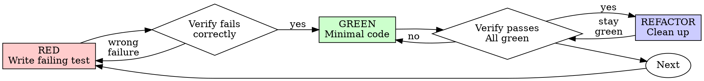

# Codex session 019fb439-290b-72f1-ab90-d211c51e762e

- Started: `2026-07-30T18:11:13.046Z`
- Working directory: `D:\100XH100`
- Originator: `Codex Desktop`
- Codex CLI: `0.146.0-alpha.3.1`
- Source log: `C:\Users\Иван Литвак\.codex\sessions\2026\07\30\rollout-2026-07-30T21-11-13-019fb439-290b-72f1-ab90-d211c51e762e.jsonl`
- Entries: user=1, assistant=2, tool calls=15, tool outputs=15

This is a chronological export of the user/assistant conversation and tool activity. Internal system/developer instructions and token accounting are intentionally excluded. Secret-shaped values are redacted; oversized tool outputs retain their beginning and end with the omitted character count.

## 1. User

Time: `2026-07-30T18:11:53.947Z` · source line `6`

```text
<recommended_plugins>
Here is a list of plugins that are available but not installed.

- Atlassian Rovo (atlassian-rovo@openai-curated-remote)
- Box (box@openai-curated-remote)
- Figma (figma@openai-curated-remote)
- Gmail (gmail@openai-curated-remote)
- Google Calendar (google-calendar@openai-curated-remote)
- Google Drive (google-drive@openai-curated-remote)
- Outlook Calendar (outlook-calendar@openai-curated-remote)
- Outlook Email (outlook-email@openai-curated-remote)
- SharePoint (sharepoint@openai-curated-remote)
- Slack (slack@openai-curated-remote)
- Teams (teams@openai-curated-remote)
</recommended_plugins>
# AGENTS.md instructions for D:\100XH100

<INSTRUCTIONS>
# Project Agent Rules

## Operating Rule
- Read `AGENTS.md` before project edits.
- Update `memory/CHANGELOG.md` after meaningful code, config, or architecture changes.
- Update `memory/PROMPTS.md` with user prompts that define requirements.
- Store test outputs, logs, and verification notes under `test_results/`.
- Prefer agent-centered code: explicit contracts, deterministic tests, small files, low hidden state.

## Architecture Source
- Primary architecture contract: `ARCHITECTURE_NEED.md`.
- Current Stream 4 implementation rule: use threshold + compact + CUB/fixed-temp sort/reduce + compact; do not use Stream 4 hash-table dedup.

## Implementation Guardrails
- `State128` logical bytes are `v[0..119]`.
- `State128` padding bytes are `v[120..127]`.
- Persistent frontier padding must be zero.
- `FinalResponse` may temporarily store `target_local_idx` in `v[120..123]`.
- `Hash128` is one logical 128-bit key stored as `{lo, hi}`.
- `CandidateMeta` must remain 32 bytes and 32-byte aligned.
- Stream 3 payload id must be original candidate id, not compact index.
- Stream 4 must not apply shard top-k or semantic shard cap.

</INSTRUCTIONS>
<environment_context>
  <cwd>D:\100XH100</cwd>
  <shell>powershell</shell>
  <current_date>2026-07-30</current_date>
  <timezone>Europe/Moscow</timezone>
  <filesystem><workspace_roots><root>D:\100XH100</root></workspace_roots><permission_profile type="managed"><file_system type="restricted"><entry access="read"><special>:root</special></entry><entry access="write"><path>D:\100XH100</path></entry><entry access="write"><special>:slash_tmp</special></entry><entry access="write"><special>:tmpdir</special></entry><entry access="write"><path>C:\Users\Иван Литвак\.codex\visualizations\2026\07\23\019f90a3-47e5-7770-a20e-cd9317bcbf2c</path></entry><entry access="read"><path>D:\100XH100\.git</path></entry><entry access="read"><path>D:\100XH100\.agents</path></entry><entry access="read"><path>D:\100XH100\.codex</path></entry></file_system></permission_profile></filesystem>
</environment_context>
```

## 2. Codex

Time: `2026-07-30T18:13:34.815Z` · source line `12`

```text
I’ll implement Task 1 in the Stream 1 worktree with a focused RED→GREEN test cycle, preserving existing changes. I’m using the TDD guidance because the task explicitly requires that workflow.
```

## 3. Tool call: `exec`

Time: `2026-07-30T18:13:38.568Z` · source line `14`

```text
const r = await tools.shell_command({"command":"Get-Content -Raw 'C:\\Users\\Иван Литвак\\.codex\\plugins\\cache\\openai-curated-remote\\superpowers\\6.2.0\\skills\\test-driven-development\\SKILL.md'; Get-Content -Raw 'D:\\100XH100\\.worktrees\\stream1-piece-transformer\\AGENTS.md'; Get-Content -Raw 'D:\\100XH100\\.worktrees\\stream1-piece-transformer\\.superpowers\\sdd\\cube4-transformer-kaggle\\task-1-brief.md'; rg -n -i -C 2 'cube4|transformer|kaggle' 'C:\\Users\\Иван Литвак\\.codex\\memories\\MEMORY.md'","workdir":"D:\\100XH100","timeout_ms":10000});
text(r.content.map(x=>x.text).join('\n'));
```

## 4. Tool output

Time: `2026-07-30T18:13:39.433Z` · source line `15`

```text
Script failed
Wall time 0.8 seconds
Output:

Script error:
TypeError: Cannot read properties of undefined (reading 'map')
    at exec_main.mjs:2:16
```

## 5. Tool call: `exec`

Time: `2026-07-30T18:13:47.183Z` · source line `18`

```text
const r = await tools.shell_command({"command":"Get-Content -Raw 'C:\\Users\\Иван Литвак\\.codex\\plugins\\cache\\openai-curated-remote\\superpowers\\6.2.0\\skills\\test-driven-development\\SKILL.md'; Get-Content -Raw 'D:\\100XH100\\.worktrees\\stream1-piece-transformer\\AGENTS.md'; Get-Content -Raw 'D:\\100XH100\\.worktrees\\stream1-piece-transformer\\.superpowers\\sdd\\cube4-transformer-kaggle\\task-1-brief.md'; rg -n -i -C 2 'cube4|transformer|kaggle' 'C:\\Users\\Иван Литвак\\.codex\\memories\\MEMORY.md'","workdir":"D:\\100XH100","timeout_ms":10000});
text(r);
```

## 6. Tool output

Time: `2026-07-30T18:13:47.992Z` · source line `19`

Oversized output: `3` characters omitted from the middle.

````text
Script completed
Wall time 0.7 seconds
Output:

Exit code: 0
Wall time: 0.6 seconds
Output:
---
name: test-driven-development
description: Use when implementing any feature or bugfix, before writing implementation code
---

# Test-Driven Development (TDD)

## Overview

Write the test first. Watch it fail. Write minimal code to pass.

**Core principle:** If you didn't watch the test fail, you don't know if it tests the right thing.

**Violating the letter of the rules is violating the spirit of the rules.**

## When to Use

**Always:**
- New features
- Bug fixes
- Refactoring
- Behavior changes

**Exceptions (ask your human partner):**
- Throwaway prototypes
- Generated code
- Configuration files

Thinking "skip TDD just this once"? Stop. That's rationalization.

## The Iron Law

```
NO PRODUCTION CODE WITHOUT A FAILING TEST FIRST
```

Write code before the test? Delete it. Start over.

**No exceptions:**
- Don't keep it as "reference"
- Don't "adapt" it while writing tests
- Don't look at it
- Delete means delete

Implement fresh from tests. Period.

## Red-Green-Refactor



### RED - Write Failing Test

Write one minimal test showing what should happen.

<Good>
```typescript
test('retries failed operations 3 times', async () => {
  let attempts = 0;
  const operation = () => {
    attempts++;
    if (attempts < 3) throw new Error('fail');
    return 'success';
  };

  const result = await retryOperation(operation);

  expect(result).toBe('success');
  expect(attempts).toBe(3);
});
```
Clear name, tests real behavior, one thing
</Good>

<Bad>
```typescript
test('retry works', async () => {
  const mock = jest.fn()
    .mockRejectedValueOnce(new Error())
    .mockRejectedValueOnce(new Error())
    .mockResolvedValueOnce('success');
  await retryOperation(mock);
  expect(mock).toHaveBeenCalledTimes(3);
});
```
Vague name, tests mock not code
</Bad>

**Requirements:**
- One behavior
- Clear name
- Real code (no mocks unless unavoidable)

### Verify RED - Watch It Fail

**MANDATORY. Never skip.**

```bash
npm test path/to/test.test.ts
```

Confirm:
- Test fails (not errors)
- Failure message is expected
- Fails because feature missing (not typos)

**Test passes?** You're testing existing behavior. Fix test.

**Test errors?** Fix error, re-run until it fails correctly.

### GREEN - Minimal Code

Write simplest code to pass the test.

<Good>
```typescript
async function retryOperation<T>(fn: () => Promise<T>): Promise<T> {
  for (let i = 0; i < 3; i++) {
    try {
      return await fn();
    } catch (e) {
      if (i === 2) throw e;
    }
  }
  throw new Error('unreachable');
}
```
Just enough to pass
</Good>

<Bad>
```typescript
async function retryOperation<T>(
  fn: () => Promise<T>,
  options?: {
    maxRetries?: number;
    backoff?: 'linear' | 'exponential';
    onRetry?: (attempt: number) => void;
  }
): Promise<T> {
  // YAGNI
}
```
Over-engineered
</Bad>

Don't add features, refactor other code, or "improve" beyond the test.

### Verify GREEN - Watch It Pass

**MANDATORY.**

```bash
npm test path/to/test.test.ts
```

Confirm:
- Test passes
- Other tests still pass
- Output pristine (no errors, warnings)

**Test fails?** Fix code, not test.

**Other tests fail?** Fix now.

### REFACTOR - Clean Up

After green only:
- Remove duplication
- Improve names
- Extract helpers

Keep tests green. Don't add behavior.

### Repeat

Next failing test for next feature.

## Good Tests

| Quality | Good | Bad |
|---------|------|-----|
| **Minimal** | One thing. "and" in name? Split it. | `test('validates email and domain and whitespace')` |
| **Clear** | Name describes behavior | `test('test1')` |
| **Shows intent** | Demonstrates desired API | Obscures what code should do |

When writing or changing any test, read [writing-good-tests.md](writing-good-tests.md) for the rules that keep tests honest:
- Name the production change that would make the test fail — before writing it
- Assert on real behavior, never on mock behavior
- Keep test-only code in test utilities, out of production classes
- Understand a dependency's side effects before mocking it

## Common Rationalizations

| Excuse | Reality |
|--------|---------|
| "Too simple to test" | Simple code breaks. Test takes 30 seconds. |
| "I'll test after" | Tests written after pass immediately — which proves nothing. They may test the wrong thing, test the implementation instead of the behavior, or miss the edge case you forgot. You never watched it fail, so you never proved it can catch the bug. Test-first forces that failure. |
| "Tests after achieve same goals (spirit not ritual)" | Tests-after answer "what does this do?"; tests-first answer "what should this do?" Tests written after are biased by the code you already wrote — you verify the cases you remembered, not the ones you'd have discovered. Coverage without proof the tests work. |
| "Already manually tested" | Manual testing is ad-hoc: no record of what you covered, no way to re-run it when the code changes, easy to forget cases under pressure. "Worked when I tried it" в‰  comprehensive. Automated tests run the same way every time. |
| "Deleting X hours is wasteful" | Sunk cost fallacy — that time is already spent either way. The real choice: rewrite with TDD (high confidence) vs. keep it and bolt tests on after (low confidence, likely bugs). Keeping code you can't trust is the waste. |
| "Keep as reference, write tests first" | You'll adapt it. That's testing after. Delete means delete. |
| "Need to explore first" | Fine. Throw away exploration, start with TDD. |
| "Test hard = design unclear" | Listen to test. Hard to test = hard to use. |
| "TDD will slow me down" | TDD IS the pragmatic path: catches bugs before commit, prevents regressions, lets you refactor without fear. "Pragmatic" shortcuts mean debugging in production — slower, not faster. |
| "Manual test faster" | Manual doesn't prove edge cases. You'll re-test every change. |
| "Existing code has no tests" | You're improving it. Add tests for existing code. |

## Red Flags - STOP and Start Over

- Code before test
- Test after implementation
- Test passes immediately
- Can't explain why test failed
- Tests added "later"
- Rationalizing "just this once"
- "I already manually tested it"
- "Tests after achieve the same purpose"
- "It's about spirit not ritual"
- "Keep as reference" or "adapt existing code"
- "Already spent X hours, deleting is wasteful"
- "TDD is dogmatic, I'm being pragmatic"
- "This is different because..."

**All of these mean: Delete code. Start over with TDD.**

## Example: Bug Fix

**Bug:** Empty email accepted

**RED**
```typescript
test('rejects empty email', async () => {
  const result = await submitForm({ email: '' });
  expect(result.error).toBe('Email required');
});
```

**Verify RED**
```bash
$ npm test
FAIL: expected 'Email required', got undefined
```

**GREEN**
```typescript
function submitForm(data: FormData) {
  if (!data.email?.trim()) {
    return { error: 'Email required' };
  }
  // ...
}
```

**Verify GREEN**
```bash
$ npm test
PASS
```

**REFACTOR**
Extract validation for multiple fields if needed.

## Verification Checklist

Before marking work complete:

- [ ] Every new function/method has a test
- [ ] Watched each test fail before implementing
- [ ] Each test failed for expected reason (feature missing, not typo)
- [ ] Wrote minimal code to pass each test
- [ ] All tests pass
- [ ] Output pristine (no errors, warnings)
- [ ] Tests use real code (mocks only if unavoidable)
- [ ] Edge cases and errors covered

Can't check all boxes? You skipped TDD. Start over.

## When Stuck

| Problem | Solution |
|---------|----------|
| Don't know how to test | Write wished-for API. Write assertion first. Ask your human partner. |
| Test too complicated | Design too complicated. Simplify interface. |
| Must mock everything | Code too coupled. Use dependency injection. |
| Test setup huge | Extract helpers. Still complex? Simplify design. |

## Debugging Integration

Bug found? Write failing test reproducing it. Follow TDD cycle. Test proves fix and prevents regression.

Never fix bugs without a test.

## Final Rule

```
Production code в†’ test exists and failed first
Otherwise в†’ not TDD
```

No exceptions without your human partner's permission.

# Project Agent Rules

## Operating Rule
- Read `AGENTS.md` before project edits.
- Update `memory/CHANGELOG.md` after meaningful code, config, or architecture changes.
- Update `memory/PROMPTS.md` with user prompts that define requirements.
- Store test outputs, logs, and verification notes under `test_results/`.
- Prefer agent-centered code: explicit contracts, deterministic tests, small files, low hidden state.

## Architecture Source
- Primary architecture contract: `ARCHITECTURE_NEED.md`.
- Current Stream 4 implementation rule: use threshold + compact + CUB/fixed-temp sort/reduce + compact; do not use Stream 4 hash-table dedup.

## Implementation Guardrails
- `State128` logical bytes are `v[0..119]`.
- `State128` padding bytes are `v[120..127]`.
- Persistent frontier padding must be zero.
- `FinalResponse` may temporarily store `target_local_idx` in `v[120..123]`.
- `Hash128` is one logical 128-bit key stored as `{lo, hi}`.
- `CandidateMeta` must remain 32 bytes and 32-byte aligned.
- Stream 3 payload id must be original candidate id, not compact index.
- Stream 4 must not apply shard top-k or semantic shard cap.

# Task 1: Cube4 exporter and runtime contract

Extend the Stream1 piece-transformer export/runtime metadata contract to support the supplied cube4 model:

- `state_len=96`
- `num_classes=6`
- `move_count=output_dim=24`
- `num_pieces=56`
- `max_piece_size=3`
- `num_piece_types=3`
- `seq_len=57` with CLS pooling
- `piece_layout=cube4`
- `piece_embed_mode=piece_local`
- activation `relu`

Export the cube4 piece position/mask/type tables from the trusted model layout and retain exact p900 support. Add focused tests that fail before implementation and pass afterward. Do not touch search semantics or CUDA beam architecture. Preserve unrelated dirty changes. Use the supplied archive at:

`D:\100XH100\test_results\cube4_full_transformer_inference_archive\cube4_full_transformer_inference`

Work in:

`D:\100XH100\.worktrees\stream1-piece-transformer`

Record RED and GREEN commands/output and exact files changed in the report:

`D:\100XH100\.worktrees\stream1-piece-transformer\.superpowers\sdd\cube4-transformer-kaggle\task-1-report.md`

1:# Task Group: D:\100XH100 project status, transformer CUDA performance, and Kaggle p990 diagnostics
2:scope: Reconstructing branch/worktree state, auditing Stream1 transformer acceleration, and validating comparable Kaggle p990 runs without conflating checkouts, GPUs, or unverified logs.
3:applies_to: cwd=D:\100XH100 (transformer worktree `D:\100XH100\.worktrees\stream1-piece-transformer`); reuse_rule=the audit and validation method is reusable for this project, but commits, target hardware, Kaggle access, and run outputs are time-specific.
4-
5:## Task 1: Summarize IHES, transformer, and Megaminx branch status, outcome success
6-
7-### rollout_summary_files
8-
9:- rollout_summaries/2026-07-18T05-46-52-WUjd-transformer_audit_and_kaggle_p990_log_access.md (cwd=D:\100XH100, rollout_path=C:\Users\Иван Литвак\.codex\sessions\2026\07\18\rollout-2026-07-18T08-46-58-019f73c3-64bf-7f92-b5ba-476ca2030d27.jsonl, updated_at=2026-07-23T18:02:17+00:00, thread_id=019f73c3-64bf-7f92-b5ba-476ca2030d27)
10-
11-### keywords
12-
13:- AGENTS.md, git worktree, memory/CHANGELOG.md, memory/PROMPTS.md, main 33acff6, stream1-piece-transformer a7a9ada, IHES, SLURM, SSH passphrase
14-
15:## Task 2: Audit transformer inference acceleration, outcome partial
16-
17-### rollout_summary_files
18-
19:- rollout_summaries/2026-07-18T05-46-52-WUjd-transformer_audit_and_kaggle_p990_log_access.md (cwd=D:\100XH100, rollout_path=C:\Users\Иван Литвак\.codex\sessions\2026\07\18\rollout-2026-07-18T08-46-58-019f73c3-64bf-7f92-b5ba-476ca2030d27.jsonl, updated_at=2026-07-23T18:02:17+00:00, thread_id=019f73c3-64bf-7f92-b5ba-476ca2030d27)
20-
21-### keywords
22-
23:- stream1-piece-transformer, CUTLASS, strided-QKV FMHA, m128n128, q64k64, Nsight Compute 2025.1.1, CUDA Graph, exact score dump, scalar Q=1, torch.distributed.run, NCCL
24-
25-## Task 3: Inspect native 2xT4 and original Vlad 10M p990 runs, outcome uncertain
--
27-### rollout_summary_files
28-
29:- rollout_summaries/2026-07-18T05-46-52-WUjd-transformer_audit_and_kaggle_p990_log_access.md (cwd=D:\100XH100, rollout_path=C:\Users\Иван Литвак\.codex\sessions\2026\07\18\rollout-2026-07-18T08-46-58-019f73c3-64bf-7f92-b5ba-476ca2030d27.jsonl, updated_at=2026-07-23T18:02:17+00:00, thread_id=019f73c3-64bf-7f92-b5ba-476ca2030d27)
30-
31-### keywords
32-
33:- Kaggle, p990, trydotatwo/cayley-beam-native-transformer-10m-p990, trydotatwo/cayley-beam-original-vlad-10m-p990, GPU_IDS='0', kernels.get, 403, Error: Forbidden, cuda:1, cuda:0
34-
35-## User preferences
--
43-## Reusable knowledge
44-
45:- A project-status audit must check `AGENTS.md`, `git status`, branches/worktrees, `memory/CHANGELOG.md`, `memory/PROMPTS.md`, and `test_results/`; `git branch` alone is insufficient. At the audit point `main` was `33acff6` and the transformer worktree was `a7a9ada`; do not mix their state. IHES MLP preparation for puzzle IDs 1001/1002 was complete, but SLURM was blocked by the SSH-key passphrase; transformer still needed a target-hardware end-to-end run. [Task 1]
46-- On local RTX 3070, runtime SM80 dispatch plus fused rounded bias+LayerNorm preserved the score digest and reached about `955065.5 candidates/s`; multifamily `m128n128` policies produced about 19.4% paired Stream1→2→3 improvement with exact score dumps. `q64k64` beat `q32k64` locally (`8.2158 ms` vs `8.4259 ms`). [Task 2]
47-- Native solver is real multi-GPU via `torch.distributed.run --nproc-per-node=2`/NCCL. The original Vlad fast path with `gpu_ids=0,1` failed because cached tensors stayed on `cuda:0`; its comparable baseline was changed only to one T4 (`GPU_IDS='0'`). [Task 2][Task 3]
48-
49:- Decomposed per-head QK/softmax/PV attention loses to launch overhead and global-memory round trips; strided-QKV CUTLASS FMHA materially improved T4 performance. LibTorch eager was faster on repeated Kaggle T4 tests, while native CUTLASS was stronger locally; validate per hardware. Exact p900 shape: `seq_len=51`, `d_model=256`, `nhead=8`, `head_dim=32`, `ff_dim=1024`, `output_dim=24`. [Task 1]
50-- On local RTX 3070, `m128n128` was selected after 240 exact dumps; full Stream1в†’2в†’3 improved `103.27 -> 83.23 ms` (19.4%), with Python `19/19` and production/CUDA CTest `16/16` passing. `q64k64` beat `q32k64` (`8.2158` vs `8.4259 ms`) with 40 byte-identical dumps. [Task 1]
51-
52-## Failures and how to do differently
53-
54:- symptom: a policy is faster locally. cause: SM86/local results were treated as transferable or standalone kernel time as production gain. fix: repeat benchmark and byte-exact gate on target hardware, then validate paired Stream1→2→3 or the full pipeline. CUDA Graph was 

[... 3 characters omitted from oversized tool output ...]

wer than eager in repeated Kaggle T4 LibTorch tests, so it is not a universal win. [Task 2]
55:- symptom: p990 result cannot be compared. cause: Kaggle access failed (`127.0.0.1:3067` unavailable, then `403` / `Permission 'kernels.get' was denied` / `Error: Forbidden`); `RUNNING` is not a runtime result. fix: restore account access, download output and rank logs, then compare wall time/progress with GPU count explicit. No run was stopped or modified during the diagnosis; v2 remains unverified. [Task 3]
56-
57-- symptom: NCU cannot profile. cause: PATH selects NCU `2026.1.1`, incompatible with driver `572.70`. fix: invoke `/opt/nvidia/nsight-compute/2025.1.1/ncu` explicitly. [Task 1]
--
265-- symptom: downloads look mostly done but the corpus is still incomplete. cause: completion was inferred from chunk progress instead of manifest coverage. fix: generate `missing_files.txt` from `files.txt`, then retry only the missing tail and keep shrinking stubborn chunks rather than increasing global concurrency [Task 3]
266-
267:# Task Group: Rogue TabFM-only Kaggle pipeline and pure-submission validation
268:scope: Building and iterating a pure TabFM Kaggle line in `Rogue`, validating the exact submission contract, and avoiding contamination from older non-TabFM submissions.
269-applies_to: cwd=C:\Users\Иван Литвак\Documents\Rogue; reuse_rule=reuse for this `Rogue` TabFM-only competition workflow, but do not mix it with the older `ROGUII` Molab-only stack unless the repo/cwd is explicitly the same and the user re-allows cross-line reuse.
270-
--
273-### rollout_summary_files
274-
275:- rollout_summaries/2026-07-02T21-06-07-Y2ve-rogii_tabfm_only_kaggle_v27_v28.md (cwd=\\?\C:\Users\Иван Литвак\Documents\Rogue, rollout_path=C:\Users\Иван Литвак\.codex\sessions\2026\07\03\rollout-2026-07-03T00-06-12-019f24a7-3d6a-7252-970a-650b42070c58.jsonl, updated_at=2026-07-05T17:40:06+00:00, thread_id=019f24a7-3d6a-7252-970a-650b42070c58, the submission contract and a new pure TabFM pipeline were validated locally before Kaggle runs)
276-
277-### keywords
--
279-- Rogue, ROGII, TabFM, pure TabFM, sample_submission.csv, id,tvt, post_ps_mask, well_id_row_id, rogue_tabfm, PYTHONPATH=src, offline assets, duplicate ids, NaN check
280-
281:## Task 2: Push pure TabFM kernels v27/v28 and validate the Kaggle outputs, outcome partial
282-
283-### rollout_summary_files
284-
285:- rollout_summaries/2026-07-02T21-06-07-Y2ve-rogii_tabfm_only_kaggle_v27_v28.md (cwd=\\?\C:\Users\Иван Литвак\Documents\Rogue, rollout_path=C:\Users\Иван Литвак\.codex\sessions\2026\07\03\rollout-2026-07-03T00-06-12-019f24a7-3d6a-7252-970a-650b42070c58.jsonl, updated_at=2026-07-05T17:40:06+00:00, thread_id=019f24a7-3d6a-7252-970a-650b42070c58, v27 proved to be a no-op while v28 completed cleanly and produced a pending competition submission ref)
286-
287-### keywords
288-
289:- kaggle kernels status, KernelWorkerStatus.COMPLETE, submission.csv, predict_anchor_stride=2048, anchors=11, 14151 rows, 0 NaNs, 0 duplicate ids, 54370026, SubmissionStatus.PENDING, 400 Bad Request -f submission.csv
290-
291-## User preferences
--
299-- local `inspect-data` validated `5,092,255` train rows, `773` train wells, `19,221` test rows, and `3` test wells; local tests/imports needed `PYTHONPATH=src` or `sys.path.insert(0, 'src')` when the package was not installed editable [Task 1]
300-- the kernel package should stay private, GPU-enabled, and internet-disabled when it relies on pre-bundled offline TabFM assets [Task 1]
301:- v27 stayed pure TabFM-only but matched the earlier pure TabFM baseline exactly, so it was not a real improvement; v28 changed only TabFM-internal runtime settings, especially `predict_anchor_stride=2048`, and completed successfully on Kaggle [Task 2]
302:- the validated v28 output signatures were `14151` rows, columns `['id', 'tvt']`, `0` NaNs, `0` duplicate ids, root `submission.csv` equal to `tabfm/submission.csv`, plus the kernel log line `using offline TabFM assets from /kaggle/input/rogii-tabfm-offline-assets` [Task 2]
303-- the actual competition submission ref was `54370026`, still `SubmissionStatus.PENDING` at rollout end; the comparison against v25 showed all rows changed with mean absolute diff about `0.0039998` and max absolute diff about `0.04961` [Task 2]
304-
305-## Failures and how to do differently
306-
307:- symptom: a Kaggle iteration drifts toward older blended ideas. cause: prior-submission knowledge leaks back into the design. fix: treat the user's "Только ТабМ" correction as a hard boundary and remove any baseline/core-ring blend path [Task 1][Task 2]
308-- symptom: local tests or CLI imports fail even though the code exists. cause: `src` is not on the import path. fix: set `PYTHONPATH=src` or insert `src` explicitly before running tests or local commands [Task 1]
309:- symptom: code competition submit returns `400 Bad Request`. cause: the Kaggle command omitted the required `-f submission.csv`. fix: submit with `-f submission.csv -k <kernel> -v 28 -m <message>` [Task 2]
310:- symptom: a kernel run completes but the rollout still lacks score evidence. cause: the competition submission remains `SubmissionStatus.PENDING`. fix: separate kernel-output validation from leaderboard scoring and do not claim a public score until Kaggle resolves the submission [Task 2]
311-
312-# Task Group: ChessMachineZero native training readiness, attention-purity contract, and docs-evidence hygiene
313:scope: Verifying transformer-training readiness in `ChessMachineZero` from fresh Docker/native runtime evidence, then cleaning docs so historical blockers do not read as current status.
314-applies_to: cwd=C:\Users\Иван Литвак\Documents\ChessMachineZero; reuse_rule=reuse for this repo's native training-readiness and docs-evidence workflows, but recheck the fresh image tag, contract output, and current evidence files before assuming the same readiness state still holds.
315-
--
336-## User preferences
337-
338:- when auditing readiness, the user asked to inspect whether the project is really ready for transformer training and whether it is all implemented through 2D self-attention -> answer from fresh code/contract/runtime evidence, not docs-only summaries [Task 1]
339-- when turning the result into final evidence, the user implicitly rejected overclaiming -> keep `max_plies=4` framed as bounded acceptance only, not a chess-strength claim [Task 1]
340-- when finalizing docs, the accepted cleanup removed stale blocker text instead of just appending a later PASS -> future evidence should rewrite or mark old blockers as historical/superseded so they do not still look current [Task 2]
--
658-- symptom: documentation/file edits consume time without progress. cause: Windows sandbox/edit restrictions on existing files. fix: preserve code/tests first, note blocked docs, and come back only if docs are explicitly required [Task 2][Task 3]
659-
660:# Task Group: Token_Lingv_Anal research readiness, executor-neutral benchmark workflow, and Kaggle packaging
661:scope: Taking `D:\Token_Lingv_Anal` from launch-planning into an executor-neutral benchmark workflow with dashboard-centered metalingv work, official-suite coverage, and Kaggle-ready packaging.
662:applies_to: cwd=D:\Token_Lingv_Anal; reuse_rule=reuse for this repo's benchmark-planning, executor-neutral evaluation, and Kaggle-packaging work, but recheck current docs, test counts, and generated artifact contracts before assuming the same commands or counts still hold.
663-
664-## Task 1: Research-ready dashboard planning and repo cleanup direction, outcome partial
--
666-### rollout_summary_files
667-
668:- rollout_summaries/2026-06-20T23-38-59-JBTv-token_lingv_anal_executor_neutral_benchmark_and_kaggle_prese.md (cwd=\\?\D:\Token_Lingv_Anal, rollout_path=\\?\C:\Users\Иван Литвак\.codex\sessions\2026\06\21\rollout-2026-06-21T02-38-59-019ee766-e1ef-7482-a66c-b913794f1f2d.jsonl, updated_at=2026-06-30T13:05:37+00:00, thread_id=019ee766-e1ef-7482-a66c-b913794f1f2d, planning pass reframed the repo around dashboard-centered metalingv work and executor-neutral measurement)
669-- rollout_summaries/2026-05-20T07-24-00-nz9l-metalinguistic_research_readiness_plan.md (cwd=D:\Token_Lingv_Anal, rollout_path=C:\Users\Иван Литвак\.codex\sessions\2026\05\20\rollout-2026-05-20T10-24-00-019e4445-1c1b-7051-ac35-85f5a96fc017.jsonl, updated_at=2026-06-20T23:38:49+00:00, thread_id=019e4445-1c1b-7051-ac35-85f5a96fc017, earlier planning turn established the desired launch-ready research end state)
670-
--
677-### rollout_summary_files
678-
679:- rollout_summaries/2026-06-20T23-38-59-JBTv-token_lingv_anal_executor_neutral_benchmark_and_kaggle_prese.md (cwd=\\?\D:\Token_Lingv_Anal, rollout_path=\\?\C:\Users\Иван Литвак\.codex\sessions\2026\06\21\rollout-2026-06-21T02-38-59-019ee766-e1ef-7482-a66c-b913794f1f2d.jsonl, updated_at=2026-06-30T13:05:37+00:00, thread_id=019ee766-e1ef-7482-a66c-b913794f1f2d, `bench run` was hardened around executor-neutral measurement with built-in catalog regimes plus one custom metalingv)
680-
681-### keywords
--
683-- bench run, include-catalog-regimes, metalingv-file, metalingv-id, metalingv-label, measurement_contract.executor_neutral, executor_neutral_21_smoke, bench_report.json, metrics.csv, analysis_ready
684-
685:## Task 3: Known official four-suite preset and Kaggle-ready packaging, outcome success
686-
687-### rollout_summary_files
688-
689:- rollout_summaries/2026-06-20T23-38-59-JBTv-token_lingv_anal_executor_neutral_benchmark_and_kaggle_prese.md (cwd=\\?\D:\Token_Lingv_Anal, rollout_path=\\?\C:\Users\Иван Литвак\.codex\sessions\2026\06\21\rollout-2026-06-21T02-38-59-019ee766-e1ef-7482-a66c-b913794f1f2d.jsonl, updated_at=2026-06-30T13:05:37+00:00, thread_id=019ee766-e1ef-7482-a66c-b913794f1f2d, the official four-suite preset and Kaggle packaging were verified with honest SWE harness labeling)
690-
691-### keywords
692-
693:- known_official_4suite_executor_neutral.json, swe_bench_verified.dev.jsonl, suite_metric_contracts, external_harness_suites, kaggle-workflow prepare, known-official-4suite-21-pack, kaggle_launch_manifest.json, ready_for_kaggle
694-
695-## Task 4: Verification and docs hardening for the executor-neutral workflow, outcome success
--
697-### rollout_summary_files
698-
699:- rollout_summaries/2026-06-20T23-38-59-JBTv-token_lingv_anal_executor_neutral_benchmark_and_kaggle_prese.md (cwd=\\?\D:\Token_Lingv_Anal, rollout_path=\\?\C:\Users\Иван Литвак\.codex\sessions\2026\06\21\rollout-2026-06-21T02-38-59-019ee766-e1ef-7482-a66c-b913794f1f2d.jsonl, updated_at=2026-06-30T13:05:37+00:00, thread_id=019ee766-e1ef-7482-a66c-b913794f1f2d, fresh unittest and artifact checks closed the rollout)
700-
701-### keywords
--
716-- `bench run` now accepts `--include-catalog-regimes`, `--metalingv-file`, `--metalingv-id`, and `--metalingv-label`, and the validated smoke path is `test_results/bench/executor_neutral_21_smoke` with `metalingv_count=21`, `rows=84`, and `analysis.publication_claim_gate=analysis_ready` [Task 2]
717-- the official reusable preset is `configs/benchmarks/known_official_4suite_executor_neutral.json`; the honest boundary is that LongBench v2, BRIGHT, and GAIA are locally scored, while `swe_bench_verified` stays labeled in `external_harness_suites` [Task 3]
718:- Kaggle packaging now threads the same metalingv flags through `kaggle-workflow prepare`, copies the custom metalingv file into the package, and produces a validated manifest at `test_results/kaggle_runs/known-official-4suite-21-pack/kaggle_launch_manifest.json` [Task 3]
719:- final verification for this workflow should use fresh commands plus artifact reads: `python -B -m unittest discover -s tests -q` -> `77 tests OK`, then direct checks of the generated `bench_report.json` and `kaggle_launch_manifest.json` [Task 4]
720-
721-## Failures and how to do differently
--
726-- symptom: persistent artifact creation fails on Windows with `WinError 5`. cause: this workspace intermittently blocks writes under `test_results\...`. fix: expect a workspace-write rerun path before trusting failed packaging/smoke attempts [Task 1][Task 2][Task 3]
727-
728:# Task Group: ROGUII Kaggle competition stack and Molab-only safe submission workflow
729:scope: Building and hardening the `ROGUII` Kaggle competition stack for top-rank iteration, with Molab-only execution, leakage-safe CV, and strict submission validation.
730:applies_to: cwd=C:\Users\Иван Литвак\Documents\ROGUII; reuse_rule=reuse for this competition repo and close Kaggle iteration workflows, but re-audit current repo files before trusting earlier partially validated scripts.
731-
732-## Task 1: Define the competition objective and create the local stack scaffold, outcome partial
--
734-### rollout_summary_files
735-
736:- rollout_summaries/2026-06-21T09-16-01-mFCh-rogii_kaggle_competition_stack_implementation.md (cwd=C:\Users\Иван Литвак\Documents\ROGUII, rollout_path=C:\Users\Иван Литвак\.codex\sessions\2026\06\21\rollout-2026-06-21T12-16-06-019ee977-2b48-7be3-9381-eda66e6a1209.jsonl, updated_at=2026-06-21T10:30:20+00:00, thread_id=019ee977-2b48-7be3-9381-eda66e6a1209, empty repo was turned into a competition pipeline scaffold with only partial functional validation)
737-
738-### keywords
739-
740:- Kaggle, ROGUII, top-1 leaderboard, PYTHONPATH=src, src/rogii, CLI, GroupKFold, LightGBM, CatBoost, sequence model, submission, configs/default.yaml
741-
742-## Task 2: Inspect the existing pipeline and enforce Molab-only, leakage-safe workflow expectations, outcome partial

````

## 7. Tool call: `exec`

Time: `2026-07-30T18:13:55.723Z` · source line `22`

```text
const r = await tools.shell_command({"command":"Get-Content -Raw 'C:\\Users\\Иван Литвак\\.codex\\plugins\\cache\\openai-curated-remote\\superpowers\\6.2.0\\skills\\test-driven-development\\writing-good-tests.md'; git status --short; rg -n -i \"piece_layout|piece_embed_mode|piece.*pos|piece.*mask|piece.*type|state_len|num_pieces|max_piece_size|seq_len\" . -g '!build/**' -g '!third_party/**'; Get-ChildItem -Force 'D:\\100XH100\\test_results\\cube4_full_transformer_inference_archive\\cube4_full_transformer_inference' | Select-Object Name,Length,Mode; rg --files 'D:\\100XH100\\.worktrees\\stream1-piece-transformer' | rg '(^|/|\\\\)(test|tests|export|runtime|model|transformer)'","workdir":"D:\\100XH100\\.worktrees\\stream1-piece-transformer","timeout_ms":20000});
text(r);
```

## 8. Tool output

Time: `2026-07-30T18:14:06.913Z` · source line `23`

```text
Script running with cell ID 3
Wall time 11.1 seconds
Output:

```

## 9. Tool call: `wait`

Time: `2026-07-30T18:14:12.675Z` · source line `26`

```text
{"cell_id":"3","yield_time_ms":10000,"max_tokens":20000}
```

## 10. Tool output

Time: `2026-07-30T18:14:16.093Z` · source line `27`

Oversized output: `8041` characters omitted from the middle.

````text
Script failed
Wall time 3.1 seconds
Output:

Script error:
Exit code: 124
Wall time: 20.1 seconds
Total output lines: 963
Output:
command timed out after 20134 milliseconds
# Writing Good Tests

**Load this reference when:** writing or changing tests, adding mocks, or
adding cleanup/helper methods for tests.

## Overview

A test exists to catch a specific break. Two principles govern everything
here:

```
1. Every test names the break it catches
2. Every test exercises the real thing
```

Strict TDD produces both naturally: a test written first and watched
failing against real code has already proven it can fail, and only earns
a mock when the real dependency proves slow or external.

## Principle 1: Name the Break

Before writing the test body, answer: **what production change should
make this test fail — and is that change a bug or a decision?** A test
earns its place by catching a wrong branch, missing side effect, wrong
argument, boundary case, or broken contract.

**Derive expectations independently.** Use literals and hand-checked
fixtures; table-driven tests with literal `want` values are the preferred
shape. An expectation computed by the code under test — or its helpers —
passes no matter what that code does:

```typescript
// ❌ Mirror assertion: the same builder computes both sides — always true
const expected = buildSearchQuery({ tag: 'urgent' });
expect(buildSearchQuery({ tag: 'urgent' })).toBe(expected);

// вњ… Hand-derived literal
expect(buildSearchQuery({ tag: 'urgent' })).toBe('tag:"urgent"');
```

**No change detectors.** If only intentional decisions can fail a test —
a constant's value, exact message wording, private structure — it fires
on redesign and sleeps through bugs. Test the behavior that depends on
the decision: not `expect(MAX_RETRIES).toBe(5)` but "a failing call is
retried 5 times and the 6th attempt never happens."

**Behavior, not text.** Asserting that a script, skill, or config
contains an exact line proves only that the source is the source. Run
scripts against controlled inputs and assert outputs, side effects, or
exit codes. Documents that instruct agents are tested by the consuming
agent's behavior (superpowers:writing-skills); prose for humans earns no
test at all.

**Your code, not the framework.** Test the contract your code makes at
its boundaries — the route you register, the query you emit, the payload
you produce. Upstream mechanics are their maintainers' tests to write
(the classic: asserting your router invokes a registered handler — that
is the framework's test, not yours). When upstream behavior genuinely
surprised you, write one narrow characterization test naming the
assumption. The same boundary applies inside your code: constructors,
getters, constants, and trivial forwarding earn tests only when they
validate, normalize, default, derive, enforce, or cause side effects —
otherwise assert the first consumer-visible result that depends on them.

### Gate Function

```
BEFORE writing the test body:
  Name the production change that would make this test fail.

  Cannot name one            в†’ redesign around an observable behavior
  "The source text changed"  в†’ run the artifact and assert its effects
  Only intentional decisions в†’ change detector; test the behavior
                               that depends on the decision

  Confirm the expected value is derived without the code under test.
  IF it reuses the code's logic or helpers:
    Replace it with a literal or hand-checked fixture
```

## Principle 2: Exercise the Real Thing

**The mock earns no assertions.** A mock assertion passes when the mock
is present and fails when it is absent — it says nothing about the
component. Assert the real component's behavior; if the mock is what you
are checking, unmock it or delete the assertion.

```typescript
// вњ… Real behavior
expect(screen.getByRole('navigation')).toBeInTheDocument();

// вќЊ Mock existence
expect(screen.getByTestId('sidebar-mock')).toBeInTheDocument();
```

**your human partner's correction:** "Are we testing the behavior of a
mock?"

**Mock at the right level.** Learn every side effect of the real method
before replacing it; mock the slow or external operation and keep what
the test depends on real. When unsure, run the test against the real
implementation first and observe what actually needs to happen.

```typescript
// вќЊ The mock swallows the config write that duplicate detection reads
vi.mock('ToolCatalog', () => ({
  discoverAndCacheTools: vi.fn().mockResolvedValue(undefined)
}));

// вњ… Mock only the slow server startup; the config write stays real
vi.mock('MCPServerManager');
```

**Make doubles specific.** When arguments, call counts, or ordering are
part of the contract, assert them — a fake that accepts anything verifies
nothing. Give each branch (success, error, malformed) its own fixture or
spy, so the wrong branch cannot satisfy the expectation.

**Mirror real data completely.** Mock the complete structure as it exists
in reality — all documented fields — not just the ones your test reads.
Partial mocks fail silently when downstream code reads an omitted field:
the test passes while integration breaks.

**Production classes carry production methods only.** Cleanup that only
tests need lives in test utilities, never as a `destroy()` on the
production class. Ask: is this method called only from tests? Does this
class own this resource's lifecycle? Wrong answers в†’ test utility.

**Prefer real components over complex mocks.** When mock setup outgrows
the test logic, mocks miss methods the real components have, or tests
break when the mock changes, switch to an integration test with real
components. **your human partner's question:** "Do we need to be using a
mock here?"

### Gate Function

```
BEFORE adding a mock or test helper:
  List the real method's side effects; keep the ones the test
  depends on real — mock the slow/external level below them.

  Mock responses mirror the complete real structure.

  A method only tests call lives in test utilities, not production.

  About to assert on the mock itself?
    Unmock it or delete the assertion.
```

## Tests Ship With the Implementation

The TDD cycle — failing test, minimal implementation, refactor — is what
"complete" means. Ship the tests the behavior needs and only those:
trivial code and human prose earn none, and a test written to satisfy
process costs maintenance forever.

## The Mutation Check

Before finishing, mentally mutate the production code; at least one test
should fail for each realistic mutation:

- Wrong constant or argument
- Wrong branch handler
- Missing state change or side effect
- Empty or default return
- Missing validation for zero, empty, nil, unauthorized, or malformed input

A mutation nothing catches marks the behavior as unprotected — or the
test as tautological.

## Quick Reference

| When you... | Do |
|-------------|-----|
| Write any test | Name the break it catches — a bug, not a decision |
| Build an expected value | Derive it by hand; never with the code under test |
| Test a script or document | Run it / pressure-test its consumer; never grep its text |
| Reach for a dependency test | Test your boundary contract, not their documented mechanics |
| Want to assert on a mocked element | Test the real component, or unmock it |
| Are about to mock a method | Learn its side effects; mock the slow/external level |
| Build a mock response | Mirror the real structure completely |
| Need cleanup only tests use | Put it in test utilities |
| Watch mock setup balloon | Switch to an integration test with real components |
| Finish a test file | Run the mutation check |

## Warning Signs

- Setup and assertion share the same object, guaranteeing equality
- The test can fail only through a panic, crash, or missing selector
- The test fails on every intentional change, never on accidental breakage
- Expected values are hidden behind loops, builders, or helpers
- The test greps source text, or asserts a removed symbol stays removed
- The test would still matter if only the framework remained
- The test exists for coverage, checking no side effect or outcome
- An assertion checks a `*-mock` test ID, or fails if you remove the mock
- A method is called only from test files
- Mock setup is more than half the test, or you can't explain why the mock is needed
- Mocking "just to be safe"

 M hpc/ihes_cube_model/ihes_solution_repair.sh
 M hpc/ihes_cube_model/ihes_solve_then_reflect.sh
 M memory/CHANGELOG.md
 M memory/PROMPTS.md
?? .gpu_queue/
?? .superpowers/
?? build-architecture-check/
?? build-cls-attn-libtorch/
?? build-cls-attn-local/
?? build-final-cls-check/
?? build-final-exchange-policy-check/
?? build-fused-ln-local/
?? build-ln-baseline-local/
?? build-native-eager-check/
?? build-real-parity/
?? build-ring-debug-check/
?? build-stream-pipeline-local86-rerun/
?? build-stream-pipeline-local86/
?? build-stream-pipeline-smoke-fix/
?? build-stream-pipeline-smoke/
?? build-transformer-macro-micro-check/
?? build-transformer-plan-libtorch/
?? build-transformer-plan-libtorch2/
?? build-transformer-plan-local86/
?? build-transformer-plan-native/
?? build-windowed-graph-check/
?? docs/plans/
?? kaggle_t4_transformer_solve_10m_native/
?? kaggle_t4_transformer_solve_10m_vlad/
?? kaggle_transformer_inference_speed/
.\build-final-cls-check\test_results\stream1_transformer_weight_sizes_ok\manifest.json:4:  "state_len": 120,
.\build-final-cls-check\test_results\stream1_transformer_weight_sizes_ok\manifest.json:7:  "num_pieces": 50,
.\build-final-cls-check\test_results\stream1_transformer_weight_sizes_ok\manifest.json:8:  "max_piece_size": 3,
.\build-final-cls-check\test_results\stream1_transformer_weight_sizes_ok\manifest.json:9:  "seq_len": 51,
.\build-final-cls-check\test_results\stream1_transformer_weight_sizes_ok\manifest.json:17:  "piece_layout": "p900",
.\build-final-cls-check\test_results\stream1_transformer_weight_sizes_ok\manifest.json:18:  "piece_embed_mode": "full_s120"
.\build-final-cls-check\test_results\stream1_transformer_weight_sizes_bad\manifest.json:4:  "state_len": 120,
.\build-final-cls-check\test_results\stream1_transformer_weight_sizes_bad\manifest.json:7:  "num_pieces": 50,
.\build-final-cls-check\test_results\stream1_transformer_weight_sizes_bad\manifest.json:8:  "max_piece_size": 3,
.\build-final-cls-check\test_results\stream1_transformer_weight_sizes_bad\manifest.json:9:  "seq_len": 51,
.\build-final-cls-check\test_results\stream1_transformer_weight_sizes_bad\manifest.json:17:  "piece_layout": "p900",
.\build-final-cls-check\test_results\stream1_transformer_weight_sizes_bad\manifest.json:18:  "piece_embed_mode": "full_s120"
.\build-final-cls-check\test_results\stream1_transformer_manifest_ok\manifest.json:4:  "state_len": 120,
.\build-final-cls-check\test_results\stream1_transformer_manifest_ok\manifest.json:7:  "num_pieces": 50,
.\build-final-cls-check\test_results\stream1_transformer_manifest_ok\manifest.json:8:  "max_piece_size": 3,
.\build-final-cls-check\test_results\stream1_transformer_manifest_ok\manifest.json:9:  "seq_len": 51,
.\build-final-cls-check\test_results\stream1_transformer_manifest_ok\manifest.json:17:  "piece_layout": "p900",
.\build-final-cls-check\test_results\stream1_transformer_manifest_ok\manifest.json:18:  "piece_embed_mode": "full_s120"
.\build-final-cls-check\test_results\stream1_transformer_manifest_mismatched_layers\manifest.json:4:  "state_len": 120,
.\build-final-cls-check\test_results\stream1_transformer_manifest_mismatched_layers\manifest.json:7:  "num_pieces": 50,
.\build-final-cls-check\test_results\stream1_transformer_manifest_mismatched_layers\manifest.json:8:  "max_piece_size": 3,
.\build-final-cls-check\test_results\stream1_transformer_manifest_mismatched_layers\manifest.json:9:  "seq_len": 51,
.\build-final-cls-check\test_results\stream1_transformer_manifest_mismatched_layers\manifest.json:18:  "piece_layout": "p900",
.\build-final-cls-check\test_results\stream1_transformer_manifest_mismatched_layers\manifest.json:19:  "piece_embed_mode": "full_s120"
.\build-final-cls-check\test_results\stream1_transformer_manifest_bad_seq_len\manifest.json:4:  "state_len": 120,
.\build-final-cls-check\test_results\stream1_transformer_manifest_bad_seq_len\manifest.json:7:  "num_pieces": 50,
.\build-final-cls-check\test_results\stream1_transformer_manifest_bad_seq_len\manifest.json:8:  "max_piece_size": 3,
.\build-final-cls-check\test_results\stream1_transformer_manifest_bad_seq_len\manifest.json:9:  "seq_len": 52,
.\build-final-cls-check\test_results\stream1_transformer_manifest_bad_seq_len\manifest.json:17:  "piece_layout": "p900",
.\build-final-cls-check\test_results\stream1_transformer_manifest_bad_seq_len\manifest.json:18:  "piece_embed_mode": "full_s120"
.\build-final-cls-check\test_results\stream1_transformer_manifest_bad_primary_layer\manifest.json:4:  "state_len": 120,
.\build-final-cls-check\test_results\stream1_transformer_manifest_bad_primary_layer\manifest.json:7:  "num_pieces": 50,
.\build-final-cls-check\test_results\stream1_transformer_manifest_bad_primary_layer\manifest.json:8:  "max_piece_size": 3,
.\build-final-cls-check\test_results\stream1_transformer_manifest_bad_primary_layer\manifest.json:9:  "seq_len": 51,
.\build-final-cls-check\test_results\stream1_transformer_manifest_bad_primary_layer\manifest.json:18:  "piece_layout": "p900",
.\build-final-cls-check\test_results\stream1_transformer_manifest_bad_primary_layer\manifest.json:19:  "piece_embed_mode": "full_s120"
.\build-final-cls-check\test_results\stream1_mlp_weight_loading_ok\manifest.json:4:  "state_len": 120,
.\build-final-cls-check\test_results\stream1_manifest_backend_unknown\manifest.json:4:  "state_len": 120,
.\build-final-cls-check\test_results\stream1_manifest_backend_piece_transformer\manifest.json:4:  "state_len": 120,
.\build-final-cls-check\test_results\stream1_manifest_backend_piece_transformer\manifest.json:7:  "num_pieces": 50,
.\build-final-cls-check\test_results\stream1_manifest_backend_piece_transformer\manifest.json:8:  "max_piece_size": 3,
.\build-final-cls-check\test_results\stream1_manifest_backend_piece_transformer\manifest.json:9:  "seq_len": 51,
.\build-final-cls-check\test_results\stream1_manifest_backend_piece_transformer\manifest.json:17:  "piece_layout": "p900",
.\build-final-cls-check\test_results\stream1_manifest_backend_piece_transformer\manifest.json:18:  "piece_embed_mode": "full_s120"
.\build-final-cls-check\test_results\stream1_manifest_backend_legacy_mlp\manifest.json:3:  "state_len": 120,
.\build-final-cls-check\test_results\stream1_manifest_backend_explicit_mlp\manifest.json:4:  "state_len": 120,
.\build-transformer-macro-micro-check\test_results\stream1_transformer_weight_sizes_ok\manifest.json:4:  "state_len": 120,
.\build-transformer-macro-micro-check\test_results\stream1_transformer_weight_sizes_ok\manifest.json:7:  "num_pieces": 50,
.\build-transformer-macro-micro-check\test_results\stream1_transformer_weight_sizes_ok\manifest.json:8:  "max_piece_size": 3,
.\build-transformer-macro-micro-check\test_results\stream1_transformer_weight_sizes_ok\manifest.json:9:  "seq_len": 51,
.\build-transformer-macro-micro-check\test_results\stream1_transformer_weight_sizes_ok\manifest.json:17:  "piece_layout": "p900",
.\build-transformer-macro-micro-check\test_results\stream1_transformer_weight_sizes_ok\manifest.json:18:  "piece_embed_mode": "full_s120"
.\weights\megaminx_vlad_transformer_fp16\manifest.json:4:  "state_len": 120,
.\weights\megaminx_vlad_transformer_fp16\manifest.json:8:  "num_pieces": 50,
.\weights\megaminx_vlad_transformer_fp16\manifest.json:9:  "max_piece_size": 3,
.\weights\megaminx_vlad_transformer_fp16\manifest.json:10:  "seq_len": 51,
.\weights\megaminx_vlad_transformer_fp16\manifest.json:18:  "piece_layout": "p900",
.\weights\megaminx_vlad_transformer_fp16\manifest.json:19:  "piece_embed_mode": "full_s120",
.\tools\stream_pipeli

[... 8041 characters omitted from oversized tool output ...]

ight_sizes_ok\manifest.json:7:  "num_pieces": 50,
.\build-cls-attn-local\test_results\stream1_transformer_weight_sizes_ok\manifest.json:8:  "max_piece_size": 3,
.\build-cls-attn-local\test_results\stream1_transformer_weight_sizes_ok\manifest.json:9:  "seq_len": 51,
.\build-cls-attn-local\test_results\stream1_transformer_weight_sizes_ok\manifest.json:17:  "piece_layout": "p900",
.\build-cls-attn-local\test_results\stream1_transformer_weight_sizes_ok\manifest.json:18:  "piece_embed_mode": "full_s120"
.\build-cls-attn-local\test_results\stream1_transformer_weight_sizes_bad\manifest.json:4:  "state_len": 120,
.\build-cls-attn-local\test_results\stream1_transformer_weight_sizes_bad\manifest.json:7:  "num_pieces": 50,
.\build-cls-attn-local\test_results\stream1_transformer_weight_sizes_bad\manifest.json:8:  "max_piece_size": 3,
.\build-cls-attn-local\test_results\stream1_transformer_weight_sizes_bad\manifest.json:9:  "seq_len": 51,
.\build-cls-attn-local\test_results\stream1_transformer_weight_sizes_bad\manifest.json:17:  "piece_layout": "p900",
.\build-cls-attn-local\test_results\stream1_transformer_weight_sizes_bad\manifest.json:18:  "piece_embed_mode": "full_s120"
.\build-cls-attn-local\test_results\stream1_transformer_manifest_ok\manifest.json:4:  "state_len": 120,
.\build-cls-attn-local\test_results\stream1_transformer_manifest_ok\manifest.json:7:  "num_pieces": 50,
.\build-cls-attn-local\test_results\stream1_transformer_manifest_ok\manifest.json:8:  "max_piece_size": 3,
.\build-cls-attn-local\test_results\stream1_transformer_manifest_ok\manifest.json:9:  "seq_len": 51,
.\build-cls-attn-local\test_results\stream1_transformer_manifest_ok\manifest.json:17:  "piece_layout": "p900",
.\build-cls-attn-local\test_results\stream1_transformer_manifest_ok\manifest.json:18:  "piece_embed_mode": "full_s120"
.\build-cls-attn-local\test_results\stream1_transformer_manifest_mismatched_layers\manifest.json:4:  "state_len": 120,
.\build-cls-attn-local\test_results\stream1_transformer_manifest_mismatched_layers\manifest.json:7:  "num_pieces": 50,
.\build-cls-attn-local\test_results\stream1_transformer_manifest_mismatched_layers\manifest.json:8:  "max_piece_size": 3,
.\build-cls-attn-local\test_results\stream1_transformer_manifest_mismatched_layers\manifest.json:9:  "seq_len": 51,
.\build-cls-attn-local\test_results\stream1_transformer_manifest_mismatched_layers\manifest.json:18:  "piece_layout": "p900",
.\build-cls-attn-local\test_results\stream1_transformer_manifest_mismatched_layers\manifest.json:19:  "piece_embed_mode": "full_s120"
.\build-cls-attn-local\test_results\stream1_transformer_manifest_bad_seq_len\manifest.json:4:  "state_len": 120,
.\build-cls-attn-local\test_results\stream1_transformer_manifest_bad_seq_len\manifest.json:7:  "num_pieces": 50,
.\build-cls-attn-local\test_results\stream1_transformer_manifest_bad_seq_len\manifest.json:8:  "max_piece_size": 3,
.\build-cls-attn-local\test_results\stream1_transformer_manifest_bad_seq_len\manifest.json:9:  "seq_len": 52,
.\build-cls-attn-local\test_results\stream1_transformer_manifest_bad_seq_len\manifest.json:17:  "piece_layout": "p900",
.\build-cls-attn-local\test_results\stream1_transformer_manifest_bad_seq_len\manifest.json:18:  "piece_embed_mode": "full_s120"
.\build-cls-attn-local\test_results\stream1_transformer_manifest_bad_primary_layer\manifest.json:4:  "state_len": 120,
.\build-cls-attn-local\test_results\stream1_transformer_manifest_bad_primary_layer\manifest.json:7:  "num_pieces": 50,
.\build-cls-attn-local\test_results\stream1_transformer_manifest_bad_primary_layer\manifest.json:8:  "max_piece_size": 3,
.\build-cls-attn-local\test_results\stream1_transformer_manifest_bad_primary_layer\manifest.json:9:  "seq_len": 51,
.\build-cls-attn-local\test_results\stream1_transformer_manifest_bad_primary_layer\manifest.json:18:  "piece_layout": "p900",
.\build-cls-attn-local\test_results\stream1_transformer_manifest_bad_primary_layer\manifest.json:19:  "piece_embed_mode": "full_s120"
.\build-cls-attn-local\test_results\stream1_manifest_backend_piece_transformer\manifest.json:4:  "state_len": 120,
.\build-cls-attn-local\test_results\stream1_manifest_backend_piece_transformer\manifest.json:7:  "num_pieces": 50,
.\build-cls-attn-local\test_results\stream1_manifest_backend_piece_transformer\manifest.json:8:  "max_piece_size": 3,
.\build-cls-attn-local\test_results\stream1_manifest_backend_piece_transformer\manifest.json:9:  "seq_len": 51,
.\build-cls-attn-local\test_results\stream1_manifest_backend_piece_transformer\manifest.json:17:  "piece_layout": "p900",
.\build-cls-attn-local\test_results\stream1_manifest_backend_piece_transformer\manifest.json:18:  "piece_embed_mode": "full_s120"
.\build-cls-attn-local\test_results\stream1_manifest_backend_legacy_mlp\manifest.json:3:  "state_len": 120,
.\build-cls-attn-local\test_results\stream1_mlp_weight_loading_ok\manifest.json:4:  "state_len": 120,
.\build-cls-attn-local\test_results\stream1_manifest_backend_explicit_mlp\manifest.json:4:  "state_len": 120,
.\build-cls-attn-local\test_results\stream1_manifest_backend_unknown\manifest.json:4:  "state_len": 120,
.\ARCHITECTURE_NEED.md:4:STATE_LEN
.\ARCHITECTURE_NEED.md:85:STATE_LEN = 120
.\build-architecture-check\test_results\stream1_transformer_manifest_mismatched_layers\manifest.json:4:  "state_len": 120,
.\build-architecture-check\test_results\stream1_transformer_manifest_mismatched_layers\manifest.json:7:  "num_pieces": 50,
.\build-architecture-check\test_results\stream1_transformer_manifest_mismatched_layers\manifest.json:8:  "max_piece_size": 3,
.\build-architecture-check\test_results\stream1_transformer_manifest_mismatched_layers\manifest.json:9:  "seq_len": 51,
.\build-architecture-check\test_results\stream1_transformer_manifest_mismatched_layers\manifest.json:18:  "piece_layout": "p900",
.\build-architecture-check\test_results\stream1_transformer_manifest_mismatched_layers\manifest.json:19:  "piece_embed_mode": "full_s120"
.\build-architecture-check\test_results\stream1_transformer_manifest_bad_seq_len\manifest.json:4:  "state_len": 120,
.\build-architecture-check\test_results\stream1_transformer_manifest_bad_seq_len\manifest.json:7:  "num_pieces": 50,
.\build-architecture-check\test_results\stream1_transformer_manifest_bad_seq_len\manifest.json:8:  "max_piece_size": 3,
.\build-architecture-check\test_results\stream1_transformer_manifest_bad_seq_len\manifest.json:9:  "seq_len": 52,
.\build-architecture-check\test_results\stream1_transformer_manifest_bad_seq_len\manifest.json:17:  "piece_layout": "p900",
.\build-architecture-check\test_results\stream1_transformer_manifest_bad_seq_len\manifest.json:18:  "piece_embed_mode": "full_s120"
.\build-architecture-check\test_results\stream1_transformer_manifest_bad_primary_layer\manifest.json:4:  "state_len": 120,
.\build-architecture-check\test_results\stream1_transformer_manifest_bad_primary_layer\manifest.json:7:  "num_pieces": 50,
.\build-architecture-check\test_results\stream1_transformer_manifest_bad_primary_layer\manifest.json:8:  "max_piece_size": 3,
.\build-architecture-check\test_results\stream1_transformer_manifest_bad_primary_layer\manifest.json:9:  "seq_len": 51,
.\build-architecture-check\test_results\stream1_transformer_manifest_bad_primary_layer\manifest.json:18:  "piece_layout": "p900",
.\build-architecture-check\test_results\stream1_transformer_manifest_bad_primary_layer\manifest.json:19:  "piece_embed_mode": "full_s120"
.\build-architecture-check\test_results\stream1_mlp_weight_loading_ok\manifest.json:4:  "state_len": 120,
.\build-architecture-check\test_results\stream1_manifest_backend_unknown\manifest.json:4:  "state_len": 120,
.\build-architecture-check\test_results\stream1_manifest_backend_piece_transformer\manifest.json:4:  "state_len": 120,
.\build-architecture-check\test_results\stream1_manifest_backend_piece_transformer\manifest.json:7:  "num_pieces": 50,
.\build-architecture-check\test_results\stream1_manifest_backend_piece_transformer\manifest.json:8:  "max_piece_size": 3,
.\build-architecture-check\test_results\stream1_manifest_backend_piece_transformer\manifest.json:9:  "seq_len": 51,
.\build-architecture-check\test_results\stream1_manifest_backend_piece_transformer\manifest.json:17:  "piece_layout": "p900",
.\build-architecture-check\test_results\stream1_manifest_backend_piece_transformer\manifest.json:18:  "piece_embed_mode": "full_s120"
.\build-architecture-check\test_results\stream1_manifest_backend_legacy_mlp\manifest.json:3:  "state_len": 120,
.\build-architecture-check\test_results\stream1_manifest_backend_explicit_mlp\manifest.json:4:  "state_len": 120,
.\build-architecture-check\test_results\stream1_transformer_manifest_ok\manifest.json:4:  "state_len": 120,
.\build-architecture-check\test_results\stream1_transformer_manifest_ok\manifest.json:7:  "num_pieces": 50,
.\build-architecture-check\test_results\stream1_transformer_manifest_ok\manifest.json:8:  "max_piece_size": 3,
.\build-architecture-check\test_results\stream1_transformer_manifest_ok\manifest.json:9:  "seq_len": 51,
.\build-architecture-check\test_results\stream1_transformer_manifest_ok\manifest.json:17:  "piece_layout": "p900",
.\build-architecture-check\test_results\stream1_transformer_manifest_ok\manifest.json:18:  "piece_embed_mode": "full_s120"
.\build-architecture-check\test_results\stream1_transformer_weight_sizes_ok\manifest.json:4:  "state_len": 120,
.\build-architecture-check\test_results\stream1_transformer_weight_sizes_ok\manifest.json:7:  "num_pieces": 50,
.\build-architecture-check\test_results\stream1_transformer_weight_sizes_ok\manifest.json:8:  "max_piece_size": 3,
.\build-architecture-check\test_results\stream1_transformer_weight_sizes_ok\manifest.json:9:  "seq_len": 51,
.\build-architecture-check\test_results\stream1_transformer_weight_sizes_ok\manifest.json:17:  "piece_layout": "p900",
.\build-architecture-check\test_results\stream1_transformer_weight_sizes_ok\manifest.json:18:  "piece_embed_mode": "full_s120"
.\build-architecture-check\test_results\stream1_transformer_weight_sizes_bad\manifest.json:4:  "state_len": 120,
.\build-architecture-check\test_results\stream1_transformer_weight_sizes_bad\manifest.json:7:  "num_pieces": 50,
.\build-architecture-check\test_results\stream1_transformer_weight_sizes_bad\manifest.json:8:  "max_piece_size": 3,
.\build-architecture-check\test_results\stream1_transformer_weight_sizes_bad\manifest.json:9:  "seq_len": 51,
.\build-architecture-check\test_results\stream1_transformer_weight_sizes_bad\manifest.json:17:  "piece_layout": "p900",
.\build-architecture-check\test_results\stream1_transformer_weight_sizes_bad\manifest.json:18:  "piece_embed_mode": "full_s120"
.\build-fused-ln-local\test_results\stream1_transformer_manifest_mismatched_layers\manifest.json:4:  "state_len": 120,
.\build-fused-ln-local\test_results\stream1_transformer_manifest_mismatched_layers\manifest.json:7:  "num_pieces": 50,
.\build-fused-ln-local\test_results\stream1_transformer_manifest_mismatched_layers\manifest.json:8:  "max_piece_size": 3,
.\build-fused-ln-local\test_results\stream1_transformer_manifest_mismatched_layers\manifest.json:9:  "seq_len": 51,
.\build-fused-ln-local\test_results\stream1_transformer_manifest_mismatched_layers\manifest.json:18:  "piece_layout": "p900",
.\build-fused-ln-local\test_results\stream1_transformer_manifest_mismatched_layers\manifest.json:19:  "piece_embed_mode": "full_s120"
.\build-fused-ln-local\test_results\stream1_manifest_backend_piece_transformer\manifest.json:4:  "state_len": 120,
.\build-fused-ln-local\test_results\stream1_manifest_backend_piece_transformer\manifest.json:7:  "num_pieces": 50,
.\build-fused-ln-local\test_results\stream1_manifest_backend_piece_transformer\manifest.json:8:  "max_piece_size": 3,
.\build-fused-ln-local\test_results\stream1_manifest_backend_piece_transformer\manifest.json:9:  "seq_len": 51,
.\build-fused-ln-local\test_results\stream1_manifest_backend_piece_transformer\manifest.json:17:  "piece_layout": "p900",
.\build-fused-ln-local\test_results\stream1_manifest_backend_piece_transformer\manifest.json:18:  "piece_embed_mode": "full_s120"
.\build-fused-ln-local\test_results\stream1_manifest_backend_explicit_mlp\manifest.json:4:  "state_len": 120,
.\build-fused-ln-local\test_results\stream1_manifest_backend_legacy_mlp\manifest.json:3:  "state_len": 120,
.\build-fused-ln-local\test_results\stream1_transformer_manifest_bad_primary_layer\manifest.json:4:  "state_len": 120,
.\build-fused-ln-local\test_results\stream1_transformer_manifest_bad_primary_layer\manifest.json:7:  "num_pieces": 50,
.\build-fused-ln-local\test_results\stream1_transformer_manifest_bad_primary_layer\manifest.json:8:  "max_piece_size": 3,
.\build-fused-ln-local\test_results\stream1_transformer_manifest_bad_primary_layer\manifest.json:9:  "seq_len": 51,
.\build-fused-ln-local\test_results\stream1_transformer_manifest_bad_primary_layer\manifest.json:18:  "piece_layout": "p900",
.\build-fused-ln-local\test_results\stream1_transformer_manifest_bad_primary_layer\manifest.json:19:  "piece_embed_mode": "full_s120"
.\build-fused-ln-local\test_results\stream1_mlp_weight_loading_ok\manifest.json:4:  "state_len": 120,
.\build-fused-ln-local\test_results\stream1_transformer_manifest_ok\manifest.json:4:  "state_len": 120,
.\build-fused-ln-local\test_results\stream1_transformer_manifest_ok\manifest.json:7:  "num_pieces": 50,
.\build-fused-ln-local\test_results\stream1_transformer_manifest_ok\manifest.json:8:  "max_piece_size": 3,
.\build-fused-ln-local\test_results\stream1_transformer_manifest_ok\manifest.json:9:  "seq_len": 51,
.\build-fused-ln-local\test_results\stream1_transformer_manifest_ok\manifest.json:17:  "piece_layout": "p900",
.\build-fused-ln-local\test_results\stream1_transformer_manifest_ok\manifest.json:18:  "piece_embed_mode": "full_s120"
.\build-fused-ln-local\test_results\stream1_manifest_backend_unknown\manifest.json:4:  "state_len": 120,
.\build-fused-ln-local\test_results\stream1_transformer_manifest_bad_seq_len\manifest.json:4:  "state_len": 120,
.\build-fused-ln-local\test_results\stream1_transformer_manifest_bad_seq_len\manifest.json:7:  "num_pieces": 50,
.\build-fused-ln-local\test_results\stream1_transformer_manifest_bad_seq_len\manifest.json:8:  "max_piece_size": 3,
.\build-fused-ln-local\test_results\stream1_transformer_manifest_bad_seq_len\manifest.json:9:  "seq_len": 52,
.\build-fused-ln-local\test_results\stream1_transformer_manifest_bad_seq_len\manifest.json:17:  "piece_layout": "p900",
.\build-fused-ln-local\test_results\stream1_transformer_manifest_bad_seq_len\manifest.json:18:  "piece_embed_mode": "full_s120"
.\build-fused-ln-local\test_results\stream1_transformer_weight_sizes_ok\manifest.json:4:  "state_len": 120,
.\build-fused-ln-local\test_results\stream1_transformer_weight_sizes_ok\manifest.json:7:  "num_pieces": 50,
.\build-fused-ln-local\test_results\stream1_transformer_weight_sizes_ok\manifest.json:8:  "max_piece_size": 3,
.\build-fused-ln-local\test_results\stream1_transformer_weight_sizes_ok\manifest.json:9:  "seq_len": 51,
.\build-fused-ln-local\test_results\stream1_transformer_weight_sizes_ok\manifest.json:17:  "piece_layout": "p900",
.\build-fused-ln-local\test_results\stream1_transformer_weight_sizes_ok\manifest.json:18:  "piece_embed_mode": "full_s120"
.\build-fused-ln-local\test_results\stream1_transformer_weight_sizes_bad\manifest.json:4:  "state_len": 120,
.\build-fused-ln-local\test_results\stream1_transformer_weight_sizes_bad\manifest.json:7:  "num_pieces": 50,
.\build-fused-ln-local\test_results\stream1_transformer_weight_sizes_bad\manifest.json:8:  "max_piece_size": 3,
.\build-fused-ln-local\test_results\stream1_transformer_weight_sizes_bad\manifest.json:9:  "seq_len": 51,
.\build-fused-ln-local\test_results\stream1_transformer_weight_sizes_bad\manifest.json:17:  "piece_layout": "p900",
.\build-fused-ln-local\test_results\stream1_transformer_weight_sizes_bad\manifest.json:18:  "piece_embed_mode": "full_s120"


````

## 11. Tool call: `exec`

Time: `2026-07-30T18:14:21.299Z` · source line `30`

```text
const r = await tools.shell_command({"command":"Get-Content -Path 'tools\\stream1_weight_io.hpp' -TotalCount 520; Get-ChildItem -Recurse -File 'D:\\100XH100\\test_results\\cube4_full_transformer_inference_archive\\cube4_full_transformer_inference' | Select-Object FullName,Length; rg -n \"stream1_transformer_manifest|weight_io|piece_transformer\" CMakeLists.txt tests tools -g '!build/**'","workdir":"D:\\100XH100\\.worktrees\\stream1-piece-transformer","timeout_ms":20000});
text(r);
```

## 12. Tool output

Time: `2026-07-30T18:14:22.380Z` · source line `31`

Oversized output: `5437` characters omitted from the middle.

```text
Script completed
Wall time 0.9 seconds
Output:

Exit code: 0
Wall time: 0.7 seconds
Output:
#pragma once

#include "../src/config.hpp"

#ifndef BEAM_STREAM1_WEIGHT_IO_MANIFEST_ONLY
#include "cuda_check.hpp"
#include "../cuda/stream1.hpp"

#include <cuda_fp16.h>
#include <cuda_runtime.h>
#endif

#include <cstddef>
#include <cstdint>
#include <filesystem>
#include <fstream>
#include <iterator>
#include <limits>
#include <stdexcept>
#include <string>
#include <vector>

namespace beam::stream1_weights {

inline constexpr std::uint32_t TRANSFORMER_NUM_CLASSES = 120;
inline constexpr std::uint32_t TRANSFORMER_NUM_PIECES = 50;
inline constexpr std::uint32_t TRANSFORMER_MAX_PIECE_SIZE = 3;
inline constexpr std::uint32_t TRANSFORMER_SEQ_LEN = 51;
inline constexpr std::uint32_t TRANSFORMER_D_MODEL = 256;
inline constexpr std::uint32_t TRANSFORMER_NHEAD = 8;
inline constexpr std::uint32_t TRANSFORMER_HEAD_DIM = 32;
inline constexpr std::uint32_t TRANSFORMER_LAYERS = 4;
inline constexpr std::uint32_t TRANSFORMER_FF_DIM = 1024;

struct HostTransformerBlockBytes {
    std::vector<std::byte> ln1_gamma;
    std::vector<std::byte> ln1_beta;
    std::vector<std::byte> attn_qkv_weight;
    std::vector<std::byte> attn_qkv_bias;
    std::vector<std::byte> attn_out_weight;
    std::vector<std::byte> attn_out_bias;
    std::vector<std::byte> ln2_gamma;
    std::vector<std::byte> ln2_beta;
    std::vector<std::byte> ff1_weight;
    std::vector<std::byte> ff1_bias;
    std::vector<std::byte> ff2_weight;
    std::vector<std::byte> ff2_bias;
};

struct HostTransformerBytes {
    std::vector<std::byte> fast_slot_projected;
    std::vector<std::byte> fast_piece_static;
    std::vector<std::byte> cls_token;
    std::vector<std::byte> input_ln_gamma;
    std::vector<std::byte> input_ln_beta;
    std::vector<std::byte> output_ln_gamma;
    std::vector<std::byte> output_ln_beta;
    std::vector<HostTransformerBlockBytes> blocks;
    std::vector<std::byte> output_weight;
    std::vector<std::byte> output_bias;
    std::vector<std::byte> piece_positions;
    std::vector<std::byte> piece_mask;
    std::vector<std::byte> piece_types;
};

struct HostWeightBytes {
    Stream1ModelConfig model;
    std::vector<std::byte> input_weight;
    std::vector<std::byte> input_bias;
    std::vector<std::byte> input_ln_gamma;
    std::vector<std::byte> input_ln_beta;
    std::vector<std::byte> hidden_weight;
    std::vector<std::byte> hidden_bias;
    std::vector<std::byte> hidden_ln_gamma;
    std::vector<std::byte> hidden_ln_beta;
    std::vector<std::vector<std::byte>> residual_fc1_weight;
    std::vector<std::vector<std::byte>> residual_fc1_bias;
    std::vector<std::vector<std::byte>> residual_fc1_ln_gamma;
    std::vector<std::vector<std::byte>> residual_fc1_ln_beta;
    std::vector<std::vector<std::byte>> residual_fc2_weight;
    std::vector<std::vector<std::byte>> residual_fc2_bias;
    std::vector<std::vector<std::byte>> residual_fc2_ln_gamma;
    std::vector<std::vector<std::byte>> residual_fc2_ln_beta;
    std::vector<std::byte> output_weight;
    std::vector<std::byte> output_bias;
    HostTransformerBytes transformer;
};

#ifndef BEAM_STREAM1_WEIGHT_IO_MANIFEST_ONLY
struct DeviceTransformerBlockWeights {
    half* ln1_gamma = nullptr;
    half* ln1_beta = nullptr;
    half* attn_qkv_weight = nullptr;
    half* attn_qkv_bias = nullptr;
    half* attn_out_weight = nullptr;
    half* attn_out_bias = nullptr;
    half* ln2_gamma = nullptr;
    half* ln2_beta = nullptr;
    half* ff1_weight = nullptr;
    half* ff1_bias = nullptr;
    half* ff2_weight = nullptr;
    half* ff2_bias = nullptr;
};

struct DeviceTransformerWeights {
    half* fast_slot_projected = nullptr;
    half* fast_piece_static = nullptr;
    half* cls_token = nullptr;
    half* input_ln_gamma = nullptr;
    half* input_ln_beta = nullptr;
    half* output_ln_gamma = nullptr;
    half* output_ln_beta = nullptr;
    std::vector<DeviceTransformerBlockWeights> blocks;
    half* output_weight = nullptr;
    half* output_bias = nullptr;
    std::uint16_t* piece_positions = nullptr;
    std::uint8_t* piece_mask = nullptr;
    std::uint8_t* piece_types = nullptr;
};

struct DeviceWeights {
    half* input_weight = nullptr;
    half* input_bias = nullptr;
    half* input_ln_gamma = nullptr;
    half* input_ln_beta = nullptr;
    half* hidden_weight = nullptr;
    half* hidden_bias = nullptr;
    half* hidden_ln_gamma = nullptr;
    half* hidden_ln_beta = nullptr;
    std::vector<half*> residual_fc1_weight;
    std::vector<half*> residual_fc1_bias;
    std::vector<half*> residual_fc1_ln_gamma;
    std::vector<half*> residual_fc1_ln_beta;
    std::vector<half*> residual_fc2_weight;
    std::vector<half*> residual_fc2_bias;
    std::vector<half*> residual_fc2_ln_gamma;
    std::vector<half*> residual_fc2_ln_beta;
    half** residual_fc1_weight_table = nullptr;
    half** residual_fc1_bias_table = nullptr;
    half** residual_fc1_ln_gamma_table = nullptr;
    half** residual_fc1_ln_beta_table = nullptr;
    half** residual_fc2_weight_table = nullptr;
    half** residual_fc2_bias_table = nullptr;
    half** residual_fc2_ln_gamma_table = nullptr;
    half** residual_fc2_ln_beta_table = nullptr;
    half* output_weight = nullptr;
    half* output_bias = nullptr;
    DeviceTransformerWeights transformer;
};

struct ScratchAllocation {
    half* hidden1 = nullptr;
    half* hidden2 = nullptr;
    half* residual = nullptr;
    half* output = nullptr;
    half* transformer_tokens = nullptr;
    half* transformer_qkv = nullptr;
    half* transformer_attention_scores_probs = nullptr;
    half* transformer_attention_context = nullptr;
    half* transformer_ff_hidden = nullptr;
    half* transformer_logits = nullptr;
};
#endif

inline std::string read_text_exact(const std::filesystem::path& path) {
    std::ifstream file(path, std::ios::binary);
    if (!file) {
        throw std::runtime_error("cannot open required text file: " + path.string());
    }
    return std::string(std::istreambuf_iterator<char>(file), std::istreambuf_iterator<char>());
}

inline std::vector<std::byte> read_binary_exact(
    const std::filesystem::path& path,
    std::uint64_t expected_bytes) {
    if (expected_bytes > static_cast<std::uint64_t>(std::numeric_limits<std::size_t>::max())) {
        throw std::runtime_error("binary expected size exceeds size_t: " + path.string());
    }
    std::ifstream file(path, std::ios::binary);
    if (!file) {
        throw std::runtime_error("cannot open required binary file: " + path.string());
    }
    std::vector<std::byte> bytes(static_cast<std::size_t>(expected_bytes));
    file.read(reinterpret_cast<char*>(bytes.data()), static_cast<std::streamsize>(bytes.size()));
    const std::size_t actual = static_cast<std::size_t>(file.gcount());
    file.peek();
    if (actual != bytes.size() || !file.eof()) {
        throw std::runtime_error(
            "binary file size mismatch: " + path.string() +
            " expected=" + std::to_string(bytes.size()) +
            " actual_read=" + std::to_string(actual));
    }
    return bytes;
}

inline bool manifest_has_key(const std::string& text, const char* key) {
    const std::string quoted = std::string("\"") + key + "\"";
    return text.find(quoted) != std::string::npos;
}

inline std::uint32_t parse_manifest_u32(const std::string& text, const char* key) {
    const std::string quoted = std::string("\"") + key + "\"";
    std::size_t pos = text.find(quoted);
    if (pos == std::string::npos) {
        throw std::runtime_error("stream1 manifest missing key: " + std::string(key));
    }
    pos = text.find(':', pos + quoted.size());
    if (pos == std::string::npos) {
        throw std::runtime_error("stream1 manifest malformed key: " + std::string(key));
    }
    ++pos;
    while (pos < text.size() && (text[pos] == ' ' || text[pos] == '\t' || text[pos] == '\r' || text[pos] == '\n')) {
        ++pos;
    }
    std::uint64_t value = 0;
    std::size_t digits = 0;
    while (pos < text.size() && text[pos] >= '0' && text[pos] <= '9') {
        value = value * 10ULL + static_cast<std::uint64_t>(text[pos] - '0');
        if (value > std::numeric_limits<std::uint32_t>::max()) {
            throw std::runtime_error("stream1 manifest key exceeds uint32: " + std::string(key));
        }
        ++pos;
        ++digits;
    }
    if (digits == 0) {
        throw std::runtime_error("stream1 manifest key is not uint32: " + std::string(key));
    }
    return static_cast<std::uint32_t>(value);
}

inline std::uint32_t parse_manifest_u32_any(
    const std::string& text,
    const char* primary_key,
    const char* fallback_key) {
    const bool primary_present = manifest_has_key(text, primary_key);
    const bool fallback_present = manifest_has_key(text, fallback_key);
    if (!primary_present) {
        return parse_manifest_u32(text, fallback_key);
    }
    const std::uint32_t primary = parse_manifest_u32(text, primary_key);
    if (!fallback_present) {
        return primary;
    }
    const std::uint32_t fallback = parse_manifest_u32(text, fallback_key);
    if (primary != fallback) {
        throw std::runtime_error(
            "stream1 manifest conflicting uint32 keys: " + std::string(primary_key) +
            "=" + std::to_string(primary) + " " + std::string(fallback_key) +
            "=" + std::to_string(fallback));
    }
    return primary;
}

inline std::string parse_manifest_string(const std::string& text, const char* key) {
    const std::string quoted = std::string("\"") + key + "\"";
    std::size_t pos = text.find(quoted);
    if (pos == std::string::npos) {
        throw std::runtime_error("stream1 manifest missing key: " + std::string(key));
    }
    pos = text.find(':', pos + quoted.size());
    if (pos == std::string::npos) {
        throw std::runtime_error("stream1 manifest malformed key: " + std::string(key));
    }
    pos = text.find('"', pos + 1);
    if (pos == std::string::npos) {
        throw std::runtime_error("stream1 manifest string missing opening quote: " + std::string(key));
    }
    const std::size_t start = pos + 1;
    pos = text.find('"', start);
    if (pos == std::string::npos) {
        throw std::runtime_error("stream1 manifest string missing closing quote: " + std::string(key));
    }
    return text.substr(start, pos - start);
}

inline std::string parse_manifest_string_default(
    const std::string& text,
    const char* key,
    const std::string& default_value) {
    try {
        return parse_manifest_string(text, key);
    } catch (const std::runtime_error&) {
        return default_value;
    }
}

inline void require_manifest_u32(
    std::uint32_t actual,
    std::uint32_t expected,
    const char* key,
    const std::string& context) {
    if (actual != expected) {
        throw std::runtime_error(
            context + ": stream1 piece_transformer " + key + " must be " + std::to_string(expected) +
            " got " + std::to_string(actual));
    }
}

inline void require_manifest_string(
    const std::string& actual,
    const char* expected,
    const char* key,
    const std::string& context) {
    if (actual != expected) {
        throw std::runtime_error(
            context + ": stream1 piece_transformer " + key + " must be " + expected + " got " + actual);
    }
}

inline void validate_mlp_model_config(const Stream1ModelConfig& model, const std::string& context) {
    if (model.state_len != STATE_LEN) {
        throw std::runtime_error(context + ": stream1 state_len must match compile-time STATE_LEN");
    }
    if (model.num_classes < STATE_LEN ||
        (model.output_dim != MOVE_COUNT && model.output_dim != STREAM1_SINGLE_SCORE_OUTPUT_DIM)) {
        throw std::runtime_error(context + ": stream1 num_classes/output_dim incompatible with current puzzle");
    }
    if (model.dtype != STREAM1_DTYPE_FP16 && model.dtype != STREAM1_DTYPE_BF16) {
        throw std::runtime_error(context + ": stream1 dtype must be fp16 or bf16");
    }
    if (model.normalization != STREAM1_NORM_NONE && model.normalization != STREAM1_NORM_LAYERNORM) {
        throw std::runtime_error(context + ": stream1 normalization must be none or layernorm");
    }
    if (model.hidden1 == 0U || model.hidden2 == 0U || model.residual_count == 0U) {
        throw std::runtime_error(context + ": stream1 hidden sizes and residual_count must be nonzero");
    }
    if (model.hidden1 < model.hidden2) {
        throw std::runtime_error(context + ": stream1 hidden1 must be >= hidden2 because Stream1 reuses hidden1 scratch for residual output");
    }
    if (model.hidden1 % 8U != 0U || model.hidden2 % 8U != 0U) {
        throw std::runtime_error(context + ": stream1 hidden sizes must be multiples of 8 for TensorOp path");
    }
}

inline void validate_transformer_model_config(
    const Stream1ModelConfig& model,
    const std::string& activation,
    const std::string& pooling,
    const std::string& piece_layout,
    const std::string& piece_embed_mode,
    const std::string& context) {
    if (model.dtype != STREAM1_DTYPE_FP16 && model.dtype != STREAM1_DTYPE_BF16) {
        throw std::runtime_error(context + ": stream1 piece_transformer dtype must be fp16 or bf16");
    }
    require_manifest_u32(model.state_len, static_cast<std::uint32_t>(STATE_LEN), "state_len", context);
    require_manifest_u32(model.num_classes, TRANSFORMER_NUM_CLASSES, "num_classes", context);
    require_manifest_u32(model.output_dim, static_cast<std::uint32_t>(MOVE_COUNT), "output_dim", context);
    require_manifest_u32(model.num_pieces, TRANSFORMER_NUM_PIECES, "num_pieces", context);
    require_manifest_u32(model.max_piece_size, TRANSFORMER_MAX_PIECE_SIZE, "max_piece_size", context);
    require_manifest_u32(model.seq_len, TRANSFORMER_SEQ_LEN, "seq_len", context);
    require_manifest_u32(model.d_model, TRANSFORMER_D_MODEL, "d_model", context);
    require_manifest_u32(model.nhead, TRANSFORMER_NHEAD, "nhead", context);
    require_manifest_u32(model.head_dim, TRANSFORMER_HEAD_DIM, "head_dim", context);
    require_manifest_u32(model.transformer_layers, TRANSFORMER_LAYERS, "transformer_layers", context);
    require_manifest_u32(model.ff_dim, TRANSFORMER_FF_DIM, "ff_dim", context);
    require_manifest_string(activation, "silu", "activation", context);
    require_manifest_string(pooling, "cls", "pooling", context);
    require_manifest_string(piece_layout, "p900", "piece_layout", context);
    require_manifest_string(piece_embed_mode, "full_s120", "piece_embed_mode", context);
}

inline Stream1ModelConfig load_stream1_manifest(const std::filesystem::path& dir) {
    const std::filesystem::path manifest_path = dir / "manifest.json";
    const std::string text = read_text_exact(manifest_path);
    const std::string dtype = parse_manifest_string(text, "dtype");
    if (dtype != "fp16" && dtype != "bf16") {
        throw std::runtime_error("stream1 manifest dtype must be fp16 or bf16: " + manifest_path.string());
    }

    Stream1ModelConfig model;
    model.dtype = dtype == "bf16" ? STREAM1_DTYPE_BF16 : STREAM1_DTYPE_FP16;
    const std::string backend = parse_manifest_string_default(text, "backend", "mlp");
    if (backend == "mlp") {
        model.backend = STREAM1_BACKEND_MLP;
        model.state_len = parse_manifest_u32(text, "state_len");
        model.num_classes = parse_manifest_u32(text, "num_classes");
        model.hidden1 = parse_manifest_u32_any(text, "hidden1", "hd1");
        model.hidden2 = parse_manifest_u32_any(text, "hidden2", "hd2");
        model.residual_count = parse_manifest_u32_any(text, "residual_count", "nrd");
        model.output_dim = 

[... 5437 characters omitted from oversized tool output ...]

ation == STREAM1_NORM_LAYERNORM) {
            weights.residual_fc2_ln_gamma[block] =
                read_binary_exact(dir / (prefix + "_fc2_ln_gamma" + suffix), fp16_bytes(model.hidden2));
            weights.residual_fc2_ln_beta[block] =
                read_binary_exact(dir / (prefix + "_fc2_ln_beta" + suffix), fp16_bytes(model.hidden2));
        }
    }
    weights.output_weight = read_binary_exact(
        dir / ("output_weight_hxk" + suffix),
        fp16_bytes(static_cast<std::uint64_t>(model.hidden2) * model.output_dim));
    weights.output_bias = read_binary_exact(dir / ("output_bias" + suffix), fp16_bytes(model.output_dim));
    return weights;
}

inline HostWeightBytes load_stream1_transformer_weights(const std::filesystem::path& dir, const Stream1ModelConfig& model) {
    HostWeightBytes weights;
    weights.model = model;
    const std::string suffix = weight_suffix(model);
    HostTransformerBytes& t = weights.transformer;
    t.fast_slot_projected = read_binary_exact(
        dir / ("fast_slot_projected" + suffix),
        fp16_bytes(static_cast<std::uint64_t>(model.max_piece_size) * model.num_classes * model.d_model));
    t.fast_piece_static = read_binary_exact(
        dir / ("fast_piece_static" + suffix),
        fp16_bytes(static_cast<std::uint64_t>(model.num_pieces) * model.d_model));
    t.cls_token = read_binary_exact(dir / ("cls_token" + suffix), fp16_bytes(model.d_model));
    t.input_ln_gamma = read_binary_exact(dir / ("input_ln_gamma" + suffix), fp16_bytes(model.d_model));
    t.input_ln_beta = read_binary_exact(dir / ("input_ln_beta" + suffix), fp16_bytes(model.d_model));
    t.output_ln_gamma = read_binary_exact(dir / ("output_ln_gamma" + suffix), fp16_bytes(model.d_model));
    t.output_ln_beta = read_binary_exact(dir / ("output_ln_beta" + suffix), fp16_bytes(model.d_model));
    t.blocks.resize(model.transformer_layers);
    for (std::uint32_t block = 0; block < model.transformer_layers; ++block) {
        const std::string prefix = "block" + std::to_string(block);
        HostTransformerBlockBytes& b = t.blocks[block];
        b.ln1_gamma = read_binary_exact(dir / (prefix + "_ln1_gamma" + suffix), fp16_bytes(model.d_model));
        b.ln1_beta = read_binary_exact(dir / (prefix + "_ln1_beta" + suffix), fp16_bytes(model.d_model));
        b.attn_qkv_weight = read_binary_exact(
            dir / (prefix + "_attn_qkv_weight_hxk" + suffix),
            fp16_bytes(3ULL * model.d_model * model.d_model));
        b.attn_qkv_bias = read_binary_exact(dir / (prefix + "_attn_qkv_bias" + suffix), fp16_bytes(3ULL * model.d_model));
        b.attn_out_weight = read_binary_exact(
            dir / (prefix + "_attn_out_weight_hxk" + suffix),
            fp16_bytes(static_cast<std::uint64_t>(model.d_model) * model.d_model));
        b.attn_out_bias = read_binary_exact(dir / (prefix + "_attn_out_bias" + suffix), fp16_bytes(model.d_model));
        b.ln2_gamma = read_binary_exact(dir / (prefix + "_ln2_gamma" + suffix), fp16_bytes(model.d_model));
        b.ln2_beta = read_binary_exact(dir / (prefix + "_ln2_beta" + suffix), fp16_bytes(model.d_model));
        b.ff1_weight = read_binary_exact(
            dir / (prefix + "_ff1_weight_hxk" + suffix),
            fp16_bytes(static_cast<std::uint64_t>(model.ff_dim) * model.d_model));
        b.ff1_bias = read_binary_exact(dir / (prefix + "_ff1_bias" + suffix), fp16_bytes(model.ff_dim));
        b.ff2_weight = read_binary_exact(

tools\export_stream1.py:20:    from tools.export_stream1_transformer import export_piece_transformer, strip_state_prefixes
tools\export_stream1.py:24:    from export_stream1_transformer import export_piece_transformer, strip_state_prefixes
tools\export_stream1.py:75:        export_piece_transformer(
tools\stream1_libtorch_ring_slot_launcher.cpp:55:            throw std::runtime_error("LibTorch Stream1 launcher supports only multi-output piece_transformer with output_dim == MOVE_COUNT");
tools\export_stream1_transformer.py:199:    if model_arch != "piece_transformer":
tools\export_stream1_transformer.py:200:        raise ValueError(f"metadata model_arch must be piece_transformer, got {model_arch!r}")
tools\export_stream1_transformer.py:203:        raise ValueError(f"piece_transformer export requires state_len=120, got {state_len}")
tools\export_stream1_transformer.py:205:        raise ValueError(f"piece_transformer export requires num_classes=120, got {num_classes}")
tools\export_stream1_transformer.py:212:        raise ValueError(f"piece_transformer export requires d_model=256, got {int(d_model)}")
tools\export_stream1_transformer.py:217:        raise ValueError(f"piece_transformer export requires max_piece_size=3, got {max_piece_size}")
tools\export_stream1_transformer.py:219:        raise ValueError(f"piece_transformer export requires num_pieces=50, got {num_pieces}")
tools\export_stream1_transformer.py:239:        raise ValueError(f"piece_transformer export requires move_count=24, got {move_count}")
tools\export_stream1_transformer.py:243:        raise ValueError(f"piece_transformer export requires output_dim=24, got {int(output_dim)}")
tools\export_stream1_transformer.py:256:        raise ValueError(f"piece_transformer export requires transformer_layers=4, got {num_layers}")
tools\export_stream1_transformer.py:264:        raise ValueError(f"piece_transformer export requires transformer_ff_dim=1024, got {ff_dim}")
tools\export_stream1_transformer.py:285:        raise ValueError(f"runtime piece_transformer export requires cls pooling, got {pooling}")
tools\export_stream1_transformer.py:292:        "backend": "piece_transformer",
tools\export_stream1_transformer.py:293:        "model_arch": "piece_transformer",
tools\export_stream1_transformer.py:459:            "backend": "piece_transformer",
tools\export_stream1_transformer.py:460:            "model_arch": "piece_transformer",
tools\export_stream1_transformer.py:472:def export_piece_transformer(
tools\export_stream1_transformer.py:518:        " format=piece_transformer"
tools\export_stream1_transformer.py:540:    export_piece_transformer(
tools\stream1_transformer_libtorch_backend.hpp:195:        if (manifest_string(manifest, "backend") != "piece_transformer") {
tools\stream1_transformer_libtorch_backend.hpp:196:            throw std::runtime_error("manifest backend must be piece_transformer");
tools\stream1_transformer_libtorch_backend.hpp:221:            throw std::runtime_error("invalid piece_transformer manifest dimensions");
tools\stream1_transformer_libtorch_backend.hpp:227:            throw std::runtime_error("unsupported piece_transformer manifest contract");
tools\stream1_transformer_backends.py:61:        description="Torch implementation over exported piece_transformer weights.",
tools\stream1_transformer_backends.py:230:    parser.add_argument("--weight-dir", help="Exported Stream1 piece_transformer weight directory.")
tests\dispatcher_cuda_tests.cu:4:#include "../tools/stream1_weight_io.hpp"
tests\dispatcher_cuda_tests.cu:224:        "piece_transformer runtime weight estimate must size fast_slot_projected by max_piece_size, not state_len");
tests\contract_tests.cpp:4:#include "../tools/stream1_weight_io.hpp"
tests\contract_tests.cpp:57:        "  \"backend\": \"piece_transformer\",\n"
tests\contract_tests.cpp:80:        "  \"backend\": \"piece_transformer\",\n"
tests\contract_tests.cpp:216:        write_transformer_manifest_fixture("stream1_manifest_backend_piece_transformer"));
tests\contract_tests.cpp:217:    require(transformer.backend == STREAM1_BACKEND_PIECE_TRANSFORMER, "piece_transformer manifest must parse as transformer");
tests\contract_tests.cpp:224:        unknown_threw = error_contains(error, "accepted values: mlp, piece_transformer");
tests\contract_tests.cpp:228:void test_stream1_transformer_manifest_contract() {
tests\contract_tests.cpp:230:        write_transformer_manifest_fixture("stream1_transformer_manifest_ok"));
tests\contract_tests.cpp:247:            write_transformer_manifest_fixture("stream1_transformer_manifest_bad_seq_len", 52));
tests\contract_tests.cpp:257:                "stream1_transformer_manifest_bad_primary_layer",
tests\contract_tests.cpp:270:                "stream1_transformer_manifest_mismatched_layers",
tests\contract_tests.cpp:341:        throw std::runtime_error("piece_transformer sample config metadata mismatch");
tests\contract_tests.cpp:344:        throw std::runtime_error("piece_transformer backend must use parent rows");
tests\contract_tests.cpp:385:    test_stream1_transformer_manifest_contract();
tests\contract_tests.cpp:386:    report << "- stream1_transformer_manifest_contract=pass\n";
tools\production_runner.cu:2:#include "stream1_weight_io.hpp"
tools\production_runner.cu:4117:            throw std::runtime_error("BEAM_STREAM1_EXECUTOR=libtorch_eager requires stream1 backend piece_transformer");
tools\production_runner.cu:4322:              << (stream1_model.backend == STREAM1_BACKEND_PIECE_TRANSFORMER ? "piece_transformer" : "mlp") << "\n";
tools\production_runner.cu:4461:              << (stream1_model.backend == STREAM1_BACKEND_PIECE_TRANSFORMER ? "piece_transformer" : "mlp") << "\n";
tests\stream1_transformer_cuda_tests.cu:3:#include "../tools/stream1_weight_io.hpp"
tests\stream1_transformer_cuda_tests.cu:132:    require(host_weights.model.backend == STREAM1_BACKEND_PIECE_TRANSFORMER, "fixture must be piece_transformer");
tests\test_stream1_transformer_exporter.py:14:def make_piece_transformer_state(num_layers=4, output_dim=24, ff_dim=1024):
tests\test_stream1_transformer_exporter.py:49:        "model_arch": "piece_transformer",
tests\test_stream1_transformer_exporter.py:67:    def test_detects_piece_transformer_from_marker_keys_after_prefix_strip(self):
tests\test_stream1_transformer_exporter.py:68:        sd = {f"module._orig_mod.{key}": value for key, value in make_piece_transformer_state().items()}
tests\test_stream1_transformer_exporter.py:74:    def test_infers_required_p900_piece_transformer_architecture(self):
tests\test_stream1_transformer_exporter.py:76:            make_piece_transformer_state(),
tests\test_stream1_transformer_exporter.py:81:        self.assertEqual(arch["backend"], "piece_transformer")
tests\test_stream1_transformer_exporter.py:95:    def test_rejects_consistent_non_24_move_piece_transformer(self):
tests\test_stream1_transformer_exporter.py:98:                make_piece_transformer_state(output_dim=23),
tests\test_stream1_transformer_exporter.py:104:    def test_rejects_consistent_non_4_layer_piece_transformer(self):
tests\test_stream1_transformer_exporter.py:107:                make_piece_transformer_state(num_layers=3),
tests\test_stream1_transformer_exporter.py:113:    def test_rejects_consistent_non_1024_ff_piece_transformer(self):
tests\test_stream1_transformer_exporter.py:116:                make_piece_transformer_state(ff_dim=2048),
tests\test_stream1_transformer_exporter.py:123:        sd = make_piece_transformer_state()
tools\stream_benchmark.cu:80:        report << "- stream1_backend=piece_transformer\n\n";
tools\stream1_weight_io.hpp:294:            context + ": stream1 piece_transformer " + key + " must be " + std::to_string(expected) +
tools\stream1_weight_io.hpp:306:            context + ": stream1 piece_transformer " + key + " must be " + expected + " got " + actual);
tools\stream1_weight_io.hpp:343:        throw std::runtime_error(context + ": stream1 piece_transformer dtype must be fp16 or bf16");
tools\stream1_weight_io.hpp:392:    if (backend == "piece_transformer") {
tools\stream1_weight_io.hpp:414:    throw std::runtime_error("stream1 manifest backend must be one of accepted values: mlp, piece_transformer: " + manifest_path.string());
tools\stream1_weight_io.hpp:893:        throw std::runtime_error("piece_transformer Stream1 inference is not implemented in the MLP network view");
tools\stream1_weight_io.hpp:911:        throw std::runtime_error("MLP Stream1 model cannot be viewed as a piece_transformer");
tools\stream1_weight_io.hpp:937:        throw std::runtime_error("MLP Stream1 weights cannot be viewed as a piece_transformer");
tools\stream1_weight_io.hpp:988:        throw std::runtime_error("piece_transformer Stream1 scratch cannot be viewed as MLP scratch");
tools\stream1_weight_io.hpp:1015:        throw std::runtime_error("MLP Stream1 scratch cannot be viewed as a piece_transformer");
tools\stream1_transformer_torch_benchmark.py:91:        if self.manifest.get("backend") != "piece_transformer":
tools\stream1_transformer_torch_benchmark.py:92:            raise ValueError("manifest backend must be piece_transformer")
tools\stream_pipeline_benchmark.cu:132:        throw std::runtime_error("stream_pipeline_benchmark requires piece_transformer Stream1 weights");
tools\stream_benchmark_transformer.cu:186:        throw std::runtime_error("benchmark_stream1_transformer requires piece_transformer backend");
tools\stream_benchmark_common.hpp:4:#include "stream1_weight_io.hpp"
FullName                                                                                                               
--------                                                                                                               
D:\100XH100\test_results\cube4_full_transformer_inference_archive\cube4_full_transformer_inference\README.md           
D:\100XH100\test_results\cube4_full_transformer_inference_archive\cube4_full_transformer_inference\requirements.txt    
D:\100XH100\test_results\cube4_full_transformer_inference_archive\cube4_full_transformer_inference\SHA256SUMS          
D:\100XH100\test_results\cube4_full_transformer_inference_archive\cube4_full_transformer_inference\test.py             
D:\100XH100\test_results\cube4_full_transformer_inference_archive\cube4_full_transformer_inference\generators\p002.json
D:\100XH100\test_results\cube4_full_transformer_inference_archive\cube4_full_transformer_inference\model\model.json    
D:\100XH100\test_results\cube4_full_transformer_inference_archive\cube4_full_transformer_inference\model\model.pth     
D:\100XH100\test_results\cube4_full_transformer_inference_archive\cube4_full_transformer_inference\pilgrim\best_firs...
D:\100XH100\test_results\cube4_full_transformer_inference_archive\cube4_full_transformer_inference\pilgrim\factory.py  
D:\100XH100\test_results\cube4_full_transformer_inference_archive\cube4_full_transformer_inference\pilgrim\model.py    
D:\100XH100\test_results\cube4_full_transformer_inference_archive\cube4_full_transformer_inference\pilgrim\parallel.py 
D:\100XH100\test_results\cube4_full_transformer_inference_archive\cube4_full_transformer_inference\pilgrim\qsearcher.py
D:\100XH100\test_results\cube4_full_transformer_inference_archive\cube4_full_transformer_inference\pilgrim\searcher.py 
D:\100XH100\test_results\cube4_full_transformer_inference_archive\cube4_full_transformer_inference\pilgrim\trainer.py  
D:\100XH100\test_results\cube4_full_transformer_inference_archive\cube4_full_transformer_inference\pilgrim\utils.py    
D:\100XH100\test_results\cube4_full_transformer_inference_archive\cube4_full_transformer_inference\pilgrim\__init__.py 
D:\100XH100\test_results\cube4_full_transformer_inference_archive\cube4_full_transformer_inference\targets\p002-t000.pt
D:\100XH100\test_results\cube4_full_transformer_inference_archive\cube4_full_transformer_inference\unified_training\...
D:\100XH100\test_results\cube4_full_transformer_inference_archive\cube4_full_transformer_inference\unified_training\...
D:\100XH100\test_results\cube4_full_transformer_inference_archive\cube4_full_transformer_inference\unified_training\...
D:\100XH100\test_results\cube4_full_transformer_inference_archive\cube4_full_transformer_inference\unified_training\...
D:\100XH100\test_results\cube4_full_transformer_inference_archive\cube4_full_transformer_inference\unified_training\...


```

## 13. Tool call: `exec`

Time: `2026-07-30T18:14:28.719Z` · source line `34`

```text
const r = await tools.shell_command({"command":"Get-Content -Raw 'tools\\export_stream1_transformer.py'; Get-Content -Path 'tests\\test_stream1_transformer_exporter.py' -TotalCount 260; Get-Content -Raw 'D:\\100XH100\\test_results\\cube4_full_transformer_inference_archive\\cube4_full_transformer_inference\\model\\model.json'; rg -n -C 4 \"piece|layout|pos|mask|type\" 'D:\\100XH100\\test_results\\cube4_full_transformer_inference_archive\\cube4_full_transformer_inference\\pilgrim\\model.py' 'D:\\100XH100\\test_results\\cube4_full_transformer_inference_archive\\cube4_full_transformer_inference\\unified_training'","workdir":"D:\\100XH100\\.worktrees\\stream1-piece-transformer","timeout_ms":20000});
text(r);
```

## 14. Tool output

Time: `2026-07-30T18:14:29.534Z` · source line `35`

Oversized output: `8150` characters omitted from the middle.

```text
Script completed
Wall time 0.7 seconds
Output:

Warning: truncated output (original token count: 10025)
Total output lines: 559

Exit code: 0
Wall time: 0.6 seconds
Total output lines: 1364
Output:
#!/usr/bin/env python3
"""Export Kaggle p900 PilgrimPieceTransformer weights for Stream1."""

from __future__ import annotations

import argparse
import importlib
import json
import re
import sys
from pathlib import Path
from typing import Any, Mapping

import numpy as np
import torch
import torch.nn.functional as F

try:
    from tools.export_stream1_mlp import tensor_bytes, weight_suffix, write_hxk, write_vec
except ModuleNotFoundError:
    sys.path.insert(0, str(Path(__file__).resolve().parent))
    from export_stream1_mlp import tensor_bytes, weight_suffix, write_hxk, write_vec


TensorDict = dict[str, torch.Tensor]
REQUIRED_MOVE_COUNT = 24
REQUIRED_TRANSFORMER_LAYERS = 4
REQUIRED_TRANSFORMER_FF_DIM = 1024


def unwrap_state_dict(obj: Any) -> TensorDict:
    if isinstance(obj, dict):
        for key in ("state_dict", "model_state_dict", "model", "net", "module"):
            value = obj.get(key)
            if isinstance(value, dict):
                return value
        return obj
    raise TypeError(f"unsupported checkpoint root type: {type(obj).__name__}")


def strip_state_prefixes(sd: Mapping[str, Any]) -> TensorDict:
    stripped: TensorDict = {}
    for key, value in sd.items():
        clean = str(key)
        changed = True
        while changed:
            changed = False
            for prefix in ("module.", "_orig_mod."):
                if clean.startswith(prefix):
                    clean = clean[len(prefix) :]
                    changed = True
        stripped[clean] = value
    return stripped


def load_checkpoint_state(weights_path: Path) -> TensorDict:
    checkpoint = torch.load(weights_path, map_location="cpu", weights_only=False)
    sd = strip_state_prefixes(unwrap_state_dict(checkpoint))
    return {key: value.detach().cpu() if isinstance(value, torch.Tensor) else value for key, value in sd.items()}


def read_json(path: Path) -> dict[str, Any]:
    return json.loads(path.read_text(encoding="utf-8"))


def nearby_roots(weights_path: Path) -> list[Path]:
    roots: list[Path] = []
    for start in (weights_path.parent, *weights_path.parents):
        if start not in roots:
            roots.append(start)
    return roots


def locate_metadata(weights_path: Path, explicit: Path | None) -> Path:
    if explicit is not None:
        return explicit
    candidates: list[Path] = []
    for root in nearby_roots(weights_path):
        logs = root / "logs"
        if logs.is_dir():
            candidates.extend(sorted(logs.glob("model_*.json")))
    matching: list[Path] = []
    for candidate in candidates:
        try:
            data = read_json(candidate)
        except Exception:
            continue
        if Path(str(data.get("best_weights_file", ""))).name == weights_path.name:
            matching.append(candidate)
        elif str(data.get("model_id", "")) and str(data["model_id"]) in weights_path.stem:
            matching.append(candidate)
    if len(matching) == 1:
        return matching[0]
    if not matching and len(candidates) == 1:
        return candidates[0]
    raise FileNotFoundError("could not uniquely auto-locate metadata; pass --metadata")


def locate_generator(weights_path: Path, metadata: Mapping[str, Any], explicit: Path | None) -> Path:
    if explicit is not None:
        return explicit
    group_id = metadata.get("group_id")
    names = [f"p{group_id}.json"] if group_id is not None else []
    candidates: list[Path] = []
    for root in nearby_roots(weights_path):
        gen_dir = root / "generators"
        if gen_dir.is_dir():
            for name in names:
                path = gen_dir / name
                if path.is_file():
                    return path
            candidates.extend(sorted(gen_dir.glob("p*.json")))
    if len(candidates) == 1:
        return candidates[0]
    raise FileNotFoundError("could not uniquely auto-locate generator JSON; pass --generators")


def locate_source_root(weights_path: Path, metadata_path: Path | None, explicit: Path | None) -> Path:
    if explicit is not None:
        return explicit
    starts = [weights_path.parent, *weights_path.parents]
    if metadata_path is not None:
        starts.extend([metadata_path.parent, *metadata_path.parents])
    seen: set[Path] = set()
    for root in starts:
        if root in seen:
            continue
        seen.add(root)
        if (root / "pilgrim" / "model.py").is_file():
            return root
    raise FileNotFoundError("could not auto-locate source root containing pilgrim/model.py; pass --source-root")


def load_move_names(generator: Mapping[str, Any]) -> list[str]:
    names = generator.get("names")
    if isinstance(names, list) and all(isinstance(name, str) for name in names):
        return list(names)
    gens = generator.get("generators")
    if isinstance(gens, list):
        out = []
        for idx, item in enumerate(gens):
            if isinstance(item, Mapping) and isinstance(item.get("name"), str):
                out.append(str(item["name"]))
            else:
                out.append(str(idx))
        return out
    raise ValueError("generator JSON must contain move names in 'names' or 'generators'")


def import_model_module(source_root: Path):
    root = str(source_root)
    if root not in sys.path:
        sys.path.insert(0, root)
    return importlib.import_module("pilgrim.model")


def load_piece_layout(source_root: Path) -> tuple[torch.Tensor, torch.Tensor, torch.Tensor]:
    model_module = import_model_module(source_root)
    piece_positions, piece_mask, piece_types = model_module.make_p900_piece_layout()
    return piece_positions.cpu(), piece_mask.cpu(), piece_types.cpu()


def block_indices(sd: Mapping[str, Any]) -> list[int]:
    found = sorted(
        int(match.group(1))
        for key in sd
        for match in [re.match(r"^blocks\.(\d+)\.attn\.in_proj_weight$", key)]
        if match
    )
    if not found:
        raise ValueError("no transformer blocks found")
    expected = list(range(found[-1] + 1))
    if found != expected:
        raise ValueError(f"transformer block indices are not contiguous: found={found}")
    return found


def require_shape(sd: Mapping[str, torch.Tensor], key: str, shape: tuple[int, ...]) -> None:
    actual = tuple(sd[key].shape)
    if actual != shape:
        raise ValueError(f"{key} shape mismatch: expected={shape} actual={actual}")


def metadata_int(metadata: Mapping[str, Any], key: str, default: int | None = None) -> int:
    value = metadata.get(key, default)
    if value is None:
        raise ValueError(f"metadata missing required integer field: {key}")
    return int(value)


def infer_architecture(
    sd: Mapping[str, torch.Tensor],
    metadata: Mapping[str, Any],
    move_names: list[str],
    num_classes: int,
) -> dict[str, Any]:
    sd = strip_state_prefixes(sd)
    model_arch = str(metadata.get("model_arch", "")).lower()
    if model_arch != "piece_transformer":
        raise ValueError(f"metadata model_arch must be piece_transformer, got {model_arch!r}")
    state_len = metadata_int(metadata, "state_size")
    if state_len != 120:
        raise ValueError(f"piece_transformer export requires state_len=120, got {state_len}")
    if num_classes != 120:
        raise ValueError(f"piece_transformer export requires num_classes=120, got {num_classes}")

    local_rows, d_model = sd["local_value_embedding.weight"].shape
    projection_out, projection_in = sd["piece_projection.weight"].shape
    max_piece_size = metadata_int(metadata, "max_piece_size")
    num_pieces = metadata_int(metadata, "num_pieces")
    if int(d_model) != 256:
        raise ValueError(f"piece_transformer export requires d_model=256, got {int(d_model)}")
    metadata_d_model = metadata_int(metadata, "transformer_d_model")
    if metadata_d_model != int(d_model):
        raise ValueError(f"metadata transformer_d_model={metadata_d_model} does not match tensors={int(d_model)}")
    if max_piece_size != 3:
        raise ValueError(f"piece_transformer export requires max_piece_size=3, got {max_piece_size}")
    if num_pieces != 50:
        raise ValueError(f"piece_transformer export requires num_pieces=50, got {num_pieces}")
    if local_rows != max_piece_size * num_classes:
        raise ValueError("local_value_embedding rows must equal max_piece_size * num_classes")
    if projection_out != d_model or projection_in != max_piece_size * d_model:
        raise ValueError("piece_projection shape does not match d_model/max_piece_size")

    require_shape(sd, "piece_projection.bias", (d_model,))
    require_shape(sd, "piece_position_embedding.weight", (num_pieces, d_model))
    require_shape(sd, "piece_type_embedding.weight", (2, d_model))
    require_shape(sd, "cls_token", (1, 1, d_model))
    require_shape(sd, "input_norm.weight", (d_model,))
    require_shape(sd, "input_norm.bias", (d_model,))
    require_shape(sd, "output_norm.weight", (d_model,))
    require_shape(sd, "output_norm.bias", (d_model,))

    output_dim, output_in = sd["output_layer.weight"].shape
    move_count = len(move_names)
    if move_count <= 0:
        raise ValueError("move_count must be positive")
    if move_count != REQUIRED_MOVE_COUNT:
        raise ValueError(f"piece_transformer export requires move_count=24, got {move_count}")
    if metadata.get("n_gens") is not None and int(metadata["n_gens"]) != move_count:
        raise ValueError(f"metadata n_gens={metadata['n_gens']} does not match move_count={move_count}")
    if int(output_dim) != REQUIRED_MOVE_COUNT:
        raise ValueError(f"piece_transformer export requires output_dim=24, got {int(output_dim)}")
    if output_dim != move_count:
        raise ValueError(f"output_dim={int(output_dim)} must equal move_count={move_count}")
    if output_in != d_model:
        raise ValueError(f"output_layer input mismatch: expected={int(d_model)} actual={int(output_in)}")
    require_shape(sd, "output_layer.bias", (output_dim,))

    layers = block_indices(sd)
    num_layers = len(layers)
    metadata_layers = metadata_int(metadata, "transformer_layers")
    if metadata_layers != num_layers:
        raise ValueError(f"metadata transformer_layers={metadata_layers} does not match tensors={num_layers}")
    if num_layers != REQUIRED_TRANSFORMER_LAYERS:
        raise ValueError(f"piece_transformer export requires transformer_layers=4, got {num_layers}")
    ff_dim = metadata_int(metadata, "transformer_ff_dim")
    nhead = metadata_int(metadata, "transformer_heads")
    if d_model % nhead != 0:
        raise ValueError(f"d_model={int(d_model)} must be divisible by nhead={nhead}")
    if ff_dim <= 0:
        raise ValueError(f"ff_dim must be positive: {ff_dim}")
    if ff_dim != REQUIRED_TRANSFORMER_FF_DIM:
        raise ValueError(f"piece_transformer export requires transformer_ff_dim=1024, got {ff_dim}")
    for block in layers:
        prefix = f"blocks.{block}"
        require_shape(sd, f"{prefix}.norm1.weight", (d_model,))
        require_shape(sd, f"{prefix}.norm1.bias", (d_model,))
        require_shape(sd, f"{prefix}.attn.in_proj_weight", (3 * d_model, d_model))
        require_shape(sd, f"{prefix}.attn.in_proj_bias", (3 * d_model,))
        require_shape(sd, f"{prefix}.attn.out_proj.weight", (d_model, d_model))
        require_shape(sd, f"{prefix}.attn.out_proj.bias", (d_model,))
        require_shape(sd, f"{prefix}.norm2.weight", (d_model,))
        require_shape(sd, f"{prefix}.norm2.bias", (d_model,))
        require_shape(sd, f"{prefix}.ff.0.weight", (ff_dim, d_model))
        require_shape(sd, f"{prefix}.ff.0.bias", (ff_dim,))
        require_shape(sd, f"{prefix}.ff.3.weight", (d_model, ff_dim))
        require_shape(sd, f"{prefix}.ff.3.bias", (d_model,))

    activation = str(metadata.get("transformer_activation", "")).lower()
    pooling = str(metadata.get("transformer_pooling", "")).lower()
    if activation not in {"silu", "gelu", "relu"}:
        raise ValueError(f"unsupported activation metadata: {activation}")
    if pooling != "cls":
        raise ValueError(f"runtime piece_transformer export requires cls pooling, got {pooling}")
    if str(metadata.get("piece_layout", "")).lower() != "p900":
        raise ValueError("piece_layout must be p900")
    if str(metadata.get("piece_embed_mode", "")).lower() != "full_s120":
        raise ValueError("piece_embed_mode must be full_s120")

    return {
        "backend": "piece_transformer",
        "model_arch": "piece_transformer",
        "state_len": state_len,
        "num_classes": num_classes,
        "move_count": move_count,
        "output_dim": int(output_dim),
        "num_pieces": num_pieces,
        "max_piece_size": max_piece_size,
        "seq_len": num_pieces + 1,
        "d_model": int(d_model),
        "nhead": nhead,
        "head_dim": int(d_model) // nhead,
        "num_layers": num_layers,
        "ff_dim": ff_dim,
        "activation": activation,
        "pooling": pooling,
        "piece_layout": "p900",
        "piece_embed_mode": "full_s120",
        "input_embedding": "fast_slot_projected",
        "move_names": move_names,
    }


def build_fast_input_tables(
    sd: Mapping[str, torch.Tensor],
    piece_positions: torch.Tensor,
    piece_mask: torch.Tensor,
    piece_types: torch.Tensor,
) -> dict[str, torch.Tensor]:
    sd = strip_state_prefixes(sd)
    projection_weight = sd["piece_projection.weight"].detach().float()
    projection_bias = sd["piece_projection.bias"].detach().float()
    embedding_weight = sd["local_value_embedding.weight"].detach().float()
    d_model = projection_weight.shape[0]
    max_piece_size = piece_positions.shape[1]
    num_classes = embedding_weight.shape[0] // max_piece_size
    slot_rows = []
    for slot in range(max_piece_size):
        start = slot * d_model
        end = (slot + 1) * d_model
        token_start = slot * num_classes
        token_end = (slot + 1) * num_classes
        slot_rows.append(F.linear(embedding_weight[token_start:token_end], projection_weight[:, start:end]))
    piece_indices = torch.arange(piece_positions.shape[0], dtype=torch.int64)
    static = sd["piece_position_embedding.weight"].detach().float().index_select(0, piece_indices)
    static = static + sd["piece_type_embedding.weight"].detach().float().index_select(0, piece_types.long())
    static = static + projection_bias.view(1, -1)
    return {
        "fast_slot_projected": torch.stack(slot_rows, dim=0).contiguous(),
        "fast_piece_static": static.contiguous(),
        "piece_positions": piece_positions.to(torch.int16).contiguous(),
        "piece_mask": piece_mask.to(torch.uint8).contiguous(),
        "piece_types": piece_types.to(torch.uint8).contiguous(),
    }


def write_u16(path: Path, tensor: torch.Tensor) -> None:
    data = tensor.detach().cpu().numpy().astype("<u2", copy=False)
    path.write_bytes(data.tobytes())


def write_u8(path: Path, tensor: torch.Tensor) -> None:
    data = tensor.detach().cpu().numpy().astype("u1", copy=False)
    path.write_bytes(data.tobytes())


def write_tensor(path: Path, tensor: torch.Tensor, dtype: str) -> None:
    path.write_bytes(tensor_bytes(tensor.detach().float(), dtype))


def export_tensors(
    sd: Mapping[str, torch.Tensor],
    out_dir: Path,
    dtype: str,
    piece_positions: torch.Tensor,
    piece_mask: torch.Tensor,
    piece_types: torch.Tensor,
    num_layers: int,
) -> None:
    out_dir.mkdir(parents=True, exist_ok=True)
    suffix = weight_suffix(dtype)
  

[... 8150 characters omitted from oversized tool output ...]

lts\cube4_full_transformer_inference_archive\cube4_full_transformer_inference\unified_training\models.py-159-    ])
D:\100XH100\test_results\cube4_full_transformer_inference_archive\cube4_full_transformer_inference\unified_training\models.py:160:    positions = torch.cat((corners, wings, centers))
D:\100XH100\test_results\cube4_full_transformer_inference_archive\cube4_full_transformer_inference\unified_training\models.py:161:    mask = torch.cat((
D:\100XH100\test_results\cube4_full_transformer_inference_archive\cube4_full_transformer_inference\unified_training\models.py:162:        torch.ones((8, 3), dtype=torch.bool),
D:\100XH100\test_results\cube4_full_transformer_inference_archive\cube4_full_transformer_inference\unified_training\models.py-163-        torch.tensor([True, True, False]).view(1, 3).expand(24, 3),
D:\100XH100\test_results\cube4_full_transformer_inference_archive\cube4_full_transformer_inference\unified_training\models.py-164-        torch.tensor([True, False, False]).view(1, 3).expand(24, 3),
D:\100XH100\test_results\cube4_full_transformer_inference_archive\cube4_full_transformer_inference\unified_training\models.py-165-    ))
D:\100XH100\test_results\cube4_full_transformer_inference_archive\cube4_full_transformer_inference\unified_training\models.py:166:    types = torch.cat((
D:\100XH100\test_results\cube4_full_transformer_inference_archive\cube4_full_transformer_inference\unified_training\models.py:167:        torch.zeros(8, dtype=torch.int64),
D:\100XH100\test_results\cube4_full_transformer_inference_archive\cube4_full_transformer_inference\unified_training\models.py:168:        torch.ones(24, dtype=torch.int64),
D:\100XH100\test_results\cube4_full_transformer_inference_archive\cube4_full_transformer_inference\unified_training\models.py:169:        torch.full((24,), 2, dtype=torch.int64),
D:\100XH100\test_results\cube4_full_transformer_inference_archive\cube4_full_transformer_inference\unified_training\models.py-170-    ))
D:\100XH100\test_results\cube4_full_transformer_inference_archive\cube4_full_transformer_inference\unified_training\models.py:171:    return positions, mask, types
D:\100XH100\test_results\cube4_full_transformer_inference_archive\cube4_full_transformer_inference\unified_training\models.py-172-
D:\100XH100\test_results\cube4_full_transformer_inference_archive\cube4_full_transformer_inference\unified_training\models.py-173-
D:\100XH100\test_results\cube4_full_transformer_inference_archive\cube4_full_transformer_inference\unified_training\models.py-174-class PieceTransformer(nn.Module):
D:\100XH100\test_results\cube4_full_transformer_inference_archive\cube4_full_transformer_inference\unified_training\models.py:175:    def __init__(self, *, state_size: int, num_classes: int, output_dim: int, layout: str,
D:\100XH100\test_results\cube4_full_transformer_inference_archive\cube4_full_transformer_inference\unified_training\models.py-176-                 d_model: int, nhead: int, num_layers: int, ff_dim: int,
D:\100XH100\test_results\cube4_full_transformer_inference_archive\cube4_full_transformer_inference\unified_training\models.py-177-                 dropout_rate: float, activation: str, pooling: str):
D:\100XH100\test_results\cube4_full_transformer_inference_archive\cube4_full_transformer_inference\unified_training\models.py-178-        super().__init__()
D:\100XH100\test_results\cube4_full_transformer_inference_archive\cube4_full_transformer_inference\unified_training\models.py:179:        self.dtype = torch.float32
D:\100XH100\test_results\cube4_full_transformer_inference_archive\cube4_full_transformer_inference\unified_training\models.py-180-        self.state_size, self.num_classes, self.output_dim = state_size, num_classes, output_dim
D:\100XH100\test_results\cube4_full_transformer_inference_archive\cube4_full_transformer_inference\unified_training\models.py-181-        self.d_model, self.nhead, self.num_layers, self.ff_dim = d_model, nhead, num_layers, ff_dim
D:\100XH100\test_results\cube4_full_transformer_inference_archive\cube4_full_transformer_inference\unified_training\models.py-182-        self.pooling, self.activation, self.z_add = pooling, activation, 0
D:\100XH100\test_results\cube4_full_transformer_inference_archive\cube4_full_transformer_inference\unified_training\models.py:183:        self.piece_layout = layout
D:\100XH100\test_results\cube4_full_transformer_inference_archive\cube4_full_transformer_inference\unified_training\models.py:184:        self.piece_embed_mode = "full_s120" if layout == "p900" else "piece_local"
D:\100XH100\test_results\cube4_full_transformer_inference_archive\cube4_full_transformer_inference\unified_training\models.py:185:        if layout == "p900":
D:\100XH100\test_results\cube4_full_transformer_inference_archive\cube4_full_transformer_inference\unified_training\models.py-186-            if state_size != 120:
D:\100XH100\test_results\cube4_full_transformer_inference_archive\cube4_full_transformer_inference\unified_training\models.py:187:                raise ValueError("p900 layout expects state_size=120")
D:\100XH100\test_results\cube4_full_transformer_inference_archive\cube4_full_transformer_inference\unified_training\models.py:188:            positions, mask, types = _p900_layout()
D:\100XH100\test_results\cube4_full_transformer_inference_archive\cube4_full_transformer_inference\unified_training\models.py-189-            block = MegaminxEncoderBlock
D:\100XH100\test_results\cube4_full_transformer_inference_archive\cube4_full_transformer_inference\unified_training\models.py:190:        elif layout == "ihes":
D:\100XH100\test_results\cube4_full_transformer_inference_archive\cube4_full_transformer_inference\unified_training\models.py-191-            if state_size != 72 or num_classes != 72:
D:\100XH100\test_results\cube4_full_transformer_inference_archive\cube4_full_transformer_inference\unified_training\models.py:192:                raise ValueError("ihes layout expects 72 positions/classes")
D:\100XH100\test_results\cube4_full_transformer_inference_archive\cube4_full_transformer_inference\unified_training\models.py:193:            positions, mask, types = _ihes_layout()
D:\100XH100\test_results\cube4_full_transformer_inference_archive\cube4_full_transformer_inference\unified_training\models.py-194-            block = IHESEncoderBlock
D:\100XH100\test_results\cube4_full_transformer_inference_archive\cube4_full_transformer_inference\unified_training\models.py:195:        elif layout == "cube4":
D:\100XH100\test_results\cube4_full_transformer_inference_archive\cube4_full_transformer_inference\unified_training\models.py-196-            if state_size != 96 or num_classes != 6:
D:\100XH100\test_results\cube4_full_transformer_inference_archive\cube4_full_transformer_inference\unified_training\models.py:197:                raise ValueError("cube4 layout expects 96 positions and 6 color classes")
D:\100XH100\test_results\cube4_full_transformer_inference_archive\cube4_full_transformer_inference\unified_training\models.py:198:            positions, mask, types = _cube4_layout()
D:\100XH100\test_results\cube4_full_transformer_inference_archive\cube4_full_transformer_inference\unified_training\models.py-199-            block = MegaminxEncoderBlock
D:\100XH100\test_results\cube4_full_transformer_inference_archive\cube4_full_transformer_inference\unified_training\models.py-200-        else:
D:\100XH100\test_results\cube4_full_transformer_inference_archive\cube4_full_transformer_inference\unified_training\models.py:201:            raise ValueError(f"unknown piece layout {layout!r}")
D:\100XH100\test_results\cube4_full_transformer_inference_archive\cube4_full_transformer_inference\unified_training\models.py:202:        self.num_pieces, self.max_piece_size = positions.size()
D:\100XH100\test_results\cube4_full_transformer_inference_archive\cube4_full_transformer_inference\unified_training\models.py:203:        self.num_piece_types = int(types.max()) + 1
D:\100XH100\test_results\cube4_full_transformer_inference_archive\cube4_full_transformer_inference\unified_training\models.py:204:        self.register_buffer("piece_positions", positions, persistent=False)
D:\100XH100\test_results\cube4_full_transformer_inference_archive\cube4_full_transformer_inference\unified_training\models.py:205:        self.register_buffer("piece_mask", mask, persistent=False)
D:\100XH100\test_results\cube4_full_transformer_inference_archive\cube4_full_transformer_inference\unified_training\models.py:206:        self.register_buffer("piece_types", types, persistent=False)
D:\100XH100\test_results\cube4_full_transformer_inference_archive\cube4_full_transformer_inference\unified_training\models.py:207:        self.local_value_embedding = nn.Embedding(self.max_piece_size * num_classes, d_model)
D:\100XH100\test_results\cube4_full_transformer_inference_archive\cube4_full_transformer_inference\unified_training\models.py:208:        self.piece_projection = nn.Linear(self.max_piece_size * d_model, d_model)
D:\100XH100\test_results\cube4_full_transformer_inference_archive\cube4_full_transformer_inference\unified_training\models.py:209:        self.piece_position_embedding = nn.Embedding(self.num_pieces, d_model)
D:\100XH100\test_results\cube4_full_transformer_inference_archive\cube4_full_transformer_inference\unified_training\models.py:210:        self.piece_type_embedding = nn.Embedding(self.num_piece_types, d_model)
D:\100XH100\test_results\cube4_full_transformer_inference_archive\cube4_full_transformer_inference\unified_training\models.py-211-        self.cls_token = nn.Parameter(torch.zeros(1, 1, d_model)) if pooling == "cls" else None
D:\100XH100\test_results\cube4_full_transformer_inference_archive\cube4_full_transformer_inference\unified_training\models.py-212-        self.input_norm = nn.LayerNorm(d_model)
D:\100XH100\test_results\cube4_full_transformer_inference_archive\cube4_full_transformer_inference\unified_training\models.py-213-        self.dropout = nn.Dropout(dropout_rate)
D:\100XH100\test_results\cube4_full_transformer_inference_archive\cube4_full_transformer_inference\unified_training\models.py-214-        self.blocks = nn.ModuleList(block(d_model, nhead, ff_dim, dropout_rate, activation)
D:\100XH100\test_results\cube4_full_transformer_inference_archive\cube4_full_transformer_inference\unified_training\models.py-215-                                    for _ in range(num_layers))
D:\100XH100\test_results\cube4_full_transformer_inference_archive\cube4_full_transformer_inference\unified_training\models.py-216-        self.output_norm = nn.LayerNorm(d_model)
D:\100XH100\test_results\cube4_full_transformer_inference_archive\cube4_full_transformer_inference\unified_training\models.py-217-        self.output_layer = nn.Linear(d_model, output_dim)
D:\100XH100\test_results\cube4_full_transformer_inference_archive\cube4_full_transformer_inference\unified_training\models.py:218:        self.register_buffer("piece_indices", torch.arange(self.num_pieces), persistent=False)
D:\100XH100\test_results\cube4_full_transformer_inference_archive\cube4_full_transformer_inference\unified_training\models.py:219:        self.register_buffer("local_offsets", torch.arange(self.max_piece_size) * num_classes, persistent=False)
D:\100XH100\test_results\cube4_full_transformer_inference_archive\cube4_full_transformer_inference\unified_training\models.py-220-        if self.cls_token is not None:
D:\100XH100\test_results\cube4_full_transformer_inference_archive\cube4_full_transformer_inference\unified_training\models.py-221-            nn.init.normal_(self.cls_token, mean=0.0, std=0.02)
D:\100XH100\test_results\cube4_full_transformer_inference_archive\cube4_full_transformer_inference\unified_training\models.py-222-
D:\100XH100\test_results\cube4_full_transformer_inference_archive\cube4_full_transformer_inference\unified_training\models.py-223-    def forward(self, states: torch.Tensor) -> torch.Tensor:
D:\100XH100\test_results\cube4_full_transformer_inference_archive\cube4_full_transformer_inference\unified_training\models.py-224-        tokens = states.long() + self.z_add
D:\100XH100\test_results\cube4_full_transformer_inference_archive\cube4_full_transformer_inference\unified_training\models.py:225:        values = tokens.index_select(1, self.piece_positions.reshape(-1)).view(
D:\100XH100\test_results\cube4_full_transformer_inference_archive\cube4_full_transformer_inference\unified_training\models.py:226:            states.size(0), self.num_pieces, self.max_piece_size)
D:\100XH100\test_results\cube4_full_transformer_inference_archive\cube4_full_transformer_inference\unified_training\models.py-227-        local = self.local_value_embedding(values + self.local_offsets.view(1, 1, -1))
D:\100XH100\test_results\cube4_full_transformer_inference_archive\cube4_full_transformer_inference\unified_training\models.py:228:        local = local * self.piece_mask.view(1, self.num_pieces, self.max_piece_size, 1).to(local.dtype)
D:\100XH100\test_results\cube4_full_transformer_inference_archive\cube4_full_transformer_inference\unified_training\models.py:229:        hidden = self.piece_projection(local.reshape(states.size(0), self.num_pieces, -1))
D:\100XH100\test_results\cube4_full_transformer_inference_archive\cube4_full_transformer_inference\unified_training\models.py:230:        hidden = hidden + self.piece_position_embedding(self.piece_indices).unsqueeze(0)
D:\100XH100\test_results\cube4_full_transformer_inference_archive\cube4_full_transformer_inference\unified_training\models.py:231:        hidden = hidden + self.piece_type_embedding(self.piece_types).unsqueeze(0)
D:\100XH100\test_results\cube4_full_transformer_inference_archive\cube4_full_transformer_inference\unified_training\models.py-232-        if self.cls_token is not None:
D:\100XH100\test_results\cube4_full_transformer_inference_archive\cube4_full_transformer_inference\unified_training\models.py-233-            hidden = torch.cat((self.cls_token.expand(states.size(0), -1, -1), hidden), dim=1)
D:\100XH100\test_results\cube4_full_transformer_inference_archive\cube4_full_transformer_inference\unified_training\models.py-234-        hidden = self.dropout(self.input_norm(hidden))
D:\100XH100\test_results\cube4_full_transformer_inference_archive\cube4_full_transformer_inference\unified_training\models.py-235-        for block in self.blocks:
--
D:\100XH100\test_results\cube4_full_transformer_inference_archive\cube4_full_transformer_inference\unified_training\models.py-250-        )
D:\100XH100\test_results\cube4_full_transformer_inference_archive\cube4_full_transformer_inference\unified_training\models.py-251-    else:
D:\100XH100\test_results\cube4_full_transformer_inference_archive\cube4_full_transformer_inference\unified_training\models.py-252-        model = PieceTransformer(
D:\100XH100\test_results\cube4_full_transformer_inference_archive\cube4_full_transformer_inference\unified_training\models.py-253-            state_size=problem.state_size, num_classes=problem.num_classes,
D:\100XH100\test_results\cube4_full_transformer_inference_archive\cube4_full_transformer_inference\unified_training\models.py:254:            output_dim=problem.num_actions, layout=str(spec["layout"]),
D:\100XH100\test_results\cube4_full_transformer_inference_archive\cube4_full_transformer_inference\unified_training\models.py-255-            d_model=int(kwargs.get("transformer_d_model", 256)),
D:\100XH100\test_results\cube4_full_transformer_inference_archive\cube4_full_transformer_inference\unified_training\models.py-256-            nhead=int(kwargs.get("transformer_heads", 8)),
D:\100XH100\test_results\cube4_full_transformer_inference_archive\cube4_full_transformer_inference\unified_training\models.py-257-            num_layers=int(kwargs.get("transformer_layers", 4)),
D:\100XH100\test_results\cube4_full_transformer_inference_archive\cube4_full_transformer_inference\unified_training\models.py-258-            ff_dim=int(kwargs.get("transformer_ff_dim", 1024)),

```

## 15. Tool call: `exec`

Time: `2026-07-30T18:14:39.471Z` · source line `39`

```text
const r = await tools.shell_command({"command":"Get-Content -Path 'tests\\test_stream1_transformer_exporter.py' -TotalCount 260; Get-Content -Path 'D:\\100XH100\\test_results\\cube4_full_transformer_inference_archive\\cube4_full_transformer_inference\\unified_training\\models.py' | Select-Object -Skip 140 -First 35; Get-Content -Path 'D:\\100XH100\\test_results\\cube4_full_transformer_inference_archive\\cube4_full_transformer_inference\\model\\model.json'; Get-Content -Path 'tools\\export_stream1_transformer.py' | Select-Object -Skip 430 -First 140; rg -n \"make_p900_piece_layout|cube4|PieceTransformer\" 'D:\\100XH100\\test_results\\cube4_full_transformer_inference_archive\\cube4_full_transformer_inference\\pilgrim\\model.py'","workdir":"D:\\100XH100\\.worktrees\\stream1-piece-transformer","timeout_ms":10000});
text(r);
```

## 16. Tool output

Time: `2026-07-30T18:14:40.367Z` · source line `40`

```text
Script completed
Wall time 0.8 seconds
Output:

Exit code: 0
Wall time: 0.7 seconds
Output:
import unittest

import torch
import torch.nn.functional as F

from tools.export_stream1 import detect_format_from_state_dict
from tools.export_stream1_transformer import (
    build_fast_input_tables,
    infer_architecture,
    strip_state_prefixes,
)


def make_piece_transformer_state(num_layers=4, output_dim=24, ff_dim=1024):
    torch.manual_seed(123)
    sd = {
        "cls_token": torch.randn(1, 1, 256),
        "local_value_embedding.weight": torch.randn(360, 256),
        "piece_projection.weight": torch.randn(256, 768),
        "piece_projection.bias": torch.randn(256),
        "piece_position_embedding.weight": torch.randn(50, 256),
        "piece_type_embedding.weight": torch.randn(2, 256),
        "input_norm.weight": torch.randn(256),
        "input_norm.bias": torch.randn(256),
        "output_norm.weight": torch.randn(256),
        "output_norm.bias": torch.randn(256),
        "output_layer.weight": torch.randn(output_dim, 256),
        "output_layer.bias": torch.randn(output_dim),
    }
    for block in range(num_layers):
        prefix = f"blocks.{block}"
        sd[f"{prefix}.norm1.weight"] = torch.randn(256)
        sd[f"{prefix}.norm1.bias"] = torch.randn(256)
        sd[f"{prefix}.attn.in_proj_weight"] = torch.randn(768, 256)
        sd[f"{prefix}.attn.in_proj_bias"] = torch.randn(768)
        sd[f"{prefix}.attn.out_proj.weight"] = torch.randn(256, 256)
        sd[f"{prefix}.attn.out_proj.bias"] = torch.randn(256)
        sd[f"{prefix}.norm2.weight"] = torch.randn(256)
        sd[f"{prefix}.norm2.bias"] = torch.randn(256)
        sd[f"{prefix}.ff.0.weight"] = torch.randn(ff_dim, 256)
        sd[f"{prefix}.ff.0.bias"] = torch.randn(ff_dim)
        sd[f"{prefix}.ff.3.weight"] = torch.randn(256, ff_dim)
        sd[f"{prefix}.ff.3.bias"] = torch.randn(256)
    return sd


def make_metadata(transformer_layers=4, transformer_ff_dim=1024, n_gens=24):
    return {
        "model_arch": "piece_transformer",
        "state_size": 120,
        "n_gens": n_gens,
        "transformer_d_model": 256,
        "transformer_heads": 8,
        "transformer_layers": transformer_layers,
        "transformer_ff_dim": transformer_ff_dim,
        "transformer_activation": "silu",
        "transformer_pooling": "cls",
        "piece_layout": "p900",
        "piece_embed_mode": "full_s120",
        "num_pieces": 50,
        "max_piece_size": 3,
        "model_id": 1782210824,
    }


class Stream1TransformerExporterTests(unittest.TestCase):
    def test_detects_piece_transformer_from_marker_keys_after_prefix_strip(self):
        sd = {f"module._orig_mod.{key}": value for key, value in make_piece_transformer_state().items()}
        self.assertEqual(detect_format_from_state_dict(sd), "piece-transformer")
        stripped = strip_state_prefixes(sd)
        self.assertIn("blocks.0.attn.in_proj_weight", stripped)
        self.assertNotIn("module._orig_mod.output_layer.weight", stripped)

    def test_infers_required_p900_piece_transformer_architecture(self):
        arch = infer_architecture(
            make_piece_transformer_state(),
            make_metadata(),
            move_names=[f"m{i}" for i in range(24)],
            num_classes=120,
        )
        self.assertEqual(arch["backend"], "piece_transformer")
        self.assertEqual(arch["state_len"], 120)
        self.assertEqual(arch["num_classes"], 120)
        self.assertEqual(arch["move_count"], 24)
        self.assertEqual(arch["output_dim"], 24)
        self.assertEqual(arch["seq_len"], 51)
        self.assertEqual(arch["d_model"], 256)
        self.assertEqual(arch["nhead"], 8)
        self.assertEqual(arch["head_dim"], 32)
        self.assertEqual(arch["num_layers"], 4)
        self.assertEqual(arch["ff_dim"], 1024)
        self.assertEqual(arch["activation"], "silu")
        self.assertEqual(arch["pooling"], "cls")

    def test_rejects_consistent_non_24_move_piece_transformer(self):
        with self.assertRaisesRegex(ValueError, "requires move_count=24"):
            infer_architecture(
                make_piece_transformer_state(output_dim=23),
                make_metadata(n_gens=23),
                move_names=[f"m{i}" for i in range(23)],
                num_classes=120,
            )

    def test_rejects_consistent_non_4_layer_piece_transformer(self):
        with self.assertRaisesRegex(ValueError, "requires transformer_layers=4"):
            infer_architecture(
                make_piece_transformer_state(num_layers=3),
                make_metadata(transformer_layers=3),
                move_names=[f"m{i}" for i in range(24)],
                num_classes=120,
            )

    def test_rejects_consistent_non_1024_ff_piece_transformer(self):
        with self.assertRaisesRegex(ValueError, "requires transformer_ff_dim=1024"):
            infer_architecture(
                make_piece_transformer_state(ff_dim=2048),
                make_metadata(transformer_ff_dim=2048),
                move_names=[f"m{i}" for i in range(24)],
                num_classes=120,
            )

    def test_fast_input_tables_match_kaggle_fast_cache_formula(self):
        sd = make_piece_transformer_state()
        piece_positions = torch.arange(0, 150, dtype=torch.int64).view(50, 3) % 120
        piece_mask = torch.ones((50, 3), dtype=torch.bool)
        piece_types = torch.arange(50, dtype=torch.int64) % 2

        tables = build_fast_input_tables(sd, piece_positions, piece_mask, piece_types)
        self.assertEqual(tuple(tables["fast_slot_projected"].shape), (3, 120, 256))
        self.assertEqual(tuple(tables["fast_piece_static"].shape), (50, 256))

        expected_slots = []
        for slot in range(3):
            projection_slice = sd["piece_projection.weight"][:, slot * 256 : (slot + 1) * 256]
            embeddings = sd["local_value_embedding.weight"][slot * 120 : (slot + 1) * 120]
            expected_slots.append(F.linear(embeddings, projection_slice))
        expected_static = (
            sd["piece_position_embedding.weight"].index_select(0, torch.arange(50))
            + sd["piece_type_embedding.weight"].index_select(0, piece_types)
            + sd["piece_projection.bias"].view(1, -1)
        )
        self.assertTrue(torch.equal(tables["piece_positions"], piece_positions.to(torch.int16)))
        self.assertTrue(torch.equal(tables["piece_mask"], piece_mask.to(torch.uint8)))
        self.assertTrue(torch.equal(tables["piece_types"], piece_types.to(torch.uint8)))
        self.assertTrue(torch.allclose(tables["fast_slot_projected"], torch.stack(expected_slots)))
        self.assertTrue(torch.allclose(tables["fast_piece_static"], expected_static))


if __name__ == "__main__":
    unittest.main()

def _cube4_layout():
    corners = torch.tensor([
        [0, 51, 64], [3, 35, 48], [12, 16, 67], [15, 19, 32],
        [28, 79, 80], [31, 44, 83], [47, 60, 95], [63, 76, 92],
    ])
    wings = torch.tensor([
        [1, 50, 0], [2, 49, 0], [4, 65, 0], [7, 34, 0],
        [8, 66, 0], [11, 33, 0], [13, 17, 0], [14, 18, 0],
        [20, 71, 0], [23, 36, 0], [24, 75, 0], [27, 40, 0],
        [29, 81, 0], [30, 82, 0], [39, 52, 0], [43, 56, 0],
        [45, 87, 0], [46, 91, 0], [55, 68, 0], [59, 72, 0],
        [61, 94, 0], [62, 93, 0], [77, 88, 0], [78, 84, 0],
    ])
    centers = torch.tensor([
        [face * 16 + offset, 0, 0]
        for face in range(6)
        for offset in (5, 6, 9, 10)
    ])
    positions = torch.cat((corners, wings, centers))
    mask = torch.cat((
        torch.ones((8, 3), dtype=torch.bool),
        torch.tensor([True, True, False]).view(1, 3).expand(24, 3),
        torch.tensor([True, False, False]).view(1, 3).expand(24, 3),
    ))
    types = torch.cat((
        torch.zeros(8, dtype=torch.int64),
        torch.ones(24, dtype=torch.int64),
        torch.full((24,), 2, dtype=torch.int64),
    ))
    return positions, mask, types


class PieceTransformer(nn.Module):
    def __init__(self, *, state_size: int, num_classes: int, output_dim: int, layout: str,
{
  "augmentation": {
    "kind": "identity"
  },
  "complete": false,
  "config": {
    "artifacts": {
      "export_legacy_weights": true,
      "output_dir": "artifacts/transformer",
      "run_id": "cube4-relu-pilot"
    },
    "augmentation": {
      "kind": "identity"
    },
    "model": {
      "kwargs": {
        "dropout_rate": 0.0,
        "transformer_activation": "relu",
        "transformer_d_model": 256,
        "transformer_ff_dim": 1024,
        "transformer_heads": 8,
        "transformer_layers": 4,
        "transformer_pooling": "cls"
      },
      "layout": "cube4",
      "provider": "piece_transformer"
    },
    "name": "p002-t000-q-rw",
    "objective": {
      "kind": "sparse_depth_pair",
      "top1_margin": 1.0,
      "top1_margin_weight": 0.0
    },
    "problem": {
      "generator_file": "generators/p002.json",
      "kind": "generator_target",
      "name": "cube4-p002-t000",
      "num_classes": 6,
      "target_file": "targets/p002-t000.pt"
    },
    "sampler": {
      "k_max": 45,
      "k_min": 2,
      "kind": "rw_middle_sparse",
      "move_filter": "inverse",
      "reject_self_loops": false,
      "rng_device": "training_device",
      "selection": "skip_index"
    },
    "schema_version": 1,
    "training": {
      "allow_tf32": true,
      "amp": "bf16",
      "batch_size": 512,
      "device": "cuda:0",
      "epochs": 16384,
      "grad_clip": 1.0,
      "log_every": 1,
      "lr": 0.0001,
      "resume": "artifacts/transformer/p002-t000-q-rw_cube4-relu-pilot_latest.pt",
      "save_every": 16,
      "seed": 42,
      "steps_per_epoch": 256,
      "val_batch_size": 2048,
      "val_every": 32,
      "val_size": 16384,
      "weight_decay": 0.003
    }
  },
  "device": "cuda:0",
  "initialization": null,
  "model": {
    "kwargs": {
      "dropout_rate": 0.0,
      "transformer_activation": "relu",
      "transformer_d_model": 256,
      "transformer_ff_dim": 1024,
      "transformer_heads": 8,
      "transformer_layers": 4,
      "transformer_pooling": "cls"
    },
    "layout": "cube4",
    "provider": "piece_transformer"
  },
  "name": "p002-t000-q-rw",
  "num_actions": 24,
  "num_classes": 6,
  "parameters": 3383064,
  "run_id": "cube4-relu-pilot",
  "sampler": {
    "k_max": 45,
    "k_min": 2,
    "kind": "rw_middle_sparse",
    "move_filter": "inverse",
    "reject_self_loops": false,
    "rng_device": "training_device",
    "selection": "skip_index"
  },
  "state_size": 96
}
        piece_embed_mode=str(metadata["piece_embed_mode"]),
        max_inference_batch_size=int(metadata.get("transformer_max_inference_batch_size", 32768)),
    )


def write_reference(
    reference_out: Path,
    sd: Mapping[str, torch.Tensor],
    metadata: Mapping[str, Any],
    source_root: Path,
    arch: Mapping[str, Any],
    count: int,
    seed: int,
    weights_path: Path,
) -> None:
    model = instantiate_reference_model(source_root, metadata, int(arch["output_dim"]), int(arch["num_classes"]))
    model.load_state_dict(dict(sd), strict=True)
    model.eval()
    if hasattr(model, "set_fast_inference") and hasattr(model, "supports_fast_inference"):
        if model.supports_fast_inference():
            model.set_fast_inference(True)
    states = make_reference_states(int(arch["state_len"]), count, seed)
    with torch.inference_mode():
        scores = model(states).float().cpu()
    reference = {
        "states": states.tolist(),
        "scores_fp32": scores.tolist(),
        "metadata": {
            "backend": "piece_transformer",
            "model_arch": "piece_transformer",
            "state_len": int(arch["state_len"]),
            "output_dim": int(arch["output_dim"]),
            "reference_count": int(count),
            "reference_seed": int(seed),
            "source_weights": str(weights_path),
        },
    }
    reference_out.parent.mkdir(parents=True, exist_ok=True)
    reference_out.write_text(json.dumps(reference, indent=2) + "\n", encoding="utf-8")


def export_piece_transformer(
    weights_path: Path,
    out_dir: Path,
    dtype: str,
    num_classes: int,
    metadata_path: Path | None = None,
    generator_path: Path | None = None,
    source_root: Path | None = None,
    reference_out: Path | None = None,
    reference_count: int = 0,
    reference_seed: int = 0,
) -> None:
    weights_path = Path(weights_path)
    sd = load_checkpoint_state(weights_path)
    metadata_path = locate_metadata(weights_path, metadata_path)
    metadata = read_json(metadata_path)
    generator_path = locate_generator(weights_path, metadata, generator_path)
    generator = read_json(generator_path)
    move_names = load_move_names(generator)
    source_root = locate_source_root(weights_path, metadata_path, source_root)
    piece_positions, piece_mask, piece_types = load_piece_layout(source_root)
    arch = infer_architecture(sd, metadata, move_names, num_classes)
    if tuple(piece_positions.shape) != (arch["num_pieces"], arch["max_piece_size"]):
        raise ValueError(f"piece layout shape mismatch: {tuple(piece_positions.shape)}")
    if tuple(piece_mask.shape) != tuple(piece_positions.shape):
        raise ValueError("piece mask shape must match piece positions")
    if tuple(piece_types.shape) != (arch["num_pieces"],):
        raise ValueError("piece types shape must match num_pieces")

    export_tensors(sd, out_dir, dtype, piece_positions, piece_mask, piece_types, int(arch["num_layers"]))
    manifest = {
        **arch,
        "dtype": dtype,
        "source_weights": str(weights_path),
        "source_metadata": str(metadata_path),
        "source_generators": str(generator_path),
        "source_root": str(source_root),
        "model_id": metadata.get("model_id"),
        "model_name": metadata.get("model_name"),
    }
    (out_dir / "manifest.json").write_text(json.dumps(manifest, indent=2) + "\n", encoding="utf-8")
    if reference_out is not None:
        write_reference(reference_out, sd, metadata, source_root, arch, reference_count, reference_seed, weights_path)
    print(
        "stream1_export_done"
        f" out_dir={out_dir}"
        " format=piece_transformer"
        f" dtype={dtype}"
        f" seq_len={arch['seq_len']}"
        f" d_model={arch['d_model']}"
        f" layers={arch['num_layers']}"
        f" output_dim={arch['output_dim']}"
    )


def main() -> None:
    parser = argparse.ArgumentParser(description=__doc__)
    parser.add_argument("--weights", required=True, type=Path)
    parser.add_argument("--out", required=True, type=Path)
    parser.add_argument("--dtype", choices=["fp16", "bf16"], default="fp16")
    parser.add_argument("--num-classes", type=int, default=120)
    parser.add_argument("--metadata", type=Path)
    parser.add_argument("--generators", type=Path)
    parser.add_argument("--source-root", type=Path)
    parser.add_argument("--reference-out", type=Path)
    parser.add_argument("--reference-count", type=int, default=0)
    parser.add_argument("--reference-seed", type=int, default=0)
    args = parser.parse_args()
    export_piece_transformer(
        weights_path=args.weights,
        out_dir=args.out,
        dtype=args.dtype,
        num_classes=args.num_classes,
        metadata_path=args.metadata,
        generator_path=args.generators,
        source_root=args.source_root,
        reference_out=args.reference_out,
        reference_count=args.reference_count,
        reference_seed=args.reference_seed,
    )


if __name__ == "__main__":
    main()
175:def make_cube4_piece_layout():
241:class PilgrimCube4PieceTransformer(nn.Module):
258:            raise ValueError("cube4 piece transformer expects 96 positions and 6 color classes")
272:        self.piece_layout = "cube4"
276:        positions, mask, types = make_cube4_piece_layout()

```

## 17. Tool call: `exec`

Time: `2026-07-30T18:14:46.527Z` · source line `43`

```text
const r = await tools.shell_command({"command":"Get-Content -Path 'D:\\100XH100\\test_results\\cube4_full_transformer_inference_archive\\cube4_full_transformer_inference\\pilgrim\\model.py' | Select-Object -Skip 155 -First 150; Get-Content -Path 'tools\\stream1_weight_io.hpp' | Select-Object -Skip 500 -First 190; Get-Content -Path 'tests\\contract_tests.cpp' | Select-Object -Skip 1 -First 290","workdir":"D:\\100XH100\\.worktrees\\stream1-piece-transformer","timeout_ms":10000});
text(r);
```

## 18. Tool output

Time: `2026-07-30T18:14:47.943Z` · source line `44`

```text
Script completed
Wall time 1.2 seconds
Output:

Exit code: 0
Wall time: 1.1 seconds
Output:
        # Optional hidden block
        if self.hidden_layer is not None:
            x = self.hidden_layer(x)
            x = self.bn2(x)
            x = self.relu(x)
            x = self.dropout(x)

        # Optional residual stack
        if self.residual_blocks is not None:
            for block in self.residual_blocks:
                x = block(x)

        # Output
        x = self.output_layer(x)
        if self.output_dim == 1:
            return x.squeeze(-1)
        return x


def make_cube4_piece_layout():
    corners = torch.tensor([
        [0, 51, 64], [3, 35, 48], [12, 16, 67], [15, 19, 32],
        [28, 79, 80], [31, 44, 83], [47, 60, 95], [63, 76, 92],
    ])
    wings = torch.tensor([
        [1, 50, 0], [2, 49, 0], [4, 65, 0], [7, 34, 0],
        [8, 66, 0], [11, 33, 0], [13, 17, 0], [14, 18, 0],
        [20, 71, 0], [23, 36, 0], [24, 75, 0], [27, 40, 0],
        [29, 81, 0], [30, 82, 0], [39, 52, 0], [43, 56, 0],
        [45, 87, 0], [46, 91, 0], [55, 68, 0], [59, 72, 0],
        [61, 94, 0], [62, 93, 0], [77, 88, 0], [78, 84, 0],
    ])
    centers = torch.tensor([
        [face * 16 + offset, 0, 0]
        for face in range(6)
        for offset in (5, 6, 9, 10)
    ])
    positions = torch.cat((corners, wings, centers))
    mask = torch.cat((
        torch.ones((8, 3), dtype=torch.bool),
        torch.tensor([True, True, False]).view(1, 3).expand(24, 3),
        torch.tensor([True, False, False]).view(1, 3).expand(24, 3),
    ))
    types = torch.cat((
        torch.zeros(8, dtype=torch.int64),
        torch.ones(24, dtype=torch.int64),
        torch.full((24,), 2, dtype=torch.int64),
    ))
    return positions, mask, types


def _transformer_activation(name):
    return {
        "silu": nn.SiLU,
        "gelu": nn.GELU,
        "relu": nn.ReLU,
    }[str(name).lower()]()


class Cube4EncoderBlock(nn.Module):
    def __init__(self, d_model, nhead, ff_dim, dropout_rate, activation):
        super().__init__()
        self.norm1 = nn.LayerNorm(d_model)
        self.attn = nn.MultiheadAttention(
            d_model,
            nhead,
            dropout=dropout_rate,
            batch_first=True,
        )
        self.dropout = nn.Dropout(dropout_rate)
        self.norm2 = nn.LayerNorm(d_model)
        self.ff = nn.Sequential(
            nn.Linear(d_model, ff_dim),
            _transformer_activation(activation),
            nn.Dropout(dropout_rate),
            nn.Linear(ff_dim, d_model),
        )

    def forward(self, inputs):
        hidden = self.norm1(inputs)
        attended, _ = self.attn(hidden, hidden, hidden, need_weights=False)
        outputs = inputs + self.dropout(attended)
        return outputs + self.dropout(self.ff(self.norm2(outputs)))


class PilgrimCube4PieceTransformer(nn.Module):
    def __init__(
        self,
        *,
        state_size,
        num_classes,
        output_dim,
        d_model=256,
        nhead=8,
        num_layers=4,
        ff_dim=1024,
        dropout_rate=0.0,
        activation="silu",
        pooling="cls",
    ):
        super().__init__()
        if int(state_size) != 96 or int(num_classes) != 6:
            raise ValueError("cube4 piece transformer expects 96 positions and 6 color classes")
        if pooling not in {"cls", "mean"}:
            raise ValueError("pooling must be 'cls' or 'mean'")

        self.dtype = torch.float32
        self.state_size = int(state_size)
        self.num_classes = int(num_classes)
        self.output_dim = int(output_dim)
        self.d_model = int(d_model)
        self.nhead = int(nhead)
        self.num_layers = int(num_layers)
        self.ff_dim = int(ff_dim)
        self.pooling = str(pooling)
        self.activation = str(activation)
        self.piece_layout = "cube4"
        self.piece_embed_mode = "piece_local"
        self.z_add = 0

        positions, mask, types = make_cube4_piece_layout()
        self.num_pieces, self.max_piece_size = positions.size()
        self.num_piece_types = int(types.max()) + 1
        self.register_buffer("piece_positions", positions, persistent=False)
        self.register_buffer("piece_mask", mask, persistent=False)
        self.register_buffer("piece_types", types, persistent=False)
        self.local_value_embedding = nn.Embedding(
            self.max_piece_size * self.num_classes,
            self.d_model,
        )
        self.piece_projection = nn.Linear(
            self.max_piece_size * self.d_model,
            self.d_model,
        )
        self.piece_position_embedding = nn.Embedding(self.num_pieces, self.d_model)
        self.piece_type_embedding = nn.Embedding(self.num_piece_types, self.d_model)
        self.cls_token = (
            nn.Parameter(torch.zeros(1, 1, self.d_model))
            if self.pooling == "cls"
            else None
        )
        self.input_norm = nn.LayerNorm(self.d_model)
        self.dropout = nn.Dropout(dropout_rate)
        self.blocks = nn.ModuleList(
            Cube4EncoderBlock(
                self.d_model,
                self.nhead,
                self.ff_dim,
                dropout_rate,
                self.activation,
    for (std::uint32_t block = 0; block < model.transformer_layers; ++block) {
        const std::string prefix = "block" + std::to_string(block);
        HostTransformerBlockBytes& b = t.blocks[block];
        b.ln1_gamma = read_binary_exact(dir / (prefix + "_ln1_gamma" + suffix), fp16_bytes(model.d_model));
        b.ln1_beta = read_binary_exact(dir / (prefix + "_ln1_beta" + suffix), fp16_bytes(model.d_model));
        b.attn_qkv_weight = read_binary_exact(
            dir / (prefix + "_attn_qkv_weight_hxk" + suffix),
            fp16_bytes(3ULL * model.d_model * model.d_model));
        b.attn_qkv_bias = read_binary_exact(dir / (prefix + "_attn_qkv_bias" + suffix), fp16_bytes(3ULL * model.d_model));
        b.attn_out_weight = read_binary_exact(
            dir / (prefix + "_attn_out_weight_hxk" + suffix),
            fp16_bytes(static_cast<std::uint64_t>(model.d_model) * model.d_model));
        b.attn_out_bias = read_binary_exact(dir / (prefix + "_attn_out_bias" + suffix), fp16_bytes(model.d_model));
        b.ln2_gamma = read_binary_exact(dir / (prefix + "_ln2_gamma" + suffix), fp16_bytes(model.d_model));
        b.ln2_beta = read_binary_exact(dir / (prefix + "_ln2_beta" + suffix), fp16_bytes(model.d_model));
        b.ff1_weight = read_binary_exact(
            dir / (prefix + "_ff1_weight_hxk" + suffix),
            fp16_bytes(static_cast<std::uint64_t>(model.ff_dim) * model.d_model));
        b.ff1_bias = read_binary_exact(dir / (prefix + "_ff1_bias" + suffix), fp16_bytes(model.ff_dim));
        b.ff2_weight = read_binary_exact(
            dir / (prefix + "_ff2_weight_hxk" + suffix),
            fp16_bytes(static_cast<std::uint64_t>(model.d_model) * model.ff_dim));
        b.ff2_bias = read_binary_exact(dir / (prefix + "_ff2_bias" + suffix), fp16_bytes(model.d_model));
    }
    t.output_weight = read_binary_exact(
        dir / ("output_weight_hxk" + suffix),
        fp16_bytes(static_cast<std::uint64_t>(model.output_dim) * model.d_model));
    t.output_bias = read_binary_exact(dir / ("output_bias" + suffix), fp16_bytes(model.output_dim));
    t.piece_positions = read_binary_exact(
        dir / "piece_positions.u16",
        static_cast<std::uint64_t>(model.num_pieces) * model.max_piece_size * sizeof(std::uint16_t));
    t.piece_mask = read_binary_exact(
        dir / "piece_mask.u8",
        static_cast<std::uint64_t>(model.num_pieces) * model.max_piece_size);
    t.piece_types = read_binary_exact(dir / "piece_types.u8", model.num_pieces);
    return weights;
}

inline HostWeightBytes load_stream1_weights(const std::filesystem::path& dir) {
    const Stream1ModelConfig model = load_stream1_manifest(dir);
    switch (model.backend) {
    case STREAM1_BACKEND_MLP:
        return load_stream1_mlp_weights(dir, model);
    case STREAM1_BACKEND_PIECE_TRANSFORMER:
        return load_stream1_transformer_weights(dir, model);
    default:
        throw std::runtime_error("unsupported Stream1 backend in weight loader");
    }
}

inline std::uint64_t total_host_weight_bytes(const HostWeightBytes& weights) {
    std::uint64_t total = weights.input_weight.size() + weights.input_bias.size() +
        weights.input_ln_gamma.size() + weights.input_ln_beta.size() +
        weights.hidden_weight.size() + weights.hidden_bias.size() +
        weights.hidden_ln_gamma.size() + weights.hidden_ln_beta.size() +
        weights.output_weight.size() + weights.output_bias.size();
    for (std::size_t block = 0; block < weights.residual_fc1_weight.size(); ++block) {
        total += weights.residual_fc1_weight[block].size() + weights.residual_fc1_bias[block].size() +
            weights.residual_fc1_ln_gamma[block].size() + weights.residual_fc1_ln_beta[block].size() +
            weights.residual_fc2_weight[block].size() + weights.residual_fc2_bias[block].size() +
            weights.residual_fc2_ln_gamma[block].size() + weights.residual_fc2_ln_beta[block].size();
    }
    const HostTransformerBytes& t = weights.transformer;
    total += t.fast_slot_projected.size() + t.fast_piece_static.size() + t.cls_token.size() +
        t.input_ln_gamma.size() + t.input_ln_beta.size() + t.output_ln_gamma.size() + t.output_ln_beta.size() +
        t.output_weight.size() + t.output_bias.size() + t.piece_positions.size() + t.piece_mask.size() + t.piece_types.size();
    for (const HostTransformerBlockBytes& b : t.blocks) {
        total += b.ln1_gamma.size() + b.ln1_beta.size() + b.attn_qkv_weight.size() + b.attn_qkv_bias.size() +
            b.attn_out_weight.size() + b.attn_out_bias.size() + b.ln2_gamma.size() + b.ln2_beta.size() +
            b.ff1_weight.size() + b.ff1_bias.size() + b.ff2_weight.size() + b.ff2_bias.size();
    }
    return total;
}

inline std::uint64_t transformer_attention_score_stride(const Stream1ModelConfig& model) {
    const std::uint64_t row_stride = ((static_cast<std::uint64_t>(model.seq_len) + 15ULL) / 16ULL) * 16ULL;
    return static_cast<std::uint64_t>(model.seq_len) * row_stride + row_stride * model.head_dim;
}

struct TransformerScratchBytePlan {
    std::uint64_t rows = 0;
    std::uint64_t token_bytes = 0;
    std::uint64_t qkv_bytes = 0;
    std::uint64_t attention_bytes = 0;
    std::uint64_t context_bytes = 0;
    std::uint64_t ff_hidden_bytes = 0;
    std::uint64_t logits_bytes = 0;

    std::uint64_t total_bytes() const {
        return token_bytes + qkv_bytes + attention_bytes + context_bytes + ff_hidden_bytes + logits_bytes;
    }
};

inline TransformerScratchBytePlan transformer_scratch_byte_plan(const Stream1ModelConfig& model, std::uint64_t rows) {
    TransformerScratchBytePlan plan;
    plan.rows = rows;
    plan.token_bytes = fp16_bytes(rows * model.seq_len * model.d_model);
    plan.qkv_bytes = fp16_bytes(rows * model.seq_len * 3ULL * model.d_model);
    plan.attention_bytes = fp16_bytes(rows * model.nhead * transformer_attention_score_stride(model));
    plan.context_bytes = fp16_bytes(rows * model.seq_len * model.d_model);
    plan.ff_hidden_bytes = fp16_bytes(rows * model.seq_len * model.ff_dim);
    plan.logits_bytes = fp16_bytes(rows * model.output_dim);
    return plan;
}

inline std::uint64_t transformer_scratch_bytes_for_rows(const Stream1ModelConfig& model, std::uint64_t rows) {
    return transformer_scratch_byte_plan(model, rows).total_bytes();
}

inline std::uint64_t stream1_scratch_bytes(
    const Stream1ModelConfig& model,
    std::uint32_t b_micro,
    std::uint32_t lane_count) {
    const std::uint64_t rows = stream1_inference_rows(b_micro, model) * lane_count;
    switch (model.backend) {
    case STREAM1_BACKEND_MLP:
        return fp16_bytes(rows * (static_cast<std::uint64_t>(model.hidden1) + 2ULL * model.hidden2 + model.output_dim));
    case STREAM1_BACKEND_PIECE_TRANSFORMER:
        return transformer_scratch_bytes_for_rows(model, rows);
    default:
        throw std::runtime_error("unsupported Stream1 backend in scratch byte helper");
    }
}

inline std::uint64_t total_device_weight_bytes(const HostWeightBytes& weights) {
    return total_host_weight_bytes(weights);
}

#ifndef BEAM_STREAM1_WEIGHT_IO_MANIFEST_ONLY
inline const half* weight_half_data(const std::vector<std::byte>& bytes) {
    return reinterpret_cast<const half*>(bytes.data());
}

inline void copy_bytes_to_device(void* dst, const std::vector<std::byte>& bytes, const char* name) {
    if (dst == nullptr || bytes.empty()) {
        throw std::runtime_error(std::string("invalid device copy input: ") + name);
    }
    BEAM_CUDA_CHECK(cudaMemcpy(dst, bytes.data(), bytes.size(), cudaMemcpyHostToDevice));
}

inline void require_aligned(const void* ptr, std::uintptr_t alignment, const char* name) {
    if (reinterpret_cast<std::uintptr_t>(ptr) % alignment != 0) {
        throw std::runtime_error(std::string("device pointer alignment failed: ") + name);
    }
}

template <typename T>
inline void alloc_and_copy_typed(T*& dst, const std::vector<std::byte>& src, const char* name) {
    BEAM_CUDA_CHECK(cudaMalloc(reinterpret_cast<void**>(&dst), src.size()));
    copy_bytes_to_device(dst, src, name);
    require_aligned(dst, 16, name);
}

inline void alloc_and_copy(half*& dst, const std::vector<std::byte>& src, const char* name) {
    alloc_and_copy_typed(dst, src, name);
}

inline void alloc_managed_pointer_table(half**& table, const std::vector<half*>& ptrs, const char* name) {
    if (ptrs.empty()) {
        table = nullptr;
        return;
    }
    BEAM_CUDA_CHECK(cudaMallocManaged(&table, ptrs.size() * sizeof(half*)));
    for (std::size_t i = 0; i < ptrs.size(); ++i) {
        table[i] = ptrs[i];
    }
    BEAM_CUDA_CHECK(cudaDeviceSynchronize());
    require_aligned(table, alignof(half*), name);
}

inline void upload_transformer_weights(const HostWeightBytes& host, DeviceWeights& device) {
    const HostTransformerBytes& h = host.transformer;
    DeviceTransformerWeights& d = device.transformer;
    alloc_and_copy(d.fast_slot_projected, h.fast_slot_projected, "fast_slot_projected");
    alloc_and_copy(d.fast_piece_static, h.fast_piece_static, "fast_piece_static");
    alloc_and_copy(d.cls_token, h.cls_token, "cls_token");
    alloc_and_copy(d.input_ln_gamma, h.input_ln_gamma, "input_ln_gamma");
    alloc_and_copy(d.input_ln_beta, h.input_ln_beta, "input_ln_beta");
    alloc_and_copy(d.output_ln_gamma, h.output_ln_gamma, "output_ln_gamma");
    alloc_and_copy(d.output_ln_beta, h.output_ln_beta, "output_ln_beta");
    d.blocks.resize(h.blocks.size());
    for (std::size_t i = 0; i < h.blocks.size(); ++i) {
        const std::string prefix = "block" + std::to_string(i);
        const HostTransformerBlockBytes& hb = h.blocks[i];
        DeviceTransformerBlockWeights& db = d.blocks[i];
        alloc_and_copy(db.ln1_gamma, hb.ln1_gamma, (prefix + "_ln1_gamma").c_str());
        alloc_and_copy(db.ln1_beta, hb.ln1_beta, (prefix + "_ln1_beta").c_str());
        alloc_and_copy(db.attn_qkv_weight, hb.attn_qkv_weight, (prefix + "_attn_qkv_weight").c_str());
        alloc_and_copy(db.attn_qkv_bias, hb.attn_qkv_bias, (prefix + "_attn_qkv_bias").c_str());
        alloc_and_copy(db.attn_out_weight, hb.attn_out_weight, (prefix + "_attn_out_weight").c_str());
#include "config.hpp"
#include "frontier_cpu.hpp"
#include "../tools/stream1_weight_io.hpp"

#include <filesystem>
#include <fstream>
#include <iostream>
#include <stdexcept>
#include <string>

using namespace beam;

namespace {

void require(bool condition, const char* message) {
    if (!condition) {
        throw std::runtime_error(message);
    }
}

Generator identity_generator() {
    Generator generator{};
    for (std::size_t i = 0; i < STATE_STORAGE_LEN; ++i) {
        generator[i] = static_cast<std::uint8_t>(i);
    }
    return generator;
}

Generator swap01_generator() {
    Generator generator = identity_generator();
    generator[0] = 1;
    generator[1] = 0;
    return generator;
}

std::string minimal_stream1_manifest(const std::string& backend_line) {
    std::string manifest = "{\n";
    if (!backend_line.empty()) {
        manifest += backend_line + ",\n";
    }
    manifest +=
        "  \"dtype\": \"fp16\",\n"
        "  \"state_len\": " + std::to_string(STATE_LEN) + ",\n"
        "  \"num_classes\": " + std::to_string(STATE_LEN) + ",\n"
        "  \"hidden1\": 1536,\n"
        "  \"hidden2\": 512,\n"
        "  \"residual_count\": 2,\n"
        "  \"output_dim\": " + std::to_string(MOVE_COUNT) + ",\n"
        "  \"normalization\": \"none\"\n"
        "}\n";
    return manifest;
}
std::string transformer_manifest(std::uint32_t seq_len = 51, std::uint32_t output_dim = static_cast<std::uint32_t>(MOVE_COUNT)) {
    return
        "{\n"
        "  \"backend\": \"piece_transformer\",\n"
        "  \"dtype\": \"fp16\",\n"
        "  \"state_len\": " + std::to_string(STATE_LEN) + ",\n"
        "  \"num_classes\": 120,\n"
        "  \"output_dim\": " + std::to_string(output_dim) + ",\n"
        "  \"num_pieces\": 50,\n"
        "  \"max_piece_size\": 3,\n"
        "  \"seq_len\": " + std::to_string(seq_len) + ",\n"
        "  \"d_model\": 256,\n"
        "  \"nhead\": 8,\n"
        "  \"head_dim\": 32,\n"
        "  \"num_layers\": 4,\n"
        "  \"ff_dim\": 1024,\n"
        "  \"activation\": \"silu\",\n"
        "  \"pooling\": \"cls\",\n"
        "  \"piece_layout\": \"p900\",\n"
        "  \"piece_embed_mode\": \"full_s120\"\n"
        "}\n";
}

std::string transformer_manifest_with_layer_fields(const std::string& layer_fields) {
    return
        "{\n"
        "  \"backend\": \"piece_transformer\",\n"
        "  \"dtype\": \"fp16\",\n"
        "  \"state_len\": " + std::to_string(STATE_LEN) + ",\n"
        "  \"num_classes\": 120,\n"
        "  \"output_dim\": " + std::to_string(MOVE_COUNT) + ",\n"
        "  \"num_pieces\": 50,\n"
        "  \"max_piece_size\": 3,\n"
        "  \"seq_len\": 51,\n"
        "  \"d_model\": 256,\n"
        "  \"nhead\": 8,\n"
        "  \"head_dim\": 32,\n" +
        layer_fields +
        "  \"ff_dim\": 1024,\n"
        "  \"activation\": \"silu\",\n"
        "  \"pooling\": \"cls\",\n"
        "  \"piece_layout\": \"p900\",\n"
        "  \"piece_embed_mode\": \"full_s120\"\n"
        "}\n";
}

std::filesystem::path write_manifest_fixture(const std::string& name, const std::string& backend_line) {
    const std::filesystem::path dir = std::filesystem::path("test_results") / name;
    std::filesystem::create_directories(dir);
    std::ofstream manifest(dir / "manifest.json");
    manifest << minimal_stream1_manifest(backend_line);
    return dir;
}
std::filesystem::path write_transformer_manifest_fixture(
    const std::string& name,
    std::uint32_t seq_len = 51,
    std::uint32_t output_dim = static_cast<std::uint32_t>(MOVE_COUNT)) {
    const std::filesystem::path dir = std::filesystem::path("test_results") / name;
    std::filesystem::create_directories(dir);
    std::ofstream manifest(dir / "manifest.json");
    manifest << transformer_manifest(seq_len, output_dim);
    return dir;
}

std::filesystem::path write_transformer_manifest_text_fixture(
    const std::string& name,
    const std::string& manifest_text) {
    const std::filesystem::path dir = std::filesystem::path("test_results") / name;
    std::filesystem::create_directories(dir);
    std::ofstream manifest(dir / "manifest.json");
    manifest << manifest_text;
    return dir;
}

void write_zero_file(const std::filesystem::path& path, std::uint64_t bytes) {
    std::ofstream out(path, std::ios::binary);
    if (!out) {
        throw std::runtime_error("failed to create fixture file: " + path.string());
    }
    if (bytes > 0) {
        out.seekp(static_cast<std::streamoff>(bytes - 1));
        out.put('\0');
    }
}

void write_transformer_weight_fixture_files(const std::filesystem::path& dir, bool bad_fast_static_size = false) {
    constexpr std::uint64_t elem = sizeof(std::uint16_t);
    const std::string suffix = ".fp16";
    write_zero_file(dir / ("fast_slot_projected" + suffix), 3ULL * 120ULL * 256ULL * elem);
    write_zero_file(dir / ("fast_piece_static" + suffix), 50ULL * 256ULL * elem + (bad_fast_static_size ? 1ULL : 0ULL));
    write_zero_file(dir / ("cls_token" + suffix), 256ULL * elem);
    write_zero_file(dir / ("input_ln_gamma" + suffix), 256ULL * elem);
    write_zero_file(dir / ("input_ln_beta" + suffix), 256ULL * elem);
    write_zero_file(dir / ("output_ln_gamma" + suffix), 256ULL * elem);
    write_zero_file(dir / ("output_ln_beta" + suffix), 256ULL * elem);
    for (std::uint32_t block = 0; block < 4; ++block) {
        const std::string prefix = "block" + std::to_string(block);
        write_zero_file(dir / (prefix + "_ln1_gamma" + suffix), 256ULL * elem);
        write_zero_file(dir / (prefix + "_ln1_beta" + suffix), 256ULL * elem);
        write_zero_file(dir / (prefix + "_attn_qkv_weight_hxk" + suffix), 768ULL * 256ULL * elem);
        write_zero_file(dir / (prefix + "_attn_qkv_bias" + suffix), 768ULL * elem);
        write_zero_file(dir / (prefix + "_attn_out_weight_hxk" + suffix), 256ULL * 256ULL * elem);
        write_zero_file(dir / (prefix + "_attn_out_bias" + suffix), 256ULL * elem);
        write_zero_file(dir / (prefix + "_ln2_gamma" + suffix), 256ULL * elem);
        write_zero_file(dir / (prefix + "_ln2_beta" + suffix), 256ULL * elem);
        write_zero_file(dir / (prefix + "_ff1_weight_hxk" + suffix), 1024ULL * 256ULL * elem);
        write_zero_file(dir / (prefix + "_ff1_bias" + suffix), 1024ULL * elem);
        write_zero_file(dir / (prefix + "_ff2_weight_hxk" + suffix), 256ULL * 1024ULL * elem);
        write_zero_file(dir / (prefix + "_ff2_bias" + suffix), 256ULL * elem);
    }
    write_zero_file(dir / ("output_weight_hxk" + suffix), 24ULL * 256ULL * elem);
    write_zero_file(dir / ("output_bias" + suffix), 24ULL * elem);
    write_zero_file(dir / "piece_positions.u16", 50ULL * 3ULL * sizeof(std::uint16_t));
    write_zero_file(dir / "piece_mask.u8", 50ULL * 3ULL);
    write_zero_file(dir / "piece_types.u8", 50ULL);
}


std::filesystem::path write_mlp_weight_fixture(const std::string& name) {
    const std::filesystem::path dir = std::filesystem::path("test_results") / name;
    std::filesystem::create_directories(dir);
    std::ofstream manifest(dir / "manifest.json");
    manifest << "{\n"
             << "  \"backend\": \"mlp\",\n"
             << "  \"dtype\": \"fp16\",\n"
             << "  \"state_len\": " << STATE_LEN << ",\n"
             << "  \"num_classes\": " << STATE_LEN << ",\n"
             << "  \"hidden1\": 8,\n"
             << "  \"hidden2\": 8,\n"
             << "  \"residual_count\": 1,\n"
             << "  \"output_dim\": " << MOVE_COUNT << ",\n"
             << "  \"normalization\": \"none\"\n"
             << "}\n";
    constexpr std::uint64_t elem = sizeof(std::uint16_t);
    const std::string suffix = ".fp16";
    write_zero_file(dir / ("input_weight_hxk" + suffix),
        static_cast<std::uint64_t>(STATE_LEN) * STATE_LEN * 8ULL * elem);
    write_zero_file(dir / ("input_bias" + suffix), 8ULL * elem);
    write_zero_file(dir / ("hidden_weight_hxk" + suffix), 8ULL * 8ULL * elem);
    write_zero_file(dir / ("hidden_bias" + suffix), 8ULL * elem);
    write_zero_file(dir / ("residual0_fc1_weight_hxk" + suffix), 8ULL * 8ULL * elem);
    write_zero_file(dir / ("residual0_fc1_bias" + suffix), 8ULL * elem);
    write_zero_file(dir / ("residual0_fc2_weight_hxk" + suffix), 8ULL * 8ULL * elem);
    write_zero_file(dir / ("residual0_fc2_bias" + suffix), 8ULL * elem);
    write_zero_file(dir / ("output_weight_hxk" + suffix), 8ULL * MOVE_COUNT * elem);
    write_zero_file(dir / ("output_bias" + suffix), MOVE_COUNT * elem);
    return dir;
}
bool error_contains(const std::runtime_error& error, const std::string& needle) {
    return std::string(error.what()).find(needle) != std::string::npos;
}

void test_stream1_manifest_backend_parsing() {
    const Stream1ModelConfig legacy = beam::stream1_weights::load_stream1_manifest(
        write_manifest_fixture("stream1_manifest_backend_legacy_mlp", ""));
    require(legacy.backend == STREAM1_BACKEND_MLP, "legacy Stream1 manifest without backend must load as MLP");

    const Stream1ModelConfig explicit_mlp = beam::stream1_weights::load_stream1_manifest(
        write_manifest_fixture("stream1_manifest_backend_explicit_mlp", "  \"backend\": \"mlp\""));
    require(explicit_mlp.backend == STREAM1_BACKEND_MLP, "explicit MLP Stream1 manifest must load as MLP");

    const Stream1ModelConfig transformer = beam::stream1_weights::load_stream1_manifest(
        write_transformer_manifest_fixture("stream1_manifest_backend_piece_transformer"));
    require(transformer.backend == STREAM1_BACKEND_PIECE_TRANSFORMER, "piece_transformer manifest must parse as transformer");

    bool unknown_threw = false;
    try {
        (void)beam::stream1_weights::load_stream1_manifest(
            write_manifest_fixture("stream1_manifest_backend_unknown", "  \"backend\": \"other\""));
    } catch (const std::runtime_error& error) {
        unknown_threw = error_contains(error, "accepted values: mlp, piece_transformer");
    }
    require(unknown_threw, "unknown Stream1 manifest backend must name accepted values");
}
void test_stream1_transformer_manifest_contract() {
    const Stream1ModelConfig model = beam::stream1_weights::load_stream1_manifest(
        write_transformer_manifest_fixture("stream1_transformer_manifest_ok"));
    require(model.backend == STREAM1_BACKEND_PIECE_TRANSFORMER, "transformer backend parse failed");
    require(model.state_len == STATE_LEN, "transformer state_len parse failed");
    require(model.num_classes == 120U, "transformer num_classes parse failed");
    require(model.output_dim == MOVE_COUNT, "transformer output_dim parse failed");
    require(model.num_pieces == 50U, "transformer num_pieces parse failed");
    require(model.max_piece_size == 3U, "transformer max_piece_size parse failed");
    require(model.seq_len == 51U, "transformer seq_len parse failed");
    require(model.d_model == 256U, "transformer d_model parse failed");
    require(model.nhead == 8U, "transformer nhead parse failed");
    require(model.head_dim == 32U, "transformer head_dim parse failed");
    require(model.transformer_layers == 4U, "transformer_layers parse failed");
    require(model.ff_dim == 1024U, "transformer ff_dim parse failed");

    bool bad_seq_len_threw = false;
    try {
        (void)beam::stream1_weights::load_stream1_manifest(
            write_transformer_manifest_fixture("stream1_transformer_manifest_bad_seq_len", 52));
    } catch (const std::runtime_error& error) {
        bad_seq_len_threw = error_contains(error, "seq_len");
    }
    require(bad_seq_len_threw, "wrong transformer seq_len must be rejected with a clear error");

    bool malformed_primary_threw = false;
    try {
        (void)beam::stream1_weights::load_stream1_manifest(
            write_transformer_manifest_text_fixture(
                "stream1_transformer_manifest_bad_primary_layer",
                transformer_manifest_with_layer_fields(
                    "  \"transformer_layers\": \"four\",\n"
                    "  \"num_layers\": 4,\n")));
    } catch (const std::runtime_error& error) {
        malformed_primary_threw = error_contains(error, "transformer_layers");
    }
    require(malformed_primary_threw, "malformed transformer_layers must not fall back to num_layers");

    bool mismatched_layers_threw = false;
    try {
        (void)beam::stream1_weights::load_stream1_manifest(
            write_transformer_manifest_text_fixture(
                "stream1_transformer_manifest_mismatched_layers",
                transformer_manifest_with_layer_fields(
                    "  \"transformer_layers\": 3,\n"
                    "  \"num_layers\": 4,\n")));
    } catch (const std::runtime_error& error) {
        mismatched_layers_threw =
            error_contains(error, "transformer_layers") && error_contains(error, "num_layers");
    }
    require(mismatched_layers_threw, "transformer_layers and num_layers mismatch must be rejected");
}

void test_stream1_transformer_weight_size_contract() {
    const std::filesystem::path ok_dir = write_transformer_manifest_fixture("stream1_transformer_weight_sizes_ok");
    write_transformer_weight_fixture_files(ok_dir);
    const auto weights = beam::stream1_weights::load_stream1_weights(ok_dir);
    require(weights.model.backend == STREAM1_BACKEND_PIECE_TRANSFORMER, "transformer weights must keep backend metadata");
    require(weights.transformer.blocks.size() == 4U, "transformer loader must allocate four block containers");
    require(weights.transformer.fast_slot_projected.size() == 3ULL * 120ULL * 256ULL * sizeof(std::uint16_t),
        "fast_slot_projected exact size failed");
    require(weights.transformer.blocks[0].ff1_weight.size() == 1024ULL * 256ULL * sizeof(std::uint16_t),
        "transformer block ff1_weight exact size failed");
    require(beam::stream1_weights::total_host_weight_bytes(weights) > 0, "host byte helper must count transformer tensors");

```

## 19. Codex

Time: `2026-07-30T18:15:00.529Z` · source line `48`

```text
The existing exporter is hard-wired to p900. I found the archive’s trusted `make_cube4_piece_layout()` and will first add a test that asserts its exported cube4 contract and exact 56×3 tables.
```

## 20. Tool call: `exec`

Time: `2026-07-30T18:15:20.187Z` · source line `50`

```text
const patch = "*** Begin Patch\n*** Update File: D:\\100XH100\\.worktrees\\stream1-piece-transformer\\tests\\test_stream1_transformer_exporter.py\n@@\n import unittest\n+from pathlib import Path\n@@\n from tools.export_stream1_transformer import (\n     build_fast_input_tables,\n     infer_architecture,\n+    load_piece_layout,\n     strip_state_prefixes,\n )\n@@\n def make_metadata(transformer_layers=4, transformer_ff_dim=1024, n_gens=24):\n@@\n     }\n+\n+\n+def make_cube4_metadata():\n+    return {\n+        **make_metadata(),\n+        \"state_size\": 96,\n+        \"transformer_activation\": \"relu\",\n+        \"piece_layout\": \"cube4\",\n+        \"piece_embed_mode\": \"piece_local\",\n+        \"num_pieces\": 56,\n+    }\n+\n+\n+def make_cube4_piece_transformer_state():\n+    sd = make_piece_transformer_state()\n+    sd[\"local_value_embedding.weight\"] = torch.randn(18, 256)\n+    sd[\"piece_position_embedding.weight\"] = torch.randn(56, 256)\n+    sd[\"piece_type_embedding.weight\"] = torch.randn(3, 256)\n+    return sd\n@@\n     def test_infers_required_p900_piece_transformer_architecture(self):\n@@\n         self.assertEqual(arch[\"pooling\"], \"cls\")\n+\n+    def test_infers_cube4_contract_and_exports_trusted_layout_tables(self):\n+        archive_root = Path(\n+            r\"D:\\100XH100\\test_results\\cube4_full_transformer_inference_archive\\cube4_full_transformer_inference\"\n+        )\n+        arch = infer_architecture(\n+            make_cube4_piece_transformer_state(),\n+            make_cube4_metadata(),\n+            move_names=[f\"m{i}\" for i in range(24)],\n+            num_classes=6,\n+        )\n+        positions, mask, types = load_piece_layout(archive_root, arch[\"piece_layout\"])\n+\n+        self.assertEqual(\n+            {key: arch[key] for key in (\n+                \"state_len\", \"num_classes\", \"move_count\", \"output_dim\", \"num_pieces\",\n+                \"max_piece_size\", \"num_piece_types\", \"seq_len\", \"piece_layout\",\n+                \"piece_embed_mode\", \"activation\", \"pooling\",\n+            )},\n+            {\n+                \"state_len\": 96, \"num_classes\": 6, \"move_count\": 24, \"output_dim\": 24,\n+                \"num_pieces\": 56, \"max_piece_size\": 3, \"num_piece_types\": 3, \"seq_len\": 57,\n+                \"piece_layout\": \"cube4\", \"piece_embed_mode\": \"piece_local\", \"activation\": \"relu\",\n+                \"pooling\": \"cls\",\n+            },\n+        )\n+        self.assertEqual(tuple(positions.shape), (56, 3))\n+        self.assertEqual(positions[0].tolist(), [0, 51, 64])\n+        self.assertEqual(positions[31].tolist(), [78, 84, 0])\n+        self.assertEqual(positions[32].tolist(), [5, 0, 0])\n+        self.assertEqual(positions[-1].tolist(), [90, 0, 0])\n+        self.assertEqual(mask.sum().item(), 96)\n+        self.assertEqual(types.bincount().tolist(), [8, 24, 24])\n*** End Patch";
const r = await tools.apply_patch(patch);
text(typeof r === 'string' ? r : JSON.stringify(r));
```

## 21. Tool output

Time: `2026-07-30T18:15:20.435Z` · source line `51`

```text
Script failed
Wall time 0.2 seconds
Output:

Script error:
apply_patch verification failed: Failed to read file to update D:\100XH100\.worktrees\stream1-piece-transformer\tests\test_stream1_transformer_exporter.py: failed to prepare fs sandbox: failed to prepare windows sandbox wrapper: windows unelevated restricted-token sandbox cannot enforce split writable root sets directly; refusing to run unsandboxed
```

## 22. Tool call: `exec`

Time: `2026-07-30T18:15:58.640Z` · source line `56`

```text
const r = await tools.shell_command({"command":"$patchFile = 'D:\\100XH100\\.worktrees\\stream1-piece-transformer\\.superpowers\\sdd\\cube4-transformer-kaggle\\task-1-test.patch'; @'\n*** Begin Patch\n*** Update File: tests/test_stream1_transformer_exporter.py\n@@\n-import unittest\n+import unittest\n+from pathlib import Path\n@@\n from tools.export_stream1_transformer import (\n     build_fast_input_tables,\n     infer_architecture,\n+    load_piece_layout,\n     strip_state_prefixes,\n )\n@@\n def make_metadata(transformer_layers=4, transformer_ff_dim=1024, n_gens=24):\n@@\n     }\n+\n+\n+def make_cube4_metadata():\n+    return {\n+        **make_metadata(),\n+        \"state_size\": 96,\n+        \"transformer_activation\": \"relu\",\n+        \"piece_layout\": \"cube4\",\n+        \"piece_embed_mode\": \"piece_local\",\n+        \"num_pieces\": 56,\n+    }\n+\n+\n+def make_cube4_piece_transformer_state():\n+    sd = make_piece_transformer_state()\n+    sd[\"local_value_embedding.weight\"] = torch.randn(18, 256)\n+    sd[\"piece_position_embedding.weight\"] = torch.randn(56, 256)\n+    sd[\"piece_type_embedding.weight\"] = torch.randn(3, 256)\n+    return sd\n@@\n     def test_infers_required_p900_piece_transformer_architecture(self):\n@@\n         self.assertEqual(arch[\"pooling\"], \"cls\")\n+\n+    def test_infers_cube4_contract_and_exports_trusted_layout_tables(self):\n+        archive_root = Path(\n+            r\"D:\\100XH100\\test_results\\cube4_full_transformer_inference_archive\\cube4_full_transformer_inference\"\n+        )\n+        arch = infer_architecture(\n+            make_cube4_piece_transformer_state(),\n+            make_cube4_metadata(),\n+            move_names=[f\"m{i}\" for i in range(24)],\n+            num_classes=6,\n+        )\n+        positions, mask, types = load_piece_layout(archive_root, arch[\"piece_layout\"])\n+\n+        self.assertEqual(\n+            {key: arch[key] for key in (\n+                \"state_len\", \"num_classes\", \"move_count\", \"output_dim\", \"num_pieces\",\n+                \"max_piece_size\", \"num_piece_types\", \"seq_len\", \"piece_layout\",\n+                \"piece_embed_mode\", \"activation\", \"pooling\",\n+            )},\n+            {\n+                \"state_len\": 96, \"num_classes\": 6, \"move_count\": 24, \"output_dim\": 24,\n+                \"num_pieces\": 56, \"max_piece_size\": 3, \"num_piece_types\": 3, \"seq_len\": 57,\n+                \"piece_layout\": \"cube4\", \"piece_embed_mode\": \"piece_local\", \"activation\": \"relu\",\n+                \"pooling\": \"cls\",\n+            },\n+        )\n+        self.assertEqual(tuple(positions.shape), (56, 3))\n+        self.assertEqual(positions[0].tolist(), [0, 51, 64])\n+        self.assertEqual(positions[31].tolist(), [78, 84, 0])\n+        self.assertEqual(positions[32].tolist(), [5, 0, 0])\n+        self.assertEqual(positions[-1].tolist(), [90, 0, 0])\n+        self.assertEqual(mask.sum().item(), 96)\n+        self.assertEqual(types.bincount().tolist(), [8, 24, 24])\n*** End Patch\n'@ | Set-Content -LiteralPath $patchFile -NoNewline; git apply --whitespace=error $patchFile","workdir":"D:\\100XH100\\.worktrees\\stream1-piece-transformer","timeout_ms":10000,"sandbox_permissions":"require_escalated","justification":"May I apply the required test-first patch in the shared Stream 1 worktree? The workspace sandbox cannot perform its patch operation on this nested Windows worktree.","prefix_rule":["git","apply"]});
text(r);
```

## 23. Tool output

Time: `2026-07-30T18:16:09.849Z` · source line `57`

```text
Script running with cell ID 9
Wall time 11.0 seconds
Output:

```

## 24. Tool call: `wait`

Time: `2026-07-30T18:16:22.712Z` · source line `60`

```text
{"cell_id":"9","yield_time_ms":10000,"max_tokens":2000}
```

## 25. Tool output

Time: `2026-07-30T18:16:33.752Z` · source line `61`

```text
Script running with cell ID 9
Wall time 11.0 seconds
Output:

```

## 26. Tool call: `send_message`

Time: `2026-07-30T18:16:43.302Z` · source line `66`

```text
{"target":"/root","message":"[REDACTED_OPAQUE_AGENT_PAYLOAD]"}
```

## 27. Tool output

Time: `2026-07-30T18:16:47.820Z` · source line `68`

```text

```

## 28. Tool call: `wait`

Time: `2026-07-30T18:18:15.041Z` · source line `71`

```text
{"cell_id":"9","yield_time_ms":10000,"max_tokens":2000}
```

## 29. Tool output

Time: `2026-07-30T18:18:15.184Z` · source line `72`

```text
Script failed
Wall time 0.0 seconds
Output:

Script error:
Exit code: 1
Wall time: 0.4 seconds
Output:
error: No valid patches in input (allow with "--allow-empty")

```

## 30. Tool call: `exec`

Time: `2026-07-30T18:18:47.719Z` · source line `79`

```text
const patch = "*** Begin Patch\n*** Update File: .worktrees/stream1-piece-transformer/tests/test_stream1_transformer_exporter.py\n@@\n-import unittest\n+import unittest\n+from pathlib import Path\n@@\n from tools.export_stream1_transformer import (\n     build_fast_input_tables,\n     infer_architecture,\n+    load_piece_layout,\n     strip_state_prefixes,\n )\n@@\n def make_metadata(transformer_layers=4, transformer_ff_dim=1024, n_gens=24):\n@@\n     }\n+\n+\n+def make_cube4_metadata():\n+    return {\n+        **make_metadata(),\n+        \"state_size\": 96,\n+        \"transformer_activation\": \"relu\",\n+        \"piece_layout\": \"cube4\",\n+        \"piece_embed_mode\": \"piece_local\",\n+        \"num_pieces\": 56,\n+    }\n+\n+\n+def make_cube4_piece_transformer_state():\n+    sd = make_piece_transformer_state()\n+    sd[\"local_value_embedding.weight\"] = torch.randn(18, 256)\n+    sd[\"piece_position_embedding.weight\"] = torch.randn(56, 256)\n+    sd[\"piece_type_embedding.weight\"] = torch.randn(3, 256)\n+    return sd\n@@\n     def test_infers_required_p900_piece_transformer_architecture(self):\n@@\n         self.assertEqual(arch[\"pooling\"], \"cls\")\n+\n+    def test_infers_cube4_contract_and_exports_trusted_layout_tables(self):\n+        archive_root = Path(\n+            r\"D:\\100XH100\\test_results\\cube4_full_transformer_inference_archive\\cube4_full_transformer_inference\"\n+        )\n+        arch = infer_architecture(\n+            make_cube4_piece_transformer_state(),\n+            make_cube4_metadata(),\n+            move_names=[f\"m{i}\" for i in range(24)],\n+            num_classes=6,\n+        )\n+        positions, mask, types = load_piece_layout(archive_root, arch[\"piece_layout\"])\n+\n+        self.assertEqual(\n+            {key: arch[key] for key in (\n+                \"state_len\", \"num_classes\", \"move_count\", \"output_dim\", \"num_pieces\",\n+                \"max_piece_size\", \"num_piece_types\", \"seq_len\", \"piece_layout\",\n+                \"piece_embed_mode\", \"activation\", \"pooling\",\n+            )},\n+            {\n+                \"state_len\": 96, \"num_classes\": 6, \"move_count\": 24, \"output_dim\": 24,\n+                \"num_pieces\": 56, \"max_piece_size\": 3, \"num_piece_types\": 3, \"seq_len\": 57,\n+                \"piece_layout\": \"cube4\", \"piece_embed_mode\": \"piece_local\", \"activation\": \"relu\",\n+                \"pooling\": \"cls\",\n+            },\n+        )\n+        self.assertEqual(tuple(positions.shape), (56, 3))\n+        self.assertEqual(positions[0].tolist(), [0, 51, 64])\n+        self.assertEqual(positions[31].tolist(), [78, 84, 0])\n+        self.assertEqual(positions[32].tolist(), [5, 0, 0])\n+        self.assertEqual(positions[-1].tolist(), [90, 0, 0])\n+        self.assertEqual(mask.sum().item(), 96)\n+        self.assertEqual(types.bincount().tolist(), [8, 24, 24])\n*** End Patch";
const r = await tools.apply_patch(patch);
text(typeof r === 'string' ? r : JSON.stringify(r));
```

## 31. Tool output

Time: `2026-07-30T18:18:47.940Z` · source line `80`

```text
Script failed
Wall time 0.1 seconds
Output:

Script error:
apply_patch verification failed: Failed to read file to update D:\100XH100\.worktrees\stream1-piece-transformer\tests\test_stream1_transformer_exporter.py: failed to prepare fs sandbox: failed to prepare windows sandbox wrapper: windows unelevated restricted-token sandbox cannot enforce split writable root sets directly; refusing to run unsandboxed
```

## 32. Tool call: `exec`

Time: `2026-07-30T18:18:59.777Z` · source line `84`

```text
const r = await tools.shell_command({"command":"$n=0; Get-Content 'tests\\test_stream1_transformer_exporter.py' | ForEach-Object { $n++; if ($n -le 130) { '{0}:{1}' -f $n, $_ } }","workdir":"D:\\100XH100\\.worktrees\\stream1-piece-transformer","timeout_ms":10000});
text(r);
```

## 33. Tool output

Time: `2026-07-30T18:19:00.559Z` · source line `85`

```text
Script completed
Wall time 0.7 seconds
Output:

Exit code: 0
Wall time: 0.5 seconds
Output:
1:import unittest
2:
3:import torch
4:import torch.nn.functional as F
5:
6:from tools.export_stream1 import detect_format_from_state_dict
7:from tools.export_stream1_transformer import (
8:    build_fast_input_tables,
9:    infer_architecture,
10:    strip_state_prefixes,
11:)
12:
13:
14:def make_piece_transformer_state(num_layers=4, output_dim=24, ff_dim=1024):
15:    torch.manual_seed(123)
16:    sd = {
17:        "cls_token": torch.randn(1, 1, 256),
18:        "local_value_embedding.weight": torch.randn(360, 256),
19:        "piece_projection.weight": torch.randn(256, 768),
20:        "piece_projection.bias": torch.randn(256),
21:        "piece_position_embedding.weight": torch.randn(50, 256),
22:        "piece_type_embedding.weight": torch.randn(2, 256),
23:        "input_norm.weight": torch.randn(256),
24:        "input_norm.bias": torch.randn(256),
25:        "output_norm.weight": torch.randn(256),
26:        "output_norm.bias": torch.randn(256),
27:        "output_layer.weight": torch.randn(output_dim, 256),
28:        "output_layer.bias": torch.randn(output_dim),
29:    }
30:    for block in range(num_layers):
31:        prefix = f"blocks.{block}"
32:        sd[f"{prefix}.norm1.weight"] = torch.randn(256)
33:        sd[f"{prefix}.norm1.bias"] = torch.randn(256)
34:        sd[f"{prefix}.attn.in_proj_weight"] = torch.randn(768, 256)
35:        sd[f"{prefix}.attn.in_proj_bias"] = torch.randn(768)
36:        sd[f"{prefix}.attn.out_proj.weight"] = torch.randn(256, 256)
37:        sd[f"{prefix}.attn.out_proj.bias"] = torch.randn(256)
38:        sd[f"{prefix}.norm2.weight"] = torch.randn(256)
39:        sd[f"{prefix}.norm2.bias"] = torch.randn(256)
40:        sd[f"{prefix}.ff.0.weight"] = torch.randn(ff_dim, 256)
41:        sd[f"{prefix}.ff.0.bias"] = torch.randn(ff_dim)
42:        sd[f"{prefix}.ff.3.weight"] = torch.randn(256, ff_dim)
43:        sd[f"{prefix}.ff.3.bias"] = torch.randn(256)
44:    return sd
45:
46:
47:def make_metadata(transformer_layers=4, transformer_ff_dim=1024, n_gens=24):
48:    return {
49:        "model_arch": "piece_transformer",
50:        "state_size": 120,
51:        "n_gens": n_gens,
52:        "transformer_d_model": 256,
53:        "transformer_heads": 8,
54:        "transformer_layers": transformer_layers,
55:        "transformer_ff_dim": transformer_ff_dim,
56:        "transformer_activation": "silu",
57:        "transformer_pooling": "cls",
58:        "piece_layout": "p900",
59:        "piece_embed_mode": "full_s120",
60:        "num_pieces": 50,
61:        "max_piece_size": 3,
62:        "model_id": 1782210824,
63:    }
64:
65:
66:class Stream1TransformerExporterTests(unittest.TestCase):
67:    def test_detects_piece_transformer_from_marker_keys_after_prefix_strip(self):
68:        sd = {f"module._orig_mod.{key}": value for key, value in make_piece_transformer_state().items()}
69:        self.assertEqual(detect_format_from_state_dict(sd), "piece-transformer")
70:        stripped = strip_state_prefixes(sd)
71:        self.assertIn("blocks.0.attn.in_proj_weight", stripped)
72:        self.assertNotIn("module._orig_mod.output_layer.weight", stripped)
73:
74:    def test_infers_required_p900_piece_transformer_architecture(self):
75:        arch = infer_architecture(
76:            make_piece_transformer_state(),
77:            make_metadata(),
78:            move_names=[f"m{i}" for i in range(24)],
79:            num_classes=120,
80:        )
81:        self.assertEqual(arch["backend"], "piece_transformer")
82:        self.assertEqual(arch["state_len"], 120)
83:        self.assertEqual(arch["num_classes"], 120)
84:        self.assertEqual(arch["move_count"], 24)
85:        self.assertEqual(arch["output_dim"], 24)
86:        self.assertEqual(arch["seq_len"], 51)
87:        self.assertEqual(arch["d_model"], 256)
88:        self.assertEqual(arch["nhead"], 8)
89:        self.assertEqual(arch["head_dim"], 32)
90:        self.assertEqual(arch["num_layers"], 4)
91:        self.assertEqual(arch["ff_dim"], 1024)
92:        self.assertEqual(arch["activation"], "silu")
93:        self.assertEqual(arch["pooling"], "cls")
94:
95:    def test_rejects_consistent_non_24_move_piece_transformer(self):
96:        with self.assertRaisesRegex(ValueError, "requires move_count=24"):
97:            infer_architecture(
98:                make_piece_transformer_state(output_dim=23),
99:                make_metadata(n_gens=23),
100:                move_names=[f"m{i}" for i in range(23)],
101:                num_classes=120,
102:            )
103:
104:    def test_rejects_consistent_non_4_layer_piece_transformer(self):
105:        with self.assertRaisesRegex(ValueError, "requires transformer_layers=4"):
106:            infer_architecture(
107:                make_piece_transformer_state(num_layers=3),
108:                make_metadata(transformer_layers=3),
109:                move_names=[f"m{i}" for i in range(24)],
110:                num_classes=120,
111:            )
112:
113:    def test_rejects_consistent_non_1024_ff_piece_transformer(self):
114:        with self.assertRaisesRegex(ValueError, "requires transformer_ff_dim=1024"):
115:            infer_architecture(
116:                make_piece_transformer_state(ff_dim=2048),
117:                make_metadata(transformer_ff_dim=2048),
118:                move_names=[f"m{i}" for i in range(24)],
119:                num_classes=120,
120:            )
121:
122:    def test_fast_input_tables_match_kaggle_fast_cache_formula(self):
123:        sd = make_piece_transformer_state()
124:        piece_positions = torch.arange(0, 150, dtype=torch.int64).view(50, 3) % 120
125:        piece_mask = torch.ones((50, 3), dtype=torch.bool)
126:        piece_types = torch.arange(50, dtype=torch.int64) % 2
127:
128:        tables = build_fast_input_tables(sd, piece_positions, piece_mask, piece_types)
129:        self.assertEqual(tuple(tables["fast_slot_projected"].shape), (3, 120, 256))
130:        self.assertEqual(tuple(tables["fast_piece_static"].shape), (50, 256))

```
