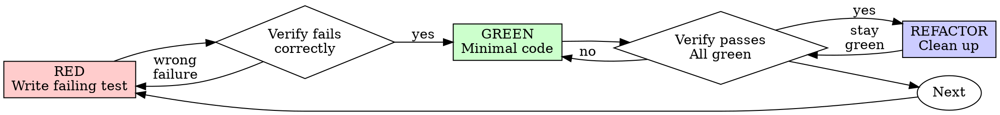

# Codex session 019fb444-d290-7560-9ff1-6e3f5ee5355d

- Started: `2026-07-30T18:23:57.561Z`
- Working directory: `D:\100XH100`
- Originator: `Codex Desktop`
- Codex CLI: `0.146.0-alpha.3.1`
- Source log: `C:\Users\Иван Литвак\.codex\sessions\2026\07\30\rollout-2026-07-30T21-23-57-019fb444-d290-7560-9ff1-6e3f5ee5355d.jsonl`
- Entries: user=1, assistant=4, tool calls=8, tool outputs=8

This is a chronological export of the user/assistant conversation and tool activity. Internal system/developer instructions and token accounting are intentionally excluded. Secret-shaped values are redacted; oversized tool outputs retain their beginning and end with the omitted character count.

## 1. User

Time: `2026-07-30T18:24:33.131Z` · source line `6`

```text
<recommended_plugins>
Here is a list of plugins that are available but not installed.

- Atlassian Rovo (atlassian-rovo@openai-curated-remote)
- Box (box@openai-curated-remote)
- Figma (figma@openai-curated-remote)
- Gmail (gmail@openai-curated-remote)
- Google Calendar (google-calendar@openai-curated-remote)
- Google Drive (google-drive@openai-curated-remote)
- Outlook Calendar (outlook-calendar@openai-curated-remote)
- Outlook Email (outlook-email@openai-curated-remote)
- SharePoint (sharepoint@openai-curated-remote)
- Slack (slack@openai-curated-remote)
- Teams (teams@openai-curated-remote)
</recommended_plugins>
# AGENTS.md instructions for D:\100XH100

<INSTRUCTIONS>
# Project Agent Rules

## Operating Rule
- Read `AGENTS.md` before project edits.
- Update `memory/CHANGELOG.md` after meaningful code, config, or architecture changes.
- Update `memory/PROMPTS.md` with user prompts that define requirements.
- Store test outputs, logs, and verification notes under `test_results/`.
- Prefer agent-centered code: explicit contracts, deterministic tests, small files, low hidden state.

## Architecture Source
- Primary architecture contract: `ARCHITECTURE_NEED.md`.
- Current Stream 4 implementation rule: use threshold + compact + CUB/fixed-temp sort/reduce + compact; do not use Stream 4 hash-table dedup.

## Implementation Guardrails
- `State128` logical bytes are `v[0..119]`.
- `State128` padding bytes are `v[120..127]`.
- Persistent frontier padding must be zero.
- `FinalResponse` may temporarily store `target_local_idx` in `v[120..123]`.
- `Hash128` is one logical 128-bit key stored as `{lo, hi}`.
- `CandidateMeta` must remain 32 bytes and 32-byte aligned.
- Stream 3 payload id must be original candidate id, not compact index.
- Stream 4 must not apply shard top-k or semantic shard cap.

</INSTRUCTIONS>
<environment_context>
  <cwd>D:\100XH100</cwd>
  <shell>powershell</shell>
  <current_date>2026-07-30</current_date>
  <timezone>Europe/Moscow</timezone>
  <filesystem><workspace_roots><root>D:\100XH100</root></workspace_roots><permission_profile type="managed"><file_system type="restricted"><entry access="read"><special>:root</special></entry><entry access="write"><path>D:\100XH100</path></entry><entry access="write"><special>:slash_tmp</special></entry><entry access="write"><special>:tmpdir</special></entry><entry access="write"><path>C:\Users\Иван Литвак\.codex\visualizations\2026\07\23\019f90a3-47e5-7770-a20e-cd9317bcbf2c</path></entry><entry access="read"><path>D:\100XH100\.git</path></entry><entry access="read"><path>D:\100XH100\.agents</path></entry><entry access="read"><path>D:\100XH100\.codex</path></entry></file_system></permission_profile></filesystem>
</environment_context>
```

## 2. Codex

Time: `2026-07-30T18:27:22.715Z` · source line `13`

```text
I’ll implement Task 1 in the Stream 1 worktree with a focused red/green test cycle, leaving unrelated work untouched.
```

## 3. Codex

Time: `2026-07-30T18:27:22.716Z` · source line `14`

```text
I’ll implement Task 1 in the Stream 1 worktree with a focused red/green test cycle, leaving unrelated work untouched.
```

## 4. Tool call: `exec`

Time: `2026-07-30T18:27:25.154Z` · source line `15`

```text
const r = await tools.shell_command({"command":"Get-Content -Raw AGENTS.md; Get-Content -Raw .worktrees\\stream1-piece-transformer\\.superpowers\\sdd\\cube4-transformer-kaggle\\task-1-brief.md; Get-Content -Raw 'C:\\Users\\Иван Литвак\\.codex\\plugins\\cache\\openai-curated-remote\\superpowers\\6.2.0\\skills\\test-driven-development\\SKILL.md'","workdir":"D:\\100XH100","timeout_ms":10000});
text(r);

```

## 5. Tool output

Time: `2026-07-30T18:27:26.043Z` · source line `16`

````text
Script completed
Wall time 0.8 seconds
Output:

Exit code: 0
Wall time: 0.5 seconds
Output:
# Project Agent Rules

## Operating Rule
- Read `AGENTS.md` before project edits.
- Update `memory/CHANGELOG.md` after meaningful code, config, or architecture changes.
- Update `memory/PROMPTS.md` with user prompts that define requirements.
- Store test outputs, logs, and verification notes under `test_results/`.
- Prefer agent-centered code: explicit contracts, deterministic tests, small files, low hidden state.

## Architecture Source
- Primary architecture contract: `ARCHITECTURE_NEED.md`.
- Current Stream 4 implementation rule: use threshold + compact + CUB/fixed-temp sort/reduce + compact; do not use Stream 4 hash-table dedup.

## Implementation Guardrails
- `State128` logical bytes are `v[0..119]`.
- `State128` padding bytes are `v[120..127]`.
- Persistent frontier padding must be zero.
- `FinalResponse` may temporarily store `target_local_idx` in `v[120..123]`.
- `Hash128` is one logical 128-bit key stored as `{lo, hi}`.
- `CandidateMeta` must remain 32 bytes and 32-byte aligned.
- Stream 3 payload id must be original candidate id, not compact index.
- Stream 4 must not apply shard top-k or semantic shard cap.

# Task 1: Cube4 exporter and runtime contract

Extend the Stream1 piece-transformer export/runtime metadata contract to support the supplied cube4 model:

- `state_len=96`
- `num_classes=6`
- `move_count=output_dim=24`
- `num_pieces=56`
- `max_piece_size=3`
- `num_piece_types=3`
- `seq_len=57` with CLS pooling
- `piece_layout=cube4`
- `piece_embed_mode=piece_local`
- activation `relu`

Export the cube4 piece position/mask/type tables from the trusted model layout and retain exact p900 support. Add focused tests that fail before implementation and pass afterward. Do not touch search semantics or CUDA beam architecture. Preserve unrelated dirty changes. Use the supplied archive at:

`D:\100XH100\test_results\cube4_full_transformer_inference_archive\cube4_full_transformer_inference`

Work in:

`D:\100XH100\.worktrees\stream1-piece-transformer`

Record RED and GREEN commands/output and exact files changed in the report:

`D:\100XH100\.worktrees\stream1-piece-transformer\.superpowers\sdd\cube4-transformer-kaggle\task-1-report.md`

---
name: test-driven-development
description: Use when implementing any feature or bugfix, before writing implementation code
---

# Test-Driven Development (TDD)

## Overview

Write the test first. Watch it fail. Write minimal code to pass.

**Core principle:** If you didn't watch the test fail, you don't know if it tests the right thing.

**Violating the letter of the rules is violating the spirit of the rules.**

## When to Use

**Always:**
- New features
- Bug fixes
- Refactoring
- Behavior changes

**Exceptions (ask your human partner):**
- Throwaway prototypes
- Generated code
- Configuration files

Thinking "skip TDD just this once"? Stop. That's rationalization.

## The Iron Law

```
NO PRODUCTION CODE WITHOUT A FAILING TEST FIRST
```

Write code before the test? Delete it. Start over.

**No exceptions:**
- Don't keep it as "reference"
- Don't "adapt" it while writing tests
- Don't look at it
- Delete means delete

Implement fresh from tests. Period.

## Red-Green-Refactor



### RED - Write Failing Test

Write one minimal test showing what should happen.

<Good>
```typescript
test('retries failed operations 3 times', async () => {
  let attempts = 0;
  const operation = () => {
    attempts++;
    if (attempts < 3) throw new Error('fail');
    return 'success';
  };

  const result = await retryOperation(operation);

  expect(result).toBe('success');
  expect(attempts).toBe(3);
});
```
Clear name, tests real behavior, one thing
</Good>

<Bad>
```typescript
test('retry works', async () => {
  const mock = jest.fn()
    .mockRejectedValueOnce(new Error())
    .mockRejectedValueOnce(new Error())
    .mockResolvedValueOnce('success');
  await retryOperation(mock);
  expect(mock).toHaveBeenCalledTimes(3);
});
```
Vague name, tests mock not code
</Bad>

**Requirements:**
- One behavior
- Clear name
- Real code (no mocks unless unavoidable)

### Verify RED - Watch It Fail

**MANDATORY. Never skip.**

```bash
npm test path/to/test.test.ts
```

Confirm:
- Test fails (not errors)
- Failure message is expected
- Fails because feature missing (not typos)

**Test passes?** You're testing existing behavior. Fix test.

**Test errors?** Fix error, re-run until it fails correctly.

### GREEN - Minimal Code

Write simplest code to pass the test.

<Good>
```typescript
async function retryOperation<T>(fn: () => Promise<T>): Promise<T> {
  for (let i = 0; i < 3; i++) {
    try {
      return await fn();
    } catch (e) {
      if (i === 2) throw e;
    }
  }
  throw new Error('unreachable');
}
```
Just enough to pass
</Good>

<Bad>
```typescript
async function retryOperation<T>(
  fn: () => Promise<T>,
  options?: {
    maxRetries?: number;
    backoff?: 'linear' | 'exponential';
    onRetry?: (attempt: number) => void;
  }
): Promise<T> {
  // YAGNI
}
```
Over-engineered
</Bad>

Don't add features, refactor other code, or "improve" beyond the test.

### Verify GREEN - Watch It Pass

**MANDATORY.**

```bash
npm test path/to/test.test.ts
```

Confirm:
- Test passes
- Other tests still pass
- Output pristine (no errors, warnings)

**Test fails?** Fix code, not test.

**Other tests fail?** Fix now.

### REFACTOR - Clean Up

After green only:
- Remove duplication
- Improve names
- Extract helpers

Keep tests green. Don't add behavior.

### Repeat

Next failing test for next feature.

## Good Tests

| Quality | Good | Bad |
|---------|------|-----|
| **Minimal** | One thing. "and" in name? Split it. | `test('validates email and domain and whitespace')` |
| **Clear** | Name describes behavior | `test('test1')` |
| **Shows intent** | Demonstrates desired API | Obscures what code should do |

When writing or changing any test, read [writing-good-tests.md](writing-good-tests.md) for the rules that keep tests honest:
- Name the production change that would make the test fail — before writing it
- Assert on real behavior, never on mock behavior
- Keep test-only code in test utilities, out of production classes
- Understand a dependency's side effects before mocking it

## Common Rationalizations

| Excuse | Reality |
|--------|---------|
| "Too simple to test" | Simple code breaks. Test takes 30 seconds. |
| "I'll test after" | Tests written after pass immediately — which proves nothing. They may test the wrong thing, test the implementation instead of the behavior, or miss the edge case you forgot. You never watched it fail, so you never proved it can catch the bug. Test-first forces that failure. |
| "Tests after achieve same goals (spirit not ritual)" | Tests-after answer "what does this do?"; tests-first answer "what should this do?" Tests written after are biased by the code you already wrote — you verify the cases you remembered, not the ones you'd have discovered. Coverage without proof the tests work. |
| "Already manually tested" | Manual testing is ad-hoc: no record of what you covered, no way to re-run it when the code changes, easy to forget cases under pressure. "Worked when I tried it" в‰  comprehensive. Automated tests run the same way every time. |
| "Deleting X hours is wasteful" | Sunk cost fallacy — that time is already spent either way. The real choice: rewrite with TDD (high confidence) vs. keep it and bolt tests on after (low confidence, likely bugs). Keeping code you can't trust is the waste. |
| "Keep as reference, write tests first" | You'll adapt it. That's testing after. Delete means delete. |
| "Need to explore first" | Fine. Throw away exploration, start with TDD. |
| "Test hard = design unclear" | Listen to test. Hard to test = hard to use. |
| "TDD will slow me down" | TDD IS the pragmatic path: catches bugs before commit, prevents regressions, lets you refactor without fear. "Pragmatic" shortcuts mean debugging in production — slower, not faster. |
| "Manual test faster" | Manual doesn't prove edge cases. You'll re-test every change. |
| "Existing code has no tests" | You're improving it. Add tests for existing code. |

## Red Flags - STOP and Start Over

- Code before test
- Test after implementation
- Test passes immediately
- Can't explain why test failed
- Tests added "later"
- Rationalizing "just this once"
- "I already manually tested it"
- "Tests after achieve the same purpose"
- "It's about spirit not ritual"
- "Keep as reference" or "adapt existing code"
- "Already spent X hours, deleting is wasteful"
- "TDD is dogmatic, I'm being pragmatic"
- "This is different because..."

**All of these mean: Delete code. Start over with TDD.**

## Example: Bug Fix

**Bug:** Empty email accepted

**RED**
```typescript
test('rejects empty email', async () => {
  const result = await submitForm({ email: '' });
  expect(result.error).toBe('Email required');
});
```

**Verify RED**
```bash
$ npm test
FAIL: expected 'Email required', got undefined
```

**GREEN**
```typescript
function submitForm(data: FormData) {
  if (!data.email?.trim()) {
    return { error: 'Email required' };
  }
  // ...
}
```

**Verify GREEN**
```bash
$ npm test
PASS
```

**REFACTOR**
Extract validation for multiple fields if needed.

## Verification Checklist

Before marking work complete:

- [ ] Every new function/method has a test
- [ ] Watched each test fail before implementing
- [ ] Each test failed for expected reason (feature missing, not typo)
- [ ] Wrote minimal code to pass each test
- [ ] All tests pass
- [ ] Output pristine (no errors, warnings)
- [ ] Tests use real code (mocks only if unavoidable)
- [ ] Edge cases and errors covered

Can't check all boxes? You skipped TDD. Start over.

## When Stuck

| Problem | Solution |
|---------|----------|
| Don't know how to test | Write wished-for API. Write assertion first. Ask your human partner. |
| Test too complicated | Design too complicated. Simplify interface. |
| Must mock everything | Code too coupled. Use dependency injection. |
| Test setup huge | Extract helpers. Still complex? Simplify design. |

## Debugging Integration

Bug found? Write failing test reproducing it. Follow TDD cycle. Test proves fix and prevents regression.

Never fix bugs without a test.

## Final Rule

```
Production code в†’ test exists and failed first
Otherwise в†’ not TDD
```

No exceptions without your human partner's permission.


````

## 6. Tool call: `exec`

Time: `2026-07-30T18:27:31.808Z` · source line `19`

```text
const r = await tools.shell_command({"command":"Get-Content -Raw 'C:\\Users\\Иван Литвак\\.codex\\plugins\\cache\\openai-curated-remote\\superpowers\\6.2.0\\skills\\test-driven-development\\writing-good-tests.md'; Get-ChildItem -Force .worktrees\\stream1-piece-transformer | Select-Object Name; rg -n --glob '!*.pyc' \"piece_layout|piece_embed_mode|num_piece_types|piece_positions|piece_masks|state_len\" .worktrees\\stream1-piece-transformer","workdir":"D:\\100XH100","timeout_ms":10000});
text(r);

```

## 7. Tool output

Time: `2026-07-30T18:27:32.910Z` · source line `20`

Oversized output: `8037` characters omitted from the middle.

````text
Script completed
Wall time 0.9 seconds
Output:

Warning: truncated output (original token count: 10024)
Total output lines: 452

Exit code: 0
Wall time: 0.9 seconds
Total output lines: 549
Output:
# Writing Good Tests

**Load this reference when:** writing or changing tests, adding mocks, or
adding cleanup/helper methods for tests.

## Overview

A test exists to catch a specific break. Two principles govern everything
here:

```
1. Every test names the break it catches
2. Every test exercises the real thing
```

Strict TDD produces both naturally: a test written first and watched
failing against real code has already proven it can fail, and only earns
a mock when the real dependency proves slow or external.

## Principle 1: Name the Break

Before writing the test body, answer: **what production change should
make this test fail — and is that change a bug or a decision?** A test
earns its place by catching a wrong branch, missing side effect, wrong
argument, boundary case, or broken contract.

**Derive expectations independently.** Use literals and hand-checked
fixtures; table-driven tests with literal `want` values are the preferred
shape. An expectation computed by the code under test — or its helpers —
passes no matter what that code does:

```typescript
// ❌ Mirror assertion: the same builder computes both sides — always true
const expected = buildSearchQuery({ tag: 'urgent' });
expect(buildSearchQuery({ tag: 'urgent' })).toBe(expected);

// вњ… Hand-derived literal
expect(buildSearchQuery({ tag: 'urgent' })).toBe('tag:"urgent"');
```

**No change detectors.** If only intentional decisions can fail a test —
a constant's value, exact message wording, private structure — it fires
on redesign and sleeps through bugs. Test the behavior that depends on
the decision: not `expect(MAX_RETRIES).toBe(5)` but "a failing call is
retried 5 times and the 6th attempt never happens."

**Behavior, not text.** Asserting that a script, skill, or config
contains an exact line proves only that the source is the source. Run
scripts against controlled inputs and assert outputs, side effects, or
exit codes. Documents that instruct agents are tested by the consuming
agent's behavior (superpowers:writing-skills); prose for humans earns no
test at all.

**Your code, not the framework.** Test the contract your code makes at
its boundaries — the route you register, the query you emit, the payload
you produce. Upstream mechanics are their maintainers' tests to write
(the classic: asserting your router invokes a registered handler — that
is the framework's test, not yours). When upstream behavior genuinely
surprised you, write one narrow characterization test naming the
assumption. The same boundary applies inside your code: constructors,
getters, constants, and trivial forwarding earn tests only when they
validate, normalize, default, derive, enforce, or cause side effects —
otherwise assert the first consumer-visible result that depends on them.

### Gate Function

```
BEFORE writing the test body:
  Name the production change that would make this test fail.

  Cannot name one            в†’ redesign around an observable behavior
  "The source text changed"  в†’ run the artifact and assert its effects
  Only intentional decisions в†’ change detector; test the behavior
                               that depends on the decision

  Confirm the expected value is derived without the code under test.
  IF it reuses the code's logic or helpers:
    Replace it with a literal or hand-checked fixture
```

## Principle 2: Exercise the Real Thing

**The mock earns no assertions.** A mock assertion passes when the mock
is present and fails when it is absent — it says nothing about the
component. Assert the real component's behavior; if the mock is what you
are checking, unmock it or delete the assertion.

```typescript
// вњ… Real behavior
expect(screen.getByRole('navigation')).toBeInTheDocument();

// вќЊ Mock existence
expect(screen.getByTestId('sidebar-mock')).toBeInTheDocument();
```

**your human partner's correction:** "Are we testing the behavior of a
mock?"

**Mock at the right level.** Learn every side effect of the real method
before replacing it; mock the slow or external operation and keep what
the test depends on real. When unsure, run the test against the real
implementation first and observe what actually needs to happen.

```typescript
// вќЊ The mock swallows the config write that duplicate detection reads
vi.mock('ToolCatalog', () => ({
  discoverAndCacheTools: vi.fn().mockResolvedValue(undefined)
}));

// вњ… Mock only the slow server startup; the config write stays real
vi.mock('MCPServerManager');
```

**Make doubles specific.** When arguments, call counts, or ordering are
part of the contract, assert them — a fake that accepts anything verifies
nothing. Give each branch (success, error, malformed) its own fixture or
spy, so the wrong branch cannot satisfy the expectation.

**Mirror real data completely.** Mock the complete structure as it exists
in reality — all documented fields — not just the ones your test reads.
Partial mocks fail silently when downstream code reads an omitted field:
the test passes while integration breaks.

**Production classes carry production methods only.** Cleanup that only
tests need lives in test utilities, never as a `destroy()` on the
production class. Ask: is this method called only from tests? Does this
class own this resource's lifecycle? Wrong answers в†’ test utility.

**Prefer real components over complex mocks.** When mock setup outgrows
the test logic, mocks miss methods the real components have, or tests
break when the mock changes, switch to an integration test with real
components. **your human partner's question:** "Do we need to be using a
mock here?"

### Gate Function

```
BEFORE adding a mock or test helper:
  List the real method's side effects; keep the ones the test
  depends on real — mock the slow/external level below them.

  Mock responses mirror the complete real structure.

  A method only tests call lives in test utilities, not production.

  About to assert on the mock itself?
    Unmock it or delete the assertion.
```

## Tests Ship With the Implementation

The TDD cycle — failing test, minimal implementation, refactor — is what
"complete" means. Ship the tests the behavior needs and only those:
trivial code and human prose earn none, and a test written to satisfy
process costs maintenance forever.

## The Mutation Check

Before finishing, mentally mutate the production code; at least one test
should fail for each realistic mutation:

- Wrong constant or argument
- Wrong branch handler
- Missing state change or side effect
- Empty or default return
- Missing validation for zero, empty, nil, unauthorized, or malformed input

A mutation nothing catches marks the behavior as unprotected — or the
test as tautological.

## Quick Reference

| When you... | Do |
|-------------|-----|
| Write any test | Name the break it catches — a bug, not a decision |
| Build an expected value | Derive it by hand; never with the code under test |
| Test a script or document | Run it / pressure-test its consumer; never grep its text |
| Reach for a dependency test | Test your boundary contract, not their documented mechanics |
| Want to assert on a mocked element | Test the real component, or unmock it |
| Are about to mock a method | Learn its side effects; mock the slow/external level |
| Build a mock response | Mirror the real structure completely |
| Need cleanup only tests use | Put it in test utilities |
| Watch mock setup balloon | Switch to an integration test with real components |
| Finish a test file | Run the mutation check |

## Warning Signs

- Setup and assertion share the same object, guaranteeing equality
- The test can fail only through a panic, crash, or missing selector
- The test fails on every intentional change, never on accidental breakage
- Expected values are hidden behind loops, builders, or helpers
- The test greps source text, or asserts a removed symbol stays removed
- The test would still matter if only the framework remained
- The test exists for coverage, checking no side effect or outcome
- An assertion checks a `*-mock` test ID, or fails if you remove the mock
- A method is called only from test files
- Mock setup is more than half the test, or you can't explain why the mock is needed
- Mocking "just to be safe"


.worktrees\stream1-piece-transformer\build-final-cls-check\test_results\stream1_transformer_manifest_mismatched_layers\manifest.json:4:  "state_len": 120,
.worktrees\stream1-piece-transformer\build-final-cls-check\test_results\stream1_transformer_manifest_mismatched_layers\manifest.json:18:  "piece_layout": "p900",
.worktrees\stream1-piece-transformer\build-final-cls-check\test_results\stream1_transformer_manifest_mismatched_layers\manifest.json:19:  "piece_embed_mode": "full_s120"
.worktrees\stream1-piece-transformer\build-final-cls-check\test_results\stream1_transformer_manifest_bad_seq_len\manifest.json:4:  "state_len": 120,
.worktrees\stream1-piece-transformer\build-final-cls-check\test_results\stream1_transformer_manifest_bad_seq_len\manifest.json:17:  "piece_layout": "p900",
.worktrees\stream1-piece-transformer\build-final-cls-check\test_results\stream1_transformer_manifest_bad_seq_len\manifest.json:18:  "piece_embed_mode": "full_s120"
.worktrees\stream1-piece-transformer\weights\megaminx_vlad_transformer_fp16\manifest.json:4:  "state_len": 120,
.worktrees\stream1-piece-transformer\weights\megaminx_vlad_transformer_fp16\manifest.json:18:  "piece_layout": "p900",
.worktrees\stream1-piece-transformer\weights\megaminx_vlad_transformer_fp16\manifest.json:19:  "piece_embed_mode": "full_s120",
.worktrees\stream1-piece-transformer\build-final-cls-check\test_results\stream1_transformer_manifest_bad_primary_layer\manifest.json:4:  "state_len": 120,
.worktrees\stream1-piece-transformer\build-final-cls-check\test_results\stream1_transformer_manifest_bad_primary_layer\manifest.json:18:  "piece_layout": "p900",
.worktrees\stream1-piece-transformer\build-final-cls-check\test_results\stream1_transformer_manifest_bad_primary_layer\manifest.json:19:  "piece_embed_mode": "full_s120"
.worktrees\stream1-piece-transformer\build-cls-attn-local\test_results\stream1_transformer_weight_sizes_ok\manifest.json:4:  "state_len": 120,
.worktrees\stream1-piece-transformer\build-cls-attn-local\test_results\stream1_transformer_weight_sizes_ok\manifest.json:17:  "piece_layout": "p900",
.worktrees\stream1-piece-transformer\build-cls-attn-local\test_results\stream1_transformer_weight_sizes_ok\manifest.json:18:  "piece_embed_mode": "full_s120"
.worktrees\stream1-piece-transformer\build-final-cls-check\test_results\stream1_mlp_weight_loading_ok\manifest.json:4:  "state_len": 120,
.worktrees\stream1-piece-transformer\build-architecture-check\test_results\stream1_transformer_weight_sizes_ok\manifest.json:4:  "state_len": 120,
.worktrees\stream1-piece-transformer\build-architecture-check\test_results\stream1_transformer_weight_sizes_ok\manifest.json:17:  "piece_layout": "p900",
.worktrees\stream1-piece-transformer\build-architecture-check\test_results\stream1_transformer_weight_sizes_ok\manifest.json:18:  "piece_embed_mode": "full_s120"
.worktrees\stream1-piece-transformer\build-final-cls-check\test_results\stream1_manifest_backend_unknown\manifest.json:4:  "state_len": 120,
.worktrees\stream1-piece-transformer\build-final-cls-check\test_results\stream1_manifest_backend_piece_transformer\manifest.json:4:  "state_len": 120,
.worktrees\stream1-piece-transformer\build-final-cls-check\test_results\stream1_manifest_backend_piece_transformer\manifest.json:17:  "piece_layout": "p900",
.worktrees\stream1-piece-transformer\build-final-cls-check\test_results\stream1_manifest_backend_piece_transformer\manifest.json:18:  "piece_embed_mode": "full_s120"
.worktrees\stream1-piece-transformer\build-final-cls-check\test_results\stream1_manifest_backend_legacy_mlp\manifest.json:3:  "state_len": 120,
.worktrees\stream1-piece-transformer\build-final-cls-check\test_results\stream1_manifest_backend_explicit_mlp\manifest.json:4:  "state_len": 120,
.worktrees\stream1-piece-transformer\build-final-cls-check\test_results\stream1_transformer_weight_sizes_ok\manifest.json:4:  "state_len": 120,
.worktrees\stream1-piece-transformer\build-final-cls-check\test_results\stream1_transformer_weight_sizes_ok\manifest.json:17:  "piece_layout": "p900",
.worktrees\stream1-piece-transformer\build-final-cls-check\test_results\stream1_transformer_weight_sizes_ok\manifest.json:18:  "piece_embed_mode": "full_s120"
.worktrees\stream1-piece-transformer\tools\stream_pipeline_benchmark.cu:201:        ? make_synthetic_state_batch(static_cast<std::uint32_t>(frontier_size), stream1_model.state_len, stream1_model.num_classes)
.worktrees\stream1-piece-transformer\tools\stream_benchmark_common.hpp:337:    std::uint32_t state_len,
.worktrees\stream1-piece-transformer\tools\stream_benchmark_common.hpp:339:    if (state_len > STATE_LEN) {
.worktrees\stream1-piece-transformer\tools\stream_benchmark_common.hpp:340:        throw std::runtime_error("synthetic state_len exceeds logical State128 bytes");
.worktrees\stream1-piece-transformer\tools\stream_benchmark_common.hpp:347:        for (std::uint32_t p = 0; p < state_len; ++p) {
.worktrees\stream1-piece-transformer\tools\stream_benchmark_common.hpp:349:                (static_cast<std::uint64_t>(row) * state_len + p) * 17ULL + 23ULL;
.worktrees\stream1-piece-transformer\tools\stream_benchmark.cu:41:        ? make_synthetic_state_batch(max_states, stream1_model.state_len, stream1_model.num_classes)
.worktrees\stream1-piece-transformer\tools\stream1_weight_io.hpp:61:    std::vector<std::byte> piece_positions;
.worktrees\stream1-piece-transformer\tools\stream1_weight_io.hpp:116:    std::uint16_t* piece_positions = nullptr;
.worktrees\stream1-piece-transformer\tools\stream1_weight_io.hpp:311:    if (model.state_len != STATE_LEN) {
.worktrees\stream1-piece-transformer\tools\stream1_weight_io.hpp:312:        throw std::runtime_error(context + ": stream1 state_len must match compile-time STATE_LEN");
.worktrees\stream1-piece-transformer\tools\stream1_weight_io.hpp:339:    const std::string& piece_layout,
.worktrees\stream1-piece-transformer\tools\stream1_weight_io.hpp:340:    const std::string& piece_embed_mode,
.worktrees\stream1-piece-transformer\tools\stream1_weight_io.hpp:345:    require_manifest_u32(model.state_len, static_cast<std::uint32_t>(STATE_LEN), "state_len", context);
.worktrees\stream1-piece-transformer\tools\stream1_weight_io.hpp:358:    require_manifest_string(piece_layout, "p900", "piece_layout", context);
.worktrees\stream1-piece-transformer\tools\stream1_weight_io.hpp:359:    require_manifest_string(piece_embed_mode, "full_s120", "piece_embed_mode", context);
.worktrees\stream1-piece-transformer\tools\stream1_weight_io.hpp:375:        model.state_len = parse_manifest_u32(text, "state_len");
.worktrees\stream1-piece-transformer\tools\stream1_weight_io.hpp:394:        model.state_len = parse_manifest_u32(text, "state_len");
.worktrees\stream1-piece-transformer\tools\stream1_weight_io.hpp:409:            parse_manifest_string(text, "piece_layout"),
.worktrees\stream1-piece-transformer\tools\stream1_weight_io.hpp:410:            parse_manifest_string(text, "piece_embed_mode"),
.worktrees\stream1-piece-transformer\tools\stream1_weight_io.hpp:430:        fp16_bytes(static_cast<std::uint64_t>(model.state_len) * model.num_classes * model.hidden1));
.worktrees\stream1-piece-transformer\tools\stream1_weight_io.hpp:529:    t.piece_positions = read_binary_exact(
.worktrees\stream1-piece-transformer\tools\stream1_weight_io.hpp:530:        dir / "piece_positions.u16",
.worktrees\stream1-piece-transformer\tools\stream1_weight_io.hpp:566:        t.output_weight.size() + t.output_bias.size() + t.piece_positions.size() 

[... 8037 characters omitted from oversized tool output ...]

t. CUDA Graph remained slower than eager; an in-place `addcmul_` token-build attempt was rejected after real-weight graph execution hit an ATen device-side assert. Evidence: `test_results/stream1_libtorch_narrow_state_slice_2026-07-05.md`.
.worktrees\stream1-piece-transformer\build-final-cls-check\test_results\stream1_transformer_manifest_ok\manifest.json:4:  "state_len": 120,
.worktrees\stream1-piece-transformer\build-final-cls-check\test_results\stream1_transformer_manifest_ok\manifest.json:17:  "piece_layout": "p900",
.worktrees\stream1-piece-transformer\build-final-cls-check\test_results\stream1_transformer_manifest_ok\manifest.json:18:  "piece_embed_mode": "full_s120"
.worktrees\stream1-piece-transformer\hpc\ihes_cube_smoke\make_dummy_weights.py:14:    state_len = 72
.worktrees\stream1-piece-transformer\hpc\ihes_cube_smoke\make_dummy_weights.py:24:                "state_len": state_len,
.worktrees\stream1-piece-transformer\hpc\ihes_cube_smoke\make_dummy_weights.py:36:    write_zeros(out / "input_weight_hxk.fp16", state_len * num_classes * hidden1)
.worktrees\stream1-piece-transformer\hpc\ihes_cube_model\prepare_ihes_cube_model.sh:155:print(f"prepared_state_len={manifest['state_len']}")
.worktrees\stream1-piece-transformer\hpc\ihes_cube_model\prepare_ihes_cube_model.sh:159:if manifest["state_len"] != 72 or manifest["num_classes"] != 72:
.worktrees\stream1-piece-transformer\docs\transformer_inference_architecture.md:16:- `state_len=120`
.worktrees\stream1-piece-transformer\docs\transformer_inference_architecture.md:130:The LibTorch token-build path now uses `narrow(1, 0, state_len)` for the logical state-byte slice instead of the generic `Slice()` indexing route. The change is intentionally small and stays inside the explicit LibTorch backend; MLP/default native builds remain Torch-free and unchanged.
.worktrees\stream1-piece-transformer\docs\superpowers\plans\2026-06-30-stream1-transformer-production-speed.md:182:- state_len=120;
.worktrees\stream1-piece-transformer\docs\superpowers\plans\2026-06-29-stream1-piece-transformer.md:97:    std::uint32_t state_len = static_cast<std::uint32_t>(STATE_LEN);
.worktrees\stream1-piece-transformer\docs\superpowers\plans\2026-06-29-stream1-piece-transformer.md:164:MLP validation must remain current behavior. Transformer validation must require `state_len == STATE_LEN`, `output_dim == MOVE_COUNT`, `seq_len == num_pieces + 1`, `d_model % nhead == 0`, `head_dim == d_model / nhead`, `num_pieces > 0`, `max_piece_size > 0`, `transformer_layers > 0`, and `ff_dim > 0`.
.worktrees\stream1-piece-transformer\docs\superpowers\plans\2026-06-29-stream1-piece-transformer.md:192:When `reference_out` is set, instantiate the Kaggle model from metadata, load the checkpoint, enable fast inference, generate deterministic permutation states, and write JSON with `states`, `scores_fp32`, and metadata. The states must be generated with `torch.randperm(state_len, generator=g)` so they stay valid Megaminx-like permutations.
.worktrees\stream1-piece-transformer\docs\superpowers\plans\2026-06-29-stream1-piece-transformer.md:238:piece_positions = num_pieces * max_piece_size * sizeof(int16_t)
.worktrees\stream1-piece-transformer\docs\superpowers\plans\2026-06-29-stream1-piece-transformer.md:262:The kernel must read only `State128.v[0..119]` and build `CLS + 50 piece tokens` using `fast_piece_static`, `fast_slot_projected`, `piece_positions`, and `piece_mask`.
.worktrees\stream1-piece-transformer\docs\plans\cube4-transformer-kaggle.md:16:- `state_len=96`
.worktrees\stream1-piece-transformer\docs\plans\cube4-transformer-kaggle.md:21:- `num_piece_types=3`
.worktrees\stream1-piece-transformer\docs\plans\cube4-transformer-kaggle.md:23:- `piece_layout=cube4`
.worktrees\stream1-piece-transformer\docs\plans\cube4-transformer-kaggle.md:24:- `piece_embed_mode=piece_local`
.worktrees\stream1-piece-transformer\docs\archive\stream1_transformer_native\block51_bias_ln_aborted_2026-07-04.patch:21:     return dims.state_len == 120U &&
.worktrees\stream1-piece-transformer\cuda\stream1_transformer.cu:101:            const std::uint32_t pos = static_cast<std::uint32_t>(network.piece_positions[piece_slot]);
.worktrees\stream1-piece-transformer\cuda\stream1_transformer.cu:135:        const std::uint32_t pos = static_cast<std::uint32_t>(network.piece_positions[piece_slot]);
.worktrees\stream1-piece-transformer\cuda\stream1_transformer.cu:281:            const std::uint32_t pos = static_cast<std::uint32_t>(network.piece_positions[piece_slot]);
.worktrees\stream1-piece-transformer\cuda\stream1_transformer.cu:317:        const std::uint32_t pos = static_cast<std::uint32_t>(network.piece_positions[piece_slot]);
.worktrees\stream1-piece-transformer\cuda\stream1_transformer.cu:2541:    return dims.state_len == 120U &&
.worktrees\stream1-piece-transformer\cuda\stream1.hpp:11:    std::uint32_t state_len;
.worktrees\stream1-piece-transformer\cuda\stream1.hpp:51:    std::uint32_t state_len;
.worktrees\stream1-piece-transformer\cuda\stream1.hpp:91:    const std::uint16_t* piece_positions;
.worktrees\stream1-piece-transformer\cuda\stream1.cu:140:        for (std::uint32_t p = 0; p < network.dims.state_len; ++p) {
.worktrees\stream1-piece-transformer\cuda\stream1.cu:231:    for (std::uint32_t p = 0; p < dims.state_len; ++p) {
.worktrees\stream1-piece-transformer\cuda\runtime_config.cpp:97:        total += static_cast<std::uint64_t>(model.state_len) * model.num_classes * model.hidden1 * fp16;
.worktrees\stream1-piece-transformer\build-fused-ln-local\test_results\stream1_transformer_weight_sizes_ok\manifest.json:4:  "state_len": 120,
.worktrees\stream1-piece-transformer\build-fused-ln-local\test_results\stream1_transformer_weight_sizes_ok\manifest.json:17:  "piece_layout": "p900",
.worktrees\stream1-piece-transformer\build-fused-ln-local\test_results\stream1_transformer_weight_sizes_ok\manifest.json:18:  "piece_embed_mode": "full_s120"
.worktrees\stream1-piece-transformer\build-fused-ln-local\test_results\stream1_transformer_weight_sizes_bad\manifest.json:4:  "state_len": 120,
.worktrees\stream1-piece-transformer\build-fused-ln-local\test_results\stream1_transformer_weight_sizes_bad\manifest.json:17:  "piece_layout": "p900",
.worktrees\stream1-piece-transformer\build-fused-ln-local\test_results\stream1_transformer_weight_sizes_bad\manifest.json:18:  "piece_embed_mode": "full_s120"
.worktrees\stream1-piece-transformer\build-fused-ln-local\test_results\stream1_transformer_manifest_ok\manifest.json:4:  "state_len": 120,
.worktrees\stream1-piece-transformer\build-fused-ln-local\test_results\stream1_transformer_manifest_ok\manifest.json:17:  "piece_layout": "p900",
.worktrees\stream1-piece-transformer\build-fused-ln-local\test_results\stream1_transformer_manifest_ok\manifest.json:18:  "piece_embed_mode": "full_s120"
.worktrees\stream1-piece-transformer\build-fused-ln-local\test_results\stream1_transformer_manifest_mismatched_layers\manifest.json:4:  "state_len": 120,
.worktrees\stream1-piece-transformer\build-fused-ln-local\test_results\stream1_transformer_manifest_mismatched_layers\manifest.json:18:  "piece_layout": "p900",
.worktrees\stream1-piece-transformer\build-fused-ln-local\test_results\stream1_transformer_manifest_mismatched_layers\manifest.json:19:  "piece_embed_mode": "full_s120"
.worktrees\stream1-piece-transformer\build-fused-ln-local\test_results\stream1_transformer_manifest_bad_seq_len\manifest.json:4:  "state_len": 120,
.worktrees\stream1-piece-transformer\build-fused-ln-local\test_results\stream1_transformer_manifest_bad_seq_len\manifest.json:17:  "piece_layout": "p900",
.worktrees\stream1-piece-transformer\build-fused-ln-local\test_results\stream1_transformer_manifest_bad_seq_len\manifest.json:18:  "piece_embed_mode": "full_s120"
.worktrees\stream1-piece-transformer\build-fused-ln-local\test_results\stream1_transformer_manifest_bad_primary_layer\manifest.json:4:  "state_len": 120,
.worktrees\stream1-piece-transformer\build-fused-ln-local\test_results\stream1_transformer_manifest_bad_primary_layer\manifest.json:18:  "piece_layout": "p900",
.worktrees\stream1-piece-transformer\build-fused-ln-local\test_results\stream1_transformer_manifest_bad_primary_layer\manifest.json:19:  "piece_embed_mode": "full_s120"
.worktrees\stream1-piece-transformer\build-fused-ln-local\test_results\stream1_mlp_weight_loading_ok\manifest.json:4:  "state_len": 120,
.worktrees\stream1-piece-transformer\build-fused-ln-local\test_results\stream1_manifest_backend_unknown\manifest.json:4:  "state_len": 120,
.worktrees\stream1-piece-transformer\build-fused-ln-local\test_results\stream1_manifest_backend_piece_transformer\manifest.json:4:  "state_len": 120,
.worktrees\stream1-piece-transformer\build-fused-ln-local\test_results\stream1_manifest_backend_piece_transformer\manifest.json:17:  "piece_layout": "p900",
.worktrees\stream1-piece-transformer\build-fused-ln-local\test_results\stream1_manifest_backend_piece_transformer\manifest.json:18:  "piece_embed_mode": "full_s120"
.worktrees\stream1-piece-transformer\build-fused-ln-local\test_results\stream1_manifest_backend_legacy_mlp\manifest.json:3:  "state_len": 120,
.worktrees\stream1-piece-transformer\build-fused-ln-local\test_results\stream1_manifest_backend_explicit_mlp\manifest.json:4:  "state_len": 120,
.worktrees\stream1-piece-transformer\build-transformer-macro-micro-check\test_results\stream1_manifest_backend_legacy_mlp\manifest.json:3:  "state_len": 120,
.worktrees\stream1-piece-transformer\build-transformer-macro-micro-check\test_results\stream1_manifest_backend_explicit_mlp\manifest.json:4:  "state_len": 120,
.worktrees\stream1-piece-transformer\build-transformer-macro-micro-check\test_results\stream1_transformer_weight_sizes_ok\manifest.json:4:  "state_len": 120,
.worktrees\stream1-piece-transformer\build-transformer-macro-micro-check\test_results\stream1_transformer_weight_sizes_ok\manifest.json:17:  "piece_layout": "p900",
.worktrees\stream1-piece-transformer\build-transformer-macro-micro-check\test_results\stream1_transformer_weight_sizes_ok\manifest.json:18:  "piece_embed_mode": "full_s120"
.worktrees\stream1-piece-transformer\build-transformer-macro-micro-check\test_results\stream1_transformer_weight_sizes_bad\manifest.json:4:  "state_len": 120,
.worktrees\stream1-piece-transformer\build-transformer-macro-micro-check\test_results\stream1_transformer_weight_sizes_bad\manifest.json:17:  "piece_layout": "p900",
.worktrees\stream1-piece-transformer\build-transformer-macro-micro-check\test_results\stream1_transformer_weight_sizes_bad\manifest.json:18:  "piece_embed_mode": "full_s120"
.worktrees\stream1-piece-transformer\build-transformer-macro-micro-check\test_results\stream1_transformer_manifest_ok\manifest.json:4:  "state_len": 120,
.worktrees\stream1-piece-transformer\build-transformer-macro-micro-check\test_results\stream1_transformer_manifest_ok\manifest.json:17:  "piece_layout": "p900",
.worktrees\stream1-piece-transformer\build-transformer-macro-micro-check\test_results\stream1_transformer_manifest_ok\manifest.json:18:  "piece_embed_mode": "full_s120"
.worktrees\stream1-piece-transformer\build-transformer-macro-micro-check\test_results\stream1_transformer_manifest_mismatched_layers\manifest.json:4:  "state_len": 120,
.worktrees\stream1-piece-transformer\build-transformer-macro-micro-check\test_results\stream1_transformer_manifest_mismatched_layers\manifest.json:18:  "piece_layout": "p900",
.worktrees\stream1-piece-transformer\build-transformer-macro-micro-check\test_results\stream1_transformer_manifest_mismatched_layers\manifest.json:19:  "piece_embed_mode": "full_s120"
.worktrees\stream1-piece-transformer\build-transformer-macro-micro-check\test_results\stream1_transformer_manifest_bad_seq_len\manifest.json:4:  "state_len": 120,
.worktrees\stream1-piece-transformer\build-transformer-macro-micro-check\test_results\stream1_transformer_manifest_bad_seq_len\manifest.json:17:  "piece_layout": "p900",
.worktrees\stream1-piece-transformer\build-transformer-macro-micro-check\test_results\stream1_transformer_manifest_bad_seq_len\manifest.json:18:  "piece_embed_mode": "full_s120"
.worktrees\stream1-piece-transformer\build-transformer-macro-micro-check\test_results\stream1_transformer_manifest_bad_primary_layer\manifest.json:4:  "state_len": 120,
.worktrees\stream1-piece-transformer\build-transformer-macro-micro-check\test_results\stream1_transformer_manifest_bad_primary_layer\manifest.json:18:  "piece_layout": "p900",
.worktrees\stream1-piece-transformer\build-transformer-macro-micro-check\test_results\stream1_transformer_manifest_bad_primary_layer\manifest.json:19:  "piece_embed_mode": "full_s120"
.worktrees\stream1-piece-transformer\build-transformer-macro-micro-check\test_results\stream1_mlp_weight_loading_ok\manifest.json:4:  "state_len": 120,
.worktrees\stream1-piece-transformer\build-transformer-macro-micro-check\test_results\stream1_manifest_backend_unknown\manifest.json:4:  "state_len": 120,
.worktrees\stream1-piece-transformer\build-transformer-macro-micro-check\test_results\stream1_manifest_backend_piece_transformer\manifest.json:4:  "state_len": 120,
.worktrees\stream1-piece-transformer\build-transformer-macro-micro-check\test_results\stream1_manifest_backend_piece_transformer\manifest.json:17:  "piece_layout": "p900",
.worktrees\stream1-piece-transformer\build-transformer-macro-micro-check\test_results\stream1_manifest_backend_piece_transformer\manifest.json:18:  "piece_embed_mode": "full_s120"
Name                                    
----                                    
.gpu_queue                              
.superpowers                            
build-architecture-check                
build-cls-attn-libtorch                 
build-cls-attn-local                    
build-final-cls-check                   
build-final-exchange-policy-check       
build-fused-ln-local                    
build-ln-baseline-local                 
build-native-eager-check                
build-real-parity                       
build-ring-debug-check                  
build-stream-pipeline-local86           
build-stream-pipeline-local86-rerun     
build-stream-pipeline-smoke             
build-stream-pipeline-smoke-fix         
build-transformer-macro-micro-check     
build-transformer-plan-libtorch         
build-transformer-plan-libtorch2        
build-transformer-plan-local86          
build-transformer-plan-native           
build-windowed-graph-check              
cmake                                   
cuda                                    
data                                    
docs                                    
FullBeamNice                            
hpc                                     
kaggle                                  
kaggle_t4_libtorch_transformer_benchmark
kaggle_t4_mlp_benchmark                 
kaggle_t4_pipeline_smoke                
kaggle_t4_torchrun                      
kaggle_t4_transformer_backend_compare   
kaggle_t4_transformer_benchmark         
kaggle_t4_transformer_smoke             
kaggle_t4_transformer_solve             
kaggle_t4_transformer_solve_10m_native  
kaggle_t4_transformer_solve_10m_vlad    
kaggle_torchrun                         
kaggle_transformer_inference_speed      
memory                                  
molab                                   
prompt_history                          
src                                     
tests                                   
test_results                            
tools                                   
weights                                 
.git                                    
.gitattributes                          
.gitignore                              
AGENTS.md                               
ARCHITECTURE_NEED.md                    
CMakeLists.txt                          
docker-compose.yml                      
Dockerfile                              
README.md                               


````

## 8. Tool call: `exec`

Time: `2026-07-30T18:27:41.765Z` · source line `27`

```text
const r = await tools.shell_command({"command":"git -C .worktrees\\stream1-piece-transformer status --short; Get-Content -Raw .worktrees\\stream1-piece-transformer\\docs\\plans\\cube4-transformer-kaggle.md; rg -n \"export|piece_positions|piece_types|piece_mask\" .worktrees\\stream1-piece-transformer\\tools .worktrees\\stream1-piece-transformer\\tests --glob '!*.cu' --glob '!*.hpp'","workdir":"D:\\100XH100","timeout_ms":10000});
text(r);

```

## 9. Tool output

Time: `2026-07-30T18:27:42.667Z` · source line `28`

```text
Script completed
Wall time 0.8 seconds
Output:

Exit code: 0
Wall time: 0.6 seconds
Output:
 M hpc/ihes_cube_model/ihes_solution_repair.sh
 M hpc/ihes_cube_model/ihes_solve_then_reflect.sh
 M memory/CHANGELOG.md
 M memory/PROMPTS.md
?? .gpu_queue/
?? .superpowers/
?? build-architecture-check/
?? build-cls-attn-libtorch/
?? build-cls-attn-local/
?? build-final-cls-check/
?? build-final-exchange-policy-check/
?? build-fused-ln-local/
?? build-ln-baseline-local/
?? build-native-eager-check/
?? build-real-parity/
?? build-ring-debug-check/
?? build-stream-pipeline-local86-rerun/
?? build-stream-pipeline-local86/
?? build-stream-pipeline-smoke-fix/
?? build-stream-pipeline-smoke/
?? build-transformer-macro-micro-check/
?? build-transformer-plan-libtorch/
?? build-transformer-plan-libtorch2/
?? build-transformer-plan-local86/
?? build-transformer-plan-native/
?? build-windowed-graph-check/
?? docs/plans/
?? kaggle_t4_transformer_solve_10m_native/
?? kaggle_t4_transformer_solve_10m_vlad/
?? kaggle_transformer_inference_speed/
# Cube4 Transformer Kaggle Integration Plan

## Global constraints

- Do not change the beam-search algorithm or CUDA search architecture.
- Add only the model-layout/export/runtime metadata support needed for the supplied `cube4` checkpoint.
- Preserve existing `p900` behavior and unrelated dirty changes.
- Use TDD: each production behavior change must be preceded by a focused failing test.
- Keep the Kaggle validation notebook private.
- Validate on two T4 GPUs and retain logs/artifacts under `test_results/`.

## Task 1: Cube4 exporter and runtime contract

Extend the Stream1 piece-transformer export/runtime metadata contract to support the supplied cube4 model:

- `state_len=96`
- `num_classes=6`
- `move_count=output_dim=24`
- `num_pieces=56`
- `max_piece_size=3`
- `num_piece_types=3`
- `seq_len=57` with CLS pooling
- `piece_layout=cube4`
- `piece_embed_mode=piece_local`
- activation `relu`

Export the cube4 piece position/mask/type tables from the trusted model layout and retain exact p900 support. Add focused tests that fail before implementation and pass afterward. Do not touch search semantics.

## Task 2: Private Kaggle 2xT4 validation notebook

Package the supplied model and a thin private Kaggle notebook. The notebook must:

- verify checkpoint and metadata hashes;
- clone the exact integration branch/commit;
- export the checkpoint to Stream1 FP16;
- build and run focused transformer tests;
- use two T4 ranks;
- load standard CayleyPy cube4 competition data;
- run a bounded smoke solve with clear depth/timing/result logs;
- save solution/submission artifacts locally.

## Task 3: Evidence and review

Download Kaggle outputs, verify two-rank execution, exported manifest, depth progress, solution validity, and artifact paths. Record exact kernel version, parameters, timings, and any unresolved limitation in `test_results/`, `memory/CHANGELOG.md`, and `memory/PROMPTS.md`.

.worktrees\stream1-piece-transformer\tests\contract_tests.cpp:166:    write_zero_file(dir / "piece_positions.u16", 50ULL * 3ULL * sizeof(std::uint16_t));
.worktrees\stream1-piece-transformer\tests\contract_tests.cpp:167:    write_zero_file(dir / "piece_mask.u8", 50ULL * 3ULL);
.worktrees\stream1-piece-transformer\tests\contract_tests.cpp:168:    write_zero_file(dir / "piece_types.u8", 50ULL);
.worktrees\stream1-piece-transformer\tools\export_stream1.py:2:"""Auto-detecting Stream1 weight exporter wrapper."""
.worktrees\stream1-piece-transformer\tools\export_stream1.py:14:    from tools.export_stream1_mlp import (
.worktrees\stream1-piece-transformer\tools\export_stream1.py:15:        export_batchnorm_folded,
.worktrees\stream1-piece-transformer\tools\export_stream1.py:16:        export_resmlp_layernorm,
.worktrees\stream1-piece-transformer\tools\export_stream1.py:20:    from tools.export_stream1_transformer import export_piece_transformer, strip_state_prefixes
.worktrees\stream1-piece-transformer\tools\export_stream1.py:23:    from export_stream1_mlp import export_batchnorm_folded, export_resmlp_layernorm, strip_orig_mod, unwrap_state_dict
.worktrees\stream1-piece-transformer\tools\export_stream1.py:24:    from export_stream1_transformer import export_piece_transformer, strip_state_prefixes
.worktrees\stream1-piece-transformer\tools\export_stream1.py:75:        export_piece_transformer(
.worktrees\stream1-piece-transformer\tools\export_stream1.py:90:        export_resmlp_layernorm(args.weights, args.out, args.dtype)
.worktrees\stream1-piece-transformer\tools\export_stream1.py:94:        export_batchnorm_folded(args.weights, args.out, args.dtype, args.num_classes)
.worktrees\stream1-piece-transformer\tools\export_stream1_transformer.py:19:    from tools.export_stream1_mlp import tensor_bytes, weight_suffix, write_hxk, write_vec
.worktrees\stream1-piece-transformer\tools\export_stream1_transformer.py:22:    from export_stream1_mlp import tensor_bytes, weight_suffix, write_hxk, write_vec
.worktrees\stream1-piece-transformer\tools\export_stream1_transformer.py:159:    piece_positions, piece_mask, piece_types = model_module.make_p900_piece_layout()
.worktrees\stream1-piece-transformer\tools\export_stream1_transformer.py:160:    return piece_positions.cpu(), piece_mask.cpu(), piece_types.cpu()
.worktrees\stream1-piece-transformer\tools\export_stream1_transformer.py:203:        raise ValueError(f"piece_transformer export requires state_len=120, got {state_len}")
.worktrees\stream1-piece-transformer\tools\export_stream1_transformer.py:205:        raise ValueError(f"piece_transformer export requires num_classes=120, got {num_classes}")
.worktrees\stream1-piece-transformer\tools\export_stream1_transformer.py:212:        raise ValueError(f"piece_transformer export requires d_model=256, got {int(d_model)}")
.worktrees\stream1-piece-transformer\tools\export_stream1_transformer.py:217:        raise ValueError(f"piece_transformer export requires max_piece_size=3, got {max_piece_size}")
.worktrees\stream1-piece-transformer\tools\export_stream1_transformer.py:219:        raise ValueError(f"piece_transformer export requires num_pieces=50, got {num_pieces}")
.worktrees\stream1-piece-transformer\tools\export_stream1_transformer.py:239:        raise ValueError(f"piece_transformer export requires move_count=24, got {move_count}")
.worktrees\stream1-piece-transformer\tools\export_stream1_transformer.py:243:        raise ValueError(f"piece_transformer export requires output_dim=24, got {int(output_dim)}")
.worktrees\stream1-piece-transformer\tools\export_stream1_transformer.py:256:        raise ValueError(f"piece_transformer export requires transformer_layers=4, got {num_layers}")
.worktrees\stream1-piece-transformer\tools\export_stream1_transformer.py:264:        raise ValueError(f"piece_transformer export requires transformer_ff_dim=1024, got {ff_dim}")
.worktrees\stream1-piece-transformer\tools\export_stream1_transformer.py:285:        raise ValueError(f"runtime piece_transformer export requires cls pooling, got {pooling}")
.worktrees\stream1-piece-transformer\tools\export_stream1_transformer.py:317:    piece_positions: torch.Tensor,
.worktrees\stream1-piece-transformer\tools\export_stream1_transformer.py:318:    piece_mask: torch.Tensor,
.worktrees\stream1-piece-transformer\tools\export_stream1_transformer.py:319:    piece_types: torch.Tensor,
.worktrees\stream1-piece-transformer\tools\export_stream1_transformer.py:326:    max_piece_size = piece_positions.shape[1]
.worktrees\stream1-piece-transformer\tools\export_stream1_transformer.py:335:    piece_indices = torch.arange(piece_positions.shape[0], dtype=torch.int64)
.worktrees\stream1-piece-transformer\tools\export_stream1_transformer.py:337:    static = static + sd["piece_type_embedding.weight"].detach().float().index_select(0, piece_types.long())
.worktrees\stream1-piece-transformer\tools\export_stream1_transformer.py:342:        "piece_positions": piece_positions.to(torch.int16).contiguous(),
.worktrees\stream1-piece-transformer\tools\export_stream1_transformer.py:343:        "piece_mask": piece_mask.to(torch.uint8).contiguous(),
.worktrees\stream1-piece-transformer\tools\export_stream1_transformer.py:344:        "piece_types": piece_types.to(torch.uint8).contiguous(),
.worktrees\stream1-piece-transformer\tools\export_stream1_transformer.py:362:def export_tensors(
.worktrees\stream1-piece-transformer\tools\export_stream1_transformer.py:366:    piece_positions: torch.Tensor,
.worktrees\stream1-piece-transformer\tools\export_stream1_transformer.py:367:    piece_mask: torch.Tensor,
.worktrees\stream1-piece-transformer\tools\export_stream1_transformer.py:368:    piece_types: torch.Tensor,
.worktrees\stream1-piece-transformer\tools\export_stream1_transformer.py:373:    fast = build_fast_input_tables(sd, piece_positions, piece_mask, piece_types)
.worktrees\stream1-piece-transformer\tools\export_stream1_transformer.py:398:    write_u16(out_dir / "piece_positions.u16", fast["piece_positions"])
.worktrees\stream1-piece-transformer\tools\export_stream1_transformer.py:399:    write_u8(out_dir / "piece_mask.u8", fast["piece_mask"])
.worktrees\stream1-piece-transformer\tools\export_stream1_transformer.py:400:    write_u8(out_dir / "piece_types.u8", fast["piece_types"])
.worktrees\stream1-piece-transformer\tools\export_stream1_transformer.py:472:def export_piece_transformer(
.worktrees\stream1-piece-transformer\tools\export_stream1_transformer.py:492:    piece_positions, piece_mask, piece_types = load_piece_layout(source_root)
.worktrees\stream1-piece-transformer\tools\export_stream1_transformer.py:494:    if tuple(piece_positions.shape) != (arch["num_pieces"], arch["max_piece_size"]):
.worktrees\stream1-piece-transformer\tools\export_stream1_transformer.py:495:        raise ValueError(f"piece layout shape mismatch: {tuple(piece_positions.shape)}")
.worktrees\stream1-piece-transformer\tools\export_stream1_transformer.py:496:    if tuple(piece_mask.shape) != tuple(piece_positions.shape):
.worktrees\stream1-piece-transformer\tools\export_stream1_transformer.py:498:    if tuple(piece_types.shape) != (arch["num_pieces"],):
.worktrees\stream1-piece-transformer\tools\export_stream1_transformer.py:501:    export_tensors(sd, out_dir, dtype, piece_positions, piece_mask, piece_types, int(arch["num_layers"]))
.worktrees\stream1-piece-transformer\tools\export_stream1_transformer.py:516:        "stream1_export_done"
.worktrees\stream1-piece-transformer\tools\export_stream1_transformer.py:540:    export_piece_transformer(
.worktrees\stream1-piece-transformer\tools\export_stream1_mlp.py:64:    raise ValueError(f"unsupported export dtype: {dtype}")
.worktrees\stream1-piece-transformer\tools\export_stream1_mlp.py:111:def export_batchnorm_folded(weights_path: Path, out_dir: Path, dtype: ExportDType, num_classes: int) -> None:
.worktrees\stream1-piece-transformer\tools\export_stream1_mlp.py:181:        "embeddingbag": "removed from runtime; input layer exported as position-class table",
.worktrees\stream1-piece-transformer\tools\export_stream1_mlp.py:186:        "stream1_export_done"
.worktrees\stream1-piece-transformer\tools\export_stream1_mlp.py:231:def export_resmlp_layernorm(weights_path: Path, out_dir: Path, dtype: ExportDType) -> None:
.worktrees\stream1-piece-transformer\tools\export_stream1_mlp.py:293:        "stream1_export_done"
.worktrees\stream1-piece-transformer\tools\export_stream1_mlp.py:313:        export_batchnorm_folded(args.weights, args.out, args.dtype, args.num_classes)
.worktrees\stream1-piece-transformer\tools\export_stream1_mlp.py:315:        export_resmlp_layernorm(args.weights, args.out, args.dtype)
.worktrees\stream1-piece-transformer\tests\test_stream1_transformer_exporter.py:6:from tools.export_stream1 import detect_format_from_state_dict
.worktrees\stream1-piece-transformer\tests\test_stream1_transformer_exporter.py:7:from tools.export_stream1_transformer import (
.worktrees\stream1-piece-transformer\tests\test_stream1_transformer_exporter.py:124:        piece_positions = torch.arange(0, 150, dtype=torch.int64).view(50, 3) % 120
.worktrees\stream1-piece-transformer\tests\test_stream1_transformer_exporter.py:125:        piece_mask = torch.ones((50, 3), dtype=torch.bool)
.worktrees\stream1-piece-transformer\tests\test_stream1_transformer_exporter.py:126:        piece_types = torch.arange(50, dtype=torch.int64) % 2
.worktrees\stream1-piece-transformer\tests\test_stream1_transformer_exporter.py:128:        tables = build_fast_input_tables(sd, piece_positions, piece_mask, piece_types)
.worktrees\stream1-piece-transformer\tests\test_stream1_transformer_exporter.py:139:            + sd["piece_type_embedding.weight"].index_select(0, piece_types)
.worktrees\stream1-piece-transformer\tests\test_stream1_transformer_exporter.py:142:        self.assertTrue(torch.equal(tables["piece_positions"], piece_positions.to(torch.int16)))
.worktrees\stream1-piece-transformer\tests\test_stream1_transformer_exporter.py:143:        self.assertTrue(torch.equal(tables["piece_mask"], piece_mask.to(torch.uint8)))
.worktrees\stream1-piece-transformer\tests\test_stream1_transformer_exporter.py:144:        self.assertTrue(torch.equal(tables["piece_types"], piece_types.to(torch.uint8)))
.worktrees\stream1-piece-transformer\tools\stream1_mlp_torch_benchmark.py:2:"""Benchmark exported Stream1 MLP weights with PyTorch.
.worktrees\stream1-piece-transformer\tools\stream1_mlp_torch_benchmark.py:4:This is a diagnostic benchmark for the exported runtime weight directory. It
.worktrees\stream1-piece-transformer\tools\stream1_transformer_backends.py:6:- pytorch: Python Torch over exported Stream1 weights.
.worktrees\stream1-piece-transformer\tools\stream1_transformer_backends.py:61:        description="Torch implementation over exported piece_transformer weights.",
.worktrees\stream1-piece-transformer\tools\stream1_transformer_backends.py:62:        build_hint="Requires Python torch and exported weights; no CMake build target.",
.worktrees\stream1-piece-transformer\tools\stream1_transformer_torch_benchmark.py:4:This intentionally benchmarks the exported Stream1 weights as a PyTorch model.
.worktrees\stream1-piece-transformer\tools\stream1_transformer_torch_benchmark.py:101:            raise ValueError(f"plain torch benchmark expects exported fp16 or bf16 weights, got {manifest_dtype!r}")
.worktrees\stream1-piece-transformer\tools\stream1_transformer_torch_benchmark.py:149:        self.piece_positions = load_file_tensor(
.worktrees\stream1-piece-transformer\tools\stream1_transformer_torch_benchmark.py:150:            weight_dir / "piece_positions.u16",
.worktrees\stream1-piece-transformer\tools\stream1_transformer_torch_benchmark.py:155:        self.piece_mask = load_file_tensor(
.worktrees\stream1-piece-transformer\tools\stream1_transformer_torch_benchmark.py:156:            weight_dir / "piece_mask.u8",
.worktrees\stream1-piece-transformer\tools\stream1_transformer_torch_benchmark.py:235:            mask = self.piece_mask[:, slot]
.worktrees\stream1-piece-transformer\tools\stream1_transformer_torch_benchmark.py:238:            positions = self.piece_positions[:, slot]

```

## 10. Tool call: `exec`

Time: `2026-07-30T18:27:47.850Z` · source line `31`

```text
const r = await tools.shell_command({"command":"Get-Content -Raw .worktrees\\stream1-piece-transformer\\tools\\export_stream1_transformer.py; Get-Content -Raw .worktrees\\stream1-piece-transformer\\tests\\test_stream1_transformer_exporter.py; Get-ChildItem -Recurse -File test_results\\cube4_full_transformer_inference_archive\\cube4_full_transformer_inference | Select-Object -ExpandProperty FullName","workdir":"D:\\100XH100","timeout_ms":10000});
text(r);

```

## 11. Tool output

Time: `2026-07-30T18:27:48.798Z` · source line `32`

Oversized output: `3345` characters omitted from the middle.

```text
Script completed
Wall time 0.7 seconds
Output:

Exit code: 0
Wall time: 0.6 seconds
Output:
#!/usr/bin/env python3
"""Export Kaggle p900 PilgrimPieceTransformer weights for Stream1."""

from __future__ import annotations

import argparse
import importlib
import json
import re
import sys
from pathlib import Path
from typing import Any, Mapping

import numpy as np
import torch
import torch.nn.functional as F

try:
    from tools.export_stream1_mlp import tensor_bytes, weight_suffix, write_hxk, write_vec
except ModuleNotFoundError:
    sys.path.insert(0, str(Path(__file__).resolve().parent))
    from export_stream1_mlp import tensor_bytes, weight_suffix, write_hxk, write_vec


TensorDict = dict[str, torch.Tensor]
REQUIRED_MOVE_COUNT = 24
REQUIRED_TRANSFORMER_LAYERS = 4
REQUIRED_TRANSFORMER_FF_DIM = 1024


def unwrap_state_dict(obj: Any) -> TensorDict:
    if isinstance(obj, dict):
        for key in ("state_dict", "model_state_dict", "model", "net", "module"):
            value = obj.get(key)
            if isinstance(value, dict):
                return value
        return obj
    raise TypeError(f"unsupported checkpoint root type: {type(obj).__name__}")


def strip_state_prefixes(sd: Mapping[str, Any]) -> TensorDict:
    stripped: TensorDict = {}
    for key, value in sd.items():
        clean = str(key)
        changed = True
        while changed:
            changed = False
            for prefix in ("module.", "_orig_mod."):
                if clean.startswith(prefix):
                    clean = clean[len(prefix) :]
                    changed = True
        stripped[clean] = value
    return stripped


def load_checkpoint_state(weights_path: Path) -> TensorDict:
    checkpoint = torch.load(weights_path, map_location="cpu", weights_only=False)
    sd = strip_state_prefixes(unwrap_state_dict(checkpoint))
    return {key: value.detach().cpu() if isinstance(value, torch.Tensor) else value for key, value in sd.items()}


def read_json(path: Path) -> dict[str, Any]:
    return json.loads(path.read_text(encoding="utf-8"))


def nearby_roots(weights_path: Path) -> list[Path]:
    roots: list[Path] = []
    for start in (weights_path.parent, *weights_path.parents):
        if start not in roots:
            roots.append(start)
    return roots


def locate_metadata(weights_path: Path, explicit: Path | None) -> Path:
    if explicit is not None:
        return explicit
    candidates: list[Path] = []
    for root in nearby_roots(weights_path):
        logs = root / "logs"
        if logs.is_dir():
            candidates.extend(sorted(logs.glob("model_*.json")))
    matching: list[Path] = []
    for candidate in candidates:
        try:
            data = read_json(candidate)
        except Exception:
            continue
        if Path(str(data.get("best_weights_file", ""))).name == weights_path.name:
            matching.append(candidate)
        elif str(data.get("model_id", "")) and str(data["model_id"]) in weights_path.stem:
            matching.append(candidate)
    if len(matching) == 1:
        return matching[0]
    if not matching and len(candidates) == 1:
        return candidates[0]
    raise FileNotFoundError("could not uniquely auto-locate metadata; pass --metadata")


def locate_generator(weights_path: Path, metadata: Mapping[str, Any], explicit: Path | None) -> Path:
    if explicit is not None:
        return explicit
    group_id = metadata.get("group_id")
    names = [f"p{group_id}.json"] if group_id is not None else []
    candidates: list[Path] = []
    for root in nearby_roots(weights_path):
        gen_dir = root / "generators"
        if gen_dir.is_dir():
            for name in names:
                path = gen_dir / name
                if path.is_file():
                    return path
            candidates.extend(sorted(gen_dir.glob("p*.json")))
    if len(candidates) == 1:
        return candidates[0]
    raise FileNotFoundError("could not uniquely auto-locate generator JSON; pass --generators")


def locate_source_root(weights_path: Path, metadata_path: Path | None, explicit: Path | None) -> Path:
    if explicit is not None:
        return explicit
    starts = [weights_path.parent, *weights_path.parents]
    if metadata_path is not None:
        starts.extend([metadata_path.parent, *metadata_path.parents])
    seen: set[Path] = set()
    for root in starts:
        if root in seen:
            continue
        seen.add(root)
        if (root / "pilgrim" / "model.py").is_file():
            return root
    raise FileNotFoundError("could not auto-locate source root containing pilgrim/model.py; pass --source-root")


def load_move_names(generator: Mapping[str, Any]) -> list[str]:
    names = generator.get("names")
    if isinstance(names, list) and all(isinstance(name, str) for name in names):
        return list(names)
    gens = generator.get("generators")
    if isinstance(gens, list):
        out = []
        for idx, item in enumerate(gens):
            if isinstance(item, Mapping) and isinstance(item.get("name"), str):
                out.append(str(item["name"]))
            else:
                out.append(str(idx))
        return out
    raise ValueError("generator JSON must contain move names in 'names' or 'generators'")


def import_model_module(source_root: Path):
    root = str(source_root)
    if root not in sys.path:
        sys.path.insert(0, root)
    return importlib.import_module("pilgrim.model")


def load_piece_layout(source_root: Path) -> tuple[torch.Tensor, torch.Tensor, torch.Tensor]:
    model_module = import_model_module(source_root)
    piece_positions, piece_mask, piece_types = model_module.make_p900_piece_layout()
    return piece_positions.cpu(), piece_mask.cpu(), piece_types.cpu()


def block_indices(sd: Mapping[str, Any]) -> list[int]:
    found = sorted(
        int(match.group(1))
        for key in sd
        for match in [re.match(r"^blocks\.(\d+)\.attn\.in_proj_weight$", key)]
        if match
    )
    if not found:
        raise ValueError("no transformer blocks found")
    expected = list(range(found[-1] + 1))
    if found != expected:
        raise ValueError(f"transformer block indices are not contiguous: found={found}")
    return found


def require_shape(sd: Mapping[str, torch.Tensor], key: str, shape: tuple[int, ...]) -> None:
    actual = tuple(sd[key].shape)
    if actual != shape:
        raise ValueError(f"{key} shape mismatch: expected={shape} actual={actual}")


def metadata_int(metadata: Mapping[str, Any], key: str, default: int | None = None) -> int:
    value = metadata.get(key, default)
    if value is None:
        raise ValueError(f"metadata missing required integer field: {key}")
    return int(value)


def infer_architecture(
    sd: Mapping[str, torch.Tensor],
    metadata: Mapping[str, Any],
    move_names: list[str],
    num_classes: int,
) -> dict[str, Any]:
    sd = strip_state_prefixes(sd)
    model_arch = str(metadata.get("model_arch", "")).lower()
    if model_arch != "piece_transformer":
        raise ValueError(f"metadata model_arch must be piece_transformer, got {model_arch!r}")
    state_len = metadata_int(metadata, "state_size")
    if state_len != 120:
        raise ValueError(f"piece_transformer export requires state_len=120, got {state_len}")
    if num_classes != 120:
        raise ValueError(f"piece_transformer export requires num_classes=120, got {num_classes}")

    local_rows, d_model = sd["local_value_embedding.weight"].shape
    projection_out, projection_in = sd["piece_projection.weight"].shape
    max_piece_size = metadata_int(metadata, "max_piece_size")
    num_pieces = metadata_int(metadata, "num_pieces")
    if int(d_model) != 256:
        raise ValueError(f"piece_transformer export requires d_model=256, got {int(d_model)}")
    metadata_d_model = metadata_int(metadata, "transformer_d_model")
    if metadata_d_model != int(d_model):
        raise ValueError(f"metadata transformer_d_model={metadata_d_model} does not match tensors={int(d_model)}")
    if max_piece_size != 3:
        raise ValueError(f"piece_transformer export requires max_piece_size=3, got {max_piece_size}")
    if num_pieces != 50:
        raise ValueError(f"piece_transformer export requires num_pieces=50, got {num_pieces}")
    if local_rows != max_piece_size * num_classes:
        raise ValueError("local_value_embedding rows must equal max_piece_size * num_classes")
    if projection_out != d_model or projection_in != max_piece_size * d_model:
        raise ValueError("piece_projection shape does not match d_model/max_piece_size")

    require_shape(sd, "piece_projection.bias", (d_model,))
    require_shape(sd, "piece_position_embedding.weight", (num_pieces, d_model))
    require_shape(sd, "piece_type_embedding.weight", (2, d_model))
    require_shape(sd, "cls_token", (1, 1, d_model))
    require_shape(sd, "input_norm.weight", (d_model,))
    require_shape(sd, "input_norm.bias", (d_model,))
    require_shape(sd, "output_norm.weight", (d_model,))
    require_shape(sd, "output_norm.bias", (d_model,))

    output_dim, output_in = sd["output_layer.weight"].shape
    move_count = len(move_names)
    if move_count <= 0:
        raise ValueError("move_count must be positive")
    if move_count != REQUIRED_MOVE_COUNT:
        raise ValueError(f"piece_transformer export requires move_count=24, got {move_count}")
    if metadata.get("n_gens") is not None and int(metadata["n_gens"]) != move_count:
        raise ValueError(f"metadata n_gens={metadata['n_gens']} does not match move_count={move_count}")
    if int(output_dim) != REQUIRED_MOVE_COUNT:
        raise ValueError(f"piece_transformer export requires output_dim=24, got {int(output_dim)}")
    if output_dim != move_count:
        raise ValueError(f"output_dim={int(output_dim)} must equal move_count={move_count}")
    if output_in != d_model:
        raise ValueError(f"output_layer input mismatch: expected={int(d_model)} actual={int(output_in)}")
    require_shape(sd, "output_layer.bias", (output_dim,))

    layers = block_indices(sd)
    num_layers = len(layers)
    metadata_layers = metadata_int(metadata, "transformer_layers")
    if metadata_layers != num_layers:
        raise ValueError(f"metadata transformer_layers={metadata_layers} does not match tensors={num_layers}")
    if num_layers != REQUIRED_TRANSFORMER_LAYERS:
        raise ValueError(f"piece_transformer export requires transformer_layers=4, got {num_layers}")
    ff_dim = metadata_int(metadata, "transformer_ff_dim")
    nhead = metadata_int(metadata, "transformer_heads")
    if d_model % nhead != 0:
        raise ValueError(f"d_model={int(d_model)} must be divisible by nhead={nhead}")
    if ff_dim <= 0:
        raise ValueError(f"ff_dim must be positive: {ff_dim}")
    if ff_dim != REQUIRED_TRANSFORMER_FF_DIM:
        raise ValueError(f"piece_transformer export requires transformer_ff_dim=1024, got {ff_dim}")
    for block in layers:
        prefix = f"blocks.{block}"
        require_shape(sd, f"{prefix}.norm1.weight", (d_model,))
        require_shape(sd, f"{prefix}.norm1.bias", (d_model,))
        require_shape(sd, f"{prefix}.attn.in_proj_weight", (3 * d_model, d_model))
        require_shape(sd, f"{prefix}.attn.in_proj_bias", (3 * d_model,))
        require_shape(sd, f"{prefix}.attn.out_proj.weight", (d_model, d_model))
        require_shape(sd, f"{prefix}.attn.out_proj.bias", (d_model,))
        require_shape(sd, f"{prefix}.norm2.weight", (d_model,))
        require_shape(sd, f"{prefix}.norm2.bias", (d_model,))
        require_shape(sd, f"{prefix}.ff.0.weight", (ff_dim, d_model))
        require_shape(sd, f"{prefix}.ff.0.bias", (ff_dim,))
        require_shape(sd, f"{prefix}.ff.3.weight", (d_model, ff_dim))
        require_shape(sd, f"{prefix}.ff.3.bias", (d_model,))

    activation = str(metadata.get("transformer_activation", "")).lower()
    pooling = str(metadata.get("transformer_pooling", "")).lower()
    if activation not in {"silu", "gelu", "relu"}:
        raise ValueError(f"unsupported activation metadata: {activation}")
    if pooling != "cls":
        raise ValueError(f"runtime piece_transformer export requires cls pooling, got {pooling}")
    if str(metadata.get("piece_layout", "")).lower() != "p900":
        raise ValueError("piece_layout must be p900")
    if str(metadata.get("piece_embed_mode", "")).lower() != "full_s120":
        raise ValueError("piece_embed_mode must be full_s120")

    return {
        "backend": "piece_transformer",
        "model_arch": "piece_transformer",
        "state_len": state_len,
        "num_classes": num_classes,
        "move_count": move_count,
        "output_dim": int(output_dim),
        "num_pieces": num_pieces,
        "max_piece_size": max_piece_size,
        "seq_len": num_pieces + 1,
        "d_model": int(d_model),
        "nhead": nhead,
        "head_dim": int(d_model) // nhead,
        "num_layers": num_layers,
        "ff_dim": ff_dim,
        "activation": activation,
        "pooling": pooling,
        "piece_layout": "p900",
        "piece_embed_mode": "full_s120",
        "input_embedding": "fast_slot_projected",
        "move_names": move_names,
    }


def build_fast_input_tables(
    sd: Mapping[str, torch.Tensor],
    piece_positions: torch.Tensor,
    piece_mask: torch.Tensor,
    piece_types: torch.Tensor,
) -> dict[str, torch.Tensor]:
    sd = strip_state_prefixes(sd)
    projection_weight = sd["piece_projection.weight"].detach().float()
    projection_bias = sd["piece_projection.bias"].detach().float()
    embedding_weight = sd["local_value_embedding.weight"].detach().float()
    d_model = projection_weight.shape[0]
    max_piece_size = piece_positions.shape[1]
    num_classes = embedding_weight.shape[0] // max_piece_size
    slot_rows = []
    for slot in range(max_piece_size):
        start = slot * d_model
        end = (slot + 1) * d_model
        token_start = slot * num_classes
        token_end = (slot + 1) * num_classes
        slot_rows.append(F.linear(embedding_weight[token_start:token_end], projection_weight[:, start:end]))
    piece_indices = torch.arange(piece_positions.shape[0], dtype=torch.int64)
    static = sd["piece_position_embedding.weight"].detach().float().index_select(0, piece_indices)
    static = static + sd["piece_type_embedding.weight"].detach().float().index_select(0, piece_types.long())
    static = static + projection_bias.view(1, -1)
    return {
        "fast_slot_projected": torch.stack(slot_rows, dim=0).contiguous(),
        "fast_piece_static": static.contiguous(),
        "piece_positions": piece_positions.to(torch.int16).contiguous(),
        "piece_mask": piece_mask.to(torch.uint8).contiguous(),
        "piece_types": piece_types.to(torch.uint8).contiguous(),
    }


def write_u16(path: Path, tensor: torch.Tensor) -> None:
    data = tensor.detach().cpu().numpy().astype("<u2", copy=False)
    path.write_bytes(data.tobytes())


def write_u8(path: Path, tensor: torch.Tensor) -> None:
    data = tensor.detach().cpu().numpy().astype("u1", copy=False)
    path.write_bytes(data.tobytes())


def write_tensor(path: Path, tensor: torch.Tensor, dtype: str) -> None:
    path.write_bytes(tensor_bytes(tensor.detach().float(), dtype))


def export_tensors(
    sd: Mapping[str, torch.Tensor],
    out_dir: Path,
    dtype: str,
    piece_positions: torch.Tensor,
    piece_mask: torch.Tensor,
    piece_types: torch.Tensor,
    num_layers: int,
) -> None:
    out_dir.mkdir(parents=True, exist_ok=True)
    suffix = weight_suffix(dtype)
    fast = build_fast_input_tables(sd, piece_positions, piece_mask, piece_types)
    write_tensor(out_dir /

[... 3345 characters omitted from oversized tool output ...]

     dropout_rate=float(metadata.get("dropout", 0.0)),
        activation=str(metadata["transformer_activation"]),
        pooling=str(metadata["transformer_pooling"]),
        piece_layout=str(metadata["piece_layout"]),
        piece_embed_mode=str(metadata["piece_embed_mode"]),
        max_inference_batch_size=int(metadata.get("transformer_max_inference_batch_size", 32768)),
    )


def write_reference(
    reference_out: Path,
    sd: Mapping[str, torch.Tensor],
    metadata: Mapping[str, Any],
    source_root: Path,
    arch: Mapping[str, Any],
    count: int,
    seed: int,
    weights_path: Path,
) -> None:
    model = instantiate_reference_model(source_root, metadata, int(arch["output_dim"]), int(arch["num_classes"]))
    model.load_state_dict(dict(sd), strict=True)
    model.eval()
    if hasattr(model, "set_fast_inference") and hasattr(model, "supports_fast_inference"):
        if model.supports_fast_inference():
            model.set_fast_inference(True)
    states = make_reference_states(int(arch["state_len"]), count, seed)
    with torch.inference_mode():
        scores = model(states).float().cpu()
    reference = {
        "states": states.tolist(),
        "scores_fp32": scores.tolist(),
        "metadata": {
            "backend": "piece_transformer",
            "model_arch": "piece_transformer",
            "state_len": int(arch["state_len"]),
            "output_dim": int(arch["output_dim"]),
            "reference_count": int(count),
            "reference_seed": int(seed),
            "source_weights": str(weights_path),
        },
    }
    reference_out.parent.mkdir(parents=True, exist_ok=True)
    reference_out.write_text(json.dumps(reference, indent=2) + "\n", encoding="utf-8")


def export_piece_transformer(
    weights_path: Path,
    out_dir: Path,
    dtype: str,
    num_classes: int,
    metadata_path: Path | None = None,
    generator_path: Path | None = None,
    source_root: Path | None = None,
    reference_out: Path | None = None,
    reference_count: int = 0,
    reference_seed: int = 0,
) -> None:
    weights_path = Path(weights_path)
    sd = load_checkpoint_state(weights_path)
    metadata_path = locate_metadata(weights_path, metadata_path)
    metadata = read_json(metadata_path)
    generator_path = locate_generator(weights_path, metadata, generator_path)
    generator = read_json(generator_path)
    move_names = load_move_names(generator)
    source_root = locate_source_root(weights_path, metadata_path, source_root)
    piece_positions, piece_mask, piece_types = load_piece_layout(source_root)
    arch = infer_architecture(sd, metadata, move_names, num_classes)
    if tuple(piece_positions.shape) != (arch["num_pieces"], arch["max_piece_size"]):
        raise ValueError(f"piece layout shape mismatch: {tuple(piece_positions.shape)}")
    if tuple(piece_mask.shape) != tuple(piece_positions.shape):
        raise ValueError("piece mask shape must match piece positions")
    if tuple(piece_types.shape) != (arch["num_pieces"],):
        raise ValueError("piece types shape must match num_pieces")

    export_tensors(sd, out_dir, dtype, piece_positions, piece_mask, piece_types, int(arch["num_layers"]))
    manifest = {
        **arch,
        "dtype": dtype,
        "source_weights": str(weights_path),
        "source_metadata": str(metadata_path),
        "source_generators": str(generator_path),
        "source_root": str(source_root),
        "model_id": metadata.get("model_id"),
        "model_name": metadata.get("model_name"),
    }
    (out_dir / "manifest.json").write_text(json.dumps(manifest, indent=2) + "\n", encoding="utf-8")
    if reference_out is not None:
        write_reference(reference_out, sd, metadata, source_root, arch, reference_count, reference_seed, weights_path)
    print(
        "stream1_export_done"
        f" out_dir={out_dir}"
        " format=piece_transformer"
        f" dtype={dtype}"
        f" seq_len={arch['seq_len']}"
        f" d_model={arch['d_model']}"
        f" layers={arch['num_layers']}"
        f" output_dim={arch['output_dim']}"
    )


def main() -> None:
    parser = argparse.ArgumentParser(description=__doc__)
    parser.add_argument("--weights", required=True, type=Path)
    parser.add_argument("--out", required=True, type=Path)
    parser.add_argument("--dtype", choices=["fp16", "bf16"], default="fp16")
    parser.add_argument("--num-classes", type=int, default=120)
    parser.add_argument("--metadata", type=Path)
    parser.add_argument("--generators", type=Path)
    parser.add_argument("--source-root", type=Path)
    parser.add_argument("--reference-out", type=Path)
    parser.add_argument("--reference-count", type=int, default=0)
    parser.add_argument("--reference-seed", type=int, default=0)
    args = parser.parse_args()
    export_piece_transformer(
        weights_path=args.weights,
        out_dir=args.out,
        dtype=args.dtype,
        num_classes=args.num_classes,
        metadata_path=args.metadata,
        generator_path=args.generators,
        source_root=args.source_root,
        reference_out=args.reference_out,
        reference_count=args.reference_count,
        reference_seed=args.reference_seed,
    )


if __name__ == "__main__":
    main()

import unittest

import torch
import torch.nn.functional as F

from tools.export_stream1 import detect_format_from_state_dict
from tools.export_stream1_transformer import (
    build_fast_input_tables,
    infer_architecture,
    strip_state_prefixes,
)


def make_piece_transformer_state(num_layers=4, output_dim=24, ff_dim=1024):
    torch.manual_seed(123)
    sd = {
        "cls_token": torch.randn(1, 1, 256),
        "local_value_embedding.weight": torch.randn(360, 256),
        "piece_projection.weight": torch.randn(256, 768),
        "piece_projection.bias": torch.randn(256),
        "piece_position_embedding.weight": torch.randn(50, 256),
        "piece_type_embedding.weight": torch.randn(2, 256),
        "input_norm.weight": torch.randn(256),
        "input_norm.bias": torch.randn(256),
        "output_norm.weight": torch.randn(256),
        "output_norm.bias": torch.randn(256),
        "output_layer.weight": torch.randn(output_dim, 256),
        "output_layer.bias": torch.randn(output_dim),
    }
    for block in range(num_layers):
        prefix = f"blocks.{block}"
        sd[f"{prefix}.norm1.weight"] = torch.randn(256)
        sd[f"{prefix}.norm1.bias"] = torch.randn(256)
        sd[f"{prefix}.attn.in_proj_weight"] = torch.randn(768, 256)
        sd[f"{prefix}.attn.in_proj_bias"] = torch.randn(768)
        sd[f"{prefix}.attn.out_proj.weight"] = torch.randn(256, 256)
        sd[f"{prefix}.attn.out_proj.bias"] = torch.randn(256)
        sd[f"{prefix}.norm2.weight"] = torch.randn(256)
        sd[f"{prefix}.norm2.bias"] = torch.randn(256)
        sd[f"{prefix}.ff.0.weight"] = torch.randn(ff_dim, 256)
        sd[f"{prefix}.ff.0.bias"] = torch.randn(ff_dim)
        sd[f"{prefix}.ff.3.weight"] = torch.randn(256, ff_dim)
        sd[f"{prefix}.ff.3.bias"] = torch.randn(256)
    return sd


def make_metadata(transformer_layers=4, transformer_ff_dim=1024, n_gens=24):
    return {
        "model_arch": "piece_transformer",
        "state_size": 120,
        "n_gens": n_gens,
        "transformer_d_model": 256,
        "transformer_heads": 8,
        "transformer_layers": transformer_layers,
        "transformer_ff_dim": transformer_ff_dim,
        "transformer_activation": "silu",
        "transformer_pooling": "cls",
        "piece_layout": "p900",
        "piece_embed_mode": "full_s120",
        "num_pieces": 50,
        "max_piece_size": 3,
        "model_id": 1782210824,
    }


class Stream1TransformerExporterTests(unittest.TestCase):
    def test_detects_piece_transformer_from_marker_keys_after_prefix_strip(self):
        sd = {f"module._orig_mod.{key}": value for key, value in make_piece_transformer_state().items()}
        self.assertEqual(detect_format_from_state_dict(sd), "piece-transformer")
        stripped = strip_state_prefixes(sd)
        self.assertIn("blocks.0.attn.in_proj_weight", stripped)
        self.assertNotIn("module._orig_mod.output_layer.weight", stripped)

    def test_infers_required_p900_piece_transformer_architecture(self):
        arch = infer_architecture(
            make_piece_transformer_state(),
            make_metadata(),
            move_names=[f"m{i}" for i in range(24)],
            num_classes=120,
        )
        self.assertEqual(arch["backend"], "piece_transformer")
        self.assertEqual(arch["state_len"], 120)
        self.assertEqual(arch["num_classes"], 120)
        self.assertEqual(arch["move_count"], 24)
        self.assertEqual(arch["output_dim"], 24)
        self.assertEqual(arch["seq_len"], 51)
        self.assertEqual(arch["d_model"], 256)
        self.assertEqual(arch["nhead"], 8)
        self.assertEqual(arch["head_dim"], 32)
        self.assertEqual(arch["num_layers"], 4)
        self.assertEqual(arch["ff_dim"], 1024)
        self.assertEqual(arch["activation"], "silu")
        self.assertEqual(arch["pooling"], "cls")

    def test_rejects_consistent_non_24_move_piece_transformer(self):
        with self.assertRaisesRegex(ValueError, "requires move_count=24"):
            infer_architecture(
                make_piece_transformer_state(output_dim=23),
                make_metadata(n_gens=23),
                move_names=[f"m{i}" for i in range(23)],
                num_classes=120,
            )

    def test_rejects_consistent_non_4_layer_piece_transformer(self):
        with self.assertRaisesRegex(ValueError, "requires transformer_layers=4"):
            infer_architecture(
                make_piece_transformer_state(num_layers=3),
                make_metadata(transformer_layers=3),
                move_names=[f"m{i}" for i in range(24)],
                num_classes=120,
            )

    def test_rejects_consistent_non_1024_ff_piece_transformer(self):
        with self.assertRaisesRegex(ValueError, "requires transformer_ff_dim=1024"):
            infer_architecture(
                make_piece_transformer_state(ff_dim=2048),
                make_metadata(transformer_ff_dim=2048),
                move_names=[f"m{i}" for i in range(24)],
                num_classes=120,
            )

    def test_fast_input_tables_match_kaggle_fast_cache_formula(self):
        sd = make_piece_transformer_state()
        piece_positions = torch.arange(0, 150, dtype=torch.int64).view(50, 3) % 120
        piece_mask = torch.ones((50, 3), dtype=torch.bool)
        piece_types = torch.arange(50, dtype=torch.int64) % 2

        tables = build_fast_input_tables(sd, piece_positions, piece_mask, piece_types)
        self.assertEqual(tuple(tables["fast_slot_projected"].shape), (3, 120, 256))
        self.assertEqual(tuple(tables["fast_piece_static"].shape), (50, 256))

        expected_slots = []
        for slot in range(3):
            projection_slice = sd["piece_projection.weight"][:, slot * 256 : (slot + 1) * 256]
            embeddings = sd["local_value_embedding.weight"][slot * 120 : (slot + 1) * 120]
            expected_slots.append(F.linear(embeddings, projection_slice))
        expected_static = (
            sd["piece_position_embedding.weight"].index_select(0, torch.arange(50))
            + sd["piece_type_embedding.weight"].index_select(0, piece_types)
            + sd["piece_projection.bias"].view(1, -1)
        )
        self.assertTrue(torch.equal(tables["piece_positions"], piece_positions.to(torch.int16)))
        self.assertTrue(torch.equal(tables["piece_mask"], piece_mask.to(torch.uint8)))
        self.assertTrue(torch.equal(tables["piece_types"], piece_types.to(torch.uint8)))
        self.assertTrue(torch.allclose(tables["fast_slot_projected"], torch.stack(expected_slots)))
        self.assertTrue(torch.allclose(tables["fast_piece_static"], expected_static))


if __name__ == "__main__":
    unittest.main()

D:\100XH100\test_results\cube4_full_transformer_inference_archive\cube4_full_transformer_inference\README.md
D:\100XH100\test_results\cube4_full_transformer_inference_archive\cube4_full_transformer_inference\requirements.txt
D:\100XH100\test_results\cube4_full_transformer_inference_archive\cube4_full_transformer_inference\SHA256SUMS
D:\100XH100\test_results\cube4_full_transformer_inference_archive\cube4_full_transformer_inference\test.py
D:\100XH100\test_results\cube4_full_transformer_inference_archive\cube4_full_transformer_inference\generators\p002.json
D:\100XH100\test_results\cube4_full_transformer_inference_archive\cube4_full_transformer_inference\model\model.json
D:\100XH100\test_results\cube4_full_transformer_inference_archive\cube4_full_transformer_inference\model\model.pth
D:\100XH100\test_results\cube4_full_transformer_inference_archive\cube4_full_transformer_inference\pilgrim\best_first.py
D:\100XH100\test_results\cube4_full_transformer_inference_archive\cube4_full_transformer_inference\pilgrim\factory.py
D:\100XH100\test_results\cube4_full_transformer_inference_archive\cube4_full_transformer_inference\pilgrim\model.py
D:\100XH100\test_results\cube4_full_transformer_inference_archive\cube4_full_transformer_inference\pilgrim\parallel.py
D:\100XH100\test_results\cube4_full_transformer_inference_archive\cube4_full_transformer_inference\pilgrim\qsearcher.py
D:\100XH100\test_results\cube4_full_transformer_inference_archive\cube4_full_transformer_inference\pilgrim\searcher.py
D:\100XH100\test_results\cube4_full_transformer_inference_archive\cube4_full_transformer_inference\pilgrim\trainer.py
D:\100XH100\test_results\cube4_full_transformer_inference_archive\cube4_full_transformer_inference\pilgrim\utils.py
D:\100XH100\test_results\cube4_full_transformer_inference_archive\cube4_full_transformer_inference\pilgrim\__init__.py
D:\100XH100\test_results\cube4_full_transformer_inference_archive\cube4_full_transformer_inference\pilgrim\__pycache__\factory.cpython-311.pyc
D:\100XH100\test_results\cube4_full_transformer_inference_archive\cube4_full_transformer_inference\pilgrim\__pycache__\model.cpython-311.pyc
D:\100XH100\test_results\cube4_full_transformer_inference_archive\cube4_full_transformer_inference\pilgrim\__pycache__\parallel.cpython-311.pyc
D:\100XH100\test_results\cube4_full_transformer_inference_archive\cube4_full_transformer_inference\pilgrim\__pycache__\qsearcher.cpython-311.pyc
D:\100XH100\test_results\cube4_full_transformer_inference_archive\cube4_full_transformer_inference\pilgrim\__pycache__\searcher.cpython-311.pyc
D:\100XH100\test_results\cube4_full_transformer_inference_archive\cube4_full_transformer_inference\pilgrim\__pycache__\trainer.cpython-311.pyc
D:\100XH100\test_results\cube4_full_transformer_inference_archive\cube4_full_transformer_inference\pilgrim\__pycache__\utils.cpython-311.pyc
D:\100XH100\test_results\cube4_full_transformer_inference_archive\cube4_full_transformer_inference\pilgrim\__pycache__\__init__.cpython-311.pyc
D:\100XH100\test_results\cube4_full_transformer_inference_archive\cube4_full_transformer_inference\targets\p002-t000.pt
D:\100XH100\test_results\cube4_full_transformer_inference_archive\cube4_full_transformer_inference\unified_training\config.py
D:\100XH100\test_results\cube4_full_transformer_inference_archive\cube4_full_transformer_inference\unified_training\cube4.py
D:\100XH100\test_results\cube4_full_transformer_inference_archive\cube4_full_transformer_inference\unified_training\models.py
D:\100XH100\test_results\cube4_full_transformer_inference_archive\cube4_full_transformer_inference\unified_training\problem.py
D:\100XH100\test_results\cube4_full_transformer_inference_archive\cube4_full_transformer_inference\unified_training\__init__.py

```

## 12. Tool call: `exec`

Time: `2026-07-30T18:27:59.260Z` · source line `35`

```text
const r = await tools.shell_command({"command":"Get-Content -Raw test_results\\cube4_full_transformer_inference_archive\\cube4_full_transformer_inference\\model\\model.json; rg -n -C 3 \"make_.*piece|piece_layout|piece_embed_mode|cube4\" test_results\\cube4_full_transformer_inference_archive\\cube4_full_transformer_inference\\pilgrim\\model.py; Get-Content .worktrees\\stream1-piece-transformer\\tools\\stream1_weight_io.hpp | Select-Object -Skip 290 -First 145; Get-Content .worktrees\\stream1-piece-transformer\\tools\\stream1_transformer_libtorch_backend.hpp | Select-Object -Skip 195 -First 75","workdir":"D:\\100XH100","timeout_ms":10000});
text(r);

```

## 13. Tool output

Time: `2026-07-30T18:28:00.270Z` · source line `36`

```text
Script completed
Wall time 0.9 seconds
Output:

Exit code: 0
Wall time: 0.7 seconds
Output:
{
  "augmentation": {
    "kind": "identity"
  },
  "complete": false,
  "config": {
    "artifacts": {
      "export_legacy_weights": true,
      "output_dir": "artifacts/transformer",
      "run_id": "cube4-relu-pilot"
    },
    "augmentation": {
      "kind": "identity"
    },
    "model": {
      "kwargs": {
        "dropout_rate": 0.0,
        "transformer_activation": "relu",
        "transformer_d_model": 256,
        "transformer_ff_dim": 1024,
        "transformer_heads": 8,
        "transformer_layers": 4,
        "transformer_pooling": "cls"
      },
      "layout": "cube4",
      "provider": "piece_transformer"
    },
    "name": "p002-t000-q-rw",
    "objective": {
      "kind": "sparse_depth_pair",
      "top1_margin": 1.0,
      "top1_margin_weight": 0.0
    },
    "problem": {
      "generator_file": "generators/p002.json",
      "kind": "generator_target",
      "name": "cube4-p002-t000",
      "num_classes": 6,
      "target_file": "targets/p002-t000.pt"
    },
    "sampler": {
      "k_max": 45,
      "k_min": 2,
      "kind": "rw_middle_sparse",
      "move_filter": "inverse",
      "reject_self_loops": false,
      "rng_device": "training_device",
      "selection": "skip_index"
    },
    "schema_version": 1,
    "training": {
      "allow_tf32": true,
      "amp": "bf16",
      "batch_size": 512,
      "device": "cuda:0",
      "epochs": 16384,
      "grad_clip": 1.0,
      "log_every": 1,
      "lr": 0.0001,
      "resume": "artifacts/transformer/p002-t000-q-rw_cube4-relu-pilot_latest.pt",
      "save_every": 16,
      "seed": 42,
      "steps_per_epoch": 256,
      "val_batch_size": 2048,
      "val_every": 32,
      "val_size": 16384,
      "weight_decay": 0.003
    }
  },
  "device": "cuda:0",
  "initialization": null,
  "model": {
    "kwargs": {
      "dropout_rate": 0.0,
      "transformer_activation": "relu",
      "transformer_d_model": 256,
      "transformer_ff_dim": 1024,
      "transformer_heads": 8,
      "transformer_layers": 4,
      "transformer_pooling": "cls"
    },
    "layout": "cube4",
    "provider": "piece_transformer"
  },
  "name": "p002-t000-q-rw",
  "num_actions": 24,
  "num_classes": 6,
  "parameters": 3383064,
  "run_id": "cube4-relu-pilot",
  "sampler": {
    "k_max": 45,
    "k_min": 2,
    "kind": "rw_middle_sparse",
    "move_filter": "inverse",
    "reject_self_loops": false,
    "rng_device": "training_device",
    "selection": "skip_index"
  },
  "state_size": 96
}

172-        return x
173-
174-
175:def make_cube4_piece_layout():
176-    corners = torch.tensor([
177-        [0, 51, 64], [3, 35, 48], [12, 16, 67], [15, 19, 32],
178-        [28, 79, 80], [31, 44, 83], [47, 60, 95], [63, 76, 92],
--
255-    ):
256-        super().__init__()
257-        if int(state_size) != 96 or int(num_classes) != 6:
258:            raise ValueError("cube4 piece transformer expects 96 positions and 6 color classes")
259-        if pooling not in {"cls", "mean"}:
260-            raise ValueError("pooling must be 'cls' or 'mean'")
261-
--
269-        self.ff_dim = int(ff_dim)
270-        self.pooling = str(pooling)
271-        self.activation = str(activation)
272:        self.piece_layout = "cube4"
273:        self.piece_embed_mode = "piece_local"
274-        self.z_add = 0
275-
276:        positions, mask, types = make_cube4_piece_layout()
277-        self.num_pieces, self.max_piece_size = positions.size()
278-        self.num_piece_types = int(types.max()) + 1
279-        self.register_buffer("piece_positions", positions, persistent=False)
    const std::string& context) {
    if (actual != expected) {
        throw std::runtime_error(
            context + ": stream1 piece_transformer " + key + " must be " + std::to_string(expected) +
            " got " + std::to_string(actual));
    }
}

inline void require_manifest_string(
    const std::string& actual,
    const char* expected,
    const char* key,
    const std::string& context) {
    if (actual != expected) {
        throw std::runtime_error(
            context + ": stream1 piece_transformer " + key + " must be " + expected + " got " + actual);
    }
}

inline void validate_mlp_model_config(const Stream1ModelConfig& model, const std::string& context) {
    if (model.state_len != STATE_LEN) {
        throw std::runtime_error(context + ": stream1 state_len must match compile-time STATE_LEN");
    }
    if (model.num_classes < STATE_LEN ||
        (model.output_dim != MOVE_COUNT && model.output_dim != STREAM1_SINGLE_SCORE_OUTPUT_DIM)) {
        throw std::runtime_error(context + ": stream1 num_classes/output_dim incompatible with current puzzle");
    }
    if (model.dtype != STREAM1_DTYPE_FP16 && model.dtype != STREAM1_DTYPE_BF16) {
        throw std::runtime_error(context + ": stream1 dtype must be fp16 or bf16");
    }
    if (model.normalization != STREAM1_NORM_NONE && model.normalization != STREAM1_NORM_LAYERNORM) {
        throw std::runtime_error(context + ": stream1 normalization must be none or layernorm");
    }
    if (model.hidden1 == 0U || model.hidden2 == 0U || model.residual_count == 0U) {
        throw std::runtime_error(context + ": stream1 hidden sizes and residual_count must be nonzero");
    }
    if (model.hidden1 < model.hidden2) {
        throw std::runtime_error(context + ": stream1 hidden1 must be >= hidden2 because Stream1 reuses hidden1 scratch for residual output");
    }
    if (model.hidden1 % 8U != 0U || model.hidden2 % 8U != 0U) {
        throw std::runtime_error(context + ": stream1 hidden sizes must be multiples of 8 for TensorOp path");
    }
}

inline void validate_transformer_model_config(
    const Stream1ModelConfig& model,
    const std::string& activation,
    const std::string& pooling,
    const std::string& piece_layout,
    const std::string& piece_embed_mode,
    const std::string& context) {
    if (model.dtype != STREAM1_DTYPE_FP16 && model.dtype != STREAM1_DTYPE_BF16) {
        throw std::runtime_error(context + ": stream1 piece_transformer dtype must be fp16 or bf16");
    }
    require_manifest_u32(model.state_len, static_cast<std::uint32_t>(STATE_LEN), "state_len", context);
    require_manifest_u32(model.num_classes, TRANSFORMER_NUM_CLASSES, "num_classes", context);
    require_manifest_u32(model.output_dim, static_cast<std::uint32_t>(MOVE_COUNT), "output_dim", context);
    require_manifest_u32(model.num_pieces, TRANSFORMER_NUM_PIECES, "num_pieces", context);
    require_manifest_u32(model.max_piece_size, TRANSFORMER_MAX_PIECE_SIZE, "max_piece_size", context);
    require_manifest_u32(model.seq_len, TRANSFORMER_SEQ_LEN, "seq_len", context);
    require_manifest_u32(model.d_model, TRANSFORMER_D_MODEL, "d_model", context);
    require_manifest_u32(model.nhead, TRANSFORMER_NHEAD, "nhead", context);
    require_manifest_u32(model.head_dim, TRANSFORMER_HEAD_DIM, "head_dim", context);
    require_manifest_u32(model.transformer_layers, TRANSFORMER_LAYERS, "transformer_layers", context);
    require_manifest_u32(model.ff_dim, TRANSFORMER_FF_DIM, "ff_dim", context);
    require_manifest_string(activation, "silu", "activation", context);
    require_manifest_string(pooling, "cls", "pooling", context);
    require_manifest_string(piece_layout, "p900", "piece_layout", context);
    require_manifest_string(piece_embed_mode, "full_s120", "piece_embed_mode", context);
}

inline Stream1ModelConfig load_stream1_manifest(const std::filesystem::path& dir) {
    const std::filesystem::path manifest_path = dir / "manifest.json";
    const std::string text = read_text_exact(manifest_path);
    const std::string dtype = parse_manifest_string(text, "dtype");
    if (dtype != "fp16" && dtype != "bf16") {
        throw std::runtime_error("stream1 manifest dtype must be fp16 or bf16: " + manifest_path.string());
    }

    Stream1ModelConfig model;
    model.dtype = dtype == "bf16" ? STREAM1_DTYPE_BF16 : STREAM1_DTYPE_FP16;
    const std::string backend = parse_manifest_string_default(text, "backend", "mlp");
    if (backend == "mlp") {
        model.backend = STREAM1_BACKEND_MLP;
        model.state_len = parse_manifest_u32(text, "state_len");
        model.num_classes = parse_manifest_u32(text, "num_classes");
        model.hidden1 = parse_manifest_u32_any(text, "hidden1", "hd1");
        model.hidden2 = parse_manifest_u32_any(text, "hidden2", "hd2");
        model.residual_count = parse_manifest_u32_any(text, "residual_count", "nrd");
        model.output_dim = parse_manifest_u32(text, "output_dim");
        const std::string normalization = parse_manifest_string_default(text, "normalization", "none");
        if (normalization == "layernorm") {
            model.normalization = STREAM1_NORM_LAYERNORM;
        } else if (normalization == "none" || normalization == "batchnorm_folded") {
            model.normalization = STREAM1_NORM_NONE;
        } else {
            throw std::runtime_error("stream1 manifest normalization must be none, batchnorm_folded, or layernorm: " + manifest_path.string());
        }
        validate_mlp_model_config(model, manifest_path.string());
        return model;
    }
    if (backend == "piece_transformer") {
        model.backend = STREAM1_BACKEND_PIECE_TRANSFORMER;
        model.state_len = parse_manifest_u32(text, "state_len");
        model.num_classes = parse_manifest_u32(text, "num_classes");
        model.output_dim = parse_manifest_u32(text, "output_dim");
        model.num_pieces = parse_manifest_u32(text, "num_pieces");
        model.max_piece_size = parse_manifest_u32(text, "max_piece_size");
        model.seq_len = parse_manifest_u32(text, "seq_len");
        model.d_model = parse_manifest_u32(text, "d_model");
        model.nhead = parse_manifest_u32(text, "nhead");
        model.head_dim = parse_manifest_u32(text, "head_dim");
        model.transformer_layers = parse_manifest_u32_any(text, "transformer_layers", "num_layers");
        model.ff_dim = parse_manifest_u32(text, "ff_dim");
        validate_transformer_model_config(
            model,
            parse_manifest_string(text, "activation"),
            parse_manifest_string(text, "pooling"),
            parse_manifest_string(text, "piece_layout"),
            parse_manifest_string(text, "piece_embed_mode"),
            manifest_path.string());
        return model;
    }
    throw std::runtime_error("stream1 manifest backend must be one of accepted values: mlp, piece_transformer: " + manifest_path.string());
}
inline const char* weight_suffix(const Stream1ModelConfig& model) {
    return model.dtype == STREAM1_DTYPE_BF16 ? ".bf16" : ".fp16";
}

inline std::uint64_t fp16_bytes(std::uint64_t count) {
    return count * sizeof(std::uint16_t);
}

inline HostWeightBytes load_stream1_mlp_weights(const std::filesystem::path& dir, const Stream1ModelConfig& model) {
    HostWeightBytes weights;
    weights.model = model;
    const std::string suffix = weight_suffix(model);
    weights.input_weight = read_binary_exact(
        dir / ("input_weight_hxk" + suffix),
        fp16_bytes(static_cast<std::uint64_t>(model.state_len) * model.num_classes * model.hidden1));
    weights.input_bias = read_binary_exact(dir / ("input_bias" + suffix), fp16_bytes(model.hidden1));
    if (model.normalization == STREAM1_NORM_LAYERNORM) {
        weights.input_ln_gamma = read_binary_exact(dir / ("input_ln_gamma" + suffix), fp16_bytes(model.hidden1));
        weights.input_ln_beta = read_binary_exact(dir / ("input_ln_beta" + suffix), fp16_bytes(model.hidden1));
    }
            throw std::runtime_error("manifest backend must be piece_transformer");
        }
        const std::string manifest_dtype = manifest_string(manifest, "dtype");
        if (manifest_dtype == "fp16") {
            dtype = torch::kFloat16;
            dtype_suffix = ".fp16";
        } else if (manifest_dtype == "bf16") {
            dtype = torch::kBFloat16;
            dtype_suffix = ".bf16";
        } else {
            throw std::runtime_error("manifest dtype must be fp16 or bf16");
        }
        state_len = manifest_u32(manifest, "state_len");
        num_classes = manifest_u32(manifest, "num_classes");
        move_count = manifest_u32_any(manifest, "move_count", "output_dim");
        output_dim = manifest_u32(manifest, "output_dim");
        num_pieces = manifest_u32(manifest, "num_pieces");
        max_piece_size = manifest_u32(manifest, "max_piece_size");
        seq_len = manifest_u32(manifest, "seq_len");
        d_model = manifest_u32(manifest, "d_model");
        nhead = manifest_u32(manifest, "nhead");
        head_dim = manifest_u32(manifest, "head_dim");
        num_layers = manifest_u32_any(manifest, "num_layers", "transformer_layers");
        ff_dim = manifest_u32(manifest, "ff_dim");
        if (seq_len != num_pieces + 1U || d_model != nhead * head_dim || output_dim != move_count) {
            throw std::runtime_error("invalid piece_transformer manifest dimensions");
        }
        if (manifest_string(manifest, "activation") != "silu" ||
            manifest_string(manifest, "pooling") != "cls" ||
            manifest_string(manifest, "piece_layout") != "p900" ||
            manifest_string(manifest, "piece_embed_mode") != "full_s120") {
            throw std::runtime_error("unsupported piece_transformer manifest contract");
        }

        fast_slot_projected = load_tensor(
            weight_dir / ("fast_slot_projected" + dtype_suffix),
            {max_piece_size, num_classes, d_model},
            dtype,
            device);
        fast_piece_static =
            load_tensor(weight_dir / ("fast_piece_static" + dtype_suffix), {num_pieces, d_model}, dtype, device);
        cls_token = load_tensor(weight_dir / ("cls_token" + dtype_suffix), {d_model}, dtype, device);
        input_ln_gamma = load_tensor(weight_dir / ("input_ln_gamma" + dtype_suffix), {d_model}, dtype, device);
        input_ln_beta = load_tensor(weight_dir / ("input_ln_beta" + dtype_suffix), {d_model}, dtype, device);
        output_ln_gamma = load_tensor(weight_dir / ("output_ln_gamma" + dtype_suffix), {d_model}, dtype, device);
        output_ln_beta = load_tensor(weight_dir / ("output_ln_beta" + dtype_suffix), {d_model}, dtype, device);
        output_weight_kxh = load_linear_weight_kxh(weight_dir / ("output_weight_hxk" + dtype_suffix), {d_model, output_dim}, dtype, device);
        output_bias = load_tensor(weight_dir / ("output_bias" + dtype_suffix), {output_dim}, dtype, device);
        piece_positions =
            load_tensor(weight_dir / "piece_positions.u16", {num_pieces, max_piece_size}, torch::kInt16, device)
                .to(torch::kLong);
        piece_mask = load_tensor(weight_dir / "piece_mask.u8", {num_pieces, max_piece_size}, torch::kUInt8, device)
                         .to(torch::kBool);
        slot_position_cols.reserve(max_piece_size);
        slot_projected_tables.reserve(max_piece_size);
        slot_mask_values.reserve(max_piece_size);
        for (std::uint32_t slot = 0; slot < max_piece_size; ++slot) {
            slot_position_cols.push_back(
                piece_positions.index({torch::indexing::Slice(), static_cast<std::int64_t>(slot)}).contiguous());
            slot_projected_tables.push_back(
                fast_slot_projected.index({static_cast<std::int64_t>(slot)}).contiguous());
            slot_mask_values.push_back(
                piece_mask.index({torch::indexing::Slice(), static_cast<std::int64_t>(slot)})
                    .to(dtype)
                    .view({1, static_cast<std::int64_t>(num_pieces), 1})
                    .contiguous());
        }
        blocks.reserve(num_layers);
        for (std::uint32_t i = 0; i < num_layers; ++i) {
            const std::string prefix = "block" + std::to_string(i);
            blocks.push_back(TransformerBlock{
                load_tensor(weight_dir / (prefix + "_ln1_gamma" + dtype_suffix), {d_model}, dtype, device),
                load_tensor(weight_dir / (prefix + "_ln1_beta" + dtype_suffix), {d_model}, dtype, device),
                load_linear_weight_kxh(weight_dir / (prefix + "_attn_qkv_weight_hxk" + dtype_suffix), {d_model, 3U * d_model}, dtype, device),
                load_tensor(weight_dir / (prefix + "_attn_qkv_bias" + dtype_suffix), {3U * d_model}, dtype, device),

```

## 14. Tool call: `exec`

Time: `2026-07-30T18:28:07.506Z` · source line `39`

```text
const r = await tools.shell_command({"command":"Get-Content test_results\\cube4_full_transformer_inference_archive\\cube4_full_transformer_inference\\pilgrim\\model.py | Select-Object -Skip 160 -First 140; Get-Content .worktrees\\stream1-piece-transformer\\src\\config.hpp | Select-Object -First 110; rg -n \"TRANSFORMER_NUM|num_piece_types\" .worktrees\\stream1-piece-transformer\\tools\\stream1_weight_io.hpp .worktrees\\stream1-piece-transformer\\cuda\\stream1_transformer.cu .worktrees\\stream1-piece-transformer\\tests\\contract_tests.cpp","workdir":"D:\\100XH100","timeout_ms":10000});
text(r);

```

## 15. Tool output

Time: `2026-07-30T18:28:08.684Z` · source line `40`

```text
Script completed
Wall time 1.0 seconds
Output:

Exit code: 0
Wall time: 0.9 seconds
Output:
            x = self.dropout(x)

        # Optional residual stack
        if self.residual_blocks is not None:
            for block in self.residual_blocks:
                x = block(x)

        # Output
        x = self.output_layer(x)
        if self.output_dim == 1:
            return x.squeeze(-1)
        return x


def make_cube4_piece_layout():
    corners = torch.tensor([
        [0, 51, 64], [3, 35, 48], [12, 16, 67], [15, 19, 32],
        [28, 79, 80], [31, 44, 83], [47, 60, 95], [63, 76, 92],
    ])
    wings = torch.tensor([
        [1, 50, 0], [2, 49, 0], [4, 65, 0], [7, 34, 0],
        [8, 66, 0], [11, 33, 0], [13, 17, 0], [14, 18, 0],
        [20, 71, 0], [23, 36, 0], [24, 75, 0], [27, 40, 0],
        [29, 81, 0], [30, 82, 0], [39, 52, 0], [43, 56, 0],
        [45, 87, 0], [46, 91, 0], [55, 68, 0], [59, 72, 0],
        [61, 94, 0], [62, 93, 0], [77, 88, 0], [78, 84, 0],
    ])
    centers = torch.tensor([
        [face * 16 + offset, 0, 0]
        for face in range(6)
        for offset in (5, 6, 9, 10)
    ])
    positions = torch.cat((corners, wings, centers))
    mask = torch.cat((
        torch.ones((8, 3), dtype=torch.bool),
        torch.tensor([True, True, False]).view(1, 3).expand(24, 3),
        torch.tensor([True, False, False]).view(1, 3).expand(24, 3),
    ))
    types = torch.cat((
        torch.zeros(8, dtype=torch.int64),
        torch.ones(24, dtype=torch.int64),
        torch.full((24,), 2, dtype=torch.int64),
    ))
    return positions, mask, types


def _transformer_activation(name):
    return {
        "silu": nn.SiLU,
        "gelu": nn.GELU,
        "relu": nn.ReLU,
    }[str(name).lower()]()


class Cube4EncoderBlock(nn.Module):
    def __init__(self, d_model, nhead, ff_dim, dropout_rate, activation):
        super().__init__()
        self.norm1 = nn.LayerNorm(d_model)
        self.attn = nn.MultiheadAttention(
            d_model,
            nhead,
            dropout=dropout_rate,
            batch_first=True,
        )
        self.dropout = nn.Dropout(dropout_rate)
        self.norm2 = nn.LayerNorm(d_model)
        self.ff = nn.Sequential(
            nn.Linear(d_model, ff_dim),
            _transformer_activation(activation),
            nn.Dropout(dropout_rate),
            nn.Linear(ff_dim, d_model),
        )

    def forward(self, inputs):
        hidden = self.norm1(inputs)
        attended, _ = self.attn(hidden, hidden, hidden, need_weights=False)
        outputs = inputs + self.dropout(attended)
        return outputs + self.dropout(self.ff(self.norm2(outputs)))


class PilgrimCube4PieceTransformer(nn.Module):
    def __init__(
        self,
        *,
        state_size,
        num_classes,
        output_dim,
        d_model=256,
        nhead=8,
        num_layers=4,
        ff_dim=1024,
        dropout_rate=0.0,
        activation="silu",
        pooling="cls",
    ):
        super().__init__()
        if int(state_size) != 96 or int(num_classes) != 6:
            raise ValueError("cube4 piece transformer expects 96 positions and 6 color classes")
        if pooling not in {"cls", "mean"}:
            raise ValueError("pooling must be 'cls' or 'mean'")

        self.dtype = torch.float32
        self.state_size = int(state_size)
        self.num_classes = int(num_classes)
        self.output_dim = int(output_dim)
        self.d_model = int(d_model)
        self.nhead = int(nhead)
        self.num_layers = int(num_layers)
        self.ff_dim = int(ff_dim)
        self.pooling = str(pooling)
        self.activation = str(activation)
        self.piece_layout = "cube4"
        self.piece_embed_mode = "piece_local"
        self.z_add = 0

        positions, mask, types = make_cube4_piece_layout()
        self.num_pieces, self.max_piece_size = positions.size()
        self.num_piece_types = int(types.max()) + 1
        self.register_buffer("piece_positions", positions, persistent=False)
        self.register_buffer("piece_mask", mask, persistent=False)
        self.register_buffer("piece_types", types, persistent=False)
        self.local_value_embedding = nn.Embedding(
            self.max_piece_size * self.num_classes,
            self.d_model,
        )
        self.piece_projection = nn.Linear(
            self.max_piece_size * self.d_model,
            self.d_model,
        )
        self.piece_position_embedding = nn.Embedding(self.num_pieces, self.d_model)
        self.piece_type_embedding = nn.Embedding(self.num_piece_types, self.d_model)
        self.cls_token = (
            nn.Parameter(torch.zeros(1, 1, self.d_model))
            if self.pooling == "cls"
            else None
        )
        self.input_norm = nn.LayerNorm(self.d_model)
        self.dropout = nn.Dropout(dropout_rate)
        self.blocks = nn.ModuleList(
            Cube4EncoderBlock(
#pragma once

#include <cstddef>
#include <cstdint>
#include <limits>

namespace beam {

inline constexpr std::size_t STATE_LEN = BEAM_STATE_LOGICAL_BYTES;
inline constexpr std::size_t STATE_STORAGE_LEN = BEAM_STATE_PHYSICAL_BYTES;
inline constexpr std::size_t STATE_ALIGNMENT = BEAM_STATE_ALIGNMENT;
inline constexpr std::size_t STATE_VALUE_PAD = 128;
inline constexpr std::size_t MOVE_COUNT = BEAM_MOVE_COUNT;
inline constexpr std::size_t FINAL_RESPONSE_TARGET_LOCAL_IDX_OFFSET = STATE_LEN;
static_assert(STATE_LEN > 0);
static_assert(MOVE_COUNT > 0);
static_assert(MOVE_COUNT <= 255);
static_assert(STATE_STORAGE_LEN >= STATE_LEN);
static_assert(STATE_ALIGNMENT == 16 || STATE_ALIGNMENT == 32 || STATE_ALIGNMENT == 64);
static_assert(STATE_STORAGE_LEN % STATE_ALIGNMENT == 0);
static_assert(STATE_STORAGE_LEN >= STATE_LEN + sizeof(std::uint32_t), "FinalResponse requires 4 padding bytes");
static_assert(STATE_VALUE_PAD <= 256);
inline constexpr std::uint32_t STREAM1_SINGLE_SCORE_OUTPUT_DIM = 1;
inline constexpr std::uint32_t STREAM1_BACKEND_MLP = 0;
inline constexpr std::uint32_t STREAM1_BACKEND_PIECE_TRANSFORMER = 1;
inline constexpr std::uint32_t STREAM1_DTYPE_FP16 = 0;
inline constexpr std::uint32_t STREAM1_DTYPE_BF16 = 1;
inline constexpr std::uint32_t STREAM1_NORM_NONE = 0;
inline constexpr std::uint32_t STREAM1_NORM_LAYERNORM = 1;
inline constexpr float STREAM1_SINGLE_OUTPUT_SCORE_OFFSET = 3.0f;

inline constexpr float SCORE_MAX_Q = 300.0f;
inline constexpr std::uint32_t SCORE_SCALE = 1024;
inline constexpr std::uint32_t SCORE_MAX_KEY = static_cast<std::uint32_t>(SCORE_MAX_Q) * SCORE_SCALE;
inline constexpr std::uint32_t SCORE_BIN_COUNT = SCORE_MAX_KEY + 1;
inline constexpr std::uint32_t GOAL_SCORE_KEY = 0;
inline constexpr std::uint32_t UINT32_THRESHOLD_MAX = std::numeric_limits<std::uint32_t>::max();

struct Stream1ModelConfig {
    std::uint32_t backend = STREAM1_BACKEND_MLP;
    std::uint32_t state_len = static_cast<std::uint32_t>(STATE_LEN);
    std::uint32_t num_classes = static_cast<std::uint32_t>(STATE_LEN);
    std::uint32_t hidden1 = 1536;
    std::uint32_t hidden2 = 512;
    std::uint32_t residual_count = 2;
    std::uint32_t output_dim = static_cast<std::uint32_t>(MOVE_COUNT);
    std::uint32_t dtype = STREAM1_DTYPE_FP16;
    std::uint32_t normalization = STREAM1_NORM_NONE;
    std::uint32_t num_pieces = 0;
    std::uint32_t max_piece_size = 0;
    std::uint32_t seq_len = 0;
    std::uint32_t d_model = 0;
    std::uint32_t nhead = 0;
    std::uint32_t head_dim = 0;
    std::uint32_t transformer_layers = 0;
    std::uint32_t ff_dim = 0;
};

struct RuntimeConfig {
    std::uint32_t b_micro = 256;
    std::uint32_t inference_parallelism = 1;
    std::uint32_t stream3_batch_candidates = 256 * static_cast<std::uint32_t>(MOVE_COUNT);
    std::uint32_t stream4_batch_candidates = 65536;
    std::uint32_t stream4_trigger_candidates = 65536;
    std::uint32_t stream4_batch_alignment = 1024;
    std::uint32_t stream4_active_sort_slots = 1;
    std::uint32_t ring_count = 4;
    std::uint32_t world_size = 1;
    std::uint32_t local_rank = 0;
    std::uint32_t shard_count = 64;
    std::uint32_t shard_buffer_count = 2;
    std::uint32_t shard_capacity_candidates = 131072;
    std::uint32_t shard_capacity_scale_ppm = 1'250'000;
    std::uint32_t global_spill_capacity = 1 << 20;
    std::uint32_t global_spill_scale_ppm = 2'000'000;
    std::uint32_t stream5_recv_capacity_scale_ppm = 2'000'000;
    std::uint32_t final_materialize_chunk_candidates = 0;
    std::uint32_t final_materialize_exchange_scale_ppm = 2'000'000;
    std::uint64_t user_global_beam_width = 1'000'000;
    std::uint32_t global_threshold_update_period_shards = 64;
    std::uint32_t solved_result_capacity = 1024;
    std::uint64_t solve_bucket_gather_scratch_bytes = 0;
};

struct DerivedConfig {
    std::uint32_t ring_slot_count = 0;
    std::uint64_t beam_width_alignment = 0;
    std::uint64_t global_beam_width_effective = 0;
};

bool stream1_uses_child_rows(const Stream1ModelConfig& model);
std::uint32_t stream1_rows_per_parent(const Stream1ModelConfig& model);
std::uint32_t stream1_parent_batch_from_row_budget(std::uint32_t row_budget, const Stream1ModelConfig& model);
std::uint64_t stream1_inference_rows(std::uint32_t parent_batch, const Stream1ModelConfig& model);
std::uint64_t round_up(std::uint64_t value, std::uint64_t alignment);
DerivedConfig derive_config(const RuntimeConfig& config);
std::uint32_t q_to_score_key(float q);

} // namespace beam
.worktrees\stream1-piece-transformer\tools\stream1_weight_io.hpp:25:inline constexpr std::uint32_t TRANSFORMER_NUM_CLASSES = 120;
.worktrees\stream1-piece-transformer\tools\stream1_weight_io.hpp:26:inline constexpr std::uint32_t TRANSFORMER_NUM_PIECES = 50;
.worktrees\stream1-piece-transformer\tools\stream1_weight_io.hpp:346:    require_manifest_u32(model.num_classes, TRANSFORMER_NUM_CLASSES, "num_classes", context);
.worktrees\stream1-piece-transformer\tools\stream1_weight_io.hpp:348:    require_manifest_u32(model.num_pieces, TRANSFORMER_NUM_PIECES, "num_pieces", context);

```

## 16. Tool call: `exec`

Time: `2026-07-30T18:28:14.461Z` · source line `43`

```text
const r = await tools.shell_command({"command":"Get-Content .worktrees\\stream1-piece-transformer\\tools\\stream1_weight_io.hpp | Select-Object -First 55; rg -n -C 2 \"piece_transformer.*(p900|silu)|TRANSFORMER_|state_len == 120|state_len != 120|full_s120\" .worktrees\\stream1-piece-transformer --glob '!build-*/*' --glob '!test_results/*' --glob '!docs/*' --glob '!memory/*'","workdir":"D:\\100XH100","timeout_ms":10000});
text(r);

```

## 17. Tool output

Time: `2026-07-30T18:28:16.761Z` · source line `44`

Oversized output: `8150` characters omitted from the middle.

```text
Script completed
Wall time 1.9 seconds
Output:

Warning: truncated output (original token count: 10025)
Total output lines: 325

Exit code: 0
Wall time: 1.6 seconds
Total output lines: 1904
Output:
#pragma once

#include "../src/config.hpp"

#ifndef BEAM_STREAM1_WEIGHT_IO_MANIFEST_ONLY
#include "cuda_check.hpp"
#include "../cuda/stream1.hpp"

#include <cuda_fp16.h>
#include <cuda_runtime.h>
#endif

#include <cstddef>
#include <cstdint>
#include <filesystem>
#include <fstream>
#include <iterator>
#include <limits>
#include <stdexcept>
#include <string>
#include <vector>

namespace beam::stream1_weights {

inline constexpr std::uint32_t TRANSFORMER_NUM_CLASSES = 120;
inline constexpr std::uint32_t TRANSFORMER_NUM_PIECES = 50;
inline constexpr std::uint32_t TRANSFORMER_MAX_PIECE_SIZE = 3;
inline constexpr std::uint32_t TRANSFORMER_SEQ_LEN = 51;
inline constexpr std::uint32_t TRANSFORMER_D_MODEL = 256;
inline constexpr std::uint32_t TRANSFORMER_NHEAD = 8;
inline constexpr std::uint32_t TRANSFORMER_HEAD_DIM = 32;
inline constexpr std::uint32_t TRANSFORMER_LAYERS = 4;
inline constexpr std::uint32_t TRANSFORMER_FF_DIM = 1024;

struct HostTransformerBlockBytes {
    std::vector<std::byte> ln1_gamma;
    std::vector<std::byte> ln1_beta;
    std::vector<std::byte> attn_qkv_weight;
    std::vector<std::byte> attn_qkv_bias;
    std::vector<std::byte> attn_out_weight;
    std::vector<std::byte> attn_out_bias;
    std::vector<std::byte> ln2_gamma;
    std::vector<std::byte> ln2_beta;
    std::vector<std::byte> ff1_weight;
    std::vector<std::byte> ff1_bias;
    std::vector<std::byte> ff2_weight;
    std::vector<std::byte> ff2_bias;
};

struct HostTransformerBytes {
    std::vector<std::byte> fast_slot_projected;
    std::vector<std::byte> fast_piece_static;
    std::vector<std::byte> cls_token;
    std::vector<std::byte> input_ln_gamma;
    std::vector<std::byte> input_ln_beta;
.worktrees\stream1-piece-transformer\weights\megaminx_vlad_transformer_fp16\manifest.json-17-  "pooling": "cls",
.worktrees\stream1-piece-transformer\weights\megaminx_vlad_transformer_fp16\manifest.json-18-  "piece_layout": "p900",
.worktrees\stream1-piece-transformer\weights\megaminx_vlad_transformer_fp16\manifest.json:19:  "piece_embed_mode": "full_s120",
.worktrees\stream1-piece-transformer\weights\megaminx_vlad_transformer_fp16\manifest.json-20-  "input_embedding": "fast_slot_projected",
.worktrees\stream1-piece-transformer\weights\megaminx_vlad_transformer_fp16\manifest.json-21-  "move_names": [
--
.worktrees\stream1-piece-transformer\cuda\stream1_transformer_score_dump.hpp-7-namespace beam {
.worktrees\stream1-piece-transformer\cuda\stream1_transformer_score_dump.hpp-8-
.worktrees\stream1-piece-transformer\cuda\stream1_transformer_score_dump.hpp:9:constexpr std::uint64_t STREAM1_TRANSFORMER_SCORE_DUMP_MAGIC = 0x31504D5544533153ULL;
.worktrees\stream1-piece-transformer\cuda\stream1_transformer_score_dump.hpp:10:constexpr std::uint32_t STREAM1_TRANSFORMER_SCORE_DUMP_VERSION = 1U;
.worktrees\stream1-piece-transformer\cuda\stream1_transformer_score_dump.hpp-11-
.worktrees\stream1-piece-transformer\cuda\stream1_transformer_score_dump.hpp-12-struct Stream1TransformerScoreDumpHeader {
.worktrees\stream1-piece-transformer\cuda\stream1_transformer_score_dump.hpp:13:    std::uint64_t magic = STREAM1_TRANSFORMER_SCORE_DUMP_MAGIC;
.worktrees\stream1-piece-transformer\cuda\stream1_transformer_score_dump.hpp:14:    std::uint32_t version = STREAM1_TRANSFORMER_SCORE_DUMP_VERSION;
.worktrees\stream1-piece-transformer\cuda\stream1_transformer_score_dump.hpp-15-    std::uint32_t lanes = 0U;
.worktrees\stream1-piece-transformer\cuda\stream1_transformer_score_dump.hpp-16-    std::uint64_t values_per_lane = 0U;
--
.worktrees\stream1-piece-transformer\cuda\stream1_transformer_score_dump.hpp-21-inline std::uint64_t stream1_transformer_score_dump_value_count(
.worktrees\stream1-piece-transformer\cuda\stream1_transformer_score_dump.hpp-22-    const Stream1TransformerScoreDumpHeader& header) {
.worktrees\stream1-piece-transformer\cuda\stream1_transformer_score_dump.hpp:23:    if (header.magic != STREAM1_TRANSFORMER_SCORE_DUMP_MAGIC ||
.worktrees\stream1-piece-transformer\cuda\stream1_transformer_score_dump.hpp:24:        header.version != STREAM1_TRANSFORMER_SCORE_DUMP_VERSION ||
.worktrees\stream1-piece-transformer\cuda\stream1_transformer_score_dump.hpp-25-        header.lanes == 0U || header.values_per_lane == 0U) {
.worktrees\stream1-piece-transformer\cuda\stream1_transformer_score_dump.hpp-26-        throw std::invalid_argument("invalid Stream1 transformer score dump header");
--
.worktrees\stream1-piece-transformer\build-fused-ln-local\test_results\stream1_transformer_weight_sizes_ok\manifest.json-16-  "pooling": "cls",
.worktrees\stream1-piece-transformer\build-fused-ln-local\test_results\stream1_transformer_weight_sizes_ok\manifest.json-17-  "piece_layout": "p900",
.worktrees\stream1-piece-transformer\build-fused-ln-local\test_results\stream1_transformer_weight_sizes_ok\manifest.json:18:  "piece_embed_mode": "full_s120"
.worktrees\stream1-piece-transformer\build-fused-ln-local\test_results\stream1_transformer_weight_sizes_ok\manifest.json-19-}
--
.worktrees\stream1-piece-transformer\cuda\stream1_transformer_layernorm_policy.hpp-7-#include <stdexcept>
.worktrees\stream1-piece-transformer\cuda\stream1_transformer_layernorm_policy.hpp-8-
.worktrees\stream1-piece-transformer\cuda\stream1_transformer_layernorm_policy.hpp:9:#ifndef STREAM1_TRANSFORMER_LN256_SPLIT_SLOTS
.worktrees\stream1-piece-transformer\cuda\stream1_transformer_layernorm_policy.hpp:10:#define STREAM1_TRANSFORMER_LN256_SPLIT_SLOTS 0
.worktrees\stream1-piece-transformer\cuda\stream1_transformer_layernorm_policy.hpp-11-#endif
.worktrees\stream1-piece-transformer\cuda\stream1_transformer_layernorm_policy.hpp-12-
--
.worktrees\stream1-piece-transformer\cuda\stream1_transformer_layernorm_policy.hpp-51-}
.worktrees\stream1-piece-transformer\cuda\stream1_transformer_layernorm_policy.hpp-52-
.worktrees\stream1-piece-transformer\cuda\stream1_transformer_layernorm_policy.hpp:53:inline constexpr std::uint32_t STREAM1_TRANSFORMER_LN256_WARP_SLOTS = 4U;
.worktrees\stream1-piece-transformer\cuda\stream1_transformer_layernorm_policy.hpp:54:inline constexpr bool STREAM1_TRANSFORMER_LN256_SPLIT_SLOTS_ENABLED =
.worktrees\stream1-piece-transformer\cuda\stream1_transformer_layernorm_policy.hpp:55:    STREAM1_TRANSFORMER_LN256_SPLIT_SLOTS != 0;
.worktrees\stream1-piece-transformer\cuda\stream1_transformer_layernorm_policy.hpp:56:#if STREAM1_TRANSFORMER_LN256_SPLIT_SLOTS
.worktrees\stream1-piece-transformer\cuda\stream1_transformer_layernorm_policy.hpp:57:inline constexpr std::uint32_t STREAM1_TRANSFORMER_LN256_MEAN_SLOT = 4U;
.worktrees\stream1-piece-transformer\cuda\stream1_transformer_layernorm_policy.hpp:58:inline constexpr std::uint32_t STREAM1_TRANSFORMER_LN256_INV_STD_SLOT = 5U;
.worktrees\stream1-piece-transformer\cuda\stream1_transformer_layernorm_policy.hpp:59:inline constexpr std::uint32_t STREAM1_TRANSFORMER_LN256_SHARED_FLOATS = 6U;
.worktrees\stream1-piece-transformer\cuda\stream1_transformer_layernorm_policy.hpp-60-#else
.worktrees\stream1-piece-transformer\cuda\stream1_transformer_layernorm_policy.hpp:61:inline constexpr std::uint32_t STREAM1_TRANSFORMER_LN256_MEAN_SLOT = 0U;
.worktrees\stream1-piece-transformer\cuda\stream1_transformer_layernorm_policy.hpp:62:inline constexpr std::uint32_t STREAM1_TRANSFORMER_LN256_INV_STD_SLOT = 0U;
.worktrees\stream1-piece-transformer\cuda\stream1_transformer_layernorm_policy.hpp:63:inline constexpr std::uint32_t STREAM1_TRANSFORMER_LN256_SHARED_FLOATS = 4U;
.worktrees\stream1-piece-transformer\cuda\stream1_transformer_layernorm_policy.hpp-64-#endif
.worktrees\stream1-piece-transformer\cuda\stream1_transformer_layernorm_policy.hpp-65-
--
.worktrees\stream1-piece-transformer\build-fused-ln-local\test_results\stream1_transformer_weight_sizes_bad\manifest.json-16-  "pooling": "cls",
.worktrees\stream1-piece-transformer\build-fused-ln-local\test_results\stream1_transformer_weight_sizes_bad\manifest.json-17-  "piece_layout": "p900",
.worktrees\stream1-piece-transformer\build-fused-ln-local\test_results\stream1_transformer_weight_sizes_bad\manifest.json:18:  "piece_embed_mode": "full_s120"
.worktrees\stream1-piece-transformer\build-fused-ln-local\test_results\stream1_transformer_weight_sizes_bad\manifest.json-19-}
--
.worktrees\stream1-piece-transformer\cuda\stream1_transformer_fmha.cu-166-    (void)packed_qkv;
.worktrees\stream1-piece-transformer\cuda\stream1_transformer_fmha.cu-167-    const auto max_k_policy = parse_stream1_transformer_attention_max_k_policy(
.worktrees\stream1-piece-transformer\cuda\stream1_transformer_fmha.cu:168:        std::getenv("BEAM_STREAM1_TRANSFORMER_ATTENTION_MAX_K_POLICY"));
.worktrees\stream1-piece-transformer\cuda\stream1_transformer_fmha.cu-169-    if (sm75_fp16) {
.worktrees\stream1-piece-transformer\cuda\stream1_transformer_fmha.cu-170-        if (dims.dtype != STREAM1_DTYPE_FP16) {
.worktrees\stream1-piece-transformer\cuda\stream1_transformer_fmha.cu-171-            throw std::invalid_argument("Stream1 piece_transformer SM75 CUTLASS FMHA requires fp16");
.worktrees\stream1-piece-transformer\cuda\stream1_transformer_fmha.cu-172-        }
.worktrees\stream1-piece-transformer\cuda\stream1_transformer_fmha.cu:173:        const auto policy = parse_stream1_transformer_attention_tile_policy(std::getenv("BEAM_STREAM1_TRANSFORMER_ATTENTION_TILE_POLICY"));
.worktrees\stream1-piece-transformer\cuda\stream1_transformer_fmha.cu-174-        if (policy == Stream1TransformerAttentionTilePolicy::Q64K64V4) {
.worktrees\stream1-piece-transformer\cuda\stream1_transformer_fmha.cu-175-            stream1_transformer_fmha_launch_policy<cutlass::half_t, cutlass::arch::Sm75, 64, 64, false>(qkv, context, b_micro, stream, max_k_policy);
--
.worktrees\stream1-piece-transformer\cuda\stream1_transformer_fmha.cu-182-    }
.worktrees\stream1-piece-transformer\cuda\stream1_transformer_fmha.cu-183-    if (dims.dtype == STREAM1_DTYPE_BF16) {
.worktrees\stream1-piece-transformer\cuda\stream1_transformer_fmha.cu:184:        const auto policy = parse_stream1_transformer_attention_tile_policy(std::getenv("BEAM_STREAM1_TRANSFORMER_ATTENTION_TILE_POLICY"));
.worktrees\stream1-piece-transformer\cuda\stream1_transformer_fmha.cu-185-        if (policy == Stream1TransformerAttentionTilePolicy::Q64K64V4) {
.worktrees\stream1-piece-transformer\cuda\stream1_transformer_fmha.cu-186-            stream1_transformer_fmha_launch_policy<cutlass::bfloat16_t, cutlass::arch::Sm80, 64, 64, false>(qkv, context, b_micro, stream, max_k_policy);
--
.worktrees\stream1-piece-transformer\cuda\stream1_transformer_fmha.cu-193-    }
.worktrees\stream1-piece-transformer\cuda\stream1_transformer_fmha.cu-194-    if (dims.dtype == STREAM1_DTYPE_FP16) {
.worktrees\stream1-piece-transformer\cuda\stream1_transformer_fmha.cu:195:        const auto policy = parse_stream1_transformer_attention_tile_policy(std::getenv("BEAM_STREAM1_TRANSFORMER_ATTENTION_TILE_POLICY"));
.worktrees\stream1-piece-transformer\cuda\stream1_transformer_fmha.cu-196-        if (policy == Stream1TransformerAttentionTilePolicy::Q64K64V4) {
.worktrees\stream1-piece-transformer\cuda\stream1_transformer_fmha.cu-197-            stream1_transformer_fmha_launch_policy<cutlass::half_t, cutlass::arch::Sm80, 64, 64, false>(qkv, context, b_micro, stream, max_k_policy);
--
.worktrees\stream1-piece-transformer\cuda\stream1_transformer_fmha.cu-233-#if BEAM_HAS_CUTLASS && BEAM_HAS_CUTLASS_FMHA
.worktrees\stream1-piece-transformer\cuda\stream1_transformer_fmha.cu-234-    const auto cls_policy = parse_stream1_transformer_cls_attention_policy(
.worktrees\stream1-piece-transformer\cuda\stream1_transformer_fmha.cu:235:        std::getenv("BEAM_STREAM1_TRANSFORMER_CLS_ATTENTION_POLICY"));
.worktrees\stream1-piece-transformer\cuda\stream1_transformer_fmha.cu-236-    if (cls_policy == Stream1TransformerClsAttentionPolicy::Q32K64) {
.worktrees\stream1-piece-transformer\cuda\stream1_transformer_fmha.cu-237-        if (sm75_fp16) {
--
.worktrees\stream1-piece-transformer\cuda\stream1_transformer.cu-183-        block_sum = stream1_transformer_warp_reduce_sum_device(block_sum);
.worktrees\stream1-piece-transformer\cuda\stream1_transformer.cu-184-        if (lane == 0U) {
.worktrees\stream1-piece-transformer\cuda\stream1_transformer.cu:185:            warp_scratch[STREAM1_TRANSFORMER_LN256_MEAN_SLOT] = block_sum * (1.0f / 256.0f);
.worktrees\stream1-piece-transformer\cuda\stream1_transformer.cu-186-        }
.worktrees\stream1-piece-transformer\cuda\stream1_transformer.cu-187-    }
.worktrees\stream1-piece-transformer\cuda\stream1_transformer.cu-188-    __syncthreads();
.worktrees\stream1-piece-transformer\cuda\stream1_transformer.cu:189:    const float mean = warp_scratch[STREAM1_TRANSFORMER_LN256_MEAN_SLOT];
.worktrees\stream1-piece-transformer\cuda\stream1_transformer.cu:190:#if !STREAM1_TRANSFORMER_LN256_SPLIT_SLOTS
.worktrees\stream1-piece-transformer\cuda\stream1_transformer.cu-191-    __syncthreads();
.worktrees\stream1-piece-transformer\cuda\stream1_transformer.cu-192-#endif
--
.worktrees\stream1-piece-transformer\cuda\stream1_transformer.cu-205-        block_var_sum = stream1_transformer_warp_reduce_sum_device(block_var_sum);
.worktrees\stream1-piece-transformer\cuda\stream1_transformer.cu-206-        if (lane == 0U) {
.worktrees\stream1-piece-transformer\cuda\stream1_transformer.cu:207:            warp_scratch[STREAM1_TRANSFORMER_LN256_INV_STD_SLOT] = rsqrtf(block_var_sum * (1.0f / 256.0f) + 1.0e-5f);
.worktrees\stream1-piece-transformer\cuda\stream1_transformer.cu-208-        }
.worktrees\stream1-piece-transformer\cuda\stream1_transformer.cu-209-    }
.worktrees\stream1-piece-transformer\cuda\stream1_transformer.cu-210-    __syncthreads();
.worktrees\stream1-piece-transformer\cuda\stream1_transformer.cu:211:    const float inv_std = warp_scratch[STREAM1_TRANSFORMER_LN256_INV_STD_SLOT];
.worktrees\stream1-piece-transformer\cuda\stream1_transformer.cu-212-
.worktrees\stream1-piece-transformer\cuda\stream1_transformer.cu-213-    const float y0 = centered0 * inv_std *
--
.worktrees\stream1-piece-transformer\cuda\stream1_transformer.cu-235-        throw std::invalid_argument("Stream1 piece_transformer block51 fused input requires seq=51 d=256 pieces=50 max_piece=3 classes=120");
.worktrees\stream1-piece-transformer\cuda\stream1_transformer.cu-236-    }
.worktrees\stream1-piece-transformer\cuda\stream1_transformer.cu:237:    stream1_transformer_build_input_layernorm51x256_kernel<<<b_micro * 51U, 128, STREAM1_TRANSFORMER_LN256_SHARED_FLOATS * sizeof(float), stream>>>(
.worktrees\stream1-piece-transformer\cuda\stream1_transformer.cu-238-        current_frontier_states,
.worktrees\stream1-piece-transformer\cuda\stream1_transformer.cu-239-        parent_base,
--
.worktrees\stream1-piece-transformer\cuda\stream1_transformer.cu-367-        block_sum = stream1_transformer_warp_reduce_sum_device(block_sum);
.worktrees\stream1-piece-transformer\cuda\stream1_transformer.cu-368-        if (lane == 0U) {
.worktrees\stream1-piece-transformer\cuda\stream1_transformer.cu:369:            warp_scratch[STREAM1_TRANSFORMER_LN256_MEAN_SLOT] = block_sum * (1.0f / 256.0f);
.worktrees\stream1-piece-transformer\cuda\stream1_transformer.cu-370-        }
.worktrees\stream1-piece-transformer\cuda\stream1_transformer.cu-371-    }
.worktrees\stream1-piece-transformer\cuda\stream1_transformer.cu-372-    __syncthreads();
.worktrees\stream1-piece-transformer\cuda\stream1_transformer.cu:373:    const float mean = warp_scratch[STREAM1_TRANSFORMER_LN256_MEAN_SLOT];
.worktrees\stream1-piece-transformer\cuda\stream1_transformer.cu:374:#if !STREAM1_TRANSFORMER_LN256_SPLIT_SLOTS
.worktrees\stream1-piece-transformer\cuda\stream1_transformer.cu-375-    __syncthreads();
.worktrees\stream1-piece-transformer\cuda\stream1_transformer

[... 8150 characters omitted from oversized tool output ...]

former\build-ln-baseline-local\build.ninja-814-  INCLUDES = -I/workspace/src -I/workspace/cuda -I/usr/local/cuda/targets/x86_64-linux/include -I/opt/cutlass/include -I/opt/cutlass/tools/util/include -I/opt/cutlass/examples/41_fused_multi_head_attention
.worktrees\stream1-piece-transformer\build-ln-baseline-local\build.ninja-815-  OBJECT_DIR = CMakeFiles/threshold_cuda_tests.dir
--
.worktrees\stream1-piece-transformer\build-ln-baseline-local\build.ninja-849-  DEFINES = -DBEAM_DEBUG_DEPTH_FLOW_TRACE=0 -DBEAM_DEBUG_FINAL_EXCHANGE_TRACE=0 -DBEAM_DEBUG_FINAL_HISTOGRAM_TRACE=0 -DBEAM_DEBUG_FINAL_VALIDATE=0 -DBEAM_DEBUG_INFERENCE_TRACE=0 -DBEAM_DEBUG_PATH_TRACE=0 -DBEAM_DEBUG_STREAM4_HISTOGRAM_TRACE=0 -DBEAM_DEBUG_STREAM_TIMING=0 -DBEAM_ENABLE_DEBUG=0 -DBEAM_HAS_CUTLASS=1 -DBEAM_HAS_CUTLASS_FMHA=1 -DBEAM_MOVE_COUNT=24 -DBEAM_STATE_ALIGNMENT=16 -DBEAM_STATE_LOGICAL_BYTES=120 -DBEAM_STATE_PHYSICAL_BYTES=128
.worktrees\stream1-piece-transformer\build-ln-baseline-local\build.ninja-850-  DEP_FILE = CMakeFiles/stitched_cuda_tests.dir/tests/stitched_cuda_tests.cu.o.d
.worktrees\stream1-piece-transformer\build-ln-baseline-local\build.ninja:851:  FLAGS = -DSTREAM1_TRANSFORMER_LN256_SPLIT_SLOTS=0 -O3 -DNDEBUG --generate-code=arch=compute_75,code=[compute_75,sm_75] --generate-code=arch=compute_86,code=[compute_86,sm_86] -std=c++17
.worktrees\stream1-piece-transformer\build-ln-baseline-local\build.ninja-852-  INCLUDES = -I/workspace/src -I/workspace/cuda -I/usr/local/cuda/targets/x86_64-linux/include -I/opt/cutlass/include -I/opt/cutlass/tools/util/include -I/opt/cutlass/examples/41_fused_multi_head_attention
.worktrees\stream1-piece-transformer\build-ln-baseline-local\build.ninja-853-  OBJECT_DIR = CMakeFiles/stitched_cuda_tests.dir
--
.worktrees\stream1-piece-transformer\build-ln-baseline-local\build.ninja-887-  DEFINES = -DBEAM_DEBUG_DEPTH_FLOW_TRACE=0 -DBEAM_DEBUG_FINAL_EXCHANGE_TRACE=0 -DBEAM_DEBUG_FINAL_HISTOGRAM_TRACE=0 -DBEAM_DEBUG_FINAL_VALIDATE=0 -DBEAM_DEBUG_INFERENCE_TRACE=0 -DBEAM_DEBUG_PATH_TRACE=0 -DBEAM_DEBUG_STREAM4_HISTOGRAM_TRACE=0 -DBEAM_DEBUG_STREAM_TIMING=0 -DBEAM_ENABLE_DEBUG=0 -DBEAM_HAS_CUTLASS=1 -DBEAM_HAS_CUTLASS_FMHA=1 -DBEAM_MOVE_COUNT=24 -DBEAM_STATE_ALIGNMENT=16 -DBEAM_STATE_LOGICAL_BYTES=120 -DBEAM_STATE_PHYSICAL_BYTES=128
.worktrees\stream1-piece-transformer\build-ln-baseline-local\build.ninja-888-  DEP_FILE = CMakeFiles/dispatcher_cuda_tests.dir/tests/dispatcher_cuda_tests.cu.o.d
.worktrees\stream1-piece-transformer\build-ln-baseline-local\build.ninja:889:  FLAGS = -DSTREAM1_TRANSFORMER_LN256_SPLIT_SLOTS=0 -O3 -DNDEBUG --generate-code=arch=compute_75,code=[compute_75,sm_75] --generate-code=arch=compute_86,code=[compute_86,sm_86] -std=c++17
.worktrees\stream1-piece-transformer\build-ln-baseline-local\build.ninja-890-  INCLUDES = -I/workspace/src -I/workspace/cuda -I/usr/local/cuda/targets/x86_64-linux/include -I/opt/cutlass/include -I/opt/cutlass/tools/util/include -I/opt/cutlass/examples/41_fused_multi_head_attention
.worktrees\stream1-piece-transformer\build-ln-baseline-local\build.ninja-891-  OBJECT_DIR = CMakeFiles/dispatcher_cuda_tests.dir
--
.worktrees\stream1-piece-transformer\build-ln-baseline-local\build.ninja-925-  DEFINES = -DBEAM_DEBUG_DEPTH_FLOW_TRACE=0 -DBEAM_DEBUG_FINAL_EXCHANGE_TRACE=0 -DBEAM_DEBUG_FINAL_HISTOGRAM_TRACE=0 -DBEAM_DEBUG_FINAL_VALIDATE=0 -DBEAM_DEBUG_INFERENCE_TRACE=0 -DBEAM_DEBUG_PATH_TRACE=0 -DBEAM_DEBUG_STREAM4_HISTOGRAM_TRACE=0 -DBEAM_DEBUG_STREAM_TIMING=0 -DBEAM_ENABLE_DEBUG=0 -DBEAM_HAS_CUTLASS=1 -DBEAM_HAS_CUTLASS_FMHA=1 -DBEAM_MOVE_COUNT=24 -DBEAM_STATE_ALIGNMENT=16 -DBEAM_STATE_LOGICAL_BYTES=120 -DBEAM_STATE_PHYSICAL_BYTES=128
.worktrees\stream1-piece-transformer\build-ln-baseline-local\build.ninja-926-  DEP_FILE = CMakeFiles/static_memory_cuda_tests.dir/tests/static_memory_cuda_tests.cu.o.d
.worktrees\stream1-piece-transformer\build-ln-baseline-local\build.ninja:927:  FLAGS = -DSTREAM1_TRANSFORMER_LN256_SPLIT_SLOTS=0 -O3 -DNDEBUG --generate-code=arch=compute_75,code=[compute_75,sm_75] --generate-code=arch=compute_86,code=[compute_86,sm_86] -std=c++17
.worktrees\stream1-piece-transformer\build-ln-baseline-local\build.ninja-928-  INCLUDES = -I/workspace/src -I/workspace/cuda -I/usr/local/cuda/targets/x86_64-linux/include -I/opt/cutlass/include -I/opt/cutlass/tools/util/include -I/opt/cutlass/examples/41_fused_multi_head_attention
.worktrees\stream1-piece-transformer\build-ln-baseline-local\build.ninja-929-  OBJECT_DIR = CMakeFiles/static_memory_cuda_tests.dir
--
.worktrees\stream1-piece-transformer\build-ln-baseline-local\build.ninja-963-  DEFINES = -DBEAM_DEBUG_DEPTH_FLOW_TRACE=0 -DBEAM_DEBUG_FINAL_EXCHANGE_TRACE=0 -DBEAM_DEBUG_FINAL_HISTOGRAM_TRACE=0 -DBEAM_DEBUG_FINAL_VALIDATE=0 -DBEAM_DEBUG_INFERENCE_TRACE=0 -DBEAM_DEBUG_PATH_TRACE=0 -DBEAM_DEBUG_STREAM4_HISTOGRAM_TRACE=0 -DBEAM_DEBUG_STREAM_TIMING=0 -DBEAM_ENABLE_DEBUG=0 -DBEAM_ENABLE_DEBUG_LOGS=0 -DBEAM_ENABLE_DEPTH_LOGS=0 -DBEAM_HAS_CUTLASS=1 -DBEAM_HAS_CUTLASS_FMHA=1 -DBEAM_MOVE_COUNT=24 -DBEAM_STATE_ALIGNMENT=16 -DBEAM_STATE_LOGICAL_BYTES=120 -DBEAM_STATE_PHYSICAL_BYTES=128
.worktrees\stream1-piece-transformer\build-ln-baseline-local\build.ninja-964-  DEP_FILE = CMakeFiles/production_runner.dir/tools/production_runner.cu.o.d
.worktrees\stream1-piece-transformer\build-ln-baseline-local\build.ninja:965:  FLAGS = -DSTREAM1_TRANSFORMER_LN256_SPLIT_SLOTS=0 -O3 -DNDEBUG --generate-code=arch=compute_75,code=[compute_75,sm_75] --generate-code=arch=compute_86,code=[compute_86,sm_86] -std=c++17
.worktrees\stream1-piece-transformer\build-ln-baseline-local\build.ninja-966-  INCLUDES = -I/workspace/src -I/workspace/cuda -I/usr/local/cuda/targets/x86_64-linux/include -I/opt/cutlass/include -I/opt/cutlass/tools/util/include -I/opt/cutlass/examples/41_fused_multi_head_attention
.worktrees\stream1-piece-transformer\build-ln-baseline-local\build.ninja-967-  OBJECT_DIR = CMakeFiles/production_runner.dir
--
.worktrees\stream1-piece-transformer\build-ln-baseline-local\build.ninja-1001-  DEFINES = -DBEAM_DEBUG_DEPTH_FLOW_TRACE=0 -DBEAM_DEBUG_FINAL_EXCHANGE_TRACE=0 -DBEAM_DEBUG_FINAL_HISTOGRAM_TRACE=0 -DBEAM_DEBUG_FINAL_VALIDATE=0 -DBEAM_DEBUG_INFERENCE_TRACE=0 -DBEAM_DEBUG_PATH_TRACE=0 -DBEAM_DEBUG_STREAM4_HISTOGRAM_TRACE=0 -DBEAM_DEBUG_STREAM_TIMING=0 -DBEAM_ENABLE_DEBUG=0 -DBEAM_HAS_CUTLASS=1 -DBEAM_HAS_CUTLASS_FMHA=1 -DBEAM_MOVE_COUNT=24 -DBEAM_STATE_ALIGNMENT=16 -DBEAM_STATE_LOGICAL_BYTES=120 -DBEAM_STATE_PHYSICAL_BYTES=128
.worktrees\stream1-piece-transformer\build-ln-baseline-local\build.ninja-1002-  DEP_FILE = CMakeFiles/stream_benchmark.dir/tools/stream_benchmark.cu.o.d
.worktrees\stream1-piece-transformer\build-ln-baseline-local\build.ninja:1003:  FLAGS = -DSTREAM1_TRANSFORMER_LN256_SPLIT_SLOTS=0 -O3 -DNDEBUG --generate-code=arch=compute_75,code=[compute_75,sm_75] --generate-code=arch=compute_86,code=[compute_86,sm_86] -std=c++17
.worktrees\stream1-piece-transformer\build-ln-baseline-local\build.ninja-1004-  INCLUDES = -I/workspace/src -I/workspace/cuda -I/usr/local/cuda/targets/x86_64-linux/include -I/opt/cutlass/include -I/opt/cutlass/tools/util/include -I/opt/cutlass/examples/41_fused_multi_head_attention
.worktrees\stream1-piece-transformer\build-ln-baseline-local\build.ninja-1005-  OBJECT_DIR = CMakeFiles/stream_benchmark.dir
--
.worktrees\stream1-piece-transformer\build-ln-baseline-local\build.ninja-1011-  DEFINES = -DBEAM_DEBUG_DEPTH_FLOW_TRACE=0 -DBEAM_DEBUG_FINAL_EXCHANGE_TRACE=0 -DBEAM_DEBUG_FINAL_HISTOGRAM_TRACE=0 -DBEAM_DEBUG_FINAL_VALIDATE=0 -DBEAM_DEBUG_INFERENCE_TRACE=0 -DBEAM_DEBUG_PATH_TRACE=0 -DBEAM_DEBUG_STREAM4_HISTOGRAM_TRACE=0 -DBEAM_DEBUG_STREAM_TIMING=0 -DBEAM_ENABLE_DEBUG=0 -DBEAM_HAS_CUTLASS=1 -DBEAM_HAS_CUTLASS_FMHA=1 -DBEAM_MOVE_COUNT=24 -DBEAM_STATE_ALIGNMENT=16 -DBEAM_STATE_LOGICAL_BYTES=120 -DBEAM_STATE_PHYSICAL_BYTES=128
.worktrees\stream1-piece-transformer\build-ln-baseline-local\build.ninja-1012-  DEP_FILE = CMakeFiles/stream_benchmark.dir/tools/stream_benchmark_mlp.cu.o.d
.worktrees\stream1-piece-transformer\build-ln-baseline-local\build.ninja:1013:  FLAGS = -DSTREAM1_TRANSFORMER_LN256_SPLIT_SLOTS=0 -O3 -DNDEBUG --generate-code=arch=compute_75,code=[compute_75,sm_75] --generate-code=arch=compute_86,code=[compute_86,sm_86] -std=c++17
.worktrees\stream1-piece-transformer\build-ln-baseline-local\build.ninja-1014-  INCLUDES = -I/workspace/src -I/workspace/cuda -I/usr/local/cuda/targets/x86_64-linux/include -I/opt/cutlass/include -I/opt/cutlass/tools/util/include -I/opt/cutlass/examples/41_fused_multi_head_attention
.worktrees\stream1-piece-transformer\build-ln-baseline-local\build.ninja-1015-  OBJECT_DIR = CMakeFiles/stream_benchmark.dir
--
.worktrees\stream1-piece-transformer\build-ln-baseline-local\build.ninja-1021-  DEFINES = -DBEAM_DEBUG_DEPTH_FLOW_TRACE=0 -DBEAM_DEBUG_FINAL_EXCHANGE_TRACE=0 -DBEAM_DEBUG_FINAL_HISTOGRAM_TRACE=0 -DBEAM_DEBUG_FINAL_VALIDATE=0 -DBEAM_DEBUG_INFERENCE_TRACE=0 -DBEAM_DEBUG_PATH_TRACE=0 -DBEAM_DEBUG_STREAM4_HISTOGRAM_TRACE=0 -DBEAM_DEBUG_STREAM_TIMING=0 -DBEAM_ENABLE_DEBUG=0 -DBEAM_HAS_CUTLASS=1 -DBEAM_HAS_CUTLASS_FMHA=1 -DBEAM_MOVE_COUNT=24 -DBEAM_STATE_ALIGNMENT=16 -DBEAM_STATE_LOGICAL_BYTES=120 -DBEAM_STATE_PHYSICAL_BYTES=128
.worktrees\stream1-piece-transformer\build-ln-baseline-local\build.ninja-1022-  DEP_FILE = CMakeFiles/stream_benchmark.dir/tools/stream_benchmark_transformer.cu.o.d
.worktrees\stream1-piece-transformer\build-ln-baseline-local\build.ninja:1023:  FLAGS = -DSTREAM1_TRANSFORMER_LN256_SPLIT_SLOTS=0 -O3 -DNDEBUG --generate-code=arch=compute_75,code=[compute_75,sm_75] --generate-code=arch=compute_86,code=[compute_86,sm_86] -std=c++17
.worktrees\stream1-piece-transformer\build-ln-baseline-local\build.ninja-1024-  INCLUDES = -I/workspace/src -I/workspace/cuda -I/usr/local/cuda/targets/x86_64-linux/include -I/opt/cutlass/include -I/opt/cutlass/tools/util/include -I/opt/cutlass/examples/41_fused_multi_head_attention
.worktrees\stream1-piece-transformer\build-ln-baseline-local\build.ninja-1025-  OBJECT_DIR = CMakeFiles/stream_benchmark.dir
--
.worktrees\stream1-piece-transformer\build-ln-baseline-local\build.ninja-1059-  DEFINES = -DBEAM_DEBUG_DEPTH_FLOW_TRACE=0 -DBEAM_DEBUG_FINAL_EXCHANGE_TRACE=0 -DBEAM_DEBUG_FINAL_HISTOGRAM_TRACE=0 -DBEAM_DEBUG_FINAL_VALIDATE=0 -DBEAM_DEBUG_INFERENCE_TRACE=0 -DBEAM_DEBUG_PATH_TRACE=0 -DBEAM_DEBUG_STREAM4_HISTOGRAM_TRACE=0 -DBEAM_DEBUG_STREAM_TIMING=0 -DBEAM_ENABLE_DEBUG=0 -DBEAM_HAS_CUTLASS=1 -DBEAM_HAS_CUTLASS_FMHA=1 -DBEAM_MOVE_COUNT=24 -DBEAM_STATE_ALIGNMENT=16 -DBEAM_STATE_LOGICAL_BYTES=120 -DBEAM_STATE_PHYSICAL_BYTES=128
.worktrees\stream1-piece-transformer\build-ln-baseline-local\build.ninja-1060-  DEP_FILE = CMakeFiles/stream_pipeline_benchmark.dir/tools/stream_pipeline_benchmark.cu.o.d
.worktrees\stream1-piece-transformer\build-ln-baseline-local\build.ninja:1061:  FLAGS = -DSTREAM1_TRANSFORMER_LN256_SPLIT_SLOTS=0 -O3 -DNDEBUG --generate-code=arch=compute_75,code=[compute_75,sm_75] --generate-code=arch=compute_86,code=[compute_86,sm_86] -std=c++17
.worktrees\stream1-piece-transformer\build-ln-baseline-local\build.ninja-1062-  INCLUDES = -I/workspace/src -I/workspace/cuda -I/usr/local/cuda/targets/x86_64-linux/include -I/opt/cutlass/include -I/opt/cutlass/tools/util/include -I/opt/cutlass/examples/41_fused_multi_head_attention
.worktrees\stream1-piece-transformer\build-ln-baseline-local\build.ninja-1063-  OBJECT_DIR = CMakeFiles/stream_pipeline_benchmark.dir
--
.worktrees\stream1-piece-transformer\build-transformer-macro-micro-check\test_results\stream1_transformer_manifest_bad_seq_len\manifest.json-16-  "pooling": "cls",
.worktrees\stream1-piece-transformer\build-transformer-macro-micro-check\test_results\stream1_transformer_manifest_bad_seq_len\manifest.json-17-  "piece_layout": "p900",
.worktrees\stream1-piece-transformer\build-transformer-macro-micro-check\test_results\stream1_transformer_manifest_bad_seq_len\manifest.json:18:  "piece_embed_mode": "full_s120"
.worktrees\stream1-piece-transformer\build-transformer-macro-micro-check\test_results\stream1_transformer_manifest_bad_seq_len\manifest.json-19-}
--
.worktrees\stream1-piece-transformer\build-transformer-macro-micro-check\test_results\stream1_transformer_manifest_bad_primary_layer\manifest.json-17-  "pooling": "cls",
.worktrees\stream1-piece-transformer\build-transformer-macro-micro-check\test_results\stream1_transformer_manifest_bad_primary_layer\manifest.json-18-  "piece_layout": "p900",
.worktrees\stream1-piece-transformer\build-transformer-macro-micro-check\test_results\stream1_transformer_manifest_bad_primary_layer\manifest.json:19:  "piece_embed_mode": "full_s120"
.worktrees\stream1-piece-transformer\build-transformer-macro-micro-check\test_results\stream1_transformer_manifest_bad_primary_layer\manifest.json-20-}
--
.worktrees\stream1-piece-transformer\build-transformer-macro-micro-check\test_results\stream1_transformer_manifest_mismatched_layers\manifest.json-17-  "pooling": "cls",
.worktrees\stream1-piece-transformer\build-transformer-macro-micro-check\test_results\stream1_transformer_manifest_mismatched_layers\manifest.json-18-  "piece_layout": "p900",
.worktrees\stream1-piece-transformer\build-transformer-macro-micro-check\test_results\stream1_transformer_manifest_mismatched_layers\manifest.json:19:  "piece_embed_mode": "full_s120"
.worktrees\stream1-piece-transformer\build-transformer-macro-micro-check\test_results\stream1_transformer_manifest_mismatched_layers\manifest.json-20-}
--
.worktrees\stream1-piece-transformer\build-transformer-macro-micro-check\test_results\stream1_manifest_backend_piece_transformer\manifest.json-16-  "pooling": "cls",
.worktrees\stream1-piece-transformer\build-transformer-macro-micro-check\test_results\stream1_manifest_backend_piece_transformer\manifest.json-17-  "piece_layout": "p900",
.worktrees\stream1-piece-transformer\build-transformer-macro-micro-check\test_results\stream1_manifest_backend_piece_transformer\manifest.json:18:  "piece_embed_mode": "full_s120"
.worktrees\stream1-piece-transformer\build-transformer-macro-micro-check\test_results\stream1_manifest_backend_piece_transformer\manifest.json-19-}
--
.worktrees\stream1-piece-transformer\build-transformer-macro-micro-check\test_results\stream1_transformer_manifest_ok\manifest.json-16-  "pooling": "cls",
.worktrees\stream1-piece-transformer\build-transformer-macro-micro-check\test_results\stream1_transformer_manifest_ok\manifest.json-17-  "piece_layout": "p900",
.worktrees\stream1-piece-transformer\build-transformer-macro-micro-check\test_results\stream1_transformer_manifest_ok\manifest.json:18:  "piece_embed_mode": "full_s120"
.worktrees\stream1-piece-transformer\build-transformer-macro-micro-check\test_results\stream1_transformer_manifest_ok\manifest.json-19-}
--
.worktrees\stream1-piece-transformer\build-transformer-macro-micro-check\test_results\stream1_transformer_weight_sizes_ok\manifest.json-16-  "pooling": "cls",
.worktrees\stream1-piece-transformer\build-transformer-macro-micro-check\test_results\stream1_transformer_weight_sizes_ok\manifest.json-17-  "piece_layout": "p900",
.worktrees\stream1-piece-transformer\build-transformer-macro-micro-check\test_results\stream1_transformer_weight_sizes_ok\manifest.json:18:  "piece_embed_mode": "full_s120"
.worktrees\stream1-piece-transformer\build-transformer-macro-micro-check\test_results\stream1_transformer_weight_sizes_ok\manifest.json-19-}
--
.worktrees\stream1-piece-transformer\build-transformer-macro-micro-check\test_results\stream1_transformer_weight_sizes_bad\manifest.json-16-  "pooling": "cls",
.worktrees\stream1-piece-transformer\build-transformer-macro-micro-check\test_results\stream1_transformer_weight_sizes_bad\manifest.json-17-  "piece_layout": "p900",
.worktrees\stream1-piece-transformer\build-transformer-macro-micro-check\test_results\stream1_transformer_weight_sizes_bad\manifest.json:18:  "piece_embed_mode": "full_s120"
.worktrees\stream1-piece-transformer\build-transformer-macro-micro-check\test_results\stream1_transformer_weight_sizes_bad\manifest.json-19-}

```

## 18. Tool call: `exec`

Time: `2026-07-30T18:28:40.517Z` · source line `48`

```text
const patch = "*** Begin Patch\n*** Update File: .worktrees/stream1-piece-transformer/tests/test_stream1_transformer_exporter.py\n@@\n import unittest\n+from pathlib import Path\n@@\n     build_fast_input_tables,\n     infer_architecture,\n+    load_piece_layout,\n     strip_state_prefixes,\n )\n@@\n-def make_piece_transformer_state(num_layers=4, output_dim=24, ff_dim=1024):\n+def make_piece_transformer_state(\n+    num_layers=4,\n+    output_dim=24,\n+    ff_dim=1024,\n+    *,\n+    num_classes=120,\n+    num_pieces=50,\n+    num_piece_types=2,\n+):\n@@\n-        \"local_value_embedding.weight\": torch.randn(360, 256),\n+        \"local_value_embedding.weight\": torch.randn(3 * num_classes, 256),\n@@\n-        \"piece_position_embedding.weight\": torch.randn(50, 256),\n-        \"piece_type_embedding.weight\": torch.randn(2, 256),\n+        \"piece_position_embedding.weight\": torch.randn(num_pieces, 256),\n+        \"piece_type_embedding.weight\": torch.randn(num_piece_types, 256),\n@@\n-def make_metadata(transformer_layers=4, transformer_ff_dim=1024, n_gens=24):\n+def make_metadata(transformer_layers=4, transformer_ff_dim=1024, n_gens=24):\n@@\n     }\n+\n+\n+def make_cube4_metadata():\n+    metadata = make_metadata()\n+    metadata.update(\n+        {\n+            \"state_size\": 96,\n+            \"transformer_activation\": \"relu\",\n+            \"piece_layout\": \"cube4\",\n+            \"piece_embed_mode\": \"piece_local\",\n+            \"num_pieces\": 56,\n+            \"max_piece_size\": 3,\n+        }\n+    )\n+    return metadata\n@@\n     def test_infers_required_p900_piece_transformer_architecture(self):\n@@\n         self.assertEqual(arch[\"pooling\"], \"cls\")\n+\n+    def test_infers_cube4_piece_transformer_architecture(self):\n+        arch = infer_architecture(\n+            make_piece_transformer_state(num_classes=6, num_pieces=56, num_piece_types=3),\n+            make_cube4_metadata(),\n+            move_names=[f\"m{i}\" for i in range(24)],\n+            num_classes=6,\n+        )\n+        self.assertEqual(arch[\"state_len\"], 96)\n+        self.assertEqual(arch[\"num_classes\"], 6)\n+        self.assertEqual(arch[\"num_pieces\"], 56)\n+        self.assertEqual(arch[\"seq_len\"], 57)\n+        self.assertEqual(arch[\"activation\"], \"relu\")\n+        self.assertEqual(arch[\"piece_layout\"], \"cube4\")\n+        self.assertEqual(arch[\"piece_embed_mode\"], \"piece_local\")\n+\n+    def test_loads_cube4_layout_from_trusted_model_source(self):\n+        source_root = (\n+            Path(__file__).resolve().parents[2]\n+            / \"test_results\"\n+            / \"cube4_full_transformer_inference_archive\"\n+            / \"cube4_full_transformer_inference\"\n+        )\n+        positions, mask, types = load_piece_layout(source_root, \"cube4\")\n+        self.assertEqual(tuple(positions.shape), (56, 3))\n+        self.assertEqual(tuple(mask.shape), (56, 3))\n+        self.assertEqual(tuple(types.shape), (56,))\n+        self.assertTrue(torch.equal(positions[0], torch.tensor([0, 51, 64])))\n+        self.assertTrue(torch.equal(mask[8], torch.tensor([True, True, False])))\n+        self.assertTrue(torch.equal(types[32:56], torch.full((24,), 2)))\n*** End Patch";
const r = await tools.apply_patch(patch);
text(typeof r === "string" ? r : JSON.stringify(r));

```

## 19. Tool output

Time: `2026-07-30T18:28:40.728Z` · source line `49`

```text
Script failed
Wall time 0.1 seconds
Output:

Script error:
apply_patch verification failed: Failed to read file to update D:\100XH100\.worktrees\stream1-piece-transformer\tests\test_stream1_transformer_exporter.py: failed to prepare fs sandbox: failed to prepare windows sandbox wrapper: windows unelevated restricted-token sandbox cannot enforce split writable root sets directly; refusing to run unsandboxed
```

## 20. Codex

Time: `2026-07-30T18:29:32.160Z` · source line `60`

````text
Status: blocked before any write: `apply_patch` cannot access the nested worktree under the current sandbox. No files changed; RED/GREEN could not run, and the required report could not be created.

Exact intended patch begins with:

```diff
*** Begin Patch
*** Update File: .worktrees/stream1-piece-transformer/tools/export_stream1_transformer.py
@@
-def load_piece_layout(source_root: Path) -> tuple[torch.Tensor, torch.Tensor, torch.Tensor]:
+def load_piece_layout(
+    source_root: Path, piece_layout: str
+) -> tuple[torch.Tensor, torch.Tensor, torch.Tensor]:
     model_module = import_model_module(source_root)
-    piece_positions, piece_mask, piece_types = model_module.make_p900_piece_layout()
+    layout_fns = {
+        "p900": "make_p900_piece_layout",
+        "cube4": "make_cube4_piece_layout",
+    }
+    try:
+        layout_fn = layout_fns[piece_layout.lower()]
+    except KeyError as exc:
+        raise ValueError(f"unsupported piece layout: {piece_layout}") from exc
+    piece_positions, piece_mask, piece_types = getattr(model_module, layout_fn)()
     return piece_positions.cpu(), piece_mask.cpu(), piece_types.cpu()
@@
-    if state_len != 120:
-        raise ValueError(f"piece_transformer export requires state_len=120, got {state_len}")
-    if num_classes != 120:
-        raise ValueError(f"piece_transformer export requires num_classes=120, got {num_classes}")
+    piece_layout = str(metadata.get("piece_layout", "")).lower()
+    piece_embed_mode = str(metadata.get("piece_embed_mode", "")).lower()
+    contracts = {
+        "p900": (120, 120, 50, 2, "full_s120"),
+        "cube4": (96, 6, 56, 3, "piece_local"),
+    }
+    if piece_layout not in contracts:
+        raise ValueError(f"unsupported piece_layout: {piece_layout}")
+    expected_state_len, expected_num_classes, expected_num_pieces, expected_num_piece_types, expected_embed_mode = contracts[piece_layout]
+    if state_len != expected_state_len:
+        raise ValueError(f"{piece_layout} piece_transformer requires state_len={expected_state_len}, got {state_len}")
+    if num_classes != expected_num_classes:
+        raise ValueError(f"{piece_layout} piece_transformer requires num_classes={expected_num_classes}, got {num_classes}")
+    if piece_embed_mode != expected_embed_mode:
+        raise ValueError(f"{piece_layout} piece_embed_mode must be {expected_embed_mode}")
@@
-    if num_pieces != 50:
-        raise ValueError(f"piece_transformer export requires num_pieces=50, got {num_pieces}")
+    if num_pieces != expected_num_pieces:
+        raise ValueError(f"{piece_layout} piece_transformer requires num_pieces={expected_num_pieces}, got {num_pieces}")
@@
-    require_shape(sd, "piece_type_embedding.weight", (2, d_model))
+    require_shape(sd, "piece_type_embedding.weight", (expected_num_piece_types, d_model))
@@
-    if str(metadata.get("piece_layout", "")).lower() != "p900":
-        raise ValueError("piece_layout must be p900")
-    if str(metadata.get("piece_embed_mode", "")).lower() != "full_s120":
-        raise ValueError("piece_embed_mode must be full_s120")
-
     return {
@@
         "num_pieces": num_pieces,
         "max_piece_size": max_piece_size,
+        "num_piece_types": expected_num_piece_types,
@@
-        "piece_layout": "p900",
-        "piece_embed_mode": "full_s120",
+        "piece_layout": piece_layout,
+        "piece_embed_mode": piece_embed_mode,
@@
-    piece_positions, piece_mask, piece_types = load_piece_layout(source_root)
     arch = infer_architecture(sd, metadata, move_names, num_classes)
+    piece_positions, piece_mask, piece_types = load_piece_layout(source_root, str(arch["piece_layout"]))
*** Update File: .worktrees/stream1-piece-transformer/tests/test_stream1_transformer_exporter.py
@@
 import unittest
+from pathlib import Path
@@
     build_fast_input_tables,
     infer_architecture,
+    load_piece_layout,
@@
 def make_metadata(transformer_layers=4, transformer_ff_dim=1024, n_gens=24):
@@
     }
+
+
+def make_cube4_metadata():
+    metadata = make_metadata()
+    metadata.update({"state_size": 96, "transformer_activation": "relu",
+                     "piece_layout": "cube4", "piece_embed_mode": "piece_local",
+                     "num_pieces": 56})
+    return metadata
@@
     def test_infers_required_p900_piece_transformer_architecture(self):
@@
         self.assertEqual(arch["pooling"], "cls")
+
+    def test_infers_cube4_piece_transformer_architecture(self):
+        sd = make_piece_transformer_state()
+        sd["local_value_embedding.weight"] = torch.randn(18, 256)
+        sd["piece_position_embedding.weight"] = torch.randn(56, 256)
+        sd["piece_type_embedding.weight"] = torch.randn(3, 256)
+        arch = infer_architecture(sd, make_cube4_metadata(), [f"m{i}" for i in range(24)], 6)
+        self.assertEqual((arch["state_len"], arch["num_classes"], arch["num_pieces"], arch["seq_len"]),
+                         (96, 6, 56, 57))
+        self.assertEqual((arch["activation"], arch["piece_layout"], arch["piece_embed_mode"]),
+                         ("relu", "cube4", "piece_local"))
+
+    def test_loads_cube4_layout_from_trusted_model_source(self):
+        source_root = (Path(__file__).resolve().parents[2] / "test_results" /
+                       "cube4_full_transformer_inference_archive" /
+                       "cube4_full_transformer_inference")
+        positions, mask, types = load_piece_layout(source_root, "cube4")
+        self.assertEqual((tuple(positions.shape), tuple(mask.shape), tuple(types.shape)),
+                         ((56, 3), (56, 3), (56,)))
+        self.assertTrue(torch.equal(positions[0], torch.tensor([0, 51, 64])))
+        self.assertTrue(torch.equal(mask[8], torch.tensor([True, True, False])))
+        self.assertTrue(torch.equal(types[32:56], torch.full((24,), 2)))
*** End Patch
```

Tests planned:

- RED: `py -m unittest tests.test_stream1_transformer_exporter.Stream1TransformerExporterTests.test_infers_cube4_piece_transformer_architecture tests.test_stream1_transformer_exporter.Stream1TransformerExporterTests.test_loads_cube4_layout_from_trusted_model_source`
- GREEN: same command after patch.

Concern: native CUDA remains p900-specialized; cube4 should be routed only through a dynamic backend (e.g. LibTorch/PyTorch) unless separately implementing CUDA kernels, which Task 1 forbids.
````

## 21. Codex

Time: `2026-07-30T18:29:32.192Z` · source line `61`

````text
Status: blocked before any write: `apply_patch` cannot access the nested worktree under the current sandbox. No files changed; RED/GREEN could not run, and the required report could not be created.

Exact intended patch begins with:

```diff
*** Begin Patch
*** Update File: .worktrees/stream1-piece-transformer/tools/export_stream1_transformer.py
@@
-def load_piece_layout(source_root: Path) -> tuple[torch.Tensor, torch.Tensor, torch.Tensor]:
+def load_piece_layout(
+    source_root: Path, piece_layout: str
+) -> tuple[torch.Tensor, torch.Tensor, torch.Tensor]:
     model_module = import_model_module(source_root)
-    piece_positions, piece_mask, piece_types = model_module.make_p900_piece_layout()
+    layout_fns = {
+        "p900": "make_p900_piece_layout",
+        "cube4": "make_cube4_piece_layout",
+    }
+    try:
+        layout_fn = layout_fns[piece_layout.lower()]
+    except KeyError as exc:
+        raise ValueError(f"unsupported piece layout: {piece_layout}") from exc
+    piece_positions, piece_mask, piece_types = getattr(model_module, layout_fn)()
     return piece_positions.cpu(), piece_mask.cpu(), piece_types.cpu()
@@
-    if state_len != 120:
-        raise ValueError(f"piece_transformer export requires state_len=120, got {state_len}")
-    if num_classes != 120:
-        raise ValueError(f"piece_transformer export requires num_classes=120, got {num_classes}")
+    piece_layout = str(metadata.get("piece_layout", "")).lower()
+    piece_embed_mode = str(metadata.get("piece_embed_mode", "")).lower()
+    contracts = {
+        "p900": (120, 120, 50, 2, "full_s120"),
+        "cube4": (96, 6, 56, 3, "piece_local"),
+    }
+    if piece_layout not in contracts:
+        raise ValueError(f"unsupported piece_layout: {piece_layout}")
+    expected_state_len, expected_num_classes, expected_num_pieces, expected_num_piece_types, expected_embed_mode = contracts[piece_layout]
+    if state_len != expected_state_len:
+        raise ValueError(f"{piece_layout} piece_transformer requires state_len={expected_state_len}, got {state_len}")
+    if num_classes != expected_num_classes:
+        raise ValueError(f"{piece_layout} piece_transformer requires num_classes={expected_num_classes}, got {num_classes}")
+    if piece_embed_mode != expected_embed_mode:
+        raise ValueError(f"{piece_layout} piece_embed_mode must be {expected_embed_mode}")
@@
-    if num_pieces != 50:
-        raise ValueError(f"piece_transformer export requires num_pieces=50, got {num_pieces}")
+    if num_pieces != expected_num_pieces:
+        raise ValueError(f"{piece_layout} piece_transformer requires num_pieces={expected_num_pieces}, got {num_pieces}")
@@
-    require_shape(sd, "piece_type_embedding.weight", (2, d_model))
+    require_shape(sd, "piece_type_embedding.weight", (expected_num_piece_types, d_model))
@@
-    if str(metadata.get("piece_layout", "")).lower() != "p900":
-        raise ValueError("piece_layout must be p900")
-    if str(metadata.get("piece_embed_mode", "")).lower() != "full_s120":
-        raise ValueError("piece_embed_mode must be full_s120")
-
     return {
@@
         "num_pieces": num_pieces,
         "max_piece_size": max_piece_size,
+        "num_piece_types": expected_num_piece_types,
@@
-        "piece_layout": "p900",
-        "piece_embed_mode": "full_s120",
+        "piece_layout": piece_layout,
+        "piece_embed_mode": piece_embed_mode,
@@
-    piece_positions, piece_mask, piece_types = load_piece_layout(source_root)
     arch = infer_architecture(sd, metadata, move_names, num_classes)
+    piece_positions, piece_mask, piece_types = load_piece_layout(source_root, str(arch["piece_layout"]))
*** Update File: .worktrees/stream1-piece-transformer/tests/test_stream1_transformer_exporter.py
@@
 import unittest
+from pathlib import Path
@@
     build_fast_input_tables,
     infer_architecture,
+    load_piece_layout,
@@
 def make_metadata(transformer_layers=4, transformer_ff_dim=1024, n_gens=24):
@@
     }
+
+
+def make_cube4_metadata():
+    metadata = make_metadata()
+    metadata.update({"state_size": 96, "transformer_activation": "relu",
+                     "piece_layout": "cube4", "piece_embed_mode": "piece_local",
+                     "num_pieces": 56})
+    return metadata
@@
     def test_infers_required_p900_piece_transformer_architecture(self):
@@
         self.assertEqual(arch["pooling"], "cls")
+
+    def test_infers_cube4_piece_transformer_architecture(self):
+        sd = make_piece_transformer_state()
+        sd["local_value_embedding.weight"] = torch.randn(18, 256)
+        sd["piece_position_embedding.weight"] = torch.randn(56, 256)
+        sd["piece_type_embedding.weight"] = torch.randn(3, 256)
+        arch = infer_architecture(sd, make_cube4_metadata(), [f"m{i}" for i in range(24)], 6)
+        self.assertEqual((arch["state_len"], arch["num_classes"], arch["num_pieces"], arch["seq_len"]),
+                         (96, 6, 56, 57))
+        self.assertEqual((arch["activation"], arch["piece_layout"], arch["piece_embed_mode"]),
+                         ("relu", "cube4", "piece_local"))
+
+    def test_loads_cube4_layout_from_trusted_model_source(self):
+        source_root = (Path(__file__).resolve().parents[2] / "test_results" /
+                       "cube4_full_transformer_inference_archive" /
+                       "cube4_full_transformer_inference")
+        positions, mask, types = load_piece_layout(source_root, "cube4")
+        self.assertEqual((tuple(positions.shape), tuple(mask.shape), tuple(types.shape)),
+                         ((56, 3), (56, 3), (56,)))
+        self.assertTrue(torch.equal(positions[0], torch.tensor([0, 51, 64])))
+        self.assertTrue(torch.equal(mask[8], torch.tensor([True, True, False])))
+        self.assertTrue(torch.equal(types[32:56], torch.full((24,), 2)))
*** End Patch
```

Tests planned:

- RED: `py -m unittest tests.test_stream1_transformer_exporter.Stream1TransformerExporterTests.test_infers_cube4_piece_transformer_architecture tests.test_stream1_transformer_exporter.Stream1TransformerExporterTests.test_loads_cube4_layout_from_trusted_model_source`
- GREEN: same command after patch.

Concern: native CUDA remains p900-specialized; cube4 should be routed only through a dynamic backend (e.g. LibTorch/PyTorch) unless separately implementing CUDA kernels, which Task 1 forbids.
````
