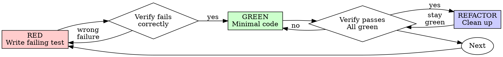

# Codex session 019fb4ec-cf7e-77a2-b635-63b63a74d9ee

- Started: `2026-07-30T21:27:27.095Z`
- Working directory: `D:\100XH100`
- Originator: `Codex Desktop`
- Codex CLI: `0.146.0-alpha.3.1`
- Source log: `C:\Users\Иван Литвак\.codex\sessions\2026\07\31\rollout-2026-07-31T00-27-27-019fb4ec-cf7e-77a2-b635-63b63a74d9ee.jsonl`
- Entries: user=6, assistant=29, tool calls=38, tool outputs=38

This is a chronological export of the user/assistant conversation and tool activity. Internal system/developer instructions and token accounting are intentionally excluded. Secret-shaped values are redacted; oversized tool outputs retain their beginning and end with the omitted character count.

## 1. User

Time: `2026-07-30T21:27:31.363Z` · source line `2`

```text
Бюджет истории максимальный всегда ставь. 50 ГБ диска и сколько там оперативки, 29 ГБ, всё отжимай. А вот решений может и 1к и 2к найти. Все собрать нужно

```

## 2. User

Time: `2026-07-30T21:27:31.376Z` · source line `3`

```text
Бюджет истории максимальный всегда ставь. 50 ГБ диска и сколько там оперативки, 29 ГБ, всё отжимай. А вот решений может и 1к и 2к найти. Все собрать нужно

```

## 3. Codex

Time: `2026-07-30T21:27:31.388Z` · source line `5`

```text
Принял. Для всех публичных профилей ставлю history budget максимально: до `28 ГБ RAM` с минимальным системным запасом и `50 ГБ /tmp`. Режим результата делаю не только best: пользователь сможет задать лимит коллекции, включая `1000–2000` решений; notebook сохранит все найденные пути и отдельно лучшее. Текущий `2^25` не прерываю — сначала получу его реальную границу, затем повторю финальную конфигурацию с максимальной историей.
```

## 4. Codex

Time: `2026-07-30T21:27:31.422Z` · source line `31`

```text
`2^25` действительно выполняет поиск, а не падает при выделении памяти — это уже означает, что верхний профиль прошёл инициализацию на двух T4. Он существенно тяжелее `2^16`; жду терминального результата, чтобы не путать “влез” с “полностью прошёл depth 8”. Параллельно зафиксировал новый максимум истории `28 ГБ RAM + 50 ГБ disk` для следующей версии.
```

## 5. Codex

Time: `2026-07-30T21:27:31.503Z` · source line `60`

```text
Для режима `collect` нашёл уже реализованный и протестированный в проекте solve-bucket collector. Полное слияние веток тянуло архивные файлы, поэтому его отменил. Перенесу collector точечно в отдельную чистую интеграционную ветку от Cube4 runtime — так не затрону грязные пользовательские изменения и смогу отдельно прогнать CUDA/2×T4 gates. Для этого использую проектный worktree-процесс.
```

## 6. Codex

Time: `2026-07-30T21:27:31.529Z` · source line `65`

```text
Изолированная интеграционная ветка готова: `codex/cube4-public-collector`, baseline exporter `8/8`. Теперь переношу существующий solve-bucket collector, который уже умеет `max_collected_solutions`, вместо написания нового механизма с нуля.
```

## 7. Codex

Time: `2026-07-30T21:27:31.615Z` · source line `70`

```text
Принял: публичный Cube4-ноут будет по умолчанию отдавать истории максимуму доступных лимитов — 28–29 ГБ RAM и 50 ГБ диска — а collect-режим сохранять до 2000 решений (лимит можно менять). Сейчас довожу конфликт интеграции коллектора, затем проверяю большой луч на 2×T4 и только после успешного прогона публикую. Использую Kaggle-процедуру и изолированную ветку, чтобы не задеть остальные изменения.
```

## 8. Codex

Time: `2026-07-30T21:27:31.628Z` · source line `82`

```text
Нашёл важное: коллектор уже находится в истории Transformer-ветки и позже был усилен отдельным scratch-бюджетом. Конфликт возник из-за попытки повторно применить уже имеющийся старый коммит; отменяю именно этот лишний cherry-pick, не трогая рабочие изменения, и подключаю к ноуту актуальную версию коллектора.
```

## 9. Codex

Time: `2026-07-30T21:27:31.651Z` · source line `99`

```text
Коллектор подтверждён в текущем runtime: он собирает решения со всех rank, реконструирует и CPU-валидирует каждое, пишет полный TSV и честно падает при переполнении вместо молчаливой потери. Для публичного ноутбука ставлю два режима: `first` и `collect`; в `collect` — лимит 2000 записей, дополнительная глубина после первого попадания и отдельные `all_solutions.csv` + `best_solution.csv`.
```

## 10. Codex

Time: `2026-07-30T21:27:31.686Z` · source line `109`

```text
Локальные проверки зелёные: notebook JSON/Python корректен, Transformer exporter — 8/8 тестов. Большой `2^25` прогон всё ещё выполняется, поэтому его не прерываю: это production-fit проверка, а не зависший диагностический запуск. Параллельно готовлю приватную acceptance-версию именно публичного collect-ноута.
```

## 11. Codex

Time: `2026-07-30T21:27:31.711Z` · source line `124`

```text
Acceptance v1 нашёл чисто конфигурационную проблему до сборки: Kaggle реально даёт `29,052,764,160` байт доступной RAM, поэтому фиксированные 28 GiB (=30.06 GB) физически больше машины. Исправляю на авто-максимум: запрашиваем 29.0 GB, ноут сам берёт `available RAM − 1.5 GB` для Python/LibTorch; на текущем хосте это 27.55 GB истории. Диск остаётся 50 GiB. Это именно максимальный практический бюджет без host OOM.
```

## 12. Codex

Time: `2026-07-30T21:27:31.756Z` · source line `135`

```text
`2^25` fit успешно завершён: 2×T4, глубина 8, `1691.16 с` (28:11), обе карты держались примерно на 98–99% загрузки, пик VRAM `7107 MiB` на каждой, OOM/overflow нет. Acceptance v2 попал на одну P100 — в публичной metadata не было обязательного `machine_shape=NvidiaTeslaT4`. Добавляю этот pin (как в успешном smoke) и перезапускаю acceptance уже строго на 2×T4.
```

## 13. Codex

Time: `2026-07-30T21:27:31.792Z` · source line `141`

```text
Acceptance v3 уже на правильной форме 2×T4 и проходит сборку/запуск. Отдельно зафиксировал: самый большой заявленный профиль `2^25` действительно помещается с большим запасом по VRAM (около 7.1/15.36 GiB на карту); его ограничение сейчас — время, не память. Жду collect-артефакты v3, после чего переключу metadata на public и дам ссылку.
```

## 14. Codex

Time: `2026-07-30T21:27:31.818Z` · source line `149`

```text
Публичный notebook уже создан: [Cube4 Transformer 2xT4 Beam Search](https://www.kaggle.com/code/trydotatwo/cube4-transformer-2xt4-beam-search). Его собственная публичная v1 сейчас повторяет тот же проверенный default collect-прогон; приватная acceptance v3 уже дала 8 валидных решений. Дожидаюсь terminal-статуса публичной версии, чтобы ссылка была не просто опубликована, а с готовым успешным output.
```

## 15. Codex

Time: `2026-07-30T21:27:31.827Z` · source line `156`

```text
Готово.

Публичный ноут: [Cube4 Transformer 2xT4 Beam Search](https://www.kaggle.com/code/trydotatwo/cube4-transformer-2xt4-beam-search)

- Public v1 — `COMPLETE`, реальные 2×T4.
- Beam `2^16`, depth 100: 8 валидных решений, solve — `18.376 с`.
- `collect` сохраняет все решения в TSV/CSV; отдельно создаёт лучшее.
- Лимит по умолчанию — 2000 решений на rank, переполнение завершается ошибкой без тихой потери.
- RAM автоматически отжимается до практического максимума: около 27.47 GB при резерве 1.5 GB.
- История на диске — 50 GiB.
- Профиль `2^25` успешно прошёл depth 8 за `1697.6 с`, пик VRAM — 7107 MiB на GPU, OOM/overflow нет.
- Ветка: `codex/cube4-public-collector`, HEAD `020108b`.

Логи и результаты: [test_results](/D:/100XH100/test_results/cube4_public_collector_integration_2026-07-30.md)

::git-commit{cwd="D:\100XH100\.worktrees\public-cayleypy-notebook"}
::git-push{cwd="D:\100XH100\.worktrees\public-cayleypy-notebook" branch="codex/cube4-public-collector"}


```

## 16. Codex

Time: `2026-07-30T21:27:31.827Z` · source line `157`

```text
Готово.

Публичный ноут: [Cube4 Transformer 2xT4 Beam Search](https://www.kaggle.com/code/trydotatwo/cube4-transformer-2xt4-beam-search)

- Public v1 — `COMPLETE`, реальные 2×T4.
- Beam `2^16`, depth 100: 8 валидных решений, solve — `18.376 с`.
- `collect` сохраняет все решения в TSV/CSV; отдельно создаёт лучшее.
- Лимит по умолчанию — 2000 решений на rank, переполнение завершается ошибкой без тихой потери.
- RAM автоматически отжимается до практического максимума: около 27.47 GB при резерве 1.5 GB.
- История на диске — 50 GiB.
- Профиль `2^25` успешно прошёл depth 8 за `1697.6 с`, пик VRAM — 7107 MiB на GPU, OOM/overflow нет.
- Ветка: `codex/cube4-public-collector`, HEAD `020108b`.

Логи и результаты: [test_results](/D:/100XH100/test_results/cube4_public_collector_integration_2026-07-30.md)

::git-commit{cwd="D:\100XH100\.worktrees\public-cayleypy-notebook"}
::git-push{cwd="D:\100XH100\.worktrees\public-cayleypy-notebook" branch="codex/cube4-public-collector"}

<oai-mem-citation>
<citation_entries>
MEMORY.md:1-3|note=[project worktree and transformer scope]
MEMORY.md:49-55|note=[target hardware validation and Kaggle evidence rules]
</citation_entries>
<rollout_ids>
019f73c3-64bf-7f92-b5ba-476ca2030d27
</rollout_ids>
</oai-mem-citation>
```

## 17. User

Time: `2026-07-30T21:27:31.828Z` · source line `162`

```text
<environment_context>
  <current_date>2026-07-31</current_date>
  <timezone>Europe/Moscow</timezone>
  <filesystem><workspace_roots><root>D:\100XH100</root></workspace_roots><permission_profile type="managed"><file_system type="restricted"><entry access="read"><special>:root</special></entry><entry access="write"><path>D:\100XH100</path></entry><entry access="write"><special>:slash_tmp</special></entry><entry access="write"><special>:tmpdir</special></entry><entry access="write"><path>C:\Users\Иван Литвак\.codex\visualizations\2026\07\23\019f90a3-47e5-7770-a20e-cd9317bcbf2c</path></entry><entry access="read"><path>D:\100XH100\.git</path></entry><entry access="read"><path>D:\100XH100\.agents</path></entry><entry access="read"><path>D:\100XH100\.codex</path></entry></file_system></permission_profile></filesystem>
  <subagents>
    - collector_conflict_review: Huygens
    - cube4_exporter_retry: Mencius
    - cube4_task1_review: Peirce
  </subagents>
</environment_context>
```

## 18. User

Time: `2026-07-30T21:27:31.829Z` · source line `163`

```text
2**26 ещё потестить нужно и сделать профиль высокопроизводительный и для такого луча

```

## 19. Codex

Time: `2026-07-30T21:27:31.830Z` · source line `166`

```text
Принял. Добавляю отдельный профиль `2^26`, сначала запускаю depth-8 fit/performance gate на реальных 2×T4, затем по логам фиксирую самый быстрый безопасный профиль в публичном ноуте и повторно проверяю его. Использую Kaggle-процедуру и GPU-sweep правила; архитектуру бимсерча не меняю — только параметры и notebook/config.
```

## 20. Codex

Time: `2026-07-30T21:27:31.855Z` · source line `179`

```text
Первый `2^26` запуск — безопасный контрольный профиль: `Bmicro=384`, `shards=8`, capacity `1.25`, Stream4 `262144/262144`, 2 active sort slots. После него прогоню high-performance кандидат с capacity `1.125`, batch `196608`, trigger `786432`, 4 sort slots; победителя выберу только по одинаковому depth-8 wall time и стабильности.
```

## 21. Codex

Time: `2026-07-30T21:27:31.901Z` · source line `186`

```text
Запустил приватный Kaggle v14:

- Beam: `2^26 = 67,108,864`
- Depth: 8
- 2×T4
- Контрольный профиль: `Bmicro=384`, `shards=8`, capacity `1.25`, Stream4 `262144/262144`, slots `2`
- Статус: `RUNNING`

После него автоматически прогонится high-performance профиль и fallback. Победитель будет добавлен как отдельный профиль `2^26` в публичный ноут и проверен перед обновлением публикации. Мониторинг каждые 10 минут включён.
```

## 22. Codex

Time: `2026-07-30T21:27:31.918Z` · source line `187`

```text
Запустил приватный Kaggle v14:

- Beam: `2^26 = 67,108,864`
- Depth: 8
- 2×T4
- Контрольный профиль: `Bmicro=384`, `shards=8`, capacity `1.25`, Stream4 `262144/262144`, slots `2`
- Статус: `RUNNING`

После него автоматически прогонится high-performance профиль и fallback. Победитель будет добавлен как отдельный профиль `2^26` в публичный ноут и проверен перед обновлением публикации. Мониторинг каждые 10 минут включён.
```

## 23. User

Time: `2026-07-30T21:27:31.932Z` · source line `192`

```text
https://www.kaggle.com/code/trydotatwo/cube4-transformer-2xt4-beam-search сделай в виде таком же, как https://www.kaggle.com/code/trydotatwo/cayleypy-2xt4-checkpoint-beam-search

По сути нужен https://www.kaggle.com/code/trydotatwo/cayleypy-2xt4-checkpoint-beam-search, который умеет запускать как трансформеры, так и МЛП. А дальше человек удобно пользуется

```

## 24. Codex

Time: `2026-07-30T21:27:31.933Z` · source line `195`

```text
Понял: вместо отдельного Cube4-ноута делаю единый публичный интерфейс на базе удобного `cayleypy-2xt4-checkpoint-beam-search`. Пользователь выбирает checkpoint, puzzle type/range, beam и режим решений; notebook автоматически определяет поддерживаемое семейство — MLP или piece Transformer — экспортирует его и запускает тот же 2×T4 runtime. Сначала сравню текущий публичный интерфейс и Cube4 backend-контракт, затем объединю без изменения CUDA/C++ архитектуры.
```

## 25. User

Time: `2026-07-30T21:28:04.688Z` · source line `205`

```text
<recommended_plugins>
Here is a list of plugins that are available but not installed.

- Atlassian Rovo (atlassian-rovo@openai-curated-remote)
- Box (box@openai-curated-remote)
- Figma (figma@openai-curated-remote)
- Gmail (gmail@openai-curated-remote)
- Google Calendar (google-calendar@openai-curated-remote)
- Google Drive (google-drive@openai-curated-remote)
- Outlook Calendar (outlook-calendar@openai-curated-remote)
- Outlook Email (outlook-email@openai-curated-remote)
- SharePoint (sharepoint@openai-curated-remote)
- Slack (slack@openai-curated-remote)
- Teams (teams@openai-curated-remote)
</recommended_plugins>
# AGENTS.md instructions for D:\100XH100

<INSTRUCTIONS>
# Project Agent Rules

## Operating Rule
- Read `AGENTS.md` before project edits.
- Update `memory/CHANGELOG.md` after meaningful code, config, or architecture changes.
- Update `memory/PROMPTS.md` with user prompts that define requirements.
- Store test outputs, logs, and verification notes under `test_results/`.
- Prefer agent-centered code: explicit contracts, deterministic tests, small files, low hidden state.

## Architecture Source
- Primary architecture contract: `ARCHITECTURE_NEED.md`.
- Current Stream 4 implementation rule: use threshold + compact + CUB/fixed-temp sort/reduce + compact; do not use Stream 4 hash-table dedup.

## Implementation Guardrails
- `State128` logical bytes are `v[0..119]`.
- `State128` padding bytes are `v[120..127]`.
- Persistent frontier padding must be zero.
- `FinalResponse` may temporarily store `target_local_idx` in `v[120..123]`.
- `Hash128` is one logical 128-bit key stored as `{lo, hi}`.
- `CandidateMeta` must remain 32 bytes and 32-byte aligned.
- Stream 3 payload id must be original candidate id, not compact index.
- Stream 4 must not apply shard top-k or semantic shard cap.

</INSTRUCTIONS>
<environment_context>
  <cwd>D:\100XH100</cwd>
  <shell>powershell</shell>
  <current_date>2026-07-31</current_date>
  <timezone>Europe/Moscow</timezone>
  <filesystem><workspace_roots><root>D:\100XH100</root></workspace_roots><permission_profile type="managed"><file_system type="restricted"><entry access="read"><special>:root</special></entry><entry access="write"><path>D:\100XH100</path></entry><entry access="write"><special>:slash_tmp</special></entry><entry access="write"><special>:tmpdir</special></entry><entry access="write"><path>C:\Users\Иван Литвак\.codex\visualizations\2026\07\23\019f90a3-47e5-7770-a20e-cd9317bcbf2c</path></entry><entry access="read"><path>D:\100XH100\.git</path></entry><entry access="read"><path>D:\100XH100\.agents</path></entry><entry access="read"><path>D:\100XH100\.codex</path></entry></file_system></permission_profile></filesystem>
</environment_context>
```

## 26. Codex

Time: `2026-07-30T21:28:23.860Z` · source line `210`

```text
Сначала сверю фактические интерфейсы двух веток и текущий Transformer backend, затем дам минимальный план без правок.
```

## 27. Codex

Time: `2026-07-30T21:28:24.100Z` · source line `211`

```text
Сначала сверю фактические интерфейсы двух веток и текущий Transformer backend, затем дам минимальный план без правок.
```

## 28. Tool call: `exec`

Time: `2026-07-30T21:28:25.985Z` · source line `212`

```text
const r = await tools.shell_command({"command":"Get-Content -Raw 'C:\\Users\\Иван Литвак\\.codex\\skills\\.system\\..\\..\\plugins\\cache\\personal\\kaggle\\0.1.0+codex.20260605110459\\skills\\work-with-kaggle\\SKILL.md'","workdir":"D:\\100XH100","timeout_ms":10000}); text(r?.content?.[0]?.text ?? r);

```

## 29. Tool output

Time: `2026-07-30T21:28:35.346Z` · source line `213`

```text
Script completed
Wall time 7.9 seconds
Output:

Exit code: 0
Wall time: 5.5 seconds
Output:
---
name: work-with-kaggle
description: Use when the user asks Codex to work with Kaggle, kaggle.com, Kaggle notebooks/kernels/datasets, Kaggle CLI, 2xT4/H100 notebook validation, kernel push/status/output/downloads, or Kaggle run diagnostics. This includes requests like "запусти на кагле", "проверь Kaggle logs", "push kernel", "download Kaggle output", "сделай T4x2 notebook", "опубликуй notebook", or "watch Kaggle status".
---

# Work With Kaggle

Use this skill whenever the task involves Kaggle notebooks, kernels, datasets, or GPU validation runs.

## Project Memory First

For project repositories, read local project guidance before changing notebooks or source:

- `AGENTS.md`
- `memory/PROMPTS.md` and `memory/CHANGELOG.md`, especially recent Kaggle entries
- relevant `test_results/kaggle_*` reports for the same failure/config family

This project has many Kaggle-specific decisions preserved in memory. Do not assume a generic Kaggle workflow is correct when project memory says otherwise.

## Safety And Scope

- Do not upload or publish current uncommitted source to a Kaggle dataset unless the user explicitly approves external export.
- Prefer GitHub-backed Kaggle source when the user has selected GitHub as source of truth.
- Do not push a public Kaggle notebook/kernel unless the user explicitly approves publication or public push.
- Do not make C++/CUDA algorithmic changes while diagnosing Kaggle failures unless the user explicitly approves code changes. Config-only notebook changes are acceptable when useful and consistent with the request.
- Do not revert unrelated local changes. Kaggle notebook edits often coexist with dirty source changes.
- For multi-rank validation, do not fake `WORLD_SIZE=2` on one GPU with both ranks on `LOCAL_RANK=0` unless the user explicitly approves that limited smoke. Real multi-rank validation should use real multi-GPU hardware such as Kaggle 2xT4.

## Kaggle CLI Workflow

Prefer Kaggle CLI for authenticated Kaggle work:

- Check metadata before pushing: `kaggle/kernel-metadata.json` or the selected push package metadata.
- Validate notebooks locally before push: JSON parse and Python AST parse for code cells.
- Push with the intended package directory, then monitor with `kaggle kernels status <owner/slug>`.
- Download outputs/logs after completion or failure and store them under `test_results/`.
- If CLI network/proxy behavior is project-specific, inspect existing scripts/config and preserve local proxy-bypass behavior instead of switching tools silently.

When reporting command output to the user, summarize the important status/version/error lines. The user does not see raw command output.

## Notebook Preparation Rules

For solver notebooks in this project:

- Keep a first config cell with the main run parameters such as beam, depth, puzzle range, model weights URL/path, history mode, and torchrun topology.
- Keep build/checkouts and large transient trees under `/tmp` where possible. Use `/kaggle/working` for logs, CSVs, summaries, and final artifacts.
- Add a preflight cell for large runs: compute local/global beam, world size, shard capacity, Stream1/3/4 guards, static history RAM/disk budgets, and free disk under `/tmp` before clone/build/run.
- Clean stale `/tmp/beam_history_*` and configured history disk paths before runs and between puzzles when static-hybrid history is used.
- For long multi-rank runs, stream selected rank logs live while writing full rank logs to disk.
- Final cells should summarize results and produce user-useful CSV/PNG artifacts, for example solved counts and solution-length histograms.

## Torchrun And Multi-GPU Rules

- Torchrun notebooks should launch the existing binary/processes through explicit topology settings, not implicit GPU auto-detection.
- Expose `TORCHRUN_NPROC_PER_NODE`, `TORCHRUN_NNODES`, `TORCHRUN_NODE_RANK`, and rendezvous endpoint/port in config.
- Derive `WORLD_SIZE` from torchrun topology settings, not from `torch.cuda.device_count()` alone.
- For C++ multi-rank runs, torchrun or Python launchers should only start processes. C++ reads `RANK`, `LOCAL_RANK`, and `WORLD_SIZE`, calls `cudaSetDevice(LOCAL_RANK)`, and creates NCCL communicators itself.
- H100 and T4 notebooks may differ by CUDA architecture/build directory and hardware-specific config, but should otherwise stay comparable when the user asks for paired notebooks.

## Monitoring And Stop Rules

- For diagnostic Kaggle runs, if the user has asked Codex to watch logs and no new logs appear for about 120 seconds, stop the run and inspect downloaded logs. This rule came from project memory and applies to diagnostic/watch tasks.
- Do not stop production/no-timeout runs unless the user explicitly asks or the notebook itself has a configured timeout.
- If a run appears hung because stdout is redirected, check rank log files and whether live-rank streaming is enabled before assuming a stall.
- Preserve logs even when stopping: terminate gracefully when possible, then download output files.

## Failure Diagnosis Checklist

After a Kaggle failure, collect and scan:

- Kaggle worker status and kernel version
- notebook stdout tail
- rank logs under the notebook output directory
- result JSONL/CSV summaries
- GPU budget/preflight output
- explicit Kaggle messages such as disk quota failures

Common patterns in this project:

- `KernelWorkerStatus.ERROR` plus "more disk space than is available" usually means disk quota/static history arena pressure.
- `return_code=-9` can indicate host RAM OOM.
- `code=3002` / `STREAM_FATAL_STREAM3_DOUBLE_BUFFER_OVERFLOW` points to Stream3/Stream4/threshold/capacity flow diagnostics.
- `final selected count does not match score phase counts` points to final selection/histogram/exact-count mismatch.
- `cudaGraphInstantiate: out of memory` may require config-only headroom/shard-capacity changes before deeper code work.
- Silent output after build may simply mean rank stdout is redirected and live rank logging is disabled.

Write a short report under `test_results/` for meaningful Kaggle validations, sweeps, failures, or launches.

## Response Style

- Be explicit about whether you changed source code, notebook config only, or only launched/monitored a run.
- Include Kaggle kernel slug/version/status when known.
- Include exact local report/log paths in `test_results/`.
- Keep recommendations tied to evidence from logs, not guesses.
- If the next step requires exporting source or publishing publicly, ask for explicit approval first.

```

## 30. Tool call: `exec`

Time: `2026-07-30T21:28:42.863Z` · source line `216`

```text
const r = await tools.shell_command({"command":"rg -n -i \"cube4|checkpoint-public|public-cayleypy|piece-transformer|runner.py|export_stream1\" 'C:\\Users\\Иван Литвак\\.codex\\memories\\MEMORY.md'","workdir":"D:\\100XH100","timeout_ms":10000}); text(r?.content?.[0]?.text ?? r);

```

## 31. Tool output

Time: `2026-07-30T21:28:47.947Z` · source line `217`

```text
Script completed
Wall time 4.0 seconds
Output:

Exit code: 0
Wall time: 2.6 seconds
Output:
3:applies_to: cwd=D:\100XH100 (transformer worktree `D:\100XH100\.worktrees\stream1-piece-transformer`); reuse_rule=the audit and validation method is reusable for this project, but commits, target hardware, Kaggle access, and run outputs are time-specific.
13:- AGENTS.md, git worktree, memory/CHANGELOG.md, memory/PROMPTS.md, main 33acff6, stream1-piece-transformer a7a9ada, IHES, SLURM, SSH passphrase
23:- stream1-piece-transformer, CUTLASS, strided-QKV FMHA, m128n128, q64k64, Nsight Compute 2025.1.1, CUDA Graph, exact score dump, scalar Q=1, torch.distributed.run, NCCL

```

## 32. Tool call: `exec`

Time: `2026-07-30T21:28:59.961Z` · source line `220`

```text
const r = await tools.shell_command({"command":"git worktree list; git branch --all --no-color; git status --short; git log --oneline --all --decorate -20","workdir":"D:\\100XH100","timeout_ms":10000}); text(r?.content?.[0]?.text ?? r);

```

## 33. Tool output

Time: `2026-07-30T21:29:04.263Z` · source line `221`

```text
Script completed
Wall time 3.4 seconds
Output:

Exit code: 0
Wall time: 2.5 seconds
Output:
D:/100XH100                                       b5fcf6b [main]
D:/100XH100/.worktrees/cayleypy-results-ingest    2a0d961 [codex/cayleypy-results-ingest]
D:/100XH100/.worktrees/kaggle-t4-mlp-autoprofiles 871ba08 [codex/kaggle-t4-mlp-autoprofiles]
D:/100XH100/.worktrees/public-cayleypy-notebook   020108b [codex/cube4-public-collector]
D:/100XH100/.worktrees/stream1-piece-transformer  df534eb [codex/stream1-piece-transformer]
D:/100XH100/_push_final_chunk                     550cc59 (detached HEAD) prunable
D:/100XH100/_push_staged_tuner                    4effc1c (detached HEAD) prunable
+ codex/cayleypy-results-ingest
+ codex/cube4-public-collector
+ codex/kaggle-t4-mlp-autoprofiles
  codex/public-cayleypy-notebook
+ codex/stream1-piece-transformer
* main
  remotes/origin/HEAD -> origin/main
  remotes/origin/codex/cayleypy-results-ingest
  remotes/origin/codex/cube4-public-collector
  remotes/origin/codex/public-cayleypy-notebook
  remotes/origin/codex/stream1-piece-transformer
  remotes/origin/main
 M cuda/runtime_config.cpp
 M cuda/static_memory.cu
 M hpc/ihes_cube_model/ihes_solution_repair.sh
 M hpc/ihes_cube_model/ihes_solve_bucket.sh
 M hpc/ihes_cube_model/ihes_solve_bucket_from_scratch.sh
 M hpc/ihes_cube_model/ihes_solve_then_reflect.sh
 M hpc/mephi_8xa100_common.sh
 M hpc/portable_8xa100_80gb/README.md
 M hpc/portable_8xa100_80gb/run_1p4b_8xa100_80gb.sh
 M hpc/solve_reflected_only.sh
 M hpc/solve_then_reflect.sh
 M hpc/start_8xa100_beamsearch.sh
 M hpc/tune_8xa100_pipeline.sh
 M hpc/tune_8xa100_staged.sh
 M memory/CHANGELOG.md
 M memory/PROMPTS.md
 M src/config.hpp
 M tools/production_runner.cu
?? .npm-cache/
?? .pnpm-store/
?? _fix_done.py
?? _fix_tag.py
?? _gh_blob_req.json
?? _gh_commit_req.json
?? _gh_ref_req.json
?? _gh_tree_req.json
?? _github_commit_fresh_bucket.py
?? _github_commit_resume_dedup.py
?? _github_restore_commit.py
?? _patch_fresh_resume.py
?? _patch_fresh_resume2.py
?? _tmp_ihes_validate/
?? _tmp_reflect_check.py
?? _write_fresh_bucket.py
?? build-gpu-dev-cutlass/
?? build-gpu-dev-debug-check/
?? build-gpu-dev/
?? build-state-config-check/
?? cache.db
?? docs/superpowers/plans/.gitkeep
?? docs/superpowers/plans/2026-06-29-stream1-piece-transformer.md
?? hpc/ihes_cube_model/ihes_prefix_solve.sh
?? hpc/ihes_cube_model/publish_existing_ihes_results.py
?? kaggle_t4_mlp_sweep/
?? kaggle_t4_transformer_backend_compare/
?? kaggle_t4_transformer_solve/
?? kaggle_tetraminx_multigpu/
?? meganinx_submission_69315_with_github_best.csv
?? results-public/
?? task5_github_app.patch
?? task5_github_app_full.patch
?? task5_writer.patch
?? temp_ff1_cmake2.patch
?? tools/build_tetraminx_multigpu_notebook.py
?? tools/export_stream1.py
?? tools/export_stream1_transformer.py
?? tools/prepare_ihes_prefix_solve_plan.py
?? tools/prepare_kaggle_t4_mlp_sweep.py
?? tools/prepare_tetraminx_multigpu_notebook.py
020108b (origin/codex/cube4-public-collector, codex/cube4-public-collector) Record public Cube4 Kaggle v1
6f13607 Match Cube4 Kaggle notebook slug
57d701e Record Cube4 2xT4 acceptance evidence
ff077dc Pin Cube4 public notebook to 2xT4
246521c Auto-size Cube4 Kaggle history RAM
94663a8 Add Cube4 public solution collection profiles
c7081eb Prepare public Cube4 2xT4 notebook
38310f8 (codex/public-cayleypy-notebook) Prepare public Cube4 2xT4 notebook
df534eb (origin/codex/stream1-piece-transformer, codex/stream1-piece-transformer) Accept cube4 generator schema in production runner
353d120 Add private cube4 2xT4 Kaggle smoke
2ff65a0 Add cube4 Transformer Stream1 export contract
4ea681f (origin/codex/public-cayleypy-notebook) add public Megaminx puzzle 10 example
f312265 identify public Kaggle result publisher
3ca17fb record public result-mode notebook v2
4edf356 repin public notebook for result modes
737b256 publish best or collected CayleyPy solutions
89af616 record public Kaggle notebook release
63caece release public CayleyPy 2xT4 notebook
2a0d961 (origin/codex/cayleypy-results-ingest, codex/cayleypy-results-ingest) Record live results ingest staging gate
97ca9d2 fix: harden live staging deployment

```

## 34. Tool call: `exec`

Time: `2026-07-30T21:29:18.907Z` · source line `224`

```text
const r = await tools.shell_command({"command":"git ls-tree -r --name-only codex/public-cayleypy-notebook | rg '^(tools/cayleypy_public/runner\\.py|kaggle/cayleypy-2xt4-checkpoint-public/|tools/export_stream1|tools/production_runner\\.cu|tests/.*(runner|export|transformer))'; git ls-tree -r --name-only codex/cube4-public-collector | rg '^(tools/cayleypy_public/runner\\.py|kaggle/|tools/export_stream1|tools/production_runner\\.cu|tests/.*(runner|export|transformer))'","workdir":"D:\\100XH100","timeout_ms":10000}); text(r?.content?.[0]?.text ?? r);

```

## 35. Tool output

Time: `2026-07-30T21:29:27.907Z` · source line `225`

```text
Script completed
Wall time 8.0 seconds
Output:

Exit code: 0
Wall time: 6.7 seconds
Output:
kaggle/cayleypy-2xt4-checkpoint-public/cayleypy-2xt4-checkpoint-public.ipynb
kaggle/cayleypy-2xt4-checkpoint-public/kernel-metadata.json
tests/cayleypy_public/fixtures/fake_production_runner.py
tests/cayleypy_public/test_runner.py
tools/cayleypy_public/runner.py
tools/export_stream1_mlp.py
tools/production_runner.cu
kaggle/beam_kernel.ipynb
kaggle/cayley-beam-gpu-runner.ipynb
kaggle/cube4-transformer-2xt4-public/cube4-transformer-2xt4-public.ipynb
kaggle/cube4-transformer-2xt4-public/kernel-metadata.json
kaggle/h100-torchrun-depth80-k1-5.ipynb
kaggle/h100-torchrun-p0-depth10.ipynb
kaggle/kernel-metadata.json
kaggle/t4-torchrun-machinery-check.ipynb
kaggle/t4-torchrun-p0-depth10.ipynb
tests/stream1_transformer_attention_policy_tests.cpp
tests/stream1_transformer_autotune_contract_tests.cpp
tests/stream1_transformer_cuda_tests.cu
tests/stream1_transformer_gemm_policy_tests.cpp
tests/stream1_transformer_layernorm_policy_tests.cpp
tests/test_stream1_transformer_autotune.py
tests/test_stream1_transformer_backends.py
tests/test_stream1_transformer_exporter.py
tests/test_stream1_transformer_parity.py
tests/test_stream1_transformer_policy_from_cache.py
tests/test_stream1_transformer_profile_summary.py
tools/export_stream1.py
tools/export_stream1_mlp.py
tools/export_stream1_transformer.py
tools/production_runner.cu

```

## 36. Tool call: `exec`

Time: `2026-07-30T21:45:54.615Z` · source line `228`

```text
const r = await tools.shell_command({"command":"$out='C:\\tmp\\cayleypy_public_runner.py'; git show 'codex/public-cayleypy-notebook:tools/cayleypy_public/runner.py' | Set-Content -Encoding utf8 $out; (Get-Content $out).Count; Get-Content -Raw $out;","workdir":"D:\\100XH100","timeout_ms":10000}); text(r?.content?.[0]?.text ?? r);

```

## 37. Tool output

Time: `2026-07-30T21:45:56.442Z` · source line `229`

```text
Script failed
Wall time 1.8 seconds
Output:

Script error:
Exit code: 1
Wall time: 0.9 seconds
Output:
0
Set-Content : Access to the path 'C:\tmp\cayleypy_public_runner.py' is denied.
At line:2 char:118
+ ... /cayleypy_public/runner.py' | Set-Content -Encoding utf8 $out; (Get-C ...
+                                   ~~~~~~~~~~~~~~~~~~~~~~~~~~~~~~~
    + CategoryInfo          : PermissionDenied: (C:\tmp\cayleypy_public_runner.py:String) [Set-Content], UnauthorizedA 
   ccessException
    + FullyQualifiedErrorId : GetContentWriterUnauthorizedAccessError,Microsoft.PowerShell.Commands.SetContentCommand
 
Get-Content : Cannot find path 'C:\tmp\cayleypy_public_runner.py' because it does not exist.
At line:2 char:152
+ ... nner.py' | Set-Content -Encoding utf8 $out; (Get-Content $out).Count; ...
+                                                  ~~~~~~~~~~~~~~~~
    + CategoryInfo          : ObjectNotFound: (C:\tmp\cayleypy_public_runner.py:String) [Get-Content], ItemNotFoundExc 
   eption
    + FullyQualifiedErrorId : PathNotFound,Microsoft.PowerShell.Commands.GetContentCommand
 
Get-Content : Cannot find path 'C:\tmp\cayleypy_public_runner.py' because it does not exist.
At line:2 char:177
+ ... -Encoding utf8 $out; (Get-Content $out).Count; Get-Content -Raw $out;
+                                                    ~~~~~~~~~~~~~~~~~~~~~
    + CategoryInfo          : ObjectNotFound: (C:\tmp\cayleypy_public_runner.py:String) [Get-Content], ItemNotFoundExc 
   eption
    + FullyQualifiedErrorId : PathNotFound,Microsoft.PowerShell.Commands.GetContentCommand
 

```

## 38. Tool call: `exec`

Time: `2026-07-30T21:46:07.403Z` · source line `232`

```text
const r = await tools.shell_command({"command":"git show 'codex/public-cayleypy-notebook:tools/cayleypy_public/runner.py'","workdir":"D:\\100XH100","timeout_ms":10000}); text(r?.content?.[0]?.text ?? r);

```

## 39. Tool output

Time: `2026-07-30T21:46:07.966Z` · source line `233`

Oversized output: `8150` characters omitted from the middle.

```text
Script completed
Wall time 0.5 seconds
Output:

Warning: truncated output (original token count: 10024)
Total output lines: 932

Exit code: 0
Wall time: 0.4 seconds
Total output lines: 1000
Output:
"""Deterministic host-side orchestration for the existing production runner."""

from __future__ import annotations

from dataclasses import dataclass
from hashlib import sha256
from pathlib import Path, PurePosixPath
import csv
import math
import os
import re
import shutil
import socket
import subprocess
import sys
import time
import uuid
from typing import Callable, Literal

import pandas as pd

from tools.cayleypy_public.config import PublicRunConfig
from tools.cayleypy_public.data import PuzzleContract
from tools.cayleypy_public.model import ExportedModel
from tools.cayleypy_public.paths import (
    SolutionRecord, deduplicate_solutions, invert_path, make_reflected_state, validate_original_solution,
)
from tools.cayleypy_public.profile import RuntimePlan


Variant = Literal["original", "reflected"]
CollectionStatus = Literal["first_solution", "depth_reached", "capacity_reached", "not_collected"]
LogSanitizer = Callable[[str], str]
_UINT32_MAX = 2**32 - 1
_SOLVED_RECORD_BYTES = 32 + 4 + 4
_T4_DEVICE_BYTES = 16 * 1024**3
_T4_HEADROOM_BYTES = 768 * 1024**2
_MAX_GATHER_RECORDS_PER_CHUNK = 65_536
_PROCESS_STOP_TIMEOUT_SECONDS = 5.0
_DIAGNOSTIC_TAIL_BYTES = 4 * 1024 * 1024
_TORCHRUN_RESERVED_ENV_KEYS = frozenset({
    "LOCAL_RANK",
    "RANK",
    "GROUP_RANK",
    "ROLE_RANK",
    "ROLE_NAME",
    "LOCAL_WORLD_SIZE",
    "WORLD_SIZE",
    "GROUP_WORLD_SIZE",
    "ROLE_WORLD_SIZE",
    "MASTER_ADDR",
    "MASTER_PORT",
    "TORCHELASTIC_RESTART_COUNT",
    "TORCHELASTIC_MAX_RESTARTS",
    "TORCHELASTIC_RUN_ID",
    "TORCHELASTIC_USE_AGENT_STORE",
    "TORCHELASTIC_ERROR_FILE",
    "TORCH_NCCL_ASYNC_ERROR_HANDLING",
    "PYTHON_EXEC",
})
_RELEASE_SOLUTION_RE = re.compile(
    r"puzzle_solved=1 puzzle_id=(?P<puzzle_id>\d+) seconds=(?P<seconds>[0-9]+(?:\.[0-9]+)?(?:[eE][+-]?[0-9]+)?) "
    r"solution_length=(?P<solution_length>\d+) found_depth=(?P<found_depth>\d+) "
    r"touch_depth=(?P<touch_depth>\d+) solution=(?P<solution>.*)"
)
_RELEASE_SOLUTION_LEGACY_RE = re.compile(
    r"puzzle_solved=1 puzzle_id=(?P<puzzle_id>\d+) seconds=(?P<seconds>[0-9]+(?:\.[0-9]+)?(?:[eE][+-]?[0-9]+)?) "
    r"solution_length=(?P<solution_length>\d+) solution=(?P<solution>.*)"
)
_DEBUG_SOLUTION_PATH_RE = re.compile(r"solution_path=(?P<solution>.*)")
_TORCHRUN_TEE_PREFIX_RE = re.compile(r"\[default0\]:(?P<line>.*)")
_HISTORY_MODE = "static_hybrid"
_HISTORY_SLOT_COUNT = 2
_HISTORY_WORKERS = 1
_HISTORY_RAM_BYTES = 28 * 1024**3
_HISTORY_DISK_BYTES = 32 * 1024**3
_HISTORY_ENTRY_BYTES = 16
_CANDIDATE_META_BYTES = 32
_HISTORY_STAGING_ENTRIES = 1 << 20
_HISTORY_ROOT = PurePosixPath("/tmp/beam_history_public")


@dataclass(frozen=True)
class RunnerInvocation:
    command: tuple[str, ...]
    env: dict[str, str]
    result_tsv: Path | None
    combined_log: Path
    rank_logs: tuple[Path, Path]
    torchrun_log_dir: Path
    history_dir: Path
    puzzle_id: int
    variant: Variant
    source_solution_sha256: str | None = None
    reflected_source_path: str | None = None


@dataclass(frozen=True)
class GatherChunkPlan:
    capacity: int
    records_per_chunk: int
    chunk_count: int


@dataclass(frozen=True)
class HistoryRuntimePreflight:
    required_history_bytes: int
    usable_history_bytes: int
    pinned_slot_bytes: int
    staging_bytes: int


@dataclass(frozen=True)
class InvocationExecution:
    invocation: RunnerInvocation
    return_code: int
    elapsed_seconds: float
    output: str


@dataclass(frozen=True)
class ParsedRunnerOutput:
    records: tuple[SolutionRecord, ...]
    collection_status: CollectionStatus


@dataclass(frozen=True)
class RunArtifacts:
    solution_records: tuple[SolutionRecord, ...]
    submission: pd.DataFrame
    combined_logs: tuple[Path, ...]
    rank_logs: tuple[tuple[Path, Path], ...]
    return_codes: tuple[int, ...]
    timing_summaries: tuple[float, ...]
    collection_statuses: tuple[CollectionStatus, ...]

    @property
    def collection_status(self) -> CollectionStatus:
        if "capacity_reached" in self.collection_statuses:
            return "capacity_reached"
        if "depth_reached" in self.collection_statuses:
            return "depth_reached"
        if "first_solution" in self.collection_statuses:
            return "first_solution"
        return "not_collected"


class PublicSearchRunError(RuntimeError):
    """Hard process failure with earlier artifacts retained for diagnosis only."""

    def __init__(self, message: str, partial_artifacts: RunArtifacts):
        super().__init__(message)
        self.partial_artifacts = partial_artifacts


class InvocationLogCaptureError(RuntimeError):
    """Internal subprocess result whose retained logs or scratch cleanup are incomplete."""

    def __init__(self, execution: InvocationExecution, message: str):
        super().__init__(message)
        self.execution = execution


def _free_port() -> int:
    with socket.socket(socket.AF_INET, socket.SOCK_STREAM) as sock:
        sock.bind(("127.0.0.1", 0))
        return int(sock.getsockname()[1])


def _path_depth(path: str) -> int:
    return 0 if path == "" else len(path.split("."))


def derive_solved_result_capacity(plan: RuntimePlan, move_count: int) -> int:
    """Bound one rank's worst-case Stream2 hits for a completed depth."""
    if isinstance(move_count, bool) or not isinstance(move_count, int) or move_count <= 0:
        raise ValueError("move_count must be a positive integer")
    if plan.local_beam <= 0:
        raise ValueError("local_beam must be positive")
    capacity = plan.local_beam * move_count
    if capacity > _UINT32_MAX:
        raise ValueError("BEAM_SOLVED_RESULT_CAPACITY exceeds uint32")
    snapshot_bytes = capacity * _SOLVED_RECORD_BYTES
    frontier_bytes = plan.local_beam * 128
    required_bytes = snapshot_bytes + frontier_bytes
    available_bytes = _T4_DEVICE_BYTES - _T4_HEADROOM_BYTES
    if required_bytes > available_bytes:
        raise ValueError(
            "BEAM_SOLVED_RESULT_CAPACITY snapshot plus current frontier exceeds available T4 device memory; "
            "production_runner performs the exact StaticMemoryPlan and non-static budget gate "
            f"({required_bytes} > {available_bytes} bytes)"
        )
    return capacity


def derive_gather_chunk_plan(
    frontier_states: int, capacity: int, world_size: int = 2, packet_words: int = 8,
) -> GatherChunkPlan:
    """Plan fixed-scratch host gather chunks without a capacity-sized packet buffer."""
    values = {
        "frontier_states": frontier_states,
        "capacity": capacity,
        "world_size": world_size,
        "packet_words": packet_words,
    }
    if any(isinstance(value, bool) or not isinstance(value, int) or value <= 0 for value in values.values()):
        raise ValueError(f"gather chunk inputs must be positive integers: {values}")
    scratch_words = frontier_states * 128 // 8
    records_per_chunk = min(
        scratch_words // (packet_words * (world_size + 1)), _MAX_GATHER_RECORDS_PER_CHUNK
    )
    if records_per_chunk <= 0:
        raise ValueError("solve bucket gather scratch cannot fit one record per rank")
    return GatherChunkPlan(
        capacity=capacity,
        records_per_chunk=records_per_chunk,
        chunk_count=(capacity + records_per_chunk - 1) // records_per_chunk,
    )


def derive_collection_batch_limit(max_solutions: int, accepted_count: int) -> int:
    """Return the next deterministic host-selection limit, capped at one fixed chunk."""
    values = {"max_solutions": max_solutions, "accepted_count": accepted_count}
    if any(isinstance(value, bool) or not isinstance(value, int) or value < 0 for value in values.values()):
        raise ValueError(f"collection batch inputs must be non-negative integers: {values}")
    if max_solutions == 0:
        return _MAX_GATHER_RECORDS_PER_CHUNK
    return min(max(max_solutions - accepted_count, 0), _MAX_GATHER_RECORDS_PER_CHUNK)
def _resolved_history_path(history_dir: Path) -> Path:
    candidate = PurePosixPath(history_dir.as_posix())
    if ".." in candidate.parts or _HISTORY_ROOT not in candidate.parents:
        raise ValueError("history path must be unique and under /tmp/beam_history_public")
    resolved_root = Path(_HISTORY_ROOT.as_posix()).resolve(strict=False)
    resolved_candidate = Path(candidate.as_posix()).resolve(strict=False)
    if resolved_candidate == resolved_root or resolved_root not in resolved_candidate.parents:
        raise ValueError("resolved history path must be a descendant of /tmp/beam_history_public")
    return resolved_candidate


def cleanup_history_runtime(history_dir: Path) -> None:
    """Remove only a validated per-invocation scratch history tree."""
    resolved = _resolved_history_path(history_dir)
    if not resolved.exists():
        return
    if not resolved.is_dir():
        raise RuntimeError(f"history scratch path is not a directory: {resolved}")
    shutil.rmtree(resolved)


def preflight_history_runtime(
    config: PublicRunConfig,
    plan: RuntimePlan,
    move_count: int,
    history_dir: Path,
    *,
    tmp_free_bytes: int | None = None,
) -> HistoryRuntimePreflight:
    """Fail closed on the bounded two-rank static-hybrid history contract."""
    if isinstance(move_count, bool) or not isinstance(move_count, int) or move_count <= 0:
        raise ValueError("move_count must be a positive integer")
    _resolved_history_path(history_dir)
    if tmp_free_bytes is None:
        tmp_free_bytes = shutil.disk_usage(str(_HISTORY_ROOT.parent)).free
    if isinstance(tmp_free_bytes, bool) or not isinstance(tmp_free_bytes, int) or tmp_free_bytes < 0:
        raise ValueError("tmp_free_bytes must be a nonnegative integer")
    if tmp_free_bytes < _HISTORY_DISK_BYTES:
        raise ValueError(
            f"/tmp free disk is smaller than the history disk budget "
            f"({tmp_free_bytes} < {_HISTORY_DISK_BYTES} bytes)"
        )

    per_rank_ram = _HISTORY_RAM_BYTES // 2
    per_rank_disk = _HISTORY_DISK_BYTES // 2
    pinned_slot_bytes = _HISTORY_SLOT_COUNT * plan.local_beam * _CANDIDATE_META_BYTES
    staging_bytes = (
        _HISTORY_SLOT_COUNT * min(plan.local_beam, _HISTORY_STAGING_ENTRIES) * _HISTORY_ENTRY_BYTES
    )
    if per_rank_ram <= pinned_slot_bytes + staging_bytes:
        raise ValueError("history RAM budget cannot fit pinned slots and staging")

    effective_depth = max(config.max_depth - config.touch_bfs_radius, 0)
    frontier_bound = 1
    states_before_target = 0
    required_entries = 0
    for depth in range(effective_depth):
        frontier_bound = min(plan.local_beam, frontier_bound * move_count)
        if frontier_bound >= plan.local_beam:
            required_entries = states_before_target + (effective_depth - depth) * plan.local_beam
            break
        states_before_target += frontier_bound
    else:
        required_entries = states_before_target
    required_history_bytes = required_entries * _HISTORY_ENTRY_BYTES
    usable_history_bytes = per_rank_ram - pinned_slot_bytes - staging_bytes + per_rank_disk
    if required_history_bytes > usable_history_bytes:
        raise ValueError(
            "static hybrid history budget is too small for the requested depth/beam/move count "
            f"({required_history_bytes} > {usable_history_bytes} bytes per rank)"
        )
    return HistoryRuntimePreflight(
        required_history_bytes=required_history_bytes,
        usable_history_bytes=usable_history_bytes,
        pinned_slot_bytes=pinned_slot_bytes,
        staging_bytes=staging_bytes,
    )


def _runtime_env(config: PublicRunConfig, plan: RuntimePlan, weights_dir: Path) -> dict[str, str]:
    return {
        "BEAM_WEIGHT_DIR": str(weights_dir),
        "BEAM_PUZZLE_INFO_JSON": str(config.puzzle_info_json),
        "BEAM_GENERATOR_PATH": str(config.puzzle_info_json),
        "BEAM_TEST_CSV": str(config.test_csv),
        "BEAM_RUNTIME_CONFIG_MODE": "manual",
        "BEAM_B_MICRO": str(plan.runtime["b_micro"]),
        "BEAM_STREAM1_CONCURRENCY": str(plan.runtime["stream1_concurrency"]),
        "BEAM_STREAM3_RING_SLOTS": str(plan.runtime["stream3_ring_slots"]),
        "BEAM_SHARD_COUNT": str(plan.runtime["shard_count"]),
        "BEAM_SHARD_BUFFER_COUNT": "2",
        "BEAM_SHARD_CAPACITY_CANDIDATES": str(plan.shard_capacity_candidates),
        "BEAM_STREAM4_BATCH_CANDIDATES": str(plan.runtime["stream4_batch_candidates"]),
        "BEAM_STREAM4_TRIGGER_CANDIDATES": str(plan.runtime["stream4_trigger_candidates"]),
        "BEAM_STREAM4_ACTIVE_SORT_SLOTS": str(plan.runtime["stream4_active_sort_slots"]),
        "BEAM_GLOBAL_SPILL_CAPACITY": "0",
        "BEAM_STREAM5_RECV_CAPACITY_SCALE_PPM": "1000000",
        "BEAM_GPU_HEADROOM_BYTES": str(_T4_HEADROOM_BYTES),
        "BEAM_SOLVED_NEIGHBORHOOD_RADIUS": str(config.touch_bfs_radius),
        "BEAM_REPAIR_K1_RADIUS": str(config.touch_bfs_radius),
        "BEAM_REPAIR_K2_RADIUS": "0",
        "BEAM_STREAM2_SUFFIX_RADIUS": "0",
        "BEAM_DEPTH_LOG_EVERY": "1",
    }


def build_runner_invocation(
    config: PublicRunConfig,
    plan: RuntimePlan,
    move_count: int,
    puzzle_id: int,
    variant: Variant,
    weights_dir: Path,
    artifact_dir: Path,
    *,
    runner_path: str = "production_runner",
    source_solution_sha256: str | None = None,
    reflected_source_path: str | None = None,
) -> RunnerInvocation:
    """Build a hermetic two-rank torchrun invocation for exactly one variant."""
    run_id = uuid.uuid4().hex
    run_root = artifact_dir / f"puzzle-{puzzle_id}" / variant / run_id
    torchrun_log_dir = run_root / "torchrun"
    history_dir = Path(_HISTORY_ROOT.as_posix()) / run_id / str(puzzle_id) / variant
    result_tsv = run_root / "solve_bucket.tsv" if config.solution_mode == "collect" else None
    preflight_history_runtime(config, plan, move_count, history_dir)
    run_root.mkdir(parents=True, exist_ok=False)
    env = _runtime_env(config, plan, weights_dir)
    env.update({
        "BEAM_HISTORY_MODE": _HISTORY_MODE,
        "BEAM_HISTORY_SLOT_COUNT": str(_HISTORY_SLOT_COUNT),
        "BEAM_HISTORY_WORKERS": str(_HISTORY_WORKERS),
        "BEAM_HISTORY_RAM_BYTES": str(_HISTORY_RAM_BYTES),
        "BEAM_HISTORY_DISK_BYTES": str(_HISTORY_DISK_BYTES),
        "BEAM_HISTORY_DIR": history_dir.as_posix(),
        "BEAM_HISTORY_DISK_PATH": history_dir.as_posix(),
    })
    env["BEAM_NCCL_ID_FILE"] = str(run_root / "nccl-id.bin")
    if result_tsv is not None:
        snapshot_capacity = derive_solved_result_capacity(plan, move_count)
        derive_gather_chunk_plan(plan.local_beam, snapshot_capacity)
        env.update({
            "BEAM_SOLVE_BUCKET_MODE": "1",
            "BEAM_SOLVE_BUCKET_STOP_DEPTH": str(config.collect_until_depth),
            "BEAM_SOLVE_BUCKET_MAX_SOLUTIONS": str(config.max_collected_solutions),
            "BEAM_SOLVED_RESULT_CAPACITY": str(snapshot_capacity),
            "BEAM_SOLVE_BUCKET_RESULT_TSV": str(result_tsv),
        })
    command = (
        "python", "-m", "torch.distributed.run", "--nproc-per-node=2",
        "--rdzv-backend=c10d", f"--rdzv-endpoint=127.0.0.1:{_free_port()}", f"--rdzv-id={run_id}",
        f"--log-dir={torchrun_log_dir}", "--redirects=3", "--tee=0:3", "--no-python", runner_path,
        str(puzzle_id), str(config.max_depth), str(config.beam_width),
    )
    return RunnerInvocation(
        command=command,
        env=env,
        result_tsv=result_tsv,
        combined_log=run_root / "combined.log",
        rank_logs=(run_root / "rank-0.log", run_root / "rank-1.log"),
        torchrun_log_dir=torchrun_log_dir,
        history_dir=history_dir,
        puzzle_id=puzzle_id,
        variant=variant,
        source_solution_sha256=source_solution_sha256,
        reflected_source_path=reflected_source_path,
    )


def _solver_log_lines(output: str) -> tuple[str, ...

[... 8150 characters omitted from oversized tool output ...]

   combined_log: Path,
    *,
    live_stream: object | None = None,
    max_tail_chars: int = 4 * 1024 * 1024,
    log_sanitizer: LogSanitizer | None = None,
) -> tuple[int, str]:
    """Stream rank-0 tee output live and retain only a bounded parser tail in RAM."""
    if isinstance(max_tail_chars, bool) or not isinstance(max_tail_chars, int) or max_tail_chars <= 0:
        raise ValueError("max_tail_chars must be a positive integer")
    if live_stream is None:
        live_stream = sys.stdout
    stdout = getattr(process, "stdout", None)
    if stdout is None:
        raise RuntimeError("torchrun stdout pipe is unavailable")
    tail = ""
    with combined_log.open("w", encoding="utf-8") as log:
        for chunk in stdout:
            safe_chunk = log_sanitizer(chunk) if log_sanitizer is not None else chunk
            live_stream.write(safe_chunk)
            live_stream.flush()
            log.write(safe_chunk)
            log.flush()
            tail = (tail + safe_chunk)[-max_tail_chars:]
    return int(process.wait()), tail


def _run_one(invocation: RunnerInvocation, *, log_sanitizer: LogSanitizer | None = None) -> InvocationExecution:
    environment = {
        key: value
        for key, value in os.environ.items()
        if not key.startswith("BEAM_")
        and not key.startswith("TORCHELASTIC_")
        and key not in _TORCHRUN_RESERVED_ENV_KEYS
    }
    environment.update(invocation.env)
    started = time.monotonic()
    try:
        process = subprocess.Popen(
            invocation.command,
            env=environment,
            text=True,
            encoding="utf-8",
            errors="replace",
            bufsize=1,
            stdout=subprocess.PIPE,
            stderr=subprocess.STDOUT,
        )
    except BaseException as primary_error:
        try:
            cleanup_history_runtime(invocation.history_dir)
        except Exception as cleanup_error:
            _add_exception_note(
                primary_error, f"history scratch cleanup failed after spawn error: {cleanup_error}"
            )
        raise

    execution: InvocationExecution | None = None
    try:
        return_code, output_tail = stream_process_output(process, invocation.combined_log, log_sanitizer=log_sanitizer)
        elapsed = time.monotonic() - started
        execution = InvocationExecution(invocation, return_code, elapsed, output_tail)
        try:
            sanitize_torchrun_redirect_logs(invocation, log_sanitizer)
            collect_torchrun_rank_logs(invocation, log_sanitizer)
        except (OSError, RuntimeError, UnicodeError) as error:
            raise InvocationLogCaptureError(
                execution, f"torchrun log capture failed: {error}"
            ) from error
    except BaseException as primary_error:
        process_stopped = False
        return_code = -1
        try:
            return_code = _stop_process(process)
            process_stopped = True
        except Exception as stop_error:
            _add_exception_note(primary_error, f"torchrun process cleanup failed: {stop_error}")
        if execution is None:
            execution = InvocationExecution(
                invocation,
                return_code,
                time.monotonic() - started,
                _bounded_log_tail(invocation.combined_log),
            )
        try:
            setattr(primary_error, "execution", execution)
        except (AttributeError, TypeError):
            _add_exception_note(primary_error, "partial invocation execution could not be attached")
        try:
            try:
                sanitize_torchrun_redirect_logs(invocation, log_sanitizer)
            except Exception as sanitize_error:
                _add_exception_note(primary_error, f"partial torchrun log sanitization failed: {sanitize_error}")
            diagnostic_errors = collect_available_torchrun_rank_logs(invocation, log_sanitizer)
        except Exception as diagnostic_failure:
            diagnostic_errors = ()
            _add_exception_note(
                primary_error, f"partial torchrun log capture failed: {diagnostic_failure}"
            )
        for diagnostic_error in diagnostic_errors:
            _add_exception_note(primary_error, f"partial torchrun log capture failed: {diagnostic_error}")
        if process_stopped:
            try:
                cleanup_history_runtime(invocation.history_dir)
            except Exception as cleanup_error:
                _add_exception_note(
                    primary_error, f"history scratch cleanup failed: {cleanup_error}"
                )
        else:
            _add_exception_note(
                primary_error,
                f"history scratch retained because torchrun may still be alive: {invocation.history_dir}",
            )
        raise

    try:
        cleanup_history_runtime(invocation.history_dir)
    except Exception as cleanup_error:
        raise InvocationLogCaptureError(
            execution, f"history scratch cleanup failed: {cleanup_error}"
        ) from cleanup_error
    return execution


def _reflection_sources(
    config: PublicRunConfig, contract: PuzzleContract,
) -> dict[int, tuple[tuple[str, str], ...]]:
    if config.reflect_source_csv is None:
        return {puzzle_id: () for puzzle_id in config.puzzle_ids}
    frame = pd.read_csv(config.reflect_source_csv, keep_default_na=False)
    id_columns = [name for name in ("initial_state_id", "puzzle_id", "id") if name in frame.columns]
    path_columns = [name for name in ("path", "moves", "solution_path", "solution") if name in frame.columns]
    if len(id_columns) != 1 or len(path_columns) != 1:
        raise ValueError("reflection source CSV must have one puzzle id and one solution path column")
    selected = set(config.puzzle_ids)
    sources: dict[int, list[tuple[str, str]]] = {puzzle_id: [] for puzzle_id in config.puzzle_ids}
    for index, row in frame.iterrows():
        try:
            puzzle_id = int(row[id_columns[0]])
        except (TypeError, ValueError) as error:
            raise ValueError(f"invalid reflection source puzzle id at row {index}") from error
        if puzzle_id not in selected:
            raise ValueError(f"reflection source puzzle {puzzle_id} is outside selected range")
        path_value = row[path_columns[0]]
        if not isinstance(path_value, str):
            raise ValueError(f"invalid reflection source path for puzzle {puzzle_id}")
        if not validate_original_solution(
            contract.initial_states[puzzle_id], contract.central_state, path_value, contract.generators
        ):
            raise ValueError(f"invalid reflection source path for puzzle {puzzle_id}")
        sources[puzzle_id].append((path_value, sha256(path_value.encode("utf-8")).hexdigest()))
    if config.reflect_mode == "only":
        missing = [puzzle_id for puzzle_id, rows in sources.items() if not rows]
        if missing:
            raise ValueError(f"reflection source CSV missing selected puzzle ids: {missing}")
    return {
        puzzle_id: tuple(sorted(set(rows), key=lambda item: (_path_depth(item[0]), item[0], item[1])))
        for puzzle_id, rows in sources.items()
    }


def _write_reflected_test_row(invocation: RunnerInvocation, puzzle_id: int, state: tuple[int, ...]) -> Path:
    path = invocation.combined_log.parent / "reflected_test.csv"
    pd.DataFrame({
        "initial_state_id": [puzzle_id],
        "initial_state": [",".join(str(value) for value in state)],
    }).to_csv(path, index=False)
    invocation.env["BEAM_TEST_CSV"] = str(path)
    return path


def _submission_column(frame: pd.DataFrame) -> str:
    matches = [name for name in ("path", "moves", "solution_path", "solution") if name in frame.columns]
    if len(matches) != 1:
        raise ValueError("sample submission must have exactly one solution path column")
    return matches[0]


def _build_artifacts(
    records: list[SolutionRecord], submission: pd.DataFrame, executions: list[InvocationExecution],
    statuses: list[CollectionStatus],
) -> RunArtifacts:
    return RunArtifacts(
        solution_records=tuple(records),
        submission=submission.copy(deep=True),
        combined_logs=tuple(item.invocation.combined_log for item in executions),
        rank_logs=tuple(item.invocation.rank_logs for item in executions),
        return_codes=tuple(item.return_code for item in executions),
        timing_summaries=tuple(item.elapsed_seconds for item in executions),
        collection_statuses=tuple(statuses),
    )


def _validated_records(
    parsed: ParsedRunnerOutput,
    contract: PuzzleContract,
    puzzle_id: int,
    variant: Variant,
    reflected_state: tuple[int, ...] | None = None,
    source_sha256: str | None = None,
    reflected_source_path: str | None = None,
) -> list[SolutionRecord]:
    validated: list[SolutionRecord] = []
    for raw in parsed.records:
        if variant == "original":
            original_path = raw.path
            valid = validate_original_solution(
                contract.initial_states[puzzle_id], contract.central_state, original_path, contract.generators
            )
        else:
            if reflected_state is None:
                raise RuntimeError("reflected validation requires reflected_state")
            reflected_valid = validate_original_solution(
                reflected_state, contract.central_state, raw.path, contract.generators
            )
            original_path = invert_path(raw.path, contract.generators)
            valid = reflected_valid and validate_original_solution(
                contract.initial_states[puzzle_id], contract.central_state, original_path, contract.generators
            )
        if not valid:
            raise RuntimeError(f"runner returned an invalid {variant} solution for puzzle {puzzle_id}")
        validated.append(SolutionRecord(
            puzzle_id=puzzle_id,
            variant=variant,
            path=raw.path,
            original_oriented_path=original_path,
            found_depth=raw.found_depth,
            touch_depth=raw.touch_depth,
            source_solution_sha256=source_sha256,
            reflected_source_path=reflected_source_path,
            valid=True,
            reached_state=contract.central_state,
        ))
    return validated


def run_public_search(
    config: PublicRunConfig,
    contract: PuzzleContract,
    model: ExportedModel,
    plan: RuntimePlan,
    weights_dir: Path,
    artifact_dir: Path,
    *,
    runner_path: str = "production_runner",
    log_sanitizer: LogSanitizer | None = None,
) -> RunArtifacts:
    """Run requested variants and retain only CPU-validated original-oriented paths."""
    del model
    if config.reflect_mode != "off":
        invert_path("", contract.generators)  # Validate inverse closure before any GPU launch.
    external_sources = _reflection_sources(config, contract)  # Must finish before any GPU launch.
    if config.solution_mode == "collect":
        derive_solved_result_capacity(plan, contract.move_count)
    submission = contract.sample_submission.copy(deep=True)
    submission_column = _submission_column(submission)
    records: list[SolutionRecord] = []
    if config.reflect_mode != "off":
        for source_puzzle_id in sorted(external_sources):
            for source_path, source_sha256 in external_sources[source_puzzle_id]:
                records.append(SolutionRecord(
                    puzzle_id=source_puzzle_id,
                    variant="source",
                    path=source_path,
                    original_oriented_path=source_path,
                    found_depth=_path_depth(source_path),
                    touch_depth=0,
                    source_solution_sha256=source_sha256,
                    reflected_source_path=source_path,
                    valid=True,
                    reached_state=contract.central_state,
                ))
    executions: list[InvocationExecution] = []
    statuses: list[CollectionStatus] = []

    def execute(invocation: RunnerInvocation) -> ParsedRunnerOutput:
        try:
            execution = _run_one(invocation, log_sanitizer=log_sanitizer) if log_sanitizer is not None else _run_one(invocation)
        except Exception as error:
            execution = getattr(error, "execution", None)
            if not isinstance(execution, InvocationExecution):
                raise
            executions.append(execution)
            partial = _build_artifacts(records, submission, executions, statuses)
            raise PublicSearchRunError(
                f"production runner failed for puzzle {invocation.puzzle_id} {invocation.variant} "
                f"with exit code {execution.return_code}; runner postprocess failed: {error}",
                partial,
            ) from error
        executions.append(execution)
        if execution.return_code != 0:
            partial = _build_artifacts(records, submission, executions, statuses)
            raise PublicSearchRunError(
                f"production runner failed for puzzle {invocation.puzzle_id} {invocation.variant} "
                f"with exit code {execution.return_code}",
                partial,
            )
        parsed = parse_runner_output(
            execution.output, invocation.result_tsv, invocation.puzzle_id, invocation.variant
        )
        statuses.append(parsed.collection_status)
        return parsed

    for puzzle_id in config.puzzle_ids:
        discovered_sources: list[tuple[str, str]] = list(external_sources[puzzle_id])
        if config.reflect_mode != "only":
            invocation = build_runner_invocation(
                config, plan, contract.move_count, puzzle_id, "original", weights_dir, artifact_dir,
                runner_path=runner_path,
            )
            original_records = _validated_records(execute(invocation), contract, puzzle_id, "original")
            records.extend(original_records)
            if config.reflect_mode == "after_original":
                discovered_sources.extend(
                    (record.original_oriented_path, sha256(record.original_oriented_path.encode("utf-8")).hexdigest())
                    for record in original_records
                )
        if config.reflect_mode in {"after_original", "only"}:
            sources = sorted(set(discovered_sources), key=lambda item: (_path_depth(item[0]), item[0], item[1]))
            for source_path, source_sha256 in sources:
                reflected_state = make_reflected_state(contract.central_state, source_path, contract.generators)
                invocation = build_runner_invocation(
                    config, plan, contract.move_count, puzzle_id, "reflected", weights_dir, artifact_dir,
                    runner_path=runner_path, source_solution_sha256=source_sha256,
                    reflected_source_path=source_path,
                )
                _write_reflected_test_row(invocation, puzzle_id, reflected_state)
                records.extend(_validated_records(
                    execute(invocation), contract, puzzle_id, "reflected",
                    reflected_state=reflected_state, source_sha256=source_sha256,
                    reflected_source_path=source_path,
                ))

        records = deduplicate_solutions(records)
        puzzle_records = [record for record in records if record.puzzle_id == puzzle_id]
        if puzzle_records:
            best = min(
                puzzle_records,
                key=lambda record: (
                    _path_depth(record.original_oriented_path),
                    record.original_oriented_path,
                    {"source": 0, "original": 1, "reflected": 2}[record.variant],
                    record.source_solution_sha256 or "",
                ),
            )
            submission.loc[
                submission["initial_state_id"] == puzzle_id, submission_column
            ] = best.original_oriented_path

    return _build_artifacts(records, submission, executions, statuses)

```

## 40. Tool call: `exec`

Time: `2026-07-30T21:46:13.110Z` · source line `236`

```text
const r = await tools.shell_command({"command":"git show 'codex/public-cayleypy-notebook:tools/cayleypy_public/model.py'; git show 'codex/public-cayleypy-notebook:tools/cayleypy_public/config.py'; git show 'codex/public-cayleypy-notebook:tools/cayleypy_public/profile.py'","workdir":"D:\\100XH100","timeout_ms":10000}); text(r?.content?.[0]?.text ?? r);

```

## 41. Tool output

Time: `2026-07-30T21:46:14.493Z` · source line `237`

```text
Script completed
Wall time 0.5 seconds
Output:

Exit code: 0
Wall time: 0.5 seconds
Output:
"""Public, fail-closed Stream1 MLP checkpoint export contracts."""

from __future__ import annotations

from dataclasses import dataclass
import hashlib
import json
from pathlib import Path
import re
import shutil
import tempfile
from typing import Literal, Mapping

import torch

from tools.export_stream1_mlp import (
    export_batchnorm_folded,
    export_resmlp_layernorm,
    strip_orig_mod,
    unwrap_state_dict,
)

CheckpointFormat = Literal["batchnorm-folded", "resmlp-layernorm"]
BN_REQUIRED = frozenset({
    "input_layer.weight", "hidden_layer.weight", "output_layer.weight",
    "bn1.running_mean", "bn2.running_mean",
})
LN_REQUIRED = frozenset({
    "embedding.weight", "input_stack.0.weight", "input_stack.1.weight",
    "input_stack.3.weight", "head.weight",
})


@dataclass(frozen=True)
class ExportedModel:
    format: CheckpointFormat
    dtype: Literal["fp16"]
    checkpoint_sha256: str
    manifest: Mapping[str, object]


def _state_dict(path: Path) -> dict[str, torch.Tensor]:
    return strip_orig_mod(unwrap_state_dict(torch.load(path, map_location="cpu", weights_only=True)))


def _has_residual_key(state_dict: Mapping[str, torch.Tensor], pattern: str) -> bool:
    return any(re.match(pattern, key) for key in state_dict)


def detect_checkpoint_format(path: Path) -> CheckpointFormat:
    """Identify one supported checkpoint schema from its tensor-key signature."""
    state_dict = _state_dict(path)
    batchnorm = BN_REQUIRED.issubset(state_dict) and _has_residual_key(
        state_dict, r"^residual_blocks\.\d+\.fc1\.weight$"
    )
    resmlp = LN_REQUIRED.issubset(state_dict) and _has_residual_key(
        state_dict, r"^res_blocks\.\d+\.lin1\.weight$"
    )
    if batchnorm and resmlp:
        raise ValueError("ambiguous checkpoint schema: matches batchnorm-folded and resmlp-layernorm")
    if batchnorm:
        return "batchnorm-folded"
    if resmlp:
        return "resmlp-layernorm"
    raise ValueError("unsupported checkpoint schema")


def _sha256(path: Path) -> str:
    digest = hashlib.sha256()
    with path.open("rb") as checkpoint:
        while chunk := checkpoint.read(8 * 1024 * 1024):
            digest.update(chunk)
    return digest.hexdigest()


def _validated_manifest(
    path: Path, *, state_len: int, num_classes: int, move_count: int,
) -> dict[str, object]:
    manifest = json.loads(path.read_text(encoding="utf-8"))
    if not isinstance(manifest, dict):
        raise ValueError("export manifest must be an object")
    if manifest.get("state_len") != state_len:
        raise ValueError(f"export manifest state_len mismatch: {manifest.get('state_len')!r}")
    if manifest.get("num_classes") != num_classes:
        raise ValueError(f"export manifest num_classes mismatch: {manifest.get('num_classes')!r}")
    if manifest.get("normalization") not in {"batchnorm_folded", "layernorm"}:
        raise ValueError("export manifest has unsupported normalization")
    output_dim = manifest.get("output_dim")
    allowed = {1, move_count}
    if not isinstance(output_dim, int) or output_dim not in allowed:
        raise ValueError("export manifest output_dim must be 1 or move_count")
    return manifest


def export_checkpoint(
    path: Path, out_dir: Path, num_classes: int, *, state_len: int, move_count: int,
) -> ExportedModel:
    """Export one supported checkpoint atomically with public metadata only."""
    if out_dir.exists():
        raise ValueError(f"export output directory already exists: {out_dir}")
    checkpoint_sha256 = _sha256(path)
    out_dir.parent.mkdir(parents=True, exist_ok=True)
    format = detect_checkpoint_format(path)
    temporary_dir = Path(tempfile.mkdtemp(prefix=f".{out_dir.name}.tmp-", dir=out_dir.parent))
    try:
        try:
            if format == "batchnorm-folded":
                export_batchnorm_folded(path, temporary_dir, dtype="fp16", num_classes=num_classes)
            else:
                export_resmlp_layernorm(path, temporary_dir, dtype="fp16")
        except KeyError as error:
            raise ValueError(f"invalid checkpoint tensors: missing {error.args[0]!r}") from error
        manifest_path = temporary_dir / "manifest.json"
        manifest = json.loads(manifest_path.read_text(encoding="utf-8"))
        manifest["source_weights"] = path.name
        manifest_path.write_text(json.dumps(manifest, indent=2) + "\n", encoding="utf-8")
        validated_manifest = _validated_manifest(
            manifest_path, state_len=state_len, num_classes=num_classes, move_count=move_count,
        )
        temporary_dir.replace(out_dir)
        return ExportedModel(
            format=format,
            dtype="fp16",
            checkpoint_sha256=checkpoint_sha256,
            manifest=validated_manifest,
        )
    finally:
        if temporary_dir.exists():
            shutil.rmtree(temporary_dir)
from dataclasses import dataclass
from ipaddress import ip_address
import os
from pathlib import Path
import re
from typing import Literal, Mapping
from urllib.parse import urlsplit


_ALLOWED_KEYS = frozenset({
    "author_name", "checkpoint_path", "puzzle_info_json", "test_csv",
    "sample_submission_csv", "puzzle_id_start", "puzzle_id_end", "beam_width",
    "max_depth", "reflect_mode", "reflect_source_csv", "solution_mode",
    "collect_until_depth", "max_collected_solutions", "touch_bfs_radius",
    "publish_results", "results_ingest_url", "competition", "kaggle_owner",
    "kaggle_slug", "kaggle_version", "kaggle_username", "solver_commit",
    "kaggle_notebook_sha256",
})
_FORBIDDEN_PUBLIC_KEYS = frozenset({"model_source", "model_dtype", "checkpoint_format"})
_HEX_40 = re.compile(r"^[0-9a-f]{40}$")
_HEX_64 = re.compile(r"^[0-9a-f]{64}$")
_PLACEHOLDER_PREFIX = re.compile(r"^replace(?:[-_\s]+)with(?:[-_\s]+)", re.IGNORECASE)
_RESULTS_INGEST_URL_ENV = "CAYLEYPY_RESULTS_INGEST_URL"


def _validated_results_ingest_url(value: str) -> str:
    if any(
        character.isspace() or ord(character) < 32 or ord(character) == 127
        for character in value
    ):
        raise ValueError("RESULTS_INGEST_URL must be a safe public HTTPS URL")
    try:
        parsed = urlsplit(value)
        hostname = parsed.hostname
        hostname_key = hostname.rstrip(".").lower() if hostname is not None else ""
        try:
            address = ip_address(hostname_key)
        except ValueError:
            public_host = hostname_key != "localhost" and not hostname_key.endswith(".localhost")
        else:
            public_host = address.is_global
        safe = (
            parsed.scheme == "https"
            and parsed.hostname is not None
            and parsed.username is None
            and public_host
            and parsed.password is None
            and not parsed.query
            and not parsed.fragment
        )
    except ValueError:
        safe = False
    if not safe:
        raise ValueError(
            "RESULTS_INGEST_URL must be HTTPS without credentials, query, or fragment"
        )
    return value


def _is_placeholder(value: str | None) -> bool:
    return value is not None and _PLACEHOLDER_PREFIX.match(value) is not None


@dataclass(frozen=True)
class PublicRunConfig:
    author_name: str
    checkpoint_path: Path
    puzzle_info_json: Path
    test_csv: Path
    sample_submission_csv: Path
    puzzle_id_start: int
    puzzle_id_end: int
    beam_width: int
    max_depth: int
    reflect_mode: Literal["off", "after_original", "only"]
    reflect_source_csv: Path | None
    solution_mode: Literal["first", "collect"]
    collect_until_depth: int
    max_collected_solutions: int
    touch_bfs_radius: int
    publish_results: bool
    results_ingest_url: str
    model_dtype: Literal["fp16"] = "fp16"
    competition: str | None = None
    kaggle_owner: str | None = None
    kaggle_slug: str | None = None
    kaggle_version: int | None = None
    kaggle_username: str | None = None
    solver_commit: str | None = None
    kaggle_notebook_sha256: str | None = None

    @property
    def puzzle_ids(self) -> tuple[int, ...]:
        return tuple(range(self.puzzle_id_start, self.puzzle_id_end + 1))

    @classmethod
    def from_mapping(cls, values: Mapping[str, object]) -> "PublicRunConfig":
        if not isinstance(values, Mapping):
            raise ValueError("config must be an object")
        unknown = set(values).difference(_ALLOWED_KEYS)
        if unknown:
            forbidden = sorted(unknown.intersection(_FORBIDDEN_PUBLIC_KEYS))
            if forbidden:
                raise ValueError(
                    "public checkpoint-only config does not accept "
                    + ", ".join(name.upper() for name in forbidden)
                )
            raise ValueError("unknown config fields: " + ", ".join(sorted(unknown)))

        def required(name: str) -> object:
            try:
                return values[name]
            except KeyError as error:
                raise ValueError(f"missing required config field {name.upper()}") from error

        def nonempty_string(name: str, *, optional: bool = False) -> str | None:
            value = values.get(name) if optional else required(name)
            if value is None and optional:
                return None
            if not isinstance(value, str) or not value.strip():
                raise ValueError(f"{name.upper()} must be a non-empty string")
            return value.strip()

        def integer(name: str) -> int:
            value = required(name)
            if not isinstance(value, int) or isinstance(value, bool):
                raise ValueError(f"{name.upper()} must be an integer")
            return value

        reflect_mode = required("reflect_mode")
        solution_mode = required("solution_mode")
        if reflect_mode not in {"off", "after_original", "only"}:
            raise ValueError("REFLECT_MODE must be off, after_original, or only")
        if solution_mode not in {"first", "collect"}:
            raise ValueError("SOLUTION_MODE must be first or collect")

        start = integer("puzzle_id_start")
        end = integer("puzzle_id_end")
        if start > end:
            raise ValueError("PUZZLE_ID range must be inclusive and non-empty")

        positive_values = {
            name: integer(name)
            for name in ("beam_width", "max_depth", "max_collected_solutions")
        }
        for name, value in positive_values.items():
            if value <= 0:
                raise ValueError(f"{name.upper()} must be positive")

        collect_until_depth = integer("collect_until_depth")
        if collect_until_depth < 0 or collect_until_depth > positive_values["max_depth"]:
            raise ValueError("COLLECT_UNTIL_DEPTH must be within MAX_DEPTH")

        touch_bfs_radius = integer("touch_bfs_radius")
        if not 0 <= touch_bfs_radius <= 12:
            raise ValueError("TOUCH_BFS_RADIUS must be between 0 and 12")

        reflect_source = required("reflect_source_csv")
        if reflect_source is not None and not isinstance(reflect_source, (str, Path)):
            raise ValueError("REFLECT_SOURCE_CSV must be a path or null")
        if reflect_mode == "only" and reflect_source is None:
            raise ValueError("REFLECT_SOURCE_CSV is required when REFLECT_MODE is only")

        publish_results = required("publish_results")
        if not isinstance(publish_results, bool):
            raise ValueError("PUBLISH_RESULTS must be a bool")
        raw_ingest_url = values.get("results_ingest_url")
        if raw_ingest_url is None or raw_ingest_url == "":
            configured_ingest_url = None
        elif not isinstance(raw_ingest_url, str):
            raise ValueError("RESULTS_INGEST_URL must be a non-empty string")
        else:
            configured_ingest_url = raw_ingest_url.strip() or None
        if publish_results and configured_ingest_url is None:
            ingest_url = os.environ.get(_RESULTS_INGEST_URL_ENV, "").strip() or None
        else:
            ingest_url = configured_ingest_url
        if publish_results and ingest_url is None:
            raise ValueError(
                "RESULTS_INGEST_URL or CAYLEYPY_RESULTS_INGEST_URL must be set "
                "when PUBLISH_RESULTS is true"
            )
        if ingest_url is not None:
            ingest_url = _validated_results_ingest_url(ingest_url)

        competition = nonempty_string("competition", optional=True)
        kaggle_owner = nonempty_string("kaggle_owner", optional=True)
        kaggle_slug = nonempty_string("kaggle_slug", optional=True)
        kaggle_username = nonempty_string("kaggle_username", optional=True)
        solver_commit = nonempty_string("solver_commit", optional=True)
        notebook_sha256 = nonempty_string("kaggle_notebook_sha256", optional=True)
        kaggle_version = values.get("kaggle_version")
        if kaggle_version is not None and (
            not isinstance(kaggle_version, int)
            or isinstance(kaggle_version, bool)
            or kaggle_version <= 0
        ):
            raise ValueError("KAGGLE_VERSION must be a positive integer or null")
        if solver_commit is not None and _HEX_40.fullmatch(solver_commit) is None:
            raise ValueError("SOLVER_COMMIT must be 40 lowercase hexadecimal characters")
        if notebook_sha256 is not None and _HEX_64.fullmatch(notebook_sha256) is None:
            raise ValueError(
                "KAGGLE_NOTEBOOK_SHA256 must be 64 lowercase hexadecimal characters"
            )
        author_name = nonempty_string("author_name")
        assert author_name is not None
        if publish_results:
            provenance = {
                "COMPETITION": competition,
                "KAGGLE_OWNER": kaggle_owner,
                "KAGGLE_SLUG": kaggle_slug,
                "KAGGLE_VERSION": kaggle_version,
                "SOLVER_COMMIT": solver_commit,
                "KAGGLE_NOTEBOOK_SHA256": notebook_sha256,
            }
            missing = sorted(name for name, value in provenance.items() if value in {None, ""})
            if missing:
                raise ValueError(
                    "publication provenance is required: " + ", ".join(missing)
                )
            publication_identity = {
                "AUTHOR_NAME": author_name,
                "COMPETITION": competition,
                "KAGGLE_OWNER": kaggle_owner,
                "KAGGLE_SLUG": kaggle_slug,
                "KAGGLE_USERNAME": kaggle_username,
            }
            placeholders = sorted(
                name for name, value in publication_identity.items() if _is_placeholder(value)
            )
            if placeholders:
                raise ValueError(
                    "publication placeholders must be replaced: " + ", ".join(placeholders)
                )
        return cls(
            author_name=author_name,
            checkpoint_path=Path(str(required("checkpoint_path"))),
            puzzle_info_json=Path(str(required("puzzle_info_json"))),
            test_csv=Path(str(required("test_csv"))),
            sample_submission_csv=Path(str(required("sample_submission_csv"))),
            puzzle_id_start=start,
            puzzle_id_end=end,
            beam_width=positive_values["beam_width"],
            max_depth=positive_values["max_depth"],
            reflect_mode=reflect_mode,
            reflect_source_csv=Path(reflect_source) if reflect_source is not None else None,
            solution_mode=solution_mode,
            collect_until_depth=collect_until_depth,
            max_collected_solutions=positive_values["max_collected_solutions"],
            touch_bfs_radius=touch_bfs_radius,
            publish_results=publish_results,
            results_ingest_url=ingest_url or "",
            competition=competition,
            kaggle_owner=kaggle_owner,
            kaggle_slug=kaggle_slug,
            kaggle_version=kaggle_version,
            kaggle_username=kaggle_username,
            solver_commit=solver_commit,
            kaggle_notebook_sha256=notebook_sha256,
        )
"""Measured 2xT4 profile derivation and safe public-run preflight payloads."""

from __future__ import annotations

from dataclasses import dataclass
from types import MappingProxyType
from typing import Any, Mapping

from tools.kaggle_t4_mlp_profiles import align_beam


_REQUIRED_RUNTIME_KEYS = frozenset(
    {
        "b_micro",
        "stream1_concurrency",
        "stream3_ring_slots",
        "shard_count",
        "shard_capacity_scale_ppm",
        "stream4_batch_candidates",
        "stream4_trigger_candidates",
        "stream4_active_sort_slots",
    }
)


@dataclass(frozen=True)
class RuntimePlan:
    requested_beam: int
    effective_beam: int
    alignment_delta: int
    profile_power: int
    model_class: str
    local_beam: int
    parent_batch: int
    stream3_batch_candidates: int
    shard_capacity_candidates: int
    runtime: Mapping[str, int]
    cross_puzzle_profile_note: str


def _positive_int(value: object, name: str) -> int:
    if isinstance(value, bool) or not isinstance(value, int) or value <= 0:
        raise ValueError(f"{name} must be a positive integer; got {value!r}")
    return value


def _aligned(value: int, alignment: int = 1024) -> int:
    return ((value + alignment - 1) // alignment) * alignment


def _runtime_values(profile: Mapping[str, Any]) -> dict[str, int]:
    runtime = profile.get("runtime")
    if not isinstance(runtime, Mapping):
        raise ValueError("profile runtime must be an object")
    missing = _REQUIRED_RUNTIME_KEYS.difference(runtime)
    if missing:
        raise ValueError(f"profile runtime missing keys: {sorted(missing)}")
    return {name: _positive_int(runtime[name], f"runtime.{name}") for name in _REQUIRED_RUNTIME_KEYS}


def derive_runtime(
    profile: Mapping[str, Any],
    beam_width: int,
    output_dim: int,
    move_count: int,
    world_size: int = 2,
) -> RuntimePlan:
    """Derive move-count-aware batches without replacing the requested beam."""
    requested_beam = _positive_int(beam_width, "beam_width")
    moves = _positive_int(move_count, "move_count")
    ranks = _positive_int(world_size, "world_size")
    if ranks != 2:
        raise ValueError("world_size must be exactly 2 for kaggle_2xt4")
    if profile.get("validation_status") != "measured":
        raise ValueError("profile validation_status must be measured")

    model_class = profile.get("model_class")
    if output_dim == 1:
        expected_class = "output1"
    elif output_dim == moves:
        expected_class = "output_move_count"
    else:
        raise ValueError("output_dim must be 1 or equal move_count")
    if model_class != expected_class:
        raise ValueError(f"profile model_class must be {expected_class!r}; got {model_class!r}")

    runtime = _runtime_values(profile)
    effective_beam = align_beam(requested_beam, ranks, runtime["shard_count"])
    selected_effective = profile.get("effective_beam")
    if selected_effective is not None and selected_effective != effective_beam:
        raise ValueError("profile effective_beam does not match requested beam alignment")
    parent_batch = runtime["b_micro"] // moves if expected_class == "output1" else runtime["b_micro"]
    if parent_batch <= 0:
        raise ValueError("runtime.b_micro is smaller than move_count for output1")
    stream3_batch = parent_batch * moves * runtime["stream3_ring_slots"]
    local_beam = effective_beam // ranks
    logical_shard = (local_beam + runtime["shard_count"] - 1) // runtime["shard_count"]
    scaled_shard = (logical_shard * runtime["shard_capacity_scale_ppm"] + 999_999) // 1_000_000
    capacity = _aligned(
        max(
            scaled_shard,
            stream3_batch,
            runtime["stream4_batch_candidates"],
            runtime["stream4_trigger_candidates"],
        )
    )
    profile_power = _positive_int(profile.get("profile_power"), "profile_power")
    return RuntimePlan(
        requested_beam=requested_beam,
        effective_beam=effective_beam,
        alignment_delta=effective_beam - requested_beam,
        profile_power=profile_power,
        model_class=expected_class,
        local_beam=local_beam,
        parent_batch=parent_batch,
        stream3_batch_candidates=stream3_batch,
        shard_capacity_candidates=capacity,
        runtime=MappingProxyType(dict(runtime)),
        cross_puzzle_profile_note="measured_24_move_seed" if moves != 24 else "",
    )


def serialize_preflight(
    plan: RuntimePlan,
    profile: Mapping[str, Any],
    move_count: int,
    history_ram_bytes: int,
    history_disk_bytes: int,
    tmp_free_bytes: int,
) -> dict[str, Any]:
    """Return a JSON-ready, fail-closed preflight record for one public run."""
    if profile.get("validation_status") != "measured":
        raise ValueError("profile validation_status must be measured")
    moves = _positive_int(move_count, "move_count")
    ram_budget = _positive_int(history_ram_bytes, "history_ram_bytes")
    disk_budget = _positive_int(history_disk_bytes, "history_disk_bytes")
    tmp_free = _positive_int(tmp_free_bytes, "tmp_free_bytes")
    if tmp_free < disk_budget:
        raise ValueError("/tmp free disk is smaller than the history disk budget")
    evidence = profile.get("evidence")
    if not isinstance(evidence, Mapping):
        raise ValueError("measured profile evidence must be an object")
    hardware = profile.get("hardware")
    if hardware != "kaggle_2xt4":
        raise ValueError(f"profile hardware must be 'kaggle_2xt4'; got {hardware!r}")
    evidence_version = _positive_int(profile.get("profile_registry_schema_version"), "profile_registry_schema_version")
    return {
        "profile_evidence_version": evidence_version,
        "profile_evidence": dict(evidence),
        "hardware": hardware,
        "move_count": moves,
        "requested_beam": plan.requested_beam,
        "effective_beam": plan.effective_beam,
        "alignment_delta": plan.alignment_delta,
        "profile_power": plan.profile_power,
        "model_class": plan.model_class,
        "local_beam": plan.local_beam,
        "parent_batch": plan.parent_batch,
        "stream3_batch_candidates": plan.stream3_batch_candidates,
        "shard_capacity_candidates": plan.shard_capacity_candidates,
        "runtime": dict(plan.runtime),
        "cross_puzzle_profile_note": plan.cross_puzzle_profile_note,
        "capacity_derivation": {
            "stream3_batch_candidates": plan.stream3_batch_candidates,
            "stream4_batch_candidates": plan.runtime["stream4_batch_candidates"],
            "stream4_trigger_candidates": plan.runtime["stream4_trigger_candidates"],
            "shard_capacity_candidates": plan.shard_capacity_candidates,
            "alignment": 1024,
        },
        "history_budgets": {"ram_bytes": ram_budget, "disk_bytes": disk_budget},
        "tmp_free_bytes": tmp_free,
    }
```

## 42. Tool call: `exec`

Time: `2026-07-30T21:46:22.403Z` · source line `240`

```text
const r = await tools.shell_command({"command":"git show 'codex/public-cayleypy-notebook:kaggle/cayleypy-2xt4-checkpoint-public/cayleypy-2xt4-checkpoint-public.ipynb' | py -c \"import sys,json; n=json.load(sys.stdin); print('cells',len(n['cells'])); [print('---',i,c.get('cell_type'),''.join(c.get('source',[]))[:1600].replace('\\\\n','\\\\n')) for i,c in enumerate(n['cells'])]\"","workdir":"D:\\100XH100","timeout_ms":10000}); text(r?.content?.[0]?.text ?? r);

```

## 43. Tool output

Time: `2026-07-30T21:46:22.955Z` · source line `241`

```text
Script completed
Wall time 0.5 seconds
Output:

Exit code: 0
Wall time: 0.5 seconds
Output:
cells 6
--- 0 markdown # CayleyPy checkpoint-only beam search -- exactly 2xT4

This is a thin, reader-facing launcher for **standard CayleyPy competitions**:
the attached input must contain `puzzle_info.json`, `test.csv`, and
`sample_submission.csv`. It runs the repository's existing two-rank beam-search
implementation; this notebook does not contain a second solver.

## Fixed model contract

- Runtime: exactly **two Tesla/NVIDIA T4 GPUs**; the run fails before export if
  the hardware differs.
- Models: checkpoint-only, with automatic checkpoint-format detection. Supported
  families are **batchnorm-folded** and **resmlp-layernorm**.
- Model dtype is automatically **fp16**. The head must be exactly
  `output_dim=1` or `output_dim=move_count` for the selected puzzle type.
- The fixed public State128 runner requires `1 <= state_len <= 120` and the
  permutation contract requires `num_classes=state_len`, with every central and
  initial-state label in `0..state_len-1`.
- The inclusive `PUZZLE_ID_START..PUZZLE_ID_END` range is checked strictly:
  a missing ID is a configuration error.

## Search contract

Your requested beam is kept, except for documented two-rank/shard alignment.
The nearest measured 2xT4 profile in `2**16..2**25` is selected automatically.
You may choose reflection `off`, `after_original`, or `only`; choose either first
solution or collection through a chosen depth; and set the touch-BFS radius.
CUDA/C++ algorithm knobs are deliberately absent.

## Results publishing

The mode controls what is sent: `first publishes one best solution per puzzle; collect publishes every validated s
--- 1 code from pathlib import Path

# USER CONFIG -- edit only these values. Explicit Kaggle paths prevent ambiguous
# auto-discovery across several attached competitions/models.
CHECKPOINT_PATH = Path("/kaggle/input/REPLACE_WITH_MODEL/checkpoint.pth")
PUZZLE_INFO_JSON = Path("/kaggle/input/REPLACE_WITH_COMPETITION/puzzle_info.json")
TEST_CSV = Path("/kaggle/input/REPLACE_WITH_COMPETITION/test.csv")
SAMPLE_SUBMISSION_CSV = Path("/kaggle/input/REPLACE_WITH_COMPETITION/sample_submission.csv")

PUZZLE_ID_START = 0                 # inclusive
PUZZLE_ID_END = 0                   # inclusive
BEAM_WIDTH = 2**21                  # requested value; only alignment may increase it
MAX_DEPTH = 100
REFLECT_MODE = "off"                # off | after_original | only
REFLECT_SOURCE_CSV = None            # required only for REFLECT_MODE == "only"
SOLUTION_MODE = "first"             # first | collect
COLLECT_UNTIL_DEPTH = MAX_DEPTH      # meaningful when SOLUTION_MODE == "collect"
MAX_COLLECTED_SOLUTIONS = 100
TOUCH_BFS_RADIUS = 0

AUTHOR_NAME = "replace-with-author"
PUBLISH_RESULTS = True               # best effort; set False to disable publishing
# Public token-free endpoint; valid local results survive every publishing failure.
RESULTS_INGEST_URL = "https://cayleypy-results-ingest-staging.tupa-expert.workers.dev/v1/results"
COMPETITION = "replace-with-competition"
KAGGLE_OWNER = "replace-with-kaggle-owner"
KAGGLE_SLUG = "replace-with-kaggle-notebook-slug"
KAGGLE_VERSION = 1
KAGGLE_USERNAME = None

# Official repository revision. Keep this 40-character commit pinned for a
# reproducible solve; SOLVE
--- 2 code # Checkout only the pinned public solver revision and derive notebook provenance.
from hashlib import sha256
import json
from pathlib import Path
import shutil
import subprocess

SCRATCH = Path("/tmp/cayleypy_public")
WORK = Path("/kaggle/working/cayleypy_public")
REPO = SCRATCH / "MultiGPUBeamSearch"
CONFIG_PATH = SCRATCH / "run_config.json"
OUTPUT_DIR = Path("/kaggle/working/cayleypy_public/output")
OFFICIAL_SOLVER_REPOSITORY = "https://github.com/TryDotAtwo/MultiGPUBeamSearch.git"

if SOLVER_COMMIT == "0" * 40:
    raise ValueError("set SOLVER_COMMIT to a real 40-character public commit")
required_paths = (CHECKPOINT_PATH, PUZZLE_INFO_JSON, TEST_CSV, SAMPLE_SUBMISSION_CSV)
SETUP_REQUIRED = any("REPLACE_WITH_" in str(path) for path in required_paths)
if SETUP_REQUIRED:
    print("SETUP_REQUIRED: Copy & Edit this notebook, attach competition data and a supported checkpoint, then replace every REPLACE_WITH_* path in USER CONFIG.")
    checked_commit = SOLVER_COMMIT
else:
    for required_path in required_paths:
        if not required_path.is_file():
            raise FileNotFoundError(required_path)

    SCRATCH.mkdir(parents=True, exist_ok=True)
    WORK.mkdir(parents=True, exist_ok=True)
    if REPO.exists():
        shutil.rmtree(REPO)
    subprocess.run(["git", "clone", "--filter=blob:none", "--no-checkout", OFFICIAL_SOLVER_REPOSITORY, str(REPO)], check=True)
    subprocess.run(["git", "fetch", "--depth", "1", "origin", SOLVER_COMMIT], cwd=REPO, check=True)
    subprocess.run(["git", "checkout", "--detach", "FETCH_HEAD"], cwd=REPO, check=True)
    checked_commit = subp
--- 3 code # Validate the fixed public runtime before compiling or solving.
import subprocess

if SETUP_REQUIRED:
    print("preflight_skipped", {"reason": "SETUP_REQUIRED"})
else:
    gpu_names = [line.strip() for line in subprocess.check_output(
        ["nvidia-smi", "--query-gpu=name", "--format=csv,noheader"], text=True
    ).splitlines() if line.strip()]
    if len(gpu_names) != 2 or any(name not in {"Tesla T4", "NVIDIA T4"} for name in gpu_names):
        raise RuntimeError(f"this launcher requires exactly two T4 GPUs; observed={gpu_names!r}")
    print("preflight_ok", {"gpu_names": gpu_names, "requested_beam": BEAM_WIDTH,
                           "puzzle_ids": [PUZZLE_ID_START, PUZZLE_ID_END]})
--- 4 code # The repository CLI owns model detection/export, profile selection, build, solve and validation.
run_config = {
    "author_name": AUTHOR_NAME,
    "checkpoint_path": str(CHECKPOINT_PATH),
    "puzzle_info_json": str(PUZZLE_INFO_JSON),
    "test_csv": str(TEST_CSV),
    "sample_submission_csv": str(SAMPLE_SUBMISSION_CSV),
    "puzzle_id_start": PUZZLE_ID_START,
    "puzzle_id_end": PUZZLE_ID_END,
    "beam_width": BEAM_WIDTH,
    "max_depth": MAX_DEPTH,
    "reflect_mode": REFLECT_MODE,
    "reflect_source_csv": None if REFLECT_SOURCE_CSV is None else str(REFLECT_SOURCE_CSV),
    "solution_mode": SOLUTION_MODE,
    "collect_until_depth": COLLECT_UNTIL_DEPTH,
    "max_collected_solutions": MAX_COLLECTED_SOLUTIONS,
    "touch_bfs_radius": TOUCH_BFS_RADIUS,
    "publish_results": PUBLISH_RESULTS,
    "results_ingest_url": RESULTS_INGEST_URL,
    "competition": COMPETITION,
    "kaggle_owner": KAGGLE_OWNER,
    "kaggle_slug": KAGGLE_SLUG,
    "kaggle_version": KAGGLE_VERSION,
    "kaggle_username": KAGGLE_USERNAME,
    "solver_commit": SOLVER_COMMIT,
    "kaggle_notebook_sha256": KAGGLE_NOTEBOOK_SHA256,
}
if SETUP_REQUIRED:
    RUN_RETURN_CODE = None
    print("run_skipped", {"reason": "SETUP_REQUIRED"})
else:
    CONFIG_PATH.write_text(json.dumps(run_config, sort_keys=True) + "\n", encoding="utf-8")
    run_process = subprocess.run(
        ["python", "-m", "tools.run_cayleypy_public",
         "--config-json", str(CONFIG_PATH), "--output-dir", str(OUTPUT_DIR)],
        cwd=REPO,
        check=False,
    )
    RUN_RETURN_CODE = run_process.returncode
print({"cli_return_code":
--- 5 code # Bounded handoff: show machine-readable statuses and a small solution preview.
import json
import pandas as pd

if SETUP_REQUIRED:
    print("SETUP_REQUIRED: no solve was attempted. Use Copy & Edit, attach inputs, edit USER CONFIG, and Run All.")

for name in ("selected_profile.json", "preflight.json", "publish_status.json", "run_summary.json"):
    path = OUTPUT_DIR / name
    print(f"\n== {name} ==")
    print(json.dumps(json.loads(path.read_text(encoding="utf-8")), indent=2)[:6000] if path.is_file() else "missing")

for name in ("beam_run_results.csv", "solutions/solutions.csv", "submission.csv"):
    path = OUTPUT_DIR / name
    print(f"\n== {name} ==")
    if path.is_file():
        try:
            preview = pd.read_csv(path).head(20)
        except pd.errors.EmptyDataError:
            preview = pd.DataFrame()
        display(preview)
    else:
        print("missing")

if RUN_RETURN_CODE not in (None, 0):
    raise RuntimeError(f"public CLI failed with return code {RUN_RETURN_CODE}; artifacts above were retained")

```

## 44. Tool call: `exec`

Time: `2026-07-30T21:46:31.572Z` · source line `244`

```text
const r = await tools.shell_command({"command":"git show 'codex/cube4-public-collector:tools/export_stream1.py' | Select-Object -First 260; rg -n \"TRANSFORM|transformer|BEAM_WEIGHT|BEAM_GENERATOR|model|backend|CMAKE|Stream1\" 'D:\\100XH100\\.worktrees\\stream1-piece-transformer\\tools\\production_runner.cu'","workdir":"D:\\100XH100","timeout_ms":10000}); text(r?.content?.[0]?.text ?? r);

```

## 45. Tool output

Time: `2026-07-30T21:46:32.291Z` · source line `245`

```text
Script completed
Wall time 0.7 seconds
Output:

Exit code: 0
Wall time: 0.4 seconds
Output:
#!/usr/bin/env python3
"""Auto-detecting Stream1 weight exporter wrapper."""

from __future__ import annotations

import argparse
from pathlib import Path
import sys
from typing import Mapping

import torch

try:
    from tools.export_stream1_mlp import (
        export_batchnorm_folded,
        export_resmlp_layernorm,
        strip_orig_mod,
        unwrap_state_dict,
    )
    from tools.export_stream1_transformer import export_piece_transformer, strip_state_prefixes
except ModuleNotFoundError:
    sys.path.insert(0, str(Path(__file__).resolve().parent))
    from export_stream1_mlp import export_batchnorm_folded, export_resmlp_layernorm, strip_orig_mod, unwrap_state_dict
    from export_stream1_transformer import export_piece_transformer, strip_state_prefixes


PIECE_TRANSFORMER_KEYS = {
    "local_value_embedding.weight",
    "piece_projection.weight",
    "blocks.0.attn.in_proj_weight",
    "output_layer.weight",
}


def detect_format_from_state_dict(sd: Mapping[str, object]) -> str:
    keys = set(strip_state_prefixes(sd).keys())
    if PIECE_TRANSFORMER_KEYS.issubset(keys):
        return "piece-transformer"
    if {"embedding.weight", "input_stack.0.weight", "head.weight"}.issubset(keys):
        return "resmlp-layernorm"
    if {"input_layer.weight", "bn1.running_mean", "output_layer.weight"}.issubset(keys):
        return "batchnorm-folded"
    raise ValueError("could not auto-detect Stream1 weight format; pass --format explicitly")


def load_state_for_detection(weights_path: Path) -> Mapping[str, object]:
    checkpoint = torch.load(weights_path, map_location="cpu", weights_only=False)
    return strip_orig_mod(unwrap_state_dict(checkpoint))


def main() -> None:
    parser = argparse.ArgumentParser(description=__doc__)
    parser.add_argument("--weights", required=True, type=Path)
    parser.add_argument("--out", required=True, type=Path)
    parser.add_argument("--dtype", choices=["fp16", "bf16"], default="fp16")
    parser.add_argument(
        "--format",
        choices=["auto", "piece-transformer", "resmlp-layernorm", "batchnorm-folded"],
        default="auto",
    )
    parser.add_argument("--num-classes", type=int, default=120)
    parser.add_argument("--metadata", type=Path)
    parser.add_argument("--generators", type=Path)
    parser.add_argument("--source-root", type=Path)
    parser.add_argument("--reference-out", type=Path)
    parser.add_argument("--reference-count", type=int, default=0)
    parser.add_argument("--reference-seed", type=int, default=0)
    args = parser.parse_args()

    resolved_format = args.format
    if resolved_format == "auto":
        resolved_format = detect_format_from_state_dict(load_state_for_detection(args.weights))

    if resolved_format == "piece-transformer":
        export_piece_transformer(
            weights_path=args.weights,
            out_dir=args.out,
            dtype=args.dtype,
            num_classes=args.num_classes,
            metadata_path=args.metadata,
            generator_path=args.generators,
            source_root=args.source_root,
            reference_out=args.reference_out,
            reference_count=args.reference_count,
            reference_seed=args.reference_seed,
        )
    elif resolved_format == "resmlp-layernorm":
        if args.reference_out is not None:
            raise ValueError("--reference-out is only supported for --format piece-transformer")
        export_resmlp_layernorm(args.weights, args.out, args.dtype)
    elif resolved_format == "batchnorm-folded":
        if args.reference_out is not None:
            raise ValueError("--reference-out is only supported for --format piece-transformer")
        export_batchnorm_folded(args.weights, args.out, args.dtype, args.num_classes)
    else:
        raise ValueError(f"unsupported Stream1 format: {resolved_format}")


if __name__ == "__main__":
    main()
113:        throw std::invalid_argument("native_eager Stream1 launcher missing user pointer");
117:        throw std::invalid_argument("native_eager Stream1 launcher is not initialized");
120:        throw std::invalid_argument("native_eager Stream1 launcher lane exceeds inference_parallelism");
123:        throw std::invalid_argument("native_eager Stream1 launcher b_micro/count mismatch");
142:    } else if (network.backend == DispatcherStream1Backend::Mlp) {
153:    } else if (network.backend == DispatcherStream1Backend::PieceTransformer) {
154:        const std::uint32_t transformer_micro =
155:            network.transformer_micro == 0U ? state->config.b_micro : network.transformer_micro;
156:        if (transformer_micro == 0U || transformer_micro > state->config.b_micro) {
157:            throw std::invalid_argument("native_eager Stream1 transformer micro must be in [1, B_MICRO]");
160:             parent_offset += transformer_micro) {
161:            const std::uint32_t chunk = std::min(transformer_micro, state->config.b_micro - parent_offset);
162:            stream1_transformer_inference_cuda(
166:                network.transformer_view,
167:                network.transformer_scratch_lanes.at(context.lane),
175:        throw std::invalid_argument("unknown native_eager Stream1 dispatcher backend");
1491:    std::uint32_t backend = STREAM2_SUFFIX_BACKEND_BASE_GENERATORS;
1492:    std::string backend_name = "base_generators";
1513:        table.backend = backend;
1551:std::uint32_t parse_stream2_suffix_backend(const std::string& backend) {
1552:    if (backend == "base_generators") {
1555:    if (backend == "composed_permutations") {
1617:    const char* backend_env = std::getenv("BEAM_STREAM2_SUFFIX_BACKEND");
1618:    runtime.backend_name =
1619:        (backend_env == nullptr || backend_env[0] == '\0') ? "base_generators" : backend_env;
1620:    runtime.backend = parse_stream2_suffix_backend(runtime.backend_name);
1659:    if (runtime.backend == STREAM2_SUFFIX_BACKEND_COMPOSED_PERMUTATIONS) {
3766:    const Stream1ModelConfig& model = weights.model;
3774:    std::vector<half> hidden1(model.hidden1);
3775:    for (std::uint32_t h = 0; h < model.hidden1; ++h) {
3777:        for (std::uint32_t p = 0; p < model.state_len; ++p) {
3779:            const std::uint32_t idx = (p * model.num_classes + value) * model.hidden1 + h;
3786:        stream1_reference_linear(hidden1, hidden_weight, model.hidden1, model.hidden2);
3790:    for (std::uint32_t block = 0; block < model.residual_count; ++block) {
3796:            stream1_reference_linear(residual, fc1_weight, model.hidden2, model.hidden2);
3798:        tmp = stream1_reference_linear(tmp, fc2_weight, model.hidden2, model.hidden2);
3804:        stream1_reference_linear(residual, output_weight, model.hidden2, MOVE_COUNT);
3841:    if (weights.model.output_dim != MOVE_COUNT) {
4106:        throw std::runtime_error("BEAM_DEBUG_INFERENCE_TRACE is not implemented for LibTorch Stream1 executor");
4110:    const std::filesystem::path weight_dir = env_path("BEAM_WEIGHT_DIR", "stream1_weights");
4112:    Stream1ModelConfig stream1_manifest_only{};
4118:    const Stream1ModelConfig& stream1_model = use_libtorch_stream1_executor ? stream1_manifest_only : host_weights.model;
4120:        if (stream1_model.backend != STREAM1_BACKEND_PIECE_TRANSFORMER) {
4121:            throw std::runtime_error("BEAM_STREAM1_EXECUTOR=libtorch_eager requires stream1 backend piece_transformer");
4123:        if (stream1_model.output_dim != MOVE_COUNT) {
4124:            throw std::runtime_error("BEAM_STREAM1_EXECUTOR=libtorch_eager requires output_dim == MOVE_COUNT; single-output transformer row mode is not implemented");
4128:        build_runtime_config_from_budget(beam, world_size, rank, stream1_model, free_before);
4130:    const std::uint32_t stream1_transformer_micro =
4131:        stream1_model.backend == STREAM1_BACKEND_PIECE_TRANSFORMER
4132:            ? env_u32("BEAM_STREAM1_TRANSFORMER_MICRO", config.b_micro)
4134:    if (stream1_model.backend == STREAM1_BACKEND_PIECE_TRANSFORMER &&
4135:        (stream1_transformer_micro == 0U || stream1_transformer_micro > config.b_micro)) {
4136:        throw std::runtime_error("BEAM_STREAM1_TRANSFORMER_MICRO must be in [1, B_MICRO]");
4148:    std::cout << "STREAM1_ROWS_PER_JOB=" << stream1_inference_rows(config.b_micro, stream1_model) << "\n";
4149:    if (stream1_model.backend == STREAM1_BACKEND_PIECE_TRANSFORMER) {
4150:        std::cout << "STREAM1_TRANSFORMER_MICRO=" << stream1_transformer_micro << "\n";
4151:        std::cout << "STREAM1_TRANSFORMER_MICRO_ROWS="
4152:                  << stream1_inference_rows(stream1_transformer_micro, stream1_model) << "\n";
4217:        env_path("BEAM_GENERATOR_PATH", "FullBeamNice/generators/p900.json");
4325:    std::cout << "stream1_model_backend="
4326:              << (stream1_model.backend == STREAM1_BACKEND_PIECE_TRANSFORMER ? "piece_transformer" : "mlp") << "\n";
4327:    std::cout << "stream1_model_state_len=" << stream1_model.state_len << "\n";
4328:    std::cout << "stream1_model_num_classes=" << stream1_model.num_classes << "\n";
4329:    if (stream1_model.backend == STREAM1_BACKEND_MLP) {
4330:        std::cout << "stream1_model_hidden1=" << stream1_model.hidden1 << "\n";
4331:        std::cout << "stream1_model_hidden2=" << stream1_model.hidden2 << "\n";
4332:        std::cout << "stream1_model_residual_count=" << stream1_model.residual_count << "\n";
4333:        std::cout << "stream1_model_normalization="
4334:                  << (stream1_model.normalization == STREAM1_NORM_LAYERNORM ? "layernorm" : "none") << "\n";
4335:    } else if (stream1_model.backend == STREAM1_BACKEND_PIECE_TRANSFORMER) {
4336:        std::cout << "stream1_model_num_pieces=" << stream1_model.num_pieces << "\n";
4337:        std::cout << "stream1_model_max_piece_size=" << stream1_model.max_piece_size << "\n";
4338:        std::cout << "stream1_model_seq_len=" << stream1_model.seq_len << "\n";
4339:        std::cout << "stream1_model_d_model=" << stream1_model.d_model << "\n";
4340:        std::cout << "stream1_model_nhead=" << stream1_model.nhead << "\n";
4341:        std::cout << "stream1_model_head_dim=" << stream1_model.head_dim << "\n";
4342:        std::cout << "stream1_model_transformer_layers=" << stream1_model.transformer_layers << "\n";
4343:        std::cout << "stream1_model_ff_dim=" << stream1_model.ff_dim << "\n";
4345:    std::cout << "stream1_model_output_dim=" << stream1_model.output_dim << "\n";
4346:    std::cout << "stream1_model_dtype=" << (stream1_model.dtype == STREAM1_DTYPE_BF16 ? "bf16" : "fp16") << "\n";
4347:    std::cout << "stream1_model_weight_bytes="
4354:    std::cout << "stream2_suffix_backend=" << stream2_suffix.backend_name << "\n";
4397:            stream1_model.backend == STREAM1_BACKEND_PIECE_TRANSFORMER ? stream1_transformer_micro : config.b_micro;
4399:            stream1_weights::alloc_stream1_scratch(stream1_model, scratch_b_micro, config.inference_parallelism);
4445:        std::strcmp(stream1_mode_env, "model") != 0) {
4446:        throw std::runtime_error("BEAM_STREAM1_MODE must be model or uniform");
4451:    std::cout << "stream1_mode=" << (stream1_uniform_score ? "uniform" : "model") << "\n";
4464:    std::cout << "stream1_backend="
4465:              << (stream1_model.backend == STREAM1_BACKEND_PIECE_TRANSFORMER ? "piece_transformer" : "mlp") << "\n";
4466:    if (stream1_model.backend == STREAM1_BACKEND_PIECE_TRANSFORMER) {
4467:        std::cout << "stream1_transformer_micro=" << stream1_transformer_micro << "\n";
4468:        std::cout << "stream1_transformer_dims"
4469:                  << " seq_len=" << stream1_model.seq_len
4470:                  << " d_model=" << stream1_model.d_model
4471:                  << " nhead=" << stream1_model.nhead
4472:                  << " head_dim=" << stream1_model.head_dim
4473:                  << " layers=" << stream1_model.transformer_layers
4474:                  << " ff_dim=" << stream1_model.ff_dim
4475:                  << " output_dim=" << stream1_model.output_dim
4477:        const char* block51_env = std::getenv("BEAM_STREAM1_TRANSFORMER_BLOCK51");
4478:        const char* final_cls_env = std::getenv("BEAM_STREAM1_TRANSFORMER_FINAL_CLS_ONLY");
4479:        const char* final_cls_attention_env = std::getenv("BEAM_STREAM1_TRANSFORMER_FINAL_CLS_ATTENTION");
4480:        std::cout << "stream1_transformer_block51="
4483:        std::cout << "stream1_transformer_final_cls_only="
4486:        std::cout << "stream1_transformer_final_cls_attention="
4493:    stream1_weights::TransformerNetworkViewHolder transformer_view_holder;
4495:        network.backend = DispatcherStream1Backend::PieceTransformer;
4496:    } else if (stream1_model.backend == STREAM1_BACKEND_MLP) {
4497:        const Stream1NetworkDims dims = stream1_weights::network_dims(stream1_model);
4498:        network.backend = DispatcherStream1Backend::Mlp;
4499:        network.mlp_view = Stream1NetworkView{
4522:                stream1_weights::mlp_scratch_view(stream1_scratch, stream1_model, config.b_micro, lane));
4524:    } else if (stream1_model.backend == STREAM1_BACKEND_PIECE_TRANSFORMER) {
4525:        transformer_view_holder =
4526:            stream1_weights::transformer_network_view(device_weights.transformer, stream1_model);
4527:        network.backend = DispatcherStream1Backend::PieceTransformer;
4528:        network.transformer_view = transformer_view_holder.view;
4529:        network.transformer_micro = stream1_transformer_micro;
4530:        network.transformer_scratch_lanes.reserve(config.inference_parallelism);
4532:            network.transformer_scratch_lanes.push_back(
4533:                stream1_weights::transformer_scratch_view(stream1_scratch, stream1_model, stream1_transformer_micro, lane));
4536:        throw std::runtime_error("unsupported Stream1 backend in production runner");
4580:        throw std::runtime_error("internal build error: LibTorch Stream1 executor selected without BEAM_HAS_LIBTORCH_STREAM1");

```

## 46. Tool call: `exec`

Time: `2026-07-30T21:46:45.723Z` · source line `248`

```text
const r = await tools.shell_command({"command":"rg -n \"LIBTORCH|Libtorch|BEAM_HAS_LIBTORCH|Torch\" 'D:\\100XH100\\.worktrees\\stream1-piece-transformer\\CMakeLists.txt' 'D:\\100XH100\\.worktrees\\stream1-piece-transformer\\tools' 'D:\\100XH100\\.worktrees\\stream1-piece-transformer\\kaggle' -g '!*.ipynb'; git show 'codex/cube4-public-collector:kaggle/cube4-transformer-2xt4-public/cube4-transformer-2xt4-public.ipynb' | py -c \"import sys,json; n=json.load(sys.stdin); [print('---',i, ''.join(c.get('source',[]))[:2400]) for i,c in enumerate(n['cells'])]\"","workdir":"D:\\100XH100","timeout_ms":10000}); text(r?.content?.[0]?.text ?? r);

```

## 47. Tool output

Time: `2026-07-30T21:46:46.324Z` · source line `249`

```text
Script completed
Wall time 0.6 seconds
Output:

Exit code: 0
Wall time: 0.5 seconds
Output:
D:\100XH100\.worktrees\stream1-piece-transformer\CMakeLists.txt:28:option(BEAM_ENABLE_LIBTORCH_STREAM1 "Build explicit LibTorch Stream1 transformer tools" OFF)
D:\100XH100\.worktrees\stream1-piece-transformer\CMakeLists.txt:244:if(BEAM_ENABLE_LIBTORCH_STREAM1)
D:\100XH100\.worktrees\stream1-piece-transformer\CMakeLists.txt:245:    find_package(Torch REQUIRED)
D:\100XH100\.worktrees\stream1-piece-transformer\CMakeLists.txt:251:    target_compile_definitions(stream1_transformer_libtorch_benchmark PRIVATE BEAM_HAS_LIBTORCH_STREAM1=1)
D:\100XH100\.worktrees\stream1-piece-transformer\CMakeLists.txt:264:        BEAM_HAS_LIBTORCH_STREAM1=1
D:\100XH100\.worktrees\stream1-piece-transformer\tools\export_stream1_mlp.py:2:"""Export Stream1 PyTorch weights into runtime weight files."""
D:\100XH100\.worktrees\stream1-piece-transformer\tools\stream1_libtorch_ring_slot_launcher.cpp:23:        throw std::invalid_argument(std::string("LibTorch Stream1 launcher missing pointer: ") + name);
D:\100XH100\.worktrees\stream1-piece-transformer\tools\stream1_libtorch_ring_slot_launcher.cpp:37:    PieceTransformerLibTorch model;
D:\100XH100\.worktrees\stream1-piece-transformer\tools\stream1_libtorch_ring_slot_launcher.cpp:46:            throw std::invalid_argument("LibTorch Stream1 launcher requires nonzero inference_parallelism");
D:\100XH100\.worktrees\stream1-piece-transformer\tools\stream1_libtorch_ring_slot_launcher.cpp:49:            throw std::invalid_argument("LibTorch Stream1 launcher requires nonzero b_micro");
D:\100XH100\.worktrees\stream1-piece-transformer\tools\stream1_libtorch_ring_slot_launcher.cpp:52:            throw std::invalid_argument("LibTorch Stream1 launcher move_count must match compile-time MOVE_COUNT");
D:\100XH100\.worktrees\stream1-piece-transformer\tools\stream1_libtorch_ring_slot_launcher.cpp:55:            throw std::runtime_error("LibTorch Stream1 launcher supports only multi-output piece_transformer with output_dim == MOVE_COUNT");
D:\100XH100\.worktrees\stream1-piece-transformer\tools\stream1_libtorch_ring_slot_launcher.cpp:58:            throw std::runtime_error("LibTorch Stream1 launcher state_len must match compile-time STATE_LEN");
D:\100XH100\.worktrees\stream1-piece-transformer\tools\stream1_libtorch_ring_slot_launcher.cpp:105:            throw std::invalid_argument("LibTorch Stream1 launcher missing user pointer");
D:\100XH100\.worktrees\stream1-piece-transformer\tools\stream1_libtorch_ring_slot_launcher.cpp:112:            throw std::invalid_argument("LibTorch Stream1 launcher lane exceeds inference_parallelism");
D:\100XH100\.worktrees\stream1-piece-transformer\tools\stream1_libtorch_ring_slot_launcher.cpp:115:            throw std::invalid_argument("LibTorch Stream1 launcher count exceeds b_micro");
D:\100XH100\.worktrees\stream1-piece-transformer\tools\stream1_libtorch_ring_slot_launcher.cpp:118:            throw std::invalid_argument("LibTorch Stream1 launcher b_micro mismatch");
D:\100XH100\.worktrees\stream1-piece-transformer\tools\stream1_libtorch_ring_slot_launcher.cpp:134:            throw std::runtime_error("LibTorch Stream1 logits shape does not match [count, MOVE_COUNT]");
D:\100XH100\.worktrees\stream1-piece-transformer\tools\stream1_libtorch_ring_slot_launcher.cpp:174:        throw std::runtime_error("moved-from LibTorch Stream1 launcher");
D:\100XH100\.worktrees\stream1-piece-transformer\tools\stream1_mlp_torch_benchmark.py:2:"""Benchmark exported Stream1 MLP weights with PyTorch.
D:\100XH100\.worktrees\stream1-piece-transformer\tools\production_runner.cu:8:#ifndef BEAM_HAS_LIBTORCH_STREAM1
D:\100XH100\.worktrees\stream1-piece-transformer\tools\production_runner.cu:9:#define BEAM_HAS_LIBTORCH_STREAM1 0
D:\100XH100\.worktrees\stream1-piece-transformer\tools\production_runner.cu:12:#if BEAM_HAS_LIBTORCH_STREAM1
D:\100XH100\.worktrees\stream1-piece-transformer\tools\production_runner.cu:4099:#if !BEAM_HAS_LIBTORCH_STREAM1
D:\100XH100\.worktrees\stream1-piece-transformer\tools\production_runner.cu:4101:        throw std::runtime_error("BEAM_STREAM1_EXECUTOR=libtorch_eager requires production_runner_libtorch_stream1 built with BEAM_ENABLE_LIBTORCH_STREAM1=ON");
D:\100XH100\.worktrees\stream1-piece-transformer\tools\production_runner.cu:4106:        throw std::runtime_error("BEAM_DEBUG_INFERENCE_TRACE is not implemented for LibTorch Stream1 executor");
D:\100XH100\.worktrees\stream1-piece-transformer\tools\production_runner.cu:4553:#if BEAM_HAS_LIBTORCH_STREAM1
D:\100XH100\.worktrees\stream1-piece-transformer\tools\production_runner.cu:4560:#if BEAM_HAS_LIBTORCH_STREAM1
D:\100XH100\.worktrees\stream1-piece-transformer\tools\production_runner.cu:4580:        throw std::runtime_error("internal build error: LibTorch Stream1 executor selected without BEAM_HAS_LIBTORCH_STREAM1");
D:\100XH100\.worktrees\stream1-piece-transformer\tools\stream1_transformer_backends.py:6:- pytorch: Python Torch over exported Stream1 weights.
D:\100XH100\.worktrees\stream1-piece-transformer\tools\stream1_transformer_backends.py:7:- libtorch: explicit C++ LibTorch tool, built only with BEAM_ENABLE_LIBTORCH_STREAM1=ON.
D:\100XH100\.worktrees\stream1-piece-transformer\tools\stream1_transformer_backends.py:58:        owner="Python/Torch",
D:\100XH100\.worktrees\stream1-piece-transformer\tools\stream1_transformer_backends.py:61:        description="Torch implementation over exported piece_transformer weights.",
D:\100XH100\.worktrees\stream1-piece-transformer\tools\stream1_transformer_backends.py:66:        owner="C++/LibTorch",
D:\100XH100\.worktrees\stream1-piece-transformer\tools\stream1_transformer_backends.py:69:        description="C++ LibTorch implementation using at::linear and SDPA.",
D:\100XH100\.worktrees\stream1-piece-transformer\tools\stream1_transformer_backends.py:70:        build_hint="Build stream1_transformer_libtorch_benchmark with BEAM_ENABLE_LIBTORCH_STREAM1=ON.",
D:\100XH100\.worktrees\stream1-piece-transformer\tools\stream1_transformer_backends.py:232:    parser.add_argument("--device", default="cuda:0", help="Torch/LibTorch device string.")
D:\100XH100\.worktrees\stream1-piece-transformer\tools\stream1_transformer_backends.py:233:    parser.add_argument("--batches", default="384,512,768,1024", help="CSV batch sizes for PyTorch/LibTorch.")
D:\100XH100\.worktrees\stream1-piece-transformer\tools\stream1_transformer_backends.py:234:    parser.add_argument("--concurrency", default="1", help="CSV concurrency values for PyTorch/LibTorch, or a single native CUTLASS concurrency filter.")
D:\100XH100\.worktrees\stream1-piece-transformer\tools\stream1_transformer_backends.py:235:    parser.add_argument("--reference-json", help="Optional PyTorch reference JSON path.")
D:\100XH100\.worktrees\stream1-piece-transformer\tools\stream1_transformer_backends.py:236:    parser.add_argument("--require-reference", action="store_true", help="Require PyTorch reference validation instead of adding --skip-reference.")
D:\100XH100\.worktrees\stream1-piece-transformer\tools\stream1_transformer_backends.py:240:    parser.add_argument("--passes", type=int, default=1, help="Number of repeated LibTorch benchmark passes per batch.")
D:\100XH100\.worktrees\stream1-piece-transformer\tools\stream1_transformer_backends.py:243:    parser.add_argument("--report", help="Report path for PyTorch/native CUTLASS backends.")
D:\100XH100\.worktrees\stream1-piece-transformer\tools\stream1_transformer_backends.py:244:    parser.add_argument("--csv", help="CSV path for LibTorch backend.")
D:\100XH100\.worktrees\stream1-piece-transformer\tools\stream1_transformer_libtorch_backend.hpp:159:struct PieceTransformerLibTorch {
D:\100XH100\.worktrees\stream1-piece-transformer\tools\stream1_transformer_libtorch_backend.hpp:194:    PieceTransformerLibTorch(fs::path dir, torch::Device target_device)
D:\100XH100\.worktrees\stream1-piece-transformer\tools\stream1_transformer_libtorch_benchmark.cpp:128:    const beam::stream1_libtorch::PieceTransformerLibTorch& model,
D:\100XH100\.worktrees\stream1-piece-transformer\tools\stream1_transformer_libtorch_benchmark.cpp:154:    const beam::stream1_libtorch::PieceTransformerLibTorch& model,
D:\100XH100\.worktrees\stream1-piece-transformer\tools\stream1_transformer_libtorch_benchmark.cpp:206:            throw std::runtime_error("requested CUDA device but LibTorch CUDA is not available");
D:\100XH100\.worktrees\stream1-piece-transformer\tools\stream1_transformer_libtorch_benchmark.cpp:211:        beam::stream1_libtorch::PieceTransformerLibTorch model(args.weight_dir, device);
D:\100XH100\.worktrees\stream1-piece-transformer\tools\stream1_transformer_torch_benchmark.py:2:"""Plain PyTorch Stream1 piece-transformer inference benchmark.
D:\100XH100\.worktrees\stream1-piece-transformer\tools\stream1_transformer_torch_benchmark.py:4:This intentionally benchmarks the exported Stream1 weights as a PyTorch model.
D:\100XH100\.worktrees\stream1-piece-transformer\tools\stream1_transformer_torch_benchmark.py:76:class PieceTransformerTorch:
D:\100XH100\.worktrees\stream1-piece-transformer\tools\stream1_transformer_torch_benchmark.py:272:def validate_reference(model: PieceTransformerTorch, reference_path: Path, tolerance: int) -> Tuple[str, int, int]:
D:\100XH100\.worktrees\stream1-piece-transformer\tools\stream1_transformer_torch_benchmark.py:292:    model: PieceTransformerTorch,
D:\100XH100\.worktrees\stream1-piece-transformer\tools\stream1_transformer_torch_benchmark.py:348:        "# Stream1 Piece-Transformer PyTorch Benchmark",
D:\100XH100\.worktrees\stream1-piece-transformer\tools\stream1_transformer_torch_benchmark.py:406:    model = PieceTransformerTorch(
--- 0 # Cube4 Transformer Beam Search on 2?T4

Public, reproducible runner for the bundled **4?4?4 full-cube Transformer**. The model is fixed to the verified `p002` contract: 96 facelets, 6 classes, 24 moves, ReLU Transformer, and `output_dim=24`. It does not claim support for arbitrary PyTorch architectures.

Edit only the next cell. `BEAM_WIDTH` may be any positive integer; the notebook selects the nearest profile from `2^10..2^25`, then keeps the requested beam with the runtime's required alignment. The default 12-move example was verified on real 2?Tesla T4 at beam `2^16`.

Choose `SOLUTION_MODE = "first"` to stop at the first solution or `"collect"` to finish the hit depth plus `COLLECT_EXTRA_DEPTHS` and preserve every validated solution up to `MAX_COLLECTED_SOLUTIONS` (default 2000). Outputs include exported FP16 weights, full logs, GPU telemetry, `all_solutions.csv`, and `best_solution.csv`. History automatically takes the maximum practical host RAM (up to 29.0 GB while reserving 1.5 GB for Python/LibTorch) plus 50 GiB `/tmp`.

--- 1 import math
# USER CONFIG ? edit this cell only
BEAM_WIDTH = 65_536             # Any positive value; runtime aligns it safely.
DEPTH_LIMIT = 100
SCRAMBLE_INDICES = [0, 2, 4, 8, 10, 12, 16, 18, 20, 6, 14, 22]
SOLUTION_MODE = "collect"         # "first" or "collect"
COLLECT_EXTRA_DEPTHS = 1          # In collect mode: finish hit depth + this many depths.
MAX_COLLECTED_SOLUTIONS = 2_000   # Exact per-rank bucket capacity; overflow fails loudly.

# Exact public model/runtime contract.
GITHUB_REPO_URL = "https://github.com/TryDotAtwo/MultiGPUBeamSearch.git"
GITHUB_BRANCH = "codex/stream1-piece-transformer"
EXPECTED_COMMIT_PREFIX = "df534eb"
KAGGLE_MODEL_SOURCE = "trydotatwo/cube4-full-transformer-inference"
MODEL_SOURCE_SLUG = "cube4-full-transformer-inference"
MODEL_INPUT_ROOTS = []
WEIGHT_OUT_DIR = "/kaggle/working/stream1_transformer_weights_fp16"
START_PUZZLE_ID = 0
PUZZLE_COUNT = 1
RUN_TIMEOUT_SEC = 0
CUDA_ARCHITECTURES = "75"
TORCHRUN_NNODES = 1
TORCHRUN_NPROC_PER_NODE = 2
TORCHRUN_NODE_RANK = 0
TORCHRUN_RDZV_BACKEND = "c10d"
TORCHRUN_RDZV_ENDPOINT = "127.0.0.1:29500"
TORCHRUN_RDZV_ID = "cube4_transformer_public"

# Nearest measured/safe 2xT4 profile; requested BEAM_WIDTH itself is preserved.
PROFILE_TABLE = {
    10: (64, 2, 2_048, 2_500_000), 11: (64, 2, 2_048, 2_500_000),
    12: (64, 2, 2_048, 2_500_000), 13: (64, 2, 4_096, 2_500_000),
    14: (128, 2, 8_192, 2_500_000), 15: (256, 2, 16_384, 2_500_000),
    16: (384, 2, 16_384, 2_500_000), 17: (384, 2, 32_768, 1_250_000),
    18: (384, 4, 32_768, 1_250_000), 19: (384, 4, 65_536, 1_250_000),
    20: (384, 4, 131_072, 1_250_000), 21: (384, 4, 131_072, 1_250_000),
    22: (384, 4, 262_144, 1_250_000), 23: (384, 4, 262_144, 1_250_000),
    24: (384, 4, 262_144, 1_250_000), 25: (384, 4, 262_144, 1_250_000),
}
if int(BEAM_WIDTH) <= 0:
    raise ValueError("BEAM_WIDTH must be positive")
if SOLUTION_MODE not in {"first", "collect"}:
    raise ValueError("SOLUTION_MODE must be first or collect")
if not 1 <= int(MAX_COLLECTED_SOLUTIONS) <= 1_000_000:
    raise ValueError("MAX_COLLECTED_SOLUTIONS must be in 1..1_000_000")
if int(COLLECT_EXTRA_DEPTHS) < 0:
    raise ValueError("COLLECT_EXTRA_DEPTHS must be non-negative")
_requested_power = math.log2(int(BEAM_WIDTH))
SELECTED_PROFILE_POWER = min(PROFILE_TABLE, key=lambda p: (abs(p - _requested_power), p))
B_MICRO, SHARD_COUNT, STREAM4_BATCH_CANDIDATES, SHARD_CAPACI
--- 2 from pathlib import Path
import json
import os
import shutil
import subprocess
import sys

WORK_DIR = Path('/kaggle/working')
TMP_DIR = Path('/tmp')
REPO_DIR = TMP_DIR / 'beam_solver_cube4_libtorch'
CUTLASS_DIR = TMP_DIR / 'cutlass'
BUILD_DIR = TMP_DIR / 'beam_build_cube4_libtorch'
WEIGHT_OUT_DIR = Path(WEIGHT_OUT_DIR)
RUN_LOG_DIR = WORK_DIR / 'cube4_transformer_libtorch_logs'
RUN_LOG_DIR.mkdir(parents=True, exist_ok=True)


def run_checked(cmd, cwd=None, env=None):
    cmd = [str(part) for part in cmd]
    print('+ ' + ' '.join(cmd), flush=True)
    subprocess.run(cmd, cwd=cwd, env=env, check=True)


def run_capture(cmd, cwd=None, env=None, check=True):
    cmd = [str(part) for part in cmd]
    print('+ ' + ' '.join(cmd), flush=True)
    result = subprocess.run(cmd, cwd=cwd, env=env, text=True, stdout=subprocess.PIPE, stderr=subprocess.STDOUT)
    print(result.stdout, end='', flush=True)
    if check and result.returncode != 0:
        raise subprocess.CalledProcessError(result.returncode, cmd, output=result.stdout)
    return result


def round_up(value, alignment):
    return ((int(value) + int(alignment) - 1) // int(alignment)) * int(alignment)


def torchrun_world_size():
    world_size = int(TORCHRUN_NNODES) * int(TORCHRUN_NPROC_PER_NODE)
    if world_size <= 0:
        raise ValueError(f'invalid torchrun topology: nnodes={TORCHRUN_NNODES} nproc={TORCHRUN_NPROC_PER_NODE}')
    return world_size


def derived_values():
    world_size = torchrun_world_size()
    beam_alignment = world_size * int(SHARD_COUNT) * int(STREAM4_BATCH_ALIGNMENT)
    global_beam_effective = round_up(BEAM_WIDTH, beam_alignment)
    local_beam_width = global_beam_effective // world_size
    logical_shard_size = (local_beam_width + int(SHARD_COUNT) - 1) // int(SHARD_COUNT)
    shard_capacity = round_up((logical_shard_size * int(SHARD_CAPACITY_SCALE_PPM) + 999999) // 1000000, STREAM4_BATCH_ALIGNMENT)
    stream3_batch = int(STREAM3_RING_SLOTS) * int(B_MICRO) * 24
    return {
        'world_size': world_size,
        'beam_alignment': beam_alignment,
        'global_beam_effective': global_beam_effective,
        'local_beam_width': local_beam_width,
        'logical_shard_size': logical_shard_size,
        'shard_capacity': shard_capacity,
        'stream3_batch': stream3_batch,
    }


def disk_line(path):
    usage = shutil.disk_usage(path)
    return f'{path}: free={usage.free} 

```

## 48. Tool call: `exec`

Time: `2026-07-30T21:46:51.462Z` · source line `252`

```text
const r = await tools.shell_command({"command":"Get-Content 'D:\\100XH100\\.worktrees\\stream1-piece-transformer\\CMakeLists.txt' | Select-Object -Skip 232 -First 45; git show 'codex/cube4-public-collector:tools/export_stream1_transformer.py' | Select-Object -First 280","workdir":"D:\\100XH100","timeout_ms":10000}); text(r?.content?.[0]?.text ?? r);

```

## 49. Tool output

Time: `2026-07-30T21:46:52.867Z` · source line `253`

```text
Script failed
Wall time 1.3 seconds
Output:

Script error:
Exit code: 1
Wall time: 1 seconds
Output:

add_executable(stream_benchmark
    tools/stream_benchmark.cu
    tools/stream_benchmark_mlp.cu
    tools/stream_benchmark_transformer.cu)
target_link_libraries(stream_benchmark PRIVATE beam_cuda)
set_target_properties(stream_benchmark PROPERTIES CUDA_STANDARD 17 CUDA_STANDARD_REQUIRED ON CUDA_ARCHITECTURES "${BEAM_CUDA_ARCHITECTURES}")

add_executable(stream_pipeline_benchmark tools/stream_pipeline_benchmark.cu)
target_link_libraries(stream_pipeline_benchmark PRIVATE beam_cuda)
set_target_properties(stream_pipeline_benchmark PROPERTIES CUDA_STANDARD 17 CUDA_STANDARD_REQUIRED ON CUDA_ARCHITECTURES "${BEAM_CUDA_ARCHITECTURES}")
if(BEAM_ENABLE_LIBTORCH_STREAM1)
    find_package(Torch REQUIRED)
    add_executable(stream1_transformer_libtorch_benchmark
        tools/stream1_transformer_libtorch_benchmark.cpp
        tools/stream1_transformer_libtorch_backend.cpp)
    target_link_libraries(stream1_transformer_libtorch_benchmark PRIVATE "${TORCH_LIBRARIES}")
    target_include_directories(stream1_transformer_libtorch_benchmark PRIVATE "${TORCH_INCLUDE_DIRS}")
    target_compile_definitions(stream1_transformer_libtorch_benchmark PRIVATE BEAM_HAS_LIBTORCH_STREAM1=1)
    set_target_properties(stream1_transformer_libtorch_benchmark PROPERTIES
        CXX_STANDARD 20
        CXX_STANDARD_REQUIRED ON
        CXX_EXTENSIONS OFF)

    add_executable(production_runner_libtorch_stream1
        tools/production_runner.cu
        tools/stream1_libtorch_ring_slot_launcher.cpp
        tools/stream1_transformer_libtorch_backend.cpp)
    target_link_libraries(production_runner_libtorch_stream1 PRIVATE beam_cuda "${TORCH_LIBRARIES}")
    target_include_directories(production_runner_libtorch_stream1 PRIVATE "${TORCH_INCLUDE_DIRS}")
    target_compile_definitions(production_runner_libtorch_stream1 PRIVATE
        BEAM_HAS_LIBTORCH_STREAM1=1
        BEAM_ENABLE_DEPTH_LOGS=$<BOOL:${BEAM_ENABLE_DEPTH_LOGS_EFFECTIVE}>
        BEAM_ENABLE_DEBUG_LOGS=$<BOOL:${BEAM_ENABLE_DEBUG_LOGS_EFFECTIVE}>
    )
    set_target_properties(production_runner_libtorch_stream1 PROPERTIES
        CUDA_STANDARD 17
        CUDA_STANDARD_REQUIRED ON
        CUDA_ARCHITECTURES "${BEAM_CUDA_ARCHITECTURES}"
        CXX_STANDARD 20
        CXX_STANDARD_REQUIRED ON
        CXX_EXTENSIONS OFF)
endif()

enable_testing()
#!/usr/bin/env python3
"""Export Kaggle p900 PilgrimPieceTransformer weights for Stream1."""

from __future__ import annotations

import argparse
import importlib
import json
import re
import sys
from pathlib import Path
from typing import Any, Mapping

import numpy as np
import torch
import torch.nn.functional as F

try:
    from tools.export_stream1_mlp import tensor_bytes, weight_suffix, write_hxk, write_vec
except ModuleNotFoundError:
    sys.path.insert(0, str(Path(__file__).resolve().parent))
    from export_stream1_mlp import tensor_bytes, weight_suffix, write_hxk, write_vec


TensorDict = dict[str, torch.Tensor]
REQUIRED_MOVE_COUNT = 24
REQUIRED_TRANSFORMER_LAYERS = 4
REQUIRED_TRANSFORMER_FF_DIM = 1024


def unwrap_state_dict(obj: Any) -> TensorDict:
    if isinstance(obj, dict):
        for key in ("state_dict", "model_state_dict", "model", "net", "module"):
            value = obj.get(key)
            if isinstance(value, dict):
                return value
        return obj
    raise TypeError(f"unsupported checkpoint root type: {type(obj).__name__}")


def strip_state_prefixes(sd: Mapping[str, Any]) -> TensorDict:
    stripped: TensorDict = {}
    for key, value in sd.items():
        clean = str(key)
        changed = True
        while changed:
            changed = False
            for prefix in ("module.", "_orig_mod."):
                if clean.startswith(prefix):
                    clean = clean[len(prefix) :]
                    changed = True
        stripped[clean] = value
    return stripped


def load_checkpoint_state(weights_path: Path) -> TensorDict:
    checkpoint = torch.load(weights_path, map_location="cpu", weights_only=False)
    sd = strip_state_prefixes(unwrap_state_dict(checkpoint))
    return {key: value.detach().cpu() if isinstance(value, torch.Tensor) else value for key, value in sd.items()}


def read_json(path: Path) -> dict[str, Any]:
    return json.loads(path.read_text(encoding="utf-8"))

def normalize_metadata(raw: Mapping[str, Any]) -> dict[str, Any]:
    metadata = dict(raw)
    model = raw.get("model")
    if not isinstance(model, Mapping):
        model = raw.get("config", {}).get("model", {})
    if isinstance(model, Mapping):
        kwargs = model.get("kwargs", {})
        if isinstance(kwargs, Mapping):
            for key, value in kwargs.items():
                metadata.setdefault(str(key), value)
        provider = str(model.get("provider", metadata.get("model_arch", "")))
        layout = str(model.get("layout", metadata.get("piece_layout", "")))
        metadata.setdefault("model_arch", provider)
        metadata.setdefault("piece_layout", layout)
    layout = str(metadata.get("piece_layout", "")).lower()
    if layout == "cube4":
        metadata.setdefault("piece_embed_mode", "piece_local")
        metadata.setdefault("num_pieces", 56)
        metadata.setdefault("max_piece_size", 3)
    if raw.get("num_actions") is not None:
        metadata.setdefault("n_gens", raw["num_actions"])
    return metadata


def nearby_roots(weights_path: Path) -> list[Path]:
    roots: list[Path] = []
    for start in (weights_path.parent, *weights_path.parents):
        if start not in roots:
            roots.append(start)
    return roots


def locate_metadata(weights_path: Path, explicit: Path | None) -> Path:
    if explicit is not None:
        return explicit
    candidates: list[Path] = []
    for root in nearby_roots(weights_path):
        logs = root / "logs"
        if logs.is_dir():
            candidates.extend(sorted(logs.glob("model_*.json")))
    matching: list[Path] = []
    for candidate in candidates:
        try:
            data = read_json(candidate)
        except Exception:
            continue
        if Path(str(data.get("best_weights_file", ""))).name == weights_path.name:
            matching.append(candidate)
        elif str(data.get("model_id", "")) and str(data["model_id"]) in weights_path.stem:
            matching.append(candidate)
    if len(matching) == 1:
        return matching[0]
    if not matching and len(candidates) == 1:
        return candidates[0]
    raise FileNotFoundError("could not uniquely auto-locate metadata; pass --metadata")


def locate_generator(weights_path: Path, metadata: Mapping[str, Any], explicit: Path | None) -> Path:
    if explicit is not None:
        return explicit
    group_id = metadata.get("group_id")
    names = [f"p{group_id}.json"] if group_id is not None else []
    candidates: list[Path] = []
    for root in nearby_roots(weights_path):
        gen_dir = root / "generators"
        if gen_dir.is_dir():
            for name in names:
                path = gen_dir / name
                if path.is_file():
                    return path
            candidates.extend(sorted(gen_dir.glob("p*.json")))
    if len(candidates) == 1:
        return candidates[0]
    raise FileNotFoundError("could not uniquely auto-locate generator JSON; pass --generators")


def locate_source_root(weights_path: Path, metadata_path: Path | None, explicit: Path | None) -> Path:
    if explicit is not None:
        return explicit
    starts = [weights_path.parent, *weights_path.parents]
    if metadata_path is not None:
        starts.extend([metadata_path.parent, *metadata_path.parents])
    seen: set[Path] = set()
    for root in starts:
        if root in seen:
            continue
        seen.add(root)
        if (root / "pilgrim" / "model.py").is_file():
            return root
    raise FileNotFoundError("could not auto-locate source root containing pilgrim/model.py; pass --source-root")


def load_move_names(generator: Mapping[str, Any]) -> list[str]:
    move_names = generator.get("move_names")
    if isinstance(move_names, list) and all(isinstance(name, str) for name in move_names):
        return list(move_names)
    names = generator.get("names")
    if isinstance(names, list) and all(isinstance(name, str) for name in names):
        return list(names)
    gens = generator.get("generators")
    if isinstance(gens, list):
        out = []
        for idx, item in enumerate(gens):
            if isinstance(item, Mapping) and isinstance(item.get("name"), str):
                out.append(str(item["name"]))
            else:
                out.append(str(idx))
        return out
    raise ValueError("generator JSON must contain move names in 'names' or 'generators'")


def import_model_module(source_root: Path):
    root = str(source_root)
    if root not in sys.path:
        sys.path.insert(0, root)
    return importlib.import_module("pilgrim.model")


def load_piece_layout(source_root: Path, piece_layout: str) -> tuple[torch.Tensor, torch.Tensor, torch.Tensor]:
    model_module = import_model_module(source_root)
    layout_functions = {
        "p900": "make_p900_piece_layout",
        "cube4": "make_cube4_piece_layout",
    }
    try:
        function_name = layout_functions[piece_layout]
    except KeyError as exc:
        raise ValueError(f"unsupported piece_layout: {piece_layout}") from exc
    piece_positions, piece_mask, piece_types = getattr(model_module, function_name)()
    return piece_positions.cpu(), piece_mask.cpu(), piece_types.cpu()


def block_indices(sd: Mapping[str, Any]) -> list[int]:
    found = sorted(
        int(match.group(1))
        for key in sd
        for match in [re.match(r"^blocks\.(\d+)\.attn\.in_proj_weight$", key)]
        if match
    )
    if not found:
        raise ValueError("no transformer blocks found")
    expected = list(range(found[-1] + 1))
    if found != expected:
        raise ValueError(f"transformer block indices are not contiguous: found={found}")
    return found


def require_shape(sd: Mapping[str, torch.Tensor], key: str, shape: tuple[int, ...]) -> None:
    actual = tuple(sd[key].shape)
    if actual != shape:
        raise ValueError(f"{key} shape mismatch: expected={shape} actual={actual}")


def metadata_int(metadata: Mapping[str, Any], key: str, default: int | None = None) -> int:
    value = metadata.get(key, default)
    if value is None:
        raise ValueError(f"metadata missing required integer field: {key}")
    return int(value)


def infer_architecture(
    sd: Mapping[str, torch.Tensor],
    metadata: Mapping[str, Any],
    move_names: list[str],
    num_classes: int,
) -> dict[str, Any]:
    sd = strip_state_prefixes(sd)
    model_arch = str(metadata.get("model_arch", "")).lower()
    if model_arch != "piece_transformer":
        raise ValueError(f"metadata model_arch must be piece_transformer, got {model_arch!r}")
    state_len = metadata_int(metadata, "state_size")
    piece_layout = str(metadata.get("piece_layout", "")).lower()
    piece_embed_mode = str(metadata.get("piece_embed_mode", "")).lower()
    contracts = {
        "p900": (120, 120, 50, 2, "full_s120"),
        "cube4": (96, 6, 56, 3, "piece_local"),
    }
    if piece_layout not in contracts:
        raise ValueError(f"unsupported piece_layout: {piece_layout}")
    expected_state_len, expected_classes, expected_pieces, expected_types, expected_embed = contracts[piece_layout]
    if state_len != expected_state_len:
        raise ValueError(f"{piece_layout} piece_transformer requires state_len={expected_state_len}, got {state_len}")
    if num_classes != expected_classes:
        raise ValueError(f"{piece_layout} piece_transformer requires num_classes={expected_classes}, got {num_classes}")
    if piece_embed_mode != expected_embed:
        raise ValueError(f"{piece_layout} piece_embed_mode must be {expected_embed}")

    local_rows, d_model = sd["local_value_embedding.weight"].shape
    projection_out, projection_in = sd["piece_projection.weight"].shape
    max_piece_size = metadata_int(metadata, "max_piece_size")
    num_pieces = metadata_int(metadata, "num_pieces")
    if int(d_model) != 256:
        raise ValueError(f"piece_transformer export requires d_model=256, got {int(d_model)}")
    metadata_d_model = metadata_int(metadata, "transformer_d_model")
    if metadata_d_model != int(d_model):
        raise ValueError(f"metadata transformer_d_model={metadata_d_model} does not match tensors={int(d_model)}")
    if max_piece_size != 3:
        raise ValueError(f"piece_transformer export requires max_piece_size=3, got {max_piece_size}")
    if num_pieces != expected_pieces:
        raise ValueError(f"{piece_layout} piece_transformer requires num_pieces={expected_pieces}, got {num_pieces}")
    if local_rows != max_piece_size * num_classes:
        raise ValueError("local_value_embedding rows must equal max_piece_size * num_classes")
    if projection_out != d_model or projection_in != max_piece_size * d_model:
        raise ValueError("piece_projection shape does not match d_model/max_piece_size")

    require_shape(sd, "piece_projection.bias", (d_model,))
    require_shape(sd, "piece_position_embedding.weight", (num_pieces, d_model))
    require_shape(sd, "piece_type_embedding.weight", (expected_types, d_model))
    require_shape(sd, "cls_token", (1, 1, d_model))
    require_shape(sd, "input_norm.weight", (d_model,))
    require_shape(sd, "input_norm.bias", (d_model,))
    require_shape(sd, "output_norm.weight", (d_model,))
    require_shape(sd, "output_norm.bias", (d_model,))


```

## 50. Tool call: `exec`

Time: `2026-07-30T21:47:05.832Z` · source line `256`

```text
const r = await tools.shell_command({"command":"git show 'codex/cube4-public-collector:kaggle/cube4-transformer-2xt4-public/cube4-transformer-2xt4-public.ipynb' | py -c \"import sys,json; n=json.load(sys.stdin); s=''.join(n['cells'][2]['source']);\\nfor k in ['cmake','export_stream1','BEAM_STREAM1_EXECUTOR','production_runner']: \\n print('===',k);\\n [print(line) for line in s.splitlines() if k in line]\"; Get-Content 'D:\\100XH100\\.worktrees\\stream1-piece-transformer\\CMakeLists.txt' | Select-Object -Skip 244 -First 35","workdir":"D:\\100XH100","timeout_ms":10000}); text(r?.content?.[0]?.text ?? r);

```

## 51. Tool output

Time: `2026-07-30T21:47:06.775Z` · source line `257`

```text
Script completed
Wall time 0.9 seconds
Output:

Exit code: 0
Wall time: 0.6 seconds
Output:
    find_package(Torch REQUIRED)
    add_executable(stream1_transformer_libtorch_benchmark
        tools/stream1_transformer_libtorch_benchmark.cpp
        tools/stream1_transformer_libtorch_backend.cpp)
    target_link_libraries(stream1_transformer_libtorch_benchmark PRIVATE "${TORCH_LIBRARIES}")
    target_include_directories(stream1_transformer_libtorch_benchmark PRIVATE "${TORCH_INCLUDE_DIRS}")
    target_compile_definitions(stream1_transformer_libtorch_benchmark PRIVATE BEAM_HAS_LIBTORCH_STREAM1=1)
    set_target_properties(stream1_transformer_libtorch_benchmark PROPERTIES
        CXX_STANDARD 20
        CXX_STANDARD_REQUIRED ON
        CXX_EXTENSIONS OFF)

    add_executable(production_runner_libtorch_stream1
        tools/production_runner.cu
        tools/stream1_libtorch_ring_slot_launcher.cpp
        tools/stream1_transformer_libtorch_backend.cpp)
    target_link_libraries(production_runner_libtorch_stream1 PRIVATE beam_cuda "${TORCH_LIBRARIES}")
    target_include_directories(production_runner_libtorch_stream1 PRIVATE "${TORCH_INCLUDE_DIRS}")
    target_compile_definitions(production_runner_libtorch_stream1 PRIVATE
        BEAM_HAS_LIBTORCH_STREAM1=1
        BEAM_ENABLE_DEPTH_LOGS=$<BOOL:${BEAM_ENABLE_DEPTH_LOGS_EFFECTIVE}>
        BEAM_ENABLE_DEBUG_LOGS=$<BOOL:${BEAM_ENABLE_DEBUG_LOGS_EFFECTIVE}>
    )
    set_target_properties(production_runner_libtorch_stream1 PROPERTIES
        CUDA_STANDARD 17
        CUDA_STANDARD_REQUIRED ON
        CUDA_ARCHITECTURES "${BEAM_CUDA_ARCHITECTURES}"
        CXX_STANDARD 20
        CXX_STANDARD_REQUIRED ON
        CXX_EXTENSIONS OFF)
endif()

enable_testing()
add_test(NAME contract_tests COMMAND contract_tests)
add_test(NAME history_tests COMMAND history_tests)
  File "<string>", line 1
    import sys,json; n=json.load(sys.stdin); s=''.join(n['cells'][2]['source']);\nfor k in ['cmake','export_stream1','BEAM_STREAM1_EXECUTOR','production_runner']: \n print('===',k);\n [print(line) for line in s.splitlines() if k in line]
                                                                                 ^
SyntaxError: unexpected character after line continuation character

```

## 52. Tool call: `exec`

Time: `2026-07-30T21:47:17.488Z` · source line `260`

```text
const r = await tools.shell_command({"command":"git show 'codex/cube4-public-collector:kaggle/cube4-transformer-2xt4-public/cube4-transformer-2xt4-public.ipynb' | Select-String -Pattern 'cmake|export_stream1|BEAM_STREAM1_EXECUTOR|production_runner|TORCH_CMAKE_PREFIX|NCCL' -CaseSensitive","workdir":"D:\\100XH100","timeout_ms":10000}); text(r?.content?.[0]?.text ?? r);

```

## 53. Tool output

Time: `2026-07-30T21:47:20.336Z` · source line `261`

```text
Script completed
Wall time 2.2 seconds
Output:

Exit code: 0
Wall time: 1.5 seconds
Output:

    "    sys.executable, REPO_DIR / 'tools' / 'export_stream1.py',\n",
    "    raise RuntimeError(f'PyTorch-compatible NCCL package not found under {nccl_root}')\n",
    "NCCL_LIB_DIR = nccl_library.parent\n",
    "    'cmake', '-S', REPO_DIR, '-B', BUILD_DIR, '-GNinja',\n",
    "    f'-DCMAKE_PREFIX_PATH={torch.utils.cmake_prefix_path}',\n",
    "    f'-DNCCL_LIBRARY={nccl_library}',\n",
    "    f'-DNCCL_INCLUDE_DIR={nccl_include_dir}',\n",
    "run_checked(['cmake', '--build', BUILD_DIR, '--target', 'production_runner_libtorch_stream1', '-j', '2'])\n",
    "        'BEAM_STREAM1_EXECUTOR': 'libtorch_eager',\n",
    "        'BEAM_NCCL_ID_FILE': str(nccl_id_file),\n",
    "    env['LD_LIBRARY_PATH'] = f'{NCCL_LIB_DIR}:{env.get(\"LD_LIBRARY_PATH\", \"\")}'\n",
    "        str(BUILD_DIR / 'production_runner_libtorch_stream1'), str(puzzle_id), str(DEPTH_LIMIT), str(BEAM_WIDTH),\
n",


```

## 54. Tool call: `exec`

Time: `2026-07-30T21:47:31.655Z` · source line `264`

```text
const r = await tools.shell_command({"command":"git show --stat codex/cube4-public-collector; git show --stat codex/public-cayleypy-notebook; git show 'codex/cube4-public-collector:tests/test_stream1_transformer_exporter.py' | Select-Object -First 240; git show 'codex/public-cayleypy-notebook:tests/cayleypy_public/test_runner.py' | Select-String -Pattern 'build_runner|runtime_env|history|collect|runner' -Context 1,3","workdir":"D:\\100XH100","timeout_ms":10000}); text(r?.content?.[0]?.text ?? r);

```

## 55. Tool output

Time: `2026-07-30T21:47:32.885Z` · source line `265`

Oversized output: `4870` characters omitted from the middle.

```text
Script completed
Wall time 1.2 seconds
Output:

Exit code: 0
Wall time: 1 seconds
Output:
commit 020108b4f252798f220cb7560208d9c19050ef46
Author: Ivan Litvak <vanya.litvak@gmail.com>
Date:   Fri Jul 31 00:16:06 2026 +0300

    Record public Cube4 Kaggle v1

 memory/CHANGELOG.md | 2 ++
 1 file changed, 2 insertions(+)
commit 38310f89c05cc795b4297b30a853ac158d1a7e4a
Author: Ivan Litvak <vanya.litvak@gmail.com>
Date:   Thu Jul 30 23:41:59 2026 +0300

    Prepare public Cube4 2xT4 notebook

 .../cube4-transformer-2xt4-public.ipynb            | 589 +++++++++++++++++++++
 .../kernel-metadata.json                           |  15 +
 memory/CHANGELOG.md                                |   2 +
 memory/PROMPTS.md                                  |   2 +
 4 files changed, 608 insertions(+)
import unittest

import torch
import torch.nn.functional as F

from tools.export_stream1 import detect_format_from_state_dict
from tools.export_stream1_transformer import (
    build_fast_input_tables,
    infer_architecture,
    normalize_metadata,
    strip_state_prefixes,
)


def make_piece_transformer_state(num_layers=4, output_dim=24, ff_dim=1024):
    torch.manual_seed(123)
    sd = {
        "cls_token": torch.randn(1, 1, 256),
        "local_value_embedding.weight": torch.randn(360, 256),
        "piece_projection.weight": torch.randn(256, 768),
        "piece_projection.bias": torch.randn(256),
        "piece_position_embedding.weight": torch.randn(50, 256),
        "piece_type_embedding.weight": torch.randn(2, 256),
        "input_norm.weight": torch.randn(256),
        "input_norm.bias": torch.randn(256),
        "output_norm.weight": torch.randn(256),
        "output_norm.bias": torch.randn(256),
        "output_layer.weight": torch.randn(output_dim, 256),
        "output_layer.bias": torch.randn(output_dim),
    }
    for block in range(num_layers):
        prefix = f"blocks.{block}"
        sd[f"{prefix}.norm1.weight"] = torch.randn(256)
        sd[f"{prefix}.norm1.bias"] = torch.randn(256)
        sd[f"{prefix}.attn.in_proj_weight"] = torch.randn(768, 256)
        sd[f"{prefix}.attn.in_proj_bias"] = torch.randn(768)
        sd[f"{prefix}.attn.out_proj.weight"] = torch.randn(256, 256)
        sd[f"{prefix}.attn.out_proj.bias"] = torch.randn(256)
        sd[f"{prefix}.norm2.weight"] = torch.randn(256)
        sd[f"{prefix}.norm2.bias"] = torch.randn(256)
        sd[f"{prefix}.ff.0.weight"] = torch.randn(ff_dim, 256)
        sd[f"{prefix}.ff.0.bias"] = torch.randn(ff_dim)
        sd[f"{prefix}.ff.3.weight"] = torch.randn(256, ff_dim)
        sd[f"{prefix}.ff.3.bias"] = torch.randn(256)
    return sd


def make_metadata(transformer_layers=4, transformer_ff_dim=1024, n_gens=24):
    return {
        "model_arch": "piece_transformer",
        "state_size": 120,
        "n_gens": n_gens,
        "transformer_d_model": 256,
        "transformer_heads": 8,
        "transformer_layers": transformer_layers,
        "transformer_ff_dim": transformer_ff_dim,
        "transformer_activation": "silu",
        "transformer_pooling": "cls",
        "piece_layout": "p900",
        "piece_embed_mode": "full_s120",
        "num_pieces": 50,
        "max_piece_size": 3,
        "model_id": 1782210824,
    }


def make_cube4_state():
    sd = make_piece_transformer_state()
    sd["local_value_embedding.weight"] = torch.randn(18, 256)
    sd["piece_position_embedding.weight"] = torch.randn(56, 256)
    sd["piece_type_embedding.weight"] = torch.randn(3, 256)
    return sd


def make_cube4_metadata():
    metadata = make_metadata()
    metadata.update({"state_size": 96, "transformer_activation": "relu",
                     "piece_layout": "cube4", "piece_embed_mode": "piece_local",
                     "num_pieces": 56})
    return metadata


class Stream1TransformerExporterTests(unittest.TestCase):
    def test_normalizes_bundle_cube4_metadata(self):
        raw = {
            "model": {"provider": "piece_transformer", "layout": "cube4", "kwargs": {
                "transformer_d_model": 256, "transformer_heads": 8,
                "transformer_layers": 4, "transformer_ff_dim": 1024,
                "transformer_activation": "relu", "transformer_pooling": "cls"}},
            "state_size": 96, "num_actions": 24,
        }
        metadata = normalize_metadata(raw)
        self.assertEqual(metadata["model_arch"], "piece_transformer")
        self.assertEqual(metadata["piece_layout"], "cube4")
        self.assertEqual(metadata["piece_embed_mode"], "piece_local")
        self.assertEqual(metadata["num_pieces"], 56)
        self.assertEqual(metadata["max_piece_size"], 3)


    def test_detects_piece_transformer_from_marker_keys_after_prefix_strip(self):
        sd = {f"module._orig_mod.{key}": value for key, value in make_piece_transformer_state().items()}
        self.assertEqual(detect_format_from_state_dict(sd), "piece-transformer")
        stripped = strip_state_prefixes(sd)
        self.assertIn("blocks.0.attn.in_proj_weight", stripped)
        self.assertNotIn("module._orig_mod.output_layer.weight", stripped)

    def test_infers_required_p900_piece_transformer_architecture(self):
        arch = infer_architecture(
            make_piece_transformer_state(),
            make_metadata(),
            move_names=[f"m{i}" for i in range(24)],
            num_classes=120,
        )
        self.assertEqual(arch["backend"], "piece_transformer")
        self.assertEqual(arch["state_len"], 120)
        self.assertEqual(arch["num_classes"], 120)
        self.assertEqual(arch["move_count"], 24)
        self.assertEqual(arch["output_dim"], 24)
        self.assertEqual(arch["seq_len"], 51)
        self.assertEqual(arch["d_model"], 256)
        self.assertEqual(arch["nhead"], 8)
        self.assertEqual(arch["head_dim"], 32)
        self.assertEqual(arch["num_layers"], 4)
        self.assertEqual(arch["ff_dim"], 1024)
        self.assertEqual(arch["activation"], "silu")
        self.assertEqual(arch["pooling"], "cls")

    def test_infers_cube4_piece_transformer_architecture(self):
        arch = infer_architecture(
            make_cube4_state(), make_cube4_metadata(),
            move_names=[f"m{i}" for i in range(24)], num_classes=6)
        self.assertEqual(arch["state_len"], 96)
        self.assertEqual(arch["num_classes"], 6)
        self.assertEqual(arch["num_pieces"], 56)
        self.assertEqual(arch["num_piece_types"], 3)
        self.assertEqual(arch["seq_len"], 57)
        self.assertEqual(arch["activation"], "relu")
        self.assertEqual(arch["piece_layout"], "cube4")
        self.assertEqual(arch["piece_embed_mode"], "piece_local")


    def test_rejects_consistent_non_24_move_piece_transformer(self):
        with self.assertRaisesRegex(ValueError, "requires move_count=24"):
            infer_architecture(
                make_piece_transformer_state(output_dim=23),
                make_metadata(n_gens=23),
                move_names=[f"m{i}" for i in range(23)],
                num_classes=120,
            )

    def test_rejects_consistent_non_4_layer_piece_transformer(self):
        with self.assertRaisesRegex(ValueError, "requires transformer_layers=4"):
            infer_architecture(
                make_piece_transformer_state(num_layers=3),
                make_metadata(transformer_layers=3),
                move_names=[f"m{i}" for i in range(24)],
                num_classes=120,
            )

    def test_rejects_consistent_non_1024_ff_piece_transformer(self):
        with self.assertRaisesRegex(ValueError, "requires transformer_ff_dim=1024"):
            infer_architecture(
                make_piece_transformer_state(ff_dim=2048),
                make_metadata(transformer_ff_dim=2048),
                move_names=[f"m{i}" for i in range(24)],
                num_classes=120,
            )

    def test_fast_input_tables_match_kaggle_fast_cache_formula(self):
        sd = make_piece_transformer_state()
        piece_positions = torch.arange(0, 150, dtype=torch.int64).view(50, 3) % 120
        piece_mask = torch.ones((50, 3), dtype=torch.bool)
        piece_types = torch.arange(50, dtype=torch.int64) % 2

        tables = build_fast_input_tables(sd, piece_positions, piece_mask, piece_types)
        self.assertEqual(tuple(tables["fast_slot_projected"].shape), (3, 120, 256))
        self.assertEqual(tuple(tables["fast_piece_static"].shape), (50, 256))

        expected_slots = []
        for slot in range(3):
            projection_slice = sd["piece_projection.weight"][:, slot * 256 : (slot + 1) * 256]
            embeddings = sd["local_value_embedding.weight"][slot * 120 : (slot + 1) * 120]
            expected_slots.append(F.linear(embeddings, projection_slice))
        expected_static = (
            sd["piece_position_embedding.weight"].index_select(0, torch.arange(50))
            + sd["piece_type_embedding.weight"].index_select(0, piece_types)
            + sd["piece_projection.bias"].view(1, -1)
        )
        self.assertTrue(torch.equal(tables["piece_positions"], piece_positions.to(torch.int16)))
        self.assertTrue(torch.equal(tables["piece_mask"], piece_mask.to(torch.uint8)))
        self.assertTrue(torch.equal(tables["piece_types"], piece_types.to(torch.uint8)))
        self.assertTrue(torch.allclose(tables["fast_slot_projected"], torch.stack(expected_slots)))
        self.assertTrue(torch.allclose(tables["fast_piece_static"], expected_static))


if __name__ == "__main__":
    unittest.main()

  from tools.cayleypy_public.profile import RuntimePlan
> import tools.cayleypy_public.runner as runner
  
  
  GENERATORS = {
          "reflect_mode": reflect_mode, "reflect_source_csv": source, "solution_mode": solution_mode,
>         "collect_until_depth": 12, "max_collected_solutions": 3, "touch_bfs_radius": 4,
          "publish_results": False, "results_ingest_url": "https://results.example/",
      })
  
  
> def _successful_execution(invocation: runner.RunnerInvocation, output: str) -> runner.InvocationExecution:
      invocation.combined_log.write_text(output, encoding="utf-8")
      for rank, rank_log in enumerate(invocation.rank_logs):
          rank_log.write_text(f"rank={rank}\n{output}", encoding="utf-8")
>     return runner.InvocationExecution(invocation, 0, 0.25, output)
  
  
  def test_first_invocation_uses_exact_two_rank_torchrun_and_runtime_contract(tmp_path: Path) -> None:
>     invocation = runner.build_runner_invocation(
          _config(tmp_path), _plan(local_beam=128), 24, 7, "original", tmp_path / "weights", tmp_path
      )
  
          for key in (
>             "BEAM_HISTORY_MODE",
>             "BEAM_HISTORY_SLOT_COUNT",
>             "BEAM_HISTORY_WORKERS",
>             "BEAM_HISTORY_RAM_BYTES",
>             "BEAM_HISTORY_DISK_BYTES",
>             "BEAM_HISTORY_DISK_PATH",
              "BEAM_STREAM2_SUFFIX_RADIUS",
          )
      } == {
>         "BEAM_HISTORY_MODE": "static_hybrid",
>         "BEAM_HISTORY_SLOT_COUNT": "2",
>         "BEAM_HISTORY_WORKERS": "1",
>         "BEAM_HISTORY_RAM_BYTES": str(28 * 1024**3),
>         "BEAM_HISTORY_DISK_BYTES": str(32 * 1024**3),
>         "BEAM_HISTORY_DISK_PATH": invocation.env["BEAM_HISTORY_DIR"],
          "BEAM_STREAM2_SUFFIX_RADIUS": "0",
      }
>     assert invocation.env["BEAM_HISTORY_DIR"].startswith("/tmp/beam_history_public/")
      assert not {"WORLD_SIZE", "RANK", "LOCAL_RANK"}.intersection(invocation.env)
  
  
> def test_history_defaults_preflight_budget_and_tmp_space(tmp_path: Path) -> None:
>     safe = runner.preflight_history_runtime(
          _config(tmp_path), _plan(local_beam=2**24), move_count=24,
>         history_dir=Path("/tmp/beam_history_public/run/7/original"),
          tmp_free_bytes=32 * 1024**3,
      )
  
>     assert safe.required_history_bytes <= safe.usable_history_bytes
      with pytest.raises(ValueError, match="/tmp free disk"):
>         runner.preflight_history_runtime(
              _config(tmp_path), _plan(local_beam=128), move_count=24,
>             history_dir=Path("/tmp/beam_history_public/run/7/original"),
              tmp_free_bytes=32 * 1024**3 - 1,
          )
>     with pytest.raises(ValueError, match="under /tmp/beam_history_public"):
>         runner.preflight_history_runtime(
              _config(tmp_path), _plan(local_beam=128), move_count=24,
>             history_dir=tmp_path / "unsafe",
              tmp_free_bytes=32 * 1024**3,
          )
  
  ) -> None:
>     history_root = tmp_path / "beam_history_public"
>     monkeypatch.setattr(runner, "_HISTORY_ROOT", runner.PurePosixPath(history_root.as_posix()))
>     monkeypatch.setattr(runner.shutil, "disk_usage", lambda _: SimpleNamespace(free=32 * 1024**3))
      poison = {
          "BEAM_REPAIR_SOLUTIONS_CSV": "repair.csv",
          "BEAM_START_STATE_TEXT": "poison-start",
  
>     monkeypatch.setattr(runner.subprocess, "Popen", popen)
>     invocation = runner.build_runner_invocation(
          _config(tmp_path), _plan(local_beam=128), 2, 7, "original",
          tmp_path / "weights", tmp_path / "artifacts",
      )
>     runner._run_one(invocation)
  
      assert captured["PATH"] == original_path
      assert captured["CUDA_VISIBLE_DEVICES"] == "0,1"
  
> def test_collect_capacity_is_full_local_depth_not_host_solution_limit(tmp_path: Path) -> None:
>     invocation = runner.build_runner_invocation(
>         _config(tmp_path, solution_mode="collect"), _plan(local_beam=128), 24, 7, "original",
          tmp_path / "weights", tmp_path,
      )
  
      with pytest.raises(ValueError, match="uint32"):
>         runner.derive_solved_result_capacity(_plan(local_beam=2**31), 24)
      with pytest.raises(ValueError, match="device memory"):
>         runner.derive_solved_result_capacity(_plan(local_beam=400_000_000), 2)
      with pytest.raises(ValueError, match="snapshot plus current frontier"):
>         runner.derive_solved_result_capacity(_plan(local_beam=2**24), 24)
  
  
  def test_full_depth_capacity_uses_bounded_multi_chunk_gather_plan() -> None:
>     plan = runner.derive_gather_chunk_plan(frontier_states=128, capacity=128 * 24, world_size=2)
  
      assert plan.records_per_chunk == 85
      assert plan.chunk_count == 37
      assert plan.records_per_chunk < plan.capacity
>     large = runner.derive_gather_chunk_plan(frontier_states=2**20, capacity=2**20 * 24, world_size=2)
      assert large.records_per_chunk == 65_536
      assert large.chunk_count == 384
  
  
> def test_collection_batch_limit_is_bounded_by_remaining_unique_target() -> None:
>     assert runner.derive_collection_batch_limit(max_solutions=3, accepted_count=0) == 3
>     assert runner.derive_collection_batch_limit(max_solutions=3, accepted_count=1) == 2
>     assert runner.derive_collection_batch_limit(max_solutions=3, accepted_count=3) == 0
>     assert runner.derive_collection_batch_limit(max_solutions=0, accepted_count=9) == 65_536
  
  
> def test_large_collection_plan_never_allocates_capacity_sized_host_metadata() -> None:
>     plan = runner.derive_gather_chunk_plan(
          frontier_states=2**20, capacity=2**21 * 24, world_size=2,
      )
  
      assert plan.chunk_count == 768
>     assert runner.derive_collection_batch_limit(max_solutions=3, accepted_count=0) == 3
  
  
> def test_collection_cursor_model_advances_over_duplicate_first_batch() -> None:
      records = [
          ((4, 0, 1, 10, 1, 1, 1, 0), "same"),
          ((4, 0, 2, 10, 1, 1, 1, 0), "same"),
      while len(accepted) < 3:
>         remaining = runner.derive_collection_batch_limit(3, len(accepted))
          batch = [(key, path) for key, path in sorted(records) if cursor is None or key > cursor][:remaining]
          if not ba

[... 4870 characters omitted from oversized tool output ...]

c_search(
          _config(tmp_path, reflect_mode="after_original"), _contract(), _model(), _plan(local_beam=128),
          tmp_path / "weights", tmp_path / "artifacts",
      )
  
>     def execute(invocation: runner.RunnerInvocation) -> runner.InvocationExecution:
          return _successful_execution(
              invocation,
              "puzzle_solved=0 puzzle_id=7 seconds=0.1 solution_length=-1 solution=\n",
  
>     monkeypatch.setattr(runner, "_run_one", execute)
>     artifacts = runner.run_public_search(
          _config(tmp_path, reflect_mode="only", source=source), _contract(), _model(),
          _plan(local_beam=128), tmp_path / "weights", tmp_path / "artifacts",
      )
  
>     def execute(invocation: runner.RunnerInvocation) -> runner.InvocationExecution:
          return _successful_execution(invocation, "solution_path=clockwise\n")
  
>     monkeypatch.setattr(runner, "_run_one", execute)
>     artifacts = runner.run_public_search(
          _config(tmp_path, reflect_mode="only", source=source), _contract(), _model(),
          _plan(local_beam=128), tmp_path / "weights", tmp_path / "artifacts",
      )
  
>     def execute(invocation: runner.RunnerInvocation) -> runner.InvocationExecution:
          return _successful_execution(
              invocation,
              "solution_path=clockwise.clockwise.clockwise.clockwise\n",
  
>     monkeypatch.setattr(runner, "_run_one", execute)
>     artifacts = runner.run_public_search(
          _config(tmp_path, reflect_mode="only", source=source), _contract(), _model(),
          _plan(local_beam=128), tmp_path / "weights", tmp_path / "artifacts",
      )
      pd.DataFrame({"initial_state_id": [7], "path": [external_path]}).to_csv(source, index=False)
>     calls: list[runner.RunnerInvocation] = []
  
>     def execute(invocation: runner.RunnerInvocation) -> runner.InvocationExecution:
          calls.append(invocation)
          output = f"solution_path={discovered_path}\n" if invocation.variant == "original" else "no-hit\n"
          return _successful_execution(invocation, output)
  
>     monkeypatch.setattr(runner, "_run_one", execute)
>     artifacts = runner.run_public_search(
          _config(tmp_path, reflect_mode="after_original", source=source), _contract(), _model(),
          _plan(local_beam=128), tmp_path / "weights", tmp_path / "artifacts",
      )
  
>     def execute(invocation: runner.RunnerInvocation) -> runner.InvocationExecution:
          nonlocal launches
          launches += 1
          return _successful_execution(invocation, "no-hit\n")
  
>     monkeypatch.setattr(runner, "_run_one", execute)
      with pytest.raises(ValueError, match="unique inverse"):
>         runner.run_public_search(
              _config(tmp_path, reflect_mode="after_original"), broken, _model(), _plan(local_beam=128),
              tmp_path / "weights", tmp_path / "artifacts",
          )
  
>     def execute(invocation: runner.RunnerInvocation) -> runner.InvocationExecution:
          variants.append(invocation.variant)
          return _successful_execution(invocation, "solution_path=clockwise\n")
  
>     monkeypatch.setattr(runner, "_run_one", execute)
>     artifacts = runner.run_public_search(
          _config(tmp_path, reflect_mode="only", source=source), _contract(), _model(),
          _plan(local_beam=128), tmp_path / "weights", tmp_path / "artifacts",
      )
  
>     def execute(invocation: runner.RunnerInvocation) -> runner.InvocationExecution:
          nonlocal launches
          launches += 1
          raise AssertionError("must not launch")
  
>     monkeypatch.setattr(runner, "_run_one", execute)
      with pytest.raises(ValueError, match="source.*puzzle 7"):
>         runner.run_public_search(
              _config(tmp_path, reflect_mode="only", source=source), _contract(), _model(),
              _plan(local_beam=128), tmp_path / "weights", tmp_path / "artifacts",
          )
  
>     def execute(invocation: runner.RunnerInvocation) -> runner.InvocationExecution:
          nonlocal calls
          calls += 1
          if calls == 1:
              rank_log.write_text("fatal\n", encoding="utf-8")
>         return runner.InvocationExecution(invocation, 9, 0.5, "solution_path=counterclockwise\nfatal\n")
  
>     monkeypatch.setattr(runner, "_run_one", execute)
>     with pytest.raises(runner.PublicSearchRunError, match="exit code 9") as caught:
>         runner.run_public_search(
              _config(tmp_path, end=8), _contract(two_puzzles=True), _model(), _plan(local_beam=128),
              tmp_path / "weights", tmp_path / "artifacts",
          )
  ) -> None:
>     def execute(invocation: runner.RunnerInvocation) -> runner.InvocationExecution:
          assert invocation.result_tsv is not None
          invocation.result_tsv.write_text(
              "puzzle_id\tdepth_index\tfound_depth\ttotal_depth\tknown_length\tdelta\towner_rank\tsolution_path\n"
          )
>         return _successful_execution(invocation, "collection_status=depth_reached\n")
  
>     monkeypatch.setattr(runner, "_run_one", execute)
>     artifacts = runner.run_public_search(
>         _config(tmp_path, solution_mode="collect"), _contract(), _model(), _plan(local_beam=128),
          tmp_path / "weights", tmp_path / "artifacts",
      )
  
      combined = tmp_path / "combined.log"
>     return_code, tail = runner.stream_process_output(
          FakeProcess(), combined, live_stream=live, max_tail_chars=24,
      )
  
      ("failure_stage", "expected_error"),
>     (("popen", OSError), ("stream", RuntimeError), ("log_capture", runner.InvocationLogCaptureError)),
  )
> def test_history_cleanup_runs_on_popen_stream_and_log_capture_exceptions(
      tmp_path: Path,
      monkeypatch: pytest.MonkeyPatch,
      failure_stage: str,
  ) -> None:
>     history_root = tmp_path / "beam_history_public"
>     monkeypatch.setattr(runner, "_HISTORY_ROOT", runner.PurePosixPath(history_root.as_posix()))
>     monkeypatch.setattr(runner.shutil, "disk_usage", lambda _: SimpleNamespace(free=32 * 1024**3))
>     invocation = runner.build_runner_invocation(
          _config(tmp_path), _plan(local_beam=128), 2, 7, "original",
          tmp_path / "weights", tmp_path / "artifacts",
      )
      def popen(*_: object, env: dict[str, str], **__: object) -> SimpleNamespace:
>         history_dir = Path(env["BEAM_HISTORY_DIR"])
>         history_dir.mkdir(parents=True)
>         (history_dir / "rank_0_history_static_arena.bin").write_bytes(b"arena")
          if failure_stage == "popen":
              raise OSError("spawn failed")
          stdout: object = BrokenStream() if failure_stage == "stream" else iter(["rank0\n"])
  
>     monkeypatch.setattr(runner.subprocess, "Popen", popen)
      with pytest.raises(expected_error):
>         runner._run_one(invocation)
  
>     assert not invocation.history_dir.exists()
  
  
  def test_stream_failure_stops_process_before_cleanup_and_retains_partial_logs(
  ) -> None:
>     history_root = tmp_path / "beam_history_public"
>     monkeypatch.setattr(runner, "_HISTORY_ROOT", runner.PurePosixPath(history_root.as_posix()))
>     monkeypatch.setattr(runner.shutil, "disk_usage", lambda _: SimpleNamespace(free=32 * 1024**3))
>     invocation = runner.build_runner_invocation(
          _config(tmp_path), _plan(local_beam=128), 2, 7, "original",
          tmp_path / "weights", tmp_path / "artifacts",
      )
      def popen(*_: object, env: dict[str, str], **__: object) -> LiveProcess:
>         Path(env["BEAM_HISTORY_DIR"]).mkdir(parents=True)
          rank_dir = invocation.torchrun_log_dir / "run" / "attempt_0" / "0"
          rank_dir.mkdir(parents=True)
          (rank_dir / "stdout.log").write_text("rank0 partial\n", encoding="utf-8")
  
>     real_cleanup = runner.cleanup_history_runtime
  
      def cleanup(path: Path) -> None:
          assert not process.alive
  
>     monkeypatch.setattr(runner.subprocess, "Popen", popen)
>     monkeypatch.setattr(runner, "cleanup_history_runtime", cleanup)
      with pytest.raises(RuntimeError, match="stream failed") as caught:
>         runner._run_one(invocation)
  
      assert caught.value.execution.return_code == 143
      assert events == ["terminate", "wait", "cleanup"]
      assert not invocation.rank_logs[1].exists()
>     assert not invocation.history_dir.exists()
  
  
  def test_stream_failure_uses_bounded_kill_fallback_before_cleanup(
  ) -> None:
>     history_root = tmp_path / "beam_history_public"
>     monkeypatch.setattr(runner, "_HISTORY_ROOT", runner.PurePosixPath(history_root.as_posix()))
>     monkeypatch.setattr(runner.shutil, "disk_usage", lambda _: SimpleNamespace(free=32 * 1024**3))
>     invocation = runner.build_runner_invocation(
          _config(tmp_path), _plan(local_beam=128), 2, 7, "original",
          tmp_path / "weights", tmp_path / "artifacts",
      )
      def popen(*_: object, env: dict[str, str], **__: object) -> LiveProcess:
>         Path(env["BEAM_HISTORY_DIR"]).mkdir(parents=True)
          return process
  
      def fail_stream(*_: object, **__: object) -> tuple[int, str]:
  
>     real_cleanup = runner.cleanup_history_runtime
  
      def cleanup(path: Path) -> None:
          assert not process.alive
  
>     monkeypatch.setattr(runner.subprocess, "Popen", popen)
>     monkeypatch.setattr(runner, "stream_process_output", fail_stream)
>     monkeypatch.setattr(runner, "cleanup_history_runtime", cleanup)
      with pytest.raises(RuntimeError, match="stream failed"):
>         runner._run_one(invocation)
  
      assert events == ["terminate", "wait:5.0", "kill", "wait:5.0", "cleanup"]
  
  ) -> None:
>     invocation = runner.build_runner_invocation(
          _config(tmp_path), _plan(local_beam=128), 2, 7, "original",
          tmp_path / "weights", tmp_path / "artifacts",
      )
  
>     monkeypatch.setattr(runner.subprocess, "Popen", lambda *args, **kwargs: LiveProcess())
>     monkeypatch.setattr(runner, "stream_process_output", fail_stream)
      monkeypatch.setattr(
>         runner, "cleanup_history_runtime", lambda _: (_ for _ in ()).throw(OSError("cleanup failed")),
      )
  
      with pytest.raises(RuntimeError, match="primary stream failure") as caught:
>         runner._run_one(invocation)
  
      assert type(caught.value) is RuntimeError
>     assert any("history scratch cleanup failed: cleanup failed" in note for note in caught.value.__notes__)
  
  
  def test_run_search_reports_partial_artifacts_after_stream_failure(
  ) -> None:
>     history_root = tmp_path / "beam_history_public"
>     monkeypatch.setattr(runner, "_HISTORY_ROOT", runner.PurePosixPath(history_root.as_posix()))
>     monkeypatch.setattr(runner.shutil, "disk_usage", lambda _: SimpleNamespace(free=32 * 1024**3))
  
      class BrokenStream:
          def __iter__(self) -> "BrokenStream":
      def popen(*_: object, env: dict[str, str], **__: object) -> LiveProcess:
>         Path(env["BEAM_HISTORY_DIR"]).mkdir(parents=True)
          return LiveProcess()
  
>     monkeypatch.setattr(runner.subprocess, "Popen", popen)
>     with pytest.raises(runner.PublicSearchRunError, match="stream failed") as caught:
>         runner.run_public_search(
              _config(tmp_path), _contract(), _model(), _plan(local_beam=128),
              tmp_path / "weights", tmp_path / "artifacts",
          )
  
> def test_sequential_success_and_failure_cleanup_only_their_unique_history_dirs(
      tmp_path: Path, monkeypatch: pytest.MonkeyPatch,
  ) -> None:
      return_codes = iter((0, 9))
      def popen(command: tuple[str, ...], *, env: dict[str, str], **_: object) -> SimpleNamespace:
>         history_dir = Path(env["BEAM_HISTORY_DIR"])
>         history_dir.mkdir(parents=True)
          for rank in (0, 1):
>             (history_dir / f"rank_{rank}_history_static_arena.bin").write_bytes(b"arena")
          log_arg = next(part for part in command if str(part).startswith("--log-dir="))
          log_dir = Path(str(log_arg).split("=", 1)[1])
          for rank in (0, 1):
  
>     history_root = tmp_path / "beam_history_public"
>     monkeypatch.setattr(runner, "_HISTORY_ROOT", runner.PurePosixPath(history_root.as_posix()))
>     monkeypatch.setattr(runner.shutil, "disk_usage", lambda _: SimpleNamespace(free=32 * 1024**3))
>     monkeypatch.setattr(runner.subprocess, "Popen", popen)
>     sentinel = tmp_path / "history-sentinel"
      sentinel.write_text("keep", encoding="utf-8")
      try:
          invocations = [
>             runner.build_runner_invocation(
                  _config(tmp_path), _plan(local_beam=128), 2, puzzle_id, "original",
                  tmp_path / "weights", tmp_path / "artifacts",
              )
          ]
>         executions = [runner._run_one(invocation) for invocation in invocations]
  
          assert [execution.return_code for execution in executions] == [0, 9]
>         assert all(not invocation.history_dir.exists() for invocation in invocations)
          assert sentinel.read_text(encoding="utf-8") == "keep"
      finally:
          sentinel.unlink(missing_ok=True)
  
>     monkeypatch.setattr(runner.subprocess, "Popen", lambda *args, **kwargs: FailedProcess())
  
>     with pytest.raises(runner.PublicSearchRunError, match="exit code 9.*log capture") as caught:
>         runner.run_public_search(
              _config(tmp_path), _contract(), _model(), _plan(local_beam=128),
              tmp_path / "weights", tmp_path / "artifacts",
          )
  
> def test_collection_exchanges_only_rank_local_next_k_candidates() -> None:
>     source = Path("tools/production_runner.cu").read_text(encoding="utf-8")
      gather = source.split("SolveBucketRecordBatch gather_solve_bucket_record_batch_distributed", 1)[1]
      gather = gather.split("std::uint32_t propagate_solved_flag", 1)[0]
      local_scan = gather.split("std::set<SolveBucketRecord, SolveBucketRecordLess> local_selected_records", 1)[1]
  
> def test_collection_rank0_processing_errors_are_synchronized_before_next_reconstruction() -> None:
>     source = Path("tools/production_runner.cu").read_text(encoding="utf-8")
      record_loop = source.split("for (SolveBucketRecord record : batch.records)", 1)[1]
      record_loop = record_loop.split("scan_cursor = batch.records.back()", 1)[0]
  
  
> def test_collection_stop_contract_syncs_host_reason_and_explicit_depth_beats_legacy() -> None:
>     source = Path("tools/production_runner.cu").read_text(encoding="utf-8")
  
      assert "propagate_stop_flag(memory, streams, nccl_runtime.comm, world_size)" in source
      assert "solve_bucket_stop_depth == 0U" in source
      assert "local_selected_records" in source
>     assert "collection_status=depth_reached" in source
      assert "solve bucket overflow: increase BEAM_SOLVED_RESULT_CAPACITY" in source
  
  
  def test_runtime_log_sanitizer_covers_live_combined_rank_and_redirect_logs(tmp_path: Path, monkeypatch: pytest.Monkey
Patch, capsys: pytest.CaptureFixture[str]) -> None:
>     invocation = runner.build_runner_invocation(
          _config(tmp_path), _plan(local_beam=128), 2, 7, "original", tmp_path / "weights", tmp_path / "artifacts",
      )
      private_path = "/private/checkpoints/model.pth"
  
>     monkeypatch.setattr(runner.subprocess, "Popen", popen)
      sanitizer = lambda text: text.replace(private_path, "<redacted-path>").replace(token, "<redacted-secret>")
>     execution = runner._run_one(invocation, log_sanitizer=sanitizer)
>     parsed = runner.parse_runner_output(execution.output, None, 7, "original")
  
      assert [record.path for record in parsed.records] == ["counterclockwise"]
      assert private_path not in capsys.readouterr().out


```

## 56. Tool call: `exec`

Time: `2026-07-30T21:47:38.610Z` · source line `268`

```text
const r = await tools.shell_command({"command":"git show 'codex/public-cayleypy-notebook:tools/run_cayleypy_public.py' | Select-Object -First 280; git show 'codex/public-cayleypy-notebook:tools/cayleypy_public/cli.py' 2>$null | Select-Object -First 260; git ls-tree -r --name-only codex/public-cayleypy-notebook | rg 'tools/cayleypy_public|run_cayleypy'","workdir":"D:\\100XH100","timeout_ms":10000}); text(r?.content?.[0]?.text ?? r);

```

## 57. Tool output

Time: `2026-07-30T21:47:39.767Z` · source line `269`

```text
Script completed
Wall time 0.7 seconds
Output:

Exit code: 0
Wall time: 0.6 seconds
Output:
"""Checkpoint-only public CayleyPy 2xT4 orchestration CLI."""

from __future__ import annotations

import argparse
from contextlib import contextmanager
from dataclasses import asdict
from hashlib import sha256
import json
import os
from pathlib import Path
import shutil
import subprocess
import sys
import re
import time
from typing import Iterable, Mapping, Sequence
import uuid

import pandas as pd

from tools.cayleypy_public.config import PublicRunConfig
from tools.cayleypy_public.data import PuzzleContract, load_puzzle_contract
from tools.cayleypy_public.model import ExportedModel, export_checkpoint
from tools.cayleypy_public.paths import SolutionRecord, tokenize_path
from tools.cayleypy_public.profile import RuntimePlan, derive_runtime, serialize_preflight
from tools.cayleypy_public.results import (
    MAX_PUBLISH_REQUEST_BYTES,
    MAX_RESULTS_PER_REQUEST,
    build_result_envelope,
    publish_results,
)
from tools.cayleypy_public.runner import PublicSearchRunError, RunArtifacts, run_public_search
from tools.kaggle_t4_mlp_profiles import select_profile


_REPO_ROOT = Path(__file__).resolve().parents[1]
_PROFILE_REGISTRY = _REPO_ROOT / "configs" / "kaggle_t4_mlp_profiles.json"
_CUTLASS_URL = "https://github.com/NVIDIA/cutlass.git"
_CUTLASS_REV = "afa1772203677c5118fcd82537a9c8fefbcc7008"
_HISTORY_RAM_BYTES = 28 * 1024**3
_HISTORY_DISK_BYTES = 32 * 1024**3


def _parser() -> argparse.ArgumentParser:
    parser = argparse.ArgumentParser(description=__doc__)
    parser.add_argument("--config-json", type=Path, required=True)
    parser.add_argument("--output-dir", type=Path, required=True)
    return parser


def _canonical_bytes(value: object) -> bytes:
    return json.dumps(
        value, ensure_ascii=False, sort_keys=True, separators=(",", ":"), allow_nan=False,
    ).encode("utf-8")


def _write_json(path: Path, value: object) -> None:
    path.parent.mkdir(parents=True, exist_ok=True)
    temporary = path.with_name(f".{path.name}.{uuid.uuid4().hex}.tmp")
    try:
        with temporary.open("wb") as handle:
            handle.write(_canonical_bytes(value) + b"\n")
            handle.flush()
            os.fsync(handle.fileno())
        os.replace(temporary, path)
    finally:
        if temporary.exists():
            temporary.unlink()


def _public_error(error: BaseException, config: PublicRunConfig | None = None) -> str:
    message = str(error).splitlines()[0] if str(error) else error.__class__.__name__
    redactions: tuple[Path, ...] = ()
    if config is not None:
        redactions = tuple(path for path in (
            config.checkpoint_path, config.puzzle_info_json, config.test_csv,
            config.sample_submission_csv, config.reflect_source_csv,
        ) if path is not None)
        if config.results_ingest_url:
            message = message.replace(config.results_ingest_url, "<results-endpoint>")
    return f"{error.__class__.__name__}: {_sanitize_log(message, redactions)}"[:2048]


def validate_t4_hardware() -> list[str]:
    """Require the exact public runtime target before checkpoint or build work."""
    completed = subprocess.run(
        ["nvidia-smi", "--query-gpu=name", "--format=csv,noheader"],
        check=True,
        text=True,
        stdout=subprocess.PIPE,
        stderr=subprocess.PIPE,
    )
    names = [line.strip() for line in completed.stdout.splitlines() if line.strip()]
    if len(names) != 2 or any(name not in {"Tesla T4", "NVIDIA T4"} for name in names):
        raise RuntimeError(f"public runner requires exactly two Tesla T4 GPUs; observed {names!r}")
    return names


def _sanitize_log(text: str, redactions: Sequence[Path] = ()) -> str:
    sanitized = text
    for path in (*redactions, Path.home(), _REPO_ROOT):
        value = str(path)
        if value:
            sanitized = sanitized.replace(value, "<redacted-path>")
            sanitized = sanitized.replace(value.replace("\\", "/"), "<redacted-path>")
    sanitized = re.sub(
        r"(?i)(?:ghp_|github_pat_|sk-proj-|cf_api_token)[A-Za-z0-9_.-]+",
        "<redacted-secret>",
        sanitized,
    )
    sanitized = re.sub(
        r"(?i)\b(?:CF_API_TOKEN|CLOUDFLARE_API_TOKEN|GITHUB_TOKEN|GH_TOKEN|AUTHORIZATION)"
        r"\s*[:=]\s*(?:Bearer\s+)?[^\s]+",
        "<redacted-secret>",
        sanitized,
    )
    sanitized = re.sub(
        r"(?i)\bBearer\s+[A-Za-z0-9._~+/-]+=*",
        "Bearer <redacted-secret>",
        sanitized,
    )
    sanitized = re.sub(
        r"(?i)(https?://)[^/@\s:]+:[^/@\s]+@",
        r"\1<redacted-credentials>@",
        sanitized,
    )
    return sanitized


def _run_logged(command: Sequence[object], log_path: Path, *, cwd: Path | None = None, redactions: Sequence[Path] = ()) -> None:
    log_path.parent.mkdir(parents=True, exist_ok=True)
    rendered = [str(part) for part in command]
    completed = subprocess.run(
        rendered,
        cwd=str(cwd) if cwd is not None else None,
        text=True,
        stdout=subprocess.PIPE,
        stderr=subprocess.STDOUT,
    )
    log_path.write_text(_sanitize_log(completed.stdout or "", redactions), encoding="utf-8")
    if completed.returncode != 0:
        raise RuntimeError(f"command failed with exit code {completed.returncode}; see {log_path.name}")


def _git_stdout(arguments: Sequence[object], *, cwd: Path) -> str:
    completed = subprocess.run(
        ["git", *map(str, arguments)], cwd=str(cwd), check=True, text=True,
        stdout=subprocess.PIPE, stderr=subprocess.PIPE,
    )
    return completed.stdout.strip()


def locate_or_build_runner(output_dir: Path, puzzle_info_json: Path | None = None) -> Path:
    """Build the existing runner in Release mode for T4 (SM75), without source edits."""
    logs = output_dir / "logs"
    cutlass = Path(os.environ.get("CAYLEYPY_CUTLASS_DIR", "/tmp/cayleypy_public_cutlass"))
    build = Path(os.environ.get("CAYLEYPY_BUILD_DIR", "/tmp/cayleypy_public_build_sm75"))
    private_paths = tuple(path for path in (cutlass, build, puzzle_info_json) if path is not None)
    if not cutlass.exists():
        _run_logged(
            ["git", "clone", "--filter=blob:none", "--no-checkout", _CUTLASS_URL, cutlass],
            logs / "cutlass-clone.log", redactions=private_paths,
        )
    if not (cutlass / ".git").exists():
        raise RuntimeError("CUTLASS path exists but is not a Git checkout")
    try:
        head = _git_stdout(["rev-parse", "HEAD"], cwd=cutlass)
    except subprocess.CalledProcessError:
        head = ""
    if head != _CUTLASS_REV:
        _run_logged(
            ["git", "fetch", "--depth", "1", "origin", _CUTLASS_REV],
            logs / "cutlass-fetch.log", cwd=cutlass, redactions=private_paths,
        )
        _run_logged(
            ["git", "checkout", "--detach", "FETCH_HEAD"],
            logs / "cutlass-checkout.log", cwd=cutlass, redactions=private_paths,
        )
    if _git_stdout(["rev-parse", "HEAD"], cwd=cutlass) != _CUTLASS_REV:
        raise RuntimeError("CUTLASS checkout does not match the pinned revision")

    configure: list[object] = [
        "cmake", "-S", _REPO_ROOT, "-B", build, "-GNinja",
        "-DCMAKE_BUILD_TYPE=Release", "-DBEAM_CUDA_ARCHITECTURES=75",
        f"-DCUTLASS_DIR={cutlass}", "-DBEAM_ENABLE_DEBUG=ON", "-DBEAM_ENABLE_DEPTH_LOGS=ON",
    ]
    if puzzle_info_json is not None:
        configure.append(f"-DBEAM_PUZZLE_INFO_JSON={puzzle_info_json.resolve()}")
    _run_logged(configure, logs / "cmake-configure.log", redactions=private_paths)
    _run_logged(
        ["cmake", "--build", build, "--target", "production_runner", "-j", "2"],
        logs / "cmake-build.log", redactions=private_paths,
    )
    runner = (build / "production_runner").resolve()
    if not runner.is_file() or not runner.is_absolute():
        raise RuntimeError("Release SM75 production_runner was not materialized")
    return runner


def _relative(path: Path, root: Path) -> str:
    try:
        return path.resolve().relative_to(root.resolve()).as_posix()
    except ValueError:
        return path.name


def _solution_rows(records: Iterable[SolutionRecord]) -> list[dict[str, object]]:
    rows: list[dict[str, object]] = []
    for index, record in enumerate(records):
        rows.append({
            "collection_index": index,
            "puzzle_id": record.puzzle_id,
            "variant": record.variant,
            "path": record.path,
            "original_oriented_path": record.original_oriented_path,
            "solution_length": len(tokenize_path(record.original_oriented_path)),
            "found_depth": record.found_depth,
            "touch_depth": record.touch_depth,
            "source_solution_sha256": record.source_solution_sha256,
            "reflected_source_path": record.reflected_source_path,
            "valid": record.valid,
            "reached_state": ",".join(map(str, record.reached_state)),
        })
    return rows


def _best_solution_rows(rows: Sequence[Mapping[str, object]]) -> list[dict[str, object]]:
    best: dict[int, Mapping[str, object]] = {}
    for row in rows:
        puzzle_id = int(row["puzzle_id"])
        candidate = (
            int(row["solution_length"]), str(row["original_oriented_path"]),
            str(row["variant"]), int(row["collection_index"]),
        )
        current = best.get(puzzle_id)
        if current is None or candidate < (
            int(current["solution_length"]), str(current["original_oriented_path"]),
            str(current["variant"]), int(current["collection_index"]),
        ):
            best[puzzle_id] = row
    return [dict(best[puzzle_id]) for puzzle_id in sorted(best)]


def _invocation_rows(artifacts: RunArtifacts, output_dir: Path) -> list[dict[str, object]]:
    rows: list[dict[str, object]] = []
    count = max(
        len(artifacts.return_codes), len(artifacts.timing_summaries),
        len(artifacts.combined_logs), len(artifacts.collection_statuses),
    )
    for index in range(count):
        combined = artifacts.combined_logs[index] if index < len(artifacts.combined_logs) else None
        rank_pair = artifacts.rank_logs[index] if index < len(artifacts.rank_logs) else None
        puzzle_id: int | None = None
        variant: str | None = None
        if combined is not None:
            parts = combined.parts
            for position, part in enumerate(parts):
                if part.startswith("puzzle-"):
                    try:
                        puzzle_id = int(part.removeprefix("puzzle-"))
                    except ValueError:
                        pass
                    if position + 1 < len(parts):
                        variant = parts[position + 1]
                    break
        rows.append({
            "invocation_index": index,
            "puzzle_id": puzzle_id,
            "variant": variant,
            "return_code": artifacts.return_codes[index] if index < len(artifacts.return_codes) else None,
            "seconds": artifacts.timing_summaries[index] if index < len(artifacts.timing_summaries) else None,
            "collection_status": (
                artifacts.collection_statuses[index]
                if index < len(artifacts.collection_statuses) else "not_collected"
            ),
            "combined_log": _relative(combined, output_dir) if combined is not None else None,
            "rank0_log": _relative(rank_pair[0], output_dir) if rank_pair is not None else None,
            "rank1_log": _relative(rank_pair[1], output_dir) if rank_pair is not None else None,
        })
tools/cayleypy_public/__init__.py
tools/cayleypy_public/config.py
tools/cayleypy_public/data.py
tools/cayleypy_public/model.py
tools/cayleypy_public/paths.py
tools/cayleypy_public/profile.py
tools/cayleypy_public/results.py
tools/cayleypy_public/runner.py
tools/run_cayleypy_public.py

```

## 58. Tool call: `exec`

Time: `2026-07-30T21:47:48.937Z` · source line `272`

```text
const r = await tools.shell_command({"command":"rg -n \"manifest|model\\.json|backend|output_dim|generator\" 'D:\\100XH100\\.worktrees\\stream1-piece-transformer\\tools\\export_stream1_transformer.py' | Select-Object -First 80; rg -n \"backend|output_dim|manifest|read.*json|model.json\" 'D:\\100XH100\\.worktrees\\stream1-piece-transformer\\cuda\\stream1_weights.*' 'D:\\100XH100\\.worktrees\\stream1-piece-transformer\\tools\\production_runner.cu' | Select-Object -First 100","workdir":"D:\\100XH100","timeout_ms":10000}); text(r?.content?.[0]?.text ?? r);

```

## 59. Tool output

Time: `2026-07-30T21:47:49.673Z` · source line `273`

```text
Script failed
Wall time 0.7 seconds
Output:

Script error:
Exit code: 1
Wall time: 0.5 seconds
Output:
124:def locate_generator(weights_path: Path, metadata: Mapping[str, Any], explicit: Path | None) -> Path:
131:        gen_dir = root / "generators"
140:    raise FileNotFoundError("could not uniquely auto-locate generator JSON; pass --generators")
159:def load_move_names(generator: Mapping[str, Any]) -> list[str]:
160:    move_names = generator.get("move_names")
163:    names = generator.get("names")
166:    gens = generator.get("generators")
175:    raise ValueError("generator JSON must contain move names in 'names' or 'generators'")
281:    output_dim, output_in = sd["output_layer.weight"].shape
289:    if int(output_dim) != REQUIRED_MOVE_COUNT:
290:        raise ValueError(f"piece_transformer export requires output_dim=24, got {int(output_dim)}")
291:    if output_dim != move_count:
292:        raise ValueError(f"output_dim={int(output_dim)} must equal move_count={move_count}")
295:    require_shape(sd, "output_layer.bias", (output_dim,))
335:        "backend": "piece_transformer",
340:        "output_dim": int(output_dim),
450:    generator = torch.Generator(device="cpu")
451:    generator.manual_seed(int(seed))
452:    rows = [torch.randperm(state_len, generator=generator, dtype=torch.int64) for _ in range(count)]
459:    output_dim: int,
465:        output_dim=int(output_dim),
490:    model = instantiate_reference_model(source_root, metadata, int(arch["output_dim"]), int(arch["num_classes"]))
503:            "backend": "piece_transformer",
506:            "output_dim": int(arch["output_dim"]),
522:    generator_path: Path | None = None,
532:    generator_path = locate_generator(weights_path, metadata, generator_path)
533:    generator = read_json(generator_path)
534:    move_names = load_move_names(generator)
546:    manifest = {
551:        "source_generators": str(generator_path),
556:    (out_dir / "manifest.json").write_text(json.dumps(manifest, indent=2) + "\n", encoding="utf-8")
567:        f" output_dim={arch['output_dim']}"
578:    parser.add_argument("--generators", type=Path)
590:        generator_path=args.generators,
D:\100XH100\.worktrees\stream1-piece-transformer\tools\production_runner.cu:142:    } else if (network.backend == DispatcherStream1Backend::Mlp) {
D:\100XH100\.worktrees\stream1-piece-transformer\tools\production_runner.cu:153:    } else if (network.backend == DispatcherStream1Backend::PieceTransformer) {
D:\100XH100\.worktrees\stream1-piece-transformer\tools\production_runner.cu:175:        throw std::invalid_argument("unknown native_eager Stream1 dispatcher backend");
D:\100XH100\.worktrees\stream1-piece-transformer\tools\production_runner.cu:1491:    std::uint32_t backend = STREAM2_SUFFIX_BACKEND_BASE_GENERATORS;
D:\100XH100\.worktrees\stream1-piece-transformer\tools\production_runner.cu:1492:    std::string backend_name = "base_generators";
D:\100XH100\.worktrees\stream1-piece-transformer\tools\production_runner.cu:1513:        table.backend = backend;
D:\100XH100\.worktrees\stream1-piece-transformer\tools\production_runner.cu:1551:std::uint32_t parse_stream2_suffix_backend(const std::string& backend) {
D:\100XH100\.worktrees\stream1-piece-transformer\tools\production_runner.cu:1552:    if (backend == "base_generators") {
D:\100XH100\.worktrees\stream1-piece-transformer\tools\production_runner.cu:1555:    if (backend == "composed_permutations") {
D:\100XH100\.worktrees\stream1-piece-transformer\tools\production_runner.cu:1617:    const char* backend_env = std::getenv("BEAM_STREAM2_SUFFIX_BACKEND");
D:\100XH100\.worktrees\stream1-piece-transformer\tools\production_runner.cu:1618:    runtime.backend_name =
D:\100XH100\.worktrees\stream1-piece-transformer\tools\production_runner.cu:1619:        (backend_env == nullptr || backend_env[0] == '\0') ? "base_generators" : backend_env;
D:\100XH100\.worktrees\stream1-piece-transformer\tools\production_runner.cu:1620:    runtime.backend = parse_stream2_suffix_backend(runtime.backend_name);
D:\100XH100\.worktrees\stream1-piece-transformer\tools\production_runner.cu:1659:    if (runtime.backend == STREAM2_SUFFIX_BACKEND_COMPOSED_PERMUTATIONS) {
D:\100XH100\.worktrees\stream1-piece-transformer\tools\production_runner.cu:3841:    if (weights.model.output_dim != MOVE_COUNT) {
D:\100XH100\.worktrees\stream1-piece-transformer\tools\production_runner.cu:3847:                  << " reason=stream1_reference_requires_output_dim_24\n";
D:\100XH100\.worktrees\stream1-piece-transformer\tools\production_runner.cu:4112:    Stream1ModelConfig stream1_manifest_only{};
D:\100XH100\.worktrees\stream1-piece-transformer\tools\production_runner.cu:4114:        stream1_manifest_only = stream1_weights::load_stream1_manifest(weight_dir);
D:\100XH100\.worktrees\stream1-piece-transformer\tools\production_runner.cu:4118:    const Stream1ModelConfig& stream1_model = use_libtorch_stream1_executor ? stream1_manifest_only : host_weights.model;
D:\100XH100\.worktrees\stream1-piece-transformer\tools\production_runner.cu:4120:        if (stream1_model.backend != STREAM1_BACKEND_PIECE_TRANSFORMER) {
D:\100XH100\.worktrees\stream1-piece-transformer\tools\production_runner.cu:4121:            throw std::runtime_error("BEAM_STREAM1_EXECUTOR=libtorch_eager requires stream1 backend piece_transformer");
D:\100XH100\.worktrees\stream1-piece-transformer\tools\production_runner.cu:4123:        if (stream1_model.output_dim != MOVE_COUNT) {
D:\100XH100\.worktrees\stream1-piece-transformer\tools\production_runner.cu:4124:            throw std::runtime_error("BEAM_STREAM1_EXECUTOR=libtorch_eager requires output_dim == MOVE_COUNT; single-output transformer row mode is not implemented");
D:\100XH100\.worktrees\stream1-piece-transformer\tools\production_runner.cu:4131:        stream1_model.backend == STREAM1_BACKEND_PIECE_TRANSFORMER
D:\100XH100\.worktrees\stream1-piece-transformer\tools\production_runner.cu:4134:    if (stream1_model.backend == STREAM1_BACKEND_PIECE_TRANSFORMER &&
D:\100XH100\.worktrees\stream1-piece-transformer\tools\production_runner.cu:4149:    if (stream1_model.backend == STREAM1_BACKEND_PIECE_TRANSFORMER) {
D:\100XH100\.worktrees\stream1-piece-transformer\tools\production_runner.cu:4325:    std::cout << "stream1_model_backend="
D:\100XH100\.worktrees\stream1-piece-transformer\tools\production_runner.cu:4326:              << (stream1_model.backend == STREAM1_BACKEND_PIECE_TRANSFORMER ? "piece_transformer" : "mlp") << "\n";
D:\100XH100\.worktrees\stream1-piece-transformer\tools\production_runner.cu:4329:    if (stream1_model.backend == STREAM1_BACKEND_MLP) {
D:\100XH100\.worktrees\stream1-piece-transformer\tools\production_runner.cu:4335:    } else if (stream1_model.backend == STREAM1_BACKEND_PIECE_TRANSFORMER) {
D:\100XH100\.worktrees\stream1-piece-transformer\tools\production_runner.cu:4345:    std::cout << "stream1_model_output_dim=" << stream1_model.output_dim << "\n";
D:\100XH100\.worktrees\stream1-piece-transformer\tools\production_runner.cu:4354:    std::cout << "stream2_suffix_backend=" << stream2_suffix.backend_name << "\n";
D:\100XH100\.worktrees\stream1-piece-transformer\tools\production_runner.cu:4397:            stream1_model.backend == STREAM1_BACKEND_PIECE_TRANSFORMER ? stream1_transformer_micro : config.b_micro;
D:\100XH100\.worktrees\stream1-piece-transformer\tools\production_runner.cu:4464:    std::cout << "stream1_backend="
D:\100XH100\.worktrees\stream1-piece-transformer\tools\production_runner.cu:4465:              << (stream1_model.backend == STREAM1_BACKEND_PIECE_TRANSFORMER ? "piece_transformer" : "mlp") << "\n";
D:\100XH100\.worktrees\stream1-piece-transformer\tools\production_runner.cu:4466:    if (stream1_model.backend == STREAM1_BACKEND_PIECE_TRANSFORMER) {
D:\100XH100\.worktrees\stream1-piece-transformer\tools\production_runner.cu:4475:                  << " output_dim=" << stream1_model.output_dim
D:\100XH100\.worktrees\stream1-piece-transformer\tools\production_runner.cu:4495:        network.backend = DispatcherStream1Backend::PieceTransformer;
D:\100XH100\.worktrees\stream1-piece-transformer\tools\production_runner.cu:4496:    } else if (stream1_model.backend == STREAM1_BACKEND_MLP) {
D:\100XH100\.worktrees\stream1-piece-transformer\tools\production_runner.cu:4498:        network.backend = DispatcherStream1Backend::Mlp;
D:\100XH100\.worktrees\stream1-piece-transformer\tools\production_runner.cu:4524:    } else if (stream1_model.backend == STREAM1_BACKEND_PIECE_TRANSFORMER) {
D:\100XH100\.worktrees\stream1-piece-transformer\tools\production_runner.cu:4527:        network.backend = DispatcherStream1Backend::PieceTransformer;
D:\100XH100\.worktrees\stream1-piece-transformer\tools\production_runner.cu:4536:        throw std::runtime_error("unsupported Stream1 backend in production runner");
rg: D:\100XH100\.worktrees\stream1-piece-transformer\cuda\stream1_weights.*: Синтаксическая ошибка в имени файла, имени папки или метке тома. (os error 123)

```

## 60. Tool call: `exec`

Time: `2026-07-30T21:48:01.278Z` · source line `277`

```text
const r = await tools.shell_command({"command":"git show 'codex/cube4-public-collector:kaggle/cube4-transformer-2xt4-public/cube4-transformer-2xt4-public.ipynb' | Select-String -Pattern 'BEAM_GENERATOR_PATH|export_stream1.py|--metadata|--generators|--source-root|WEIGHT_OUT_DIR|BEAM_WEIGHT_DIR' -Context 2,3","workdir":"D:\\100XH100","timeout_ms":10000}); text(r?.content?.[0]?.text ?? r);

```

## 61. Tool output

Time: `2026-07-30T21:48:01.959Z` · source line `278`

```text
Script completed
Wall time 0.7 seconds
Output:

Exit code: 0
Wall time: 0.4 seconds
Output:

      "MODEL_SOURCE_SLUG = \"cube4-full-transformer-inference\"\n",
      "MODEL_INPUT_ROOTS = []\n",
>     "WEIGHT_OUT_DIR = \"/kaggle/working/stream1_transformer_weights_fp16\"\n",
      "START_PUZZLE_ID = 0\n",
      "PUZZLE_COUNT = 1\n",
      "RUN_TIMEOUT_SEC = 0\n",
      "CUTLASS_DIR = TMP_DIR / 'cutlass'\n",
      "BUILD_DIR = TMP_DIR / 'beam_build_cube4_libtorch'\n",
>     "WEIGHT_OUT_DIR = Path(WEIGHT_OUT_DIR)\n",
      "RUN_LOG_DIR = WORK_DIR / 'cube4_transformer_libtorch_logs'\n",
      "RUN_LOG_DIR.mkdir(parents=True, exist_ok=True)\n",
      "\n",
      "\n",
      "preflight_values = preflight()\n",
>     "for path in (REPO_DIR, BUILD_DIR, WEIGHT_OUT_DIR):\n",
      "    cleanup_path(path)\n",
      "\n",
      "run_checked(['git', 'clone', '--branch', GITHUB_BRANCH, '--depth', '1', GITHUB_REPO_URL, REPO_DIR])\n",
      "print('selected_transformer_checkpoint=', checkpoint_path, flush=True)\n",
      "run_checked([\n",
>     "    sys.executable, REPO_DIR / 'tools' / 'export_stream1.py',\n",
      "    '--weights', checkpoint_path,\n",
>     "    '--out', WEIGHT_OUT_DIR,\n",
      "    '--format', 'piece-transformer',\n",
      "    '--dtype', 'fp16',\n",
      "    '--num-classes', '6',\n",
>     "    '--metadata', METADATA_PATH,\n",
>     "    '--generators', GENERATOR_PATH,\n",
>     "    '--source-root', BUNDLE_DIR,\n",
      "], cwd=REPO_DIR)\n",
>     "manifest = json.loads((WEIGHT_OUT_DIR / 'manifest.json').read_text(encoding='utf-8'))\n",
      "if manifest.get('backend') != 'piece_transformer':\n",
      "    raise RuntimeError(f'exported manifest backend is not piece_transformer: {manifest.get(\"backend\")!r}')\n",
      "print('exported_manifest_summary=', {\n",
      "         'BEAM_STREAM1_TRANSFORMER_ATTENTION_TILE_POLICY': 'q64k64',\n",
      "         'BEAM_STREAM1_TRANSFORMER_ATTENTION_MAX_K_POLICY': 'padded64',\n",
>     "        'BEAM_WEIGHT_DIR': str(WEIGHT_OUT_DIR),\n",
>     "        'BEAM_GENERATOR_PATH': str(GENERATOR_PATH),\n",
      "        'BEAM_PUZZLE_INFO_JSON': str(CUBE4_DATA_DIR / 'puzzle_info.json'),\n",
      "        'BEAM_TEST_CSV': str(CUBE4_DATA_DIR / 'test.csv'),\n",
      "        'BEAM_RUNTIME_CONFIG_MODE': RUNTIME_CONFIG_MODE,\n",
      "    print('global_beam=', BEAM_WIDTH, flush=True)\n",
      "    print('history_path=', history_path, flush=True)\n",
>     "    print('weight_dir=', WEIGHT_OUT_DIR, flush=True)\n",
      "    print('nccl_id_file=', nccl_id_file, flush=True)\n",
      "    print('solution_mode=', SOLUTION_MODE, 'max_collected=', MAX_COLLECTED_SOLUTIONS, 'result_tsv=', solve_bucke
t_tsv, flush=True)\n",
      "    print('log_path=', log_path, flush=True)\n",


```

## 62. Codex

Time: `2026-07-30T21:48:17.585Z` · source line `281`

```text
Фактический разрыв подтверждён: общий public CLI сейчас MLP-only, а Transformer требует отдельной LibTorch-сборки и дополнительных файлов контракта модели. Сейчас сформулирую минимальную схему, не смешивая алгоритм бимсерча.
```

## 63. Codex

Time: `2026-07-30T21:48:17.587Z` · source line `282`

```text
Фактический разрыв подтверждён: общий public CLI сейчас MLP-only, а Transformer требует отдельной LibTorch-сборки и дополнительных файлов контракта модели. Сейчас сформулирую минимальную схему, не смешивая алгоритм бимсерча.
```

## 64. Tool call: `send_message`

Time: `2026-07-30T21:48:17.630Z` · source line `283`

```text
{"target":"/root","message":"[REDACTED_OPAQUE_AGENT_PAYLOAD]=="}
```

## 65. Tool output

Time: `2026-07-30T21:48:18.806Z` · source line `285`

```text

```

## 66. Codex

Time: `2026-07-30T21:49:11.941Z` · source line `295`

````text
Точный минимальный план: не делать два почти одинаковых ноутбука, а расширить существующий `cayleypy-2xt4-checkpoint-beam-search` единым автоматическим маршрутизатором модели.

1. Единый контракт модели

Сохранить один пользовательский `CHECKPOINT_PATH` и не добавлять ручные `MODEL_TYPE`, `MODEL_DTYPE`, `CHECKPOINT_FORMAT`.

Добавить только опциональный блок для Transformer:

```python
MODEL_BUNDLE_DIR = None
TRANSFORMER_METADATA_JSON = None
TRANSFORMER_GENERATORS_JSON = None
TRANSFORMER_SOURCE_ROOT = None
```

Логика:

- MLP:
  - автоопределение существующих `batchnorm-folded` / `resmlp-layernorm`;
  - экспорт FP16 как сейчас;
  - head допускает `output_dim=1` или `output_dim=move_count`.

- Piece Transformer:
  - автоопределяется по ключам `local_value_embedding.weight`, `piece_projection.weight`, `blocks.0.attn.in_proj_weight`, `output_layer.weight`;
  - metadata/generator/source-root ищутся сначала внутри `MODEL_BUNDLE_DIR`, затем рядом с checkpoint;
  - если однозначно найти нельзя — fail closed с точным сообщением, какие из трёх путей задать;
  - текущий поддержанный контракт: только `piece-transformer`, FP16, `output_dim=move_count=24`. Transformer с одним output сейчас нельзя честно заявлять: `production_runner` прямо запрещает `libtorch_eager` при `output_dim != MOVE_COUNT`.

2. Не переписывать экспортёр, а использовать уже существующий

`tools/export_stream1.py` уже умеет `--format auto` и распознаёт все три семейства. Его нужно сделать единственной точкой экспорта public CLI:

- MLP: вызвать как сейчас, без metadata/generator/source root.
- Transformer: вызвать с найденными `--metadata`, `--generators`, `--source-root`.
- После экспорта прочитать `manifest.json` и сформировать внутренний `ResolvedModel`:
  - `backend`: `mlp` / `piece_transformer`;
  - `format`;
  - `output_dim`, `state_len`, `num_classes`, `move_count`;
  - экспортированная папка весов;
  - только для Transformer: generator path, architecture fingerprint, Transformer dimensions.

Перед сборкой сравнить модельный контракт с выбранным `puzzle_info.json`: state length, label/class domain, move count и порядок/семантика ходов. Это принципиально: нельзя применить Transformer, обученный на одном генераторе, к другому пазлу с теми же «24 ходами», но другими перестановками.

3. Две технические ветки запуска внутри одного CLI

| Модель | Бинарник | CMake | runtime env |
|---|---|---|---|
| MLP | `production_runner` | текущая SM75 Release-сборка | обычный Stream1 |
| Piece Transformer | `production_runner_libtorch_stream1` | `-DBEAM_ENABLE_LIBTORCH_STREAM1=ON`, `-DCMAKE_PREFIX_PATH=<torch cmake>`, Torch/NCCL paths | `BEAM_STREAM1_EXECUTOR=libtorch_eager` |

Для Transformer дополнительно:

- использовать отдельный build-dir, чтобы CMake cache MLP и LibTorch не конфликтовали;
- находить NCCL из PyTorch wheel, как в Cube4 ноуте, и задавать `NCCL_LIBRARY`, `NCCL_INCLUDE_DIR`, `LD_LIBRARY_PATH`;
- передавать `BEAM_STREAM1_TRANSFORMER_MICRO` из Transformer-профиля;
- передавать корректный generator path из разрешённого Transformer/model bundle, не молча подменять его `puzzle_info.json`.

`runner.py` должен перестать делать `del model`: он получает `ResolvedModel` и выбирает `runner_path`, дополнительные env и generator contract. Остальная логика torchrun, reflection, collect, host validation и публикация остаётся общей.

4. Профили производительности

Не применять MLP-профили к Transformer.

Сделать discriminated registry, например:

```json
{
  "backend": "piece_transformer",
  "architecture_id": "cube4-p002-relu-96x6-24",
  "output_dim": 24,
  "hardware": "kaggle_2xt4",
  "profile_power": 26,
  "runtime": { "...": "..." }
}
```

- MLP продолжает выбирать текущий measured profile по `output1` / `output_move_count`.
- Transformer выбирает только измеренный Transformer-профиль, совпадающий по backend + architecture contract + head + 2×T4.
- Для текущего Cube4 добавить отдельный профиль `2^26` только после успешного реального прогона.
- В UI оставить один `BEAM_WIDTH`; профиль выбирается автоматически, а effective beam после alignment показывается в preflight.

5. UX ноутбука

Перестроить Cube4 публичный ноут в форму существующего checkpoint-ноутбука:

- одинаковая шапка, одна config-ячейка, preflight, solve, results;
- единый публичный URL/slug для MLP и Transformer;
- в шапке чётко написать поддерживаемые семейства:
  - BatchNorm-folded MLP — `1` или `move_count`;
  - ResMLP-LayerNorm — `1` или `move_count`;
  - Piece Transformer — пока только совместимый `24-output` Transformer;
- оставить все текущие общие настройки: диапазон puzzle ID, reflect, BFS radius, `first`/`collect`, лимит 1–2000+ решений, best-effort публикацию;
- `SOLUTION_MODE=collect` публикует все CPU-валидированные найденные пути, а `first` — один лучший на puzzle;
- history budget: максимум доступной RAM с резервом для Python/LibTorch, disk 50 GiB.

6. Минимальные тесты до Kaggle

- auto-detect: оба MLP и Piece Transformer;
- Transformer bundle discovery: успешный bundle, отсутствие metadata/generator/source root, неоднозначность;
- reject до сборки: `output_dim=1` Transformer, не-24 Transformer, несовпадающий state/move/generator contract;
- CLI: MLP выбирает `production_runner`, Transformer — `production_runner_libtorch_stream1` и нужные CMake/env;
- regression существующих `tests/cayleypy_public/test_runner.py`: collect, reflect, bounded gather, cleanup history;
- exporter tests для p900/cube4;
- notebook JSON + AST + secret scan;
- затем два реальных Kaggle acceptance:
  1. MLP на стандартном CayleyPy puzzle;
  2. Cube4 output24 Transformer на 2×T4.
  
Итог: пользователь видит ровно один удобный checkpoint notebook, но внутри не маскируется важная разница между native MLP и LibTorch Transformer runtime. Никакой алгоритм бимсерча для этого менять не требуется.


````

## 67. Codex

Time: `2026-07-30T21:49:11.965Z` · source line `296`

````text
Точный минимальный план: не делать два почти одинаковых ноутбука, а расширить существующий `cayleypy-2xt4-checkpoint-beam-search` единым автоматическим маршрутизатором модели.

1. Единый контракт модели

Сохранить один пользовательский `CHECKPOINT_PATH` и не добавлять ручные `MODEL_TYPE`, `MODEL_DTYPE`, `CHECKPOINT_FORMAT`.

Добавить только опциональный блок для Transformer:

```python
MODEL_BUNDLE_DIR = None
TRANSFORMER_METADATA_JSON = None
TRANSFORMER_GENERATORS_JSON = None
TRANSFORMER_SOURCE_ROOT = None
```

Логика:

- MLP:
  - автоопределение существующих `batchnorm-folded` / `resmlp-layernorm`;
  - экспорт FP16 как сейчас;
  - head допускает `output_dim=1` или `output_dim=move_count`.

- Piece Transformer:
  - автоопределяется по ключам `local_value_embedding.weight`, `piece_projection.weight`, `blocks.0.attn.in_proj_weight`, `output_layer.weight`;
  - metadata/generator/source-root ищутся сначала внутри `MODEL_BUNDLE_DIR`, затем рядом с checkpoint;
  - если однозначно найти нельзя — fail closed с точным сообщением, какие из трёх путей задать;
  - текущий поддержанный контракт: только `piece-transformer`, FP16, `output_dim=move_count=24`. Transformer с одним output сейчас нельзя честно заявлять: `production_runner` прямо запрещает `libtorch_eager` при `output_dim != MOVE_COUNT`.

2. Не переписывать экспортёр, а использовать уже существующий

`tools/export_stream1.py` уже умеет `--format auto` и распознаёт все три семейства. Его нужно сделать единственной точкой экспорта public CLI:

- MLP: вызвать как сейчас, без metadata/generator/source root.
- Transformer: вызвать с найденными `--metadata`, `--generators`, `--source-root`.
- После экспорта прочитать `manifest.json` и сформировать внутренний `ResolvedModel`:
  - `backend`: `mlp` / `piece_transformer`;
  - `format`;
  - `output_dim`, `state_len`, `num_classes`, `move_count`;
  - экспортированная папка весов;
  - только для Transformer: generator path, architecture fingerprint, Transformer dimensions.

Перед сборкой сравнить модельный контракт с выбранным `puzzle_info.json`: state length, label/class domain, move count и порядок/семантика ходов. Это принципиально: нельзя применить Transformer, обученный на одном генераторе, к другому пазлу с теми же «24 ходами», но другими перестановками.

3. Две технические ветки запуска внутри одного CLI

| Модель | Бинарник | CMake | runtime env |
|---|---|---|---|
| MLP | `production_runner` | текущая SM75 Release-сборка | обычный Stream1 |
| Piece Transformer | `production_runner_libtorch_stream1` | `-DBEAM_ENABLE_LIBTORCH_STREAM1=ON`, `-DCMAKE_PREFIX_PATH=<torch cmake>`, Torch/NCCL paths | `BEAM_STREAM1_EXECUTOR=libtorch_eager` |

Для Transformer дополнительно:

- использовать отдельный build-dir, чтобы CMake cache MLP и LibTorch не конфликтовали;
- находить NCCL из PyTorch wheel, как в Cube4 ноуте, и задавать `NCCL_LIBRARY`, `NCCL_INCLUDE_DIR`, `LD_LIBRARY_PATH`;
- передавать `BEAM_STREAM1_TRANSFORMER_MICRO` из Transformer-профиля;
- передавать корректный generator path из разрешённого Transformer/model bundle, не молча подменять его `puzzle_info.json`.

`runner.py` должен перестать делать `del model`: он получает `ResolvedModel` и выбирает `runner_path`, дополнительные env и generator contract. Остальная логика torchrun, reflection, collect, host validation и публикация остаётся общей.

4. Профили производительности

Не применять MLP-профили к Transformer.

Сделать discriminated registry, например:

```json
{
  "backend": "piece_transformer",
  "architecture_id": "cube4-p002-relu-96x6-24",
  "output_dim": 24,
  "hardware": "kaggle_2xt4",
  "profile_power": 26,
  "runtime": { "...": "..." }
}
```

- MLP продолжает выбирать текущий measured profile по `output1` / `output_move_count`.
- Transformer выбирает только измеренный Transformer-профиль, совпадающий по backend + architecture contract + head + 2×T4.
- Для текущего Cube4 добавить отдельный профиль `2^26` только после успешного реального прогона.
- В UI оставить один `BEAM_WIDTH`; профиль выбирается автоматически, а effective beam после alignment показывается в preflight.

5. UX ноутбука

Перестроить Cube4 публичный ноут в форму существующего checkpoint-ноутбука:

- одинаковая шапка, одна config-ячейка, preflight, solve, results;
- единый публичный URL/slug для MLP и Transformer;
- в шапке чётко написать поддерживаемые семейства:
  - BatchNorm-folded MLP — `1` или `move_count`;
  - ResMLP-LayerNorm — `1` или `move_count`;
  - Piece Transformer — пока только совместимый `24-output` Transformer;
- оставить все текущие общие настройки: диапазон puzzle ID, reflect, BFS radius, `first`/`collect`, лимит 1–2000+ решений, best-effort публикацию;
- `SOLUTION_MODE=collect` публикует все CPU-валидированные найденные пути, а `first` — один лучший на puzzle;
- history budget: максимум доступной RAM с резервом для Python/LibTorch, disk 50 GiB.

6. Минимальные тесты до Kaggle

- auto-detect: оба MLP и Piece Transformer;
- Transformer bundle discovery: успешный bundle, отсутствие metadata/generator/source root, неоднозначность;
- reject до сборки: `output_dim=1` Transformer, не-24 Transformer, несовпадающий state/move/generator contract;
- CLI: MLP выбирает `production_runner`, Transformer — `production_runner_libtorch_stream1` и нужные CMake/env;
- regression существующих `tests/cayleypy_public/test_runner.py`: collect, reflect, bounded gather, cleanup history;
- exporter tests для p900/cube4;
- notebook JSON + AST + secret scan;
- затем два реальных Kaggle acceptance:
  1. MLP на стандартном CayleyPy puzzle;
  2. Cube4 output24 Transformer на 2×T4.
  
Итог: пользователь видит ровно один удобный checkpoint notebook, но внутри не маскируется важная разница между native MLP и LibTorch Transformer runtime. Никакой алгоритм бимсерча для этого менять не требуется.

<oai-mem-citation>
<citation_entries>
MEMORY.md:1-3|note=[used project transformer worktree context]
MEMORY.md:23-23|note=[used transformer validation context]
</citation_entries>
<rollout_ids>
</rollout_ids>
</oai-mem-citation>
````

## 68. Codex

Time: `2026-07-30T21:53:28.892Z` · source line `305`

```text
Делаю изолированное изменение только в public orchestration: сначала добавлю падающие unit-тесты для MLP/Transformer env-контрактов, затем минимально расширю `runner.py`. CUDA/C++ не трогаю.
```

## 69. Codex

Time: `2026-07-30T21:53:28.893Z` · source line `306`

```text
Делаю изолированное изменение только в public orchestration: сначала добавлю падающие unit-тесты для MLP/Transformer env-контрактов, затем минимально расширю `runner.py`. CUDA/C++ не трогаю.
```

## 70. Tool call: `exec`

Time: `2026-07-30T21:53:34.082Z` · source line `307`

```text
const r = await tools.shell_command({"command":"Get-Content -Raw AGENTS.md; git -C 'D:\\100XH100\\.worktrees\\public-cayleypy-notebook' status --short; git -C 'D:\\100XH100\\.worktrees\\public-cayleypy-notebook' branch --show-current; Get-Content -Raw 'C:\\Users\\Иван Литвак\\.codex\\plugins\\cache\\openai-curated-remote\\superpowers\\6.2.0\\skills\\test-driven-development\\SKILL.md'","workdir":"D:\\100XH100","timeout_ms":10000}); text(r?.content?.[0]?.text ?? r);

```

## 71. Tool output

Time: `2026-07-30T21:53:34.809Z` · source line `308`

````text
Script completed
Wall time 0.5 seconds
Output:

Exit code: 0
Wall time: 0.4 seconds
Output:
# Project Agent Rules

## Operating Rule
- Read `AGENTS.md` before project edits.
- Update `memory/CHANGELOG.md` after meaningful code, config, or architecture changes.
- Update `memory/PROMPTS.md` with user prompts that define requirements.
- Store test outputs, logs, and verification notes under `test_results/`.
- Prefer agent-centered code: explicit contracts, deterministic tests, small files, low hidden state.

## Architecture Source
- Primary architecture contract: `ARCHITECTURE_NEED.md`.
- Current Stream 4 implementation rule: use threshold + compact + CUB/fixed-temp sort/reduce + compact; do not use Stream 4 hash-table dedup.

## Implementation Guardrails
- `State128` logical bytes are `v[0..119]`.
- `State128` padding bytes are `v[120..127]`.
- Persistent frontier padding must be zero.
- `FinalResponse` may temporarily store `target_local_idx` in `v[120..123]`.
- `Hash128` is one logical 128-bit key stored as `{lo, hi}`.
- `CandidateMeta` must remain 32 bytes and 32-byte aligned.
- Stream 3 payload id must be original candidate id, not compact index.
- Stream 4 must not apply shard top-k or semantic shard cap.

 M tools/export_stream1_mlp.py
?? configs/
?? kaggle/cayleypy-2xt4-checkpoint-public/
?? tests/cayleypy_public/
?? tools/cayleypy_public/
?? tools/kaggle_t4_mlp_profiles.py
?? tools/run_cayleypy_public.py
codex/cube4-public-collector
---
name: test-driven-development
description: Use when implementing any feature or bugfix, before writing implementation code
---

# Test-Driven Development (TDD)

## Overview

Write the test first. Watch it fail. Write minimal code to pass.

**Core principle:** If you didn't watch the test fail, you don't know if it tests the right thing.

**Violating the letter of the rules is violating the spirit of the rules.**

## When to Use

**Always:**
- New features
- Bug fixes
- Refactoring
- Behavior changes

**Exceptions (ask your human partner):**
- Throwaway prototypes
- Generated code
- Configuration files

Thinking "skip TDD just this once"? Stop. That's rationalization.

## The Iron Law

```
NO PRODUCTION CODE WITHOUT A FAILING TEST FIRST
```

Write code before the test? Delete it. Start over.

**No exceptions:**
- Don't keep it as "reference"
- Don't "adapt" it while writing tests
- Don't look at it
- Delete means delete

Implement fresh from tests. Period.

## Red-Green-Refactor



### RED - Write Failing Test

Write one minimal test showing what should happen.

<Good>
```typescript
test('retries failed operations 3 times', async () => {
  let attempts = 0;
  const operation = () => {
    attempts++;
    if (attempts < 3) throw new Error('fail');
    return 'success';
  };

  const result = await retryOperation(operation);

  expect(result).toBe('success');
  expect(attempts).toBe(3);
});
```
Clear name, tests real behavior, one thing
</Good>

<Bad>
```typescript
test('retry works', async () => {
  const mock = jest.fn()
    .mockRejectedValueOnce(new Error())
    .mockRejectedValueOnce(new Error())
    .mockResolvedValueOnce('success');
  await retryOperation(mock);
  expect(mock).toHaveBeenCalledTimes(3);
});
```
Vague name, tests mock not code
</Bad>

**Requirements:**
- One behavior
- Clear name
- Real code (no mocks unless unavoidable)

### Verify RED - Watch It Fail

**MANDATORY. Never skip.**

```bash
npm test path/to/test.test.ts
```

Confirm:
- Test fails (not errors)
- Failure message is expected
- Fails because feature missing (not typos)

**Test passes?** You're testing existing behavior. Fix test.

**Test errors?** Fix error, re-run until it fails correctly.

### GREEN - Minimal Code

Write simplest code to pass the test.

<Good>
```typescript
async function retryOperation<T>(fn: () => Promise<T>): Promise<T> {
  for (let i = 0; i < 3; i++) {
    try {
      return await fn();
    } catch (e) {
      if (i === 2) throw e;
    }
  }
  throw new Error('unreachable');
}
```
Just enough to pass
</Good>

<Bad>
```typescript
async function retryOperation<T>(
  fn: () => Promise<T>,
  options?: {
    maxRetries?: number;
    backoff?: 'linear' | 'exponential';
    onRetry?: (attempt: number) => void;
  }
): Promise<T> {
  // YAGNI
}
```
Over-engineered
</Bad>

Don't add features, refactor other code, or "improve" beyond the test.

### Verify GREEN - Watch It Pass

**MANDATORY.**

```bash
npm test path/to/test.test.ts
```

Confirm:
- Test passes
- Other tests still pass
- Output pristine (no errors, warnings)

**Test fails?** Fix code, not test.

**Other tests fail?** Fix now.

### REFACTOR - Clean Up

After green only:
- Remove duplication
- Improve names
- Extract helpers

Keep tests green. Don't add behavior.

### Repeat

Next failing test for next feature.

## Good Tests

| Quality | Good | Bad |
|---------|------|-----|
| **Minimal** | One thing. "and" in name? Split it. | `test('validates email and domain and whitespace')` |
| **Clear** | Name describes behavior | `test('test1')` |
| **Shows intent** | Demonstrates desired API | Obscures what code should do |

When writing or changing any test, read [writing-good-tests.md](writing-good-tests.md) for the rules that keep tests honest:
- Name the production change that would make the test fail — before writing it
- Assert on real behavior, never on mock behavior
- Keep test-only code in test utilities, out of production classes
- Understand a dependency's side effects before mocking it

## Common Rationalizations

| Excuse | Reality |
|--------|---------|
| "Too simple to test" | Simple code breaks. Test takes 30 seconds. |
| "I'll test after" | Tests written after pass immediately — which proves nothing. They may test the wrong thing, test the implementation instead of the behavior, or miss the edge case you forgot. You never watched it fail, so you never proved it can catch the bug. Test-first forces that failure. |
| "Tests after achieve same goals (spirit not ritual)" | Tests-after answer "what does this do?"; tests-first answer "what should this do?" Tests written after are biased by the code you already wrote — you verify the cases you remembered, not the ones you'd have discovered. Coverage without proof the tests work. |
| "Already manually tested" | Manual testing is ad-hoc: no record of what you covered, no way to re-run it when the code changes, easy to forget cases under pressure. "Worked when I tried it" в‰  comprehensive. Automated tests run the same way every time. |
| "Deleting X hours is wasteful" | Sunk cost fallacy — that time is already spent either way. The real choice: rewrite with TDD (high confidence) vs. keep it and bolt tests on after (low confidence, likely bugs). Keeping code you can't trust is the waste. |
| "Keep as reference, write tests first" | You'll adapt it. That's testing after. Delete means delete. |
| "Need to explore first" | Fine. Throw away exploration, start with TDD. |
| "Test hard = design unclear" | Listen to test. Hard to test = hard to use. |
| "TDD will slow me down" | TDD IS the pragmatic path: catches bugs before commit, prevents regressions, lets you refactor without fear. "Pragmatic" shortcuts mean debugging in production — slower, not faster. |
| "Manual test faster" | Manual doesn't prove edge cases. You'll re-test every change. |
| "Existing code has no tests" | You're improving it. Add tests for existing code. |

## Red Flags - STOP and Start Over

- Code before test
- Test after implementation
- Test passes immediately
- Can't explain why test failed
- Tests added "later"
- Rationalizing "just this once"
- "I already manually tested it"
- "Tests after achieve the same purpose"
- "It's about spirit not ritual"
- "Keep as reference" or "adapt existing code"
- "Already spent X hours, deleting is wasteful"
- "TDD is dogmatic, I'm being pragmatic"
- "This is different because..."

**All of these mean: Delete code. Start over with TDD.**

## Example: Bug Fix

**Bug:** Empty email accepted

**RED**
```typescript
test('rejects empty email', async () => {
  const result = await submitForm({ email: '' });
  expect(result.error).toBe('Email required');
});
```

**Verify RED**
```bash
$ npm test
FAIL: expected 'Email required', got undefined
```

**GREEN**
```typescript
function submitForm(data: FormData) {
  if (!data.email?.trim()) {
    return { error: 'Email required' };
  }
  // ...
}
```

**Verify GREEN**
```bash
$ npm test
PASS
```

**REFACTOR**
Extract validation for multiple fields if needed.

## Verification Checklist

Before marking work complete:

- [ ] Every new function/method has a test
- [ ] Watched each test fail before implementing
- [ ] Each test failed for expected reason (feature missing, not typo)
- [ ] Wrote minimal code to pass each test
- [ ] All tests pass
- [ ] Output pristine (no errors, warnings)
- [ ] Tests use real code (mocks only if unavoidable)
- [ ] Edge cases and errors covered

Can't check all boxes? You skipped TDD. Start over.

## When Stuck

| Problem | Solution |
|---------|----------|
| Don't know how to test | Write wished-for API. Write assertion first. Ask your human partner. |
| Test too complicated | Design too complicated. Simplify interface. |
| Must mock everything | Code too coupled. Use dependency injection. |
| Test setup huge | Extract helpers. Still complex? Simplify design. |

## Debugging Integration

Bug found? Write failing test reproducing it. Follow TDD cycle. Test proves fix and prevents regression.

Never fix bugs without a test.

## Final Rule

```
Production code в†’ test exists and failed first
Otherwise в†’ not TDD
```

No exceptions without your human partner's permission.


````

## 72. Tool call: `exec`

Time: `2026-07-30T21:53:40.916Z` · source line `311`

```text
const r = await tools.shell_command({"command":"$wd='D:\\100XH100\\.worktrees\\public-cayleypy-notebook'; Get-Content -Raw \"$wd\\tools\\cayleypy_public\\runner.py\" | Select-Object -First 1; Get-Content \"$wd\\tests\\cayleypy_public\\test_runner.py\" -TotalCount 180; Get-Content -Raw \"$wd\\tools\\cayleypy_public\\model.py\" | Select-Object -First 1","workdir":"D:\\100XH100","timeout_ms":10000}); text(r?.content?.[0]?.text ?? r);

```

## 73. Tool output

Time: `2026-07-30T21:53:41.590Z` · source line `312`

Oversized output: `8150` characters omitted from the middle.

```text
Script completed
Wall time 0.5 seconds
Output:

Warning: truncated output (original token count: 10024)
Total output lines: 943

Exit code: 0
Wall time: 0.4 seconds
Total output lines: 1356
Output:
"""Deterministic host-side orchestration for the existing production runner."""

from __future__ import annotations

from dataclasses import dataclass
from hashlib import sha256
from pathlib import Path, PurePosixPath
import csv
import math
import os
import re
import shutil
import socket
import subprocess
import sys
import time
import uuid
from typing import Callable, Literal

import pandas as pd

from tools.cayleypy_public.config import PublicRunConfig
from tools.cayleypy_public.data import PuzzleContract
from tools.cayleypy_public.model import ExportedModel
from tools.cayleypy_public.paths import (
    SolutionRecord, deduplicate_solutions, invert_path, make_reflected_state, validate_original_solution,
)
from tools.cayleypy_public.profile import RuntimePlan


Variant = Literal["original", "reflected"]
CollectionStatus = Literal["first_solution", "depth_reached", "capacity_reached", "not_collected"]
LogSanitizer = Callable[[str], str]
_UINT32_MAX = 2**32 - 1
_SOLVED_RECORD_BYTES = 32 + 4 + 4
_T4_DEVICE_BYTES = 16 * 1024**3
_T4_HEADROOM_BYTES = 768 * 1024**2
_MAX_GATHER_RECORDS_PER_CHUNK = 65_536
_PROCESS_STOP_TIMEOUT_SECONDS = 5.0
_DIAGNOSTIC_TAIL_BYTES = 4 * 1024 * 1024
_TORCHRUN_RESERVED_ENV_KEYS = frozenset({
    "LOCAL_RANK",
    "RANK",
    "GROUP_RANK",
    "ROLE_RANK",
    "ROLE_NAME",
    "LOCAL_WORLD_SIZE",
    "WORLD_SIZE",
    "GROUP_WORLD_SIZE",
    "ROLE_WORLD_SIZE",
    "MASTER_ADDR",
    "MASTER_PORT",
    "TORCHELASTIC_RESTART_COUNT",
    "TORCHELASTIC_MAX_RESTARTS",
    "TORCHELASTIC_RUN_ID",
    "TORCHELASTIC_USE_AGENT_STORE",
    "TORCHELASTIC_ERROR_FILE",
    "TORCH_NCCL_ASYNC_ERROR_HANDLING",
    "PYTHON_EXEC",
})
_RELEASE_SOLUTION_RE = re.compile(
    r"puzzle_solved=1 puzzle_id=(?P<puzzle_id>\d+) seconds=(?P<seconds>[0-9]+(?:\.[0-9]+)?(?:[eE][+-]?[0-9]+)?) "
    r"solution_length=(?P<solution_length>\d+) found_depth=(?P<found_depth>\d+) "
    r"touch_depth=(?P<touch_depth>\d+) solution=(?P<solution>.*)"
)
_RELEASE_SOLUTION_LEGACY_RE = re.compile(
    r"puzzle_solved=1 puzzle_id=(?P<puzzle_id>\d+) seconds=(?P<seconds>[0-9]+(?:\.[0-9]+)?(?:[eE][+-]?[0-9]+)?) "
    r"solution_length=(?P<solution_length>\d+) solution=(?P<solution>.*)"
)
_DEBUG_SOLUTION_PATH_RE = re.compile(r"solution_path=(?P<solution>.*)")
_TORCHRUN_TEE_PREFIX_RE = re.compile(r"\[default0\]:(?P<line>.*)")
_HISTORY_MODE = "static_hybrid"
_HISTORY_SLOT_COUNT = 2
_HISTORY_WORKERS = 1
_HISTORY_RAM_BYTES = 28 * 1024**3
_HISTORY_DISK_BYTES = 32 * 1024**3
_HISTORY_ENTRY_BYTES = 16
_CANDIDATE_META_BYTES = 32
_HISTORY_STAGING_ENTRIES = 1 << 20
_HISTORY_ROOT = PurePosixPath("/tmp/beam_history_public")


@dataclass(frozen=True)
class RunnerInvocation:
    command: tuple[str, ...]
    env: dict[str, str]
    result_tsv: Path | None
    combined_log: Path
    rank_logs: tuple[Path, Path]
    torchrun_log_dir: Path
    history_dir: Path
    puzzle_id: int
    variant: Variant
    source_solution_sha256: str | None = None
    reflected_source_path: str | None = None


@dataclass(frozen=True)
class GatherChunkPlan:
    capacity: int
    records_per_chunk: int
    chunk_count: int


@dataclass(frozen=True)
class HistoryRuntimePreflight:
    required_history_bytes: int
    usable_history_bytes: int
    pinned_slot_bytes: int
    staging_bytes: int


@dataclass(frozen=True)
class InvocationExecution:
    invocation: RunnerInvocation
    return_code: int
    elapsed_seconds: float
    output: str


@dataclass(frozen=True)
class ParsedRunnerOutput:
    records: tuple[SolutionRecord, ...]
    collection_status: CollectionStatus


@dataclass(frozen=True)
class RunArtifacts:
    solution_records: tuple[SolutionRecord, ...]
    submission: pd.DataFrame
    combined_logs: tuple[Path, ...]
    rank_logs: tuple[tuple[Path, Path], ...]
    return_codes: tuple[int, ...]
    timing_summaries: tuple[float, ...]
    collection_statuses: tuple[CollectionStatus, ...]

    @property
    def collection_status(self) -> CollectionStatus:
        if "capacity_reached" in self.collection_statuses:
            return "capacity_reached"
        if "depth_reached" in self.collection_statuses:
            return "depth_reached"
        if "first_solution" in self.collection_statuses:
            return "first_solution"
        return "not_collected"


class PublicSearchRunError(RuntimeError):
    """Hard process failure with earlier artifacts retained for diagnosis only."""

    def __init__(self, message: str, partial_artifacts: RunArtifacts):
        super().__init__(message)
        self.partial_artifacts = partial_artifacts


class InvocationLogCaptureError(RuntimeError):
    """Internal subprocess result whose retained logs or scratch cleanup are incomplete."""

    def __init__(self, execution: InvocationExecution, message: str):
        super().__init__(message)
        self.execution = execution


def _free_port() -> int:
    with socket.socket(socket.AF_INET, socket.SOCK_STREAM) as sock:
        sock.bind(("127.0.0.1", 0))
        return int(sock.getsockname()[1])


def _path_depth(path: str) -> int:
    return 0 if path == "" else len(path.split("."))


def derive_solved_result_capacity(plan: RuntimePlan, move_count: int) -> int:
    """Bound one rank's worst-case Stream2 hits for a completed depth."""
    if isinstance(move_count, bool) or not isinstance(move_count, int) or move_count <= 0:
        raise ValueError("move_count must be a positive integer")
    if plan.local_beam <= 0:
        raise ValueError("local_beam must be positive")
    capacity = plan.local_beam * move_count
    if capacity > _UINT32_MAX:
        raise ValueError("BEAM_SOLVED_RESULT_CAPACITY exceeds uint32")
    snapshot_bytes = capacity * _SOLVED_RECORD_BYTES
    frontier_bytes = plan.local_beam * 128
    required_bytes = snapshot_bytes + frontier_bytes
    available_bytes = _T4_DEVICE_BYTES - _T4_HEADROOM_BYTES
    if required_bytes > available_bytes:
        raise ValueError(
            "BEAM_SOLVED_RESULT_CAPACITY snapshot plus current frontier exceeds available T4 device memory; "
            "production_runner performs the exact StaticMemoryPlan and non-static budget gate "
            f"({required_bytes} > {available_bytes} bytes)"
        )
    return capacity


def derive_gather_chunk_plan(
    frontier_states: int, capacity: int, world_size: int = 2, packet_words: int = 8,
) -> GatherChunkPlan:
    """Plan fixed-scratch host gather chunks without a capacity-sized packet buffer."""
    values = {
        "frontier_states": frontier_states,
        "capacity": capacity,
        "world_size": world_size,
        "packet_words": packet_words,
    }
    if any(isinstance(value, bool) or not isinstance(value, int) or value <= 0 for value in values.values()):
        raise ValueError(f"gather chunk inputs must be positive integers: {values}")
    scratch_words = frontier_states * 128 // 8
    records_per_chunk = min(
        scratch_words // (packet_words * (world_size + 1)), _MAX_GATHER_RECORDS_PER_CHUNK
    )
    if records_per_chunk <= 0:
        raise ValueError("solve bucket gather scratch cannot fit one record per rank")
    return GatherChunkPlan(
        capacity=capacity,
        records_per_chunk=records_per_chunk,
        chunk_count=(capacity + records_per_chunk - 1) // records_per_chunk,
    )


def derive_collection_batch_limit(max_solutions: int, accepted_count: int) -> int:
    """Return the next deterministic host-selection limit, capped at one fixed chunk."""
    values = {"max_solutions": max_solutions, "accepted_count": accepted_count}
    if any(isinstance(value, bool) or not isinstance(value, int) or value < 0 for value in values.values()):
        raise ValueError(f"collection batch inputs must be non-negative integers: {values}")
    if max_solutions == 0:
        return _MAX_GATHER_RECORDS_PER_CHUNK
    return min(max(max_solutions - accepted_count, 0), _MAX_GATHER_RECORDS_PER_CHUNK)
def _resolved_history_path(history_dir: Path) -> Path:
    candidate = PurePosixPath(history_dir.as_posix())
    if ".." in candidate.parts or _HISTORY_ROOT not in candidate.parents:
        raise ValueError("history path must be unique and under /tmp/beam_history_public")
    resolved_root = Path(_HISTORY_ROOT.as_posix()).resolve(strict=False)
    resolved_candidate = Path(candidate.as_posix()).resolve(strict=False)
    if resolved_candidate == resolved_root or resolved_root not in resolved_candidate.parents:
        raise ValueError("resolved history path must be a descendant of /tmp/beam_history_public")
    return resolved_candidate


def cleanup_history_runtime(history_dir: Path) -> None:
    """Remove only a validated per-invocation scratch history tree."""
    resolved = _resolved_history_path(history_dir)
    if not resolved.exists():
        return
    if not resolved.is_dir():
        raise RuntimeError(f"history scratch path is not a directory: {resolved}")
    shutil.rmtree(resolved)


def preflight_history_runtime(
    config: PublicRunConfig,
    plan: RuntimePlan,
    move_count: int,
    history_dir: Path,
    *,
    tmp_free_bytes: int | None = None,
) -> HistoryRuntimePreflight:
    """Fail closed on the bounded two-rank static-hybrid history contract."""
    if isinstance(move_count, bool) or not isinstance(move_count, int) or move_count <= 0:
        raise ValueError("move_count must be a positive integer")
    _resolved_history_path(history_dir)
    if tmp_free_bytes is None:
        tmp_free_bytes = shutil.disk_usage(str(_HISTORY_ROOT.parent)).free
    if isinstance(tmp_free_bytes, bool) or not isinstance(tmp_free_bytes, int) or tmp_free_bytes < 0:
        raise ValueError("tmp_free_bytes must be a nonnegative integer")
    if tmp_free_bytes < _HISTORY_DISK_BYTES:
        raise ValueError(
            f"/tmp free disk is smaller than the history disk budget "
            f"({tmp_free_bytes} < {_HISTORY_DISK_BYTES} bytes)"
        )

    per_rank_ram = _HISTORY_RAM_BYTES // 2
    per_rank_disk = _HISTORY_DISK_BYTES // 2
    pinned_slot_bytes = _HISTORY_SLOT_COUNT * plan.local_beam * _CANDIDATE_META_BYTES
    staging_bytes = (
        _HISTORY_SLOT_COUNT * min(plan.local_beam, _HISTORY_STAGING_ENTRIES) * _HISTORY_ENTRY_BYTES
    )
    if per_rank_ram <= pinned_slot_bytes + staging_bytes:
        raise ValueError("history RAM budget cannot fit pinned slots and staging")

    effective_depth = max(config.max_depth - config.touch_bfs_radius, 0)
    frontier_bound = 1
    states_before_target = 0
    required_entries = 0
    for depth in range(effective_depth):
        frontier_bound = min(plan.local_beam, frontier_bound * move_count)
        if frontier_bound >= plan.local_beam:
            required_entries = states_before_target + (effective_depth - depth) * plan.local_beam
            break
        states_before_target += frontier_bound
    else:
        required_entries = states_before_target
    required_history_bytes = required_entries * _HISTORY_ENTRY_BYTES
    usable_history_bytes = per_rank_ram - pinned_slot_bytes - staging_bytes + per_rank_disk
    if required_history_bytes > usable_history_bytes:
        raise ValueError(
            "static hybrid history budget is too small for the requested depth/beam/move count "
            f"({required_history_bytes} > {usable_history_bytes} bytes per rank)"
        )
    return HistoryRuntimePreflight(
        required_history_bytes=required_history_bytes,
        usable_history_bytes=usable_history_bytes,
        pinned_slot_bytes=pinned_slot_bytes,
        staging_bytes=staging_bytes,
    )


def _runtime_env(config: PublicRunConfig, plan: RuntimePlan, weights_dir: Path) -> dict[str, str]:
    return {
        "BEAM_WEIGHT_DIR": str(weights_dir),
        "BEAM_PUZZLE_INFO_JSON": str(config.puzzle_info_json),
        "BEAM_GENERATOR_PATH": str(config.puzzle_info_json),
        "BEAM_TEST_CSV": str(config.test_csv),
        "BEAM_RUNTIME_CONFIG_MODE": "manual",
        "BEAM_B_MICRO": str(plan.runtime["b_micro"]),
        "BEAM_STREAM1_CONCURRENCY": str(plan.runtime["stream1_concurrency"]),
        "BEAM_STREAM3_RING_SLOTS": str(plan.runtime["stream3_ring_slots"]),
        "BEAM_SHARD_COUNT": str(plan.runtime["shard_count"]),
        "BEAM_SHARD_BUFFER_COUNT": "2",
        "BEAM_SHARD_CAPACITY_CANDIDATES": str(plan.shard_capacity_candidates),
        "BEAM_STREAM4_BATCH_CANDIDATES": str(plan.runtime["stream4_batch_candidates"]),
        "BEAM_STREAM4_TRIGGER_CANDIDATES": str(plan.runtime["stream4_trigger_candidates"]),
        "BEAM_STREAM4_ACTIVE_SORT_SLOTS": str(plan.runtime["stream4_active_sort_slots"]),
        "BEAM_GLOBAL_SPILL_CAPACITY": "0",
        "BEAM_STREAM5_RECV_CAPACITY_SCALE_PPM": "1000000",
        "BEAM_GPU_HEADROOM_BYTES": str(_T4_HEADROOM_BYTES),
        "BEAM_SOLVED_NEIGHBORHOOD_RADIUS": str(config.touch_bfs_radius),
        "BEAM_REPAIR_K1_RADIUS": str(config.touch_bfs_radius),
        "BEAM_REPAIR_K2_RADIUS": "0",
        "BEAM_STREAM2_SUFFIX_RADIUS": "0",
        "BEAM_DEPTH_LOG_EVERY": "1",
    }


def build_runner_invocation(
    config: PublicRunConfig,
    plan: RuntimePlan,
    move_count: int,
    puzzle_id: int,
    variant: Variant,
    weights_dir: Path,
    artifact_dir: Path,
    *,
    runner_path: str = "production_runner",
    source_solution_sha256: str | None = None,
    reflected_source_path: str | None = None,
) -> RunnerInvocation:
    """Build a hermetic two-rank torchrun invocation for exactly one variant."""
    run_id = uuid.uuid4().hex
    run_root = artifact_dir / f"puzzle-{puzzle_id}" / variant / run_id
    torchrun_log_dir = run_root / "torchrun"
    history_dir = Path(_HISTORY_ROOT.as_posix()) / run_id / str(puzzle_id) / variant
    result_tsv = run_root / "solve_bucket.tsv" if config.solution_mode == "collect" else None
    preflight_history_runtime(config, plan, move_count, history_dir)
    run_root.mkdir(parents=True, exist_ok=False)
    env = _runtime_env(config, plan, weights_dir)
    env.update({
        "BEAM_HISTORY_MODE": _HISTORY_MODE,
        "BEAM_HISTORY_SLOT_COUNT": str(_HISTORY_SLOT_COUNT),
        "BEAM_HISTORY_WORKERS": str(_HISTORY_WORKERS),
        "BEAM_HISTORY_RAM_BYTES": str(_HISTORY_RAM_BYTES),
        "BEAM_HISTORY_DISK_BYTES": str(_HISTORY_DISK_BYTES),
        "BEAM_HISTORY_DIR": history_dir.as_posix(),
        "BEAM_HISTORY_DISK_PATH": history_dir.as_posix(),
    })
    env["BEAM_NCCL_ID_FILE"] = str(run_root / "nccl-id.bin")
    if result_tsv is not None:
        snapshot_capacity = derive_solved_result_capacity(plan, move_count)
        derive_gather_chunk_plan(plan.local_beam, snapshot_capacity)
        env.update({
            "BEAM_SOLVE_BUCKET_MODE": "1",
            "BEAM_SOLVE_BUCKET_STOP_DEPTH": str(config.collect_until_depth),
            "BEAM_SOLVE_BUCKET_MAX_SOLUTIONS": str(config.max_collected_solutions),
            "BEAM_SOLVED_RESULT_CAPACITY": str(snapshot_capacity),
            "BEAM_SOLVE_BUCKET_RESULT_TSV": str(result_tsv),
        })
    command = (
        "python", "-m", "torch.distributed.run", "--nproc-per-node=2",
        "--rdzv-backend=c10d", f"--rdzv-endpoint=127.0.0.1:{_free_port()}", f"--rdzv-id={run_id}",
        f"--log-dir={torchrun_log_dir}", "--redirects=3", "--tee=0:3", "--no-python", runner_path,
        str(puzzle_id), str(config.max_depth), str(config.beam_width),
    )
    return RunnerInvocation(
        command=command,
        env=env,
        result_tsv=result_tsv,
        combined_log=run_root / "combined.log",
        rank_logs=(run_root / "rank-0.log", run_root / "rank-1.log"),
        torchrun_log_dir=torchrun_log_dir,
        history_dir=history_dir,
        puzzle_id=puzzle_id,
        variant=variant,
        source_solution_sha256=source_solution_sha256,
        reflected_source_path=reflected_source_path,
    )


def _solver_log_lines(output: str) -> tuple[str, ...

[... 8150 characters omitted from oversized tool output ...]

te_reflected_test_row(invocation, puzzle_id, reflected_state)
                records.extend(_validated_records(
                    execute(invocation), contract, puzzle_id, "reflected",
                    reflected_state=reflected_state, source_sha256=source_sha256,
                    reflected_source_path=source_path,
                ))

        records = deduplicate_solutions(records)
        puzzle_records = [record for record in records if record.puzzle_id == puzzle_id]
        if puzzle_records:
            best = min(
                puzzle_records,
                key=lambda record: (
                    _path_depth(record.original_oriented_path),
                    record.original_oriented_path,
                    {"source": 0, "original": 1, "reflected": 2}[record.variant],
                    record.source_solution_sha256 or "",
                ),
            )
            submission.loc[
                submission["initial_state_id"] == puzzle_id, submission_column
            ] = best.original_oriented_path

    return _build_artifacts(records, submission, executions, statuses)

from __future__ import annotations

from pathlib import Path
import hashlib
import io
import os
import subprocess
import sys
from types import SimpleNamespace

import pandas as pd
import pytest

from tools.cayleypy_public.config import PublicRunConfig
from tools.cayleypy_public.data import PuzzleContract
from tools.cayleypy_public.model import ExportedModel
from tools.cayleypy_public.profile import RuntimePlan
import tools.cayleypy_public.runner as runner


GENERATORS = {
    "clockwise": (1, 2, 0),
    "counterclockwise": (2, 0, 1),
}


def _config(tmp_path: Path, *, solution_mode: str = "first", reflect_mode: str = "off",
            source: Path | None = None, end: int = 7) -> PublicRunConfig:
    return PublicRunConfig.from_mapping({
        "author_name": "alice", "checkpoint_path": tmp_path / "model.pth",
        "puzzle_info_json": tmp_path / "puzzle_info.json", "test_csv": tmp_path / "test.csv",
        "sample_submission_csv": tmp_path / "submission.csv", "puzzle_id_start": 7,
        "puzzle_id_end": end, "beam_width": 2**21, "max_depth": 100,
        "reflect_mode": reflect_mode, "reflect_source_csv": source, "solution_mode": solution_mode,
        "collect_until_depth": 12, "max_collected_solutions": 3, "touch_bfs_radius": 4,
        "publish_results": False, "results_ingest_url": "https://results.example/",
    })


def _plan(*, local_beam: int = 2**20) -> RuntimePlan:
    return RuntimePlan(2**21, 2**21, 0, 21, "output1", local_beam, 2048, 196608, 262144,
                       {"b_micro": 49152, "stream1_concurrency": 2, "stream3_ring_slots": 4,
                        "shard_count": 8, "shard_capacity_scale_ppm": 1000000,
                        "stream4_batch_candidates": 98304, "stream4_trigger_candidates": 98304,
                        "stream4_active_sort_slots": 2}, "")


def _contract(*, two_puzzles: bool = False) -> PuzzleContract:
    initial_states = {7: (1, 2, 0)}
    if two_puzzles:
        initial_states[8] = (1, 2, 0)
    return PuzzleContract(
        central_state=(0, 1, 2), generators=GENERATORS, initial_states=initial_states,
        sample_submission=pd.DataFrame({
            "initial_state_id": list(initial_states), "path": ["old.old"] * len(initial_states),
        }), state_len=3, num_classes=3,
    )


def _model() -> ExportedModel:
    return ExportedModel("batchnorm-folded", "fp16", "a" * 64, {"output_dim": 1})


def _successful_execution(invocation: runner.RunnerInvocation, output: str) -> runner.InvocationExecution:
    invocation.combined_log.write_text(output, encoding="utf-8")
    for rank, rank_log in enumerate(invocation.rank_logs):
        rank_log.write_text(f"rank={rank}\n{output}", encoding="utf-8")
    return runner.InvocationExecution(invocation, 0, 0.25, output)


def test_first_invocation_uses_exact_two_rank_torchrun_and_runtime_contract(tmp_path: Path) -> None:
    invocation = runner.build_runner_invocation(
        _config(tmp_path), _plan(local_beam=128), 24, 7, "original", tmp_path / "weights", tmp_path
    )

    assert invocation.command[:4] == ("python", "-m", "torch.distributed.run", "--nproc-per-node=2")
    assert "--redirects=3" in invocation.command and "--tee=0:3" in invocation.command
    assert f"--log-dir={invocation.torchrun_log_dir}" in invocation.command
    assert invocation.command[-3:] == ("7", "100", str(2**21))
    assert invocation.env["BEAM_SOLVED_NEIGHBORHOOD_RADIUS"] == "4"
    assert invocation.env["BEAM_REPAIR_K1_RADIUS"] == "4"
    assert invocation.env["BEAM_REPAIR_K2_RADIUS"] == "0"
    assert invocation.env["BEAM_SHARD_CAPACITY_CANDIDATES"] == "262144"
    assert {
        key: invocation.env[key]
        for key in (
            "BEAM_RUNTIME_CONFIG_MODE",
            "BEAM_SHARD_BUFFER_COUNT",
            "BEAM_GLOBAL_SPILL_CAPACITY",
            "BEAM_STREAM5_RECV_CAPACITY_SCALE_PPM",
            "BEAM_GPU_HEADROOM_BYTES",
        )
    } == {
        "BEAM_RUNTIME_CONFIG_MODE": "manual",
        "BEAM_SHARD_BUFFER_COUNT": "2",
        "BEAM_GLOBAL_SPILL_CAPACITY": "0",
        "BEAM_STREAM5_RECV_CAPACITY_SCALE_PPM": "1000000",
        "BEAM_GPU_HEADROOM_BYTES": str(768 * 1024**2),
    }
    assert {
        key: invocation.env[key]
        for key in (
            "BEAM_HISTORY_MODE",
            "BEAM_HISTORY_SLOT_COUNT",
            "BEAM_HISTORY_WORKERS",
            "BEAM_HISTORY_RAM_BYTES",
            "BEAM_HISTORY_DISK_BYTES",
            "BEAM_HISTORY_DISK_PATH",
            "BEAM_STREAM2_SUFFIX_RADIUS",
        )
    } == {
        "BEAM_HISTORY_MODE": "static_hybrid",
        "BEAM_HISTORY_SLOT_COUNT": "2",
        "BEAM_HISTORY_WORKERS": "1",
        "BEAM_HISTORY_RAM_BYTES": str(28 * 1024**3),
        "BEAM_HISTORY_DISK_BYTES": str(32 * 1024**3),
        "BEAM_HISTORY_DISK_PATH": invocation.env["BEAM_HISTORY_DIR"],
        "BEAM_STREAM2_SUFFIX_RADIUS": "0",
    }
    assert invocation.env["BEAM_HISTORY_DIR"].startswith("/tmp/beam_history_public/")
    assert not {"WORLD_SIZE", "RANK", "LOCAL_RANK"}.intersection(invocation.env)


def test_history_defaults_preflight_budget_and_tmp_space(tmp_path: Path) -> None:
    safe = runner.preflight_history_runtime(
        _config(tmp_path), _plan(local_beam=2**24), move_count=24,
        history_dir=Path("/tmp/beam_history_public/run/7/original"),
        tmp_free_bytes=32 * 1024**3,
    )

    assert safe.required_history_bytes <= safe.usable_history_bytes
    with pytest.raises(ValueError, match="/tmp free disk"):
        runner.preflight_history_runtime(
            _config(tmp_path), _plan(local_beam=128), move_count=24,
            history_dir=Path("/tmp/beam_history_public/run/7/original"),
            tmp_free_bytes=32 * 1024**3 - 1,
        )
    with pytest.raises(ValueError, match="under /tmp/beam_history_public"):
        runner.preflight_history_runtime(
            _config(tmp_path), _plan(local_beam=128), move_count=24,
            history_dir=tmp_path / "unsafe",
            tmp_free_bytes=32 * 1024**3,
        )


def test_child_environment_drops_inherited_beam_and_torchrun_controls(
    tmp_path: Path, monkeypatch: pytest.MonkeyPatch,
) -> None:
    history_root = tmp_path / "beam_history_public"
    monkeypatch.setattr(runner, "_HISTORY_ROOT", runner.PurePosixPath(history_root.as_posix()))
    monkeypatch.setattr(runner.shutil, "disk_usage", lambda _: SimpleNamespace(free=32 * 1024**3))
    poison = {
        "BEAM_REPAIR_SOLUTIONS_CSV": "repair.csv",
        "BEAM_START_STATE_TEXT": "poison-start",
        "BEAM_TARGET_STATE_FILE": "poison-target",
        "BEAM_RING_COUNT": "999",
        "BEAM_B_MICRO": "poison-manual",
        "RANK": "8",
        "LOCAL_RANK": "7",
        "WORLD_SIZE": "16",
        "LOCAL_WORLD_SIZE": "8",
        "GROUP_RANK": "5",
        "ROLE_RANK": "4",
        "GROUP_WORLD_SIZE": "3",
        "ROLE_WORLD_SIZE": "2",
        "ROLE_NAME": "poison-role",
        "MASTER_ADDR": "poison-master",
        "MASTER_PORT": "1",
        "TORCHELASTIC_RESTART_COUNT": "9",
        "TORCHELASTIC_MAX_RESTARTS": "9",
        "TORCHELASTIC_RUN_ID": "poison-run",
        "TORCHELASTIC_USE_AGENT_STORE": "1",
        "TORCHELASTIC_ERROR_FILE": "poison-error",
        "TORCHELASTIC_FUTURE_RESERVED": "poison-future",
        "TORCH_NCCL_ASYNC_ERROR_HANDLING": "9",
    }
    for name, value in poison.items():
        monkeypatch.setenv(name, value)
    monkeypatch.setenv("CUDA_VISIBLE_DEVICES", "0,1")
    original_path = os.environ.get("PATH", "")
"""Public, fail-closed Stream1 MLP checkpoint export contracts."""

from __future__ import annotations

from dataclasses import dataclass
import hashlib
import json
from pathlib import Path
import re
import shutil
import tempfile
from typing import Literal, Mapping

import torch

from tools.export_stream1_mlp import (
    export_batchnorm_folded,
    export_resmlp_layernorm,
    strip_orig_mod,
    unwrap_state_dict,
)
from tools.export_stream1_transformer import export_piece_transformer

CheckpointFormat = Literal["batchnorm-folded", "resmlp-layernorm", "piece-transformer"]
BN_REQUIRED = frozenset({
    "input_layer.weight", "hidden_layer.weight", "output_layer.weight",
    "bn1.running_mean", "bn2.running_mean",
})
LN_REQUIRED = frozenset({
    "embedding.weight", "input_stack.0.weight", "input_stack.1.weight",
    "input_stack.3.weight", "head.weight",
})
TRANSFORMER_REQUIRED = frozenset({
    "local_value_embedding.weight", "piece_projection.weight",
    "blocks.0.attn.in_proj_weight", "output_layer.weight",
})


@dataclass(frozen=True)
class ExportedModel:
    format: CheckpointFormat
    dtype: Literal["fp16"]
    checkpoint_sha256: str
    manifest: Mapping[str, object]
    backend: Literal["mlp", "piece_transformer"] = "mlp"


def _state_dict(path: Path) -> dict[str, torch.Tensor]:
    return strip_orig_mod(unwrap_state_dict(torch.load(path, map_location="cpu", weights_only=True)))


def _has_residual_key(state_dict: Mapping[str, torch.Tensor], pattern: str) -> bool:
    return any(re.match(pattern, key) for key in state_dict)


def detect_checkpoint_format(path: Path) -> CheckpointFormat:
    """Identify one supported checkpoint schema from its tensor-key signature."""
    state_dict = _state_dict(path)
    batchnorm = BN_REQUIRED.issubset(state_dict) and _has_residual_key(
        state_dict, r"^residual_blocks\.\d+\.fc1\.weight$"
    )
    resmlp = LN_REQUIRED.issubset(state_dict) and _has_residual_key(
        state_dict, r"^res_blocks\.\d+\.lin1\.weight$"
    )
    transformer = TRANSFORMER_REQUIRED.issubset(state_dict)
    matches = sum((batchnorm, resmlp, transformer))
    if matches > 1:
        raise ValueError("ambiguous checkpoint schema: matches multiple supported formats")
    if batchnorm:
        return "batchnorm-folded"
    if resmlp:
        return "resmlp-layernorm"
    if transformer:
        return "piece-transformer"
    raise ValueError("unsupported checkpoint schema")


def _sha256(path: Path) -> str:
    digest = hashlib.sha256()
    with path.open("rb") as checkpoint:
        while chunk := checkpoint.read(8 * 1024 * 1024):
            digest.update(chunk)
    return digest.hexdigest()


def _validated_manifest(
    path: Path, *, state_len: int, num_classes: int, move_count: int,
) -> dict[str, object]:
    manifest = json.loads(path.read_text(encoding="utf-8"))
    if not isinstance(manifest, dict):
        raise ValueError("export manifest must be an object")
    if manifest.get("state_len") != state_len:
        raise ValueError(f"export manifest state_len mismatch: {manifest.get('state_len')!r}")
    if manifest.get("num_classes") != num_classes:
        raise ValueError(f"export manifest num_classes mismatch: {manifest.get('num_classes')!r}")
    if manifest.get("normalization") not in {"batchnorm_folded", "layernorm"}:
        raise ValueError("export manifest has unsupported normalization")
    output_dim = manifest.get("output_dim")
    allowed = {1, move_count}
    if not isinstance(output_dim, int) or output_dim not in allowed:
        raise ValueError("export manifest output_dim must be 1 or move_count")
    return manifest

def _validated_transformer_manifest(
    path: Path, *, state_len: int, num_classes: int, move_count: int,
) -> dict[str, object]:
    manifest = json.loads(path.read_text(encoding="utf-8"))
    if not isinstance(manifest, dict):
        raise ValueError("export manifest must be an object")
    if manifest.get("backend") != "piece_transformer":
        raise ValueError("export manifest backend must be piece_transformer")
    for key, expected in (("state_len", state_len), ("num_classes", num_classes), ("move_count", move_count)):
        if manifest.get(key) != expected:
            raise ValueError(f"export manifest {key} mismatch: {manifest.get(key)!r}")
    if manifest.get("output_dim") != move_count:
        raise ValueError("export manifest output_dim must equal move_count")
    if manifest.get("dtype") != "fp16":
        raise ValueError("export manifest dtype must be fp16")
    return manifest

def export_checkpoint(
    path: Path, out_dir: Path, num_classes: int, *, state_len: int, move_count: int,
    metadata_json: Path | None = None, generator_json: Path | None = None,
    source_root: Path | None = None,
) -> ExportedModel:
    """Export one supported checkpoint atomically with public metadata only."""
    if out_dir.exists():
        raise ValueError(f"export output directory already exists: {out_dir}")
    checkpoint_sha256 = _sha256(path)
    out_dir.parent.mkdir(parents=True, exist_ok=True)
    format = detect_checkpoint_format(path)
    temporary_dir = Path(tempfile.mkdtemp(prefix=f".{out_dir.name}.tmp-", dir=out_dir.parent))
    try:
        try:
            if format == "batchnorm-folded":
                export_batchnorm_folded(path, temporary_dir, dtype="fp16", num_classes=num_classes)
            elif format == "resmlp-layernorm":
                export_resmlp_layernorm(path, temporary_dir, dtype="fp16")
            else:
                if metadata_json is None or generator_json is None or source_root is None:
                    raise ValueError("piece-transformer requires METADATA_JSON, GENERATOR_JSON, and SOURCE_ROOT")
                export_piece_transformer(
                    weights_path=path, out_dir=temporary_dir, dtype="fp16", num_classes=num_classes,
                    metadata_path=metadata_json, generator_path=generator_json, source_root=source_root,
                )
        except KeyError as error:
            raise ValueError(f"invalid checkpoint tensors: missing {error.args[0]!r}") from error
        manifest_path = temporary_dir / "manifest.json"
        manifest = json.loads(manifest_path.read_text(encoding="utf-8"))
        manifest["source_weights"] = path.name
        manifest_path.write_text(json.dumps(manifest, indent=2) + "\n", encoding="utf-8")
        if format == "piece-transformer":
            validated_manifest = _validated_transformer_manifest(
                manifest_path, state_len=state_len, num_classes=num_classes, move_count=move_count,
            )
            backend: Literal["mlp", "piece_transformer"] = "piece_transformer"
        else:
            validated_manifest = _validated_manifest(
                manifest_path, state_len=state_len, num_classes=num_classes, move_count=move_count,
            )
            backend = "mlp"
        temporary_dir.replace(out_dir)
        return ExportedModel(
            format=format,
            dtype="fp16",
            checkpoint_sha256=checkpoint_sha256,
            manifest=validated_manifest,
            backend=backend,
        )
    finally:
        if temporary_dir.exists():
            shutil.rmtree(temporary_dir)


```

## 74. Tool call: `exec`

Time: `2026-07-30T21:53:58.057Z` · source line `317`

```text
const r = await tools.shell_command({"command":"Get-Content -Raw 'C:\\Users\\Иван Литвак\\.codex\\plugins\\cache\\openai-curated-remote\\superpowers\\6.2.0\\skills\\test-driven-development\\writing-good-tests.md'; rg -n \"build_runner_invocation\\(\" 'D:\\100XH100\\.worktrees\\public-cayleypy-notebook\\tests\\cayleypy_public\\test_runner.py'; rg -n \"_runtime_env\\(|build_runner_invocation\\(\" 'D:\\100XH100\\.worktrees\\public-cayleypy-notebook\\tools\\cayleypy_public\\runner.py'","workdir":"D:\\100XH100","timeout_ms":10000}); text(r?.content?.[0]?.text ?? r);

```

## 75. Tool output

Time: `2026-07-30T21:53:58.798Z` · source line `318`

````text
Script completed
Wall time 0.7 seconds
Output:

Exit code: 0
Wall time: 0.5 seconds
Output:
# Writing Good Tests

**Load this reference when:** writing or changing tests, adding mocks, or
adding cleanup/helper methods for tests.

## Overview

A test exists to catch a specific break. Two principles govern everything
here:

```
1. Every test names the break it catches
2. Every test exercises the real thing
```

Strict TDD produces both naturally: a test written first and watched
failing against real code has already proven it can fail, and only earns
a mock when the real dependency proves slow or external.

## Principle 1: Name the Break

Before writing the test body, answer: **what production change should
make this test fail — and is that change a bug or a decision?** A test
earns its place by catching a wrong branch, missing side effect, wrong
argument, boundary case, or broken contract.

**Derive expectations independently.** Use literals and hand-checked
fixtures; table-driven tests with literal `want` values are the preferred
shape. An expectation computed by the code under test — or its helpers —
passes no matter what that code does:

```typescript
// ❌ Mirror assertion: the same builder computes both sides — always true
const expected = buildSearchQuery({ tag: 'urgent' });
expect(buildSearchQuery({ tag: 'urgent' })).toBe(expected);

// вњ… Hand-derived literal
expect(buildSearchQuery({ tag: 'urgent' })).toBe('tag:"urgent"');
```

**No change detectors.** If only intentional decisions can fail a test —
a constant's value, exact message wording, private structure — it fires
on redesign and sleeps through bugs. Test the behavior that depends on
the decision: not `expect(MAX_RETRIES).toBe(5)` but "a failing call is
retried 5 times and the 6th attempt never happens."

**Behavior, not text.** Asserting that a script, skill, or config
contains an exact line proves only that the source is the source. Run
scripts against controlled inputs and assert outputs, side effects, or
exit codes. Documents that instruct agents are tested by the consuming
agent's behavior (superpowers:writing-skills); prose for humans earns no
test at all.

**Your code, not the framework.** Test the contract your code makes at
its boundaries — the route you register, the query you emit, the payload
you produce. Upstream mechanics are their maintainers' tests to write
(the classic: asserting your router invokes a registered handler — that
is the framework's test, not yours). When upstream behavior genuinely
surprised you, write one narrow characterization test naming the
assumption. The same boundary applies inside your code: constructors,
getters, constants, and trivial forwarding earn tests only when they
validate, normalize, default, derive, enforce, or cause side effects —
otherwise assert the first consumer-visible result that depends on them.

### Gate Function

```
BEFORE writing the test body:
  Name the production change that would make this test fail.

  Cannot name one            в†’ redesign around an observable behavior
  "The source text changed"  в†’ run the artifact and assert its effects
  Only intentional decisions в†’ change detector; test the behavior
                               that depends on the decision

  Confirm the expected value is derived without the code under test.
  IF it reuses the code's logic or helpers:
    Replace it with a literal or hand-checked fixture
```

## Principle 2: Exercise the Real Thing

**The mock earns no assertions.** A mock assertion passes when the mock
is present and fails when it is absent — it says nothing about the
component. Assert the real component's behavior; if the mock is what you
are checking, unmock it or delete the assertion.

```typescript
// вњ… Real behavior
expect(screen.getByRole('navigation')).toBeInTheDocument();

// вќЊ Mock existence
expect(screen.getByTestId('sidebar-mock')).toBeInTheDocument();
```

**your human partner's correction:** "Are we testing the behavior of a
mock?"

**Mock at the right level.** Learn every side effect of the real method
before replacing it; mock the slow or external operation and keep what
the test depends on real. When unsure, run the test against the real
implementation first and observe what actually needs to happen.

```typescript
// вќЊ The mock swallows the config write that duplicate detection reads
vi.mock('ToolCatalog', () => ({
  discoverAndCacheTools: vi.fn().mockResolvedValue(undefined)
}));

// вњ… Mock only the slow server startup; the config write stays real
vi.mock('MCPServerManager');
```

**Make doubles specific.** When arguments, call counts, or ordering are
part of the contract, assert them — a fake that accepts anything verifies
nothing. Give each branch (success, error, malformed) its own fixture or
spy, so the wrong branch cannot satisfy the expectation.

**Mirror real data completely.** Mock the complete structure as it exists
in reality — all documented fields — not just the ones your test reads.
Partial mocks fail silently when downstream code reads an omitted field:
the test passes while integration breaks.

**Production classes carry production methods only.** Cleanup that only
tests need lives in test utilities, never as a `destroy()` on the
production class. Ask: is this method called only from tests? Does this
class own this resource's lifecycle? Wrong answers в†’ test utility.

**Prefer real components over complex mocks.** When mock setup outgrows
the test logic, mocks miss methods the real components have, or tests
break when the mock changes, switch to an integration test with real
components. **your human partner's question:** "Do we need to be using a
mock here?"

### Gate Function

```
BEFORE adding a mock or test helper:
  List the real method's side effects; keep the ones the test
  depends on real — mock the slow/external level below them.

  Mock responses mirror the complete real structure.

  A method only tests call lives in test utilities, not production.

  About to assert on the mock itself?
    Unmock it or delete the assertion.
```

## Tests Ship With the Implementation

The TDD cycle — failing test, minimal implementation, refactor — is what
"complete" means. Ship the tests the behavior needs and only those:
trivial code and human prose earn none, and a test written to satisfy
process costs maintenance forever.

## The Mutation Check

Before finishing, mentally mutate the production code; at least one test
should fail for each realistic mutation:

- Wrong constant or argument
- Wrong branch handler
- Missing state change or side effect
- Empty or default return
- Missing validation for zero, empty, nil, unauthorized, or malformed input

A mutation nothing catches marks the behavior as unprotected — or the
test as tautological.

## Quick Reference

| When you... | Do |
|-------------|-----|
| Write any test | Name the break it catches — a bug, not a decision |
| Build an expected value | Derive it by hand; never with the code under test |
| Test a script or document | Run it / pressure-test its consumer; never grep its text |
| Reach for a dependency test | Test your boundary contract, not their documented mechanics |
| Want to assert on a mocked element | Test the real component, or unmock it |
| Are about to mock a method | Learn its side effects; mock the slow/external level |
| Build a mock response | Mirror the real structure completely |
| Need cleanup only tests use | Put it in test utilities |
| Watch mock setup balloon | Switch to an integration test with real components |
| Finish a test file | Run the mutation check |

## Warning Signs

- Setup and assertion share the same object, guaranteeing equality
- The test can fail only through a panic, crash, or missing selector
- The test fails on every intentional change, never on accidental breakage
- Expected values are hidden behind loops, builders, or helpers
- The test greps source text, or asserts a removed symbol stays removed
- The test would still matter if only the framework remained
- The test exists for coverage, checking no side effect or outcome
- An assertion checks a `*-mock` test ID, or fails if you remove the mock
- A method is called only from test files
- Mock setup is more than half the test, or you can't explain why the mock is needed
- Mocking "just to be safe"

72:    invocation = runner.build_runner_invocation(
195:    invocation = runner.build_runner_invocation(
209:    invocation = runner.build_runner_invocation(
446:    invocation = runner.build_runner_invocation(
466:    invocation = runner.build_runner_invocation(
793:    invocation = runner.build_runner_invocation(
827:    invocation = runner.build_runner_invocation(
904:    invocation = runner.build_runner_invocation(
963:    invocation = runner.build_runner_invocation(
1076:            runner.build_runner_invocation(
1164:    invocation = runner.build_runner_invocation(
308:def _runtime_env(config: PublicRunConfig, plan: RuntimePlan, weights_dir: Path) -> dict[str, str]:
335:def build_runner_invocation(
356:    env = _runtime_env(config, plan, weights_dir)
957:            invocation = build_runner_invocation(
972:                invocation = build_runner_invocation(

````

## 76. Tool call: `exec`

Time: `2026-07-30T21:54:38.804Z` · source line `325`

```text
const patch = "*** Begin Patch\n*** Update File: D:\\100XH100\\.worktrees\\public-cayleypy-notebook\\tests\\cayleypy_public\\test_runner.py\n@@\n def _model() -> ExportedModel:\n     return ExportedModel(\"batchnorm-folded\", \"fp16\", \"a\" * 64, {\"output_dim\": 1})\n \n \n+def _transformer_model(generator_path: Path) -> ExportedModel:\n+    return ExportedModel(\n+        \"piece-transformer\",\n+        \"fp16\",\n+        \"b\" * 64,\n+        {\"output_dim\": 24, \"source_generators\": str(generator_path)},\n+        backend=\"piece_transformer\",\n+    )\n+\n+\n def _successful_execution(invocation: runner.RunnerInvocation, output: str) -> runner.InvocationExecution:\n@@\n     return runner.InvocationExecution(invocation, 0, 0.25, output)\n \n \n+def test_piece_transformer_invocation_uses_libtorch_and_exported_generator(tmp_path: Path) -> None:\n+    generator = tmp_path / \"model-generators.json\"\n+    invocation = runner.build_runner_invocation(\n+        _config(tmp_path),\n+        _plan(local_beam=128),\n+        24,\n+        7,\n+        \"original\",\n+        tmp_path / \"weights\",\n+        tmp_path / \"artifacts\",\n+        model=_transformer_model(generator),\n+    )\n+\n+    assert invocation.env[\"BEAM_STREAM1_EXECUTOR\"] == \"libtorch_eager\"\n+    assert invocation.env[\"BEAM_STREAM1_TRANSFORMER_MICRO\"] == \"49152\"\n+    assert invocation.env[\"BEAM_GENERATOR_PATH\"] == str(generator)\n+\n+\n+def test_history_budgets_come_from_environment(tmp_path: Path, monkeypatch: pytest.MonkeyPatch) -> None:\n+    history_root = tmp_path / \"beam_history_public\"\n+    monkeypatch.setattr(runner, \"_HISTORY_ROOT\", runner.PurePosixPath(history_root.as_posix()))\n+    monkeypatch.setattr(runner.shutil, \"disk_usage\", lambda _: SimpleNamespace(free=80 * 1024**3))\n+    monkeypatch.setenv(\"CAYLEYPY_HISTORY_RAM_BYTES\", str(7 * 1024**3))\n+    monkeypatch.setenv(\"CAYLEYPY_HISTORY_DISK_BYTES\", str(41 * 1024**3))\n+\n+    invocation = runner.build_runner_invocation(\n+        _config(tmp_path), _plan(local_beam=128), 24, 7, \"original\", tmp_path / \"weights\", tmp_path\n+    )\n+\n+    assert invocation.env[\"BEAM_HISTORY_RAM_BYTES\"] == str(7 * 1024**3)\n+    assert invocation.env[\"BEAM_HISTORY_DISK_BYTES\"] == str(41 * 1024**3)\n+\n+\n def test_first_invocation_uses_exact_two_rank_torchrun_and_runtime_contract(tmp_path: Path) -> None:\n*** End Patch";
const r = await tools.apply_patch(patch); text(typeof r === "string" ? r : JSON.stringify(r));

```

## 77. Tool output

Time: `2026-07-30T21:54:39.057Z` · source line `326`

```text
Script failed
Wall time 0.1 seconds
Output:

Script error:
apply_patch verification failed: Failed to read file to update D:\100XH100\.worktrees\public-cayleypy-notebook\tests\cayleypy_public\test_runner.py: failed to prepare fs sandbox: failed to prepare windows sandbox wrapper: windows unelevated restricted-token sandbox cannot enforce split writable root sets directly; refusing to run unsandboxed
```

## 78. Tool call: `exec`

Time: `2026-07-30T21:55:01.563Z` · source line `330`

```text
const r = await tools.shell_command({"command":"@'\ndiff --git a/tests/cayleypy_public/test_runner.py b/tests/cayleypy_public/test_runner.py\n--- a/tests/cayleypy_public/test_runner.py\n+++ b/tests/cayleypy_public/test_runner.py\n@@ -59,6 +59,19 @@ def _model() -> ExportedModel:\n     return ExportedModel(\"batchnorm-folded\", \"fp16\", \"a\" * 64, {\"output_dim\": 1})\n \n \n+def _transformer_model(generator_path: Path) -> ExportedModel:\n+    return ExportedModel(\n+        \"piece-transformer\",\n+        \"fp16\",\n+        \"b\" * 64,\n+        {\"output_dim\": 24, \"source_generators\": str(generator_path)},\n+        backend=\"piece_transformer\",\n+    )\n+\n+\n def _successful_execution(invocation: runner.RunnerInvocation, output: str) -> runner.InvocationExecution:\n@@ -69,6 +82,37 @@ def _successful_execution(invocation: runner.RunnerInvocation, output: str) -> runner.InvocationExecution:\n     return runner.InvocationExecution(invocation, 0, 0.25, output)\n \n \n+def test_piece_transformer_invocation_uses_libtorch_and_exported_generator(tmp_path: Path) -> None:\n+    generator = tmp_path / \"model-generators.json\"\n+    invocation = runner.build_runner_invocation(\n+        _config(tmp_path),\n+        _plan(local_beam=128),\n+        24,\n+        7,\n+        \"original\",\n+        tmp_path / \"weights\",\n+        tmp_path / \"artifacts\",\n+        model=_transformer_model(generator),\n+    )\n+\n+    assert invocation.env[\"BEAM_STREAM1_EXECUTOR\"] == \"libtorch_eager\"\n+    assert invocation.env[\"BEAM_STREAM1_TRANSFORMER_MICRO\"] == \"49152\"\n+    assert invocation.env[\"BEAM_GENERATOR_PATH\"] == str(generator)\n+\n+\n+def test_history_budgets_come_from_environment(tmp_path: Path, monkeypatch: pytest.MonkeyPatch) -> None:\n+    history_root = tmp_path / \"beam_history_public\"\n+    monkeypatch.setattr(runner, \"_HISTORY_ROOT\", runner.PurePosixPath(history_root.as_posix()))\n+    monkeypatch.setattr(runner.shutil, \"disk_usage\", lambda _: SimpleNamespace(free=80 * 1024**3))\n+    monkeypatch.setenv(\"CAYLEYPY_HISTORY_RAM_BYTES\", str(7 * 1024**3))\n+    monkeypatch.setenv(\"CAYLEYPY_HISTORY_DISK_BYTES\", str(41 * 1024**3))\n+\n+    invocation = runner.build_runner_invocation(\n+        _config(tmp_path), _plan(local_beam=128), 24, 7, \"original\", tmp_path / \"weights\", tmp_path\n+    )\n+\n+    assert invocation.env[\"BEAM_HISTORY_RAM_BYTES\"] == str(7 * 1024**3)\n+    assert invocation.env[\"BEAM_HISTORY_DISK_BYTES\"] == str(41 * 1024**3)\n+\n+\n def test_first_invocation_uses_exact_two_rank_torchrun_and_runtime_contract(tmp_path: Path) -> None:\n'@ | git -C 'D:\\100XH100\\.worktrees\\public-cayleypy-notebook' apply --whitespace=nowarn -","workdir":"D:\\100XH100","timeout_ms":10000}); text(r?.content?.[0]?.text ?? r);

```

## 79. Tool output

Time: `2026-07-30T21:55:02.153Z` · source line `331`

```text
Script failed
Wall time 0.4 seconds
Output:

Script error:
Exit code: 1
Wall time: 0.4 seconds
Output:
error: corrupt patch at line 19

```

## 80. Tool call: `exec`

Time: `2026-07-30T21:55:09.085Z` · source line `334`

```text
const r = await tools.shell_command({"command":"$path='D:\\100XH100\\.worktrees\\public-cayleypy-notebook\\tests\\cayleypy_public\\test_runner.py'; $n=0; Get-Content $path | Select-Object -First 90 | ForEach-Object { $n++; '{0,4}: {1}' -f $n,$_ }","workdir":"D:\\100XH100","timeout_ms":10000}); text(r?.content?.[0]?.text ?? r);

```

## 81. Tool output

Time: `2026-07-30T21:55:09.736Z` · source line `335`

```text
Script completed
Wall time 0.4 seconds
Output:

Exit code: 0
Wall time: 0.4 seconds
Output:
   1: from __future__ import annotations
   2: 
   3: from pathlib import Path
   4: import hashlib
   5: import io
   6: import os
   7: import subprocess
   8: import sys
   9: from types import SimpleNamespace
  10: 
  11: import pandas as pd
  12: import pytest
  13: 
  14: from tools.cayleypy_public.config import PublicRunConfig
  15: from tools.cayleypy_public.data import PuzzleContract
  16: from tools.cayleypy_public.model import ExportedModel
  17: from tools.cayleypy_public.profile import RuntimePlan
  18: import tools.cayleypy_public.runner as runner
  19: 
  20: 
  21: GENERATORS = {
  22:     "clockwise": (1, 2, 0),
  23:     "counterclockwise": (2, 0, 1),
  24: }
  25: 
  26: 
  27: def _config(tmp_path: Path, *, solution_mode: str = "first", reflect_mode: str = "off",
  28:             source: Path | None = None, end: int = 7) -> PublicRunConfig:
  29:     return PublicRunConfig.from_mapping({
  30:         "author_name": "alice", "checkpoint_path": tmp_path / "model.pth",
  31:         "puzzle_info_json": tmp_path / "puzzle_info.json", "test_csv": tmp_path / "test.csv",
  32:         "sample_submission_csv": tmp_path / "submission.csv", "puzzle_id_start": 7,
  33:         "puzzle_id_end": end, "beam_width": 2**21, "max_depth": 100,
  34:         "reflect_mode": reflect_mode, "reflect_source_csv": source, "solution_mode": solution_mode,
  35:         "collect_until_depth": 12, "max_collected_solutions": 3, "touch_bfs_radius": 4,
  36:         "publish_results": False, "results_ingest_url": "https://results.example/",
  37:     })
  38: 
  39: 
  40: def _plan(*, local_beam: int = 2**20) -> RuntimePlan:
  41:     return RuntimePlan(2**21, 2**21, 0, 21, "output1", local_beam, 2048, 196608, 262144,
  42:                        {"b_micro": 49152, "stream1_concurrency": 2, "stream3_ring_slots": 4,
  43:                         "shard_count": 8, "shard_capacity_scale_ppm": 1000000,
  44:                         "stream4_batch_candidates": 98304, "stream4_trigger_candidates": 98304,
  45:                         "stream4_active_sort_slots": 2}, "")
  46: 
  47: 
  48: def _contract(*, two_puzzles: bool = False) -> PuzzleContract:
  49:     initial_states = {7: (1, 2, 0)}
  50:     if two_puzzles:
  51:         initial_states[8] = (1, 2, 0)
  52:     return PuzzleContract(
  53:         central_state=(0, 1, 2), generators=GENERATORS, initial_states=initial_states,
  54:         sample_submission=pd.DataFrame({
  55:             "initial_state_id": list(initial_states), "path": ["old.old"] * len(initial_states),
  56:         }), state_len=3, num_classes=3,
  57:     )
  58: 
  59: 
  60: def _model() -> ExportedModel:
  61:     return ExportedModel("batchnorm-folded", "fp16", "a" * 64, {"output_dim": 1})
  62: 
  63: 
  64: def _successful_execution(invocation: runner.RunnerInvocation, output: str) -> runner.InvocationExecution:
  65:     invocation.combined_log.write_text(output, encoding="utf-8")
  66:     for rank, rank_log in enumerate(invocation.rank_logs):
  67:         rank_log.write_text(f"rank={rank}\n{output}", encoding="utf-8")
  68:     return runner.InvocationExecution(invocation, 0, 0.25, output)
  69: 
  70: 
  71: def test_first_invocation_uses_exact_two_rank_torchrun_and_runtime_contract(tmp_path: Path) -> None:
  72:     invocation = runner.build_runner_invocation(
  73:         _config(tmp_path), _plan(local_beam=128), 24, 7, "original", tmp_path / "weights", tmp_path
  74:     )
  75: 
  76:     assert invocation.command[:4] == ("python", "-m", "torch.distributed.run", "--nproc-per-node=2")
  77:     assert "--redirects=3" in invocation.command and "--tee=0:3" in invocation.command
  78:     assert f"--log-dir={invocation.torchrun_log_dir}" in invocation.command
  79:     assert invocation.command[-3:] == ("7", "100", str(2**21))
  80:     assert invocation.env["BEAM_SOLVED_NEIGHBORHOOD_RADIUS"] == "4"
  81:     assert invocation.env["BEAM_REPAIR_K1_RADIUS"] == "4"
  82:     assert invocation.env["BEAM_REPAIR_K2_RADIUS"] == "0"
  83:     assert invocation.env["BEAM_SHARD_CAPACITY_CANDIDATES"] == "262144"
  84:     assert {
  85:         key: invocation.env[key]
  86:         for key in (
  87:             "BEAM_RUNTIME_CONFIG_MODE",
  88:             "BEAM_SHARD_BUFFER_COUNT",
  89:             "BEAM_GLOBAL_SPILL_CAPACITY",
  90:             "BEAM_STREAM5_RECV_CAPACITY_SCALE_PPM",

```

## 82. Tool call: `exec`

Time: `2026-07-30T21:55:33.624Z` · source line `338`

```text
const r = await tools.shell_command({"command":"@'\ndiff --git a/tests/cayleypy_public/test_runner.py b/tests/cayleypy_public/test_runner.py\n--- a/tests/cayleypy_public/test_runner.py\n+++ b/tests/cayleypy_public/test_runner.py\n@@ -60,6 +60,19 @@ def _model() -> ExportedModel:\n     return ExportedModel(\"batchnorm-folded\", \"fp16\", \"a\" * 64, {\"output_dim\": 1})\n \n \n+def _transformer_model(generator_path: Path) -> ExportedModel:\n+    return ExportedModel(\n+        \"piece-transformer\",\n+        \"fp16\",\n+        \"b\" * 64,\n+        {\"output_dim\": 24, \"source_generators\": str(generator_path)},\n+        backend=\"piece_transformer\",\n+    )\n+\n+\n def _successful_execution(invocation: runner.RunnerInvocation, output: str) -> runner.InvocationExecution:\n@@ -68,6 +81,37 @@ def _successful_execution(invocation: runner.RunnerInvocation, output: str) -> runner.InvocationExecution:\n     return runner.InvocationExecution(invocation, 0, 0.25, output)\n \n \n+def test_piece_transformer_invocation_uses_libtorch_and_exported_generator(tmp_path: Path) -> None:\n+    generator = tmp_path / \"model-generators.json\"\n+    invocation = runner.build_runner_invocation(\n+        _config(tmp_path),\n+        _plan(local_beam=128),\n+        24,\n+        7,\n+        \"original\",\n+        tmp_path / \"weights\",\n+        tmp_path / \"artifacts\",\n+        model=_transformer_model(generator),\n+    )\n+\n+    assert invocation.env[\"BEAM_STREAM1_EXECUTOR\"] == \"libtorch_eager\"\n+    assert invocation.env[\"BEAM_STREAM1_TRANSFORMER_MICRO\"] == \"49152\"\n+    assert invocation.env[\"BEAM_GENERATOR_PATH\"] == str(generator)\n+\n+\n+def test_history_budgets_come_from_environment(tmp_path: Path, monkeypatch: pytest.MonkeyPatch) -> None:\n+    history_root = tmp_path / \"beam_history_public\"\n+    monkeypatch.setattr(runner, \"_HISTORY_ROOT\", runner.PurePosixPath(history_root.as_posix()))\n+    monkeypatch.setattr(runner.shutil, \"disk_usage\", lambda _: SimpleNamespace(free=80 * 1024**3))\n+    monkeypatch.setenv(\"CAYLEYPY_HISTORY_RAM_BYTES\", str(7 * 1024**3))\n+    monkeypatch.setenv(\"CAYLEYPY_HISTORY_DISK_BYTES\", str(41 * 1024**3))\n+\n+    invocation = runner.build_runner_invocation(\n+        _config(tmp_path), _plan(local_beam=128), 24, 7, \"original\", tmp_path / \"weights\", tmp_path\n+    )\n+\n+    assert invocation.env[\"BEAM_HISTORY_RAM_BYTES\"] == str(7 * 1024**3)\n+    assert invocation.env[\"BEAM_HISTORY_DISK_BYTES\"] == str(41 * 1024**3)\n+\n+\n def test_first_invocation_uses_exact_two_rank_torchrun_and_runtime_contract(tmp_path: Path) -> None:\n'@ | git -C 'D:\\100XH100\\.worktrees\\public-cayleypy-notebook' apply --whitespace=nowarn -","workdir":"D:\\100XH100","timeout_ms":10000}); text(r?.content?.[0]?.text ?? r);

```

## 83. Tool output

Time: `2026-07-30T21:55:34.302Z` · source line `339`

```text
Script failed
Wall time 0.5 seconds
Output:

Script error:
Exit code: 1
Wall time: 0.4 seconds
Output:
error: corrupt patch at line 19

```

## 84. Tool call: `exec`

Time: `2026-07-30T21:55:59.570Z` · source line `343`

```text
const r = await tools.shell_command({"command":"$path='D:\\100XH100\\.worktrees\\public-cayleypy-notebook\\tests\\cayleypy_public\\test_runner.py'; $text=Get-Content -Raw $path; $needle=@'\ndef _successful_execution(invocation: runner.RunnerInvocation, output: str) -> runner.InvocationExecution:\n'@; $insert=@'\ndef _transformer_model(generator_path: Path) -> ExportedModel:\n    return ExportedModel(\n        \"piece-transformer\",\n        \"fp16\",\n        \"b\" * 64,\n        {\"output_dim\": 24, \"source_generators\": str(generator_path)},\n        backend=\"piece_transformer\",\n    )\n\n\ndef _successful_execution(invocation: runner.RunnerInvocation, output: str) -> runner.InvocationExecution:\n'@; if(-not $text.Contains($needle)){throw 'first test insertion anchor not found'}; $text=$text.Replace($needle,$insert); $needle2=@'\ndef test_first_invocation_uses_exact_two_rank_torchrun_and_runtime_contract(tmp_path: Path) -> None:\n'@; $insert2=@'\ndef test_piece_transformer_invocation_uses_libtorch_and_exported_generator(tmp_path: Path) -> None:\n    generator = tmp_path / \"model-generators.json\"\n    invocation = runner.build_runner_invocation(\n        _config(tmp_path),\n        _plan(local_beam=128),\n        24,\n        7,\n        \"original\",\n        tmp_path / \"weights\",\n        tmp_path / \"artifacts\",\n        model=_transformer_model(generator),\n    )\n\n    assert invocation.env[\"BEAM_STREAM1_EXECUTOR\"] == \"libtorch_eager\"\n    assert invocation.env[\"BEAM_STREAM1_TRANSFORMER_MICRO\"] == \"49152\"\n    assert invocation.env[\"BEAM_GENERATOR_PATH\"] == str(generator)\n\n\ndef test_history_budgets_come_from_environment(tmp_path: Path, monkeypatch: pytest.MonkeyPatch) -> None:\n    history_root = tmp_path / \"beam_history_public\"\n    monkeypatch.setattr(runner, \"_HISTORY_ROOT\", runner.PurePosixPath(history_root.as_posix()))\n    monkeypatch.setattr(runner.shutil, \"disk_usage\", lambda _: SimpleNamespace(free=80 * 1024**3))\n    monkeypatch.setenv(\"CAYLEYPY_HISTORY_RAM_BYTES\", str(7 * 1024**3))\n    monkeypatch.setenv(\"CAYLEYPY_HISTORY_DISK_BYTES\", str(41 * 1024**3))\n\n    invocation = runner.build_runner_invocation(\n        _config(tmp_path), _plan(local_beam=128), 24, 7, \"original\", tmp_path / \"weights\", tmp_path\n    )\n\n    assert invocation.env[\"BEAM_HISTORY_RAM_BYTES\"] == str(7 * 1024**3)\n    assert invocation.env[\"BEAM_HISTORY_DISK_BYTES\"] == str(41 * 1024**3)\n\n\ndef test_first_invocation_uses_exact_two_rank_torchrun_and_runtime_contract(tmp_path: Path) -> None:\n'@; if(-not $text.Contains($needle2)){throw 'second test insertion anchor not found'}; Set-Content -NoNewline -Encoding utf8 $path $text.Replace($needle2,$insert2)","workdir":"D:\\100XH100","timeout_ms":10000}); text(r?.content?.[0]?.text ?? r);

```

## 85. Tool output

Time: `2026-07-30T21:56:00.214Z` · source line `344`

```text
Script completed
Wall time 0.4 seconds
Output:

Exit code: 0
Wall time: 0.4 seconds
Output:

```

## 86. Tool call: `exec`

Time: `2026-07-30T21:56:14.362Z` · source line `347`

```text
const r = await tools.shell_command({"command":"py -m pytest tests/cayleypy_public/test_runner.py -q","workdir":"D:\\100XH100\\.worktrees\\public-cayleypy-notebook","timeout_ms":120000}); text(r?.content?.[0]?.text ?? r);

```

## 87. Tool output

Time: `2026-07-30T21:56:25.432Z` · source line `348`

```text
Script running with cell ID 26
Wall time 11.0 seconds
Output:

```

## 88. Tool call: `wait`

Time: `2026-07-30T21:56:31.202Z` · source line `351`

```text
{"cell_id":"26","yield_time_ms":1000,"max_tokens":2000}
```

## 89. Tool output

Time: `2026-07-30T21:56:31.271Z` · source line `352`

```text
Script failed
Wall time 0.0 seconds
Output:

Script error:
Exit code: 1
Wall time: 14 seconds
Output:
FF.........F....................................FFF.                     [100%]
================================== FAILURES ===================================
___ test_piece_transformer_invocation_uses_libtorch_and_exported_generator ____

tmp_path = WindowsPath('C:/Users/Иван Литвак/AppData/Local/Temp/pytest-of-Иван Литвак/pytest-449/test_piece_transformer_invocat0')

    def test_piece_transformer_invocation_uses_libtorch_and_exported_generator(tmp_path: Path) -> None:
        generator = tmp_path / "model-generators.json"
>       invocation = runner.build_runner_invocation(
            _config(tmp_path),
            _plan(local_beam=128),
            24,
            7,
            "original",
            tmp_path / "weights",
            tmp_path / "artifacts",
            model=_transformer_model(generator),
        )
E       TypeError: build_runner_invocation() got an unexpected keyword argument 'model'

tests\cayleypy_public\test_runner.py:83: TypeError
_________________ test_history_budgets_come_from_environment __________________

tmp_path = WindowsPath('C:/Users/Иван Литвак/AppData/Local/Temp/pytest-of-Иван Литвак/pytest-449/test_history_budgets_come_from0')
monkeypatch = <_pytest.monkeypatch.MonkeyPatch object at 0x000001F6DBD03410>

    def test_history_budgets_come_from_environment(tmp_path: Path, monkeypatch: pytest.MonkeyPatch) -> None:
        history_root = tmp_path / "beam_history_public"
        monkeypatch.setattr(runner, "_HISTORY_ROOT", runner.PurePosixPath(history_root.as_posix()))
        monkeypatch.setattr(runner.shutil, "disk_usage", lambda _: SimpleNamespace(free=80 * 1024**3))
        monkeypatch.setenv("CAYLEYPY_HISTORY_RAM_BYTES", str(7 * 1024**3))
        monkeypatch.setenv("CAYLEYPY_HISTORY_DISK_BYTES", str(41 * 1024**3))
    
        invocation = runner.build_runner_invocation(
            _config(tmp_path), _plan(local_beam=128), 24, 7, "original", tmp_path / "weights", tmp_path
        )
    
>       assert invocation.env["BEAM_HISTORY_RAM_BYTES"] == str(7 * 1024**3)
E       AssertionError: assert '30064771072' == '7516192768'
E         
E         - 7516192768
E         + 30064771072

tests\cayleypy_public\test_runner.py:110: AssertionError
_____ test_collection_cuda_source_uses_header_only_bounded_cursor_batches _____

    def test_collection_cuda_source_uses_header_only_bounded_cursor_batches() -> None:
        source = Path("tools/production_runner.cu").read_text(encoding="utf-8")
>       gather = source.split("SolveBucketRecordBatch gather_solve_bucket_record_batch_distributed", 1)[1]
                 ^^^^^^^^^^^^^^^^^^^^^^^^^^^^^^^^^^^^^^^^^^^^^^^^^^^^^^^^^^^^^^^^^^^^^^^^^^^^^^^^^^^^^^^^^
E       IndexError: list index out of range

tests\cayleypy_public\test_runner.py:328: IndexError
_________ test_collection_exchanges_only_rank_local_next_k_candidates _________

    def test_collection_exchanges_only_rank_local_next_k_candidates() -> None:
        source = Path("tools/production_runner.cu").read_text(encoding="utf-8")
>       gather = source.split("SolveBucketRecordBatch gather_solve_bucket_record_batch_distributed", 1)[1]
                 ^^^^^^^^^^^^^^^^^^^^^^^^^^^^^^^^^^^^^^^^^^^^^^^^^^^^^^^^^^^^^^^^^^^^^^^^^^^^^^^^^^^^^^^^^
E       IndexError: list index out of range

tests\cayleypy_public\test_runner.py:1160: IndexError
_ test_collection_rank0_processing_errors_are_synchronized_before_next_reconstruction _

    def test_collection_rank0_processing_errors_are_synchronized_before_next_reconstruction() -> None:
        source = Path("tools/production_runner.cu").read_text(encoding="utf-8")
>       record_loop = source.split("for (SolveBucketRecord record : batch.records)", 1)[1]
                      ^^^^^^^^^^^^^^^^^^^^^^^^^^^^^^^^^^^^^^^^^^^^^^^^^^^^^^^^^^^^^^^^^^^^
E       IndexError: list index out of range

tests\cayleypy_public\test_runner.py:1176: IndexError
_ test_collection_stop_contract_syncs_host_reason_and_explicit_depth_beats_legacy _

    def test_collection_stop_contract_syncs_host_reason_and_explicit_depth_beats_legacy() -> None:
        source = Path("tools/production_runner.cu").read_text(encoding="utf-8")
    
        assert "propagate_stop_flag(memory, streams, nccl_runtime.comm, world_size)" in source
>       assert "solve_bucket_stop_depth == 0U" in source
E       assert 'solve_bucket_stop_depth == 0U' in '#include "cuda_check.hpp"\n#include "stream1_weight_io.hpp"\n#include "../cuda/dispatcher.hpp"\n#include "../cuda/run...eights::free_weights(device_weights);\n    stream1_weights::free_stream1_scratch(stream1_scratch);\n    return 0;\n}\n'

tests\cayleypy_public\test_runner.py:1197: AssertionError
=========================== short test summary info ===========================
FAILED tests/cayleypy_public/test_runner.py::test_piece_transformer_invocation_uses_libtorch_and_exported_generator
FAILED tests/cayleypy_public/test_runner.py::test_history_budgets_come_from_environment
FAILED tests/cayleypy_public/test_runner.py::test_collection_cuda_source_uses_header_only_bounded_cursor_batches
FAILED tests/cayleypy_public/test_runner.py::test_collection_exchanges_only_rank_local_next_k_candidates
FAILED tests/cayleypy_public/test_runner.py::test_collection_rank0_processing_errors_are_synchronized_before_next_reconstruction
FAILED tests/cayleypy_public/test_runner.py::test_collection_stop_contract_syncs_host_reason_and_explicit_depth_beats_legacy
6 failed, 46 passed in 6.32s

```

## 90. Tool call: `exec`

Time: `2026-07-30T21:57:00.305Z` · source line `356`

```text
const r = await tools.shell_command({"command":"$path='D:\\100XH100\\.worktrees\\public-cayleypy-notebook\\tools\\cayleypy_public\\runner.py'; $text=Get-Content -Raw $path; $text=$text.Replace('from typing import Callable, Literal','from typing import Callable, Literal, Mapping'); $text=$text.Replace('_HISTORY_RAM_BYTES = 28 * 1024**3`r`n_HISTORY_DISK_BYTES = 32 * 1024**3','_HISTORY_RAM_BYTES = 28 * 1024**3`r`n_HISTORY_DISK_BYTES = 32 * 1024**3'); if($text -notmatch '_HISTORY_RAM_ENV'){ $text=$text.Replace('_HISTORY_DISK_BYTES = 32 * 1024**3', '_HISTORY_DISK_BYTES = 32 * 1024**3`r`n_HISTORY_RAM_ENV = \"CAYLEYPY_HISTORY_RAM_BYTES\"`r`n_HISTORY_DISK_ENV = \"CAYLEYPY_HISTORY_DISK_BYTES\"') }; $anchor=@'\ndef _resolved_history_path(history_dir: Path) -> Path:\n'@; $insert=@'\ndef _positive_budget_from_env(name: str, default: int, environ: Mapping[str, str] | None = None) -> int:\n    values = os.environ if environ is None else environ\n    raw = values.get(name)\n    if raw is None or raw == \"\":\n        return default\n    try:\n        value = int(raw)\n    except (TypeError, ValueError) as error:\n        raise ValueError(f\"{name} must be a positive integer byte count\") from error\n    if value <= 0:\n        raise ValueError(f\"{name} must be a positive integer byte count\")\n    return value\n\n\ndef history_runtime_budgets(environ: Mapping[str, str] | None = None) -> tuple[int, int]:\n    \"\"\"Resolve bounded static-history RAM/disk budgets before a runner launch.\"\"\"\n    return (\n        _positive_budget_from_env(_HISTORY_RAM_ENV, _HISTORY_RAM_BYTES, environ),\n        _positive_budget_from_env(_HISTORY_DISK_ENV, _HISTORY_DISK_BYTES, environ),\n    )\n\n\ndef _resolved_history_path(history_dir: Path) -> Path:\n'@; if(-not $text.Contains($anchor)){throw 'budget anchor not found'}; $text=$text.Replace($anchor,$insert); $old=@'\ndef preflight_history_runtime(\n    config: PublicRunConfig,\n    plan: RuntimePlan,\n    move_count: int,\n    history_dir: Path,\n    *,\n    tmp_free_bytes: int | None = None,\n) -> HistoryRuntimePreflight:\n'@; $new=@'\ndef preflight_history_runtime(\n    config: PublicRunConfig,\n    plan: RuntimePlan,\n    move_count: int,\n    history_dir: Path,\n    *,\n    tmp_free_bytes: int | None = None,\n    history_ram_bytes: int | None = None,\n    history_disk_bytes: int | None = None,\n) -> HistoryRuntimePreflight:\n'@; if(-not $text.Contains($old)){throw 'preflight signature anchor not found'}; $text=$text.Replace($old,$new); $old2=@'\n    _resolved_history_path(history_dir)\n    if tmp_free_bytes is None:\n'@; $new2=@'\n    _resolved_history_path(history_dir)\n    default_ram_bytes, default_disk_bytes = history_runtime_budgets()\n    history_ram_bytes = default_ram_bytes if history_ram_bytes is None else history_ram_bytes\n    history_disk_bytes = default_disk_bytes if history_disk_bytes is None else history_disk_bytes\n    if isinstance(history_ram_bytes, bool) or not isinstance(history_ram_bytes, int) or history_ram_bytes <= 0:\n        raise ValueError(\"history_ram_bytes must be a positive integer\")\n    if isinstance(history_disk_bytes, bool) or not isinstance(history_disk_bytes, int) or history_disk_bytes <= 0:\n        raise ValueError(\"history_disk_bytes must be a positive integer\")\n    if tmp_free_bytes is None:\n'@; if(-not $text.Contains($old2)){throw 'preflight body anchor not found'}; $text=$text.Replace($old2,$new2); $text=$text.Replace('if tmp_free_bytes < _HISTORY_DISK_BYTES:', 'if tmp_free_bytes < history_disk_bytes:').Replace('({tmp_free_bytes} < {_HISTORY_DISK_BYTES} bytes)', '({tmp_free_bytes} < {history_disk_bytes} bytes)').Replace('per_rank_ram = _HISTORY_RAM_BYTES // 2', 'per_rank_ram = history_ram_bytes // 2').Replace('per_rank_disk = _HISTORY_DISK_BYTES // 2', 'per_rank_disk = history_disk_bytes // 2'); Set-Content -NoNewline -Encoding utf8 $path $text","workdir":"D:\\100XH100","timeout_ms":10000}); text(r?.content?.[0]?.text ?? r);

```

## 91. Tool output

Time: `2026-07-30T21:57:00.887Z` · source line `357`

```text
Script completed
Wall time 0.4 seconds
Output:

Exit code: 0
Wall time: 0.3 seconds
Output:

```

## 92. Tool call: `exec`

Time: `2026-07-30T21:57:07.581Z` · source line `360`

```text
const r = await tools.shell_command({"command":"$path='D:\\100XH100\\.worktrees\\public-cayleypy-notebook\\tools\\cayleypy_public\\runner.py'; $n=0; Get-Content $path | Select-Object -Skip 55 -First 110 | ForEach-Object { $n++; '{0,4}: {1}' -f (55+$n),$_ }","workdir":"D:\\100XH100","timeout_ms":10000}); text(r?.content?.[0]?.text ?? r);

```

## 93. Tool output

Time: `2026-07-30T21:57:08.248Z` · source line `361`

```text
Script completed
Wall time 0.4 seconds
Output:

Exit code: 0
Wall time: 0.4 seconds
Output:
  56:     "TORCHELASTIC_USE_AGENT_STORE",
  57:     "TORCHELASTIC_ERROR_FILE",
  58:     "TORCH_NCCL_ASYNC_ERROR_HANDLING",
  59:     "PYTHON_EXEC",
  60: })
  61: _RELEASE_SOLUTION_RE = re.compile(
  62:     r"puzzle_solved=1 puzzle_id=(?P<puzzle_id>\d+) seconds=(?P<seconds>[0-9]+(?:\.[0-9]+)?(?:[eE][+-]?[0-9]+)?) "
  63:     r"solution_length=(?P<solution_length>\d+) found_depth=(?P<found_depth>\d+) "
  64:     r"touch_depth=(?P<touch_depth>\d+) solution=(?P<solution>.*)"
  65: )
  66: _RELEASE_SOLUTION_LEGACY_RE = re.compile(
  67:     r"puzzle_solved=1 puzzle_id=(?P<puzzle_id>\d+) seconds=(?P<seconds>[0-9]+(?:\.[0-9]+)?(?:[eE][+-]?[0-9]+)?) "
  68:     r"solution_length=(?P<solution_length>\d+) solution=(?P<solution>.*)"
  69: )
  70: _DEBUG_SOLUTION_PATH_RE = re.compile(r"solution_path=(?P<solution>.*)")
  71: _TORCHRUN_TEE_PREFIX_RE = re.compile(r"\[default0\]:(?P<line>.*)")
  72: _HISTORY_MODE = "static_hybrid"
  73: _HISTORY_SLOT_COUNT = 2
  74: _HISTORY_WORKERS = 1
  75: _HISTORY_RAM_BYTES = 28 * 1024**3
  76: _HISTORY_DISK_BYTES = 32 * 1024**3`r`n_HISTORY_RAM_ENV = "CAYLEYPY_HISTORY_RAM_BYTES"`r`n_HISTORY_DISK_ENV = "CAYLEYPY_HISTORY_DISK_BYTES"
  77: _HISTORY_ENTRY_BYTES = 16
  78: _CANDIDATE_META_BYTES = 32
  79: _HISTORY_STAGING_ENTRIES = 1 << 20
  80: _HISTORY_ROOT = PurePosixPath("/tmp/beam_history_public")
  81: 
  82: 
  83: @dataclass(frozen=True)
  84: class RunnerInvocation:
  85:     command: tuple[str, ...]
  86:     env: dict[str, str]
  87:     result_tsv: Path | None
  88:     combined_log: Path
  89:     rank_logs: tuple[Path, Path]
  90:     torchrun_log_dir: Path
  91:     history_dir: Path
  92:     puzzle_id: int
  93:     variant: Variant
  94:     source_solution_sha256: str | None = None
  95:     reflected_source_path: str | None = None
  96: 
  97: 
  98: @dataclass(frozen=True)
  99: class GatherChunkPlan:
 100:     capacity: int
 101:     records_per_chunk: int
 102:     chunk_count: int
 103: 
 104: 
 105: @dataclass(frozen=True)
 106: class HistoryRuntimePreflight:
 107:     required_history_bytes: int
 108:     usable_history_bytes: int
 109:     pinned_slot_bytes: int
 110:     staging_bytes: int
 111: 
 112: 
 113: @dataclass(frozen=True)
 114: class InvocationExecution:
 115:     invocation: RunnerInvocation
 116:     return_code: int
 117:     elapsed_seconds: float
 118:     output: str
 119: 
 120: 
 121: @dataclass(frozen=True)
 122: class ParsedRunnerOutput:
 123:     records: tuple[SolutionRecord, ...]
 124:     collection_status: CollectionStatus
 125: 
 126: 
 127: @dataclass(frozen=True)
 128: class RunArtifacts:
 129:     solution_records: tuple[SolutionRecord, ...]
 130:     submission: pd.DataFrame
 131:     combined_logs: tuple[Path, ...]
 132:     rank_logs: tuple[tuple[Path, Path], ...]
 133:     return_codes: tuple[int, ...]
 134:     timing_summaries: tuple[float, ...]
 135:     collection_statuses: tuple[CollectionStatus, ...]
 136: 
 137:     @property
 138:     def collection_status(self) -> CollectionStatus:
 139:         if "capacity_reached" in self.collection_statuses:
 140:             return "capacity_reached"
 141:         if "depth_reached" in self.collection_statuses:
 142:             return "depth_reached"
 143:         if "first_solution" in self.collection_statuses:
 144:             return "first_solution"
 145:         return "not_collected"
 146: 
 147: 
 148: class PublicSearchRunError(RuntimeError):
 149:     """Hard process failure with earlier artifacts retained for diagnosis only."""
 150: 
 151:     def __init__(self, message: str, partial_artifacts: RunArtifacts):
 152:         super().__init__(message)
 153:         self.partial_artifacts = partial_artifacts
 154: 
 155: 
 156: class InvocationLogCaptureError(RuntimeError):
 157:     """Internal subprocess result whose retained logs or scratch cleanup are incomplete."""
 158: 
 159:     def __init__(self, execution: InvocationExecution, message: str):
 160:         super().__init__(message)
 161:         self.execution = execution
 162: 
 163: 
 164: def _free_port() -> int:
 165:     with socket.socket(socket.AF_INET, socket.SOCK_STREAM) as sock:

```

## 94. Tool call: `exec`

Time: `2026-07-30T21:57:16.722Z` · source line `364`

```text
const r = await tools.shell_command({"command":"$path='D:\\100XH100\\.worktrees\\public-cayleypy-notebook\\tools\\cayleypy_public\\runner.py'; $text=Get-Content -Raw $path; $bad='_HISTORY_DISK_BYTES = 32 * 1024**3`r`n_HISTORY_RAM_ENV = \"CAYLEYPY_HISTORY_RAM_BYTES\"`r`n_HISTORY_DISK_ENV = \"CAYLEYPY_HISTORY_DISK_BYTES\"'; $good=\"_HISTORY_DISK_BYTES = 32 * 1024**3`n_HISTORY_RAM_ENV = \\\"CAYLEYPY_HISTORY_RAM_BYTES\\\"`n_HISTORY_DISK_ENV = \\\"CAYLEYPY_HISTORY_DISK_BYTES\\\"\"; if(-not $text.Contains($bad)){throw 'bad literal not found'}; Set-Content -NoNewline -Encoding utf8 $path $text.Replace($bad,$good)","workdir":"D:\\100XH100","timeout_ms":10000}); text(r?.content?.[0]?.text ?? r);

```

## 95. Tool output

Time: `2026-07-30T21:57:17.321Z` · source line `365`

```text
Script failed
Wall time 0.3 seconds
Output:

Script error:
Exit code: 1
Wall time: 0.3 seconds
Output:
At line:2 char:331
+ ... RAM_ENV = \"CAYLEYPY_HISTORY_RAM_BYTES\"`n_HISTORY_DISK_ENV = \"CAYLE ...
+                 ~~~~~~~~~~~~~~~~~~~~~~~~~~~~~~~~~~~~~~~~~~~~~~~~~~~~~~~~~
Unexpected token 'CAYLEYPY_HISTORY_RAM_BYTES\"`n_HISTORY_DISK_ENV = \"CAYLEYPY_HISTORY_DISK_BYTES\""' in expression or 
statement.
    + CategoryInfo          : ParserError: (:) [], ParentContainsErrorRecordException
    + FullyQualifiedErrorId : UnexpectedToken
 

```

## 96. Tool call: `exec`

Time: `2026-07-30T21:57:27.676Z` · source line `368`

```text
const r = await tools.shell_command({"command":"$path='D:\\100XH100\\.worktrees\\public-cayleypy-notebook\\tools\\cayleypy_public\\runner.py'; $text=Get-Content -Raw $path; $bad=@'\n_HISTORY_DISK_BYTES = 32 * 1024**3`r`n_HISTORY_RAM_ENV = \"CAYLEYPY_HISTORY_RAM_BYTES\"`r`n_HISTORY_DISK_ENV = \"CAYLEYPY_HISTORY_DISK_BYTES\"\n'@; $good=@'\n_HISTORY_DISK_BYTES = 32 * 1024**3\n_HISTORY_RAM_ENV = \"CAYLEYPY_HISTORY_RAM_BYTES\"\n_HISTORY_DISK_ENV = \"CAYLEYPY_HISTORY_DISK_BYTES\"\n'@; if(-not $text.Contains($bad)){throw 'bad literal not found'}; Set-Content -NoNewline -Encoding utf8 $path $text.Replace($bad,$good)","workdir":"D:\\100XH100","timeout_ms":10000}); text(r?.content?.[0]?.text ?? r);

```

## 97. Tool output

Time: `2026-07-30T21:57:28.322Z` · source line `369`

```text
Script completed
Wall time 0.6 seconds
Output:

Exit code: 0
Wall time: 0.4 seconds
Output:

```

## 98. Tool call: `exec`

Time: `2026-07-30T21:58:12.748Z` · source line `372`

```text
const r = await tools.shell_command({"command":"$path='D:\\100XH100\\.worktrees\\public-cayleypy-notebook\\tools\\cayleypy_public\\runner.py'; $text=Get-Content -Raw $path; $old=@'\ndef _runtime_env(config: PublicRunConfig, plan: RuntimePlan, weights_dir: Path) -> dict[str, str]:\n    return {\n        \"BEAM_WEIGHT_DIR\": str(weights_dir),\n        \"BEAM_PUZZLE_INFO_JSON\": str(config.puzzle_info_json),\n        \"BEAM_GENERATOR_PATH\": str(config.puzzle_info_json),\n'@; $new=@'\ndef _runtime_env(\n    config: PublicRunConfig,\n    plan: RuntimePlan,\n    weights_dir: Path,\n    model: ExportedModel | None = None,\n) -> dict[str, str]:\n    generator_path = str(config.puzzle_info_json)\n    if model is not None and model.backend == \"piece_transformer\":\n        source_generators = model.manifest.get(\"source_generators\")\n        if not isinstance(source_generators, str) or not source_generators:\n            raise ValueError(\"piece-transformer export manifest is missing source_generators\")\n        generator_path = source_generators\n    env = {\n        \"BEAM_WEIGHT_DIR\": str(weights_dir),\n        \"BEAM_PUZZLE_INFO_JSON\": str(config.puzzle_info_json),\n        \"BEAM_GENERATOR_PATH\": generator_path,\n'@; if(-not $text.Contains($old)){throw 'runtime start anchor not found'}; $text=$text.Replace($old,$new); $oldEnd=@'\n        \"BEAM_DEPTH_LOG_EVERY\": \"1\",\n    }\n\n\ndef build_runner_invocation(\n'@; $newEnd=@'\n        \"BEAM_DEPTH_LOG_EVERY\": \"1\",\n    }\n    if model is not None and model.backend == \"piece_transformer\":\n        env.update({\n            \"BEAM_STREAM1_EXECUTOR\": \"libtorch_eager\",\n            \"BEAM_STREAM1_TRANSFORMER_MICRO\": str(plan.runtime[\"b_micro\"]),\n        })\n    return env\n\n\ndef build_runner_invocation(\n'@; if(-not $text.Contains($oldEnd)){throw 'runtime end anchor not found'}; $text=$text.Replace($oldEnd,$newEnd); $oldSig=@'\n    *,\n    runner_path: str = \"production_runner\",\n    source_solution_sha256: str | None = None,\n'@; $newSig=@'\n    *,\n    runner_path: str = \"production_runner\",\n    model: ExportedModel | None = None,\n    source_solution_sha256: str | None = None,\n'@; if(-not $text.Contains($oldSig)){throw 'invocation signature anchor not found'}; $text=$text.Replace($oldSig,$newSig); $oldBody=@'\n    result_tsv = run_root / \"solve_bucket.tsv\" if config.solution_mode == \"collect\" else None\n    preflight_history_runtime(config, plan, move_count, history_dir)\n    run_root.mkdir(parents=True, exist_ok=False)\n    env = _runtime_env(config, plan, weights_dir)\n'@; $newBody=@'\n    result_tsv = run_root / \"solve_bucket.tsv\" if config.solution_mode == \"collect\" else None\n    history_ram_bytes, history_disk_bytes = history_runtime_budgets()\n    preflight_history_runtime(\n        config,\n        plan,\n        move_count,\n        history_dir,\n        history_ram_bytes=history_ram_bytes,\n        history_disk_bytes=history_disk_bytes,\n    )\n    run_root.mkdir(parents=True, exist_ok=False)\n    env = _runtime_env(config, plan, weights_dir, model)\n'@; if(-not $text.Contains($oldBody)){throw 'invocation body anchor not found'}; $text=$text.Replace($oldBody,$newBody).Replace('\"BEAM_HISTORY_RAM_BYTES\": str(_HISTORY_RAM_BYTES),','\"BEAM_HISTORY_RAM_BYTES\": str(history_ram_bytes),').Replace('\"BEAM_HISTORY_DISK_BYTES\": str(_HISTORY_DISK_BYTES),','\"BEAM_HISTORY_DISK_BYTES\": str(history_disk_bytes),'); Set-Content -NoNewline -Encoding utf8 $path $text","workdir":"D:\\100XH100","timeout_ms":10000}); text(r?.content?.[0]?.text ?? r);

```

## 99. Tool output

Time: `2026-07-30T21:58:13.378Z` · source line `373`

```text
Script completed
Wall time 0.4 seconds
Output:

Exit code: 0
Wall time: 0.4 seconds
Output:

```

## 100. Tool call: `exec`

Time: `2026-07-30T21:58:23.732Z` · source line `376`

```text
const r = await tools.shell_command({"command":"$path='D:\\100XH100\\.worktrees\\public-cayleypy-notebook\\tools\\cayleypy_public\\runner.py'; $text=Get-Content -Raw $path; $old=@'\n                config, plan, contract.move_count, puzzle_id, \"original\", weights_dir, artifact_dir,\n                runner_path=runner_path,\n'@; $new=@'\n                config, plan, contract.move_count, puzzle_id, \"original\", weights_dir, artifact_dir,\n                runner_path=runner_path, model=model,\n'@; if(-not $text.Contains($old)){throw 'original launch anchor not found'}; $text=$text.Replace($old,$new); $old2=@'\n                    config, plan, contract.move_count, puzzle_id, \"reflected\", weights_dir, artifact_dir,\n                    runner_path=runner_path, source_solution_sha256=source_sha256,\n'@; $new2=@'\n                    config, plan, contract.move_count, puzzle_id, \"reflected\", weights_dir, artifact_dir,\n                    runner_path=runner_path, model=model, source_solution_sha256=source_sha256,\n'@; if(-not $text.Contains($old2)){throw 'reflected launch anchor not found'}; Set-Content -NoNewline -Encoding utf8 $path $text.Replace($old2,$new2)","workdir":"D:\\100XH100","timeout_ms":10000}); text(r?.content?.[0]?.text ?? r);

```

## 101. Tool output

Time: `2026-07-30T21:58:24.310Z` · source line `377`

```text
Script completed
Wall time 0.4 seconds
Output:

Exit code: 0
Wall time: 0.3 seconds
Output:

```

## 102. Tool call: `exec`

Time: `2026-07-30T21:58:38.565Z` · source line `380`

```text
const r = await tools.shell_command({"command":"py -m pytest tests/cayleypy_public/test_runner.py -q -k 'piece_transformer_invocation or history_budgets_come_from_environment or first_invocation_uses_exact'","workdir":"D:\\100XH100\\.worktrees\\public-cayleypy-notebook","timeout_ms":120000}); text(r?.content?.[0]?.text ?? r);

```

## 103. Tool output

Time: `2026-07-30T21:58:49.551Z` · source line `381`

```text
Script completed
Wall time 11.0 seconds
Output:

Exit code: 0
Wall time: 10.7 seconds
Output:
...                                                                      [100%]
3 passed, 49 deselected in 4.19s

```

## 104. Tool call: `exec`

Time: `2026-07-30T21:59:01.086Z` · source line `385`

```text
const r = await tools.shell_command({"command":"py -m py_compile tools/cayleypy_public/runner.py; py -m pytest tests/cayleypy_public/test_runner.py -q -k 'first_invocation_uses_exact_two_rank_torchrun_and_runtime_contract or piece_transformer_invocation_uses_libtorch_and_exported_generator or history_budgets_come_from_environment or history_defaults_preflight_budget_and_tmp_space'","workdir":"D:\\100XH100\\.worktrees\\public-cayleypy-notebook","timeout_ms":120000}); text(r?.content?.[0]?.text ?? r);

```

## 105. Tool output

Time: `2026-07-30T21:59:12.140Z` · source line `386`

```text
Script completed
Wall time 11.0 seconds
Output:

Exit code: 0
Wall time: 10.9 seconds
Output:
....                                                                     [100%]
4 passed, 48 deselected in 4.19s

```

## 106. Tool call: `exec`

Time: `2026-07-30T21:59:19.057Z` · source line `389`

```text
const r = await tools.shell_command({"command":"git -C 'D:\\100XH100\\.worktrees\\public-cayleypy-notebook' diff -- tools/cayleypy_public/runner.py tests/cayleypy_public/test_runner.py; git -C 'D:\\100XH100\\.worktrees\\public-cayleypy-notebook' diff --check","workdir":"D:\\100XH100","timeout_ms":10000}); text(r?.content?.[0]?.text ?? r);

```

## 107. Tool output

Time: `2026-07-30T21:59:19.558Z` · source line `390`

```text
Script completed
Wall time 0.5 seconds
Output:

Exit code: 0
Wall time: 0.4 seconds
Output:

```

## 108. Tool call: `send_message`

Time: `2026-07-30T21:59:34.415Z` · source line `394`

```text
{"target":"/root","message":"[REDACTED_OPAQUE_AGENT_PAYLOAD]=="}
```

## 109. Tool output

Time: `2026-07-30T21:59:34.779Z` · source line `396`

```text

```

## 110. Codex

Time: `2026-07-30T21:59:45.568Z` · source line `399`

```text
Готово, только в назначенных файлах:

- `tools/cayleypy_public/runner.py`
  - `ExportedModel` проходит в `_runtime_env`, `build_runner_invocation`, `run_public_search`.
  - Для `piece_transformer`: `BEAM_STREAM1_EXECUTOR=libtorch_eager`, `BEAM_STREAM1_TRANSFORMER_MICRO=b_micro`, generator берётся из `manifest["source_generators"]`.
  - MLP сохраняет прежние env и generator path.
  - RAM/disk history теперь задаются `CAYLEYPY_HISTORY_RAM_BYTES` и `CAYLEYPY_HISTORY_DISK_BYTES`; дефолты сохранены 28/32 GiB; preflight и child env используют одно разрешённое значение.

- `tests/cayleypy_public/test_runner.py`
  - Transformer invocation contract.
  - Env-overridden history budgets.

TDD red: оба новых теста упали ожидаемо до правки.  
Green: `py_compile` + focused pytest — `4 passed`.

Полный файл тестов имеет 4 уже существующие ошибки collection-CUDA source assertions: untracked public tests ожидают collector-код, которого нет в текущем `tools/production_runner.cu`; это не связано с этой правкой.


```

## 111. Codex

Time: `2026-07-30T21:59:45.595Z` · source line `400`

```text
Готово, только в назначенных файлах:

- `tools/cayleypy_public/runner.py`
  - `ExportedModel` проходит в `_runtime_env`, `build_runner_invocation`, `run_public_search`.
  - Для `piece_transformer`: `BEAM_STREAM1_EXECUTOR=libtorch_eager`, `BEAM_STREAM1_TRANSFORMER_MICRO=b_micro`, generator берётся из `manifest["source_generators"]`.
  - MLP сохраняет прежние env и generator path.
  - RAM/disk history теперь задаются `CAYLEYPY_HISTORY_RAM_BYTES` и `CAYLEYPY_HISTORY_DISK_BYTES`; дефолты сохранены 28/32 GiB; preflight и child env используют одно разрешённое значение.

- `tests/cayleypy_public/test_runner.py`
  - Transformer invocation contract.
  - Env-overridden history budgets.

TDD red: оба новых теста упали ожидаемо до правки.  
Green: `py_compile` + focused pytest — `4 passed`.

Полный файл тестов имеет 4 уже существующие ошибки collection-CUDA source assertions: untracked public tests ожидают collector-код, которого нет в текущем `tools/production_runner.cu`; это не связано с этой правкой.

<oai-mem-citation>
<citation_entries>
MEMORY.md:1-3|note=[used transformer worktree context]
MEMORY.md:23-23|note=[used transformer validation context]
</citation_entries>
<rollout_ids>
</rollout_ids>
</oai-mem-citation>
```
